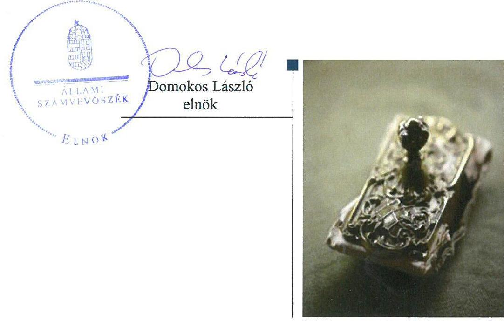
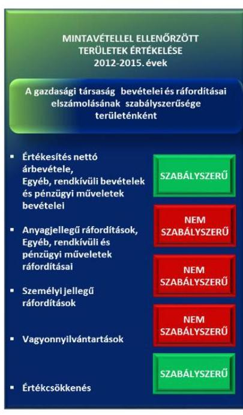
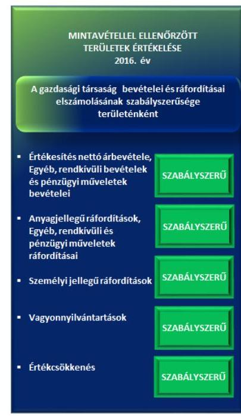

# Jelentés 

## Az állami tulajdonú gazdasági társaságok

Az állami tulajdonban (résztulajdonban) lévő gazdálkodó szervezetek vagyonmegőrzési és gazdálkodási tevékenységének ellenőrzése ExVÁ Robbanásbiztos Berendezések Vizsgáló Állomása Kft.
2018.

---

# Jelentés 

## Az állami tulajdonú gazdasági társaságok

Az állami tulajdonban (résztulajdonban) lévő gazdálkodó szervezetek vagyonmegőrzési és gazdálkodási tevékenységének ellenőrzése ExVÁ Robbanásbiztos Berendezések Vizsgáló Állomása Kft.
2018. 04. hó 20. nap

---

# AZ ELLENŐRZÉST FELÜGYELTE:

- PETŐ KRISZTINA felügyeleti vezető
- AZ ELLENŐRZÉST VEZETTE ÉS A VÉGREHAJTÁSÁÉRT FELELŐS:
  - SALI SÁNDORNÉ ellenőrzésvezető
  - A PROGRAM ÖSSZEÁLLÍTÁSÁÉRT FELELŐS:
    - TÓTPÁL SZABOLCS osztályvezető

**IKTATÓSZÁM:** EL-0589-005/2018.

**TÉMASZÁM:** 2084

**ELLENŐRZÉS-AZONOSÍTÓ SZÁM:** V075959

Jelentéseink az Országgyűlés számítógépes hálózatán és az Interneten a www.asz.hu címen is olvashatóak.

---

# TARTALOMJEGYZÉK 

■ ÖSSZEGZÉS ..... 5
■ AZ ELLENŐRZÉS CÉLJA ..... 7
■ AZ ELLENŐRZÉS TERÜLETE ..... 8
■ AZ ELLENŐRZÉS HÁTTERE, INDOKOLTSÁGA ..... 10
■ A JELENTÉS LÉNYEGES KÉRDÉSKÖREI ..... 11
■ ELLENŐRZÉS HATÓKÖRE ÉS MÓDSZEREI ..... 12
■ MEGÁLLAPÍTÁSOK ..... 14
■ JAVASLATOK ..... 18
■ MELLÉKLETEK ..... 19
I. sz. melléklet: Értelmező szótár ..... 19
■ FÜGGELÉK: ÉSZREVÉTELEK ..... 21
■ RÖVIDÍTÉSEK JEGYZÉKE ..... 23

---

.

---

# ÖSSZEGZÉS 

Az ExVÁ Robbanásbiztos Berendezések Vizsgáló Állomása Kft. felett a Magyar Nemzeti Vagyonkezelő Zrt. a tulajdonosi jogokat szabályosan gyakorolta. A Társaság működésének szabályozottsága helyreállt. A vagyongazdálkodás nem volt szabályszerű, a vagyon védelme nem volt biztosított. A Társaságnál a pénzügyi-számviteli feladatok ellátása a 2012-2015. években nem volt szabályszerű, a 2016. évben a leltár kivételével szabályszerű volt. Az adatszolgáltatási és ellenőrzési feladatok ellátása megfelelt a jogszabályi előírásoknak.

## Az ellenőrzés társadalmi indokoltsága

Az állami tulajdonú gazdálkodó szervezetek a nemzeti vagyon részét képezik. Az állami vagyonnal való gazdálkodást illetően a tulajdonosi joggyakorlás és a vagyongazdálkodás feladata az állami vagyon átlátható, rendeltetésszerű és felelős felhasználásának biztosítása. Az állam meghatározza az ellátandó feladatokat, amelyhez a vagyonnal kapcsolatos döntéseknek igazodniuk kell. Az Állami Számvevőszék ellenőrzésével egy, az általa korábban nem ellenőrzött szervezetek körébe tartozó állami tulajdonban lévő gazdasági társaság vagyonmegőrzési és gazdálkodási tevékenységének ellenőrzését végezte el. A számvevőszéki ellenőrzés hozzájárul a közpénzek szabályos, átlátható, elszámoltatható és eredményes felhasználásához, a rend pedig értéket teremt. Minden közpénzt, közvagyont használó szervezettel szemben társadalmi igény, hogy tevékenységükről elszámoljanak.

Az Állami Számvevőszék az ExVÁ Robbanásbiztos Berendezések Vizsgáló Állomása Kft.-t első alkalommal ellenőrizte. A termékbiztonságról szóló 2014/34/EU és a munkavállalói biztonságról szóló 1999/92/EK EU irányelvek fektetik le azokat a potenciálisan robbanásveszélyes légkörök biztonságára vonatkozó alapvető egészségügyi és munkabiztonsági előírásokat, amelyek betartása az Európai Unió valamennyi országában, ennek megfelelően Magyarországon is kötelező. Az irányelvekben foglaltak érvényesülését a műszaki termékek megfelelőségi vizsgálatának állami feladatát az ellenőrzésére és tanúsítására kijelölt, nemzetgazdasági szempontból kiemelt jelentőségű nemzeti vagyonba tartozó ExVÁ Robbanásbiztos Berendezések Vizsgáló Állomása Kft. jogosult biztosítani, kijelölés alapján. Ezt figyelembe véve és az Állami Számvevőszék Stratégiájával összhangban került sor az ExVÁ Robbanásbiztos Berendezések Vizsgáló Állomása Kft. ellenőrzésére a 2012-2016. évek vonatkozásában.

## Főbb megállapítások, következtetések, javaslatok

A Magyar Nemzeti Vagyonkezelő Zrt. tulajdonosi joggyakorlása szabályszerű volt. Ennek keretében megtörtént a Társaság üzleti terveinek jóváhagyása, a számviteli beszámolók jogszabályi előírások betartásával történő elfogadása, valamint a javadalmazási, juttatási rendszerről szóló szabályzat megalkotása.

Az ExVÁ Robbanásbiztos Berendezések Vizsgáló Állomása Kft. működésének szabályozottsága javult, 2014. május 31-ig nem felelt meg az előírásoknak, ezt követően a szabályzatokat a jogszabályi előírásoknak megfelelően elkészítette.

A Társaság vagyongazdálkodása nem volt szabályszerű. A 2012-2016. évek egyszerűsített éves beszámoló mérlegeit alátámasztó leltára nem felelt meg a jogszabályi előírásnak. A Társaság a legalább háromévente előírt mennyiségi felvétellel történő leltározást a 2014-2016. években nem végezte el. A Társaság a vagyongazdálkodás feltételeit, szabályait és a döntési hatásköröket előírás szerint kialakította, a vagyon értékét megőrizte. A vagyonváltozást eredményező döntések 2015. július 15-ig nem voltak szabályszerűek, mert az üzleti tervben nem szereplő beszerzések esetében az alapító kizárólagos hatáskörébe tartozó döntések nélkül jártak el, ezt követően szabályszerűek voltak. A pénzügyi-számviteli feladatok ellátása 2012-2015. években nem volt szabályszerű, ezt követően a 2016. évben a mérleget alátámasztó leltár kivételével szabályszerű volt. Az adatszolgáltatási és ellenőrzési feladatok ellátása megfelelt a jogszabályi előírásoknak. A Társaság az adatszolgáltatási kötelezettségét negyedévente az Alapító okirat és a

---

tulajdonosi joggyakorló előírásának megfelelő gyakorisággal és tartalommal teljesítette. Tulajdonosi ellenőrzés keretében a tulajdonosi joggyakorló az alapítói határozatok végrehajtását, valamint a felügyelő bizottság tevékenységét értékelte. A Társaság felügyelő bizottsága az alapítói határozatok végrehajtására vonatkozóan végzett ellenőrzést. Az ellenőrzések javaslatot nem fogalmaztak meg.

A megállapítások alapján az ÁSZ az ExVá Robbanásbiztos Berendezések Vizsgáló Állomása Kft. ügyvezetőjének egy javaslatot fogalmazott meg, amelyre 30 napon belül intézkedési tervet kell készítenie.

---

# AZ ELLENŐRZÉS CÉLJA 

Az ellenőrzés célja annak értékelése volt, hogy a tulajdonosi jogok gyakorlása szabályszerű volt-e, a gazdálkodó szervezet szabályozottsága, gazdálkodása és vagyongazdálkodási tevékenysége megfelelt-e a jogszabályi és a tulajdonosi előírásoknak, a gazdálkodó szervezetnél a pénz-ügyi-számviteli, adatszolgáltatási és ellenőrzési feladatok ellátása szabályszerű volt-e, továbbá a vagyonváltozást eredményező döntések esetében a tulajdonosi jogok gyakorlója és a gazdálkodó szervezet szabályszerűen jártak-e el.

---

# AZ ELLENŐRZÉS TERÜLETE

## Az ExVÁ Robbanásbiztos Berendezések Vizsgáló Állomása Kft.

Az ExVÁ Robbanásbiztos Berendezések Vizsgáló Állomása Kft. a Magyar Állam által 1994-ben alapított egyszemélyes állami tulajdonú gazdasági társaság. A Társaság részesedése feletti tulajdonosi jogokat az állami vagyon felügyeletéért felelős miniszter 2013. június 28-áig a Magyar Nemzeti Vagyonkezelő Zrt. útján, ezt követően közvetlenül a Magyar Nemzeti Vagyonkezelő Zrt. gyakorolta.

Az ExVÁ Kft.¹ fő tevékenységi köre műszaki vizsgálat, elemzés, azon belül a robbanásbiztos berendezések vizsgálata és tanúsítása volt, továbbá a potenciálisan robbanásveszélyes területen történő létesítés felülvizsgálata során szolgáltatás jellegű tevékenységet folytatott. A Társaság a nemzeti vagyonról szóló 2011. évi CXCVI. törvény 2. sz. melléklete alapján nemzetgazdasági szempontból kiemelt jelentőségű nemzeti vagyonba tartozott.

Az ExVÁ Kft. a műszaki termékek megfelelőségének vizsgálatára, ellenőrzésére és tanúsítására a 15/2003. GKM közleményben, a 065/2003. kijelölési okirattal, valamint 2016. szeptember 27. napjától a Magyar Kereskedelmi Engedélyezési Hivatalnak a kijelölt szervezetek közzétételéről szóló MKEH-58 sz. közleménye alapján került kijelölésre. A Társaság alapvetően a 8/2002. (II. 16.) GM² és 35/2016. (IX. 27.) NGM³ rendeletek alapján végezte a tevékenységét.

A Társaság kijelölés alapján állami feladatot, közfeladatot látott el, közszolgáltatást nem végzett, nem rendelkezett vagyonkezelésbe vett állami vagyonnal, és nem volt részesedése más gazdasági társaságban. A 8kr.⁴ hatálya alá nem tartozott.

A Társaság a 2012-2014. években veszteséget, a 2015. és a 2016. években nyereséget realizált, a jegyzett tőkéje 58,1 M Ft volt a teljes ellenőrzött időszakban.

Az ügyvezető személye az ellenőrzött időszakban egyszer, a 2014. évben változott. A Társaság jogszabályi előírás alapján könyvvizsgálatra nem volt kötelezett, ugyanakkor az Alapító előírta számára. A könyvvizsgáló társaság, valamint a kijelölt könyvvizsgáló személye 2013. és 2016. években változott.

Az átlagos statisztikai létszám 2012. évben 12 fő, a 2016. évben 9 fő volt.

---

A Társaság gazdálkodására jellemző főbb gazdálkodási adatokat az 1. táblázat tartalmazza.
1. táblázat

A TÁRSASÁG FŐBB GAZDÁLKODÁSI ADATAI (M FT)

| Mégnevezés | 2012.01 .01 | 2012.12 .31 | 2013.12 .31 | 2014.12 .31 | 2015.12 .31 | 2016.12 .31 |
| :-- | --: | --: | --: | --: | --: | --: |
| Értékesítés nettó árbevétele* | 138,0 | 110,3 | 90,5 | 77,2 | 114,2 | 125,6 |
| Mérlegfőösszeg | 153,0 | 139,1 | 114,3 | 112,6 | 151,1 | 186,8 |
| Befektetett eszközök | 38,8 | 45,6 | 42,1 | 47,0 | 74,6 | 71,9 |
| Pénzeszközök | 69,0 | 55,9 | 44,7 | 61,5 | 65,8 | 100,0 |
| Saját tőke összege | 129,1 | 118,7 | 99,4 | 91,2 | 119,0 | 147,2 |
| Mérleg szerinti eredmény (2012-2015.) | 5,9 | $-10,4$ | $-19,3$ | $-8,2$ | 27,8 | - |
| Adózott eredmény (2016.) | 5,9 | $-10,4$ | $-19,3$ | $-8,2$ | 27,8 | 28,2 |
| Követelések | 43,0 | 30,9 | 22,6 | 2,0 | 9,9 | 6,9 |
| Kötelezettségek | 19,4 | 17,1 | 14,5 | 21,1 | 31,5 | 39,2 |
| Foglalkoztatottak száma (fő) | 12 | 12 | 11 | 10 | 8 | 9 |

* A 2012. jan. 1. oszlopban a 2011. december 31-ei adat szerepel.

---

# AZ ELLENŐRZÉS HÁTTERE, INDOKOLTSÁGA 

Az ÁSZ ${ }^{5}$ alapvető célkitűzése, hogy az államháztartáson kívülre nyújtott költségvetési támogatások és ingyenes vagyonjuttatások ellenőrzésével hozzájáruljon ahhoz, hogy a közpénzeket az államháztartáson kívül működő szervezetek is átlátható, rendezett módon használják fel.

Az ellenőrzés feladata a közvagyonnal biztosított feladatellátással kapcsolatban a közpénzek átláthatósága, nyilvánossága érdekében a jogszabályokban, belső szabályzatokban megfogalmazott előírások érvényesülésének az állami tulajdonban lévő gazdálkodó szervezetek vagyonérték megőrzési és gazdálkodási tevékenységének értékelése.

Az ellenőrzés várható hasznosulásaként az ellenőrzés megállapításai a jogalkotás számára támogatást nyújthatnak a közvagyonnal való gazdálkodás értékeléséhez, jogszabályi keretei pontosításához, az átláthatóságot biztosító szabályozáshoz. Az ellenőrzöttek számára visszajelzést ad a vagyongazdálkodási tevékenységgel, beszámolással kapcsolatos szabálytalanságokról és kockázatokról. Az ellenőrzés tapasztalatai segítik és erősítik az ÁSZ hozzáadott értéket teremtő elemző tevékenységét és tanácsadó szerepét.

---

# A JELENTÉS LÉNYEGES KÉRDÉSKÖREI 

1. A tulajdonosi jogok gyakorlása szabályszerű volt-e?
2. A Társaság működésének szabályozottsága megfelelt-e az előírásoknak?
3. A Társaság vagyongazdálkodása, a pénzügyi-számviteli, adatszolgáltatási és ellenőrzési feladatok ellátása szabályszerű volt-e?

---

# ELLENŐRZÉS HATÓKÖRE ÉS MÓDSZEREI 

## Az ellenőrzés típusa

Megfelelőségi ellenőrzés.

## Az ellenőrzött időszak

2012. január 1-jétől 2016. december 31-ig.

## Az ellenőrzés tárgya

Az állami tulajdonban lévő gazdasági társaság gazdálkodása, kiemelten vagyongazdálkodási tevékenysége, valamint a tulajdonosi jogok gyakorlása.

## Az ellenőrzött szervezet

Az ExVÁ Robbanásbiztos Berendezések Vizsgáló Állomása Kft., valamint a Magyar Nemzeti Vagyonkezelő Zrt., mint a Társaság feletti tulajdonosi joggyakorló.

## Az ellenőrzés jogalapja

Az Állami Számvevőszékről szóló 2011. évi LXVI. törvény 5. § (3)-(5) bekezdései.

## Az ellenőrzés módszerei

Az ellenőrzést a nemzetközi standardokat irányadónak tekintve az ellenőrzési program ellenőrzési kérdései, az ellenőrzött időszakban hatályos jogszabályok, az ellenőrzés szakmai szabályok és módszertanok figyelembe vételével végeztük.

Az ellenőrzési kérdések megválaszolásához szükséges bizonyítékok megszerzése az ellenőrzött által rendelkezésre bocsátott dokumentumokra, adatokra alapozva kérdésfelvetés, mintavételezés, ellenőrzési eljárások útján történt.

Az ellenőrzési bizonyítékként felhasználható adatforrások közé tartoztak egyrészt a szakmai program részletes szempontjainál felsorolt adatforrások, másrészt minden egyéb - az ellenőrzés folyamán feltárt, az ellenőrzés szempontjából információkat tartalmazó - dokumentum.

---

Az ellenőrzés lefolytatásához a gazdálkodó szervezet a tanúsítványok elektronikus kitöltésével, valamint az ÁSZ által kért dokumentumok megküldésével szolgáltatott adatokat.

A bevételek és ráfordítások elszámolása, valamint a vagyonnyilvántartás terén a szabályszerű működést véletlen mintavétellel és irányított kiválasztással ellenőriztük. A mintatételek értékelése alapján egyrészt a sokaságban előforduló hibás tételek arányát becsültük, másrészt az irányítottan kiválasztott tételeket értékeltük. Külön értékeltük a 2012-2015 közötti időszakot és a 2016. évet. A jogszabályoknak és a belső előírásoknak megfelelőnek, azaz szabályszerűnek tekintettük az adott területet, amennyiben a minta

 ellenőrzésének eredménye alapján 95%-os bizonyossággal a teljes sokaságban a hibaarány kisebb volt, mint 10%, nem szabályszerűnek értékeltük, ha a hibaarány a 10%-ot meghaladta. A ráfordítások elszámolására és a vagyonnyilvántartásra vonatkozó véletlen mintavételt kockázati alapú kiválasztással egészítettük ki, amelynek során évente a három legnagyobb összegű tételt választottuk ki.

---

# 1. A tulajdonosi jogok gyakorlása szabályszerű volt-e? 

Összegző megállapítás

A Társaság felett a tulajdonosi joggyakorlás szabályszerű volt.

A TULAJDONOSI JOGGYAKORLÁS szabályait a tulajdonosi joggyakorló az ExVÁ Kft. részére az Alapító okirat ${ }_{1-8}$-ban ${ }^{6}$ - a Gt. ${ }^{7}$, a Ptk. ${ }^{8}$, valamint az MNV Zrt. ${ }^{9}$ SZMSZ $1-7^{10}$ előírásaival összhangban - meghatározta. Az Alapító okirat ${ }_{1-8}$-ban döntött a Társaság ügyvezetője, az $\mathrm{FB}^{11}$ tagok és a könyvvizsgáló kijelöléséről. Az FB szabályszerűen működött. Tagjainak számát az Alapító okirat ${ }_{1-8}$-ban a Taktv. ${ }^{12}$ előírásával összhangban három főben határozták meg. Az MNV Zrt. Igazgatósága az ExVÁ Kft. Javadalmazási szabályzat ${ }_{1-3}$-at ${ }^{13}$ a Taktv. előírásainak megfelelően megalkotta.

A BESZÁMOLTATÁSI RENDSZER - a Vtv. ${ }^{14}$ követelményeinek megfelelő monitoring rendszer - keretében a tulajdonosi joggyakorló negyedévente beszámoltatta az ügyvezetőt az üzleti terv teljesítéséről. Az FB az Alapító okirat ${ }_{1-8}$-ban foglaltaknak megfelelően negyedévente beszámoltatta az ügyvezetőt a Társaság vagyoni és üzletpolitikai helyzetéről. A Társaság éves számviteli beszámolóit a tulajdonosi joggyakorló - az FB előzetes írásbeli véleményezését követően - a Gt.-ben, illetve a Ptk.-ban előírtaknak megfelelően fogadta el. A társaság az Alapító okirat ${ }_{1-8}$ alapján könyvvizsgálatra volt kötelezett, a könyvvizsgálói jelentések a minősítő záradékkal együtt szabályszerűen elkészültek.

AZ ÜZLETI TERVEKET az FB támogató javaslatával a tulajdonosi joggyakorló a 2012-2016. évekre jóváhagyta. A tulajdonosi joggyakorló a Társaság üzleti tervének kidolgozását az Alapító okirat ${ }_{1-8}$ alapján a mindenkori ügyvezető számára a munkaszerződéseikben írta elő, és az üzleti tervvel kapcsolatos elvárásokat, célokat az éves tervezési irányelvekben határozta meg.

A döntési hatáskörhöz, valamint a beruházási kerethez kapcsolódóan a tulajdonosi joggyakorló az Alapító okirat ${ }_{1-8}$-ban foglalt követelmények betartását számon kérte.

## 2. A Társaság működésének szabályozottsága megfelelt-e az előírásoknak?

Összegző megállapítás

A Társaság működésének szabályozottsága 2014. május 31-ig nem felelt meg, ezt követően megfelelt az előírásoknak.

A SZÁMVITELI POLITIKA ${ }^{15}{ }_{1-2}$ 2014. május 31-ig nem felelt meg a Számv. tv.-ben ${ }^{16}$ foglalt előírásoknak, ezt követően hatályos számviteli politika ${ }_{2-4}$ megfelelt a jogszabályban előírtaknak. A számviteli politika

---

keretében szabályszerűen elkészítették az eszközök és források értékelési szabályzatát ${ }^{17}$.

# LELTÁROZÁSI SZABÁLYZATTAL ${ }^{18}$, VALAMINT PÉNZKEZELÉSI SZABÁLYZATTAL ${ }^{19}$ a Társaság 2012. január 1. és 2014. május 31. között nem rendelkezett, ezáltal nem tett eleget a Számv. tv. 14. § (5) a) és d) pontjai szerinti szabályzatalkotási kötelezettségének. A Társaság 2014. június 1-jétől megalkotta az előírásnak megfelelően a Leltározási szabályzatát, valamint a Pénzkezelési szabályzatát.

SZÁMLARENDDEL ${ }^{20}$ a Társaság az ellenőrzött időszakban rendelkezett, amely a Számv. tv. 161. § előírásainak megfelelt.

A Társaság 2015. július 15-től rendelkezett az Alapító által jóváhagyott SZMSZ ${ }^{21}$-szel.

## 3. A Társaság vagyongazdálkodása, a pénzügyi-számviteli, adatszolgáltatási és ellenőrzési feladatok ellátása szabályszerű volt-e?

| Összegző megállapítás | A Társaság vagyongazdálkodása a leltározás hiányosságai miatt nem felelt meg a jogszabályi előírásoknak. A pénzügyi-számviteli feladatok ellátása 2012-2015. években nem volt szabályszerű, a 2016. évben a leltár kivételével szabályszerű volt. Az adatszolgáltatási és ellenőrzési feladatok ellátása szabályos volt. |
| :--: | :--: |

A VAGYONGAZDÁLKODÁS feltételeit szabályszerűen kialakították. A kapcsolódó feladat- és hatásköröket és felelősségi viszonyokat az Alapító okirat ${ }_{1-8}$, az ügyvezető megbízási szerződése, és a belső szabályzatok rögzítették. A Társaság éves üzleti tervei megfeleltek a tulajdonosi joggyakorló által meghatározott elvárásoknak. A vagyon értékének, állagának megőrzéséről a Társaság gondoskodott. A Társaság vagyona 2012. évről 2016. évre 22,1%-kal növekedett a tevékenység eredményének hatására.

A VAGYONNYILVÁNTARTÁS biztosította a Társaság vagyonának a Számv. tv., és a belső szabályozás előírásainak megfelelő nyilvántartását, a változások folyamatos nyomon követését. A tárgyi eszközök nyilvántartásba vétele a 2012-2015. években nem volt szabályszerű, mert a vagyonváltozást eredményező döntéseknél 2012-2015. július 15-ig a beszerzésekre és befektetésekre vonatkozóan az üzleti tervben nem szereplő ügyletek esetében az Alapító okirat ${ }_{1-6}$ 1.4. pontjában előírt, az alapító kizárólagos hatáskörébe tartozó döntések nélkül jártak el. A 2016. évben a beszerzések az előírt hatáskörben történtek. A vagyontárgyak értékesítésekor a döntések meghozatala az Alapító okirat ${ }_{1-8}$-ban előírtak szerint történt. A 2016. évben az eszközök nyilvántartásba vétele szabályszerű volt.

A LELTÁR, valamint a leltározás a 2012-2016. években nem felelt meg a Számv. tv. 69. § (1) és (3) bekezdésében és a Leltározási szabályzatban

---

1. ábra

2. ábra

foglaltaknak. A 2012-2016. évek egyszerűsített éves beszámoló mérlegeihez kapcsolódóan elkészített leltár nem volt szabályszerű, a mérleg valamennyi sorát leltárral nem támasztották alá a Számv. tv. 69. § (1) bekezdésében foglaltak ellenére. A 2014. évben kiadott Leltározási szabályzat részét képező 2014. évi leltározási utasítás előírta a tárgyi eszközök leltározását, amely leltározást nem végeztek el. A Társaság ügyvezetője a Számv. tv. 69. § (3) bekezdésében előírt legalább háromévente mennyiségi felvétellel történő leltározást a 2014-2016. évek egyikében sem végezte el. A könyvvizsgálók ennek ellenére minden évben korlátozás nélküli hitelesítő záradékkal látták el az éves beszámolókat.

A BEVÉTELEK ELSZÁMOLÁSA megfelelt a jogszabályi előírásoknak. Az értékesítés nettó árbevétele, az egyéb, a rendkívüli és a pénzügyi műveletek bevételének az elszámolása megfelelt a Számv. tv.-ben és a belső szabályozásban, megállapodásban, szerződésben előírtaknak.

A mintavétellel ellenőrzött területek értékelését a 2012-2015. években az 1. ábra, a 2016. évre a 2. ábra mutatja.

A RÁFORDÍTÁSOK ELSZÁMOLÁSA a 2012-2015. években nem volt szabályszerű, mert a gazdasági eseményeket nem támasztották alá a Számv. tv. 165. § (1)-(2) bekezdéseiben foglaltak szerinti számviteli bizonylattal. A 2016. évben a ráfordítások elszámolása megfelelt a jogszabályi és belső szabályozásban foglalt előírásoknak.

## A SZEMÉLYI JELLEGŰ RÁFORDÍTÁSOK ELSZÁ-

MOLÁSA a 2012-2015. években nem volt szabályszerű, mert a Számv. tv. 165. § (1)-(2) bekezdései ellenére a napidíjaknál az elszámolást, a kifizetés jogosságát nem támasztotta alá bizonylat. A 2016. évben a személyi jellegű ráfordítások elszámolása szabályszerű volt.

AZ ÉRTÉKCSÖKKENÉS ELSZÁMOLÁSA megfelelt a Számv. tv. 52. §-ában foglalt előírásoknak.

A Társaság önköltségszámításra nem volt kötelezett. A saját előállítású termékek és szolgáltatások árait, díjait a piaci viszonyoknak megfelelően alakította ki és egyedi kalkulációkkal támasztotta alá.

A BESZÁMOLÁSI KÖTELEZETTSÉGÉT a Társaság a jogszabályi előírásoknak és belső szabályozásnak megfelelően teljesítette. A könyvvizsgáló az éves beszámolókat hitelesítő záradékkal látta el. A Társaság az éves beszámolókat a Számv. tv. szerint letétbe helyezte és közzétette.

AZ ADATSZOLGÁLTATÁSI KÖTELEZETTSÉGÉT az ExVÁ Kft. negyedévente az Alapító okirat és a tulajdonosi joggyakorló előírásának megfelelő gyakorisággal és tartalommal teljesítette. A Társaság ügyvezetője szabályszerűen közzétette a Taktv.-ben előírt adatokat, információkat és dokumentumokat.

TULAJDONOSI ELLENŐRZÉS keretében a tulajdonosi joggyakorló az alapítói határozatok végrehajtását, valamint a felügyelő bizott-

---

ság tevékenységét értékelte. A Társaság felügyelő bizottsága az alapítói határozatok végrehajtására vonatkozóan végzett ellenőrzést. Az ellenőrzésekről készült dokumentumokban intézkedést igénylő megállapítást, javaslatot nem tettek.

---

# JAVASLATOK 

Az ÁSZ tv. 33. § (1) bekezdésében foglaltak értelmében az ellenőrzött szervezet vezetője köteles a jelentésben foglalt megállapításokhoz kapcsolódó intézkedési tervet összeállítani és azt a jelentés kézhezvételétől számított 30 napon belül az ÁSZ részére megküldeni. Amennyiben az ellenőrzött szervezet vezetője nem küldi meg határidőben az intézkedési tervet, vagy továbbra sem elfogadható intézkedési tervet küld, az Állami Számvevőszék elnöke az ÁSZ tv. 33. § (3) bekezdése a) és b) pontjaiban foglaltakat érvényesítheti.

## Az ExVá Robbanásbiztos Berendezések Vizsgáló Állomása Kft. ügyvezetőjének

1. Intézkedjen a jogszabályi és belső előírásoknak megfelelő leltározás lebonyolítása, és a jogszabályi előírásnak megfelelő leltár összeállítása iránt.
(3. összegző megállapítás 3. bekezdése alapján)

---

# MELLÉKLETEK 

- I. SZ. MELLÉKLET: ÉRTELMEZŐ SZÓTÁR
állami vagyon
gazdasági társaság

MNV Zrt.
tulajdonosi jogok gyakorlója
a) Az állam tulajdonában lévő dolog, valamint a dolog módjára hasznosítható természeti erő,
b) az a) pont hatálya alá nem tartozó mindazon vagyon, amely vonatkozásában törvény az állam kizárólagos tulajdonjogát nevesíti,
c) az állam tulajdonában lévő tagsági jogviszonyt megtestesítő értékpapír, illetve az államot megillető egyéb társasági részesedés,
d) az államot megillető olyan immateriális, vagyoni értékkel rendelkező jogosultság, amelyet jogszabály vagyoni értékű jogként nevesít.
Forrás: Vtv. 1. § (2) bekezdése
2012. november 10-től az állami vagyon fogalma kiegészült a következő ponttal:
e) az állam tulajdonában lévő pénzügyi eszközök
Forrás: Vtv. 1. § (2) bekezdése
A Ptk. 3:88. § (1) bekezdése szerint „a gazdasági társaságok üzletszerű közös gazdasági tevékenység folytatására, a tagok vagyoni hozzájárulásával létrehozott, jogi személyiséggel rendelkező vállalkozások, amelyekben a tagok a nyereségből közösen részesednek, és a veszteséget közösen viselik".
Az állami vagyon felett, a Magyar Államot megillető tulajdonosi jogok és kötelezettségek összességét - a hatályos szabályozás szerint - az állami vagyon felügyeletéért felelős miniszter (jelenleg a nemzeti fejlesztési miniszter) gyakorolja. A miniszter feladatát nagy részben az MNV Zrt., mint tulajdonosi joggyakorló szervezet útján látja el.
2013. június 27-ig:

Az állami vagyon felett a Magyar Államot megillető tulajdonosi jogok és kötelezettségek összességét - ha törvény eltérően nem rendelkezik - az állami vagyon felügyeletéért felelős miniszter (a továbbiakban: miniszter) gyakorolja, aki e feladatát a Magyar Nemzeti Vagyonkezelő Zártkörűen Működő Részvénytársaság (a továbbiakban: MNV Zrt.), a Magyar Fejlesztési Bank, illetve a tulajdonosi joggyakorló szervezet útján látja el.
Forrás: Vtv. 3. § (1) bekezdése
2013. június 28-ától:

A rábízott állami vagyon felett az államot megillető tulajdonosi jogok és kötelezettségek összességét tulajdonosi joggyakorlóként:
a) ha törvény vagy miniszteri rendelet eltérően nem rendelkezik, a Magyar Nemzeti Vagyonkezelő Zártkörűen Működő Részvénytársaság (a továbbiakban: MNV Zrt.),
b) törvényben kijelölt személy vagy
c) az állami vagyon felügyeletéért felelős miniszter (a továbbiakban: miniszter) által rendeletben kijelölt személy gyakorolja.
Forrás: Vtv. 3. § (1) bekezdése

---

.

---

# FÜGGELÉK: ÉSZREVÉTELEK 

A jelentéstervezetet a Számvevőszék 15 napos észrevételezésre megküldte az ellenőrzött szervezetek vezetőinek az ÁSZ tv. 29. § ${ }^{\dagger}$ (1) bekezdése előírásának megfelelően.
Az ellenőrzött szervezetek vezetői az ÁSZ tv. 29. § (2) bekezdésében foglalt észrevételezési jogukkal nem éltek.

[^0]
[^0]:    ${ }^{+}$29. § (1) Az Állami Számvevőszék az ellenőrzési megállapításait megküldi az ellenőrzött szervezet vezetőjének vagy az általa megbízott személynek, és annak, akinek személyes felelősségét állapította meg.
    (2) Az ellenőrzött szervezet vezetője és a felelősként megjelölt személy az ellenőrzés megállapításaira tizenöt napon belül írásban észrevételt tehet.
    (3) Az Állami Számvevőszék az észrevételre a beérkezésétől számított harminc napon belül írásban válaszol. A figyelembe nem vett észrevételeket köteles a jelentésben feltüntetni, és megindokolni, hogy azokat miért nem fogadta el.

---

.

---

# RÖVIDÍTÉSEK JEGYZÉKE 

${ }^{1}$ ExVÁ Kft./Társaság
${ }^{2}$ 8/2002 (II.16.) GM rendelet
${ }^{3}$ 35/2016. (IX. 27.) NGM rendelet
${
 }^{4}$ Bkr.
${ }^{5}$ ÁSZ
${ }^{6}$ Alapító okirat ${ }_{1-8}$

ExVÁ Robbanásbiztos Berendezések Vizsgáló Állomása Korlátolt Felelősségű Társaság
a potenciálisan robbanásveszélyes környezetben történő alkalmazásra szánt berendezések, védelmi rendszerek vizsgálatáról és tanúsításáról szóló 8/2002. (II. 16.) GM rendelet (hatályos: 2003. június 30-tól 2016. október 11-ig)
a potenciálisan robbanásveszélyes környezetben történő alkalmazásra szánt berendezések és védelmi rendszerek vizsgálatáról és tanúsításáról szóló 35/2016. (IX. 27.) NGM rendelet (hatályos: 2016. október 12-től)
a költségvetési szervek belső kontrollrendszeréről és belső ellenőrzéséről szóló 370/2011. (XII. 31.) Korm. rendelet
Állami Számvevőszék
ExVÁ Kft. többször módosított Alapító okirata
Alapító okirat ${ }_{1}$ Hatályos: 2011. 05. 30-tól 2012. 05. 28-ig
Alapító okirat ${ }_{2}$ Hatályos: 2012. 05. 29-től 2012. 08. 26-ig
Alapító okirat ${ }_{3}$ Hatályos: 2012. 08. 27-től 2013. 05. 05-ig
Alapító okirat ${ }_{4}$ Hatályos: 2013. 05. 06-tól 2013. 08. 08-ig
Alapító okirat ${ }_{5}$ Hatályos: 2013. 08. 09-től 2014. 05. 28-ig
Alapító okirat ${ }_{6}$ Hatályos: 2014. 05. 29-től 2015. 07. 14-ig
Alapító okirat ${ }_{7}$ Hatályos: 2015. 07. 15-től 2016. 06. 25-ig
Alapító okirat ${ }_{8}$ Hatályos: 2016. 06. 26-tól
2006. évi IV. törvény a gazdasági társaságokról (hatálytalan: 2014. március 15-től)
2013. évi V. törvény a Polgári Törvénykönyvről (hatályos: 2014. március 15-től) Magyar Nemzeti Vagyonkezelő Zártkörűen Működő Részvénytársaság Az MNV Zrt. szervezeti és működési szabályzata
SZMSZ ${ }_{1}$ Hatályos: 2011. 05. 30-tól 2012. 04. 22-ig
SZMSZ ${ }_{2}$ Hatályos: 2012. 04. 23-tól 2012. 10. 07-ig
SZMSZ ${ }_{3}$ Hatályos: 2012. 10. 08-tól 2013. 03. 15-ig
SZMSZ ${ }_{4}$ Hatályos: 2013. 03. 16-tól 2013. 04. 24-ig
SZMSZ ${ }_{5}$ Hatályos: 2013. 04. 25-től 2013. 06. 31-ig
SZMSZ ${ }_{6}$ Hatályos: 2013. 07. 01-től 2016. 04. 14-ig
SZMSZ ${ }_{7}$ Hatályos: 2016. 04. 15-től
ExVÁ Kft. Felügyelő Bizottsága
a köztulajdonban álló gazdasági társaságok takarékosabb működéséről szóló 2009. évi CXXII. törvény (hatályos: 2009. december 4-től)

ExVÁ Robbanásbiztos Berendezések Vizsgáló Állomása Kft. Javadalmazási szabályzat ${ }_{1}$ (hatályos: 2012. május 29-től 2013. május 5-ig)
ExVÁ Robbanásbiztos Berendezések Vizsgáló Állomása Kft. Javadalmazási szabályzat ${ }_{2}$ (hatályos: 2013. május 6-tól 2016. február 24-ig)
ExVÁ Robbanásbiztos Berendezések Vizsgáló Állomása Kft. Javadalmazási szabályzat ${ }_{3}$ (hatályos: 2016. február 25-től)
az állami vagyonról szóló 2007. évi CVI. törvény

---

${ }^{15}$ Számviteli politika $_{3-4}$
${ }^{16}$ Számv. tv.
${ }^{17}$ Eszközök és források értékelési szabályzata
${ }^{18}$ Leltározási szabályzat
${ }^{19}$ Pénzkezelési szabályzat
${ }^{20}$ Számlarend
${ }^{21}$ SZMSZ

ExVÁ Robbanásbiztos Berendezések Vizsgáló Állomása Kft. Számviteli politika (hatályos: 2012. január 1-jétől 2012. december 31-ig)
ExVÁ Robbanásbiztos Berendezések Vizsgáló Állomása Kft. Számviteli politika (hatályos: 2013. január 1-jétől 2014. december 31-ig)
ExVÁ Robbanásbiztos Berendezések Vizsgáló Állomása Kft. Számviteli politika (hatályos: 2015. január 1-jétől 2015. december 31-ig)
ExVÁ Robbanásbiztos Berendezések Vizsgáló Állomása Kft. Számviteli politika (hatályos: 2016. január 1-jétől)
a számvitelről szóló 2000. évi C. törvény
ExVÁ Robbanásbiztos Berendezések Vizsgáló Állomása Kft. Az eszközök és források értékelési szabályzata (hatályos: 2013. január 1-jétől)
ExVÁ Robbanásbiztos Berendezések Vizsgáló Állomása Kft. Leltározási szabályzata (hatályos: 2014. június 1-jétől)
ExVÁ Robbanásbiztos Berendezések Vizsgáló Állomása Kft. Pénzkezelési szabályzata (hatályos: 2014. június 1-jétől)
ExVÁ Robbanásbiztos Berendezések Vizsgáló Állomása Kft. Számlarendje (hatályos: 2012. január 1-jétől)
ExVÁ Robbanásbiztos Berendezések Vizsgáló Állomása Kft. Szervezeti és Működési Szabályzata (érvényes és hatályos: 2015. július 15-től)

---

# ÁLLAMI SZÁMVEVŐSZÉK 

1052 Budapest, Apáczai Csere János utca 10.
Levélcím: 1364 Budapest 4. Pf. 54
Telefon: +36 14849100 Telefax: +36 14849200
www.asz.hu
