# Jelentés 

## Az állami tulajdonú gazdasági társaságok

Az állami tulajdonban (résztulajdonban) lévő gazdálkodó szervezetek vagyonmegőrzési és gazdálkodási tevékenységének ellenőrzése - Műcsarnok Közhasznú Nonprofit Kft.
2018.

---

# Jelentés 

## Az állami tulajdonú gazdasági társaságok

Az állami tulajdonban (résztulajdonban) lévő gazdálkodó szervezetek vagyonmegőrzési és gazdálkodási tevékenységének ellenőrzése - Múcsarnok Közhasznú Nonprofit Kft.
2018. 04. hó 20. nap
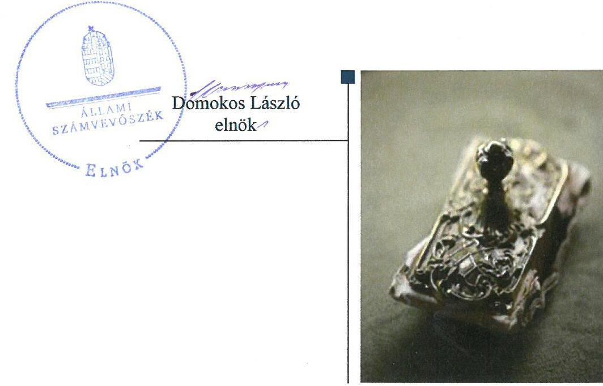

---

# AZ ELLENŐRZÉST FELÜGYELTE:

- PETŐ KRISZTINA felügyeleti vezető
- AZ ELLENŐRZÉST VEZETTE ÉS A VÉGREHAJTÁSÁÉRT FELELŐS:
  - SALAMIN VIKTOR ellenőrzésvezető
  - A PROGRAM ÖSSZEÁLLÍTÁSÁÉRT FELELŐS:
    - TÓTPÁL SZABOLCS osztályvezető

**IKTATÓSZÁM:** V-1392-094/2016.

**TÉMASZÁM:** 2084

**ELLENŐRZÉS-AZONOSÍTÓ SZÁM:** V075962

Jelentéseink az Országgyűlés számítógépes hálózatán és az Interneten a www.asz.hu címen is olvashatóak.

---

# TARTALOMJEGYZÉK 

■ ÖSSZEGZÉS ..... 5
■ AZ ELLENŐRZÉS CÉLJA ..... 6
■ AZ ELLENŐRZÉS TERÜLETE ..... 7
■ AZ ELLENŐRZÉS HÁTTERE, INDOKOLTSÁGA ..... 8
■ A JELENTÉS LÉNYEGES KÉRDÉSKÖREI ..... 9
■ AZ ELLENŐRZÉS HATÓKÖRE ÉS MÓDSZEREI ..... 10
■ MEGÁLLAPÍTÁSOK ..... 12
■ JAVASLATOK ..... 16
■ MELLÉKLETEK ..... 19
I. sz. melléklet: Értelmező szótár ..... 19
■ FÜGGELÉK: ÉSZREVÉTELEK ..... 23
■ RÖVIDÍTÉSEK JEGYZÉKE ..... 43

---

.

---

# ÖSSZEGZÉS 

A Magyar Nemzeti Vagyonkezelő Zrt., majd a Magyar Művészeti Akadémia tulajdonosi joggyakorlása szabályszerű volt. A Múcsarnok Közhasznú Nonprofit Kft. működésének szabályozottsága nem felelt meg a jogszabályi előírásoknak. Nem gondoskodtak a belső ellenőrzés kialakításáról. A Társaság az egyes szolgáltatások díjait önköltség-számítással nem alapozta meg. A vagyongazdálkodás nem volt szabályszerű, így a vagyon megőrzése és az elszámoltathatóság nem volt biztosított.

## Az ellenőrzés társadalmi indokoltsága

Az állami tulajdonú gazdálkodó szervezetek a nemzeti vagyon részét képezik. Az állami vagyon megőrzése, megóvása érdekében kiemelten fontos a vagyon átlátható, rendeltetésszerű és felelős felhasználásának biztosítása.

Minden közvagyont használó szervezettel szemben társadalmi igény, hogy tevékenységükről elszámoljanak. Az Állami Számvevőszék Stratégiájával összhangban ellenőrzésével hozzájárul a nemzeti vagyont használó gazdálkodó szervezetek tevékenységének átláthatóságához, elszámoltathatóságának javításához.

A Műcsarnok Közhasznú Nonprofit Kft.-nek, mint az állami vagyont használónak, a képzőművészet és a kapcsolódó művészeti ágak bemutatóhelye működtetőjeként a gazdálkodása közérdeklődésre tarthat számot.

## Főbb megállapítások, következtetések, javaslatok

A tulajdonosi jogait a Magyar Nemzeti Vagyonkezelő Zrt., majd a Magyar Művészeti Akadémia szabályszerűen gyakorolta.

A Társaság működésének szabályozottsága nem felelt meg a jogszabályi előírásoknak a számviteli szabályzatok hiányosságai miatt. A bevételek és ráfordítások elszámolása a 2012-2016. években szabályszerű volt, az értékcsökkenés elszámolása azonban 2016. évben nem volt szabályszerű. A Társaság az egyes szolgáltatások díjait önköltségszámítással nem alapozta meg.

A Társaság teljesítette tervezési és beszámolási kötelezettségét, a jogszabályokban előírt, államháztartásért felelős miniszter felé teljesítendő adatszolgáltatási kötelezettségének azonban nem tett eleget. A Társaság nem alakította ki belső ellenőrzési rendszerét.

A Társaság vagyongazdálkodása nem volt szabályszerű, a tárgyi eszközök mennyiségi leltározásának hiányában a Társaság beszámolóinak megalapozottsága, a vagyon védelme nem volt biztosított.

A megállapítások alapján az ÁSZ a Múcsarnok Közhasznú Nonprofit Kft. ügyvezetőinek 11 javaslatot fogalmazott meg, amelyre 30 napon belül intézkedési tervet kell készíteniük.

---

# AZ ELLENŐRZÉS CÉLJA 

Az ellenőrzés célja annak értékelése volt, hogy a tulajdonosi jogok gyakorlása szabályszerű volt-e; a gazdálkodó szervezet szabályozottsága, gazdálkodása és vagyongazdálkodási tevékenysége megfelelt-e a jogszabályi és a tulajdonosi előírásoknak, biztosított volt-e a közfeladatok átláthatósága és elszámoltathatósága érdekében a közszolgáltatás díjának megalapozottsága szabályszerű önköltségszámítással; a vagyonváltozást eredményező döntések esetében a tulajdonosi jogok gyakorlója és a gazdálkodó szervezet szabályszerűen jártak-e el.

---

# **AZ ELLENŐRZÉS TERÜLETE**

## **Műcsarnok Közhasznú Nonprofit Korlátolt Felelősségű Társaság**

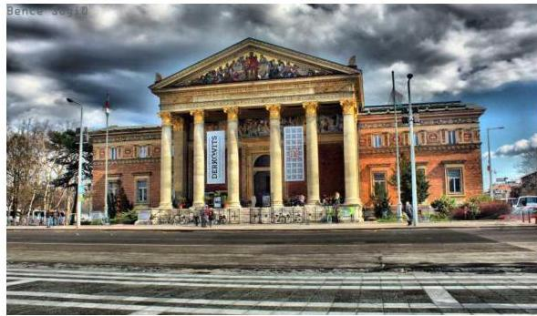

A Társaságot^{1} a Magyar Állam 2007. július 1-én hozta létre a költségvetési szervként működő Műcsarnok és az Ernst Múzeum Közhasznú Társaság jogutódjaként 3,0 M Ft^{3} törzstőkével. A Társaság alapfeladata a magyar és a nemzetközi kortárs képzőművészet, valamint iparművészet, fotóművészet, építészet és intermediális művészet, külföldi rendezése, szakmai kiadványok megjelentetése, a vizuális kultúra terjesztése. A Társasággal az OKM^{3} a közfeladatok ellátására vonatkozóan 2009. április 6-án kötött Közhasznú szerződést^{4}.

A Társaság tulajdonos^{1,2}a^{5} 2014. június 5-ig a Magyar Állam, 2015. június 6-tól az MMA^{6} volt. 2014. június 6-tól a Társaság ingyenesen a köztestületként működő MMA tulajdonába került. A tulajdonosi joggyakorló^{1,2} – a Magyar Állam nevében – 2013. december 31-ig az MNV Zrt.^{8}, 2014. január 1-jétől – az MNV Zrt.-vel kötött Megbízási szerződés^{9} alapján – az MMA volt.

A Társaság közhasznú nonprofit szervezet, feladatainak ellátásához évente a közhasznú feladatfinanszírozási támogatást az alapítót képviselő EMMI^{10}, majd 2014-től az MMA biztosította. A Társaság 3,0 M Ft-os törzstőkéjét az MMA 2014 novemberében 53,0 M Ft-ra megemelte. A Társaság vagyonkezelésbe vett állami vagyonnal nem rendelkezett, valamint kapcsolt vállalkozása nem volt. A Társaság 2013. december 17-től tartozott a kormányzati szektorba sorolt állami tulajdonú társaságok körébe. Az ellenőrzött időszakban adósságot keletkeztető ügyletet nem kötöttek.

Az ügyvezető^{11} személye 2013-ban változott, majd a tulajdonos^{2} 2014. július 29-i döntése alapján bevezették a kettős ügyvezetés rendszerét, külön választva a szakmai-művészeti és a gazdasági-cégmenedzselési tevékenységéért felelős ügyvezetői feladatokat. A jelenlegi ügyvezetők 2014. szeptember 1-jétől együttesen gyakorolják a Társaság képviseletét. A foglalkoztatottak létszáma 2012. évben 56 fő, 2016. évben 58 fő volt.

A Társaság főbb gazdálkodási adatait az 1. táblázat tartalmazza.

1. táblázat

|   | 2012. | 2013. | 2014. | 2015. | 2016.  |
| --- | --- | --- | --- | --- | --- |
|  Értékesítés nettó árbevétele | 77,8 | 57,4 | 42,3 | 57,9 | 87,3  |
|  Egyéb bevételek | 458,0 | 409,2 | 408,9 | 436,0 | 484,1  |
|  Mérlegfőösszeg | 201,5 | 131,3 | 202,8 | 204,0 | 268,9  |
|  Követelések | 25,2 | 15,8 | 21,6 | 24,5 | 28,7  |
|  ebből: vevő követelések | 2,3 | 2,2 | 2,1 | 3,1 | 0,5  |
|  Saját tőke | 58,8 | 59,4 | 111,1 | 111,5 | 141,3  |
|  Jegyzett tőke (törzstőke) | 3,0 | 3,0 | 53,0 | 53,0 | 53,0  |
|  Mérleg szerinti eredmény | 0,3 | 0,6 | 1,7 | 2,3 | 27,8  |
|  Kötelezettségek összesen | 85,8 | 33,9 | 41,7 | 35,7 | 60,1  |

1. táblázat

*Forrás: A Társaság egyszerűsített éves beszámolói*

---

# AZ ELLENŐRZÉS HÁTTERE, INDOKOLTSÁGA 

AZ ÁLLAMI TULAJDONÚ GAZDÁLKODÓ SZERVEZETEK ellenőrzése kiemelten fontos a nemzeti vagyon megőrzése, megóvása érdekében. Gazdálkodásuk jellemzően a közérdeklődés és a média figyelmének középpontjában áll, amihez hozzájárul a gazdálkodásuk körébe tartozó - közvetlen vagy közvetett állami tulajdonú - vagyon nagysága, illetve az általuk ellátott közszolgáltatások minősége és hatékonysága. A szolgáltatási/közszolgáltatási árképzés megalapozottsága és az éves elszámoltatás feltételeinek kialakítása az ellenőrzés során nagy hangsúlyt kap. A szolgáltatás/közszolgáltatás árában és annak támogatásában meg kell jelennie az önköltségszámítás szempontjainak, amely biztosítja a működés fenntarthatóságát (eszközpótlást) is. Az ellenőrzés rámutathat az állami tulajdonú gazdálkodó szervezetek gazdálkodási tevékenységével jó gyakorlatokra és szabálytalanságokra. Felhívhatja a figyelmet a jogszabályi követelmények teljesítéséhez szükséges feltételek hiányosságaira, hozzájárulhat az államháztartáson kívüli, de (közvetlenül vagy közvetve) állami vagyont használó gazdálkodó szervezetek tevékenységének átláthatóságához. Ellenőrzésünk eredményeképpen javaslatainkkal, megállapításainkkal hozzájárulhatunk a nemzeti vagyonnal való gazdálkodás átláthatóságának, elszámoltathatóságának javításához.

---

# A JELENTÉS LÉNYEGES KÉRDÉSKÖREI 

1. A tulajdonosi jogok gyakorlása szabályszerű volt-e?
2. A Társaság működésének szabályozottsága megfelelt-e az előírásoknak?
3. A Társaságnál a pénzügyi-számviteli, adatszolgáltatási és ellenőrzési feladatok ellátása szabályszerű volt-e?
4. A Társaság vagyongazdálkodása szabályszerű volt-e?

---

# AZ ELLENŐRZÉS HATÓKÖRE ÉS MÓDSZEREI 

## Az ellenőrzés típusa

Megfelelőségi ellenőrzés.

## Az ellenőrzött időszak

2012. január 1-től 2016. december 31.

## Az ellenőrzés tárgya

Az állami, illetve köztestületi tulajdonban lévő Műcsarnok Közhasznú Nonprofit Korlátolt Felelősségű Társaság gazdálkodása, kiemelten vagyongazdálkodási tevékenysége, valamint a Magyar Nemzeti Vagyonkezelő Zrt. és a Magyar Művészeti Akadémia tulajdonosi joggyakorlása, továbbá a kormányzati szektorba sorolt gazdasági társaság gazdálkodásának a kormányzati szektor hiányára és az államadósságra befolyással bíró elemei.

## Az ellenőrzött szervezet

Műcsarnok Közhasznú Nonprofit Korlátolt Felelősségű Társaság, valamint a Magyar Nemzeti Vagyonkezelő Zrt. és a Magyar Művészeti Akadémia mint a tulajdonosi jogok gyakorlói.

## Az ellenőrzés jogalapja

Az Állami Számvevőszékről szóló 2011. évi LXVI. törvény 5. § (3)-(5) bekezdései.

## Az ellenőrzés módszerei

Az ellenőrzést az ellenőrzési program ellenőrzési kérdései, az ellenőrzött időszakban hatályos jogszabályok, az ellenőrzés szakmai szabályok és módszertanok figyelembe vételével végeztük el.

Az ellenőrzési kérdések megválaszolásához szükséges bizonyítékok megszerzése az ellenőrzöttek által rendelkezésre bocsátott dokumentumokra, adatokra alapozva kérdésfelvetés, mintavételezés, ellenőrzési eljárások útján történt.

---

Az ellenőrzött szervezetek az ellenőrzés lefolytatásához tanúsítványok kitöltésével, valamint az ÁSZ által kért dokumentumok megküldésével szolgáltattak adatokat.

A bevételek és ráfordítások elszámolása, valamint a vagyonnyilvántartás terén, a szabályszerű működést véletlen mintavétellel és irányított kiválasztással ellenőriztük. A mintatételek értékelése alapján egyrészt a sokaságban előforduló hibaarányát becsültük, másrészt az irányítottan kiválasztott tételeket értékeltük. A jogszabályoknak és a belső előírásoknak megfelelőnek, azaz szabályszerűnek tekintettük az adott területet, amennyiben a minta ellenőrzésének eredménye alapján 95%-os bizonyossággal a teljes sokaságban a hibaarány kisebb volt, mint 10%, nem megfelelőnek értékeltük, ha a hibaarány a 10%-ot meghaladta. A ráfordítások elszámolására és a vagyonnyilvántartásra vonatkozó véletlen mintavételt kockázati alapú kiválasztással egészítettük ki, amelynek során évente a három legnagyobb összegű tételt választottuk ki.

---

# 1. A tulajdonosi jogok gyakorlása szabályszerű volt-e? 

Összegző megállapítás

Az MNV. Zrt., majd az MMA Társaság feletti tulajdonosi joggyakorlása szabályszerű volt.

A RÉSZESEDÉSEK FELETTI TULAJDONOSI JOGOK GYAKORLÁSÁNAK rendjét az MNV Zrt. és az MMA a Gt. ${ }^{12}$ és a Ptk. ${ }^{13}$-ben előírtaknak megfelelően kialakította az Alapító okiratban ${ }^{14}$ és az SZMSZ ${ }^{15}$-ben.

A TULAJDONOSI JOGGYAKORLÁS a Felügyelő bizottság ${ }^{16}$, az ügyvezetés és a könyvvizsgáló tevékenységéhez kapcsolódóan a Gt. és a Ptk. ${ }^{13}$-ben előírásoknak megfelelt.

A GAZDÁLKODÁSRÓL ÉS A FELADATELLÁTÁSRÓL a Közhasznú szerződésben foglaltak szerint a tulajdonosi joggyakorló ${ }^{1,2}$ az egyszerűsített éves beszámolókban, a kiegészítő mellékletekben és a közhasznúsági mellékletekben számoltatta be a Társaságot. Az ügyvezető évente elkészítette az általános és szakmai, valamint gazdasági programot magába foglaló üzleti tervet, amelyet a Felügyelő bizottság javaslata alapján a tulajdonosi joggyakorló ${ }^{1,2}$ elfogadott.

AZ EREDMÉNY FELOSZTÁSÁRA vonatkozóan a jogszabályi előírásoknak megfelelően hoztak döntést, eredményt nem vontak el, nem osztották fel, az Alapító okiratban meghatározottak szerint közhasznú tevékenységre fordították.

A JAVADALMAZÁSI SZABÁLYZATOT ${ }^{17}$ a Társaság legfőbb szerve a Taktv. ${ }^{18}$-ben foglaltak szerint megalkotta és határozattal jóváhagyta.

A Társaság 2014. évtől az MMA tulajdonában van, de a használt ingatlan állami tulajdonú, az MMA - térítésmentes - tulajdonába adása nem történt meg az MMA tv. ${ }^{19}$ 1. § (1) bekezdés b) pontjában előírt 2014. január 1-jei határidő ellenére.

## 2. A Társaság működésének szabályozottsága megfelelt-e az előírásoknak?

Összegző megállapítás

A Társaság működésének szabályozottsága nem felelt meg a jogszabályi előírásoknak.

A SZÁMVITELI POLITIKÁBAN ${ }^{20}$ a Számv. tv. ${ }^{21}$ 14. § (4) bekezdése alapján 2015. július 4-ét követő

 90 napon belül nem határozták meg, hogy mit tekintenek kivételes nagyságú vagy előfordulású bevételnek, költségnek, ráfordításnak, ezzel megsértették a Számv. tv. 14. § (11) bekezdésében foglaltakat.

AZ ÖNKÖLTSÉGSZÁMÍTÁS rendjére vonatkozó belső szabályozás készítési kötelezettségének a Társaság 2013. november 15-ig nem tett eleget annak ellenére, hogy a 2012. évben a költségnemek szerinti költségek együttes összege meghaladta a Számv. tv. 14. § (7) bekezdésében előírt értékhatárt.

SZÁMLARENDDEL ${ }^{22}$ a Társaság a 2015. évben a Számv. tv. 161. § (1) bekezdését megsértve nem rendelkezett. A 2014. december 31-ig, illetve a 2016. január 1-től hatályos számlarendek megfeleltek a Számv. tv. előírásainak.

A PÉNZKEZELÉSI SZABÁLYZATBAN ${ }^{23}$ a Számv. tv. 14. § (8) bekezdése ellenére nem rendelkeztek a készpénzállomány ellenőrzésének gyakoriságáról.

# 3. A Társaságnál a pénzügyi-számviteli, adatszolgáltatási és ellenőrzési feladatok ellátása szabályszerű volt-e? 

Összegző megállapítás

A Társaságnál a bevételek és ráfordítások elszámolása - az értékcsökkenés 2016. évi elszámolása kivételével - szabályszerű volt, díjait azonban önköltség-számítással nem alapozta meg. A Társaság tervezési és beszámolási kötelezettségét teljesítette, az adatszolgáltatási kötelezettségét azonban nem teljesítette, továbbá a belső ellenőrzés kialakításáról nem gondoskodott.
3.1. számú megállapítás

A bevételek és ráfordítások elszámolása a 2012-2016. években szabályszerű volt, az értékcsökkenés elszámolása azonban 2016. évben nem volt szabályszerű.

AZ ÉRTÉKESÍTÉS NETTÓ ÁRBEVÉTELÉNEK és az egyéb, rendkívüli bevételek, pénzügyi műveletek bevételeinek elszámolása a Számv. tv. előírásainak megfelelően, szabályszerűen történt.

AZ ANYAGJELLEGŰ RÁFORDÍTÁSOK, az egyéb és pénzügyi műveletek ráfordításainak elszámolása szabályszerű volt.

A SZEMÉLYI JELLEGŰ RÁFORDÍTÁSOK elszámolása szabályszerű volt az ellenőrzött időszakban.

AZ ÉRTÉKCSÖKKENÉSI LEÍRÁS elszámolása a jogszabályok, illetve a belső szabályozási előírásainak megfelelően történt a 2012-2015. években. 2016-ban az értékcsökkenési leírás elszámolása nem volt szabályszerű, mivel a Társaság nem a Számviteli politikában meghatározott leírási kulcsokat alkalmazta, illetve az elszámolás a tárgyi eszközökön belül nem a megfelelő főkönyvi számlára történt, továbbá a tárgyi eszközök nyilvántartásba vételénél megsértették a Számv. tv. 165. § (2) bekezdését, mert a számviteli nyilvántartásba történő bejegyzést bizonylat nem támasztotta alá.

# 3.2. számú megállapítás 

A Társaság az egyes szolgáltatások díjait önköltség-számítással nem alapozta meg.

AZ EGYES SZOLGÁLTATÁSOK közül a jegybevételek meghatározására az önköltségszámítás rendjére vonatkozó szabályozás nem terjedt ki, ezáltal a 2013-2016. években a Számv. tv. 14. § (7) bekezdés és a Számv. tv. 51. § (2) bekezdés előírásait figyelmen kívül hagyva a jegybevételekre vonatkozó szolgáltatás önköltségét nem állapították meg az utókalkuláció módszerével.

A Társaság az általa összeállított kiadványokra, a helyiségek bérbeadására és a szállítói kapacitás kihasználására vonatkozó önköltséget elő és utókalkulációs módszerrel nem határozta meg az Önköltség-számítási szabályzat ${ }^{24}$ II. és a 2.2-2.4. pontokban foglaltak ellenére.

## 3.3. számú megállapítás

A Társaság teljesítette tevékenységét érintő tervezési, beszámolási kötelezettségét. A jogszabályokban előírt adatszolgáltatási kötelezettségének nem tett eleget.

ÜZLETI TERVET a Társaság minden évben készített, melyeket a Felügyelő bizottság véleményezése után a tulajdonosi joggyakorló 1,2 jóváhagyott.

A TULAJDONOSI JOGGYAKORLÓ 1,2 ÁLTAL 2013. augusztus 29-től hatályos Alapító okirat 7.3.24. pontjában, a 2014. május 13-tól hatályos 6.3.23. pontjában és a 2014. szeptember 9-től hatályos 6.5.22. pontjában előírt a vagyoni és likviditási helyzetre vonatkozó negyedéves tájékoztatási kötelezettségének az ügyvezető hiányosan tett eleget. A 2013-2014. években 4 esetben készült tájékoztatás, a 2015-2016. években a Felügyelő bizottság részére tájékoztatás nem történt az Alapító Okiratban foglaltak ellenére.

AZ EGYSZERŰSÍTETT ÉVES BESZÁMOLÓIT a Társaság elkészítette, azokat a Számv. tv.-ben előírt határidőig letétbe helyezte és közzétette. A könyvvizsgáló által hitelesítő záradékkal ellátott egyszerűsített éves beszámolókról a Társaság legfőbb szerve - a Gt. és a Ptk. 2 előírásainak megfelelően - a felügyelőbizottság írásbeli jelentésének birtokában döntött.

A KÖZÉRDEKŰ ADATOK megismerésére irányuló igények teljesítésének rendjét rögzítő szabályzattal a Társaság az Info tv. ${ }^{25}$ 30. § (6) bekezdésének előírása ellenére 2012. január 1. és 2015. december 15. között nem rendelkezett.

ADATSZOLGÁLTATÁSI KÖTELEZETTSÉGÉT a Társaság - mint kormányzati szektorba sorolt társaság - 2014. évben az Ávr. ${ }^{26} 7$. számú melléklet 28. pontját, 2015. évtől az Ávr. 5. számú melléklet 23. pontját megsértve a tárgyévet követő június 30-ig az államháztartásért felelős miniszter felé nem teljesítette.

A Társaság 2014-ben az Ávr. 7. számú melléklet 29. pontja, 2015. évtől az Ávr. 5. számú melléklet 24. pontja előírását nem tartotta be, mivel 2014. márciustól a negyedévenkénti adatszolgáltatását az államháztartásért felelős miniszter részére nem küldte meg.

# 3.4. számú megállapítás 

A Társaság nem alakította ki belső ellenőrzési rendszerét.
BELSŐ ELLENŐRZÉSI RENDSZERT a Társaság az SZMSZ-ben biztosított lehetősége ellenére nem alakított ki és nem működtetett. A Társaság - mint kormányzati szektorba sorolt társaság - 2014. január 1-jétől megsértette a Bkr. ${ }^{27}$ 10. §-át, mivel az ügyvezető nem alakította ki a szervezet tevékenységének, a célok megvalósításának nyomon követését biztosító rendszer keretében a belső ellenőrzést.

A tulajdonosi joggyakorló 2 által végzett ellenőrzések - pénzkezelés, kötelezettségvállalás, támogatások elszámolása - megállapításaira a szükséges intézkedéseket megtették.

## 4. A Társaság vagyongazdálkodása szabályszerű volt-e?

## Összegző megállapítás

A Társaság vagyongazdálkodása nem volt szabályszerű.
A SELEJTEZÉSI SZABÁLYZATBAN ${ }^{28}$ az eljárás végrehajtásának ellenőrzéséért felelősként az SZMSZ-ben nem nevesített stratégiai igazgatót jelölték ki.

AZ ALAP-, ILLETVE VÁLLALKOZÁSI tevékenységhez tartozó eszközök elkülönített nyilvántartását nem biztosították a Számviteli politika 2.8. pontjában foglaltak ellenére. A 2016. évben több kisértékű eszközt egyösszegben tartottak nyilván, elmaradt a mennyiségi nyilvántartásba vétel, ezáltal nem tartották be a Leltározási szabályzat 2.3. pontját.

AZ ÉVES BESZÁMOLÓKBAN a tárgyi eszközök értékét mennyiségi leltározással nem támasztották alá, megsértve a Számv. tv. 69. § (1) és (3) bekezdéseit és a Leltározási szabályzat 2.2. pontját. A tárgyi eszközök mennyiségi leltározásának hiányában a Társaság beszámolóinak megalapozottsága, a vagyon védelme nem volt biztosított. A hiányosságok ellenére a könyvvizsgáló a 2012-2016. évi beszámolókat korlátozás nélküli hitelesítő záradékkal látta el.

A 2013. évi mérleget alátámasztó leltározás során feltárt 1,9 M Ft értékű leltárhiány, valamint 2,0 M Ft leltártöbblet okait a Leltározási szabályzat ${ }^{29} 6$. pontjában előírtak ellenére nem vizsgálták ki, a leltárhiányért felelős személyt nem állapították meg.

AZ IMMATERIÁLIS JAVAK ÉS TÁRGYI ESZKÖZÖK ÉRTÉKE 67,3 M Ft-tal (33,4%-kal) nőtt a 2016. év végére a 2012. évhez képest a karbantartások, beruházások eredményeként.

# JAVASLATOK 

Az ÁSZ tv. 33. § (1) bekezdésében foglaltak értelmében az ellenőrzött szervezet vezetője köteles a jelentésben foglalt megállapításokhoz kapcsolódó intézkedési tervet összeállítani és azt a jelentés kézhezvételétől számított 30 napon belül az ÁSZ részére megküldeni. Amennyiben az ellenőrzött szervezet vezetője nem küldi meg határidőben az intézkedési tervet, vagy továbbra sem elfogadható intézkedési tervet küld, az Állami Számvevőszék elnöke az ÁSZ tv. 33. § (3) bekezdése a) és b) pontjaiban foglaltakat érvényesítheti.

## A Múcsarnok Közhasznú Nonprofit Kft. ügyvezetőjének

1. Intézkedjen a számviteli politika jogszabályi előírásnak megfelelő módosítása iránt.
(2. összegző megállapítás 1. bekezdése alapján)
2. Intézkedjen, hogy a pénzkezelési szabályzat tartalma megfeleljen a jogszabályi előírásnak.
(2. összegző megállapítás 4. bekezdése alapján)
3. Intézkedjen az értékcsökkenési leírás jogszabályi és belső előírásoknak megfelelő elszámolása iránt.
(3.1. sz. megállapítás 4. bekezdésének 2. mondata alapján)
4. Intézkedjen az önköltség jogszabályi és belső előírásoknak megfelelő megállapítása iránt.
(3.2. sz. megállapítás 1-2. bekezdései alapján)
5. Intézkedjen a belső előírások szerinti, a vagyoni és likviditási helyzetre vonatkozó negyedéves tájékoztatási kötelezettség teljesítéséről.
(3.3. sz. megállapítás 2. bekezdése alapján)
6. Intézkedjen az adatszolgáltatási kötelezettségének jogszabályi előírásoknak megfelelő teljesítése iránt.
(3.3. sz. megállapítás 5-6. bekezdései alapján)
7. Intézkedjen a szervezet tevékenységének, a célok megvalósításának nyomon követését biztosító rendszer jogszabályi előírásnak megfelelő kialakítása iránt.
(3.4. sz. megállapítás 1. bekezdésének 2. mondata alapján)

8. Intézkedjen a selejtezési szabályzat belső előírásokkal való összhangjának megteremtéséről.
(4. összegző megállapítás 1. bekezdése alapján)
9. Intézkedjen az elkülönített nyilvántartás vezetésére és a kisértékű eszközök nyilvántartására vonatkozó belső előírások által meghatározott kötelezettségének teljesítése iránt.
(4. összegző megállapítás 2. bekezdése alapján)
10. Intézkedjen a jogszabályi és belső előírásoknak megfelelő, mennyiségi felvétellel történő leltározás lebonyolítása iránt.
(4. összegző megállapítás 3. bekezdésének 1. mondata alapján)
11. Tegyen intézkedéseket a leltározással és az összeállított leltárral kapcsolatban feltárt szabálytalanságok tekintetében a felelősség tisztázása érdekében, és szükség szerint intézkedjen a felelősség érvényesítéséről.
(4. összegző megállapítás 3. bekezdésének 1. mondata alapján)

# MELLÉKLETEK 

## I. SZ. MELLÉKLET: ÉRTELMEZŐ SZÓTÁR

állami vagyon
a) Az állam tulajdonában lévő dolog, valamint a dolog módjára hasznosítható természeti erő,
b) az a) pont hatálya alá nem tartozó mindazon vagyon, amely vonatkozásában törvény az állam kizárólagos tulajdonjogát nevesíti,
c) az állam tulajdonában lévő tagsági jogviszonyt megtestesítő értékpapír, illetve az államot megillető egyéb társasági részesedés,
d) az államot megillető olyan immateriális, vagyoni értékkel rendelkező jogosultság, amelyet jogszabály vagyoni értékű jogként nevesít.
Forrás: Vtv. 1. § (2) bekezdése
e) az állam tulajdonában lévő pénzügyi eszközök

Forrás: Vtv. 1. § (2) bekezdése
2013. június 27-ig:

Az állami vagyont az MNV Zrt. maga kezeli, vagy szerződés - így különösen bérlet, haszonbérlet, megbízás - alapján központi költségvetési szervnek, természetes vagy jogi személynek, vagy jogi személyiséggel nem rendelkező gazdálkodó szervezetnek hasznosításra átengedi.
Forrás: Vtv. 23. § (1) bekezdése
2013. június 28-ától:

Az állami vagyonnal az MNV Zrt. maga gazdálkodik, vagy szerződés - így különösen bérlet, haszonbérlet, megbízás - alapján központi költségvetési szervnek, természetes vagy jogi személynek, vagy jogi személyiséggel nem rendelkező gazdálkodó szervezetnek hasznosításra átengedi, illetőleg vagyonkezelésbe, haszonélvezetbe adja.
Forrás: Vtv. 23. § (1) bekezdése
A Ptk. 2. 3:88. § (1) bekezdése szerint „a gazdasági társaságok üzletszerű közös gazdasági tevékenység folytatására, a tagok vagyoni hozzájárulásával létrehozott, jogi személyiséggel rendelkező vállalkozások, amelyekben a tagok a nyereségből közösen részesednek, és a veszteséget közösen viselik".
gazdasági társaság
állami vagyon hasznosítására kötött szerződés
állami vagyon használója
a) Az állami vagyon hasznosítására kötött szerződések elsődleges célja az állami vagyon hatékony működtetése, állagának védelme, értékének megőrzése, illetve gyarapítása, az állami és közfeladatok ellátásának elősegítése.
Forrás: Vtv. 23. § (2) bekezdése
Az a természetes vagy jogi személy, jogi személyiséggel nem rendelkező szervezet, aki, vagy amely törvény vagy szerződés alapján, bármely jogcímen (bérlet, haszonbérlet, használat stb.) állami vagyont birtokol, használ, szedi annak hasznait, hasznosít, ide nem értve a haszonélvezőt, a vagyonkezelőt és a tulajdonosi jogok gyakorlóját.
Forrás: Vhr. 1. § (7) a. pontja
2013. június 27-ig:

Az állami vagyont az MNV Zrt. maga kezeli, vagy szerződés - így különösen bérlet, haszonbérlet, megbízás - alapján központi költségvetési szervnek, természetes vagy jogi személynek, vagy jogi személyiséggel nem rendelkező gazdálkodó szervezetnek hasznosításra átengedi. Az állami vagyonra vonatkozóan az MNV Zrt. kizárólag az Nvtv-ben meghatározott személyekkel köthet vagyonkezelési szerződést.
Forrás: Vtv. 23. § (1), 27. § (1)

2013. június 28-ától: 

Az állami vagyonnal az MNV Zrt. maga gazdálkodik, vagy szerződés - így különösen bérlet, haszonbérlet, megbízás - alapján központi költségvetési szervnek, természetes vagy jogi személynek, vagy jogi személyiséggel nem rendelkező gazdálkodó szervezetnek hasznosításra átengedi, illetőleg vagyonkezelésbe, haszonélvezetbe adja. Az állami vagyonra vonatkozóan az MNV Zrt. kizárólag az Nvtv-ben meghatározott személyekkel köthet vagyonkezelési
 szerződést.
Forrás: Vtv. 23. § (1), 27. § (1)
gazdálkodó szervezet
kormányzati szektorba sorolt egyéb szervezet
közszolgáltatás

MNV Zrt.
nemzeti vagyon

## 2014. március 14-ig:

A Ptk. 1685. § c) pontja szerint gazdálkodó szervezet: „az állami vállalat, az egyéb állami gazdálkodó szerv, a szövetkezet, a lakásszövetkezet, az európai szövetkezet, a gazdasági társaság, az európai részvénytársaság, az egyesülés, az európai gazdasági egyesülés, az európai területi együttműködési csoportosulás, az egyes jogi személyek vállalata, a leányvállalat, a vízgazdálkodási társulat, az erdőbirtokossági társulat, a végrehajtói iroda, az egyéni cég, továbbá az egyéni vállalkozó."

## 2014. március 15-től:

A gazdasági társaság, az európai részvénytársaság, az egyesülés, az európai gazdasági egyesülés, az európai területi együttműködési csoportosulás, a szövetkezet, a lakásszövetkezet, az európai szövetkezet, a vízgazdálkodási társulat, az erdőbirtokossági társulat, az állami vállalat, az egyéb állami gazdálkodó szerv, az egyes jogi személyek vállalata, a közös vállalat, a végrehajtói iroda, a közjegyzői iroda, az ügyvédi iroda, a szabadalmi ügyvivői iroda, az önkéntes kölcsönös biztosító pénztár, a magánnyugdíjpénztár, az egyéni cég, továbbá az egyéni vállalkozó. Az állam, a helyi önkormányzat, a költségvetési szerv, az egyesület, a köztestület, valamint az alapítvány gazdálkodó tevékenységével összefüggő polgári jogi kapcsolataira is a gazdálkodó szervezetre vonatkozó rendelkezéseket kell alkalmazni.
Forrás: Ppt ${ }^{30}$. 396. §
Az a szervezet, amely az Áht. ${ }^{31}$ alapján nem része az államháztartásnak, azonban az Európai Közösséget létrehozó szerződéshez csatolt, a túlzott hiány esetén követendő eljárásról szóló jegyzőkönyv alkalmazásáról szóló 2009. május 25-i 479/2009/EK rendelet szerint a kormányzati szektorba tartozik. A nemzetgazdasági miniszter 2013. június 26-án megjelent Közleményben tette közé ezen szervezetek listáját
Az Ebktv. ${ }^{32}$ 3. § d) pontja a következőképpen határozza meg a közszolgáltatást: „szerződéskötési kötelezettség alapján a lakosság alapvető szükségleteinek ellátására irányuló szolgáltatás, így különösen a villamos energia-, gáz-, hő-, víz-, szennyvíz- és hulladékkezelési, köztisztasági, postai és távközlési szolgáltatás, továbbá a menetrend alapján közlekedő járművekkel végzett közforgalmú személyszállítás".
Az állami vagyon felett, a Magyar Államot megillető tulajdonosi jogok és kötelezettségek összességét - a hatályos szabályozás szerint - az állami vagyon felügyeletéért felelős miniszter (jelenleg a nemzeti fejlesztési miniszter) gyakorolja. A miniszter feladatát nagy részben az MNV Zrt., mint tulajdonosi joggyakorló szervezet útján látja el.
a) az állam vagy a helyi önkormányzat kizárólagos tulajdonában álló dolgok,
b) az a) pont hatálya alá nem tartozó, állam vagy a helyi önkormányzat tulajdonában lévő dolog,
c) az állam vagy a helyi önkormányzat tulajdonában lévő pénzügyi eszközök, továbbá az államot vagy a helyi önkormányzatot megillető társasági részesedések,
d) az államot vagy a helyi önkormányzatot megillető bármely vagyoni értékkel rendelkező jogosultság, amelyet jogszabály vagyoni értékű jogként nevesít,

---

e) Magyarország határa által körbezárt terület feletti légtér,
f) az üvegházhatású gázok kibocsátási egységeinek kereskedelméről szóló törvény szerint kibocsátási egység és légiközlekedési kibocsátási egység, valamint az ENSZ Éghajlatváltozási Keretegyezménye és annak Kiotói Jegyzőkönyve végrehajtási keretrendszeréről szóló törvény szerinti kiotói egység,
g) állami vagy helyi önkormányzati fenntartású közgyűjtemény (muzeális intézmény, levéltár, közgyűjteményként működő kép- és hangarchívum, valamint könyvtár) saját gyűjteményében nyilvántartott kulturális javak körébe tartozó dolog, kivéve, ha az állami vagy önkormányzati tulajdon jogszerű létrejötte kétséget kizáró módon nem bizonyítható és a dologra nézve más a tulajdonjogát bizonyítja vagy a kulturális javakra vonatkozó jogszabályokban meghatározott eljárás keretében valószínűsíti (g. pont módosult 2013. december 7-től),
h) a régészeti lelet,
i) a nemzeti adatvagyon körébe tartozó állami nyilvántartások fokozottabb védelméről szóló törvény szerinti nemzeti adatvagyon.
Forrás: Nvtv. ${ }^{33} 1 . \S(2)$
nemzeti vagyon hasznosítása

A tulajdonosi joggyakorló vagy a nemzeti vagyon használója által a nemzeti vagyon birtoklásának, használatának, hasznosításának jogának bármely - a tulajdonjog átruházását nem eredményező - jogcímen történő átengedése, ide nem értve a vagyonkezelésbe adást, valamint a haszonélvezeti jog alapítását.
Forrás: Nvtv. 3. § (1) 4. pont
nonprofit gazdasági társaság Civil tv. ${ }^{34}$ 9/F. § (2) bekezdése szerint „az a gazdasági társaság minősül nonprofit gazdasági társaságnak és cégnevében az a gazdasági társaság tüntetheti fel a nonprofit jelleget, amelynek létesítő okirata tartalmazza, hogy a gazdasági társaság tevékenységéből származó nyereség a tagok között nem osztható fel, hanem az a gazdasági társaság vagyonát gyarapítja." (hatályos 2014. március 15-től)
rábízott vagyon Egyrészt minden a Vtv. alkalmazásában állami vagyonnak minősülő vagyon, amit az MNV Zrt. kezel és nyilvántart.
Másrészt az a vagyon, amely felett a Magyar Állam nevében az MFB Zrt. ${ }^{35}$ gyakorolja a tulajdonosi jogokat.
Forrás: MFB tv. ${ }^{36}$ 3. § (9)
A rábízott vagyon a tulajdonosi jogokat gyakorló szervezetek saját vagyonától elkülönítendő.
Forrás: Vtv. 22. § (6)
tulajdonosi jogok gyakorlója 1.
2013. június 27-ig:

Az állami vagyon felett a Magyar Államot megillető tulajdonosi jogok és kötelezettségek összességét - ha törvény eltérően nem rendelkezik - az állami vagyon felügyeletéért felelős miniszter (a továbbiakban: miniszter) gyakorolja, aki e feladatát a Magyar Nemzeti Vagyonkezelő Zártkörűen Működő Részvénytársaság (a továbbiakban: MNV Zrt.), a Magyar Fejlesztési Bank, illetve a tulajdonosi joggyakorló szervezet útján látja el. A miniszter miniszteri rendeletben, a törvényben meghatározott állami vagyoni kör tekintetében, meghatározott időtartamra, a joggyakorlás egyes szabályainak meghatározásával - az őt megillető tulajdonosi jogok és kötelezettségek összességének, illetve azok meghatározott részének gyakorlóját az Áht. szerinti központi költségvetési szervek, ezek intézménye, továbbá a 100%-ban állami tulajdonban álló gazdasági társaságok közül kijelölheti.
Forrás: Vtv. 3. § (1) és (2)

---

# 2013. június 28-ától: 

A rábízott állami vagyon felett az államot megillető tulajdonosi jogok és kötelezettségek összességét tulajdonosi joggyakorlóként:
a) ha törvény vagy miniszteri rendelet eltérően nem rendelkezik, a Magyar Nemzeti Vagyonkezelő Zártkörűen Működő Részvénytársaság (a továbbiakban: MNV Zrt.),
b) törvényben kijelölt személy vagy
c) az állami vagyon felügyeletéért felelős miniszter (a továbbiakban: miniszter) által rendeletben kijelölt személy gyakorolja.
[...] A miniszter e törvény felhatalmazása alapján - a meghatározott célok hatékonyabb elérése érdekében, miniszteri rendeletben, az ott meghatározott állami vagyoni kör tekintetében, meghatározott időtartamra - e törvény keretei között, a joggyakorlás egyes szabályainak meghatározásával - az államot megillető tulajdonosi jogok és kötelezettségek összességének, illetve azok meghatározott részének gyakorlóját az Áht. szerinti központi költségvetési szervek, ezek intézménye, továbbá a 100%-ban állami tulajdonban álló gazdasági társaságok közül kijelölheti.
Forrás: Vtv. 3. § (1) és (2)
2.

Aki a nemzeti vagyon felett az államot vagy a helyi önkormányzatot megillető tulajdonosi jogok és kötelezettségek összességének gyakorlására jogosult
Forrás: Nvtv. 3. § (1) 17. pontja
2013. június 27-től:
A vagyonkezelő köteles a vagyontárgy értékét megőrizni, állagának megóvásáról, jó karban tartásáról, működtetéséről gondoskodni, továbbá - a központi költségvetési szervek kivételével - díjat fizetni vagy a szerződésben előírt más kötelezettséget teljesíteni.
Forrás: Vtv. 27. § (2)

## 2013. június 28-ától december 31-ig:

A vagyonkezelő köteles a vagyontárgy állagának megóvásáról, jó karbantartásáról, működtetéséről gondoskodni, továbbá - a központi költségvetési szervek kivételével - díjat fizetni, jogszabályban és szerződésben előírt más kötelezettségét teljesíteni, valamint a vagyontárgyat jogszabályban vagy szerződésben meghatározott célnak megfelelően használni. Amennyiben a vagyonkezelő ezen kötelezettségének nem tesz eleget, a tulajdonosi joggyakorló jogosult a szerződést azonnali hatállyal felmondani.
Forrás: Vtv. 27. § (2)

## 2014. január 1-jétől:

A vagyonkezelő köteles a vagyontárgy állagának megóvásáról, jó karbantartásáról, működtetéséről gondoskodni, jogszabályban és szerződésben előírt más kötelezettségét teljesíteni, valamint a vagyontárgyat jogszabályban vagy szerződésben meghatározott célnak megfelelően használni.
A vagyonkezelő - a központi költségvetési szervek és a kizárólag közfeladatot ellátó nem központi költségvetési szerv vagyonkezelők kivételével - köteles díjat fizetni, jogszabályban és szerződésben előírt más kötelezettségét teljesíteni, valamint a vagyontárgyat jogszabályban vagy szerződésben meghatározott célnak megfelelően használni. Amennyiben a vagyonkezelő ezen kötelezettségeinek nem tesz eleget, a tulajdonosi joggyakorló jogosult a szerződést azonnali hatállyal felmondani.
Forrás: Vtv. 27. § (2), (2a)

---

# FÜGGELÉK: ÉSZREVÉTELEK 

A jelentéstervezetet a Számvevőszék 15 napos észrevételezésre megküldte az ellenőrzött szervezetek vezetőinek az ÁSZ tv. 29. § (1) bekezdése előírásának megfelelően.

A Mücsarnok Közhasznú Nonprofit Kft. ügyvezetői a jelentéstervezet megállapításaira közös észrevételt tettek, amelyet a Magyar Művészeti Akadémia elnöke is továbbított az ÁSZ részére. Az MNV Zrt. vezérigazgatója nem élt észrevételezési jogával.
A függelék tartalmazza a megküldött észrevételeket, illetve az el nem fogadott észrevételek elutasításának indoklását.

[^0]
[^0]:    * 29. § (1) Az Állami Számvevőszék az ellenőrzési megállapításait megküldi az ellenőrzött szervezet vezetőjének vagy az általa megbízott személynek, és annak, akinek személyes felelősségét állapította meg.
    (2) Az ellenőrzött szervezet vezetője és a felelősként megjelölt személy az ellenőrzés megállapításaira tizenöt napon belül írásban észrevételt tehet.
    (3) Az Állami Számvevőszék az észrevételre a beérkezésétől számított harminc napon belül írásban válaszol. A figyelembe nem vett észrevételeket köteles a jelentésben feltüntetni, és megindokolni, hogy azokat miért nem fogadta el.

---

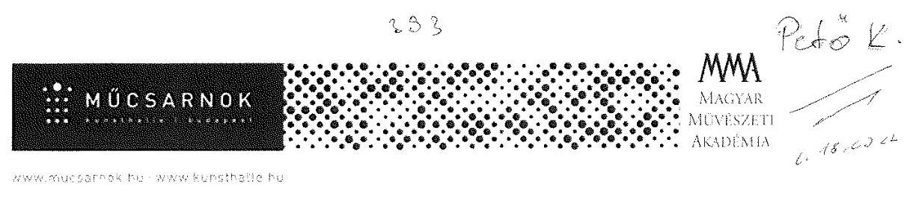
iktató szám: 1385-06/2017

Állami Számvevőszék
Domokos László
elnök

Budapest,
Apáczai Csere János u. 10.
1052
Levelezési cím: 1364 Budapest, Pf.: 54.

Tárgy: észrevételek a V-1392-082/2016. iktatószámú ellenőrzés jelentéstervezetéhez

Tisztelt Elnök Úr!

Köszönettel megkaptuk az Állami Számvevőszék „Állami tulajdonú gazdasági társaságok Az állami tulajdonban (résztulajdonban) lévő gazdálkodó szervezetek vagyonmegőrzési és gazdálkodási tevékenységének ellenőrzéséről" szóló jelentés tervezetüket.

A Számvevőszéki jelentéstervezet megállapításaihoz az alábbi észrevételeket füzzük:

A Jelentéstervezet összegzése (5. oldalon) szerint a „A Társaság működésének szabályozottsága nem felelt meg a jogszabályi előírásoknak a számviteli szabályzatok hiányossága miatt. A bevételek és ráfordítások elszámolása a 2012-2016. években szabályszerű volt, az értékcsökkenés elszámolása azonban 2016. évben nem volt szabályszerű. A Társaság az egyes szolgáltatások díjait önköltség-számítással nem alapozta meg."

- 2015-ben is rendelkeztünk számlarenddel. A számlarend a vizsgált időszakban az adott év Számviteli politikájának VII. fejezete volt. A 2015. évre vonatkozó számlarend az adatfeltöltéskor technikai hiba miatt nem került elektronikusan feltöltésre. Azonban a feltöltésre került 2015. évi Számviteli politika tartalomjegyzékéből és a feltöltött részek oldaltartományaiból látható, hogy számlarend ebben az évben is volt.
- Véleményünk szerint - a többi vizsgált időszakhoz hasonlóan - 2016-ban is szabályszerűen számoltuk el az értékcsökkenést, a számviteli politikában rögzített leírási kulcsokat alkalmaztuk, és a megfelelő főkönyvi számlára számoltuk el. A tárgyi eszközök nyilvántartásba vételét minden esetben bizonylattal támasztottuk alá (Állományba vételi bizonylat, Üzembehelyezési (aktiválás) jegyzőkönyv, Raktári bevételezési bizonylat).

---

- Társaságunk mindig készített elő- illetve utókalkulációt a vállalkozási tevékenysége keretében végzett szolgáltatásokra. Ezek képezték az adott árajánlat alapját. A kiállítások megrendezéséhez kapcsolódó költségek az éves támogatás terhére kerültek elszámolásra, tekintettel azok közhasznú jellegére. A jegyárak önköltségszámítással történő meghatározása nem releváns, mivel a jegyárak megállapítása során még az önköltség sem érvényesíthető.
Az Önköltség-számítási szabályzatunkat felülvizsgáljuk és a Számv. tv. vonatkozó rendelkezéseivel összhangban aktualizáljuk.

A Társaság teljesítette tervezési és beszámolási kötelezettségét, a jogszabályban előírt, államháztartásért felelős miniszter felé teljesítendő adatszolgáltatási kötelezettségének nem tett eleget. A Társaság nem alakította ki belső ellenőrzési rendszerét."

- Mindeddig nem volt tudomásunk arról, hogy társaságunk kormányzati szektorba sorolt állami tulajdonú társaság lenne. Az Önök által a
 jelentéstervezetben hivatkozott NGM közleményt csak most, az Önök dátum szerinti hivatkozásával vált számunkra ismerté. Tekintettel arra, hogy a kormányzati szektorba történő besorolás nem jogszabályban, hanem egy sem fenntartónak, sem szakmai irányítónak nem minősülő minisztérium tárcaközleményében jelent meg, annak nem ismerete nem tekinthető mulasztásnak a részünkről. Az elmúlt öt évben sem a nyilvántartásba vételről, sem a vonatkozó Ávr.-ben meghatározott adatszolgáltatási kötelezettség elmulasztásáról nem kaptunk értesítést, felszólítást az adatszolgáltatás címzettjétől, azaz a besorolást tartalmazó közleményt kiadó NGM-től. A jövőben - ameddig ez a besorolás fennmarad - ennek a fennálló kötelezettségünknek eleget fogunk tenni.
- A 370/2011-es számú kormányrendelet (Bkr.) hatálya, mint kormányzati szektorba sorolt egyéb szervezetre terjed ki. Hivatkozva a fenti bekezdésben leírtakra - nem volt ismert számunkra a jelzett NGM közlemény - mindeddig úgy tekintettük, hogy nem tartozunk a Bkr. hatálya alá.

A Társaság vagyongazdálkodása nem volt szabályszerű, a tárgyi eszközök mennyiségi leltározásának hiányában a Társaság beszámolóinak megalapozottsága, a vagyon védelme nem volt biztosított.

- A társaságnál 2012. és 2016. között minden évben megtörtént minden tárgyi eszköz mennyiségi leltározása. Az éves beszámoló minden évben leltárral van alátámasztva. Ezt a könyvvizsgálónk minden évben megkapta és ellenőrizte.
- Az erről készült leltározási jegyzőkönyveket és leltárösszesítőket az adatszolgáltatási kötelezettségünk keretében elektronikusan feltöltöttük az ellenőrzés során. Sajnos a több száz oldalas mennyiségi leltárfelvételt a rendelkezésre álló rövid határidő miatt nem lehetett elektronikusan feltölteni az Önök adatbekérésekor. A jelenleg a Műcsarnok rendelkezésére álló humánerőforrások és műszaki-technikai feltételek mellett ezek szkennelése nem megoldható. (A leltárívek jelentős része A/3-as méretben készült mátrix nyomtatóval, amely olvashatatlanul szkennelhető, ráadásul a mennyiség miatt ez a feladat öt nap alatt - a társaság napi működésének biztosítása mellett - a munkaügyi jogszabályok betartásával nem végezhető el.)

---

Tudomásul vesszük az Állami Számvevőszék ellenőrzési módszertanát, de sajnáljuk, hogy a mennyiségi leltárívek meglétéről helyszíni ellenőrzés során nem győződtek meg, vagy hiánypótlásként nem írták elő ezeknek a dokumentumoknak a pótlólagos bemutatását. Az ÁSZ tv.-ben meghatározott 5 munkanap nagyon kevés idő arra, hogy ekkora időszak anyagát teljeskörűen digitalizáljuk és feltöltsük, már csak az előző bekezdésben részletezett okok miatt sem.
Amennyiben az ÁSZ ezt igényli, a leltáríveket papír alapon rendelkezésre tudjuk bocsátani.

Az elmarasztaló megállapítással nem értünk egyet, ugyanis a Múcsarnok Nonprofit Kft. beszámolói megalapozottak voltak és biztosították a vagyon védelmét.

A fenti észrevételeink pozitív elbírálásában bízva megköszönjük Önnek és munkatársainak az ellenőrzés során tanúsított segítő, előremutató munkáját. Javaslataik alapján elkészítjük intézkedési tervünket, melyet az előírt határidőben megküldünk Önöknek.

Üdvözlettel:
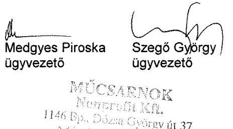

---

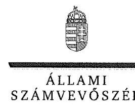

ELNÖK

# Medgyes Piroska úrhölgy 

ügyvezető
Műcsarnok Közhasznú Nonprofit Kft.

## Budapest

## Tisztelt Ügyvezető Úrhölgy!

Az „Állami tulajdonú gazdasági társaságok - Az állami tulajdonban (résztulajdonban) lévő gazdálkodó szervezetek vagyonmegőrzési és gazdálkodási tevékenységének ellenőrzése - Mücsarnok Közhasznú Nonprofit Kft. " címmel készített számvevőszéki jelentéstervezetre tett észrevételeit megkaptam.
Az Állami Számvevőszék észrevételekre vonatkozó álláspontjáról a felügyeleti vezető által készített részletes tájékoztatást csatoltan megküldöm.
Tájékoztatom Ügyvezető úrhölgyet, hogy a számvevőszéki jelentésben - az Állami Számvevőszékről szóló 2011. évi LXVI. törvény 29. § (3) bekezdése alapján - a figyelembe nem vett észrevételeket szerepeltetjük az elutasítás indokának feltüntetésével.
Tájékoztatom továbbá, hogy jelen levelem mellékletében foglaltakról Szegő György ügyvezető urat is tájékoztattam.

Budapest, 2018. április hó 09. nap
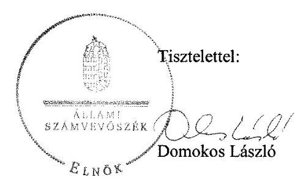

Melléklet: Tájékoztatás az el nem fogadott észrevételekről

---

# Tájékoztatás az el nem fogadott észrevételről 

,,Állami tulajdonú gazdasági társaságok - Az állami tulajdonban (résztulajdonban) lévő gazdálkodó szervezetek vagyonmegőrzési és gazdálkodási tevékenységének ellenőrzése - Mücsarnok Közhasznú Nonprofit Kft. " című jelentéstervezetre a 1385-06/2017. iktatószámú levélben megküldött észrevételeit áttekintettem. Az észrevételek kezeléséről az alábbi tájékoztatást adom.

## 1. A jelentéstervezet „Főbb megállapítások, következtetések, javaslatok" 2. bekezdésének első mondatához füzött észrevétele kapcsán

Észrevételében jelezte, hogy 2015-ben is rendelkeztek számlarenddel, amely a vizsgált időszakban az adott év Számviteli politikájának VII. fejezete volt. Levelében elismerte, hogy a 2015. évre vonatkozó számlarend az adatszolgáltatás során nem került feltöltésre és hivatkozott arra, hogy annak megléte a Számviteli politika tartalomjegyzékéből kiolvasható.
Az Állami Számvevőszék (továbbiakban: ÁSZ) az ellenőrzését a megküldött ellenőrzési programnak megfelelően, a rendelkezésre bocsátott adatok és dokumentumok (bizonyítékok) alapján végezte. Az Állami Számvevőszékről szóló 2011. évi LXVI. törvény (továbbiakban: ÁSZ tv.) 28. § (1) bekezdése alapján a közreműködésre felhívott szervezet az ÁSZ részére - annak kérésére soron kívül, de legkésőbb öt munkanapon belül - az ellenőrzés lefolytatása érdekében szükséges adatokat és dokumentumokat rendelkezésre bocsátja. A bekért dokumentumok között - mint azt Ön sem vitatja - nem került feltöltésre a 2015. évre vonatkozó számlarend, a Számviteli politika tartalomjegyzéke pedig önmagában nem bizonyítja annak meglétét. Fentiekre tekintettel észrevételét nem fogadjuk el, a jelentéstervezet módosítása nem indokolt.

## 2. A jelentéstervezet „Főbb megállapítások, következtetések, javaslatok" 2. bekezdésének második mondatához füzött észrevétele kapcsán

Észrevételében jelezte, hogy 2016-ban is szabályszerűen számolták el az értékcsökkenést, a számviteli politikában rögzített leírási kulcsot alkalmazták és a megfelelő főkönyvi számlára számolták el, illetve a tárgyi eszközök nyilvántartásba vételét minden esetben bizonylattal támasztották alá.
A dokumentumok ismételt áttekintése során megállapítottam, hogy 2016. évben az értékcsökkenési leírás elszámolásakor az eszközök téves besorolása miatt nem a Számviteli politikában meghatározott leírási kulcsot alkalmazták és az elszámolás a tárgyi eszközökön belül nem a megfelelő főkönyvi számlára történt. V-1392-047/2016. és V-1392-060/2016. számú adatbekérő leveleink tartalmazták a Társaság által elektronikusan feltöltendő dokumentumokat, a vagyonnyilvántartások és értékcsökkenési leírás ellenőrzése esetében a kiválasztott tételek dokumentumait, többek között a tárgyi eszközök állományba vételi bizonylatát, üzembehelyezési okmányát. A bekért dokumentumok között 2016. évet érintően több esetben nem került feltöltésre a kísérő tárgyi eszközök nyilvántartásba vételét alátámasztó dokumentum. Ügyvezető úrhölgy 2017. november 23-án és 2017. november 29-én kelt teljességi és hitelességi nyilatkozatai szerint az

---

ÁSZ részére átadott dokumentumok a bekért adatokra, dokumentumokra vonatkozóan teljes körű információt tartalmaznak. Továbbá Ügyvezető úrhölgy nyilatkozatában az átadott dokumentumok, adatok hitelességéért, valódiságáért, hiánytalanságáért és hatályosságáért teljes felelősséget vállalt. Fentiekre tekintettel észrevételét nem fogadjuk el, a jelentéstervezet módosítása nem indokolt.

# 3. A jelentéstervezet „Főbb megállapítások, következtetések, javaslatok" 2. bekezdésének harmadik mondatához füzött észrevétele kapcsán 

Észrevételében jelezte, hogy a Társaság mindig készített elő-, illetve utókalkulációt a vállalkozási tevékenysége keretében végzett szolgáltatásokra. Véleménye szerint a jegyárak önköltségszámítással történő meghatározása nem releváns, mivel a jegyárak megállapítása során még az önköltség nem érvényesíthető. Fentieken túlmenően jelezte, hogy Önköltség-számítási szabályzatukat felülvizsgálják és a számvitelről szóló 2000. évi C. törvény (továbbiakban: Számv. tv.) vonatkozó rendelkezéseivel összhangban aktualizálják.
Ügyvezető úrhölgy a jegyárak önköltségszámításának hiányát nem vitatta. A Számv. tv. 14. § (7) bekezdésében és 51. § (2) bekezdésében előírtak egyértelműen meghatározzák többek között azt, hogy a végzett szolgáltatások önköltségét az önköltségszámítás rendjére vonatkozó belső szabályzat szerinti utókalkuláció módszerével kell megállapítani. A Társaság Önköltségszámítási szabályzata az ellenőrzött időszakra vonatkozó szolgáltatási díjmegállapításra - jegybevételekre - nem terjedt ki, így a jegybevételekre vonatkozó szolgáltatás önköltségét nem állapították meg az utókalkuláció módszerével. A V-1392-003/2016. számú adatbekérő levél tartalmazta a Társaság által elektronikusan beküldendő adatállományokat, a 8. francia bekezdésben többek között az elő- és utókalkulációk dokumentumait. Ügyvezető úrhölgy 2017. augusztus 31-ei nyilatkozata szerint a Társaság szolgáltatási díjait a kiállítóhely belépőjegyeinek típusai adják. A Társaság által összeállított kiadványokra, a helyiségek bérbeadására és a szállítói kapacitás kihasználására vonatkozó önköltség számítást megalapozó dokumentumok nem kerültek megküldésre. Ügyvezető úrhölgy 2017. november 15-én kelt teljességi és hitelességi nyilatkozata szerint az ÁSZ részére átadott dokumentumok a bekért adatokra, dokumentumokra vonatkozóan teljes körű információt tartalmaznak. Fentiekre tekintettel észrevételét nem fogadjuk el, a jelentéstervezet módosítása nem indokolt.
Köszönettel vettem tájékoztatását, hogy a jövőben a Számv. tv. előírásainak megfelelően aktualizálják Önköltség-számítási szabályzatukat.

## 4. A jelentéstervezet „Főbb megállapítások, következtetések, javaslatok" 3. bekezdésének első és második mondatához füzött észrevételei kapcsán

Észrevételében jelezte, hogy mindeddig nem volt tudomása arról, hogy a Társaság kormányzati szektorba sorolt állami tulajdonú társaság. Nehezményezte, hogy a kormányzati szektorba történő besorolás sem jogszabályban, sem tárcaközleményben nem jelent meg, illetve azt, hogy az adatszolgáltatás elmulasztásáról jelzést az illetékesektől nem kapott. Fentieken túl jelezte, hogy a jövőben adatszolgáltatási kötelezettségüknek eleget tesznek. Észrevételében jelezte, hogy a 370/2011. (XII. 31.) Korm. rendelet hatálya, mint kormányzati szektorba sorolt egyéb szervezetre terjed ki.

---

Az észrevétel a megállapítást nem vitatta, ezért a jelentéstervezet módosítása nem indokolt.

# 5. A jelentéstervezet „Főbb megállapítások, következtetések, javaslatok" 4. bekezdéséhez füzőtt észrevételei kapcsán 

Észrevételében jelezte, hogy a Társaságnál 2012-2016. között minden évben megtörtént minden tárgyi eszköz mennyiségi leltározása, az éves beszámoló minden évben leltárral alátámasztott volt és ezt a könyvvizsgáló minden évben ellenőrizte. Elismerte továbbá, hogy a mennyiségi leltárfelvétel nem került beküldésre az adatszolgáltatás során. Nehezményezte, hogy a mennyiségi leltárívek meglétéről az ÁSZ helyszíni ellenőrzés során nem győződött meg, illetve hiánypótlást nem írt elő. Egyúttal jelezte, hogy a leltáríveket papír alapon rendelkezésre bocsátja.
Ügyvezető úrhölgy az adatszolgáltatás hiányát nem vitatta. A V-1392-003/2016. számú adatbekérő levél tartalmazta a Társaság által elektronikusan feltöltendő dokumentumokat, többek között a beszámolót alátámasztó zárás előtti főkönyvi kivonatokat és leltárkimutatásokat, leltárösszesítőket. Ügyvezető úrhölgy 2017. november 15-én kelt teljességi és hitelességi nyilatkozata szerint az ÁSZ részére átadott dokumentumok a bekért adatokra, dokumentumokra vonatkozóan teljes körű információt tartalmaznak. Ügyvezető úrhölgy nyilatkozatában az átadott dokumentumok, adatok hitelességéért, valódiságáért, hiánytalanságáért és hatályosságáért is teljes felelősséget vállalt és nyilatkozatában nem jelezte a mennyiségi leltárívek beküldésének problémáját.
Tekintettel arra, hogy az éves beszámolókban a tárgyi eszközök értékét mennyiségi leltározással nem támasztották alá, megsértették a Számv. tv. 69. § (1) és (3) bekezdéseiben foglaltakat, így fenntartom azon álláspontomat, hogy a Társaság beszámolóinak megalapozottsága, a vagyon védelme nem volt biztosított.
Fentiekre tekintettel észrevételét nem fogadjuk el, a jelentéstervezet módosítása nem indokolt.

Budapest, 2018. április
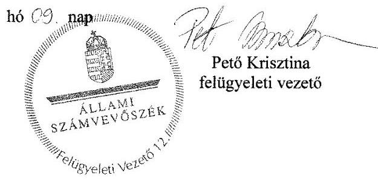

---

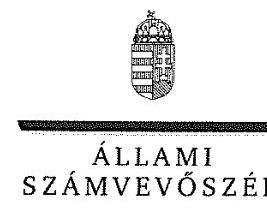

ELNÖK

# Szegő György úr 

ügyvezető
Műcsarnok Közhasznú Nonprofit Kft.

## Budapest

## Tisztelt Ügyvezető Úr!

Az ,,Állami tulajdonú gazdasági társaságok - Az állami tulajdonban (résztulajdonban) lévő gazdálkodó szervezetek vagyonmegőrzési és gazdálkodási tevékenységének ellenőrzése - Mücsarnok Közhasznú Nonprofit Kft." címmel készített számvevőszéki jelentéstervezetre tett észrevételeit megkaptam.
Az Állami Számvevőszék észrevételekre vonatkozó álláspontjáról a felügyeleti vezető által készített részletes tájékoztatást csatoltan megküldöm.
Tájékoztatom Ügyvezető urat, hogy a számvevőszéki jelentésben - az Állami Számvevőszékről szóló 2011. évi LXVI. törvény 29. § (3) bekezdése alapján - a figyelembe nem vett észrevételeket szerepeltetjük az elutasítás indokának feltüntetésével.
Tájékoztatom továbbá, hogy jelen levelem mellékletében foglaltakról Medgyes Piroska ügyvezető úrhölgyet is tájékoztattam.

Budapest, 2018. április hó 09. nap
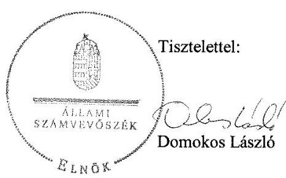

Melléklet: Tájékoztatás az el nem fogadott észrevételekről

---
 az alábbi tájékoztatást adom.

## 1. A jelentéstervezet „Főbb megállapítások, következtetések, javaslatok" 2. bekezdésének első mondatához füzött észrevétele kapcsán

Észrevételében jelezte, hogy 2015-ben is rendelkeztek számlarenddel, amely a vizsgált időszakban az adott év Számviteli politikájának VII. fejezete volt. Levelében elismerte, hogy a 2015. évre vonatkozó számlarend az adatszolgáltatás során nem került feltöltésre és hivatkozott arra, hogy annak megléte a Számviteli politika tartalomjegyzékéből kiolvasható.
Az Állami Számvevőszék (továbbiakban: ÁSZ) az ellenőrzését a megküldött ellenőrzési programnak megfelelően, a rendelkezésre bocsátott adatok és dokumentumok (bizonyítékok) alapján végezte. Az Állami Számvevőszékről szóló 2011. évi LXVI. törvény (továbbiakban: ÁSZ tv.) 28. § (1) bekezdése alapján a közreműködésre felhívott szervezet az ÁSZ részére - annak kérésére soron kívül, de legkésőbb öt munkanapon belül - az ellenőrzés lefolytatása érdekében szükséges adatokat és dokumentumokat rendelkezésre bocsátja. A bekért dokumentumok között - mint azt Ön sem vitatja - nem került feltöltésre a 2015. évre vonatkozó számlarend, a Számviteli politika tartalomjegyzéke pedig önmagában nem bizonyítja annak meglétét. Fentiekre tekintettel észrevételét nem fogadjuk el, a jelentéstervezet módosítása nem indokolt.

## 2. A jelentéstervezet „Főbb megállapítások, következtetések, javaslatok" 2. bekezdésének második mondatához füzött észrevétele kapcsán

Észrevételében jelezte, hogy 2016-ban is szabályszerűen számolták el az értékcsökkenést, a számviteli politikában rögzített leírási kulcsot alkalmazták és a megfelelő főkönyvi számlára számolták el, illetve a tárgyi eszközök nyilvántartásba vételét minden esetben bizonylattal támasztották alá.
A dokumentumok ismételt áttekintése során megállapítottam, hogy 2016. évben az értékcsökkenési leírás elszámolásakor az eszközök téves besorolása miatt nem a Számviteli politikában meghatározott leírási kulcsot alkalmazták és az elszámolás a tárgyi eszközökön belül nem a megfelelő főkönyvi számlára történt. V-1392-047/2016. és V-1392-060/2016. számú adatbekérő leveleink tartalmazták a Társaság által elektronikusan feltöltendő dokumentumokat, a vagyonnyilvántartások és értékcsökkenési leírás ellenőrzése esetében a kiválasztott tételek dokumentumait, többek között a tárgyi eszközök állományba vételi bizonylatát, üzembehelyezési okmányát. A bekért dokumentumok között 2016. évet érintően több esetben nem került feltöltésre a kísérő tárgyi eszközök nyilvántartásba vételét alátámasztó dokumentum. Ügyvezető úr 2017. november 23-án és 2017. november 29-én kelt teljességi és hitelességi nyilatkozatai szerint az ÁSZ részére

---

átadott dokumentumok a bekért adatokra, dokumentumokra vonatkozóan teljes körű információt tartalmaznak. Továbbá Ügyvezető úr nyilatkozatában az átadott dokumentumok, adatok hitelességéért, valódiságáért, hiánytalanságáért és hatályosságáért teljes felelősséget vállalt. Fentiekre tekintettel észrevételét nem fogadjuk el, a jelentéstervezet módosítása nem indokolt.

# 3. A jelentéstervezet „Főbb megállapítások, következtetések, javaslatok" 2. bekezdésének harmadik mondatához füzött észrevétele kapcsán 

Észrevételében jelezte, hogy a Társaság mindig készített elő-, illetve utókalkulációt a vállalkozási tevékenysége keretében végzett szolgáltatásokra. Véleménye szerint a jegyárak önköltségszámítással történő meghatározása nem releváns, mivel a jegyárak megállapítása során még az önköltség nem érvényesíthető. Fentieken túlmenően jelezte, hogy Önköltség-számítási szabályzatukat felülvizsgálják és a számvitelről szóló 2000. évi C. törvény (továbbiakban: Számv. tv.) vonatkozó rendelkezéseivel összhangban aktualizálják.
Ügyvezető úr a jegyárak önköltségszámításának hiányát nem vitatta. A Számv. tv. 14. § (7) bekezdésében és 51. § (2) bekezdésében előírtak egyértelműen meghatározzák többek között azt, hogy a végzett szolgáltatások önköltségét az önköltségszámítás rendjére vonatkozó belső szabályzat szerinti utókalkuláció módszerével kell megállapítani. A Társaság Önköltség-számítási szabályzata az ellenőrzött időszakra vonatkozó szolgáltatási díjmegállapításra - jegybevételekre - nem terjedt ki, így a jegybevételekre vonatkozó szolgáltatás önköltségét nem állapították meg az utókalkuláció módszerével. A V-1392-003/2016. számú adatbekérő levél tartalmazta a Társaság által elektronikusan beküldendő adatállományokat, a 8. francia bekezdésben többek között az elő- és utókalkulációk dokumentumait. Ügyvezető úr 2017. augusztus 31-ei nyilatkozata szerint a Társaság szolgáltatási díjait a kiállítóhely belépőjegyeinek típusai adják. A Társaság által összeállított kiadványokra, a helyiségek bérbeadására és a szállítói kapacitás kihasználására vonatkozó önköltség számítást megalapozó dokumentumok nem kerültek megküldésre. Ügyvezető úr 2017. november 15-én kelt teljességi és hitelességi nyilatkozata szerint az ÁSZ részére átadott dokumentumok a bekért adatokra, dokumentumokra vonatkozóan teljes körű információt tartalmaznak. Fentiekre tekintettel észrevételét nem fogadjuk el, a jelentéstervezet módosítása nem indokolt.
Köszönettel vettem tájékoztatását, hogy a jövőben a Számv. tv. előírásainak megfelelően aktualizálják Önköltség-számítási szabályzatukat.

## 4. A jelentéstervezet „Főbb megállapítások, következtetések, javaslatok" 3. bekezdésének első és második mondatához füzött észrevételei kapcsán

Észrevételében jelezte, hogy mindeddig nem volt tudomása arról, hogy a Társaság kormányzati szektorba sorolt állami tulajdonú társaság. Nehezményezte, hogy a kormányzati szektorba történő besorolás sem jogszabályban, sem tárcaközleményben nem jelent meg, illetve azt, hogy az adatszolgáltatás elmulasztásáról jelzést az illetékesektől nem kapott. Fentieken túl jelezte, hogy a jövőben adatszolgáltatási kötelezettségüknek eleget tesznek. Észrevételében jelezte, hogy a 370/2011. (XII. 31.) Korm. rendelet hatálya, mint kormányzati szektorba sorolt egyéb szervezetre terjed ki.
Az észrevétel a megállapítást nem vitatta, ezért a jelentéstervezet módosítása nem indokolt.

---

# 5. A jelentéstervezet „Főbb megállapítások, következtetések, javaslatok" 4. bekezdéséhez füzött észrevételei kapcsán 

Észrevételében jelezte, hogy a Társaságnál 2012-2016. között minden évben megtörtént minden tárgyi eszköz mennyiségi leltározása, az éves beszámoló minden évben leltárral alátámasztott volt és ezt a könyvvizsgáló minden évben ellenőrizte. Elismerte továbbá, hogy a mennyiségi leltárfelvétel nem került beküldésre az adatszolgáltatás során. Nehezményezte, hogy a mennyiségi leltárívek meglétéről az ÁSZ helyszíni ellenőrzés során nem győződött meg, illetve hiánypótlást nem írt elő. Egyúttal jelezte, hogy a leltáríveket papír alapon rendelkezésre bocsátja.
Ügyvezető úr az adatszolgáltatás hiányát nem vitatta. A V-1392-003/2016. számú adatbekérő levél tartalmazta a Társaság által elektronikusan feltöltendő dokumentumokat, többek között a beszámolót alátámasztó zárás előtti főkönyvi kivonatokat és leltárkimutatásokat, leltárösszesítőket. Ügyvezető úr 2017. november 15-én kelt teljességi és hitelességi nyilatkozata szerint az ÁSZ részére átadott dokumentumok a bekért adatokra, dokumentumokra vonatkozóan teljes körű információt tartalmaznak. Ügyvezető úr nyilatkozatában az átadott dokumentumok, adatok hitelességéért, valódiságáért, hiánytalanságáért és hatályosságáért is teljes felelősséget vállalt és nyilatkozatában nem jelezte a mennyiségi leltárívek beküldésének problémáját.
Tekintettel arra, hogy az éves beszámolókban a tárgyi eszközök értékét mennyiségi leltározással nem támasztották alá, megsértették a Számv. tv. 69. § (1) és (3) bekezdéseiben foglaltakat, így fenntartom azon álláspontomat, hogy a Társaság beszámolóinak megalapozottsága, a vagyon védelme nem volt biztosított.
Fentiekre tekintettel észrevételét nem fogadjuk el, a jelentéstervezet módosítása nem indokolt.

Budapest, 2018. ápr[il]
hó 09. nap
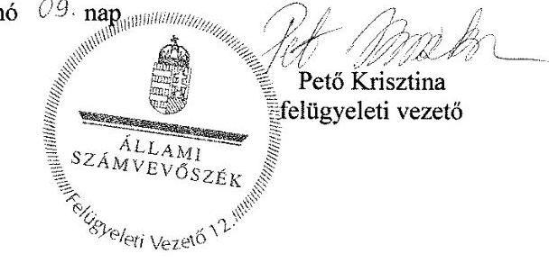

---

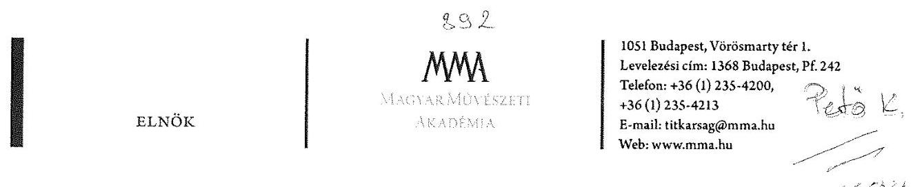

Domokos László úr
elnök
Állami Számvevőszék

Budapest

Tisztelt Elnök Úr!

Köszönettel megkaptuk az „Állami tulajdonú gazdasági társaságok - Az állami tulajdonban (résztulajdonban) lévő gazdálkodó szervezetek vagyonmegőrzési és gazdálkodási tevékenységének ellenőrzése - Múcsarnok Közhasznú Nonprofit Kft." címú V-1392085/2016. iktatószámú számvevőszéki jelentéstervezetüket.

Az ellenőrzés megállapításaira észrevételként mellékelten megküldjük a Múcsarnok Nonprofit Kft. észrevételeit tartalmazó ügyvezetői levelet.

Bízva fenti észrevételeink pozitív elbírálásában megköszönöm Önnek és munkatársainak az ellenőrzés során tanúsított segítő, előremutató munkáját.

Budapest, 2018. március 24.

Szívélyes üdvözlettel,

Vashegy Gyöngy

Melléklet: Múcsarnok Közhasznú Nonprofit Kft. észrevételei a V-1392-085/2016. iktatószámú számvevőszéki jelentéstervezetre

---

# 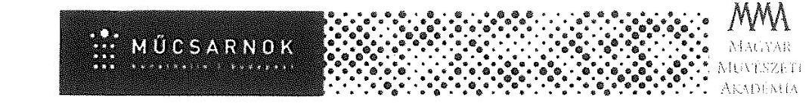 

iktató szám: 1385-06/2017

Állami Számvevőszék
Budapest, 2018. március 19.
Domokos László
elnök

## Budapest,

Apáczai Csere János u. 10.
1052
Levelezési cím: 1364 Budapest, Pf.: 54.

Tárgy: észrevételek a V-1392-082/2016. iktatószámú ellenőrzés jelentéstervezetéhez

Tisztelt Elnök Úr!

Köszönettel megkaptuk az Állami Számvevőszék „Állami tulajdonú gazdasági társaságok Az állami tulajdonban (résztulajdonban) lévő gazdálkodó szervezetek vagyonmegőrzési és gazdálkodási tevékenységének ellenőrzéséről" szóló jelentés tervezetüket.

A Számvevőszéki jelentéstervezet megállapításaihoz az alábbi észrevételeket füzzük:

A Jelentéstervezet összegzése (5. oldalon) szerint a „A Társaság működésének szabályozottsága nem felelt meg a jogszabályi előírásoknak a számviteli szabályzatok hiányossága miatt. A bevételek és ráfordítások elszámolása a 2012-2016. években szabályszerű volt, az értékcsökkenés elszámolása azonban 2016. évben nem volt szabályszerű. A Társaság az egyes szolgáltatások díjait önköltség-számítással nem alapozta meg."

- 2015-ben is rendelkeztünk számlarenddel. A számlarend a vizsgált időszakban az adott év Számviteli politikájának VII. fejezete volt. A 2015. évre vonatkozó számlarend az adatfeltöltéskor technikai hiba miatt nem került elektronikusan feltöltésre. Azonban a feltöltésre került 2015. évi Számviteli politika tartalomjegyzékéből és a feltöltött részek oldaltartományaiból látható, hogy Számlarend ebben az évben is volt.
- Véleményünk szerint - a többi vizsgált időszakhoz hasonlóan - 2016-ban is szabályszerűen számoltuk el az értékcsökkenést, a számviteli politikában rögzített leírási kulcsokat alkalmaztuk, és a megfelelő főkönyvi számlára számoltuk el. A tárgyi eszközök nyilvántartásba vételét minden esetben bizonylattal támasztottuk alá (Állományba vételi bizonylat, Üzembehelyezési (aktiválás) jegyzőkönyv, Raktári bevételezési bizonylat).

---

- Társaságunk mindig készített elő- illetve utókalkulációt a vállalkozási tevékenysége keretében végzett szolgáltatásokra. Ezek képezték az adott árajánlat alapját. A kiállítások megrendezéséhez kapcsolódó költségek az éves támogatás terhére kerültek elszámolásra, tekintettel azok közhasznú jellegére. A jegyárak önköltségszámítással történő meghatározása nem releváns, mivel a jegyárak megállapítása során még az önköltség sem érvényesíthető.
Az Önköltség-számítási szabályzatunkat felülvizsgáljuk és a Számv. tv. vonatkozó rendelkezéseivel összhangban aktualizáljuk.
„A Társaság teljesítette tervezési és beszámolási kötelezettségét, a jogszabályban előírt, államháztartásért felelős miniszter felé teljesítendő adatszolgáltatási kötelezettségének nem tett eleget. A Társaság nem alakította ki belső ellenőrzési rendszerét."
- Mindeddig nem volt tudomásunk arról, hogy társaságunk kormányzati szektorba sorolt állami tulajdonú társaság lenne. Az Önök által a jelentéstervezetben hivatkozott NGM közleményt csak most, az Önök dátum szerinti hivatkozásával vált számunkra ismerté. Tekintettel arra, hogy a kormányzati szektorba történő besorolás nem jogszabályban, hanem egy sem fenntartónak, sem szakmai irányítónak nem minősülő minisztérium tárcaközleményében jelent meg, annak nem ismerete nem tekinthető mulasztásnak a részünkről. Az elmúlt öt évben sem a nyilvántartásba vételről, sem a vonatkozó Ávr.-ben meghatározott adatszolgáltatási kötelezettség elmulasztásáról nem kaptunk értesítést, felszólítást az adatszolgáltatás címzettjétől, azaz a besorolást tartalmazó közleményt kiadó NGM-től. A jövőben - ameddig ez a besorolás fennmarad - ennek a fennálló kötelezettségünknek eleget fogunk tenni.
- A 370/2011-es számú kormányrendelet (Bkr.) hatálya, mint kormányzati szektorba sorolt egyéb szervezetre terjed ki. Hivatkozva a fenti bekezdésben leírtakra - nem volt ismert számunkra a jelzett NGM közlemény - mindeddig úgy tekintettük, hogy nem tartozunk a Bkr. hatálya alá.
„A Társaság vagyongazdálkodása nem volt szabályszerű, a tárgyi eszközök mennyiségi leltározásának hiányában a Társaság beszámolóinak megalapozottsága, a vagyon védelme nem volt biztosított."
- A társaságnál 2012. és 2016. között minden évben megtörtént minden tárgyi eszköz mennyiségi leltározása. Az éves beszámoló minden évben leltárral van alátámasztva. Ezt a könyvvizsgálónk minden évben megkapta és ellenőrizte.
- Az erről készült leltározási jegyzőkönyveket és leltárösszesítőket az adatszolgáltatási kötelezettségünk keretében elektronikusan feltöltöttük az ellenőrzés során. Sajnos a több száz oldalas mennyiségi leltárfelvételt a rendelkezésre álló rövid határidő miatt nem lehetett elektronikusan feltölteni az Önök adatbekérésekor. A jelenleg a Műcsarnok rendelkezésére álló humánerőforrások és műszaki-technikai feltételek mellett ezek szkennelése nem megoldható. (A leltárívek jelentős része A/3-as méretben készült mátrix nyomtatóval, amely olvashatatlanul szkennelhető, ráadásul a mennyiség miatt ez a feladat öt nap alatt - a társaság napi működésének biztosítása mellett - a munkaügyi jogszabályok betartásával nem végezhető el.)

---

Tudomásul vesszük az Állami Számvevőszék ellenőrzési módszertanát, de sajnáljuk, hogy a mennyiségi leltárívek meglétéről helyszíni ellenőrzés során nem
 győződtek meg, vagy hiánypótlásként nem írták elő ezeknek a dokumentumoknak a pótlólagos bemutatását. Az ÁSZ tv.-ben meghatározott 5 munkanap nagyon kevés idő arra, hogy ekkora időszak anyagát teljeskörűen digitalizáljuk és feltöltsük, már csak az előző bekezdésben részletezett okok miatt sem.
Amennyiben az ÁSZ ezt igényli, a leltáríveket papír alapon rendelkezésre tudjuk bocsátani.

Az elmarasztaló megállapítással nem értünk egyet, ugyanis a Mücsarnok Nonprofit Kft. beszámolói megalapozottak voltak és biztosították a vagyon védelmét.

A fenti észrevételeink pozitív elbírálásában bízva megköszönjük Önnek és munkatársainak az ellenőrzés során tanúsított segítő, előremutató munkáját. Javaslatalk alapján elkészítjük intézkedési tervünket, melyet az előírt határidőben megküldünk Önöknek.

Üdvözlettel:
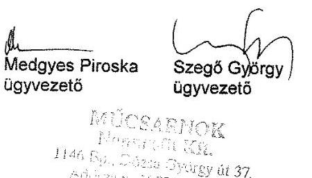

---

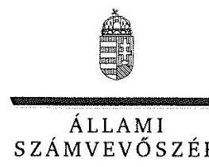

ELNÖK

Ikt.szám: V-1392-093/2016.

# Vashegyi György úr 

elnök
Magyar Művészeti Akadémia

## Budapest

## Tisztelt Elnök Úr!

Az „Állami tulajdonú gazdasági társaságok - Az állami tulajdonban (résztulajdonban) lévő gazdálkodó szervezetek vagyonmegőrzési és gazdálkodási tevékenységének ellenőrzése - Mücsarnok Közhasznú Nonprofit Kft." címmel készített számvevőszéki jelentéstervezetre megküldött, a Mücsarnok Közhasznú Nonprofit Kft. ügyvezető igazgatók észrevételeit tartalmazó levelet megkaptam.
Az Állami Számvevőszék az észrevételekre vonatkozó álláspontjáról a felügyeleti vezető által készített részletes tájékoztatást csatoltan az Ön részére is megküldöm.
Tájékoztatom Elnök urat, hogy a számvevőszéki jelentésben - az Állami Számvevőszékről szóló 2011. évi LXVI. törvény 29. § (3) bekezdése alapján - a figyelembe nem vett észrevételeket szerepeltetjük az elutasítás indokának feltüntetésével.
Tájékoztatom továbbá, hogy jelen levelem mellékletében foglaltakról Medgyes Piroska ügyvezető úrhölgyet és Szegő György ügyvezető urat is tájékoztattam.

Budapest, 2018. április hó 05. nap
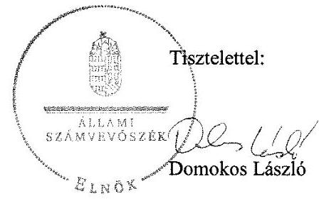

Melléklet: Tájékoztatás az el nem fogadott észrevételekről

---

# Tájékoztatás az el nem fogadott észrevételről 

„Állami tulajdonú gazdasági társaságok - Az állami tulajdonban (résztulajdonban) lévő gazdálkodó szervezetek vagyonmegőrzési és gazdálkodási tevékenységének ellenőrzése - Mücsarnok Közhasznú Nonprofit Kft." címü jelentéstervezetre az MMA/1988-2/2018. iktatószámú levél mellékleteként megküldött, Mücsarnok Közhasznú Nonprofit Kft. által összeállított észrevételeket áttekintettem. Az észrevételek kezeléséről az alábbi tájékoztatást adom.

## 1. A jelentéstervezet „Főbb megállapítások, következtetések, javaslatok" 2. bekezdésének első mondatához füzött észrevétel kapcsán

Az észrevétel jelezte, hogy a Társaság 2015-ben is rendelkezett számlarenddel, amely a vizsgált időszakban az adott év Számviteli politikájának VII. fejezete volt. Elismerték, hogy a 2015. évre vonatkozó számlarend az adatszolgáltatás során nem került feltöltésre és hivatkoztak arra, hogy annak megléte a Számviteli politika tartalomjegyzékéből kiolvasható.
Az Állami Számvevőszék (továbbiakban: ÁSZ) az ellenőrzését a megküldött ellenőrzési programnak megfelelően, a rendelkezésre bocsátott adatok és dokumentumok (bizonyítékok) alapján végezte. Az Állami Számvevőszékről szóló 2011. évi LXVI. törvény (továbbiakban: ÁSZ tv.) 28. § (1) bekezdése alapján a közreműködésre felhívott szervezet az ÁSZ részére - annak kérésére soron kívül, de legkésőbb öt munkanapon belül - az ellenőrzés lefolytatása érdekében szükséges adatokat és dokumentumokat rendelkezésre bocsátja. A bekért dokumentumok között - mint azt az észrevétel sem vitatja - nem került feltöltésre a 2015. évre vonatkozó számlarend, a Számviteli politika tartalomjegyzéke pedig önmagában nem bizonyítja annak meglétét. Fentiekre tekintettel az észrevételt nem fogadjuk el, a jelentéstervezet módosítása nem indokolt.

## 2. A jelentéstervezet „Főbb megállapítások, következtetések, javaslatok" 2. bekezdésének második mondatához füzött észrevétel kapcsán

Az észrevétel jelezte, hogy a Társaság 2016-ban is szabályszerűen számolta el az értékcsökkenést, a számviteli politikában rögzített leírási kulcsot alkalmazták és a megfelelő főkönyvi számlára számolták el, illetve a tárgyi eszközök nyilvántartásba vételét minden esetben bizonylattal támasztották alá.
A dokumentumok ismételt áttekintése során megállapítottam, hogy 2016. évben az értékcsökkenési leírás elszámolásakor az eszközök téves besorolása miatt nem a Számviteli politikában meghatározott leírási kulcsot alkalmazták és az elszámolás a tárgyi eszközökön belül nem a megfelelő főkönyvi számlára történt. V-1392-047/2016. és V-1392-060/2016. számú adatbekérő leveleink tartalmazták a Társaság által elektronikusan feltöltendő dokumentumokat, a vagyonnyilvántartások és értékcsökkenési leírás ellenőrzése esetében a kiválasztott tételek dokumentumait, többek között a tárgyi eszközök állományba vételi bizonylatát, üzembehelyezési okmányát. A bekért dokumentumok között 2016. évet érintően több esetben nem került feltöltésre a kisértékű

---

tárgyi eszközök nyilvántartásba vételét alátámasztó dokumentum. Az ügyvezetők 2017. november 23-án és 2017. november 29-én kelt teljességi és hitelességi nyilatkozatai szerint az ÁSZ részére átadott dokumentumok a bekért adatokra, dokumentumokra vonatkozóan teljes körű információt tartalmaznak. Továbbá az ügyvezetők nyilatkozatukban az átadott dokumentumok, adatok hitelességéért, valódiságáért, hiánytalanságáért és hatályosságáért teljes felelősséget vállaltak. Fentiekre tekintettel az észrevételt nem fogadjuk el, a jelentéstervezet módosítása nem indokolt.

# 3. A jelentéstervezet „Főbb megállapítások, következtetések, javaslatok" 2. bekezdésének harmadik mondatához füzött észrevétel kapcsán 

Az észrevétel jelezte, hogy a Társaság mindig készített elő-, illetve utókalkulációt a vállalkozási tevékenysége keretében végzett szolgáltatásokra. Az észrevétel szerint a jegyárak önköltségszámítással történő meghatározása nem releváns, mivel a jegyárak megállapítása során még az önköltség nem érvényesíthető. Fentieken túlmenően az észrevétel jelezte, hogy a Társaság Önköltség-számítási szabályzatát felülvizsgálja és a számvitelről szóló 2000. évi C. törvény (továbbiakban: Számv. tv.) vonatkozó rendelkezéseivel összhangban aktualizálja.
Az észrevétel a jegyárak önköltségszámításának hiányát nem vitatta. A Számv. tv. 14. § (7) bekezdésében és 51. § (2) bekezdésében előírtak egyértelműen meghatározzák többek között azt, hogy a végzett szolgáltatások önköltségét az önköltségszámítás rendjére vonatkozó belső szabályzat szerinti utókalkuláció módszerével kell megállapítani. A Társaság Önköltség-számítási szabályzata az ellenőrzött időszakra vonatkozó szolgáltatási díjmegállapításra - jegybevételekre - nem terjedt ki, így a jegybevételekre vonatkozó szolgáltatás önköltségét nem állapították meg az utókalkuláció módszerével. A V-1392-003/2016. számú adatbekérő levél tartalmazta a Társaság által elektronikusan beküldendő adatállományokat, a 8. francia bekezdésben többek között az elő- és utókalkulációk dokumentumait. Az ügyvezetők 2017. augusztus 31-ei nyilatkozata szerint a Társaság szolgáltatási díjait a kiállítóhely belépőjegyeinek típusai adják. A Társaság által összeállított kiadványokra, a helyiségek bérbeadására és a szállítói kapacitás kihasználására vonatkozó önköltség számítást megalapozó dokumentumok nem kerültek megküldésre. Az ügyvezetők 2017. november 15-én kelt teljességi és hitelességi nyilatkozata szerint az ÁSZ részére átadott dokumentumok a bekért adatokra, dokumentumokra vonatkozóan teljes körű információt tartalmaznak. Fentiekre tekintettel az észrevételt nem fogadjuk el, a jelentéstervezet módosítása nem indokolt.
Köszönettel vettem a tájékoztatást, hogy a Társaság a jövőben a Számv. tv. előírásainak megfelelően aktualizálja Önköltség-számítási szabályzatát.

## 4. A jelentéstervezet „Főbb megállapítások, következtetések, javaslatok" 3. bekezdésének első és második mondatához füzött észrevételek kapcsán

Az észrevétel jelezte, hogy a Társaságnak mindeddig nem volt tudomása arról, hogy kormányzati szektorba sorolt állami tulajdonú társaság. Az észrevétel nehezményezte, hogy a kormányzati szektorba történő besorolás sem jogszabályban, sem tárcaközleményben nem jelent meg, illetve azt, hogy a Társaság az adatszolgáltatás elmulasztásáról jelzést az illetékesektől nem kapott. Fentieken túl az észrevétel jelezte, hogy a Társaság a jövőben adatszolgáltatási kötelezettségének

---

eleget tesz. Az észrevétel jelezte továbbá, hogy a 370/2011. (XII. 31.) Korm. rendelet hatálya, mint kormányzati szektorba sorolt egyéb szervezetre terjed ki.
Az észrevétel a megállapítást nem vitatta, ezért a jelentéstervezet módosítása nem indokolt.

# 5. A jelentéstervezet „Főbb megállapítások, következtetések, javaslatok" 4. bekezdéséhez füzött észrevétel kapcsán 

Az észrevétel jelezte, hogy a Társaságnál 2012-2016. között minden évben megtörtént minden tárgyi eszköz mennyiségi leltározása, az éves beszámoló minden évben leltárral alátámasztott volt és ezt a könyvvizsgáló minden évben ellenőrizte. Az észrevétel elismerte továbbá, hogy a mennyiségi leltárfelvétel nem került beküldésre az adatszolgáltatás során. A Társaság nehezményezte, hogy a mennyiségi leltárívek meglétéről az ÁSZ helyszíni ellenőrzés során nem győződött meg, illetve hiánypótlást nem írt elő. Az észrevétel egyúttal jelezte, hogy a Társaság a leltáríveket papír alapon rendelkezésre bocsátja.
Az észrevétel az adatszolgáltatás hiányát nem vitatta. A V-1392-003/2016. számú adatbekérő levél tartalmazta a Társaság által elektronikusan feltöltendő dokumentumokat, többek között a beszámolót alátámasztó zárás előtti főkönyvi kivonatokat és leltárkimutatásokat, leltárösszesítőket. Az ügyvezetők 2017. november 15-én kelt teljességi és hitelességi nyilatkozata szerint az ÁSZ részére átadott dokumentumok a bekért adatokra, dokumentumokra vonatkozóan teljes körű információt tartalmaznak. Az ügyvezetők nyilatkozatukban az átadott dokumentumok, adatok hitelességéért, valódiságáért, hiánytalanságáért és hatályosságáért is teljes felelősséget vállaltak és nyilatkozatukban nem jelezték a mennyiségi leltárívek beküldésének problémáját.
Tekintettel arra, hogy az éves beszámolókban a tárgyi eszközök értékét mennyiségi leltározással nem támasztották alá, megsértették a Számv. tv. 69. § (1) és (3) bekezdéseiben foglaltakat, így fenntartom azon álláspontomat, hogy a Társaság beszámolóinak megalapozottsága, a vagyon védelme nem volt biztosított.
Fentiekre tekintettel az észrevételt nem fogadjuk el, a jelentéstervezet módosítása nem indokolt.

Budapest, 2018. április
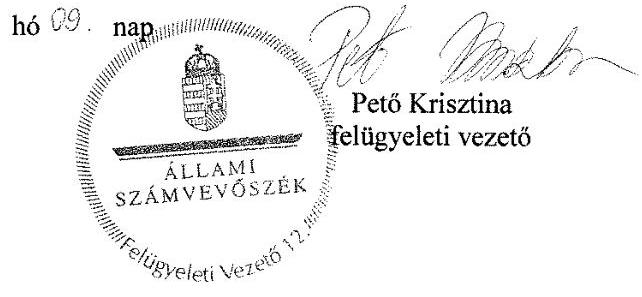

---

# RÖVIDÍTÉSEK JEGYZÉKE 

${ }^{1}$ Társaság

${ }^{2}$ M Ft
${ }^{3}$ OKM
${ }^{4}$ Közhasznú szerződés
${ }^{5}$ tulajdonos ${ }_{1}$
tulajdonos ${ }_{2}$
${ }^{6}$ MMA
${ }^{7}$ tulajdonosi joggyakorló ${ }_{1}$ tulajdonosi joggyakorló ${ }_{2}$
${ }^{8}$ MNV Zrt.
${ }^{9}$ Megbízási szerződés
${ }^{10}$ EMMI
${ }^{11}$ ügyvezető
${ }^{12}$ Gt.
${ }^{13} \mathrm{Ptk}_{2}$
${ }^{14}$ Alapító okirat

## ${ }^{15}$ SZMSZ

${ }^{16}$ Felügyelő bizottság
${ }^{17}$ Javadalmazási szabályzat
${ }^{18}$ Taktv.

Műcsarnok Kiemelten Közhasznú Nonprofit Korlátolt Felelősségű Társaság 2014. május 12-ig

Műcsarnok Közhasznú Nonprofit Korlátolt Felelősségű Társaság 2014. május 13-tól Millió Ft

Oktatási és Kulturális Minisztérium
2009. április 6-án kötött Közhasznú szerződés az Oktatási és Kulturális Minisztérium és a Műcsarnok Nonprofit Kft. között

Magyar Állam 2014. június 5-ig
Magyar Művészeti Akadémia 2014. június 6-tól
Magyar Művészeti Akadémia
Magyar Nemzeti Vagyonkezelő Zártkörűen Működő Részvénytársaság 2013 december 31-ig
Magyar Művészeti Akadémia 2014. január 1-jétől
Magyar Nemzeti Vagyonkezelő Zártkörűen Működő Részvénytársaság
SZT-41.958 sz. megbízási szerződés az MNV Zrt. és MMA között
Emberi Erőforrások Minisztériuma
a Társaság ügyvezetője, 2014. szeptember 1-jétől a kettős ügyvezetési rendszerben a szakmai-művészeti és a gazdasági-cégmenedzselési tevékenységet ellátó ügyvezetők 2006. évi IV. törvény - a gazdasági társaságokról
2013. évi V. törvény - a Polgári Törvénykönyvről
a Társaság Alapító Okirata (hatályos: 2012. február 21-től)
a Társaság Alapító Okirata (hatályos: 2013. január 31-től)
a Társaság Alapító Okirata (hatályos: 2013. május 24-től)
a Társaság Alapító Okirata (hatályos: 2013. augusztus 29-től)
a Társaság Alapító Okirata (hatályos: 2014. január 10-től)
a Társaság Alapító Okirata (hatályos: 2014. május 13-tól)
a Társaság Alapító Okirata (hatályos: 2014. június 24-től)
a Társaság Alapító Okirata (hatályos: 2014. augusztus 14-től)
a Társaság Alapító Okirata (hatályos: 2014. szeptember 9-től)
a Társaság Alapító Okirata (hatályos: 2014. november 25-től)
a Társaság Alapító Okirata (hatályos: 2015. szeptember 28-tól)
a Társaság Alapító Okirata (hatályos: 2016. május 25-től)
a Társaság Szervezet Működési Szabályzata (hatályos: 2008. október 14-től)
a Társaság Működési Szabályzata (hatályos: 2014. szeptember 9-től)
a Társaság Felügyelő Bizottsága
A Magyar Nemzeti Vagyonkezelő Zrt. vagyoni körébe tartozó, az állam többségi befolyása alatt álló gazdasági társaságok Mt. 188. § (1) bekezdése és 188/A. § (1) bekezdés hatálya alá tartozó munkavállalóira, tisztségviselőire és könyvvizsgálóira vonatkozó javadalmazási rendszerről (147/2012 (V.07.) AH melléklete)
Javadalmazási szabályzat (hatályos 2014. augusztus 26-tól)
2009. évi CXXII. törvény a köztulajdonban álló gazdasági társaságok takarékosabb működéséről

---

${ }^{19}$ MMA tv.
${ }^{20}$ Számviteli politika
${ }^{21}$ Számv. tv.
${ }^{22}$ Számlarend
${ }^{23}$ Pénzkezelési szabályzat
${ }^{24}$ Önköltség-számítási szabályzat
${ }^{25}$ Info tv.
${ }^{26}$ Ávr.
${ }^{27} \mathrm{Bkr}$.
${ }^{28}$ Selejtezési szabályzat
${ }^{29}$ Leltározási szabályzat
${ }^{30}$ Ppt.
${ }^{31}$ Áht.
${ }^{32}$ Ebktv.
${ }^{33} \mathrm{Nvtv}$.
${ }^{34}$ Civil tv.
${ }^{35}$ MFB Zrt.
${ }^{36}$ MFB tv.
2013.

 évi CLVII. törvény a Magyar Művészeti Akadémia működésével kapcsolatos egyes kérdésekről
a Társaság Számviteli politikája (hatályos 2010. január 26-tól)
a Társaság Számviteli politikája (hatályos 2013. január 28-tól)
a Társaság Számviteli politikája (hatályos 2014. január 10-től)
a Társaság Számviteli politikája (hatályos 2015. január 6-tól)
a Társaság Számviteli politikája (hatályos 2016. január 1-jétől)
2000. évi C. törvény - a számvitelről
a Társaság Számlarendje (hatályos 2010. január 26-tól)
a Társaság Számlarendje (hatályos 2013. január 28-tól)
a Társaság Számlarendje (hatályos 2014. január 10-től)
a Társaság Számlarendje (hatályos 2016. január 1-jétől)
a Társaság Pénzkezelési szabályzata (hatályos 2010. január 26-tól)
a Társaság Pénzkezelési szabályzata (hatályos 2013. január 28-tól)
a Társaság Pénzkezelési szabályzata (hatályos 2014. január 10-től)
a Társaság Pénzkezelési szabályzata (hatályos 2015. január 6-tól)
a Társaság Pénzkezelési szabályzata (hatályos 2016. január 1-jétől)
a Társaság Önköltség-számítási szabályzata (hatályos 2013. december 15-től)
2011. évi CXII. törvény az információs önrendelkezési jogról és az információszabadságról
368/2011. (XII.31.) Korm. rendelet az államháztartásról szóló törvény végrehajtásáról
370/2011. (XII. 31.) Korm. rendelet - a költségvetési szervek belső kontrollrendszeréről és belső ellenőrzéséről
a Társaság Selejtezési szabályzata (hatályos 2013. június 10-től)
Eszközök és források leltárkészítési és leltározási szabályzata, hatályos 2014. január 10-től 2015. január 5-ig
1952. évi III. törvény a polgári perrendtartásról
2011. évi CXCV. törvény - az államháztartásról
2003. évi CXXV. törvény az egyenlő bánásmódról és az esélyegyenlőség előmozdításáról
2011. évi CXCVI. törvény - a nemzeti vagyonról
2011. évi CLXXV. törvény - az egyesülési jogról, a közhasznú jogállásról, valamint a civil szervezetek működéséről és támogatásáról
Magyar Fejlesztési Bank Zártkörűen Működő Részvénytársaság
2001. évi XX. törvény - a Magyar Fejlesztési Bank Részvénytársaságról

---

# ÁLLAMI SZÁMVEVŐSZÉK 

1052 Budapest, Apáczai Csere János utca 10.
Levélcím: 1364 Budapest 4. Pf. 54
Telefon: +36 14849100 Telefax: +36 14849200
www.asz.hu
