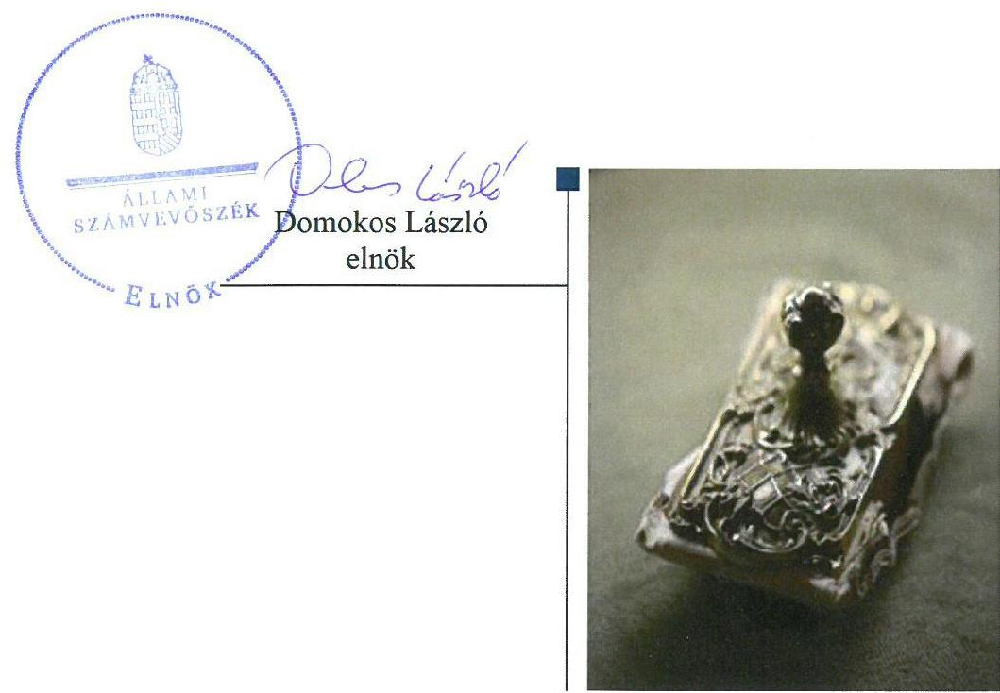
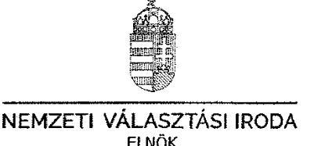
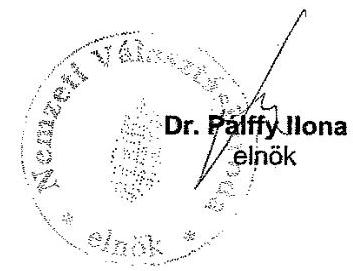
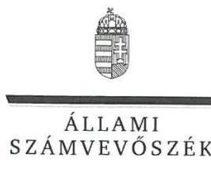
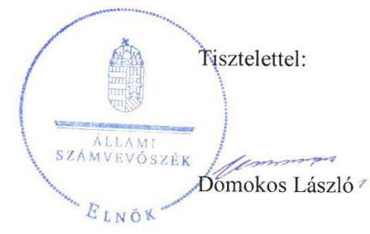

# Jellentés 

## Az időközi választásokra fordított pénzeszközök felhasználásának ellenőrzése

2018.

---

# Jelientés 

## Az időközi választásokra fordított pénzeszközök felhasználásának ellenőrzése

2018. 06. hó 15. nap

---

# AZ ELLENŐRZÉST FELÜGYELTE:

DR. BENEDEK MÁRIA felügyeleti vezető

## AZ ELLENŐRZÉST VEZETTE ÉS A VÉGREHAJTÁSÁÉRT FELELŐS:

DR. GYŐRI GABRIELLA ellenőrzésvezető

## A PROGRAM ÖSSZEÁLLÍTÁSÁÉRT FELELŐS:

TÓTPÁL SZABOLCS osztályvezető

IKTATÓSZÁM: EL-0045-060/2018

TÉMASZÁM: 40

ELLENŐRZÉS-AZONOSÍTÓ SZÁM: V0792

Jelentéseink az Országgyűlés számítógépes hálózatán és az Interneta a www.asz.hu címen is olvashatóak.

---

# TARTALOMJEGYZÉK 

■ ÖSSZEGZÉS ..... 5
■ AZ ELLENŐRZÉS CÉLJA ..... 6
■ AZ ELLENŐRZÉS TERÜLETE ..... 7
■ AZ ELLENŐRZÉS HÁTTERE, INDOKOLTSÁGA ..... 8
■ A JELENTÉS LÉNYEGES KÉRDÉSKÖRE ..... 9
■ ELLENŐRZÉS HATÓKÖRE ÉS MÓDSZEREI ..... 10
■ MEGÁLLAPÍTÁSOK ..... 12
■ JAVASLATOK ..... 15
■ MELLÉKLETEK ..... 17
I. sz. melléklet: Értelmező szótár ..... 17
■ FÜGGELÉK: ÉSZREVÉTELEK ..... 19
■ RÖVIDÍTÉSEK JEGYZÉKE ..... 25

---

.

---

# ÖSSZEGZÉS 

Az „Időközi és nemzetiségi választások" lebonyolítása fejezeti kezelésű előirányzat kezelését ellátó Nemzeti Választási Iroda a rábizott közpénzt a választások céljára használta fel, kontrollkörnyezetének kialakítása biztositotta a szabályszerü, átlátható és elszámoltatható közpénzfelhasználás feltételeit. Az előirányzat módosítása, átcsoportosítása, a maradvány kimutatása, továbbá a beszámolási feladatok ellátása a jogszabályi előirásoknak megfelelően történt.

## Az ellenőrzés társadalmi indokoltsága

Az országgyűlési képviselők választásáról szóló 2011. évi CCIII. törvény, a helyi önkormányzati képviselők és polgármesterek választásáról szóló 2010. évi L. törvény, valamint a nemzetiségek jogairól szóló 2011. évi CLXXIX. tv. rendelkezik azon körülményekről, amelyek esetében időközi választást kell tartani.

Az országgyűlési képviselők időközi választását a Nemzeti Választási Bizottság, a helyi önkormányzati képviselők és polgármesterek, valamint a helyi nemzetiségi önkormányzati képviselők időközi választását a helyi választási bizottság tűzi ki.

A választási eljárásról szóló 2013. évi XXXVI. törvény alapján a választások előkészítésével és lebonyolításával kapcsolatos állami feladatok végrehajtásának költségeit, valamint a választási szervek tevékenységével összefüggő egyéb költségeket - az Országgyűlés által megállapított mértékben - a központi költségvetésből kell biztosítani. E pénzeszközök felhasználásáról az Állami Számvevőszék tájékoztatja az Országgyűlést.

## Főbb megállapítások, következtetések, javaslatok

Az „Időközi és nemzetiségi választások lebonyolítása" fejezeti kezelésű előirányzat kontrollkörnyezetét a Nemzeti Választási Iroda a jogszabályi előírásoknak megfelelően alakította ki.

Az „Időközi és nemzetiségi választások lebonyolítása" fejezeti kezelésű előirányzat terhére teljesített kifizetések során a Nemzeti Választási Iroda a pénzeszközöket az időközi választások előkészítése és lebonyolítása érdekében, a jogszabályi előírásokkal összhangban használta fel.

A Nemzeti Választási Iroda az „Időközi és nemzetiségi választások lebonyolítása" fejezeti kezelésű előirányzat vonatkozásában az előirányzatok módosítása, átcsoportosítása, a maradvány kimutatás elkészítése, valamint az éves beszámoló összeállítása során szabályszerűen járt el.

---

# AZ ELLENŐRZÉS CÉLJA 

Az ellenőrzés célja annak megállapítása volt, hogy az országgyűlési képviselők, a helyi önkormányzati képviselők és polgármesterek, valamint a helyi nemzetiségi önkormányzati képviselők időközi választására fordított pénzeszközök tervezése, felhasználása, elszámolása és annak ellenőrzése szabályszerű volt-e.

---

# AZ ELLENŐRZÉS TERÜLETE 

## Nemzeti Választási Iroda

Az ellenőrzés a Nemzeti Választási Iroda „Időközi és nemzetiségi választások lebonyolítása" elnevezésű fejezeti kezelésű előirányzatára terjedt ki, amely a Kvtv. ${ }_{1,2}{ }^{1}$ I. Országgyűlés fejezet 24. Nemzeti Választási iroda cím, 2. Fejezeti kezelésű előirányzatok alcím, 1. jogcímcsoport alatt szerepelt.

A 2015. évben kettő országgyűlési időközi (mindkettő eredményes volt) választás kiírására került sor, 2016. évben országgyűlési időközi választás nem volt. A 2015. évben 178 önkormányzati időközi választás kiírására került sor, amelyből 143 volt eredményes. A 2016. évben 200 önkormányzati időközi választást írtak ki, melyből 161 volt eredményes.

A Nemzeti Választási Iroda - mint az Országgyűlés költségvetési fejezetén belül önálló címet képező autonóm államigazgatási szerv - kiemelt feladatként biztosította a választás központi pénzügyi feladatainak ellátását, gondoskodott a választások lebonyolításához kapcsolódó közbeszerzések lefolytatásáról és az egyéb úton történő eszközbeszerzésekről, a központi névjegyzék vezetéséről, valamint a választási feladatok lebonyolítása céljából megállapodást kötött a külpolitikáért felelős miniszterrel, valamint az egyéb választásban közreműködő szerv vezetőjével.

A Nemzeti Választási Iroda irányította a választási irodák szakmai tevékenységét, végezte a választópolgárok, jelöltek, jelölő szervezetek pártsemleges tájékoztatásával kapcsolatos feladatokat, segítette a Nemzeti Választási Bizottság munkáját. A Nemzeti Választási Iroda gondoskodott továbbá a választások lebonyolításához szükséges informatikai rendszer kialakításáról és biztonságos müködtetéséről, valamint a választás központi logisztikai feladatainak ellátásáról.

---

# AZ ELLENŐRZÉS HÁTTERE, INDOKOLTSÁGA 

Az ellenőrzés az időközi választások előkészítése és lebonyolítása során igénybe vett pénzeszközök szabályszerű felhasználására fókuszált. Az ellenőrzés eredményeként értékeltük, hogy az időközi választások előkészítésénél és lebonyolításánál a központi költségvetésből biztosított pénzeszközök felhasználása az ellenőrzött szervezetnél összhangban volt-e a választási eljárásra vonatkozó jogszabályi környezet rendelkezéseivel, amelylyel az Állami Számvevőszék eleget tesz a törvényben előírt, Országgyűlés felé teendő tájékoztatási kötelezettségének.

Az ellenőrzéssel az Állami Számvevőszék véleményt formál az időközi választások előkészítése és lebonyolítása során az ellenőrzött szervezetnél felhasznált pénzeszközök jogszabályokban leírtaknak megfelelő tervezéséről, felhasználásáról, elszámolásáról és ellenőrzéséről. Az Állami Számvevőszék az ellenőrzéssel rámutathat az időközi választás előkészítése és lebonyolítása során felhasznált pénzeszközökkel kapcsolatos esetleges szabályozási problémákra, így az ellenőrzés hozzájárulhat az időközi választások előkészítése és lebonyolítása során felhasznált pénzeszközök feletti kontrollok erősítéséhez. A kapcsolódó megállapításokkal az Állami Számvevőszék elősegítheti, támogathatja a jogalkotói és a szabályozói munkát.

Az ellenőrzés megalapozhatja a joggyakorlásban résztvevő szervezet tevékenységét szabályozó törvényi előírások, belső szabályzatok, eljárási rendek felülvizsgálatát. A feltárt szabályozási és kontroll hiányosságok bemutatásával az ellenőrzés hozzájárul azok kijavításához, valamint közvetetten a választások előkészítése és lebonyolítása során a közpénzek felhasználásával kapcsolatos közbizalom erősítéséhez.

---

# A JELENTÉS LÉNYEGES KÉRDÉSKÖRE 

Az „Időközi és nemzetiségi választások lebonyolítása" fejezeti kezelésű előirányzat felhasználásakor szabályszerűen gazdál-kodtak-e a közpénzekkel, a kiadási előirányzat teljesítése során betartották-e a jogszabályok előírásait?

---

# ELLENŐRZÉS HATÓKÖRE ÉS MÓDSZEREI 

## Az ellenőrzés típusa

Szabályszerúségi ellenőrzés.

## Az ellenőrzött időszak

A 2015-2016. évek.

## Az ellenőrzés tárgya

Az országgyűlési képviselők, a helyi önkormányzati képviselők és polgármesterek, valamint a helyi nemzetiségi önkormányzati képviselők időközi választására fordított pénzeszközök tervezése, felhasználása, elszámolása, ellenőrzése.

Az ellenőrzés kiterjedt minden olyan körülményre és adatra, amely az ÁSZ² jogszabályban meghatározott feladatainak teljesítéséhez, valamint a program végrehajtása folyamán felmerült újabb összefüggések feltárásához szükséges.

## Az ellenőrzött szervezet

Nemzeti Választási Iroda

## Az ellenőrzés jogalapja

Az ÁSZ tv. ${ }^{3} 5 . \S$ (2) bekezdése és a Ve. ${ }^{4}$ 12. §-a.

## Az ellenőrzés módszerei

Az ellenőrzést az ÁSZ az ellenőrzési program szempontjai, az ellenőrzött időszakban hatályos jogszabályok, az ellenőrzés szakmai szabályai, a jelen ellenőrzésre irányadó ÁSZ módszertanok alapján végezte.

Az előirányzatok módosításának, átcsoportosításának-, továbbá az előirányzat maradvány megállapításának szabályszerűségét tételesen, a kiadási előirányzatok teljesítésének szabályszerűségét mintavétellel ellenőrizte az ÁSZ.

Az ellenőrzési kérdések megválaszolásához szükséges bizonyítékok megszerzése az ellenőrzött által rendelkezésre bocsátott dokumentumokra, adatokra alapozva megfigyelés, mintavételezés, valamint elemző

---

eljárás útján történt. Az ellenőrzési bizonyítékként felhasználható adatforrások közé tartoztak egyrészt az ellenőrzési program részletes szempontjainál felsorolt adatforrások, másrészt minden egyéb - az ellenőrzés folyamán feltárt, az ellenőrzés szempontjából információt tartalmazó - dokumentum. Az ellenőrzés lefolytatásához az ellenőrzött szervezet tanúsítványok kitöltésével, valamint az ÁSZ által kért dokumentumok megküldésével szolgáltatott adatokat.

---

# MEGÁLLAPÍTÁSOK 

## Az „Időközi és nemzetiségi választások lebonyolítása" fejezeti kezelésú előirányzat felhasználásakor szabályszerűen gazdálkod-tak-e a közpénzekkel, a kiadási előirányzat teljesítése során betartották-e a jogszabályok előírásait?

Összegző megállapítás

Az "Időközi és nemzetiségi választások lebonyolítása" fejezeti kezelésű előirányzat felhasználásakor az NVI ${ }^{5}$ szabályszerűen gazdálkodott a közpénzekkel, a kiadási előirányzat teljesítése során érvényesítette a jogszabályok előírásait.

### 1.1. számú megállapítás

A fejezeti kezelésű előirányzat kontrollkörnyezetének kialakítása a jogszabályi előírások betartásával történt.

Az „Időközi és nemzetiségi választások lebonyolítása" fejezeti kezelésű előirányzat kezelését ellátó NVI rendelkezett az Áht. ${ }^{6}$ és az Ávr. ${ }^{7}$ előírásainak megfelelő, az ellenőrzött időszakban hatályos SZMSZ ${ }_{1,2}{ }^{8}$-vel. Az NVI gondoskodott a gazdasági szervezet kijelöléséről és meghatározta a fejezeti kezelésű előirányzat felhasználásával kapcsolatos feladatokat, a felelős-ségi- és hatásköröket, a gazdálkodási jogkörök gyakorlásának rendjét.

Az NVI az Áht. és az Ávr. előírásainak megfelelően kialakította a választás előkészítéséhez és lebonyolításához kapott pénzeszközök felhasználásának belső szabályait a gazdálkodási szabályzat ${ }_{1-3}{ }^{9}$ és a fejezeti kezelésű előirányzat felhasználásának szabályzata ${ }_{1,2}{ }^{10}$ elkészítésével. Az NVI a Ve. és a 17/2013. (VII. 17.) KIM rendelet ${ }^{11}$ előírásainak megfelelően kialakította és múködtette a választás informatikai rendszerét.

Az NVI elkészítette a fejezeti kezelésű előirányzatra is kiterjedő hatályú számviteli politika ${ }_{1,2}{ }^{12}$-t és annak keretében a Számv. tv. ${ }^{13}$ alapján elkészítendő szabályzatokat (leltározási szabályzat ${ }^{14}$, értékelési szabályzat ${ }^{15}$, pénzkezelési szabályzat ${ }^{16}$ ). Az NVI meghatározta a tervezéssel, a gazdálkodással és a fejezeti kezelésű előirányzat módosításával, valamint beszámolásával kapcsolatos feladatokat, kialakította a humánerőforrás-kezelés szabályait, meghatározta az etikai elvárásokat.

Az NVI az ellenőrzött időszakban belső kontrollrendszer szabályzat ${ }^{17}{ }_{1,2}$ ben határozta meg a szabálytalanságkezelés eljárásrendjét, továbbá a Bkr. ${ }^{18}$ 2016. október 1-jétől hatályos módosításához igazodóan elkészítette a szervezeti integritást sértő események kezelésének-, valamint az integrált kockázatkezelés rendjét.

### 1.2. számú megállapítás

Az NVI a Számv. tv. és az Áhsz. ${ }^{19}$ előirányzat módosításra, átcsoportosításra vonatkozó előírásait betartotta.

Az NVI az előirányzat átcsoportosításokat az ellenőrzött időszakban a Számv. tv., illetve az Áhsz. előírásainak megfelelően dokumentálta.

---

### 1.3. számú megállapítás

Az NVI az előirányzat módosításokról a 2015-2016. években a Számv. tv.-ben és az Áhsz.-ben foglaltaknak megfelelően készítette el az előirányzat változás elrendelését alátámasztó dokumentumokat. Az NVI az Ávr. 167. § (3) bekezdésében előírtak ellenére 2016. évben nem tájékoztatta a Kincstárt ${ }^{20}$ a fejezetet irányító szerv hatáskörében végrehajtott előirányzat módosításról. Az ellenőrzött időszakban az Áhsz. előírásaival összhangban megtörtént az évközi előirányzat módosítások főkönyvi könyvelése, valamint az NVI biztosította a főkönyvi könyvelés és az analitikus nyilvántartás egyezőségét.

Az "Időközi és nemzetiségi választások lebonyolítása" fejezeti kezelésű előirányzat terhére teljesített kifizetéseket az időközi választások előkészítésére és lebonyolítására használták fel.

Az NVI a VPIR ${ }^{21}$-ben a választás céljára biztosított pénzeszközöket a 6/2014. (IX. 19.) IM rendeletnek ${ }^{22}$ és a 7/2014. (XI. 6.) IM ${ }^{23}$ rendeletnek megfelelően választásonként elkülönítetten kezelte, illetve a tényleges pénzforgalomról részletező nyilvántartást vezetett.

Az NVI a 6/2014. (IX. 19.) IM rendeletben és a 7/2014. (XI. 6.) IM rendeletben felsorolt tételek, normatívák szerint biztosította az időközi választásokban résztvevő szervezetek részére a feladataik ellátásához szükséges forrásokat. A többlettámogatási igénylések a 6/2014. (IX. 19.) IM rendeletnek és a 7/2014. (XI. 6.) IM rendeletnek megfelelően, szabályszerűen történtek. Az NVI a 6/2014. (IX. 19.) IM rendelet és a 7/2014. (XI. 6.) IM rendelet előírásai alapján ellenőrizte a pénzeszközök célhoz kötött felhasználását és az elszámolások megalapozottságát.

Az NVI-nél a pénzeszközök felhasználása a 6/2014. (IX. 19.) IM rendeletben és a 7/2014. (XI. 6.) IM rendeletben előírtaknak megfelelően az időközi választások előkészítése és lebonyolítása céljából történt.

### 1.4. számú megállapítás

Az NVI a maradvány kimutatásánál betartotta a jogszabályi előírásokat.

Az NVI a 2015-2016. évi maradvány kimutatás alátámasztásáról az Áhsz. 14. mellékletében foglalt részletező nyilvántartások vezetésével gondoskodott.

Az NVI 2015. évet érintően a maradvány elszámolást az Ávr.-ben foglalt határidőben benyújtotta az államháztartásért felelős miniszter részére. A 2016. évet érintően azonban az Ávr. 152. § (3) bekezdésében foglalt, a költségvetési évet követő év április 15-e helyett a maradvány elszámolást határidőn túl, 2017. június 7-én nyújtotta be az államháztartásért felelős miniszter részére.

Az NVI a 2015. és 2016. években a költségvetési maradvány megállapítása során betartotta az Ávr. és az Áhsz. előírásait.

### 1.5. számú megállapítás

A fejezeti kezelésű előirányzatra vonatkozó éves beszámoló összeállítása az Ávr. és az Áhsz. előírásainak megfelelően történt.

Az NVI a 2015. és 2016. évre vonatkozóan a fejezeti kezelésű előirányzat tekintetében elkészítette az Áhsz. előírásainak megfelelő éves költségvetési beszámolót a fejezeti kezelésű előirányzat elemi költségvetéséről és -

---

fejezeti szinten - a mérlegében kimutatható vagyonáról, az ennek megfelelő beszámolórészekkel. A beszámolót mindkét évben az Áhsz. előírásai szerint a költségvetési szerv vezetőjeként az NVI elnöke és az Áhsz., valamint az Ávr. előírásainak megfelelően a gazdasági vezető írta alá.

Az NVI az éves költségvetési beszámolók Kincstár részére történő megküldését az Áhsz. szerinti határidőben teljesítette. Az éves költségvetési beszámolókat az NVI az Áhsz.-nek megfelelően szabályszerű könyvvezetéssel, folyamatosan vezetett részletező nyilvántartásokkal, a könyvviteli zárlat során készített főkönyvi kivonattal alátámasztotta. Az NVI mindkét évben az Áhsz. előírásainak megfelelően a saját vagyonától, költségvetésétől elkülönített könyvvezetést vezetett, a főkönyvi könyvelés nyilvántartási számláit a fejezeti kezelésű előirányzat tekintetében a Kvtv. 1.2-ben megjelenő előirányzatonként vezette. A fejezeti kezelésű előirányzat éves költségvetési beszámolója részét képező költségvetési jelentés mindkét évben az Áhsz. rendelkezéseinek megfelelően készült. Az Áhsz. 17. melléklete szerinti, nyilvántartási számlákkal való kötelező egyezőség a bevételekre és a kiadásokra mindkét évben fennállt.

Az NVI, mint fejezetet irányító szerv, az ellenőrzött időszakban az Áht. előírásainak megfelelően elnöki utasításban rögzítette a fejezeti kezelésű előirányzatok felhasználásának szabályait. A fejezeti kezelésű előirányzat elemi költségvetését 2015-ben és 2016-ban az Ávr. előírásainak megfelelően, az abban foglalt határidőig elkészítette és az előírt határidőben feltöltötte a Kincstár által működtetett elektronikus adatszolgáltató rendszerbe. Az NVI, mint fejezetet irányító szerv, a fejezeti kezelésű előirányzat terhére végzett előirányzat átcsoportosítási jogait az ellenőrzött időszakban az Áht.-ban előírtaknak megfelelően, szabályszerűen gyakorolta.

---

# JAVASLATOK 

Az ÁSZ tv. 33. § (1) bekezdésében foglaltak értelmében az ellenőrzött szervezet vezetője köteles a jelentésben foglalt megállapításokhoz kapcsolódó intézkedési tervet összeállítani és azt a jelentés kézhezvételétől számított 30 napon belül az ÁSZ részére megküldeni. Amennyiben az ellenőrzött szervezet vezetője nem küldi meg határidőben az intézkedési tervet, vagy továbbra sem elfogadható intézkedési tervet küld, az Állami Számvevőszék elnöke az ÁSZ tv. 33. § (3) bekezdése a) és b) pontjaiban foglaltakat érvényesítheti.

## a Nemzeti Választási Iroda elnökének:

1. Intézkedjen az Ávr. előírásának megfelelően a fejezetet irányító szerv hatáskörében végrehajtott elöirányzat-módosítások vonatkozásában a Kincstár tájékoztatásáról.
(13. oldal első bekezdés második mondatában tett megállapítás alapján)
2. Intézkedjen a költségvetési maradvány elszámolásnak az Ávr.-ben elöirt határidőben történő benyújtásáról az államháztartásért felelős miniszter részére.
(13. oldal 1.4. sz. megállapítást alátámasztó második bekezdés második mondatában tett megállapítás alapján)

---

.

---

# MELLÉKLETEK 

- I. SZ. MELLÉKLET: ÉRTELMEZŐ SZÓTÁR
fejezeti kezelésű előirányzatok
informatikai rendszer

A fejezeti kezelésű előirányzatok a fejezetet irányító szerv sajátos szakmai, ágazati feladatai ellátása vagy az államnak a fejezethez tartozó költségvetési szervek tevékenységével kapcsolatban felmerülő, illetve szakmailag ahhoz kapcsolódó sajátos kötelezettségei teljesítése során felmerülő költségvetési bevételek és költségvetési kiadások elszámolására szolgálnak. (Forrás: Áht. 6/A. § (3) bek.).
A választási informatikai rendszer (a továbbiakban: informatikai rendszer) a Ve.-ben meghatározott választási feladatok végrehajtásában részt vevő és azokat kiszolgáló szervezetek által működtetett informatikai infrastruktúra és alkalmazói rendszerelemek összessége. A választási informatikai infrastruktúra elemei lehetnek különösen: az anyakönyvi szolgáltató rendszer, a fővárosi és megyei kormányhivatalok és járási hivatalaik, a helyi önkormányzatok és a külképviseletek informatikai eszközei, valamint a választási célú dedikált informatikai eszközök. A választási alkalmazói rendszerek elemei lehetnek különösen: a névjegyzékek vezetését, az ajánlás-ellenőrzést, jelöltek és jelölő szervezetek nyilvántartását, a szavazatösszesítést, az eredmény-megállapítást, a logisztikai lebonyolítást támogató alkalmazói szoftverrendszerek. (Forrás: 28/2013. (XI. 15.) KIM rendelet).

---

.

---

# FÜGGELÉK: ÉSZREVÉTELEK 

A jelentéstervezetet a Számvevőszék 15 napos észrevételezésre megküldte az ellenőrzött szervezet vezetőjének az ÁSZ tv. 29. §* (1) bekezdése előírásának megfelelően.
A függelék tartalmazza az ellenőrzött észrevételét, illetve a figyelembe nem vett észrevétel elutasításának indoklását.

* 29. § (1) Az Állami Számvevőszék az ellenőrzési megállapításait megküldi az ellenőrzött szervezet vezetőjének vagy az általa megbízott személynek, és annak, akinek személyes felelősségét állapította meg.
(2) Az ellenőrzött szervezet vezetője és a felelősként megjelölt személy az ellenőrzés megállapításaira tizenöt napon belül írásban észrevételt tehet.
(3) Az Állami Számvevőszék az észrevételre a beérkezésétől számított harminc napon belül írásban válaszol. A figyelembe nem vett észrevételeket köteles a jelentésben feltüntetni, és megindokolni, hogy azokat miért nem fogadta el.

---

# A11AMI 52AMVEVÓSZEK 

$B E-M O 34 / 20181$
Eriazett: 2018 FEBR 21
Iktatószám: EL - G334 - 0060000
Maliátixt: 2
dr. Benedek stárter
lajlay-al: Fajlik

Állami Számvevőszék
1052 Budapest
Apáczal Csere János u. 10.

## Tisztelt Elnök Úrl

Hivatkozva az EL-537-0004/2018 iktatószámú levelére, „Az időközi választásokra forditott pénzeszközök felhasználásának ellenörzése" során készült jelentéstervezethez a Nemzeti Választási Iroda (a továbbiakban: NVI) az alábbi észrevételt teszem.

- A Jelentéstervezet 13. oldalán szereplő „A költségvetési évet követő év április 15-e helyett a maradvány elszámolást határidőn túl, 2017. június 7 -én nyújtotta be az államháztartásért felelős miniszter részére" megállapításhoz:

Az NVI az adatszolgáltatást határidő előtt, 2017. március 29-én megküldte az adatszolgáltatást kérő NGM részére (lásd levél melléklete). Az NGM az adatok ellenőrzését követően, a határidő lejárta után kért módosítást több alkalommal is, így a végső levél keltezése 2018. június 7-e, mely levél utolsó mondatában az NVI hivatkozik arra, hogy az adatszolgáltatást határidőre elkészítette.

Fentiekből adódóan kérjük a Jelentéstervezet hivatkozott mondatát törölni.
Kérem Elnök Urat, hogy az NVI részéről megfogalmazott észrevételt a Jelentéstervezeten átvezetni szíveskedjenek.

Budapest, 2018. február 19.

Mellékelt: Az adatszolgáltatás határidőre történő megküldését igazoló dokumentumok

---

ELNÖK

Ikt.szám: EL-0537-007/2018.

# dr. Pálffy Ilona úrhölgy 

elnök
Nemzeti Választási Iroda

## Budapest

## Tisztelt Elnök Úrhölgy!

Köszönettel megkaptam az Állami Számvevőszékhez 2018. február 21. napján érkezett, ,,Az időközi választásokra fordított pénzeszközök felhasználásának ellenőrzése " címủ számvevőszéki jelentéstervezetben foglalt megállapításokra tett észrevételét.
Tájékoztatom Elnök úrhölgyet, hogy a figyelembe nem vett észrevételt - az Állami Számvevőszékről szóló 2011. évi LXVI. törvény 29. § (3) bekezdése alapján - a jelentésben szerepeltetjük az elutasítás indokának feltüntetésével együtt.
Az Állami Számvevőszék észrevételre vonatkozó álláspontjáról a felügyeleti vezető által készített részletes tájékoztatást csatoltan megküldőm.

Budapest, 2018. 03 hó 27 nap

Melléklet: Tájékoztatás a figyelembe nem vett észrevételről, annak indokáról

---

# Tájékoztatás 

a figyelembe nem vett észrevételről, annak indokáról

| 1. | Észrevétel: | Az észrevétel 1. oldal második bekezdésében az ÁSZ jelentéstervezet 13. oldal 1.4. számú megállapítást alátámasztó második bekezdés második mondatában tett megállapításra: „a költségvetési évet követő év április 15e helyett a maradvány elszámolást határidőn túl, 2017. június 7 -én nyújtotta be az államháztartásért felelős miniszter részére." tett észrevétel:   „A Jelentéstervezet 13. oldalán szereplő költségvetési évet követő év április 15-e helyett a maradvány elszámolást határidőn túl, 2017. június 7-én nyújtotta be az államháztartásért felelős miniszter részére" megállapításhoz:   Az NVI az adatszolgáltatást határidő előtt, 2017. március 29-én megküldte az adatszolgáltatást kérő NGM részére (lásd levél melléklete). Az NGM az adatok ellenőrzését követően, a határidő lejárta után kért módosítást több alkalommal is, így a végső levél keltezése 2018. június 7-e, mely levél utolsó mondatában az NVI kivatkozik arra, hogy az adatszolgáltatást határidőre elkészítette." |
| :--: | :--: | :--: |
|  | Válasz: | Az ÁSZ az észrevételt nem fogadja el. |
|  | Indokolás: | Az észrevétel nem megalapozott. Az EL-0045-001/2017. iktatószámú ellenőrzési program alapján lefolytatott ellenőrzés során az ÁSZ a vonatkozó megállapítását az ellenőrzött szervezet által rendelkezésre bocsátott dokumentumok alapján tette meg. Az ÁSZ az ellenőrzött szervezet által rendelkezésre bocsátott dokumentumok felülvizsgálata alapján megállapította, hogy a Nemzeti Választási Iroda a 2017. július 6-án kelt EL-0045-005/2017. iktatószámú levél 2. |

---

| számú mellékletében foglaltak alapján az Állami Számvevőszék részére az elöírt határidőben dokumentumokkal nem igazolta a maradvány elszámolás állambáztartásért felelős miniszter részére határidőben történő benyújtását.   Fentiek figyelembevételével az ÁSZ fenntartja a jelentéstervezetben a maradvány elszámolás benyúitása vonatkozásában tett megállapítását. |
| :--: | :--: |

Budapest, 2018. 03. hó 22. nap

Tisztelettel:

---

.

---

# RÖVIDÍTÉSEK JEGYZÉKE 

${ }^{1}$ Kvtv. 1

Kvtv. 2
${ }^{2}$ ÁSZ
${ }^{3}$ ÁSZ tv.
${ }^{4} \mathrm{Ve}$
${ }^{5}$ NVI
${ }^{6}$ Áht.
${ }^{7}$ Ávr.
${ }^{8}$ SZMSZ ${ }_{1}$

SZMSZ ${ }_{2}$
${ }^{9}$ gazdálkodási szabályzat ${ }_{1}$
gazdálkodási szabályzat ${ }_{2}$
gazdálkodási szabályzat ${ }_{3}$
${ }^{10}$ fejezeti kezelésű előirányzat felhasználásának szabályzata ${ }_{1}$
fejezeti kezelésű előirányzat felhasználásának szabályzata ${ }_{2}$
${ }^{11}$ 17/2013. (VII. 17.) KIM rendelet
${ }^{12}$ számviteli politika ${ }_{1}$
számviteli politika ${ }_{2}$
${ }^{13}$ Számv. tv.
${ }^{14}$ leltározási szabályzat

Magyarország 2015. évi központi költségvetéséről szóló 2014. évi C. törvény (hatályos: 2015. január 1-jétől)
Magyarország 2016. évi központi költségvetéséről szóló 2015. évi C. törvény (hatályos: 2015. július 4-étől)
Állami Számvevőszék
2011. évi LXVI. törvény az Állami Számvevőszékről (hatályos: 2011. július 1-jétől) 2013. évi XXXVI. törvény a választási eljárásról (hatályos: 2013. május 3-tól) Nemzeti Választási Iroda
az államháztartásról szóló 2011. évi CXCV. törvény (hatályos: 2011. december 31-től)
368/2011. (XII. 31.) Korm. rendelet az államháztartásról szóló törvény végrehajtásáról (hatályos: 2012. január 1-jétől)
A 21/2014. (VII. 12.) számú elnöki utasítás a Nemzeti Választási Iroda Szervezeti és Müködési Szabályzatának módosításáról egységes szerkezetben a Nemzeti Választási Iroda Szervezeti és Müködési Szabályzatáról szóló 1/2013. (X. 10.) elnöki utasítással. (Hatályos: 2014. július 12-től 2015. június 25-ig.)
A Nemzeti Választási Iroda Elnökének 3/2015. (VI. 25.) NVI utasítása a Nemzeti Választási Iroda Szervezeti és Müködési Szabályzatáról. (Hatályos: 2015. június 26-tól)
16/2014. számú (V. 30.) elnöki utasítás a Nemzeti Választási Iroda Gazdálkodási Szabályzatáról egységes szerkezetben a módosítására kiadott 35/2014. (XI. 22.) elnöki utasítással (hatályos: 2014. május 3-től 2015. december 9-ig)
A Nemzeti Választási Iroda Elnökének 9/2015. (XII. 9.) NVI utasítása a Nemzeti Választási Iroda gazdálkodási szabályzatáról (hatályos: 2015. december 10-től 2016. június 24-ig)
A Nemzeti Választási Iroda Elnökének 5/2016. (VI. 24.) NVI utasítása a Nemzeti Választási Iroda gazdálkodási szabályzatáról szóló 9/2015. (XII. 9.) NVI utasítás módosításáról (hatályos: 2016. június 25-től)

16/2014. számú (VI. 05.) elnöki utasítás a Nemzeti Választási Iroda fejezeti kezelésű előirányzatai felhasználásának szabályzatáról (hatályos: 2014. június 5-től 2015. december 9-ig)

A Nemzeti Választási Iroda Elnökének 8/2015. (XII. 9.) NVI utasítása a Nemzeti Választási Iroda fejezeti kezelésű előirányzatai felhasználásának szabályzatáról (hatályos: 2015. december 10-től)
17/2013. (VII. 17.) KIM rendelet a központi névjegyzék, valamint egyéb választási nyilvántartások vezetéséről
Nemzeti Választási Iroda Számviteli politika (hatályos: 2015. augusztus 31-től, alkalmazandó: 2015. január 1-jétől)
Nemzeti Választási Iroda fejezeti kezelésű előirányzatok számviteli szabályzata (hatályos: 2016. március 5-től)
2000. évi C. törvény a számvitelről

Nemzeti Választási Iroda Eszközök- és források leltárkészítési, leltározási és selejtezési szabályzata (A számviteli politika 3. számú melléklete; hatályos: 2015. augusztus 31-től, alkalmazandó: 2015. január 1-jétől)

---

${ }^{15}$ értékelési szabályzat
${ }^{16}$ pénzkezelési szabályzat
${ }^{17}$ belső kontrollrendszer szabályzat ${ }_{1}$
belső kontrollrendszer szabályzat ${ }_{2}$
${ }^{18} \mathrm{Bkr}$.
${ }^{19}$ Áhsz.
${ }^{20}$ Kincstár
${ }^{21}$ VPIR
${ }^{22}$ 6/2014. (IX. 19.) IM rendelet
${ }^{23}$ 7/2014. (XI. 6.) IM rendelet

Nemzeti Választási Iroda Értékelési szabályzata (A számviteli politika 2. számú melléklete; hatályos: 2015. augusztus 31-től, alkalmazandó: 2015. január 1-jétől )
Nemzeti Választási Iroda Pénz- és értékkezelési szabályzata (A számviteli politika 4. számú melléklete; hatályos: 2015. augusztus 31-től, alkalmazandó: 2015. január 1-jétől)
3/2015. (I. 30.) Elnöki Utasítás a Nemzeti Választási Iroda belső kontrollrendszer működési szabályzatáról (hatályos: 2015. január 31-től 2016. december 30-ig)
6/2016. (XII. 30.) sz. Elnöki Utasítás a Nemzeti Választási Iroda belső kontrollrendszer működési szabályzatáról (hatályos: 2016. december 31-től) 370/2011. (XII. 31.) Korm. rendelet a költségvetési szervek belső kontrollrendszeréről és belső ellenőrzéséről
4/2013. (I. 11.) Korm. rendelet az államháztartás számviteléről (hatályos: 2014. január 1-jétől)
Magyar Államkincstár
Választási Pénzügyi Rendszer
6/2014. (IX. 19.) IM rendelet az országgyűlési képviselők időközi választása költségeinek normatíváiról, tételeiről, elszámolási és belső ellenőrzési rendjéről 7/2014. (XI. 6.) IM rendelet a helyi önkormányzati képviselők és polgármesterek választásán a megismételt szavazás, a helyi önkormányzati képviselők és a polgármesterek időközi választása, a nemzetiségi önkormányzati képviselők választásán a megismételt szavazás és a nemzetiségi önkormányzati képviselők időközi választása költségeinek normatíváiról, tételeiről, elszámolási és belső ellenőrzési rendjéről

---

# ÁLLAMI SZÁMVEVŐSZÉK 

1052 Budapest, Apáczai Csere János utca 10.
Levélcím: 1364 Budapest 4. Pf. 54
Telefon: +36 14849100 Telefax: +36 14849200
www.asz.hu