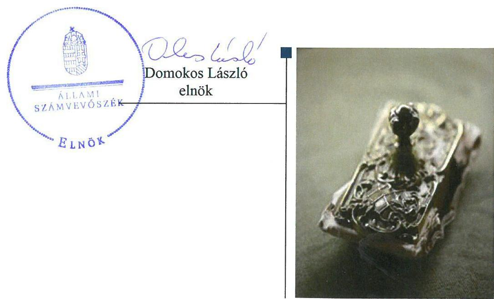
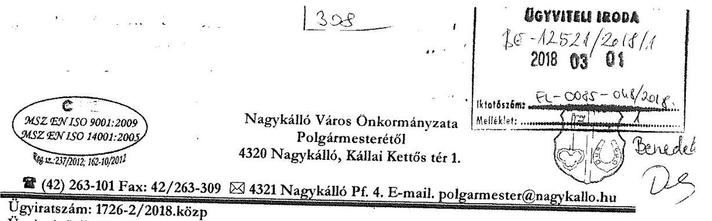
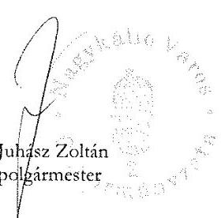
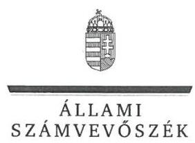
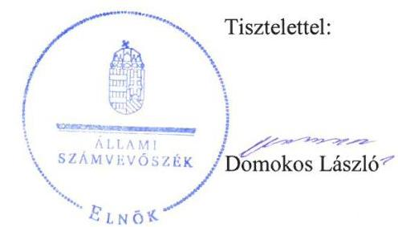
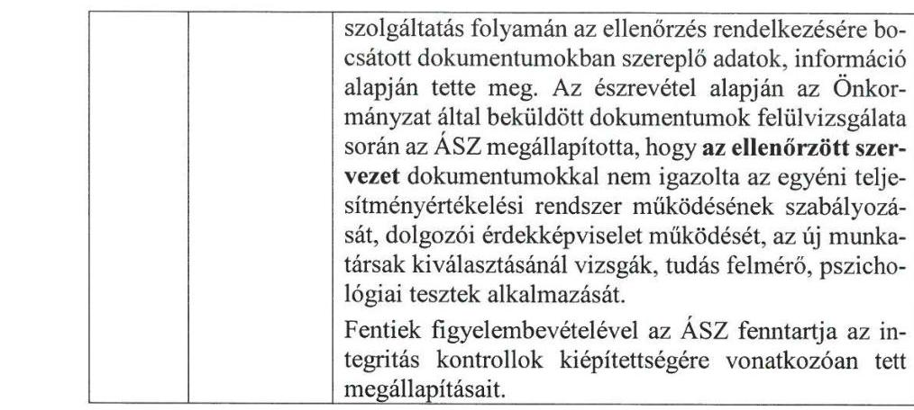

# Jelentés 

## Önkormányzatok integritás- és belső kontrollrendszere

Az önkormányzatok belső kontrollrendszere kialakításának és múködtetésének ellenőrzése - Nagykálló Város Önkormányzata 2018.

---

# Jelentés 

## Önkormányzatok integritás- és belső kontrollrendszere

Az önkormányzatok belső kontrollrendszere kialakításának és múködtetésének ellenőrzése - Nagykálló Város Önkormányzata
2018. 04. hó 13. nap

---

# AZ ELLENŐRZÉST FELÜGYELTE:

DR. BENEDEK MÁRIA felügyeleti vezető

## AZ ELLENŐRZÉST VEZETTE ÉS A VÉGREHAJTÁSÁÉRT FELELŐS:

BÍRÓ ZSOLT ellenőrzésvezető

## A PROGRAM ÖSSZEÁLLÍTÁSÁÉRT FELELŐS:

TÓTPÁL SZABOLCS osztályvezető

IKTATÓSZÁM: EL-0085-050/2018

TÉMASZÁM: 2444

ELLENŐRZÉS-AZONOSÍTÓ SZÁM: V078905

Jelentéseink az Országgyűlés számítógépes hálózatán és az Interneta a www.asz.hu címen is olvashatóak.

---

# TARTALOMJEGYZÉK 

■ ÖSSZEGZÉS ..... 5
■ AZ ELLENŐRZÉS CÉLJA ..... 6
■ AZ ELLENŐRZÉS TERÜLETE ..... 7
■ AZ ELLENŐRZÉS HÁTTERE, INDOKOLTSÁGA ..... 8
■ A JELENTÉS LÉNYEGES KÉRDÉSKÖREI ..... 10
■ ELLENŐRZÉS HATÓKÖRE ÉS MÓDSZEREI ..... 11
■ MEGÁLLAPÍTÁSOK ..... 13
■ JAVASLATOK ..... 18
■ MELLÉKLETEK ..... 21
I. Sz. melléklet: Értelmező szótár ..... 21
■ FÜGGELÉK: ÉSZREVÉTELEK ..... 23
■ RÖVIDÍTÉSEK JEGYZÉKE ..... 47

---

.

---

# ÖSSZEGZÉS 

Az Állami Számvevőszék Nagykálló Város Önkormányzatának ellenőrzése során megállapította, hogy a jogszabályi előírásoknak megfelelően kialakította müködési kereteit. A gazdálkodási jogkörök gyakorlása során betartották az előírásokat. Nagykálló Város Önkormányzata a szervezet tevékenységében rejlő kockázatokat felmérte, azonban azok csökkentése érdekében nem tett intézkedéseket, továbbá nem müködtette szabályszerűen az információs rendszerét, így ezek nem biztositották a közpénzfelhasználás szabályosságát, és az átlátható müködést. Az integritási kontrollok kiépitettsége nem volt egyensúlyban a fellépő kockázatok szintjével.

## Az ellenőrzés társadalmi indokoltsága

Magyarország Alaptörvénye az önkormányzatoktól is elvárja a kiegyensúlyozott, átlátható és fenntartható költségvetési gazdálkodás elvének érvényesítését, továbbá a nemzeti vagyonnal való rendeltetésszerű és felelős módon való gazdálkodást. A belső kontrollrendszer kialakítása és működtetése nélkül nem valósítható meg a közpénzek, a közvagyon szabályos, gazdaságos, hatékony és eredményes felhasználása. Az Állami Számvevőszék stratégiájában megfogalmazódott, hogy támogatja az integritás alapú, átlátható és elszámoltatható közpénzfelhasználás megteremtését. Mindezekre tekintettel, a közpénzzel gazdálkodó szervezetek esetében a belső kontrollrendszer megfelelő múködése ellenőrzését prioritásként kezeli az Állami Számvevőszék.

A vagyonnal való felelős gazdálkodáshoz elengedhetetlen, hogy Nagykálló Város Önkormányzatánál a belső kontrollrendszer kialakítása és múködtetése megfelelő legyen, érvényesüljön az integritás szemlélet.

## Főbb megállapítások, következtetések

Nagykálló Város Önkormányzata a jogszabályi előírásoknak megfelelően kialakította múködésének szervezeti kereteit. A kontrollkörnyezet kialakítása megfelelt a jogszabályi előírásoknak, Nagykálló Város Önkormányzata rendelkezett gazdasági programmal, szervezeti és múködési szabályzattal, valamint közbeszerzési szabályzattal. A Jegyző a Nagykállói Polgármesteri Hivatal szervezeti és múködési szabályzatában, a gazdasági szervezet ügyrendjében és a munkaköri leírásokban meghatározta a feladat és hatásköröket. A Jegyző a kontrolltevékenységek kereteinek kialakítása során meghatározta a gazdálkodási jogkörök kijelölésére, gyakorlására és az összeférhetetlenségre vonatkozó szabályokat. A kontrolltevékenységek gyakorlása során elvégezték a gazdálkodáshoz kapcsolódó kontrollokat.

A Jegyző az ellenőrzött időszakban a kockázatkezelési rendszert nem szabályszerűen működtette, mert a szervezet tevékenységében rejlő szervezeti célokkal összefüggő kockázatokkal kapcsolatban nem határozta meg a szükséges intézkedéseket. A Jegyző nem szabályszerűen működtette Nagykálló Város Önkormányzata és Nagykállói Polgármesteri Hivatal szervezeti információs rendszerét, mivel az iratkezelési szabályzat módosításának kiadása nem a jogszabályi előírásoknak megfelelően történt. Nem gondoskodott továbbá az időközi mérlegjelentések és az időközi költségvetési jelentések határidőben történő feltöltéséről, a hiányosságok miatt nem volt biztosított a közpénzfelhasználás szabályossága és az átlátható múködés.

Az ellenőrzött időszakban a kialakított és múködtetett belső kontrollrendszer nem támogatta a Nagykálló Város Önkormányzata szabályszerű múködését.

Nagykálló Város Roma Nemzetiségi Önkormányzata gazdálkodásával kapcsolatos önkormányzati feladatok ellátása megfelelt a jogszabályi előírásoknak.

Nagykálló Város Önkormányzatánál az integritással összefüggő kontrollok és a korrupciós kockázatok szintje nem volt egymással összhangban, az integritás kontrollrendszer kiépítése hiányos volt, a hiányzó kontrollok növelték a múködésből adódó korrupciós kockázatot.

---

# AZ ELLENŐRZÉS CÉLJA 

AZ ELLENŐRZÉS CÉLJA annak megállapítása volt, hogy szabályszerűen történt-e Nagykálló Város Önkormányzata belső kontrollrendszerének kialakítása és múködtetése, az biztosította-e a közpénzfelhasználás szabályosságát, a közpénzekkel és a nemzeti vagyonnal történő szabályszerű és felelős gazdálkodást, a beszámolási és adatszolgáltatási kötelezettségek szabályszerű teljesítését. Az ellenőrzés keretében értékeltük Nagykálló Város Önkormányzata korrupciós kockázatainak kezelését szolgáló integritás kontrollok kiépítettségét, valamint az integritás szemlélet érvényesülését.

---

# **AZ ELLENŐRZÉS TERÜLETE**

## **Nagykálló Város Önkormányzata**

Nagykálló város az Észak-Alföldi régióban, Szabolcs-Szatmár-Bereg megyében fekszik, lakónépessége a Központi Statisztikai Hivatal Magyarország közigazgatási helynévkönyve alapján 2016. január 1-jén 9211 fő volt.

A Nagykálló Város Önkormányzata a Nagykállói Polgármesteri Hivatallal együtt három intézménnyel látta el feladatait. A Nagykállói Polgármesteri Hivatal rendelkezett gazdasági szervezettel, a gazdasági vezető a feladatait 2015. február 18-tól látta el. A kilenc fővel működő Képviselő-testület munkáját kettő állandó bizottság támogatta.

A településen az ellenőrzött időszakban Nagykálló Város Roma Nemzetiségi Önkormányzata működött. A Nagykálló Város Önkormányzatának négy többségi tulajdonában lévő gazdasági társasága volt.

A Polgármester 2004. év decemberétől tölti be tisztségét. A Jegyző 2015. január 1-jétől látja el feladatát.

A Képviselő-testület által irányított költségvetési szerveknél 2016. december 31-én 41 fő közalkalmazott és 25 fő köztisztviselő dolgozott. A Jegyző a belső ellenőrzési feladatok ellátásáról külső szolgáltató bevonásával gondoskodott.

A 2016. évi konszolidált költségvetési beszámoló alapján Nagykálló Város Önkormányzatának 2 215,2 M Ft teljesített költségvetési bevétele és 2 228,3 M Ft teljesített kiadása volt. A Nagykálló Város Önkormányzatának 2016. december 31-i könyvviteli mérleg szerinti eszköz vagyona 10 734,4 M Ft volt. A költségvetési évben esedékes kötelezettségek öszszege 46,1 M Ft-ot tett ki, a költségvetési évet követően esedékes kötelezettség állománya 28,1 M Ft volt.

---

# AZ ELLENŐRZÉS HÁTTERE, INDOKOLTSÁGA 

A demokratikus társadalmakban alapvető igény, hogy a közpénzeket, a közvagyont használók tevékenységükről elszámoljanak, ahhoz egyértelmű és érvényesíthető felelősségi szabályok társuljanak. Ennek a jogos igénynek az érvényesítéséhez meg kell teremteni azokat a folyamatokat, rendszereket, amelyek nélkülözhetetlenek az elszámoltatáshoz. Az elszámoltatás eredményes működtetéséhez szükség van a megfelelő információs, kontroll-, értékelési - és beszámolási rendszerek kialakítására. A belső kontrollok kiépítettsége hozzájárul az integritási szemlélet kialakításához és érvényesüléséhez. A belső kontrollrendszer kialakítása és működtetése nélkül nem valósítható meg a közpénzek, a közvagyon szabályos, gazdaságos, hatékony és eredményes felhasználása.

A BELSŐ KONTROLLRENDSZER azt a célt szolgálja, hogy az államháztartás szervei múködésük és gazdálkodásuk során a tevékenységeket szabályszerűen, gazdaságosan, hatékonyan, eredményesen hajtsák végre, teljesítsék elszámolási kötelezettségeiket és megvédjék az erőforrásokat a veszteségektől, a károktól, a nem rendeltetésszerű használattól. A belső kontrollrendszer magában foglalja mindazon szabályokat, eljárásokat, gyakorlati módszereket és szervezeti struktúrákat, kockázatkezelési technikákat, kontrolltevékenységeket, amelyek segítséget nyújtanak a szervezetnek céljai eléréséhez. A belső kontrollrendszer szabályozása háromszintű, a törvényi előírásokat az Áht. ${ }^{1}$ és a Mötv. ${ }^{2}$ a rendeleti szintű szabályozást az Ávr. ${ }^{3}$ és a Bkr. ${ }^{4}$ tartalmazza, amelyeket útmutatói szinten az $\mathrm{NGM}^{5}$ által kiadott standardok és kézikönyvek támogatnak.

A MEGFELELŐ BELSŐ KONTROLLRENDSZER jelentősen csökkenti a hibák és szabálytalanságok kockázatát. Az ÁSZ ${ }^{6}$ célja, hogy javuljon az ellenőrzött önkormányzatok belső kontrollrendszerének szabályozottsága, múködésének megfelelősége, szabályszerűsége, biztosítva az önkormányzatnál a közpénzfelhasználás szabályosságát, a közpénzekkel és a nemzeti vagyonnal történő szabályszerű, gazdaságos, hatékony és eredményes gazdálkodást. Az ÁSZ ellenőrzés tapasztalatai nem csupán a közvetlenül ellenőrzött önkormányzatokat támogathatják, hanem a ,,jó gyakorlat" elterjesztésével azok az önkormányzatok is átvehetik a pozitív példákat, ahol nem végez ellenőrzést az ÁSZ.

## AZ ELLENŐRZÉS VÁRHATÓ HASZNOSULÁSA

NÉGY SZINTEN valósul meg. A törvényalkotás számára összegzett tapasztalatok állnak rendelkezésre a belső kontrollrendszer önkormányzati területen való kialakításáról, múködtetéséről és hatásairól. Az ellenőrzés az ellenőrzött számára visszajelzést ad a belső kontrollrendszer kialakításában és múködésében lévő hiányosságokról, javaslataival hozzájárul azok kiküszöböléséhez. Az ellenőrzés megállapításait és javaslatait más szervezetek is hasznosíthatják a rendezett gazdálkodási keretek kialakításához. A társadalom számára jelzi, hogy közpénz nem maradhat ellenőrizetlenül, az

---

ÁSZ értékteremtő rend kialakításához és megőrzéséhez hozzájáruló tevékenysége pozitív hatással lesz a szervezetről kialakított összkép formálásában.

---

# A JELENTÉS LÉNYEGES KÉRDÉSKÖREI 

1.- Az önkormányzat belső kontrollrendszerének kialakítása és müködtetése szabályszerű volt-e, az biztositotta-e az önkormányzatnál a közpénzfelhasználás szabályosságát, a nemzeti vagyonnal történő felelős gazdálkodást?
2.- Érvényesült-e az integritás szemlélet és ennek megfelelően ki-építették-e az integritás kontrollrendszert az önkormányzatnál?

---

# ELLENŐRZÉS HATÓKÖRE ÉS MÓDSZEREI 

## Az ellenőrzés típusa

Megfelelőségi ellenőrzés.

## Az ellenőrzött időszak

2016. január 1. és 2016. december 31. közötti időszak.

## Az ellenőrzés tárgya

A helyi önkormányzatnak, mint éves költségvetési beszámoló készítésére kötelezett szervezetnek és polgármesteri hivatalának belső kontrollrendszere. Az integritás szemlélet érvényesülése.

Az ellenőrzés kiterjedt minden olyan körülményre és adatra, amely az ÁSZ jogszabályban meghatározott feladatainak teljesítéséhez, valamint a program végrehajtása folyamán felmerült újabb összefüggések feltárásához szükséges volt.

## Az ellenőrzött szervezet

Nagykálló Város Önkormányzata

## Az ellenőrzés jogalapja

Az ÁSZ tv. ${ }^{7}$ 1. § (3) bekezdésében foglaltak alapján az ÁSZ általános hatáskörrel végzi a közpénzekkel és az állami és önkormányzati vagyonnal való felelős gazdálkodás ellenőrzését. Az ÁSZ tv. 5. § (2) bekezdése alapján az államháztartás gazdálkodásának ellenőrzése keretében az ÁSZ ellenőrzi a helyi önkormányzatok gazdálkodását, valamint az ÁSZ tv. 5. § (6) bekezdése alapján ellenőrzése során értékeli az államháztartás számviteli rendjének betartását és a belső kontrollrendszer múködését.

## Az ellenőrzés módszerei

Az ÁSZ az ellenőrzést az ellenőrzési program szempontjai, kérdései, az ellenőrzött időszakban hatályos jogszabályok, az ellenőrzés szakmai szabályok és módszertanok figyelembe vételével végezte.

Az ellenőrzés ideje alatt az ellenőrzött szervezettel történt kapcsolattartást az ÁSZ SZMSZ ${ }^{\circledR}$-ének vonatkozó előírásai alapján biztosította.

---

Az ellenőrzési kérdések megválaszolásához szükséges bizonyítékok megszerzése az ellenőrzöttek által rendelkezésre bocsátott dokumentumokra, adatokra alapozva megfigyelés, szemle (szemrevételezés), kérdésfeltevés (információkérés), valamint elemző eljárással történt. A minták kiválasztása rétegzett, véletlen mintavételi eljárással történt. Az ellenőrzési bizonyítékként felhasználható adatforrások közé tartoztak egyrészt az ellenőrzési program részletes szempontjainál felsorolt adatforrások, másrészt minden - az ellenőrzés folyamán feltárt, az ellenőrzés szempontjából információt tartalmazó - dokumentum.

Az ellenőrzés lefolytatásához az önkormányzat a tanúsítványok kitöltésével, valamint az ÁSZ által kért dokumentumok megküldésével szolgáltatott adatokat. A rendelkezésre bocsátott adatok, információk kontrollja az ellenőrzés keretében történt. Az egységes értelmezést támogatta a program mellékletét képező fogalomtár és rövidítésjegyzék.

Az önkormányzat belső kontrollrendszere jogszabályi előírások szerinti kialakításának és működtetésének szabályszerűségét, az erre irányuló ellenőrzési kérdésekre adott válaszok összesítése alapján pillérenként (kontrollkörnyezet, kockázatkezelési rendszer, kontrolltevékenységek, információs és kommunikációs rendszer, monitoring rendszer) és összesítetten is értékeltük. Az önkormányzat belső kontrollrendszere egyes pilléreinek kialakítása és működtetése „szabályszerü", amennyiben az értékelt területen az elért igen válaszok százalékban kifejezett, egész számra kerekített aránya, meghaladta a $85 \%$-ot, „nem szabályszerű", ha nem haladta meg a $60 \%$-ot. Ha a $85 \%$-ot nem haladta meg, de $60 \%$-nál nagyobb volt az igen válaszok aránya, akkor a minősítés „részben szabályszerű". Az önkormányzat belső kontrollrendszerének összesített értékelése megegyezik a pillérenként (kontrollterületenként) alkalmazott százalékos értékelésekkel, a következő eltérésekkel. A kontrollrendszer egésze esetében a „szabályszerű" értékelésnek a százalékos értéken felül további feltétele, hogy egyik kontrollterület sem kaphat „nem szabályszerű" értékelést, a „részben szabályszerű" értékelés további feltétele, hogy legfeljebb egy ellenőrzött kontrollterület lehet „nem szabályszerű" értékelésű. Az összesített értékelés a százalékos értéktől függetlenül „nem szabályszerű", ha az ellenőrzött kontrollterületek közül több mint egynek „nem szabályszerű" az értékelése.

A közszféra integritás alapú kultúrájának kialakítása, megerősítése és működése szorosan összefügg a belső kontrollrendszer működésével, ezért az ellenőrzés kiterjedt annak értékelésére is, hogy a belső kontrollrendszer kialakítása és működtetése hogyan hatott az integritás szemlélet érvényesülésére. Az integritás szemlélet érvényesülésének értékelése az önkormányzat által kitöltött tanúsítvány alapján történt.

---

# 1. Az önkormányzat belső kontrollrendszerének kialakítása és müködtetése szabályszerű volt-e, az biztosította-e az önkormányzatnál a közpénzfelhasználás szabályosságát, a nemzeti vagyonnal történő felelős gazdálkodást? 

Összegző megállapítás

Az Önkormányzat ${ }^{9}$ belső kontrollrendszerének kialakítása és müködtetése nem volt szabályszerű, az nem biztosította az Önkormányzatnál a közpénzfelhasználás szabályosságát, a müködés átláthatóságát.
1.1. számú megállapítás

A kontrollkörnyezet kialakítása a jogszabályi előírásoknak megfelel.

Az Önkormányzat a müködés szervezeti kereteit kialakította, az Önkormányzat rendelkezett a Képviselő-testület ${ }^{10}$ által elfogadott SZMSZ-el ${ }^{11}$, Gazdasági programmal ${ }^{12}$. A Képviselő-testület elfogadta az önkormányzati vagyonnal történő gazdálkodás szabályait. A Hivatali SZMSZ-ben ${ }^{13}$, az Ügyrendben ${ }^{14}$ és a munkaköri leírásokban meghatározásra kerültek a feladatás hatáskörök, valamint az ahhoz tartozó felelősségi szintek. A gazdasági szervezet vezetője, illetve a beszámoló elkészítésével megbízott köztisztviselő rendelkezett a feladat ellátáshoz a Számv. tv. ${ }^{15}$-ben előírt szakképesítéssel és a könyvviteli szolgáltatás körébe tartozó tevékenység ellátására jogosító engedéllyel.

A Jegyző a humán erőforrás-kezelés szabályait a Bkr.-ben foglaltaknak megfelelően átlátható módon kialakította, kiadta a munkáltatói szabályozási hatáskörébe tartozó kérdésekről rendelkező Közszolgálati szabályzatot ${ }^{16}$.

A Jegyző a Számv. tv.-ben foglaltaknak megfelelően kialakította az Önkormányzat és a Hivatal ${ }^{17}$ Számviteli politikáját ${ }^{18}$, annak keretében elkészítette, a Leltárkészítési és leltározási szabályzatot ${ }^{19}$, az Eszközök és források értékelési szabályzatát ${ }^{20}$, az Önköltség-számítási szabályzatot ${ }^{21}$, a Pénzkezelési szabályzatot ${ }^{22}$. Az Önkormányzat és a Hivatal rendelkezett a Számlarenddel ${ }^{23}$ és a Bizonylati renddel ${ }^{24}$.

A Jegyző a müködéshez kapcsolódó, pénzügyi kihatással bíró, jogszabályban nem szabályozott kérdéseket az Ávr.-ben előírtaknak megfelelően szabályozta. Ennek keretében kidolgozta a beszerzések lebonyolítására, a kiküldetések rendjére, a reprezentációs kiadások elszámolására és a gépjárművek igénybevételének rendjére vonatkozó eljárásokat.

Az Önkormányzat rendelkezett Közbeszerzési szabályzattal ${ }^{25}$, amely tartalmazta a Kbt. ${ }^{26}$ hatálya alá tartozó beszerzések eljárásrendjét.

Az Önkormányzat kontrollkörnyezetének kialakítása hiányosságát az 1. táblázat tartalmazza.

---

# A KONTROLLKÖRNYEZET KIALAKÍTÁSÁNAK HIÁNYOSSÁGA 

Sorszám Részmegállapítás
Megjegyzés

1. A Jegyző a Számviteli politika ${ }_{1,2}$-ben a Számv. tv. 14. § (4) bekezdésében előírtak ellenére nem rögzitte azokat a szabályokat előírásokat, hogy mit tekint kivételes nagyságú vagy előfordulású bevételnek, költségnek, ráfordításnak, továbbá nem határozta meg azt, hogy az alkalmazott gyakorlatot milyen okok miatt kell megváltoztatni.

Forrás: ÁSZ

## 1.2. számú megállapítás

A kockázatkezelési rendszer kialakításra került, múködtetése azonban a jogszabályi előírásoknak nem felelt meg.

A Kockázatkezeléssel kapcsolatos szabályokat az Önkormányzatnál az Áht. és a Bkr. előírásainak megfelelően meghatározták. A Bkr. 2016. október 1jétől történt módosításának megfelelően a Jegyző elkészítette az Önkormányzatra és a Hivatalra kiterjedő, integrált kockázatkezelés eljárásrendet.

A kockázatkezelési és az integrált kockázatkezelési rendszer hiányosságát a 2. táblázat tartalmazza.
2. táblázat

## A KOCKÁZATKEZELÉSI RENDSZER MŰKÖDTETÉSÉNEK HIÁNYOSSÁGA

Sorszám Részmegállapítás
Megjegyzés

1. A Jegyző 2016. szeptember 30-ig a Bkr. 7. § (1) bekezdésében foglalt követelmények ellenére kockázatkezelési rendszert, 2016. október 1-jétől integrált kockázatkezelési rendszert hiányosan múködtette, mivel a Hivatal tevékenységében rejlő, szervezeti célokkal összefüggő kockázatokkal kapcsolatban nem határozta meg a szükséges intézkedéseket.

Forrás: ÁSZ

## 1.3. számú megállapítás

A kontrolltevékenység kereteinek kialakítása, működtetése megfelelt a jogszabályokban és a belső szabályozásban foglaltaknak.

A kontrolltevékenység keretein belül a Jegyző a Gazdálkodási szabályzatban ${ }^{27}$ az Ávr. előírásainak megfelelően meghatározta az Önkormányzatot érintően a gazdálkodási jogkörök kijelölésére, gyakorlására és az összeférhetetlenségre vonatkozó szabályokat. A jogosultak kötelezettségvállalási, teljesítésigazolási és utalványozási jogkör gyakorlására történő kijelölése megfelelt az Ávr.-ben foglalt előírásoknak.

A pénzügyi ellenjegyzési és az érvényesítési jogkörök gyakorlása kiterjesztésre került az Önkormányzatra és kettő költségvetési szervre, melynek gazdálkodási feladatait a Hivatal látta el. A pénzügyi ellenjegyzésre, illetve az érvényesítésre jogosultak rendelkeztek az Ávr.-ben előírt végzettséggel és pénzügyi-számviteli képesítéssel.

A kötelezettségvállalások nyilvántartási rendszere megfelelt a jogszabályi előírásoknak. A kötelezettségvállalásokat az Áht. előírásainak megfelelően a kiadáshoz tartozó szabad előirányzat terhére vállalták, a nyilvántartásba vételről az Ávr.-ben és az Áhsz. ${ }^{28}$-ben foglalt előírásoknak megfelelően a Jegyző gondoskodott. A kötelezettségvállaló, a pénzügyi ellenjegyző, a teljesítésigazoló és az utalványozó jogkörgyakorlása a jogszabályokban és a Gazdálkodási szabályzatban foglaltaknak megfelelt.

---

A kontrolltevékenység működtetésének szabálytalanságát a 3. táblázat tartalmazza.
3. táblázat

# A KONTROLLTEVÉKENYSÉG MŰKÖDTETÉSÉNEK HIÁNYOSSÁGA 

Sorszám Részmegállapítás
Megjegyzés
ÉRVÉNYESÍTÉS

1. Az érvényesítő - az Ávr. 58. § (2) bekezdésében foglaltak ellenére nem jelezte az utalványozónak, hogy jogszabály megsértését tapasztalta a megelőző ügymenetben.

Forrás: ÁSZ

### 1.4. számú megállapítás

Az információs és kommunikációs rendszer kialakításra került, azonban a működtetése nem volt szabályszerű.

A Jegyző összhangban a Bkr. előírásaival kialakította az Önkormányzat és a Hivatal információs-rendszerét. A Jegyző az Info. tv. ${ }^{29}$-ben és az Ávr.-ben előírtaknak megfelelően szabályozta a kötelezően közzéteendő adatok nyilvánosságra hozatalának és a közérdekú adatok megismerésére irányuló igények teljesítésének rendjét. A Jegyző az Info. tv.-ben előírtaknak megfelelően elkészítette az Önkormányzat és a Hivatal adatvédelmi és adatbiztonsági szabályzatát.

Az információs és kommunikációs rendszer kialakításának és működtetésének hiányosságait a 4. táblázat mutatja.
4. táblázat

## AZ INFORMÁCIÓS ÉS KOMMUNIKÁCIÓS RENDSZER KIALAKÍTÁSÁNAK ÉS MŰKÖDTETÉSÉNEK HIÁNYOSSÁGAI

Sorszám Részmegállapítások
Megjegyzések

1. A Jegyző az iratkezelési szabályzat ${ }^{30}$ módosítását az Ltv. ${ }^{31} 10 . \S$ (1) bekezdés c) pontjában foglaltak ellenére nem a Magyar Nemzeti Levéltár és a megyei kormányhivatal egyetértésével adta ki.
2. A Jegyző az Ávr. 169. § (3) bekezdésében, illetve az Ávr. 170. § (2) bekezdésében foglaltak ellenére nem határidőben gondoskodott az Önkormányzat időközi mérlegjelentéseinek és az időközi költségvetési jelentéseinek a Kincstár32 által múködtetett elektronikus adatszolgáltató rendszerbe történő feltöltéséről.
3. A Jegyző nem gondoskodott az Ávr. 5 számú melléklet 28. pontjában foglaltak ellenére az Önkormányzat a Gst ${ }^{33}$. 3. § (1) bekezdésében előírt, naptári éven túli futamidejű adósságot keletkeztető ügyletére vonatkozó, adatszolgáltatási kötelezettség teljesítéséről.

Forrás: ÁSZ
1.5. számú megállapítás

Az Önkormányzat monitoring rendszerének kialakítása 2016. szeptember 30-ig nem felelt meg a jogszabályoknak. A belső ellenőrzés kialakítása, múködtetése - az intézkedési tervek készítési kötelezettség kivételével - megfelelt a jogszabályi előírásoknak.

A Hivatali SZMSZ-ben és a belső ellenőrzési kézikönyvben meghatározták a belső ellenőrzést végző személy jogállását és feladatait, biztosították a belső ellenőr szervezeti és funkcionális függetlenségét. A belső ellenőr rendelkezett a Bkr.-ben előírt szakképzettséggel és szakmai gyakorlattal. A belső ellenőr tekintetében érvényesültek a Bkr. összeférhetetlenségi előírásai. Az Önkormányzat rendelkezett a Képviselő-testület által elfogadott kockázatelemzésen alapuló éves ellenőrzési tervvel.

---

A monitoring rendszer kialakításának és múködtetésének hiányosságait az 5. táblázat mutatja be.
5. táblázat

# A MONITORING RENDSZER KIALAKÍTÁSÁNAK ÉS MŰKÖDTETÉSÉNEK HIÁNYOSSÁGAI 

| Sorszám | Részmegállapítások | Megjegyzések |
| :--: | :--: | :--: |
| 1. | A Jegyző 2016. szeptember 30-ig nem alakította ki a Bkr. 10. §.-ában előírtak ellenére az operatív tevékenységek keretében megvalósuló folyamatos és eseti nyomon követését tartalmazó, a szervezet tevékenységének, a célok megvalósításának nyomon követését biztosító rendszert. | A Bkr. 2016. október 1-jei változására tekintettel a Jegyző a belső ellenőrzés kialakításával eleget tett a Bkr. 10. §-ban foglaltaknak. |
| 2. | A 2016. évben lefolytatott belső ellenőrzésekhez a Bkr. 45. § (1)-(3) bekezdéseiben elöírtak ellenére nem készített az érintett szervezeti egység vezetője minden esetben intézkedési tervet. |  |
| 3. | A Jegyző a Bkr. 45. § (4) bekezdésében előírtak ellenére az Informatikai rendszerek megbízhatóságának, biztonságának belső ellenőrzése során megfogalmazott javaslatok végrehajtása érdekében elkészített intézkedési terv jóváhagyásáról nem a belső ellenőrzési vezető véleményének kikérésével döntött. |  |

Forrás: ÁSZ

### 1.6. számú megállapítás

A belső kontrollrendszer kialakításával és múködésével kapcsolatban a jegyzői nyilatkozatban ${ }^{34}$ tett értékelést jelen ellenőrzés megállapításai nem támasztották alá.

A Jegyző a jogszabály által előírt nyilatkozatában megfelelőnek értékelte az Önkormányzat belső kontrollrendszerének minőségét, ezen belül a költségvetési szerv tevékenységében a hatékonyság, eredményesség és gazdaságosság követelmények érvényesítését. A Jegyző nyilatkozatában foglaltakat jelen ellenőrzés nem támasztotta alá, mivel az Önkormányzat belső kontrollrendszerének kialakítása és múködtetése az ÁSZ értékelése szerint nem volt szabályszerű.

Az önkormányzat belső kontrollrendszerének minőségét értékelő nyilatkozathoz kötődő hiányosságot 6. táblázat tartalmazza.
6. táblázat

## AZ ÖNKORMÁNYZAT BELSŐ KONTROLLRENDSZERÉNEK MINŐSÉGÉT ÉRTÉKELŐ NYILATKOZATHOZ KÖTÖDŐ HIÁNYOSSÁG

| Sorszám | Részmegállapítás | Megjegyzés |
| :-- | :-- | :-- |
| 1. | A Jegyző a Bkr. 1. melléklet szerinti nyilatkozatában nem teljes körűen   tett eleget értékelési kötelezettségének, mert a nyomon követési rend-   szer esetében az operatív tevékenységek keretében megvalósuló folya-   matos és eseti nyomon követési rendszert nem értékelte. |  |

Forrás: ÁSZ

### 1.7. számú megállapítás

A Roma Nemzetiségi Önkormányzat ${ }^{35}$ gazdálkodással kapcsolatos feladatainak ellátása megfelelt a jogszabályi előírásoknak.

Az Önkormányzat a Roma Nemzetiségi Önkormányzattal 2014. április 29én együttműködési megállapodást kötött, amelynek felülvizsgálata a Nek. tv. ${ }^{36}$-ben előírtaknak megfelelően megtörtént.

Az együttműködési megállapodásban a jogszabályi előírásoknak megfelelően rendelkeztek a Roma Nemzetiségi Önkormányzat gazdálkodási jogköreinek gyakorlását végzők kijelöléséről, a múködési feltételeinek és gazdálkodásának eljárási és dokumentációs részletszabályairól, a bevételeivel

---

és kiadásaival kapcsolatos tervezési, ellenőrzési, finanszírozási, adatszolgáltatási és beszámolási feladatai ellátásának részletes szabályairól.

A 2016. évi költségvetési határozat-tervezetet és a zárszámadásról szóló határozat-tervezetet a Jegyző előkészítette a Roma Nemzetiségi Önkormányzat képviselő-testület elé történő előterjesztéshez.

A Jegyző az ellenőrzött időszakban a Roma Nemzetiségi Önkormányzatra kiterjesztette a gazdálkodást érintő szabályzatokat.

A Roma Nemzetiségi Önkormányzat gazdálkodásával kapcsolatos önkormányzati feladatellátás hiányosságát a 7. táblázat tartalmazza.
7. táblázat

# AZ ROMA NEMZETISÉGI ÖNKORMÁNYZAT GAZDÁLKODÁSÁVAL KAPCSOLATOS ÖNKORMÁNYZATI FELADATELLÁTÁS HIÁNYOSSÁGA 

Sorszám
Részmegállapítás
Megjegyzés
1. A 2016. évben lefolytatott belső ellenőrzésekhez a Bkr. 45. § (1)-(3) bekezdéseiben előírtak ellenére nem készített az érintett szervezeti egység vezetője intézkedési ter-
vet.
Forrás: ÁSZ

## 2. Érvényesült-e az integritás szemlélet és ennek megfelelően ki-építették-e az integritás kontrollrendszert az önkormányzatnál?

## Összegző megállapítás

Az Önkormányzatnál az integritási kontrollok kiépítettsége nem volt egyensúlyban a fellépő kockázatok szintjével.

Az Önkormányzat alacsony szinten múködtette az integritást erősítő, jogszabályok által nem előírt kontrollokat. Nem alakították ki az Önkormányzatnál az ajándékok, meghívások, utaztatások elfogadási feltételeit, az egyéni teljesítményértékelési rendszer múködésének szabályozását. Az Önkormányzatnál nem múködött dolgozói érdekképviselet, az új munkatársak kiválasztásánál nem alkalmaztak vizsgát, tudás felmérő, pszichológiai tesztet, és felvételi bizottságot, az elmúlt három évben nem volt korrupcióellenes képzés. Nem múködött a munkahelyi rotáció, a kockázatelemzés nem terjedt ki a korrupciós, integritási kockázatokra.

Az Önkormányzatnál a jogszabályok által előírt kontrollok kiépítettsége támogatta a szervezet integritását. Az Önkormányzat és a Hivatal rendelkezett hatályos SZMSZ-el. A Jegyző az Úgyrendben a kontrolltevékenységek kereteit szabályozta, melynek keretében a gazdálkodási jogkörök gyakorlóit kijelölték és az összeférhetetlenségi szabályokat rögzítették.

Az Önkormányzat gazdasági programjában világos célokat állított többek között városfejlesztés, foglalkoztatás, helyi adópolitika, gazdálkodás, kulturális élet tekintetében, amelyeket külső és belső érdekeltek tudomására is hozott.

---

# JAVASLATOK 

Az ÁSZ tv. 33. § (1) bekezdésében foglaltak értelmében az ellenőrzött szervezet vezetője köteles a jelentésben foglalt megállapításokhoz kapcsolódó intézkedési tervet összeállítani és azt a jelentés kézhezvételétől számított 30 napon belül az ÁSZ részére megküldeni. Amennyiben az ellenőrzött szervezet vezetője nem küldi meg határidőben az intézkedési tervet, vagy továbbra sem elfogadható intézkedési tervet küld, az Állami Számvevőszék elnöke az ÁSZ tv. 33. § (3) bekezdése a) és b) pontjaiban foglaltakat érvényesítheti.

## a polgármesternek:

1. Intézkedjen az Állami Számvevőszék ellenőrzése során feltárt hiányosságok és/vagy szabálytalanságok tekintetében a munkajogi felelősség tisztázására irányuló eljárás megindításáról, és ennek eredménye ismeretében tegye meg a szükséges intézkedéseket.
(1. táblázat 1., 2. táblázat 1., 3. táblázat 1., 4. táblázat 1-3., 5. táblázat 3., 6. táblázat 1. sz. megállapítás alapján)

## a jegyzőnek:

1. Intézkedjen arról, hogy a Számv. tv. előírásának megfelelően a számviteli politika keretében írásban rögzítésre kerüljenek azok a gazdálkodóra jellemző szabályok, előírások, módszerek, amelyekkel meghatározza, hogy mit tekint kivételes nagyságú vagy előfordulású bevételnek, költségnek, ráfordításnak továbbá, hogy az alkalmazott gyakorlatot milyen okok miatt kell megváltoztatni.
(1. táblázat 1. sz. megállapítás alapján)
2. Intézkedjen a Bkr. előírásainak megfelelő integrált kockázatkezelési rendszer müködtetéséről.
(2. táblázat 1. sz. megállapítás alapján)
3. Intézkedjen az érvényesítés gazdálkodási jogkör gyakorlása során az Ávr. előírásának betartásáról.
(3. táblázat 1. sz. megállapítás alapján)

---

4. Intézkedjen az iratkezelési szabályzat Ltv. előírásának megfelelően a Magyar Nemzeti Levéltár és a megyei kormányhivatal egyetértésével történő kiadásáról.
(4. táblázat 1. sz. megállapítás alapján)
5. Gondoskodjon arról, hogy az Ávr. előírásának megfelelő határidőben kerüljenek feltöltésre az időközi mérlegjelentések és az időközi költségvetési jelentések a Kincstár által müködtetett elektronikus adatszolgáltató rendszerbe.
(4. táblázat 2. sz. megállapítás alapján)
6. Gondoskodjon az Ávr. előírásának megfelelően rendszeres bejelentési, adatszolgáltatási kötelezettségeinek teljesítéséről.
(4. táblázat 3. sz. megállapítás alapján)
7. Gondoskodjon arról, hogy a Bkr. előírásainak megfelelően a belső ellenőrzések javaslatainak végrehajtása érdekében intézkedési terv kerüljön elkészítésre.
(5. táblázat 2. és 7. táblázat 1. sz. megállapítás alapján)
8. Döntsön a Bkr. előírásának megfelelően az intézkedési terv jóváhagyásáról az intézkedési terv kézhezvételétől számított 8 napon belül a belső ellenőrzési vezető véleményének kikérésével.
(5. táblázat 3. sz. megállapítás alapján)
9. Értékelje a Bkr. előírásának megfelelően nyilatkozatában - teljes körűen - a költségvetési szerv belső kontrollrendszerének minőségét.
(6. táblázat 1. sz. megállapítás alapján)
10. Intézkedjen az Állami Számvevőszék ellenőrzése során feltárt hiányosságok és/vagy szabálytalanságok tekintetében a munkajogi felelősség tisztázására irányuló eljárás megindításáról, és ennek eredménye ismeretében tegye meg a szükséges intézkedéseket.
(5. táblázat 2. és 7. táblázat 1. sz. megállapítás alapján)

---

.

---

# MELLÉKLETEK 

- I. SZ. MELLÉKLET: ÉRTELMEZŐ SZÓTÁR

ÁSZ Integritás Projekt
belső ellenőrzés
belső kontrollrendszer
belső kontrollrendszer pillérei, kontrollterületei
helyi önkormányzat
információs és kommunikációs rendszer
integritás

Az Állami Számvevőszék 2009-ben indította el a „Korrupciós kockázatok feltérképezése - Integritás alapú közigazgatási kultúra terjesztése" című, európai uniós forrásból megvalósított kiemelt projektjét (Integritás Projekt). Az Integritás Projekt célja, hogy felmérje a közszféra intézményei korrupciós kockázatoknak való kitettségét, illetőleg az azok mérséklésére hivatott kontrollok szintjét. Az Állami Számvevőszék a projekt révén az integritás szemlélet minél szélesebb körrel történő megismertetését, gyakorlatba ültetését kívánja elérni. Az integritás követelményeinek megfelelő szervezeti múködést előnyben részesítő közigazgatási kultúra elterjesztését és a korrupció elleni fellépést az ÁSZ önmagára nézve is stratégiai jelentőségű célként fogalmazta meg. A projekt a felmérésben résztvevő intézmények számára helyzetükről egyfajta „tükörképet" mutat be, ami alapot teremt a jövőbeni pozitív irányú elmozduláshoz. (Forrás: a http://integritas.asz.hu honlapon közzétett, a 2013. évi Integritás felmérés eredményeiről készült összefoglaló tanulmány)
Független, tárgyilagos bizonyosságot adó és tanácsadó tevékenység, amelynek célja, hogy az ellenőrzött szervezet múködését fejlessze és eredményességét növelje, az ellenőrzött szervezet céljai elérése érdekében rendszerszemléletű megközelítéssel és módszeresen értékeli, illetve fejleszti az ellenőrzött szervezet irányítási és belső kontrollrendszerének hatékonyságát. (Forrás: Bkr. 2. § b) pontja)
A belső kontrollrendszer a kockázatok kezelése és tárgyilagos bizonyosság megszerzése érdekében kialakított folyamatrendszer, amely azt a célt szolgálja, hogy a múködés és gazdálkodás során a tevékenységeket szabályszerűen, gazdaságosan, hatékonyan, eredményesen hajtsák végre, az elszámolási kötelezettségeket teljesítsék, megvédjék az erőforrásokat a veszteségektől, károktól és nem rendeltetésszerű használattól. (Forrás: Áht. 69. § (1) bekezdése)
A kontrollkörnyezet, a (integrált) kockázatkezelési rendszer, a kontrolltevékenységek, az információs és kommunikációs rendszer, valamint a nyomon követési (monitoring) rendszer. (Forrás: Bkr. 3. §-a)

A helyi önkormányzat jogi személy. Az önkormányzati feladatok ellátását a képviselő-testület és szervei biztosítják. A képviselőtestület szervei: a polgármester, a főpolgármester, a megyei közgyűlés elnöke, a képviselő-testület bizottságai, a részönkormányzat testülete, a önkormányzati hivatal, a megyei önkormányzati hivatal, a közös önkormányzati hivatal, a jegyző, továbbá a társulás. A képviselő-testület a feladatkörébe tartozó közszolgáltatások ellátására - jogszabályban meghatározottak szerint - költségvetési szervet, a polgári perrendtartásról szóló törvény szerinti gazdálkodó szervezetet (a továbbiakban: gazdálkodó szervezet), nonprofit szervezetet és egyéb szervezetet (a továbbiakban együtt: intézmény) alapíthat, továbbá szerződést köthet természetes és jogi személlyel vagy jogi személyiséggel nem rendelkező szervezettel. A helyi önkormányzat éves költségvetési beszámolója magába foglalja a helyi önkormányzat - nem költségvetési szerveihez tartozó - feladataihoz kapcsolódó bevételeket és kiadásokat. A helyi önkormányzat összevont (konszolidált) költségvetési beszámolóját a helyi önkormányzatra és költségvetési szerveire vonatkozóan külön-külön beérkezett éves költségvetési beszámolók alapján a Kincstár készíti el és küldi meg az önkormányzatnak. (Forrás: Mötv. 41. § (1), (2), (6) bekezdései; Áhsz. 2. § (1) bekezdése, 6. § (1) bekezdés a) és f) pontja, 30. §-a, 37. § (1) és (6) bekezdése)
A költségvetési szerv vezetője által kialakított és múködtetett olyan rendszer, mely biztosítja, hogy a megfelelő információk a megfelelő időben eljutnak az illetékes szervezethez, szervezeti egységhez, illetve személyhez. (Forrás: Bkr. 9. § (1) bekezdés)
Az integritás elvek, értékek, cselekvések, módszerek, intézkedések konzisztenciáját jelenti: olyan magatartásmódot, amely meghatározott értékeknek felel meg. Az integritás a közszféra esetében

---

# Mellékletek 

a társadalom által elvárt nyilvánossági, átláthatósági, illetve jogi/etikai normáknak történő megfelelést jelenti. (Forrás: a http://integritas.asz.hu honlapon közzétett „A 2012. évi integritás felmérés eredményeinek összefoglalója" címú dokumentum 3. oldal 1. bekezdése)
irányító szerv és annak vezetője

## kockázatkezelési

rendszer
kontrollkörnyezet
kontrolltevékenységek
költségvetési szerv vezetője (Bkr. alkalmazásában)
közös önkormányzati hivatal
önkormányzati hivatal
társulás

A közös önkormányzati hivatal kivételével a helyi önkormányzat által irányított költségvetési szerv esetén a képviselő-testület, közgyűlés és a polgármester, főpolgármester, megyei közgyűlés elnöke. A közös önkormányzati hivatal esetén a közös önkormányzati hivatal székhelye szerinti helyi önkormányzat képviselő-testülete és annak polgármestere. (Forrás: Áht. 2. § (1) bekezdés i), ia) és ib) pontja)
Olyan irányítási eszközök és módszerek összessége, melynek elemei a szervezeti célok elérését veszélyeztető tényezők (kockázatok) azonosítása, elemzése, csoportosítása, nyomon követése, valamint szükség esetén a kockázati kitettség mérséklése. (Forrás: Bkr. 2. § m) pontja)
A költségvetési szerv vezetője által kialakított olyan elvek, eljárások, belső szabályzatok összessége, amelyben világos a szervezeti struktúra, egyértelműek a felelősségi, hatásköri viszonyok és feladatok, meghatározottak az etikai elvárások a szervezet minden szintjén, átlátható a humáneirőforrás-kezelés. (Forrás: Bkr. 6. § (1) bekezdés)
A költségvetési szerv vezetője által a szervezeten belül kialakított (kontroll) tevékenységek, melyek biztosítják a kockázatok kezelését, hozzájárulnak a szervezet céljainak eléréséhez. (Forrás: Bkr. 8. § (1) bekezdés)
Helyi önkormányzat esetén a jegyző, főjegyző, társulás esetén a társulási megállapodásban meghatározott önkormányzat jegyzője. (Forrás: Bkr. 2. § n) pont nb) alpont)
települési képviselő-testület más települési képviselő-testülettel társult képviselő-testületet alakíthat, amely esetén a képviselő-testületek részben vagy egészben egyesítik a költségvetésüket, közös önkormányzati hivatalt tartanak fenn és intézményeiket közösen müködtetik. (Forrás: Mötv. 56. § (1)-(2) bekezdései)
a polgármesteri hivatal, a főpolgármesteri hivatal, a megyei önkormányzati hivatal és a közös önkormányzati hivatal (Forrás: Áht. 1. § 18. pont)
A helyi önkormányzatok képviselő-testületei megállapodhatnak abban, hogy egy vagy több önkormányzati feladat- és hatáskör, valamint a polgármester és a jegyző államigazgatási feladat- és hatáskörének hatékonyabb, célszerűbb ellátására jogi személyiséggel rendelkező társulást hoznak létre. A társulási tanács munkaszervezeti feladatait (döntések előkészítése, végrehajtás szervezése) eltérő megállapodás hiányában a társulás székhelyének polgármesteri hivatala látja el. (Forrás: Mötv. 87. §, 94. § (4) bekezdés)

---

# FÜGGELÉK: ÉSZREVÉTELEK 

A jelentéstervezetet a Számvevőszék 15 napos észrevételezésre megküldte az ellenőrzött szervezet vezetőjének az ÁSZ tv. 29. §* (1) bekezdése előírásának megfelelően.
A részben figyelembe vett észrevétel alapján a Számvevőszék módosította a jelentést.

A függelék tartalmazza az ellenőrzött észrevételeit, illetve a figyelembe nem vett észrevételek elutasításának indoklását.

[^0]
[^0]:    * 29. § (1) Az Állami Számvevőszék az ellenőrzési megállapításait megküldi az ellenőrzött szervezet vezetőjének vagy az általa megbízott személynek, és annak, akinek személyes felelősségét állapította meg.
    (2) Az ellenőrzött szervezet vezetője és a felelősként megjelölt személy az ellenőrzés megállapításaira tizenöt napon belül írásban észrevételt tehet.
    (3) Az Állami Számvevőszék az észrevételre a beérkezésétől számított harminc napon belül írásban válaszol. A figyelembe nem vett észrevételeket köteles a jelentésben feltüntetni, és megindokolni, hogy azokat miért nem fogadta el.

---

Tárgy: Észrevétel a jelentéstervezet megállapításaira

# Domokos László Elnök Úr 

Állami Számvevőszék
1052 Budapest
Apáczai Csere János utca 10 .

Tisztelt Elnök Úr!
Az EL-0085-047/2018 iktatószámú leveléhez mellékelten 2018. február 13. napján megkaptam „Önkormányzatok integritás- és belső kontrollrendszere - Az önkormányzatok belső kontrollrendszere kialakításának és müködésének ellenőrzése - Nagykálló Város Önkormányzata" tárgyában készített számvevőszéki jelentéstervezetet.

Az Állami Számvevőszékről szóló 2011. évi LXVI. törvény 29. § (2) bekezdése szerinti lehetőséggel élve a jelentéstervezet megállapításaival kapcsolatban az alábbi észrevételt teszem:

1. ÁSZ javaslat, megállapítás: Intézkedjen arról, bogy a Számv. tv. elörásainak megfelelően a számviteli politika keretében irásban réggittésre kerüljenek azok a gazdálkodásra jellemzö szabályok, elörások, módszerek, amelyekkel meghatározza, hogy mit tekint kivételes nagyságú, vagy elöfordulású bevételnek, költtégenek, rëforditásnak továbbá, hogy az alkaimazott gyakorlatot mélyen okok miatt kell megváltoztatni. (Javaslat a jegyzönek 1. pontja, 1. táblázat 1. sz. megállapítás)

Észrevétel: Véleményem szerint a kivételes nagyságú vagy kivételes előfordulású bevételek, költségek és ráfordítások vonatkozásában a számviteli törvény nem tartalmaz fogalmi meghatározást, így a gazdálkodó szervezeteknek erre vonatkozóan jogszabályi előirása nincs, azt a gazdálkodó szervezetek a saját gazdálkodási körülményeire tekintettel határozhatja meg. A számviteli politikában eddig is meg kellett határozni adott értékelési eljárásokhoz kapcsolódóan a jelentős/ nem jelentős mértékeket, ebből következően az e feletti összegek kivételes nagyságú bevételnek, költségnek, ráfordításnak minősül. A kivételes előfordulás tartalmilag a tevékenység gyakoriságára utal, nem kapcsolódik az önkormányzat rendszeres müködéséhez, ritkán fordulnak elő. A jelzett hiányosság a zárszámadási rendelet kiegészítő mellékletét és szöveges indoklási részét nem befolyásolta, a bevételek és kiadások, a költségek és ráfordítások részletes bemutatására eddig is nagy hangsúlyt fektettünk. A hiányosságot természetesen pótoljuk, hogy számviteli politikánk a jogszabályt előírásoknak teljes mértékben megfeleljen.
2. ÁSZ javaslat, megállapítás: Intézkedjen a Bkr. elörásainak megfelelő integrált kockázatkozelési rendszer müködéstéséröl. (Javaslat a jegyzönek 2. pontja, 2. táblázat 1. sz. megállapítás)

Észrevétel: A javaslattal és a megállapításban foglaltakkal nem értek egyet. A Jegyző 2016. szeptember 30ig a Bkr. 10. §-ában meghatározott kötelezettségének eleget téve kialakított az operatív tevékenységek keretében megvalósuló folyamatos és eseti nyomon követését tartalmazó, a szervezet tevékenységének, a célok megvalósításának nyomon követését biztosító rendszert. A Belső kontrollrendszer szabályzat (EL-0085-005/2017. ikt. számú adatbekérő levél alapján 12., 23., 24., 25. pontban feltöltésre került) V. fejezet

---

# 1080 

(31. oldal), a Koçkázati önértékelés (99. oldaltól) „Megelőzés" oszlopa tartalmazza a szükséges
$\frac{\text { múvkázatokúv }}{10 \text { oldaltól }}$
3. ÁSZ javaslat, megállapítás: Intézkedien az érvényesités gazdálkodási jogkör gyakorlása során az Áer. elörrásainak betartásáról. (Javaslat a jegyzönek 3. pontja, 3. táblázat 1. sz. megállapítás)

Észrevétel: Kérem pontosítani szíveskedjenek, hogy az érvényesítő, mely ügymenet során nem tartotta be az Ávr. 58. § (2) bekezdésében foglaltakat. Az észrevétel és a javaslat nem tartalmaz konkrét adatokat, mely gazdasági esemény(ek) során merült fel hiányosság, azt pedig nem gondolnám, hogy a mintavétel során kiválasztott összes tételt érintené a jelzett jogszabálysértés. A gazdasági eseményekhez csatolt dokumentumokat munkatársaim átnézték, az ellenőrzés által jelzett hiányosságot nem találták meg, konkrét adatok hiányában sem észrevételt, sem magyarázatot nem tudok adni.
4. ÁSZ javaslat, megállapítás: Gondoskodjon arról, bogy az Áer. elörrásainak megfelelő határidőben kerü̈jenek feltöltésre az idöközi mérlegjelentések és az idöközi költségvetési jelentések a Kincstár által müködteitett elektronikus adatszolgáltató rendszerbe. (Javaslat a jegyzönek 5. pontja, 4. táblázat 2. sz. megállapítás)

Észrevétel: Fenti javaslattal és a 4. táblázat 2. sz. megállapításával kapcsolatban egyáltalán nem értek egyet. Az Ávr. 169. § (3) - (4), a 170. § (2) és (9) - (10) bekezdése, valamint a 173. § (2) bekezdése alapján az Áht. 108. §-ban meghatározott adatszolgáltatási kötelezettségünknek maradéktalanul eleget tettünk, azt minden esetben határidőben teljesítettük. Az Ávr. 169. § (4) bekezdése értelmében az Igazgatóság a feltöltött időközi költségvetési jelentést ellenőrzi, szükség esetén legfeljebb 10 munkanapos határidővel annak javítását, kiegészítését rendeli el. Az Ávr. 170. § (9) - (10) bekezdése értelmében az Igazgatóság az időközi mérlegjelentést felülvizsgálja, szükség esetén legfeljebb hét munkanapos határidővel annak javítását, kiegészítését rendeli el. (Az ezt alátámasztó kimutatást táblázat formájában az 1. melléklet tartalmazza.)

Az Áht. 108. § (3) bekezdése alapján az adatszolgáltatások nem, vagy késedelmes teljesítése bírsággal szankcionálható. Bírság kiszabására önkormányzatunkkal és az önkormányzat intézményeivel szemben 2016. és 2017. években nem került sor.

Az időközi költségvetési jelentések és az időközi mérlegjelentések Magyar Államkincstárnak történő megküldését igazoló (hardcopy) dokumentumokat, valamint az adatszolgáltatás határidejének megbosszabbításáról szóló Magyar Államkincstár által megküldött tájékoztató levelet és a KGR K11 adatszolgáltatási rendszerben közzétett tájékoztató felhívásokat az EL-0085-005/2017. iktatószámú adatbekérő alkalmával és a helyszíni ellenőrzés során már becsatoltunk. Ezeket az dokumentumokat most ismételten megküldjük önöknek az 1. melléklethez csatolva.
5. ÁSZ javaslat, megállapítás: Gondoskodjon az Áer. elörrásainak megfelelően rendszeres bejelentési, adatszolgáltatási kötelezettségének teljesitésérö. (Javaslat a jegyzönek 6. pontja, 4. táblázat 3. sz. megállapítás)

Észrevétel: A megállapítással nem értek egyet, a Jegyző a jogszabályi előírásoknak megfelelően rendszeresen és határidőben eleget tett az Ávr. 5. számú melléklet 28. pontjában meghatározott adatszolgáltatási kötelezettségeinknek. Az önkormányzat 2016. évben az adósságot keletkeztető ügyletei állományáról 10. és 11. hónapokra vonatkozóan november 21. és december 19. napján szolgáltatott adatot a KGR K11 rendszerben az Ávr. 5. számú melléklet 2. pontjában foglaltaknak megfelelően. Az Ávr. 5. számú melléklet 28. pontjában meghatározott éves adatszolgáltatási kötelezettségünket a 2016. időközi mérlegjelentés - IV. negyedévi (gyorsjelentés) és a 2016. időközi mérlegjelentés - IV. negyedévi (éves elszámolás) keretében teljesítettük. Adatszolgáltatási kötelezettségünk teljesítését igazoló dokumentumok az EL-0085-0058/2017. iktatószámú adatbekérő levél alapján feltöltésre kerültek, illetve a helyszíni ellenőrzés során is rendelkezésre bocsátottuk. (1. melléklethez ismételten csatoljuk)

---

6. ÁSZ javaslat, megállapítás: Gondoskodjon arról, bogy a Bkr. elöirásainak megfelelően a belsö ellenörzési javaslatainak végrebajitása érdekében intézkedési terv kerülöön elkézzitére. (Javaslat a jegyzönek 7. pontja, 5. táblázat 2. és 7. táblázat 1. sz. megállapítás)

Észrevétel: A 2016. évben lefolytatott belső ellenőrzések során egy ellenőrzés kivételével hiányosságot nem tárt fel a belső ellenőrzés. A Következtetések, javaslatok között az ellenőrzési megállapításoknál elfogadott és szabályosnak ítélt feladatellátást foglalta össze néhány mondatban, ezért ezek az esetek további intézkedést nem igényeltek. Olyan következtetéssel és javaslattal élt a belső ellenőrzés, amelyre vonatkozóan az ellenőrzés során hiányosságot nem állapított meg.( pl: pénzkezelési szabályzat folyamatos aktualizálása, de a megállapítások között első pontban szerepel, hogy hatályos pénzkezelési szabályzattal rendelkezünk)
A későbbiek során a Bkr. 45. § (1)-(3) bekezdésében foglaltakat maradéktalanul be fogjuk tartani, jelezni fogjuk a belső ellenőrzést vezetőnek, hogy javaslatot csak feltárt hiányosság esetén tegyen.
7. ÁSZ javaslat, megállapítás: Döntsön a Bkr. elöirásának megfelelö̈en az intézkedési terv jóváhagyásáról az intézkedési terv közbezzéteitölő számított 8. napon belül a belsö ellenörzési vezetö véleményének kiskérésiröl. (Javaslat a jegyzönek 8. pontja, 5. táblázat 3. sz. megállapítás)

Észrevétel: Az intézkedési terv jóváhagyása előtt Jegyző asszony informatikus szakemberrel egyeztetett és szóban a belső ellenőrzési vezető́t is tájékoztatta, aki egyet értett az intézkedési tervben foglaltakkal. Az egyeztetésről írásos anyag nem készült, az aláírások dátuma szerint a jóváhagyás megelőzte a véleményezést. A későbbiek során ügyelni fogunk arra, hogy a Bkr. előírásainak megfelelően az intézkedési tervet először a belső ellenőrzési vezető véleményezze, majd ezt követően kerüljön Jegyző asszony által jóváhagyásra.
8. ÁSZ javaslat, megállapítás: Értékelje a Bkr. elöirásainak megfelelö̈en nyilatkozatában - teljes körüen - a költségetési szerv belső kontrollrendszerének minőségét. (Javaslat a jegyzönek 9. pontja, 6. táblázat 1. sz. megállapítás)

Észrevétel: A megállapításban foglaltakat részben fogadom el, mert a Nyilatkozatban a Jegyző a Nyomon követési rendszer értékelésekor kinyilatkozta, hogy kialakította és múködhette a célok megvalósitásának nyomon követését biztosító rendszert, melyet a Belső kontrollrendszer szabályzat (EL-0085-005/2017. ikt. számú adatbekérő levél alapján 12., 23., 24., 25. pontban feltöltésre került) V. fejezet tartalmaz.
9. ÁSZ javaslat: Intézkedjen az Állami Számvevöszék ellenörzése során feltárt hiányosságok és /vagy szabálytalanságok tekintetében a munkajogi felelősség tisztázására irányuló eljárás megindításáról, és ennek eredménye ismeretében tegye meg a szükséges intézkedéseket. (Javaslat polgármestornok, jegyzönek)

Észrevétel: A feltárt hiányosságok tekintetében nem tartom reálisnak a javaslatban megfogalmazott munkajogi felelősség tisztázására irányuló eljárás megindítását. A Hivatal valamennyi dolgozója igyekszik a kinevezésében, munkaköri leírásában részletezett feladatok jogszerű, közérdeket szem előtt tartó, a vezetői utasításnak megfelelő, szakmailag igényes és gondos, pártatlan és igazságos ellátására. A fentieket mi sem bizonyítja jobban, hogy a Számvevőszéki jelentéstervezetben feltárt hiányosságok az önkormányzati müködés egy-egy részterületeinek egy szeletét érintő nem megfelelő szabályozást érintenek.

Egyetértek a Számvevőszék céljai között megfogalmazott elvvel, mely szerint a számvevőszéki ellenőrzés a hozzáadott érték teremtésére irányuló tevékenység. Szervezetünk, munkatársaim valamennyi lefolytatott ellenőrzés tekintetében azt az elvet képviselik, hogy az ellenőrzések során feltárt hibák, hiányosságok jobbító szándékúak, felhívják a figyelmet az esetleges nem megfelelő müködésre, a hibák, hiányosságok kijavítására. A fentiek tükrében túlzottnak és irreálisnak tartom azt a javaslatot, hogy a jelentéstervezetben szereplő hiányosságok kapcsán „munkajogi felelősség tisztázására irányuló eljárást" indítsunk meg és annak eredménye ismeretében tegyük meg a szükséges intézkedéseket.

---

Természetesen a végleges jelentésben foglalt javaslatokra vonatkozóan elkészítjük az intézkedési tervet a hibák kijavítására, a hiányosságok pótlására, annak végrehajtása során minden érintett munkatársam megismeri a munkaköréhez kapcsolódó hiányosságot. Tekintettel a hiányosságok súlyára túlzónak érzem és nem tartom indokoltnak, hogy vétkes kötelezettségszegés címén a Kttv. szerinti fegyelmi eljárást folytasson le Hivatalunk.

# Észrevétel a jelentéstervezet összegző megállapításaihoz: 

## Az 1. pont összegző megállapításához:

A megfogalmazottokkal nem értek egyet, a belső kontrollrendszer kialakítása és müködtetése a jelzett hiányosságok ellenére az észrevételek figyelembe vétele alapján szabályszerű volt, és biztosította az Önkormányzatnál a közpénzfélhasználás szabályosságát, a müködés átláthatóságát.

## A 2. pont összegző megállapításához:

Az Önkormányzatnál egyéni teljesítményértékelési rendszer azért nem került szabályozásra, mert az Önkormányzatnál a polgármester munkájának értékelése a Képviselő-testület hatáskörébe tartozik, az MT. keretében foglalkoztatott 15 fő közül mindössze két fő rendelkezik határozatlan időre szóló kinevezéssel (rendszergazda, takarító) a többiek Európai Uniós pályázat keretében, vagy pályázatban vállalt tovább foglalkoztatás keretében, határozott idejű munkaszerződéssel dolgoznak. A közmunka program keretében foglalkoztatott dolgozók foglalkoztatása átmeneti jellegü, időtartamát a program határozza meg.

A fent leírtak miatt Önkormányzatunknál nem működik dolgozói érdekképviselet, az új munkatársak kiválasztásánál nem alkalmazunk vizsgát, tudás felmérőt, pszichológiai tesztet, stb.

Tisztelt Elnök Úr!
Kérem fenti észrevételeimet a végleges vizsgálati jelentés elkészítésénél szíveskedjen figyelembe venni.

Nagykálló, 2018. február 27.

Tisztelettel:

---

# Juhász Zoltán úr 

polgármester
Nagykálló Város Önkormányzata

## Nagykálló

## Tisztelt Polgármester Úr!

Köszönettel megkaptam az Állami Számvevőszékhez 2018. március 1. napján érkezett "Önkormányzatok integritás- és belső kontrollrendszere - Az önkormányzatok belső kontrollrendszere kialakításának és müködtetésének ellenőrzése - Nagykálló Város Önkormányzata" címủ számvevőszéki jelentéstervezetben foglalt megállapításokra tett észrevételét.

Tájékoztatom Polgármester urat, hogy a nem és a részben figyelembe vett észrevételeket - az Állami Számvevőszékről szóló 2011. évi LXVI. törvény 29. § (3) bekezdése alapján - a jelentésben szerepeltetjük azok indokainak feltüntetésével együtt.

Az Állami Számvevőszék észrevételekre vonatkozó álláspontjáról a felügyeleti vezető által készített részletes tájékoztatást csatoltan megküldöm.

Budapest, 2018. 03 hó 4 nap

Melléklet: Tájékoztatás a nem és a részben figyelembe vett észrevételekről, azok indokairól

---

# Tájékoztatás 

a nem és a részben figyelembe vett észrevételekről, azok indokairól

| 1. | Észrevétel: | A tájékoztatás 1. oldal 1. pontban, az ÁSZ jelentéstervezet 14. oldal Megállapítások fejezet 1. táblázat 1. pontjában foglalt megállapításra és a jegyzőnek címzett 1. számú javaslatra vonatkozik: „A Jegyző a Számviteli politika12-ben a Számv. tv. 14. § (4) bekezdésében elöirtak ellenére nem rögzitte azokat a szabályokat elöírásokat, hogy mit tekint kivételes nagyságú vagy elöfordulású bevételnek, költségnek, ráfordításnak, továbbá nem határozta meg azt, hogy az alkalmazott gyakorlatot milyen okok miatt kell megváltoztatni. "   „Intézkedjen arról, hogy a Számv. tv. elöírásának megfelelően a számviteli politika keretében írásban rögzitésre kerüljenek azok a gazdálkodóra jellemző szabályok, elöírások, módszerek, amelyekkel meghatározza, hogy mit tekint kivételes nagyságú vagy elöfordulású |
| :--: | :--: | :--: |
| 1. |  | ,,ÁSZ javaslat, megállapítás: Intézkedjen arról, hogy a Számv. tv, elöírásainak megfelelően a számviteli politika keretében írásban rögzitésre kerüljenek, azok a gazdálkodásra jellemző szabályok, elöírások, módszerek, amelyekkel meghatározza, hogy mit tekint kivételes nagyságú, vagy elöfordulású bevételnek, költségnek, ráfordításnak továbbá, hogy az alkalmazott gyakorlatot milyen okok miatt kell megváltoztatni. (Javaslat a jegyzőnek 1. pontja, 1. táblázat 1. sz. megállapítás)   Véleményem szerint a kivételes nagyságú vagy kivételes elöfordulású bevételek, költségek és ráfordítások vonatkozásában a számviteli törvény nem tartalmaz fogalmi meghatározást, igy a gazdálkodó szervezeteknek |

---

|  |  | erre vonatkozóan jogszabályi elöirása nincs, azt a gazdálkodó szervezetek a saját gazdálkodási körülményeire tekintettel határozhatja meg. A számviteli politikában eddig is meg kellett határozni adott értékelési eljárásokhoz kapcsolódóan a jelentös/ nem jelentős mértékeket, ebből következöen az e feletti összegek kivételes nagyságú bevételnek, költségnek, ráforditásnak minösül. A kivételes elöfordulás tartalmilag a tevékenység gyakoriságára utal, nem kapcsolódik az önkormányzat rendszeres müködéséhez, ritkán fordulnak elö. A jelzett hiányosság a zárszámadási rendelet kiegészitő mellékletét és szöveges indoklási részét nem befolyásolta, a bevételek és kiadások, a költségek és ráforditások részletes bemutatására eddig is nagy hangsúlyt fektettünk. A hiányosságot természetesen pótoljuk, hogy számviteli politikánk a jogszabályi elöirásoknak teljes mértékben megfeleljen." |
| :--: | :--: | :--: |
|  | Válasz: | Az ÁSZ az Önkormányzat leveléből a fentiekben foglaltakat nem tekinti észrevételnek. |
|  | Indokolás: | Nagykálló Város Önkormányzata levele 1. pontjában arról ad tájékoztatást, a hiányosságot pótolják, hogy a számviteli politika a jogszabályi előírásoknak teljes mértékben megfeleljen. |
| 2. | Észrevétel: | Az észrevétel 1. oldal 2. pontban, az ÁSZ jelentéstervezet 14. oldal Megállapítások fejezet 2. táblázat 1. pontjában foglalt megállapításra és a jegyzőnek címzett 2. számú javaslatra tett észrevétel: „A Jegyző 2016. szeptember 30-ig a Bkr. 7. § (1) bekezdésében foglalt követelmények ellenére kockázatkezelési rendszert, 2016. október 1-jétől integrált kockázatkezelési rendszert hiányosan müködtette, mivel a Hivatal tevékenységében rejlő, szervezeti célokkal összefüggő kockázatokkal kapcsolatban nem határozta meg a szükséges intézkedéseket."   „Intézkedjen a Bkr. elöirásainak megfelelő integrált kockázatkezelési rendszer müködtetéséről."   Észrevétel: „ÁSZ javaslat, megállapítás: Intézkedjen a Bkr. elöirásainak megfelelő integrált kockázatkezelési rendszer müködtetéséről. (Javaslat a jegyzőnek 2. pontja, 2. táblázat 1. sz. megállapítás)   A javaslattal és a megállapításban foglaltakkal nem értek egyet. A Jegyző 2016. szeptember 30-ig a Bkr. 10. |

---

|  |  | $\S$-ában meghatározott kötetezettségének eleget téve kialakított az operativ tevékenységek keretében megvalósuló folyamatos és eseti nyomon követést tartalmazó, a szervezet tevékenységének, a célok megvalósitásának nyomon követését biztositó rendszert. A Belső kontrollrendszer szabályzat (EL-0085-005/2017. ikt. számú adatbekérő levél alapján 12., 23., 24., 25. pontban feltöltésre került) V. fejezet (31. oldal), a Kockázati önértékelés (99. oldaltól) "Megelözés" oszlopa tartalmazza a szükséges intézkedéseket." |
| :--: | :--: | :--: |
|  | Válasz: | Az ÁSZ az észrevételt nem veszi figyelembe. |
|  | Indokolás: | Az észrevétel nem megalapozott. Az észrevétel alapján az Önkormányzat által beküldött dokumentumok felülvizsgálata során az ÁSZ megállapította, hogy a jegyző elkészítette a Hivatal 2016. évi célkitűzéseit veszélyeztető fő kockázatok megállapítását tartalmazó „Kockázati önértékelés", valamint a "Korrupció és Kockázatai" című dokumentumokat, amelyek az Önkormányzat és a Hivatal tekintetében tartalmazták a szervezet tevékenységében és gazdálkodásában rejlő kockázatokat a Bkr. előírásának megfelelően. A 2016. március 3-án készített „Kockázati önértékelés" tartalmazta a Képvi-selő-testület 40/2016. (II. 24.) KT határozatában meghatározott éves célokra vonatkozó külső, pénzügyi, tevékenységi és humán erőforrási kockázatok lehetséges okait, okozatait, a kockázati szintet és a megelőzés módját. Ugyanakkor az ÁSZ megállapította, hogy a kockázatok kezelésére vonatkozóan intézkedéseket, azok felelősét és határidejét nem határozta meg a jegyző sem a 2016. március 3-án készített „Kockázati önértékelés", sem a 2016. október 10-én készített "Korrupció és kockázatai" címü dokumentumokban a 2016. évre vonatkozóan a kockázatok kezelése során, amivel nem tett eleget a Bkr. 7. §-ában foglalt előírásoknak. Fentiek figyelembevételével az ÁSZ fenntartja a jelentéstervezetben a szükséges intézkedések meghatározására vonatkozóan tett megállapítását. |
| 3. | Észrevétel: | Az észrevétel 2. oldal 3. pontban, az ÁSZ jelentéstervezet 15. oldal Megállapítások fejezet 3. táblázat 1. pontjában foglalt megállapításra és a jegyzőnek címzett 3. számú javaslatra tett észrevétel: ,,Az érvé- |

---

|  | nyesitő - az Ávr. 58. § (2) bekezdésében foglaltak ellenére - nem jelezte az utalványozónak, hogy jogszabály megsértését tapasztalta a megelőző ügymenetben." „Intézkedjen az érvényesités gazdálkodási jogkör gyakorlása során az Ávr. elöirásának betartásáról."   Észrevétel: „ÁSZ javaslat, megállapítás: Intézkedjen az érvényesités gazdálkodási jogkör gyakorlása során az Ávr. elöirásának betartásáról. (Javaslat a jegyzőnek 3. pontja, 3. táblázat 1. sz. megállapítás)   Kérem pontosítani szíveskedjenek, hogy az érvényesitő, mely ügymenet során nem tartotta be az Ávr. 58. § (2) bekezdésében foglaltakat. Az észrevétel és a javaslat nem tartalmaz konkrét adatokat, mely gazdasági esemény(ek) során merült fel hiányosság, azt pedig nem gondolnám, hogy a mintavétel során kiválasztott összes tételt érintené a jelzett jogszabálysértés. A gazdasági eseményekhez csatolt dokumentumokat munkatársaim átnézték, az ellenörzés által jelzett hiányosságot nem találták meg, konkrét adatok hiányában sem észrevételt, sem magyarázatot nem tudok adni." |
| :--: | :--: |
| Válasz: | Az ÁSZ az észrevételt nem veszi figyelembe. |
| Indokolás: | Az észrevétel nem megalapozott. Az EL-0050002/2017. számú ellenőrzési program alapján lefolytatott ellenőrzés során az ÁSZ megállapítását az Önkormányzat által az adatszolgáltatás folyamán az ellenőrzés rendelkezésére bocsátott dokumentumokban szereplő adatok, információ alapján tette meg. A 2017. július 5. napján keltezett, az Önkormányzat részére megküldött ellenőrzés megkezdéséről szóló kiértesítő levélben foglaltak alapján az Önkormányzat tájékoztatást kapott arról, hogy az ellenőrzés a mellékelt ellenőrzési program szerint kerül lefolytatásra. A levél mellékletét képező EL-0050-002/2017. számú ellenőrzési programban foglalt ellenőrzés módszere szerint az ellenőrzési kérdések megválaszolásához szükséges bizonyítékok megszerzése az ellenőrzött által rendelkezésre bocsátott dokumentumokra, adatokra alapoz, a minták kiválasztása rétegzett, véletlen mintavételi eljárással történik. A számvevőszéki ellenőrzés általános alapelvei szerint a mintavétel az ellenőrzés speciális eszköze, eljárása. Segítségével az ellenőrzést végző személy egy adatállomány, statisztikai sokaság összes |

---

|  |  | tételének vizsgálata helyett a kiválasztott tételek meghatározott jellemzőinek elemzése és kiértékelése útján szerezhet - a teljes állományra vonatkozó következtetések levonására alkalmas - ellenőrzési bizonyítékokat. Az ellenőrzési munka hatékonyságának és eredményességének biztosítása érdekében az ellenőrzést végző személynek mintavételt kell alkalmaznia. Az észrevétel alapján az ellenőrzött által az ellenőrzés rendelkezésére bocsátott mintatételek dokumentumainak felülvizsgálata során az ÁSZ megállapította, hogy az Önkormányzat által megküldött mintatétel dokumentumok fenti módszertan szerint elvégzett értékelése eredményeképp a jelentéstervezetben tett megállapítás helytálló, tényszerủ és objektív, mivel a Bizonylati szabályzat 6.2. pontjában foglaltak szerint az érvényesítőnek ellenőriznie kellett volna, hogy a bizonylatok kitöltése teljes körüen megtörtént-e, minden adat szerepel-e azokon. Ennek az előírásnak az érvényesítő nem tett eleget a bizonylatokon megfelelő rovatazonosító megjelölése vonatkozásában. Így az érvényesítő nem tett eleget az Ávr. 58. § (2) bekezdésében foglaltaknak, miszerint ha az érvényesítő az (1) bekezdésben megjelölt jogszabályok, szabályzatok megsértését tapasztalja, köteles ezt jelezni az utalványozónak.   Fentiek figyelembevételével az ÁSZ fenntartja a jelentéstervezetben az érvényesítésre vonatkozóan tett megállapítását és egyidejűleg a közérthetőség érdekében kiegészíti a Bizonylati szabályzatra vonatkozó szövegrésszel. |
| :--: | :--: | :--: |
| 4. | Észrevétel: | Az észrevétel 2. oldal 4. pontban, az ÁSZ jelentéstervezet 15. oldal Megállapítások fejezet 4. táblázat 2. pontjában foglalt megállapításra és a jegyzőnek címzett 5. számú javaslatra tett észrevétel: „A Jegyző nem gondoskodott az Ávr. 169. § (3) bekezdésében, illetve az Ávr. 170. § (2) bekezdésében foglaltak ellenére az Önkormányzat idöközi mérlegjelentéseinek és az idöközi költségvetési jelentéseinek a Kincstár által müködtetett elektronikus adatszolgáltató rendszerbe történő feltöltéséről."   „Gondoskodjon arról, hogy az Ávr. elöírásának megfelelő határidőben kerüljenek feltöltésre az idöközi mérlegjelentések és az idöközi költségvetési jelentések a Kincstár által müködtetett elektronikus adatszolgáltató rendszerbe." |

---

Észrevétel: „ÁSZ javaslat, megállapítás: Gondoskodjon arról, hogy az Av̉r. elöirásának megfelelő határidőben kerüljenek feltöltésre az idöközi mérlegjelentések és az idöközi költségvetési jelentések a Kincstár által müködtetett elektronikus adatszolgáltató rendszerbe. (Javaslat a jegyzőnek 5. pontja, 4. táblázat 2. sz. megállapítás)

Fenti javaslattal és a 4. táblázat 2. sz. megállapításával kapcsolatban egyáltalán nem értek egyet. Az Av̉r. 169. § (3) - (4), a 170. § (2) és (9) bekezdése, valamint a 173. § (2) bekezdése alapján az Áht. 108. §-ban meghatározott adatszolgáltatási kötelezettségünknek maradéktalanul eleget tettünk, azt minden esetben határidőben teljesitettük. Az Av̉r. 169. § (4) bekezdése értelmében az Igazgatóság a feltöltött idöközi költségvetési jelentést ellenőrzi, szükség eseten legfeljebb 10 munkanapos határidővel annak javitását, kiegészitését rendeli el. Az Av̉r. 170. § (9) - (10) bekezdése értelmében az Igazgatóság az idöközi mérlegjelentést felülvizsgálja, szükség esetén legfeljebb hét munkanapos határidővel annak javitását, kiegészitését rendeli el. (Az ezt alátámasztó kimutatást táblázat formájában az 1. melléklet tartalmazza.) Az Áht. 108. § (3) bekezdése alapján az adatszolgáltatások nem, vagy késedelmes teljesitése birsággal szankcionálható. Birság kiszabására önkormányzatunkkal és az önkormányzat intézményeivel szemben 2016. és 2017. években nem került sor. Az idöközi költségvetési jelentések és az idöközi mérlegjelentések Magyar Államkincstárnak történő megküldését igazoló (hardcopy) dokumentumokat, valamint az adatszolgáltatás határidejének meghosszabbításáról szóló Magyar Államkincstár által megküldött tájékoztató levelet és a KGR K11 adatszolgáltatási rendszerben közzétett tájékoztató felhívásokat az EL-0085005/2017. iktatószámú adatbekérő alkalmával és a helyszini ellenörzés során már becsatoltunk. Ezeket a dokumentumokat most ismételten megküldjük önöknek az 1. melléklethez csatolva."

| Válasz: | Az ÁSZ az észrevételt részben veszi figyelembe. |
| :-- | :-- |
| Indokolás: | Az észrevétel részben megalapozott. Az EL-0050-   002/2017. számú ellenőrzési program alapján lefolyta-   tott ellenőrzés során az ÁSZ megállapítását az Önkor- |

---

|  |  | mányzat által az adatszolgáltatás folyamán az ellenór-   zés rendelkezésére bocsátott dokumentumokban sze-   repló adatok, információ alapján tette meg. Az ellenór-   zés folyamán és az észrevétel alapján az ellenőrzött ál-   tal beküldött dokumentumok felülvizsgálata során az   ÁSZ megállapította, hogy az 1-3., 4., 5., 6., 9., és 12.   havi idöközi költségvetési jelentéseket a jogszabály-   ban elöirt határidőt követöen töltötték fel a Kincstár   által müködtetett elektronikus adatszolgáltató rend-   szerbe, továbbá az I., III., IV. negyedévi idöközi mér-   legjelentések feltöltésére a jogszabályban elöirt határ-   időt követöen került sor, tehát a jegyző nem gondos-   kodott a jogszabályban elöirt határidőben az Önkormányzat idöközi mérlegjelentéseinek és az idöközi   költségvetési jelentéseinek a Kincstár által müködtetett elektronikus adatszolgáltató rendszerbe történő fel-   töltéséről.   Fentiek figyelembevételével az ÁSZ pontosítja az idő-  közi mérlegjelentések és az időközi költségvetési jelen-   tések feltöltésére vonatkozóan tett megállapítását. |  |
| 5. | Észrevétel: | Az észrevétel 2. oldal 5. pontban, az ÁSZ jelenté-   tervezet 15. oldal Megállapítások fejezet 4. táblázat   3. pontjában foglalt megállapításra és a jegyzőnek   címzett 6. számú javaslatra tett észrevétel: „A   Jegyző nem gondoskodott az Ávr. 5 számú melléklet 28.   pontjában foglaltak ellenére az Önkormányzat a Gst.   3. § (1) bekezdésében elöirt, naptári éven túli futam-   idejü adósságot keletkeztető úgyletére vonatkozó, adat-   szolgáltatási kötelezettség teljesitéséről."   „Gondoskodjon az Ávr. elöirásának megfelelöen rend-   szeres bejelentési, adatszolgáltatási kötelezettségeinek   teljesitéséről."   Észrevétel: „ÁSZ javaslat, megállapítás: Gondoskod-   jon az Ávr. elöirásának megfelelően rendszeres beje-   lentési, adatszolgáltatási kötelezettségeinek teljesités-   ről. (Javaslat a jegyzőnek 6. pontja, 4. táblázat 3. sz.   megállapítás)   A megállapítással nem értek egyet, a Jegyző a jogsza-   bályi elöírásoknak megfelelően és határidőben eleget   tett az Ávr. 5. számú melléklet 28. pontjában meghat-   rozott adatszolgáltatási kötelezettségeinknek. Az ön-   kormányzat 2016 évben az adósságot keletkeztető úgy-   letei állományáról 10. és 11. hónapokra vonatkozóan |  |

---

|  |  | november 21. és december 19. napján szolgáltatott   adatot a KGR K11 rendszerben az Avr. 5. számú mel-   léklet 2. pontjában foglaltaknak megfelelően. Az Avr.   5. számú melléklet 28. pontjában meghatározott éves   adatszolgáltatási kötelezettségünket a 2016. idöközi   mérlegjelentés - IV. negyedévi (gyorsjelentés) és a   2016. idöközi mérlegjelentés - IV. negyedévi (éves el-   számolás) keretében teljesitettük. Adatszolgáltatási kö-   telezettségünk teljesitését igazoló dokumentumok az   EL-0085-0058/2017. iktatószámú adatbekérő levél   alapján feltöltésre kerültek, illetve a helyszini ellenór-   zés során is rendelkezésre bocsátottuk. (1. melléklethez   ismételten csatoljuk)." |
| :--: | :--: | :--: |
|  | Válasz: | Az ÁSZ az észrevételt nem veszi figyelembe. |
|  | Indokolás: | Az észrevétel nem megalapozott. Az EL-0050-   002/2017. számú ellenőrzési program alapján lefolyta-   tott ellenőrzés során az ÁSZ megállapítását az Önko-   mányzat által az adatszolgáltatás folyamán az ellenö-   zés rendelkezésére bocsátott dokumentumokban sze-   replő adatok, információ alapján tette meg. Az észre-   vétel alapján az ellenőrzött által beküldött dokumentu-   mok felülvizsgálata során az ÁSZ megállapította, hogy   az Önkormányzat dokumentumokkal nem igazolta a   naptári éven túli futamidejú adósságot keletkeztető   ügyletére vonatkozó adatszolgáltatási kötelezettség   teljesitését.   Fentiek figyelembevételével az ÁSZ fenntartja a meg-   nevezett adatszolgáltatási kötelezettség teljesitésére   vonatkozóan tett megállapítását. |
|  |  | Az észrevétel 3. oldal 6. pontban, az ÁSZ jelentés-   tervezet 16-17. oldal Megállapítások fejezet 5. táb-   lázat 2. és 7. táblázat 1. pontjában foglalt megállapításra és a jegyzőnek elmzett 7. számú javaslatra   tett észrevétel: „5. táblázat 2. sz.: A 2016. évben le-   folytatott belsö ellenörzésekhez a Bkr. 45. § (1)-(3) be-   kezdéseiben elöirtak ellenére nem készittett az érintett   szervezeti egység vezetöje minden esetben intézkedési   tervet."   „7. táblázat 1. sz.: A 2016. évben lefolytatott belsö el-   lenörzésekhez a Bkr. 45. § (1)-(3) bekezdéseiben elöir-   tak ellenére nem készitett az érintett szervezeti egység   vezetöje intézkedési tervet." |

---

|  | „Gondoskodjon arról, hogy a Bkr. elöirásainak megfelelöen a belsö ellenörzések javaslatainak végrehajtása érdekében intézkedési terv kerüljön elkészitésre."   Észrevétel: „ÁSZ javaslat, megállapítás: Gondoskodjon arról, hogy a Bkr. elöirásainak megfelelöen a belsö ellenörzések javaslatainak végrehajtása érdekében intézkedési terv kerüljön elkészitésre. (Javaslat a jegyzőnek 7. pontja, 5. táblázat 2. és 7. táblázat 1. sz. megállapítás)   A 2016. évben lefolytatott belső ellenörzések során egy ellenőrzés kivételével hiányosságot nem tárt fel a belső ellenőrzés. A Következtetések, javaslatok között az ellenőrzési megállapításoknál elfogadott és szabályosnak itélt feladatellátást foglalta össze néhány mondatban, ezért ezek az esetek további intézkedést nem igényeltek. Olyan következtetéssel és javaslattal élt a belső ellenőrzés, amelyre vonatkozóan az ellenőrzés során hiányosságot nem állapított meg. (pl: pénzkezelési szabályzat folyamatos aktualizálása, de a megállapítások között elsô pontban szerepel, hogy hatályos pénzkezelési szabályzattal rendelkezünk) A késöbbiek során a Bkr. 45. § (1)-(3) bekezdésében foglaltakat maradéktalanul be fogjuk tartani, jelezni fogjuk a belső ellenőrzést vezetönek, hogy javaslatot csak feltárt hiányosság esetén tegyen." |
| :--: | :--: |
| Válasz: | Az ÁSZ az észrevételt nem veszi figyelembe. |
| Indokolás: | Az észrevétel nem megalapozott. Az EL-0050002/2017. számú ellenőrzési program alapján lefolytatott ellenőrzés során az ÁSZ megállapítását az Önkormányzat által az adatszolgáltatás folyamán az ellenőrzés rendelkezésére bocsátott dokumentumokban szereplő adatok, információ alapján tette meg. Az ellenőrzés folyamán és az észrevétel alapján az ellenőrzött által beküldött dokumentumok felülvizsgálata során az ÁSZ megállapította, hogy a 3/2016. számú ellenőrzésről az adatszolgáltatások, fökönyvi könyvelés, analitikus nyilvántartás, beszámoló készités tárgyában készített jelentés két javaslatot, a 4/2016. számú ellenőrzésről a készpénzkezelés tárgyában készített jelentés egy javaslatot, az 5/2016. számú ellenőrzésről a bankszámlák kezelése tárgyában készített jelentés két javaslatot |

---

|  |  | fogalmazott meg. Az Önkormányzat dokumentumokkal nem igazolta, hogy a felsorolt három belső ellenőrzés tekintetében az ellenőrzési jelentésekben tett megállapításokhoz kapcsolódó javaslatok hasznosítása érdekében intézkedési tervet készített.   Fentiek figyelembevételével az ÁSZ fenntartja az intézkedési terv készítésére vonatkozóan tett megállapítását. |
| :--: | :--: | :--: |
| 7. | Észrevétel: | A tájékoztatás 3. oldal 7. pontban, az ÁSZ jelentéstervezet 16. oldal Megállapítások fejezet 5. táblázat 3. pontjában foglalt megállapításra és a jegyzőnek címzett 8. számú javaslatra vonatkozik: „A Jegyző a Bkr. 45. § (4) bekezdésében elöirtak ellenére az Informatikai rendszerek megbizhatóságának, biztonságának belsö ellenörzése során megfogalmazott javaslatok végrehajtása érdekében elkészített intézkedési terv jóváhagyásáról nem a belső ellenörzési vezető véleményének kikérésével döntött."   „Döntsön a Bkr. elöirásának megfelelően az intézkedési terv jóváhagyásáról az intézkedési terv kézhezvételétől számított 8 napon belül a belső ellenörzési vezető véleményének kikérésével." |
|  | Észrevétel: „ÁSZ javaslat, megállapítás: Döntsön a Bkr. elöirásának megfelelően az intézkedési terv jóváhagyásáról az intézkedési terv kézhezvételétől számított 8 napon belül a belső ellenörzési vezető véleményének kikérésével. (Javaslat a jegyzőnek 8. pontja, 5. táblázat 3. sz. megállapítás)   Az intézkedési terv jóváhagyása elött jegyző asszony informatikus szakemberrel egyeztetett és szóban a belső ellenörzési vezetőt is tájékoztatta, aki egyet értett az intézkedési tervben foglaltakkal. Az egyeztetésről írásos anyag nem készült, az aláírások dátuma szerint a jóváhagyás megelőzte a véleményezést. A későbbiek során ügyelni fogunk arra, hogy a Bkr. elöirásainak megfelelöen az intézkedési tervet először a belső ellenörzési vezető véleményezze, majd ezt követően kerüljön Jegyző asszony által jóváhagyásra. |
|  | Válasz: | Az ÁSZ az Önkormányzat leveléből a fentiekben foglaltakat nem tekinti észrevételnek. |
|  | Indokolás: | Nagykálló Város Önkormányzata levele 7. pontjában arról ad tájékoztatást, hogy a későbbiek során ügyelni |

---

|  |  | fognak arra, hogy a Bkr. előírásainak megfelelően az intézkedési tervet először a belső ellenőrzési vezető véleményezze, majd ezt követően kerüljön Jegyző aszszony által jóváhagyásra. |
| :--: | :--: | :--: |
|  | Észrevétel: | Az észrevétel 3. oldal 8. pontban, az ÁSZ jelentéstervezet 16. oldal Megállapítások fejezet 6. táblázat 1. pontjában foglalt megállapításra és a jegyzőnek címzett 9. számú javaslatra tett észrevétel: „A Jegyző a Bkr. 1. melléklet szerinti nyilatkozatában nem teljes körüen tett eleget értékelési kötelezettségének, mert a nyomon követési rendszer esetében az operativ tevékenységek keretében megvalósuló folyamatos és eseti nyomon követési rendszert nem értékelte."   „Értékelje a Bkr. elöírásának megfelelően nyilatkozatában - teljes körüen - a költségvetési szerv belső kontrollrendszerének minöségét." |
| 8. |  | Észrevétel: „ÁSZ javaslat, megállapítás: Értékelje a Bkr. elöírásának megfelelően nyilatkozatában - teljes körüen - a költségvetési szerv belső kontrollrendszerének minöségét. (Javaslat a jegyzőnek 9. pontja, 6. táblázat 1. sz. megállapítás)   A megállapításban foglaltakat részben fogadom el, mert a Nyilatkozatban a Jegyző a Nyomon követési rendszer értékelésekor kinyilatkozta, hogy kialakította és müködtette a célok megvalósitásának nyomon követését biztositó rendszert, melyet a Belső kontrollrendszer szabályzat (EL-0085-005/2017. ikt. számú adatbekérő levél alapján 12., 23., 24., 25. pontban feltöltésre került) V. fejezet tartalmaz. |
|  | Válasz: | Az ÁSZ az észrevételt nem veszi figyelembe. |
|  | Indokolás: | Az észrevétel nem megalapozott. Az EL-0050002/2017. számú ellenőrzési program alapján lefolytatott ellenőrzés során az ÁSZ megállapításait az Önkormányzat által az adatszolgáltatás folyamán az ellenőrzés rendelkezésére bocsátott dokumentumokban szereplő adatok, információ alapján tette meg. Az észrevétel alapján az ellenőrzött által az ellenőrzés rendelkezésére bocsátott dokumentumok felülvizsgálata során az ÁSZ megállapította, hogy az Önkormányzat által megküldött dokumentumok nem igazolták azt, hogy a jegyző az operatív tevékenységek keretében megvalósuló folyamatos és eseti nyomon követési rendszer |

---

|  |  | kialakításának és müködtetésének 2016. évi helyzetét értékelte. A 2016.I.1.-2016.IX.30. időszakban hatályos Bkr. 10. § előírása értelmében a költségvetési szerv vezetője köteles kialakítani a szervezet tevékenységének, a célok megvalósításának nyomon követését biztosító rendszert, mely az operatív tevékenységek keretében megvalósuló folyamatos és eseti nyomon követésből, valamint az operatív tevékenységektől függetlenül müködő belső ellenőrzésből áll. Az ellenőrzés rendelkezésére bocsátott dokumentumok szerint a jegyző az Önkormányzat belső kontrollrendszerének minőségét értékelte a jogszabály által előírt nyilatkozatában, mely nyilatkozatban a nyomon követési rendszer (monitoring) tevékenységről a jegyző úgy nyilatkozott, hogy „A Hivatal monitoring tevékenysége azáltal valósult meg, hogy a belső ellenőr belső ellenőrzési terv alapján hivatali ellenőrzéseket hajtott végre.". A nyilatkozatban tehát a jegyző nem értékelte az operatív tevékenységek keretében megvalósuló folyamatos és eseti nyomon követési rendszer kialakítását, így a jegyző a Bkr. 11. § (1) bekezdésében előírt értékelési feladatának nem teljes körüen tett eleget.   Fentiek figyelembevételével az ÁSZ fenntartja a belső kontrollrendszer minőségének értékelésére vonatkozóan tett megállapítását. |
| :--: | :--: | :--: |
| 9. | Észrevétel: | Az észrevétel 3. oldal 9. pontban, az ÁSZ jelentéstervezet 18-19. oldal polgármesternek címzett 1. számú és jegyzőnek címzett 10. számú javaslatra tett észrevétel: „Intézkedjen az Állami Számvevőszék ellenőrzése során feltárt hiányosságok és/vagy szabálytalanságok tekintetében a munkajogi felelősség tisztázására irányuló eljárás megindításáról, és ennek eredménye ismeretében tegye meg a szükséges intézkedéseket."   Észrevétel: „ÁSZjavaslat: Intézkedjen az Állami Számvevőszék ellenőrzése során feltárt hiányosságok és/vagy szabálytalanságok tekintetében a munkajogi felelősség tisztázására irányuló eljárás megindításáról, és ennek eredménye ismeretében tegye meg a szükséges intézkedéseket. (Javaslat polgármesternek, jegyzőnek) |

---

|  | A feltárt hiányosságok tekintetében nem tartom reálisnak a javaslatban megfogalmazott munkajogi felelösség tisztázására irányuló eljárás meginditását. A Hivatal valamennyi dolgozója igyekszik a kinevezésében, munkaköri leírásában részletezett feladatok jogszerü, közérdeket szem előtt tartó, a vezetői utasitásnak megfelelö, szakmailag igényes és gondos, pártatlan és igazságos ellátására. A fentieket mi sem bizonyitja jobban, hogy a Számvevöszéki jelentéstervezetben feltárt hiányosságok az önkormányzati müködés egy-egy részterületeinek egy szeletét érintő nem megfelelő szabályozást érintenek. Egyetértek a Számvevőszék céljai között megfogalmazott elvvel, mely szerint a számvevöszéki ellenörzés a hozzáadott érték teremtésére irányuló tevékenység. Szervezetünk, munkatársaim valamennyi lefolytatott ellenörzés tekintetében azt az elvet képviselik, hogy az ellenörzések során feltárt hibák, hiányosságok jobbitó szándékúak, felhívják a figyelmet az esetleges nem megfelelő müködésre, a hibák, hiányosságok kijavitására. A fentiek tükrében túlzottnak és irreálisnak tartom azt a javaslatot, hogy a jelentéstervezetben szereplő hiányosságok kapcsán „munkajogi felelösség tisztázására irányuló eljárást" inditsunk meg és annak eredménye ismeretében tegyük meg a szükséges intézkedéseket. Természetesen a végleges jelentésben foglalt javaslatokra vonatkozóan elkészittük az intézkedési tervet a hibák kijavitására, a hiányosságok pótlására, annak végrehajtása során minden érintett munkatársam megismeri a munkaköréhez kapcsolódó hiányosságot. Tekintettel a hiányosságok súlyára túlzónak érzem és nem tartom indokoltnak, hogy vétkes kötelezettségszegés címén a Kttv. szerinti fegyelmi eljárást folytasson le Hivatalunk. |
| :--: | :--: |
| Válasz: | Az ÁSZ az észrevételt nem veszi figyelembe. |
| Indokolás: | Az észrevétel nem megalapozott. Az EL-0050002/2017. számú ellenőrzési program alapján lefolytatott ellenőrzés során az ÁSZ megállapításait az Önkormányzat által az adatszolgáltatás folyamán az ellenőrzés rendelkezésére bocsátott dokumentumokban szereplő adatok, információ alapján tette meg. Az észrevétel alapján az ellenőrzött által az ellenőrzés rendelkezésére bocsátott dokumentumok felülvizsgálata so- |

---

|  |  | rán az ÁSZ megállapította, hogy az Önkormányzat által megküldött dokumentumok tartalmának értékelése eredményeképp a jelentéstervezetben a polgármestereek címzett 1. számú javaslatot, valamint a jegyzőnek címzett 10. számú javaslatot megalapozó megállapítások helytállóak, tényszerüek és objektívek, dokumentumokkal alátámasztottak.   Fentiek figyelembevételével az ÁSZ fenntartja a hivatkozott javaslatait és az azokat megalapozó megállapításait. |
| :--: | :--: | :--: |
|  | Észrevétel: | Az észrevétel 4. oldal 1. pont összegző megállapításhoz, az ÁSZ jelentéstervezet 13. oldal Megállapítások fejezet 1. pontjában foglalt Összegző megállapításra tett észrevétel: „Az Önkormányzat belső kontrollrendszerének kialakítása és müködtetése nem volt szabályszerü, az nem biztositotta az Önkormányzatnál a közpénzfelhasználás szabályosságát, a müködés átláthatóságát."   Észrevétel: „A megfogalmazottakkal nem értek egyet, a belső kontrollrendszer kialakítása és müködtetése a jelzett hiányosságok ellenére az észrevételek figyelembe vétele alapján szabályszerü volt, és biztositotta az Önkormányzatnál a közpénzfelhasználás szabályosságát, a müködés átláthatóságát." |
| 10. | Válasz: | Az ÁSZ az észrevételt nem veszi figyelembe. |
|  | Indokolás: | Az észrevétel nem megalapozott. Az EL-0050002/2017. számú ellenőrzési program alapján lefolytatott ellenőrzés során az ÁSZ megállapításait az Önkormányzat által az adatszolgáltatás folyamán az ellenőrzés rendelkezésére bocsátott dokumentumokban szereplő adatok, információ alapján tette meg. Az észrevétel alapján az ellenőrzött által az ellenőrzés rendelkezésére bocsátott dokumentumok felülvizsgálata során az ÁSZ megállapította, hogy az Önkormányzat által megküldött dokumentumok tartalmának értékelése eredményeképp a jelentéstervezetben tett összegző megállapítás helytálló, tényszerü és objektív, dokumentumokkal alátámasztott. A 2017. július 5. napján keltezett, az Önkormányzat részére megküldött ellenőrzés megkezdéséről szóló kiértesitő levélben foglaltak alapján az Önkormányzat tájékoztatást kapott arról, |

---

|  | hogy az ellenőrzés a mellékelt ellenőrzési program szerint kerül lefolytatásra. A levél mellékletét képező EL-0050-002/2017. számú ellenőrzési programban foglalt ellenőrzés módszere szerint: „Az önkormányzat belső kontrollrendszere jogszabályi előírások szerinti kialakításának és müködtetésének szabályszerűségét, az erre irányuló ellenőrzési kérdésekre adott válaszok öszszesítése alapján a 2016. január 1. és december 31. közötti időszakra, pillérenként (kontrollkörnyezet, kockázatkezelési rendszer, kontrolltevékenységek, információs és kommunikációs rendszer, monitoring rendszer) és összesítetten is értékeljük. ... Az önkormányzat belső kontrollrendszerének összesített értékelése megegyezik a pillérenként (kontrollterületenként) alkalmazott százalékos értékelésekkel, a következő eltérésekkel. A kontrollrendszer egésze esetében a „szabályszerü" értékelésnek a százalékos értéken felül további feltétele, hogy egyik kontrollterület sem kaphat „nem szabályszerü" értékelést, ... Az összesített értékelés a százalékos értéktől függetlenül „nem szabályszerü", ha az ellenőrzött kontrollterületek közül több mint egynek „nem szabályszerü" az értékelése." Az Önkormányzat belső kontrollrendszerének kialakítása és müködtetése pillérenkénti értékelésénél az ÁSZ megállapította, hogy a kockázatkezelési rendszer müködtetése nem felelt meg a jogszabályi előírásoknak, az információs és kommunikációs rendszer müködtetése nem volt szabályszerű, illetve az Önkormányzat monitoring rendszerének kialakítása 2016. szeptember 30-ig nem felelt meg a jogszabályi előírásoknak.   Fentiek figyelembevételével az ÁSZ fenntartja a belső kontrollrendszer kialakítására és müködtetésére vonatkozóan tett összegző megállapítását. |  |
| :--: | :--: | :--: |
| 11. | Észrevétel: | Az észrevétel 4. oldal 2. pont összegző megállapításhoz, az ÁSZ jelentéstervezet 17. oldal Megállapítások fejezet 2. pontjában foglalt Összegző megállapításra és annak első bekezdéséhez tett észrevétel: ,,Az Önkormányzatnál az integritási kontrollok kiépitettsége nem volt egyensúlyban a fellépő kockázatok szintjével."   „Az Önkormányzat alacsony szinten müködtette az integritást erősitő, jogszabályok által nem elöirt kontrollokat. Nem alakították ki az Önkormányzatnál az ajándékok, meghívások, utaztatások elfogadási feltételeit, |

---

|  | az egyéni teljesitményértékelési rendszer müködésének szabályozását. Az Önkormányzatnál nem müködött dolgozói érdekképviselet, az új munkatársak kiválasztásánál nem alkalmaztak vizsgát, tudás felmérő, pszichológiai tesztet, és felvételi bizottságot, az elmúlt három évben nem volt korrupcióellenes képzés. Nem müködött a munkahelyi rotáció, a kockázatelemzés nem terjedt ki a korrupciós, integritási kockázatokra."   Észrevétel: „Az Önkormányzatnál egyéni teljesitményértékelési rendszer azért nem került szabályozásra. mert az Önkormányzatnál a polgármester munkájának értékelése a Képviselö-testület hatáskörébe tartozik, az MT. keretében foglalkoztatott 15 fö közül mindössze két fö rendelkezik határozatlan idöre szóló kinevezéssel (rendszergazda, takarító) a többiek Európai Uniós pályázat keretében, vagy pályázatban vállalt tovább foglalkoztatás keretében, határozott idejü munkaszerzödéssel dolgoznak. A közmunka program keretében foglalkoztatott dolgozók foglalkoztatása átmeneti jellegü, idötartamát a program határozza meg. A fent leirtak miatt Önkormányzatunknál nem müködik dolgozói érdekképviselet, az új munkatársak kiválasztásánál nem alkalmazunk vizsgát, tudás felmérőt, pszichológiai tesztet, stb." |
| :--: | :--: |
| Válasz: | Az ÁSZ az észrevételt nem veszi figyelembe. |
| Indokolás: | Az észrevétel nem megalapozott. A 2017. július 5. napján keltezett, az Önkormányzat részére megküldött ellenőrzés megkezdéséről szóló kiértesítő levélben foglaltak alapján az Önkormányzat tájékoztatást kapott arról, hogy az ellenőrzés a mellékelt ellenőrzési program szerint kerül lefolytatásra. A levél mellékletét képező EL-0050-002/2017. számú ellenőrzési programban foglaltak szerint az ellenőrzött szervezet az önkormányzat, és önkormányzat alatt a helyi önkormányzatot, mint önálló éves költségvetési beszámoló készítésére kötelezettet, valamint a gazdálkodási feladatait ellátó önkormányzati hivatalt együttesen értjük, illetve társulás esetén a társulási megállapodásban meghatározott, annak hiányában a székhely önkormányzati hivatalt. Az EL-0050-002/2017. számú ellenőrzési program alapján lefolytatott ellenőrzés során az ÁSZ megállapításait az Önkormányzat által az adat- |

---

Budapest, 2018. 08 hó 59 nap

Tisztelettel:

Dr. Benedek Mária

---

.

---

# RÖVIDÍTÉSEK JEGYZÉKE 

${ }^{1}$ Áht.
${ }^{2}$ Mötv.
${ }^{3}$ Ávr.
${ }^{4}$ Bkr.
${ }^{5}$ NGM
${ }^{6}$ ÁSZ
${ }^{7}$ ÁSZ tv.
${ }^{8}$ ÁSZ SZMSZ
${ }^{9}$ Önkormányzat
${ }^{10}$ Képviselő-testület
${ }^{11}$ SZMSZ
${ }^{12}$ Gazdasági program
${ }^{13}$ Hivatali SZMSZ
${ }^{14}$ Ügyrend
${ }^{15}$ Számv. tv.
${ }^{16}$ Közszolgálati szabályzat
${ }^{17}$ Hivatal
${ }^{18}$ Számviteli politika $1,2$

19 Leltározási és leltárkészítési szabályzat
${ }^{20}$ Eszközök és források értékelési szabályzat
${ }^{21}$ Önköltségszámítás szabályzat
${ }^{22}$ Pénzkezelési szabályzat
${ }^{23}$ Számlarend
${ }^{24}$ Bizonylati szabályzat
${ }^{25}$ Közbeszerzési szabályzat ${ }_{1,2}$
2011. évi CXCV. törvény az államháztartásról (hatályos 2012. január 1-jétől).
2011. évi CLXXXIX. törvény Magyarország helyi önkormányzatairól (hatályos 2012. január 1-jétől).

368/2011. (XII. 31.) Korm. rendelet az államháztartásról szóló törvény végrehajtásáról (hatályos 2012. január 1-jétől).
370/2011. (XII. 31.) Korm. rendelet a költségvetési szervek belső kontrollrendszeréről és belső ellenőrzéséről (hatályos 2012. január 1-jétől)
Nemzetgazdasági Minisztérium.
Állami Számvevőszék
2011. évi LXVI. törvény az Állami Számvevőszékről.

Állami Számvevőszék Szervezeti és Müködési Szabályzata
Nagykálló Város Önkormányzata
Nagykálló Város Önkormányzatának Képviselő-testülete
Nagykálló Város Önkormányzata 18/2014. (XI. 20.) önkormányzati rendelet a Képviselő-testület szervezeti és működési szabályzatáról
Nagykálló Város Önkormányzata 63/2015. (IV. 01.) számú önkormányzati rendelet az önkormányzat 2015-2019. évig terjedő gazdasági programjáról
Nagykálló Város Önkormányzat Képviselő-testületének 294/2014. (XII. 17.) KT. határozatával elfogadott, a 159/2015. (VI.30.) KT. határozattal és a 250/2015. (X.13.) KT határozattal módosított Nagykállói Polgármesteri Hivatal szervezeti és müködési szabályzata
Gazdasági Szervezet Ügyrendje (Nagykállói Polgármesteri Hivatal SZMSZ 3. számú függeléke, hatályos 2015. november 1-jétől)
2000. évi C. törvény a számvitelről

A 4/2015. számú jegyzői utasítással kiadott Nagykállói Polgármesteri Hivatal Egységes Közszolgálati szabályzata (hatályos 2015. január 1-től)
Nagykállói Polgármesteri Hivatal
számviteli politika; Nagykállói Polgármesteri Hivatal Számviteli Politikája (hatályos 2016. január 1-jétől 2016. augusztus 31-ig)
számviteli politika; Nagykállói Polgármesteri Hivatal Számviteli Politikája (hatályos 2016. szeptember 1-jétől)
Nagykállói Polgármesteri Hivatal Leltározási és Leltárkészítési Szabályzata (hatályos 2016. január 1-jétől)
Nagykállói Polgármesteri Hivatal Eszközök és Források Értékelési Szabályzata (hatályos: 2016. január 1-jétől)
Nagykállói Polgármesteri Hivatal Önköltség-számítási Szabályzata (hatályos: 2016. január 1-jétől)

Nagykállói Polgármesteri Hivatal Pénzkezelési Szabályzata (hatályos: 2016. január 1-jétől)
Nagykállói Polgármesteri Hivatal Számlarendje (hatályos 2016. január 1-jétől)
Nagykállói Polgármesteri Hivatal Bizonylati Szabályzata (hatályos 2016. január 1-jétől)
Nagykálló Város Önkormányzatának Közbeszerzési Szabályzat; (hatályos 2012. szeptember 28-tól 2016. február 25-ig, Nagykálló Város Önkormányzata

---

Képviselő-testületének a 299/2012. (IX. 28.) KT határozatával elfogadva), Nagykálló Város Önkormányzatának Közbeszerzési Szabályzat2 \{hatályos 2016. február 26-ától, Nagykálló Város Önkormányzata Képviselő-testületének a 38/2016. (II. 24.) KT határozatával elfogadva)
${ }^{26}$ Kbt.
${ }^{27}$ Gazdálkodási szabályzat
${ }^{28}$ Áhsz.
${ }^{29}$ Info. tv.
${ }^{30}$ iratkezelési szabályzat
${ }^{31}$ Ltv.
${ }^{32}$ Kincstár
${ }^{33}$ Gst.
${ }^{34}$ nyilatkozat
${ }^{35}$ Roma Nemzetiségi Önkormányzat
${ }^{36}$ Nek. tv.

2015. évi CXLIII. törvény a közbeszerzésekről

Gazdálkodási szabályzat a kötelezettségvállalás, pénzügyi ellenjegyzés, teljesítés igazolása, érvényesítés, utalványozás és adatszolgáltatás rendjéről (hatályos: 2016. január 01.-től)
4/2013. (I. 11.) Korm. rendelet az államháztartás számviteléről (hatályos 2014. január 1-től)
2011. évi CXII. Törvény az információs önrendelkezési jogról és az információszabadságról
Nagykálló Város Jegyzőjének 8/2015. számú szabályzattal módosított 11/2008. számú utasítása Nagykálló Város Önkormányzata Polgármesteri Hivatalának ügyiratkezelési szabályzatáról (hatályos: 2009. január 1-jétől)
1995. évi LXVI. törvény a közokiratokról, a közlevéltárakról és a magánlevéltári anyag védelméről
Magyar Államkincstár
2011. évi CXVIV. törvény Magyarország gazdasági stabilitásáról
a Bkr. 1. melléklete szerinti nyilatkozat
Nagykálló Város Roma Nemzetiségi Önkormányzata
2011. évi CLXXIX. törvény a nemzetiségek jogairól

---

ÁLLAMI SZÁMVEVŐSZÉK
1052 Budapest, Apáczai Csere János utca 10.
Levélcím: 1364 Budapest 4. Pf. 54
Telefon: +36 14849100 Telefax: +36 14849200
www.asz.hu