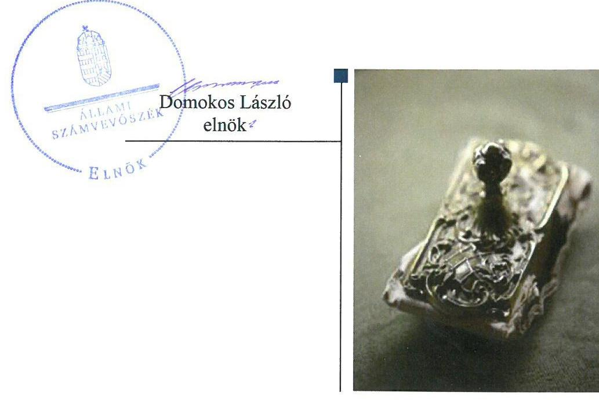
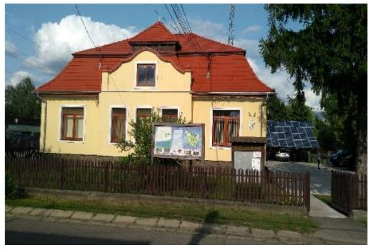

# Jelentés 

## Önkormányzatok integritás- és belső kontrollrendszere

Az önkormányzatok belső kontrollrendszere kialakításának és működtetésének ellenőrzése - Mátraverebély Község Önkormányzata
2018.

---

# Jelentés 

## Önkormányzatok integritás- és belső kontrollrendszere

Az önkormányzatok belső kontrollrendszere kialakításának és működtetésének ellenőrzése - Mátraverebély Község Önkormányzata
2018. spmle hó & nap

---

# AZ ELLENŐRZÉST FELÜGYELTE:

DR. BENEDEK MÁRIA felügyeleti vezető

## AZ ELLENŐRZÉST VEZETTE ÉS A VÉGREHAJTÁSÁÉRT FELELŐS:

BÍRÓ ZSOLT ellenőrzésvezető

## A PROGRAM ÖSSZEÁLLÍTÁSÁÉRT FELELŐS:

TÓTPÁL SZABOLCS osztályvezető

IKTATÓSZÁM: EL-0082-072/2018

TÉMASZÁM: 2444

ELLENŐRZÉS-AZONOSÍTÓ SZÁM: V078902

Jelentéseink az Országgyűlés számítógépes hálózatán és az Interneten a www.asz.hu címen is olvashatóak.

---

# TARTALOMJEGYZÉK 

■ ÖSSZEGZÉS ..... 5
■ AZ ELLENŐRZÉS CÉLJA ..... 6
■ AZ ELLENŐRZÉS TERÜLETE ..... 7
■ AZ ELLENŐRZÉS HÁTTERE, INDOKOLTSÁGA ..... 8
■ A JELENTÉS LÉNYEGES KÉRDÉSKÖREI ..... 10
■ AZ ELLENŐRZÉS HATÓKÖRE ÉS MÓDSZEREI ..... 11
■ MEGÁLLAPÍTÁSOK ..... 13
■ KÖVETKEZTETÉSEK ..... 20
■ MELLÉKLETEK ..... 21
I. sz. melléklet: Értelmező szótár ..... 21
■ FÜGGELÉK: ÉSZREVÉTELEK ..... 23
■ RÖVIDÍTÉSEK JEGYZÉKE ..... 25

---

.

---

# ÖSSZEGZÉS 

Az Állami Számvevőszék Mátraverebély Község Önkormányzatának ellenőrzése során megállapította, hogy a belső kontrollrendszer kialakítása és működtetése nem volt szabályszerű. A szervezet tevékenységében rejlő kockázatokat nem mérték fel, a gazdálkodási jogkörök gyakorlása során nem tartották be az előírásokat, az információs rendszert és a belső ellenőrzést nem a jogszabályi előírásoknak megfelelően működtették, így ezek nem biztosították a közpénzfelhasználás szabályosságát és az átlátható működést. Az integritási kontrollok kiépítettsége nem volt egyensúlyban a fellépő kockázatok szintjével.

## Az ellenőrzés társadalmi indokoltsága

Az Állami Számvevőszék stratégiai céljával összhangban - az Állami Számvevőszékről szóló 2011. évi LXV. törvény felhatalmazása alapján - végzi a közpénzekkel, az állami és önkormányzati vagyonnal való felelős gazdálkodás, valamint a helyi önkormányzatok számviteli rendje betartásának és belső kontrollrendszere működésének ellenőrzését. Magyarország Alaptörvénye az önkormányzatoktól is elvárja a kiegyensúlyozott, átlátható és fenntartható költségvetési gazdálkodás elvének érvényesítését, továbbá a nemzeti vagyonnal való rendeltetésszerű és felelős módon való gazdálkodást. Az ÁSZ stratégiájában az is megfogalmazódott, hogy támogatja az integritás alapú, átlátható és elszámoltatható közpénzfelhasználás megteremtését. Mindezekre tekintettel, közpénzzel gazdálkodó szervezetek esetében a belső kontrollrendszer megfelelő működése ellenőrzését prioritásként kezeli az Állami Számvevőszék.

A vagyonnal való felelős gazdálkodáshoz elengedhetetlen, hogy Mátraverebély Község Önkormányzatánál a belső kontrollrendszer kialakítása és működtetése megfelelő legyen, érvényesüljön az integritás szemlélet.

## Főbb megállapítások, következtetések

Mátraverebély Község Önkormányzata szervezetének és működésének kereteit nem a jogszabályi előírásoknak megfelelően alakította ki. Mátraverebély Község Önkormányzata nem rendelkezett gazdasági programmal, a Mátraverebélyi Közös Önkormányzati Hivatal 2016. január 1-je és 2016. október 27-e között nem rendelkezett szervezeti és működési szabályzattal. A Képviselő-testület nem határozta meg a köztisztviselőkre vonatkozó hivatásetikai alapelveket, az etikai eljárás szabályait.

Mátraverebély Község Önkormányzatának jegyzője nem mérte fel a szervezet tevékenységében, gazdálkodásában rejlő kockázatokat, nem határozta meg a szükséges intézkedéseket. A kontrolltevékenységek kereteinek kialakítása során a jegyző nem jelölte ki a pénzügyi ellenjegyzőt, a teljesítésigazolót és az érvényesítőt, valamint a polgármester a teljesítés igazolásra jogosult személyt. A kontrolltevékenységek gyakorlása során a pénzügyi ellenjegyzés, a teljesítésigazolás és az érvényesítés nem felelt meg a jogszabályi előírásoknak. A jegyző a szervezet információs rendszerét 2016. január 1-je és 2016. november 30-a között nem alakította ki, nem gondoskodott a jogszabály által előírt közérdekű adatok közzétételéről. A Képviselő-testület a belső ellenőrzési tervet nem határidőben hagyta jóvá. Mindezek alapján Mátraverebély Község Önkormányzatánál nem volt biztosított a közpénzfelhasználás szabályossága és az átlátható működés.

Az ellenőrzött időszakban a belső kontrollrendszer kialakítása és működtetése nem volt szabályszerű, nem támogatta Mátraverebély Község Önkormányzata szabályszerű működését.

Mátraverebélyi Roma Nemzetiségi Önkormányzat gazdálkodásával kapcsolatos önkormányzati feladatok ellátása a szabályozási hiányosságok miatt nem felelt meg a jogszabályi előírásoknak.

Mátraverebély Község Önkormányzatánál az integritással összefüggő kontrollok és a korrupciós kockázatok szintje nem volt összhangban, az integritás kontrollrendszer kiépítése hiányos volt.

---

# AZ ELLENŐRZÉS CÉLJA 

nyesülését.

AZ ELLENŐRZÉS CÉLJA annak megállapítása volt, hogy szabályszerűen történt-e Mátraverebély Község Önkormányzata belső kontrollrendszerének kialakítása és működtetése, az biztosította-e az önkormányzatnál a közpénzfelhasználás szabályosságát, a közpénzekkel és a nemzeti vagyonnal történő szabályszerű és felelős gazdálkodást, a beszámolási és adatszolgáltatási kötelezettségek szabályszerű teljesítését. Az ellenőrzés keretében értékeltük Mátraverebély Község Önkormányzata korrupciós kockázatainak kezelését szolgáló integritás kontrollok kiépítettségét és az integritás szemlélet érvé-

---

# **AZ ELLENŐRZÉS TERÜLETE**

## **Mátraverebély Község Önkormányzata**

Mátraverebély az Észak-Magyarországi régióban, Nógrád megyében található, állandó lakosainak száma a Központi Statisztikai Hivatal Magyarország közigazgatási helynévkönyve alapján 2016. január 1-jén 1897 fő volt. Mátraverebély Község Önkormányzata hét tagú Képviselő-testületének munkáját három állandó bizottság támogatta. A polgármester a 2014. évi önkormányzati választások óta tölti be tisztségét, a jegyző személye 2016. évben három alkalommal változott, a hivatalban lévő jegyző 2016. október 11-től látja el feladatait.

Mátraverebély Község Önkormányzata és Nemti Község Önkormányzata 2015. január 1-jével létrehozta a Mátraverebélyi Közös Önkormányzati Hivatalt. A Mátraverebélyi Közös Önkormányzati Hivatalon kívül egy intézménnyel látta el feladatait, gazdasági társaságban részesedéssel nem rendelkezett.

Mátraverebélyi Közös Önkormányzati Hivatal szervezeti egységekre nem tagolódott, elkülönített gazdasági szervezettel nem rendelkezett, a foglalkoztatott köztisztviselők száma 2016. év végén 9 fő volt. Az ellenőrzött időszakban a településen Mátraverebélyi Roma Nemzetiségi Önkormányzat működött.

Mátraverebély Község Önkormányzata a 2016. évi költségvetési beszámolója szerint 382,0 millió Ft költségvetési bevételt ért el, valamint 336,3 millió Ft költségvetési kiadást teljesített. Az eszközvagyon értéke 2016. december 31-én 1 241,6 millió Ft volt. A forrásokon belül a költségvetési évben esedékes kötelezettség állomány 4,2 millió Ft-ot, a költségvetési évet követően esedékes kötelezettség állomány 5,8 millió Ft-ot tett ki.

---

# AZ ELLENŐRZÉS HÁTTERE, INDOKOLTSÁGA 

A demokratikus társadalmakban alapvető igény, hogy a közpénzeket, a közvagyont használók tevékenységükről elszámoljanak, ahhoz egyértelmű és érvényesíthető felelősségi szabályok társuljanak. Ennek a jogos igénynek az érvényesítéséhez meg kell teremteni azokat a folyamatokat, rendszereket, amelyek nélkülözhetetlenek az elszámoltatáshoz. Az elszámoltatás eredményes működtetéséhez szükség van a megfelelő információs, kontroll-, értékelési - és beszámolási rendszerek kialakítására. A belső kontrollok kiépítettsége hozzájárul az integritási szemlélet kialakításához és érvényesüléséhez. A belső kontrollrendszer kialakítása és működtetése nélkül nem valósítható meg a közpénzek, a közvagyon szabályos, gazdaságos, hatékony és eredményes felhasználása.

A BELSŐ KONTROLLRENDSZER azt a célt szolgálja, hogy az államháztartás szervei működésük és gazdálkodásuk során a tevékenységeket szabályszerűen, gazdaságosan, hatékonyan, eredményesen hajtsák végre, teljesítsék elszámolási kötelezettségeiket és megvédjék az erőforrásokat a veszteségektől, a károktól, a nem rendeltetésszerű használattól. A belső kontrollrendszer magában foglalja mindazon szabályokat, eljárásokat, gyakorlati módszereket és szervezeti struktúrákat, kockázatkezelési technikákat, kontrolltevékenységeket, amelyek segítséget nyújtanak a szervezetnek céljai eléréséhez. A belső kontrollrendszer szabályozása háromszintű, a törvényi előírásokat az Áht. ${ }^{1}$ és a Mötv. ${ }^{2}$ a rendeleti szintű szabályozást az Ávr. ${ }^{3}$ és a Bkr. ${ }^{4}$ tartalmazza, amelyeket útmutatói szinten az NGM${ }^{5}$ által kiadott standardok és kézikönyvek támogatnak.

A MEGFELELŐ BELSŐ KONTROLLRENDSZER jelentősen csökkenti a hibák és szabálytalanságok kockázatát. Az ÁSZ ${ }^{6}$ célja, hogy javuljon az ellenőrzött önkormányzatok belső kontrollrendszerének szabályozottsága, működésének megfelelősége, szabályszerűsége, hozzájárulva ezzel az egyensúlyi helyzet fenntarthatóságának biztosításához, biztosítva az önkormányzatnál a közpénzfelhasználás szabályosságát, a közpénzekkel és a nemzeti vagyonnal történő szabályszerű, gazdaságos, hatékony és eredményes gazdálkodást. Az ÁSZ ellenőrzés tapasztalatai nem csupán a közvetlenül ellenőrzött önkormányzatokat támogathatják, hanem a „jó gyakorlat" elterjesztésével azok az önkormányzatok is átvehetik a pozitív példákat, ahol nem végez ellenőrzést az ÁSZ.

## AZ ELLENŐRZÉS VÁRHATÓ HASZNOSULÁSA

NÉGY SZINTEN valósul meg. A törvényalkotás számára összegzett tapasztalatok állnak rendelkezésre a belső kontrollrendszer önkormányzati területen való kialakításáról, működtetéséről és hatásairól. Az ellenőrzés az ellenőrzött számára visszajelzést ad a belső kontrollrendszer kialakításában és működésében lévő hiányosságokról, javaslataival hozzájárul azok kiküszöböléséhez. Az ellenőrzés megállapításait és javaslatait más szervezetek is hasznosíthatják a rendezett gazdálkodási keretek kialakításához. A társadalom számára jelzi, hogy közpénz nem maradhat ellenőrizetlenül, az

---

ÁSZ értékteremtő rend kialakításához és megőrzéséhez hozzájáruló tevékenysége pozitív hatással lesz a szervezetről kialakított összkép formálásában.

---

# A JELENTÉS LÉNYEGES KÉRDÉSKÖREI 

1.- Az önkormányzat belső kontrollrendszerének kialakítása és működtetése szabályszerű volt-e, az biztosította-e az önkormányzatnál a közpénzfelhasználás szabályosságát, a nemzeti vagyonnal történő felelős gazdálkodást?
2.- Érvényesült-e az integritás szemlélet és ennek megfelelően kiépítették-e az integritás kontrollrendszert az önkormányzatnál?

---

# AZ ELLENŐRZÉS HATÓKÖRE ÉS MÓDSZEREI 

## Az ellenőrzés típusa

Megfelelőségi ellenőrzés.

## Az ellenőrzött időszak

2016. január 1. és december 31. közötti időszak.

## Az ellenőrzés tárgya

A helyi önkormányzatnak, mint éves költségvetési beszámoló készítésére kötelezett szervezetnek és polgármesteri hivatalának belső kontrollrendszere. Az integritás szemlélet érvényesülése.

Az ellenőrzés kiterjedt minden olyan körülményre és adatra, amely az ÁSZ jogszabályban meghatározott feladatainak teljesítéséhez, valamint a program végrehajtása folyamán felmerült újabb összefüggések feltárásához szükséges volt.

## Az ellenőrzött szervezet

Mátraverebély Község Önkormányzata

## Az ellenőrzés jogalapja

Az ÁSZ tv. ${ }^{7}$ 1. § (3) bekezdésében foglaltak alapján az ÁSZ általános hatáskörrel végzi a közpénzekkel és az állami és önkormányzati vagyonnal való felelős gazdálkodás ellenőrzését. Az ÁSZ tv. 5. § (2) bekezdése alapján az államháztartás gazdálkodásának ellenőrzése keretében az ÁSZ ellenőrzi a helyi önkormányzatok gazdálkodását, valamint az ÁSZ tv. 5. § (6) bekezdése alapján ellenőrzése során értékeli az államháztartás számviteli rendjének betartását és a belső kontrollrendszer működését.

## Az ellenőrzés módszerei

Az ÁSZ az ellenőrzést az ellenőrzési program szempontjai, kérdései, az ellenőrzött időszakban hatályos jogszabályok, az ellenőrzés szakmai szabályok és módszertanok figyelembe vételével végezte.

Az ellenőrzés ideje alatt az ellenőrzött szervezettel történő kapcsolattartást az ÁSZ SZMSZ ${ }^{\circledR}$-ének vonatkozó előírásai alapján biztosította.

---

Az ellenőrzési kérdések megválaszolásához szükséges bizonyítékok megszerzése az ellenőrzöttek által rendelkezésre bocsátott dokumentumokra, adatokra alapozva megfigyelés, szemle (szemrevételezés), kérdésfeltevés (információkérés), valamint elemző eljárással történt. A minták kiválasztása rétegzett, véletlen mintavételi eljárással történt. Az ellenőrzési bizonyítékként felhasználható adatforrások közé tartoztak egyrészt az ellenőrzési program részletes szempontjainál felsorolt adatforrások, másrészt minden - az ellenőrzés folyamán feltárt, az ellenőrzés szempontjából információt tartalmazó - dokumentum.

Az ellenőrzés lefolytatásához az ellenőrzött szervezet a tanúsítványok kitöltésével, valamint az ÁSZ által kért dokumentumok megküldésével szolgáltatott adatokat. A rendelkezésre bocsátott adatok, információk kontrollja az ellenőrzés keretében történt. Az egységes értelmezést támogatta a program mellékletét képező fogalomtár és rövidítésjegyzék.

Az ellenőrzött szervezet belső kontrollrendszere jogszabályi előírások szerinti kialakításának és működtetésének szabályszerűségét az ÁSZ az erre irányuló ellenőrzési kérdésekre adott válaszok összesítése alapján pillérenként (kontrollkörnyezet, kockázatkezelési rendszer, kontrolltevékenységek, információs és kommunikációs rendszer, monitoring rendszer) és összeszítetten is értékelte. Az ellenőrzött szervezet belső kontrollrendszere egyes pilléreinek kialakítása és működtetése „szabályszerű", amennyiben az értékelt területen az elért igen válaszok százalékban kifejezett, egész számra kerekített aránya, meghaladta a 85%-ot, „nem szabályszerű", ha nem haladta meg a 60%-ot. Ha a 85%-ot nem haladta meg, de 60%-nál nagyobb volt az igen válaszok aránya, akkor a minősítés „részben szabályszerű". Az ellenőrzött szervezet belső kontrollrendszerének összesített értékelése megegyezik a pillérenként (kontrollterületenként) alkalmazott százalékos értékelésekkel, a következő
 eltérésekkel. A kontrollrendszer egésze esetében a „szabályszerű" értékelésnek a százalékos értéken felül további feltétele, hogy egyik kontrollterület sem kaphat „nem szabályszerű" értékelést, a „részben szabályszerű" értékelés további feltétele, hogy legfeljebb egy ellenőrzött kontrollterület lehet „nem szabályszerű" értékelésű. Az összesített értékelés a százalékos értéktől függetlenül „nem szabályszerű", ha az ellenőrzött kontrollterületek közül több mint egynek „nem szabályszerű" az értékelése.

A közszféra integritás alapú kultúrájának kialakítása, megerősítése és működése szorosan összefügg a belső kontrollrendszer működésével, ezért az ellenőrzés kiterjedt annak értékelésére is, hogy a belső kontrollrendszer kialakítása és működtetése hogyan hatott az integritás szemlélet érvényesülésére. Az integritás szemlélet érvényesülésének értékelése az ellenőrzött szervezet által kitöltött tanúsítvány alapján történt.

---

# 1. Az önkormányzat belső kontrollrendszerének kialakítása és működtetése szabályszerű volt-e, az biztosította-e az önkormányzatnál a közpénzfelhasználás szabályosságát, a nemzeti vagyonnal történő felelős gazdálkodást? 

## Összegző megállapítás

### 1.1. számú megállapítás

Az Önkormányzat ${ }^{9}$ belső kontrollrendszer kialakítása és működtetése nem volt szabályszerű, az nem biztosította az Önkormányzatnál a közpénzfelhasználás szabályosságát, a nemzeti vagyonnal történő felelős gazdálkodást.

A kontrollkörnyezet kialakítása a jogszabályi előírásoknak nem felelt meg.

A Képviselő-testület a Mótv.-ben, az Áht.-ban foglaltaknak megfelelően megalkotta az Önkormányzati SZMSZ ${ }^{10}$-t, jóváhagyta a 2016. október 28-tól hatályos Hivatali SZMSZ ${ }^{11}$-t. A jegyző kialakította az Önkormányzat és a Hivatal ${ }^{12}$ számviteli politikáját ${ }^{13}$ ennek keretében elkészítette a leltározási és leltárkészítési szabályzatot ${ }^{14}$, az eszközök és források értékelési szabályzatát ${ }^{15}$, a pénzkezelési szabályzatot ${ }_{1,2}{ }^{16}$ és az önköltség számítási szabályzatot ${ }^{17}$. A jegyző elkészítette a számlarendet ${ }^{18}$.

Az Önkormányzat kontrollkörnyezetének kialakítása hiányosságait az 1. táblázat tartalmazza.

## A KONTROLLKÖRNYEZET KIALAKÍTÁSÁNAK HIÁNYOSSÁGAI

| Sorszám | Megállapítások | Megjegyzések |
| :--: | :--: | :--: |
| 1. | A Képviselő-testület az Önkormányzat 2014-2019. közötti időszakra vonatkozó gazdasági programját a Htv ${ }^{19} 138. § (1) bekezdés a) pontjában előírtak ellenére nem határozta meg. |  |
| 2. | A Hivatal nem rendelkezett 2016. január 1. és 2016. október 27. között a szervezetét, feladatai ellátásának részletes belső rendjét és módját megállapító szervezeti és működési szabályzattal az Áht. 10. § (5) bekezdésében rögzítettek ellenére. | 2016. október 28-án hatályba lépett a Hivatali SZMSZ. |
| 3. | A jegyző nem gondoskodott arról, hogy a Hivatali SZMSZ tartalmazza az Ávr. 13. § (1) bekezdés c), e), g) és i) pontjaiban meghatározottaknak megfelelően a kormányzati funkció szerint besorolt alaptevékenységeket, a szervezeti ábrát, az SZMSZ VI. fejezetében nevesített munkakörökhöz tartozó feladat- és hatásköröket, a hatáskörök gyakorlásának módját, az SZMSZ-ben nevesített jegyzői munkakör helyettesítésének rendjét és az ehhez kapcsolódó felelősségi szabályokat, valamint azokat a költségvetési szerveket, amelyeknél a gazdasági szervezet feladatait ellátja. |  |
| 4. | A jegyző nem határozta meg a Hivatal pénzügyi-számviteli területén dolgozó köztisztviselők munkaköri leírásaiban a Kttv. ${ }^{20} 75. § (1) bekezdés d) pontjának előírásai ellenére a munkakörök betöltésével kapcsolatos követelményeket. |  |
| 5. | A jegyző a Hivatal pénzügyi-számviteli területén dolgozó köztisztviselők munkaköri leírásaiban a Hivatali SZMSZ 15. §-ának előírásai ellenére nem rendelkezett a helyettesítés rendjéről. |  |

---

| Sorszám | Megállapítások | Megjegyzések |
| :--: | :--: | :--: |
| 6. | A Kttv. 231. § (1) bekezdésében előírtak ellenére 2016. december 1-jei hatállyal jegyzői utasításban határozták meg a Hivatal köztisztviselőire vonatkozó hivatásetikai alapelvek ${ }^{21}$ részletes tartalmát és az etikai eljárás szabályait, és azokat nem a Képviselő-testület állapította meg. |  |
| 7. | A Számv. tv. ${ }^{22}$ 14. § (4) bekezdésének előírása ellenére a jegyző a számviteli politikában nem rögzítette azokat az Önkormányzatra és Hivatalra jellemző szabályokat, előírásokat, módszereket, amelyekkel meghatározzák, hogy mit tekintenek a számviteli elszámolás, értékelés szempontjából lényegesnek, nem lényegesnek, kivételes nagyságú vagy előfordulású bevételnek, költségnek. Az Áhsz. ${ }^{23}$ 50. § (7) bekezdése ellenére az általános költségek felosztásához alkalmazott mutatókat, vetítési alapokat sem tartalmazta. |  |
| 8. | A jegyző a számlarendben az Áhsz. 51. § (3) bekezdése előírásai ellenére nem határozta meg a részletező nyilvántartások vezetésének módját, azoknak a kapcsolódó könyvviteli és nyilvántartási számlákkal való egyeztetését. |  |
| 9. | A jegyző nem készítette el a Számv. tv. 161. § (2) bekezdésének d) pontjában előírtak ellenére a számlarendben foglaltakat alátámasztó bizonylati rendet. |  |
| 10. | A jegyző a 2016. január 1. és november 30. közötti időszakra az Ávr. 13. § (2) bekezdés c) és e) pontjában előírtak ellenére belső szabályzatban nem rendezte a belföldi és külföldi kiküldetések elrendelésével és lebonyolításával, elszámolásával kapcsolatos kérdéseket, továbbá a reprezentációs kiadások felosztását, valamint azok teljesítésének és elszámolásának szabályait. | A jegyző 2016. december 1-jével hatályba léptette a kiküldetési és a reprezentációs szabályzatot. |
| 11. | A jegyző 2016. január 1. és november 30. között a Kttv. 75. § (5) bekezdésében foglaltak ellenére közszolgálati szabályzatot nem adott ki. | A jegyző 2016. december 1-jével hatályba léptette közszolgálati szabályzatot, amelyben a munkakör át-adás-átvétel rendjét szabályozta. |

Forrás: ÁSZ

# 1.2. számú megállapítás 

## A kockázatkezelési rendszer kialakítása és működtetése nem felelt meg a jogszabályi előírásoknak

A jegyző és a polgármester a korábbi szabályozásokat hatályon kívül helyezve 2016. december 1-jétől hatályos, a Hivatalra, az Önkormányzatra vonatkozó kockázatkezelési szabályzatot ${ }^{24}$ és szabálytalanságok kezelésének eljárásrendjét ${ }^{25}$ adtak ki.

A kockázatkezelési rendszer kialakításának és működtetésének hiányosságait a 2. táblázat tartalmazza:

## A KOCKÁZATKEZELÉSI RENDSZER KIALAKÍTÁSÁNAK ÉS MŰKÖDTETÉSÉNEK HIÁNYOSSÁGAI

| Sorszám | Megállapítások | Megjegyzések |
| :-- | :-- | :-- |
| 1. | A jegyző 2016. október 1-jétől nem szabályozta a Bkr. 6. § (4) bekezdésében előírt szervezeti integritást sértő események kezelésének eljárásrendjét, valamint az integrált kockázatkezelés eljárásrendjét. |  |
| 2. | A jegyző 2016. szeptember 30-ig a Bkr. 7. § (1)-(2) bekezdésében előírtak ellenére a kockázatkezelési rendszert, 2016. október 1-jétől az integrált kockázatkezelési rendszert nem működtette, nem mérte fel és nem állapította meg a Hivatal tevékenységében, gazdálkodásában rejlő kockázatokat, nem határozta meg az egyes kockázatokkal kapcsolatban szükséges intézkedéseket, valamint azok teljesítésének folyamatos nyomon követésének módját. |  |

Forrás: ÁSZ

---

### 1.3. számú megállapítás

A kontrolltevékenységek keretei kialakítása és működtetése nem felelt meg a jogszabályokban és a belső szabályozásban foglaltaknak.

A kontrolltevékenységek kereteit a jegyző a gazdálkodási szabályzatban ${ }^{26}$ alakította ki, amelyben meghatározta az Önkormányzatot érintően a gazdálkodási jogkörök kijelölésére, gyakorlására és az összeférhetetlenségre vonatkozó szabályokat. Az Önkormányzat FEUVE szabályzata ${ }^{27}$ és 2016. december 1-jén kiadott belső kontrollrendszer szabályzata ${ }^{28}$ rögzítette a felelősségi körök meghatározásával az engedélyezési, jóváhagyási és kontrolleljárásokat, az adatszolgáltatási és beszámolási feladatok teljesítésével kapcsolatos belső előírásokat, feltételeket.

A kontrolltevékenységek kialakításának és működtetésének hiányosságait a 3. táblázat tartalmazza.
3. táblázat

# A KONTROLLTEVÉKENYSÉGEK KIALAKÍTÁSÁNAK ÉS MŰKÖDTETÉSÉNEK HIÁNYOSSÁGAI 

| Sorszám | Megállapítások | Megjegyzések |
| :--: | :--: | :--: |
| 1. | A Jegyző 2016. október 1-jétől a 8kr. 8. § (2) bekezdés a), c) és d) pontjában előírtak ellenére nem biztosította a kontrolltevékenység részeként minden tevékenységre a szervezeti célok elérését veszélyeztető kockázatok csökkentésére irányuló kontrollok kiépítését, különösen a döntések dokumentumainak elkészítésére, a döntések szabályszerűségi szempontból történő jóváhagyására, ellenjegyzésére és a gazdasági események elszámolására vonatkozóan. |  |
| 2. | A jegyző az Önkormányzat ellenőrzési nyomvonalát 2016. január 1. és 2016. november 30. között nem készítette el a 8kr. 6. § (3) bekezdésében rögzítettek ellenére. | A jegyző az Önkormányzat ellenőrzési nyomvonalát 2016. december 1-jén kiadta. |
| 3. | A jegyző az Ávr. 55. § (2) bekezdés f) pontja és a gazdálkodási szabályzat III. pontja ellenére a kötelezettségvállalás pénzügyi ellenjegyzésére nem jelölt ki a Hivatal állományába tartozó köztisztviselőt. |  |
| 4. | A jegyző az Ávr. 58. § (4) bekezdésében és a gazdálkodási szabályzat V. pontjában előírtak ellenére nem jelölt ki érvényesítésre jogosult személyt. |  |
| 5. | A jegyző és a polgármester az Ávr. 57. § (4) bekezdésében és a gazdálkodási szabályzat IV. pontja ellenére nem jelölte ki írásban a teljesítés igazolására jogosult személyeket. |  |
| 6. | A gazdálkodási jogkör gyakorló kijelölésének hiányában, a gazdasági szervezet vezetője a jegyző volt, aki az Ávr. 12. § (1) bekezdésében meghatározott képesítési követelményeknek nem felelt meg. |  |
| 7. | A pénzügyi ellenjegyzést az Ávr. 55. § (1) bekezdésben foglaltak ellenére kijelölés hiányában nem, vagy nem az arra jogosultak végezték. |  |
| 8. | Az érvényesítést az Ávr. 58. § (1) és (4) bekezdésében foglaltak ellenére a kijelölés hiányában nem, vagy nem az arra jogosultak végezték. |  |
| 9. | A teljesítésigazolást az Ávr. 57. § (1) és (3) bekezdésében foglaltak ellenére a kijelölés hiányában nem, vagy nem az arra jogosultak végezték. |  |

Forrás: ÁSZ

### 1.4. számú megállapítás

Az információs és kommunikációs folyamatok kialakítása és működtetése nem volt szabályszerű.

A jegyző 2016. december 1-jei hatállyal határozta meg az Info tv. ${ }^{29}$-ben előírtakkal összhangban a kötelezően közzéteendő adatok közzétételi kötelezettsége teljesítésének részletes szabályait, valamint a közérdekű adatok megismerésére irányuló igények teljesítésének rendjét rögzítő szabályokat.

---

Az információs és kommunikációs rendszer kialakításának és működtetésének hiányosságait a 4. táblázat tartalmazza.
4. táblázat

# AZ INFORMÁCIÓS ÉS KOMMUNIKÁCIÓS RENDSZER KIALAKÍTÁSÁNAK ÉS MŰKÖDTETÉSÉNEK HIÁNYOSSÁGAI 

| Sorszám | Megállapítások | Megjegyzések |
| :--: | :--: | :--: |
| 1. | A jegyző 2016. január 1. és 2016. november 30. közötti időszakban a Bkr. 9. § (1) bekezdésében előírtak ellenére nem alakított ki olyan információs rendszert, amely biztosította, hogy a megfelelő információk a megfelelő időben eljussanak az illetékes szervezethez, szervezeti egységhez, illetve személyhez. | 2016. december 1-től a Belső kontrollrendszer szabályzatban a jegyző rögzítette az előírásokat. |
| 2. | A jegyző a 2016. január 1. és 2016. november 30. közötti időszakra az Info tv. 35. § (3) bekezdésében előírtak ellenére nem határozta meg a kötelezően közzéteendő adatok közzétételi kötelezettsége teljesítésének részletes szabályait. | 2016. december 1-től eleget tettek a kötelezettségnek. |
| 3. | A jegyző 2016. január 1. és 2016. november 30. közötti időszakra nem készítette el a közérdekű adatok megismerésére irányuló igények teljesítésének rendjét rögzítő szabályzatot az Info tv. 30. § (6) bekezdésében előírtak ellenére. | 2016. december 1-től eleget tettek a kötelezettségnek. |
| 4. | A jegyző az Info tv. 24. § (3) bekezdésében
 rögzítettek ellenére nem készítette el az adatvédelmi és adatbiztonsági szabályzatot. |  |
| 5. | A jegyző az Info. tv. 37. § (1) bekezdésében előírtak ellenére nem gondoskodott az Info. tv. 1. melléklet II/1., 3., 8., 9., 13. pontjaiban előírt adatok - többek között a szervezeti és működési szabályzat, az adatvédelmi és adatbiztonsági szabályzat - , az Info tv. 1. melléklet III/1., 2., 8. pontjaiban előírt adatok - többek között a 2016. évi költségvetés és a 2015. évi költségvetési beszámoló - közzétételéről. |  |
| 6. | A jegyző az iratkezelési szabályzatot ${ }^{30}$ az Ltv. ${ }^{31}$ 10. § (1) bekezdés c) pontjában előírtak ellenére nem a Magyar Nemzeti Levéltár és a megyei kormányhivatal egyetértésével adta ki. | A jegyző elkészítette az iratkezelési szabályzatot, amely az iratok iktatásával biztosította az ügyintézés nyomon követhetőségét, az iratok fellelhetőségét. |
| 7. | A jegyző nem gondoskodott az időközi költségvetési jelentések Ávr. 169. § (3) bekezdésében, az időközi mérlegjelentések Ávr. 170. § (2) bekezdésében, és a 2016. évi költségvetési beszámoló Áhsz. 32. § (4) bekezdésében előírt határidőben a Kincstár által működtetett elektronikus adatszolgáltatási rendszerbe történő feltöltéséről. | A költségvetési beszámoló 24 nappal, az időközi költségvetési jelentés két esetben öt és hét nappal, az időközi mérleg jelentés három esetében hat, hét és hét nappal a határidő után került feltöltésre. |

Forrás: ÁSZ
1.5. számú megállapítás

Az Önkormányzat monitoring rendszerének kialakítása 2016. szeptember 30-ig nem felelt meg a jogszabályoknak. A belső ellenőrzést kialakította, azonban az ellenőrzött időszakban nem a jogszabályi előírásoknak megfelelően működtette.

A belső ellenőrzési tevékenység megszervezéséről a jegyző az előírt képesítéssel és gyakorlattal rendelkező külső szolgáltató bevonásával gondoskodott.

A kockázatértékelésen alapuló 2016. évre vonatkozó módosított belső ellenőrzési tervet és a 2017. évi belső ellenőrzési tervet a Képviselő-testület jóváhagyta. A módosított belső ellenőrzési tervben szereplő belső ellenőrzést végrehajtották.

A Magyar Államkincstár és az ÁSZ által végzett ellenőrzésről az intézkedési tervet az intézkedésért felelős és határidő megjelölésével készítették el.

---

A monitoring rendszer kialakításának és működtetésének hiányosságait 5. táblázat tartalmazza.
5. táblázat

# A MONITORING RENDSZER KIALAKÍTÁSÁNAK ÉS MŰKÖDTETÉSÉNEK HIÁNYOSSÁGAI 

| Sorszám | Megállapítások | Megjegyzések |
| :--: | :--: | :--: |
| 1. | A jegyző 2016. szeptember 30-ig nem alakította ki a Bkr. 10. §-ában előírtak ellenére az operatív tevékenységek keretében megvalósuló folyamatos és eseti nyomon követését tartalmazó, a szervezet tevékenységének, a célok megvalósításának nyomon követését biztosító rendszert | A Bkr. 2016. október 1-jei változására tekintettel a jegyző a belső ellenőrzés kialakításával eleget tett a Bkr. 10. §-ában foglaltaknak. |
| 2. | A 2016. évi belső ellenőrzési tervet a Mötv. 119. § (5) bekezdésében megjelölt határidőig a Képviselő testület nem hagyta jóvá. | A módosított 2016. évi belső ellenőrzési terv jóváhagyásra került. |
| 3. | A jegyző a Hivatali SZMSZ-ben a Bkr. 15. § (2) bekezdésében foglaltak ellenére nem írta elő a belső ellenőrzést végző személy vagy szervezet, vagy szervezeti egység feladatait. |  |

1.6. számú megállapítás

## A jegyző nyilatkozatban a belső kontrollrendszer kialakításának és működtetésének minőségét nem értékelte.

A belső ellenőr az ellenőrzési tapasztalatok alapján az éves ellenőrzési jelentést elkészítette, mely tartalmazta a belső kontrollrendszer, azon belül az öt pillér működésének értékelését. A belső ellenőr megfelelőnek értékelte a belső kontrollrendszer minőségét, ezen belül a költségvetési szerv tevékenységében a hatékonyság, eredményesség és gazdaságosság követelmények érvényesítését. A belső ellenőr értékelésében foglaltakat jelen ellenőrzés nem támasztotta alá, mivel az Önkormányzat belső kontrollrendszerének kialakítása és működtetése az ÁSZ értékelése szerint nem volt szabályszerű.

A belső kontrollrendszer minőségét értékelő nyilatkozattal és az éves ellenőrzési jelentéssel kapcsolatos hiányosságokat a 6. táblázat tartalmazza.
6. táblázat

## A BELSŐ KONTROLLRENDSZER MINŐSÉGÉT ÉRTÉKELŐ NYILATKOZATTAL ÉS AZ ÉVES ELLENŐRZÉSI JELENTÉSSEL KAPCSOLATOS HIÁNYOSSÁGOK

Sorszám
Megállapítások
Megjegyzések

1. A jegyző Bkr. 1. melléklete szerinti nyilatkozatában nem értékelte a költségvetési szerv belső kontrollrendszerének minőségét a Bkr. 11. § (1) bekezdésben előírtak ellenére.
2. A belső ellenőr a Bkr. 49. § (3) bekezdésében előírtak ellenére az éves ellenőrzési jelentést nem küldte meg a tárgyévet követő év február 15-ig a polgármesternek.
3. A polgármester az éves ellenőrzési jelentést a tárgyévet követően, a zárszámadási rendelettervezettel egyidejűleg a Bkr. 49. § (3a) bekezdésében előírtak ellenére nem terjesztette a Képviselő-testület elé jóváhagyásra.

Forrás: ÁSZ

### 1.7. számú megállapítás

A Roma Nemzetiségi Önkormányzat ${ }^{32}$ gazdálkodásával kapcsolatos feladatok ellátása nem felelt meg a jogszabályi előírásoknak.

Az Önkormányzat és a Roma Nemzetiségi Önkormányzat a Nek. tv. ${ }^{33}$-ben előírtak alapján az ellenőrzött időszakot megelőzően Együttműködési megállapodást ${ }^{34}$ kötött, melynek felülvizsgálata megtörtént.

---

A jegyző az Áht.-ban foglaltaknak megfelelően előkészítette a Roma Nemzetiségi Önkormányzat 2016. évi költségvetési és zárszámadási határozattervezetét.

A jegyző kiterjesztette a Roma Nemzetiségi Önkormányzatra a számviteli politikát, a számlarendet, a pénzkezelési szabályzat ${ }_{1,2}$-t, a leltározási és leltárkészítési szabályzatot, az értékelési szabályzatot, valamint a gazdálkodási szabályzatot.

A Roma Nemzetiségi Önkormányzat gazdálkodásával kapcsolatos önkormányzati feladatellátás hiányosságait a 7. táblázat tartalmazza.
7. táblázat

# A ROMA NEMZETISÉGI ÖNKORMÁNYZAT GAZDÁLKODÁSÁVAL KAPCSOLATOS ÖNKORMÁNYZATI FELADATELLÁTÁS HIÁNYOSSÁGAI 

| Sorszám | Megállapítások | Megjegyzések |
| :--: | :--: | :--: |
| 1. | A jegyző nem gondoskodott az Együttműködési megállapodás január 31-ig történő felülvizsgálatáról a Nek. tv. 80. § (2) bekezdésében előírtak ellenére. | A felülvizsgálat 2016. február 29-én történt. |
| 2. | Az Együttműködési megállapodás a Nek. tv. 80. § (3) bekezdés b) pontjában előírtak ellenére a Roma Nemzetiségi Önkormányzat kötelezettségvállalásaival kapcsolatosan az Önkormányzatot terhelő szakmai teljesítésigazolási feladatokat és a felelősök konkrét kijelölését nem tartalmazta. |  |
| 3. | A jegyző nem készítette el a Roma Nemzetiségi Önkormányzat vonatkozásában a szervezeti integritást sértő események kezelésének eljárásrendjét, valamint az integrált kockázatkezelés eljárásrendjét 2016. október 1-jétől a Bkr. 6. § (4) bekezdésének előírása ellenére. |  |
| 4. | A jegyző a Roma Nemzetiségi Önkormányzat vonatkozásában írásban nem jelölte ki a Hivatal állományába tartozó pénzügyi ellenjegyzésre jogosult köztisztviselőt a Nek. tv. 80. §. (3) bekezdés b) pontjában és a gazdálkodási szabályzat III. fejezetében rögzítettek ellenére. | Az Együttműködési megállapodás 3.1.4 pontjában rögzítették, hogy pénzügyi ellenjegyzésre a helyi önkormányzat hivatalának gazdasági vezetője írásban jogosult, azonban gazdasági vezető kinevezésére az ellenőrzött időszakban nem került sor. |
| 5. | A jegyző a Roma Nemzetiségi Önkormányzat vonatkozásában írásban nem jelölte ki az érvényesítőt a Nek. tv. 80. §. (3) bekezdés b) pontjában és az Ávr. 58. § (4) bekezdésben előírtak ellenére. | Az Együttműködési megállapodás 3.1.5 pontjában rögzítették, hogy az érvényesítést a helyi önkormányzat hivatalának gazdasági vezetője írásban jogosult végezni, azonban gazdasági vezető kinevezésére az ellenőrzött időszakban nem került sor. |
| 6. | A jegyző a Roma Nemzetiségi Önkormányzat vonatkozásában az Áht. 70.§ (1) bekezdésében és az Együttműködési megállapodás 4.3 pontjában előírtak ellenére nem gondoskodott a belső ellenőrzés működtetéséről. |  |

---

# 2. Érvényesült-e az integritás szemlélet és ennek megfelelően ki- 

építették-e az integritás kontrollrendszert az önkormányzatnál?

Összegző megállapítás

Az Önkormányzatnál az integritással összefüggő kontrollok kialakítása nem volt egyensúlyban a fellépő kockázatok szintjével.

Az Önkormányzat a jogszabályok által előírt integritás kontrollokat nem működtette. A jogszabályi előírások ellenére a korrupciós kockázatok mérséklését, megelőzését támogató integrált kockázatkezelési eljárásrend nem került szabályozásra. Az Önkormányzat nem rendelkezett iratkezelési szabályzattal, adatkezelési szabályzattal, és a jogszabálynak megfelelő etikai szabályzattal.

Az Önkormányzat nem működtette a kockázatkezelési rendszert, nem készítettek rendszer szintű kockázatelemzést, ami hiányában nem értékelték a kockázatelemzés eredményét, kockázatkezelési tevékenységet nem végeztek. Az Önkormányzat nem végzett korrupciós kockázatelemzést.

Az Önkormányzat által önként bevezetett, kialakított nem jogszabályok által előírt kontrollok közül alkalmazta a teljesítményértékelést, de nem szabályozták az ajándékok, meghívások, utaztatás elfogadásának feltételeit. Nem írták elő az Önkormányzat tevékenysége szempontjából releváns összeférhetetlenségről szóló nyilatkozattételi kötelezettséget. Az új munkatársak kiválasztásánál nem alkalmaztak vizsgát, tudás felmérő tesztet, illetve az elmúlt három évben nem volt korrupcióellenes képzés.

---

# KÖVETKEZTETÉSEK 

Magyarország Alaptörvénye szerint az állam és a helyi önkormányzatok tulajdona nemzeti vagyon. A nemzeti vagyonról szóló törvény követelményként írja elő a nemzeti vagyonnal való felelős és rendeltetésszerű gazdálkodást.
Az államháztartási kontrollok részét képező belső kontrollrendszer kialakításának és működtetésének az államháztartási törvény által meghatározott alapvető célja, hogy biztosítsa az államháztartás pénzeszközeivel és a nemzeti vagyon részét képező önkormányzati vagyonnal történő szabályszerű gazdálkodást. Mátraverebély Község Önkormányzata belső kontrollrendszere kialakítása és működtetése nem volt szabályszerű, így nem töltötte be az államháztartási törvény által meghatározott célok megvalósításához rendelt alapvető szerepét. Az ellenőrzés során a belső kontrollrendszer kialakításában és működtetésében feltárt jogszabálysértő gyakorlat miatt az Önkormányzat rendelkezésére álló források törvényi előírások szerinti rendeltetésének megfelelő, elszámoltatható felhasználása nem biztosított.
A rendeltetésellenes közpénzfelhasználás megszüntetése érdekében az Állami Számvevőszék az ÁSZ tv. 31. § (1) bekezdés b) pontjában foglalt jogkövetkezmény alkalmazását kezdeményezte.

---

# MELLÉKLETEK 

- I. SZ. MELLÉKLET: ÉRTELMEZŐ SZÓTÁR

ÁSZ Integritás Projekt
belső ellenőrzés
belső kontrollrendszer
belső kontrollrendszer pillérei, kontrollterületei
helyi önkormányzat

Az Állami Számvevőszék 2009-ben indította el a „Korrupciós kockázatok feltérképezése - Integritás alapú közigazgatási kultúra terjesztése" című, európai uniós forrásból megvalósított kiemelt projektjét (Integritás Projekt). Az Integritás Projekt célja, hogy felmérje a közszféra intézményei korrupciós kockázatoknak való kitettségét, illetőleg az azok mérséklésére hivatott kontrollok szintjét. Az Állami Számvevőszék a projekt révén az integritás szemlélet minél szélesebb körrel történő megismertetését, gyakorlatba ültetését kívánja elérni. Az integritás követelményeinek megfelelő szervezeti működést előnyben részesítő közigazgatási kultúra elterjesztését és a korrupció elleni fellépést az ÁSZ önmagára nézve is stratégiai jelentőségű célként fogalmazta meg. A projekt a felmérésben résztvevő intézmények számára helyzetükről egyfajta „tükörképet" mutat be, ami alapot teremt a jövőbeni pozitív irányú elmozduláshoz. (Forrás: a http://integritas.asz.hu honlapon közzétett, a 2013. évi Integritás felmérés eredményeiről készült összefoglaló tanulmány)
Független, tárgyilagos bizonyosságot adó és tanácsadó tevékenység, amelynek célja, hogy az ellenőrzött szervezet működését fejlessze és eredményességét növelje, az ellenőrzött szervezet céljai elérése érdekében rendszerszemléletű megközelítéssel és módszeresen értékeli, illetve fejleszti az ellenőrzött szervezet irányítási és belső kontrollrendszerének hatékonyságát. (Forrás: Bkr. 2. § b) pontja)
A belső kontrollrendszer a kockázatok kezelése és tárgyilagos bizonyosság megszerzése érdekében kialakított folyamatrendszer, amely azt a célt szolgálja, hogy a működés és gazdálkodás során a tevékenységeket szabályszerűen, gazdaságosan, hatékonyan, eredményesen hajtsák végre, az elszámolási kötelezettségeket teljesítsék, megvédjék az erőforrásokat a veszteségektől, károktól és nem rendeltetésszerű használattól. (Forrás: Áht. 69. § (1) bekezdése)
A kontrollkörnyezet, a (integrált) kockázatkezelési rendszer, a kontrolltevékenységek, az információs és kommunikációs rendszer, valamint a nyomon követési (monitoring) rendszer. (Forrás: Bkr. 3. §-a)
A helyi önkormányzat jogi személy. Az önkormányzati feladatok ellátását a képviselő-testület és szervei biztosítják. A képviselőtestület szervei: a polgármester, a főpolgármester, a megyei közgyűlés elnöke, a képviselő-testület bizottságai, a

 részönkormányzat testülete, a önkormányzati hivatal, a megyei önkormányzati hivatal, a közös önkormányzati hivatal, a jegyző, továbbá a társulás. A képviselő-testület a feladatkörébe tartozó közszolgáltatások ellátására - jogszabályban meghatározottak szerint - költségvetési szervet, a polgári perrendtartásról szóló törvény szerinti gazdálkodó szervezetet (a továbbiakban: gazdálkodó szervezet), nonprofit szervezetet és egyéb szervezetet (a továbbiakban együtt: intézmény) alapíthat, továbbá szerződést köthet természetes és jogi személlyel vagy jogi személyiséggel nem rendelkező szervezettel. A helyi önkormányzat éves költségvetési beszámolója magába foglalja a helyi önkormányzat - nem költségvetési szerveihez tartozó - feladataihoz kapcsolódó bevételeket és kiadásokat. A helyi önkormányzat összevont (konszolidált) költségvetési beszámolóját a helyi önkormányzatra és költségvetési szerveire vonatkozóan külön-külön beérkezett éves költségvetési beszámolók alapján a Kincstár ${ }^{35}$ készíti el és küldi meg az önkormányzatnak. (Forrás: Mötv. 41. § (1), (2), (6) bekezdései; Áhsz. 2. § (1) bekezdése, 6. § (1) bekezdés a) és f) pontja, 30. §-a, 37. § (1) és (6) bekezdése)

---

információs és kommunikációs rendszer
integritás
irányító szerv és annak vezetője
kockázatkezelési rendszer
kontrollkörnyezet
kontrolltevékenységek
költségvetési szerv vezetője (Bkr. alkalmazásában)
közös önkormányzati hivatal
önkormányzati hivatal
társulás

A költségvetési szerv vezetője által kialakított és működtetett olyan rendszer, mely biztosítja, hogy a megfelelő információk a megfelelő időben eljutnak az illetékes szervezethez, szervezeti egységhez, illetve személyhez. (Forrás: Bkr. 9. § (1) bekezdés)
Az integritás elvek, értékek, cselekvések, módszerek, intézkedések konzisztenciáját jelenti: olyan magatartásmódot, amely meghatározott értékeknek felel meg. Az integritás a közszféra esetében a társadalom által elvárt nyilvánossági, átláthatósági, illetve jogi/etikai normáknak történő megfelelést jelenti. (Forrás: a http://integritas.asz.hu honlapon közzétett „A 2012. évi integritás felmérés eredményeinek összefoglalója" című dokumentum 3. oldal 1. bekezdése)
A közös önkormányzati hivatal kivételével a helyi önkormányzat által irányított költségvetési szerv esetén a képviselő-testület, közgyűlés és a polgármester, főpolgármester, megyei közgyűlés elnöke. A közös önkormányzati hivatal esetén a közös önkormányzati hivatal székhelye szerinti helyi önkormányzat képviselő-testülete és annak polgármestere. (Forrás: Áht. 2. § (1) bekezdés i), ia) és ib) pontja)
Olyan irányítási eszközök és módszerek összessége, melynek elemei a szervezeti célok elérését veszélyeztető tényezők (kockázatok) azonosítása, elemzése, csoportosítása, nyomon követése, valamint szükség esetén a kockázati kitettség mérséklése. (Forrás: Bkr. 2. § m) pontja)
A költségvetési szerv vezetője által kialakított olyan elvek, eljárások, belső szabályzatok összessége, amelyben világos a szervezeti struktúra, egyértelműek a felelősségi, hatásköri viszonyok és feladatok, meghatározottak az etikai elvárások a szervezet minden szintjén, átlátható a humánerőforrás-kezelés. (Forrás: Bkr. 6. § (1) bekezdés)
A költségvetési szerv vezetője által a szervezeten belül kialakított (kontroll) tevékenységek, melyek biztosítják a kockázatok kezelését, hozzájárulnak a szervezet céljainak eléréséhez. (Forrás: Bkr. 8. § (1) bekezdés)
Helyi önkormányzat esetén a jegyző, főjegyző, társulás esetén a társulási megállapodásban meghatározott önkormányzat jegyzője. (Forrás: Bkr. 2. § n) pont nb) alpont) települési képviselő-testület más települési képviselő-testülettel társult képviselőtestületet alakíthat, amely esetén a képviselő-testületek részben vagy egészben egyesítik a költségvetésüket, közös önkormányzati hivatalt tartanak fenn és intézményeiket közösen működtetik. (Forrás: Mötv. 56. § (1)-(2) bekezdései)
a polgármesteri hivatal, a főpolgármesteri hivatal, a megyei önkormányzati hivatal és a közös önkormányzati hivatal (Forrás: Áht. 1. § 18. pont)
A helyi önkormányzatok képviselő-testületei megállapodhatnak abban, hogy egy vagy több önkormányzati feladat- és hatáskör, valamint a polgármester és a jegyző államigazgatási feladat- és hatáskörének hatékonyabb, célszerűbb ellátására jogi személyiséggel rendelkező társulást hoznak létre. A társulási tanács munkaszervezeti feladatait (döntések előkészítése, végrehajtás szervezése) eltérő megállapodás hiányában a társulás székhelyének polgármesteri hivatala látja el. (Forrás: Mötv. 87. §, 94. § (4) bekezdés)

---

# FÜGGELÉK: ÉSZREVÉTELEK 

A jelentéstervezetet a Számvevőszék 15 napos észrevételezésre megküldte az ellenőrzött szervezet vezetőjének az ÁSZ tv. 29. § (1) bekezdése előírásának megfelelően.

Az ellenőrzött szervezet vezetője az ÁSZ tv. 29. § (2) bekezdésében foglalt észrevételezési jogával nem élt, a jelentéstervezetre észrevételt nem tett.

[^0]
[^0]:    * 29. § (1) Az Állami Számvevőszék az ellenőrzési megállapításait megküldi az ellenőrzött szervezet vezetőjének vagy az általa megbízott személynek, és annak, akinek személyes felelősségét állapította meg.
    (2) Az ellenőrzött szervezet vezetője és a felelősként megjelölt személy az ellenőrzés megállapításaira tizenöt napon belül írásban észrevételt tehet.
    (3) Az Állami Számvevőszék az észrevételre a beérkezésétől számított harminc napon belül írásban válaszol. A figyelembe nem vett észrevételeket köteles a jelentésben feltüntetni, és megindokolni, hogy azokat miért nem fogadta el.

---

.

---

# RÖVIDÍTÉSEK JEGYZÉKE 

${ }^{1}$ Áht.
${ }^{2}$ Mötv.
${ }^{3}$ Ávr.
${ }^{4}$ Bkr.
${ }^{5}$ NGM
${ }^{6}$ ÁSZ
${ }^{7}$ ÁSZ tv.
${ }^{8}$ ÁSZ SZMSZ
${ }^{9}$ Önkormányzat
${ }^{10}$ Önkormányzati SZMSZ
${ }^{11}$ Hivatali SZMSZ
${ }^{12}$ Hivatal
${ }^{13}$ számviteli politika
${ }^{14}$ leltározási és leltárkészítési szabályzat
${ }^{15}$ eszközök és források értékelési szabályzata
${ }^{16}$ pénzkezelési szabályzat;
pénzkezelési szabályzat;
${ }^{17}$ önköltség számítási szabályzat
${ }^{18}$ számlarend
${ }^{19} \mathrm{Htv}$.
2011. évi CXCV. törvény az államháztartásról (hatályos 2012. január 1-jétől).
2011. évi CLXXXIX. törvény Magyarország helyi önkormányzatairól (hatályos 2012. január 1-jétől).

368/2011. (XII. 31.) Korm. rendelet az államháztartásról szóló törvény végrehajtásáról (hatályos 2012. január 1-jétől).
370/2011. (XII. 31.) Korm. rendelet a költségvetési szervek belső
kontrollrendszeréről és belső ellenőrzéséről (hatályos 2012. január 1-jétől)
Nemzetgazdasági Minisztérium.
Állami Számvevőszék
2011. évi LXV. törvény az Állami Számvevőszékről (hatályos: 2011. július 1-jétől)

Állami Számvevőszék Szervezeti és Működési Szabályzata
Mátraverebély Község Önkormányzata
Mátraverebély Községi Önkormányzat Képviselő-testületének 10/2015 (IX.17.) önkormányzati rendelete az Önkormányzat és szervei Szervezeti és Működési Szabályzatáról (egységes szerkezetben) (hatályos 2015. szeptember 18-tól)
Mátraverebély Közös Önkormányzati Hivatal Szervezeti és Működési Szabályzata (hatályos 2016. október 28-tól)
Mátraverebélyi Közös Önkormányzati Hivatal
Mátraverebély Község Önkormányzata, Mátraverebélyi Közös Önkormányzati Hivatal és a Mátraverebélyi Roma Nemzetiségi Önkormányzat Számviteli Politikája (hatályos 2015. január 1-jétől)
Mátraverebély Község Önkormányzata, Mátraverebélyi Közös Önkormányzati Hivatal, Mátraverebélyi Roma Nemzetiségi Önkormányzat és Mátraverebély Községi Katica Óvoda Leltározási és Leltárkészítési szabályzata (hatályos 2015. január 1-jétől)
Mátraverebély Község Önkormányzata, Mátraverebélyi Közös Önkormányzati Hivatal és a Mátraverebélyi Roma Nemzetiségi Önkormányzat Eszközök és Források Értékelési Szabályzata (hatályos 2015. január 1-jétől)
Mátraverebély Község Önkormányzata, Mátraverebélyi Közös Önkormányzati Hivatal és a Mátraverebélyi Roma Nemzetiségi Önkormányzat Pénzkezelési Szabályzata (hatályos 2015. január 1-jétől)
Mátraverebélyi Közös Önkormányzati Hivatal Pénzkezelési szabályzata, melynek hatálya kiterjed a Mátraverebély Községi Önkormányzatra, a Mátraverebélyi Roma Nemzetiségi Önkormányzatra, a Mátraverebélyi Községi Katica óvodára (hatályos 2015. január 1-jétől, módosítva 2016. október 12-én)

Mátraverebély Község Önkormányzata, Mátraverebélyi Közös Önkormányzati Hivatal és a Mátraverebélyi Roma Nemzetiségi Önkormányzat Önköltség Számítási Szabályzata (hatályos 2016. január 5-étől)
Mátraverebélyi Közös Önkormányzati Hivatal Számlarendje, melynek hatálya kiterjed a Mátraverebély Községi Önkormányzatra, a Mátraverebélyi Roma Nemzetiségi Önkormányzatra, a Mátraverebélyi Községi Katica óvodára (hatályos 2015. január 1-jétől)
1991. évi XX. törvény a helyi önkormányzatok és szerveik, a köztársasági megbízottak, valamint egyes centrális alárendeltségű szervek feladat- és hatásköreiről (hatályos 1991. július 23-tól)

---

${ }^{20}$ Kttv.
${ }^{21}$ Hivatásetikai alapelvek
${ }^{22}$ Számv.tv.
${ }^{23}$ Áhsz.
${ }^{24}$ kockázatkezelési szabályzat
${ }^{25}$ szabálytalanságok kezelésének eljárásrendje
${ }^{26}$ gazdálkodási szabályzat
${ }^{27}$ FEUVE szabályzat
${ }^{28}$ belső kontrollrendszer
${ }^{29}$ Info tv.
${ }^{30}$ iratkezelési szabályzat
${ }^{31}$ Ltv.
${ }^{32}$ Roma Nemzetiségi Önkormányzat
${ }^{33}$ Nek. tv.
${ }^{34}$ Együttműködési megállapodás
${ }^{35}$ Kincstár
2011. évi CXCIX. törvény a közszolgálati tisztviselőkről (hatályos 2012. január 1-jétől)
A Mátraverebélyi Közös Önkormányzati Hivatal jegyzői szabályzata a közszolgálati hivatásetikai alapelveiről és a hivatásetika szabályzatáról (hatályos 2016. december 1-jétől)
2000. évi C. törvény a számvitelről (hatályos 2001 január 1-jétől)

4/2013. (I.11.) Korm. rendelet az államháztartás számviteléről (hatályos 2014. január 1-jétől)
Mátraverebély Község Önkormányzata, Nemti Község Önkormányzata, a Mátraverebélyi Közös Önkormányzati Hivatal és a Mátraverebélyi Roma Nemzetiségi Önkormányzat Kockázatkezelési Szabályzata (hatályos 2016. december 1-jétől)
Mátraverebély Község Önkormányzata, Nemti Község Önkormányzata, a Mátraverebélyi Közös Önkormányzati Hivatal és a Mátraverebélyi Roma Nemzetiségi Önkormányzat Szabálytalanságok kezelésének eljárásrendje (hatályos 2016. december 1-jétől)
Mátraverebélyi Közös Önkormányzati Hivatal Gazdálkodási szabályzata (hatályos 2015. január 1-jétől)

Mátraverebély Község Önkormányzatának folyamatba épített, előzetes és utólagos vezetői ellenőrzés (FEUVE) szabályzata (hatályos 2005. novembertől)
Mátraverebély Község Önkormányzata, Nemti Község Önkormányzata, a Mátraverebélyi Közös Önkormányzati Hivatal és a Mátraverebélyi Roma Nemzetiségi Önkormányzat Belső Kontrollrendszer Szabályzata (hatályos 2016. december 1-jétől)
2011. évi CXII. törvény az információs önrendelkezési jogról és az információszabadságról (hatályos 2012. január 1-jétől)
Mátraverebély Község Önkormányzata, Mátraverebélyi Közös Önkormányzati Hivatal, Mátraverebélyi Roma Nemzetiségi Önkormányzat és Mátraverebély Községi Katica Óvoda Iratkezelési Szabályzata (hatályos 2015. január 1-jétől)
1995. évi LXVI. törvény a köziratokról, a közlevéltárakról és a magánlevéltári anyag védelméről (1996. január 01-jétől)
Mátraverebélyi Roma Nemzetiségi Önkormányzat
2011. évi CLXXIX. törvény a nemzetiségek jogairól (hatályos 2011. december 20-tól)
Mátraverebély Község Önkormányzata és a Mátraverebélyi Roma Nemzetiségi Önkormányzat között létrejött együttműködési megállapodás (Kelt: 2015. február 5-én)
Magyar Államkincstár

---

# ÁLLAMI SZÁMVEVŐSZÉK 

1052 Budapest, Apáczai Csere János utca 10.
Levélcím: 1364 Budapest 4. Pf. 54
Telefon: +36 14849100 Telefax: +36 14849200
www.asz.hu
