# Jelenetés 

## Önkormányzatok pénzügyi monitoring alapján végzett ellenőrzése

A nagyközségi önkormányzatok gazdálkodásának fenntarthatósága 2018. 04. hó 20. nap
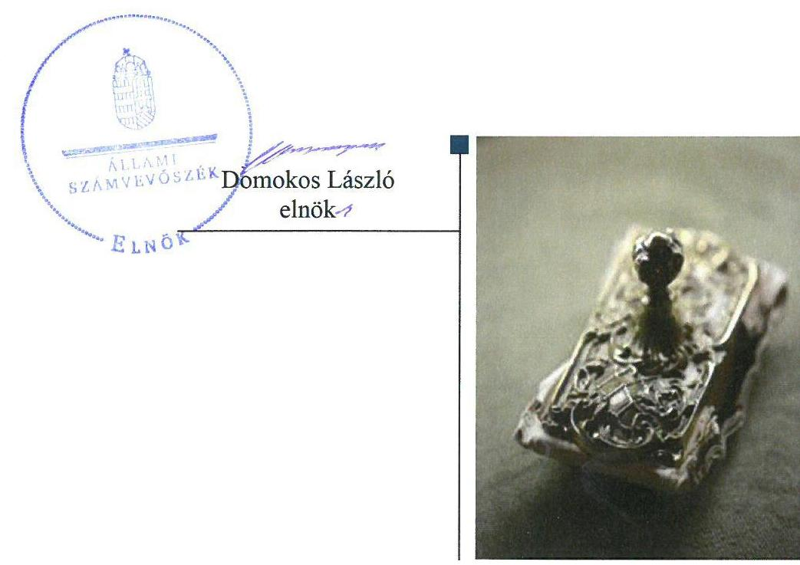

---

# AZ ELLENŐRZÉST FELÜGYELTE:

- **HOLMAN MAGDOLNA JULIANNA** felügyeleti vezető

- **AZ ELLENŐRZÉST VEZETTE ÉS A VÉGREHAJTÁSÁÉRT FELELŐS:**

  - **SZAPPANOS JÚLIA** osztályvezető

  - **A PROGRAM ÖSSZEÁLLÍTÁSÁÉRT FELELŐS:**

  - **SZAPPANOS JÚLIA** osztályvezető

**IKTATÓSZÁM:** EL-0318-014/2018.

**TÉMASZÁM:** 2474

**ELLENŐRZÉS-AZONOSÍTÓ SZÁM:** V0818

---

Jelentéseink az Országgyűlés számítógépes hálózatán és az Interneten a www.asz.hu címen is olvashatóak.

---

# TARTALOMJEGYZÉK 

■ ÖSSZEGZÉS ..... 5
■ CÉL, TERÜLET, HÁTTÉR, INDOKOLTSÁG ..... 6
■ LÉNYEGES KÉRDÉSKÖRÖK ..... 8
■ ELLENŐRZÉS HATÓKÖRE ÉS MÓDSZEREI ..... 9
■ MEGÁLLAPÍTÁSOK ..... 11
■ KÖVETKEZTETÉSEK ..... 20
■ MELLÉKLETEK ..... 21
I. sz. melléklet: Fogalomtár ..... 21
II. sz. melléklet: Az ellenőrzési kritériumok módszertana és értékelése ..... 25
III. sz. melléklet: Az eszközök és források alakulása kiemelt mérlegsoronként a 2013-2015. években (M Ft) ..... 27
IV. sz. melléklet: Pénzügyi egyensúlyi helyzet CLF módszer szerinti értékelése a 2013-2015. években (ezer Ft) ..... 28
V. sz. melléklet: Az önkormányzatok 2014-2015. évi főbb mutatóinak és kockázati területeknek az összefoglaló értékelése ..... 29
VI. sz. melléklet: Az önkormányzatok 2014-2015. évi főbb mutatói és kockázati területek részletes értékelése ..... 30
VII. sz. melléklet: A kockázatelemzés alá vont önkormányzatok ..... 31
■ FÜGGELÉK: ÉSZREVÉTELEK ..... 33
■ RÖVIDÍTÉSEK JEGYZÉKE ..... 35

---

.

---

# ÖSSZEGZÉS 

Az Állami Számvevőszék a 2014-2015. évek időszakára elvégezte a nagyközségi önkormányzatok gazdálkodása kockázatainak értékelését, amelynek eredményeként az alábbi megállapításokat teszi:

- A nagyközségi önkormányzatoknál a pénzügyi gazdálkodás fenntarthatósága biztosított volt.
- Az eladósodás kockázata nem állt fenn.
- Az Önkormányzatok vagyongazdálkodása során biztosított volt a vagyon értékének megőrzése.

## Az Önkormányzatok gazdálkodásának fenntarthatóságával kapcsolatos főbb megállapítások, következtetések

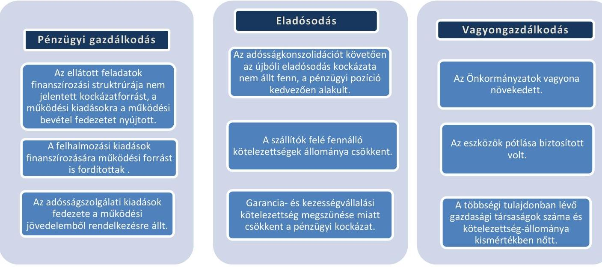

A nagyközségi önkormányzatok pénzügyi és vagyongazdálkodása biztosította a törvényben meghatározott feladataik ellátását.

A PÉNZÜGYI KOCKÁZATOK NEM FOKOZÓDTAK. AZ ÖNKORMÁNYZATOK VÁLTOZATLAN FORMÁBAN TÖRTÉNŐ FELADATELIÁTÁSA ÉS GAZDÁLKODÁSA NEM HORDOZOTT KOCKÁZATOT.

---

# **CÉL, TERÜLET, HÁTTÉR, INDOKOLTSÁG**

## **Ellenőrzés célja**

**AZ ELLENŐRZÉS CÉLJA,** annak megállapítása, hogy az Önkormányzatok$^{1}$ képesek voltak-e a törvényben meghatározott feladatokat ellátni, gazdálkodásuk változatlan formában fenntartható-e. A Magyar Államkincstár által kezelt központi információs rendszerében lévő – az ÁSZ$^{2}$ részére átadott – önkormányzati beszámoló adatok értékelése alapján beazonosított kockázatok kezelésének előmozdítása.

## **Ellenőrzés területe**

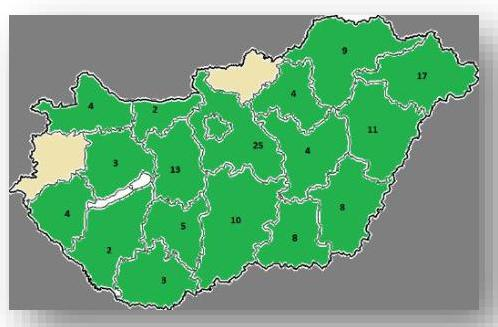

**NAGYKÖZSÉGI ÖNKORMÁNYZAT** 17 megyében van – összesen 132 db –, a MÁK$^{3}$ törzskönyvi nyilvántartásában szereplő 2017. áprilisi adatok szerint. Állandó lakosainak száma 2015. január 1-jén 492 411 fő volt. A nagyközségek egy része társadalmi-gazdasági és infrastrukturális szempontból kedvezményezett és/vagy jelentős munkanélküliséggel sújtott település. A nagyközségből a 2014. évben 60, míg 2015. évben már 68 önkormányzat kapott kiegészítő önkormányzati támogatást.

A településtípus átlag alapján az 1 lakosra jutó működési kiadás a 2014. évben 144,0 ezer Ft/fő, a 2015. évben 142,7 ezer Ft/fő volt. Az 1 főre jutó 2015. évi adóbevétel 35,8 ezer Ft, 3,8 ezer Ft-tal volt több mint a 2014. évben.

A többségi tulajdoni hányadú gazdasági társaságaik száma a 2014. január 1-jei 63-ról 2014. december 31-re 55-re csökkent, 2015. december 31-re 60-ra növekedett. A gazdasági társaságok elsősorban a működési feladatellátásban működtek közre, vagy látták el azokat.

Az Önkormányzatok összevont költségvetési beszámolók szerint teljesített éves költségvetési bevétel és kiadás, a könyvviteli mérleg szerinti eszközök, a követelések és kötelezettségek állományi értékét az 1. táblázat mutatja be.

1. táblázat

|  GAZDÁLKODÁSI ADATOK (M Ft) |  |  |  |  |   |
| --- | --- | --- | --- | --- | --- |
|  Év | Bevételek | Kiadások | Eszközök | Követelések | Kötelezettségek  |
|  2014. 12. 31. | 94 105,1 | 92 441,1 | 347 912,4 | 906,5 | 5760,7  |
|  2015. 12. 31. | 109 115,2 | 104 591,7 | 384 509,1 | 785,8 | 4688,5  |

*Forrás: Önkormányzati beszámolók*

---

# Az ellenőrzés háttere, indokoltsága 

AZ ÁSZ STRATÉGIÁJÁBAN célul tűzte ki, hogy az önkormányzatok ellenőrzése során azok pénzügyi-gazdasági helyzetét értékeli, kockázatait feltárja, az új megközelítésű, elemzéssel alátámasztott mintavétellel, illetve ellenőrzési eljárásokkal csökkentse a helyszíni ellenőrzések számát. A monitoring rendszer az önkormányzatok éves költségvetési beszámolójának, időközi költségvetési jelentéseinek és mérlegjelentéseinek a központi információs rendszerben szereplő adatai értékelése alapján jelzi, hogy melyek azok az önkormányzatok, és melyek azok a területek, ahol olyan kedvezőtlen gazdasági folyamatok, vagy gazdasági események következtek be, amelyek ellenőrzés lefolytatását teszik indokolttá.

Ennek az egyszerűsített ellenőrzési módszernek az eredményeként megtörténik az önkormányzatok pénzügyi, vagyoni helyzetének megítélése, a pénzügyi egyensúly minősítése, továbbá a változások hatásának értékelése.

ÖNKORMÁNYZATI ALRENDSZERBEN megjelenő gazdálkodási nehézségek, likviditási problémák és az eladósodottság növekedése az ÁSZ figyelmét a 2011. évtől az önkormányzatok pénzügyi helyzetére irányította. Az önkormányzati feladatellátást érintő átalakítások meghatározó része a 2013. évben következett be azzal, hogy az igazgatási, az oktatási, az egészségügyi és a szociális ellátásban a feladatok jelentős hányadát átvette az állam.

Az önkormányzati alrendszerben a 2013. évtől bevezetett új feladatfinanszírozási rendszer keretein belül továbbra is megoldandó kérdés a pénzügyi egyensúly megteremtése, hosszú távú fenntartása. Ahhoz, hogy az önkormányzatok meg tudjanak felelni a számukra meghatározott - szigorúbb - gazdálkodási szabályoknak, és az új feltételek mellett is biztosítható legyen a közszolgáltatások megfelelő színvonalú ellátása, szükséges volt a pénzügyi-gazdasági rendszerük alapjainak megszilárdítása, amely célt az adósságkonszolidáció szolgálta.

Az adósságkonszolidáció az önkormányzatok pénzügyi egyensúlyi helyzetére kedvező hatást gyakorolt, azonban a problémák kiváltó okait nem szüntette meg, ennek kezelése nélkül viszont az adósságállomány újratermelődhet. Erre tekintettel kiemelt fontosságú az önkormányzatok pénzügyi egyensúlyi helyzetére ható kockázatok feltárása, az ezzel kapcsolatos folyamatok, trendek bemutatása.

---

# LÉNYEGES KÉRDÉSKÖRÖK 

1. Az Önkormányzatok pénzügyi gazdálkodásának fenntarthatósága biztosított volt-e?
2. Fennállt-e az Önkormányzatok eladósodásának kockázata?
3. Az Önkormányzatok vagyongazdálkodása során biztosított volt-e a vagyon értékének megőrzése?

---

# ELLENŐRZÉS HATÓKÖRE ÉS MÓDSZEREI 

## Az ellenőrzés típusa, időszaka

Megfelelőségi (helyénvalósági) ellenőrzés.
A 2014. január 1-je és 2015. december 31-e közötti időszak. A dinamikus mutatók esetében kitekintéssel a 2013. december 31-ei pénzforgalmi adatokra is.

## Az ellenőrzött szervezet

Belügyminisztérium

## Az ellenőrzés jogalapja, módszerei

Az ellenőrzés jogszabályi alapját az Állami Számvevőszékről szóló 2011. évi LXVI. törvény 1. § (3) bekezdésének, az 5. § (2)-(6) bekezdéseinek, valamint az államháztartásról szóló 2011. évi CXCV. törvény 61. § (2) bekezdésének előírásai képezték.

Az ellenőrzést a szakmai program ellenőrzési kérdései, az ellenőrzött időszakban hatályos jogszabályok, az ellenőrzés szakmai szabályok és módszertanok figyelembe vételével végeztük.

Az ellenőrzési kérdések megválaszolásához szükséges bizonyítékok megszerzése a Magyar Államkincstár által rendelkezésre bocsátott dokumentumokra, adatokra alapozva elemző eljárással történt, amelyeket kontrolláltunk nyilvánosan elérhető adatbázisokban szereplő adatokkal.

Az ÁSZ az ellenőrzés előkészítése során meghatározta az ellenőrzési (helyénvalósági) kritériumokat, amelyek az ellenőrzési bizonyíték értékelésének, valamint a számvevőszéki jelentésben szereplő megállapítások és következtetések alapját képezték. A megállapításokban használt fogalmak értelmezését, forrását a fogalomtár, a lényeges és jellegzetes mutatók helyénvalósági kritériumait, és a kockázatok értékelését az ellenőrzési kritériumok módszertana és értékelése tartalmazza.

A pénzforgalmi adatokat tartalmazó mutatók számításánál a 2014. évben a 2013. év végi adatokat, a 2015. évben a 2014. évi végi adatokat tekintettük bázis adatnak. A mérlegadatokat tartalmazó mutatók esetében az eredményszemléletű számvitel 2014. évi bevezetése miatt - a 2014. évben a 2013. évi mérleg záró adatai helyett az új számviteli szabályok alapján készült 2014. évi mérleg nyitó adatait, a 2015. évben a 2014. év végi adatokat tekintettük bázis adatnak. A gazdasági társaságok esetében a 2016. évi VI. havi időközi költségvetési jelentésekben szereplő 2015. december 31-re vonatkozó társasági adatokat vettük figyelembe.

---

Az ellenőrzési kérdésekre adott válaszok alapján értékeltük, hogy az önkormányzatok képesek voltak-e a törvényben meghatározott feladataikat ellátni, gazdálkodásuk változatlan formában fenntartható-e.

---

# 1. Az Önkormányzatok pénzügyi gazdálkodásának fenntarthatósága biztosított volt-e? 

Az Önkormányzatok által ellátott feladatok, felhalmozások és adósságszolgálat finanszírozási struktúrája a 2014-2015. évben is biztosította a nagyközségi önkormányzatok pénzügyi gazdálkodásának fenntarthatóságát.

| 2. táblázat |  |  |
| :--: | :--: | :--: |
| MUTATÓK ALAKULÁSA |  |  |
| Mutatók (%) | 2014. év | 2015. év |
| Működési kiadások fedezettsége | 105,9 | 110,0 |
| Kiegészítő önkormányzati támogatás aránya | 0,8 | 1,1 |
| Adóbevételek működési bevételeken belüli aránya | 21,0 | 22,8 |
| Felhalmozási kiadások fedezettsége | 88,4 | 92,8 |
| Törlesztés fedezettségének aránya | 63,3 | 23,4 |
| Nettó működési jövedelem változása | $-60,3$ | 250,9 |
| Pénzügyi műveletek eredményének változása | - | $-142,9$ |

Forrás: önkormányzati beszámolók

A 2014. és 2015. évben az Önkormányzatok által ellátott feladatok működési kiadásaira a működési bevételek fedezetet nyújtottak, a folyó bevételek 2,9%-kal (2196,6 M Ft-tal) nagyobb mértékben realizálódtak 2015. évben a 2014. évhez viszonyítva, míg a működési kiadások csökkentek 0,9%-kal (633,9 M Ft-tal). Ez utóbbit befolyásolta, hogy a működési kiadások (kamatkiadások nélkül) 3,9%-os (2245,7 M Ft) növekedése mellett a transzferkiadások (elsősorban az államháztartáson kívülre - vállalkozásoknak, magánszemélyeknek - átadott pénzeszközök) egyharmaddal (3116,1 M Ft-tal) csökkentek. A 2015. évben a folyó bevételek növekedésének mértékét a saját működési bevételek 7,3%-kal (1739,9 M Ft-tal) való növekedése kedvezően befolyásolta. Amennyiben az önkormányzat a működési bevételeket, annak mértékét megtartani, vagy bővíteni nem tudja, az kockázatot jelent a működési jövedelemre.

Az Önkormányzatok által ellátott feladatok mértékében bekövetkezett változások, az államháztartáson kívülre átadott pénzeszközök csökkenése, a közhatalmi bevételek nagysága, arányának növekedése kedvezően hatott a működési költségvetési egyensúlyra. Az átadott pénzeszközök csökkentésével összefüggésben az önként vállalt feladatok racionalizálása, az egyéb bevételnövelő és kiadáscsökkentő intézkedések hatása a pénzügyi egyensúlyhoz, annak stabilizálásához elégségesnek bizonyult.

A 2014. évben 865,5 M Ft, a 2015. évben 854,9 M Ft kiegészítő önkormányzati támogatásban részesültek összességében az Önkormányzatok, amely támogatás átlagosan 2014. évben a működési bevételek 0,8%-át, a 2015. évben pedig a 1,1%-t tette ki. Ezen településeknél e támogatás aránya a működési bevételekhez viszonyítva a 2014. évben 0,2-29,1% között, a 2015. évben 0,1-11,9% között mozgott.

A 2015. évben az adóbevételek működési bevételeken belüli aránya a 2014. évhez képest 1,8 százalékponttal nőtt, a helyi adóbefizetések növekedése miatt. Az adóbevételek - kiemelten a helyi iparűzési adóbevételek - alakulását az 1. ábra mutatja be.

---

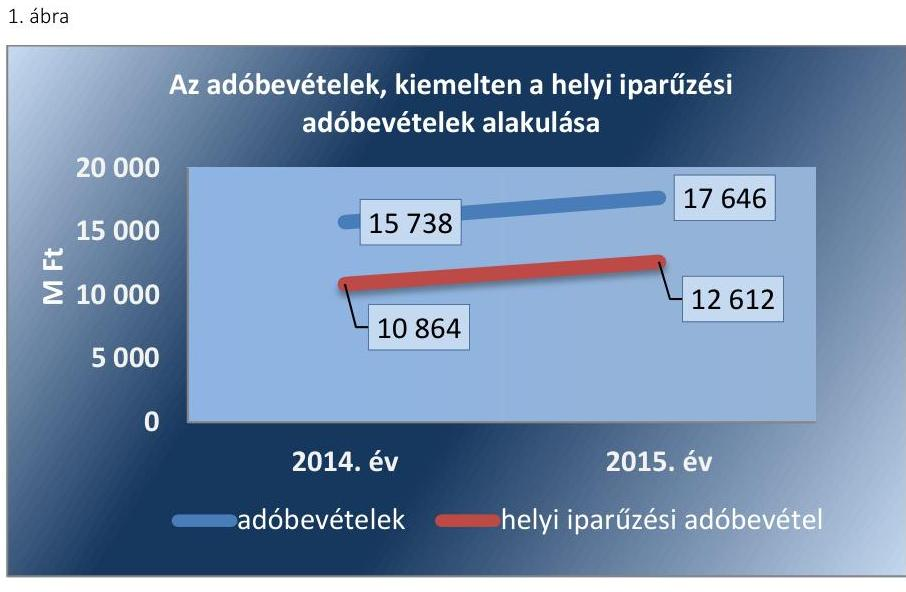

Forrás: önkormányzati beszámolók
A FELHALMOZÁSI bevételek a 2014. évben 88,4%, a 2015. évben 92,8%-ban nyújtottak fedezetet a felhalmozási kiadásokra. E fedezettség arányok azt jelzik, hogy a fejlesztések finanszírozása a tárgyévi felhalmozási bevételekből nem tudott megvalósulni. A felhalmozási kiadások és azok finanszírozása a 2014-2015. években nem jelentettek kockázatot az Önkormányzatok gazdálkodására, mert a felhalmozási költségvetés egyenlege egyedül a működési jövedelemből is finanszírozható volt. Ez a finanszírozás azonban kockázatot jelenthet a tekintetben, hogy az alapfeladatok ellátására elegendő forrást fordítottak-e. A beruházások tekintetében további kockázatot hordoz, hogy az üzembe helyezett eszközök későbbi

 fenntartására képződik-e elegendő működési jövedelem. A nem megfelelően üzemeltetett és karbantartott vagyontárgyak az önkormányzatnál bevételkiesést (kisebb bérleti díj realizálható) vagy kiadásnövekedést (elhasználódott eszközök felújítása, vagy új beszerzése) okozhatnak, amely hatással jár a pénzügyi egyensúlyra. A 2015. évi felhalmozási kiadások forrásösszetételét a 2. ábra mutatja be.
2. ábra
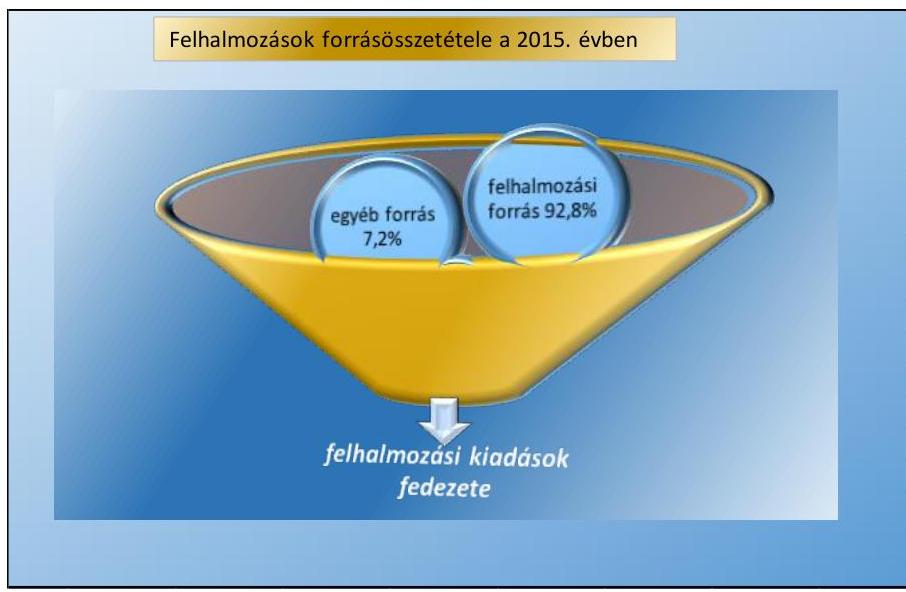

Forrás: önkormányzati beszámolók

---

A 2014. évben a költségvetési kiadások 23,3%-át, a 2015. évben 32,8%-át fordították fejlesztésekre. A beruházási aktivitás 2015-ben megélénkült, a növekedésre hatással volt az új EU⁴ programozási időszakban megnyíló forrás.

Az Önkormányzatok rendelkeztek adósságszolgálathoz kapcsolódó kötelezettséggel a külső források - hitelek, forgatási és befektetési célú értékpapírok - miatt. A 2014-2015. években a finanszírozási műveletek egyenlege negatív volt, amelyeknek oka volt, hogy a hiteltörlesztésre és egyéb finanszírozási kiadásokra fordított összeg nagyobb volt, mint a hitelfelvétel és az egyéb finanszírozási bevételek összege. A 2014. évben 789,5 M Ft, a 2015. évben 1574,5 M Ft hitelfelvétel, illetve a 2014. évben 2073,4 M Ft, a 2015. évben 1636,3 M Ft hiteltörlesztés volt.

A pénzügyi műveletek eredménye 2015-ben kedvezőtlenül (-213,2 M Ft) alakult, mert a pénzügyi műveletek ráfordításai - pl.: fizetendő kamatok és kamatjellegű ráfordítások, értékpapírok értékvesztése, árfolyamveszteség - meghaladták a pénzügyi műveletek eredményszemléletű bevételeit - kapott kamatok, árfolyamnyereség, osztalék -, amely a működési jövedelem alakulását kedvezőtlenül befolyásolta.

Az Önkormányzatoknak a 2014. évben 1528,6 M Ft és 2015. évben 5363,3 M Ft nettó működési jövedelme keletkezett, amely fedezetet nyújtott a külső források adósságszolgálatának teljesítésére, így az kockázatot nem jelentett az Önkormányzatok gazdálkodására. A nettó működési jövedelem növekedését a működési jövedelem - folyó bevételek és folyó kiadások különbözete - 67,9%-os növekedése, valamint a tőketörlesztésre fordított kiadások 38,0%-os csökkenése eredményezte. Az Önkormányzatok törlesztési fedezettsége a 2014. évben 63,3%, a 2015. évben 23,4% volt, amely megmutatta, hogy a működési jövedelemből mennyit fordítottak tőketörlesztésre. Amennyiben a törlesztési fedezettség aránya növekedne, és/vagy a működési jövedelem csökkenne, továbbá újabb adósságot keletkeztető ügyletet kötnek, akkor az kockázatot jelenthet a gazdálkodásra.

Az Önkormányzatok pénzügyi egyensúlyi helyzetére jellemző adatokat - a 2013-2015. években - a IV. számú melléklet, az eszközök és források alakulását kiemelt mérlegsoronként - a 2013-2015. években - a III. számú melléklet tartalmazza.

Elemző eljárás keretében készített riport alapján (ÖKOMER), a 2014-2015. évekre vonatkozóan az Önkormányzatok azonosított kockázatait, azok összefoglaló értékelését az V. számú melléklet, az önkormányzatok 2014-2015. évi mutatói és kockázatai értékelését pedig a VI. számú melléklet tartalmazza.

# 2. Fennállt-e az Önkormányzatok eladósodásának kockázata? 

Az Önkormányzatok kötelezettségei alapján - a 2014. évhez hasonlóan - a 2015. évben sem állt fenn eladósodás kockázata.

A PÉNZÜGYI EGYENSÚLY az Önkormányzatoknál a 2014. és a 2015. évben biztosított volt. Az Önkormányzatok költségvetési bevételei a 2014. és a 2015. évben fedezetet nyújtottak a költségvetési kiadásokra, a maradvány igénybevétele - 2014. évben 10 993,7 M Ft, a 2015. évben 13 303,9 M Ft - javította az Önkormányzatok helyzetét. A pénzügyi egyensúlyi helyzet alakulását a 3. ábra mutatja be. 3. ábra

|  |   |   |   |
| --- | --- | --- | --- |
|   |  | 140000 |   |
|   |  | 120000 |   |
|   |  | 100000 |   |
|   |  | 80000 |   |
|   |  | 60000 |   |
|   |  | 40000 |   |
|   |  | 20000 |   |
|   |  | 2014. év | 2015. év  |
|   |  | - Költségvetési bevételek (maradvány igénybevétel) | - Költségvetési kiadások  |

A tárgyévi pénzügyi pozíció a 2014. és a 2015. években pozitív volt, amelyet a folyó költségvetés pozitív egyenlege - annak nagysága - eredményezett, annak ellenére, hogy a felhalmozási költségvetés és a finanszírozási egyenleg is negatív volt. A 2015. év tárgyévi pénzügyi pozíció előző évhez viszonyítva kedvezően változott, közel kétszerese lett, amelyet a növekvő folyó bevételek eredményeztek a folyó kiadások csökkenése mellett.

Az Önkormányzatok forrásainak összetételében az idegen források aránya a 2014. évben 0,7 százalékponttal, a 2015. évben 0,5 százalékponttal csökkent az előző évhez képest. Az eladósodási mutató kedvező alakulását a 2015. évben a szállítói, a banki, valamint a garancia és a kezességvállalások miatti kötelezettségek összességének együttes csökkenése eredményezte. Az eladósodás folyamata során az önkormányzat rendszeresen többet költ, mint amennyi bevétele keletkezik, a fennálló kötelezettségek teljesítésére nem áll rendelkezésre fedezet és nem is kerül sor a kifizetésre.

Az adósságkonszolidációt követően a banki kötelezettségek állománya az előző évhez viszonyítva 2014. évben 94,4%-kal csökkent, 2015. évben 114,6%-kal növekedett. A banki kötelezettség állomány növekedése jelzi az önkormányzat újbóli eladósodásának kockázatát, ugyanakkor a banki kötelezettség állomány mérlegfőösszeghez viszonyított aránya az ellenőrzött időszakban még nem jelentett kockázatforrást az eladósodásra, mert a működési jövedelem mindkét évben erre fedezetet nyújtott.

2014-2015. években adósságot keletkeztető ügylet megkötésére a 132 nagyközségi önkormányzatból négy-négy nagyközségi önkormányzat esetében került sor. Kormányzati jóváhagyással három-három hosszú lejáratú adósságot keletkeztető ügyletet kötöttek, 2014. évben 196,4 M Ft, a 2015. évben 418,0 M Ft összegben. Kormányzati hozzájáruláshoz nem kötött hosszú lejáratú adósságot keletkeztető ügyletek megkötésére a 2014-2015. évben egy-egy esetben került sor, a 2014. évben 9,5 M Ft, a 2015. évben 14,4 M Ft összegben. Az ellenőrzött időszakban az önkormányzatok által megkötött adósságot keletkeztető ügyletek miatt egyedi kockázat jelentkezhet az ügyletet kötő Sükösd és Gádoros önkormányzatoknál.

Az Önkormányzatoknak garancia-, és/vagy kezességvállalásból származó függő kötelezettségének állománya 2014. december 31-én 285,5 M Ft volt, 2015. december 31-én azonban már nem állt fenn ilyen kötelezettség. Ennek eredményeként az Önkormányzatoknál 2015. év végén garancia-, és kezességvállaláshoz kapcsolódó függő kötelezettség miatti eladósodási kockázatot nem volt.

Az Önkormányzatok dologi, beruházási és felújítási kiadásokkal kapcsolatos kötelezettségállománya (továbbiakban: szállítói kötelezettség) a 2014. évben 7,2%-kal növekedett, a 2015. évben 39,7%-kal csökkent az előző időszakhoz képest. A szállítói kötelezettség év végi aránya a működési jövedelemhez viszonyítva kedvezően alakult, mert a 2013. évi 23,2%-hoz viszonyítva a 2015. év végére 17,5%-ra csökkent. A működési jövedelem szállítói kötelezettséggel terhelt arányának kedvező tendenciáját támasztja alá az is, hogy a 2014. év végi arány 48,6% volt.

A szállítói kötelezettség alakulását a 4. ábra szemlélteti.
4. ábra
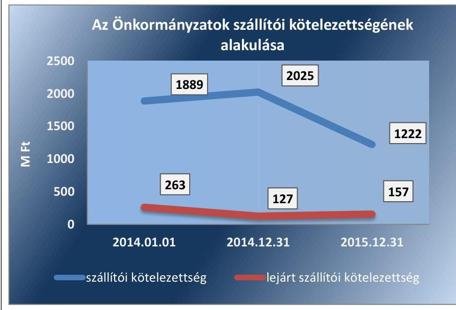

Forrás: önkormányzati beszámolók
Az Önkormányzatok a 2014-2015. években a szállítókkal szembeni kötelezettségeiket nem tudták határidőre teljesíteni. A lejárt szállítói kötelezettség mértéke 2015. évben kedvezőtlenül alakult, mert a 2014. év végi 51,7%-os csökkenést követően, a 2015. évben 23,6%-kal növekedett az előző évhez képest.

Az Önkormányzatok a 2014. év végén 19,3 M Ft, a 2015. év végén 20,9 M Ft 90 napon túl lejárt tartozással rendelkeztek, amely - a 90 napon túl lejárt kötelezettségállomány miatt - kockázatot jelent, adósságrendezési eljárásra indítása miatt.

Összességében a 2015. évben a szállítói kötelezettség változása pénzügyi kockázatot nem jelent, az Önkormányzatok fizetőképességének csökkenését, a pénzügyi kockázat növekedését nem jelzi.

---

# 3. Az Önkormányzatok vagyongazdálkodása során biztosított volt-e a vagyon értékének megőrzése? 

Az Önkormányzatok vagyongazdálkodását érintő, 2014-2015. években bekövetkezett változások hatása nem hordozott kockázatot az Önkormányzatok gazdálkodására, mert

- a vagyon értékének megőrzését, az eszközök pótlását biztosították,
- a többségi önkormányzati tulajdonú gazdasági társaságok kötelezettségei kismértékben emelkedtek.

## 4. táblázat

| MUTATÓK ALAKULÁSA |  |  |
| :--: | :--: | :--: |
| Mutatók | 2014. év | 2015. év |
| Befektetett eszközök fedezettsége (\%) | 101,4 | 97,3 |
| Ingatlanok és kapcsolódó vagyonértékű jogok állományának változása (M Ft) | 11942,4 | 23225,9 |
| Koncesszióba, vagyonkezelésbe adott eszközök állományának változása (M Ft) | -2024,5 | 6274,4 |
| Eszközpótlási mutató (tárgyi eszközök összesen) (\%) | 126,0 | 214,0 |

Forrás: önkormányzati beszámolók
2014. január 1-jéről 2015. év végére az Önkormányzatok mérlegben kimutatott vagyona 54 194,3 M Ft-tal, (16,4%-kal) 384 509,1 M Ft-ra nőtt.

A vagyon szerkezetében bekövetkezett változásokat - többek között a nemzeti vagyonba tartozó forgóeszközök (többségében az értékpapírok) 11,0%-os (167,9 M Ft) csökkenése mellett, az Önkormányzatok nemzeti vagyonba tartozó befektetett eszközeinek 16,2%-os (49 969,3 M Ft), valamint a pénzeszközök állományának 32,3%-os (4282,8 M Ft) növekedése eredményezte.

Az eszközök összetételét az 5. ábra szemlélteti.
5. ábra

| Az Önkormányzatok eszközeinek összetétele (M Ft) |  |  |  |
| :--: | :--: | :--: | :--: |
|  | 450001 |  |  |
|  | 400001 |  |  |
|  | 350001 |  |  |

 |
|  | 300001 |  |  |
|  | 250001 |  |  |
|  | 200001 |  |  |
|  | 150001 |  |  |
|  | 100001 |  |  |
|  | 50001 |  |  |
|  |  | 2014. jan. 01. | 2014. dec. 31. |
| * Egyéb eszközök |  | 1067 | 2297 |
| * Követelések |  | 6032 | 6460 |
| * Pénzeszközök |  | 13249 | 12852 |
| * Nemzeti vagyonba tartozó forgóeszközök |  | 1528 | 1755 |
| * Nemzeti vagyonba tartozó befektetett eszközök |  | 308439 | 326541 |

Forrás: önkormányzati beszámolók
A 2015. évi vagyongazdálkodásban az év végi saját tőke 97,3%-ban nyújtott fedezetet a nemzeti vagyonba tartozó befektetett eszközökre, amely azt jelzi, hogy szükség volt idegen forrásokra a vagyoni eszközök megszerzéséhez. Ez az arány 2014. év elején 104,1%, a 2014. év végén 101,4% volt, amely alapján megállapítható, hogy a befektetett eszközök fedezettségét a csökkenő tendencia jellemezte a 2014-2015. évekre vonatkozóan.

---

5. táblázat

| MUTATÓK ALAKULÁSA |  |  |
| :--: | :--: | :--: |
| Mutatók | 2014. év | 2015. év |
| Gazdasági társaságok kötelezettségállományának változása (M Ft) | 3081,1 | 3310,1 |
| Gazdasági társaságok számának változása (darab) | -8 | 5 |

A tárgyi eszközökön belül az ingatlanok és kapcsolódó vagyoni értékű jogok állományának - 2014-2015. években az előző évhez viszonyítva 11 942,4 M Ft-os és 23 225,9 M Ft-os növekedése beruházások miatt következett be. Az Önkormányzatok a feleslegessé vált vagyon értékesítéséből származó 2014. évi, illetve 2015. évi 591,5 M Ft, illetve 581,1 M Ft összegű bevételeket beruházásokra, a vagyon pótlására fordították. A vagyonértékesítésből származó bevételek beruházásokra, vagyonpótlásra történő fordítása a nemzeti vagyon megőrzését, növekedését szolgálta.

Az Önkormányzatoknál az értékcsökkenések kompenzálásaként a szükséges vagyonpótlás megtörtént, a tárgyi eszközök eszközpótlási mutatója két egymást követő évben (2014-2015. években) 126,0%-on, illetve 214,0%-on alakult. A 2014-2015. években a tárgyi eszközöknek a nemzeti vagyonba tartozó befektetett eszközökön belüli aránya 95,5%, illetve 94,1% volt.

Az ingatlanok és kapcsolódó vagyoni értékű jogok eszközpótlási mutatója a 2014. évi 139,4%-ról 2015. évre 234,3%-ra emelkedett, amelyet elsősorban a beruházási és felújítási kiadások befektetett eszközöknek viszonyított aránya növekedése (2014. évben 6,0%, a 2015. évben 9,2%) eredményezett.

A koncesszióba és/vagy vagyonkezelésbe adott eszközök állományának 2014. évi 2024,5 M Ft csökkenését, a 2015. évi 6274,4 M Ft összegű növekedését a vagyonkezelésbe adás változásai okozták. A növekedés kockázatot jelez, mert ha a koncesszió vagy a vagyonkezelés jogosultja eszközpótlási kötelezettségének nem tesz eleget, az eszközpótlások elmaradásával a vagyonkezelésbe/koncesszióba adott vagyontárgyak elhasználódnak, értéküket elvesztik.

A többségi tulajdonban lévő gazdasági társaságok (továbbiakban: gazdasági társaságok) száma a 2014. év január 1-jén 63 db volt, ami a 2014. évben 55 db-ra csökkent, a 2015. évben 60 db-ra nőtt. A gazdasági társaságok között két nagyközségi önkormányzathoz tartozott egy-egy, a kormányzati szektorba sorolt szervezetek közé tartozó (ESA kör) gazdasági társaság.

A gazdasági társaságok kötelezettségeinek állománya 2015. évben 7,4%-kal - 3310 M Ft-ra - emelkedett az előző évhez képest. A 2015. évi kötelezettségek emelkedése kedvezőtlen, mert a gazdasági társaságok nemfizetése esetében az Önkormányzatokra helytállási kötelezettségeket háríthat. E helytállási kötelezettség kockázatot jelent az Önkormányzatok gazdálkodására, amennyiben a gazdasági társaságok kötelezettségei állománya nagyobb mértékű, mint az önkormányzatok éves működési jövedelme. A gazdasági társaságok év végi kötelezettségeinek és az Önkormányzatok működési jövedelmének alakulását a 6. ábra mutatja be.

---

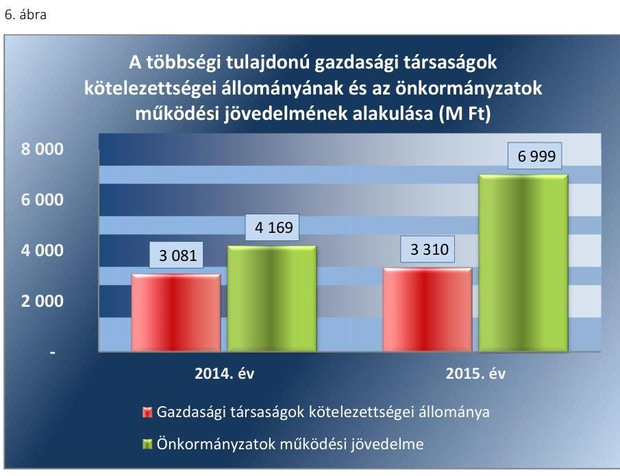

Forrás: önkormányzati beszámolók
A gazdasági társaságok - összevont - mérleg szerinti eredménye kedvezően alakult, mert a 2014. évi 144 M Ft veszteségről, a 2015. év végére 114 M Ft nyereségre változott. A 2015. év végén 23 gazdasági társaságnál (a gazdasági társaságok 38%-ánál) volt veszteséges a gazdálkodás, a legnagyobb veszteség 39 M Ft volt. Az Önkormányzatoknak a gazdasági társaságuk veszteséges gazdálkodása esetén a szükséges intézkedéseket meg kell tenniük (Gt. ³ 51. §-a/Ptk. ³ 3:133. §-a). A tartósan veszteséges gazdálkodás likviditási problémákat okozhat a gazdasági társaságoknál, amelyek kezeléséhez a tulajdonosi önkormányzatoknak is hozzájárulást kell vállalniuk.

A gazdasági társaságok kötelezettségei és eredményei alakulását az 7. ábra mutatja be.
7. ábra
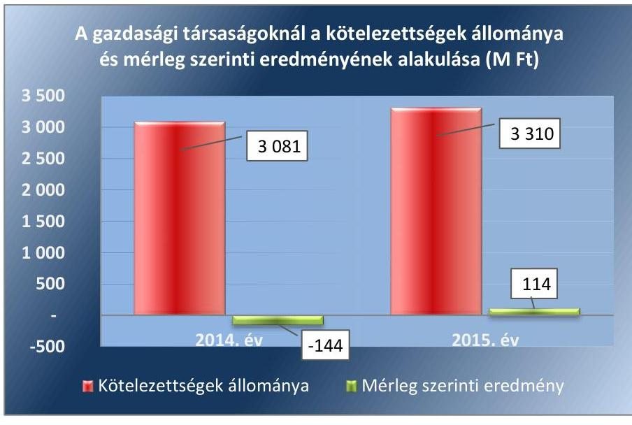

Forrás: önkormányzati beszámolók

---

A gazdasági társaságok számának változása, kötelezettségeik kismértékű emelkedése, valamint egyes gazdasági társaságok veszteséges működése 2015. évben kockázatot jelentett az Önkormányzatok vagyongazdálkodásában.

Az Önkormányzatok tartós részesedéseinek állománya az előző évhez viszonyítva a 2014. évben 11,8%-kal csökkent, a 2015. évben 0,6%-kal emelkedett, amelyet a gazdasági társaságokban újabb részesedés szerzése, vagy tőkeemelés okozott.

---

# KÖVETKEZTETÉSEK 

Az ÁSZ tv. 32. § (1) bekezdésében foglaltak értelmében az ÁSZ jelentés tartalmazza a feltárt tényeket, az ezeken alapuló megállapításokat, következtetéseket, amelyeknek a 24. § (1) d) pontja szerint okszerűnek és megalapozottnak kell lenniük.

A nagyközségi önkormányzatok pénzügyi,- vagyoni helyzetére, eladósodására irányuló kockázatok értékelése rámutatott arra, hogy a nagyközségi önkormányzatok pénzügyi egyensúlyi helyzete az ellenőrzött időszakban stabilitást mutatott. A nagyközségi önkormányzatoknál a működési jövedelem fedezetet nyújtott a felhalmozási költségvetés negatív egyenlegére, valamint finanszírozási műveletekre is. A nagyközségi önkormányzatok vagyongazdálkodása területén feltárt és beazonosított kockázatok nem igényelnek azonnali, és rendszerszintű kezelést. Az ellenőrzés megállapításai alapján a többségi tulajdonban lévő gazdasági társaságok kötelezettség állományának növekedéséből, valamint a vagyon állagmegóvásához kapcsolódó kötelezettségek teljesítéséből adódó kockázatok középtávú kezelése célszerű.

---

# MELLÉKLETEK 

## I. SZ. MELLÉKLET: FOGALOMTÁR

adósságkonszolidáció
adósságkonszolidációt követő időszakban bekövetkező eladósodás kockázatforrás
adósságszolgálat
belső eladósodás kockázatforrás
beruházás

CLF módszer
ellenőrzési kritériumok
eszközpótlási mutató
fejlesztés
felhalmozási bevétel
felhalmozási kiadás
felhalmozási kiadások és finanszírozása kockázatforrás
felújítás

A helyi önkormányzatok adósságának állam által történő átvállalása.
Az állam a központi intézkedések - kiemelten az adósságkonszolidáció - révén jelentős szerepet vállalt az önkormányzatok pénzügyi kockázatainak mérséklésében. Az államháztartás önkormányzati alrendszerében felhalmozott adósság állam részéről történő kiegyenlítését, illetve átvállalását követően az önkormányzatok kiemelt feladata, egyben felelőssége az adósságállomány újratermelődésének megakadályozása. Kockázatforrást jelent, ha az önkormányzat kötelezettségei emelkednek, a mérlegben az idegen források aránya nő, az adósságkonszolidációt követően a gazdálkodás újra eladósodási pályára áll. Az eladósodás a pénzügyi gazdálkodás egyenes következménye (hiány), ugyanakkor hatással is van rá a folyó adósságszolgálat teljesítésén keresztül
Az adósság tőkerészének és az esedékes kamat együttes összegének törlesztése.
Kockázatforrást jelent, ha az értékcsökkenések kompenzálásaként a szükséges vagyonpótlás nem történt meg, ha romlott az eszközök állaga, mert az rejtett eladósodást jelent.
A tárgyi eszköz beszerzése, létesítése, saját vállalkozásban történő előállítása, a beszerzett tárgyi eszköz üzembe helyezése. A beruházás a meglévő tárgyi eszköz bővítését, rendeltetésének megváltoztatását, átalakítását, élettartamának, teljesítőképességének közvetlen növelését eredményező tevékenység. (Forrás: Számv. tv. ⁷ 3. § (4) bekezdés 7. pontja)

Az önkormányzatok költségvetése elemzésének módszere, amely a pénzügyi kapacitás (nettó működési jövedelem) fogalmát helyezi a középpontba. A módszer következetesen elkülöníti a folyó és a felhalmozási költségvetés bevételeit és kiadásait, azok költségvetési egyenlegeit. Bizonyos mértékig a vállalati gazdálkodás logikai elemeit érvényesíti az önkormányzatok pénzügyi, jövedelmi helyzetének vizsgálata során.
Azok az alkalmazott viszonyítási alapok, amelyek az ellenőrzési feladat tárgyának értékelésére szolgálnak.
A tárgyi eszközállomány elemzéséhez használt mutató, amely megmutatja, hogy az üzembe helyezett beruházások milyen hányadát képezi az elszámolt értékcsökkenésnek. Számításakor tárgyévben üzembe helyezett beruházások, felújítások értékét a tárgyi eszközök tárgyévben elszámolt értékcsökkenéséhez kell viszonyítani.
Alapvetően felhalmozási kiadásokban megtestesülő tevékenység, amely új, vagy a korábbinál műszaki, technikai szempontból korszerűbb tárgyi eszköz létrehozására irányul, illetve meglévő tárgyi eszköz műszaki, technikai paramétereinek korszerűsítését valósítja meg. (Forrás: Ávr. ⁸ 1. § b) pontja)
Az önkormányzatok tárgyévi felhalmozási célú költségvetési bevételei.
Az önkormányzatok tárgyévi felhalmozási célú költségvetési kiadásai.
Kockázatforrást jelent az erőn felüli beruházási aktivitás, illetve ha a folyamatban lévő felhalmozási feladatok finanszírozásához szükséges pénzügyi forrás nem áll az önkormányzat rendelkezésére.
Az elhasználódott tárgyi eszköz eredeti állaga (kapacitása, pontossága) helyreállítását szolgáló időszakonként visszatérő olyan tevékenység, melynek során az eszköz élet-

---

finanszírozás kockázatforrás
folyó bevétel
folyó kiadás
folyó költségvetés egyenlege
garancia- és kezességvállalás kockázatforrás
garanciavállalás
hasznosítás
helyénvalósági ellenőrzés
kezességvállalás
kiegészítő önkormányzati támogatás
kockázatforrás
tartama megnövekszik, minősége, használata jelentősen javul, így a pótlólagos ráfordításból a jövőben gazdasági előnyök származnak. (Forrás: Számv. tv. 3. § (4) bekezdés 8. pontja)
Kockázatforrást jelent, ha az önkormányzat nem rendelkezik megfelelő fedezettel a külső források adósságszolgálatának teljesítéséhez, ami hosszútávon vagyonfeléléshez vagy adósságspirálhoz vezethet.
Az önkormányzatok tárgyévi működési célú költségvetési bevételei
Az önkormányzatok tárgyévi működési célú költségvetési kiadásai
A folyó költségvetés egyenlege, azaz a működési jövedelem megmutatja, hogy az Önkormányzat éves folyó bevétele fedezetet biztosít-e a kötelező és önként vállalt feladatellátáshoz kapcsolódó éves folyó kiadására. A működési jövedelem negatív értéke pénzügyileg fenntarthatatlan helyzetet jelez. A mutató pozitív értéke megtakarítást mutat, amely forrásul szolgálhat az Önkormányzat fennálló kötelezettségei megfizetéséhez, valamint fejlesztéseihez.
Kockázatforrást jelent, ha a szerződés kötelezettje a szerződésben vállalt kötelezettségeit nem teljesíti a jogosultnak, mert azokért a kezes köteles helytállni. A garanciaés kezességvállalások függő kötelezettségként kockázatot jelentenek az önkormányzat költségvetésére, ezen keresztül a közfeladatok ellátására.
Olyan kötelezettségvállalás, ahol a garanciát vállaló valamely jövőbeni esemény bekövetkezésekor, a szerződésben meghatározott feltételek beálltakor a garancia kedvezményezettje számára meghatározott összegig, meghatározott időpontig, felszólításra azonnal fizet.
A nemzeti vagyon birtoklásának, használatának, hasznok szedése jogának bármely a tulajdonjog átruházását nem eredményező jogcímen történő átengedése, ide nem értve a vagyonkezelésbe adást, valamint a haszonélvezeti jog alapítását. (Forrás: Nvtv. ⁹ 3. § (1) bekezdés 4. pontja)
A helyénvalósági ellenőrzés a megfelelőségi ellenőrzés azon altípusa, amelyet azokban az esetekben kell alkalmazni, amelyekre jogszabályi előírások nem alkalmazhatóak, illetve amennyiben egyes kérdések megítélésénél nyilvánvaló jogszabályi hiányosságok vannak.
Szerződésben vállalt olyan kötelezettség, amelyben a kezes arra vállal kötelezettséget, hogy ha a szerződés kötelezettje nem teljesít a kezes maga fog helyette teljesíteni a jogosultnak. (Forrás: Ptk. ¹⁰ 272. §, Ptk.₂ 6:416.§).
A 2014-2015. években a települési önkormányzatok rendkívüli támogatása és a tartósan fizetésképtelen helyzetbe került helyi önkormányzatok adósságrendezésére irányuló hitelfelvétel visszterhes kamattámogatása, a pénzügyi gondnok díja, továbbá a 2014. évben a megyei önkormányzati tartalékból kapott támogatás, a 2015. évben a megyei önkormányzatok rendkívüli támogatása.

A kockázatok kiváltó okait kockázatforrásnak nevezzük. Az Önkormányzatok kockázatait megfigyelő rendszer (ÖKOMER) kialakítása során első lépésben azonosítottuk a nyomon követendő kockázatokat, majd a kockázatos területeket és a kiváltó okokat (kockázatforrásokat). Kockázatként azonosítottuk, ha az önkormányzat hosszú távon nem képes a törvényben meghatározott feladatait ellátni, költségvetése változatlan formában nem fenntartható. A kockázat értékelésének célja annak megállapítása volt, hogy a pénzügyi gazdálkodás, eladósodás, vagyongazdálkodás kockázati területek milyen mértékben befolyásolják, veszélyeztetik az önkormányzat működését, a közfeladatok ellátását. A három kockázati terület minősítéséhez összesen 10 kockázatforrást rendeltünk.

---

koncesszió
kötelező közszolgáltatás (az önkormányzati feladatokat érintően)
közfeladat
közfeladatok finanszírozási struktúrája kockázatforrás
közhatalmi bevétel
megfelelőségi ellenőrzés
nettó működési jövedelem
önkormányzat
önkormányzat többségi tulajdonában lévő gazdasági társaságok

Az állam, illetőleg az önkormányzat (önkormányzati társulás) kizárólagos tulajdonában lévő vagyontárgyak birtoklásának, használatának és

 hasznosításának, valamint a koncesszió-köteles tevékenységek gyakorlásának jogát, visszterhes szerződéssel, időlegesen úgy engedi át, hogy a jogosultnak részleges piaci monopóliumot biztosít.
Az önkormányzat kötelezően vállalt feladatkörébe tartozó egyes - közszolgáltatás útján megvalósuló - közfeladatok ellátása, amelyeket külön jogszabály (törvény, helyi önkormányzati rendelet) határoz meg.
Jogszabályban meghatározott állami vagy önkormányzati feladat, amit az arra kötelezett közérdekből, a jogszabályban meghatározott követelményeknek és feltételeknek megfelelve végez, ideértve a lakosság közszolgáltatásokkal való ellátását, továbbá az állam nemzetközi szerződésekben vállalt kötelezettségeiből adódó közérdekű feladatokat, valamint e feladatok ellátásakor szükséges infrastruktúra biztosítását is. (Forrás: Nvtv. 3. § (1) bekezdés 7. pontja)
Kockázatforrást jelent, ha az önkormányzat pénzügyi helyzete jelentős függőséget mutat a külső körülményektől (adóbevételektől, kiegészítő állami támogatásoktól). A közfeladatok finanszírozási struktúrája nem kielégítő, ha a működési bevételek nem fedezik teljes mértékben az ellátott közfeladatokat.
A működési bevételeken belül azok a közhatalmi bevételek, amelyek az adókból, illetékekből, járulékokból, hozzájárulásokból, bírságokból, díjakból és más fizetési kötelezettségekből származnak (Áht. 6. §. (3) bekezdés b) pontja). Lehetnek adójellegű, díjellegű és szankció jellegű bevételek.
A számvevőszéki ellenőrzés azon típusa, amely annak megállapítására irányul, hogy az ellenőrzés tárgyát képező tevékenységek, pénzügyi műveletek, információk és adatok minden lényeges szempontból megfelelnek-e az ellenőrzött szervezetre vonatkozó szabályozásoknak és követelményeknek.
A nettó működési jövedelem a jövedelemtermelő képességet méri. Megmutatja a működési bevételekből a működési kiadások és a hitelek tőketörlesztésének kifizetése után fennmaradó jövedelmet.
A helyi önkormányzat jogi személy. Az önkormányzati feladatok ellátását a képviselőtestület és szervei biztosítják. A képviselőtestület szervei: a polgármester, a főpolgármester, a megyei közgyűlés elnöke, a képviselő-testület bizottságai, a részönkormányzat testülete, a polgármesteri hivatal, a megyei önkormányzati hivatal, a közös önkormányzati hivatal, a jegyző, továbbá a társulás. A képviselő-testület a feladatkörébe tartozó közszolgáltatások ellátására - jogszabályban meghatározottak szerint - költségvetési szervet, a Polgári perrendtartásról szóló 1952. évi III. törvény szerinti gazdálkodó szervezetet (a továbbiakban: gazdálkodó szervezet), nonprofit szervezetet és egyéb szervezetet (a továbbiakban együtt: intézmény) alapíthat, továbbá szerződést köthet természetes és jogi személlyel vagy jogi személyiséggel nem rendelkező szervezettel. (Forrás: Mötv. ${ }^{11}$ 41. § (1), (2), (6) bekezdései)
Azok a gazdasági társaságok, amelyekben az önkormányzat a szavazatok több mint ötven százalékával vagy a Ptk. ${ }_{1}$ 685/B. § (2)-(3) bekezdéseiben rögzített meghatározó befolyással rendelkezik. A befolyással rendelkező akkor rendelkezik egy jogi személyben meghatározó befolyással, ha annak tagja, illetve részvényese, és jogosult e jogi személy vezető tisztségviselői vagy felügyelő-bizottsága tagjainak többségének megválasztására, illetve visszahívására, vagy a jogi személy más tagjaival, illetve részvényeseivel kötött megállapodás alapján egyedül rendelkezik a szavazatok több mint ötven százalékával. A meghatározó befolyás akkor is fennáll, ha a befolyással rendelkező számára e jogosultságok közvetett módon (köztes vállalkozásain keresztül) biztosítottak.
[Forrás: Ptk. ${ }_{1}$ 685/B. § (2)-(4), Ptk. ${ }_{2}$ 8:2.§ (1)-(3) bekezdései]

---

pénzintézetek felé történő eladósodás kockázatforrás
pénzügyi kapacitás
pénzügyi kockázat
szállítók felé történő eladósodás kockázatforrás*

tárgyévi pénzügyi pozíció
többségi önkormányzati tulajdonban lévő gazdasági társaságok kockázatforrás vagyongazdálkodás
vagyonkezelői jog
vagyonváltozás kockázatforrás

Kockázatforrásnak tekintettük, ha az önkormányzat (újból) adósságot keletkeztet, ami a kivételektől eltekintve a 2012. évtől kormányengedély-köteles. A pénzintézetekkel szemben fennálló kötelezettségek esetén olyan függőségi viszony jöhet létre, ahol az önkormányzat pénzügyi helyzete olyan külső körülmények hatására változhat, amely kizárólag a bank egyoldalú döntésén múlik.
A pénzügyi kapacitás az adósok hitelfelvételi képességének azon mértéke, ahol még növelni tudják az adósságot anélkül, hogy a fizetőképtelenség elkerülése érdekében csökkenteniük kellene akár az aktuális, akár a jövőben esedékes kiadásaikat.
A pénzügyi kockázat magában foglalja mindazon kockázatokat, amelyek a szervezet pénzügyi helyzetére hatással vannak. PI.: az adósságszolgálat miatti kockázatot, árfolyamkockázatot, felhalmozási kockázatot, fizetőképességi kockázatot, jövőbeni kötelezettségek kifizethetőségének kockázatát, kamatkockázatot, kezességvállalás kockázatát, likviditási kockázatot, mérlegen kívüli tételek kockázatát, nemfizetési kockázatot stb.
Kockázatforrást jelent, ha az önkormányzat növeli a szállítókkal szemben fennálló tartozásait (ami burkolt hitelezésnek minősülhet), és az elismert kötelezettségeit átmenetileg vagy véglegesen nem tudja határidőre teljesíteni.
*(2014. január 1-jétől kötelezettségek dologi, felújítási, beruházási kiadásokra)
A tárgyévi pénzügyi pozíció megmutatja, hogy a működési, felhalmozási és finanszírozási bevételek együttesen milyen mértékben nyújtottak fedezetet az összes kiadásra. Kedvezőtlen, ha a mutató értéke negatív, mert jelzi, hogy nem áll rendelkezésre a kiadások fedezetéhez szükséges forrás.

Kockázatforrást jelent, hogy az önkormányzati tulajdonban lévő gazdasági társaságok adósságállományáért a tulajdonos önkormányzatot helytállási kötelezettség terheli.

A nemzeti vagyongazdálkodás feladata a nemzeti vagyon rendeltetésének megfelelő, az állam, az önkormányzat mindenkori teherbíró képességéhez igazodó, elsődlegesen a közfeladatok ellátásához és a mindenkori társadalmi szükségletek kielégítéséhez szükséges, egységes elveken alapuló, átlátható, hatékony és költségtakarékos működtetése, értékének megőrzése, állagának védelme, értéknövelő használata, hasznosítása, gyarapítása, továbbá az állam vagy a helyi önkormányzat feladatának ellátása szempontjából feleslegessé váló vagyontárgyak elidegenítése. (Forrás: Nvtv. 7. § (2) bekezdése)

A vagyonkezelői szerződés alapján a vagyonkezelő jogosult meghatározott szervezeti tulajdonába tartozó dolog birtoklására és hasznai szedésére. A vagyonkezelő köteles a vagyontárgy értékét megőrizni, állagának megóvásáról, karbantartásáról, működtetéséről gondoskodni, továbbá díjat fizetni vagy a szerződésben előírt kötelezettséget teljesíteni.
Kockázatforrásként értékeltük, ha csökken a nemzeti vagyon, ha az önkormányzatok a vagyonértékesítésből származó bevételeket nem beruházásokra, a vagyon pótlására fordítják.

---

Az ellenőrzés tárgya: Az önkormányzati gazdálkodás fenntarthatósága, a törvényben előírt feladatok ellátása, az önkormányzatnál észlelt negatív tendenciák okainak, kockázatainak feltárása, amely az ellenőrzési kritériumok alapján kerül értékelésre.

Az ellenőrzési kritériumok meghatározása során első lépésben azonosításra kerültek az önkormányzati gazdálkodás fenntarthatóságának, a törvényben előírt feladatok ellátásának kockázatos területei és a kiváltó okai (kockázatforrások), amelyekhez minden esetben mutatószám került hozzárendelésre. A mutatószámok között a viszonyszámok (relatív mutatószámok) és az abszolút adatok (abszolút mutatószámok) egyaránt megtalálhatóak, amelyekhez a Magyar Államkincstár által szolgáltatott adatállományok (költségvetési beszámolók, időközi költségvetési jelentések, mérlegjelentések adatait) kerültek felhasználásra.

# Az egyes kockázati területek és kockázatforrások minősítése „pontozásos módszerrel" a mutatószámok értékelése alapján történt. 

- Első lépésben a mutatószámok értékelésére és egy háromelemű skálán történő elhelyezésére került sor. Az értékelés (a kategória határok meghatározása) elsődlegesen a mutatószámok közgazdasági értelmezése alapján, az Állami Számvevőszék ellenőrzési tapasztalatait felhasználva történt. Az értékelések alapján egy-egy mutató alacsony besorolás esetén 0 pontot, közepes esetén 1 pontot, magas kockázatjelzés esetén 2 pontot kapott. (PI.: ha a működési kiadások fedezettsége mutató 90% alatti volt, akkor magas kockázati besorolást, 2 pontot, ha 100% feletti volt akkor alacsony besorolást, 0 pontot kapott.) A %-ban kifejezett mutatók kockázati besorolására a pontos (több tizedes jegy) értékek alapján került sor, ugyanakkor az önkormányzati riport a mutatókat egy, illetve esetenként két tizedes számjegyig mutatja be.
- Annak érdekében, hogy a kockázatforrások minősítésénél a lényeges mutatók értéke legyen a meghatározó a jellegzetes mutatókéval szemben, a mutatószámok súlyozására került sor*. A súlyok mértékének megválasztásakor az elsődleges mutatókat középértéknek tekintve 1-es súly mellérendelése* történt. A főmutató súlya az elsődleges mutatók súlyának kétszeresében, míg a másodlagos mutatók súlya az elsődleges mutatók súlyának felében került meghatározásra. (PI.: a kockázatforrás minősítéséhez a működési kiadások fedezettségét főmutatóként vették figyelembe, ezért 2-es súlyt rendeltek hozzá. Így ha a mutató kockázati besorolása magas volt, a magas kockázati besoroláshoz rendelt 2 pontot szorozták a főmutatóhoz rendelt 2-es súlyszámmal és az elért pontszám 4, míg alacsony besorolás esetén a besoroláshoz rendelt 0 pontot szorozva a főmutatóhoz rendelt 2-es súlyszámmal elért pontszám 0 volt.)
- Ezt követően került sor az önkormányzati gazdálkodás fenntarthatóságának, a törvényben előírt feladatok ellátásának kockázatához rendelt kockázati területek és kockázatforrások értékelési ponthatárainak meghatározására oly módon, hogy kockázatforrásonként a mutatószámok súlyozott értékelésével elérhető összes pontszám három egyenlő részre (alacsony, közepes, magas) osztása történt meg. (PI.: A közfeladatok finanszírozási struktúrája kockázatforrás 1 db főmutató, 2 db elsődleges mutató és további 2 db másodlagos mutató alakulása alapján került értékelésre. A mutatók magas kockázati besorolása esetén - a súlyozást követően - elérhető legmagasabb pontszám 10 volt. Ezt három egyenlő részre osztva kerültek meghatározásra a közfeladatok finanszírozási struktúrájának értékelési ponthatárai, amely 0-3,32 pontig alacsony, 3,33-6,66 pontig közepes, 6,67-10 pont között magas kockázati minősítést kapott.) A pénzügyi gazdálkodás és eladó-

[^0]
[^0]:    * A súlyozás kifejezi, hogy az alkalmazott mutatószámok egymáshoz képest milyen mértékben járulnak hozzá az adott kockázatforrás értékeléséhez.
    † Egy esetben a banki kötelezettségállomány mérlegfőösszeghez mért nagysága mutatónál a kockázatforrás kiegyensúlyozottabb megítélése érdekében az 1-es súlyozás helyett 1,5-ös súlyozás került alkalmazásra..

---

sodás kockázati területek és a hozzájuk tartozó egyes kockázatforrások 2014. évi és 2015. évi értékelési pontjai eltérnek egymástól, mivel az eredményszemléletű mutatók változása első alkalommal a 2015. évben volt értékelhető.

- Az egyes kockázatforrások értékelésekor a kockázatforráshoz rendelt mutatószámok - súlyozással kapott - értékeinek összesítése és a kialakított értékelési ponthatárok szerinti minősítése történt meg. (PI.: egy önkormányzat minősítésekor a közfeladatok finanszírozási struktúrája kockázatforráshoz rendelt 5 db mutató - fentiekben bemutatott - értékelésével elért összes pontszám 7 volt, akkor a kockázatforrás a hármas skálán a 6,67-10 pont közé került, így magas minősítést kapott.)
- Az egyes kockázati területek minősítése hasonlóan történt. Az egyes kockázati területeket meghatározó kockázatforrások pontjainak aggregálását követően, a kockázati területen elérhető összes pont három egyenlő részre osztásával kialakított skálán történő értékelésére került sor. Ha azonban a kockázatforrások közül legalább egy magas kockázati besorolást ért el, akkor a pontozás szerinti értékeléstől eltérően, a kockázati terület besorolása közepes kockázati minősítésűre módosult.

Az ellenőrzés tárgyának, az önkormányzati gazdálkodás fenntarthatóságának, a törvényben előírt feladatok ellátásának értékelése:
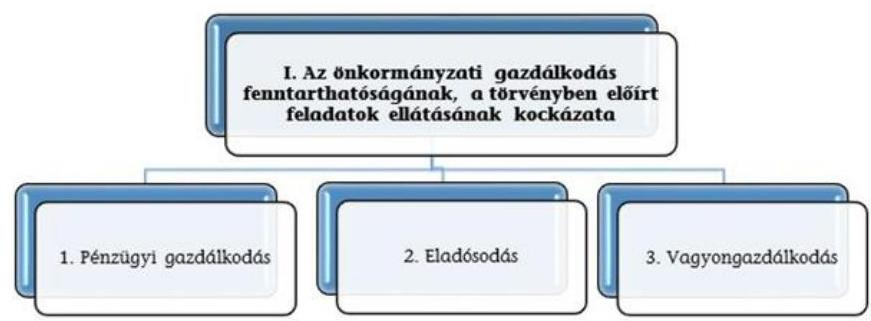

A három kockázati terület együttes értékelése alapján az alábbi mátrix segítségével került meghatározásra az önkormányzati gazdálkodás fenntarthatóságának, a törvényben előírt feladatok ellátásának értékelése a következők szerint:

| 1. Az önkormányzati gazdálkodás fenntarthatóságának, a törvényben előírt feladatok ellátásának kockázata | Alacsony 0 | Közepes 1 |  |  |  |  | Magas 2 |  |  |  |
| :--: | :--: | :--: | :--: | :--: | :--: | :--: | :--: | :--: | :--: | :--: |
| 1. Pénzügyi gazdálkodás |  | 2 alacsony 1   közepes | 1 alacsony 2   közepes | 2 alacsony   1 magas | 1 alacsony   1 közepes 1   magas | 3. közepes | 1   alacsony   2 magas | 2. közepes   1 magas | 1. közepes   2 magas | 3 magas |
| 2. Eladósodás | 3 alacsony |  |  |  |  |  |  |  |  |  |
| 3. Vagyongazdálkodás |  |  |  |  |  |  |  |  |  |  |

---

| Megnevezés | 2013. december   31. | 2014. december
   31. | 2015. december   31. |
| :-- | --: | --: | --: |
| Befektetett eszközök   /NEMZETI VAGYONBA TARTOZÓ BEFEK-   TETETT ESZKÖZÖK | 314136,5 | 324548,3 | 358408,2 |
| KÉSZLETEK | 198,3 |  |  |
| ÉRTÉKPAPÍROK | 1415,9 |  |  |
| NEMZETI VAGYONBA TARTOZÓ FORGÓ-   ESZKÖZÖK |  | 1755,4 | 1359,9 |
| PÉNZESZKÖZÖK | 13255,5 | 12851,8 | 17531,5 |
| KÖVETELÉSEK | 5260,0 | 6460,1 | 6143,2 |
| EGYÉB SAJÁTOS ESZKÖZOLDALI ELSZÁ-   MOLÁSOK |  | 2131,1 | 934,5 |
| AKTÍV IDŐBELI ELHATÁROLÁSOK |  | 165,7 | 131,8 |
| Egyéb aktív pénzügyi elszámolások | 1615,3 |  |  |
| Tájékoztató adat: Forgóeszközök (készle-   tek, követelések, értékpapírok, pénzeszkö-   zök, egyéb aktív pénzügyi elszámolások)   (21 745,0 millió Ft) |  |  |  |
| ESZKÖZÖK ÖSSZESEN | 335881,5 | 347912,4 | 384509,1 |
| SAJÁT TÖKE | 310987,0 | 328991,3 | 348840,4 |
| TARTALÉKOK | 15408,3 |  |  |
| KÖTELEZETTSÉGEK | 8609,1 | 5760,6 | 4688,4 |
| EGYÉB SAJÁTOS FORRÁSOLDALI EL-   SZÁMOLÁSOK |  | 419,9 |  |
| KINCSTÁRI SZÁMLAVEZETÉSSEL KAP-   CSOLATOS ELSZÁMOLÁSOK | - | - | - |
| PASSZÍV IDŐBELI ELHATÁROLÁSOK |  | 12740,6 | 30980,3 |
| egyéb passzív pénzügyi elszámolások | 877,1 |  |  |
| FORRÁSOK ÖSSZESEN | 335881,5 | 347912,4 | 384509,1 |

---

IV. SZ. MELLÉKLET: PÉNZÜGYI EGYENSÜLYI HELYZET CLF MÓDSZER SZERINTI ÉRTÉKELÉSE A 2013-2015. ÉVEKBEN (EZER FT)

|  1. FOLYÓ KÖLTSÉGVETÉS | 2013. év | 2014. év | 2015. év | Változás [\%] (2014-2013) / 2013 | Változás [\%] (2015-2014) / 2014  |
| --- | --- | --- | --- | --- | --- |
|  1.1.1. Saját működési bevételek tulajdonosi bevételek nélkül | 23006668 | 23679503 | 25419394 | 2,92\% | 7,35\%  |
|  1.1.2. Költségvetési támogatások a működőképesség megőrzését szolgáló kiegészítő támogatások nélkül | 31142779 | 33214586 | 32570224 | 6,65\% | -1,94\%  |
|  1.1.3. Átongedett bevételek | 1314180 | 1316944 | 1374221 | 0,21\% | 4,35\%  |
|  1.1.4. Államháztartáson belülről kapott támogatások | 12747511 | 14774370 | 16150732 | 15,90\% | 9,32\%  |
|  1.1.5. EU-tól és külföldről kapott bevételek | 27778 | 289481 | 51891 | 942,12\% | -82,07\%  |
|  1.1.6. Államháztartáson kívülről kapott bevételek | 165091 | 279353 | 421171 | 69,21\% | 50,77\%  |
|  1.1.7. Hozam- és kamatbevételek (2014-ben a működési rész csak az önkormányzat nyilvántartása alapján pontosítható) | 476921 | 333592 | 125108 | -30,05\% | -62,50\%  |
|  1.1.8. Kölcsönök visszatérülése, igénybevétele | 259508 | 315366 | 297636 | 21,52\% | -5,62\%  |
|  1.1.9. A működőképesség megőrzését szolgáló kiegészítő támogatások | 1659260 | 865522 | 854938 | -47,84\% | -1,22\%  |
|  1.1. Folyó bevételek (1.1.1.+1.1.2.+1.1.3.+1.1.4.+1.1.5.+1.1.6.+1.1.7.+1.1.8.+1.1.9.) | 70799696 | 75068717 | 77265315 | 6,03\% | 2,93\%  |
|  1.2.1. Működési kiadások kamatkiadások nélkül | 49152714 | 57237548 | 59483232 | 16,45\% | 3,92\%  |
|  1.2.2. Államháztartáson belülre átadott pénzeszközök | 4207462 | 3876391 | 4210479 | -7,87\% | 8,62\%  |
|  1.2.3.1. vállalkozásoknak | 797148 | 1126635 | 1051613 | 41,33\% | -6,66\%  |
|  1.2.3.2. EU-nak, illetve külföldre | 7559 | 1426 | 800 | -81,14\% | -43,90\%  |
|  1.2.3.3. magánszemélyeknek | 8435619 | 7001639 | 3764795 | -17,00\% | -46,23\%  |
|  1.2.3.4. non-profit szervezeteknek | 1066980 | 1209767 | 1406167 | 13,38\% | 16,23\%  |
|  1.2.3. Transzferkiadások | 10307306 | 9339467 | 6223375 | -9,39\% | -33,36\%  |
|  1.2.4. Kamatkiadások | 80067 | 115511 | 87663 | 44,27\% | -24,11\%  |
|  1.2.5. Kölcsönök nyújtása, törlesztése | 120176 | 330804 | 261022 | 175,27\% | -21,09\%  |
|  1.3. Folyó kiadások (1.2.1.+1.2.2.+1.2.3.+1.2.4.+1.2.5.) | 63867725 | 70899721 | 70265771 | 11,01\% | -0,89\%  |
|  1.3. Folyó költségvetés egyenlege, működési jövedelem (1.1. - 1.2.) | 6931971 | 4168996 | 6999544 | -39,86\% | 67,90\%  |
|  2. FELHALMOZÁSI KÖLTSÉGVETÉS |  |  |  |  |   |
|  2.1.1. Saját tőkebevételek | 2969309 | 775284 | 590166 | -73,89\% | -23,88\%  |
|  2.1.2. Költségvetési támogatások | 2025962 | 3164443 | 4064138 | 56,19\% | 28,43\%  |
|  2.1.3. Államháztartáson belülről kapott támogatások | 14096102 | 14048076 | 25634606 | -0,34\% | 82,48\%  |
|  2.1.4. EU-tól és külföldről kapott támogatások | 48972 | 105289 | 309030 | 115,00\% | 193,51\%  |
|  2.1.5. Államháztartáson kívülről kapott bevételek | 418772 | 620206 | 629362 | 48,10\% | 1,48\%  |
|  2.1.6. Hozam- és kamatbevételek (2014-ben (02/196+02/200-ből a felhalmozási rész csak az önkormányzat nyilvántartása alapján pontosítható) | 18638 | 0 | 0 | -100,00\% | 0,00\%  |
|  2.1.7. Kölcsönök visszatérülése, igénybevétele | 343786 | 323102 | 622642 | -6,02\% | 92,71\%  |
|  2.1. Felhalmozási bevételek (2.1.1.+2.1.2+2.1.3+2.1.4.+2.1.5.+2.1.6.+2.1.7.) | 19921541 | 19036400 | 31849944 | -4,44\% | 67,31\%  |
|  2.2.1. Saját beruházási kiadás átával | 16919410 | 15355906 | 27210388 | -9,24\% | 77,20\%  |
|  2.2.2. Saját felújítási kiadás átával | 3914435 | 4210731 | 5609853 | 7,57\% | 33,23\%  |
|  2.2.3. Államháztartáson belülre átadott pénzeszközök | 580639 | 298852 | 698576 | -48,53\% | 133,75\%  |
|  2.2.4. EU-nak és külföldnek adott pénzeszközök | 0 | 22635 | 78146 | 100,00\% | 245,24\%  |
|  2.2.5. Államháztartáson kívülre adott pénzeszközök | 562484 | 1234931 | 469825 | 119,55\% | -61,96\%  |
|  2.2.6. Befektetéssel kapcsolatos kiadások | 62448 | 58536 | 19693 | -6,26\% | -66,36\%  |
|  2.2.7. Kamatkiadások (2014-ben 01/51+01/54-ből a felhalmozási rész csak az önkormányzat nyilvántartása alapján pontosítható) | 209945 | 0 | 0 | -100,00\% | 0,00\%  |
|  2.2.8. Kölcsönök nyújtása, törlesztése | 299489 | 359785 | 239455 | 20,13\% | -33,44\%  |
|  2.2.9. ÁFA befizetések (2014-ben a 01/50-ből a felhalmozási rész csak az önkormányzat nyilvántartása alapján pontosítható) | 637612 | 0 | 0 | -100,00\% | 0,00\%  |
|  2.2. Felhalmozási kiadások (2.2.1.+2.2.2.+2.2.3.+2.2.4.+2.2.5.+2.2.6.+2.2.7.+2.2.8.+2.2.9.) | 23186462 | 21541376 | 34325936 | -7,10\% | 59,35\%  |
|  2.3. Felhalmozási költségvetés egyenlege (2.1. - 2.2.) | -3264921 | -2504976 | -2475992 | 23,28\% | 1,16\%  |
|  3. FINANSZÍROZÁSI MŰVELETEK NÉLKÜLI (GFS) POZÍCIÓ (1.3.+2.3.) | 3667050 | 1664020 | 4523552 | -54,62\% | 171,84\%  |
|  4. FINANSZÍROZÁSI MŰVELETEK |  |  |  |  |   |
|  4.1. Hitelfelvétel | 672578 | 789459 | 1574506 | 17,38\% | 99,44\%  |
|  4.2. Hiteltörlesztés | 2465420 | 2073396 | 1636269 | -15,90\% | -21,08\%  |
|  4.3. Forgatási és befektetési célú értékpapírok kibocsátása | 0 | 0 | 0 |  |   |
|  4.4. Forgatási és befektetési célú értékpapírok beváltása | 619721 | 567049 | 0 | -8,50\% | -100,00\%  |
|  4.5. Forgatási és befektetési célú értékpapírok értékesítése | 490898 | 827590 | 411320 | 68,59\% | -50,30\%  |
|  4.6. Forgatási és befektetési célú értékpapírok vásárlása | 788638 | 620050 | 1053313 | -21,38\% | 69,88\%  |
|  4.7. Egyéb finanszírozási bevételek | -2343209 | 16457414 | 26893154 | 802,35\% | 63,41\%  |
|  4.8. Egyéb finanszírozási kiadások | -1976808 | 15094693 | 28098026 | 863,59\% | 86,15\%  |
|  4.9.Finanszírozási műveletek egyenlege (4.1.-4.2.+4.3.-4.4.+4.5.-4.6.+4.7.-4.8.) | -3076704 | -280725 | -1908628 | 90,88\% | -579,89\%  |
|  5. TÁRGYÉVI PÉNZÜGYI POZÍCIÓ (1.3.+ 2.3.+4.9.) | 590346 | 1383295 | 2614924 | 134,32\% | 89,04\%  |
|  6. NETTÓ MŰKÖDÉSI JÖVEDELEM
(működési jövedelem (1.3.) - tőketörlesztés (4.2+4.4)) | 3846830 | 1528551 | 5363275 | -60,26\% | 250,87\%  |
|  * Az önkormányzat bevételei nem tartalmazzák az előző évi pénzmaradvány igénybevételeket. |  |  |  |  |   |
|  Tájékoztató adat: Maradvány igénybevétele | 9182373 | 10993708 | 13303885 | 19,73\% | 21,01\%  |

---

- V. SZ. MELLÉKLET: AZ ÖNKORMÁNYZATOK 2014-2015. ÉVI FŐBB MUTATÓINAK ÉS KOCKÁZATI TERÜLETEKNEK AZ ÖSSZEFOGLALÓ ÉRTÉKELÉSE

| Önkormányzati riport |  |  |  |  |  |  |  |  |  |
| :--: | :--: | :--: | :--: | :--: | :--: | :--: | :--: | :--: | :--: |
| Önkormányzat megnevezése: | --- Nagyközségek |  |  |  |  |  |  |  |  |
| Megye: |  |  |  |  | Országos összesítő adat |  |  |  |  |
| Településtípus: |  |  |  |  | Nagyközségek |  |  |  |  |
| Lakosságszám 2014 január 1-jén [fő]: |  |  |  |  |  |  |  | 492674 |  |
| Lakosságszám 2015 január 1-jén [fő]: |  |  |  |  |  |  |  | 492411 |  |
| Összefoglaló értékelés |  |  |  |  |  |  |  |  |  |
| Azonosított kockázatok (értékelése: Magas=M / Közepes=K / Alacsony=A) | Az önkormányzat 2014. évi kockázati besorolása és pontozása |  | A településtípus 2014.   évi átlagának kockázati   besorolása és pontozása |  | Az önkormányzat 2015.   évi kockázati besorolása és pontozása |

  | A településtípus 2015. évi átlagának kockázati besorolása és pontozása |  |  |
| 1. Az önkormányzati gazdálkodás fenntarthatóságának, a törvényben előírt feladatok ellátásának kockázata | A |  | A |  | A |  | A |  |  |
| 1. Pénzügyi gazdálkodás | A | 5,0 | 5,0 | A | A | 5,0 | 5,0 | A |  |
| 1.1 Közfeladatok finanszírozási struktúrája | A | 2,0 | 2,0 | A | A | 1,0 | 1,0 | A |  |
| 1.2 Felhalmozási kiadások és finanszírozása | K | 2,0 | 2,0 | K | K | 2,0 | 2,0 | K |  |
| 1.3 Finanszírozás | A | 1,0 | 1,0 | A | A | 2,0 | 2,0 | A |  |
| 2. Eladósodás | A | 9,0 | 9,0 | A | A | 11,5 | 11,5 | A |  |
| 2.1 Adósságkonszolidációt követő időszakban bekövetkező eladósodás | A | 0,0 | 0,0 | A | A | 2,0 | 2,0 | A |  |
| 2.2 Szállítók felé történő eladósodás | K | 5,5 | 5,5 | K | K | 4,0 | 4,0 | K |  |
| 2.3 Pénzintézet felé történő eladósodás | A | 1,5 | 1,5 | A | K | 5,5 | 5,5 | K |  |
| 2.4 Garancia- és kezességvállalás | K | 2,0 | 2,0 | K | A | 0,0 | 0,0 | A |  |
| 3. Vagyongazdálkodás | A | 2,5 | 2,5 | A | A | 6,0 | 6,0 | A |  |
| 3.1 Vagyonváltozás | A | 0,0 | 0,0 | A | K | 2,0 | 2,0 | K |  |
| 3.2 Belső eladósodás | A | 2,5 | 2,5 | A | A | 2,5 | 2,5 | A |  |
| 3.3 Többségi önkormányzati tulajdonban lévő gazdasági társaságok | A | 0,0 | 0,0 | A | A | 1,5 | 1,5 | A |  |
| II. Önkormányzati gazdálkodásból eredő államháztartási kockázatok | K |  | K |  | K |  | K |  |  |
| III. Nemzeti vagyon megőrzésének, védelmének kockázata | K |  | K |  | A |  | A |  |  |

---

# VI. SZ. MELLÉKLET: AZ ÖNKORMÁNYZATOK 2014-2015. ÉVI FŐBB MUTATÓI ÉS KOCKÁZATI TERÜLETEK RÉSZLETES ÉRTÉKELÉSE

|  Kockázat/Kockázati területek /Kockázatforrások/Mutatók | ÖKOMER szerinti adatok és értékelések |  |  |   |
| --- | --- | --- | --- | --- |
|   | Mutatók értéke 2014.12.31 | Kockázati besorolás 2014. év | Mutatók értéke 2015.12.31 | Kockázati besorolás 2015. év  |
|  I. Az önkormányzati gazdálkodás fenntarthatóságának, a törvényben előírt feladatok ellátásának kockázata |  | A |  | A  |
|  1. Pénzügyi gazdálkodás |  | A |  | A  |
|  1.1 Közfeladatok finanszírozási struktúrája |  | A |  | A  |
|  Működési kiadások fedezettsége | 105,9\% | A | 110,0\% | A  |
|  Kiegészítő önkormányzati támogatás aránya | 0,82\% | A | 1,11\% | A  |
|  Adóbevételek működési bevételeken belüli arányának változása százalékpontban | $-0,72$ | A | 1,87 | A  |
|  Adóbevételek állományának változása | 0,3\% | A | 12,1\% | A  |
|  Helyi iparűzési adóbevételek állományának változása | 0,0\% | A | 16,1\% | A  |
|  1.2 Felhalmozási kiadások és finanszírozása |  | K |  | K  |
|  Felhalmozási kiadások fedezettsége | 88,4\% | K | 92,8\% | K  |
|  Rendkívüli eredmény (E Ft) és változása (\%) | - | - | 9,7\% | A  |
|  1.3 Finanszírozás |  | A |  | A  |
|  Törlesztés fedezettségének aránya | 63,3\% | A | 23,4\% | A  |
|  Nettó működési jövedelem változása | $-60,3 \%$ | K | 250,9\% | A  |
|  Pénzügyi műveletek eredménye (E Ft) és változása (\%) | - | - | $-142,9 \%$ | K  |
|  2. Eladósodás |  | A |  | A  |
|  2.1 Adósságkonszolidációt követő időszakban bekövetkező eladósodás |  | A |  | A  |
|  Eladósodási mutató | 1,7\% | A | 1,2\% | A  |
|  Eladósodási mutató változása százalékpontban | $-0,7$ | A | $-0,5$ | A  |
|  Hiánymutató | Nincs hiány! | A | Nincs hiány! | A  |
|  Tárgyévi pénzügyi pozíció változása | 134,3\% | A | 89,0\% | A  |
|  Tevékenység eredménye (E Ft) és változása (\%) | - | - | 37,2\% | K  |
|  2.2 Szállítók felé történő eladósodás |  | K |  | K  |
|  Szállítói állomány (2014-től kötelezettségek dologi, felújítási beruházási kiadásokra) változása | 7,2\% | K | $-39,7 \%$ | A  |
|  90 napon túli lejárt kötelezettségek állományának aránya (az összes köt. állományból) | 0,3\% | K | 0,4\% | K  |
|  Lejárt szállítói állomány (2014-től lejárt kötelezettségek dologi, felújítási beruházási kiadásokra) aránya (a szállítói állományból) | 6,3\% | K | 12,8\% | K  |
|  Lejárt szállítói állomány (2014-től lejárt kötelezettségek dologi, felújítási beruházási kiadásokra) változása | $-51,8 \%$ | A | 23,9\% | K  |
|  Lejárt szállítói állomány (2014-től lejárt kötelezettségek dologi kiadásokra) aránya a dologi kiadások egy havi átlagához viszonyítva | 6,1\% | K | 6,2\% | K  |
|  2.3 Pénzintézet felé történő eladósodás |  | A |  | A  |
|  Banki kötelezettségállomány mérlegfőösszeghez mért nagysága | 0,1\% | A | 0,2\% | A  |
|  Banki kötelezettségek (rövid és hosszúlejáratú hitelek és kötvénykibocsátásból származó tartozások) állományának változása | $-94,4 \%$ | A | 114,6\% | K  |
|  Tárgyévben kormányzati jóváhagyással megkötött hosszú lejáratú adósságot keletkeztető ... | 3 | K | 3 | K  |
|  ...ügyletek darabszáma |  |  |  |   |
|  ... ügyletek értéke (E Ft) | 196367 | A | 418001 | A  |
|  Tárgyévben megkötött, kormányzati hozzájáruláshoz nem kötött, hosszúlejáratú adósságot keletkeztető ... | 1 | K | 1 | K  |
|  ... ügyletek darabszáma |  |  |  |   |
|  ... ügyletek értéke (E Ft) | 9500 | A | 14361 | A  |
|  2.4 Garancia- és kezességvállalás |  | K |  | A  |
|  Garancia és kezességvállalások állománya (E Ft) | 285491 | K | 0 | A  |
|  3. Vagyongazdálkodás |  | A |  | A  |
|  3.1 Vagyonváltozás |  | A |  | K  |
|  Befektetett eszközök fedezettsége | 101,4\% | A | 97,3\% | K  |
|  Ingatlanok és kapcsolódó vagyoni értékű jogok állományának változása (E Ft) | 11942447 | A | 23225976 | A  |
|  Koncesszióba, vagyonkezelésbe adott eszközök állományának változása (E Ft) | $-2024499$ | A | 6274365 | K  |
|  3.2 Belső eladósodás |  | A |  | A  |
|  Eszközpótlási mutató (tárgyi eszközök összesen) | 126,0\% | A | 214,0\% | A  |
|  Eszközpótlási mutató (ingatlanok és kapcsolódó vagyoni értékű jogokra) | 139,4\% | A | 234,3\% | A  |
|  Tárgyi eszközök használhatósági foka | 80,0\% | K | 79,5\% | K  |
|  Ingatlanok használhatósági foka | 82,5\% | K | 81,9\% | K  |
|  3.3 Többségi önkormányzati tulajdonban lévő gazdasági társaságok |  | A |  | A  |
|  Többségi önkormányzati tulajdonú gazdasági társaságok kötelezettségei állományának változása | $-72,1 \%$ | A | 107,4\% | A  |
|  ...gazdasági társaságok számának változása (db) | $-8$ | A | 5 | K  |
|  Tartós részesedések állományának változása | $-11,84 \%$ | A | 0,65\% | A  |

---

|  SORSZÁM | NAGYKÖZSÉGEK | SORSZÁM | NAGYKÖZSÉGEK  |
| --- | --- | --- | --- |
|  1 | Ökörítófülpös Nagyközség Önkormányzata | 67 | Leányfalu Nagyközség Önkormányzata  |
|  2 | Körösszegapáti Nagyközségi Önkormányzat | 68 | Balatonszárszó Nagyközség Önkormányzata  |
|  3 | Egyek Nagyközség Önkormányzata | 69 | Tiszaadob Nagyközség Önkormányzata  |
|  4 | Szászvár Nagyközség Önkormányzat | 70 | Jászladány Nagyközségi Önkormányzat  |
|  5 | Pocsa Nagyközség Önkormányzata | 71 | Cibakháza Nagyközségi Önkormányzat  |
|  6 | Kállosemjén Nagyközség Önkormányzata | 72 | Hernádnémeti Nagyközség Önkormányzata  |
|  7 | Békéscsaba Nagyközség Önkormányzata | 73 | Taktaharkány Nagyközség Önkormányzata  |
|  8 | Mezőfalva Nagyközség Önkormányzata | 74 | Cece Nagyközség Önkormányzata  |
|  9 | Dobo Nagyközség Önkormányzata | 75 | Nyírábrány Nagyközség Önkormányzata  |
|  10 | Szentháromság Nagyközség Önkormányzata | 76 | Tokod Nagyközség Önkormányzata  |
|  11 | Nagyszénás Nagyközség Önkormányzata | 77 | Kartal Nagyközség Önkormányzata  |
|  12 | Gávavencsellő Nagyközség Önkormányzata | 78 | Kiskunlacháza Nagyközség Önkormányzat  |
|  13 | Kunmadaras Nagyközség Önkormányzata | 79 | Kölcse Nagyközség Önkormányzata  |
|  14 | Dömsöd Nagyközség Önkormányzata | 80 | Nyírbagdát Nagyközség Önkormányzata  |
|  15 | Gádoros Nagyközség Önkormányzata | 81 | Tarpa Nagyközség Önkormányzat  |
|  16 | Mucsony Nagyközség Önkormányzata | 82 | Pincehely Nagyközség Önkormányzata  |
|  17 | Hernád Nagyközség
 ÖNKORMÁNYZATA | 83 | LAJOSKOMÁROM NAGYKÖZSÉG ÖNKORMÁNYZAT  |
|  18 | BAGAMÉR NAGYKÖZSÉG ÖNKORMÁNYZATA | 84 | SOLYMÁR NAGYKÖZSÉG ÖNKORMÁNYZAT  |
|  19 | ARLÓ NAGYKÖZSÉG ÖNKORMÁNYZATA | 85 | TÁBORFALVA NAGYKÖZSÉG ÖNKORMÁNYZATA  |
|  20 | ÁSOTTHALOM NAGYKÖZSÉGI ÖNKORMÁNYZAT | 86 | NYÍRBÉLTEK NAGYKÖZSÉG ÖNKORMÁNYZAT  |
|  21 | TÁPIÓSZENTMÁRTON NAGYKÖZSÉG ÖNKORMÁNYZATA | 87 | TISZABECS NAGYKÖZSÉG ÖNKORMÁNYZATA  |
|  22 | BÁCSBOKOD NAGYKÖZSÉG ÖNKORMÁNYZATA | 88 | TUZSÉR NAGYKÖZSÉGI ÖNKORMÁNYZAT  |
|  23 | IZSÖFALVA NAGYKÖZSÉG ÖNKORMÁNYZATA | 89 | ÖCSÖD NAGYKÖZSÉGI ÖNKORMÁNYZAT  |
|  24 | ZSÁKA NAGYKÖZSÉGI ÖNKORMÁNYZAT | 90 | DECS NAGYKÖZSÉG ÖNKORMÁNYZATA  |
|  25 | SOPONYA NAGYKÖZSÉG ÖNKORMÁNYZAT | 91 | RÉVFÜLÖP NAGYKÖZSÉG ÖNKORMÁNYZATA  |
|  26 | BUGYI NAGYKÖZSÉG ÖNKORMÁNYZATA | 92 | DOMBEGYHÁZ NAGYKÖZSÉG ÖNKORMÁNYZATA  |
|  27 | TÁPIÓSZECSŐ NAGYKÖZSÉG ÖNKORMÁNYZATA | 93 | TISZALÚC NAGYKÖZSÉG ÖNKORMÁNYZATA  |
|  28 | HÖGYÉSZ NAGYKÖZSÉG ÖNKORMÁNYZATA | 94 | NAGYMÁGOCS NAGYKÖZSÉGI ÖNKORMÁNYZAT  |
|  29 | LAKITELEK ÖNKORMÁNYZATA | 95 | RECSK NAGYKÖZSÉGI ÖNKORMÁNYZAT  |
|  30 | RICSE NAGYKÖZSÉG ÖNKORMÁNYZATA | 96 | ALSÓNÉMEDI NAGYKÖZSÉG ÖNKORMÁNYZATA  |
|  31 | PARÁD NAGYKÖZSÉGI ÖNKORMÁNYZAT | 97 | NYÁREGYHÁZA NAGYKÖZSÉG ÖNKORMÁNYZATA  |
|  32 | FÖLDES NAGYKÖZSÉG ÖNKORMÁNYZATA | 98 | LEVELEK NAGYKÖZSÉG ÖNKORMÁNYZATA  |
|  33 | MOGYORÓD NAGYKÖZSÉG ÖNKORMÁNYZATA | 99 | TÁRNOK NAGYKÖZSÉG ÖNKORMÁNYZAT  |
|  34 | PORCSALMA NAGYKÖZSÉG ÖNKORMÁNYZATA | 100 | BERZENCE NAGYKÖZSÉG ÖNKORMÁNYZATA  |
|  35 | FADD NAGYKÖZSÉG ÖNKORMÁNYZATA | 101 | VASKÚT NAGYKÖZSÉGI ÖNKORMÁNYZAT  |
|  36 | SZEGVÁR NAGYKÖZSÉGI ÖNKORMÁNYZAT | 102 | ALGYŐ NAGYKÖZSÉG ÖNKORMÁNYZAT  |
|  37 | ORGOVÁNY NAGYKÖZSÉG ÖNKORMÁNYZATA | 103 | KISZOMBOR NAGYKÖZSÉG ÖNKORMÁNYZATA  |
|  38 | LEPSÉNY NAGYKÖZSÉGI ÖNKORMÁNYZAT | 104 | NAGYCENK NAGYKÖZSÉG ÖNKORMÁNYZATA  |
|  39 | CSÖMÖR NAGYKÖZSÉG ÖNKORMÁNYZATA | 105 | SZŐDLIGET NAGYKÖZSÉG ÖNKORMÁNYZATA  |
|  40 | VALKÓ NAGYKÖZSÉG ÖNKORMÁNYZATA | 106 | HODÁSZ NAGYKÖZSÉGI ÖNKORMÁNYZAT  |
|  41 | HELVÉCIA NAGYKÖZSÉG ÖNKORMÁNYZATA | 107 | CSABRENDEK NAGYKÖZSÉG ÖNKORMÁNYZATA  |

---

|  SORSZÁM | NAGYKÖZSÉGEK | SORSZÁM | NAGYKÖZSÉGEK  |
| --- | --- | --- | --- |
|  42 | ZSOMBÓ NAGYKÖZSÉG ÖNKORMÁNYZATA | 108 | SÜKÖSD NAGYKÖZSÉGI ÖNKORMÁNYZAT  |
|  43 | SÁRRÉTUDVARI NAGYKÖZSÉG ÖNKORMÁNYZATA | 109 | NYÍRPAZONY NAGYKÖZSÉG ÖNKORMÁNYZAT  |
|  44 | HORT NAGYKÖZSÉGI ÖNKORMÁNYZAT | 110 | ETYEK NAGYKÖZSÉG ÖNKORMÁNYZATA  |
|  45 | TYUKOD NAGYKÖZSÉG ÖNKORMÁNYZAT | 111 | ECSER NAGYKÖZSÉG ÖNKORMÁNYZATA  |
|  46 | BUGAC NAGYKÖZSÉGI ÖNKORMÁNYZAT | 112 | BEREMEND NAGYKÖZSÉG ÖNKORMÁNYZAT  |
|  47 | HARTA NAGYKÖZSÉG ÖNKORMÁNYZATA | 113 | KÉTEGYHÁZA NAGYKÖZSÉG ÖNKORMÁNYZATA  |
|  48 | SZABADBATTYÁN NAGYKÖZSÉGI ÖNKORMÁNYZAT | 114 | ÚLLÉS NAGYKÖZSÉGI ÖNKORMÁNYZAT  |
|  49 | SZADA NAGYKÖZSÉG ÖNKORMÁNYZATA | 115 | ELŐSZÁLLÁS NAGYKÖZSÉG ÖNKORMÁNYZATA  |
|  50 | BORDÁNY NAGYKÖZSÉGI ÖNKORMÁNYZAT | 116 | SZANY NAGYKÖZSÉG ÖNKORMÁNYZATA  |
|  51 | KÁL NAGYKÖZSÉGI ÖNKORMÁNYZAT | 117 | CSÖKMŐ NAGYKÖZSÉG ÖNKORMÁNYZATA  |
|  52 | TAKSONY NAGYKÖZSÉG ÖNKORMÁNYZATA | 118 | NAGYRÁBÉ NAGYKÖZSÉG ÖNKORMÁNYZATA  |
|  53 | BAG NAGYKÖZSÉG ÖNKORMÁNYZATA | 119 | PÉTFÜRDŐ NAGYKÖZSÉG ÖNKORMÁNYZATA  |
|  54 | INÁRCS NAGYKÖZSÉG ÖNKORMÁNYZATA | 120 | TISZAALPÁR NAGYKÖZSÉGI ÖNKORMÁNYZAT  |
|  55 | NAPKOR NAGYKÖZSÉG ÖNKORMÁNYZATA | 121 | DUNAPATAJ NAGYKÖZSÉG ÖNKORMÁNYZATA  |
|  56 | ZALAKOMÁR NAGYKÖZSÉG ÖNKORMÁNYZATA | 122 | NAGYVENYIM NAGYKÖZSÉG ÖNKORMÁNYZATA  |
|  57 | CSERSZEGTOMAJ NAGYKÖZSÉG ÖNKORMÁNYZATA | 123 | PÁKOZD NAGYKÖZSÉG ÖNKORMÁNYZATA  |
|  58 | SZIRMABESENYŐ NAGYKÖZSÉG ÖNKORMÁNYZATA | 124 | PERKÁTA NAGYKÖZSÉG ÖNKORMÁNYZATA  |
|  59 | VAJSZLÓ NAGYKÖZSÉG ÖNKORMÁNYZAT | 125 | VONYARCVASHEGY NAGYKÖZSÉG ÖNKORMÁNYZATA  |
|  60 | CSABACSÚD NAGYKÖZSÉG ÖNKORMÁNYZATA | 126 | FELSŐPAKONY NAGYKÖZSÉG ÖNKORMÁNYZATA  |
|  61 | KEVERMES NAGYKÖZSÉG ÖNKORMÁNYZATA | 127 | HOSSZÚPÁLYI NAGYKÖZSÉG ÖNKORMÁNYZATA  |
|  62 | SÁROSD NAGYKÖZSÉG ÖNKORMÁNYZATA | 128 | NAGYKOVÁCSI NAGYKÖZSÉG ÖNKORMÁNYZATA  |
|  63 | SEREGÉLYES NAGYKÖZSÉG ÖNKORMÁNYZATA | 129 | MÉRK NAGYKÖZSÉG ÖNKORMÁNYZAT  |
|  64 | BŐSÁRKÁNY NAGYKÖZSÉG ÖNKORMÁNYZATA | 130 | NAGYDOROG NAGYKÖZSÉG ÖNKORMÁNYZATA  |
|  65 | HEGYESHALOM NAGYKÖZSÉGI ÖNKORMÁNYZAT | 131 | GYENESDIÁS NAGYKÖZSÉG ÖNKORMÁNYZATA  |
|  66 | NAGYIGMÁND NAGYKÖZSÉG ÖNKORMÁNYZATA | 132 | SZENTMÁRTONKÁTA NAGYKÖZSÉG ÖNKORMÁNYZATA  |

---

# FÜGGELÉK: ÉSZREVÉTELEK 

A jelentéstervezetet a Számvevőszék 15 napos észrevételezésre megküldte az ellenőrzött szervezet vezetőjének az ÁSZ tv. 29. § (1) bekezdése előírásának megfelelően.
Az ellenőrzött szervezet vezetője az ÁSZ tv. 29. § (2) bekezdésében foglalt észrevételezési jogával nem élt, a

jelentéstervezetre észrevételt nem tett.

- Belügyminisztérium BMÖGF/490-2/2018. iktatószámú válaszlevele az észrevételezésre megküldött jelentéstervezetre
${ }^{1}$ 29. § (1) Az Állami Számvevőszék az ellenőrzési megállapításait megküldi az ellenőrzött szervezet vezetőjének vagy az általa megbízott személynek, és annak, akinek személyes felelősségét állapította meg.
(2) Az ellenőrzött szervezet vezetője és a felelősként megjelölt személy az ellenőrzés megállapításaira tizenöt napon belül írásban észrevételt tehet.
(3) Az Állami Számvevőszék az észrevételre a beérkezésétől számított harminc napon belül írásban válaszol. A figyelembe nem vett észrevételeket köteles a jelentésben feltüntetni, és megindokolni, hogy azokat miért nem fogadta el.

---

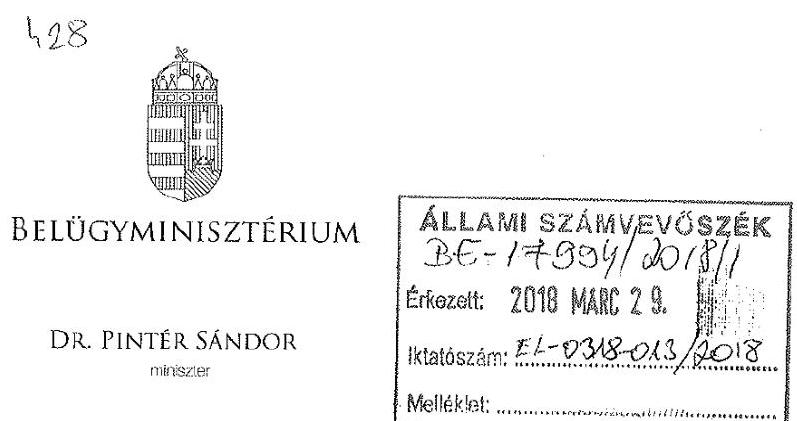

Iktatószám: BMÖGF/490-2/2018.

Domokos László úrnak, elnök

Állami Számvevőszék

Budapest
Apáczai Csere János utca 10.
1052

Tárgy: jelentéstervezet szakmai véleményezéséről
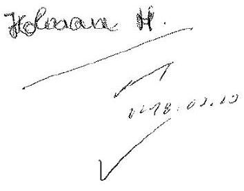

# Tisztelt Elnök Úr! 

Köszönettel vettem az „Önkormányzatok pénzügyi monitoring alapján végzett ellenőrzése - A nagyközségi önkormányzatok gazdálkodásának fenntarthatósága" elnevezésű számvevőszéki jelentéstervezet előzetes megküldését.

A jelentéstervezetben foglaltakkal összefüggésben észrevételt nem teszek.
Egyidejűleg megköszönöm Elnök úrnak a számvevők munkáját, és további sikereket kívánok.
Budapest, 2018. március 7.

## Üdvözlettel:

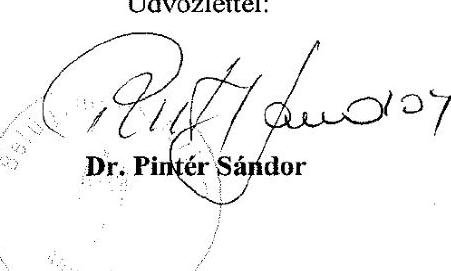

Dr. Pintér Sándor

---

# RÖVIDÍTÉSEK JEGYZÉKE 

${ }^{1}$ Önkormányzatok
${ }^{2}$ ÁSZ
${ }^{3}$ MÁK
${ }^{4}$ EU
${ }^{5}$ Gt.
${ }^{6}$ Ptk. 2
${ }^{7}$ Számv. tv.
${ }^{8}$ Ávr.
${ }^{9}$ Nvtv.
${ }^{10}$ Ptk. 1
${ }^{11}$ Mötv.
a 132 Nagyközségi Önkormányzat a VII. számú melléklet szerint
Állami Számvevőszék
Magyar Államkincstár
Európai Unió
2006. évi IV. törvény a gazdasági társaságokról (hatálytalan 2014. március 15-től)
2013. évi V. törvény a Polgári Törvénykönyvről (hatályos 2014. március 15-től)
2000. évi C. törvény a számvitelről (hatályos: 2001. január 1-jétől)
368/2011. (XII. 31.) Korm. rendelet az államháztartásról szóló törvény végrehajtásáról (hatályos: 2012. január 1-jétől)
2011. évi CXCVI. törvény a nemzeti vagyonról (hatályos: 2011. december 31-től)
1959. évi IV. törvény a Polgári Törvénykönyvről (hatálytalan 2014. március 15-től)
2011. évi CLXXXIX. törvény Magyarország helyi önkormányzatairól (hatályos: 2012. január 1-jétől)

---

# ÁLLAMI SZÁMVEVŐSZÉK 

1052 Budapest, Apáczai Csere János utca 10.
Levélcím: 1364 Budapest 4. Pf. 54
Telefon: +36 14849100 Telefax: +36 14849200
www.asz.hu
