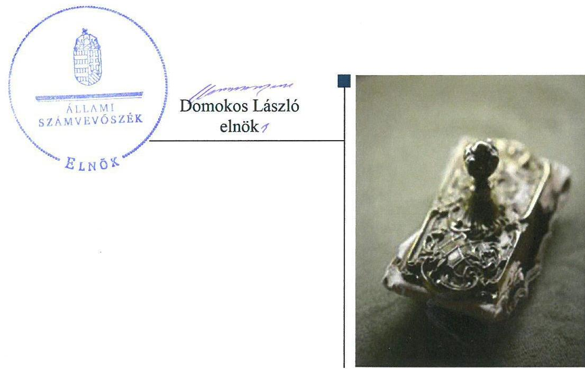
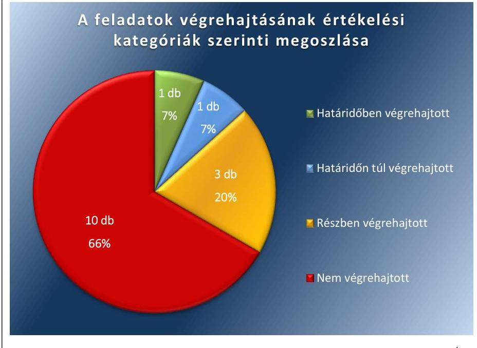
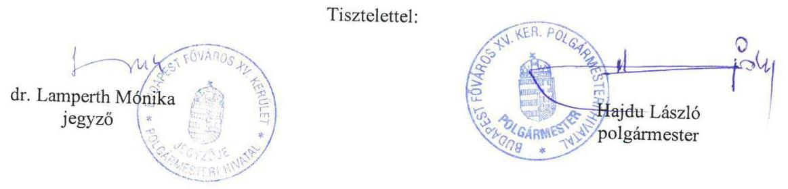
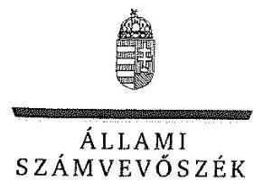
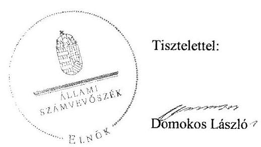
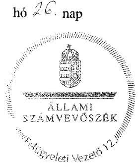

# Jelentés 

## Utóellenőrzések

Az önkormányzatok vagyongazdálkodása szabályszerűségének utóellenőrzése Budapest Főváros XV. Kerület Rákospalota, Pestújhely, Újpalota Önkormányzata 2018.

---

# Jelentés 

## Utóellenőrzések

Az önkormányzatok vagyongazdálkodása szabályszerűségének utóellenőrzése Budapest Főváros XV. Kerület Rákospalota, Pestújhely, Újpalota Önkormányzata 2018. 04. hó 17. nap

---

|  J | AZ ELLENŐRZÉST FELÜGYELTE:  |
| --- | --- |
|   | PETŐ KRISZTINA felügyeleti vezető  |
|   | AZ ELLENŐRZÉST VEZETTE ÉS A VÉGREHAJTÁSÁÉRT FELELŐS:  |
|   | EŐRY-BRUDER VIKTÓRIA ellenőrzésvezető  |
|   | A PROGRAM ÖSSZEÁLLÍTÁSÁÉRT FELELŐS:  |
|   | JANIK JÓZSEF LÁSZLÓ osztályvezető  |
|   | A TÉMÁHOZ KAPCSOLÓDÓ KORÁBBI SZÁMVEVŐSZÉKI JELENTÉS:  |
|   | - címe: Jelentés az önkormányzatok vagyongazdálkodása szabályszerűségének ellenőrzéséről - Budapest Főváros XV. kerület Rákospalota, Pestújhely, Újpalota  |
|  J | sorszáma: 14083  |
|   | IKTATÓSZÁM: V-1310-049/2016.  |
|   | TÉMASZÁM: 2096  |
|   | ELLENŐRZÉS-AZONOSÍTÓ SZÁM: V075569  |

---

# TARTALOMJEGYZÉK 

■ ÖSSZEGZÉS ..... 5
■ AZ ELLENŐRZÉS CÉLJA ..... 6
■ AZ ELLENŐRZÉS TERÜLETE ..... 7
■ AZ ELLENŐRZÉS HÁTTERE, INDOKOLTSÁGA ..... 8
■ A JELENTÉS LÉNYEGES KÉRDÉSKÖRE ..... 9
■ AZ ELLENŐRZÉS HATÓKÖRE ÉS MÓDSZEREI ..... 10
■ MEGÁLLAPÍTÁSOK ..... 12
■ MELLÉKLETEK ..... 15
I. sz. melléklet: Az ÁSZ 14083 számú jelentéséhez kapcsolódó intézkedési terv végrehajtásának értékelése ..... 15
■ FÜGGELÉK: ÉSZREVÉTELEK ..... 19
■ RÖVIDÍTÉSEK JEGYZÉKE ..... 41

---

.

---

# ÖSSZEGZÉS 

Az Állami Számvevőszék utóellenőrzése során megállapította, hogy a Budapest Főváros XV. kerület Rákospalota, Pestújhely, Újpalota Önkormányzata az intézkedési tervében vállalt feladatai jelentős részét nem hajtotta végre, ezáltal nem biztosította a szabályszerű és átlátható vagyongazdálkodást.

## Az ellenőrzés társadalmi indokoltsága

Az Állami Számvevőszék stratégiájában célul tűzte ki a számvevőszéki munka hasznosulásának javítását. Ezzel összhangban ellenőrzi, hogy az ellenőrzött szervezetek megvalósították-e a korábbi ellenőrzései által feltárt hibák, hiányosságok és szabálytalanságok megszüntetése céljából kialakított intézkedési terveikben foglaltakat. A rendszeres utóellenőrzések hozzájárulnak a szükséges intézkedések tényleges végrehajtásához, ezáltal a közpénzügyek rendezettségének javulásához.

## Főbb megállapítások, következtetések

Budapest Főváros XV. kerület Rákospalota, Pestújhely, Újpalota Önkormányzata az intézkedési tervben meghatározott 15 feladatból egyet határidőben, egyet határidőn túl, hármat részben hajtott végre, valamint 10 feladatot nem hajtott végre.

Budapest Főváros XV. kerület Rákospalota, Pestújhely, Újpalota Önkormányzata nem biztosította a vagyongazdálkodás szabályozott működését. Nem gondoskodtak a vagyonkimutatás megfelelő elkészítéséről, ugyanis az elkészített vagyonkimutatás nem felelt meg a jogszabályi előírásoknak. Nem biztosították az ingatlanvagyon-kataszter és a számviteli nyilvántartások egyezőségét és az üzemeltetésre átadott eszközök mérlegfordulónapi leltárral történő alátámasztását. Nem intézkedtek a behajthatatlan és az elengedett követelések megfelelő könyveléséről, azok könyvelése nem volt összhangban a jogszabályi előírásokkal. Az elkészített felújítási terv, és a szükséges előirányzat nem az intézkedési tervben meghatározott feltételek figyelembe vételével került meghatározásra. Nem fejezték be a 100\%-os önkormányzati tulajdonú gazdasági társaságoknál az analitika és a vagyonkataszter egyeztetése utáni eltérések kivizsgálását. Nem gondoskodtak arról, hogy a Répszolg Kft.-nél elvégezzék a szabályszerű leltározást, selejtezést. Nem intézkedtek a belső ellenőrzés által feltárt hiányosságok megszüntetéséről.

A részben végrehajtott, valamint a nem végrehajtott feladatok nagy száma azt mutatja, hogy Budapest Főváros XV. kerület Rákospalota, Pestújhely, Újpalota Önkormányzata nem hajtotta végre az intézkedési feladatokat annak érdekében, hogy az Állami Számvevőszék korábbi ellenőrzése során feltárt hiányosságokat és szabálytalanságokat megszüntetesse. Mindez azt mutatja, hogy a Budapest Főváros XV. kerület Rákospalota, Pestújhely, Újpalota Önkormányzata vagyongazdálkodásában meglévő hiányosságok miatt továbbra is fennállt a jogszabálysértő állapot.

A jegyző az intézkedési tervben meghatározott feladatok végrehajtásáról nem vezette a jogszabályi előírásoknak megfelelő nyilvántartást.

---

# AZ ELLENŐRZÉS CÉLJA 

Az ellenőrzés célja annak értékelése, hogy a számvevőszéki jelentésben ${ }^{1}$ foglalt javaslatot megalapozó megállapításokkal összhangban készített intézkedési tervben meghatározott feladatokat az ellenőrzött szervezet vég-rehajtotta-e.

---

# **AZ ELLENŐRZÉS TERÜLETE**

## **Budapest Főváros XV. kerület Rákospalota, Pestújhely, Újpalota Önkormányzata**

Budapest Főváros XV. kerülete a főváros északkeleti városkapuja, állandó lakosainak száma a Központi Statisztikai Hivatal Magyarország közigazgatási helynévkönyve alapján 2016. január 1-jén 80 573 fő volt.

Mind a polgármester², mind a jegyző³ a 2014. évi önkormányzati választások óta tölti be tisztségét.

Az Önkormányzat⁴ a 2016. évi beszámolója szerint 32 293 millió Ft bevételt ért el, és 27 954 millió Ft kiadást teljesített. A 2016. december 31-i fordulónapi beszámoló mérlegfőösszege 83 725 millió Ft, ezen belül a nemzeti vagyonba tartozó befektetett eszközök összege 77 530 millió Ft, a követelés állománya 1088 millió Ft, kötelezettség állománya 294 millió Ft volt.

Az ÁSZ⁵ a 2013. évben ellenőrizte az Önkormányzat vagyongazdálkodásának szabályszerűségét a 2009. január 1. és 2012. december 31. közötti időszak vonatkozásában. Az erről szóló 14083 számú jelentését 2014. október 22-én hozta nyilvánosságra. Az ÁSZ megállapította, hogy a jegyző a vagyongazdálkodási tevékenység kereteit kialakította, azonban a vagyongazdálkodási tevékenység szabályszerűsége nem volt teljes körűen biztosított.

A számvevőszéki jelentésben foglalt javaslatot megalapozó megállapítások végrehajtása érdekében az Önkormányzat egy 15 feladatból álló intézkedési tervet állított össze. A képviselő-testület⁶ az intézkedési tervet a 915/2014. (XII. 17) ök. számú határozattal fogadta el.

Az utóellenőrzés – a 2014. október 22. és 2017. október 16. között végrehajtott feladatokat figyelembe véve – a számvevőszéki jelentésben a polgármester és a jegyző részére megfogalmazott javaslatot megalapozó megállapításokra készített, az ÁSZ részére megküldött intézkedési tervben foglalt feladatok megvalósításának ellenőrzésére, illetve értékelésére fókuszált.

---

# AZ ELLENŐRZÉS HÁTTERE, INDOKOLTSÁGA 

Az ÁSZ tv. ${ }^{7}$ 33. § (1) bekezdése értelmében a számvevőszéki jelentések javaslatot megalapozó megállapításokhoz kapcsolódóan az ellenőrzött szervezet vezetője intézkedési tervet köteles összeállítani, és az ÁSZ részére megküldeni. Az intézkedési tervben foglaltak megvalósítását - az ÁSZ tv. 33. § (7) bekezdésében foglaltak alapján - az ÁSZ utóellenőrzés keretében ellenőrizheti. Az intézkedések megvalósulásának értékelése során az ÁSZ figyelembe veszi az ellenőrzött szervezetek működési feltételeiben, valamint a jogszabályi előírásokban bekövetkezett változásokat.

Az intézkedési tervekben foglalt feladatok hiányos, illetve késedelmes végrehajtása, valamint megvalósításának elmaradása azt mutatja, hogy az ellenőrzések során feltárt hibák, hiányosságok és szabálytalanságok megszüntetése nem kapott kellő hangsúlyt. Ez a szabályszerű működés és a felelős vezetői magatartás vonatkozásában kockázatot hordoz. E kockázatok feltárásával az ÁSZ utóellenőrzési rendszere fokozza a fegyelmet, és igazolja, hogy a közpénzzel való szabályos gazdálkodás felelőssége elől nem lehet kitérni.

Az utóellenőrzés négy szinten hasznosulhat:
A társadalom szintjén az utóellenőrzés jelzi, hogy a számvevőszéki ellenőrzés megállapításainak van következménye: a hiányosságok megszüntetésére az ellenőrzött szervezet által meghatározott intézkedések végrehajtását is számon kéri az ÁSZ.

- Az ellenőrzött terület szintjén az utóellenőrzés tájékoztatást nyújt a terület döntéshozóinak a hiányosságok kiküszöbölésének jó gyakorlatairól, ezzel lehetőséget biztosítva arra, hogy az ÁSZ ellenőrzési megállapításai, javaslatai a terület nem ellenőrzött szervezeteinek működése során is hasznosuljanak.
- Az ellenőrzött szervezet szintjén az utóellenőrzés feltárja, hogy a szervezet az intézkedések végrehajtásával hasznosította-e a korábbi ellenőrzési jelentésben a hiányosságok megszüntetése, illetve a kockázatok kezelése érdekében megfogalmazott javaslatokat.
- Az ÁSZ szintjén az utóellenőrzés visszacsatolást ad az ellenőrzési jelentések hasznosulásáról, az intézkedések elmaradása vagy részleges megvalósulása a további ellenőrzésekhez kockázati jelzésként szolgál.

---

# A JELENTÉS LÉNYEGES KÉRDÉSKÖRE 

Az Önkormányzat az intézkedési tervben foglaltakat az előírt határidőben végrehajtotta-e?

---

# AZ ELLENŐRZÉS HATÓKÖRE ÉS MÓDSZEREI 

## Az ellenőrzés típusa

Megfelelőségi ellenőrzés.

## Az ellenőrzött időszak

Az utóellenőrzés alapját képező számvevőszéki jelentés közzétételének napjától (2014. október 22.) az ellenőrzésről szóló kiértesítő levél keltének napjáig (2017. október 16.) tartó időszak.

## Az ellenőrzés tárgya

Az ÁSZ tv. 2011. július 1-jei hatálybalépését követően a számvevőszéki jelentésben foglalt javaslatot megalapozó megállapításokkal összhangban az ellenőrzött szervezet által - készített intézkedési tervben foglaltak végrehajtásának ellenőrzése volt.

Az ellenőrzés kiterjedt minden olyan körülményre és adatra, amely az ÁSZ jogszabályban meghatározott feladatainak teljesítéséhez, valamint a program végrehajtása folyamán felmerült újabb összefüggések feltárásához szükséges volt.

## Az ellenőrzött szervezet

Budapest Főváros XV. kerület Rákospalota, Pestújhely, Újpalota Önkormányzata

## Az ellenőrzés jogalapja

Az ÁSZ tv. 33. § (7) bekezdése alapján.

## Az ellenőrzés módszerei

Az ÁSZ az ellenőrzést az ellenőrzési program ellenőrzési kérdései, az ellenőrzött időszakban hatályos jogszabályok, az ellenőrzés szakmai szabályok és módszertanok figyelembevételével, önálló ellenőrzés keretében végezte.

Az ÁSZ az ellenőrzés ideje alatt az ellenőrzött szervezettel történő kapcsolattartást az ÁSZ SZMSZ ${ }^{\circledR}$-ének vonatkozó előírásai alapján biztosította.

---

Az utóellenőrzés megállapításait elsősorban az ÁSZ rendelkezésére álló, valamint az ellenőrzött szervezetektől bekért dokumentumok alapozták meg.

Az ellenőrzési bizonyítékként felhasználható adatforrások közé tartoznak egyrészt a szakmai programban felsorolt adatforrások, másrészt minden - az ellenőrzés folyamán feltárt, az ellenőrzés szempontjából információt tartalmazó - dokumentum.

Az intézkedési tervben előírt feladatokat azok végrehajthatósága, illetve végrehajtása szempontjából az alábbiak szerint értékelte az ÁSZ:
$\longrightarrow$ „határidőben végrehajtott" a feladat, ha a teljesítés dokumentáltan, az intézkedési tervben előírt határidőben és tartalommal megtörtént;
$\longrightarrow$ „határidőn túl végrehajtott" a feladat, ha annak teljesítése az intézkedési tervben meghatározott módon, de az előírt határidőn túl történt meg;
$\longrightarrow$ „részben végrehajtott" a feladat, ha végrehajtása teljes körűen az intézkedési tervben előírt módon nem történt meg;
$\longrightarrow$ „nem végrehajtott" a feladat, ha a végrehajtás nem történt meg, vagy amennyiben a teljesítést nem dokumentálták;
$\longrightarrow$ „okafogyottá vált" a feladat, ha végrehajtására - meghatározott esemény bekövetkezése, továbbá külső körülmény, a működést érintő feltétel változása miatt - már nincs szükség, illetve lehetőség, és egyértelműen megállapítható, hogy az intézkedést szükségessé tevő körülmény a jövőben nem fordulhat elő;
$\longrightarrow$ „nem időszerű" az a feladat, amelynek ellenőrzési időszakon belüli végrehajtására azért nem került (kerülhetett) sor, mert az intézkedés alapjául szolgáló esemény nem következett be, de annak jövőbeni előfordulása lehetséges, a végrehajtása nem volt esedékes, vagy a végrehajtás határideje még nem járt le.
Az ellenőrzés lefolytatásához az ellenőrzött szervezet a tanúsítványok elektronikus kitöltésével, valamint az ÁSZ által kért dokumentumok elektronikus megküldésével szolgáltatott adatokat, amelyek valódiságát és teljes körűségét az ellenőrzött szervezet vezetője által tett teljességi és hitelességi nyilatkozat igazolta. Az így rendelkezésre bocsátott adatok, információk kontrollja az ellenőrzés keretében történt.

---

# MEGÁLLAPÍTÁSOK 

## Az Önkormányzat az intézkedési tervben foglaltakat az előírt határidőben végrehajtotta-e?

Összegző megállapítás

Az Önkormányzat az intézkedési tervben meghatározott feladatok jelentős részét nem hajtotta végre. A vagyongazdálkodás szabályozott működése érdekében tervezett feladatok többsége nem valósult meg. A jegyző az intézkedési tervben meghatározott feladatok végrehajtásáról a jogszabályban előírt nyilvántartást nem vezette.

Az intézkedési tervben meghatározott feladatokat, határidőket, felelősöket és a feladatok végrehajtását az I. számú melléklet mutatja be.

A jegyző az intézkedési tervben meghatározott feladatok végrehajtásáról nem vezette a Bkr. ${ }^{9} 14 . \S$ (1) bekezdésében előírt nyilvántartást.

Az Önkormányzat intézkedési tervében meghatározott feladatok végrehajtásának értékelési kategóriák szerinti megoszlását az 1. ábra szemlélteti.

1. ábra

Forrás: ÁSZ

---

1. táblázat

A VAGYONGAZDÁLKODÁS SZABÁLYOZOTT MŰKÖDÉSE ÉRDEKÉBEN MEGHATÁROZOTT FELADATOK ÉRTÉKELÉSE

| Értékelési kategória | Feladat intézkedési terv szerinti, sorozsma |
| :--: | :--: |
| „Határidőben végrehajtott" | 6.2.1 |
| „Határidőn

 túl végrehajtott" | 3.2 |
| „Részben végrehajtott" | $4.2,5.2,6.2 .2$ |
| „Nem végrehajtott" | $\begin{gathered} 1.1,1.2,2.1,2.2, \\ 3.1,4.1,5.1,6.1, \\ 6.2 .3,6.2 .4 \end{gathered}$ |

A VAGYONGAZDÁLKODÁS SZABÁLYOZOTT MŰKÖDÉSE érdekében meghatározott feladatok jelentős részét nem hajtották végre. A vagyongazdálkodás szabályozott működése érdekében meghatározott feladatok értékelési kategóriák szerinti besorolását az 1. számú táblázat mutatja. A képviselő-testület határidőben megalkotta az önkormányzat testnevelési és sportfeladatairól szóló önkormányzati rendeletet. Határidőn túl gondoskodtak az üzemeltetésre átadott eszközök hiteles leltárral történő alátámasztásáról. Nem biztosították a behajthatatlan követelések és az elengedett követelések Áhsz. ${ }^{10}$ előírásainak megfelelő könyvelését. Az elkészített vagyonkimutatás nem tartalmazott minden, az Áhsz. által előírt tartalmi elemet. Nem biztosították az ingatlanvagyon-kataszter adatainak és a számviteli nyilvántartások egyezőségét. Nem készítették el az intézkedési tervben meghatározott feltételeknek megfelelő felújítási tervet, és az ahhoz kapcsolódó költségvetésben nem volt biztosított a feladatok végrehajtásához szükséges előirányzat. Nem intézkedtek arról, hogy a belső ellenőrzés által feltárt hiányosságok megszüntetésére készített intézkedési terveket az ellenőrzöttek végrehajtsák. Az Önkormányzat 100%-os tulajdonú gazdasági társaságainál nem fejezték be az analitika és a vagyonkataszter egyeztetése utáni eltérések okainak kivizsgálását. Nem gondoskodtak arról, hogy a Répszolg Kft.-nél elvégezzék a szabályszerű leltározást, selejtezést.

---

.

---

# MELLÉKLETEK

- I. SZ. MELLÉKLET: AZ ÁSZ 14083 SZÁMÚ JELENTÉSÉHEZ KAPCSOLÓDÓ INTÉZKEDÉSI TERV VÉGREHAJTÁSÁNAK ÉRTÉKELÉSE

|  3. Sorszám | Az intézkedési tervben meghatározott feladat | Az intézkedési tervben meghatározott határidő | Az intézkedési tervben meghatározott feladat felelőse | A feladat végrehajtása  |
| --- | --- | --- | --- | --- |
|   | 1. | 2. | 3. | 4.  |
|  Határidőben végrehajtott feladat |  |  |  |   |
|  1. | 6.2.1.: A sportingatlanokkal kapcsolatos megállapodások szabályozására a Képviselő-testület megalkotta az önkormányzat testnevelési és sportfeladatairól szóló 1/2014. (I. 6.) önkormányzati rendeletét, mely szabályozza az önkormányzati sportingatlanokkal kapcsolatos megállapodások, ezen belül a kedvezményes bérleti díjak megállapításának rendjét. | Nincs meghatározva | Nincs meghatározva | A sportingatlanokkal kapcsolatos megállapodások szabályozására a képviselő-testület megalkotta az önkormányzat testnevelési és sportfeladatairól szóló 1/2014. (I. 6.) önkormányzati rendeletét (hatályos 2014. január 15. napjától), amely szabályozta az önkormányzati sportingatlanokkal kapcsolatos megállapodások, ezen belül a kedvezményes bérleti díjak megállapításának rendjét.  |
|  Határidőn túl végrehajtott feladat |  |  |  |   |
|  2. | 3.2.: Biztosítja, hogy az üzemeltetésre átadott eszközökről - a jogszabályokban foglalt előírásoknak megfelelően - a könyvviteli mérleg alátámasztásához az üzemeltetést végző szervek által előkészített, hitelesített leltárak rendelkezésre álljanak. | 2015. február 27. | Jegyző
(Operatív felelősök: Jegyzői Kabinet, Polgármesteri Kabinet, Közgazdasági Főosztály) | A jegyző határidőn túl - az intézkedési tervben meghatározott 2015. február 27-ét követően 2015. április 20-án - biztosította, hogy az Önkormányzat által üzemeltetésbe átadott eszközökről - a jogszabályokban foglalt előírásoknak megfelelően - a könyvviteli mérleg alátámasztásához az üzemeltetést végző szerv, a Palota Holding Zrt. által előkészített, hitelesített leltárak rendelkezésre álljanak.  |
|  Részben végrehajtott feladatok |  |  |  |   |
|  3. | 4.2.: Biztosítja, hogy a behajthatatlan követeléseknek az Áhsz. 43. § (1) bekezdésében foglaltak szerinti könyvelését, az Áhsz. 10. számú melléklete 10. pontja alapján az éves költségvetési beszámoló kiegészítő tájékoztató adatai közötti bemutatását. | 2015. február 27. | Jegyző
(Operatív felelős: Közgazdasági Főosztály) | Határidőn túl végrehajtott:
A jegyző biztosította a behajthatatlan követeléseknek az Áhsz. rendelkezései alapján az éves költségvetési beszámoló kiegészítő tájékoztató adatai közötti bemutatását, azonban az határidőn túl - az intézkedési tervben meghatározott 2015. február 27. helyett 2015. március 12-én - történt meg.  |
|   |  |  |  | Nem végrehajtott:
A jegyző nem biztosította a behajthatatlan követeléseknek az Áhsz. 43. § (1) bekezdésében foglaltak szerinti könyvelését.  |

---

|  Az intézkedési tervben meghatározott feladat | Az intézkedési tervben meghatározott határidő | Az intézkedési tervben meghatározott feladat felelőse | A feladat végrehajtása  |
| --- | --- | --- | --- |
|  1. | 2. | 3. | 4.  |
|  5.2.: Biztosítja, hogy a Polgármesteri Hivatalban az elengedett követelések az Áhsz. 43. § (1) bekezdésében foglaltak szerint könyveljék, valamint az Áhsz. 10. számú melléklete 10. pontja alapján az éves költségvetési beszámoló kiegészítő tájékoztató adatai között bemutassák. | 2015. február 27. | Jegyző
(Operatív felelős: Közgazdasági Főosztály) | Határidőn túl végrehajtott:
A jegyző biztosította az elengedett követeléseknek az Áhsz. rendelkezései alapján az éves költségvetési beszámoló kiegészítő tájékoztató adatai közötti bemutatását, azonban az határidőn túl - az intézkedési tervben meghatározott 2015. február 27. helyett 2015. március 12-én - történt meg.  |
|  6. 6.2.2.: A polgármester és a jegyző 2015. június 30-ig előterjesztést készíttet a hosszú távú lakáskoncepcióra, valamint a 734/2014. (IX. 17.) ök. sz. határozatnak megfelelően elkészítteti a Palota Holding Zrt-vel az önkormányzati tulajdonban álló, bérbeadás útján hasznosítható ingatlanokra a felújítási tervet, és ahhoz a 2015. évi (majd a további éviekre) költségvetésben meghatározhatja a feladatok végrehajtásához szükséges előirányzatokat. | 2015. június 30., azt követően évente a központi költségvetésről szóló törvény hatálybalépését követő negyvenötödik napig. | Polgármester, jegyző
(Operatív felelősök: Polgármesteri Kabinet, Jegyzői Kabinet) | Nem végrehajtott:
A jegyző nem biztosította az elengedett követeléseknek az Áhsz. 43. § (1) bekezdésében foglaltak szerinti könyvelését.
Határidőn túl végrehajtott:
A polgármester és a jegyző határidőn túl - 2015. június 30. helyett 2016. augusztus 24-i dátummal - készíttette el a Lakáskoncepció${ }^{11}$ tartalmazó előterjesztést, amelyet a polgármester 2016. augusztus 24-én adott le a Képviselői Csoportnak.  |
|  Nem végrehajtott feladatok |  |  |   |
|  7. 1.1.: Intézkedjen az Önkormányzat vagyonkimutatásának az államháztartás számviteléről szóló 4/2013. (I. 11.) Korm. rendelet /a továbbiakban: Áhsz./ 30. § (2)-(3) bekezdéseiben előírtak szerinti elkészítéséről és annak Képviselő-testület részére történő bemutatásáról. | 2015. április 30. | Jegyző
(Operatív felelősök: Közgazdasági Főosztály, Polgármesteri Kabinet) | A jegyző nem intézkedett az Önkormányzat vagyonkimutatásának az Áhsz. 30. § (2)-(3) bekezdéseiben előírtak szerinti elkészítéséről, és annak képviselő-testület részére történő bemutatásáról.  |
|  8. 1.2.: Biztosítja az Önkormányzat vagyonkimutatásának az Áhsz. 30. § (2)-(3) bekezdéseiben előírtak szerinti elkészítését és annak Képviselő-testület részére történő bemutatását. | 2015. április 30. | Jegyző | A jegyző nem biztosította az Önkormányzat vagyonkimutatásának az Áhsz. 30. § (2)-(3) bekezdéseiben előírtak szerinti elkészítését, és annak képviselő-testület részére történő bemutatását.  |

---

|  Az intézkedési tervben meghatározott feladat | Az intézkedési tervben meghatározott határidő | Az intézkedési tervben meghatározott feladat felelőse | A feladat végrehajtása  |
| --- | --- | --- | --- |
|  1. | 2. | 3. | 4.  |
|   |  | (Operatív felelősök: Közgazdasági Főosztály, Polgármesteri Kabinet) | Az Önkormányzat 2014. évi vagyonkimutatása nem tartalmazta a saját tőke elemei és a passzív időbeli elhatárolások sorokat [Áhsz. 30. § (2) bekezdés], valamint a 01-02 számlacsoportban nyilvántartott eszközöket és a használatban lévő kísértékű immateriális javak, tárgyi eszközök, készletek állományát [Áhsz. 30. § (3) bekezdés]. Az Önkormányzat 2015. évi vagyonkimutatása nem tartalmazta a használatban lévő kisértékű immateriális javak, tárgyi eszközök, készletek állományát, és a 01-02 számlacsoportban nyilvántartott eszközöket [Áhsz. 30. § (3) bekezdés].  |
|  9. 2.1.: Intézkedjen az ingatlanvagyon-kataszter adatainak és a számviteli nyilvántartásoknak – az önkormányzatok tulajdonában lévő ingatlanvagyon nyilvántartási és adatszolgáltatási rendjéről szóló 147/1992. (XI. 6.) Korm. rendelet 1. § (3) bekezdésében és a 2. számú mellékletében foglaltaknak megfelelő – egyezőség biztosításáról. | 2015. február 27. | Jegyző
(Operatív felelős: Közgazdasági Főosztály) | A jegyző nem intézkedett az ingatlanvagyon-kataszter adatainak és a számviteli nyilvántartások – az önkormányzatok tulajdonában lévő ingatlanvagyon nyilvántartási és adatszolgáltatási rendjéről szóló 147/1992. (XI. 6.) Korm. rendelet (147/1992. Korm. rendelet) 1. § (3) bekezdésében és a 2. számú mellékletében foglaltaknak megfelelő – egyezőségének biztosításáról.  |
|  10. 2.2.: Biztosítja az ingatlanvagyon-kataszter adatainak és a számviteli nyilvántartásoknak egyezőségét. | 2015. február 27. | Jegyző
(Operatív felelős: Közgazdasági Főosztály) | A jegyző a 147/1992. Korm. rendelet előírásai ellenére nem biztosította az ingatlanvagyon-kataszter adatainak és a számviteli nyilvántartásoknak az egyezőségét. Nem történt meg az ingatlanvagyon-kataszterben nyilvántartott ingatlanok bruttó értékének külön-külön és minden időpontban a számvitelben nyilvántartott bruttó értékkel történő egyeztetése.  |
|  11. 3.1.: Intézkedjen, hogy az üzemeltetésre átadott eszközökről – Áhsz. 22. § (1)-(2) bekezdéseiben, a számvitelről szóló 2000. évi C. törvény 69. §-ában, valamint a leltározási szabályzatban foglalt előírásoknak megfelelően – a könyvviteli mérleg alátámasztásához az üzemeltetést végző szervek által előkészített, hitelesített leltárak rendelkezésre álljanak. | 2015. február 27. | Jegyző
(Operatív felelősök: Jegyzői Kabinet, Polgármesteri Kabinet, Közgazdasági Főosztály) | A jegyző nem intézkedett, hogy az üzemeltetésre átadott eszközökről – az Áhsz. 22. § (1)-(2) bekezdéseiben és a számvitelről szóló 2000. évi C. törvény 69. §-ában foglalt előírásoknak megfelelően – a könyvviteli mérleg alátámasztásához az üzemeltetést végző szervek által előkészített, hitelesített leltárak rendelkezésre álljanak. Az Önkormányzat nem rendelkezett leltározási szabályzattal.  |
|  12. 4.1.: Intézkedjen a behajthatatlan követeléseknek az Áhsz. 43. § (1) bekezdésében foglaltak szerinti könyvvezetéséről, az Áhsz. 10. számú melléklete 10. pontja alapján az éves költségvetési beszámoló kiegészítő tájékoztató adatai közötti bemutatásáról. | 2015. február 27. | Jegyző
(Operatív felelős: Közgazdasági Főosztály) | A jegyző nem intézkedett a behajthatatlan követeléseknek az Áhsz. 43. § (1) bekezdésében foglaltak szerinti könyvvezetéséről, az Áhsz. 10. számú melléklete 10. pontja alapján az éves költségvetési beszámoló kiegészítő tájékoztató adatai közötti bemutatásáról.  |

---

|  Az intézkedési tervben meghatározott feladat | Az intézkedési tervben meghatározott határidő | Az intézkedési tervben meghatározott feladat felelőse | A feladat végrehajtása  |
| --- | --- | --- | --- |
|  1. | 2. | 3. | 4.  |
|  13. 5.1.: Intézkedjen a Polgármesteri Hivatalban az elengedett követelések az Áhsz. 43. § (1) bekezdésében foglaltak szerinti könyvvezetéséről, valamint az Áhsz. 10. számú melléklete 10. pontja alapján az éves költségvetési beszámoló kiegészítő tájékoztató adatai közötti bemutatásáról. | 2015. február 27. | Jegyző
(Operatív felelős:
Közgazdasági Főosztály) | A jegyző nem intézkedett a Polgármesteri Hivatalban az elengedett követelések Áhsz. 43. § (1) bekezdésében foglaltak szerinti könyvvezetéséről, valamint az Áhsz. 10. számú melléklete 10. pontja alapján az éves költségvetési beszámoló kiegészítő tájékoztató adatai közötti bemutatásáról.  |
|  14.

 6.1.: Intézkedjen, hogy a belső ellenőrzés által feltárt hiányosságok megszüntetésére készített intézkedési terveket az ellenőrzöttek - a költségvetési szervek belső kontrollrendszeréről és a belső ellenőrzésről szóló 370/2011. (XII. 31.) Korm. rendelet 28. § c) pontjában előírtaknak megfelelően - végrehajtsák. | Nincs meghatározva | Nincs meghatározva | A jegyző nem intézkedett, hogy a belső ellenőrzés által feltárt hiányosságok megszüntetésére készített intézkedési terveket az ellenőrzöttek - a Korm. rendelet 28. § c) pontjában előírtaknak megfelelően - végrehajtsák.  |
|  14. 6.2.3.: 100 %-os önkormányzati tulajdonú gazdasági társaságoknál az analitika és a vagyonkataszter egyeztetése utáni eltérések okainak kivizsgálását fejezzék be. | 2014. december 31. | Polgármester, jegyző
(Operatív felelősök:
Polgármesteri Kabinet) | A polgármester és a jegyző nem gondoskodtak a 100%-os önkormányzati tulajdonú gazdasági társaságoknál az analitika és a vagyonkataszter egyeztetése utáni eltérések okainak kivizsgálásának befejezéséről.  |
|  15. 6.2.4.: A Répszolg Kft-nél a szabályszerű leltározást, selejtezést végezzék el. | 2015. február 27. | Polgármester, jegyző
(Operatív felelősök:
Polgármesteri Kabinet) | A polgármester és a jegyző nem gondoskodtak arról, hogy a Répszolg Kft.-nél a Számv. tv. 69. § rendelkezéseinek megfelelő leltározást, valamint a szabályszerű selejtezést elvégezzék.  |

---

# FÜGGELÉK: ÉSZREVÉTELEK 

A jelentéstervezetet a Számvevőszék 15 napos észrevételezésre megküldte az ellenőrzött szervezet vezetőjének az ÁSZ tv. 29. § (1) bekezdése előírásának megfelelően.
Budapest Főváros XV. Kerület Rákospalota, Pestújhely, Újpalota Önkormányzatának polgármestere a jelentéstervezet megállapításaira észrevételeket tett.
Az elfogadott észrevételek alapján a Számvevőszék módosította a jelentést.
A függelék - mellékletek nélkül - tartalmazza az ellenőrzött észrevételeit, illetve az el nem fogadott észrevételek elutasításának indoklását.

[^0]
[^0]:    * 29. § (1) Az Állami Számvevőszék az ellenőrzési megállapításait megküldi az ellenőrzött szervezet vezetőjének vagy az általa megbízott személynek, és annak, akinek személyes felelősségét állapította meg.
    (2) Az ellenőrzött szervezet vezetője és a felelősként megjelölt személy az ellenőrzés megállapításaira tizenöt napon belül írásban észrevételt tehet.
    (3) Az Állami Számvevőszék az észrevételre a beérkezésétől számított harminc napon belül írásban válaszol. A figyelembe nem vett észrevételeket köteles a jelentésben feltüntetni, és megindokolni, hogy azokat miért nem fogadta el.

---

Budapest Főváros XV. kerületi Önkormányzat

# POLGÁRMESTER 

1153 Bp., Bocskai u. 1-3. 1601 Bp. Pf. 46. Tel.: 305-3136 Fax.: 307-7360 polgarmester@bpxv.hu www.bpxv.hu

Ügyiratszám: 6/818-66/2018.
Ügyintézés helye: Közgazdasági Főosztály
Ügyintéző: Hörich Szilvia

Válaszában hivatkozzon az ügyiratszámunkra!
Tárgy: EL-0576-002/2018 iktatószámú
Számvevőszéki jelentés tervezetre tett észrevételek

## Domokos László Elnök Úr részére

Állami Számvevőszék
Budapest
Apáczai Csere János u. 10.
1052

## Tisztelt Elnök Úr!

A 2018. február 15. napján kelt levele mellékleteként megküldött, „Az önkormányzatok vagyongazdálkodásának utóellenőrzése - Budapest Főváros XV. kerület Rákospalota, Pestújhely, Újpalota Önkormányzata" című ellenőrzésről készült EL-0576-002/2018 iktatószámú Számvevőszéki jelentés tervezetüket 2018. február 20-án kézhez vettük.

Az ÁSZ törvény 29.§ (2) bekezdése szerint az ellenőrzés megállapításaira jelen levelemben a törvényi határidőn belül megteszem írásbeli észrevételeimet.

Általános észrevételként kívánom megfogalmazni, hogy a jelentéstervezetben és annak 1. sz. mellékletében tévesen az ÁSZ 14083 sz. jelentésének 9-11. oldalán megfogalmazott ÁSZ javaslatok kerültek feltüntetésre az Önkormányzat intézkedési tervében meghatározott feladatként, valamint a feladat végrehajtása tekintetében ezen ÁSZ javaslatok kerültek szerepeltetésre nem végrehajtott feladatként.

Az önkormányzat igazoló jelentésében és intézkedési tervében az Önkormányzat szabályszerűen feltüntette az ÁSZ által az 14083. számú jelentésében tett hat darab javaslatot, melyre kilenc darab intézkedés került megfogalmazásra és elfogadásra. Ennek megfelelően az Önkormányzatnak kilenc darab intézkedést kellett végrehajtania.

Ezzel szemben az ÁSZ tizenöt darab intézkedés (feladat) végrehajtását értékelte a jelentés tervezetben, mely fentiek alapján nem értelmezhető.

Tisztelettel kérem, hogy fentiek alapján az ÁSZ által megtett javaslatok kerüljenek törlésre, mint intézkedési tervben meghatározott feladat, valamint ehhez kapcsolódóan értelem szerűen a feladat végrehajtása is kerüljön ki a nem végrehajtott feladatok közül tekintettel arra, hogy a javaslat tekintetében az Önkormányzatnak nincs végrehajtandó feladata.

---

Fentiek szerint az ÁSZ 14083 sz. jelentésében megtett javaslatokat tartalmazó 6, 8, 10, 11, 12, 13 sorszámokat szíveskedjen törölni a végleges jelentésből és annak mellékletéből.

Fenti hiba vélelmezhetően az Önkormányzat intézkedési tervének nem megfelelő értelmezéséből adódhatott, így fordulhatott elő, hogy az ÁSZ által tett hat darab javaslatra megfogalmazott kilenc darab vállalt intézkedés helyett a jelentés tervezet 1. sz. mellékletében tizenöt darab az intézkedési tervben meghatározott feladat végrehajtását értékelték.

Ezen téves értelmezés az Önkormányzat által vállalt intézkedések végrehajtására vonatkozó összegző megállapítást kedvezőtlen irányba befolyásolta, súlyosan torzította, melynek korrigálására kérjük szíves intézkedését.

További általános észrevételként kívánom jelezni, hogy a jelentéstervezet nem tartalmazza az Önkormányzat által a 2016-2017. évek során teljesített adatszolgáltatások keretében beküldött dokumentumok értékelését.

Fentiek miatt ismételten megküldöm a T. ÁSZ részére elektronikusan és papír alapon is ezen adatszolgáltatások dokumentumait, melyeket kérem hogy a végleges jelentés elkészítésénél figyelembe venni szíveskedjenek.

Az általános észrevételeinkhez kapcsolódóan, illetve azokon felül is levelem további részében ismertetem részletes észrevételeinket.

# Részletező észrevételeim: 

A nem végrehajtott feladatok között az alábbi intézkedéseket tartalmazza az ÁSZ jelentéstervezetének 1. számú melléklete:

## Sorszám 6.

A 6. sorszám alatt az intézkedési tervben meghatározott feladatként az ÁSZ által a 14083. számú jelentés 9. oldalán található 1. sz. javaslatban a jegyzőnek megfogalmazott javaslat szerepel, nem az Önkormányzat által vállalt intézkedés. Ennek megfelelően a feladat végrehajtása ezen pont tekintetében nem értelmezhető.

Kérjük a 6. sorszám törlését a nem végrehajtott feladatok közül tekintettel arra, hogy ezen sorszám alatt az ÁSZ javaslata került rögzítésre a jelentés tervezet 1. sz. mellékletében.

---

# Sorszám 7. 

A fenti 6. sorszám alatt szerepeltetett és hivatkozott ÁSZ javaslatra megfogalmazott és az ÁSZ által jóváhagyott intézkedési tervben szereplő önkormányzati intézkedés.

### 1.2 A jegyző vállalt intézkedése:

Biztosítja az Önkormányzat vagyonkimutatásának az Áhsz. 30. § (2)-(3) bekezdéseiben előírtak szerinti elkészítését és annak Képviselő-testület részére történő bemutatását.

## Felelős: Jegyző   (Operatív felelősök: Közgazdasági Főosztály, Polgármesteri Kabinet)   Határidő: 2015. április 30.

Az intézkedés végrehajtását alátámasztó, az Önkormányzat 2014. 2015. évi zárszámadási rendelete és az előterjesztés is feltöltésre került 2016.október 24-én az ÁSZ honlapjára. Ezen felül ezen dokumentumok felsorolását tartalmazza az ÁSZ részére a 6/141-697/2016. iktatószámú, 2016.10.26-án kelt, dr. Elek János Úrnak az Állami Számvevőszék főtitkárának címzett levelem mellékleteként csatolt 1. sz. tanúsítvány 1. pontja - II. sz. melléklet a V-1062-001/2016. sz. szakmai programhoz - és az ÁSZ honlapja szerinti formanyomtatványnak megfelelő 3. sz. melléklet 1-11. pontja. (4. sz. melléklet)

Fentiek szerint elektronikusan megküldésre került az ÁSZ részére a 2014. évi zárszámadási rendelet előterjesztésének 4. sz. mellékleteként, a 2015. évi zárszámadási rendelet 5. sz. mellékleteként az Önkormányzat vagyonkimutatása, mely a Képviselő Testület részére bemutatásra került, és melyet a Képviselő Testület 2015. április 30-án, illetve 2016. május 3-án jóváhagyott. A megküldött vagyonkimutatások az Áhsz. 30. § (2-3) bekezdésében előírtak szerint kerültek elkészítésre.
Az Utóellenőrzés kifogásolta, hogy az Önkormányzat 2015. évi vagyonkimutatása nem tartalmazza a „kincstári számlavezetéssel kapcsolatos elszámolások sorát". Ez a mérlegsor a forrásoldalon szerepel, és kizárólag a Magyar Államkincstár alkalmazhatja az általa vezetett számlákkal kapcsolatos forrásoldali elszámolásokra. Áhsz. 14. § (10) bekezdés. Ilyen mérlegsor egy önkormányzatnál sem lehetséges és ezt a jövőben sem tudja megtenni. Ez az előírás már törlésre is került az Áhsz-ből miszerint a forrásoldalt is tartalmaznia kell a vagyonkimutatásnak. Fentiekből következően ezt a jövőben sem fogja tudni megtenni szabályosan az önkormányzat.

Fentiek alapján az általunk beküldött dokumentumok alátámasztják a jegyző intézkedésének végrehajtását, ezért kérjük a T. Számvevőszéket, hogy a végleges jelentésben ezen intézkedést a határidőben végrehajtott feladatként szerepeltesse, törölje a nem végrehajtott feladatok sorából, tekintettel arra, hogy a teljesítés dokumentáltan, az intézkedési tervben előírt határidőben és tartalommal megtörtént. Fent hivatkozott, és az ÁSZ részére elektronikusan beküldött dokumentumokat jelen levelem mellékleteként ismételten megküldöm az ÁSZ részére elektronikusan és papír alapon is, melyet kérem, hogy az ÁSZ a végleges jelentés összeállításánál figyelembe venni szíveskedjen.

---

# Sorszám 8. 

A 8. sorszám alatt az intézkedési tervben meghatározott feladatként az ÁSZ által a 14083. számú jelentés 9-10. oldalán található 2. sz. javaslatban a jegyzőnek megfogalmazott javaslat szerepel, nem az Önkormányzat által vállalt intézkedés. Ennek megfelelően a feladat végrehajtása ezen pont tekintetében nem értelmezhető.

Kérjük a 8. sorszám törlését a nem végrehajtott feladatok közül, tekintettel arra, hogy ezen sorszám alatt az ÁSZ javaslata került rögzítésre a jelentés tervezet 1. sz. mellékletében.

## Sorszám 9.

A fenti 8. sorszám alatt szerepeltetett és hivatkozott ÁSZ javaslatra megfogalmazott és az ÁSZ által jóváhagyott intézkedési tervben szereplő önkormányzati intézkedés:

## 2.2 A jegyző intézkedése:

Biztosítja az ingatlanvagyon-kataszter adatainak és a számviteli nyilvántartásoknak egyezőségét.

## Felelős: Jegyző   (Operatív felelős: Közgazdasági Főosztály)

Határidő: 2015. február 27.
Az Önkormányzat ingatlan vagyonkataszteri nyilvántartása megfelel a 147/1992. (XI.6.) Korm. rendelet 1. § (3) bekezdésének és a 2. számú melléklete előírásainak. Így ezen adatok kerültek egyeztetésre a számviteli nyilvántartásokkal, a két nyilvántartás közötti egyezőség biztosított. Az ÁSZ részére elektronikusan megküldött egyeztetési jegyzőkönyvek alátámasztják, hogy az ingatlan vagyonkataszterben nyilvántartott ingatlanok bruttó értékének külön-külön és minden időpontban a számvitelben nyilvántartott bruttó értékkel történő egyeztetése megtörtént. Az egyeztetések megfelelnek az Áhsz. 30. §. (4) és 53. §. 6. bekezdés b) pontjában foglalt előírásoknak, mely szerint:
53. § (6) A negyedéves könyvviteli zárlat keretében el kell végezni az
b) immateriális javak, tárgyi eszközök, készletek állományváltozásainak - így különösen saját előállítás, anyagfelhasználás, selejtezés, hasznosítható hulladék készletre vétele, aktiválás, térítés nélküli átadás, átvétel - elszámolását, ide nem értve az (5) bekezdés c) pontja szerinti átsorolást, a követelések, kötelezettségek fejében történő átadást, átvételt,
c) a befektetett eszközök és a forgóeszközök téves besorolásának helyesbítését,
d) a terv szerinti és a terven felüli értékcsökkenés elszámolását,

Az Áhsz. 30. §. (4) :A vagyonkimutatásban szereplő ingatlanvagyon számviteli nyilvántartás szerinti bruttó értékének és az ingatlan vagyonkataszteri nyilvántartásban szereplő ingatlanvagyon bruttó értékének egyezőségét biztosítani kell.
A beküldött egyeztetési dokumentumok tartalma megfelel a 147/1992. Korm. rendelet 1 § (3) bekezdés és 2. számú mellékletében foglalt előírásoknak.
Az ingatlan vagyonkataszter adatai és a számviteli nyilvántartások közötti egyeztetéseket alátámasztó dokumentumok is feltöltésre kerültek 2016. október 24-én az ÁSZ honlapjára. Ezen felül ezen dokumentumok felsorolását tartalmazza az ÁSZ részére a 6/141-697/2016. iktatószámú, 2016.10.26-án kelt, dr. Elek János Úrnak az Állami Számvevőszék főtitkárának címzett levelem mellékleteként csatolt 1. sz. tanúsítvány 2. és 6.3 pontjai - II. sz. melléklet a

---

V-1062-001/2016. sz. szakmai programhoz - és az ÁSZ honlapja szerinti formanyomtatványnak megfelelő 3. sz. melléklet 12-18. pontjai. (4. számú melléklet)

Fentiek alapján az általunk beküldött dokumentumok alátámasztják a jegyző intézkedésének végrehajtását, ezért kérjük a T. Számvevőszéket, hogy a végleges jelentésben ezen intézkedést a határidőben végrehajtott feladatként szerepeltesse, törölje a nem végrehajtott feladatok sorából, tekintettel arra, hogy a teljesítés dokumentáltan, az intézkedési tervben előírt határidőben és tartalommal megtörtént. Fent hivatkozott,
 és az ÁSZ részére elektronikusan beküldött dokumentumokat jelen levelem mellékleteként ismételten megküldöm az ÁSZ részére elektronikusan és papír alapon is, melyet kérem, hogy az ÁSZ a végleges jelentés összeállításánál figyelembe venni szíveskedjen.

# Sorszám 10. 

A 10. sorszám alatt az intézkedési tervben meghatározott feladatként az ÁSZ által a 14083. számú jelentés 10. oldalán található 3. sz. javaslatban a jegyzőnek megfogalmazott javaslat szerepel, nem az Önkormányzat által vállalt intézkedés. Ennek megfelelően a feladat végrehajtása ezen pont tekintetében nem értelmezhető.
Megjegyezzük, hogy a T. ÁSZ a 2. sorszám alatt az Önkormányzat intézkedési tervében 3.2 sorszámmal jóváhagyott és elfogadott jegyzői intézkedés végrehajtását határidőn túl végrehajtott feladatként értékelte. Álláspontunk szerint az intézkedési tervben vállalt határidő túllépését elismerve ezen intézkedést kizárólag az Önkormányzati beszámolóhoz kapcsolódóan tudta a jegyző végrehajtani, tekintettel a vonatkozó jogszabályi előírásokra. A feladat végrehajtását alátámasztó dokumentumok Palota Holding Zrt. leltárak feltöltésre kerültek 2016. október 24-én az ÁSZ honlapjára. Ezen felül ezen dokumentumok felsorolását tartalmazza az ÁSZ részére a 6/141-697/2016. iktatószámú, 2016.10.26-án kelt, dr. Elek János Úrnak az Állami Számvevőszék főtitkárának címzett levelem mellékleteként csatolt 1. sz. tanúsítvány 3. pontja - II. sz. melléklet a V-1062-001/2016. sz. szakmai programhoz - és az ÁSZ honlapja szerinti formanyomtatványnak megfelelő 3. sz. melléklet 19-23. pontjai. (4. sz. melléklet)

A T. ÁSZ a feladat végrehajtásánál rögzítette, hogy az Önkormányzat nem rendelkezett Leltározási Szabályzattal, mely megállapítása nem megalapozott tekintettel arra, hogy rendelkeztünk 2015. évben és azóta is rendelkezünk Leltározási Szabályzattal, melyet a T. ÁSZ egyik adatszolgáltatás során sem jelölt meg beküldendő dokumentumként.

Tekintettel arra, hogy ezen intézkedés végrehajtását az ÁSZ elfogadta és a jelentés tervezet 1. sz. mellékletének 10. sorszáma alatt nem a jegyző által vállalt intézkedés, hanem az ÁSZ által tett javaslat szerepel, indokoltnak tartjuk és kérjük a 10. sorszám törlését a nem végrehajtott feladatok sorából.

## Sorszám 11.

A 11. sorszám alatt az intézkedési tervben meghatározott feladatként az ÁSZ által a 14083. számú jelentés 10. oldalán található 4. sz. javaslatban a jegyzőnek megfogalmazott javaslat szerepel, nem az Önkormányzat által vállalt intézkedés.
Ennek megfelelően a feladat végrehajtása ezen pont tekintetében nem értelmezhető.

---

Megjegyezzük, hogy a T. ÁSZ a 3. sorszám alatt az Önkormányzat intézkedési tervében 4.2 sorszámmal jóváhagyott és elfogadott jegyzői intézkedés végrehajtását részben végrehajtott feladatként értékelte.

Kérjük a 11. sorszám törlését a nem végrehajtott feladatok közül tekintettel arra, hogy ezen sorszám alatt az ÁSZ javaslata került rögzítésre a jelentés tervezet 1. sz. mellékletében.

# Sorszám 3. 

A fenti 11. sorszám alatt szerepeltetett és hivatkozott ÁSZ javaslatra megfogalmazott és az ÁSZ által jóváhagyott intézkedési tervben szereplő önkormányzati intézkedés:

### 4.2 A jegyző intézkedése:

Biztosítja, hogy a behajthatatlan követeléseknek az Áhsz. 43. § (1) bekezdésében foglaltak szerinti könyvelését, az Áhsz. 10. számú melléklete 10. pontja alapján az éves költségvetési beszámoló kiegészítő tájékoztató adatai közötti bemutatását.

## Felelős: Jegyző   (Operatív felelős: Közgazdasági Főosztály)   Határidő: 2015. február 27.

Ezen belül a feladat nem végrehajtott részeként szerepelteti a jelentés tervezet 1. sz. melléklete a behajthatatlan követelések az Áhsz. 43. § (1) bekezdésében foglaltak szerinti könyvelését.
A behajthatatlan követeléseket mind az Önkormányzat, mind a Polgármesteri Hivatal esetében az Áhsz. 43. § (1) bekezdésében foglaltak szerint könyveljük 2015. január 1-től. A feladat végrehajtását alátámasztó, az Önkormányzat pénzügyi integrált rendszeréből kinyomtatott könyvelési naplót példaként (1. sz. melléklet), az eredetileg beküldött dokumentumokhoz kiegészítő adatszolgáltatás keretében jelen levelünk mellékleteként elektronikusan és papír alapon is csatoljuk mind az Önkormányzat, mind a Polgármesteri Hivatal tekintetében. Fentiek alapján 2015. január 1-től a feladat végrehajtásra került.

Megjegyezni kívánjuk, hogy az Áhsz. vonatkozó szabályozása szerint a lezárt költségvetési beszámoló nem javítható, ennek következtében a jegyző csak a következő évben tudott intézkedni a hiba kijavításáról.

Fentieknek megfelelően a költségvetési szervek, és az önkormányzat is a hibákat, ha már a mérlegkészítés és jóváhagyás időszaka lezárult, akkor csak a hiba feltárásának az évében tudja a folyó könyvelésben javítani, és a folyó évi mérlegben tudja ezeket az adatokat beírni, az adott évet érintő hibát a tárgyévi beszámolóban kizárólag az NGM tudja javíttatni, de ilyen hiba miatt és több éves távlatban már nem nyitják vissza a beszámolókat.

Kérjük a T. ÁSZ-t, hogy ezen feladatot a határidőben végrehajtott feladatok között szíveskedjen szerepeltetni és törölje a részben végrehajtott feladatok sorából.

---

# Sorszám 12. 

A 12. sorszám alatt az intézkedési tervben meghatározott feladatként az ÁSZ által a 14083. számú jelentés 10. oldalán található 5. sz. javaslatban a jegyzőnek megfogalmazott javaslat szerepel, nem az Önkormányzat által vállalt intézkedés. Ennek megfelelően a feladat végrehajtása ezen pont tekintetében nem értelmezhető.

Megjegyezzük, hogy a T. ÁSZ a 4. sorszám alatt az Önkormányzat intézkedési tervében 5.2 sorszámmal jóváhagyott és elfogadott jegyzői intézkedés végrehajtását részben végrehajtott feladatként értékelte.

Kérjük a 12. sorszám törlését a nem végrehajtott feladatok közül tekintettel arra, hogy ezen sorszám alatt az ÁSZ javaslata került rögzítésre a jelentés tervezet 1. sz. mellékletében.

## Sorszám 4.

A fenti 12. sorszám alatt szerepeltetett és hivatkozott ÁSZ javaslatra megfogalmazott és az ÁSZ által jóváhagyott intézkedési tervben szereplő önkormányzati intézkedés:

### 5.2 A jegyző intézkedése:

Biztosítja, hogy a Polgármesteri Hivatalban az elengedett követelések az Áhsz. 43. § (1) bekezdésében foglaltak szerint könyveljék, valamint az Áhsz. 10. számú melléklete 10. pontja alapján az éves költségvetési beszámoló kiegészítő tájékoztató adatai között bemutassák.

## Felelős: Jegyző   (Operatív felelős: Közgazdasági Főosztály)   Határidő: 2015. február 27.

Ezen belül a feladat nem végrehajtott részeként szerepelteti a jelentés tervezet 1. sz. melléklete az elengedett követelések az Áhsz. 43. § (1) bekezdésében foglaltak szerinti könyvelését.
Az elengedett követeléseket az Áhsz. 43. § (1) bekezdésében foglaltak szerint könyveljük 2015. január 1-től. A feladat végrehajtását alátámasztó, az Önkormányzat pénzügyi integrált rendszeréből kinyomtatott könyvelési naplót példaként (2. sz. melléklet), az eredetileg beküldött dokumentumokhoz kiegészítő adatszolgáltatás keretében jelen levelünk mellékleteként elektronikusan és papír alapon is csatoljuk. Fentiek alapján 2015. január 1-től a feladat végrehajtásra került.

Megjegyezni kívánjuk, hogy a lezárt költségvetési beszámoló nem javítható, ennek következtében a jegyző csak a következő évben tudott intézkedni a hiba kijavításáról.

Fentieknek megfelelően a költségvetési szervek, és az önkormányzat is a hibákat, ha már a mérlegkészítés és jóváhagyás időszaka lezárult, akkor csak a hiba feltárásának az évében tudja a folyó könyvelésben javítani, és a folyó évi mérlegben tudja ezeket az adatokat beírni, az adott évet érintő hibát a tárgyévi beszámolóban kizárólag az NGM tudja javíttatni, de ilyen hiba miatt és több éves távlatban már nem nyitják vissza a beszámolókat.

---

Kérjük a T. ÁSZ-t, hogy ezen feladatot a határidőben végrehajtott feladatok között szíveskedjen szerepeltetni, és törölje a részben végrehajtott feladatok sorából.

# Sorszám 13. 

A 13. sorszám alatt az intézkedési tervben meghatározott feladatként az ÁSZ által a 14083. számú jelentés 10-11. oldalán található 6. sz. javaslatban a jegyzőnek megfogalmazott javaslat szerepel, nem az Önkormányzat által vállalt intézkedés. Ennek megfelelően a feladat végrehajtása ezen pont tekintetében nem értelmezhető.

Megjegyezzük, hogy a T. ÁSZ a fenti javaslat végrehajtását a jelentés tervezet 1. sz. mellékletének 1, 5, 14, és 15. sorszáma alatt értékelte.

Kérjük a 13. sorszám törlését a nem végrehajtott feladatok közül tekintettel arra, hogy ezen sorszám alatt az ÁSZ javaslata került rögzítésre a jelentés tervezet 1. sz. mellékletében.

## Sorszám 5.

A fenti 13. sorszám alatt szerepeltetett és hivatkozott ÁSZ javaslatra megfogalmazott és az ÁSZ által jóváhagyott intézkedési tervben szereplő önkormányzati intézkedés:

### 6.2.2 A polgármester és a jegyző intézkedése:

A polgármester és a jegyző 2015. június 30-ig előterjesztést készíttet a hosszú távú lakáskoncepcióra, valamint a 734/2014. (IX. 17.) ök. sz. határozatnak megfelelően elkészítteti a Palota Holding Zrt-vel az önkormányzati tulajdonban álló, bérbeadás útján hasznosítható ingatlanokra a felújítási tervet, és ahhoz a 2015. évi (majd a további éviekre) költségvetésben meghatároztatja a feladatok végrehajtásához szükséges előirányzatokat.

## Felelős: Polgármester, jegyző   (Operatív felelősök: Polgármesteri Kabinet, Jegyzői Kabinet)

Határidő: 2015. június 30. azt követően évente a központi költségvetésről szóló törvény hatálybalépését követő negyvenötödik napig.

A jelentéstervezet 1. sz. mellékletében a T. ÁSZ az 5. sorszám alatt az Önkormányzat intézkedési tervében 6.2.2 sorszámmal jóváhagyott és elfogadott jegyzői intézkedés végrehajtását részben végrehajtott feladatként értékelte.
Az intézkedés végrehajtását alátámasztó, a Palota Holding Zrt. 2015. 2016. évi felújítási terve feltöltésre került 2016. október 24-én az ÁSZ honlapjára.
Ezen felül ezen dokumentumok felsorolását tartalmazza az ÁSZ részére a 6/141-697/2016. iktatószámú, 2016.10.26-án kelt, dr. Elek János Úrnak az Állami Számvevőszék főtitkárának címzett levelem mellékleteként csatolt 1. sz. tanúsítvány 6.2 pontja - II. sz. melléklet a V-1062-001/2016. sz. szakmai programhoz - és az ÁSZ honlapja szerinti formanyomtatványnak megfelelő 3. sz. melléklet 35-36. pontjai. (4. sz. melléklet)

---

Megjegyezzük, hogy a fent hivatkozott adatszolgáltatásban a 734/2014. (IX.17.) Ök. határozatra vonatkozóan az alábbiak kerültek rögzítésre:
„A polgármester és a 2015. június 30-ig előterjesztést készített a hosszú távú lakáskoncepcióra, valamint a 734/2014 (IX.17.) Ök. határozatnak (helyesen 743/2014. (IX.17.) Ök. határozat) megfelelően elkészítteti a Palota Holding Zrt-vel az önkormányzati tulajdonban álló, bérbeadás útján hasznosítható ingatlanokra a felújítási tervet, és ahhoz a 2015. évi (majd a további éviekre) költségvetésben meghatároztatja a feladatok végrehajtásához szükséges előirányzatokat."

Továbbá a 2017. november 20-án kelt 6/141/751/2017 iktatószámú Tóth Marianna programozási vezető Asszony részére megküldött levelünk 3.A. számú mellékletében 4. sorszám alatt szerepeltettük a Palota Holding Zrt. által a 2017. évi költségvetési rendelethez készített lakás felújítási tervet, mely 2017. november 20-án elektronikusan feltöltésre került az Állami Számvevőszék Elektronikus Adatszolgáltatási rendszerébe.
Továbbá ugyanezen melléklet 5. sorszám alatt feltüntetésre került a 2017. évi költségvetési rendeletben jóváhagyott Palota Holding Zrt felújítási előirányzata és az önkormányzat költségvetésében szereplő Palota Holding Zrt költségvetési táblák, melyek 2017. november 20-án szintén elektronikusan feltöltésre került az Állami Számvevőszék Elektronikus Adatszolgáltatási rendszerébe. (5. sz. melléklet)
Az elektronikusan megküldött dokumentumok alátámasztják, hogy az Önkormányzat által vállalt intézkedésnek megfelelően a 2017. évben is - a 2015. és 2016. évekhez hasonlóan - a felújítási terv alapján került megtervezésre a lakás felújítási előirányzat.

Fent hivatkozott, és az ÁSZ részére elektronikusan beküldött dokumentumokat jelen levelem mellékleteként ismételten megküldöm az ÁSZ részére elektronikusan és papír alapon is, melyet kérem, hogy az ÁSZ a végleges jelentés összeállításánál figyelembe venni szíveskedjen.

Fentiek alapján tehát téves a jelentés tervezet 1. sz. melléklet 5. sorszám alatt szerepeltetett azon megállapítás, hogy a polgármester és a jegyző a 2015. és 2016. évekre vonatkozóan nem a 734/2014. (IX.17.) Ök. sz. határozatnak megfelelően, valamint a 2017. évre nem készítette el a Palota
 Zrt-vel az önkormányzati tulajdonban álló, bérbeadás útján hasznosítható ingatlanokra a felújítási tervet, és ahhoz kapcsolódóan az éves költségvetésekben nem határoztatta meg a feladatok végrehajtásához szükséges előirányzatokat.

Kérjük az 5. sorszám alatt szerepeltett, intézkedési tervben meghatározott feladat végrehajtását a határidőben végrehajtott feladatként szerepeltetni, és törölje a részben végrehajtott feladatok sorából.

# Sorszám 14. 

A jelentés tervezet 1. sz. melléklete a nem végrehajtott feladatok között sorolja fel az alábbi intézkedést. Az ÁSZ megállapításával nem értünk egyet tekintettel arra, hogy az alábbiak szerint felsorolt dokumentumok hitelesen alátámasztják, hogy az analitika és a vagyonkataszter egyeztetése utáni eltérések okainak kivizsgálása befejeződött, hiszen a 2014. IV. negyedévében még fennálló különbségek 2015. évtől már nem állnak fenn, és rendezésre kerültek.

---

# 6.2.3 A polgármester és a jegyző intézkedése: 

$100 \%$-os önkormányzati tulajdonú gazdasági társaságoknál az analitika és a vagyonkataszter egyeztetése utáni eltérések okainak kivizsgálását fejezzék be.

## Felelős: Polgármester, jegyző   (Operatív felelős: Polgármesteri Kabinet)

Határidő: 2014. december 31.
Az intézkedés végrehajtását alátámasztó, az ingatlan vagyonkataszteri egyeztetéseket alátámasztó bizonylatok feltöltésre kerültek 2016. október 24-én az ÁSZ honlapjára. Ezen felül ezen dokumentumok felsorolását tartalmazza az ÁSZ részére a 6/141-697/2016. iktatószámú, 2016.10.26-án kelt, dr. Elek János úrnak az Állami Számvevőszék főtitkárának címzett levelem mellékleteként csatolt 1. sz. tanúsítvány 6.3. pontja - II. sz. melléklet, a V-1062-001/2016. sz. szakmai programhoz - és az ÁSZ honlapja szerinti formanyomtatványnak megfelelő 3. sz. mellékletben a 12-18. és 37-41. pontjai. (4. sz. melléklet)

Fent hivatkozott, és az ÁSZ részére elektronikusan beküldött dokumentumokat jelen levelem mellékleteként ismételten megküldöm az ÁSZ részére elektronikusan és papír alapon is, melyet kérem, hogy az ÁSZ a végleges jelentés összeállításánál figyelembe venni szíveskedjen.

Tekintettel arra, hogy az intézkedés végrehajtásra került, kérjük a T. ÁSZ-t, hogy a 14. sorszám alatt szerepeltetett intézkedést a határidőn túl végrehajtott feladatok között szíveskedjen szerepeltetni és törölje a nem végrehajtott feladatok sorából.

## Sorszám 15.

A jelentés tervezet 1. sz. melléklete a nem végrehajtott feladatok között sorolja fel az alábbi intézkedést. Az ÁSZ megállapításával nem értünk egyet tekintettel arra, hogy az alábbiak szerint felsorolt dokumentumok hitelesen alátámasztják, hogy a Répszolg Kft-nél a szabályszerű leltározás és selejtezés elvégzésre került.

### 6.2.4 A polgármester és a jegyző intézkedése:   A Répszolg Kft-nél a szabályszerű leltározást, selejtezést végezzék el.

## Felelős: Polgármester, jegyző   (Operatív felelős: Polgármesteri Kabinet)

Határidő: 2015. február 27.
Az intézkedés végrehajtását alátámasztó, leltárfelvételi ívek, leltár kiértékelések, selejtezési jegyzőkönyvek feltöltésre kerültek 2016. október 24-én az ÁSZ honlapjára. Ezen felül ezen dokumentumok felsorolását tartalmazza az ÁSZ részére a 6/141-697/2016. iktatószámú, 2016.10.26-án kelt, dr. Elek János úrnak az Állami Számvevőszék főtitkárának címzett levelem mellékleteként csatolt 1. sz. tanúsítvány 6.4. pontja - II. sz. melléklet a V-1062001/2016. sz. szakmai programhoz - és az ÁSZ honlapja szerinti formanyomtatványnak megfelelő 3. sz. melléklet 42-58. pontjai. (4. sz. melléklet)

---

Fent hivatkozott, és az ÁSZ részére elektronikusan beküldött dokumentumokat jelen levelem mellékleteként ismételten megküldöm az ÁSZ részére elektronikusan és papír alapon is, melyet kérem, hogy az ÁSZ a végleges jelentés összeállításánál figyelembe venni szíveskedjen.

Tekintettel arra, hogy az intézkedés végrehajtásra került, kérjük a T. ÁSZ-t, hogy a 15. sorszám alatt szerepeltetett intézkedést a határidőben végrehajtott feladatok között szíveskedjen szerepeltetni, és törölje a nem végrehajtott feladatok sorából.

Fenti részletező észrevételeink alapján az EL-0576-002/2018 iktatószámú jelentéstervezetet és annak 1. sz. mellékletében szereplő önkormányzati intézkedések végrehajtását értékelő megállapításokat nem fogadjuk el, és kérjük az alábbiak szerint módosításuk szerepeltetését a végleges jelentésben:

Sorszám 7.: A jegyző vállalt intézkedése:
Biztosítja az Önkormányzat vagyonkimutatásának az Áhsz. 30. § (2)-(3) bekezdéseiben előírtak szerinti elkészítését és annak Képviselő-testület részére történő bemutatását.

Kérjük a T. Állami Számvevőszéket, hogy a végleges jelentésben a 7. sorszám alatt szereplő ezen intézkedést határidőben végrehajtott feladatként szerepeltesse.

Sorszám 9.: A jegyző intézkedése:
Biztosítja az ingatlanvagyon-kataszter adatainak és a számviteli nyilvántartásoknak egyezőségét.

Az általunk beküldött dokumentumok alátámasztják a jegyző intézkedésének végrehajtását, ezért kérjük a T. Állami Számvevőszéket, hogy a végleges jelentésben a 9. sorszám alatt szereplő ezen intézkedést határidőben végrehajtott feladatként szerepeltesse.
Sorszám 3: A jegyző intézkedése:
Biztosítja, hogy a behajthatatlan követeléseknek az Áhsz. 43. § (1) bekezdésében foglaltak szerinti könyvelését, az Áhsz. 10. számú melléklete 10. pontja alapján az éves költségvetési beszámoló kiegészítő tájékoztató adatai közötti bemutatását.
2015. január 1-től a feladat végrehajtásra került, kérjük a T. Állami Számvevőszéket, hogy a végleges jelentésben a 3. sorszám alatt szereplő ezen intézkedést határidőben végrehajtott feladatként szerepeltesse.
Sorszám 4.: A jegyző intézkedése:
Biztosítja, hogy a Polgármesteri Hivatalban az elengedett követelések az Áhsz. 43. § (1) bekezdésében foglaltak szerint könyveljék, valamint az Áhsz. 10. számú melléklete 10. pontja alapján az éves költségvetési beszámoló kiegészítő tájékoztató adatai között bemutassák.
2015. január 1-től a feladat végrehajtásra került, kérjük a T. Állami Számvevőszéket, hogy a végleges jelentésben a 4. sorszám alatt szereplő ezen intézkedést határidőben végrehajtott feladatként szerepeltesse.

---

Sorszám 5. : A polgármester és a jegyző intézkedése:
A polgármester és a jegyző 2015. június 30-ig előterjesztést készíttet a hosszú távú lakáskoncepcióra, valamint a 734/2014. (IX. 17.) ök. sz. határozatnak megfelelően elkészítteti a Palota Holding Zrt-vel az önkormányzati tulajdonban álló, bérbeadás útján hasznosítható ingatlanokra a felújítási tervet, és ahhoz a 2015. évi (majd a további éviekre) költségvetésben meghatároztatja a feladatok végrehajtásához szükséges előirányzatokat.

A feladat végrehajtásra került, kérjük a T. Állami Számvevőszéket, hogy a végleges jelentésben az 5. sorszám alatt szereplő ezen intézkedést határidőben végrehajtott feladatként szerepeltesse.

Sorszám 14. : A polgármester és a jegyző intézkedése:
$100 \%$-os önkormányzati tulajdonú gazdasági társaságoknál az analitika és a vagyonkataszter egyeztetése utáni eltérések okainak kivizsgálását fejezzék be.

A feladat végrehajtásra került, kérjük a T. Állami Számvevőszéket, hogy a végleges jelentésben a 14. sorszám alatt szereplő ezen intézkedést határidőn túl végrehajtott feladatként szerepeltesse.
Sorszám 15. : A polgármester és a jegyző intézkedése:
A Répszolg Kft-nél a szabályszerű leltározást, selejtezést végezzék el.
A feladat végrehajtásra került, kérjük a T. Állami Számvevőszéket, hogy a végleges jelentésben az 15. sorszám alatt szereplő ezen intézkedést határidőben végrehajtott feladatként szerepeltesse.

# Továbbá: 

A jelentéstervezetre tett általános és részletező észrevételeink alapján a jelentéstervezetből és annak 1. sz. mellékletéből az ÁSZ 14083 sz. jelentésében megtett javaslatokat tartalmazó törlésre javasolt sorszámok a következők: 6, 8, 10, 11, 12, 13.

---

# Tisztelt Elnök Úr! 

Jelen levelemben megtett észrevételek és a levelem mellékleteként elektronikusan és papír alapon megküldött alátámasztó dokumentumok alapján kérem, hogy a jelentés tervezet megállapításait vizsgálják felül és módosítsák.
Észrevételeinket a végleges jelentésben kérjük figyelembe venni és szerepeltetni az Önkormányzat által vállalt és végrehajtott intézkedések valóságnak megfelelő és objektív értékeléseként.

Budapest, 2018. március hó 6. napján

Mellékletek:

- 1. sz. melléklet a jelentés tervezet 1. sz. melléklete 11. és 3. sorszámához megküldött a behajthatatlan és elengedett követelések Áhsz. 43. § (1) bekezdésében foglaltak szerinti könyvelést alátámasztó könyvelési napló
- 2. sz. melléklet a jelentés tervezet 1. sz. melléklete 12. és 4. sorszámához megküldött a behajthatatlan és elengedett követelések Áhsz. 43. § (1) bekezdésében foglaltak szerinti könyvelést alátámasztó könyvelési napló
- 3. sz. melléklet a 2016. október 24-én és 2017. november 20-án az Állami Számvevőszék elektronikus Adatszolgáltatási rendszerébe feltöltött dokumentumokat tartalmazó elektronikus adathordozó (CD)
- 4. sz. melléklet az Önkormányzat 6/141-696/2016 iktatószámú levele és annak mellékletei
- 5. sz. melléklet Önkormányzat 6/141/751/2017 iktatószámú levele és annak mellékletei
- 6. sz. melléklet a 2016. október 24-én az Állami Számvevőszék elektronikus Adatszolgáltatási rendszerébe feltöltött dokumentumok papír alapon 1-58. sorszámig
- 7. sz. melléklet a 2017. november 20-án Állami Számvevőszék elektronikus Adatszolgáltatási rendszerébe feltöltött dokumentumok papír alapon 1-5. sorszámig.

---

ELKÖK

Ikt.szám: EL-0576-006/2018.

# Hajdu László úr 

polgármester
Budapest Főváros XV. Kerület
Rákospalota, Pestújhely, Újpalota Önkormányzata

## Budapest

## Tisztelt Polgármester Úr!

Az Utóellenörzések - Az önkormányzatok vagyongazdálkodása szabályszerűségének utóellenörzése - Budapest Főváros XV. Kerület Rákospalota, Pestújhely, Újpalota Önkormányzata címmel készített számvevőszéki jelentéstervezetre tett észrevételeit megkaptam.
Az Állami Számvevőszék észrevételekre vonatkozó álláspontjáról a felügyeleti vezető által készített részletes tájékoztatást csatoltan megküldöm.
Tájékoztatom Polgármester urat, hogy a számvevőszéki jelentésben - az Állami Számvevőszékről szóló 2011. évi LXVI. törvény 29. § (3) bekezdése alapján - a figyelembe nem vett észrevételeket szerepeltetjük az elutasítás indokának feltüntetésével.

Budapest, 2018. D.) hó 24. nap

Melléklet: Tájékoztatás az elfogadott és el nem fogadott észrevételekről

---

# Tájékoztatás az elfogadott és el nem fogadott észrevételekról 

Az Utóellenörzések - Az önkormányzatok vagyongazdálkodása szabályszerűségének utóellenörzése - Budapest Főváros XV. Kerület Rákospalota, Pestújhely, Újpalota Önkormányzata címü jelentéstervezetre a 6/818-66/2018. iktatószámú levélben foglalt észrevételeit áttekintettem. Az észrevételek kezeléséről az alábbi tájékoztatást adom.

## Általánosságban megfogalmazott észrevétele kapcsán

Az általánosságban megfogalmazott észrevételében Polgármester úr jelezte, hogy az intézkedési tervben a tervezett intézkedéseken túl az Állami Számvevőszék (továbbiakban: ÁSZ) javaslatai is feltüntetésre kerültek, és tévesen kerültek tervezett intézkedésként figyelembevételre.
Az ÁSZ az ellenőrzött intézkedési tervében vállalt feladatok végrehajtását utóellenőrzi. Az intézkedési tervben folyamatosan sorszámozott, megkülönböztetés nélküli intézkedési tervpontok szerepelnek, az ÁSZ 14083. sorszámú jelentésében foglalt javaslatok beidézésére történő utalás nélkül. Az intézkedési terv egyes alpontjai a Polgármester úr által hivatkozott, felszólító módban megfogalmazott alpontokkal együttesen (egymást kiegészítve) voltak összhangban a számvevőszéki jelentésben foglalt javaslatokkal, javaslatokat megalapozó megállapításokkal. A fentiekre tekintettel Polgármester úrnak a nem végrehajtott feladatok számának ilyen indokkal való csökkentésére irányuló észrevételét nem fogadjuk el, a jelentéstervezet módosítása nem indokolt.

## A 2016-2017. évi dokumentumok értékelésére vonatkozó észrevétele kapcsán

Az észrevétel szerint a jelentéstervezet nem tartalmazza az Önkormányzat által a 2016-2017. évek során teljesített adatszolgáltatások keretében beküldött dokumentumok értékelését.
Az ÁSZ utóellenőrzés keretében - az Állami Számvevőszékről szóló 2011. évi LXVI. törvény (továbbiakban: ÁSZ tv.) 33. § (7) bekezdése alapján - az intézkedési tervben foglaltak megvalósítását ellenőrizheti, és a jelentésnek nem a dokumentumok értékelését, hanem az az alapján megfogalmazott megállapításokat és következtetéseket kell tartalmaznia [ÁSZ tv. 32. § (1) bekezdése]. Az ÁSZ az adatszolgáltatás során az ellenőrzés részére határidőben átadott dokumentumok alapján értékelte a feladatok végrehajtását, és amit az adatbekérés során nem bocsátottak az ÁSZ rendelkezésére, hanem a 6/818-66/2018. iktatószámú levél mellékleteként küldtek meg, nem tudjuk figyelembe venni.

1. A jelentéstervezet I. mellékletének 6. sorához füzött észrevétele kapcsán

Az észrevételében Polgármester úr jelezte, hogy a jelentéstervezet I. mellékletének 6. pontjában nem intézkedési tervpont, hanem az ÁSZ javaslata került feltüntetésre.
Az észrevétel kezelésére az általánosságban megfogalmazott észrevétel kezeléséhez kapcsolódó tájékoztatásban foglaltak az irányadók.

---

2. A jelentéstervezet I. mellékletének 7. sorához füzött észrevétele kapcsán

Az észrevétel szerint mind a 2014. évi, mind a 2015. évi zárszámadási rendelettervezet előterjesztésének mellékleteként elkészültek a vagyonkimutatások, amelyek az ÁSZ részére megküldésre kerültek, és az államháztartás számviteléről szóló 4/2013. (I. 11.) Korm. rendelet (továbbiakban: Áhsz.) 30. § (2) és (3) bekezdésében foglaltak szerint kerültek elkészítésre. Az észrevétel kifogásolta a kincstári számlavezetéssel kapcsolatos elszámolások
 sorára vonatkozó hiányosságot, és rögzítette, hogy a beküldött és ismételten megküldött dokumentumok alátámasztják az intézkedés végrehajtását.

A vállalt intézkedés nem a vagyonkimutatás elkészítése, hanem a vagyonkimutatás Áhsz. 30. § (2)-(3) bekezdéseiben előírtak szerinti elkészítése és annak Képviselő-testület részére történő bemutatása volt. Az észrevétellel érintett megállapításokban - az adatszolgáltatás időszakában az ÁSZ részére átadott dokumentumokra alapozva - részletesen rögzítésre kerültek azok a hiányosságok, amelyek miatt a vagyonkimutatások nem feleltek meg az Áhsz. 30. § (2)-(3) bekezdéseinek. Polgármester úrnak a kincstári számlavezetéssel kapcsolatos elszámolások sorára vonatkozó észrevételét elfogadva, az erre utaló szövegrészek a jelentéstervezet véglegesítése során törlésre kerülnek. Tekintettel azonban arra, hogy nemcsak a kincstári számlavezetéssel kapcsolatos elszámolások sorára vonatkozó hiányosságokra alapoztuk az érintett megállapításokat, azok törlése nem indokolt.
3. A jelentéstervezet I. mellékletének 8. sorához füzött észrevétele kapcsán

Az észrevételében Polgármester úr jelezte, hogy a jelentéstervezet I. mellékletének 8. pontjában nem intézkedési tervpont, hanem az ÁSZ javaslata került feltüntetésre.

Az észrevétel kezelésére az általánosságban megfogalmazott észrevétel kezeléséhez kapcsolódó tájékoztatásban foglaltak az irányadók.
4. A jelentéstervezet I. mellékletének 9. sorához füzött észrevétele kapcsán

Az észrevétel szerint az önkormányzat ingatlan vagyonkataszteri nyilvántartása megfelel a 147/1992. (XI. 6.) Korm. rendelet 1. § (3) bekezdésének és a 2. számú melléklete előírásainak, így ezen adatok kerültek egyeztetésre a számviteli nyilvántartásokkal, a két nyilvántartás közötti egyezőség biztosított. Az ÁSZ részére megküldött egyeztetési jegyzőkönyvek alátámasztják az egyeztetés megtörténtét. Ezt követően az észrevétel beidézi az Áhsz. 53. § (6) bekezdését és a 30. § (4) bekezdését.

Az ellenőrzés rendelkezésére bocsátott dokumentumok alapján az Önkormányzat vagyonkimutatás szerinti összes ingatlanvagyonából 68425758,6 ezer Ft bruttó értékű ingatlanvagyont nem egyeztettek, nem győződtek meg a számvitelben és ingatlan vagyon kataszteri nyilvántartásban szereplő ingatlanok bruttó értékeinek egyezőségéről, vagy annak hiányáról az önkormányzatok tulajdonában lévő ingatlanvagyon nyilvántartási és adatszolgáltatási rendjéről szóló 147/1992. (XI. 6.) Korm. rendelet 2. számú mellékletében foglaltak alapján. Az ellenőrzés rendelkezésére

bocsátott dokumentációban (jegyzőkönyv, levelezések, adattáblák) nem mutatták be a kataszteri nyilvántartásban egyedenként szereplő ingatlanok bruttó értékének és a számviteli nyilvántartásban szereplő ingatlanok bruttó értékének egyezőségét vagy annak hiányát figyelmen kívül hagyva az önkormányzatok tulajdonában lévő ingatlanvagyon nyilvántartási és adatszolgáltatási rendjéről szóló 147/1992. (XI. 6.) Korm. rendelet 1. § (3) bekezdésében és a 2. számú mellékletében foglaltakat. Mivel az Önkormányzat tulajdonában lévő ingatlanok egyedi kataszteri nyilvántartásában szereplő bruttó értékek és a számviteli analitikában szereplő ingatlanok bruttó értékének egyedi egyeztetése nem volt dokumentált, így nem volt megállapítható valamennyi ingatlan esetében a bruttó érték számviteli analitikában és az ingatlanvagyon kataszterben történő egyezősége, vagy az egyezőség hiánya. Az Önkormányzat által átadott/átvett ingatlanvagyonra vonatkozóan az egyeztetés eredményét nem támasztották alá a bruttó értéket külön-külön tartalmazó ingatlanvagyon kataszteri egyedi nyilvántartással és számviteli analitikával. A fentiekre tekintettel az észrevételt nem fogadjuk el, a jelentéstervezet módosítása nem indokolt.
5. A jelentéstervezet I. mellékletének 10. sorához füzött észrevétele kapcsán
a. Az észrevételében Polgármester úr jelezte, hogy a jelentéstervezet I. mellékletének 10. pontjában nem intézkedési tervpont, hanem az ÁSZ javaslata került feltüntetésre.
Az észrevétel kezelésére az általánosságban megfogalmazott észrevétel kezeléséhez kapcsolódó tájékoztatásban foglaltak az irányadók.
b. Az észrevételében Polgármester úr - a határidő túllépést elismerve - jelezte, hogy az intézkedést (a könyvviteli mérleg alátámasztásához az üzemeltetést végző szervek által előkészített, hitelesített leltárak álljanak rendelkezésre) a jegyző csak az önkormányzati beszámolóhoz kapcsolódóan tudta végrehajtani, tekintettel a vonatkozó jogszabályi előírásokra.
Az utóellenőrzés keretében az intézkedési tervben foglaltak végrehajtását ellenőrizte az ÁSZ. Polgármester úr az intézkedési tervében a hatályos jogszabályok és a belső előírások ismeretében vállalta a 2015. február 27-ei határidőt. Az észrevétel a megállapítást nem vitatja, a jelentéstervezet módosítása nem indokolt.
c. Az észrevételében polgármester úr jelezte, hogy rendelkeztek az ellenőrzött időszakban leltározási szabályzattal, azonban azt az ÁSZ az adatbekérés során nem kérte be.
A V-1310-001/2016. ikt. számú adatbekérő levélben (2. számú melléklet 2. b. pont) bekértünk minden olyan dokumentumot, amely az intézkedési tervben vállalt feladatok végrehajtását igazolják, amelyre tekintettel az ellenőrzött szervezetek széles autonómiával rendelkeztek az általuk vállalt feladatok általuk történt végrehajtásának bizonyítékául szolgáló dokumentumok meghatározása és megküldése során. A fentiekre tekintettel az ÁSZ nem ért egyet Polgármester úr azon álláspontjával, hogy nem kérte be a szükséges dokumentumokat. Továbbá a vállalt intézkedésben a jogszabályi előírásoknak való megfelelésen túl, a leltározási szabályzatban foglaltaknak való megfelelés is vállalásra került, amelynek ellenőrzése csak a leltározási szabályzat tartalmának ismeretében lehetséges. Polgármester úr a 2016. október 24-én kelt nyilatkozatában (továb-

biakban: teljességi, hitelességi nyilatkozat) kijelentette, hogy az ÁSZ részére átadott dokumentumok, adatok megbízhatóak, és a bekért adatokra, dokumentumokra vonatkozóan teljes körű információt tartalmaznak. Polgármester úr továbbá a teljességi, hitelességi nyilatkozatban az átadott dokumentumok, adatok hitelességéért, valódiságáért és hiánytalanságáért teljes felelősséget vállalt, amelyre tekintettel az ÁSZ az adatszolgáltatáson kívül, jelen levelével megküldött dokumentumokat nem értékeli. Erre tekintettel az észrevételt nem fogadjuk el, a jelentéstervezet módosítása nem indokolt.
6. A jelentéstervezet I. mellékletének 11. sorához füzött észrevétele kapcsán
a. Az észrevételében Polgármester úr jelezte, hogy a jelentéstervezet I. mellékletének 11. pontjában nem intézkedési tervpont, hanem az ÁSZ javaslata került feltüntetésre.
Az észrevétel kezelésére az általánosságban megfogalmazott észrevétel kezeléséhez kapcsolódó tájékoztatásban foglaltak az irányadók.
b. Az észrevétel további részében Polgármester úr megjegyezte, hogy az intézkedési tervben 4.2. számú, a jelentéstervezet I. mellékletének 3. sorában szerepeltetett intézkedés végrehajtását az ÁSZ részben végrehajtott feladatként értékelte.

Az észrevétel a megállapítást nem vitatja, a jelentéstervezet módosítása nem indokolt.
7. A jelentéstervezet I. mellékletének 3. sorához füzött észrevétele kapcsán
a. Polgármester úr észrevétele szerint a behajthatatlan követeléseket 2015. január 1-től az Áhsz. 43. § (1) bekezdése szerint könyvelik, és a feladat végrehajtását alátámasztó könyvelési naplót az eredetileg beküldött dokumentumokhoz kiegészítő adatszolgáltatás keretében az észrevételeket tartalmazó leveléhez mellékletként csatolta.
Polgármester úr a teljességi, hitelességi nyilatkozatában kijelentette, hogy az ÁSZ részére átadott dokumentumok, adatok megbízhatóak, és a bekért adatokra, dokumentumokra vonatkozóan teljes körű információt tartalmaznak. Polgármester úr továbbá a teljességi, hitelességi nyilatkozatban az átadott dokumentumok, adatok hitelességéért, valódiságáért és hiánytalanságáért teljes felelősséget vállalt, amelyre tekintettel az ÁSZ az adatszolgáltatáson kívül rendelkezésre bocsátott dokumentumokat nem értékeli. Az adatszolgáltatás időszakában nem bocsátottak olyan dokumentumot az ÁSZ rendelkezésére, amely alátámasztja az intézkedés végrehajtását 2015. január 1-jétől, azaz a behajthatatlan követeléseket az Áhsz. 43. § (1) bekezdésében foglaltak szerint könyveli. Erre tekintettel az észrevételt nem fogadjuk el, a jelentéstervezet módosítása nem indokolt.
b. Az észrevétel további részében Polgármester úr megjegyezte, hogy a lezárt költségvetési beszámoló nem javítható, ezért a jegyző csak a következő évben tudott intézkedni a hiba kijavításáról. Az észrevétel szerint amennyiben a mérleg elkészítésének és jóváhagyásának időszaka lezárult, akkor a folyó könyvelésben javítani csak a hiba feltárásának évében lehet, a tárgyévi beszámolóban kizárólag az NGM tud javíttatni, de ilyen hiba miatt és több éves távlatban már nem nyitják vissza a beszámolókat.

Tekintettel arra, hogy az intézkedési tervében vállalt intézkedés sem tartalmazott utalást arra vonatkozóan, hogy azt visszamenőleg kívánja végrehajtani, ezért ezt az ÁSZ nem értékelte. A Polgármester úr által vállalt határidő 2015. február 27. volt, a határidőn túl végrehajtott intézkedésre azonban 2015. március 12-én került sor. Erre tekintettel az észrevételt nem fogadjuk el, a jelentéstervezet módosítása nem indokolt.
8. A jelentéstervezet I. mellékletének 12. sorához füzött észrevétele kapcsán
a. Az észrevételében Polgármester úr jelezte, hogy a jelentéstervezet I. mellékletének 12. pontjában nem intézkedési tervpont, hanem az ÁSZ javaslata került feltüntetésre.
Az észrevétel kezelésére az általánosságban megfogalmazott észrevétel kezeléséhez kapcsolódó tájékoztatásban foglaltak az irányadók.
b. Az észrevétel további részében Polgármester úr megjegyezte, hogy az intézkedési tervben 5.2. számú, a jelentéstervezet I. mellékletének 4. sorában szerepeltetett intézkedés végrehajtását az ÁSZ részben végrehajtott feladatként értékelte.
Az észrevétel a megállapítást nem vitatja, a jelentéstervezet módosítása nem indokolt.
9. A jelentéstervezet I. mellékletének 4. sorához füzött észrevétele kapcsán
a. Polgármester úr észrevétele szerint az elengedett követeléseket 2015. január 1-től az Áhsz. 43. § (1) bekezdése szerint könyvelik, és a feladat végrehajtását alátámasztó könyvelési naplót az eredetileg beküldött dokumentumokhoz kiegészítő adatszolgáltatás keretében az észrevételeket tartalmazó leveléhez mellékletként csatolta.
Polgármester úr a teljességi, hitelességi nyilatkozatában kijelentette, hogy az ÁSZ részére átadott dokumentumok, adatok megbízhatóak, és a bekért adatokra, dokumentumokra vonatkozóan teljes körű információt tartalmaznak. Polgármester úr továbbá a teljességi, hitelességi nyilatkozatban az átadott dokumentumok, adatok hitelességéért, valódiságáért és hiánytalanságáért teljes felelősséget vállalt, amelyre tekintettel az ÁSZ az adatszolgáltatáson kívül rendelkezésre bocsátott dokumentumokat nem értékeli. Az adatszolgáltatás időszakában nem bocsátottak olyan dokumentumot az ÁSZ rendelkezésére, amely alátámasztja az intézkedés végrehajtását 2015. január 1-jétől, azaz az elengedett követeléseket az Áhsz. 43. § (1) bekezdésében foglaltak szerint könyveli. Erre tekintettel az észrevételt nem fogadjuk el, a jelentéstervezet módosítása nem indokolt.
b. Az észrevétel további részében Polgármester úr megjegyezte, hogy a lezárt költségvetési beszámoló nem javítható, ezért a jegyző csak a következő évben tudott intézkedni a hiba kijavításáról. Az észrevétel szerint amennyiben a mérleg elkészítésének és jóváhagyásának időszaka lezárult, akkor a folyó könyvelésben javítani csak a hiba feltárásának évében lehet, a tárgyévi beszámolóban kizárólag az NGM tud javíttatni, de ilyen hiba miatt és több éves távlatban már nem nyitják vissza a beszámolókat.
Tekintettel arra, hogy az intézkedési tervében vállalt intézkedés sem tartalmazott utalást arra vonatkozóan, hogy azt visszamenőleg kívánja végrehajtani, ezért ezt az ÁSZ nem értékelte. A Polgármester úr által vállalt határidő 2015. február 27. volt, a határidőn túl végrehajtott intézkedésre azonban 2015. március 12-én került sor. Erre tekintettel az észrevételt nem fogadjuk el, a jelentéstervezet módosítása nem indokolt.
10. A jelentéstervezet I. mellékletének 13. sorához füzött észrevétele kapcsán

Az észrevételében Polgármester úr jelezte, hogy a jelentéstervezet I. mellékletének 13. pontjában nem intézkedési tervpont, hanem az ÁSZ javaslata került feltüntetésre.
Az észrevétel kezelésére az általánosságban megfogalmazott észrevétel kezeléséhez kapcsolódó tájékoztatásban foglaltak az irányadók.
11. A jelentéstervezet I. mellékletének 5. sorához füzött észrevétele kapcsán

Az észrevétel tartalmazta az intézkedési tervpont végrehajtásának számvevőszéki értékelését, továbbá azt, hogy a 2015. és 2016. évekre vonatkozóan megküldésre kerültek a felújítási tervek. Az észrevétel szerint a 2015. és a 2016. évi felújítási tervek mellett a 2017. évi felújítási terv is megküldésre került az ÁSZ részére, így az elektronikusan megküldött dokumentumok alátámasztják, hogy az Önkormányzat által vállalt intézkedésnek megfelelően - a 2015. és 2016. évekhez hasonlóan - a 2017. évben is felújítási terv alapján került megtervezésre a lakás-felújítási előirányzat.
Az ÁSZ rendelkezésére bocsátott 2017. évi felújítási terv - a 2015. és 2016. évi felújítási tervekhez képest - nem tartalmazott aláírást és bélyegzőlenyomatot, ezért azt hiteles bizonyítékként nem tudtuk figyelembe
 venni. Az intézkedési tervben hivatkozott 734/2014. (IX. 17.) önkormányzati határozat tartalmilag egy előterjesztés egy gazdasági társasággal megbízási szerződés megkötésére a volt Észak-Pesti Kórház koncepcióterv készítésének bonyolításáról. A határozatban megjelölt Észak-Pesti Kórházra vonatkozóan nem szerepel információ a felújítási tervben. A hivatkozott 734/2014. (IX. 17.) Képviselő-testületi határozat és a felújítási tervek közötti összefüggés a rendelkezésre álló ellenőrzési dokumentumok alapján nem állapítható meg. A fentiekre tekintettel az észrevételt nem fogadjuk el, a jelentéstervezet módosítása nem indokolt.
12. A jelentéstervezet I. mellékletének 14. sorához füzött észrevétele kapcsán

Az észrevétel szerint a felsorolt dokumentumok hitelesen alátámasztják, hogy az analitika és a vagyonkataszter egyeztetése utáni eltérések okainak kivizsgálása befejeződött, hiszen a 2014. IV. negyedévben még fennálló különbségek 2015. évtől már nem állnak fenn, és rendezésre kerültek. A felsorolt dokumentumokat Polgármester úr az észrevételhez mellékelten ismét megküldte az ÁSZ-nak.
A vállalt (6.2.3. számú) intézkedés a 100%-os önkormányzati tulajdonú gazdasági társaságokra terjedt ki, ezért az Önkormányzat 100%-os tulajdonában lévő valamennyi gazdasági társaságra vonatkozóan ellenőriztük az intézkedés végrehajtását, amelyet valamennyi 100%-os tulajdonban álló gazdasági társaságra vonatkozóan együttesen értékeltünk. A vállalt intézkedés az analitika és vagyonkataszter egyeztetésére vonatkozott, ezzel ellentétben a rendelkezésre bocsátott dokumentumok nem az analitika, hanem a főkönyv és a vagyonkataszter közötti egyeztetést támasztják alá, és összesített adatokat tartalmaznak, vagy nem beazonosítható, hogy melyik gazdasági

társaságra vonatkoznak. Továbbá volt olyan gazdasági társaság, amely esetében az egyeztetésre vonatkozóan egyáltalán nem került beküldésre dokumentum. A fentiekre tekintettel az észrevételt nem fogadjuk el, a jelentéstervezet módosítása nem indokolt.
13. A jelentéstervezet 1. mellékletének 15. sorához füzött észrevétele kapcsán

Az észrevétel szerint a selejtezéssel, leltározással kapcsolatos intézkedést végrehajtották, és az adatszolgáltatás keretében az ÁSZ rendelkezésére bocsátották a végrehajtást igazoló leltárfelvételi íveket, leltár kiértékeléseket, selejtezési jegyzőkönyveket.
A vállalt intézkedés nem a leltározás és selejtezés, hanem a szabályszerű leltározás és selejtezés elvégzése volt, amely esetben az intézkedés végrehajtásának ellenőrzéséhez az ÁSZ-nak szükséges megismernie a selejtezésre, leltározásra az ellenőrzött szervezet által kialakított szabályokat. Figyelemmel azonban arra, hogy nem került megküldésre a selejtezési, illetve a leltározási szabályzat, nem állapítható meg az intézkedés szabályszerű végrehajtása. Továbbá a leltározás esetében nem kerültek megküldésre a követelések és a források leltározására vonatkozó dokumentumok, amelyek hiányában nem állapítható meg a számvitelről szóló 2000. évi C. törvény 69. § (1) bekezdésében foglaltak betartása. Erre tekintettel az észrevételt nem fogadjuk el, a jelentéstervezet módosítása nem indokolt.

Tájékoztatom Polgármester urat, hogy az észrevételeit tartalmazó, 6/818-66/2018. iktatószámú levél 11-12. oldalán szerepeltetett módosítási javaslatokat az ÁSZ nem értékelte, figyelemmel arra, hogy az ÁSZ tv. 29. § (2) bekezdése csak az ellenőrzés megállapításait érintő észrevételtétel jogára terjed ki, és módosítási javaslatok tételének jogát nem tartalmazza.

Budapest, 2018.

Pető Krisztina felügyeleti vezető

---

# RÖVIDÍTÉSEK JEGYZÉKE 

${ }^{1}$ számvevőszéki jelentés
${ }^{2}$ polgármester
${ }^{3}$ jegyző
${ }^{4}$ Önkormányzat
${ }^{5}$ ÁSZ
${ }^{6}$ képviselő-testület
${ }^{7}$ ÁSZ tv.
${ }^{8}$ ÁSZ SZMSZ
${ }^{9}$ Bkr.
${ }^{10}$ Áhsz.
${ }^{11}$ Lakáskoncepció
${ }^{12}$ Számv. tv.
az Állami Számvevőszék által 14083 számon, 2014. október 22-én kiadmányozott „Jelentés az önkormányzatok vagyongazdálkodása szabályszerűségének ellenőrzéséről - Budapest Főváros XV. kerület Rákospalota, Pestújhely, Újpalota" című jelentés
Budapest Főváros XV. kerület Rákospalota, Pestújhely, Újpalota polgármestere
Budapest Főváros XV. kerület Rákospalota, Pestújhely, Újpalota Önkormányzatának jegyzője
Budapest Főváros XV. kerület Rákospalota, Pestújhely, Újpalota Önkormányzata Állami Számvevőszék
Budapest Főváros XV. kerület Rákospalota, Pestújhely, Újpalota Önkormányzata képviselő-testülete
2011. évi LXVI. törvény az Állami Számvevőszékről (hatályos: 2011. július 1-jétől)

Az Állami Számvevőszék elnökének 3/2016. (XII.29.) ÁSZ utasítása az Állami Számvevőszék Szervezeti és Működési Szabályzatáról (hatályos: 2017. január 1-jétől 2017. december 31-ig)

Az Állami Számvevőszék elnökének 4/2017. (XII.29.) ÁSZ utasítása az Állami Számvevőszék Szervezeti és Működési Szabályzatáról (hatályos: 2018. január 1-jétől)
370/2011. (XII. 31.) Korm. rendelet a költségvetési szervek belső kontrollrendszeréről és belső ellenőrzéséről (hatályos: 2012. január 1-jétől)
4/2013. (I. 11.) Korm. rendelet az államháztartás számviteléről (hatályos: 2014. január 1-jétől)

Budapest Főváros XV. kerület Rákospalota, Pestújhely, Újpalota Önkormányzatának Lakásgazdálkodási/lakáspolitikai koncepciója - A lakhatás esélyeinek megteremtése a XV. kerületben, 2016-2025
2000. évi C. törvény a számvitelről (hatályos: 2001. január 1-jétől)

---

# ÁLLAMI SZÁMVEVŐSZÉK 

1052 Budapest, Apáczai Csere János utca 10.
Levélcím: 1364 Budapest 4. Pf. 54
Telefon: +36 14849100 Telefax: +36 14849200
www.asz.hu
