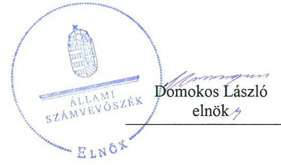
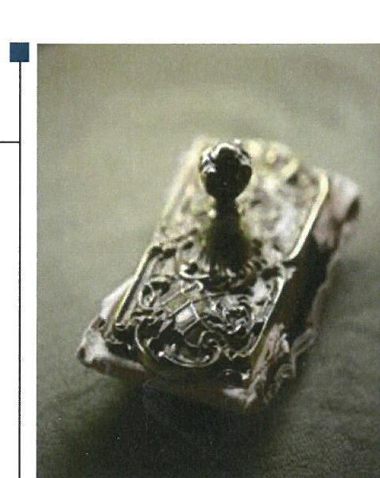
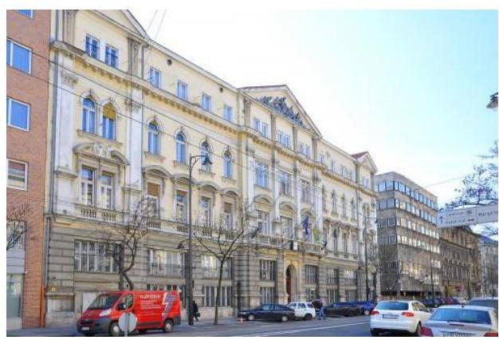
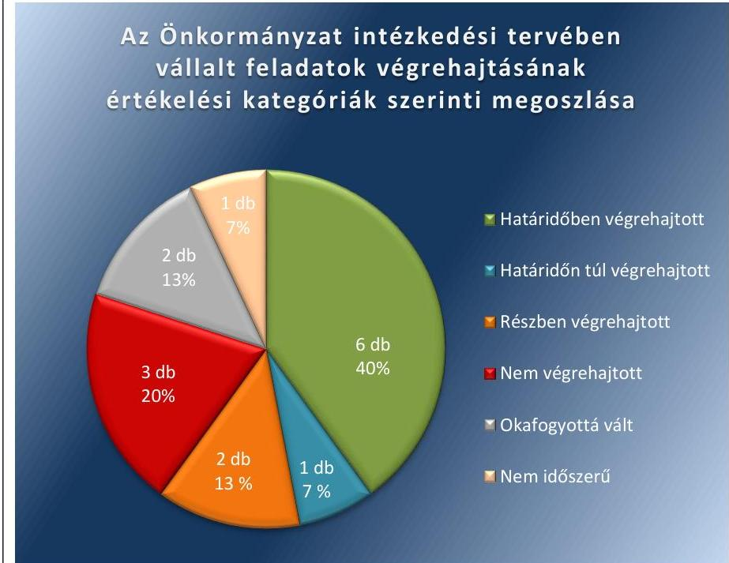
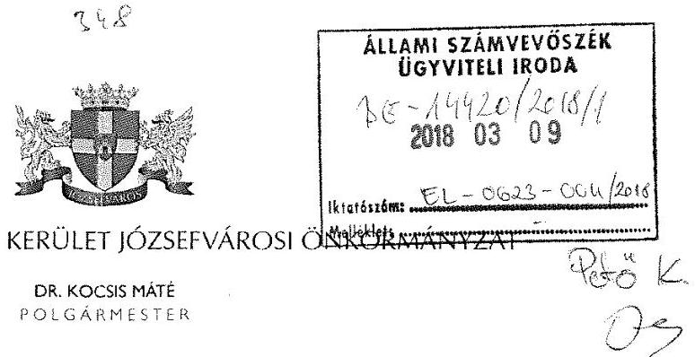
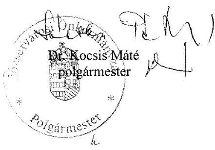
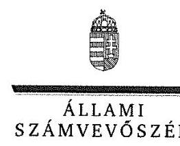
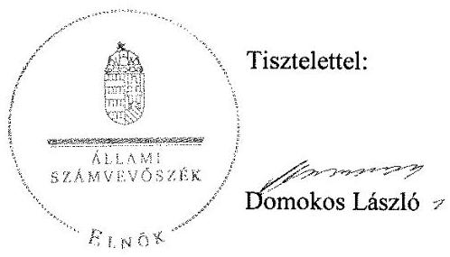

# Jelentés 

## Utóellenőrzések

Az önkormányzatok vagyongazdálkodása szabályszerűségének utóellenőrzése Budapest Főváros VIII. Kerület Józsefvárosi Önkormányzat
2018.

---

# Jelentés 

## Utóellenőrzések

Az önkormányzatok vagyongazdálkodása szabályszerűségének utóellenőrzése Budapest Főváros VIII. Kerület Józsefvárosi Önkormányzat
2018. 04. hó 17. nap

---

# AZ ELLENŐRZÉST FELÜGYELTE: 

PETŐ KRISZTINA felügyeleti vezető

## AZ ELLENŐRZÉST VEZETTE ÉS A VÉGREHAJTÁSÁÉRT FELELŐS:

ÁRPÁSI TIBOR ellenőrzésvezető

## A PROGRAM ÖSSZEÁLLÍTÁSÁÉRT FELELŐS:

JANIK JÓZSEF LÁSZLÓ osztályvezető

## A TÉMÁHOZ KAPCSOLÓDÓ KORÁBBI SZÁMVEVŐSZÉKI JELENTÉS:

- címe: Jelentés az önkormányzatok vagyongazdálkodása szabályszerűségének ellenőrzéséről - Budapest Főváros VIII. kerület Józsefváros
- sorszáma: 15011

IKTATÓSZÁM: V-1303-036/2016.
TÉMASZÁM: 2096
ELLENŐRZÉS-AZONOSÍTÓ SZÁM: V075562

---

# TARTALOMJEGYZÉK 

■ ÖSSZEGZÉS ..... 5
■ AZ ELLENŐRZÉS CÉLJA ..... 6
■ AZ ELLENŐRZÉS TERÜLETE ..... 7
■ AZ ELLENŐRZÉS HÁTTERE, INDOKOLTSÁGA ..... 8
■ A JELENTÉS LÉNYEGES KÉRDÉSKÖRE ..... 9
■ ELLENŐRZÉS HATÓKÖRE ÉS MÓDSZEREI ..... 10
■ MEGÁLLAPÍTÁSOK ..... 12
■ MELLÉKLETEK ..... 15
I. sz. melléklet: Az ÁSZ 15011 számú jelentéséhez kapcsolódó intézkedési terv végrehajtásának értékelése ..... 15
■ FÜGGELÉK: ÉSZREVÉTELEK ..... 19
■ RÖVIDÍTÉSEK JEGYZÉKE ..... 25

---

.

---

# ÖSSZEGZÉS 

Az Állami Számvevőszék utóellenőrzése megállapította, hogy a Budapest Főváros VIII. kerület Józsefvárosi Önkormányzat intézkedési tervében vállalt feladatai jelentős részét végrehajtotta, ezzel támogatva az elszámoltatható és átlátható vagyongazdálkodást.

## Az ellenőrzés társadalmi indokoltsága

Az Állami Számvevőszék stratégiájában célul tűzte ki a számvevőszéki munka hasznosulásának javítását. Ezzel összhangban ellenőrzi, hogy az ellenőrzött szervezetek megvalósították-e a korábbi ellenőrzései által feltárt hibák, hiányosságok és szabálytalanságok megszüntetése céljából elkészített intézkedési terveikben foglaltakat. A rendszeres utóellenőrzések hozzájárulnak a szükséges intézkedések tényleges végrehajtásához, ezáltal a közpénzügyek rendezettségének javulásához.

## Főbb megállapítások, következtetések

A Budapest Főváros VIII. kerület Józsefvárosi Önkormányzat az intézkedési tervben meghatározott 15 feladatból hatot határidőben, egyet határidőn túl, kettőt részben hajtott végre, míg három feladat végrehajtása elmaradt. Két feladat okafogyottá vált, egy végrehajtása pedig nem volt időszerű.

Határidőben intézkedtek a takarítógépek átruházásával, térítésmentes átadásával kapcsolatos munkajogi felelősség kivizsgálásával kapcsolatban, módosították a vagyongazdálkodási rendeletet, az eszközök és források értékelési szabályzatát. A vagyonkimutatás a vagyongazdálkodási rendeletben előírt tagolásban készítették el. 2014. október 1-jén aktiválta a Józsefvárosi Parkolás-üzemeltetési Szolgálat a 2013. évben elvégzett és befejezett felújításokat, az Önkormányzat szabályszerűen számolta el a hitelezési veszteségeket. A vállalt határidőn túl fejeződött be az ingatlanok leltározása.

2014-2015. években nem, azonban 2016. évben már biztosította az Önkormányzat az ingatlanvagyon-kataszter és a földhivatali nyilvántartások közötti egyezőséget. A beruházási és felújítási kiadások bekerülési értékének meghatározása szabályszerű volt, azonban a számviteli elszámolás dokumentálása nem felelt meg a jogszabályi előírásoknak.

Nem módosították, nem egészítették ki a vagyonkezelési szerződéseket, nem volt szabályszerű a behajthatatlan követelések törlésének dokumentálása.

Okafogyottá vált a Józsefvárosi Parkolás-üzemeltetési Szolgálat 2015. március 31-ével történő jogutód nélküli megszüntetése miatt a beruházások, felújítások aktiválására vonatkozó, illetve a Képviselő-testület döntése miatt az ingatlanok piaci értéken való értékelésére vonatkozó feladat.

---

# AZ ELLENŐRZÉS CÉLJA 

Az ellenőrzés célja annak értékelése volt, hogy a számvevőszéki jelentésben ${ }^{1}$ foglalt javaslatot megalapozó megállapításokkal összhangban készített intézkedési tervben meghatározott feladatokat az önkormányzat végrehajtotta-e.

---

# AZ ELLENŐRZÉS TERÜLETE

## Budapest Főváros VIII. kerület Józsefvárosi Önkormányzat

Budapest Főváros VIII. kerület Józsefváros állandó lakosainak száma a KSH által közzétett népességi adatok² szerint 2017. január 1-jén 76 152 fő volt.

A polgármester³ a 2009. november 22-i időközi önkormányzati választás óta tölti be hivatalát, a jegyző⁴ 2012. március óta látja el feladatait.

Budapest Főváros VIII. kerület Józsefvárosi Önkormányzat a 2016. évi költségvetési beszámolója szerint 18 842,8 millió Ft költségvetési bevételt ért el, valamint 17 150,4 millió Ft költségvetési kiadást teljesített. 2016. december 31-én a könyvviteli mérleg szerinti követelések állományának értéke 3632,9 millió Ft, a kötelezettségek állományának értéke 1088,8 millió Ft, mérlegfőösszege 103 827,7 millió Ft volt.

Az ÁSZ⁵ 2014. évben ellenőrizte az Önkormányzat⁶ vagyongazdálkodásának szabályszerűségét a 2009. január 1. és 2013. december 31. közötti időszakra vonatkozóan. Az erről készített 15011 számú jelentését az ÁSZ 2015. március 11-én hozta nyilvánosságra. Az ÁSZ megállapította, hogy az Önkormányzat a vagyongazdálkodási tevékenység kereteit a teljes vagyoni körre kiterjedően szabályozta, a vagyongazdálkodási tevékenység szabályszerűsége mégsem volt teljes körűen biztosított. Az Önkormányzat a számvevőszéki jelentésben feltárt szabálytalanságok, működésbeli hiányosságok kiküszöbölése érdekében intézkedési tervet készített.

Az utóellenőrzés – a 2015. március 11. és 2017. október 12. között végrehajtott feladatokra tekintettel – a számvevőszéki jelentésben megfogalmazott javaslatot megalapozó megállapításokra készített intézkedési tervben foglalt feladatok megvalósításának ellenőrzésére, illetve értékelésére irányult.

---

# AZ ELLENŐRZÉS HÁTTERE, INDOKOLTSÁGA 

Az ÁSZ tv. ${ }^{7}$ 33. § (1) bekezdése értelmében a számvevőszéki jelentések javaslatot megalapozó megállapításaihoz kapcsolódóan az ellenőrzött szervezet vezetője intézkedési tervet köteles összeállítani, és az ÁSZ részére megküldeni. Az intézkedési tervben foglaltak megvalósítását - az ÁSZ tv. 33. § (7) bekezdésében foglaltak alapján - az ÁSZ utóellenőrzés keretében ellenőrizheti. Az intézkedések megvalósulásának értékelése során az ÁSZ figyelembe veszi az ellenőrzött szervezetek működési feltételeiben, valamint a jogszabályi előírásokban bekövetkezett változásokat.

Az intézkedési tervekben foglalt feladatok hiányos, illetve késedelmes végrehajtása, valamint megvalósításának elmaradása azt mutatja, hogy az ellenőrzések során feltárt hibák, hiányosságok és szabálytalanságok megszüntetése nem kapott kellő hangsúlyt. Ez a szabályszerű működés és a felelős vezetői magatartás vonatkozásában kockázatot hordoz. E kockázatok feltárásával az ÁSZ utóellenőrzési rendszere fokozza a fegyelmet, és igazolja, hogy a közpénzzel való szabályos gazdálkodás felelőssége elől nem lehet kitérni.

## AZ UTÓELLENŐRZÉS NÉGY SZINTEN HASZNOSULHAT:

- A társadalom szintjén az utóellenőrzés jelzi, hogy a számvevőszéki ellenőrzés megállapításainak van következménye: a hiányosságok megszüntetésére az ellenőrzött szervezet által meghatározott intézkedések végrehajtását is számon kéri az ÁSZ.
- Az ellenőrzött terület szintjén az utóellenőrzés tájékoztatást nyújt a terület döntéshozóinak a hiányosságok kiküszöbölésének jó gyakorlatairól, ezzel lehetőséget biztosítva arra, hogy az ÁSZ ellenőrzési megállapításai, javaslatai a terület nem ellenőrzött szervezeteinek a működése során is hasznosuljanak.
- Az ellenőrzött szervezet szintjén az utóellenőrzés feltárja, hogy a szervezet az intézkedések végrehajtásával hasznosította-e a korábbi ellenőrzési jelentésben a hiányosságok megszüntetése, illetve a kockázatok kezelése érdekében megfogalmazott javaslatokat.
- Az ÁSZ szintjén az utóellenőrzés visszacsatolást ad az ellenőrzési jelentések hasznosulásáról, az intézkedések elmaradása vagy részleges megvalósulása a további ellenőrzésekhez kockázati jelzésként szolgál.

---

# A JELENTÉS LÉNYEGES KÉRDÉSKÖRE 

Az Önkormányzat az intézkedési tervben foglaltakat az előírt határidőben végrehajtotta-e?

---

# ELLENŐRZÉS HATÓKÖRE ÉS MÓDSZEREI 

## Az ellenőrzés típusa

Megfelelőségi ellenőrzés.

## Az ellenőrzött időszak

Az utóellenőrzés alapját képező számvevőszéki jelentés közzétételének napjától (2015. március 11.) az ellenőrzésről szóló kiértesítő levél keltének napjáig (2017. október 12.) tartó időszak.

## Az ellenőrzés tárgya

A számvevőszéki jelentésben foglalt javaslatot megalapozó megállapításokkal összhangban - az Önkormányzat által - készített intézkedési tervben foglaltak végrehajtásának ellenőrzése.

Az ellenőrzés kiterjedt minden olyan körülményre és adatra, amely az ÁSZ jogszabályban meghatározott feladatainak teljesítéséhez, valamint a program végrehajtása folyamán felmerült újabb összefüggések feltárásához szükséges volt.

## Az ellenőrzött szervezet

Budapest Főváros VIII. kerület Józsefvárosi Önkormányzat

## Az ellenőrzés jogalapja

Az ÁSZ tv. 33. § (7) bekezdése alapján az intézkedési tervben foglaltak megvalósítását az Állami Számvevőszék utóellenőrzés keretében ellenőrizheti.

## Az ellenőrzés módszerei

Az ÁSZ az utóellenőrzést a nemzetközi standardokat irányadónak tekintve az ellenőrzési program ellenőrzési kérdései alapján, az ellenőrzött időszakban hatályos jogszabályok, az ellenőrzés szakmai szabályok és módszertanok figyelembevételével, önálló ellenőrzés keretében végezte.

Az ÁSZ az ellenőrzés ideje alatt az Önkormányzattal történő kapcsolattartást az ÁSZ SZMSZ ${ }^{\circledR}$-ének vonatkozó előírásai alapján biztosította.

---

Az utóellenőrzés megállapításait elsősorban az ÁSZ rendelkezésére álló, valamint az ellenőrzött szervezetektől elektronikusan bekért dokumentumok alapozták meg.

Az ellenőrzési bizonyítékként felhasználható adatforrások közé tartoztak egyrészt az ellenőrzés szakmai programjában felsorolt adatforrások, másrészt minden - az ellenőrzés folyamán feltárt, az ellenőrzés szempontjából információt tartalmazó - dokumentum.

Az intézkedési tervekben előírt feladatokat, azok végrehajthatósága, illetve végrehajtása szempontjából az alábbiak szerint értékelte az ÁSZ:
$\longrightarrow$ „határidőben végrehajtott" a feladat, ha a teljesítés dokumentáltan, az intézkedési tervben előírt határidőben és tartalommal megtörtént;
$\longrightarrow$ „határidőn túl végrehajtott" a feladat, ha annak teljesítése az intézkedési tervben meghatározott módon, de az előírt határidőn túl történt meg;
$\longrightarrow$ „részben végrehajtott" a feladat, ha végrehajtása teljes körűen az intézkedési tervben előírt módon nem történt meg;
$\longrightarrow$ „nem végrehajtott" a feladat, ha a végrehajtás nem történt meg, vagy amennyiben a teljesítést nem dokumentálták;
$\longrightarrow$ „okafogyottá vált" a feladat, ha végrehajtására - meghatározott esemény bekövetkezése, továbbá külső körülmény, a működést érintő feltétel változása miatt - már nincs szükség, illetve lehetőség, és egyértelműen megállapítható, hogy az intézkedést szükségessé tevő körülmény a jövőben nem fordulhat elő;
$\longrightarrow$ „nem időszerű" az a feladat, amelynek ellenőrzési időszakon belüli végrehajtására azért nem került (kerülhetett) sor, mert az intézkedés alapjául szolgáló esemény nem következett be, de annak jövőbeni előfordulása lehetséges, a végrehajtása nem volt esedékes, vagy a végrehajtás határideje még nem járt le.
Az ellenőrzés lefolytatásához az ellenőrzött szervezet a tanúsítványok elektronikus kitöltésével, valamint az ÁSZ által kért dokumentumok elektronikus megküldésével szolgáltatott adatokat, amelyek valódiságát és teljes körűségét az ellenőrzött szervezet vezetője által tett teljességi és hitelességi nyilatkozat igazolta. Az így rendelkezésre bocsátott adatok, információk kontrollja az ellenőrzés keretében történt.

---

# MEGÁLLAPÍTÁSOK 

## Az Önkormányzat az intézkedési tervben foglaltakat az előírt határidőben végrehajtotta-e?

Összegző megállapítás

Az Önkormányzat az intézkedési tervében meghatározott tizenöt feladatból hatot határidőben, egyet határidőn túl, kettőt részben hajtott végre, míg három feladat végrehajtása elmaradt. Két feladat okafogyottá vált, egy végrehajtása pedig nem volt időszerű. Az intézkedési tervben rögzített feladatok végrehajtásáról vezették a jogszabályban előírt nyilvántartást.

Az ÁSZ részére megküldött intézkedési tervben a hiányosságok, feltárt szabálytalanságok megszüntetésére tizenöt feladatot határozott meg közösen a polgármester és a jegyző.

Az intézkedési tervben meghatározott feladatokat, határidőket, a felelősöket és a feladatok végrehajtásának értékelését az I. számú melléklet mutatja be.

A jegyző az ÁSZ javaslatai alapján készített intézkedési terv végrehajtásáról vezette a Bkr. ${ }^{9}$ előírásainak megfelelő nyilvántartást.

Az intézkedési tervben vállalt feladatok végrehajtásának értékelési kategóriák szerinti megoszlását az 1. ábra szemlélteti.

1. ábra

Forrás: ÁSZ

---

# HATÁRIDŐBEN VÉGREHAJTOTT feladatok: 

1. (1.) A polgármester megindította a takarítógépek átruházásával, térítésmentes átadásával kapcsolatos munkajogi felelősség kivizsgálására irányuló eljárást, amelynek eredményeként intézkedés megtételére munkajogi elévülés miatt nem került sor.
2. (2.) Az Önkormányzat kiegészítette és a polgármester előterjesztése alapján a Képviselő-testület ${ }^{10}$ elfogadta a vagyongazdálkodási rendelet ${ }^{11}$-tervezet módosítását a vagyonkezelői jog ellenértékének és a vagyonkezelés ellenőrzésének részletes szabályaival, és meghatározta azon vagyonelemeket, amelyekre vagyonkezelői jog létesíthető.
3. (3.) Az Önkormányzat eszközök és források értékelési szabályzata ${ }^{12}$ tartalmazta a vagyonkezelésbe adott eszközök vagyonértékelése során alkalmazandó értékelési eljárási elveket, módszereket, dokumentálásának szabályait és felelőseit.
4. (5.) Az Önkormányzat vagyonkimutatása a vagyongazdálkodási rendeletben előírt tagolásban készült el és azt a Képviselő-testület részére bemutatták.
5. (8.a.) A Józsefvárosi Parkolás-üzemeltetési Szolgálatnál a 2013. évben elvégzett és befejezett felújítások aktiválása 2014. október 1-jén megtörtént.
6. (11.b.) Az Önkormányzat az elengedett követeléseket a jogszabályi előírásoknak megfelelően hitelezési veszteségként számolta el.

## HATÁRIDŐN TÚL VÉGREHAJTOTT feladat:

7. (10.a.) Az ingatlanok leltározása a jogszabályi
 előírásoknak, belső szabályzatban foglaltaknak megfelelően történt, de határidőn túl fejeződött be.

## RÉSZBEN VÉGREHAJTOTT feladatok:

8. (6.) Az Önkormányzat a 2016. év vonatkozásában határidőben, a 2014. és 2015. évek tekintetében határidőn túl biztosította az ingatlanvagyon-kataszter és a számviteli nyilvántartások bruttó értékadatainak egyezőségét. Az ingatlanvagyon-kataszter és a földhivatali nyilvántartás adatainak a 147/1992. (XI. 6.) Korm. rendelet ${ }^{13} 1 . \S$ (2) bekezdésében előírt egyezősége 2014. és 2015. évek tekintetében nem, 2016. vonatkozásában már biztosított volt.
9. (7.) Az Önkormányzat a bekerülési érték meghatározásakor betartotta a Számv. tv. ${ }^{14}$ és a számviteli politika ${ }^{15}$ előírásait, a beruházási és felújítási kiadások számviteli elszámolásakor azonban nem érvényesültek a Számv. tv. 165. § (3) és 166. § (3) bekezdéseiben, valamint a számviteli politika 9.1. pontjában meghatározott előírások.

## NEM VÉGREHAJTOTT feladatok:

10. (4.) Az Önkormányzat nem módosította, nem egészítette ki a vagyonkezelési szerződéseket annak érdekében, hogy azok az

---

Áhsz ${ }^{16}$ 21. § (2) bekezdésében előírtaknak megfelelően tartalmazzák a vagyonkezelők adatszolgáltatásának módját és formáját az Önkormányzat felé a vagyonban bekövetkezett változásokról.
11. (10.b.) Az Önkormányzat az Áhsz. 22. § (2) bekezdés a) pontjában foglaltak ellenére nem egészítette ki a vagyonkezelési szerződéseit a vagyonkezelő szervek által kezelt vagyon leltárának évenkénti megküldési kötelezettségével.
12. (11.a.) Az Önkormányzat az Áhsz. 1. § (1) bekezdés 1. pontjának és a Számv. tv. 3. § (4) bekezdés 10. pontjának előírásai ellenére nem gondoskodott a behajthatatlan követelések törlésének dokumentumokkal történő alátámasztásáról.

# OKAFOGYOTTÁ VÁLT feladatok: 

13. (8.b.) A Józsefvárosi Parkolás-üzemeltetési Szolgálatot a Képviselőtestület 2015. március 31-vel jogutód nélkül megszüntette. Ezt követően a beruházások, felújítások aktiválására vonatkozó feladat már nem fordulhat elő.
14. (9.) Az Önkormányzat az üzleti vagyon év végi értékelése során 2014. évtől nem él a forgalomképes ingatlanainak esetében a piaci értékelés lehetőségével.

## NEM IDŐSZERŰ feladat:

15. (10.c.) Beruházás selejtezésére nem került sor, a feladat végrehajtása nem vált esedékessé.

---

# MELLÉKLETEK

- I. SZ. MELLÉKLET: AZ ÁSZ 15011 SZÁMÚ JELENTÉSÉHEZ KAPCSOLÓDÓ INTÉZKEDÉSI TERV VÉGREHAJTÁSÁNAK ÉRTÉKELÉSE

|  Az intézkedési terv alapján elvégzendő feladat | Az intézkedési tervben meghatározott határidő | Az intézkedési tervben megjelölt felelős | A feladat végrehajtása  |
| --- | --- | --- | --- |
|  **Határidőben végrehajtott feladatok** |  |  |   |
|  1. "1. Elrendelem, mint Polgármester a számvevőszéki jelentés megállapítása alapján a 23,1 millió forint bruttó értékű "0"-ra leírt – Közbiztonsági és Köztisztasági Nkft. használatában levő – takarítógépek átruházásával, térítésmentes átadásával kapcsolatos munkajogi felelősség kivizsgálására irányuló eljárás megindítását és annak eredménye ismeretében a szükséges intézkedések megtételét." | 2015. április 30. | polgármester | A takarítógépek átruházásával, térítésmentes átadásával kapcsolatos munkajogi felelősség kivizsgálására irányuló eljárás 2015. március 23-án megindult. Az eljárás eredménye ismeretében intézkedés megtételére munkajogi elévülés miatt nem került sor.  |
|  2. "2. Elrendelem, mint Jegyző a Budapest Józsefvárosi Önkormányzat vagyonáról és vagyon feletti tulajdonosi jogok gyakorlásáról szóló 66/2012. (XII.13.) önkormányzati rendelet kiegészítésének előkészítését oly módon, hogy a rendelet tartalmazza a vagyonkezelői jog ellenértékének és a vagyonkezelés ellenőrzésének részletes szabályait, valamint azon vagyonelemeket, amelyekre vagyonkezelői jog létesíthető, és kezdeményezem a polgármesternél a rendelet-tervezet Képviselő-testület elé terjesztését." | 2014. december 12. | jegyző, Gazdálkodási Ügyosztály vezetője | A jegyző előkészítette a vagyongazdálkodási rendelet kiegészítését. A polgármester előterjesztése alapján a Képviselő-testület a 44/2014. (XII. 12.) számú rendeletével módosította az Önkormányzat vagyonáról és a vagyon feletti tulajdonosi jogok gyakorlásáról szóló 66/2012. (XII. 13.) önkormányzati rendeletet, amelyben a Mótv.17 109. § (4) bekezdése szerint meghatározta a vagyonkezelői jog ellenértékének és a vagyonkezelés ellenőrzésének részletes szabályait, valamint a Mótv. 143. § (4) bekezdés i) pontjának megfelelően meghatározta azon vagyonelemeket, amelyekre vagyonkezelői jog létesíthető.  |
|  3. "3. Elrendelem, mint Jegyző, hogy az Önkormányzat értékelési szabályzata a jogszabályi előírásoknak megfelelően tartalmazza a vagyonkezelésbe adott eszközök vagyonértékelése során alkalmazandó értékelési eljárási elveket, módszereket, dokumentálásának szabályait és felelőseit." | 2014. december 19. | Pénzügyi Ügyosztály vezetője | A polgármester és a jegyző által 2014. december 19-én együttesen jóváhagyott Eszközök és források értékelési szabályzata az Áhsz. előírásai szerint tartalmazta a vagyonkezelésbe adott eszközök vagyonértékelése során alkalmazandó értékelési eljárási elveket, módszereket, dokumentálásának szabályait és felelőseit.  |
|  4. "5. Elrendelem, mint Jegyző, hogy az Önkormányzat vagyonkimutatása a Budapest Józsefvárosi Önkormányzat vagyonáról és vagyon feletti tulajdonosi jogok gyakorlásáról" | minden évben a zárszámadási rendelet tervezet Képviselő- | Pénzügyi Ügyosztály vezetője | A Pénzügyi Ügyosztály vezetője gondoskodott az Önkormányzat vagyonkimutatásának a vagyongazdálkodási rendelet 1. számú mellékletében előírt tagolásban, a tényeknek megfelelő adatokat tartalmazó elkészítéséről és a Képviselő-testület részére történő be-  |

---

|  Az intézkedési terv alapján elvégzendő feladat | Az intézkedési tervben meghatározott határidő | Az intézkedési tervben megjelölt felelős | A feladat végrehajtása  |
| --- | --- | --- | --- |
|  szóló 66/2012. (XII.13.) önkormányzati rendelet 1. mellékletében előírt tagolásban, a tényeknek megfelelő adatokat tartalmazva kerüljön elkészítésre és bemutatásra a Képviselő-testület részére." | testület elé terjesztésének időpontja, első alkalom 2015. év |  | mutatásáról. A 2014. évi vagyonkimutatást a 21/2015. (V. 15.), a 2015. évi vagyonkimutatást a 14/2016. (V. 09.), a 2016. évi vagyonkimutatást a 17/2017. (V. 11.) számú zárszámadási rendeletek 3. és 3/a számú mellékletei tartalmazták.  |
|  5. „8.a. Elrendelem, mint Jegyző, a Józsefvárosi Parkolásüzemeletési Szolgálatnál (volt Józsefvárosi Közterület felügyeletnél) a 2013. évben elvégzett és befejezett felújítások 42,8 millió Ft értékben történő aktiválását." | 2014. október 1. | jegyző | A Józsefvárosi Parkolás-üzemeltetési Szolgálatnál a 2013. évben elvégzett és befejezett felújítások aktiválása 2014. október 1-jén megtörtént.  |
|  6. „11.b. Elrendelem, mint Jegyző, hogy az elengedett követelések a jogszabályi előírásoknak megfelelően hitelezési veszteségként kerüljenek elszámolásra." | 2015. február 25., majd folyamatosan | Pénzügyi Ügyosztály vezetője | Az Önkormányzat az elengedett követeléseket a Számv. tv.-ben előírtaknak megfelelően az egyéb ráfordítások között, hitelezési veszteségként számolta el.  |
|  Határidőn túl végrehajtott feladat |  |  |   |
|  7. „10.a. Elrendelem, mint Jegyző hogy az ingatlanok leltározása mennyiségi felvétellel a jogszabályokban, a vagyongazdálkodási rendeletben és a leltározási szabályzatban előírtaknak megfelelő gyakorisággal történjen meg." | első alkalommal 2017. február 15. | Pénzügyi Ügyosztály vezetője és a Gazdálkodási Ügyosztály vezetője | Az Önkormányzat a 2016. évre vonatkozó Leltárzáró jegyzőkönyve szerint a leltár befejezésére határidőn túl, 2017. április 26-án került sor. Az ingatlanok leltározását mennyiségi felvétellel-hajtották végre, a Leltárzáró jegyzőkönyv tartalmazta a tényleges eltérési összesítőt.  |
|  Részben végrehajtott feladatok |  |  |   |
|  8. „6.. Elrendelem, mint Jegyző
a. a vagyonkezelésbe adott eszközök esetében a 2013. évi számviteli nyilvántartás és az ingatlanvagyon-kataszter bruttó érték adata között mutatkozó 50 ezer Ft összegű eltérés rendezését, egyezőség biztosítása érdekében.
b. az ingatlanvagyon-kataszternek a számviteli nyilvántartások bruttó értékadataival, továbbá az ingatlan-vagyonkataszter és a földhivatali nyilvántartás adataival való egyezőségének biztosítását a vonatkozó kormányrendeletben foglaltaknak megfelelően." | 2014. évi ingatlanvagyon adatai vonatkozásában 2015. március 20., a következő években február 28. | Gazdálkodási Ügyosztály vezetője és a Pénzügyi Ügyosztály vezetője | - Határidőben végrehajtott feladatrész:
A 2016. évi ingatlanvagyon vonatkozásában az ingatlan-vagyonkataszter és a földhivatali nyilvántartás adatainak egyezősége, valamint az ingatlanvagyon-kataszter és a számviteli nyilvántartások bruttó értékadatai között - a 2017. február 28-án készült egyeztetés szerint - az egyezőség biztosított volt.
- Határidőn túl végrehajtott feladatrész:
A 2014. és 2015. évi ingatlanvagyon vonatkozásában az ingatlanvagyon-kataszter és a számviteli nyilvántartások bruttó értékadatai között egyezőség kimutatására határidőn túl, 2015. március 25-én, illetve 2016. április 20-án került sor.
- Nem végrehajtott feladatrész:
Az ingatlan-vagyonkataszter és a földhivatali nyilvántartás adatainak a 147/1992. (XI. 6.) Korm. rendelet 1. § (2) bekezdésében előírt egyezősége nem volt biztosított a 2014. és 2015. évi ingatlanvagyon tekintetében.  |

---

|   | Az intézkedési
tervben meghi
tározott határ
idő | Az intézkedési
tervben meghi
tározott határ
idő | Az intézkedési
tervben
megjelölt fe
lelős | A feladat végrehajtása  |
| --- | --- | --- | --- | --- |
|  9. | "7. Elrendelem, mint Jegyző a jogszabályokban és a számviteli politikában meghatározott előírások betartását a beruházási és felújítási kiadások számviteli elszámolásakor, illetve a bekerülési érték meghatározásakor." | 2015. február 25.,
ezt követően folya
matosan | Pénzügyi Ügy
osztály vezetője | • Határidőben végrehajtott feladatrész:
A bekerülési érték meghatározásakor betartották a Számv. tv. 47-48. §-aiban és a számviteli politika 4.5.1.2. és 5.1. pontjaiban meghatározott előírásokat.
• Nem végrehajtott feladatrész:
A beruházások és felújítások kiadásainak számviteli elszámolásakor a
Számv. tv. 165. § (3) és 166. § (3) bekezdéseiben és a számviteli politika 9.1. pontjában
foglalt előírások nem érvényesültek, mivel a használatba vételre vonatkozó bizonylatot
a gazdasági esemény bekövetkezésének tárgynegyedévet követő hó végéig nem minden
esetben állították ki.  |
|   |  |  | Nem végrehajtott feladatok |   |
|  10. | "4. Elrendelem, mint Jegyző
a. a vagyonkezelési szerződések módosítását, kiegészítését
annak érdekében, hogy azok a vonatkozó törvényeknek
megfelelően tartalmazzák a vagyonkezelő adatszolgáltatás
ának módját és formáját az önkormányzat felé a vagyon
ban bekövetkezett változásokról.
b. Az adatszolgáltatások alapján a Polgármesteri Hivatal
biztosítsa az esetleges vagyonváltozások átvezetését a
számviteli nyilvántartásokban." | Az a) pont vonatko
zásában 2015. má
jus 31., a b) pont vo
natkozásában 2015.
június 30. | Az a) pont ese
tében Gazdálko
dási Ügyosztály
vezetője, a b)
pont esetében a
Pénzügyi Ügy
osztály vezetője | Az Önkormányzat nem módosította, nem egészítette ki a vagyonkezelési szerződéseket
annak érdekében, hogy azok az Áhsz 21. § (2) bekezdésében előírtaknak megfelelően
tartalmazzák a vagyonkezelők adatszolgáltatásának módját és formáját az Önkormány
zat felé a vagyonban bekövetkezett változásokról. Az elmaradt adatszolgáltatás miatt a
Polgármesteri Hivatal nem vezette át az Áhsz 14. számú melléklet IX. pont 2. pontjába
előírt kötelezettség ellenére az esetleges vagyonváltozást.  |
|  11. | "10.b. Elrendelem, mint Jegyző a vagyonkezelési szerződés
kiegészítését a vagyonkezelő szervek azon kötelezettség
vel, hogy a vagyonkezelésbe adott eszközökről elkészített, a
hitelesített leltárt a tulajdonos részére küldjék meg az Ön
kormányzat könyvviteli mérlegének alátámasztásához." | első alkalommal
2015. május 31., azt
követően minden év
február 15. | Pénzügyi Ügy
osztály vezetője
és a Gazdálko
dási Ügyosztály
vezetője | Az Önkormányzat az Áhsz. 22. § (2) bekezdés a) pontjában foglaltak ellenére a vagyon
kezelési szerződéseket a vagyonkezelő szervezetre vonatkozó – a vagyonkezelésbe adott
eszközökről elkészített, hitelesített leltár Önkormányzat részére történő megküldését
tartalmazó – kötelezettséggel nem egészítette ki.  |
|  12. | "11.a. Elrendelem, mint Jegyző, hogy a behajthatatlan kö
vetelések csak a jogszabályi feltételek fennállása és azok
nak dokumentumokkal történő alátámasztása esetén ke
rüljön törlésre."

 | 2015. február 25.,
majd folyamatosan | Pénzügyi Ügy
osztály vezetője | Az Önkormányzat az Áhsz. 1. § (1) bekezdés 1. pontjának és a Számv. tv. 3. § (4) bekezdés
10. pontjának előírásai ellenére nem gondoskodott a behajthatatlan követelések törlésének dokumentumokkal történő alátámasztásáról. |
|   |  |  | Okafogyottá vált feladatok |   |
|  13. | "8.b. Elrendelem, mint Jegyző, beruházások, felújítások aktiválása a műszaki átadást követően, a használatba vételt | a beruházás, felújítás műszaki átadását követően, a | Józsefvárosi Parkolás-üzemeltetési | A feladat végrehajtása a működést érintő feltétel változása miatt okafogyottá vált. A Józsefvárosi Parkolás-üzemeltetési Szolgálatot a Képviselő-testület 2015. március 31. napjával a 44/2015. (II. 19.) számú határozatával jogutód nélkül megszüntette, ezért a feladat végrehajtására nincs lehetőség, az intézkedést szükségessé tevő körülmény a jövőben nem fordulhat elő.  |

---

|  ㅇ | Az intézkedési terv alapján elvégzendő feladat | Az intézkedési tervben meghatározott határidő | Az intézkedési tervben megjelölt felelős | A feladat végrehajtása  |
| --- | --- | --- | --- | --- |
|   | megelőzően történjen meg a számviteli politikában meghatározott dokumentálási szabályok betartásával." | használatba vételt megelőzően | tési Szolgálat vezetője és gazdasági vezetője | jával a 44/2015. (II. 19.) számú határozatával jogutód nélkül megszüntette, ezért a feladat végrehajtására nincs lehetőség, az intézkedést szükségessé tevő körülmény a jövőben nem fordulhat elő.  |
|  14. | „9. Elrendelem, mint Jegyző, hogy a törvényi előírásoknak megfelelően az Önkormányzat forgalomképes épületeinek, építményeinek és földterületeinek az ingatlanszakértő által megállapított piaci értéke független könyvvizsgálóval kerüljön felülvizsgálatra." | 2014. december 4. | Pénzügyi Ügyosztály vezetője | A Képviselő-testület 241/2014. (XII. 4.) határozata szerint a számviteli politika úgy módosult, hogy az Önkormányzat 2014-től nem él a piaci értékelés lehetőségével. A feladat végrehajtása okafogyott, mivel az intézkedést szükségessé tevő körülmény a jövőben nem fordulhat elő.  |
|   |  |  | Nem időszerű feladat |   |
|  15. | „10.c. Elrendelem, mint Jegyző hogy a beruházások selejtezése a belső szabályzatokban foglaltaknak megfelelően történjen és az a jogszabályi előírások szerint terven felüli értékcsökkenésként kerüljön elszámolásra." | minden év február 15., ha szükséges | Pénzügyi Ügyosztály vezetője és a Gazdálkodási Ügyosztály vezetője | Beruházás selejtezésére nem került sor, a feladat végrehajtása nem vált időszerűvé.  |

Forrás: ÁSZ által készített táblázat

---

# FÜGGELÉK: ÉSZREVÉTELEK 

A jelentéstervezetet a Számvevőszék 15 napos észrevételezésre megküldte az ellenőrzött szervezet vezetőjének az ÁSZ tv. 29. § (1) bekezdése előírásának megfelelően.
Budapest Főváros VIII. Kerület Józsefvárosi Önkormányzat polgármestere a jelentéstervezet megállapításaira észrevételt tett.
A függelék tartalmazza az ellenőrzött észrevételét, illetve az el nem fogadott észrevétel elutasításának indoklását.

[^0]
[^0]:    * 29. § (1) Az Állami Számvevőszék az ellenőrzési megállapításait megküldi az ellenőrzött szervezet vezetőjének vagy az általa megbízott személynek, és annak, akinek személyes felelősségét állapította meg.
    (2) Az ellenőrzött szervezet vezetője és a felelősként megjelölt személy az ellenőrzés megállapításaira tizenöt napon belül írásban észrevételt tehet.
    (3) Az Állami Számvevőszék az észrevételre a beérkezésétől számított harminc napon belül írásban válaszol. A figyelembe nem vett észrevételeket köteles a jelentésben feltüntetni, és megindokolni, hogy azokat miért nem fogadta el.

---

Állami Számvevőszék
Domokos László elnök úr részére

Iktatószám: 03-28/2018.

# Budapest 

Tárgy: EL-0623-0002/2018. számú számvevőszéki jelentéstervezetre válasz

## Tisztelt Elnök Úr!

„Az önkormányzatok vagyongazdálkodása szabályszerűségének utóellenőrzése - Budapest Főváros VIII. kerület Józsefváros" címmel készített számvevőszéki jelentéstervezetet áttekintettük és a 12. számú megállapításban foglaltak kivételével azokat elfogadjuk, és az Önkormányzat a jövőben is törekszik az abban foglalt megállapítások maradéktalan megvalósítására.
A 12. számú megállapítással kapcsolatos észrevételeinket alábbiakban foglalom össze:
2016-ban összesen 137.749.175,- Ft (174 adós) behajthatatlan követelés került törlésre a nyilvántartásokból. Véleményünk szerint kizárólag az elévült követelések törlésének dokumentálása nem történt meg teljes körűen 1.942.070,- Ft összegben, mely 36 adóst jelent és az összes behajthatatlan követelés 1,4 %-a.
Ezen követelések tételesen ismételten megvizsgálásra kerültek, melynek során megállapítottuk, hogy 28 esetben az elévült követelések nem érik el a 40.000,- Ft-ot. A végrehajtási eljárás költségei nem voltak arányban a tartozás összegével, melyekre tekintettel nem került sor a végrehajtási eljárások megindítására. A további esetekben megállapítottuk, hogy 5 alkalommal, 976.244,- Ft összegben az adósoknak nem volt olyan ismert lakó- vagy tartózkodási helye, amelyeken elérhetőek lettek volna. Egy adós 422.917,- Ft összegű tartozásának behajtására indult végrehajtási eljárás 2008. június 27-én megszűnt, két adós tekintetében, 108.056,- Ft összegben nem került sor a végrehajtási eljárás lefolytatására.
A fenti körülményeket kérem, szíveskedjen mérlegelni, és a végleges jelentés elkészítésekor figyelembe venni, mellyel összefüggésben kérem a 12. számú megállapításra vonatkozó módosítási javaslatunkat elfogadni:

---

BUDAPEST FŐVÁROS VIII. KERÜLET JÓZSEFVÁROSI ÖNKORMÁNYZAT
DR. KOCSIS MÁTÉ
POLGÁRMESTER
„(11.a.) Az Önkormányzat az Áhsz. 1.§ (1) bekezdés 1. pontjának és a Számv. tv. 3.§ (4) bekezdés 10. pontjának előírásai ellenére nem teljes körűen gondoskodott a behajthatatlan követelések törlésének dokumentumokkal történő alátámasztásáról."
Ezúton megköszönöm az Állami Számvevőszék munkatársainak a vizsgálat során nyújtott segítő hozzáállását és szakmai iránymutatásait.

Budapest, 2018. március 09.
Tisztelettel:

---

ELNÖK

Ikt.szám: EL-0623-005/2018.

# Dr. Kocsis Máté Sándor úr 

polgármester
Budapest Főváros VIII. Kerület
Józsefvárosi Önkormányzat

## Budapest

## Tisztelt Polgármester Úr!

Az „Utóellenőrzések - Az önkormányzatok vagyongazdálkodása szabályszerűségének utóellenőrzése - Budapest Főváros VIII. Kerület Józsefvárosi Önkormányzat" címmel készített számvevőszéki jelentéstervezetre tett észrevételét megkaptam.
Az Állami Számvevőszék észrevételre vonatkozó álláspontjáról a felügyeleti vezető által készített részletes tájékoztatást csatoltan megküldöm.
Tájékoztatom Polgármester urat, hogy a számvevőszéki jelentésben - az Állami Számvevőszékről szóló 2011. évi LXVI. törvény 29. § (3) bekezdése alapján - a figyelembe nem vett észrevételeket szerepeltetjük az elutasítás indokának feltüntetésével.

Budapest, 2018. (c) hó (c) nap

Melléklet: Tájékoztatás az el nem fogadott észrevételről

---

# Tájékoztatás az el nem fogadott észrevételről 

„Utóellenőrzések - Az önkormányzatok vagyongazdálkodása szabályszerűségének utóellenőrzése - Budapest Főváros VIII. Kerület Józsefvárosi Önkormányzat" című jelentéstervezetre a 03-28/2018. számú levélben megküldött észrevételét áttekintettem. Az észrevétel kezeléséről az alábbi tájékoztatást adom.

## 1. A jelentéstervezet 14. oldal 12. pontjához füzött észrevétele kapcsán

Az észrevétel szerint 2016-ban összesen 137.749.175,- Ft (174 adós) behajthatatlan követelés került törlésre a nyilvántartásokból. Véleményük szerint kizárólag az elévült követelések törlésének dokumentálása nem történt meg teljes körűen 1.942.070,- Ft összegben, mely 36 adóst jelent és az összes behajthatatlan követelés 1,4 %-a. Észrevételükben kitérnek arra, hogy ezen követelések tételesen ismét megvizsgálásra kerültek, mely során megállapították, hogy 28 esetben a végrehajtási eljárás aránytalan költségei miatt, 8 esetben pedig egyéb ok miatt nem került sor a végrehajtási eljárások megindítására. Az észrevétel a megállapítást nem vitatja, csak annak módosítására tesz javaslatot.
Az intézkedési tervben vállalt feladat szerint a behajthatatlan követelések csak a jogszabályi feltételek fennállása és azoknak dokumentumokkal történő alátámasztása esetén kerülhetnek törlésre. Az Állami Számvevőszék (továbbiakban: ÁSZ) az adatszolgáltatás időszakában megküldött dokumentumok alapján végezte el az ellenőrzést. Az önkormányzati rendelet-tervezetek előterjesztéseinek 2. számú mellékletei tartalmazták a 2014. évben (100 tétel), illetve a 2015. évben (113 tétel), valamint a 2016. évben (174 tétel) elszámolt behajthatatlan követeléseket. Az Önkormányzat a 2017. február 25-ig végrehajtandó feladat elvégzésének alátámasztására csatolta a 2016. évben elszámolt behajthatatlan követelések (9 tétel) főkönyvi kartonját. Az Önkormányzat a 396 tételből csak 22 esetben csatolta a behajthatatlan követelések törlésének dokumentumait. Az előzőekben leírtak alapján az intézkedési terv 11.a) pontjában vállalt intézkedés végrehajtását bizonyítékok nem támasztják alá. Polgármester úr 2016. október 25-én kelt teljességi és hitelességi nyilatkozata alapján az ÁSZ rendelkezésére bocsátott dokumentumok, adatok megbízhatóak, és a bekért adatokra, dokumentumokra vonatkozóan teljes körű információt tartalmaznak. Továbbá Polgármester úr nyilatkozatában az átadott dokumentumok, adatok hitelességéért, valódiságáért, hiánytalanságáért és hatályosságáért teljes felelősséget vállalt.
A fentiekre tekintettel az észrevételt nem fogadjuk el, a jelentéstervezet módosítása nem indokolt.

Budapest, 2018. 95. hó 26. nap

Pető Krisztina felügyeleti vezető

---

.

---

# RÖVIDÍTÉSEK JEGYZÉKE 

${ }^{1}$ számvevőszéki jelentés
${ }^{2}$ KSH népességi adatok
${ }^{3}$ polgármester
${ }^{4}$ jegyző
${ }^{5}$ ÁSZ
${ }^{6}$ Önkormányzat
${ }^{7}$ ÁSZ tv.
${ }^{8}$ ÁSZ SZMSZ
${ }^{9}$ Bkr.
${ }^{10}$ Képviselő-testület
${ }^{11}$ vagyongazdálkodási rendelet
${ }^{12}$ eszközök és források értékelési szabályzata
${ }^{13}$ 147/1992. (XI. 6.) Korm. rendelet
${ }^{14}$ Számv. tv.
${ }^{15}$ számviteli politika
${ }^{16}$ Áhsz.
${ }^{17}$ Mötv.

Az ÁSZ 15011 számú jelentése - Jelentés az önkormányzatok vagyongazdálkodása szabályszerűségének ellenőrzéséről Budapest Főváros VIII. kerület Józsefvárosi Önkormányzat (elérhető a www.asz.hu honlapon)
Központi Statisztikai Hivatal, Magyarország Közigazgatási Helynévkönyve 2017. január 1-jei adatai
Budapest Főváros VIII. kerület Józsefvárosi Önkormányzat polgármestere
Budapest Főváros VIII. kerület Józsefvárosi Önkormányzat jegyzője
Állami Számvevőszék
Budapest Főváros VIII. kerület Józsefvárosi Önkormányzat
Az Állami Számvevőszékről szóló 2011. évi LXVI. törvény (hatályos: 2011. július 1-jétől)
Az Állami Számvevőszék elnökének 3/2016. (XII. 29.) ÁSZ utasítása az Állami Számvevőszék Szervezeti és Működési Szabályzatáról (hatályos: 2017. január 1-jétől)
a költségvetési szervek belső kontrollrendszeréről és belső ellenőrzéséről szóló 370/2011. (XII. 31.) Korm. rendelet (hatályos: 2012. január 1-jétől)

Budapest Főváros VIII. kerület Józsefvárosi Önkormányzat Képviselő-testülete
Budapest Főváros VIII. kerület Józsefvárosi Önkormányzat Képviselő-testületének 44/2014. (XII. 12.) önkormányzati rendeletével módosított a Budapest Józsefvárosi Önkormányzat vagyonáról és a vagyon feletti tulajdonosi jogok gyakorlásáról szóló 66/2012. (XII. 13.) önkormányzati rendelet (hatályos: 2013. január 1-jétől)
Budapest Főváros VIII. kerület Józsefvárosi Önkormányzat Eszközök és források értékelési szabályzata (hatályos: 2014. december 19-től)
147/1992. (XI. 6.) Korm. rendelet az önkormányzatok tulajdonában lévő ingatlanvagyon nyilvántartási és adatszolgáltatási rendjéről (hatályos: 1993. január 1-jétől)
2000. évi C. törvény a számvitelről (hatályos: 2001. január 1-jétől)

Budapest Főváros VIII. kerület Józsefvárosi Önkormányzat Számviteli politikája (hatályos: 2015. szeptember 24-től)
4/2013. (I. 11.) Korm. rendelet az államháztartás számviteléről (hatályos: 2014. január 1-jétől)
2011. évi CLXXXIX. törvény Magyarország helyi önkormányzatairól (hatályos: 2011. december 28-tól)

---

ÁLLAMI SZÁMVEVŐSZÉK
1052 Budapest, Apáczai Csere János utca 10.
Levélcím: 1364 Budapest 4. Pf. 54
Telefon: +36 14849100 Telefax: +36 14849200
www.asz.hu

