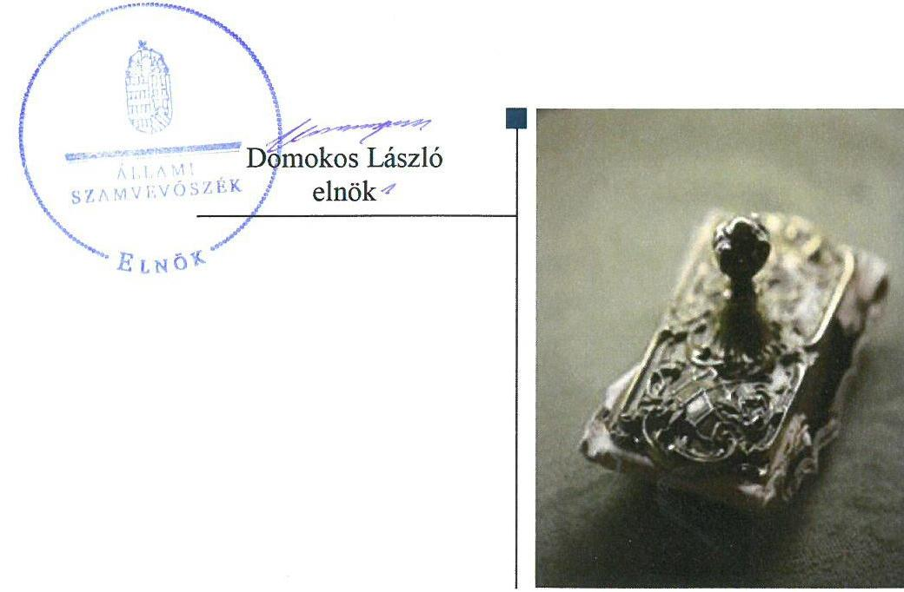
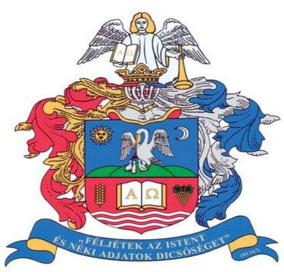

# Jelentés 

## Nem állami humánszolgáltatók ellenőrzése

A humánszolgáltatást nyújtó államháztartáson kívüli köznevelési és szociális intézmények, szolgáltatók fenntartói központi költségvetésből kapott támogatásai felhasználásának ellenőrzése - Tiszáninneni Református Egyházkerület 2018. 05. hó 03. nap

---

# AZ ELLENŐRZÉST FELÜGYELTE:

DR. NAGY IMRE felügyeleti vezető

## AZ ELLENŐRZÉST VEZETTE ÉS A VÉGREHAJTÁSÁÉRT FELELŐS:

MOLNÁR ZSUZSANNA ellenőrzésvezető

## A PROGRAM ÖSSZEÁLLÍTÁSÁÉRT FELELŐS:

TÓTPÁL SZABOLCS osztályvezető

IKTATÓSZÁM: EL-0115-235/2018.

TÉMASZÁM: 2448

ELLENŐRZÉS-AZONOSÍTÓ SZÁM: V079402.

Jelentéseink az Országgyűlés számítógépes hálózatán és az Interneten a www.asz.hu címen is olvashatóak.

---

# TARTALOMJEGYZÉK 

■ ÖSSZEGZÉS ..... 5
■ AZ ELLENŐRZÉS CÉLJA ..... 6
■ AZ ELLENŐRZÉS TERÜLETE ..... 7
■ AZ ELLENŐRZÉS HÁTTERE, INDOKOLTSÁGA ..... 8
■ A JELENTÉS LÉNYEGES KÉRDÉSKÖREI ..... 9
■ AZ ELLENŐRZÉS HATÓKÖRE ÉS MÓDSZEREI ..... 10
■ MEGÁLLAPÍTÁSOK ..... 12
■ JAVASLATOK ..... 16
■ MELLÉKLETEK ..... 17
I. sz. melléklet: Értelmező szótár ..... 17
■ FÜGGELÉK: ÉSZREVÉTELEK ..... 19
■ RÖVIDÍTÉSEK JEGYZÉKE ..... 21

---

.

---

# ÖSSZEGZÉS 

A Tiszáninneni Református Egyházkerület a humánszolgáltatási közfeladat ellátás alapvető feltételeit megteremtette. A költségvetési támogatásokkal kapcsolatos igénylési, módosítási, elszámolási kötelezettségnek a jogszabályi előírásoknak megfelelően eleget tett. A költségvetési támogatásokat szabályszerűen kezelte és humánszolgáltató intézményei működtetésére használta fel. A közérdekű adatok közzétételi kötelezettségének nem tett eleget, ezáltal a közpénzekkel való gazdálkodás nyilvánosságát nem biztosította.

## Az ellenőrzés társadalmi indokoltsága

Az Állami Számvevőszék stratégiájában hangsúlyos szerepet szán annak, hogy szilárd szakmai alapon álló, értékteremtő ellenőrzéseivel előmozdítsa a közpénzügyek átláthatóságát, rendezettségét és javaslataival a közpénzek és a közvagyon szabályos, gazdaságos, hatékony és eredményes felhasználását segítse. Az ÁSZ a stratégiájában célul tűzte ki, hogy az államháztartáson kívülre nyújtott költségvetési támogatások ellenőrzésével hozzájárul ahhoz, hogy a közpénzeket az államháztartáson kívüli szervezetek is átlátható módon használják fel a közfeladatok szerződésben vállalt ellátása érdekében. Tekintettel az elmúlt években mind a köznevelés, mind a szociális területet érintő finanszírozási változásokra, a társadalom fokozott érdeklődéssel figyeli a köznevelési és szociális feladatokra fordított források felhasználását. Fontos a közvéleményt biztosítani arról, hogy a közpénz államháztartáson kívüli felhasználása ezen a területen sem marad ellenőrizetlenül. Hozzájárul ezzel ahhoz is, hogy a nyilvánosság és a szolgáltatást igénybe vevők megfelelő tájékoztatást kapjanak az államháztartáson kívüli közfeladatot ellátók működéséről.

## Főbb megállapítások, következtetések, javaslatok

A Tiszáninneni Református Egyházkerület megteremtette a humánszolgáltatási közfeladat ellátás szabályszerű szervezeti és gazdálkodási kereteit, biztosította a költségvetési támogatások igénybevételének, felhasználásának átláthatóságát és elszámoltathatóságát. A költségvetési támogatásokkal kapcsolatos igénylési, módosítási, elszámolási kötelezettségnek a Kincstár felé a jogszabályi előírásoknak megfelelően eleget tett. A közfeladathoz rendelt költségvetési támogatásokat a jogszabályi előírásoknak megfelelően kezelte és a humánszolgáltatást végző intézmények működtetésére használta fel.

A Tiszáninneni Református Egyházkerület szabályszerűen meghatározta a humánszolgáltatási közfeladatot ellátó intézményei alapfeladatait, biztosította az intézmények közfeladat ellátásának tárgyi és pénzügyi feltételeit. Az intézményi közfeladat ellátás szervezeti feltételeinek és a szakmai feladat ellátás kereteinek kialakítása a köznevelési intézmények esetében - a fenntartói érvényesítések elmaradása miatt - nem felelt meg a jogszabályi előírásoknak.

A Tiszáninneni Református Egyházkerület ellenőrzési, értékelési és külső ellenőrzésekkel kapcsolatos intézkedési kötelezettségeinek szabályszerűen eleget tett. A jogszabályban előírt közérdekű adatokkal kapcsolatos közzétételi kötelezettségét nem teljesítette, ezáltal a köznevelési és szociális intézményei működtetéséhez felhasznált közpénzekre vonatkozó gazdálkodásával a nyilvánosság előtt a jogszabályi előírás ellenére nem számolt el.

---

# AZ ELLENŐRZÉS CÉLJA

**AZ ELLENŐRZÉS CÉLJA** annak értékelése volt, hogy a Tiszáninneni Református Egyházkerület, mint köznevelési és szociális intézmények egyházi fenntartója központi költségvetésből kapott támogatásainak felhasználása szabályszerű volt-e, a támogatások igénylése, évközi módosítása és év végi elszámolása megfelelte-e a jogszabályi előírásoknak.

---

# AZ ELLENŐRZÉS TERÜLETE 

## Tiszáninneni Református Egyházkerület, mint intézményfenntartó

TISZÁNINNENI REFORMÁTUS EGYHÁZKERÜLET

A Magyarországi Református Egyházban négy egyházkerület van: Dunamellék, Dunántúl, Tiszáninnen és Tiszántúl.

A Tiszáninneni Református Egyházkerület a 18. században alakult ki, mai formájában 1957-től működik és magában foglalja az egervölgyi (hevesi), borsod-gömöri, abaúji és zempléni egyházmegyéket. Az egyházkerületek élén püspökök állnak világi elnöktársukkal, a főgondnokokkal együtt. A jelenlegi püspök 2003-ban foglalta el hivatalát. A Tiszáninneni Református Egyházkerület - az Ehtv. ${ }^{1}$ és a belső egyházi alkotmány ${ }^{2}$ alapján - a Magyarországi Református Egyházon belül működő önálló jogi személy. Tevékenységi köre egyházi tevékenység, gazdasági-vállalkozási tevékenységet nem folytat.

A Fenntartó ${ }^{3}$ a Magyar Köztársaság Kormánya és az Egyház között 1998. december 8-án kötött - 1057/1999. (V. 26.) Korm. határozatban közétett - megállapodás alapján végzett köznevelési tevékenységet, valamint látott el szociális humánszolgáltatási közfeladatot.

A köznevelési intézmények óvodai nevelési, általános- és középiskolai oktatási, kollégiumi ellátást és alapfokú művészet oktatási feladatokat láttak el.
2014. január 1-jén a Fenntartó Borsod-Abaúj-Zemplén és Heves megyében összesen tizenöt köznevelési intézményt működtetett. A fenntartott köznevelési intézmények száma 2016-ra - két iskola átvételét és egy intézmény integrációját követően - tizenhatra változott.

A Fenntartó két Borsod-Abaúj-Zemplén megyei szociális intézménye fogyatékosok és idősek nappali, bentlakásos ellátását végezte, illetve házi segítségnyújtás szociális szolgáltatást nyújtott. Egy Heves megyei feladatellátási helyen családi napközit működtettek.

A Fenntartó a köznevelési és szociális közfeladatok ellátását szolgáló állami támogatás igényléséhez előírt feltételeknek megfelelt, a köznevelési és szociális humánszolgáltatás feladatellátására Magyarország éves költségvetéséből támogatásra volt jogosult az ellenőrzött években.

A köznevelési és szociális humánszolgáltatási közfeladatok ellátásával kapcsolatos szakmai irányító szerv az EMMI ${ }^{4}$ volt, törvényességi ellenőrzési feladatokat a területileg illetékes kormányhivatalok végeztek.

A Fenntartó központi költségvetési támogatása 2014-2016. években évről-évre nőtt, az ellenőrzött időszak végére meghaladta az 5 Mrd forintos nagyságrendet.

---

# AZ ELLENŐRZÉS HÁTTERE, INDOKOLTSÁGA 

A köznevelési és szociális feladatokat ellátó nem állami intézményfenntartók részére közfeladataik ellátására évente jelentős összegű pénzügyi támogatást biztosítottak a mindenkori költségvetési törvények a bennük megfogalmazott feltételek mellett.

A felhasználható állami támogatások Kvtv. ${ }^{5}$ szerinti előirányzata 2014. - 2016. években együtt 753 Mrd Ft volt. A 2013. évben jelentős változások következtek be a normatív finanszírozás rendszerében. Az Országgyűlés elfogadta a nemzeti köznevelésről szóló 2011. évi CXC. törvényt, amely jelentősen átalakította a korábbi finanszírozási rendszert 2013 szeptemberétől. Módosították a szociális igazgatásról és szociális ellátásokról szóló 1993. évi III. törvényt is, amely - többek között - 2012. január 1-jei hatállyal megfogalmazta a finanszírozási rendszerbe történő befogadással összefüggő szabályokat. Mindkét területen új feladatfinanszírozási forma (átlagbéralapú támogatás) jelent meg, amely az államháztartáson kívüli intézményfenntartókra is vonatkozik. Az ellenőrzés a finanszírozási rendszerben 2011-2015 között bekövetkezett változásokra, azok közfeladat ellátásra gyakorolt hatására fókuszált a költségvetési támogatásokat felhasználó államháztartáson kívüli szervezetek körében. Az ellenőrzések indokoltságát az is alátámasztja, hogy az ÁSZ ${ }^{6}$ még nem ellenőrizte átfogóan e területet.

Az ÁSZ stratégiájában foglaltak alapján is indokolt volt az ellenőrzés, amely a társadalom számára jelzi, hogy a közpénz államháztartáson kívüli felhasználása sem maradhat ellenőrizetlenül. Az államháztartáson kívülre nyújtott költségvetési támogatások ellenőrzésével az ÁSZ hozzájárul ahhoz, hogy a közpénzeket a nem állami humán fenntartók átlátható módon használják fel a közfeladatok ellátására kötött szerződésekben vállalt kötelezettségek teljesítése érdekében. Az ellenőrzés javaslataival hozzájárulhat az említett rendszerek szabályszerű támogatás felhasználásához, javíthatja a társadalmi-gazdasági döntések megalapozottságát, amely a „jó kormányzás" feltétele.

---

# A JELENTÉS LÉNYEGES KÉRDÉSKÖREI 

1. A köznevelési, illetve szociális humánszolgáltatási közfeladatot ellátó Fenntartó szabályszerű működési - és gazdálkodási környezet kialakításával megteremtette-e a költségvetési támogatások átlátható, elszámoltatható igénybevételének, felhasználásának feltételeit?
2. A Fenntartó az átvállalt köznevelési, illetve szociális humánszolgáltatási közfeladathoz biztosított költségvetési támogatásokat szabályszerűen fordította-e a humánszolgáltató intézményei működtetésére?
3. A Fenntartó a köznevelési, illetve szociális humánszolgáltató intézményei működtetéséhez felhasznált közpénzekre vonatkozó gazdálkodásával a nyilvánosság előtt elszámolt-e, ennek megalapozása érdekében ellenőrzési, értékelési és a külső ellenőrzésekkel kapcsolatos intézkedési feladatait szabályszerűen látta-e el?

---

# AZ ELLENŐRZÉS HATÓKÖRE ÉS MÓDSZEREI 

## Az ellenőrzés típusa

Megfelelőségi ellenőrzés.

## Az ellenőrzött időszak

A 2014. január 1-je és 2016. december 31-e közötti időszak.

## Az ellenőrzés tárgya

Az ellenőrzés a köznevelési és szociális humánszolgáltatási közfeladatokat ellátó államháztartáson kívüli Fenntartó humánszolgáltatási közfeladatai ellátásához a költségvetési törvényekben biztosított központi költségvetési támogatások igénylése, évközi módosítása és év végi elszámolása fenntartói feladatainak ellátása, illetve e központi költségvetésből kapott támogatásaik humánszolgáltatási közfeladatokra való fenntartó általi felhasználása szabályszerűségének értékelésére terjedt ki.

Az ellenőrzés kiterjedt minden olyan körülményre és adatra, amely az ÁSZ jogszabályban meghatározott feladatainak teljesítéséhez, valamint a program végrehajtása folyamán felmerült újabb összefüggések feltárásához szükséges volt.

## Az ellenőrzött szervezet

Tiszáninneni Református Egyházkerület, mint intézményfenntartó

## Az ellenőrzés jogalapja

Az ellenőrzés jogszabályi alapját az ÁSZ tv. ${ }^{7}$ 1. § (3) bekezdése, 5. § (3) bekezdés, valamint az 5. § (11) bekezdés c) pontjában foglalt előírások adták.

## Az ellenőrzés módszerei

Az ellenőrzést az ellenőrzési program szempontjai, kérdései, az ellenőrzött időszakban hatályos jogszabályok, a nemzetközi standardokat irányadónak tekintve az ellenőrzés szakmai szabályok és módszertanok figyelembevételével végezte az ÁSZ.

---

A közpénzekkel való felelős gazdálkodás segítésére irányuló javaslatok kidolgozásakor a hatályos jogszabályok voltak az irányadóak.

Az ellenőrzés ideje alatt az ÁSZ a Fenntartóval történő kapcsolattartást az ÁSZ SZMSZ ${ }^{8}$ vonatkozó előírásai alapján biztosította.

Az ellenőrzési kérdések megválaszolásához szükséges bizonyítékok megszerzése az ellenőrzöttek által rendelkezésre bocsátott dokumentumokra, adatokra alapozva megfigyelés, szemle (szemrevételezés), kérdésfeltevés (információkérés), valamint elemző eljárással történt.

Az ellenőrzési bizonyítékként felhasznált adatforrások közé tartoztak egyrészt a szakmai program részletes szempontjainál felsorolt adatforrások, másrészt minden - az ellenőrzés folyamán feltárt, az ellenőrzés szempontjából információt tartalmazó - dokumentum.

Az ellenőrzés lefolytatásához a Fenntartó a kitöltött tanúsítványok, valamint az ÁSZ által kért dokumentumok elektronikus úton való megküldésével szolgáltatott adatokat, információkat. Az így rendelkezésre bocsátott adatok, információk és a tanúsítványok adatai valódiságának kontrollja az ellenőrzés keretében történt.

Helyszíni szemlékre a fenntartott intézmények egyes feladatellátási helyein került sor.

A köznevelési, a szociális humánszolgáltatások központi költségvetési támogatásai igénylésével, módosításával, elszámolásával kapcsolatos, államháztartáson kívüli fenntartó jogszabályokban előírt feladatai betartását, továbbá a központi költségvetési támogatások szabályszerű kezelését, nyilvántartását ellenőrizte az ÁSZ a Fenntartónál határozatok, nyilvántartások, beszámolók és egyéb dokumentumok alapján. Az ellenőrzés nem terjedt ki a köznevelési, a szociális humánszolgáltatások központi költségvetési támogatásai igénylése, módosítása, elszámolása valódiságának, megalapozottságának, helyességének - sem a Fenntartónál, sem a székhely intézményeinél való - értékelésére. Továbbá nem terjedt ki az ellenőrzés e források intézmények általi szabályszerű felhasználásának értékelésére.

A szabályosság megítélésének alapját képezte, hogy a központi költségvetési támogatások Fenntartó általi igénylése és elszámolása a Kincstár ${ }^{9}$ felé megtörtént.

---

# MEGÁLLAPÍTÁSOK 

## 1. A köznevelési, illetve szociális humánszolgáltatási közfeladatot ellátó Fenntartó szabályszerű működési - és gazdálkodási környezet kialakításával megteremtette-e a költségvetési támogatások átlátható, elszámoltatható igénybevételének, felhasználásának feltételeit?

Összegző megállapítás

A költségvetési támogatások átlátható, elszámoltatható igénybevételének és felhasználásának feltételeit a Fenntartó megteremtette. A költségvetési támogatások igénylése, módosítása, elszámolása a Kincstár felé a jogszabályi előírásoknak megfelelően megtörtént.
1.1. számú megállapítás

A Fenntartó megteremtette - a szervezeti és gazdálkodási keretek szabályszerű kialakításával - a közpénzfelhasználás alapvető feltételeit.

A Fenntartó közfeladat
 ellátásának szervezeti keretei, irányítási rendszere, illetve annak működése - a jogszabályi előírásoknak megfelelően - meghatározásra kerültek belső egyházi alkotmányban.

A költségvetési támogatások humánszolgáltatási közfeladatot végző intézményeknek történő továbbutalásának eljárásrendjét a Fenntartó költségvetési pénzkezelési szabályzat ${ }^{10}$-ában határozta meg.

A Fenntartó az Nkt. vhr. ${ }^{11}$-ben és az Atr. ${ }^{12}$-ben foglaltaknak megfelelően rendelkezett az átvállalt közfeladatokhoz biztosított központi költségvetési támogatások kezelésére vonatkozóan alapfeladatonként elkülönített, naprakész nyilvántartással, melyből megállapítható volt a támogatások intézményeknek történő átadásának a napja és a továbbutalás célja.

A Fenntartó belső szabályozási rendszere szabályozta a felelősségi körök meghatározásával az engedélyezési, jóváhagyási és kontroll eljárásokat.
1.2. számú megállapítás

A Fenntartó a közfeladatok ellátására szolgáló költségvetési támogatás igénylési, módosítási és elszámolási kötelezettségének az ellenőrzött időszakban a jogszabályban meghatározott határidőben eleget tett.

A költségvetési támogatásokra vonatkozó kérelmét a Fenntartó a jogszabály által előírt határidőig benyújtotta a Kincstárhoz, a Fenntartót megillető költségvetési támogatást megállapító kincstári határozatok rendelkezésre álltak.

A költségvetési támogatási igény évközi változását a Fenntartó az Nkt. vhr. és az Atr. rendelkezéseinek megfelelően érvényesítette az ellenőrzési időszakban.

---

A Fenntartó a központi költségvetésből igénybe vett támogatásokkal szabályszerűen elszámolt, melyek elfogadásáról szóló kincstári határozatokkal rendelkezett.

# 2. A Fenntartó az átvállalt köznevelési, illetve szociális humánszolgáltatási közfeladathoz biztosított költségvetési támogatásokat szabályszerűen fordította-e a humánszolgáltató intézményei működtetésére? 

Összegző megállapítás

A Fenntartó az átvállalt köznevelési és szociális humánszolgáltatási közfeladathoz biztosított költségvetési támogatásokat a jogszabályi előírásoknak megfelelően használta fel az intézményei működtetésére. A Fenntartó közfeladatot ellátó humánszolgáltató intézményei működtetésének tárgyi és pénzügyi feltételeit a jogszabályoknak megfelelően biztosította. A szociális intézmények szervezeti és szakmai feladatellátási keretének biztosítása szabályszerűen történt, a köznevelési intézményeké nem volt szabályszerű.

A közfeladatot ellátó humánszolgáltató intézmények alapfeladatai, gazdálkodási jogkörei, valamint a feladatellátást szolgáló vagyon feletti rendelkezési jogok meghatározásra kerültek.

Az intézmények nyilvántartásba vétele megtörtént, a Fenntartó rendelkezett a köznevelési és szociális humánszolgáltató feladatot ellátó intézményei alapfeladat ellátásához szükséges személyi és tárgyi feltételek meglétét igazoló működési engedélyekkel.

A Fenntartó az átvállalt közfeladatok ellátására a központi költségvetésből biztosított támogatásokat - a jogszabályok előírásainak megfelelően kezelte és a közfeladatokat ellátó intézményei működtetésére fordította.

A Fenntartó - a Számv. tv.-ben és az Eszámv. ${ }^{13}$-ben foglaltaknak megfelelően meghatározta a közfeladatot ellátó intézményei beszámoló készítési kötelezettségét. Az intézmények a támogatások humánszolgáltatási célból történő felhasználásáról beszámoltak a Fenntartónak.

A szociális közfeladatot ellátó humánszolgáltató intézmények szervezeti feltételeit és szakmai feladatellátási kereteit a jogszabályi előírásoknak megfelelően kialakította a Fenntartó.

A köznevelési intézmények pedagógiai programjait és házirendjeit, valamint 2014-2015. években három, 2016-ban egy köznevelési intézmény SZMSZ-ét - az Nkt. 32. § (1) bekezdés i) pontjában előírtak ellenére - nem hagyta jóvá a Fenntartó, ezáltal azok nem váltak érvényessé.

---

# 3. A Fenntartó a köznevelési, illetve szociális humánszolgáltató intézményei működtetéséhez felhasznált közpénzekre vonatkozó gazdálkodásával a nyilvánosság előtt elszámolt-e, ennek megalapozása érdekében ellenőrzési, értékelési és a külső ellenőrzésekkel kapcsolatos intézkedési feladatait szabályszerűen látta-e el? 

Összegző megállapítás

A Fenntartó ellenőrzési, értékelési és a külső ellenőrzésekkel kapcsolatos intézkedési feladatait szabályszerűen látta el, azonban a közzétételi kötelezettségét hiányosan teljesítette, így az intézményei működtetéséhez felhasznált közpénzekre vonatkozó gazdálkodásával a nyilvánosság előtt nem a jogszabályi előírásnak megfelelően számolt el.

### 3.1. számú megállapítás

A Fenntartó ellenőrzési, értékelési és a külső ellenőrzésekkel kapcsolatos intézkedési feladatait szabályszerűen ellátta.

2015-ben és 2016-ban egy-egy intézmény esetében értékelte a Fenntartó - az Nkt. 83. § (2) bekezdés h) pontja alapján - a nevelési-oktatási intézmények pedagógiai programjában meghatározott feladatok végrehajtását, illetve az elvégzett pedagógiai-szakmai munka eredményességét.

A Fenntartó élt az Nkt.-ban biztosított lehetőséggel - mely alapján a fenntartó ellenőrizheti köznevelési intézményei gazdálkodását, működésének törvényességét, hatékonyságát - 2014-ben gazdasági-pénzügyi ellenőrzést végzett egy intézményénél, a 2015-2016. években pedig ellenőrizte a köznevelési intézmények működésének törvényességét. Az ellenőrzésekről készült összegzések a Fenntartónál rendelkezésre álltak.

A Fenntartó a kormányhivatalok által az ellenőrzési időszakban a köznevelési intézmények vonatkozásában végzett - a fenntartói tevékenység törvényességére irányuló - ellenőrzések megállapításaiban foglalt javaslatokkal kapcsolatos intézkedési kötelezettségeinek eleget tett.

A szociális humánszolgáltató feladatokat ellátó intézményeknél a BAZ Megyei Kormányhivatal ${ }^{14}$ szervei által végzett - a megfelelő működés ellenőrzésére irányuló - törvényességi és szakmai ellenőrzésekkel kapcsolatos javaslatokra a Fenntartó intézkedett.

## 3.2. számú megállapítás

A Fenntartó a köznevelési és szociális humánszolgáltató intézményei működtetéséhez felhasznált közpénzekre vonatkozó közzétételi kötelezettségének nem tett eleget.

A közérdekű adatok közzétételére vonatkozó kötelezettség teljesítésének részletes szabályait a Fenntartó az Info tv. ${ }^{15} 35$. § (3) bekezdésben előírtak ellenére szabályzatban nem határozta meg.

Nem gondoskodott a Fenntartó - az Info tv. 37. § (1) bekezdésében foglaltak ellenére - az 1. számú melléklet általános közzétételi lista II/12. és III/2. részben felsorolt adatok közzétételéről, mert az alaptevékenységgel

---

kapcsolatos vizsgálatok, ellenőrzések nyilvános megállapításait, a foglalkoztatottak létszámára, személyi juttatására vonatkozó és a vezetők illetményére, juttatásaira vonatkozó összesített adatokat nem tette közzé.

Az adatok biztonságának, védelmének érvényre juttatásához szükséges eljárási szabályokat - az Info. tv. 7. § (2)-(3) bekezdésekben foglalt előírások ellenére - nem alakították ki.

A Fenntartó 2015-ben és 2016. tanévre vonatkozóan értékelte egy-egy köznevelési intézménye munkáját, az értékelést azonban - az Nkt. 85. § (3) bekezdésében előírtak ellenére - nem hozta nyilvánosságra.

---

# JAVASLATOK 

Az ÁSZ tv. 33. § (1) bekezdésében foglaltak értelmében az ellenőrzött szervezet vezetője köteles a jelentésben foglalt megállapításokhoz kapcsolódó intézkedési tervet összeállítani és azt a jelentés kézhezvételétől számított 30 napon belül az ÁSZ részére megküldeni. Amennyiben az ellenőrzött szervezet vezetője nem küldi meg határidőben az intézkedési tervet, vagy továbbra sem elfogadható intézkedési tervet küld, az Állami Számvevőszék elnöke az ÁSZ tv. 33. § (3) bekezdése a) és b) pontjaiban foglaltakat érvényesítheti.

## Tiszáninneni Református Egyházkerület püspökének

1. Intézkedjen a jogszabályi előírásnak megfelelően a köznevelési intézmények SZMSZ-ének, pedagógiai programjának és házirendjének jóváhagyásáról.
(2. számú megállapítás 6. bekezdése alapján)
2. Intézkedjen a közérdekű adatok nyilvánosságra hozatala rendjének szabályozásáról.
(3.2. sz. megállapítás 1. bekezdés alapján)
3. Intézkedjen az Info tv. szerinti közzétételi kötelezettség teljesítéséről.
(3.2. sz. megállapítás 2. bekezdés alapján)
4. Intézkedjen az Info tv. alapján az adatbiztonság érdekében szükséges szabályok kialakításáról.
(3.2. sz. megállapítás 3. bekezdése alapján)
5. Intézkedjen a Fenntartó honlapján a jogszabályi előírásoknak megfelelően a nevelési-oktatási intézmények munkájával összefüggő értékelések nyilvánosságra hozataláról.
(3.2. sz. megállapítás 4. bekezdés 2. mondatrésze alapján)

---

# MELLÉKLETEK 

- I. SZ. MELLÉKLET: ÉRTELMEZŐ SZÓTÁR
átlagbéralapú támogatás
egyházi fenntartó
humánszolgáltatás
költségvetési támogatás
köznevelési közfeladat

Az átlagbér alapú támogatás alapja a pedagógus-munkakörben, valamint nevelő-, oktató munkát közvetlenül segítő munkakörben foglalkoztatottak után kifizetett személyi juttatás és járulék. (2013. évi CCXXX. törvény Magyarország 2014. évi központi költségvetéséről 33. § (4) bekezdés)
Az Ehtv. 33. §-a alapján az Ehtv. mellékletében felsorolt egyházak és az általuk meghatározott, az egyház belső egyházi szabálya szerint jogi személyiséggel rendelkező szervezetek - a nyilvántartásba vételük dátumától függetlenül - 2012. január 1-jétől minősülnek egyházi fenntartóknak. Az Ehtv. 14. §-ában meghatározott eljárás folyamán az Országgyűlés által egyháznak elismert szervezet a törvénynek az egyház bejegyzésére vonatkozó módosítása hatálybalépésének napjától minősül egyháznak (Ehtv. 15. §).
Külön törvényben meghatározott szociális, gyermekjóléti, gyermekvédelmi, közoktatási, felsőoktatási, kulturális közfeladatok (2014. évi Kvtv. 34. § (1), (4) bekezdés, 1. számú melléklet XX/20/2. alcím, 19. alcím, 2015. évi Kvtv. 43. § (1), (4) bekezdés, 1. számú melléklet XX/20/2/3. jogcím csoport, 19. alcím, 2016. évi Kvtv. 41. § (1), (4) bekezdés, 1. számú melléklet XX/20/2/3. jogcím csoport, 19. alcím).
a társadalombiztosítás pénzügyi alapjai kivételével az államháztartás központi alrendszeréből ellenérték nélkül, pénzben nyújtott támogatások (Áht. 1. § 14. pont)
A költségvetési törvényekben (2013. évi CCXXX. törvény 33-34. §, 2014. évi C. törvény 42-43. §, 2015. évi C. törvény 40-41. §) megállapított támogatás. Például a 2015. évi C. törvény 40-41. § szerint többek között: Az Országgyűlés a köznevelési feladat ellátására átlagbéralapú támogatást állapít meg. A nevelési-oktatási, valamint pedagógiai szakszolgálati intézményt fenntartó nemzetiségi önkormányzat, az egyházi és magán köznevelési intézmény fenntartója részére az általuk fenntartott nevelési-oktatási intézményben, továbbá pedagógiai szakszolgálati intézményben pedagógus és - a b) pont kivételével - ne-velő-oktató munkát közvetlenül segítő munkakörben foglalkoztatottak után a 7. melléklet I. pontja, valamint az óvoda, egységes óvoda-bölcsőde esetében a 2. melléklet II. pont 1. alpontja szerint és az 5. alpontjában meghatározott jogosultak után, az őket ott megillető mértékek szerint. Működési támogatást állapít meg a nemzetiségi önkormányzat vagy az egyházi jogi személy által fenntartott nevelési-oktatási intézményekben ellátott, továbbá a pedagógiai szakszolgálati intézményekben gyógypedagógiai tanácsadásban, korai fejlesztésben, oktatásban és gondozásban, valamint a fejlesztő nevelésben részt vevő gyermekekre, tanulókra tekintettel a nemzetiségi önkormányzat és a bevett egyház részére a 7. melléklet II. pontja szerint.
Az Országgyűlés a szociális, gyermekjóléti, gyermekvédelmi közfeladatot ellátó intézményt, szolgáltatást fenntartó egyházi jogi személy, civil szervezet, közalapítvány, országos nemzetiségi önkormányzat, települési vagy területi nemzetiségi önkormányzat, gazdasági társaság, és a humánszolgáltatást alaptevékenységként végző, az Szja tv. hatálya alá tartozó egyéni vállalkozó (a továbbiakban együtt: nem állami szociális fenntartó) részére támogatást állapít meg a következők szerint: a támogatás a nem állami szociális fenntartót a települési önkormányzatok 2. melléklet III. pont 3. alpont c)-k) pontjában és III. pont 5. alpont a) pontjában meghatározott támogatásaival azonos jogcímeken, összegben és feltételek mellett illeti meg.
A köznevelési intézmény alapító okiratában foglalt feladat: óvodai nevelés, nemzetiséghez tartozók óvodai nevelése, általános iskolai nevelés-oktatás, nemzetiséghez tartozók általános iskolai nevelése-oktatása, kollégiumi ellátás, nemzetiségi kollégiumi ellátás, gimnáziumi nevelés-oktatás, szakközépiskolai nevelés-oktatás, szakiskolai nevelés-oktatás, nemzetiség gimnáziumi nevelés-oktatása, nemzetiség szakközépiskolai nevelés-oktatása, nemzetiség szakiskolai nevelés-oktatása, Köznevelési Hídprogramok keretében

---

folyó nevelés-oktatás, felnőttoktatás, alapfokú művészetoktatás, fejlesztő nevelés, fejlesztő nevelés-oktatás, pedagógiai szakszolgálati feladat, a többi gyermekkel, tanulóval együtt nevelhető, oktatható sajátos nevelési igényű gyermekek, tanulók óvodai nevelése és iskolai nevelése-oktatása, azoknak a sajátos nevelési igényű gyermekeknek, tanulóknak az óvodai, iskolai, kollégiumi ellátása, akik a többi gyermekkel, tanulóval nem foglalkoztathatók együtt, a gyermekgyógyüdülőkben, egészségügyi intézményekben, rehabilitációs intézményekben tartós gyógykezelés alatt álló gyermekek tankötelezettségének teljesítéséhez szükséges oktatás, pedagógiai-szakmai szolgáltatás.
köznevelési intézmény
A nevelési- oktatási intézmény, pedagógiai szakszolgálati intézmény, pedagógiai-szakmai szolgáltatást nyújtó intézmény.

---

# FÜGGELÉK: ÉSZREVÉTELEK 

A jelentéstervezetet a Számvevőszék 15 napos észrevételezésre megküldte az ellenőrzött szervezet vezetőjének az ÁSZ tv. 29. §* (1) bekezdése előírásának megfelelően.

A Tiszáninneni Református Egyházkerület püspöke nem élt az ÁSZ tv. 29. § (2) bekezdésében foglalt észrevételezési jogával, a törvényes határidőn belül észrevételt nem tett.

[^0]
[^0]:    * 29. § (1) Az Állami Számvevőszék az ellenőrzési megállapításait megküldi az ellenőrzött szervezet vezetőjének vagy az általa megbízott személynek, és annak, akinek személyes felelősségét állapította meg.
    (2) Az ellenőrzött szervezet vezetője és a felelősként megjelölt személy az ellenőrzés megállapításaira tizenöt napon belül írásban észrevételt tehet.
    (3) Az Állami Számvevőszék az észrevételre a beérkezésétől számított harminc napon belül írásban válaszol. A figyelembe
 nem vett észrevételeket köteles a jelentésben feltüntetni, és megindokolni, hogy azokat miért nem fogadta el.

---

.

---

# RÖVIDÍTÉSEK JEGYZÉKE 

${ }^{1}$ Ehtv.
${ }^{2}$ belső egyházi alkotmány
${ }^{3}$ Fenntartó
${ }^{4}$ EMMI
${ }^{5} \mathrm{Kvtv}_{.1-3}$
${ }^{6}$ ÁSZ
${ }^{7}$ ÁSZ tv.
${ }^{8}$ ÁSZ SZMSZ
${ }^{9}$ Kincstár
${ }^{10}$ költségvetési pénzkezelési szabályzat
${ }^{11}$ Nkt. vhr.
${ }^{12}$ Atr.
${ }^{13}$ Eszámv.
${ }^{14}$ BAZ Megyei Kormányhivatal
${ }^{15}$ Info. tv.
2011. évi CCVI. törvény a lelkiismereti és vallásszabadság jogáról, valamint az egyházak, vallásfelekezetek és vallási közösségek jogállásáról (hatályos 2012. január 1-jétől)
1994. évi II. törvény A Magyarországi Református Egyház Alkotmányáról és Kormányzatáról (A Magyarországi Református Egyház belső egyházi törvénye, hatályos: 1995. január 1-jétől)
Tiszáninneni Református Egyházkerület
Emberi Erőforrások Minisztériuma
1: 2013. évi CCXXX. törvény Magyarország 2014. évi központi költségvetéséről (hatályos: 2014. január 1-jétől)
2: 2014. évi C. törvény Magyarország 2015. évi központi költségvetéséről (hatályos: 2015. január 1-jétől)
3: 2015. évi C. törvény Magyarország 2016. évi központi költségvetéséről (hatályos: 2016. január 1-jétől)
Állami Számvevőszék
2011. évi LXVI. törvény az Állami Számvevőszékről (hatályos: 2011. július 1-jétől)

Az Állami Számvevőszék elnökének 4/2017. (XII. 29.) ÁSZ utasítása az Állami Számvevőszék Szervezeti és Működési Szabályzatáról
Magyar Államkincstár
A Tiszáninneni Református Egyházkerület Közfeladathoz rendelet költségvetési pénzkezelési szabályzat (hatályos 2014. január 1-jétől)
229/2012. (VIII. 28.) Korm. rendelet - a nemzeti köznevelésről szóló törvény végrehajtásáról (hatályos: 2012. szeptember 1-jétől)
489/2013. (XII. 18.) Korm. rendelet az egyházi és nem állami fenntartású szociális, gyermekjóléti és gyermekvédelmi szolgáltatók, intézmények és hálózatok állami támogatásáról (hatályos: 2014. január 1-jétől)
296/2013. (VII. 29.) Korm. rendelet az egyházi jogi személyek beszámoló készítési és könyvvezetési kötelezettségének sajátosságairól (hatályos: 2014. január 1-jétől)
Borsod-Abaúj-Zemplén Megyei Kormányhivatal
2011. évi CXII. törvény az információs önrendelkezési jogról és az információszabadságról (hatályos: 2011. július 27-től)

---

# ÁLLAMI SZÁMVEVŐSZÉK 

1052 Budapest, Apáczai Csere János utca 10.
Levélcím: 1364 Budapest 4. Pf. 54
Telefon: +36 14849100 Telefax: +36 14849200
www.asz.hu
