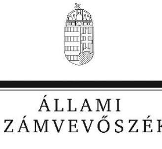
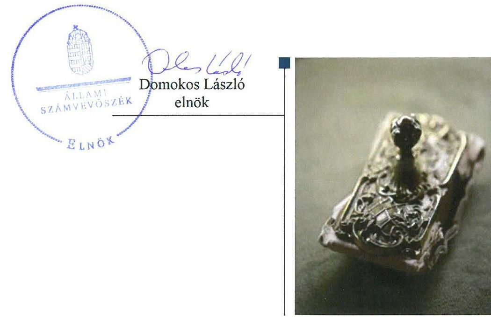
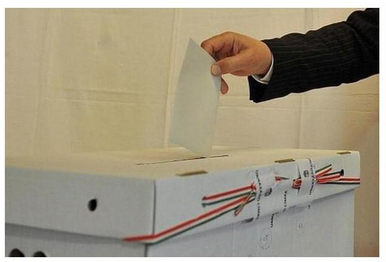

# Jelentés

A 2016. október 2-án megtartott országos népszavazás lebonyolításához felhasznált pénzeszközök elszámolásának ellenőrzése

2018.

18085 www.asz.hu

---

# Jellentés 

A 2016. október 2-án megtartott országos népszavazás lebonyolításához felhasznált pénzeszközök elszámolásának ellenőrzése

2018. O6 hó 15 nap

---

# AZ ELLENŐRZÉST FELÜGYELTE:

DR. BENEDEK MÁRIA felügyeleti vezető

## AZ ELLENŐRZÉST VEZETTE ÉS A VÉGREHAJTÁSÁÉRT FELELŐS:

KAKAS SÁNDOR ellenőrzésvezető

A PROGRAM ÖSSZEÁLLÍTÁSÁÉRT FELELŐS:

TÓTPÁL SZABOLCS osztályvezető

IKTATÓSZÁM: EL-0046-1372/2018

TÉMASZÁM: 2446

ELLENŐRZÉS-AZONOSÍTÓ SZÁM: V0795

Jelentéseink az Országgyűlés számítógépes hálózatán és az Interneta a www.asz.hu címen is olvashatóak.

---

# TARTALOMJEGYZÉK 

■ ÖSSZEGZÉS ..... 5
■ AZ ELLENŐRZÉS CÉLJA ..... 6
■ AZ ELLENŐRZÉS TERÜLETE ..... 7
■ AZ ELLENŐRZÉS HÁTTERE, INDOKOLTSÁGA ..... 9
■ A JELENTÉS LÉNYEGES KÉRDÉSKÖRE ..... 10
■ AZ ELLENŐRZÉS HATÓKÖRE ÉS MÓDSZEREI ..... 11
■ MEGÁLLAPÍTÁSOK ..... 13
■ MELLÉKLETEK ..... 19
I. sz. melléklet: Értelmező szótár ..... 19
II. sz. melléklet: Ellenőrzött szervezetek jegyzéke ..... 20
■ FÜGGELÉK: ÉSZREVÉTELEK ..... 23
I. sz. függelék: ..... 24
■ RÖVIDÍTÉSEK JEGYZÉKE ..... 49

---

.

---

# ÖSSZEGZÉS 

A 2016. október 2-án megtartott országos népszavazásra a költségvetésből biztosított pénzeszközök felhasználása valamennyi ellenőrzött tekintetében célhoz kötötten, a népszavazás előkészitése és lebonyolítása érdekében történt. A költségvetésből biztosított finanszírozási források elosztása, az előirányzatok kezelése, az elszámolás minden ellenőrzött esetében szabályszerűen történt. Az országos népszavazás előkészítéséhez és a lebonyolításhoz szükséges pénzeszközök tervezése összességében szabályszerű volt. A pénzeszközök felhasználása, a pénzeszközök felhasználásának ellenőrzése az ellenőrzött szervezetek döntő többségénél szabályosan történt.

## Az ellenőrzés társadalmi indokoltsága

Az Országgyűlés az Alaptörvény 8. cikk (1) bekezdés második mondata alapján a kötelező betelepítési kvótáról szóló országos népszavazást rendelt el, amelyet a Kormány kezdeményezett. A köztársasági elnök döntött az Országgyűlés 8/2016. (V. 10.) számú határozatában előírt népszavazás kitűzésének időpontjáról, és azt 2016. október 2-ára tűzte ki.

A 8/2016. (V. 10.) OGY határozat 2. pontja megállapította a népszavazás lebonyolításának költségvetésére fordítható összeget. A választási eljárásról szóló 2013. évi XXXVI. törvény alapján a népszavazásra a központi költségvetésből biztosított pénzeszközök felhasználásáról az Állami Számvevőszék tájékoztatja az Országgyűlést.

## Főbb megállapítások, következtetések

Az október 2-án megtartott országos népszavazásra a költségvetésből biztosított finanszírozási források elosztása, az előirányzatok kezelése szabályszerűen történt. A Nemzeti Választási Iroda az országos népszavazáshoz a források átutalását és előirányzat-átadási kötelezettségét határidőben teljesítette

Az országos népszavazás előkészítéséhez és lebonyolításához szükséges pénzeszközök tervezése - a területi választási irodák, az országgyűlési egyéni választókerületi választási irodák és a helyi választási irodák esetében feltárt kisebb hiányosságok mellett - szabályszerűen történt. Az országos népszavazással összefüggő előirányzat módosításokat az ellenőrzött szervezetek döntő többsége szabályosan hajtotta végre.

Az országos népszavazás előkészítéséhez, lebonyolításához rendelkezésre álló pénzeszközök felhasználása a Nemzeti Választási Iroda, a Közigazgatási és Elektronikus Közszolgáltatások Központi Hivatala esetében szabályszerűen történt. A Külgazdasági és Külügyminisztérium, a területi választási irodák, az országgyűlési egyéni választókerületi választási irodák és a helyi választási irodák - a gazdálkodási jogkörök gyakorlásának hiányosságai mellett - a pénzeszközöket szabályosan használták fel.

Az országos népszavazás előkészítéséhez, lebonyolításához felhasznált pénzeszközök elszámolása, a területi választási irodák, az országgyűlési egyéni választókerületi választási irodák és a helyi választási irodák döntő többségében az előírt határidőben történt. A Nemzeti Választási Iroda az összesítő elszámolást határidőn túl készítette el.

Az országos népszavazás előkészítésénél és lebonyolításánál a Nemzeti Választási Iroda, a Külgazdasági és Külügyminisztérium és a Közigazgatási és Elektronikus Közszolgáltatások Központi Hivatalának vezetője a pénzeszközök felhasználására vonatkozó ellenőrzési kötelezettségét szabályszerűen teljesítette. A területi választási irodák, az országgyűlési egyéni választókerületi választási irodák és a helyi választási irodák többségében a pénzeszközök felhasználásának ellenőrzése szabályszerűen történt. Az ellenőrzési feladatok végrehajtása biztosította az átlátható közpénzfelhasználást.

---

# AZ ELLENŐRZÉS CÉLJA

**AZ ELLENŐRZÉS CÉLJA** annak megállapítása volt, hogy a 2016. október 2-án megtartott országos népszavazás lebonyolítására fordított pénzeszközök tervezése, folyósítása, felhasználása, elszámolása és annak ellenőrzése szabályszerű volt-e.

---

# AZ ELLENŐRZÉS TERÜLETE 

## A 2016. október 2-án megtartott országos népszavazás

A 2016-os magyarországi népszavazás 2016. október 2-án megrendezett országos referendum, amelyen a szavazójogosult magyar állampolgárok arról nyilváníthattak véleményt, hogy az Európai Unió az Országgyűlés hozzájárulása nélkül is előirhassa-e nem magyar állampolgárok Magyarországra történő kötelező betelepítését. A kérdés a Kormány kezdeményezésére, az európai migrációs válság kapcsán merült föl.

A népszavazás érvénytelen volt, mivel a szavazásra jogosultak kevesebb, mint a fele adott le érvényes szavazatot. Az érvényesen szavazók több mint 98\%-a nemmel válaszolt a feltett kérdésre.

A Nemzeti Választási Iroda a választási eljárásról szóló 2013. évi XXXVI. törvény hatályba lépésével jött létre. A független, csak a törvénynek alárendelt autonóm államigazgatási szerv feladata a választások és népszavazások előkészítéséhez és lebonyolításához kapcsolódó központi feladatok ellátása.

A Nemzeti Választási Iroda - a többi választási irodához hasonlóan végzi a választópolgárok, jelöltek, jelölő szervezetek tájékoztatásával kapcsolatos feladatokat, segíti a Nemzeti Választási Bizottság munkáját, gondoskodik a választások és népszavazások lebonyolításához szükséges tárgyi és technikai feltételek megteremtéséről, irányítja a területi, az országos egyéni választókerületi és a helyi választási irodák munkáját.

A Közigazgatási és Elektronikus Közszolgáltatások Központi Hivatala, a létrehozásáról, feladatairól és hatásköréről szóló 276/2006.(XII.23.) Korm. rendelet alapján 2007. január 1-jén alakult meg. A Közigazgatási és Elektronikus Közszolgáltatások Központi Hivatala a választások és népszavazások előkészítésével, szervezésével és lebonyolításával kapcsolatos informatikai feladatokat látta el. Az 1312/2016. (VI.13.) Korm. határozat értelmében a Közigazgatási és Elektronikus Közszolgáltatások Központi Hivatala 2016. december 31. napjával - a Belügyminisztériumba történő beolvadással - megszűnt.

A Külgazdasági és Külügyminisztérium a miniszter munkaszerveként a Kormány irányítása alatt álló különös hatáskörű államigazgatási szerv. A központi költségvetés szerkezeti rendjében önálló fejezetet képez, amelyből a népszavazás lebonyolításában résztvevő Központi Igazgatás az 1. címen, a külképviseleteken leadott szavazásban közreműködő Külképviseletek Igazgatása a 2. címen szerepel. A Külgazdasági és Külügyminisztérium Magyarország külképviseletein az országos népszavazás pénzügyi tervezését, lebonyolítását, elszámolását, a külképviseleteken lefolytatandó népszavazás feladatait látja el.

A Nemzeti Választási Iroda vezetője valamennyi választási iroda vezetőjét, a területi választási iroda vezetője az országos egyéni választókerületi választási iroda és a helyi választási iroda vezetőjét, míg az országos egyéni választókerületi választási iroda vezetője a helyi választási iroda vezetőjét

---

- a választási eljárásról szóló törvény szerint - a feladataik ellátásával kapcsolatban közvetlenül utasíthatja.

A területi választási iroda ellenőrzi és irányítja az országos egyéni választókerületi választási iroda és a helyi választási iroda tevékenységét, felügyeli az informatikai rendszerek használatát. A területi választási irodák a választási informatikai feladataikat a fővárosi és megyei kormányhivatalok közreműködésével látják el. Minden önálló önkormányzati hivatallal rendelkező településen önálló helyi választási iroda múködik.

Az országos egyéni válaszkerületi és választási irodák és a helyi választási irodák - a választási eljárásról szóló törvény szerint - az országos népszavazás tekintetében a népszavazás közvetlen lebonyolításával kapcsolatos feladatokat láttak el.

---

# AZ ELLENŐRZÉS HÁTTERE, INDOKOLTSÁGA 

Az ellenőrzés az országos népszavazás előkészítése és lebonyolítása során igénybe vett pénzeszközök szabályszerű felhasználására fókuszál. Az ellenőrzés eredményeként értékeljük, hogy az országos népszavazás előkészítésénél és lebonyolításánál a központi költségvetésből biztosított pénzeszközök felhasználása az érintett szervezeteknél összhangban volt-e a választási eljárásra vonatkozó jogszabályi környezet rendelkezéseivel, amellyel eleget teszünk a törvényben előírt, Országgyűlés felé fennálló tájékoztatási kötelezettségünknek.

Ellenőrzésünkkel véleményt formálunk az országos népszavazás előkészítése és lebonyolítása során a felelős szervezeteknél felhasznált pénzeszközök jogszabályokban leírtaknak megfelelő tervezéséről, felhasználásáról, elszámolásáról és ellenőrzéséről. Az ellenőrzéssel rámutathatunk az országos népszavazás előkészítése és lebonyolítása során felhasznált pénzeszközökkel kapcsolatos esetleges szabályozási problémákra, így ellenőrzésünk hozzájárulhat az országos népszavazás előkészítése és lebonyolítása során felhasznált pénzeszközök feletti kontrollok erősítéséhez. Kapcsolódó megállapításainkkal elősegíthetjük, támogathatjuk a jogalkotói és a szabályozói munkát.

Ellenőrzésünk megalapozhatja a joggyakorlásban résztvevő szervezetek tevékenységét szabályozó törvényi előírások, belső szabályzatok, eljárási rendek felülvizsgálatát. Az esetlegesen feltárt szabályozási és kontroll hiányosságok bemutatásával ellenőrzésünk hozzájárul azok kijavításához, valamint közvetetten a népszavazások előkészítése és lebonyolítása során a közpénzek felhasználásával kapcsolatos közbizalom erősítését.

---

# A JELENTÉS LÉNYEGES KÉRDÉSKÖRE 

- A 2016. október 2-án megtartott országos népszavazásra fordított pénzeszközöket szabályszerűen használták-e fel?

---

# AZ ELLENŐRZÉS HATÓKÖRE ÉS MÓDSZEREI 

## Az ellenőrzés típusa

Szabályszerúségi ellenőrzés.

## Az ellenőrzött időszak

Az országos népszavazás kitűzésétől az országos népszavazáshoz felhasznált költségvetési forrásokkal történő elszámolási időszak végéig.

## Az ellenőrzés tárgya

A 2016. október 2-ára kitűzött országos népszavazás lebonyolítására fordított pénzeszközök tervezése, a finanszírozási források elosztása, felhasználása, elszámolása és annak ellenőrzése volt.

Az ellenőrzés kiterjedt minden olyan körülményre és adatra, amely az ÁSZ ${ }^{1}$ jogszabályban meghatározott feladatainak teljesítéséhez, valamint a program végrehajtása folyamán felmerült újabb összefüggések feltárásához szükséges volt.

## Az ellenőrzött szervezet

Nemzeti Választási Iroda, Belügyminisztérium, mint a Közigazgatási és Elektronikus Közszolgáltatások Központi Hivatala jogutódja, valamint a külpolitikáért felelős miniszter által kijelölt szerv és a külképviseleti választási irodák vonatkozásában a Külgazdasági és Külügyminisztérium, a területi választási irodák, a mintavétellel kiválasztott országgyűlési egyéni választókerületi választási irodák és helyi választási irodák.

## Az ellenőrzés jogalapja

Az Állami Számvevőszékről szóló 2011. évi LXVI. törvény (ÁSZ tv.) 5. § (2)(3) bekezdése, valamint a Ve. ${ }^{2} 12 . \S$-a.

## Az ellenőrzés módszerei

Az ellenőrzést az ellenőrzési program szempontjai, az ellenőrzött időszakban hatályos jogszabályok, az ellenőrzés szakmai szabályai, a jelen ellenőrzésre irányadó ÁSZ módszertanok alapján végeztük.

---

Az ellenőrzési kérdések megválaszolásához szükséges bizonyítékok megszerzése az ellenőrzött által rendelkezésre bocsátott dokumentumokra, adatokra alapozva megfigyelés, szemle (szemrevételezés), kérdésfeltevés (információkérés), mintavételezés, valamint elemző eljárás útján történt. Az ellenőrzési bizonyítékként felhasználható adatforrások közé tartoztak egyrészt az ellenőrzési program részletes szempontjainál felsorolt adatforrások, másrészt minden egyéb - az ellenőrzés folyamán feltárt, az ellenőrzés szempontjából információt tartalmazó - dokumentum. Az ellenőrzés lefolytatásához az ellenőrzött szervezetek a tanúsítványok kitöltésével, valamint az ÁSZ által kért dokumentumok megküldésével szolgáltattak adatokat.

---

# 1. A 2016. október 2-án megtartott országos népszavazásra fordított pénzeszközöket szabályszerűen használták-e fel? 

Összegző megállapítás

1.1. számú megállapítás

A 2016. október 2-án megtartott népszavazásra fordított pénzeszközöket az NVI ${ }^{3}$, a KEKKH ${ }^{4}$, a KKM $^{5}$, a TVI ${ }^{6}$-k, az OEVI ${ }^{7}$ k és a HVI ${ }^{8}$-k összességében szabályszerűen használták fel.

A 2016. október 2-án megtartott népszavazás előkészítéséhez és lebonyolításához szükséges pénzeszközök tervezése a TVI-k, OEVI-k és a HVI-k döntő többségében, az NVI, a KEKKH és a KKM esetében szabályszerűen történt.

Az NVI az országos népszavazás előkészítéséhez és lebonyolításához szükséges pénzügyi feladat- és költségtervét szabályszerűen elkészítette. Az NVI a tervezés során, a Pvr. ${ }^{9} 1$. mellékletben meghatározott tételeket és normatívákat szerepeltette.

Az NVI elnöke a Pvr. végrehajtásához, a választási irodák szakmai irányításával összefüggésben, illetve a választások lebonyolításában részt vevő egyéb szervek népszavazási feladatai végrehajtásához a Pvr.-ben előírtaknak megfelelően kiadta a Népszavazási útmutató ${ }_{1,2}{ }^{10}$-t. A Népszavazási út-mutatóz-ben meghatározták a feladattípusú pénzügyi elszámolással és a VÁKIR ${ }^{11}$ rendszer használatával kapcsolatos követelményeket.

Az NVI elnöke a fejezeti kezelésű előirányzatok felhasználásának szabályzatát ${ }^{12}$ kiadta, azonban a „Kötelező betelepítési kvóta ügyében tartandó népszavazás lebonyolítása" fejezeti kezelésű előirányzat sor felhasználási szabályait az Áht. ${ }^{13} 28$. § (2) bekezdésében foglaltak ellenére nem szabályozta.

Az NVI elnöke, a 2016. október 2-án tartandó népszavazással kapcsolatos feladatellátásra vonatkozóan a KKM-mel és a népszavazás lebonyolításában résztvevő egyéb szervezettel (KEKKH), a Pvr.-ben foglaltaknak megfelelően, a megállapodásokat az előírások szerint szabályszerűen, határidőben megkötötte.

Az NVI a népszavazás lebonyolítására kötött megállapodások alapján a feladatok ellátásához szükséges forrásokat az Ávr. ${ }^{14}$-ben előírtaknak megfelelően a Magyar Államkincstáron keresztül előirányzat-átadással biztosította a KKM és a KEKKH javára.

Az NVI a népszavazás céljára biztosított pénzeszközök elkülönített kezelését a Pvr. előírásainak megfelelően szabályszerűen kialakította. A feladatok végrehajtásával kapcsolatos teendőkről kiadott Népszavazási útmutató, 5.4 pontjában meghatározták az elszámolás során alkalmazandó COFOG ${ }^{15}$ kódot.

---

A NVI a Ve. tv., valamint a 17/2013. (VII. 17.) KIM rendeletben ${ }^{16}$ előírtaknak megfelelően gondoskodott a népszavazás informatikai rendszerének kialakításáról és biztonságos és szabályszerű működtetéséről.

A 17/2013. (VII. 17.) KIM rendeletnek megfelelően a KEKKH biztosítja az informatikai rendszer működtetési környezetének infrastrukturális hátterét. Az előírásoknak megfelelően NVI az informatikai rendszer részeként működtette a $\mathrm{NVR}^{17}$, a VÁKIR, a VLOG ${ }^{18}$, és a VÜR ${ }^{19}$ rendszereket.

Az NVI elnöke a Népszavazási útmutató 6 . pontjában meghatározottak szerint a népszavazásban résztvevő szervezetek (HVI/OEVI/TVI) és egyéb szerv elszámolásaihoz a VÁKIR egységes alkalmazását írta az elő, így a népszavazás pénzügyi elszámolásaival kapcsolatos elszámolások rögzítése a VÁKIR felületén a VPIR ${ }^{20}$ modulban történt.

A KEKKH és a KKM az országos népszavazás pénzügyi tervezésével kapcsolatos feladatokat a Pvr.-ben előírtaknak megfelelően ellátta.

Az NVI, a KEKKH és a KKM az országos népszavazás során lefolytatott beszerzések, szolgáltatásvásárlások, beruházások esetében a Kbt. ${ }^{21}$ vonatkozó előírásait betartotta.

Az ellenőrzött TVI-k a Pvr.-ben foglaltaknak megfelelően elkészítették a népszavazás pénzügyi tervét. Az ellenőrzött választási irodák közül a II. sz. melléklet 31., 36. sorszámú OEVI-k vezetői és a 49., 63. sorszámú HVI-k vezetői a Pvr. 1. § (2) bekezdés a) pontjában foglaltak ellenére nem készítettek pénzügyi tervet. Az ellenőrzött választási irodák közül II. sz. melléklet 5., 15., 20., 22. sorszámú TVI-k, a 26., 27., 29., 36., 37., 39., 40. sorszámú OEVI-k és a 46., 47., 49., 53., 56., 58., 60., 61., 62., 63. sorszámú HVI-k a népszavazással összefüggő előirányzat-módosításokat az Áht. 34. § (1) bekezdésében foglaltak ellenére nem hajtották végre.

# 1.2. számú megállapítás 

A 2016. október 2-án megtartott népszavazásra a költségvetésből biztosított finanszírozási források elosztása, az előirányzatok kezelése szabályszerűen történt.

Az NVI-nél a népszavazás lebonyolításához szükséges 4 446,5 M Ft előirányzat, valamint a pénzügyi fedezet ütemezetten és szabályszerűen, a 1348/2016. (VII.6.) Kormányhatározat előírásának megfelelően rendelkezésre állt. Az NVI elnöke a népszavazás lebonyolításához az elkészített költségterv alapján 2016. június 29-ei NGM ${ }^{22}$-nek címzett levelében kérte a 4 446,5 M Ft előirányzat biztosítását, amit az NGM a Ve. tv. előírásainak megfelelően teljesített.

Az NVI a népszavazási források biztosításához a szükséges előirányzat átcsoportosításokat szabályszerűen hajtotta végre. Az NVI a jogszabályban felsorolt tételek, normatívák szerint a TVI-k, OEVI-k és HVI-k részére a feladataik ellátásához szükséges forrásokat szabályszerűen biztosította és határidőben folyósította.

A támogatásról az NVI támogató okiratot állított ki, amelyben rögzítették, hogy a pénzügyi fedezetet a Pvr. előírásai szerint biztosították. A támogatói okiratban a Népszavazási útmutató ${ }_{1,2} 3.1$ pontjának megfelelően a támogatás teljes összege szerepelt.

A TVI-k többlettámogatás igénylése a Pvr.-ben előírtaknak megfelelően szabályszerűen történt. A TVI-k a Pvr. előírásainak megfelelőn a HVI/OEVI szintjén felmerült többletköltség igények indokoltságát felülvizsgálták, az elszámolásokat az NVI elnöke részére határidőben elkészítették.

---

### 1.3. számú megállapítás

A 2016. október 2-án megtartott népszavazás előkészítéséhez, lebonyolításához rendelkezésre álló pénzeszközök felhasználása - a KKM, valamint egyes TVI-k, OEVI-k és HVI-k esetében feltárt gazdálkodási jogkörök gyakorlásának hiányosságai mellett - szabályszerűen történt.

Az NVI elnöke a Ve. tv.-ben foglaltaknak megfelelően kiadta a NVI SzMSz ${ }^{23}$ ét. Az NVI a népszavazáshoz rendelt források kezelése során a Gazdálkodási Szabályzat ${ }^{24}$ rendelkezéseit alkalmazta, amely az Áht. és az Ávr. előírásainak megfelelően meghatározta a gazdálkodási jogkörök gyakorlásának rendjét.

A KEKKH esetében a népszavazáshoz rendelt források kezelését a 4/2015. (IV.10.) BM utasítás ${ }^{25}$ és a KEKKH elnöke a 3/2016. (I. 25.) elnöki intézkedés ${ }^{26}$ szabályozta, amelynek keretében az Áht. és Ávr. előírásainak megfelelően meghatározták a gazdálkodási jogkörök szabályait.

A KKM esetében a Gazdálkodási Keretszabályzat ${ }^{27}$ és a 18/2016. (VIII.4.) KKM utasítás ${ }^{28}$ tartalmazta az Áht. és az Ávr. előírásainak megfelelően a pénzügyi ellenjegyzés, a kötelezettségvállalás, a teljesítésigazolás, az érvényesítés és az utalványozás, valamint a gazdálkodási jogkörök gyakorlásának összeférhetetlenségi szabályait.

Az ellenőrzött választási irodák közül a II. sz. melléklet 5. sorszámú TVI, a 35., 37., 42. sorszámú OEVI-k és a 49., 50., 57., 59., 63. sorszámú HVI-k vezetői az Áht. 10. § (5) bekezdésében foglaltak ellenére a népszavazással összefüggésben a gazdálkodás részletes rendjét belső szabályzatban nem határozták meg. Az ellenőrzött TVI-k közül a II. sz. melléklet 6. sorszámú választási iroda vezetője az Áhsz. 50. § (1) bekezdésében foglaltak ellenére nem készített számviteli politikát, pénzkezelési szabályzatot, eszközök és források leltározási és leltárkészítési szabályzatot, eszközök és források értékelési szabályzatot. Az ellenőrzött HVI-k közül a II. sz. melléklet 46., 49. sorszámú választási irodák vezetői az Áhsz. 50. § (1) bekezdésében foglaltak ellenére nem készítettek számviteli politikát, eszközök és források értékelési szabályzatot.

Az NVI, a KKM, a KEKKH, az ellenőrzött TVI-k, OEVI-K és a HVI-k a Pvr.ben előírtaknak megfelelően COFOG kód alkalmazásával gondoskodtak a népszavazás céljára szolgáló pénzeszközök elkülönített kezeléséről.

Az NVI, a KKM, a KEKKH a tényleges pénzforgalomról a Pvr.-ben előírtaknak megfelelően a népszavazási feladatokkal kapcsolatos részletező nyilvántartást vezették.

Az ellenőrzött TVI-k közül a II. sz. melléklet 5., 6., 9., 14., 15., 17., 19., 22. sorszámú, az OEVI-k közül a 25., 26., 28., 29., 30., 36., 37., 38., 39., 40. sorszámú és a HVI-k közül a 46., 47., 48., 49., 56., 57., 58., 59., 61., 63. sorszámú választási irodák vezetői a Pvr. 1. § (2) bekezdés d) pontjában foglaltak ellenére nem gondoskodtak arról, hogy a tényleges pénzforgalomról vezessenek - a Pvr. 6. § (2) bekezdésében foglaltak szerinti - részletező nyilvántartást.

A gazdálkodási és ellenőrzési jogkörök gyakorlása az NVI és a KEKKH esetében az Áht. és az Ávr. és a belső szabályozásokban előírtaknak megfelelően szabályszerűen történt. A szavazással kapcsolatos pénzeszközök felhasználása során az Áht. és az Ávr. vonatkozó előírásai szerint és a belső

---

szabályozások előírásai alapján, az arra jogosultak gyakorolták a gazdálkodási jogköröket, a kötelezettségvállalást, a pénzügyi ellenjegyzést, a teljesítés szakmai igazolását, az érvényesítést és az utalványozást.

A KKM esetében a gazdálkodási és ellenőrzési jogkörök gyakorlása nem volt szabályszerű, nem felelt meg az Áht. és az Ávr. előírásainak:
—_ a teljesítésigazolást az Ávr. 57. § (3) bekezdésében foglaltak ellenére nem az arra jogosult személy végezte;
— az érvényesítés nem volt szabályszerű, mert az Ávr. 58. § (4) bekezdésében foglaltak ellenére az érvényesítésre jogosult személyt nem jelölték ki.
A TVI-k, az OEVI-k és a HVI-k esetében a gazdálkodási és ellenőrzési jogkörök gyakorlása nem volt szabályszerű, nem felelt meg az Áht. és az Ávr. előírásainak:

A TVI-k ellenőrzése során a következő hiányosságokat tártuk fel:
— az Áht. 37. § (1) bekezdésében foglaltak ellenére a kötelezettségvállalásra pénzügyi ellenjegyzés nélkül került sor (II. sz. melléklet 9., 13., 19. sorszámú szervezet), illetve a pénzügyi ellenjegyzés az Ávr. 55. § (1) bekezdésében foglaltak ellenére nem tartalmazta a pénzügyi ellenjegyzés dátumát (II. sz. melléklet 19. sorszámú szervezet);
— az érvényesítés az Ávr 58. § (3) bekezdésében foglaltak ellenére nem tartalmazta az érvényesítés keltezését (II. sz. melléklet 15. és 19. sorszámú szervezet);
— a teljesítésigazolás az Ávr. 57. § (3) bekezdésében foglaltak ellenére nem tartalmazta az igazolás dátumát (II. sz. melléklet 19. sorszámú szervezet);
Az OEVI-k ellenőrzése során a következő hiányosságokat tártuk fel:
— az Áht. 37. § (1) bekezdésben foglaltak ellenére kötelezettségvállalásra pénzügyi ellenjegyzés nélkül került sor (II. sz. melléklet 35., 38 sorszámú szervezet);
— a teljesítésigazolás az Ávr. 57. § (1) bekezdésében foglaltak ellenére nem történt meg (II. sz. melléklet 32., 35. sorszámú szervezet);
— a teljesítésigazolást az Ávr. 57. § (3) bekezdésében foglaltak ellenére nem az arra jogosult személy végezte (II. sz. melléklet 26. sorszámú szervezet);
— az érvényesítés az Ávr. 58. § (3) bekezdésében előírtak ellenére nem az utalványozás előtt történt (II. sz. melléklet 32. sorszámú szervezet);
A HVI-k ellenőrzése során a következő hiányosságokat tártuk fel:
— az Áht. 37. § (1) bekezdésében foglaltak ellenére kötelezettségvállalásra pénzügyi ellenjegyzés nélkül került sor (II. sz. melléklet 44., 47., 58., 60. sorszámú szervezet);
— a teljesítésigazolás az Ávr. 57. § (3) bekezdésében foglaltak ellenére nem tartalmazta az igazolás dátumát (II. sz. melléklet 44., 48., 61. sorszámú szervezet);
— a teljesítésigazolást az Ávr. 57. § (3) bekezdésében foglaltak ellenére nem az arra jogosult személy végezte (II. sz. melléklet 48 sorszámú szervezet);

---

- az érvényesítés Ávr. 58. § (1) bekezdésében foglaltak ellenére nem történt meg (II. sz. melléklet 52. sorszámú szervezet);
- az érvényesítés az Ávr 58. § (3) bekezdésében foglaltak ellenére nem tartalmazta az érvényesítés keltezését. (II. sz. melléklet 61. sorszámú szervezet).
Az NVI, a KKM, a KEKKH, az ellenőrzött TVI-k, OEVI-K és a HVI-k esetében a költségvetésből biztosított pénzeszközök felhasználása a Pvr. előírásainak megfelelő célra, az országos népszavazáshoz kötötten történt, a kiadásokat bizonylatokkal igazolták, és az országos népszavazáshoz nem kapcsolódó kiadást nem számoltak el.
1.4. számú megállapítás

A 2016. október 2-án megtartott népszavazás előkészítéséhez, lebonyolításához felhasznált pénzeszközök elszámolása az ellenőrzött szervezetek döntő többségénél az előírt határidőben történt.

Az NVI a pénzügyi elszámolásokkal kapcsolatos feladatait szabályszerűen látta el. A TVI-k által a Pvr.-ben rögzített határidőben benyújtott, VÁKIR rendszerben rögzített elszámolásokat az NVI felülvizsgálta. A HVI-k és az OEVI-k elszámolások elfogadására a TVI-k vezetői a Pvr.-ben előírtaknak megfelelően tettek javaslatot az NVI elnökének, amelyről az NVI elnöke az informatikai rendszerben szereplő részletes adatok alapján szabályszerűen döntött.

A választási irodák többletkiadásainak, Pvr. alapján indokolt kifizetéseinek az elszámolásban való érvényesítése szabályszerű volt. A népszavazás során összesen 2196 többletigény jogcím jelentkezett a többletkiadások megfeleltek a Pvr.-ben meghatározott jogcímeknek.

Az NVI a többletkiadások fedezetét a HVI-k, az OEVI-k, a TVI-k, KKM, és a KEKKH részére az előírt határidőben, szabályszerűen biztosította.

Az NVI elnöke a TVI, OEVI és HVI vezetők személyi juttatásainak kifizetéséről a Pvr. előírásainak megfelelően a feladat típusú pénzügyi elszámolás elfogadását követően döntött.

Az NVI az összesítő elszámolást a Pvr. 7. § (4) bekezdésében előírt határidőn túl készítette el.

A KEKKH a pénzügyi elszámolását a Pvr.-ben foglaltaknak megfelelően szabályszerűen elkészítette. A KEKKH az elszámolás elfogadását követően előirányzat-átadási kötelezettségének a Pvr-ben előírtaknak megfelelően eleget tett. A Népszavazási útmutató: 6.1. pontja ellenére a KEKKH az elszámolást nem a VÁKIR rendszerben készítette el.

A KKM az NVI felé fennálló elszámolási kötelezettségének a Pvr.-ben rögzített határidőn belül eleget tett. A KKM a Pvr. 9. § (4) bekezdésében előírtak ellenére az elszámolás elfogadását követő nyolc munkanapon túl gondoskodott az előirányzat-átadási kötelezettségéről.

A TVI-k vezetői, vezető-helyettesei és tagjai, valamint a HVI-k, OEVI-k vezetői személyi juttatásainak kifizetéséről szabályszerűen intézkedtek.

Az ellenőrzött TVI-k, HVI-k és OEVI-K vezetői a feladattípusú elszámolásokat elkészítették, azonban a II. sz. melléklet 5., 6., 8., 11., 17., 19., 20. sorszámú TVI-k, a 30., 31., 37., 39., 40., 42. sorszámú OEVI-k és a 45., 46., 47., 49., 50., 51., 56., 57., 61. sorszámú HVI-k vezetői a Pvr. 7. § (1) és (3) bekezdésében foglaltak ellenére határidőn túl tettek eleget elszámolási kötelezettségüknek.

---

### 1.5. számú megállapítás

Az ellenőrzött TVI-k közül a II. sz. melléklet 4., 5., 7., 8., 11., 14., 19., 23. sorszámú, a HVI-k közül az 57., 63. sorszámú választási irodának keletkezett az elszámolás során visszafizetési kötelezettsége, amelynek a Pvr. előírásai szerint eleget tettek.

## A 2016. október 2-án megtartott népszavazás előkészítésénél és lebonyolításánál a pénzeszközök felhasználásának ellenőrzése a TVIK, az OEVI-k és a HVI-k többségében, az NVI, a KEKKH, a KKM esetében szabályszerűen történt.

Az NVI, a KEKKH és a KKM ellenőrzési kötelezettségét a Pvr. előírásainak megfelelően szabályszerűen teljesítette.

Az NVI az országos népszavazás pénzügyi elszámolásának megalapozottságának ellenőrzéséhez ellenőrzési tervet készített. Az NVI a TVI-k, a KEKKH és a KKM elszámolások megalapozottságát a Pvr.-ben előírtaknak megfelelően ellenőrizte.

Az NVI elnöke a KEKKH, a KKM és TVI-k elszámolásainak elfogadásáról a Pvr.-ben foglaltaknak megfelelően elfogadó okiratokban döntött.

A KEKKH vezetője ellenőrzési kötelezettségét a Pvr. előírásainak megfelelően szabályszerűen teljesítette. A KEKKH ellenőrzés a népszavazásra biztosított előirányzat-átadás felhasználásának ellenőrzésére, a felhasználást alátámasztó dokumentáció hiánytalan elkészítésére terjedt ki. A belső ellenőrzési jelentésben szabálytalanságot nem állapítottak meg.

A KKM a Pvr.-ben előírtaknak megfelelően ellenőrzési kötelezettségének eleget tett, belsőellenőrzés keretében ellenőrizte a népszavazásra biztosított előirányzat szabályszerű és rendeltetésszerű felhasználását. A belső ellenőrzés szabálytalanságot nem állapított meg.

Az ellenőrzött TVI-k közül, a II. sz. melléklet 6., 9., 11., 13., 18. sorszámú szervezetek a HVI-k és az OEVI-k tekintetében ellenőrzési kötelezettségüknek a Pvr. 8. § (2) bekezdésében foglaltak ellenére nem tettek eleget. Az ellenőrzések keretében TVI-k közül a II. sz. melléklet 5., 9., 11., 18. sorszámú szervezetek a többletkiadások indokoltságát a Pvr. 8. § (4) bekezdésben előírtak ellenére tételesen nem vizsgálta.

Az ellenőrzött OEVI-k közül a II. sz. melléklet, 25., 31., 35.. 36., 38. sorszámú szervezetek vezetői, a HVI-k közül a II. sz. melléklet 44., 45., 48., 49., 50., 55., 56., 59., 63. sorszámú szervezetek vezetői nem adtak a Pvr. 8. § (1) bekezdésében előírtak ellenére a választási iroda részére megállapított támogatás felhasználásának ellenőrzésére a választási iroda tagjának megbízást. Az ellenőrzött OEVI-k közül a II. sz. melléklet 25., 29., 30., 31., 35., 36., 42., 43. sorszámú szervezetek, a HVI-k közül a II. sz. melléklet. 50., 55., 62., 63.sorszámú szervezetek a többletkiadások indokoltságát a Pvr. 8. § (4) bekezdésben előírtak ellenére tételesen nem vizsgálták.

---

# MELLÉKLETEK 

- I. SZ. MELLÉKLET: ÉRTELMEZŐ SZÓTÁR

COFOG kód

ERA kód
külképviselet
2014. január 1-jével a költségvetési szervek alaptevékenységének besorolása a korábban alkalmazott államháztartási szakfeladatok helyett kormányzati funkció kóddal történik.
A magyar államháztartásban alkalmazott kormányzati funkciók rendszere a kormányzati kiadások funkciók szerinti osztályozásán (classification of the functions of government, COFOG) alapul. A kormányzati kiadások funkciók szerinti osztályozása 10 főcsoportba besorolva tartalmazza a kormányzati szektor (államháztartás és a kormányzatba sorolt vállalatok és nonprofit intézmények) kiadásait. (Forrás: 68/2013. (XII.29.) NGM rendelet)
A 4/2013. (I.11.) Kormányrendelet 15. számú mellékletével 2014. január 1jétől bevezetésre került az Egységes Rovatrend, amely biztosítja, hogy az államháztartás mindkét alrendszere egységes elvek alapján adjon számot gazdálkodásáról. (Forrás: 4/2013. (I.11.) Korm. rendelet)
Magyarországnak a Kormány döntése alapján létrehozott, külföldön működő diplomáciai és konzuli képviselete (Forrás: Ve.)

---

# Az ellenőrzésre kiválasztott Szervezetek felsorolása 

|  | Központi szervek |
| :-- | :-- |
| 1. | Nemzeti Választási Iroda |
| 2. | Külgazdasági és Külügyminisztérium |
| 3. | Belügyminisztérium, mint a Közigazgatási és Elektronikus Közszolgáltatások Központi Hivatala jogutódja |
|  |  |
|  | Területi választási irodák (TVI) |
| 4. | Budapest Főváros Főpolgármesteri Hivatal |
| 5. | Baranya Megyei Önkormányzati Hivatal |
| 6. | Bács-Kiskun Megyei Önkormányzati Hivatal |
| 7. | Békés Megyei Önkormányzati Hivatal |
| 8. | Borsod-Abaúj-Zemplén Megyei Önkormányzati Hivatal |
| 9. | Csongrád Megyei Önkormányzati Hivatal |
| 10. | Fejér Megyei Önkormányzati Hivatal |
| 11. | Győr-Moson-Sopron Megyei Önkormányzati Hivatal |
| 12. | Hajdú-Bihar Megyei Önkormányzati Hivatal |
| 13. | Heves Megyei Önkormányzati Hivatal |
| 14. | Jász-Nagykun-Szolnok Megyei Önkormányzati Hivatal |
| 15. | Komárom-Esztergom Megyei Önkormányzati Hivatal |
| 16. | Nógrád Megyei Önkormányzati Hivatal |
| 17. | Pest Megyei Önkormányzati Hivatal |
| 18. | Somogy Megyei Önkormányzati Hivatal |
| 19. | Szabolcs-Szatmár-Bereg Megyei Önkormányzati Hivatal |
| 20. | Tolna Megyei Önkormányzati Hivatal |
| 21. | Vas Megyei Önkormányzati Hivatal |
| 22. | Veszprém Megyei Önkormányzati Hivatal |
| 23. | Zala Megyei Önkormányzati Hivatal |
|  |  |
|  | Országos egyéni választókerületi választási irodák (OEVI) |
| 24. | Budapest Főváros VII. Kerület Erzsébetvárosi Polgármesteri Hivatal |
| 25. | Budapest Főváros X. Kerület Kőbányai Polgármesteri Hivatal |
| 26. | Pécs Megyei Jogú Város Polgármesteri Hivatala |
| 27. | Bajai Polgármesteri Hivatal |
| 28. | Orosházi Polgármesteri Hivatal |
| 29. | Miskolc Megyei Jogú Város Polgármesteri Hivatala |
| 30. | Győr Megyei Jogú Város Polgármesteri Hivatala |
| 31. | Sopron Megyei Jogú Város Polgármesteri Hivatala |
| 32. | Debrecen Megyei Jogú Város Polgármesteri Hivatala |
| 33. | Berettyóújfalui Polgármesteri Hivatal |
| 34. | Szolnok Megyei Jogú Város Polgármesteri Hivatala |
| 35. | Jászberényi Polgármesteri Hivatal |
| 36. | Budakeszi Polgármesteri Hivatal |
| 37. | Nyíregyháza Megyei Jogú Város Polgármesteri Hivatala |
| 38. | Kisvárdai Közös Önkormányzati Hivatal |
| 39. | Nyírbátori Polgármesteri Hivatal |
| 40. | Szekszárd Megyei Jogú Város Polgármesteri Hivatala |
| 41. | Dombóvári Közös Önkormányzati Hivatal |

---

| 42. | Szombathely Megyei Jogú Város Polgármesteri Hivatala |
| :-- | :-- |
| 43. | Zalaegerszeg Megyei Jogú Város Polgármesteri Hivatala |

|  | Helyi választási irodák (HVI) |
| :-- | :-- |
| 44. | Budapest Főváros VII. Kerület Erzsébetvárosi Polgármesteri Hivatal |
| 45. | Budapest Főváros XIX. Kerület Kispesti Polgármesteri Hivatal |
| 46. | Orfűi Közös Önkormányzati Hivatal |
| 47. | Madarasi Polgármesteri Hivatal |
| 48. | Mezőkovácsházi Polgármesteri Hivatal |
| 49. | Varbói Közös Önkormányzati Hivatal (Sajólászlófalva feladatellátása tekintetében) |
| 50. | Nagyszentjánosi Közös Önkormányzati Hivatal (Rétalap feladatellátása tekintetében) |
| 51. | Sopronhorpácsi Közös Önkormányzati Hivatal (Répcevis feladatellátása tekintetében) |
| 52. | Debrecen Megyei Jogú Város Polgármesteri Hivatala |
| 53. | Körösszegapáti Közös Önkormányzati Hivatal (Mezősas feladatellátása tekintetében) |
| 54. | Tiszajenői Közös Önkormányzati Hivatal |
| 55. | Jászkiséri Polgármesteri Hivatal |
| 56. | Budajenői Közös Önkormányzati Hivatal (Remeteszőlős feladatellátása tekintetében) |
| 57. | Tiszaberceli Közös Önkormányzati Hivatal |
| 58. | Pátroha Községi Önkormányzat Polgármesteri Hivatala |
| 59. | Nyírmihálydi Polgármesteri Hivatal |
| 60. | Kölesdi Közös Önkormányzati Hivatal (Sióagárd feladatellátása tekintetében) |
| 61. | Bonyhádi Közös Önkormányzati Hivatal (Mőcsény feladatellátása tekintetében) |
| 62. | Séi Közös Önkormányzati Hivatal |
| 63. | Gellénházi Közös Önkormányzati Hivatal (Ormándlak feladatellátása tekintetében) |

---

.

---

# FÜGGELÉK: ÉSZREVÉTELEK 

A jelentéstervezetet a Számvevőszék 15 napos észrevételezésre megküldte az ellenőrzött szervezet vezetőjének az ÁSZ tv. 29. §* (1) bekezdése előírásának megfelelően.
A figyelembe vett észrevételek alapján a Számvevőszék módosította a jelentést.

A függelék tartalmazza az ellenőrzött észrevételeit, illetve a figyelembe nem vett észrevételek elutasításának indoklását.

[^0]
[^0]:    * 29. § (1) Az Állami Számvevőszék az ellenőrzési megállapításait megküldi az ellenőrzött szervezet vezetőjének vagy az általa megbízott személynek, és annak, akinek személyes felelősségét állapította meg.
    (2) Az ellenőrzött szervezet vezetője és a felelősként megjelölt személy az ellenőrzés megállapításaira tizenöt napon belül írásban észrevételt tehet.
    (3) Az Állami Számvevőszék az észrevételre a beérkezésétől számított harminc napon belül írásban válaszol. A figyelembe nem vett észrevételeket köteles a jelentésben feltüntetni, és megindokolni, hogy azokat miért nem fogadta el.

---

# 1. NEMZETI VÁLASZTÁSI IRODA 

## 1.Észrevétel

Az észrevétel 1. oldal 1. franciabekezdésében, az ÁSZ Jelentéstervezet 5. oldal „Főbb megállapítások, következtetések" fejezet 4. bekezdésében „A Nemzeti Választási Iroda az összesítő elszámolást határidőn túl készítette el." és a 17. oldal „1.4 számú megállapítás" 5. bekezdésében „Az NVI az összesítő elszámolást a Pvr. 7. § (4) bekezdésében előírt határidőn túl készítette el"foglalt megállapításokra tett észrevétel:
„A népszavazás költségeinek, normatíváiról, tételeiről, elszámolási és belső ellenőrzési rendjéről szóló 11/2016. (VI.28.) IM rendelet 7. § (4) bekezdése alapján az NVI az (1)-(3) bekezdésben foglalt elszámolások alapján, azok elfogadását követő húsz napon belül összesítő elszámolást készít.
A rendelet (1)-(3) bekezdései a helyi, területi és egyéb szervek elszámolási határidejét határozzák meg, vagyis azok elfogadását követő húsz munkanapon belül kell az NVI összesítő elszámolását elkészíteni. Ez a konkrét esetben a következőt jelenti:
Az utolsóként elszámolt szerv a Közigazgatási és Elektronikus Közszolgáltatások Központi Hivatala 2016. december 05. napjával számolt el az NVI Elnöke felé, melyhez viszonyított húsz napos határidő 2016. december 25. napja. Tekintettel arra, hogy ez a nap munka-szüneti nap, az összesítő elszámolás konkrét határnapja az ezt követő első munkanap, azaz 2016. december 27-e, amikor az NVI ténylegesen teljesítette az elszámolási kötelezettségét."

## El nem fogadott észrevétel indoklása

Az ÁSZ az észrevételt nem fogadja el. Az észrevétel nem megalapozott. Az EL-0046-001/2017. számú ellenőrzési program alapján lefolytatott ellenőrzés során az ÁSZ megállapításait a Nemzeti Választási Iroda által az adatszolgáltatás folyamán az ellenőrzés rendelkezésére bocsátott dokumentumokban szereplő adatok, információ alapján tette meg. Az ellenőrzés végrehajtása során az ÁSZ a jogszabályok, az ellenőrzési program, az ellenőrzési szakmai szabályok, módszerek és az etikai normák szerint járt el. Az észrevétel alapján az ellenőrzött által beküldött dokumentumok felülvizsgálata során az ÁSZ megállapította, hogy a Nemzeti Választási Iroda dokumentumokkal nem igazolta a Pvr. 7. § (4) bekezdésében előírt határidőben történő elszámolás elkészítését.
Fentiek figyelembevételével az ÁSZ fenntartja a jelentéstervezetben az összesítő elszámolás megküldése tárgyában tett megállapításait.

## 2.Észrevétel

Az észrevétel 1. oldal 2. franciabekezdésében, a 17. oldal „1.4. számú megállapítás" 3. bekezdésében foglalt megállapításra „Az NVI a többletkiadások fedezetét a HVI-k, az OEVI-k, a TVI-k, KKM, és a KEKKH részére - a Főváros és Hajdú-Bihar megye kivételével - az előírt határidőben, szabályszerűen biztosította. A többlettámogatások átutalása a Főváros és Hajdú-Bihar megye esetében nem volt szabályszerű, mivel a Pvr. 9. § (3) bekezdésében előírt 8 napos határidőn túl történt" tett észrevétel:
„A hivatkozott jogszabályhely 8 munkanapos határidőről rendelkezik. Ettől függetlenül a tényleges utalási dátumok a 8 napos határidő szerint is teljesültek, tekintettel arra, hogy
a Főváros esetében az elfogadólevél 2016. november 24-én kelt, az utalás dátuma 2016. november 25. napja; Hajdú-Bihar megye esetében az elfogadólevél 2016. november 24-én kelt, az utalás dátuma 2016. november 25. napja."

## Elfogadott észrevétel

Az észrevétel megalapozott. Az EL-0046-001/2017. számú ellenőrzési program alapján lefolytatott ellenőrzés során az ÁSZ részére megküldött dokumentumok felülvizsgálata alapján az ÁSZ megállapította, hogy az „Elszámolást elfogadó okirat" megnevezésű dokumentum alapján a Fővárosi TVI és a Hajdú-Bihar megyei TVI részére többlettámogatás utalás nem volt.

---

Fentiek figyelembevételével az ÁSZ törli a jelentéstervezetben a Főváros és Hajdú-Bihar Megye vonatkozásában a többletkiadások átutalására vonatkozó megállapítását.

# 2. SOMOGY MEGYEI ÖNKORMÁNYZATI HIVATAL 

## 1.Észrevétel

Az észrevétel 1. oldal 2. bekezdésében, az ÁSZ Jelentéstervezet 18. oldal „1.5 számú megállapítás" 6. bekezdésében foglalt „Az ellenőrzött TVI-k közül, a II. sz. melléklet 6., 9., 11., 13., 18. sorszámú szervezetek a HVI-k és az OEVI-k tekintetében ellenőrzési kötelezettségüknek a Pvr. 8. § (2) bekezdésében foglaltak ellené-re nem tettek eleget." megállapításra tett észrevétel:
„A HVI-k és OEVI-k tekintetében ellenőrzési kötelezettségünknek a Pvr. 8.§ (2) és (4) bekezdésben foglaltaknak megfelelően eleget tettünk. Az ellenőrzés során valamennyi HVI/OEVI elszámolás tételesen ellenőrzésre került, az erre vonatkozó SMÖ/457-1/2017. ügyirat-számú nyilatkozatot az adatszolgáltatás során elektronikusan és papíralapon is megküldtük.
A Somogy Megyei Területi Választási Irodához tartozó valamennyi HVI és OEVI elszámolását és többletkiadását részletesen vizsgálat alá vontuk. Ennek keretében a VÁKIR rendszerben feladott elszámolások ellenőrzésekor közvetlenül a hibás tétel mellett, valamint e-mailben a választási irodák felé jeleztük a konkrét hibákat és kértük azok javítását, csak ezt követően kerültek elfogadásra az elszámolások. Ugyan papíralapú dokumentáció (jegyzőkönyv) az ellenőrzésről nem készült, de a jogszabályban előírt ellenőrzési kötelezettségnek eleget tettünk. A többletkiadások indokoltságával kapcsolatosan ugyanezt az eljárást folytattuk le, azokat tartalmilag és számszakilag tételesen ellenőriztük. Amennyiben szükséges, fentiek igazolására a választási irodákkal folytatott elektronikus levelezést mellékeljük."

## El nem fogadott észrevétel indoklása

Az észrevétel nem megalapozott. Az EL-0046-001/2017. számú ellenőrzési program alapján lefolytatott ellenőrzés során az ÁSZ megállapításait a Somogy Megyei Önkormányzati Hivatal által az adatszolgáltatás folyamán az ellenőrzés rendelkezésére bocsátott dokumentumokban szereplő adatok, információ alapján tette meg. Az ellenőrzés végrehajtása során az ÁSZ a jogszabályok, az ellenőrzési program, az ellenőrzési szakmai szabályok, módszerek és az etikai normák szerint járt el, az ellenőrzés eredményei, az ellenőrzési megállapítások dokumentumokkal alátámasztottak, adatokkal megalapozottak, objektívek és helytállóak. Az észrevétel alapján az ellenőrzött által beküldött dokumentumok felülvizsgálata során az ÁSZ megállapította, hogy a Somogy Megyei Önkormányzati Hivatal dokumentumokkal nem igazolta az ellenőrzési kötelezettsége Pvr. 8. § (2) bekezdésében foglaltak szerinti teljesítését. Fentiek figyelembevételével az ÁSZ fenntartja a jelentéstervezetben az ellenőrzési kötelezettség tárgyában tett megállapítását.

## 3. GYŐR-MOSON-SOPRON MEGYEI ÖNKORMÁNYZATI HIVATAL

## 1.Észrevétel

Az észrevétel 1. oldal 3. bekezdésében, az ÁSZ Jelentéstervezet 17. oldal „1.4 számú megállapítás" 9. bekezdésében foglalt „Az ellenőrzött TVI-k, HVI-k és OEVI-K vezetői a feladattípusú elszámolásokat elkészítették, azonban a II. sz. melléklet 5., 6., 8., 11., 17., 19., 20. sorszámú TVI-k, a 30., 31., 37., 39., 40., 42. sorszámú OEVI-k és a 45., 46., 47., 49., 50., 51., 56., 57., 61. sorszámú HVI-k vezetői a Pvr. 7. § (1) és (3) bekezdésében foglaltak ellenére határidőn túl tettek eleget elszámolási kötelezettségüknek." megállapításra tett észrevétel:
„A jelentéstervezet 1.4 számú megállapítása szerint a Győr-Moson-Sopron Megyei Területi Választási Iroda (a továbbiakban: TVI) a feladattípusú elszámolást elkészítette, azonban határidőn túl tett eleget elszámolási kötelezettségének.
A választási irodák elszámolása a 2016. évi országos népszavazás óta a Nemzeti Választási Iroda által működtetett Választási Kommunikációs és Információs Rendszerben (VÁKIR) történik. A választási irodák a népszavazás során először alkalmazták a pénzügyi elszámoláshoz ezt a programot, mely használata több helyi választási irodánál (a továbbiakban: HVI) problémát okozott az elszámolás során, így a TVI pénzügyi felelőse az elszámolások ellenőrzése során

---

észlelt hiányosságot követően azt visszaküldte a választási iroda vezetőjének, ami a TVI határidőn túli elszámolását eredményezte."

# El nem fogadott észrevétel indoklása 

Az észrevétel nem megalapozott. Az EL-0046-001/2017. számú ellenőrzési program alapján lefolytatott ellenőrzés során az ÁSZ megállapításait a Győr-Moson-Sopron Megyei Önkormányzati Hivatal (TVI) által az adatszolgáltatás folyamán az ellenőrzés rendelkezésére bocsátott dokumentumokban szereplő adatok, információk alapján tette meg. Az ellenőrzés végrehajtása során az ÁSZ a jogszabályok, az ellenőrzési program, az ellenőrzési szakmai szabályok, módszerek és az etikai normák szerint járt el, az ellenőrzés eredményei, az ellenőrzési megállapítások dokumentumokkal alátámasztottak, adatokkal megalapozottak, objektívek és helytállóak. Az észrevétel alapján az ellenőrzött által beküldött dokumentumok felülvizsgálata során az ÁSZ megállapította, hogy a Győr-Moson-Sopron Megyei Önkormányzati Hivatal (TVI) a Pvr. 7. § (1) és (3) bekezdésében foglalt határidőben nem tett eleget elszámolási kötelezettségének, amit észrevételében az ellenőrzött is megerősített.
Fentiek figyelembevételével az ÁSZ fenntartja a jelentéstervezetben az elszámolási kötelezettség tárgyában tett megállapítását

## 2.Észrevétel

Az észrevétel 1. oldal 5. bekezdésében, az ÁSZ Jelentéstervezet 18. oldal „1.5 számú megállapítás" 6. bekezdésében foglalt „Az ellenőrzött TVI-k közül, a II. sz. melléklet 6., 9., 11., 13., 18. sor-számú szervezetek a HVI-k és az OEVI-k tekintetében ellenőrzési kötelezettségüknek a Pvr. 8. § (2) bekezdésében foglaltak ellenére nem tettek eleget. Az ellenőrzések keretében TVI-k közül a II. sz. melléklet 5., 9., 11., 18. sorszámú szervezetek a többletkiadások indokoltságát a Pvr. 8. § (4) bekezdésben előírtak ellenére tételesen nem vizsgálta" megállapításra tett észrevétel:
„1.5 számú megállapítás szerint a TVI a HVI-k és az Országgyưlési Egyéni Választókerületi Választási Irodák (a továbbiakban: OEVI) tekintetében ellenőrzési kötelezettségének a Pvr. 8.§. (2) bekezdésében foglaltak ellenére nem tett eleget, valamint a többletkiadások indokoltságának ellenőrzését nem végezte el.
A TVI pénzügyi munkatársa mind a HVI-k, mind az OEVI-k tekintetében az ellenőrzési kötelezettségét teljesítette a VÁKIR rendszeren keresztül, hiszen ezek nélkül a TVI által elkészített - megye egészére vonatkozó - elszámolást nem tudta volna rögzíteni és a VÁKIR rendszerben és az NVI felé azt jelenteni. A TVI tehát a tételes ellenőrzést elvégezte, azonban az tény, hogy a HVI-k és az OEVI-k részletes felsorolása a 8. számú tanúsítványban elmaradt.
A Győr-Moson-Sopron Megyei Területi Választási Iroda a jövőben a jogszabályok rendelkezéseinek betartását fokozottan szem előtt tartja."

## El nem fogadott észrevétel indoklása

Az észrevétel nem megalapozott. Az EL-0046-001/2017. számú ellenőrzési program alapján lefolytatott ellenőrzés során az ÁSZ megállapításait a Győr-Moson-Sopron Megyei TVI által az adatszolgáltatás folyamán az ellenőrzés rendelkezésére bocsátott dokumentumokban szereplő adatok, információk alapján tette meg. Az észrevétel alapján az ellenőrzött által beküldött dokumentumok felülvizsgálata során az ÁSZ megállapította, hogy a Győr-Moson-Sopron Megyei TVI dokumentumokkal nem igazolta a Pvr. 8. § (2) bekezdésében foglaltak szerinti ellenőrzési kötelezettsége teljesítését, valamint a többletkiadások indokoltságának a Pvr. 8. § (4) bekezdésében előírtak szerinti tételes felülvizsgálatát. A vonatkozó 8. számú tanúsítványt az ellenőrzött nem töltötte ki.
Fentiek figyelembevételével az ÁSZ fenntartja a jelentéstervezetben az ellenőrzési kötelezettség teljesítése és a többletkiadások felülvizsgálata tárgyában tett megállapítását.

## 4. VESZPRÉM MEGYEI ÖNKORMÁNYZATI HIVATAL

## 1.Észrevétel

Az észrevétel 1. oldal 4. bekezdésében, az ÁSZ Jelentéstervezet 14. oldal „1.1 számú megállapítás" 6. bekezdésében „Az ellenőrzött választási irodák közül II. sz. melléklet 5., 15., 20., 22. sorszámú TVI-k, a 26., 27., 29., 36., 37., 39., 40.

---

sorszámú OEVI-k és a 46., 47., 49., 53., 56., 58., 60., 61., 62., 63. sorszámú HVI-k a népszavazással összefüggő elő-irányzat-módosításokat az Áht. 34. § (1) bekezdésében foglaltak ellenére nem hajtották végre." foglalt megállapításra tett észrevétel:
„1.1 számú megállapításhoz
Az Állami Számvevőszék Elektronikus Adatszolgáltatási Rendszerében feltöltésre kerültek a 22/4 pontjában az előirányzat módosítások dokumentumai. Az országos népszavazás pénzügyi tervének előirányzat módosításai, az előirányzat változások a közgyűlési előterjesztésben szerepelnek.
Erre figyelemmel, álláspontunk szerint a népszavazással összefüggő előirányzat módosítás végrehajtásra került"

# El nem fogadott észrevétel indoklása 

Az észrevétel nem megalapozott. Az EL-0046-001/2017. számú ellenőrzési program alapján lefolytatott ellenőrzés során az ÁSZ megállapításait a Veszprém Megyei Önkormányzati Hivatal (TVI) által az adatszolgáltatás folyamán az ellenőrzés rendelkezésére bocsátott dokumentumokban szereplő adatok, információk alapján tette meg. Az ellenőrzés végrehajtása során az ÁSZ a jogszabályok, az ellenőrzési program, az ellenőrzési szakmai szabályok, módszerek és az etikai normák szerint járt el, az ellenőrzés eredményei, az ellenőrzési megállapítások dokumentumokkal alátámasztottak, adatokkal megalapozottak, objektívek és helytállóak. Az észrevétel alapján az ellenőrzött által beküldött dokumentumok felülvizsgálata során az ÁSZ megállapította, hogy a Veszprém Megyei Önkormányzati Hivatal dokumentumokkal nem igazolta az Áht. 34. § (1) bekezdése szerinti - a népszavazással összefüggő - előirányzat módosítások végrehajtását.
Fentiek figyelembevételével az ÁSZ fenntartja a jelentéstervezetben az előirányzat módosítások tárgyában tett megállapítását.

## 2.Észrevétel

Az észrevétel 1. oldal 4. bekezdésében, az ÁSZ Jelentéstervezet 15. oldal „1.3 számú megállapítás" 7. bekezdésében „Az ellenőrzött TVI-k közül a II. sz. melléklet 5., 6., 9., 14., 15., 17., 19., 22. sorszámú, az OEVI-k közül a 25., 26., 28., 29., 30., 36., 37., 38., 39., 40. sorszámú és a HVI-k közül a 46., 47., 48., 49., 56., 57., 58., 59., 61., 63. sorszámú választási irodák vezetői a Pvr. 1. § (2) bekezdés d) pontjában foglaltak ellenére nem gondoskodtak arról, hogy a tényleges pénzforgalomról vezessenek - a Pvr. 6. § (2) bekezdésében foglaltak szerinti - részletező nyilvántartást." foglalt megállapításra tett észrevétel:
„1.3 számú megállapításhoz
„Az Állami Számvevőszék Elektronikus Adatszolgáltatási Rendszerbe feltöltésre kerültek a személyi kifizetéseket tartalmazó kartonok adatai. Ezek nem tartalmazták a név szerinti személyi kiadásokat (Pvr.6.§ (2) bekezdés), azonban a Nemzeti Választási Iroda felé feltöltött elszámolás tartalmazza a név szerinti személyi juttatások kiadásait igazoló dokumentumokat is."

## El nem fogadott észrevétel indoklása

Az észrevétel nem megalapozott. Az EL-0046-001/2017. számú ellenőrzési program alapján lefolytatott ellenőrzés során az ÁSZ megállapításait a Veszprém Megyei Önkormányzati Hivatal (TVI) által az adatszolgáltatás folyamán az ellenőrzés rendelkezésére bocsátott dokumentumokban szereplő adatok, információk alapján tette meg. Az ellenőrzés végrehajtása során az ÁSZ a jogszabályok, az ellenőrzési program, az ellenőrzési szakmai szabályok, módszerek és az etikai normák szerint járt el, az ellenőrzés eredményei, az ellenőrzési megállapítások dokumentumokkal alátámasztottak, adatokkal megalapozottak, objektívek és helytállóak. Az észrevétel alapján az ellenőrzött által beküldött dokumentumok felülvizsgálata során az ÁSZ megállapította, hogy a Veszprém Megyei Önkormányzati Hivatal (TVI) a Pvr. 6. § (2) bekezdésében foglalt előírás ellenére a pénzeszközök felhasználásáról vezetett részletező nyilvántartásban nem jelenítette meg a személyi kiadásokat név szerint, amit észrevételében az ellenőrzött is megerősített. Fentiek figyelembevételével az ÁSZ fenntartja a jelentéstervezetben a részletező nyilvántartás vezetése tárgyában tett megállapítását.

---

# 5. HEVES MEGYEI ÖNKORMÁNYZATI HIVATAL 

## 1.Észrevétel

Az észrevétel 1. oldal 3. bekezdésében, az ÁSZ Jelentéstervezet 16. oldal „1.3 számú megállapítás" 10. bekezdésében „A TVI-k, az OEVI-k és a HVI-k esetében a gazdálkodási és ellenőrzési jogkörök gyakorlása nem volt szabályszerű, nem felelt meg az Áht. és az Ávr. elöírásainak:
A TVI-k ellenőrzése során a következő hiányosságokat tártuk fel:
az Áht. 37. § (1) bekezdésében foglaltak ellenére a kötelezettségvállalásra pénzügyi ellenjegyzés nélkül került sor (II. sz. melléklet 9., 13., 19. sorszámú szervezet), illetve a pénzügyi ellenjegyzés az Ávr. 55. § (1) bekezdésében foglaltak ellenére nem tartalmazta a pénzügyi ellenjegyzés dátumát (II. sz. melléklet 19. sorszámú szervezet); " foglalt megállapításra tett észrevétel:
„Az EL-0046-1273/2018. iktatószámú számvevőszéki jelentéstervezetre az ÁSZ tv. 29. §-ának (2) bekezdése alapján az alábbi észrevételeket teszem:

1. A jelentéstervezet 1.3. számú megállapításának 10. bekezdésében a TVI-k ellenőrzése során az Állami Számvevőszék megállapította, hogy a Heves Megyei Területi Választási Iroda esetében kötelezettségvállalásra pénzügyi ellenjegyzés nélkül került sor. Minden egyes - az országos népszavazás lebonyolításával összefüggő - kötelezettségvállalást tételesen átvizsgáltunk, és a Heves Megyei Területi Választási Iroda által felhasznált normatíva tekintetében, valamint a VÁKIR rendszerben is rögzített tételei vonatkozásában nem találtunk olyan kiadást, mely olyan kötelezettségvállalást tartalmazott volna, melyet pénzügyi ellenjegyzés ne előzött volna meg. Amennyiben a T. Számvevőszék ilyet mégis talált volna ellenőrzése során, úgy kérem azt a kötelezettségvállalás beazonosítható adataival meghivatkozni."

## El nem fogadott észrevétel indoklása

Az észrevétel nem megalapozott. Az EL-0046-001/2017. számú ellenőrzési program alapján lefolytatott ellenőrzés során az ÁSZ megállapításait a Heves Megyei Önkormányzati Hivatal (TVI) által az adatszolgáltatás folyamán az ellenőrzés rendelkezésére bocsátott dokumentumokban szereplő adatok, információk alapján tette meg. Az ellenőrzés végrehajtása során az ÁSZ a jogszabályok, az ellenőrzési program, az ellenőrzési szakmai szabályok, módszerek és az etikai normák szerint járt el, az ellenőrzés eredményei, az ellenőrzési megállapítások dokumentumokkal alátámasztottak, adatokkal megalapozottak, objektívek és helytállóak. Az észrevétel alapján az ellenőrzött által beküldött dokumentumok felülvizsgálata során az ÁSZ megállapította, hogy a Heves Megyei Önkormányzati Hivatal (TVI) dokumentumokkal azt igazolta, hogy az egyes ellenőrzésre kiválasztott dologi és személyi jellegű kifizetéseknél, az Áht. 37. § (1) bekezdésében előírtak ellenére a kötelezettségvállalásra pénzügyi ellenjegyzés nélkül került sor.

Fentiek figyelembevételével az ÁSZ fenntartja a jelentéstervezetben a kötelezettségvállalás tárgyában tett megállapítását

## 2.Észrevétel

Az észrevétel 2. oldal 1. bekezdésében, az ÁSZ Jelentéstervezet 18. oldal „1.5 számú megállapítás" 6. bekezdésében „Az ellenőrzött TVI-k közül, a II. sz. melléklet 6., 9., 11., 13., 18. sor-számú szervezetek a HVI-k és az OEVI-k tekintetében ellenőrzési kötelezettségüknek a Pvr. 8. § (2) bekezdésében foglaltak ellenére nem tettek eleget. Az ellenőrzések keretében TVI-k közül a II. sz. melléklet 5., 9., 11., 18. sorszámú szervezetek a többletkiadások indokoltságát a Pvr. 8. § (4) bekezdésben elöírtak ellenére tételesen nem vizsgálta" foglalt megállapításra tett észrevétel:
2. „A Jelentéstervezet 1.5. számú megállapításának 5. bekezdése szerint a „HVI-k és az OEVI-k tekintetében ellenőrzési kötelezettségüknek a Pvr. 8. § (2) bekezdésében foglaltak ellenére nem tettek eleget." A Heves Megyei Területi Választási Iroda 1 fő pénzügyi felelős és 2 fő TVI tag bevonásával végezte tételesen mind a HVI-k, mind pedig az OEVI-k ellenőrzését. Az ellenőrzésre a VÁKIR rendszer igénybevételével került sor, amely rendszer az ellenőrzés momentumait tételesen naplózza. Minden HVI és OEVI ellenőrzése a TVI részére meghatározott jogszabályi határidőre megtörtént, melyről szóló Tanúsítvány (HVI-kel kapcsolatos pénzügyi. logisztikai, ellenőrzési feladataik végrehajtásáról) is csatolásra került a VÁKIR rendszerbe, amelyet a Nemzeti Választási Iroda is jóváhagyott. Az elfogadott elszámolásokról szóló döntés alapján került a személyi normatíva Összege átutalásra mind a TVI, mind pedig a HVI-k és OEVI-k számára. Amennyiben a T. Számvevőszék az ellenőrzése során mégis a Pvr. 8. § (2) bekezdés szerinti kötelezettség nem

---

megfelelő teljesítéséből fakadó hiányosságot tárt fel a Heves Megyei Területi Választási Irodánál, úgy kérem azt pontosan meghatározni szíveskedjenek a jövőbeni hasonló hibák vagy esetleges hiányosságok elkerülése érdekében."

# El nem fogadott észrevétel indoklása 

Az észrevétel nem megalapozott. Az EL-0046-001/2017. számú ellenőrzési program alapján lefolytatott ellenőrzés során az ÁSZ megállapításait a Heves Megyei Önkormányzati Hivatal (TVI) által az adatszolgáltatás folyamán az ellenőrzés rendelkezésére bocsátott dokumentumokban szereplő adatok, információk alapján tette meg. Az észrevétel alapján az ellenőrzött által beküldött dokumentumok felülvizsgálata során az ÁSZ megállapította, hogy a Heves Megyei Önkormányzati Hivatal (TVI) vezetője a 2016. október 02-i népszavazás lebonyolításához felhasznált pénzeszközök ellenőrzésével a választási iroda két tagját bízta meg, azonban dokumentumokkal nem igazolta a Pvr. 8. § (2) bekezdésében foglaltak szerinti, az ellenőrzéssel megbízott tagok által az elszámolások megalapozottsága ellenőrzésének végrehajtását.
Fentiek figyelembevételével az ÁSZ fenntartja a jelentéstervezetben az ellenőrzési kötelezettség teljesítése tárgyában tett megállapítását.

## 6. KOMÁROM-ESZTERGOM MEGYEI ÖNKORMÁNYZATI HIVATAL

## 1.Észrevétel

Az észrevétel 1. oldal 2. bekezdésében, az ÁSZ Jelentéstervezet 14. oldal „1.1 számú megállapítás" 6. bekezdés 2. mondatában foglalt „Az ellenőrzött választási irodák közül II. sz. melléklet 5., 15., 20., 22. sorszámú TVI-k, a 26., 27., 29., 36., 37., 39., 40. sorszámú OEVI-k és a 46., 47., 49., 53., 56., 58., 60., 61., 62., 63. sorszámú HVI-k a népszavazással összefüggő előirányzat-módosításokat az Áht. 34. § (1) bekezdésében foglaltak ellenére nem hajtották végre." megállapításra tett észrevétel:
„1.1. sz. megállapítás kapcsán:
Tájékoztatjuk a Tisztelt Számvevőszéket, hogy a 2016. október 2-i népszavazásra kapott eredeti normatívát, valamint az előirányzat átcsoportosításokat a költségvetési rendeleteink módosításain is átvezettük, melyeket a Közgyülés elfogadott."

## El nem fogadott észrevétel indoklása

Az észrevétel nem megalapozott. Az EL-0046-001/2017. számú ellenőrzési program alapján lefolytatott ellenőrzés során az ÁSZ megállapításait a Komárom-Esztergom Megyei Önkormányzati Hivatal (TVI) által az adatszolgáltatás folyamán az ellenőrzés rendelkezésére bocsátott dokumentumokban szereplő adatok, információk alapján tette meg. Az ellenőrzés végrehajtása során az ÁSZ a jogszabályok, az ellenőrzési program, az ellenőrzési szakmai szabályok, módszerek és az etikai normák szerint járt el, az ellenőrzés eredményei, az ellenőrzési megállapítások dokumentumokkal alátámasztottak, adatokkal megalapozottak, objektívek és helytállóak. Az észrevétel alapján az ellenőrzött által beküldött dokumentumok felülvizsgálata során az ÁSZ megállapította, hogy a Komárom-Esztergom Megyei Önkormányzati Hivatal (TVI) az Áht. 34. § (1) bekezdésében foglaltak szerinti, az előirányzatok módosításáról képviselő-testületi döntést (költségvetési rendeletet) nem bocsátotta az ÁSZ rendelkezésére, így dokumentumokkal nem igazolta a népszavazással összefüggő előirányzat-módosítások végrehajtását.
Fentiek figyelembevételével az ÁSZ fenntartja a jelentéstervezetben előirányzat-módosítások tárgyában tett megállapításait.

## 2.Észrevétel

Az észrevétel 1. oldal 3. bekezdésben, az ÁSZ Jelentéstervezet 15. oldal „1.3 számú megállapítás" 7. bekezdésében foglalt „Az ellenőrzött TVI-k közül a II. sz. melléklet 5., 6., 9., 14., 15., 17., 19., 22. sorszámú, az OEVI-k közül a 25., 26., 28., 29., 30., 36., 37., 38., 39., 40. sorszámú és a HVI-k közül a 46., 47., 48., 49., 56., 57., 58., 59., 61., 63. sorszámú választási irodák vezetői a Pvr. 1. § (2) bekezdés d) pontjában foglaltak ellenére nem gondoskodtak arról, hogy a tényleges pénzforgalomról vezessenek - a Pvr. 6. § (2) bekezdésében foglaltak szerinti - részletező nyilvántartást" megállapításra tett észrevétel:

---

„1.3. sz. megállapítás kapcsán:
Pvr. 6.§ kapcsán: A könyvelési programunkban (CORSO) elkülönített COFOG kódonként vannak a bevételek és kiadások nyilvántartva. Továbbá sem fel adatelmaradás nem volt, sem többletköltség nem merült fel a TVI-nél."

# El nem fogadott észrevétel indoklása 

Az észrevétel nem megalapozott. Az EL-0046-001/2017. számú ellenőrzési program alapján lefolytatott ellenőrzés során az ÁSZ megállapításait a Komárom-Esztergom Megyei Önkormányzati Hivatal (TVI) által az adatszolgáltatás folyamán az ellenőrzés rendelkezésére bocsátott dokumentumokban szereplő adatok, információk alapján tette meg. Az észrevétel alapján az ellenőrzött által beküldött dokumentumok felülvizsgálata során az ÁSZ megállapította, a Komárom-Esztergom Megyei Önkormányzati Hivatal (TVI) a Pvr. 6. § (2) bekezdésében foglalt előírás szerinti pénzeszközök felhasználásáról részletező nyilvántartást nem vezetett, mert az nem tartalmazta a személyi kiadásokat név szerint.
Fentiek figyelembevételével az ÁSZ fenntartja a jelentéstervezetben a részletező nyilvántartás vezetése tárgyában tett megállapítását.

## 3.Észrevétel

Az észrevétel 1. oldal 4. bekezdésében, az ÁSZ Jelentéstervezet 16. oldal „1.3 számú megállapítás" 4. franciabekezdésében foglalt „az érvényesítés az Ávr 58. § (3) bekezdésében foglaltak ellenére nem tartalmazta az érvényesítés keltezését (II. sz. melléklet 15. és 19. sorszámú szervezet);" megállapításra tett észrevétel:
„1.3. sz. megállapítás kapcsán:
Ávr. 58.§ (3) bekezdés kapcsán: A CORSO program által generált utalvány bal felső sarkában található dátumozás. Az utalványunk valóban egyetlen dátumot tartalmaz. Észrevételüknek megfelelően a jövőben kézzel külön rögzítésre kerül az érvényesítés, utalványozás és ellenjegyzés dátuma. "

## El nem fogadott észrevétel indoklása

Az észrevétel nem megalapozott. Az EL-0046-001/2017. számú ellenőrzési program alapján lefolytatott ellenőrzés során az ÁSZ megállapításait a Komárom-Esztergom Megyei Önkormányzati Hivatal (HVI) által az adatszolgáltatás folyamán az ellenőrzés rendelkezésére bocsátott dokumentumokban szereplő adatok, információk alapján tette meg. Az észrevétel alapján az ellenőrzött által beküldött dokumentumok felülvizsgálata során az ÁSZ megállapította, a Komárom-Esztergom Megyei Önkormányzati Hivatal (HVI) az ellenőrzött dokumentumok esetében dokumentummal nem igazolta, hogy az érvényesítés az Ávr. 58. § (1) bekezdésében előírtak szerint megtörtént, amit az ellenőrzött észrevételében megerősített.
Fentiek figyelembevételével az ÁSZ fenntartja a jelentéstervezetben az érvényesítés tárgyában tett megállapítását.

## 7. CSONGRÁD MEGYEI ÖNKORMÁNYZATI HIVATAL

## 1.Észrevétel

Az észrevétel 1. oldal 2. bekezdésében, az ÁSZ Jelentéstervezet 15. oldal „1.3 számú megállapítás" 7. bekezdésében foglalt „Az ellenőrzött TVI-k közül a II. sz. melléklet 5., 6., 9., 14., 15., 17., 19., 22. sorszámú, az OEVI-k közül a 25., 26., 28., 29., 30., 36., 37., 38., 39., 40. sorszámú és a HVI-k közül a 46., 47., 48., 49., 56., 57., 58., 59., 61., 63. sorszámú választási irodák vezetői a Pvr. 1. § (2) bekezdés d) pontjában foglaltak ellenére nem gondoskodtak arról, hogy a tényleges pénzforgalomról vezessenek - a Pvr. 6. § (2) bekezdésében foglaltak szerinti - részletező nyilvántartást." megállapításra tett észrevétel:
„A jelentéstervezet 1.3 és 1.4. megállapításai több esetben hiányosságokat tárnak fel a Csongrád Megyei Területi Választási Iroda vonatkozásában, azonban részletesebb indoklást nem tartalmaz az anyag, így számunkra nem egyértelmü, hogy pontosan mik okozzák az alábbi hiányosságokat:
A jelentéstervezet 15. oldalán megállapításra kerül, hogy a Csongrád Megyei Területi Választási Iroda nem gondoskodott részletező nyilvántartás vezetéséről, a tényleges pénzforgalomról. Álláspontunk szerint a könyvelésben nemcsak a tényleges pénzforgalomról, hanem a pénzforgalmi teljesítést megelőző előzetes és végleges kötelezettségvállalások is elkülönítésre kerültek részletező kódok alapján. "

---

# El nem fogadott észrevétel indoklása 

Az észrevétel nem megalapozott. Az EL-0046-001/2017. számú ellenőrzési program alapján lefolytatott ellenőrzés során az ÁSZ megállapításait a Csongrád Megyei Önkormányzati Hivatal (TVI) által az adatszolgáltatás folyamán az ellenőrzés rendelkezésére bocsátott dokumentumokban szereplő adatok, információk alapján tette meg. Az észrevétel alapján az ellenőrzött által beküldött dokumentumok felülvizsgálata során az ÁSZ megállapította, a Csongrád Megyei Önkormányzati Hivatal (TVI) az EL-0046/143/2017. iktatószámú adatbekérő levélben fogalt adatszolgáltatásra rendelkezésre álló határidőn belül dokumentumokkal azt igazolta, hogy a tényleges pénzforgalomról nyilvántartást nem a Pvr. 6. § (2) bekezdésében foglalt előírások szerint vezetett, mert az nem tartalmazta a személyi kiadásokat név szerint.
Fentiek figyelembevételével az ÁSZ fenntartja a jelentéstervezetben a tényleges pénzforgalomról részletező nyilvántartás vezetése tárgyában tett megállapítását.

## 2.Észrevétel

Az észrevétel 1. oldal 3. bekezdésében, az ÁSZ Jelentéstervezet 16. oldal „1.3 számú megállapítás" „A TVI-k ellenőrzése során a következő hiányosságokat tártuk fel:" 1. franciabekezdésében foglalt „az Áht. 37. § (1) bekezdésében foglaltak ellenére a kötelezettség-vállalásra pénzügyi ellenjegyzés nélkül került sor (II. sz. melléklet 9., 13., 19. sorszámú szervezet), illetve..." megállapításra tett észrevétel:
„A jelentéstervezet 16. oldalán megállapításra kerül, hogy a Csongrád Megyei Területi Választási Irodában a kötelezettségvállalásra pénzügyi ellenjegyzés nélkül került sor. Véleményünk szerint a területi választási irodában a kötelezettségvállalásokra pénzügyi ellenjegyzést követően került sor. "

## El nem fogadott észrevétel indoklása

Az észrevétel nem megalapozott. Az EL-0046-001/2017. számú ellenőrzési program alapján lefolytatott ellenőrzés során az ÁSZ megállapításait Csongrád Megyei Önkormányzati Hivatal (TVI) által az adatszolgáltatás folyamán az ellenőrzés rendelkezésére bocsátott dokumentumokban szereplő adatok, információk alapján tette meg. Az ellenőrzés végrehajtása során az ÁSZ a jogszabályok, az ellenőrzési program, az ellenőrzési szakmai szabályok, módszerek és az etikai normák szerint járt el. Az észrevétel alapján az ellenőrzött által beküldött dokumentumok felülvizsgálata során az ÁSZ megállapította, hogy Csongrád Megyei Önkormányzati Hivatal (TVI) dokumentumokkal azt igazolta, hogy az egyes ellenőrzésre kiválasztott személyi jellegű kifizetéseknél, az Áht. 37. § (1) bekezdésében előírtak ellenére a kötelezettségvállalásra pénzügyi ellenjegyzés nélkül került sor.
Fentiek figyelembevételével az ÁSZ fenntartja a jelentéstervezetben a kötelezettségvállalás tárgyában tett megállapítását

## 3.Észrevétel

Az észrevétel 1. oldal 2. bekezdésében, az ÁSZ Jelentéstervezet 18. oldal „1.5 számú megállapítás" 6. bekezdés első tagmondatában foglalt „Az ellenőrzött TVI-k közül, a II. sz. melléklet 6., 9., 11., 13., 18. sorszámú szervezetek a HVI-k és az OEVI-k tekintetében ellenőrzési kötelezettségüknek a Pvr. 8. § (2) bekezdésében foglaltak ellenére nem tettek eleget." megállapításra tett észrevétel:
„.A jelentéstervezet 18. oldalán megállapításra kerül, hogy a Csongrád Megyei Területi Választási Iroda nem tett eleget ellenőrzési kötelezettségének, illetve az ellenőrzés keretében nem vizsgálta a többletkiadások tételes indokoltságát. Ezen megállapítás esetében úgy látjuk, hogy a Csongrád Megyei Területi Választási Iroda elvégezte a Pvr. 8. § (2) és (4) bekezdéseiben előírt feladatait. Mint a Csongrád Megyei Területi Választási Iroda vezetője külön vezetői utasítást adtam ki, melyben - a Pvr, és a Nemzeti Választási Iroda 6/2016 (X.4.) elnöki utasítása 5.9. pontjait figyelembe véve - valamennyi helyi választási iroda elszámolására vonatkozóan tételes, bizonylati szintű ellenőrzést rendeletem el. Ugyanitt a pótigényekhez kapcsolódó jogcímeknél a pótigények alátámasztottságának tételes vizsgálatáról is rendelkeztem. Ezek alapján végezte a területi választási iroda valamennyi helyi választási iroda ellenőrzését. Természetesen azon helyi választási irodák esetében, melyek egyben OEVI -ként is múködtek, az OEVI-k és a kapcsolódó többletigények is tételes vizsgálat alá kerültek. "

---

# El nem fogadott észrevétel indoklása 

Az észrevétel nem megalapozott. Az EL-0046-001/2017. számú ellenőrzési program alapján lefolytatott ellenőrzés során az ÁSZ megállapításait Csongrád Megyei Önkormányzati Hivatal (TVI) által az adatszolgáltatás folyamán az ellenőrzés rendelkezésére bocsátott dokumentumokban szereplő adatok, információk alapján tette meg. Az ellenőrzés végrehajtása során az ÁSZ a jogszabályok, az ellenőrzési program, az ellenőrzési szakmai szabályok, módszerek és az etikai normák szerint járt el. Az észrevétel alapján az ellenőrzött által beküldött dokumentumok felülvizsgálata során az ÁSZ megállapította, hogy a Csongrád Megyei Önkormányzati Hivatal (TVI) vezetője az EL-0046/143/2017. iktatószámú adatbekérő levélben fogalt adatszolgáltatásra rendelkezésre álló határidőn belül dokumentumokkal nem igazolta, hogy a HIV-k és OEVI-k ellenőrzésére megbízást adott, a választási irodák ellenőrzéséről ellenőrzési jelentés/feljegyzés készült. A HVI-k és OEVI-k többletköltségeinek jogszabályi előírások szerinti tételes ellenőrzéséről dokumentumot nem bocsátott az ÁSZ rendelkezésére, továbbá az OEVI-k és HVI-k ellenőrzésére vonatkozó 8. számú tanúsítvány a többletköltségek tételes ellenőrzésére vonatkozó adatot nem tartalmaz. Így a Csongrád Megyei Önkormányzati Hivatal (TVI) dokumentumokkal nem igazolta a 2016. október 02-i népszavazás lebonyolításához felhasznált pénzeszközök Pvr. 8. § (2) bekezdésében foglaltak szerinti ellenőrzésének végrehajtását.
Fentiek figyelembevételével az ÁSZ fenntartja a jelentéstervezetben az ellenőrzési kötelezettség teljesítése tárgyában tett megállapítását.

## 8. BÁCS-KISKUN MEGYEI ÖNKORMÁNYZATI HIVATAL

## 1.Észrevétel

Az észrevétel 1. oldal 2. bekezdésében, az ÁSZ Jelentéstervezet 17. oldal „1.4 számú megállapítás" 9. bekezdésében foglalt „Az ellenőrzött TVI-k, HVI-k és OEVI-K vezetői a feladattípusú elszámolásokat elkészítették, azonban a II. sz. melléklet 5., 6., 8., 11., 17., 19., 20. sorszámú TVI-k, a 30., 31., 37., 39., 40., 42. sorszámú OEVI-k és a 45., 46., 47., 49., 50., 51., 56., 57., 61. sorszámú HVI-k vezetői a Pvr. 7. § (1) és (3) bekezdésében foglaltak ellenére határidőn túl tettek eleget elszámolási kötelezettségüknek." foglalt megállapításra tett észrevétel:
„A jelentéstervezet 1.4 számú megállapítása szerint a TVI határidőn túl tett eleget elszámolási kötelezettségének. Az elszámolást az országos népszavazások költségeinek normatíváiról, tételeiről, elszámolási és belső ellenőrzési rendjéről szóló 11/2016. (VI.28.) IM rendelet (a továbbiakban: Pvr.) 7. § (2) bekezdésben foglalt 50 napos határidőn belül elkészítettük és 2016. november 22-i dátummal megküldtük azt a Nemzeti Választási Iroda (a továbbiakban: NVI) részére. Az összesítés megküldését követően 2016. november 24-i dátumozással érkezett levél az NVI elnökétől, melyben arról értesítette a TVI vezetőjét, hogy Csólyospálos HVI vezetője a TVI ellenőrzése során feltárt tények alapján a Pvr. 4. § (6) bekezdésében foglaltakat megsértette, mivel a HVI tagok diját kifizette az elszámolásának az NVI elnöke általi elfogadását megelőzően. Emiatt az érintett HVI vezető vezetői diját az NVI elnöke 50\%-kal csökkentette. A döntés miatt a TVI elszámolását módosítani kellett, amit még a döntés napján, 2016. november 24-én meg is tettünk és ismételten megküldtük azt az NVI részére. A 2016. november 24-i dátum már valóban nincs a Pvr.-ben megszabott határidőn belül, de megítélésem szerint ez a késedelem nem róható fel a TVI-nek."

## El nem fogadott észrevétel indoklása

Az észrevétel nem megalapozott. Az EL-0046-001/2017. számú ellenőrzési program alapján lefolytatott ellenőrzés során az ÁSZ megállapításait a Bács-Kiskun Megyei Önkormányzati Hivatal (TVI) által az adatszolgáltatás folyamán az ellenőrzés rendelkezésére bocsátott dokumentumokban szereplő adatok, információk alapján tette meg. Az észrevétel alapján az ellenőrzött által beküldött dokumentumok felülvizsgálata során az ÁSZ megállapította, hogy a BácsKiskun Megyei Önkormányzati Hivatal (TVI) dokumentumokkal nem igazolta, hogy a Pvr. 7. § (1) és (3) bekezdésében foglalt határidőben eleget tett elszámolási kötelezettségének, amit észrevételében az ellenőrzött is megerősített.

---

# 2.Észrevétel 

Az észrevétel 1. oldal 3. bekezdésében, az ÁSZ Jelentéstervezet 18. oldal „1.5 számú megállapítás" 6. bekezdésében „Az ellenőrzött TVI-k közül, a II. sz. melléklet 6., 9., 11., 13., 18. sor-számú szervezetek a HVI-k és az OEVI-k tekintetében ellenőrzési kötelezettségüknek a Pvr. 8. § (2) bekezdésében foglaltak ellenére nem tettek eleget" foglalt megállapításra tett észrevétel:
„A jelentéstervezet 1.5 számú megállapítása szerint a TVI nem tett eleget a HVI-k és OEVI-k tekintetében ellenőrzési kötelezettségének.
A Pvr. 8. § (2) bekezdése értelmében a HVI és az OEVI tekintetében az elszámolások megalapozottságát a TVI ellenőrzi a szavazás napját követő negyvenöt napon belül. A Pvr. a TVI ellenőrzési tevékenységére vonatkozó további részletes elvárást nem fogalmaz meg. A korábban lebonyolított választásokhoz hasonlóan, a részletszabályok elnöki utasításban kerültek le szabályozásra.
A Pvr.-ben foglalt feladatok végrehajtásával kapcsolatos teendőkről szóló 6/2016. (X.4.) NVI elnöki utasítás 5.9. pontja szerint:
"A TVI-nek ellenőriznie kell a VÁKIR rendszerbe rögzített elszámolási tételeket és az elszámoláshoz csatolt, a támogatott tevékenység megvalósításához kapcsolódó költségeket igazoló számviteli bizonylatok alapján készített összesítőt oly módon, hogy az elszámolásból szúrópróbaszerűen kiválasztott bizonylatok létezését és az összesítővel való egyezőségének meglétét az eredeti bizonylatok rendszerben csatolt elektronikus (szkennelt) másolatával, vagy helyszíni ellenőrzés során az eredeti bizonylatok alapján is vizsgálja."
Tehát a TVI dönthetett az ellenőrzés módjáról, választása szerint a tételes elektronikus ellenőrzés, vagy a helyszíni ellenőrzés között.
A Bács-Kiskun Megyei TVI ellenőrzése során a tételes, elektronikus rendszerben történő ellenőrzést választotta, melynek során valamennyi HVI és OEVI által rögzített elszámolást tételesen egyenként, az elszámolási rendszerbe felcsatolt elektronikus bizonylatok alapján vizsgált, meggyőződve ezzel a bizonylatok létezéséről és azok összhangjáról az elszámolásban rögzített adatokkal.
Az ily módon elvégzett, jelentős mennyiségű munkát igénylő ellenőrzési tevékenység jelentéstervezetben való minősítése részemről nem elfogadható, mivel megítélésem szerint ennek végrehajtása összhangban volt az NVI által támasztott követelményekkel. "

## El nem fogadott észrevétel indoklása

Az észrevétel nem megalapozott. Az EL-0046-001/2017. számú ellenőrzési program alapján lefolytatott ellenőrzés során az ÁSZ megállapításait a Bács-Kiskun Megyei Önkormányzati Hivatal (TVI) által az adatszolgáltatás folyamán az ellenőrzés rendelkezésére bocsátott dokumentumokban szereplő adatok, információk alapján tette meg. Az észrevétel alapján az ellenőrzött által beküldött dokumentumok felülvizsgálata során az ÁSZ megállapította, hogy az NVI helyszíni jegyzőkönyvének - EL-0046-1028/2017. iktatószámú, 2017. október 17-én kelt - 6. számú melléklete tartalmazza a Bács-Kiskun Megyei TVI által lefolytatott ellenőrzésekről szóló tanúsítványt, amelyben a TVI vezető helyettese nyilatkozott arról, hogy a HVI elszámolások ellenőrzését elvégezte, azonban az ellenőrzés lefolytatását igazoló dokumentumokat (megbízólevél, ellenőrzési jelentés) nem bocsátotta az ÁSZ rendelkezésére, így Bács-Kiskun Megyei Önkormányzati Hivatal (TVI) dokumentumokkal nem igazolta a 2016. október 02-i népszavazás lebonyolításához felhasznált pénzeszközök Pvr. 8. § (2) bekezdésében foglaltak szerinti ellenőrzésének végrehajtását.
Fentiek figyelembevételével az ÁSZ fenntartja a jelentéstervezetben az ellenőrzési kötelezettség teljesítése tárgyában tett megállapítását.

## 9. JÁSZ-NAGYKUN-SZOLNOK MEGYEI ÖNKORMÁNYZATI HIVATAL

## 1.Észrevétel

Az észrevétel 1. oldal 3. bekezdésében, az ÁSZ Jelentéstervezet 15. oldal „1.3 számú megállapítás" 7. bekezdésében foglalt „Az ellenőrzött TVI-k közül a II. sz. melléklet 5., 6., 9., 14., 15., 17., 19., 22. sorszámú, az OEVI-k közül a 25., 26., 28., 29., 30., 36., 37., 38., 39., 40. sorszámú és a HVI-k közül a 46., 47., 48., 49., 56., 57., 58., 59., 61., 63. sorszámú választási irodák vezetői a Pvr. 1. § (2) bekezdés d) pontjában foglaltak ellenére nem gondoskodtak arról, hogy a tényleges pénzforgalomról vezessenek - a Pvr. 6. § (2) bekezdésében foglaltak szerinti - részletező nyilvántartást" megállapításra tett észrevétel:

---

„A Jelentés-tervezet 15. oldalán 1.3. számú megállapítás szerint a TVI nem gondoskodott arról, hogy a tételes pénzforgalomról részletező nyilvántartást vezessen. Az EPER Integrált Pénzügyi Rendszerből 2017.07.03-i dátummal Tételes pénzforgalmi kimutatás lett kinyomtatva a népszavazás pénzügyi tételeiről, fökönyvi szám/szakfeladat megnevezése szerinti bontásban, amely a 2017. október 16-i Teljességi és hitelességi nyilatkozat szerint (2. számú melléklet) 2.a. melléklete ..egyéb dokumentumok" 3. pontja szerint. „Penzfreszlnyilv" nevü dokumentumként feltöltésre került."

# El nem fogadott észrevétel indoklása 

Az észrevétel nem megalapozott. Az EL-0046-001/2017. számú ellenőrzési program alapján lefolytatott ellenőrzés során az ÁSZ megállapításait a Jász-Nagykun-Szolnok Megyei Önkormányzati Hivatal (TVI) által az adatszolgáltatás folyamán az ellenőrzés rendelkezésére bocsátott dokumentumokban szereplő adatok, információk alapján tette meg. Az észrevétel alapján az ellenőrzött által beküldött dokumentumok felülvizsgálata során az ÁSZ megállapította, a Jász-Nagykun-Szolnok Megyei Önkormányzati Hivatal (TVI) az EL-0046/155/2017. iktatószámú adatbekérő levélben fogalt adatszolgáltatásra rendelkezésre álló határidőn belül dokumentumokkal azt igazolta, hogy a tényleges pénzforgalomról nyilvántartást nem a Pvr. 6. § (2) bekezdésében foglalt előírások szerint vezetett, mert az nem tartalmazta a személyi kiadásokat név szerint.
Fentiek figyelembevételével az ÁSZ fenntartja a jelentéstervezetben a tényleges pénzforgalomról részletező nyilvántartás vezetése tárgyában tett megállapítását.

## 2.Észrevétel

Az észrevétel 1. oldal 4. bekezdésében, az ÁSZ Jelentéstervezet 15. oldal „1.3 számú megállapítás" 4. bekezdésében foglalt „Az ellenőrzött választási irodák közül a II. sz. melléklet 5. sorszámú TVI, a 35., 37., 42. sorszámú OEVI-k és a 49., 50., 57., 59., 63. sorszámú HVI-k vezetői az Áht. 10. § (5) bekezdésében foglaltak ellenére a népszavazással öszszefüggésben a gazdálkodás részletes rendjét belső szabályzatban nem határozták meg." megállapításra tett észrevétel:
"A Jelentés-tervezet 1.3. pontja szerint a megyénkben ellenőrzött OEVI a népszavazással összefüggésben a gazdálkodás részletes rendjét belső szabályzatban nem határozta meg. Ezzel kapcsolatban megjegyezni kívánom, hogy a szabályzatot a TVI-hez nem kellett beküldeni, illetve a VÁKIR rendszerbe sem kellett feltölteni. így a TVI ellenőrzés ezt feltárni nem tudta."

## Az ÁSZ az Önkormányzat leveléből a fentiekben foglaltakat nem tekinti észrevételnek

A Jász-Nagykun-Szolnok Megyei Önkormányzati Hivatal (TVI) „tájékoztató levele" 2. pontjában a megyében (nem megnevezett) OEVI - népszavazással összefüggő - a gazdálkodás részletes rendjének belső szabályzatban történő meghatározásáról, illetve a szabályzat TVI-nek történő megküldéséről ad tájékoztatást és ezen tájékoztatás, amely a jelentéstervezet 1.3 pontja szerinti ellenőrzési megállapításhoz kapcsolódik a Jász-Nagykun-Szolnok Megyei Önkormányzati Hivatalra, mint - a jelentéstervezet II. sz. mellékletében 14. sorszámmal jelölt - TVI-re nem tartalmaz megállapítást.

## 3.Észrevétel

Az észrevétel 1. oldal 5. bekezdésében, az ÁSZ Jelentéstervezet 18. oldal „1.5 számú megállapítás" 7. bekezdésében foglalt „Az ellenőrzött OEVI-k közül a II. sz. melléklet, 25., 31., 35.. 36., 38. sorszámú szervezetek vezetői, a HVI-k közül a II. sz. melléklet 44., 45., 48., 49., 50., 55., 56., 59., 63. sorszámú szervezetek vezetői nem adtak a Pvr. 8. § (1) bekezdésében előírtak ellenére a választási iroda részére megállapított támogatás felhasználásának ellenőrzésére a választási iroda tagjának megbízást." megállapításra tett észrevétel:
„A Jelentés-tervezet 1.5. pontja szerint a megye egy vizsgált OEVI-je, illetve egyik HVI-je nem adott megbízást a választási iroda tagjának a támogatás felhasználásának ellenőrzésére.
Itt megjegyezni kívánom, hogy helyszíni ellenőrzés hiányában a TVI elfogadta minden OEVI és HVI vezető - elszámolás részeként tett - nyilatkozatát, hogy a belső ellenőrzési kötelezettségét teljesítette."

---

# Az ÁSZ az Önkormányzat leveléből a fentiekben foglaltakat nem tekinti észrevételnek 

A Jász-Nagykun-Szolnok Megyei Önkormányzati Hivatal (TVI) „tájékoztató levele" 3. pontjában a megyében (nem megnevezett) OEVI és HVI vezetők - népszavazással összefüggő - ellenőrzési kötelezettsége TVI felé történő teljesítése vonatkozásában ad tájékoztatást és ezen tájékoztatás, amely a jelentéstervezet 1.5 pontja szerinti ellenőrzési megállapításhoz kapcsolódik a Jász-Nagykun-Szolnok Megyei Önkormányzati Hivatalra, mint - a jelentéstervezet II. sz. mellékletében 14. sorszámmal jelölt - TVI-re nem tartalmaz megállapítást.

## 10. NYÍREGYHÁZA MEGYEI JOGÚ VÁROS POLGÁRMESTERI HIVATALA

## 1.Észrevétel

Az észrevétel 1. oldal 2. bekezdésében, az ÁSZ Jelentéstervezet 14. oldal „1.1 számú megállapítás" 12. bekezdésében foglalt „Az ellenőrzött választási irodák közül II. sz. melléklet 5., 15., 20., 22. sorszámú TVI-k, a 26., 27., 29., 36., 37., 39., 40. sorszámú OEVI-k és a 46., 47., 49., 53., 56., 58., 60., 61., 62., 63. sorszámú HVI-k a népszavazással összefüggő előirányzat-módosításokat az Áht. 34. § (1) bekezdésében foglaltak ellenére nem hajtották végre" megállapításra tett észrevétel:
„1.1.számú megállapítás:
A népszavazás előkészítéséhez és lebonyolításához szükséges pénzeszközök tervezése során a népszavazással összefüggő előirányzat-módosításokat az Áht. 34. § (1) bekezdésében foglaltak szerint a helyi önkormányzat 28/2016(XH.16.) sz. „az önkormányzat 2016. évi költségvetésről és a költségvetés vitelének szabályairól szóló 1/2016.(I.28.).önkormányzati rendelet módosításáról" önkormányzati rendeletében végrehajtottuk, amely megtalálható a www.nyiregyhaza.hu/EVÁROSHÁZA/ÖNKORMÁNYZAT/Adattár,rendeletek,határozatok/2016.évi rendeletek webcímen. A rendelet hitelesített másolatát csatoljuk, I. sz. mellékletének 247.,248,249. sorai tartalmazzák a fentiek szerinti előirányzat-módosításokat."

## El nem fogadott észrevétel indoklása

Az észrevétel nem megalapozott. Az EL-0046-001/2017. számú ellenőrzési program alapján lefolytatott ellenőrzés során az ÁSZ megállapításait a Nyíregyháza Megyei Jogú Város Polgármesteri Hivatala (OEVI) által az adatszolgáltatás folyamán az ellenőrzés rendelkezésére bocsátott dokumentumokban szereplő adatok, információk alapján tette meg. Az ellenőrzés végrehajtása során az ÁSZ a jogszabályok, az ellenőrzési program, az ellenőrzési szakmai szabályok, módszerek és az etikai normák szerint járt el. Az észrevétel alapján az ellenőrzött által beküldött dokumentumok felülvizsgálata során az ÁSZ megállapította, hogy Nyíregyháza Megyei Jogú Város Polgármesteri Hivatala (OEVI) dokumentumokkal nem igazolta a népszavazással összefüggő előirányzat-módosítások végrehajtását.
Fentiek figyelembevételével az ÁSZ fenntartja a jelentéstervezetben előirányzat-módosítások tárgyában tett megállapításait.

## 2.Észrevétel

Az észrevétel a 1. oldal 4. bekezdésében, az ÁSZ Jelentéstervezet 15. oldal az „1.3. számú megállapítás" 4. bekezdésében foglalt „Az ellenőrzött választási irodák közül a II. sz. melléklet 5. sorszámú TVI, a 35., 37., 42. sorszámú OEVI$k$ és a 49., 50., 57., 59., 63. sorszámú HVI-k vezetői az Áht. 10. § (5) bekezdésében foglaltak ellenére a népszavazással összefüggésben a gazdálkodás részletes rendjét belső szabályzatban nem határozták meg." megállapításra tett észrevétel:
„1.3 .számú megállapítás 4. bekezdés
A népszavazás előkészítéséhez, lebonyolításához rendelkezésre álló pénzeszközök felhasználása során az Áht. 10. § (5) bekezdésében foglaltaknak megfelelően a népszavazással összefüggésben a gazdálkodás részletes rendjét Nyíregyháza Megyei Jogú város Címzetes Főjegyzőjének 509/2016(VII.15.) számú „a 2016. október 02- i országos népszavazás pénzügyi lebonyolításáról és a számviteli rend meghatározásáról" rendelkezésében szabályoztuk, melynek hiteles másolatát csatoljuk."

---

# El nem fogadott észrevétel indoklása 

Az észrevétel nem megalapozott. Az EL-0046-001/2017. számú ellenőrzési program alapján lefolytatott ellenőrzés során az ÁSZ megállapításait a Nyíregyháza Megyei Jogú Város Polgármesteri Hivatala (OEVI) által az adatszolgáltatás folyamán az ellenőrzés rendelkezésére bocsátott dokumentumokban szereplő adatok, információk alapján tette meg. Az ellenőrzés végrehajtása során az ÁSZ a jogszabályok, az ellenőrzési program, az ellenőrzési szakmai szabályok, módszerek és az etikai normák szerint járt el. Az észrevétel alapján az ellenőrzött által beküldött dokumentumok felülvizsgálata során az ÁSZ megállapította, hogy Nyíregyháza Megyei Jogú Város Polgármesteri Hivatala (OEVI) dokumentumokkal nem igazolta a népszavazással összefüggésben a gazdálkodás részletes rendjének belső szabályzatban történő meghatározását.
Fentiek figyelembevételével az ÁSZ fenntartja a jelentéstervezetben a népszavazással összefüggő gazdálkodás rendjének szabályozása tárgyában tett megállapításait

## 3.Észrevétel

Az észrevétel 2. oldal 1. bekezdésében, az ÁSZ Jelentéstervezet 15. oldal „1.3. számú megállapítás" 7. bekezdésében foglalt „Az ellenőrzött TVI-k közül a II. sz. melléklet 5., 6., 9., 14., 15., 17., 19., 22. sorszámú, az OEVI-k közül a 25., 26., 28., 29., 30., 36., 37., 38., 39., 40. sorszámú és a HVI-k közül a 46., 47., 48., 49., 56., 57., 58., 59., 61., 63. sorszámú választási irodák vezetői a Pvr. 1. § (2) bekezdés d) pontjában foglaltak ellenére nem gondoskodtak arról, hogy a tényleges pénzforgalomról vezessenek - a Pvr. 6. § (2) bekezdésében foglaltak szerinti - részletező nyilvántartást." megállapításra tett észrevétel:
„7. bekezdés
A népszavazás előkészítéséhez, lebonyolításához rendelkezésre álló pénzeszközök felhasználása során a Pvr. I.§ (2) bekezdés (d) pontjának megfelelően gondoskodtunk a Pvr. 6 § (2) bekezdésében foglaltak szerinti részletező nyilvántartások vezetéséről. Az ellenőrzés során adminisztrációs /értelmezési hiba következtében nem került feltöltésre a személyi juttatások (reprezentációt nem tartalmazó) név szerinti részletező nyilvántartása. A nyilvántartás hitelesített másolatát mellékeljük."

## El nem fogadott észrevétel indoklása

Az észrevétel nem megalapozott. Az EL-0046-001/2017. számú ellenőrzési program alapján lefolytatott ellenőrzés során az ÁSZ megállapításait a Nyíregyháza Megyei Jogú Város Polgármesteri Hivatala (OEVI) által az adatszolgáltatás folyamán az ellenőrzés rendelkezésére bocsátott dokumentumokban szereplő adatok, információk alapján tette meg. Az ellenőrzés végrehajtása során az ÁSZ a jogszabályok, az ellenőrzési program, az ellenőrzési szakmai szabályok, módszerek és az etikai normák szerint járt el. Az észrevétel alapján az ellenőrzött által beküldött dokumentumok felülvizsgálata során az ÁSZ megállapította, hogy a Nyíregyháza Megyei Jogú Város Polgármesteri Hivatala (OEVI) dokumentumokkal nem igazolta a tényleges pénzforgalomról - a Pvr. 6. § (2) bekezdésében foglaltaknak szerinti részletező nyilvántartás vezetését.
Fentiek figyelembevételével az ÁSZ fenntartja a jelentéstervezetben részletező nyilvántartás vezetése tárgyában tett megállapítását.

## 4.Észrevétel

Az észrevétel 2. oldal 2. bekezdésében, az ÁSZ Jelentéstervezet 17. oldal „1.4. számú megállapítás" 9. bekezdésében foglalt „Az ellenőrzött TVI-k, HVI-k és OEVI-K vezetői a feladattípusú elszámolásokat elkészítették, azonban a II. sz. melléklet 5., 6., 8., 11., 17., 19., 20. sorszámú TVI-k, a 30., 31., 37., 39., 40., 42. sorszámú OEVI-k és a 45., 46., 47., 49., 50., 51., 56., 57., 61. sorszámú HVI-k vezetői a Pvr. 7. § (1) és (3) bekezdésében foglaltak ellenére határidőn túl tettek eleget elszámolási kötelezettségüknek." megállapításra tett észrevétel:
„1.4. számú megállapítás
A népszavazás előkészítéséhez, lebonyolításához felhasznált pénzeszközök elszámolása részünkről határidőben megtörtént, annak ellenére, hogy tetemes anyagot kellett az elszámoláshoz felcsatolni. A feltöltés a rendszer túlterheltsége miatt nehézkes volt. A TVI a véglegesítésünk után kezdte meg a feladattípusú elszámolás ellenőrzését, ennek során javítási lehetőséget biztosított számunkra. A TVI ellenőrzése után történt meg az elszámolás véglegesítése, valamint az erről szóló tanúsítvány felcsatolása."

---

# El nem fogadott észrevétel indoklása 

Az észrevétel nem megalapozott. Az EL-0046-001/2017. számú ellenőrzési program alapján lefolytatott ellenőrzés során az ÁSZ megállapításait Nyíregyháza Megyei Jogú Város Polgármesteri Hivatala (OEVI) által az adatszolgáltatás folyamán az ellenőrzés rendelkezésére bocsátott dokumentumokban szereplő adatok, információk alapján tette meg. Az ellenőrzés végrehajtása során az ÁSZ a jogszabályok, az ellenőrzési program, az ellenőrzési szakmai szabályok, módszerek és az etikai normák szerint járt el. Az észrevétel alapján az ellenőrzött által beküldött dokumentumok felülvizsgálata során az ÁSZ megállapította, hogy Nyíregyháza Megyei Jogú Város Polgármesteri Hivatala (OEVI) dokumentumokkal azt igazolta, hogy a Pvr. 7. § (1) és (3) bekezdésében foglalt határidőn túl tett eleget elszámolási kötelezettségének.
Fentiek figyelembevételével az ÁSZ fenntartja a jelentéstervezetben az elszámolás kötelezettség megküldése tárgyában tett megállapításait.

## 11. SZOMBATHELY MEGYEI JOGÚ VÁROS POLGÁRMESTERI HIVATALA

## 1.Észrevétel

Az észrevétel 1. oldal 2. bekezdésében, az ÁSZ Jelentéstervezet 15. oldal „1.3 számú megállapítás" 4. bekezdésében „Az ellenőrzött választási irodák közül a II. sz. melléklet 5. sorszámú TVI, a 35., 37., 42. sorszámú OEVI-k és a 49., 50., 57., 59., 63. sorszámú HVI-k vezetői az Áht. 10. § (5) bekezdésében foglaltak ellenére a népszavazással összefüggésben a gazdálkodás részletes rendjét belső szabályzatban nem határozták meg." foglalt megállapításra tett észrevétel:
„Szombathely Megyei Jogú Város Polgármesteri Hivatala a jelentés tervezetben hiányosságként feltüntetett a népszavazással összefüggésben a gazdálkodás részletes rendjére vonatkozó szabályzatát elkészíti."

## Az ÁSZ az Önkormányzat leveléből a fentiekben foglaltakat nem tekinti észrevételnek

Szombathely Megyei Jogú Város Polgármesteri Hivatala (TVI) „tájékoztató levele" 1. pontjában arról ad tájékoztatást, hogy népszavazással összefüggésben a gazdálkodás részletes rendjére vonatkozó szabályzatát a jövőben elkészíti.

## 2.Észrevétel

Az észrevétel 1. oldal 3. bekezdésében, az ÁSZ Jelentéstervezet 17. oldal „1.4 számú megállapítás" 9. bekezdésében „Az ellenőrzött TVI-k, HVI-k és OEVI-K vezetői a feladattípusú elszámolásokat elkészítették, azonban a II. sz. melléklet 5., 6., 8., 11., 17., 19., 20. sorszámú TVI-k, a 30., 31., 37., 39., 40., 42. sorszámú OEVI-k és a 45., 46., 47., 49., 50., 51., 56., 57., 61. sorszámú HVI-k vezetői a Pvr. 7. § (1) és (3) bekezdésében foglaltak ellenére határidőn túl tettek eleget el-számolási kötelezettségüknek." foglalt megállapításra tett észrevétel:
„A feladat típusú elszámolásból az ellenőrzéshez a véglegesen elfogadott elszámolás került benyújtásra, melynek dátuma az elszámolási határidőn túli (2016.11.28.). A Polgármesteri Hivatal határidőre (2016.11.14-én) elkészítette és a biztosított felületen rögzítette az elszámolást. 2016.11.16-án a TVI-től érkezett levél, mely előírta, hogy esetleges visszautasítás esetén soron kívül el kell végezni a javítást. 2016.11.28-án kaptuk meg az NVI levelét, hogy az elszámolás előbb került lezárásra, mint a programban a hibát az ZALASZÁM javította. így 2016.11.28-án újra fel kellett adni a programban az elszámolást, emiatt lett az elfogadott elszámolás dátuma későbbi, mint az elszámolási határidő. A dokumentumok másolatai a levél mellékét képezik."

## El nem fogadott észrevétel indoklása

Az észrevétel nem megalapozott. Az EL-0046- 001/2017. számú ellenőrzési program alapján lefolytatott ellenőrzés során az ÁSZ megállapításait Szombathely Megyei Jogú Város Polgármesteri Hivatala (OEVI) által az adatszolgáltatás folyamán az ellenőrzés rendelkezésére bocsátott dokumentumokban szereplő adatok, információk alapján tette

---

meg. Az ellenőrzés végrehajtása során az ÁSZ a jogszabályok, az ellenőrzési program, az ellenőrzési szakmai szabályok, módszerek és az etikai normák szerint járt el. Az észrevétel alapján az ellenőrzött által beküldött dokumentumok felülvizsgálata során az ÁSZ megállapította, hogy Szombathely Megyei Jogú Város Polgármesteri Hivatala (OEVI) dokumentumokkal azt igazolta, hogy a Pvr. 7. § (1) és (3) bekezdésében foglalt határidőn túl tett eleget elszámolási kötelezettségének.
Fentiek figyelembevételével az ÁSZ fenntartja a jelentéstervezetben az elszámolás kötelezettség megküldése tárgyában tett megállapításait.

# 3.Észrevétel 

Az észrevétel 1. oldal 4. bekezdésében, az ÁSZ Jelentéstervezet 18. oldal „1.5 számú megállapítás" 7. bekezdés 2. mondatában „Az ellenőrzött OEVI-k közül a II. sz. melléklet 25., 29., 30., 31., 35., 36., 42., 43. sorszámú szervezetek, a HVI-k közül a II. sz. melléklet. 50., 55., 62., 63.sorszámú szervezetek a többletkiadások indokoltságát a Pvr. 8. § (4) bekezdésben előírtak ellenére tételesen nem vizsgálták." foglalt megállapításra tett észrevétel:
„A pótigényeket a Pvr. 8. § (4) bekezdés alapján tételesen meg fogjuk vizsgálni"

## Az ÁSZ az Önkormányzat leveléből a fentiekben foglaltakat nem tekinti észrevételnek

Szombathely Megyei Jogú Város Polgármesteri Hivatala (TVI) „tájékoztató levele" 3. pontjában arról ad tájékoztatást, hogy a Pvr. 8. § (4) bekezdés előírása alapján a pótigényeket a jövőben tételesen vizsgálni fogja.

## 12. SOPRON MEGYEI JOGÚ VÁROS POLGÁRMESTERI HIVATALA

## 1.Észrevétel

Az észrevétel 1. oldal 2. bekezdésében, az ÁSZ Jelentéstervezet 14. oldal „1.1 számú megállapítás" 6. bekezdés 2. mondatában „Az ellenőrzött választási irodák közül a II. sz. melléklet 31., 36. sorszámú OEVI-k vezetői és a 49., 63. sorszámú HVI-k vezetői a Pvr. 1. § (2) bekezdés a) pontjában foglaltak ellenére nem készítettek pénzügyi tervet." foglalt megállapításra tett észrevétel:
„1.1 számú megállapításhoz:
Pénzügyi terv elkészült, az alapján történt az előirányzat módosítás, de az ÁSZ Elektronikus Adatszolgáltatási Rendszerbe történő becsatolásból ez a dokumentum kimaradt."

## El nem fogadott észrevétel indoklása

Az észrevétel nem megalapozott. Az EL-0046-001/2017. számú ellenőrzési program alapján lefolytatott ellenőrzés során az ÁSZ megállapításait a Sopron Megyei Jogú Város Polgármesteri Hivatala (OEVI) által az adatszolgáltatás folyamán az ellenőrzés rendelkezésére bocsátott dokumentumokban szereplő adatok, információk alapján tette meg. Az ellenőrzés végrehajtása során az ÁSZ a jogszabályok, az ellenőrzési program, az ellenőrzési szakmai szabályok, módszerek és az etikai normák szerint járt el, az ellenőrzés eredményei, az ellenőrzési megállapítások dokumentumokkal alátámasztottak, adatokkal megalapozottak, objektívek és helytállóak. Az észrevétel alapján az ellenőrzött által beküldött dokumentumok felülvizsgálata során az ÁSZ megállapította, hogy a Sopron Megyei Jogú Város Polgármesteri Hivatala (OEVI) dokumentumokkal nem igazolta a Pvr. 1. § (2) bekezdés a) pontjában foglaltak szerinti pénzügyi terv elkészítését, amit észrevételében is megerősített.
Fentiek figyelembevételével az ÁSZ fenntartja a jelentéstervezetben az pénzügyi terv tárgyában tett megállapítását.

## 2.Észrevétel

Az észrevétel 1. oldal 3. bekezdésében, az ÁSZ Jelentéstervezet 17. oldal „1.4 számú megállapítás" 9. bekezdésében „Az ellenőrzött TVI-k, HVI-k és OEVI-K vezetői a feladattípusú elszámolásokat elkészítették, azonban a II. sz. melléklet 5., 6., 8., 11., 17., 19., 20. sorszámú TVI-k, a 30., 31., 37., 39., 40., 42. sorszámú OEVI-k és a 45., 46., 47., 49., 50.,

---

51., 56., 57., 61. sorszámú HVI-k vezetői a Pvr. 7. § (1) és (3) bekezdésében foglaltak ellenére határidőn túl tettek eleget elszámolási kötelezettségüknek." foglalt megállapításra tett észrevétel:
„1.4 számú megállapításhoz:
A feladattípusú elszámolási kötelezettségünket határidőre 2016. október 27-én teljesítettük. November hónapban hiánypótlásra újranyitották, mert dokumentumot kellett még becsatolni."

# El nem fogadott észrevétel indoklása 

Az észrevétel nem megalapozott. Az EL-0046-001/2017. számú ellenőrzési program alapján lefolytatott ellenőrzés során az ÁSZ megállapításait a Sopron Megyei Jogú Város Polgármesteri Hivatala (OEVI) által az adatszolgáltatás folyamán az ellenőrzés rendelkezésére bocsátott dokumentumokban szereplő adatok, információk alapján tette meg. Az ellenőrzés végrehajtása során az ÁSZ a jogszabályok, az ellenőrzési program, az ellenőrzési szakmai szabályok, módszerek és az etikai normák szerint járt el, az ellenőrzés eredményei, az ellenőrzési megállapítások dokumentumokkal alátámasztottak, adatokkal megalapozottak, objektívek és helytállóak. Az észrevétel alapján az ellenőrzött által beküldött dokumentumok felülvizsgálata során az ÁSZ megállapította, hogy a Sopron Megyei Jogú Város Polgármesteri Hivatala (OEVI) dokumentumokkal nem igazolta a Pvr. 7. § (1) és (3) bekezdésében foglalt elszámolási kötelezettsége határidőben történő teljesítését.
Fentiek figyelembevételével az ÁSZ fenntartja a jelentéstervezetben az elszámolási kötelezettség tárgyában tett megállapítását.

## 3.Észrevétel

Az észrevétel 1. oldal 4. bekezdésében, az ÁSZ Jelentéstervezet 18. oldal „1.5 számú megállapítás" 7. bekezdésében „Az ellenőrzött OEVI-k közül a II. sz. melléklet, 25., 31., 35.. 36., 38. sorszámú szervezetek vezetői, a HVI-k közül a II. sz. melléklet 44., 45., 48., 49., 50., 55., 56., 59., 63. sorszámú szervezetek vezetői nem adtak a Pvr. 8. § (1) bekezdésében előírtak ellenére a választási iroda részére megállapított támogatás felhasználásának ellenőrzésére a választási iroda tagjának megbízást. Az ellenőrzött OEVI-k közül a II. sz. melléklet 25., 29., 30., 31., 35., 36., 42., 43. sorszámú szervezetek, a HVI-k közül a II. sz. melléklet. 50., 55., 62., 63.sorszámú szervezetek a többletkiadások indokoltságát a Pvr. 8. § (4) bekezdésben előírtak ellenére tételesen nem vizsgálták" foglalt megállapításra tett észrevétel:
„1.5 számú megállapításhoz:
Többletkiadások indokoltságának vizsgálata megtörtént. Ezzel kapcsolatosan az ÁSZ Elektronikus Adatszolgáltatási Rendszerébe feltöltésre került 06.13. szám alatt „Jelentés a 2016. október 2-i népszavazás ellenőrzéséről" című, valamint 05.2. szám alatt „Kötelezettségvállalás, utalványozás, ellenjegyzés, érvényesítés, ellenőrzés rendjének szabályzata" című dokumentum. Ez utóbbiban megtörtént az elszámolás ellenőrzésével megbízott személy kijelölése."

## El nem fogadott észrevétel indoklása

Az észrevétel nem megalapozott. Az EL-0046-001/2017. számú ellenőrzési program alapján lefolytatott ellenőrzés során az ÁSZ megállapításait a Sopron Megyei Jogú Város Polgármesteri Hivatala (OEVI) által az adatszolgáltatás folyamán az ellenőrzés rendelkezésére bocsátott dokumentumokban szereplő adatok, információk alapján tette meg. Az észrevétel alapján az ellenőrzött által beküldött dokumentumok felülvizsgálata során az ÁSZ megállapította, hogy a Sopron Megyei Jogú Város Polgármesteri Hivatala (OEVI) dokumentumokkal nem igazolta, hogy a Választási Iroda részére megállapított támogatás felhasználásának ellenőrzésére a választási iroda tagjának a Pvr. 8. § (1) bekezdésében előírtak szerinti megbízást adott, továbbá az észrevételben hivatkozott „Jelentés a 2016. október 2-i népszavazás ellenőrzéséről" című dokumentum a többletkiadások ellenőrzésére vonatkozóan nem tartalmaz megállapítást, így dokumentumokkal nem igazolta a többletkiadások indokoltságának Pvr. 8. § (4) bekezdésében előírtak szerinti tételes vizsgálatát.
Fentiek figyelembevételével az ÁSZ fenntartja a jelentéstervezetben a támogatás felhasználásának ellenőrzésére adott megbízás és a többletkiadások indokoltságának felülvizsgálata tárgyában tett megállapítását.

---

# 13. DEBRECEN MEGYEI JOGÚ VÁROS POLGÁRMESTERI HIVATALA 

## 1.Észrevétel

Az észrevétel 1. oldal 1. pontjában, az ÁSZ Jelentéstervezet 14. oldal „1.3 számú megállapítás" „Az OEVI-k ellenőrzése során a következő hiányosságokat tártuk fel:" 2. franciabekezdésében foglalt „a teljesítésigazolás az Ávr. 57. § (1) bekezdésében foglaltak ellenére nem történt meg (II. sz. melléklet 32., 35. sorszámú szervezet)" megállapításra tett észrevétel:
„1. Az 1.3. számú megállapítás 10. bekezdése a TVI-k, OEVI-k és HVI-k ellenőrzése során feltárt hiányosságokra tér ki. Az OEVI-k ellenőrzése során feltárt hiányosságok 2. pontja értelmében „a teljesítésigazolás az Avr. 57. §(1) bekezdésében foglaltak ellenére nem történt meg. (II. sz. melléklet 32., 35. sorszámú szervezet)
A 32. sorszámú szervezetre vonatkozóan fenti megállapítással nem értünk egyet. Álláspontunk szerint a teljesítésigazolás minden esetben megtörtént és a kért dokumentumok feltöltésre kerültek az Önök Elektronikus Adatszolgáltatási Rendszerébe. Ezért szervezetünkre vonatkozóan kérjük, szíveskedjenek törölni a megállapítást!
A SZEM 37, SZEM 40, SZEM 45 mintatételekhez nem töltöttük fel egyenként az összes teljesítésigazolást, mivel az Önökkel történt egyeztetés (BE-74281/2017/1) alapján csak a kiválasztott személyekhez tartozó (SZEM37 benczo. SZEM40 fuzesine. SZEM45_nogradi) ezirányú dokumentumok kerültek feltöltésre.
Az OEV1 mintatételeihez kapcsolódó, általunk feltöltött 7 db teljesítésigazolást tartalmazó dokumentumot mellékletben továbbítjuk az Önök részére."

## El nem fogadott észrevétel indoklása

Az észrevétel nem megalapozott. Az EL-0046-001/2017. számú ellenőrzési program alapján lefolytatott ellenőrzés során az ÁSZ megállapításait a Debrecen Megyei Jogú Város Polgármesteri Hivatal (OEVI) által az adatszolgáltatás folyamán az ellenőrzés rendelkezésére bocsátott dokumentumokban szereplő adatok, információk alapján tette meg. Az ellenőrzés végrehajtása során az ÁSZ a jogszabályok, az ellenőrzési program, az ellenőrzési szakmai szabályok, módszerek és az etikai normák szerint járt el, az ellenőrzés eredményei, az ellenőrzési megállapítások dokumentumokkal alátámasztottak, adatokkal megalapozottak, objektívek és helytállóak. Az észrevétel alapján az ellenőrzött által beküldött dokumentumok felülvizsgálata során az ÁSZ megállapította, hogy Debrecen Megyei Jogú Város Polgármesteri Hivatal (OEVI) az adatszolgáltatásra biztosított határidőn belül az ÁSZ részére megküldött dokumentumokkal azt igazolta, hogy a teljesítésigazolás az Ávr. 57. §(1) bekezdésében foglalt előírás ellenére nem történt meg, amit az ellenőrzött észrevételében megerősített.
Fentiek figyelembevételével az ÁSZ fenntartja a jelentéstervezetben a teljesítésigazolás tárgyában tett megállapítását.

## 2.Észrevétel

Az észrevétel 1. oldal 1. pontjában, az ÁSZ Jelentéstervezet 14. oldal „1.3 számú megállapítás" „Az OEVI-k ellenőrzése során a következő hiányosságokat tártuk fel:" 4. franciabekezdésében foglalt „az érvényesítés az Ávr. 58. § (3) bekezdésében előírtak ellenére nem az utalványozás előtt történt (II. sz. melléklet 32. sorszámú szervezet);" megállapításra tett észrevétel:
„2. Fentiekben hivatkozott megállapítás 4. pontja szerint „az érvényesítés az Avr. 58. § (3) bekezdésében előírtak ellenére nem az utalványozás előtt történt (II. sz. melléklet 32. sorszámú szervezet); "
Áttekintve a mintatételeket, adminisztrációs hiba miatt egy esetben valóban későbbi az érvényesítés kelte a pénzügyi teljesítés dátumánál. A kialakított gyakorlat szerint nem fordulhat elő, hogy az utalványozás megelőzze az érvényesítést. A népszavazáshoz kapcsolódóan 51 db utalványrendelet készült, 22,970.- E Ft kiadás rögzítésével. Ebből 14 E Ft összegben kiállított utalványrendeleten szerepel téves dátum.
Javasoljuk a jelentésben nevesíteni, hogy milyen tárgykörben, Összegben, hány alkalommal történt szabálytalanság, és az hogyan aránylik az összes kiadáshoz!
Kérjük mindezt annak érdekében, hogy a 2018. április 8. napjára kitűzött országgyűlési képviselő-választás előtt a kockázati besorolást el tudjuk végezni erre vonatkozóan, valamint a hasonló hibák jövőbeli elkerülése érdekében."

---

# El nem fogadott észrevétel indoklása 

Az észrevétel nem megalapozott. Az EL-0046-001/2017. számú ellenőrzési program alapján lefolytatott ellenőrzés során az ÁSZ megállapításait a Debrecen Megyei Jogú Város Polgármesteri Hivatal (OEVI) által az adatszolgáltatás folyamán az ellenőrzés rendelkezésére bocsátott dokumentumokban szereplő adatok, információk alapján tette meg. Az észrevétel alapján az ellenőrzött által beküldött dokumentumok felülvizsgálata során az ÁSZ megállapította, a Debrecen Megyei Jogú Város Polgármesteri Hivatal (OEVI) az ellenőrzött dokumentumok esetében dokumentummal azt igazolta, hogy az érvényesítés az Ávr. 58. § (3) bekezdésében előírtak ellenére nem az utalványozás előtt történt, amit az ellenőrzött észrevételében megerősített.
Fentiek figyelembevételével az ÁSZ fenntartja a jelentéstervezetben az érvényesítés tárgyában tett megállapítását.

## 3.Észrevétel

Az észrevétel 1. oldal 1. pontjában, az ÁSZ Jelentéstervezet 17. oldal „1.3 számú megállapítás" „A HVI-k ellenőrzése során a következő hiányosságokat tártuk fel„ 4. franciabekezdésében foglalt: „...az érvényesítés Ávr. 58. § (1) bekezdésében foglaltak ellenére nem történt meg (II. sz. melléklet 52. sorszámú szervezet)" megállapításra tett észrevétel: „3. Az 1.3. számú megállapítás 10. bekezdése az HVI-k ellenőrzése során feltárt hiányosságokra tér ki. Ennek 4. pontja értelmében „az érvényesítés Avr. 58. § (1) bekezdésében foglaltak ellenére nem történt meg (II. sz.melléklet 52. sorszámú szervezet);
Az Önök részére feltöltött bizonylatokat ismételten felülvizsgáltuk. Minden pénzforgalomhoz kapcsolódó tételnél készült utalványrendelet Az elkészített utalványrendeletek mindegyike érvényesítésre került Utalványrendelet két esetben nem készült. (HVI_beru_dol_89, HVI__beru_doLpót6)
A szavazás napján felmerülő telefon költségek, valamint a népszavazási iratanyag Nemzeti Választási Irodához történő szállítási költségeinek elszámolása a népszavazásra vonatkozó önköltségszámítási szabályzat figyelembevételével, belső bizonylat alapján történt. Ehhez utalványrendelet nem készült, mivel pénzforgalom nélküli könyvelési tételként számoltuk el ezen kiadásokat, így érvényesítésre sem került sor, azonban a belső bizonylatok a szabályzat szerint aláírásra kerültek."

## El nem fogadott észrevétel indoklása

Az észrevétel nem megalapozott. Az EL-0046-001/2017. számú ellenőrzési program alapján lefolytatott ellenőrzés során az ÁSZ megállapításait a Debrecen Megyei Jogú Város Polgármesteri Hivatal (OEVI) által az adatszolgáltatás folyamán az ellenőrzés rendelkezésére bocsátott dokumentumokban szereplő adatok, információk alapján tette meg. Az észrevétel alapján az ellenőrzött által beküldött dokumentumok felülvizsgálata során az ÁSZ megállapította, hogy Debrecen Megyei Jogú Város Polgármesteri Hivatal (OEVI) dokumentumokkal azt igazolta, hogy az érvényesítést nem az Ávr. 58. § (1) bekezdésében foglaltak előírásnak megfelelően végezte el.
Fentiek figyelembevételével az ÁSZ fenntartja a jelentéstervezetben az érvényesítés tárgyában tett megállapítását.

## 14. SZEKSZÁRD MEGYEI JOGÚ VÁROS POLGÁRMESTERI HIVATALA

## 1.Észrevétel

Az észrevétel 1. oldal 1. pontjában, az ÁSZ Jelentéstervezet 14. oldal „1.1 számú megállapítás" 6. bekezdés 3. mondatában foglalt „Az ellenőrzött választási irodák közül II. sz. melléklet 5., 15., 20., 22. sorszámú TVI-k, a 26., 27., 29., 36., 37., 39., 40. sorszámú OEVI-k és a 46., 47., 49., 53., 56., 58., 60., 61., 62., 63. sorszámú HVI-k a népszavazással összefüggő előirányzat-módosításokat az Áht. 34. § (1) bekezdésében foglaltak ellenére nem hajtották végre." megállapításra tett észrevétel:
„1.) Az 1.1. számú megállapítás utolsó bekezdésének harmadik mondatára
Megállapítás:
„Az ellenőrzött választási irodák közül a ... 40. sorszámú (Szekszárd Megyei Jogú Város Polgármesteri Hivatala) a népszavazással összefüggő előirányzat-módosításokat az Áht. 34,§ (1) bekezdésében foglaltak ellenére nem hajtotta végre."

---

Észrevétel:
Szekszárd Megyei Jogú Város Önkormányzatának Közgyűlése Szekszárd Megyei Jogú Város Polgármesteri Hivatalának költségvetését - a népszavazással összefüggő előirányzat-módosításokat végrehajtva, - módosította a 42/2016. (XI.30.) és az 5/2017. (111.6.) - Szekszárd Megyei Jogú Város Önkormányzata 2016. évi költségvetéséről szóló 6/2016.(111. 2.) önkormányzati rendelet módosításáról szóló - önkormányzati rendeletével, melyeket csatoltan megküldök. ${ }^{11}$

# El nem fogadott észrevétel indoklása 

Az észrevétel nem megalapozott. Az EL-0046-001/2017. számú ellenőrzési program alapján lefolytatott ellenőrzés során az ÁSZ megállapításait a Szekszárd Megyei Jogú Város Polgármesteri Hivatala (OEVI) által az adatszolgáltatás folyamán az ellenőrzés rendelkezésére bocsátott dokumentumokban szereplő adatok, információk alapján tette meg. Az ellenőrzés végrehajtása során az ÁSZ a jogszabályok, az ellenőrzési program, az ellenőrzési szakmai szabályok, módszerek és az etikai normák szerint járt el, az ellenőrzés eredményei, az ellenőrzési megállapítások dokumentumokkal alátámasztottak, adatokkal megalapozottak, objektívek és helytállóak. Az észrevétel alapján az ellenőrzött által beküldött dokumentumok felülvizsgálata során az ÁSZ megállapította, hogy a Szekszárd Megyei Jogú Város Polgármesteri Hivatala (OEVI) az Áht. 34. § (1) bekezdésében foglaltak szerinti, a népszavazással összefüggő előirányzatok módosításáról a képviselő-testületi döntést (költségvetési rendeletet) nem bocsátotta az ÁSZ rendelkezésére, így dokumentumokkal nem igazolta a népszavazással összefüggő előirányzat-módosítások végrehajtását. Fentiek figyelembevételével az ÁSZ fenntartja a jelentéstervezetben a népszavazással összefüggő előirányzat-módosítások tárgyában tett megállapítását

## 2.Észrevétel

Az észrevétel 1. oldal 2. pontjában, az ÁSZ Jelentéstervezet 15. oldal „1.3 számú megállapítás" 7. bekezdésében foglalt „Az ellenőrzött TVI-k közül a II. sz. melléklet 5., 6., 9., 14., 15., 17., 19., 22. sorszámú, az OEVI-k közül a 25., 26., 28., 29., 30., 36., 37., 38., 39., 40. sorszámú és a HVI-k közül a 46., 47., 48., 49., 56., 57., 58., 59., 61., 63. sorszámú választási irodák vezetői a Pvr. 1. § (2) bekezdés d) pontjában foglaltak ellenére nem gondoskodtak arról, hogy a tényleges pénzforgalomról vezessenek - a Pvr. 6. § (2) bekezdésében foglaltak szerinti - részletező nyilvántartást." megállapításra tett észrevétel:
„2.) Az 1.3. számú megállapítás hetedik bekezdésére
Megállapítás:
,,.... a 40. sorszámú OEVI (Szekszárd Megyei Jogú Város Polgármesteri Hivatala) vezetője a Pvr. I.§ (2) bekezdés d) pontjában foglaltak ellenére nem gondoskodott arról, hogy a tényleges pénzforgalomról - a Pvr. 6.§ (2) bekezdésében foglaltak szerinti - részletező nyilvántartást vezessen."
Észrevétel:
Szekszárd Megyei Jogú Város Polgármesteri Hivatala könyvelésében a népszavazással kapcsolatos minden bevételi és kiadási tétel a megadott - 016020 számú - COFOG-
H-7100SZEKSZÁRD,BÉLAKIRÁLYTÉR 8. EIH-7101, PF. 83 «74/504-171 > 74/510-251 on és elkülönített részletező kódokon könyvelve szerepel, a polgármesteri hivatal eszerint tartja elkülönítetten nyilván. EL-0046-174/2017. számú adatszolgáltatásra történő felszólító levelük 2. számú mellékletében, mely az országgyűlési egyéni választókerületi választási iroda által beküldendő dokumentumok jegyzékét tartalmazta, a népszavazáshoz kapcsolódó pénzforgalom részletező nyilvántartásai megjelölés szerepelt, mint beküldendő további dokumentum. Nem volt számunkra egyértelmű, hogy ez alatt a nyilvántartás alatt a T. Számvevőszék a Pvr. 6. § (2) bekezdés szerinti részletező nyilvántartást érti. Ezért nem került részünkről feltöltésre a személyi kiadásokról név szerint vezetett nyilvántartás, mely egyébként rendelkezésre állt és melyet pótlólag megküldünk.
A képernyőképről becsatolt másolat igazolja, hogy ez a dokumentum 2016. november 24-én rendelkezésre állt."

## El nem fogadott észrevétel indoklása

Az észrevétel nem megalapozott. Az EL-0046-001/2017. számú ellenőrzési program alapján lefolytatott ellenőrzés során az ÁSZ megállapításait a Szekszárd Megyei Jogú Város Polgármesteri Hivatala (OEVI) által az adatszolgáltatás folyamán az ellenőrzés rendelkezésére bocsátott dokumentumokban szereplő adatok, információk alapján tette

---

meg. Az észrevétel alapján az ellenőrzött által beküldött dokumentumok felülvizsgálata során az ÁSZ megállapította, a Szekszárd Megyei Jogú Város Polgármesteri Hivatala (OEVI) az EL-0046/174 iktatószámú adatbekérő levélben fogalt adatszolgáltatásra rendelkezésre álló határidőn belül dokumentumokkal nem igazolta, hogy a pénzeszközök felhasználásáról a Pvr. 6. § (2) bekezdésében foglalt előírás szerinti részletező nyilvántartást vezetett, mert az nem tartalmazta a személyi kiadásokat név szerint, amit az ellenőrzött észrevételében is megerősített.
Fentiek figyelembevételével az ÁSZ fenntartja a jelentéstervezetben a részletező nyilvántartás vezetése tárgyában tett megállapítását.

# 3.Észrevétel 

Az észrevétel 1. oldal 2. bekezdésében, az ÁSZ Jelentéstervezet 17. oldal „1.4 számú megállapítás" 9. bekezdésében foglalt „Az ellenőrzött TVI-k, HVI-k és OEVI-K vezetői a feladattípusú elszámolásokat elkészítették, azonban a II. sz. melléklet 5., 6., 8., 11., 17., 19., 20. sorszámú TVI-k, a 30., 31., 37., 39., 40., 42. sorszámú OEVI-k és a 45., 46., 47., 49., 50., 51., 56., 57., 61. sorszámú HVI-k vezetői a Pvr. 7. § (1) és (3) bekezdésében foglaltak ellenére határidőn túl tettek eleget elszámolási kötelezettségüknek." megállapításra tett észrevétel:
„3.) Az 1.4. számú megállapítás kilencedik bekezdésére
Megállapítás:
„ ... a 40. sorszámú OEVI (Szekszárd Megyei Jogú Város Polgármesteri Hivatala) a Pvr. 7.§ (1) és (3) bekezdésében foglaltak ellenére határidőn túl tettek eleget elszámolási kötelezettségüknek."
Észrevétel:
A Pvr. 7. § (1) bekezdése szerint a HVI és az OEVI vezetője a szavazás napját követő huszonöt napon belül az NVI elnökének a 6. § (4) bekezdése szerinti utasításában meghatározott elszámolást, valamint tanúsítványt készít a TVI vezetője részére. Az elszámolást az alapbizonylatok elektronikus másolatával kell alátámasztani.
Eszerint az elszámolás határideje 2016. október 27. napja volt, melyet a választási iroda nem mulasztott el. A TVI ezt követően egy alkalommal hiánypótlásra hívta fel a választási irodát, amelyet az határidőn belül megtett."

## El nem fogadott észrevétel indoklása

Az észrevétel nem megalapozott. Az EL-0046-001/2017. számú ellenőrzési program alapján lefolytatott ellenőrzés során az ÁSZ megállapításait Szekszárd Megyei Jogú Város Polgármesteri Hivatala (OEVI) által az adatszolgáltatás folyamán az ellenőrzés rendelkezésére bocsátott dokumentumokban szereplő adatok, információk alapján tette meg. Az ellenőrzés végrehajtása során az ÁSZ a jogszabályok, az ellenőrzési program, az ellenőrzési szakmai szabályok, módszerek és az etikai normák szerint járt el. Az észrevétel alapján az ellenőrzött által beküldött dokumentumok felülvizsgálata során az ÁSZ megállapította, hogy Szekszárd Megyei Jogú Város Polgármesteri Hivatala (OEVI) az ÁSZ részére kizárólag a végleges elszámolás dokumentumát nyújtotta be, amellyel azt igazolta, hogy a Pvr. 7. § (1) és (3) bekezdésében foglalt határidőn túl tett eleget elszámolási kötelezettségének.
Fentiek figyelembevételével az ÁSZ fenntartja a jelentéstervezetben a feladattípusú elszámolási kötelezettség tárgyában tett megállapításait.

## 15. TISZABERCELI KÖZÖS ÖNKORMÁNYZATI HIVATAL

## 1.Észrevétel

Az észrevétel 1. oldal 1. bekezdésében, az ÁSZ Jelentéstervezet 17. oldal „1.4 számú megállapítás" 9. bekezdésében foglalt „Az ellenőrzött TVI-k, HVI-k és OEVI-K vezetői a feladattípusú elszámolásokat elkészítették, azonban a II. sz. melléklet 5., 6., 8., 11., 17., 19., 20. sorszámú TVI-k, a 30., 31., 37., 39., 40., 42. sorszámú OEVI-k és a 45., 46., 47., 49., 50., 51., 56., 57., 61. sorszámú HVI-k vezetői a Pvr. 7. § (1) és (3) bekezdésében foglaltak ellenére határidőn túl tettek eleget elszámolási kötelezettségüknek." foglalt megállapításra tett észrevétel:
„Az EL-0046-1272/2018 iktatószámú jelentés tervezethez az Állami Számvevőszékről szóló 2011. évi LXVI. törvény 29. § (2) bekezdése alapján az alábbi észrevételt teszem az 1. 4 számú megállapításhoz:
A népszavazás költségeinek, normatíváiról, tételeiről, elszámolási és belső ellenőrzési rendjéről szóló 11/2Öl6.(VI.28.) IM rendelet (továbbiakban Pvr.)7.§(I) bekezdése alapján a Tiszaberceli Közös Önkormányzati Hivatalnál a szavazás

---

napját követő huszonöt napon belül az NVI elnökének a 6. § (4) bekezdése szerinti utasításában meghatározott elszámolást, valamint tanúsítványt 2016. október 26-án elkészítettem, melyet a TVI-nek határidőben bevittünk kollégámmal. .A Pvr. előírása alapján:
8. § (1) A HVI vezetője, az OEVI vezetője és a TVI vezetője a választási iroda részére megállapított támogatás felhasználásának ellenőrzésére a választási iroda egy vagy több tagjának ad megbízást.
(2) A HVI és az OEVI tekintetében az elszámolások megalapozottságát a TVI ellenőrzi a szavazás napját követő negyvenöt napon belül."
Az ellenőrzés során Balsa esetében átcsoportosítás módosulása miatt újra kellett rögzíteni az elszámolást a rendszerben és e miatt az elszámolásnak a későbbi dátum látszik. Csatolom a 2016. október 26-án elkészített elszámolást az észrevételhez."

# El nem fogadott észrevétel indoklása 

Az észrevétel nem megalapozott. Az EL-0046-001/2017. számú ellenőrzési program alapján lefolytatott ellenőrzés során az ÁSZ megállapításait a Tiszaberceli Közös Önkormányzati Hivatal (HVI) által az adatszolgáltatás folyamán az ellenőrzés rendelkezésére bocsátott dokumentumokban szereplő adatok, információk alapján tette meg. Az ellenőrzés végrehajtása során az ÁSZ a jogszabályok, az ellenőrzési program, az ellenőrzési szakmai szabályok, módszerek és az etikai normák szerint járt el, az ellenőrzés eredményei, az ellenőrzési megállapítások dokumentumokkal alátámasztottak, adatokkal megalapozottak, objektívek és helytállóak. Az észrevétel alapján az ellenőrzött által beküldött dokumentumok felülvizsgálata során az ÁSZ megállapította, hogy a Tiszaberceli Közös Önkormányzati Hivatal (HVI) dokumentumokkal nem igazolta, hogy a Pvr. 7. § (1) és (3) bekezdésében foglalt határidőben eleget tett elszámolási kötelezettségének.
Fentiek figyelembevételével az ÁSZ fenntartja a jelentéstervezetben az elszámolási kötelezettség tárgyában tett megállapítását.

## 16. KISVÁRDAI KÖZÖS ÖNKORMÁNYZATI HIVATAL

## 1.Észrevétel

Az észrevétel 1. oldal 1. pontjában, az ÁSZ Jelentéstervezet 15. oldal „1.3 számú megállapítás" 7. bekezdésében foglalt „Az ellenőrzött TVI-k közül a II. sz. melléklet 5., 6., 9., 14., 15., 17., 19., 22. sorszámú, az OEVI-k közül a 25., 26., 28., 29., 30., 36., 37., 38., 39., 40. sorszámú és a HVI-k közül a 46., 47., 48., 49., 56., 57., 58., 59., 61., 63. sorszámú választási irodák vezetői a Pvr. 1. § (2) bekezdés d) pontjában foglaltak ellenére nem gondoskodtak arról, hogy a tényleges pénzforgalomról vezessenek - a Pvr. 6. § (2) bekezdésében foglaltak szerinti - részletező nyilvántartást" megállapításra tett észrevétel:
„A Pvr. 6. § (2) bekezdésében foglaltak szerint a pénzeszközök felhasználásáról bizonylatonként, jogcímenként, tételesen, a személyi kiadásokról név szerint, és a tényleges pénzforgalomról - bevétel, kiadás - a hatályos jogszabályok szerint a szerv számvitelében a népszavazási feladatokkal kapcsolatos részletező nyilvántartást vezettünk, mely megküldésre került, főkönyvi karton néven. A népszavazási feladatokkal kapcsolatos támogatás nem elkülönülve, hanem az OEVI-re és HVI-re vonatkozóan egy összegben került leutalásra, így a megküldött főkönyvi karton is összevontan tartalmazza a támogatás elszámolását."

## El nem fogadott észrevétel indoklása

Az észrevétel nem megalapozott. Az EL-0046-001/2017. számú ellenőrzési program alapján lefolytatott ellenőrzés során az ÁSZ megállapításait a Kisvárdai Közös Önkormányzati Hivatal (OEVI) által az adatszolgáltatás folyamán az ellenőrzés rendelkezésére bocsátott dokumentumokban szereplő adatok, információk alapján tette meg. Az ellenőrzés végrehajtása során az ÁSZ a jogszabályok, az ellenőrzési program, az ellenőrzési szakmai szabályok, módszerek és az etikai normák szerint járt el, az ellenőrzés eredményei, az ellenőrzési megállapítások dokumentumokkal alátámasztottak, adatokkal megalapozottak, objektívek és helytállóak. Az észrevétel alapján az ellenőrzött által beküldött dokumentumok felülvizsgálata során az ÁSZ megállapította, hogy a Kisvárdai Közös Önkormányzati Hivatal (OEVI) a Pvr. 6. § (2) bekezdésében foglalt előírás ellenére a tényleges pénzforgalomról vezetett részletező nyilvántartásban

---

nem jelenítette meg a kiadások jogcímeit, valamint a kapott támogatást és a saját forrás terhére teljesített kiadásokat.
Fentiek figyelembevételével az ÁSZ fenntartja a jelentéstervezetben a részletező nyilvántartás vezetése tárgyában tett megállapítását.

# 2.Észrevétel 

Az észrevétel 2. oldal 2. pontjában, az ÁSZ Jelentéstervezet 16. oldal „1.3 számú megállapítás" 6. franciabekezdésében foglalt „Az OEVI-k ellenőrzése során a következő hiányosságokat tártuk fel: ...az Áht. 37. § (1) bekezdésben foglaltak ellenére kötelezettségvállalásra pénzügyi ellenjegyzés nélkül került sor (II. sz. melléklet 35., 38 sorszámú szervezet)" megállapításra tett észrevétel:
„A személyi juttatásokra vonatkozó kötelezettségvállalási bizonylatokon minden esetben szerepel a kötelezettségvállaló és az ellenjegyző aláírása. Továbbá a népszavazással összefüggő egyéb kifizetések minden esetben a bizonylat mellé szerelt utalványrendelettel kerültek teljesítésre. Az utalványrendeletek, és egyéb dokumentumok minden esetben tartalmazták a kötelezettségvállaló és pénzügyi ellenjegyző aláírását a hatályos szabályzatunknak megfelelően. Mivel a feltöltésre szolgáló rendszer már nem tartalmazza a korábban feltöltött dokumentumokat, így nem áll módunkban ellenőrizni, hogy fent leírt hiányosság mely konkrét dokumentumra vonatkozik.

## El nem fogadott észrevétel indoklása

Az észrevétel nem megalapozott. Az EL-0046-001/2017. számú ellenőrzési program alapján lefolytatott ellenőrzés során az ÁSZ megállapításait a Kisvárdai Közös Önkormányzati Hivatal (OEVI) által az adatszolgáltatás folyamán az ellenőrzés rendelkezésére bocsátott dokumentumokban szereplő adatok, információk alapján tette meg. Az észrevétel alapján az ellenőrzött által beküldött dokumentumok felülvizsgálata során az ÁSZ megállapította, a Kisvárdai Közös Önkormányzati Hivatal (OEVI) az egyes mintatételek esetében dokumentumokkal nem igazolta, hogy az Áht. 37. § (1) bekezdésében előírtak szerint a kötelezettségvállalásra csak a pénzügyi ellenjegyzés után került sor.

Fentiek figyelembevételével az ÁSZ fenntartja a jelentéstervezetben a kötelezettségvállalás tárgyában tett megállapítását.

## 3.Észrevétel

Az észrevétel 2. oldal 3. pontjában, az ÁSZ Jelentéstervezet 18. oldal „1.5 számú megállapítás" 7. bekezdésében foglalt „Az ellenőrzött OEVI-k közül a II. sz. melléklet, 25., 31., 35.. 36., 38. sorszámú szervezetek vezetői, a HVI-k közül a II. sz. melléklet 44., 45., 48., 49., 50., 55., 56., 59., 63. sorszámú szervezetek vezetői nem adtak a Pvr. 8. § (1) bekezdésében előírtak ellenére a választási iroda részére megállapított támogatás felhasználásának ellenőrzésére a választási iroda tagjának megbízást." megállapításra tett észrevétel:
„2017. június 28-án kelt levelükben a feltöltendő dokumentumok között szerepelt „az országgyűlési egyéni választókerületi választási iroda vezetője a támogatás felhasználásának ellenőrzésére a választási iroda tagjának adott megbízásai, szerződései". A választási iroda részére megállapított támogatás felhasználásának ellenőrzésére a Jegyző, mint OEV1, mint HVI tekintetében egyben adott megbízást. így megbízással, ellenőrzési programmal és ellenőrzési jelentéssel is rendelkeztünk.
Jelen pont tekintetében a feltöltendő tartalom (2017.07.11.) nem volt számunkra egyértelmü, mivel értelmezésünk szerint olyan dokumentumot kértek, melyben az OEV1 vezető a községek tekintetében elvégzendő ellenőrzésre jogosult.
Pontosítani szerettük volna a bekért dokumentum tanalmát, de többszöri telefonálás ellenére sem kaptunk kielégítő választ, mivel az ügyintéző szabadságon volt, a kollégájuk pontos tájékoztatást nem tudott nyújtani arra vonatkozóan, hogy helyesen értelmeztük- e a feltöltendő tartalmat. Fentiek alapján ezért a bekért és meg nem küldött dokumentumok között szerepeltettük."

## El nem fogadott észrevétel indoklása

Az észrevétel nem megalapozott. Az EL-0046-001/2017. számú ellenőrzési program alapján lefolytatott ellenőrzés során az ÁSZ megállapításait a Kisvárdai Közös Önkormányzati Hivatal által az adatszolgáltatás folyamán az ellenőrzés

---

rendelkezésére bocsátott dokumentumokban szereplő adatok, információk alapján tette meg. Az észrevétel alapján az ellenőrzött által beküldött dokumentumok felülvizsgálata során az ÁSZ megállapította, a Kisvárdai Közös Önkormányzati Hivatal (OEVI) dokumentumokkal nem igazolta, hogy a Választási Iroda részére megállapított támogatás felhasználásának ellenőrzésére a választási iroda tagjának a Pvr. 8. § (1) bekezdésében előírtak szerinti megbízást adott.
Fentiek figyelembevételével az ÁSZ fenntartja a jelentéstervezetben a támogatás felhasználásának ellenőrzése tárgyában tett megállapítását.

# 17. NYÍRBÁTORI POLGÁRMESTERI HIVATAL 

## 1.Észrevétel

Az észrevétel 1. oldal 4. bekezdésében, az ÁSZ Jelentéstervezet 17. oldal „1.4 számú megállapítás" 9. bekezdésében „Az ellenőrzött TVI-k, HVI-k és OEVI-K vezetői a feladattípusú elszámolásokat elkészítették, azonban a II. sz. melléklet 5., 6., 8., 11., 17., 19., 20. sorszámú TVI-k, a 30., 31., 37., 39., 40., 42. sorszámú OEVI-k és a 45., 46., 47., 49., 50., 51., 56., 57., 61. sorszámú HVI-k vezetői a Pvr. 7. § (1) és (3) bekezdésében foglaltak ellenére határidőn túl tettek eleget elszámolási kötelezettségüknek." foglalt megállapításra tett észrevétel:
1.4. számú megállapítás A 2016. október 2-án megtartott népszavazás előkészítéséhez, lebonyolításához felhasznált pénzeszközök elszámolása az ellenőrzött szervezetek döntő többségénél az előírt határidőben történt.
„Az ellenőrzött OEV1 vezető a feladattípusú elszámolást elkészítette, azonban a 11. sz. melléklet a 39. sorszámú OEV1 vezető a Pvr. 7.§ (1) és (3) bekezdésében foglaltak ellenérehatáridőn túl tett eleget elszámolási kötelezettségének." Észrevétel:
Az OEVI vezető a feladattípusú elszámolást és a tanúsítványt határidőben 2016.10.26-án elkészítette és megküldte a TVI részére, azonban a szervet megillető elszámolható kiadás összege 22.100 Ft-tal módosult - a „1010201 Értesítőkkel kapcs. fa, a szavazás napját megelőző 58. nap után, értesítőnként" jogcím miatt- így a módosított elszámolás és a tanúsítvány ezen ismeret után került javításra és megküldésre a TVI részére 2016.11.17-én.
Levelemhez mellékelem az elsőként határidőben a TVI részére megküldött feladattípusú elszámolás és tanúsítvány hitelesített másolati példányát."

## El nem fogadott észrevétel indoklása

Az észrevétel nem megalapozott. Az EL-0046-001/2017. számú ellenőrzési program alapján lefolytatott ellenőrzés során az ÁSZ megállapításait a Nyírbátori Polgármesteri Hivatal (OEVI) által az adatszolgáltatás folyamán az ellenőrzés rendelkezésére bocsátott dokumentumokban szereplő adatok, információk alapján tette meg. Az ellenőrzés végrehajtása során az ÁSZ a jogszabályok, az ellenőrzési program, az ellenőrzési szakmai szabályok, módszerek és az etikai normák szerint járt el, az ellenőrzés eredményei, az ellenőrzési megállapítások dokumentumokkal alátámasztottak, adatokkal megalapozottak, objektívek és helytállóak. Az észrevétel alapján az ellenőrzött által beküldött dokumentumok felülvizsgálata során az ÁSZ megállapította, hogy a Nyírbátori Polgármesteri Hivatal (OEVI) a Pvr. 7. § (1) és (3) bekezdésében foglalt határidőben nem tett eleget elszámolási kötelezettségének, amit észrevételében az ellenőrzött is megerősített.
Fentiek figyelembevételével az ÁSZ fenntartja a jelentéstervezetben az elszámolási kötelezettség tárgyában tett megállapítását.

## 17. OROSHÁZI POLGÁRMESTERI HIVATAL

## 1.Észrevétel

Az észrevétel 1. oldal 1. bekezdésben, az ÁSZ Jelentéstervezet 15. oldal „1.3 számú megállapítás" 7. bekezdésében foglalt „Az ellenőrzött TVI-k közül a II. sz. melléklet 5., 6., 9., 14., 15., 17., 19., 22. sorszámú, az OEVI-k közül a 25., 26., 28., 29., 30., 36., 37., 38., 39., 40. sorszámú és a HVI-k közül a 46., 47., 48., 49., 56., 57., 58., 59., 61., 63. sorszámú választási irodák vezetői a Pvr. 1. § (2) bekezdés d) pontjában foglaltak ellenére nem gondoskodtak arról, hogy a

---

tényleges pénzforgalomról vezessenek - a Pvr. 6. § (2) bekezdésében foglaltak szerinti - részletező nyilvántartást" megállapításra tett észrevétel:
A megküldött dokumentum 1.3. számú megállapításában rögzítésre került, hogy "Az ellenőrzött TVI-k közül a II. sz. melléklet 5., 6., 9., 14., 15., 17., 19., 22. sorszámú, az OEVI-k közül a 25., 26., 28., 29., 30., 36., 37., 38., 39., 40. sorszámú és a HVI-k közül a 46" 47., 48" 49., 56, 57., 58., 59., 61., 63. sorszámú választási irodák vezetői a Pvr. 1. § (2) bekezdés d) pontjában foglaltak ellenére nem gondoskodtak arról, hogy a tényleges pénzforgalomról vezessenek - a Pvr. 6. § (2) bekezdésében foglaltak szerinti - részletező nyilvántartást. A 28. sorszámmal jelölt Orosházi Polgármesteri Hivatal a részletező nyilvántartást 2017. augusztus 08-án "3_Reszletezo nyilvantartas. pdf dokumentum formájában a dokumentumtárba feltöltötte. Fentiek alapján kérjük a megállapítás módosítását a tekintetben, hogy a Hivatal nyilvántartási kötelezettségének eleget tett."

# El nem fogadott észrevétel indoklása 

Az észrevétel nem megalapozott. Az EL-0046-001/2017. számú ellenőrzési program alapján lefolytatott ellenőrzés során az ÁSZ megállapításait az Orosházi Polgármesteri Hivatal (OEVI) által az adatszolgáltatás folyamán az ellenőrzés rendelkezésére bocsátott dokumentumokban szereplő adatok, információk alapján tette meg. Az észrevétel alapján az ellenőrzött által beküldött dokumentumok felülvizsgálata során az ÁSZ megállapította, az Orosházi Polgármesteri Hivatal (OEVI) a Pvr. 6. § (2) bekezdésében foglalt előírás szerinti nyilvántartást nem vezetett, mivel a Nemzeti Választási Irodától kapott támogatások összegét, a kiadásokat bizonylatonként, tételesen nem tüntette fel, továbbá nem vezetett a HVI/OEVI tagok személyi juttatásairól név szerinti nyilvántartást.
Fentiek figyelembevételével az ÁSZ fenntartja a jelentéstervezetben a részletező nyilvántartás vezetése tárgyában tett megállapítását.

---

.

---

# RÖVIDÍTÉSEK JEGYZÉKE 

${ }^{1}$ ÁSZ
${ }^{2}$ Ve.
${ }^{3}$ NVI
${ }^{4}$ KEKKH
${ }^{5}$ KKM
${ }^{6}$ TVI
${ }^{7}$ OEVI
${ }^{8}$ HVI
${ }^{9}$ Pvr.
${ }^{10}$ Népszavazási útmutató:

Népszavazási útmutató:

## ${ }^{11}$ VÁKIR

${ }^{12}$ fejezeti kezelésű előirányzat felhasználásának szabályzata
${ }^{13}$ Áht.
${ }^{14}$ Ávr.
${ }^{15}$ COFOG kód
${ }^{16}$ 17/2016.(VII.17.) KIM rendelet
${ }^{17}$ NVR
${ }^{18}$ VLOG

19 VÜR
${ }^{20}$ VPIR
${ }^{21} \mathrm{Kbt}$.

Állami Számvevőszék
A választási eljárásról szóló 2013. évi XXXVI. törvény (hatályos 2013. május 3-tól) Nemzeti Választási Iroda
Közigazgatási és Elektronikus Közszolgáltatások Központi Hivatala
Külgazdasági és Külügyminisztérium
Területi Választási Iroda
Országgyűlési Egyéni Választókerületi Választási Iroda
Helyi Választási Iroda
A népszavazás költségeinek, normatíváiról, tételeiről, elszámolási és belső ellenőrzési rendjéről szóló 11/2016. (VI. 28.) IM rendelet
1/2016. (IX. 1.) elnöki utasítás az országos népszavazás költségeinek, normatíváiról, tételeiről, elszámolási és belső ellenőrzési rendjéről szóló 11/2016. (VI. 28.) IM rendeletben foglalt feladatok végrehajtásával kapcsolatos teendőkről (hatályos: 2016. szeptember 1-jétől 2016. október 3-ig)
6/2016. (X.4.) elnöki utasítás Az országos népszavazás költségeinek, normatíváiról, tételeiről, elszámolási és belső ellenőrzési rendjéről szóló 11/2016. (VI. 28.) IM rendeletben foglalt feladatok végrehajtásával kapcsolatos teendőkről (hatályos 2016. október 4-től)
Választási Kommunikációs és Információs Rendszer
A Nemzeti Választási Iroda Elnökének 8/2015. (XII. 9.) NVI utasítása a Nemzeti Választási Iroda fejezeti kezelésű előirányzatai felhasználásának szabályzatáról (hatályos: 2015. december 10-től)
Az államháztartásról szóló 2011. évi CXCV. törvény (hatályos. 2012. január 1-jétől)
368/2011. (XII.31.) Korm. rendelet az államháztartásról szóló törvény végrehajtásáról (hatályos: 2012. január 1-jétől)
A kormányzati kiadások funkciók szerinti osztályozása
a központi névjegyzék, valamint egyéb választási nyilvántartások vezetéséről
Nemzeti Választási Rendszer (A választások előkészítésével és lebonyolításával kapcsolatos alkalmazások összetett informatikai rendszere)
Választási Logisztikai Rendszer (A választások előkészítési szakaszában a választáshoz szükséges nyomtatványok, egyéb kellékanyagok felmérését, a költségek tervezését, a közbeszerzések előkészítését, a választások lebonyolításakor és az ellenőrzésének időszakában a szállítások megrendelések koordinálását, nyomon követését, a szállítások logisztikai kezelését és információ szolgáltatást biztosító rendszer)
Választás Ügyviteli Rendszer.(Zárt rendszer a választási szervek egymás közötti kommunikáció, információközvetítését, eljárásrendek, értesítések tájékoztatók küldését.)
Választási Pénzügyi Információs Rendszer (A választásokkal összefüggő költségvetési gazdálkodást - költségvetési tervezést, kötelezettségvállalás, pénzügyi számviteli elszámolások - valamint a választási szervek adatainak kezelését, támogatásaik tervezését, finanszírozását, pénzügyi elszámoltatását biztosító rendszer)
A közbeszerzésekről szóló 2015. évi CXLIII. törvény (

---

${ }^{22}$ NGM
${ }^{23}$ NVI SZMSZ
${ }^{24}$ Gazdálkodási szabályzat
${ }^{25} 4 / 2015$. (IV.10.) BM utasítás
${ }^{26} 3 / 2016$. (I.25.) elnöki intézkedés
${ }^{27}$ Gazdálkodási Keretszabályzata
${ }^{28} 18 / 2016$. (VII. 4.) KKM utasítás

Nemzetgazdasági Minisztérium
A Nemzeti Választási Iroda Elnökének 3/2015. (VI. 25.) NVI utasítása a Nemzeti Választási Iroda Szervezeti és Múködési Szabályzatáról. (Hatályos: 2015. június 26-tól)
A 35/2014. (XI.24.) kiadott elnöki utasítással módosított 16/2014. (V.30.) elnöki utasítás a Nemzeti Választási Iroda Gazdálkodási szabályzatáról (hatályos 2014. XI.21-től)
a Belügyminisztérium fejezet költségvetési gazdálkodásának rendjéről szóló 4/2015. (IV. 10.) BM utasítás (hatályos: 2015. április 11-től)
A kötelezettségvállalás, az ellenjegyzés, a szakmai teljesítésigazolás, az érvényesítés, utalványozás rendjéről szóló szabályzat (hatályos: 2016. január 28-tól)
A Közigazgatási Államtitkár 5/2014. (XII.15.) ügyviteli szabályzata a Külgazdasági és Külügyminisztérium Gazdálkodási keretszabályzatáról (hatályos: 2015. december 15-től)
18/2016. (VIII. 4.) KKM utasítás a Magyarország külképviseletein lefolytatandó országos népszavazás és időközi országgyűlési képviselő választás pénzügyi tervezésének, lebonyolításának elszámolásának rendjéről, valamint a külképviseleteken lefolytatandó választás lebonyolításának speciális feladatairól (hatályos: 2016. augusztus 5-től)

---

# ÁLLAMI SZÁMVEVŐSZÉK 

1052 Budapest, Apáczai Csere János utca 10.
Levélcím: 1364 Budapest 4. Pf. 54
Telefon: +36 14849100 Telefax: +36 14849200
www.asz.hu