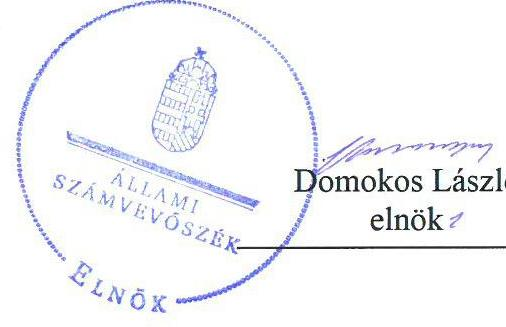
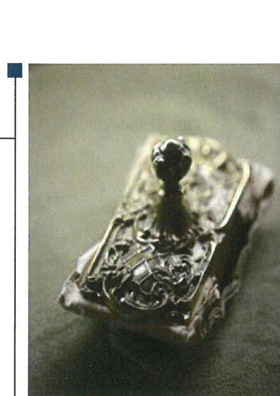
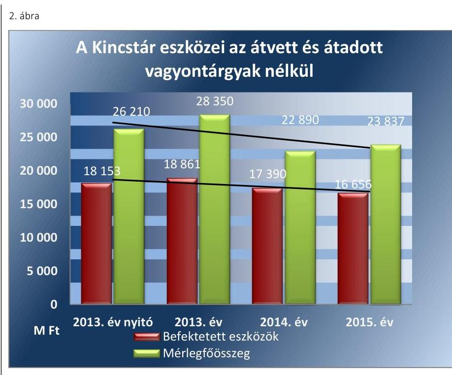

# Jelentés 

## A Magyar Államkincstár gazdálkodásának ellenőrzése

2018

---

# J elentés 

## A Magyar Államkincstár gazdálkodásának ellenőrzése

2018. 04. hó 26. nap

---

Jelentéseink az Országgyúlés számítógépes hálózatán és az Interneten a www.asz.hu címen is olvashatóak.

## AZ ELLENŐRZÉST FELÜGYELTE:

PETŐ KRISZTINA felügyeleti vezető

## AZ ELLENŐRZÉST VEZETTE ÉS A VÉGREHAJTÁSÁÉRT FELELŐS:

GÖRGÉNYI GÁBOR ellenőrzésvezető

## A PROGRAM ÖSSZEÁLLÍTÁSÁÉRT FELELŐS:

JANIK JÓZSEF LÁSZLÓ osztályvezető
TÓTPÁL SZABOLCS osztályvezető

## A TÉMÁHOZ KAPCSOLÓDÓ KORÁBBI SZÁMVEVŐSZÉKI JELENTÉSEK:

- címe: Jelentés - A Magyar Államkincstár közigazgatási hatósági tevékenységének, valamint központosított illetmény-számfejtési rendszerének ellenőrzése
- sorszáma: 16043
- címe: JELENTÉS a Magyar Államkincstár működésének és gazdálkodásának ellenőrzéséről
- sorszáma: 14098

IKTATÓSZÁM: V-1238-193/2016
TÉMASZÁM: 2272
ELLENŐRZÉS-AZONOSÍTÓ SZÁM: V0774

---

# TARTALOMJEGYZÉK 

■ ÖSSZEGZÉS ..... 5
■ AZ ELLENŐRZÉS CÉLJA ..... 7
■ AZ ELLENŐRZÉS TERÜLETE ..... 8
■ AZ ELLENŐRZÉS HÁTTERE, INDOKOLTSÁGA ..... 10
■ A JELENTÉS LÉNYEGES KÉRDÉSKÖREI ..... 11
■ AZ ELLENŐRZÉS HATÓKÖRE ÉS MÓDSZEREI ..... 12
■ MEGÁLLAPÍTÁSOK ..... 15
■ JAVASLATOK ..... 28
■ MELLÉKLETEK ..... 31
I. sz. melléklet: Értelmező szótár ..... 31
■ FÜGGELÉK: ÉSZREVÉTELEK ..... 35
■ RÖVIDÍTÉSEK JEGYZÉKE ..... 41

---

.

---

# ÖSSZEGZÉS 

A Magyar Államkincstár vezetői irányitási rendszere a 2013-2015. években nem biztositotta az elszámoltathatóságot. A Kincstár vagyongazdálkodási tevékenysége nem volt szabályszerű, míg a pénzügyi gazdálkodása a jogszabályi előirásoknak megfelelően történt. A Kincstár egyes informatikai rendszerek bevezetésével és alkalmazásával összefüggő feladatait nem látta el szabályszerűen. A Kincstár az önkormányzatokra vonatkozó szabályszerűségi pénzügyi ellenőrzési feladatait nem a jogszabályi előirásoknak megfelelően látta el. A Kincstárnál kiépített integritás kontrollok a 2015. évben nem nyújtottak védelmet a korrupció ellen. A Nemzetgazdasági Minisztérium irányító szervi feladatellátása nem volt szabályszerű.

## Az ellenőrzés társadalmi indokoltsága

A központi alrendszer részét képező intézmények alapvető rendeltetése a közfeladatok ellátásának biztosítása. A Magyar Államkincstár pénzügyi és vagyongazdálkodási tevékenysége, valamint a feladatellátásának terjedelme jelentős hatást gyakorol a költségvetés egyensúlyának fenntartására, a közpénzek szabályszerű felhasználására, az államháztartás beszámolási adatainak megbízhatóságára, az állami vagyonnal való gazdálkodás minőségére, továbbá a közpénzekkel való gazdálkodás átláthatóságára. A Magyar Államkincstár kezeli a teljes magyarországi pénzforgalom mintegy 25\%-át, közel 13 ezer intézmény számláját vezeti, és mintegy 900 ezer alkalmazott számára végez bérszámfejtést a központosított illetmény-számfejtő rendszerben. A Magyar Államkincstár működésének kiemelt jelentőségére tekintettel indokolt, hogy az Állami Számvevőszék a szervezet pénzügyi és vagyongazdálkodása szabályszerűségét rendszeresen ellenőrizze. Az ellenőrzés eredményeként javulhat a Magyar Államkincstár feladatellátásának szabályozottsága, valamint a pénzügyi és vagyongazdálkodás szabályszerűsége. A helyi önkormányzatok pénzügyi, ügyviteli, ügyintézési és egyéb alapvető feladatai ellátásának informatikai támogatása céljából a Magyar Államkincstár az állami informatikai rendszerrel összekapcsolható számítástechnikai hálózaton keresztül a helyi önkormányzatok részére távoli alkalmazásszolgáltatást nyújtó elektronikus információs rendszert működtet. A rendszer teljes körűen 2019-re épül ki, de jelentőségéből eredően indokolt a már működő alrendszerek ellenőrzése. A közpénzfelhasználás védelmi vonalainak erősítésére vonatkozó társadalmi elvárással összhangban értékeltük a Magyar Államkincstár korrupciós kockázatainak kezelését szolgáló integritás kontrollok kiépítettségét is.

## Főbb megállapítások, következtetések, javaslatok

A Magyar Államkincstár vezetői irányítási rendszere a 2013-2015. években nem biztosította az elszámoltathatóságot, mert a Magyar Államkincstár belső kontrollrendszerének kialakítása és múködtetése - a gazdálkodásra vonatkozó belső szabályzatok, valamint a kockázatkezelési és monitoring rendszerek hiányosságai miatt - nem volt szabályszerű. A jogsértő belső szabályozás kockázatot jelentett a múködés és a gazdálkodás szabályszerű, gazdaságos, hatékony és eredményes végrehajtására, a kiadási előirányzatok szabályszerű felhasználására. A 2013. január 1-jétől 2015. június 15-ig tartó időszakban dokumentáltan nem mérték fel és nem állapították meg a Magyar Államkincstár gazdálkodásában rejlő kockázatokat, valamint nem határozták meg az egyes kockázatokkal kapcsolatban szükséges intézkedéseket. Ebből eredően fennállt annak a kockázata, hogy elmarad a gazdálkodási tevékenységgel összefüggő kockázatok és várható hatásuk olyan időben való jelzése, amikor még megelőző módon lehet a megfelelő intézkedéseket, döntéseket meghozni. A kockázatkezelési és monitoring rendszerek működtetését a belső ellenőrzési feladatokat ellátó Ellenőrzési Főosztály végezte, amely ellentétes a belső ellenőrök funkcionális függetlenségére vonatkozó jogszabályi előírásokkal.

A Magyar Államkincstár vagyongazdálkodási tevékenysége nem volt szabályszerű, mert nem tett eleget az állami vagyonelemekre vonatkozó értékmegőrzési kötelezettségének, továbbá az állami vagyonelemek hasznosítása sem

---

felelt meg a jogszabályi előírásoknak. A bérleti szerződések megkötése során a szerződő felek vonatkozásában nem győződtek meg az átláthatóság követelményének érvényesüléséről, ennek következtében fennállt a kockázata, hogy a Magyar Államkincstár olyan vállalkozással került szerződéses kapcsolatba, amelynek tulajdonosi szerkezete nem átlátható, így nem felel meg a jogszabályi követelményeknek.

A Magyar Államkincstár 2013-2015. évi pénzügyi gazdálkodása szabályszerű volt. Az elemi költségvetés megállapítása és az előirányzatok felhasználása során a Magyar Államkincstár betartotta a jogszabályi előírásokat, az éves beszámolási kötelezettségének eleget tett.

A Magyar Államkincstár szakmai feladatait érintő változások lebonyolítása szabályszerű volt, azonban a vezetői feladatok átadás-átvétele hiányosan történt meg.

A Magyar Államkincstár a központosított illetmény-számfejtő rendszer és a helyi önkormányzatok részére távoli alkalmazásszolgáltatást nyújtó elektronikus információs rendszer bevezetésével és alkalmazásával összefüggő feladatait nem látta el szabályszerűen. A központosított illetmény-számfejtő rendszer alkalmazása során a nem tartották be a jogszabályi előírásokat. A rendszer működtetésének alapvető feltételeit nem biztosították, mert a rendszerrel kapcsolatos információbiztonsági kontrollokat nem megfelelően alakították ki.

A Magyar Államkincstár a helyi önkormányzatok részére távoli alkalmazásszolgáltatást nyújtó elektronikus információs rendszer működésének szabályait nem alakította ki megfelelően, így nem volt biztosított az adatok szabályszerű kezelése és védelme.

A Kincstár az önkormányzatokra vonatkozó szabályszerűségi pénzügyi ellenőrzési feladatait nem a jogszabályi előírásoknak megfelelően látta el.

A Magyar Államkincstárnál kiépített integritás kontrollok a kockázatokhoz mérten nem voltak megfelelőek, nem nyújtottak védelmet a korrupció ellen. Az integritás kontrollok megfelelő működése érdekében a Magyar Államkincstárnak indokolt további lépéseket tennie.

A Nemzetgazdasági Minisztérium irányító szervi feladatellátása nem volt szabályszerű az alapítói okiratok hiányosságai, valamint a Magyar Államkincstár elnöke teljesítményértékelésének elmaradása miatt.

Az Állami Számvevőszék a nemzetgazdasági miniszternek három, a Magyar Államkincstár elnökének 16 javaslatot fogalmazott meg annak érdekében, hogy a szabálytalanságok, hiányosságok megszüntetésre kerüljenek.

---

# AZ ELLENŐRZÉS CÉLJA

**AZ ELLENŐRZÉS CÉLJA** annak megítélése volt, hogy a Kincstárra vonatkozó irányító szervi feladatellátás a jogszabályi előírások betartásával történt-e; a belső kontrollrendszer kialakítása és működtetése szabályszerű volt-e; a Kincstár pénzügyi és vagyongazdálkodása megfelelő-e a jogszabályi előírásoknak és belső szabályzatokban foglaltaknak; valamint a Kincstár feladatait érintő átalakítás vagy átszervezés lebonyolítása szabályszerűen történt-e.

Az ellenőrzés célja továbbá a központosított illetmény-számfejtő rendszer és a helyi önkormányzatok részére távoli alkalmazásszolgáltatást nyújtó elektronikus információs rendszer tekintetében annak megítélése volt, hogy a Kincstár a rendszereket a jogszabályi előírásoknak megfelelően szabályszerűen működtette-e, kialakították-e a rendszerek működtetését szabályozó belső utasításokat, felelősségi köröket. A helyi önkormányzatok részére távoli alkalmazásszolgáltatást nyújtó elektronikus információs rendszer esetében a már működő szakrendszerek működtetési szabályainak meghatározásával biztosították-e az adatok szabályszerű kezelését és védelmét. Az ellenőrzés célja továbbá annak megítélése volt, hogy szabályszerű volt-e a Kincstár helyi önkormányzatoknál végzett szabályszerűségi pénzügyi ellenőrzési feladatainak ellátása.

Az ellenőrzés keretében értékeltük továbbá a Magyar Államkincstár korrupciós kockázatainak kezelését szolgáló integritás kontrollok kiépítettségét.

---

# **AZ ELLENŐRZÉS TERÜLETE**

## **A Magyar Államkincstár**

*Kép forrása: államkincstar.gov.hu*

A Kincstár az államháztartásért felelős miniszter irányítása alatt álló központi hivatal, központi költségvetési szerv, amely az NGM² költségvetési fejezetében önálló címet alkot.

A Kincstár felelős a központi alrendszerhez tartozó intézmények pénzellátásáért, fizetőképességük biztosításáért, valamint az állami költségvetés keretében a pénzforgalmuk lebonyolításáért és elszámolásáért. Meghatározó szerepe van az állampapírok forgalmazásában, közreműködik az uniós támogatások folyósításában.

Jelentős feladatváltozás történt 2015. április 1-jétől, amikor a Kincstár megyei igazgatóságaitól a családtámogatási és szociális ellátási, valamint a lakáscélú állami támogatásokkal öszszefüggő feladatai a fővárosi és megyei kormányhivatalokhoz kerültek. A Kincstár központi szerve által ellátott családtámogatásokkal, a fogyatékossági támogatással (vakok személyi járadékával), a nagycsaládos gázdíjkedvezménnyel, bányászati kereset-kiegészítéssel összefüggő feladatok, valamint a másodfokú hatósági feladatok tekintetében a jogutód az ONYF³ lett.

A Kincstár 2015 novemberétől a központosított illetmény-számfejtő rendszer keretében látja el – több mint 900 ezer – állami, valamint önkormányzati költségvetési szervnél foglalkoztatott kormány- és köztisztviselő, közalkalmazott, munkaviszonyban, hivatásos szolgálati, illetve nevelőszülői jogviszonyban, valamint munkavégzésre irányuló egyéb jogviszonyban álló foglalkoztatott személyi juttatásának, egészségbiztosítási ellátásának számfejtését, illetve a foglalkoztatót terhelő közterhek egységes kimutatását, valamint az ehhez kapcsolódó adók- és járulékok elszámolását és bevallását.

A helyi önkormányzatok részére távoli alkalmazásszolgáltatást nyújtó elektronikus információs rendszer – a Kincstár által működtetett – a helyi önkormányzatok feladatellátását támogató, számítástechnikai hálózaton keresztül megvalósuló távoli alkalmazásszolgáltatást nyújtó elektronikus információs rendszer, amely a szakfeladatok ellátását lehetővé tevő szakrendszerből, az egységes felületet és hozzáférést biztosító keretrendszerből és a napi adminisztratív és működtetési feladatokat segítő támogató rendszerekből tevődik össze.

A 257/2016. (VIII. 31.) Korm. rendelet⁴ alapján a helyi önkormányzatok részére távoli alkalmazásszolgáltatást nyújtó elektronikus információs rendszer 8 szakrendszerből, a keret-, illetve támogató rendszerekből, valamint az önkormányzati adattárházból épül fel. A szakrendszerek közül az ellenőrzött időszakban a gazdálkodási rendszer és az önkormányzati adórendszer működött, így a jelentésben foglalt megállapítások e két szakrendszerre vonatkoznak. Az 257/2016. (VIII. 31.) Korm. rendelet alapján a további szakrendszerekhez 2018. január 1-jéig kell csatlakoznia a helyi önkormányzatoknak. Az önkormányzati adattárházhoz való csatlakozás határideje pedig rendszercsatlakozás esetén 2019. március 31., interfészes

---

csatlakozás esetén 2019. január 1. Az önkormányzati adattárház a rendszer egyik kulcseleme lesz, amely a gazdasági adatok átfogó elemzési lehetőségével teszi teljes értékűvé a helyi önkormányzatok részére távoli alkalmazásszolgáltatást nyújtó elektronikus információs rendszer múködését.

A Kincstár 2015-től szabályszerűségi pénzügyi ellenőrzést végez a helyi önkormányzatok, nemzetiségi önkormányzatok, társulások, térségi fejlesztési tanácsok és az általuk irányított költségvetési szervek körében. A Kincstár által végzett szabályszerűségi pénzügyi ellenőrzések legfontosabb célja, hogy az adott évben elvégzett pénzügyi ellenőrzések alapján megállapítsa, hogy az önkormányzati alrendszer éves beszámolói megbízhatóak, valós képet mutatnak, és lényeges hibát nem tartalmaznak.

A Kincstárnál dolgozók átlagos statisztikai állománya 2013-ban 3971 fő, 2014-ben 4290 fő, 2015-ben 4100 fő, 2016-ban pedig 4394 fő volt.

A Kincstár első számú vezetői személyében három alkalommal történt változás az ellenőrzött időszakban. A Kincstár általános elnökhelyettesétől 2013. január 9-én vette át a feladatokat a Kincstár elnöke, majd megbízatásának megszűnésével 2013. május 9-én adta vissza szintén a Kincstár általános elnökhelyettesének. Ezt követően 2014. február 7-én a Kincstár általános elnökhelyettese ismét átadta a feladatokat a Kincstár új elnökének.

A Kincstár 2013-2015. évi eredeti, módosított és teljesített kiadási előirányzatainak alakulását pedig az 1. ábra szemlélteti (Mrd Ft-ban):
1. ábra

| Mrd Ft | A Kincstár kiadási előiránytatainak alakulása a 2013-2015. években |
| :--: | :--: |
| 130 | 127,1 |
| 130 | 121,8 |
| 90 | 89,8 |
| 90 | 79,1 |
| 30 | 23,1 |
| 10 | 20,1 |

Adatok forrása: a Kincstár éves költségvetési beszámoló

---

# AZ ELLENŐRZÉS HÁTTERE, INDOKOLTSÁGA 

Az államháztartás múködésében kiemelt szerepet betöltő Kincstár feladatellátásának megfelelősége az államháztartás egésze szempontjából kockázatot hordoz. A Kincstár feladatellátása, pénzügyi és vagyongazdálkodási tevékenysége jelentős hatást gyakorolhat a közpénzek szabályszerű felhasználására, a költségvetés egyensúlyának javítására, az államháztartás beszámolási adatainak megbízhatóságára, továbbá az állami vagyonnal való gazdálkodás minőségére.

Az Áht. ${ }^{5}$ útján előírt, a Kincstár által működtetett, a korábbi feladatellátáshoz képest nagyobb körű adatfeldolgozási, számfejtési, nyilvántartási és adatszolgáltatási feladatot jelentő központosított illetmény-számfejtő rendszer és az Mötv. ${ }^{6}$ révén meghatározott új kincstári feladatként megjelent a helyi önkormányzatok részére távoli alkalmazásszolgáltatást nyújtó elektronikus információs rendszer széles társadalmi rétegeket érintő kiemelt jelentőségére tekintettel indokolt, hogy az ÁSZ, e rendszerek múködésének szabályszerűségét ellenőrizze.

Az Áht. alapján 2015. január 1-jétől a Kincstár által a helyi önkormányzatok, nemzetiségi önkormányzatok, társulások, térségi fejlesztési tanácsok és az általuk irányított költségvetési szervek körében ellátott szabályszerűségi pénzügyi ellenőrzések megfelelősége hozzájárulhat az önkormányzati alrendszer államszámviteli rendszerében képződött adatok megbízhatóságához. A Kincstár múködésének kiemelt jelentőségére tekintettel indokolt, hogy az ÁSZ ${ }^{7}$ a szervezet múködésének, valamint pénzügyi és vagyongazdálkodásának szabályszerűségét rendszeresen ellenőrizze. Az ellenőrzés eredményeként javulhat a Kincstár feladatellátásának szabályozottsága, valamint a pénzügyi és vagyongazdálkodása szabályszerűsége.

---

# A JELENTÉS LÉNYEGES KÉRDÉSKÖREI 

1.     - A Kincstárra vonatkozó irányító szervi feladatellátás szabályszerű volt-e?
2.     - A belső kontrollrendszer kialakítása és müködtetése megfelelő volt-e?
3.     - A Kincstár pénzügyi gazdálkodása szabályszerű volt-e?
4.     - A Kincstár vagyongazdálkodása szabályszerű volt-e?
5.     - Szabályszerüen történt-e a Kincstár szakmai és vezetői feladatait érintő változások lebonyolítása?
6.     - Szabályszerü volt-e az önkormányzatokra vonatkozó kincstári ellenőrzési feladatok ellátása?
7. Megfelelően kiépítették-e az integritás kontrollokat a Kincstárnál?

---

# AZ ELLENŐRZÉS HATÓKÖRE ÉS MÓDSZEREI 

## Az ellenőrzés típusa

Megfelelőségi ellenőrzés.

## Az ellenőrzött időszak

Az ellenőrzött időszak 2013. január 1-jétől 2015. december 31-ig tartott. Az integritás kontrollok ellenőrzésének vonatkozásában az ellenőrzött időszak a 2015. év volt.

A központosított illetmény-számfejtő rendszer és a helyi önkormányzatok részére távoli alkalmazásszolgáltatást nyújtó elektronikus információs rendszerek vonatkozásában az ellenőrzött időszak 2016. január 1-jétől 2017. január 1-jéig, az egyes önkormányzatokra vonatkozó kincstári ellenőrzési feladatok tekintetében pedig 2015. január 1-jétől 2016. december 31-ig tartott.

## Az ellenőrzés tárgya

A Kincstárra vonatkozó irányító szervi feladatok ellátása. A Kincstár belső kontroll rendszerének kialakítása és múködtetése, valamint a pénzügyi és vagyongazdálkodása. A Kincstár feladatai átalakításának vagy átszervezésének lebonyolítása.

A Kincstár által működtetett központosított illetmény-számfejtő rendszer és a helyi önkormányzatok részére távoli alkalmazásszolgáltatást nyújtó elektronikus információs rendszerek bevezetésével és alkalmazásával összefüggő feladatainak ellátása, valamint az egyes önkormányzatok körében végzett szabályszerűségi pénzügyi ellenőrzési feladatai ellátása.

Az ellenőrzés kiterjedt minden olyan körülményre és adatra, amely az ÁSZ jogszabályban meghatározott feladatainak teljesítéséhez, valamint a program végrehajtása folyamán felmerült újabb összefüggések feltárásához szükséges.

## Az ellenőrzött szervezet

A Magyar Államkincstár, valamint irányító szerve a Nemzetgazdasági Minisztérium.

---

# Az ellenőrzés jogalapja 

Az ellenőrzés jogszabályi alapját az ÁSZ tv. ${ }^{8} 1$. § (3) bekezdése, valamint az 5. § (2)-(6) bekezdései képezi.

## Az ellenőrzés módszerei

Az ellenőrzést az ellenőrzési program szempontjai, az ellenőrzött időszakban hatályos jogszabályok, az ellenőrzés szakmai szabályai, a jelen ellenőrzésre irányadó ÁSZ módszertanok alapján végeztük.

Az ellenőrzési kérdések megválaszolásához szükséges bizonyítékok megszerzése az ellenőrzött által rendelkezésre bocsátott dokumentumokra, adatokra alapozva megfigyelés, szemle (szemrevételezés), kérdésfeltevés (információkérés), mintavételezés, valamint elemző eljárás útján történt. Az ellenőrzési bizonyítékként felhasználható adatforrások közé tartoztak egyrészt az ellenőrzési program részletes szempontjainál felsorolt adatforrások, másrészt minden egyéb - az ellenőrzés folyamán feltárt, az ellenőrzés szempontjából információt tartalmazó - dokumentum.

Az ellenőrzés lefolytatásához a Kincstár, valamint az NGM, mint ellenőrzött szervezetek tanúsítványok kitöltésével, valamint az ÁSZ által kért dokumentumok megküldésével szolgáltattak adatokat.

Mintavétellel ellenőriztük a személyi juttatások, a működési és felhalmozási kiadások, valamint a bevételek beszedése esetében a pénzügyi elszámolások, valamint a pénzügyi jogkörök gyakorlásának szabályszerűségét. Mintavétellel ellenőriztük továbbá az előirányzat-módosítások végrehajtásának, valamint az előirányzat maradvány megállapításának szabályszerűségét, a belső kontrollrendszer egészének és egyes elemei kialakításának és működésének megfelelőségét, valamint a belső ellenőrzési tevékenység szabályszerűségét. A vagyongazdálkodás területén mintavétellel ellenőriztük a felhalmozási kiadásokhoz kapcsolódóan a vagyonelemek nyilvántartásba vételét, illetve a bevételek beszedéséhez kapcsolódóan a vagyonelemek hasznosításának és értékesítésének szabályszerűségét.

A minta alapján a sokaságban a tételek, illetve kérdések átlagos megfelelőségi arányát becsültük. Az értékelés eredményeként kétféle, „Megfelelő" és „Nem megfelelő" minősítést alkalmaztunk. „Megfelelőnek" értékeltünk egy ellenőrzött területet, amennyiben a megfelelőségi arány a teljes sokaságban 95\%-os bizonyossággal nagyobb, mint 90\%, illetve „Nem megfelelőnek" értékeltük, amennyiben a megfelelőségi arány legfeljebb 90\%. Abban az esetben, ha adott sokaság tekintetében a 90\%-os megfelelőségi arány átlépése megítélésének megbízhatósága nem érte el a 95\%ot, akkor minősítettük „Megfelelőnek" a területet, ha a minta alapján a teljes sokaság vonatkozásában a megfelelőségi arány nagyobb valószínűséggel volt $90 \%$ feletti, mint $90 \%$ alatti.

Mintavétellel ellenőriztük a Kincstár által az egyes önkormányzatoknál végzett szabályszerűségi pénzügyi ellenőrzési tevékenység szabályszerűségét. A minta alapján a sokaságban a tételek, illetve kérdések átlagos megfelelőségi arányát becsültük. Az értékelés eredményeként kétféle, „Megfelelő" és „Nem megfelelő" minősítést alkalmaztunk. „Megfelelőnek" érté-

---

keltünk egy ellenőrzött területet, amennyiben a megfelelőségi arány a teljes sokaságban 95\%-os bizonyossággal nagyobb, mint 90\%, illetve „Nem megfelelőnek" értékeltük, amennyiben a megfelelőségi arány legfeljebb $90 \%$.

Az integritás kontrollok értékelése a Kincstár által az ÁSZ integritás projektje keretében kitöltött kérdőív alapján, valamint a Kincstár integritás kontroll rendszerének ellenőrzésével történt.

Az integritás kontrollok megfelelőségének megítélésekor öt területet Összeférhetetlenség és etikai elvárások, Humánerőforrás-gazdálkodás, Szervezet vagyonának megvédésére tett intézkedések, A nemkívánatos dolgozói magatartással szembeni intézkedések és azok érvényesülése, Az integritás erősítése, annak tudatosítása, valamint a kockázatelemzések alkalmazása - értékeltünk. Egy területen belül az integritás kontrollokat az integritást erősítő kontrollok kiépítettségének és azok alkalmazásának értékelésén keresztül minősítettük. Ha az egyes rendszerelemek értékelése meghaladta a 61\%-ot, akkor a kockázatokkal arányosnak, ha nem érte el a 61\%-ot a kockázatokhoz mérten nem megfelelőnek minősítettük. Amenynyiben két terület értékelése is nem megfelelőnek bizonyult, az integritás kontrollok egészének értékelése is nem megfelelő minősítést kapott.

---

# 1. A Kincstárra vonatkozó irányító szervi feladatellátás szabályszerű volt-e? 

Összegző megállapítás

Az NGM irányító szervi feladatellátása nem volt szabályszerű a Kincstár alapító okiratainak ${ }^{9}$ hiányosságai, valamint a Kincstár elnöke teljesítményértékelésének elmaradása miatt.

AZ ALAPÍTÓI JOGOK GYAKORLÁSA nem felelt meg maradéktalanul az Áht., valamint az Ávr. ${ }^{10}$ előírásainak az alapító okiratok hiányosságai miatt. A Kincstár az Áht. előírásainak megfelelően rendelkezett alapító okirattal, melyet a nemzetgazdasági miniszter adott ki, de az nem felelt meg a jogszabályi előírásoknak a következők miatt:

- A 2014. december 13-ig hatályos alapító okiratban szereplő alaptevékenységek között az Ávr. 5. § (1) bekezdés c) pont előírásai ellenére kimaradtak a kárpótlási jegyek őrzésével és kezelésével kapcsolatos, az Áht. 76. § (2) bekezdés d) pontjában előírt feladatok.
- Az alapító okirat 2014. december 13-ig az Ávr. 5. § (1) bekezdés c) pont előírásai ellenére nem tartalmazta az Ávr. 125. § (5) bekezdésében, valamint a Cst. ${ }^{11} 37$. § (5) bekezdésében és a Gyvt. ${ }^{12}$ 68/B. § (5) bekezdésében is szereplő számlakezelési feladatot, amelyek alapján a Kincstár a helyi önkormányzatok részére a természetben nyújtott családi pótlék összegének kezelésére számlát vezet.
- A Kincstár 2013-2015. évi szöveges beszámolói szerint alkalmazott közfoglalkoztatottakat is, de ezt a jogviszonyt a 2013-2015. években hatályos alapító okiratok nem tartalmazták az Ávr. 5. § (1) bekezdés h) pontja ellenére.

A MUNKÁLTATÓI JOGOSULTSÁGOKAT 2013. július 1-jétől az NGM nem gyakorolta szabályszerűen, mert nem alakította ki és nem múködtette a Kincstár elnöke vonatkozásában az egyéni teljesítményértékelő rendszert.

Az NGM a 10/2013. (I. 21.) Korm. rendelet ${ }^{13}$ 5. § (1) bekezdés a) pontjában foglalt előírás ellenére nem határozta meg a Kincstár elnökének egyéni teljesítménykövetelményeit, nem rögzítette írásban az egyéni teljesítménykövetelményeket, és nem történt meg a teljesítménykövetelmények alapján az egyéni teljesítményértékelések elvégzése a 10/2013. (I. 21.) Korm. rendelet 11-12. § előírásainak megfelelően.

A Kincstár elnökét a Kttv. ${ }^{14}$ 38. § (1) bekezdése, valamint a Ksztv. ${ }^{15}$ 2. § (1) bekezdés b) pontjában, és a 73. (4) bekezdésében foglaltak alapján nevezte ki az NGM minisztere. A Kincstár elnöke a tevékenységét a kinevezési okirata alapján a Kttv. 129. § (1) bekezdése alapján főosztályvezetői munkakörben látta el. A 10/2013. (I. 21.) Korm. rendelet 1. § (1) bekezdés

---

a) pontja szerint a rendelet hatálya kiterjed a Kttv. 1. és 2. §-ában meghatározott közigazgatási szervekre, az ott foglalkoztatott kormánytisztviselőre és köztisztviselőre, így a Kincstár elnökére is.

Az NGM SZMSZ ${ }^{16}$ 2013. június 3-ig hatályos 52. § (1) bekezdés k) pontja, a 2014. március 7-ig hatályos 49. § (1) bekezdés k) pontja, a 2015. január 21-ig hatályos 49. § (1) bekezdés I) pontja, valamint a 2015. január 22-től hatályos 52. § (1) bekezdés n) pontja szerint a kincstárért felelős helyettes államtitkár kialakítja a kincstári stratégiát, valamint a miniszter és az államtitkár utasításai szerint irányítja a Magyar Államkincstárt. Az NGM SZMSZ 2. függeléke szerint a kincstárért felelős helyettes államtitkár irányítása alá tartozó szervezeti egységek közül az Önkormányzati Költségvetési Rendszerek Főosztálya tart napi kapcsolatot az Államkincstár Elnökével, figyelemmel kíséri a Kincstár szervezetét, tevékenységét, szükség esetén javaslatot tesz az ezek módosítását célzó intézkedésekre. Egyéb feladatai körében a Főosztály vizsgálja a Kincstár tevékenységének szabályszerűségét és teljesítményét, indokolt esetben intézkedést kezdeményez.

Mindezek alapján a kincstárért felelős helyettes államtitkár és irányítása alá tartozó főosztály felelőssége lett volna a hiányzó teljesítményértékelés előkészítése.

# AZ EGYÉB IRÁNYÍTÁSI ÉS FELÜGYELETI JOGO- 

SULTSÁGOK gyakorlása szabályszerűen történt. Az NGM a Kincstár tervezett bevételei és kiadásai megállapításához az Áht. és az Ávr. előírásaival összhangban kiadta az általános és kötelezően érvényesítendő tervezési követelményeket, jóváhagyta a Kincstár elemi költségvetését, beszámolóját, éves létszám-előirányzatát és előirányzat-maradványát. A bevételi és kiadási előirányzatokkal való gazdálkodást rendszeresen figyelemmel kísérte.

---

# 2. A belső kontrollrendszer kialakítása és múködtetése megfelelő volt-e? 

Összegző megállapítás
2.1. számú megállapítás

A belső kontrollrendszer kialakítása és múködtetése nem volt megfelelő a belső szabályozás, a kockázatkezelési és monitoring rendszerek hiányosságai miatt. A Kincstár a központosított illetmény-számfejtő rendszer, valamint a távoli alkalmazásszolgáltatást nyújtó elektronikus információs rendszer bevezetésével és alkalmazásával összefüggő feladatait nem látta el szabályszerűen.

A kontrollkörnyezet a belső szabályozottság hiányosságai miatt nem felelt meg a jogszabályi előírásoknak. A Kincstár a központosított illetmény-számfejtő rendszer bevezetése és alkalmazása során nem tartotta be a jogszabályi előírásokat. A rendszerrel kapcsolatos információbiztonsági kontrollokat a Kincstár nem megfelelően alakította ki.

A KINCSTÁR RENDELKEZETT SZMSZ ${ }^{17}$-SZEL, amelyet a nemzetgazdasági miniszter adott ki, de az több ponton nem felelt meg a jogszabályi előírásoknak:

- Az SZMSZ 2015. június 18-ig az Ávr. 13. § (1) bekezdés c) pontjával ellentétben nem tartalmazta az Áht. 104. § (6) bekezdésében 2015. június 18 -ig meghatározott, törzskönyvi nyilvántartás adatait érintő nyilvánosságra hozatallal, a közzététellel kapcsolatos feladatokat.
- Az SZMSZ 2014. szeptember 11-ig az Ávr. 13. § (1) bekezdés c) pontjával ellentétben nem tartalmazta az Áht. 106. § (1) bekezdése által 2015. március 31-ig meghatározott, az egységes szociális nyilvántartás vezetésével kapcsolatos feladatokat.
- Az SZMSZ 2014. szeptember 11-ig a Kincstár szervezeti egységei között nem nevesítette a gazdasági szervezetet, ezáltal nem felelt meg maradéktalanul az Ávr. 13. § (1) bekezdés e) pontjában foglaltaknak.
- A 2013-2015. években hatályos SZMSZ nem felelt meg továbbá az Ávr. 13. § (1) bekezdés d) pont szerinti előírásnak, mivel nem tartalmazta azon gazdálkodó szervezet (Kincsinfo Nkft. ${ }^{18}$ ) megnevezését, amely tekintetében a Kincstár alapítói, tulajdonosi jogokat gyakorol.

A KONTROLLKÖRNYEZET a belső szabályozottság következőkben megállapított hiányosságai miatt nem felelt meg a Bkr. ${ }^{19}$ 6. § (2) bekezdése előírásainak, mert a Kincstár elnöke, mint a szervezet vezetője által kiadott szabályzatok nem biztosították maradéktalanul a rendelkezésre álló források szabályszerű, szabályozott, gazdaságos, hatékony és eredményes felhasználását:

MUNKAKÖRI LEÍRÁSSAL a gazdasági vezető a Kttv. 75. § (1) bekezdés d) pontja előírásai ellenére 2014. november 1-jét követően nem

---

rendelkezett, melynek következtében nem volt biztosított a számon kérhető, elszámoltatható, a felelősségi és hatásköri viszonyok érvényesítésére maradéktalanul alkalmas feladatellátás.

# A KINCSTÁR RENDELKEZETT A GAZDÁLKO- 

DÁSRA VONATKOZÓ SZABÁLYZATOKKAL, de azok nem feleltek meg maradéktalanul az Ávr., a Számv. tv. ${ }^{20}$, az Áhsz. ${ }^{21}$, az Áhsz. ${ }^{22}$ és az Ibtv. ${ }^{23}$ előírásainak. A szabályzatok nem teljes körűen, nem az éppen hatályos jogszabályi előírásoknak megfelelően, vagy a jogszabályi előírásokkal ellentétes módon tartalmazták a gazdálkodási tevékenységgel összefüggő előírásokat:
$\longrightarrow$ A Számviteli politika ${ }^{24}$ függelékeként kiadott Számlarend ${ }^{25}$ az Áhsz. ${ }_{1}$ 49. § (3) bekezdés, illetve az Áhsz. ${ }_{2}$ 51. § (3) bekezdés előírása ellenére nem tartalmazta a részletező (analitikus) nyilvántartásoknak a kapcsolódó könyvviteli és nyilvántartási (főkönyvi) számlákkal való egyeztetésének és annak dokumentálásának szabályozását.
$\longrightarrow$ A Számviteli politika részét képező eszközök és források értékelési szabályzata az Áhsz. ${ }_{1}$ 8. § (17) bekezdés d) pontjában, illetve az Áhsz. ${ }_{2}$ 50. § (2) bekezdés b) pontjában foglaltak ellenére nem tartalmazta követeléstípusonként a kisösszegű követelések év végi meghatározásának elveit, dokumentálásának szabályait.
$\longrightarrow$ A Leltározási szabályzat ${ }^{26}$ a használt, de a mérlegben értékkel nem szereplő immateriális javak és készletek leltározási módjáról az Áhsz. ${ }_{1}$ 37. § (6) bekezdés és az Áhsz. ${ }_{2}$ 22. § (2) bekezdés b) pont előírása ellenére nem rendelkezett.
$\longrightarrow$ A Pénzkezelési szabályzatot ${ }^{27}$ az Áhsz. ${ }_{2}$ megjelenésével összefüggésben nem aktualizálták, ezáltal a szabályzaton 2014-2015. években nem került átvezetésre, hogy az Áhsz. ${ }_{1}$ hatályon kívül helyezésével és az Áhsz. ${ }_{2}$ hatálybalépésével a kincstári tranzakciós kódok alkalmazása megszűnt és bevezetésre került az egységes rovatrend alkalmazása. A Pénzkezelési szabályzat az elektronikus átutalásokkal kapcsolatos felelősségi szabályokról nem rendelkezett, így a Számv. tv. 14. § (8) bekezdése rendelkezése ellenére nem tartalmazta teljes körűen a pénzkezelés felelősségi szabályait.
$\longrightarrow$ A Személyi juttatások gazdálkodási szabályzata ${ }^{28}$ a kötelezettségvállalások ellenjegyzésére a területi szervek vonatkozásában összesítő bizonylat alkalmazását írta elő. A szabályozás nem volt összhangban az Ávr. 55. § (1) bekezdés előírásával, mely szerint a pénzügyi ellenjegyzést a kötelezettségvállalás dokumentumán kell igazolni.
A szabályzat az érvényesítők feladatait nem az Ávr. 58. § (1)-(2) bekezdésével összhangban, hanem a korábbi jogszabályi terminológia (az államháztartás működési rendjéről szóló 217/1998. (XII. 30.) Korm. rendelet 135. § (3) bekezdés) alapján határozta meg. Ebből eredően a személyi juttatások vonatkozásában az érvényesítők a gyakorlatban több esetben nem az Ávr. előírásai szerint jártak el.
$\longrightarrow$ A Kincstár a központosított illetmény-számfejtő rendszer információbiztonsági kontrolljait nem megfelelően alakította ki, ugyanis nem tettek eleget az Ibtv. 8. § (7) bekezdésében foglalt előírásoknak.

---

# Megállapítások 

A gazdálkodási tevékenységhez kapcsolódó egyéb szabályzatok esetében hiányosság volt, hogy a Gépjármú használat eljárási és elszámolási rendje ${ }^{29}$ alapján az engedéllyel rendelkezők a személygépkocsikat belföldön korlátozás nélkül használhatták, amely 2015. szeptember 21-ig nem felelt meg a 192/2010. (VI. 10.) Korm. rendelet ${ }^{30}$ 9/A. § rendelkezéseinek.

A hatályos iratkezelési szabályzat ${ }^{31}$ nem felelt meg az Ltv. ${ }^{32}$ 10. § (1) bekezdés b) pontjában foglaltaknak, mert az nem a Magyar Nemzeti Levéltárral, az illetékes szaklevéltárral és a köziratok kezelésének szakmai irányításáért felelős miniszterrel egyetértésben került kiadásra.

## 2.2. számú megállapítás

## 2.3. számú megállapítás

## A kockázatkezelési rendszer kialakítása és múködtetése nem felelt meg a jogszabályi előírásoknak.

A kockázatkezelési rendszer múködtetésének feladatait az SZMSZ alapján az Ellenőrzési Főosztály látta el, amely ellentétes a Bkr. 19. § (2) bekezdésének, illetve annak b) pontjának - a belső ellenőrök funkcionális függetlenségére vonatkozó - előírásaival.

A Bkr. 3. § b) pontjában és a 7. § (1) bekezdésében foglaltak ellenére a Kincstár elnöke, mint a szervezet vezetője nem múködtetett a belső kontrollrendszer keretében - a szervezet minden szintjén érvényesülő - kockázatkezelési rendszert.

A szabályozási hiányosságot a 2015. június 15-én hatályba lépett Kockázatkezelési Szabályzat ${ }^{33}$ megszüntette, amely megteremtette a szabályszerű feladatellátás feltételeit. A gyakorlatban azonban a Bkr. 7. § (1)-(2) bekezdéseiben és a belső szabályzatban foglaltak ellenére a Kincstár elnöke továbbra sem múködtette a kockázatkezelési rendszert, mert elmaradt a Kincstár tevékenységében, gazdálkodásában rejlő kockázatok felmérése és megállapítása, valamint az egyes kockázatokkal kapcsolatban szükséges intézkedések és azok teljesítésének folyamatos nyomon követési módjának meghatározása.

## A kontrolltevékenységek múködtetése - a személyi juttatások kivételével - megfelelt a jogszabályokban és a belső szabályzatokban foglaltaknak.

A Kincstár elnöke a Bkr. előírásaival összhangban a Kötelezettségvállalási szabályzatban és az Ellenőrzési nyomvonal ${ }^{34}$ mellékleteiben megfelelően kialakította a szervezeti kontrolltevékenységeket, és biztosította a szabályozás szintjén azok feladatköri elkülönítését.

A kötelezettségvállalásra, pénzügyi ellenjegyzésre, teljesítésigazolásra, érvényesítésre, valamint utalványozásra jogosultak aláírás mintájáról az Ávr. előírásainak megfelelően a belső szabályzatokban foglaltak szerint naprakész nyilvántartást vezettek.

A pénzgazdálkodási jogkörök gyakorlása - a személyi juttatásokkal kapcsolatos kiadások kivételével (lásd. 3.3. megállapítás) - az Áht., az Ávr. és a Bkr. előírásait betartva szabályszerűen történt.

---

### 2.4. számú megállapítás

Az információs és kommunikációs folyamatok kialakítása és múködtetése megfelelt a jogszabályi előírásoknak. A helyi önkormányzatok részére távoli alkalmazásszolgáltatást nyújtó elektronikus információs rendszer múködésének szabályait a Kincstár nem alakította ki megfelelően.

A Kincstár elnöke a Bkr. előírásai alapján kialakította és működtetette a szervezet információs és kommunikációs rendszerét. A beszámolási szinteket, határidőket és módokat belső szabályzatokban határozták meg. A Kincstár biztosította, hogy a szükséges információk, maradéktalanul, megfelelő időben eljussanak az illetékes szervezethez, szervezeti egységhez, személyhez, az Info tv. ${ }^{35}$-ben előírt közzétételi kötelezettségének eleget tett.

AZ ADATOK, INFORMÁCIÓK VÉDELMÉVEL KAPCSOLATOS ELŐÍRÁSOKAT, az adatkezelési feladatokat a Kincstár IBSZ ${ }^{36}$-e általános jelleggel tartalmazta. A Kincstár 2016. szeptember 2 -áig a 62/2015. (III. 24.) Korm. rendelet ${ }^{37}$ 2. § (4) bekezdés g) pontjában, 2016. szeptember 3-tól a 257/2016. (VIII. 31.) Korm. rendelet 4. § (4) bekezdésben szabályozott feladatkörében nem tett eleget az Ibtv. 11. § (1) bekezdés f) pontja szerinti szabályozási kötelezettségének. A belső szabályozások alapján nem volt biztosított a helyi önkormányzatok részére távoli alkalmazásszolgáltatást nyújtó elektronikus információs rendszer szakrendszereiben képződött adatok védelméről való gondoskodás, így az adatok elkülönített tárolása, az adatgazda helyi önkormányzat kizárólagos hozzáférése és az adatok védelme.
2.5. számú megállapítás

A monitoring rendszer szervezeti kialakítása és működtetése nem felelt meg a jogszabályi előírásoknak. A monitoring rendszer részét képező belső ellenőrzések tervezése és végrehajtása megfelelő volt.

A Kincstár belső kontrollrendszere keretében kialakított monitoring rendszer működtetésének eljárásrendjét Monitoring Kézikönyv ${ }^{38}$ szabályozta.

A monitoring rendszer működtetésének feladatait az Ellenőrzési Főosztály látta el, amely ellentétes a Bkr. 19. § (2) bekezdésének, illetve annak b) pontjának - a belső ellenőrök funkcionális függetlenségére vonatkozó előírásaival. Ebből eredően a monitoring rendszer a gyakorlatban a Bkr. 10. §-ában foglaltakkal ellentétben nem biztosította a szervezet tevékenységének, a célok megvalósításának nyomon követését.

A monitoring rendszer részeként az operatív tevékenységektől függetlenül végzett belső ellenőrzések tervezése és végrehajtása ugyanakkor megfelelt a Bkr. és az Ávr. előírásainak.

---

# 3. A Kincstár pénzügyi gazdálkodása szabályszerű volt-e? 

## Összegző megállapítás

### 3.1. számú megállapítás

### 3.2. számú megállapítás

3.3. számú megállapítás

## A Kincstár pénzügyi gazdálkodása szabályszerű volt.

Az elemi költségvetés és az előirányzatok megállapítása, módosítása, átcsoportosítása során a Kincstár betartotta a jogszabályi előírásokat, a beszámolási kötelezettségének eleget tett.

A Kincstár elemi költségvetése, az előirányzatok megállapítása megfelelt az Áht., az Ávr., valamint a gazdasági szervezet ügyrendjében foglaltaknak.

A bevételi és kiadási előirányzatok kormányzati, irányítószervi és saját hatáskörben végrehajtott módosítása, átcsoportosítása az Áht. és az Ávr. előírásainak megfelelően történt. A Kincstár az Áhsz.1,2 előírásainak megfelelően rendelkezett az előirányzat módosításokat, átcsoportosításokat tartalmazó analitikus nyilvántartással.

A Kincstár a beszámolási kötelezettségének megfelelően elkészítette éves költségvetési beszámolóit, amelyek tartalmunkban megfeleltek a vonatkozó jogszabályi előírásoknak.

A vagyonelemek értékesítéséből és bérbeadásából származó bevételek beszedése a pénzügyi elszámolások tekintetében megfelelt a jogszabályi előírásoknak.

A vagyonelemek értékesítéséből, bérbeadásából származó bevételeket az Áht., az Ávr., az Áhsz2 és a belső szabályzatoknak (Számviteli Politika, Kötelezettségvállalási szabályzat, Számlarend) megfelelően számolták el.

A kiadási előirányzatok felhasználása szabályszerűen történt, a pénzgazdálkodással összefüggő belső kontrollok - a személyi juttatások kivételével - megfelelően múködtek.

A SZEMÉLYI JUTTATÁSOK megállapítása, számfejtése megfelelt a Számv. tv., a Kttv. és az Ávr. előírásainak, a kifizetett összegek megegyeztek az elszámolást megalapozó számviteli bizonylatokkal. A személyi juttatások felhasználása során azonban a pénzügyi jogkörök gyakorlása nem volt megfelelő:
$\longrightarrow$ A kötelezettségvállalás pénzügyi ellenjegyzése a rendszeres személyi juttatások esetében elmaradt, ezért a kötelezettségvállalás nem felelt meg az Áht. 37. § (1) bekezdése előírásainak, így nem tartották be az Ávr. 55. § (1) bekezdésében előírtakat.
$\longrightarrow$ A teljesítésigazolás esetenként nem felelt meg az Ávr. 57. § (4) bekezdés előírásának, mivel a teljesítés igazolását nem a kötelezettségvállaló által írásban kijelölt személy végezte.
$\longrightarrow$ Az érvényesítő az Ávr. 58. § (1) bekezdésben foglaltak ellenére nem ellenőrizte, hogy a megelőző ügymenetben a vonatkozó jogszabályokban és belső szabályzatokban foglaltakat betartották-e, mert az Ávr. 58. § (2) bekezdésében foglaltak ellenére nem jelezte az utalványozónak az Áht. megsértését a kötelezettségvállalás pénzügyi ellenjegyzésének elmaradása miatt a rendszeres személyi juttatások esetében.

---

# 3.4. számú megállapítás 

A MŰKÖDÉSI ÉS FELHALMOZÁSI KIADÁSOK felhasználása a jogszabályi előírásoknak és a belső szabályzatokban foglaltaknak megfelelően történt. A közbeszerzési értékhatárt elérő működési és felhalmozási kiadások esetében lefolytatták a közbeszerzési eljárást, amelynek tényét a megkötött szerződésekben rögzítették.

A Kincstár az előirányzat felhasználáshoz kapcsolódó korlátozó intézkedéseket szabályszerűen végrehajtotta. Az előirányzat-maradvány megállapítása és felhasználása szabályszerű volt.

A KORLÁTOZÓ INTÉZKEDÉSEK estében az előirányzatok zárolását és a zárolás feloldását, valamint a zárolt összegnek megfelelő előirányzat csökkentését a Kincstár az Áht. előírásainak megfelelően, szabályszerűen hajtotta végre. A befizetési kötelezettségének a költségvetési törvényekben, kormányhatározatokban meghatározottak szerint eleget tett.

AZ ELŐIRÁNYZAT-MARADVÁNY megállapítása során a Kincstár betartotta a jogszabályi előírásokat. A kötelezettségvállalással terhelt maradvány megállapítása megfelelt a jogszabályi előírásoknak. Az éves maradvány összegét az irányító szerv jóváhagyta.

## 4. A Kincstár vagyongazdálkodása szabályszerű volt-e?

Összegző megállapítás

A Kincstár vagyongazdálkodási tevékenysége nem volt szabályszerű, mert nem tett eleget a vagyonelemekre vonatkozó értékmegőrzési kötelezettségének, továbbá a vagyonelemek hasznosítása a 2014-2015. években nem felelt meg a jogszabályi előírásoknak.
4.1. számú megállapítás

A Kincstár az állami vagyonról szóló törvény és a vagyonkezelési szerződés előírásai ellenére nem teljesítette a vagyonelemekre vonatkozó értékmegőrzési kötelezettségét.

AZ ÁLLAMI VAGYON ÉRTÉKMEGŐRZÉSI KÖTELEZETTSÉGÉNEK a Vtv. ${ }^{39}$ 2. § (1) bekezdésében, valamint a vagyonkezelési szerződés ${ }^{40} 4.1$ pontjában előírtak ellenére a Kincstár nem tett eleget, ugyanis a teljesített beruházási és felújítási kiadások nem érték el a vagyontárgyak után elszámolt értékcsökkenés összegét.

A mérlegfőösszege az átvett és átadott vagyontárgyak értékét figyelmen kívül hagyva nettó 2373,1 M Ft-tal (8\%-kal) csökkent az ellenőrzött időszakban (lásd. 2. ábra).

---

Fonrás: Kincstár adatszolgáltatása
Az államháztartáson belül átvett vagyonelemek a Kincstár vagyonát nettó 4139,6 M Ft mértékben növelték (melynek meghatározó részét a $\mathrm{KGR}^{41}$ és a TÉBA ${ }^{42}$ vagyontárgyak tették ki 3328,9 M Ft értékben), az átadott vagyonelemek pedig 152,2 M Ft-tal csökkentették. A feladatátvételek a vagyon mértékét nem befolyásolták, a feladatok átadása következtében pedig 74,8 M Ft-tal csökkent a Kincstár vagyona.

A Kincstár a megvalósult beruházásokat, felújításokat, valamint a gazdálkodás és a vagyonváltozás összefüggéseit az éves szöveges beszámolóiban bemutatta. Az éves beszámolók alapján a teljesített beruházási és felújítási kiadások nem érték el a vagyontárgyak után elszámolt értékcsökkenés összegét, amely hozzájárult az értékmegőrzési kötelezettség teljesítésének elmaradásához.

Az állami tulajdonú eszközökön végzett beruházások, felújítások során betartották a Számv. tv. és a Vtvr. ${ }^{43}$ előírásait. Az eszközök nyilvántartásba vétele során a bekerülési érték és az értékcsökkenési kulcs meghatározása a Számv. tv.-ben előírtaknak megfelelt.

# 4.2. számú megállapítás 

A vagyonelemek hasznosítása a 2014-2015. években nem felelt meg a nemzeti vagyonról szóló törvény előírásainak, mert a Kincstár nem győződött meg az átláthatóság követelményének érvényesüléséről.

A BÉRLETI SZERZŐDÉSEK 2014-2015. évi megkötése során nem volt biztosított az Nvtv. ${ }^{44}$ 11. § (10)-(11) bekezdés azon előírásainak betartása, hogy szerződés csak átlátható szervezettel köthető, mert a Kincstár nem győződött meg az átláthatóság követelményének érvényesüléséről. A bérleti szerződések az Nvtv. 11. § (11) bekezdés a) és c) pontjában előírtak ellenére nem tartalmazták, hogy a bérbevevő a hasznosításra

---

vonatkozó szerződésben előírt beszámolási, nyilvántartási, adatszolgáltatási kötelezettségeket teljesíti, illetve a hasznosításban kizárólag természetes személyek vagy átlátható szervezetek vesznek részt.
4.3. számú megállapítás

A vagyongazdálkodás feltételeinek kialakítása megfelelt a jogszabályi előírásoknak, a mérlegben kimutatott eszközök és források értékelése, leltározása szabályszerűen történt.

A VAGYONKEZELÉSI SZERZŐDÉSEK a Vtvr.-ben rögzítetteknek megfelelően tartalmazták a tulajdonosi joggyakorlás és vagyongazdálkodási feladatok szabályozott és átlátható módon történő végrehajtását és az MNV Zrt. ${ }^{45}$ jogát a vagyon kezelésének ellenőrzésére. A vagyonkezelői szerződések módosításaihoz az irányítást ellátó szerv vezetőjének egyetértései a Vtvr.-ben előírtak szerint rendelkezésre álltak.

A VAGYON NYILVÁNTARTÁSA során betartották a Vtvr., a Számv. tv., az Áhsz. 1 és az Áhsz. 2 előírásait. A Kincstár a Vtvr.-ben előírtak szerint a vagyontárgyairól átlátható, naprakész vagyon-nyilvántartást vezetett, amelyet az éves zárási feladatok folyamán évente felülvizsgáltak.

A főkönyvi számlák alátámasztásáról az Áhsz.1,2-ben foglaltaknak megfelelően analitikus (részletező) nyilvántartások vezetésével gondoskodtak, melyek tartalmazták az előírt kötelező elemeket. A főkönyvi számlák és a kapcsolódó analitikus nyilvántartások év végi értékadatai a Számv. tv.-ben előírtaknak megfelelően számszerűen megegyeztek.

Az eszközök nyilvántartásba vétele során a bekerülési érték és az értékcsökkenés módjának meghatározása a Számv. tv.-ben rögzítettek szerint történt. A Kincstár a Vtvr.-ben és a vagyonkezelési szerződésekben előírt adatszolgáltatási kötelezettségét az ellenőrzött időszakban teljesítette.

A MÉRLEGBEN kimutatott eszközök bekerülési értékének megállapítása, állományba vétele, az értékcsökkenés elszámolása a Számv. tv.-ben és a belső szabályzatokban foglalt előírásoknak megfelelően történt. A főkönyvi kivonat számláinak egyenlegei a mérlegekben kimutatott adatokkal megegyeztek. Az analitikus nyilvántartások záró adatai a főkönyvi számlák záró egyenlegével megegyeztek. A mérlegsorokat alátámasztó leltárt a Számv. tv., az Áhsz. 1,2 szerint állították össze, a leltározás megfelelt a Leltározási szabályzat előírásainak. A főkönyvi kivonat, az analitikus nyilvántartások és a leltár mérlegben szereplő adatai megegyeztek.

---

# 5. Szabályszerűen történt-e a Kincstár szakmai és vezetői feladatait érintő változások lebonyolítása? 

Összegző megállapítás

### 5.1. számú megállapítás

A Kincstár szakmai feladatait érintő változások lebonyolítása szabályszerű volt, azonban a vezetői feladatok átadás-átvétele hiányosan történt meg.

A Kincstár szakmai feladatait érintő változások lebonyolítása, a feladatok átadása és átvétele szabályszerűen történt, az NGM kapcsolódó irányító szervi döntéseivel összhangban voltak.

A SZAKMAI FELADATOK ÁTVÉTELE, BŐVÜLÉSE, ILLETVE A FELADATOK ÁTADÁSA két-két területet érintett, amelyeket szabályszerűen hajtottak végre:

- A Kincsinfo Nkft. által ellátott informatikai feladatok átvétele az irányító szerv jóváhagyását követően kétoldalú megállapodás alapján történt. A munkakörök, feladatok, folyamatban lévő ügyek átadásáról jegyzőkönyv készült. A feladatok átvétele csak az előirányzatok és a vagyon összetételében okozott változást.
- Az Áht. 68/B. § (1) bekezdése, valamint az 1917/2013. (XII. 11.) Korm. határozat ${ }^{46}$ 1. pontja alapján 2015. január 1-jétől ellátandó ellenőrzési feladatok ellátásához szükséges erőforrásokat a Kincstár a 2015. évi költségvetési tervjavaslathoz készített szöveges indokolásban határozta meg. A feladat terjedelmére vonatkozó kalkulációt a Kincstár és az NGM által felállított munkacsoport határozta meg.
- A Kincstár megyei igazgatóságaitól a családtámogatási és szociális ellátási, valamint a lakáscélú állami támogatásokkal összefüggő feladatai, a feladatok ellátásához szükséges feltételek biztosítása mellett a fővárosi és megyei kormányhivatalokhoz kerültek 2015. április 1-jei hatállyal a 1744/2014. (XII. 15.) Korm. határozat ${ }^{47}$ 4. pontja alapján. A Kincstár az egyes megyei kormányhivatalokkal megállapodásokat kötött, amelyek tartalmazták a létszám, az előirányzat és a vagyonelemek átadásával kapcsolatos adatokat, információkat.
- A Kincstár központi szerve által ellátott családtámogatásokkal, a fogyatékossági támogatással (vakok személyi járadékával), a nagycsaládos gázdijkedvezménnyel, bányászati kereset-kiegészítéssel öszszefüggő feladatok, valamint a másodfokú hatósági feladatok tekintetében a jogutód az ONYF lett 2015. április 1-jei hatállyal. A feladatok és vagyonelemek átadását a Kincstár, az NGM és az ONYF háromoldalú megállapodásban rögzítette, összhangban a 73/2015. (III. 30.) Korm. rendeletben ${ }^{48}$ foglaltakkal.

### 5.2. számú megállapítás

A Kincstár vezetői feladatának átadás-átvétele hiányosan történt meg.

A KINCSTÁR ELNÖKEI KINEVEZÉSÉVEL összefüggő átadás-átvételi eljárásra három alkalommal került sor az ellenőrzött időszakban, amelyek közül a 2013. január 9-én végrehajtott eljárás nem felelt meg a 2010. évi XLII. törvényben ${ }^{49}$ foglaltaknak az alábbiak miatt:

---

- Az átadás átvételi jegyzőkönyv nem tartalmazta a törvény 1. számú melléklet III. pont 1-4., 6-7. és 9. alpontjaiban foglaltakat (állami/közfeladatok tételes leírása; szabályzatok eredeti illetőleg hitelesített példányai; foglalkoztatási adatok, dokumentumok; kötelezettségvállalások; igény- vagy joglemondások és elismerések felsorolása; harmadik személlyel szemben érvényesíthető jogosultságok; igazgatási múködéssel összefüggő, meghatározott okiratok, nyilvántartások, adatok és alkalmazások).
- A 6. § (4) bekezdésében foglaltak ellenére az átadás-átvételről nem állt rendelkezésre az átadó teljességi nyilatkozata.
- A 6. § (11) bekezdésében foglaltak ellenére elmaradt az informatikai átadás átvétel, arról nem készült el a törvény 2. számú melléklete szerinti átadás-átvételi jegyzőkönyv, és az átadó kapcsolódó teljességi nyilatkozata.
A Kincstár elnöke személyében 2013. május 9-én, valamint 2014. február 7-én megtörtént változások alapján végrehajtott átadás-átvételi eljárások már megfeleltek a 2010. évi XLII. törvényben foglalt előírásoknak.

# 6. Szabályszerú volt-e az önkormányzatokra vonatkozó kincstári ellenőrzési feladatok ellátása? 

## Összegző megállapítás

A Kincstár az önkormányzatokra vonatkozó szabályszerűségi pénzügyi ellenőrzési feladatait nem a jogszabályi előírásoknak megfelelően látta el.

A Kincstár a szabályszerűségi pénzügyi ellenőrzési tevékenysége keretében 2015-től az Áht. 68/B. § (1) bekezdése ${ }^{50}$, valamint az 1917/2013. (XII. 11.) Korm. határozat 1. pontja szerint végzett szabályszerűségi pénzügyi ellenőrzést a helyi önkormányzatoknál, a nemzetiségi önkormányzatoknál, társulásoknál, térségi fejlesztési tanácsoknál és az általuk irányított költségvetési szerveknél.

Az ellenőrzések végrehajtásához az Áht. előírásainak megfelelően a Kincstár elnöke az államháztartásért felelős miniszter egyetértésével a 44/2015. (2015.09.03.) Elnöki Utasítással kiadta a Magyar Államkincstár Szabályszerűségi pénzügyi ellenőrzés módszertanát ${ }^{51}$.

A Kincstár 2015. évi pénzügyi ellenőrzési tervét az államháztartásért felelős miniszter az Ávr.-ben foglaltaknak megfelelően jóváhagyta.

Az Áht. 68/B. § (1) bekezdésben előírt szabályszerűségi pénzügyi ellenőrzések tervezését kockázatelemzés előzte meg. A kockázati tényezők meghatározása, pontozása és rangsorolása az NGM-mel egyeztetett szempontok és súlyok szerint történt. Az éves ellenőrzési terv összeállítása az elvégzett kockázatelemzések során, a magas kockázatúnak minősített területekre fókuszálva történt.

---

# 7. Megfelelően kiépítették-e az integritás kontrollokat a Kincstárnál? 

Összegző megállapítás

A Kincstárnál kiépített integritás kontrollok a kockázatokhoz mérten nem voltak megfelelőek.

AZ INTEGRITÁS KONTROLLOK egészének összesített értékelését, valamint az egyes rendszer elemek részértékeléseit az 1. táblázat tartalmazza:

1. táblázat

AZ INTEGRITÁS KONTROLLOK ÉRTÉKELÉSE

| Rendszer elemek | Értékelés |
| :--: | :--: |
| 1. Összeférhetetlenség és etikai elvárások | kockázatokkal arányos |
| 2. Humánerőforrás-gazdálkodás | kockázatokhoz mérten nem megfelelő |
| 3. Szervezet vagyonának megvédésére tett intézkedések | kockázatokhoz mérten nem megfelelő |
| 4. A nemkívánatos dolgozói magatartással szembeni intézkedések és azok érvényesülése | kockázatokkal arányos |
| 5. Az integritás erősítése, annak tudatosítása, valamint a kockázatelemzések alkalmazása | kockázatokhoz mérten nem megfelelő |
| Összesítő értékelés: | kockázatokhoz mérten nem megfelelő |

Forrás: ÁSZ értékelés
Az összeférhetetlenség és etikai elvárások területe kockázatokkal arányos minősítést kapott. Ezen a területen csak egy hiányosság volt, a Kincstár nem szabályozta a különféle meghívások és utaztatás elfogadásának feltételeit.

A humánerőforrás-gazdálkodás kockázatokhoz mérten nem megfelelő minősítését az eredményezte, hogy a Kincstár nem minden alkalmazottja rendelkezett munkaköri leírással (lásd. 2.1. megállapítás), illetve az új munkatársak kiválasztásakor nem minden esetben írtak ki álláspályázatot.

A szervezet vagyonának megvédésére tett intézkedések területe szintén a kockázatokhoz mérten nem megfelelő minősítést ért el, mert a Kincstár iratkezelési szabályzata nem felelt meg maradéktalanul a jogszabályi előírásoknak (lásd 2.1. megállapítás), továbbá nem szabályozták a külső személyekkel való kapcsolattartást.

A nemkívánatos dolgozói magatartással szembeni intézkedések és azok érvényesülése kockázatokkal arányos minősítést kapott. Ezen a területen csak egy hiányosság volt, a Kincstár nem rendelkezett belső szabályzattal a szervezeten belüli közérdekú bejelentők védelmére vonatkozóan.

Az integritás erősítése, annak tudatosítása, valamint a kockázatelemzések alkalmazásának területe a kockázatokhoz mérten nem megfelelő minősítését az eredményezte, hogy a Kincstár nem rendelkezett nyilvánosan közzétett stratégiával, így nem kerültek deklarálásra az integritás kontrollok szempontjából olyan fontos tényezők, mint a szervezeti kultúra javítása, az integritás erősítése és a korrupció elleni fellépés fontossága.

---

# JAVASLATOK 

Az ÁSZ tv. 33. § (1) bekezdésében foglaltak értelmében az ellenőrzött szervezet vezetője köteles a jelentésben foglalt megállapításokhoz kapcsolódó intézkedési tervet összeállítani és azt a jelentés kézhezvételétől számított 30 napon belül az ÁSZ részére megküldeni. Amennyiben az ellenőrzött szervezet vezetője nem küldi meg határidőben az intézkedési tervet, vagy továbbra sem elfogadható intézkedési tervet küld, az Állami Számvevőszék elnöke az ÁSZ tv. 33. § (3) bekezdése a) és b) pontjaiban foglaltakat érvényesítheti.

## a nemzetgazdasági miniszternek

1. Intézkedjen, hogy a Kincstár alapító okirata megfeleljen a jogszabályi elöírásnak.
(1. összegző megállapítás 1. bekezdésének 3. francia bekezdése alapján)
2. Intézkedjen a Kincstár elnökének egyéni teljesítményértékeléséről a jogszabályban elöírtak betartása érdekében.
(1. összegző megállapítás 2-3. bekezdése alapján)
3. Intézkedjen a Kincstár jogszabályi elöírásoknak megfelelően módosított szervezeti és müködési szabályzatának jóváhagyása érdekében.
(2.1. sz. megállapítás 1. bekezdésének 4. francia bekezdése alapján)

## a Magyar Államkincstár elnökének

1. A belső kontrollrendszer megfelelő kialakítása és müködtetése érdekében intézkedjen:
a) a szervezeti és müködési szabályzat jogszabályi elöírásoknak megfelelő tartalmú módosításáról, és kezdeményezze annak jóváhagyását;
(2.1. sz. megállapítás 1. bekezdésének 4. francia bekezdése alapján)
b) a gazdasági vezető feladatai és munkaköre betöltésével kapcsolatos követelmények munkaköri leírásban történő rögzítéséről;
(2.1. sz. megállapítás 3. bekezdése alapján)

---

c) a számlarend módosításáról annak érdekében, hogy a tartalma megfeleljen a jogszabályi előírásoknak;
(2.1. sz. megállapítás 4. bekezdésének 1. francia bekezdése alapján)
d) az eszközök és források értékelési szabályzata módosításáról annak érdekében, hogy a tartalma megfeleljen a jogszabályi előírásoknak;
(2.1. sz. megállapítás 4. bekezdésének 2. francia bekezdése alapján)
e) a leltározási szabályzat módosításáról annak érdekében, hogy a tartalma megfeleljen a jogszabályi előírásoknak;
(2.1. sz. megállapítás 4. bekezdésének 3. francia bekezdése alapján)
f) a pénzkezelési szabályzat módosításáról annak érdekében, hogy a tartalma összhangban legyen a jogszabályi előírásokkal;
(2.1. sz. megállapítás 4. bekezdésének 4. francia bekezdése alapján)
g) a személyi juttatások gazdálkodási szabályzata módosításáról annak érdekében, hogy a tartalma összhangban legyen a jogszabályi előírásokkal;
(2.1. sz. megállapítás 4. bekezdés 5. francia bekezdésének első bekezdése alapján)
h) a központosított illetmény-számfejtő rendszer esetében a jogszabályi előírás betartásáról;
(2.1. sz. megállapítás 4. bekezdés 6. francia bekezdése alapján)
i) az iratkezelési szabályzat jogszabályi előírásnak megfelelő kiadására;
(2.1. sz. megállapítás 6. bekezdése alapján)
j) a belső ellenőrök funkcionális függetlenségének biztosításáról;
(2.2. sz. megállapítás 1. bekezdése, 2.5. sz. megállapítás 2. bekezdésének 1. mondata alapján)

---

k) integrált kockázatkezelési rendszer müködtetéséről;
(2.2. sz. megállapítás 2. bekezdése és a 2.2. sz. megállapítás 3. bekezdésének 2. mondata alapján)
l) a helyi önkormányzatok részére távoli alkalmazásszolgáltatást nyújtó elektronikus információs rendszer esetében a jogszabályban elöirtak teljesitésére;
(2.4. sz. megállapítás 2. bekezdése alapján)
m) a monitoring rendszer jogszabályi előirásoknak megfelelő kialakításáról és müködtetéséről.
(2.5. sz. megállapítás 2. bekezdése alapján)
2. Intézkedjen a pénzügyi ellenjegyzés, a kötelezettségvállalás, a teljesítésigazolás és az érvényesités jogszabályi előirásoknak megfelelő gyakorlásáról.
(2.1. sz. megállapítás 4. bekezdés 5. francia bekezdésének második bekezdése és a 3.3 sz. megállapítás 1. bekezdésének 1-3. francia bekezdései alapján)
3. A szabályszerű vagyongazdálkodás érdekében intézkedjen:
a) a jogszabályi előirásoknak megfelelően az állami vagyon értékének megőrzéséről;
(4.1. sz. megállapítás 1. bekezdésének 1. mondata alapján)
b) a nemzeti vagyon hasznosítására vonatkozó szerződések megkötésekor a jogszabályban elöirt követelmények rögzitésére a szerzödésekben.
(4.2. sz. megállapítás 1. bekezdésének 2. mondata alapján)

---

# MELLÉKLETEK 

- I. SZ. MELLÉKLET: ÉRTELMEZŐ SZÓTÁR
államháztartás
állami vagyon
állami vagyon értékesítése
állami vagyon hasznosítása
állami vagyon kezelője /vagyonkezelő

A közfeladatok ellátásának egységes szervezeti, tervezési, gazdálkodási, ellenőrzési, finanszírozási, adatszolgáltatási és beszámolási szabályok szerint működő rendszere. (Forrás: Áht. 2. §)
Állami vagyonnak minősül:
a) az állam tulajdonában lévő dolog, valamint a dolog módjára hasznosítható természeti erő,
b) az a) pont hatálya alá nem tartozó mindazon vagyon, amely vonatkozásában törvény az állam kizárólagos tulajdonjogát nevesíti,
c) az állam tulajdonában lévő tagsági jogviszonyt megtestesítő értékpapír, illetve az államot megillető egyéb társasági részesedés,
d) az államot megillető olyan immateriális, vagyoni értékkel rendelkező jogosultság, amelyet jogszabály vagyoni értékű jogként nevesít. (Forrás: Vtv. 1. § (2) bekezdése)

Állami vagyon tulajdonjogának bármely jogcímen történő, visszterhes átruházása. (Forrás: Vtvr. 1. § (7) bekezdés d) pontja)
Az állami vagyont az MNV Zrt. maga kezeli, vagy szerződés - így különösen bérlet, haszonbérlet, megbízás - alapján központi költségvetési szervnek, természetes vagy jogi személynek, vagy jogi személyiséggel nem rendelkező gazdálkodó szervezetnek hasznosításra átengedi.
(Forrás: Vtv. 23. § (1) bekezdése, hatályos 2012. január 1-jétől)
Az állami vagyonnal a tulajdonosi joggyakorló maga gazdálkodik, vagy szerződés - így különösen bérlet, haszonbérlet, megbízás - alapján hasznosításra átengedi, illetőleg vagyonkezelésbe, haszonélvezetbe adja. (Forrás: Vtv. 23. § (1) bekezdése, hatályos 2013. június 28-ától)

Az állami vagyon hasznosítására kötött szerződés
állami vagyon kezelője /vagyonkezelő

Az állami vagyon hasznosítására kötött szerződések elsődleges célja az állami vagyon hatékony működtetése, állagának védelme, értékének megőrzése, illetve gyarapítása, az állami és közfeladatok ellátásának elősegítése. (Forrás: Vtv. 23. § (2) bekezdése)
Az állami vagyont az MNV Zrt. maga kezeli, vagy szerződés - így különösen bérlet, haszonbérlet, megbízás - alapján központi költségvetési szervnek, természetes vagy jogi személynek, vagy jogi személyiséggel nem rendelkező gazdálkodó szervezetnek hasznosításra átengedi." Az állami vagyonra vonatkozóan az MNV Zrt. kizárólag az Nvtv-ben meghatározott személyekkel köthet vagyonkezelési szerződést. (Forrás: Vtv. 27. § (1) bekezdése, hatályos 2012. január 1-jétől)

---

ÁSZ Integritás Projekt
belső ellenőrzés
belső kontrollrendszer
belső kontrollrendszer elemei
egységes rovatrend
felújítás
hasznosítás
információs és kommunikációs rendszer

Az Állami Számvevőszék 2009-ben indította el a „Korrupciós kockázatok feltérképezése - Integritás alapú közigazgatási kultúra terjesztése" című, európai uniós forrásból megvalósított kiemelt projektjét (Integritás Projekt). Az Integritás Projekt célja, hogy felmérje a közszféra intézményei korrupciós kockázatoknak való kitettségét, illetőleg az azok mérséklésére hivatott kontrollok szintjét. Az Állami Számvevőszék a projekt révén az integritás szemlélet minél szélesebb körrel történő megismertetését, gyakorlatba ültetését kívánja elérni. Az integritás követelményeinek megfelelő szervezeti müködést előnyben részesítő közigazgatási kultúra elterjesztését és a korrupció elleni fellépést az ÁSZ önmagára nézve is stratégiai jelentőségű célként fogalmazta meg. A projekt a felmérésben résztvevő intézmények számára helyzetükről egyfajta „tükörképet" mutat be, ami alapot teremt a jövőbeni pozitív irányú elmozduláshoz. (Forrás: a http://integritas.asz.hu honlapon közzétett, a 2013. évi Integritás felmérés eredményeiről készült összefoglaló tanulmány) Független, tárgyilagos bizonyosságot adó és tanácsadó tevékenység, amelynek célja, hogy az ellenőrzött szervezet működését fejlessze és eredményességét növelje, az ellenőrzött szervezet céljai elérése érdekében rendszerszemléletű megközelítéssel és módszeresen értékeli, illetve fejleszti az ellenőrzött szervezet irányítási és belső kontrollrendszerének hatékonyságát. (Forrás: Bkr. 2. § b) pontja)
A belső kontrollrendszer a kockázatok kezelése és tárgyilagos bizonyosság megszerzése érdekében kialakított folyamatrendszer, amely azt a célt szolgálja, hogy a müködés és gazdálkodás során a tevékenységeket szabályszerűen, gazdaságosan, hatékonyan, eredményesen hajtsák végre, az elszámolási kötelezettségeket teljesítsék, megvédjék az erőforrásokat a veszteségektől, károktól és nem rendeltetésszerű használattól. (Forrás: Áht. 69. § (1) bekezdése)
A kontrollkörnyezet, a kockázatkezelési rendszer, a kontrolltevékenységek, az információs és kommunikációs rendszer, valamint a nyomon követési (monitoring) rendszer. (Forrás: Bkr. 3. §-a)
A költségvetési bevételek és kiadások típusait azonosító kódok rendszere, amelyek betűkből (B-bevétel, K-kiadás) és számokból állnak. Az egységes rovatrend szerinti kódok, más néven egységes rovat azonosítók (ERA) bemutatását az Áhsz.; 15. melléklete tartalmazza.
Az elhasználódott tárgyi eszköz eredeti állaga (kapacitása, pontossága) helyreállítását szolgáló időszakonként visszatérő olyan tevékenység, melynek során az eszköz élettartama megnövekszik, minősége, használata jelentősen javul, így a pótlólagos ráfordításból a jövőben gazdasági előnyök származnak. (Forrás: Számv. tv. 3. § (4) bekezdés 8. pontja)
A nemzeti vagyon birtoklásának, használatának, hasznok szedése jogának bármely - a tulajdonjog átruházását nem eredményező - jogcímen történő átengedése, ide nem értve a vagyonkezelésbe adást, valamint a haszonélvezeti jog alapítását. (Forrás: Nvtv. 3. § (1) bekezdés 4. pontja)
A költségvetési szerv vezetője által kialakított és müködtetett olyan rendszer, mely biztosítja, hogy a megfelelő információk a megfelelő időben eljutnak az illetékes szervezethez, szervezeti egységhez, illetve személyhez. (Forrás: Bkr. 9. § (1) bekezdés)

---

integritás
irányító szerv
kockázat
kockázatkezelési rendszer
kontrollkörnyezet
kontrolltevékenységek
közfeladat
monitoring
monitoring-rendszer
szabályszerűségi pénzügyi ellenőrzés
tulajdonosi joggyakorló

Az integritás az elvek, értékek, cselekvések, módszerek, intézkedések konzisztenciáját jelenti, vagyis olyan magatartásmódot, amely meghatározott értékeknek megfelel. (Forrás: Nemzetgazdasági Minisztérium: Magyarországi államháztartási belső kontroll standardok Útmutató 1.6.1. pontja, 2012. december)
A költségvetési szerv tekintetében az e törvényben meghatározott irányítási hatáskört gyakorló szerv. (Forrás: Áht. 1. § 9. pontja)
A kockázat annak a valószínűségét jelenti, hogy egy vagy több esemény vagy intézkedés nem kívánt módon befolyásolja a rendszer múködését, céljainak megvalósulását. (Forrás: Javaslatok a korrupciós kockázatok kezelésére Kockázatkezelési és ellenőrzési módszertan 35. oldal, ÁSZ)
Olyan irányítási eszközök és módszerek összessége, melynek elemei a szervezeti célok elérését veszélyeztető tényezők (kockázatok) azonosítása, elemzése, csoportosítása, nyomon követése, valamint szükség esetén a kockázati kitettség mérséklése. (Forrás: Bkr. 2. § m) pontja)
A költségvetési szerv vezetője által kialakított olyan elvek, eljárások, belső szabályzatok összessége, amelyben világos a szervezeti struktúra, egyértelműek a felelősségi, hatásköri viszonyok és feladatok, meghatározottak az etikai elvárások a szervezet minden szintjén, átlátható a humánerőforrás-kezelés. (Forrás: Bkr. 6. § (1) bekezdés)
A költségvetési szerv vezetője által a szervezeten belül kialakított (kontroll) tevékenységek, melyek biztosítják a kockázatok kezelését, hozzájárulnak a szervezet céljainak eléréséhez. (Forrás: Bkr. 8. § (1) bekezdés)
Jogszabályban meghatározott állami vagy önkormányzati feladat, amit az arra kötelezett közérdekből, a jogszabályban meghatározott követelményeknek és feltételeknek megfelelve végez, ideértve a lakosság közszolgáltatásokkal való ellátását, továbbá az állam nemzetközi szerződésekben vállalt kötelezettségeiből adódó közérdekű feladatokat, valamint e feladatok ellátásakor szükséges infrastruktúra biztosítását is. (Forrás: Nvtv. 3. § (1) bekezdés 7. pontja)
A monitoring általánosságban a különböző szintű szervezeti célok megvalósításának folyamatát kíséri figyelemmel, melynek során a releváns eseményekről és tevékenységekről (együtt: folyamatokról) rendszeres jelleggel, strukturált, döntéstámogató információkhoz jutnak a szervezet vezetői. (Forrás: NGM Útmutató a költségvetési szervek monitoring rendszeréhez 2011. november)
A költségvetési szerv vezetője köteles olyan monitoring rendszert működtetni, mely lehetővé teszi a szervezet tevékenységének, a célok megvalósításának nyomon követését. A költségvetési szerv monitoring rendszere az operatív tevékenységek keretében megvalósuló folyamatos és eseti nyomon követésből, valamint az operatív tevékenységektől függetlenül működő belső ellenőrzésből áll. (Forrás: Bkr. 10. §)
A Kincstár által az Áht. 61. § (2) bekezdése és a 68/B. § (1) bekezdése alapján végzett ellenőrzések.
Aki a nemzeti vagyon felett az államot vagy a helyi önkormányzatot megillető tulajdonosi jogok és kötelezettségek összességének gyakorlására jogosult. (Forrás: Nvtv. 3. § (1) bekezdés 17. pontja)

---

vagyongazdálkodás

A nemzeti vagyongazdálkodás feladata a nemzeti vagyon rendeltetésének megfelelő, az állam, az önkormányzat mindenkori teherbíró képességéhez igazodó, elsődlegesen a közfeladatok ellátásához és a mindenkori társadalmi szükségletek kielégítéséhez szükséges, egységes elveken alapuló, átlátható, hatékony és költségtakarékos múködtetése, értékének megőrzése, állagának védelme, értéknövelő használata, hasznosítása, gyarapítása, továbbá az állam vagy a helyi önkormányzat feladatának ellátása szempontjából feleslegessé váló vagyontárgyak elidegenítése. (Forrás: Nvtv. 7. § (2) bekezdése)

---

# FÜGGELÉK: ÉSZREVÉTELEK 

Az ÁSZ tv. 29. § (1) bekezdése előírásának megfelelően az Állami Számvevőszék az ellenőrzési megállapításait megküldte az ellenőrzött szervezetek vezetőinek. Az ÁSZ tv. 29. § (2) bekezdése alapján az ellenőrzött szervezetek vezetői az ellenőrzés megállapításaira tizenöt na-

pon belül írásban észrevételt tehettek.
A nemzetgazdasági miniszter és a Magyar Államkincstár elnöke az ellenőrzési megállapításokra írásban észrevételt tett.
Az ÁSZ tv. 29. § (3) bekezdésével összhangban az ÁSZ a Függelékben feltünteti az ellenőrzés megállapításaival kapcsolatban tett, figyelembe nem vett észrevételeket, és megindokolja, hogy azokat miért nem fogadta el.

A Magyar Államkincstár elnökének az ellenőrzés megállapításaival kapcsolatban, írásban tett, figyelembe nem vett észrevételei és azok indoklása.

1. Észrevételt tett a kisösszegű követelések év végi meghatározásának elveire, amelyet a számviteli politika tartalmaz, és ezért nincs szabályozva az eszközök és források értékelési szabályzatában.

Az Áhsz. 2 50. § (2) bekezdés b) pontja szerint a kis összegű követelések év végi meghatározásának elveit az eszközök és források értékelési szabályzatában kell rögzíteni, amelyre tekintettel az észrevételt nem fogadtuk el.
2. Észrevétel szerint a kincstári tranzakciós kódok megszüntetése és az egységes rovatrend aktualizálása a 2016. július 11-től hatályos pénzkezelési szabályzatban, az elektronikus átutalásokkal kapcsolatos felelősségi szabályok a forintszámla-vezetés 2017. március 19-től hatályos eljárásrendjében kerültek szabályozásra. Az észrevétel szerint a pénzkezelési szabályzattal kapcsolatos megállapítás jogos.

Az ÁSZ a megállapításait az ellenőrzött időszakra vonatkozóan fogalmazza meg. A Kincstár gazdálkodásának ellenőrzését 2013. január 1-je és 2015. december 31-e közötti időszakra vonatkozóan folytatta le, így a 2016-ban megtett intézkedések értékelése kívül esik az ellenőrzés hatókörén. Az észrevétel a pénzkezelési szabályzattal kapcsolatos megállapítás jogosságát nem vitatta. A fentiekre tekintettel az észrevételt nem fogadtuk el.

[^0]
[^0]:    * 29. § (1) Az Állami Számvevőszék az ellenőrzési megállapításait megküldi az ellenőrzött szervezet vezetőjének vagy az általa megbízott személynek, és annak, akinek személyes felelősségét állapította meg.
    (2) Az ellenőrzött szervezet vezetője és a felelősként megjelölt személy az ellenőrzés megállapításaira tizenöt napon belül írásban észrevételt tehet.
    (3) Az Állami Számvevőszék az észrevételre a beérkezésétől számított harminc napon belül írásban válaszol. A figyelembe nem vett észrevételeket köteles a jelentésben feltüntetni, és megindokolni, hogy azokat miért nem fogadta el.

---

3. Észrevétel szerint az ellenőrzés ideje alatt hatályban lévő 15/2011. sz. Elnöki Utasítás a Magyar Államkincstár személyi juttatások gazdálkodásának eljárásrendjéről valóban nem követte le a jogszabályi változásokat.

Az észrevétel a vonatkozó megállapítást nem vitatta.
4. Észrevételt tett a központosított illetményszámfejtő rendszerrel kapcsolatos megállapításra.

Észrevétele megerősíti, hogy a Kincstár 2016. január 1-je és május 6-a között hatályos ügyrendje az Ávr. 13. § (5) bekezdésében foglaltak ellenére 2016. május 6-ig nem tartalmazta az Illetmény-számfejtési Főosztály szervezeti egységei (osztályai) által a központosított illetményszámfejtő rendszerrel kapcsolatosan ellátott feladatok munkafolyamatainak leírását és erről a Kincstár szervezeti és működési szabályzata és más szabályzata sem rendelkezett. Továbbá az ÁSZ rendelkezésére bocsátott dokumentumok ismételt áttekintését követően megalapozott az a megállapítás, hogy a 2016. május 6-ig hatályos eljárásrendje nem tartalmazott ellenőrzési nyomvonalat.

Az ÁSZ rendelkezésére bocsátott dokumentumok alapján a központosított illetményszámfejtő rendszer bevezetése az ún. pilot intézmények esetében 2015 szeptembere volt, majd országosan 2015. november 1-jétől került bevezetésre. Az adatszolgáltatás időszakában a Kincstár arra vonatkozóan további dokumentumot, adatot (bizonyítékot) nem bocsátott az ÁSZ rendelkezésére, amely azt igazolná, hogy a fent említett időpontot megelőzően megtörtént a központosított illetményszámfejtő rendszer bevezetése, illetve használatba vétele. Az észrevételt erre tekintettel nem fogadtuk el.

Az Ibtv. 8. § (7) bekezdése nem 2017. július 16-tól, hanem 2015. július 16-tól hatályos rendelkezés, amely kimondja, hogy egy új elektronikus információs rendszer bevezetése során megállapított biztonsági osztályhoz tartozó követelményeket a használatba vételig teljesíteni kell. Erre tekintettel helytálló és megalapozott az a megállapítás, hogy a központosított illetményszámfejtő rendszer információbiztonsági kontrolljait nem megfelelően alakította ki, ugyanis nem tettek eleget az Ibtv. 8. § (7) bekezdésében foglalt előírásoknak.
5. Észrevétele szerint a 2016. november 30-án kiadott, és 2016. december 1-jén hatályba lépett iratkezelési szabályzat megalkotása az előírt jogszabályi követelmények betartásával történt.

Az ÁSZ a megállapításait az ellenőrzött időszakra vonatkozóan fogalmazza meg. A Kincstár gazdálkodásának ellenőrzését 2013. január 1-je és 2015. december 31-e közötti időszakra vonatkozóan folytatta le, így a 2016-ban megtett intézkedések értékelése kívül esik az ellenőrzés hatókörén. Erre tekintettel az észrevételt nem fogadtuk el.
6. Észrevételt tett a kockázatkezelési rendszer múködtetésére és a belső ellenőrök funkcionális függetlenségére vonatkozó megállapításra.

A Bkr. 15. § (2) bekezdése alapján a szervezeti és működési szabályzatban elő kell írni a belső ellenőrzést végző szervezeti egység feladatait. Ezen feladatok az SZMSZ 40. §-ában, az Ellenőrzési Főosztály feladatai között kerültek előírásra. Az Ávr. 13. § (1) bekezdés e) pontja alapján a költségvetési szerv szervezeti és működési szabályzatának tartalmaznia kell a szervezeti felépítést, a szervezeti egységek megnevezését és feladatait, azonban az SZMSZ-ben az észrevételben hivatkozott osztályok nincsenek szervezeti egységként nevesítve, ezért a belső ellenőrzéssel kapcsolatos feladataira tekintettel az Ellenőrzési Főosztály tekinthető a belső ellenőrzést végző szervezeti egységnek, amelynek azonban a

---

feladatai között olyan feladatok is szerepeltek, amelyek esetében a funkcionális függetlenséget biztosítani szükséges. A fentiekre tekintettel nem valósult meg a funkcionális függetlenség a Bkr. 19. § (2) bekezdés b) pontja tekintetében, ezért az észrevételt nem fogadtuk el.

Az integritási és korrupciós kockázatokat felmérni és a felmérés alapján egyéves korrupciómegelőzési intézkedési tervet készíteni az államigazgatási szervek integritásirányítási rendszeréről és az érdekérvényesítők fogadásának rendjéről szóló 50/2013. (II. 25.) Korm. rendelet 3. § (1) bekezdése alapján kell. A számvevőszéki ellenőrzés azonban a Bkr. 7. § (1)-(2) bekezdése betartásának ellenőrzésére irányult. Az ÁSZ a megállapításait az ellenőrzött időszakra vonatkozóan fogalmazza meg. A Kincstár gazdálkodásának ellenőrzését 2013. január 1-je és 2015. december 31-e közötti időszakra vonatkozóan folytatta le, így a 2016-ban megtett intézkedések értékelése kívül esik az ellenőrzés hatókörén. Az észrevételt nem fogadtuk el.

# 7. Észrevételt tett a helyi önkormányzatok részére távoli alkalmazásszolgáltatást nyújtó elektronikus információs rendszerrel kapcsolatos megállapításra. 

Az észrevétel nem cáfolta, hogy a belső szabályozások alapján nem volt biztosított a szakrendszerekben képződött, illetve tárolt adatok védelméről való gondoskodás 2016. szeptember 2-ig a 62/2015. (III. 24.) Korm. rendelet 2. § (4) bekezdés g) pontjában, illetve 2016. szeptember 3-tól a 62/2015. (III. 24.) Korm. rendelet 4. § (4) bekezdéseiben foglaltak ellenére. Az észrevétel továbbá nem cáfolta, hogy a belső szabályozások alapján 2016. szeptember 3-tól nem volt biztosított az adatok elkülönített tárolása és az adatgazda helyi önkormányzat kizárólagos hozzáférése a 62/2015. (III. 24.) Korm. rendelet 4. § (2)-(3) bekezdéseiben foglaltak ellenére.
Az ÁSZ részére nem kerültek átadásra a Kincstár részéről olyan dokumentumok, belső szabályozások, amely a helyi önkormányzatok részére távoli alkalmazásszolgáltatást nyújtó elektronikus információs rendszerben képződött, illetve tárolt adatok védelméről - szabályozás szintjén - való kincstári gondoskodást, a felhasználók (adatgazda helyi önkormányzat) azonosítására használt korszerű kétfaktoros autentikáció szabályozását alátámasztották volna.
8. Észrevételt tett a kockázatkezelési rendszer múködtetésére és a belső ellenőrök funkcionális függetlenségére vonatkozó megállapításra.

Az észrevétel kezelése tekintetében az 6. pontban foglaltak az irányadók.

## 9. Észrevételt tett a rendszeres személyi juttatás elszámolására vonatkozó megállapításokra.

Az Ávr. 2012. január 1-je óta hatályos 55. § (1) bekezdése szerint a pénzügyi ellenjegyzést a kötelezettségvállalás dokumentumán kell igazolni. Az észrevétel nem vitatta, hogy a pénzügyi ellenjegyzésre nem a kötelezettségvállalás dokumentumán került sor, így az nem feleltethető meg az Ávr. 55. § (1) bekezdésében foglaltak betartásának. Erre tekintettel az észrevételt nem fogadtuk el.

A személyi juttatások esetében a pénzügyi elszámolások, valamint a pénzügyi jogkörök gyakorlásának szabályszerűségét mintavétellel ellenőriztük. A minta alapján a sokaságban a tételek átlagos megfelelőségi arányát becsültük, és az értékelés eredményeként kétféle, „megfelelő" és „nem megfelelő" minősítést alkalmaztunk. Ez az ellenőrzés módszere, amely Az ellenőrzés módszerei cím alatt került kirészletezésre. Nem indokolt továbbá a tételek megjelölése azon okból sem, hogy a megfelelő eljárás, ügyvitel-szervezési megoldás megválasztásához az érintett megállapítás kellő részletességgel tartalmazza a szabálytalanság körülírását, vagyis azt, hogy a teljesítésigazolás esetenként azért nem felelt

---

meg, mert azt nem a kötelezettségvállaló által írásban kijelölt személy végezte. A jogszabályi előírásoknak nemcsak a mintatételek, hanem valamennyi személyi juttatás esetében szükséges érvényesülniük. A fentiekre tekintettel az észrevételt nem fogadtuk el.

# 10. Észrevételt tett az önkormányzatokra vonatkozó kincstári ellenőrzési feladatok ellátásával kapcsolatos megállapításra. 

Az észrevétel nem cáfolta, hogy a Kincstár által elvégzett egyedi ellenőrzések kockázatalapú kiválasztás alapján történt, amely nincs összhangban az Áht. 68/A., illetve 2015. június 19-től az Áht. 68/B. § (1) bekezdés c) pontja és a Szabályszerűségi pénzügyi ellenőrzés módszertanának bevezetőjében foglaltakkal. A fentiekre tekintettel az észrevételt nem fogadtuk el.

## 11. Észrevételt tett az integritási kontrollokkal kapcsolatos megállapításokra.

Az ellenőrzés célja nem az államigazgatási szervek integritásirányítási rendszeréről és az érdekérvényesítők fogadásának rendjéről szóló 50/2013. (II. 25.) Korm. rendelet betartásának ellenőrzése volt, hanem az integritás kontrollok értékelése a Kincstár által az ÁSZ integritás projektje keretében kitöltött kérdőív alapján, valamint a Kincstár integritás kontroll rendszerének ellenőrzésével történt. Az integritás kontrollok megfelelősége értékelésének szempontjait Az ellenőrzés hatóköre és módszerei című fejezeten belül Az ellenőrzés módszerei című rész utolsó bekezdésében ismertettük. Erre tekintettel az észrevételt nem fogadtuk el.

A nemzetgazdasági miniszternek az ellenőrzés megállapításaival kapcsolatban, írásban tett, figyelembe nem vett észrevételei és azok indoklása.

## 1. Észrevételt tett a vezetői teljesítményértékeléssel kapcsolatos megállapításokra.

Az ÁSZ nem ért egyet azon állásponttal, hogy a vezető teljesítményértékelése nem tartozik a Ksztv. 2. § (1) bekezdése szerinti irányítási jogkörbe, arra tekintettel, hogy a hivatkozott jogszabályi rendelkezés - az észrevételben sem cáfolt módon - nevesíti az államigazgatási szerv vezetőjével kapcsolatos egyéb munkáltatói jogok gyakorlását. A teljesítményértékelés munkáltatói jogkörbe tartozik, amely intézményt erősíti a Kttv. 238. § (3) bekezdés c) pontja, amely szerint a teljesítményértékelés megállapításaival mint munkáltatói intézkedéssel szemben bírósághoz lehet fordulni.

Az ÁSZ nem ért egyet azon állásponttal sem, hogy a Kttv. vezetői munkakört betöltő kormánytisztviselőkre vonatkozó rendelkezéseit a Ksztv.-ben nem rendezett egyéb jogállási kérdésekben (pl. szabadság, munkarend stb.) kell alkalmazni. Az ÁSZ azzal egyetért, hogy a Kttv. a Ksztv. rendelkezéseihez képest szubszidiárius jelleggel alkalmazandó jogszabály, azonban annak rendelkezéseit nemcsak az észrevételben meghatározott körben, hanem értelemszerűen valamennyi, a Ksztv.-ben nem szabályozott kérdésben alkalmazni kell. Az ellenőrzés során rendelkezésre bocsátott kinevezési okiratok is ezt támasztják alá azáltal, hogy pl. tartalmazzák a közigazgatási alap- és szakvizsgára vonatkozó Kttv. szerinti kötelezettségeket is. Az ÁSZ nem ért egyet a jogalkotói szándékkal kapcsolatos észrevétellel sem, figyelemmel arra, hogy a Ksztv. 2015. július 28 -ától hatályos 73. § (8a) bekezdésével a jogalkotó azon szándékát erősítette meg, hogy a központi hivatal vezetője kormányzati szolgálati jogviszonyban áll, és törvény vagy kormányrendelet eltérő rendelkezése hiányában a jogviszonyára a közszolgálati tisztviselőkről szóló törvény vezetői munkakört betöltő kormánytisztviselőjére vonatkozó szabályokat kell alkalmazni. A Kttv. 129. § (1) bekezdése szerint államigazgatási szerv vezetésére főosztályvezetői munkakör betöl-

---

tésére is kinevezhető kormánytisztviselő, amelynek keretében került sor a Kincstár elnökeinek kinevezésére is, a vonatkozó kinevezési okiratok szerint. Ezzel összefüggésben a Kttv. 129. § (8) bekezdése azt rögzíti, hogy a vezetői munkakört betöltő kormánytisztviselőre a Kttv. 116-122. §-a nem alkalmazható (kivéve a közigazgatási alap- és szakvizsgát). Ugyanakkor a teljesítményértékelésre vonatkozó szabályokat a Kttv. 130. §-a taglalja, amelynek alkalmazása nem került kizárásra. A fentiekre tekintettel az észrevételt nem fogadtuk el.

---

.

---

# RÖVIDÍTÉSEK JEGYZÉKE 

${ }^{1}$ Kincstár
${ }^{2}$ NGM
${ }^{3}$ ONYF
${ }^{4}$ 257/2016. (VIII. 31.) Korm. rendelet
${ }^{5}$ Áht.
${ }^{6}$ Mótv.
${ }^{7}$ ÁSZ
${ }^{8}$ ÁSZ tv.
${ }^{9}$ alapító okirat
${ }^{10}$ Ávr.
${ }^{11}$ Cst.
${ }^{12}$ Gyvt.
${ }^{13}$ 10/2013. (I. 21.) Korm. rendelet
${ }^{14}$ Kttv.
${ }^{15}$ Ksztv.
${ }^{16}$ NGM SZMSZ
${ }^{17}$ SZMSZ
${ }^{18}$ Kincsinfo Nkft.
${ }^{19}$ Bkr.
${ }^{20}$ Számv. tv.

Magyar Államkincstár
Nemzetgazdasági Minisztérium
Országos Nyugdíjbiztosítási Főigazgatóság
257/2016. (VIII. 31.) Korm. rendelet az önkormányzati ASP rendszerről (hatályos 2016. szeptember 3-tól)
2011. évi CXCV. törvény az államháztartásról (hatályos: 2011. január 31-étől)
2011. évi CLXXXIX. törvény Magyarország helyi önkormányzatairól (hatályos: 2012. január 1-jétől)

Állami Számvevőszék
2011. évi LXVI. törvény az Állami Számvevőszékről, hatályos 2011. július 1-jétől
15.406/3/2010. számú Alapító Okirat, hatálytalan 2014. december 13-tól; NGM/25557-3/2014. számú Alapító Okirat, hatálytalan 2015. április 1-től; NGM/15148/2015. számú Alapító Okirat, hatályos 2015. április 1-től 368/2011. (XII. 31.) Korm. rendelet az államháztartásról szóló törvény végrehajtásáról, hatályos 2012. január 1-jétől
1998. évi LXXXIV. törvény a családok támogatásáról, hatályos 1999. január 1-jétől 1997. évi XXXI. törvény a gyermekek védelméről és a gyámügyi igazgatásról, hatályos 1997. november 1-jétől
10/2013. (I. 21.) Korm. rendelet a közszolgálati egyéni teljesítményértékelésről, hatályos 2013. július 1-jétől
2011. évi CXCIX. törvény a közszolgálati tisztviselőkről, hatályos 2012. március 1jétől
2010. évi XLIII. törvény a központi államigazgatási szervekről, valamint a Kormány tagjai és az államtitkárok jogállásáról, hatályos 2010. szeptember 1-jétől
4/2010. (X. 5.) NGM utasítás a Nemzetgazdasági Minisztérium Szervezeti és Müködési Szabályzatáról, hatálytalan 2013. június 4-től;
11/2013. (VI. 3.) NGM utasítás a Nemzetgazdasági Minisztérium Szervezeti és Müködési Szabályzatáról, hatálytalan 2014. augusztus 30-tól;
22/2014. (VIII. 29.) NGM utasítás a Nemzetgazdasági Minisztérium Szervezeti és Müködési Szabályzatáról, hatálytalan 2015. január 22-től;
1/2015. (I. 29.) NGM utasítás a Nemzetgazdasági Minisztérium Szervezeti és Müködési Szabályzatáról, hatályos 2015. január 22-től
2/2011. (I. 14.) NGM utasítás a Magyar Államkincstár Szervezeti és Müködési Szabályzatáról, hatálytalan:2014. szeptember 10-től;
24/2014. (IX. 10.) NGM utasítás a Magyar Államkincstár Szervezeti és Müködési Szabályzatáról, hatálytalan:2015. március 17-től;
27/2014. (XII. 12.) NGM utasítás a Magyar Államkincstár Szervezeti és Müködési Szabályzatáról, hatálytalan:2015. március 17-től;
8/2015. (III. 26.) NGM utasítás a Magyar Államkincstár Szervezeti és Müködési Szabályzatáról, hatályos:2015. március 17-től
Kincsinfo Nonprofit Korlátolt Felelősségű Társaság
370/2011. (XII. 31.) Korm. rendelet a költségvetési szervek belső kontrollrendszeréről és belső ellenőrzéséről, hatályos 2012. január 1-jétől 2000. évi C. törvény a számvitelről, hatályos 2001. január 1-jétől

---

${ }^{21}$ Áhsz. 1
${ }^{22}$ Áhsz. 2
${ }^{23}$ Ibtv.
${ }^{24}$ Számviteli politika
${ }^{25}$ Számlarend
${ }^{26}$ Leltározási szabályzat
${ }^{27}$ Pénzkezelési szabályzat
${ }^{28}$ Személyi juttatások gazdálkodási szabályzata
${ }^{29}$ Gépjármú használat eljárási és elszámolási rendje
${ }^{30}$ 192/2010 (VI. 10.) Korm. rendelet
${ }^{31}$ Iratkezelési szabályzat
${ }^{32}$ Ltv.
${ }^{33}$ Kockázatkezelési Szabályzat
${ }^{34}$ Ellenőrzési nyomvonal
${ }^{35}$ Info tv.
${ }^{36}$ IBSZ
${ }^{37}$ 62/2015. (III. 24.) Korm. rendelet
${ }^{38}$ Monitoring Kézikönyv
${ }^{39}$ Vtv.
249/2000. (XII. 24.) Korm. rendelet az államháztartás szervezetei beszámolási és könyvvezetési kötelezettségének sajátosságairól, hatálytalan: 2014. január 1jétől
4/2013. (I. 11.) Korm. rendelet az államháztartás számviteléről, hatályos: 2014. január 1-jétől
2013. évi L. törvény az állami és önkormányzati szervek elektronikus információbiztonságáról, hatályos: 2013. július 1-jétől
52/2013. sz. Elnöki utasítás a Magyar Államkincstár, mint intézmény számviteli politikájáról, hatálytalan 2014. január 1-től;
72/2014. számú elnöki utasítás a Magyar Államkincstár, mint intézmény számviteli politikájáról, hatálytalan 2015. január 1-jétől;
63/2015. számú elnöki utasítás a Magyar Államkincstár, mint intézmény számviteli politikájáról, hatályos: 2015. január 1-jétől
Államháztartási Számlarend (A Számviteli politika 2. számú melléklete)
03/2013. sz. Elnöki Utasítás a Leltározási Szabályzatról, hatályos: 2013. január 30tól
36/2011. sz. Elnöki Utasítás a Magyar Államkincstár, mint intézmény pénzkezelési szabályzatáról, hatályos: 2011. 10.21-től

15/2011. sz. Elnöki Utasítás a Magyar Államkincstár személyi juttatások gazdálkodásának eljárásrendjéről, hatályos: 2011. június 23-tól

33/2011. sz. Elnöki utasítás a gépjármú használat és elszámolás rendjéről, hatálytalan: 2014. november 11-től;
45/2014. sz. Elnöki utasítás a gépjármú használat és elszámolás rendjéről, hatályos: 2014. november 11-től
192/2010 (VI. 10.) Korm. rendelet az állami vezetők és az államigazgatási szervek köztisztviselői számára biztosított juttatásokról és azok feltételeiről, hatálytalan 2015. szeptember 22-től

17/2008. sz. Elnöki Utasítás az Iratkezelési Szabályzatról, hatályos 2008. április 15 -től
a köziratokról, a közlevéltárakról és a magánlevéltári anyag védelméről szóló 1995. évi LXVI. törvény

26/2015. sz. Elnöki utasítás a Magyar Államkincstár Kockázatkezelési Szabályzata és Kézikönyve
a Magyar Államkincstár Intézménygazdálkodási Főosztályának ELN-2-
375/1/2011. ikt. számú ügyrendjének 2. sz. függeléke, hatálytalan 2015. február 24-től
a Magyar Államkincstár Intézménygazdálkodási Főosztályának ELN-439/1/2015. ikt. számú ügyrendjének 2. sz. függeléke, hatályos 2015. február 24-től
az információs önrendelkezési jogról és az információszabadságról szóló 2011. évi CXII. törvény
a MÁK 16/2015.(05.06.) Elnöki Utasítással kiadott, és a 4/2016.(02.01.) Elnöki Utasítással módosított Informatikai Biztonsági Szabályzata
62/2015. (III.24.) Korm. rendelet az önkormányzati ASP központról és a közfeladatot ellátó szervek iratkezelésének általános követelményeiről szóló 335/2005. (XII. 29.) Korm. rendelet módosításáról, hatálytalan 2016. szeptember 3-tól
23/2012. elnöki utasítással kiadott Monitoring Kézikönyv, hatályos 2012. szeptember 5-től
2007. évi CVI. törvény az állami vagyonról, hatályos 2007. szeptember 25-től

---

${ }^{40}$ vagyonkezelési szerződés
${ }^{41}$ KGR
${ }^{42}$ TÉBA
${ }^{43}$ Vtvr.
${ }^{44}$ Nvtv.
${ }^{45}$ MNV Zrt.
${ }^{46}$ 1917/2013. (XII. 11.) Korm. határozat
${ }^{47} 1744 / 2014$. (XII. 15.) Korm. határozat
${ }^{48} 73 / 2015$. (III. 30.) Korm. rendelet
${ }^{49}$ 2010. évi XLII. törvény
${ }^{50}$ Áht. 68/B. § (1) bekezdés
${ }^{51}$ Szabályszerúségi pénzügyi ellenőrzés módszertana

4304122010 SZT-33211 számú Vagyonkezelési Szerződés
Költségvetés Gazdálkodási Rendszer
Családtámogatási Ellátások Folyósításának Korszerűsítése (TÉBA) projekt 254/2007. (X. 4.) Korm. rendelet az állami vagyonnal való gazdálkodásról, hatályos 2007 október 4-től
2011. évi CXCVI. törvény a nemzeti vagyonról, hatályos 2011. december 31-től Magyar Nemzeti Vagyonkezelő Zrt.
1917/2013. (XII. 11.) Korm. határozat a tagállamok költségvetési keretrendszerére vonatkozó követelményekről szóló 2011/85/EU tanácsi irányelv átültetésével összefüggő egyes feladatokról, hatályos 2013. december 11-től 1744/2014. (XII. 15.) Korm. határozat a területi államigazgatási szervezetrendszer átalakításához kapcsolódó újabb intézkedésekről, hatályos 2014. december 15től
73/2015. (III. 30.) Korm. rendelet az Országos Nyugdíjbiztosítási Főigazgatóságról 2010. évi XLII. törvény a Magyar Köztársaság minisztériumainak felsorolásáról, hatálytalan 2014. június 6-tól
2015. június 18-at megelőzően Áht. 68/A. §

44/2015. (2015.09.03.) Elnöki Utasítás a Magyar Államkincstár Szabályszerúségi pénzügyi ellenőrzés módszertana

---

# ÁLLAMI SZÁMVEVŐSZÉK 

1052 Budapest, Apáczai Csere János utca 10.
Levélcím: 1364 Budapest 4. Pf. 54
Telefon: +36 14849100 Telefax: +36 14849200
www.asz.hu