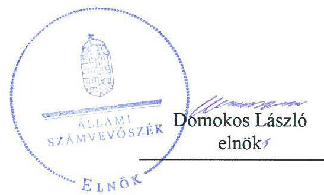
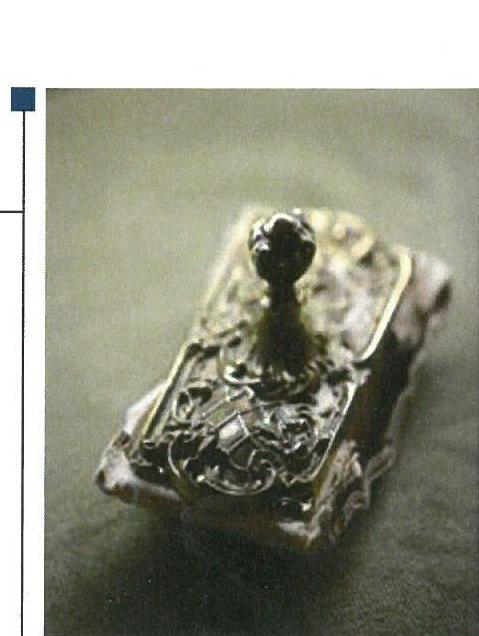
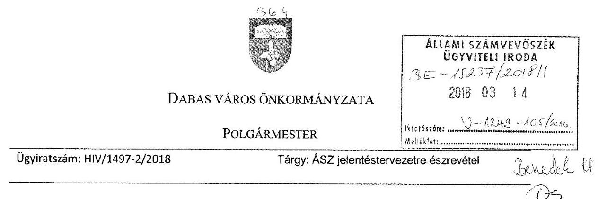
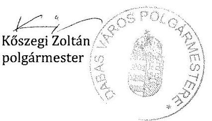
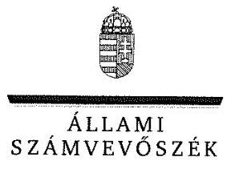
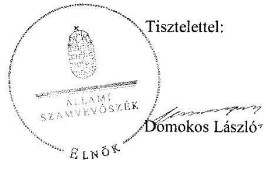

# Jelentés 

## Önkormányzatok integritás- és belső kontrollrendszere

Az önkormányzatok belső kontrollrendszere kialakításának és működtetésének ellenőrzése Dabas Város Önkormányzata
2018. 04. hó 27. nap

---

# AZ ELLENŐRZÉST FELÜGYELTE:

DR. BENEDEK MÁRIA felügyeleti vezető

## AZ ELLENŐRZÉST VEZETTE ÉS A VÉGREHAJTÁSÁÉRT FELELŐS:

BÍRÓ ZSOLT ellenőrzésvezető

## A PROGRAM ÖSSZEÁLLÍTÁSÁÉRT FELELŐS:

TÓTPÁL SZABOLCS osztályvezető

IKTATÓSZÁM: V-1249-107/2016.

TÉMASZÁM: 2444

ELLENŐRZÉS-AZONOSÍTÓ SZÁM: V078908, V078402

Jelentéseink az Országgyűlés számítógépes hálózatán és az Interneten a www.asz.hu címen is olvashatóak.

---

# TARTALOMJEGYZÉK 

■ ÖSSZEGZÉS ..... 5
■ AZ ELLENŐRZÉS CÉLJA ..... 6
■ AZ ELLENŐRZÉS TERÜLETE ..... 7
■ AZ ELLENŐRZÉS HÁTTERE, INDOKOLTSÁGA ..... 8
■ A JELENTÉS LÉNYEGES KÉRDÉSKÖREI ..... 10
■ AZ ELLENŐRZÉS HATÓKÖRE ÉS MÓDSZEREI ..... 11
■ MEGÁLLAPÍTÁSOK ..... 13
■ JAVASLATOK ..... 23
■ MELLÉKLETEK ..... 27
I. sz. melléklet: Értelmező szótár ..... 27
■ FÜGGELÉK: ÉSZREVÉTELEK ..... 29
■ RÖVIDÍTÉSEK JEGYZÉKE ..... 51

---

.

---

# ÖSSZEGZÉS 

Dabas Város Önkormányzata belső kontrollrendszerének kialakítása és működtetése nem volt szabályszerű, az nem biztosította a közpénzfelhasználás szabályosságát. A befektetésekkel kapcsolatos döntések végrehajtásának, a befektetések számviteli elszámolásának, nyilvántartásának hiányosságai miatt nem valósult meg a nemzeti vagyonnal történő felelős gazdálkodás. Az integritási kontrollok kiépítettsége nem volt egyensúlyban a fellépő kockázatok szintjével.

## Az ellenőrzés társadalmi indokoltsága

Az Állami Számvevőszék a stratégiai céljával összhangban - az Állami Számvevőszékről szóló 2011. évi LXVI. törvény felhatalmazása alapján - végzi a közpénzekkel, az állami és önkormányzati vagyonnal való felelős gazdálkodás, valamint a helyi önkormányzatok számviteli rendje betartásának és belső kontrollrendszere működésének ellenőrzését. Magyarország Alaptörvénye az önkormányzatoktól is elvárja a kiegyensúlyozott, átlátható és fenntartható költségvetési gazdálkodás elvének érvényesítését, továbbá a nemzeti vagyonnal való rendeltetésszerű és felelős módon való gazdálkodást. Az Állami Számvevőszék stratégiájában az is megfogalmazódott, hogy támogatja az integritás alapú, átlátható és elszámoltatható közpénzfelhasználás megteremtését. Mindezekre tekintettel, a közpénzzel gazdálkodó szervezetek esetében a belső kontrollrendszer megfelelő működése ellenőrzését prioritásként kezeli az Állami Számvevőszék.

A szabad pénzeszközök felhasználása során kiemelten fontos a felelős gazdálkodás érvényesülése, amely összhangban kell, hogy legyen az önkormányzati gazdálkodás alapelveivel. Dabas Város Önkormányzata 2016. december 31-én 19,0 millió Ft értékű üzleti célú ingatlannal, 630,3 millió Ft értékű üzleti célú részesedéssel és 22,03 millió Ft értékű értékpapír állománnyal rendelkezett.

## Főbb megállapítások, következtetések

Dabas Város Önkormányzata nem a jogszabályi előírásoknak megfelelően alakította ki működésének szervezeti kereteit, így az nem biztosította a szabályszerű működést és gazdálkodást. A Dabasi Polgármesteri Hivatal számviteli politikája, számlarendje és értékelési szabályzata nem felelt meg a jogszabályi előírásoknak. A jegyző a Dabasi Polgármesteri Hivatal tevékenységében rejlő, szervezeti célokkal összefüggő kockázatokkal kapcsolatban nem határozta meg a szükséges intézkedéseket, a gazdálkodási jogkörök gyakorlása során a teljesítésigazolás, az utalványozás nem volt szabályszerű, a jegyző nem gondoskodott a közérdekű adatok teljes körű közzétételéről, így nem volt biztosított a közpénzfelhasználás szabályossága és az átlátható működés.

Az egyes befektetésekkel kapcsolatos döntéshozatal szabályszerű volt, azonban a döntések végrehajtása nem volt szabályszerű, mert a polgármester az üzleti vagyon és az értékpapír vásárlásakor pénzügyi ellenjegyzés nélkül vállalt kötelezettséget. Az értékpapírok nyilvántartása, leltározása nem szabályszerűen történt, így nem volt biztosított a szabad pénzeszközökkel való felelős gazdálkodás.

A Dabas Város Önkormányzatánál az integritással összefüggő kontrollok és a korrupciós kockázatok szintje nem volt összhangban, a kontrollrendszer nem támogatta az integritás szemlélet érvényesülését.

---

# AZ ELLENŐRZÉS CÉLJA 

Az ellenőrzés célja annak megállapítása volt, hogy szabályszerűen történt-e Dabas Város Önkormányzata belső kontrollrendszerének kialakítása és működtetése, az biztosította-e Dabas Város Önkormányzatánál a közpénzfelhasználás szabályosságát, a közpénzekkel és a nemzeti vagyonnal történő szabályszerű és felelős gazdálkodást, a beszámolási és adatszolgáltatási kötelezettségek szabályszerű teljesítését. Az ellenőrzés keretében értékeltük Dabas Város Önkormányzata korrupciós kockázatainak kezelését szolgáló integritás kontrollok kiépítettségét és az integritás szemlélet érvényesülését.

Az ellenőrzés célja továbbá annak értékelése volt, hogy a jogszabályi előírásoknak megfelelően alakították-e ki a belső kontrollrendszert, a kontrollkörnyezet biztosította-e a befektetési tevékenységek szabályszerű végzését. Értékeltük, hogy az egyes befektetési tevékenységekkel kapcsolatos döntéshozatal és a döntések végrehajtása, valamint az egyes befektetések számviteli elszámolása, nyilvántartása szabályszerű volt-e, és a belső és külső ellenőrzések támogatták-e az egyes befektetési tevékenységek szabályszerű végzését.

---

# **Dabas Város Önkormányzata**

Dabas város a Közép-Magyarországi régióban, Pest megyében található, lakónépessége a Központi Statisztikai Hivatal Magyarország közigazgatási helynévkönyve alapján 2016. január 1-én 16 728 fő volt.

Dabas Város Önkormányzata 12 tagú Képviselő-testületének munkáját három állandó bizottság segítette. A településen Sári Szlovák Önkormányzat és Dabas Város Roma Nemzetiségi Önkormányzata működött.

Dabas Város Önkormányzata a Dabasi Polgármesteri Hivatalon kívül hat intézménnyel, három önkormányzati társulással, valamint egy többségi tulajdoni részesedésű (hulladékszállító) és két kisebbségi tulajdoni részesedésű (ivóvíz- és szennyvíz üzemeltető és hulladéklerakó üzemeltető) gazdasági társasággal látta el a feladatait.

Dabas Város Önkormányzata négy nem közfeladat ellátását szolgáló gazdasági társaságban rendelkezett részesedéssel. A Dabas Sportcsarnok Nonprofit Kft. főtevékenysége rádióműsor szolgáltatás, a Pantheon Kft. főtevékenysége szállodai szolgáltatás, a Kognitív Hungary Kft. főtevékenysége egyéb máshová nem sorolt gép, berendezés nagykereskedelme, a Dabasi Otthonteremtő Kft. főtevékenysége saját tulajdonú ingatlan adásvétele.

A Dabasi Polgármesteri Hivatal négy szervezeti egységre (Kabinetiroda, Hatósági Iroda, Műszaki Iroda és Gazdasági Iroda) tagolódott, elkülönített gazdasági szervezettel nem rendelkezett, a foglalkoztatott köztisztviselők száma a 2016. év végén 35 fő volt.

A polgármester az 1998. évi önkormányzati választások óta tölti be tisztségét, a jegyző 2013. április 1-től látja el feladatait.

Dabas Város Önkormányzata a 2016. évi költségvetési beszámolója szerint 3 403,5 millió Ft költségvetési bevételt ért el, valamint 3 355,6 millió Ft költségvetési kiadást teljesített. A könyvviteli mérleg szerinti eszközvagyon értéke 2016. december 31-én 20 440,5 millió Ft volt, amelyből az ingatlanok és kapcsolódó vagyonértékű jogok értéke 17 144,3 millió Ft-ot, a tartós részesedések 706,1 millió Ft-ot, a vagyonkezelésbe adott eszközök 1 247,0 millió Ft-ot, a forgatási célú értékpapírok 22,0 millió Ft-ot, a pénzeszközök 539,1 millió Ft-ot tettek ki. A 2016. évben a forrásokon belül a költségvetési évben esedékes kötelezettség állomány 4,8 millió Ft-ot, a költségvetési évet követően esedékes kötelezettség állomány 28,5 millió Ft-ot tett ki, pénzintézettel szembeni kötelezettségük nem volt.

---

# AZ ELLENŐRZÉS HÁTTERE, INDOKOLTSÁGA 

A demokratikus társadalmakban alapvető igény, hogy a közpénzeket, a közvagyont használók tevékenységükről elszámoljanak, ahhoz egyértelmű és érvényesíthető felelősségi szabályok társuljanak. Ennek a jogos igénynek az érvényesítéséhez meg kell teremteni azokat a folyamatokat, rendszereket, amelyek nélkülözhetetlenek az elszámoltatáshoz. Az elszámoltatás eredményes működtetéséhez szükség van a megfelelő információs, kontroll-, értékelési - és beszámolási rendszerek kialakítására. A belső kontrollok kiépítettsége hozzájárul az integritási szemlélet kialakításához és érvényesüléséhez. A belső kontrollrendszer kialakítása és működtetése nélkül nem valósítható meg a közpénzek, a közvagyon szabályos, gazdaságos, hatékony és eredményes felhasználása.

A BELSŐ KONTROLLRENDSZER azt a célt szolgálja, hogy az államháztartás szervei működésük és gazdálkodásuk során a tevékenységeket szabályszerűen, gazdaságosan, hatékonyan, eredményesen hajtsák végre, teljesítsék elszámolási kötelezettségeiket és megvédjék az erőforrásokat a veszteségektől, a károktól, a nem rendeltetésszerű használattól. A belső kontrollrendszer magában foglalja mindazon szabályokat, eljárásokat, gyakorlati módszereket és szervezeti struktúrákat, kockázatkezelési technikákat, kontrolltevékenységeket, amelyek segítséget nyújtanak a szervezetnek céljai eléréséhez. A belső kontrollrendszer szabályozása háromszintű, a törvényi előírásokat az Áht. ${ }^{1}$ és a Mötv. ${ }^{2}$, a rendeleti szintű szabályozást az Ávr. ${ }^{3}$ és a Bkr. ${ }^{4}$ tartalmazza, amelyeket útmutatói szinten az NGM${ }^{5}$ által kiadott standardok és kézikönyvek támogatnak.

A megfelelő belső kontrollrendszer jelentősen csökkenti a hibák és szabálytalanságok kockázatát. Az ÁSZ ${ }^{6}$ célja, hogy javuljon az ellenőrzött önkormányzatok belső kontrollrendszerének szabályozottsága, működésének megfelelősége, szabályszerűsége, hozzájárulva ezzel az egyensúlyi helyzet fenntarthatóságának biztosításához, biztosítva az önkormányzatnál a közpénzfelhasználás szabályosságát, a közpénzekkel és a nemzeti vagyonnal történő szabályszerű, gazdaságos, hatékony és eredményes gazdálkodást. Az ÁSZ ellenőrzés tapasztalatai nem csupán a közvetlenül ellenőrzött önkormányzatokat támogathatják, hanem a „jó gyakorlat” elterjesztésével azok az önkormányzatok is átvehetik a pozitív példákat, ahol az ÁSZ ellenőrzést nem végez.

AZ ÖNKORMÁNYZATI VAGYONGAZDÁLKODÁS keretében az önkormányzatok átmenetileg szabad pénzeszközeinek befektetését jogszabály nem tiltja, a befektetések jellege nem korlátozott, a pénzpiaci szolgáltatók közül az önkormányzatok a kínált szolgáltatás és annak költségei alapján, szabadon választhatnak, azonban a veszteséges gazdálkodás kockázatai és következményei az önkormányzatokat terhelik. Az ellenőrzéssel feltárásra kerülhetnek azok a kockázatok, amelyek az önkormányzatok gazdálkodásával, ezen belül befektetési tevékenységeivel, kontrollkörnyezetével kapcsolatosak és a befektetési tevékenységek szabályszerű végrehajtását befolyásolják. Az ellenőrzéssel az önkormányzatok befektetési/vagyongazdálkodási döntéseinek összessége értékelhetővé

---

válik, és megalapozott megállapítás tehető arra vonatkozóan, hogy milyen hatást gyakoroltak az önkormányzat vagyonára a képviselő-testület döntései.

AZ ELLENŐRZÉS VÁRHATÓ HASZNOSULÁSA négy szinten valósul meg. A törvényalkotás számára összegzett tapasztalatok állnak rendelkezésre a belső kontrollrendszer önkormányzati területen való kialakításáról, működtetéséről és hatásairól. Az ellenőrzés az ellenőrzött számára visszajelzést ad a belső kontrollrendszer kialakításában és működésében lévő hiányosságokról, javaslataival hozzájárul azok kiküszöböléséhez. Az ellenőrzés megállapításait és javaslatait más szervezetek is hasznosíthatják a rendezett gazdálkodási keretek kialakításához. A társadalom számára jelzi, hogy közpénz nem maradhat ellenőrizetlenül, az ÁSZ értékteremtő rend kialakításához és megőrzéséhez hozzájáruló tevékenysége pozitív hatással lesz a szervezetről kialakított összkép formálásában.

---

# A JELENTÉS LÉNYEGES KÉRDÉSKÖREI 

1.     - Az önkormányzat belső kontrollrendszerének kialakítása és működtetése 2016. évben szabályszerű volt-e, az biztosította-e az önkormányzatnál a közpénzfelhasználás szabályosságát, a nemzeti vagyonnal történő felelős gazdálkodást?
2.     - A jogszabályi előírásoknak megfelelően alakították-e ki a belső kontrollrendszert, a befektetési tevékenységek szabályszerű végzését a kiépített kontrollkörnyezet biztosította-e a 2012-2016. években?
3.     - Az önkormányzat egyes befektetéseivel kapcsolatos döntéshozatala és a döntések végrehajtása szabályszerű volt-e?
4.     - Az egyes befektetések számviteli elszámolása, nyilvántartása szabályszerű volt-e?
5.     - A belső és külső ellenőrzések támogatták-e az egyes befektetési tevékenységek szabályszerű végzését?
6. Érvényesült-e az integritás szemlélet és ennek megfelelően kiépítették-e az integritás kontrollrendszert az önkormányzatnál?

---

# AZ ELLENŐRZÉS HATÓKÖRE ÉS MÓDSZEREI 

## Az ellenőrzés típusa

A belső kontrollrendszer ellenőrzése esetében megfelelőségi ellenőrzés, a befektetési tevékenységnél szabályszerűségi ellenőrzés.

## Az ellenőrzött időszak

A belső kontrollrendszer kialakításának és működtetésének ellenőrzése a 2016. január 1. és 2016. december 31. közötti időszakra terjedt ki.

A befektetési tevékenység ellenőrzési időszaka a 2012. január 1. - 2016. december 31. közötti időszak. Ezen felül az önkormányzat befektetésekkel kapcsolatos döntés-előkészítésének és a döntéshozatalának szabályszerűségét ellenőriztük a 2012. január 1. előtti időszakra tekintettel is, mivel a 2016. december 31-én meglévő befektetésekkel kapcsolatos döntéshozatalra a 2012. január 1. előtti időszakban került sor.

## Az ellenőrzés tárgya

A helyi önkormányzatnak, mint éves költségvetési beszámoló készítésére kötelezett szervezetnek és polgármesteri hivatalának belső kontrollrendszere. Az integritás szemlélet érvényesülése

Az önkormányzat 2016. december 31-én meglévő, a Számv. tv. ${ }^{7}$ 3.
 § (6) bekezdés 2. és 3. pontja szerint az értékpapírokban megtestesülő befektetései, lekötött betétei. Továbbá a 2016. december 31-én meglévő, az önkormányzat szabad pénzeszközei terhére, adásvételi szerződés keretében megszerzett, a kötelező feladatok ellátását nem szolgáló, az önkormányzat üzleti vagyonába tartozó, az ellenőrzött időszakban (2012-2016.) megszerzett ingatlanok, továbbá az - időkorlátozás nélkül megszerzett - kulturális javak (műtárgyak, műalkotások, stb.), illetve egyéb értéktárgyak (pl. ékszerek, befektetési nemesfém).

Az ellenőrzés kiterjedt minden olyan körülményre és adatra, amely az ÁSZ jogszabályban meghatározott feladatainak teljesítéséhez, valamint a program végrehajtása folyamán felmerült újabb összefüggések feltárásához szükséges.

## Az ellenőrzött szervezet

Dabas Város Önkormányzata

---

# Az ellenőrzés jogalapja 

Az ÁSZ tv. ${ }^{8}$ 1. § (3) bekezdésében foglaltak alapján az ÁSZ ${ }^{9}$ általános hatáskörrel végzi a közpénzekkel és az állami és önkormányzati vagyonnal való felelős gazdálkodás ellenőrzését. Az ÁSZ tv. 5. § (2) bekezdése alapján az államháztartás gazdálkodásának ellenőrzése keretében az ÁSZ ellenőrzi a helyi önkormányzatok gazdálkodását, valamint az ÁSZ tv. 5. § (6) bekezdése alapján ellenőrzése során értékeli az államháztartás számviteli rendjének betartását és a belső kontrollrendszer működését.

## Az ellenőrzés módszerei

Az ÁSZ az ellenőrzést az ellenőrzési program szempontjai, az ellenőrzött időszakban hatályos jogszabályok, az ellenőrzés szakmai szabályai, az egyes ellenőrzési típusokhoz kapcsolódó ÁSZ módszertanok figyelembe vételével végezte. A gazdálkodás hibáinak kijavítására, a közpénzekkel való felelős gazdálkodás elősegítésére irányuló javaslatok kidolgozásakor a hatályos jogszabályok voltak az irányadóak.

Az ellenőrzés ideje alatt az ÁSZ Dabas Város Önkormányzatával történő kapcsolattartást az ÁSZ SZMSZ ${ }^{10}$-ének vonatkozó előírásai alapján biztosította.

Az ellenőrzési kérdések megválaszolásához szükséges bizonyítékok megszerzése Dabas Város Önkormányzata által rendelkezésre bocsátott dokumentumokra, adatokra alapozva megfigyelés, szemle (szemrevételezés), valamint elemző eljárás keretében történt.

Az ellenőrzési bizonyítékként felhasználható adatforrások közé tartoztak egyrészt az ellenőrzési program részletes szempontjainál felsorolt adatforrások, másrészt minden - az ellenőrzés folyamán feltárt, az ellenőrzés szempontjából releváns információt tartalmazó - dokumentum.

Az ellenőrzés lefolytatásához Dabas Város Önkormányzata az ÁSZ által kért dokumentumok elektronikus megküldésével szolgáltatott adatokat. A rendelkezésre bocsátott adatok, információk kontrollja az ellenőrzés keretében történt.

A közszféra integritás alapú kultúrájának kialakítása, megerősítése és működése szorosan összefügg a belső kontrollrendszer működésével, ezért az ellenőrzés kiterjed annak értékelésére is, hogy a belső kontrollrendszer kialakítása és működtetése hogyan hatott az integritás szemlélet érvényesülésére.

Az ÁSZ Dabas Város Önkormányzatának befektetési tevékenységét a szerződéskötés (és a kapcsolódó döntés-előkészítés, döntéshozatal) kivételével a 2012. január 1. és 2016. december 31. közötti időszak vonatkozásában értékelte. A szerződéskötést Dabas Város Önkormányzata 2016. december 31-én meglévő értékpapírjai és egyéb befektetései vonatkozásában értékelte a befektetési döntés előkészítése és a döntéshozatala tekintetében, abban az esetben is, ha az 2012. január 1. előtt történt. A 2012. évet megelőzően történt szerződéskötéseket, illetve a döntéseket, az akkor hatályos jogszabályok és a belső szabályzatok előírásai alapján értékelte.

---

# MEGÁLLAPÍTÁSOK 

## 1. Az önkormányzat belső kontrollrendszerének kialakítása és működtetése 2016. évben szabályszerű volt-e, az biztosította-e az önkormányzatnál a közpénzfelhasználás szabályosságát, a nemzeti vagyonnal történő felelős gazdálkodást?

Összegző megállapítás

Az Önkormányzat ${ }^{11}$ belső kontrollrendszerének kialakítása és működtetése 2016. évben nem volt szabályszerű, nem biztosította az Önkormányzatnál a közpénzfelhasználás szabályosságát, a nemzeti vagyonnal történő felelős gazdálkodást.
1.1. számú megállapítás

A kontrollkörnyezet kialakítása nem felelt meg a jogszabályi előírásoknak.

A Képviselő-testület ${ }^{12}$ a Mötv.-ben az Áht.-ban foglaltaknak megfelelően megalkotta az önkormányzati SZMSZ-t ${ }^{13}$, jóváhagyta a Hivatal ${ }^{14}$ alapító okiratát ${ }^{15}$ és a hivatali SZMSZ ${ }^{16}$-t. Az Önkormányzat a Mótv. előírásainak megfelelően elkészítette gazdasági programját ${ }^{17}$.

A Képviselő-testület a Kttv. ${ }^{18}$-ben előírtaknak megfelelően meghatározta a hivatásetikai alapelveket és az etikai eljárás szabályait, melyeket a köztisztviselők juttatásairól szóló rendeletében ${ }^{19}$ rögzített.

A jegyző a közszolgálati szabályzatban ${ }^{20}$, a szervezeti egységek feladat- és hatáskörét részletező hivatali ügyrend ${ }_{1,2}{ }^{21}$-ben kialakította a humánerőforrás kezelés szabályait a Bkr.-ben foglaltaknak megfelelően.

A jegyző a Számv. tv.-ben foglaltaknak megfelelően kialakította az Önkormányzat és a Hivatal számviteli politikáját ${ }^{22}$, amelynek keretében elkészítette az értékelési szabályzatot ${ }^{23}$, a leltározási szabályzatot ${ }^{24}$, és pénzkezelési szabályzatát ${ }^{25}$. A Hivatal rendelkezett számlarenddel ${ }^{26}$.

A jegyző a belföldi és külföldi kiküldetések elrendelésének és elszámolásának kivételével gondoskodott az Önkormányzat és a Hivatal működéséhez kapcsolódó pénzügyi kihatással bíró, jogszabályban nem szabályozott kérdések Ávr.-ben előírtaknak megfelelő belső szabályozásban történő rendezéséről.

A kontrollkörnyezet kialakítása során feltárt hiányosságokat a 1. táblázat tartalmazza:

---

# A KONTROLLKÖRNYEZET KIALAKÍTÁSÁNAK HIÁNYOSSÁGAI 

| Sorszám | Megállapítások | Megjegyzések |
| :--: | :--: | :--: |
| 1. | A jegyző a Számv. tv. 14. § (4) bekezdésének előírása ellenére a számviteli politika keretében írásban nem rögzítette az Önkormányzatra és Hivatalra jellemző szabályokat, előírásokat, módszereket, amelyekkel meghatározzák, hogy mit tekintenek a számviteli elszámolás, értékelés szempontjából lényegesnek, jelentősnek, nem lényegesnek, nem jelentősnek. |  |
| 2. | A jegyző a Számv. tv. 161. § (1) és (2) bekezdés d) pontjában előírtak ellenére nem készítette el az önkormányzati feladatok számviteli elszámolásának szabályozására a számlarendet és ennek keretében a bizonylati rendet. |  |
| 3. | A jegyző a számlarendben nem szabályozta az Áhsz. ${ }^{27}$ 51. § (3) bekezdésében foglaltak ellenére a részletező nyilvántartások kapcsolódó könyvviteli és nyilvántartási számlákkal való egyeztetését, annak dokumentálását. |  |
| 4. | A jegyző az értékelési szabályzatban nem rögzítette az Áhsz. 2 50. § (2) bekezdés d) pontjában előírtak ellenére a tulajdonosnak, tulajdonosi joggyakorló szervezetnek a vagyonkezelésbe adott eszközök vagyonértékelése során alkalmazott értékelési eljárás elveit, módszerét, dokumentálásának szabályait, felelőseit. |  |
| 5. | A jegyző a Számv. tv. 14 § (5) bekezdés c) pontjában, valamint az Áhsz. 2 50. § (3) bekezdésében előírtak ellenére a rendszeresen végzett bérbeadásból származó bevételek önköltségének megállapítására nem készített az önköltségszámítás rendjére vonatkozó belső szabályzatot. |  |
| 6. | A jegyző belső szabályzatban nem rendezte az Ávr. 13. § (2) bekezdés c) pontjában előírtak ellenére a belföldi és külföldi kiküldetések elrendelésével és lebonyolításával, elszámolásával kapcsolatos kérdéseket. |  |

Forrás: ÁSZ

## 1.2. számú megállapítás

## A kockázatkezelési rendszer kialakításra került, működtetése azonban nem felelt meg a jogszabályi előírásoknak.

A jegyző a Bkr. előírásainak megfelelően a belső kontrollrendszer szabály-zat ${ }^{28}$-ben meghatározta a Hivatalra vonatkozó kockázatkezeléssel kapcsolatos szabályokat. A jegyző 2016. október 1-től a belső kontrollrendszer szabályzat ${ }_{2}$-ben szabályozta az Önkormányzat, a költségvetési szervei, a nemzetiségi önkormányzatok és a társulások integrált kockázatkezelés eljárásrendjét.

A kockázatkezelési rendszer működtetésének hiányosságát a 2. táblázat tartalmazza.
2. táblázat

## A KOCKÁZATKEZELÉSI RENDSZER MŰKÖDTETÉSÉNEK HIÁNYOSSÁGA

## Sorszám

1. A jegyző a Bkr. 7. § (1)-(2) bekezdéseiben foglalt követelmények ellenére 2016. szeptember 30-ig a kockázatkezelési rendszert, 2016. október 1-jétől az integrált kockázatkezelési rendszert hiányosan működtette, mivel 2016. szeptember 30-ig a Hivatal tevékenységében, gazdálkodásában rejlő, 2016. október 1-jétől a Hivatal tevékenységében rejlő és szervezeti célokkal összefüggő kockázatokkal kapcsolatban nem határozta meg a szükséges intézkedéseket, valamint azok teljesítésének folyamatos nyomon követésének módját.

A kontrolltevékenység kereteinek kialakítása megfelelt, működtetése nem felelt meg a jogszabályoknak és a belső szabályozásban foglaltaknak.

Az Önkormányzat rendelkezett az Áht. és az Ávr. előírásainak megfelelő gazdálkodási szabályzattal ${ }^{29}$.

---

A tervezéssel, az ellenőrzési és kontrolleljárásokkal, az adatszolgáltatási és beszámolási feladatok teljesítésével kapcsolatos belső előírásokat, feltételeket a hivatali SZMSZ-ben, a hivatali ügyrend ${ }_{1,2}$-ben, a gazdasági szervezet ügyrendje ${ }_{1,2}{ }^{30}$-ben és a munkaköri leírásokban rögzítették.

A jegyző a belső kontrollrendszer szabályzat ${ }_{1,2}$-ben a Hivatalra a Bkr.-ban előírtaknak megfelelően elkészítette a működési folyamatainak megfelelő ellenőrzési nyomvonalat.

Hivatal szabálytalanságkezelési eljárását 2016. szeptember 30-ig a Belső kontrollrendszer szabályzat ${ }_{1}$-ben és 2016. október 1-jétől a szervezeti integritást sértő események kezelésének eljárásrendjét a Belső kontrollrendszer szabályzat ${ }_{2}$-ben rögzítették. A Bkr. előírásainak megfelelően 2016. október 1-től a Belső kontrollrendszer szabályzat ${ }_{2}$-ben a kontrolltevékenység részeként minden tevékenységre előírták a szervezeti célok elérését veszélyeztető kockázatok csökkentésére irányuló kontrollok kiépítését.

A kontrolltevékenység működtetésének hiányosságait a 3. táblázat tartalmazza:
3. táblázat

# A KONTROLLTEVÉKENYSÉGEK MŰKÖDTETÉSÉNEK HIÁNYOSSÁGAI 

Sorszám Megállapítások
Megjegyzések

1. A jegyző az Ávr. 56. § (1) bekezdésében előírtak ellenére a kötelezettségvállalások nyilvántartásba vételéről nem gondoskodott.
2. A teljesítésigazolást az Ávr. 57. § (3) bekezdésében foglaltak ellenére nem az arra jogosult végezte.
3. Az utalványozást az Ávr. 59. § (1) bekezdésében foglaltak ellenére nem az arra jogosult végezte.
4. A jegyző nem gondoskodott az Ávr. 60. § (3) bekezdésében előírtak ellenére a kötelezettségvállalásra, pénzügyi ellenjegyzésre, teljesítés igazolására, érvényesítésre és utalványozásra jogosult személyekről és aláírás-mintájukról - gazdálkodási szabályzat 6. számú melléklet szerinti - naprakész nyilvántartás vezetéséről.

Forrás: ÁSZ

### 1.4. számú megállapítás

Az információs és kommunikációs rendszer kialakításra került, azonban a működtetése a jogszabályi előírásoknak nem felelt meg.

A jegyző összhangban a Bkr. előírásaival kialakította az Önkormányzat és a Hivatal információs rendszerét.

A jegyző az Info. tv. ${ }^{31}$-ben és az Ávr.-ben előírtaknak megfelelően szabályozta a kötelezően közzéteendő adatok nyilvánosságra hozatalának és a közérdekű adatok megismerésére irányuló igények teljesítésének rendjét. A Hivatal az Ltv. ${ }^{32}$ előírásainak megfelelően rendelkezett iratkezelési szabályzattal.

A jegyző az Info tv.-ben előírtaknak megfelelően szabályozta az Önkormányzat és a Hivatal adatvédelmi és adatbiztonsági előírásait.

A jegyző gondoskodott az Önkormányzat beszámolási és adatszolgáltatási kötelezettségének a jogszabályi előírások szerinti teljesítéséről.

Az információs és kommunikációs rendszer működtetésének hiányosságát a 4. táblázat tartalmazza.

---

4. táblázat

# AZ INFORMÁCIÓS ÉS KOMMUNIKÁCIÓS RENDSZER MŰKÖDTETÉSÉNEK HIÁNYOSSÁGA 

## Sorszám | Megállapítás | Megjegyzés

1. A jegyző az Info tv. 37. § (1) bekezdésében előírtak ellenére nem gondoskodott az Info. tv. 1. melléklet III/1,4 pontjaiban előírt 2016. évi költségvetés, illetve a számviteli törvény szerinti 2015. évi költségvetési beszámoló, és a vagyonnal történő gazdálkodással összefüggő nettó ötmillió forintot elérő vagy azt meghaladó értékű szerződései közzétételéről.

Forrás: ÁSZ
1.5. számú megállapítás

Az Önkormányzat monitoring rendszerének kialakítása 2016. szeptember 30-ig nem felelt meg a jogszabályi előírásoknak. A belső ellenőrzés kialakítása és működtetése megfelelt a jogszabályi előírásoknak.

A jegyző külső szolgáltató útján gondoskodott a belső ellenőrzési feladatok ellátásáról. A hivatali SZMSZ-ben és a megbízási szerződésben rögzítették a belső ellenőr szervezeti és funkcionális függetlenségét, az összeférhetetlenségi követelményeket.

A belső ellenőrzés működtetése a Bkr.-ben előírtaknak megfelelt. A belső ellenőrzési kézikönyvet ${ }^{33}$ a jegyző, a belső ellenőrzési tervet a Képviselő-testület jóváhagyta. A belső ellenőr a 2016. évi belső ellenőrzési tervben meghatározott belső ellenőrzési feladatokat végrehajtotta.

A belső ellenőrzési vezető a belső ellenőrzési jelentésekről a Bkr.-ben előírt tartalmú nyilvántartást vezetett.

A jegyző által a külső ellenőrzésekről vezetett nyilvántartás tartalmazta az ellenőrzési jelentésben szereplő javaslatot, az elfogadott intézkedési tervet, az intézkedési terv alapján végrehajtott intézkedések rövid leírását.

A monitoring-rendszer kialakításának hiányosságát az 5. táblázat tartalmazza.
5. táblázat
 HIÁNYOSSÁGA

Sorszám | Megállapítás | Megjegyzés
:--: | :--: | :--: |
| 1. | A jegyző 2016. szeptember 30-ig nem alakította ki a Bkr. 10. §-ában előírtak ellenére az operatív tevékenységek keretében megvalósuló folyamatos és eseti nyomon követését tartalmazó, a szervezet tevékenységének, a célok megvalósításának nyomon követését biztosító rendszert. | A Bkr. 2016. október 1-jei változására tekintettel a jegyző a belső ellenőrzés kialakításával eleget tett a Bkr. 10. §-ban foglaltaknak. |

Forrás: ÁSZ
1.6. számú megállapítás

Az Önkormányzat nem értékelte, hogy a kiadott szabályzatai, a kialakított és működtetett folyamatai biztosították-e a rendelkezésre álló forrásokkal és a nemzeti vagyonnal történő szabályszerű, gazdaságos, hatékony és eredményes gazdálkodást.

A jegyző a Bkr. 1. számú melléklete szerinti formában és tartalommal tette meg a nyilatkozatát, melyben értékelte a Hivatal belső kontrollrendszerének minőségét. A jegyző nyilatkozatában foglaltakat a jelen ellenőrzés nem támasztotta alá, mivel az Önkormányzat belső kontrollrendszerének kialakítása és működtetése az ÁSZ értékelése szerint nem volt szabályszerű.

---

Az Önkormányzat belső kontrollrendszerének minőségét értékelő nyilatkozathoz kötődő hiányosságokat a 6. táblázat tartalmazza.
6. táblázat

# AZ ÖNKORMÁNYZAT BELSŐ KONTROLLRENDSZERÉNEK MINŐSÉGÉT ÉRTÉKELŐ NYILATKOZATHOZ KÖTŐDŐ HIÁNYOSSÁGOK 

| Sorszám | Megállapítások | Megjegyzések |
| :--: | :--: | :--: |
| 1. | A polgármester a jegyzői nyilatkozatot a Bkr. 11. § (2a) bekezdésében előírtak ellenére a zárszámadási rendelet-tervezettel együtt nem terjesztette a Képviselő-testület elé. |  |
| 2. | A belső ellenőrzési vezető a 2016. évi éves ellenőrzési jelentést a Bkr. 49. § (3) bekezdésében előírt határidőig nem küldte meg a polgármesternek, a jegyzőnek. | A belső ellenőrzési vezető 2017. április 19-én küldte meg az éves ellenőrzési jelentést. |
| 3. | A belső ellenőrzési vezető által készített 2016. évi éves ellenőrzési jelentés az ellenőrzési tapasztalatok alapján - a Bkr. 48. § ba) pontjában előírtak ellenére - nem tartalmazta a belső kontrollrendszer szabályszerűségének, gazdaságosságának, hatékonyságának és eredményességének növelése, javítása érdekében tett fontosabb javaslatokat. | Forrás: ÁSZ |

### 1.7. számú megállapítás

A Roma Nemzetiségi Önkormányzat ${ }^{34}$ gazdálkodással kapcsolatos feladatainak ellátása megfelelt a jogszabályi előírásoknak.

A jegyző az ellenőrzött időszakot megelőzően készítette el az együttműködés feltételeit rögzítő megállapodás tervezetét, melyet a Képviselő-testület rendeletével jóváhagyott. A megállapodás a Nek. tv. ${ }^{35}$-ben előírtaknak megfelelően tartalmazta a feladatellátáshoz szükséges személyi, tárgyi, és technikai feltételeket, a gazdálkodás jogköreinek gyakorlását végzők kijelölését, a gazdálkodási és egyéb feladatellátás részletes szabályait.

A jegyző elkészítette a Roma Nemzetiségi Önkormányzat 2016. évi költségvetési határozat tervezetét és a zárszámadásról szóló határozat tervezetét, melyeket a Roma Nemzetiségi Önkormányzat képviselő-testülete határidőben elfogadott.

A jegyző a gazdálkodási szabályzatban szabályozta a Roma Nemzetiségi Önkormányzatra vonatkozóan a gazdálkodási jogkörökkel kapcsolatos belső előírásokat, feltételeket.

A jegyző a Roma Nemzetiségi Önkormányzatra elkészítette a számviteli politikát és annak keretében a pénzkezelési szabályzatot, értékelési és leltározási szabályzatot.
2016. október 1-jétől a belső kontrollrendszer szabályzat ${ }_{2}$ tartalmazza a Roma Nemzetiségi Önkormányzat bevételeivel és kiadásaival kapcsolatban a tervezési, gazdálkodási, ellenőrzési, finanszírozási, adatszolgáltatási és beszámolási feladatok ellátásának nyomvonalát.

A jegyző 2016. évi belső ellenőrzési tervet kiterjesztette a Roma Nemzetiségi Önkormányzatra, a tervben szereplő belső ellenőrzést végrehajtotta a belső ellenőr, hiányosságokat nem állapított meg.

A Roma Nemzetiségi Önkormányzat gazdálkodásával kapcsolatos hiányosságot a 7. táblázat tartalmazza:

---

# A ROMA NEMZETISÉGI ÖNKORMÁNYZAT GAZDÁLKODÁSÁVAL KAPCSOLATOS FELADATOK ELLÁTÁSÁNAK HIÁNYOSSÁGA

|  Sorszám | Megállapítás | Megjegyzés  |
| --- | --- | --- |
|  1. | A jegyző nem gondoskodott az Áht. 6/C. § (2) bekezdés és az Áhsz. 51. § (2) bekezdésében előírtak ellenére a Roma Nemzetiségi Önkormányzat számlarendjének elkészítéséről. |   |

*Forrás: ÁSZ*

# 2. A jogszabályi előírásoknak megfelelően alakították-e ki a belső kontrollrendszert, a befektetési tevékenységek szabályszerű végzését a kiépített kontrollkörnyezet biztosította-e a 2012-2016. években?

## Összegző megállapítás

A belső kontrollrendszert nem a jogszabályi előírásoknak megfelelően alakították ki, így az a 2012 – 2016. években a befektetési tevékenységek szabályszerű végzését nem biztosította.

A kontrollkörnyezet kialakítása során az Önkormányzat és a Hivatal rendelkezett SZMSZ-szel. Az önkormányzati SZMSZ 2015. március 1-jétől hatályos módosítása alapján a polgármester átruházott hatáskörben jogosult volt év közben az átmenetileg szabad pénzeszközöket tőke és hozamgarantált befektetésbe befektetni, illetve lekötni.

A Képviselő-testület a vagyonrendelet^{1,2}^{36}-ben határozta meg az önkormányzati vagyonnal történő gazdálkodás szabályait, pénzügyi befektetésekkel kapcsolatos döntési hatáskört a polgármester részére nem állapított meg.

Az Önkormányzat rendelkezett számviteli politikával, eszközök és források értékelési szabályzatával, az Ávr-nek megfelelő gazdálkodási szabályzattal, amelyek támogatták a befektetések szabályszerű végzését.

A belső kontrollrendszer kialakításának hiányosságait a 2012 – 2016. években a 8. táblázat tartalmazza:

## A BELSŐ KONTROLLRENDSZER KIALAKÍTÁSÁNAK HIÁNYOSSÁGAI 2012 - 2016. ÉVEKBEN

|  Sorszám | Megállapítások | Megjegyzések  |
| --- | --- | --- |
|  1. | A jegyző a Számv. tv. 14. § (5) bekezdés a) pontja ellenére nem készítette el 2012. január 1-je és 2013. március 31-e között az Önkormányzat eszközök és források leltárkészítési és leltározási szabályzatát. | A jegyző 2013. április 1-jén hatályba léptetett leltározási szabályzat hatálya kiterjedt az Önkormányzatra.  |
|  2. | A jegyző a 2012-2016. években a 8kr. 7. § (2) bekezdésében előírtak ellenére nem mérte fel, nem állapította meg az egyes befektetési tevékenységekben rejlő kockázatokat, nem határozta meg az egyes kockázatokkal kapcsolatos intézkedéseket, valamint azok teljesítésének folyamatos nyomon követésének módját. |   |
|  3. | A jegyző a 2012-2014. években a 8kr. 9. § (1) bekezdésében foglaltak ellenére nem alakított ki a befektetésekkel kapcsolatban olyan információs rendszereket, amelyek biztosították, hogy a megfelelő | A jegyző 2015. január 1-jén hatályba léptetett kommunikációs  |

---

| Sorszám | Megállapítások | Megjegyzések |
| :--: | :--: | :--: |
|  | információk a megfelelő időben eljussanak az illetékes szervezethez, szervezeti egységhez, illetve személyhez. | szabályzat hatálya kiterjedt az Önkormányzatra. |
| 4. | A jegyző az Önkormányzat honlapján nem tette közzé a 2011. november 22-én 37783927 Ft vételáron vásárolt MÁK 2017/A államkötvényt szerződésének megnevezését, tárgyát, a szerződést kötő felek nevét és a szerződés értékét az Eisztv. ${ }^{37}$ 6. § (1) bekezdésében hivatkozott melléklet III/4 pontjában előírtak ellenére. | Forrás: ÁSZ |

# 3. Az önkormányzat egyes befektetéseivel kapcsolatos döntéshozatala és a döntések végrehajtása szabályszerű volt-e? 

## Összegző megállapítás

Az Önkormányzat egyes befektetéseivel kapcsolatos döntéshozatala szabályszerű, azonban a döntések végrehajtása nem volt szabályszerű.

Az Önkormányzat 2016. december 31-én négy nem közfeladat ellátását szolgáló gazdasági társaságban (Dabas Sportcsarnok Nonprofit kft. főtevékenysége rádióműsor szolgáltatás, a Pantheon Kft. főtevékenysége szállodai szolgáltatás, a Kognitív Hungary kft. főtevékenysége egyéb máshová nem sorolt gép, berendezés nagykereskedelme, a Dabasi Otthonteremtő kft. főtevékenysége saját tulajdonú ingatlan adásvétele) rendelkezett 630,3 millió Ft összegű befektetett pénzügyi eszközök között nyilvántartott részesedéssel. Az Önkormányzat 2016. december 31-én a vagyonmérlege szerint 22030 ezer Ft nyilvántartási értéken szereplő, forgatási célú OTP Bank Nyrt.-től vásárolt magyar államkötvénnyel rendelkezett, valamint 6 db üzleti célú, nem önkormányzati feladatellátást szolgáló ingatlannal. Az Önkormányzat 2016. december 31-én lekötött betéttel nem rendelkezett.

Az Önkormányzat egyes befektetések esetében az önkormányzati SZMSZ, és a vagyonrendelet előírásainak megfelelően járt el. A társaságok alapításáról és az ingatlanok megvásárlásáról a Képviselő-testület döntött. A magyar államkötvények vételével és eladásával kapcsolatban a Képviselő-testület felhatalmazása alapján a polgármester járt el.

Az értékpapírokat OTP Bank Nyrt.-vel kötött értékpapír számlán tartották nyilván, azok nyilvántartását nem kérték a KELER Zrt.-nél.

A befektetések döntéseinek előkészítésével, végrehajtásával kapcsolatos hiányosságokat a 9. táblázat tartalmazza.
9. táblázat

A BEFEKTETÉSEK DÖNTÉSEINEK ELŐKÉSZÍTÉSÉVEL, VÉGREHAJTÁSÁVAL KAPCSOLATOS HIÁNYOSSÁGOK

| Sorszám | Megállapítások | Megjegyzések |
| :--: | :--: | :--: |
| 1. | A polgármester - öt üzleti célú ingatlan vásárlásakor és a magyar államkötvény vásárlásakor - az adásvételi szerződéseken a kötelezettségvállalást az Áht. 37. § (1) bekezdésében foglaltak ellenére pénzügyi ellenjegyzés nélkül végezte. |  |
| 2. | A jegyző a kontrolltevékenység részeként az egyes befektetési tevékenység döntésének célszerűségi, gazdaságossági, hatékonysági és eredményességi szempontú megalapozottságát a Bkr. 8. § (2) bekezdés b) pontjában előírtak ellenére nem biztosította. |  |
| 3. | A jegyző a Bkr. 7. § (2) és a 8. § (1) bekezdéseiben foglaltak ellenére nem dolgozott ki intézkedéseket az egyes befektetésekkel kapcsolatos kockázatok kezelésére. |  |

---

# 4. Az egyes befektetések számviteli elszámolása, nyilvántartása szabályszerű volt-e? 

## Összegző megállapítás

Az egyes befektetések számviteli elszámolása, nyilvántartása nem volt szabályszerű.

Az Önkormányzat 2016. december 31-én tulajdonában lévő részesedéseket az Áhsz. ${ }^{38}$ és az Áhsz. ${ }_{2}$ előírásainak megfelelően a befektetett pénzügyi eszközök között, tartós részesedésként sorolta be és bekerülési értéken tartotta nyilván.

A magyar államkötvényeket az ellenőrzött időszakban a bekerülési érték helyett névértéken mutatták ki, így az tartalmazta a vételár részét képező felhalmozott kamat összegét is, továbbá a 2014. szeptember 30-án történt államkötvény értékesítést követően a 2014-2015. évi részletező nyilvántartásban az államkötvények nem a tényleges darabszámmal szerepeltek, a nyilvántartás a 2016. év végén már a tényleges darabszámot tartalmazta. Az előző hiányosságok a 2012. és 2013. évi mérlegben évenként 3 027,6 ezer Ft, a 2014. 2015. évi mérlegben évenként 5 787,7 ezer Ft és a 2016. évi mérlegben 1808 ezer Ft eltérést jelentett, a 2012 - 2016. évi mérlegekben megállapított számviteli hiba nem minősült jelentős összegű hibának.

A részesedések és az üzleti célú ingatlanok értékelése és leltározása a Számv. tv. és az értékelési szabályzat ${ }_{1-3}$-ban és a leltározási szabályzatban előírtak szerint történt

Az egyes befektetések számviteli elszámolásával, nyilvántartásával kapcsolatos hiányosságokat a 10. táblázat tartalmazza
10. táblázat

## A BEFEKTETÉSEK SZÁMVITELI ELSZÁMOLÁSÁVAL, NYILVÁNTARTÁSÁVAL KAPCSOLATOS HIÁNYOSSÁGOK

| Sorszám | Megállapítások | Megjegyzések |
| :--: | :--: | :--: |
| 1. | A jegyző nem gondoskodott arról, hogy a magyar államkötvények a 2014-2015. években az Áhsz. 11. § (10) bekezdésében előírtaknak megfelelően a mérlegben tartós hitelviszonyt megtestesítő értékpapírok között kerüljenek kimutatásra. | A 2016. évben helyesen a forgatási célú hitelviszonyt megtestesítő értékpapírok között szerepelt a mérlegben. |
| 2. | A jegyző nem gondoskodott arról, hogy a magyar államkötvények az ellenőrzött időszakban a számviteli nyilvántartásokban, valamint az Önkormányzat 2012-2016. évi mérlegeiben bekerülési értéken kerüljenek kimutatásra, a Számv. tv. 50. § (3), valamint az Áhsz. 1 29. § (2) és az Áhsz. 2 1. § (1) bekezdés 7. pontja és a 16. § (6) bekezdésében előírtak megfelelően. |  |
| 3. | A jegyző nem gondoskodott arról, hogy a 2014. évi magyar államkötvény értékesítés során a kamatbevételek elszámolása az Áhsz. 27. § (1) bekezdés, (3) bekezdés a) pontjában előírtaknak megfeleljen. |  |
| 4. | A 2014-2016. években az értékpapírokról és a részesedésekről

 vezetett részletező nyilvántartás nem felelt meg az Áhsz. 2. 45. § (3) bekezdéséhez rendelt 14. melléklet VIII./1. pont a), b), c), d), e), g) pontjaiban előírtaknak, mivel az nem tartalmazta az értékpapír azonosításához szükséges adatokat, az értékpapír beszerzésének módját, a forgalmazó adatait, az értékpapírszámla számát, megnevezését, a számlavezető nevét, az értékpapír beszerzésének célját, számviteli besorolását, az értékpapír kibocsátásának idejét, módját, a bekerülési érték megállapításának módját, az értékpapír beváltásának feltételeit, az értékpapír értékeléséhez szükséges adatokat, valamint a 14. melléklet VIII./2. pont b), c), i) pontjaiban előírtaknak, mivel az nem tartalmazta a részesedés keletkezésének módját, a részesedés megszerzésének célját, a részesedés Nvtv. szerinti besorolását. |  |

---

| Sorszám | Megállapítások | Megjegyzések |
| :-- | :-- | :--: |
| 5. | A jegyző nem biztosította, hogy az értékpapírok főkönyvi és analitikus nyilvántartása 2014-2015. években | A 2016. évben az ál- |
|  | az államkötvények állományát és névértékét, nyilvántartási értéket az értékpapír számlakivonatokkal egyezően tartalmazza a Számv. tv. 165. § (2) és (4) bekezdései előírtak ellenére. | lamkötvények állományát helyesen tar- |
|  |  | talmazta az analitikus |
|  |  | nyilvántartás. |
| 6. | A jegyző a magyar államkötvényeknél a 2013-2016. években a leltározás során nem biztosította a |  |
|  | Számv. tv. 165. § (4) bekezdésében előírtak ellenére a főkönyvi könyvelés, az analitikus nyilvántartás |  |
|  | és a bizonylatok adatai közötti egyeztetést, ellenőrzést, mivel a december 31-ei értékpapír számlakivonatok hiányában végezték el a leltározást. |  |

# 5. A belső és külső ellenőrzések támogatták-e az egyes befektetési tevékenységek szabályszerű végzését? 

Összegző megállapítás

A belső és a külső ellenőrzések nem támogatták 2012. január 1. - 2016. december 31. közötti időszakban az egyes befektetési tevékenységek szabályszerű végzését.

A belső ellenőrzés az ellenőrzött időszakban nem ellenőrizte a befektetésekkel kapcsolatos tevékenységeket. Az Önkormányzat az ellenőrzött időszakban könyvvizsgálót nem alkalmazott, egyéb külső ellenőrzés a befektetésekkel történő gazdálkodást nem ellenőrizte.

## 6. Érvényesült-e az integritás szemlélet és ennek megfelelően kiépítették-e az integritás kontrollrendszert az önkormányzatnál?

## Összegző megállapítás Az integritási kontrollok kiépítettsége nem volt egyensúlyban a fellépő kockázatok szintjével.

Az Önkormányzat alacsony szinten működtette az integritást erősítő, jogszabályok által nem előírt kontrollokat. Az Önkormányzat a munkahelyi rotáció elvét nem érvényesítette, új dolgozó felvételéhez vizsgát, tudásfelmérő, vagy pszichológiai tesztet, felvételi bizottságot nem alkalmazott, az állásra jelentkezők által benyújtott pályázati dokumentumok hitelességét a felvételi eljárások során nem ellenőrizte. A jegyző nem szabályozta az ajándékok, utaztatások elfogadási feltételeit. Az Önkormányzat nem szabályozta a külső szakértők alkalmazásának feltételeit.

Az Önkormányzatnál hiányosan működött a kockázatkezelési rendszer, nem készítettek rendszerszerű kockázatelemzést, a kockázatelemzés nem terjedt ki a korrupciós, integritási kockázatokra.

Az Önkormányzatnál a jogszabályok által előírt kontrollok kiépítettsége támogatta a szervezet integritását. Az Önkormányzat és a Hivatal rendelkezett hatályos SZMSZ-el. A jegyző a gazdálkodási szabályzatban a kontrolltevékenységek kereteit szabályozta, melynek keretében a gazdálkodási jogkörök gyakorlóit kijelölték és az összeférhetetlenségi szabályokat rögzí-

---

tették. A köztisztviselők juttatásairól szóló rendeletben rögzítették a hivatásetikai alapelveket és az etikai eljárás szabályait, a dolgozók rendelkeztek aktualizált munkaköri leírással.

---

# JAVASLATOK 

Az ÁSZ tv. 33. § (1) bekezdésében foglaltak értelmében az ellenőrzött szervezet vezetője köteles a jelentésben foglalt megállapításokhoz kapcsolódó intézkedési tervet összeállítani és azt a jelentés kézhezvételétől számított 30 napon belül az ÁSZ részére megküldeni. Amennyiben az ellenőrzött szervezet vezetője nem küldi meg határidőben az intézkedési tervet, vagy továbbra sem elfogadható intézkedési tervet küld, az Állami Számvevőszék elnöke az ÁSZ tv. 33. § (3) bekezdése a) és b) pontjaiban foglaltakat érvényesítheti.

## a polgármesternek:

1. Intézkedjen a Bkr. előírásának megfelelően a belső kontrollrendszer minőségét értékelő jegyzői nyilatkozat zárszámadással egyidejűleg történő Képviselő-testület elé terjesztéséről.
(6. táblázat 1. sz. megállapítás alapján)
2. Intézkedjen az Állami Számvevőszék ellenőrzése során feltárt hiányosságok és/vagy szabálytalanságok tekintetében a munkajogi felelősség tisztázására irányuló eljárás megindításáról, és ennek eredménye ismeretében tegye meg a szükséges intézkedéseket
(1. táblázat 1-6. sz., 2. táblázat 1. sz., 3. táblázat 1-4. sz., 4. táblázat 1. sz., 7. táblázat 1. sz., 9. táblázat 2-3. számú és 10. táblázat 2-4. sz. megállapítások alapján)

## a jegyzőnek:

1. Intézkedjen a Számv. tv. előírásának megfelelően azoknak a gazdálkodásra jellemző szabályoknak, előírásoknak, módszereknek a Számviteli politika keretében írásban történő rögzítéséről, amelyekkel meghatározza, hogy mit tekint a számviteli elszámolás, az értékelés szempontjából lényegesnek, jelentősnek, nem lényegesnek, nem jelentősnek.
(1. táblázat 1. sz. megállapítás alapján)
2. Intézkedjen a Számv. tv. előírásának megfelelően - az önkormányzati feladatok számviteli elszámolásának szabályozására is vonatkozó - bizonylati rendet tartalmazó számlarend elkészítéséről.
(1. táblázat 2. sz. megállapítás alapján)

---

3. Intézkedjen az Áhsz. előírásainak megfelelően a részletező nyilvántartások kapcsolódó könyvviteli és nyilvántartási számlákkal való egyeztetésének, annak dokumentálásának a számlarendben történő szabályozásáról.
(1. táblázat 3. sz. megállapítás alapján)
4. Intézkedjen az Áhsz. előírásának megfelelően az értékelési szabályzat tulajdonosnak, tulajdonosi joggyakorló szervezetnek a vagyonkezelésbe adott eszközök vagyonértékelése során alkalmazott értékelési eljárásának elvei, módszere, dokumentálásának szabályai, felelősei meghatározásával történő kiegészítéséről.
(1. táblázat 4. sz. megállapítás alapján)
5. Intézkedjen a rendszeresen végzett bérbeadásból származó bevételek vonatkozásában a Számv. tv. és az Áhsz. előírásának megfelelő önköltségszámítás rendjére vonatkozó belső szabályozás elkészítéséről.
(1. táblázat 5. sz. megállapítás alapján)
6. Intézkedjen az Ávr. előírásának megfelelően a belföldi és külföldi kiküldetések elrendelésével és lebonyolításával, elszámolásával kapcsolatos kérdések belső szabályzatban történő rendezéséről.
(1. táblázat 6. sz. megállapítás alapján)
7. Intézkedjen a Bkr. előírásainak megfelelő - a kockázatok felmérésére és megállapítására, valamint az egyes kockázatokkal kapcsolatban szükséges intézkedések, azok teljesítésének folyamatos nyomon követési módjának a meghatározására is kiterjedő - integrált kockázatkezelési rendszer működtetéséről.
(2. táblázat 1. sz. megállapítás alapján)
8. Intézkedjen a kötelezettségvállalásoknak az Ávr. előírásának megfelelő nyilvántartásba vételéről.
(3. táblázat 1. sz. megállapítás alapján)
9. Intézkedjen a gazdálkodási jogkörök (pénzügyi ellenjegyzés, teljesítésigazolás, utalványozás) gyakorlása során az Ávr.-ben előírtak betartásáról.
(3. táblázat 2-3. sz. és 9. táblázat 1. sz. megállapítások alapján)

---

10. Intézkedjen a kötelezettségvállalásra, pénzügyi ellenjegyzésre, teljesítés igazolására, érvényesítésre, utalványozásra jogosult személyekről és aláírás-mintájukról az Ávr. és a gazdálkodási szabályzat előírásainak megfelelő naprakész nyilvántartás vezetéséről.
(3. táblázat 4. sz. megállapítás alapján)
11. Intézkedjen az Info tv.-ben előírtaknak megfelelően az Önkormányzat költségvetésének, a számviteli törvény szerinti éves költségvetési beszámolójának, továbbá a vagyonnal történő gazdálkodással összefüggő, nettó ötmillió forintot elérő vagy azt meghaladó értékű szerződések közzétételéről.
(4. táblázat 1. sz. és 8. táblázat 4. sz. megállapítások alapján)
12. Intézkedjen az éves ellenőrzési jelentésnek a belső ellenőrzési vezető által a Bkr.-ben előírt határidőben és tartalommal történő elkészítéséről és a polgármester illetve a jegyző részére történő megküldéséről.
(6. táblázat 2.-3. sz. megállapítás alapján)
13. Intézkedjen az Áht. és az Áhsz. előírásainak megfelelően a Nemzetiségi Önkormányzat számlarendjének elkészítéséről.
(7. táblázat 1. sz. megállapítás alapján)
14. Intézkedjen a Bkr. előírásának megfelelően a befektetési tevékenységben rejlő kockázatok felméréséről és megállapításáról, a kockázatok kezelésére vonatkozó intézkedések kidolgozásáról, továbbá az egyes kockázatokkal kapcsolatos intézkedések, valamint azok teljesítésének folyamatos nyomon követési módjának meghatározásáról.
(8. táblázat 2. sz. és 9. táblázat 3. sz. megállapítások alapján)
15. Intézkedjen a Bkr. előírásának megfelelően az egyes befektetési tevékenységek döntéseinek célszerűségi, gazdaságossági, hatékonysági és eredményességi szempontú megalapozottságának biztosításáról.
(9. táblázat 2. sz. megállapítás alapján)
16. Intézkedjen az éves költségvetési beszámoló mérlegében, valamint a számviteli nyilvántartásokban az értékpapírok Számv. tv. és Áhsz. előírásainak megfelelő bekerülési értéken történő kimutatásáról.
(10. táblázat 2. sz. megállapítás alapján)

---

17. Intézkedjen, hogy az értékpapírok értékesítése során a kamatbevételek elszámolása megfeleljen az Áhsz. előírásainak.
(10. táblázat 3. sz. megállapítás alapján)
18. Intézkedjen, hogy az értékpapírokról és részesedésekről vezetett részletező nyilvántartás megfeleljen az Áhsz. előírásainak.
(10. táblázat 4. sz. megállapítás alapján)

---

# MELLÉKLETEK 

- I. SZ. MELLÉKLET: ÉRTELMEZŐ SZÓTÁR
befektetési szolgáltatási tevékenység
betét
betétszerződés
egyedi kockázat
értékpapír letéti számla
értékpapírszámla
forgatási célú értékpapír
hitelviszonyt megtestesítő értékpapír
jegyzés
kamat
rendszeres gazdasági tevékenység keretében, pénzügyi eszközre vonatkozóan végzett megbízás felvétele és továbbítása, megbízás végrehajtása az ügyfél javára, sajátszámlás kereskedés, portfólió-kezelés, befektetési tanácsadás, pénzügyi eszköz elhelyezése az eszköz (értékpapír vagy egyéb pénzügyi eszköz) vételére vonatkozó kötelezettségvállalással (jegyzési garanciavállalás), pénzügyi eszköz elhelyezése az eszköz (pénzügyi eszköz) vételére vonatkozó kötelezettségvállalás nélkül, és multilaterális kereskedési rendszer működtetése (Bszt. 5. § (1) bekezdés)
a Ptk. szerinti betétszerződés vagy a takarékbetétről szóló 1989. évi 2. törvényerejű rendelet szerinti takarékbetét-szerződés alapján fennálló tartozás, ideértve a hitelintézetnél a fizetésiszámla-szerződés alapján fennálló pozitív számlaegyenleget is (Hpt. 6. § (1) bekezdés 8. pont).
betétszerződés alapján a betétes jogosult a bank számára meghatározott pénzösszeget fizetni, a bank köteles a betétes által felajánlott pénzösszeget elfogadni, ugyanakkora pénzösszeget későbbi időpontban visszafizetni, valamint kamatot fizetni (Ptk. 6:390. § (1) bekezdés);
az értékpapír vagy származtatott ügylet esetén az ügylet alapját képező értékpapír egyedi jellemzőihez kapcsolható árfolyamváltozás kockázata (Tpt. 5. § (1) bekezdés 33. pont)
az ügyfél számára vezetett, az ügyféltől letéti őrzésre átvett értékpapír nyilvántartására szolgáló számla (Bszt. 4. § (2) bekezdés 25. pont)
a dematerializált értékpapírról és a hozzá kapcsolódó jogokról az értékpapírtulajdonos javára vezetett nyilvántartás (Tpt. 5. § (1) bekezdés 46. pont)
azok az értékpapírok, amelyeket forgatási célból, kamatbevétel, illetve árfolyamnyereség elérése érdekében szereztek be, továbbá azokat, amelyek a tárgyévet követő üzleti évben lejárnak (Számv. tv. 30. § (5) bekezdés)
minden olyan értékpapír, illetve törvény által értékpapírnak minősített, jogot megtestesítő okirat, amelyben a kibocsátó (adós) meghatározott pénzösszeg rendelkezésére bocsátását elismerve arra kötelezi magát, hogy a pénz (kölcsön) összegét, valamint annak meghatározott módon számított kamatát vagy egyéb hozamát, és az általa esetleg vállalt egyéb szolgáltatásokat az értékpapír birtokosának (a hitelezőnek) a megjelölt időben és módon megfizeti, illetve teljesíti. Ide tartozik különösen: a kötvény, a kincstárjegy, a letéti jegy, a pénztárjegy, a célrészjegy, a takaréklevél, a jelzáloglevél, a hajóraklevél, a közraktárjegy, az árujegy, a zálogjegy, a kárpótlási jegy, a határozott idejű befektetési alap által kibocsátott befektetési jegy (Számv. tv. (6) bekezdés 2. pont)
az értékpapír forgalomba hozatala során az értékpapírt megszerezni szándékozó befektetőnek az értékpapír megszerzésére irányuló, feltétel nélküli és visszavonhatatlan nyilatkozata, amellyel az ajánlatot elfogadja és kötelezettséget vállal az ellenszolgáltatás teljesítésére (Tpt. 5. § (1) bekezdés 63. pont)
az adós által a kölcsönnyújtónak (betételhelyezőnek) az elfogadott betét vagy az igénybe vett kölcsön használatáért, kockázatáért fizetendő, a betét- vagy kölcsönösszeg százalékában meghatározott, időarányosan térítendő (elszámolandó) pénzösszeg vagy egyéb hozadék (Hpt. 6. § (1) bekezdés 52. pont)

---

kibocsátó
kulturális javak
rövid lejáratú kötelezettség
tartós hitelviszonyt megtestesítő értékpapír
törzsvagyon
tulajdonosi részesedést jelentő befektetés
ügyfélszámla
üzleti vagyon
az a személy, aki az értékpapírban megtestesített kötelezettség teljesítését a maga nevében vállalja (Tpt. 5. § (1) bekezdés 67. pont)
az élettelen és élő természet keletkezésének, fejlődésének, az emberiség, a magyar nemzet, Magyarország történelmének kiemelkedő és jellemző tárgyi, képi, hangrögzített, írásos emlékei és egyéb bizonyítékai - az ingatlanok
 kivételével -, valamint a művészeti alkotások (a kulturális örökség védelméről szóló 2001. évi LXIV. törvény)
az egy üzleti évet meg nem haladó lejáratra kapott kölcsön, hitel, ideértve a hosszú lejáratú kötelezettségekből a mérleg fordulónapját követő egy üzleti éven belül esedékes törlesztéseket is (ez utóbbiak összegét a kiegészítő mellékletben részletezni kell). A rövid lejáratú kötelezettségek közé tartozik általában a vevőtől kapott előleg, az áruszállításból és szolgáltatás teljesítésből származó kötelezettség, a váltótartozás, a fizetendő osztalék, részesedés, kamatozó részvény utáni kamat, valamint az egyéb rövid lejáratú kötelezettség (Számv. tv. 42. § (3) bekezdés)
tartós hitelviszonyt megtestesítő értékpapírként azokat a befektetési céllal beszerzett értékpapírokat kell kimutatni, amelyek lejárata, beváltása a tárgyévet követő üzleti évben még nem esedékes, és a vállalkozó azokat a tárgyévet követő üzleti évben nem szándékozik értékesíteni (Számv. tv. 27. § (7) bekezdés)
A törzsvagyon körébe tartozó tulajdon vagy forgalomképtelen, vagy korlátozottan forgalomképes. (Forrás: Ötv. 78. § és 79. §-ai)
A helyi önkormányzat tulajdonában lévő azon vagyon, amely közvetlenül a kötelező önkormányzati feladatkör ellátását vagy hatáskör gyakorlását szolgálja, és amelyet
a) az Nvtv. kizárólagos önkormányzati tulajdonban álló vagyonnak minősít;
b) törvény vagy a helyi önkormányzat rendelete nemzetgazdasági szempontból kiemelt jelentőségű nemzeti vagyonnak minősít;
c) törvény vagy a helyi önkormányzat rendelete korlátozottan forgalomképes vagyonelemként állapít meg. ( Nvtv. 5. § (2) bekezdése)
minden olyan nyomdai úton előállított (előállíttatható) vagy dematerializált értékpapír, illetve törvény által értékpapírnak minősített, jogot megtestesítő okirat, amelyben a kibocsátó meghatározott pénzösszeg, illetve pénzértékben meghatározott nem pénzbeli vagyoni érték tulajdonba - vagy használatbavételét elismerve arra kötelezi magát, hogy ezen értékpapír, okirat birtokosának meghatározott vagyoni és egyéb jogokat biztosít. Ide tartozik különösen: a részvény, az üzletrész, a szövetkezeti részesedés, a vagyonjegy, az egyéb társasági részesedés, a határozatlan futamidejű befektetési alap által kibocsátott befektetési jegy, a kockázati tőkejegy, a kockázati tőkerészvény (Számv. tv. (6) bekezdés 3. pont)
az ügyfél pénzeszközeinek nyilvántartására szolgáló, befektetési vállalkozás, hitelintézet, árutőzsdei szolgáltató, befektetési alapkezelő által vezetett számla (Tpt. 5. § (1) bekezdés 130. pont)
a nemzeti vagyon azon része, amely nem tartozik az önkormányzati vagyon esetén a törzsvagyonba (Nvtv. 3. § (1) bekezdés 18. pontja)

---

# FÜGGELÉK: ÉSZREVÉTELEK 

A jelentéstervezetet a Számvevőszék 15 napos észrevételezésre megküldte az ellenőrzött szervezet vezetőjének az ÁSZ tv. 29. § (1) bekezdése előírásának megfelelően.
A függelék tartalmazza az ellenőrzött észrevételeit, illetve a figyelembe nem vett észrevételek indoklását.

[^0]
[^0]:    * 29. § (1) Az Állami Számvevőszék az ellenőrzési megállapításait megküldi az ellenőrzött szervezet vezetőjének vagy az általa megbízott személynek, és annak, akinek személyes felelősségét állapította meg.
    (2) Az ellenőrzött szervezet vezetője és a felelősként megjelölt személy az ellenőrzés megállapításaira tizenöt napon belül írásban észrevételt tehet.
    (3) Az Állami Számvevőszék az észrevételre a beérkezésétől számított harminc napon belül írásban válaszol. A figyelembe nem vett észrevételeket köteles a jelentésben feltüntetni, és megindokolni, hogy azokat miért nem fogadta el.

---

# Állami Számvevőszék Elnöke Domokos László részére 

## Budapest

Apáczai Csere János utca 10.
1052

Tisztelt Elnök Úr!

Hivatkozással a V-1249-103/2016. iktatószámú, „az önkormányzatok belső kontrollrendszere kialakításának és működtetésének ellenőrzése - Dabas Város Önkormányzata" tárgyában készült számvevőszéki jelentéstervezetre előzetesen szeretném megköszönni az Állami Számvevőszék munkatársai által elvégzett munkát, mellyel hozzájárultak Önkormányzatunknál is a jó gyakorlat elsajátításához.

A jelentéstervezetben foglalt megállapításokat részben helytállónak tudjuk elfogadni, tekintve, hogy az általánosságban megfogalmazott hibákból/hiányosságokból nem derül ki számunkra a hibaarány/hibaszázalék, különösen a pénzgazdálkodási jogkörök gyakorlására vonatkozó megállapításoknál. A jelentéstervezet nem tartalmaz konkrétumokat, melyet különösen fontosnak tartunk a megküldött nagy mennyiségű dokumentumra tekintettel.

Fentiekre figyelemmel az észrevételeink megtétele előtt ezúton tájékoztatjuk Önt, hogy megdöbbenve olvastuk a jelentéstervezet „Főbb megállapítások, észrevételek, javaslatok" pontját, mely konklúzióként azt a látszatot kelti, hogy az Önkormányzatnál a belső kontrollrendszer kialakítása és annak működtetése teljes egészében hiányzik, amely azonban nem fedi a valóságot, nem a tényleges állapotot tükrözi. A ránk bízott közpénzzel legjobb tudásunk szerint, és a jogszabályi előírásoknak megfelelően gazdálkodtunk, pénzügyi helyzetünk stabil, az Önkormányzat vagyona folyamatosan növekvő tendenciát mutat.

Észrevételeinket az alábbiakban foglaljuk össze:
Megállapítás:
A 3. számú táblázat 1. pontja rögzíti, hogy „a jegyző az Ávr. 56. § (1) bekezdésében előírtak ellenére a kötelezettségvállalások nyilvántartásba vételéről nem gondoskodott."

---

# Észrevétel: 

A megállapítást nem fogadjuk el, tekintettel arra, hogy az Önkormányzatra, ill. valamennyi költségvetési szervre vonatkozóan rendelkezünk kötelezettségvállalás nyilvántartással, melyet az integrált könyvviteli rendszerünkben vezetünk. A helyszíni ellenőrzést lefolytató számvevők szemrevételezéssel meg is győződtek a nyilvántartás valódiságáról. Amennyiben szükségesnek tartja, úgy a nyilvántartás meglétének igazolását képernyőfotóval alá tudjuk támasztani.

Megállapítás:
A 3. számú táblázat 2. pontja rögzíti, hogy „a teljesítésigazolást az Ávr. 57. § (3) bekezdésében foglaltak ellenére nem az arra jogosult végezte. „

Észrevétel:
A megállapítást nem tudjuk elfogadni, tekintettel arra, hogy a teljesítésigazolást valamennyi esetben az arra jogosultak végezték. Az ellenőrzött időszakban az alpolgármester úr aláírása megváltozott, mely valóban nem került átvezetésre a pénzgazdálkodási jogkörök jogosultjainak nyilvántartásán, azonban ez nem jelenti azt álláspontunk szerint, hogy a nevezett jogkört felhatalmazás, kijelölés nélkül végezte volna.

Megállapítás:
A 3. számú táblázat 3. pontja rögzíti, hogy „az utalványozást az Ávr. 59. § (1) bekezdésében foglaltak ellenére nem az arra jogosult végezte."

Észrevétel:
A megállapítást nem tudjuk elfogadni, tekintettel arra, hogy az utalványozást valamennyi esetben az arra jogosultak végezték. Az ellenőrzött időszakban az alpolgármester úr aláírása megváltozott, mely valóban nem került átvezetésre a pénzgazdálkodási jogkörök jogosultjainak nyilvántartásán, azonban ez nem jelenti azt álláspontunk szerint, hogy a nevezett jogkört felhatalmazás, kijelölés nélkül végezte volna.

Megállapítás:
A 3. számú táblázat 4. pontja rögzíti, hogy „a jegyző nem gondoskodott az Ávr. 60. § (3) bekezdésében előírtak ellenére a kötelezettségvállalásra, pénzügyi ellenjegyzésre, teljesítés igazolásra, érvényesítésre és utalványozásra jogosult személyekről és aláírás-mintájukról - gazdálkodási szabályzat 6. számú melléklet szerinti - naprakész nyilvántartás vezetéséről."

Észrevétel:
A megállapítást nem tudjuk elfogadni, tekintettel arra, hogy a nyilvántartás felfektetésre került a gazdálkodási szabályzat mellékletében meghatározott tartalom szerint, azonban annak esetleges aktualizálása maradt el.

---

# Megállapítás: 

A 4. számú táblázat 1. pontja rögzíti „a jegyző az Info tv. 37.§ (1) bekezdésében előírtak ellenére nem gondoskodott az Info. tv. 1. melléklet III/1, 4 pontjaiban előírt 2016. évi költségvetés, illetve a számviteli törvény szerinti 2015. évi költségvetési beszámoló, és a vagyonnal történő gazdálkodással összefüggő nettó ötmillió forintot elérő vagy azt meghaladó értékű szerződései közzétételéről."

## Észrevétel:

A megállapítást nem tudjuk elfogadni, tekintettel arra, hogy az Önkormányzat hivatalos weboldalán, a www.dabas.hu internetes oldalon a közérdekű adatok menüpont alatt a 2016. évi költségvetés, illetve a 2015. évi költségvetési beszámoló megtalálható, a vagyonnal történő gazdálkodással összefüggő nettó ötmillió forintot elérő vagy azt meghaladó értékű szerződéseivel együtt ezért kérjük a megállapítás módosítását.

## Megállapítás:

A 6. számú táblázat 2. pontja rögzíti, hogy „a belső ellenőrzési vezető a 2016. évi éves ellenőrzési jelentést a Bkr. 49. § (3) bekezdésében előírt határidőig nem küldte meg a polgármesternek, a jegyzőnek."

## Észrevétel:

A megállapítást nem tudjuk elfogadni, tekintettel arra, hogy a belső ellenőrzési vezető az éves ellenőrzési jelentést 2016. december 16. napján átadta részünkre. A jelentéstervezetben rögzített 2017. április 19. napja az éves jelentés Képviselőtestület elé terjesztésének időpontja.

## Megállapítás:

A 10. számú táblázat 2. pontja rögzíti, hogy „a jegyző nem gondoskodott arról, hogy a magyar államkötvények az ellenőrzött időszakban a számviteli nyilvántartásokban, valamint az Önkormányzat 2012-2016. évi mérlegeiben bekerülési értéken kerüljenek kimutatásra, a Számv. tv. 50. § (3) bekezdés, valamint az Áhsz. 29. § (2) és az Áhsz. 1. § (1) bekezdés 7. pontja és a 16. § (6) bekezdésében előírtaknak megfelelően."

## Észrevétel:

A megállapítást nem tudjuk elfogadni, tekintettel arra, a fenti hiányosság 2016. évre javításra került.

## Megállapítás:

A 10. számú táblázat 3. pontja rögzíti, hogy „a jegyző nem gondoskodott arról, hogy a 2014. évi magyar államkötvény értékesítés során a kamatbevételek elszámolása az Áhsz. 27. § (1) bekezdés, (3) bekezdés a) pontjában előírtaknak megfelelően."

Észrevétel:

---

A megállapítást nem tudjuk elfogadni, tekintettel arra, a fenti hiányosság 2016. évre javításra került.

Megállapítás:
A 6. Érvényesült-e az integritás szemlélet és ennek megfelelően kiépítették-e az integritás kontrollrendszert az önkormányzatoknál? Összegző megállapítás 3. mondata „A jegyző nem szabályozta az ajándékok, utaztatások elfogadási feltételeit."

Észrevétel:
A köztisztviselők juttatásairól szóló rendelet 1. mellékletében meghatározott etikai alapelvek 12. pontja szabályozza az ajándékok elfogadásának tilalmát. Emellett 2017. november 1.-jén hatályba lépett a Képviselő-testület által 225/2017 (X.26) számú határozattal jóváhagyott Köztisztviselői etikai kódex.

Megállapítás:
A 6. Érvényesült-e az integritás szemlélet és ennek megfelelően kiépítették-e az integritás kontrollrendszert az önkormányzatoknál? Összegző megállapítás 4. mondata" Az Önkormányzat nem szabályozta a külső szakértők alkalmazásának feltételeit."

Észrevétel: A 2017. augusztus 1.-jén hatályba lépett Közszolgálati Szabályzat tartalmazza.

Észrevételeinket követően szeretnénk tájékoztatni továbbá, hogy az egyes megállapításokkal kapcsolatban a szükséges intézkedéseket már 2017. évben, az ÁSZ vizsgálat folyamán javítottuk, korrigáltuk, melyeket az alábbiakban foglalok röviden össze.

A belső ellenőrzés hiányosságainak kiküszöbölése érdekében Hivatalunk 2017. január 1-től új belső ellenőrrel kötött szerződést.

Felülvizsgálatra került valamennyi hatályban lévő szabályzat, melynek eredményeként teljesen új szerkezetű pénzügyi-számviteli, és egyéb szabályzatok készültek külön Önkormányzatra, nemzetiségi önkormányzatra, társulásra, és Hivatalra, valamint külön az irányított költségvetési szervekre. Közöttük elkészült az önköltség számítás rendjére vonatkozó szabályzat is. A szabályzatok hatályba léptetése 2017. évben megtörtént, így az 1. számú táblázatban rögzített hibák/hiányosságok javításra kerültek, a megállapítások tehát már hasznosultak.

Az integrált kockázatkezelési rendszerünket, eljárásrendünket felülvizsgáltuk, a vonatkozó hazai és nemzetközi iránymutatásokat figyelembe véve új módszert és ehhez kapcsolódó dokumentációs rendszert építettünk fel, mely a befektetési tevékenységekben rejlő kockázatokat is rögzíti, így a 2. számú táblázatban, valamint a 8. számú táblázat 2. pontjában rögzített hibák/hiányosságok javításra kerültek, a megállapítások tehát már hasznosultak.

---

A pénzgazdálkodási jogkörök gyakorlásának jogosultjairól a nyilvántartást felülvizsgáltuk, és aktualizálásra került.

Az Info tv. 37. § (1) bekezdésében előírtaknak megfelelően a jegyző intézkedést tett a közérdekű anyagok közzétételére vonatkozóan, mely jelenleg is folyamatban van az adatok nagy mennyiségére tekintettel.

Az értékpapírokra és a részesedésekről vezetett analitikus nyilvántartást felülvizsgáltuk, és az Áhsz. 14. mellékletében foglalt előírás szerint kiegészítettük, módosítottuk.

Az ÁSZ vizsgálat, és az arra való felkészülés (196 dokumentumok feltöltése, dokumentumjegyzék, tanúsítványok stb.) óriási munkaterhet jelentett a hivatal dolgozóinak. Ennek ellenére, mint minden előre mutató ellenőrzés a jövőre nézve Dabas Város Önkormányzata gazdálkodásának szabályosságára pozitív hatással van, most is és a jövőben is fontosnak tartjuk, mint a belső, mint valamennyi külső ellenőrzésnek az értékteremtő megállapításait, azok mindennapi gyakorlatban való hasznosítását, hasznosulását.

Eddig is igyekeztünk és a jövőben is igyekezni fogunk mindent megtenni annak érdekében, hogy a jogszabályoknak és a lakossági elvárásoknak egyaránt megfeleljünk.

Köszönjük hasznos megállapításaikat és kérjük, hogy észrevételünkben foglaltak alapján a jelentéstervezet megállapításait áttekinteni és
 korrigálni, igyekezetünket tolerálni, az elért eredményeinket pedig értékelni szíveskedjenek.

Dabas, 2018. március 10.
Tisztelettel:

---

ELHOK

Ikt.szám: V-1249-106/2016.

# Köszegi Zoltán úr 

polgármester
Dabas Város Önkormányzata

## Dabas

## Tisztelt Polgármester Úr!

Köszönettel megkaptam az Állami Számvevőszékhez 2018. március 14. napján érkezett, az „Önkormányzatok integritás- és belső kontrollrendszere - Az önkormányzatok belső kontrollrendszere kialakításának és működtetésének ellenőrzése - Dabas Város Önkormányzata" című számvevőszéki jelentéstervezetben foglalt megállapításokra tett észrevételét.

Tájékoztatom Polgármester urat, hogy a részben figyelembe vett és figyelembe nem vett észrevételeket - az Állami Számvevőszékről szóló 2011. évi LXVI. törvény 29. § (3) bekezdése alapján - a jelentésben szerepeltetjük azok indokainak feltüntetésével együtt.

Az Állami Számvevőszék észrevételekre vonatkozó álláspontjáról a felügyeleti vezető által készített részletes tájékoztatást csatoltan megküldöm.

Budapest, 2018. 03. hó 15. nap

Melléklet: Tájékoztatás a részben figyelembe vett és a figyelembe nem vett észrevételekről, azok indokairól

---

# Tájékoztatás 

a részben figyelembe vett és a figyelembe nem vett észrevételekről, azok indokairól

|  |  | Az észrevétel 1. oldal 2. bekezdésében az ÁSZ jelentéstervezetben foglalt megállapításokra általánosságban tett észrevétel:   „A jelentéstervezetben foglalt megállapításokat részben helytállónak tudjuk elfogadni, tekintve, hogy az általánosságban megfogalmazott hibákból/hiányosságokból nem derül ki számunkra a hibaarány/hibaszázalék, különösen a pénzgazdálkodási jogkörök gyakorlására vonatkozó megállapításoknál. A jelentéstervezet nem tartalmaz konkrétumokat, melyet különösen fontosnak tartunk a megküldött nagy mennyiségű dokumentumra tekintettel." |
| :--: | :--: | :--: |
| 1. | Észrevétel: | Az ÁSZ az észrevételt nem veszi figyelembe |
|  | Indoklás: | Az észrevétel nem megalapozott. Az EL-0050-002/2017. iktatószámú, valamint a V-1353-002/2016. iktatószámú ellenőrzési programok alapján lefolytatott ellenőrzés folyamán ÁSZ megállapításait az Önkormányzat által az adatszolgáltatás folyamán az ellenőrzés rendelkezésére bocsátott dokumentumokban szereplő adatok, információ alapján tette meg. A 2017. június 19. napján keltezett, az Önkormányzat részére megküldött ellenőrzés megkezdéséről szóló V-1249-006/2016. iktatószámú kiértesítő levélben foglaltak alapján az Önkormányzat tájékoztatást kapott arról, hogy az ellenőrzés a mellékelt ellenőrzési program szerint kerül lefolytatásra. A levél mellékletét képező ellenőrzési programban foglalt ellenőrzés módszere szerint az ellenőrzési kérdések megválaszolásához szükséges bizonyítékok megszerzése az ellenőrzött által rendelkezésre bocsátott dokumentumokra, adatokra alapoz, a minták kiválasztása rétegzett, véletlen mintavételi eljárással történik. A számvevőszéki el- |

---

|  |  | lenőrzés általános alapelvei szerint a mintavétel az ellenőrzés speciális eszköze, eljárása. Segítségével az ellenőrzést végző személy egy adatállomány, statisztikai sokaság összes tételének vizsgálata helyett a kiválasztott tételek meghatározott jellemzőinek elemzése és kiértékelése útján szerezhet - a teljes állományra vonatkozó következtetések levonására alkalmas - ellenőrzési bizonyítékokat. Az ellenőrzési munka hatékonyságának és eredményességének biztosítása érdekében az ellenőrzést végző személynek mintavételt kell alkalmaznia. Az észrevétel alapján az ellenőrzött által az ellenőrzés rendelkezésére bocsátott mintatételek dokumentumainak felülvizsgálata során az ÁSZ megállapította, hogy az Önkormányzat által megküldött mintatétel dokumentumok fenti módszertan szerint elvégzett értékelése eredményeképp a jelentéstervezetben tett megállapítások helytállóak, tényszerűek és objektívek.   Fentiek figyelembevételével az ÁSZ fenntartja a jelentéstervezetben foglalt megállapításokat. |
| 2. | Észrevétel: | Az észrevétel 1. oldal 3. bekezdésében az ÁSZ jelentéstervezet 5. oldal 1. bekezdés első mondatában „Dabas Város Önkormányzata belső kontrollrendszerének kialakítása és működtetése nem volt szabályszerű, az nem biztosította a közpénzfelhasználás szabályosságát."   foglalt megállapításra tett észrevétel:   „Fentiekre figyelemmel az észrevételeink megtétele előtt ezúton tájékoztatjuk Önt, hogy megdöbbenve olvastuk a jelentéstervezet „Főbb megállapítások, észrevételek, javaslatok" pontját, mely konklúzióként azt a látszatot kelti, hogy az Önkormányzatnál a belső kontrollrendszer kialakítása és annak működtetése teljes egészében hiányzik, amely azonban nem fedi a valóságot, nem a tényleges állapotot tükrözi. A ránk bízott közpénzzel legjobb tudásunk szerint, és a jogszabályi előírásoknak megfelelően gazdálkodtunk, pénzügyi helyzetünk stabil, az Önkormányzat vagyona folyamatosan növekvő tendenciát mutat." |
| :--: | :--: | :--: |
|  | Válasz: | Az ÁSZ az észrevételt nem veszi figyelembe |
|  | Indoklás: | Az észrevétel nem megalapozott. Az EL-0050-002/2017. iktatószámú, valamint a V-1353-002/2016. iktatószámú ellenőrzési programok alapján lefolytatott ellenőrzés folyamán ÁSZ megállapításait az Önkormányzat által az adatszolgáltatás folyamán az ellenőrzés rendelkezésére bocsátott dokumentumokban szereplő adatok, információ alapján tette meg. A 2017. június 19. napján keltezett, az Önkormányzat részére megküldött ellenőrzés megkezdéséről szóló V-1249-006/2016. iktatószámú kiértesítő levélben foglaltak alapján az Önkormányzat tájékoztatást kapott arról, hogy az |

---

|  | ellenőrzés a mellékelt ellenőrzési program szerint kerül lefolytatásra. Az önkormányzat belső kontrollrendszere jogszabályi előírások szerinti kialakításának és működtetésének szabályszerűségét, az erre irányuló ellenőrzési kérdésekre adott válaszok összesítése alapján a 2016. január 1. és december 31. közötti időszakra, pillérenként (kontrollkörnyezet, kockázatkezelési rendszer, kontrolltevékenységek, információs és kommunikációs rendszer, monitoring rendszer) és összesítetten is értékeltük. Az önkormányzat belső kontrollrendszerének összesített értékelése megegyezik a pillérenként (kontrollterületenként) alkalmazott százalékos értékelésekkel, a következő eltérésekkel. A kontrollrendszer egésze esetében a „szabályszerű" értékelésnek a százalékos értéken felül további feltétele, hogy egyik kontrollterület sem kaphat „nem szabályszerű" értékelést, ...   Az összesített értékelés a százalékos értéktől függetlenül „nem szabályszerű", ha az ellenőrzött kontrollterületek közül több mint egynek „nem szabályszerű" az értékelése." Az Önkormányzat belső kontrollrendszerének kialakítása és működtetése pillérenkénti értékelésénél az ÁSZ megállapította, hogy az Önkormányzat kontrollkörnyezetének kialakítása 2016. évben és a monitoring rendszerének kialakítása 2016. szeptember 30-ig nem felelt meg a jogszabályi előírásoknak, továbbá a kockázatkezelési rendszer, valamint az információs és kommunikációs rendszer működtetése nem volt szabályszerű.   Fentiek figyelembevételével az ÁSZ fenntartja a belső kontrollrendszer kialakítására és működtetésére vonatkozóan tett összegző megállapítását. |
| :--: | :--: | :--: |
| 3. | Az észrevétel 1. oldal 4. és 2. oldal 1. bekezdésében az ÁSZ jelentéstervezet 15. oldal 3. táblázat 1. sorszámú megállapításra: ,,A jegyző az Ávr. 56. § (1) bekezdésében előírtak ellenére a kötelezettségvállalások nyilvántartásba vételéről nem gondoskodott." tett észrevétel:   „Megállapítás:   A 3. számú táblázat 1. pontja rögzíti, hogy ,, a jegyző az Ávr. 56. § (1) bekezdésében előírtak ellenére a kötelezettségvállalások nyilvántartásba vételéről nem gondoskodott.   Észrevétel:   A megállapítást nem fogadjuk el, tekintettel arra, hogy az Önkormányzatra, ill. valamennyi költségvetési szervre vonatkozóan rendelkezünk kötelezettségvállalás nyilvántartással, melyet az integrált könyvviteli rendszerünkben vezetünk. A helyszíni ellenőrzést lefolytató számvevők szemrevételezéssel meg is győződtek a nyilvántartás valódiságáról. Amennyiben szükségesnek tartja, úgy a nyilvántartás meglétének igazolását képernyőfotóval alá tudjuk támasztani." |

---

|  | Válasz: | Az ÁSZ az észrevételt nem veszi figyelembe |
| :--: | :--: | :--: |
|  | Indoklás: | Az észrevétel nem megalapozott. Az EL-0050-002/2017. iktatószámú, valamint a V-1353-002/2016. iktatószámú ellenőrzési programok alapján lefolytatott ellenőrzés folyamán az ÁSZ az ellenőrzött szervezet által rendelkezésre bocsátott dokumentumok alapján tette meg a megállapításait. Az ellenőrzés végrehajtása során az ÁSZ a jogszabályok, az ellenőrzési program, az ellenőrzési szakmai szabályok, módszerek és az etikai normák szerint járt el, az ellenőrzés eredményei, az ellenőrzési megállapítások dokumentumokkal alátámasztottak, adatokkal megalapozottak. Az észrevétel alapján az ellenőrzött által beküldött dokumentumok felülvizsgálata során az ÁSZ megállapította, hogy a kötelezettségvállalások nyilvántartása nem volt teljes körű, a nyilvántartás nem tartalmazta valamennyi kötelezettségvállalást, így az Önkormányzat az Ávr. 56. § (1) bekezdésében előírtak ellenére a kötelezettségvállalásokat haladéktalanul nem vette nyilvántartásba.   Fentiek figyelembevételével az ÁSZ fenntartja a jelentéstervezetben a kötelezettségvállalások nyilvántartásba vétele tárgyában tett megállapítását. |
| 4. | Észrevétel: | Az észrevétel 2. oldal 2-3. bekezdéseiben, a jelentéstervezet 15. oldal 3. táblázat 2. sorszámú „A teljesítésigazolást az Ávr. 57. § (3) bekezdésében foglaltak ellenére nem az arra jogosult végezte." foglalt megállapításra tett észrevétel:   Megállapítás:   A 3. számú táblázat 2. pontja rögzíti, hogy ,,a teljesítésigazolást az Ávr. 57. § (3) bekezdésében foglaltak ellenére nem az arra jogosult végezte.   Észrevétel:   A megállapítást nem tudjuk elfogadni, tekintettel arra, hogy a teljesítésigazolást valamennyi esetben az arra jogosultak végezték. Az ellenőrzött időszakban az alpolgármester úr aláírása megváltozott, mely valóban nem került átvezetésre a pénzgazdálkodási jogkörök jogosultjainak nyilvántartásán, azonban ez nem jelenti azt álláspontunk szerint, hogy a nevezett jogkört felhatalmazás, kijelölés nélkül végezte volna." |
|  | Válasz: | Az ÁSZ az észrevételt nem veszi figyelembe |
|  | Indoklás: | Az észrevétel nem megalapozott. Az EL-0050-002/2017. iktatószámú, valamint a V-1353-002/2016. iktatószámú ellenőrzési programok alapján lefolytatott ellenőrzés során az |

---

|  |  | ÁSZ a vonatkozó megállapítását az ellenőrzött szervezet által rendelkezésre bocsátott dokumentumok alapján tette meg. Az ellenőrzés végrehajtása során az ÁSZ a jogszabályok, az ellenőrzési program, az ellenőrzési szakmai szabályok, módszerek és az etikai normák szerint járt el, az ellenőrzés eredményei, az ellenőrzési megállapítások dokumentumokkal alátámasztottak, adatokkal megalapozottak. Az észrevétel alapján az ellenőrzött által beküldött dokumentumok felülvizsgálata során az ÁSZ megállapította, hogy az ellenőrzésre kiválasztott egyes mintatételeknél a teljesítésigazoló aláírás mintáját a nyilvántartás nem tartalmazta, így az Önkormányzat dokumentumokkal azt igazolta, hogy a teljesítésigazolást az Ávr. 57. § (3) bekezdés előírása ellenére nem az arra jogosult személy végezte.   Fentiek figyelembevételével az ÁSZ fenntartja a jelentéstervezetben a teljesítésigazolás gazdálkodói jogkör gyakorlása tárgyában tett megállapításait. |
| :--: | :--: | :--: |
| 5. | Észrevétel: | Az észrevétel 2. oldal 4-5. bekezdéseiben, a jelentéstervezet 15. oldal 3. táblázat 3. sorszámú megállapításra: „Az utalványozást az Ávr. 59. § (1) bekezdésében foglaltak ellenére nem az arra jogosult végezte." tett észrevétel:   „Megállapítás:   A 3. számú táblázat 3. pontja rögzíti, hogy ,,az utalványozást az Ávr. 59. § (1) bekezdésében foglaltak ellenére nem az arra jogosult végezte?   Észrevétel:   ,,A megállapítást nem tudjuk elfogadni, tekintettel arra, hogy az utalványozást valamennyi esetben az arra jogosultak végezték. Az ellenőrzött időszakban az alpolgármester úr aláírása megváltozott, mely valóban nem került átvezetésre a pénzgazdálkodási jogkörök jogosultjainak nyilvántartásán, azonban ez nem jelenti azt álláspontunk szerint, hogy a nevezett jogkört felhatalmazás, kijelölés nélkül végezte volna." |
|  | Válasz: | Az ÁSZ az észrevételt nem veszi figyelembe |
|  | Indoklás: | Az észrevétel nem megalapozott. Az EL-0050-002/2017. iktatószámú, valamint a V-1353-002/2016. iktatószámú ellenőrzési programok alapján lefolytatott ellenőrzés során az ÁSZ a vonatkozó megállapítását az ellenőrzött szervezet által rendelkezésre bocsátott dokumentumok alapján tette meg. Az ellenőrzés végrehajtása során az ÁSZ a jogszabályok, az ellenőrzési program, az ellenőrzési szakmai szabályok, módszerek és az etikai normák szerint járt el, az ellenőrzés eredményei, az ellenőrzési megállapítások dokumentumokkal alátámasztottak, adatokkal megalapozottak. Az |

---

|  |  | észrevétel alapján az ellenőrzött által beküldött dokumentumok felülvizsgálata során az ÁSZ megállapította, hogy az ellenőrzésre kiválasztott egyes mintatételek esetében az utalványrendeleten az utalványozó jogkört ellátó személy aláírás mintája nem szerepelt a nyilvántartásban, így

 az Önkormányzat dokumentumokkal azt igazolta, hogy az utalványozást az Ávr. 59. § (1) bekezdés előírásai ellenére nem az utalványozásra jogosult személy végezte.   Fentiek figyelembevételével az ÁSZ fenntartja a jelentéstervezetben az utalványozás vonatkozásában tett megállapításait. |
| :--: | :--: | :--: |
| 6. | Észrevétel: | Az észrevétel 2. oldal 6-7. bekezdéseiben, a jelentéstervezet 15. oldal 3. táblázat 4. sorszámú megállapításra: „A jegyző nem gondoskodott az Ávr. 60. § (3) bekezdésében előírtak ellenére a kötelezettségvállalásra, pénzügyi ellenjegyzésre, teljesítés igazolására, érvényesítésre és utalványozásra jogosult személyekről és aláírás-mintájukról - gazdálkodási szabályzat 6. számú melléklet szerinti - naprakész nyilvántartás vezetéséről" tett észrevétel:   Megállapítás:   A 3. számú táblázat 4. pontja rögzíti, hogy ,, a jegyző nem gondoskodott az Ávr. 60. § (3) bekezdésében előírtak ellenére a kötelezettségvállalásra, pénzügyi ellenjegyzésre, teljesítés igazolásra, érvényesítésre és utalványozásra jogosult személyekről és aláírás-mintájukról - gazdálkodási szabályzat 6. számú melléklet szerinti naprakész nyilvántartás vezetéséről.   Észrevétel:   ,,A megállapítást nem tudjuk elfogadni, tekintettel arra, hogy a nyilvántartás felfektetésre került a gazdálkodási szabályzat mellékletében meghatározott tartalom szerint, azonban annak esetleges aktualizálása maradt el" |
|  | Válasz: | Az ÁSZ az észrevételt nem veszi figyelembe |
|  | Indokolás: | Az észrevétel nem megalapozott. Az EL-0050-002/2017. iktatószámú, valamint a V-1353-002/2016. iktatószámú ellenőrzési programok alapján lefolytatott ellenőrzés során az ÁSZ a vonatkozó megállapítását az ellenőrzött szervezet által rendelkezésre bocsátott dokumentumok alapján tette meg. Az ellenőrzés végrehajtása során az ÁSZ a jogszabályok, az ellenőrzési program, az ellenőrzési szakmai szabályok, módszerek és az etikai normák szerint járt el, az ellenőrzés eredményei, az ellenőrzési megállapítások dokumentumokkal alátámasztottak, adatokkal megalapozottak. Az észrevétel alapján az ellenőrzött által beküldött dokumentumok felülvizsgálata során az ÁSZ megállapította, hogy az |

---

|  | Önkormányzat dokumentumokkal nem igazolta a gazdálkodási jogkörök gyakorlására jogosult személyekről és aláírás-mintájukról a naprakész nyilvántartás vezetését, amit észrevételében az ellenőrzött is megerősített.   Fentiek figyelembevételével az ÁSZ fenntartja a jelentéstervezetben az gazdálkodási jogkörgyakorlók nyilvántartása vonatkozásában tett megállapításait. |  |
| :--: | :--: | :--: |
| 7. | Észrevétel: | Az észrevétel 3. oldal 1-2. bekezdéseiben, a jelentéstervezet 15. oldal 4. táblázat 1. sorszámú megállapításra „A jegyző az Info tv. 37. § (1) bekezdésében előírtak ellenére nem gondoskodott az Info. tv. 1. melléklet III/1,4 pontjaiban előírt 2016. évi költségvetés, illetve a számviteli törvény szerinti 2015. évi költségvetési beszámoló, és a vagyonnal történő gazdálkodással összefüggő nettó ötmillió forintot elérő vagy azt meghaladó értékű szerződései közzétételéről." tett észrevétel:   „Megállapítás:   A 4. számú táblázat 1. pontja rögzíti „, a jegyző az Info tv. 37.§ (1) bekezdésében előírtak ellenére nem gondoskodott az Info. tv. 1. melléklet III/I, 4 pontjaiban előírt 2016. évi költségvetés, illetve a számviteli törvény szerinti 2015. évi költségvetési beszámoló, és a vagyonnal történő gazdálkodással összefüggő nettó ötmillió forintot elérő vagy azt meghaladó értékű szerződései közzétételéről.   Észrevétel:   A megállapítást nem tudjuk elfogadni, tekintettel arra, hogy az Önkormányzat hivatalos weboldalán, a www.dabas.hu internetes oldalon a közérdekű adatok menüpont alatt a 2016. évi költségvetés, illetve a 2015. évi költségvetési beszámoló megtalálható, a vagyonnal történő gazdálkodással összefüggő nettó ötmillió forintot elérő vagy azt meghaladó értékű szerződéseivel együtt ezért kérjük a megállapítás módosítását." |
|  | Válasz: | Az ÁSZ az észrevételt nem veszi figyelembe |
|  | Indokolás: | Az észrevétel nem megalapozott. Az EL-0050-002/2017. iktatószámú, valamint a V-1353-002/2016. iktatószámú ellenőrzési programok alapján lefolytatott ellenőrzés során az ÁSZ a vonatkozó megállapítását az ellenőrzött szervezet által rendelkezésre bocsátott dokumentumok alapján tette meg. Az ellenőrzés végrehajtása során az ÁSZ a jogszabályok, az ellenőrzési program, az ellenőrzési szakmai szabályok, módszerek és az etikai normák szerint járt el, az ellenőrzés eredményei, az ellenőrzési megállapítások dokumentumokkal alátámasztottak, adatokkal megalapozottak. Az észrevétel alapján az ellenőrzött által beküldött dokumentumok felülvizsgálata során az ÁSZ megállapította, hogy az |

---

|  |  | Önkormányzat az adatszolgáltatásra biztosított határidőben hiteles dokumentumokkal nem igazolta, hogy az Info tv. 37.§ (1) bekezdésében előírtak szerint gondoskodott a 2016. évi költségvetés és a 2015. évi költségvetési beszámoló, valamint a vagyonnal történő gazdálkodással összefüggő nettó ötmillió forintot elérő vagy azt meghaladó értékű szerződései Info. tv. 1. melléklet III/1,4 pontjaiban előírtak szerinti közzétételéről.   Fentiek figyelembevételével az ÁSZ fenntartja a jelentéstervezetben a közzététel vonatkozásában tett megállapításait. |
| :--: | :--: | :--: |
| 8. | Észrevétel: | Az észrevétel 3. oldal 3-4. bekezdéseiben, a jelentéstervezet 16. oldal 6. táblázat 2. sorszámú megállapításra „A belső ellenőrzési vezető a 2016. évi éves ellenőrzési jelentést a Bkr. 49. § (3) bekezdésében előírt határidőig nem küldte meg a polgármesternek, a jegyzőnek" tett észrevétel:   „Megállapítás:   A 6. számú táblázat 2. pontja rögzíti, hogy ,, a belső ellenőrzési vezető a 2016. évi éves ellenőrzési jelentést a Bkr. 49. § (3) bekezdésében előírt határidőig nem küldte meg a polgármesternek, a jegyzőnek.   Észrevétel:   ,,A megállapítást nem tudjuk elfogadni, tekintettel arra, hogy a belső ellenőrzési vezető az éves ellenőrzési jelentést 2016. december 16. napján átadta részünkre. A jelentéstervezetben rögzített 2017. április 19. napja az éves jelentés Képviselő-testület elé terjesztésének időpontja" |
|  | Válasz: | Az ÁSZ az észrevételt nem veszi figyelembe |
|  | Indokolás: | Az észrevétel nem megalapozott. Az EL-0050-002/2017. iktatószámú, valamint a V-1353-002/2016. iktatószámú ellenőrzési programok alapján lefolytatott ellenőrzés során az ÁSZ a vonatkozó megállapítását az ellenőrzött szervezet által rendelkezésre bocsátott dokumentumok alapján tette meg. Az ellenőrzés végrehajtása során az ÁSZ a jogszabályok, az ellenőrzési program, az ellenőrzési szakmai szabályok, módszerek és az etikai normák szerint járt el, az ellenőrzés eredményei, az ellenőrzési megállapítások dokumentumokkal alátámasztottak, adatokkal megalapozottak. Az észrevétel alapján az ellenőrzött által beküldött dokumentumok felülvizsgálata során az ÁSZ megállapította, hogy az Önkormányzat az adatszolgáltatásra biztosított határidőben dokumentumokkal nem igazolta az éves belső ellenőrzési jelentés Bkr. 49. § (3) bekezdésében előírt határidőben történő megküldését a polgármester és jegyző részére. |

---

|  |  | Fentiek figyelembevételével az ÁSZ fenntartja a jelentéstervezetben az éves belső ellenőrzési jelentés megküldése vonatkozásában tett megállapításait. |
| :--: | :--: | :--: |
|  | Észrevétel: | Az észrevétel 3. oldal 5-6. bekezdéseiben, a jelentéstervezet 20. oldal 10. táblázat 2. sorszámú megállapításra ,,A jegyző nem gondoskodott arról, hogy a magyar államkötvények az ellenőrzött időszakban a számviteli nyilvántartásokban, valamint az Önkormányzat 2012-2016. évi mérlegeiben bekerülési értéken kerüljenek kimutatásra, a Számv. tv. 50. § (3), valamint az Ahsz.; 29. § (2) és az Ahsz.; 1. § (1) bekezdés 7. pontja és a 16. § (6) bekezdésében előírtak megfelelően." tett észrevétel:   „Megállapítás:   A 10. számú táblázat 2. pontja rögzíti, hogy ,, a jegyző nem gondoskodott arról, hogy a magyar államkötvények az ellenőrzött időszakban a számviteli nyilvántartásokban, valamint az Önkormányzat 2012-2016. évi mérlegeiben bekerülési értéken kerüljenek kimutatásra, a Számv. tv. 50. § (3) bekezdés, valamint az Ahsz. 29. § (2) és az Ahsz. 1. § (1) bekezdés 7. pontja és a 16. § (6) bekezdésében előírtaknak megfelelően.   Észrevétel:   A megállapítást nem tudjuk elfogadni, tekintettel arra, a fenti hiányosság 2016. évre javításra került." |
| 9. | Válasz: | Az ÁSZ az észrevételt nem veszi figyelembe |
|  | Indokolás: | Az észrevétel nem megalapozott. Az EL-0050-002/2017. iktatószámú, valamint a V-1353-002/2016. iktatószámú ellenőrzési programok alapján lefolytatott ellenőrzés során az ÁSZ a vonatkozó megállapítását az ellenőrzött szervezet által rendelkezésre bocsátott dokumentumok alapján tette meg. Az ellenőrzés végrehajtása során az ÁSZ a jogszabályok, az ellenőrzési program, az ellenőrzési szakmai szabályok, módszerek és az etikai normák szerint járt el, az ellenőrzés eredményei, az ellenőrzési megállapítások dokumentumokkal alátámasztottak, adatokkal megalapozottak. Az észrevétel alapján az ellenőrzött által az adatszolgáltatásra biztosított határidőben megküldött dokumentumok felülvizsgálata során az ÁSZ megállapította, hogy az Önkormányzat a magyar államkötvényeket a Számv. tv. 50. § (3), valamint az Ahsz.; 29. § (2), az Ahsz.; 1. § (1) bekezdés 7. pontja és a 16. § (6) bekezdésében előírtak ellenére a számviteli nyilvántartásokban, valamint az Önkormányzat 2012-2016. évi mérlegeiben nem bekerülési értéken, hanem névértéken mutatta ki. Az észrevételben jelzett hiányosság 2016. évre történő javítását az Önkormányzat az ÁSZ felé |

---

|  |  | az adatszolgáltatásra nyitva álló határidőben dokumentumokkal nem igazolta.   Fentiek figyelembevételével az ÁSZ fenntartja a jelentéstervezetben a magyar államkötvények 2012-2016. évi mérlegekben történő kimutatása vonatkozásában tett megállapítását. |
| :--: | :--: | :--: |
|  | Észrevétel: | Az észrevétel 4. oldal 1. bekezdésében, a jelentéstervezet 20. oldal 10. táblázat 3. sorszámú megállapításra: „A jegyző nem gondoskodott arról, hogy a 2014. évi magyar államkötvény értékesítés során a kamatbevételek elszámolása az Ahsz; 27. § (1) bekezdés, (3) bekezdés a) pontjában előírtaknak megfeleljen" tett észrevétel:   „megállapítás:   A 10. számú táblázat 3. pontja rögzíti, hogy ,, a jegyző nem gondoskodott arról, hogy a 2014. évi magyar államkötvény értékesítés során a kamatbevételek elszámolása az Ahsz. 27. § (1) bekezdés, (3) bekezdés a) pontjában előírtaknak megfelelően.   Észrevétel:   „A megállapítást nem tudjuk elfogadni, tekintettel arra, a fenti hiányosság 2016. évre javításra került." |
|  | Válasz: | Az ÁSZ az észrevételt nem veszi figyelembe |
| 10. | Indokolás: | Az észrevétel nem megalapozott. Az EL-0050-002/2017. iktatószámú, valamint a V-1353-002/2016. iktatószámú ellenőrzési programok alapján lefolytatott ellenőrzés során az ÁSZ a vonatkozó megállapítását az ellenőrzött szervezet által rendelkezésre bocsátott dokumentumok alapján tette meg. Az ellenőrzés végrehajtása során az ÁSZ a jogszabályok, az ellenőrzési program, az ellenőrzési szakmai szabályok, módszerek és az etikai normák szerint járt el, az ellenőrzés eredményei, az ellenőrzési megállapítások dokumentumokkal alátámasztottak, adatokkal megalapozottak. Az észrevétel alapján az ellenőrzött által az adatszolgáltatásra biztosított határidőben megküldött dokumentumok felülvizsgálata során az ÁSZ megállapította, hogy az ellenőrzött szervezet a 2014. évi magyar államkötvény értékesítésekor az árfolyamnyereséget a nyilvántartási érték nem megfelelő megállapítása miatt (névértéken való nyilvántartás) az
 Áhsz; 27. § (1) bekezdés, (3) bekezdés a) pontjában előírtak ellenére nem a valós összegben számolta el. Az észrevéteiben jelzett hiányosság 2016. évre történő javítását az Önkormányzat az ÁSZ felé az adatszolgáltatásra nyitva álló határidőben dokumentumokkal nem igazolta. |

---

|  |  | Fentiek figyelembevételével az ÁSZ fenntartja a jelentéstervezetben a magyar államkötvény értékesítéséhez kapcsolódó kamatbevételek elszámolása vonatkozásában tett megállapítását. |
| :--: | :--: | :--: |
|  | Észrevétel: | Az észrevétel 4. oldal 3. bekezdésében, a jelentéstervezet 21. oldal 6. pont 1. bekezdés utolsó előtti mondatára: „A jegyző nem szabályozta az ajándékok, utaztatások elfogadási feltételeit." tett észrevétel:   „Megállapítás:   A 6. Érvényesült-e az integritás szemlélet és ennek megfelelően kiépítették-e az integritás kontrollrendszert az önkormányzatoknál? Összegzö megállapítás 3. mondata „A jegyző nem szabályozta az ajándékok, utaztatások elfogadási feltételeit."   Észrevétel:   A köztisztviselők juttatásairól szóló rendelet 1. mellékletében meghatározott etikai alapelvek 12. pontja szabályozza az ajándékok elfogadásának tilalmát. Emellett 2017. november 1-jén hatályba lépett a Képviselő-testület által 225/2017 (X.26) számú határozattal jóváhagyott Köztisztviselői etikai kódex." |
|  | Válasz: | Az ÁSZ az észrevételt részben veszi figyelembe |
| 11. | Indokolás: | Az észrevétel nem megalapozott. Az EL-0050-002/2017. iktatószámú, valamint a V-1353-002/2016. iktatószámú ellenőrzési programok alapján lefolytatott ellenőrzés során az ÁSZ a vonatkozó megállapítását az ellenőrzött szervezet által rendelkezésre bocsátott dokumentumok alapján tette meg. Az ellenőrzés végrehajtása során az ÁSZ a jogszabályok, az ellenőrzési program, az ellenőrzési szakmai szabályok, módszerek és az etikai normák szerint járt el, az ellenőrzés eredményei, az ellenőrzési megállapítások dokumentumokkal alátámasztottak, adatokkal megalapozottak. Az észrevétel alapján az ellenőrzött megküldött dokumentumok felülvizsgálata során az ÁSZ megállapította, hogy az észrevételben hivatkozott, az ÁSZ részére az adatszolgáltatásra biztosított határidőben megküldött Képviselő-testület által jóváhagyott 24/2014. XII. 22. számú rendelet kizárólag a köztisztviselők juttatásairól, támogatásáról szól ,...a köztisztviselő hivatali tevékenységével összefüggésben ne fogadjon el juttatást, ajándékot, vagy jogosulatlan előnyt az ügyfelektől.", azonban az Önkormányzat dokumentumokkal nem igazolta az utaztatás elfogadása feltételeinek szabályozását. |

---

|  |  | Fentiek figyelembevételével az ÁSZ pontosítja a jelentéstervezetben az ajándékok, utaztatások elfogadása feltételei szabályozása vonatkozásában tett megállapítását. |
| :--: | :--: | :--: |
|  | Észrevétel: | Az észrevétel 4. oldal 4-5. bekezdéseiben, a jelentéstervezet 21. oldal 6. pont 1. bekezdés utolsó mondatára: „Az Önkormányzat nem szabályozta a külső szakértők alkalmazásának feltételeit" tett észrevétel:   „Megállapítás:   A 6. Érvényesült-e az integritás szemlélet és ennek megfelelően kiépítették-e az integritás kontrollrendszert az önkormányzatoknál? Összegzö megállapítás 4. mondata" Az Önkormányzat nem szabályozta a külső szakértők alkalmazásának feltételeit."   Észrevétel:   „A 2017. augusztus 1-jén hatályba lépett Közszolgálati Szabályzat tartalmazza." |
|  | Válasz: | Az ÁSZ az észrevételt nem veszi figyelembe |
| 12. | Indokolás: | Az észrevétel nem megalapozott. Az EL-0050-002/2017. iktatószámú, valamint a V-1353-002/2016. iktatószámú ellenőrzési programok alapján lefolytatott ellenőrzés során az ÁSZ a vonatkozó megállapítását az ellenőrzött szervezet által rendelkezésre bocsátott dokumentumok alapján tette meg. Az ellenőrzés végrehajtása során az ÁSZ a jogszabályok, az ellenőrzési program, az ellenőrzési szakmai szabályok, módszerek és az etikai normák szerint járt el, az ellenőrzés eredményei, az ellenőrzési megállapítások dokumentumokkal alátámasztottak, adatokkal megalapozottak. Az észrevétel alapján az ellenőrzött által megküldött dokumentumok felülvizsgálata során az ÁSZ megállapította, hogy az Önkormányzat az adatszolgáltatásra nyitva álló határidőben dokumentumokkal azt igazolta, hogy az ellenőrzött időszakban (2016. január 1. és 2016. december 31. között) az - integritási kontrollrendszer kiépítése tárgyában a külső szakértők alkalmazásának feltételeit tartalmazó szabályozással nem rendelkezett, ezt megerősítette - a V-1249073/2016. iktatószámú, 2017. július 27-én kelt jegyzőkönyv 5. számú melléklete c) pont 4. sorában rögzített - nyilatkozatával.   Az Önkormányzat észrevételében az ellenőrzött időszak után hatályba léptetett tárgybani szabályozásról ad tájékoztatást.   Fentiek figyelembevételével az ÁSZ fenntartja a jelentéstervezetben külső szakértők alkalmazása feltételeinek szabályozása vonatkozásában tett megállapítását. |
| 13. | Tájékoztatás: | Az Önkormányzat levelében a 4. oldal 6-9. és 5. oldal 1-4. bekezdéseiben foglalt tájékoztatás: |

---

|  | Észrevételeinket követően szeretnénk tájékoztatni továbbá, hogy az egyes megállapításokkal kapcsolatban a szükséges intézkedéseket már 2017. évben, az ÁSZ vizsgálat folyamán javítottuk, korrigáltuk, melyeket az alábbiakban foglalok röviden össze,   A belső ellenőrzés hiányosságainak kiküszöbölése érdekében Hivatalunk 2017. január 1-től új belső ellenőrrel kötött szerződést.   Felülvizsgálatra került valamennyi hatályban lévő szabályzat, melynek eredményeként teljesen új szerkezetű pénzügyi, számviteli, és egyéb szabályzatok készültek külön Önkormányzatra, nemzetiségi önkormányzatra, társulásra, és Hivatalra, valamint külön az irányított költségvetési szervekre. Közöttük elkészült az önköltség számítás rendjére vonatkozó szabályzat is. A szabályzatok hatályba léptetése 2017. évben megtörtént, így az 1. számú táblázatban rögzített hibák/hiányosságok javításra kerültek, a megállapítások tehát már hasznosultak.   Az integrált kockázatkezelési rendszerünket, eljárásrendünket felülvizsgáltuk, a vonatkozó hazai és nemzetközi iránymutatásokat figyelembe véve új módszert és ehhez kapcsolódó dokumentációs rendszert építettünk fel, mely a befektetési tevékenységekben rejlő kockázatokat is rögzíti, így a 2. számú táblázatban, valamint a 8. számú táblázat 2. pontjában rögzített hibák/hiányosságok javításra kerültek, a megállapítások tehát már hasznosultak.   A pénzgazdálkodási jogkörök gyakorlásának jogosultjairól a nyilvántartást felülvizsgáltuk, és aktualizálásra került   Az Info tv. 37. § (1) bekezdésében előírtaknak megfelelően a jegyző intézkedést tett a közérdekű anyagok közzétételére vonatkozóan, mely jelenleg is folyamatban van az adatok nagy mennyiségére tekintettel.   Az értékpapírokra és a részesedésekről vezetett analitikus nyilvántartást felülvizsgáltuk, és az Áhsz. 14. mellékletében foglalt előírás szerint kiegészítettük, módosítottuk.   Az ÁSZ vizsgálat, és az arra való felkészülés (196 dokumentumok feltöltése, dokumentumjegyzék, tanúsítványok stb.) óriási munkaterhét jelentette a hivatal dolgozóinak. Ennek ellenére, mint minden előremutató ellenőrzés a jövőre nézve Dabas Város Önkormányzata gazdálkodásának szabályosságára pozitív hatással van, most is és a jövőben is fontosnak tartjuk, mint a belső, mint valamennyi külső ellenőrzésnek az értékteremtő megállapításait, azok mindennapi gyakorlatban való hasznosítását, hasznosulását" |
| :--: | :--: |
| Válasz: | Az ÁSZ a fentiekben foglaltakat nem tekinti észrevételeknek |

---

|  | Indokolás: | Az ÁSZ nem tekinti észrevételnek a fentieket, abban az Önkormányzat az egyes megállapításokkal kapcsolatban szükséges - az ellenőrzött időszakon kívül eső - 2017. évben megtett intézkedéseiről tájékoztatja az ÁSZ-t, |
| :--: | :--: | :--: |

Budapest, 2018. május hó 28. nap

Tisztelettel:

Dr. Benedek Mária

---

.

---

# RÖVIDÍTÉSEK JEGYZÉKE 

${ }^{1}$ Áht.
${ }^{2}$ Mötv.
${ }^{3}$ Ávr.
${ }^{4}$ Bkr.
${ }^{5}$ NGM
${ }^{6}$ ÁSZ
${ }^{7}$ Számv. tv.
${ }^{8}$ Ász tv
${ }^{9}$ ÁSZ
${ }^{10}$ ÁSZ SZMSZ
${ }^{11}$ Önkormányzat
${ }^{12}$ Képviselő-testület
${ }^{13}$ önkormányzati SZMSZ ${ }_{1}$
önkormányzati SZMSZ ${ }_{2}$

## ${ }^{14}$ Hivatal

${ }^{15}$ Hivatal alapító okirata
${ }^{16}$ hivatali SZMSZ
${ }^{17}$ Gazdálkodási program
${ }^{18} \mathrm{Kttv}$.
${ }^{19}$ Köztisztviselők juttatásairól szóló rendelet
${ }^{20}$ Közszolgálati szabályzat
${ }^{21}$ hivatali ügyrend ${ }_{1}$
hivatali ügyrend ${ }_{2}$
${ }^{22}$ számviteli politika $_{1}$
számviteli politika $_{2}$
számviteli politika $_{3}$

2011. évi CXCV. törvény az államháztartásról (hatályos 2012. január 1-jétől)
2011. évi CLXXXIX. törvény Magyarország helyi önkormányzatairól (hatályos 2012. január 1-jétől)
368/2011. (XII. 31.) Korm. rendelet az államháztartásról szóló törvény végrehajtásáról (hatályos 2012. január 1-jétől)
370/2011. (XII. 31.) Korm. rendelet a költségvetési szervek belső kontrollrendszeréről és belső ellenőrzéséről (hatályos 2012. január 1-jétől)
Nemzetgazdasági Minisztérium
Állami Számvevőszék
2000. évi C. törvény a számvitelről (hatályos 2001. január 1-jétől)
2011. évi LXV. törvény az Állami Számvevőszékről (hatályos 2011. július 1-jétől)
Állami Számvevőszék
Állami Számvevőszék Szervezeti és Működési Szabályzata
Dabas Város Önkormányzata
Dabas Város Önkormányzatának képviselő-testülete
Dabas Város Önkormányzata Képviselő-testületének 27/2011. (IV. 28.) számú rendelete Dabas Város Önkormányzatának szervezeti és működési szabályzatáról (hatályos 2011. május 1-jétől 2014. november 30-ig)
Dabas Város Önkormányzata Képviselő-testületének 21/2014. (XI. 28.) számú rendelete Dabas Város Önkormányzatának szervezeti és működési szabályzatáról (hatályos 2014. december 1-jétől)
Dabasi Polgármesteri Hivatal
Dabasi Polgármesteri Hivatal Alapító Okirata, melyet a Képviselő-testület a 39/2015. (IV. 8.) számú határozatával hagyott jóvá
Dabas Város Önkormányzat szervezeti és működési szabályzatáról szóló 21/2014. (XI. 28.) számú rendelet 6. számú melléklete a Dabasi Polgármesteri Hivatal szervezeti és működési szabályzatáról (hatályos 2014. december 1-jétől)
Dabas Város Önkormányzata Képviselő-testületének 14/2015. (II. 26.) számú határozatával elfogadott 2015-2019. évekre vonatkozó gazdasági programja
2011. évi CXCIX. törvény a közszolgálati tisztviselőkről (hatályos 2012. január 1-jétől)
Dabas Város Önkormányzat köztisztviselők juttatásairól és támogatásáról szóló 24/2014. (XII. 22.) számú rendelete (hatályos 2015. január 1-jétől)
Dabasi Polgármesteri Hivatal Közszolgálati szabályzata (hatályos 2015. január 1-jétől)
Dabas Város Jegyzője által kiadott Dabasi Polgármesteri Hivatal Ügyrendje (hatályos 2015. január 1-jétől 2016. január 31-ig)
Dabas Város Jegyzője által kiadott Dabasi Polgármesteri Hivatal Ügyrendje (hatályos 2016. február 1-jétől)
Dabasi Polgármesteri Hivatal Számviteli Politikája és Értékelési szabályzata (hatályos 2012. január 1-jétől 2013. március 31-ig)
Dabasi Polgármesteri Hivatal Számviteli Politikája és Értékelési Szabályzata (hatályos 2013. április 1-jétől 2014. december 31-ig)
Dabasi Polgármesteri Hivatal Számviteli Politikája (hatályos 2015. január 1-jétől)

---

${ }^{23}$ értékelési szabályzat ${ }_{1}$
értékelési szabályzat ${ }_{2}$
értékelési szabályzat ${ }_{3}$
${ }^{23}$ közzétételi szabályzat
${ }^{24}$ leltározási szabályzat ${ }_{1}$
leltározási szabályzat ${ }_{2}$
leltározási szabályzat ${ }_{3}$
${ }^{25}$ pénzkezelési szabályzat
${ }^{26}$ számlarend
${ }^{27}$ Áhsz. 2
${ }^{28}$ belső kontrollrendszer szabályzat ${ }_{1}$
belső kontrollrendszer szabályzat ${ }_{2}$
${ }^{29}$ gazdálkodási szabályzat
${ }^{30}$ gazdasági szervezet ügyrendje ${ }_{1}$
gazdasági szervezet ügyrendje ${ }_{2}$
${ }^{31}$ Info tv
${ }^{32}$ Ltv.
${ }^{33}$ belső ellenőrzési kézikönyv
${ }^{34}$ Roma Nemzetiségi Önkormányzat
${ }^{35}$ Nek. tv.
${ }^{36}$ vagyonrendelet ${ }_{1}$
vagyonrendelet ${ }_{2}$
${ }^{37}$ Eisztv.
${ }^{38}$ Áhsz. 1

Dabasi Polgármesteri Hivatal Számviteli Politika és Értékelési Szabályzat (hatályos 2012. január 1-jétől 2013. március 31-ig)

Dabasi Polgármesteri Hivatal Számviteli Politika és Értékelési Szabályzat (hatályos 2013. április 1-jétől 2014. december 31-ig)

Dabasi Polgármesteri Hivatal eszközök és források értékelési szabályzata (hatályos 2015. január 1-jétől)
Dabasi Polgármesteri Hivatal közérdekű adatok közzétételi kötelezettségének teljesítéséről szóló szabályzat (hatályos 2013. április 1-jétől)
Dabasi Polgármesteri Hivatal leltárkészítési és leltározási szabályzata (hatályos 2010. január 1-jétől 2013. március 31-ig)

Dabasi Polgármesteri Hivatal leltárkészítési és leltározási szabályzata (hatályos 2013. április 1-jétől 2014. december 31-ig)

Dabasi Polgármesteri Hivatal leltárkészítési és leltározási szabályzata (hatályos 2015. január 1-jétől)

Dabasi Polgármesteri Hivatal pénzkezelési szabályzata (hatályos 2015. január 1-jétől)
Dabasi Polgármesteri Hivatal Számlarendje (hatályos 2015. január 1-jétől)
4/2013. (I. 11.) Korm. rendelet az államháztartás számviteléről (hatályos 2014. január 1-jétől.)
Dabasi Polgármesteri Hivatal belső kontrollrendszer szabályzata (hatályos 2014. április 1-jétől 2016. szeptember 30-ig)
Dabas Város Önkormányzata és a kapcsolódó költségvetési szervek, valamint a nemzetiségi önkormányzatok és társulások belső kontrollrendszer szabályzata (hatályos 2016. október 1-jétől)
Dabas Város Önkormányzat Polgármesteri Hivatalának gazdálkodási szabályzata (hatályos 2015. január 1-jétől)
Dabasi Polgármesteri Hivatal gazdasági szervezetének ügyrendje (hatályos 2015. január 1-től 2016. július 31-ig)
Dabasi Polgármesteri Hivatal gazdasági szervezetének ügyrendje (hatályos 2016. augusztus 1-jétől)
2011. évi CXII. törvény az információs önrendelkezési jogról és az információszabadságról (hatályos 2012. január 1-jétől)
1995. évi LXVI. törvény a közokiratokról, a közlevéltárakról és
 a magánlevéltári anyagok védelméről
Dabasi Polgármesteri Hivatal belső ellenőrzési kézikönyve (hatályos 2013. augusztus 1-től)
Dabas Város Roma Nemzetiségi Önkormányzata
2011. évi CLXXIX. törvény a nemzetiségek jogairól (hatályos 2011. december 20-tól)
Dabas Város Önkormányzata Képviselő-testületének 34/2004. (VII. 16.) számú rendelete az Önkormányzat vagyonáról és a vagyongazdálkodás szabályairól (hatályos 2004. augusztus 1-jétől 2013. május 31-ig)
Dabas Város Önkormányzata Képviselő-testületének 16/2013. (V. 1.) számú rendelete az Önkormányzat vagyonáról és a vagyongazdálkodás szabályairól (hatályos 2013. június 1-jétől)
2005. évi XC. törvény az elektronikus információszabadságról

249/2000. (XII. 24.) Korm. rendelet az államháztartás szervezeti beszámolási és könyvvezetési kötelezettségeinek sajátosságáról (hatálytalan 2013. december 31-től)

---

# ÁLLAMI SZÁMVEVŐSZÉK 

1052 Budapest, Apáczai Csere János utca 10.
Levélcím: 1364 Budapest Pf. 54
Telefon: +36 1 4849100 Telefax: +36 1 4849200
www.asz.hu
