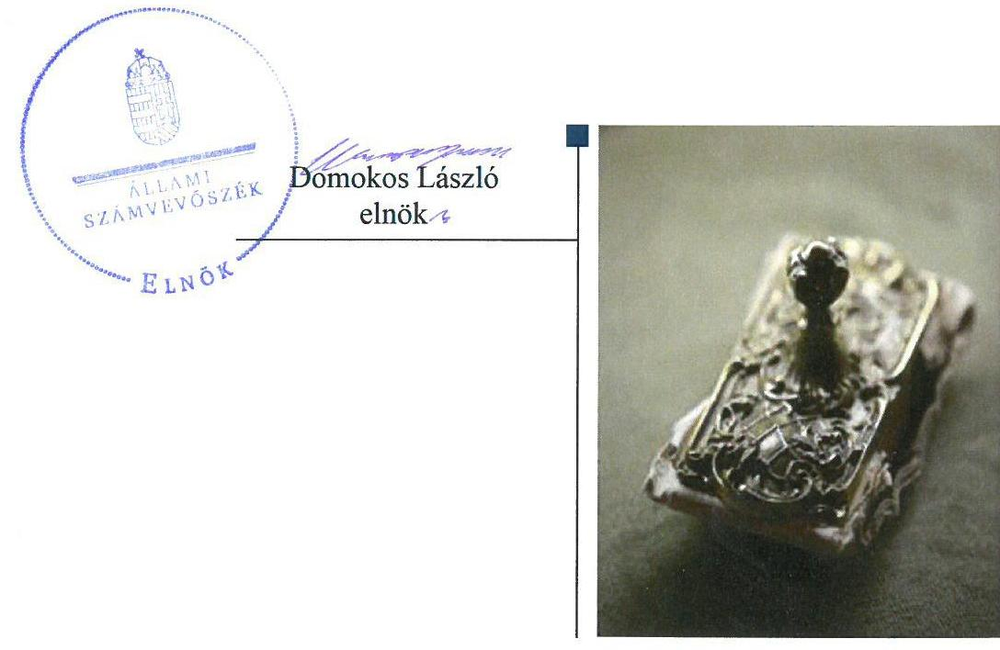
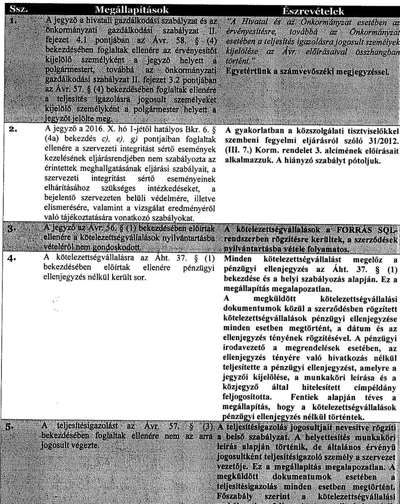
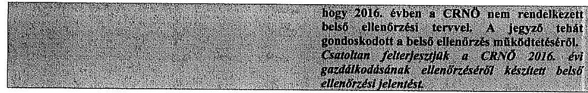
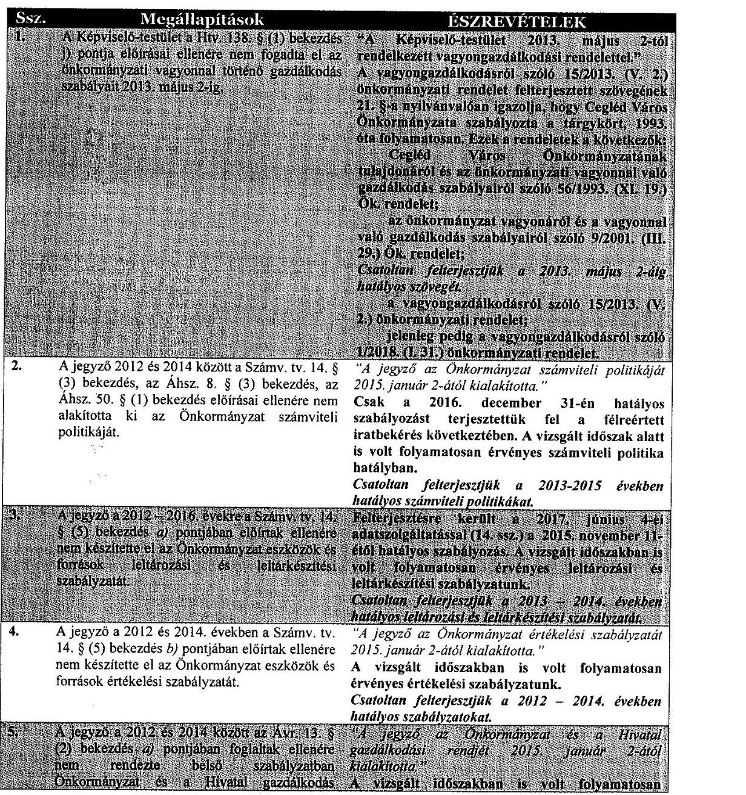
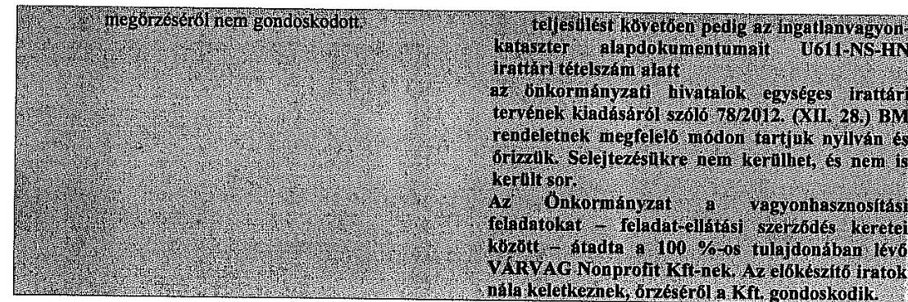
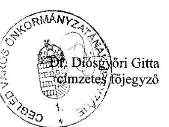
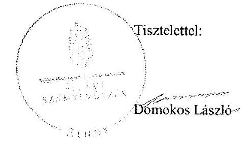

# Jelentés 

## Önkormányzatok integritás- és belső kontrollrendszere

Az önkormányzatok belső kontrollrendszere kialakításának és múködtetésének ellenőrzése - Cegléd Város Önkormányzata 2018.

---

# Jelentés 

## Önkormányzatok integritás- és belső kontrollrendszere

Az önkormányzatok belső kontrollrendszere kialakításának és múködtetésének ellenőrzése - Cegléd Város Önkormányzata 2018. 04 hó 27 nap

---

# AZ ELLENŐRZÉST FELÜGYELTE:

DR. BENEDEK MÁRIA felügyeleti vezető

## AZ ELLENŐRZÉST VEZETTE ÉS A VÉGREHAJTÁSÁÉRT FELELŐS:

BÍRÓ ZSOLT ellenőrzésvezető

## A PROGRAM ÖSSZEÁLLÍTÁSÁÉRT FELELŐS:

TÓTPÁL SZABOLCS osztályvezető

IKTATÓSZÁM: EL-0108-069/2018.

TÉMASZÁM: 2444

## ELLENŐRZÉS-AZONOSÍTÓ SZÁM: V078910, V078404

Jelentéseink az Országgyűlés számítógépes hálózatán és az Interneta a www.asz.hu címen is olvashatóak.

---

# TARTALOMJEGYZÉK 

- ÖSSZEGZÉS ..... 5
- AZ ELLENŐRZÉS CÉLJA ..... 6
- AZ ELLENŐRZÉS TERÜLETE ..... 7
- AZ ELLENŐRZÉS HÁTTERE, INDOKOLTSÁGA ..... 8
- A JELENTÉS LÉNYEGES KÉRDÉSKÖREI ..... 10
- AZ ELLENŐRZÉS HATÓKÖRE ÉS MÓDSZEREI ..... 11
- MEGÁLLAPÍTÁSOK ..... 13
- JAVASLATOK ..... 21
- MELLÉKLETEK ..... 25
I. sz. melléklet: Értelmező szótár ..... 25
- FÜGGELÉK: ÉSZREVÉTELEK ..... 27
- RÖVIDÍTÉSEK JEGYZÉKE ..... 71

---

.

---

# ÖSSZEGZÉS 

Cegléd Város Önkormányzata belső kontrollrendszerének kialakítása és müködtetése nem volt szabályszerű, az nem biztositotta a közpénzfelhasználás szabályosságát. A befektetésekkel kapcsolatos döntéshozatal, a befektetések számviteli elszámolásának, nyilvántartásának szabálytalanságai miatt nem valósult meg a nemzeti vagyonnal történő felelős gazdálkodás. Az integritási kontrollok kiépitettsége nem volt egyensúlyban a fellépő kockázatok szintjével.

## Az ellenőrzés társadalmi indokoltsága

Az Állami Számvevőszék a stratégiai céljával összhangban - az Állami Számvevőszékről szóló 2011. évi LXVI. törvény felhatalmazása alapján - végzi a közpénzekkel, az állami és önkormányzati vagyonnal való felelős gazdálkodás, valamint a helyi önkormányzatok számviteli rendje betartásának és belső kontrollrendszere múködésesnek ellenőrzését. Magyarország Alaptörvénye az önkormányzatoktól is elvárja a kiegyensúlyozott, átlátható és fenntartható költségvetési gazdálkodás elvének érvényesítését, továbbá a nemzeti vagyonnal való rendeltetésszerú és felelős módon való gazdálkodást. Az Állami Számvevőszék stratégiájában az is megfogalmazódott, hogy támogatja az integritás alapú, átlátható és elszámoltatható közpénzfelhasználás megteremtését. Mindezekre tekintettel, a közpénzzel gazdálkodó szervezetek esetében a belső kontrollrendszer megfelelő múködése ellenőrzését prioritásként kezeli az Állami Számvevőszék.

A szabad pénzeszközök felhasználása során kiemelten fontos a felelős gazdálkodás érvényesülése, amely összhangban kell, hogy legyen az önkormányzati gazdálkodás alapelveivel.

## Főbb megállapítások, következtetések

Cegléd Város Önkormányzata és a Ceglédi Közös Önkormányzati Hivatal számviteli politikája, számlarendje, gazdálkodási szabályzata nem felelt meg a jogszabályi előírásoknak. Cegléd Város Önkormányzata nem rendelkezett leltározási és leltárkészítési szabályzattal, a gazdálkodási jogkörök gyakorlása során a kötelezettségvállalás, a teljesítésigazolás nem volt szabályszerű, a jegyző nem gondoskodott a közérdekú adatok teljes körú közzétételéről, így nem volt biztosított a közpénzfelhasználás szabályossága és az átlátható múködés.

Cegléd Város Önkormányzata az egyes befektetésekkel kapcsolatos döntés-előkészítő és döntéshozatali dokumentumok megőrzéséről nem gondoskodott, a részesedések és az üzleti célú ingatlanok nyilvántartása, leltározása nem szabályszerűen történt, így nem volt biztosított a szabad pénzeszközökkel való felelős gazdálkodás.

A Cegléd Város Önkormányzatánál az integritással összefüggő kontrollok és a korrupciós kockázatok szintje nem volt összhangban, a kontrollrendszer nem támogatta az integritás szemlélet érvényesülését.

---

# AZ ELLENŐRZÉS CÉLJA 

Az ellenőrzés célja annak megállapítása volt, hogy szabályszerűen történt-e Cegléd Város Önkormányzata belső kontrollrendszerének kialakítása és működtetése, az biz-tosította-e Cegléd Város Önkormányzatánál a közpénzfelhasználás szabályosságát, a közpénzekkel és a nemzeti vagyonnal történő szabályszerű és felelős gazdálkodást, a beszámolási és adatszolgáltatási kötelezettségek szabályszerű teljesítését. Az ellenőrzés keretében értékeltük Cegléd Város Önkormányzata korrupciós kockázatainak kezelését szolgáló integritás kontrollok kiépítettségét és az integritás szemlélet érvényesülését.

Az ellenőrzés célja továbbá annak értékelése volt, hogy a jogszabályi előírásoknak megfelelően alakították-e ki a belső kontrollrendszert, a kontrollkörnyezet biztosította-e a befektetési tevékenységek szabályszerű végzését. Értékeltük, hogy az egyes befektetési tevékenységekkel kapcsolatos döntéshozatal és a döntések végrehajtása, valamint az egyes befektetések számviteli elszámolása, nyilvántartása szabályszerű volt-e, és a belső és külső ellenőrzések támogattáke az egyes befektetési tevékenységek szabályszerű végzését.

---

# AZ ELLENŐRZÉS TERÜLETE 

## Cegléd Város Önkormányzata

Cegléd város a Közép-Magyarországi régióban, Pest megyében található, lakónépessége a Központi Statisztikai Hivatal Magyarország közigazgatási helynévkönyve alapján 2016. január 1-én 35616 fő volt.

Cegléd Város Önkormányzata 15 tagú Képviselő-testületének munkáját három állandó bizottság segítette. A településen Cegléd Város Roma Nemzetiségi Önkormányzata múködött.

Cegléd Város Önkormányzata és Kőröstetétlen Község Önkormányzata 2013. január 1-jével létrehozta a Ceglédi Közös Önkormányzati Hivatalt.

Cegléd Város Önkormányzata a Ceglédi Közös Önkormányzati Hivatalon kívül nyolc költségvetési szervvel, egy önkormányzati társulással, valamint öt 100\%-os tulajdoni részesedésű gazdasági társasággal látta el a feladatait.

Cegléd Város Önkormányzata három 100\%-os tulajdoni részesedésű nem közfeladat ellátását szolgáló gazdasági társaságban rendelkezett részesedéssel. A Cegléd TV Nonprofit Kft. főtevékenysége televízióműsor összeállítása szolgáltatása, a Ceglédi Városfejlesztési Kft. főtevékenysége adminisztratív szolgáltatás, a Ceglédi Termálfürdő Kft főtevékenysége fizikai közérzetet javító szolgáltatás.

A Ceglédi Közös Önkormányzati Hivatal öt szervezeti egységre (Hatósági iroda, Pénzügyi Iroda, Szervezési Iroda, Városüzemeltetési Iroda és Polgármesteri Kabinet) tagolódott, elkülönített gazdasági szervezettel nem rendelkezett, a foglalkoztatott köztisztviselők száma a 2016. év végén 94 fő volt.

A polgármester a 2014. évi önkormányzati választások óta tölti be tisztségét, a jegyző 2007. június 1-jétől látja el feladatait.

Cegléd Város Önkormányzata a 2016. évi költségvetési beszámolója szerint 5 131,6 millió Ft költségvetési bevételt ért el, valamint 5 151,8 millió Ft költségvetési kiadást teljesített. A könyvviteli mérleg szerinti eszközvagyon értéke 2016. december 31-én 24 269,0 millió Ft volt, amelyből az ingatlanok és kapcsolódó vagyonértékű jogok értéke 22 123,3 millió Ft-ot, a tartós részesedések 251,9 millió Ft-ot, a pénzeszközök 761,0 millió Ft-ot tettek ki, forgatási célú értékpapírral nem rendelkeztek. A 2016. évben a forrásokon belül a költségvetési évben esedékes kötelezettség állomány 155,7 millió Ft-ot, a költségvetési évet követően esedékes kötelezettség állomány 96,7 millió Ft-ot tett ki, pénzintézettel szembeni kötelezettségük nem volt.

---

# AZ ELLENŐRZÉS HÁTTERE, INDOKOLTSÁGA 

A demokratikus társadalmakban alapvető igény, hogy a közpénzeket, a közvagyont használók tevékenységükről elszámoljanak, ahhoz egyértelmű és érvényesíthető felelősségi szabályok társuljanak. Ennek a jogos igénynek az érvényesítéséhez meg kell teremteni azokat a folyamatokat, rendszereket, amelyek nélkülözhetetlenek az elszámoltatáshoz. Az elszámoltatás eredményes múködtetéséhez szükség van a megfelelő információs, kontroll-, értékelési - és beszámolási rendszerek kialakítására. A belső kontrollok kiépítettsége hozzájárul az integritási szemlélet kialakításához és érvényesüléséhez. A belső kontrollrendszer kialakítása és müködtetése nélkül nem valósítható meg a közpénzek, a közvagyon szabályos, gazdaságos, hatékony és eredményes felhasználása.

A BELSŐ KONTROLLRENDSZER azt a célt szolgálja, hogy az államháztartás szervei múködésük és gazdálkodásuk során a tevékenységeket szabályszerűen, gazdaságosan, hatékonyan, eredményesen hajtsák végre, teljesítsék elszámolási kötelezettségeiket és megvédjék az erőforrásokat a veszteségektől, a károktól, a nem rendeltetésszerű használattól. A belső kontrollrendszer magában foglalja mindazon szabályokat, eljárásokat, gyakorlati módszereket és szervezeti struktúrákat, kockázatkezelési technikákat, kontrolltevékenységeket, amelyek segítséget nyújtanak a szervezetnek céljai eléréséhez. A belső kontrollrendszer szabályozása háromszintű, a törvényi előírásokat az Áht. ${ }^{1}$ és a Mötv. ${ }^{2}$, a rendeleti szintű szabályozást az Ávr. ${ }^{3}$ és a Bkr. ${ }^{4}$ tartalmazza, amelyeket útmutatói szinten az $\mathrm{NGM}^{5}$ által kiadott standardok és kézikönyvek támogatnak.

A megfelelő belső kontrollrendszer jelentősen csökkenti a hibák és szabálytalanságok kockázatát. Az ÁSZ ${ }^{6}$ célja, hogy javuljon az ellenőrzött önkormányzatok belső kontrollrendszerének szabályozottsága, múködésének megfelelősége, szabályszerűsége, hozzájárulva ezzel az egyensúlyi helyzet fenntarthatóságának biztosításához, biztosítva az önkormányzatnál a közpénzfelhasználás szabályosságát, a közpénzekkel és a nemzeti vagyonnal történő szabályszerű, gazdaságos, hatékony és eredményes gazdálkodást. Az ÁSZ ellenőrzés tapasztalatai nem csupán a közvetlenül ellenőrzött önkormányzatokat támogathatják, hanem a ,jó gyakorlat" elterjesztésével azok az önkormányzatok is átvehetik a pozitív példákat, ahol az ÁSZ ellenőrzést nem végez.

AZ ÖNKORMÁNYZATI VAGYONGAZDÁLKODÁS keretében az önkormányzatok átmenetileg szabad pénzeszközeinek befektetését jogszabály nem tiltja, a befektetések jellege nem korlátozott, a pénzpiaci szolgáltatók közül az önkormányzatok a kínált szolgáltatás és annak költségei alapján, szabadon választhatnak, azonban a veszteséges gazdálkodás kockázatai és következményei az önkormányzatokat terhelik. Az ellenőrzéssel feltárásra kerülhetnek azok a kockázatok, amelyek az önkormányzatok gazdálkodásával, ezen belül befektetési tevékenységeivel, kontrollkörnyezetével kapcsolatosak és a befektetési tevékenységek szabályszerű végrehajtását befolyásolják. Az ellenőrzéssel az önkormányzatok befektetési/vagyongazdálkodási döntéseinek összessége értékelhetővé

---

válik, és megalapozott megállapítás tehető arra vonatkozóan, hogy milyen hatást gyakoroltak az önkormányzat vagyonára a képviselő-testület döntései.

AZ ELLENŐRZÉS VÁRHATÓ HASZNOSULÁSA négy szinten valósul meg. A törvényalkotás számára összegzett tapasztalatok állnak rendelkezésre a belső kontrollrendszer önkormányzati területen való kialakításáról, működtetéséről és hatásairól. Az ellenőrzés az ellenőrzött számára visszajelzést ad a belső kontrollrendszer kialakításában és működésében lévő hiányosságokról, javaslataival hozzájárul azok kiküszöböléséhez. Az ellenőrzés megállapításait és javaslatait más szervezetek is hasznosíthatják a rendezett gazdálkodási keretek kialakításához. A társadalom számára jelzi, hogy közpénz nem maradhat ellenőrizetlenül, az ÁSZ értékteremtő rend kialakításához és megőrzéséhez hozzájáruló tevékenysége pozitív hatással lesz a szervezetről kialakított összkép formálásában.

---

# A JELENTÉS LÉNYEGES KÉRDÉSKÖREI 

1.     - Az önkormányzat belső kontrollrendszerének kialakítása és müködtetése 2016. évben szabályszerű volt-e, az biztositotta-e az önkormányzatnál a közpénzfelhasználás szabályosságát, a nemzeti vagyonnal történő felelős gazdálkodást?
2.     - A jogszabályi előírásoknak megfelelően alakították-e ki a belső kontrollrendszert, a befektetési tevékenységek szabályszerű végzését a kiépített kontrollkörnyezet biztositotta-e a 2012-2016. években?
3.     - Az önkormányzat egyes befektetéseivel kapcsolatos döntéshozatala és a döntések végrehajtása szabályszerű volt-e?
4.     - Az egyes befektetések számviteli elszámolása, nyilvántartása szabályszerű volt-e?
5.     - A belső és külső ellenőrzések támogatták-e az egyes befektetési tevékenységek szabályszerű végzését?
6. Érvényesült-e az integritás szemlélet és ennek megfelelően kiépítették-e az integritás kontrollrendszert az önkormányzatnál?

---

# AZ ELLENŐRZÉS HATÓKÖRE ÉS MÓDSZEREI 

## Az ellenőrzés típusa

A belső kontrollrendszer ellenőrzése esetében megfelelőségi ellenőrzés, a befektetési tevékenységnél szabályszerűségi ellenőrzés.

## Az ellenőrzött időszak

A belső kontrollrendszer kialakításának és működtetésének ellenőrzése a 2016. január 1. és 2016. december 31. közötti időszakra terjedt ki.

A befektetési tevékenység ellenőrzési időszaka a 2012. január 1. - 2016. december 31. közötti időszak. Ezen felül az önkormányzat befektetésekkel kapcsolatos döntés-előkészítésének és a döntéshozatalának szabályszerűségét ellenőriztük a 2012. január 1. előtti időszakra tekintettel is, mivel a 2016. december 31-én meglévő befektetésekkel kapcsolatos döntéshozatalra a 2012. január 1. előtti időszakban került sor.

## Az ellenőrzés tárgya

A helyi önkormányzatnak, mint éves költségvetési beszámoló készítésére kötelezett szervezetnek és polgármesteri hivatalának belső kontrollrendszere. Az integritás szemlélet érvényesülése

Az önkormányzat 2016. december 31-én meglévő, a Számv. tv. ${ }^{7}$ 3. § (6) bekezdés 2. és 3. pontja szerint az értékpapírokban megtestesülő befektetései, lekötött betétei. Továbbá a 2016. december 31-én meglévő, az önkormányzat szabad pénzeszközei terhére, adásvételi szerződés keretében megszerzett, a kötelező feladatok ellátását nem szolgáló, az önkormányzat üzleti vagyonába tartozó, az ellenőrzött időszakban (2012-2016.) megszerzett ingatlanok, továbbá az - időkorlátozás nélkül megszerzett - kulturális javak (műtárgyak, műalkotások, stb.), illetve egyéb értéktárgyak (pl. ékszerek, befektetési nemesfém).

Az ellenőrzés kiterjedt minden olyan körülményre és adatra, amely az ÁSZ jogszabályban meghatározott feladatainak teljesítéséhez, valamint a program végrehajtása folyamán felmerült újabb összefüggések feltárásához szükséges.

## Az ellenőrzött szervezet

Cegléd Város Önkormányzata

---

# Az ellenőrzés jogalapja 

Az ÁSZ tv. ${ }^{8}$ 1. § (3) bekezdésében foglaltak alapján az ÁSZ ${ }^{9}$ általános hatáskörrel végzi a közpénzekkel és az állami és önkormányzati vagyonnal való felelős gazdálkodás ellenőrzését. Az ÁSZ tv. 5. § (2) bekezdése alapján az államháztartás gazdálkodásának ellenőrzése keretében az ÁSZ ellenőrzi a helyi önkormányzatok gazdálkodását, valamint az ÁSZ tv. 5. § (6) bekezdése alapján ellenőrzése során értékeli az államháztartás számviteli rendjének betartását és a belső kontrollrendszer múködését.

## Az ellenőrzés módszerei

Az ÁSZ az ellenőrzést az ellenőrzési program szempontjai, az ellenőrzött időszakban hatályos jogszabályok, az ellenőrzés szakmai szabályai, az egyes ellenőrzési típusokhoz kapcsolódó ÁSZ módszertanok figyelembe vételével végezte. A gazdálkodás hibáinak kijavítására, a közpénzekkel való felelős gazdálkodás elősegítésére irányuló javaslatok kidolgozásakor a hatályos jogszabályok voltak az irányadóak.

Az ellenőrzés ideje alatt az ÁSZ Cegléd Város Önkormányzatával történő kapcsolattartást az ÁSZ SZMSZ ${ }^{10}$-ének vonatkozó előírásai alapján biztosította.

Az ellenőrzési kérdések megválaszolásához szükséges bizonyítékok megszerzése Cegléd Város Önkormányzata által rendelkezésre bocsátott dokumentumokra, adatokra alapozva megfigyelés, szemle (szemrevételezés), valamint elemző eljárás keretében történt.

Az ellenőrzési bizonyítékként felhasználható adatforrások közé tartoztak egyrészt az ellenőrzési program részletes szempontjainál felsorolt adatforrások, másrészt minden - az ellenőrzés folyamán feltárt, az ellenőrzés szempontjából releváns információt tartalmazó - dokumentum.

Az ellenőrzés lefolytatásához Cegléd Város Önkormányzata az ÁSZ által kért dokumentumok elektronikus megküldésével szolgáltatott adatokat. A rendelkezésre bocsátott adatok, információk kontrollja az ellenőrzés keretében történt.

A közszféra integritás alapú kultúrájának kialakítása, megerősítése és működése szorosan összefügg a belső kontrollrendszer működésével, ezért az ellenőrzés kiterjed annak értékelésére is, hogy a belső kontrollrendszer kialakítása és múködtetése hogyan hatott az integritás szemlélet érvényesülésére.

Az ÁSZ Cegléd Város Önkormányzatának befektetési tevékenységét a szerződéskötés (és a kapcsolódó döntés-előkészítés, döntéshozatal) kivételével a 2012. január 1. és 2016. december 31. közötti időszak vonatkozásában értékelte. A szerződéskötést Cegléd Város Önkormányzata 2016. december 31-én meglévő értékpapírjai és egyéb befektetései vonatkozásában értékelte a befektetési döntés előkészítése és a döntéshozatala tekintetében, abban az esetben is, ha az 2012. január 1. előtt történt. A 2012. évet megelőzően történt szerződéskötéseket, illetve a döntéseket, az akkor hatályos jogszabályok és a belső szabályzatok előírásai alapján értékelte.

---

# 1. Az önkormányzat belső kontrollrendszerének kialakítása és múködtetése 2016. évben szabályszerű volt-e, az biztosította-e az önkormányzatnál a közpénzfelhasználás szabályosságát, a nemzeti vagyonnal történő felelős gazdálkodást? 

## Összegző megállapítás

### 1.1. számú megállapítás

Az Önkormányzat ${ }^{11}$ belső kontrollrendszerének kialakítása és múködtetése 2016. évben nem volt szabályszerű, nem biztosította az Önkormányzatnál a közpénzfelhasználás szabályosságát, a nemzeti vagyonnal történő felelős gazdálkodást.

A kontrollkörnyezet kialakítása nem felelt meg a jogszabályi előírásoknak.

A Képviselő-testület ${ }^{12}$ a Mötv.-ben és az Áht.-ban foglaltaknak megfelelően megalkotta az önkormányzati SZMSZ-t ${ }^{13}$, jóváhagyta a Hivatal ${ }^{14}$ alapító okiratát ${ }^{15}$ és a hivatali SZMSZ ${ }^{16}$-t. Az Önkormányzat a Mótv. előírásainak megfelelően elkészítette gazdasági programját ${ }^{17}$. A jegyző kialakította az Önkormányzat és a Hivatal számviteli politikáját ${ }^{18}$, amelynek keretében elkészítette az értékelési szabályzatot ${ }^{19}$, a pénzkezelési szabályzatot ${ }^{20}$, és az ön-költség-számítási szabályzatot ${ }^{21}$, valamint a Hivatalra vonatkozó leltározási szabályzatot ${ }^{22}$. Az Önkormányzat és a Hivatal rendelkezett számlarenddel ${ }^{23}$ és bizonylati renddel ${ }^{24}$.

A kontrollkörnyezet kialakítása során feltárt hiányosságokat a 1. táblázat tartalmazza.

## A KONTROLLKÖRNYEZET KIALAKÍTÁSÁNAK HIÁNYOSSÁGAI

Sorszám
Megállapítások
Megjegyzések

1. A jegyző nem gondoskodott arról, hogy a hivatali SZMSZ tartalmazza az Ávr. 13. § (1) bekezdés c) pontjában előírtaknak megfelelően az ellátandó, és a kormányzati funkció szerint besorolt alaptevékenységek megjelölését.
2. A jegyző a számviteli politikában az Áhsz. 50. § (7) bekezdésében előírtak ellenére nem rögzítette az általános költségek szakfeladatokra és az általános kiadások tevékenységekre történő felosztásának módját, a felosztáshoz alkalmazott mutatókat, vetítési alapokat.
3. A jegyző a Számv. tv. 14. § (5) bekezdés a) pontjában előírtak ellenére az Önkormányzat eszközeire és forrásaira vonatkozó leltározási és leltárkészítési szabályzatot nem készített.
4. A jegyző a pénzkezelési szabályzatban a Számv. tv. 14. § (8) bekezdésben rögzítettek ellenére nem rendelkezett a készpénzben és a bankszámlán tartott pénzeszközök közötti forgalomról, a napi készpénz záró állomány maximális mértékéről, a készpénzállomány ellenőrzésekor követendő eljárásról, a pénzforgalommal kapcsolatos nyilvántartási szabályokról.

---

|  Sorszám | Megállapítások | Megjegyzések  |
| --- | --- | --- |
|  5. | A jegyző a számlarendben nem szabályozta az Áhsz. ${ }^{25}$ 51. § (3) bekezdésében foglaltak ellenére a részletező nyilvántartásoknak a kapcsolódó könyvviteli és nyilvántartási számlákkal való egyeztetését, annak dokumentálását, az összesítő bizonylatok (feladások) elkészítésének rendjét, az összesítő bizonylat tartalmi és formai követelményeit. |   |
|  6. | A jegyző belső szabályzatban nem rendezte az Ávr. 13. § (2) bekezdés b) pontjában előírtak ellenére a beszerzések lebonyolításával kapcsolatos eljárásrendet. |   |
|   |  | Forrás: ÁSZ  |

1.2. számú megállapítás

A kockázatkezelési rendszer múködtetése megfelelt a jogszabályi előírásoknak.

A jegyző a Bkr.-ben előírtaknak megfelelően 2016. szeptember 30-ig a kockázatkezelési rendszert 2016. október 1-jétől az integrált kockázatkezelési rendszert a Hivatal szervezeti egységeire kiterjedő hatállyal a belső kontrollrendszer kézikönyvben ${ }^{26}$ kialakította és az előírásoknak megfelelően működtette. A jegyző felmérte és megállapította az Önkormányzat és a Hivatal tevékenységében, gazdálkodásában rejlő kockázatokat, meghatározták az egyes kockázatokkal kapcsolatban szükséges intézkedéseket.

# 1.3. számú megállapítás

A kontrolltevékenységek kereteinek kialakítása és működtetése nem felelt meg a jogszabályoknak és a belső szabályozásban foglaltaknak.

A jegyző a hivatali gazdálkodási szabályzat ${ }^{27}$-ban és az önkormányzati gazdálkodási szabályzat ${ }^{28}$-ban rögzítette a kötelezettségvállalás, ellenjegyzés, teljesítés igazolása, érvényesítés, utalványozás gyakorlásának módját, eljárási és dokumentációs részletszabályait. A jogosultak kötelezettségvállalási, teljesítésigazolási, érvényesítési és utalványozási jogkör gyakorlására történő kijelölése megfelelt az Ávr.-ben foglalt előírásoknak.

A tervezéssel, az ellenőrzési és kontrolleljárásokkal, az adatszolgáltatási és beszámolási feladatok teljesítésével kapcsolatos belső előírásokat, feltételeket az önkormányzati SZMSZ-ben, a hivatali SZMSZ-ben, a számviteli politikában és a gazdálkodási szabályzat ${ }_{1,2}$-ban rögzítették.

A jegyző a belső kontrollrendszer kézikönyvben a Hivatalra a Bkr.-ben előírtaknak megfelelően elkészítette a működési folyamatainak megfelelő ellenőrzési nyomvonalat ${ }^{29}$.

A Hivatal rendelkezett a szabálytalanságkezelés eljárásrendjével ${ }^{30}$, valamint 2016. október 1-jétől a szervezeti integritást sértő események kezelésének eljárásrendjével ${ }^{31}$.

A kontrolltevékenységek keretei kialakításának és működtetésének hiányosságait a 2. táblázat tartalmazza.

---

# A KONTROLLTEVÉKENYSÉGEK KERETEI KIALAKÍTÁSÁNAK ÉS MŰKÖDTETÉSÉNEK HIÁNYOSSÁGAI 

| Sorszám | Megállapítások | Megjegyzések |
| :--: | :--: | :--: |
| 1. | A jegyző a hivatali gazdálkodási szabályzat és az önkormányzati gazdálkodási szabályzat II. fejezet 4.1 pontjában az Ávr. 58. § (4) bekezdésében foglaltak ellenére az érvényesitőt kijelölő személyként a jegyző helyett a polgármestert, továbbá az önkormányzati gazdálkodási szabályzat II. fejezet 3.2 pontjában az Ávr. 57. § (4) bekezdésében foglaltak ellenére a teljesítés igazolására jogosult személyeket kijelölő személyként a polgármester helyett a jegyzőt jelölte meg. | A Hivatal és az Önkormányzat esetében az érvényesítésre, továbbá az Önkormányzat esetében a teljesítés igazolásra jogosult személyek kijelölése az Ávr. előírásaival összhangban történt. |
| 2. | A jegyző a 2016. X. hó 1-jétől hatályos Bkr. 6. § (4a) bekezdés c), e), g) pontjaiban foglaltak ellenére a szervezeti integritást sértő események kezelésének eljárásrendjében nem szabályozta az érintettek meghallgatásának eljárási szabályait, a szervezeti integritást sértő események elhárításához szükséges intézkedéseket, a bejelentő szervezeten belüli védelmére, illetve elismerésére, valamint a vizsgálat eredményéről való tájékoztatására vonatkozó szabályokat. |  |
| 3. | A jegyző az Ávr. 56. § (1) bekezdésében előírtak ellenére a kötelezettségvállalások nyilvántartásba vételéről nem gondoskodott. |  |
| 4. | A kötelezettségvállalásra az Áht. 37. § (1) bekezdésében előírtak ellenére pénzügyi ellenjegyzés nélkül került sor. |  |
| 5. | A teljesítésigazolást az Ávr. 57.-§ (3) bekezdésében foglaltak ellenére nem az arra jogosult végezte. |  |

Forrás: ÁSZ

### 1.4. számú megállapítás

Az információs és kommunikációs rendszer kialakításra került, azonban a múködtetése a jogszabályi előírásoknak nem felelt meg.

A jegyző összhangban a Bkr. előírásaival kialakította az Önkormányzat és a Hivatal információs rendszerét.

A jegyző az Info. tv. ${ }^{32}$-ben és az Ávr.-ben előírtaknak megfelelően szabályozta a kötelezően közzéteendő adatok nyilvánosságra hozatalának és a közérdekú adatok megismerésére irányuló igények teljesítésének rendjét. A Hivatal az Ltv. ${ }^{33}$ előírásainak megfelelően rendelkezett iratkezelési szabályzattal.

A jegyző az Info tv.-ben előírtaknak megfelelően szabályozta az Önkormányzat és a Hivatal adatvédelmi és adatbiztonsági előírásait.

A jegyző gondoskodott az Önkormányzat beszámolási és adatszolgáltatási kötelezettségének a jogszabályi előírások szerinti teljesítéséről.

Az információs és kommunikációs rendszer múködtetésének hiányosságát a 3. táblázat tartalmazza.
3. táblázat

## AZ INFORMÁCIÓS ÉS KOMMUNIKÁCIÓS RENDSZER MŰKÖDTETÉSÉNEK HIÁNYOSSÁGA

| Sorszám | Megállapítás | Megjegyzés |
| :--: | :--: | :--: |
| 1. | A jegyző az Info tv. 37. § (1) bekezdésében előírtak ellenére nem gondoskodott az Info. tv. 1. melléklet II./1. pontjában, valamint a III./4. pontjában előírtak ellenére az adatvédelmi és adatbiztonsági szabályzatot és a vagyonnal történő gazdálkodással összefüggő nettó ötmillió forintot elérő vagy azt meghaladó értékú szerződései közzétételéről. |  |

Forrás: ÁSZ

---

# 1.5. számú megállapítás 

A monitoring rendszer, ezen belül a belső ellenőrzés kialakítása és múködtetése megfelelt a jogszabályi előírásoknak.

A jegyző a Hivatalban foglalkoztatott belső ellenőrökkel gondoskodott az Áht-ban meghatározott belső ellenőrzési feladatok ellátásáról. A hivatali SZMSZ-ben előírták a belső ellenőrök szervezeti és funkcionális függetlenségét, az összeférhetetlenségi követelményeket.

A belső ellenőrzés múködtetése a Bkr.-ben előírtaknak megfelelt. A belső ellenőrzési kézikönyvet ${ }^{34}$ a jegyző, a belső ellenőrzési tervet a Képvi-selő-testület jóváhagyta. A belső ellenőr a 2016. évi belső ellenőrzési tervet végrehajtotta.

A belső ellenőrzési vezető a belső ellenőrzési jelentésekről a Bkr.-ben előírt tartalmú nyilvántartást vezetett.

A jegyző által a külső ellenőrzésekről vezetett nyilvántartás tartalmazta az ellenőrzési jelentésben szereplő javaslatot, az elfogadott intézkedési tervet, az intézkedési terv alapján végrehajtott intézkedések rövid leírását.
1.6. számú megállapítás

Az Önkormányzatnál értékelték, hogy a kiadott szabályzatai, a kialakított és múködtetett folyamatai biztosítják-e a rendelkezésre álló forrásokkal és a nemzeti vagyonnal történő szabályszerű, gazdaságos, hatékony és eredményes gazdálkodást.

A jegyző a Bkr. 1. számú melléklete szerinti formában és tartalommal tette meg a nyilatkozatát, melyben értékelte a Hivatal belső kontrollrendszerének minőségét. A jegyző nyilatkozatában foglaltakat a jelen ellenőrzés nem támasztotta alá, mivel az Önkormányzat belső kontrollrendszerének kialakítása és múködtetése az ÁSZ értékelése szerint nem volt szabályszerű.

Az Önkormányzat belső kontrollrendszerének minőségét értékelő nyilatkozathoz kötődő hiányosságokat a 4. táblázat tartalmazza.
4. táblázat

## AZ ÖNKORMÁNYZAT BELSŐ KONTROLLRENDSZERÉNEK MINŐSÉGÉT ÉRTÉKELŐ NYILATKOZATHOZ KÖTÖDŐ HIÁNYOSSÁG

| Sorszám | Megállapítás | Megjegyzés |
| :-- | :-- | :--: |
| 1. | A polgármester a jegyzői nyilatkozatot a Bkr. 11. § (2a) bekezdésében előírtak ellenére a zárszám-   adási rendelet-tervezettel együtt nem terjesztette a Képviselő-testület elé. | A jegyző 2016. évi zárszám-   adási rendelettervezet elő-   terjesztésekor, beszámolót   készített az Önkormányzat-   nál múködtetett belső   kontrollrendszerről. |

1.7. számú megállapítás

A Roma Nemzetiségi Önkormányzat ${ }^{35}$ gazdálkodással kapcsolatos feladatainak ellátása nem felelt meg a jogszabályi előírásoknak.

Az Önkormányzat és a Roma Nemzetiségi Önkormányzat a Nek. tv. ${ }^{36}$-ben előírtak alapján az ellenőrzött időszakot megelőzően Együttműködési megállapodást ${ }^{37}$ kötött, melynek felülvizsgálata határidőben megtörtént.

A jegyző az Áht.-ban foglaltaknak megfelelően előkészítette a Roma Nemzetiségi Önkormányzat 2016. évi költségvetési és zárszámadási határozattervezetét.

---

A jegyző kiterjesztette a Roma Nemzetiségi Önkormányzatra a Hivatal számviteli politikáját, számlarendjét, pénzkezelési szabályzatát, a leltározási és leltárkészítési szabályzatát, az értékelési szabályzatát, valamint a gazdálkodási szabályzatát.

A Roma Nemzetiségi Önkormányzat gazdálkodásával kapcsolatos hiányosságait az 5. táblázat tartalmazza.
5. táblázat

# A ROMA NEMZETISÉGI ÖNKORMÁNYZAT GAZDÁLKODÁSÁVAL KAPCSOLATOS FELADATOK ELLÁTÁSÁNAK HIÁNYOSSÁGA 

Sorszám Megállapítások
Megjegyzések

1. Az Együttmúködési megállapodás a Nek. tv. 80. § (3) bekezdés b) pontjában előírtak ellenére a Roma Nemzetiségi Önkormányzat kötelezettségvállalásaival kapcsolatosan az Önkormányzatot terhelő szakmai teljesítésigazolási feladatokat és a felelősök konkrét kijelölését nem tartalmazta.
2. A jegyző nem szabályozta 2016. október 1-jétől a 8kr. 6. § (4) bekezdésének előírása ellenére a Roma Nemzetiségi Önkormányzat vonatkozásában a szervezeti integritást sértő események kezelésének eljárásrendjét.
3. A jegyző a Roma Nemzetiségi Önkormányzat vonatkozásában az Áht. 70.§ (1) bekezdésében és az Együttmüködési megállapodás VI. fejezetében előírtak ellenére nem gondoskodott a belső ellenőrzés múködtetéséről.

Forrás: ÁSZ

## 2. A jogszabályi előírásoknak megfelelően alakították-e ki a belső kontrollrendszert, a befektetési tevékenységek szabályszerű végzését a kiépített kontrollkörnyezet biztosította-e a 2012-2016. években?

Összegző megállapítás

A belső kontrollrendszert nem a jogszabályi előírásoknak megfelelően alakították ki, így az a 2012 - 2016. években a befektetési tevékenységek szabályszerű végzését nem biztosította.

A kontrollkörnyezet kialakítása során az Önkormányzat és a Hivatal rendelkezett SZMSZ-szel. A Képviselő-testület a vagyongazdálkodási rendeletben ${ }^{38}$ határozta meg az önkormányzati vagyonnal történő gazdálkodás szabályait.

Az Önkormányzat a 2015. évtől rendelkezett számviteli politikával, eszközök és források értékelési szabályzatával, az Ávr-nek megfelelő gazdálkodási szabályzattal, amelyek támogatták a befektetések szabályszerű végzését.

A belső kontrollrendszer befektetéssel kapcsolatos a 2012 - 2016. közötti hiányosságait a 6. táblázat tartalmazza.

---

| A BELSŐ KONTROLLRENDSZER KIALAKÍTÁSÁNAK HIÁNYOSSÁGAI 2012 - 2016. ÉVEKBEN |  |  |
| :--: | :--: | :--: |
| Sorszám | Megállapítás | Megjegyzés |
| 1. | A Képviselő-testület a Htv. ${ }^{39}$ 138. § (1) bekezdés j) pontja előírása ellenére nem fogadta el az önkormányzati vagyonnal történő gazdálkodás szabályait 2013. május 2 -áig. | A Képviselő-testület 2013. május 2-tól rendelkezett vagyongazdálkodási rendelettel. |
| 2. | A jegyző 2012 és 2014 között a Számv. tv. 14. § (3) bekezdés, az Áhsz; ${ }^{40}$. 8. § (3) bekezdés, Áhsz2. 50. § (1) bekezdés előírásai ellenére nem alakította ki az Önkormányzat számviteli politikáját. | A jegyző az Önkormányzat számviteli politikáját 2015. január 2-tól kialakította. |
| 3. | A jegyző a 2012 -2016. évekre a Számv. tv. 14. § (5) bekezdés a) pontjában előírtak ellenére nem készítette el az Önkormányzat eszközök és források leltározási és leltárkészítési szabályzatát. |  |
| 4. | A jegyző a 2012-2014. években a Számv. tv. 14. § (5) bekezdés b) pontjában előírtak ellenére nem készítette el az Önkormányzat eszközök és források értékelési szabályzatát. | A jegyző az Önkormányzat értékelési szabályzatát 2015. január 2-tól kialakította |
| 5. | A jegyző a 2012 és 2014 között az Ávr. 13. § (2) bekezdés a) pontjában foglaltak ellenére nem rendezte belső szabályzatban Önkormányzat és a Hivatal a gazdálkodás részletes rendjét. | A jegyző az Önkormányzat és a Hivatalgazdálkodási rendjét 2015. január 2-tól kialakította. |
| 6. | Az Önkormányzat hatályos, a jegyző által jóváhagyott számlarenddel a Számv. tv. 161. § (1)-(4) bekezdésében előírtak ellenére 2012 és 2014 között nem rendelkezett. | A jegyző az Önkormányzat számlarendjét 2015. január 2-tól összeállította. |
| 7. | A jegyző a 2012-2016. években a Bkr. 7. § (2) bekezdésében előírtak ellenére nem mérte fel, nem állapította meg az egyes befektetési tevékenységekben rejlő kockázatokat, nem határozta meg az egyes kockázatokkal kapcsolatos intézkedéseket, valamint azok teljesítésének folyamatos nyomon követésének módját. |  |
| 8. | A jegyző a 2012-2015. években a Bkr. 9. § (1) bekezdésében foglaltak ellenére nem alakított ki a befektetésekkel kapcsolatban olyan információs rendszereket, amelyek biztosították, hogy a megfelelő információk a megfelelő időben eljussanak az illetékes szervezethez, szervezeti egységhez, illetve személyhez. | A jegyző 2016. január 1-től kialakította az Önkormányzat befektetésekkel kapcsolatos információs rendszerét. |
| 9. | A jegyző az Info tv. 37. § (1) bekezdésében előírtak ellenére nem gondoskodott a 2014-2016. években az Info. tv. 1. melléklet III./4. pontjában előírtak ellenére a vagyonnal történő gazdálkodással összefüggő nettó ötmillió forintot elérő vagy azt meghaladó értékű szerződései közzétételéről. |  |

# 3. Az önkormányzat egyes befektetéseivel kapcsolatos döntéshozatala és a döntések végrehajtása szabályszerű volt-e? 

Összegző megállapítás

Az Önkormányzat egyes befektetéseivel kapcsolatos döntéshozatala, a döntések végrehajtása nem volt szabályszerű.

Az Önkormányzat 2016. december 31-én három nem közfeladat ellátását szolgáló 100\%-os tulajdoni részesedésű gazdasági társaságban (Cegléd TV Nonprofit Kft. főtevékenysége televízióműsor összeállítása szolgáltatása, a Ceglédi Városfejlesztési Kft. főtevékenysége adminisztratív szolgáltatás, a

---

Ceglédi Termálfürdő Kft. főtevékenysége fizikai közérzetet javító szolgáltatás) 89,6 millió Ft összegű, továbbá kettő részvénytársaságban 2,8 millió Ft összegű részesedéssel, valamint 3 db üzleti célú, nem önkormányzati feladatellátást szolgáló ingatlannal rendelkezett. Az Önkormányzat 2016. december 31-én lekötött betéttel nem rendelkezett.

Az Önkormányzat a három üzleti célú nem önkormányzati feladatellátást szolgáló ingatlanból 2016. évben kettő üzleti célú ingatlant szerzett be, melyből egy ingatlanbeszerzés esetében az önkormányzati SZMSZ, és a vagyongazdálkodási rendelet előírásainak megfelelően járt el.

A befektetések döntéseinek előkészítésével, végrehajtásával kapcsolatos hiányosságokat a 7. táblázat tartalmazza.
7. táblázat

# A BEFEKTETÉSEK DÖNTÉSEINEK ELŐKÉSZÍTÉSÉVEL, VÉGREHAJTÁSÁVAL KAPCSOLATOS HIÁNYOSSÁGOK 

| Sorszám | Megállapítás | Megjegyzés |
| :-- | :-- | :-- |

1. A jegyző a kontrolltevékenység részeként az egyes befektetési tevékenység döntésének célszerűségi, gazdaságossági, hatékonysági és eredményességi szempontú megalapozottságát a Bkr. 8. § (2) bekezdés b) pontjában előírtak ellenére nem biztosította.
2. A jegyző a Bkr. 8. § (1) bekezdéseiben foglaltak ellenére nem alakított olyan kontrolltevékenységeket, amelyek biztosítják az egyes befektetésekkel kapcsolatos kockázatok kezelését.
3. A jegyző a 2014. és a 2015. évi üzleti célú ingatlanrészek, valamint a 2016. évi üzleti célú ingatlan beszerzésével kapcsolatos képviselő-testületi döntés-előkészítő és döntéshozatali dokumentumok 8 M rendelet ${ }^{41}$ „Egységes irattári terv" mellékletében foglalt előírásoknak megfelelő időtartamú megőrzéséről nem gondoskodott.

Forrás: ÁSZ

## 4. Az egyes befektetések számviteli elszámolása, nyilvántartása szabályszerű volt-e?

## Összegző megállapítás

Az egyes befektetések számviteli elszámolása, nyilvántartása nem volt szabályszerű.

Az Önkormányzat az Áhsz. ${ }_{1}$ és az Ahsz. ${ }_{2}$ előírásainak megfelelően a 2016. december 31-én tulajdonában lévő részesedéseket a befektetett pénzügyi eszközök között, tartós részesedésként, az üzleti célú ingatlanokat tárgyi eszközök között mutatta ki könyvviteli mérlegében.

Az egyes befektetések számviteli elszámolásával, nyilvántartásával kapcsolatos hiányosságokat a 8. táblázat tartalmazza.
8. táblázat

## A BEFEKTETÉSEK SZÁMVITELI ELSZÁMOLÁSÁVAL, NYILVÁNTARTÁSÁVAL KAPCSOLATOS HIÁNYOSSÁGOK

Sorszám
Megállapítás
Megjegyzés

1. A jegyző nem gondoskodott a 2015-2016. években a részesedések Áhsz. 45 .§ (3) bekezdéséhez rendelt 14. melléklet VIII/2. pontja szerinti részletező nyilvántartás vezetéséről.
2. A 2014-2016. években a ceglédi 3122. hrsz-ú üzleti célú ingatlanról vezetett részletező nyilvántartás nem felelt meg az Áhsz. 45 .§ (3) bekezdéséhez rendelt 14. melléklet VII/1. pont d), g), i) pontjaiban előírtaknak, mivel nem tartalmazta a tulajdoni hányadot, a bekerülési értéket (bruttó értéket), az elszámolt értékcsökkenés tárgyévi és halmozott összegét.
3. A jegyző nem gondoskodott a 2012-2015. évi mérlegben szereplő befektetések (üzleti célú ingatlanok, A 2016. évben a tartós részesedéseket tartós részesedések), 2016-ban pedig az üzleti célú ingatlanok a Számv. tv. 69. §-a, az Áhsz. 37 .§ (1)(3) bekezdése, az Áhsz. 22 .§ (1) (2) bekezdése előírásának megfelelő leltárral történő alátámasztásáról. leltárral támasztották alá.

---

# 5. A belső és külső ellenőrzések támogatták-e az egyes befektetési tevékenységek szabályszerű végzését? 

Összegző megállapítás

A belső és a külső ellenőrzések nem támogatták 2012. január 1. - 2016. december 31. közötti időszakban az egyes befektetési tevékenységek szabályszerű végzését.

A belső és a külső ellenőrzés az ellenőrzött időszakban nem ellenőrizte a befektetésekkel kapcsolatos tevékenységeket. Az Önkormányzat az ellenőrzött időszakban könyvvizsgálót nem alkalmazott.

## 6. Érvényesült-e az integritás szemlélet és ennek megfelelően ki-építették-e az integritás kontrollrendszert az önkormányzatnál?

## Összegző megállapítás Az integritási kontrollok kiépítettsége nem volt egyensúlyban a fellépő kockázatok szintjével.

Az Önkormányzat alacsony szinten múködtette az integritást erősítő, jogszabályok által nem előírt kontrollokat. A jegyző nem szabályozta a külső szakértők alkalmazásának feltételeit. Az Önkormányzat a munkahelyi rotáció elvét nem érvényesítette, új dolgozó felvételéhez vizsgát, tudásfelmérő, vagy pszichológia tesztet nem alkalmazott, illetve az elmúlt három évben nem volt korrupcióellenes képzés.

Az Önkormányzat rendelkezett gazdasági programmal, azonban az nem tartalmazott integritást erősítő, szervezeti kultúra javítására vonatkozó célokat.

Az Önkormányzatnál a jogszabályok által előírt kontrollok kiépítettsége támogatta a szervezet integritását. Az Önkormányzat és a Hivatal rendelkezett hatályos SZMSZ-el. Az etikai alapelveket és az etikai eljárás szabályait az etikai kódexben rögzítették, a dolgozók rendelkeztek aktualizált munkaköri leírással. Az Önkormányzatnál rendszerszerű kockázatelemzést végeztek, amelynek része volt a korrupciós kockázatelemzés is.

---

# JAVASLATOK 

Az ÁSZ tv. 33. § (1) bekezdésében foglaltak értelmében az ellenőrzött szervezet vezetője köteles a jelentésben foglalt megállapításokhoz kapcsolódó intézkedési tervet összeállítani és azt a jelentés kézhezvételétől számított 30 napon belül az ÁSZ részére megküldeni. Amennyiben az ellenőrzött szervezet vezetője nem küldi meg határidőben az intézkedési tervet, vagy továbbra sem elfogadható intézkedési tervet küld, az Állami Számvevőszék elnöke az ÁSZ tv. 33. § (3) bekezdése a) és b) pontjaiban foglaltakat érvényesítheti.

## a polgármesternek:

1. Intézkedjen a Bkr. előírásának megfelelően a belső kontrollrendszer minőségét értékelő jegyzői nyilatkozatzárszámadással egyidejüleg történő Képviselő-testület elé terjesztéséről.
(4. táblázat 1. sz. megállapítás alapján)
2. Intézkedjen az Állami Számvevőszék ellenőrzése során feltárt hiányosságok és/vagy szabálytalanságok tekintetében a munkajogi felelősség tisztázására irányuló eljárás megindításáról, és ennek eredménye ismeretében tegye meg a szükséges intézkedéseket
(1. táblázat 1-6. sz., 2. táblázat 1-5. sz., 3. táblázat 1. sz., 5. táblázat 1-3. sz., 6. táblázat 3., 7. és 9. sz., 7. táblázat 1-3. sz. és 8. táblázat 1-4. sz. megállapítások alapján)

## a jegyzőnek:

1. Intézkedjen az Ávr.-ben elöírtaknak megfelelően a hivatali SZMSZ-nek az ellátandó, és a kormányzati funkció szerint besorolt alaptevékenységek megjelölésével történő kiegészítéséről.
(1. táblázat 1. sz. megállapítás alapján)
2. Intézkedjen az Áhsz. előírásának megfelelően az általános költségek, valamint az általános kiadások és bevételek tevékenységekre történő felosztásának módja, a felosztáshoz alkalmazott mutatók, vetítési alapok számviteli politikában történő rögzítéséről.
(1. táblázat 2. sz. megállapítás alapján)

---

3. Intézkedjen a Számv. tv. előírásának megfelelően az Önkormányzat eszközeire és forrásaira vonatkozó - befektetési tevékenységre is kiterjedő -leltárkészitési és leltározási szabályzatának elkészitéséről, továbbá a pénzkezelési szabályzat készpénzben és a bankszámlán tartott pénzeszközök közötti forgalmára, a napi készpénz záró állomány maximális mértékére, a készpénzállomány ellenőrzésekor követendő eljárásra, a pénzforgalommal kapcsolatos nyilvántartási szabályokra vonatkozó rendelkezésekkel történő kiegészitéséről.
(1. táblázat 3-4. sz. és 6. táblázat 3. sz. megállapításai alapján)
4. Intézkedjen az Áhsz. előírásainak megfelelően a részletező nyilvántartásoknak a kapcsolódó könyvviteli és nyilvántartási számlákkal való egyeztetése, annak dokumentálása, az összesitő bizonylatok (feladások) elkészitésének rendje, az összesitő bizonylat tartalmi és formai követelményeinek a számlarendben történő szabályozásáról.
(1. táblázat 5. sz. megállapítás alapján)
5. Intézkedjen az Ávr. előírásának megfelelően a beszerzések lebonyolításával kapcsolatos eljárásrend belső szabályzatban történő rendezéséről.
(1. táblázat 6. sz. megállapítás alapján)
6. Intézkedjen Ávr. előírásának megfelelően az Önkormányzat, valamint a Hivatal gazdálkodási szabályzatában a teljesitésigazolásra, illetve az érvényesitésre jogosult személyeket kijelölő személyek meghatározásáról.
(2. táblázat 1. sz. megállapítás alapján)
7. Intézkedjen Bkr. előírásának megfelelően az érintettek meghallgatásának eljárási szabályai, a szervezeti integritást sértő események elhárításához szükséges intézkedések, a bejelentő szervezeten belüli védelmére, illetve elismerésére, valamint a vizsgálat eredményéről való tájékoztatására vonatkozó szabályoknak a szervezeti integritást sértő események kezelésének eljárásrendjében történő szabályozásáról.
(2. táblázat 2. sz. megállapítás alapján)
8. Intézkedjen az Ávr. előírásának megfelelően a kötelezettségvállalások nyilvántartásba vételéről.
(2. táblázat 3. sz. megállapítás alapján)

---

9. Intézkedjen a gazdálkodási jogkörök - pénzügyi ellenjegyzés, teljesitésigazolás - gyakorlása során az Ávr.-ben elöirtak betartásáról.
(2. táblázat 4-5. sz. megállapítások alapján)
10. Intézkedjen az Info tv.-ben elöirtaknak megfelelően az adatvédelmi és adatbiztonsági szabályzat, továbbá a vagyonnal történő gazdálkodással összefüggő, nettó ötmillió forintot elérő vagy azt meghaladó értékű szerződések közzétételéről.
(3. táblázat 1. sz. és 6. táblázat 9. sz. megállapításai alapján)
11. Gondoskodjon a Nek. tv. elöirásának megfelelően a Roma Nemzetiségi Önkormányzat kötelezettségvállalásaival kapcsolatosan az Önkormányzatot terhelő szakmai teljesitésigazolási feladatok, továbbá a felelősök konkrét kijelölésének Együttmüködési megállapodásban történő rögzitéséről.
(5 táblázat 1. sz. megállapítás alapján)
12. Intézkedjen a Bkr. elöirásának megfelelően a Roma Nemzetiségi Önkormányzat vonatkozásában a szervezeti integritást sértő események kezelésének eljárásrendje szabályozásáról.
(5. táblázat 2. sz. megállapítás alapján)
13. Intézkedjen az Áht.-ban és az Együttmüködési megállapodásban elöirtaknak megfelelően a Roma Nemzetiségi Önkormányzat vonatkozásában belső ellenőrzés müködtetéséről.
(5. táblázat 3. sz. megállapítás alapján)
14. Intézkedjen a Bkr. elöirásának megfelelően a befektetési tevékenységben rejlő kockázatok felméréséről és megállapításáról, az egyes kockázatokkal kapcsolatos intézkedések, valamint azok teljesitésének folyamatos nyomon követési módjának meghatározásáról, továbbá olyan kontrolltevékenységek kialakításáról, amelyek biztosítják az egyes befektetésekkel kapcsolatos kockázatok kezelését.
(6. táblázat 7. sz. és 7. táblázat 2. sz. megállapítások alapján)
15. Intézkedjen a Bkr. elöirásának megfelelően az egyes befektetési tevékenységek döntéseinek célszerüségi, gazdaságossági, hatékonysági és eredményességi szempontú megalapozottságának biztositásáról.
(7. táblázat 1. sz. megállapítás alapján)

---

16. 

Intézkedjen az üzleti célú ingatlanok beszerzésével kapcsolatos képvi-selő-testületi döntés-előkészítő és döntéshozatali dokumentumok BM rendelet „Egységes irattári terv" mellékletében foglalt előírásnak megfelelő időtartamú megőrzéséről.
(7. táblázat 3. sz. megállapítás alapján)
17. Intézkedjen, a részesedések és üzleti célú ingatlanok Áhsz. előírásainak megfelelő tartalmú részletező nyilvántartásának vezetéséről.
(8. táblázat 1-2. sz. megállapítás alapján)
18. Intézkedjen az éves költségvetési beszámoló mérlegében kimutatott üzleti célú ingatlanok Számv. tv-ben és Áhsz.-ben elöírtaknak megfelelő leltárral történő alátámasztásáról.
(8. táblázat 3 sz. megállapítás alapján)
19. Intézkedjen a részesedések Számv. tv-ben elöírtaknak megfelelő év végi egyedenkénti értékeléséről.
(8. táblázat 4. sz. megállapítás alapján)

---

# MELLÉKLETEK 

- I. SZ. MELLÉKLET: ÉRTELMEZŐ SZÓTÁR
befektetési szolgáltatási tevékenység
betét
betétszerződés
egyedi kockázat
értékpapír letéti számla
értékpapírszámla
forgatási célú értékpapír
hitelviszonyt megtestesítő értékpapír
jegyzés
kamat
rendszeres gazdasági tevékenység keretében, pénzügyi eszközre vonatkozóan végzett megbízás felvétele és továbbítása, megbízás végrehajtása az ügyfél javára, sajátszámlás kereskedés, portfólió-kezelés, befektetési tanácsadás, pénzügyi eszköz elhelyezése az eszköz (értékpapír vagy egyéb pénzügyi eszköz) vételére vonatkozó kötelezettségvállalással (jegyzési garanciavállalás), pénzügyi eszköz elhelyezése az eszköz (pénzügyi eszköz) vételére vonatkozó kötelezettségvállalás nélkül, és multilaterális kereskedési rendszer müködtetése (Bszt. 5. § (1) bekezdés)
a Ptk. szerinti betétszerződés vagy a takarékbetétről szóló 1989. évi 2. törvényerejű rendelet szerinti takarékbetét-szerződés alapján fennálló tartozás, ideértve a hitelintézetnél a fizetésiszámla-szerződés alapján fennálló pozitív számlaegyenleget is (Hpt. 6. § (1) bekezdés 8. pont).
betétszerződés alapján a betétes jogosult a bank számára meghatározott pénzösszeget fizetni, a bank köteles a betétes által felajánlott pénzösszeget elfogadni, ugyanakkora pénzösszeget későbbi időpontban visszafizetni, valamint kamatot fizetni (Ptk. 6:390. § (1) bekezdés);
az értékpapír vagy származtatott ügylet esetén az ügylet alapját képező értékpapír egyedi jellemzőihez kapcsolható árfolyamváltozás kockázata (Tpt. 5. § (1) bekezdés 33. pont)
az ügyfél számára vezetett, az ügyféltől letéti őrzésre átvett értékpapír nyilvántartására szolgáló számla (Bszt. 4. § (2) bekezdés 25. pont)
a dematerializált értékpapírról és a hozzá kapcsolódó jogokról az értékpapírtulajdonos javára vezetett nyilvántartás (Tpt. 5. § (1) bekezdés 46. pont)
azok az értékpapírok, amelyeket forgatási célból, kamatbevétel, illetve árfolyamnyereség elérése érdekében szereztek be, továbbá azokat, amelyek a tárgyévet követő üzleti évben lejárnak (Számv. tv. 30. § (5) bekezdés)
minden olyan értékpapír, illetve törvény által értékpapírnak minősített, jogot megtestesítő okirat, amelyben a kibocsátó (adós) meghatározott pénzösszeg rendelkezésére bocsátását elismerve arra kötelezi magát, hogy a pénz (kölcsön) összegét, valamint annak meghatározott módon számított kamatát vagy egyéb hozamát, és az általa esetleg vállalt egyéb szolgáltatásokat az értékpapír birtokosának (a hitelezőnek) a megjelölt időben és módon megfizeti, illetve teljesíti. Ide tartozik különösen: a kötvény, a kincstárjegy, a letéti jegy, a pénztárjegy, a célrészjegy, a takaréklevél, a jelzáloglevél, a hajóraklevél, a közraktárjegy, az árujegy, a zálogjegy, a kárpótlási jegy, a határozott idejű befektetési alap által kibocsátott befektetési jegy (Számv. tv. (6) bekezdés 2. pont)
az értékpapír forgalomba hozatala során az értékpapírt megszerezni szándékozó befektetőnek az értékpapír megszerzésére irányuló, feltétetlen és viszszavonhatatlan nyilatkozata, amellyel az ajánlatot elfogadja és kötelezettséget vállal az ellenszolgáltatás teljesítésére (Tpt. 5. § (1) bekezdés 63. pont) az adós által a kölcsönnyújtónak (betételhelyezőnek) az elfogadott betét vagy az igénybe vett kölcsön használatáért, kockázatáért fizetendő, a betét- vagy kölcsönösszeg százalékában meghatározott, időarányosan térítendő (elszámolandó) pénzösszeg vagy egyéb hozadék (Hpt. 6. § (1) bekezdés 52. pont)

---

kibocsátó
kulturális javak
rövid lejáratú kötelezettség
tartós hitelviszonyt megtestesítő értékpapír
törzsvagyon
tulajdonosi részesedést jelentő befektetés
ügyfélszámla
üzleti vagyon
az a személy, aki az értékpapírban megtestesített kötelezettség teljesítését a maga nevében vállalja (Tpt. 5. § (1) bekezdés 67. pont)
az élettelen és élő természet keletkezésének, fejlődésének, az emberiség, a magyar nemzet, Magyarország történelmének kiemelkedő és jellemző tárgyi, képi, hangrögzített, írásos emlékei és egyéb bizonyítékai - az ingatlanok kivételével -, valamint a művészeti alkotások (a kulturális örökség védelméről szóló 2001. évi LXIV. törvény)
az egy üzleti évet meg nem haladó lejáratra kapott kölcsön, hitel, ideértve a hosszú lejáratú kötelezettségekből a mérleg fordulónapját követő egy üzleti éven belül esedékes törlesztéseket is (ez utóbbiak összegét a kiegészítő mellékletben részletezni kell). A rövid lejáratú kötelezettségek közé tartozik általában a vevőtől kapott előleg, az áruszállításból és szolgáltatás teljesítésből származó kötelezettség, a váltótartozás, a fizetendő osztalék, részesedés, kamatozó részvény utáni kamat, valamint az egyéb rövid lejáratú kötelezettség (Számv. tv. 42. § (3) bekezdés)
tartós hitelviszonyt megtestesítő értékpapírként azokat a befektetési céllal beszerzett értékpapírokat kell kimutatni, amelyek lejárata, beváltása a tárgyévet követő üzleti évben még nem esedékes, és a vállalkozó azokat a tárgyévet követő üzleti évben nem szándékozik értékesíteni (Számv. tv. 27. § (7) bekezdés)
A törzsvagyon körébe tartozó tulajdon vagy forgalomképtelen, vagy korlátozottan forgalomképes. (Forrás: Ötv. 78. § és 79. §-ai)
A helyi önkormányzat tulajdonában lévő azon vagyon, amely közvetlenül a kötelező önkormányzati feladatkör ellátását vagy hatáskör gyakorlását szolgálja, és amelyet
a) az Nvtv. kizárólagos önkormányzati tulajdonban álló vagyonnak minősít;
b) törvény vagy a helyi önkormányzat rendelete nemzetgazdasági szempontból kiemelt jelentőségű nemzeti vagyonnak minősít;
c) törvény vagy a helyi önkormányzat rendelete korlátozottan forgalomképes vagyonelemként állapít meg. ( Nvtv. 5. § (2) bekezdése)
minden olyan nyomdai úton előállított (előállíttatható) vagy dematerializált értékpapír, illetve törvény által értékpapírnak minősített, jogot megtestesítő okirat, amelyben a kibocsátó meghatározott pénzösszeg, illetve pénzértékben meghatározott nem pénzbeli vagyoni érték tulajdonba - vagy használatbavételét elismerve arra kötelezi magát, hogy ezen értékpapír, okirat birtokosának meghatározott vagyoni és egyéb jogokat biztosít. Ide tartozik különösen: a részvény, az üzletrész, a szövetkezeti részesedés, a vagyonjegy, az egyéb társasági részesedés, a határozatlan futamidejű befektetési alap által kibocsátott befektetési jegy, a kockázati tőkejegy, a kockázati tőkerészvény (Számv. tv. (6) bekezdés 3. pont)
az ügyfél pénzeszközeinek nyilvántartására szolgáló, befektetési vállalkozás, hitelintézet, árutőzsdei szolgáltató, befektetési alapkezelő által vezetett számla (Tpt. 5. § (1) bekezdés 130. pont)
a nemzeti vagyon azon része, amely nem tartozik az önkormányzati vagyon esetén a törzsvagyonba (Nvtv. 3. § (1) bekezdés 18. pontja)

---

# FÜGGELÉK: ÉSZREVÉTELEK 

A jelentéstervezetet a Számvevőszék 15 napos észrevételezésre megküldte az ellenőrzött szervezet vezetőjének az ÁSZ tv. 29. §* (1) bekezdése előírásának megfelelően.
A függelék tartalmazza az ellenőrzött észrevételeit, illetve a figyelembe nem vett észrevételek elutasításának indoklását.

[^0]
[^0]:    * 29. § (1) Az Állami Számvevőszék az ellenőrzési megállapításait megküldi az ellenőrzött szervezet vezetőjének vagy az általa megbízott személynek, és annak, akinek személyes felelősségét állapította meg.
    (2) Az ellenőrzött szervezet vezetője és a felelősként megjelölt személy az ellenőrzés megállapításaira tizenöt napon belül írásban észrevételt tehet.
    (3) Az Állami Számvevőszék az észrevételre a beérkezésétől számított harminc napon belül írásban válaszol. A figyelembe nem vett észrevételeket köteles a jelentésben feltüntetni, és megindokolni, hogy azokat miért nem fogadta el.

---

# Cegléd Város Önkormányzatának Polgármesterétől

2700 Cegléd, Kossuth tér 1.
Levélcím: 2701 Cegléd, Pf.: 85.
Tel.: 06/53/511-400

---

**Ügyiratszám:** C/3623-2/2018

**Tárgy:** Észrevétel a jelentéstervezethez

**Melléklet:** Számvevőszéki jelentéstervezethez észrevételek
Hivatkozási szám: EL-108-066/2018

---

**Állami Számvevőszék**
Budapest 1052
Apáczai Csere János utca 10
Domokos László
Elnök Úr részére

---

**Állami Számvevőszék**
24-14133/ky/1
Szerem: 2018. MARC 2.6.
Hivatal: 24.12.2018.

---

Tisztelt Domokos László Elnök Úr!

---

Cegléd Város Önkormányzata nevében eljárva, a fenti tárgyban keletkezett Számvevőszéki Jelentéstervezettel kapcsolatban a mellékletben foglaltak szerint megküldöm az észrevételeinket.

Nem értünk egyet a feltárt hiányosságok általánosításával, annak összegzésében tett megállapításával. Nem értünk egyet azzal a kiterjesztő megállapítással, hogy a belső kontrollrendszer működtetése nem volt szabályszerű, a kötelezettségvállalás és teljesítésigazolás nem volt szabályszerű, és hogy nem valósult meg a nemzeti vagyonnal történő felelős gazdálkodás.

Az összegzés és a főbb megállapítások, következtetések tekintetében, az időbeli hatály és a félreértelmezhető iratbekérők okozták a hiányos adatszolgáltatást, ami nem eredményezheti azt az összegző megállapítást, hogy az önkormányzat szabálytalanul és felelőtlenül gazdálkodott.

Kérem a fentiekben foglaltak szíves elfogadását.

Cegléd, 2018. 03. 23.

Tisztelettel:

Takáts László
polgármester

---

# Ceglédi Közös Önkormányzati Hivatal Jegyzőjétől 

2700 Cegléd, Kossuth tér 1.
Levélcím: 2701 Cegléd, Pf.: 85.
Telefon: (53) 511-401, Fax: (53) 511-406

Ügyiratszám: C/3623-2/2018. Tárgy: Észrevételek Számvevőszéki Jelentéstervezethez

Cegléd Város Önkormányzatának polgármestere, Takáts László megbízásából eljárva a következő észrevételeket teszem az EL-108-066/2018. számú jelentéstervezethez:

## Az ÖSSZEGZÉSHEZ (5. oldal):

1. Nem értünk egyet a feltárt hiányosságok általánosításával, annak összegzésben tett megállapításaival.
2. Nem értünk egyet azzal a kiterjesztő megállapítással, hogy a belső kontrollrendszer múködtetése nem volt szabályszerű, a kötelezettségvállalás és teljesítésigazolás nem volt szabályszerű, és hogy nem valósult meg a nemzeti vagyonnal történő felelős gazdálkodás.
3. Az összegzés és a föbb megállapítások, következtetések tekintetében - a vizsgált időszak és tárgykör vonatkozásában - a félreérthető iratbekérések hiányos adatszolgáltatást eredményeztek. Több alkalommal megkíséreltük a kapcsolatfelvételt az iratbekérés részleteinek tisztázása érdekében - a mindössze 5 munkanapos felkészülési idő miatt telefonon -, azonban érdemi információ helyett az iratbekérő önálló értelmezésére szólítottak fel.
4. Az Ellenőrzési Programot - amelynek az önálló értelmezést kellett volna támogatnia utólag, 2018. augusztus 30 -án kaptuk meg, miután a második iratbekérést hetekkel korábban már teljesítettük.

Az ÁSZ Elnöke által jóváhagyott Ellenőrzési Alapelvek szerint: „A megfelelőségi ellenörzés lefolyatatása során az ellenörzést végzö személynek - lehetőség szerint - több forrásból kell az ellenörzési bizonyitékokat megszereznie, hogy azok összegyüjtésével és összevetésével elegendö és megfelelö bizonyiték álljon rendelkezésre a megállapítások és következtetések levonására, illetve a megfelelöségi záradék alátámasztására."

Az Ellenőrzés Általános Alapelvei szerint: „A Számvevöszéknek törekednie kell a felelös féllel folytatott hatékony kommunikáció kiépitésére és fenntartására."... „Ennek keretében a Számvevöszéknek valamennyi, az ellenörzés lefolytatásához szükséges adatot, információt be kell kérnie..."

Véleményünk szerint az idézett alapelvek sérültek, a felelős fél hátrányára.
Ugyanezen alapelvek szerint: „a Számvevöszék az ellenörzés folyamatában jelezheti az azonositott lényeges hibákat a felelös fél vezetésének, és - amennyiben annak feltételei fennállnak - felkérheti azok helyesbitésére, illetve tájékoztathatja a felelös fél vezetését, amelyek azok a számvevöszéki jelentésre gyakorolhatnak..."

Az ellenőrzés során ez nem történt meg, pedig segítette volna a pontosabb adatszolgáltatást és a megállapítások megalapozottságát.
A mintavételezés során küldött tájékoztató szerint az adatgyűjtés időtartama a

---

tervezéstől a jelentés kiadmányozásáig tart. Erre való hivatkozással kérjük, szíveskedjenek figyelembe venni a számvevőszéki jelentés megállapításaiban az észrevételekkel együtt a felterjesztett dokumentumokat is.

# RÉSZLETEZŐ ÉSZREVÉTELEK:

L táblázat

## A KONTROLLKÖRNYEZET KIALAKÍTÁSÁNAK HIÁNYOSSÁGAI

|  Ssz. | Megállapítások | Észrevételek  |
| --- | --- | --- |
|  1. | A jegyző nem gondoskodott arról, hogy a hivatali SZMSZ tartalmazza az Ávr. 13. § (1) bekezdés b) pontjában előírtaknak megfelelően az eljätandó, és az önkormányzat funkció szerint besorolt alaptevékenységek megjelölését. | A felterjesztett hivatali SZMSZ (2015.01.28.) a 2.2.1. pontja tartalmazza az alaptevékenység állambáztartási besorolását, és az alaptevékenységek állambáztartási szakfeladat szerinti besorolásait. A kormányzati funkciók ekkor még - Alaphó Okirat módosításának hiányában - valóban nem kerültek felsorolásra, de azok a szakfeladatokból átkódolhatók.  |
|  2. | A jegyző a számviteli politikában az Áhsz. 50. § (7) bekezdésében előírtak ellenére nem rögzítette az általános költségek szakfeladatokra és az általános kiadások tevékenységekre történő felosztásának módját, a felosztáshoz alkalmazott mutatókat, vetítési alapokat. | A önkormányzatnál nem alkalmazzuk a költségfelosztás módszerét.  |
|  3. | A jegyző a Számv. tv. 14. § (5) bekezdés a) pontjában elöírtak ellenére az Önkormányzat eszközeire és forrásaira vonatkozó leltározási és leltárkészítési szabályzatot nem készített. | Feltöltésre került a 2017. június 4 -ei adatszolgáltatással (14. ssz.): Ceglédi Közös Önkormányzati Hivatal jegyzőjének 12/2015. (11.25.) számú intézkedése az Eszközök és Források Leltározási és Lettárkészitési Szabályzata. A szabályzat a bevezető szakaszában kiterjesztésre került az önkormányzatra is, az Mótv. 41. § (2) bekezdésére hivatkozva.  |
|  4. | A jegyző a pénzkezelési szabályzatban a Számv. tv. 14. § (8) bekezdésben rögzítettek ellenére nem rendelkezett a készpénzben és a bankszámlán tartott pénzeszközök közötti forgalomról, a napi készpénz záró állomány maximális mértékéről, a készpénzállomány ellenőrzésekor követendő eljárásról, a pénzforgalommal kapcsolatos nyilvántartási szabályokról. | A 2012. április 2-ától 2017. május 31-ig hatályos, "Cegléd Város Önkormányzata, valamint Cegléd Város Polgármesteri Hivatala Pénzkezelési és Pénztári Gyakorlásának Módjáról" címủ szabályzatot részben módosító, egységes szerkezetbe nem foglalt, 2015. január 2-ától hatályos verziója került felterjesztésre. Az alapszöveg a módosítással együtt volt hatályban, melyet igazol az is, hogy a részleges módosítás nem helyezi hatályon kívül az alap szabályzatot.
Csatoltan felterjesztjük.  |
|  5. | A jegyző a számlarendben nem szabályozta az Áhsz. 51. § (3) bekezdésében foglaltak ellenére a részletező nyilvántartásoknak a kapcsolódó könyvviteli nyilvántartási számlákkal való egyeztetését, annak dokumentálását, az összeidő bizonylatok (feladások) elkészítésének rendjét, az összeidő bizonylatok tartalmi és formai követelményeit. | Ceglédi Közös Önkormányzati Hivatal jegyzőjének 12/2015. (11.25.) számú intézkedése az Eszközök és Források leltározási és leltárkészitési szabályzat 5.1.2. pontja tartalmazza az egyeztetést. Feltöltésre került a 2017. június 4 -ei adatszolgáltatással (14. ssz.)  |
|  6. | A jegyző belső szabályzatban nem rendezte az Ávr. 13. § (2) bekezdés b) pontjában elöírtak | A szabályozás 2014. július 1-jei hatállyal megtörtént.  |

---

ellenére a beszerzések lebonyolításával Csatoltan felterjesztjük. kapcsolatos eljárásrendet.
2. táblázat

# A KONTROLLTEVÉKENYSÉGEK KERETEINEK KIALAKÍTÁSÁNAK ÉS MÜKÖDTETÉSÉNEK HIÁNYOSSÁGAI 

---

a teljesítést, azonban az egyes vállalkozást szerződések teljesitését a szerződésben a kötelezettségvállaló által kijelölt személy igazolta.
Egy esetben a teljesitésigazolást nem a polgármester, hanem a Városüzemeltetési Iroda vezióje igazolta.

# AZ INFORMÁCIÓS ÉS KOMMUNIKÁCIÓS RENDSZER MÜKÖDTETÉSÉNEK HIÁNYOSSÁGAI 

| Sez. | Megállapítások | Eszrevetel |
| :--: | :--: | :--: |
| 1. | A jegyző az Info tv. 37 § (1) bekezdésében elóírtak ellenére nem gondoskodott az Info tv. 1. melléklet, II./1. pontjában, valamint a III./4. pontjában elóírtak ellenére az adatvédelmi és adatbiztonsági szabályzatot és a vagyonnal történő gazdálkodással összefüggő nettó ötmillió forintot elérő vagy azt meghaladó értékủ szerződései közzétételéről. | http://www.cegled.hu/kozerdeku/index.php?z=697 linken érhető el az a felület, ahol jelenleg a 2013. 2014. évi "ötmilliós szerződések" törvényben elóírt adatai (szerződések megnevezése (típusa), tárgya, a szerződést kötő felek neve, a szerződés értéke, határozott időre kötött szerződés esetében annak időtartama, valamint az említett adatok változásai) közzétételre kerültek. |

## AZ ÖNKORMÁNYZAT BELSŐ KONTROLLRENDSZERÉNEK MINŐSÉGÉT ÉRTÉKELŐ NYILATKOZATHOZ KÖTÖDŐ HIÁNYOSSÁGOK

| Sez. | Megállapítások | Eszrevetel |
| :--: | :--: | :--: |
| 1. | A polgármester a jegyzői nyilatkozatot a Bkr. 11. § (2a) bekezdésében elóírtak ellenére a zárszámadási rendelet-tervezettel együtt nem terjesztette a Képviselő-testület elé. | A nyilatkozat elkészült, az ügyiratban megtalálható. A belső kontroll müködéséről szóló beszámoló( $k$ ) a zárszámadás(okk)ai beterjesztésre kerültek) a Képviselő-testület elé. |

## 5. táblázat

## A ROMA NEMZETISÉGI ÖNKORMÁNYZAT GAZDÁLKODÁSÁVAL KAPCSOLATOS FELADATOK ELLÁTÁSÁNAK HIÁNYOSSÁGA

| Sez. | Megállapítások | Eszrevetek |  |
| :--: | :--: | :--: | :--: |
| 1. | Az együttműködési megállapodás a Nek tv. 80. § (3) bekezdés 6. pontjában elóírtak ellenére a Roma Nemzetiségi Önkormányzat kötelezettségvállalásaival kapcsolatosan az Önkormányzatot terhelő szakmai teljesítésigazolási feladatokat és a felelőssök konkrét kijelölését nem tartalmazza. | Az önkormányzatot terhelő szakmai teljesitésigazolási feladatok ellátására jogosult személy megjelölése az együttmüködési megállapodásban hivatkozott belső szabályzatok rögzítik. A kötelezettségvállalás és teljesitésigazolás a CRNO-re vonatkozó, kötelezettségvállalások rendjéről szóló szabályzat szerint történik.   Csatoltan felterjesztjük. |  |
| 2. | A jegyző nem szabályozta 2016. október 1jétől a Bkr. 6. § (4) bekezdésének elóírása ellenére a Roma Nemzetiségi Önkormányzat vonatkozásában a szervezeti integritást sértő események kezelésének eljárásrendjét. | A CRNO hivatali szervezetére (Ceglédi KÖH) vonatkozó, integritást sértő események kezelésének rendjét rögzító belső szabályzat az irányadó. Felterjesztésre került a 2017. június 4el adatszolgáltatással (21. sez.). |  |
| 3. | A jegyző a Roma Nemzetiségi Önkormányzat vonatkozásában az Ábt. 70. § (1) bekezdésében és az Együttmüködési megállapodás VI. fejezetében elóírtak ellenére nem gondoskodott a belső ellenőrzés müködtetéséről. | A jegyző 2017. évben meghízást adott a belső ellenőrök részére a Cegléd Város Roma Nemzetiségi Önkormányzata (CRNO) 2016. évi gazdálkodásának ellenőrzésére, a CRNO 2017. évi belső ellenőrzési tervében foglaltak szerint. A jegyző gondoskodott a CRNO-nél a közpénzfelhasználás szabályosságának ellenőrzéséről 2016. év tekintetében is, föggetlenül attól, |  |

---

6. táblázat

# A BELSŐ KONTROLLRENDSZER KIALAKÍTÁSÁNAK HIÁNYOSSÁGAI 2012 2016. ÉVEKBEN 

---

| részletes rendjét. | gazdálkodási szabályzatunk   Ctatolton felterjesztjük a 2012 - 2014. evekben hatályos szabályzatokat |
| :--: | :--: |
| 6. Az Önkormányzat hatályos, a jegyző által jóváhagyott számlarenddel a Számv. tv. 161. § (1)-(4) bekezdésében elöirtak ellenére 2012 és 2014 között nem rendelkezett. | "A jegyző az Önkormányzat számlarendjét 2015. jamár 2 -tól összeállitotta."   A vizsgált időszakban is volt folyamatosan jóváhagyott számlarendünk. |
| 7. A jegyző a 2012-2016. években a Bkr. 7. § (2) bekezdésében elöirtak ellenére nem mérte fel, nem állapította meg az egyes befektetései tevékenységekben rejlő kockázatokat, nem határozta meg az egyes kockázatokkal kapcsolatos intézkedéseket, valamint azok teljesítésének folyamatos nyomon követésének módját. | A vizsgált idöszakban nem végzett az Önkormányzat befektetési tevékenységet. |
| 8. A jegyző a 2012-2015. években a Bkr. 9. § (1) bekezdésében foglaltak ellenére nem alakította ki a befektetésekkel kapcsolatban olyan információs rendszereket, amelyek biztosították, hogy megfelelő információk a megfelelő időben eljussanak az illetékes szervezethez, szervezeti egységhez, illetve személyhez. | "A jegyző 2016. jamár 1-jétől kialakította az Önkormányzat befektetésekkel kapcsolatos információs rendszerét." |
| 9. A jegyző az Info tv. 37. § (1) bekezdésében elöirtak ellenére nem gondoskodott a 20142016. években az Info tv. 3. melléklet III./4. pontjában elöirtak ellenére a vagyonnal történő gazdálkodással összefüggő nettó ötmillió forintot elérő vagy azt meghaladó értékủ szerződései közzétételéről. | http://www.cegled.hu/kozerdeku/index.php?i=69 linken érhető el az a felület, ahol jelenleg a 2013 és 2014. évi "ötmilliós szerződések" törvényben elöírt adatai (szerzödések megnevezése (típusa), tárgya, a szerzödési köttf felek neve, a szerzödés értéke, határozott idöre köttét szerzödés esetében annak idöforrama, valamint az emittett adatok változatai) közzétételre kerültek.   A 3 millió forintot meghaladó kötelezettségvállalásról a képviselő-testület dönt az önkormányzati SzMSz értelmében, ezért előterjesztés és határozat formájában közzétételre kerülnek a honlapon. |

7. táblázat

# A BEFEKTETÉSEK DÖNTÉSEINEK ELŐKÉSZÍTÉSÉVEL, VÉGREHAJTÁSÁVAL KAPCSOLATOS HIÁNYOSSÁGOK 

| Ssz. | Megallapítasok | Módtervezések |
| :--: | :--: | :--: |
| 1. | A jegyző a kontrolitévékenység részeként az egyes befektetési tevékenység döntésének célszerüségi, gazdaságossági, hatékonysági és eredményeuségi szempontú megalapozottságát a Bkr. 8. § (2) bekezdés b) pontjában elöirtak ellenére nem biztosította. | A vizsgált időszakban nem végzett az Önkormányzat befektetési szolgáltatási tevékenységet, kockázat nem merült fel. |
| 2. | A jegyző a Bkr. 8. § (1) bekezdéseiben foglaltak ellenére nem alakított olyan kontrolltevékenységeket, amelyek biztosítják az egyes befektetésekkel kapcsolatos kockázatok kezelését. | A vizsgált időszakban nem végzett az Önkormányzat befektetési szolgáltatási tevékenységet, kockázat nem merült fel. |
| 3. | A jegyző a 2014. és a 2015. évi üzleti célú ingatlanrészek, valamint a 2016. évi üzleti célú ingatlan beszerzésével kapcsolatos képviselő-testületi döntés-előkészítő és döntéshozatalı dokumentumok BM rendelet "Egyegese irattári terv" mellékletében foglalt előírásoknak megfelelő időtartamú | Az önkormányzatnak az ingatlanok beszerzésével kapcsolatos döntéseit, döntést elökészitő (előterjesztés formátumú), valamint döntéshozatalı dokumentumait:   a képviselő-testületi ülések jegyzőkönyv és mellékletei ülésenként, külön-külön iktatott ügyiratában, U104-NS-15 irattári tételezám alatt. |

---

8. táblázat

# A BEFEKTETÉSEK SZÁMVITELI ELSZÁMOLÁSÁVAL, NYILVÁNTARTÁSÁVAL KAPCSOLATOS HIÁNYOSSÁGOK 

| Ssz. | Megallapítasok | Eszrevételek |
| :--: | :--: | :--: |
| 1. | A. jegyző nem gondoskodott a 2015-2016. években a részesedések Áhsz. 45. § (3) bekezdéséhez rendelt 14. melléklet VIII/2. pontja szerinti részletező nyilvántartás vezetéséről. | A főkönyvi kartonon elkülönítetten vannak nyilvántartva. |
| 2. | A 2014-2016. években a ceglédi 3122. hrsz-ü üzleti célú ingatlanról vezetett részletező nyilvántartás nem felelt meg az Áhsz. 45. § (3) bekezdéséhez rendelt 14. melléklet VII/1. pont 45. g). ö pontjaiban elöírtaknak, mivel nem tartalmazta a tulajdoni hányadot, a bekerülési értéket (bruttó értéket), az elszámolt értékcsökkenést tárgyévi és halmozott összegét. | A ceglédi 3122. hrsz-ü ingatlan aktiválásának három különböző időpontban történt, az értékesökkenési leírás ennek függvényében kerül elszámolásra. |
| 3. | A jegyző nem gondoskodott a 2012-2015. évi mérlegben szereplő befektetések (üzleti célú ingatlanok, tartós részesedések), 2016-ban pedig az üzleti célú ingatlanok a Számv. tv. 69. §-á, az Áhsz. 37. § (1)-(3) bekezdése, az Áhsz. 22. § (1) (2) bekezdése elöírtaknak megfelelő feltárral történő alátámasztásáról. | "A 2016. évben a tartós részesedéseket leltárral támasztották alá." |
|  |  | A megállapításban szereplő időszakra is megtörténtek a vagyonelemekre az év végi leltárak a helyi szabályzat szerint. A teljes leltár anyag - az egyes évekre vonatkozóan külön-külön - nem kerültek feltöltésre. |
| 4. | A jegyző nem gondoskodott a 2012-2016. években a Számv. tv. 46. § (3) bekezdése elöírtak ellenére a részesedések év végi egyedenkénti értékeléséről. | A részesedések esetében az év végi egyedi értékelés a rendelkezésre álló információk alapján megtörtént, számviteli következmény nem keletkezett. |

Cegléd, 2018. március 22.

---

# TAKáts LÁszló úr 

polgármester
Cegléd Város Önkormányzata

## Cegléd

## Tisztelt Polgármester Úr!

Köszönettel megkaptam az Állami Számvevőszékhez 2018. március 26. napján érkezett "Önkormányzatok integritás- és belső kontrollrendszere - Az önkormányzatok belső kontrollrendszere kialakitásának és müködtetésének ellenörzése - Cegléd Város Önkormányzata" címủ számvevőszéki jelentéstervezetben foglalt megállapításokra tett észrevételét.
Tájékoztatom Polgármester urat, hogy a figyelembe nem vett észrevételeket - az Állami Számvevőszékről szóló 2011. évi LXVI. törvény 29. § (3) bekezdése alapján - a jelentésben szerepeltetjük azok indokainak feltüntetésével együtt.
Az Állami Számvevőszék észrevételekre vonatkozó álláspontjáról a felügyeleti vezető által készített részletes tájékoztatást csatoltan megküldöm.

Budapest, 2018. C. $N$ hó $\sim$ nap

Melléklet: Tájékoztatás a figyelembe nem vett észrevételekről, azok indokairól

---

# FELÜGYELETI VEZETŐ 

1. számú melléklet
az EL-0108-068/2018. ikt. számú levélhez

## Tájékoztatás

a figyelembe nem vett észrevételekröl, azok indokairól

| 1. | Észrevétel: | Az észrevétel 1. oldalán az ÁSZ jelentéstervezet 5. oldalán található Összegzésre: „Cegléd Város Önkormányzata belső kontrollrendszerének kialakítása és müködetése nem volt szabályszerü, az nem biztositotta a közpénzfelhasználás szabályosságát. A befektetésekkel kapcsolatos döntéshozatal, a befektetések számviteli elszámolásának, nyilvántartásának szabálytalanságai miatt nem valósult meg a nemzeti vagyonnal történő felelős gazdálkodás. Az integritási kontrollok kiépitettsége nem volt egyensúlyban a fellépő kockázatok szintjével." és a Főbb megállapítások, következtetések fejezet megállapításaira: „Cegléd Város Önkormányzata és a Ceglédi Közös Önkormányzati Hivatal számviteli politikája, számlarendje, gazdálkodási szabályzata nem felelt meg a jogszabályi elöírásoknak. Cegléd Város Önkormányzata nem rendelkezett leltározási és leltárkészitési szabályzattal, a gazdálkodási jogkörök gyakorlása során a kötelezettségvállalás, a teljesitésigazolás nem volt szabályszerü, a jegyzö nem gondoskodott a közérdekü adatok teljes körü közzétételéről, igy nem volt biztositott a közpénzfelhasználás szabályossága és az átlátható müködés.   Cegléd Város Önkormányzata az egyes befektetésekkel kapcsolatos döntés-elökészitő és döntéshozatali dokumentumok örzéséről nem gondoskodott, a részesedések és az üzleti célú ingatlanok nyilvántartása, leltározása nem szabályszerüen történt, igy nem volt biztositott a szabad pénzeszközökkel való felelös gazdálkodás.   A Cegléd Város Önkormányzatánál az integritással összefüggő kontrollok és a korrupciós kockázatok szintje nem volt összhangban, a kontrollrendszer nem támogatta az integritás szemlélet érvényesülését." tett észrevétel: |
| :--: | :--: | :--: |

---

1. ,,Nem értünk egyet a feltárt hiányosságok általánositásával, annak összegzésben tett megállapitásával. 2. Nem értünk egyet azzal a kiterjesztő megállapítással, hogy a belső kontrollrendszer müködtetése nem volt szabályszerű, a kötelezettségvállalás és teljesitésigazolás nem volt szabályszerű, és hogy nem valósult meg a nemzeti vagyonnal történő felelős gazdálkodás.
2. Az összegzés és a föbb megállapítások, következtetések tekintetében - a vizsgált időszak és tárgykör vonatkozásában - a félreérthető iratbekérések hiányos adatszolgáltatást eredményeztek. Több alkalommal megkíséreltük a kapcsolatfelvételt az iratbekérés részleteinek tisztázása érdekében - a mindössze 5 munkanapos felkészülési idő miatt telefonon azonban érdemi információ helyett az iratbekérő önálló értelmezésére szólítottak fel.
3. Az Ellenörzési Programot - amelynek az önálló értelmezést kellett volna támogatnia - utólag, 2018. augusztus 30 -án kaptuk meg, miután a második iratbekérést hetekkel korábban már teljesitettük.
Az ASZ Elnöke által jóváhagyott Ellenörzési Alapelvek szerint: „A megfelelöségi ellenörzés lefolyatatása során az ellenörzést végzö személynek - lehetőség szerint - több forrásból kell az ellenörzési bizonyitékokat megszereznie, hogy azok Összegyüjtésével és összevetésével elegendö és megfelelö bizonyiték álljon rendelkezésre a megállapítások és következtetések levonására, illetve a megfelelöségi záradék alátámasztására."
Az Ellenörzés Általános Alapelvei szerint: „A Számvevöszéknek törekednie kell a felelös féllel folytatott hatékony kommunikáció kiépitésére és fenntartására. "... „Ennek keretében a Számvevöszéknek valamennyi, az ellenörzés lefolytatásához szükséges adatot, információt be kell kérnie..."
Véleményünk szerint az idézett alapelvek sérültek, a felelős fél hátrányára.
Ugyanezen alapelvek szerint: „a Számvevöszék az ellenörzés folyamatában jelezheti az azonositott lényeges hibákat a felelös fél vezetésének, és - amennyiben annak feltételei fennállnak - felkérheti azok helyesbitésére, illetve tájékoztathatja a felelös fél vezetését, amelyek azok a számvevöszéki jelentésre gyakorolhatnak..."
Az ellenörzés során ez nem történt meg, pedig segitette volna a pontosabb adatszolgáltatást és a megállapítások megalapozottságát.
A mintavételezés során küldött tájékoztató szerint az adatgyüjtés idötartama a tervezéstöl a jelentés kiadmányozásáig tart. Erre való hivatkozással kérjük, szíveskedjenek

---

|  | figyelembe venni a számvevöszéki jelentés megállapitásaiban az észrevételekkel együtt a felterjesztett dokumentumokat is." |
| :--: | :--: |
| Válasz: | Az ÁSZ az észrevételt nem veszi figyelembe. |
| Indoklás: | Az észrevétel nem megalapozott. Az EL-0108-002/2017. iktatószámú, 2017. május 25. napján kelt, az EL-0108007/2017. iktatószámú, 2017. június 28. napján kelt adatbekérő levelekben az Állami Számvevőszék az Ász tv. 1. § (3). bekezdés és az 5. § (2), (6) bekezdésében foglaltak, valamint az ÁSZ 2017. első félévi ellenőrzési terve alapján az „- Az önkormányzatok belső kontrollrendszere kialakításának és müködtetésének ellenörzése" és az „Önkormányzatok egyes befektetési tevékenységének ellenörzése" keretében az Önkormányzat ellenőrzésének előkészitéséhez, továbbá az EL-0108-028/2017. iktatószámú, 2017. szeptember hó 22. napján kelt adatbekérő levélben az ellenőrzés lefolytatásához kért adatszolgáltatást. Mindhárom adatbekérő levél 2. számú mellékletében - az előkészítéshez kapcsolódóan a „Dokumentumjegyzék", a mintatételek vonatkozásában „A mintatételek ellenörzéséhez kapcsolódó dokumentumok" elnevezéssel - egyértelmúen, beazonosítható módon meghatározásra került a bekérendő dokumentumok köre, az ellenőrzött időszak.   Az EL-0050-002/2017. iktatószámú, valamint a V-1353002/2016. iktatószámú ellenőrzési programok alapján lefolytatott ellenőrzés folyamán ÁSZ megállapításait az Önkormányzat által a fentiekben nevesített adatbekérő levelek alapján az adatszolgáltatás folyamán az ellenőrzés rendelkezésére bocsátott dokumentumokban szereplő adatok, információ alapján tette meg. Az észrevétel alapján az ellenőrzött által az ellenőrzés rendelkezésére bocsátott dokumentumok felülvizsgálata során az ÁSZ megállapította, hogy az Önkormányzat által megküldött dokumentumok tartalmának értékelése eredményeképp a jelentéstervezetben tett összegző és főbb megállapítások, következtetések helytállóak, tényszerüek és objektívek, dokumentumokkal alátámasztottak. A 2017. augusztus 29 -én keltezett, az Önkormányzat részére megküldött ellenőrzés megkezdéséről szóló EL-0108010/2017. iktatószámú kiértesítő levélben foglaltak alapján az Önkormányzat tájékoztatást kapott arról, hogy az ellenőrzés a mellékelt ellenőrzési program szerint kerül lefolytatásra. Az önkormányzat belső kontrollrendszere jogszabályi előírások szerinti kialakításának és müködtetésének szabályszerűségét, az erre irányuló ellenőrzési kérdésekre adott válaszok összesítése alapján a 2016. január 1. és december 31. közötti időszakra, pillérenként (kontrollkörnyezet, kockázatkezelési rendszer, kontrolltevékenységek, információs |

---

|  |  | és kommunikációs rendszer, monitoring rendszer) és összesítetlen is értékeltük. Az önkormányzat belső kontrollrendszerének összesített értékelése megegyezik a pillérenként (kontrollterületenként) alkalmazott százalékos értékelésekkel, a következő eltérésekkel. A kontrollrendszer egésze esetében a „szabályszerü" értékelésnek a százalékos értéken felül további feltétele, hogy egyik kontrollterület sem kaphat „nem szabályszerű" értékelést. Az összesített értékelés a százalékos értéktől függetlenül „nem szabályszerü", ha az ellenőrzött kontrollterületek közül több mint egynek „nem szabályszerű" az értékelése." Az Önkormányzat belső kontrollrendszerének kialakítása és müködtetése pillérenkénti értékelésénél az ÁSZ megállapította, hogy a 2016. évben az Önkormányzat kontrollkörnyezetének kialakítása, a kontrolltevékenységek kereteinek kialakítása és müködtetése, az információs és kommunikációs rendszer müködtetése és a monitoring rendszer müködtetése nem felelt meg a jogszabályi előírásoknak.   Fentiek figyelembevételével az ÁSZ fenntartja a belső kontrollrendszer kialakítására és müködtetésére vonatkozóan az „Összegzés" és „Föbb megállapítások, következtetések" fejezetben tett megállapításait. |
| :--: | :--: | :--: |
| 2. | Észrevétel: | Az észrevétel 2. oldal 1. táblázat 1. sorának Észrevételek oszlopában az ÁSZ jelentéstervezet 13. oldal 1. táblázat 1. sorszámú: ,,Ajegyzö nem gondoskodott arrol, hogy a hivatali SZMSZ tartalmazza az Avr. 13. § (1) bekezdés c) pontjában elöirtaknak megfelelöen az ellátandó, és a kormányzati funkció szerint besorolt alaptevékenységek megjelölését."   megállapításra tett észrevétel:   ,,A felterjesztett hivatali SZMSZ (2015.01.28.) a 2.2.1. pontja tartalmazza az alaptevékenység államháztartási besorolását, és az alaptevékenységek államháztartási szakfeladat szerinti besorolásait. A kormányzati funkciók ekkor még - Alapitó Okirat módosításának hiányában - valóban nem kerültek felsorolásra, de azok a szakfeladatokból átkódolhatók." |
|  | Válasz: | Az ÁSZ az észrevételt nem veszi figyelembe. |
|  | Indoklás: | Az észrevétel nem megalapozott. Az EL-0050-002/2017. iktatószámú, valamint a V-1353-002/2016. iktatószámú ellenőrzési programok alapján lefolytatott ellenőrzés folyamán az ÁSZ az ellenőrzött szervezet által rendelkezésre bocsátott dokumentumok alapján tette meg a megállapításait. Az ellenőrzés végrehajtása során az ÁSZ a jogszabályok, az ellenőrzési program, az ellenőrzési szakmai szabályok, mód- |

---

|  |  | szerek és az etikai normák szerint járt el, az ellenőrzés eredményei, az ellenőrzési megállapítások dokumentumokkal alátámasztottak, adatokkal megalapozottak. Az észrevétel alapján az ellenőrzött által beküldött dokumentumok felülvizsgálata során az ÁSZ megállapította, hogy az Önkormányzat által rendelkezésre bocsátott hivatali SZMSZ az ellátandó, és a kormányzati funkció szerint besorolt alaptevékenységek megjelölését nem tartalmazta.   Fentiek figyelembevételével az ÁSZ fenntartja a hivatali SZMSZ vonatkozásában tett megállapítását. |
| :--: | :--: | :--: |
| 3. |  | Az észrevétel 2. oldal 1. táblázat 2. sorának Észrevételek oszlopában az ÁSZ jelentéstervezet 13. oldal 1. táblázat 2. sorszámú megállapításra: ,,A jegyzö a számviteli politikában az Ahsz. 50. § (7) bekezdésében elöirtak ellenére nem rögzítette az általános költségek szakfeladatokra és az általános kiadások tevékenységekre történő felosztásának módját, a felosztáshoz alkalmazott mutatókat, vetitési alapokat." tett észrevétel:   „A önkormányzatnál nem alkalmazzuk a költségfelosztás módszerèt." |
|  | Válasz: | Az ÁSZ az észrevételt nem veszi figyelembe. |
|  | Indokolás: | Az észrevétel nem megalapozott. Az EL-0050-002/2017. iktatószámú, valamint a V-1353-002/2016. iktatószámú ellenőrzési programok alapján lefolytatott ellenőrzés folyamán az ÁSZ az ellenőrzött szervezet által rendelkezésre bocsátott dokumentumok alapján tette meg a megállapításait. Az ellenőrzés végrehajtása során az ÁSZ a jogszabályok, az ellenőrzési program, az ellenőrzési szakmai szabályok, módszerek és az etikai normák szerint járt el, az ellenőrzés eredményei, az ellenőrzési megállapítások dokumentumokkal alátámasztottak, adatokkal megalapozottak. Az észrevétel alapján az ellenőrzött által beküldött dokumentumok felülvizsgálata során az ÁSZ megállapította, hogy az Önkormányzat által rendelkezésre bocsátott számviteli politikában nem került rögzítésre az általános költségek szakfeladatokra és az általános kiadások tevékenységekre történő felosztásának módja, a felosztáshoz alkalmazott mutatók, vetítési alapok, illetve az sem hogy az önkormányzat nem alkalmazza a költségfelosztás módszerét.   Fentiek figyelembevételével az ÁSZ fenntartja a jelentéstervezetben a számviteli politika vonatkozásában tett megállapítását. |
| 4. | Észrevétel: | Az észrevétel 2. oldal 1. táblázat 3. sorának Észrevételek oszlopában az ÁSZ jelentéstervezet 13. oldal 1. táblázat |

---

|  |  | 3. sorszámú megállapításra: „A jegyző a Számv. tv. 14. § (5) bekezdés a) pontjában elöírtak ellenére az Önkormányzat eszközeire és forrásaira vonatkozó leltározási és leltárkészitési szabályzatot nem készitett." tett észrevétel:   „Feltöltésre került a 2017. június 4-ei adatszolgáltatással (14. ssz.): Ceglédi Közös Önkormányzati Hivatal jegyzőjének 12/2015. (11.25.) számú intézkedése az Eszközök és Források Leltározási és Leltárkészitési Szabályzata. A szabályzat a bevezető szakaszában kiterjesztésre került az önkormányzatra is, az Mötv. 41, § (2) bekezdésére hivatkozva." |
| :--: | :--: | :--: |
|  | Válasz: | Az ÁSZ az észrevételt nem veszi figyelembe. |
|  | Indokolás: | Az észrevétel nem megalapozott. Az EL-0050-002/2017. iktatószámú, valamint a V-1353-002/2016. iktatószámú ellenőrzési programok alapján lefolytatott ellenőrzés során az ÁSZ a vonatkozó megállapítását az ellenőrzött szervezet által rendelkezésre bocsátott dokumentumok alapján tette meg. Az ellenőrzés végrehajtása során az ÁSZ a jogszabályok, az ellenőrzési program, az ellenőrzési szakmai szabályok, módszerek és az etikai normák szerint járt el, az ellenőrzés eredményei, az ellenőrzési megállapítások dokumentumokkal alátámasztottak, adatokkal megalapozottak. Az észrevétel alapján az ellenőrzött által beküldött dokumentumok felülvizsgálata során az ÁSZ megállapította, hogy a rendelkezésre bocsátott, Ceglédi Közös Önkormányzati Hivatal jegyzőjének 12/2015. (11.25.) számú intézkedése az Eszközök és Források Leltározási és Leltárkészitési Szabályzatának hatálya a szabályzat I. fejezet 1.3. pontja szerint a Ceglédi Közös Önkormányzati hivatalra terjed ki, továbbá a szabályzat XII. Záró rendelkezések fejezetének 13. pontja szerint kiterjed még a Köröstetétlen Község Önkormányzat szerveire, valamint Cegléd Város Roma Nemzetiségi Önkormányzat szerveit érintő leltározási feladatokra, azonban a szabályzat hatálya Cegléd Város Önkormányzatára nem került kiterjesztésre.   Fentiek figyelembevételével az ÁSZ fenntartja a jelentéstervezetben az Önkormányzat eszközeire és forrásaira vonatkozó leltározási és leltárkészitési szabályzat tárgyában tett megállapítását. |
| 5. | Észrevétel: | Az észrevétel 2. oldal 1. táblázat 4. sorának Észrevételek oszlopában az ÁSZ jelentéstervezet 13. oldal 1. táblázat 4. sorszámú megállapításra: „A jegyző a pénzkezelési szabályzatban a Számv. tv. 14. § (8) bekezdésben rögzitettek ellenére nem rendelkezett a készpénzben és a bankszámlán tartott pénzeszközök közötti forgalomról, a napi készpénz |

---

|  | záró állomány maximális mértékéról, a készpénzállomány ellenörzésekor követendő eljárásról, a pénzforgalommal kapcsolatos nyilvántartási szabályokról." tett észrevétel: „A 2012. április 2-ától 2017. május 31-ig hatályos, "Cegléd Város Önkormányzata, valamint Cegléd Város Polgármesteri Hivatala Pénzkezelési és Pénztári Gyakorlásának Módjáról" címü szabályzatot részben módosító, egységes szerkezetbe nem foglalt, 2015. január 2-ától hatályos verziója került felterjesztésre. Az alapszöveg a módosítással együtt volt hatályban, melyet igazol az is, hogy a részleges módosítás nem helyezi hatályon kivül az alap szabályzatot. Csatoltan felterjesztjük." |
| :--: | :--: |
| Válasz: | Az ÁSZ az észrevételt nem veszi figyelembe. |
| Indokolás: | Az észrevétel nem megalapozott. Az EL-0050-002/2017. iktatószámú, valamint a V-1353-002/2016. iktatószámú ellenőrzési programok alapján lefolytatott ellenőrzés során az ÁSZ a vonatkozó megállapítását az ellenőrzött szervezet által rendelkezésre bocsátott dokumentumok alapján tette meg. Az ellenőrzés végrehajtása során az ÁSZ a jogszabályok, az ellenőrzési program, az ellenőrzési szakmai szabályok, módszerek és az etikai normák szerint járt el, az ellenőrzés eredményei, az ellenőrzési megállapítások dokumentumokkal alátámasztottak, adatokkal megalapozottak.   Az ÁSZ ellenőrzésnek jogszabályban rögzített, jól elhatárolható szakaszai vannak. Az adatszolgáltatási szakaszban az ÁSZ tv. 28. § (2) bekezdésben foglaltak szerint az ellenőrzött szervezetnek az ÁSZ felhívására legfeljebb öt munkanapja van az ÁSZ által meghatározott dokumentumok rendelkezésre bocsátására.   Az ÁSZ tv. 29. § (2) bekezdés alapján az ellenőrzött szervezet írásbeli észrevételt tehet, azonban az ellenőrzés ezen szakaszában dokumentum megküldésére nincs lehetősége. Az írásbeli észrevételhez csatolt dokumentumokat az ÁSZ nem vette figyelembe, mivel az ellenőrzött szervezet azokat teljességi és hitelességi nyilatkozattal nem adta át az ellenőrzés adatszolgáltatási szakaszában.   Az észrevétel alapján az ellenőrzött szervezet által beküldött dokumentumok felülvizsgálata során az ÁSZ megállapította, hogy az Önkormányzat által az EL-0108-002/2017. iktatószámú, 2017. május 25. napján kelt adatbekérő levélben az adatszolgáltatásra biztosított határidőben rendelkezésre bocsátott „Cegléd Város Önkormányzat szabályzata a pénzkezelés gyakorlásának módjáról (hatályos 2015. január 2ától)" és a „Ceglédi Közös Önkormányzati Hivatal szabályzata a pénzkezelés gyakorlásának módjáról (hatályos 2015. |

---

|  |  | január 2-ától)" pénzkezelési szabályzat nem rendelkezett a készpénzben és a bank-számlán tartott pénzeszközök közötti forgalomról, a napi készpénz záró állomány maximális mértékéről, a készpénzállomány ellenőrzésekor követendő eljárásról, a pénzforgalommal kapcsolatos nyilvántartási szabályokról.   Fentiek figyelembevételével az ÁSZ fenntartja a jelentéstervezetben a pénzkezelési szabályzat vonatkozásában tett megállapításait. |
| :--: | :--: | :--: |
|  | Észrevétel: | Az észrevétel 2. oldal 1. táblázat 5. sorának Észrevételek oszlopában az ÁSZ jelentéstervezet 14. oldal 1. táblázat 5. sorszámú megállapításra: „A jegyző a számlarendben nem szabályozta az Ahsz.; 51. § (3) bekezdésében foglaltak ellenére a részletező nyilvántartásoknak a kapcsolódó könyvviteli és nyilvántartási számlákkal való egyeztetését, annak dokumentálását, az összesitő bizonylatok (feladások) elkészitésének rendjét, az összesitő bizonylat tartalmi és formai követelményeit." tett észrevétel:   „Ceglédi Közös Önkormányzati Hivatal jegyzőjének 12/2015.(11.25.) számú intézkedése az Eszközök és Források leltározási és leltárkészitési szabályzat 5.1.2. pontja tartalmazza az egyeztetést. Feltöltésre került a 2017. június 4-ei adatszolgáltatással (14. ssz.)" |
|  | Válasz: | Az ÁSZ az észrevételt nem veszi figyelembe |
| 6. | Indokolás: | Az észrevétel nem megalapozott. Az EL-0050-002/2017. iktatószámú, valamint a V-1353-002/2016. iktatószámú ellenőrzési programok alapján lefolytatott ellenőrzés során az ÁSZ a vonatkozó megállapítását az ellenőrzött szervezet által rendelkezésre bocsátott dokumentumok alapján tette meg. Az ellenőrzés végrehajtása során az ÁSZ a jogszabályok, az ellenőrzési program, az ellenőrzési szakmai szabályok, módszerek és az etikai normák szerint járt el, az ellenőrzés eredményei, az ellenőrzési megállapítások dokumentumokkal alátámasztottak, adatokkal megalapozottak. Az észrevétel alapján az ellenőrzött által bektödtött dokumentumok felülvizsgálata során az ÁSZ megállapította, hogy az észrevételben hivatkozott - az Eszközök és Források leltározási és leltárkészitési szabályzat 5.1.2. pontja szerinti egyeztetés a leltározásra vonatkozik, nem pedig az Áhsz.; 51. § (3) bekezdésében elöirt „a részletező nyilvántartásoknak a kapcsolódó könyvviteli és nyilvántartási számlákkal való" egyeztetésre.   Fentiek figyelembevételével az ÁSZ fenntartja a jelentéstervezetben a számlarend vonatkozásában tett megállapításait. |

---

|  | Észrevétel: | Az észrevétel 2. oldal 1. táblázat 6. sorának Észrevételek oszlopában az ÁSZ jelentéstervezet 14. oldal 1. táblázat 6. sorszámú megállapításra „A jegyzö belső szabályzatban nem rendezte az Avr. 13. § (2) bekezdés b) pontjában elöirtak ellenére a beszerzések lebonyolításával kapcsolatos eljárásrendet." tett észrevétel:   A szabályozás 2014. július 1-jei hatállyal megtörtént.   Csatoltan felterjesztjük." |
| :--: | :--: | :--: |
|  | Válasz: | Az ÁSZ az észrevételt nem veszi figyelembe. |
| 7. | Indokolás: | Az észrevétel nem megalapozott. Az EL-0050-002/2017. iktatószámú, valamint a V-1353-002/2016. iktatószámú ellenörzési programok alapján lefolytatott ellenörzés során az ÁSZ a vonatkozó megállapítását az ellenőrzött szervezet által rendelkezésre bocsátott dokumentumok alapján tette meg. Az ellenőrzés végrehajtása során az ÁSZ a jogszabályok, az ellenőrzési program, az ellenőrzési szakmai szabályok, módszerek és az etikai normák szerint járt el, az ellenőrzés eredményei, az ellenőrzési megállapítások dokumentumokkal alátámasztottak, adatokkal megalapozottak.   Az ÁSZ ellenőrzésnek jogszabályban rögzített, jól elhatárolható szakaszai vannak. Az adatszolgáltatási szakaszban az ÁSZ tv. 28. § (2) bekezdésben foglaltak szerint az ellenőrzött szervezetnek az ÁSZ felhívására legfeljebb öt munkanapja van az ÁSZ által meghatározott dokumentumok rendelkezésre bocsátására.   Az ÁSZ tv. 29. § (2) bekezdés alapján az ellenőrzött szervezet írásbeli észrevételt tehet, azonban az ellenőrzés ezen szakaszában dokumentum megküldésére nincs lehetősége. Az írásbeli észrevételhez csatolt dokumentumokat az ÁSZ nem vette figyelembe, mivel az ellenőrzött szervezet azokat teljességi és hitelességi nyilatkozattal nem adta át az ellenőrzés adatszolgáltatási szakaszában.   Az észrevétel alapján az ellenőrzött által beküldött dokumentumok felülvizsgálata során az ÁSZ megállapította, hogy az EL-0108-007/2017. iktatószámú, 2017. június 28. napján kelt adatbekérő levél alapján az Önkormányzat az adatszolgáltatásra biztosított határidőben hiteles dokumentumokkal nem igazolta a beszerzések lebonyolításával kapcsolatos eljárásrend belső szabályzatban történő rögzítését.   Fentiek figyelembevételével az ÁSZ fenntartja a jelentéstervezetben a tárgyi szabályzat vonatkozásában tett megállapítását. |
| 8. | Észrevétel: | Az észrevétel 3. oldal 2. táblázat 1. sorának Észrevételek oszlopában az ÁSZ jelentéstervezet 15. oldal 2. táblázat |

---

|  |  | 1. sorszámú megállapításra „,A jegyző a hivatali gazdálko   dási szabályzat és az önkormányzati gazdálkodási szabály-   zat II. fejezet 4.1 pontjában az Avr. 58. § (4) bekezdésében   foglaltak ellenére az érvényesitőt kijelölő személyként a   jegyző helyett a polgármestert, továbbá az önkormányzati   gazdálkodási szabályzat II. fejezet 3.2 pontjában az Avr. 57.   § (4) bekezdésében foglaltak ellenére a teljesités igazola-   sára jogosult személyeket kijelölő személyként a polgármes-   ter helyett a jegyzöt jelölte meg." továbbá annak Megjegyzés oszlopára: „A Hivatal és az Önkormányzat esetében az   érvényesitésre, továbbá az Önkormányzat esetében a teljes-   ités igazolásra jogosult személyek kijelölése az Avr. elöirásai-   valal összhangban történt. " tett észrevétel:   ,Egyetértünk a számvevöszéki megjegyzéssel." |
| :--: | :--: | :--: |
|  | Válasz: | Az ÁSZ a fentiekben foglaltakat nem tekinti észrevétel-   nek. |
|  | Indokolás: | Az ÁSZ nem tekinti észrevételnek a fentieket, abban az Ön-   kormányzat a vonatkozó megjegyzéssel történő egyetértését   fejezte ki, az ellenőrzési megállapításra nem tett észrevételt.   Fentiek figyelembevételével az ÁSZ fenntartja a jelentéster-   vezetben a hivatali gazdálkodási szabályzat és az önkor-   minyazati gazdálkodási szabályzat vonatkozásában tett meg-   állapításait. |
| 9. | Észrevétel: | Az észrevétel 3. oldal 2. táblázat 2. sorának Észrevételek   oszlopában az ÁSZ jelentéstervezet 15. oldal 2. táblázat   2. sorszámú megállapításra „A jegyző a 2016. X, hó 1-jétől   hatályos Bkr. 6. § (4a) bekezdés c), e), g) pontjaiban foglal-   tak ellenére a szervezeti integritást sértő események kezelé-   sének eljárásrendjében nem szabályozta az érintettek meg-   hallgatásának eljárási szabályait, a szervezeti integritást   sértő események elhárításához szükséges intézkedéseket, a   bejelentő szervezeten belüli védelmére, illetve elismerésére,   valamint a vizsgálat eredményéről való tájékoztatására vo-   natkozó szabályokat. " tett észrevétel:   ,A gyakorlatban a közszolgálati tisztviselökkel szem-   beni fegyelmi eljárásról szóló 31/2012. (III. 7.) Korm.   rendelet 3. alcímének elöirásait alkalmazzuk. A hi-   ányzó szabályt pótoljuk." |
|  | Válasz: | Az ÁSZ a fentiekben foglaltakat nem tekinti észrevétel-   nek. |
|  | Indokolás: | Az ÁSZ nem tekinti észrevételnek a fentieket, abban az Ön-   kormányzat a tárgyi megállapításokkal összefüggő felada-   tok végrehajtásáról, illetve a hiányosságként feltárt szabály-   zat pótlásáról tájékoztatja az ÁSZ-t. |

---

|  |  | Az észrevétel 3. oldal 2. táblázat 3. sorának Észrevételek   oszlopában az ÁSZ jelentéstervezet 15. oldal 2. táblázat   3. sorszámú megállapításra: „A jegyzö az Avr. 36. § (1)   bekezdésében elöirtak ellenére a kötelezettségvállalások   nyilvántartásba vételéről nem gondoskodott." tett észrevé-   tel:   A kötelezettségvállalások a FORRÁS SQL rendszerben   rögzitésre kerültek, a szerzödések nyilvántartásba vétele fo-   yamatos." |
| :-- | :-- | :-- |

10. 

10. 

Indokolás:

Az észrevétel nem megalapozott. Az EL-0050-002/2017. iktatószámú, valamint a V-1353-002/2016. iktatószámú ellenőrzési programok alapján lefolytatott ellenőrzés során az ÁSZ a vonatkozó megállapítását az ellenőrzött szervezet által rendelkezésre bocsátott dokumentumok alapján tette meg. Az ellenőrzés végrehajtása során az ÁSZ a jogszabályok, az ellenőrzési program, az ellenőrzési szakmai szabályok, módszerek és az etikai normák szerint járt el, az ellenőrzés eredményei, az ellenőrzési megállapítások dokumentumokkal alátámasztottak, adatokkal megalapozottak.

A 2017. augusztus 29-én az Önkormányzat részére megküldött ellenőrzés megkezdéséről szóló kiértesítő levélben foglaltak alapján az Önkormányzat tájékoztatást kapott arról, hogy az ellenőrzés a mellékelt ellenőrzési program szerint kerül lefolytatásra. A levél mellékletét képező EL-0050002/2017. számú ellenőrzési programban foglalt ellenőrzés módszere szerint az ellenőrzési kérdések megválaszolásához szükséges bizonyítékok megszerzése az ellenőrzött által rendelkezésre bocsátott dokumentumokra, adatokra alapoz, a minták kiválasztása rétegezett, véletlen mintavételi eljárással történik. A számvevőszéki ellenőrzés általános alapelvei szerint a mintavétel az ellenőrzés speciális eszköze, eljárása. Segítségével az ellenőrzést végző személy egy adatállomány, statisztikai sokaság összes tételének vizsgálata helyett a kiválasztott tételek meghatározott jellemzőinek elemzése és kiértékelése útján szerezhet - a teljes állományra vonatkozó következtetések levonására alkalmas - ellenőrzési bizonyítékokat. Az ellenőrzési munka hatékonyságának és eredményességének biztosítása érdekében az ellenőrzést végző személynek mintavételt kell alkalmaznia. Az észrevétel alapján az ellenőrzött által az ellenőrzés rendelkezésére bocsátott mintatételek dokumentumainak felülvizsgálata során az ÁSZ megállapította, hogy az Önkormányzat által megküldött mintatétel dokumentumok fenti módszertan szerint elvégzett értékelése eredményeképp a jelentéstervezetben tett megállapítás helytálló, tényszerủ és objektív, mivel az Önkormányzat a kötelezettségvállalások

---

|  |  | nyilvántartásba vételét minden mintatétel vonatkozásában dokumentumokkal nem igazolta.   Fentiek figyelembevételével az ÁSZ fenntartja a jelentéstervezetben a kötelezettségvállalások nyilvántartásba vétele vonatkozásában tett megállapítását. |
| :--: | :--: | :--: |
|  | Észrevétel: | Az észrevétel 3. oldal 2. táblázat 4. sorának Észrevételek oszlopában az ÁSZ jelentéstervezet 15. oldal 2. táblázat 4. sorszámú megállapításra: „A kötelezettségvállalásra az Aht. 37. § (1) bekezdésében elöirtak ellenére pénzügyi ellenjegyzés nélkül került sor." tett észrevétel:   ,Minden kötelezettségvállalást megelöz a pénzügyi ellenjegyzés az Aht. 37. § (1) bekezdése és a helyi szabályozás alapján. Ez a megállapítás megalapozatlan. |
|  | A megküldött kötelezettségvállalási dokumentumok közül a szerzödésben rögzitett kötelezettségvállalások pénzügyi ellenjegyzése minden esetben megtörtént, a dátum és az ellenjegyzés tényének rögzitésével. A pénzügyi irodavezetö a megrendelések esetében, az ellenjegyzés tényére való hivatkozás nélkül teljesítette a pénzügyi ellenjegyzést, amelyre a jegyzöi kijelölése, a munkaköri leírása és a közjegyzö által hitelesitett cimpéldány feljogositotta. Fentiek alapján téves a megállapítás, hogy a kötelezettségvállalások pénzügyi ellenjegyzés nélkül történtek." |
| 11. | Válasz: | Az ÁSZ az észrevételt nem veszi figyelembe |
|  | Indokolás: | Az észrevétel nem megalapozott. Az EL-0050-002/2017. iktatószámú, valamint a V-1353-002/2016. iktatószámú ellenőrzési programok alapján lefolytatott ellenőrzés során az ÁSZ a vonatkozó megállapítását az ellenőrzött szervezet által rendelkezésre bocsátott dokumentumok alapján tette meg. Az ellenőrzés végrehajtása során az ÁSZ a jogszabályok, az ellenőrzési program, az ellenőrzési szakmai szabályok, módszerek és az etikai normák szerint járt el, az ellenőrzés eredményei, az ellenőrzési megállapítások dokumentumokkal alátámasztottak, adatokkal megalapozottak.   A 2017. augusztus 29 -én az Önkormányzat részére megküldött ellenőrzés megkezdéséről szóló kiértesitő levélben foglaltak alapján az Önkormányzat tájékoztatást kapott arról, hogy az ellenőrzés a mellékelt ellenőrzési program szerint kerül lefolytatásra. A levél mellékletét képező EL-0050002/2017. számú ellenőrzési programban foglalt ellenőrzés módszere szerint az ellenőrzési kérdések megválaszolásához szükséges bizonyítékok megszerzése az ellenőrzött által rendelkezésre bocsátott dokumentumokra, adatokra alapoz. |

---

|  |  | a minták kiválasztása rétegzett, véletlen mintavételi eljárással történik. A számvevőszéki ellenőrzés általános alapelvei szerint a mintavétel az ellenőrzés speciális eszköze, eljárása. Segítségével az ellenőrzést végző személy egy adatállomány, statisztikai sokaság összes tételének vizsgálata helyett a kiválasztott tételek meghatározott jellemzőinek elemzése és kiértékelése útján szerezhet - a teljes állományra vonatkozó következtetések levonására alkalmas - ellenőrzési bizonyitékokat. Az ellenőrzési munka hatékonyságának és eredményességének biztosítása érdekében az ellenőrzést végző személynek mintavételt kell alkalmaznia. Az észrevétel alapján az ellenőrzött által az ellenőrzés rendelkezésére bocsátott mintatételek dokumentumainak felülvizsgálata során az ÁSZ megállapította, hogy az Önkormányzat által megküldött mintatétel dokumentumok fenti módszertan szerint elvégzett értékelése eredményeképp a jelentéstervezetben tett megállapítás helytálló, tényszerü és objektív, mivel az Önkormányzat dokumentumokkal azt igazolta, hogy a kötelezettségvállalásra az Áht. 37. § (1) bekezdésében foglalt előírás ellenére pénzügyi ellenjegyzés nélkül került sor.   Fentiek figyelembevételével az ÁSZ fenntartja a jelentéstervezetben pénzügyi ellenjegyzés vonatkozásában tett megállapítását. |
| :--: | :--: | :--: |
| 12. | Észrevétel: | Az észrevétel 3. oldal 2. táblázat 5. sorának Észrevételek oszlopában az ÁSZ jelentéstervezet 15. oldal 2. táblázat 5. sorszámú megállapításra: „A teljesitésigazolást az Avr. 37.-§ (3) bekezdésében foglaltak ellenére nem az arra jogosult végezte." tett észrevétel:   „A teljesitésigazolás jogosultjait nevesitve rögziti a belsö szabályzat. A helyettesités munkaköri leirás alapján történik, de általános érvényü jogosultként teljesitésigazoló személy a szervezet vezetöje. Ez a megállapítás megalapozatlan. A megküldött dokumentumok esetében a teljesitésigazolás minden esetben megtörtént, Föszabály szerint a kötelezettségvállalási szabályzatban feljogosított személyek igazolták a teljesitést, azonban az egyes vállalkozási szerzödések teljesitését a szerzödésben a kötelezettségvállaló által kijelölt személy igazolta.   Egy esetben a teljesitésigazolást nem a polgármester, hanem a Városüzemeltetési Iroda vezióje igazolta." |
|  | Válasz: | Az ÁSZ az észrevételt nem veszi figyelembe. |
|  | Indokolás: | Az észrevétel nem megalapozott. Az EL-0050-002/2017. iktatószámú, valamint a V-1353-002/2016. iktatószámú ellenőrzési programok alapján lefolytatott ellenőrzés során az |

---

|  |  | ÁSZ a vonatkozó megállapítását az ellenőrzött szervezet által rendelkezésre bocsátott dokumentumok alapján tette meg. Az ellenőrzés végrehajtása során az ÁSZ a jogszabályok, az ellenőrzési program, az ellenőrzési szakmai szabályok, módszerek és az etikai normák szerint járt el, az ellenőrzés eredményei, az ellenőrzési megállapítások dokumentumokkal alátámasztottak, adatokkal megalapozottak.   A 2017. augusztus 29 -én az Önkormányzat részére megküldött ellenőrzés megkezdéséről szóló kiértesitő levélben foglaltak alapján az Önkormányzat tájékoztatást kapott arról, hogy az ellenőrzés a mellékelt ellenőrzési program szerint kerül lefolytatásra. A levél mellékletét képező EL-0050002/2017. számú ellenőrzési programban foglalt ellenőrzés módszere szerint az ellenőrzési kérdések megválaszolásához szükséges bizonyítékok megszerzése az ellenőrzött által rendelkezésre bocsátott dokumentumokra, adatokra alapoz, a minták kiválasztása rétegzett, véletlen mintavételi eljárással történik. A számvevőszéki ellenőrzés általános alapelvei szerint a mintavétel az ellenőrzés speciális eszköze, eljárása. Segítségével az ellenőrzést végző személy egy adatállomány, statisztikai sokaság összes tételének vizsgálata helyett a kiválasztott tételek meghatározott jellemzőinek elemzése és kiértékelése útján szerezhet - a teljes állományra vonatkozó következtetések levonására alkalmas - ellenőrzési bizonyítékokat. Az ellenőrzési munka hatékonyságának és eredményességének biztosítása érdekében az ellenőrzést végző személynek mintavételt kell alkalmaznia. Az észrevétel alapján az ellenőrzött által az ellenőrzés rendelkezésére bocsátott mintatételek dokumentumainak felülvizsgálata során az ÁSZ megállapította, hogy az Önkormányzat által megküldött mintatétel dokumentumok fenti módszertan szerint elvégzett értékelése eredményeképp a jelentéstervezetben tett megállapítás helytálló, tényszerü és objektív, mivel az Önkormányzat dokumentumokkal azt igazolta, hogy a teljesítésigazolást az Ávr. 57. § (3) bekezdésében foglalt előírás ellenére nem az arra jogosult végezte.   Fentiek figyelembevételével az ÁSZ fenntartja a jelentéstervezetben a teljesítésigazolás gazdálkodási jogkör gyakorlása vonatkozásában tett megállapítását. |
| :--: | :--: | :--: |
| 13. | Észrevétel: | Az észrevétel 4. oldal 3. táblázat 1. sorának Észrevételek oszlopában az ÁSZ jelentéstervezet 15. oldal 3. táblázat 1. sorszámú megállapításra:   ..Ajegyzö az Info tv. 37. § (1) bekezdésében elöirtak ellenére nem gondoskodott az Info. tv. 1. melléklet II./1. pontjában, valamint a III./4. pontjában elöirtak ellenére az adatvédelmi és adatbiztonsági szabályzatot és a vagyonnal történő gazdálkodással összefüggö nettó ötmillió forintot elérő vagy azt |

---

|  |  | meghaladó értékü szerzödései közzétételéról." tett észrevétel:   http://www.cegled.hu/kozerdeku/index.php?t=69 linken érhetö el az a felület, ahol jelenleg a 2013, 2014. évi "ötmilliós szerzödések" törvényben elöirt adatai (szerzödések megnevezése (tipusa), tárgya, a szerzödést kötö felek neve, a szerzödés értéke, határozott idöre kötött szerzödés esetében annak idötartama, valamint az említett adatok változásaí) közzétételre kerültek. |
| :--: | :--: | :--: |
|  | Válasz: | Az ÁSZ az észrevételt nem veszi figyelembe. |
|  | Indokolás: | Az észrevétel nem megalapozott. Az EL-0050-002/2017. iktatószámú, valamint a V-1353-002/2016. iktatószámú ellenőrzési programok alapján lefolytatott ellenőrzés során az ÁSZ a vonatkozó megállapítását az ellenőrzött szervezet által rendelkezésre bocsátott dokumentumok alapján tette meg.   Az Önkormányzat az adatszolgáltatásra biztosított határidőben hiteles dokumentumokkal nem igazolta, hogy az Info tv. 37.§ (1) bekezdésében elöirtak szerint gondoskodott az adatvédelmi és adatbiztonsági szabályzat, valamint a vagyonnal történő gazdálkodással összefüggő nettó ötmillió forintot elérő vagy azt meghaladó értékủ szerződései Info. tv. 1. melléklet III/4 pontjaiban elöirtak szerinti közzétételéről.   Fentiek figyelembevételével az ÁSZ fenntartja a jelentéstervezetben a közzététel vonatkozásában tett megállapítását. |
| 14. | Észrevétel: | Az észrevétel 4. oldal 4. táblázat 1. sorának Észrevételek oszlopában az ÁSZ jelentéstervezet 16. oldal 4. táblázat 1. sorszámú megállapításra:   „A polgármester a jegyzői nyilatkozatot a Bkr. 11. § (2a) bekezdésében elöirtak ellenére a zárszámadási rendelet-tervezettel együtt nem terjesztette a Képviselö-testület elé." tett észrevétel:   „A nyilatkozat elkészült, az ügyiratban megtalálható. A belső kontroll müködéséről szóló beszámoló(k) a zárszámaáds(okk)al beterjesztésre került(ek) a Képviselö-testület elé." |
|  | Válasz: | Az ÁSZ az észrevételt nem veszi figyelembe. |
|  | Indokolás: | Az észrevétel nem megalapozott. Az EL-0050-002/2017. iktatószámú, valamint a V-1353-002/2016. iktatószámú ellenőrzési programok alapján lefolytatott ellenőrzés során az ÁSZ a vonatkozó megállapítását az ellenőrzött szervezet által rendelkezésre bocsátott dokumentumok alapján tette |

---

|  |  | meg. Az ellenőrzés végrehajtása során az ÁSZ a jogszabályok, az ellenőrzési program, az ellenőrzési szakmai szabályok, módszerek és az etikai normák szerint járt el, az ellenőrzés eredményei, az ellenőrzési megállapítások dokumentumokkal alátámasztottak, adatokkal megalapozottak. Az észrevétel alapján az ellenőrzött által beküldött dokumentumok felülvizsgálata során az ÁSZ megállapította, hogy az Önkormányzat az adatszolgáltatásra biztosított határidőben hiteles dokumentumokkal nem igazolta a jegyzői nyilatkozatnak a zárszámadási rendelet tervezettel együtt történő Képviselő-testület elé terjesztését.   Fentiek figyelembevételével az ÁSZ fenntartja a jelentéstervezetben a jegyzői nyilatkozat vonatkozásában tett megállapítását. |
| :--: | :--: | :--: |
| 15. | Észrevétel: | Az észrevétel 4. oldal 5. táblázat 1. sorának Észrevételek oszlopában az ÁSZ jelentéstervezet 17. oldal 5. táblázat 1. sorszámú megállapításra:   „Az Együttmüködési megállapodás a Nek. tv. 80. § (3) bekezdés b) pontjában elöirtak ellenére a Roma Nemzetiségi Önkormányzat kötelezettségvállalásaival kapcsolatosan az Önkormányzatot terhelö szakmai teljesitésigazolási feladatokat és a felelősök konkrét kijelölését nem tartalmazta." tett észrevétel:   „Az önkormányzatot terhelö szakmai teljesitésigazolási feladatok ellátására jogosult személy megjelölése az együttmüködési megállapodásban hivatkozott belsö szabályzatok rögzitik. A kötelezettségvállalás és teljesités- igazolás a CRNÖ-re vonatkozó, kötelezettségvállalások rendjéröl szóló szabályzat szerint történik.   Csatoltan felterjesztjük." |
|  | Válasz: | Az ÁSZ az észrevételt nem veszi figyelembe. |
|  | Indokolás: | Az észrevétel nem megalapozott. Az EL-0050-002/2017. iktatószámú, valamint a V-1353-002/2016. iktatószámú ellenőrzési programok alapján lefolytatott ellenőrzés során az ÁSZ a vonatkozó megállapítását az ellenőrzött szervezet által rendelkezésre bocsátott dokumentumok alapján tette meg. Az ellenőrzés végrehajtása során az ÁSZ a jogszabályok, az ellenőrzési program, az ellenőrzési szakmai szabályok, módszerek és az etikai normák szerint járt el, az ellenőrzés eredményei, az ellenőrzési megállapítások dokumentumokkal alátámasztottak, adatokkal megalapozottak.   A számvevőszéki ellenőrzésnek jogszabályban rögzített, jól elhatárolható szakaszai vannak. Az adatszolgáltatási szakaszban az ÁSZ tv. 28. § (2) bekezdésben foglaltak szerint |

---

|  |  | az ellenőrzött szervezetnek az ÁSZ felhívására legfeljebb öt munkanapja van az ÁSZ által meghatározott   Az ÁSZ tv. 29. § (2) bekezdés alapján az ellenőrzött szervezet írásbeli észrevételt tehet, azonban az ellenőrzés ezen szakaszában dokumentum megküldésére nincs lehetősége. Az írásbeli észrevételhez csatolt dokumentumokat az ÁSZ nem vette figyelembe, mivel az ellenőrzött szervezet azokat teljességi és hitelességi nyilatkozattal nem adta át az ellenőrzés adatszolgáltatási szakaszában.   Az észrevétel alapján az ellenőrzött szervezet által beküldött dokumentumok felülvizsgálata során az ÁSZ megállapította, hogy az Önkormányzat az EL-0108-002/2017. iktatószámú, 2017. május 25. napján kelt adatbekérő levélben az adatszolgáltatásra biztosított határidőben hiteles dokumentumokkal nem igazolta a Nek. tv. 80. § (3) bekezdés b) pontjában elöírtak ellenére a Roma Nemzetiségi Önkormányzattal kötött együttmüködési megállapodásban az Önkormányzatot terhelő szakmai teljesitésigazolási feladatok meghatározását és a felelősök konkrét kijelölését.   Fentiek figyelembevételével az ÁSZ fenntartja a jelentéstervezetben a Roma Nemzetiségi Önkormányzat kötelezettségvállalásaival kapcsolatosan az Önkormányzatot terhelő szakmai teljesitésigazolási feladatok és a felelősök konkrét kijelölése vonatkozásában tett megállapítását. |
| :--: | :--: | :--: |
| 16. | Észrevétel: | Az észrevétel 4. oldal 5. táblázat 2. sorának Észrevételek oszlopában az ÁSZ jelentéstervezet 17. oldal 5. táblázat 2. sorszámú megállapításra:   „A jegyző nem szabályozta 2016. október 1-jétől a Bkr. 6. § (4) bekezdésének elöirása ellenére a Roma Nemzetiségi Önkormányzat vonatkozásában a szervezeti integritást sértő események kezelésének eljárásrendjét." tett észrevétel:   „A CRNÖ hivatali szervezetére (Ceglédi KÖH) vonatkozó, integritást sértő események kezelésének rendjét rögzitő belső szabályzat az irányadó. Felterjesztésre került a 2017. június 4- ei adatszolgáltatással (21. ssz.)." |
|  | Válasz: | Az ÁSZ az észrevételt nem veszi figyelembe. |
|  | Indokolás: | Az észrevétel nem megalapozott. Az EL-0050-002/2017. iktatószámú, valamint a V-1353-002/2016. iktatószámú ellenőrzési programok alapján lefolytatott ellenőrzés során az ÁSZ a vonatkozó megállapítását az ellenőrzött szervezet által rendelkezésre bocsátott dokumentumok alapján tette meg. Az ellenőrzés végrehajtása során az ÁSZ a jogszabályok, az ellenőrzési program, az ellenőrzési szakmai szabá- |

---

|  |  | lyok, módszerek és az etikai normák szerint járt el, az ellenörzés eredményei, az ellenörzési megállapítások dokumentumokkal alátámasztottak, adatokkal megalapozottak. Az észrevétel alapján az ellenőrzött által beküldött dokumentumok felülvizsgálata során az ÁSZ megállapította, hogy az Önkormányzat az EL-0108-007/2017. iktatószámú, 2017. június 28. napján kelt adatbekérő levél alapján az adatszolgáltatásra biztosított határidőben megküldött, „Ceglédi Közös Önkormányzati Hivatal Jegyzőjének szabályzata az integritást sértő események kezelésének eljárásrendjéről (hatályos: 2016. október 1-jétől)" címủ szabályzat hatálya a Roma Nemzetiségi Önkormányzatra nem került kiterjesztésre.   Fentiek figyelembevételével az ÁSZ fenntartja a jelentéstervezetben Roma Nemzetiségi Önkormányzat szervezeti integritást sértő események kezelésének eljárásrendje vonatkozásában tett megállapítását. |
| :--: | :--: | :--: |
| 17. | Észrevétel: | Az észrevétel 4. oldal 5. táblázat 3. sorának Észrevételek oszlopában az ÁSZ jelentéstervezet 17. oldal 5. táblázat 3. sorszámú megállapításra:   „A jegyző a Roma Nemzetiségi Önkormányzat vonatkozásában az Äht. 70.§ (1) bekezdésében és az Együttmüködési megállapodás VI. fejezetében elöirtak ellenére nem gondoskodott a belső ellenörzés müködtetéséről." tett észrevétel:   „A jegyző 2017. évben megbizást adott a belső ellenörök részére a Cegléd Város Roma Nemzetiségi Önkormányzata (CRNÖ) 2016. évi gazdálkodásának ellenörzésére, a CRNÖ 2017. évi belső ellenörzési tervében foglaltak szerint A jegyző gondoskodott a CRNÖ-nél a közpénzfelhasználás szabályosságának ellenörzéséről 2016. év tekintetében is, függetlenül attól, hogy 2016. évben á CRNÖ nem rendelkezett belső ellenörzési tervvel. A jegyző tehát gondoskodott a belső ellenörzés müködtetéséről. Csatoltan felterjesztjük a CRNÖ 2016. évi gazdálkodásának ellenörzéséről készített belső' ellenörzési jelentést." |
|  | Válasz: | Az ÁSZ az észrevételt nem veszi figyelembe. |
|  | Indokolás: | Az észrevétel nem megalapozott. Az EL-0050-002/2017. iktatószámú, valamint a V-1353-002/2016. iktatószámú ellenőrzési programok alapján lefolytatott ellenőrzés során az ÁSZ a vonatkozó megállapítását az ellenőrzött szervezet által rendelkezésre bocsátott dokumentumok alapján tette meg. Az ellenőrzés végrehajtása során az ÁSZ a jogszabályok, az ellenőrzési program, az ellenőrzési szakmai szabá- |

---

|  |  | lyok, módszerek és az etikai normák szerint járt el, az ellenörzés eredményei, az ellenőrzési megállapítások dokumentumokkal alátámasztottak, adatokkal megalapozottak.   A számvevőszéki ellenőrzésnek jogszabályban rögzített, jól elhatárolható szakaszai vannak. Az adatszolgáltatási szakaszban az ÁSZ tv. 28. § (2) bekezdésben foglaltak szerint az ellenőrzött szervezetnek az ÁSZ felhívására legfeljebb öt munkanapja van az ÁSZ által meghatározott dokumentumok rendelkezésre bocsátására.   Az ÁSZ tv. 29. § (2) bekezdés alapján az ellenőrzött szervezet írásbeli észrevételt tehet, azonban az ellenőrzés ezen szakaszában dokumentum megküldésére nincs lehetősége. Az írásbeli észrevételhez csatolt dokumentumokat az ÁSZ nem vette figyelembe, mivel az ellenőrzött szervezet azokat teljességi és hitelességi nyilatkozattal nem adta át az ellenőrzés adatszolgáltatási szakaszában.   Az észrevétel alapján az ellenőrzött szervezet által beküldött dokumentumok felülvizsgálata során az ÁSZ megállapította, hogy az Önkormányzat az EL-0108-007/2017. iktatószámú, 2017. június 28. napján kelt adatbekérő levél alapján az adatszolgáltatásra biztosított határidőben hiteles dokumentumokkal nem igazolta - az Áht. 70.§ (1) bekezdésében és az Együttmüködési megállapodás VI. fejezetében előirt a Roma Nemzetiségi Önkormányzat vonatkozásában a belső ellenőrzés müködtetését.   Fentiek figyelembevételével az ÁSZ fenntartja a jelentéstervezetben a Roma Nemzetiségi Önkormányzat belső ellenőrzés müködtetése vonatkozásában tett megállapítását. |
| :--: | :--: | :--: |
| 18. | Észrevétel: | Az észrevétel 5. oldal 6. táblázat 1. sorának Észrevételek oszlopában az ÁSZ jelentéstervezet 18. oldal 6. táblázat 1. sorszámú megállapításra:   „A Képviselö-testület a Htv. 138. § (1) bekezdés j) pontja elöirása ellenére nem fogadta el az önkormányzati vagyonnal történő gazdálkodás szabályait 2013. május 2-áig. "tett észrevétel:   „4 vagyongazdálkodásról szóló 15/2013. (V. 2.) önkormányzati rendelet felterjesztett szövegének 21. §-a nyilvánvalóan igazolja, hogy Cegléd Város önkormányzata szabályozta a tárgykört, 1993. óta folyamatosan. Ezek a rendeletek a következök:   Cegléd Város Önkormányzatának tulajdonáról és az Önkormányzati vagyonnal való gazdálkodás szabályairól szóló 56/1993. (XI. 19.) delet:   az önkormányzat vagyonáról és a vagyonnal való gazdálkodás szabályairól szóló 9/2001. (III. 29.) Ök. rendelet: |

---

|  | Csatoltan felterjesztjük a 2013. május 2-áig hatályos szövegét.   a vagyongazdálkodásról szóló 15/2013. (V. 2.) önkormányzati rendelet;   jelenleg pedig a vagyongazdálkodásról szóló 1/2018. (1.31:) Önkormányzati rendelet." |
| :--: | :--: |
| Válasz: | Az ÁSZ az észrevételt nem veszi figyelembe. |
| Indokolás: | Az észrevétel nem megalapozott. Az EL-0050-002/2017. iktatószámú, valamint a V-1353-002/2016. iktatószámú ellenőrzési programok alapján lefolytatott ellenőrzés során az ÁSZ a vonatkozó megállapítását az ellenőrzött szervezet által rendelkezésre bocsátott dokumentumok alapján tette meg. Az ellenőrzés végrehajtása során az ÁSZ a jogszabályok, az ellenőrzési program, az ellenőrzési szakmai szabályok, módszerek és az etikai normák szerint járt el, az ellenőrzés eredményei, az ellenőrzési megállapítások dokumentumokkal alátámasztottak, adatokkal megalapozottak.   A számvevőszéki ellenőrzésnek jogszabályban rögzített, jól elhatárolható szakaszai vannak. Az adatszolgáltatási szakaszban az ÁSZ tv. 28. § (2) bekezdésben foglaltak szerint az ellenőrzött szervezetnek az ÁSZ felhívására legfeljebb öt munkanapja van az ÁSZ által meghatározott dokumentumok rendelkezésre bocsátására.   Az ÁSZ tv. 29. § (2) bekezdés alapján az ellenőrzött szervezet írásbeli észrevételt tehet, azonban az ellenőrzés ezen szakaszában dokumentum megküldésére nincs lehetősége. Az írásbeli észrevételhez csatolt dokumentumokat az ÁSZ nem vette figyelembe, mivel az ellenőrzött szervezet azokat teljességi és hitelességi nyilatkozattal nem adta át az ellenőrzés adatszolgáltatási szakaszában.   Az észrevétel alapján az ellenőrzött által beküldött dokumentumok felülvizsgálata során az ÁSZ megállapította, hogy az Önkormányzat az EL-0108-002/2017. iktatószámú, 2017. május 25. napján kelt adatbekérő levél alapján az adatszolgáltatásra biztosított határidőben hiteles dokumentumokkal nem igazolta a 2013. május 2 -áig terjedő időszakra az önkormányzati vagyonnal történő gazdálkodás szabályainak Képviselő-testület általi elfogadását.   Fentiek figyelembevételével az ÁSZ fenntartja a jelentéstervezetben a vagyongazdálkodási rendelet vonatkozásában tett megállapítását. |
| 19. | Észrevétel: | Az észrevétel 5. oldal 6. táblázat 2. sorának Észrevételek oszlopában az ÁSZ jelentéstervezet 18. oldal 6. táblázat 2. sorszámú megállapításra: |

---

|  | „A jegyzö 2012 és 2014 között a Számv. Iv. 14. § (3) bekezdés, az Ahsz; 8. § (3) bekezdés, Ahsz;, 50. § (1) bekezdés elölrásai ellenére nem alakította ki az Önkormányzat számviteli politikáját." tett észrevétel:   „Csak a 2016. december 31-én hatályos szabályozást terjesztettük fel a félreértett iratbekérés következtében. A vizsgált idöszak alatt is volt folyamatosan érvényes számviteli politika hatályban.   Csatoltan felterjesztjük a 2013-2015 években hatályos számviteli politikákat." |
| :--: | :--: |
| Válasz: | Az ÁSZ az észrevételt nem veszi figyelembe. |
| Indokolás: | Az észrevétel nem megalapozott. Az EL-0050-002/2017. iktatószámú, valamint a V-1353-002/2016. iktatószámú ellenőrzési programok alapján lefolytatott ellenőrzés során az ÁSZ a vonatkozó megállapítását az ellenőrzött szervezet által rendelkezésre bocsátott dokumentumok alapján tette meg. Az ellenőrzés végrehajtása során az ÁSZ a jogszabályok, az ellenőrzési program, az ellenőrzési szakmai szabályok, módszerek és az etikai normák szerint járt el, az ellenőrzés eredményei, az ellenőrzési megállapítások dokumentumokkal alátámasztottak, adatokkal megalapozottak.   A számvevőszéki ellenőrzésnek jogszabályban rögzített, jól elhatárolható szakaszai vannak. Az adatszolgáltatási szakaszban az ÁSZ tv. 28. § (2) bekezdésben foglaltak szerint az ellenőrzött szervezetnek az ÁSZ felhívására legfeljebb öt munkanapja van az ÁSZ által meghatározott dokumentumok rendelkezésre bocsátására.   Az ÁSZ tv. 29. § (2) bekezdés alapján az ellenőrzött szervezet írásbeli észrevételt tehet, azonban az ellenőrzés ezen szakaszában dokumentum megküldésére nincs lehetősége. Az írásbeli észrevételhez csatolt dokumentumokat az ÁSZ nem vette figyelembe, mivel az ellenőrzött szervezet azokat teljességi és hitelességi nyilatkozattal nem adta át az ellenőrzés adatszolgáltatási szakaszában.   Az észrevétel alapján az ellenőrzött által beküldött dokumentumok felülvizsgálata során az ÁSZ megállapította, hogy az Önkormányzat az EL-0108-002/2017. iktatószámú, 2017. május 25. napján kelt levél alapján az adatszolgáltatásra biztosított határidőben hiteles dokumentumokkal nem igazolta a 2012 és 2014 között a számviteli politika kialakítását.   Fentiek figyelembevételével az ÁSZ nem módosítja a jelentéstervezetben a számviteli politika vonatkozásában tett megállapítását. |

---

|  |  | Az észrevétel 5. oldal 6. táblázat 3. sorának Észrevételek oszlopában az ÁSZ jelentéstervezet 18. oldal 6. táblázat 3. sorszámú megállapításra:   „A jegyzö a 2012 -2016. évekre a Számv. tv. 14. § (5) bekezdés a) pontjában elöirtak ellenére nem készittette el az Önkormányzat eszközök és források leltározási és leltárkészitési szabályzatát" tett észrevétel:   „Felterjesztésre került a 2017. június 4-ei adatszolgáltatással (14. ssz.) a 2015. november 11- étöl hatályos szabályozás. A vizsgált idöszakban is volt folyamatosan érvényes leltározási és leltárkészitési szabályzatunk.   Csatoltan felterjesztjük a 2013 - 2014. években hatályos leltározási és leltárkészitési szabályzatát." |
| :--: | :--: | :--: |
|  | Válasz: | Az ÁSZ az észrevételt nem veszi figyelembe. |
| 20. | Indokolás: | Az észrevétel nem megalapozott. Az EL-0050-002/2017. iktatószámú, valamint a V-1353-002/2016. iktatószámú ellenőrzési programok alapján lefolytatott ellenőrzés során az ÁSZ a vonatkozó megállapítását az ellenőrzött szervezet által rendelkezésre bocsátott dokumentumok alapján tette meg. Az ellenőrzés végrehajtása során az ÁSZ a jogszabályok, az ellenőrzési program, az ellenőrzési szakmai szabályok, módszerek és az etikai normák szerint járt el, az ellenőrzés eredményei, az ellenőrzési megállapítások dokumentumokkal alátámasztottak, adatokkal megalapozottak.   A számvevőszéki ellenőrzésnek jogszabályban rögzített, jól elhatárolható szakaszai vannak. Az adatszolgáltatási szakaszban az ÁSZ tv. 28. § (2) bekezdésben foglaltak szerint az ellenőrzött szervezetnek az ÁSZ felhívására legfeljebb öt munkanapja van az ÁSZ által meghatározott dokumentumok rendelkezésre bocsátására.   Az ÁSZ tv. 29. § (2) bekezdés alapján az ellenőrzött szervezet írásbeli észrevételt tehet, azonban az ellenőrzés ezen szakaszában dokumentum megküldésére nincs lehetősége. Az írásbeli észrevételhez csatolt dokumentumokat az ÁSZ nem vette figyelembe, mivel az ellenőrzött szervezet azokat teljességi és hitelességi nyilatkozattal nem adta át az ellenőrzés adatszolgáltatási szakaszában.   Az észrevétel alapján az ellenőrzött által beküldött dokumentumok felülvizsgálata során az ÁSZ megállapította, hogy az EL-0108-002/2017. iktatószámú, 2017. május 25. napján kelt adatbekérő levélben előírt határidőben az Önkormányzat által megküldött Ceglédi Közös Önkormányzati Hivatal jegyzőjének 12/2015. (11.25.) számú intézkedése az |

---

|  |  | Eszközök és Források Leltározási és Leltárkészitési Szabályzatának hatálya a szabályzat I. fejezet 1.3. pontja szerint Ceglédi Közös Önkormányzati hivatalra terjed ki, továbbá a szabályzat XII. Záró rendelkezések fejezetének 13. pontja szerint kiterjed még a Köröstetétlen Község Önkormányzat szerveit, valamint Cegléd Város Roma Nemzetiségi Önkormányzat szerveit érintő leltározási feladatokra, azonban a szabályzat hatálya Cegléd Város Önkormányzatára nem került kiterjesztésre. Az Önkormányzat hiteles dokumentumokkal nem igazolta a 2012. 01.01.- 2015. 11.25. közötti időszakra a Számv. tv. 14. § (5) bekezdés a) pontjában előirtak ellenére az Önkormányzat eszközök és források leltározási és leltárkészitési szabályzatának elkészitését.
Fentiek figyelembevételével az ÁSZ fenntartja a jelentéstervezetben az Önkormányzat eszközök és források leltározási és leltárkészitési szabályzat vonatkozásában tett megállapítását. |
| :--: | :--: | :--: |
| 21. | Észrevétel: | Az észrevétel 5. oldal 6. táblázat 4. sorának Észrevételek oszlopában az ÁSZ jelentéstervezet 18. oldal 6. táblázat 4. sorszámú megállapításra:
„A jegyző a 2012-2014. években a Számv. tv. 14. § (5) bekezdés b) pontjában elöirtak ellenére nem készítette el az Önkormányzat eszközök és források értékelést szabályzatát." tett észrevétel:   „A vizsgált idöszakban is volt folyamatosan érvényes értékelési szabályzatunk.   Csatoltan felterjesztjük a 2012 - 2014. években hatályos szabályzatokat." |
|  | Válasz: | Az ÁSZ az észrevételt nem veszi figyelembe. |
|  | Indokolás: | Az észrevétel nem megalapozott. Az EL-0050-002/2017. iktatószámú, valamint a V-1353-002/2016. iktatószámú ellenőrzési programok alapján lefolytatott ellenőrzés során az ÁSZ a vonatkozó megállapítását az ellenőrzött szervezet által rendelkezésre bocsátott dokumentumok alapján tette meg. Az ellenőrzés végrehajtása során az ÁSZ a jogszabályok, az ellenőrzési program, az ellenőrzési szakmai szabályok, módszerek és az etikai normák szerint járt el, az ellenőrzés eredményei, az ellenőrzési megállapítások dokumentumokkal alátámasztottak, adatokkal megalapozottak.   A számvevőszéki ellenőrzésnek jogszabályban rögzített, jól elhatárolható szakaszai vannak. Az adatszolgáltatási szakaszban az ÁSZ tv. 28. § (2) bekezdésben foglaltak szerint az ellenőrzött szervezetnek az ÁSZ felhívására legfeljebb öt |

---

|  |  | munkanapja van az ÁSZ által meghatározott dokumentumok rendelkezésre bocsátására.   Az ÁSZ tv. 29. § (2) bekezdés alapján az ellenőrzött szervezet írásbeli észrevételt tehet, azonban az ellenőrzés ezen szakaszában dokumentum megküldésére nincs lehetősége. Az írásbeli észrevételhez csatolt dokumentumokat az ÁSZ nem vette figyelembe, mivel az ellenőrzött szervezet azokat teljességi és hitelességi nyilatkozattal nem adta át az ellenőrzés adatszolgáltatási szakaszában.   Az észrevétel alapján az ellenőrzött által beküldött dokumentumok felülvizsgálata során az ÁSZ megállapította, hogy az Önkormányzat az EL-0108-002/2017. iktatószámú, 2017. május 25. napján kelt adatbekérő levél alapján az adatszolgáltatásra biztosított határidőben hiteles dokumentumokkal nem igazolta a 2012-2014. évekre a Számv. tv. 14. § (5) bekezdés b) pontjában elöírtak alapján az Önkormányzat eszközök és források értékelési szabályzatának elkészitését.   Fentiek figyelembevételével az ÁSZ fenntartja a jelentéstervezetben az Önkormányzat eszközök és források értékelési szabályzata vonatkozásában tett megállapítását. |
| :--: | :--: | :--: |
| 22. | Észrevétel: | Az észrevétel 5. oldal 6. táblázat 5. sorának Észrevételek oszlopában az ÁSZ jelentéstervezet 18. oldal 6. táblázat 5. sorszámú megállapításra:   „A jegyző a 2012 és 2014 között az Ávr. 13. § (2) bekezdés   a) pontjában foglaltak ellenére nem rendezte belső szabály-   zatban Önkormányzat és a Hivatal a gazdálkodás részletes   rendjét." tett észrevétel:   „A vizsgált időszakban is volt; folyamatosan gazdálkodási   szabályzatunk.   Csatoltan felterjesztjük a 2012 - 2014. években hatályos   szabályzatokat." |
|  | Válasz: | Az ÁSZ az észrevételt nem veszi figyelembe. |
|  | Indokolás: | Az észrevétel nem megalapozott. Az EL-0050-002/2017. iktatószámú, valamint a V-1353-002/2016. iktatószámú ellenőrzési programok alapján lefolytatott ellenőrzés során az ÁSZ a vonatkozó megállapítását az ellenőrzött szervezet által rendelkezésre bocsátott dokumentumok alapján tette meg. Az ellenőrzés végrehajtása során az ÁSZ a jogszabályok, az ellenőrzési program, az ellenőrzési szakmai szabályok, módszerek és az etikai normák szerint járt el, az ellenőrzés eredményei, az ellenőrzési megállapítások dokumentumokkal alátámasztottak, adatokkal megalapozottak. |

---

|  |  | A számvevőszéki ellenőrzésnek jogszabályban rögzített, jól elhatárolható szakaszai vannak. Az adatszolgáltatási szakaszban az ÁSZ tv. 28. § (2) bekezdésben foglaltak szerint az ellenőrzött szervezetnek az ÁSZ felhívására legfeljebb öt munkanapja van az ÁSZ által meghatározott dokumentumok rendelkezésre bocsátására.   Az ÁSZ tv. 29. § (2) bekezdés alapján az ellenőrzött szervezet írásbeli észrevételt tehet, azonban az ellenőrzés ezen szakaszában dokumentum megküldésére nincs lehetősége. Az írásbeli észrevételhez csatolt dokumentumokat az ÁSZ nem vette figyelembe, mivel az ellenőrzött szervezet azokat teljességi és hitelességi nyilatkozattal nem adta át az ellenőrzés adatszolgáltatási szakaszában.   Az észrevétel alapján az ellenőrzött által beküldött dokumentumok felülvizsgálata során az ÁSZ megállapította, hogy az Önkormányzat az EL-0108-002/2017. iktatószámú, 2017. május 25. napján kelt adatbekérő levél alapján az adatszolgáltatásra biztosított határidőben hiteles dokumentumokkal nem igazolta a 2012 és 2014 között az Avr. 13. § (2) bekezdés a) pontjában elöírtak szerint az Önkormányzat és a Hivatal gazdálkodásának részletes rendjének szabályozását.   Fentiek figyelembevételével az ÁSZ fenntartja a jelentéstervezetben az Önkormányzat és a Hivatal gazdálkodás részletes rendjének szabályozása vonatkozásában tett megállapítását |
| :--: | :--: | :--: |
| 23. | Észrevétel: | Az észrevétel 6. oldal 6. táblázat 6. sorának Észrevételek oszlopában az ÁSZ jelentéstervezet 18. oldal 6. táblázat 6. sorszámú megállapításra:   „Az Önkormányzat hatályos, a jegyző által jóváhagyott számlarenddel a Számv. tv. 161. § (1)-(4) bekezdésében elöirtak ellenére 2012 és 2014 között nem rendelkezett." tett észrevétel:   „A vizsgált időszakban is volt folyamatosan jóváhagyott számlarendünk." |
|  | Válasz: | Az ÁSZ az észrevételt nem veszi figyelembe. |
|  | Indokolás: | Az észrevétel nem megalapozott. Az EL-0050-002/2017. iktatószámú, valamint a V-1353-002/2016. iktatószámú ellenőrzési programok alapján lefolytatott ellenőrzés során az ÁSZ a vonatkozó megállapítását az ellenőrzött szervezet által rendelkezésre bocsátott dokumentumok alapján tette meg. Az ellenőrzés végrehajtása során az ÁSZ a jogszabályok, az ellenőrzési program, az ellenőrzési szakmai szabá- |

---

|  |  | lyok, módszerek és az etikai normák szerint járt el, az ellenörzés eredményei, az ellenőrzési megállapítások dokumentumokkal alátámasztottak, adatokkal megalapozottak. Az észrevétel alapján az ellenőrzött által beküldött dokumentumok felülvizsgálata során az ÁSZ megállapította, hogy az Önkormányzat az EL-0108-007/2017. iktatószámú, 2017. június 28. napján kelt adatbekérő levél alapján az adatszolgáltatásra biztosított határidőben hiteles dokumentumokkal nem igazolta a 2012-2014. évekre a Számv. tv. 161. § (1)(4) bekezdésében elöirt, az Önkormányzat hatályos, a jegyző által jóváhagyott számlarend elkészítését.   Fentiek figyelembevételével az ÁSZ fenntartja a jelentéstervezetben az Önkormányzat számlarendje vonatkozásában tett megállapítását |
| :--: | :--: | :--: |
|  | Észrevétel: | Az észrevétel 6. oldal 6. táblázat 7. sorának Észrevételek oszlopában az ÁSZ jelentéstervezet 18. oldal 6. táblázat 7. sorszámú megállapításra:   „A jegyző a 2012-2016. években a Bkr. 7. § (2) bekezdésében elöirtak ellenére nem mérte fel, nem állapította meg az egyes befektetési tevékenységekben rejlő kockázatokat, nem határozta meg az egyes kockázatokkal kapcsolatos intézkedéseket, valamint azok teljesitésének folyamatos nyomon követésének módját. "tett észrevétel:   „A vizsgált időszakban nem végzett az Önkormányzat befektetési szolgáltatási tevékenységet." |
|  | Válasz: | Az ÁSZ az észrevételt nem veszi figyelembe. |
| 24. | Indokolás: | Az észrevétel nem megalapozott. Az EL-0050-002/2017. iktatószámú, valamint a V-1353-002/2016. iktatószámú ellenőrzési programok alapján lefolytatott ellenőrzés során az ÁSZ a vonatkozó megállapítását az ellenőrzött szervezet által rendelkezésre bocsátott dokumentumok alapján tette meg. Az ellenőrzés végrehajtása során az ÁSZ a jogszabályok, az ellenőrzési program, az ellenőrzési szakmai szabályok, módszerek és az etikai normák szerint járt el, az ellenőrzés eredményei, az ellenőrzési megállapítások dokumentumokkal alátámasztottak, adatokkal megalapozottak. Az észrevétel alapján az ellenőrzött által beküldött dokumentumok felülvizsgálata során az ÁSZ megállapította, hogy az Önkormányzat az EL-0108-007/2017. iktatószámú, 2017. június 28. napján kelt adatbekérő levél alapján az adatszolgáltatásra biztosított határidőben hiteles dokumentumokkal nem igazolta a befektetések kockázatainak felmérését annak ellenére, hogy az ellenőrzött időszakban üzleti ingatlannal, részesedésekkel rendelkezett. |

---

|  |  | Fentiek figyelembevételével az ÁSZ fenntartja a jelentéstervezetben az Önkormányzat egyes befektetési tevékenységekben rejlő kockázatok vonatkozásában tett megállapítását. |
| :--: | :--: | :--: |
| 25. | Észrevétel: | Az észrevétel 56 oldal 6. táblázat 9. sorának Észrevételek oszlopában az ÁSZ jelentéstervezet 18. oldal 6. táblázat 9. sorszámú megállapításra:   „A jegyző az Info tv. 37. § (1) bekezdésében elöirtak ellenére nem gondoskodott a 2014-2016. évek-ben az Info. tv. 1. melléklet III./4. pontjában elöirtak ellenére a vagyonnal történő gazdálkodással összefüggő nettó ötmillió forintot elérő vagy azt meghaladó értékü szerzödései közzétételéről." tett észrevétel:   „http://www.cegled.hu/kozerdeku/index.php?t=69 linken érhetö el az a felület, ahol jelenleg a 2013 és 2014. évi "ötmilliós szerzödések" törvényben elöirt adatai (szerzödések megnevezése (típusa), tárgya, a szerzödést kötö felek neve, a szerzödés értéke, határozott idöre kötött szerzödés esetében annak idötartama, valamint az említett adatok valtozásai) közzétételre kerültek.   A 3 millió forintot meghaladó kötelezettségvállalásról a képviselő-testület dönt az önkormányzati SzMSz értelmében, ezért elöterjesztés és határozat formájában közzétételre kerülnek a honlapon." |
|  | Válasz: | Az ÁSZ az észrevételt nem veszi figyelembe. |
|  | Indokolás: | Az észrevétel nem megalapozott. Az EL-0050-002/2017. iktatószámú, valamint a V-1353-002/2016. iktatószámú ellenőrzési programok alapján lefolytatott ellenőrzés során az ÁSZ a vonatkozó megállapítását az ellenőrzött szervezet által rendelkezésre bocsátott dokumentumok alapján tette meg. Az ellenőrzés végrehajtása során az ÁSZ a jogszabályok, az ellenőrzési program, az ellenőrzési szakmai szabályok, módszerek és az etikai normák szerint járt el, az ellenőrzés eredményei, az ellenőrzési megállapítások dokumentumokkal alátámasztottak, adatokkal megalapozottak. Az észrevétel alapján az ellenőrzött által beküldött dokumentumok felülvizsgálata során az ÁSZ megállapította, hogy az Önkormányzat az EL-0108-007/2017. iktatószámú, 2017. június 28. napján kelt adatbekérő levél alapján az adatszolgáltatásra biztosított határidőben hiteles dokumentumokkal nem igazolta 2014-2016. évek vonatkozásában az Info tv. 37. § (1) bekezdésében elöirt az Info. tv. 1. melléklet III./4. |

---

|  |  | pontjában előirtak szerinti - a vagyonnal történő gazdálkodással összefüggő nettó ötmillió forintot elérő vagy azt meghaladó értékủ szerződései - közzététel teljesitését.   Fentiek figyelembevételével az ÁSZ fenntartja a jelentéstervezetben a vagyonnal történő gazdálkodással összefüggő nettó ötmillió forintot elérő vagy azt meghaladó értékủ szerződések közzététele vonatkozásában tett megállapítását. |
| :--: | :--: | :--: |
|  | Észrevétel: | Az észrevétel 6. oldal 7. táblázat 1. sorának Észrevételek oszlopában az ÁSZ jelentéstervezet 19. oldal 7. táblázat 1. sorszámú megállapításra:   „A jegyzö a kontrolltevékenység részeként az egyes befektetési tevékenység döntésének célszerüségi, gazdaságossági, hatékonysági és eredményességi szempontú megalapozottságát a Bkr. 8. § (2) bekezdés b) pontjában elöirtak ellenére nem biztositotta." tett észrevétel:   „A vizsgált idöszakban nem végzett az Önkormányzat befektetési szolgáltatási tevékenységet, kockázat nem merült fel." |
|  | Válasz: | Az ÁSZ az észrevételt nem veszi figyelembe. |
| 26. | Indokolás: | Az észrevétel nem megalapozott. Az EL-0050-002/2017. iktatószámú, valamint a V-1353-002/2016. iktatószámú ellenőrzési programok alapján lefolytatott ellenőrzés során az ÁSZ a vonatkozó megállapítását az ellenőrzött szervezet által rendelkezésre bocsátott dokumentumok alapján tette meg. Az ellenőrzés végrehajtása során az ÁSZ a jogszabályok, az ellenőrzési program, az ellenőrzési szakmai szabályok, módszerek és az etikai normák szerint járt el, az ellenőrzés eredményei, az ellenőrzési megállapítások dokumentumokkal alátámasztottak, adatokkal megalapozottak. Az észrevétel alapján az ellenőrzött által beküldött dokumentumok felülvizsgálata során az ÁSZ megállapította, hogy az Önkormányzat az EL-0108-002/2017. iktatószámú, 2017. május 25. napján kelt adatbekérő levél alapján az adatszolgáltatásra biztosított határidőben hiteles dokumentumokkal nem igazolta az egyes befektetési tevékenység döntésének célszerüségi, gazdaságossági, hatékonysági és eredményességi szempontú megalapozottságát annak ellenére, hogy a tárgyi időszakban rendelkezett részesedésekkel, üzleti célú ingatlanokkal.   Fentiek figyelembevételével az ÁSZ fenntartja a jelentéstervezetben az egyes befektetési tevékenység döntésének célszerüségi, gazdaságossági, hatékonysági és eredményességi szempontú megalapozottsága vonatkozásában tett megállapítását. |

---

|  |  | Az észrevétel 6. oldal 7. táblázat 2. sorának Észrevételek oszlopában az ÁSZ jelentéstervezet 19. oldal 7. táblázat 2. sorszámú megállapításra:   „A jegyző a Bkr. 8. § (1) bekezdéseiben foglaltak ellenére nem alakitott olyan kontrolltevékenységeket, amelyek biztositják az egyes befektetésekkel kapcsolatos kockázatok kezelését." tett észrevétel:   „A vizsgált időszakban nem végzett az Önkormányzat befektetési szolgáltatási tevékenységet, kockázat nem merült fel." |
| :--: | :--: | :--: |
|  | Válasz: | Az ÁSZ az észrevételt nem veszi figyelembe. |
| 27. | Indokolás: | Az észrevétel nem megalapozott. Az EL-0050-002/2017. iktatószámú, valamint a V-1353-002/2016. iktatószámú ellenőrzési programok alapján lefolytatott ellenőrzés során az ÁSZ a vonatkozó megállapítását az ellenőrzött szervezet által rendelkezésre bocsátott dokumentumok alapján tette meg. Az ellenőrzés végrehajtása során az ÁSZ a jogszabályok, az ellenőrzési program, az ellenőrzési szakmai szabályok, módszerek és az etikai normák szerint járt el, az ellenőrzés eredményei, az ellenőrzési megállapítások dokumentumokkal alátámasztottak, adatokkal megalapozottak. Az észrevétel alapján az ellenőrzött által beküldött dokumentumok felülvizsgálata során az ÁSZ megállapította, hogy az Önkormányzat az EL-0108-002/2017. iktatószámú, 2017. május 25. napján kelt adatbekérő levél alapján az adatszolgáltatásra biztosított határidőben hiteles dokumentumokkal nem igazolta olyan kontrolltevékenységek kialakítását, amelyek biztosítják az egyes befektetésekkel kapcsolatos kockázatok kezelését, annak ellenére, hogy a tárgyi időszakban rendelkezett üzleti ingatlanokkal, részesedésekkel.   Fentiek figyelembevételével az ÁSZ fenntartja a jelentéstervezetben az egyes befektetési tevékenység kockázatkezelése vonatkozásában tett megállapítását. |
| 28. | Észrevétel: | Az észrevétel 6. oldal 7. táblázat 3. sorának Észrevételek oszlopában az ÁSZ jelentéstervezet 19. oldal 7. táblázat 3. sorszámú megállapításra:   „A jegyző a 2014. és a 2015. évi üzleti célú ingatlanrészek, valamint a 2016. évi üzleti célú ingatlan beszerzésével kapcsolatos képviselő-testületi döntés-elökészitő és döntéshozatali dokumentumok BM rendelet „Egységes irattári terv" mellékletében foglalt elöirásoknak megfelelő idötartamú megörzéséről nem gondoskodott." tett észrevétel: |

---

|  | „Az önkormányzatnak az ingatlanok beszerzésével kapcsolatos döntéseit, döntést előkészitő (előterjesztés formátumú), valamint döntéshozatali dokumentumait:   a képviselő-testületi ülések jegyzőkönyve és mellékletei ülésenként, külön-külön iktatott ügyiratában, U104-NS-15 irattári tételszám alatt, teljesülést követően pedig az ingatlan vagyonkataszter alapdokumentumait U611-NS-IIN irattári tételszám alatt   az önkormányzati hivatalok egységes irattári tervének kiadásáról szóló 78/2012. (XII. 28.) BM rendeletnek megfelelő módon tartjuk nyilván és örizzük. Selejtezésükre nem kerülhet, és nem is került sor.   Az Önkormányzat a vagyonhasznosítási feladatokat -feladat-ellátási szerződés keretei között - átadta a $100 \%$ os tulajdonában lévő VÁRVAG Nonprofit Kft-nek. Az elökészitő iratok nála keletkeznek, örzéséről a Kft. gondoskodik." |
| :--: | :--: |
| Válasz: | Az ÁSZ az észrevételt nem veszi figyelembe. |
| Indokolás: | Az észrevétel nem megalapozott. Az EL-0050-002/2017. iktatószámú, valamint a V-1353-002/2016. iktatószámú ellenőrzési programok alapján lefolytatott ellenőrzés során az ÁSZ a vonatkozó megállapítását az ellenőrzött szervezet által rendelkezésre bocsátott dokumentumok alapján tette meg. Az ellenőrzés végrehajtása során az ÁSZ a jogszabályok, az ellenőrzési program, az ellenőrzési szakmai szabályok, módszerek és az etikai normák szerint járt el, az ellenőrzés eredményei, az ellenőrzési megállapítások dokumentumokkal alátámasztottak, adatokkal megalapozottak. Az észrevétel alapján az ellenőrzött által beküldött dokumentumok felülvizsgálata során az ÁSZ megállapította, hogy az Önkormányzat az EL-0108-002/2017. iktatószámú, 2017. május 25. napján kelt adatbekérő levél alapján az adatszolgáltatásra biztosított határidőben hiteles dokumentumokkal nem igazolta a 2014. és a 2015. évi üzleti célú ingatlanrészek, valamint a 2016. évi üzleti célú ingatlan beszerzésével kapcsolatos képviselő-testületi döntés-elökészitő és döntéshozatali dokumentumok BM rendelet „Egységes irattári terv" mellékletében foglalt előírásoknak megfelelő időtartamú megőrzését.   Fentiek figyelembevételével az ÁSZ fenntartja a jelentéstervezetben a 2014. és a 2015. évi üzleti célú ingatlanrészek, valamint a 2016. évi üzleti célú ingatlan beszerzés dokumentumainak megőrzése vonatkozásában tett megállapítását. |

---

|  |  | Az észrevétel 7. oldal 8. táblázat 1. sorának Észrevételek oszlopában az ÁSZ jelentéstervezet 19. oldal 8. táblázat 1. sorszámú megállapításra:   „A jegyző nem gondoskodott a 2015-2016. években a részesedések Ahsz. 2 45.§ (3) bekezdéséhez rendelt 14. melléklet VIII/2. pontja szerinti részletezö nyilvántartás vezetéséröl." tett észrevétel:   „A fökönyvi kartonon elkülönítetten vannak nyilvántartva." |
| :--: | :--: | :--: |
|  | Válasz: | Az ÁSZ az észrevételt nem veszi figyelembe. |
| 29. | Indokolás: | Az észrevétel nem megalapozott. Az EL-0050-002/2017. iktatószámú, valamint a V-1353-002/2016. iktatószámú ellenőrzési programok alapján lefolytatott ellenőrzés során az ÁSZ a vonatkozó megállapítását az ellenőrzött szervezet által rendelkezésre bocsátott dokumentumok alapján tette meg. Az ellenőrzés végrehajtása során az ÁSZ a jogszabályok, az ellenőrzési program, az ellenőrzési szakmai szabályok, módszerek és az etikai normák szerint járt el, az ellenőrzés eredményei, az ellenőrzési megállapítások dokumentumokkal alátámasztottak, adatokkal megalapozottak. Az észrevétel alapján az ellenőrzött által beküldött dokumentumok felülvizsgálata során az ÁSZ megállapította, hogy az Önkormányzat az EL-0108-002/2017. iktatószámú, 2017. május 25. napján kelt adatbekérő levél alapján az adatszolgáltatásra biztosított határidőben hiteles dokumentumokkal azt igazolta, hogy az ingatlanokról nem vezetett az Áhsz.; 51.§ (3) bekezdése és a 14. sz. melléklet VIII/2. pontjában foglalt előírásoknak megfelelő részletező nyilvántartást.   Fentiek figyelembevételével az ÁSZ fenntartja a jelentéstervezetben a részesedésekről vezetett nyilvántartások vonatkozásában tett megállapítását. |
| 30. | Észrevétel: | Az észrevétel 7. oldal 8. táblázat 2. sorának Észrevételek oszlopában az ÁSZ jelentéstervezet 19. oldal 8. táblázat 2. sorszámú megállapításra:   „A 2014-2016. években a ceglédi 3122. hrsz-ü üzleti célú ingatlanról vezetett részletezö nyilvántartás nem felett meg az Ahsz.; 45.§ (3) bekezdéséhez rendelt 14. melléklet VII/1. pont d), g), i) pontjaiban elöirtaknak, mivel nem tartalmazta a tulajdoni hányadot, a bekerülési értéket (bruttó értéket), az elszámolt értékcsökkenés tárgyévi és halmozott összegét." tett észrevétel: |

---

|  |  | „A ceglédi 3122. hrsz-ü ingatlan aktiválásának három különböző idöpontban történt, az értékcsökkenési leírás ennek függvényében kerül elszámolásra." |
| :--: | :--: | :--: |
|  | Válasz: | Az ÁSZ az észrevételt nem veszi figyelembe. |
|  | Indokolás: | Az észrevétel nem megalapozott. Az EL-0050-002/2017. iktatószámú, valamint a V-1353-002/2016. iktatószámú ellenőrzési programok alapján lefolytatott ellenőrzés során az ÁSZ a vonatkozó megállapítását az ellenőrzött szervezet által rendelkezésre bocsátott dokumentumok alapján tette meg. Az ellenőrzés végrehajtása során az ÁSZ a jogszabályok, az ellenőrzési program, az ellenőrzési szakmai szabályok, módszerek és az etikai normák szerint járt el, az ellenőrzés eredményei, az ellenőrzési megállapítások dokumentumokkal alátámasztottak, adatokkal megalapozottak. Az észrevétel alapján az ellenőrzött által beküldött dokumentumok felülvizsgálata során az ÁSZ megállapította, hogy az Önkormányzat az EL-0108-002/2017. iktatószámú, 2017. május 25. napján kelt adatbekérő levél alapján az adatszolgáltatásra biztosított határidőben hiteles dokumentumokkal azt igazolta, hogy az ingatlanokról vezetett részletező nyilvántartások az Ahsz.; 51.§ (3) bekezdése és a 14. sz. melléklet d), g), i) pontjaiban elöírtaknak nem felelnek meg, mivel azok egyes üzleti célú ingatlanok vonatkozásában az egyedi értékeléshez szükséges adatokat - a tulajdoni hányadot, a bekerülési értéket (bruttó értéket), az elszámolt értékcsökkenés tárgyévi és halmozott összegét - nem tartalmazták.

Fentiek figyelembevételével az ÁSZ fenntartja a jelentéstervezetben a ceglédi 3122. hrsz-ú üzleti célú ingatlanról vezetett részletező nyilvántartás vonatkozásában tett megállapítását. |
| 31. | Észrevétel: | Az észrevétel 7. oldal 8. táblázat 3. sorának Észrevételek oszlopában az ÁSZ jelentéstervezet 19. oldal 8. táblázat 3. sorszámú megállapításra:

„A jegyzö nem gondoskodott a 2012-2015. évi mérlegben szereplő befektetések (üzleti célú ingatlanok, tartós részesedések), 2016-ban pedig az üzleti célú ingatlanok a Számv. tv. 69. §-a, az Ahsz.; 37.§ (1)-(3) bekezdése, az Ahsz.; 22.§ (1) (2) bekezdése elöirásának megfelelő leltárral történő alátámasztásáról." tett észrevétel: |

---

|  |  | „A megállapításban szereplö idöszakra is megtörténtek a vagyonelemekre az, év végi leltárak a helyi szabályzat szerint. A teljes leltár anyag - az egyes évekre, vonatkozóan külön-külön - nem kerültek feltöltésre." |
| :--: | :--: | :--: |
|  | Válasz: | Az ÁSZ az észrevételt nem veszi figyelembe. |
|  | Indokolás: | Az észrevétel nem megalapozott. Az EL-0050-002/2017. iktatószámú, valamint a V-1353-002/2016. iktatószámú ellenőrzési programok alapján lefolytatott ellenőrzés során az ÁSZ a vonatkozó megállapítását az ellenőrzött szervezet által rendelkezésre bocsátott dokumentumok alapján tette meg. Az ellenőrzés végrehajtása során az ÁSZ a jogszabályok, az ellenőrzési program, az ellenőrzési szakmai szabályok, módszerek és az etikai normák szerint járt el, az ellenőrzés eredményei, az ellenőrzési megállapítások dokumentumokkal alátámasztottak, adatokkal megalapozottak. Az észrevétel alapján az ellenőrzött által beküldött dokumentumok felülvizsgálata során az ÁSZ megállapította, hogy az Önkormányzat az EL-0108-002/2017. iktatószámú, 2017. május 25. napján kelt adatbekérő levél alapján az adatszolgáltatásra biztosított határidőben hiteles dokumentumokkal nem igazolta a 2012-2015. évi mérlegben szereplő befektetések (üzleti célú ingatlanok, tartós részesedések) 2016-ban pedig az üzleti célú ingatlanok Számv. tv. 69. §-a, az Ahsz.) 37.§ (1)-(3) bekezdése, az Ahsz.; 22.§ (1) (2) bekezdéseiben elöirtaknak megfelelő leltárral történő alátámasztását, melyet az Önkormányzat észrevételében is megerősített.   Fentiek figyelembevételével az ÁSZ fenntartja a jelentéstervezetben a befektetések leltárral történő alátámasztása vonatkozásában tett megállapítását. |
| 32. | Észrevétel: | Az észrevétel 7. oldal 8. táblázat 4. sorának Észrevételek oszlopában az ÁSZ jelentéstervezet 20. oldal 8. táblázat 4. sorszámú megállapításra:   „A jegyzö nem gondoskodott a 2012-2016. években a Számv. tv. 46. § (3) bekezdése elöirtak ellenére a részesedések év végi egyedenkénti értékeléséröl." tett észrevétel:   „A részesedések esetében az év végi egyedi értékelés a rendelkezésre álló információk alapján megtörtént, számviteli következmény nem keletkezett." |
|  | Válasz: | Az ÁSZ az észrevételt nem veszi figyelembe. |
|  | Indokolás: | Az észrevétel nem megalapozott. Az EL-0050-002/2017. iktatószámú, valamint a V-1353-002/2016. iktatószámú ellenőrzési programok alapján lefolytatott ellenőrzés során az |

---

|  | ÁSZ a vonatkozó megállapítását az ellenőrzött szervezet által rendelkezésre bocsátott dokumentumok alapján tette meg. Az ellenőrzés végrehajtása során az ÁSZ a jogszabályok, az ellenőrzési program, az ellenőrzési szakmai szabályok, módszerek és az etikai normák szerint járt el, az ellenőrzés eredményei, az ellenőrzési megállapítások dokumentumokkal alátámasztottak, adatokkal megalapozottak. Az észrevétel alapján az ellenőrzött által beklildött dokumentumok felülvizsgálata során az ÁSZ megállapította, hogy az Önkormányzat az Önkormányzat az EL-0108-002/2017. iktatószámú, 2017. május 25. napján kelt adatbekérő levél alapján az adatszolgáltatásra biztosított határidőben hiteles dokumentumokkal nem igazolta - a Számv. tv. 46. § (3) bekezdésében előírt - a részesedések év végi egyedenkénti értékelését.   Fentiek figyelembevételével az ÁSZ fenntartja a jelentéstervezetben a részesedések év végi egyedenkénti értékelése vonatkozásában tett megállapítását. |
| :--: | :--: |

Budapest, 2018.

---

# RÖVIDÍTÉSEK JEGYZÉKE 

${ }^{1}$ Áht.
${ }^{2}$ Mötv.
${ }^{3}$ Ávr.
${ }^{4}$ Bkr.
${ }^{5}$ NGM
${ }^{6}$ ÁSZ
${ }^{7}$ Számv. tv.
${ }^{8}$ Ász tv.
${ }^{9}$ ÁSZ
${ }^{10}$ ÁSZ SZMSZ
${ }^{11}$ Önkormányzat
${ }^{12}$ Képviselő-testület
${ }^{13}$ önkormányzati SZMSZ
${ }^{14}$ Hivatal
${ }^{15}$ alapító okirat ${ }_{1-2}$
${ }^{16}$ hivatali SZMSZ
${ }^{17}$ gazdasági program
${ }^{18}$ hivatali számviteli politika
önkormányzati számviteli politika
${ }^{19}$ hivatali értékelési szabályzat
önkormányzati értékelési szabályzat
${ }^{20}$ hivatali pénzkezelési szabályzat
önkormányzati pénzkezelési szabályzat
${ }^{21}$ hivatali önköltség-számítási szabályzat
önkormányzati önköltség-számítási szabályzat
${ }^{22}$ hivatali leltározási szabályzat

2011. évi CXCV. törvény az államháztartásról (hatályos 2012. január 1-jétől)
2011. évi CLXXXIX. törvény Magyarország helyi önkormányzatairól (hatályos 2012. január 1-jétől)

368/2011. (XII. 31.) Korm. rendelet az államháztartásról szóló törvény végrehajtásáról (hatályos 2012. január 1-jétől)
370/2011. (XII. 31.) Korm. rendelet a költségvetési szervek belső kontrollrendszeréről és belső ellenőrzéséről (hatályos 2012. január 1-jétől)
Nemzetgazdasági Minisztérium
Állami Számvevőszék
2000. évi C. törvény a számvitelről (hatályos 2001 január 1-jétől)
2011. évi LXV. törvény az Állami Számvevőszékről (hatályos: 2011. július 1-jétől)

Állami Számvevőszék
Állami Számvevőszék Szervezeti és Müködési Szabályzata
Cegléd Város Önkormányzata
Cegléd Város Önkormányzatának képviselő-testülete
Cegléd Város Önkormányzata 32/2014. (XII. 23.) számú önkormányzati rendelete a Képviselő-testület és szervei szervezeti és működési szabályzatáról (hatályos 2015. január 1-jétől)

Ceglédi Közös Önkormányzati Hivatal
Ceglédi Közös Önkormányzati Hivatal 2013. június 10-i alapító okirata
Ceglédi Közös Önkormányzati Hivatal 2016. november 29-i alapító okirata
Ceglédi Közös Önkormányzati Hivatal szervezeti és működési szabályzata (hatályos 2009. június 1-jétől)
Cegléd Város Önkormányzata Képviselő-testületének 102/2015. (IV. 23.) számú határozatával elfogadott Gondoskodás és Fejlődés Ciklusprogram 2014-2019.
Ceglédi Közös Önkormányzati Hivatal számviteli politikája (hatályos 2015. január 2-ától)
Cegléd Város Önkormányzat számviteli politikája (hatályos 2015. január 2-ától)
Ceglédi Közös Önkormányzati Hivatal szabályzata az eszközök és források értékeléséről (hatályos 2015. január 2-ától)
Cegléd Város Önkormányzat szabályzata az eszközök és források értékeléséről (hatályos 2015. január 2-ától)
Ceglédi Közös Önkormányzati Hivatal szabályzata a pénzkezelés gyakorlásának módjáról (hatályos 2015. január 2-ától)
Cegléd Város Önkormányzat szabályzata a pénzkezelés gyakorlásának módjáról (hatályos 2015. január 2-ától)
Ceglédi Közös Önkormányzati Hivatal önköltség számítás rendjére vonatkozó belső szabályzata (hatályos 2015. január 1-jétől)
Cegléd Város Önkormányzata s önköltség számítás rendjére vonatkozó belső szabályzata (hatályos 2015. január 1-jétől)
Ceglédi Közös Önkormányzati Hivatal jegyzőjének 12/2015. (XI. 25.) számú intézkedése az eszközök és források leltárkészítési és leltározási szabályzatáról (hatályos: 2015. november 26-tól)

---

${ }^{23}$ hivatali számlarend
önkormányzati számlarend
${ }^{24}$ hivatali bizonylati rend önkormányzati bizonylati rend
${ }^{25}$ Áhsz. 2
${ }^{26}$ belső kontrollrendszer kézikönyv
${ }^{27}$ hivatali gazdálkodási szabályzat
${ }^{28}$ önkormányzati gazdálkodási szabályzat
${ }^{29}$ ellenőrzési nyomvonal
${ }^{30}$ szabálytalanságkezelés eljárásrendje
${ }^{31}$ szervezeti integritást sértő események kezelésének eljárásrendje
${ }^{32}$ Info tv.
${ }^{33}$ Ltv.
${ }^{34}$ belső ellenőrzési kézikönyv
${ }^{35}$ Roma Nemzetiségi Önkormányzat
${ }^{36}$ Nek. tv.
${ }^{37}$ Együttműködési megállapodás
${ }^{38}$ vagyongazdálkodási rendelet
${ }^{39} \mathrm{Htv}$.
${ }^{40}$ Áhsz:
${ }^{41}$ BM rendelet

Ceglédi Közös Önkormányzati Hivatal számlarendje (hatályos 2016. január 1jétől)
Cegléd Város Önkormányzata számlarendje (hatályos 2015. január 1-jétől)
Ceglédi Közös Önkormányzati Hivatal számlarendje (hatályos 2015. január 2-ától)
Cegléd Város Önkormányzata számlarendje (hatályos 2015. január 2-ától)
4/2013. (I. 11.) Korm. rendelet az államháztartás számviteléről (hatályos 2014. január 1-jétől.)
Ceglédi Közös Önkormányzati Hivatal jegyzőjének szabályzata a Ceglédi Közös Önkormányzati Hivatal belső kontrollrendszer kézikönyvéről (hatályos 2016. január 1-jétől szeptember 30-ig)
Ceglédi Közös Önkormányzati Hivatal jegyzőjének szabályzata a Ceglédi Közös Önkormányzati Hivatal belső kontrollrendszer kézikönyvéről (hatályos 2016. október 1-jétől)
Szabályzat Ceglédi Közös Önkormányzati Hivatalnál gyakorolt kötelezettségvállalás, ellenjegyzés, teljesítésigazolás és utalványozás módjáról (hatályos: 2015. január 2-ától)
Szabályzat Cegléd Város Önkormányzatánál gyakorolt kötelezettségvállalás, ellenjegyzés, teljesítésigazolás és utalványozás módjáról (hatályos: 2015. január 2-ától)
Ceglédi Közös Önkormányzati Hivatal Jegyzőjének szabályzata a Ceglédi Közös Önkormányzati Hivatal Belső Kontrollrendszer Kézikönyvéről 2. sz. melléklete (hatályos: 2016. január 1-jétől)
Ceglédi Közös Önkormányzati Hivatal Jegyzőjének szabályzata a szabálytalanságok kezelésének rendjéről (hatályos: 2016. január 1-jétől 2016. szeptember 30-áig)
Ceglédi Közös Önkormányzati Hivatal Jegyzőjének szabályzata a szervezeti integritást sértő események kezelésének eljárásrendjéről (hatályos: 2016. október 1-jétől)
2011. évi CXII. törvény az információs önrendelkezési jogról és az információszabadságról (hatályos: 2012. január 1-jétől)
1995. évi LXVI. törvény a közokiratokról, a közlevéltárakról és a magánlevéltári anyagok védelméről
Cegléd Város Önkormányzata és Polgármesteri Hivatal belső ellenőrzési kézikönyve, jóváhagyta a jegyző 2014. október 15-én
Cegléd Város Roma Nemzetiségi Önkormányzata
2011. évi CLXXIX. törvény a nemzetiségek jogairól (hatályos 2011. december 20-tól)
Cegléd Város Önkormányzata és a Cegléd Város Roma Nemzetiségi Önkormányzata között létrejött együttműködési megállapodás (Kelt: 2014. december 18-án)
Cegléd Város Önkormányzata Képviselő-testületének 15/2013.(V. 2.) számú önkormányzati rendeletében
1991. évi XX. törvény a helyi önkormányzatok és szerveik, a köztársasági megbízottak, valamint egyes centrális alárendeltségű szervek feladat- és hatásköreiről (hatályos 1991. július 23-tól)
249/2000. (XII. 24.) Korm. rendelet az államháztartás szervezetei beszámolási és könyvvezetési kötelezettségének sajátosságairól (hatálytalan 2013. december 31-től)
78/2012. (XII. 28.) BM rendelet az önkormányzati hivatalok egységes irattári tervének kiadásáról (hatályos 2013. január 1-jétől)

---

# ÁLLAMI SZÁMVEVŐSZÉK 

1052 Budapest, Apáczai Csere János utca 10.
Levélcím: 1364 Budapest 4. Pf. 54
Telefon: +36 14849100 Telefax: +36 14849200
www.asz.hu