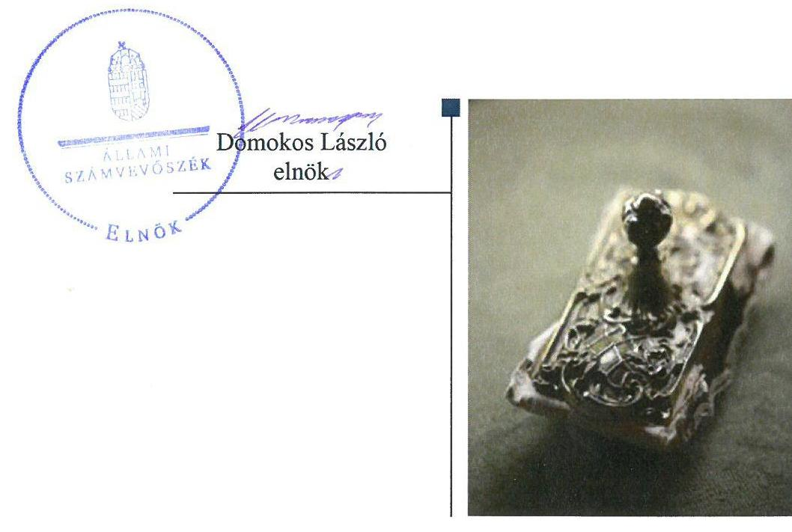
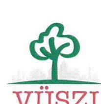
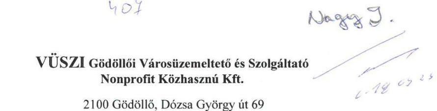
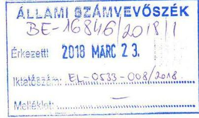
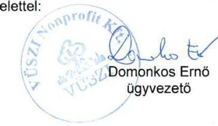
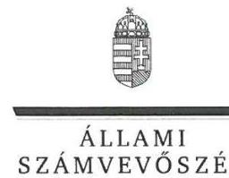
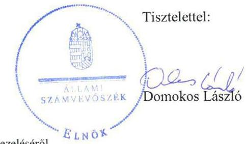

# Jelenetés 

## Az önkormányzatok gazdasági társaságai

Az önkormányzatok többségi tulajdonában lévő gazdasági társaságok gazdálkodásának ellenőrzése - VÜSZI Gödöllői Városüzemeltető és Szolgáltató Nonprofit Közhasznú Kft.
2018. 06. hó 10. nap

---

# AZ ELLENŐRZÉST FELÜGYELTE:

DR. NAGY IMRE felügyeleti vezető

# AZ ELLENŐRZÉST VEZETTE ÉS A VÉGREHAJTÁSÁÉRT FELELŐS:

IMRE ZSUZSANNA ellenőrzésvezető

VERTKOVCZI MÁRIA ellenőrzésvezető

# A PROGRAM ÖSSZEÁLLÍTÁSÁÉRT FELELŐS:

TÓTPÁL SZABOLCS osztályvezető

IKTATÓSZÁM: EL-0138-062/2018.

|  Jelentéseink az Országgyűlés számítógépes hálózatán és az Interneten a www.asz.hu címen is olvashatóak. | TÉMASZÁM: 2447  |
| --- | --- |
|   | ELLENŐRZÉS-AZONOSÍTÓ SZÁM: V079328  |

---

# TARTALOMJEGYZÉK 

- ÖSSZEGZÉS ..... 5
- AZ ELLENŐRZÉS CÉLJA ..... 6
- AZ ELLENŐRZÉS TERÜLETE ..... 7
- AZ ELLENŐRZÉS HÁTTERE, INDOKOLTSÁGA ..... 8
- A JELENTÉS LÉNYEGES KÉRDÉSKÖREI ..... 9
- AZ ELLENŐRZÉS HATÓKÖRE ÉS MÓDSZEREI ..... 10
- MEGÁLLAPÍTÁSOK ..... 12
- JAVASLATOK ..... 15
- MELLÉKLETEK ..... 17
I. sz. melléklet: Értelmező szótár ..... 17
- FÜGGELÉK: ÉSZREVÉTELEK ..... 19
- RÖVIDÍTÉSEK JEGYZÉKE ..... 25

---

.

---

# ÖSSZEGZÉS 

Gödöllő Város Önkormányzatának a VÜSZI Gödöllői Városüzemeltető és Szolgáltató Nonprofit Közhasznú Kft. feletti tulajdonosi joggyakorlása szabályszerű volt. A Társaság kialakította a szabályszerű működés kereteit, vagyongazdálkodása szabályszerű volt. A Társaság a jogszabályban előírt beszámolási kötelezettségeit szabályszerűen teljesítette, közzétételi kötelezettségeinek eleget tett, ezáltal biztosította a működésének, gazdálkodásának átláthatóságát. A Társaság a 2014. évtől kezdődően nem biztosította a korrupció elleni fokozott védelmének alapfeltételeit.

## Az ellenőrzés társadalmi indokoltsága

Magyarországon az önkormányzatok kötelező és önként vállalt feladataik vonatkozásában is egyre szélesebb körben alkalmazzák a költségvetésen kívüli feladatellátást, ezáltal - a nonprofit szervezetek mellett - az önkormányzati tulajdonú gazdasági társaságok is kiemelt fontosságú szerephez jutottak. Ezen belül kiemelt jelentőségű számos önkormányzati gazdasági társaság működése abból a szempontból is, hogy gazdálkodásának egyes elemei befolyásolják az önkormányzati alszektor hiányát és az államadósságot.

Az Állami Számvevőszék által a városüzemeltetéshez kapcsolódó tevékenységet folytató VÜSZI Gödöllői Városüzemeltető és Szolgáltató Nonprofit Közhasznú Kft.-nél végzett ellenőrzést további társadalmi elvárás indokolja közfeladatainak ellátásából adódóan. A tevékenységén keresztül a gödöllői lakosság széles köre kerülhet kapcsolatba a Társasággal, az általa nyújtott szolgáltatásokkal.

## Főbb megállapítások, következtetések, javaslatok

Gödöllő Város Önkormányzata a tulajdonosi jogait biztosító kereteket szabályszerűen kialakította, a tulajdonosi jogait szabályszerűen gyakorolta, a Társaság jogszabályban előírt éves beszámolóit megtárgyalta és elfogadta, azonban a Felügyelő Bizottság Alapító által jóváhagyott ügyrenddel nem rendelkezett.

A Társaság rendelkezett a jogszabályban előírt számviteli szabályzatokkal, amellyel biztosította a szabályszerű működést. A Társaság vagyongazdálkodása szabályszerű volt, az elszámolásait szabályszerűen teljesítette. A Társaság a számviteli beszámolók mérlegadatait leltárral alátámasztotta, ezzel az eszközök és források értékének valódisága alátámasztott volt.

A Társaság a jogszabályban előírt beszámolókat elkészítette és közzétette. A közérdekű adatok tekintetében a Társaság a kötelezettségeit teljesítette, ez alapján biztosította a működésének és gazdálkodásának az átláthatóságát. A Társaság 2014. évtől kezdődően a jogszabályban előírt, kormányzati szektorba sorolt egyéb szervezetekre vonatkozó kötelezettségét nem teljesítette, ezzel nem biztosította a korrupció elleni fokozott védelmének alapfeltételeit.

---

# AZ ELLENŐRZÉS CÉLJA 

AZ ELLENŐRZÉS CÉLJA annak értékelése volt, hogy az önkormányzat vagyongazdálkodási tevékenysége során szabályszerűen gyakorolta-e tulajdonosi jogait, a gazdasági társaság szabályozottsága, gazdálkodása és vagyongazdálkodási tevékenysége, bevételeinek és ráfordításainak elszámolása megfelelt-e a jogszabályi és tulajdonosi előírásoknak; a gazdasági társaság kötelezettségállománya jelentett-e kockázatot a működésre, valamint a gazdálkodás átláthatósága és elszámoltathatósága érdekében biztosított volt-e a szolgáltatás díjának megalapozottsága szabályszerű önköltségszámítással. Az ellenőrzés célja továbbá annak megítélése volt, hogy a kormányzati szektorba sorolt önkormányzati tulajdonban lévő gazdálkodó szervezet gazdálkodásának a kormányzati szektor hiányára és az államadósságra befolyással bíró elemei a jogszabályi előírásoknak megfeleltek-e.

---

# **AZ ELLENŐRZÉS TERÜLETE**

## **VÜSZI Gödöllői Városüzemeltető és Szolgáltató Nonprofit Közhasznú Kft. és a tulajdonosi jogokat gyakorló Gödöllő Város Önkormányzata**

A VÜSZI Nonprofit Kft. Gödöllő Város Önkormányzatának kizárólagos tulajdonában álló gazdasági társaság. A Társaság 2009-ben átalakulással jött létre a VÜSZI Városüzemeltető és Szolgáltató Közhasznú Társaság jogutódjaként. A törzstőkéje az ellenőrzött időszakban 200,0 M Ft volt.

A Társaság közhasznú tevékenységei közé tartozott a köz-terület-fenntartás, sportlétesítmény működtetése, zöldterület-kezelés, egyéb takarítás, állategészségügyi ellátás, gyepmesteri tevékenység, zárt csapadékvíz gyűjtése, kezelése, parkolási közszolgáltatás, temetőfenntartás, repülőtér üzemeltetés. Egyéb tevékenységként köz- és zöldterület vállalkozási, igazgatásvállalkozás és mélyépítés tevékenységeket végzett.

A Társaság saját vagyonával és az Önkormányzattól bérelt eszközökkel gazdálkodott, vagyonkezelt eszköze nem volt. A Társaság más gazdasági társaságban nem rendelkezett tulajdoni hányaddal, 2013. június 28-ától NGM Közlemény alapján kormányzati szektorba sorolt egyéb szervezetek közé tartozott. Az ellenőrzött időszakban a Polgármester és a Jegyző személye nem, a Társaság Ügyvezetőjének személye 2013. április 1-jétől változott. A Társaságnál az ellenőrzött időszak alatt háromtagú Felügyelő Bizottság és Könyvvizsgáló működött. Az Önkormányzat a feladatok ellátását a Társasággal kötött Feladat-ellátási szerződések alapján biztosította.

A Társaság gazdálkodásának főbb adatait az 1. táblázat tartalmazza.

1. táblázat

|  A TÁRSASÁG GAZDÁLKODÁSÁNAK FŐBB ADATAI A 2013-2016. ÉVEKBEN |  |  |  |   |
| --- | --- | --- | --- | --- |
|  Megnevezés | 2013. év | 2014. év | 2015. év | 2016. év  |
|  Értékesítés nettó árbevétele (M Ft) | 658,3 | 718,7 | 504,5 | 821,3  |
|  Mérlegfőösszeg (M Ft) | 594,2 | 604,0 | 637,3 | 736,6  |
|  Mérleg szerinti eredmény (M Ft) | 16,8 | 1,3 | 36,6 | 25,7  |
|  Saját tőke (M Ft) | 524,1 | 525,5 | 562,1 | 587,8  |
|  Követelések (M Ft) | 52,0 | 118,2 | 102,5 | 108,3  |
|  Kötelezettségek (M Ft) | 44,9 | 57,4 | 57,2 | 133,1  |
|  Átlagos statisztikai állományi létszám (fő) | 82 | 85 | 68 | 65  |

*Forrás: a Társaság 2013-2016. évi éves beszámolói*

---

# AZ ELLENŐRZÉS HÁTTERE, INDOKOLTSÁGA 

Az önkormányzatok többségi tulajdonában álló gazdasági társaságok ellenőrzése kiemelten fontos a vagyon megőrzése, megóvása érdekében, valamint a kormányzati szektor elszámolásaiban megjelenő önkormányzati tulajdonú gazdálkodó szervezetek esetében, amelyekkel szemben alapvető követelmény, hogy gazdálkodásuk, működésük szabályszerű, az általuk szolgáltatott adatok minél megbízhatóbbak legyenek. A feladatellátás költségeinek, ráfordításainak alakulása a lakosság széles rétegét érinti.

Ellenőrzéseink feltárhatják, hogy az önkormányzat a feladatellátásához rendelt vagyon működtetését a tulajdonostól elvárható gondossággal végezte-e, a feladatot ellátó gazdasági társaság a létesítő okiratban, szolgáltatási szerződésben foglaltak betartásával biztosította-e a feladat ellátását. Az ellenőrzés eredményeképp meghatározhatóvá válnak a költségvetési hiányt befolyásoló szervezetek kockázatai, lehetővé válik ezen kockázatok csökkentése. Az ellenőrzés rávilágíthat arra, hogy a gazdasági társaság a vagyon használatával biztosította-e a szolgáltatás folytatásának feltételeit, az önkormányzat tulajdonosi felügyelete hozzájárult-e a szabályszerű gazdálkodáshoz és feladatellátáshoz. A megállapítások alapján megfogalmazott számvevőszéki javaslatok hasznosítása elősegítheti a meglévő hibák megszüntetését. A jó gyakorlatok bemutatásával az ÁSZ hozzájárulhat a követendő megoldások megismertetéséhez, terjesztéséhez.

---

# A JELENTÉS LÉNYEGES KÉRDÉSKÖREI 

1. Az önkormányzat tulajdonosi joggyakorlása szabályszerű volt-e?
2. A gazdasági társaság szabályozottsága, gazdálkodása és vagyongazdálkodási tevékenysége szabályszerű volt-e?

---

# AZ ELLENŐRZÉS HATÓKÖRE ÉS MÓDSZEREI 

## Az ellenőrzés típusa

Megfelelőségi ellenőrzés.

## Az ellenőrzött időszak

Az ellenőrzött időszak 2013. január 1-jétől 2016. december 31-ig tart.

## Az ellenőrzés tárgya

Gödöllő Város Önkormányzata tulajdonosi joggyakorlása, valamint a VÜSZI Nonprofit Közhasznú Kft. gazdálkodásának szabályozottsága és szabályszerűsége, továbbá az önkormányzati alszektorba sorolt gazdasági társaság gazdálkodásának a kormányzati szektor hiányára és az államadósságra befolyással bíró elemei.

Az ellenőrzés kiterjedt minden olyan körülményre és adatra, amely az ÁSZ jogszabályban meghatározott feladatainak teljesítéséhez, valamint a program végrehajtása folyamán felmerült újabb összefüggések feltárásához szükséges.

## Az ellenőrzött szervezet

- VÜSZI Gödöllői Városüzemeltető és Szolgáltató Nonprofit Közhasznú Korlátolt Felelősségű Társaság
- Gödöllő Város Önkormányzata

## Az ellenőrzés jogalapja

Az ellenőrzés jogszabályi alapját az ÁSZ tv. 1. § (3) bekezdése és 5. § (3)-(4)-(5) bekezdései képezték.

## Az ellenőrzés módszerei

Az ellenőrzést a nemzetközi standardokat irányadónak tekintve az ellenőrzési program ellenőrzési kérdései, az ellenőrzött időszakban hatályos jogszabályok, az ellenőrzés szakmai szabályok és módszertanok figyelembe vételével végeztük.

---

Az ellenőrzés ideje alatt az ellenőrzött szervezettel történő kapcsolattartást az ÁSZ Szervezeti és Működési Szabályzatának vonatkozó előírásai alapján biztosítottuk.

Az ellenőrzés a kiválasztott, többségi tulajdonosi jogokat gyakorló önkormányzatra, illetve az ellenőrzésre kijelölt gazdasági társaság felett tulajdonosi jogokat gyakorló szervezetre és az ellenőrzött gazdasági társaságra terjedt ki.

A gazdasági társaságnál mintavétellel ellenőriztük a ráfordításokat és a bevételeket, ezen belül az anyagjellegű ráfordításokat, az egyéb ráfordításokat, a pénzügyi műveletek ráfordításait és a rendkívüli ráfordításokat, illetve az értékesítés nettó árbevételét, az egyéb bevételeket, a pénzügyi műveletek bevételeit, valamint a rendkívüli bevételeket. Mintavétel történt továbbá a tárgyi eszközök növekedési tételeiből. A minták kiválasztása rétegzett mintavétel alkalmazásával történt.

Az ellenőrzési kérdések megválaszolásához szükséges bizonyítékok megszerzése a következő ellenőrzési eljárások alkalmazásával történt: megfigyelés, kérdésfeltevés (információkérés), összehasonlítás, valamint elemző eljárás. Az ellenőrzési bizonyítékként felhasználható adatforrások közé tartoztak egyrészt az ellenőrzési programban felsorolt adatforrások, másrészt adatforrás lehetett még minden - az ellenőrzés folyamán - feltárt, az ellenőrzés szempontjából információkat tartalmazó dokumentum.

Az ellenőrzést a kérdésekre adott válaszok kiértékelésével, valamint a megjelölt adatforrások, a csatolt tanúsítványok felhasználásával, továbbá az adott időszakban hatályos jogszabályok figyelembe vételével folytattuk le.

A bevételek és ráfordítások elszámolása, valamint a vagyonnyilvántartás terén a szabályszerű működést véletlen mintavétellel ellenőriztük. A mintavétellel ellenőrzött területek esetében minden egyes tétel vonatkozásában a szabályszerűségre vonatkozó kérdéseket tettünk fel, amelyek eredménye összesítésre került. Megfelelőnek értékeltünk egy ellenőrzött területet, amennyiben 95%-os bizonyossággal a teljes sokaságban az átlagos hibaarány legfeljebb 10%, nem megfelelőnek, amennyiben 10%-nál magasabb arányt képviselt. A ráfordítások elszámolására és a vagyonnyilvántartásra vonatkozó véletlen mintavételt kockázati alapú kiválasztással egészítettük ki, amelynek során évente a három legnagyobb összegű tételt választottuk ki.

---

# 1. Az önkormányzat tulajdonosi joggyakorlása szabályszerű volt-e? 

Összegző megállapítás Az Önkormányzat tulajdonosi joggyakorlása szabályszerű volt.

A TÁRSASÁG FELETTI TULAJDONOSI JOGOKAT a Vagyongazdálkodási rendelet és az Alapító Okirat alapján a Képviselőtestület gyakorolta. A Képviselő-testület a Vagyongazdálkodási rendeletben a Polgármester részére meghatározott keretösszegig tulajdonosi joggyakorlást biztosított.

Az Önkormányzat az ágazati jogszabályoknak megfelelően Parkolási rendeletben és Temetői rendeletben határozta meg a díjakra vonatkozó szabályokat.

Az Önkormányzat három tagú Felügyelő Bizottság létrehozását rendelte el és kijelölte a tagokat a Gt., a Ptk., valamint a Társaság Alapító Okiratának előírásaival összhangban. Az Önkormányzat a Társaság képviseletére kijelölt személyek feladat- és hatásköreit, beszámolási kötelezettségét az Alapító Okiratban írta elő.

A Felügyelő Bizottság a Gt. 34. § (4) bekezdésében és a Ptk. 3:122. § (3) bekezdésében előírtak ellenére nem rendelkezett az Alapító által jóváhagyott ügyrenddel.

A Képviselő-testület a Taktv.-ben előírtaknak
 megfelelően megalkotta a Társaság Javadalmazási szabályzatát ${ }^{21}$.

A Társaság a Számv. tv. ${ }^{22}$ alapján könyvvizsgálatra volt kötelezett. Az Önkormányzat az Alapító Okiratban kijelölte a Könyvvizsgálót.

A Felügyelő Bizottság ellenőrizte a Társaság éves és évközi beszámolóit. A Képviselő-testület a Felügyelő Bizottság és a Könyvvizsgáló jelentésének a birtokában és a Pénzügyi Bizottság véleményének figyelembe vételével döntött a Társaság éves beszámolójáról a Gt. és a Ptk. rendelkezéseinek, valamint az Alapító Okiratban foglaltaknak megfelelően.

A Képviselő-testület év közben az ügyvezetőt és a könyvvizsgálót beszámoltatta a Társaság tevékenységéről, gazdálkodásáról. Az Önkormányzat belső ellenőrzésén keresztül ellenőrizte a Társaságot.

---

# 2. A gazdasági társaság szabályozottsága, gazdálkodása és vagyongazdálkodási tevékenysége szabályszerű volt-e? 

Összegző megállapítás

2.1. számú megállapítás

A Társaság szabályozottsága, gazdálkodása és vagyongazdálkodási tevékenysége szabályszerű volt. A beszámolási és közzétételi kötelezettségének eleget tett. A kormányzati szektorba sorolt egyéb szervezetekre vonatkozó kötelezettségét nem teljesítette.

A Társaság rendelkezett a jogszabályokban előírt számviteli szabályzataival. A tevékenységgel kapcsolatos bevételeit és ráfordításait szabályszerűen számolta el.

A Társaság rendelkezett a Számv. tv.-ben előírtaknak megfelelő Számviteli politikával ${ }^{23}$.

A Társaság a Számv. tv. 14. § (3)-(5) bekezdéseiben foglalt előírásokkal ellentétben 2013. augusztusáig nem rendelkezett Leltárkészítési és leltározási ${ }^{24}$, Értékelési ${ }^{25}$, valamint Önköltség-számítási szabályzatokkal ${ }^{26}$, a Számv. tv. 161. § (1)-(2) bekezdések előírásaival ellentétben Számlarenddel $^{27}$.

A Társaság a Számv. tv. 161. § (2) d) pontjában előírtak ellenére az ellenőrzött időszakban nem rendelkezett a Számlarendben foglaltakat alátámasztó bizonylati renddel.

A Társaság a Civil tv. ${ }^{28}$ és a Számv. tv. előírásainak megfelelően a Számviteli politikában és az Önköltség-számítási szabályzatban meghatározta a közhasznú és vállalkozási tevékenységek bevételeinek és ráfordításainak az elkülönítési rendszerét.

A Társaság bevételeit és a ráfordításait a Számv. tv. alapján szabályszerűen számolta el. Az önköltségszámítás szabályszerű volt.

## A Társaság vagyongazdálkodása szabályszerű volt.

A Társaság a Számv. tv. és a Leltározási és leltárkészítési szabályzat előírásainak megfelelően az éves beszámolók eszköz és forrás adatait leltárral alátámasztotta. A leltár adatait a befektetett eszközök tekintetében a Leltározási és leltárkészítési szabályzat előírásainak megfelelően évente mennyiségi felvétellel végzett leltározással alátámasztotta. A befektetett eszközeit a Számv. tv.-ben előírtaknak megfelelően nyilvántartotta.

A Társaság fizetőképessége biztosított volt, az eredményes működés következtében javult az ellenőrzött időszakban.

A Társaságnak nem volt a Gt. ${ }^{29}$ hatálya alá tartozó adósságot keletkeztető ügylete, ezáltal nem volt hatással az államadósság alakulására.

---

### 2.3. számú megállapítás

A Társaság az előírt beszámolási, közzétételi kötelezettségét szabályszerűen teljesítette. A kormányzati szektorba sorolt egyéb szervezetekre vonatkozó adatszolgáltatási kötelezettségét nem teljesítette. A 2014. évtől kezdődően nem alakította ki a tevékenységének jogszabályban előírt nyomon követési rendszerét.

A Társaság a Számv. tv. előírásainak megfelelően az éves beszámolóval kapcsolatos beszámolási, közzétételi kötelezettségnek eleget tett. A Társaság a Civil tv. előírása alapján elkészítette közhasznúsági mellékletét, melyet a 224/2000. (XII. 19.) Korm. rendelet ${ }^{30}$ szerint közzétett.

A Társaság SZMSZ ${ }^{31}$-ében rögzített tervezési, beszámolási és adatszolgáltatási kötelezettségeinek eleget tett.

A Bkr. ${ }^{32}$ 2014. január 1-jétől hatályos 54/A. §-ában, továbbá a 10. §-ában foglaltak ellenére a 2014. évtől a Társaság nem alakította ki a tevékenységének és a célok megvalósításának nyomon követését biztosító rendszerét.

A Társaság rendelkezett az Info tv. alapján előírt közérdekű adatok megismerésére irányuló igények teljesítésének rendjét rögzítő szabályzattal ${ }^{33}$, valamint Adatkezelési szabályzattal ${ }^{34}$, az előírt adatokat közzétette a honlapján.

A kormányzati szektorba sorolt egyéb szervezetek számára előírt adatszolgáltatási kötelezettségét a Társaság az Áht. ${ }^{35}$ 107. § (1) bekezdés előírása ellenére nem teljesítette.

---

# JAVASLATOK 

Az ÁSZ tv. 33. § (1) bekezdésében foglaltak értelmében az ellenőrzött szervezet vezetője köteles a jelentésben foglalt megállapításokhoz kapcsolódó intézkedési tervet összeállítani és azt a jelentés kézhezvételétől számított 30 napon belül az ÁSZ részére megküldeni. Amennyiben az ellenőrzött szervezet vezetője nem küldi meg határidőben az intézkedési tervet, vagy továbbra sem elfogadható intézkedési tervet küld, az Állami Számvevőszék elnöke az ÁSZ tv. 33. § (3) bekezdés a) és b) pontjaiban foglaltakat érvényesítheti.

## VÜSZI Gödöllői Városüzemeltető és Szolgáltató Nonprofit Közhasznú Kft. Ügyvezetőjének

1. Intézkedjen a Társaság bizonylati rendjének jogszabályi előírások szerinti elkészítéséről és kiadmányozásáról.
(2.1. számú megállapítás 3. bekezdése alapján)
2. Gondoskodjon a jogszabályban előírt, a szervezet tevékenységének, a célok megvalósításának nyomon követését biztosító rendszer kialakításáról, működtetéséről.
(2.3. számú megállapítás 3. bekezdése alapján)
3. Gondoskodjon arról, hogy a Társaság a kormányzati szektorba sorolt egyéb szervezetek számára előírt adatszolgáltatási kötelezettségét a jogszabályok előírásainak megfelelően teljesítse.
(2.3. számú megállapítás 5. bekezdése alapján)

## Gödöllő Város Önkormányzata Polgármesterének

1. Kezdeményezze a Társaság legfőbb szervénél a Társaság felügyelő bizottsága ügyrendjének jóváhagyását.
(1. számú megállapítás 4. bekezdése alapján)

---

.

---

# MELLÉKLETEK 

- I. SZ. MELLÉKLET: ÉRTELMEZŐ SZÓTÁR
gazdasági társaság
gazdálkodó szervezet
nonprofit gazdasági társaság
kormányzati szektorba sorolt egyéb szervezet
meghatározó befolyás
minősített többséget biztosító részesedés
többségi befolyást biztosító részesedés

A Ptk. 3:88. § (1) bekezdése szerint „a gazdasági társaságok üzletszerű közös gazdasági tevékenység folytatására, a tagok vagyoni hozzájárulásával létrehozott, jogi személyiséggel rendelkező vállalkozások, amelyekben a tagok a nyereségből közösen részesednek, és a veszteséget közösen viselik".
A Ptk. 685. § c) pontja szerint gazdálkodó szervezet: „az állami vállalat, az egyéb állami gazdálkodó szerv, a szövetkezet, a lakásszövetkezet, az európai szövetkezet, a gazdasági társaság, az európai részvénytársaság, az egyesülés, az európai gazdasági egyesülés, az európai területi együttműködési csoportosulás, az egyes jogi személyek vállalata, a leányvállalat, a vízgazdálkodási társulat, az erdő birtokossági társulat, a végrehajtói iroda, az egyéni cég, továbbá az egyéni vállalkozó." (2014. március 15-ig hatályos)
Civil tv. 9/F. § (2) bekezdése szerint „az a gazdasági társaság minősül nonprofit gazdasági társaságnak és cégnevében az a gazdasági társaság tüntetheti fel a nonprofit jelleget, amelynek létesítő okirata tartalmazza, hogy a gazdasági társaság tevékenységéből származó nyereség a tagok között nem osztható fel, hanem az a gazdasági társaság vagyonát gyarapítja." (hatályos 2014. március 15-től)
az Áht. 3. § (2) és (3) bekezdésében foglaltakon kívül az Európai Közösséget létrehozó szerződéshez csatolt, a túlzott hiány esetén követendő eljárásról szóló jegyzőkönyv alkalmazásáról szóló 2009. május 25-i 479/2009/EK rendelet (a továbbiakban: 479/2009/EK rendelet) szerint a kormányzati szektorba sorolt szervezet (Áht. 1. § (12) bekezdés)

A Ptk. 8:2. § (2) bekezdése szerint „A befolyással rendelkező akkor rendelkezik egy jogi személyben meghatározó befolyással, ha annak tagja vagy részvényese, és
a) jogosult e jogi személy vezető tisztségviselői vagy felügyelőbizottsága tagjai többségének megválasztására, illetve visszahívására; vagy
b) a jogi személy más tagjai, illetve részvényesei a befolyással rendelkezővel kötött megállapodás alapján a befolyással rendelkezővel azonos tartalommal szavaznak, vagy a befolyással rendelkezőn keresztül gyakorolják szavazati jogukat, feltéve, hogy együtt a szavazatok több mint felével rendelkeznek."
A minősített befolyásszerző az ellenőrzött társaságban a szavazatok legalább hetvenöt százalékával rendelkezik. (Ptk. 3:324. §)
vagyonkezelő:
A Ptk. 8:2. § (1) bekezdése szerint „többségi befolyás az olyan kapcsolat, amelynek révén természetes személy vagy jogi személy (befolyással rendelkező) egy jogi személyben a szavazatok több mint felével vagy meghatározó befolyással rendelkezik."

---

.

---

# FÜGGELÉK: ÉSZREVÉTELEK 

A jelentéstervezetet a Számvevőszék 15 napos észrevételezésre megküldte az ellenőrzött szervezetek vezetőinek az ÁSZ tv. 29. § (1) bekezdése előírásának megfelelően.

Az ÁSZ a jelentéstervezetet észrevételezésre megküldte Gödöllő Város Önkormányzata polgármesterének és a VÜSZI Gödöllői Városüzemeltető és Szolgáltató Nonprofit Közhasznú Kft. ügyvezetőjének.
Gödöllő Város Önkormányzata polgármestere a jelentéstervezetre észrevételt nem tett. A függelék tartalmazza a VÜSZI Gödöllői Városüzemeltető és Szolgáltató Nonprofit Közhasznú Kft. ügyvezetőjének észrevételét, illetve az el nem fogadott észrevételek elutasításának indoklását.

[^0]
[^0]:    * 29. § (1) Az Állami Számvevőszék az ellenőrzési megállapításait megküldi az ellenőrzött szervezet vezetőjének vagy az általa megbízott személynek, és annak, akinek személyes felelősségét állapította meg.
    (2) Az ellenőrzött szervezet vezetője és a felelősként megjelölt személy az ellenőrzés megállapításaira tizenöt napon belül írásban észrevételt tehet.
    (3) Az Állami Számvevőszék az észrevételre a beérkezésétől számított harminc napon belül írásban válaszol. A figyelembe nem vett észrevételeket köteles a jelentésben feltüntetni, és megindokolni, hogy azokat miért nem fogadta el.

---

Ikt. szám: 422-12/2017
Hiv. szám: EL-0533-006/2018
Ügyintéző: Németh Katalin

**Domokos László**
elnök
részére

**Állami Számvevőszék**
1364 Budapest 4.
Pf. 54

Tárgy: észrevétel számvevőszéki jelentéstervezettel kapcsolatban

Tisztelt Elnök Úr!

Az Önök által megküldött „Az önkormányzatok gazdasági társaságai - Az önkormányzatok többségi
tulajdonában lévő gazdasági társaságok gazdálkodásának ellenőrzése - VÜSZI Gödöllői
Városüzemeltető és Szolgáltató Nonprofit Közhasznú Kft.” címmel készült számvevőszéki
jelentéstervezetben leírtakkal kapcsolatban az alábbi észrevételeket tesszük.

I. Az 1. sz. összegző megállapítás szerint „A Felügyelő Bizottság a Gt. 34. § (4) bekezdésében
és a Ptk. 3:122. § (3) bekezdésében előírtak ellenére nem rendelkezett az Alapító által
jóváhagyott ügyrenddel.”

Az ellenőrzött időszakra vonatkozóan a társaság rendelkezett a Felügyelő Bizottság
ügyrendjével, azonban az Alapító által nem került jóváhagyásra. A jóváhagyás
hiányosságára tett megállapításukat elfogadjuk. A Felügyelő Bizottság ügyrendjét a
Képviselő-testület következő ülésén napirendre tűzi.

II. A 2.1 számú megállapításban rögzítettek szerint „A Társaság a Számv. tv. 161. § (2) d)
pontjában előírtak ellenére az ellenőrzési időszakban nem rendelkezett a Számlarendben
foglaltakat alátámasztó bizonylati renddel.”

Az ellenőrzés részére a Számviteli törvény 14. § (3) alapján a számviteli politikát, a 14. § (5)
alapján a számviteli politika keretében elkészítendő szabályzatokat, valamint a
számlarendet rendelkezésre bocsátottuk, melyekben véleményünk szerint a Számviteli tv.
161. § (2) d) pontjában előírtaknak megfelelően rögzítésre kerültek a Számlarendben
foglaltakat alátámasztó bizonylati rend részei, elemei.

III. A 2.3 számú megállapítás szerint társaságunk „A kormányzati szektorba sorolt egyéb
szervezetre vonatkozó adatszolgáltatási kötelezettségét nem teljesítette. A 2014. évtől
kezdődően nem alakította ki a tevékenységének jogszabályba előírt nyomon követési
rendszerét.”

Az adatszolgáltatás hiányosságára tett megállapításukat elfogadjuk.

A 370/2011. (XII. 31.) kormányrendeletben rögzített feladatok ellátásához társaságunk külső
ellenőrt kíván bevonni, míg a 2017-es üzleti évtől a 368/2011. (XII. 31.) kormányrendelet 5.
sz. melléklet 23. pontjában rögzítettek szerint a beszámolóját az Igazságügyi Minisztérium

Telefon: 28/410-988 (központ), 28/420-773 (titkárság), 28 410-295 (ügyfélszolgálat) Fax: 28/514-775,
email: titkarsag@vuszikft.hu, honlap: www.vuszikft.hu
Budapest Bank 10103836-39214400-00000009, Pest megyei Cégbíróság Cg. 13-09-125268, Adószám: 18678527-2-13

---

elektronikus beszámoló portálján felül, külön az államháztartásért felelős miniszter részére is megküldi.

Kérjük a tisztelt Állami Számvevőszéktől a jelentéstervezettel kapcsolatos észrevételek elfogadását.

Gödöllő, 2018. március 20.

Tisztelettel:

---

# Domonkos Ernő úr 

ügyvezető

VÜSZI Gödöllői Városüzemeltető és Szolgáltató
Nonprofit Közhasznú Kft.

## Gödöllő

## Tisztelt Ügyvezető Úr!

„Az önkormányzatok gazdasági társaságai - Az önkormányzatok többségi tulajdonában lévő gazdasági társaságok gazdálkodásának ellenőrzése - VÜSZI Gödöllői Városüzemeltető és Szolgáltató Nonprofit Közhasznú Kft. " címmel készített számvevőszéki jelentéstervezetre tett észrevételeit köszönettel megkaptam.
Az Állami Számvevőszék észrevételekre vonatkozó álláspontjáról a felügyeleti vezető által készített részletes tájékoztatást csatoltan megküldöm.
Tájékoztatom Ügyvezető urat, hogy a számvevőszéki jelentésben - az Állami Számvevőszékről szóló 2011. évi LXVI. törvény 29. § (3) bekezdése alapján - a figyelembe nem vett észrevételeket szerepeltetjük annak megindoklásával, hogy azokat miért nem fogadtuk el.

Budapest, 2018. 03. hó 13. nap

Melléklet: Tájékoztatás az észrevételek kezeléséről

---

FELÜGYELETI VEZETŐ

Melléklet
Ikt.szám: EL-0533-009/2018.

# Tájékoztatás   az észrevételek kezeléséről 

„Az önkormányzatok gazdasági társaságai - Az önkormányzatok többségi tulajdonában lévő gazdasági társaságok gazdálkodásának

 ellenőrzése - VÜSZI Gödöllői Városüzemeltető és Szolgáltató Nonprofit Közhasznú Kft." című jelentéstervezetre 2018. március 20-án tett (az Állami Számvevőszékhez 2018. március 23-án érkezett) észrevételét áttekintettük, annak kezelésével kapcsolatban a következő tájékoztatást adom.

## 1. A jelentéstervezet 1. számú megállapítás 4. bekezdésére vonatkozó észrevétel:

Az észrevételben leírtak szerint a Társaság Felügyelő Bizottságának ügyrendjét az Alapító nem hagyta jóvá, azt a Képviselő-testület a következő ülésén napirendre tűzi.

Az észrevétel a megállapítást nem vitatja, az észrevétel alapján a jelentéstervezet módosítása nem indokolt.

## 2. A jelentéstervezet 2.1. számú megállapítás 3. bekezdésére vonatkozó észrevétel:

Az észrevételben leírtak szerint a Társaság az ellenőrzés részére átadott számlarendjében megfelelően rögzítette a bizonylati rend részeit, elemeit.

Az észrevételt nem fogadjuk el. A Társaság által az ellenőrzés részére átadott számlarendben, illetve számviteli politikában egyaránt azt rögzítették, hogy ,,a bizonylati rend önálló szabályzatként került elkészítésre", ennek megfelelően egyik szabályzat sem tartalmazott a bizonylati rendre vonatkozó előírásokat. A 2017. október 11-én az ügyvezető által aláírt teljességi és hitelességi nyilatkozat 2.b melléklet 06.13. sorszám alatt tartalmazta a bizonylati rendet, mint amellyel a Társaság nem rendelkezik, azt nem tudták az ÁSZ részére átadni. Fentiek miatt az észrevétel alapján a jelentéstervezet módosítása nem indokolt.

## 3. A jelentéstervezet 2.3. számú megállapítás 3. és 5. bekezdéseire vonatkozó észrevétel:

Az észrevételben az adatszolgáltatási kötelezettség teljesítésére és a tevékenységének nyomon követési rendszerének kialakítására vonatkozó megállapítást elismerik.

Az észrevétel a megállapítást nem vitatja, az észrevétel alapján a jelentéstervezet módosítása nem indokolt.

Budapest, 2018. 03. hó 15. nap

Dr. Nagy Imre felügyeleti vezető

---

.

---

# RÖVIDÍTÉSEK JEGYZÉKE 

${ }^{1}$ Önkormányzat ${ }^{2}$ Társaság ${ }^{3}$ Polgármester ${ }^{4}$ Jegyző ${ }^{5}$ Ügyvezető ${ }^{6}$ Felügyelő Bizottság ${ }^{7}$ Könyvvizsgáló ${ }^{8}$ Feladat-ellátási szerződések

Gödöllő Város Önkormányzata
VÜSZI Gödöllői Városüzemeltető és Szolgáltató Nonprofit Közhasznú Korlátolt Felelősségű Társaság (rövidített cégneve: VÜSZI Nonprofit Kft.)
Gödöllő Város polgármestere
Gödöllő Város jegyzője
VÜSZI Nonprofit Kft. ügyvezetője
VÜSZI Nonprofit Kft. Felügyelő Bizottsága
A VÜSZI Nonprofit Kft. tekintetében az Önkormányzat Képviselő-testülete által választott Könyvvizsgáló
Az ellenőrzött időszakban fennálló közfeladat-ellátására vonatkozó szerződések az Önkormányzat és a Társaság között:
Közhasznú szerződés a helyi közút-, híd- és csapadékvíz-elvezető rendszer és az ezekhez kapcsolódó közterületek karbantartási, fenntartási munkáinak folyamatos ellátására (hatályos: 2013. április 30-ától, 2014. március 31-étől, 2014. május 30-ától, 2015. március 20-ától, kiegészítés: 2013. június 28., 2013. október 31.)
Közhasznú szerződés parkfenntartási tevékenység folyamatos ellátására (hatályos: 2013. április 30-ától, 2014. március 31-étől, 2014. május 30-ától, 2015. március 20-ától)
Közhasznú szerződés gyepmesteri tevékenység folyamatos ellátására (hatályos: 2013. április 30-ától, 2014. március 31-étől, 2015. március 20-ától, 2016. március 31-étől)
Szerződés parkolási közszolgáltatás ellátására (hatályos: 2013. április 1-jétől, 2014. március 31-étől, 2015. március 20-ától, 2016. március 31-étől)
Szerződés sporttelep ingatlan üzemeltetéséről (hatályos: 2013. december 15-étől)
Keretszerződés helyi közutak, a közutak tartozékát képező csapadékvíz-elvezető rendszerek, kerékpárutak és járdák kivitelezési munkáinak elvégzésére (hatályos: 2014. március 31-étől, módosítás: 2014. május 30.)

Szerződés helyi közutak, a közutak tartozékát képező csapadékvíz-elvezető rendszerek, és járdák kivitelezési munkáinak elvégzésére (hatályos: 2016. április 18-ától, módosítás: 2016. július 14., 2016. október 26.)
Közhasznú szerződés a helyi közút-, híd- és csapadékvíz-elvezető rendszer és az ezekhez kapcsolódó közterületek üzemeltetési, fenntartási munkáinak, továbbá a parkfenntartási tevékenység folyamatos ellátására (hatályos: 2016. március 31-étől)
Szerződés P+R és B+R parkolók üzemeltetéséről (hatályos: 2016. március 31-étől)
Szerződés P+R parkoló üzemeltetéséről (hatályos: 2013. január 31-étől)
Kegyeleti közszolgáltatási szerződés (hatályos: 2010. március 22-étől, 2016. március 31-étől)
Szerződés a gödöllői repülőtér üzemeltetéséről és működtetéséről (hatályos: 2012. március 22-étől)

Kivitelezési szerződés önkormányzati tulajdonú helyi közutak 2014. évi építésiengedély köteles munkáinak elvégzésére (hatályos: 2014. május 29-étől)

---

Kivitelezési szerződés önkormányzati tulajdonú helyi közutak 2014. évi - nem építési engedély köteles - rendkívüli javítási, karbantartási munkáinak elvégzésére (hatályos: 2014. június 1-jétől)
Kivitelezési szerződés önkormányzati tulajdonú járdák 2014. évi rendkívüli karbantartási munkáinak elvégzésére (hatályos: 2014. április 15-étől, módosítás: 2014. május 30-ától)

Kivitelezési szerződés önkormányzati tulajdonú kerékpár utak 2014. évi munkáinak elvégzésére (hatályos: 2014. június 1-jétől)
Kivitelezési szerződés a Szabadság út 165-167. szám alatti egészségügyi rendeltetésű ingatlanhoz kapcsolódó közlekedési feltételek javítására (hatályos: 2014. október 15-étől)

Kivitelezési szerződés a Kazinczy krt. görög katolikus templom előtti tér rendezéséhez (hatályos: 2014. november 26-ától)
Állami Számvevőszék
2011. évi LXVI. törvény az Állami Számvevőszékről (hatályos 2011. július 1-jétől)

Gödöllő Város Önkormányzata Képviselő-testületének 8/2012. (III. 8.) számú önkormányzati rendelete Gödöllő város nemzeti vagyonáról (hatályos 2012. március 9-étől)
A VÜSZI Nonprofit Kft. Alapító Okirata (hatályos 2008. november 20-tól, 2013. március 14-től, 2014. december 11-től, 2016. június 16-tól)
Gödöllő Város Önkormányzata Képviselő-testülete
temetőkről szóló törvény (1999. évi XLIII. törvény a temetőkről és temetkezésről), közúti közlekedésről szóló törvény (1988. évi I. törvény a közúti közlekedésről)
2/2004. (II. 2.) számú önkormányzati rendelet a Gödöllő város területén kialakítandó várakozási területek kijelöléséről, rendjéről és a várakozási díjról (hatályos: 2007. szeptember 14-étől)
25/2007. (IX. 14.) sz. önkormányzati rendelet a temetőkről és a temetkezési tevékenységről (hatályos: 2007. szeptember 14-étől)
2006. évi IV. törvény a gazdasági társaságokról (hatályos: 2006. július 1-jétől 2014. március 14-éig)
2013. évi V. törvény a Polgári Törvénykönyvről (hatályos: 2014. március 15-étől)

Gödöllő Város Önkormányzata
A köztulajdonban álló gazdasági társaságok takarékosabb működéséről szóló 2009. évi CXXII. törvény

Javadalmazási és közzétételi szabályzat (hatályos: 2012. április 5-től)
2000. évi C. törvény a számvitelről (hatályos: 2001. január 1-jétől)

A VÜSZI Nonprofit Kft. Számviteli Politikája (érvényes: 2001. január 1-jétől, 2014. január 1-jétől, 2016. január 1-jétől)
A VÜSZI Nonprofit Kft. Leltározási Szabályzata (hatályos: 2013. augusztus 21-étől)
A VÜSZI Nonprofit Kft. Az Eszközök és Források Értékelési Szabályzata (hatályos: 2013. augusztus 22-étől)

A VÜSZI Nonprofit Kft. Önköltségszámítási Szabályzata (hatályos: 2013. augusztus 22-étől)
A VÜSZI Nonprofit Kft. Számlarendje (hatályos: 2013. augusztus 21-étől; 2014. január 1-jétől; 2016. január 1-jétől)
2011. évi CLXXV. törvény az egyesülési jogról, a közhasznú jogállásról, valamint a civil szervezetek működéséről és támogatásáról (hatályos 2012. december 22-étől)
2011. évi CXCIV. törvény Magyarország gazdasági stabilitásáról

---

${ }^{30}$ 224/2000. (XII.19.) Korm. rendelet
${ }^{31}$ Társaság SZMSZ-e
${ }^{32}$ Bkr.
${ }^{33}$ Javadalmazási és közzétételi szabályzat
${ }^{34}$ Adatkezelési szabályzat
${ }^{35}$ Áht.

224/2000. (XII. 19.) Korm. rendelet a számviteli törvény szerinti egyes egyéb szervezetek beszámoló készítési és könyvvezetési kötelezettségének sajátosságairól (hatályos: 2016. december 31-éig)
a VÜSZI Gödöllői Városüzemeltető és Szolgáltató Nonprofit Közhasznú Kft. Szervezeti és Működési Szabályzata
A költségvetési szervek belső kontrollrendszeréről és belső ellenőrzéséről szóló 370/2011. (XII. 31.) Kormányrendelet
VÜSZI Nonprofit Közhasznú Kft. Javadalmazási és közzétételi szabályzata (hatályos: 2012. április 5-től)
VÜSZI Nonprofit Kft. adatkezelési szabályzata (hatályos: 2012. július 5-étől)
az államháztartásról szóló 2011. évi CXCV. törvény

---

ÁLLAMI SZÁMVEVŐSZÉK
1052 Budapest, Apáczai Csere János utca 10.
Levélcím: 1364 Budapest 4. Pf. 54
Telefon: +36 14849100 Telefax: +36 14849200
www.asz.hu
