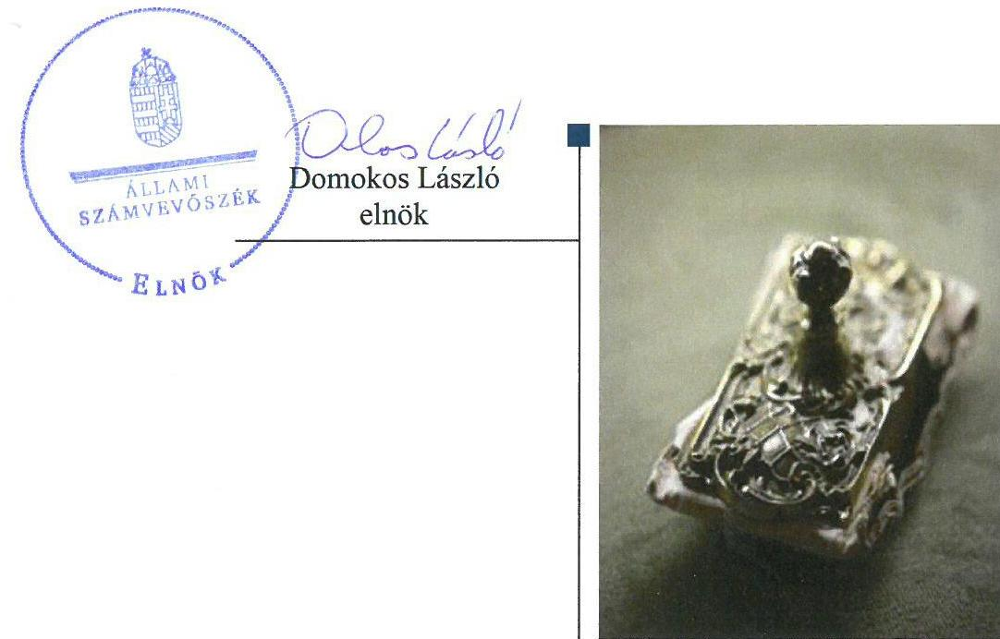
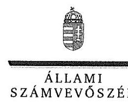
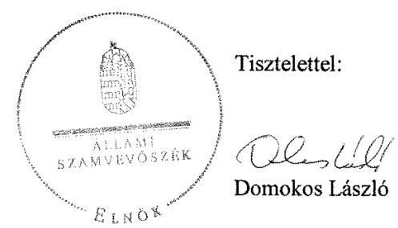
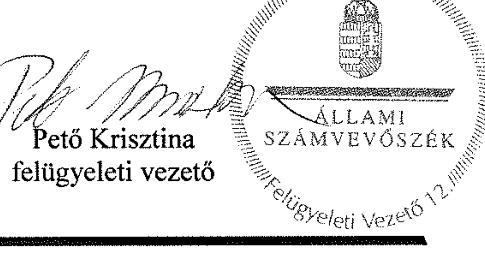

# Jelentés 

## Az önkormányzatok gazdasági társaságai

Az önkormányzatok többségi tulajdonában lévő gazdasági társaságok gazdálkodásának ellenőrzése - Tokaji Egészségfejlesztő Központ Nonprofit Kft.
2018. 05. hó 04. nap

---

# AZ ELLENŐRZÉST FELÜGYELTE:

- PETŐ KRISZTINA felügyeleti vezető
- AZ ELLENŐRZÉST VEZETTE ÉS A VÉGREHAJTÁSÁÉRT FELELŐS:
  - SALAMIN VIKTOR ellenőrzésvezető
  - A PROGRAM ÖSSZEÁLLÍTÁSÁÉRT FELELŐS:
    - TÓTPÁL SZABOLCS osztályvezető

**IKTATÓSZÁM:** EL-0132-068/2018.

**TÉMASZÁM:** 2447

**ELLENŐRZÉS-AZONOSÍTÓ SZÁM:** V079322

Jelentéseink az Országgyűlés számítógépes hálózatán és az Interneten a www.asz.hu címen is olvashatóak.

---

# TARTALOMJEGYZÉK 

■ ÖSSZEGZÉS ..... 5
■ AZ ELLENŐRZÉS CÉLJA ..... 6
■ AZ ELLENŐRZÉS TERÜLETE ..... 7
■ AZ ELLENŐRZÉS HÁTTERE, INDOKOLTSÁGA ..... 8
■ A JELENTÉS LÉNYEGES KÉRDÉSKÖREI ..... 9
■ AZ ELLENŐRZÉS HATÓKÖRE ÉS MÓDSZEREI ..... 10
■ MEGÁLLAPÍTÁSOK ..... 12
■ JAVASLATOK ..... 16
■ MELLÉKLETEK ..... 19
I. sz. melléklet: Értelmező szótár ..... 19
■ FÜGGELÉK: ÉSZREVÉTELEK ..... 21
■ RÖVIDÍTÉSEK JEGYZÉKE ..... 29

---

.

---

# ÖSSZEGZÉS 

Tokaj Város Önkormányzata tulajdonosi joggyakorlása nem volt szabályszerű. A Tokaji Egészségfejlesztő Központ Nonprofit Kft. gazdálkodása és vagyongazdálkodása nem volt szabályszerű, a mérleg tartalmának valódisága nem volt biztosított, ami veszélyeztette a vagyon megőrzését és az elszámoltathatóságot. A Társaság működése nem volt átlátható.

## Az ellenőrzés társadalmi indokoltsága

Magyarországon az intézmény-centrikus közfeladat-ellátás jellemző, de egyre jelentősebb a költségvetésen kívüli feladatellátás térnyerése. Helyi szinten ennek legfontosabb szereplői az önkormányzati tulajdonban lévő gazdasági társaságok, amelyeknek ellenőrzése kiemelten fontos a közfeladat ellátása és a közvagyon megőrzése, megóvása érdekében. Ezért alapvető követelmény, hogy gazdálkodásuk, működésük szabályszerű és átlátható legyen.

Az Állami Számvevőszék az ellenőrzése során arra kereste a választ, hogy 2013-2016. között szabályszerű volt-e a Társaság gazdálkodása és az Önkormányzat ehhez kapcsolódó tulajdonosi joggyakorlása. A Társaság közhasznú tevékenységi köre a területi ellátási kötelezettsége alá eső 15 település lakosainak általános-, valamint szakorvosi járóbeteg-ellátása volt, amely hozzájárul a lakosság egészségének megőrzéséhez. Az ellenőrzés rendet, a rend értéket teremt. Ezért bízunk abban, hogy a jelentésben foglalt megállapítások és az ezek alapján megfogalmazott számvevőszéki javaslatok hasznosítása elősegíti a feltárt hiányosságok orvoslását.

## Főbb megállapítások, következtetések, javaslatok

Tokaj Város Önkormányzata a tulajdonosi joggyakorlás kereteit nem megfelelően alakította ki, a tulajdonosi joggyakorlás nem volt szabályszerű. Az Önkormányzat által kötött, 2015. április 30-ig hatályos vagyonkezelési szerződés nem felelt meg a jogszabály előírásának.

A Társaság gazdálkodása és vagyongazdálkodása nem volt szabályszerű. A Társaság a szabályszerű gazdálkodás szabályozási feltételeit nem alakította ki. A jogszabályi előírások ellenére a vagyonkezelt eszközöket mérlegében nem szerepeltette, továbbá az éves beszámolók mérlegtételeinek leltárral történő alátámasztását nem biztosította. A Társaságnál a bevételek és ráfordítások elszámolása nem volt szabályszerű.

A Társaság teljesítette beszámolási kötelezettségét, azonban a jogszabályban előírt közérdekű adatok és közérdekből nyilvános adatok megismerését nem biztosította, ezért működése nem volt átlátható.

A megállapítások alapján az ÁSZ Tokaj Város Önkormányzata polgármesterének három javaslatot, a Tokaji Egészségfejlesztő Központ Nonprofit Kft. ügyvezetőjének 11 javaslatot fogalmazott meg, amelyre 30 napon belül intézkedési tervet kell készíteniük.

---

# AZ ELLENŐRZÉS CÉLJA 

AZ ELLENŐRZÉS CÉLJA annak értékelése volt, hogy az Önkormányzat ${ }^{1}$ vagyongazdálkodási tevékenysége során szabályszerűen gyakorolta-e tulajdonosi jogait; a Társaság ${ }^{2}$ szabályozottsága, gazdálkodása és vagyongazdálkodási tevékenysége, bevételeinek és ráfordításainak elszámolása megfelelt-e a jogszabályi és tulajdonosi előírásoknak, a gazdálkodás átláthatósága és elszámoltathatósága érdekében biztosítva volt-e a szolgáltatás díjának megalapozottsága szabályszerű önköltségszámítással. Az ellenőrzés célja továbbá annak megítélése volt, hogy a kormányzati szektorba sorolt önkormányzati tulajdonban (résztulajdonban) lévő gazdálkodó szervezetek gazdálkodásának a kormányzati szektor hiányára és az államadósságra befolyással bíró elemei a jogszabályi előírásoknak megfeleltek-e.

---

# AZ ELLENŐRZÉS TERÜLETE 

## Tokaj Város Önkormányzata és a többségi tulajdonában lévő Tokaji Egészségfejlesztő Központ Nonprofit Kft.

TOKAJ VÁROS ÖNKORMÁNYZATA és tizennégy község önkormányzatából álló tulajdonosi közösség 2008. szeptember 10-én alapította meg a Társaságot 2,6 M Ft törzstőkével a területi ellátási kötelezettsége alá eső település lakosainak általános-, valamint szakorvosi járóbeteg-ellátása biztosítása érdekében. A jegyzett tőke 2016. május 27-i 3,0 M Ft-ra történő emelkedésével az Önkormányzat tulajdonosi részesedése 96% lett.

Az Önkormányzat két gazdasági társaságban rendelkezett kizárólagos, kettőben pedig többségi tulajdonnal. A polgármester ${ }^{3}$ személye az ellenőrzött időszakban egy alkalommal, az ügyvezető ${ }^{4}$ személye nem változott.

## A TOKAJI EGÉSZSÉGFEJLESZTŐ KÖZPONT NONPROFIT KFT. saját és kezelésbe vett vagyonnal gazdálkodott, kapcsolt vállalkozásban lévő részesedéssel nem rendelkezett.

A Társaság 2013. február 28-tól közhasznú jogállású gazdasági társaság, 2015. december 30-tól kormányzati szektorba sorolt egyéb szervezeteknek minősül. A Társaság közfeladatain túl vállalkozási tevékenységet is folytatott, ingatlan bérbeadásból származott jövedelme.

---

# AZ ELLENŐRZÉS HÁTTERE, INDOKOLTSÁGA 

AZ ÖNKORMÁNYZATOK TÖBBSÉGI TULAJDONÁBAN ÁLLÓ GAZDASÁGI TÁRSASÁGOK ellenőrzése kiemelten fontos a vagyon megőrzése, megóvása érdekében, valamint a kormányzati szektor elszámolásaiban megjelenő önkormányzati tulajdonú gazdálkodó szervezetek esetében, amelyekkel szemben alapvető követelmény, hogy gazdálkodásuk, működésük szabályszerű, az általuk szolgáltatott adatok minél megbízhatóbbak legyenek. A feladatellátás költségeinek, ráfordításainak alakulása a lakosság széles rétegét érinti.

Ellenőrzéseink feltárhatják, hogy az önkormányzat a feladatellátásához rendelt vagyon működtetését a tulajdonostól elvárható gondossággal végezte-e, a feladatot ellátó gazdasági társaság a létesítő okiratban, szolgáltatási szerződésben foglaltak betartásával biztosította-e a feladat ellátását. Az ellenőrzés eredményeképp meghatározhatóvá válnak a költségvetési hiányt befolyásoló szervezetek kockázatai, lehetővé válik ezen kockázatok csökkentése. Az ellenőrzés rávilágíthat arra, hogy a gazdasági társaság a vagyon használatával biztosította-e a szolgáltatás folytatásának feltételeit, az önkormányzat tulajdonosi felügyelete hozzájárult-e a szabályszerű gazdálkodáshoz és feladatellátáshoz. A megállapítások alapján megfogalmazott számvevőszéki javaslatok hasznosítása elősegítheti a meglévő hibák megszüntetését. A jó gyakorlatok bemutatásával az ÁSZ ${ }^{5}$ hozzájárulhat a követendő megoldások megismertetéséhez, terjesztéséhez.

---

# A JELENTÉS LÉNYEGES KÉRDÉSKÖREI 

1. Az Önkormányzat tulajdonosi joggyakorlása szabályszerű volt-e?
2. A gazdasági társaság szabályozottsága, gazdálkodása és vagyongazdálkodási tevékenysége szabályszerű volt-e?
3. A gazdasági társaság beszámolási, adatszolgáltatási és közzétételi kötelezettségét teljesítette-e?

---

# AZ ELLENŐRZÉS HATÓKÖRE ÉS MÓDSZEREI 

## Az ellenőrzés típusa

Megfelelőségi ellenőrzés.

## Az ellenőrzött időszak

Az ellenőrzött időszak 2013. január 1-jétől 2016. december 31-ig tartott.

## Az ellenőrzés tárgya

Tokaj Város Önkormányzata többségi tulajdonában lévő Tokaji Egészségfejlesztő Központ Nonprofit Kft. feletti tulajdonosi joggyakorlása, valamint a Tokaji Egészségfejlesztő Központ Nonprofit Kft. gazdálkodásának szabályozottsága és szabályszerűsége.

Az ellenőrzés kiterjedt minden olyan körülményre és adatra, amely az ÁSZ jogszabályban meghatározott feladatainak teljesítéséhez, valamint a program végrehajtása folyamán felmerült újabb összefüggések feltárásához szükséges.

## Az ellenőrzött szervezet

Tokaj Város Önkormányzata, valamint Tokaji Egészségfejlesztő Központ Nonprofit Kft.

## Az ellenőrzés jogalapja

Az ellenőrzés jogszabályi alapját az ÁSZ tv. ${ }^{6}$ 1. § (3) bekezdése és 5. § (3)-(5) bekezdései képezték.

## Az ellenőrzés módszerei

Az ellenőrzést az ellenőrzési program ellenőrzési kérdései, az ellenőrzött időszakban hatályos jogszabályok, az ellenőrzés szakmai szabályok és módszertanok figyelembe vételével végeztük.

Az ellenőrzés ideje alatt az ellenőrzött szervezettel történő kapcsolattartást az ÁSZ Szervezeti és Működési Szabályzatának vonatkozó előírásai alapján biztosítottuk.

Az ellenőrzési kérdések megválaszolásához szükséges bizonyítékok megszerzése a következő ellenőrzési eljárások alkalmazásával történt:

---

megfigyelés, kérdésfeltevés (információkérés), összehasonlítás, valamint elemző eljárás. Az ellenőrzési bizonyítékként felhasználható adatforrások közé tartoztak egyrészt az ellenőrzési programban felsorolt adatforrások, másrészt adatforrás lehet még minden - az ellenőrzés folyamán - feltárt, az ellenőrzés szempontjából információkat tartalmazó dokumentum.

Az ellenőrzést a kérdésekre adott válaszok kiértékelésével, valamint a megjelölt adatforrások, a csatolt tanúsítványok felhasználásával, továbbá az adott időszakban hatályos jogszabályok figyelembe vételével folytattuk le.

A bevételek és ráfordítások elszámolásait, valamint a vagyonnyilvántartás terén a szabályszerű működést mintavétellel ellenőriztük. A minták kiválasztása rétegzett mintavétel alkalmazásával történt. A mintavétellel ellenőrzött területek esetében minden egyes tétel vonatkozásában a szabályszerűségre vonatkozó kérdéseket tettünk fel. Megfelelőnek értékeltünk egy ellenőrzött területet, amennyiben 95%-os bizonyossággal a teljes sokaságban a hibaarány legfeljebb 10%, nem megfelelőnek, amennyiben 10%-nál magasabb arányt képviselt. Abban az esetben, ha a teljes sokaság tekintetében a 10%-os hibaarányhoz való viszony megítélésének megbízhatósága nem érte el a 95%-ot, annak elérése érdekében értékelésünket további szempontokkal egészítettük ki, és figyelembe vettük a feltárt hibák típusát és súlyát. A ráfordítások elszámolására és a vagyonnyilvántartásra vonatkozó véletlen mintavételt kockázati alapú kiválasztással egészítettük ki, amelynek során évente a három legnagyobb összegű tételt választottuk ki.

---

# 1. Az Önkormányzat tulajdonosi joggyakorlása szabályszerű volt-e? 

Összegző megállapítás A tulajdonosi jogok gyakorlása nem volt szabályszerű.
A TULAJDONOSI JOGGYAKORLÁS RENDJÉT az Önkormányzat Vagyonrendeletben ${ }_{1,2}{ }^{7}$-ben és a Társasági szerződésben ${ }_{1-5}{ }^{8}$-ben szabályozta.

Az Önkormányzat az Mótv. ${ }^{9}$ 116. § (1) bekezdésében foglaltak ellenére a 2013-2014. évekre vonatkozóan nem, a 2015. évtől rendelkezett gazdasági programmal ${ }^{10}$.

Közép- és hosszú távú vagyongazdálkodási tervvel az Önkormányzat az Nvtv. ${ }^{11}$ 9. § (1) bekezdésében előírtak ellenére nem rendelkezett.

A Képviselő-testület ${ }^{12}$ az Mótv. 53. § (1) bekezdésében foglaltak ellenére 2015. február 13-ig SZMSZ ${ }^{13}$-szel nem rendelkezett.

Az Önkormányzat a Társaság feladatellátást szolgáló vagyon körét a Vagyonkezelési és Közfeladat-átadási szerződés ${ }_{1-3}{ }^{14}$-ben határozta meg.

## A FELADATELLÁTÁST SZOLGÁLÓ VAGYON KÖRÉT az Önkormányzat nem szabályszerűen határozta meg. A vagyonkezelési szerződés ${ }_{1}$ tartalma nem felelt meg az Mótv. 109. § (1) bekezdésében foglaltaknak, mert a vagyonkezelésre átadott ingatlanok között társasházi ingatlan is szerepelt.

Az Nvtv. 10. § (2) bekezdése ellenére az Önkormányzat nem ellenőrizte a Társaság vagyonkezelt vagyonnal kapcsolatos gazdálkodását, továbbá nem ellenőrizte a Vagyonkezelési szerződés ${ }_{1,2}$-ben előírt adatszolgáltatási, nyilvántartási kötelezettség teljesítését.

## 2. A gazdasági társaság szabályozottsága, gazdálkodása és vagyongazdálkodási tevékenysége szabályszerű volt-e?

## Összegző megállapítás

2.1. számú megállapítás

A Társaság gazdálkodása és vagyongazdálkodása nem volt szabályszerű.

A Társaság a jogszabályi követelmények szerinti gazdálkodás alapvető szabályozási feltételeit nem alakította ki.

A Társaság rendelkezett Számviteli politikával ${ }^{15}$, Leltározási szabályzattal ${ }^{16}$, Pénzkezelési szabályzattal ${ }^{17}$, Értékelési szabályzattal ${ }^{18}$. A Társaságnak a Számv. tv. ${ }^{19}$ szerinti Önköltségszámítás rendjére vonatkozó szabályzatkészítési kötelezettsége nem állt fenn.

---

A SZÁMVITELI POLITIKÁBAN a jelentős összegű hiba fogalma nem felelt meg a Számv. tv. 3. § (3) bekezdés 3. pontjában előírtaknak. A Társaság a Számv. tv. 14. § (11) bekezdésének előírása ellenére 90 napon belül nem vezette át a Számv. tv. 14. § (4) bekezdésének 2015. július 4-ei módosítását, abban nem szerepeltette, hogy mit tekint kivételes nagyságú vagy előfordulású bevételnek, költségnek, ráfordításnak.

SZÁMLARENDDEL a Számv. tv. 161. § (1) bekezdésében előírtak ellenére az ellenőrzött időszakban nem rendelkeztek.

A PÉNZKEZELÉSI SZABÁLYZAT a Számv. tv. 14 § (8) bekezdése előírásai ellenére nem tartalmazta a napi készpénz záró állomány maximális mértékét.

A KÖZÉRDEKŰ ADATOK megismerésére irányuló igények teljesítésének rendjét rögzítő szabályzattal az Info tv. ${ }^{20} 30$. § (6) bekezdésében előírtak ellenére a 2013. évben nem rendelkezett.

TÉRÍTÉSI DÍJ SZABÁLYZATTAL ${ }^{21}$ az Eütd. ${ }^{22}$ 1. § (6) bekezdésében előírtak ellenére nem rendelkezett.

A taggyűlés ${ }^{23}$ a Taktv. ${ }^{24}$ 5. § (3) bekezdésében foglaltak ellenére nem alkotott
 szabályzatot a vezető tisztségviselők, felügyelőbizottsági tagok, valamint az Mt. 208. §-ának hatálya alá eső munkavállalók javadalmazása, valamint a jogviszony megszűnése esetére biztosított juttatások módjának, mértékének elveiről, annak rendszeréről.

SZERVEZETI ÉS MŰKÖDÉSI SZABÁLYZATTAL a társasági szerződés 13.5 pontjában és a gyógyintézetek működési rendjéről, illetve szakmai vezető testületéről szóló 43/2003. (VII. 29.) ESZCSM rendelet $^{25} 3$. § (3) bekezdés a) pontjában foglaltak ellenére a Társaság nem rendelkezett.
2.2. számú megállapítás

A Társaság vagyonkezelt vagyonnal való gazdálkodása a jogszabályi rendelkezéseknek és a tulajdonosi és belső előírásoknak nem felelt meg. A 2013-2016. évi beszámolók megalapozottsága nem volt biztosított.

A MÉRLEGET ALÁTÁMASZTÓ LELTÁR a 2013-2016. években nem felelt meg a Számv. tv. 69. § (1) bekezdésében előírtaknak. A 2013-2016. években a készletek, az egyéb követelések állományának leltára, a 2015. évben az aktív időbeli elhatárolások leltára nem tartalmazta a Számv. tv. 69. § (1) bekezdésében előírtak ellenére a mérleg fordulónapján meglévő eszközöket mennyiségben és értékben.

A Társaság a vagyonkezelt vagyont a Számv. tv. 23. § (2) és a 42. § (5) bekezdésében foglaltak ellenére a mérlegben eszközként nem mutatta ki. A vagyonkezelt eszközök esetén a vagyonelemek hasznosításából, működéséből származó bevételek, költségek és ráfordítások elkülönített nyilvántartási kötelezettségének nem tett eleget az Mötv. 109. § (7) bekezdésében foglaltak ellenére. A vagyonkezelési szerződés 1.6 pontjában előírtak ellenére a vagyonkezelésbe vett eszközöket a Társaság leltárában nem szerepeltette. A Társaság a vagyonkezelt vagyon tekintetében nem tett eleget a

---

Mötv. 109. § (6) bekezdésében meghatározott eszközpótlási célú tartalékképzési és tényleges eszközpótlási kötelezettségének. A hiányosságok ellenére a könyvvizsgáló a 2012-2016. évi beszámolókat korlátozás nélküli hitelesítő záradékkal látta el.

A Társaság megsértette a Bkr. 10. §-ban foglaltakat, mivel belső ellenőrzés működtetését nem biztosította. 2016. október 1-jétől a kötelezettség a Bkr. változása miatt nem állt fenn.
2.3. számú megállapítás

A Társaság bevételeinek, anyagjellegű ráfordításainak és személyi jellegű ráfordításainak elszámolása nem volt szabályszerű.

A RÁFORDÍTÁSOK ÉS A BEVÉTELEK elszámolása - sem a kormányzati szektor hiányára befolyással bíró elemei, sem az egyéb elemei tekintetében - nem volt szabályszerű, mivel a Számv. tv. 167. § (1) bekezdés h) pontjában foglaltak ellenére a könyvelést alátámasztó bizonylatok nem tartalmazták a könyvelés módjára, az érintett könyvviteli számlákra történő hivatkozást. Továbbá a Számv. tv. 169. § (2) bekezdésében előírt bizonylat megőrzési kötelezettségnek nem tettek eleget.

A SZEMÉLYI JELLEGŰ RÁFORDÍTÁSOK elszámolása nem volt szabályszerű, mivel a Számv. tv. 169. § (2) bekezdésében előírt bizonylat megőrzési kötelezettségnek nem tettek eleget.

A tárgyi eszközök nyilvántartásba vétele és az értékcsökkenés összegének elszámolása nem volt szabályszerű. A Számv. tv. 52. § (2) bekezdésében előírtak ellenére a tárgyi eszközök üzembe helyezését nem dokumentálták hitelt érdemlően, ezért az értékcsökkenés számításának kezdő időpontja nem volt megállapítható, a bekerülési érték nem volt alátámasztott.

# 3. A gazdasági társaság beszámolási, adatszolgáltatási és közzétételi kötelezettségét teljesítette-e? 

Összegző megállapítás

A Társaság teljesítette beszámolási kötelezettségét, közzétételi és adatszolgáltatási kötelezettségének azonban nem tett eleget.

AZ ÉVES BESZÁMOLÓIT a Társaság elkészítette, a 2013-2016. évi beszámolókat a taggyűlés a Gt. ${ }^{26}$ és Ptk. ${ }^{27}$ előírásainak megfelelően az FB írásbeli jelentései és a könyvvizsgálói vélemény birtokában jóváhagyta.

A KÖZÉRDEKŰ ADATOK ÉS A KÖZÉRDEKBŐL NYILVÁNOS ADATOK MEGISMERÉSÉT a Társaság az Info tv. 26. § (1) bekezdésében előírtak ellenére nem biztosította. A Társaság az Info tv. 33. § (3) és a 37. § (1) bekezdésében előírtak ellenére honlapján nem tette közzé az Info tv. 1. melléklet szerinti közzétételi lista adatai közül az I. Szervezeti, személyzeti adatokat, a II. Tevékenységre, működésre vonatkozó adatokat, illetve a III. Gazdálkodási adatokat, az éves beszámoló és közhasznúsági melléklet kivételével.

---

Nem tették közzé továbbá a vezető tisztségviselők, FB tagok, vezető állású munkavállalók, önálló cégjegyzésre, vagy bankszámla feletti rendelkezésre jogosult munkavállalókra vonatkozó a Taktv. 2. § (1) bekezdésében előírt adatokat.

A Társaság 2015. december 30-át követően nem teljesítette az Áht. ${ }^{28}$ 107. § (1) bekezdésében és az Ávr. ${ }^{29}$ 167/M. § (1) bekezdésében előírt, az Ávr. 7. melléklet 28.-29. pontja, valamint a 2015. január 1-jétől hatályos rendelet 5. melléklet 23. pontja szerinti adatszolgáltatási kötelezettségét, annak ellenére, hogy kormányzati szektorba sorolt társaság volt.

---

# JAVASLATOK 

Az ÁSZ tv. 33. § (1) bekezdésében foglaltak értelmében az ellenőrzött szervezet vezetője köteles a jelentésben foglalt megállapításokhoz kapcsolódó intézkedési tervet összeállítani és azt a jelentés kézhezvételétől számított 30 napon belül az ÁSZ részére megküldeni. Amennyiben az ellenőrzött szervezet vezetője nem küldi meg határidőben az intézkedési tervet, vagy továbbra sem elfogadható intézkedési tervet küld, az Állami Számvevőszék elnöke az ÁSZ tv. 33. § (3) bekezdése a) és b) pontjaiban foglaltakat érvényesítheti.

## Tokaj Város Önkormányzata polgármesterének

1. Intézkedjen az Önkormányzat közép- és hosszú távú vagyongazdálkodási tervének elkészítéséről és jóváhagyás céljából a Képviselő-testület elé terjesztéséről a jogszabályi előírásnak megfelelően.
(1. összegző megállapítás 3. bekezdése alapján)
2. Intézkedjen, hogy az Önkormányzat a jogszabályi előírásnak megfelelően rendszeresen ellenőrizze a Társaság vagyonkezelésében lévő nemzeti vagyonnal való gazdálkodását, valamint a vagyonkezelési szerződésben előírt adatszolgáltatási, nyilvántartási kötelezettség teljesítését.
(1. összegző megállapítás 7. bekezdése alapján)
3. Kezdeményezze a Taggyűlésnél a jogszabályban előírt, a vezető tisztségviselők, felügyelőbizottsági tagok, valamint az Mt. 208. §-ának hatálya alá eső munkavállalók javadalmazása, valamint a jogviszony megszűnése esetére biztosított juttatások módjának, mértékének elveiről, annak rendszeréről szóló szabályzat megalkotását, különös tekintettel a Taktv.-ben előírtakra.
(2.1. számú megállapítás 7. bekezdése alapján)

## Tokaji Egészségfejlesztő Központ Nonprofit Korlátolt Felelősségű Társaság ügyvezetőjének

1. Intézkedjen a Társaság számviteli politikájának és pénzkezelési szabályzatának jogszabályi előírásoknak megfelelő kiegészítéséről.
(2.1. számú megállapítás 2. és 4. bekezdései alapján)

---

2. Intézkedjen a Társaság számlarendjének, valamint szervezeti és működési szabályzatának jogszabályi előírásoknak megfelelő elkészítéséről.
(2.1. számú megállapítás 3. és 8. bekezdései alapján)
3. Gondoskodjon a Társaság hatáskörében megállapítható térítési díjak megállapításának, nyilvánosságra hozatalának és befizetésének rendjét, valamint a szolgáltató által megállapított térítési díj mérséklésére, illetve elengedésére vonatkozó rendelkezéseket tartalmazó szabályzatának elkészítéséről és jóváhagyásáról.
(2.1. számú megállapítás 6. bekezdése alapján)
4. Intézkedjen a beszámoló elkészítéséhez, a mérleg tételeinek alátámasztásához a jogszabályi előírásoknak megfelelő leltár összeállítására.
(2.2. számú megállapítás 1. bekezdése alapján)
5. Intézkedjen a jogszabályi előírásoknak megfelelően a Társaság vagyonkezelésében lévő vagyon számviteli nyilvántartásokban történő szerepeltetéséről.
(2.2. számú megállapítás 2. bekezdésének 1. mondata alapján)
6. Intézkedjen a ráfordítások és bevételek elszámolásával kapcsolatos gazdasági események jogszabályi előírásoknak megfelelő bizonylatokkal történő alátámasztásáról.
(2.3. számú megállapítás 1. bekezdésének 1. mondata alapján)
7. Intézkedjen a könyvviteli elszámolást közvetlenül alátámasztó számviteli bizonylatok jogszabályban előírt, visszakereshető módon történő megőrzéséről.
(2.3. számú megállapítás 1. bekezdésének 2. mondata és 2.3. számú megállapítás 2. bekezdése alapján)
8. Intézkedjen az üzembe helyezés hitelt érdemlő módon történő dokumentálásáról.
(2.3. számú megállapítás 3. bekezdésének 2. mondata alapján)
9. Intézkedjen, hogy a jogszabályi előírásoknak megfelelően a Társaság kezelésében lévő közérdekű adatot és közérdekből nyilvános adatot erre irányuló igény alapján bárki megismerhesse.
(3. összegző megállapítás 2. bekezdésének 1. mondata alapján)

---

10. Intézkedjen a jogszabályi előírásoknak megfelelően az Info tv. 1. melléklet szerinti általános közzétételi listában meghatározott adatok az Info tv. 1. mellékletben foglaltak szerinti, illetve a Taktv.-ben előírt adatok közzétételéről.
(3. összegző megállapítás 2. bekezdésének 2. mondata és 3. összegző megállapítás 3. bekezdése alapján)
11. Intézkedjen a jogszabályi előírásoknak megfelelően a Társaság adatszolgáltatási kötelezettségének teljesítéséről.
(3. összegző megállapítás 4. bekezdése alapján)

---

# MELLÉKLETEK 

- I. SZ. MELLÉKLET: ÉRTELMEZŐ SZÓTÁR
belső ellenőrzés
gazdasági társaság
kezesség
kormányzati szektorba sorolt egyéb szervezet
közép és hosszú távú vagyongazdálkodási terv
közszolgáltatás
tulajdonosi joggyakorló

Független, tárgyilagos bizonyosságot adó és tanácsadó tevékenység, amelynek célja, hogy az ellenőrzött szervezet működését fejlessze és eredményességét növelje, az ellenőrzött szervezet céljai elérése érdekében rendszerszemléletű megközelítéssel és módszeresen értékeli, illetve fejleszti az ellenőrzött szervezet irányítási és belső kontrollrendszerének hatékonyságát. (Forrás: Bkr. 2. § b) pontja)" Ptk. 3:88. § (1) bekezdése szerint „a gazdasági társaságok üzletszerű közös gazdasági tevékenység folytatására, a tagok vagyoni hozzájárulásával létrehozott, jogi személyiséggel rendelkező vállalkozások, amelyekben a tagok a nyereségből közösen részesednek, és a veszteséget közösen viselik".
A kezességre vonatkozó előírásokat a Ptk. 6:416-430. §-ai tartalmazzák. Kezességi szerződéssel a kezes kötelezettséget vállal a jogosulttal szemben, hogyha a kötelezett nem teljesít, maga fog helyette a jogosultnak teljesíteni. Kezesség egy vagy több, fennálló vagy jövőbeli, feltétlen vagy feltételes, meghatározott vagy meghatározható összegű pénzkövetelés vagy pénzben kifejezhető értékkel rendelkező egyéb kötelezettség biztosítására vállalható.
A Ptk. szerint kezességet csak írásban lehet vállalni. A kezes kötelezettsége ahhoz a kötelezettséghez igazodik, amelyért kezességet vállalt. A kezes kötelezettsége nem válhat terhesebbé, mint amilyen elvállalásakor volt, kiterjed azonban a kötelezett szerződésszegésének jogkövetkezményeire és a kezesség elvállalása után esedékessé váló mellékkövetelésekre is.
Az Áht. 1. § 12. pontja értelmében az a szervezet, amely az Áht. alapján nem része az államháztartásnak, azonban az Európai Közösséget létrehozó szerződéshez csatolt, a túlzott hiány esetén követendő eljárásról szóló jegyzőkönyv alkalmazásáról szóló 2009. május 25-i 479/2009/EK rendelet szerint a kormányzati szektorba tartozik és a szervezet megnevezését az államháztartásért felelős miniszter a Hivatalos Értesítőben és a Kormány honlapján közzétette.
Az Nvtv. 7. § (2) bekezdése szerint „a nemzeti vagyongazdálkodás feladata a nemzeti vagyon rendeltetésének megfelelő, az állam, az önkormányzat mindenkori teherbíró képességéhez igazodó, elsődlegesen a közfeladatok ellátásához és a mindenkori társadalmi szükségletek kielégítéséhez szükséges, egységes elveken alapuló, átlátható, hatékony és költségtakarékos működtetése, értékének megőrzése, állagának védelme, értéknövelő használata, hasznosítása, gyarapítása, továbbá az állam vagy a helyi önkormányzat feladatának ellátása szempontjából feleslegessé váló vagyontárgyak elidegenítése." Az Nvtv. 9.§ (1) bekezdése szerint az önkormányzat ennek biztosítása céljából közép- és hosszú távú vagyongazdálkodási tervet köteles készíteni.
Az Ebktv. ${ }^{30}$ 3. § d) pontja a következőképpen határozza meg a közszolgáltatást: „szerződéskötési kötelezettség alapján a lakosság alapvető szükségleteinek ellátására irányuló szolgáltatás, így különösen a villamos energia-, gáz-, hő-, víz-, szennyvíz- és hulladékkezelési, köztisztasági, postai és távközlési szolgáltatás, továbbá a menetrend alapján közlekedő járművekkel végzett közforgalmú személyszállítás".
Aki a nemzeti vagyon felett az államot vagy a helyi önkormányzatot megillető tulajdonosi jogok és kötelezettségek összességének gyakorlására jogosult. (Forrás: Nvtv. 3. § (1) bekezdés 17. pontja)

---

vagyongazdálkodás

A nemzeti vagyongazdálkodás feladata a nemzeti vagyon rendeltetésének megfelelő, az állam, az önkormányzat mindenkori teherbíró képességéhez igazodó, elsődlegesen a közfeladatok ellátásához és a mindenkori társadalmi szükségletek kielégítéséhez szükséges, egységes elveken alapuló, átlátható, hatékony és költségtakarékos működtetése, értékének megőrzése, állagának védelme, értéknövelő használata, hasznosítása, gyarapítása, továbbá az állam vagy a helyi önkormányzat feladatának ellátása szempontjából feleslegessé váló vagyontárgyak elidegenítése. (Forrás: Nvtv. 7. § (2) bekezdése)

---

# FÜGGELÉK: ÉSZREVÉTELEK 

A jelentéstervezetet a Számvevőszék 15 napos észrevételezésre megküldte az ellenőrzött szervezetek vezetőinek az ÁSZ tv. 29. § (1) bekezdése előírásának megfelelően.
Tokaj Város Önkormányzatának polgármestere a jelentéstervezet megállapításaira észrevételt tett.
A Tokaji Egészségfejlesztő Központ Nonprofit Kft. ügyvezetője nem élt észrevételezési jogával.
A függelék - mellékletek nélkül
 - tartalmazza a polgármester észrevételeit, illetve az el nem fogadott észrevételek elutasításának indoklását.

[^0]
[^0]:    * 29. § (1) Az Állami Számvevőszék az ellenőrzési megállapításait megküldi az ellenőrzött szervezet vezetőjének vagy az általa megbízott személynek, és annak, akinek személyes felelősségét állapította meg.
    (2) Az ellenőrzött szervezet vezetője és a felelősként megjelölt személy az ellenőrzés megállapításaira tizenöt napon belül írásban észrevételt tehet.
    (3) Az Állami Számvevőszék az észrevételre a beérkezésétől számított harminc napon belül írásban válaszol. A figyelembe nem vett észrevételeket köteles a jelentésben feltüntetni, és megindokolni, hogy azokat miért nem fogadta el.

---

# TOKAJ VÁROS POLGÁRMESTERE 

3910 Tokaj, Rákóczi út 54.
Tel: 47/352-752, Fax: 47/352-006
Ügyszám: 1303-2/2018.

Állami Számvevőszék
Budapest 4.
Pf. 54
1364

Tisztelt Cím!

Tokaj Város Önkormányzat részére 2018. március 6. napján megküldött fenti hivatkozási számú, a Tokaji Egészségfejlesztő Központ Nonprofit Kft. gazdálkodásának ellenőrzéséről szóló számvevőszéki jelentéstervezettel kapcsolatban az alábbi észrevételeket kívánom tenni:
I.) Az Önkormányzat tulajdonosi joggyakorlásának összegző megállapításai között az a megállapítás található, hogy
a) az önkormányzat 2013-2014. között nem rendelkezett gazdasági programmal.

Értelmezési problémák miatt csak a 96/2015. (IV.30.) határozattal elfogadott, az önkormányzat 2014-2019. évre vonatkozó Gazdasági Programja került megküldésre, önkormányzatunk azonban fenti időszak vonatkozásában is rendelkezett gazdasági programmal. Jelen levelemhez mellékelem a 213/2011. (VI.30.) KT határozattal elfogadott, az önkormányzat 2010-2014. évre vonatkozó Gazdasági Programját.
b) az önkormányzat nem rendelkezett közép- és hosszú távú vagyongazdálkodási tervvel.

Szintén értelmezési problémák miatt nem került megküldésre, de az önkormányzat a 105/2013. (IV. 18.) határozattal elfogadta az önkormányzat közép- és hosszú távú vagyongazdálkodási tervét, melyet mellékelten csatolok.
c) A Képviselő-testület 2015. február 13-ig nem rendelkezett Szmsz-el.

---

A Képviselő-testület Szervezeti és Működési Szabályzatáról szóló 5/2015.(II.13.) önkormányzati rendelet 44. § (2) bekezdésében szerepel, hogy „44. (2) Hatályát veszti jelen rendelet hatályba lépésével egyidejűleg a szervezeti és működési szabályzatról szóló 17/2010.(XI.25.) önkormányzati rendelet."
Fentiek alapján, bár megküldésre nem került, de önkormányzatunk rendelkezett 2015. február 13-ig is hatályos Szmsz-el, melyet mellékelten csatolok.
II.) A gazdasági társaság szabályozottsága, gazdálkodása és vagyongazdálkodási tevékenysége szabályszerűségének összegző megállapításai között az a megállapítás található,
a) 2.1. számú megállapítás

- „SZERVEZETI ÉS MŰKÖDÉSI SZABÁLYZATTAL a társasági szerződés 13.5 pontjában és a gyógyintézetek működési rendjéről, illetve szakmai vezető testületéről szóló 43/2003.(VII.29.) ESZCSM rendelet 3 § (3) bekezdés a) pontjában foglaltak ellenére a Társaság nem rendelkezett."

Gazdasági társaságunk a vizsgált időszakban Szervezeti és Működési Szabályzattal rendelkezett, melyet mellékelten csatolok.
b) 2.2 számú megállapítás

- „MÉRLEGET ALÁTÁMASZTÓ LELTÁR a 2013-2016. években nem felelt meg a Számv. tv. 69 § (1) bekezdésében előírtaknak. A 2013-2016 években a készletek, az egyéb követelések állományának leltára, a 2015. évben az aktív időbeli elhatárolások leltára nem tartalmazta a Számv. tv. 69 § (1) bekezdésében előírtak ellenére a mérleg fordulónapján meglévő eszközöket mennyiségben és értékben."
- A vizsgált időszakban a leltár értékben tartalmazza a mérleg fordulónapján meglévő eszközöket.
- „A Társaság a vagyonkezelt vagyont a Számv. tv. 23 § (2) és a 42§ (5) bekezdésében foglaltak ellenére a mérlegben eszközként nem mutatta ki. A vagyonkezelt eszközök esetén a vagyonelemek hasznosításából, működéséből származó bevételek, költségek és ráfordítások elkülönített nyilvántartási kötelezettségének nem tett eleget az Mötv. 109. § (7) bekezdésében foglaltak ellenére. A vagyonkezelési szerződés 1.6 pontjában előírtak ellenére a vagyonkezelésébe vett eszközöket a Társaság leltárában nem szerepeltette. A Társaság a vagyonkezelt vagyon tekintetében nem tett eleget a Mötv. 109 § (6) bekezdésében meghatározott eszközpótlási célú tartalékképzési és tényleges eszközpótlási kötelezettségének. A hiányosságok ellenére a könyvvizsgáló a 2012. - 2016 évi beszámolókat korlátozás nélküli hitelesítő záradékkal látta el."
c) 2.3 számú megállapítás
- „A RÁFORDÍTÁSOK ÉS A BEVÉTELEK elszámolása - sem a kormányzati szektor hiányára befolyással bíró elemei, sem az egyéb elemei tekintetében - nem volt szabályszerű,

---

mivel a Számv. tv. 167. § (1) bekezdés h) pontjában foglaltak ellenére a könyvelést alátámasztó bizonylatok nem tartalmazták a könyvelés módjára, az érintett könyvviteli számlákra történő hivatkozást. Továbbá a Számv. tv. 169 § (2) bekezdésében előírt bizonylat megőrzési kötelezettségének nem tettek eleget."

- „A SZEMÉLYI JELLEGŰ RÁFORDÍTÁSOK elszámolása nem volt szabályszerű, mivel a Számv. tv. 169 § (2) bekezdésében előírt bizonylat megőrzési kötelezettségének nem tettek eleget."
- Társaságunk valamennyi jogszabályban előírt bizonylat megőrzési kötelezettségének eleget tesz! Társaságunknál a bejövő számlák és bankszámlakivonatok a beérkezés pillanatában elektronikusan iktatásra kerülnek, és ezt követően kerül a könyvelésre, ahol könyveléskor ráírásra kerül a könyvviteli számlákra történő hivatkozás. Az Önök felé történő adatszolgáltatáskor az iktatóban archivált dokumentumok kerültek részben feltöltésre, ezért nincs minden könyvelést alátámasztó bizonylaton hivatkozás a könyvviteli számlákra.

Kérem T. Címet, hogy észrevételeinket a jelentés elkészítésénél szíveskedjen figyelembe venni.

Tokaj, 2018. március 19.

Mellékletek:

1) 213/2011. (VI.30.) KT határozattal elfogadott, az önkormányzat 2010-2014. évre vonatkozó Gazdasági Programja
2) 105/2013. (IV. 18.) határozattal elfogadott, az önkormányzat közép- és hosszú távú vagyongazdálkodási terve
3) Tokaj Város Önkormányzat Képviselő-testületének szervezeti és működési szabályzatáról szóló 17/2010. (XI.25.) önkormányzati rendelete
4) A Tokaji Egészségfejlesztő Központ Nonprofit Kft. Szervezeti és Működési Szabályzata

---

ELNÖK

Ikt.szám: EL-0493-009/2018.

# Posta György úr 

polgármester
Tokaj Város Önkormányzata

## Tokaj

## Tisztelt Polgármester Úr!

„Az önkormányzatok gazdasági társaságai - Az önkormányzatok többségi tulajdonában lévő gazdasági társaságok gazdálkodásának ellenőrzése - Tokaji Egészségfejlesztő Központ Nonprofit Kft. " címmel készített számvevőszéki jelentéstervezetre tett észrevételeit megkaptam.
Az Állami Számvevőszék észrevételekre vonatkozó álláspontjáról a felügyeleti vezető által készített részletes tájékoztatást csatoltan megküldöm.
Tájékoztatom Polgármester urat, hogy a számvevőszéki jelentésben - az Állami Számvevőszékről szóló 2011. évi LXVI. törvény 29. § (3) bekezdése alapján - a figyelembe nem vett észrevételeket szerepeltetjük az elutasítás indokának feltüntetésével.

Budapest, 2018. április hó 13. nap

Melléklet: Tájékoztatás az el nem fogadott észrevételekről

---

# Tájékoztatás az el nem fogadott észrevételről 

„Az önkormányzatok gazdasági társaságai - Az önkormányzatok többségi tulajdonában lévő gazdasági társaságok gazdálkodásának ellenőrzése - Tokaji Egészségfejlesztő Központ Nonprofit Kft." című jelentéstervezetre a 1303-2/2018. iktatószámú levélben megküldött észrevételeit áttekintettem. Az észrevételek kezeléséről az alábbi tájékoztatást adom.

## I/a)-c) A jelentéstervezet 1. összegző megállapítás 2-4. bekezdéseihez füzött észrevételei kapcsán

Észrevételében jelezte, hogy Tokaj Város Önkormányzata (továbbiakban: Önkormányzat) a 2013-2014. években is rendelkezett gazdasági programmal, illetve az ellenőrzött időszakban közép- és hosszú távú vagyongazdálkodási tervvel, valamint a Képviselő-testület 2015. február 13-ig hatályos szervezeti és működési szabályzattal. A dokumentumok értelmezési problémák miatt az adatszolgáltatás során nem kerültek megküldésre az Állami Számvevőszék (továbbiakban: ÁSZ) részére, így azt leveléhez mellékelten küldte meg.
Az ÁSZ az ellenőrzését a megküldött ellenőrzési programnak megfelelően, a rendelkezésre bocsátott adatok és dokumentumok (bizonyítékok) alapján végezte. Az Állami Számvevőszékről szóló 2011. évi LXVI. törvény (továbbiakban: ÁSZ tv.) 28. § (1) bekezdése alapján a közreműködésre felhívott szervezet az ÁSZ részére - annak kérésére soron kívül, de legkésőbb öt munkanapon belül - az ellenőrzés lefolytatása érdekében szükséges adatokat és dokumentumokat rendelkezésre bocsátja. Polgármester úr a 2017. július 3-án és a 2017. szeptember 26-án kelt nyilatkozatokban (teljességi, hitelességi nyilatkozatok) kijelentette, hogy az ÁSZ részére átadott dokumentumok, adatok megbízhatóak, és a bekért adatokra, dokumentumokra vonatkozóan teljes körű információt tartalmaznak. Polgármester úr továbbá a teljességi, hitelességi nyilatkozatokban az átadott dokumentumok, adatok hitelességéért, valódiságáért és hiánytalanságáért teljes felelősséget vállalt. Az előzőekben leírtakra tekintettel az ÁSZ azon dokumentumokat, amelyeket az adatszolgáltatási időszakot követően bocsátottak rendelkezésére, bizonyítékként nem veszi figyelembe. Ön sem vitatja, hogy a hivatkozott dokumentumok nem kerültek megküldésre az ÁSZ részére az adatszolgáltatás időszakában és a pótlólagosan megküldött dokumentumokat nem áll módunkban figyelembe venni. Fentiekre tekintettel észrevételét nem fogadjuk el, a jelentéstervezet módosítása nem indokolt.

## II/a) A jelentéstervezet 2.1. megállapítás 8. bekezdéséhez füzött észrevétele kapcsán

Észrevételében jelezte, hogy a Tokaji Egészségfejlesztő Központ Nonprofit Kft. (továbbiakban: Társaság) a vizsgált időszakban rendelkezett szervezeti és működési szabályzattal, amelyet leveléhez mellékelten csatoltan küldött meg az ÁSZ részére.
Észrevételét nem fogadjuk el, az észrevétel kezelése tekintetében az I.a)-c) pontban foglaltak az irányadók.

---

# II/b) A jelentéstervezet 2.2. megállapításhoz füzött észrevétele kapcsán 

Észrevételében jelezte, hogy a vizsgált időszakban a leltár értékben tartalmazta a mérleg fordulónapján meglévő eszközöket.
A dokumentumok ismételt felülvizsgálata során megállapítottam, hogy a mérleget alátámasztó leltár a 2013-2016. években a mérleg fordulónapján meglévő eszközeit és forrásait kizárólag értékben tartalmazta. A számvitelről szóló 2000. évi C. törvény 69. § (1) bekezdésében előírtak szerint: „A könyvek üzleti év végi zárásához, a beszámoló elkészítéséhez, a mérleg tételeinek alátámasztásához olyan leltárt kell összeállítani és e törvény előírásai szerint megőrizni, amely tételesen, ellenőrizhető módon tartalmazza - az (5) bekezdés figyelembevételével - a vállalkozónak a mérleg fordulónapján meglévő eszközeit és forrásait mennyiségben és értékben.".
A jogszabály a mennyiségbeni és értékbeni tartalmat nem vagylagosan határozza meg, hanem együttesen írja elő, így a megállapítás megalapozott. Mindezek alapján észrevételét nem fogadjuk el, a jelentéstervezet módosítása nem indokolt.

## II/b) A jelentéstervezet 2.2. megállapítás 2. bekezdéséhez füzött észrevétele kapcsán

Levele beidézi a jelentéstervezet 2.2. megállapítás 2. bekezdését, de észrevétel hozzáfüzése nélkül, ezért a jelentéstervezet 2.2. megállapítás 2. bekezdésének módosítása sem indokolt.

## II/c) A jelentéstervezet 2.3. megállapítás 1-2. bekezdéseihez füzött észrevételei kapcsán

Észrevételében jelezte, hogy a Társaság valamennyi jogszabályban előírt bizonylat megőrzési kötelezettségének eleget tesz, de az adatszolgáltatás során az iktatóban archivált dokumentumok kerültek részben feltöltésre, ezért nem található minden könyvelést alátámasztó bizonylaton hivatkozás a könyvviteli számlákra.
Az ÁSZ az ellenőrzését a megküldött ellenőrzési programnak megfelelően, a rendelkezésre bocsátott adatok és dokumentumok (bizonyítékok) alapján végezte. Az ÁSZ tv. 28. § (1) bekezdése alapján a közreműködésre felhívott szervezet az ÁSZ részére - annak kérésére soron kívül, de legkésőbb öt munkanapon belül - az ellenőrzés lefolytatása érdekében szükséges adatokat és dokumentumokat rendelkezésre bocsátja. Polgármester úr a 2017. július 3-án és a 2017. szeptember 26-án kelt nyilatkozatokban (teljességi, hitelességi nyilatkozatok) kijelentette, hogy az ÁSZ részére átadott dokumentumok, adatok megbízhatóak, és a bekért adatokra, dokumentumokra vonatkozóan teljes körű információt tartalmaznak. Polgármester úr továbbá a teljességi, hitelességi nyilatkozatokban az átadott dokumentumok, adatok hitelességéért, valódiságáért és hiánytalanságáért teljes felelősséget vállalt. Ön sem vitatja, hogy a dokumentumok nem kerültek teljes körűen megküldésre az ÁSZ részére az adatszolgáltatás időszakában, ezért észrevételét nem fogadjuk el, a jelentéstervezet módosítása nem indokolt.

Budapest, 2018. április hó 13. nap

---

.

---

# RÖVIDÍTÉSEK JEGYZÉKE 

${ }^{1}$ Önkormányzat
${ }^{2}$ Társaság
${ }^{3}$ polgármester
${ }^{4}$ ügyvezető
${ }^{5}$ ÁSZ
${ }^{6}$ ÁSZ tv.
${ }^{7}$ Vagyonrendelet ${ }_{1,2}$

[^0]Tokaj Város Önkormányzata
Tokaji Egészségfejlesztő Központ Nonprofit Kft.
Tokaj Város Önkormányzat polgármestere
Tokaji Egészségfejlesztő Központ Nonprofit Korlátolt Felelősségű Társaság ügyvezetője
Állami Számvevőszék
2011. évi LXVI. törvény az Állami Számvevőszékről (Hatályos: 2011. július 1-jétől)

Tokaj Város Önkormányzat Képviselő-testületének az 5/2013. (IV. 19.) önkormányzati rendelete az Önkormányzat vagyonáról, a vagyonhasznosítás rendjéről és a vagyontárgyak feletti tulajdonosi jogok gyakorlásának szabályairól (Hatályos: 2013. április 21-étől 2015.
 május 1-jéig)
Vagyonrendeletben²: a Képviselő-testület 5/2013. (IV.19.) számú rendelete az Önkormányzat vagyonáról, a vagyonhasznosítás rendjéről és a vagyontárgyak feletti tulajdonosi jogok gyakorlásának szabályairól (Hatályos: 2015. május 2-ától)
Tokaji Egészségfejlesztő Központ Nonprofit Korlátolt Felelősségű Társaság Társasági szerződése (Hatályos 2012. december 20-ától)
Tokaji Egészségfejlesztő Központ Nonprofit Korlátolt Felelősségű Társaság Társasági szerződése (hatályos 2013. szeptember 16-ától)
Tokaji Egészségfejlesztő Központ Nonprofit Korlátolt Felelősségű Társaság Társasági szerződése (Hatályos: 2013. december 19-étől)
Tokaji Egészségfejlesztő Központ Nonprofit Korlátolt Felelősségű Társaság Társasági szerződése (Hatályos 2016. május 27-étől)
Tokaji Egészségfejlesztő Központ Nonprofit Korlátolt Felelősségű Társaság Társasági szerződése (Hatályos: 2016. december 16-ától)
2011. évi CLXXXIX. törvény Magyarország helyi önkormányzatairól (Hatályos: 2012. január 1-jétől)

Tokaj Város Önkormányzat Képviselő-testületének a 96/2015. (IV. 30.) számú határozata az önkormányzat 2014-2019. vonatkozó Gazdasági Programról (Hatályos: 2015. április 30-ától)
a 2011. évi CXCVI. törvény a nemzeti vagyonról (Hatályos: 2011. december 31-étől) Tokaj Város Önkormányzat Képviselő-testülete
Tokaj Város Önkormányzat Képviselő-testületének 5/2015. (II. 13.) számú önkormányzati rendelete a Képviselő-testület Szervezeti és Működési Szabályzatáról (hatályos 2015. február 14-étől)
Vagyonkezelési és Közfeladat-átadási szerződés (Hatályos: 2011. március 1-jétől)
Vagyonkezelési szerződés (Hatályos: 2015. május 1-jétől)
Közfeladat-átadási megállapodás (Hatályos: 2015. május 1-jétől)
Tokaji Egészségfejlesztő Központ Nonprofit Korlátolt Felelősségű Társaság Számviteli politikája (Hatályos: 2013. január 1-jétől)
Tokaji Egészségfejlesztő Központ Nonprofit Korlátolt Felelősségű Társaság Eszközök és források leltárkészítési és leltározási szabályzata 2013. (Hatályos: 2013. január 1-jétől)

Tokaji Egészségfejlesztő Központ Nonprofit Korlátolt Felelősségű Társaság Pénzkezelési szabályzata 2013. (Hatályos: 2013. január 1-jétől)

[^0]:    ${ }^{1}$ Önkormányzat
    ${ }^{2}$ Társaság
    ${ }^{3}$ polgármester
    ${ }^{4}$ ügyvezető
    ${ }^{5}$ ÁSZ
    ${ }^{6}$ ÁSZ tv.
    ${ }^{7}$ Vagyonrendelet ${ }_{1,2}$

---

${ }^{18}$ Értékelési szabályzat
${ }^{19}$ Számv. tv.
${ }^{20}$ Info tv.
${ }^{21}$ Díjszabályzat
${ }^{22}$ Eütd.
${ }^{23}$ taggyűlés
${ }^{24}$ Taktv.
${ }^{25}$ 43/2003. (VII.29) ESZCSM rendelet
${ }^{26}$ Gt.
${ }^{27}$ Ptk
${ }^{28}$ Áht.
${ }^{29}$ Ávr.
${ }^{30}$ Ebktv.

Tokaji Egészségfejlesztő Központ Nonprofit Korlátolt Felelősségű Társaság Értékelési szabályzata
a 2000. évi C. törvény a számvitelről (Hatályos 2001. január 1-jétől)
a 2011. CXII. törvény az információs önrendelkezési jogról és az információszabadságról (Hatályos: 2011. július 27-étől)
Tokaji Egészségfejlesztő Központ Nonprofit Korlátolt Felelősségű Társaság Egészségügyi és egyéb szolgáltatások díjszabályzata (Hatályos: 2016. október 28-ától)
a 284/1997. (XII. 23.) Korm. rendelet a térítési díj ellenében igénybe vehető egyes egészségügyi szolgáltatások térítési díjáról (Hatályos: 1998. január 1-jétől)
Tokaji Egészségfejlesztő Központ Nonprofit Korlátolt Felelősségű Társaság legfőbb szerve
a 2009. évi CXXII. törvény a köztulajdonban álló gazdasági társaságok takarékosabb működéséről (Hatályos: 2009. december 4-étől)
a gyógyintézetek működési rendjéről, illetve szakmai vezető testületéről (Hatályos: 2003. augusztus 3-ától)
2006. évi IV. törvény a gazdasági társaságokról (Hatályos: 2014. március 14-éig) 2013. évi V. törvény a Polgári Törvénykönyvről (Hatályos: 2014. március 15-étől) 2011. évi CXCV. törvény az államháztartásról (Hatályos: 2011. december 31-étől) a 368/2011 (XII.31) Korm. rendelet az államháztartásról szóló törvény végrehajtásáról (Hatályos: 2012. január 1-jétől)
a 2003. évi CXXV. törvény az egyenlő bánásmódról és az esélyegyenlőség előmozdításáról (Hatályos: 2004. január 27-étől)

---

# ÁLLAMI SZÁMVEVŐSZÉK 

1052 Budapest, Apáczai Csere János utca 10.
Levélcím: 1364 Budapest 4. Pf. 54
Telefon: +36 14849100 Telefax: +36 14849200
www.asz.hu
