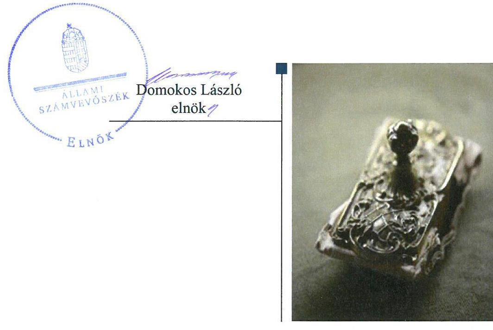

# Jelenetés 

## Az önkormányzatok gazdasági társaságai

Az önkormányzatok többségi tulajdonában lévő gazdasági társaságok gazdálkodásának ellenőrzése - Bicskei Egészségügyi Központ Szolgáltató Nonprofit Kft.
2018.

---

# Jelentés 

## Az önkormányzatok gazdasági társaságai

Az önkormányzatok többségi tulajdonában lévő gazdasági társaságok gazdálkodásának ellenőrzése - Bicskei Egészségügyi Központ Szolgáltató Nonprofit Kft.
2018. május hó 14. nap

---

# AZ ELLENŐRZÉST FELÜGYELTE:

DR. NAGY IMRE felügyeleti vezető

# AZ ELLENŐRZÉST VEZETTE ÉS A VÉGREHAJTÁSÁÉRT FELELŐS:

GELENCSÉR ZSOLT ellenőrzésvezető

# A PROGRAM ÖSSZEÁLLÍTÁSÁÉRT FELELŐS:

TÓTPÁL SZABOLCS osztályvezető

IKTATÓSZÁM: EL-0140-067/2018.

TÉMASZÁM: 2447

# ELLENŐRZÉS-AZONOSÍTÓ SZÁM: V079330

Jelentéseink az Országgyűlés számítógépes hálózatán és az Interneta a www.asz.hu címen is olvashatóak.

---

# TARTALOMJEGYZÉK 

■ ÖSSZEGZÉS ..... 5
■ AZ ELLENŐRZÉS CÉLJA ..... 6
■ AZ ELLENŐRZÉS TERÜLETE ..... 7
■ AZ ELLENŐRZÉS HÁTTERE, INDOKOLTSÁGA ..... 8
■ A JELENTÉS LÉNYEGES KÉRDÉSKÖREI ..... 9
■ AZ ELLENŐRZÉS HATÓKÖRE ÉS MÓDSZEREI ..... 10
■ MEGÁLLAPÍTÁSOK ..... 12
■ JAVASLATOK ..... 16
■ MELLÉKLETEK ..... 19
I. sz. melléklet: Értelmező szótár ..... 19
■ FÜGGELÉK: ÉSZREVÉTELEK ..... 21
■ RÖVIDÍTÉSEK JEGYZÉKE ..... 23

---

.

---

# ÖSSZEGZÉS 

Bicske Város Önkormányzatánál a Bicskei Egészségügyi Központ Szolgáltató Nonprofit Kft. feletti tulajdonosi jogok kereteinek kialakítása és a jogok gyakorlása szabályszerű volt. A Társaság szabályozottsága, gazdálkodása és vagyongazdálkodási tevékenysége megfelelt az előírásoknak. A Társaság nem tett eleget közzétételi kötelezettségének, így nem biztosította a gazdálkodás átláthatóságát.

## Az ellenőrzés társadalmi indokoltsága

Magyarországon az önkormányzatok kötelező és önként vállalt feladataik vonatkozásában is egyre szélesebb körben alkalmazzák a költségvetésen kívüli feladatellátást, ezáltal - a nonprofit szervezetek mellett - az önkormányzati tulajdonú gazdasági társaságok is kiemelt fontosságú szerephez jutottak. Ezen belül kiemelt jelentőségű számos önkormányzati gazdasági társaság múködése abból a szempontból is, hogy gazdálkodásának egyes elemei befolyásolják az önkormányzati alszektor hiányát és az államadósságot.

Az Állami Számvevőszék Stratégiájában foglaltakkal összhangban az ÁSZ kiemelt célja, hogy a helyi önkormányzatok gazdálkodásában rejlő pénzügyi kockázatok feltárásával, az államháztartáson kívülre nyújtott költségvetési támogatások és ingyenes vagyonjuttatások, valamint az államháztartáson kívül múködő feladat-ellátó rendszerek ellenőrzéseivel hozzájáruljon ahhoz, hogy a közpénzeket az államháztartáson kívül múködő szervezetek is átlátható, rendezett módon használják fel. Ezen stratégiai célkitűzéssel összhangban került sor Bicske Város Önkormányzata kizárólagos tulajdonában álló Bicskei Egészségügyi Központ Szolgáltató Nonprofit Kft. szabályozottságának, gazdálkodása és vagyongazdálkodási tevékenysége szabályszerűségének, valamint az Önkormányzat tulajdonosi joggyakorlása 2013-2016. évi szabályszerűségének ellenőrzésére.

## Főbb megállapítások, következtetések, javaslatok

Bicske Város Önkormányzata 2013-2016. években a tulajdonában álló Bicskei Egészségügyi Központ Szolgáltató Nonprofit Kft. tekintetében a tulajdonosi joggyakorlás kereteit szabályszerűen alakította ki és gyakorolta. Ugyanakkor a felügyelőbizottság ügyrenddel nem rendelkezett, a Társaság javadalmazási szabályzatát nem készítették el.

A Társaság nem alakított ki belső ellenőrzési rendszert, majd a célok megvalósításának nyomon követését biztosító rendszert. Nem tett eleget a szervezeti, személyzeti, a tevékenységre, múködésre, és a gazdálkodásra vonatkozó közzétételi kötelezettségének. Bevételeinek elszámolása, valamint az ármeghatározás szabályszerű volt, ráfordításait azonban nem szabályszerűen számolta el. A Társaság nem rendelkezett az egészségügyi szolgáltatásokra vonatkozó térítési díj szabályzattal.

A Társaság - mint kormányzati szektorba sorolt önkormányzati tulajdonban lévő gazdálkodó szervezet - gazdálkodásának nem volt a kormányzati szektor hiányára és az államadósságra befolyással bíró eleme.

---

# AZ ELLENŐRZÉS CÉLJA 

Az ellenőrzés célja annak értékelése volt, hogy az önkormányzat vagyongazdálkodási tevékenysége során szabályszerűen gyakorolta-e tulajdonosi jogait; a gazdasági társaság szabályozottsága, gazdálkodása és vagyongazdálkodási tevékenysége, bevételeinek és ráfordításainak elszámolása megfelelt-e a jogszabályi és tulajdonosi előírásoknak; a gazdasági társaság kötelezettségállománya jelentett-e kockázatot a múködésre, valamint a gazdálkodás átláthatósága és elszámoltathatósága érdekében biztosítva volt-e a szolgáltatás dijának megalapozottsága szabályszerű önköltségszámítással. Az ellenőrzés célja volt továbbá annak megítélése, hogy a kormányzati szektorba sorolt önkormányzati tulajdonban (résztulajdonban) lévő gazdálkodó szervezetek gazdálkodásának a kormányzati szektor hiányára és az államadósságra befolyással bíró elemei a jogszabályi előírásoknak megfeleltek-e.

---

# AZ ELLENŐRZÉS TERÜLETE 

## Bicskei Egészségügyi Központ Szolgáltató Nonprofit Korlátolt Felelősségú Társaság és Bicske Város Önkormányzata

Az Önkormányzat ${ }^{1}$ hat gazdasági társaságban rendelkezett tulajdoni részesedéssel, ezek a Társaságon² kívül a Bicskei Üdülőtábor és Uszodaüzemeltető NKft., a Bicskei Építő Kft., a Bicske-Csabdi-Mány Víztermelő és Szolgáltató Kft., a Zöld Bicske NKft. és a Fejérvíz Zrt.

Az ellenőrzött időszakban a polgármester személyében egyszer, a jegyző személyében hétszer történt változás.

A Társaság által ellátott főtevékenység a szakorvosi járóbeteg-ellátás, ezen kívül a tevékenységi körébe tartozik még a fekvőbeteg-, az általános járóbeteg-, a fogorvosi járóbeteg-ellátás, az egyéb humán-egészségügyi ellátás, valamint a gyógyászati termék kiskereskedelme is.

Az Önkormányzat a Társasággal vagyonkezelési szerződést nem kötött. Az Önkormányzat tulajdonjogának fenntartása mellett, szerződésben szabályozott módon, térítésmentesen a Társaság tevékenyégéhez szükséges ingatlanokat és tárgyi eszközöket adott át használatra, üzemeltetésre a Társaságnak.

A Társaságot 2004. január 10-én jegyezte be a cégbíróság, egyetlen tagja az Önkormányzat volt. A Társaság tulajdonosi viszonyaiban az ellenőrzött időszak végéig nem következett be változás. Jegyzett tőkéje 2013ban 9,5 M Ft volt, ami az ellenőrzött időszak végéig nem változott.

A Társaság által foglalkoztatottak száma a beszámoló adatok alapján 2013-ban és 2014-ben 38 fő, 2015-ben 39 fő, 2016-ban 40 fő volt. A Társaság más gazdasági társaságokban nem rendelkezett tulajdoni részesedéssel.

A Társaságot a nemzetgazdasági miniszter a Hivatalos Értesítő 2013. június 28-án megjelent 32. számában kiadott közleményével a kormányzati szektorba sorolta.

[^0]
[^0]:    1. táblázat

    A TÁRSASÁG FŐBB GAZDÁLKODÁSI ADATAI (MILLIÓ FT)

    | 2013 | 2014 | 2015 | 2016 |
    | :-- | :-- | :-- | :-- |
    Értékesítés nettó árbevétele | 633,6 | 630,3 | 658,0 | 675,0 |
    Mérlegfőösszeg | 417,3 | 461,3 | 488,2 | 527,1 |
    Mérleg szerinti eredmény/Adózott eredmény | 44,6 | 32,0 | 39,2 | 41,7 |
    Saját tőke | 278,4 | 310,4 | 349,6 | 391,3 |
    Követelések | 4,9 | 5,1 | 6,9 | 6,1 |

    Forrás: a Társaság éves egyszerüizitett beszámolói

---

# AZ ELLENŐRZÉS HÁTTERE, INDOKOLTSÁGA 

AZ ÖNKORMÁNYZATOK TÖBBSÉGI TULAJDONÁBAN ÁLLÓ GAZDASÁGI TÁRSASÁGOK ellenőrzése kiemelten fontos a vagyon megőrzése, megóvása érdekében, valamint a kormányzati szektor elszámolásaiban megjelenő önkormányzati tulajdonú gazdálkodó szervezetek esetében, amelyekkel szemben alapvető követelmény, hogy gazdálkodásuk, működésük szabályszerű, az általuk szolgáltatott adatok minél megbízhatóbbak legyenek. A feladatellátás költségeinek, ráfordításainak alakulása a lakosság széles rétegét érinti.

Ellenőrzéseink feltárhatják, hogy az önkormányzat a feladatellátásához rendelt vagyon működtetését a tulajdonostól elvárható gondossággal vé-geztette-e, a feladatot ellátó gazdasági társaság a létesítő okiratban, szolgáltatási szerződésben foglaltak betartásával biztosította-e a feladat ellátását. Az ellenőrzés eredményeképp meghatározhatóvá válnak a költségvetési hiányt befolyásoló szervezetek kockázatai, lehetővé válik ezen kockázatok csökkentése. Az ellenőrzés rávilágíthat arra, hogy a gazdasági társaság a vagyon használatával biztosította-e a szolgáltatás folytatásának feltételeit, az önkormányzat tulajdonosi felügyelete hozzájárult-e a szabályszerű gazdálkodáshoz és feladatellátáshoz. A megállapítások alapján megfogalmazott számvevőszéki javaslatok hasznosítása elősegítheti a meglévő hibák megszüntetését. A jó gyakorlatok bemutatásával az ÁSZ hozzájárulhat a követendő megoldások megismertetéséhez, terjesztéséhez.

---

# A JELENTÉS LÉNYEGES KÉRDÉSKÖREI 

1. Az Önkormányzat tulajdonosi joggyakorlása szabályszerű volt-e?
2. A Társaság szabályozottsága, gazdálkodása és vagyongazdálkodási tevékenysége szabályszerű volt-e? A kormányzati szektorba sorolt önkormányzati tulajdonban lévő gazdálkodó szervezet gazdálkodásának a kormányzati szektor hiányára és az államadósságra befolyással bíró elemei megfeleltek-e a jogszabályi előírásoknak?

---

# AZ ELLENŐRZÉS HATÓKÖRE ÉS MÓDSZEREI 

## Az ellenőrzés típusa

Megfelelőségi ellenőrzés.

## Az ellenőrzött időszak

Az ellenőrzött időszak 2013. január 1-jétől 2016. december 31-ig tartott.

## Az ellenőrzés tárgya

Az önkormányzatok - többségi tulajdonában lévő gazdasági társaságok feletti - tulajdonosi joggyakorlása, valamint a gazdasági társaságok gazdálkodásának szabályozottsága és szabályszerűsége volt.

Az ellenőrzés kiterjedt minden olyan körülményre és adatra, amely az ÁSZ jogszabályban meghatározott feladatainak teljesítéséhez, valamint a program végrehajtása folyamán felmerült újabb összefüggések feltárásához szükséges volt.

## Az ellenőrzött szervezet

Bicskei Egészségügyi Központ Szolgáltató Nonprofit Korlátolt Felelősségű Társaság és tulajdonosa, Bicske Város Önkormányzata.

## Az ellenőrzés jogalapja

Az ellenőrzés jogszabályi alapját az ÁSZ tv. 1. § (3) bekezdése és 5. § (3)(4)-(5) bekezdései képezték.

## Az ellenőrzés módszerei

Az ellenőrzést a nemzetközi standardokat irányadónak tekintve az ellenőrzési program ellenőrzési kérdései, az ellenőrzött időszakban hatályos jogszabályok, az ellenőrzés szakmai szabályok és módszertanok figyelembe vételével végeztük.

Az ellenőrzés ideje alatt az ellenőrzött szervezettel történő kapcsolattartást az ÁSZ Szervezeti és Múködési Szabályzatának vonatkozó előírásai alapján biztosítottuk.

Az ellenőrzés a kiválasztott, többségi tulajdonosi jogokat gyakorló önkormányzatra, illetve az ellenőrzött gazdasági társaságra terjedt ki.

---

Az ellenőrzési kérdések megválaszolásához szükséges bizonyítékok megszerzése a következő ellenőrzési eljárások alkalmazásával történt: megfigyelés, kérdésfeltevés (információkérés), összehasonlítás, valamint elemző eljárás. Az ellenőrzési bizonyítékként felhasználható adatforrások közé tartoztak egyrészt az ellenőrzési programban felsorolt adatforrások, másrészt adatforrás lehetett még minden - az ellenőrzés folyamán - feltárt, az ellenőrzés szempontjából információkat tartalmazó dokumentum.

Az ellenőrzést a kérdésekre adott válaszok kiértékelésével, valamint a megjelölt adatforrások, a csatolt tanúsítványok felhasználásával, továbbá az adott időszakban hatályos jogszabályok figyelembe vételével folytattuk le.

Mintavétellel ellenőriztük a bevételek és ráfordítások elszámolását, a vagyonnyilvántartás és az értékcsökkenés elszámolását. Az ellenőrzött minták alapján a sokaságban előforduló hibaarányt becsültük. „Szabályszerűnek" értékeltünk egy ellenőrzött területet, amennyiben 95\%-os bizonyossággal a teljes sokaságban a hibaarány legfeljebb 10\%-os, „nem szabályszerűnek", amennyiben 10\%-nál magasabb arányt képviselt.

A mintavételt megelőzően az anyagjellegű ráfordítások tételeinek sokaságából évente kiemeltük a 3-3 legnagyobb összegű tételt annak biztosítására, hogy az ellenőrzés a véletlen mintavétel mellett a legnagyobb értékű tételek ellenőrzésére biztosan kiterjedjen.

---

# 1. Az Önkormányzat tulajdonosi joggyakorlása szabályszerű volt-e? 

Összegző megállapítás

### 1.1. számú megállapítás

Az Önkormányzat tulajdonosi joggyakorlása szabályszerű volt.
Az Önkormányzat a tulajdonosi joggyakorlás kereteit szabályszerűen alakította ki.

AZ ÖNKORMÁNYZAT ELKÉSZÍTETTE az Mötv. ${ }^{3}$ 116. § (1)-(2) bekezdésében előírt, a Képviselő-testület ${ }^{4}$ által elfogadott gazdasági programot.

Az Önkormányzat a Társaság feletti tulajdonosi joggyakorlásának kereteit elsősorban - a gazdasági társaságokban lévő önkormányzati részesedésekre kiterjedő hatályú - vagyonrendelete ${ }^{5}$, a Társasággal kötött szerződések és a Társaságra vonatkozó Képviselő-testületi határozatok útján alakította ki.

Az Önkormányzat rendeleteivel az előírásoknak megfelelően kiadta SZMSZ ${ }^{6}$-ét, amelyben rendelkezett a gazdasági társaságok felsorolásáról. A Taktv. ${ }^{7}$ 5. § (3) bekezdésében foglaltak ellenére nem alkotta meg a Társaság vezető tisztségviselők és az $\mathrm{FB}^{8}$ tagok, valamint az Mt. ${ }^{9}$ 208. § hatálya alá eső munkavállalók javadalmazása, valamint a jogviszony megszüntetése esetére biztosított juttatások módjának, mértékének elveiről, annak rendszeréről szóló szabályzatát.

A Társaság létesítő okirata - mivel a Társaság egyszemélyes gazdasági társaság - az alapító okirat ${ }^{10}$ volt, amelynek 11. pontja rendelkezett az FB felállításáról. Az Önkormányzat, mint alapító szabályszerűen döntött az FB tagok kinevezéséről. Az FB a Gt. 34. § (4) bekezdésében és a Ptk. 3:122. § (3) bekezdésében foglalt előírások ellenére ügyrenddel nem rendelkezett. Az üzemeltetésre, használatra az Önkormányzat által a Társaságnak átadott, a Társaság tevékenységéhez szükséges vagyonelemek körét az átadásról szóló szerződésekben, határozatokban meghatározták.

### 1.2. számú megállapítás

A tulajdonosi jogok gyakorlása szabályszerű volt.

AZ ÖNKORMÁNYZAT, MINT ALAPÍTÓ TULAJDONOSI JOGAINAK gyakorlását határozatok, szerződések, a beszámolók elfogadása és az FB tagjainak kijelölése útján végezte. Az FB tagok kinevezéséről az Alapító határozataiban döntött, ezzel eleget téve a Taktv. 4. § (1) bekezdésében foglaltaknak. A Társaság alapító okiratában a Ptk. 3:26. §-ban foglaltaknak megfelelően rendelkeztek az FB-ről.

A Társaság rendelkezésére bocsátott önkormányzati vagyon változását az Alapító a Társaság éves egyszerűsített beszámolóinak elfogadása útján figyelemmel kísérte. A Társaság a Számv. tv. ${ }^{11}$ 155. § (3) bekezdés a)-b)

---

pontjai alapján könyvvizsgálatra kötelezett volt. Az éves egyszerűsített beszámolókat a könyvvizsgáló hitelesítő záradékkal látta el. A Társaság éves egyszerűsített beszámolóit az Alapító az FB írásbeli jelentésének birtokában Képviselő-testületi határozattal elfogadta, 2014. évben a Ptk. 3:120. §. (2) pontja ellenére nem állt rendelkezésre az FB írásbeli jelentése.

# 2. A Társaság szabályozottsága, gazdálkodása és vagyongazdálkodási tevékenysége szabályszerű volt-e? A kormányzati szektorba sorolt önkormányzati tulajdonban lévő gazdálkodó szervezet gazdálkodásának a kormányzati szektor hiányára és az államadósságra befolyással bíró elemei megfeleltek-e a jogszabályi előírásoknak? 

Összegző megállapítás

A Társaság szabályszerűen gazdálkodott, azonban nem alakított ki belső ellenőrzési rendszert, majd a szervezet tevékenységének, a célok megvalósításának nyomon követését biztosító rendszert. A Társaság bevételeinek elszámolása, valamint az árképzés szabályszerű volt, ráfordításainak elszámolása nem volt szabályszerű. A Társaság gazdálkodásának nem volt a kormányzati szektor hiányára és az államadósságra befolyással bíró eleme.
2.1. számú megállapítás

A Társaság rendelkezett a jogszabályoknak megfelelő számviteli szabályzatokkal.

## A TÁRSASÁG RENDELKEZETT AZ ELŐÍRÁSOKNAK MEGFELELŐ SZÁMVITELI SZABÁLYZATOK-

KAL, így a Számv. tv. 14. § (3) bekezdésében előírt számviteli politikával, a Számv. tv. 14. § (5) bekezdésben előírt eszköz-forrás értékelési szabályzattal, leltározási szabályzattal és pénzkezelési szabályzattal. A Társaság rendelkezett a Számv. tv. 161. § (2) bekezdésében meghatározott számlarenddel és bizonylati renddel is.

A Társaság az Önkormányzat, mint fenntartó által jóváhagyott, a térítési díjakról szóló szabályzattal a térítési díj ellenében igénybe vehető egyes egészségügyi szolgáltatások térítési díjáról szóló 284/1997. (XII. 23.) Korm. rendelet 1. § (6) bekezdésében foglaltak ellenére nem rendelkezett.

Rendelkezett továbbá a Társaság az alábbi ágazati jogszabályi kötelezettség szerinti szabályzatokkal, így a 43/2003 (VII.29) ESZCSM rendelet ${ }^{12}$ szerinti szervezeti és múködési szabályzattal, a 1995. évi LXVI. törvény ${ }^{13}$ 9 § (4) valamint a 335/2005. (XII. 29.) Korm. rendelet ${ }^{14}$ alapján iratkezelési szabályzattal, a 1997. évi XLVII. ${ }^{15}$ törvénynek megfelelő adatkezelési szabályzattal, az Info tv. ${ }^{16} 30$ § (6) bekezdésnek megfelelő a közérdekú adatok megismerésére irányuló igények teljesítésének rendjét rögzítő szabályzattal.

---

### 2.2. számú megállapítás

A Társaság vagyongazdálkodása a jogszabályi rendelkezéseknek, valamint a vonatkozó tulajdonosi és belső előírásoknak megfelelt, azonban nem alakított ki belső ellenőrzési rendszert, majd a szervezet tevékenységének, a célok megvalósításának nyomon követését biztosító rendszert.

A TÁRSASÁG VAGYONGAZDÁLKODÁSA megfelelő volt, a saját vagyonához kapcsolódó nyilvántartásokat szabályszerűen vezette. A Társaság a mérlegtételeket megfelelő leltárral támasztotta alá. A Társaság betartotta a vagyon elidegenítésére, illetve megterhelésére vonatkozó jogszabályokat. A Társaság az Nvtv. 10. §-ában foglaltaknak megfelelően az önkormányzati vagyonról főkönyvi és analitikus nyilvántartást, valamint vagyonleltárt vezetett, a feladatok megjelölését a főkönyvi kivonatok, analitikák közfeladathoz köthetően tartalmazták.

A Társaság teljesítette a Támogatási szerződésében ${ }^{17}$ meghatározott kötelességét, ami alapján a Társaság által harmadik félnek bérbe adott ingatlanok bérleti díjából befolyó összegeket fejlesztésre köteles fordítani.

A Társaság 2013. június 28-tól kormányzati szektorba sorolt szervezetnek minősült. A Bkr. 2014. január 1-től hatályos 10. §-ban foglalt előírása ellenére a Társaság nem alakított ki belső ellenőrzési rendszert, majd a Bkr. 10. §-ának 2016. október 1-jei módosítása alapján a szervezet tevékenységének, a célok megvalósításának nyomon követését biztosító rendszert.

A Társaság fizetőképessége a teljes ellenőrzött időszakban biztosított volt. A Társaság intézkedéseket tett a követelés állománya csökkentése érdekében. A Társaság éves egyszerűsített beszámolói alapján a Társaság tőkehelyzete az ellenőrzött időszak minden évében megfelelt az előírásoknak, visszapótlásra nem volt szükség.
2.3. számú megállapítás

A Társaság teljesítette az előírt tervezési, beszámolási kötelezettségét, azonban a közérdekú adatokat nem hozta nyilvánosságra.

## A TÁRSASÁG AZ ÉVES EGYSZERŰSÍTETT BESZÁ-

MOLÓKAT a Számv. tv. 9 § (2) bekezdésében meghatározott módon elkészítette. Az Önkormányzat, mint alapító a Gt. 141 § (2) bekezdése a) pontjának, valamint a Ptk. 3:109 § (2) bekezdésének megfelelően minden évben határidőben elfogadta a beszámolót. A Társaság az éves egyszerűsített beszámolót a Számv. tv 153 § (1) bekezdése szerint minden évben letétbe helyezte és a Számv tv 154 § (1) bekezdése szerint közzé tette.

A Társaság szabályozta - a tulajdonosi elvárásoknak megfelelően - a tervezési, beszámolási, az adatszolgáltatási és egyéb tájékoztatási feladatokat. A Társaság -a tulajdonosi jogokat gyakorló Önkormányzat terveiben és Képviselő-testületi határozatokban rögzített elvárásainak megfelelő módon - üzleti tervet készített.

Az Info tv. 37. § (1) bekezdése alapján a törvény 1. melléklet I.; a II. és a III. fejezeteiben meghatározott - a szervezeti, személyzeti, a tevékenységre, múködésre, és a gazdálkodásra vonatkozó - adatokat, valamint a Taktv. 2 § (1) bekezdése által előírt adatokat a Társaság honlapján nem tette közzé.

---

2.4. számú megállapítás

A Társaság bevételeinek elszámolása szabályszerű volt, ráfordításainak elszámolása -az értékcsökkenés kivételével - nem volt szabályszerű.
2.5. számú megállapítás

A TÁRSASÁG RÁFORDÍTÁSAINAK ELSZÁMOLÁSA
nem felelt meg a Számv. tv. 165. § (1) bekezdésének, mivel a személyi jellegú kifizetések esetén hiányoztak a bérszámfejtés alapjául szolgáló össze-
sítő bizonylatok.

A Társaság ráfordításainak elszámolása nem felelt meg a Számv. tv 167 § (1) bekezdés c) pontjának, mivel nem minden esetben állt rendelkezésre a rendelkezés végrehajtását igazoló személy aláírása.

A Társaság bevételeinek elszámolása, valamint tárgyi eszköz nyilvántartása és az értékcsökkenés elszámolása szabályszerű volt.
2.6. számú megállapítás

A Társaság nem volt önköltségszámításra kötelezett. A Társaság egyes szolgáltatásai árainak meghatározása összhangban volt a jogszabályok és a belső szabályzatok előírásaival.

A TÁRSASÁG NEM VOLT ÖNKÖLTSÉGSZÁMÍTÁSRA KÖTELEZETT a Számv. tv. 14 § (6) bekezdésében foglaltak miatt.

A Társaság a nem egészségügyi szolgáltatási tevékenységi körébe tartozó díjak, árak meghatározása során szabályszerűen járt el.
2.6. számú megállapítás

A Társaság - mint kormányzati szektorba sorolt önkormányzati tulajdonban lévő gazdálkodó szervezet - gazdálkodásának nem volt a kormányzati szektor hiányára és az államadósságra befolyással bíró eleme.

A TÁRSASÁG AZ ELLENŐRZÖTT IDŐSZAKBAN NEM KÖTÖTT OLYAN ADÓSSÁGOT KELETKEZTETŐ SZERZŐDÉST, amely a 353/2011. (XII. 30.) Korm. rendelet ${ }^{18}$ hatálya alá tartozott volna. A gazdasági társaság bevételei és ráfordításai között nem voltak a kormányzati szektor hiányára befolyást gyakorló elemek.

---

# JAVASLATOK 

Az ÁSZ tv. 33. § (1) bekezdésében foglaltak értelmében az ellenőrzött szervezet vezetője köteles a jelentésben foglalt megállapításokhoz kapcsolódó intézkedési tervet összeállítani és azt a jelentés kézhezvételétől számított 30 napon belül az ÁSZ részére megküldeni. Amennyiben az ellenőrzött szervezet vezetője nem küldi meg határidőben az intézkedési tervet, vagy továbbra sem elfogadható intézkedési tervet küld, az Állami Számvevőszék elnöke az ÁSZ tv. 33. § (3) bekezdése a) és b) pontjaiban foglaltakat érvényesítheti.

## Bicskei Egészségügyi Központ Szolgáltató Nonprofit Korlátolt Felelősségű Társaság Ügyvezetőjének

1. Kezdeményezze a jogszabályban meghatározottak szerint a térítési dijakról szóló szabályzat jóváhagyását.
(2.1. sz. megállapítás 2. bekezdése alapján)
2. Intézkedjen a szervezet tevékenységének, a célok megvalósításának nyomon követését biztosító rendszer kialakításáról.
(2.2. sz. megállapítás 3. bekezdése alapján)
3. Gondoskodjon az Info tv. és a Taktv. előírásainak megfelelően a közzétételi kötelezettségek teljesítéséről.
(2.3. sz. megállapítás 3. bekezdése alapján)
4. Intézkedjen a ráfordítások számviteli elszámolásának szabályszerű végrehajtása, ezen belül a személyi jellegü kifizetések elszámolása tekintetében a jogszabályi előírások betartására.
(2.4. sz. megállapítás 1.-2. bekezdései alapján)

## Bicske Város Önkormányzata Polgármesterének

1. Kezdeményezze a jogszabályban előírt, a vezető tisztségviselők, felügyelőbizottsági tagok, valamint az Mt. 208 §-a szerint vezető állású munkavállalók javadalmazására, valamint a jogviszony megszünése esetére biztosított juttatások módjának, mértékének elveiről, annak rendszeréről szóló szabályzat megalkotását.
(1.1. sz. megállapítás 3. bekezdés 2. mondata alapján)

---

2. Kezdeményezze a felügyelőbizottság ügyrendjének a Társaság legfőbb szerve általi jóváhagyását.
(1.1. sz. megállapítás 4. bekezdés 3. mondata alapján)

---

.

---

# MELLÉKLETEK 

- I. SZ. MELLÉKLET: ÉRTELMEZŐ SZÓTÁR
gazdasági társaság
gazdálkodó szervezet
kormányzati szektorba sorolt egyéb szervezet
nemzeti vagyon
nonprofit gazdasági társaság
vagyonkezelő

Ptk 3:88. § (1) bekezdése szerint „a gazdasági társaságok üzletszerű közös gazdasági tevékenység folytatására, a tagok vagyoni hozzájárulásával létrehozott, jogi személyiséggel rendelkező vállalkozások, amelyekben a tagok a nyereségből közösen részesednek, és a veszteséget közösen viselik".
A Ptk. 685. § c) pontja szerint gazdálkodó szervezet: „az állami vállalat, az egyéb állami gazdálkodó szerv, a szövetkezet, a lakásszövetkezet, az európai szövetkezet, a gazdasági társaság, az európai részvénytársaság, az egyesülés, az európai gazdasági egyesülés, az európai területi együttműködési csoportosulás, az egyes jogi személyek vállalata, a leányvállalat, a vízgazdálkodási társulat, az erdő birtokossági társulat, a végrehajtói iroda, az egyéni cég, továbbá az egyéni vállalkozó." (2014. 03.15-ig hatályos)
az Áht. 3. § (2) és (3) bekezdésében foglaltakon kívül az Európai Közösséget létrehozó szerződéshez csatolt, a túlzott hiány esetén követendő eljárásról szóló jegyzőkönyv alkalmazásáról szóló 2009. május 25-i 479/2009/EK rendelet (a továbbiakban: 479/2009/EK rendelet) szerint a kormányzati szektorba sorolt szervezet (Áht. 1. § (12))

Nvtv. 1. § (2) bekezdése szerint többek között:
„az állam vagy a helyi önkormányzat kizárólagos tulajdonában álló dolgok, az a) pont hatálya alá nem tartozó, állam vagy a helyi önkormányzat tulajdonában lévő dolog,
az állam vagy a helyi önkormányzat tulajdonában lévő pénzügyi eszközök, továbbá az államot vagy a helyi önkormányzatot megillető társasági részesedések, az államot vagy a helyi önkormányzatot megillető bármely vagyoni értékkel rendelkező jogosultság, amelyet jogszabály vagyoni értékű jogként nevesít."
Civil tv. 9/F. § (2) bekezdése szerint „az a gazdasági társaság minősül nonprofit gazdasági társaságnak és cégnevében az a gazdasági társaság tüntetheti fel a nonprofit jelleget, amelynek létesítő okirata tartalmazza, hogy a gazdasági társaság tevékenységéből származó nyereség a tagok között nem osztható fel, hanem az a gazdasági társaság vagyonát gyarapítja." (hatályos 2014. március 15-től)
vagyonkezelő:
a) az állam tulajdonában álló nemzeti vagyon tekintetében:
aa) költségvetési szerv,
ab) helyi önkormányzat, önkormányzati társulás,
ac) önkormányzati intézmény,
ad) köztestület,
ae) az állam, az aa)-ac) alpontban meghatározott személyek együtt vagy külön-külön 100\%-os tulajdonában álló gazdálkodó szervezet,
af) az ae) alpont szerinti gazdálkodó szervezet 100\%-os tulajdonában álló gazdálkodó szervezet,
ag) a törvény által kijelölt egyedileg meghatározott jogi személy.
b) a helyi önkormányzat tulajdonában álló nemzeti vagyon tekintetében:
ba) önkormányzati társulás,
bb) költségvetési szerv vagy önkormányzati intézmény,
bc) köztestület,

---

bd) az állam, a helyi önkormányzat, a ba)-bb) alpontban meghatározott személyek együtt vagy külön-külön 100\%-os tulajdonában álló gazdálkodó szervezet,
be) a bd) alpont szerinti gazdálkodó szervezet 100\%-os tulajdonában álló gazdálkodó szervezet.
c) * az egyházi jogi személy a tevékenysége ellátásához szükséges nemzeti vagyon tekintetében. (Forrás: Nvtv. 3. § (1) bekezdés 19. pontja)

---

# FÜGGELÉK: ÉSZREVÉTELEK 

A jelentéstervezetet a Számvevőszék 15 napos észrevételezésre megküldte az ellenőrzött szervezetek vezetőinek az ÁSZ tv. 29. §* (1) bekezdése előírásának megfelelően.

Bicskei Egészségügyi Központ Szolgáltató Nonprofit Kft. ügyvezetője és Bicske Város Önkormányzata polgármestere nem éltek az ÁSZ tv. 29. § (2) bekezdésében foglalt észrevételezési jogával, a törvényes határidőn belül észrevételt nem tettek.

[^0]
[^0]:    * 29. § (1) Az Állami Számvevőszék az ellenőrzési megállapításait megküldi az ellenőrzött szervezet vezetőjének vagy az általa megbízott személynek, és annak, akinek személyes felelősségét állapította meg.
    (2) Az ellenőrzött szervezet vezetője és a felelősként megjelölt személy az ellenőrzés megállapításaira tizenöt napon belül írásban észrevételt tehet.
    (3) Az Állami Számvevőszék az észrevételre a beérkezésétől számított harminc napon belül írásban válaszol. A figyelembe nem vett észrevételeket köteles a jelentésben feltüntetni, és megindokolni, hogy azokat miért nem fogadta el.

---

.

---

# RÖVIDÍTÉSEK JEGYZÉKE 

${ }^{1}$ Önkormányzat
${ }^{2}$ Társaság
${ }^{3}$ Mötv.
${ }^{4}$ Képviselő-testület
${ }^{5}$ vagyonrendelet
${ }^{6}$ SZMSZ
${ }^{7}$ Taktv.
${ }^{8} \mathrm{FB}$
${ }^{9} \mathrm{Mt}$.
${ }^{10}$ alapító okirat
${ }^{11}$ Számv. tv.
${ }^{12}$ 43/2003 (VII.29) ESZCSM rendelet
${ }^{13}$ 1995. évi LXVI. törvény
${ }^{14}$ 335/2005. (XII. 29.) Korm. rendelet
${ }^{15}$ 1997. évi XLVII.
${ }^{16}$ Info tv.
${ }^{17}$ Támogatási szerződés
${ }^{18}$ 353/2011. (XII. 30.) Korm. rendelet

Bicske Város Önkormányzata
Bicskei Egészségügyi Központ Szolgáltató Nonprofit Korlátolt Felelősségű Társaság a Magyarország helyi önkormányzatairól szóló 2011. évi CLXXXIX. törvény
Bicske Város Önkormányzatának Képviselő-testülete
Bicske Városi Önkormányzat Képviselő-testületének 34/2004. (V. 1.) rendelete az önkormányzat tulajdonában álló vagyonnal való rendelkezés egyes szabályairól (hatályos 2014. december 22-éig) és Bicske Város Önkormányzat Képviselőtestületének 29/2014 (XII. 22.) önkormányzati rendelete az Önkormányzat vagyonáról és a vagyongazdálkodás alapjairól (hatályos 2014. december 23-ától)
szervezeti és múködési szabályzat
a köztulajdonban álló gazdasági társaságok takarékosabb múködéséről szóló 2009. évi CXXII. törvény
felügyelőbizottság
a munka törvénykönyvéről szóló 2012. évi I. törvény
Bicskei Egészségügyi Központ Szolgáltató Nonprofit Korlátolt Felelősségű Társaság alapító okirata (az ellenőrzött időszak alatt háromszor módosították: 2013. március 28., 2014. december 19., 2016. június 29.)
a számvitelről szóló 2000. évi C törvény
a gyógyintézetek múködési rendjéről, illetve szakmai vezető testületéről szóló 43/2003. (VII. 29.) ESzCsM rendelet
a köziratokról, a közlevéltárakról és a magánlevéltári anyag védelméről szóló 1995. évi LXVI. törvény
a közfeladatot ellátó szervek iratkezelésének általános követelményeiről szóló 335/2005. (XII. 29.) Korm. rendelet
az egészségügyi és a hozzájuk kapcsolódó személyes adatok kezeléséről és védelméről szóló 1997. évi XLVII. törvény
az információs önrendelkezési jogról és az információszabadságról szóló 2011. évi CXII. törvény
a Társaság és Bicske Város Önkormányzata között létrejött, a Társaság által beszedett bérleti díjak felhasználását szabályozó megállapodás (hatályos 2012. december 31tól)
az adósságot keletkeztető ügyletekhez történő hozzájárulás részletes szabályairól szóló 353/2011. (XII. 30.) Korm. rendelet

---

# ÁLLAMI SZÁMVEVŐSZÉK 

1052 Budapest, Apáczai Csere János utca 10.
Levélcím: 1364 Budapest 4. Pf. 54
Telefon: +36 14849100 Telefax: +36 14849200
www.asz.hu