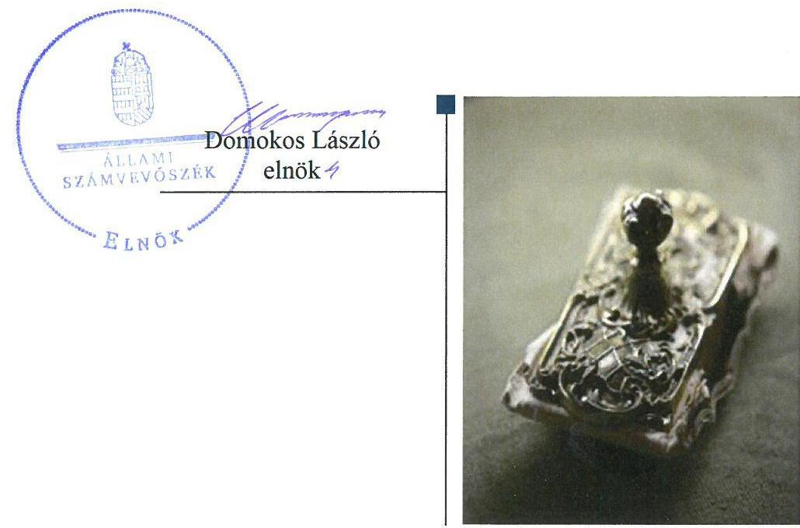
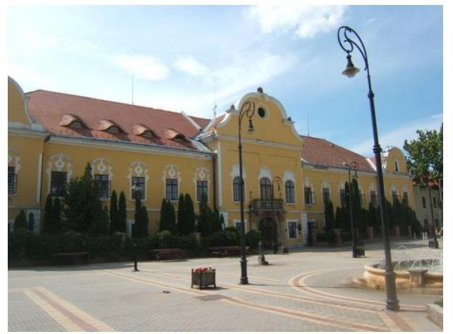
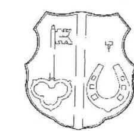
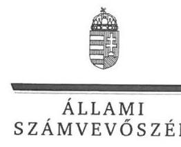

# Jelentés 

## Az önkormányzatok gazdasági társaságai

Az önkormányzatok többségi tulajdonában lévő gazdasági társaságok gazdálkodásának ellenőrzése - Nagykállói, Oktatási, Műsorszolgáltató, Közművelődési és Szociális Közhasznú Nonprofit Kft. 2018.

---

# Jelentés 

## Az önkormányzatok gazdasági társaságai

Az önkormányzatok többségi tulajdonában lévő gazdasági társaságok gazdálkodásának ellenőrzése - Nagykállói, Oktatási, Műsorszolgáltató, Közművelődési és Szociális Közhasznú Nonprofit Kft.
2018. 2018. 2018. 2018. nap

---

# AZ ELLENŐRZÉST FELÜGYELTE:

DR. HORVÁTH MARGIT felügyeleti vezető

## AZ ELLENŐRZÉST VEZETTE ÉS A VÉGREHAJTÁSÁÉRT FELELŐS:

- JOÓ ERIKA ellenőrzésvezető
- SZILÁGYI GÁBOR ellenőrzésvezető

## A PROGRAM ÖSSZEÁLLÍTÁSÁÉRT FELELŐS:

- TÓTPÁL SZABOLCS osztályvezető

---

**IKTATÓSZÁM:** EL-0141-092/2018

**TÉMASZÁM:** 2067

**ELLENŐRZÉS-AZONOSÍTÓ SZÁM:** V079331

---

Jelentéseink az Országgyűlés számítógépes hálózatán és az Interneten a www.asz.hu címen is olvashatóak.

---

# TARTALOMJEGYZÉK 

■ ÖSSZEGZÉS ..... 5
■ AZ ELLENŐRZÉS CÉLJA ..... 7
■ AZ ELLENŐRZÉS TERÜLETE ..... 8
■ AZ ELLENŐRZÉS HÁTTERE, INDOKOLTSÁGA ..... 10
■ A JELENTÉS LÉNYEGES KÉRDÉSKÖREI ..... 11
■ ELLENŐRZÉS HATÓKÖRE ÉS MÓDSZEREI ..... 12
■ MEGÁLLAPÍTÁSOK ..... 14
■ JAVASLATOK ..... 20
■ MELLÉKLETEK ..... 23
I. sz. melléklet: Értelmező szótár ..... 23
■ FÜGGELÉK: ÉSZREVÉTELEK ..... 25
■ RÖVIDÍTÉSEK JEGYZÉKE ..... 35

---

.

---

# ÖSSZEGZÉS 

A Nagykállói, Oktatási, Műsorszolgáltató, Közművelődési és Szociális Közhasznú Nonprofit Kft. feletti tulajdonosi jogok gyakorlásának kereteit megfelelően alakította ki és a tulajdonosi jogokat Nagykálló Város Önkormányzata szabályszerűen gyakorolta. A Társaság gazdálkodásának szabályozottsága nem felelt meg az előírásoknak. Az adatszolgáltatási és közzétételi kötelezettségének nem tett eleget, ezzel az átláthatóságot nem biztosította. A Társaság vagyongazdálkodása nem volt szabályszerű, ezzel nem biztosította az elszámoltathatóságot. A Társaság fizetőképessége az ellenőrzött időszak végére helyreállt.

## Az ellenőrzés társadalmi indokoltsága

Az Állami Számvevőszék a stratégiáját megvalósítva ellenőrzéseivel segíti az átláthatóságot és az elszámoltathatóságot a közpénzekkel, a közvagyonnal való gazdálkodásban.

Az Állami Számvevőszék kiemelt célja, hogy a helyi önkormányzatok gazdálkodásában rejlő pénzügyi kockázatok feltárásával, az államháztartáson kívülre nyújtott költségvetési támogatások és ingyenes vagyonjuttatások ellenőrzésével hozzájáruljon ahhoz, hogy a közpénzeket az államháztartáson kívül működő szervezetek is átlátható, rendezett módon használják fel.

Magyarországon az önkormányzatok kötelező és önként vállalt feladataik vonatkozásában is egyre szélesebb körben alkalmazzák az államháztartáson kívüli feladatellátást, ezáltal - a nonprofit szervezetek mellett - az önkormányzati tulajdonú gazdasági társaságok is kiemelt fontosságú szerephez jutottak. Ezen belül kiemelt jelentőségű számos önkormányzati gazdasági társaság működése abból a szempontból is, hogy gazdálkodásának egyes elemei befolyásolják az önkormányzati alszektor hiányát és az államadósságot. Az önkormányzatok többségi tulajdonában álló gazdasági társaságok ellenőrzése kiemelten fontos a vagyon megőrzése, megóvása érdekében. A feladatellátás költségeinek, ráfordításainak alakulása a lakosság széles rétegét érinti.

## Főbb megállapítások, következtetések, javaslatok

A Nagykállói, Oktatási, Műsorszolgáltató, Közművelődési és Szociális Közhasznú Nonprofit Kft. felett a tulajdonosi jogokat Nagykálló Város Önkormányzata az előírásoknak megfelelően gyakorolta. A Képviselő-testület a jogszabályi előírásoknak megfelelően megalkotta a javadalmazási szabályzatot, rendeletalkotási kötelezettségének eleget tett. A felügyelőbizottság kialakította az ügyrendjét, amelyet a Képviselő-testület által átruházott hatáskörében eljárva a polgármester jóváhagyott.

A Nagykállói, Oktatási, Műsorszolgáltató, Közművelődési és Szociális Közhasznú Nonprofit Kft. működésének szabályozottsága nem felelt meg az előírásoknak. A Társaság rendelkezett az elszámolások és nyilvántartások rendjét meghatározó számviteli politikával és az annak részeként kötelezően elkészítendő egyéb szabályzatokkal, ugyanakkor a szabályzatok nem feleltek meg a jogszabályi előírásoknak. A 2013-2014. években a jogszabályi előírás ellenére számlarenddel nem rendelkezett a Társaság.

A bevételek és ráfordítások valamint az értékcsökkenés elszámolása nem felelt meg a jogszabályi előírásoknak. A Társaság önköltségszámítást nem végzett, árképzése - az üdülőterületi szolgáltatások díjai kivételével - megfelelt az előírásoknak.

Az átláthatóság és elszámoltathatóság követelménye nem érvényesült, Az egyszerűsített éves beszámolók mérlegtételei nem voltak leltárral alátámasztva, valamint a közzétételre vonatkozó kötelezettségének a Társaság nem tett eleget, ezzel az átláthatóság és elszámoltathatóság követelménye nem érvényesült. A Társaság fizetőképessége 2013-ban nem volt biztosított, de az ellenőrzött időszak végére helyreállt.

---

A Nagykállói, Oktatási, Műsorszolgáltató, Közművelődési és Szociális Közhasznú Nonprofit Kft. saját vagyonnal és üzemeltetésre átvett vagyonnal rendelkezett. A vagyon nyilvántartása nem felelt meg az előírásoknak.

---

# AZ ELLENŐRZÉS CÉLJA 

AZ ELLENŐRZÉS CÉLJA annak értékelése volt, hogy az önkormányzat vagyongazdálkodási tevékenysége során szabályszerűen gyakorolta-e a tulajdonosi jogait. A gazdasági társaság szabályozottsága, gazdálkodása és vagyongazdálkodási tevékenysége, bevételeinek és ráfordításainak elszámolása megfelelt-e a jogszabályi és tulajdonosi előírásoknak. Értékeltük, hogy a gazdasági társaság kötelezettségállománya jelentett-e kockázatot a működésre, valamint a gazdálkodás átláthatósága és elszámoltathatósága érdekében biztosítva volt-e a szolgáltatás díjának megalapozottsága. Az ellenőrzés célja továbbá annak megítélése, hogy a kormányzati szektorba sorolt önkormányzati tulajdonban (résztulajdonban) lévő gazdálkodó szervezetek gazdálkodásának a kormányzati szektor hiányára és az államadósságra befolyással bíró elemei a jogszabályi előírásoknak megfeleltek-e.

---

# AZ ELLENŐRZÉS TERÜLETE 

## Nagykálló Város Önkormányzata és a többségi tulajdonában álló Nagykállói, Oktatási, Műsorszolgáltató, Közművelődési és Szociális Közhasznú Nonprofit Kft.

A Nagykállói, Oktatási, Műsorszolgáltató, Közművelődési és Szociális Közhasznú Nonprofit Kft-t 2007. október 1-én hozta létre Nagykálló Város Önkormányzata 100%-os tulajdonosként 1,0 M Ft jegyzett tőkével, melyet 2010. évben 149,1 M Ft-ra emelte az alapító. 2012. június 21-től az Önkormányzat $^{1}$ 50%-ban volt a Társaság $^{2}$ tulajdonosa, majd 2013. október 24-től ismét 100%-os tulajdonos volt. A 2013. évben 1,0 M Ft tőkeemelést hajtott végre az Önkormányzat, így a kizárólag pénzbeli betétből álló törzstőke 150,1 M Ft-ra növekedett.

A Társaság közfeladatként végezte az Önkormányzat tulajdonában álló művelődési központ, közösségi házak, sportcsarnok és ifjúsági tábor üzemeltetését, a közművelődési feladatok ellátását, az önkormányzati épületek takarítását és karbantartását, az önkormányzati intézmények portási feladatainak ellátását, a pályázati támogatásokból finanszírozott tanfolyamok és oktatások szervezését, valamint a közfeladatokhoz kapcsolódóan a televízió műsor összeállítását és szolgáltatását. A Társaság vállalkozási tevékenységei között szerepelt a rendezvényszervezés, az Önkormányzat tulajdonában álló étterem, büfé és a homokbánya üzemeltetése, az ingatlanhasznosítás és bérbeadás, a helyi lap kiadása, és a hirdetési tevékenység. A Társasággal kötött Közfeladat-ellátási szerződés $_{1-4}$ $^{3}$-ben és az Üzemeltetési szerződés $_{1}$ $^{4}$-ben meghatározták a feladatellátás feltételeit, az időtartamot, az ellátási területet. A Társaság az önkormányzati vagyonelemeket üzemeltetésre vette át, melyek főként ingatlanokból - művelődési ház, közösségi házak, ifjúsági tábor, homokbánya - és az ezek üzemeltetéséhez szükséges felszerelésekből álltak. A Társaság vagyonkezelt eszközzel nem rendelkezett.

A Társaság tevékenységéhez saját eszközei mellett az Önkormányzat által üzemeltetésre átadott ingatlanok és eszközök biztosították a technikai feltételeket. A Társaság 352,4 M Ft értékű saját tárgyi eszköz állománnyal rendelkezett.

A Társaság 2015. december 30-ától kormányzati szektorba sorolt szervezet volt.

A Társaság minden ellenőrzött évben nyereséges volt, a saját tőke értéke meghaladta a jegyzett tőke összegét. (1. ábra)

---

A Társaság különféle jogcímeken kapott támogatást az Önkormányzattól, központi költségvetési és EU-s forrásokból. A támogatások összegeit forrásonként az 1. táblázat mutatja be.

1. táblázat

TÁMOGATÁSOK A 2013-2016. ÉVEKBEN (M FT)

| Kapott támogatás forrása | 2013 | 2014 | 2015 | 2016 |
| :--: | :--: | :--: | :--: | :--: |
| Önkormányzat | 62,4 | 15,8 | 21,8 | 26,6 |
| NKA $^{5}$, MMA $^{6}$, NRSZH $^{7}$ | 3,0 | 1,4 | 1,0 | 15,9 |
| EMMI $^{78}$ (uniós források is) | 52,1 | 59,4 | 60,3 | 55,2 |
| NMHH - Médiatanács $^{9}$, MTVA $^{10}$ | 5,0 | 11,3 | 6,3 | 5,3 |
| egyéb támogatások | 3,3 | 7,0 | 6,7 | 5,3 |
| ÖSSZESEN | 125,8 | 94,9 | 96,1 | 108,3 |

A jelenlegi ügyvezető 2011 óta tölti be tisztségét. A foglalkoztatottak átlagos állományi létszáma 68 fő volt az ellenőrzött időszakban.

A polgármester személye az ellenőrzött időszakban nem változott, a jegyző személye egyszer változott. A jelenlegi polgármester 2006 óta, a jegyző 2015. január 1-től tölti be tisztségét.

---

# AZ ELLENŐRZÉS HÁTTERE, INDOKOLTSÁGA 

## AZ ÖNKORMÁNYZATI TULAJDONÚ GAZDASÁGI

TÁRSASÁGOK teljes körű ellenőrzésének lehetőségét az Állami Számvevőszékről szóló 1989. évi XXXVIII. törvény 2011. január 1-jétől hatályos módosítása teremtette meg és az Állami Számvevőszékről szóló 2011. évi LXVI. törvény is tartalmazza. A gazdasági társaságok gazdálkodási tevékenysége szabályszerűségének ellenőrzését 2011. évtől végezzük. Az önkormányzatok többségi tulajdonában álló gazdasági társaságok ellenőrzése kiemelten fontos a vagyon megőrzése, megóvása érdekében, valamint a kormányzati szektor elszámolásaiban megjelenő önkormányzati tulajdonú gazdálkodó szervezetek esetében, amelyekkel szemben alapvető követelmény, hogy gazdálkodásuk, működésük szabályszerű, az általuk szolgáltatott adatok minél megbízhatóbbak legyenek. A feladatellátás költségeinek, ráfordításainak alakulása a lakosság széles rétegét érinti.

Ellenőrzéseink feltárhatják, hogy az önkormányzat a feladatellátásához rendelt vagyon működtetését a tulajdonostól elvárható gondossággal végezte-e, a feladatot ellátó gazdasági társaság a létesítő okiratban, szolgáltatási szerződésben foglaltak betartásával biztosította-e a feladat ellátását. Az ellenőrzés eredményeképp meghatározhatóvá válnak a költségvetési hiányt befolyásoló szervezetek kockázatai, lehetővé válik ezen kockázatok csökkentése. Az ellenőrzés rávilágíthat arra, hogy a gazdasági társaság a vagyon használatával biztosította-e a szolgáltatás folytatásának feltételeit, az önkormányzat tulajdonosi felügyelete hozzájárult-e a szabályszerű gazdálkodáshoz és feladatellátáshoz. A megállapítások alapján megfogalmazott számvevőszéki javaslatok hasznosítása elősegítheti a meglévő hibák megszüntetését. A jó gyakorlatok bemutatásával az ÁSZ $^{11}$ hozzájárulhat a követendő megoldások megismertetéséhez, terjesztéséhez.

---

# A JELENTÉS LÉNYEGES KÉRDÉSKÖREI 

1. Az Önkormányzat tulajdonosi joggyakorlása szabályszerű volt-e?
2. A Társaság szabályozottsága, gazdálkodása és vagyongazdálkodási tevékenysége szabályszerű volt-e, fizetőképessége biztosított volt-e a gazdálkodás során?
3. A Társaság bevételeinek és ráfordításainak elszámolása, valamint az árképzés szabályszerű volt-e?

---

# ELLENŐRZÉS HATÓKÖRE ÉS MÓDSZEREI 

## Az ellenőrzés típusa

Megfelelőségi ellenőrzés.

## Az ellenőrzött időszak

Az ellenőrzött időszak 2013. január 1-jétől 2016. december 31-ig tartott.

## Az ellenőrzés tárgya

Nagykálló Város Önkormányzata tulajdonában lévő Nagykállói, Oktatási, Műsorszolgáltató, Közművelődési és Szociális Közhasznú Nonprofit Kft. feletti tulajdonosi joggyakorlása, valamint a Nagykállói, Oktatási, Műsorszolgáltató, Közművelődési és Szociális Közhasznú Nonprofit Kft. gazdálkodásának szabályozottsága és szabályszerűsége.

Az ellenőrzés kiterjed minden olyan körülményre és adatra, amely az ÁSZ jogszabályban meghatározott feladatainak teljesítéséhez, valamint a program végrehajtása folyamán felmerült újabb összefüggések feltárásához szükséges.

## Az ellenőrzött szervezet

Nagykállói, Oktatási, Műsorszolgáltató, Közművelődési és Szociális Közhasznú Nonprofit Kft.; Nagykálló Város Önkormányzata

## Az ellenőrzés jogalapja

Az ellenőrzés jogalapját az ÁSZ tv. $^{12}$ 1. § (3) bekezdése és 5. § (3)-(5) bekezdése képezi.

## Az ellenőrzés módszerei

Az ellenőrzést a nemzetközi standardokat irányadónak tekintve az ellenőrzési program ellenőrzési kérdései, az ellenőrzött időszakban hatályos jogszabályok, az ellenőrzés szakmai szabályok és módszertanok figyelembevételével végeztük.

Az ellenőrzés ideje alatt az ellenőrzött szervezettel történő kapcsolattartást az ÁSZ Szervezeti és Működési Szabályzatának vonatkozó előírásai alapján biztosítottuk.

---

Az ellenőrzési kérdések megválaszolásához szükséges bizonyítékok megszerzése a következő ellenőrzési eljárások alkalmazásával történt: megfigyelés, kérdésfeltevés (információkérés), összehasonlítás, valamint elemző eljárás. Az ellenőrzési bizonyítékként felhasználható adatforrások közé tartoznak egyrészt az ellenőrzési programban felsorolt adatforrások, másrészt adatforrás lehet még minden - az ellenőrzés folyamán - feltárt, az ellenőrzés szempontjából információkat tartalmazó dokumentum.

Az ellenőrzést a kérdésekre adott válaszok kiértékelésével, valamint a megjelölt adatforrások, a csatolt tanúsítványok felhasználásával, továbbá az adott időszakban hatályos jogszabályok figyelembe vételével folytattuk le.

A bevételek és ráfordítások elszámolásait mintavétellel
 ellenőriztük. A minták kiválasztása rétegzett mintavétel alkalmazásával történt. A vagyonnyilvántartás terén a szabályszerű működést ellenőriztük az üzemeltetésre átvett önkormányzati vagyon, valamint a társaság saját vagyona vonatkozásában. A mintavétellel ellenőrzött területek esetében minden egyes tétel vonatkozásában a szabályszerűségre vonatkozó kérdéseket tettünk fel, amelyek eredménye összesítésre került. A ráfordítások elszámolására vonatkozó véletlen mintavételt kockázati alapú kiválasztással egészítettük ki, amelynek során évente a három legnagyobb összegű tételt választottuk ki.

---

# 1. Az Önkormányzat tulajdonosi joggyakorlása szabályszerű volt-e? 

Összegző megállapítás

Az Önkormányzat a tulajdonosi joggyakorlás kereteit megfelelően alakította ki, tulajdonosi joggyakorlása szabályszerű volt.

A TULAJDONOSI JOGOK GYAKORLÁSÁRÓL az Önkormányzat Vagyongazdálkodási rendelete ${ }^{13}$ az Nvtv. ${ }^{14}$ előírásainak megfelelően rendelkezett a tulajdonában álló gazdasági társaság vonatkozásában. A Vagyongazdálkodási rendelet rögzítette, hogy az Önkormányzat kizárólagos tulajdonában álló gazdasági társaságok vonatkozásában az Önkormányzatot megillető tulajdonosi jogokat - a Képviselő-testület kizárólagos hatáskörébe tartozó kivételekkel - a polgármesterre ruházták át.

Az Önkormányzat a Gt. ${ }^{15}$. illetve a Ptk. ${ }^{16}$. és a Taktv. ${ }^{17}$ előírásainak megfelelően az Alapító okiratban ${ }_{1-4}{ }^{18}$ rendelkezett a háromtagú felügyelőbizottság ${ }^{19}$ létrehozásáról. A felügyelőbizottság a Gt. és a Ptk. előírásainak megfelelően elkészítette ügyrendjét ${ }_{1,2}{ }^{20}$, amelyet a Vagyongazdálkodási rendeletben kapott felhatalmazásnak megfelelően a polgármester hagyott jóvá.

Az Alapító okirat ${ }_{1-4}$, a Közfeladat ellátási szerződés ${ }_{1-4}$, az Üzemeltetési szerződés ${ }_{1-5}$, valamint a Közművelődési megállapodás ${ }^{21}$ rögzítette a Társaság adatszolgáltatási, beszámolási kötelezettségét. A Közművelődési rendelet ${ }^{22}$ tartalmazta, hogy a közművelődési feladatokat az Önkormányzat elsősorban a Társasággal kötött közművelődési megállapodás útján látta el. A Közművelődési megállapodásban rögzítették a Társaság által ellátandó helyi közművelődési feladatokat, valamint a közművelődési feladatellátásra vonatkozó tervezési, tájékoztatási és elszámolási kötelezettségeket. Az Üzemeltetési szerződés ${ }_{1-5}$-ben az Önkormányzat meghatározta az üzemeltetésre átadott vagyonelemek körét, a Társaság jogait, kötelezettségeit, illetve a tulajdonosnak fenntartott jogokat, kötelezettségeket.

Rendeletalkotási kötelezettségét az 1997. évi CXL. törvény²3 előírásainak megfelelően az Önkormányzat a Közművelődési rendelet megalkotásával teljesítette.

A TULAJDONOSI JOGGYAKORLÁS keretében az egyszerűsített éves beszámolót, valamint a Társaság közhasznú tevékenységére vonatkozóan a Civil tv ${ }^{24}$. 46. § (1) bekezdés előírásai szerint készített közhasznúsági jelentést a Képviselő-testület a Gt., illetve a Ptk. előírásainak megfelelően minden évben a felügyelőbizottság írásbeli jelentése és a könyvvizsgáló előzetes véleménye alapján megtárgyalta és határozattal elfogadta. A Képviselő-testület a 2013-2014. években az eredmény eredménytartalékba helyezéséről döntött, a 2015-2016. évek vonatkozásában a Társaság részére történő rendelkezésre bocsátásról.

---

Tulajdonosi ellenőrzést a felügyelőbizottság végzett, az ellenőrzések a pénztár szabályszerű működésére és a különböző rendezvények szervezésének megfelelőségére irányultak és intézkedést igénylő megállapításokat nem tett.

A Képviselő-testület a Taktv. 5. § (3) bekezdésében előírtak szerint megalkotta az ellenőrzött időszakban hatályos javadalmazási szabályzatot.

# 2. A Társaság szabályozottsága, gazdálkodása és vagyongazdálkodási tevékenysége szabályszerű volt-e, fizetőképessége biztosított volt-e a gazdálkodás során? 

Összegző megállapítás

A Társaság megállapítás

A Társaság a jogszabályi előírások ellenére a 2013. és a 2014. években nem rendelkezett számlarenddel, a 2015. és a 2016. években nem rendelkezett értékelési szabályzattal. A Társaság által elkészített további szabályzatok - a leltározási szabályzat kivételével - nem feleltek meg a jogszabályi előírásoknak.

SZÁMVITELI POLITIKÁVAL ${ }_{1-3}{ }^{25}$ rendelkezett a Társaság, de
$\longrightarrow$ a számviteli politika $_{1}$-t a Számv. tv. ${ }^{26}$ 2013. január 1-jén hatályba lépett változásaival - jelentős összegű hiba fogalmának változása, megbízható és valós képet lényegesen befolyásoló hiba fogalmának törlése - a Számv. tv. 14. § (11) bekezdés előírásai ellenére nem módosította;
$\longrightarrow$ a Számv. tv. 14. § (11) bekezdés előírásai ellenére a számviteli poli-tika $_{2}$-t a Számv. tv. 2015. július 4-ével hatályba lépett változásaival - az egyszerűsített éves beszámoló mutatóértékeinek változása, eredménykimutatás tételeinek tartalmában bekövetkezett változása - 90 napon túl módosította;
$\longrightarrow$ a számviteli politika $_{2-3}$-ban a Számv. tv. 3. § (3) bekezdés 3. pontjában előírtak ellenére a jelentős összegű hiba mértékét nem megfelelően módosította;
$\longrightarrow$ a számviteli politika $_{1-3}$-ban a mérlegkészítés időpontjának a tárgyévet követő év május 31-ét határozta meg, mely nem felelt meg a Számv. tv. 3. § (6) bekezdés 1. pontjában előírtaknak.
A Társaság rendelkezett leltározási és selejtezési szabályzattal ${ }_{1-2}{ }^{27}$, amely rögzítette a saját vagyon leltározásának szabályait, amely a Számv. tv. előírásainak megfelelően tartalmazta a leltározás gyakoriságára vonatkozó szabályokat.

Értékelési szabályzattal ${ }^{28}$ 2013-2014. években rendelkezett a Társaság, de a Számv. tv. 14. § (5) b) pontjában előírtak ellenére a 2015-2016. évekre

---

2.2. számú megállapítás
2. táblázat

## BEFEKTETETT ESZKÖZÖK ÉRTÉKE A 2013-2016. ÉVEKBEN (MILLIÓ FT)

| 6y | befektetett eszközök értéke |
| :--: | :--: |
| 2013. december 31. | 355,0 |
| 2014. december 31. | 355,3 |
| 2015. december 31. | 355,6 |
| 2016. december 31. | 347,5 |

Forrás: 2013-2016. éves beszámolók
vonatkozóan nem rendelkezett az eszközök és források értékelési szabályzatával.

A pénzkezelési szabályzat ${ }_{1-2}{ }^{29}$ nem felelt meg a Számv. tv. 14. § (8) bekezdésében foglaltaknak, mert nem rendelkezett a pénzforgalom bankszámlán történő lebonyolításának rendjéről, a készpénzben és a bankszámlán tartott pénzeszközök közötti forgalomról, a készpénzállományt érintő pénzmozgások jogcímeiről és eljárási rendjéről, továbbá a készpénzállomány ellenőrzésének gyakoriságáról.

A Társaság a Számv. tv. 14. § (7) bekezdés rendelkezései értelmében önköltségszámítási szabályzat készítésére nem volt kötelezett és azt nem is készített.

SZÁMLARENDDEL a Számv. tv. 161. § (1) bekezdés előírásai ellenére nem rendelkezett a Társaság a 2013-2014. években. A 2015. január 1-jétől hatályos számlarend nem felelt meg a Számv. tv. 161. § (2) bekezdése b) és c) pontjaiban foglaltaknak, mivel nem határozta meg minden alkalmazásra kijelölt számla értéke növekedésének, csökkenésének jogcímeit, a számlát érintő gazdasági eseményeket, azok más számlákkal való kapcsolatát, valamint a főkönyvi számla és az analitikus nyilvántartás kapcsolatát. A számlarendben a Számv. tv. előírásainak megfelelően elkülönítették a Társaság közhasznú tevékenységéből, valamint a vállalkozási tevékenységéből származó bevételeket és ráfordításokat. A Számv. tv. 161. § (5) bekezdésében foglalt előírások ellenére nem módosították a számlarendet a Számv. tv. 2015. július 4-ével hatályba lépett rendelkezéseinek megfelelően.

A Társaság az üzemeltetésre átvett vagyon vonatkozásában nyilvántartást nem vezetett, a vagyon védelme nem volt biztosított. Az egyszerűsített éves beszámolók nem feleltek meg a jogszabályi előírásoknak, mert a 2013-2016. évi beszámolók adatait teljes körű leltárral nem támasztották alá, ezért a mérlegtételek valódisága nem volt megalapozott.

AZ ÜZEMELTETÉSI SZERZŐDÉS ${ }_{1-5}$ előírta a Társaság számára az üzemeltetésre rábízott vagyon vonatkozásában a nyilvántartási, értékelési és adatszolgáltatási kötelezettséget, valamint rögzítette a Társaság felelősségét a vagyon megőrzése és műszaki színvonalának megtartása körében. A Társaság az üzemeltetésre átvett ingatlanokról és eszközökről az Üzemeltetési szerződés ${ }_{1-5}$-ben előírt nyilvántartási kötelezettségét nem teljesítette.

A saját vagyonra vonatkozó nyilvántartás nem felelt meg az előírásoknak. A Társaság az ellenőrzött időszakban a Számv. tv. 46. § (3) bekezdés, valamint a Számv. tv. 69. § (1) és (4) bekezdés előírásai ellenére nem végzett leltározást a követelések és kötelezettségek vonatkozásában. Az elkészített leltárak nem tartalmazták tételesen és ellenőrizhető módon a Társaság mérlegforduló napon meglévő eszközeit és forrásait mennyiségben és értékben, ezért a leltárak a mérlegtételek alátámasztására nem voltak alkalmasak.

AZ EGYSZERŰSÍTETT ÉVES BESZÁMOLÓK mérlegtételeit a Számv. tv. 69. § (1) bekezdés előírásai ellenére nem megfelelően

---

### 2.3. számú megállapítás

3. táblázat

SZÁLLÍTÓI KÖTELEZETTSÉGEK 2013-2016. ÉV (MILLIÓ FT)

|  év | összes kötelezettség | lejárt kötelezettségek  |
| --- | --- | --- |
|  2013.12.31. | 27,0 | 26,1  |
|  2014.12.31. | 8,5 | 6,3  |
|  2015.12.31. | 13,9 | 8,2  |
|  2016.12.31. | 8,6 | 5,9  |

Forrás: a Társaság 2013-2016. évi kimutatásai 2.4. számú megállapítás részletezett leltárral támasztották alá, ezért a mérlegadatok valódisága nem volt megalapozott, az elkészített leltárak nem voltak alkalmasak a mérlegadatok alátámasztására.

A könyvvizsgáló az egyszerűsített éves beszámolókat korlátozás nélküli hitelesítő záradékkal látta el a leltár, illetve a leltározás hiányosságai, valamint a számviteli szabályzatok hiányosságai ellenére.

A Társaság az ellenőrzött időszakban a saját vagyonát nem terhelte meg és nem idegenítette el. A mérleg szerinti vagyon értéke 384,5 M Ft-ról 366,1 M Ft-ra csökkent az ellenőrzött időszak végére. A befektetett eszközök értékének alakulását a 2. táblázat mutatja be.

A Társaság az egyszerűsített éves beszámolók kiegészítő mellékletében a Számv. tv. 88. § (4) bekezdésében foglalt előírások ellenére nem mutatta be az értékcsökkenés elszámolásának módját és gyakoriságát.

A Társaság a vagyongazdálkodással kapcsolatos döntését az előírásoknak megfelelően készítette elő és terjesztette be, amelyeket a tulajdonosi joggyakorló határozatban hagyott jóvá a folyószámla-hitel felvételekor.

A Társaság fizetőképessége 2013-ban nem volt biztosított, az ellenőrzött időszak további éveiben a fizetőképesség helyreállt.

A TÁRSASÁG FIZETŐKÉPESSÉGE 2013-ban nem volt biztosított, mert likviditását csak külső forrás bevonásával tudta biztosítani. A folyószámla-hitelkeret felvételéhez, valamint a bankgaranciához a tulajdonosi joggyakorló vállalt kezességet és biztosított ingatlanfedezetet.

A Társaság részére a fizetőképesség biztosítása érdekében 2013. július 30-án az Önkormányzat 8,0 M Ft rövid lejáratú kölcsönt, a folyószámla-hitel visszafizetéséhez 2013. december 21-én 41,0 M Ft összegű támogatást nyújtott.

A kötelezettségállomány a 2013. év végi 43,3 M Ft-ról a 2016. év végére 24,7 M Ft-ra, a szállítói kötelezettségállomány 31,4%-kal csökkent. A határidőn túli szállítói kötelezettségek aránya 2013. december 31-én a szállítói kötelezettségek 96,7%-a volt, amely arány 2016. december 31-ére 70,2%-ra csökkent. (3. táblázat) A Társaság fizetőképessége az ellenőrzött időszak végére helyreállt.

A vevőkövetelések állománya 7,5 M Ft-ról 7,0 M Ft-ra, a határidőn túli követelések aránya 68,0%-ról 50,0 százalékra csökkent.

A Társaság a jogszabályi előírások ellenére közzétételi és adatszolgáltatási kötelezettségeit nem teljesítette, így nem biztosította az átláthatóságot.

A KÖZÖSSÉGI MÉDIASZOLGÁLTATÁSRA vonatkozó törvényi rendelkezéseknek való megfelelésről és a médiaszolgáltatási szabályzat betartásáról a Média tv ${ }^{30}$. 66. § (3) bekezdésében foglalt előírások ellenére nem számolt be évente a Médiatanácsnak a Társaság, mint médiaszolgáltató.

A Társaság kormányzati szektorba sorolt egyéb szervezetként a 2015. és a 2016. évekre vonatkozóan nem tett eleget az Ávr. 5. számú melléklet 23. pontjában előírt, az államháztartásért felelős miniszter felé történő bejelentési és adatszolgáltatási kötelezettségének.

---

AZ EGYSZERŰSÍTETT ÉVES BESZÁMOLÓKAT a 2013-2016. üzleti évekre a Társaság közhasznúsági melléklettel együtt elkészítette és a jogszabályi előírásoknak megfelelően közzétette. A Képviselő-testület a könyvvizsgálói jelentések és a felügyelőbizottság írásbeli jelentése alapján a beszámolókat elfogadta.

KÖZZÉTÉTELI KÖTELEZETTSÉGÉNEK a Taktv. 2. § (1) bekezdés a) és d) pontban foglalt előírások ellenére nem tett eleget a Társaság, mert nem tette közzé a vezető tisztségviselők, az Mt. 208. §-a szerint vezető állású munkavállalók, valamint az önállóan cégjegyzésre vagy a bankszámla feletti rendelkezésre jogosultak javadalmazásával kapcsolatos adatokat. Az Alapító okirat ${ }_{1-4}$ rögzítette, hogy a Társaság a tevékenységének és
 gazdálkodásának legfontosabb adatait a Kelet-Magyarország című napilap útján, illetve a „nagykalloharangod.hu" honlapon hozza nyilvánosságra. A közzétételi kötelezettség teljesítését a Társaság dokumentummal nem igazolta. A közérdekű adatok megismerésére irányuló igények teljesítésének rendjét rögzítő szabályzattal a Társaság az Info tv. 30. § (6) bekezdésben foglalt előírások ellenére nem rendelkezett.

BELSŐ ELLENŐRZÉST - kormányzati szektorba sorolt egyéb szervezetként - a Bkr. 10. § foglalt előírások ellenére belső ellenőrt 2015. december 30. után a Társaság nem foglalkoztatott.

A Társaság a 2016-ban lefolytatott külső ellenőrzések intézkedést igénylő megállapításaival kapcsolatban a Bkr. 13. § (2) bekezdésében foglalt előírás ellenére nem készített intézkedési tervet.

# 3. A Társaság bevételeinek és ráfordításainak elszámolása, valamint az árképzés szabályszerű volt-e? 

## Összegző megállapítás

A Társaság bevételeinek és ráfordításainak elszámolása nem felelt meg a jogszabályi előírásoknak. A Társaság árképzése, illetve áralkalmazása az üdülőterületi szolgáltatások kivételével megfelelt az előírásoknak.

A Társaság 2013. január 1. és 2014. december 31. közötti időszakban a Számv. tv. 161. § (1) bekezdésében foglaltak ellenére nem rendelkezett számlarenddel, továbbá a 2015. január 1-jétől hatályos számlarend a Számv. tv. 161. § (2) bekezdésében a), b) és c) pontjában foglalt előírások ellenére nem tartalmazta minden alkalmazásra kijelölt számla számjelét és megnevezését, értéke növekedésének, csökkenésének jogcímeit, a számlát érintő gazdasági eseményeket, azok más számlákkal való kapcsolatát. A szabályozás hiánya, illetve hiányosságai következtében nem volt megállapítható a gazdasági események megfelelő számlákra történő könyvelése. A bevételek és ráfordítások elszámolása az ellenőrzött időszakban nem felelt meg a Számv. tv. 161. § (2) bekezdés a)-c) pontja előírásainak.

A Társaság a Számviteli politika ${ }_{1-2}$-ben a Számv. tv. 14. § (4) bekezdésben, valamint a 88. § (4) bekezdésben foglalt előírások ellenére nem szabályozta az értékcsökkenés leírás módszerét, illetve az elszámolás gyakoriságát, így a szabályozás hiányosságai miatt az elszámolások során alkalmazott leírási kulcsok megfelelősége nem volt ellenőrizhető.

---

A 2013 júliusában 55 M Ft összegű folyószámla hitelkerethez nyújtott tulajdonosi kezességvállalás esetében a Stabilitási tv. ${ }^{31}$ 10. § (1) bekezdésében előírt kormányzati jóváhagyás nem volt szükséges, mert a Társaság 2015. december 30. előtt nem volt kormányzati szektorba sorolt szervezet. A 2016. évben nem volt a Társaság gazdálkodásának az államadósságra befolyással bíró eleme.

A Társaság önköltségszámítást nem végzett, a szolgáltatási tevékenységével kapcsolatos díjakat jellemzően az Üzemeltetési szerződés1-5-ben határozták meg, illetve a homokbánya vonatkozásában az eladott homok eladási árát az egyes értékesítési ciklusokhoz, projektekhez kapcsolódóan Képviselő-testületi ${ }^{32}$ határozatokban, egyedileg írták elő a Társaság számára.

A Társaság által üzemeltetett önkormányzati Téka táborra vonatkozó díjakat a 15/2012. (IV. 26.) számú önkormányzati rendeletben határozta meg a Képviselő-testület. A Társaság az üdülőterületen nyújtott szolgáltatások vonatkozásában a 15/2012. (IV. 26.) számú önkormányzati rendeletben előírt díjtételektől eltérő, illetve a rendeletben nem szereplő díjakat alkalmazott.

---

# JAVASLATOK 

Az ÁSZ tv. 33. § (1) bekezdésében foglaltak értelmében az ellenőrzött szervezet vezetője köteles a jelentésben foglalt megállapításokhoz kapcsolódó intézkedési tervet összeállítani és azt a jelentés kézhezvételétől számított 30 napon belül az ÁSZ részére megküldeni. Amennyiben az ellenőrzött szervezet vezetője nem küldi meg határidőben az intézkedési tervet, vagy továbbra sem elfogadható intézkedési tervet küld, az Állami Számvevőszék elnöke az ÁSZ tv. 33. § (3) bekezdése a) és b) pontjaiban foglaltakat érvényesítheti.
Javaslataink célja a Nagykállói, Oktatási, Músorszolgáltató, Közművelődési és Szociális Közhasznú Nonprofit Kft. gazdálkodása szabályszerűségének és gyakorlatának javítása annak érdekében, hogy a szabályozási környezet és az alkalmazott gyakorlat megfelelően tudja támogatni az átlátható működést.

## Nagykállói, Oktatási, Músorszolgáltató, Közművelődési és Szociális Közhasznú Nonprofit Kft. ügyvezetőjének

1. Intézkedjen az eszközök és források értékelési szabályzatának elkészítéséről, továbbá a számviteli politika, leltározási szabályzat és a számlarend hatályos Számv. tv.-ben előírtaknak megfelelő módosításáról.
(2. 1. sz. megállapítás 1. bekezdés 1., 3. és 4. francia bekezdései, valamint 3-4. és 6. bekezdései alapján)
2. Intézkedjen az üzemeltetésre átvett eszközökkel kapcsolatos nyilvántartási kötelezettség teljesítéséről az üzemeltetési szerződésekben előírtaknak megfelelően.
(2.2. sz. megállapítás 1. bekezdés 2. mondata alapján)
3. Intézkedjen a követelésekre és a kötelezettségekre vonatkozóan a leltározás végrehajtásáról Számv. tv.-ben előírtaknak megfelelően,
(2.2. sz. megállapítás 2. bekezdés alapján)
4. Intézkedjen az egyszerűsített éves beszámoló mérlegtételeinek leltárral történő alátámasztásáról a Számv. tv. előírásainak megfelelően.
(2.2. sz. megállapítás 3. bekezdés alapján)
5. Intézkedjen a Számv. tv. előírásainak megfelelően az értékcsökkenés elszámolása módjának és gyakoriságának bemutatásáról az egyszerűsített éves beszámolók kiegészítő mellékletében.
(2.2. sz. megállapítás 6. bekezdés alapján)

---

6. Intézkedjen a közösségi médiaszolgáltatásra vonatkozó rendelkezéseknek való megfelelésről és a médiaszolgáltatási szabályzat betartásával kapcsolatos beszámolási kötelezettség teljesítéséről a Média tv. előírásainak megfelelően.
(2.4. sz. megállapítás 1. bekezdés alapján)
7. Intézkedjen az Ávr. előírásai szerinti bejelentési és adatszolgáltatási kötelezettség teljesítéséről.
(2.4. sz. megállapítás 2. bekezdés alapján)
8. Intézkedjen az Info tv., valamint a Taktv. szerinti közzétételi kötelezettség teljesítéséről.
(2.4. sz. megállapítás 4. bekezdés 1. mondata alapján)
9. Intézkedjen a közérdekű adatok megismerésére irányuló igények teljesítése rendjét rögzítő szabályzat elkészítéséről az Info tv. előírásainak megfelelően.
(2.4. sz. megállapítás 4. bekezdés 4. mondata alapján)
10. Intézkedjen a Bkr. előírásainak megfelelően a belső ellenőrzés kialakításáról.
(2.4. sz. megállapítás 5. bekezdés alapján)
11. Intézkedjen a bevételek és ráfordítások elszámolásáról a Számv. tv.-ben előírtaknak megfelelően.
(3. sz. megállapítás 1. bekezdés 2. mondata alapján)
12. Intézkedjen az értékcsökkenési leírás módszerének, gyakoriságának és az alkalmazott leírási kulcsoknak belső szabályzatban való rögzítéséről és a Társaság eszközeire vonatkozóan a Számv. tv.-ben előírtaknak megfelelő értékcsökkenés elszámolásáról.
(3. sz. megállapítás 2. bekezdés alapján)
13. Intézkedjen az üdülőterületen nyújtott szolgáltatások vonatkozásában a 15/2012 (IV. 26.) számú önkormányzati rendeletben előírt díjtételek alkalmazásáról.
(3. sz. megállapítás 5. bekezdés 2. mondata alapján)

---

# Javaslataink célja az Önkormányzat szabályszerű működésének elősegítése, továbbá az önkormányzati tulajdonosi joggyakorlás kontrolljainak erősítése. 

## Nagykálló Város Önkormányzata polgármesterének

1. Intézkedjen a számviteli szabályzatok, az üzemeltetésre átvett eszközök nyilvántartása, a saját vagyon nyilvántartása, a leltározás hiányosságai, a leltár hiánya, az értékcsökkenés elszámolása bemutatásának hiánya, a médiaszolgáltatással összefüggő beszámolási kötelezettség, az Ávr. szerinti bejelentési és adatszolgáltatási kötelezettség, a közzétételi kötelezettség teljesítésének elmaradása, a közérdekű adatok megismerésére irányuló igények teljesítése rendjére vonatkozó szabályzat hiánya, a belső kontrollrendszer kialakításának hiánya, a bevételek, a ráfordítások, az értékcsökkenés elszámolásának hiányosságai, továbbá az üdülőterületen nyújtott szolgáltatások díjmegállapításának szabálytalansága miatti felelősség tisztázása érdekében és szükség szerint intézkedjen a felelősség érvényesítéséről.
(2.1. sz. megállapítás 1. bekezdés 1., 3. és 4. francia bekezdései, valamint 3- 4. és 6. bekezdései; 2.2. sz. megállapítás 1. bekezdés 2. mondata, 2-3., 6. bekezdései; 2.4. sz. megállapítás 1-2. bekezdései, 4. bekezdés 1. és 4. mondatai, 5. bekezdése; 3. sz. megállapítás 1-2. bekezdései, 5. bekezdés 2. mondata alapján)

---

# MELLÉKLETEK 

- I. SZ. MELLÉKLET: ÉRTELMEZŐ SZÓTÁR
belső ellenőrzés
gazdasági társaság
kormányzati szektorba sorolt egyéb szervezet
közhasznú tevékenység
tulajdonosi joggyakorló
vagyongazdálkodás

Független, tárgyilagos bizonyosságot adó és tanácsadó tevékenység, amelynek célja, hogy az ellenőrzött szervezet működését fejlessze és eredményességét növelje, az ellenőrzött szervezet céljai elérése érdekében rendszerszemléletű megközelítéssel és módszeresen értékeli, illetve fejleszti az ellenőrzött szervezet irányítási és belső kontrollrendszerének hatékonyságát. (Forrás: Bkr. 2. § b) pontja)"
Ptk. 3:88. § (1) bekezdése szerint „a gazdasági társaságok üzletszerű közös gazdasági tevékenység folytatására, a tagok vagyoni hozzájárulásával létrehozott, jogi személyiséggel rendelkező vállalkozások, amelyekben a tagok a nyereségből közösen részesednek, és a veszteséget közösen viselik".
Az Áht. 1. § 12. pontja értelmében az a szervezet, amely az Áht. alapján nem része az államháztartásnak, azonban az Európai Közösséget létrehozó szerződéshez csatolt, a túlzott hiány esetén követendő eljárásról szóló jegyzőkönyv alkalmazásáról szóló 2009. május 25-i 479/2009/EK rendelet szerint a kormányzati szektorba tartozik és a szervezet megnevezését az államháztartásért felelős miniszter a Hivatalos Értesítőben és a Kormány honlapján közzétette.
Minden olyan tevékenység, amely a létesítő okiratban megjelölt közfeladat teljesítését közvetlenül vagy közvetve szolgálja, ezzel hozzájárulva a társadalom és az egyén közös szükségleteinek kielégítéséhez; Civil. tv. 2. § 20. pont
Aki a nemzeti vagyon felett az államot vagy a helyi önkormányzatot megillető tulajdonosi jogok és kötelezettségek összességének gyakorlására jogosult. (Forrás: Nvtv. 3. § (1) bekezdés 17. pontja)

A nemzeti vagyongazdálkodás feladata a nemzeti vagyon rendeltetésének megfelelő, az állam, az önkormányzat mindenkori teherbíró képességéhez igazodó, elsődlegesen a közfeladatok ellátásához és a mindenkori társadalmi szükségletek kielégítéséhez szükséges, egységes elveken alapuló, átlátható, hatékony és költségtakarékos működtetése, értékének megőrzése, állagának védelme, értéknövelő használata, hasznosítása, gyarapítása, továbbá az állam vagy a helyi önkormányzat feladatának ellátása szempontjából feleslegessé váló vagyontárgyak elidegenítése. (Forrás: Nvtv. 7. § (2) bekezdése).

---

.

---

# FÜGGELÉK: ÉSZREVÉTELEK 

A jelentéstervezetet a Számvevőszék 15 napos észrevételezésre megküldte az ellenőrzött szervezetek vezetőinek az ÁSZ tv. 29. § (1) bekezdése előírásának megfelelően.

A jelentés tartalmazza az ellenőrzött Nagykállói, Oktatási, Músorszolgáltató, Közművelődési és Szociális Közhasznú Nonprofit Kft. ügyvezetőjétől érkezett észrevételeket. Nagykálló Város Önkormányzatának polgármestere - az ÁSZ tv. 29. § (2) bekezdésében foglaltak szerinti - észrevételezési jogával nem élt, az ellenőrzés megállapításaira nem tett észrevételt.

[^0]
[^0]:    * 29. § (1) Az Állami Számvevőszék az ellenőrzési megállapításait megküldi az ellenőrzött szervezet vezetőjének vagy az általa megbízott személynek, és annak, akinek személyes felelősségét állapította meg.
    (2) Az ellenőrzött szervezet vezetője és a felelősként megjelölt személy az ellenőrzés megállapításaira tizenöt napon belül írásban észrevételt tehet.
    (3) Az Állami Számvevőszék az észrevételre a beérkezésétől számított harminc napon belül írásban válaszol. A figyelembe nem vett észrevételeket köteles a jelentésben feltüntetni, és megindokolni, hogy azokat miért nem fogadta el.

---

Nagykállói Oktatási, Músorszolgáltató, Közművelődési és Szociális Közhasznú Nonprofit Kft.

24320 Nagykálló, Jókai Mór út 34.
(42)563-067; Fax: (42)563-067;
E-mail: nkszolgaltatokft@nagykallo.hu

Állami Számvevőszék
1052 Budapest,
Apáczai Csere János utca 10.
Domokos László elnök úr

Tárgy: észrevétel a jelentéstervezet megállapításaira
Ikt. szám: 114-B4-2018
ÁLLAMI SZÁMVEVŐSZÉK
ÜGYVITELI IRODA
TE-21436041
2018 04 16
Hvetszám: EL-0141-0866018
Keltárak:

Az EL-0141-083/2018. iktatószámú leveléhez mellékelve megkaptuk „Az önkormányzatok gazdasági társaságai - Az önkormányzatok többségi tulajdonában lévő gazdasági társaságok gazdálkodásának ellenőrzése - Nagykállói Oktatási, Músorszolgáltató, Közművelődési és Szociális Közhasznú Nonprofit Kft." tárgyában készített számvevőszéki jelentéstervezetüket.

Az Állami Számvevőszékről szóló 2011. évi LXVI. tv. 29.§ (2) bekezdése szerinti lehetőséggel élve a jelentéstervezet megállapításaival kapcsolatban az alábbi észrevételeket teszem:

1. ÁSZ javaslat, megállapítás: Intézkedjen az eszközök és források értékelési szabályzatának elkészítéséről, továbbá a számviteli politika, leltározási szabályzat és a számlarend hatályos Számv. tv.-ben előírtaknak megfelelő módosításáról.(Javaslat 1. pontja, a 2.1 sz. megállapítás 3. bekezdése)

Észrevétel: A megállapítással nem értek egyet. Gazdasági társaságunk 2013-2014. években rendelkezett a társaság értékelési szabályzattal, melyet nem helyeztünk hatályon kívül, így értelemszerűen 2015-2016. évekre is hatályos. Feltöltésre került a GT Szabályzatok 5. menüpontjába.
3. ÁSZ javaslat, megállapítás: Intézkedjen a követelésekre és a kötelezettségekre vonatkozóan a leltározás végrehajtásáról Számv. tv.-ben előírtaknak megfelelően. (Javaslat 3. pontja, a 2.2 sz. megállapítás 2. bekezdése)

Észrevétel: A Kft. a követelésekről és kötelezettségekről folyamatos analitikus nyilvántartást vezet, melyek időszakonként (telefonon, személyesen) egyeztetésre kerülnek.

 Véleményem szerint ez által a Számv. tv. 69. § (2) bekezdése értelmében biztosított a követelések és kötelezettségek tételes és ellenőrizhető módon való nyilvántartása, amely alátámasztja a mérleg valódiságtartalmát. A leltárak és analitikus nyilvántartások a GT Egyéb dokumentumok 7. beszámolót alátámasztó dokumentumok menüpontban feltöltésre kerültek. A vevői követelések és a szállítói kötelezettségek alátámasztására, viszont nem minden esetben rendelkezünk visszaigazolt egyenlegközlőkkel, csak a folyamatosan vezetett és egyeztetett analitikus nyilvántartással.

---

4. ÁSZ javaslat, megállapítás: Intézkedjen az egyszerűsített éves beszámoló mérlegtételeinek leltárral történő alátámasztásáról a Számv. tv. előírásainak megfelelően.(Javaslat 4. pontja, a 2.2 sz. megállapítás 3. bekezdése)

Észrevétel: A mérleg sorok a törvényi előírásoknak megfelelően leltárokkal és folyamatosan vezetett, egyeztetett analitikus nyilvántartásokkal alátámasztásra kerültek, melyek a mérlegadatok valódiságát megalapozzák. A GT egyéb dokumentumok 7. a beszámolót alátámasztó dokumentumok menüpontba feltöltésre kerültek. Az analitikus nyilvántartások egyeztetéseiről külön jegyzőkönyvek nem készültek.
5. ÁSZ javaslat, megállapítás: Intézkedjen a Számv. tv. előírásainak megfelelően az értékcsökkenés elszámolása módjának és gyakoriságának bemutatásáról az egyszerűsített éves beszámolók kiegészítő mellékletében.(Javaslat 5. pontja, a 2.2 sz. megállapítás 6. bekezdése)

Észrevétel: A megállapítással nem értek egyet. Társaságunk egyszerűsített éves beszámolót készít. 2015. évben az értékcsökkenés elszámolásának és gyakoriságának bemutatása a kiegészítő melléklet 3. és 4. oldalán, míg 2016. évben szintén a 3. és 4. oldalon található. Terven felüli értékcsökkenés a vizsgált időszakban nem volt. A GT Egyéb dokumentumok 11. pontban (éves, évközi adatközlés) került feltöltésre.
6. ÁSZ javaslat, megállapítás: Intézkedjen a közösségi médiaszolgáltatásra vonatkozó rendelkezéseknek való megfelelésről és a médiaszolgáltatási szabályzat betartásával kapcsolatos beszámolási kötelezettség teljesítéséről a Média tv. előírásainak megfelelően. (Javaslat 6. pontja, a 2.4 sz. megállapítás 1. bekezdése)

Észrevétel: A Média tv. szerinti beszámolási kötelezettségünknek eleget tettünk, az erről szóló dokumentumot mellékelten csatolom (1. számú melléklet).
8. ÁSZ javaslat, megállapítás: Intézkedjen az Info tv., valamint a Taktv. szerinti közzétételi kötelezettség teljesítéséről. (Javaslat 8. pontja, a 2.4 sz. megállapítás 4. bekezdése)

Észrevétel: A Nagykálló Város Önkormányzata Képviselő-testületének 38/2012. (II.20.) KT. határozatban foglaltak alapján, a Nagykállói Oktatási, Műsorszolgáltató, Közművelődési és Szociális Kiemelten Közhasznú Nonprofit Kft. vezető tisztségviselői, felügyelő bizottság tagjai és más legfőbb szerv által meghatározott vezető állású munkavállalók javadalmazásának módjáról és mértékének főbb elveiről, annak rendszeréről szóló szabályzat módosítását 2012. január 1-től a határozat 1. számú melléklete szerint elfogadta. A 2013 és 2015. évben történő módosításokat Képviselő-testületi határozatok tartalmazzák: 7/2013. (I.25.) KT; 48/2015. (III. 11.) KT. A Ratkó József Városi Könyvtárban a Képviselő-testület által elfogadott rendeletek és határozatok megtalálhatóak, azok bárki számára hozzáférhetőek.

A fent említett határozatok és azok mellékletei az önkormányzati honlapon - az információs önrendelkezési jogról és az információszabadságról szóló 2011. évi CXII. törvény és a köztulajdonban álló gazdasági társaságok takarékosabb működéséről szóló 2009. évi CXXII. törvény előirási kötelezettségének eleget téve - a www.nagykallo.hu oldalon az alábbi link alatt megtekinthető: A Nagykállói Oktatási, Műsorszolgáltató, Közművelődési és Szociális Közhasznú Nonprofit Kft. ügyvezetőjének, felügyelő bizottság tagjainak javadalmazásával kapcsolatos információk.

---

A vizsgálat időpontjában a kft. honlapja nem üzemelt, megszűnt. A város honlapja több hónapon keresztül fejlesztés alatt állt, illetve áll jelenleg is, ettől függetlenül, 2018. április 9-én, a www.nagykallo.hu oldalon feltüntetésre kerültek, a mellékelt dokumentumok.

# Tisztelt Elnök Úr! 

Kérem, fenti észrevételeimet a végleges vizsgálati jelentés elkészítésénél szíveskedjen figyelembe venni.

Nagykálló, 2018. április 10.

Tisztelettel:

NAGYKÁLLÓI KÖZHASZNÚ NONPROFIT KFT.
4320 Nagykálló, Eikai Mór 6134.
Adószám: 14056086-2-15
(lun)
Sveda Anita
ügyvezető

---

ELNÖK

Ikt.szám: EL-0141-087/2018.

# Sveda Anita úrhölgy 

ügyvezető

Nagykállói, Oktatási, Műsorszolgáltató, Közművelődési és Szociális Közhasznú Nonprofit Kft.

## Nagykálló

## Tisztelt Ügyvezető Úrhölgy!

Köszönettel vettem a „Az önkormányzatok gazdasági társaságai - Az önkormányzatok többségi tulajdonában lévő gazdasági társaságok gazdálkodásának ellenőrzése - Nagykállói, Oktatási, Műsorszolgáltató, Közművelődési és Szociális Közhasznú Nonprofit Kft." című ellenőrzéséről készített számvevőszéki jelentéstervezetre megküldött észrevételeit.
Az Állami Számvevőszék észrevételekre vonatkozó álláspontját a felügyeleti vezető által készített részletes tájékoztatás tartalmazza, amelyet levelemhez mellékeltem.
Tájékoztatom Ügyvezető úrhölgyet, hogy az Állami Számvevőszék a figyelembe nem vett észrevételeket az Állami Számvevőszékről szóló 2011. évi LXVI. törvény 29. § (3) bekezdésében előírtak szerint köteles a jelentésében feltüntetni és megindokolni, hogy azokat miért nem fogadta el.

Budapest, 2018. 04. hó 14. nap

Tisztelettel:

Melléklet: Tájékoztatás az észrevételek kezeléséről

---

# Tájékoztatás az észrevételek kezeléséről 

Megköszönöm Ügyvezető úrhölgynek a „Az önkormányzatok gazdasági társaságai - Az önkormányzatok többségi tulajdonában lévő gazdasági társaságok gazdálkodásának ellenőrzése Nagykállói Oktatási, Műsorszolgáltató, Közművelődési és Szociális Közhasznú Nonprofit Kft." címmel készített jelentéstervezetre tett észrevételeit. Az észrevételek kezeléséről az alábbi tájékoztatást adom.

## 1. számú észrevétel

Az észrevétel a jelentéstervezet 2.1. sz. megállapítás 3. bekezdését és az ügyvezetőnek címzett 1. sz. javaslatot érintette:
„1. ÁSZ javaslat, megállapítás: Intézkedjen az eszközök és források értékelési szabályzatának elkészítéséről, továbbá a számviteli politika, leltározási szabályzat és a számlarend hatályos Számv. tv.-ben előírtaknak megfelelő módosításáról. (Javaslat 1. pontja, a 2.1 sz. megállapítás 3. bekezdése)

Észrevétel: A megállapítással nem értek egyet. Gazdasági társaságunk 2013-2014. években rendelkezett a társaság értékelési szabályzattal, melyet nem helyeztünk hatályon kívül, így értelemszerűen 2015-2016. évekre is hatályos. Feltöltésre került a GT Szabályzatok 5. menüpontjába."

## A fenti észrevételre az alábbi választ adom:

Észrevételét tudomásul veszem, azonban a leírtak alapján a jelentéstervezet 2.1. számú megállapítás 3. bekezdésében rögzítetteket, valamint Ügyvezető úrhölgynek címzett 1. számú javaslatot nem módosítom az alábbiak miatt:

Az eszközök és források értékelési szabályzatát az EL-0141-007/2017. iktatószámú, 2017. szeptember 19-én kelt adatbekérő levélben (2. sz. melléklet - Szabályzatok - 5. pont) kérte az Állami Számvevőszék. Ügyvezető úrhölgy által 2017. október 7-én aláírt teljességi és hitelességi nyilatkozat 2.a mellékletének 8. pontjában az észrevételében rögzített kettő dokumentumra vonatkozóan nyilatkozta azt, hogy azok megfelelnek az eszközök és források értékelési szabályzatának. Az ellenőrzés rendelkezésére bocsátott dokumentumok alapján megállapítottuk, hogy a Társaság a 2015. január 5-ig hatályban lévő leltározási és leltárkészítési szabályzatban határozott meg értékelési szabályokat, a 2015. január 5-től hatályos leltározási és leltárkészítési szabályzatban nem. A Társaság által az eszközök és források értékelési szabályzata felületére feltöltésre kettő dokumentum került. Az egyik feltöltött dokumentum Ügyvezető úrhölgy 2017. szeptember 26-án kelt nyilatkozata, amelyben kijelenti, hogy „eszközök és források értékelési szabályzata" elnevezésű különálló szabályzatunk nincs. Az erre vonatkozó előírásokat a Számviteli politikánk 5.2.7. pontjából „Számlarend, számlatükör, számlaösszefüggések" szabályozza." A nyilatkozatban hivatkozott számviteli politika 5.2.7. pontja tartalmában nem feleltethető meg az eszközök és források értékelési szabályaira vonatkozó követelményeknek. A másik feltöltött dokumentum a 2015. január 5-től hatályos számlarend, amely ugyancsak nem felel meg az eszközök és források értékelési szabályaira vonatkozó követelményeknek.

## 2. számú észrevétel:

---

Az észrevétel a jelentéstervezet 2.2. sz. megállapítás 2. bekezdését és az ügyvezetőnek címzett 3. sz. javaslatot érintette:
„3. ÁSZ javaslat, megállapítás: Intézkedjen a követelésekre és a kötelezettségekre vonatkozóan a leltározás végrehajtásáról Számv. tv.-ben előírtaknak megfelelően. (Javaslat 3. pontja, a 2.2 sz. megállapítás 2. bekezdése)

Észrevétel: A kft a követelésekről és kötelezettségekről folyamatos analitikus nyilvántartást vezet, melyek időszakonként (telefonon, személyesen) egyeztetésre kerülnek. Véleményem szerint ez által a Számv. tv. 69. § (2) bekezdése értelmében biztosított a követelések és kötelezettségek tételes és ellenőrizhető módon való nyilvántartása, amely alátámasztja a mérleg valódiságtartalmát. A leltárak és analitikus nyilvántartások a GT Egyéb dokumentumok 7. beszámolót alátámasztó dokumentumok menüpontban feltöltésre kerültek. A vevői követelések és a szállítói kötelezettségek alátámasztására, viszont nem minden esetben rendelkezünk visszaigazolt egyenlegközlőkkel, csak a folyamatosan vezetett és egyeztetett analitikus nyilvántartással."

# A fenti észrevételre az alábbi választ adom: 

Észrevételét tudomásul veszem, azonban a leírtak alapján a jelentéstervezet 2.2. számú megállapítás 2. bekezdésében rögzítetteket, valamint Ügyvezető úrhölgynek címzett 3. számú javaslatot nem módosítom az alábbiak miatt:

Ügyvezető úrhölgy a kötelezettségekről és követelésekről vezetett analitikus nyilvántartással, azok telefonos és személyes egyeztetésével kapcsolatos tájékoztatását tudomásul veszem, ezzel összefüggésben a jelentéstervezet 2.2. számú megállapítás 2. bekezdése megállapítást nem tartalmaz. A beszámoló mérlegének alátámasztása szabályszerűsége érdekében a számvitelről szóló 2000. évi törvény 69. § (3-(4) §-ában foglaltak szerint szükséges az időszakonkénti leltározás végrehajtása. A követelések és kötelezettségek leltározásának végrehajtásával kapcsolatosan azonban az ellenőrzés számára az EL-0141-007/2017. iktatószámú, 2017. szeptember 19-én kelt adatbekérő levélben foglaltak (2. sz. melléklet - Egyéb dokumentumok - 32. pont) ellenére nem adtak át dokumentumot (követelések, kötelezettségek leltározása jegyzőkönyvét). Ügyvezető úrhölgy által 2017. október 7-én aláírt teljességi és hitelességi nyilatkozat 2.a. mellékletének 50. pontja a követelések és kötelezettségek leltározási jegyzőkönyveinek és dokumentumainak ellenőrzés számára történt átadását nem rögzíti.

## 3. sz. észrevétel:

Az észrevétel a jelentéstervezet 2.2. sz. megállapítás 3. bekezdését és az ügyvezetőnek címzett 4. sz. javaslatot érintette:
„4. ÁSZ javaslat, megállapítás: Intézkedjen az egyszerűsített éves beszámoló mérlegtételeinek leltárral történő alátámasztásáról a Számv. tv. előírásainak megfelelően. (Javaslat 4. pontja, a 2.2 sz. megállapítás 3. bekezdése)

Észrevétel: A mérleg sorok a törvényi előírásoknak megfelelően leltárokkal és folyamatosan vezetett, egyeztetett analitikus nyilvántartásokkal alátámasztásra kerültek, melyek a mérlegadatok valódiságát megalapozzák. A GT egyéb dokumentumok 7. a beszámolót alátámasztó dokumentumok menüpontba

---

feltöltésre kerültek. Az analitikus nyilvántartások egyeztetéseiről külön jegyzőkönyvek nem készültek."

# A fenti észrevételre az alábbi választ adom: 

Észrevételét tudomásul veszem, azonban a leírtak alapján a jelentéstervezet 2.2. számú megállapítás 3. bekezdésében rögzítetteket, valamint Ügyvezető úrhölgynek címzett 4. számú javaslatot nem módosítom az alábbiak miatt:

A leltárakkal kapcsolatosan az ellenőrzés számára az EL-0141-007/2017. iktatószámú, 2017. szeptember 19-én kelt adatbekérő levélben foglaltak (2. sz. melléklet - Egyéb dokumentumok - 7. és 38. pontok) ellenére a társaság nem adott át dokumentumot (követelések, kötelezettségek leltárkimutatásait, leltárösszesítőit, vagyonleltárait). Ügyvezető úrhölgy által 2017. október 7-én aláírt teljességi és hitelességi nyilatkozat 2.a. mellékletének 56. pontja a követelések és kötelezettségek leltárkimutatásainak, leltárösszesítőinek, vagyonleltárainak ellenőrzés számára történt átadását nem rögzíti.

## 4. sz. észrevétel:

Az észrevétel a jelentéstervezet 2.2. sz. megállapítás 6. bekezdését és az ügyvezetőnek címzett 5. sz. javaslatot érintette:
„5. ÁSZ javaslat, megállapítás: Intézkedjen a Számv. tv. előírásainak megfelelően az értékcsökkenés elszámolása módjának és gyakoriságának bemutatásáról az egyszerűsített éves beszámolók kiegészítő mellékletében. (Javaslat 5. pontja, a 2.2 sz. megállapítás 6. bekezdése)

Észrevétel: A megállapítással nem értek egyet. Társaságunk egyszerűsített éves beszámolót készít. 2015. évben az értékcsökkenés elszámolásának és gyakoriságának bemutatása a kiegészítő melléklet 3. és 4. oldalán, míg 2016. évben szintén a 3. és 4. oldalon található. Terven felüli értékcsökkenés a vizsgált időszakban nem volt. A GT Egyéb dokumentumok 11. pontban (éves, évközi adatközlés) került feltöltésre."

## A fenti észrevételre az alábbi választ adom:

Észrevételét tudomásul veszem, azonban a leírtak alapján a jelentéstervezet 2.2. számú megállapítás 6. bekezdésében rögzítetteket, valamint Ügyvezető úrhölgynek címzett 5. számú javaslatot nem módosítom az alábbiak miatt:

A rendelkezésre álló dokumentumokat ismételten áttekintettük, és megállapítottuk, hogy a 2015. és a 2016. évi egyszerűsített éves beszámolók kiegészítő melléklete nem tartalmazza az alkalmazandó értékcsökkenés leírási kulcsok mértékét és az értékcsökkenés
 elszámolásának gyakoriságát.

Ügyvezető úrhölgy által a terven felüli értékcsökkenéssel kapcsolatban tett észrevételével összefüggésben a jelentéstervezet megállapítást, javaslatot nem tartalmaz, így azt tudomásul veszem.

## 5. sz. észrevétel:

---

Az észrevétel a jelentéstervezet 2.4. sz. megállapítás 1. bekezdését és az ügyvezetőnek címzett 6. sz. javaslatot érintette:
„6. ÁSZ javaslat, megállapítás: Intézkedjen a közösségi médiaszolgáltatásra vonatkozó rendelkezéseknek való megfelelésről és a médiaszolgáltatási szabályzat betartásával kapcsolatos beszámolási kötelezettség teljesítéséről a Média tv. előírásainak megfelelően. (Javaslat 6. pontja, a 2.4 sz. megállapítás 1. bekezdése)

Észrevétel: A Média tv. szerinti beszámolási kötelezettségünknek eleget tettünk, az erről szóló dokumentumot mellékelten csatolom (1. számú melléklet)."

# A fenti észrevételre az alábbi választ adom: 

Észrevételét tudomásul veszem, azonban a leírtak alapján a jelentéstervezet 2.4. számú megállapítás 1. bekezdésében rögzítetteket, valamint Ügyvezető úrhölgynek címzett 6. számú javaslatot nem módosítom az alábbiak miatt:

Az éves, évközi ágazati jogszabályban előírt adatközlések dokumentumaival kapcsolatban az ellenőrzés számára az EL-0141-007/2017. iktatószámú, 2017. szeptember 19-én kelt adatbekérő levélben foglaltak (2. sz. melléklet - Egyéb dokumentumok - 11. pont) ellenére a médiaszolgáltatásokról és a tömegkommunikációról szóló 2010. évi CLXXXV. törvény 66. § (3) bekezdésében előírt beszámolási kötelezettség teljesítéséről szóló dokumentumokat a társaság az ellenőrzött időszakra vonatkozóan nem adott át az ellenőrzés számára (beszámolók a Médiatanácsnak). Ügyvezető úrhölgy által 2017. október 7-én aláírt teljességi és hitelességi nyilatkozat - melyben az átadott dokumentumok hiánytalanságáról is nyilatkozott Ügyvezető úrhölgy - 2. a. mellékletének 29. pontja a Médiatanács számára összeállított beszámolók ellenőrzés számára történt átadását nem rögzíti. Az Állami Számvevőszékről szóló 2011. évi LXVI. törvény 28. § (2) bekezdése alapján az adatszolgáltatás az Állami Számvevőszék által meghatározott időpontig, de legfeljebb 5 munkanapig tart. Az adatszolgáltatási szakasz a teljességi és hitelességi nyilatkozattal lezárult, ezért az észrevételéhez csatolt dokumentumok (2013-2016. évi beszámolók a Médiatanácsnak) ellenőrzési bizonyítékként már nem felhasználhatók, így a megállapítást azok alapján nem áll módomban módosítani.

## 6. sz. észrevétel:

Az észrevétel a jelentéstervezet 2.4. sz. megállapítás 4. bekezdését és az ügyvezetőnek címzett 8. sz. javaslatot érintette:
„8. ÁSZ javaslat, megállapítás: Intézkedjen az Info tv., valamint a Taktv. szerinti közzétételi kötelezettség teljesítéséről. (Javaslat 8. pontja, a 2.4 sz. megállapítás 4. bekezdése)

Észrevétel: A Nagykálló Város Önkormányzata Képviselő-testületének 38/2012. (XI.20.) KT. határozatban foglaltak alapján, a Nagykállói Oktatási, Műsorszolgáltató, Közművelődési és Szociális Kiemelten Közhasznú Nonprofit Kft. vezető tisztségviselői, felügyelő bizottság tagjai és más legfőbb szerv által meghatározott vezető állású munkavállalók javadalmazásának módjáról és mértékének főbb elveiről, annak rendszeréről szóló szabályzat módosítását 2012. január 1-től a határozat 1. számú melléklete szerint elfogadta. A 2013 és 2015. évben történő módosításokat

---

Képviselő-testületi határozatok tartalmazzák: 7/2013. (I.25.) KT; 48/2015. (III. 11.) KT. A Ratkó Józsefvárosi Könyvtárban a Képviselő-testület által elfogadott rendeletek és határozatok megtalálhatóak, azok bárki számára hozzáférhetőek.

A fent említett határozatok és azok mellékletei az önkormányzati honlapon - az információs önrendelkezési jogról és az információszabadságról szóló 2011. évi CXII. törvény és a köztulajdonban álló gazdasági társaságok takarékosabb működéséről szóló 2009. évi CXXII. törvény előirási kötelezettségének eleget téve - a www.nagykallo.hu oldalon az alábbi link alatt megtekinthető: A Nagykállói Oktatási, Műsorszolgáltató, Közművelődési és Szociális Közhasznú Nonprofit Kft. ügyvezetőjének, felügyelő bizottság tagjainak javadalmazásával kapcsolatos információk.

A vizsgálat időpontjában a kft. honlapja nem üzemelt, megszűnt. A város honlapja több hónapon keresztül fejlesztés alatt állt, illetve áll jelenleg is, ettől függetlenül, 2018. április 9-én, a www.nagykallo.hu oldalon feltüntetésre kerültek, a mellékelt dokumentumok."

# A fenti észrevételre az alábbi választ adom: 

Ügyvezető úrhölgy tájékoztatását köszönettel veszem, azonban a leírtak alapján a jelentéstervezet 2.4. számú megállapítás 4. bekezdésében rögzítetteket, valamint Ügyvezető úrhölgynek címzett 8. számú javaslatot nem módosítom az alábbiak miatt:

Ügyvezető úrhölgy a közzétételi kötelezettség nem teljesítésével kapcsolatban a jelentéstervezetben leírtakat nem vitatja. Az ellenőrzött időszakot követően teljesített közzétételi kötelezettségre vonatkozó tájékoztatását tudomásul veszem. A javadalmazási szabályzat módosításával kapcsolatos ügyvezetői tájékoztatással összefüggésben a jelentéstervezet megállapítást, javaslatot nem tartalmaz, így azt szintén tudomásul veszem.

Budapest, 2018. április hó nap

Dr. Horváth Margit
felügyeleti vezető

---

# RÖVIDÍTÉSEK JEGYZÉKE 

${ }^{1}$ Önkormányzat ${ }^{2}$ Társaság ${ }^{3}$ Közfeladat-ellátási szerződés1-4 ${ }^{4}$ Üzemeltetési szerződés1-5 ${ }^{5}$ NKA ${ }^{6}$ MMA ${ }^{7}$ NRSZH ${ }^{8}$ EMMI ${ }^{9}$ NMHH-Médiatanács ${ }^{10}$ MTVA ${ }^{11}$ ÁSZ ${ }^{12}$ ÁSZ tv. ${ }^{13}$ Vagyongazdálkodási rendelet ${ }^{14}$ Nvtv. ${ }^{15} \mathrm{Gt}$. ${ }^{16} \mathrm{Ptk}$. ${ }^{17}$ Taktv. ${ }^{18}$ Alapító okirat1-4 ${ }^{19}$ felügyelőbizottság ${ }^{20}$ ügyrend ${ }_{1-2}$ ${ }^{21}$ Közművelődési megállapodás

Nagykálló Város Önkormányzata
Nagykállói, Oktatási, Műsorszolgáltató, Közművelődési és Szociális Közhasznú Nonprofit Kft.
a Társaság és az Önkormányzat között kötött közfeladat-ellátási szerződések:

1. a 2013.02.28-án aláírt,
2. a 2014.02.28-án aláírt,
3. a 2015.02.20-án aláírt,
4. a 2016.02.25-én aláírt
a Társaság és az Önkormányzat között létrejött üzemeltetési szerződések
5. a II. Rákóczi F. Művelődési Központ üzemeltetésére 2008.01.22-én aláírt,
6. a Nagykálló I-Homokbánya üzemeltetésére 2011.01.31-én aláírt,
7. a Hid, a Nappali Központ, a Ludastói Közösségi Házak és a Városi Sportcsarnok üzemeltetésére 2013.02.28-án aláírt,
8. a II. Rákóczi F. Művelődési Központ üzemeltetésére 2013.04.24-én aláírt
9. az Óbester Étterem üzemeltetésére 2016.08.30-án aláírt

Nemzeti Kulturális Alap
Magyar Művészeti Akadémia
Nemzeti Rehabilitációs és Szociális Hivatal
Emberi Erőforrások Minisztériuma
a Nemzeti Média- és Hírközlési Hatóság önálló hatáskörrel rendelkező szerve
Médiaszolgáltatás-támogató és Vagyonkezelő Alap
Állami Számvevőszék
2011. évi LXVI. törvény az Állami Számvevőszékről

Nagykálló Város Önkormányzata 40/2012. (XII.20.) Önk. rendelete Nagykálló Város nemzeti vagyonáról és a vagyongazdálkodás szabályairól (hatályos: 2012. december 27-től)
2011. évi CXCVI. törvény a nemzeti vagyonról (hatályos 2012. január 1-jétől)
2006. évi IV. törvény a gazdasági társaságokról (hatályos 2014. március 14-éig) 2013. évi V. törvény a Polgári Törvénykönyvről (hatályos 2014. március 15-től) 2009. évi CXXII. törvény a köztulajdonban álló gazdasági társaságok takarékosabb működéséről (hatályos 2009. december 4-től)
Alapító okirat1: a Társaság 2012. december 11-én aláírt Alapító okirata
Alapító okirat2: a Társaság 2013. október 21-én aláírt Alapító okirata
Alapító okirat3: a Társaság 2015. március 11-én aláírt Alapító okirata
Alapító okirat4: a Társaság 2016. szeptember 12-én aláírt Alapító okirata
a Társaság felügyelőbizottsága
a felügyelőbizottság Ügyrendje1: (hatályos 2013. január 1-jétől), a
felügyelőbizottság Ügyrendje2: (hatályos 2015. március 13-tól)
Nagykálló Város Önkormányzata és a Társaság között 2013. január 31-én létrejött közművelődési megállapodás

---

${ }^{22}$ Közművelődési rendelet
${ }^{23}$ 1997. évi CXL. törvény
${ }^{24}$ Civiltv.
${ }^{25}$ számviteli politika ${ }_{1-3}$
${ }^{26}$ Számv. tv.
${ }^{27}$ leltározási és selejtezési szabályzat ${ }_{1-2}$
${ }^{28}$ értékelési szabályzat
${ }^{29}$ pénzkezelési szabályzat ${ }_{1-2}$
${ }^{30}$ Média tv.
${ }^{31}$ Stabilitási tv.
${ }^{32}$ Képviselő-testület

Nagykálló Város Önkormányzata az önkormányzat közművelődési feladatairól, a helyi közművelődési tevékenység támogatásáról szóló 59/2006. (XII. 29.) Önk. rendelete (hatályos: 2007. január 1-jétől)
1997. évi CXL. törvény - a muzeális intézményekről, a nyilvános könyvtári ellátásról és a közművelődésről (hatályos: 1998. január 1-jétől)
2011. évi CLXXV. törvény az egyesülési jogról, a közhasznú jogállásról, valamint a civil szervezetek működéséről és támogatásáról (hatályos 2011. december 22-től)
Számviteli Politika ${ }_{1}$ - hatályos 2007. október 12-től
Számviteli Politika ${ }_{2}$ - hatályos 2015. január 1-től
Számviteli Politika ${ }_{3}$ - hatályos 2016. január 1-től
2000. évi C törvény a számvitelről (hatályos: 2001. január 1-jétől)
a Társaság leltározási és selejtezési szabályzatai (hatályos 2007. október 20-tól és 2015. január 5-től)
a Társaság értékelési szabályzata (hatályos 2014. december 31-ig)
a Társaság pénzkezelési szabályzatai (hatályos 2007. október 12-től és 2015. január 5-től)
2010. évi CLXXXV. törvény a médiaszolgáltatásokról és a tömegkommunikációról, (hatályos 2011. január 1-jétől)
2011. évi CXCIV. törvény Magyarország gazdasági stabilitásáról (hatályos 2011.december 31-től)

Nagykálló Város Önkormányzata Képviselő-testülete

---

ÁLLAMI SZÁMVEVŐSZÉK
1052 Budapest, Apáczai Csere János utca 10.
Levélcím: 1364 Budapest 4. Pf. 54
Telefon: +36 14849100 Telefax: +36 14849200
www.asz.hu
