# Jelentés 

## Állami tulajdonú gazdasági társaságok

Az állami tulajdonban (résztulajdonban) lévő gazdálkodó szervezetek vagyonmegőrzési és gazdálkodási tevékenységének ellenőrzése Honvéd Együttes Művészeti Nonprofit Kft.
2018. 05. hó 23. nap
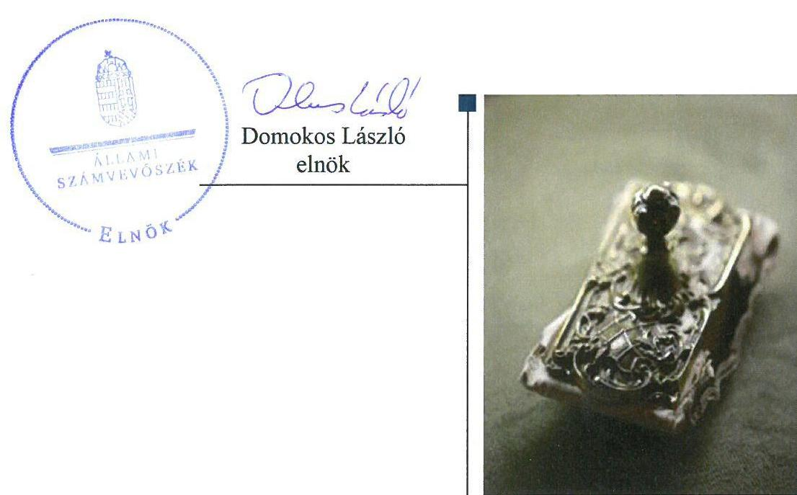

---

# AZ ELLENŐRZÉST FELÜGYELTE:

DR. NAGY IMRE felügyeleti vezető

# AZ ELLENŐRZÉST VEZETTE ÉS A VÉGREHAJTÁSÁÉRT FELELŐS:

IMRE ZSUZSANNA ellenőrzésvezető

VERTKOVCZI MÁRIA ellenőrzésvezető

# A PROGRAM ÖSSZEÁLLÍTÁSÁÉRT FELELŐS:

TÓTPÁL SZABOLCS osztályvezető

IKTATÓSZÁM: V-1388-115/2016.

|  Jelentéseink az Országgyűlés számítógépes hálózatán és az Interneten a www.asz.hu címen is olvashatóak. | TÉMASZÁM: 2084  |
| --- | --- |
|   | ELLENŐRZÉS-AZONOSÍTÓ SZÁM: V075958  |

---

# TARTALOMJEGYZÉK 

- ÖSSZEGZÉS ..... 5
- AZ ELLENŐRZÉS CÉLJA ..... 6
- AZ ELLENŐRZÉS TERÜLETE ..... 7
- AZ ELLENŐRZÉS HÁTTERE, INDOKOLTSÁGA ..... 8
- A JELENTÉS LÉNYEGES KÉRDÉSKÖREI ..... 9
- AZ ELLENŐRZÉS HATÓKÖRE ÉS MÓDSZEREI ..... 10
- MEGÁLLAPÍTÁSOK ..... 12
- JAVASLATOK ..... 16
- MELLÉKLETEK ..... 19
I. sz. melléklet: Értelmező szótár ..... 19
- FÜGGELÉK: ÉSZREVÉTELEK ..... 23
- RÖVIDÍTÉSEK JEGYZÉKE ..... 35

---

.

---

# ÖSSZEGZÉS 

Az Emberi Erőforrások Minisztériuma a Honvéd Együttes Művészeti Nonprofit Kft.-vel kapcsolatos tulajdonosi jogait szabályszerűen gyakorolta. A Társaság biztosította a szabályszerű működés kereteit. A vagyongazdálkodása nem volt szabályszerű. A Társaság a működésének, gazdálkodásának az átláthatóságát biztosította. A kormányzati szektorba sorolt egyéb szervezetek számára előírt adatszolgáltatási kötelezettségét nem teljesítette. A gazdálkodása az államadósságot nem növelte.

## Az ellenőrzés társadalmi indokoltsága

A közpénzt, közvagyont használó állami tulajdonú gazdálkodó szervezetekkel szemben társadalmi igény, hogy a tevékenységük átlátható és elszámoltatható legyen. Kiemelt jelentőségű számos állami tulajdonú gazdasági társaság működése abból a szempontból is, hogy gazdálkodásának egyes elemei befolyásolják a kormányzati szektor hiányát és az államadósságot. Az állami tulajdonú gazdálkodó szervezetek a nemzeti vagyon részét képezik.

Az Állami Számvevőszék stratégiájában célul tűzte ki az államháztartáson kívül működő szervezetek ellenőrzését, mely hozzájárul a közpénzek szabályos, átlátható, elszámoltatható és eredményes felhasználásához. A stratégiával összhangban került sor a Honvéd Együttes Művészeti Nonprofit Kft. ellenőrzésére a 2012-2016. évekre vonatkozóan.

## Főbb megállapítások, következtetések, javaslatok

Az Emberi Erőforrások Minisztériuma a Honvéd Együttes Művészeti NKft.-vel kapcsolatos tulajdonosi jogait szabályszerűen kialakította és gyakorolta, ugyanakkor a Társaság részére ingyenesen használatba adott eszközök tekintetében a jogszabályi előírások ellenére nem került sor szerződés megkötésére. Ezáltal nem biztosította a vagyonnal való elszámoltatás feltételeit.

A Társaság a jogszabályok alapján előírt szabályzatokat elkészítette, a tevékenységgel kapcsolatos bevételek és ráfordítások elszámolásait, a kormányzati hiányt nem érintő bevételek kivételével szabályszerűen teljesítette. A vagyonnal kapcsolatos nyilvántartásokat szabályszerűen kialakította. A Társaság az előírt leltárral a mérlegben szereplő eszközök és források értékét nem támasztotta alá. A mérleg leltárral való alátámasztásának hiánya miatt az Állami Számvevőszék kezdeményezte a gazdasági igazgató felelősségének tisztázását, érvényesítését.

Vagyongazdálkodása nem volt szabályszerű. A Társaság az előírt tervezési, számviteli beszámolási és közzétételi kötelezettségeit teljesítette, ezzel biztosította működésének, gazdálkodásának az átláthatóságát. A 2014. évtől a jogszabályban előírt kormányzati szektorba sorolt egyéb szervezetekre vonatkozó adatszolgáltatási kötelezettségét nem teljesítette. A Társaságnak az államadósságra befolyással bíró ügylete nem volt.

---

# AZ ELLENŐRZÉS CÉLJA 

Az ellenőrzés célja annak értékelése, hogy a tulajdonosi jogok gyakorlása szabályszerű volt-e. A gazdálkodó szervezet szabályozottsága, gazdálkodása és vagyongazdálkodási tevékenysége megfelelt-e a jogszabályi és a tulajdonosi előírásoknak; biztosítva volt-e a közfeladatok átláthatósága és elszámoltathatósága érdekében a közszolgáltatás díjának megalapozottsága szabályszerű önköltségszámítással. A vagyonváltozást eredményező döntések esetében a tulajdonosi jogok gyakorlója és a gazdálkodó szervezet szabályszerűen jártak-e el. Az ellenőrzés célja továbbá annak megítélése, hogy a kormányzati szektorba sorolt állami tulajdonban (résztulajdonban) lévő gazdálkodó szervezetek gazdálkodásának a kormányzati szektor hiányára és az államadósságra befolyással bíró elemei a jogszabályi előírásoknak megfeleltek-e.

---

# AZ ELLENŐRZÉS TERÜLETE 

## A Honvéd Együttes Művészeti Nonprofit Kft. és a tulajdonosi jogokat gyakorló Emberi Erőforrások Minisztériuma

A Honvéd Együttes Művészeti Nonprofit Kft.-t a Magyar Állam egyszemélyes tulajdonában álló gazdasági társaságként 2007. július 1-jén alapította az EMMI³ jogelődje, az OKM². Az ellenőrzött időszakban a tulajdonosi jogokat az EMMI és jogelődje az OKM gyakorolta az MNV Zrt. ³ megbízása alapján.

A Társaság ⁴ létrehozásával az alapító célja az évtizedek alatt összegyűjtött hazai és egyetemes kulturális értékek megőrzése, ápolása és képviselete itthon és külföldön, továbbá az előadóművészetek fejlesztése volt. A Társaság előadó művészeti társulata a Honvéd Férfikarból és a Honvéd Táncszínházból (2014. július 1-jétől Magyar Nemzeti Táncegyüttes) állt, amely utóbbinak részei a Tánckar, a Zenekar és a Színészkar.

A Társaság az ellenőrzött időszakban kiemelten közhasznú szervezetként működött. Közhasznú tevékenységének keretében a Társaság előadó-művészeti és kulturális közfeladatot látott el, amelyet vállalkozási tevékenységekkel egészített ki. A Társaság tevékenységéhez az EMMI a 2012-2016. években
költségvetési forrásból összesen 2363,5 millió Ft működési támogatást nyújtott. A Társaság a feladatait saját vagyonával, valamint az EMMI által rendelkezésére bocsátott eszközökkel látta el, vagyonkezelési szerződés alapján átvett eszközökkel nem rendelkezett, más gazdasági társaságban részesedése nem volt. A Társaság 2013. június 28-ától kormányzati szektorba sorolt egyéb szervezetnek minősült.

A jegyzett tőke összege 3,0 millió Ft, amely nem változott az ellenőrzött időszakban. A tulajdonosi ellenőrzést háromtagú FB⁵ és a választott Könyvvizsgáló ⁶ biztosította. A Társaság Ügyvezetőjének ⁷ személye az ellenőrzött időszakban egy alkalommal változott a 2012. évben, akinek az ügyvezetői megbízatása 2017. évben járt le. A foglalkoztatottak átlagos száma a 2012. évben 130 fő, a 2016. évben 126 fő volt.

---

# AZ ELLENŐRZÉS HÁTTERE, INDOKOLTSÁGA 

Az állami tulajdonú gazdálkodó szervezetek ellenőrzése kiemelten fontos a nemzeti vagyon megőrzése, megóvása érdekében. Gazdálkodásuk jellemzően a közérdeklődés és a média figyelmének középpontjában áll, amihez hozzájárul a gazdálkodásuk körébe tartozó - közvetlen vagy közvetett állami tulajdonú - vagyon nagysága, illetve az általuk ellátott közszolgáltatások minősége és hatékonysága. A szolgáltatási/közszolgáltatási árképzés megalapozottsága és az éves elszámoltatás feltételeinek kialakítása az ellenőrzés során nagy hangsúlyt kap. A szolgáltatás/közszolgáltatás árában és annak támogatásában meg kell jelennie az önköltségszámítás szempontjainak, amely biztosítja a működés fenntarthatóságát (eszközpótlást) is.

Az Európai Unióban 1994. év óta hatályos túlzott hiány eljárás mindig kihívást jelentett a tagállamok számára. Kiemelten fontosak a kormányzati szektor elszámolásaiban megjelenő állami tulajdonú gazdálkodó szervezetek, amelyekkel szemben alapvető követelmény, hogy gazdálkodásuk, működésük szabályszerű, az általuk szolgáltatott adatok minél megbízhatóbbak legyenek.

Az ellenőrzés rámutathat az állami tulajdonú gazdálkodó szervezetek gazdálkodási tevékenységével jó gyakorlatokra és szabálytalanságokra. Felhívhatja a figyelmet a jogszabályi követelmények teljesítéséhez szükséges feltételek hiányosságaira, hozzájárulhat az államháztartáson kívüli, de (közvetlenül vagy közvetve) állami vagyont használó gazdálkodó szervezetek tevékenységének átláthatóságához. Ellenőrzésünk eredményeképpen javaslatainkkal, megállapításainkkal hozzájárulhatunk a nemzeti vagyonnal való gazdálkodás átláthatóságának, elszámoltathatóságának javításához.

---

# A JELENTÉS LÉNYEGES KÉRDÉSKÖREI 

1. A tulajdonosi jogok gyakorlása szabályszerű volt-e?
2. A társaság működésének szabályozottsága megfelelt-e az előírásoknak?
3. A társaságnál a pénzügyi-számviteli, adatszolgáltatási és ellenőrzési feladatok ellátása, vagyongazdálkodása szabályszerű volt-e, a gazdálkodás államadósságra befolyással bíró elemei megfeleltek-e a jogszabályi előírásoknak?

---

# AZ ELLENŐRZÉS HATÓKÖRE ÉS MÓDSZEREI 

## Az ellenőrzés típusa

Szabályszerűségi ellenőrzés

## Az ellenőrzött időszak

Az ellenőrzött időszak 2012. január 1-jétől 2016. december 31-ig tart.

## Az ellenőrzés tárgya

Állami tulajdonban (résztulajdonban) lévő gazdasági társaság gazdálkodása, kiemelten vagyongazdálkodási tevékenysége, a tulajdonosi jogok gyakorlása, továbbá a kormányzati szektorba sorolt gazdasági társaság gazdálkodásának a kormányzati szektor hiányára és az államadósságra befolyással bíró elemei.

Az ellenőrzés kiterjedt minden olyan körülményre és adatra, amely az ÁSZ jogszabályban meghatározott feladatainak teljesítéséhez, valamint a program végrehajtása folyamán felmerült újabb összefüggések feltárásához szükséges.

## Az ellenőrzött szervezet

- Honvéd Együttes Művészeti Nonprofit Kft.
- Emberi Erőforrások Minisztériuma

## Az ellenőrzés jogalapja

Az ellenőrzés jogalapját az ÁSZ tv³. 1. § (3) bekezdése és 5. § (3)-(5) bekezdései képezték.

## Az ellenőrzés módszerei

Az ellenőrzést a nemzetközi standardokat irányadónak tekintve az ellenőrzési program ellenőrzési kérdései, az ellenőrzött időszakban hatályos jogszabályok, az ellenőrzés szakmai szabályok és módszertanok figyelembe vételével végeztük.

Az ellenőrzés ideje alatt az ellenőrzött szervezettel történő kapcsolattartást az ÁSZ⁹ Szervezeti és Működési Szabályzatának vonatkozó előírásai alapján biztosítottuk.

---

Az ellenőrzésre a nemzetgazdasági szempontból kiemelt jelentőségű nemzeti vagyon körébe tartozó gazdálkodó szervezeteknél és a többségi állami tulajdonban álló gazdálkodó szervezeteknél került sor. A program szerinti feladatokat a kiválasztott gazdálkodó szervezeteknél (társaságoknál) és azok többségi tulajdonban lévő leányvállalatainál, valamint a tulajdonosi jogok gyakorlójánál kellett végrehajtani. Az ellenőrzés szempontjai és az ellenőrzés alá vont gazdálkodó szervezetek köre az ellenőrzés tapasztalatai alapján - indokolt esetben - változhatott.

Az ellenőrzési kérdések megválaszolásához szükséges bizonyítékok megszerzése a következő ellenőrzési eljárások alkalmazásával történt: megfigyelés, kérdésfeltevés (információkérés), összehasonlítás, valamint elemző eljárás. Az ellenőrzési bizonyítékként felhasználható adatforrások közé tartoztak egyrészt az ellenőrzési programban felsorolt adatforrások, másrészt adatforrás lehetett még minden - az ellenőrzés folyamán - feltárt, az ellenőrzés szempontjából információkat tartalmazó dokumentum.

Az ellenőrzést a kérdésekre adott válaszok kiértékelésével, valamint a megjelölt adatforrások, a csatolt tanúsítványok felhasználásával, továbbá az adott időszakban hatályos jogszabályok figyelembe vételével került lefolytatásra.

A bevételek és ráfordítások elszámolása, valamint a vagyonnyilvántartás terén a szabályszerű működést véletlen mintavétellel ellenőriztük. A mintavétellel ellenőrzött területek esetében minden egyes tétel vonatkozásában a szabályszerűségre vonatkozó kérdéseket tettünk fel, amelyek eredménye összesítésre került. Megfelelőnek értékeltünk egy ellenőrzött területet, amennyiben 95%-os bizonyossággal a teljes sokaságban az átlagos hibaarány legfeljebb 10%, nem megfelelőnek, amennyiben 10%-nál magasabb arányt képviselt. A ráfordítások elszámolására és a vagyonnyilvántartásra vonatkozó véletlen mintavételt kockázati alapú kiválasztással egészítettük ki, amelynek során évente a három legnagyobb összegű tételt választottuk ki.

---

# 1. A tulajdonosi jogok gyakorlása szabályszerű volt-e? 

Összegző megállapítás

A tulajdonosi jogok gyakorlása szabályszerű volt.

## A TULAJDONOSI JOGOK GYAKORLÁSÁNAK KE-

RETEIT a Társaságot érintően a Gt. ¹⁰, illetve a Ptk. ¹¹ előírásainak megfelelően az EMMI SZMSZ-e ¹², valamint az Alapító okirat ¹³ határozta meg.

Az Alapító okirat a Társaság működési feltételeit a Gt. és a Ptk. előírásainak megfelelően tartalmazta. Az Alapító okirat magában foglalta a feladatellátás követelményeit és a számonkérés módját. A tulajdonosi ellenőrzést a Gt., a Ptk., illetve a Taktv. ¹⁴ előírásainak megfelelően háromtagú FB biztosította. A könyvvizsgálatot a Gt. és a Ptk. előírásainak megfelelően az EMMI által megválasztott független Könyvvizsgáló végezte.

Az Alapító ¹⁵ a Társaság tevékenységének végzéséhez a Társaság részére használatba átadott eszközökkel kapcsolatban a Vtv. ¹⁶ 23. § (1) bekezdésében foglaltak ellenére nem kötött szerződést. Ez alapján a használatba adott eszközök tekintetében az Alapító nem biztosította az átadott vagyonnal való elszámolás feltételeit.

A javadalmazási, juttatási rendszerről szóló szabályzatot a Taktv.-ben előírtaknak megfelelően az EMMI megalkotta, ezáltal szabályozta a vezető tisztségviselők, felügyelőbizottsági tagok, valamint az Mt. ¹⁷ 208. §-ának hatálya alá eső munkavállalók javadalmazását, valamint a jogviszony megszűnése esetére biztosított juttatások módját, mértékének elveit, annak rendszerét.

A feladatellátással kapcsolatban a tulajdonosi joggyakorló

 a Társasággal a 2012-2013. években Közhasznú szerződést ${ }^{18}$, 2014-2016. években Közszolgáltatási szerződést ${ }^{19}$ kötött. A Közhasznú és Közszolgáltatási szerződésekben előírta többek között a Társaság számára az üzleti terv készítési és egyéb kötelezettségeket, meghatározta a szerződés teljesítésének ellenőrzését, a feladatellátással kapcsolatos támogatásokat.

## AZ EGYSZERŰSÍTETT ÉVES SZÁMVITELI BESZÁ-

MOLÓKAT és közhasznúsági mellékleteket az EMMI a Gt., a Ptk., és a Számv. tv. ${ }^{20}$ előírásainak megfelelően az FB és a Könyvvizsgáló jelentésének birtokában határozataival elfogadta. A Civil tv. ${ }^{21}$ és az Alapító okirat előírásának megfelelően nem volt az eredmény felosztására vonatkozó döntés.

Az EMMI az FB által véleményezett üzleti tervek és az egyszerűsített éves számviteli beszámolók megtárgyalása és elfogadása útján beszámoltatta a Társaságot.

---

# 2. A társaság működésének szabályozottsága megfelelt-e az előírásoknak? 

Összegző megállapítás

A Társaság működésének szabályozottsága megfelelt a jogszabályi előírásoknak.

A Társaság rendelkezett SZMSZ ${ }^{22}$-szel, amelyben többek között meghatározta a szervezeti egységeit, feladatait és működési rendjét. Az SZMSZ-ben foglaltak összhangban voltak az MNV Zrt. és EMMI által előírt szabályokkal.

A TÁRSASÁG SZÁMVITELI POLITIKÁJA ${ }^{23}$ megfelelt a Számv. tv. által előírtaknak, tartalmazta az eszközök és források Leltárkészítési és Leltározási szabályzatát ${ }^{24}$, az eszközök és források Értékelési szabályzatát ${ }^{25}$, az Önköltségszámítási ${ }^{26}$ és a Pénzkezelési szabályzatát ${ }^{27}$. A Társaság rendelkezett Iratkezelési szabályzattal ${ }^{28}$, Kötelezettségvállalási szabályzattal ${ }^{29}$, továbbá Selejtezési szabályzattal ${ }^{30}$.

A Társaság rendelkezett a Számv. tv. által előírt Számlarenddel ${ }^{31}$. A Számlarend a Számv. tv. 161. § (2) bekezdése d) pontjában foglalt előírásokkal ellentétben nem tartalmazott bizonylati rendet. További hiányossága volt a Számlarendnek, hogy a 2016. évben a Számv. tv. 161. §. (2) bekezdés a)-b) pontjaiban foglaltak ellenére az egyéb bevételek elszámolása tekintetében az alkalmazásra kijelölt számla számjelét és megnevezését, tartalmát, illetve a számla értéke növekedésének és csökkenésének jogcímeit nem tartalmazta.

## 3. A társaságnál a pénzügyi-számviteli, adatszolgáltatási és ellenőrzési feladatok ellátása, vagyongazdálkodása szabályszerű volt-e, a gazdálkodás államadósságra befolyással bíró elemei megfeleltek-e a jogszabályi előírásoknak?

Összegző megállapítás

A Társaság pénzügyi-számviteli elszámolása szabályszerű volt. A Társaság a beszámolási és közzétételi kötelezettségeit teljesítette. A vagyongazdálkodása nem volt szabályszerű. A kormányzati szektorba sorolt egyéb szervezetek részére előírt adatszolgáltatást nem teljesítette. A Társaságnak nem volt államadósságot befolyásoló ügylete.
3.1. számú megállapítás

A Társaság pénzügyi-számviteli elszámolása szabályszerű volt. A kormányzati hiányt nem befolyásoló bevételek elszámolása nem volt szabályszerű.

AZ ÉRTÉKESÍTÉS NETTÓ ÁRBEVÉTELÉNEK elszámolása a Számv. tv. előírásainak megfelelően történt.

A kormányzati hiányt nem befolyásoló egyéb, rendkívüli és pénzügyi műveletek bevételeinek az elszámolása nem volt szabályszerű, mivel az egyéb bevételek elszámolása során alkalmazásra kijelölt számla a Számv.

---

tv. 161. § (2) bekezdés a) pontjában előírtak ellenére a Számlarendben nem szerepelt.

A RÁFORDÍTÁSOK ELSZÁMOLÁSA a Számv. tv. előírásainak megfelelően szabályszerű volt.

Az értékcsökkenés elszámolása a Számv. tv. és a Számviteli politika előírásainak megfelelően történt.

A Civil tv. és a Számv. tv. előírásai alapján a közhasznú és a vállalkozási tevékenység költségeinek, ráfordításainak és bevételeinek elkülönítését a Társaság a főkönyvi nyilvántartásában biztosította.

Önköltségszámítási szabályzat készítésére a Társaság a Számv. tv. alapján nem volt kötelezett, azonban a vállalkozási tevékenységét, illetve a saját előállítású eszközök létrehozásának elszámolását az Önköltségszámítási szabályzata alkalmazásával végezte.

# 3.2. számú megállapítás 

A Társaság a mérleg eszköz és forrás értékeit leltárral nem támasztotta alá, ezáltal az eszközök és források értékének valódisága nem volt alátámasztott. A Társaság vagyongazdálkodása nem volt szabályszerű.

Az Alapítótól használatra kapott eszközök értéke a Számv. tv. előírásainak megfelelően a Társaság év végi számviteli egyszerűsített éves beszámoló mérlegében nem szerepelt. Az ingyenesen használt eszközökkel kapcsolatban a Társaság évente beszámolt az Alapító részére. Az eszközök értéke a nyilvántartás alapján 2016. év végén 252,2 M Ft volt, ebből 0,3 M Ft érték géphez, a többi ingatlan eszközhöz kapcsolódott. A Társaság a saját és az ingyenesen használt eszközöket elkülönítette a nyilvántartásaiban.

A Számv. tv. 69. § (1)-(3) bekezdéseiben, továbbá a Leltározási szabályzatában foglaltak ellenére a Társaság nem teljesítette az eszközök előírt leltározását, nem támasztotta alá leltárral a mérlegben szereplő tételeket, ezáltal a mérlegben szereplő eszközök és források értékének alátámasztottsága nem volt biztosított. A leltár elkészítésének a hiánya ellenére a Könyvvizsgáló a beszámolóval kapcsolatban minden évben korlátozás nélküli elfogadó határozatot adott ki.

A Társaság vagyongazdálkodása a leltározás és a leltár elkészítésének a hiánya miatt nem volt szabályszerű.

A Társaság az Alapító okiratban, a Közhasznú és Közszolgáltatási szerződéseiben előírtaknak megfelelően évente elkészített üzleti terveiben meghatározta a beruházásokra és fejlesztésekre vonatkozó célokat. A Társaság a saját eszközeit a Számv. tv.-ben előírtaknak megfelelően tartotta nyilván. A Társaság a saját vagyona után az ellenőrzött időszakban összesen 166,9 M Ft értékcsökkenést számolt el, az eszközök pótlására 190,3 M Ft összeget fordított.

A Társaság hosszú lejáratú kötelezettségekkel nem rendelkezett, a rövid lejáratú kötelezettségeinek állománya a 2012. év végén 115,7 M Ft, 2016. év végén 117,9 M Ft volt.

A követelések értékelésével kapcsolatban a Számviteli politikában és annak keretében az Értékelési szabályzatban rendelkezett a Társaság. A Társaság intézkedéseket hozott a nyilvántartott követelésállomány csökkentése érdekében.

---

### 3.3. számú megállapítás

A Társaság a beszámolási és közzétételi kötelezettségét szabályosan teljesítette. A kormányzati szektorba sorolt egyéb szervezetek részére előírt kötelezettségeit nem teljesítette.

A BESZÁMOLÁSI KÖTELEZETTSÉGÉNEK a Társaság a Számv. tv. és a Civil tv. előírásainak megfelelően eleget tett, elkészítette és közzétette az egyszerűsített éves beszámolókat és a közhasznúsági mellékleteket. A Könyvvizsgáló véleményezte az egyszerűsített éves beszámolókat és minden esetben hitelesítő záradékkal látta el azokat. Az FB az egyszerűsített éves beszámolókat jelentésében minden év tekintetében beterjesztésre, elfogadásra javasolta.

A Társaság az ellenőrzött időszakban az Alapító okiratban, a Közszolgáltatási és Közhasznúsági szerződésben előírtaknak megfelelően teljesítette a tervezési, beszámolási és adatszolgáltatási kötelezettségét, továbbá az EMMI útján évente teljesítette az előírt adatszolgáltatásokat az MNV Zrt. részére.

A közérdekű adatok megismerésére irányuló igények teljesítésének rendjét rögzítő szabályzattal a Társaság az Info tv. ${ }^{32} 30 . \S$ (6) bekezdésében előírtak ellenére nem rendelkezett.

A Társaság az Info tv. előírásaival összhangban közzétette a közérdekű adatokat, a Taktv. előírásainak megfelelően az éves közbeszerzési terveket, a közbeszerzések eredményeit. Az Info tv. alapján a Társaság nem volt kötelezett adatvédelmi felelős kijelölésére. Az Informatikai szabályzatában ${ }^{33}$ ugyanakkor rendelkezett az adatkezelésről, illetve az adatvédelemről.

A Társaság a Bkr. ${ }^{34}$ 2014. január 1-jétől hatályos 54/A. §., továbbá a 10. § előírása alapján elkészítette a Belső Kontroll Kézikönyvét ${ }^{35}$, amelyben kialakította a tevékenységének nyomon követését biztosító rendszerét.

A kormányzati szektorba sorolt egyéb szervezetek számára előírt adatszolgáltatási kötelezettségét a Társaság az Áht. ${ }^{36}$ 107. § (1) bekezdés előírása ellenére nem teljesítette.

A Társaságnak Gst. ${ }^{37}$ szerinti adóságot keletkeztető ügylete nem volt az ellenőrzött időszakban, ezáltal az államadósság alakulását nem befolyásolta.

---

# JAVASLATOK 

Az ÁSZ tv. 33. § (1) bekezdésében foglaltak értelmében az ellenőrzött szervezet vezetője köteles a jelentésben foglalt megállapításokhoz kapcsolódó intézkedési tervet összeállítani és azt a jelentés kézhezvételétől számított 30 napon belül az ÁSZ részére megküldeni. Amennyiben az ellenőrzött szervezet vezetője nem küldi meg határidőben az intézkedési tervet, vagy továbbra sem elfogadható intézkedési tervet küld, az Állami Számvevőszék elnöke az ÁSZ tv. 33. § (3) bekezdés a) és b) pontjaiban foglaltakat érvényesítheti.

## Honvéd Együttes Művészeti Nonprofit Kft. ügyvezetőjének

1. Intézkedjen a jogszabályi előírásoknak megfelelően a számlarendnek a bizonylati renddel, valamint valamennyi alkalmazásra kijelölt főkönyvi számla számjelével és megnevezésével, továbbá a számla értéke növekedésének, csökkentésének jogcímeivel történő kiegészítéséről.
(2. számú megállapítás 3. bekezdése alapján)
2. Gondoskodjon a jogszabályi előírások szerint az egyéb bevételeinek szabályszerű elszámolásáról.
(3.1. számú megállapítás 2. bekezdése alapján)
3. Intézkedjen a jogszabályi előírásoknak és a belső szabályozásnak megfelelően a leltározás szabályszerű végrehajtásáról, az éves számviteli beszámoló mérlegét alátámasztó leltárak elkészítéséről.
(3.2. számú megállapítás 2. bekezdése alapján)
4. Intézkedjen a jogszabályi előírásnak megfelelően a közérdekű adatok megismerésére irányuló igények teljesítésének rendjére vonatkozó szabályzat elkészítéséről.
(3.3. számú megállapítás 3. bekezdése alapján)
5. Intézkedjen a kormányzati szektorba sorolt gazdálkodók részére előírt adatszolgáltatási kötelezettségek teljesítéséről.
(3.3. számú megállapítás 6. bekezdése alapján)

---

# Az emberi erőforrások miniszterének 

1. Intézkedjen a jogszabályi előírásoknak megfelelően a Társaság részére ingyenes használatra átadott eszközökkel kapcsolatban a használati, hasznosítási szerződés megkötéséről.
(1. számú megállapítás 3. bekezdése alapján)

---

.

---

# MELLÉKLETEK 

- I. SZ. MELLÉKLET: ÉRTELMEZŐ SZÓTÁR
állami vagyon
állami vagyon hasznosítása
állami vagyon hasznosítására kötött szerződés
állami vagyon használója
állami vagyon kezelője/vagyonkezelő
a) Az állam tulajdonában lévő dolog, valamint a dolog módjára hasznosítható természeti erő,
b) az a) pont hatálya alá nem tartozó mindazon vagyon, amely vonatkozásában törvény az állam kizárólagos tulajdonjogát nevesíti,
c) az állam tulajdonában lévő tagsági jogviszonyt megtestesítő értékpapír, illetve az államot megillető egyéb társasági részesedés,
d) az államot megillető olyan immateriális, vagyoni értékkel rendelkező jogosultság, amelyet jogszabály vagyoni értékű jogként nevesít.
Forrás: Vtv. 1. § (2) bekezdése
e) az állam tulajdonában lévő pénzügyi eszközök

Forrás: Vtv. 1. § (2) bekezdése
2013. június 27-ig:

Az állami vagyont az MNV Zrt. maga kezeli, vagy szerződés - így különösen bérlet, haszonbérlet, megbízás - alapján központi költségvetési szervnek, természetes vagy jogi személynek, vagy jogi személyiséggel nem rendelkező gazdálkodó szervezetnek hasznosításra átengedi.
Forrás: Vtv. 23. § (1) bekezdése
2013. június 28-ától:

Az állami vagyonnal az MNV Zrt. maga gazdálkodik, vagy szerződés - így különösen bérlet, haszonbérlet, megbízás - alapján központi költségvetési szervnek, természetes vagy jogi személynek, vagy jogi személyiséggel nem rendelkező gazdálkodó szervezetnek hasznosításra átengedi, illetőleg vagyonkezelésbe, haszonélvezetbe adja.
Forrás: Vtv. 23. § (1) bekezdése
Az állami vagyon hasznosítására kötött szerződések elsődleges célja az állami vagyon hatékony működtetése, állagának védelme, értékének megőrzése, illetve gyarapítása, az állami és közfeladatok ellátásának elősegítése.
Forrás: Vtv. 23. § (2) bekezdése
Az a természetes vagy jogi személy, jogi személyiséggel nem rendelkező szervezet, aki, vagy amely törvény vagy szerződés alapján, bármely jogcímen (bérlet, haszonbérlet, használat stb.) állami vagyont birtokol, használ, szedi annak hasznait, hasznosít, ide nem értve a haszonélvezőt, a vagyonkezelőt és a tulajdonosi jogok gyakorlóját.
Forrás: Vhr. 1. § (7) a. pontja
2013. június 27-ig:

Az állami vagyont az MNV Zrt. maga kezeli, vagy szerződés - így különösen bérlet, haszonbérlet, megbízás - alapján központi költségvetési szervnek, természetes vagy jogi személynek, vagy jogi személyiséggel nem rendelkező gazdálkodó szervezetnek hasznosításra átengedi. Az állami vagyonra vonatkozóan az MNV Zrt. kizárólag az Nvtv-ben meghatározott személyekkel köthet vagyonkezelési szerződést.
Forrás: Vtv. 23. § (1), 27. § (1)
2013. június 28-ától:

---

állami vagyon értékesítése
gazdasági társaság
kormányzati szektorba sorolt egyéb szervezet

MNV Zrt.
nemzeti vagyon

Az állami vagyonnal az MNV Zrt. maga gazdálkodik, vagy szerződés - így különösen bérlet, haszonbérlet, megbízás - alapján központi költségvetési szervnek, természetes vagy jogi személynek, vagy jogi személyiséggel nem rendelkező gazdálkodó szervezetnek hasznosításra átengedi, illetőleg vagyonkezelésbe, haszonélvezetbe adja. Az állami vagyonra vonatkozóan az MNV Zrt.
 kizárólag az Nvtv-ben meghatározott személyekkel köthet vagyonkezelési szerződést.
Forrás: Vtv. 23. § (1), 27. § (1)
Állami vagyon tulajdonjogának bármely jogcímen történő, visszterhes átruházása. Forrás: Vhr. 1. § (7) d) pont
A Ptk. 3:88. § (1) bekezdése szerint „a gazdasági társaságok üzletszerű közös gazdasági tevékenység folytatására, a tagok vagyoni hozzájárulásával létrehozott, jogi személyiséggel rendelkező vállalkozások, amelyekben a tagok a nyereségből közösen részesednek, és a veszteséget közösen viselik”.
Az a szervezet, amely az Áht. alapján nem része az államháztartásnak, azonban az Európai Közösséget létrehozó szerződéshez csatolt, a túlzott hiány esetén követendő eljárásról szóló jegyzőkönyv alkalmazásáról szóló 2009. május 25-i 479/2009/EK rendelet szerint a kormányzati szektorba tartozik. A nemzetgazdasági miniszter 2013. június 26-án megjelent közleményben tette közzé ezen szervezetek listáját.
Az állami vagyon felett, a Magyar Államot megillető tulajdonosi jogok és kötelezettségek összességét - a hatályos szabályozás szerint - az állami vagyon felügyeletéért felelős miniszter (jelenleg a nemzeti fejlesztési miniszter) gyakorolja. A miniszter feladatát nagy részben az MNV Zrt., mint tulajdonosi joggyakorló szervezet útján látja el.
az állam vagy a helyi önkormányzat kizárólagos tulajdonában álló dolgok, az a) pont hatálya alá nem tartozó, állam vagy a helyi önkormányzat tulajdonában lévő dolog,
az állam vagy a helyi önkormányzat tulajdonában lévő pénzügyi eszközök, továbbá az államot vagy a helyi önkormányzatot megillető társasági részesedések, az államot vagy a helyi önkormányzatot megillető bármely vagyoni értékkel rendelkező jogosultság, amelyet jogszabály vagyoni értékű jogként nevesít, Magyarország határa által körbezárt terület feletti légtér,
az üvegházhatású gázok kibocsátási egységeinek kereskedelméről szóló törvény szerint kibocsátási egység és légiközlekedési kibocsátási egység, valamint az ENSZ Éghajlatváltozási Keretegyezménye és annak Kiotói Jegyzőkönyvének végrehajtási keretrendszeréről szóló törvény szerinti kiotói egység,
állami vagy helyi önkormányzati fenntartású közgyűjtemény (muzeális intézmény, levéltár, közgyűjteményként működő kép- és hangarchívum, valamint könyvtár) saját gyűjteményében nyilvántartott kulturális javak körébe tartozó dolog, kivéve, ha az állami vagy önkormányzati tulajdon jogszerű létrejötte kétséget kizáró módon nem bizonyítható és a dologra nézve más a tulajdonjogát bizonyítja vagy a kulturális javakra vonatkozó jogszabályokban meghatározott eljárás keretében valószínűsíti (g. pont módosult 2013. december 7-től),
a régészeti lelet,
a nemzeti adatvagyon körébe tartozó állami nyilvántartások fokozottabb védelméről szóló törvény szerinti nemzeti adatvagyon.
Forrás: Nvtv. 1. § (2)

---

nemzeti vagyon hasznosítása

A tulajdonosi joggyakorló vagy a nemzeti vagyon használója által a nemzeti vagyon birtoklásának, használatának, hasznok szedése jogának bármely - a tulajdonjog átruházását nem eredményező - jogcímen történő átengedése, ide nem értve a vagyonkezelésbe adást, valamint a haszonélvezeti jog alapítását.
Forrás: Nvtv. 3. § (1) 4. pont
nonprofit gazdasági társaság

Civil tv. 9/F. § (2) bekezdése szerint „az a gazdasági társaság minősül nonprofit gazdasági társaságnak és cégnevében az a gazdasági társaság tüntetheti fel a nonprofit jelleget, amelynek létesítő okirata tartalmazza, hogy a gazdasági társaság tevékenységéből származó nyereség a tagok között nem osztható fel, hanem az a gazdasági társaság vagyonát gyarapítja.” (hatályos 2014. március 15-től)
tulajdonosi ellenőrzés
2014. március 14-ig:

Az állami vagyon kezelőjét, haszonélvezőjét, használóját megillető jogok gyakorlását, annak szabályszerűségét, célszerűségét az MNV Zrt. - szükség szerint területi szervei útján - ellenőrzi.
2014. március 15-től:

Az állami vagyon használóját, vagyonkezelőjét és haszonélvezőjét megillető jogok gyakorlását, annak szabályszerűségét, a kötelezettségek teljesítését, valamint a vagyon rendeltetése szerinti célszerűségét a tulajdonosi joggyakorló rendszeresen ellenőrzi.
Forrás: Vhr. 20. § (1)
tulajdonosi jogok gyakorlója 1.
2013. június 27-ig:

Az állami vagyon felett a Magyar Államot megillető tulajdonosi jogok és kötelezettségek összességét - ha törvény eltérően nem rendelkezik - az állami vagyon felügyeletéért felelős miniszter (a továbbiakban: miniszter) gyakorolja, aki e feladatát a Magyar Nemzeti Vagyonkezelő Zártkörűen Működő Részvénytársaság (a továbbiakban: MNV Zrt.), a Magyar Fejlesztési Bank, illetve a tulajdonosi joggyakorló szervezet útján látja el. A miniszter miniszteri rendeletben, a törvényben meghatározott állami vagyoni kör tekintetében, meghatározott időtartamra, a joggyakorlás egyes szabályainak meghatározásával - az őt megillető tulajdonosi jogok és kötelezettségek összességének, illetve azok meghatározott részének gyakorlóját az Áht. szerinti központi költségvetési szervek, ezek intézménye, továbbá a 100%-ban állami tulajdonban álló gazdasági társaságok közül kijelölheti.
Forrás: Vtv. 3. § (1) és (2)
2013. június 28-ától:

A rábízott állami vagyon felett az államot megillető tulajdonosi jogok és kötelezettségek összességét tulajdonosi joggyakorlóként:
a) ha törvény vagy miniszteri rendelet eltérően nem rendelkezik, a Magyar Nemzeti Vagyonkezelő Zártkörűen Működő Részvénytársaság (a továbbiakban: MNV Zrt.),
b) törvényben kijelölt személy vagy
c) az állami vagyon felügyeletéért felelős miniszter (a továbbiakban: miniszter) által rendeletben kijelölt személy gyakorolja.
[...] A miniszter e törvény felhatalmazása alapján - a meghatározott célok hatékonyabb elérése érdekében, miniszteri rendeletben, az ott meghatározott állami vagyoni kör tekintetében, meghatározott időtartamra - e törvény keretei között, a joggyakorlás egyes szabályainak meghatározásával - az államot megillető tulajdonosi jogok és kötelezettségek összességének, illetve azok meghatározott részének gyakorlóját az Áht. szerinti központi költségvetési szervek, ezek intézménye, továbbá a 100%-ban állami tulajdonban álló gazdasági társaságok közül kijelölheti.

---

Forrás: Vtv. 3. § (1) és (2)
2.
Aki a nemzeti vagyon felett az államot vagy a helyi önkormányzatot megillető tulajdonosi jogok és kötelezettségek összességének gyakorlására jogosult.
Forrás: Nvtv. 3. § (1) 17. pontja

---

# FÜGGELÉK: ÉSZREVÉTELEK 

A jelentéstervezetet a Számvevőszék 15 napos észrevételezésre megküldte az ellenőrzött szervezetek vezetőinek az ÁSZ tv. 29. § (1) bekezdése előírásának megfelelően.

Az ÁSZ a jelentéstervezetet észrevételezésre megküldte az Emberi Erőforrások Minisztériuma miniszterének, valamint a Honvéd Együttes Művészeti Nonprofit Kft. ügyvezetőjének.
Az Emberi Erőforrások Minisztériuma közigazgatási államtitkárának - mellékletek nélküli - észrevételét és a Honvéd Együttes Művészeti Nonprofit Kft. ügyvezetőjének észrevételét, továbbá az azokra adott válaszokat a függelék alább tartalmazza.
Az ÁSZ tv. 30. § (2) bekezdése alapján az ellenőrzés felügyeleti vezetője írásban ismertette a mérleg leltárral való alátámasztásának hiánya miatt felelősként megjelölt gazdasági igazgatóval a vonatkozó megállapításokat, és tőle írásbeli magyarázatot kért. A gazdasági igazgató a vonatkozó megállapításokra a 15 napos törvényi határidőn belül írásbeli magyarázatot adott. A felügyeleti vezető a törvényben előírt harminc napos határidőn belül írásban nyilatkozott a gazdasági igazgató felé, hogy a magyarázatát elutasítja, a felelősséget alátámasztó megállapításokat fenntartja. Mindezek alapján az Állami Számvevőszék az ÁSZ tv. 30. § (1) bekezdésének megfelelően kezdeményezte a gazdasági igazgató felelősségének tisztázását, érvényesítését.

[^0]
[^0]:    * 29. § (1) Az Állami Számvevőszék az ellenőrzési megállapításait megküldi az ellenőrzött szervezet vezetőjének vagy az általa megbízott személynek, és annak, akinek személyes felelősségét állapította meg.
    (2) Az ellenőrzött szervezet vezetője és a felelősként megjelölt személy az ellenőrzés megállapításaira tizenöt napon belül írásban észrevételt tehet.
    (3) Az Állami Számvevőszék az észrevételre a beérkezésétől számított harminc napon belül írásban válaszol. A figyelembe nem vett észrevételeket köteles a jelentésben feltüntetni, és megindokolni, hogy azokat miért nem fogadta el.

---

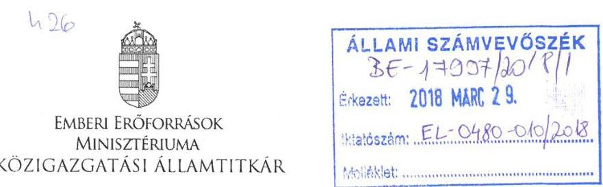

Iktatószám: 20055-1/2018/ELL

Hiv. szám: EL-0480-006/2018.
Úgyintéző: Bánkné Simon Judit
Tel. szám: +36 (1) 7954430
Melléklet: 1 db

# Domokos László részére 

elnök

Állami Számvevőszék

## Budapest

Apáczai Csere János u. 10.
1052

## Ar. Naqss

Tárgy: Észrevétel jelentéstervezethez

Tisztelt Elnök Úr!

Az „Állami tulajdonú gazdasági társaságok - Az állami tulajdonban (résztulajdonban) lévő gazdálkodó szervezetek vagyonmegőrzési és gazdálkodási tevékenységének ellenőrzése - Honvéd Együttes Művészeti Nonprofit Kft.” című számvevőszéki jelentéstervezethez - a Szervezeti és Működési Szabályzat 146. § (1) bekezdés b) pontjában meghatározott jogkörömben eljárva - az alábbi észrevételeket teszem.

1) Az ellenőrzési jelentéstervezet 5. oldalán, a „Főbb megállapítások, következtetések, javaslatok” alfejezet első bekezdésben az alábbi megállapítás olvasható:
„Az Emberi Erőforrások Minisztériuma a Honvéd Együttes Művészeti NKft.-vel kapcsolatos tulajdonosi jogait szabályszerűen kialakította és gyakorolta, ugyanakkor a Társaság részére ingyenesen használatba adott eszközök tekintetében a jogszabályi előírások ellenére sem került sor a szerződés megkötésére. Ezáltal nem biztosította a vagyonnal való elszámolás feltételeit.”

A megállapítást kérjük kiegészíteni az alábbi szövegrésszel:
„…a Társaság részére ingyenesen használatba adott eszközök tekintetében a jogszabályi előírások ellenére, az ellentmondásos jogszabályi környezet miatt, nem került sor a szerződés megkötésére”.

Indoklás:

- A 2118/2006. (VI. 30.) Korm. határozat előírta a Honvéd Együttes nonprofit gazdasági társasággá szervezését, melyre tekintettel az oktatási és kulturális miniszter a 2007. július

---

18. napján kelt, 19.119-1/2007 számú Megszüntető Okiratban döntött a Honvéd Együttes 2007. augusztus 31-i hatállyal történő megszüntetéséről.
- A Megszüntető Okirat III. pontja kimondta, hogy a Honvéd Együttes általános jogutódja a Társaság, továbbá a Honvéd Együttes által kötött szerződésekben a megszünés napjától a Honvéd Együttes helyébe valamennyi jog és kötelezettség tekintetében a Társaság lép.
- A Megszüntető Okirat IV. pontja szerint a Honvéd Együttes alaptevékenységének ellátásához szükséges, a vagyonkezelésében lévő vagyon vagyonkezelői joga a megszünés napjától a Társaságra száll át.
- A Társaság, mint átadó, illetve az Oktatási és Kulturális Minisztérium, mint átvevő között 2007. december 21-én „Megállapodás vagyonkezelői jog átadásáról” című megállapodás jött létre, melynek 2.1. pontja szerint a Társaság, mint a Honvéd Együttes általános jogutódja feltétlen és visszavonhatatlan hozzájárulását adta ahhoz, hogy a vagyonkezelői jog az Oktatási és Kulturális Minisztérium javára az Ingatlan 6627/16582 eszmei hányada vonatkozásában - a saját vagyonkezelői jogának törlése mellett - bejegyzésre kerüljön az ingatlan-nyilvántartásban.
- Ezzel egyidejúleg az Oktatási és Kulturális Minisztérium és a Társaság között jegyzőkönyv készült, melyben a Társaság kijelentette, hogy az Ingatlan meghatározott része 2007. szeptember 1. napjától a birtokában van, valamint a jegyzőkönyvben rögzítésre került az is, hogy a használat szempontjából az ingatlanra a Ptk. haszonkölcsönre vonatkozó 583. § 585. §-ait kell megfelelően alkalmazni.
- A Magyar Nemzeti Vagyonkezelő Zrt. 2017. június 13-án megküldött, MNV/017474/3/2017. iktatószámú levelében kifejtett - a Honvéd Együttes és a Társaság közötti vagyonkezelői jogutódlással kapcsolatos - jogi álláspontja szerint a Társaság vagyonkezelői jogviszonyba történő belépésére a Honvéd Együttes 19.119-1/2007. számú Megszüntető Okiratának rendelkezéseivel ellentétben ténylegesen nem került sor, figyelemmel az akkor hatályos államháztartásról szóló 1992. évi XXXVIII. törvény 90. § (3) bekezdésére.
- Erre tekintettel az MNV Zrt. jogi álláspontja szerint a Honvéd Együttes vagyonkezelési szerződésébe jogutódként az alapító szerv, vagyis az Oktatási és Kulturális Minisztérium lépett be. Az MNV Zrt. jelezte továbbá, hogy szükséges döntést hozni abban a kérdésben, hogy a Társaság a jövőben a vagyonelemeket milyen jogviszony keretében kívánja használni.
- Az MNV Zrt. 2017. július 13-i levele alapján a Honvéd Együttes vagyonkezelői jogát érintő jogutódlás ténylegesen nem következett be, vagyis a Honvéd Együttes vagyonkezelési jogviszonyába a Kft. ténylegesen nem lépett be jogutódként. A Honvéd Együttes vagyonkezelési szerződésébe jogutódként az alapító szerv, az Oktatási és Kulturális Minisztérium, az EMMI jogelődje lépett be.
- Az EMMI a jogi környezet tisztázását követően a Társaság részére ingyenesen használatba adott eszközök tekintetében a jogszabályi előírásoknak megfelelően a haszonkölcsön szerződés megkötését kezdeményezte. A haszonkölcsön szerződést az EMMI megkötötte, amelynek iktató száma: 3846-1/2017. A haszonkölcsön szerződés aláírásának dátuma 2018. január 26.

2) Célszerünek tartjuk az 1.
 sz. megállapítás 3. bekezdése alapján az emberi erőforrások miniszterének szóló javaslat – amely szerint „Intézkedjen a jogszabályi előírásoknak megfelelően a Társaság részére ingyenesen használatra átadott eszközökkel kapcsolatban a használati, hasznosítási szerződés megkötéséről” – törlését.

---

Indoklás:
Az EMMI vagyonkezelésében álló Budapest VIII. kerület, Kerepesi út 29/b. szám alatti, 38837/7 hrsz-ű ingatlan 6627/16582-ed részére, valamint a meghatározott ingó eszközökre vonatkozóan 2017 őszén megtörtént a használati szerződés megkötésével kapcsolatos egyeztetés, melyet követően a felek 3846-1/2017. iktatószámon 2018. január 16-án aláírták a használati szerződést. A hivatkozott szerződést mellékletként csatoljuk.

Kérem Elnök Urat, hogy az észrevételeket szíveskedjenek figyelembe venni.
Budapest, 2018. március 2.

# Üdvözlettel: 

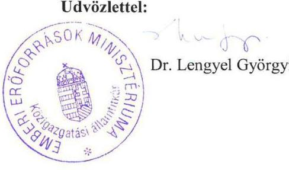

---

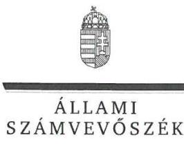

ELNÖK

# Balog Zoltán úr 

miniszter

Emberi Erőforrások Minisztériuma

## Budapest

## Tisztelt Miniszter Úr!

Az „Állami tulajdonú gazdasági társaságok – Az állami tulajdonban (résztulajdonban) lévő gazdálkodó szervezetek vagyonmegőrzési és gazdálkodási tevékenységének ellenőrzése – Honvéd Együttes Művészeti Nonprofit Kft.” címmel készített számvevőszéki jelentéstervezetre dr. Lengyel Györgyi közigazgatási államtitkár úrhölgy által küldött észrevételeket köszönettel megkaptam.
Az Állami Számvevőszék észrevételekre vonatkozó álláspontjáról a felügyeleti vezető által készített részletes tájékoztatást csatoltan megküldöm.
Tájékoztatom Miniszter Urat, hogy a számvevőszéki jelentésben – az Állami Számvevőszékről szóló 2011. évi LXVI. törvény 29. § (3) bekezdése alapján – a figyelembe nem vett észrevételeket szerepeltetjük annak megindoklásával, hogy azokat miért nem fogadtuk el.

Budapest, 2018.
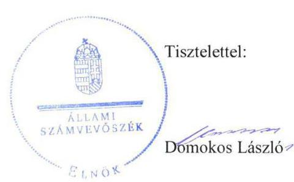

Melléklet: Tájékoztatás az észrevételek kezeléséről

---

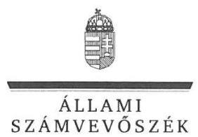

FELÜGYELETI VEZETŐ

# Tájékoztatás   az észrevételek kezeléséről 

Az „Állami tulajdonú gazdasági társaságok – Az állami tulajdonban (résztulajdonban) lévő gazdálkodó szervezetek vagyonmegőrzési és gazdálkodási tevékenységének ellenőrzése – Honvéd Együttes Művészeti Nonprofit Kft.” című jelentéstervezetre 2018. március 27-én tett (az Állami Számvevőszékhez 2018. március 29-én érkezett) észrevételeket áttekintettük, annak kezelésével kapcsolatban a következő tájékoztatást adom.

## 1. A jelentéstervezet Főbb megállapítások, következtetések, javaslatok fejezet 1. bekezdésére vonatkozó észrevétel:

Az észrevételben leírtak szerint a megállapítás („Az Emberi Erőforrások Minisztériuma a Honvéd Együttes Művészeti NKft.-vel kapcsolatos tulajdonosi jogait szabályszerűen kialakította és gyakorolta, ugyanakkor a Társaság részére ingyenesen használatba adott eszközök tekintetében a jogszabályi előírások ellenére nem került sor szerződés megkötésére. Ezáltal nem biztosította a vagyonnal való elszámoltatás feltételeit.”) 1. mondatának 2. tagmondatát kérik kiegészíteni az „ellentmondásos jogszabályi környezet miatt” kifejezéssel, mivel a Honvéd Együttes 2007. évi Megszüntető Okirata és az államháztartásról szóló 1992. évi XXXVIII. törvény – az MNV Zrt. 2017. évi jogi állásfoglalása alapján– ellentmondásban állnak egymással.

Az észrevételt nem fogadjuk el. Az ellenőrzött időszak 2016. december 31-ig tartott, amikor még nem volt az EMMI birtokában a hivatkozott, 2017. június 13-ai MNV Zrt. állásfoglalásnak, amely alapján jelen észrevételben az ellentmondásos jogszabályi környezetre hivatkozott. Az észrevétel nem cáfolja, hanem megerősíti a megállapítást, miszerint az alapító (Emberi Erőforrások Minisztériuma és jogelődje, az Oktatási és Kulturális Minisztérium) a Társaság tevékenységének végzéséhez a Társaság részére használatba átadott eszközökkel kapcsolatban nem kötött szerződést és ezzel megsértette a Vtv. 23. § (1) bekezdésében foglaltakat, ezért a jelentéstervezet megállapításának módosítása nem indokolt.

## 2. A jelentéstervezet 1. számú megállapítás 3. bekezdésére és az emberi erőforrások miniszterének címzett 1. javaslatra vonatkozó észrevétel:

Az észrevételben leírtak szerint 2018. január 16-án aláírták a használati szerződést, amelyeket az észrevételükhöz mellékeltek. Erre való tekintettel kérték a javaslat törlését.

---

Az észrevételt nem fogadjuk el. Az észrevételben leírt intézkedés az ellenőrzött időszakot követően történt, ezért az a jelentéstervezet megállapítását nem érinti, az intézkedést igénylő megállapítás és a javaslat módosítása, illetve törlése nem indokolt. Az ellenőrzött időszakot követően megtett intézkedést az intézkedési terv összeállítása során indokolt figyelembe venni.

Budapest, 2018. 6. hó 2. nap

Dr. Nagy Imre felügyeleti vezető

---

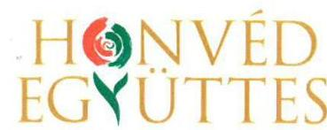
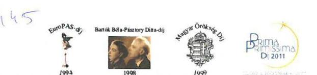
$k L / 2018 / 00021$

# Domokos László Úr 

elnök
részére
Állami Számvevőszék
Budapest
Apáczai Csere János utca 10.
1052

Tárgy: Észrevétel a EL-0480-007/2018. számú jelentéstervezethez

## Tisztelt Elnök Úr!

A EL-0480-007/2018. számú „Az állami tulajdonban lévő gazdálkodó szervezetek vagyonmegőrzési és gazdálkodási tevékenységének ellenőrzése” jelentéstervezetet megkaptuk, az abban foglalt megállapításokat, javaslatokat és pozitív visszajelzéseket köszönettel vettük. A megállapítások vonatkozásában Társaságunk az alábbi észrevételeket kívánja tenni.

### 3.2. számú megállapítás:

„A Társaság a mérleg eszköz és forrás értékeit leltárral nem támasztotta alá, ezáltal az eszközök és források értékének valódisága nem volt alátámasztott.”
„A Társaság vagyongazdálkodása a leltárazás és leltárelkészítésének a hiánya miatt nem volt szabályszerű.”

## Észrevétel:

A Társaság a mérleg eszköz és forrás értékeinek egyeztetéssel történő leltározása (mérlegtételek leltára) minden évben megtörtént. Minden évben végrehajtottuk pénzeszközeink, raktáron lévő készleteink valamint az Alapító által rendelkezésre bocsátott eszközök leltárazását. Az immateriális javak és tárgyi eszközök leltározása mintavételes eljárással történt. A mintavételes eljárás során az ellenőrzött eszközök nagysága minden évben meghaladta a mérlegérték 94%-át. A 2014-ben gazdasági osztályunk jelentős átalakuláson ment át. Október 13-án új gazdasági vezető került Társaságunkhoz. Az előző gazdasági vezető munkaviszonya 2014. 09. 30-val szűnt meg. Ezt követően a gazdasági osztály személyi állományában számottevő változások következtek be, 2014. 11. 10-tól a gazdasági referens, 2014. 11. 15-tól a főkönyvelő, 2015. 01. 22-tól a tárgyi eszközökkel foglalkozó gazdasági munkatárs lépett ki Társaságunktól. Figyelembe véve Társaságunk 2014. év végi leterheltségét valamint a kilépők okozta humán erőforrás hiányt, a tárgyi eszközök teljes körű leltárazását nem tudtuk megvalósítani. 2015. évben teljes körű leltárazást hajtottunk végre.

---

# 3.3. számú megállapítás: 

„A közérdekű adatok megismerésére irányuló igények teljesítésének rendjét rögzítő szabályzattal a Társaság az Info tv. 30.§(6) bekezdésben előírtak ellenére nem rendelkezett.”

## Észrevétel:

Társaságunk az ellenőrzött időszakban a közérdekű adatai vonatkozásában eleget tett közzétételi kötelezettségének és 2017. 01. 15-től rendelkezik erre vonatkozó szabályzattal.
„A kormányzati szektorba sorolt egyéb szervezetek számára előírt adatszolgáltatási kötelezettségét a Társaság az Áht. 107.§(1) bekezdés előírása ellenére nem teljesítette.”

## Észrevétel:

Az államháztartásról szóló 2011. évi CXCV. törvény (Áht.) 2. § l) pontja nevesíti a kormányzati szektorba sorolt egyéb szervezet fogalmát. Ebbe a körbe tartoznak azok a szervezetek, amelyek az Áht. alapján nem részei az államháztartásnak, azonban az Európai Közösséget létrehozó szerződéshez csatolt, a túlzott hiány esetén követendő eljárásról szóló jegyzőkönyv alkalmazásáról szóló 2009. május 25-i 479/2009/EK rendelet szerint a kormányzati szektorba tartoznak. Társaságunk 2014. január 1-től kormányzati szektorba sorolt egyéb szervezetnek minősül és a 368/2011. (XII. 31.) Korm. rend. (Ávr.) 5. számú mellékletében foglaltaknak megfelelően adatszolgáltatási kötelezettség terheli. A kormányzati szektorba sorolt egyéb szervezetekre vonatkozó adatszolgáltatási kötelezettséget a táblázat 3., 23. és a 24. sora tartalmazza. A 3. sorban meghatározott adatszolgáltatási kötelezettség Társaságunkat nem érinti, mivel adósságállománnyal vagy adósságot keletkeztető ügylet megkötésére vonatkozó engedéllyel nem rendelkezünk. A 23. sorban foglalt, a számviteli jogszabályok szerint beszámolóra vonatkozó adatszolgáltatási kötelezettséget Társaságunk a vizsgált időszakban évente teljesítette. A 24. sor szerinti kötelezettséget, kontrolling adatszolgáltatás megnevezéssel, a mellékletben feltüntetett határidők figyelembevételével, Társaságunk az EMMI és az MNV Zrt. részére megküldte.

Kérem Elnök Urat, hogy a jelentésben foglalt megállapítások véglegesítése során a fenti észrevételeimet figyelembe venni szíveskedjen, egyben tájékoztatom, hogy a megállapításokhoz kapcsolódó intézkedési tervet a jelentés kézhezvételétől számított 30 napon belül megküldöm.

Egyidejűleg szeretném megköszönni Elnök Úrnak és munkatársainak az ellenőrzés lefolytatásában nyújtott munkáját és segítő javaslataikat.

Budapest, 2018. április 3.
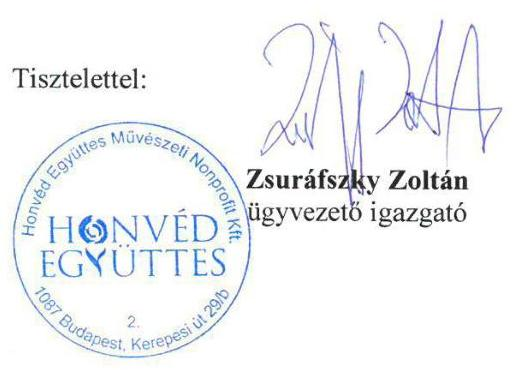

---

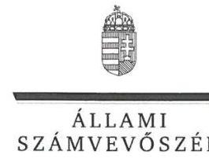

# Zsuráfszky Zoltán úr 

ügyvezető

Honvéd Együttes Művészeti Nonprofit Kft.

## Budapest

## Tisztelt Ügyvezető Úr!

Az „Állami tulajdonú gazdasági társaságok – Az állami tulajdonban (résztulajdonban) lévő gazdálkodó szervezetek vagyonmegőrzési és gazdálkodási tevékenységének ellenőrzése – Honvéd Együttes Művészeti Nonprofit Kft.” címmel készített számvevőszéki jelentéstervezetre tett észrevételeit köszönettel megkaptam.
Az Állami Számvevőszék észrevételekre vonatkozó álláspontjáról a felügyeleti vezető által készített részletes tájékoztatást csatoltan megküldöm.
Tájékoztatom Ügyvezető Urat, hogy a számvevőszéki jelentésben – az Állami Számvevőszékről szóló 2011. évi LXVI. törvény 29. § (3) bekezdése alapján – a figyelembe nem vett észrevételeket szerepeltetjük annak megindoklásával, hogy azokat miért nem fogadtuk el.

Budapest, 2018. hó nap
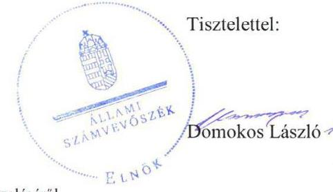

Melléklet: Tájékoztatás az észrevételek kezeléséről

---

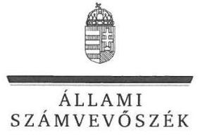

FELÜGYELETI VEZETŐ

Melléklet
Ikt.szám: EL-0480-016/2018.

# Tájékoztatás   az észrevételek kezeléséről 

Az „Állami tulajdonú gazdasági társaságok – Az állami tulajdonban (résztulajdonban) lévő gazdálkodó szervezetek vagyonmegőrzési és gazdálkodási tevékenységének ellenőrzése – Honvéd Együttes Művészeti Nonprofit Kft.” című jelentéstervezetre 2018. április 3-án tett (az Állami Számvevőszékhez 2018. április 5-én érkezett) észrevételét áttekintettük, annak kezelésével kapcsolatban a következő tájékoztatást adom.

## 1. A jelentéstervezet 3.2. számú megállapítására és a 3.2. számú megállapítás 3. bekezdésére vonatkozó észrevétel:

Az észrevételben leírtak szerint a mérleg eszköz és forrás értékeinek egyeztetéssel történő leltározása minden évben megtörtént. Az immateriális javak és a tárgyi eszközök leltározása mintavételes eljárással történt, amelynek nagysága minden évben meghaladta a mérlegérték 94%-át. 2014. évben a humánerőforrás hiány miatt a tárgyi eszközök teljes körű leltárazását nem tudták megvalósítani. A Társaságnál 2015. évben teljes körű leltárazást hajtottak végre.

Az észrevételt nem fogadjuk el. A számvitelről szóló 2000. évi C. törvény 69. § (1) bekezdése értelmében a könyvek üzleti év végi zárásához, a beszámoló elkészítéséhez, a mérleg tételeinek alátámasztásához a vállalkozásnak olyan leltárt kell összeállítani és a törvény előírásai szerint megőrizni, amely tételesen, ellenőrizhető módon tartalmazza a vállalkozónak a mérleg fordulónapján meglévő eszközeit és forrásait mennyiségben és értékben. A (3) bekezdés értelmében a vállalkozó a leltárba bekerülő adatok valódiságáról – a leltár összeállítását megelőzően – leltárazással köteles meggyőződni, és azt az eszközök és a források leltárkészítési és leltárazási szabályzatában meghatározott időszakonként, de legalább háromévente mennyiségi felvétellel, illetve minden üzleti év mérlegfordulónapjára vonatkozóan a csak értékben kimutatott eszközöknél és kötelezettségeknél, valamint az idegen helyen tárolt eszközöknél, továbbá a dematerializált értékpapíroknál egyeztetéssel kell elvégeznie. A leltárazások végrehajtásáról az ellenőrzés részére átadott dokumentumok azt támasztják alá, hogy az egyszerűsített éves beszámolók összeállításához leltárazás alapján készített leltárakkal a Társaság teljes körűen nem rendelkezett, az ellenőrzött évek alatt néhány eszközcsoport esetében készített részleges leltárak kiértékelését és összesítését a Leltározási szabályzat előírásai ellenére nem készítette el, a leltáreltéréseket nem mutatta ki, az adatbekérés során, a V-1388-003/2016. iktatószámú levél 3. számú melléklete 1.3. Egyéb dokumentumok 6. alpontjában (a beszámolót alátámasztó zárás előtti főkönyvi kivonatok és leltárkimutatások, összesítők), valamint 8. alpontjában (leltárazási jegyzőkönyvek, leltárhiány esetén a személyi felelősség megállapítását tartalmazó dokumentumok) kért dokumentumokat nem szolgáltatta. Erre való tekintettel a jelentéstervezet megállapításának módosítása, illetve törlése nem indokolt.

---

# 2. A jelentéstervezet 3.3. számú megállapítás 3. bekezdésére vonatkozó észrevétel: 

Az észrevételben leírtak szerint a Társaság 2017. január 15-től rendelkezik a közérdekű adatok megismerésére irányuló igények teljesítésének rendjét rögzítő szabályzattal.

Az észrevételt nem fogadjuk el. Az észrevételben leírt intézkedés az ellenőrzött időszakot követően történt, ezért az a jelentéstervezet megállapítását nem érinti, az intézkedést igénylő megállapítás és a javaslat módosítása, illetve törlése nem indokolt. Az ellenőrzött időszakot követően megtett intézkedést az intézkedési terv összeállítása során indokolt figyelembe venni.

## 3. A jelentéstervezet 3.3. számú megállapítás 6. bekezdésére vonatkozó észrevétel:

Az észrevételben leírtak szerint a Társaságot a 368/2011. (XII. 31.) Kormányrendelet 5. mellékletének 3. sorában meghatározott adatszolgáltatási kötelezettség nem
 terheli, mivel adósságállománnyal vagy adósságot keletkeztető ügylet megkötésére vonatkozó engedéllyel nem rendelkezik. A 23. sorban foglalt, a számviteli jogszabályok szerinti beszámolóra vonatkozó adatszolgáltatási kötelezettségét teljesítette. A 24. sorban foglalt kötelezettségeit pedig az EMMI és az MNV Zrt. részére teljesítette.

Az észrevételt nem fogadjuk el. Az államháztartásról szóló 2011. évi CXCV. törvény 107. § (1) bekezdése alapján a kormányzati szektorba sorolt egyéb szervezeteket az e törvényben és a 368/2011. (XII.31.) Kormányrendelet 5. mellékletében meghatározott bejelentési, adatszolgáltatási kötelezettség terheli az államháztartási miniszter felé. Az ellenőrzés részére átadott dokumentumok nem támasztják alá, hogy a Társaság e kötelezettségét teljesítette, így a jelentéstervezet megállapításának módosítása, illetve törlése nem indokolt.

Budapest, 2018. 0h. hó 2h. nap
Dr. Nagy Imre
felügyeleti vezető

---

# RÖVIDÍTÉSEK JEGYZÉKE 

${ }^{1}$ EMMI
${ }^{2}$ OKM
${ }^{3}$ MNV ZRt.
${ }^{4}$ Társaság
${ }^{5} \mathrm{FB}$
${ }^{6}$ Könyvvizsgáló
${ }^{7}$ Ügyvezető
${ }^{8}$ ÁSZ tv.
${ }^{9}$ ÁSZ
${ }^{10} \mathrm{Gt}$.
${ }^{11}$ Ptk.
${ }^{12}$ EMMI SZMSZ
${ }^{13}$ Alapító okirat
${ }^{14}$ Taktv.
${ }^{15}$ Alapító
${ }^{16} \mathrm{Vtv}$.
${ }^{17} \mathrm{Mt}$.
${ }^{18}$ Közhasznú szerződés
${ }^{19}$ Közszolgáltatási szerződés
${ }^{20}$ Számv. tv.
${ }^{21}$ Civil tv.
${ }^{22}$ SZMSZ
${ }^{23}$ Számviteli politika
${ }^{24}$ Leltározási szabályzat
${ }^{25}$ Értékelési szabályzat

Emberi Erőforrások Minisztériuma (2012. május 14-től, előtte Nemzeti Erőforrás Minisztérium)
Oktatási és Kulturális Minisztérium
Magyar Nemzeti Vagyonkezelő Zrt.
Honvéd Együttes Művészeti Nonprofit Korlátolt Felelősségű Társaság
a Honvéd Együttes NKft. felügyelő bizottsága
a Honvéd Együttes NKft könyvvizsgálója
a Honvéd Együttes NKft. ügyvezetője
2011. évi LXVI. törvény az Állami Számvevőszékről (hatályos: 2011. július 1-jétől)

Állami Számvevőszék
2006. évi IV. törvény a gazdasági társaságokról (hatályos: 2006. július 1-től 2014. március 14-ig)
2013. évi V. törvény a Polgári Törvénykönyvről (hatályos: 2014. március 15-től)

EMMI Szervezeti és Működési Szabályzata (hatályos: 2010. október 19-étől, 2013. február 1-jétől, 2014. december 6-ától)
a Honvéd Együttes NKft. alapító okirata (hatályos: 2011. május 31-től, 2012. április 27-étől, 2012. november 20-ától, 2013. április 10-étől, 2013. december 16-ától, 2014. május 22-étől, 2015. május 15-étől, 2015. október 29-étől, 2016. december 16-tól)
a köztulajdonban álló gazdasági társaságok takarékosabb működéséről szóló 2009. évi CXXII. törvény

Emberi Erőforrások Minisztériuma és jogelődje, az Oktatási és Kulturális Minisztérium
2007. CVI. tv. az állami vagyonról
2012. évi I. törvény a munka törvénykönyvéről
a 6731/2009. számú módosítással a 25579/2007. iktatószámú, az OKM és a Honvéd Együttes Művészeti NKft. között létrejött Közhasznú Szerződés (hatályos: 2014. május 27-ig)
a 28158/2014/KUKAB és az 50670-2/2015/PKF iktatószámú, az EMMI és a Honvéd Együttes Művészeti NKft. között létrejött Közszolgáltatási Szerződés (hatályos: 2014. május 28-ától, 2015. október 20-ától)
2000. évi C. törvény a számvitelről
2011. évi CLXXV. törvény az egyesülési jogról, a közhasznú jogállásról, valamint a civil szervezetek működéséről és támogatásáról
Honvéd Együttes Művészeti NKft. Szervezeti és Működési Szabályzata (hatályos: 2011. május 5-étől, 2013. augusztus 7-étől, 2014. június 16-ától)

Honvéd Együttes Művészeti NKft. Számviteli Politikája (hatályos: 2011. március 29-étől, 2013. január 1-jétől, 2016. január 1-jétől)

Honvéd Együttes Művészeti NKft. Eszközök és források leltározási és leltárkészítési szabályzata (hatályos: 2009. január 5-étől, 2015. szeptember 1-jétől, 2016. január 1-jétől)
Honvéd Együttes Művészeti NKft. Eszközök és Források Értékelési Szabályzata (hatályos: 2009. január 5-étől, 2013. január 1-jétől, 2016. január 1-jétől)

---

${ }^{26}$ Önköltségszámítási szabályzat
${ }^{27}$ Pénzkezelési szabályzat
${ }^{28}$ Iratkezelési szabályzat
${ }^{29}$ Kötelezettségvállalási szabályzat
${ }^{30}$ Selejtezési szabályzat
${ }^{31}$ Számlarend
${ }^{32}$ Info tv.
${ }^{33}$ Informatikai szabályzat
${ }^{34} \mathrm{Bkr}$.
${ }^{35}$ Belső Kontroll Kézikönyv
${ }^{36}$ Áht.
${ }^{37}$ Gst.

Honvéd Együttes Művészeti NKft. Önköltségszámítási Szabályzata (hatályos: 2011. január 2-ától, 2012. augusztus 1-jétől, 2013. június 20-ától, 2014. augusztus 1-jétől, 2016. január 1-jétől)
Honvéd Együttes Művészeti NKft. Pénztári és Pénzkezelési Szabályzata (hatályos: 2009. május 5-étől, 2013. január 1-jétől, 2016. január 12-étől)
Honvéd Együttes Művészeti NKft. Iratkezelési szabályzata (hatályos: 2009. január 5-étől)
Honvéd Együttes Művészeti NKft. Kötelezettségvállalás, utalványozási és teljesítésigazolási szabályzata (hatályos: 2009. január 5-étől, 2013. január 1-jétől, 2016. január 1-jétől)

Honvéd Együttes Művészeti NKft. felesleges vagyontárgyak selejtezésének és hasznosításának szabályzata (hatályos: 2009. január 5-étől, 2014. január 1-jétől, 2016. január 1-jétől)

Honvéd Együttes Művészeti NKft. Számlarendje (hatályos: 2009. január 5-étől, 2013. január 1-jétől, 2016. január 1-jétől)
az információs önrendelkezési jogról és az információszabadságról szóló 2011. évi CXII. törvény (hatályos: 2011. július 27-étől)
Honvéd Együttes Művészeti NKft. Informatikai szabályzata (hatályos: 2011. szeptember 15-étől, 2014. szeptember 1-jétől)
a költségvetési szervek belső kontrollrendszeréről és belső ellenőrzéséről szóló 370/2011. (XII. 31.) Korm. rendelet
a Társaság Belső Kontroll Kézikönyve (hatályos: 2015. február 15-étől)
az államháztartásról szóló 2011. évi CXCV. törvény
2011. évi CXCIV. törvény Magyarország gazdasági stabilitásáról

---

# ÁLLAMI SZÁMVEVŐSZÉK 

1052 Budapest, Apáczai Csere János utca 10.
Levélcím: 1364 Budapest 4. Pf. 54
Telefon: +36 14849100 Telefax: +36 14849200
www.asz.hu
