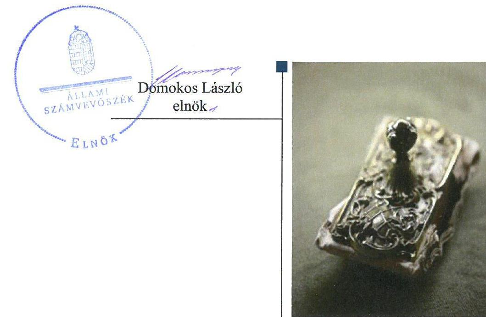
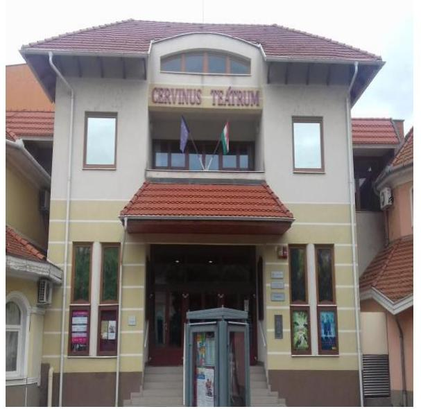
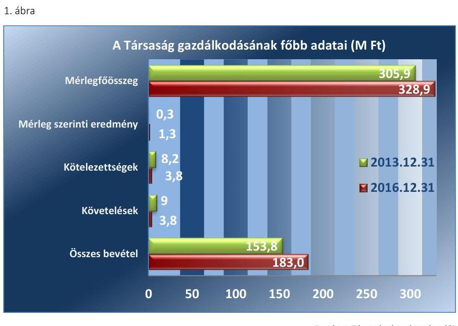

# Jelentés 

## Az önkormányzatok gazdasági társaságai

Az önkormányzatok többségi tulajdonában lévő gazdasági társaságok gazdálkodásának ellenőrzése - Cervinus Teátrum Művészeti Szolgáltató Közhasznú Nonprofit Kft.

2018.

---

# Jelentés 

## Az önkormányzatok gazdasági társaságai

Az önkormányzatok többségi tulajdonában lévő gazdasági társaságok gazdálkodásának ellenőrzése - Cervinus Teátrum Művészeti Szolgáltató Közhasznú Nonprofit Kft.
2018. 

---

# AZ ELLENŐRZÉST FELÜGYELTE:

DR. HORVÁTH MARGIT felügyeleti vezető

## AZ ELLENŐRZÉST VEZETTE ÉS A VÉGREHAJTÁSÁÉRT FELELŐS:

VALASTYÁNNÉ DR. VÍZHÁNYÓ JÚLIA ellenőrzésvezető

## A PROGRAM ÖSSZEÁLLÍTÁSÁÉRT FELELŐS:

TÓTPÁL SZABOLCS osztályvezető

IKTATÓSZÁM: EL-0144-098/2018.

TÉMASZÁM: 2447

ELLENŐRZÉS-AZONOSÍTÓ SZÁM: V079334

Jelentéseink az Országgyűlés számítógépes hálózatán és az Interneten a www.asz.hu címen is olvashatóak.

---

# TARTALOMJEGYZÉK 

■ ÖSSZEGZÉS ..... 5
■ AZ ELLENŐRZÉS CÉLJA ..... 6
■ AZ ELLENŐRZÉS TERÜLETE ..... 7
■ AZ ELLENŐRZÉS HÁTTERE, INDOKOLTSÁGA ..... 9
■ A JELENTÉS LÉNYEGES KÉRDÉSKÖREI ..... 10
■ AZ ELLENŐRZÉS HATÓKÖRE ÉS MÓDSZEREI ..... 11
■ MEGÁLLAPÍTÁSOK ..... 13
■ JAVASLATOK ..... 18
■ MELLÉKLETEK ..... 21
I. sz. melléklet: Értelmező szótár ..... 21
II. sz. melléklet: A Társaság 2013-2016. évi mérleg adatai ..... 23
III. sz. melléklet: A támogatások alakulása a 2013-2016. években ..... 24
IV. sz. melléklet: A Társaság mérlegadatainak alakulása 2013-2016 között ..... 25
■ FÜGGELÉK: ÉSZREVÉTELEK ..... 27
■ RÖVIDÍTÉSEK JEGYZÉKE ..... 29

---

.

---

# ÖSSZEGZÉS 

Szarvas Város Önkormányzata a tulajdonosi joggyakorlás kereteit szabályszerűen alakította ki, a tulajdonosi jogait szabályszerűen gyakorolta. A Cervinus Teátrum Művészeti Szolgáltató Közhasznú Nonprofit Kft. gazdálkodásának szabályozottsága és vagyongazdálkodási tevékenysége megfelelő volt. A Társaság a tervezési és beszámolási kötelezettségének eleget tett, fizetőképessége biztosított volt.

## Az ellenőrzés társadalmi indokoltsága

Az Állami Számvevőszék kiemelt célja, hogy a helyi önkormányzatok gazdálkodásában rejlő pénzügyi kockázatok feltárásával, az államháztartáson kívülre nyújtott költségvetési támogatások és ingyenes vagyonjuttatások, valamint az államháztartáson kívül működő feladatellátó rendszerek ellenőrzéseivel hozzájáruljon ahhoz, hogy a közpénzeket az államháztartáson kívül működő szervezetek is átlátható, rendezett módon használják fel.

Az Állami Számvevőszék céljaival és a társadalmi igénnyel összhangban, valamint a gazdasági társaságok kiemelt fontosságú szerepe miatt került sor a Cervinus Teátrum Művészeti Szolgáltató Közhasznú Nonprofit Kft. ellenőrzésére. Az Állami Számvevőszék az ellenőrzése során arra kereste a választ, hogy 2013-2016. között szabályszerű volt-e a Társaság gazdálkodása és az Önkormányzat ehhez kapcsolódó tulajdonosi joggyakorlása.

## Főbb megállapítások, következtetések, javaslatok

Az Önkormányzat a tulajdonosi joggyakorlás kereteit szabályszerűen kialakította, a tulajdonosi jogokat a Társaság felett szabályszerűen gyakorolta. Javadalmazási szabályzatot a Társaság legfőbb szerve nem alkotott.

A Társaság rendelkezett a Számv. tv.-ben előírt szabályzatokkal. A Társaság szabályozottsága megfelelő volt.
A Társaság az éves beszámolókban szereplő vagyonelemek állományát leltárral alátámasztotta. A Társaság vagyongazdálkodási tevékenysége szabályszerű volt. Az ügyvezető 2016-tól nem alakított ki a szervezet tevékenységének, a célok megvalósításának nyomon követését biztosító rendszert.

A Társaság a tervezési és beszámolási kötelezettségének eleget tett, fizetőképessége biztosított volt. A Társaság a közérdekű adatok megismerésére irányuló igények teljesítésének rendjét rögzítő szabályzatot nem készítette el, a közérdekű adatok közzétételével kapcsolatos kötelezettségének nem tett eleget. A bevételek és ráfordítások elszámolása szabályszerű volt.

---

# AZ ELLENŐRZÉS CÉLJA 

Az ellenőrzés célja annak értékelése volt, hogy az önkormányzat vagyongazdálkodási tevékenysége során szabályszerűen gyakorolta-e tulajdonosi jogait; a gazdasági társaság szabályozottsága, gazdálkodása és vagyongazdálkodási tevékenysége, bevételeinek és ráfordításainak elszámolása megfelelt-e a jogszabályi és tulajdonosi előírásoknak; a gazdasági társaság kötelezettségállománya jelent-e kockázatot a működésre, valamint a gazdálkodás átláthatósága és elszámoltathatósága érdekében biztosítva volt-e a szolgáltatás díjának megalapozottsága szabályszerű önköltségszámítással. Az ellenőrzés célja továbbá annak megítélése volt, hogy a kormányzati szektorba sorolt önkormányzati tulajdonban (résztulajdonban) lévő gazdálkodó szervezetek gazdálkodásának a kormányzati szektor hiányára és az államadósságra befolyással bíró elemei a jogszabályi előírásoknak megfeleltek-e.

---

# AZ ELLENŐRZÉS TERÜLETE

## Szarvas Város Önkormányzata és a kizárólagos tulajdonában lévő Cervinus Teátrum Művészeti Szolgáltató Közhasznú Nonprofit Korlátolt Felelősségű Társaság

Szarvas Város Önkormányzata a Cervinus Teátrum Művészeti Szolgáltató Közhasznú Nonprofit Korlátolt Felelősségű Társaságot – Regionális Színház Szolgáltató Közhasznú Nonprofit Korlátolt Felelősségű Társaság néven – 2009. május 21-én alapította. A Társaság¹ elnevezése 2012. augusztus 16-án változott.

A Társaság kizárólagos tulajdonosa az Önkormányzat² volt, jegyzett tőkéjének összege a 2013-2016. években nem változott (3,0 M Ft³).

Az ellenőrzött időszakban a Társaság főtevékenysége – egyben közhasznú tevékenysége – művészeti létesítmények (Színház, *"Turul Mozi"*, *"Szarvasi Vízi Színház"*, *"Vajda Péter Művelődési Központ"*, *"Térségi Civil Fejlesztő Központ"*) működtetése volt. A Társaság a főtevékenységén túl – szintén közhasznú tevékenységként – a 2013-2016. években kulturális, közművelődési, közösségi, szórakoztató és információs szolgáltatásokat, ezen belül színházi tevékenységet, művészeti csoportok koordinálását, művészeti alapiskolai tevékenységet, nemzeti ünnepek, városi rendezvények, kiállítások lebonyolítását végezte. A Társaság által ellátott közművelődési és színházi tevékenység az Önkormányzat közfeladatai közé tartozott.

A Társaság a 2013-2016. években egyszerűsített éves beszámolót készített, önkormányzati vagyont nem kezelt. A 2013. évben 15 főt, a 2016. évben 17 főt foglalkoztatott. A Társaság a 2016. évben kormányzati szektorba sorolt egyéb szervezetnek minősült. A Társaság adósságot keletkeztető ügyletet a 2016. évben nem kötött.

A Társaság feladatait saját eszközökkel és az Önkormányzattól üzemeltetésre, használatra átvett ingatlannal, illetve bérbe vett eszközökkel látta el. A Társaság más gazdasági társaságban részesedéssel nem rendelkezett.

A 2013-2016. közötti időszakban a polgármester⁴, a jegyző⁵, továbbá az ügyvezető⁶ személyében változás nem történt.

A Társaság gazdálkodásának főbb adatait az 1. ábra, a 2013-2016. évi mérleg adatait a II. sz. melléklet szemlélteti. A passzív időbeli elhatárolások mérlegsoron a 2013-2016. években döntő részben az ellenőrzött időszakot megelőzően keletkezett, halasztott bevételként elszámolt támogatás összege szerepelt.

---

Forrás: a Társaság éves beszámolói
A Társaság mérlegfőösszege a 2013. évről a 2016. évre 7,5%-kal emelkedett. A kötelezettségállomány 53,7%-kal, a követelésállomány 59,1%-kal csökkent az ellenőrzött időszakban. A mérleg szerinti eredmény több mint négyszeresére, az összes bevétel 19,0%-kal nőtt. A Társaság önköltségszámításra nem volt kötelezett.

Az Önkormányzat a Társaság részére a 2013-2016. években - a közművelődési, színházi, illetve művészeti alapiskolai közfeladatokhoz - összesen 229,9 M Ft támogatást nyújtott. A támogatások évenkénti alakulását a III. sz. melléklet szemlélteti.

A Társaság bevételeinek, ráfordításainak, valamint adózott eredményének alakulását és megoszlását a IV. sz. melléklet mutatja be. A Társaság a Stabilitási tv. ${ }^{7}$ szerinti adósságot keletkeztető ügyletet nem kötött.

---

# AZ ELLENŐRZÉS HÁTTERE, INDOKOLTSÁGA 

AZ ÖNKORMÁNYZATOK TÖBBSÉGI TULAJDONÁBAN ÁLLÓ GAZDASÁGI TÁRSASÁGOK ellenőrzése kiemelten fontos a vagyon megőrzése, megóvása érdekében, valamint a kormányzati szektor elszámolásaiban megjelenő önkormányzati tulajdonú gazdálkodó szervezetek esetében, amelyekkel szemben alapvető követelmény, hogy gazdálkodásuk, működésük szabályszerű, az általuk szolgáltatott adatok minél megbízhatóbbak legyenek. A feladatellátás költségeinek, ráfordításainak alakulása a lakosság széles rétegét érinti.

ELLENŐRZÉSEINK FELTÁRHATJÁK, hogy az önkormányzat a feladatellátásához rendelt vagyon működtetését a tulajdonostól elvárható gondossággal végezte-e, a feladatot ellátó gazdasági társaság a létesítő okiratban, szolgáltatási szerződésben foglaltak betartásával biztosította-e a feladat ellátását. Az ellenőrzés eredményeképp meghatározhatóvá válnak a költségvetési hiányt befolyásoló szervezetek kockázatai, lehetővé válik ezen kockázatok csökkentése. Az ellenőrzés rávilágíthat arra, hogy a gazdasági társaság a vagyon használatával biztosította-e a szolgáltatás folytatásának feltételeit, az önkormányzat tulajdonosi felügyelete hozzájárult-e a szabályszerű gazdálkodáshoz és feladatellátáshoz. A megállapítások alapján megfogalmazott számvevőszéki javaslatok hasznosítása elősegítheti a meglévő hibák megszüntetését. A jó gyakorlatok bemutatásával az ÁSZ ${ }^{8}$ hozzájárulhat a követendő megoldások megismertetéséhez, terjesztéséhez.

---

# A JELENTÉS LÉNYEGES KÉRDÉSKÖREI 

1.     - Az önkormányzat tulajdonosi joggyakorlása szabályszerű volt-e?
2.     - A gazdasági társaság szabályozottsága, gazdálkodása és vagyongazdálkodási tevékenysége szabályszerű volt-e, fizetőképessége biztosított volt-e a gazdálkodás során?
3.     - A gazdasági társaság bevételeinek és ráfordításainak elszámolása szabályszerű volt-e?
4.     - A kormányzati szektorba sorolt önkormányzati tulajdonban (résztulajdonban) lévő gazdálkodó szervezet gazdálkodásának a kormányzati szektor hiányára és az államadósságra befolyással bíró elemei megfeleltek-e a jogszabályi előírásoknak?

---

# AZ ELLENŐRZÉS HATÓKÖRE ÉS MÓDSZEREI 

## Az ellenőrzés típusa

Megfelelőségi ellenőrzés.

## Az ellenőrzött időszak

2013. január 1-jétől 2016. december 31-ig tartó időszak.

## Az ellenőrzés tárgya

Szarvas Város Önkormányzatának a Cervinus Teátrum Művészeti Szolgáltató Közhasznú Nonprofit Kft. feletti tulajdonosi joggyakorlása, valamint a Cervinus Teátrum Művészeti Szolgáltató Közhasznú Nonprofit Kft. gazdálkodásának szabályozottsága és szabályszerűsége, továbbá a Cervinus Teátrum Művészeti Szolgáltató Közhasznú Nonprofit Kft., mint önkormányzati alszektorba sorolt gazdasági társaság gazdálkodásának a kormányzati szektor hiányára és az államadósságra befolyással bíró elemei.

Az ellenőrzés kiterjedt minden olyan körülményre és adatra, amely az ÁSZ jogszabályban meghatározott feladatainak teljesítéséhez, valamint a program végrehajtása folyamán felmerült újabb összefüggések feltárásához szükséges volt.

## Az ellenőrzött szervezet

Szarvas Város Önkormányzata, valamint a Cervinus Teátrum Művészeti Szolgáltató Közhasznú Nonprofit Kft.

## Az ellenőrzés jogalapja

Az ellenőrzés jogszabályi alapját az az Állami Számvevőszékről szóló 2011. évi LXVI. törvény 1. § (3) bekezdése és 5. § (3)-(5) bekezdései képezték.

## Az ellenőrzés módszerei

Az ellenőrzést a nemzetközi standardokat irányadónak tekintve az ellenőrzési program ellenőrzési kérdései, az ellenőrzött időszakban hatályos jogszabályok, az ellenőrzés szakmai szabályok és módszertanok figyelembe vételével végeztük.

---

Az ellenőrzés ideje alatt az ellenőrzött szervezettel történő kapcsolattartást az Állami Számvevőszék Szervezeti és Működési Szabályzatának vonatkozó előírásai alapján biztosítottuk.

Az ellenőrzési kérdések megválaszolásához szükséges bizonyítékok megszerzése a következő ellenőrzési eljárások alkalmazásával történt: megfigyelés, kérdésfeltevés (információkérés), összehasonlítás, valamint elemző eljárás. Az ellenőrzési bizonyítékként felhasználható adatforrások közé tartoztak egyrészt az ellenőrzési programban felsorolt adatforrások, másrészt adatforrás volt még minden - az ellenőrzés folyamán - feltárt, az ellenőrzés szempontjából információkat tartalmazó dokumentum.

Az ellenőrzést a kérdésekre adott válaszok kiértékelésével, valamint a megjelölt adatforrások, a csatolt tanúsítványok felhasználásával, továbbá az adott időszakban hatályos jogszabályok figyelembevételével folytattuk le.

A gazdasági társaság bevételei és ráfordításai, ezeken belül az értékcsökkenés, valamint a vagyonnyilvántartás szabályszerűségének megítéléséhez a bevételeket és a ráfordításokat, a tárgyi eszközök állományváltozásait tartalmazó adott évi főkönyvi adatbázisát vettük alapul. A minta kiválasztása során véletlen mintavételt alkalmaztunk évenkénti, elemszámmal arányos rétegezéssel a teljes időszakra vonatkozóan. A minta alapján a sokaságban előforduló hibaarányt becsültük. „Megfelelőnek" értékeltünk egy ellenőrzött területet, amennyiben 95%-os bizonyossággal a teljes sokaságban a hibaarány legfeljebb 10%, „nem megfelelőnek", amennyiben 10%-nál magasabb arányt képviselt. A mintavételt megelőzően az anyagjellegű ráfordítások, valamint a tárgyi eszköz növekedési tételei sokaságból évente sokaságonként kiemeltük a 3-3 legnagyobb összegű tételt annak biztosítására, hogy az ellenőrzés az egyszerű véletlen mintavétel mellett a legnagyobb értékű tételek ellenőrzésére biztosan kiterjedjen.

---

# 1. Az önkormányzat tulajdonosi joggyakorlása szabályszerű volt-e? 

Összegző megállapítás

### 1.1. számú megállapítás

Az Önkormányzat tulajdonosi joggyakorlása szabályszerű volt.

Az Önkormányzat a tulajdonosi joggyakorlás kereteit szabályszerűen kialakította.

Az Önkormányzat az Mötv.-ben ${ }^{9}$ foglaltak szerint rendelkezett gazdasági programmal, mely a Társaság vonatkozásában a „Szarvasi Vízi Színház" fejlesztését tűzte ki célul, továbbá tartalmazta az egyes közszolgáltatások biztosítására, színvonalának javítására szolgáló fejlesztési elképzeléseket.

Közép- és hosszú távú vagyongazdálkodási tervkészítési kötelezettségének az Önkormányzat az Nvtv. ${ }^{10}$ 9. § (1) bekezdésében foglaltak ellenére nem tett eleget.

A TULAJDONOSI JOGGYAKORLÁS KERETEIT az Önkormányzat az SZMSZ ${ }^{11}$-ben, a Vagyonrendeletben ${ }^{12}$, a közművelődési rendeletben ${ }^{13}$ és az Alapító okiratban ${
 }^{14}$ szabályszerűen kialakította.

Az Önkormányzat vagyonának vállalkozásba viteléről, a részesedéssel való rendelkezésről a Képviselő-testület ${ }^{15}$ a Vagyonrendeletben foglaltak alapján szabályszerűen döntött.

Az Alapító okirat előírása szerint az alapító kizárólagos hatáskörébe tartozott - többek között - a Társaság Számv. tv. ${ }^{16}$ szerinti beszámolójának, közhasznúsági jelentésének elfogadása. Az Alapító okiratban kijelölték a Társaság állandó könyvvizsgálóját, a kijelölés a Ptk. ${ }^{17}$ előírásának megfelelt.

Az Önkormányzat az Alapító okiratban elrendelte az $\mathrm{FB}^{18}$ létrehozását. A továbbiakban az FB tagjait a Képviselő-testület választotta a Ptk. 3:26. § (4) bekezdése előírásának megfelelően, azonban - mindkét esetben - annak létszáma a Ptk. 3:26. § (1) bekezdésében, valamint a Taktv. ${ }^{19}$ 4. § (2) bekezdésében foglaltak ellenére nem három, hanem öt főből állt.

Az Önkormányzat a monitoring tevékenységet kialakította. Az Alapító okiratban előírta az FB részére a Társaság működése és gazdálkodása ellenőrzésének, a támogatás biztosításáról szóló Megállapodásban ${ }^{20}$ a Társaság részére évközi beszámoló készítésének kötelezettségét. Az Önkormányzat a Megállapodásban a Társaság kötelezettségeként nevesítette a költségvetésben biztosított támogatás felhasználásáról történő elszámolást, annak tartalmát és gyakoriságát.

RENDELETALKOTÁSI KÖTELEZETTSÉGÉNEK az Önkormányzat eleget tett, mely a Társaság tevékenységére vonatkozóan az ellátott közfeladattal kapcsolatban a Ktv. ${ }^{21}$ előírásai alapján volt szükséges. A Képviselő-testület a közművelődésre vonatkozó szabályokat a közművelődési rendeletben írta elő.

---

A TÁRSASÁG FELADAT-ELLÁTÁSÁHOZ kapcsolódóan a 2013-2016. években az Önkormányzat Közművelődési megállapodást²², Bérleti szerződést²³, Ingatlanhasználati megállapodást²⁴ kötött, melyekben meghatározta a felek jogait és kötelezettségeit.

Az Önkormányzat a Közművelődési megállapodásban közművelődési színtér üzemeltetésével, művészeti csoportok koordinálásával, városi és nemzeti ünnepek, kulturális rendezvények lebonyolításával bízta meg a Társaságot.

Az Önkormányzat a Közművelődési megállapodásban a Ktv. előírásai szerint meghatározta az elvégzendő szolgáltatásokat, az azokhoz kapcsolódó támogatás feltételeit, a szolgáltatások végzésének helyszínéül szolgáló ingatlant, a megfelelő végzettséggel rendelkező szakember biztosításának kötelezettségét. A Közművelődési megállapodásban az Önkormányzat nem határozta meg a Ktv. 79. § (2) bekezdése a), b), d), e) pontjai szerinti tartalmi elemeket. Azaz a közművelődési szolgáltatás díját, a közművelődési alapszolgáltatások biztosításával kapcsolatban a helyi lakossággal és annak önszerveződő közösségeivel történő kapcsolattartás elveit, főbb szempontjait, az ingyenesen vagy térítési díjért igénybe vehető szolgáltatások körét, a közművelődési szolgáltatás igénybevételi lehetőségeinek minimális időtartamát és rendszerességét, a közösségi színtér, illetőleg közművelődési intézmény közművelődési célú minimális nyitva tartását.

A Bérleti szerződésben foglaltak szerint az Önkormányzat a mozi üzemeltetéséhez kapcsolódó digitális eszközöket adott át a Társaság részére.

Az Ingatlanhasználati megállapodás szerint az Önkormányzat „Térségi civil fejlesztő központ" működtetése céljából ingatlant adott a Társaság használatába.

A Társaság legfőbb szerve - a Taktv. 5. § (3) bekezdésében foglaltak ellenére - a vezető tisztségviselők, FB-i tagok, az Mt. ${ }^{25}$ 208. §-ának hatálya alá eső munkavállalók javadalmazása, valamint a jogviszony megszűnése esetére biztosított juttatások módjának, mértékének elveiről, annak rendszeréről szóló szabályzatot nem alkotott.

# 1.2. számú megállapítás 

## A tulajdonosi jogok gyakorlása szabályszerű volt.

AZ ÖNKORMÁNYZAT TÁRSASÁG FELETTI TULAJDONOSI JOGGYAKORLÁSA szabályszerű volt. A tulajdonosi jogokat a Vagyonrendeletben foglaltaknak megfelelően a Képviselő-testület a Gt. és a Ptk. előírásai szerint gyakorolta.

Az FB eleget tett az Alapító okiratban előírt feladatainak, megtárgyalta és elfogadta a Társaság Számv. tv. szerinti egyszerűsített éves beszámolóit. Az Önkormányzat üzleti tervkészítési kötelezettséget a Társaság felé nem írt elő, azonban azokat a Társaság elkészítette és az FB tárgyalta. Az FB írásos jelentéseit minden esetben megküldte a Képviselő-testület részére.

A Társaság ügyvezetése az ügyvezetésről, a Társaság vagyoni helyzetéről és üzletpolitikájáról a Gt.-ben foglaltaknak megfelelően évente jelentést készített.

A Képviselő-testület a jogszabályi előírásoknak megfelelően megtárgyalta és elfogadta a Társaság egyszerűsített éves beszámolóit, közhasznúsági jelentéseit, döntései során figyelembe vette az FB és a könyvvizsgáló írásbeli véleményét.

---

Az Alapító okiratban, Megállapodásban előírt, a Társaság feladatellátásához kapcsolódó követelmények teljesülését az Önkormányzat számon kérte, elfogadta a Társaság üzleti terveit, szakmai, illetve az általa nyújtott támogatás felhasználásáról szóló beszámolóit. Az Önkormányzat nem élt az Áht. ${ }^{26}$-ban biztosított belső ellenőrzés lehetőségével a Társaság esetében.

A Társaság a 2013. és a 2015-2016. években nyereségesen gazdálkodott. A 2014. évben a Társaság veszteséges volt. A saját tőke 2,7 M Ft összegű pótlásáról az Önkormányzat a 2014. évben képviselő-testületi döntés alapján gondoskodott.

# 2. A gazdasági társaság szabályozottsága, gazdálkodása és vagyongazdálkodási tevékenysége szabályszerű volt-e, fizetőképessége biztosított volt-e a gazdálkodás során? 

## Összegző megállapítás

2.1. számú megállapítás

A Társaság szabályozottsága megfelelő volt. A vagyongazdálkodás az ellenőrzött időszakban szabályszerű volt. A Társaság fizetőképessége biztosított volt.

A Társaság szabályozottsága megfelelő volt. Az ügyvezető 2016-tól nem alakított ki a Társaság tevékenységének, a célok megvalósításának nyomon követésének biztosító rendszert.

A Társaság számviteli politikával ${ }^{27}$, leltározási szabályzattal ${ }^{28}$, értékelési szabályzattal ${ }^{29}$ és pénzkezelési szabályzattal ${ }^{30}$ a Számv. tv. előírásai szerint rendelkezett. Az önköltségszámítás rendjére vonatkozó szabályzatkészítési kötelezettség alól a Számv. tv. 14. § (6) bekezdése alapján mentesült.

A Társaság a Számv. tv. 14. § (11) bekezdésében előírtak ellenére elmulasztotta a számviteli politikát a 2015. július 4-én hatályba lépett törvénymódosítás megváltozott rendelkezéseinek megfelelően módosítani. Azaz a Társaság a Számv. tv. 86. §-ában foglalt, rendkívüli tételek fogalmának megszűnésével összefüggő változást nem vezette át.

A leltározási szabályzatban a Társaság rendelkezett a mennyiségi felvétellel történő leltározás gyakoriságáról, a szabályozás a Számv. tv. előírásának megfelelt. Az értékelési szabályzat a Számv. tv.-ben foglalt előírások szerint készült.

A pénzkezelési szabályzatot a Társaság - az ellenőrzés gyakoriságáról való rendelkezés kivételével - a Számv. tv. 14. § (8) bekezdésében foglaltak szerint készítette el.

A Társaság a Számv. tv.-ben foglaltak szerint rendelkezett a számlarend keretében elkészítendő számlakerettel, amely tartalmazta minden alkalmazásra kijelölt számla számjelét és megnevezését. A Számv. tv.-ben előírt bizonylati rendet a Társaság a számviteli politikában rögzítette. A főkönyvi számlákat érintő gazdasági eseményeket a számviteli politika tartalmazta.

A Társaság rendelkezett szervezeti és működési szabályzattal ${ }^{31}$, mely az Alapító okiratban foglaltakkal összhangban szabályozta működését és szervezeti felépítését.

---

Az ügyvezető a 2016. évben a Bkr. 10. § és 54/A. §-ának előírása ellenére nem alakította ki a Társaság tevékenységének, a célok megvalósításának nyomon követését biztosító rendszert.

# 2.2. számú megállapítás 

A Társaság az ellenőrzött időszakban beszámolóit leltárral alátámasztotta. A vagyongazdálkodása az ellenőrzött időszakban szabályszerű volt.

AZ EGYSZERŰSÍTETT ÉVES BESZÁMOLÓI mérlegeiben szereplő vagyonelemek állományát a 2013-2016. években a Társaság a Számv. tv. 69. § (1) bekezdése szerint leltárral alátámasztotta. A Társaság a saját vagyonához kapcsolódó nyilvántartásokat átláthatóan, naprakészen vezette.

A Társaság a 2014. év tekintetében a tárgyi eszközök leltárba bekerülő adatai valóságáról egyeztetéssel meggyőződött, azonban a Számv. tv. 69. § (3) bekezdésében, valamint a leltározási szabályzatban foglaltak ellenére mennyiségi felvétellel történő leltározást nem végzett. A Társaság mennyiségi felvétellel történő leltározást 2016. december 30-án végzett.

## 2.3. számú megállapítás

A Társaság fizetőképessége biztosított volt, kötelezettség állománya a működést nem veszélyeztette.

A Társaság hosszú lejáratú kötelezettséggel nem rendelkezett. Rövid lejáratú kötelezettségei mérlegfőösszeghez viszonyított aránya (1,2\%) nem volt jelentős. 2013-ról 2016-ra a lejárt határidejű szállítói kötelezettségek állománya jelentősen - 5,4 M Ft-ról 0,9 M Ft-ra - csökkent.

A Társaság a tervezési, beszámolási kötelezettségét teljesítette. A Társaság a közérdekű adatok megismerésére irányuló igények teljesítésének rendjét nem szabályozta, közérdekű adatait nem tette közzé.

A MEGÁLLAPODÁSBAN rögzítettek szerint a Társaság az Önkormányzat által nyújtott támogatás felhasználásáról a 2013-2014. években negyedévente, a 2015-2016. években félévente elszámolt.

Üzleti terveit a Társaság elkészítette, azok tartalmazták a bevételi, költség és pénzforgalmi terveket, az igényelt működési támogatást.

AZ EGYSZERŰSÍTETT ÉVES BESZÁMOLÓKAT és a közhasznúsági mellékleteket a Társaság a Számv. tv., a Civil tv. ${ }^{32}$ és az Alapító okirat előírásának megfelelően határidőben elkészítette. Azokat a Számv. tv.-ben foglaltak szerint letétbe helyezte és közzétette. A könyvvizsgáló az egyszerűsített éves beszámolókat hitelesítő záradékkal látta el.

A Társaság az Info tv. ${ }^{33}$ 30. § (6) bekezdésének előírása ellenére a közérdekű adatok megismerésére irányuló igények teljesítésének rendjét nem szabályozta.

A Társaság nem tette közzé a Taktv. 2. § (1) bekezdéseiben előírt adatokat. Úgymint az Mt. 208. §. szerinti vezető állású munkavállalók, valamint az önállóan cégjegyzésre, bankszámla feletti rendelkezésre jogosult munkavállalók nevét, tisztségét vagy munkakörét, munkaviszonyban álló személy esetében a munkavállaló részére a munkaviszonya alapján közvetlenül vagy közvetve nyújtott pénzbeli juttatásokat. Továbbá a munkavállalóra irányadó végkielégítés, illetve felmondási idő időtartamát, az FB tagok esetén a megbízási díjat, a megbízási díjon felüli egyéb járandóságokat, a jogviszony megszűnése esetén járó pénzbeli juttatásokat.

A Társaság az Info tv. 37. § (1) bekezdésében foglalt, az 1. mellékletben meghatározott tartalmú közérdekű adatok közzétételével kapcsolatos kötelezettségének honlapján ${ }^{34}$ az I. Szervezeti, személyzeti adatok 1., 3., 4. és 11. pontjai, a II. Tevékenységre, működésre vonatkozó adatok 1., 13. pontjai, valamint a III. Gazdálkodási adatok 1., 2. és 8. pontjai tekintetében nem tett eleget.

A Társaság a 2016. üzleti évet érintően az Ávr. ${ }^{35}$ 5. számú melléklet 23. pontja szerinti, az egyszerűsített éves beszámolóra vonatkozó adatszolgáltatás teljesítésére volt kötelezett, amelynek nem tett eleget.

# 3. A gazdasági társaság bevételeinek és ráfordításainak elszámolása szabályszerű volt-e? 

## Összegző megállapítás

A Társaság bevételeinek és ráfordításainak elszámolása szabályszerű volt.

A BEVÉTELEK ÉS RÁFORDÍTÁSOK, a bér- és személyi jellegű kifizetések elszámolása szabályszerű volt. A Társaság a bevételeket és a ráfordításokat a Számv. tv.-nek, valamint a belső szabályozásnak megfelelően számolta el.

A jogszabályoknak és a belső szabályozásnak megfelelően történt az értékcsökkenés elszámolása. A 2013-2016. években a Társaság saját vagyona után elszámolt értékcsökkenés összege 60,9 M Ft, a beruházásra, felújításra fordított összeg - közel azonos - 60,8 M Ft volt, tehát a visszapótlás megfelelő szinten valósult meg.

A Társaság vevőkövetelésének mérlegfőösszeghez viszonyított aránya nem volt jelentős, 2013-ban 2,7\%-ot, 2016-ban 0,5\%-ot tett ki.

## 4. A kormányzati szektorba sorolt önkormányzati tulajdonban (résztulajdonban) lévő gazdálkodó szervezet gazdálkodásának a kormányzati szektor hiányára és az államadósságra befolyással bíró elemei megfeleltek-e a jogszabályi előírásoknak?

Összegző megállapítás A Társaság gazdálkodásának a kormányzati szektor hiányára befolyással bíró elemei megfeleltek a jogszabályi előírásoknak.

A Társaság a Stabilitási tv. ${ }^{36}$ szerinti adósságot keletkeztető ügyletet nem kötött. A Társaság gazdálkodásának a kormányzati szektor hiányára befolyással bíró elemei megfeleltek a jogszabályi előírásoknak.

---

# JAVASLATOK 

Az ÁSZ tv. 33. § (1) bekezdésében foglaltak értelmében az ellenőrzött szervezet vezetője köteles a jelentésben foglalt megállapításokhoz kapcsolódó intézkedési tervet összeállítani és azt a jelentés kézhezvételétől számított 30 napon belül az ÁSZ részére megküldeni. Amennyiben az ellenőrzött szervezet vezetője nem küldi meg határidőben az intézkedési tervet, vagy továbbra sem elfogadható intézkedési tervet küld, az Állami Számvevőszék elnöke az ÁSZ tv. 33. § (3) bekezdése a) és b) pontjaiban foglaltakat érvényesítheti. Javaslataink célja a Cervinus Teátrum Művészeti Szolgáltató Közhasznú Nonprofit Kft. gazdálkodása szabályszerűségének és gyakorlatának javítása annak érdekében, hogy a szabályozási
 környezet és az alkalmazott gyakorlat megfelelően tudja támogatni az átlátható működést.

## A Cervinus Teátrum Művészeti Szolgáltató Közhasznú Nonprofit Kft. ügyvezetőjének

1. Intézkedjen a Számviteli politika és a Pénzkezelési szabályzat módosításáról a hatályos Számv. tv. előírásainak megfelelően.
(2.1. sz. megállapítás 2. és 4. bekezdése alapján)
2. Intézkedjen a Társaság tevékenységének, a célok megvalósításának nyomon követését biztosító rendszer Bkr. előírásainak megfelelő kialakításáról.
(2.1. sz. megállapítás 7. bekezdése alapján)
3. Intézkedjen az Info tv. előírásai alapján a közérdekű adatok megismerésére irányuló igények teljesítésének rendjére vonatkozó szabályzat elkészítéséről, valamint a közérdekű adatok közzétételéről.
(2.4. sz. megállapítás 4. és 6. bekezdései alapján)
4. Intézkedjen az Taktv.-ben előírt közzétételi kötelezettség teljesítéséről.
(2.4. sz. megállapítás 5. bekezdése alapján)
5. Intézkedjen az Ávr. előírásai szerinti adatszolgáltatási kötelezettség teljesítéséről.
(2.4. sz. megállapítás 7. bekezdése alapján)

---

# Javaslataink célja a tulajdonosi joggyakorló Szarvas Város Önkormányzata szabályszerű működésének elősegítése, továbbá a tulajdonosi joggyakorlás kontrolljainak erősítése. 

## Szarvas Város Önkormányzata polgármesterének

1. Intézkedjen az Önkormányzat közép- és hosszú távú vagyongazdálkodási tervének elkészítéséről az Nvtv. előírásainak megfelelően.
(1.1. sz. megállapítás 2. bekezdése alapján)
2. Kezdeményezze, hogy a Képviselő-testület a Ktv. előírásai szerinti tartalommal módosítsa a Közművelődési megállapodást.
(1.1. sz. megállapítás 11. bekezdése alapján)
3. Kezdeményezze a Társaság vezető tisztségviselői, a felügyelő bizottsági tagok, az Mt. 208. §-ának hatálya alá eső munkavállalók javadalmazása, valamint a jogviszony megszűnése esetére biztosított juttatások módjának, mértékének elveire, annak rendszerére vonatkozó szabályzat megalkotását a Taktv.-ben előírtaknak megfelelően.
(1.1. sz. megállapítás 14. bekezdése alapján)

---

.

---

# MELLÉKLETEK 

- I. SZ. MELLÉKLET: ÉRTELMEZŐ SZÓTÁR
gazdasági társaság
gazdálkodó szervezet
kormányzati szektorba sorolt egyéb szervezet
közszolgáltatás
nemzeti vagyon
nonprofit gazdasági társaság
vagyonkezelő

Ptk. 3:88. § (1) bekezdése szerint „a gazdasági társaságok üzletszerű közös gazdasági tevékenység folytatására, a tagok vagyoni hozzájárulásával létrehozott, jogi személyiséggel rendelkező vállalkozások, amelyekben a tagok a nyereségből közösen részesednek, és a veszteséget közösen viselik".
A Ptk. 685. § c) pontja szerint gazdálkodó szervezet: „az állami vállalat, az egyéb állami gazdálkodó szerv, a szövetkezet, a lakásszövetkezet, az európai szövetkezet, a gazdasági társaság, az európai részvénytársaság, az egyesülés, az európai gazdasági egyesülés, az európai területi együttműködési csoportosulás, az egyes jogi személyek vállalata, a leányvállalat, a vízgazdálkodási társulat, az erdő birtokossági társulat, a végrehajtói iroda, az egyéni cég, továbbá az egyéni vállalkozó." (2014. 03. 15-ig hatályos)
Az Áht. 3. § (2) és (3) bekezdésében foglaltakon kívül az Európai Közösséget létrehozó szerződéshez csatolt, a túlzott hiány esetén követendő eljárásról szóló jegyzőkönyv alkalmazásáról szóló 2009. május 25-i 479/2009/EK rendelet (a továbbiakban: 479/2009/EK rendelet) szerint a kormányzati szektorba sorolt szervezet (Áht. 1. § (12))
Az Ebktv. ${ }^{37}$ 3. § d) pontja a következőképpen határozza meg a közszolgáltatást: „szerződéskötési kötelezettség alapján a lakosság alapvető szükségleteinek ellátására irányuló szolgáltatás, így különösen a villamos energia-, gáz-, hő-, víz-, szennyvíz- és hulladékkezelési, köztisztasági, postai és távközlési szolgáltatás, továbbá a menetrend alapján közlekedő járművekkel végzett közforgalmú személyszállítás". Nvtv. 1. § (2) bekezdése szerint többek között:
„az állam vagy a helyi önkormányzat kizárólagos tulajdonában álló dolgok, az a) pont hatálya alá nem tartozó, állam vagy a helyi önkormányzat tulajdonában lévő dolog,
az állam vagy a helyi önkormányzat tulajdonában lévő pénzügyi eszközök, továbbá az államot vagy a helyi önkormányzatot megillető társasági részesedések, az államot vagy a helyi önkormányzatot megillető bármely vagyoni értékkel rendelkező jogosultság, amelyet jogszabály vagyoni értékű jogként nevesít."
Civil tv. 9/F. § (2) bekezdése szerint „az a gazdasági társaság minősül nonprofit gazdasági társaságnak és cégnevében az a gazdasági társaság tüntetheti fel a nonprofit jelleget, amelynek létesítő okirata tartalmazza, hogy a gazdasági társaság tevékenységéből származó nyereség a tagok között nem osztható fel, hanem az a gazdasági társaság vagyonát gyarapítja." (hatályos 2014. március 15-től)
vagyonkezelő:
a) az állam tulajdonában álló nemzeti vagyon tekintetében:
aa) költségvetési szerv,
ab) helyi önkormányzat, önkormányzati társulás,
ac) önkormányzati intézmény,
ad) köztestület,
ae) az állam, az aa)-ac) alpontban meghatározott személyek együtt vagy külön-külön 100%-os tulajdonában álló gazdálkodó szervezet,
af) az ae) alpont szerinti gazdálkodó szervezet 100%-os tulajdonában álló gazdálkodó szervezet,

---

ag) a törvény által kijelölt egyedileg meghatározott jogi személy.
b) a helyi önkormányzat tulajdonában álló nemzeti vagyon tekintetében:
ba) önkormányzati társulás,
bb) költségvetési szerv vagy önkormányzati intézmény,
bc) köztestület,
bd) az állam, a helyi önkormányzat, a ba)-bb) alpontban meghatározott személyek együtt vagy külön-külön 100%-os tulajdonában álló gazdálkodó szervezet,
be) a bd) alpont szerinti gazdálkodó szervezet 100%-os tulajdonában álló gazdálkodó szervezet.
c) az egyházi jogi személy a tevékenysége ellátásához szükséges nemzeti vagyon tekintetében. (Forrás: Nvtv. 3. § (1) bekezdés 19. pontja)

---

# A CERVINUS TEÁTRUM MŰVÉSZETI SZOLGÁLTATÓ KÖZHASZNÚ NONPROFIT KFT. 2013-2016. ÉVI MÉRLEG ADATAI (M Ft)

|  Megnevezés | 2013. XII. 31.
Mft | 2014. XII. 31.
Mft | 2015. XII. 31.
Mft | 2016. XII. 31.
Mft | 2016/2013.
(változás\%)  |
| --- | --- | --- | --- | --- | --- |
|  A. Befektetett eszközök | 291,6 | 288,9 | 287,7 | 303,0 | 3,9  |
|  I. IMMATERIÁLIS JAVAK | 0,0 | 0,0 | 0,1 | 0,0 | 0,0  |
|  II. TÁRGYI ESZKÖZÖK | 291,6 | 288,9 | 287,6 | 303,0 | 3,9  |
|  III. BEFEKTETETT PÉNZÜGYI ESZKÖZÖK | 0,0 | 0,0 | 0,0 | 0,0 | 0,0  |
|  B. Forgóeszközök | 11,2 | 10,4 | 25,2 | 25,7 | 129,5  |
|  I. KÉSZLETEK | 0,0 | 0,0 | 0,0 | 0,0 | 0,0  |
|  II. KÖVETELÉSEK | 9,3 | 6,5 | 14,7 | 9,3 | 0,0  |
|  III. ÉRTÉKPAPÍROK | 0,0 | 0,0 | 0,0 | 0,0 | 0,0  |
|  IV. PÉNZESZKÖZÖK | 1,9 | 3,9 | 10,5 | 16,4 | 763,2  |
|  C. Aktív időbeli elhatárolások | 3,1 | 0,1 | 1,4 | 0,2 | -93,5  |
|  ESZKÖZÖK ÖSSZESEN | 305,9 | 299,5 | 314,3 | 328,9 | 7,5  |
|  D. Saját tőke | 6,9 | 2,1 | 6,0 | 7,4 | 7,2  |
|  I. JEGYZETT TÖKE | 3,0 | 3,0 | 3,0 | 3,0 | 0,0  |
|  II. JEGYZETT, DE MÉG BE NEM FIZETETT TÖKE (-) | 0,0 | 0,0 | 0,0 | 0,0 | 0,0  |
|  III. TÖKETARTALÉK | 0,0 | 0,0 | 2,7 | 0,0 | 0,0  |
|  IV. EREDMÉNYTARTALÉK | 3,5 | 3,9 | -0,9 | 0,4 | -88,9  |
|  V. LEKÖTÖTT TARTALÉK | 0,0 | 0,0 | 0,0 | 2,7 | 0,0  |
|  VI. ÉRTÉKELÉSI TARTALÉK | 0,0 | 0,0 | 0,0 | 0,0 | 0,0  |
|  VII. MÉRLEG SZERINTI EREDMÉNY | 0,3 | -4,8 | 1,2 | 1,3 | 333,3  |
|  E. Céltartalékok | 0,0 | 0,0 | 0,0 | 0,0 | 0,0  |
|  F. Kötelezettségek | 8,2 | 7,5 | 10,0 | 3,8 | -53,7  |
|  I. HÁTRASOROLT KÖTELEZETTSÉGEK | 0,0 | 0,0 | 0,0 | 0,0 | 0,0  |
|  II. HOSSZÚ LEJÁRATÚ KÖTELEZETTSÉGEK | 0,0 | 0,0 | 0,0 | 0,0 | 0,0  |
|  III. RÖVID LEJÁRATÚ KÖTELEZETTSÉGEK | 8,2 | 7,5 | 10,0 | 3,8 | -53,7  |
|  G. Passzív időbeli elhatárolások | 290,8 | 289,9 | 298,3 | 317,8 | 9,3  |
|  FORRÁSOK ÖSSZESEN | 305,9 | 299,5 | 314,3 | 328,9 | 7,5  |

Forrás: a Társaság egyszerűsített éves beszámolói

---

III. SZ. MELLÉKLET: A TÁMOGATÁSOK ALAKULÁSA A 2013-2016. ÉVEKBEN

|  A TÁMOGATÁSOK ALAKULÁSA (M Ft) |  |  |   |
| --- | --- | --- | --- |
|  Évek | Közművelődési feladatokhoz | Színházi feladatokhoz | Művészeti Alapiskola támogatása  |
|  2013. | 42,1 | 6,3 | 0,0  |
|  2014. | 41,0 | 6,3 | 6,5  |
|  2015. | 47,5 | 6,3 | 6,8  |
|  2016. | 46,0 | 14,3 | 6,8  |
|  Összesen: | 176,6 | 33,2 | 20,1  |

Forrás: 1. számú tanúsítvány

---

# A CERVINUS TEÁTRUM MŰVÉSZETI SZOLGÁLTATÓ KÖZHASZNÚ NONPROFIT KFT. BEVÉTELEINEK, RÁFORDÍTÁSAINAK, VALAMINT ADÓZOTT EREDMÉNYÉNEK ALAKULÁSA ÉS MEGOSZLÁSA 2013-2016 KÖZÖTT (M FT)

|  Megnevezés | 2013. év | 2014. év | 2015. év | 2016. év | 2016/2013 (változás\%)  |
| --- | --- | --- | --- | --- | --- |
|  Bevételek |  |  |  |  |   |
|  Értékesítés nettó árbevétele | 46,6 | 53,4 | 56,2 | 55,4 | 18,9\%  |
|  Aktivált saját teljesítmények értéke | 0,0 | 0,0 | 0,0 | 0,0 | 0,0\%  |
|  Egyéb és rendkívüli bevételek, pénzügyi műveletek bevételei | 107,2 | 112,1 | 117,6 | 127,6 | 19,0\%  |
|  Összes bevétel | 153,8 | 165,5 | 173,8 | 183,0 | 19,0\%  |
|  - közhasznú tevékenység | 153,8 | 165,5 | 173,8 | 183,0 | 19,0\%  |
|  - vállalkozási tevékenység | 0,0 | 0,0 | 0,0 | 0,0 | 0,0\%  |
|  Ráfordítások |  |  |  |  |   |
|  Anyagjellegű ráfordítások | 105,1 | 115,5 | 116,6 | 123,9 | 17,9\%  |
|  Személyi jellegű ráfordítások | 35,3 | 40,3 | 40,2 | 39,1 | 10,8\%  |
|  Értékcsökkenési leírás | 12,8 | 13,9 | 15,7 | 18,5 | 44,5\%  |
|  Egyéb és rendkívüli ráfordítások, pénzügyi műveletek ráfordításai | 0,2 | 0,6 | 0,1 | 0,2 | 0,0\%  |
|  Összes ráfordítás | 153,4 | 170,3 | 172,6 | 181,7 | 18,4\%  |
|  - közhasznú tevékenység | 153,4 | 170,3 | 172,6 | 181,7 | 18,4\%  |
|  - vállalkozási tevékenység | 0,0 | 0,0 | 0,0 | 0,0 | 0,0\%  |
|  Adózott eredmény |  |  |  |  |   |
|  Összes adózott eredmény | 0,3 | -4,8 | 1,2 | 1,3 | 333,3\%  |
|  - közhasznú tevékenység | 0,3 | -4,8 | 1,2 | 1,3 | 333,3\%  |
|  - vállalkozási tevékenység | 0,0 | 0,0 | 0,0 | 0,0 | 0,0\%  |

Forrás: a Társaság eredmény-kimutatásai és közhasznúsági mellékletei

---

.

---

# FÜGGELÉK: ÉSZREVÉTELEK 

A jelentéstervezetet a Számvevőszék 15 napos észrevételezésre megküldte

 az ellenőrzött szervezet vezetőjének az ÁSZ tv. 29. § (1) bekezdése előírásának megfelelően.
Az ellenőrzött szervezetek vezetői nem tettek észrevételt az ellenőrzési megállapításokkal kapcsolatban.

[^0]
[^0]:    * 29. § (1) Az Állami Számvevőszék az ellenőrzési megállapításait megküldi az ellenőrzött szervezet vezetőjének vagy az általa megbízott személynek, és annak, akinek személyes felelősségét állapította meg.
    (2) Az ellenőrzött szervezet vezetője és a felelősként megjelölt személy az ellenőrzés megállapításaira tizenöt napon belül írásban észrevételt tehet.
    (3) Az Állami Számvevőszék az észrevételre a beérkezésétől számított harminc napon belül írásban válaszol. A figyelembe nem vett észrevételeket köteles a jelentésben feltüntetni, és megindokolni, hogy azokat miért nem fogadta el.

---

.

---

# RÖVIDÍTÉSEK JEGYZÉKE 

${ }^{1}$ Társaság
${ }^{2}$ Önkormányzat
${ }^{3} \mathrm{M} \mathrm{Ft}$
${ }^{4}$ polgármester
${ }^{5}$ jegyző
${ }^{6}$ ügyvezető
${ }^{7}$ Stabilitási tv.
${ }^{8}$ ÁSZ
${ }^{9}$ Mötv.
${ }^{10}$ Nvtv.
${ }^{11}$ SZMSZ
${ }^{12}$ Vagyonrendelet
${ }^{13}$ közművelődési rendelet
${ }^{14}$ Alapító okirat
${ }^{15}$ Képviselő-testület
${ }^{16}$ Számv. tv.
${ }^{17}$ Ptk.
${ }^{18} \mathrm{FB}$
${ }^{19}$ Taktv.
${ }^{20}$ Megállapodás
${ }^{21}$ Ktv.
${ }^{22}$ Közművelődési megállapodás
${ }^{23}$ Bérleti szerződés
${ }^{24}$ Ingatlanhasználati megállapodás

Cervinus Teátrum Művészeti Szolgáltató Közhasznú Nonprofit Korlátolt Felelősségű Társaság
Szarvas Város Önkormányzata
millió forint
Szarvas Város Önkormányzatának polgármestere
Szarvas Város Önkormányzatának jegyzője
a Cervinus Teátrum Művészeti Szolgáltató Közhasznú Nonprofit Kft. ügyvezetője
Magyarország gazdasági stabilitásáról szóló 2011. évi CXCIV. törvény (hatályos: 2011. december 30-ától)

Állami Számvevőszék
Magyarország helyi önkormányzatairól szóló 2011. évi CLXXXIX. törvény (hatályos: 2012. január 1-jétől)
a nemzeti vagyonról szóló 2011. évi CXCVI. törvény (hatályos: 2012. január 1-jétől)
Szarvas Város Önkormányzata Képviselő-testületének 3/2013. (II. 22.) önkormányzati rendelete Szarvas Város Önkormányzata Képviselő-testületének szervezeti és működési szabályzatáról és módosításai
Szarvasi Önkormányzat 7/2005. (IV. 21.) számú helyi rendelete az önkormányzat vagyonáról és a vagyongazdálkodás szabályairól és módosításai
Szarvas Város Önkormányzata Képviselő-testületének 23/2016. (X. 21.), 5/2009. (II. 20.) és a 22/2003. (X. 17.) számú önkormányzati rendeletekkel módosított 9/2000. (III. 22.) önkormányzati rendelete a közművelődésről
a Cervinus Teátrum Művészeti Szolgáltató Közhasznú Nonprofit Korlátolt Felelősségű Társaság Alapító okirata egységes szerkezetben
Szarvas Város Önkormányzata Képviselő-testülete
a számvitelről szóló 2000. évi C. törvény
a Polgári Törvénykönyvről szóló 2013. évi V. törvény (hatályos 2014. március 15-étől)
a Cervinus Teátrum Művészeti Szolgáltató Közhasznú Nonprofit Kft. Felügyelő Bizottsága
a köztulajdonban álló gazdasági társaságok takarékosabb működéséről szóló 2009. évi CXXII. törvény

Szarvas Város Önkormányzata és a Cervinus NKft. között 2013. február 28-án létrejött I.794/3/2013. ikt. sz. Megállapodás támogatás biztosításáról
a muzeális intézményekről, a nyilvános könyvtári ellátásról és a közművelődésről szóló 1997. évi CXL. törvény (hatályos: 1997. december 15-étől)
Szarvas Város Önkormányzata és a Cervinus NKft. között 2013. március 22-én határozatlan időtartamra létrejött megállapodás, melyet a Képviselő-testület a 151/2013. (III. 22.) sz. határozatával hagyott jóvá
Szarvas Város Önkormányzata és a Cervinus NKft. között 2013. november 22-én határozatlan időtartamra létrejött megállapodás, melyet a Képviselő-testület az 504/2013. (IX. 19.) és a 629/2013. (XI. 21.) sz. határozatával hagyott jóvá (hatályos: 2014. április 1-jétől)

Szarvas Város Önkormányzata és a Cervinus NKft. között 2015. június 19-én négy év időtartamra létrejött megállapodás ingatlan használatáról, melyet a Képviselő-

---

${ }^{25}$ Mt.
${ }^{26}$ Áht.
${ }^{27}$ számviteli politika
${ }^{28}$ leltározási szabályzat
${ }^{29}$ értékelési szabályzat
${ }^{30}$ pénzkezelési szabályzat
${ }^{31}$ szervezeti és működési szabályzat
${ }^{32}$ Civil tv.
${ }^{33}$ Info tv.
${ }^{34}$ honlap
${ }^{35}$ Ávr.
${ }^{36}$ Stabilitási tv.
${ }^{37}$ Ebktv.
testület a 288/2015. (VI. 19.) sz. határozatával hagyott jóvá (hatályos: 2015. december 31-étől 2019. december 31-éig) Módosították: 2015. december 18-án. 2012. évi I. törvény a munka törvénykönyvéről
az államháztartásról szóló 2011. évi CXCV. törvény (hatályos 2011. december 31-étől)
a Cervinus Teátrum Művészeti Szolgáltató Közhasznú Nonprofit Kft. Számviteli politikája (hatályos: 2012. augusztus 31-étől)
a Cervinus Teátrum Művészeti Szolgáltató Közhasznú Nonprofit Kft. Leltárkészítési, leltározási és selejtezési szabályzata (hatályos: 2012. augusztus 31-étől)
a Cervinus Teátrum Művészeti Szolgáltató Közhasznú Nonprofit Kft. Értékelési szabályzata (hatályos: 2012. augusztus 31-étől)
a Cervinus Teátrum Művészeti Szolgáltató Közhasznú Nonprofit Kft. Pénzkezelési szabályzata (hatályos: 2012.08.31-től, Felülvizsgálva: 2016.01.16.)
a Cervinus Teátrum Művészeti Szolgáltató Közhasznú Nonprofit Kft. Szervezeti és Működési Szabályzata (hatályos: 2012. szeptember 20-ától)
az egyesülési jogról, a közhasznú jogállásról, valamint a civil szervezetek működéséről és támogatásáról szóló 2011. évi CLXX. törvény
az információs önrendelkezési jogról és az információszabadságról szóló 2011. évi CXII. törvény (hatályos: 2011. június 26-ától)
http://cervinusteatrum.weebly.com/magunkroacutel.html
368/2011. (XII. 31.) Korm. rendelet az államháztartásról szóló törvény végrehajtásáról (hatályos: 2012. január 1-jétől)
Magyarország gazdasági stabilitásáról szóló 2011. évi CXCIV. törvény (hatályos: 2011. december 30-ától)
az egyenlő bánásmódról és az esélyegyenlőség előmozdításáról szóló 2003. évi CXXV. törvény

---

ÁLLAMI SZÁMVEVŐSZÉK
1052 Budapest, Apáczai Csere János utca 10.
Levélcím: 1364 Budapest 4. Pf. 54
Telefon: +36 14849100 Telefax: +36 14849200
www.asz.hu
