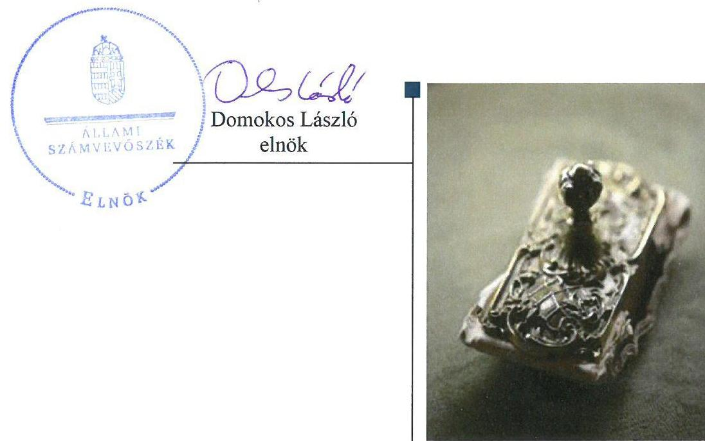
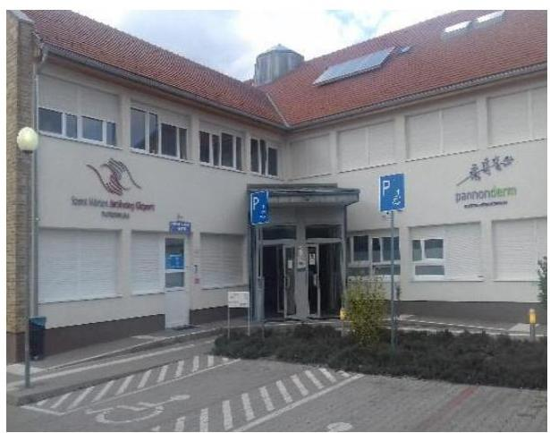
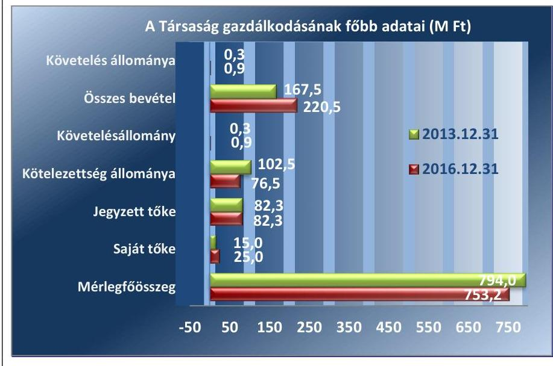

# Jelentés 

## Az önkormányzatok gazdasági társaságai

Az önkormányzatok többségi tulajdonában lévő gazdasági társaságok gazdálkodásának ellenőrzése - Szent Márton Járóbeteg Központ Nonprofit Közhasznú Kft.
2018.

---

# Jelentés 

## Az önkormányzatok gazdasági társaságai

Az önkormányzatok többségi tulajdonában lévő gazdasági társaságok gazdálkodásának ellenőrzése - Szent Márton Járóbeteg Központ Nonprofit Közhasznú Kft.
2018. március 4. nap

---

# AZ ELLENŐRZÉST FELÜGYELTE:

DR. HORVÁTH MARGIT felügyeleti vezető

## AZ ELLENŐRZÉST VEZETTE ÉS A VÉGREHAJTÁSÁÉRT FELELŐS:

VALASTYÁNNÉ DR. VÍZHÁNYÓ JÚLIA ellenőrzésvezető

## A PROGRAM ÖSSZEÁLLÍTÁSÁÉRT FELELŐS:

TÓTPÁL SZABOLCS osztályvezető

IKTATÓSZÁM: EL-0130-087/2018.

TÉMASZÁM: 2447

ELLENŐRZÉS-AZONOSÍTÓ SZÁM: V079320

Jelentéseink az Országgyűlés számítógépes hálózatán és az Interneten a www.asz.hu címen is olvashatóak.

---

# TARTALOMJEGYZÉK 

■ ÖSSZEGZÉS ..... 5
■ AZ ELLENŐRZÉS CÉLJA ..... 6
■ AZ ELLENŐRZÉS TERÜLETE ..... 7
■ AZ ELLENŐRZÉS HÁTTERE, INDOKOLTSÁGA ..... 9
■ A JELENTÉS LÉNYEGES KÉRDÉSKÖREI ..... 10
■ AZ ELLENŐRZÉS HATÓKÖRE ÉS MÓDSZEREI ..... 11
■ MEGÁLLAPÍTÁSOK ..... 13
■ JAVASLATOK ..... 18
■ MELLÉKLETEK ..... 21
I. sz. melléklet: Értelmező szótár ..... 21
II. sz. melléklet: A Társaság 2013-2016. évi mérleg adatai ..... 23
III. sz. melléklet: A Társaság rövidlejáratú kötelezettségeinek alakulása 2013-2016. között ..... 24
IV. sz. melléklet: A Társaság mérlegadatainak alakulása 2013-2016 között ..... 25
■ FÜGGELÉK: ÉSZREVÉTELEK ..... 27
■ RÖVIDÍTÉSEK JEGYZÉKE ..... 29

---

.

---

# ÖSSZEGZÉS 

Pannonhalma Város Önkormányzata a tulajdonosi joggyakorlás kereteit szabályszerűen kialakította, tulajdonosi jogait nem megfelelően gyakorolta. A Szent Márton Járóbeteg Központ Nonprofit Közhasznú Kft. gazdálkodásának szabályozottsága és vagyongazdálkodási tevékenysége megfelelő volt. A Társaság a beszámolási kötelezettségének eleget tett, fizetőképessége biztosított volt.

## Az ellenőrzés társadalmi indokoltsága

Az Állami Számvevőszék kiemelt célja, hogy a helyi önkormányzatok gazdálkodásában rejlő pénzügyi kockázatok feltárásával, az államháztartáson kívülre nyújtott költségvetési támogatások és ingyenes vagyonjuttatások, valamint az államháztartáson kívül működő feladatellátó rendszerek ellenőrzéseivel hozzájáruljon ahhoz, hogy a közpénzeket az államháztartáson kívül működő szervezetek is átlátható, rendezett módon használják fel.

Az Állami Számvevőszék céljaival és a társadalmi igénnyel összhangban, valamint a gazdasági társaságok kiemelt fontosságú szerepe miatt került sor a Szent Márton Járóbeteg Központ Nonprofit Közhasznú Kft. ellenőrzésére. Az Állami Számvevőszék az ellenőrzése során arra kereste a választ, hogy 2013-2016. között szabályszerű volt-e a Társaság gazdálkodása és az Önkormányzat ehhez kapcsolódó tulajdonosi joggyakorlása.

## Főbb megállapítások, következtetések, javaslatok

Az Önkormányzat a tulajdonosi joggyakorlás kereteit szabályszerűen kialakította. Az Önkormányzat a Társaság feletti tulajdonosi jogait nem gyakorolta szabályszerűen. Az Önkormányzat közép- és hosszú távú vagyongazdálkodási tervkészítési kötelezettségének az Nvtv.-ben foglaltaknak megfelelően eleget tett. Javadalmazási szabályzatot a Társaság legfőbb szerve nem alkotott.

A Társaság rendelkezett a Számv. tv.-ben előírt szabályzatokkal. A Társaság vagyonnyilvántartása, vagyongazdálkodási tevékenysége szabályszerű volt. Az egyszerűsített éves beszámolókban szereplő vagyonelemek állományát a Társaság leltárral alátámasztotta.

A 2016. évben az ügyvezető nem alakította ki a célok megvalósítását a tevékenység nyomonkövetését biztosító rendszert, így nem járult hozzá az integritás erősítéséhez.

A Társaság fizetőképessége biztosított volt, beszámolási kötelezettségének szabályszerűen eleget tett. A Társaság nem készítette el a közérdekű adatok megismerésére irányuló igények teljesítésének rendjét rögzítő szabályzatot, közérdekű adatait nem tette közzé.

A bevételek és ráfordítások elszámolása nem felelt meg a jogszabályi előírásoknak. Az értékcsökkenést a Társaság szabályszerűen számolta el. A személyi jellegű ráfordítások elszámolása szabályszerű volt. A Társaság önköltség-számítási szabályzat készítésére nem volt kötelezett, a térítésköteles egészségügyi szolgáltatások díjait a jogszabályban foglaltak szerint szabályozta.

A Társaság a 2016. évben egy adósságot keletkeztető ügyletét szabálytalanul kötötte meg.

---

# AZ ELLENŐRZÉS CÉLJA 

Az ellenőrzés célja annak értékelése volt, hogy az önkormányzat vagyongazdálkodási tevékenysége során szabályszerűen gyakorolta-e tulajdonosi jogait; a gazdasági társaság szabályozottsága, gazdálkodása és vagyongazdálkodási tevékenysége, bevételeinek és ráfordításainak elszámolása megfelelt-e a jogszabályi és tulajdonosi előírásoknak; a gazdasági társaság kötelezettségállománya jelent-e kockázatot a működésre, valamint a gazdálkodás átláthatósága és elszámoltathatósága érdekében biztosítva volt-e a szolgáltatás díjának megalapozottsága szabályszerű önköltségszámítással. Az ellenőrzés célja továbbá annak megítélése volt, hogy a kormányzati szektorba sorolt önkormányzati tulajdonban (résztulajdonban) lévő gazdálkodó szervezetek gazdálkodásának a kormányzati szektor hiányára és az államadósságra befolyással bíró elemei a jogszabályi előírásoknak megfeleltek-e.

---

# **AZ ELLENŐRZÉS TERÜLETE**

## **Pannonhalma Város Önkormányzata és a többségi tulajdonában lévő Szent Márton Járóbeteg Központ Nonprofit Közhasznú Kft.**

A Szent Márton Járóbeteg Központ Nonprofit Közhasznú Kft-t 2008. november 15-én alapította tíz önkormányzat1. A Társaság2 jegyzett tőkéje alapításkor 7,0 M Ft3, 2013. január 1-jén 50,6 M Ft (ebből 7,0 M Ft pénzbeli hozzájárulás, 43,6 M Ft apport) volt. A 2013. évben az Önkormányzat tőkeemelés címen 31,7 M Ft értékben ingatlant apportált a Társaságba, amelynek jegyzett tőkéje így 82,3 M Ft-ra nőtt és a 2016. év végéig nem változott.

Pannonhalma Város Önkormányzata a Társaság jegyzett tőkéjéből alapításkor 97,1%-kal, 2013. december 9-étől 99,8%-kal részesedett.

Az Önkormányzat4 a Társaság részére a 2013-2016. években összesen 16,4 M Ft támogatást, illetve 22,0 M Ft kölcsönt nyújtott, a Társaság a kölcsönöket a 2016. év végéig visszafizette.

Az Önkormányzatnál a polgármester5 és a jegyző6 személye az ellenőrzött időszakban nem változott.

A Társaság főtevékenysége, illetve cél szerinti közhasznú tevékenysége szakorvosi járóbeteg-ellátás volt. Közhasznú tevékenységként végezte továbbá az általános járóbeteg-ellátást, valamint az egyéb humán-egészségügyi ellátást. A Társaság közhasznú feladatai egyben közfeladatok voltak. A Társaság vállalkozási tevékenységei körébe tartozott ingatlan bérbeadása, üzemeltetése, kozmetológiai, valamint ún. *"prémium szolgáltatások"* (szépészeti bőrgyógyászati szolgáltatások) végzése. A Társaság vállalkozási tevékenységből származó bevétele az összes bevételből 2013-ban 4,0%-ot, a 2016. évben 12,4%-ot képviselt.

A Társaság a tevékenysége elvégzéséhez szükséges épületet és eszközöket az Önkormányzat által apportként biztosított telken Európai Uniós forrásokból, TIOP7 pályázat keretében, 806,8 M Ft támogatással hozta létre. A Társaság közhasznú tevékenységét az engedélyezési eljárást követően, 2011. április 1-jétől kezdve látta el. A Társaság egészségügyi szolgáltatásait az OEP8-pel kötött szerződés9 alapján végezte.

A Társaság a TÁMOP10 keretében 2013-ban 47,0 M Ft összegben foglalkoztatást támogató, a TIOP keretében 2015-ben 86,5 M Ft összegben struktúraváltási pályázatot nyert. A struktúraváltási pályázatból esztétikai lézerkezelésekre alkalmas készülékeket szerzett be azzal a céllal, hogy azokat a bőrgyógyászati szakrendelésekre alapozva *"prémium szolgáltatás"* keretében működteti, ezáltal bevételeit növeli.

A Társaság főtevékenysége működési területe Pannonhalma és környéke településeinek betegellátására terjedt ki, 22 db járóbeteg-szakrendelés működtetésével.

---

A Társaság tevékenységét jellemző esetszámokat az 1. táblázat mutatja be.

1. táblázat

# A SZENT MÁRTON JÁRÓBETEG KÖZPONT NONPROFIT KÖZHASZNÚ KFT. TEVÉKENYSÉGÉT JELLEMZŐ ESETSZÁMOK ALAKULÁSA (DB/ÉV) 

| Esetszám | 2013. | 2014. | 2015. | 2016. |
| :--: | :--: | :--: | :--: | :--: |
| Járóbeteg szakellátás   (laborral együtt) | 38244 | 39353 | 43352 | 43779 |
| Ultrahang | 10811 | 9470 | 8377 | 7530 |
| Röntgen | 3450 | 3659 | 4329 | 4244 |
| Összesen | 52505 | 52482 | 56058 | 55553 |

A Társaság a Számv. tv. ${ }^{11}$-ben foglalt előírás alapján könyvvizsgálatra nem volt kötelezett.

A Társaság önkormányzati vagyont nem kezelt, a 2016. évben kormányzati szektorba sorolt egyéb szervezetként működött.

A Társaságnál az ügyvezető ${ }^{12}$ személye az ellenőrzött időszak alatt nem változott, tevékenységét 2010. november 5-étől látta el. A Társaság más gazdasági társaságban nem rendelkezett tulajdoni hányaddal.

A Társaság gazdálkodásának főbb adatait az 1. ábra, 2013-2016. évi mérleg adatait a II. sz. melléklet szemlélteti.

1. ábra

Forrás: a Társaság éves beszámolói
A Társaság mérlegfőösszege a 2013. évről a 2016. évre 5,1%-kal csökkent. Az ellenőrzött időszakban a követelésállomány 0,3 M Ft-ról 0,9 M Ftra emelkedett, a kötelezettségállomány 25,4%-kal csökkent. A 2013. évben a Társaság 18,8 M Ft veszteséget, 2014. évben 1,2 M nyereséget, 2015. évben 5,9 M Ft nyereséget, 2016-ban 2,9 M Ft nyereséget ért el. Saját tőkéje az ellenőrzött időszakban 66,7%-kal nőtt. Az összes bevétel 2013-2016. között 31,6%-kal emelkedett. A Társaság önköltségszámításra nem volt kötelezett.

A Társaság bevételeinek, ráfordításainak, valamint adózott eredményének alakulását és megoszlását a IV. sz. melléklet mutatja be.

---

# AZ ELLENŐRZÉS HÁTTERE, INDOKOLTSÁGA 

AZ ÖNKORMÁNYZATOK TÖBBSÉGI TULAJDONÁBAN ÁLLÓ GAZDASÁGI TÁRSASÁGOK ellenőrzése kiemelten fontos a vagyon megőrzése, megóvása érdekében, valamint a kormányzati szektor elszámolásaiban megjelenő önkormányzati tulajdonú gazdálkodó szervezetek esetében, amelyekkel szemben alapvető követelmény, hogy gazdálkodásuk, működésük szabályszerű, az általuk szolgáltatott adatok minél megbízhatóbbak legyenek. A feladatellátás költségeinek, ráfordításainak alakulása a lakosság széles rétegét érinti.

ELLENŐRZÉSEINK FELTÁRHATJÁK, hogy az önkormányzat a feladatellátásához rendelt vagyon működtetését a tulajdonostól elvárható gondossággal végezte-e, a feladatot ellátó gazdasági társaság a létesítő okiratban, szolgáltatási szerződésben foglaltak betartásával biztosította-e a feladat ellátását. Az ellenőrzés eredményeképp meghatározhatóvá válnak a költségvetési hiányt befolyásoló szervezetek kockázatai, lehetővé válik ezen kockázatok csökkentése. Az ellenőrzés rávilágíthat arra, hogy a gazdasági társaság a vagyon használatával biztosította-e a szolgáltatás folytatásának feltételeit, az önkormányzat tulajdonosi felügyelete hozzájárult-e a szabályszerű gazdálkodáshoz és feladatellátáshoz. A megállapítások alapján megfogalmazott számvevőszéki javaslatok hasznosítása elősegítheti a meglévő hibák megszüntetését. A jó gyakorlatok bemutatásával az ÁSZ ${ }^{13}$ hozzájárulhat a követendő megoldások megismertetéséhez, terjesztéséhez.

---

# A JELENTÉS LÉNYEGES KÉRDÉSKÖREI 

1.     - Az önkormányzat tulajdonosi joggyakorlása szabályszerű volt-e?
2.     - A gazdasági társaság szabályozottsága, gazdálkodása és vagyongazdálkodási tevékenysége szabályszerű volt-e, fizetőképessége biztosított volt-e a gazdálkodás során?
3.     - A gazdasági társaság bevételeinek és ráfordításainak elszámolása szabályszerű volt-e?
4.     - A kormányzati szektorba sorolt önkormányzati tulajdonban (résztulajdonban) lévő gazdálkodó szervezet gazdálkodásának a kormányzati szektor hiányára és az államadósságra befolyással bíró elemei megfeleltek-e a jogszabályi előírásoknak?

---

# AZ ELLENŐRZÉS HATÓKÖRE ÉS MÓDSZEREI 

## Az ellenőrzés típusa

Megfelelőségi ellenőrzés.

## Az ellenőrzött időszak

2013. január 1-jétől 2016. december 31-ig tartó időszak.

## Az ellenőrzés tárgya

Pannonhalma Város Önkormányzatának a Szent Márton Járóbeteg Központ Nonprofit Közhasznú Kft. feletti tulajdonosi joggyakorlása, valamint a Szent Márton Járóbeteg Központ Nonprofit Közhasznú Kft. gazdálkodásának szabályozottsága és szabályszerűsége, továbbá a Szent Márton Járóbeteg Központ Nonprofit Közhasznú Kft., mint önkormányzati alszektorba sorolt gazdasági társaság gazdálkodásának a kormányzati szektor hiányára és az államadósságra befolyással bíró elemei.

Az ellenőrzés kiterjedt minden olyan körülményre és adatra, amely az ÁSZ jogszabályban meghatározott feladatainak teljesítéséhez, valamint a program végrehajtása folyamán felmerült újabb összefüggések feltárásához szükséges volt.

## Az ellenőrzött szervezet

Pannonhalma Város Önkormányzata, valamint a Szent Márton Járóbeteg Központ Nonprofit Közhasznú Kft.

## Az ellenőrzés jogalapja

Az ellenőrzés jogszabályi alapját az az Állami Számvevőszékről szóló 2011. évi LXVI. törvény 1. § (3) bekezdése és 5. § (3)-(5) bekezdései képezték.

## Az ellenőrzés módszerei

Az ellenőrzést a nemzetközi standardokat irányadónak tekintve az ellenőrzési program ellenőrzési kérdései, az ellenőrzött időszakban hatályos jogszabályok, az ellenőrzés szakmai szabályok és módszertanok figyelembe vételével végeztük.

---

Az ellenőrzés ideje alatt az ellenőrzött szervezettel történő kapcsolattartást az ÁSZ Szervezeti és Működési Szabályzatának vonatkozó előírásai alapján biztosítottuk.

Az ellenőrzési kérdések megválaszolásához szükséges bizonyítékok megszerzése a következő ellenőrzési eljárások alkalmazásával történt: megfigyelés, kérdésfeltevés (információkérés), összehasonlítás, valamint elemző eljárás. Az ellenőrzési bizonyítékként felhasználható adat-források közé tartoztak egyrészt az ellenőrzési programban felsorolt adatforrások, másrészt
 adatforrás volt még minden - az ellenőrzés folyamán - feltárt, az ellenőrzés szempontjából információkat tartalmazó dokumentum.

Az ellenőrzést a kérdésekre adott válaszok kiértékelésével, valamint a megjelölt adatforrások, a csatolt tanúsítványok felhasználásával, továbbá az adott időszakban hatályos jogszabályok figyelembevételével folytattuk le.

A gazdasági társaság bevételei és ráfordításai, ezeken belül az értékcsökkenés, valamint a vagyonnyilvántartás szabályszerűségének megítéléséhez a bevételeket és a ráfordításokat, a tárgyi eszközök állományváltozásait tartalmazó adott évi főkönyvi adatbázisát vettük alapul. A minta kiválasztása során véletlen mintavételt alkalmaztunk évenkénti, elemszámmal arányos rétegezéssel a teljes időszakra vonatkozóan. A minta alapján a sokaságban előforduló hibaarányt becsültük. „Megfelelőnek" értékeltünk egy ellenőrzött területet, amennyiben 95%-os bizonyossággal a teljes sokaságban a hibaarány legfeljebb 10%, „nem megfelelőnek", amennyiben 10%-nál magasabb arányt képviselt. A mintavételt megelőzően az anyagjellegű ráfordítások, valamint a tárgyi eszköz növekedési tételei sokaságból évente sokaságonként kiemeltük a 3-3 legnagyobb összegű tételt annak biztosítására, hogy az ellenőrzés az egyszerű véletlen mintavétel mellett a legnagyobb értékű tételek ellenőrzésére biztosan kiterjedjen.

---

# 1. Az önkormányzat tulajdonosi joggyakorlása szabályszerű volt-e? 

Összegző megállapítás

Az Önkormányzat a Társaság feletti tulajdonosi jogait nem szabályszerűen gyakorolta.

### 1.1. számú megállapítás

Az Önkormányzat a tulajdonosi joggyakorlás kereteit szabályszerűen alakította ki. A Társaság legfőbb szerve javadalmazási szabályzatot nem alkotott.

Az Önkormányzat az Mötv. ${ }^{14}$ alapján rendelkezett gazdasági programmal${ }^{15}$, melyben a Társaság esetében a járóbeteg-szakellátás színvonalának emelését, a gyógyászati, egészségmegőrző és rekreációs szolgáltatások fejlesztését tűzte ki célul.

Közép- és hosszú távú vagyongazdálkodási tervkészítési kötelezettségének az Önkormányzat az Nvtv. ${ }^{16}$ 9. § (1) bekezdésében foglaltak szerint eleget tett.

A TULAJDONOSI JOGGYAKORLÁS KERETEIT az Önkormányzat az SZMSZ${ }^{17}$-ben és a Vagyonrendeletben ${ }^{18}$ a Gt. ${ }^{19}$ és a Ptk. ${ }^{20}$ előírásaival összhangban alakította ki. A Taggyűlésen ${ }^{21}$ az Önkormányzat képviseletére - a Társasági szerződés ${ }^{22}$ előírása szerint - a polgármester volt jogosult. A Társasági szerződésben a Gt. és a Ptk. előírásának megfelelően rögzítették a Taggyűlés kizárólagos hatáskörébe tartozó ügyeket. A Társasági szerződés tartalmazta az Önkormányzat FB${ }^{23}$-ben való képviseletét, az ügyvezető, az FB-tagok személyét, jogosítványait, kötelezettségeit. A Társasági szerződés a Gt., a Ptk. és a Taktv. ${ }^{24}$ előírásait betartva három tagból álló FB működését írta elő. 2013-ban az új FB tag megválasztásáról a Gt. előírásai szerint a Taggyűlés döntött.

Az Önkormányzat az FB ülések jegyzőkönyveinek megismerése, valamint a Taggyűlésen történt képviselet révén alakította ki a monitoring tevékenységét a Társaság felett. Üzleti tervkészítési kötelezettséget az Önkormányzat nem írt elő a Társaság részére. A Társaság a 2013-2016. években üzleti tervet nem készített.

A Társaság legfőbb szerve, a Taggyűlés - figyelmen kívül hagyva a Taktv. 5. § (3) bekezdésében foglaltakat - nem alkotta meg a vezető tisztségviselők, FB-i tagok, az Mt. ${ }^{25}$ 208. §-ának hatálya alá eső munkavállalók javadalmazása, valamint a jogviszony megszűnése esetére biztosított juttatások módjának, mértékének elveiről, annak rendszeréről szóló szabályzatot. Az ellenőrzött időszakban az FB tagjai díjazás nélkül látták el feladataikat.

---

1.2. számú megállapítás

A tulajdonosi jogok gyakorlása a Társaság felett nem volt szabályszerű. A Taggyűlés a Társaság saját tőke/jegyzett tőke arányának helyreállítása érdekében azonban 2013-ban nem a megfelelő döntést hozta és azt az ellenőrzött időszakban nem korrigálta.

A TULAJDONOSI JOGOKAT a Társasági szerződésben foglaltaknak megfelelően a Taggyűlés gyakorolta. A Taggyűlés a kizárólagos hatáskörébe tartozó ügyekben - egy döntés kivételével - a jogszabályi előírásoknak megfelelően szabályszerűen döntött. A Taggyűlés 2013. július 30-án a Gt.-ben foglalt előírásokra tekintettel a Társaságnál 31,7 M Ft összegű törzstőke emelésről, továbbá 14,6 M Ft pótbefizetés előírásáról határozott. A Taggyűlés határozata alapján a kötelezettség teljes összege az Önkormányzatot érintette, amelynek határidőben eleget tett. A Társaság a Gt. 143. § (2) bekezdés a) pontjában, illetve a Ptk. 3:189. § (1) bekezdés a) pontjában foglalt előírásoknak nem felelt meg, mivel a saját tőke a 2013-2016. években nem érte el a jegyzett tőke felét. A megtett intézkedések ellenére azonban - a Ptk. 3:189. § (3) bekezdésében foglaltak ellenére - a saját tőke/jegyzett tőke aránya nem állt helyre, mert a Taggyűlés határozatában a tőkeleszállítással szemben tőkeemelésről döntött.

AZ EGYSZERŰSÍTETT ÉVES BESZÁMOLÓK, valamint közhasznúsági jelentések elfogadásáról a Taggyűlés a Gt.-ben, illetve a Ptk.-ban foglaltaknak megfelelően - az FB írásbeli jelentése alapján - döntött. A mérleg szerinti eredmény felosztását a Taggyűlés az egyszerűsített éves beszámolók elfogadásával együtt jóváhagyta.

Az Önkormányzat az ügyvezető által előterjesztett, a szakmai feladatellátásról, illetve az Önkormányzat által nyújtott támogatás felhasználásáról szóló beszámolókat elfogadta. Az Önkormányzat a Társaság esetében nem élt az Áht. ${ }^{26}$ 70. § (1) bekezdés d) pontjában biztosított belső ellenőrzés lehetőségével.

Az Önkormányzat a 2013-2016. években a Társaság - egy takarékszövetkezet által nyújtott 55,0 M Ft összegű - folyószámlahiteléhez kezességet vállalt és jelzálogjogot biztosított.

# 2. A gazdasági társaság szabályozottsága, gazdálkodása és vagyongazdálkodási tevékenysége szabályszerű volt-e, fizetőképessége biztosított volt-e a gazdálkodás során? 

Összegző megállapítás

## 2.1. számú megállapítás

A Társaság gazdálkodásának szabályozottsága és vagyongazdálkodási tevékenysége megfelelő volt. A fizetőképesség biztosított volt.

A Társaság rendelkezett a Számv. tv.-ben előírt szabályzatokkal, azok megfeleltek az előírásoknak.

A Társaság rendelkezett a Számv. tv.-ben előírt Számviteli politikával${ }^{27}$, továbbá Leltárkészítési és leltározási szabályzattal${ }^{30}$, Értékelési szabályzattal ${ }^{31}$, Pénzkezelési szabályzattal${ }^{32}$, valamint Selejtezési szabályzattal ${ }^{33}$. A szabályzatok a Számv. tv. előírásainak megfeleltek. A Társaság az önköltségszámítás rendjére vonatkozó szabályzatkészítési kötelezettség

---

alól a Számv. tv. 14. § (6) bekezdése alapján mentesült. A Társaság a Számlarendet${ }^{34}$ elkészítette, amely a Számv. tv. előírásainak megfelelt.

A Társaság rendelkezett a Taggyűlés által jóváhagyott Szervezeti és Működési Szabályzattal ${ }^{35}$. A szabályozás - többek között - tartalmazta a Társaság főbb adatait, kijelölte a működési területet és tevékenységi köröket, meghatározta a felelősségi- és hatásköröket, a betegellátás rendjét.

A Társaság a közhasznúsági mellékletében a közhasznú és vállalkozási tevékenységéből származó bevételeit és ráfordításait bemutatta. Azonban belső szabályozásában a közhasznú és vállalkozási tevékenységéből származó bevételei és ráfordításai elkülönített könyvelésének szabályrendszerét nem részletezte tovább a Számv. tv. 161/A. § (2) bekezdésében foglalt módon, hogy az alkalmas legyen az éves beszámoló kiegészítő melléklete, közhasznúsági melléklet adatainak közvetlen alátámasztására.

Az ügyvezető a 2016. évben a Bkr. 10. § és 54/A. §-ának előírása ellenére nem alakította ki a Társaság tevékenységének, a célok megvalósításának nyomon követését biztosító rendszert.

# 2.2. számú megállapítás 

## A Társaság az egyszerűsített éves beszámolóit leltárral alátámasztotta. A vagyongazdálkodás a 2013-2016. években szabályszerű volt.

A VAGYONNYILVÁNTARTÁSA szabályszerű volt. A Társaság az egyszerűsített éves beszámolókban szereplő vagyonelemek állományát a 2013-2016. években a Számv. tv. 69. § (1) bekezdésének előírása szerint leltárral alátámasztotta. A Társaság a tárgyi eszközökről folyamatos mennyiségi nyilvántartást vezetett, a leltárba bekerülő adatok valódiságáról a leltár összeállítását megelőzően - a 2014. évben mennyiségi leltárfelvétellel - meggyőződött, ezzel megfelelt a Számv. tv. 69. § (3) bekezdésében és a Leltárkészítési és leltározási szabályzatban foglaltaknak.

## A Társaság fizetőképessége biztosított volt, kötelezettség állománya a működését nem veszélyeztette.

A Társaság fizetőképessége biztosított volt. A rövid lejáratú kötelezettségek állománya a 2016. évben 30,4%-kal volt kevesebb a 2013. évhez képest. Ezen belül a szállítói kötelezettségeké 70,7%-kal, ebből a lejárt állomány 85,5%-kal csökkent. A Társaság hosszú lejáratú kötelezettségét határidőben teljesítette. A Társaság rövid lejáratú kötelezettségeit a III. számú melléklet szemlélteti.

## A Társaság a beszámolási kötelezettségét teljesítette. A közérdekű adatok megismerésére irányuló igények teljesítésének rendjét nem szabályozta, közérdekű adatait nem tette közzé.

AZ EGYSZERŰSÍTETT ÉVES BESZÁMOLÓKAT és a közhasznúsági mellékleteket a Társaság a Számv. tv., a Civil tv. és a Társasági szerződés előírásának megfelelően határidőben elkészítette. Azokat a Számv. tv.-ben foglaltak szerint letétbe helyezte és közzétette.

A Társaság az Info tv. ${ }^{36}$ 30. § (6) bekezdésének előírása ellenére a közérdekű adatok megismerésére irányuló igények teljesítésének rendjét nem szabályozta.

---

A Társaság nem tette közzé a Taktv. 2. § (1)-(2) bekezdéseiben előírt adatokat. Úgymint az Mt. 208. § szerinti vezető állású munkavállalók, valamint az önállóan cégjegyzésre, bankszámla feletti rendelkezésre jogosult munkavállalók nevét, tisztségét vagy munkakörét, munkaviszonyban álló személy esetében a munkavállaló részére a munkaviszonya alapján közvetlenül vagy közvetve nyújtott pénzbeli juttatásokat. Továbbá a munkaszerződés alapján járó mértéket megjelölve a munkavállalóra irányadó végkielégítés, illetve felmondási idő időtartamát, az Mt. 228. § alapján kikötött időtartamot és a kötelezettség vállalásának ellenértékét.

A Társaság a 2016. üzleti évet érintően az Ávr. ${ }^{37}$ 5. számú melléklet 23. pontja szerinti, az egyszerűsített éves beszámolóra vonatkozó adatszolgáltatás teljesítésére volt kötelezett, amelynek nem tett eleget.

# 3. A gazdasági társaság bevételeinek és ráfordításainak elszámolása szabályszerű volt-e? 

Összegző megállapítás

A Társaság bevételeinek és ráfordításainak elszámolása nem felelt meg a jogszabályi előírásoknak. A személyi jellegű ráfordítások és az értékcsökkenés elszámolása szabályszerű volt. Az árképzés szabályszerű volt.

A BEVÉTELEK ÉS RÁFORDÍTÁSOK elszámolása nem volt szabályszerű.

A bevételek esetében előfordult, hogy a bizonylat a Számv. tv. 167. § (1) bekezdés e) pontjában foglaltak ellenére nem tartalmazta a gazdasági művelet megjelölését, a gazdasági művelet okozta változások mennyiségi, minőségi, illetve - a gazdasági művelet jellegétől, a könyvviteli elszámolás rendjétől függően - értékbeni adatait.

A ráfordítások esetében előfordult, hogy nem állt rendelkezésre bizonylat, amely alátámasztotta volna a könyvviteli elszámolást, ezzel a Társaság megsértette a Számv. tv. 165. § (1)-(2) bekezdésének előírását.

A SZEMÉLYI JELLEGŰ RÁFORDÍTÁSOK elszámolása szabályszerű volt. A Társaság a személyi jellegű egyéb kifizetéseket bizonylatokkal alátámasztotta.

AZ ÉRTÉKCSÖKKENÉST a Társaság a Számv. tv.-nek és a belső szabályozásnak megfelelően számolta el.

A Társaság saját vagyona értékének értékcsökkenésből eredő pótlása, felújítása 65,7%-os szinten valósult meg. Az elszámolt értékcsökkenés 157,6 M Ft, az eszközpótlásra fordított összeg 103,6 M Ft volt.

A Társaság vevőkövetelésének mérlegfőösszeghez viszonyított aránya nem volt jelentős, 2013-ban 0,04%-ot, 2016-ban 0,1%-ot tett ki.

A Társaság önköltségszámításra a Számv. tv. előírása alapján nem volt kötelezett. A Társaság rendelkezett Térítési díj szabályzattal ${ }^{38}$, amely tartalmazta a 284/1997. (XII. 23.) Korm. rendelet ${ }^{39}$ által előírt térítésköteles egészségügyi szolgáltatások díjait. A Társaság vállalkozási tevékenysége keretében végzett szolgáltatásai árait a mindenkori piaci viszonyok figyelembevételével alakította ki.

---

# 4. A kormányzati szektorba sorolt önkormányzati tulajdonban (résztulajdonban) lévő gazdálkodó szervezet gazdálkodásának a kormányzati szektor hiányára és az államadósságra befolyással bíró elemei megfeleltek-e a jogszabályi előírásoknak? 

## Összegző megállapítás

A Társaságnak az államadósságra befolyással bíró eleme a 2016. évben nem felelt meg a jogszabályi előírásoknak.

A Társaság gazdálkodásának az államadósságra befolyással bíró eleme nem volt szabályszerű. A Társaság 2016. október 26-án adásvételi szerződést kötött az államháztartás alrendszereibe nem tartozó, kormányzati szektorba nem sorolt szervezettel ultrahang diagnosztikai készülék
 30 havi részletre történő beszerzésére, bruttó 9,7 M Ft összegben. Az adásvételi szerződést a Társaság részéről az arra jogosult ügyvezető írta alá. Az ügyvezető az adósságot keletkeztető ügylethez a Stabilitási tv. ${ }^{40}$ 9. § (1) bekezdésében, valamint az adósságot keletkeztető ügyletekhez történő hozzájárulás részletes szabályairól szóló 353/2011. (XII. 30.) Korm. rendelet 11. §-ában foglaltak ellenére a tulajdonosi joggyakorló egyetértését, továbbá az államháztartásért felelős miniszter előzetes hozzájárulását nem kérte meg.

---

# JAVASLATOK 

Az ÁSZ tv. 33. § (1) bekezdésében foglaltak értelmében az ellenőrzött szervezet vezetője köteles a jelentésben foglalt megállapításokhoz kapcsolódó intézkedési tervet összeállítani és azt a jelentés kézhezvételétől számított 30 napon belül az ÁSZ részére megküldeni. Amennyiben az ellenőrzött szervezet vezetője nem küldi meg határidőben az intézkedési tervet, vagy továbbra sem elfogadható intézkedési tervet küld, az Állami Számvevőszék elnöke az ÁSZ tv. 33. § (3) bekezdése a) és b) pontjaiban foglaltakat érvényesítheti.
Javaslataink célja a Szent Márton Járóbeteg Központ Nonprofit Közhasznú Kft. gazdálkodása szabályszerűségének és gyakorlatának javítása annak érdekében, hogy a szabályozási környezet és az alkalmazott gyakorlat megfelelően tudja támogatni az átlátható működést.

## A Szent Márton Járóbeteg Központ Nonprofit Közhasznú Kft. ügyvezetőjének

1. Intézkedjen a számviteli szabályozás kiegészítésére annak érdekében, hogy az alkalmas legyen a közhasznú és egyéb tevékenység bevételei és ráfordításai elkülönített nyilvántartására, egyúttal az éves beszámoló kiegészítő melléklete adatainak közvetlen alátámasztására a Számv. tv. előírásainak megfelelően.
(2.1. sz. megállapítás 3. bekezdés 2. mondata alapján)
2. Intézkedjen a Társaság tevékenységének, a célok megvalósításának nyomon követését biztosító rendszer Bkr. előírásainak megfelelő kialakításáról.
(2.1. sz. megállapítás 4. bekezdése alapján)
3. Intézkedjen az Info tv. előírásai alapján a közérdekű adatok megismerésére irányuló igények teljesítésének rendjére vonatkozó szabályzat elkészítéséről.
(2.4. sz. megállapítás 2. bekezdése alapján)
4. Intézkedjen az Taktv.-ben előírt közzétételi kötelezettség teljesítéséről.
(2.4. sz. megállapítás 3. bekezdése alapján)

---

5. Intézkedjen az Ávr. előírásai szerinti adatszolgáltatási kötelezettség teljesítéséről.
(2.4. sz. megállapítás 4. bekezdése alapján)
6. Intézkedjen a bevételek és ráfordítások elszámolásának a Számv. tv. előírásainak megfelelő számviteli bizonylattal történő alátámasztásáról.
(3. sz. megállapítás 2. és 3. bekezdéseinek megfelelően)
7. Intézkedjen annak érdekében, hogy a Társaság adósságot keletkeztető ügyletet az államháztartásért felelős miniszter előzetes hozzájárulásának birtokában, a tulajdonosi joggyakorló egyetértése mellett kössön a Stabilitási tv., továbbá 353/2011. (XII. 30.) Korm. rendelet rendelkezésének megfelelően.
(4. sz. megállapítás 1. bekezdése alapján)
8. Intézkedjen annak érdekében, hogy a Társaság gazdálkodásának kormányzati szektor hiányára befolyással bíró elemei feleljenek meg a Számv. tv. előírásainak.
(4. sz. megállapítás 1. bekezdése alapján)
9. Hívja össze a Taggyülést a saját tőke/jegyzett tőke arány helyreállítása érdekében.
(1.2. sz. megállapítás 1. bekezdés 5-6. mondata alapján)

---

# Javaslataink célja a tulajdonosi joggyakorló Pannonhalma Város Önkormányzata szabályszerű működésének elősegítése, továbbá a tulajdonosi joggyakorlás kontrolljainak erősítése. 

## Pannonhalma Város Önkormányzata polgármesterének

1. Kezdeményezze a Társaság vezető tisztségviselői, a felügyelő bizottsági tagok, a Mt. 208. §-ának hatálya alá eső munkavállalók javadalmazása, valamint a jogviszony megszünése esetére biztosított juttatások módjának, mértékének elveire, annak rendszerére vonatkozó szabályzat elkészítését és Taggyülés általi jóváhagyását a Taktv.-ben előírtaknak megfelelően.
(1.1. sz. megállapítás 5. bekezdés 1. mondata alapján)
2. Kezdeményezze a Taggyülésnél a Társaság Ptk. előírásainak megfelelő saját tőke/jegyzett tőke arányának helyreállítását.
(1.2. sz. megállapítás 1. bekezdés 5-6. mondatai alapján)
3. Fordítson kiemelt figyelmet arra, hogy az Áht.-ban kapott felhatalmazás alapján az Önkormányzat belső ellenőrzése ellenőrzéseivel támogassa a közfeladat-ellátás szabályszerű teljesítését.
(1.2. sz. megállapítás 3. bekezdés 2. mondata alapján)

---

# MELLÉKLETEK 

- I. SZ. MELLÉKLET: ÉRTELMEZŐ SZÓTÁR
gazdasági társaság
gazdálkodó szervezet
kormányzati szektorba sorolt egyéb szervezet
közszolgáltatás
nemzeti vagyon
nonprofit gazdasági társaság
vagyonkezelő

Ptk. 3:88. § (1) bekezdése szerint „a gazdasági társaságok üzletszerű közös gazdasági tevékenység folytatására, a tagok vagyoni hozzájárulásával létrehozott, jogi személyiséggel rendelkező vállalkozások, amelyekben a tagok a nyereségből közösen részesednek, és a veszteséget közösen viselik".
A Ptk. 685. § c) pontja szerint gazdálkodó szervezet: „az állami vállalat, az egyéb állami gazdálkodó szerv, a szövetkezet, a lakásszövetkezet, az európai szövetkezet, a gazdasági társaság, az európai részvénytársaság, az egyesülés, az európai gazdasági egyesülés, az európai területi együttműködési csoportosulás, az egyes jogi személyek vállalata, a leányvállalat, a vízgazdálkodási társulat, az erdő birtokossági társulat, a végrehajtói iroda, az egyéni cég, továbbá az egyéni vállalkozó." (2014. 03. 15-ig hatályos)
Az Áht. 3. § (2) és (3) bekezdésében foglaltakon kívül az Európai Közösséget létrehozó szerződéshez csatolt, a túlzott hiány esetén követendő eljárásról szóló jegyzőkönyv alkalmazásáról szóló 2009. május 25-i 479/2009/EK rendelet (a továbbiakban: 479/2009/EK rendelet) szerint a kormányzati szektorba sorolt szervezet (Áht. 1. § (12))
Az Ebktv. ${ }^{41}$ 3. § d) pontja a következőképpen határozza meg a közszolgáltatást: „szerződéskötési kötelezettség alapján a lakosság alapvető szükségleteinek ellátására irányuló szolgáltatás, így különösen a villamos energia-, gáz-, hő-, víz-, szenny-víz- és hulladékkezelési, köztisztasági, postai és távközlési szolgáltatás, továbbá a menetrend alapján közlekedő járművekkel végzett közforgalmú személyszállítás". Nvtv. 1. § (2) bekezdése szerint többek között:
„az állam vagy a helyi önkormányzat kizárólagos tulajdonában álló dolgok, az a) pont hatálya alá nem tartozó, állam vagy a helyi önkormányzat tulajdonában lévő dolog,
az állam vagy a helyi önkormányzat tulajdonában lévő pénzügyi eszközök, továbbá az államot vagy a helyi önkormányzatot megillető társasági részesedések, az államot vagy a helyi önkormányzatot megillető bármely vagyoni értékkel rendelkező jogosultság, amelyet jogszabály vagyoni értékű jogként nevesít."
Civil tv. 9/F. § (2) bekezdése szerint „az a gazdasági társaság minősül nonprofit gazdasági társaságnak és cégnevében az a gazdasági társaság tüntetheti fel a nonprofit jelleget, amelynek létesítő okirata tartalmazza, hogy a gazdasági társaság tevékenységéből származó nyereség a tagok között nem osztható fel, hanem az a gazdasági társaság vagyonát gyarapítja." (hatályos 2014. március 15-től)
vagyonkezelő:
a) az állam tulajdonában álló nemzeti vagyon tekintetében:
aa) költségvetési szerv,
ab) helyi önkormányzat, önkormányzati társulás,
ac) önkormányzati intézmény,
ad) köztestület,
ae) az állam, az aa)-ac) alpontban meghatározott személyek együtt vagy külön-külön 100%-os tulajdonában álló gazdálkodó szervezet,
af) az ae) alpont szerinti gazdálkodó szervezet 100%-os tulajdonában álló gazdálkodó szervezet,

---

ag) a törvény által kijelölt egyedileg meghatározott jogi személy.
b) a helyi önkormányzat tulajdonában álló nemzeti vagyon tekintetében:
ba) önkormányzati társulás,
bb) költségvetési szerv vagy önkormányzati intézmény,
bc) köztestület,
bd) az állam, a helyi önkormányzat, a ba)-bb) alpontban meghatározott személyek együtt vagy külön-külön 100%-os tulajdonában álló gazdálkodó szervezet,
be) a bd) alpont szerinti gazdálkodó szervezet 100%-os tulajdonában álló gazdálkodó szervezet.
c) az egyházi jogi személy a tevékenysége ellátásához szükséges nemzeti vagyon tekintetében. (Forrás: Nvtv. 3. § (1) bekezdés 19. pontja)

---

II. SZ. MELLÉKLET: A TÁRSASÁG 2013-2016. ÉVI MÉRLEG ADATAI

# A SZENT MÁRTON JÁRÓBETEG KÖZPONT NONPROFIT KÖZHASZNÚ KFT. 2013-2016. ÉVI MÉRLEG ADATAI (M Ft) 

| Megnevezés | 2013. XII. 31.   MFT | 2014. XII.31.   MFT | 2015. XII. 31.   MFT | 2016. XII. 31.   MFT | 2016/2013 (változás\%) |
| :--: | :--: | :--: | :--: | :--: | :--: |
| A. Befektetett eszközök | 780,1 | 739,6 | 789,7 | 735,0 | $-5,8$ |
| I. IMMATERIÁLIS JAVAK | 9,4 | 5,1 | 0,8 | 0,0 |  |
| II. TÁRGYI ESZKÖZÖK | 770,7 | 734,5 | 788,9 | 735,0 | $-4,6$ |
| III. BEFEKTETETT PÉNZÜGYI ESZKÖZÖK | 0,0 | 0,0 | 0,0 | 0,0 |  |
| B. Forgóeszközök | 1,4 | 1,2 | 2,2 | 2,5 | 78,6 |
| I. KÉSZLETEK | 0,9 | 0,8 | 0,9 | 1,3 | 44,4 |
| II. KÖVETELÉSEK | 0,3 | 0,3 | 1,0 | 0,9 | 200,0 |
| III. ÉRTÉKPAPÍROK | 0,0 | 0,0 | 0,0 | 0,0 |  |
| IV. PÉNZESZKÖZÖK | 0,2 | 0,1 | 0,3 | 0,3 | 50,0 |
| C. Aktív időbeli elhatárolások | 12,6 | 22,9 | 12,8 | 15,7 | 24,6 |
| ESZKÖZÖK ÖSSZESEN | 794,0 | 763,8 | 804,7 | 753,2 | $-5,1$ |
| D. Saját tőke | 15,0 | 16,2 | 22,1 | 25,0 | 66,7 |
| I. JEGYZETT TÖKE | 82,3 | 82,3 | 82,3 | 82,3 | 0,0 |
| II. JEGYZETT, DE MÉG BE NEM FIZETETT TÖKE (-) | 0,0 | 0,0 | 0,0 | 0,0 |  |
| III. TÖKETARTALÉK | 0,0 | 0,0 | 0,0 | 0,0 |  |
| IV. EREDMÉNYTARTALÉK | $-63,1$ | $-81,9$ | $-80,7$ | $-74,8$ | 18,5 |
| V. LEKÖTÖTT TARTALÉK | 14,6 | 14,6 | 14,6 | 14,6 | 0,0 |
| VI. ÉRTÉKELÉSI TARTALÉK | 0,0 | 0,0 | 0,0 | 0,0 |  |
| VII. MÉRLEG SZERINTI EREDMÉNY | $-18,8$ | 1,2 | 5,9 | 2,9 | 15,4 |
| E. Céltartalékok | 0,0 | 0,0 | 0,0 | 0,0 |  |
| F. Kötelezettségek | 102,5 | 113,4 | 109,4 | 76,5 | 25,4 |
| I. HÁTRASOROLT KÖTELEZETTSÉGEK | 0,0 | 0,0 | 0,0 | 0,0 |  |
| II. HOSSZÚ LEJÁRATÚ KÖTELEZETTSÉGEK | 0,0 | 0,0 | 0,0 | 5,2 |  |
| III. RÖVID LEJÁRATÚ KÖTELEZETTSÉGEK | 102,5 | 113,4 | 109,4 | 71,3 | $-30,4$ |
| G. Passzív időbeli elhatárolások | 676,5 | 634,2 | 673,2 | 651,7 | $-3,7$ |
| FORRÁSOK ÖSSZESEN | 794,0 | 763,8 | 804,7 | 753,2 | $-5,1$ |

Forrás: a Társaság egyszerűsített éves beszámolói

---

III. SZ. MELLÉKLET: A TÁRSASÁG RÖVIDLEJÁRATÚ KÖTELEZETTSÉGEINEK ALAKULÁSA 2013-2016. KÖZÖTT

|  A TÁRSASÁG RÖVID LEJÁRATÚ KÖTELEZETTSÉGEINEK ALAKULÁSA (M FT) |  |  |  |   |
| --- | --- | --- | --- | --- |
|  Megnevezés | 2011. | 2014. | 2015. | 2016.  |
|  Szállítók | 27,3 | 29,3 | 27,7 | 8,0  |
|  - ebből lejárt | 17,9 | 24,9 | 18,9 | 2,6  |
|  Hitelek | 55,0 | 55,0 | 55,0 | 50,6  |
|  Tagi kölcsön | 6,4 | 9,4 | 0,4 | 0,0  |
|  Összes rövid lejáratú kötelezettség | 102,5 | 113,4 | 109,4 | 71,3  |
|   |  |  | Forrás: a Társaság 2013-2016. évi mérleg adatai |   |

---

# A SZENT MÁRTON JÁRÓBETEG KÖZPONT NONPROFIT KÖZHASZNÚ KFT. BEVÉTELEINEK, RÁFORDÍTÁSAINAK, VALAMINT ADÓZOTT EREDMÉNYÉNEK ALAKULÁSA ÉS MEGOSZLÁSA 2013-2016 KÖZÖTT (M FT)

| Megnevezés | 2013. év | 2014. év | 2015. év | 2016. év | $\begin{gathered} 2016 / 2015 \ \text { (vált. \%) } \end{gathered}$ |
| :--: | :--: | :--: | :--: | :--: | :--: |
| Bevételek |  |  |  |  |  |
| Értékesítés nettó árbevétele | 119,0 | 117,1
 | 118,1 | 138,5 | $16,4 \%$ |
| Aktivált saját teljesítmények értéke | 0,0 | 0,0 | 0,3 | 0,0 | $0,0 \%$ |
| Egyéb és rendkívüli bevételek, pénzügyi műveletek bevételei | 48,5 | 71,9 | 75,1 | 82,0 | $69,1 \%$ |
| Összes bevétel | 167,5 | 189,0 | 193,5 | 220,5 | $31,6 \%$ |
| - közhasznú tevékenység | 160,8 | 183,4 | 184,4 | 193,3 | $20,2 \%$ |
| - vállalkozási tevékenység | 6,7 | 5,6 | 9,1 | 27,2 | $306,0 \%$ |
| Ráfordítások |  |  |  |  |  |
| Anyagjellegű ráfordítások | 85,0 | 76,1 | 78,0 | 84,9 | $-0,1 \%$ |
| Személyi jellegű ráfordítások | 54,0 | 67,0 | 65,3 | 63,2 | $17,0 \%$ |
| Értékcsökkenési leírás | 42,0 | 40,8 | 40,7 | 34,1 | $-18,8 \%$ |
| Egyéb és rendkívüli ráfordítások, pénzügyi műveletek ráfordításai | 5,3 | 3,9 | 3,5 | 34,4 | $549,1 \%$ |
| Összes ráfordítás | 186,3 | 187,8 | 187,5 | 217,6 | $16,8 \%$ |
| - közhasznú tevékenység | 186,3 | 187,6 | 186,9 | 199,6 | 7,1\% |
| - vállalkozási tevékenység | 0,0 | 0,2 | 0,6 | 18,0 | $0,0 \%$ |
| Adózott eredmény |  |  |  |  |  |
| Összes adózott eredmény | $-18,8$ | 1,2 | 5,9 | 2,9 | 433,3\% |
| - közhasznú tevékenység | $-25,5$ | $-4,2$ | $-2,5$ | $-6,3$ | 433,3\% |
| - vállalkozási tevékenység | 6,7 | 5,4 | 8,4 | 9,2 | $0,0 \%$ |

---

.

---

# FÜGGELÉK: ÉSZREVÉTELEK 

A jelentéstervezetet a Számvevőszék 15 napos észrevételezésre megküldte az ellenőrzött szervezet vezetőjének az ÁSZ tv. 29. § (1) bekezdése előírásának megfelelően.
Az ellenőrzött szervezetek vezetői nem tettek észrevételt az ellenőrzési megállapításokkal kapcsolatban.

[^0]
[^0]:    * 29. § (1) Az Állami Számvevőszék az ellenőrzési megállapításait megküldi az ellenőrzött szervezet vezetőjének vagy az általa megbízott személynek, és annak, akinek személyes felelősségét állapította meg.
    (2) Az ellenőrzött szervezet vezetője és a felelősként megjelölt személy az ellenőrzés megállapításaira tizenöt napon belül írásban észrevételt tehet.
    (3) Az Állami Számvevőszék az észrevételre a beérkezésétől számított harminc napon belül írásban válaszol. A figyelembe nem vett észrevételeket köteles a jelentésben feltüntetni, és megindokolni, hogy azokat miért nem fogadta el.

---

.

---

# RÖVIDÍTÉSEK JEGYZÉKE 

${ }^{1}$ az alapító tíz önkormányzat
${ }^{2}$ Társaság
${ }^{3} \mathrm{M} \mathrm{Ft}$
${ }^{4}$ Önkormányzat
${ }^{5}$ polgármester
${ }^{6}$ jegyző
${ }^{7}$ TIOP
${ }^{8}$ OEP
${ }^{9}$ OEP-pel kötött szerződés
${ }^{10}$ TÁMOP
${ }^{11}$ Számv. tv.
${ }^{12}$ ügyvezető
${ }^{13}$ ÁSZ
${ }^{14}$ Mötv.
${ }^{15}$ gazdasági program ${ }_{1}$
gazdasági program ${ }_{2}$
${ }^{16}$ Nvtv.
${ }^{17}$ SZMSZ $_{1}$

SZMSZ $_{2}$

SZMSZ $_{3}$

SZMSZ $_{4}$
${ }^{18}$ vagyonrendelet
${ }^{19} \mathrm{Gt}$.
${ }^{20} \mathrm{Ptk}$.

Pannonhalma Város Önkormányzata, Ecs Község Önkormányzata, Ravazd Község Önkormányzata, Tarjánpuszta Község Önkormányzata, Nyúl Nagyközség Önkormányzata, Sikátor Község Önkormányzata, Tápszentmiklós Község Önkormányzata, Győrság Község Önkormányzata, Lazi Község Önkormányzata, Veszprémvarsány Község Önkormányzata
Szent Márton Járóbeteg Központ Nonprofit Közhasznú Kft.
millió forint
Pannonhalma Város Önkormányzata
Pannonhalma Város polgármestere
Pannonhalma Város jegyzője
Társadalmi Infrastruktúra Operatív Program
Országos Egészségbiztosítási Pénztár
08M8680699. számú alapszerződés az egészségbiztosítás egészségügyi szolgáltatásaira (kelt: 2011. március 23-án)
Társadalmi Megújulás Operatív Program
a számvitelről szóló 2000. évi C. törvény
a Szent Márton Járóbeteg Központ Nonprofit Közhasznú Kft. ügyvezetője
Állami Számvevőszék
Magyarország helyi önkormányzatairól szóló 2011. évi CLXXXIX. törvény (hatályos: 2012. január 1-jétől)

Pannonhalma Város Önkormányzatának 78/2011. (V. 3.) számú határozatával elfogadott, 2011-2014. évekre szóló Gazdasági Programja
Pannonhalma Város Önkormányzatának 89/2015. (V. 29.) számú határozatával elfogadott, 2015-2020. évekre szóló Gazdasági Programja
a nemzeti vagyonról szóló 2011. évi CXCVI. törvény (hatályos: 2012. január 1-jétől)
Pannonhalma Város Önkormányzata Képviselő-testületének 17/2011. (VIII. 31.) számú rendelete Pannonhalma Város Önkormányzatának Szervezeti és Működési Szabályzatáról (hatályos 2012. augusztus 30-ától, hatálytalan 2014. február 1-jétől)
Pannonhalma Város Önkormányzata Képviselő-testületének 1/2014. (I. 28.) számú rendelete Pannonhalma Város Önkormányzatának Szervezeti és Működési Szabályzatáról (hatályos 2014. február 1-jétől, hatálytalan 2015. április 6-ától)
Pannonhalma Város Önkormányzata Képviselő-testületének 10/2015. (IV. 1.) számú rendelete Pannonhalma Város Önkormányzatának Szervezeti és Működési Szabályzatáról (hatályos 2015. április 6-ától, hatálytalan 2015. május 1-jétől)
Pannonhalma Város Önkormányzata Képviselő-testületének 13/2015. (V. 1.) számú rendelete Pannonhalma Város Önkormányzatának Szervezeti és Működési Szabályzatáról (hatályos 2015. május 1-jétől)
Pannonhalma Város Önkormányzata Képviselő-testületének 7/2013. (IV. 4.) számú rendelete az Önkormányzat vagyonáról és a vagyonnal való gazdálkodásról (hatályos 2013. április 1-jétől)
a gazdasági társaságokról szóló 2006. évi IV. törvény (hatálytalan 2014. március 15-étől)
a Polgári Törvénykönyvről szóló 2013. évi V. törvény (hatályos 2014. március 15-étől)

---

${ }^{21}$ Taggyűlés
${ }^{22}$ Társasági szerződés
${ }^{23} \mathrm{FB}$
${ }^{24}$ Taktv.
${ }^{25} \mathrm{Mt}$.
${ }^{26}$ Áht.
${ }^{27}$ Számviteli politika 1
${ }^{28}$ Számviteli politika 2
${ }^{29}$ Számviteli politika 3
${ }^{30}$ Leltárkészítési és leltározási szabályzat ${ }_{1}$

Leltárkészítési és leltározási szabályzat ${ }_{2}$
${ }^{31}$ Értékelési szabályzat
${ }^{32}$ Pénzkezelési szabályzat ${ }_{1}$

Pénzkezelési szabályzat ${ }_{2}$
Pénzkezelési szabályzat ${ }_{3}$
${ }^{33}$ Selejtezési szabályzat
${ }^{34}$ Számlarend $_{1}$

Számlarend $_{2}$
${ }^{35}$ Szervezeti és Működési Szabályzat
${ }^{36}$ Info tv.
${ }^{37}$ Ávr.
${ }^{38}$ Térítési díj szabályzat
${ }^{39}$ 284/1997. (XII. 23.) Korm. rendelet
${ }^{40}$ Stabilitási tv.
${ }^{41}$ Ebktv.
a Társaság taggyűlése
a Szent Márton Járóbeteg Központ Nonprofit Közhasznú Kft. Társasági szerződése (kelt: 2012. június 9-én)
a Társaság felügyelőbizottsága
a köztulajdonban álló gazdasági társaságok takarékosabb működéséről szóló 2009. évi CXXII. törvény
a munka törvénykönyvéről szóló 2012. évi I. törvény (hatályos: 2013. január 1-jétől)
az államháztartásról szóló 2011. évi CXCV. törvény (hatályos 2011. december 31-étől)
a Szent Márton Járóbeteg Központ Nonprofit Közhasznú Kft. Számviteli politikája (hatályos: 2013. március 10-étől december 31-éig)
a Szent Márton Járóbeteg Központ Nonprofit Közhasznú Kft. Számviteli politikája (hatályos: 2014. január 1-jétől 2015. december 31-éig)
a Szent Márton Járóbeteg Központ Nonprofit Közhasznú Kft. Számviteli politikája (hatályos: 2016. január 1-jétől)
a Szent Márton Járóbeteg Központ Nonprofit Közhasznú Kft. Leltárkészítési és leltározási szabályzata (hatályos: 2012. június 6-ától)
a Szent Márton Járóbeteg Központ Nonprofit Közhasznú Kft. Leltárkészítési és leltározási szabályzata (hatályos: 2015. december 1-jétől)
Szent Márton Járóbeteg Központ Nonprofit Közhasznú Kft Értékelési szabályzata (hatályos: 2012. június 6.)
a Szent Márton Járóbeteg Központ Nonprofit Közhasznú Kft. Pénzkezelési szabályzata (hatályos: 2012. június 20-ától)
a Szent Márton Járóbeteg Központ Nonprofit Közhasznú Kft. Pénzkezelési szabályzata (hatályos: 2013. január 31-étől)
a Szent Márton Járóbeteg Központ Nonprofit Közhasznú Kft. Pénzkezelési szabályzata (hatályos: 2015. december 1-jétől)
a Szent Márton Járóbeteg Központ Nonprofit Közhasznú Kft. Selejtezési szabályzata (hatályos: 2012. június 6-ától)
a Szent Márton Járóbeteg Központ Nonprofit Közhasznú Kft. Számlarendje (hatályos: 2012. június 6-ától)
a Szent Márton Járóbeteg Központ Nonprofit Közhasznú Kft. Számlarendje (hatályos: 2016. január. 1-jétől)
a Szent Márton Járóbeteg Központ Nonprofit Közhasznú Kft. Szervezeti és Működési Szabályzata (hatályos: 2011. február 1-jétől)
az információs önrendelkezési jogról és az információszabadságról szóló 2011. évi CXII. törvény (hatályos: 2011. június 26-ától)
368/2011. (XII. 31.) Korm. rendelet az államháztartásról szóló törvény végrehajtásáról (hatályos: 2012. január 1-jétől)
a Szent Márton Járóbeteg Központ Nonprofit Közhasznú Kft. Térítési díj szabályzata (hatályos: 2012. szeptember 26-ától)
284/1997. (XII. 23.) Korm. rendelet a térítési díj ellenében igénybe vehető egyes egészségügyi szolgáltatások térítési díjáról
Magyarország gazdasági stabilitásáról szóló 2011. évi CXCIV. törvény (hatályos: 2011. december 30-ától)
az egyenlő bánásmódról és az esélyegyenlőség előmozdításáról szóló 2003. évi CXXV. törvény

---

ÁLLAMI SZÁMVEVŐSZÉK
1052 Budapest, Apáczai Csere János utca 10.
Levélcím: 1364 Budapest 4. Pf. 54
Telefon: +36 14849100 Telefax: +36 14849200
www.asz.hu

