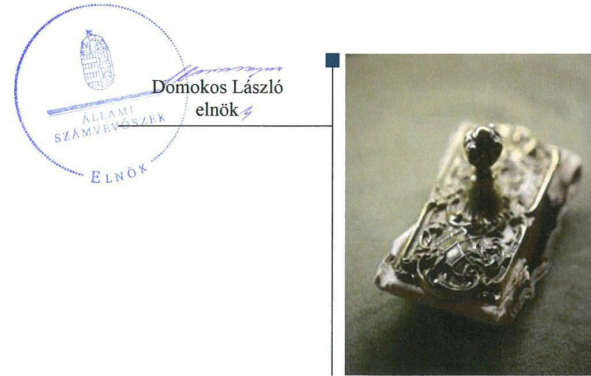

# Jelentés 

## Az önkormányzatok gazdasági társaságai

Az önkormányzatok többségi
tulajdonában lévő gazdasági társaságok gazdálkodásának ellenőrzése - Congeria Településüzemeltető Szolgáltató Kft.
2018.

---

# Jelentés 

## Az önkormányzatok gazdasági társaságai

Az önkormányzatok többségi tulajdonában lévő gazdasági társaságok gazdálkodásának ellenőrzése - Congeria Településüzemeltető Szolgáltató Kft.
2018. 06. hó 05. nap

---

# AZ ELLENŐRZÉST FELÜGYELTE:

DR. HORVÁTH MARGIT felügyeleti vezető

## AZ ELLENŐRZÉST VEZETTE ÉS A VÉGREHAJTÁSÁÉRT FELELŐS:

VERTKOVCZI MÁRIA ellenőrzésvezető

## A PROGRAM ÖSSZEÁLLÍTÁSÁÉRT FELELŐS:

TÓTPÁL SZABOLCS osztályvezető

IKTATÓSZÁM: EL-0547-013/2018

TÉMASZÁM: 2447

ELLENŐRZÉS-AZONOSÍTÓ SZÁM: V079307

Jelentéseink az Országgyűlés számítógépes hálózatán és az Interneta a www.asz.hu címen is olvashatóak.

---

# TARTALOMJEGYZÉK 

■ ÖSSZEGZÉS ..... 5
■ AZ ELLENŐRZÉS CÉLJA ..... 6
■ AZ ELLENŐRZÉS TERÜLETE ..... 7
■ AZ ELLENŐRZÉS HÁTTERE, INDOKOLTSÁGA ..... 8
■ A JELENTÉS LÉNYEGES KÉRDÉSKÖREI ..... 9
■ AZ ELLENŐRZÉS HATÓKÖRE ÉS MÓDSZEREI ..... 10
■ MEGÁLLAPÍTÁSOK ..... 12
■ JAVASLATOK ..... 17
■ MELLÉKLETEK ..... 21
I. sz. melléklet: Értelmező szótár ..... 21
■ FÜGGELÉK: ÉSZREVÉTELEK ..... 23
■ RÖVIDÍTÉSEK JEGYZÉKE ..... 25

---

.

---

# ÖSSZEGZÉS 

Tihany Község Önkormányzata a tulajdonosi joggyakorlás kereteit kialakította, ugyanakkor a tulajdonosi joggyakorlása nem volt szabályszerű, a beszámolók elfogadásával kapcsolatos hiányosságok miatt. A Congeria Településüzemeltető Szolgáltató Kft. gazdálkodásának szabályozása, valamint vagyongazdálkodása nem volt szabályszerű. A Társaság beszámolói nem feleltek meg a jogszabályi előírásoknak. A közérdekú adatait a Társaság nem tette közzé az elöirt tartalommal. Így nem volt biztositott a gazdálkodásának és müködésének az átláthatósága.

## Az ellenőrzés társadalmi indokoltsága

Magyarországon az önkormányzatok kötelező és önként vállalt feladataik vonatkozásában is egyre szélesebb körben alkalmazzák a költségvetésen kívüli feladatellátást, ezáltal - a nonprofit szervezetek mellett - az önkormányzati tulajdonú gazdasági társaságok is kiemelt fontosságú szerephez jutottak.

Tihany Község területén a Congeria Településüzemeltető Szolgáltató Kft. több közfeladatot is ellátott. Az Állami Számvevőszék az ellenőrzése során arra kereste a választ, hogy szabályszerű volt-e a közfeladatokat is ellátó Társaság gazdálkodása és az ehhez kapcsolódó tulajdonosi joggyakorlás.

## Főbb megállapítások, következtetések, javaslatok

Tihany Község Önkormányzata a tulajdonosi joggyakorlás kereteit kialakította azáltal, hogy szabályozta a Társaság feladatellátását és rendszeres elszámolási kötelezettségeket írt elő a Társaság részére. A 2014. évet kivéve az év végi beszámolók megtárgyalása és a beszámolókkal kapcsolatos döntések elmaradása miatt a tulajdonosi joggyakorlása nem volt szabályszerű. A Felügyelő bizottság a beszámolókról nem készített írásbeli jelentést.

A Társaság rendelkezett az előírt számviteli szabályzatokkal, azonban a szabályozások nem mindenben feleltek meg a jogszabályoknak és hiányosak voltak. A Társaság a mérleg adatait a befektetett eszközökön kívül nem támasztotta alá leltárral, ezáltal nem volt biztosított a mérlegben szereplő eszköz és forrás értékek valódiságának alátámasztása. A Társaság tevékenységének az elszámolásai nem voltak szabályszerűek jogszabálysértő könyvvezetési gyakorlat, valamint a tevékenységenkénti elkülönítés hiányosságai miatt, ezáltal a szolgáltatások átláthatósága és elszámoltathatósága nem volt biztosított. A Társaság vagyongazdálkodása nem volt szabályszerű, ezáltal nem biztosította a vagyon védelmét, megőrzését.

A Társaság számviteli beszámolói nem feleltek meg a jogszabályi előírásoknak, azokat a Társaság tulajdonosi jóváhagyás hiányában tette közzé, ezáltal nem biztosította a hiteles tájékoztatást. A Társaság a tulajdonosi joggyakorló által előírt rendszeres elszámolásokat nem teljesítette, ezáltal nem biztosította a szerződésekben előírt feladatok teljesítésének az átláthatóságát. A Társaság a közérdekú adatait nem tette közzé az előírt tartalommal, ezáltal korlátozta az adatok védelmének és a gazdálkodásának, müködésének az átláthatóságát.

---

# AZ ELLENŐRZÉS CÉLJA 

AZ ELLENŐRZÉS CÉLJA annak értékelése volt, hogy az önkormányzat vagyongazdálkodási tevékenysége során szabályszerűen gyakorolta-e tulajdonosi jogait, a gazdasági társaság szabályozottsága, gazdálkodása és vagyongazdálkodási tevékenysége, bevételeinek és ráfordításainak elszámolása megfelelt-e a jogszabályi és tulajdonosi előírásoknak; a gazdasági társaság kötelezettségállománya jelentett-e kockázatot a múködésre, valamint a gazdálkodás átláthatósága és elszámoltathatósága érdekében biztosított volt-e a szolgáltatás dijának megalapozottsága szabályszerű önköltségszámítással.

---

# AZ ELLENŐRZÉS TERÜLETE 

## Congeria Településüzemeltető Szolgáltató Kft. és a tulajdonosi jogokat gyakorló Tihany Község Önkormányzata

A Congeria Településüzemeltető Szolgáltató Kft-t Tihany Község Önkormányzata alapította 2010. október 29-én. A Társaság ${ }^{1}$ az Önkormányzat ${ }^{2}$ 100\%-os tulajdonában állt. A jegyzett tőke összege az ellenőrzött időszakban 500 E Ft volt.

A Társaság tevékenységei között szerepelt - Tihany Község teljes körű ellátása érdekében - vezetékes távközlés, közfeladatként az önkormányzati fizető parkolók és strandüzemeltetési feladatok ellátása, kertészeti tevékenységek, zöldterület kezelési feladatok végzése. A Társaság az ellenőrzött időszakban vállalkozási tevékenység keretében nem önkormányzati fizető parkolóhelyek üzemeltetésével is foglalkozott.

A 2013-2016. közötti években a Társaságot átalakulás nem érintette, továbbá tulajdonosi részesedéssel más gazdasági társaságban nem rendelkezett. A tevékenységét saját és üzemeltetésre átvett eszközökkel látta el, vagyonkezelt eszközei nem voltak. A Társaság nem tartozott kormányzati szektorba sorolt egyéb szervezetek közé. Az Önkormányzat az ellenőrzött években múködési ( 37 M Ft ) és fejlesztési (4,5 M Ft) kölcsönöket nyújtott a Társaság részére.

Az ellenőrzött időszakban a Polgármester³, a Jegyző ${ }^{4}$, továbbá az Ügyvezető ${ }^{5}$ és Felügyelő bizottság ${ }^{6}$ tagok személye nem változott. A Társaság nem volt könyvvizsgálatra kötelezett, az Önkormányzat nem írta elő a könyvvizsgáló alkalmazását.

A Társaságnál a foglalkoztatott munkavállalók átlagos statisztikai létszáma 2013-ban 7 fő, 2016-ban 17 fő volt. A létszám növekedését az önkormányzati strand üzemeltetésének feladatátvétele eredményezte.

Kertészeti tevékenységgel kapcsolatos árbevétele a 2014. évtől a műsorszolgáltatási tevékenység árbevétele a 2016. évtől megszűnt, a Társaság által végzett feladatok változása miatt. A strand üzemeltetését a 2014. évtől kezdődően végezte a Társaság.

---

# AZ ELLENŐRZÉS HÁTTERE, INDOKOLTSÁGA 

Az önkormányzatok többségi tulajdonában álló gazdasági társaságok ellenőrzése kiemelten fontos a vagyon megőrzése, megóvása érdekében, valamint a kormányzati szektor elszámolásaiban megjelenő önkormányzati tulajdonú gazdálkodó szervezetek esetében, amelyekkel szemben alapvető követelmény, hogy gazdálkodásuk, működésük szabályszerű, az általuk szolgáltatott adatok minél megbízhatóbbak legyenek. A feladatellátás költségeinek, ráfordításainak alakulása a lakosság széles rétegét érinti.

Ellenőrzéseink feltárhatják, hogy az önkormányzat a feladatellátásához rendelt vagyon működtetését a tulajdonostól elvárható gondossággal vé-gezte-e, a feladatot ellátó gazdasági társaság a létesítő okiratban, szolgáltatási szerződésben foglaltak betartásával biztosította-e a feladat ellátását. Az ellenőrzés eredményeképp meghatározhatóvá válnak a költségvetési hiányt befolyásoló szervezetek kockázatai, lehetővé válik ezen kockázatok csökkentése. Az ellenőrzés rávilágíthat arra, hogy a gazdasági társaság a vagyon használatával biztosította-e a szolgáltatás folytatásának feltételeit, az önkormányzat tulajdonosi felügyelete hozzájárult-e a szabályszerű gazdálkodáshoz és feladatellátáshoz. A megállapítások alapján megfogalmazott számvevőszéki javaslatok hasznosítása elősegítheti a meglévő hibák megszüntetését. A jó gyakorlatok bemutatásával az ÁSZ hozzájárulhat a követendő megoldások megismertetéséhez, terjesztéséhez.

---

# A JELENTÉS LÉNYEGES KÉRDÉSKÖREI 

1. Az önkormányzat tulajdonosi joggyakorlása szabályszerű volt-e?
2. A gazdasági társaság szabályozottsága, gazdálkodása és vagyongazdálkodási tevékenysége szabályszerű volt-e?

---

# AZ ELLENŐRZÉS HATÓKÖRE ÉS MÓDSZEREI 

## Az ellenőrzés típusa

Megfelelőségi ellenőrzés.

## Az ellenőrzött időszak

2013. január 1 - 2016. december 31.

## Az ellenőrzés tárgya

Tihany Község Önkormányzata tulajdonosi joggyakorlása, valamint a Congeria Településüzemeltető Szolgáltató Kft. gazdálkodásának szabályozottsága és szabályszerűsége.

Az ellenőrzés kiterjedt minden olyan körülményre és adatra, amely az ÁSZ jogszabályban meghatározott feladatainak teljesítéséhez, valamint a program végrehajtása folyamán felmerült újabb összefüggések feltárásához szükséges.

## Az ellenőrzött szervezet

Congeria Településüzemeltető Szolgáltató Kft.
Tihany Község Önkormányzata

## Az ellenőrzés jogalapja

Az ellenőrzés jogszabályi alapját az ÁSZ tv. ${ }^{7}$ 1. § (3) bekezdése és 5. § (3)-(4)-(5) bekezdései képezték.

## Az ellenőrzés módszerei

Az ellenőrzést a nemzetközi standardokat irányadónak tekintve az ellenőrzési program ellenőrzési kérdései, az ellenőrzött időszakban hatályos jogszabályok, az ellenőrzés szakmai szabályok és módszertanok figyelembe vételével végeztük.

Az ellenőrzés ideje alatt az ellenőrzött szervezettel történő kapcsolattartást az ÁSZ ${ }^{8}$ Szervezeti és Müködési Szabályzatának vonatkozó előírásai alapján biztosítottuk.

---

Az ellenőrzés a kiválasztott, többségi tulajdonosi jogokat gyakorló önkormányzatra, illetve az ellenőrzésre kijelölt gazdasági társaság felett tulajdonosi jogokat gyakorló szervezetre és az ellenőrzött gazdasági társaságra terjedt ki.

A gazdasági társaságnál mintavétellel ellenőriztük a ráfordítások és a bevételeket, ezen belül az anyagjellegú ráfordításokat, az egyéb ráfordításokat, a pénzügyi műveletek ráfordításait és a rendkívüli ráfordításokat, illetve az értékesítés nettó árbevételét, az egyéb bevételeket, a pénzügyi műveletek bevételeit valamint a rendkívüli bevételeket. Mintavétel történt továbbá a tárgyi eszközök növekedési tételeiből. A minták kiválasztása rétegzett mintavétel alkalmazásával történt.

Az ellenőrzési kérdések megválaszolásához szükséges bizonyítékok megszerzése a következő ellenőrzési eljárások alkalmazásával történt: megfigyelés, kérdésfeltevés (információkérés), összehasonlítás, valamint elemző eljárás. Az ellenőrzési bizonyítékként felhasználható adatforrások közé tartoztak egyrészt az ellenőrzési programban felsorolt adatforrások, másrészt adatforrás lehetett még minden - az ellenőrzés folyamán - feltárt, az ellenőrzés szempontjából információkat tartalmazó dokumentum.

Az ellenőrzést a kérdésekre adott válaszok kiértékelésével, valamint a megjelölt adatforrások, a csatolt tanúsítványok felhasználásával, továbbá az adott időszakban hatályos jogszabályok figyelembe vételével folytattuk le.

A bevételek és ráfordítások elszámolása, valamint a vagyonnyilvántartás terén a szabályszerű múködést véletlen mintavétellel ellenőriztük. A mintavétellel ellenőrzött területek esetében minden egyes tétel vonatkozásában a szabályszerűségre vonatkozó kérdéseket tettünk fel, amelyek eredménye összesítésre került. Megfelelőnek értékeltünk egy ellenőrzött területet, amennyiben 95\%-os bizonyossággal a teljes sokaságban az átlagos hibaarány legfeljebb 10\%, nem megfelelőnek, amennyiben 10\%-nál magasabb arányt képviselt. A ráfordítások elszámolására és a vagyonnyilvántartásra vonatkozó véletlen mintavételt kockázati alapú kiválasztással egészítettük ki, amelynek során évente a három legnagyobb összegű tételt választottuk ki.

---

# 1. Az önkormányzat tulajdonosi joggyakorlása szabályszerű volt-e? 

Összegző megállapítás

Az Önkormányzat a tulajdonosi joggyakorlás kereteit kialakította. Az Önkormányzat tulajdonosi joggyakorlása nem volt szabályszerű.

A KÖZFELADAT VÉGZÉSÉVEL KAPCSOLATBAN az Önkormányzat a Társasággal Parkoló üzemeltetési szerződést ${ }^{9}$, valamint Strandüzemeltetési szerződést ${ }^{10}$ kötött, amelyekben elszámolás készítési, és üzleti terv készítési kötelezettsége írt elő a Társaság részére, továbbá havi rendszerességgel adatszolgáltatási kötelezettséget határozott meg. A térítési díjakat a Parkolási rendelettel ${ }^{11}$ és Strandrendelettel ${ }^{12}$ összhangban tartalmazták a szerződések.

Gazdasági programmal ${ }^{13}$ az Mötv. ${ }^{14}$ előírásainak megfelelően az Önkormányzat rendelkezett. A Gazdasági program tartalmazta többek között a parkoló üzemeltetés megfelelő szervezeti kereteinek a biztosítását, a parkolási helyek növelését, a strand és a hozzá tartozó parkolók karbantartását, valamint a helyi kábeltelevízió szolgáltatás biztosítását.

Közép- és hosszú távú vagyongazdálkodási tervét az Nvtv. 9. § (1) bekezdés előírása ellenére az Önkormányzat nem készítette el.

A TULAJDONOSI JOGGYAKORLÁS rendjét a beszámolási kötelezettségeket, a képviselettel összefüggő feladatokat az Önkormányzat az Alapító okiratban ${ }^{15}$, Vagyonrendeletben ${ }^{16}$ és az SZMSZ ${ }^{17}$-ben határozta meg.

A Vagyonrendelet Önkormányzati vállalkozások rész (3) bekezdésében foglaltak ellenére az Önkormányzat az Alapító okiratban nem rögzítette, hogy a legfőbb szerv hatáskörébe tartozik a Társaság által kötendő olyan szerződés jóváhagyása, ahol a szerződés értéke meghaladja a törzstőke legalább egynegyedét, de minimum nettó 20 millió forintot.

A Felügyelő bizottság a Gt. ${ }^{18} 34$ § (4) bekezdésében és a Ptk. ${ }^{19} 3: 122$ § (3) bekezdésében előírtakkal ellentétben nem készítette el az ügyrendjét.

Az Önkormányzat az Mötv. 119. § (3) bekezdésében foglalt belső kontrollrendszer működtetése során nem élt a Társaság ellenőrzésének lehetőségével.

## A JAVADALMAZÁSI, JUTTATÁSI RENDSZERRŐL SZÓLÓ SZABÁLYZATOT a Taktv. ${ }^{20}$ 5.§ (3) bekezdés előírása ellenére az Alapító ${ }^{21}$ 2016. január 15-éig nem alkotta meg, ezáltal nem szabályozta a vezető tisztségviselők, Felügyelő bizottsági tagok, valamint az Mt. 208. §-ának hatálya alá eső munkavállalók javadalmazását, valamint a jogviszony megszűnése esetére biztosított juttatások módját, mértékének elveit, annak rendszerét.

---

AZ ÉVES BESZÁMOLÓ ELFOGADÁSÁRÓL az Alapító a Gt. 132.§ (2), a Ptk. 3:109. § (2) bekezdés előírásai ellenére a 2013. és 2015. években nem döntött, ennek ellenére a beszámolókat közzétették. A 2014. és 2016. évek beszámolóival kapcsolatban az Alapító döntött.

Az Alapító a Ptk. előírásai alapján a Társaság 2014. évi nyereség felosztásáról, valamint a nyereség eredménytartalékba való átvezetéséről döntött.

A Ptk. 3:109. § (2) bekezdés előírása ellenére a 2016. évi eredmény (nyereség) felosztásáról, valamint a 2013. évi eredmény (nyereség) felosztásáról nem döntött az Alapító.

A Társaság Felügyelő bizottsága az ellenőrzött időszakban a Gt. 35. § (3) bekezdés és a Ptk. 3:120. § (2) bekezdés ellenére nem készített írásbeli jelentést a Társaság éves beszámolóiról.

# 2. A gazdasági társaság szabályozottsága, gazdálkodása és vagyongazdálkodási tevékenysége szabályszerű volt-e? 

Összegző megállapítás

### 2.1. számú megállapítás

A Társaság a szabályozótsága, elszámolásai nem feleltek meg az előírásoknak. A vagyongazdálkodási tevékenysége nem volt szabályszerű. Az előírt éves beszámoló készítési és közzétételi kötelezettségének teljesítése nem volt szabályszerű.

A Társaság a szabályozási kereteit kialakította, azonban a szabályozás több esetben hiányos volt és nem felelt meg az előírásoknak.

SZÁMVITELI POLITIKÁVAL ${ }^{22}$, és annak keretében a Számv. tv. ${ }^{23}$ szerint Értékelési, Leltárkészítési és leltározási és Pénzkezelési szabályzattal a Társaság az ellenőrzött időszakban rendelkezett. A Társaság az SZMSZ ${ }^{24}$-ében határozta meg az aláírási jogkörrel kapcsolatos szabályait. A Társaság nem volt a Számv. tv. 14.§ (6) bekezdése alapján önköltség számításra kötelezett.

A Számviteli politika VI. pont 3. pontjában szereplő, a használatba vételkor értékcsökkenési leírásként egy összegben elszámolható eszközök egyedi beszerzési értékének 2014. január 01-jétől hatályos 200 E Ft értékhatár ellentétes volt a Számv. tv. 80.§ (2) előírásában meghatározott 100 E Ft-os értékhatárral, ugyanakkor az értékcsökkenést a Társaság a Számv. tv. 80.§ (2) bekezdés előírásának megfelelően számolta el.

A Társaság a Számviteli politika részét képező Pénzkezelési szabályzatának a Számv. tv. 14.§ (8) bekezdésében foglaltak ellenére nem határozta meg a pénztárellenőrzés gyakoriságát.

A TÁRSASÁG SZÁMLARENDJE ${ }^{25}$ nem tartalmazta minden alkalmazásra kijelölt számla esetében a Számv. tv. 161.§ (2) bekezdés a)-c) pontjaiban előírtakat:
a) a számla számjelét és megnevezését,
b) a számla tartalmát, továbbá a számla értéke növekedésének, csökkenésének jogcímeit, a számlát érintő gazdasági eseményeket, azok más számlákkal való kapcsolatát,

---

- c) a főkönyvi számla és az analitikus nyilvántartás kapcsolatát.

A Számlarend nem tartalmazta továbbá a Számv. tv. 161. § (2) bekezdés d) pontjában foglaltakkal ellentétben a Számlarendet alátámasztó bizonylati rendet.
2.2. számú megállapítás

A Társaságnál a tevékenységekkel kapcsolatos bevételek és ráfordítások elszámolása nem volt szabályszerű.

# A TEVÉKENYSÉGEKKEL KAPCSOLATOS BEVÉTE- 

LEK ÉS RÁFORDÍTÁSOK ELSZÁMOLÁSA nem volt szabályszerű.

A Parkoló üzemeltetési és Strandüzemeltetési szerződések 3.4. pontjában előírtak ellenére a Társaság nem gondoskodott a közszolgáltatás és egyéb tevékenységek bevételeinek és ráfordításainak az elkülönítéséről.

A tevékenységek bevételeinek és ráfordításainak elszámolásai számos esetben nem feleltek meg a Számv. tv előírásainak:
$\longrightarrow$ A Számv. tv. 23.§ (1) és (4) 24.§, 26.§ (5) jogszabályi helyek előírásával ellentétesen a Társaság irodai berendezést fogyóeszközként számolt el a költségei között, nem vette az eszközöket egyéb berendezésként állományba. Nem a Számv. tv. 52.§ (1) bekezdésében foglaltaknak megfelelően számolta el az értékcsökkenést.
$\longrightarrow$ A Számv. tv. 78.§ (2)-(3) bekezdéseinek előírásával ellentétben nem igénybe vett szolgáltatásként, hanem egyéb anyagköltségként számolt el költségeket.
$\longrightarrow$ A Számv. tv. 81.§ (1) bekezdésében foglaltak ellenére nem az egyéb ráfordítások között, hanem az egyéb szolgáltatások között számolt el költségeket.
$\longrightarrow$ A Számv. tv. 83.§ (3) előírástól eltérően pénzügyi műveletek ráfordításai helyett egyéb költségként számolt el költségeket.
$\longrightarrow$ A Számv. tv. 77. § (2) bekezdésében foglaltak ellenére az egyéb bevételek között árbevételnek minősülő tételek is könyvelésre kerültek.
A Társaság a parkolási szolgáltatásról kiállított szállítói számláival az árbevételeinek az összegét csökkentette a Számv. tv. 15. § (9) és 16. § (3)-(4) bekezdésekkel ellentétesen, megsértve a bruttó elszámolás elvét. A számla összegét szerződés szerint a ráfordítások növelésével kellett volna elszámolnia a Társaságnak a Számv. tv. 78. § (1) bekezdés alapján. A helytelen könyvelés (nettó módon való könyvelés) miatt a Társaság beszámolójában szereplő árbevétel és ráfordítás összege nem a valós értéket mutatja, mivel a valós értéknél kevesebb összegben kerültek kimutatásra.

A Társaságnál a személyi jellegű ráfordítások elszámolása nem volt szabályszerű, mivel a Számv. tv. 165. § (2) bekezdésével ellentétben a bérszámfejtés alapbér adatát a munkaszerződésben szereplő alapbér nem minden esetben támasztotta alá.

---

### 2.3. számú megállapítás

2.4. számú megállapítás

## A Társaság a mérleg adatait leltárral nem támasztotta alá, vagyongazdálkodása nem volt szabályszerű. A Társaság fizetőképessége biztosított volt.

A Társaság a Számv. tv. 69.§ (1) bekezdésével és a Leltározási szabályzat előírásaival ellentétben a befektetett eszközök kivételével az év végi mérleg adatokat leltárral nem támasztotta alá, ezzel a mérlegben szereplő eszközök és források értékének valódisága nem volt alátámasztott.

A tárgyi eszközök nyilvántartása a Számv. tv.-ben előírtaknak megfelelően teljesült, az állománya az ellenőrzött időszakban nőtt az új beruházások következtében.

Hosszú lejáratú kötelezettsége a Társaságnak a feladatellátásához kapcsolódó beszerzésekre vonatkozó hosszú lejáratú lízing kötelezettségekből származott. A Társaság rövid lejáratú kötelezettségének kisebb része szállítói tartozásból, a nagyobb része az Önkormányzattól kapott tagi kölcsönökből állt. A Társaság fizetőképességének biztosítása érdekében az Önkormányzat minden ellenőrzött évben rövid lejáratú tagi kölcsönt nyújtott a Társaságnak.

A Társaság Követeléseinek nagyobb hányada a költségvetésből visszaigényelhető befizetésekből, kisebb hányada vevőkövetelésekből állt. A követelések csökkentéséről a Társaság intézkedett. A Társaság hátralékos követelései nem érték el a lényeges összeghatárt, így azokra a Számviteli politika értelmében nem számoltak el értékvesztést.

A Társaság számviteli éves beszámolói nem voltak szabályszerűek. Közérdekú adatainak közzétételi kötelezettségét nem teljesítette. A Társaság a végzett szolgáltatásokkal kapcsolatban előírt elszámolási és adatszolgáltatási kötelezettségeit nem teljesítette.

A Társaság nem tett eleget a Parkoló üzemeltetési és Strandüzemeltetési szerződések 4. pontjában előírt éves elszámolás készítési, és a szerződések 3.3. pontjában előírt havi adatszolgáltatási kötelezettségeinek, továbbá a 4. pontjában előírtak ellenére nem készített évente üzleti tervet.

Úzleti terv hiányában nem került dokumentálásra, hogy az ellenőrzött időszakban a Társaság hogyan tervezett hozzájárulni az Önkormányzat Gazdasági programjában foglalt parkolási lehetőségek biztosítása, közterületek színvonalának fenntartása, településüzemeltetési feladatok ellátása biztosításához.

AZ EGYSZERÚSÍTETT ÉVES BESZÁMOLÓIT a Társaság elkészítette és a Számv. tv. 153. § (1) és a 154. § (1) bekezdéseiben foglaltak ellenére a 2013. és 2015. években az Alapító jóváhagyása nélkül, a 2016. évben az Alapító döntését megelőzően helyezte letétbe és tette közzé a Társaság. A 2014. évet érintően a Számv. tv.-nek megfelelően helyezte letétbe és közzé tette a beszámolót.

A Számv. tv. 153.§ (1) bekezdésében foglalt előírás ellenére a Társaság a 2014. évben nem helyezte letétbe az Alapító döntését a nyereség felhasználásával kapcsolatban.

A Társaság a közzétett 2013-2015. évi beszámolóin nem tüntette fel a Számv. tv. 154. § (3) bekezdés előírása ellenére, hogy a közzétett adatok könyvvizsgálattal nincsenek alátámasztva.

---

A Társaság által az Alapítónak megküldött egyszerúsített éves beszámoló tagolása nem felelt meg a Számviteli politika előírásai alapján választott, a Számv. tv. 96. § (2)-(3) bekezdései alapján a Számv. tv. 1-2. mellékletében előírt tagolásnak, amely tagolásnak a letétbe helyezett és közzétett beszámolók megfeleltek. Az Alapító által megtárgyalt és elfogadott beszámolók adatainak tagolása a Számv. tv. 153. § (1) bekezdésben foglaltak ellenére nem egyezik meg a letétbe helyezett és közzétett beszámolók adatainak tagolásával.

A Társaság által az Alapító részére átadott 2013. és 2014. évi egyszerúsített éves beszámoló mérlegében szereplő mérleg szerinti eredmény és az eredménykimutatásban kimutatott eredmény összege eltér egymástól, megsértve a Számv. tv. 39. § (2) bekezdését, mely szerint a mérlegben szereplő mérleg szerinti eredményt az eredménykimutatással egyezően kell bemutatni. A 2013-2014. évekre vonatkozó közzétett beszámoló mérleg szerinti eredménye számszakilag hibás, mivel az nem egyezik meg az adózott eredmény összegével.

A Társaság az egyszerúsített éves beszámolók kiegészítő mellékleteiben nem teljesítette a közszolgáltatások és az egyéb tevékenységek elkülönített bemutatási kötelezettségét a Parkoló üzemeltetési és Strandüzemeltetési szerződés 3.4 pontjában előírtak ellenére.

A Társaság a parkolási közfeladat ellátására vonatkozóan a Közúti közlekedési tv. ${ }^{26}$ alapján a díjfizetési kötelezettség teljesítésének ellenőrzése, a díj- és pótdíkövetelés érvényesítése érdekében adatkezelő volt. A Társaság az Info. tv. ${ }^{27}$ 24. § (1) pontjában előírtakkal ellentétben nem jelölt ki belső adatvédelmi felelőst.

A Társaság az Info. tv. 24. § (3) bekezdésében foglaltak ellenére nem rendelkezett adatvédelmi és adatbiztonsági szabályzattal. A Társaság az Info. tv. 37. § (1) bekezdésében foglaltak ellenére a kötelező elektronikus közzététel alá eső, az Info. tv. 1. mellékletében foglalt I. szervezeti személyzeti adatok közül a 2-11. pontokban, II. tevékenységre müködésre vonatkozó adatokat, továbbá III. gazdálkodási adatokat nem tette közzé.

---

# JAVASLATOK 

Az ÁSZ tv. 33. § (1) bekezdésében foglaltak értelmében az ellenőrzött szervezet vezetője köteles a jelentésben foglalt megállapításokhoz kapcsolódó intézkedési tervet összeállítani és azt a jelentés kézhezvételétől számított 30 napon belül az ÁSZ részére megküldeni. Amennyiben az ellenőrzött szervezet vezetője nem küldi meg határidőben az intézkedési tervet, vagy továbbra sem elfogadható intézkedési tervet küld, az Állami Számvevőszék elnöke az ÁSZ tv. 33. § (3) bekezdése a) és b) pontjaiban foglaltakat érvényesítheti.
Javaslataink célja a Congeria Településüzemeltető Szolgáltató Kft. gazdálkodása szabályszerűségének helyreállítása annak érdekében, hogy a szabályozási környezet és az alkalmazott gyakorlat megfelelően tudja támogatni az átlátható müködést.

## A Congeria Településüzemeltető Szolgáltató Kft. ügyvezetőjének

1. Intézkedjen a számviteli politika és a pénzkezelési szabályzat módosításáról a hatályos Számv. tv. előírásainak megfelelően.
(2.1. sz. megállapítás 2-3. bekezdései alapján)
2. Intézkedjen a Számlarend Számv. tv. előírásainak megfelelő kiegészítéséről minden alkalmazásra kijelölt számla számjele, megnevezése, tartalma, a fökönyvi számla és az analitikus nyilvántartás kapcsolata, valamint a bizonylati rend tekintetében.
(2.1. sz. megállapítás 4-5. bekezdés alapján)
3. Intézkedjen a mérleg valódiságát alátámasztó év végi leltár teljes körű elkészítéséről a Számv. tv. előírásainak megfelelően.
(2.3. sz. megállapítás 1. bekezdés alapján)
4. Intézkedjen a Parkolási és Strandüzemeltetési szerződésekben előírtaknak megfelelően az üzleti terv és az éves elszámolás elkészítéséről, továbbá a havi adatszolgáltatási kötelezettség teljesítéséről.
(2.4. sz. megállapítás 1. bekezdés alapján)
5. Intézkedjen annak érdekében, hogy az egyszerüsített éves beszámolót az Alapító jóváhagyásával a Számv. tv. előírásainak megfelelően helyezzék letétbe és tegyék közzé.
(2.4. sz. megállapítás 3-4. bekezdés alapján)

---

6. Intézkedjen a közszolgáltatások és az egyéb tevékenységek elkülönített bemutatásáról a Társaság egyszerüsitett éves beszámolói kiegészitő mellékletében a Számviteli tv., továbbá a Parkolási és Strandüzemeltetési szerzödésekben elöirtaknak megfelelöen.
(2.4. sz. megállapítás 8. bekezdés 1. mondata alapján)
7. Intézkedjen az Info tv.-nek megfelelően a belső adatvédelmi felelős kinevezéséről, az adatvédelmi és adatbiztonsági szabályzat elkészitéséről.
(2.4. sz. megállapítás 9. bekezdés és 10. bekezdés 1. mondata alapján)
8. Intézkedjen az elektronikus közzétételi kötelezettség Info tv. szerinti teljes körü teljesitéséről.
(2.4. sz. megállapítás 10. bekezdés 2. mondata alapján)
9. Intézkedjen a bevételek elszámolásáról a Számv. tv. elöirásainak megfelelően.
(2.2. sz. megállapítás 3. bekezdés 5. francia bekezdése és 4. bekezdése alapján)
10. Intézkedjen a Számviteli tv., továbbá a Parkolási és Strandüzemeltetési szerződésekben elöirtaknak megfelelően a közszolgáltatás és egyéb tevékenységek elkülönitett elszámolásáról.
(2.4. sz. megállapítás 1. bekezdés és 8. bekezdés alapján)
11. Intézkedjen a ráforditások szabályszerü elszámolásáról a Számv. tv. elöirásainak megfelelően.
(2.2. sz. megállapítás 3. bekezdés 1-4. francia bekezdései, 4. és 5. bekezdései alapján)

---

# Javaslataink célja az Önkormányzat szabályszerű működésének elősegítése, továbbá az önkormányzati tulajdonosi joggyakorlás kontrolljainak erősítése. 

## Tihany Község Önkormányzata Polgármesterének

1. Hívja fel a felügyelőbizottság elnökének figyelmét az ügyrend elkészitésére és a jóváhagyás érdekében az Alapító számára történő előterjesztésére.
(1. sz. megállapítás 5. bekezdése alapján)
2. Intézkedjen az Önkormányzat közép- és hosszú távú vagyongazdálkodási tervének elkészitéséről az Nvtv. előírásainak megfelelően.
(1. sz. megállapítás 11. bekezdése alapján)
3. Intézkedjen annak érdekében, hogy a Társaság éves beszámolóját az FB írásbeli jelentésének birtokában az Alapító hagyja jóvá, valamint döntsön az adózott eredmény felosztásáról a Ptk. előírásainak megfelelően.
(1. sz. megállapítás 9. és 11-12. bekezdései alapján)
4. Intézkedjen
a) a számviteli szabályozási hiányosságok,
b) az év végi leltár hiányosságai,
c) a Parkolási és Strandüzemeltetési szerződésekben előirtak nem teljesitése,
d) az egyszerüsített éves beszámoló Alapító jóváhagyásával történő letétbe helyezéséről, közzétételéről, a beszámolóban a szolgáltatások és az egyéb tevékenységek elkülönített bemutatásának hiányosságai megszüntetéséről,
e) a belső adatvédelmi felelős, az adatvédelmi és adatbiztonsági szabályok hiánya,
f) a közzétételi kötelezettség teljesítésének hiányosságai,
g) a bevételek és a ráfordítások elszámolásának hiányosságai és szabálytalanságai,
miatti felelősség tisztázása érdekében, és szükség szerint intézkedjen a felelősség érvényesítéséről.
(2.1. sz. megállapítás 2-4. bekezdései, 2.3. megállapítás 1. bekezdés, 2.4. sz. megállapítás 8. bekezdés 1. mondata és 2.4. sz. megállapítás 1. bekezdés és 8. bekezdése, 2.4. sz. megállapítás 3-4. bekezdései 2.4. sz. megállapítás 9. bekezdés és 10. bekezdése 2.2. sz. megállapítás 3. bekezdése, 4. és 5. alapján megállapítás alapján)

---

.

---

# MELLÉKLETEK 

- I. SZ. MELLÉKLET: ÉRTELMEZŐ SZÓTÁR
gazdasági társaság
gazdálkodó szervezet
meghatározó befolyás
minősített többséget biztosító részesedés
többségi befolyást biztosító részesedés

Ptk 3.88. § (1) bekezdése szerint „a gazdasági társaságok üzletszerű közös gazdasági tevékenység folytatására, a tagok vagyoni hozzájárulásával létrehozott, jogi személyiséggel rendelkező vállalkozások, amelyekben a tagok a nyereségből közösen részesednek, és a veszteséget közösen viselik".
A Ptk. 685. § c) pontja szerint gazdálkodó szervezet: „az állami vállalat, az egyéb állami gazdálkodó szerv, a szövetkezet, a lakásszövetkezet, az európai szövetkezet, a gazdasági társaság, az európai részvénytársaság, az egyesülés, az európai gazdasági egyesülés, az európai területi együttműködési csoportosulás, az egyes jogi személyek vállalata, a leányvállalat, a vízgazdálkodási társulat, az erdő birtokossági társulat, a végrehajtói iroda, az egyéni cég, továbbá az egyéni vállalkozó." (2014. 03.15-ig hatályos)
A Ptk. 8:2. § (2) bekezdése szerint „A befolyással rendelkező akkor rendelkezik egy jogi személyben meghatározó befolyással, ha annak tagja vagy részvényese, és
a) jogosult e jogi személy vezető tisztségviselői vagy felügyelőbizottsága tagjai többségének megválasztására, illetve visszahívására; vagy
b) a jogi személy más tagjai, illetve részvényesei a befolyással rendelkezővel kötött megállapodás alapján a befolyással rendelkezővel azonos tartalommal szavaznak, vagy a befolyással rendelkezőn keresztül gyakorolják szavazati jogukat, feltéve, hogy együtt a szavazatok több mint felével rendelkeznek."
A minősített befolyásszerző az ellenőrzött társaságban a szavazatok legalább hetvenöt százalékával rendelkezik. (Ptk. 3:324. §)
vagyonkezelő:
A Ptk. 8:2. § (1) bekezdése szerint „többségi befolyás az olyan kapcsolat, amelynek révén természetes személy vagy jogi személy (befolyással rendelkező) egy jogi személyben a szavazatok több mint felével vagy meghatározó befolyással rendelkezik."

---

.

---

# FÜGGELÉK: ÉSZREVÉTELEK 

A jelentéstervezetet a Számvevőszék 15 napos észrevételezésre megküldte az ellenőrzött szervezet vezetőjének az ÁSZ tv. 29. §* (1) bekezdése előírásának megfelelően.
Az ellenőrzött szervezetek vezetői nem tettek észrevételt az ellenőrzési megállapításokkal kapcsolatban.

[^0]
[^0]:    * 29. § (1) Az Állami Számvevőszék az ellenőrzési megállapításait megküldi az ellenőrzött szervezet vezetőjének vagy az általa megbízott személynek, és annak, akinek személyes felelősségét állapította meg.
    (2) Az ellenőrzött szervezet vezetője és a felelősként megjelölt személy az ellenőrzés megállapításaira tizenöt napon belül írásban észrevételt tehet.
    (3) Az Állami Számvevőszék az észrevételre a beérkezésétől számított harminc napon belül írásban válaszol. A figyelembe nem vett észrevételeket köteles a jelentésben feltüntetni, és megindokolni, hogy azokat miért nem fogadta el.

---

.

---

# RÖVIDÍTÉSEK JEGYZÉKE 

${ }^{1}$ Társaság
${ }^{2}$ Önkormányzat
${ }^{3}$ Polgármester
${ }^{4}$ Jegyző
${ }^{5}$ Ügyvezető
${ }^{6}$ Felügyelő bizottság
${ }^{7}$ ÁSZ tv.
${ }^{8}$ ÁSZ
${ }^{9}$ Parkoló üzemeltetési szerződés
${ }^{10}$ Strandüzemeltetési szerződés
${ }^{11}$ Parkolási rendelet
${ }^{12}$ Strandrendelet
${ }^{13}$ Gazdasági program
${ }^{14}$ Mötv.
${ }^{15}$ Alapító okirat
${ }^{16}$ Vagyonrendelet
${ }^{17}$ SZMSZ
${ }^{18} \mathrm{Gt}$.
${ }^{19} \mathrm{Ptk}$.

Congeria Településüzemeltető Szolgáltató Korlátolt Felelősségű Társaság Tihany Község Önkormányzata, a Társaság Alapítója és tulajdonosi joggyakorlója Tihany Község Önkormányzata polgármestere
Tihany Község Önkormányzata jegyzője
Congeria Településüzemeltető Szolgáltató Kft. Ügyvezetője
Congeria Településüzemeltető Szolgáltató Kft. felügyelő bizottsága
2011. LXVI. törvény az Állami Számvevőszékről

Állami Számvevőszék
Tihany Község Önkormányzata és a Congeria Településüzemeltető Szolgáltató Kft. által megkötött Közszolgáltatási szerződés a fizető parkolók üzemeltetése céljából (hatályos:2011. április 01-jétől)
Tihany Község Önkormányzata és a Congeria Településüzemeltető Szolgáltató Kft. által megkötött Közszolgáltatási szerződés a hajóállomási fizető strand üzemeltetése céljából (hatályos: 2014. május 01-jétől)
Tihany Község Önkormányzata Képviselő-testületének 14/2010. (XII.16.) számú önkormányzati rendelete a fizető parkolóhelyek működtetéséről, a várakozás igénybevételének rendjéről és a parkolási díjakról (hatályos: 2011. április 20-ától) és az azt módosító önkormányzati rendeletek 5/2013. ( III.13.), 8/2013. (IV.19.), 2/2014. (III.24.)
Tihany Község Önkormányzata Képviselő-testületének 2/2015. (II.18.) önkormányzati rendelete a fizető parkolóhelyek működtetéséről, várakozás igénybevételének rendjéről és a parkolási díjakról (hatályos: 2015. március 1jétől) valamint az azt módosító 15/2015. (X.29.) önkormányzati rendelete, és 12/2015. (VII.17.) önkormányzati rendelete
Tihany Község Önkormányzata 8/2014. (V.16.) számú önkormányzati rendelete a hajóállomási strand rendjéről és a strand jegyárairól (hatályos: 2014. május. 23ától)
Tihany Község Önkormányzata gazdasági programja (hatályos:2011. április 6-ától a 2011-2014. évekre vonatkozóan, hatályos: 2015. április 9-étől 2015-2019. évekre vonatkozóan)
Magyarország helyi önkormányzatairól szóló 2011. évi CLXXXIX. törvény (hatályos: 2012. január 1-jétől)
Congeria Településüzemeltető Szolgáltató Kft. alapító okirata (kelt: 2010. október 29-én, 2013. január 18-án)
Tihany Község Önkormányzata Képviselő-testületének rendeletei az Önkormányzat vagyonáról és a vagyongazdálkodás szabályairól (hatályos: 2012. március 01-jétől, 2013. június 12-étől, 2015. december 10-étől, 2016. október 21-étől)
Tihany Község Önkormányzatának Szervezeti és Működési Szabályzatai (hatályos: 1995. január 16-ától, 2014. június 01-jétől, 2014. december 01-jétől, 2015. április 10-étől)
2006 évi IV. törvény a gazdasági társaságokról (hatálytalan: 2014. március 15étől)
a Polgári Törvénykönyvről szóló 2013. évi V. törvény (hatályos: 2014. március 15étől)

---

${ }^{20}$ Taktv.
${ }^{21}$ Alapító
${ }^{22}$ Számviteli politika
${ }^{23}$ Számv. tv.
${ }^{24}$ Társaság SZMSZ-e
${ }^{25}$ Számlarend
${ }^{26}$ Közúti közlekedési tv.
${ }^{27}$ Info. tv.
2009. évi CXXII. törvény a köztulajdonban álló gazdasági társaságok takarékosabb múködéséről (hatályos: 2009.12.04-től)
Tihany Község Önkormányzata képviselő-testülete a Társaság legfőbb szerve
Congeria Településüzemeltető Szolgáltató Kft. Számviteli politikája, azon belül az Eszközök és források értékelési szabályzata, Eszközök és források leltárkészítési és leltározási szabályzata, Pénzkezelési szabályzat (hatályos 2011. január 01-étől) 2000. évi C. törvény a számvitelről (hatályos 2001. január 1-jétől)

Congeria Településüzemeltető Szolgáltató Kft. Szervezeti és Múködési Szabályzat (hatályos 2011. január 01.)
Congeria Településüzemeltető Szolgáltató Kft. számlarendje (hatályos:2011. január 1-jétől)
a közúti közlekedésről szóló 1988. évi I. törvény
2011. évi CXII. törvény az információs önrendelkezési jogról és az információszabadságról hatályos: (2011.07.27-től)

---

ÁLLAMI SZÁMVEVŐSZÉK
1052 Budapest, Apáczai Csere János utca 10.
Levélcím: 1364 Budapest 4. Pf. 54
Telefon: +36 14849100 Telefax: +36 14849200
www.asz.hu