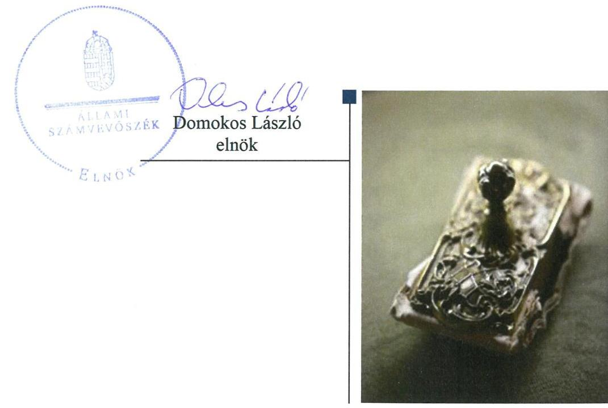
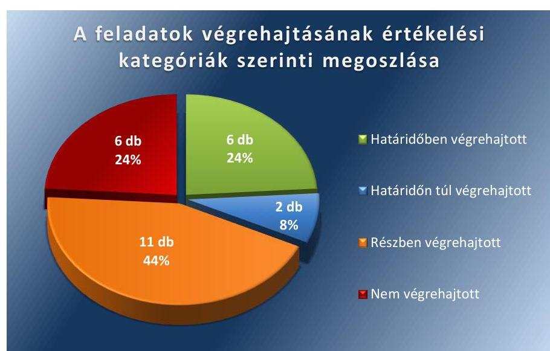
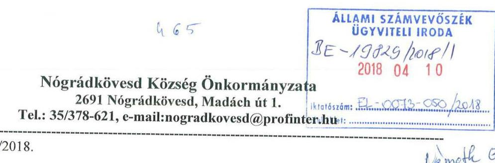
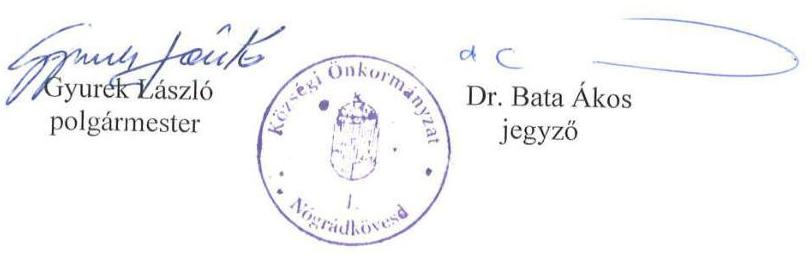
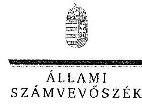
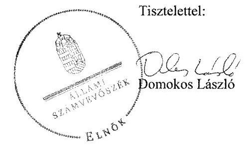
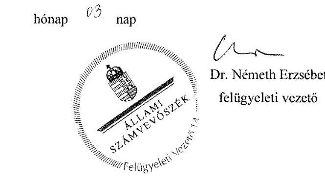
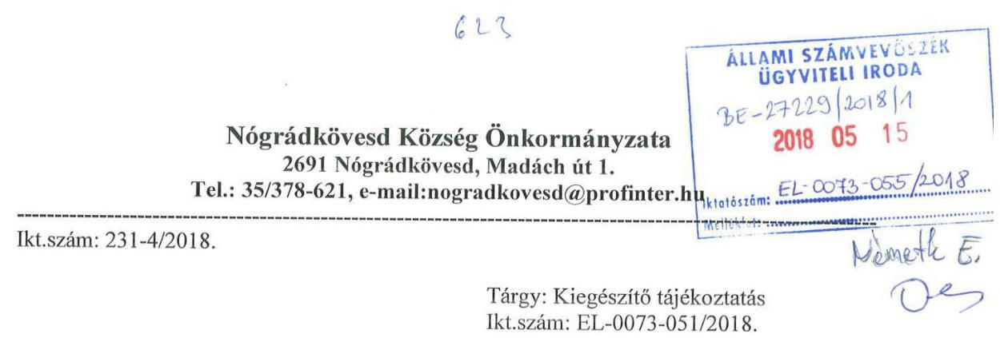
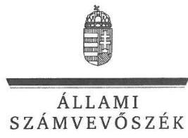
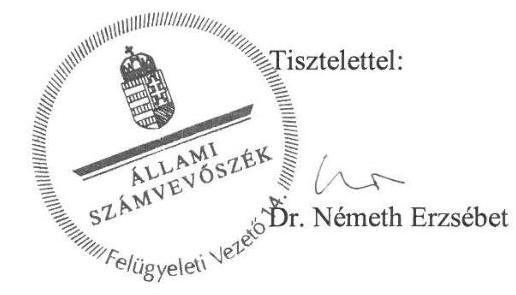

# Jelentés 

## Utóellenőrzések

Az önkormányzatok belső
kontrollrendszere kialakításának és működtetésének utóellenőrzése Nógrádkövesd Község Önkormányzata 2018. 09. hó 03. nap

---

# AZ ELLENŐRZÉST FELÜGYELTE: 

DR. NÉMETH ERZSÉBET felügyeleti vezető

## AZ ELLENŐRZÉST VEZETTE ÉS A VÉGREHAJTÁSÁÉRT FELELŐS:

NAGY ANNA ellenőrzésvezető
SIPOSNÉ DÓCZI KLÁRA ellenőrzésvezető

## A PROGRAM ÖSSZEÁLLÍTÁSÁÉRT FELELŐS:

JANIK JÓZSEF LÁSZLÓ osztályvezető

## A TÉMÁHOZ KAPCSOLÓDÓ KORÁBBI SZÁMVEVŐSZÉKI JELENTÉSEK:

- címe: Jelentés az önkormányzatok belső kontrollrendszere kialakításának, egyes kontrolltevékenységek és a belső ellenőrzés működésének ellenőrzéséről Nógrádkövesd
- sorszáma: 14090

IKTATÓSZÁM: EL-0073-057/2018.
TÉMASZÁM: 10
ELLENŐRZÉS-AZONOSÍTÓ SZÁM: V0755119

---

# TARTALOMJEGYZÉK 

■ ÖSSZEGZÉS ..... 5
■ AZ ELLENŐRZÉS CÉLJA ..... 6
■ AZ ELLENŐRZÉS TERÜLETE ..... 7
■ AZ ELLENŐRZÉS HÁTTERE, INDOKOLTSÁGA ..... 8
■ A JELENTÉS LÉNYEGES KÉRDÉSKÖRE ..... 9
■ ELLENŐRZÉS HATÓKÖRE ÉS MÓDSZEREI ..... 10
■ MEGÁLLAPÍTÁSOK ..... 12
■ MELLÉKLETEK ..... 17
I. sz. melléklet: Az ÁSZ 14090 számú jelentéséhez kapcsolódó intézkedési terv végrehajtása ..... 17
■ FÜGGELÉK: ÉSZREVÉTELEK ..... 27
■ RÖVIDÍTÉSEK JEGYZÉKE ..... 33

---

.

---

# ÖSSZEGZÉS 

Az Állami Számvevőszék megállapította, hogy Nógrádkövesd Község Önkormányzata vonatkozásában az intézkedési tervben meghatározott feladatok többségét végrehajtották. Az Önkormányzat szabályozottsága, a belső kontrollrendszer működtetése javult, azonban az Állami Számvevőszék által korábban feltárt hiányosságok, szabálytalanságok egy része továbbra is fennáll, ezért nem biztosított a közpénzek és a közvagyon átlátható felhasználása.

## Az ellenőrzés társadalmi indokoltsága

Az Állami Számvevőszék stratégiájában célul tűzte ki a számvevőszéki munka hasznosulásának javítását. Ezzel összhangban ellenőrzi, hogy az ellenőrzött szervezetek megvalósították-e a korábbi ellenőrzései által feltárt hibák, hiányosságok és szabálytalanságok megszüntetése céljából kialakított intézkedési terveikben foglaltakat. A rendszeres utóellenőrzések hozzájárulnak a szükséges intézkedések tényleges végrehajtásához, ezáltal a közpénzügyek rendezettségének javulásához.

## Főbb megállapítások

Nógrádkövesd Község Önkormányzata az intézkedési tervben meghatározott 25 feladatból hat feladatot határidőben, kettőt határidőn túl, 11 feladatot részben hajtott végre. Hat feladat végrehajtása nem történt meg.

A Jegyző határidőben intézkedett a Közös hivatal számviteli rendjének valamint a szabályos működtetés feltételeit biztosító szabályzatok kiadásáról. A Jegyző kialakította az Önkormányzat kockázatkezelési rendszerét, előírta a kifizetések rendjének betartását, a beszámolási feladatok teljesítésének feltételeit. Az Önkormányzatnál meghatározásra került a vagyonnyilatkozat-tételre kötelezettek köre. Az intézkedések hozzájárultak a szabályozottság javításához, javult a pénzügyi kontrollok - a teljesítésigazolási jogkör - gyakorlása, a dokumentumokhoz és az információkhoz való hozzáférés szabályozása.

Ugyanakkor a Jegyző nem gondoskodott az intézkedési tervben vállalt további feladatok teljesítéséről, így a monitoring rendszer működtetését érintően nem készültek el a belső ellenőrzés tervezési dokumentumai. A Jegyző nem gondoskodott a köztisztviselői jogviszony megszűnése esetére a munkakör átadásának rendjéről, az önkormányzat közzétételi kötelezettségének teljesítéséről. További intézkedés szükséges a kialakított szabályozások jogszabályi változásokat követő módosítása érdekében, a működtetése során meg kell felelni a szervezet átláthatóságával szemben támasztott követelményeknek.

A Polgármester részéről elmaradt az Állami Számvevőszék által korábban feltárt hiányosságokkal, szabálytalanságokkal kapcsolatos, az esetleges munkajogi felelősséget érintő körülmények kivizsgálása. Ezért Nógrádkövesd Község Önkormányzatánál a működésben rejlő kockázatok továbbra is fennállnak.

A Jegyző nem vezette a jogszabályban előírt nyilvántartást az intézkedési tervben rögzített feladatok végrehajtásáról.

---

# AZ ELLENŐRZÉS CÉLJA 

Az ellenőrzés célja annak értékelése volt, hogy a számvevőszéki jelentésben foglalt intézkedést igénylő megállapításokkal összhangban készített intézkedési tervben meghatározott feladatokat az ellenőrzött szervezet végrehajtotta-e.

---

# AZ ELLENŐRZÉS TERÜLETE 

## Nógrádkövesd Község Önkormányzata

Nógrádkövesd Község Nógrád megyében a Balassagyarmati járásban található. Állandó lakosainak száma a Központi Statisztikai Hivatal Magyarország közigazgatási helynévkönyv népességi adatai szerint 2016. január 1-jén 677 fő volt.

Az utóellenőrzés idején hivatalban lévő Polgármester ${ }^{1}$ az 1994. évi önkormányzati választások óta töltötte be tisztségét. Becske Község Önkormányzata, Bercel Község Önkormányzata, Galgaguta Község Önkormányzata, Nógrádkövesd Község Önkormányzata és Szécsénke Község Önkormányzata 2013. január 1-jétől működteti a Berceli Közös Önkormányzati Hivatalt a Mötv. ${ }^{2}$ 84. § (1) bekezdése alapján. A Közös Hivatal ${ }^{3}$ ellátja az önkormányzatok működésével, valamint a polgármester vagy a jegyző feladat- és hatáskörébe tartozó ügyek döntésre való
előkészítésével és végrehajtásával kapcsolatos feladatokat, közreműködik az önkormányzatok egymás közötti, valamint az állami szervekkel történő együttműködésének összehangolásában. A Közös Hivatalnál az utóellenőrzés idején hivatalban lévő Jegyző ${ }^{4}$ 2015. március 1-jétől látta el a feladatokat. A Képviselő-testület ${ }^{5}$ - a Polgármesterrel együtt - öttagú, munkáját a Pénzügyi, Ügyrendi és Vagyonnyilatkozat Nyilvántartó Bizottság segítette.

Nógrádkövesd Község Önkormányzata a 2016. évi gazdálkodásáról szóló zárszámadás ${ }^{6}$ alapján a 2016. évben 99,2 millió Ft költségvetési bevételt ért el, valamint 99,0 millió Ft költségvetési kiadást teljesített. Az eszközvagyon értéke 2016. december 31-én könyv szerinti értéken 634,8 millió Ft volt.

Az Állami Számvevőszék a 14090 számú jelentését ${ }^{7}$ 2014. június 19-én tette közzé. Az Önkormányzat ${ }^{8}$ a jelentésben tett javaslatokra készített kiegészített intézkedési tervét ${ }^{9}$ az Állami Számvevőszék 2014. december 30-án fogadta el. A Polgármester által megküldött intézkedési tervben a Jegyző számára meghatározott 10., 11., 12/1., 12/3., 12/4., 12/5., és 16. számú feladatokra az utóellenőrzés hatálya nem terjed ki, mert azok a Közös Hivatalra vonatkozóan tartalmaztak intézkedéseket.

---

# AZ ELLENŐRZÉS HÁTTERE, INDOKOLTSÁGA 

Az ÁSZ tv. ${ }^{10}$ 33. § (1) bekezdése értelmében a számvevőszéki jelentések intézkedést igénylő megállapításaihoz kapcsolódóan az ellenőrzött szervezet vezetője intézkedési tervet köteles összeállítani, és az Állami Számvevőszék részére megküldeni. Az intézkedési tervben foglaltak megvalósítását - az ÁSZ tv. 33. § (7) bekezdésében foglaltak alapján - az Állami Számvevőszék utóellenőrzés keretében ellenőrizheti. Az intézkedések megvalósulásának értékelése során az Állami Számvevőszék figyelembe veszi az ellenőrzött szervezetek működési feltételeiben, valamint a jogszabályi előírásokban bekövetkezett változásokat.

Az intézkedési tervekben foglalt feladatok hiányos, illetve késedelmes végrehajtása, valamint megvalósításának elmaradása azt mutatja, hogy az ellenőrzések során feltárt hibák, hiányosságok és szabálytalanságok megszüntetése nem kapott kellő hangsúlyt. Ez a szabályszerű működés és a felelős vezetői magatartás vonatkozásában kockázatot hordoz. E kockázatok feltárásával az Állami Számvevőszék utóellenőrzési rendszere fokozza a fegyelmet, és igazolja, hogy a közpénzzel való szabályos gazdálkodás felelőssége elől nem lehet kitérni.

Az utóellenőrzés négy szinten hasznosulhat:
A társadalom szintjén az utóellenőrzés jelzi, hogy a számvevőszéki ellenőrzés megállapításainak van következménye: a hiányosságok megszüntetésére az ellenőrzött szervezet által meghatározott intézkedések végrehajtását is számon kéri az Állami Számvevőszék.

- Az ellenőrzött terület szintjén az utóellenőrzés tájékoztatást nyújt a terület döntéshozóinak a hiányosságok kiküszöbölésének jó gyakorlatairól, ezzel lehetőséget biztosítva arra, hogy az Állami Számvevőszék ellenőrzési megállapításai, a terület nem ellenőrzött szervezeteinek a működése során is hasznosuljanak.
- Az ellenőrzött szervezet szintjén az utóellenőrzés feltárja, hogy a szervezet az intézkedések végrehajtásával hasznosította-e a korábbi ellenőrzési jelentésben a hiányosságok megszüntetése, illetve a kockázatok kezelése érdekében megfogalmazott javaslatokat.
- Az Állami Számvevőszék szintjén az utóellenőrzés visszacsatolást ad az ellenőrzési jelentések hasznosulásáról, az intézkedések elmaradása vagy részleges megvalósulása a további ellenőrzésekhez kockázati jelzésként szolgál.

---

# A JELENTÉS LÉNYEGES KÉRDÉSKÖRE 

Az ellenőrzött szervezet az intézkedési tervben foglaltakat az előírt határidőben végrehajtotta-e?

---

# ELLENŐRZÉS HATÓKÖRE ÉS MÓDSZEREI 

## Az ellenőrzés típusa

Megfelelőségi ellenőrzés.

## Az ellenőrzött időszak

Az utóellenőrzés alapját képező ÁSZ jelentés közzétételének napjától (2014. június 19-e) az ellenőrzésről szóló kiértesítő levél keltének napjáig (2017. július 14-e) tartó időszak.

## Az ellenőrzés tárgya

Az ÁSZ tv. 2011. július 1-jei hatálybalépését követően a számvevőszéki jelentésben foglalt intézkedést igénylő megállapításokkal összhangban - az ellenőrzött szervezet által - készített intézkedési tervben foglaltak végrehajtásának ellenőrzése.

Az ellenőrzés kiterjedt minden olyan körülményre és adatra, amely az Állami Számvevőszék jogszabályban meghatározott feladatainak teljesítéséhez, valamint a program végrehajtása folyamán felmerült újabb összefüggések feltárásához szükséges.

## Az ellenőrzött szervezet

Nógrádkövesd Község Önkormányzata

## Az ellenőrzés jogalapja

Az ÁSZ tv. 33. § (7) bekezdése alapján az intézkedési tervben foglaltak megvalósítását az Állami Számvevőszék utóellenőrzés keretében ellenőrizheti.

## Az ellenőrzés módszerei

Az Állami Számvevőszék az ellenőrzést a nemzetközi standardokat irányadónak tekintve az ellenőrzési program ellenőrzési kérdései alapján, az ellenőrzött időszakban hatályos jogszabályok, az ellenőrzés szakmai szabályok és módszertanok figyelembevételével, önállóan végezte.

---

Az Állami Számvevőszék az ellenőrzés ideje alatt az ellenőrzött szervezettel történő kapcsolattartást az ÁSZ SZMSZ ${ }^{11}$-ének vonatkozó előírásai alapján biztosította.

Az utóellenőrzés megállapításait elsősorban az Állami Számvevőszék rendelkezésére álló, valamint az ellenőrzött szervezetektől elektronikusan bekért dokumentumok alapozták meg.

Az ellenőrzési bizonyítékként felhasználható adatforrások közé tartoznak egyrészt a szakmai programban felsorolt adatforrások, másrészt minden - az ellenőrzés folyamán feltárt, az ellenőrzés szempontjából információt tartalmazó - dokumentum.

Az intézkedési tervekben előírt feladatokat azok végrehajthatósága, illetve végrehajtása szempontjából az alábbiak szerint értékelte az Állami Számvevőszék:
—_ „határidőben végrehajtott" a feladat, ha a teljesítés dokumentáltan, az intézkedési tervben előírt határidőben és tartalommal megtörtént;
—_ „határidőn túl végrehajtott" a feladat, ha annak teljesítése az intézkedési tervben meghatározott módon, de az előírt határidőn túl történt meg;
—_ „részben végrehajtott" a feladat, ha végrehajtása nem teljeskörűen az intézkedési tervben előírt módon történt meg;
—_ „nem végrehajtott" a feladat, ha a végrehajtás nem történt meg, vagy amennyiben a teljesítést nem dokumentálták;
—_ „okafogyottá vált" a feladat, ha végrehajtására - meghatározott esemény bekövetkezése, továbbá külső körülmény, a működést érintő feltétel változása miatt - már nincs szükség, illetve lehetőség, és egyértelműen megállapítható, hogy az intézkedést szükségessé tevő körülmény a jövőben nem fordulhat elő;
—_ „nem időszerű" az a feladat, amelynek ellenőrzési időszakon belüli végrehajtására azért nem került (kerülhetett) sor, mert az intézkedés alapjául szolgáló esemény nem következett be, de annak jövőbeni előfordulása lehetséges, a végrehajtása nem volt esedékes, vagy a végrehajtás határideje még nem járt le.
Az ellenőrzés lefolytatásához az ellenőrzött szervezet a tanúsítványok elektronikus kitöltésével, valamint az Állami Számvevőszék által kért dokumentumok elektronikus megküldésével szolgáltatott adatokat, amelyek valódiságát és teljes körűségét az ellenőrzött szervezet vezetője által tett teljességi és hitelességi nyilatkozat igazolta. Az így rendelkezésre bocsátott adatok, információk kontrollja az ellenőrzés keretében történt.

---

# MEGÁLLAPÍTÁSOK 

## Az ellenőrzött szervezet az intézkedési tervben foglaltakat az előírt határidőben végrehajtotta-e?

Összegző megállapítás

Az Önkormányzat az intézkedési tervben meghatározott, Nógrádkövesd Község Önkormányzatára vonatkozó 25 feladatból hat feladatot határidőben, kettőt határidőn túl, 11 feladatot részben, hat feladatot nem hajtott végre. A Jegyző az intézkedési tervben rögzített feladatok végrehajtásáról a jogszabály által előírt nyilvántartást nem vezette.

Az ÁSZ ${ }^{12}$ a jelentésében a polgármester részére három, a jegyző részére hét javaslatot fogalmazott meg. A Polgármester és a Jegyző által összeállított és az ÁSZ részére megküldött intézkedési tervben a hiányosságok, szabálytalanságok megszüntetésére az Önkormányzat 24 pontban 25 feladatot határoztak meg. A feladatok végrehajtásának felelőseként négy esetben a polgármestert, egy esetben a jegyzőt és a pénzügyi előadót együtt, egy esetben a jegyzőt és a vagyonnyilatkozatot nyilvántartó és ellenőrző bizottság elnökét együtt, tizenkilenc esetben a jegyzőt jelölték meg.

Az intézkedési tervben meghatározott feladatokat, határidőket, felelősöket, és a feladatok végrehajtását az I. számú melléklet mutatja be.

A Jegyző az intézkedési tervben meghatározott feladatok végrehajtásáról nem vezette a Bkr.
 }^{13} 14. § (1) bekezdésében előírt nyilvántartást.

Az Önkormányzat intézkedési tervében meghatározott feladatok végrehajtásának értékelési kategóriák szerinti megoszlását az 1. ábra szemlélteti.

1. ábra

Forrás: ÁSZ

---

# HATÁRIDŐBEN VÉGREHAJTOTT feladatok: 

1. A polgármester biztosította a jegyző számára a jogszabályokban meghatározott, szabályozási feladatainak ellátását.
2. A Jegyző gondoskodott a Közös Hivatal Nógrádkövesdi Kirendeltségén ${ }^{14}$ dolgozó köztisztviselők munkaköri leírásának elkészítéséről.
3. A Jegyző az Iratkezelési szabályzatban ${ }^{15}$ és az Informatikai Biztonsági Szabályzatban ${ }^{16}$ gondoskodott az iratok és adatok védelméről, kialakította az üzemeltetés és adatbiztonság szabályozását, továbbá gondoskodott az iratkezelési szoftver által kezelt adatok biztonságáról, valamint kialakította az üzembiztonsági, adatvédelmi szabályok érvényre juttatásához szükséges eljárási szabályokat.
4. A Jegyző a Gazdálkodási szabályzatban ${ }^{17}$ a pénzügyi előadó feladataként előírta, hogy gondoskodjon a jogszabályoknak megfelelően a kifizetések rendjének betartásáról.
5. A Jegyző a FEUVE szabályzat ${ }^{18}$ keretében alakította ki azt a rendszert, mely alkalmas annak biztosítására, hogy a megfelelő információk, a megfelelő időben eljussanak az illetékes szervezethez, személyhez.
6. A Polgármester az MÖtv. 115. § (1) bekezdésében meghatározott felelősségi körében eljárva az Önkormányzat gazdálkodásának szabályszerűségét a Gazdálkodási szabályzatban meghatározott kötelezettségvállalási valamint utalványozási jogkör gyakorlásán keresztül figyelemmel kísérte.

## HATÁRIDŐN TÚL VÉGREHAJTOTT feladatok:

7. A Jegyző az intézkedési tervben rögzített 2014. szeptember 30-ai határidőn túl, 2014. november 13-án elkészített Iratkezelési szabályzatban ${ }^{19}$ meghatározta a dokumentumokhoz és információkhoz való hozzáférésre vonatkozó felelősségi köröket.
8. A Jegyző az intézkedési tervben rögzített 2014. szeptember 30-ai határidőn túl, 2014. november 13-án készítette el az Iratkezelési szabályzatot, amelyet 2015. január 1-jével a jogszabálynak megfelelően a Magyar Nemzeti Levéltár és a megyei kormányhivatal egyetértésével adott ki.

## RÉSZBEN VÉGREHAJTOTT feladatok:

9. A Jegyző elkészítette - az Önkormányzatra is kiterjesztett - Számviteli politikát ${ }^{20}$, ennek keretében az Értékelési szabályzatot ${ }^{21}$, a Leltározási szabályzatot ${ }^{22}$ és a Pénzkezelési szabályzatot ${ }^{23}$, valamint a Számlarendet ${ }^{24}$. Elkészítette az egészséget nem veszélyeztető és biztonságos munkavégzés követelményei megvalósításának módját ${ }^{25}$, a szabálytalanságok kezelésének eljárásrendjét ${ }^{26}$, a folyamatba épített, előzetes, utólagos és vezetői ellenőrzés biztosítását, amely az ellenőrzési nyomvonalat is tartalmazta, a kötelezettségvállalás pénzügyi ellenjegyzése, a teljesítésigazolása, az érvényesítés és az utalványozás gyakorlásának módjával, eljárási és dokumentációs részletszabályaival, valamint az ezeket végző személyek kijelölésének rendjével kapcsolatos belső előírásokat, feltételeket. Azonban a Tvtv. ${ }^{27}$ 19. § (1) bekezdése ellenére nem készítette el a Tűzvédelmi szabályzatot.
10. A Jegyző kialakította az Önkormányzat kockázatkezelési rendszerét, azonban az intézkedési tervben foglaltak ellenére nem mérte fel az Önkormányzat tevékenységében rejlő kockázatokat, nem határozta meg az egyes kockázatokkal kapcsolatban szükséges intézkedéseket, valamint azok teljesítésének, folyamatos nyomon követésének módját.
11. A Jegyző a Gazdálkodási szabályzatban meghatározta az előzetes írásbeli kötelezettségvállalást nem igénylő kifizetések értékhatárát és tárgykörét, azonban az Ávr. ${ }^{28}$ 53. § (2) bekezdése ellenére nem határozta meg az előzetes írásbeli kötelezettségvállalást nem igénylő kifizetések rendjét.
12. A Polgármester és a Jegyző mint jogosult az Ávr.-ben biztosított lehetőséggel élve jelölte ki a teljesítésigazolásra, és az érvényesítésre jogosult személyeket, azonban az érvényesítésre jogosult személyek közül 1 főt az Ávr. 58. § (4) bekezdése ellenére a Jegyző helyett a Polgármester jelölt ki.
13. A Jegyző a Gazdálkodási szabályzatban gondoskodott az Önkormányzat pénzügyi folyamataiban kulcsszerepet betöltő teljesítésigazolás és érvényesítés belső kontrollra vonatkozó jogszabályoknak megfelelő működtetéséről, azonban az érvényesítésre jogosult személyt az Ávr. 58. § (4) bekezdése ellenére a Jegyző helyett a Polgármester jelölte ki.
14. A Jegyző meghatározta a beszámolási feladatok teljesítésével kapcsolatos belső előírásokat és feltételeket, azonban a szabályzatot nem aktualizálta, így az nem felelt meg a vonatkozó jogszabályi előírásoknak, mivel az időközi költségvetési jelentés elkészítésének gyakoriságát nem az Ávr. 169. § (3) bekezdésben előírt rendnek megfelelően írta elő.
15. A Jegyző a jogszabálynak megfelelően szabályozta a közérdekű adatok megismerésére irányuló igények teljesítésének rendjét ${ }^{29}$. Azonban nem készítette el az Info tv. ${ }^{30}$ 24. § (3) bekezdésében előírt adatvédelmi és adatbiztonsági szabályzatot, valamint az Ávr. 13. § (2) bekezdés h) pontjában előírtak ellenére a kötelezően közzéteendő adatok nyilvánosságra hozatalának rendjét.
16. A Polgármester a 2014. július 1-től érvényes Gazdálkodási szabályzatban intézkedett arról, hogy az Önkormányzat kiadási előirányzatai terhére történt kötelezettségvállalásokra az Áht. ${ }^{31}$-ban és az Ávr.-ben foglaltaknak megfelelően - az Ávr. 53. §-ában meghatározott kivételeket figyelembe véve - kizárólag a pénzügyi ellenjegyzés után, a pénzügyi teljesítés esedékességét megelőzően, írásban kerüljön sor. Azonban a szabályzatban meghatározott feladatok végrehajtását az Önkormányzat nem igazolta megfelelően.
17. A Jegyző a Közös önkormányzati Hivatal Szervezeti és működési szabályzatában gondoskodott a Vagyonnyilatkozat-tételről szóló törvény ${ }^{32}$ rendelkezései szerint a vagyonnyilatkozat-tételre kötele-

---

zettek körének és a vagyon-nyilatkozattétel gyakoriságának meghatározásáról. Ugyanakkor a Jegyző nem gondoskodott a Vagyon-nyilatkozat-tételről szóló tv. 11. § (6) bekezdésben foglaltak szerint a vagyonnyilatkozat átadására, nyilvántartására, a vagyonnyilatkozatban foglalt személyes adatok védelmére vonatkozó további szabályok megalkotásáról.
18. A Jegyző jóváhagyta, és 2014. június 23-tól hatályba léptette a Berceli Közös Önkormányzati Hivatal Belső ellenőrzési Kézikönyvét. Ugyanakkor nem igazolta, hogy gondoskodott az általa jóváhagyott Belső ellenőrzési kézikönyvnek ${ }^{33}$ a Bkr. 17. § (4) bekezdésében előírt, a belső ellenőrzési vezető általi felülvizsgálatáról.
19. A Jegyző a Folyamatba épített előzetes és utólagos vezetői ellenőrzési rendszer szabályzat keretében határozta meg a tervezéssel valamint a pénzügyi végrehajtással kapcsolatos ellenőrzési nyomvonalakat. Ugyanakkor az Önkormányzat nem igazolta, hogy a Bkr. 8. § (2) bekezdés a) pontjában foglaltaknak megfelelően biztosított a pénzügyi döntések, köztük a költségvetés tervezése és a támogatásokkal való elszámolás dokumentumainak elkészítésével kapcsolatban a folyamatba épített, előzetes, utólagos és vezetői ellenőrzés.

# NEM VÉGREHAJTOTT feladatok: 

20. A Jegyző nem gondoskodott a Bkr.-ben foglaltak ellenére
$\longrightarrow$ a 2014-2017 évi éves ellenőrzési tervek összeállításáról (Bkr. 22. § (1) bekezdés b) pontja),
$\longrightarrow$ a 2015-2017. évi ellenőrzési tervhez és a stratégiai ellenőrzési tervhez előírt kockázatelemzés elkészítéséről, (Bkr. 29. § (1) bekezdése),
$\longrightarrow$ a stratégiai ellenőrzési terv elkészítéséről (Bkr. 30. § (1) bekezdése).
21. A Jegyző az MÖtv. 81. § (3) bekezdés c) pontja ellenére nem terjesztette a Képviselő-testület elé a Gazdasági Programot, hogy azt a Képviselő testület az MÖtv. 116. § (5) bekezdésének megfelelően elfogadja.
22. A Jegyző nem gondoskodott arról, hogy a Számv. tv. módosításai hatálybalépését követő 90 napon belül elvégezze a számviteli politika és a keretében elkészítendő szabályzatoknak a Számv. tv. 14. § (11) bekezdésében előírt, valamint a számlarendnek a Számv. tv. 161. § (5) bekezdése szerinti módosítását.
23. A Jegyző a Kttv. 74. § (1) bekezdésében foglaltak ellenére nem szabályozta a köztisztviselői jogviszony megszüntetése (megszűnése) esetén a munkakör átadása és a munkáltatóval való elszámolás rendjét.
24. A Jegyző az ellenőrzött időszakban az Info tv. 37. § (1) bekezdésében foglaltak ellenére nem gondoskodott az előírt dokumentumok elektronikus közzétételi kötelezettségének teljesítéséről.
25. A Polgármester, mint az MÖtv. 67. §. f) pontja szerint a munkáltatói jogkör gyakorlója, nem készítette el a számvevőszéki ellenőrzés által feltárt hibákkal és hiányosságokkal kapcsolatosan a munkajogi felelősséget értékelő dokumentumot, és nem gondoskodott az

---

esetleges munkajogi felelősséggel kapcsolatos körülmények kivizsgálásáról.

---

# MELLÉKLETEK

I. SZ. MELLÉKLET: AZ ÁSZ 14090 SZÁMÚ JELENTÉSÉHEZ KAPCSOLÓDÓ INTÉZKEDÉSI TERV VÉGREHAJTÁSA

|  Az intézkedési tervben meghatározott feladat | Az intézkedési tervben meghatározott határidő | Az intézkedési tervben meghatározott feladat végrehajtásának felelőse | A feladat végrehajtása  |
| --- | --- | --- | --- |
|  1. | 2. | 3. | 4.  |
|  Határidőben végrehajtott feladatok |  |  |   |
|  1. A polgármester biztosítja a jegyző számára a jogszabályokban meghatározott feladatainak ellátását, különösen
1. a számviteli politika,
2. számlarend kialakítását,
3. az egészséget nem veszélyeztető és biztonságos munkavégzés követelményei megvalósításának módját,
4. a tűzvédelmi szabályzat kiadmányozását,
5. a szabálytalanságok kezelésének eljárásrendjét,
6. ellenőrzési nyomvonalát,
7. a folyamatba épített, előzetes, utólagos és vezetői ellenőrzés biztosítását,
8. a kötelezettségvállalás pénzügyi ellenjegyzése, a teljesítésigazolása, az érvényesítés és az utalványozás gyakorlásának módjával, eljárási és dokumentációs részletszabályaival, valamint
9. az ezeket végző személyek kijelölésének rendjével kapcsolatos belső előírásokat, feltételeket. (2. számú intézkedési tervpont) | azonnal és folyamatosan | polgármester | A polgármester biztosította a jegyző számára a jogszabályokban meghatározott, szabályozási feladatainak ellátását.
A jegyző - a Htv. ${ }^{34}$-ben, a Számv. tv. ${ }^{35}$-ben, az Mvtv.-ben, a Tvtv.-ben, a Bkr.-ben, valamint az Ávr.-ben meghatározott - feladatainak ellátása során
1. a Számv. tv.-ben előírt Számviteli politikát 2014. január 2-án elkészítette,
2. a Számv. tv.-ben előírt Számlarendet 2014. július 2-ával kialakította,
3. az Mvtv.-nek megfelelően meghatározta az egészséget nem veszélyeztető és biztonságos munkavégzés követelményei megvalósításának módját a 2014. szeptember 1-jével elkészített Munkavédelmi szabályzatban,
4. nem készítette el a Tvtv.-ben előírt tűzvédelmi szabályzatot,
5. a Bkr.-nek megfelelően szabályozta a szabálytalanságok kezelésének eljárásrendjét a 2014. augusztus 1-jével elkészített Szabálytalanságok kezelésének szabályzatában, 6. a Bkr.-nek megfelelően 2014. augusztus 1-jével elkészítette az ellenőrzési nyomvonalat a FEUVE szabályzatban,
7. a Bkr.-nek megfelelően kialakította a folyamatba épített, előzetes, utólagos és vezetői ellenőrzést a 2014. augusztus 1-jével elkészített FEUVE szabályzatban,
8. az Ávr.-nek megfelelően meghatározta a kötelezettségvállalás pénzügyi ellenjegyzése, a teljesítésigazolása, az érvényesítés és az utalványozás gyakorlásának módjával, eljárási és dokumentációs részletszabályait a 2014. július 2-ával elkészített Gazdálkodási szabályzatban,
9. az Ávr.-nek megfelelően meghatározta a pénzügyi jogköröket végző személyek kijelölésének rendjét a 2014. július 2-ával elkészített Gazdálkodási szabályzatban.  |

---

|  Az intézkedési tervben meghatározott feladat | Az intézkedési tervben meghatározott határidő | Az intézkedési tervben meghatározott feladat végrehajtásának felelőse | A feladat végrehajtása  |
| --- | --- | --- | --- |
|  1. | 2. | 3. | 4.  |
|  2. A jegyző gondoskodik a közös hivatal nógrádkövesdi kirendeltségén dolgozó köztisztviselők munkaköri leírásának elkészítéséről. (9) | (9) 2014. augusztus 15. (12/3) 2014. december 31. | jegyző | A jegyző 2014. augusztus 12-én, az intézkedési tervben foglaltaknak – a Kttv.-ben meghatározottaknak – megfelelően elkészítette a Közös Hivatal Nógrádkövesdi Kirendeltségén dolgozó köztisztviselők munkaköri leírását.  |
|  3. A jegyző gondoskodik az iratok és adatok védelméről, kialakítja az üzemeltetés és adatbiztonság szabályozását, továbbá gondoskodik az iratkezelési szoftver által kezelt adatok biztonságáról, kialakítja az üzembiztonsági, adatvédelmi szabályok érvényre juttatásához szükséges eljárási szabályokat. (3. intézkedési tervpont 2. része, továbbiakban 3/2.) A jegyző – az Info tv. 7.§ (2)-(3) bekezdéseiben foglalt előírásokat figyelembe véve – megteszi azokat a technikai és szervezési intézkedéseket és kialakítja azokat az eljárási szabályokat, amelyek biztosítják az adatok biztonságát és védelmét. (13) A jegyző – az Ikr. 8. §-ában foglalt előírást figyelembe véve – gondoskodik az iratok és adatok védelméről, kialakítja az üzemeltetés és adatbiztonság

 olyan szabályozását, amely alapján a feladatok, hatáskörök pontosan meghatározhatóak és végrehajthatóak. Gondoskodik az iratkezelési szoftver által kezelt adatok biztonságáról, kialakítja az üzembiztonsági, adatvédelmi szabályok érvényre juttatásához szükséges eljárási szabályokat. (19) | (3/2) 2014. szeptember 30-ig és folyamatosan (13) 2014. december 31. (19) 2015. január 31. | jegyző | A jegyző az lkr. 36-nek és az Info tv.-nek megfelelően az iratok és az iratkezelési szoftver által kezelt adatok védelméről gondoskodva 2014. július 7-én elkészítette az Informatikai Biztonsági Szabályzatot37, valamint 2014. november 13-án az Iratkezelési szabályzatot. A szabályzatokban meghatározta az iratok és az iratkezelési szoftver által kezelt adatok védelmének feladatait, a hatásköröket és a felelősöket. (A 13. és a 19. intézkedési tervpontban előírt feladat tartalmilag megegyezik a 3. intézkedési tervpont 2. részével. Az ebben a feladatban is előírt adatvédelmi és adatbiztonsági szabályzat elkészítését a 14. pont önállóan tartalmazza, ezért annak értékelésére ott kerül sor.)  |
|  4. A pénzügyi előadó gondoskodik arról, hogy kifizetés ne történjék meg, amíg a teljesítésigazolást nem végezték el, az érvényesítés nem történt azonnal és folyamatosan | jegyző és pénzügyi előadó | Jegyző és pénzügyi előadó | A jegyző az Áht.-nak és az Ávr.-nek megfelelően a 2014. július 2-án elkészített Gazdálkodási szabályzatban előírta a pénzügyi előadó feladataként, hogy kifizetés csak azután történjék meg, ha megtörtént a kötelezettségvállalás és annak nyilvántartásba  |

---

|  Az intézkedési tervben meghatározott feladat | Az intézkedési tervben meghatározott határidő | Az intézkedési tervben meghatározott feladat végrehajtásának felelőse | A feladat végrehajtása  |
| --- | --- | --- | --- |
|  1. | 2. | 3. | 4.  |
|  meg, pénzügyi ellenjegyzés hiányzik, szükség esetén kötelezettségvállalás és annak nyilvántartásba vétele nem történt meg. (6/b) |  |  | vétele, elvégezték a pénzügyi ellenjegyzést, a teljesítésigazolást, valamint megtörtént az érvényesítés.  |
|  5. A jegyző kialakít olyan rendszert, amely biztosítja, hogy a megfelelő információk, a megfelelő időben eljutnak az illetékes szervezethez, személyhez. (4/1) | 2014. szeptember 30-ig és folyamatosan | jegyző | A jegyző 2014. augusztus 1-jével elkészített FEUVE szabályzat keretében kialakította a Közös Hivatal működési folyamatait, a felelősségi és információs szinteket, irányítási és ellenőrzési folyamatokat, kontrollpontokat tartalmazó ellenőrzési nyomvonalat. A kialakított rendszer alkalmas arra, hogy biztosítsa, hogy a megfelelő információk, a megfelelő időben jussanak el az illetékes szervezethez, személyhez.  |
|  6. A polgármester figyelemmel kíséri az Önkormányzat gazdálkodásának szabályszerűségét, gondoskodik a belső kontrollrendszer jogszabályoknak megfelelő működtetéséről. (3)
A polgármester figyelemmel kíséri az Mötv. 115.§.(1) bekezdésében foglaltak alapján az Önkormányzat gazdálkodásának szabályszerűségét. (4/1) | azonnal és folyamatosan | polgármester | A Polgármester az Mötv. 115. § (1) bekezdésében meghatározott felelősségi körében eljárva az Önkormányzat gazdálkodásának szabályszerűségét a Gazdálkodási szabályzatban meghatározott kötelezettség vállalási valamint utalványozási jogkör gyakorlásán keresztül kísérte figyelemmel.
(A 3. intézkedési tervpontban meghatározott feladat tartalmazza a 4. intézkedési tervpont 1. részében meghatározott feladatot, ezért értékelése is megegyezik a 4. intézkedési tervpont 1. részfeladatának értékelésével.)  |
|  Határidőn túl végrehajtott feladatok |  |  |   |
|  7. A jegyző meghatározza a dokumentumokhoz és információkhoz való hozzáférésre vonatkozó felelősségi köröket. (3/1) | 2014. szeptember 30-ig és folyamatosan | jegyző | A jegyző a 2014. november 13-án elkészített Iratkezelési szabályzatban meghatározta az Önkormányzat iratkezelésének folyamatát, meghatározva benne a felelősöket és a hozzáférési jogosultságokat, amivel a Bkr.-nek megfelelően meghatározta a dokumentumokhoz és információkhoz való hozzáférés rendjét.  |
|  8. A jegyző az egyedi iratkezelési szabályzatot a jogszabályoknak megfelelően kiadja az illetékes levéltárral és a Megyei Kormányhivatallal történő egyeztetéssel, jóváhagyással. (4/4) | 2014. szeptember 30-ig és folyamatosan | jegyző | A jegyző 2014. november 13-án készítette el az Iratkezelési szabályzatot, amelyet a Ltv. $^{16}$-nak megfelelően a Magyar Nemzeti Levéltár és a megyei kormányhivatal egyetértésével léptetett hatályba 2015. január 1-jével.  |
|  Részben végrehajtott feladatok |  |  |   |
|  9. A jegyző elkészíti
1. a számviteli politika,
2. számlarend kialakítását, | (1) azonnal és folyamatosan
(12/2) 2014. december 31. | jegyző | A jegyző
1. a Számv. tv.-ben előírt Számviteli politikát 2014. január 2-án elkészítette,
2. a Számv. tv.-ben előírt Számlarendet 2014. július 2-ával kialakította,  |

---

|  Az intézkedési tervben meghatározott feladat | Az intézkedési tervben meghatározott határidő | Az intézkedési tervben meghatározott feladat végrehajtásának felelőse | A feladat végrehajtása  |
| --- | --- | --- | --- |
|  1. | 2. | 3. | 4.  |
|  3. az egészséget nem veszélyeztető és biztonságos munkavégzés követelményei megvalósításának módját,
4. a tűzvédelmi szabályzat kiadmányozását,
5. a szabálytalanságok kezelésének eljárásrendjét,
6. ellenőrzési nyomvonalát,
7. a folyamatba épített, előzetes, utólagos és vezetői ellenőrzés biztosítását,
8. a kötelezettségvállalás pénzügyi ellenjegyzése, a teljesítésigazolása, az érvényesítés és az utalványozás gyakorlásának módjával, eljárási és dokumentációs részletszabályaival, valamint
9. az ezeket végző személyek kijelölésének rendjével kapcsolatos belső előírásokat, feltételeket.
(1)
A jegyző elkészítette a jogszabályi előírásoknak megfelelően a számviteli politikát, valamint
10. a leltározási és leltárkészítési,
11. az eszközök és források értékelési,
12. a pénzkezelési szabályzatokat. (14/1)
A jegyző gondoskodik a Htv. 140 § (1) bekezdés
c) pontjában foglal megfelelően az Önkormányzat intézményének számviteli rendjének kialakításáról. (12/2)
A jegyző elkészítette a jogszabályi előírásoknak megfelelően a számlarendet, mely megfelelően | (14/1) és (15/1) 2014. július 1-jével léptek hatályba a szabályzatok, jövőben pedig folyamatosan aktualizálni szükséges. |  | 3. az Mvtv.-nek megfelelően meghatározta az egészséget nem veszélyeztető és biztonságos munkavégzés követelményei megvalósításának módját a 2014. szeptember 1-jével elkészített Munkavédelmi szabályzatban,
4. nem készítette el a Tvtv. 19. § (1) bekezdése ellenére a tűzvédelmi szabályzatot,
5. a Bkr.-nek megfelelően szabályozta a szabálytalanságok kezelésének eljárásrendjét a 2014. augusztus 1-jével elkészített Szabálytalanságok kezelésének szabályzatában,
6. a Bkr.-nek megfelelően 2014. augusztus 1-jével elkészítette az ellenőrzési nyomvonalat a FEUVE szabályzatban,
7. a Bkr.-nek megfelelően kialakította a folyamatba épített, előzetes, utólagos és vezetői ellenőrzést a 2014. augusztus 1-jével elkészített FEUVE szabályzatban,
8. az Ávr.-nek megfelelően meghatározta a kötelezettségvállalás pénzügyi ellenjegyzése, a teljesítésigazolása, az érvényesítés és az utalványozás gyakorlásának módjával, eljárási és dokumentációs részletszabályait a 2014. július 2-ával elkészített Gazdálkodási szabályzatban,
9. az Ávr.-nek megfelelően meghatározta a pénzügyi jogköröket végző személyek kijelölésének rendjét a 2014. július 2-ával elkészített Gazdálkodási szabályzatban.
10. a Számv. tv.-nek megfelelően a Leltározási szabályzatot 2014. július 1-jével elkészítette,
11. a Számv. tv.-nek megfelelően az Értékelési szabályzatot 2014. július 1-jével elkészítette,
12. a Számv. tv.-nek megfelelően a Pénzkezelési szabályzatot 2014. július 1-jével elkészítette
(A 12. intézkedési tervpont 2. része, a 14. intézkedési tervpont 1. része és a 15. intézkedési tervpont 1. része tartalmilag megegyezik az 1. intézkedési tervponttal.)  |

---

|  Az intézkedési tervben meghatározott feladat | Az intézkedési tervben meghatározott határidő | Az intézkedési tervben meghatározott feladat végrehajtásának felelőse | A feladat végrehajtása  |
| --- | --- | --- | --- |
|  1. | 2. | 3. | 4.  |
|  tartalmazza a Számviteli törvény 161.§ (2) bekezdésében előírt kötelező tartalmi elemeket. (15/1) |  |  |   |
|  10. A jegyző kialakítja az önkormányzat kockázatkezelési rendszerét, felméri az önkormányzat tevékenységében, gazdálkodásában rejlő kockázatokat és meghatározza a kockázatok kezelése érdekében szükséges intézkedések teljesítésének folyamatos nyomon követési módját. (2/1) | 2014. szeptember 30-ig és folyamatosan | jegyző | A Jegyző a 2014. augusztus 1-én kiadott Kockázatkezelési szabályzatban alakította ki az Önkormányzat kockázatkezelési rendszerét, melyben meghatározta azokat az irányítási eszközöket és módszereket, amelyek biztosítják a szervezeti célok elérését veszélyeztető tényezők azonosítását, elemzését, csoportosítását, nyomon követését, valamint szükség esetén a kockázati kitettség mérséklését. Azonban az így kialakított kockázatkezelési rendszert nem működtette, mert az intézkedési tervben foglaltak ellenére nem mérte fel az Önkormányzat tevékenységében rejlő kockázatokat, nem határozta meg az egyes kockázatokkal kapcsolatban szükséges intézkedéseket, valamint azok teljesítésének, folyamatos nyomon követésének módját.  |
|  11. A jegyző meghatározza az előzetes írásbeli kötelezettségvállalást nem igénylő kifizetések rendjét, hogy lehetővé tegye a 100 ezer Ft alatti kifizetések előzetes írásbeli kötelezettségvállalás nélküli teljesítését. (3/3) | 2014. szeptember 30-ig és folyamatosan | jegyző | A Jegyző a 2014. július 1-jétől hatályos Gazdálkodási szabályzatban meghatározta az előzetes írásbeli kötelezettségvállalást nem igénylő kifizetések értékhatárát és tárgykörét, azonban az Ávr. 53. § (2) bekezdése ellenére szabályzatában nem rögzítette azok kifizetésének rendjét.  |
|  12. A jegyző kijelöli az érvényesítőt, a teljesítés igazolására jogosult személyeket. (3/4) | 2014. szeptember 30-ig és folyamatosan | jegyző | A Polgármester és a Jegyző mint jogosult az Ávr.-ben biztosított lehetőséggel élve jelölte ki a teljesítésigazolásra, és az érvényesítésre jogosult személyeket, azonban az érvényesítésre jogosult személyek közül 1 főt az Ávr. 58. § (4) bekezdése ellenére a jegyző helyett a Polgármester jelölt ki a 2014. július 1-jétől hatályos Gazdálkodási szabályzat 3. számú mellékletében.  |
|  13. A jegyző gondoskodik a pénzügyi folyamatokban kulcsszerepet betöltő teljesítésigazolás, érvényesítés belső kontrollok jogszabályoknak megfelelő működtetéséről. (6/a) | azonnal és folyamatosan | jegyző | A jegyző gondoskodott az Önkormányzat pénzügyi folyamataiban kulcsszerepet betöltő teljesítésigazolás és érvényesítés belső kontrolloknak az Áht. 37-38. §-ának és az Ávr. 55-59. §-ának megfelelő működtetéséről. Az eljárásokat a 2014. július 2-ával elkészített Gazdálkodási szabályzatban rögzítette, azonban az érvényesítésre jogosult személyt az Ávr. 58. § (4) bekezdése ellenére a jegyző helyett a Polgármester jelölte ki a Gazdálkodási szabályzat 3. számú mellékletében.  |
|  14. A jegyző meghatározza továbbá a beszámolási feladatok teljesítésével kapcsolatos belső előírásokat, feltételeket. (3/1) | 2014. szeptember 30-ig és folyamatosan | jegyző | A jegyző a 2014. július 1-jén hatályba léptetett Gazdálkodási szabályzatban a Bkr. 8. § (4) bekezdés c) pontjának megfelelően meghatározta a beszámolási eljárásokra vonatkozó felelősségi köröket, továbbá a beszámolási feladatok teljesítésével kapcsola-  |

---

|  Az intézkedési tervben meghatározott feladat | Az intézkedési tervben meghatározott határidő | Az intézkedési tervben meghatározott feladat végrehajtásának felelőse | A feladat végrehajtása  |
| --- | --- | --- | --- |
|  1. | 2. | 3. | 4.  |
|   |  |  | tos belső előírásokat, feltételeket. Azonban Gazdálkodási szabályzatot nem aktualizálta folyamatosan a jogszabályi változásoknak megfelelően, így a szabályzat nem felelt meg a vonatkozó jogszabályi előírásoknak, mivel az időközi költségvetési jelentés gyakoriságát nem az Ávr. 169. § (3) bekezdésben előírt rendnek megfelelően írta elő.  |
|

  15. | A jegyző elkészíti az adatvédelmi és adatbiztonsági szabályzatot, kialakítja a kötelezően közzéteendő adatok nyilvánosságra hozatalának rendjét, és a közérdekű adatok megismerésére irányuló igények teljesítésének rendjét szabályozza. (4/2) | 2014. szeptember 30-ig és folyamatosan | jegyző  |
|  16. | Az Önkormányzat kiadási előirányzatai terhére történt kötelezettségvállalásokra kizárólag a pénzügyi ellenjegyzés után, a pénzügyi teljesítés esedékességét megelőzően, írásban kerülhet sor. (1) | azonnal és folyamatosan | polgármester  |
|  17. | A vagyonnyilatkozat tételre kötelezettek körét az SZMSZ-ben rögzíti, a vagyonnyilatkozatok elkészítéséről és nyilvántartásáról a jogszabályoknak megfelelően gondoskodik. (2/2)
A jegyző gondoskodik arról, hogy a vagyonnyilatkozat tételre kötelezettek ezen kötelezettségüknek a jogszabályi előírásoknak megfelelően tegyenek eleget, különös tekintettel arra, hogy a nyilatkozó és az őrzésért felelős a borítékok lezárására szolgáló felületen helyezzék el aláírásukat. (17) | (2/2) 2014. szeptember 30-ig és folyamatosan
(17) a korábbi időszakban leadott vagyonnyilatkozatokat tartalmazó borítékok aláírási ideje: azonnal, az aktuálisan leadott vagyonnyilatkozatok esetében: értelemszerűen | jegyző (2/2)
a vagyonnyilatkozatokat nyilvántartó és ellenőrző bizottság elnöke  |

A jegyző a Szervezeti és működési szabályzatban gondoskodott a Vagyonnyilatkozattételről szóló tv.-ben foglaltaknak megfelelően a vagyonnyilatkozat-tételre kötelezettek körének és a vagyonnyilatkozattétel gyakoriságának meghatározásáról.

Ugyanakkor a Jegyző nem gondoskodott a Vagyonnyilatkozat-tételről szóló tv. 11. § (6) bekezdésben foglaltak szerint a vagyonnyilatkozat átadására, nyilvántartására, a vagyonnyilatkozatban foglalt személyes adatok védelmére vonatkozó további szabályok megalkotásáról.

Arról hogy a vagyonnyilatkozat tételre kötelezettek a vagyonnyilatkozat-tételi kötelezettségüknek a jogszabályi előírásoknak megfelelően eleget tettek-e, valamint arról, hogy a nyilatkozó és az őrzésért felelős a borítékok lezárására szolgáló felületen

---

|  17
17.1.1.1 | Az intézkedési tervben meghatározott feladat | Az intézkedési tervben meghatározott határidő | Az intézkedési tervben meghatározott feladat végrehajtásának felelőse  |
| --- | --- | --- | --- |
|   | 1. | 2. | 3.  |
|   |  |  | elhelyezték-e aláírásukat a leadott vagyonnyilatkozatokat tartalmazó borítékon, megküldött bizonyíték hiányában minősítés nem adható.
(A 2. intézkedési tervpont 2. részében meghatározott feladat tartalmazza a 17. intézkedési tervpontban meghatározott feladatot, ezért értékelése is megegyezik a 17. intézkedési tervpont értékelésével.)  |
|  18. | A jegyző gondoskodik az általa jóváhagyott belső ellenőrzési kézikönyv belső ellenőrzési vezető általi felülvizsgálatáról. (7/1) | 2014. szeptember 30-ig és folyamatosan | jegyző  |
|  19. | A jegyző biztosítja a pénzügyi döntések, köztük a költségvetés tervezése és a támogatásokkal való elszámolás dokumentumainak elkészítésével kapcsolatban a folyamatba épített, előzetes, utólagos és vezetői ellenőrzést. (18) | azonnal és folyamatosan | jegyző  |
|   |  |  | Nem végrehajtott feladatok  |
|  20. | A jegyző gondoskodik:
1. az önkormányzat stratégiai ellenőrzési tervének elkészítéséről,
2. az éves ellenőrzési tervek határidőben történő elkészítéséről,
3. kockázatelemzés készítéséről, | (7/2)-(7/7) 2014. szeptember 30-ig és folyamatosan
(20) lezárt ellenőrzési jelentés kézhezvételétől számított 8 napon belül | jegyző  |
|   |  |  | Az Önkormányzat belső ellenőrzési feladatait a Bkr. 15. § (7) bekezdés a) pontja alapján polgári jogi szerződés keretében foglalkoztatott belső ellenőr látta el.
1. A belső ellenőrzési vezető a Bkr. 30. § (1) bekezdése ellenére nem készítette el a stratégiai ellenőrzési tervet,
2. a Bkr. 22. § (1) bekezdés b) pontja ellenére nem állította össze az éves ellenőrzési terveket (2014-2017),
3. a Bkr. 29. § (1) bekezdése ellenére nem készített a kockázatelemzést a 2015-2017. évi ellenőrzési tervhez és a stratégiai ellenőrzési tervhez,
4. a 2014. évi Belső ellenőrzési jelentéshez kapcsolódóan a Bkr. 45. § (1) bekezdésében meghatározott intézkedési terv készítési kötelezettségét teljesítette,  |

---

|  Az intézkedési tervben meghatározott feladat | Az intézkedési tervben meghatározott határidő | Az intézkedési tervben meghatározott feladat végrehajtásának felelőse | A feladat végrehajtása  |
| --- | --- | --- | --- |
|  1. | 2. | 3. | 4.  |
|  4. intézkedési terv készítéséről, |  |  | 5. Nem készült éves összefoglaló jelentés a Bkr. 49. § (1) bekezdésében előírtak ellenére.  |
|  5. gondoskodik a belső ellenőrzési vezető általi jogszabályoknak megfelelő nyilvántartások vezetéséről, |  |  | (A 7. intézkedési tervpont 2-7. részeinek feladatai megegyeznek a 20. intézkedési tervponttal, ezért értékelésükben is tartalmazzák a 20. intézkedési tervpontot.)  |
|  6. gondoskodik arról, hogy az éves összefoglaló ellenőrzési jelentés tartalmazza a belső kontrollrendszer öt elemének értékelését (7/2)-(7/7) |  |  |   |
|  A jegyző a belső ellenőrzés javaslatainak végrehajtása érdekében a Bkr. előírásainak megfelelően intézkedési tervet készít és megküldi a belső ellenőrzési vezető számára. (20) |  |  |   |
|  21. A Mótv. 116. §-a alapján a megválasztásra kerülő képviselő-testület alakuló ülését követő 6 hónapon belül elfogadja a hosszú távú fejlesztési elképzeléseit is tartalmazó gazdasági programját. (8) | 2015. április 30. | jegyző | Az Önkormányzat nem bocsátott az ellenőrzés rendelkezésére olyan dokumentumot, amely azt igazolta, hogy a jegyző az Mótv. 81. § (3) bekezdés c) pontja szerint beterjesztette, a Képviselő-testület az Mótv. 116. § (5) bekezdésének megfelelően elfogadta Nógrádkövesd Község Önkormányzata Képviselő-testületének Gazdasági programját.  |
|  22. A Számviteli törvény 14.§. (11) bekezdése alapján a törvénymódosítás hatályba lépését követő 90 napon belül a változásokat át kell vezetni a szabályzatokba. (14/2) és (15/2) | (14/2) és (15/2) 2014. július 1-ével léptek hatályba a szabályzatok, jövőben pedig folyamatosan aktualizálni szükséges | jegyző | A jegyző nem gondoskodott arról, hogy a Számv. tv. módosításai hatálybalépését követő 90 napon belül elvégezze a számviteli politika és a keretében elkészítendő szabályzatoknak a Számv. tv. 14. § (11) bekezdésében előírt, valamint a számlarendnek a Számv. tv. 161. § (5) bekezdése szerinti módosítását. A Számviteli politika a Számv. tv. 14. § (4) bekezdése ellenére nem tartalmazta, hogy mit tekint a számviteli elszámolás, az értékelés szempontjából kivételes nagyságú vagy előfordulású bevételnek, költségnek, ráfordításnak. A Számlarend a Számv. tv. 2015. évi változását követően is szerepelteti a rendkívüli eredmény és ráfordítás kategóriáit, ezáltal nem felel meg a Számv. tv. 161. § (1) bekezdésében foglaltaknak, mert nem veszi figyelembe az egységes számlakeret előírásait.  |
|  23. A jegyző szabályozza a köztisztviselői jogviszony megszüntetése (megszűnése) esetére a munkakör átadása és munkáltatóval való elszámolás rendjét. (3/4) | 2014. szeptember 30-ig és folyamatosan | jegyző | A Jegyző a Kttv. 74. § (1) bekezdése ellenére nem szabályozta a köztisztviselői jogviszony megszüntetése (megszűnése) esetére a munkakör átadása és a munkáltatóval való elszámolás rendjét.  |

---

|  23. | Az intézkedési tervben meghatározott feladat | Az intézkedési tervben meghatározott határidő | Az intézkedési tervben meghatározott feladat végrehajtásának felelőse | A feladat végrehajtása  |
| --- | --- | --- | --- | --- |
|  24. | A jegyző gondoskodik az önkormányzat elektronikus közzétételi kötelezettségének teljesítéséről. (4/3) | 2014. szeptember 30-ig és folyamatosan | jegyző | Megküldött dokumentumok hiányában az Info tv. 1. mellékletében előírt dokumentumok elektronikus közzétételi kötelezettségének teljesítése nem került igazolásra, ebből következően a Jegyző az Info tv. 37. § (1) bekezdésében meghatározott előírásoknak nem tett eleget, nem teljesítette az Info tv. 1. mellékletében előírt dokumentumok elektronikus közzétételi kötelezettségét.  |
|  25. | A Mötv. 67.§. f) pontja alapján gondoskodik a belső kontrollrendszer működésére vonatkozó jogszabályi rendelkezések be nem tartása, valamint a teljesítésigazolás és az érvényesítés kontrollokkal összefüggésben feltárt hiányosságok, szabálytalanságok, továbbá a belső ellenőrzés jogszabályi előírásoknak nem megfelelő működése tekintetében az esetleges munkajogi felelősséggel kapcsolatos körülmények kivizsgálásáról, majd a vizsgálat eredményének megfelelően megteszi a szükséges intézkedéseket, a továbbiakban pedig biztosítja a jogszabályoknak megfelelő feladatellátást. (4/2) | 2014. december 31. | polgármester | A Polgármester mint az Mötv. 67. §. f) pontja szerint a munkáltatói jogkör gyakorlója nem gondoskodott a belső kontrollrendszer működésére vonatkozó jogszabályi rendelkezések be nem tartása, valamint a teljesítésigazolás és az érvényesítés kontrollokkal összefüggésben feltárt hiányosságok, szabálytalanságok, továbbá a belső ellenőrzés jogszabályi előírásoknak nem megfelelő működése tekintetében az esetleges munkajogi felelősséggel kapcsolatos körülmények kivizsgálásáról, nem készítette el a számvevőszéki ellenőrzés által feltárt hibákkal és hiányosságokkal kapcsolatosan a munkajogi felelősséget értékelő dokumentumot.  |

---

.

---

# FÜGGELÉK: ÉSZREVÉTELEK 

A jelentéstervezetet a Számvevőszék 15 napos észrevételezésre megküldte az ellenőrzött szervezet vezetőjének az ÁSZ tv. 29. § (1) bekezdése előírásának megfelelően.
A függelék tartalmazza az ellenőrzött észrevételeit, illetve az el nem fogadott észrevételek elutasításának indoklását.

[^0]
[^0]:    * 29. § (1) Az Állami Számvevőszék az ellenőrzési megállapításait megküldi az ellenőrzött szervezet vezetőjének vagy az általa megbízott személynek, és annak, akinek személyes felelősségét állapította meg.
    (2) Az ellenőrzött szervezet vezetője és a felelősként megjelölt személy az ellenőrzés megállapításaira tizenöt napon belül írásban észrevételt tehet.
    (3) Az Állami Számvevőszék az észrevételre a beérkezésétől számított harminc napon belül írásban válaszol. A figyelembe nem vett észrevételeket köteles a jelentésben feltüntetni, és megindokolni, hogy azokat miért nem fogadta el.

---

Ikt.szám: 231-2/2018.
Tárgy: Jelentéstervezet
Ikt.szám: EL-0073-046/2018.

# Domokos László úr 

elnök
Állami Számvevőszék

## Budapest

## Tisztelt Elnök Úr!

„Az önkormányzatok belső kontrollrendszere kialakításának és működtetésének utóellenőrzése - Nógrádkövesd Község Önkormányzata" című jelentéstervezetet kézhez kaptuk, a benne foglaltakat tudomásul vettük és elfogadjuk.

A jelentéstervezetben „nem végrehajtott feladatok" között szerepelnek olyan pontok, melyekhez kiegészítést kívánunk tenni:
20. pont) az EL-0073-021/2017. Ikt.sz. alatt megküldött levelükben a belső ellenőrzés végrehajtásáról kértek iratokat, melyeket 2017. 08. 07-én a megadott e-mail címre megküldtünk Önöknek. Úgy érezzük, hogy a jelentés tervezetben erről nem esik szó.
21. pont) Nógrádkövesd Község Önkormányzata Gazdasági Programját a 2015. április 21-i ülésén fogadta el, mely dokumentumot 2017. március 31-én elektronikus formában szintén megküldtünk Önöknek.

Ismételten megköszönjük az Önök segítőkész közreműködését, véleményét, - melyet ellenőrzésük során tanúsítottak. Kívánunk munkájukban sok örömet, kitartást és jó eredményeket.

Nógrádkövesd, 2018. április 4.
Tiszteletteljes üdvözlettel:

---

ELNÖK

Ikt.szám: EL-0073-051/2018

# Gyurek László úr 

polgármester
Nógrádkövesd Község Önkormányzata

## Nógrádkövesd

## Tisztelt Polgármester Úr!

„Az önkormányzatok belső kontrollrendszere kialakításának és működtetésének utóellenőrzése - Nógrádkövesd Község Önkormányzata" című jelentéstervezetre tett észrevételét köszönettel megkaptam.

Az ellenőrzési megállapításokra vonatkozó észrevételét az Állami Számvevőszékről szóló 2011. évi LXVI. törvény (a továbbiakban: ÁSZ tv.) 29. § (2) bekezdésében meghatározott tizenöt napos határidőn belül küldte meg. Az Állami Számvevőszék észrevétellel kapcsolatos álláspontját a mellékletként csatolt, a felügyeleti vezető által készített indokolás tartalmazza.

Tájékoztatom, hogy az Állami Számvevőszék a figyelembe nem vett észrevételeket az ÁSZ tv. 29. § (3) bekezdésében előírtak
 szerint köteles a jelentésében feltüntetni és megindokolni, hogy azokat miért nem fogadta el.

Budapest, 2018. 05. hó 03. nap

Melléklet: Észrevételre adott válasz

---

" Az önkormányzatok belső kontrollrendszere kialakításának és működtetésének utóellenőrzése Nógrádkövesd Község Önkormányzata" címû jelentéstervezethez tett észrevételre adott válasz

A jelentéstervezetre tett észrevételeket áttekintettem, annak kezelésével kapcsolatban a következő tájékoztatást adom.

# 1. A jelentéstervezet Megállapítások fejezetének 20. pontjához kapcsolódó észrevétel 

Polgármester úr és Jegyző úr belső ellenőrzéssel kapcsolatos észrevétele szerint az ÁSZ által kért iratokat „2017. 08. 07-én a megadott e-mail címre" megküldték.
A megállapítás módosítása nem indokolt, tekintettel arra, hogy fenti tárgyú ellenőrzéshez kapcsolódó belsokontroll_uto_nogradkovesd@asz.hu funkcionális e-mail címre az észrevételben jelzett napon az Önkormányzattól nem érkezett elektronikus levél.

## 2. A jelentéstervezet Megállapítások fejezetének 21. pontjához kapcsolódó észrevétel

Polgármester úr és Jegyző úr észrevételükben jelzik, hogy Nógrádkövesd Község Önkormányzata a Gazdasági Programot a 2015. április 21-i ülésén elfogadta, illetve a dokumentumot megküldték az Állami Számvevőszék részére.
Az észrevétel kapcsán ismételten áttekintettük az ellenőrzés rendelkezésére álló dokumentumokat. Ennek során megállapítottuk, hogy bár megküldésre került a polgármester által aláirt „Nógrádkövesd Község Önkormányzat Képviselő-testületének Gazdasági Programja, 2015-2019." megnevezésű dokumentum, az azt elfogadó képviselő-testületi határozatot nem küldték meg az Állami Számvevőszéknek, ezért az intézkedési terv 8. pontjában meghatározott feladatot nem végrehajtottnak minősítettük.

Budapest, 2018.

---

# Domokos László úr 

elnök
Állami Számvevőszék

## Budapest

## Tisztelt Elnök Úr!

Az EL-0073-051/2018. iktatószámú levelében foglalt tájékoztatást tudomásul vettük, azt magunkra nézve elfogadottnak tekintjük, melyhez az alábbi kiegészítő tájékoztatást nyújtjuk:

A megküldött levél 1.sz. mellékletében adott tájékoztatás 1. pontjához mellékelten megküldjük a 2017. 08. 07-én küldött e-mail kivonatát, amely hitelt érdemlő módon bizonyítja, hogy a „Belsőkontroll_uto_nogradkovesd@asz.hu" e-mail címre megküldtük a belső ellenőrzés során készült intézkedési tervek végrehajtásáról szóló kimutatást, az elmúlt évekre vonatkozóan.

A megküldött levél 2. pontjához mellékelten megküldjük Nógrádkövesd Község Önkormányzat Képviselő-testületének 11/2015.(IV.21.) Képviselő-testületi határozatát, a Gazdasági program 2014-2019. évekre vonatkozó elfogadásáról.

Nógrádkövesd, 2018. május 9.

Tiszteletteljes üdvözlettel:

---

FELÜGYELETI VEZETŐ

Ikt.szám: EL-0073-056/2018

# Gyurek László úr 

polgármester

## Dr. Bata Ákos úr

jegyző
Nógrádkövesd Község Önkormányzata

## Nógrádkövesd

## Tisztelt Polgármester Úr! Tisztelt Jegyző Úr!

Köszönettel megkaptuk 231-4/2018. iktatószámú kiegészítő tájékoztatásukat, mellyel kapcsolatban az alábbiakról tájékoztatom.

A csatolt dokumentum alapján a belső ellenőrzés során készült intézkedési tervek végrehajtásáról szóló kimutatást határidőben az Állami Számvevőszék rendelkezésére bocsátották, mely tényt a jelentés véglegezése során figyelembe vesszük.

Budapest, 2018. május 24.

---

# RÖVIDÍTÉSEK JEGYZÉKE 

${ }^{1}$ Polgármester
${ }^{2}$ Mötv.
${ }^{3}$ Közös Hivatal
${ }^{4}$ Jegyző
${ }^{5}$ Képviselő-testület
${ }^{6}$ zárszámadás
${ }^{7}$ Állami Számvevőszék jelentése
${ }^{8}$ Önkormányzat
${ }^{9}$ intézkedési terv
${ }^{10}$ ÁSZ tv.
${ }^{11}$ ÁSZ SZMSZ
${ }^{12}$ ÁSZ
${ }^{13}$ Bkr.
${ }^{14}$ Közös Hivatal Nógrádkövesdi Kirendeltsége
${ }^{15}$ Iratkezelési szabályzat
${ }^{16}$ Informatikai biztonsági szabályzat
${ }^{17}$ Gazdálkodási szabályzat
${ }^{18}$ FEUVE szabályzat
${ }^{19}$ Iratkezelési szabályzat
${ }^{20}$ Számviteli politika
${ }^{21}$ Értékelési szabályzat
${ }^{22}$ Leltározási szabályzat
${ }^{23}$ Pénzkezelési szabályzat
${ }^{24}$ Számlarend
${ }^{25}$ Munkavédelmi szabályzat
${ }^{26}$ Szabálytalanságkezelési szabályzat
${ }^{27}$ Tvtv.
${ }^{28}$ Ávr.
${ }^{29}$ Közérdekű adatok megismerésére irányuló igények teljesítésének rendje

Nógrádkövesd Község Önkormányzatának polgármestere
2011. évi CLXXXIX. törvény Magyarország helyi önkormányzatairól

Berceli Közös Önkormányzati Hivatal
Berceli Közös Önkormányzati Hivatal jegyzője
Nógrádkövesd Község Önkormányzata Képviselő-testülete
Nógrádkövesd Község Önkormányzatának 4/2017.(V.30.) számú önkormányzati rendelete az Önkormányzat 2016. évi gazdálkodásáról
Az ÁSZ 14090 számú „Jelentés az önkormányzatok belső kontroll rendszere kialakításának, egyes kontrolltevékenységek és a belső ellenőrzés működésének ellenőrzéséről - Nógrádkövesd" című jelentése
Nógrádkövesd Község Önkormányzata
Nógrádkövesd Község Önkormányzatának az ÁSZ 14090 számú jelentése alapján készített 92-8/2014. iktatószámú, kiegészített intézkedési terve
2011. évi LXVI. törvény az Állami Számvevőszékről (hatályos: 2011. július 1-jétől)

Az Állami Számvevőszék elnökének 3/2016. (XII. 29.) ÁSZ utasítása az Állami
Számvevőszék Szervezeti és Működési Szabályzatáról (hatályos 2017. január 1-jétől)
Állami Számvevőszék
370/2011. (XII. 31.) Korm. rendelet a költségvetési szervek belső
kontrollrendszeréről és belső ellenőrzéséről (hatályos 2012. január 1-jétől)
Berceli Közös Önkormányzati Hivatal Nógrádkövesdi Állandó Kirendeltsége
Iratkezelési szabályzat, kiadva 2014. november 13-án (hatályba lépett 2015. január 1-jén)
Informatikai biztonsági szabályzat (hatályba lépett 2014. július 7-én)
Gazdálkodási szabályzat (hatályba lépett 2014. július 1-jén)
Folyamatba épített előzetes és utólagos vezetői ellenőrzés szabályzata (FEUVE),
Nógrádkövesd Község Önkormányzata és intézményei (hatályba lépett 2014. augusztus 1-jén)
Iratkezelési szabályzat, kiadva 2014. november 13-án (hatályba lépett 2015. január 1-jén)
Számviteli politika (hatályos: 2014. január 2-ától)
Eszközök és források értékelési szabályzata (hatályos 2014. július 1-jétől)
Leltárkészítési és leltározási szabályzat (hatályos 2014. július 1-jétől)
Pénzkezelési szabályzat (hatályos 2014. július 1-jétől)
Számlarend (hatályos: 2014. július 2-ától)
Munkavédelmi szabályzat (hatályos 2014. szeptember 1-jétől)
Szabálytalanságok kezelésének szabályzata (hatályos 2014. augusztus 1-jétől)
1996. évi XXXI. törvény a tűz elleni védekezésről, a műszaki mentésről és a tűzoltóságról (hatályos: 1996. augusztus 1-jétől)
368/2011. (XII.31.) Korm. rendelet az államháztartásról szóló törvény végrehajtásáról (hatályos 2012. január 1-jétől)
Közérdekű adatok megismerésére irányuló igények teljesítésének rendjét meghatározó szabályzat (hatályos 2013. május 1-jétől)

---

${ }^{30}$ Info tv.
${ }^{31}$ Áht.
${ }^{32}$ Vagyonnyilatkozat-tételről szóló tv.
${ }^{33}$ Belső ellenőrzési kézikönyv
${ }^{34} \mathrm{Htv}$.
${ }^{35}$ Számv. tv.
${ }^{36} \mathrm{Ikr}$.
${ }^{37}$ Informatikai biztonsági szabályzat
${ }^{38} \mathrm{Ltv}$.
2011. évi CXII. törvény az információs önrendelkezési jogról és az információszabadságról (hatályos 2012. január 1-jétől)
2011. évi CXCV. törvény az államháztartásról (hatályos 2012. január 1-jétől)
2007. évi CLII. törvény egyes vagyonnyilatkozat-tételi kötelezettségekről (hatályos 2008. január 1-jétől)
Belső ellenőrzési kézikönyv - Berceli Közös Önkormányzati Hivatal (hatályos 2014. június 23-ától)
1991. évi XX. törvény a helyi önkormányzatok és szerveik, a köztársasági megbízottak, valamint egyes centrális alárendeltségű szervek feladat- és hatásköreiről (hatályos 1991. július 23-tól)
2000. évi C. törvény a számvitelről (hatályos 2001. január 1-jétől)

335/2005. (XII. 29.) Korm. rendelet a közfeladatot ellátó szervek iratkezelésének általános követelményeiről
Informatikai biztonsági szabályzat (hatályba lépett 2014. július 7-én)
1995. évi LXVI. törvény a köziratokról, a közlevéltárakról és a magánlevéltári anyag védelméről (hatályos 1996. január 1-jétől)

---

# ÁLLAMI SZÁMVEVŐSZÉK 

1052 Budapest, Apáczai Csere János utca 10.
Levélcím: 1364 Budapest 4. Pf. 54
Telefon: +36 14849100 Telefax: +36 14849200
www.asz.hu

