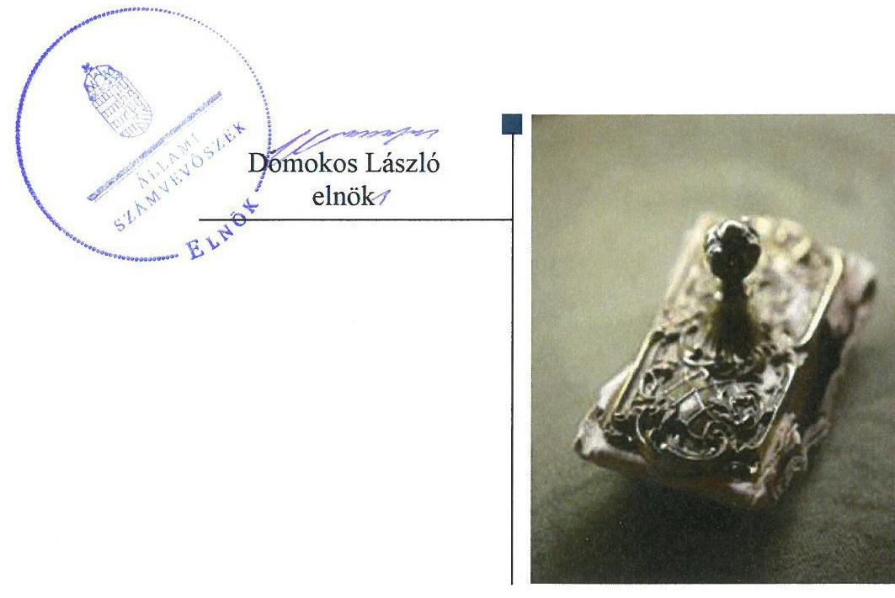
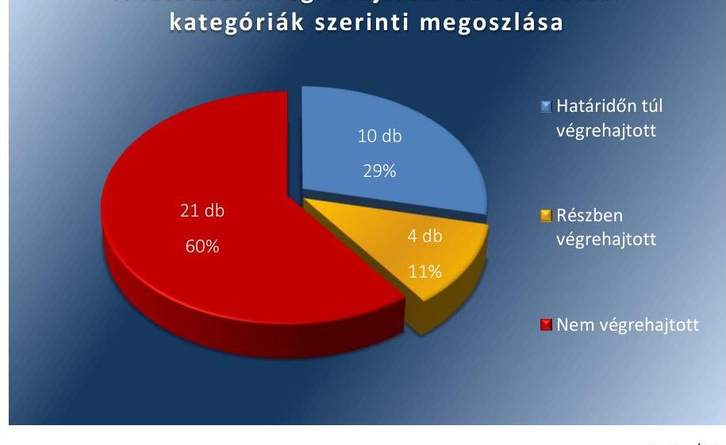

# Jelentés 

## Utóellenőrzések

Az önkormányzatok belső
kontrollrendszere kialakításának és működtetésének utóellenőrzése Szabadegyháza Község Önkormányzata 2018. 06. hó 24. nap

---

|  J | AZ ELLENŐRZÉST FELÜGYELTE:  |
| --- | --- |
|   | DR. BENEDEK MÁRIA felügyeleti vezető  |
|   | AZ ELLENŐRZÉST VEZETTE ÉS A VÉGREHAJTÁSÁÉRT FELELŐS:  |
|   | JÁNOSI ISTVÁN ellenőrzésvezető  |
|   | A PROGRAM ÖSSZEÁLLÍTÁSÁÉRT FELELŐS:  |
|   | JANIK JÓZSEF LÁSZLÓ osztályvezető  |
|   | A TÉMÁHOZ KAPCSOLÓDÓ KORÁBBI SZÁMVEVŐSZÉKI JELENTÉSEK:  |
|   | - címe: Jelentés az önkormányzatok belső kontrollrendszere kialakításának, egyes kontrolltevékenységek és a belső ellenőrzés működésének ellenőrzéséről - Szabadegyháza  |
|  J | - sorszáma: 14041  |
|   | IKTATÓSZÁM: EL-0065-051/2018.  |
|   | TÉMASZÁM: 21  |
|   | ELLENŐRZÉS-AZONOSÍTÓ SZÁM: V075589  |

---

# TARTALOMJEGYZÉK 

■ ÖSSZEGZÉS ..... 5
■ AZ ELLENŐRZÉS CÉLJA ..... 6
■ AZ ELLENŐRZÉS TERÜLETE ..... 7
■ AZ ELLENŐRZÉS HÁTTERE, INDOKOLTSÁGA ..... 8
■ A JELENTÉS LÉNYEGES KÉRDÉSKÖRE ..... 9
■ ELLENŐRZÉS HATÓKÖRE ÉS MÓDSZEREI ..... 10
■ MEGÁLLAPÍTÁSOK ..... 12
■ KÖVETKEZTETÉSEK ..... 17
■ MELLÉKLETEK ..... 19
I. sz. melléklet: Az ÁSZ 14041. számú jelentéséhez kapcsolódó intézkedési terv végrehajtása ..... 19
■ FÜGGELÉK: ÉSZREVÉTELEK ..... 27
■ RÖVIDÍTÉSEK JEGYZÉKE ..... 29

---

.

---

# ÖSSZEGZÉS 

Az Állami Számvevőszék Szabadegyháza Község Önkormányzata belső kontrollrendszere kialakításának és működtetésének utóellenőrzése során megállapította, hogy a végre nem hajtott feladatok miatt nem volt biztosított a gazdálkodás szabályszerűsége, a pénzügyi folyamatok átláthatósága, a közpénzekkel és a vagyonnal való gazdálkodás elszámoltathatósága, amely magas korrupciós kockázatot hordozott.

## Az ellenőrzés társadalmi indokoltsága

Az Állami Számvevőszék stratégiájában célul tűzte ki a számvevőszéki munka hasznosulásának javítását. Ezzel összhangban ellenőrzi, hogy az ellenőrzött szervezetek megvalósították-e a korábbi ellenőrzései által feltárt hibák, hiányosságok és szabálytalanságok megszüntetése céljából kialakított intézkedési terveikben foglaltakat. A rendszeres utóellenőrzések hozzájárulnak a szükséges intézkedések tényleges végrehajtásához, ezáltal a közpénzügyek rendezettségének javulásához, igazolják, hogy lezárult a következmények nélküli ellenőrzések időszaka.

## Főbb megállapítások, következtetések

Szabadegyháza Község Önkormányzata az intézkedést igénylő megállapításokhoz és javaslatokhoz kapcsolódóan összeállított intézkedési tervben meghatározott 35 feladatból tízet határidőn túl, négyet részben, 21 feladatot nem hajtott végre.

A polgármester nem kísérte figyelemmel a gazdálkodás szabályszerűségét, a belső kontrollrendszer kialakítására, a belső ellenőrzés működésére vonatkozó jogszabályi rendelkezések be nem tartását. Nem gondoskodott a pénzügyi folyamatokban kulcsszerepet betöltő kontrollok működésével összefüggésben a hiányosságok, szabálytalanságok feltárásáról, az esetleges munkajogi felelősséggel kapcsolatos körülmények kivizsgálásáról.

A jegyző nem működtette szabályszerűen a pénzügyi folyamatokban kulcsszerepet betöltő kontrollokat. Emiatt a közpénzekkel és a vagyonnal való gazdálkodás nem volt szabályszerű, nem volt biztosított a gazdálkodás átláthatósága és elszámoltathatósága.

A jegyző nem készítette el a Szabadegyházai Polgármesteri Hivatal szervezeti- és működési szabályzatát, ezáltal nem volt biztosított a hivatali feladatok és a felelősségi körök átláthatósága.

A jegyző nem működtette szabályszerűen a belső ellenőrzést, ami akadályozta a szervezet tevékenységének, céljai megvalósításának nyomon követhetőségét.

A jegyző az intézkedési tervben meghatározott feladatok végrehajtásáról nem vezette a jogszabályi előírásoknak megfelelő nyilvántartást.

---

# AZ ELLENŐRZÉS CÉLJA 

Az ellenőrzés célja annak értékelése volt, hogy a számvevőszéki jelentésben foglalt intézkedést igénylő megállapításokkal és javaslatokkal összhangban készített intézkedési tervben meghatározott feladatokat az ellenőrzött szervezet végrehajtotta-e.

---

# AZ ELLENŐRZÉS TERÜLETE 

## Szabadegyháza Község Önkormányzata

Szabadegyháza Község Fejér megyében, a Gárdonyi járásban található. Lakosainak száma 2016. január 1-jén a Központi Statisztikai Hivatal Magyarország Közigazgatási Helynévkönyvében közzétett adatok alapján 2074 fő volt.

A polgármester 2014. október 12. óta tölti be tisztségét, a jegyző 2016. október 4. óta látja el feladatát.

Az Önkormányzat 2015. évi beszámolója szerint a 2015. évben az Önkormányzat 735 MFt költségvetési bevételt ért el és 350 MFt költségvetési kiadást teljesített. A 2015. december 31-i könyvviteli mérleg főösszege 3754 MFt, ezen belül a nemzeti vagyonba tartozó befektetett eszközök állománya 3416 MFt volt.

Az Állami Számvevőszék 2013. évben ellenőrizte Szabadegyháza Község Önkormányzata belső kontrollrendszere kialakítását, egyes kontrolltevékenységek és a belső ellenőrzés működtetését a 2012. január 1.- 2012. december 31. közötti időszak vonatkozásában. Az erről szóló 14041 sorszámú jelentését az Állami Számvevőszék 2014. február 25-én hozta nyilvánosságra. Az ellenőrzés célja annak megállapítása volt, hogy a belső kontrollrendszer elemeinek kialakítása, a pénzügyi folyamatokban kulcsszerepet betöltő teljesítésigazolás és érvényesítés, és a belső ellenőrzés működése biztosította-e az önkormányzatnál a közpénzfelhasználás szabályosságát, hozzájárult-e az értéket teremtő rend követelményének érvényesüléséhez. Az Állami Számvevőszék jelentésében szereplő javaslatokra Szabadegyháza Község Önkormányzatának Képviselő-testülete 2014. július 28-i 29/2014.(VII.28.) számú határozatában elfogadott intézkedési tervét megküldte az Állami Számvevőszék részére.

Az utóellenőrzés - a 2014. február 25-től 2017. június 19-ig végrehajtott feladatokat figyelembe véve - az Állami Számvevőszék jelentésében a polgármester és a jegyző részére megfogalmazott, intézkedést igénylő megállapításokra és javaslatokra készített, az Állami Számvevőszék részére megküldött intézkedési tervben foglalt feladatok megvalósításának ellenőrzésére, illetve értékelésére fókuszált.

---

# AZ ELLENŐRZÉS HÁTTERE, INDOKOLTSÁGA 

Az ÁSZ tv. ${ }^{1}$ 33. § (1) bekezdése értelmében a számvevőszéki jelentések intézkedést igénylő megállapításaihoz és javaslataihoz kapcsolódóan az ellenőrzött szervezet vezetője intézkedési tervet köteles összeállítani, és az Állami Számvevőszék részére megküldeni. Az intézkedési tervben foglaltak megvalósítását - az ÁSZ tv. 33. § (7) bekezdésében foglaltak alapján - az Állami Számvevőszék utóellenőrzés keretében ellenőrizheti. Az intézkedések megvalósulásának értékelése során az Állami Számvevőszék figyelembe veszi az ellenőrzött szervezetek működési feltételeiben, valamint a jogszabályi előírásokban bekövetkezett változásokat.

Az intézkedési tervekben foglalt feladatok hiányos, illetve késedelmes végrehajtása, valamint megvalósításának elmaradása azt mutatja, hogy az ellenőrzések során feltárt hibák, hiányosságok és szabálytalanságok megszüntetése nem kapott kellő hangsúlyt. Ez a szabályszerű működés és a felelős vezetői magatartás vonatkozásában kockázatot hordoz. E kockázatok feltárásával az Állami Számvevőszék utóellenőrzési rendszere fokozza a fegyelmet, és igazolja, hogy a közpénzzel való szabályos gazdálkodás felelőssége elől nem lehet kitérni.

Az utóellenőrzés négy szinten hasznosulhat:
A társadalom szintjén az utóellenőrzés jelzi, hogy a számvevőszéki ellenőrzés megállapításainak van következménye: a hiányosságok megszüntetésére az ellenőrzött szervezet által meghatározott intézkedések végrehajtását is számon kéri az Állami Számvevőszék.
$\longrightarrow$ Az ellenőrzött terület szintjén az utóellenőrzés tájékoztatást nyújt a terület döntéshozóinak a hiányosságok kiküszöbölésének jó gyakorlatairól, ezzel lehetőséget biztosítva arra, hogy az Állami Számvevőszék ellenőrzési megállapításai, javaslatai a terület nem ellenőrzött szervezeteinek a működése során is hasznosuljanak.
$\longrightarrow$ Az ellenőrzött szervezet szintjén az utóellenőrzés feltárja, hogy a szervezet az intézkedések végrehajtásával hasznosította-e a korábbi ellenőrzési jelentésben a hiányosságok megszüntetése, illetve a kockázatok kezelése érdekében megfogalmazott javaslatokat.
$\longrightarrow$ Az Állami Számvevőszék szintjén az utóellenőrzés visszacsatolást ad az ellenőrzési jelentések hasznosulásáról, az intézkedések elmaradása vagy részleges megvalósulása a további ellenőrzésekhez kockázati jelzésként szolgál.

---

# A JELENTÉS LÉNYEGES KÉRDÉSKÖRE 

Az ellenőrzött szervezet az intézkedési tervben foglaltakat az előírt határidőben végrehajtotta-e?

---

# ELLENŐRZÉS HATÓKÖRE ÉS MÓDSZEREI 

## Az ellenőrzés típusa

Megfelelőségi ellenőrzés

## Az ellenőrzött időszak

Az utóellenőrzés alapját képező ÁSZ jelentés közzétételének napjától (2014. február 25-től) az ellenőrzésről szóló kiértesítő levél keltének napjáig (2017. június 19-ig) tartó időszak.

## Az ellenőrzés tárgya

Az ÁSZ az ÁSZ tv. 2011. július 1-jei hatálybalépését követően a számvevőszéki jelentésben foglalt intézkedést igénylő megállapításokkal és javaslatokkal összhangban - az ellenőrzött szervezet által - készített intézkedési tervben foglaltak végrehajtásának ellenőrzése volt.

Az ellenőrzés kiterjedt minden olyan körülményre és adatra, amely az ÁSZ jogszabályban meghatározott feladatainak teljesítéséhez, valamint a program végrehajtása folyamán felmerült újabb összefüggések feltárásához szükséges volt.

## Az ellenőrzött szervezet

Szabadegyháza Község Önkormányzata

## Az ellenőrzés jogalapja

Az ÁSZ tv. 33. § (7) bekezdése alapján az intézkedési tervben foglaltak megvalósítását az ÁSZ utóellenőrzés keretében ellenőrizheti.

## Az ellenőrzés módszerei

Az ÁSZ² az ellenőrzést az ellenőrzési program ellenőrzési kérdései, az ellenőrzött időszakban hatályos jogszabályok, az ellenőrzés szakmai szabályok és módszertanok figyelembevételével, önálló ellenőrzés keretében végezte.

Az ÁSZ az ellenőrzés ideje alatt az ellenőrzött szervezettel történő kapcsolattartást az ÁSZ Szervezeti és Működési Szabályzatának vonatkozó előírásai alapján biztosította.

---

Az utóellenőrzés megállapításait elsősorban az ÁSZ rendelkezésére álló, valamint az ellenőrzött szervezetektől elektronikusan bekért dokumentumok alapozták meg.

Az ellenőrzési bizonyítékként felhasználható adatforrások közé tartoztak egyrészt a szakmai programban felsorolt adatforrások, másrészt minden - az ellenőrzés folyamán feltárt, az ellenőrzés szempontjából információt tartalmazó - dokumentum.

Az intézkedési tervben előírt feladatokat azok végrehajthatósága, illetve végrehajtása szempontjából az alábbiak szerint értékelte az ÁSZ:
$\longrightarrow$ „határidőben végrehajtott" a feladat, ha a teljesítés dokumentáltan, az intézkedési tervben előírt határidőben és tartalommal megtörtént;
$\longrightarrow$ „határidőn túl végrehajtott" a feladat, ha annak teljesítése az intézkedési tervben meghatározott módon, de az előírt határidőn túl történt meg;
$\longrightarrow$ „részben végrehajtott" a feladat, ha végrehajtása teljes körűen az intézkedési tervben előírt módon nem történt meg;
$\longrightarrow$ „nem végrehajtott" a feladat, ha a végrehajtás nem történt meg, vagy amennyiben a teljesítést nem dokumentálták;
$\longrightarrow$ „okafogyottá vált" a feladat, ha végrehajtására - meghatározott esemény bekövetkezése, továbbá külső körülmény, a működést érintő feltétel változása miatt - már nincs szükség, illetve lehetőség, és egyértelműen megállapítható, hogy az intézkedést szükségessé tevő körülmény a jövőben nem fordulhat elő;
$\longrightarrow$ „nem időszerű" az a feladat, amelynek ellenőrzési időszakon belüli végrehajtására azért nem került (kerülhetett) sor, mert az intézkedés alapjául szolgáló esemény nem következett be, de annak jövőbeni előfordulása lehetséges, a végrehajtása nem volt esedékes, vagy a végrehajtás határideje még nem járt le.
Az ellenőrzés lefolytatásához az ellenőrzött szervezet a tanúsítványok elektronikus kitöltésével, valamint az ÁSZ által kért dokumentumok elektronikus megküldésével szolgáltatott adatokat, amelyek valódiságát és teljes körűségét az ellenőrzött szervezet vezetője által tett teljességi és hitelességi nyilatkozat igazolta. Az így rendelkezésre bocsátott adatok, információk kontrollja az ellenőrzés keretében történt.

---

# MEGÁLLAPÍTÁSOK 

## Az ellenőrzött szervezet az intézkedési tervben foglaltakat az előírt határidőben végrehajtotta-e?

Összegző megállapítás

Szabadegyháza Község Önkormányzata az intézkedési tervben meghatározott 35 feladatból tízet határidőn túl, négyet részben, 21 feladatot nem hajtott végre. A jegyző az intézkedési tervben meghatározott feladatok végrehajtásáról a jogszabályban előírt nyilvántartást nem vezette.

Az ÁSZ a jelentésben a polgármester ${ }^{3}$ részére öt, a jegyző ${ }^{4}$ részére hét pontban harminc javaslatot fogalmazott meg. Az ÁSZ részére megküldött intézkedési tervben a hiányosságok, szabálytalanságok megszüntetésére a polgármester részére öt, a jegyző részére 30 feladat került meghatározásra.

Az intézkedési tervben meghatározott feladatokat, határidőket, felelősöket és a feladatok végrehajtását az I. számú melléklet mutatja be.

A jegyző az intézkedési tervben meghatározott feladatok végrehajtásáról a Bkr. ${ }^{5}$ 14. § (1) bekezdésben előírt nyilvántartást nem vezette.

Az Önkormányzat ${ }^{6}$ intézkedési tervében meghatározott feladatok végrehajtásának értékelési kategóriák szerinti megoszlását az 1. ábra szemlélteti.

1. ábra

A feladatok végrehajtásának értékelési kategóriák szerinti megoszlása

Forrás: ÁSZ

---

# HATÁRIDŐN TÚL VÉGREHAJTOTT feladatok: 

1. A polgármester 2014. július 29-e helyett
 a 2015. június 1-jétől hatályos Gazdálkodási szabályzat ${ }^{7}$-ban gondoskodott a jogszabályi előírásoknak megfelelően az Önkormányzat nevében történő kötelezettségvállalás szabályozásáról.
2. A jegyző a 2014. május 31-i határidőn túl, 2015. június 1-jétől kezdően rögzítette a jogszabályi előírásoknak megfelelően a Polgármesteri Hivatal ${ }^{8}$ gazdálkodási ügyintézői által ellátott feladatok munkafolyamatai leírását, valamint a belső és külső kapcsolattartás módját, szabályait a Gazdasági szervezet ügyrendjében.
3. A jegyző 2014. május 31-ei határidőn túl a 2015. június 1-jétől hatályos Belső kontrollrendszer szabályzat ${ }^{10}$-ban a jogszabályi előírásnak megfelelően meghatározta az egyes kockázatokkal kapcsolatban szükséges intézkedések, valamint azok teljesítése folyamatos nyomon követésének módját.
4. A jegyző 2014. május 31-ei határidőn túl a 2017. január 1-jétől hatályos Iratkezelési szabályzat ${ }^{11}$-ban rögzítette a jogszabályi előírásoknak megfelelően az üzemeltetés és az adatbiztonság szabályait oly módon, hogy a feladatok, hatáskörök pontosan meghatározásra kerültek.
5. A jegyző a 2014. augusztus 31-ei határidőn túl a 2015. június 1-jétől hatályos Informatikai biztonsági szabályzat ${ }^{12}$-ban gondoskodott az adatok biztonságáról, valamint mindazon eljárási szabályok kialakításáról, amelyek a jogszabályokban foglalt adat- és titokvédelmi szabályok érvényre juttatásához szükségesek.
6. A jegyző a 2014. május 31-ei határidőn túl a 2017. január 1-jétől hatályos Iratkezelési szabályzatban szabályozta a jogszabályi előírásnak megfelelően a dokumentumokhoz és információkhoz való hozzáférés esetében a felelősségi köröket.
7. A jegyző a 2014. május 31-ei határidőn túl a 2015. június 1-jétől hatályos Közszolgálati szabályzat ${ }^{13}$-ban szabályozta a jogszabályi előírásnak megfelelően a jogviszony megszűnése esetére a munkavállaló folyamatban lévő feladatai átadásának rendjét.
8. A jegyző a kötelezően közzéteendő adatok nyilvánosságra hozatala rendjét, valamint a közérdekű adatok megismerésére irányuló igények teljesítése rendjét a 2014. május 31-ei határidőn túl 2015. június 1-jétől kezdődően szabályozta a jogszabályoknak megfelelő belső szabályzatban.
9. A jegyző 2014. május 31-ei határidőn túl a 2017. január 1-jétől hatályos Iratkezelési szabályzatban gondoskodott a jogszabálynak megfelelően az iratok szervezeten belüli útjának pontos követhetőségéről és ellenőrizhetőségéről.
10. A jegyző az előírt 2014. április 30-ai határidőn túl, 2016. november 28-án terjesztette a Képviselő-testület elé a 2017-2020. évekre vonatkozó Stratégiai ellenőrzési terv ${ }^{14}$-et, amit a Képviselő-testület a 174/2016.(XI.28.) számú határozatában hagyott jóvá.

---

# RÉSZBEN VÉGREHAJTOTT feladatok: 

11. A jegyző az Önkormányzat intézményei számviteli rendjét a Htv. ${ }^{15}$ 140. § (1) bekezdés c) pontjának előírása alapján csak részben alakította ki. A Számviteli tv. ${ }^{16}$ és az Áhsz. ${ }^{17}$ előírásainak megfelelően elkészítette a 2015. június 1-jétől hatályos, az Önkormányzatra és intézményeire kiterjedő Számviteli politikát ${ }^{18}$, valamint számlarendet. A Számviteli politika keretében nem készítette el a Számviteli tv. 14. § (5) bekezdésében és az Áhsz. 50. § (1) bekezdésében meghatározott további szabályzatokat.
12. A jegyző a 2015. június 1-jétől hatályos Belső kontrollrendszer szabályzatban a jogszabályi rendelkezéseknek megfelelően gondoskodott az ellenőrzési nyomvonal aktualizálásáról, azonban ezt követően aktualizálásra nem került sor.
13. A jegyző első alkalommal 2016. november 28-án gondoskodott arról, hogy a 2017. évi éves ellenőrzési terv ${ }^{19}$ a jogszabályi előírásoknak megfelelően beterjesztésre kerüljön a Képviselő-testület elé, ugyanakkor a Bkr. 32. § (3)-(4) bekezdéseiben előírtak ellenére az ellenőrzött időszak korábbi évei vonatkozásában erre nem került sor.
14. A jegyző gondoskodott arról, hogy a 2014. évi ellenőrzési jelentés ${ }^{20}$-t a jogszabályi előírásnak megfelelően a belső ellenőrzés vezetője a jegyző számára megküldje. Az ellenőrzött időszak további évei vonatkozásában a Bkr. 49. § (3) bekezdésében előírtak ellenére erre nem került sor.

## NEM VÉGREHAJTOTT feladatok:

15. A polgármester az Mötv. 116. § (5) bekezdésében előírtak ellenére nem terjesztette a Képviselő-testület ${ }^{21}$ elé az Önkormányzat 2011-2014. évekre vonatkozó gazdasági programját.
16. A polgármester a Bkr. 49. § (3a) bekezdésében előírtak ellenére nem gondoskodott az éves ellenőrzési jelentések Képviselő-testület elé terjesztéséről.
17. A polgármester, mint kötelezettségvállaló az Ávr. ${ }^{22}$ 57. § (4) bekezdésében foglaltak ellenére nem jelölte ki a teljesítés igazolásra jogosult személyeket.
18. A polgármester nem kísérte figyelemmel az Önkormányzat gazdálkodása szabályszerűségét, az Mötv. ${ }^{23}$ 67. § (f) pontja alapján a belső kontrollrendszer kialakítására, a belső működés ellenőrzésére vonatkozó jogszabályi rendelkezések be nem tartását. Nem vizsgálta ki a teljesítés igazolás, illetve az érvényesítés belső kontrollok működésével összefüggésben feltárt hiányosságok, szabálytalanságok tekintetében az esetleges munkajogi felelősséggel kapcsolatos körülményeket.
19. A jegyző a Htv. 140. § (1) bekezdés a) pontjában előírtak ellenére nem készítette elő az Önkormányzat 2011-14. évi gazdasági program tervezetét az Mötv. 116. § (3)-(4) bekezdésében foglalt tartalommal, és nem kezdeményezte annak Képviselő-testület elé terjesztését.

---

20. A jegyző az Áht. ${ }^{24} 10 . \S$ (5) bekezdése ellenére nem készítette el a Polgármesteri Hivatal szervezeti és működési szabályzatát.
21. A jegyző az Mvtv. ${ }^{25}$ 2. § (3) bekezdésének előírása ellenére nem határozta meg az egészséget nem veszélyeztető és biztonságos munkavégzés követelményei megvalósítási módját.
22. A jegyző az Mötv. 81. § (3) bekezdés c) pontjának előírása ellenére nem készítette elő a köztisztviselőkkel szembeni, a Kttv. ${ }^{26}$ 83. §-ának előírása szerinti hivatásetikai alapelvek részletes tartalmát, valamint az etikai eljárás szabályainak dokumentumait, továbbá a Kttv. 231.§ (1) bekezdésében foglalt előírás érvényesülése érdekében nem kezdeményezte annak Képviselő-testület elé terjesztését.
23. A jegyző a Bkr. 3. § d) pontjában és 9. § (1) bekezdésében foglaltak ellenére nem alakított ki és nem működtetett olyan rendszert, amely biztosítja, hogy a megfelelő információk a megfelelő időben eljussanak az illetékes szervezethez, szervezeti egységhez, illetve személyhez.
24. A jegyző a Bkr. 3. § e) pontjában és 10. §-ában előírtak ellenére nem alakított ki és nem működtetett olyan rendszert, amely biztosítja a Polgármesteri Hivatal tevékenységének, a célok megvalósításának nyomon követését.
25. A jegyző a Bkr. 11. § (1) bekezdésének előírásai ellenére nem értékelte a belső kontrollrendszer minőségét a Bkr. 1. sz. melléklete szerinti nyilatkozatban.
26. A jegyző a Bkr. 46. § (1) bekezdésében foglaltak ellenére nem készített beszámolót a belső ellenőrzési vezető részére az intézkedési tervben meghatározott feladatok végrehajtásáról.
27. A jegyző nem gondoskodott arról, hogy a gazdasági eseményekhez kapcsolódó kiadások kifizetésére az Áht. 38. § (1) bekezdésében és az Ávr. 57. § (1) és (3) bekezdéseiben előírtaknak megfelelő, szabályszerűen elvégzett teljesítés igazolás alapján kerüljön sor.
28. A jegyző nem gondoskodott arról, hogy a gazdasági eseményekhez kapcsolódó kiadások kifizetésére az Áht. 38. § (1) bekezdésében és az Ávr. 58. § (1) bekezdésében előírtaknak megfelelő, szabályszerűen végrehajtott érvényesítést követően kerüljön sor.
29. A jegyző a gazdálkodás során nem gondoskodott arról, hogy kötelezettségvállalásra az Áht. 37. § (1) bekezdésében és az Ávr. 55. § (1) bekezdésében foglaltaknak megfelelően - az Ávr. 53. §-ában meghatározott kivételeket figyelembe véve - kizárólag pénzügyi ellenjegyzés után, a pénzügyi teljesítés esedékességét megelőzően, írásban kerüljön sor.
30. A jegyző az Ávr. 53. § (2) és 56. § (1) bekezdésében előírtak ellenére nem gondoskodott a kötelezettségvállalások nyilvántartásba vételéről.
31. A jegyző a gazdálkodás során nem gondoskodott a 100 ezer Ft alatti kifizetések vonatkozásában a kötelezettségvállalások nyilvántartásba vételének és a teljesítésigazolás elvégzésének a belső

---

szabályozás szerinti végrehajtásáról. Az utalványrendeletek nem feleltek meg az Ávr. 59. (3) bekezdésében foglalt előírásoknak.
32. A jegyző a Bkr. 33. § (2) bekezdésében foglaltak ellenére nem intézkedett annak érdekében, hogy a belső ellenőrzésekhez a belső ellenőrzési vezető által jóváhagyott ellenőrzési program készüljön.
33. A jegyző a Bkr. 45. § (1)-(3) bekezdéseiben előírtak ellenére nem gondoskodott a belső ellenőrzési jelentésekben megfogalmazott javaslatok végrehajtására vonatkozó intézkedési terv megfelelő tartalommal és határidőn belül történő elkészítéséről.
34. A jegyző a Bkr. 21. § (2) bekezdés d) pontja és 47. § (1) bekezdése ellenére nem intézkedett annak érdekében, hogy a belső ellenőrzési vezető a belső ellenőrzésekben tett megállapításokat, javaslatokat, a vonatkozó intézkedési terveket és azok végrehajtását nyomon követő nyilvántartást vezessen.
35. A jegyző a Bkr. 22. § (2) bekezdés e) pontjában és 50. §-ában foglalt előírások ellenére nem intézkedett annak érdekében, hogy a belső ellenőrzési vezető az elvégzett belső ellenőrzésekről nyilvántartást vezessen.

---

# KÖVETKEZTETÉSEK 

Az ÁSZ tv. 32. § (1) bekezdésében foglaltak értelmében az ÁSZ jelentés tartalmazza a feltárt tényeket, az ezeken alapuló megállapításokat, következtetéseket, amelyeknek a 24. § (1) d) pontja szerint okszerűnek és megalapozottnak kell lenniük.

Az Önkormányzat nem gondoskodott a gazdálkodási jogkörök (pénzügyi ellenjegyzés, teljesítés igazolás, érvényesítés) szabályszerű gyakorlásáról, továbbá a Polgármesteri Hivatal szervezeti és működési szabályzatának elkészítéséről, amivel sérül a közpénzekkel való átlátható, felelős gazdálkodás, és ami jelentős kockázatot jelent a gazdálkodás szabályszerűsége, átláthatósága és elszámoltathatósága szempontjából. A nem végrehajtott feladatok indokolják a feltárt hiányosság, szabálytalanság tekintetében a munkajogi felelősség tisztázására irányuló eljárás megindítását, és eredményének ismeretében a szükséges intézkedések megtételét.

---

.

---

# MELLÉKLETEK

■ I. SZ. MELLÉKLET: AZ ÁSZ 14041. SZÁMÚ JELENTÉSÉHEZ KAPCSOLÓDÓ INTÉZKEDÉSI TERV VÉGREHAJTÁSA

|  Az intézkedési tervben meghatározott feladat | Az intézkedési tervben meghatározott határidő | Az intézkedési tervben meghatározott feladat végrehajtásának felelőse | Az intézkedési tervben meghatározott feladat végrehajtása  |
| --- | --- | --- | --- |
|  1. | 2. | 3. | 4.  |
|  Határidőn túl végrehajtott feladatok |  |  |   |
|  1. Az Önkormányzat nevében történő kötelezettségvállalás szabályozása az Áht. 37. § (1) bekezdésében és az Ávr. 55. § (1) bekezdésében foglaltaknak megfelelően. | a kt. ülést követő naptól folyamatos | polgármester | A polgármester a 2014. július 29-ei határidőn túl a 2015. június 1-jétől hatályos Gazdálkodási szabályzatban gondoskodott az Áht. és az Ávr. előírásainak megfelelően az Önkormányzat nevében történő kötelezettségvállalás szabályozásáról. A Gazdálkodási szabályzatot a Képviselő-testület 104/2015.(V.28.) számú határozatával fogadta el.  |
|  2. A Polgármesteri Hivatal gazdálkodási ügyintézői által ellátott feladatok munkafolyamatai leírásának és a belső és külső kapcsolattartás módjának, szabályainak belső szabályzatban rögzítése az Ávr. 13. § (5) bekezdésében foglaltak alapján. | 2014. május 31. | jegyző | A jegyző a 2014. május 31-i határidőn túl, 2015. június 1-jétől hatályos Gazdasági szervezet ügyrendjében rögzítette az Ávr. előírásának megfelelően a Polgármesteri Hivatal gazdálkodási ügyintézői által ellátott feladatok munkafolyamatai leírását, valamint a belső és külső kapcsolattartás módját, szabályait. A Gazdasági szervezet ügyrendjét a Képviselő-testület 112/2015.(V.28.) számú határozatával fogadta el.  |
|  3. A Bkr. 7. § (2) bekezdésében foglaltak szerint az egyes kockázatokkal kapcsolatban szükséges intézkedések, valamint azok teljesítése folyamatos nyomon követése módjának meghatározása. | 2014. május 31. | jegyző | A jegyző 2014. május 31-ei határidőn túl a 2015. június 1-jétől hatályos Belső kontrollrendszer szabályzatban a Bkr. 7. § (2) bekezdésében foglaltak szerint meghatározta az egyes kockázatokkal kapcsolatban
 szükséges intézkedések, valamint azok teljesítése folyamatos nyomon követésének módját.  |
|  4. Az iratkezelési rendszer vonatkozásában az lkr. 8. § (2) bekezdése alapján az üzemeltetés és az adatbiztonság szabályainak rögzítése oly módon, hogy a feladatok, hatáskörök pontosan meghatározásra kerüljenek. | 2014. május 31. | jegyző | A jegyző a 2014. május 31-ei határidőn túl a 2017. január 1-jétől hatályos Iratkezelési szabályzat 10-14., 70-76., és 148-149. pontjaiban rögzítette az lkr. ${ }^{27}$ előírásainak megfelelően az üzemeltetés és az adatbiztonság szabályait oly módon, hogy a feladatok, hatáskörök pontosan meghatározásra kerültek.  |
|  5. Az Info tv. 7. § (2) bekezdésének megfelelően gondoskodjon az adatok biztonságáról, tegye meg azokat az intézkedéseket, alakítsa ki azokat az eljárási szabályokat, amelyek | 2014. augusztus 31. és folyamatos | jegyző | A jegyző a 2014. augusztus 31-ei határidőn túl a 2015. június 1-jétől hatályos Informatikai biztonsági szabályzatban gondoskodott az adatok biztonságáról, valamint mindazon eljárási szabályok kialakításáról, amelyek az Info tv. ${ }^{28}$, valamint az egyéb adat- és titokvédelmi szabályok érvényre juttatásához szükségesek.  |

---

|  Az intézkedési tervben meghatározott feladat | Az intézkedési tervben meghatározott határidő | Az intézkedési tervben meghatározott feladat végrehajtásának felelőse | Az intézkedési tervben meghatározott feladat végrehajtása  |
| --- | --- | --- | --- |
|  az Info tv., valamint az egyéb adat- és titokvédelmi szabályok érvényre juttatásához szükségesek, továbbá megfelelő intézkedésekkel biztosítsa az adatok védelmét, különösen az Info tv. 7. § (3) bekezdésében foglaltak érvényre juttatása érdekében. | 2. | 3. | 4.  |
|  6. A Bkr. 8. § (4) bekezdés b) pontja alapján a dokumentumokhoz és információkhoz való hozzáférés esetében a felelősségi körök szabályozása belső szabályzatban. | 2014. május 31. | jegyző | A jegyző a 2014. május 31-ei határidőn túl a 2017. január 1-jétől hatályos az Iratkezelési szabályzat 10-14., 35-43., 120-131., és 148-149. pontjaiban szabályozta a Bkr. előírásának megfelelően a dokumentumokhoz és információkhoz való hozzáférés esetében a felelősségi köröket.  |
|  7. A Kttv. 74. § (1) bekezdésében és a 226. § (2) bekezdés b) pontjában foglaltaknak megfelelően a jogviszony megszűnése esetére a munkavállaló folyamatban lévő feladatai átadása rendjének belső szabályzatban rögzítése. | 2014. május 31. | jegyző | A jegyző a 2014. május 31-ei határidőn túl a 2015. június 1-jétől hatályos Közszolgálati szabályzat VIII. fejezetében szabályozta a Kttv. előírásának megfelelően a jogviszony megszűnése esetére a munkavállaló folyamatban lévő feladatai átadásának rendjét.  |
|  8. Az Info tv. 30. § (6) bekezdésében és 35.§ (3) bekezdésében, valamint az Ávr. 13. § (2) bekezdés h) pontjában foglaltaknak megfelelően a kötelezően közzéteendő adatok nyilvánosságra hozatala rendjének, valamint a közérdekű adatok megismerésére irányuló igények teljesítése rendjének belső szabályzatban történő megállapítása. | 2014. május 31. | jegyző | A jegyző a kötelezően közzéteendő adatok nyilvánosságra hozatala rendjét, valamint a közérdekű adatok megismerésére irányuló igények teljesítése rendjét az előírt 2014. május 31-ei határidőn túl 2015. június 1-jétől kezdődően szabályozta az Info tv. és az Ávr. előírásainak megfelelő, „Szabályzat a közérdekű adatok megismerésére irányuló kérelmek intézésének, továbbá a kötelezően közzéteendő adatok nyilvánosságra hozatalának rendjéről"című belső szabályzatban.  |
|  9. Az lkr 14. § (4) bekezdésében foglaltaknak megfelelően az iratforgalom dokumentálásával az iratok szervezeten belüli útjának pontos követhetőségéről és ellenőrizhetőségéről gondoskodás. | 2014. május 31. | jegyző | A jegyző 2014. május 31-ei határidőn túl a 2017. január 1-jétől hatályos Iratkezelési szabályzat II-IV. fejezetében rögzítette a jogszabálynak megfelelően az iratok szervezeten belüli útjának pontos követhetőségét és ellenőrizhetőségét.  |
|  10. A Bkr. 56. § (3) bekezdés a) pontjában foglaltaknak megfelelően a stratégiai ellenőrzési terv képviselő-testület elé terjesztése jóváhagyásra. | 2014. április 30. | jegyző | A jegyző a 2014. április 30-a helyett 2016. november 28-án terjesztette a képviselő-testület elé a Bkr.-ben foglaltaknak megfelelően a 2017-2020. évekre vonatkozó Stratégiai ellenőrzési tervet, amit a Képviselő-testület a 174/2016.(XI.28.) számú határozatában hagyott jóvá.  |
|  Részben végrehajtott feladatok |  |  |   |
|  11. Az Önkormányzat intézményei számviteli rendjének kialakítása a Htv. 140. § (1) bekezdés c) pontja alapján. | 2014. július 31. | jegyző | A jegyző az Önkormányzat intézményei számviteli rendjét a Htv. 140. § (1) bekezdés c) pontjának előírása alapján csak részben alakította ki. A Számviteli tv. 14. §  |

---

|  Az intézkedési tervben meghatározott feladat | Az intézkedési tervben meghatározott határidő | Az intézkedési tervben meghatározott feladat végrehajtásának felelőse | Az intézkedési tervben meghatározott feladat végrehajtása  |
| --- | --- | --- | --- |
|  1. | 2. | 3. | 4.  |
|   |  |  | (3) bekezdésének és az Áhsz. 50. § (1) bekezdésének megfelelően elkészítette a 2015. június 1-jétől hatályos, az Önkormányzatra és intézményeire kiterjedő Számviteli politikát, valamint a Számviteli tv. 161. § (1) bekezdésének és az Áhsz. 51. § (1) bekezdésének megfelelően az Önkormányzatra és intézményeire kiterjedő számlarendet. Ugyanakkor a Számviteli politika keretében nem készítette el a Számviteli tv. 14. § (5) bekezdésében és az Áhsz. 50. § (1) bekezdésében meghatározott további szabályzatokat.  |
|  12. Az ellenőrzési nyomvonal aktualizálása a Bkr. 6. § (3) bekezdésében előírtaknak megfelelően. | 2014. augusztus 31. és folyamatos | jegyző | A jegyző a 2015. június 1-jétől hatályos Belső kontrollrendszer szabályzatban gondoskodott a Bkr. rendelkezésének megfelelően az ellenőrzési nyomvonal aktualizálásáról. Ugyanakkor az ellenőrzési nyomvonal további aktualizálására 2015. június 1-jét követően a Bkr. 6. § (3) bekezdése ellenére nem került sor, mivel az időközben bekövetkezett szervezeti, személyi változások nem kerültek átvezetésre.  |
|  13. Az éves ellenőrzési terv, a Bkr. 56. § (2) bekezdésnek megfelelően, a jegyző írásos véleményének figyelembevételével - a Bkr. 22. § (1) bekezdés b) pontjában, a 29. § (1) bekezdésében és a 31. § (1) bekezdésében foglaltak szerint készüljön el, és a jegyző kezdeményezze, hogy a képviselőtestület az Mótv. 119. § (5), a Bkr. 32. § (4) bekezdésében előírt határidőn belül jóváhagyja. | 2014. június 30. és évente folyamatos | jegyző | A belső ellenőrzési feladatokat ellátó Adonyi Többcélú Kistérségi Társulás Munkaszervezete 2013. június 30-án megszűnt. Ezt követően a belső ellenőrzési feladatokat megbízási szerződés keretében külső szervezet látta el. A jegyző első alkalommal 2016. november 28-án gondoskodott arról, hogy a 2017. évi éves ellenőrzési terv a jogszabályi előírásoknak megfelelően beterjesztésre kerüljön a Képviselő-testület elé, ugyanakkor a Bkr. 32. § (3)-(4) bekezdéseiben előírtak ellenére az ellenőrzött időszak korábbi évei vonatkozásában erre nem került sor.  |
|  14. A Társulás munkaszervezetének vezetője a Bkr. 56. § (8) bekezdésében foglaltak alapján az éves ellenőrzési jelentést készítse el és küldje meg a jegyzőnek, hogy azt a polgármester a zárszámadással egyidejűleg a képviselő-testület elé terjeszthesse. | 2014. június 30. és folyamatos | jegyző | A jegyző gondoskodott arról, hogy a 2014. évi éves ellenőrzési jelentést a jogszabályi előírásnak megfelelően a belső ellenőrzés vezetője a jegyző számára megküldje. A Bkr. 49. § (3) bekezdésében előírtak ellenére az ellenőrzött időszak további évei vonatkozásában erre nem került sor.  |
|  Nem végrehajtott feladatok |  |  |   |
|  15. Szabadegyháza Község Önkormányzatának 2011-2014. évekre vonatkozó gazdasági programjának a képviselő-testület elé terjesztése. | 2014. március 31. | polgármester | A polgármester az Mótv. 116. § (5) bekezdésében előírtak ellenére nem terjesztette a Képviselő-testület elé az Önkormányzat 2011-2014. évekre vonatkozó gazdasági programját.  |

---

|  Az intézkedési tervben meghatározott feladat | Az intézkedési tervben meghatározott határidő | Az intézkedési tervben meghatározott feladat végrehajtásának felelőse | Az intézkedési tervben meghatározott feladat végrehajtása  |
| --- | --- | --- | --- |
|  1. | 2. | 3. | 4.  |
|  16. A 2011. évre vonatkozó éves ellenőrzési jelentésnek a Bkr. 49. § (3a), illetve az 56.§ (8) bekezdésében foglaltak figyelembevételével a képviselő-testület elé terjesztése. | minden év április 30. | polgármester | A polgármester a Bkr. 49. § (3a) bekezdésében előírtak ellenére nem gondoskodott az éves ellenőrzési jelentések Képviselő-testület elé terjesztéséről.  |
|  17. Az Ávr. 57. § (4) bekezdésének megfelelően a polgármester mint kötelezettségvállaló által a teljesítés igazolására jogosult személyek kijelölése. | 2014. március 31. | polgármester | A polgármester, mint kötelezettségvállaló által a teljesítés igazolására jogosult személyek írásos kijelölése az Ávr. 57. § (4) bekezdésében foglaltak ellenére nem történt meg.  |
|  18. Az Önkormányzat gazdálkodása szabályszerűségének figyelemmel kísérése. Az Mótv. 67. § (f) pontja alapján a belső kontrollrendszer kialakítására, a belső működés ellenőrzésére vonatkozó jogszabályi rendelkezések be nem tartása, valamint a teljesítésigazolás, illetve az érvényesítés belső kontrollok működésével összefüggésben feltárt hiányosságok, szabálytalanságok tekintetében az esetleges munkajogi felelősséggel kapcsolatos körülmények kivizsgálása, majd a vizsgálat eredményének függvényében a szükséges munkajogi intézkedések megtétele. | 2014. augusztus 31. | polgármester | A polgármester nem kísérte figyelemmel az Önkormányzat gazdálkodása szabályszerűségét, az Mótv. 67. § (f) pontja alapján a belső kontrollrendszer kialakítására, a belső működés ellenőrzésére vonatkozó jogszabályi rendelkezések be nem tartását. Nem vizsgálta ki a teljesítés igazolás, illetve az érvényesítés belső kontrollok működésével összefüggésben feltárt hiányosságok, szabálytalanságok tekintetében az esetleges munkajogi felelősséggel kapcsolatos körülményeket.  |
|  19. Az Önkormányzat gazdasági programtervezetének előkészítése a Htv. 140. § (1) bekezdés a) pontjában foglaltak alapján az Mótv. 116. § (3)-(4) bekezdésében foglalt tartalommal, és a képviselő-testület elé terjesztés kezdeményezése. | 2014. március 31. | jegyző | A jegyző a Htv. 140. § (1) bekezdés a) pontjában foglaltak ellenére nem készítette elő az Önkormányzat 2011-14. évi gazdasági program tervezetét az Mótv. 116. § (3)-(4) bekezdésében foglalt tartalommal, és nem kezdeményezte annak Képviselő-testület elé terjesztését.  |
|  20. A Polgármesteri Hivatal szervezeti és működési szabályzatának az Áht. 10. § (5) bekezdése alapján történő elkészítése és az Áht. 9. § (1) bekezdés a) pontjában foglaltakra tekintettel a képviselő-testület elé terjesztés kezdeményezése. | 2014. április 30. | jegyző | A jegyző az Áht. 10. § (5) bekezdése ellenére nem készítette el a Polgármesteri Hivatal szervezeti és működési szabályzatát.  |
|  21. Az egészséget nem veszélyeztető
 és biztonságos munkavégzés követelményei megvalósítási módjának meghatározása az Mvt. 2. § (3) bekezdése alapján. | 2014. május 31. | jegyző | A jegyző az Mvt. 2. § (3) bekezdése ellenére nem határozta meg az egészséget nem veszélyeztető és biztonságos munkavégzés követelményei megvalósítási módját.  |

---

|  Az intézkedési tervben meghatározott feladat | Az intézkedési tervben meghatározott határidő | Az intézkedési tervben meghatározott feladat végrehajtásának felelőse | Az intézkedési tervben meghatározott feladat végrehajtása  |
| --- | --- | --- | --- |
|  1. | 2. | 3. | 4.  |
|  22. Mótv. 81. § (3) bekezdés c) pontjában foglalt feladatkörében a köztisztviselőkkel szembeni, a Kttv. 83. §-a szerinti hivatásetikai alapelvek részletes tartalmának, valamint az etikai eljárás szabályainak dokumentumainak előkészítése és a Kttv. 231.§ (1) bekezdésében foglaltak érvényesülése érdekében a képviselő-testület elé terjesztés kezdeményezése. | 2014. május 31. | jegyző | A jegyző a Mótv. 81. § (3) bekezdés c) pontjában foglalt feladata ellenére nem készítette elő a köztisztviselőkkel szembeni, a Kttv. 83. §-a szerinti hivatásetikai alapelvek részletes tartalmát és az etikai eljárás szabályainak dokumentumait, továbbá a Kttv. 231.§ (1) bekezdésében foglalt előírás érvényesülése érdekében nem kezdeményezte annak Képviselő-testület elé terjesztését.  |
|  23. A Bkr. 3. § d) pontjában és a 9. § (1) bekezdésében foglaltaknak megfelelően olyan rendszer kialakítása és működtetése, amely biztosítja, hogy a megfelelő információk a megfelelő időben eljutnak az illetékes szervezethez, szervezeti egységhez, illetve személyhez. | 2014. augusztus 31. és folyamatos | jegyző | A jegyző a Bkr. 3. § d) pontjában és a 9. § (1) bekezdésében foglaltak ellenére nem alakított ki és nem működtetett olyan rendszert, amely biztosítja, hogy a megfelelő információk a megfelelő időben eljussanak az illetékes szervezethez, szervezeti egységhez, illetve személyhez.  |
|  24. A Bkr. 3. § e) pontjában és 10. §-ában előírtak alapján a Polgármesteri Hivatal tevékenységének, a célok megvalósításának nyomon követését biztosító rendszer kialakítása és működtetése. | 2014. június 30. és folyamatos | jegyző | A jegyző a Bkr. 3. § e) pontjában és 10. §-ában előírtak ellenére nem alakított ki és nem működtetett olyan rendszert, amely biztosítja a Polgármesteri Hivatal tevékenységének, a célok megvalósításának nyomon követését.  |
|  25. A Bkr. 11. § (1) bekezdésében előírtaknak megfelelően a jogszabályban meghatározott keretek között a belső kontrollrendszer minőségének a Bkr. 1. melléklete szerinti nyilatkozatban történő értékelése. | 2014. április 30. | jegyző | A jegyző a Bkr. 11. § (1) bekezdésében előírtak ellenére nem értékelte a belső kontrollrendszer minőségét a Bkr. 1. melléklete szerinti nyilatkozatban.  |
|  26. A Bkr. 46. § (1) bekezdésében foglaltak alapján az intézkedési tervben meghatározott egyes feladatok végrehajtásáról szóló beszámoló elkészítése, és a belső ellenőrzési vezető részére történő megküldése. | 2014. június 30. és folyamatos | jegyző | A jegyző a Bkr. 46. § (1) bekezdésében foglaltak ellenére nem készített beszámolót a belső ellenőrzési vezető részére az intézkedési tervben meghatározott feladatok végrehajtásáról.  |
|  27. A teljesítésigazolás során az Áht. 38. § (1) bekezdésében és az Ávr. 57. § (1) bekezdésében előírtaknak megfelelően, ellenőrizhető okmányok alapján ellenőrizzék és igazolják a kiadások teljesítésének jogosságát, összegszerűségét, az ellenszolgáltatást is magában foglaló kötelezettségvállalás | 2014. augusztus 31. és folyamatos | jegyző | A jegyző nem gondoskodott arról, hogy a gazdasági eseményekhez kapcsolódó kiadások kifizetését megelőzően a teljesítés igazolás az Áht. 38. § (1) bekezdésében és az Ávr. 57. § (1) bekezdésében előírtaknak megfelelően, ellenőrizhető okmányok alapján kerüljön ellenőrzésre, továbbá a teljesítést igazolást végző személy igazolja a kiadások teljesítésének jogosságát, összegszerűségét, az ellenszolgáltatást is magában foglaló kötelezettségvállalás.  |

---

|  Az intézkedési tervben meghatározott feladat | Az intézkedési tervben meghatározott határidő | Az intézkedési tervben meghatározott feladat végrehajtásának felelőse | Az intézkedési tervben meghatározott feladat végrehajtása  |
| --- | --- | --- | --- |
|  1. | 2. | 3. | 4.  |
|  esetén annak teljesítését, valamint az Ávr. 57. § (3) bekezdése szerint a teljesítést az igazolás dátumának és a teljesítés tényére történő utalásnak a megjelölésével, az arra jogosult személy aláírásával igazolják. |  |  | gáltatást is magában foglaló kötelezettségvállalás esetén annak teljesítését, valamint az Ávr. 57. § (3) bekezdése szerint a teljesítés az igazolás dátumának és a teljesítés tényére történő utalásnak a megjelölésével, az arra jogosult személy aláírásával kerüljön igazolásra. A teljesítés igazolás számos esetben elmaradt, illetve kijelölés hiányában azt nem az arra jogosult személy végezte el.  |
|  28. | A kifizetéseket megelőzően a teljesítésigazolás alapján, az Ávr. 57. § (3) bekezdése szerinti esetben annak hiányában is - az összegszerűségnek, a fedezet meglétének és a megelőző ügymenetben az Áht., az Áhsz., az Ávr. előírásai és a belső szabályzatokban foglaltak betartásának az ellenőrzése - az Ávr. 58. § (1) bekezdése szerint - történjen meg. | 2014. augusztus 31. és folyamatos | jegyző  |
|  29. | Kötelezettségvállalásra az Áht. 37. § (1) bekezdésében és az Ávr. 55. § (1) foglaltaknak megfelelően - az Ávr. 53. §-ában meghatározott kivételeket figyelembe véve - kizárólag a pénzügyi ellenjegyzés után, a pénzügyi teljesítés esedékességét megelőzően, írásban kerüljön sor. | 2014. augusztus 31. és folyamatos | jegyző  |
|  30. | A kötelezettségvállalásokat az Ávr. 53. § (2) és 56. § (1) bekezdésében foglalt előírásoknak megfelelően vegyék nyilvántartásba. | 2014. augusztus 31. és folyamatos | jegyző  |
|  31. | A teljesítésigazolásnak és a 100 ezer Ft alatti kötelezettségvállalások nyilvántartásba vételének a gazdálkodási szabályzatban meghatározott módja és gyakorlati végrehajtása összhangban legyen egymással, valamint a külön írás- | 2014. augusztus 31. és folyamatos | jegyző  |

---

|  Az intézkedési tervben meghatározott feladat | Az intézkedési tervben meghatározott határidő | Az intézkedési tervben meghatározott feladat végrehajtásának felelőse | Az intézkedési tervben meghatározott feladat végrehajtása  |
| --- | --- | --- | --- |
|  1. | 2. | 3. | 4.  |
|  beli rendelkezésen történő utalványozás során az utalványokon az Ávr. 59. § (3) bekezdése alapján a kötelező tartalmi elemeket tüntessék fel. |  |  | vállalás nyilvántartásba vétele több esetben nem történt meg. Az utalványrendeletek nem feleltek meg az Ávr. 59. (3) bekezdésében foglalt előírásoknak, mert nem tartalmazták az előírt kötelező tartalmi elemeket (a kötelezettségvállalás nyilvántartási számát, a kedvezményezett címét, továbbá több esetben hiányzott az „utalvány" megnevezés, a rovat és főkönyvi szám megjelölés, az érvényesítő aláírása, az érvényesítés kelte, valamint az utalványozás dátuma.  |
|  32. A Bkr. 33. § (2) bekezdésében foglaltaknak megfelelően, a belső ellenőrzési vezető által jóváhagyott ellenőrzési program. | 2014. június 30. és folyamatos | jegyző | A jegyző a Bkr. 33. § (2) bekezdésében foglaltak ellenére nem intézkedett annak érdekében, hogy a belső ellenőrzésekhez a belső ellenőrzési vezető által jóváhagyott ellenőrzési program készüljön.  |
|  33. A Bkr. 45. § (1)-(3) bekezdéseiben foglaltaknak megfelelő tartalommal és határidőn belül a belső ellenőrzési jelentésekben megfogalmazott javaslatok végrehajtására intézkedési program elkészítése. | 2014. június 30. és folyamatos | jegyző | A jegyző nem gondoskodott arról, hogy a Bkr. 45. § (1)-(3) bekezdéseiben foglaltaknak megfelelő tartalommal és határidőn belül a belső ellenőrzési jelentésekben megfogalmazott javaslatok végrehajtására intézkedési terv készüljön. A 2014. évi belső ellenőri éves összefoglaló jelentés alapján a 2014. évben lefolytatott ellenőrzések közül egyhez kellett volna intézkedési tervet készíteni.  |
|  34. A Bkr. 21. § (2) bekezdés d) pontjának és a Bkr. 47. § (1) bekezdésének megfelelően a belső ellenőrzési jelentésekben tett megállapításokról, javaslatokról, a vonatkozó intézkedési tervekről és azok végrehajtásáról nyomon követő nyilvántartás vezetése a belső ellenőrzési vezető által. | 2014. június 30. és folyamatos | jegyző | A jegyző a Bkr. 21. § (2) bekezdés d) pontja és 47. § (1) bekezdése ellenére nem intézkedett annak érdekében, hogy a belső ellenőrzési vezető a belső ellenőrzésekben tett megállapításokat, javaslatokat, a vonatkozó intézkedési terveket és azok végrehajtását nyomon követő nyilvántartást vezessen.  |
|  35. A Bkr. 22. § (2) bekezdés e) pontjában és az 50. §-ában foglalt előírásnak megfelelően az elvégzett ellenőrzésekről a belső ellenőrzési vezető vezessen a nyilvántartást. | 2014. június 30. és folyamatos | jegyző | A jegyző a Bkr. 22. § (2) bekezdés e) pontjában és 50. §-ában foglalt előírások ellenére nem intézkedett annak érdekében, hogy a belső ellenőrzési vezető az elvégzett belső ellenőrzésekről nyilvántartást vezessen.  |

---

.

---

# FÜGGELÉK: ÉSZREVÉTELEK 

A jelentéstervezetet a Számvevőszék 15 napos észrevételezésre megküldte az ellenőrzött szervezet vezetőjének az ÁSZ tv. 29. § (1) bekezdése előírásának megfelelően.

Az ellenőrzött szervezet vezetője az ÁSZ. tv. 29. § (2) bekezdésében foglalt észrevételezési jogával nem élt, a jelentéstervezetre észrevételt nem tett.

[^0]
[^0]:    * 29. § (1) Az Állami Számvevőszék az ellenőrzési megállapításait megküldi az ellenőrzött szervezet vezetőjének vagy az általa megbízott személynek, és annak, akinek személyes felelősségét állapította meg.
    (2) Az ellenőrzött szervezet vezetője és a felelősként megjelölt személy az ellenőrzés megállapításaira tizenöt napon belül írásban észrevételt tehet.
    (3) Az Állami Számvevőszék az észrevételre a beérkezésétől számított harminc napon belül írásban válaszol. A figyelembe nem vett észrevételeket köteles a jelentésben feltüntetni, és megindokolni, hogy azokat miért nem fogadta el.

---

.

---

# RÖVIDÍTÉSEK JEGYZÉKE 

${ }^{1}$ ÁSZ tv.
${ }^{2}$ ÁSZ
${ }^{3}$ polgármester
${ }^{4}$ jegyző
${ }^{5}$ Bkr.
${ }^{6}$ Önkormányzat
${ }^{7}$ Gazdálkodási szabályzat
${ }^{8}$ Polgármesteri Hivatal
${ }^{9}$ Gazdasági szervezet ügyrendje
${ }^{10}$ Belső kontrollrendszer szabályzat
${ }^{11}$ Iratkezelési szabályzat
${ }^{12}$ Informatikai biztonsági szabályzat
${ }^{13}$ Közszolgálati szabályzat
${ }^{14}$ Stratégiai ellenőrzési terv
${ }^{15} \mathrm{Htv}$.
${ }^{16}$ Számviteli tv.
${ }^{17}$ Áhsz.
${ }^{18}$ Számviteli politika
${ }^{19}$ 2017. évi éves ellenőrzési terv
${ }^{20}$ 2014. évi ellenőrzési jelentés
${ }^{21}$ Képviselő-testület
${ }^{22}$ Ávr.
${ }^{23}$ Mötv.
${ }^{24}$ Áht.
${ }^{25}$ Mvt.
${ }^{26}$ Kttv.
${ }^{27} \mathrm{Ikr}$.
2011. évi LXVI. törvény az Állami Számvevőszékről (hatályos: 2011. július 1-től) Állami Számvevőszék
Szabadegyháza Község Önkormányzatának polgármestere
Szabadegyháza Község Önkormányzatának jegyzője
370/2011. (XII. 31.) Korm. rendelet a költségvetési szervek belső
kontrollrendszeréről és belső ellenőrzéséről (hatályos: 2012. január 1-től)
Szabadegyháza Község Önkormányzata
Szabadegyháza Község Önkormányzata és intézményei Gazdálkodási szabályzata (hatályos: 2015. június 1-től)
Szabadegyházai Polgármesteri Hivatal
Szabadegyházai Polgármesteri Hivatal gazdasági szervezetének ügyrendje (hatályos: 2015.
 június 1-től)
Szabadegyháza Község Önkormányzata és intézményei Belső kontrollrendszer szabályzata (hatályos: 2015. június 1-től)
Szabadegyházai Polgármesteri Hivatal Egyedi Iratkezelési Szabályzata (hatályos: 2017. január 1-től)

Szabadegyháza Község Önkormányzata és intézményei Informatikai biztonsági szabályzata (hatályos: 2015. június 1-től)
Szabadegyházai Polgármesteri Hivatal Közszolgálati szabályzata (hatályos: 2015. június 1-től)

Szabadegyháza Község Önkormányzatának Stratégiai ellenőrzési terve a 2017-2020. időszakra
1991. évi XX. törvény a helyi önkormányzatok és szerveik, a köztársasági megbízottak, valamint egyes centrális alárendeltségű szervek feladat- és hatásköreiről (hatályos: 1991. július 23-tól)
2000. évi C. törvény a számvitelről (hatályos: 2001. január 1-től)

44/2013. (I. 11.) Korm. rendelet az államháztartás számviteléről (hatályos: 2014. január 1-től)

Szabadegyháza Község Önkormányzata és intézményei Számviteli politikája (hatályos: 2015. június 1-től)
Szabadegyháza Község Önkormányzata 2017. évi ellenőrzési terve
Szabadegyháza Község Önkormányzata és intézményei „Belső ellenőri éves összefoglaló jelentés 2014." című 2014. évi ellenőrzési jelentése
Szabadegyháza Község Önkormányzatának Képviselő-testülete az államháztartásról szóló törvény végrehajtásáról szóló 368/2011. (XII. 31.) Korm. rendelet (hatályos: 2012. január 1-től)
Magyarország helyi önkormányzatairól szóló 2011. évi CLXXIX. törvény (hatályos: 2012. január 1-jétől)
2011. évi CXCV. törvény az államháztartásról (hatályos: 2011. december 31-től) 1993. évi XCIII. törvény a munkavédelemről (hatályos: 1994. január 1-től) a 2011. évi CXCIX. törvény a közszolgálati tisztségviselőkről (hatályos: 2012. március 1-től)
335/2005. (XII. 29.) Korm. rendelet a közfeladatot ellátó szervek iratkezelésének általános követelményeiről (hatályos: 2006. január 1-től)

---

${ }^{28}$ Info tv.
2011. évi CXII. törvény az információs önrendelkezési jogról és az információszabadságról (hatályos: 2011. július 27-től)

---

ÁLLAMI SZÁMVEVŐSZÉK
1052 Budapest, Apáczai Csere János utca 10.
Levélcím: 1364 Budapest 4. Pf. 54
Telefon: +36 14849100 Telefax: +36 14849200
www.asz.hu
