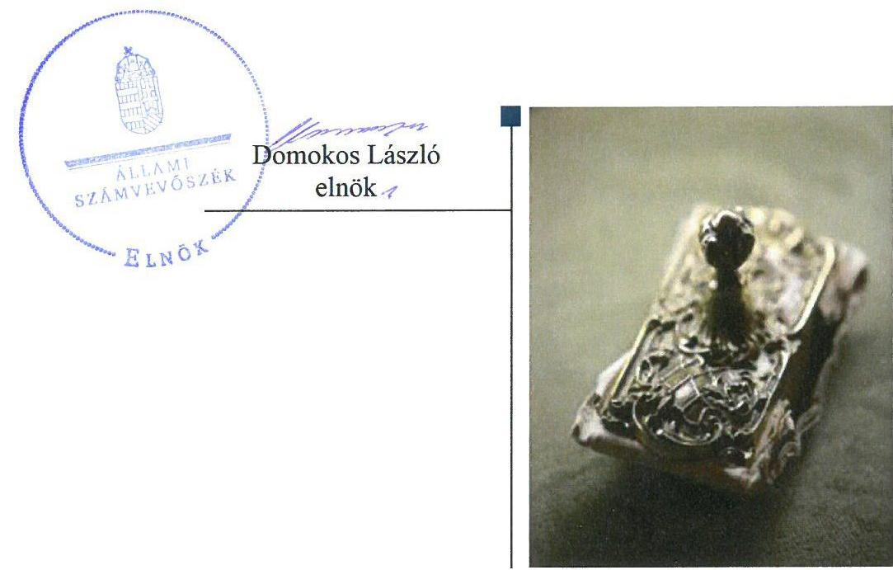
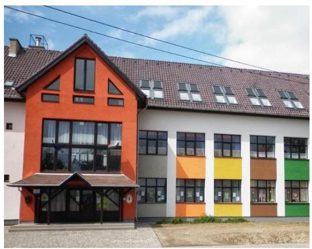
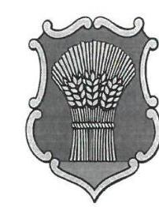
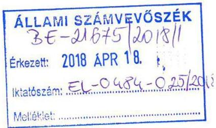
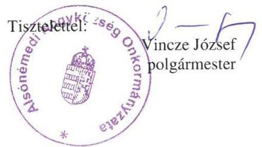
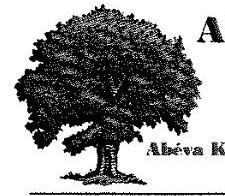
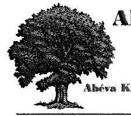
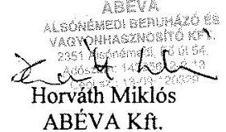
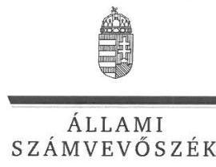
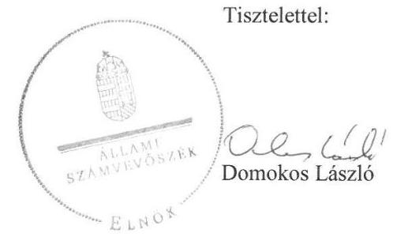

# Jelentés 

## Az önkormányzatok gazdasági társaságai

Az önkormányzatok többségi tulajdonában lévő gazdasági társaságok gazdálkodásának ellenőrzése - ABÉVA Alsónémedi Beruházó és Vagyonhasznosító Kft.
2018.

---

# Jelentés 

## Az önkormányzatok gazdasági társaságai

Az önkormányzatok többségi tulajdonában lévő gazdasági társaságok gazdálkodásának ellenőrzése - ABÉVA Alsónémedi Beruházó és Vagyonhasznosító Kft.
2018. fihlest hó 5. nap

---

# AZ ELLENŐRZÉST FELÜGYELTE: 

MAKKAI MÁRIA felügyeleti vezető

## AZ ELLENŐRZÉST VEZETTE ÉS A VÉGREHAJTÁSÁÉRT FELELŐS:

KEREKES PÉTER ellenőrzésvezető

## A PROGRAM ÖSSZEÁLLÍTÁSÁÉRT FELELŐS:

TÓTPÁL SZABOLCS osztályvezető

IKTATÓSZÁM: EL-0191-038/2018.
TÉMASZÁM: 2447

## ELLENŐRZÉS-AZONOSÍTÓ SZÁM: V-079358

Jelentéseink az Országgyúlés számítógépes hálózatán és az Interneten a www.asz.hu címen is olvashatóak.

---

# TARTALOMJEGYZÉK 

■ ÖSSZEGZÉS ..... 5
■ AZ ELLENŐRZÉS CÉLJA ..... 6
■ AZ ELLENŐRZÉS TERÜLETE ..... 7
■ AZ ELLENŐRZÉS HÁTTERE, INDOKOLTSÁGA ..... 8
■ A JELENTÉS LÉNYEGES KÉRDÉSKÖREI ..... 9
■ AZ ELLENŐRZÉS HATÓKÖRE ÉS MÓDSZEREI ..... 10
■ MEGÁLLAPÍTÁSOK ..... 12
■ JAVASLATOK ..... 14
■ FÜGGELÉK: ÉSZREVÉTELEK ..... 17
■ RÖVIDÍTÉSEK JEGYZÉKE ..... 25

---

.

---

# ÖSSZEGZÉS 

Alsónémedi Nagyközség Önkormányzata a társasági részesedés feletti tulajdonosi jogkörét szabályszerűen gyakorolta. Az ABÉVA Alsónémedi Beruházó és Vagyonhasznosító Korlátolt Felelősségű Társaság szabályozottsága és az éves beszámolói nem feleltek meg a jogszabályi előírásoknak, ezért nem volt biztosított a vagyonnal való felelős gazdálkodás.

## Az ellenőrzés társadalmi indokoltsága

Magyarországon az intézmény-centrikus közfeladat-ellátás jellemző, de egyre jelentősebb a költségvetésen kívüli feladatellátás térnyerése. Helyi szinten ennek legfontosabb szereplői az önkormányzati tulajdonban lévő gazdasági társaságok, amelyeknek ellenőrzése kiemelten fontos a közfeladat ellátása, és a közvagyon megőrzése, meg-óvása érdekében. Ezért alapvető követelmény, hogy gazdálkodásuk, működésük szabályszerű és átlátható legyen.

Az ABÉVA Alsónémedi Beruházó és Vagyonhasznosító Korlátolt Felelősségű Társaságot az Alsónémedi Nagyközség Önkormányzata alapította ingatlanüzemeltetési feladatok ellátására.

## Főbb megállapítások, következtetések, javaslatok

Alsónémedi Nagyközség Önkormányzatánál a társasági részesedés feletti tulajdonosi joggyakorlás megfelelt a jogszabályi előírásoknak.

Az ABÉVA Alsónémedi Beruházó és Vagyonhasznosító Korlátolt Felelősségű Társaság nem a jogszabályok előírásainak megfelelően szabályozta a múködését. Számviteli politikája nem felelt meg a jogszabályi előírásoknak. Nem rendelkezett számlarenddel és javadalmazási szabályzattal.

Az ABÉVA Alsónémedi Beruházó és Vagyonhasznosító Korlátolt Felelősségű Társaságnál az éves beszámolók mérlegsorai nem voltak leltárral alátámasztva, ezért a mérlegtételek valódisága nem volt biztosított. A kiegészítő mellékletek nem feleltek meg a törvény előírásainak.

Az ABÉVA Alsónémedi Beruházó és Vagyonhasznosító Korlátolt Felelősségű Társaság bevételeinek, ráfordításainak, eszközei értékcsökkenésének elszámolása, valamint a vagyonnyilvántartása nem volt szabályszerű.

A megállapítások alapján az Állami Számvevőszék Alsónémedi Nagyközség Önkormányzata polgármesterének kettő javaslatot, az ABÉVA Alsónémedi Beruházó és Vagyonhasznosító Korlátolt Felelősségű Társaság ügyvezetőjének öt javaslatot fogalmazott meg.

---

# AZ ELLENŐRZÉS CÉLJA 

Az ellenőrzés célja annak értékelése volt, hogy az Önkormányzat ${ }^{1}$ vagyongazdálkodási tevékenysége során szabályszerűen gyakorolta-e tulajdonosi jogait, a Társaság ${ }^{2}$ szabályozottsága, gazdálkodása és vagyongazdálkodási tevékenysége, bevételeinek és ráfordításainak elszámolása megfelelt-e a jogszabályi és tulajdonosi előírásoknak; a gazdasági társaság kötelezettségállománya jelent-e kockázatot a múködésre, valamint a gazdálkodás átláthatósága és elszámoltathatósága érdekében biztosítva volt-e a szolgáltatás dijának megalapozottsága szabályszerű önköltségszámítással.

---

# **AZ ELLENŐRZÉS TERÜLETE**

## **ABÉVA Alsónémedi Beruházó és Vagyonhasznosító Kft. és Alsónémedi Nagyközség Önkormányzata**

Az ABÉVA Alsónémedi Beruházó és Vagyonhasznosító Korlátolt Felelősségű Társaságot Alsónémedi Nagyközség Önkormányzata 100%-os tulajdonosként alapította 2008-ban **TABÉVA Kereskedelmi és Szolgáltató Kft. néven**, 5,0 M Ft törzstőkével. A Társaság a 2008. augusztus 1-jén bejegyzett névváltoztatást követően 178,0 M Ft törzstőkével és a jelenlegi cégnévvel működött tovább.

A Társaság fő tevékenysége saját tulajdonú és bérelt ingatlan bérbeadása és üzemeltetése volt, közfeladatot nem végzett.

Az Önkormányzat 2009-ben Üzemeltetési szerződést kötött a Társasággal az Alsónémedi Általános Iskola üzemeltetésére. 2013. január 1-jétől a Társaság jogszabályi változások miatt a KLIK-kel4 kötött szerződést.

A Társaság a Számv. tv.5 155. § (3) bekezdése alapján könyvvizsgálatra nem volt kötelezett, de az Önkormányzat az Alapító okiratban független könyvvizsgálót jelölt ki.

A Társaságnak a Számv. tv. 14. § (6) bekezdése alapján az önköltségszámítás belső rendjére vonatkozó belső szabályzat készítésére nem állt fenn kötelezettsége.

Az ellenőrzött időszakban a Társaság tulajdonosi részesedéssel más gazdasági társaságban nem rendelkezett és nem minősült kormányzati szektorba sorolt egyéb szervezetnek. Az Önkormányzat és a Társaság vagyonkezelési szerződés nem kötött.

A 2013-2016. közötti években a polgármester, a jegyző, az ügyvezető és a könyvvizsgáló személye nem változott.

---

# AZ ELLENŐRZÉS HÁTTERE, INDOKOLTSÁGA 

Az önkormányzatok többségi tulajdonában álló gazdasági társaságok ellenőrzése kiemelten fontos a vagyon megőrzése, megóvása érdekében. A feladatellátás költségeinek, ráfordításainak alakulása a lakosság széles rétegét érinti.

Ellenőrzéseink feltárhatják, hogy az önkormányzat a feladatellátásához rendelt vagyon múködtetését a tulajdonostól elvárható gondossággal vé-gezte-e, a feladatot ellátó gazdasági társaság a létesítő okiratban, szolgáltatási szerződésben foglaltak betartásával biztosította-e a feladat ellátását. Az ellenőrzés rávilágíthat arra, hogy a gazdasági társaság a vagyon használatával biztosította-e a szolgáltatás folytatásának feltételeit, az önkormányzat tulajdonosi felügyelete hozzájárult-e a szabályszerű gazdálkodáshoz és feladatellátáshoz.

---

# A JELENTÉS LÉNYEGES KÉRDÉSKÖREI 

1. A tulajdonosi joggyakorlás szabályszerű volt-e?
2. A gazdasági társaság szabályozottsága, gazdálkodása és vagyongazdálkodási tevékenysége szabályszerű volt-e?

---

# AZ ELLENŐRZÉS HATÓKÖRE ÉS MÓDSZEREI 

## Az ellenőrzés típusa

Megfelelőségi ellenőrzés.

## Az ellenőrzött időszak

2013. január 1-től 2016. december 31-ig.

## Az ellenőrzés tárgya

Az Önkormányzat - a 100\%-os tulajdonában lévő gazdasági társaság feletti - tulajdonosi joggyakorlása, valamint a Társaság gazdálkodásának szabályozottsága és szabályszerűsége.

Az ellenőrzés kiterjed minden olyan körülményre és adatra, amely az ÁSZ ${ }^{7}$ jogszabályban meghatározott feladatainak teljesítéséhez, valamint a program végrehajtása folyamán felmerült újabb összefüggések feltárásához szükséges.

## Az ellenőrzött szervezet

ABÉVA Alsónémedi Beruházó és Vagyonhasznosító Kft. és Alsónémedi Nagyközség Önkormányzata

## Az ellenőrzés jogalapja

Az ellenőrzés jogszabályi alapját az ÁSZ tv. ${ }^{8}$ 1. § (3) bekezdése és 5. § (3)(4)-(5) bekezdései képezik.

## Az ellenőrzés módszerei

Az ellenőrzést a nemzetközi standardokat irányadónak tekintve az ellenőrzési program ellenőrzési kérdései, az ellenőrzött időszakban hatályos jogszabályok, az ellenőrzés szakmai szabályok és módszertanok figyelembe vételével végeztük.

Az ellenőrzés ideje alatt az ellenőrzött szervezettel történő kapcsolattartást az ÁSZ Szervezeti és Múködési Szabályzatának vonatkozó előírásai alapján biztosítottuk.

Az ellenőrzési kérdések megválaszolásához szükséges bizonyítékok megszerzése a következő ellenőrzési eljárások alkalmazásával történt:

---

megfigyelés, kérdésfeltevés (információkérés), összehasonlítás, valamint elemző eljárás. Az ellenőrzési bizonyítékként felhasználható adat-források közé tartoztak egyrészt az ellenőrzési programban felsorolt adatforrások, másrészt adatforrás lehet még minden - az ellenőrzés folyamán - feltárt, az ellenőrzés szempontjából információkat tartalmazó dokumentum.

Az ellenőrzést a kérdésekre adott válaszok kiértékelésével, valamint a megjelölt adatforrások, a csatolt tanúsítványok felhasználásával, továbbá az adott időszakban hatályos jogszabályok figyelembe vételével folytattuk le.

A bevételek és ráfordítások elszámolása, valamint a vagyonnyilvántartás terén a szabályszerű múködést véletlen mintavétellel ellenőriztük.

A mintavétellel ellenőrzött területek esetében minden egyes tétel vonatkozásában a szabályszerűségre vonatkozó kérdéseket tettünk fel, amelyek eredménye összesítésre került. Az ellenőrzött minták alapján a sokaságban előforduló átlagos hibaarányt becsültük. „Szabályszerűnek" értékeltünk egy ellenőrzött területet, amennyiben 95\%-os bizonyossággal a teljes sokaságban az átlagos hibaarány legfeljebb 10\%, nem megfelelőnek, amennyiben 10\%-nál magasabb arányt képviselt. Abban az esetben, ha a teljes sokaság tekintetében a 10\%-os hibaarányhoz való viszony megítélésnek megbízhatósága nem érte el a 95\%-ot, annak elérése érdekében értékelésünket további szempontokkal egészítettük ki, és figyelembe vettük a feltárt hibák típusát és súlyát. A ráfordítások elszámolására és a vagyonnyilvántartásra vonatkozó véletlen mintavételt kockázati alapú kiválasztással egészítettük ki, amelynek során a három legnagyobb összegű tételt választottuk ki.

---

# 1. A tulajdonosi joggyakorlás szabályszerű volt-e? 

## Összegző megállapítás

## A tulajdonosi joggyakorlás szabályszerű volt.

Az Önkormányzat rendelkezett az Nvtv. ${ }^{9}$-ben meghatározottaknak megfelelő közép- és hosszú távú vagyongazdálkodási tervvel ${ }^{10}$.

Az Alapító ${ }^{11}$ a tulajdonosi joggyakorlás kereteit az Alapító okiratban, az önkormányzati SZMSZ-ben ${ }^{12}$, és a vagyonrendeletben ${ }^{13}$ rögzítette. A tulajdonosi jogokat a Képviselő-testület ${ }^{14}$ gyakorolta.

Az Alapító az Alapító okiratban felügyelő bizottság létrehozását rendelte el. A felügyelő bizottság az ellenőrzött időszakban a Gt. ${ }^{15}$ 34. § (4) bekezdésében és a Ptk. ${ }^{16} 3: 122$ § (3) bekezdésben rögzített előírások ellenére nem állapította meg az ügyrendjét.

Az Alapító a Társaság éves beszámolóit minden évben a felügyelő bizottság írásbeli jelentésének és a könyvvizsgálói jelentés birtokában jóváhagyta.

Az Alapító nem alkotta meg a Taktv. ${ }^{17}$ 5. § (3) bekezdésben előírt szabályzatot.

## 2. A gazdasági társaság szabályozottsága, gazdálkodása és vagyongazdálkodási tevékenysége szabályszerű volt-e?

## Összegző megállapítás

2.1. számú megállapítás

A Társaság szabályozottsága, gazdálkodása és vagyongazdálkodási tevékenysége nem volt szabályszerű.

A Társaság szabályozottsága nem felelt meg a jogszabályi előírásoknak.

A Társaság rendelkezett a Számv. tv.-ben előírt Számviteli politikával ${ }^{18}$, és ennek keretében szabályozta az eszközök és források értékelési és leltározási eljárásait, valamint elkészítette a Pénzkezelési szabályzatát ${ }^{19}$.

A Társaság a Számv. tv. 14. § (11) bekezdés előírása ellenére, a Számviteli politikáján 2016. december 31-éig nem vezette keresztül a Számv. tv.
— 2013. január 1-jétől hatályba lépett, a jelentős és nem jelentős hibahatárt, valamint a megbízható és valós képet lényegesen befolyásoló hibát érintő,
—és a 2015. július 4-én hatályba lépett, a rendkívüli eredmény összetevőit, illetve a mérleg szerinti eredmény fogalmát megszüntető módosításait.
A Társaság nem rendelkezett a Számv. tv. 161. § (1) bekezdésében előírt számlarenddel.

---

# 2.2. számú megállapítás 

A Társaság vagyongazdálkodási tevékenysége nem volt szabályszerű.

A Társaság a Számv. tv. 69. § (1) bekezdésben előírtak ellenére az éves beszámolók mérlegtételeit nem támasztotta alá az eszközeit és forrásait tételesen, ellenőrizhető módon tartalmazó leltárakkal, ezért az éves beszámolói nem feleltek meg a Számv. tv. 15. § (3) bekezdésében előírt valódiság elvének.

A Társaság a 2013- 2016. évi éves beszámolók kiegészítő mellékletének összeállításakor nem vette figyelembe a Számv. tv. 92. § (1)-(2) bekezdésének előírásait, mivel nem szerepeltette az immateriális javak, a tárgyi eszközök nyitó bruttó értékét, csökkenését, és záró bruttó értékét. A 2013.-2014. évi éves beszámolók összeállításakor a Számv. tv. 41. § (8) bekezdésében előírtak ellenére a kiegészítő melléklet nem tartalmazta a képzett, illetve a felhasznált céltartalék összegét jogcímenkénti részletezésben.

A hiányosságok ellenére a könyvvizsgáló az éves beszámolókat korlátozás nélküli hitelesítő záradékkal látta el.

### 2.3. számú megállapítás

A bevételek, a ráfordítások, az értékcsökkenési leírás elszámolása, valamint a vagyonnyilvántartás nem volt szabályszerű.

A Társaságnál a ráfordítások és a bevételek elszámolása nem volt szabályszerű, mert a Számv. tv. 165. § (2) bekezdés előírása ellenére a számviteli nyilvántartásba bizonylatok hiányában jegyeztek be adatokat, valamint a Számv. tv. 167. § (1) bekezdés h) pontban előírtak ellenére a bizonylatok nem tartalmazták a könyvelés módjára, az érintett könyvviteli számlákra történő hivatkozást.

Az értékcsökkenés elszámolása és a vagyonnyilvántartás nem volt szabályszerű, mert a Számv. tv. 52. § (2) bekezdésében előírtak ellenére a tárgyi eszközök üzembe helyezését hitelt érdemlő módon nem dokumentálták, a Számv. tv. 167. § (1) bekezdés h) pontban előírtak ellenére a bizonylatok nem tartalmazták a könyvelés módjára, az érintett könyvviteli számlákra történő hivatkozást, és a Számv. tv. 165. § (2) bekezdésében előírtak ellenére a számviteli nyilvántartásba bizonylatok hiányában jegyeztek be adatokat.

---

# JAVASLATOK 

Az ÁSZ tv. 33. § (1) bekezdésében foglaltak értelmében az ellenőrzött szervezet vezetője köteles a jelentésben foglalt megállapításokhoz kapcsolódó intézkedési tervet összeállítani és azt a jelentés kézhezvételétől számított 30 napon belül az ÁSZ részére megküldeni. Amennyiben az ellenőrzött szervezet vezetője nem küldi meg határidőben az intézkedési tervet, vagy továbbra sem elfogadható intézkedési tervet küld, az Állami Számvevőszék elnöke az ÁSZ tv. 33. § (3) bekezdése a) és b) pontjaiban foglaltakat érvényesítheti.

## Alsónémedi Nagyközség polgármesterének

1. Kezdeményezze, hogy a felügyelő bizottság állapítsa meg ügyrendjét és a Társaság legföbb szerve a jogszabályi előírásoknak megfelelően hagyja jóvá.
(1. sz. megállapítás 3. bekezdése második mondata alapján)
2. Kezdeményezze a Társaság legfőbb szervénél a vezető tisztségviselők, felügyelőbizottsági tagok, valamint az Mt. 208. §-ának hatálya alá eső munkavállalók javadalmazása, valamint a jogviszony megszünése esetére biztositott juttatások módjának, mértékének elveire, annak rendszerére vonatkozó szabályzat megalkotását.
(1. sz. megállapítás 5. bekezdése alapján)

## ABÉVA Alsónémedi Beruházó és Vagyonhasznosító Kft. ügyvezetőjének

1. Intézkedjen a számviteli politika módosításáról, hogy az feleljen meg a hatályos Számv. tv. előírásainak.
(2.1. sz. megállapítás 2. bekezdése alapján)
2. Intézkedjen a jogszabályi előírásoknak megfelelő számlarend elkészítéséről.
(2.1. sz. megállapítás 3. bekezdése alapján)
3. Intézkedjen a jogszabályi előírásoknak megfelelően a mérleg tételeinek leltárral való alátámasztásáról.
(2.2. sz. megállapítás 1. bekezdése alapján)

---

4. Intézkedjen annak érdekében, hogy az éves beszámolók kiegészitő melléklete feleljen meg a Számv. tv. előírásainak.
(2.2. sz. megállapítás 2. bekezdése alapján)
5. Intézkedjen a bevételek és ráfordítások, továbbá az értékcsökkenés jogszabályi előírásoknak megfelelő elszámolásáról.
(2.3. sz. megállapítás 1-2. bekezdései alapján)

---

.

---

# FÜGGELÉK: ÉSZREVÉTELEK 

A jelentéstervezetet a Számvevőszék 15 napos észrevételezésre megküldte az ellenőrzött szervezetek vezetőinek az ÁSZ tv. 29. §* (1) bekezdése előírásának megfelelően.

Az ÁSZ a jelentéstervezetet észrevételezésre megküldte Alsónémedi Nagyközség polgármesterének és az ABÉVA Alsónémedi Beruházó és Vagyonhasznosító Kft. ügyvezetőjének.
Alsónémedi Nagyközség polgármesterének nemleges észrevételét és az ABÉVA Alsónémedi Beruházó és Vagyonhasznosító Kft. ügyvezetőjének észrevételét és az arra adott választ a függelék alább tartalmazza.

[^0]
[^0]:    * 29. § (1) Az Állami Számvevőszék az ellenőrzési megállapításait megküldi az ellenőrzött szervezet vezetőjének vagy az általa megbízott személynek, és annak, akinek személyes felelősségét állapította meg.
    (2) Az ellenőrzött szervezet vezetője és a felelősként megjelölt személy az ellenőrzés megállapításaira tizenöt napon belül írásban észrevételt tehet.
    (3) Az Állami Számvevőszék az észrevételre a beérkezésétől számított harminc napon belül írásban válaszol. A figyelembe nem vett észrevételeket köteles a jelentésben feltüntetni, és megindokolni, hogy azokat miért nem fogadta el.

---

# Alsónémedi Nagyközség Önkormányzata 2351 Alsónémedi, Fö út 58. 

Tel: 29/337-101, fax: 29/337-250
jegyzo@alsonemedi.hu, www.alsonemedi.hu

Szám: 1124- 2/2018.

Tárgy: Alsónémedi ABÉVA KFT. ÁSZ vizsgálata Hiv.szám: EL-0484-023/2018.

Állami Számvevőszék Elnökének
Domokos László részére
Budapest
Apáczai Csere János utca 10.
1052
Tisztelt Elnök Úr!

Hivatkozással fenti számú, „Az önkormányzatok többségi tulajdonában lévő gazdasági társaságok gazdálkodásának ellenőrzése - ABÉVA Alsónémedi Beruházó és Vagyonhasznosító KFT." címủ számvevőszéki jelentéstervezetre tájékoztatom, hogy az abban foglaltakat tudomásul veszem, azokra nem kívánok észrevételt tenni.

Kérem fentiek szíves tudomásulvételét.

Alsónémedi, 2018. április 12.

---

# Alsónémedi Beruházó és Vagyonhasznosító Kft

2351. Alsónémedi, Fő út 54.
Tel: 06-29-337-070, Fax: 06-29-337-071, Mobil: 06-20-180-1113.
abewahlt@gmail.com abewahlt@index.hu.

**ABÉVA Alsónémedi Beruházó és Vagyonhasznosító Kft.**
2351 Alsónémedi, Fő út 54.
képviseli: Horváth Miklós ügyvezető

**Állami Számvevőszék**
1052 Budapest
Apáczai Csere János u. 10.
1354 Budapest 4.
Pf. 54.
képviseli: Domonkos László elnök
Makkai Mária felügyeleti vezető úrhölgy útján

## ÉSZREVÉTELEZÉS

az Állami Számvevőszék által az Abéva Kft-nél végzett ellenőrzés alapján EL-0484-024/2018. iktatószám alatt 2018. április hó 3. napján kiadmányozott, és az érintett társaság által 2018. április 19-én átvett jelentés tervezetére.

Budapest, 2018. május 2.

**ABÉVA Alsónémedi Beruházó és Vagyonhasznosító Kft**
2351 Alsónémedi, Fő út 54.
Apáczai Csere János u. 10.
1354 Budapest 4.
Pf. 54.

Horváth Miklós ügyvezető

---

# Alsónémedi Beruházó és Vagyonhasznosító Kft 

2351. Alsónémedi, Fő út 54.

Tel: 06-29-537-070, Fax: 06-29-537-071. Mobil: 06-20-180-1115. abevakft@gmail.com abevakft@index.hu.

Tisztelt Elnök úr, Tisztelt Domonkos László úr!

Szakmunkatársaimmal áttanulmányoztuk az Állami Számvevőszék előzményekben már hivatkozott jelentés tervezetét, amelyben foglaltakra az előzetesen egyeztetett határidőn belül az alábbi

## észrevételezéssel

élek:

## 1. Általános megközelítés

Ügyvezetőként 2017. március 1-jével megbízott ügyvezetőként láttam el a társaság gazdálkodás irányításával kapcsolatos feladatokat, amelyet megalapozott az ebben az időpontban hatályban lévő ügyvezető súlyos betegség miatti tartós akadályoztatása.

A munkafeladatok átvétele során megállapítottam, hogy az Abéva Kft. gazdasági tevékenységét megalapozó iskola beruházáshoz tartozóan a kivitelező cég Gropius Zrt. hiányosan, és nem a megfelelő dokumentáltsággal adta át a beruházást, amelyet megbízásomat megelőző ügyvezetés már észrevételezett, megkifogásolt, és a rendezett állapot előállítása érdekében intézkedett ún. teljes körű állapotfelvevő leltár összeállítására.

Az állapotfelvevő leltár 2016. év közben befejeződött, a kiértékelések megkezdődtek.
Az eltérések kidolgozása a kivitelező cégtől átvett iratanyagokkal való beazonosítás mellett történhetett meg, amely munka 2016. év zárásáig, azaz 2017. május 31 -éig nem tudtak teljes körűen lezárulni, így hivatalba lépésemmel egy időben munkafeladatot megerősítettem, és az Abéva Kft. adminisztratív munkatársának közreműködésével folytatódtak azok az egyeztetési munkálatok, amelyek eredményeként 2017. december 31-ei fordulónapra az Abéva Kft. tulajdonát képező eszközök tekintetében már egy hiteles nyilvántartás kerülhetett kialakításra.

A tárgyi eszközökre vonatkozó ún. értékelési politika meghatározó része a számviteli politikának, így ennek megfelelően iktattuk be munkarendünkbe a számviteli politika 2018. június 30 -áig történő aktualizálását.

Ki kell emelnem, hogy a számviteli politika aktualizálására megbízást kapott az Abéva Kft. könyvviteli, pénzügyi munkálatainak végrehajtásával megbízott társaság, kiemelve, hogy a számla összefüggések rendje, valamint a kapcsolódó pénzkezelési szabályzat szinkronjának megteremtése is történjen meg, legkésőbb 2018. június 30 -áig.

Fontos ténynek tartom, és ennek megfelelően rögzítenem kell, hogy az Abéva Kft. eredményes gazdálkodásnak elősegítése érdekében a társaság adminisztratív tevékenységét egy fő föállású adminisztrátor közreműködésével végezzük, amely mellett a teljes pénzügyi és számviteli adminisztratív feladatok végrehajtása, egy erre szakosodott gazdasági társasághoz került.

---

# 2. A megállapításokra történő részletes észrevételezés 

2.1. A számviteli politika kidolgozására az 1. pontban leírtaknak megfelelően megtörtént az intézkedés, határidő: 2018. június 30.
2.2. A számlarend elkészítése érdekében az intézkedés megtörtént, határidő: 2018. június 30.
2.3. A mérlegtételek leltárral történő alátámasztása, illetve ezek hiteles dokumentációként való kezelése érdekében haladéktalanul intézkedtem, ugyanakkor megbízás alapján a vonatkozó munkákat végző szakmai munkatársakkal egyeztettem, amelynek során megállapítottam, hogy a pénzügyi-számviteli nyilvántartásokban a vizsgált esetekben csak és kizárólag megalapozott és a tényleges gazdasági eseménynek megfelelő bejegyzések történtek.
Leírtaktól függetlenül, a mérleg dokumentáció teljes körűségének lehetőség szerinti visszamenőleges pótlásáról is intézkedtem, mindamellett, hogy a 2017. évi beszámoló összeállításánál erre már kiemelt hangsúlyt helyeztem, azzal, hogy több szabályzat pótlására, és a végrehajthatóság érdekében, a 2018. június 30 -ai határidőt jelöltem meg, így a 2017. év zárásakor még a teljes körűség ennek alapján nem volt biztosított.
2.4. A kiegészítő melléklet törvényi előírásban rögzített részletezésének alkalmazására a könyvviteli szolgáltató társaság figyelmét hangsúlyosan felhívtam, amelyre visszajelzésként a szolgáltató társaság jelezte, hogy a továbbiakban az irreleváns, a jogszabályi előírásokban meghatározott tételek feltüntetése a jövőben meg fog történni, és a nem érintettség vagy a nemleges válaszok is ebben az esetben megjelölésre kerülnek.
2.5. A bevételek és ráfordítások, továbbá az értékcsökkenés jogszabályi előírásainak megfelelő dokumentáltsága érdekében szintén intézkedtem, ennek megfelelően a pénzügyi-számviteli nyilvántartásokban a részletes beazonosíthatóság feltételeinek megteremtése érdekében az előírások kidolgozására, és az egyre erősebb teret hódító elektronikus nyilvántartások melletti megfeleltetésre vonatkozó szabályozások elkészítésére az utasításokat kiadtam.

## 3. Egyéb megjegyzések

Rögzítem, hogy az Állami Számvevőszék megállapításait értelmeztük és tudomásul vettük, a közvagyonnal való gazdálkodás felelős ügyvitele érdekében a fentiekben írt intézkedéseken túl döntés született arról, hogy teljes körűvé kell tenni, mind a vagyonkezelésbe, mind az üzemeltetésbe vett eszközök elkülönített teljes körű nyilvántartását.

A 2018. évi gazdálkodási és intézkedési terv véglegesítése az Állami Számvevőszék jelentés tervezetében foglaltak figyelembevételével a végleges jelentés kézhezvételétől számított 30 napon belül elkészül, és ezt követően az Állami Számvevőszék részére való továbbítása megtörténik.

Budapest, 2018. május 2.

Levélem: 2351. Alsónémedi, Fő út 75. Abéva Kft.
Alsónémedi Beruházó és Vagyonhasznosító KFT

---

ELNÖK

Ikt.szám: EL-0484-027/2018.

# Horváth Miklós úr 

ügyvezető

ABÉVA Alsónémedi
Beruházó és Vagyonhasznosító Kft.

## Alsónémedi

## Tisztelt Ügyvezető Úr!

„Az önkormányzatok többségi tulajdonában lévő gazdasági társaságok gazdálkodásának ellenörzése - ABÉVA Alsónémedi Beruházó és Vagyonhasznosító Kft." címmel készített számvevőszéki jelentéstervezetre tett észrevételét köszönettel megkaptam.

Az Állami Számvevőszék észrevételre vonatkozó álláspontjáról a felügyeleti vezető által készített részletes tájékoztatást mellékelten megküldöm.

Tájékoztatom Ügyvezető urat, hogy a számvevőszéki jelentésben - az Állami Számvevőszékről szóló 2011. évi LXVI. törvény 29. § (3) bekezdése alapján - a figyelembe nem vett észrevételeket szerepeltetjük, annak indoklásával, hogy azokat az Állami Számvevőszék miért nem fogadta el.

Budapest, 2018. 05. hó 18. nap

Melléklet: Tájékoztatás az észrevételek kezeléséről

---

# Tájékoztatás   az észrevételek kezeléséről 

„Az önkormányzatok többségi tulajdonában lévő gazdasági társaságok gazdálkodásának ellenörzése - ABÉVA Alsónémedi Beruházó és Vagyonhasznositó Kft." címü jelentéstervezetre 2018. május 4 -én érkezett észrevételt áttekintettük, annak kezelésével kapcsolatban a következő tájékoztatást adom.
A jelentéstervezetben rögzített megállapításokkal és az azokhoz kapcsolódó javaslatokkal összefüggésben tett, illetve tervezett intézkedésekről szóló tájékoztatást köszönjük, a jelentéstervezet ellenőrzött időszakra vonatkozó megállapításait ezek nem befolyásolják. Az észrevételben foglaltak az ellenőrzés megállapításait megerősítik, a jelentéstervezet módosítása nem indokolt.

Budapest, 2018. 06. hó 18. nap

Makkai Mária
felügyeleti vezető

---

.

---

# RÖVIDÍTÉSEK JEGYZÉKE 

${ }^{1}$ Önkormányzat
${ }^{2}$ Társaság
${ }^{3}$ Üzemeltetési szerződés
${ }^{4}$ KLIK
${ }^{5}$ Számv. tv.
${ }^{6}$ Alapító okirat
${ }^{7}$ ÁSZ
${ }^{8}$ Ász tv.
${ }^{9}$ Nvtv.
${ }^{10}$ vagyongazdálkodási terv
${ }^{11}$ Alapító
${ }^{12}$ önkormányzati SZMSZ
${ }^{13}$ vagyonrendelet
${ }^{14}$ Képviselő-testület
${ }^{15} \mathrm{Gt}$.
${ }^{16} \mathrm{Ptk}$.
${ }^{17}$ Taktv.
${ }^{18}$ Számviteli politika
${ }^{19}$ Pénzkezelési szabályzat

Alsónémedi Nagyközség Önkormányzata
ABÉVA Alsónémedi Beruházó és Vagyonhasznosító Korlátolt Felelősségű Társaság
Alsónémedi Nagyközség Önkormányzata és az ABÉVA Alsónémedi Beruházó és Vagyonhasznosító Kft. között létrejött üzemeltetési szerződés az alsónémedi általános iskola üzemeltetésére (hatályos volt 2009. május 11-től 2016. december 31-ig)
Klebelsberg Intézményfenntartó Központ
2000. évi C. törvény a számvitelről (hatályos 2001. január 1-jétől)

ABÉVA Alsónémedi Beruházó és Vagyonhasznosító Kft. 2012. augusztus 2-án kelt alapító okirata változásokkal egységes szerkezetben (módosítva 2013. április 30án, 2013. május 31-én, 2014. január 27-én, 2015. február 16-án és 2016. február 24-én)
Állami Számvevőszék
2011. évi LXVI. törvény az Állami Számvevőszékről (hatályos 2011. július 1-jétől)
2011. évi CXCVI. törvény a nemzeti vagyonról (hatályos 2011. december 31-től)

Alsónémedi Nagyközség Önkormányzat képviselő-testülete által a 29/2013. (II.26.) számú határozattal jóváhagyott hosszú távú (2013-2022. évre) és középtávú (2013-2017. évre) vagyongazdálkodási terve
Alsónémedi Nagyközség Önkormányzata
Alsónémedi Nagyközség Önkormányzatának 7/1999. (05.12.) sz. rendelete a Szervezeti és Működési Szabályzatról módosításokkal egységes szerkezetben (hatályos 2013. március 1-jétől)
Alsónémedi Nagyközség Önkormányzata Képviselő-testületének 6/2015. (III.25.) önkormányzati rendelete a Képviselő-testület Szervezeti és Müködési Szabályzatáról (hatályos 2015. április 1-jétől) és az azt módosító 4/2016. (IV.28.) önkormányzati rendelete (hatályos 2016. május 1-jétől)
Alsónémedi Nagyközség Önkormányzata Képviselő-testületének 7/2005. (VII.08.) számú rendelete az Önkormányzat Vagyonáról, egységes szerkezetben a módosítására kiadott 10/2009. (V.08.) számú és 19/2009. (X.28.) számú rendeletekkel
Alsónémedi Nagyközség Önkormányzat Képviselő-testületének a 3/2013. (II.26.) önkormányzati rendelete Alsónémedi Önkormányzat vagyonáról (hatályos 2013. február 26-ától)
Alsónémedi Nagyközség Önkormányzata képviselő-testülete
2006. évi IV. törvény a gazdasági társaságokról (hatályos: 2014. március 14-éig)
2013. évi V. törvény a Polgári Törvénykönyvről (hatályos: 2014. március 15-étől)
2009. évi CXXII. törvény a köztulajdonban álló gazdasági társaságok takarékosabb müködéséről (hatályos 2009. december 4-étől)
ABÉVA Alsónémedi Beruházó és Vagyonhasznosító Kft. 2010. január 25-től hatályos számviteli Politikája
ABÉVA Alsónémedi Beruházó és Vagyonhasznosító Kft. pénzkezelés Rendje, hatályos 2008. október 15-től

---

# ÁLLAMI SZÁMVEVŐSZÉK 

1052 Budapest, Apáczai Csere János utca 10.
Levélcím: 1364 Budapest 4. Pf. 54
Telefon: +36 14849100 Telefax: +36 14849200
www.asz.hu