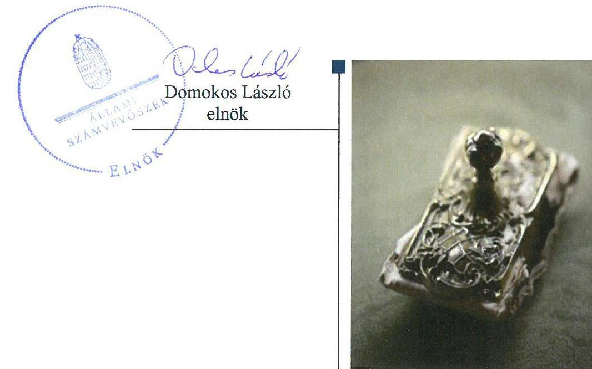
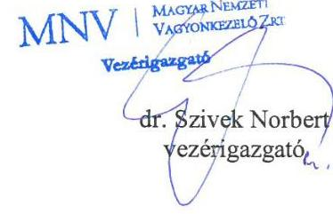
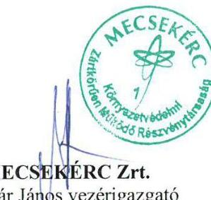
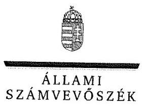
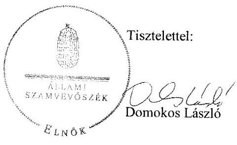

# Jelentés 

## Állami tulajdonú gazdasági társaságok

Az állami tulajdonban (résztulajdonban) lévő gazdálkodó szervezetek vagyonmegőrzési és gazdálkodási tevékenységének ellenőrzése MECSEKÉRC Környezetvédelmi Zrt.
2018.

---

# Jelentés 

## Állami tulajdonú gazdasági társaságok

Az állami tulajdonban (résztulajdonban) lévő gazdálkodó szervezetek vagyonmegőrzési és gazdálkodási tevékenységének ellenőrzése MECSEKÉRC Környezetvédelmi Zrt.
2018. 

---

# AZ ELLENŐRZÉST FELÜGYELTE:

DR. NAGY IMRE felügyeleti vezető

# AZ ELLENŐRZÉST VEZETTE ÉS A VÉGREHAJTÁSÁÉRT FELELŐS:

GELENCSÉR ZSOLT ellenőrzésvezető

HOFMEISTER LÁSZLÓ ellenőrzésvezető

A PROGRAM ÖSSZEÁLLÍTÁSÁÉRT FELELŐS:

JANIK JÓZSEF LÁSZLÓ osztályvezető

IKTATÓSZÁM: V-1371-111/2016.

TÉMASZÁM: 2084

ELLENŐRZÉS-AZONOSÍTÓ SZÁM: V075942

Jelentéseink az Országgyűlés számítógépes hálózatán és az Interneta a www.asz.hu címen is olvashatóak.

---

# TARTALOMJEGYZÉK 

■ ÖSSZEGZÉS ..... 5
■ AZ ELLENŐRZÉS CÉLJA ..... 6
■ AZ ELLENŐRZÉS TERÜLETE ..... 7
■ AZ ELLENŐRZÉS HÁTTERE, INDOKOLTSÁGA ..... 8
■ A JELENTÉS LÉNYEGES KÉRDÉSKÖREI ..... 9
■ ELLENŐRZÉS HATÓKÖRE ÉS MÓDSZEREI ..... 10
■ MEGÁLLAPÍTÁSOK ..... 12
■ JAVASLATOK ..... 15
■ MELLÉKLETEK ..... 17
I. sz. melléklet: Értelmező szótár ..... 17
■ FÜGGELÉK: ÉSZREVÉTELEK ..... 19
■ RÖVIDÍTÉSEK JEGYZÉKE ..... 27

---

.

---

# ÖSSZEGZÉS 

A Magyar Nemzeti Vagyonkezelő Zrt. tulajdonosi joggyakorlása szabályszerű volt. A MECSEKÉRC Környezetvédelmi Zrt. szabályozottsága nem felelt meg a jogszabályi előírásoknak, vagyongazdálkodása nem volt szabályszerű. A vagyon védelmét nem biztosította. A Társaság a müködésének és gazdálkodásának átláthatóságáról gondoskodott.

## Az ellenőrzés társadalmi indokoltsága

A közpénzt, közvagyont használó állami tulajdonú gazdálkodó szervezetekkel szemben társadalmi igény, hogy a tevékenységük átlátható és elszámoltatható legyen.

Az állami vagyonnal való gazdálkodás célja az állami vagyon átlátható, rendeltetésszerű és felelős felhasználásának biztosítása. Az állami tulajdonú gazdálkodó szervezetek a nemzeti vagyon részét képezik.

Az Állami Számvevőszék stratégiájában célul tűzte ki az államháztartáson kívül működő szervezetek ellenőrzését, mely hozzájárul a közpénzek szabályos, átlátható, elszámoltatható és eredményes felhasználásához. A stratégiával összhangban került sor a MECSEKÉRC Környezetvédelmi Zrt. ellenőrzésére a 2012-2015. évekre vonatkozóan.

## Főbb megállapítások, következtetések, javaslatok

Az MNV Zrt. szabályszerűen alakította ki a felelős vagyongazdálkodáshoz szükséges követelményeket, a tulajdonosi jogokat szabályszerűen gyakorolta a Társaság felett.

A Társaság szabályozottsága nem felelt meg a jogszabályi előírásoknak, számlarendje, valamint pénzkezelési szabályzata nem volt szabályszerű, nem biztosította a törvényes gazdálkodás feltételeit.

A vagyongazdálkodása nem volt szabályszerű, mert a beszámolók mérlegét leltárral nem támasztotta alá, ezáltal nem biztosította a vagyon védelmét. A Társaság bevételeinek és az anyagjellegű, a pénzügyi műveletek, az egyéb ráfordításainak, valamint az értékcsökkenési leírásnak az elszámolása nem volt szabályszerű.

A Társaság a szolgáltatások díját szabályszerűen alátámasztotta önköltségszámítással.
Beszámolási, adatszolgáltatási és a közérdekű adatokra vonatkozó közzétételi kötelezettségének a Társaság eleget tett, biztosította múködésének átláthatóságát.

Az Állami Számvevőszék a jelentésben foglalt megállapítások alapján a MECSEKÉRC Környezetvédelmi Zrt. vezérigazgatójának a szabályozottsággal, a bevételek, az anyagjellegű, a pénzügyi műveletek és az egyéb ráfordítások, valamint az értékcsökkenés elszámolásával, a beszámolók mérlegének az előírásoknak megfelelő leltározás alapján készített leltárral való alátámasztásával kapcsolatban négy javaslatot fogalmazott meg.

---

# AZ ELLENŐRZÉS CÉLJA 

Az ellenőrzés célja annak értékelése volt, hogy a tulajdonosi jogok gyakorlása szabályszerű volt-e; a gazdálkodó szervezet szabályozottsága, gazdálkodása és vagyongazdálkodási tevékenysége megfelelt-e a jogszabályi és a tulajdonosi előírásoknak; biztosítva volt-e a közfeladatok átláthatósága és elszámoltathatósága érdekében a közszolgáltatás díjának megalapozottsága szabályszerű önköltségszámítással; a vagyonváltozást eredményező döntések esetében a tulajdonosi jogok gyakorlója és a gazdálkodó szervezet szabályszerűen jártak-e el.

---

# AZ ELLENŐRZÉS TERÜLETE 

## Magyar Nemzeti Vagyonkezelő Zártkörűen Müködő Részvénytársaság és a MECSEKÉRC Környezetvédelmi Zrt.

A Társaság ${ }^{1}$-ot a Magyar Állam hozta létre a Mecseki Ércbányászati Vállalat 1998. április 30-i átalakulásával. Az alapítót megillető tulajdonosi jogok és kötelezettségek összességét a 20122015. években a Vtv. ${ }^{2}$ alapján az MNV Zrt. ${ }^{3}$ gyakorolta.

A Társaság főtevékenysége urán-, tóriumérc bányászat, egyben a kis- és közepes aktivitású radioaktív hulladékelhelyezési-program, földalatti kutatási fázisának irányítója volt Bátaapátiban. Fővállalkozóként irányította és végezte a Nyugat-Mecsek térségben a nagyaktivitású radioaktív hulladékelhelyezés kutatását célzó földalatti kutató-laboratórium helykijelölési kutatómunkát. A Társaság akkreditált vizsgáló laboratóriumot müködtetett a mintavételezés, a radiometria, a kémia, a környezet-földtan és a talajmechanika szakterületein. A Társaság nem tartozott a kormányzati szektorba sorolt egyéb szervezetek közé, vagyonkezelt vagyona nem volt. Közfeladatot nem látott el.

A Társaság mérlegfőösszege az ellenőrzött időszakban kétszeresére, mintegy 5 Mrd Ft-ra nőtt.

Az átlagos állományi létszáma a 2012. évi 102 fơről 2016. évre 165 főre emelkedett. A Társaság vezérigazgatójának személye az ellenőrzött időszakban egy alkalommal változott, a gazdasági vezető személye változatlan maradt.

---

# AZ ELLENŐRZÉS HÁTTERE, INDOKOLTSÁGA 

Az állami tulajdonú gazdálkodó szervezetek ellenőrzése kiemelten fontos a nemzeti vagyon megőrzése, megóvása érdekében. Gazdálkodásuk jellemzően a közérdeklődés és a média figyelmének középpontjában áll, amihez hozzájárul a gazdálkodásuk körébe tartozó - közvetlen vagy közvetett állami tulajdonú - vagyon nagysága, illetve az általuk ellátott közszolgáltatások minősége és hatékonysága. A szolgáltatási árképzés megalapozottsága és az éves elszámoltatás feltételeinek kialakítása az ellenőrzés során nagy hangsúlyt kap. A szolgáltatás árában és annak támogatásában meg kell jelennie az önköltségszámítás szempontjainak, amely biztosítja a múködés fenntarthatóságát (eszközpótlást) is.

Az ellenőrzés rámutathat az állami tulajdonú gazdálkodó szervezetek gazdálkodási tevékenységével jó gyakorlatokra és szabálytalanságokra. Felhívhatja a figyelmet a jogszabályi követelmények teljesítéséhez szükséges feltételek hiányosságaira, hozzájárulhat az államháztartáson kívüli, de (közvetlenül vagy közvetve) állami vagyont használó gazdálkodó szervezetek tevékenységének átláthatóságához. Ellenőrzésünk eredményeképpen javaslatainkkal, megállapításainkkal hozzájárulhatunk a nemzeti vagyonnal való gazdálkodás átláthatóságának, elszámoltathatóságának javításához.

---

# A JELENTÉS LÉNYEGES KÉRDÉSKÖREI 

1. A tulajdonosi jogok gyakorlása szabályszerű volt-e?
2. A Társaság müködése és gazdálkodása megfelelt-e az előírásoknak?

---

# ELLENŐRZÉS HATÓKÖRE ÉS MÓDSZEREI 

## Az ellenőrzés típusa

Megfelelőségi ellenőrzés

## Az ellenőrzött időszak

2012. január 1-jétől 2015. december 31-ig

## Az ellenőrzés tárgya

Az állami tulajdonban lévő gazdasági társaság gazdálkodása, kiemelten vagyongazdálkodási tevékenysége, valamint a tulajdonosi jogok gyakorlása.

## Az ellenőrzött szervezet

MECSEKÉRC Környezetvédelmi Zrt. és a Magyar Nemzeti Vagyonkezelő Zrt.

## Az ellenőrzés jogalapja

Az ellenőrzés jogalapját az Állami Számvevőszékről szóló 2011. évi LXVI. törvény 1. § (3) bekezdése és 5. § (3)-(5) bekezdései képezik.

## Az ellenőrzés módszerei

Az ellenőrzést a nemzetközi standardokat irányadónak tekintve az ellenőrzési program ellenőrzési kérdései, az ellenőrzött időszakban hatályos jogszabályok, az ellenőrzés szakmai szabályok és módszertanok figyelembe vételével végeztük.

Az ellenőrzés ideje alatt az ellenőrzött szervezettel történő kapcsolattartást az ÁSZ Szervezeti és Müködési Szabályzatának vonatkozó előírásai alapján biztosítottuk.

Az ellenőrzési kérdések megválaszolásához szükséges bizonyítékok megszerzése a következő ellenőrzési eljárások alkalmazásával történt: megfigyelés, kérdésfeltevés (információkérés), összehasonlítás, valamint elemző eljárás. Az ellenőrzési bizonyítékként felhasználható adatforrások közé tartoztak egyrészt az ellenőrzési programban felsorolt adatforrások, másrészt az ellenőrzés folyamán feltárt, az ellenőrzés szempontjából információkat tartalmazó dokumentumok.

---

Az ellenőrzést a kérdésekre adott válaszok kiértékelésével, valamint a megjelölt adatforrások, tanúsítványok felhasználásával, továbbá az adott időszakban hatályos jogszabályok figyelembe vételével folytattuk le.

A bevételek, a ráfordítások elszámolása, valamint a vagyonnyilvántartás terén a szabályszerű működést véletlenszerű mintavétellel és irányított kiválasztással ellenőriztük. A mintatételek értékelése alapján egyrészt a sokaság hiba arányát becsültük, másrészt az irányítottan kiválasztott tételeket értékeltük. A jogszabályoknak és a belső előírásoknak megfelelőnek, azaz szabályszerűnek tekintettük az adott területet, amennyiben a minta ellenőrzésének eredménye alapján 95\%-os bizonyossággal a teljes sokaságban a hibaarány kisebb volt, mint 10\% és nem megfelelőnek értékeltük, ha a hibaarány a 10\%-ot elérte. A ráfordítások elszámolására és a vagyonnyilvántartásra vonatkozó véletlen mintavételt kockázati alapú kiválasztással egészítettük ki, melynek során évente a három legnagyobb összegű tételt választottuk ki.

---

# 1. A tulajdonosi jogok gyakorlása szabályszerű volt-e? 

Összegző megállapítás

A tulajdonosi joggyakorlás kereteinek kialakítása és a tulajdonosi jogok gyakorlása szabályszerű volt.

A TÁRSASÁG FELETTI TULAJDONOSI JOGOK gyakorlásának rendjét az MNV Zrt. az Alapító okirat ${ }^{4}{ }_{1-13}$-ban és Alapszabály ${ }^{5}$ ban a Vtv. rendelkezéseinek megfelelően szabályozta. Az Alapító okirat ${ }_{1-13}$ rögzítette az MNV Zrt. kizárólagos hatáskörébe tartozó feladatait. Az $\mathrm{FB}^{6}$-t a Gt. ${ }^{7}$-ben és a Ptk. ${ }^{8}$-ban, valamint a Taktv. ${ }^{9}$-ben előírtak szerint hozták létre. Az MNV Zrt. a Taktv. előírásának megfelelően megalkotta a Társaság Javadalmazási szabályzat ${ }_{1-3}{ }^{10}$-át.

A KÖNYVVIZSGÁLÓNAK az MNV Zrt. általi megválasztása szabályszerűen történt. Az Alapító okirat ${ }_{1-13}$ tartalmazta a könyvvizsgáló személyével, müködésével kapcsolatos hatásköröket, feladatokat.

A TÁRSASÁG BESZÁMOLTATÁSÁNAK kötelezettségét az MNV Zrt. az Alapító okirat ${ }_{1-13}$-ban és az Alapszabályban rögzítette éves és évközi beszámolók előírásával. Az FB megtárgyalta az éves beszámolókat, az évközi kontrolling jelentéseket és az üzleti terveket. Az MNV Zrt. a könyvvizsgáló jelentésének és az FB határozata ismeretében elfogadta a számviteli beszámolókat és a Társaság 2012-2015. évi nyereségét eredménytartalékba helyezte.

ÚZLETI TERV készítésének kötelezettségét az MNV Zrt. az Alapító okirat ${ }_{1-13}$-ban és az Alapszabályban rögzítette. Az évente kiadott tervezési irányelvek ${ }_{1-4}{ }^{11}$ betartásával elkészített üzleti terveket az MNV Zrt. jóváhagyta.

A TÁRSASÁGNÁL ELLENŐRZÉST az MNV Zrt. nem végzett.

---

# 2. A Társaság múködése és gazdálkodása megfelelt-e az előírásoknak? 

Összegző megállapítás

### 2.1. számú megállapítás

2.2. számú megállapítás
2.3. számú megállapítás

A Társaság működése és gazdálkodása nem volt szabályszerű a számviteli szabályozás hiányosságai, és a mérleg leltárral való alátámasztásának hiánya miatt.

A Társaság számviteli szabályozottsága nem felelt meg a jogszabályi előírásoknak.

A Társaság rendelkezett a Számv. tv. 14. § (5) bekezdésben előírt számviteli szabályzatokkal, Számviteli politika ${ }_{1-3}{ }^{17}$-val, valamint az annak keretében elkészítendő Értékelési szabályzat ${ }_{1-2}{ }^{13}$-tal, Leltározási szabályzat ${ }_{1-2}{ }^{14}$ tal és Önköltségszámítási szabályzat ${ }^{15}$-tal, melyek tartalma megfelelt a jogszabály előírásának.

A Számlarend ${ }^{16}$ nem tartalmazta a számla értéke növekedésének, csökkenésének jogcímeit, a számlát érintő gazdasági eseményeket, azok más számlákkal való kapcsolatát, így nem felelt meg a Számv. tv. 161. § (2) bekezdés b) pontjának.

A Pénzkezelési szabályzat ${ }_{1-2}{ }^{17}$ nem tért ki a pénzforgalom bankszámlán történő lebonyolításának rendjére, ezzel megsértette a Számv. tv. 14. § (8) bekezdését.

Az Önköltségszámítási szabályzatnak megfelelően, a szolgáltatások díját szabályszerű önköltségszámítással támasztotta alá a Társaság.

A Társaság bevételeinek és ráfordításainak elszámolása a személyi jellegú ráfordítások kivételével nem felelt meg az előírásoknak.

A bevételek, valamint az anyagjellegú, a pénzügyi műveletek és az egyéb ráfordítások, valamint az értékcsökkenési leírás számviteli elszámolása nem volt szabályszerű, mert azok elszámolásánál a Számv. tv. 167. § (1) bekezdés h) pont előírása ellenére a könyvviteli elszámolást közvetlenül alátámasztó bizonylatok nem tartalmazták szabályszerűen a könyvelés módjára, az érintett könyvviteli számlákra történő hivatkozást.

A személyi jellegú ráfordítások elszámolása szabályszerű volt.
Közzétételi kötelezettségének eleget tett a Társaság, ugyanakkor a beszámolók mérlegének leltárral való alátámasztásáról nem gondoskodott, ezáltal nem biztosította a vagyon védelmét.

AZ ÉVES BESZÁMOLÓT a Társaság a Számv. tv. előírásának megfelelő formában és határidőben elkészítette, a letétbe helyezési és közzétételi kötelezettséget szabályszerűen teljesítette, ugyanakkor a beszámolók mérlegének leltárral való alátámasztásáról nem gondoskodott.

A Társaságnál a tárgyi eszközök mérlegben kimutatott értékét a 20122015. évek egyikében sem támasztották alá mennyiségi felvétellel történő leltározással és leltárral, ezzel nem tettek eleget a Számv. tv. 69. § (3) bekezdésében foglaltaknak. A készletek és a pénztár mérlegben kimutatott értékét a 2012-2015. évek egyikében sem támasztották alá mennyiségi felvétellel történő leltározással, ezzel nem tettek eleget a Számv. tv. 69. § (3)

---

bekezdés rendelkezésének, valamint a Leltározási utasítás ${ }_{1-4}{ }^{18} 1$. pontjában foglaltaknak, mely évenkénti mennyiségi felvétellel történő leltározást írt elő.

A könyvvizsgáló a leltározás és a számviteli szabályozás hiányossága ellenére a beszámolót minden évben korlátozás nélküli hitelesítő záradékkal látta el.

A vagyon változását eredményező döntéseket az Alapító Okirat1-13ban valamint az Alapszabályban megfogalmazott hatásköröknek megfelelően hozta meg a Társaság.

A KÖZÉRDEKŰ ADATOK nyilvánosságra hozatala az ellenőrzött időszakban biztosított volt, eleget téve ezzel a Taktv.-ben foglaltaknak.

---

# JAVASLATOK 

Az ÁSZ tv. 33. § (1) bekezdésében foglaltak értelmében az ellenőrzött szervezet vezetője köteles a jelentésben foglalt megállapításokhoz kapcsolódó intézkedési tervet összeállítani és azt a jelentés kézhezvételétől számított 30 napon belül az ÁSZ részére megküldeni. Amennyiben az ellenőrzött szervezet vezetője nem küldi meg határidőben az intézkedési tervet, vagy továbbra sem elfogadható intézkedési tervet küld, az Állami Számvevőszék elnöke az ÁSZ tv. 33. § (3) bekezdése a) és b) pontjaiban foglaltakat érvényesítheti.

## MECSEKÉRC Környezetvédelmi Zrt. Vezérigazgatójának

1. Intézkedjen arról, hogy a számlarend tartalmazza a számla értéke növekedésének, csökkenésének jogcímeit, a számlát érintő gazdasági eseményeket, azok más számlákkal való kapcsolatát.
(2.1. sz. megállapítás 2. bekezdése alapján)
2. Intézkedjen, hogy a Pénzkezelési szabályzat rendelkezzen a pénzforgalom bankszámlán történő lebonyolításának rendjéről a jogszabályban foglaltaknak megfelelően.
(2.1 sz. megállapítás 3. bekezdése alapján)
3. Intézkedjen a számviteli elszámolások szabályszerű végrehajtására, ezen belül a bevételek, az anyagjellegü, a pénzügyi müveletek és az egyéb ráfordítások, valamint az értékcsökkenési leírás elszámolása tekintetében a jogszabályi előírások betartására.
(2.2 sz. megállapítás 1. bekezdése alapján)
4. Intézkedjen az előírásoknak megfelelő leltározásról, a beszámolók mérlegének leltárral való alátámasztásáról.
(2.3 sz. megállapítás -1-2. bekezdései alapján)

---

.

---

# MELLÉKLETEK 

## I. SZ. MELLÉKLET: ÉRTELMEZŐ SZÓTÁR

állami vagyon
gazdasági társaság

MNV Zrt.
nemzeti vagyon
a) Az állam tulajdonában lévő dolog, valamint a dolog módjára hasznosítható természeti erő,
b) az a) pont hatálya alá nem tartozó mindazon vagyon, amely vonatkozásában törvény az állam kizárólagos tulajdonjogát nevesíti,
c) az állam tulajdonában lévő tagsági jogviszonyt megtestesítő értékpapír, illetve az államot megillető egyéb társasági részesedés,
d) az államot megillető olyan immateriális, vagyoni értékkel rendelkező jogosultság, amelyet jogszabály vagyoni értékű jogként nevesít.
Forrás: Vtv. 1. § (2) bekezdése
2012. november 10-től az állami vagyon fogalma kiegészül a következő ponttal:
e) az állam tulajdonában lévő pénzügyi eszközök
Forrás: Vtv. 1. § (2) bekezdése
A Ptk. 3:88. § (1) bekezdése szerint „a gazdasági társaságok üzletszerű közös gazdasági tevékenység folytatására, a tagok vagyoni hozzájárulásával létrehozott, jogi személyiséggel rendelkező vállalkozások, amelyekben a tagok a nyereségből közösen részesednek, és a veszteséget közösen viselik".
Az állami vagyon felett, a Magyar Államok megillető tulajdonosi jogok és kötelezettségek összességét - a hatályos szabályozás szerint - az állami vagyon felügyeletéért felelős miniszter (jelenleg a nemzeti fejlesztési miniszter) gyakorolja. A miniszter feladatát nagy részben az MNV Zrt., mint tulajdonosi joggyakorló szervezet útján látja el.
a) az állam vagy a helyi önkormányzat kizárólagos tulajdonában álló dolgok,
b) az a) pont hatálya alá nem tartozó, állam vagy a helyi önkormányzat tulajdonában lévő dolog,
c) az állam vagy a helyi önkormányzatot tulajdonában lévő pénzügyi eszközök, továbbá az államot vagy a helyi önkormányzatot megillető társasági részesedések,
d) az államot vagy a helyi önkormányzatot megillető bármely vagyoni értékkel rendelkező jogosultság, amelyet jogszabály vagyoni értékű jogként nevesít,
e) Magyarország határa által körbezárt terület feletti légtér,
f) az üvegházhatású gázok kibocsátási egységeinek kereskedelméről szóló törvény szerint kibocsátási egység és légiközlekedési kibocsátási egység, valamint az ENSZ Éghajlatváltozási Keretegyezménye és annak Kiotói Jegyzőkönyve végrehajtási keretrendszeréről szóló törvény szerinti kiotói egység,
g) állami vagy helyi önkormányzati fenntartású közgyűjtemény (muzeális intézmény, levéltár, közgyűjteményként működő kép- és hangarchívum, valamint könyvtár) saját gyűjteményében nyilvántartott kulturális javak körébe tartozó dolog, kivéve, ha az állami vagy önkormányzati tulajdon jogszerű létrejötte kétséget kizáró módon nem bizonyítható és a dologra nézve más a tulajdonjogát bizonyítja vagy a kulturális javakra vonatkozó jogszabályokban meghatározott eljárás keretében valószínűsíti (g. pont módosult 2013. december 7től),
h) a régészeti lelet,

---

tulajdonosi ellenőrzés
tulajdonosi jogok gyakorlója
i) a nemzeti adatvagyon körébe tartozó állami nyilvántartások fokozottabb védelméről szóló törvény szerinti nemzeti adatvagyon.
Forrás: Nvtv. ${ }^{19} 1 . \S(2)$
2014. március 14-ig:

Az állami vagyon kezelőjét, haszonélvezőjét, használóját megillető jogok gyakorlását, annak szabályszerűségét, célszerűségét az MNV Zrt. - szükség szerint területi szervei útján - ellenőrzi.
2014. március 15-től:

Az állami vagyon használóját, vagyonkezelőjét és haszonélvezőjét megillető jogok gyakorlását, annak szabályszerűségét, a kötelezettségek teljesítését, valamint a vagyon rendeltetése szerinti célszerűségét a tulajdonosi joggyakorló ${ }_{3}$ rendszeresen ellenőrzi.
Forrás: Vhr. ${ }^{20} 20 . \S(1)$
1.
2013. június 27-ig:

Az állami vagyon felett a Magyar Államot megillető tulajdonosi jogok és kötelezettségek összességét - ha törvény eltérően nem rendelkezik - az állami vagyon felügyeletéért felelős miniszter (a továbbiakban: miniszter) gyakorolja, aki e feladatát a Magyar Nemzeti Vagyonkezelő Zártkörűen Müködő Részvénytársaság (a továbbiakban: MNV Zrt.), a Magyar Fejlesztési Bank, illetve a tulajdonosi joggyakorló szervezet útján látja el. A miniszter miniszteri rendeletben, a törvényben meghatározott állami vagyoni kör tekintetében, meghatározott időtartamra, a joggyakorlás egyes szabályainak meghatározásával - az őt megillető tulajdonosi jogok és kötelezettségek összességének, illetve azok meghatározott részének gyakorlóját az Áht. szerinti központi költségvetési szervek, ezek intézménye, továbbá a 100\%-ban állami tulajdonban álló gazdasági társaságok közül kijelölheti.
Forrás: Vtv. 3. § (1) és (2)
2013. június 28-ától:

A rábízott állami vagyon felett az államot megillető tulajdonosi jogok és kötelezettségek összességét tulajdonosi joggyakorlóként:
a) ha törvény vagy miniszteri rendelet eltérően nem rendelkezik, a Magyar Nemzeti Vagyonkezelő Zártkörűen Müködő Részvénytársaság (a továbbiakban: MNV Zrt.),
b) törvényben kijelölt személy vagy
c) az állami vagyon felügyeletéért felelős miniszter (a továbbiakban: miniszter) által rendeletben kijelölt személy gyakorolja.
[...] A miniszter e törvény felhatalmazása alapján - a meghatározott célok hatékonyabb elérése érdekében, miniszteri rendeletben, az ott meghatározott állami vagyoni kör tekintetében, meghatározott időtartamra - e törvény keretei között, a joggyakorlás egyes szabályainak meghatározásával - az államot megillető tulajdonosi jogok és kötelezettségek összességének, illetve azok meghatározott részének gyakorlóját az Áht. szerinti központi költségvetési szervek, ezek intézménye, továbbá a 100\%-ban állami tulajdonban álló gazdasági társaságok közül kijelölheti.
Forrás: Vtv. 3. § (1) és (2)
2.

Aki a nemzeti vagyon felett az államot vagy a helyi önkormányzatot megillető tulajdonosi jogok és kötelezettségek összességének gyakorlására jogosult
Forrás: Nvtv. 3. § (1) 17. pontja

---

# FÜGGELÉK: ÉSZREVÉTELEK 

A jelentéstervezetet a Számvevőszék 15 napos észrevételezésre megküldte az ellenőrzött szervezetek vezetőinek az ÁSZ tv. 29. §* (1) bekezdése előírásának megfelelően.

Az ÁSZ a jelentéstervezetet észrevételezésre megküldte a Magyar Nemzeti Vagyonkezelő Zrt. vezérigazgatójának, valamint a MECSEKÉRC Környezetvédelmi Zrt. vezérigazgatójának.
A Magyar Nemzeti Vagyonkezelő Zrt. vezérigazgatójának nemleges észrevételét, továbbá a MECSEKÉRC Környezetvédelmi Zrt. vezérigazgatójának észrevételeit és az azokra adott válaszokat a függelék alább tartalmazza.

[^0]
[^0]:    * 29. § (1) Az Állami Számvevőszék az ellenőrzési megállapításait megküldi az ellenőrzött szervezet vezetőjének vagy az általa megbízott személynek, és annak, akinek személyes felelősségét állapította meg.
    (2) Az ellenőrzött szervezet vezetője és a felelősként megjelölt személy az ellenőrzés megállapításaira tizenöt napon belül írásban észrevételt tehet.
    (3) Az Állami Számvevőszék az észrevételre a beérkezésétől számított harminc napon belül írásban válaszol. A figyelembe nem vett észrevételeket köteles a jelentésben feltüntetni, és megindokolni, hogy azokat miért nem fogadta el.

---

# 476 

## MNV   Magyar Nemzet   VagYONKEZLÓ ZRT   VEZÉRIGAZGATO

Állami Számvevőszék

## Domokos László

elnök

1052 Budapest
Apáczai Cs. J. u. 10.

Ikt. sz.: MNV/01/23721/ 1 /2018.
Hiv. sz.: EL-0605-010/2018.

Tisztelt Elnök Úr!
Tájékoztatom, hogy az MNV Zrt. a 2018. március 29. napján „Az állami tulajdonban (résztulajdonban) lévő gazdálkodó szervezetek vagyonmegőrzési és gazdálkodási tevékenységének ellenőrzése MECSEKÉRC Környezetvédelmi Zrt." tárgyában kézhez vett, EL-0605-010/2018. ikt. sz. Jelentéstervezetre nem kíván észrevételt tenni.

Budapest, 2018. április „ 11 "

Üdvözlettel:

---

# MECSEKÉRC Környezetvédelmi Zártkörüen Müködő Részvénytársaság 

1933 Pécs, Esztergár Lajós o. 19. - Levekcím: 7014 Pécs. Pf.: 121 - Telefon: +38 72/533-200
Fax: +38 72/533-300 - E-mail: mecsekerc@mecsekerc.hu - Vezérigazgató telefon: +38 72/533-370 - Fax: +38 72/535-388

Állami Számvevőszék
Domokos László Elnök Úr részére

1364 Budapest 4.
Pf.: 54.

Tárgy: Számvevőszéki jelentéstervezetre adott észrevétel

Tisztelt Elnök Úr!

Dátum:
Pécs,2018. 04. 06.
Iktatószám:
Ah/ 9615-1/2018
Melléklet: 1db.
Úgyintéző:
Monostoriné Mellár
Orsolya
Hivatkozási sz.: EL-0605-009/2018.
ÁLLAMI SZÁMVEVÓSZÉK
TE-1542 101811
Erezett: 2018 APR 10
Iktatószám: EL-0605-009/2018
Melléklet:

A MECSEKÉRC Környezetvédelmi Zártkörüen Müködő Részvénytársaság (székhely: 7633 Pécs, Esztergár L. u. 19., cégjegyzékszám: 02-10-060233, képv.: Molnár János vezérigazgató) 2018.03.28.-án kézhez vette, az EL-0605-009/2018. iktatószám alatt küldött „Állami tulajdonú gazdasági társaságok- Az állami tulajdonban (résztulajdonban) lévő gazdálkodó szervezetek vagyonmegőrzési és gazdálkodási tevékenységének ellenőrzése MECSEKÉRC Zrt." címmel készült számvevőszéki jelentéstervezetüket.

A jelentéstervezetben szereplő ellenőrzési megállapításokkal kapcsolatban a következő észrevételt kívánjuk tenni:

A 2.3. számú megállapítás a következőt tartalmazta: „Közzétételi kötelezettségének eleget tett a Társaság, ugyanakkor a beszámolók mérlegének leltárral való alátámasztásáról nem gondoskodott, ezáltal nem biztosította a vagyon védelmét."

Az ellenőrzés a fenti megállapítás alapjául a következő hiányosságot állapította meg: a Társaság a tárgyi eszközök, a készletek és a pénztár mérlegben kimutatott értékét a 2012-2015. évek egyikében sem támasztotta alá mennyiségi felvétellel történő leltározással, ezzel nem tett eleget a Társaság a Számv. tv. 69 § (3) bekezdés rendelkezésének, valamint a Leltározási utasítás 1. pontjában foglaltaknak, mely évenkénti mennyiségi felvétellel történő leltározást írt elő.

A fenti megállapítással kapcsolatban a Társaság ezúton - észrevétel formájában - jelzi, hogy a fent hivatkozott Számv. tv. rendelkezésének, valamint a Leltározási utasítás 1. pontjában foglaltaknak, mely évenkénti mennyiségi felvétellel történő leltározást írt elő, eleget tett.

A Társaság ezúton jelzi, hogy A V-1371-001/2016-os iktatószám alatt küldött levelükben meghatározták az ellenőrzés során elektronikusan történő adatszolgáltatás keretében benyújtandó, valamint a papír alapon az ellenőrzés során bemutatandó dokumentumok körét. E fenti dokumentum alapján a vagyonleltárakat papíralapon eredetiben kérték a helyszíni ellenőrzés idején az ellenőrzés rendelkezésére bocsátani, melynek a Társaság maradéktalanul eleget tett.

---

Az ellenőrzés során az aláírt, eredeti papír alapú dokumentumok bemutatásán túlmenően visszakereshető módon - az Állami Számvevőszék Elektronikus Adatszolgáltatási Rendszerébe is feltöltésre került 2017.01.15.-én a készletekre vonatkozó tételes mennyiségi leltározást bemutató elektronikus dokumentumok mindenegyes évre vonatkozóan: a 12_FokonyLeltar, 13_FokonyLeltar, 14_FokonyLeltar, 15_FokonyvLeltar elnevezésủ pdf file-k formánjában.

A Tárgyi eszközökre vonatkozóan a papír alapú eredeti dokumentumok bemutatásán túlmenően, az ellenőrzés kérte a 2015. évi tételes mennyiségi leltár Elektronikus Adatszolgáltatási Rendszerbe történő feltöltését is, melynek a Társaság 2017.03.13.-án a 2015_TE_leltar.pdf elnevezésủ állomány feltöltésével eleget tett.

A Társaság a pénztárak mennyiségi felvétellel történő leltározását tartalmazó jegyzőkönyveket - a helyszíni ellenőrzés keretében - az ellenőrzött időszak minden egyes évére vonatkozóan eredetiben, papír alapon teljes körűen bemutatta. A Társaságtól nem kérték e dokumentumok egészének, vagy egy részének az Elektronikus Adatszolgáltatási Rendszerbe történő feltöltését, e dokumentumok a Társaság székhelyén bármikor rendelkezésre állnak.

A fentiek alapján kérjük a 2.3. számú megállapításuk felülvizsgálatát.

A Társaság a jelentéstervezet 2.1. számú, valamint a 2.2. számú megállapításaira vonatkozóan észrevételt nem kíván tenni.

Tisztelettel:

---

ELNÖK

Ikt.szám: EL-0605-015/2018.

# Molnár János úr 

vezérigazgató
MECSEKÉRC Zrt.

## Pécs

## Tisztelt Vezérigazgató Úr!

„Állami tulajdonú gazdasági társaságok - Az állami tulajdonban (résztulajdonban) lévő gazdálkodó szervezetek vagyonmegőrzési és gazdálkodási tevékenységének ellenörzése MECSEKÉRC Környezetvédelmi Zrt." címmel készített számvevőszéki jelentéstervezetre tett észrevételeit köszönettel megkaptam.
Az Állami Számvevőszék észrevételekre vonatkozó álláspontjáról a felügyeleti vezető által készített részletes tájékoztatást csatoltan megküldőm.
Tájékoztatom Vezérigazgató urat, hogy a számvevőszéki jelentésben - az Állami Számvevőszékről szóló 2011. évi LXVI. törvény 29. § (3) bekezdése alapján - a figyelembe nem vett észrevételeket szerepeltetjük annak megindoklásával, hogy azokat miért nem fogadtuk el.

Budapest, 2018. 04. hó 25 nap

Melléklet: Tájékoztatás az észrevételek kezeléséről

---

# Tájékoztatás   az észrevételek kezeléséről 

„Állami tulajdonú gazdasági társaságok - Az állami tulajdonban (résztulajdonban) lévő gazdálkodó szervezetek vagyonmegőrzési és gazdálkodási tevékenységének ellenörzése - MECSEKÉRC Környezetvédelmi Zrt. " című jelentéstervezetre 2018. április 6-án tett (az Állami Számvevőszékhez 2018. április 10-én érkezett) észrevételét áttekintettük, annak kezelésével kapcsolatban a következő tájékoztatást adom.

## 1. A jelentéstervezet 2.3. számú megállapítás 1.-2. bekezdésére vonatkozó észrevétel:

A MECSEKÉRT Zrt. (Társaság) az észrevételében leírtak szerint eleget tett a megállapításban hivatkozott Számv. tv. 69. § (3) bekezdésében foglalt rendelkezésnek, valamint a Leltározási utasítás 1. pontjában foglaltaknak, mely évenkénti mennyiségi felvétellel történő leltározást írt elő.
Az észrevételt nem fogadjuk el. A Társaság által az észrevételében hivatkozott, az ellenőrzés részére elektronikusan megküldött, az ellenőrzött évekre vonatkozó leltározási jegyzőkönyvek valamennyi évben azt tartalmazták, hogy a készletek, pénztári tételek kivételével „, a többi eszköz és forrástípus esetében a nyilvántartások egyeztetésével történt a leltározás".
A Leltározási szabályzat végrehajtásaként kiadott leltározási utasítások a tárgyi eszközökre és az immateriális javakra valamennyi ellenőrzött évre vonatkozóan azonos, a nyilvántartások egyeztetésével történő leltározási eljárást határoztak meg, ellentétben a számvitelről szóló 2000 . évi C. törvény (Számv. tv.) 69. § (3) bekezdésében előírt, legalább három évente mennyiségi felvétellel előírt leltározás helyett. A mérlegének alátámasztására az ellenőrzés részére átadott Leltárösszesitő kimutatás dokumentumai az ellenőrzött évek egyikére sem tartalmaztak az immateriális javak, valamint a tárgyi eszközök esetében mennyiségi adatokat, ellentétbe a Számv. tv. 69. § (1) bekezdésében foglaltakkal. A 2015. év leltározási jegyzőkönyv a leltározás végrehajtási módjára vonatkozóan „a készletek, pénztári tételek kivételével a többi eszköz és forrástípus esetében a nyilvántartások egyeztetésével történt leltározás"-t tartalmazta. Ezt alátámasztotta a 2015. évtől átadott Leltározási lista dokumentuma (2015_TE_leltar.pdf) is - a 2015. évi Leltározási utasítás 1. pontjában foglaltak szerinti leltározási eljárás rögzítésével -, mivel az immateriális javak és a tárgyi eszközök megnevezése mellett a nyilvántartott mennyiség adata is szerepelt kinyomtatott leltározási listán, amely a nyilvántartások alapján, és nem a nyilvántartástól független, mennyiségi felvétellel elvégzett leltározást dokumentálta. A Számv. tv. 69. § (3) bekezdésében előírtak szerinti - az ellenőrzött időszak legalább egy évében - menynyiségi felvétellel elvégzett leltározás végrehajtását a Társaság nem igazolta.
A készletek és a pénztár mérlegben kimutatott értékeit a 2012-2015. évek egyikében sem támasztották alá mennyiségi felvétel alapján készül leltárral. A Leltárösszesitő kimutatások a készletek mérlegcsoportot érintően az anyagok egy része, a befejezetlen termelés, az áruk raktáron eszközök tekintetében mennyiségre vonatkozó adatokat nem tartalmaztak. A házipénztár eszközeinek értékét a Leltárösszesitő kimutatás dokumentuma címletek szerinti mennyiségi adatokat nem tartalmazott. Így a készletek, valamint a pénztár mérlegsorok értékének mennyiségi leltárfelvétellel elvégzett leltározásának végrehajtása dokumentumokkal nem volt alátámasztott.

---

Az észrevételben hivatkozott V-1371-001/2016. iktatószámú levél és mellékletei az ellenőrzésre történő felkészülést tartalmazták, az ellenőrzéshez benyújtandó dokumentumokat és annak módját a V-1371-005/2016. iktatószámú levél 3. számú melléklete tartalmazta, amely szerint a leltárhoz kapcsolódó alapvető, megjelölt dokumentumok elektronikusan beküldendőek. A helyszíni iratbetekintések a leltározási dokumentumokra nem terjedtek ki.
Az észrevétel alapján a jelentéstervezet módosítása nem indokolt.
Budapest, 2018. 04. hó 2 nap
Dr. Nagy Imre
felügyeleti vezető

---

.

---

# RÖVIDÍTÉSEK JEGYZÉKE 

${ }^{1}$ Társaság
${ }^{2}$ Vtv.
${ }^{3}$ MNV Zrt.
${ }^{4}$ Alapító okirat1-12

## ${ }^{5}$ Alapszabály

${ }^{6}$ FB
${ }^{7}$ Gt.
${ }^{8}$ Ptk.
${ }^{9}$ Taktv.
${ }^{10}$ javadalmazási szabályzat ${ }_{1-3}$
${ }^{11}$ tervezési irányelvek ${ }_{1}$
tervezési irányelvek2
tervezési irányelvek3
tervezési irányelvek4
${ }^{12}$ Számviteli politika ${ }_{1-3}$

MECSEKÉRC Környezetvédelmi Zrt.
2007. évi CVI. törvény az állami vagyonról (hatályos 2007. szeptember 17-től)

Magyar Nemzeti Vagyonkezelő Zártkörűen működő részvénytársaság
MECSEKÉRC Környezetvédelmi Zrt. Alapító okirata1 (hatályos 2011. június 1-jétől) MECSEKÉRC Környezetvédelmi Zrt. Alapító okirata2 (hatályos 2012. január 25-től) MECSEKÉRC Környezetvédelmi Zrt. Alapító okirata3 (hatályos 2012. március 5-től) MECSEKÉRC Környezetvédelmi Zrt. Alapító okiraat4 (hatályos 2012. május 29-től) MECSEKÉRC Környezetvédelmi Zrt. Alapító okirata5 (hatályos 2012. augusztus 23-től) MECSEKÉRC Környezetvédelmi Zrt. Alapító okirata6 (hatályos 2012. december 1jétől)
MECSEKÉRC Környezetvédelmi Zrt. Alapító okirata7 (hatályos 2013. január 17-től) MECSEKÉRC Környezetvédelmi Zrt. Alapító okirata8 (hatályos 2013. május 22-től) MECSEKÉRC Környezetvédelmi Zrt. Alapító okirata9 (hatályos 2013. június 1-jétől) MECSEKÉRC Környezetvédelmi Zrt. Alapító okirata10 (hatályos 2013. augusztus 30tól)
MECSEKÉRC Környezetvédelmi Zrt. Alapító okirata11 (hatályos 2014. március 11-től) MECSEKÉRC Környezetvédelmi Zrt. Alapító okirata12 (hatályos 2015. március 9-től) MECSEKÉRC Környezetvédelmi Zrt. Alapító okirata13 (hatályos 2015. november 18tól)
MECSEKÉRC Környezetvédelmi Zrt. Alapszabálya (hatályos 2015. december 1-jétől)
MECSEKÉRC Környezetvédelmi Zrt. felügyelőbizottsága
2006. évi IV. törvény a gazdasági társaságokról (hatálytalan 2014. március 15-től) 2013. évi V. törvény a Polgári Törvénykönyvről (hatályos 2014. március 15-től) 2009. évi CXXII. törvény a köztulajdonban álló gazdasági társaságok takarékosabb müködéséről (hatályos 2009. december 4-től)
MECSEKÉRC Környezetvédelmi Zrt. javadalmazási szabályzata1 (hatályos 2011. május 16-tól 2012.05.21-ig 108/2011.(V.16) AH.
MECSEKÉRC Környezetvédelmi Zrt. javadalmazási szabályzata2 (hatályos 2012. május 22-től) 184/2012 (V.21) AH
MECSEKÉRC Környezetvédelmi Zrt. javadalmazási szabályzata3 (hatályos 2013. május.22-től) 182/2013. (V.22) AH
Tervezési irányelvek a 2012. üzleti évre az MNV Zrt. portfóliójába tartozó többségi állami tulajdonú cégkör részére
Tervezési irányelvek a 2013. üzleti évre az MNV Zrt. portfóliójába tartozó többségi állami tulajdonú cégkör részére
Tervezési irányelvek a 2014. üzleti évre az MNV Zrt. portfóliójába tartozó többségi állami tulajdonú cégkör részére
Tervezési irányelvek a 2015. üzleti évre az MNV Zrt. portfóliójába tartozó többségi állami tulajdonú cégkör részére
MECSEKÉRC Környezetvédelmi Zrt. Számviteli politikája: (hatályos 2012. február 28ig)
MECSEKÉRC Környezetvédelmi Zrt. Számviteli politikája: (hatályos 2013. október 9ig)
MECSEKÉRC Környezetvédelmi Zrt. Számviteli politikája: (hatályos 2013. október 10tól)

---

${ }^{13}$ Értékelési szabályzat ${ }_{1-2}$
${ }^{14}$ Leltározási szabályzat ${ }_{1-2}$
${ }^{15}$ Önköltségszámítási szabályzat
${ }^{16}$ Számlarend
${ }^{17}$ Pénzkezelési szabályzat ${ }_{1-2}$
${ }^{18}$ Leltározási utasítás ${ }_{1-4}$
${ }^{19}$ Nvtv.
${ }^{20} \mathrm{Vhr}$.

MECSEKÉRC Környezetvédelmi Zrt. Eszközök és források értékelési szabályzata (hatályos 2012. február 28-ig)
MECSEKÉRC Környezetvédelmi Zrt. Eszközök és források értékelési szabályzata2 (hatályos 2012. március 1-jétől)
MECSEKÉRC Környezetvédelmi Zrt. Leltározási szabályzata (hatályos 2012. február 28-ig)
MECSEKÉRC Környezetvédelmi Zrt. Leltározási szabályzata2 (hatályos 2013. március 1-jétől
MECSEKÉRC Környezetvédelmi Zrt. Önköltségszámítási szabályzata (hatályos 2005. november 1-jétől)
MECSEKÉRC Környezetvédelmi Zrt. Számlarendje (hatályos 2005. november 1-jétől)
MECSEKÉRC Környezetvédelmi Zrt. Pénzkezelési szabályzata (hatályos 2012. február 28-ig)
MECSEKÉRC Környezetvédelmi Zrt. Pénzkezelési szabályzata2 (hatályos 2012. március 1-jétől)
MECSEKÉRC Környezetvédelmi Zrt. Leltározási utasítása1 2012. november 26.
MECSEKÉRC Környezetvédelmi Zrt. Leltározási utasítása2 2013. november 25.
MECSEKÉRC Környezetvédelmi Zrt. Leltározási utasítása3 2014. november 24.
MECSEKÉRC Környezetvédelmi Zrt. Leltározási utasítása4 2015. november 25.
2011. évi CXCVI. törvény a nemzeti vagyonról (hatályos 2012. január 1-jétől)

254/2007. (X. 4.) Kormányrendelet az állami vagyonnal való gazdálkodásról (hatályos 2007. október 4-től)

---

# ÁLLAMI SZÁMVEVŐSZÉK 

1052 Budapest, Apáczai Csere János utca 10.
Levélcím: 1364 Budapest 4. Pf. 54
Telefon: +36 14849100 Telefax: +36 14849200
www.asz.hu