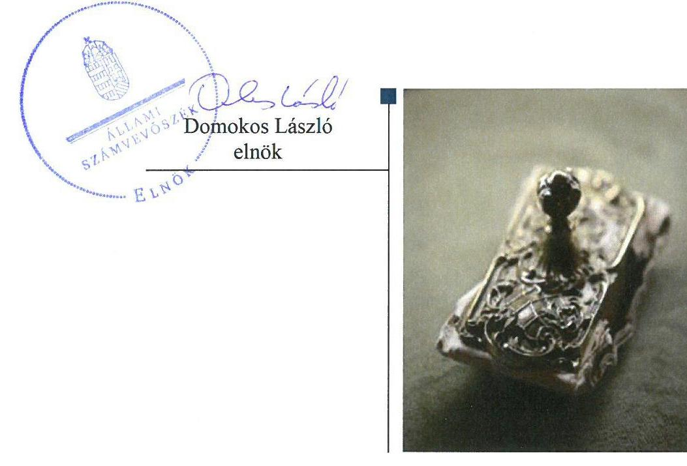
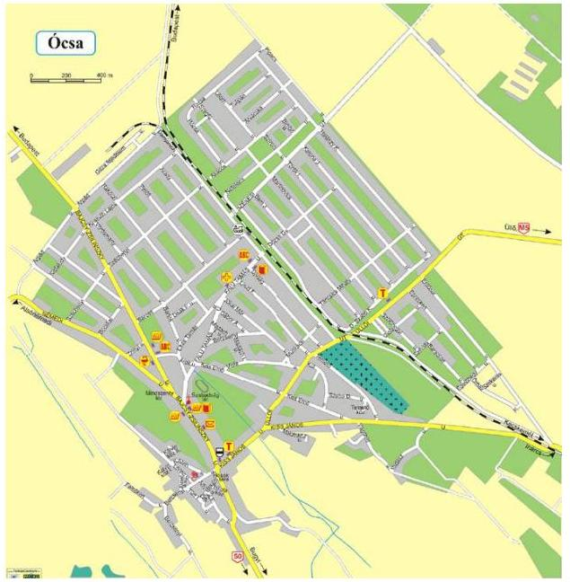

# Jelentés 

## Az önkormányzatok gazdasági társaságai

Az önkormányzatok többségi tulajdonában lévő gazdasági társaságok gazdálkodásának ellenőrzése - Ócsa Városüzemeltetési Nonprofit Kft.
2018. 05. hó 29. nap

---

# AZ ELLENŐRZÉST FELÜGYELTE:

DR. NAGY IMRE felügyeleti vezető

# AZ ELLENŐRZÉST VEZETTE ÉS A VÉGREHAJTÁSÁÉRT FELELŐS:

IMRE ZSUZSANNA ellenőrzésvezető

VERTKOVCZI MÁRIA ellenőrzésvezető

# A PROGRAM ÖSSZEÁLLÍTÁSÁÉRT FELELŐS:

TÓTPÁL SZABOLCS osztályvezető

IKTATÓSZÁM: EL-0143-075/2018.

|  Jelentéseink az Országgyűlés számítógépes hálózatán és az Interneten a www.asz.hu címen is olvashatóak. | TÉMASZÁM: 2447  |
| --- | --- |
|   | ELLENŐRZÉS-AZONOSÍTÓ SZÁM: V079333  |

---

# TARTALOMJEGYZÉK 

■ ÖSSZEGZÉS ..... 5
■ AZ ELLENŐRZÉS CÉLJA ..... 6
■ AZ ELLENŐRZÉS TERÜLETE ..... 7
■ AZ ELLENŐRZÉS HÁTTERE, INDOKOLTSÁGA ..... 8
■ A JELENTÉS LÉNYEGES KÉRDÉSKÖREI ..... 9
■ AZ ELLENŐRZÉS HATÓKÖRE ÉS MÓDSZEREI ..... 10
■ MEGÁLLAPÍTÁSOK ..... 12
■ JAVASLATOK ..... 16
■ MELLÉKLETEK ..... 19
I. sz. melléklet: Értelmező szótár ..... 19
■ FÜGGELÉK: ÉSZREVÉTELEK ..... 21
■ RÖVIDÍTÉSEK JEGYZÉKE ..... 23

---

.

---

# ÖSSZEGZÉS 

Ócsa Város Önkormányzatának az Ócsa Városüzemeltetési Nonprofit Kft. feletti tulajdonosi joggyakorlása nem volt szabályszerű. A Társaság biztosította a szabályszerű működés kereteit. A vagyon védelme, megóvása biztosított volt. A Társaság nem biztosította működésének, gazdálkodásának az átláthatóságát.

## Az ellenőrzés társadalmi indokoltsága

Magyarországon az önkormányzatok kötelező és önként vállalt feladataik vonatkozásában is egyre szélesebb körben alkalmazzák a költségvetésen kívüli feladatellátást, ezáltal - a nonprofit szervezetek mellett - az önkormányzati tulajdonú gazdasági társaságok is kiemelt fontosságú szerephez jutottak. Ezen belül kiemelt jelentőségű számos önkormányzati gazdasági társaság működése abból a szempontból is, hogy gazdálkodásának egyes elemei befolyásolják az önkormányzati alszektor hiányát és az államadósságot.

Az Állami Számvevőszék által a városüzemeltetéshez kapcsolódó tevékenységet folytató Ócsa Város Önkormányzatának az Ócsa Városüzemeltetési Nonprofit Kft.-nél végzett ellenőrzést további társadalmi elvárás indokolja a feladatellátásából adódóan. A tevékenységén keresztül a város lakosságának széles köre kerülhet kapcsolatba a Társasággal, az általa nyújtott szolgáltatásokkal.

## Főbb megállapítások, következtetések, javaslatok

Ócsa Város Önkormányzat tulajdonosi joggyakorlása nem volt szabályszerű, a szabályozás hiányossága miatt.
A Társaság a jogszabályban előírtak alapján rendelkezett számviteli szabályzatokkal, amivel biztosította a szabályos működés kereteit. A tevékenységgel kapcsolatos bevételeket és a személyi jellegű ráfordításokat nem szabályszerűen számolta el, a további ráfordítások elszámolása szabályszerű volt. A Társaság számviteli beszámolóit szabályszerűen elkészítette és közzétette. A Társaság a mérlegben szereplő eszközök és források értékének valódiságát leltárral alátámasztotta. A vagyongazdálkodása szabályszerű volt, ezzel biztosította a vagyon védelmét, megóvását.

A Társaság a jogszabályban előírt közérdekű adatait nem tette közzé, ez alapján a Társaság működésének és gazdálkodásának átláthatósága nem volt biztosított. A Társaság a jogszabályban előírt kormányzati szektorba sorolt egyéb szervezetekre vonatkozó adatszolgáltatási kötelezettségeit nem teljesítette. A 2014. évtől nem alakította ki a tevékenységének nyomon követési rendszerét, a kormányzati szektorba sorolt egyéb szervezetek részére előírt fokozott követelményeknek nem tett eleget.

Az Állami Számvevőszék a jelentésben foglalt megállapítások alapján az Ócsa Városüzemeltetési Nonprofit Kft. ügyvezetőjének a számviteli elszámolásokkal, a szabályozottsággal, a közzétételi kötelezettségek, valamint a kormányzati szektorba sorolt szervezeteknek előírt követelmények teljesítésével kapcsolatban hét javaslatot fogalmazott meg. Ócsa Város Önkormányzat polgármesterének két javaslatot tett az Állami számvevőszék a felügyelő bizottsági ügyrenddel, valamint a javadalmazási szabályzattal összefüggésben. A javaslatokat megalapozó megállapításokra az érintetteknek 30 napon belül intézkedési tervet kell készíteniük

---

# AZ ELLENŐRZÉS CÉLJA 

Az ellenőrzés célja annak értékelése, hogy az önkormányzat vagyongazdálkodási tevékenysége során szabályszerűen gyakorolta-e tulajdonosi jogait; a gazdasági társaság szabályozottsága, gazdálkodása és vagyongazdálkodási tevékenysége, bevételeinek és ráfordításainak elszámolása megfelelt-e a jogszabályi és tulajdonosi előírásoknak; a gazdasági társaság kötelezettségállománya jelent-e kockázatot a működésre, valamint a gazdálkodás átláthatósága és elszámoltathatósága érdekében biztosítva volt-e a szolgáltatás díjának megalapozottsága szabályszerű önköltségszámítással. Az ellenőrzés célja továbbá annak megítélése, hogy a kormányzati szektorba sorolt önkormányzati tulajdonban (résztulajdonban) lévő gazdálkodó szervezetek gazdálkodásának a kormányzati szektor hiányára és az államadósságra befolyással bíró elemei a jogszabályi előírásoknak megfeleltek-e.

---

# **AZ ELLENŐRZÉS TERÜLETE**

## **Ócsa Városüzemeltetési Nonprofit Kft. és a tulajdonosi jogokat gyakorló Ócsa Város Önkormányzat**

Ócsa Város Önkormányzat a Társaságot1 a 2007. évben kiemelkedően közhasznú egyszemélyes nonprofit korlátolt felelősségű társaságként alapította.

Az ellenőrzött időszakban a Társaság az Önkormányzat2 száz százalékos tulajdonában állt. A Társaság közfeladat ellátás keretében zöldterület kezelését, az önkormányzati intézmények karbantartását, takarítását, az iskolai, óvodai és bölcsődei konyhák és szociális ebéd biztosítását, valamint az egészségház üzemeltetését végezte. Ezekkel párhuzamosan a Társaság lakópark őrzés-védelmével is foglalkozott, amely feladatok a 2014. évben megszűntek. A konyhák üzemeltetését 2016. augusztus 1-től már nem végezte a Társaság.

A Társaság jegyzett tőkéje 357,9 M Ft volt, amely az ellenőrzött időszakban nem változott. Az ellenőrzött időszakban a Polgármester3 személye nem változott. A Jegyző4 személyének változására egy alkalommal, 2015. évben került sor. A foglalkoztatottak száma a 2013. év végén 58 fő, 2016. év végén 49 fő volt.

A Társaság a tevékenységét az Önkormányzattól bérleti díj ellenében üzemeltetésre kapott eszközökkel és saját eszközökkel látta el. Vagyonkezelt eszköze a Társaságnak nem volt. A Társaság más gazdasági társaságokban tulajdonosi részesedéssel nem rendelkezett. A Társaság 2013. június 28-ától NGM közlemény5 alapján kormányzati szektorba sorolt egyéb szervezetnek minősült.

Az Önkormányzat az Mötv.6 előírásaival összhangban hosszú távú fejlesztési elképzeléseit Gazdasági programban7 rögzítette. Az Mötv.-ben foglaltakkal összhangban a Képviselő-testület8 működésének részletes szabályait SZMSZ9-ben határozta meg.

A Társaság mérleg szerinti eredménye a 2014. és a 2015. évet kivéve minden ellenőrzött évben negatív volt.

A Társaság gazdálkodását jellemző főbb adatok alakulását az alábbi táblázat szemlélteti.

|  A TÁRSASÁG GAZDÁLKODÁSÁNAK FŐBB ADATAI A 2013-2016. ÉVEKBEN |  |  |  |   |
| --- | --- | --- | --- | --- |
|  Megnevezés | 2013. év | 2014. év | 2015. év | 2016. év  |
|  Értékesítés nettó árbevétele (M Ft) | 122,5 | 155,2 | 88,5 | 69,0  |
|  Mérlegfőösszeg (M Ft) | 340,5 | 355,4 | 350,8 | 325,4  |
|  Mérleg szerinti eredmény/Adózott eredmény (M Ft) | -2,2 | 37,0 | 4,9 | -16,3  |
|  Saját tőke (M Ft) | 288,3 | 325,3 | 330,2 | 313,9  |
|  Követelések (M Ft) | 6,4 | 14,8 | 17,0 | 7,7  |

*Forrás: A Társaság 2013-2016. évt egyszerűsített éves beszámolói*

---

# AZ ELLENŐRZÉS HÁTTERE, INDOKOLTSÁGA 

Az önkormányzatok többségi tulajdonában álló gazdasági társaságok ellenőrzése kiemelten fontos a vagyon megőrzése, megóvása érdekében, valamint a kormányzati szektor elszámolásaiban megjelenő önkormányzati tulajdonú gazdálkodó szervezetek esetében, amelyekkel szemben alapvető követelmény, hogy gazdálkodásuk, működésük szabályszerű, az általuk szolgáltatott adatok minél megbízhatóbbak legyenek. A feladatellátás költségeinek, ráfordításainak alakulása a lakosság széles rétegét érinti.

Ellenőrzéseink feltárhatják, hogy az önkormányzat a feladatellátásához rendelt vagyon működtetését a tulajdonostól elvárható gondossággal végezte-e, a feladatot ellátó gazdasági társaság a létesítő okiratban, szolgáltatási szerződésben foglaltak betartásával biztosította-e a feladat ellátását. Az ellenőrzés eredményeképp meghatározhatóvá válnak a költségvetési hiányt befolyásoló szervezetek kockázatai, lehetővé válik ezen kockázatok csökkentése. Az ellenőrzés rávilágíthat arra, hogy a gazdasági társaság a vagyon használatával biztosította-e a szolgáltatás folytatásának feltételeit, az önkormányzat tulajdonosi felügyelete hozzájárult-e a szabályszerű gazdálkodáshoz és feladatellátáshoz. A megállapítások alapján megfogalmazott számvevőszéki javaslatok hasznosítása elősegítheti a meglévő hibák megszüntetését. A jó gyakorlatok bemutatásával az ÁSZ${ }^{10}$ hozzájárulhat a követendő megoldások megismertetéséhez, terjesztéséhez.

---

# A JELENTÉS LÉNYEGES KÉRDÉSKÖREI 

1. Az önkormányzat tulajdonosi joggyakorlása szabályszerű volt-e?
2. A gazdasági társaság szabályozottsága, gazdálkodása és vagyongazdálkodási tevékenysége szabályszerű volt-e?

---

# AZ ELLENŐRZÉS HATÓKÖRE ÉS MÓDSZEREI 

## Az ellenőrzés típusa

Megfelelőségi ellenőrzés

## Az ellenőrzött időszak

2013. január 1. - 2016. december 31.

## Az ellenőrzés tárgya

Ócsa Város Önkormányzat tulajdonosi joggyakorlása, valamint az Ócsa Városüzemeltetési Nonprofit Kft. gazdálkodásának szabályozottsága és szabályszerűsége, továbbá az önkormányzati alszektorba sorolt gazdasági társaság gazdálkodásának a kormányzati szektor hiányára és az államadósságra befolyással bíró elemei.

Az ellenőrzés kiterjedt minden olyan körülményre és adatra, amely az ÁSZ jogszabályban meghatározott feladatainak teljesítéséhez, valamint a program végrehajtása folyamán felmerült újabb összefüggések feltárásához szükséges.

## Az ellenőrzött szervezet

- Ócsa Városüzemeltetési Nonprofit Kft.
- Ócsa Város Önkormányzat

## Az ellenőrzés jogalapja

Az ellenőrzés jogalapját az ÁSZ tv. 1. § (3) bekezdése és 5. § (3)-(5) bekezdései képezték.

## Az ellenőrzés módszerei

Az ellenőrzést a nemzetközi standardokat irányadónak tekintve az ellenőrzési program ellenőrzési kérdései, az ellenőrzött időszakban hatályos jogszabályok, az ellenőrzés szakmai szabályok és módszertanok figyelembe vételével végeztük.

Az ellenőrzés ideje alatt az ellenőrzött szervezettel történő kapcsolattartást az ÁSZ Szervezeti és Működési Szabályzatának vonatkozó előírásai alapján biztosítottuk.

---

Az ellenőrzés a kiválasztott, többségi tulajdonosi jogokat gyakorló önkormányzatra, illetve az ellenőrzésre kijelölt gazdasági társaság felett tulajdonosi jogokat gyakorló szervezetre és az ellenőrzött gazdasági társaságra terjedt ki.

A gazdasági társaságnál mintavétellel ellenőriztük a ráfordításokat és a bevételeket, ezen belül az anyagjellegű ráfordításokat, az egyéb ráfordításokat, a pénzügyi műveletek ráfordításait és a rendkívüli ráfordításokat, illetve az értékesítés nettó árbevételét, az egyéb bevételeket, a pénzügyi műveletek bevételeit valamint a rendkívüli bevételeket. Mintavétel történt továbbá a tárgyi eszközök növekedési tételeiből. A minták kiválasztása rétegzett mintavétel alkalmazásával történt.

Az ellenőrzési kérdések megválaszolásához szükséges bizonyítékok megszerzése a következő ellenőrzési eljárások alkalmazásával történt: megfigyelés, kérdésfeltevés (információkérés), összehasonlítás, valamint elemző eljárás. Az ellenőrzési bizonyítékként felhasználható adatforrások közé tartoztak egyrészt az ellenőrzési programban felsorolt adatforrások, másrészt adatforrás lehet még minden - az ellenőrzés folyamán - feltárt, az ellenőrzés szempontjából információkat tartalmazó dokumentum.

Az ellenőrzést a kérdésekre adott válaszok kiértékelésével, valamint a megjelölt adatforrások, a csatolt tanúsítványok felhasználásával, továbbá az adott időszakban hatályos jogszabályok figyelembe vételével folytattuk le.

A bevételek és ráfordítások elszámolása, valamint a vagyonnyilvántartás terén a szabályszerű működést véletlen mintavétellel ellenőriztük. A mintavétellel ellenőrzött területek esetében minden egyes tétel vonatkozásában a szabályszerűségre vonatkozó kérdéseket tettünk fel, amelyek eredménye összesítésre került. Megfelelőnek értékeltünk egy ellenőrzött területet, amennyiben 95%-os bizonyossággal a teljes sokaságban az átlagos hibaarány legfeljebb 10%, nem megfelelőnek, amennyiben 10%-nál magasabb arányt képviselt. A ráfordítások elszámolására és a vagyonnyilvántartásra vonatkozó véletlen mintavételt kockázati alapú kiválasztással egészítettük ki, amelynek során évente a három legnagyobb összegű tételt választottuk ki.

---

# 1. Az önkormányzat tulajdonosi joggyakorlása szabályszerű volt-e? 

Összegző megállapítás

Az Önkormányzat tulajdonosi joggyakorlása nem volt szabályszerű.

## A TÁRSASÁG FELETTI TULAJDONOSI JOGOKAT

az önkormányzati SZMSZ és a Vagyonrendelet${ }^{11}$ alapján a Képviselőtestület gyakorolta. A Gt.${ }^{12}$, a Ptk.${ }^{13}$, valamint a Taktv.${ }^{14}$ előírásaival összhangban az Alapító${ }^{15}$ a Társaság Alapító Okiratában${ }^{16}$ három tagú Felügyelő Bizottságot${ }^{17}$ jelölt ki. A Társaság képviseletére kijelölt személyek képviselettel összefüggő feladatait, beszámolási kötelezettségét az Alapító Okirat tartalmazta.

A Felügyelő Bizottság a Gt. 34. § (4) bekezdésében és
 a Ptk. 3:122. § (3) bekezdésében előírtak ellenére nem rendelkezett ügyrenddel.

Az Alapító a Taktv. 5.§ (3) bekezdésében előírtakkal ellentétben nem alkotta meg a javadalmazási szabályzatot, ezáltal nem szabályozta a vezető tisztségviselők, Felügyelő Bizottsági tagok, valamint az Mt. ${ }^{18}$ 208. §-ának hatálya alá eső munkavállalók javadalmazását, valamint a jogviszony megszűnése esetére biztosított juttatások módját, mértékének elveit, annak rendszerét.

Könyvvizsgálatra a Társaság a Számv. tv. ${ }^{19}$ alapján nem volt kötelezett, ugyanakkor az Alapító a Társaság Alapító Okiratában Könyvvizsgálót ${ }^{20}$ jelölt ki.

Az Alapító a Gt., a Ptk. előírásainak megfelelően döntött az egyszerűsített éves számviteli beszámolókról, közhasznúsági mellékletekről.

Az Önkormányzat a Gyvt. ${ }^{21}$-ben és a Szoctv. ${ }^{22}$-ben előírtak alapján rendeletalkotási kötelezettségének eleget tett, a személyes gondoskodást nyújtó ellátásokhoz kapcsolódó térítési díj-megállapítási kötelezettségét teljesítette.

Az Önkormányzat a Társaság feladatellátásához kapcsolódó követelményeket a Feladat-ellátási szerződésekben ${ }^{23}$ határozta meg. A gyermekétkeztetéshez és a szociális étkeztetéshez kapcsolódó 2013. évben megkötött Feladat-ellátási szerződések a díjakat tartalmazó melléklet tekintetében nem került aktualizálásra az önkormányzati rendeletekben ${ }^{24}$ meghatározott térítési díjakkal. A Társaság a rendeletekben meghatározott díjakat alkalmazta.

Az Önkormányzat által működtetett belső ellenőrzés az Nvtv. ${ }^{25}$ által biztosított lehetőséggel élve, tulajdonosi ellenőrzés keretében az ellenőrzött időszak minden évében ellenőrizte a Társaság gazdálkodását. Intézkedési javaslatot a 2013. és a 2016. évben fogalmazott meg, a Társaság intézkedési terv készítési kötelezettségét teljesítette. Az Önkormányzat megbízása alapján a 2016. évben külső ellenőrző szervezet

---

a Társaság pénzeszközeinek szabályszerű, gazdaságos és hatékony felhasználását ellenőrizte. Az Önkormányzat intézkedési tervet készített a megállapítások alapján a Társaság részére.

# 2. A gazdasági társaság szabályozottsága, gazdálkodása és vagyongazdálkodási tevékenysége szabályszerű volt-e? 

Összegző megállapítás

2.1. számú megállapítás

A Társaság a számviteli elszámolásának szabályozási feltételeit biztosította. A bevételeket és a személyi jellegű ráfordításokat nem szabályszerűen számolta el, ezen felül a további ráfordítások elszámolása szabályszerű volt.

A Társaság rendelkezett a Számv. tv.-nek megfelelő Számviteli politikával ${ }^{26}$ az eszközök és források Értékelési ${ }^{27}$, Leltárkészítési és leltározási ${ }^{28}$, illetve Selejtezési szabályzatával ${ }^{29}$, Pénzkezelési szabályzattal ${ }^{30}$, Bizonylati szabályzattal ${ }^{31}$ és Önköltségszámítási szabályzattal ${ }^{32}$.

A Társaság rendelkezett a Számv. tv.-nek megfelelő Számlarenddel ${ }^{33}$.
A Társaság a Civil tv. ${ }^{34}$ 19. § előírásai alapján a közhasznú és a vállalkozási tevékenység költség, ráfordítás és bevétel elkülönítését a munkaszámok és főkönyvi számlák alkalmazásával biztosította.

A Társaság bevételeinek elszámolása nem volt szabályszerű mivel a Társaság a Számv. tv. 165. § (1)-(2) bekezdéseiben foglaltakkal ellentétben nem rendelkezett a bevételeket alátámasztó bizonylattal.

A ráfordítások elszámolása, a személyi ráfordítások kivételével a Számv. tv. előírása alapján szabályszerű volt.

A személyi jellegű ráfordítások elszámolása nem volt szabályszerű, mivel
$\longrightarrow$ a Számv. tv. 165. § (1)-(2) bekezdésében foglalt előírásokkal ellentétben a bér és egyéb jövedelmek elszámolását és kifizetését a bizonylatok nem támasztották alá,
$\longrightarrow$ a Társaság a Számv. tv. 167. § (1) bekezdés h) pontjában előírtakkal ellentétben nem szerepeltette az elszámolás bizonylatain a könyvelés módjára történő hivatkozást.

## 2.2. számú megállapítás

A Társaság vagyongazdálkodása szabályszerű volt.
A Társaság a Számv. tv. alapján a mérlegben szereplő befektetett eszközeit nyilvántartotta, az eszközökkel kapcsolatos elszámolása szabályszerű volt.

A Számv. tv. és a Leltárkészítési és leltározási szabályzat előírásai alapján az egyszerűsített éves beszámolók eszköz és forrás adatait leltárral

---

alátámasztotta. A Számv. tv.-nek megfelelően a leltár valódiságát mennyiségi felvétellel végzett leltározással alátámasztotta.

A 2014. évtől az ellenőrzött időszakban a Társaság hosszú lejáratú kötelezettséggel nem rendelkezett. Lejárt kötelezettséggel a 2015-2016. években, hátralékos vevő követeléssel a 2016. évben a Társaság nem rendelkezett. Fizetőképessége biztosított volt.
2.3. számú megállapítás

A Társaság jogszabályban előírt beszámolási kötelezettségét szabályszerűen teljesítette. A közérdekű adatokkal kapcsolatos kötelezettségét nem teljesítette.

A SZÁMVITELI BESZÁMOLÓ készítési kötelezettségét a Számv. tv.-nek megfelelően a Társaság szabályszerűen teljesítette. Az Alapító által elfogadott egyszerűsített éves beszámolókat és közhasznúsági mellékleteket a Számv. tv. és a Civil tv. előírásai alapján a Társaság közzétette.

A Társaság a Számv. tv. 153. § (1) és 154. § (1) bekezdés előírásai ellenére, a közzétett 2015. évi egyszerűsített éves beszámoló mérlegében 4855 E Ft-ot, az eredmény-kimutatásban 4848 E Ft-ot szerepeltetett mérleg szerinti eredményként. Ez alapján a Társaság közzétett beszámolójában a számszaki eltérés összege 7 E Ft volt. Az Önkormányzat részére benyújtott és elfogadott egyszerűsített éves beszámoló mérlegében és eredmény-kimutatásában szereplő mérleg szerinti eredmény a Számv. tv.-nek megfelelően megegyezett (4855 E Ft).

Az egyszerűsített éves beszámolókat a 2013-2016. években korlátozás nélküli hitelesítő záradékkal látta el a Könyvvizsgáló. A Felügyelő Bizottság az Alapító részére minden évben elfogadásra tett javaslatot a Gt. és Ptk. előírásai alapján elkészített jelentésében.

A Társaság az Ltv. ${ }^{35}$ 10. § (1) bekezdés a) pontjában foglalt előírás ellenére nem rendelkezett egyedi iratkezelési szabályzattal.

Az Info. tv. 30. § (6) bekezdésében foglaltak ellenére Közérdekű adatok megismerésére irányuló igények teljesítésének rendjét rögzítő szabályzattal a Társaság nem rendelkezett.

A Társaság az Info. tv. 37.§ (1) bekezdésében előírtak ellenére a Társaság elérhetőségén, tevékenységi körén, valamint a tisztségviselők nevén és járandóságán kívül nem tette közzé az Info. tv. 1. melléklet I-III. pontjaiban előírtakat.
2.4. számú megállapítás

A kormányzati szektorba sorolt egyéb szervezetekre vonatkozó adatszolgáltatási kötelezettségét a Társaság nem teljesítette, a tevékenységek nyomon követését biztosító rendszerét nem alakította ki. Államadósságot keletkeztető ügylete nem volt.

A Bkr. ${ }^{36}$ 2014.01.01-től hatályos 54/A. §-ában, továbbá a 10. §-ában foglaltak ellenére a 2014. évtől a Társaság nem alakította ki a tevékenységének és a célok megvalósításának nyomon követését biztosító rendszerét.

A Társaságnak nem volt a Gst. ${ }^{37}$ hatálya alá tartozó adósságot keletkeztető ügylete, ezáltal nem volt hatással az államadósság alakulására.

---

A kormányzati szektorba sorolt egyéb szervezetek számára előírt adatszolgáltatási kötelezettségét a Társaság az Áht. ${ }^{38}$ 107. § (1) bekezdés előírása ellenére nem teljesítette.

---

# JAVASLATOK 

Az ÁSZ tv. 33. § (1) bekezdésében foglaltak értelmében az ellenőrzött szervezet vezetője köteles a jelentésben foglalt megállapításokhoz kapcsolódó intézkedési tervet összeállítani és azt a jelentés kézhezvételétől számított 30 napon belül az ÁSZ részére megküldeni. Amennyiben az ellenőrzött szervezet vezetője nem küldi meg határidőben az intézkedési tervet, vagy továbbra sem elfogadható intézkedési tervet küld, az Állami Számvevőszék elnöke az ÁSZ tv. 33. § (3) bekezdése a) és b) pontjaiban foglaltakat érvényesítheti.

## Ócsa Városüzemeltetési Nonprofit Kft. Ügyvezetőjének

1. Intézkedjen a bevételek elszámolásának bizonylattal történő alátámasztásáról a jogszabályban előírtaknak megfelelően.
(2.1. számú megállapítás 4. bekezdése alapján)
2. Intézkedjen, hogy bizonylatok alapján történjen a személyi jellegű ráfordítások elszámolása és a bizonylatokon a jogszabályban előírtaknak megfelelően tüntessék fel a könyvelés módjára történő hivatkozást.
(2.1. számú megállapítás 6. bekezdés alapján)
3. Gondoskodjon a jogszabályi előírásoknak megfelelő egyedi iratkezelési szabályzat elkészítéséről.
(2.3. számú megállapítás 4. bekezdése alapján)
4. Gondoskodjon a jogszabályi előírásoknak megfelelően a közérdekű adatok megismerésére irányuló igények teljesítésének rendjét rögzítő szabályzat elkészítéséről.
(2.3. számú megállapítás 5. bekezdése alapján)
5. Gondoskodjon a jogszabályban előírt közzétételi kötelezettségek teljesítéséről.
(2.3. számú megállapítás 6. bekezdése alapján)
6. Intézkedjen a jogszabályi előírásoknak megfelelően a szervezet tevékenységének, a célok megvalósításának nyomon követését biztosító rendszer kialakításáról.
(2.4. számú megállapítás 1. bekezdése alapján)

---

7. Gondoskodjon arról, hogy a Társaság a kormányzati szektorba sorolt egyéb szervezetek számára előírt adatszolgáltatási kötelezettségét a jogszabályok előírásainak megfelelően teljesítse.
(2.4. számú megállapítás 3. bekezdése alapján)

# Ócsa Város Önkormányzat Polgármesterének 

1. Kezdeményezze a Társaság felügyelő bizottsága ügyrendjének elkészítését és az alapítónál az ügyrend jóváhagyását.
(1. számú megállapítás 2. bekezdése alapján)
2. Kezdeményezze a jogszabályi előírásoknak megfelelően a javadalmazási szabályzat megalkotását.
(1. számú megállapítás 3. bekezdése alapján)

---

.

---

# MELLÉKLETEK 

- I. SZ. MELLÉKLET: ÉRTELMEZŐ SZÓTÁR
gazdasági társaság
gazdálkodó szervezet
kormányzati szektorba sorolt egyéb szervezet
nemzeti vagyon
nonprofit gazdasági társaság

Ptk 3:88. § (1) bekezdése szerint „a gazdasági társaságok üzletszerű közös gazdasági tevékenység folytatására, a tagok vagyoni hozzájárulásával létrehozott, jogi személyiséggel rendelkező vállalkozások, amelyekben a tagok a nyereségből közösen részesednek, és a veszteséget közösen viselik".
A Ptk. 685. § c) pontja szerint gazdálkodó szervezet: „az állami vállalat, az egyéb állami gazdálkodó szerv, a szövetkezet, a lakásszövetkezet, az európai szövetkezet, a gazdasági társaság, az európai részvénytársaság, az egyesülés, az európai gazdasági egyesülés, az európai területi együttműködési csoportosulás, az egyes jogi személyek vállalata, a leányvállalat, a vízgazdálkodási társulat, az erdő birtokossági társulat, a végrehajtói iroda, az egyéni cég, továbbá az egyéni vállalkozó." (2014. március.15-éig hatályos)
az Áht. 3. § (2) és (3) bekezdésében foglaltakon kívül az Európai Közösséget létrehozó szerződéshez csatolt, a túlzott hiány esetén követendő eljárásról szóló jegyzőkönyv alkalmazásáról szóló 2009. május 25-i 479/2009/EK rendelet (a továbbiakban: 479/2009/EK rendelet) szerint a kormányzati szektorba sorolt szervezet (Áht. 1. § (12))
Nvtv. 1. § (2) bekezdése szerint többek között:
„az állam vagy a helyi önkormányzat kizárólagos tulajdonában álló dolgok, az a) pont hatálya alá nem tartozó, állam vagy a helyi önkormányzat tulajdonában lévő dolog,
az állam vagy a helyi önkormányzat tulajdonában lévő pénzügyi eszközök, továbbá az államot vagy a helyi önkormányzatot megillető társasági részesedések, az államot vagy a helyi önkormányzatot megillető bármely vagyoni értékkel rendelkező jogosultság, amelyet jogszabály vagyoni értékű jogként nevesít."
Civil tv. 9/F. § (2) bekezdése szerint „az a gazdasági társaság minősül nonprofit gazdasági társaságnak és cégnevében az a gazdasági társaság tüntetheti fel a nonprofit jelleget, amelynek létesítő okirata tartalmazza, hogy a gazdasági társaság tevékenységéből származó nyereség a tagok között nem osztható fel, hanem az a gazdasági társaság vagyonát gyarapítja." (hatályos 2014. március 15-étől)

---

.

---

# FÜGGELÉK: ÉSZREVÉTELEK 

A jelentéstervezetet a Számvevőszék 15 napos észrevételezésre megküldte az ellenőrzött szervezetek vezetőinek az ÁSZ tv. 29. §* (1) bekezdése előírásának megfelelően.

Az Ócsa Városüzemeltetési Nonprofit Kft. ügyvezetője és Ócsa Város Önkormányzat polgármestere nem éltek az ÁSZ tv. 29. § (2) bekezdésében foglalt észrevételezési jogukkal, a törvényes határidőn belül észrevételt nem tettek.

[^0]
[^0]:    * 29. § (1) Az Állami Számvevőszék az ellenőrzési megállapításait megküldi az ellenőrzött szervezet vezetőjének vagy az általa megbízott személynek, és annak, akinek személyes felelősségét állapította meg.
    (2) Az ellenőrzött szervezet vezetője és a felelősként megjelölt személy az ellenőrzés megállapításaira tizenöt napon belül írásban észrevételt tehet.
    (3) Az Állami Számvevőszék az észrevételre a beérkezésétől számított harminc napon belül írásban válaszol. A figyelembe nem vett észrevételeket köteles a jelentésben feltüntetni, és megindokolni, hogy azokat miért nem fogadta el.

---

.

---

# RÖVIDÍTÉSEK JEGYZÉKE 

${ }^{1}$ Társaság
${ }^{2}$ Önkormányzat
${ }^{3}$ Polgármester
${ }^{4}$ Jegyző
${ }^{5}$ NGM közlemény
${ }^{6}$ Mótv.
${ }^{7}$ Gazdasági program
${ }^{8}$ Képviselő-testület
${ }^{9}$ SZMSZ
${ }^{10}$ ÁSZ
${ }^{11}$ Vagyonrendelet
${ }^{12}$ Gt.
${ }^{13}$ Ptk.
${ }^{14}$ Taktv.
${ }^{15}$ Alapító
${ }^{16}$ Alapító Okirat
${ }^{17}$ Felügyelő Bizottság
${ }^{18} \mathrm{Mt}$.
${ }^{19}$ Számv. tv.
${ }^{20}$ Könyvvizsgáló
${ }^{21}$ Gyvt.
${ }^{22}$ Szoctv.
${ }^{23}$ Feladat-ellátási szerződések
${ }^{24}$ Önkormányzati rendeletek
${ }^{25}$ Nvtv.

Ócsa Városüzemeltetési Nonprofit Korlátolt Felelősségű
 Társaság
Ócsa Város Önkormányzat
Ócsa Város Önkormányzatának polgármestere
Ócsa Város Önkormányzatának jegyzője
A kormányzati szektorba sorolt egyéb szervezetekről szóló NGM közlemény (hatályos: 2013. június 28-tól, 2015. december 30-tól)
2011. évi CLXXXIX. törvény Magyarország helyi önkormányzatairól

Ócsa Város Önkormányzatának Gazdasági Programja 2011-2014. évekre és 2014-2019. évekre

Ócsa Város Önkormányzatának Képviselő-testülete
Ócsa Város Önkormányzat Képviselő-testületének Szervezeti és Működési Szabályzata (hatályos: 2011. március 31-től, 2014. november 12-től)
Állami Számvevőszék
Ócsa Város Önkormányzat Képviselő-testületének önkormányzati rendelete az önkormányzat vagyonáról, a vagyontárgyak feletti tulajdonosi jogok gyakorlásáról (hatályos: 2012. március 1-től, 2016. szeptember 1-től)
2006. évi IV. törvény a gazdasági társaságokról (hatályos: 2014. március 14-ig) 2013. évi V. törvény a Polgári Törvénykönyvről
2009. évi CXXII. törvény a köztulajdonban álló gazdasági társaságok takarékosabb működéséről
Ócsa Város Önkormányzat, a Társaság Alapítója
Ócsa Városüzemeltetési Nonprofit Korlátolt Felelősségű Társaság alapító okirata (hatályos: 2010. december 22-től, 2013. január 24-től, 2014. május 28-tól)
Ócsa Városüzemeltetési Nonprofit Korlátolt Felelősségű Társaság felügyelő bizottsága
2012. évi I. törvény a munka törvénykönyvéről
2000. évi C. törvény a számvitelről

Ócsa Városüzemeltetési Nonprofit Kft. könyvvizsgálója
1997. évi XXXI. törvény a gyermekek védelméről és a gyámügyi igazgatásról
1993. évi III. törvény a szociális igazgatásról és szociális ellátásokról

Ócsa Város Önkormányzat és Ócsa Városüzemeltetési Nonprofit Korlátolt
Felelősségű Társaság között a gyermekétkeztetés biztosítása érdekében létrejött vállalkozási szerződés (hatályos: 2013. április 1-től)
Ócsa Város Önkormányzat és Ócsa Városüzemeltetési Nonprofit Korlátolt
Felelősségű Társaság között a szociális étkezés biztosítása érdekében létrejött vállalkozási szerződés (hatályos: 2013. március 29-től)
Ócsa Város Önkormányzat és Ócsa Városüzemeltetési Nonprofit Korlátolt
Felelősségű Társaság között a városgazdálkodással, iskolák karbantartásával, takarításával kapcsolatban létrejött vállalkozási szerződés (hatályos: 2014. január 1-től, 2015. január 1-től, 2016. január 1-től)
Ócsa Város Önkormányzat Képviselő-testületének önkormányzati rendelete a gyermekétkeztetési és egyéb étkezési térítési díjak megállapításáról (hatályos: 2013. október 1-től, 2015. február 8-tól, 2016. január 1-től)
2011. évi CXCVI. törvény a nemzeti vagyonról

---

${ }^{26}$ Számviteli politika
${ }^{27}$ Értékelési szabályzat
${ }^{28}$ Leltárkészítési és leltározási szabályzat
${ }^{29}$ Selejtezési szabályzat
${ }^{30}$ Pénzkezelési szabályzat
${ }^{31}$ Bizonylati szabályzat
${ }^{32}$ Önköltségszámítási szabályzat
${ }^{33}$ Számlarend
${ }^{34}$ Civil tv.
${ }^{35}$ Ltv.
${ }^{36}$ Bkr.
${ }^{37}$ Gst.
${ }^{38}$ Áht.

Ócsa Városüzemeltetési Nonprofit Kft. Számviteli politika (hatályos: 2008. január 1-től)
Ócsa Városüzemeltetési Nonprofit Kft. Értékelési szabályzat (hatályos: 2010. január 1-től)
Ócsa Városüzemeltetési Nonprofit Kft. Leltárkészítési és leltározási szabályzata (hatályos: 2008. január 1-től)
Ócsa Városüzemeltetési Nonprofit Kft. Selejtezési szabályzata (hatályos: 2008. január 1-től)
Ócsa Városüzemeltetési Nonprofit Kft. Pénzkezelési szabályzat (hatályos: 2008. január 1-től)
Ócsa Városüzemeltetési Nonprofit Kft. Bizonylati szabályzat (hatályos: 2008. január 1-től)
Ócsa Városüzemeltetési Nonprofit Kft. Önköltségszámítási szabályzat (hatályos: 2010. február 15-től)

Ócsa Városüzemeltetési Nonprofit Kft. Számlarend (hatályos: 2008. március 1-től) 2011. évi CLXXV. törvény az egyesülési jogról, a közhasznú jogállásról, valamint a civil szervezetek működéséről és támogatásáról
1995. évi LXVI. törvény a köziratokról, a közlevéltárakról és a magánlevéltári anyag védelméről
A költségvetési szervek belső kontrollrendszeréről és belső ellenőrzéséről szóló 370/2011. (XII.31.) Kormányrendelet
2011. évi CXCIV. törvény Magyarország gazdasági stabilitásáról
2011. évi CXCV. törvény az államháztartásról

---

ÁLLAMI SZÁMVEVŐSZÉK
1052 Budapest, Apáczai Csere János utca 10.
Levélcím: 1364 Budapest 4. Pf. 54
Telefon: +36 14849100 Telefax: +36 14849200
www.asz.hu
