# Jelentés 

## Az önkormányzatok gazdasági társaságai

Az önkormányzatok többségi tulajdonában lévő gazdasági társaságok gazdálkodásának ellenőrzése - MÜVÉSZETEK HÁZA GÖDÖLLŐ Nonprofit Közhasznú Kft.
2018.

---

# Jelentés 

## Az önkormányzatok gazdasági társaságai

Az önkormányzatok többségi tulajdonában lévő gazdasági társaságok gazdálkodásának ellenőrzése - MÚVÉSZETEK HÁZA GÖDÖLLŐ Nonprofit Közhasznú Kft.
2018. 05. hó 31. nap
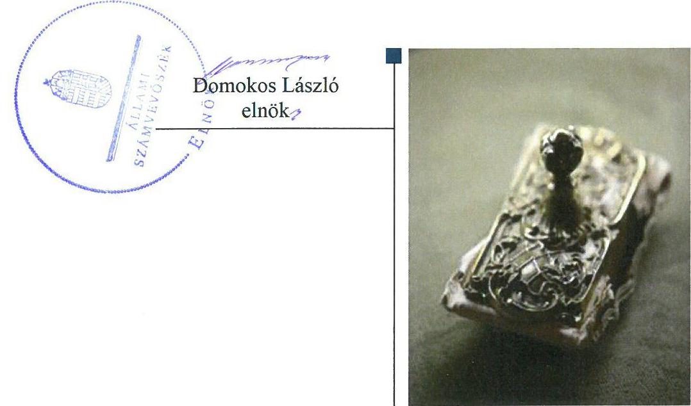

---

# AZ ELLENŐRZÉST FELÜGYELTE:

DR. NAGY IMRE felügyeleti vezető

# AZ ELLENŐRZÉST VEZETTE ÉS A VÉGREHAJTÁSÁÉRT FELELŐS:

IMRE ZSUZSANNA ellenőrzésvezető

VERTKOVCZI MÁRIA ellenőrzésvezető

A PROGRAM ÖSSZEÁLLÍTÁSÁÉRT FELELŐS:

TÓTPÁL SZABOLCS osztályvezető

IKTATÓSZÁM: EL-0154-053/2018.

|  Jelentéseink az Országgyűlés számítógépes hálózatán és az Interneta a www.asz.hu címen is olvashatóak. | TÉMASZÁM: 2447  |
| --- | --- |
|   | ELLENŐRZÉS-AZONOSÍTÓ SZÁM: V079344  |

---

# TARTALOMJEGYZÉK 

■ ÖSSZEGZÉS ..... 5
■ AZ ELLENŐRZÉS CÉLJA ..... 6
■ AZ ELLENŐRZÉS TERÜLETE ..... 7
■ AZ ELLENŐRZÉS HÁTTERE, INDOKOLTSÁGA ..... 8
■ A JELENTÉS LÉNYEGES KÉRDÉSKÖREI ..... 9
■ AZ ELLENŐRZÉS HATÓKÖRE ÉS MÓDSZEREI ..... 10
■ MEGÁLLAPÍTÁSOK ..... 12
■ JAVASLATOK ..... 16
■ MELLÉKLETEK ..... 19
I. sz. melléklet: Értelmező szótár ..... 19
■ FÜGGELÉK: ÉSZREVÉTELEK ..... 21
■ RÖVIDÍTÉSEK JEGYZÉKE ..... 29

---

.

---

# ÖSSZEGZÉS 

Gödöllő Város Önkormányzatának a MŰVÉSZETEK HÁZA GÖDÖLLŐ Nonprofit Közhasznú Kft. feletti tulajdonosi joggyakorlása szabályszerű volt. A Társaság nem alakította ki a szabályszerű müködés kereteit. A vagyongazdálkodása nem volt szabályszerű. A jogszabályban előirt beszámolási kötelezettségét teljesítette. A Társaság nem biztositotta müködésének, gazdálkodásának az átláthatóságát. A Társaság a 2016. évben nem biztositotta a korrupció elleni fokozott védelmének alapfeltételeit.

## Az ellenőrzés társadalmi indokoltsága

Magyarországon az önkormányzatok kötelező és önként vállalt feladataik vonatkozásában is egyre szélesebb körben alkalmazzák a költségvetésen kívüli feladatellátást, ezáltal - a nonprofit szervezetek mellett - az önkormányzati tulajdonú gazdasági társaságok is kiemelt fontosságú szerephez jutottak. Ezen belül kiemelt jelentőségű számos önkormányzati gazdasági társaság múködése abból a szempontból is, hogy gazdálkodásának egyes elemei befolyásolják az önkormányzati alszektor hiányát és az államadósságot.

Az Állami Számvevőszék által a közművelődési tevékenységet folytató MŰVÉSZETEK HÁZA GÖDÖLLŐ Nonprofit Közhasznú Kft.-nél végzett ellenőrzést további társadalmi elvárás indokolja a feladatellátásából adódóan. A tevékenységén keresztül Gödöllő lakosságának széles köre kerülhet kapcsolatba a Társasággal, az általa nyújtott szolgáltatásokkal.

## Főbb megállapítások, következtetések, javaslatok

Gödöllő Város Önkormányzata a tulajdonosi jogait biztosító kereteket szabályszerűen kialakította, tulajdonosi jogait szabályszerűen gyakorolta. Az Önkormányzat a Társaság jogszabályban előírt éves beszámolóit szabályszerűen megtárgyalta és elfogadta, azonban a Felügyelő Bizottság ügyrenddel nem rendelkezett.

A Társaság a jogszabályban előírtaknak megfelelően rendelkezett számviteli szabályzatokkal, azonban a 20132015. évek tekintetében a leltározási és pénzkezelési szabályzatait nem készítette el, ezáltal nem volt biztosított a vagyonnal kapcsolatos szabályszerű működés. A tevékenység bevételeit és ráfordításait szabályszerűen számolta el, a személyi jellegú kifizetések elszámolása nem volt szabályszerű. A Társaság az előírt éves beszámolók mérlegében szereplő értékek valódiságát év végén leltárral nem támasztotta alá. A vagyongazdálkodása nem volt szabályszerű.

A Társaság a jogszabályban előírt éves beszámolókat elkészítette és közzétette, azonban a 2016. évi közhasznúsági mellékletét nem tette közzé. A Társaság a közérdekú adatait nem tette közzé, ez alapján a Társaság múködésének és gazdálkodásának átláthatósága nem volt biztosított. A 2016. évben a Társaság nem alakította ki a tevékenységének és a célok megvalósításának nyomon követését biztosító rendszerét, ezzel nem biztosította a korrupció elleni fokozott védelmének alapfeltételeit.

---

# AZ ELLENŐRZÉS CÉLJA 

Az ellenőrzés célja annak értékelése, hogy az önkormányzat vagyongazdálkodási tevékenysége során szabályszerűen gyakorolta-e tulajdonosi jogait; a gazdasági társaság szabályozottsága, gazdálkodása és vagyongazdálkodási tevékenysége, bevételeinek és ráfordításainak elszámolása megfelelt-e a jogszabályi és tulajdonosi előírásoknak; a gazdasági társaság kötelezettségállománya jelent-e kockázatot a múködésre, valamint a gazdálkodás átláthatósága és elszámoltathatósága érdekében biztosítva volt-e a szolgáltatás dijának megalapozottsága szabályszerű önköltségszámítással. Az ellenőrzés célja továbbá annak megítélése, hogy a kormányzati szektorba sorolt önkormányzati tulajdonban (résztulajdonban) lévő gazdálkodó szervezetek gazdálkodásának a kormányzati szektor hiányára és az államadósságra befolyással bíró elemei a jogszabályi előírásoknak megfeleltek-e.

---

# AZ ELLENŐRZÉS TERÜLETE 

## A MÚVÉSZETEK HÁZA GÖDÖLLŐ Nonprofit Közhasznú Kft. és a tulajdonosi jogokat gyakorló Gödöllő Város Önkormányzata

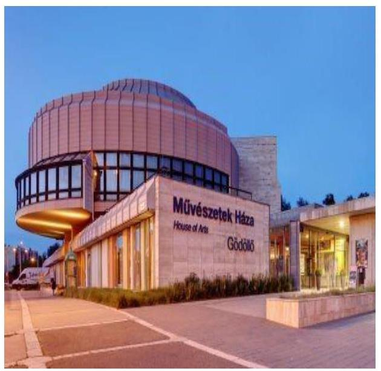

Gödöllő Város Önkormányzata az általa 2001. évben alapított Petőfi Sándor Művelődési Központ Közhasznú Társaság jogutódjaként 2009. évben hozta létre a MÚVÉSZETEK HÁZA GÖDÖLLŐ Nonprofit Közhasznú Kft.-t.

Az ellenőrzött időszakban a Társaság ${ }^{1}$ az Önkormányzat² 100 százalékos tulajdonában állt. Az Mötv. ${ }^{3}$ alapján meghatározott közfeladatok közül az Önkormányzat a Társaság tevékenységén keresztül biztosította a helyi kulturális, közművelődési és előadó-művészeti szervezetek támogatását. A Társaság a megalakulását követően az Emtv. ${ }^{4}$ alapján előadó-művészeti szervezetként és befogadó színházként múködött.

A feladatok ellátásához az Önkormányzat a Társaság részére ingatlant adott használatba, vagyonkezelésbe eszközt nem adott át. A Társaság jegyzett tőkéje 11 M Ft volt, amely az ellenőrzött időszakban nem változott. Az Ügyvezető5 személye nem változott a 2013-2016. években. A foglalkoztatottak átlagos statisztikai állományi létszáma a 2013. évben 23 fő, a 2016. évben 26 fő volt. A tulajdonosi joggyakorló Önkormányzat polgármestere és a Jegyzó6 személyében az ellenőrzött időszakban változás nem történt. A Társaság nem rendelkezett más társaságban tulajdonosi részesedéssel. A Társaság 2015. december 30-ától az NGM közlemény ${ }^{7}$ alapján kormányzati szektorba sorolt egyéb szervezetnek minősült. Az Önkormányzat Gödöllő kulturális életének fejlesztésére vonatkozó középtávú céljait a Gazdasági Programjában ${ }^{8}$ határozta meg. A Társaság az SZMSZ ${ }^{9}$-ben meghatározta a feladatait, múködésével kapcsolatos főbb szabályokat, a szervezeti egységek feladatait, hatásköröket. A Társaság bevételeinek alakulását az 1. ábra szemlélteti.

1. ábra
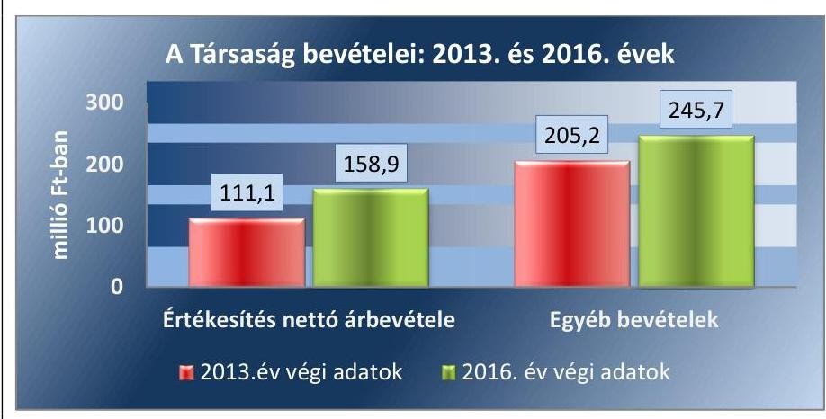

Forrás: A Társaság 2013-2016. évl beszámolói

---

# AZ ELLENŐRZÉS HÁTTERE, INDOKOLTSÁGA 

Az önkormányzatok többségi tulajdonában álló gazdasági társaságok ellenőrzése kiemelten fontos a vagyon megőrzése, megóvása érdekében, valamint a kormányzati szektor elszámolásaiban megjelenő önkormányzati tulajdonú gazdálkodó szervezetek esetében, amelyekkel szemben alapvető követelmény, hogy gazdálkodásuk, működésük szabályszerű, az általuk szolgáltatott adatok minél megbízhatóbbak legyenek. A feladatellátás költségeinek, ráfordításainak alakulása a lakosság széles rétegét érinti.

Ellenőrzéseink feltárhatják, hogy az önkormányzat a feladatellátásához rendelt vagyon működtetését a tulajdonostól elvárható gondossággal vé-gezte-e, a feladatot ellátó gazdasági társaság a létesítő okiratban, szolgáltatási szerződésben foglaltak betartásával biztosította-e a feladat ellátását. Az ellenőrzés eredményeképp meghatározhatóvá válnak a költségvetési hiányt befolyásoló szervezetek kockázatai, lehetővé válik ezen kockázatok csökkentése. Az ellenőrzés rávilágíthat arra, hogy a gazdasági társaság a vagyon használatával biztosította-e a szolgáltatás folytatásának feltételeit, az önkormányzat tulajdonosi felügyelete hozzájárult-e a szabályszerű gazdálkodáshoz és feladatellátáshoz. A megállapítások alapján megfogalmazott számvevőszéki javaslatok hasznosítása elősegítheti a meglévő hibák megszüntetését. A jó gyakorlatok bemutatásával az ÁSZ ${ }^{10}$ hozzájárulhat a követendő megoldások megismertetéséhez, terjesztéséhez.

---

# A JELENTÉS LÉNYEGES KÉRDÉSKÖREI 

1. Az önkormányzat tulajdonosi joggyakorlása szabályszerű volt-e?
2. A gazdasági társaság szabályozottsága, gazdálkodása és vagyongazdálkodási tevékenysége szabályszerű volt-e?

---

# AZ ELLENŐRZÉS HATÓKÖRE ÉS MÓDSZEREI 

## Az ellenőrzés típusa

Megfelelőségi ellenőrzés.

## Az ellenőrzött időszak

Az ellenőrzött időszak 2013. január 1-jétől 2016. december 31-éig tart.

## Az ellenőrzés tárgya

Az önkormányzatok - többségi tulajdonában lévő gazdasági társaságok feletti - tulajdonosi joggyakorlása, valamint a gazdasági társaságok gazdálkodásának szabályozottsága és szabályszerűsége, továbbá az önkormányzati alszektorba sorolt gazdasági társaság gazdálkodásának a kormányzati szektor hiányára és az államadósságra befolyással bíró elemei.

Az ellenőrzés kiterjedt minden olyan körülményre és adatra, amely az ÁSZ jogszabályban meghatározott feladatainak teljesítéséhez, valamint a program végrehajtása folyamán felmerült újabb összefüggések feltárásához szükséges.

## Az ellenőrzött szervezet

MŰVÉSZETEK HÁZA GÖDÖLLŐ Nonprofit Közhasznú Kft.
$\longrightarrow$ Gödöllő Város Önkormányzata

## Az ellenőrzés jogalapja

Az ellenőrzés jogalapját az ÁSZ tv. 1. § (3) bekezdése és 5. § (3)-(5) bekezdései képezték.

## Az ellenőrzés módszerei

Az ellenőrzést a nemzetközi standardokat irányadónak tekintve az ellenőrzési program ellenőrzési kérdései, az ellenőrzött időszakban hatályos jogszabályok, az ellenőrzés szakmai szabályok és módszertanok figyelembe vételével végeztük.

Az ellenőrzés ideje alatt az ellenőrzött szervezettel történő kapcsolattartást az ÁSZ Szervezeti és Müködési Szabályzatának vonatkozó előírásai alapján biztosítottuk.

---

Az ellenőrzés a kiválasztott, többségi tulajdonosi jogokat gyakorló önkormányzatra, illetve az ellenőrzésre kijelölt gazdasági társaság felett tulajdonosi jogokat gyakorló szervezetre és az ellenőrzött gazdasági társaságra terjedt ki.

A gazdasági társaságnál mintavétellel ellenőriztük a ráfordításokat és a bevételeket, ezen belül az anyagjellegú ráfordításokat, az egyéb ráfordításokat, a pénzügyi műveletek ráfordításait és a rendkívüli ráfordításokat, illetve az értékesítés nettó árbevételét, az egyéb bevételeket, a pénzügyi műveletek bevételeit valamint a rendkívüli bevételeket. Mintavétel történt továbbá a tárgyi eszközök növekedési tételeiből és a kormányzati szektorba sorolt egyéb szervezetek esetében az adósságot keletkeztető ügyletekből. A minták kiválasztása rétegzett mintavétel alkalmazásával történt.

Az ellenőrzési kérdések megválaszolásához szükséges bizonyítékok megszerzése a következő ellenőrzési eljárások alkalmazásával történt: megfigyelés, kérdésfeltevés (információkérés), összehasonlítás, valamint elemző eljárás. Az ellenőrzési bizonyítékként felhasználható adatforrások közé tartoztak egyrészt az ellenőrzési programban felsorolt adatforrások, másrészt adatforrás lehet még minden - az ellenőrzés folyamán - feltárt, az ellenőrzés szempontjából információkat tartalmazó dokumentum.

Az ellenőrzést a kérdésekre adott válaszok kiértékelésével, valamint a megjelölt adatforrások, a csatolt tanúsítványok felhasználásával, továbbá az adott időszakban hatályos jogszabályok figyelembe vételével folytattuk le.

A bevételek és ráfordítások elszámolása, valamint a vagyonnyilvántartás terén a szabályszerű működést véletlen mintavétellel ellenőriztük. A mintavétellel ellenőrzött területek esetében minden egyes tétel vonatkozásában a szabályszerűségre vonatkozó kérdéseket tettünk fel, amelyek eredménye összesítésre került. Megfelelőnek értékeltünk egy ellenőrzött területet, amennyiben 95\%-os bizonyossággal a teljes sokaságban az átlagos hibaarány legfeljebb 10\%, nem megfelelőnek, amennyiben 10\%-nál magasabb arányt képviselt. A ráfordítások elszámolására és a vagyonnyilvántartásra vonatkozó véletlen mintavételt kockázati alapú kiválasztással egészítettük ki, amelynek során évente a három legnagyobb összegű tételt választottuk ki.

---

# 1. Az önkormányzat tulajdonosi joggyakorlása szabályszerű volt-e? 

Összegző megállapítás Az Önkormányzat tulajdonosi joggyakorlása szabályszerű volt.

A TULAJDONOSI JOGOK GYAKORLÁSÁT az Önkormányzat a Társaságra vonatkozóan a vagyonrendeletében ${ }^{11}$ és a Társaság Alapító Okiratában ${ }^{12}$ rögzítette. A Gt. ${ }^{13}$, a Ptk. ${ }^{14}$ és a Taktv. ${ }^{15}$ előírásaival összhangban az Önkormányzat a Társaság Alapító Okiratában elrendelte a három tagból álló Felügyelő Bizottság létrehozását és kijelölte a Felügyelő Bizottság tagjait.

A Felügyelő Bizottság a Gt. 34. § (4) bekezdésében és a Ptk. 3:122. § (3) bekezdésében előírtak ellenére nem rendelkezett ügyrenddel.

Rendeletalkotási kötelezettségének az Önkormányzat a Közműv. tv. ${ }^{16}$ alapján a Közművelődési rendeletben ${ }^{17}$ foglalt közművelődési feladatok ellátását érintően eleget tett.

Az Önkormányzat a Társaság feladatellátásához kapcsolódó követelményeket a Közművelődési megállapodásban ${ }^{18}$, a Fenntartói megállapodásban ${ }^{19}$ és a Közszolgáltatási keretszerződésben ${ }^{20}$ határozta meg. A Társaság feladatellátásához szükséges vagyont az Önkormányzat Bérleti szerződés ${ }^{21}$ keretében biztosította bérleti díj ellenében.

Könyvvizsgálatra a Társaság a Számv. tv. ${ }^{22}$ alapján nem volt kötelezett, ugyanakkor az Önkormányzat a Társaság Alapító Okiratában könyvvizsgálót jelölt ki.

A Képviselő-testület ${ }^{23}$ a Taktv.-ben előírtaknak megfelelően megalkotta a Társaság Javadalmazási szabályzatát ${ }^{24}$.

A Képviselő-testület a Gt., Ptk. és az Alapító Okirat előírásainak megfelelően az éves beszámolókról Könyvvizsgáló és a Felügyelő Bizottság írásbeli jelentései birtokában hozta meg elfogadó döntését.

Az Önkormányzat belső ellenőrzése 2014. és a 2015. évben ellenőrizte a Társaság múködését, szabályozottságát. A belső ellenőrzés javaslatai alapján a Társaság elkészítette intézkedési terveit.

---

# 2. A gazdasági társaság szabályozottsága, gazdálkodása és vagyongazdálkodási tevékenysége szabályszerű volt-e? 

Összegző megállapítás

2.1. számú megállapítás

A Társaság szabályozottsága és vagyongazdálkodási tevékenysége nem volt szabályszerű. Beszámolási kötelezettségét nem szabályszerűen teljesítette. A közérdekú adatainak közzétételét nem teljesítette. A 2016. évben a kormányzati szektorba sorolt egyéb szervezetekre vonatkozó kötelezettségét a Társaság nem teljesítette.

A Társaság a jogszabályban előírt számviteli szabályzatokkal rendelkezett, azonban a 2013-2015. évekre vonatkozóan leltározási és pénzkezelési szabályzata nem volt. A tevékenység bevételeit és ráfordításait a személyi jellegú ráfordítások kivételével szabályszerűen számolta el.

A 2013-2015. években Számviteli politikával ${ }^{25}$, azon belül az eszközök és források Értékelési szabályzatával ${ }^{26}$ Számv. tv.-ben előírtaknak megfelelően rendelkezett a Társaság, azonban a Számv. tv. 14. § (5) bekezdés a), d) pontjaiban foglaltak ellenére nem rendelkezett az eszközök és források leltárkészítési és leltározási, továbbá pénzkezelési szabályzattal. A 2016. évben a Számv. tv.-nek megfelelően Számviteli Politikával, eszközök és források Értékelési szabályzatával, Leltárkészítési és leltározási szabályzattal ${ }^{27}$ és Pénzkezelési szabályzattal ${ }^{28}$ rendelkezett a Társaság.

A Számv. tv.-ben előírtak alapján Számlarenddel ${ }^{29}$ rendelkezett a Társaság, amely a Civil tv. ${ }^{30}$ előírásával összhangban tartalmazta a közhasznú és a vállalkozási tevékenységek számviteli szétválasztásának szabályozását.

A tevékenységének a bevételeit és - a személyi jellegú ráfordításokat kivéve - a ráfordításait szabályszerűen számolta el a Társaság. A Társaság a közhasznú és vállalkozási tevékenységéből származó bevételeit és ráfordításait az elszámolásai során munkaszámok alapján bontotta meg és tartotta nyilván.

A Számv. tv. 165. § (1) bekezdéseiben foglalt előírások ellenére a Társaság a személyi ráfordítások tekintetében nem minden esetben rendelkezett az elszámolást megalapozó bizonylattal. A személyi jellegú ráfordítások tekintetében a Számv. tv. 167. § (1) bekezdés h) pontjában előírtakkal ellentétben a bizonylatokon a Társaság nem szerepeltette a könyvelés módjára történő hivatkozást, továbbá az SZJA tv. ${ }^{31} 71 . \S$ (3) bekezdés előírása ellenére nem rendelkezett cafeteria nyilatkozattal.
2.2. számú megállapítás

A Társaság vagyongazdálkodása nem volt szabályszerű, az év végi mérleg adatai nem voltak leltárral alátámasztottak. Fizetőképessége biztosított volt.

A Társaság az eszközöket a Számv. tv.-ben előírtaknak megfelelően nyilvántartotta.

A Társaság a beszámoló mérleg soraiban szereplő adatokat a Számv. tv. 69. § (1) bekezdésében előírt év végi leltárral nem támasztotta alá, ezért a beszámolóban szereplő eszközök és források értékének valódisága nem

---

volt alátámasztott. A könyvvizsgáló a leltár hiányának ellenére az éves beszámolókat korlátozás nélküli hitelesítő záradékkal látta el.

A Társaság mérleg szerinti eredménye, adózott eredménye minden ellenőrzött évben pozitív volt. A Társaságnak hosszú lejáratú kötelezettsége nem volt. A fizetőképességét a vevői állománya és a pénzeszközök biztosították.

A Társaságnak nem volt a Gst. ${ }^{32}$ hatálya alá tartozó adósságot keletkeztető ügylete, ezáltal nem volt hatással az államadósság alakulására.
2.3. számú megállapítás

A Társaság a számviteli beszámolási kötelezettségeit nem szabályszerűen teljesítette. A közérdekú adatainak a közzétételét hiányosan teljesítette. A 2016. évre vonatkozóan a kormányzati szektorba sorolt egyéb szervezetekre vonatkozó adatszolgáltatási kötelezettségét a Társaság nem teljesítette. Tevékenységének jogszabályban előírt nyomon követési rendszerével a 2016. évre vonatkozóan nem rendelkezett.

A SZÁMVITELI BESZÁMOLÓ készítési kötelezettségét nem szabályszerűen teljesítette a Társaság. A Képviselő-testület által elfogadott egyszerűsített éves beszámolókat és közhasznúsági mellékleteket a Számv. tv. és a Civil tv. előírásainak megfelelően, a 2016. évi közhasznúsági mellékletet kivéve a Társaság közzétette.

A 2016. évi közhasznúsági melléklet a Civil tv. 46. § (1) bekezdésében foglaltak ellenére nem került közzétételre.

A Számv. tv. 153. § (1) bekezdésében foglaltakkal ellentétben az Önkormányzat Képviselő-testülete által jóváhagyott 2013. évi éves beszámoló értékesítés nettó árbevétele 16,0 M Ft-tal alacsonyabb, ugyanakkor az egyéb bevételek 16,0 M Ft-tal magasabb összegben szerepeltek, mint a letétbe helyezett, illetve közzétett beszámolóban. A 2014. évi Képviselő-testület által jóváhagyott éves beszámoló egyéb ráfordítása 1,5 M Ft-tal alacsonyabb, ugyanakkor a rendkívüli ráfordítások 1,5 M Ft-tal magasabb öszszegben szerepeltek, mint a letétbe helyezett, illetve közzétett beszámolóban. Az eltérések a beszámoló részletező sorait érintették, a mérleg adatokat és az eredmény összegét nem befolyásolták. A közzétett adatok megegyeztek a záró főkönyvi adatokkal.

Az egyszerűsített éves beszámolókat a 2013-2016. években korlátozás nélküli hitelesítő záradékkal látta el a könyvvizsgáló.

A Társaság a múködéséről az előírt tájékoztatásokat teljesítette az Önkormányzat felé. Az elkészített üzleti tervek a Képviselő-testület által elfogadásra kerültek.

A Társaság rendelkezett az Info tv. ${ }^{33}$ alapján előírt közérdekű adatok megismerésére irányuló igények teljesítésének rendjét rögzítő Javadalmazási Szabályzattal, azonban a szabályzat 5.1. pontjában és a Taktv. 2. § (1) bekezdésében előírtakkal ellentétben a vezetői tisztségviselők juttatásait a Társaság nem tette közzé.

A Társaság az Info. tv. 37. § (1) bekezdésében előírtak ellenére nem teljesítette a kötelező elektronikus közzététel alá eső, az Info. tv. 1. melléklet I-III. pontjaiban foglaltakat.

A Társaság az Ltv. ${ }^{34}$ 10. § (1) bekezdés a) pontjában foglalt előírás ellenére nem rendelkezett egyedi iratkezelési szabályzattal.

---

A Bkr. ${ }^{35}$ 54/A. §-ában, továbbá a 10. §-ában foglaltak ellenére a 2016. évben a Társaság nem alakította ki a tevékenységének és a célok megvalósításának nyomon követését biztosító rendszerét.

A kormányzati szektorba sorolt egyéb szervezetek számára előírt adatszolgáltatási kötelezettségét a Társaság az Áht. ${ }^{36}$ 107. § (1) bekezdésének előírása ellenére a 2016. évre vonatkozóan nem teljesítette.

---

# JAVASLATOK 

Az ÁSZ tv. 33. § (1) bekezdésében foglaltak értelmében az ellenőrzött szervezet vezetője köteles a jelentésben foglalt megállapításokhoz kapcsolódó intézkedési tervet összeállítani és azt a jelentés kézhezvételétől számított 30 napon belül az ÁSZ részére megküldeni. Amennyiben az ellenőrzött szervezet vezetője nem küldi meg határidőben az intézkedési tervet, vagy továbbra sem elfogadható intézkedési tervet küld, az Állami Számvevőszék elnöke az ÁSZ tv. 33. § (3) bekezdése a) és b) pontjaiban foglaltakat érvényesítheti.

## MÚVÉSZETEK HÁZA GÖDÖLLŐ Nonprofit Közhasznú Kft Ügyvezetőjének

1. Intézkedjen a személyi jellegű ráfordítások bizonylattal történő alátámasztásáról a jogszabályban elöirtaknak megfelelően.
(2.1. számú megállapítás 4. bekezdés 1. mondata és a 2. mondat 2. tagmondata alapján)
2. Intézkedjen, hogy a személyi jellegü ráfordítások bizonylatain a jogszabályban elöirtaknak megfelelően tüntessék fel a könyvelés módjára történő hivatkozást.
(2.1. számú megállapítás 4. bekezdés 2. mondat 1. tagmondata alapján)
3. Gondoskodjon a jogszabályban elöirtaknak megfelelően az éves beszámoló sorainak leltárral történő alátámasztásáról, a leltározás elvégzéséről.
(2.2. számú megállapítás 2. bekezdése alapján)
4. Gondoskodjon a jogszabályban elöirtak szerint a Társaság közhasznúsági mellékletének közzétételéről.
(2.3. számú megállapítás 2. bekezdése alapján)
5. Gondoskodjon a közzétételi kötelezettségek jogszabályi elöírásoknak és belső szabályzatainak megfelelő teljesítéséről.
(2.3. számú megállapítás 6. bekezdés 2. tagmondata és a 7. bekezdés alapján)

---

6. Gondoskodjon a jogszabályban előirtak szerint a Társaság egyedi iratkezelési szabályzatának kiadásáról.
(2.3. számú megállapítás 8. bekezdése alapján)
7. Gondoskodjon a jogszabályban elöirt, a szervezet tevékenységének, a célok megvalósitásának nyomon követését biztositó rendszer kialakításáról, müködtetéséről.
(2.3. számú megállapítás 9. bekezdése alapján)
8. Gondoskodjon arról, hogy a Társaság a kormányzati szektorba sorolt egyéb szervezetek számára elöirt adatszolgáltatási kötelezettségét a jogszabályok elöírásainak megfelelően teljesítse.
(2.3. számú megállapítás 10. bekezdése alapján)

# Gödöllő Város Önkormányzata Polgármesterének 

1. Kezdeményezze az Önkormányzatnál, mint alapítónál a Társaság felügyelő bizottsága ügyrendjének jóváhagyását.
(1. számú megállapítás 2. bekezdése alapján)

---

.

---

# MELLÉKLETEK 

- I. SZ. MELLÉKLET: ÉRTELMEZŐ SZÓTÁR
gazdasági társaság
gazdálkodó szervezet
kormányzati szektorba sorolt egyéb szervezet
nemzeti vagyon
nonprofit gazdasági társaság
a Ptk. 3.88. § (1) bekezdése szerint „a gazdasági társaságok üzletszerű közös gazdasági tevékenység folytatására, a tagok vagyoni hozzájárulásával létrehozott, jogi személyiséggel rendelkező vállalkozások, amelyekben a tagok a nyereségből közösen részesednek, és a veszteséget közösen viselik".
a Ptk. 685. § c) pontja szerint gazdálkodó szervezet: „az állami vállalat, az egyéb állami gazdálkodó szerv, a szövetkezet, a lakásszövetkezet, az európai szövetkezet, a gazdasági társaság, az európai részvénytársaság, az egyesülés, az európai gazdasági egyesülés, az európai területi együttmüködési csoportosulás, az egyes jogi személyek vállalata, a leányvállalat, a vízgazdálkodási társulat, az erdő birtokossági társulat, a végrehajtói iroda, az egyéni cég, továbbá az egyéni vállalkozó." (2014. március 15 -éig hatályos)
az Áht. 3. § (2) és (3) bekezdésében foglaltakon kívül az Európai Közösséget létrehozó szerződéshez csatolt, a túlzott hiány esetén követendő eljárásról szóló jegyzőkönyv alkalmazásáról szóló 2009. május 25-i 479/2009/EK rendelet (a továbbiakban: 479/2009/EK rendelet) szerint a kormányzati szektorba sorolt szervezet (Áht. 1. § (12))
az Nvtv. 1. § (2) bekezdése szerint többek között:
„az állam vagy a helyi önkormányzat kizárólagos tulajdonában álló dolgok, az a) pont hatálya alá nem tartozó, állam vagy a helyi önkormányzat tulajdonában lévő dolog,
az állam vagy a helyi önkormányzat tulajdonában lévő pénzügyi eszközök, továbbá az államot vagy a helyi önkormányzatot megillető társasági részesedések, az államot vagy a helyi önkormányzatot megillető bármely vagyoni értékkel rendelkező jogosultság, amelyet jogszabály vagyoni értékű jogként nevesít."
a Civil tv. 9/F. § (2) bekezdése szerint „az a gazdasági társaság minősül nonprofit gazdasági társaságnak és cégnevében az a gazdasági társaság tüntetheti fel a nonprofit jelleget, amelynek létesítő okirata tartalmazza, hogy a gazdasági társaság tevékenységéből származó nyereség a tagok között nem osztható fel, hanem az a gazdasági társaság vagyonát gyarapítja." (hatályos 2014. március 15 -étől)

---

.

---

# FÜGGELÉK: ÉSZREVÉTELEK 

A jelentéstervezetet a Számvevőszék 15 napos észrevételezésre megküldte az ellenőrzött szervezetek vezetőinek az ÁSZ tv. 29. §* (1) bekezdése előírásának megfelelően.

Az ÁSZ a jelentéstervezetet észrevételezésre megküldte Gödöllő Város Önkormányzata polgármesterének és a MÜVÉSZETEK HÁZA GÖDÖLLŐ Nonprofit Közhasznú Kft. ügyvezetőjének.
Gödöllő Város Önkormányzata polgármestere a jelentéstervezetre észrevételt nem tett. A függelék - mellékletek nélkül- tartalmazza a MÜVÉSZETEK HÁZA GÖDÖLLŐ Nonprofit Közhasznú Kft. ügyvezetőjének észrevételét, illetve az el nem fogadott észrevételek elutasításának indoklását.

[^0]
[^0]:    * 29. § (1) Az Állami Számvevőszék az ellenőrzési megállapításait megküldi az ellenőrzött szervezet vezetőjének vagy az általa megbízott személynek, és annak, akinek személyes felelősségét állapította meg.
    (2) Az ellenőrzött szervezet vezetője és a felelősként megjelölt személy az ellenőrzés megállapításaira tizenöt napon belül írásban észrevételt tehet.
    (3) Az Állami Számvevőszék az észrevételre a beérkezésétől számított harminc napon belül írásban válaszol. A figyelembe nem vett észrevételeket köteles a jelentésben feltüntetni, és megindokolni, hogy azokat miért nem fogadta el.

---

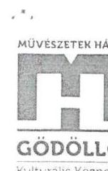

# Domokos László úr 

elnök

Állami Számvevőszék
Budapest

Tisztelt Elnök Úr!
Az önkormányzatok gazdasági Társaságai - Az önkormányzatok többségi tulajdonában lévő gazdasági Társaságok gazdálkodásának ellenőrzése - Művészetek Háza Gödöllő Nonprofit Közhasznú Kft. címmel készült számvevőszéki jelentéstervezetüket megkaptam, mellyel kapcsolatban az alábbi észrevételeket teszem.

## Összegző megállapítás

„A Társaság szabályozottsága és vagyongazdálkodási tevékenysége nem volt szabályszerű"

- A megállapítás nem helytálló, kifogásainkat a 2.1. és a 2.2 -es számú megállapításoknál rögzítettük.
„Beszámolási kötelezettségét nem szabályszerűen teljesítette."
- A megállapítás nem helytálló, kifogásainkat a 2.3.-as számú megállapításnál rögzítettük.
„A közérdekü adatainak közzétételét nem teljesítette."
- A megállapítással nem értünk egyet, egyrészt nincs összhangban a 2.3. számú megállapítással („nem teljesítette", „hiányosan teljesítette") és további kifogásainkat pedig a 2.3.-as számú megállapításnál rögzítettük.
„A 2016. évben a kormányzati szektorba sorolt egyéb szervezetekre vonatkozó kötelezettségét a Társaság nem teljesítette."
- A 370/2011. (XII/31) korm. rendeletben rögzített feladatok ellátásához Társaságunk belső ellenőrt alkalmaz 2018. március 5-től, míg a 2017-es üzleti évtől a 368/2011 (XII/31) korm. rendelet V. sz. melléklet 23-as pontjában rögzítettek szerint a beszámolóját az Igazságügyi Minisztérium elektronikus beszámoló portálján felül, külön az államháztartásért felelős miniszter részére is megküldi.

---

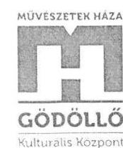

# 2.1 számú megállapítás 

„A Társaság a jogszabályban elöirt számviteli szabályzatokkal rendelkezett, azonban a 20132015 évekre vonatkozóan leltározási és pénzkezelési szabályzata nem volt. A tevékenység bevételeit és ráfordításait a személyi jellegü ráfordítások kivételével szabályszerűen számolta el."

A fenti megállapítás az első mondat második tagmondatától nem helytálló, az alábbiak miatt:

- A Művészetek Háza Gödöllő Np. Kh. Kft. az említett 2013-2015-ös időszakban rendelkezett az ÁSZ által hiányolt pénzkezelési és leltárkészitési, leltározási szabályzattal. Ezek az ellenőrzés során feltöltésre kerültek, mai napig az ÁSZ felületén megtalálhatóak a következő elérési útvonalon:
https://adatokbekerese.asz.hu/onkormanyzatigt-V0793-elotte/dokumentummappak => 2. Sarkalatos dokumentumok jegyzéke mappa => 2./2. gazdasági Társaság számviteli politikája almappa => MUZA_Pénzkezelési szabályzat 2013; https://adatokbekerese.asz.hu/onkormanyzatigt-V0793-elotte/dokumentummappak => 2. Sarkalatos dokumentumok jegyzéke mappa => 2./2. gazdasági Társaság számviteli politikája almappa => MUZA_Leltározási szabályzat 2013;
- Társaság a személyi jellegü ráfordításokat is szabályszerűen számolta el. Az állandó munkaszerzödéses állományban lévő munkavállalók bérfizetései minden esetben jelenléti ivekkel alátámasztottak voltak az ellenőrzési időszakban. A megbizási jogviszony keretében elszámolt juttatások pedig teljesités igazolásokkal volt dokumentálva.
- A Társaság a könyvelés módjára, az érintett könyvviteli számlákra történő hivatkozást a Sztv. 167§ (7) bekezdése szerint teljesítette. A Társaság „MOZAIK" könyvelő rendszere integrált módon köti össze a készült fókönyvet az egyes modulokkal (analitikus nyilvántartásokkal), úgymint a bér, eszköz, számlázó, tevékenység-elemző modult. A személyi jellegü ráfordítások könyvelésének hivatkozása ezen modul (elektronikusan) alapján kerül összhangba a fókönyvi értékekkel.
- Az SZJA tv. 71 § (3) bekezdés elöírásait teljesítettük, az Állami Számvevőszék által hiányolt cafeteria nyilatkozatok az ellenőrzés során feltöltésre kerültek:
- Iskolakezdési támogatás címú személyi jellegű juttatások esetében készült dokumentumok:
- Iskolalátogatási igazolás

---

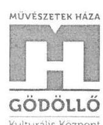

MÜVÉSZETEK HÁZA GÖDÖLLŐ NongentK Rózthaszna Kft.
7100 Gödöllő, Szabolkag 116
Telefon: +36 (08) 514 130 + Mobil: +36 (08) 376 6544 + Fax: +36 (08) 514 380
+ Módószázha a városhozás ha

- szülő általi aláírás a juttatás átvételéről az adott gyermekére vonatkozóan.

# 2.2 számú megállapítás 

„A Társaság vagyongazdálkodása nem volt szabályszerű, az év végi mérlegadatai nem voltak leltárral alátámasztottak. Fizetőképessége biztosított volt.„,

A fenti megállapítás első mondatával az alábbiak miatt nem értünk egyet:

- A Művészetek Háza Gödöllő Np. Kh. Kft. vagyongazdálkodása szintén szabályszerű, hivatkozva a nagy mennyiségű adatállomány feltöltésére általunk lemaradt a beszámoló mérleg sorait alátámasztó leltárak feltöltése. Ezeket az érintett ellenőrzési időszakra (2013-2016) vonatkozóan levelem mellékleteként csatolok. Az éves beszámoló dokumentumai között papiros formában minden üzleti évre vonatkozóan megtalálhatóak a mérleg sorokat alátámasztó leltárak.

### 2.3 számú megállapítás

„A Társaság a számviteli beszámolási kötelezettségeit nem szabályszerűen teljesítette. A közérdekű adatainak a közzétételét hiányosan teljesítette. A 2016. évre vonatkozóan a kormányzati szektorba sorolt egyéb szervezetekre vonatkozó adatszolgáltatási kötelezettségét a Társaság nem teljesítette. Tevékenységének jogszabályban előírt nyomon követési rendszerével a 2016. évre vonatkozóan nem rendelkezett."

A fenti megállapítás első és második mondatával az alábbiak miatt nem értünk egyet:

- Az ÁSZ jelentéstervezetében ezen megállapítás nem helytálló, a Társaság beszámolási kötelezettségét szabályszerűen teljesítette, azok cégbírósági közzétételénél azonban adminisztrációs hiba történt. A Társaság minden üzleti évre vonatkozó éves beszámolóit törvényi előírásoknak megfelelően elkészítette. Az előterjesztett éves beszámolókat és annak részleteit számviteli tv. szerinti egyszerűsített éves beszámoló (mérleg, eredménykimutatás, kiegészítő melléklet), közhasznúsági jelentés, független könyvvizsgálói jelentés, Felügyelő Bizottsági határozat - a Képviselő-testület minden évben megtárgyalta és elfogadta. Az elfogadott beszámolók minden évben a tulajdonos honlapján feltöltésre kerülnek, melyek a mai napig nyilvánosan elérhetőek. Elérési útvonal:
http://www.godollo.hu/polgarok/ulesek/meghivok/index.php?doc4_op=do w nload\&doc4_id=252\&doc4_fid=2075
A beszámolókat a céginformációs szolgálatnak elektronikusan a könyvelő iroda küldi be, melyek feltöltésénél valóban hiányosság merült fel.

---

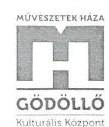

MÜVÉSZETEK HÁZA GÖDÖLLŐ Nonprofit Közhasznú Kft.
2100 Gödöllő, Szabályszótő
Telefon: +36 (28) 514130 - Mobil: +36 (70) 3766544 - Fax: +36 (28) 514100

A képviselő-testület elfogadásáról szóló önkormányzati határozatok, melyek tartalmazzák valamennyi beszámoló rész jóváhagyását - beleértve a közhasznúsági jelentés elfogadását is - a Társaság által minden évben a céginformációs szolgálatnak megküldésre kerültek.

- A Társaság a vezető tisztségviselők juttatását hiányosan tette közzé, azzal, hogy nem név szerint, hanem egy összegben szerepeltette a Társaság kiegészítő mellékleteiben.

Kérem a fenti észrevételek figyelembe vételét a végleges jelentés elkészítésekor.
Gödöllő, 2018. április 10.
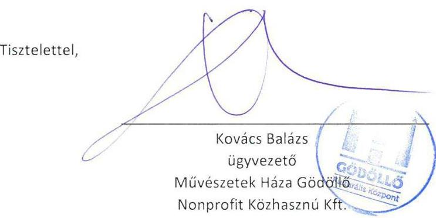

---

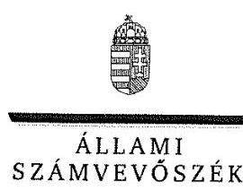

ELNÖK

Ikt.szám: EL-0534-011/2018.

# Kovács Balázs úr 

ügyvezető

Művészetek Háza Gödöllő Nonprofit Közhasznú Kft.

## Gödölló

## Tisztelt Ügyvezető Úr!

..Az önkormányzatok gazdasági társaságai - Az önkormányzatok többségi tulajdonában lévő gazdasági társaságok gazdálkodásának ellenőrzése - Müvészetek Háza Gödöllő Nonprofit Közhasznú Kft." címmel készített számvevőszéki jelentéstervezetre tett észrevételeit köszönettel megkaptam.
Az Állami Számvevőszék észrevételekre vonatkozó álláspontjáról a felügyeleti vezető által készített részletes tájékoztatást csatoltan megküldöm.
Tájékoztatom Ügyvezető urat, hogy a számvevőszéki jelentésben - az Állami Számvevőszékről szóló 2011. évi LXVI. törvény 29. § (3) bekezdése alapján - a figyelembe nem vett észrevételeket szerepeltetjük annak megindoklásával, hogy azokat miért nem fogadtuk el.

Budapest, 2018. $\quad \ddot{r} \quad$ hó $/ 7$ nap
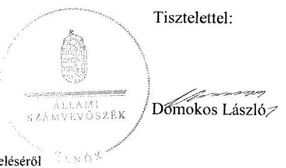

Melléklet: Tájékoztatás az észrevételek kezeléséről

---

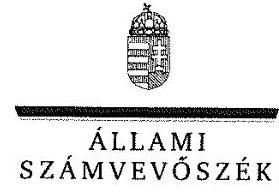

FELÜGYELETI VEZETŐ

Melléklet
Ikt.szám: EL-0534-011/2018.

# Tájékoztatás   az észrevételek kezeléséről 

„Az önkormányzatok gazdasági társaságai - Az önkormányzatok többségi tulajdonában lévő gazdasági társaságok gazdálkodásának ellenörzése - Müvészetek Háza Gödöllő Nonprofit Közhasznú Kft. " című jelentéstervezetre 2018. április 10-én tett (az Állami Számvevőszékhez 2018. április 12-én érkezett) észrevételét áttekintettük, annak kezelésével kapcsolatban a következő tájékoztatást adom.

## 1. A jelentéstervezet 2.1. számú megállapítás 1. bekezdés 1. mondat 2. tagmondatára vonatkozó észrevétel:

Az észrevételben leírtak szerint a Társaság rendelkezett a 2013-2015. években pénzkezelési, valamint leltárkészítési és leltározási szabályzattal, amelyeket az ellenőrzés során feltöltöttek az ÁSZ felületére.

Az észrevételt nem fogadjuk el. A Társaság által az ellenőrzés részére átadott MZA_penzkezelesi_2013 nevü, valamint MUZA_leltar_szab_2013 nevü dokumentumok nem tartalmaztak dátumot, azok hatálya nem volt megállapítható, nem minősülnek hiteles dokumentumnak. Az észrevétel alapján a jelentéstervezet módosítása nem indokolt.

## 2. A jelentéstervezet 2.1. számú megállapítás 4. bekezdésére vonatkozó észrevétel:

Az észrevételben leírtak szerint a Társaság a személyi jellegủ ráfordításokat szabályszerűen számolta el, jelenléti ívekkel, teljesítésigazolásokkal dokumentálva. A könyvelés módjára történő hivatkozást a számvitelről szóló 2000. évi C. törvény (továbbiakban: Számv. tv.) 167. § (7) bekezdése szerint teljesítette, a könyvelési integrált főkönyvi modul elektronikusan köti össze a főkönyvet az analitikus nyilvántartásokkal (bér). A Társaság a cafeterla nyilatkozatokat az ellenőrzés során feltöltötte, iskolakezdési támogatás címủ juttatások esetében iskolalátogatási igazolást, valamint a szülői aláírást a juttatás átvételéről.

Az észrevételt nem fogadjuk el. A Társaság által az ellenőrzés részére átadott személyi jellegủ ráfordítások tételeinél több esetben hiányzott a megbízási szerződés, amely a teljesítésigazolás alapjául szolgálna, illetve az átadott szerződés nem volt összhangban a kiválasztott tétellel (időszak, megbízási díj tekintetében). A Társaság nem bocsátott az ellenőrzés rendelkezésére olyan kimutatást, nyilvántartást, amely a Számv. tv. hivatkozott jogszabályi előírásának megfelelően a könyvelés módjára, az érintett főkönyvi számlákra történő hivatkozást igazolta volna. A Társaság által az iskolakezdési támogatás kifizetését igazoló, átadott dokumentumok nem egyenértékűek a személyi jövedelemadóról szóló 1995. évi CXVII. törvény 71. § (3) bekezdésében előírt munkavállalói nyilatkozattal. Fentiek miatt az észrevétel alapján a jelentéstervezet módosítása nem indokolt.

---

# 3. A jelentéstervezet 2.2. számú megállapítás 1. mondatára vonatkozó észrevétel: 

Az észrevétel szerint a Társaság vagyongazdálkodása szabályszerű volt, a beszámoló sorait alátámasztó leltárakat a nagy mennyiségủ adatállomány miatt nem töltötték fel, azokat az észrevételhez csatolták valamennyi ellenőrzött évre vonatkozóan.

Az észrevételt nem fogadjuk el. A Társaság az észrevételhez csatolt leltárakat nem adta át teljes körűen az ellenőrzés részére, azokat az ügyvezető által aláirt teljességi és hitelességi nyilatkozat átadott dokumentumokat rögzítő melléklete sem tartalmazta. A Társaság az ÁSZ adatbekéréseihez megküldött 2017. szeptember 29-ei teljességi és hitelességi nyilatkozatában kijelentette, hogy az ÁSZ részére átadott dokumentumok, adatok a bekért adatokra, dokumentumokra vonatkozóan teljes körű információt tartalmaznak. Az észrevétel alapján a jelentéstervezet módosítása nem indokolt.

## 4. A jelentéstervezet 2.3. számú megállapítás 1. mondatára vonatkozó észrevétel:

Az észrevételben leírtak szerint a Társaság a beszámolási kötelezettségét szabályszerűen teljesítette, azok cégbírósági közzétételénél azonban adminisztrációs hiba történt. Az elfogadott beszámolók teljes körűen elérhetők a Társaság tulajdonosának honlapján.

Az észrevételt nem fogadjuk el. A jelentéstervezet megállapítása szerint a Társaság 2016. évi beszámolójának közhasznúsági mellékletét az egyesülési jogról, a közhasznú jogállásról valamint a civil szervezetek müködéséről és támogatásáról szóló 2011. évi CLXXV. törvény 46. § (1) bekezdése szerint a beszámolóval azonos módon kell jóváhagyni, letétbe helyezni és közzétenni. A beszámoló közzétételének a Számv. tv. 154. § (7) bekezdése szerint azzal tesz eleget a vállalkozó, ha az egyszerűsített éves beszámolót a cégnyilvánosságról, a bírósági cégeljárásról és a végelszámolásról szóló 2006. évi V. törvény 15. § (1) bekezdése szerint elektronikus úton, a kormányzati portál útján a céginformációs szolgálat részére megküldi. A Társaság honlapján, vagy a tulajdonos honlapján elérhető beszámoló nem felel meg a hivatkozott jogszabályi előírásoknak. Fentiek miatt az észrevételt nem fogadjuk el, a jelentéstervezet módosítása nem indokolt.

## 5. A jelentéstervezet 2.3. számú megállapítás 2. mondatára vonatkozó észrevétel:

Az észrevételben leírtak szerint a vezető tisztségviselők juttatását a Társaság nem név szerint, hanem egy összegben, a Társaság kiegészítő mellékleteiben szerepeltette.
Az észrevételben leírtak a megállapítást nem vitatják, a jelentéstervezet módosítása az észrevétel alapján nem indokolt.

Budapest, 2018. (iH. hó 20. nap
Dr. Nagy Imre felügyeleti vezető

---

# RÖVIDÍTÉSEK JEGYZÉKE 

${ }^{1}$ Társaság
${ }^{2}$ Önkormányzat
${ }^{3}$ Mótv.
${ }^{4}$ Emtv.
${ }^{5}$ Ügyvezető
${ }^{6}$ Jegyző
${ }^{7}$ NGM közlemény
${ }^{8}$ Gazdasági Program
${ }^{9}$ SZMSZ
${ }^{10}$ ÁSZ
${ }^{11}$ Vagyonrendelet
${ }^{12}$ Alapító Okirat
${ }^{13} \mathrm{Gt}$.
${ }^{14}$ Ptk.
${ }^{15}$ Taktv.
${ }^{16}$ Közműv. tv.
${ }^{17}$ Közművelődési rendelet
${ }^{18}$ Közművelődési megállapodás
${ }^{19}$ Fenntartói megállapodás
${ }^{20}$ Közszolgáltatási keretszerződés
${ }^{21}$ Bérleti szerződés
${ }^{22}$ Számv. tv.
${ }^{23}$ Képviselő-testület
${ }^{24}$ Javadalmazási szabályzat

MŰVÉSZETEK HÁZA GÖDÖLLŐ Nonprofit Közhasznú Kft.
Gödöllő Város Önkormányzata
Magyarország helyi önkormányzatairól szóló 2011. évi CLXXXIX. törvény
Az előadó-művészeti szervezetek támogatásáról és sajátos foglalkoztatási szabályairól szóló 2008. évi XCIX. törvény
MŰVÉSZETEK HÁZA GÖDÖLLŐ Nonprofit Közhasznú Kft. ügyvezetője
Gödöllő Város Önkormányzata jegyzője
A kormányzati szektorba sorolt egyéb szervezetekről szóló NGM közlemény (hatályos: 2015. december 30-ától)
Gödöllő Város Önkormányzatának gazdasági programja a 2011-2014. évekre, továbbá Ciklusprogram (gazdasági program) 2014-2019.
MŰVÉSZETEK HÁZA GÖDÖLLŐ Nonprofit Közhasznú Kft. Szervezeti és Működési Szabályzata (hatályos: 2012. április 5-étől)
Állami Számvevőszék
Gödöllő Város Önkormányzata Képviselő-testületének 8/2012. (III. 8.) számú önkormányzati rendelete Gödöllő Város nemzeti vagyonáról (egységes szerkezetben) (hatályos: 2012. március 8-ától)
MŰVÉSZETEK HÁZA GÖDÖLLŐ Nonprofit Közhasznú Kft. Alapító Okirata (hatályos: 2012. december 13-ától, 2013. február 14-étől, 2013. december 12-étől, 2014. május 15-étől, 2014. június 19-étől, 2016. szeptember 15-étől)
A gazdasági társaságokról szóló 2006. évi IV. törvény (hatályos 2014. március 14ig)
2013. évi V. törvény a Polgári Törvénykönyvről
A köztulajdonban álló gazdasági társaságok takarékosabb müködéséről szóló 2009. évi CXXII. törvény

A muzeális intézményekről, a nyilvános könyvtári ellátásról és a közművelődésről szóló 1997. évi CXL. törvény
Gödöllő Város Önkormányzat közművelődési feladatairól szóló 2000. évi 14. (V.1.) és 26/2015. (XI. 20.) sz. önkormányzati rendelete
Közművelődési megállapodás Gödöllő Város Önkormányzata és a Művészetek Háza Gödöllő Nonprofit Közhasznú Kft. között (2013., 2014., 2015. és 2016. évekre vonatkozóan)
Fenntartói megállapodás Gödöllő Város Önkormányzata és a Művészetek Háza Gödöllő Nonprofit Közhasznú Kft. között (hatályos: 2015. január 1-jétől)
Közszolgáltatási keretszerződés Gödöllő Város Önkormányzata, a Művészetek Háza Gödöllő Nonprofit Közhasznú Kft. és a Játékszín Nonprofit Közhasznú Korlátolt Felelősségű Társaság között (hatályos: 2015. február 6-ától)
Ingatlanok bérletéről szóló szerződés Gödöllő Város Önkormányzata és a Művészetek Háza Gödöllő Nonprofit Közhasznú Kft. között (hatályos: 2012. március 22-étől, módosítások: 2013. március 28., 2014. március 31., 2015. március 25., 2016. március 31.)
2000. évi C. törvény a számvitelről (hatályos: 2001. január 1-jétől)

Gödöllő Város Önkormányzata Képviselő-testülete
Javadalmazási és közzétételi szabályzat (hatályos: 2012. április 5-étől)

---

${ }^{25}$ Számviteli politika
${ }^{26}$ Értékelési szabályzat
${ }^{27}$ Leltárkészítési és leltározási szabályzat
${ }^{28}$ Pénzkezelési szabályzat
${ }^{29}$ Számlarend
${ }^{30}$ Civil tv.
${ }^{31}$ SZJA tv.
${ }^{32}$ Gst.
${ }^{33}$ Info tv.
${ }^{34}$ Ltv.
${ }^{35} \mathrm{Bkr}$.
${ }^{36}$ Áht.

Művészetek Háza Gödöllő Nonprofit Közhasznú Kft. Számviteli politika (hatályos: 2013. január 1-jétől, 2016. január 1-jétől)
Múvészetek Háza Gödöllő Nonprofit Közhasznú Kft. Értékelési szabályzat (hatályos: 2013. január 1-jétől a Számviteli politika részeként, 2016. január 1-jétől)
Múvészetek Háza Gödöllő Nonprofit Közhasznú Kft. Leltárkészítési és leltározási szabályzat (hatályos: 2016. január 1-jétől)
Múvészetek Háza Gödöllő Nonprofit Közhasznú Kft. Pénzkezelési szabályzat (hatályos: 2016. január 1-jétől)
Múvészetek Háza Gödöllő Nonprofit Közhasznú Kft. Számlarend (hatályos: 2013. január 1-jétől)
2011. évi CLXXV. törvény az egyesülési jogról, a közhasznú jogállásról, valamint a civil szervezetek múködéséről és támogatásáról
A személyi jövedelemadóról szóló 1995. évi CXVII. törvény
2011. évi CXCIV. törvény Magyarország gazdasági stabilitásáról
2011. évi CXII. törvény az információs önrendelkezési jogról és az információszabadságról
A köziratokról, a közlevéltárakról és a magánlevéltári anyag védelméről szóló 1995. évi LXVI. törvény

A költségvetési szervek belső kontrollrendszeréről és belső ellenőrzéséről szóló 370/2011. (XII. 31.) Kormányrendelet
Az államháztartásról szóló 2011. évi CXCV. törvény

---

ÁLLAMI SZÁMVEVŐSZÉK
1052 Budapest, Apáczai Csere János utca 10.
Levélcím: 1364 Budapest 4. Pf. 54
Telefon: +36 14849100 Telefax: +36 14849200
www.asz.hu