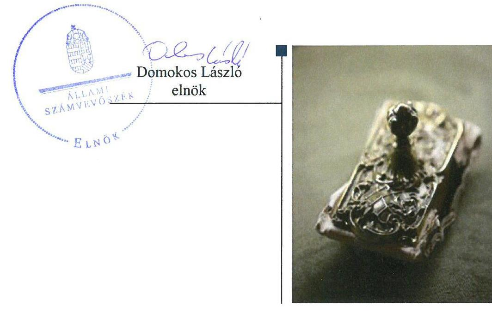

# Jelentés 

## Az önkormányzatok gazdasági társaságai

Az önkormányzatok többségi tulajdonában lévő gazdasági társaságok gazdálkodásának ellenőrzése - Ercsi Járóbeteg-szakellátó Egészségügyi Központ Közhasznú Nonprofit Kft. 2018.

---

# Jelentés 

## Az önkormányzatok gazdasági társaságai

Az önkormányzatok többségi tulajdonában lévő gazdasági társaságok gazdálkodásának ellenőrzése - Ercsi Járóbeteg-szakellátó Egészségügyi Központ Közhasznú Nonprofit Kft. 2018. Nis
hó
nap

---

# AZ ELLENŐRZÉST FELÜGYELTE:

DR. NAGY IMRE felügyeleti vezető

## AZ ELLENŐRZÉST VEZETTE ÉS A VÉGREHAJTÁSÁÉRT FELELŐS:

GELENCSÉR ZSOLT ellenőrzésvezető

A PROGRAM ÖSSZEÁLLÍTÁSÁÉRT FELELŐS:

TÓTPÁL SZABOLCS osztályvezető

IKTATÓSZÁM: EL-0137-064/2018.

TÉMASZÁM: 2447

ELLENŐRZÉS-AZONOSÍTÓ SZÁM: V079327

Jelentéseink az Országgyűlés számítógépes hálózatán és az Interneta a www.asz.hu címen is olvashatóak.

---

# TARTALOMJEGYZÉK 

■ ÖSSZEGZÉS ..... 5
■ AZ ELLENŐRZÉS CÉLJA ..... 7
■ AZ ELLENŐRZÉS TERÜLETE ..... 8
■ AZ ELLENŐRZÉS HÁTTERE, INDOKOLTSÁGA ..... 9
■ A JELENTÉS LÉNYEGES KÉRDÉSKÖREI ..... 10
■ AZ ELLENŐRZÉS HATÓKÖRE ÉS MÓDSZEREI ..... 11
■ MEGÁLLAPÍTÁSOK ..... 13
■ JAVASLATOK ..... 17
■ MELLÉKLETEK ..... 21
I. sz. melléklet: Értelmező szótár ..... 21
■ FÜGGELÉK: ÉSZREVÉTELEK ..... 23
■ RÖVIDÍTÉSEK JEGYZÉKE ..... 25

---

.

---

# ÖSSZEGZÉS 

Ercsi Város Önkormányzat 2013-2016. években a többségi tulajdonában álló Ercsi Járóbeteg-szakellátó Egészségügyi Központ Közhasznú Nonprofit Kft. feletti tulajdonosi jogait nem gyakorolta szabályszerűen. A Társaság szabályozottsága, gazdálkodása, vagyongazdálkodása a jogszabályi előírásoknak nem feleltek meg. A korrupció elleni védelem alapfeltételeit nem alakították ki. A Társaság az államadósságra befolyással bíró adósságot keletkeztető ügyletét nem a jogszabályi előírások szerint kötötte. Müködésének átláthatósága nem volt biztositott, nem tett eleget a jogszabályokban előírt közzétételi és adatszolgáltatási kötelezettségének.

## Az ellenőrzés társadalmi indokoltsága

Magyarországon az önkormányzatok kötelező és önként vállalt feladataik vonatkozásában is egyre szélesebb körben alkalmazzák a költségvetésen kívüli feladatellátást, ezáltal - a nonprofit szervezetek mellett - az önkormányzati tulajdonú gazdasági társaságok is kiemelt fontosságú szerephez jutottak. Ezen belül kiemelt jelentőségű számos önkormányzati gazdasági társaság működése abból a szempontból is, hogy gazdálkodásának egyes elemei befolyásolják az önkormányzati alszektor hiányát és az államadósságot.

Az Állami Számvevőszék Stratégiájában foglaltakkal összhangban az ÁSZ kiemelt célja, hogy a helyi önkormányzatok gazdálkodásában rejlő pénzügyi kockázatok feltárásával, az államháztartáson kívülre nyújtott költségvetési támogatások és ingyenes vagyonjuttatások, valamint az államháztartáson kívül működő feladat-ellátó rendszerek ellenőrzéseivel hozzájáruljon ahhoz, hogy a közpénzeket az államháztartáson kívül működő szervezetek is átlátható, rendezett módon használják fel. Ezen stratégiai célkitűzéssel összhangban került sor Ercsi Város Önkormányzat többségi tulajdonában álló Ercsi Járóbeteg-szakellátó Egészségügyi Központ Közhasznú Nonprofit Kft. szabályozottságának, gazdálkodása és vagyongazdálkodási tevékenysége szabályszerűségének, valamint az Önkormányzat tulajdonosi joggyakorlása 2013-2016. évi szabályszerűségének ellenőrzésére.

## Főbb megállapítások, következtetések, javaslatok

Ercsi Város Önkormányzat 2013-2016. években a többségi tulajdonában álló Ercsi Járóbeteg-szakellátó Egészségügyi Központ Közhasznú Nonprofit Kft. tekintetében a tulajdonosi joggyakorlás kereteit nem alakította ki szabályszerűen. A tulajdonosi joggyakorlás nem volt szabályszerű. 2016. évben az Önkormányzat nem szabályszerűen vállalt kezességet a Társaság hiteléhez. A felügyelőbizottság ügyrendjét nem készítette el. A taggyűlés az egyszerűsített éves beszámolókról a felügyelőbizottság írásbeli jelentései hiányában döntött és a javadalmazási szabályzatot nem alkotta meg.

Az Ercsi Járóbeteg-szakellátó Egészségügyi Központ Közhasznú Nonprofit Kft. gazdálkodásának szabályozottsága nem felelt meg a jogszabályi előírásoknak. A számviteli politika keretében elkészítendő valamennyi szabályzatot 2013. évben nem készítette el, 2014. évtől hatályos szabályzatai nem feleltek meg a jogszabályi előírásoknak. Gazdálkodása és a vagyongazdálkodási tevékenysége, a saját vagyon nyilvántartása nem volt szabályszerű. A számviteli nyilvántartásokat nem a jogszabályi előírásoknak megfelelően vezette, egyszerűsített éves beszámolóit a törvényben előírtak ellenére leltárakkal nem támasztotta alá. A kormányzati szektorba sorolt Társaság kölcsönt, hitelt vett fel, azonban adósságot keletkeztető ügyleteit nem a jogszabályi előírásoknak megfelelően kötötte és mutatta be az egyszerűsített éves beszámolókban.

A köztulajdonban álló és közfeladatot ellátó Társaság a jogszabályokban előírt közzétételi, adatszolgáltatási kötelezettségének nem tett eleget, tevékenységének átláthatóságát nem biztosította.

---

Az Állami Számvevőszék a jelentésben foglalt megállapítások alapján az Ercsi Járóbeteg-szakellátó Egészségügyi Központ Közhasznú Nonprofit Kft. ügyvezetőjének a szabályozottsággal, a számviteli elszámolásokkal, a mérleg leltárral való alátámasztásával, a közzétételi kötelezettségek, valamint a kormányzati szektorba sorolt szervezeteknek előírt követelmények teljesítésével kapcsolatban 13 javaslatot fogalmazott meg. Ercsi Város Önkormányzat polgármesterének három javaslatot tett az Állami Számvevőszék a felügyelő bizottsági ügyrenddel, az egyszerűsített éves beszámolóval és a javadalmazási szabályzattal összefüggésben. A javaslatokat megalapozó megállapításokra az érintetteknek 30 napon belül intézkedési tervet kell készíteniük.

---

# AZ ELLENŐRZÉS CÉLJA 

AZ ELLENŐRZÉS CÉLJA annak értékelése volt, hogy az önkormányzat vagyongazdálkodási tevékenysége során szabályszerűen gyakorolta-e tulajdonosi jogait; a gazdasági társaság szabályozottsága, gazdálkodása és vagyongazdálkodási tevékenysége, bevételeinek és ráfordításainak elszámolása megfelelt-e a jogszabályi és tulajdonosi előírásoknak; a gazdasági társaság kötelezettségállománya jelent-e kockázatot a múködésre, valamint a gazdálkodás átláthatósága és elszámoltathatósága érdekében biztosítva volt-e a szolgáltatás dijának megalapozottsága szabályszerű önköltségszámítással. Az ellenőrzés célja volt továbbá annak megítélése, hogy a kormányzati szektorba sorolt önkormányzati tulajdonban (résztulajdonban) lévő gazdálkodó szervezetek gazdálkodásának a kormányzati szektor hiányára és az államadósságra befolyással bíró elemei a jogszabályi előírásoknak megfeleltek-e.

---

# AZ ELLENŐRZÉS TERÜLETE 

## Ercsi Város Önkormányzat és az Ercsi Járóbeteg-szakellátó Egészségügyi Központ Közhasznú Nonprofit Kft.

Az Ercsi Járóbeteg-szakellátó Egészségügyi Központ Közhasznú Nonprofit Kft.-t Ercsi Város, Ráckeresztúr Község, Baracska Község és Kajászó Község Önkormányzata az ellenőrzött időszakot megelőzően alapította. A Társaság ${ }^{1}$ jogállása közhasznú, közhasznú tevékenysége szakorvosi járóbeteg-ellátás biztosítása volt a tag önkormányzatok ${ }^{2}$ közigazgatási területéhez tartozó lakosság részére. A Társasággal az alapító önkormányzatok ${ }^{3}$ Közhasznú szerződést ${ }^{4}$ kötöttek. A járóbeteg-szakellátás közfeladat ellátását a Társaság feladat átadás-átvételi Megállapodás ${ }^{5}$-ban vállalta át az Önkormányzattól. Tevékenységeire müködési engedéllyel ${ }^{6}$ rendelkezett.

A Társaság legfőbb szerve a taggyűlés volt, az Önkormányzat ${ }^{7}$ Képvi-selő-testülete ${ }^{8}$ határozataiban felhatalmazta a polgármestert, hogy döntéseit a taggyűlésen képviselje. A Társaság alapítása 0,5 M Ft törzstőkével történt, amelyet a taggyűlés - Apport átruházási szerződés ${ }^{9}$ alapján az Önkormányzat által rendelkezésre bocsátott 109,9 M Ft összegű ingatlan apporttal - 110,4 M Ft összegre emelt. Az Önkormányzat vagyoni betétje a törzstőke 99,73\%-a (110,1 M Ft) volt. A Társasági Szerződésben ${ }^{10}$ a tag önkormányzatok kötelezettséget vállaltak arra, hogy a Társaság fenntartásához, működtetéséhez lakosságszámuk arányában, működési hozzájárulás formájában hozzájárulnak, legalább a fenntartási időszak, 2015. év végéig. A Társasági Szerződésben rögzített szavazati arányok a tag önkormányzatok lakosságszámának megfelelően kerültek meghatározásra. Ennek értelmében Ercsi 99,73\%-os vagyoni betétje 55,52\% szavazati aránynak, Ráckeresztúr 0,09\%-os vagyoni betétje 20,75\%-os szavazati aránynak, Baracska 0,09\%-os vagyoni betétje 16,92\%-os szavazati aránynak, Kajászó 0,09\%-os vagyoni betétje 6,81\%-os szavazati aránynak felelt meg.

A Társaság saját tőkéjének összege 2013. év végén és 2016. év végén 109,2 M Ft volt. A jegyzett tőke nem változott, összege 110,4 M Ft volt. A Társaság mérlegfőösszege 2013. év végén 880,2 M Ft, 2016. év végén 598,8 M Ft, mérleg szerinti eredménye 2013. év végén -3,8 M Ft, adózott eredménye 2016. év végén -7 ezer Ft volt. 2013. évben 22 főt, 2016. évben 23 főt foglalkoztatott.

A Társaság ügyvezetőjének személyében egy alkalommal, 2013. szeptember 6-tól történt változás. Átalakulás nem történt. A Társaság tulajdonosi részesedéssel más gazdasági társaságokban nem rendelkezett.

A Társaság az Áht. ${ }^{11}$ alapján 2013. június 28-tól kormányzati szektorba sorolt egyéb szervezet volt.

---

# AZ ELLENŐRZÉS HÁTTERE, INDOKOLTSÁGA 

## AZ ÖNKORMÁNYZATOK TÖBBSÉGI TULAJDONÁBAN ÁLLÓ GAZDASÁGI TÁRSASÁGOK ELLENŐR-

ZÉSE kiemelten fontos a vagyon megőrzése, megóvása érdekében, valamint a kormányzati szektor elszámolásaiban megjelenő önkormányzati tulajdonú gazdálkodó szervezetek esetében, amelyekkel szemben alapvető követelmény, hogy gazdálkodásuk, múködésük szabályszerű, az általuk szolgáltatott adatok minél megbízhatóbbak legyenek. A feladatellátás költségeinek, ráfordításainak alakulása a lakosság széles rétegét érinti.

Az Állami Számvevőszék ellenőrzései feltárhatják, hogy az önkormányzat a feladatellátásához rendelt vagyon múködtetését a tulajdonostól elvárható gondossággal végezte-e, a feladatot ellátó gazdasági társaság a létesítő okiratban, szolgáltatási szerződésben foglaltak betartásával biztosí-totta-e a feladat ellátását. Az ellenőrzés eredményeképp meghatározhatóvá válnak a költségvetési hiányt befolyásoló szervezetek kockázatai, lehetővé válik ezen kockázatok csökkentése. Az ellenőrzés rávilágíthat arra, hogy a gazdasági társaság a vagyon használatával biztosította-e a szolgáltatás folytatásának feltételeit, az önkormányzat tulajdonosi felügyelete hozzájárult-e a szabályszerű gazdálkodáshoz és feladatellátáshoz. A megállapítások alapján megfogalmazott számvevőszéki javaslatok hasznosítása elősegítheti a meglévő hibák megszüntetését. A jó gyakorlatok bemutatásával az ÁSZ ${ }^{12}$ hozzájárulhat a követendő megoldások megismertetéséhez, terjesztéséhez.

---

# A JELENTÉS LÉNYEGES KÉRDÉSKÖREI 

1. Az Önkormányzat tulajdonosi joggyakorlása szabályszerű volt-e?
2. A Társaság szabályozottsága, gazdálkodása és vagyongazdálkodási tevékenysége szabályszerű volt-e, fizetőképessége biztositott volt-e a gazdálkodás során? A bevételek és a ráfordítások elszámolása, valamint az önköltségszámítás és árképzés szabályszerű volt-e?
3. A kormányzati szektorba sorolt Társaság gazdálkodásának a kormányzati szektor hiányára és az államadósságra befolyással bíró elemei megfeleltek-e a jogszabályi előírásoknak?

---

# AZ ELLENŐRZÉS HATÓKÖRE ÉS MÓDSZEREI 

## Az ellenőrzés típusa

Megfelelőségi ellenőrzés.

## Az ellenőrzött időszak

2013. január 1-jétől 2016. december 31-éig tartó időszak.

## Az ellenőrzés tárgya

Ercsi Város Önkormányzat többségi tulajdonában álló Ercsi Járóbeteg-szakellátó Egészségügyi Központ Közhasznú Nonprofit Korlátolt Felelősségű Társaság feletti tulajdonosi joggyakorlása, valamint a Társaság gazdálkodásának szabályozottsága és szabályszerűsége, továbbá a Társaság gazdálkodásának a kormányzati szektor hiányára és az államadósságra befolyással bíró elemei.

Az ellenőrzés kiterjedt minden olyan körülményre és adatra, amely az ÁSZ jogszabályban meghatározott feladatainak teljesítéséhez, valamint a program végrehajtása folyamán felmerült újabb összefüggések feltárásához szükséges volt.

## Az ellenőrzött szervezet

Ercsi Város Önkormányzat, valamint az Ercsi Járóbeteg-szakellátó Egészségügyi Központ Közhasznú Nonprofit Korlátolt Felelősségű Társaság

## Az ellenőrzés jogalapja

Az ellenőrzés jogszabályi alapját az ÁSZ tv. ${ }^{13}$ 1. § (3) bekezdése és 5. § (3)-(4)-(5) bekezdései képezték.

## Az ellenőrzés módszerei

Az ellenőrzést a nemzetközi standardokat irányadónak tekintve az ellenőrzési program ellenőrzési kérdései, az ellenőrzött időszakban hatályos jogszabályok, az ellenőrzés szakmai szabályok és módszertanok figyelembe vételével végeztük.

---

Az ellenőrzés ideje alatt az ellenőrzött szervezettel történő kapcsolattartást az ÁSZ Szervezeti és Múködési Szabályzatának vonatkozó előírásai alapján biztosítottuk.

Az ellenőrzés a kiválasztott, többségi tulajdonosi jogokat gyakorló önkormányzatra, illetve az ellenőrzésre kijelölt gazdasági társaság felett tulajdonosi jogokat gyakorló szervezetre és az ellenőrzött gazdasági társaságra terjedt ki.

Mintavétellel ellenőriztük a bevételek és ráfordítások elszámolását, a vagyonnyilvántartás és az értékcsökkenés elszámolását pedig teljes körű ellenőrzés alá vontuk. Az ellenőrzött minták alapján a sokaságban előforduló hibaarányt becsültük. „Szabályszerűnek" értékeltünk egy ellenőrzött területet, amennyiben 95\%-os bizonyossággal a teljes sokaságban a hibaarány legfeljebb 10\%-os, „nem szabályszerűnek", amennyiben 10\%-nál magasabb arányt képviselt. A mintavételt megelőzően az anyagjellegú ráfordítások tételeinek sokaságából évente kiemeltük a 3-3 legnagyobb öszszegű tételt annak biztosítására, hogy az ellenőrzés a véletlen mintavétel mellett a legnagyobb értékú tételek ellenőrzésére biztosan kiterjedjen.

Az ellenőrzési kérdések megválaszolásához szükséges bizonyítékok megszerzése a következő ellenőrzési eljárások alkalmazásával történt: megfigyelés, kérdésfeltevés (információkérés), összehasonlítás, valamint elemző eljárás. Az ellenőrzési bizonyítékként felhasználható adatforrások közé tartoztak egyrészt az ellenőrzési programban felsorolt adatforrások, másrészt adatforrás lehetett még minden - az ellenőrzés folyamán - feltárt, az ellenőrzés szempontjából információkat tartalmazó dokumentum.

Az ellenőrzést a kérdésekre adott válaszok kiértékelésével, valamint a megjelölt adatforrások, a csatolt tanúsítványok felhasználásával, továbbá az adott időszakban hatályos jogszabályok figyelembe vételével folytattuk le.

---

# 1. Az Önkormányzat tulajdonosi joggyakorlása szabályszerű volt-e? 

Összegző megállapítás A tulajdonosi joggyakorlás nem volt szabályszerű.
AZ ÖNKORMÁNYZAT 2016. évben a Stabilitási tv. 10. § (1) bekezdése és a Ptk. ${ }^{14}$ 6:416. § (1) és (3) bekezdése előírásai ellenére írásba foglalt kezességi szerződés hiányában vállalt kezességet a Társaság folyószámlájához rendelt 3 M Ft-os hitelkeret 2016. december 30-ig történő megújításához.

FELÜGYELŐBIZOTTSÁGOT a Társaságnál az ellenőrzött időszakot megelőzően létrehoztak. A tulajdonos önkormányzatok a Társasági Szerződésben a Ptk.-ban foglaltakkal összhangban előírták az $\mathrm{FB}^{15}$ megválasztását, feladatait, eljárásának szabályait, beszámolási kötelezettségét, valamint a javadalmazásával kapcsolatos főbb előírásokat.

Az FB ügyrendjét nem készítette el, ezzel megsértve a Gt. ${ }^{16} 34$. § (4) bekezdése és a Ptk. 3:122. § (3) bekezdése előírásait.

A TAGGYŰLÉS az egyszerűsített éves beszámolókat a Ptk. 3:120. § (2) bekezdése előírásai ellenére nem az FB írásbeli jelentésének birtokában hagyta jóvá.

A JAVADALMAZÁSI, JUTTATÁSI RENDSZERRŐL szóló szabályzatot a Taggyűlés, mint a Társaság legfőbb szerve a Taktv. ${ }^{17}$ 5. § (3) bekezdése előírásai ellenére nem alkotta meg.
2. A Társaság szabályozottsága, gazdálkodása és vagyongazdálkodási tevékenysége szabályszerű volt-e, fizetőképessége biztosított volt-e a gazdálkodás során? A bevételek és a ráfordítások elszámolása, valamint az önköltségszámítás és árképzés szabályszerű volt-e?

Összegző megállapítás A Társaság gazdálkodásának szabályozottsága, gazdálkodása, vagyongazdálkodása nem felelt meg a jogszabályi előírásoknak. Bevételeinek és ráfordításainak elszámolása, valamint az árképzés nem volt szabályszerű. Egyszerűsített éves beszámolóit leltárral nem támasztotta alá.

SZÁMLARENDET 2013. évben a Társaság a Számv. tv. ${ }^{18}$ 161. § (1) bekezdés előírásai ellenére nem készített. A 2014. január 1-jével hatályba

---

léptetett Számlarend ${ }^{19}$ a Számv. tv. 161. § (2) bekezdés a), d) pontok előírásai ellenére 2014-2016. években nem tartalmazta minden alkalmazásra kijelölt számla számjelét és megnevezését, valamint a számlarendben foglaltakat alátámasztó bizonylati rendet.

SZÁMVITELI POLITIKÁVAL a Társaság a Számv. tv.-ben előírtak szerint rendelkezett, a Számviteli politika ${ }^{20}$ azonban nem felelt meg a Számv. tv. előírásainak. 2014-2016. években nem határozta meg a Számv. tv. 3. § (3) bekezdés 3. pont szerinti, a jelentős összegű hibához kapcsolódó értékhatárt. 2015. július 4-től nem tartalmazta a Számv. tv. 14. § (4) bekezdésének hatályos változását, mely szerint a számviteli politika keretében írásban rögzíteni kell azokat a gazdálkodóra jellemző szabályokat, előírásokat, módszereket, amelyekkel meghatározza, hogy mit tekint kivételes nagyságú vagy előfordulású bevételnek, költségnek, ráfordításnak. 2016. január 1-jétől nem tartalmazta a Számv. tv. 96. §. (3) bekezdésének hatályos változását, amely szerint az egyszerűsített éves beszámoló eredménykimutatása a 2. vagy a 3. számú melléklet közül a vállalkozó által választott eredménykimutatás nagybetűvel és római számmal jelölt tételeit tartalmazza.

A SZÁMVITELI POLITIKA KERETÉBEN elkészítendő szabályzatok közül az eszközök és a források leltárkészítési és leltározási, valamint értékelési szabályzatát 2013. évben a Társaság a Számv. tv. 14. § (5) bekezdés a) és b) pontja előírásai ellenére nem készítette el. A Leltározási és Selejtezési Szabályzatot ${ }^{21}$, valamint az Értékelési Szabályzatot ${ }^{22}$ 2014. január 1-ével készítette el és léptette hatályba.

A Számv. tv. 14. § (5) bekezdés d) pontja előírásai ellenére a számviteli politika keretében elkészítendő, hatályos pénzkezelési szabályzattal a Társaság nem rendelkezett.

A Társaság a Civil tv. ${ }^{23}$ 46. § (1) bekezdése, a 350/2011. (XII. 30.) Korm. rendelet ${ }^{24}$ 12. § (1) és (3) bekezdése, és a Számv. tv. 161/A. § (2) bekezdésének előírásai ellenére számviteli nyilvántartásait nem úgy vezette, hogy azok alapján az alapcél szerinti (közhasznú) tevékenységének és gazdaságivállalkozási tevékenységének bevételei, költségei, ráfordításai és eredménye (nyeresége, vesztesége) egymástól elkülönítve megállapíthatók legyenek.

AZ EGÉSZSÉGÜGYI SZOLGÁLTATÓ HATÁSKÖRÉBEN MEGÁLLAPÍTHATÓ TÉRÍTÉSI DÍJAI megállapításának, nyilvánosságra hozatalának és befizetésének rendjét, valamint a szolgáltató által megállapított térítési díj mérséklésére, illetve elengedésére vonatkozó rendelkezéseket a Társaság a 284/1997. (XII. 23.) Korm. rendelet 1. § (6) bekezdés előírásai ellenére szabályzatban nem állapította meg.

A BEVÉTELEK ÉS A RÁFORDÍTÁSOK elszámolása nem volt szabályszerű, mivel a Számv. tv. 167. § (1) bekezdés h) pont előírásai ellenére a könyvviteli elszámolást közvetlenül alátámasztó bizonylatok nem tartalmazták a könyvelés módjára, az érintett könyvviteli számlákra történő hivatkozást. Továbbá az anyagjellegú ráfordítások, egyéb, rendkívüli és pénzügyi műveletek ráfordításainak elszámolásánál a Számv. tv.

---

166. § (3) bekezdése előírásai ellenére a számviteli bizonylatot szabálytalanul nem a gazdasági esemény megtörténtének időpontjában, illetve időszakában állították ki. A személyi jellegú ráfordítások elszámolásánál a Számv. tv. 165. § (1)-(2) bekezdése előírásai ellenére a gazdasági esemény számviteli elszámolását (nyilvántartását) számviteli bizonylattal nem támasztották alá.

# A VAGYONNYILVÁNTARTÁSBAN ÉS AZ ÉRTÉK- 

CSÖKKENÉS elszámolásánál a Számv. tv. 26. § (1) és 52. § (2) bekezdés előírásai ellenére a tárgyi eszközök esetében az üzembe helyezést nem dokumentálták.

BESZÁMOLÁSI KÖTELEZETTSÉGÉNEK a Társaság a Számv. tv. szerinti egyszerűsített éves beszámolók készítésével, valamint a Civil tv. szerinti közhasznúsági mellékletek készítésével, letétbe helyezésével és közzétételével, a tulajdonosi joggyakorló által előírt beszámolási kötelezettségének az üzleti tervek és intézményi beszámolók készítésével eleget tett.

EGYSZERŰSÍTETT ÉVES BESZÁMOLÓI nem feleltek meg a Számv. tv. 4. § (1) és (2) bekezdésének, nem nyújtottak valós képet a Társaság vagyonáról, mivel a mérleget a Számv. tv.-ben előírtaknak megfelelő leltárral nem támasztotta alá. A Számv. tv. 69. § (1) bekezdése előírásai ellenére a beszámolók elkészítéséhez, a mérleg tételeinek alátámasztásához a Társaság - a vevőkövetelések, valamint a rövid lejáratú kötelezettségek szállítók kivételével - nem olyan leltárakat állított össze és őrzött meg, amelyek tételesen, ellenőrizhető módon tartalmazzák a mérleg fordulónapján meglévő eszközeit és forrásait mennyiségben és értékben. A Számv. tv. 69. § (2) bekezdése előírásai ellenére a főkönyvi könyvelés és az analitikus nyilvántartások adatai közötti egyeztetést az üzleti év mérleg fordulónapjára vonatkozóan nem végezte el.

Ennek ellenére a választott könyvvizsgáló minden évben korlátozás nélküli hitelesítő záradékot adott ki.

A KÖZÉRDEKŰ ADATOK megismerésére irányuló igények teljesítésének rendjét rögzítő szabályzatot a Társaság az Info tv. ${ }^{25}$ 30. § (6) bekezdése előírásai ellenére az ellenőrzött időszakban nem készített. Az Info. tv. 37. § (1) bekezdésben és az 1. melléklet II.1., II.12., III.1., III.4., III.8. pontjai szerinti általános közzétételi listában meghatározott adatok közzétételének a honlapján nem tett eleget. Tevékenységéhez kapcsolódóan a Taktv. 2. § (1)-(2) bekezdéseiben előírt közzétételi kötelezettségét nem teljesítette. A Társaság nem rendelkezett a 1997. évi XLVII. tv. ${ }^{26}$ 32. § (2) bekezdés h) pontjában előírt érvényes belső adatvédelmi és adatkezelési szabályzattal.

A TÁRSASÁG rövid lejáratú kötelezettségeinek állománya 2013. évről 2016. évre 57,0 M Ft-tal csökkent. A lejárt rövid lejáratú kötelezettségállományát a Társaság fizetési kötelezettségeinek átütemezésével; az Önkormányzat által biztosított múködési támogatással, tagi kölcsönnel; banki folyószámlahitellel és az egyik tag önkormányzattal szemben peres eljárás

---

lefolytatásával tudta az ellenőrzött időszak végére csökkenteni. A tag önkormányzatokkal szembeni követelések rendezésére 2016. év végéig nem került sor.

# 3. A kormányzati szektorba sorolt Társaság gazdálkodásának a kormányzati szektor hiányára és az államadósságra befolyással bíró elemei megfeleltek-e a jogszabályi előírásoknak? 

Összegző megállapítás

A Társaság gazdálkodásának a kormányzati szektor hiányára és az államadósságra befolyással bíró elemei nem feleltek meg a jogszabályi előírásoknak.

A KORMÁNYZATI SZEKTORBA SOROLT TÁRSASÁG a Bkr. ${ }^{27}$ 10. § előírásai ellenére 2014-2016. években nem alakította ki a tevékenység, a célok megvalósításának nyomon követését biztosító rendszert.

ADÓSSÁGOT KELETKEZTETŐ ÜGYLETTEL, a Stabilitási tv. ${ }^{28} 3 . \S$ (1) bekezdés a) pontja szerinti hitellel és kölcsönnel a Társaság rendelkezett. 2014. évben 3 M Ft összegű banki folyószámlahitelt vett fel. Az Önkormányzattól az ellenőrzött időszakban összesen 97,7 M Ft összegű visszatérítendő működési támogatásban, 2014. évben 4 M Ft összegű viszszafizetendő tagi kölcsönben részesült. A Számv. tv. 93. § (3) bekezdése előírásai ellenére a Társaság 2013-2014. évben kiegészítő mellékletben nem mutatta be a végleges jelleggel kapott, folyósított, illetve elszámolt összegeket támogatásonként a törvényben előírt megbontásban, és külön nem adta meg a támogatási program keretében kapott visszatérítendő (kötelezettségként kimutatott) támogatásra vonatkozó adatokat.

Az adósságot keletkeztető ügyleteket a Stabilitási tv. 9. § (1) bekezdése előírásai ellenére nem az államháztartásért felelős miniszter előzetes hozzájárulásával kötötte. Az Áht. 107. § (1) bekezdése és az Ávr. ${ }^{29}$ 5. számú melléklet 23. pontja szerinti az államháztartásért felelős miniszter felé fennálló adatszolgáltatási kötelezettségének nem tett eleget, éves beszámolóit, a könyvvizsgálói jelentéseket, a kiemelt mutatóit és a költségvetési kapcsolatait nem mutatta be.

---

# JAVASLATOK 

Az ÁSZ tv. 33. § (1) bekezdésében foglaltak értelmében az ellenőrzött szervezet vezetője köteles a jelentésben foglalt megállapításokhoz kapcsolódó intézkedési tervet összeállítani és azt a jelentés kézhezvételétől számított 30 napon belül az ÁSZ részére megküldeni. Amennyiben az ellenőrzött szervezet vezetője nem küldi meg határidőben az intézkedési tervet, vagy továbbra sem elfogadható intézkedési tervet küld, az Állami Számvevőszék elnöke az ÁSZ tv. 33. § (3) bekezdése a) és b) pontjaiban foglaltakat érvényesítheti.

## Ercsi Járóbeteg-szakellátó Egészségügyi Központ Közhasznú Nonprofit Kft. Ügyvezetőjének

1. Gondoskodjon a számlarend jogszabályban foglaltaknak megfelelő kiegészitéséről.
(2. számú megállapítás 1. bekezdése alapján)
2. Intézkedjen a számviteli politika jogszabályban foglaltaknak megfelelő módosításáról.
(2. számú megállapítás 2. bekezdése alapján)
3. Intézkedjen a jogszabályban előirt pénzkezelési szabályzat elkészitéséről.
(2. számú megállapítás 4. bekezdése alapján)
4. Gondoskodjon a jogszabályban elöirtak szerint a Társaság bevételeinek és ráfordításainak elkülönített nyilvántartásáról.
(2. számú megállapítás 5. bekezdése alapján)
5. Intézkedjen az egészségügyi szolgáltatások saját hatáskörben megállapítható térítési dijának és nyilvánosságra hozatalának rendjét meghatározó szabályzat jogszabályban elöirtak szerinti kiadásáról.
(2. számú megállapítás 6. bekezdése alapján)
6. Biztosítsa, hogy a bevételeknek és a ráfordításoknak a számviteli nyilvántartásokban történő elszámolása a jogszabályban foglaltaknak megfelelő, szabályszerü bizonylatok alapján történjen.
(2. számú megállapítás 7. bekezdése alapján)

---

7. Biztosítsa a jogszabályban foglaltaknak megfelelően az eszközök üzembe helyezésének hitelt érdemlő dokumentálását.
(2. számú megállapítás 8. bekezdése alapján)
8. Biztosítsa a jogszabályi előírásoknak megfelelően az egyszerüsített éves beszámoló mérlege tételeinek leltárral való alátámasztását.
(2. számú megállapítás 10. bekezdése alapján)
9. Intézkedjen a jogszabályi előírásoknak megfelelően a közérdekü adatok megismerésére irányuló igények teljesitésének rendjét rögzítő szabályzat elkészitéséről.
(2. számú megállapítás 12. bekezdés 1. mondata alapján)
10. Gondoskodjon az Info tv.-ben és a Taktv.-ben foglalt előírások szerint a közzétételi kötelezettség teljesitéséről.
(2. számú megállapítás 12. bekezdés 2.-3. mondatai alapján)
11. Gondoskodjon a belső adatvédelmi és adatkezelési szabályzat elkészitéséről a jogszabályi előírásokban foglaltak szerint.
(2. számú megállapítás 12. bekezdés 4. mondata alapján)
12. Intézkedjen a jogszabályi előírásoknak megfelelően a tevékenységek, a célok megvalósításának nyomon követését biztositó rendszer kialakításáról.
(3. számú megállapítás 1. bekezdése alapján)
13. Intézkedjen a jogszabályi előírások szerint a kormányzati szektorba sorolt gazdálkodó szervezetek számára elöirt adatszolgáltatási kötelezettségek teljesitéséröl.
(3. számú megállapítás 3. bekezdés 2. mondata alapján)

# Ercsi Város Önkormányzat Polgármesterének 

1. Kezdeményezze a felügyelő bizottsági ügyrend elkészitését és jóváhagyását.
(1. számú megállapítás 3. bekezdése alapján)

---

2. Kezdeményezze, hogy a Társaság taggyúlése a Társaság egyszerüsitett éves beszámolóját a jogszabályi elöírásoknak megfelelöen fogadja el.
(1. számú megállapítás 4. bekezdése alapján)
3. Kezdeményezze, hogy a taggyülés alkossa meg a Társaság javadalmazási, juttatási rendszeréről szóló szabályzatát a jogszabályi elöírásoknak megfelelően.
(1. számú megállapítás 5. bekezdése alapján)

---

.

---

# MELLÉKLETEK 

- I. SZ. MELLÉKLET: ÉRTELMEZŐ SZÓTÁR
gazdasági társaság
kezesség
kormányzati szektorba sorolt egyéb szervezet
nemzeti vagyon
nonprofit gazdasági társaság

Ptk. 3:88. § (1) bekezdése szerint „a gazdasági társaságok üzletszerű közös gazdasági tevékenység folytatására, a tagok vagyoni hozzájárulásával létrehozott, jogi személyiséggel rendelkező vállalkozások, amelyekben a tagok a nyereségből közösen részesednek, és a veszteséget közösen viselik".
A kezességre vonatkozó előírásokat a Ptk. 6:416-430. §-ai tartalmazzák. Kezességi szerződéssel a kezes kötelezettséget vállal a jogosulttal szemben, hogyha a kötelezett nem teljesít, maga fog helyette a jogosultnak teljesíteni. Kezesség egy vagy több, fennálló vagy jövőbeli, feltétlen vagy feltételes, meghatározott vagy meghatározható összegű pénzkövetelés vagy pénzben kifejezhető értékkel rendelkező egyéb kötelezettség biztosítására vállalható.
A Ptk. szerint kezességet csak írásban lehet vállalni. A kezes kötelezettsége ahhoz a kötelezettséghez igazodik, amelyért kezességet vállalt. A kezes kötelezettsége nem válhat terhesebbé, mint amilyen elvállalásakor volt, kiterjed azonban a kötelezett szerződésszegésének jogkövetkezményeire és a kezesség elvállalása után esedékessé váló mellékkövetelésekre is.
az Áht. 3. § (2) és (3) bekezdésében foglaltakon kívül az Európai Közösséget létrehozó szerződéshez csatolt, a túlzott hiány esetén követendő eljárásról szóló jegyzőkönyv alkalmazásáról szóló 2009. május 25-i 479/2009/EK rendelet (a továbbiakban: 479/2009/EK rendelet) szerint a kormányzati szektorba sorolt szervezet (Áht. 1. § (12))
Nvtv. ${ }^{30}$ 1. § (2) bekezdése szerint többek között:
„az állam vagy a helyi önkormányzat kizárólagos tulajdonában álló dolgok, az a) pont hatálya alá nem tartozó, állam vagy a helyi önkormányzat tulajdonában lévő dolog,
az állam vagy a helyi önkormányzat tulajdonában lévő pénzügyi eszközök, továbbá az államot vagy a helyi önkormányzatot megillető társasági részesedések, az államot vagy a helyi önkormányzatot megillető bármely vagyoni értékkel rendelkező jogosultság, amelyet jogszabály vagyoni értékű jogként nevesít."
Civil tv. 9/F. § (2) bekezdése szerint „az a gazdasági társaság minősül nonprofit gazdasági társaságnak és cégnevében az a gazdasági társaság tüntetheti fel a nonprofit jelleget, amelynek létesítő okirata tartalmazza, hogy a gazdasági társaság tevékenységéből származó nyereség a tagok között nem osztható fel, hanem az a gazdasági társaság vagyonát gyarapítja." (hatályos 2014. március 15-től)

---

.

---

# FÜGGELÉK: ÉSZREVÉTELEK 

A jelentéstervezetet a Számvevőszék 15 napos észrevételezésre megküldte az ellenőrzött szervezetek vezetőinek az ÁSZ tv. 29. §* (1) bekezdése előírásának megfelelően.

Az Ercsi Járóbeteg-szakellátó Egészségügyi Központ Közhasznú Nonprofit Kft. ügyvezetője és Ercsi Város Önkormányzat polgármestere nem éltek az ÁSZ tv. 29. § (2) bekezdésében foglalt észrevételezési jogukkal, a törvényes határidőn belül észrevételt nem tettek.

[^0]
[^0]:    * 29. § (1) Az Állami Számvevőszék az ellenőrzési megállapításait megküldi az ellenőrzött szervezet vezetőjének vagy az általa megbízott személynek, és annak, akinek személyes felelősségét állapította meg.
    (2) Az ellenőrzött szervezet vezetője és a felelősként megjelölt személy az ellenőrzés megállapításaira tizenöt napon belül írásban észrevételt tehet.
    (3) Az Állami Számvevőszék az észrevételre a beérkezésétől számított harminc napon belül írásban válaszol. A figyelembe nem vett észrevételeket köteles a jelentésben feltüntetni, és megindokolni, hogy azokat miért nem fogadta el.

---

.

---

# RÖVIDÍTÉSEK JEGYZÉKE 

${ }^{1}$ Társaság
${ }^{2}$ tag önkormányzatok
${ }^{3}$ alapító önkormányzatok
${ }^{4}$ Közhasznú szerződés
${ }^{5}$ Megállapodás
${ }^{6}$ Működési engedély
${ }^{7}$ Önkormányzat
${ }^{8}$ Képviselő-testület
${ }^{9}$ Apport átruházási szerződés
${ }^{10}$ Társasági Szerződés
${ }^{11}$ Áht.
${ }^{12}$ ÁSZ
${ }^{13}$ ÁSZ tv.
${ }^{14}$ Ptk.
${ }^{15} \mathrm{FB}$
${ }^{16} \mathrm{Gt}$.
${ }^{17}$ Taktv.
${ }^{18}$ Számv. tv.
${ }^{19}$ Számlarend
${ }^{20}$ Számviteli politika；

Ercsi Járóbeteg-szakellátó Egészségügyi Központ Közhasznú Nonprofit Kft. Ercsi Város Önkormányzata, Ráckeresztúr Község Önkormányzata, Baracska Község Önkormányzata és Kajászó Község Önkormányzata
Ercsi Város Önkormányzata, Ráckeresztúr Község Önkormányzata, Baracska Község Önkormányzata és Kajászó Község Önkormányzata
Ercsi Város Önkormányzata, Ráckeresztúr Község Önkormányzata, Baracska Község Önkormányzata, mint a társadalmi közös szükséglet kielégítéséért felelős szervezetek és Ercsi Kistérség Járóbeteg-szakellátó Egészségügyi Központ Kiemelten Közhasznú Nonprofit Korlátolt Felelősségű Társaság között megkötött Közhasznú szerződés, 2008. szeptember 5.
Megállapodás egészségügyi közszolgáltatás feladatának átadás-átvételére Ercsi Város Önkormányzata és Ercsi Járóbeteg-szakellátó Egészségügyi Központ Kiemelten Közhasznú Nonprofit Kft. között, 2011. január 4., Megállapodás 1. számú módosítása 2011. március 30.
A Fejér Megyei Kormányhivatal Népegészségügyi Szakigazgatási Szerv Dunaújvárosi, Adonyi, Ercsi, Sárbogárdi Kistérségi Népegészségügyi Intézete által 799-2/2011. ikt. számon a Társaság részére 126462 azonosítószámmal kiadott Müködési Engedély és a Társaság ügyvezetőjének névváltozása miatt a Fejér Megyei Kormányhivatal Dunaújvárosi Járási Hivatal által K-8-15/2015. Hiv. számon kiadott Müködési Engedély módosítás
Ercsi Város Önkormányzat
Ercsi Város Önkormányzat Képviselő-testülete
Ercsi Város Önkormányzata és Ercsi Járóbeteg-szakellátó Egészségügyi Központ Kiemelten Közhasznú Nonprofit Kft. között megkötött Apport átruházási szerződés, 2008. szeptember 24.
Ercsi Város Önkormányzata, Ráckeresztúr Község Önkormányzata, Baracska Község Önkormányzata, Kajászó Község Önkormányzata és Ercsi Járó betegszakellátó Egészségügyi Központ Közhasznú Nonprofit Korlátolt Felelősségű Társaság 2008. szeptember hó 05. napján kelt Társasági Szerződésének módosításokkal egységes szerkezetbe foglalása, 2017. január 19.
Az államháztartásról szóló 2011. évi CXCV. törvény
Állami Számvevőszék
2011. évi LXVI. törvény az Állami Számvevőszékről, hatályos 2011. július 1-jétől a Polgári Törvénykönyvről szóló 2013. évi V. törvény
Felügyelőbizottság
2006. évi IV. törvény a gazdasági társaságokról (hatályon kívül 2014. március 15től)
2009. évi CXXII. törvény a köztulajdonban álló gazdasági társaságok takarékosabb müködéséről
2000. évi C. törvény a számvitelről

Ercsi Járóbeteg-szakellátó Egészségügyi Központ Közhasznú Nonprofit Kft. Szöveges Számlarend, Kibocsátás időpontja 2014.01.01.
Ercsi Járóbeteg-szakellátó Egészségügyi Központ Közhasznú Nonprofit Kft. Számviteli politika Szabályzat, Érvénybe lépés időpontja 2014.01.01.

---

${ }^{21}$ Leltározási és Selejtezési Szabályzat
${ }^{22}$ Értékelési Szabályzat
${ }^{23}$ Civil tv.
${ }^{24}$ 350/2011. (XII. 30.) Korm. rendelet
${ }^{25}$ Info tv.
${ }^{26} 1997$. évi XLVII.
${ }^{27}$ Bkr.
${ }^{28}$ Stabilitási tv.
${ }^{29}$ Ávr.
${ }^{30}$ Nvtv.

Ercsi Járóbeteg-szakellátó Egészségügyi Központ Közhasznú Nonprofit Kft. Leltározási és selejtezési szabályzat, Kibocsátás, Érvénybelépés időpontja 2014.01.01.

Ercsi Járóbeteg-szakellátó Egészségügyi Központ Közhasznú Nonprofit Kft. Értékelési szabályzat, Kibocsátás, Érvénybelépés időpontja 2014.01.01.
2011. évi CLXXV. törvény - az egyesülési jogról, a közhasznú jogállásról, valamint a civil szervezetek múködéséről és támogatásáról
350/2011. (XII. 30.) Korm. rendelet a civil szervezetek gazdálkodása, az adománygyűjtés és a közhasznúság egyes kérdéseiről
2011. évi CXII. törvény - az információs önrendelkezési jogról és az információszabadságról
az egészségügyi és a hozzájuk kapcsolódó személyes adatok kezeléséről és védelméről szóló 1997. évi XLVII. törvény
a költségvetési szervek belső kontrollrendszeréről és belső ellenőrzéséről szóló 370/2011. (XII. 31.) Korm. rendelet
2011. évi CXCIV. törvény Magyarország gazdasági stabilitásáról az államháztartási törvény végrehajtásáról szóló 368/2011. (XII. 31.) Korm. rendelet
a nemzeti vagyonról szóló 2011. évi CXCVI. törvény

---

ÁLLAMI SZÁMVEVŐSZÉK
1052 Budapest, Apáczai Csere János utca 10.
Levélcím: 1364 Budapest 4. Pf. 54
Telefon: +36 14849100 Telefax: +36 14849200
www.asz.hu