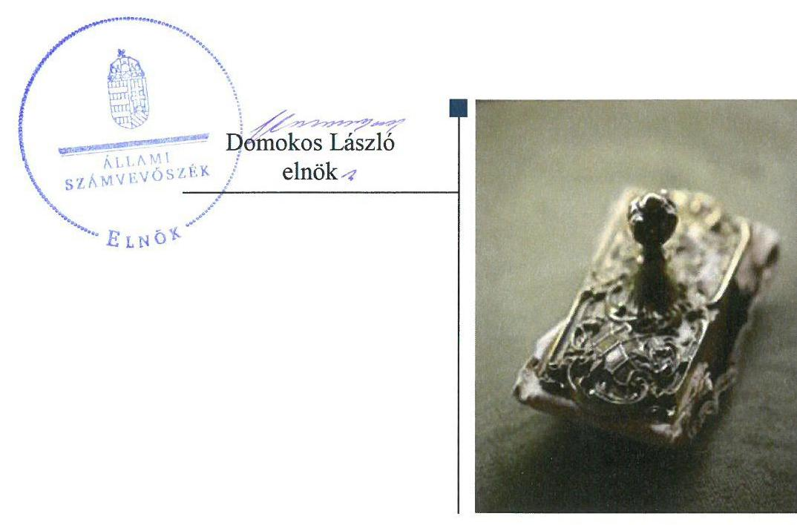
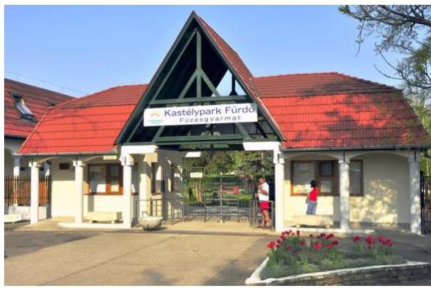
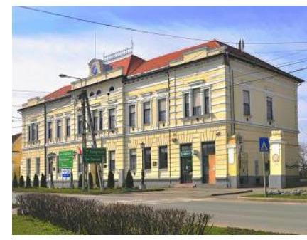
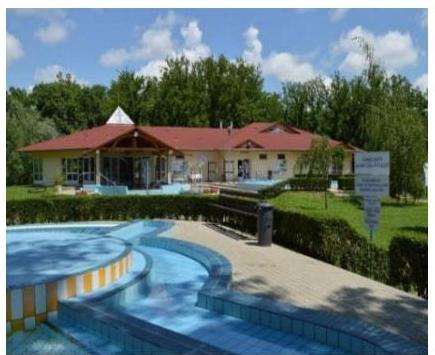

# Jelentés 

## Az önkormányzatok gazdasági társaságai

Az önkormányzatok többségi tulajdonában lévő gazdasági társaságok gazdálkodásának ellenőrzése - Füzesgyarmati Kastélypark Fürdő és Üdülési Szolgáltató Kft.
2018.

---

# Jelentés 

## Az önkormányzatok gazdasági társaságai

Az önkormányzatok többségi tulajdonában lévő gazdasági társaságok gazdálkodásának ellenőrzése - Füzesgyarmati Kastélypark Fürdő és Üdülési Szolgáltató Kft.
2018. június 5. nap

---

# AZ ELLENŐRZÉST FELÜGYELTE:

- **KLINGA LÁSZLÓ** felügyeleti vezető:
  - AZ ELLENŐRZÉST VEZETTE ÉS A VÉGREHAJTÁSÁÉRT FELELŐS:
    - BAJNAI ZSUZSANNA ellenőrzésvezető
    - A PROGRAM ÖSSZEÁLLÍTÁSÁÉRT FELELŐS:
      - TÓTPÁL SZABOLCS osztályvezető

**IKTATÓSZÁM:** EL-0530-018/2018.

**TÉMASZÁM:** 2447

**ELLENŐRZÉS-AZONOSÍTÓ SZÁM:** V079382

Jelentéseink az Országgyűlés számítógépes hálózatán és az Interneten a www.asz.hu címen is olvashatóak.

---

# TARTALOMJEGYZÉK 

■ ÖSSZEGZÉS ..... 5
■ AZ ELLENŐRZÉS CÉLJA ..... 6
■ AZ ELLENŐRZÉS TERÜLETE ..... 7
■ AZ ELLENŐRZÉS HÁTTERE, INDOKOLTSÁGA ..... 8
■ A JELENTÉS LÉNYEGES KÉRDÉSKÖREI ..... 9
■ AZ ELLENŐRZÉS HATÓKÖRE ÉS MÓDSZEREI ..... 10
■ MEGÁLLAPÍTÁSOK ..... 12
■ JAVASLATOK ..... 16
■ MELLÉKLETEK ..... 19
I. sz. melléklet: Értelmező szótár ..... 19
■ FÜGGELÉK: ÉSZREVÉTELEK ..... 21
■ RÖVIDÍTÉSEK JEGYZÉKE ..... 23

---

.

---

# ÖSSZEGZÉS 

Füzesgyarmat Város Önkormányzata a tulajdonosi joggyakorlás kereteit megfelelően kialakította, azonban a Füzesgyarmati Kastélypark és Üdülési Szolgáltató Kft. a szabályszerű működést biztosító döntéseket nem hozta meg, így a Társaság fenntartható gazdálkodását veszélyeztette. A Társaság szabályzatai megfeleltek az előírásoknak. A Társaság vagyongazdálkodási tevékenysége, bevételeinek és ráfordításainak elszámolása nem volt szabályszerű.

## Az ellenőrzés társadalmi indokoltsága

Magyarországon az intézménycentrikus közfeladat-ellátás jellemző, de egyre jelentősebb a költségvetésen kívüli feladatellátás térnyerése. Helyi szinten ennek legfontosabb szereplői az önkormányzati tulajdonban lévő gazdasági társaságok, amelyeknek ellenőrzése kiemelten fontos a közfeladat ellátása és a közvagyon megőrzése, megóvása érdekében. Ezért alapvető követelmény, hogy a társaságok gazdálkodása, működése szabályszerű és átlátható legyen. Az ellenőrzés rendet, a rend értéket teremt.

A Füzesgyarmati Kastélypark Fürdő és Üdülési Szolgáltató Kft. ellenőrzésére az általa kezelt önkormányzati vagyon nagyságára tekintettel került sor az Állami Számvevőszék Stratégiájában megfogalmazott célokkal összhangban. A Társasággal a város lakosságának széles köre került kapcsolatba az általa végzett tevékenységen keresztül.

## Főbb megállapítások, következtetések

Füzesgyarmat Város Önkormányzata szabályszerűen alakította ki a tulajdonosi joggyakorlás kereteit, azonban tulajdonosi jogait nem szabályszerűen gyakorolta a Füzesgyarmati Kastélypark Kft. felett, mivel a jogszabály által előírt tőke pótlással kapcsolatos döntéseket nem hozta meg.

A Társaság az alapvető számviteli szabályzatokkal rendelkezett, azok megfeleltek az előírásoknak. A bevételek, az anyagjellegű és személyi jellegű ráfordítások elszámolása nem volt szabályszerű, mert a törvény által előírt, a saját és kezelt vagyonhoz kapcsolódó bevételek és ráfordítások elkülönítését nem végezték el.

A vagyon nyilvántartása és az értékcsökkenés elszámolása megfelelt a számviteli előírásoknak, a beszámolók mérlegtételeit szabályszerű leltárral alátámasztották. A kezelésre átvett vagyon értékének megőrzéséről nem gondoskodtak, a jogszabály által előírt mértékű pótlási, tartalékképzési kötelezettségnek nem tettek eleget. A veszteséges gazdálkodás következtében a Társaság saját tőkéjét elveszítette, annak értéke nem érte el a társasági formára kötelezően előírt jegyzett tőke összegét. A Társaság lejárt határidejű kötelezettségeinek állománya nem változott.

A Füzesgyarmati Kastélypark Fürdő és Üdülési Szolgáltató Kft. beszámolási kötelezettségét teljesítette, azonban a jogszabályi előírás ellenére a közérdekből nyilvános adataiban bekövetkezett változásokat nem tette közzé.

---

# AZ ELLENŐRZÉS CÉLJA 

Az ellenőrzés célja annak értékelése volt, hogy az Önkormányzat a vagyongazdálkodási tevékenysége során szabályszerűen gyakorolta-e tulajdonosi jogait. A Társaság szabályozottsága, vagyongazdálkodási tevékenysége, bevételeinek és ráfordításainak elszámolása megfelel-e a jogszabályi és tulajdonosi előírásoknak, valamint a Társaság kötelezettségállománya jelentett-e kockázatot a működésre.

---

# **AZ ELLENŐRZÉS TERÜLETE**

## **Füzesgyarmat Város Önkormányzata és a kizárólagos tulajdonában lévő Füzesgyarmati Kastélypark Fürdő és Üdülési Szolgáltató Kft.**

### **FÜZESGYARMAT VÁROS ÖNKORMÁNYZATA**

a 2012. évben alapította egyedüli tagként a Füzesgyarmati Kastélypark Fürdő és Üdülési Szolgáltató Kft.-t. A Társaság¹ az ellenőrzött időszakban az Önkormányzat² kizárólagos tulajdonában volt, a tulajdonosi jogokat az Alapító³ gyakorolta.

A polgármester személye nem változott az ellenőrzött időszakban, a jegyző 2016. március 1-től tölti be tisztségét.

### **FÜZESGYARMATI KASTÉLYPARK FÜRDŐ ÉS ÜDÜLÉSI SZOLGÁLTATÓ KFT.**

fő tevékenysége a fürdő és üdülési szolgáltatás mellett éttermi vendéglátást is biztosított. A feladat ellátásához szükséges ingó és ingatlan vagyontárgyakat az Önkormányzat vagyonkezelési szerződés⁴ keretében adta át a Társaságnak. A vagyonkezelésbe vett eszközök nettó értéke a 2013. évi nyitó 426,1 M Ft-ról a 2016. év végére 393,2 M Ft-ra csökkent, a Társaság saját eszközeinek értéke 9,1 M Ft-ról 32,0 M Ft-ra nőtt.

A beszámolók⁵ kiemelt adatait az 1. táblázat ismerteti.

1. táblázat

|  BESZÁMOLÓK KIEMELT ADATAI (M FT) |  |  |  |   |
| --- | --- | --- | --- | --- |
|  Megnevezés | 2013.
XII. 31. | 2014.
XII. 31. | 2016.
XII. 31. | 2016.
XII. 31.  |
|  Mérlegfőösszeg | 438,9 | 443,3 | 446,3 | 432,4  |
|  Saját tőke | - 5,6 | - 13,9 | - 13,3 | - 32,4  |
|  Jegyzett tőke | 0,5 | 0,5 | 0,5 | 3,0  |
|  Kötelezettségek | 442,0 | 456,1 | 458,6 | 457,4  |
|  - hosszú lejáratú kötelezettségek | 433,6 | 433,6 | 442,6 | 441,5  |
|  - rövid lejáratú kötelezettségek | 8,4 | 22,5 | 16,0 | 15,8  |
|  Követelések | 1,6 | 11,3 | 9,8 | 5,3  |
|  Értékesítés nettó árbevétele | 54,3 | 59,8 | 78,4 | 63,4  |
|  Adózott eredmény | - 6,2 | - 8,3 | 0,5 | - 19,1  |
|  Forrás: a Társaság 2013-2016. évi beszámolói |  |  |  |   |

A Társaság összesen 29,2 M Ft működési célú támogatást, 47,2 M Ft tagi kölcsönt kapott az Önkormányzattól az ellenőrzött időszakban.

Az átlagos statisztikai állományi létszám a 2013. évi 24 főről a foglalkoztatást elősegítő Társadalmi Megújulás Operatív Program befejeződése miatt a 2016. évre 14 főre csökkent. Az ügyvezető feladatát az alapítás óta látja el.

A Társaság kapcsolt vállalkozásban lévő részesedéssel nem rendelkezett, könyvvizsgálatra nem volt kötelezett, nem minősült kormányzati szektorba sorolt vállalkozásnak. A Társaság önköltség-számítási szabályzat készítésére nem volt kötelezett.

---

# AZ ELLENŐRZÉS HÁTTERE, INDOKOLTSÁGA 

Az önkormányzatok többségi tulajdonában álló gazdasági társaságok ellenőrzése kiemelten fontos a vagyon megőrzése, megóvása érdekében. Alapvető követelmény, hogy gazdálkodásuk, működésük szabályszerű, és az általuk szolgáltatott adatok megbízhatóak legyenek. A feladatellátás költségeinek, ráfordításainak alakulása a lakosság széles rétegét érinti.

Az ÁSZ ellenőrzései feltárhatják, hogy az önkormányzat a feladatellátásához rendelt vagyon működtetését a tulajdonostól elvárható gondossággal végezte-e, a feladatot ellátó gazdasági társasággal a létesítő okiratban, szolgáltatási szerződésben foglaltakat betartatta-e, a társaság betartotta-e.

Az ellenőrzés eredményeképp meghatározhatóvá válnak a költségvetési hiányt befolyásoló szervezetek kockázatai, lehetővé válik ezen kockázatok csökkentése. Az ellenőrzés rávilágíthat arra, hogy a gazdasági társaság a vagyon használatával biztosította-e a szolgáltatás folytatásának feltételeit, az önkormányzat tulajdonosi felügyelete hozzájárult-e a szabályszerű gazdálkodáshoz és feladatellátáshoz. A megállapítások alapján megfogalmazott számvevőszéki javaslatok hasznosítása elősegítheti a meglévő hibák megszüntetését. A jó gyakorlatok bemutatásával az ÁSZ hozzájárulhat a követendő megoldások megismertetéséhez, terjesztéséhez.

---

# A JELENTÉS LÉNYEGES KÉRDÉSKÖREI 

1. Az önkormányzat tulajdonosi joggyakorlása szabályszerű volt-e?
2. A gazdasági társaság szabályozottsága, bevételeinek, ráfordításainak elszámolása és vagyongazdálkodási tevékenysége szabályszerű volt-e, fizetőképessége a gazdálkodás során biztosított volt-e?

---

# AZ ELLENŐRZÉS HATÓKÖRE ÉS MÓDSZEREI 

## Az ellenőrzés típusa

Megfelelőségi ellenőrzés.

## Az ellenőrzött időszak

Az ellenőrzött időszak 2013. január 1-jétől 2016. december 31-ig tart.

## Az ellenőrzés tárgya

Füzesgyarmat Város Önkormányzatának tulajdonosi joggyakorlása, valamint a Füzesgyarmati Kastélypark Fürdő és Üdülési Szolgáltató Kft. gazdálkodásának szabályozottsága és szabályszerűsége volt az ellenőrzés tárgya.

Az ellenőrzés kiterjedt minden olyan körülményre és adatra, amely az ÁSZ ${ }^{6}$ jogszabályban meghatározott feladatainak teljesítéséhez, valamint a program végrehajtása folyamán felmerült újabb összefüggések feltárásához szükséges.

## Az ellenőrzött szervezet

Füzesgyarmat Város Önkormányzata,
Füzesgyarmati Kastélypark Fürdő és Üdülési Szolgáltató Kft.

## Az ellenőrzés jogalapja

Az ellenőrzés jogszabályi alapját az ÁSZ tv. ${ }^{7}$ 1. § (3) bekezdése és 5. § (3)(4)-(5) bekezdései képezték.

## Az ellenőrzés módszerei

Az ellenőrzést a nemzetközi standardokat irányadónak tekintve az ellenőrzési program ellenőrzési kérdései, az ellenőrzött időszakban hatályos jogszabályok, az ellenőrzés szakmai szabályok és módszertanok figyelembe vételével végeztük.

Az ellenőrzés ideje alatt az ellenőrzött szervezettel történő kapcsolattartást az ÁSZ Szervezeti és Működési Szabályzatának vonatkozó előírásai alapján biztosítottuk.

Az ellenőrzési kérdések megválaszolásához szükséges bizonyítékok megszerzése a következő ellenőrzési eljárások alkalmazásával történt:

---

megfigyelés, kérdésfeltevés (információkérés), összehasonlítás, valamint elemzés. Az ellenőrzési bizonyítékként felhasználható adatforrások közé tartoztak egyrészt az ellenőrzési programban felsorolt adatforrások, másrészt adatforrás minden - az ellenőrzés során - feltárt, az ellenőrzés szempontjából információkat tartalmazó dokumentum.

Az ellenőrzést a kérdésekre adott válaszok kiértékelésével, valamint a megjelölt adatforrások, a csatolt tanúsítványok felhasználásával, továbbá az adott időszakban hatályos jogszabályok figyelembe vételével folytattuk le.

A bevételek és ráfordítások elszámolása, valamint a vagyonnyilvántartás terén a szabályszerű működést véletlen mintavétellel ellenőriztük. Kockázati alapon a ráfordítások elszámolásának és a vagyonnyilvántartásának ellenőrzése minden évben a három legnagyobb összegű tétellel kiegészült. A jogszabályoknak és a belső előírásoknak megfelelőnek, azaz szabályszerűnek tekintettük az adott területet, amennyiben a minta ellenőrzésének eredménye alapján 95%-os bizonyossággal a teljes sokaságban a hibaarány kisebb volt, mint 10%, nem megfelelőnek értékeltük, ha a hibaarány a 10%-ot meghaladta.

---

# 1. Az önkormányzat tulajdonosi joggyakorlása szabályszerű volt-e? 

Összegző megállapítás

A tulajdonosi joggyakorlás kereteit az Önkormányzat megfelelően kialakította, azonban a tulajdonosi jogokat nem szabályszerűen gyakorolta.

Gazdasági programjában ${ }^{8}$ a Képviselő-testület ${ }^{9}$ a Mötv. ${ }^{10}$ előírásával összhangban rögzítette a fürdő bővítésére, korszerűsítésére vonatkozó hosszú távú fejlesztési elképzeléseit.

A TULAJDONOSI JOGGYAKORLÁS RENDJÉT, a kapcsolódó feladatokat az Önkormányzat a Gt. ${ }^{11}$ és a Ptk. ${ }^{12}$ előírásainak megfelelően az Önkormányzati SZMSZ ${ }_{1,2}{ }^{13}$-ben és azzal összhangban a Vagyonrendelet ${ }_{1,2}{ }^{14}$-ben határozta meg.

Az Alapító okiratban ${ }^{15}$ rögzítették a Gt. és a Ptk. előírásainak megfelelően a társaság tevékenységi, és az Alapító kizárólagos hatáskörébe tartozó döntések körét. Az Alapító a Taktv. ${ }^{16}$ előírására döntött a három tagú FB${ }^{17}$ létrehozásáról. Az FB 2016. december 15-től rendelkezett a Ptk. előírásainak megfelelően az Alapító által jóváhagyott ügyrenddel. Az FB a 2014-2016. évi beszámolókról írásbeli jelentést nem készített.

A Javadalmazási szabályzatot ${ }^{18}$ az Alapító a Taktv. előírásainak megfelelően megalkotta.

AZ ÜZLETI TERVEKET az Alapító megtárgyalta és jóváhagyta.
A BESZÁMOLÓ elfogadása a 2013. évre vonatkozóan megfelelt a Gt. előírásának. A 2014-2016. évi beszámolók elfogadása nem felelt a törvényi előírásoknak, mivel azokról az Alapító a Ptk. 3:120. § (2) bekezdésének előírása ellenére az FB írásbeli jelentés hiányában döntött.

A Társaság saját tőkéje a veszteséges gazdálkodás következtében a törzstőke felére, valamint a törvényben meghatározott minimális összeg alá csökkent. A Ptk. 3:189. §
 (2) bekezdése ellenére az Alapító nem határozott a pótbefizetés előírásáról, a törzstőke mértékét elérő saját tőke más módon való biztosításáról, vagy a törzstőke leszállításáról, illetve mindezek hiányában a Társaság átalakulásáról, egyesüléséről, szétválásáról vagy jogutód nélküli megszüntetéséről. Ennek következtében nem volt biztosított a Társaság szabályszerű működése.

A VAGYONRENDELET ${ }_{2}$ az Mötv.-ben előírtaknak megfelelően tartalmazta a vagyonkezelői jog ellenértékének meghatározására, a vagyonkezelés ellenőrzésére vonatkozó részletes szabályokat.

---

A VAGYONKEZELÉSI SZERZŐDÉS megfelelt a Mötv. előírásainak, tartalmazta a vagyon működtetésének, állaga védelmének, értéke megőrzésének, gyarapításának követelményeit, a vagyonkezelésre vonatkozó nyilvántartási, adatszolgáltatási, elszámolási, visszapótlási kötelezettséget. A vagyontárgyakban bekövetkezett változások nyomon követése érdekében az átadott vagyon évenkénti leltározását írták elő.

A MONITORING TEVÉKENYSÉG keretében a vagyonkezelési szerződésben előírt adatszolgáltatási kötelezettséget a Képviselő-testület számon kérte, az ügyvezetőt a pénzügyi, vagyoni helyzet alakulásáról elszámoltatta.

KÉSZFIZETŐ KEZESSÉGET vállalt a Képviselő-testület a Társaság 2015. évben felvett 10 M Ft összegű beruházási hiteléhez, amely a Ptk., Áht. ${ }^{19}$, és a Gst. ${ }^{20}$ előírásainak megfelelt. A kezességvállalás érvényesítésére nem került sor az ellenőrzött időszakban.

# 2. A gazdasági társaság szabályozottsága, bevételeinek, ráfordításainak elszámolása és vagyongazdálkodási tevékenysége szabályszerű volt-e, fizetőképessége a gazdálkodás során biztosított volt-e? 

Összegző megállapítás

A Társaság szabályozottsága megfelelő volt. A bevételek ráfordítások elszámolása, vagyongazdálkodási tevékenysége nem volt szabályszerű. Lejárt határidejű kötelezettségeinek állománya nem változott. A közérdekből nyilvános adatokban bekövetkezett változásokat nem tette közzé.
2.1. számú megállapítás

A Számviteli politika, a Leltározási-, Értékelési szabályzat megfelelt a törvényi előírásoknak. A bevételek, az anyagjellegű és személyi jellegű ráfordítások elszámolása nem volt szabályszerű.

A SZÁMV. TV. ${ }^{21}$ ÁLTAL ELŐÍRT SZABÁLYZATOK - Számviteli politika ${ }^{22}$ Leltározási- ${ }^{23}$, Értékelési- ${ }^{24}$, Pénzkezelési szabályzat ${ }^{25}$ Számlarend ${ }^{26}$ - elkészítési kötelezettségének a Társaság eleget tett. A Számviteli politika, a Leltározási-, az Értékelési szabályzat megfelelt az előírásoknak.

A Pénzkezelési szabályzat a Számv. tv. 14. § (8) bekezdése ellenére nem rendelkezett a pénzforgalom bankszámlán történő forgalom lebonyolítási rendjéről.

A Számviteli politika és Számlarend összhangja nem volt biztosított, mivel a tárgyi eszközök használatba vételkor egy összegben értékcsökkenésként elszámolható bekerülési értékét a Számviteli politika 100 ezer Ft, a Számlarend 50 ezer Ft alatt határozta meg.

A BEVÉTELEK, AZ ANYAGJELLEGŰ ÉS SZEMÉLYI JELLEGŰ RÁFORDÍTÁSOK elszámolása nem volt szabály-

---

### 2.2. számú megállapítás

szerű, mivel a Mötv. 109. § (7) bekezdése ellenére nem elkülönítetten tartotta nyilván a vagyonkezelésébe vett vagyon használatából, működtetéséből származó bevételeit, közvetlen költségeit és ráfordításait a saját vagyonnal folytatott vállalkozási tevékenységéből származó bevételeitől, költségeitől, ráfordításaitól, azok egyértelműen nem voltak elhatárolhatóak.

A Társaság könyvvezetési rendszerét a Számv. tv. 161/A. § (2) bekezdésében foglaltak ellenére a vagyonkezelésbe vett vagyonhoz kapcsolódóan nem részletezte tovább oly módon, hogy a Mötv. 109. § (7) bekezdésében meghatározott adatok rendelkezésre álljanak.

A Társaság a vagyongazdálkodás feltételeit kialakította, azonban vagyongazdálkodási tevékenysége nem volt szabályszerű mivel a kezelt vagyon értékének megőrzéséről nem gondoskodtak, saját tőkéje negatív értékű volt.

A VAGYONGAZDÁLKODÁS FELTÉTELEIT kialakították, a kapcsolódó követelményeket, feladat-, hatásköröket, felelősségi viszonyokat a belső szabályzatokban rögzítették. A Társaság által elkészített üzleti tervek a Gazdasági programmal, fejlesztési tervvel ${ }^{27}$ összhangban tartalmazták a tervezett beruházásokat. A vagyonváltozást eredményező döntések meghozatala mind a saját, mind a vagyonkezelt eszközök tekintetében megfelelt az előírásoknak.

A VAGYON NYILVÁNTARTÁSA, az értékcsökkenés elszámolása szabályszerű volt.

A beszámolók mérleg tételeit leltárral alátámasztották a Számv. tv.-ben foglaltaknak megfelelően, az üzleti év mérlegfordulónapjára vonatkozó leltározást mennyiségi felvétellel valamennyi ellenőrzött évben elvégezték.

A KEZELT VAGYON felújításáról, pótlólagos beruházásáról a Társaság a 2013-2015. években a vagyoni eszközök elszámolt értékcsökkenésének - 24,6 M Ft - megfelelő mértékben a Mötv. 109. § (6) bekezdése ellenére nem gondoskodott, e célokra tartalékot nem képzett. A 2016. évben erre a célra képzett 5,9 M Ft 2,3 M Ft-tal elmaradt a Mötv. 109. § (6) bekezdésében meghatározott szinthez - 8,2 M Ft-hoz- képest. A kezelt vagyon értékének megőrzésére vonatkozó pótlási kötelezettségüknek az ellenőrzött időszakban összesen 26,9 M Ft összegben nem tettek eleget.

A saját vagyon tekintetében megvalósított beruházások, felújítások együttes értéke - 30,2 M Ft -meghaladta az elszámolt - 7,4 M Ft - amortizációt.

A SAJÁT TÖKE az ellenőrzött időszakban nem érte el a társasági formára előírt jegyzett tőke összegét, az ügyvezető a Ptk. 3:189. § (1) bekezdése ellenére késedelem nélkül nem hívta össze a taggyúlést, annak ülés tartása nélküli döntéshozatalát nem kezdeményezte a szükséges intézkedések megtétele céljából.

---

### 2.3. számú megállapítás

2. táblázat

TAGI KÖLCSÖN, TÁMOGATÁS (M FT)

|  Év | Kölcsön | Támogatás  |
| --- | --- | --- |
|  2013. | 17,8 | 18,7  |
|  2014. | 9,4 | 10,5  |
|  2015. | 10,0 | 0,0  |
|  2016. | 10,0 | 0,0  |
|  Összesen | 47,2 | 29,2  |

Forrás: Tagi kölcsön analitika, kiegészítő melléklet

### 2.4. számú megállapítás

A Társaság lejárt határidejű kötelezettségeinek állománya nem változott.

A Társaság a hosszú lejáratú kötelezettségek között a Számv. tv. előírásainak megfelelően a vagyonkezelésére átvett vagyonértéket, továbbá fennálló hiteltartozását mutatta ki. A Társaság törlesztési kötelezettségének eleget tett.

Rövid lejáratú kötelezettségek értéke a 2013. év végi 8,4 M Ft-ról a 2016. év végére 15,8 M Ft-ra nőtt, amelyből 2,8 M Ft az Önkormányzat felé fennálló tagi kölcsön tartozásból adódott. Lejárt határidejű kötelezettségek a szállítói tartozásokból keletkeztek, állományuk az ellenőrzött időszakban csökkent, a 2013. év végén 4,7 M Ft, 2016. év végén 4,5 M Ft volt.

A fizetőképesség fenntartásához az Önkormányzat által nyújtott támogatások, tagi kölcsönök hozzájárultak, melyek alakulását a 2. táblázat ismerteti.

A Társaság teljesítette beszámolási kötelezettségét. A közérdekből nyilvános adatokban bekövetkezett változásokat nem tette közzé.

A BESZÁMOLÓK letétbe helyezéséről és közzétételéről határidőben gondoskodtak a Számv. tv.-ben foglaltaknak megfelelően.

A tulajdonos felé fennálló a vagyonkezelési szerződésben előírt adatszolgáltatási kötelezettséget teljesítették.

A KÖZÉRDEKBŐL NYILVÁNOS ADATOK között a Taktv. 2. § (1) bekezdésében előírtak ellenére a bankszámla feletti rendelkezésre jogosult munkavállalókra, valamint a 2015. évben megválasztott FB tagokra vonatkozó információkat nem tette közzé a Társaság.

---

# JAVASLATOK 

Az ÁSZ tv. 33. § (1) bekezdésében foglaltak értelmében az ellenőrzött szervezet vezetője köteles a jelentésben foglalt megállapításokhoz kapcsolódó intézkedési tervet összeállítani és azt a jelentés kézhezvételétől számított 30 napon belül az ÁSZ részére megküldeni. Amennyiben az ellenőrzött szervezet vezetője nem küldi meg határidőben az intézkedési tervet, vagy továbbra sem elfogadható intézkedési tervet küld, az Állami Számvevőszék elnöke az ÁSZ tv. 33. § (3) bekezdése a) és b) pontjaiban foglaltakat érvényesítheti.

## Füzesgyarmati Kastélypark Fürdő és Üdülési Szolgáltató Kft. ügyvezetőjének

1. Intézkedjen a Társaság pénzkezelési szabályzatának Számv.tv. előírásainak megfelelő kiegészítéséről.
(2.1 sz. megállapítás 2. bekezdése alapján)
2. Intézkedjen arról, hogy a vagyonkezelésbe vett eszközök bevételei, közvetlen költségei és ráfordításai a saját vagyonnal folytatott tevékenységből származó bevételtől, költségtől és ráfordítástól egyértelműen elhatárolható legyen az Mötv.-ben előírtaknak megfelelően.
(2.1. sz. megállapítás 4. és 5. bekezdése alapján)
3. Kezdeményezze a Képviselő-testület összehívását annak érdekében, hogy a Ptk.-ban előírtaknak megfelelően határozzon az adott gazdasági társasági formára kötelezően előírt jegyzett tőke mértékét elérő saját tőke biztosításáról, annak hiányában döntsön a Társaság átalakulásáról vagy átalakulás helyett a jogutód nélküli megszünésről vagy egyesülésről.
(2.2. sz. megállapítás 6. bekezdése alapján)
4. Intézkedjen a közérdekből nyilvános adatok közzétételi kötelezettségének Taktv.-ben előírt teljes körű teljesítéséről.
(2.4. sz. megállapítás 2. bekezdése alapján)

---

# Füzesgyarmat Város Önkormányzata polgármesterének 

1. Hívja fel az FB elnökének figyelmét az írásbeli jelentés elkészítésére annak érdekében, hogy a Képviselő-testület az éves beszámolójáról az FB írásbeli jelentésének birtokában döntsön a Ptk.-ban előírtaknak megfelelően.
(1. sz. megállapítás 3. bekezdése utolsó mondata alapján)
2. Kezdeményezze a Képviselő-testületnél, hogy határozzon a saját tőke értéke Ptk.-ban előírt szintjének biztosítása érdekében, vagy ennek hiányában döntsön a Társaság átalakulásáról, egyesüléséről, szétválásáról vagy jogutód nélküli megszüntetéséről.
(1. sz. megállapítás 7. bekezdése alapján)

---

.

---

# MELLÉKLETEK 

- I. SZ. MELLÉKLET: ÉRTELMEZŐ SZÓTÁR
gazdasági társaság
vagyonkezelő

Ptk. 3.88. § (1) bekezdése szerint „a gazdasági társaságok üzletszerű közös gazdasági tevékenység folytatására, a tagok vagyoni hozzájárulásával létrehozott, jogi személyiséggel rendelkező vállalkozások, amelyekben a tagok a nyereségből közösen részesednek, és a veszteséget közösen viselik".
vagyonkezelő:
a) az állam tulajdonában álló nemzeti vagyon tekintetében:
aa) költségvetési szerv,
ab) helyi önkormányzat, önkormányzati társulás,
ac) önkormányzati intézmény,
ad) köztestület,
ae) az állam, az aa)-ac) alpontban meghatározott személyek együtt vagy külön-külön 100%-os tulajdonában álló gazdálkodó szervezet,
af) az ae) alpont szerinti gazdálkodó szervezet 100%-os tulajdonában álló gazdálkodó szervezet,
ag) a törvény által kijelölt egyedileg meghatározott jogi személy.
b) a helyi önkormányzat tulajdonában álló nemzeti vagyon tekintetében:
ba) önkormányzati társulás,
bb) költségvetési szerv vagy önkormányzati intézmény,
bc) köztestület,
bd) az állam, a helyi önkormányzat, a ba)-bb) alpontban meghatározott személyek együtt vagy külön-külön 100%-os tulajdonában álló gazdálkodó szervezet,
be) a bd) alpont szerinti gazdálkodó szervezet 100%-os tulajdonában álló gazdálkodó szervezet.
c) * az egyházi jogi személy a tevékenysége ellátásához szükséges nemzeti vagyon tekintetében. (Forrás: Nvtv. ${ }^{28}$ 3. § (1) bekezdés 19. pontja)

---

.

---

# FÜGGELÉK: ÉSZREVÉTELEK 

A jelentéstervezetet a Számvevőszék 15 napos észrevételezésre megküldte az ellenőrzött szervezetek vezetőinek az ÁSZ tv. 29. §* (1) bekezdése előírásának megfelelően.

Az ellenőrzött szervezetek vezetői az ÁSZ. tv. 29. § (2) bekezdésében foglalt észrevételezési jogukkal nem éltek, a jelentéstervezetre észrevételt nem tettek.

[^0]
[^0]:    * 29. § (1) Az Állami Számvevőszék az ellenőrzési megállapításait megküldi az ellenőrzött szervezet vezetőjének vagy az általa megbízott személynek, és annak, akinek személyes felelősségét állapította meg.
    (2) Az ellenőrzött szervezet vezetője és a felelősként megjelölt személy az ellenőrzés megállapításaira tizenöt napon belül írásban észrevételt tehet.
    (3) Az Állami Számvevőszék az észrevételre a beérkezésétől számított harminc napon belül írásban válaszol. A figyelembe nem vett észrevételeket köteles a jelentésben feltüntetni, és megindokolni, hogy azokat miért nem fogadta el.

---

.

---

# RÖVIDÍTÉSEK JEGYZÉKE 

${ }^{1}$ Társaság
${ }^{2}$ Önkormányzat
${ }^{3}$ Alapító
${ }^{4}$ vagyonkezelési szerződés
${ }^{5}$ beszámoló
${ }^{6}$ ÁSZ
${ }^{7}$ ÁSZ tv.
${ }^{8}$ Gazdasági program
${ }^{9}$ Képviselő-testület
${ }^{10}$ Mötv.
${ }^{11} \mathrm{Gt}$.
${ }^{12}$ Ptk.
${ }^{13}$ Önkormányzati SZMSZ:

Önkormányzati SZMSZ:

## ${ }^{14}$ Vagyonrendelet:

Vagyonrendelet:

## ${ }^{15}$ Alapító okirat

${ }^{16}$ Taktv.
${ }^{17} \mathrm{FB}$
${ }^{18}$ Javadalmazási szabályzat
${ }^{19}$ Áht.
${ }^{20}$ Gst.
${ }^{21}$ Számv. tv.
${ }^{22}$ Számviteli politika
${ }^{23}$ Leltározási szabályzat
${ }^{24}$ Értékelési szabályzat
${ }^{25}$ Pénzkezelési szabályzat

Füzesgyarmati Kastélypark Fürdő és Üdülési Szolgáltató Korlátolt Felelősségű Társaság
Füzesgyarmat Város Önkormányzata
Füzesgyarmat Város Önkormányzatának Képviselő-testülete, mint a Társaság legfőbb szerve
Az önkormányzat 18/2012. (I. 26.) Kt. számú határozatának felhatalmazásával 2012. február 1-jén az Önkormányzat és a Társaság által aláírt vagyonkezelési szerződés
a Társaság Számv. tv. szerinti egyszerűsített éves beszámolói
Állami Számvevőszék
2011. évi LXVI. törvény az Állami Számvevőszékről

Integrált Városfejlesztési Stratégia (10/2013. (II.14.) számú határozat)
Füzesgyarmat Gazdasági program 2014-2020 (37/2015. (III.26.) számú határozat)
Füzesgyarmat Város Önkormányzatának képviselő-testülete
2011. évi CLXXXIX. törvény Magyarország helyi önkormányzatairól
2006. évi IV.
 törvény a gazdasági társaságokról (hatálytalan 2014. március 15-étől)
2013. évi V. törvény a Polgári Törvénykönyvről (hatályos 2014. március 15-től)

Füzesgyarmat Város Önkormányzata Képviselő-testületének 6/2003. (IV.01.) önkormányzati rendelete a Képviselő-testület és szervei Szervezeti és Működési Szabályzatáról és annak módosításai (hatálytalan 2013. június 21-től)
Füzesgyarmat Város Önkormányzata Képviselő-testületének 6/2013. (VI.20.) önkormányzati rendelete a Képviselő-testület Szervezeti és Működési Szabályzatáról és annak módosításai (hatályos 2013. június 21-tól)
Füzesgyarmat Város Önkormányzata Képviselő-testületének 14/2004. (VI.29.) önkormányzati rendelete az önkormányzati vagyonról, és a vagyongazdálkodás szabályairól (hatálytalan 2014. szeptember 4-től)
Füzesgyarmat Város Önkormányzata Képviselő-testületének 17/2014. (IX.04.) önkormányzati rendelete az önkormányzati vagyonról, és a vagyongazdálkodás szabályairól (hatályos 2014. szeptember 4-től)
Füzesgyarmati Kastélypark Fürdő és Üdülési Szolgáltató Kft. Alapító okirata, kelte 2012. december 15. és annak módosításai
2009. évi CXXII. törvény a köztulajdonban álló gazdasági társaságok takarékosabb működéséről szóló (hatályos: 2009. december 4-től)
felügyelőbizottság
Javadalmazási szabályzat és módosítása (hatályos 2012. április 26-tól, 66/2012. (IV.26), 159/2016. (XII.15.) Kt. határozat)
2011. évi CXCV. törvény az államháztartásról
2011. évi CXCIV. törvény Magyarország gazdasági stabilitásáról
2000. évi C. törvény a számvitelről

Számviteli politika és annak módosítása (hatályos 2012. február 1-től)
Leltározási szabályzat (hatályos 2012. február 1-től)
Értékelési szabályzat (hatályos 2012. február 1-től)
Házipénztár kezelési szabályzat (hatályos 2012. február 1-től)

---

${ }^{26}$ Számlarend
${ }^{27}$ fejlesztési terv
${ }^{28}$ Nvtv.

Számlarend és annak módosítása (hatályos 2012. február 1-től)
Kastélypark Fürdő fejlesztése Füzesgyarmaton, 2012. február 12.
2011. évi CXCVI. törvény a nemzeti vagyonról

---

# ÁLLAMI SZÁMVEVŐSZÉK 

1052 Budapest, Apáczai Csere János utca 10.
Levélcím: 1364 Budapest 4. Pf. 54
Telefon: +36 14849100 Telefax: +36 14849200
www.asz.hu
