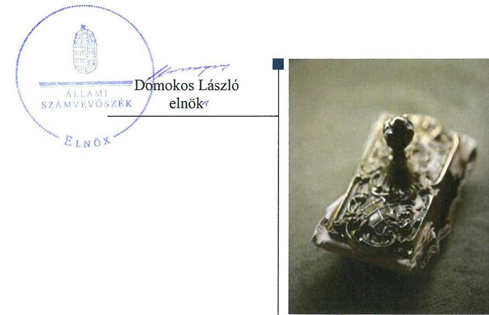
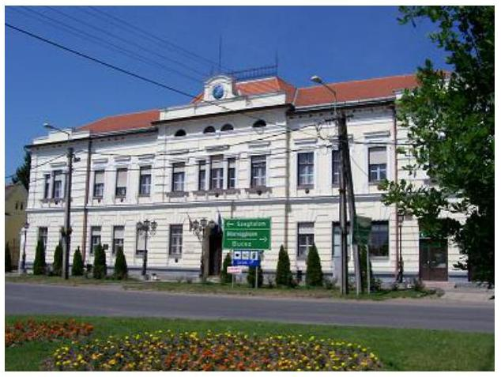
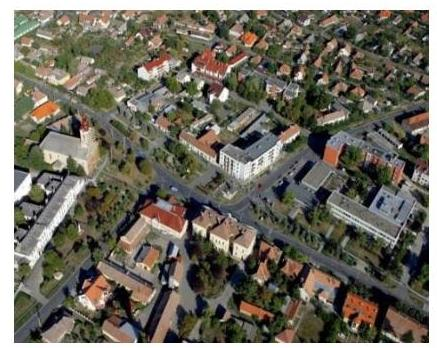

# Jelentés 

## Az önkormányzatok gazdasági társaságai

Az önkormányzatok többségi tulajdonában lévő gazdasági társaságok gazdálkodásának ellenőrzése - Füzesgyarmati Városgazdálkodási és Intézmény Üzemeltetési Kft.
2018.

---

# Jelentés 

## Az önkormányzatok gazdasági társaságai

Az önkormányzatok többségi tulajdonában lévő gazdasági társaságok gazdálkodásának ellenőrzése - Füzesgyarmati
Városgazdálkodási és Intézmény
Üzemeltetési Kft.
2018. fuarics hó $\quad$ nap

---

# AZ ELLENŐRZÉST FELÜGYELTE:

- **KLINGA LÁSZLÓ** felügyeleti vezető:
  - **AZ ELLENŐRZÉST VEZETTE ÉS A VÉGREHAJTÁSÁÉRT FELELŐS:**
    - **BAJNAI ZSUZSANNA** ellenőrzésvezető
    - **A PROGRAM ÖSSZEÁLLÍTÁSÁÉRT FELELŐS:**
      - **TÓTPÁL SZABOLCS** osztályvezető

**IKTATÓSZÁM:** EL-0531-021/2018.

**TÉMASZÁM:** 2447

**ELLENŐRZÉS-AZONOSÍTÓ SZÁM:** V079378

Jelentéseink az Országgyűlés számítógépes hálózatán és az Interneta a www.asz.hu címen is olvashatóak.

---

# TARTALOMJEGYZÉK 

■ ÖSSZEGZÉS ..... 5
■ AZ ELLENŐRZÉS CÉLJA ..... 6
■ AZ ELLENŐRZÉS TERÜLETE ..... 7
■ AZ ELLENŐRZÉS HÁTTERE, INDOKOLTSÁGA ..... 9
■ A JELENTÉS LÉNYEGES KÉRDÉSKÖREI ..... 10
■ AZ ELLENŐRZÉS HATÓKÖRE ÉS MÓDSZEREI ..... 11
■ MEGÁLLAPÍTÁSOK ..... 13
■ JAVASLATOK ..... 17
■ MELLÉKLETEK ..... 19
I. sz. melléklet: Értelmező szótár ..... 19
■ FÜGGELÉK: ÉSZREVÉTELEK ..... 21
■ RÖVIDÍTÉSEK JEGYZÉKE ..... 23

---

.

---

# ÖSSZEGZÉS 

Füzesgyarmat Város Önkormányzata a tulajdonosi joggyakorlás kereteit megfelelően kialakította, azonban a Füzesgyarmati Városgazdálkodási és Intézmény Üzemeltetési Kft. szabályszerű müködést biztosító döntéseket nem hozta meg, így a Társaság fenntartható gazdálkodását veszélyeztette. A Társaság szabályzatai megfeleltek az előírásoknak. A Társaság vagyongazdálkodási tevékenysége, bevételeinek és ráfordításainak elszámolása nem volt szabályszerű. Közérdekü adatait nem tette közzé, ezáltal nem biztositotta müködésének átláthatóságát.

## Az ellenőrzés társadalmi indokoltsága

Magyarországon az intézmény centrikus közfeladat-ellátás jellemző, de egyre jelentősebb a költségvetésen kívüli feladatellátás térnyerése. Helyi szinten ennek legfontosabb szereplői az önkormányzati tulajdonban lévő gazdasági társaságok, amelyeknek ellenőrzése kiemelten fontos a közfeladat ellátása és a közvagyon megőrzése, megóvása érdekében. Ezért alapvető követelmény, hogy a társaságok gazdálkodása, müködése szabályszerű és átlátható legyen. Az ellenőrzés rendet, a rend értéket teremt.

A Füzesgyarmati Városgazdálkodási és Intézmény Üzemeltetési Kft. ellenőrzésére az általa kezelt önkormányzati vagyon nagyságára tekintettel került sor az Állami Számvevőszék Stratégiájában megfogalmazott célokkal összhangban. A Társasággal a város lakosságának széles köre került kapcsolatba az általa végzett tevékenységen keresztül.

## Főbb megállapítások, következtetések

Füzesgyarmat Város Önkormányzata megfelelően alakította ki a tulajdonosi joggyakorlás feltételeit, azonban tulajdonosi jogait nem szabályszerűen gyakorolta a Füzesgyarmati Városgazdálkodási és Intézmény Üzemeltetési Kft. felett, mivel a jogszabály által előírt tőke pótlással kapcsolatos döntéseket nem hozta meg.

A Társaság számviteli politika keretében elkészített szabályzatai megfeleltek a követelményeknek. A bevételek, az anyagjellegű- és személyi jellegű ráfordítások elszámolása nem volt szabályszerű, mert a törvény által előírt, a saját és kezelt vagyonhoz kapcsolódó bevételek és ráfordítások elkülönítését nem végezték el.

A vagyon nyilvántartása és az értékcsökkenés elszámolása megfelelt a számviteli előírásoknak, a leltározási kötelezettségnek eleget tettek. A kezelésre átvett vagyon értékének megőrzéséről nem gondoskodtak, a jogszabály által előírt mértékű pótlási kötelezettségnek nem tettek eleget. A veszteséges gazdálkodás következtében a Társaság saját tőkéjének értéke nem érte el a társasági formára kötelezően előírt jegyzett tőke összegét. Fizetőképessége romlott az ellenőrzött időszakban.

A Társaság beszámolási, adatszolgáltatási kötelezettségét teljesítette, azonban az előírt közérdekű, közérdekből nyilvános adatait nem tette közzé.

---

# AZ ELLENŐRZÉS CÉLJA 

Az ellenőrzés célja annak értékelése volt, hogy az Önkormányzat a vagyongazdálkodási tevékenysége során szabályszerűen gyakorolta-e tulajdonosi jogait. A Társaság szabályozottsága, vagyongazdálkodási tevékenysége, bevételeinek és ráfordításainak elszámolása megfelel-e a jogszabályi és tulajdonosi előírásoknak, valamint a Társaság kötelezettségállománya jelentett-e kockázatot a múködésre.

---

# **AZ ELLENŐRZÉS TERÜLETE**

## **Füzesgyarmat Város Önkormányzata, és a kizárólagos tulajdonában lévő Füzesgyarmati Városgazdálkodási és Intézmény Üzemeltetési Kft.**

### **FÜZESGYARMAT VÁROS ÖNKORMÁNYZATA**

Egyedüli tagként alapította a Füzesgyarmati Városgazdálkodási és Intézmény Üzemeltetési Kft.-t 2012. november 29-én. Előtársaságként 2013. január 14-ig, cégbírósági bejegyzéséig működött. A Társaság^{1} az ellenőrzött időszakban az Önkormányzat^{2} kizárólagos tulajdonában volt. A Társaság felett a tulajdonosi jogokat az Alapító^{3} gyakorolta.

A polgármester személye nem változott az ellenőrzött időszakban, a jegyző 2016. március 1-től tölti be tisztségét.

### **A FÜZESGYARMATI VÁROSGAZDÁLKODÁSI ÉS INTÉZMÉNY ÜZEMELTETÉSI KFT.**

az Önkormányzattal kötött feladat ellátási megállapodás^{4} alapján a közintézmények épületeinek üzemeltetési, karbantartási feladatait látta el, a közterületekkel összefüggő kertészeti, köztisztasági munkákat végezte. Vállalkozási tevékenysége különféle építési, szállítási munkákra terjedt ki. A Társaság által végzett tevékenységek közül a településüzemeltetés körében ellátott feladatok minősültek közfeladatnak.

A közfeladatok ellátásához szükséges ingó és ingatlan vagyontárgyakat az Önkormányzat vagyonkezelési szerződés^{5} keretében adta át a Társaságnak.

A beszámolók^{6} kiemelt adatait az 1. táblázat ismerteti.

1. táblázat

|  BESZÁMOLÓK KIEMELT ADATAI (M FT) |  |  |  |   |
| --- | --- | --- | --- | --- |
|  Megnevezés | 2013. | 2014. | 2015. | 2016.  |
|   | YIL 31. | YIL 31. | YIL 31. | YIL 31.  |
|  Mérlegfőösszeg | 543,0 | 560,6 | 541,7 | 431,5  |
|  Saját tőke | - 8,2 | 0,7 | - 7,4 | - 19,1  |
|  Jegyzett tőke | 0,5 | 0,5 | 0,5 | 3,0  |
|  Kötelezettségek | 545,2 | 553,2 | 544,5 | 445,7  |
|  - hosszú lejáratú kötelezettségek | 538,0 | 544,9 | 538,5 | 422,5  |
|  - rövid lejáratú kötelezettségek | 7,2 | 8,4 | 6,0 | 23,2  |
|  Követelések | 8,7 | 18,9 | 8,4 | 10,7  |
|  Értékesítés nettó árbevétele | 18,0 | 35,3 | 22,7 | 19,7  |
|  Egyéb bevétel | 100,6 | 132,2 | 128,8 | 152,9  |
|  Adózott eredmény | - 8,0 | 8,9 | - 8,1 | - 11,7  |

*Forrás: a Társaság 2013-2016. évi beszámolói*

A Társaság 453,6 M Ft működési célú támogatást kapott az Önkormányzattól az ellenőrzött időszakban.

---

Az átlagos statisztikai állományi létszám a 2013. évi 20 főről, a 2016. évre nyári diákmunkások foglalkoztatása miatt 31 főre emelkedett. Az ügyvezető feladatát az alapítás óta látta el.

A Társaság nem volt könyvvizsgálatra kötelezett, de az Alapító határozott könyvvizsgáló megbízásáról.

A Társaság, mint egyszerűsített éves beszámolót készítő vállalkozás mentesült az önköltség számítási szabályzat elkészítésének kötelezettsége alól, kapcsolt vállalkozásban lévő részesedéssel nem rendelkezett, nem minősült kormányzati szektorba sorolt vállalkozásnak.

---

# AZ ELLENŐRZÉS HÁTTERE, INDOKOLTSÁGA 

Az önkormányzatok többségi tulajdonában álló gazdasági társaságok ellenőrzése kiemelten fontos a vagyon megőrzése, megóvása érdekében. Alapvető követelmény, hogy gazdálkodásuk, működésük szabályszerű, és az általuk szolgáltatott adatok megbízhatóak legyenek. A feladatellátás költségeinek, ráfordításainak alakulása a lakosság széles rétegét érinti.

Az ÁSZ ellenőrzései feltárhatják, hogy az önkormányzat a feladatellátásához rendelt vagyon működtetését a tulajdonostól elvárható gondossággal végezte-e, a feladatot ellátó gazdasági társasággal a létesítő okiratban, szolgáltatási szerződésben foglaltakat betartatta-e, a társaság betartotta-e.

Az ellenőrzés eredményeképp meghatározhatóvá válnak a költségvetési hiányt befolyásoló szervezetek kockázatai, lehetővé válik ezen kockázatok csökkentése. Az ellenőrzés rávilágíthat arra, hogy a gazdasági társaság a vagyon használatával biztosította-e a szolgáltatás folytatásának feltételeit, az önkormányzat tulajdonosi felügyelete hozzájárult-e a szabályszerű gazdálkodáshoz és feladatellátáshoz. A megállapítások alapján megfogalmazott számvevőszéki javaslatok hasznosítása elősegítheti a meglévő hibák megszüntetését. A jó gyakorlatok bemutatásával az ÁSZ hozzájárulhat a követendő megoldások megismertetéséhez, terjesztéséhez.

---

# A JELENTÉS LÉNYEGES KÉRDÉSKÖREI 

1.- Az önkormányzat tulajdonosi joggyakorlása szabályszerű volt-e?
2.- A gazdasági társaság szabályozottsága, bevételeinek, ráfordításainak elszámolása és vagyongazdálkodási tevékenysége szabályszerű volt-e, fizetőképessége a gazdálkodás során biztosított volt-e?

---

# AZ ELLENŐRZÉS HATÓKÖRE ÉS MÓDSZEREI 

## Az ellenőrzés típusa

Megfelelőségi ellenőrzés.

## Az ellenőrzött időszak

Az ellenőrzött időszak 2013. január 1-jétől 2016. december 31-ig tart.

## Az ellenőrzés tárgya

Füzesgyarmat Város Önkormányzatának tulajdonosi joggyakorlása, valamint a Füzesgyarmati Városgazdálkodási és Intézmény Üzemeltetési Kft. gazdálkodásának szabályozottsága és szabályszerűsége volt az ellenőrzés tárgya.

Az ellenőrzés kiterjedt minden olyan körülményre és adatra, amely az ÁSZ ${ }^{7}$ jogszabályban meghatározott feladatainak teljesítéséhez, valamint a program végrehajtása folyamán felmerült újabb összefüggések feltárásához szükséges.

## Az ellenőrzött szervezet

Füzesgyarmat Város Önkormányzata,
Füzesgyarmati Városgazdálkodási és Intézmény Üzemeltetési Kft.

## Az ellenőrzés jogalapja

Az ellenőrzés jogszabályi alapját az ÁSZ tv. ${ }^{8}$ 1. § (3) bekezdése és 5. § (3)-(4)-(5) bekezdései képezték.

## Az ellenőrzés módszerei

Az ellenőrzést a nemzetközi standardokat irányadónak tekintve az ellenőrzési program ellenőrzési kérdései, az ellenőrzött időszakban hatályos jogszabályok, az ellenőrzés szakmai szabályok és módszertanok figyelembe vételével végeztük.

Az ellenőrzés ideje alatt az ellenőrzött szervezettel történő kapcsolattartást az ÁSZ Szervezeti és Múködési Szabályzatának vonatkozó előírásai alapján biztosítottuk.

---

Az ellenőrzési kérdések megválaszolásához szükséges bizonyítékok megszerzése a következő ellenőrzési eljárások alkalmazásával történt: megfigyelés, kérdésfeltevés (információkérés), összehasonlítás, valamint elemzés. Az ellenőrzési bizonyítékként felhasználható adatforrások közé tartoztak egyrészt az ellenőrzési programban felsorolt adatforrások, másrészt adatforrás minden - az ellenőrzés során - feltárt, az ellenőrzés szempontjából információkat tartalmazó dokumentum.

Az ellenőrzést a kérdésekre adott válaszok kiértékelésével, valamint a megjelölt adatforrások, a csatolt tanúsítványok felhasználásával, továbbá az adott időszakban hatályos jogszabályok figyelembe vételével folytattuk le.

A bevételek és ráfordítások elszámolása, valamint a vagyonnyilvántartás terén a szabályszerű múködést véletlen mintavétellel ellenőriztük. Kockázati alapon a ráfordítások elszámolásának és a vagyonnyilvántartásának ellenőrzése minden évben a három legnagyobb összegű tétellel kiegészült. A jogszabályoknak és a belső előírásoknak megfelelőnek, azaz szabályszerűnek tekintettük az adott területet, amennyiben a minta ellenőrzésének eredménye alapján 95\%-os bizonyossággal a teljes sokaságban a hibaarány kisebb volt, mint 10\%, nem megfelelőnek értékeltük, ha a hibaarány a 10\%ot meghaladta.

---

# 1. Az önkormányzat tulajdonosi joggyakorlása szabályszerű volt-e? 

Összegző megállapítás

A tulajdonosi joggyakorlás kereteit az Önkormányzat megfelelően alakította ki, azonban a tulajdonosi jogokat nem szabályszerűen gyakorolta.

Gazdasági programjában ${ }^{9}$ a Képviselő-testület ${ }^{10}$ a Mötv. ${ }^{11}$ előírásaival összhangban rögzítette hosszú távú fejlesztési elképzeléseit, amely a Társaság által ellátott feladatokra vonatkozó célkitűzéseket tartalmazta.

A TULAJDONOSI JOGGYAKORLÁS RENDJÉT, a kapcsolódó feladatokat az Önkormányzat a Gt. ${ }^{12}$ és a Ptk. ${ }^{13}$ előírásainak megfelelően az Önkormányzati SZMSZ ${ }_{1,2}{ }^{14}$-ben és azzal összhangban a Vagyonrendelet ${ }_{1,2}{ }^{15}$-ben határozta meg.

Az Alapító okiratban ${ }^{16}$ rögzítették a Gt. és a Ptk. előírásainak megfelelően a társaság tevékenységi körét, az Alapító kizárólagos hatáskörébe tartozó döntéseket. Az Alapító a Taktv. ${ }^{17}$ előírása szerint döntött a három tagú $\mathrm{FB}^{18}$ létrehozásáról. Az FB elkészítette ügyrendjét ${ }^{19}$, amelyet az Alapító a Gt. rendelkezésének megfelelően jóváhagyott.

A Javadalmazási szabályzatot ${ }^{20}$ az Alapító a Taktv. előírásainak megfelelően megalkotta.

AZ ÜZLETI TERVEKET, melynek elkészítési kötelezettségét Társasági SZMSZ ${ }^{21}$ rögzítette, az Alapító megtárgyalta és jóváhagyta.

A BESZÁMOLÓK elfogadása előírás szerint történt, azokról az Alapító az FB és a könyvvizsgáló írásbeli jelentésének birtokában döntött.

A Társaság saját tőkéje - a 2014. év kivételével - a veszteséges gazdálkodás következtében a törzstőke felére, valamint a törvényben meghatározott minimális összeg alá csökkent. A Ptk. 3:189. § (2) bekezdése ellenére az Alapító nem határozott - a könyvvizsgáló figyelem felhívása ellenére a pótbefizetés előírásáról, a törzstőke mértékét elérő saját tőke más módon való biztosításáról, vagy a törzstőke leszállításáról, illetve mindezek hiányában a Társaság átalakulásáról, egyesüléséről, szétválásáról vagy jogutód nélküli megszüntetéséről. Ennek következtében nem volt biztosított a Társaság szabályszerű működése.

A VAGYONRENDELET ${ }_{2}$ az Mötv.-ben előírtaknak megfelelően tartalmazta a vagyonkezelői jog ellenértékének meghatározására, a vagyonkezelés ellenőrzésére vonatkozó részletes szabályokat.

A VAGYONKEZELÉSI SZERZŐDÉS megfelelt a Mötv. előírásainak, tartalmazta a vagyon működtetésének, állaga védelmének,

---

értéke megőrzésének, gyarapításának követelményeit, a vagyonkezelésre vonatkozó nyilvántartási, adatszolgáltatási, elszámolási, visszapótlási kötelezettséget. A vagyontárgyakban bekövetkezett változások nyomon követése érdekében az átadott vagyon évenkénti leltározását írták elő.

A MONITORING TEVÉKENYSÉG keretében a vagyonkezelési szerződésben és a Társasági SZMSZ-ben előírt részletes adatszolgáltatási kötelezettséget a Képviselő-testület számon kérte, az ügyvezetőt a pénzügyi, vagyoni helyzet alakulásáról, a felhasznált támogatásokról elszámoltatta.

# 2. A gazdasági társaság szabályozottsága, bevételeinek, ráfordításainak elszámolása és vagyongazdálkodási tevékenysége szabályszerű volt-e, fizetőképessége a gazdálkodás során biztosított volt-e? 

Összegző megállapítás

A szabályozottság megfelelő volt, a bevételek és ráfordítások elszámolása nem volt szabályszerű. A Társaság vagyongazdálkodási tevékenysége nem volt szabályszerű. Fizetőképessége romlott az ellenőrzött időszakban. A közérdekú adatokat nem tették közzé.
2.1. számú megállapítás

A Számviteli politika keretében elkészített szabályzatok megfeleltek a törvényi előírásoknak. A bevételek és ráfordítások elszámolása nem volt szabályszerű.

A SZÁMVITELI POLITIKA ${ }^{22}$ és az annak részét képező Eszközök és források értékelési szabályzata, Eszközök és források leltárkészítési és leltározási szabályzata, Pénzkezelési szabályzat, valamint a Számlarend ${ }^{23}$ elkészítési kötelezettségének eleget tett a Társaság. A Számviteli politika és a keretében elkészített szabályzatok megfelelt az előírásoknak.

A Számviteli politika és Számlarend összhangja nem volt biztosított, mivel a tárgyi eszközök használatba vételkor egy összegben értékcsökkenésként elszámolható bekerülési értékét a Számviteli politika 100 ezer Ft, a Számlarend 50 ezer Ft alatt határozta meg.

A BEVÉTELEK, AZ ANYAG- ÉS SZEMÉLYI JELLEGÚ RÁFORDÍTÁSOK elszámolása nem volt szabályszerű, mivel a Mötv. 109. § (7) bekezdése ellenére nem elkülönítetten tartotta nyilván a vagyonkezelésébe vett vagyon használatából, múködtetéséből származó bevételeit, közvetlen költségeit és ráfordításait a saját vagyonnal folytatott vállalkozási tevékenységéből származó bevételeitől, költségeitől, ráfordításaitól, azok egyértelmúen nem voltak elhatárolhatóak.

A Társaság könyvvezetési rendszerét a Számv. tv. ${ }^{24}$ 161/A. § (2) bekezdésében foglaltak ellenére a vagyonkezelésbe vett vagyonhoz kapcsolódóan nem részletezte tovább oly módon, hogy a Mötv. 109. § (7) bekezdésében meghatározott adatok rendelkezésre álljanak.

---

### 2.2. számú megállapítás

A vagyongazdálkodás feltételeit a Társaság kialakította, azonban vagyongazdálkodási tevékenysége nem volt szabályszerű, mivel a kezelt vagyon értékének megőrzéséről nem gondoskodott, saját tőkéje negatív értékú volt.

A VAGYONGAZDÁLKODÁS FELTÉTELEIT kialakították, a kapcsolódó követelményeket, feladat-, hatásköröket, felelősségi viszonyokat a belső szabályzatokban rögzítették. A Társaság által elkészített üzleti tervek a Gazdasági programmal összhangban tartalmazták a fejlesztési elképzeléseket. A vagyonváltozást eredményező döntések meghozatala mind a saját, mind a vagyonkezelt eszközök tekintetében megfelelt az előírásoknak.

A VAGYON NYILVÁNTARTÁSA, az értékcsökkenés elszámolása szabályszerű volt.

A beszámolók mérleg tételeit leltárral alátámasztották a Számv. tv.-ben foglaltaknak megfelelően, az üzleti év mérlegfordulónapjára vonatkozó leltározást mennyiségi felvétellel valamennyi ellenőrzött évben elvégezték.

A KEZELT VAGYON felújításáról, pótlólagos beruházásáról a Társaság a Mötv. 109. § (6) bekezdése ellenére az elszámolt értékcsökkenésnek megfelelő mértékben nem gondoskodott. A Képviselő-testület a fennálló 48,4 M Ft-os pótlási kötelezettségből a Mötv. által biztosított lehetőséggel élve 24,7 M Ft-ot elengedett. A Társaság beruházásra, fejlesztésre a különbözetként jelentkező 23,7 M Ft helyett 5,0 M Ft-ot fordított, így elmaradása 18,7 M Ft az ellenőrzött időszakban.

A saját vagyona tekintetében megvalósított beruházások, felújítások együttes értéke - 23,4 M Ft - meghaladta az elszámolt - 6,7 M Ft - amortizációt.

A SAJÁT TÖKE összege az ellenőrzött időszakban a 2014. év kivételével nem érte el a társasági formára előírt jegyzett tőke összegét, az ügyvezető a Ptk. 3:189. § (1) bekezdése ellenére késedelem nélkül nem hívta össze a taggyűlést, annak ülés tartása nélküli döntéshozatalát nem kezdeményezte a szükséges intézkedések megtétele céljából.

### 2.3. számú megállapítás

A Társaság fizetőképessége romlott az ellenőrzött időszakban.
A Társaság hosszúlejáratú kötelezettségek között a vagyonkezelésére átvett vagyon értékét mutatta ki a Számv. tv. előírásának megfelelően.

Rövidlejáratú kötelezettségeinek értéke a 2013. év végi 7,2 M Ft-ról a 2016. év végére 23,2 M Ft-ra nőtt. Lejárt határidejű kötelezettsége szállítói tartozásból keletkezett, melynek értéke a 2013. év végi 3,8 M Ft-ról a 2016. év végére 19,9 M Ft-ra nőtt. A Társaság fizetőképessége romlott az ellenőrzött időszakban, lejárt határidejű tartozásai kockázatot jelentettek gazdálkodására nézve.

### 2.4. számú megállapítás

A Társaság teljesítette beszámolási kötelezettségét. A közérdekú, a közérdekből nyilvános adatait nem tette közzé.

A BESZÁMOLÓK letétbe helyezéséről és közzétételéről határidőben gondoskodtak a Számv. tv.-ben foglaltaknak megfelelően.

---

A tulajdonos felé fennálló a vagyonkezelési szerződésben és a Társasági SZMSZ-ben előírt adatszolgáltatási kötelezettséget teljesítették.

A KÖZÉRDEKŰ ADATOK megismerésére irányuló igények teljesítésének rendjét rögzítő szabályzatot nem készítették el az Infotv. ${ }^{25}$ 30. § (6) bekezdése ellenére.

A Társaság nem tette közzé az Infotv. 37. § (1) bekezdése ellenére az Infotv. 1. mellékletében meghatározott adatokat, így többek között a Társaság hivatalos elnevezését, székhelyét, elérhetőségét, szervezeti felépítését, szervezeti és múködési szabályzatát, az általa nyújtott közszolgáltatások megnevezését, tartalmát.

A KÖZÉRDEKBŐL NYILVÁNOS ADATOKAT a vezető tisztségviselőkre, a felügyelőbizottsági tagokra, illetve a bankszámla feletti rendelkezésre jogosult munkavállalókra vonatkozóan a Társaság a Taktv. 2. § (1) bekezdésében foglaltak ellenére nem tette közzé.

---

# JAVASLATOK 

Az ÁSZ tv. 33. § (1) bekezdésében foglaltak értelmében az ellenőrzött szervezet vezetője köteles a jelentésben foglalt megállapításokhoz kapcsolódó intézkedési tervet összeállítani és azt a jelentés kézhezvételétől számított 30 napon belül az ÁSZ részére megküldeni. Amennyiben az ellenőrzött szervezet vezetője nem küldi meg határidőben az intézkedési tervet, vagy továbbra sem elfogadható intézkedési tervet küld, az Állami Számvevőszék elnöke az ÁSZ tv. 33. § (3) bekezdése a) és b) pontjaiban foglaltakat érvényesítheti.

## Füzesgyarmati Városgazdálkodási és Intézmény Üzemeltetési Kft. ügyvezetőjének

1. Intézkedjen arról, hogy a vagyonkezelésbe vett eszközök bevételei, közvetlen költségei és ráfordításai s saját vagyonnal folytatott tevékenységből származó bevételtől, költségtől és ráfordítástól egyértelmüen elhatárolható legyen az Mötv.-ben elöírtaknak megfelelően.
(2.1. sz. megállapítás 3. és 4. bekezdése alapján)
2. Kezdeményezze a Képviselő-testület összehívását annak érdekében, hogy a Ptk.-ban elöirtaknak megfelelően határozzon az adott gazdasági társasági formára kötelezően elöirt jegyzett tőke mértékét elérő saját tőke biztositásáról, annak hiányában döntsön a Társaság átalakulásáról vagy átalakulás helyett a jogutód nélküli megszünésről vagy egyesülésről.
(2.2. sz. megállapítás 6. bekezdése alapján)
3. Intézkedjen az Infotv.-ben foglaltak alapján a közérdekü adatok megismerésére irányuló igények teljesitésének rendjét rögzitő szabályzat elkészitéséről.
(2.4. sz. megállapítás 3. bekezdése alapján)
4. Intézkedjen a közérdekü adatok közzétételi kötelezettségének Infotv.ben elöirtaknak megfelelő teljesitéséről.
(2.4. sz. megállapítás 4. bekezdése alapján)
5. Intézkedjen a közérdekből nyilvános adatok közzétételi kötelezettségének Taktv.-ben elöirt teljes körü teljesitéséről.
(2.4. sz. megállapítás 5. bekezdése alapján)

---

# Füzesgyarmat Város Önkormányzata polgármesterének 

1. Kezdeményezze a Képviselő-testületnél, hogy határozzon a saját tőke értéke Ptk.-ban előirt szintjének biztositása érdekében, vagy ennek hiányában döntsön a Társaság átalakulásáról, egyesüléséről, szétválásáról vagy jogutód nélküli megszüntetéséről.
(1. sz. megállapítás 7. bekezdése alapján)

---

# MELLÉKLETEK 

- I. SZ. MELLÉKLET: ÉRTELMEZŐ SZÓTÁR
gazdasági társaság
vagyonkezelő

Ptk 3.88. § (1) bekezdése szerint „a gazdasági társaságok üzletszerű közös gazdasági tevékenység folytatására, a tagok vagyoni hozzájárulásával létrehozott, jogi személyiséggel rendelkező vállalkozások, amelyekben a tagok a nyereségből közösen részesednek, és a veszteséget közösen viselik".
vagyonkezelő:
a) az állam tulajdonában álló nemzeti vagyon tekintetében:
aa) költségvetési szerv,
ab) helyi önkormányzat, önkormányzati társulás,
ac) önkormányzati intézmény,
ad) köztestület,
ae) az állam, az aa)-ac) alpontban meghatározott személyek együtt vagy külön-külön 100\%-os tulajdonában álló gazdálkodó szervezet,
af) az ae) alpont szerinti gazdálkodó szervezet 100\%-os tulajdonában álló gazdálkodó szervezet,
ag) a törvény által kijelölt egyedileg meghatározott jogi személy.
b) a helyi önkormányzat tulajdonában álló nemzeti vagyon tekintetében:
ba) önkormányzati társulás,
bb) költségvetési szerv vagy önkormányzati intézmény,
bc) köztestület,
bd) az állam, a helyi önkormányzat, a ba)-bb) alpontban meghatározott személyek együtt vagy külön-külön 100\%-os tulajdonában álló gazdálkodó szervezet,
be) a bd) alpont szerinti gazdálkodó szervezet 100\%-os tulajdonában álló gazdálkodó szervezet.
c) * az egyházi jogi személy a tevékenysége ellátásához szükséges nemzeti vagyon tekintetében. (Forrás: Nvtv. ${ }^{26}$ 3. § (1) bekezdés 19. pontja)

---

.

---

# FÜGGELÉK: ÉSZREVÉTELEK 

A jelentéstervezetet a Számvevőszék 15 napos észrevételezésre megküldte az ellenőrzött szervezetek vezetőinek az ÁSZ tv. 29. §* (1) bekezdése előírásának megfelelően.

Az ellenőrzött szervezetek vezetői az ÁSZ. tv. 29. § (2) bekezdésében foglalt észrevételezési jogukkal nem éltek, a jelentéstervezetre észrevételt nem tettek.

[^0]
[^0]:    * 29. § (1) Az Állami Számvevőszék az ellenőrzési megállapításait megküldi az ellenőrzött szervezet vezetőjének vagy az általa megbízott személynek, és annak, akinek személyes felelősségét állapította meg.
    (2) Az ellenőrzött szervezet vezetője és a felelősként megjelölt személy az ellenőrzés megállapításaira tizenöt napon belül írásban észrevételt tehet.
    (3) Az Állami Számvevőszék az észrevételre a beérkezésétől számított harminc napon belül írásban válaszol. A figyelembe nem vett észrevételeket köteles a jelentésben feltüntetni, és megindokolni, hogy azokat miért nem fogadta el.

---

.

---

# RÖVIDÍTÉSEK JEGYZÉKE 

${ }^{1}$ Társaság
${ }^{2}$ Önkormányzat
${ }^{3}$ Alapító
${ }^{4}$ feladat ellátási megállapodás
${ }^{5}$ vagyonkezelési szerződés
${ }^{6}$ beszámoló
${ }^{7}$ ÁSZ
${ }^{8}$ ÁSZ tv.
${ }^{9}$ Gazdasági program
${ }^{10}$ Képviselő-testület
${ }^{11}$ Mötv.
${ }^{12}$ Gt.
${ }^{13}$ Ptk.
${ }^{14}$ Önkormányzati SZMSZ1

Önkormányzati SZMSZ2
${ }^{15}$ Vagyonrendelet ${ }_{1}$

Vagyonrendelet ${ }_{2}$
${ }^{16}$ Alapító okirat
${ }^{17}$ Taktv.
${ }^{18} \mathrm{FB}$
${ }^{19} \mathrm{FB}$ ügyrend
${ }^{20}$ Javadalmazási szabályzat
${ }^{21}$ Társasági SZMSZ
${ }^{22}$ Számviteli politika

Füzesgyarmati Városgazdálkodási és Intézmény Üzemeltetési Korlátolt Felelősségű Társaság
Füzesgyarmat Város Önkormányzata
Füzesgyarmat Önkormányzatának Képviselő-testülete, mint a Társaság legfőbb szerve
Az Önkormányzat 161/2012. (XI.29.) számú Kt. határozatával jóváhagyott feladat ellátási és támogatási megállapodás
Az Önkormányzat és a Társaság között az Önkormányzat 162/2012. (XI. 29.) Kt. számú határozatával jóváhagyott vagyonkezelési szerződés
a Társaság Számv. tv. szerinti egyszerűsitett éves beszámolói
Állami Számvevőszék
2011. évi LXVI. törvény az Állami Számvevőszékről

Integrált Városfejlesztési Stratégia (10/2013. (II.14.) számú határozat)
Füzesgyarmat Gazdasági program 2014-2020 (37/2015. (III.26.) számú határozat)
Füzesgyarmat Város Önkormányzatának képviselő-testülete
2011. évi CLXXXIX. törvény Magyarország helyi önkormányzatairól
2006. évi IV. törvény a gazdasági társaságokról (hatálytalan 2014. március 15étől)
2013. évi V. törvény a Polgári Törvénykönyvről (hatályos 2014. március 15-től)

Füzesgyarmat Város Önkormányzata Képviselő-testületének 6/2003. (IV.01.) önkormányzati rendelete a Képviselő-testület és szervei Szervezeti és Működési Szabályzatról és annak módosításai (hatálytalan 2013. június 21-től)
Füzesgyarmat Város Önkormányzata Képviselő-testületének 6/2013. (VI.20.) önkormányzati rendelete a Képviselő-testület Szervezeti és Müködési Szabályzatról és annak módosításai (hatályos 2013. június 21-tól)
Füzesgyarmat Város Önkormányzata Képviselő-testületének 14/2004. (VI.29.) önkormányzati rendelete az önkormányzati vagyonról, és a vagyongazdálkodás szabályairól (hatálytalan 2014. szeptember 4-től)
Füzesgyarmat Város Önkormányzata Képviselő-testületének 17/2014. (IX.04.) önkormányzati rendelete az önkormányzati vagyonról, és a vagyongazdálkodás szabályairól (hatályos 2014. szeptember 4-től)
Füzesgyarmati Városgazdálkodási és Intézmény Üzemeltetési Kft. Alapító okirata, kelte 2012. november 29.
2009. évi CXXII. törvény a köztulajdonban álló gazdasági társaságok takarékosabb müködéséről (hatályos: 2009. december 4-től)
felügyelőbizottság
A Füzesgyarmati Városgazdálkodási és Intézmény Üzemeltetési Kft. felügyelőbizottságának ügyrendje, 13/2013. (II.14.) számú Kt. határozattal jóváhagyva (hatályos 2013. február 14-től)
Javadalmazási szabályzat (hatályos 2012. december 13-tól)
Füzesgyarmati Városgazdálkodási és Intézmény Üzemeltetési Kft. szervezeti és müködési szabályzata (hatályos 2013. január 10.)
Füzesgyarmati Városgazdálkodási és Intézmény Üzemeltetési Kft. Számviteli politika (Eszközök és források értékelési szabályzata, Eszközök és források

---

${ }^{23}$ Számlarend
${ }^{24}$ Számv. tv.
${ }^{25}$ Infotv.
${ }^{26}$ Nvtv.
leltárkészítési és leltározási szabályzata, Pénzkezelési szabályzat) és annak módosítása (hatályos 2013. január 1.-től)
Füzesgyarmati Városgazdálkodási és Intézmény Üzemeltetési Kft Számlarend és annak módosítása (hatályos 2013. január 1-től)
2000. évi C. törvény a számvitelről
2011. CXII. törvény az információs önrendelkezési jogról és az információszabadságról
2011. évi CXCVI. törvény a nemzeti vagyonról

---

ÁLLAMI SZÁMVEVŐSZÉK
1052 Budapest, Apáczai Csere János utca 10.
Levélcím: 1364 Budapest 4. Pf. 54
Telefon: +36 14849100 Telefax: +36 14849200
www.asz.hu