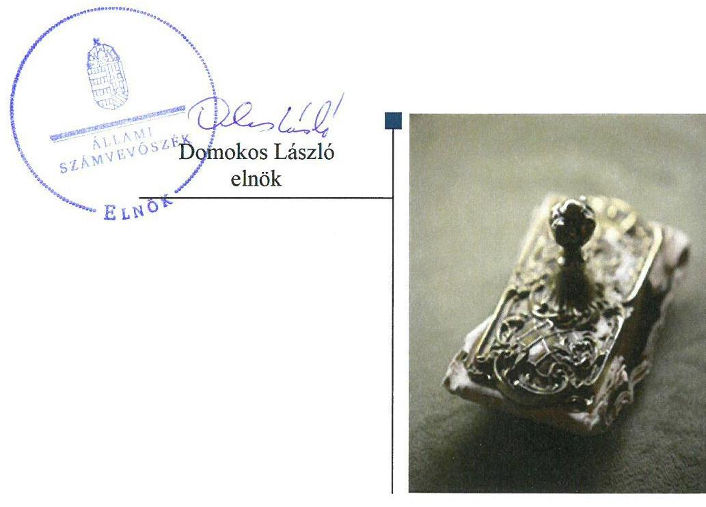
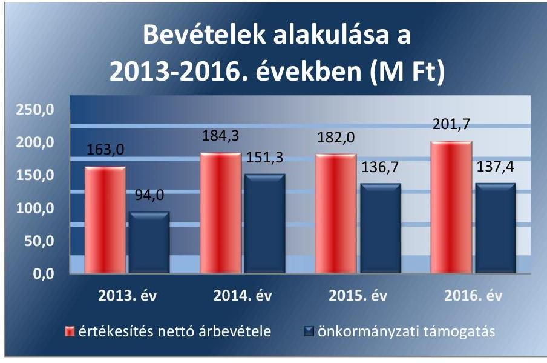

# Jelentés 

## Az önkormányzatok gazdasági társaságai

Az önkormányzatok többségi tulajdonában lévő gazdasági társaságok gazdálkodásának ellenőrzése - MAGLÓD PROJEKT Ingatlanfejlesztő- és Hasznosító Korlátolt Felelősségű Társaság
2018.

---

# Jelentés 

## Az önkormányzatok gazdasági társaságai

Az önkormányzatok többségi tulajdonában lévő gazdasági társaságok gazdálkodásának ellenőrzése - MAGLÓD PROJEKT Ingatlanfejlesztő- és Hasznosító Korlátolt Felelősségű Társaság
2018. 06. hó 05. nap

---

# AZ ELLENŐRZÉST FELÜGYELTE:

## MAKKAI MÁRIA felügyeleti vezető

## AZ ELLENŐRZÉST VEZETTE ÉS A VÉGREHAJTÁSÁÉRT FELELŐS:

### JOÓ ERIKA ellenőrzésvezető

### A PROGRAM ÖSSZEÁLLÍTÁSÁÉRT FELELŐS:

### TŐTPÁL SZABOLCS osztályvezető

---

**IKTATÓSZÁM:** EL-0222-048/2018

**TÉMASZÁM:** 2447

**ELLENŐRZÉS-AZONOSÍTÓ SZÁM:** V-079380

---

Jelentéseink az Országgyűlés számítógépes hálózatán és az Interneta a www.asz.hu címen is olvashatóak.

---

# TARTALOMJEGYZÉK 

■ ÖSSZEGZÉS ..... 5
■ AZ ELLENŐRZÉS CÉLJA ..... 6
■ AZ ELLENŐRZÉS TERÜLETE ..... 7
■ AZ ELLENŐRZÉS HÁTTERE, INDOKOLTSÁGA ..... 8
■ A JELENTÉS LÉNYEGES KÉRDÉSKÖREI ..... 9
■ AZ ELLENŐRZÉS HATÓKÖRE ÉS MÓDSZEREI ..... 10
■ MEGÁLLAPÍTÁSOK ..... 12
■ JAVASLATOK ..... 14
■ MELLÉKLETEK ..... 17
I. sz. melléklet: Értelmező szótár ..... 17
■ FÜGGELÉK: ÉSZREVÉTELEK ..... 19
■ RÖVIDÍTÉSEK JEGYZÉKE ..... 21

---

.

---

# ÖSSZEGZÉS 

Maglód Város Önkormányzata tulajdonosi joggyakorlása nem volt szabályszerű. A MAGLÓD PROJEKT Ingatlanfejlesztő- és Hasznosító Kft. szabályozottsága, vagyongazdálkodása nem felelt meg a jogszabályi előírásoknak. Számviteli beszámolóit nem támasztotta alá leltárral, a bevételek és ráfordítások elszámolása nem volt szabályszerű, közzétételi kötelezettségének nem tett eleget, ezzel nem volt biztosított a müködés és a gazdálkodás átláthatósága, illetve az elszámoltathatóság.

## Az ellenőrzés társadalmi indokoltsága

Az Állami Számvevőszék kiemelt célja, hogy a helyi önkormányzatok gazdálkodásában rejlő pénzügyi kockázatok feltárásával, az államháztartáson kívülre nyújtott költségvetési támogatások és ingyenes vagyonjuttatások, valamint az államháztartáson kívül múködő feladat-ellátó rendszerek ellenőrzéseivel hozzájáruljon ahhoz, hogy a közpénzeket az államháztartáson kívül múködő szervezetek is átlátható, rendezett módon használják fel.

Magyarországon az önkormányzatok kötelező és önként vállalt feladataik vonatkozásában is egyre szélesebb körben alkalmazzák a költségvetésen kívüli feladatellátást, ezáltal - a nonprofit szervezetek mellett - az önkormányzati tulajdonú gazdasági társaságok is kiemelt fontosságú szerephez jutottak.

## Főbb megállapítások, következtetések, javaslatok

Maglód Város Önkormányzatának tulajdonosi joggyakorlása nem volt szabályszerű, mivel a MAGLÓD PROJEKT Ingatlanfejlesztő- és Hasznosító Kft. felügyelőbizottsága ügyrenddel nem rendelkezett, a Társaság 2013. és 2016. évekre vonatkozó számviteli beszámolóinak elfogadásáról a felügyelőbizottság írásbeli jelentése hiányában döntöttek.

A MAGLÓD PROJEKT Ingatlanfejlesztő- és Hasznosító Kft. a jogszabályi előírások ellenére nem rendelkezett számviteli politikával és az annak keretében elkészítendő szabályzatokkal.

A MAGLÓD PROJEKT Ingatlanfejlesztő- és Hasznosító Kft. vagyongazdálkodása nem volt szabályszerű, tárgyi eszközeinek állományba vételét nem támasztotta alá a számviteli törvény előírása szerinti dokumentummal.

A közérdekú adatok közzétételére vonatkozó és a közérdekú adatok megismerésére irányuló igények teljesítésének rendjét rögzítő szabályzattal a Társaság nem rendelkezett, a közérdekú adatok közzétételi kötelezettségének nem tett eleget.

A MAGLÓD PROJEKT Ingatlanfejlesztő- és Hasznosító Kft. könyvviteli elszámolásait nem támasztotta alá a jogszabályi előírásoknak megfelelő számviteli bizonylattal, valamint a számviteli beszámolók mérlegtételeit nem támasztotta alá leltárral.

---

# AZ ELLENŐRZÉS CÉLJA 

AZ ELLENŐRZÉS CÉLJA annak értékelése volt, hogy az önkormányzat szabályszerűen gyakorolta-e tulajdonosi jogait; a gazdasági társaság szabályozottsága, gazdálkodása és vagyongazdálkodási tevékenysége, bevételeinek és ráfordításainak elszámolása megfelelt-e a jogszabályi és tulajdonosi előírásoknak; a gazdasági társaság kötelezettségállománya jelentett-e kockázatot a múködésre, valamint a gazdálkodás átláthatósága és elszámoltathatósága biztosítva volt-e.

---

# **AZ ELLENŐRZÉS TERÜLETE**

## **Maglód Város Önkormányzata; MAGLÓD PROJEKT Ingatlanfejlesztő- és Hasznosító Kft.**

A 2005. június 28-án a Stádium Magyarország Kft.1 és az Önkormányzat2 által közösen alapított Társaság3 2011. január 27-én Maglód Város Önkormányzata 100%-os tulajdonába került. A Társaság jegyzett tőkéjét az Önkormányzat 2013-ban 7,0 M Ft-ról 2,6 M Ft-ra leszállította, majd 2015-ben 3,0 M Ft-ra felemelte.

A Társaság fő tevékenysége a közétkeztetés és az Önkormányzat tulajdonában lévő ingatlanok üzemeltetése volt.

A feladat-ellátási szerződésben határozta meg az Önkormányzat a Társaság által ellátandó közfeladatokat, így az Önkormányzat tulajdonában és fenntartásában lévő iskola, óvoda, a családsegítő, a MAGHÁZ és a polgármesteri hivatal üzemeltetését, valamint az Önkormányzat tulajdonában lévő ingatlanok üzemeltetését.

A Társaság önköltségszámításra nem volt kötelezett, a közétkeztetés szolgáltatás díjait az Önkormányzat rendeletben állapította meg.

A Társaság bevételeinek alakulását az 1. ábra szemlélteti.

1. ábra

*Forrás: 2013-2016. egyszerűsített éves beszámolók, főkönyvi kartonok*

A Társaság nem tartozott a kormányzati szektorba sorolt egyéb szervezetek közé.

A polgármester4 és a jegyző5 személye az ellenőrzött időszakban nem változott. A Társaság ügyvezetőjének személye az ellenőrzött időszakban nem változott, a jelenlegi ügyvezető 2017. március 16. napjától tölti be tisztségét.

---

# AZ ELLENŐRZÉS HÁTTERE, INDOKOLTSÁGA 

Az önkormányzatok többségi tulajdonában álló gazdasági társaságok ellenőrzése kiemelten fontos a vagyon megőrzése, megóvása érdekében. A feladatellátás költségeinek, ráfordításainak alakulása a lakosság széles rétegét érinti.

Az ellenőrzés feltárhatja, hogy az önkormányzat a feladatellátásához rendelt vagyon múködtetését a tulajdonostól elvárható gondossággal vé-gezte-e, a feladatot ellátó gazdasági társaság a létesítő okiratban, szolgáltatási szerződésben foglaltak betartásával biztosította-e a feladat ellátását. Az ellenőrzés eredményeképp meghatározhatóvá válnak a költségvetési hiányt befolyásoló szervezetek kockázatai, lehetővé válik ezen kockázatok csökkentése. Az ellenőrzés rávilágíthat arra, hogy a hogy a gazdasági társaság a vagyon használatával biztosította-e a szolgáltatás folytatásának feltételeit, az önkormányzat tulajdonosi felügyelete hozzájárult-e a szabályszerű gazdálkodáshoz és feladatellátáshoz. A megállapítások alapján megfogalmazott számvevőszéki javaslatok hasznosítása elősegítheti a meglévő hibák megszüntetését.

---

# A JELENTÉS LÉNYEGES KÉRDÉSKÖREI 

1. Az Önkormányzat tulajdonosi joggyakorlása szabályszerű volt-e?
2. A Társaság szabályozottsága, gazdálkodása és vagyongazdálkodási tevékenysége szabályszerű volt-e?
3. A Társaság bevételeinek és ráfordításainak elszámolása szabályszerű volt-e?

---

# AZ ELLENŐRZÉS HATÓKÖRE ÉS MÓDSZEREI 

## Az ellenőrzés típusa

Megfelelőségi ellenőrzés.

## Az ellenőrzött időszak

2013. január 1-jétől 2016. december 31-ig tartó időszak.

## Az ellenőrzés tárgya

Az önkormányzatok - többségi tulajdonában lévő gazdasági társaságok feletti - tulajdonosi joggyakorlása, valamint a gazdasági társaságok gazdálkodásának szabályozottsága és szabályszerűsége.

Az ellenőrzés kiterjed minden olyan körülményre és adatra, amely az ÁSZ jogszabályban meghatározott feladatainak teljesítéséhez, valamint a program végrehajtása folyamán felmerült újabb összefüggések feltárásához szükséges.

## Az ellenőrzött szervezet

Maglód Város Önkormányzata;
Maglód Projekt Ingatlanfejlesztő és Hasznosító Kft.

## Az ellenőrzés jogalapja

Az ellenőrzés jogszabályi alapját az ÁSZ tv. 1. § (3) bekezdése és 5. § (3)(4)-(5) bekezdései képezték.

## Az ellenőrzés módszerei

Az ellenőrzést a nemzetközi standardokat irányadónak tekintve az ellenőrzési program ellenőrzési kérdései, az ellenőrzött időszakban hatályos jogszabályok, az ellenőrzés szakmai szabályok és módszertanok figyelembe vételével végeztük.

Az ellenőrzés ideje alatt az ellenőrzött szervezettel történő kapcsolattartást az ÁSZ Szervezeti és Múködési Szabályzatának vonatkozó előírásai alapján biztosítottuk.

---

Az ellenőrzés a kiválasztott, többségi tulajdonosi jogokat gyakorló önkormányzatra, illetve az ellenőrzésre kijelölt gazdasági társaság felett tulajdonosi jogokat gyakorló szervezetre és az ellenőrzött gazdasági társaságra terjedt ki.

Az ellenőrzési kérdések megválaszolásához szükséges bizonyítékok megszerzése a következő ellenőrzési eljárások alkalmazásával történt: megfigyelés, kérdésfeltevés (információkérés), összehasonlítás, valamint elemző eljárás. Az ellenőrzési bizonyítékként felhasználható adatforrások közé tartoztak egyrészt az ellenőrzési programban felsorolt adatforrások, másrészt adatforrás volt még minden - az ellenőrzés folyamán - feltárt, az ellenőrzés szempontjából információkat tartalmazó dokumentum.

Az ellenőrzést a kérdésekre adott válaszok kiértékelésével, valamint a megjelölt adatforrások, a csatolt tanúsítványok felhasználásával, továbbá az adott időszakban hatályos jogszabályok figyelembe vételével folytattuk le.

---

# 1. Az Önkormányzat tulajdonosi joggyakorlása szabályszerű volt-e? 

Összegző megállapítás

Az Önkormányzat tulajdonosi joggyakorlása nem volt szabályszerű.
1.1. számú megállapítás

Az Önkormányzat a tulajdonosi joggyakorlás kereteit nem a jogszabályi előírásoknak megfelelően alakította ki.
Az Alapító okirat ${ }_{1,2}{ }^{6}$ a Gt. és a Ptk. előírásainak megfelelően rendelkezett a három fős felügyelőbizottság ${ }^{7}$ létrehozásáról. A felügyelőbizottság a Gt. 34. § (4) bekezdésben, valamint a Ptk. 3:122. § (3) bekezdésében foglalt előírások ellenére nem rendelkezett ügyrenddel.

Javadalmazási szabályzatot a Tak.tv. ${ }^{8}$ 5. § (3) bekezdésében foglalt előírások ellenére az Alapító ${ }^{9}$ nem alkotta meg.
1.2. számú megállapítás

A tulajdonosi jogok gyakorlása nem volt szabályszerű.
Az Alapító az ellenőrzött időszakban a 2013. és a 2016. évi egyszerűsített éves beszámolók elfogadásáról a Ptk. 3:120. §. (2) bekezdésében foglalt előírás ellenére - mivel a felügyelőbizottság nem készített írásbeli jelentést - a felügyelőbizottság írásbeli jelentése hiányában döntött.

## 2. A Társaság szabályozottsága, gazdálkodása és vagyongazdálkodási tevékenysége szabályszerű volt-e?

Összegző megállapítás

A Társaság szabályozottsága, gazdálkodása és vagyongazdálkodási tevékenysége nem volt szabályszerű.
2.1. számú megállapítás

A Társaság gazdálkodásának szabályozottsága nem felelt meg a jogszabályi előírásoknak.
Számviteli politikával a Számv. tv. 14. § (3) bekezdésében foglalt előírás ellenére nem rendelkezett a Társaság az ellenőrzött időszakban. A Számv. tv. 14. § (5) bekezdésében kötelezően elkészítendő szabályzatként előírt eszközök és a források leltárkészítési és leltározási szabályzatával, az eszközök és a források értékelési szabályzatával, valamint pénzkezelési szabályzattal nem rendelkezett a Társaság.

Számlarenddel a Számv. tv. 161. § (1) bekezdés előírásai ellenére nem rendelkezett a Társaság.

---

A közérdekű adatok közzétételére vonatkozó és a közérdekű adatok megismerésére irányuló igények teljesítésének rendjét rögzítő szabályzattal az Info tv. ${ }^{10} 35$. § (3) és 30 . § (6) bekezdéseiben foglalt előírások ellenére nem rendelkezett a Társaság.

# 2.2. számú megállapítás 

## A Társaság vagyongazdálkodása nem volt szabályszerű.

Az ellenőrzött időszakban a Számv.tv. 52. § (2) bekezdés, valamint a 165. § (1) bekezdés előírásai ellenére a tárgyi eszközök állományba vétele során az üzembe helyezést nem dokumentálták.

A Társaság a Számv. tv. 69. § (1) bekezdésében foglalt előírások ellenére a 2013-2016. évi egyszerűsített éves beszámolók mérlegtételeit nem támasztotta alá leltárral, ezért a 2013-2016. évekre vonatkozó egyszerűsített éves beszámolók készítése során nem érvényesült a Számv. tv. 15. § (3) bekezdésében megfogalmazott valódiság elve.

A könyvvizsgáló a mérleget alátámasztó leltár hiánya ellenére az ellenőrzött időszak minden évében hitelesítő záradékot adott a könyvvizsgálói jelentésében.

A Társaság az Info tv. 37. § (1) bekezdésben foglalt előírások ellenére nem tett eleget közzétételi kötelezettségének.

A Társaság a beszámolási kötelezettségének az egyszerűített éves beszámolók, valamint a féléves pénzügyi beszámolók Alapító részére történő beterjesztésével tett eleget.

## 3. A Társaság bevételeinek és ráfordításainak elszámolása szabályszerű volt-e?

## Összegző megállapítás

## A Társaság bevételeinek és ráfordításainak elszámolása nem volt szabályszerű.

Az ellenőrzött időszakban a Társaság a Számv. tv. 161. § (1) bekezdés előírásai ellenére nem rendelkezett számlarenddel, ennek következtében nem volt megállapítható a gazdasági események megfelelő számlákra történő könyvelése, ezért a bevételek és ráfordítások elszámolása az ellenőrzött időszakban nem volt szabályszerű. A Társaság beszámolóját alátámasztó könyvvezetés nem felelt meg a Számv. tv. 15. § (3) bekezdésében foglalt valódiság elvének.

A bevételek és ráfordítások könyvviteli elszámolását nem támasztotta alá a Társaság a Számv. tv. 165. § (2) bekezdésében foglalt előírásoknak megfelelő számviteli bizonylattal.

Az Önkormányzat által a Társaság részére nyújtott támogatások elszámolásához a Társaság a 2016. évben nem rendelkezett a Számv. tv. 165. § (2) bekezdés előírásainak megfelelő számviteli bizonylattal.

---

# JAVASLATOK 

Az ÁSZ tv. 33. § (1) bekezdésében foglaltak értelmében az ellenőrzött szervezet vezetője köteles a jelentésben foglalt megállapításokhoz kapcsolódó intézkedési tervet összeállítani és azt a jelentés kézhezvételétől számított 30 napon belül az ÁSZ részére megküldeni. Amennyiben az ellenőrzött szervezet vezetője nem küldi meg határidőben az intézkedési tervet, vagy továbbra sem elfogadható intézkedési tervet küld, az Állami Számvevőszék elnöke az ÁSZ tv. 33. § (3) bekezdése a) és b) pontjaiban foglaltakat érvényesítheti.

## Maglód Város polgármesterének

1. Kezdeményezze, hogy a felügyelőbizottság állapítsa meg ügyrendjét és az Alapitó a jogszabályi előirásoknak megfelelően hagyja jóvá.
(1.1. sz. megállapítás 1. bekezdés utolsó mondata alapján)
2. Intézkedjen, hogy az Alapitó a vezető tisztségviselők, felügyelőbizottsági tagok, valamint az Mt. 208. §-ának hatálya alá eső munkavállalók javadalmazása, valamint a jogviszony megszünése esetére biztosított juttatások módjának, mértékének elveire, annak rendszerére vonatkozó szabályzatát megalkossa.
(1.1. sz. megállapítás 2. bekezdése alapján)
3. Intézkedjen arról, hogy az Alapitó a Ptk.-ban előirtaknak megfelelően, a felügyelőbizottság írásbeli jelentésének birtokában döntsön a Társaság éves beszámolójáról.
(1.2. sz. megállapítás 1. bekezdése alapján)
4. Tegyen intézkedéseket:
a) a számlarend elkészítésének elmulasztása,
b) a számviteli szabályozási hiányosságok,
c) a leltár hiánya,
d) a közzétételi kötelezettség elmulasztása
miatti felelősség tisztázása érdekében, és szükség szerint intézkedjen a felelősség érvényesítéséről.
(2.1. sz. megállapítás 1-2. bekezdései, 2.2. sz. megállapítás 2. bekezdése, 2.2. sz. megállapítás 4. bekezdése)

---

# A MAGLÓD PROJEKT Ingatlanfejlesztő- és Hasznosító Kft. ügyvezetőjének 

1. Intézkedjen a Számv.tv. előírásainak megfelelő számviteli politika, eszközök és források leltárkészitési és leltározási szabályzata, az eszközök és források értékelési szabályzata, valamint a pénzkezelési szabályzat és a számlarend elkészitéséről.
(2.1. sz. megállapítás 1-2. bekezdései alapján)
2. Intézkedjen az Info. tv. előírásának megfelelően a közérdekü adatok közzétételére és a közérdekü adatok megismerésére irányuló igények teljesitésének rendjére vonatkozó szabályzat elkészitéséről.
(2.1. sz. megállapítás 3. bekezdése alapján)
3. Intézkedjen a tárgyi eszközök üzembe helyezésének a Számv. tv. előírásainak megfelelő dokumentálásáról.
(2.2. sz. megállapítás 1. bekezdése alapján)
4. Intézkedjen a jogszabályi előírásoknak megfelelően a mérleg tételeinek leltárral való alátámasztásáról.
(2.2. sz. megállapítás 2. bekezdése alapján)
5. Intézkedjen az Info. tv. 1. mellékletében előirt adatok közzétételéről.
(2.2. sz. megállapítás 4. bekezdése alapján)
6. Intézkedjen a bevételek és ráfordítások elszámolásának Számv. tv. előírásainak megfelelő számviteli bizonylattal történő alátámasztásáról.
(3. sz. megállapítás 2. bekezdése alapján)

---

.

---

# MELLÉKLETEK 

- I. SZ. MELLÉKLET: ÉRTELMEZŐ SZÓTÁR
gazdasági társaság
tulajdonosi joggyakorló
vagyongazdálkodás

Ptk. 3:88. § (1) bekezdése szerint „a gazdasági társaságok üzletszerű közös gazdasági tevékenység folytatására, a tagok vagyoni hozzájárulásával létrehozott, jogi személyiséggel rendelkező vállalkozások, amelyekben a tagok a nyereségből közösen részesednek, és a veszteséget közösen viselik".
Aki a nemzeti vagyon felett az államot vagy a helyi önkormányzatot megillető tulajdonosi jogok és kötelezettségek összességének gyakorlására jogosult. (Forrás: Nvtv. 3. § (1) bekezdés 17. pontja)

A nemzeti vagyongazdálkodás feladata a nemzeti vagyon rendeltetésének megfelelő, az állam, az önkormányzat mindenkori teherbíró képességéhez igazodó, elsődlegesen a közfeladatok ellátásához és a mindenkori társadalmi szükségletek kielégítéséhez szükséges, egységes elveken alapuló, átlátható, hatékony és költségtakarékos működtetése, értékének megőrzése, állagának védelme, értéknövelő használata, hasznosítása, gyarapítása, továbbá az állam vagy a helyi önkormányzat feladatának ellátása szempontjából feleslegessé váló vagyontárgyak elidegenítése. (Forrás: Nvtv. 7. § (2) bekezdése).

---

.

---

# FÜGGELÉK: ÉSZREVÉTELEK 

A jelentéstervezetet a Számvevőszék 15 napos észrevételezésre megküldte az ellenőrzött szervezet vezetőjének az ÁSZ tv. 29. §* (1) bekezdése előírásának megfelelően.

A MAGLÓD PROJEKT Ingatlanfejlesztő- és Hasznositó Kft. ügyvezetője és Maglód Város Önkormányzata polgármeste az ÁSZ tv. 29. § (2) bekezdésében foglalt észrevételezési jogukkal nem éltek, a törvényes határidőn belül észrevételt nem tettek.

[^0]
[^0]:    * 29. § (1) Az Állami Számvevőszék az ellenőrzési megállapításait megküldi az ellenőrzött szervezet vezetőjének vagy az általa megbízott személynek, és annak, akinek személyes felelősségét állapította meg.
    (2) Az ellenőrzött szervezet vezetője és a felelősként megjelölt személy az ellenőrzés megállapításaira tizenöt napon belül írásban észrevételt tehet.
    (3) Az Állami Számvevőszék az észrevételre a beérkezésétől számított harminc napon belül írásban válaszol. A figyelembe nem vett észrevételeket köteles a jelentésben feltüntetni, és megindokolni, hogy azokat miért nem fogadta el.

---

.

---

# RÖVIDÍTÉSEK JEGYZÉKE 

${ }^{1}$ Stádium Magyarország Kft.
${ }^{2}$ Önkormányzat
${ }^{3}$ Társaság
${ }^{4}$ polgármester
${ }^{5}$ jegyző
${ }^{6}$ Alapító okirat ${ }_{1,2}$
${ }^{7}$ FB
${ }^{8}$ Tak.tv.
${ }^{9}$ Alapító
${ }^{10}$ Info tv.

2005-ben a Maglód Projekt Kft. alapításában résztvevő üzletviteli tanácsadó társaság, közvetlen irányítást biztosító befolyással rendelkezett 2005.07.25. és 2011.01.27. között

Maglód Város Önkormányzata
Maglód Projekt Ingatlanfejlesztő és Hasznosító Kft.
Maglód Város Önkormányzatának polgármestere
Maglód Város Önkormányzatának jegyzője
a Maglód Projekt Kft. Alapító okirata (hatályos: 2013. január 28-tól, illetve 2015. május 20-tól)
a Maglód Projekt Kft. felügyelő bizottsága
A köztulajdonban álló gazdasági társaságok takarékosabb múködéséről szóló 2009. évi CXXII. törvény.

Maglód Város Önkormányzata Képviselő-testülete
2011. évi CXII. törvény az információs önrendelkezési jogról és az információszabadságról

---

# ÁLLAMI SZÁMVEVŐSZÉK 

1052 Budapest, Apáczai Csere János utca 10.
Levélcím: 1364 Budapest 4. Pf. 54
Telefon: +36 14849100 Telefax: +36 14849200
www.asz.hu