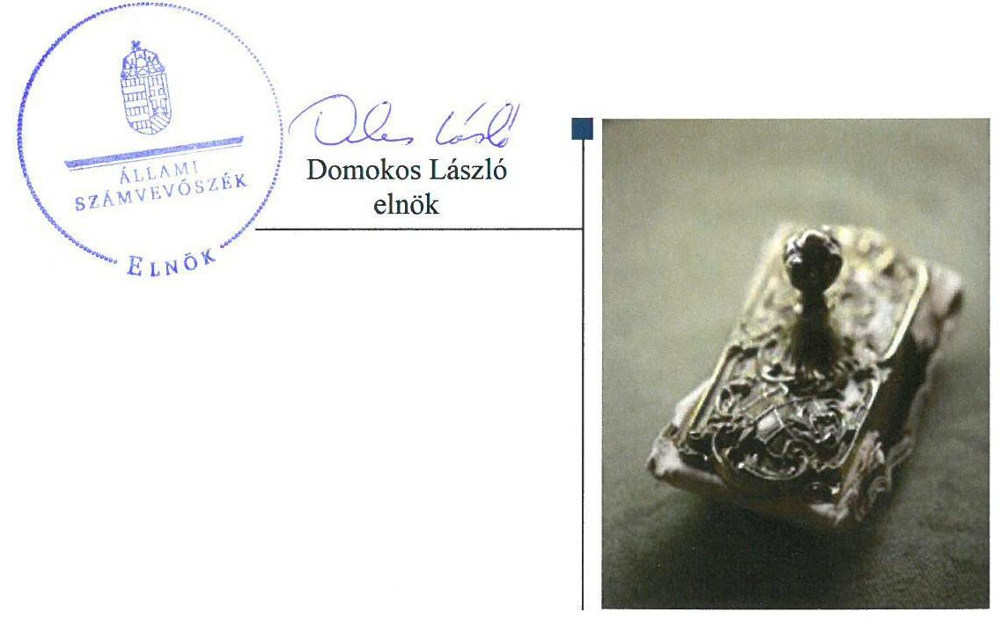
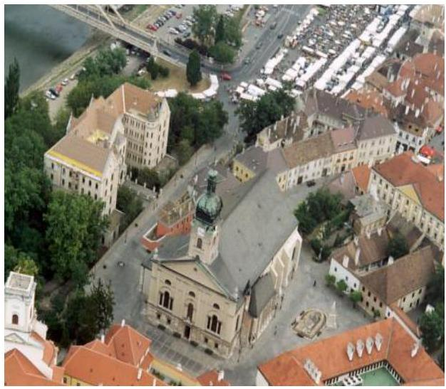

# Jelentés 

## Nem állami humánszolgáltatók ellenőrzése

A humánszolgáltatást nyújtó államháztartáson kívüli köznevelési és szociális intézmények, szolgáltatók fenntartói központi költségvetésből kapott támogatásai felhasználásának ellenőrzése - Győri Egyházmegye 2018.

---

# Jelentés 

## Nem állami humánszolgáltatók ellenőrzése

A humánszolgáltatást nyújtó államháztartáson kívüli köznevelési és szociális intézmények, szolgáltatók fenntartói központi költségvetésből kapott támogatásai felhasználásának ellenőrzése - Győri Egyházmegye
2018. OG hó 13 nap

---

# AZ ELLENŐRZÉST FELÜGYELTE:

- **SALAMON ILDIKÓ** felügyeleti vezető

- **AZ ELLENŐRZÉST VEZETTE ÉS A VÉGREHAJTÁSÁÉRT FELELŐS:**

- **MAROZSÁN LÁSZLÓNÉ** ellenőrzésvezető

- **A PROGRAM ÖSSZEÁLLÍTÁSÁÉRT FELELŐS:**

- **TÓTPÁL SZABOLCS** osztályvezető

**IKTATÓSZÁM:** EL-0116-081/2018.

**TÉMASZÁM:** 2448

**ELLENŐRZÉS-AZONOSÍTÓ SZÁM:** V079403

Jelentéseink az Országgyűlés számítógépes hálózatán és az Interneta a www.asz.hu címen is olvashatóak.

---

# TARTALOMJEGYZÉK 

■ ÖSSZEGZÉS ..... 5
■ AZ ELLENŐRZÉS CÉLJA ..... 6
■ AZ ELLENŐRZÉS TERÜLETE ..... 7
■ AZ ELLENŐRZÉS HÁTTERE, INDOKOLTSÁGA ..... 8
■ A JELENTÉS LÉNYEGES KÉRDÉSKÖREI ..... 9
■ AZ ELLENŐRZÉS HATÓKÖRE ÉS MÓDSZEREI ..... 10
■ MEGÁLLAPÍTÁSOK ..... 12
■ JAVASLATOK ..... 15
■ MELLÉKLETEK ..... 17
I. sz. melléklet: Értelmező szótár ..... 17
II. sz. melléklet: A támogatás jogcímenkénti alakulása ..... 19
■ FÜGGELÉK: ÉSZREVÉTELEK ..... 21
■ RÖVIDÍTÉSEK JEGYZÉKE ..... 23

---

.

---

# ÖSSZEGZÉS 

A Győri Egyházmegye, mint intézményfenntartó a költségvetési támogatások elszámoltatható igénybevételének, felhasználásának feltételeit szabályszerű müködési környezet kialakításával megteremtette. A köznevelési és szociális feladatellátásához kapott költségvetési támogatásokat szabályszerűen használta fel, azokat az intézmények müködtetésére fordította.

## Az ellenőrzés társadalmi indokoltsága

Az Állami Számvevőszék stratégiájában hangsúlyos szerepet szán annak, hogy szilárd szakmai alapon álló, értékteremtő ellenőrzéseivel előmozdítsa a közpénzügyek átláthatóságát, rendezettségét és javaslataival a közpénzek és a közvagyon szabályos, gazdaságos, hatékony és eredményes felhasználását segítse. Stratégiájában az Állami Számvevőszék célul tűzte ki, hogy az államháztartáson kívülre nyújtott költségvetési támogatások ellenőrzésével hozzájárul ahhoz, hogy a közpénzeket az államháztartáson kívüli szervezetek is átlátható módon használják fel a közfeladatok szerződésben vállalt ellátása érdekében. Tekintettel az elmúlt években a köznevelés finanszírozását és a köznevelési intézmények fenntartását érintően végbement változásokra, a társadalom fokozott érdeklődéssel figyeli a köznevelési feladatok ellátására fordított források felhasználását. Fontos ezért az Állami Számvevőszéknek a közvéleményt biztosítani arról, hogy a közpénz államháztartáson kívüli felhasználása ezen a területen sem marad ellenőrizetlenül. Hozzájárul ezzel ahhoz is, hogy a nyilvánosság és az igénybevevők megfelelő tájékoztatást kapjanak az államháztartáson kívüli közfeladatot ellátók müködéséről.

## Főbb megállapítások, következtetések, javaslatok

A Győri Egyházmegye, mint intézményfenntartó a költségvetési támogatások igénybevételének és felhasználásának feltételeit szabályszerű működési környezet kialakításával megteremtette. A 2014-2015. évekre vonatkozóan a számviteli politika keretében nem készítette el az eszközök és források leltárkészítési és leltározási szabályzatát továbbá az eszközök és források értékelési szabályzatát. Gazdálkodási szabályzatai a 2016. évben megfelelőek voltak. Az ellenőrzött időszakban a költségvetési támogatásokkal kapcsolatos igénylési, módosítási és elszámolási feladatokat szabályszerűen ellátta, azonban a köznevelési támogatások igényléséhez, módosításához, elszámolásához kapcsolódóan egyes iratmegőrzési kötelezettségének nem tett eleget.

A fenntartott intézményeivel kapcsolatos fenntartói feladatainak eleget tett, kinevezte az intézmények vezetőit, meghatározta költségvetésüket, az alapdokumentumaik elkészítéséről gondoskodott. A Magyar Államkincstár által folyósított költségvetési támogatást a fenntartott intézményeinek átadta. A Győri Egyházmegye, mint intézményfenntartó biztosította az intézmények működtetésének feltételeit.

A külső ellenőrzéseket követő intézkedési kötelezettségét teljesítette. A kötelezően közzéteendő adatok nyilvánosságra hozatalának rendjét nem szabályozta.

---

# AZ ELLENŐRZÉS CÉLJA 

AZ ELLENŐRZÉS CÉLJA annak értékelése volt, hogy a Győri Egyházmegye, mint Intézményfenntartó ${ }^{1}$ központi költségvetésből kapott támogatásainak felhasználása szabályszerű volt-e, a támogatások igénylése, évközi módosítása és év végi elszámolása megfelel-e a jogszabályi előírásoknak.

---

# **AZ ELLENŐRZÉS TERÜLETE**

## **Győri Egyházmegye**

A Győri Egyházmegye Győr-Moson-Sopron Megyében és Komárom-Esztergom Megyében 2014. évben kilenc, 2016. szeptember 1-jétől nyolc köznevelési intézmény2 és egy szociális humánszolgáltató intézmény3 fenntartásával és működtetésével vett részt az önkormányzati és állami közfeladat-ellátásban.

A Győri Egyházmegye a köznevelési intézmények fenntartásával hét intézményben óvodai nevelést, hét intézményben általános iskolai oktatást, három intézményben gimnáziumi oktatást, továbbá egy intézményben alapfokú művészeti oktatást biztosított a 2016. évben. Két intézményében kollégiumi ellátás igénybe vételére is lehetőség volt, összesen 275 férőhellyel.

A Fenntartó a költségvetési támogatás igényléséhez előírt feltételeknek az ellenőrzött években megfelelő, köznevelési és szociális feladatellátására tekintettel Magyarország éves költségvetéséből támogatásra volt jogosult. A Győri Egyházmegye, mint intézményfenntartó által a köznevelési és szociális feladatellátásához igényelt és a Kincstár4 által elszámolásként elfogadott költségvetési támogatás a 2014. évben 1 787,9 millió Ft, a 2015. évben 1 907,2 millió Ft, a 2016. évben 2 019,9 millió Ft volt, mely támogatás jogcímenkénti alakulását a II. sz. melléklet tartalmazza.

A Győri Egyházmegye a központi költségvetésből köznevelési feladatai ellátására további két jogcímen is (működési támogatás és kiegészítő támogatás) támogatásra volt jogosult, melyet a jogszabályi előírás alapján nem ő igényelt. Ezen jogcímeken a költségvetésből a Katolikus Egyház, mint bevett egyház kapott támogatást és utalta tovább az Intézményfenntartónak, aki az általa fenntartott intézményeknek a támogatást átadta. 2014-2016 között ez a támogatási összeg 2 886,7 millió Ft volt.

A közfeladat ellátásával kapcsolatos szakmai irányítószervi feladatokat az ellenőrzött időszakban az EMMI5 látta el, a törvényességi ellenőrzési feladatokat pedig a területileg illetékes kormányhivatalok6 végezték. A Fenntartó a köznevelési és szociális közfeladat ellátására tekintettel kapott közpénzekre való gazdálkodásával a nyilvánosság előtt köteles volt elszámolni.

---

# AZ ELLENŐRZÉS HÁTTERE, INDOKOLTSÁGA 

A köznevelési és szociális feladatokat ellátó nem állami intézményfenntartók részére közfeladataik ellátására évente jelentős összegű pénzügyi támogatást biztosítottak a mindenkori költségvetési törvények a bennük megfogalmazott feltételek mellett.

A köznevelési és szociális feladatokra felhasználható állami támogatások előirányzata 2014. - 2016. években együtt 753 Mrd Ft volt. A 2013. évben jelentős változások következtek be a normatív finanszírozás rendszerében. Az Országgyűlés elfogadta a nemzeti köznevelésről szóló 2011. évi CXC. törvényt, amely jelentősen átalakította a korábbi finanszírozási rendszert 2013 szeptemberétől. Módosították a szociális igazgatásról és szociális ellátásokról szóló 1993. évi III. törvényt is, amely - többek között - 2012. január 1-jei hatállyal megfogalmazta a finanszírozási rendszerbe történő befogadással összefüggő szabályokat. Mindkét területen új feladatfinanszírozási forma (átlagbéralapú támogatás) jelent meg, amely az államháztartáson kívüli intézményfenntartókra is vonatkozik. Az ellenőrzés a finanszírozási rendszerben bekövetkezett változásokra, azok közfeladat ellátásra gyakorolt hatására fókuszált a költségvetési támogatásokat felhasználó államháztartáson kívüli szervezetek körében. Az ellenőrzés indokoltságát az is alátámasztotta, hogy az ÁSZ ${ }^{7}$ még nem ellenőrizte átfogóan e területet.

Az ÁSZ stratégiájában foglaltak alapján is indokolt az ellenőrzés, amely a társadalom számára jelzi, hogy a közpénz államháztartáson kívüli felhasználása sem maradhat ellenőrizetlenül. Az államháztartáson kívülre nyújtott költségvetési támogatások ellenőrzésével az ÁSZ hozzájárul ahhoz, hogy a közpénzeket a nem állami fenntartók átlátható módon használják fel a közfeladatok ellátására kötött szerződésekben vállalt kötelezettségek teljesítése érdekében. Az ÁSZ az ellenőrzés javaslataival hozzájárulhat az említett rendszerek szabályszerű támogatás-felhasználásához, javíthatja a társa-dalmi-gazdasági döntések megalapozottságát, amely a „jó kormányzás" feltétele.

---

# A JELENTÉS LÉNYEGES KÉRDÉSKÖREI 

1. A köznevelési és szociális közfeladatot ellátó Fenntartó szabályszerű müködési és gazdálkodási környezet kialakításával megteremtette-e a költségvetési támogatások átlátható, elszámoltatható igénybevételének, felhasználásának feltételeit?
2. A Fenntartó az átvállalt köznevelési és szociális közfeladathoz biztositott költségvetési támogatásokat szabályszerűen fordi-totta-e intézményei müködtetésére?
3. A Fenntartó a köznevelési és szociális humánszolgáltató intézményei müködtetéséhez felhasznált közpénzekre vonatkozó gazdálkodásával a nyilvánosság előtt elszámolt-e, ennek megalapozása érdekében ellenőrzési, értékelési feladatait szabályszerűen látta-e el?

---

# AZ ELLENŐRZÉS HATÓKÖRE ÉS MÓDSZEREI 

## Az ellenőrzés típusa

Megfelelőségi ellenőrzés.

## Az ellenőrzött időszak

A 2014. január 1-je és 2016. december 31-e közötti időszak.

## Az ellenőrzés tárgya

Az ellenőrzés a közfeladatokat ellátó államháztartáson kívüli fenntartó közfeladatai ellátásához a költségvetési törvényekben biztosított központi költségvetési támogatások igénylése, évközi módosítása és év végi elszámolása fenntartói feladatainak ellátása, illetve a központi költségvetésből kapott támogatás közfeladatokra való Fenntartó általi felhasználása szabályszerűségének értékelésére terjedt ki.

Az ellenőrzés kiterjedt minden olyan körülményre és adatra, amely az ÁSZ jogszabályban meghatározott feladatainak teljesítéséhez, valamint a program végrehajtása folyamán felmerült újabb összefüggések feltárásához szükséges volt.

## Az ellenőrzött szervezet

Győri Egyházmegye, mint intézményfenntartó.

## Az ellenőrzés jogalapja

Az ellenőrzés jogszabályi alapját az ÁSZ tv. ${ }^{8} 1 . \S$ (3) bekezdésében, az 5. § (3) bekezdésében, valamint az 5. § (11) bekezdés c) pontjában foglalt előírások adták.

## Az ellenőrzés módszerei

Az ellenőrzést az ellenőrzési program kérdései, az adott időszakban hatályos jogszabályok, az ellenőrzés szakmai szabályok és módszertanok, valamint a nemzetközi standardok figyelembevételével végezte az ÁSZ.

A közpénzekkel való felelős gazdálkodás segítésére irányuló javaslatok kidolgozásakor a hatályos jogszabályok voltak az irányadóak.

---

Az ellenőrzés ideje alatt az ÁSZ a Fenntartóval történő kapcsolattartást az ÁSZ SZMSZ ${ }^{6}$-ének vonatkozó előírásai alapján biztosította.

Az ellenőrzési kérdések megválaszolásához szükséges bizonyítékok megszerzése az ellenőrzött által rendelkezésre bocsátott dokumentumokra, adatokra alapozva történt.

Az ellenőrzési bizonyítékként felhasznált adatforrások közé tartoztak egyrészt a szakmai program részletes szempontjainál felsorolt adatforrások, másrészt minden - az ellenőrzés folyamán feltárt, az ellenőrzés szempontjából információt tartalmazó - dokumentum.

Az ellenőrzés lefolytatásához a Fenntartó a kitöltött tanúsítványok, valamint az ÁSZ által kért dokumentumok átadásával szolgáltatott adatokat, információkat. Az így rendelkezésre bocsátott adatok, információk és a tanúsítványok adatai valódiságának kontrollja az ellenőrzés keretében történt.

Helyszíni szemlékre a fenntartott intézmények egyes feladat ellátási helyein került sor.

A köznevelési és a szociális humánszolgáltatások központi költségvetési támogatásai igénylésével, módosításával, elszámolásával kapcsolatos, államháztartáson kívüli fenntartó jogszabályokban előírt feladatai betartását, továbbá a központi költségvetési támogatások szabályszerű kezelését, nyilvántartását ellenőrizte az ÁSZ a Fenntartónál, az ott rendelkezésre álló határozatok, nyilvántartások, beszámolók és egyéb dokumentumok alapján.

Az ellenőrzés nem terjedt ki a köznevelési feladatok és a szociális humánszolgáltatások ellátásához kapcsolódó központi költségvetési támogatás igénylése, módosítása, elszámolása valódiságának, megalapozottságának, helyességének - sem a fenntartónál, sem a székhely intézményeinél való - értékelésére. Továbbá nem terjedt ki az ellenőrzés e források, intézmények általi szabályszerű felhasználásának értékelésére. A szabályosság megítélésének alapját képezte, hogy a központi költségvetési támogatások Fenntartó általi igénylése, módosítása és elszámolása a Kincstár felé megtörtént.

---

# MEGÁLLAPÍTÁSOK 

## 1. A köznevelési és szociális közfeladatot ellátó Fenntartó szabályszerű múködési és gazdálkodási környezet kialakításával meg-teremtette-e a költségvetési támogatások átlátható, elszámoltatható igénybevételének, felhasználásának feltételeit?

Összegző megállapítás

A Fenntartó a szabályszerű múködési környezetet kialakította. Szabályszerű gazdálkodási környezet kialakításával a 2016. évtől megteremtette a költségvetési támogatások átlátható, elszámoltatható igénybevételének, felhasználásának a feltételeit.

A Fenntartó köznevelési és szociális közfeladata ellátásának megszervezése a jogszabályi előírásoknak megfelelt. Gazdálkodási szabályzatai a 2014-2015. évben nem voltak szabályszerűek, a 2016. évben megfeleltek a jogszabályi előírásoknak.

A köznevelési és a szociális humánszolgáltatási feladatok ellátásához a Fenntartó a szabályszerű múködési környezetet kialakította, szervezeti és múködési szabályait meghatározta. A Komárom-Esztergom Megyei Bíróság a Fenntartót nyilvántartásba vette.

A Fenntartó beszámolási formája és alkalmazott könyvvezetése megfelelt a Számv. tv. ${ }^{10}$-ben előírtaknak, az ellenőrzött időszakban egyszerűsített éves beszámolót készített. A 2016. évre vonatkozóan a Fenntartó a Számv. tv. előírásainak megfelelően a számviteli politika keretében elkészítette a leltározási szabályzatát ${ }^{11}$, továbbá az értékelési szabályzatát ${ }^{12}$.

A Fenntartó az ellenőrzött időszakra vonatkozóan rendelkezett számviteli politikával ${ }^{13}$ és annak keretében elkészített pénzkezelési szabályzat$\mathrm{tal}^{14}$. A Számv. tv. 14. § (5) bekezdés a) és b) pontjában előírtak ellenére a 2014-2015. évekre vonatkozóan a számviteli politika keretében nem készítette el az eszközök és források leltárkészítési és leltározási szabályzatát továbbá az eszközök és források értékelési szabályzatát.

A Fenntartó a költségvetési támogatások igénylési, módosítási és elszámolási feladatait szabályszerűen ellátta, azonban a kapcsolódó iratmegőrzési kötelezettségének nem szabályszerűen tett eleget.

A köznevelési és a szociális humánszolgáltatási feladatellátáshoz a központi költségvetési támogatások igénylésére, módosítására vonatkozó kérelmét a Fenntartó a Kincstárhoz benyújtotta, Kincstár által folyósított támogatásokkal elszámolt.

---

A Fenntartó a köznevelési feladatellátáshoz kapcsolódó 2014-2016. évi támogatási kérelmek és az elszámolások benyújtását igazoló dokumentumok vonatkozásában nem gondoskodott az Lttv. ${ }^{15}$ 9. § (1) bekezdés e) pontjában előírt iratmegőrzésről.

Az ellenőrzött időszakban a köznevelési intézmények adataiban bekövetkezett változásokkal (tanulói létszám, feladatellátás, intézményvezető) kapcsolatos bejelentési kötelezettségének a Fenntartó az Nkt. vhr. ${ }^{16} 37 / \mathrm{H}$. § (1) bekezdésben előírtak ellenére nem tett eleget.

# 2. A Fenntartó az átvállalt köznevelési és szociális közfeladathoz biztosított költségvetési támogatásokat szabályszerűen fordí-totta-e intézményei múködtetésére? 

Összegző megállapítás

## 2.1. számú megállapítás

2.2. számú megállapítás

A Fenntartó a biztosított költségvetési támogatásokat szabályszerűen fordította az intézmények múködtetésére.

A Fenntartó biztosította a köznevelési és szociális humánszolgáltató intézményei múködtetésének feltételeit.

A Fenntartó kiadta az intézmények létesítő okiratait, módosításukról szükség esetén gondoskodott. A köznevelési intézmények alapító okirataiban a jogszabályi előírásoknak megfelelően meghatározta a Fenntartó többek között az intézmények alapfeladatait, feladat-ellátási helyét, a feladat-ellátáshoz szükséges vagyon feletti rendelkezési jogot, a gazdálkodással összefüggő jogosítványokat.

Fenntartói feladatai körében gondoskodott az intézmények nyilvántartásba vételéről, meghatározta az intézmények költségvetését, jóváhagyta a köznevelési intézmények SZMSZ-ét, pedagógiai programját, házirendjét, gondoskodott a szociális humánszolgáltató intézménye SZMSZ-ének és szakmai programjának elkészítéséről.

A Fenntartó az Nkt. ${ }^{17}$ és a Szoc. tv. ${ }^{18}$ előírásainak megfelelően gyakorolta a köznevelési és szociális intézmények vezetői tekintetében a munkáltatói jogokat, biztosította az intézmények számára a feladat ellátáshoz szükséges vagyon feletti rendelkezési jogot, állandó saját székhelyet.

A Fenntartó a Kincstár által utalt költségvetési támogatások teljes öszszegét átadta az általa fenntartott köznevelési és szociális intézményeknek, ezáltal biztosította múködésük pénzügyi feltételeit.

## A Fenntartó a kapott költségvetési támogatást az intézményei múködtetésére fordította.

A támogatás felhasználásáról, az intézményeknek történt átadásáról intézményenként naprakész nyilvántartást vezetett a Fenntartó. Köznevelési feladatellátással kapcsolatos számviteli nyilvántartásait a Nkt. vhr. előírásának megfelelően úgy alakította ki, hogy azokból megállapítható volt, hogy a költségvetési támogatásokat milyen célra használta fel.

---

# 3. A Fenntartó a köznevelési és szociális humánszolgáltató intézményei múködtetéséhez felhasznált közpénzekre vonatkozó gazdálkodásával a nyilvánosság előtt elszámolt-e, ennek megalapozása érdekében ellenőrzési, értékelési feladatait szabályszerűen látta-e el? 

Összegző megállapítás

A Fenntartó köznevelési és szociális humánszolgáltató intézményei tevékenységét ellenőrizte, a külső ellenőrzésekkel kapcsolatos intézkedési feladatait szabályszerűen ellátta.

A Fenntartó a köznevelési és szociális humánszolgáltató intézményei gazdálkodásának, múködésének ellenőrzését az intézményi alapdokumentumok ${ }^{19}$, valamint az intézményi költségvetések és beszámolók, a szociális szakmai program jóváhagyásán keresztül végezte, egyéb dokumentált ellenőrzést nem végzett.

A Fenntartó nem állapította meg az Info. tv ${ }^{20}$. 35. § (3) bekezdésének előírása ellenére belső szabályzatban az Info. tv. 37. §-ban meghatározott közzétételi listákon szereplő adatok pontos, naprakész és folyamatos közzétételének a részletes szabályait.

A köznevelési intézményeket érintő kormányhivatali ellenőrzések alapján a Fenntartónak intézkedési kötelezettsége nem volt. A szociális humánszolgáltató intézmény törvényességi ellenőrzése során előírt intézkedést a Fenntartó megtette.

---

# JAVASLATOK 

Az ÁSZ tv. 33. § (1) bekezdésében foglaltak értelmében az ellenőrzött szervezet vezetője köteles a jelentésben foglalt megállapításokhoz kapcsolódó intézkedési tervet összeállítani és azt a jelentés kézhezvételétől számított 30 napon belül az ÁSZ részére megküldeni. Amennyiben az ellenőrzött szervezet vezetője nem küldi meg határidőben az intézkedési tervet, vagy továbbra sem elfogadható intézkedési tervet küld, az Állami Számvevőszék elnöke az ÁSZ tv. 33. § (3) bekezdése a) és b) pontjaiban foglaltakat érvényesítheti.

## Győri Egyházmegye vezetőjének

1. Intézkedjen, a jogszabályban foglaltaknak megfelelőn az iratmegőrzési kötelezettség teljesitésére
(1.2. számú megállapítás 2. bekezdése alapján)
2. Intézkedjen az Nkt. vhr-ben elöirtaknak megfelelően a Kincstár által nyilvántartott adatokban bekövetkezett változás esetén a változás-bejelentési kötelezettség teljesitésére.
(1.2. számú megállapítás 3. bekezdés alapján)
3. Intézkedjen, hogy a Fenntartó a jogszabályi elöírásnak megfelelően belső szabályzatban állapítsa meg a közzétételi listákon szereplő adatok pontos, naprakész és folyamatos közzétételének részletes szabályait.
(3. számú megállapítás 2. bekezdése alapján

---

.

---

# MELLÉKLETEK 

## I. SZ. MELLÉKLET: ÉRTELMEZŐ SZÓTÁR

bevett egyház
egyházi fenntartó
humánszolgáltatás
költségvetési támogatás
köznevelési közfeladat

Az Ehtv. ${ }^{21}$ 6. § (1-2) bekezdései szerint az Országgyűlés által elismert egyház bevett egyház. Vallási közösség az Országgyűlés által elismert egyház és a vallási tevékenységet végző szervezet lehet. A vallási közösség elsődlegesen vallási tevékenység céljából jön létre és múködik. Az Ehtv. 7. §-a szerint a vallási közösség az egyház megjelölést elnevezésében és tevékenységére való utalás során önmeghatározása céljából - a saját hitelvei szerinti tartalommal - használhatja.
Az Ehtv. 33. §-a alapján az Ehtv. mellékletében felsorolt egyházak és az általuk meghatározott, az egyház belső egyházi szabálya szerint jogi személyiséggel rendelkező szervezetek - a nyilvántartásba vételük dátumától függetlenül - 2012. január 1-jétől minősülnek egyházi fenntartóknak. Az Ehtv. 14. §-ában meghatározott eljárás folyamán az Országgyűlés által egyháznak elismert szervezet a törvénynek az egyház bejegyzésére vonatkozó módosítása hatálybalépésének napjától minősül egyháznak (Ehtv. 15. §).
Külön törvényben meghatározott szociális, gyermekjóléti, gyermekvédelmi, közoktatási, felsőoktatási, kulturális közfeladatok (2014. évi Kvtv. 34. § (1), (4) bekezdés, 1. számú melléklet XX/20/2. alcím, 19. alcím, 2015. évi Kvtv. 43. § (1), (4) bekezdés, 1. számú melléklet XX/20/2/3. jogcím csoport, 19. alcím, 2016. évi Kvtv. 41. § (1), (4) bekezdés, 1. számú melléklet XX/20/2/3. jogcím csoport, 19. alcím).
a társadalombiztosítás pénzügyi alapjai kivételével az államháztartás központi alrendszeréből ellenérték nélkül, pénzben nyújtott támogatások (Áht. 1. § 14. pont)
A Kvtv-ekben (2013. évi CCXXX. törvény 33-34. §, 2014. évi C. törvény 42-43. §, 2015. évi C. törvény 40-41. §) megállapított támogatás. Például a 2015. évi C. törvény 40-41. § szerint többek között: Az Országgyűlés a köznevelési feladat ellátására átlagbéralapú támogatást állapít meg. A nevelési-oktatási, valamint pedagógiai szakszolgálati intézményt fenntartó nemzetiségi önkormányzat, az egyházi és magán köznevelési intézmény fenntartója részére az általuk fenntartott nevelési-oktatási intézményben, továbbá pedagógiai szakszolgálati intézményben pedagógus és - a b) pont kivételével - nevelő-oktató munkát közvetlenül segítő munkakörben foglalkoztatottak után a 7. melléklet I. pontja, valamint az óvoda, egységes óvoda-bölcsőde esetében a 2. melléklet II. pont 1. alpontja szerint és az 5. alpontjában meghatározott jogosultak után, az őket ott megillető mértékek szerint. Múködési támogatást állapít meg a nemzetiségi önkormányzat vagy az egyházi jogi személy által fenntartott nevelési-oktatási intézményekben ellátott, továbbá a pedagógiai szakszolgálati intézményekben gyógypedagógiai tanácsadásban, korai fejlesztésben, oktatásban és gondozásban, valamint a fejlesztő nevelésben részt vevő gyermekekre, tanulókra tekintettel a nemzetiségi önkormányzat és a bevett egyház részére a 7. melléklet II. pontja szerint.
Az Országgyűlés a szociális, gyermekjóléti, gyermekvédelmi közfeladatot ellátó intézményt, szolgáltatást fenntartó egyházi jogi személy, civil szervezet, közalapítvány, országos nemzetiségi önkormányzat, települési vagy területi nemzetiségi önkormányzat, gazdasági társaság, és a humánszolgáltatást alaptevékenységként végző, az Szja tv. hatálya alá tartozó egyéni vállalkozó (a továbbiakban együtt: nem állami szociális fenntartó) részére támogatást állapít meg a következők szerint: a támogatás a nem állami szociális fenntartót a települési önkormányzatok 2. melléklet III. pont 3. alpont c)-k) pontjában és III. pont 5. alpont a) pontjában meghatározott támogatásaival azonos jogcímeken, öszszegben és feltételek mellett illeti meg.
A köznevelési intézmény alapító okiratában foglalt feladat: óvodai nevelés, nemzetiséghez tartozók óvodai nevelése, általános iskolai nevelés-oktatás, nemzetiséghez tartozók általános iskolai nevelése-oktatása, kollégiumi ellátás, nemzetiségi kollégiumi ellátás,

---

köznevelési intézmény
nem állami, nem önkormányzati (államháztartáson kívüli) intézmény fenntartó
gimnáziumi nevelés-oktatás, szakközépiskolai nevelés-oktatás, szakiskolai nevelés-oktatás, nemzetiség gimnáziumi nevelés-oktatása, nemzetiség szakközépiskolai nevelés-oktatása, nemzetiség szakiskolai nevelés-oktatása, Köznevelési Hídprogramok keretében folyó nevelés-oktatás, felnőttoktatás, alapfokú művészetoktatás, fejlesztő nevelés, fejlesztő nevelés-oktatás, pedagógiai szakszolgálati feladat, a többi gyermekkel, tanulóval együtt nevelhető, oktatható sajátos nevelési igényű gyermekek, tanulók óvodai nevelése és iskolai nevelése-oktatása, azoknak a sajátos nevelési igényű gyermekeknek, tanulóknak az óvodai, iskolai, kollégiumi ellátása, akik a többi gyermekkel, tanulóval nem foglalkoztathatók együtt, a gyermekgyógyüdülőkben, egészségügyi intézményekben, rehabilitációs intézményekben tartós gyógykezelés alatt álló gyermekek tankötelezettségének teljesítéséhez szükséges oktatás, pedagógiai-szakmai szolgáltatás.
A nevelési- oktatási intézmény, pedagógiai szakszolgálati intézmény, pedagógiai-szakmai szolgáltatást nyújtó intézmény.
A köznevelési és szociális, gyermekjóléti és gyermekvédelmi közfeladatokat/humánszolgáltatásokat ellátó intézményt fenntartó egyházi jogi személy, társadalmi szervezet, alapítvány, közalapítvány, civil szervezet, országos nemzetiségi önkormányzat, nonprofit gazdasági társaság, gazdasági társaság és a humánszolgáltatást alaptevékenységként végző, Szja tv. hatálya alá tartozó egyéni vállalkozó. (2013. évi Kvtv. 35. § (1), (3) bekezdés, 2014. évi Kvtv. 33. §, 34. § (1), (4) bekezdés, 2015. évi Kvtv. 42. §, 43. § (1), (4) bekezdés, 2016. évi Kvtv. 40. §, 41. § (1), (4) bekezdés)

---

II. SZ. MELLÉKLET: A TÁMOGATÁS JOGCÍMENKÉNTI ALAKULÁSA

# A FENNTARTÓ ÁLTAL A KÖZNEVELÉSI FELADATHOZ IGÉNYELT ÉS KAPOTT KÖZPONTI KÖLTSÉGVETÉSI TÁMOGATÁS JOGCÍMENKÉNTI ALAKULÁSA (EZER FT)

|  Megnevezés | 2014. év | 2015. év | 2016. év  |
| --- | --- | --- | --- |
|  Átlagbéralapú támogatás | 1665124 | 1781067 | 1886294  |
|  Gyermekétkeztetési támogatás | 89107 | 90357 | 97878  |
|  Tankönyvtámogatás | 16512 | 14268 | 12732  |
|  Összesen | 1770743 | 1885692 | 1996904  |

A FENNTARTÓ ÁLTAL A SZOCIÁLIS HUMÁNSZOLGÁLTATÁSI FELADATHOZ IGÉNYELT ÉS KAPOTT KÖZPONTI KÖLTSÉGVETÉSI TÁMOGATÁS JOGCÍMENKÉNTI ALAKULÁSA (EZER FT)

|  Megnevezés | 2014. év | 2015. év | 2016. év  |
| --- | --- | --- | --- |
|  Szociális étkeztetés | 1061,8 | 1000,4 | 981,5  |
|  Időskorúak nappali intézményi ellátása | 949,4 | 958,1 | 878,5  |
|  Idősek otthona | 7427,2 | 8156,9 | 8678,6  |
|  Egyházi kiegészítő támogatás | 6399,2 | 7222,4 | 7524,6  |
|  Szociális ágazati pótlék | 1334,0 | 2008,1 | 2173,1  |
|  Egyszeri szociális kiegészítő támogatás | - | 1185,5 | -  |
|  Kiegészítő pótléktámogatás | - | 1008,5 | 2780,5  |
|  Összesen | 17171,6 | 21539,8 | 23016,8  |
|  A KÖZNEVELÉSI ÉS SZOCIÁLIS HUMÁNSZOLGÁLTATÁSI FELADATOK ELLÁTÁSÁHOZ BIZTOSÍTOTT TÁMOGATÁSOK MINDÖSSZESEN | 1787914,6 | 1907231,8 | 2019920,8  |

Forrás: 2014-2016. évi költségvetési támogatás elszámolásainak kincstári határozatai.

---

.

---

# FÜGGELÉK: ÉSZREVÉTELEK 

A jelentéstervezetet a Számvevőszék 15 napos észrevételezésre megküldte az ellenőrzött szervezet vezetőjének az ÁSZ tv. 29. §* (1) bekezdése előírásának megfelelően. Az ÁSZ tv. 29. § (2) bekezdése alapján az ellenőrzött szervezet vezetője az ellenőrzés megállapításaira tizenöt napon belül írásban észrevételt

tehetett.

A Győri Egyházmegye megyéspüspöke az ellenőrzés megállapításaira írásban észrevételt tett.
Az ÁSZ tv. 29. § (3) bekezdésével összhangban az ÁSZ a Függelékben feltünteti az ellenőrzés megállapításaival kapcsolatban tett, figyelembe nem vett észrevételeket, és megindokolja, hogy azokat miért nem fogadta el.

A Győri Egyházmegye megyéspüspökének az ellenőrzés megállapításaival kapcsolatban, írásban tett, figyelembe nem vett észrevétele és annak indoklása.

A Győri Egyházmegye megyéspüspöke észrevételt tett az iratmegőrzési kötelezettség elmulasztásával, valamint a köznevelési intézmények adataiban bekövetkezett változásokkal kapcsolatos bejelentési kötelezettség elmulasztásával kapcsolatos megállapításokra.

Az ellenőrzés megállapításai az ÁSZ tv. 28. § (2) bekezdése alapján az ellenőrzött szervezet által az ellenőrzéséhez kapcsolódóan, az ellenőrzés lefolytatásához a törvényi határidőben rendelkezésre bocsátott, a teljességi és hitelességi nyilatkozatban feltüntetett dokumentumokon alapulnak. Az észrevételezett megállapítások a Győri Egyházmegye által a törvényi határidőben rendelkezésre bocsátott dokumentumokon, nyilatkozatokon alapultak, amelyek alapján a megállapításokat konkrétan, a kapcsolódó jogszabályi hivatkozással az 1.2. számú megállapítás 2. és 3. bekezdései tartalmazzák. Erre tekintettel a megállapítások módosítása nem indokolt.

[^0]
[^0]:    * 29. § (1) Az Állami Számvevőszék az ellenőrzési megállapításait megküldi az ellenőrzött szervezet vezetőjének vagy az általa megbízott személynek, és annak, akinek személyes felelősségét állapította meg.
    (2) Az ellenőrzött szervezet vezetője és a felelősként megjelölt személy az ellenőrzés megállapításaira tizenöt napon belül írásban észrevételt tehet.
    (3) Az Állami Számvevőszék az észrevételre a beérkezésétől számított harminc napon belül írásban válaszol. A figyelembe nem vett észrevételeket köteles a jelentésben feltüntetni, és megindokolni, hogy azokat miért nem fogadta el.

---

.

---

# RÖVIDÍTÉSEK JEGYZÉKE 

${ }^{1}$ Intézményfenntartó/Fenntartó
${ }^{2}$ köznevelési intézmény
${ }^{3}$ szociális humánszolgáltató intézmény
${ }^{4}$ Kincstár
${ }^{5}$ EMMI
${ }^{6}$ illetékes kormányhivatalok
${ }^{7}$ ÁSZ
${ }^{8}$ ÁSZ tv.
${ }^{9}$ ÁSZ SZMSZ
${ }^{10}$ Számv. tv.
${ }^{11}$ leltározási szabályzat
${ }^{12}$ értékelési szabályzat
${ }^{13}$ számviteli politika
${ }^{14}$ pénzkezelési szabályzat
${ }^{15}$ Lttv.
${ }^{16}$ Nkt.vhr.
${ }^{17}$ Nkt.
${ }^{18}$ Szoc. tv.
${ }^{19}$ intézményi alapdokumentumok
${ }^{20}$ Info. tv.
${ }^{21}$ Ehtv.

Győri Egyházmegye
Apor Vilmos Római Katolikus Óvoda, Általános Iskola, Alapfokú Művészeti Iskola, Gimnázium és Kollégium,
Árpád-házi Szent Margit Óvoda (beolvadással megszűnt: 2016. augusztus 31-én),
Hildegard Óvoda,
II. Rákóczi Ferenc Római Katolikus Óvoda és Általános Iskola, Páli Szent Vince Katolikus Általános Iskola és Óvoda, Prohászka Ottokár Orsolyita Gimnázium, Általános Iskola és Óvoda, Szent Anna Katolikus Általános Iskola, Szent Imre Római Katolikus Általános Iskola és Óvoda, Szent Orsolya Római Katolikus Gimnázium, Általános Iskola, Óvoda és Kollégium,
Egyházmegyei Papi Otthon
Magyar Államkincstár
Emberi Erőforrások Minisztériuma
Győr-Moson-Sopron Megyei Kormányhivatal
Komárom-Esztergom Megyei Kormányhivatal
Állami Számvevőszék
2011. évi LXVI. törvény az Állami Számvevőszékről (hatályos 2011. július 1-től)
az Állami Számvevőszék szervezeti és müködési szabályzata
2000. évi C. törvény a számvitelről

Győri Egyházmegye leltározási, leltárkészítési szabályzata (hatályos 2016. január 1-jétől)
Győri Egyházmegye Eszközök és a Források értékelési szabályzata (hatályos 2016. január 1-jétől)

Győri Egyházmegye Számviteli Politikája és módosítása (hatályos 2014. január 1-től)
Győri Egyházmegye Pénzkezelési Szabályzata és módosítása (hatályos 2014. január 1-től)
1995. évi LXVI. törvény a közokiratokról, a közlevéltárakról és a magánlevéltári anyag védelméről
229/2012. (VIII. 28.) Korm. rendelet a nemzeti köznevelésről szóló törvény végrehajtásáról (hatályos 2012. szeptember 1-jétől)
2011. évi CXC. törvény a nemzeti köznevelésről (hatályos 2012. szeptember 1-jétől)
1993. évi III. törvény a szociális igazgatásról és szociális ellátásokról a köznevelési intézmények SZMSZ-e, pedagógiai programja, házirendje 2011. évi CXII. törvény az információs önrendelkezési jogról és az információszabadságról (hatályos 2011. július 27-től)
2011. évi CCVI. törvény a lelkiismereti és vallásszabadság jogáról, valamint az egyházak, vallásfelekezetek és vallási közösségek jogállásáról (hatályos: 2011. december 22-től)

---

# ÁLLAMI SZÁMVEVŐSZÉK 

1052 Budapest, Apáczai Csere János utca 10.
Levélcím: 1364 Budapest 4. Pf. 54
Telefon: +36 14849100 Telefax: +36 14849200
www.asz.hu