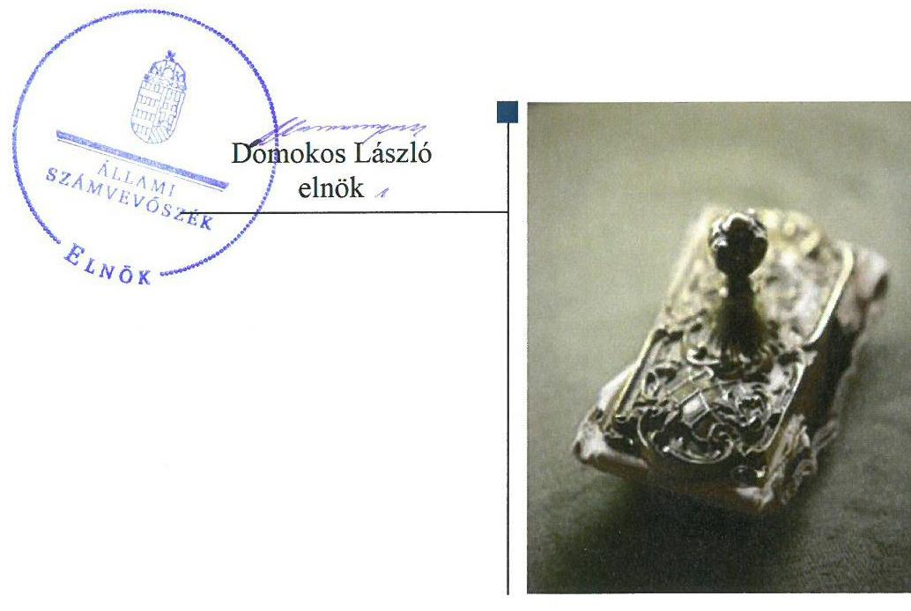
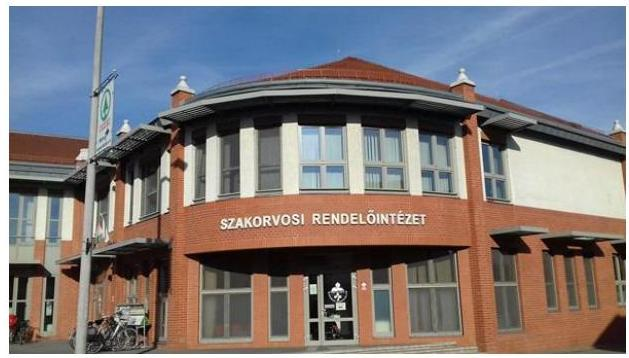
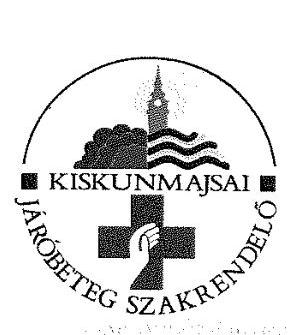
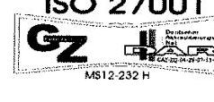
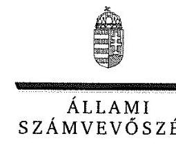
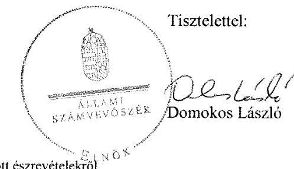
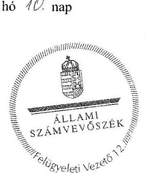

# Jelentés 

## Az önkormányzatok gazdasági társaságai

Az önkormányzatok többségi tulajdonában lévő gazdasági társaságok gazdálkodásának ellenőrzése - Kiskunmajsai Kistérségi Közszolgáltató Nonprofit Kft.
2018.

---

# Jelentés 

## Az önkormányzatok gazdasági társaságai

Az önkormányzatok többségi tulajdonában lévő gazdasági társaságok gazdálkodásának ellenőrzése - Kiskunmajsai Kistérségi Közszolgáltató Nonprofit Kft.
2018. 05. hó 31. nap

---

# AZ ELLENŐRZÉST FELÜGYELTE: 

PETŐ KRISZTINA felügyeleti vezető

## AZ ELLENŐRZÉST VEZETTE ÉS A VÉGREHAJTÁSÁÉRT FELELŐS:

KEREKES PÉTER ellenőrzésvezető

## A PROGRAM ÖSSZEÁLLÍTÁSÁÉRT FELELŐS:

TÓTPÁL SZABOLCS osztályvezető

IKTATÓSZÁM: EL-0126-059/2018.
TÉMASZÁM: 2447

## ELLENŐRZÉS-AZONOSÍTÓ SZÁM: V079316

Jelentéseink az Országgyúlés számítógépes hálózatán és az Interneten a www.asz.hu címen is olvashatóak.

---

# TARTALOMJEGYZÉK 

■ ÖSSZEGZÉS ..... 5
■ AZ ELLENŐRZÉS CÉLJA ..... 6
■ AZ ELLENŐRZÉS TERÜLETE ..... 7
■ AZ ELLENŐRZÉS HÁTTERE, INDOKOLTSÁGA ..... 8
■ A JELENTÉS LÉNYEGES KÉRDÉSKÖRE ..... 9
■ AZ ELLENŐRZÉS HATÓKÖRE ÉS MÓDSZEREI ..... 10
■ MEGÁLLAPÍTÁSOK ..... 12
■ JAVASLATOK ..... 13
■ MELLÉKLETEK ..... 15
I. sz. melléklet: Értelmező szótár ..... 15
■ FÜGGELÉK: ÉSZREVÉTELEK ..... 17
■ RÖVIDÍTÉSEK JEGYZÉKE ..... 29

---

.

---

# ÖSSZEGZÉS 

A Kiskunmajsai Kistérségi Közszolgáltató Nonprofit Kft. gazdálkodása, valamint vagyongazdálkodása nem volt szabályszerű. A Társaság elszámoltathatóságát és átláthatóságát nem biztositották.

## Az ellenőrzés társadalmi indokoltsága

Magyarországon az intézmény-centrikus közfeladat-ellátás jellemző, de egyre jelentősebb a költségvetésen kívüli feladatellátás térnyerése. Helyi szinten ennek legfontosabb szereplői az önkormányzati tulajdonban lévő gazdasági társaságok, amelyeknek ellenőrzése kiemelten fontos a közfeladat ellátása, és a közvagyon megőrzése, megóvása érdekében. Ezért alapvető követelmény, hogy gazdálkodásuk, múködésük szabályszerű és átlátható legyen.

A Kiskunmajsai Kistérségi Közszolgáltató Nonprofit Korlátolt Felelősségű Társaságot a Kiskunmajsai Kistérség tagtelepülései egészségügyi szolgáltatási feladatok ellátására alapították, a társaság a Kiskunmajsai Kistérség területén élő mintegy 19 ezer fős lakosság szakorvosi járóbeteg-ellátását biztosítja. Az Állami Számvevőszék 2013-2016. évekre kiterjedő ellenőrzése során arra kereste a választ, hogy szabályszerű volt-e az egészségügyi szolgáltatást, mint közfeladatokat is ellátó társaság gazdálkodása és az ehhez kapcsolódó tulajdonosi joggyakorlás.

## Főbb megállapítások, következtetések, javaslatok

A Kiskunmajsai Kistérségi Közszolgáltató Nonprofit Kft. gazdálkodása és vagyongazdálkodása nem volt szabályszerű, mert a könyvviteli elszámolást közvetlenül és közvetetten alátámasztó számviteli bizonylatokkal nem rendelkeztek. Továbbá az egyszerűsitett éves beszámolók mérlegtételeit leltár egyik évben sem támasztotta alá. Mindezek alapján a Társaságnál az elszámoltathatóság és az átláthatóság nem volt biztosított.

A megállapítások alapján az Állami Számvevőszék Kiskunmajsa Város Önkormányzata polgármesterének egy, a Kiskunmajsai Kistérségi Közszolgáltató Nonprofit Korlátolt Felelősségű Társaság ügyvezetőjének hat javaslatot fogalmazott meg, amelyre 30 napon belül intézkedési tervet kell készíteniük.

---

# AZ ELLENŐRZÉS CÉLJA 

Az ellenőrzés célja volt annak értékelése, hogy az Önkormányzat ${ }^{1}$ vagyongazdálkodási tevékenysége során szabályszerűen gyakorolta-e tulajdonosi jogait; a Társaság ${ }^{2}$ szabályozottsága, gazdálkodása és vagyongazdálkodási tevékenysége, bevételeinek és ráfordításainak elszámolása megfelelt-e a jogszabályi és tulajdonosi előírásoknak; a gazdasági társaság kötelezettségállománya jelent-e kockázatot a múködésre, valamint a gazdálkodás átláthatósága és elszámoltathatósága érdekében biztosítva volt-e a szolgáltatás dijának megalapozottsága szabályszerű önköltségszámítással. Az ellenőrzés célja továbbá annak megítélése, hogy a kormányzati szektorba sorolt önkormányzati tulajdonban lévő gazdálkodó szervezetek gazdálkodásának a kormányzati szektor hiányára és az államadósságra befolyással bíró elemei a jogszabályi előírásoknak meg-feleltek-e.

---

# AZ ELLENŐRZÉS TERÜLETE 

## Kiskunmajsa Város Önkormányzata és a Kiskunmajsai Kistérségi Közszolgáltató Nonprofit Kft.

A Társaság többségi tulajdonosa a Bács-Kiskun megyében található Kiskunmajsa Város Önkormányzata. Az ellenőrzött időszakban a polgármester személye a 2014. évben, a jegyző személye a 2013., 2014. és 2015. években változott.

Kiskunmajsa Város Önkormányzata, Szank Község Önkormányzata, Móricgát Község Önkormányzata, Jászszentlászló Község Önkormányzata, Kömpöc Község Önkormányzata és Csólyospálos Község Önkormányzata a „Kiskunmajsai Kistérség tagtelepülései" néven a 2008. évben hozták létre a Kiskunmajsai Kistérségi Közszolgáltató Nonprofit Korlátolt Felelősségű Társaságot. A Társaság induló törzstőkéje 500 ezer Ft pénzbeli hozzájárulás volt, amelyből Kiskunmajsa Város Önkormányzata 450 ezer Ft-tal, a kisebbségi tulajdonos önkormányzatok ${ }^{3}$ mindegyike 10 ezer Ft-tal járult hozzá a társaság megalapításához. A Társaság törzstőkéje a 2012. évben 96150 ezer Ft-ra nőtt, amikor az Önkormányzat a Társaság rendelkezésére bocsátotta a feladatellátáshoz használt, 95650 ezer Ft értékű ingatlant.

A Társasági szerződés ${ }^{4}$ alapján a Társaság taggyűlésein a tulajdonosi jogokat Kiskunmajsa Város Önkormányzata 80\%-os, a Kiskunmajsai Kistérség települései nevében Szank Község Önkormányzata 20\%-os szavazati aránynyal gyakorolja.

A Társaság a Kiskunmajsai Kistérség tagtelepülésein élő mintegy 19 ezer fős lakossága számára biztosította az egészségmegőrzési, betegségmegelőzési, gyógyító- és egészségügyi rehabilitációs tevékenységet, valamint szociális, kulturális és egyéb tevékenységet végzett.

A Társaság közfeladatot látott el. A Társaság az ellenőrzött időszakban az értékesítésének nettó árbevételéből 95,3\%-ot az alaptevékenységéből, 4,3\%-ot vállalkozási tevékenységből ért el.

A Társaság az ellenőrzött időszakban kormányzati szektorba besorolt gazdasági társaságnak minősült, de gazdálkodásában nem voltak a kormányzati szektor hiányára befolyással bíró elemek. A Társaság a Stabilitási tv. ${ }^{5}$ szerinti, adósságot keletkeztető ügyletet nem kötött. Nem vett fel hitelt, nem bocsátott ki kötvényt, kötelezettségvállaláshoz kapcsolódóan nem vállalt garanciát és kezességet. Kezelésbe vett vagyonnal nem rendelkezett.

A Társaság 2012-ben 31 főt, 2016-ban 32 fő alkalmazottat foglalkoztatott. Az ellenőrzött időszakban az ügyvezető személye nem változott.

A Társaság a Számv. tv. ${ }^{6}$ 155. § (3) bekezdése alapján nem volt könyvvizsgáló alkalmazására kötelezett, azonban a Társasági szerződés előírásának megfelelve könyvvizsgálót alkalmaztak.

---

# AZ ELLENŐRZÉS HÁTTERE, INDOKOLTSÁGA 

Az önkormányzatok többségi tulajdonában álló gazdasági társaságok ellenőrzése kiemelten fontos a vagyon megőrzése, megóvása érdekében, valamint a kormányzati szektor elszámolásaiban megjelenő önkormányzati tulajdonú gazdálkodó szervezetek esetében, amelyekkel szemben alapvető követelmény, hogy gazdálkodásuk, működésük szabályszerű, az általuk szolgáltatott adatok minél megbízhatóbbak legyenek. A feladatellátás költségeinek, ráfordításainak alakulása a lakosság széles rétegét érinti.

Ellenőrzéseink feltárhatják, hogy az önkormányzat a feladatellátásához rendelt vagyon működtetését a tulajdonostól elvárható gondossággal vé-gezte-e, a feladatot ellátó gazdasági társaság a létesítő okiratban, szolgáltatási szerződésben foglaltak betartásával biztosította-e a feladat ellátását. Az ellenőrzés eredményeképp meghatározhatóvá válnak a költségvetési hiányt befolyásoló szervezetek kockázatai, lehetővé válik ezen kockázatok csökkentése. Az ellenőrzés rávilágíthat arra, hogy a gazdasági társaság a vagyon használatával biztosította-e a szolgáltatás folytatásának feltételeit, az önkormányzat tulajdonosi felügyelete hozzájárult-e a szabályszerű gazdálkodáshoz és feladatellátáshoz. A megállapítások alapján megfogalmazott számvevőszéki javaslatok hasznosítása elősegítheti a meglévő hibák megszüntetését. A jó gyakorlatok bemutatásával az ÁSZ ${ }^{7}$ hozzájárulhat a követendő megoldások megismertetéséhez, terjesztéséhez.

---

# A JELENTÉS LÉNYEGES KÉRDÉSKÖRE 

1. A kormányzati szektorba sorolt gazdasági társaság gazdálkodása és vagyongazdálkodása szabályszerű volt-e?

---

# AZ ELLENŐRZÉS HATÓKÖRE ÉS MÓDSZEREI 

## Az ellenőrzés típusa

Megfelelőségi ellenőrzés.

## Az ellenőrzött időszak

2013. január 1-től 2016. december 31-ig

## Az ellenőrzés tárgya

Az Önkormányzat - többségi tulajdonában lévő gazdasági társaság feletti - tulajdonosi joggyakorlása, valamint a Társaság gazdálkodásának szabályozottsága és szabályszerűsége, továbbá az önkormányzati alszektorba sorolt gazdasági társaság gazdálkodásának a kormányzati szektor hiányára és az államadósságra befolyással bíró elemei.

Az ellenőrzés kiterjed minden olyan körülményre és adatra, amely az ÁSZ jogszabályban meghatározott feladatainak teljesítéséhez, valamint a program végrehajtása folyamán felmerült újabb összefüggések feltárásához szükséges.

## Az ellenőrzött szervezet

Kiskunmajsa Város Önkormányzata és a Kiskunmajsai Kistérségi Közszolgáltató Nonprofit Kft.

## Az ellenőrzés jogalapja

Az ellenőrzés jogszabályi alapját az ÁSZ tv. ${ }^{8}$ 1. § (3) bekezdése és 5. § (3)(4)-(5) bekezdései képezik.

## Az ellenőrzés módszerei

Az ellenőrzést a nemzetközi standardokat irányadónak tekintve az ellenőrzési program ellenőrzési kérdései, az ellenőrzött időszakban hatályos jogszabályok, az ellenőrzés szakmai szabályok és módszertanok figyelembevételével végeztük.

Az ellenőrzés ideje alatt az ellenőrzött szervezettel történő kapcsolattartást az ÁSZ Szervezeti és Múködési Szabályzatának vonatkozó előírásai alapján biztosítottuk.

---

Az ellenőrzési kérdések megválaszolásához szükséges bizonyítékok megszerzése a következő ellenőrzési eljárások alkalmazásával történt: megfigyelés, kérdésfeltevés (információkérés), összehasonlítás, valamint elemző eljárás. Az ellenőrzési bizonyítékként felhasználható adatforrások közé tartoztak egyrészt az ellenőrzési programban felsorolt adatforrások, másrészt adatforrás lehet még minden - az ellenőrzés folyamán - feltárt, az ellenőrzés szempontjából információkat tartalmazó dokumentum.

Az ellenőrzést a kérdésekre adott válaszok kiértékelésével, valamint a megjelölt adatforrások, a csatolt tanúsítványok felhasználásával, továbbá az adott időszakban hatályos jogszabályok figyelembevételével folytattuk le.

---

# 1. A kormányzati szektorba sorolt gazdasági társaság gazdálkodása és vagyongazdálkodása szabályszerű volt-e? 

Összegző megállapítás

A Társaság gazdálkodása és vagyongazdálkodása nem volt szabályszerű.

A Társaság a könyvviteli elszámolást közvetlenül és közvetetten alátámasztó számviteli bizonylatokkal a Számv. tv. 165. § (1) bekezdésében előírtak ellenére nem rendelkezett.

A Társaság az egyszerűsített éves beszámolóit nem támasztotta alá olyan leltárakkal, amelyek tételesen, ellenőrizhető módon tartalmazzák a Társaság mérleg fordulónapján meglévő eszközeit és forrásait, megsértve ezzel a Számv. tv. 69. § (1) bekezdésében előírtakat. Az egyszerűsített éves beszámolók részeként 2013-ban, 2014-ben és 2015-ben elkészített kiegészítő mellékletekben az eredménytartalék bemutatásaként szerepeltetett adatok eltérnek a főkönyvi kivonatban alátámasztott adatoktól, megsértve ezzel a Számv. tv. 4. § (1) bekezdésében, a beszámoló könyvvezetéssel való alátámasztására vonatkozóan előírtakat.

Mindezek alapján az egyszerűsített éves beszámolók nem feleltek meg a Számv. tv. 4. § (2) bekezdésében előírtaknak, mert nem nyújtanak megbízható és valós képet a Társaság vagyonáról és annak összetételéről.

A Társaság taggyűlése a szabálytalanságok ellenére elfogadta a 20132015. évekről készült egyszerűsített éves beszámolókat.

A hiányosságok ellenére a könyvvizsgáló az egyszerűsített éves beszámolókat - figyelemfelhívás nélkül - korlátozás nélküli hitelesítő záradékkal látta el.

A Társaság a Taktv. ${ }^{9}$ 5. § (3) bekezdésben foglaltak ellenére Javadalmazási szabályzattal nem rendelkezett.

A Társaság felügyelőbizottsága 2014. március 14-ig a Gt. ${ }^{10}$ 34. § (4) bekezdésében, 2014. március 15-től a Ptk. ${ }^{11}$ 3:122. § (3) bekezdésében foglaltak ellenére az ellenőrzött időszakban nem rendelkezett ügyrenddel.

A Társaság megsértette az Info. tv. ${ }^{12}$ 37. § (1) bekezdésben foglaltakat, mivel az Info. tv. 1. mellékletében számára előírt adatok közzétételéről nem gondoskodott. A Társaság, mint kormányzati szektorba sorolt szervezet, az Áht. ${ }^{13}$ 107. § (1) bekezdése alapján 2013. január 1-jétől az Ávr. ${ }^{14} 7$. melléklete 2., 28. és 29. pontjai, 2015. január 1-jétől az Ávr. 5. melléklete 23. és 24. pontjai, 2016. január 1-jétől az Ávr. 5. melléklete 23. pontja szerinti adatszolgáltatásra volt kötelezett, amelynek azonban nem tett eleget.

---

# JAVASLATOK 

Az ÁSZ tv. 33. § (1) bekezdésében foglaltak értelmében az ellenőrzött szervezet vezetője köteles a jelentésben foglalt megállapításokhoz kapcsolódó intézkedési tervet összeállítani és azt a jelentés kézhezvételétől számított 30 napon belül az ÁSZ részére megküldeni. Amennyiben az ellenőrzött szervezet vezetője nem küldi meg határidőben az intézkedési tervet, vagy továbbra sem elfogadható intézkedési tervet küld, az Állami Számvevőszék elnöke az ÁSZ tv. 33. § (3) bekezdése a) és b) pontjaiban foglaltakat érvényesítheti.

## Kiskunmajsa Város Önkormányzata polgármesterének

1. Kezdeményezze, hogy a felügyelőbizottság az ügyrendjét készítse el, és azt a Társaság legfőbb szerve, a taggyülés hagyja jóvá a jogszabályi előírásoknak megfelelően.
(1. összegző megállapítás 7. bekezdése alapján)

## a Kiskunmajsai Kistérségi Közszolgáltató Kft. ügyvezetőjének

1. Gondoskodjon a könyvviteli elszámolást közvetlenül és közvetetten alátámasztó számviteli bizonylat (ideértve a részletező nyilvántartásokat is) jogszabályi előírásnak megfelelő megőrzéséről.
(1. összegző megállapítás 1. bekezdése alapján)
2. Intézkedjen a jogszabályi előírásoknak megfelelően a beszámoló elkészítéséhez, a mérleg tételeinek alátámasztásához olyan leltár összeállításáról, amely tételesen, ellenőrizhető módon tartalmazza a mérleg fordulónapon meglévő eszközöket és forrásokat mennyiségben és értékben.
(1. összegző megállapítás 2. bekezdésének 1. mondata alapján)
3. Intézkedjen a beszámoló részét képező kiegészítő melléklet könyvvezetéssel történő alátámasztása érdekében a jogszabályi előírásnak megfelelően.
(1. összegző megállapítás 2. bekezdésének 2. mondata alapján)

---

4. Kezdeményezze a taggyülésnél a javadalmazási szabályzat megalkotását a jogszabályi előirásnak megfelelően.
(1. összegző megállapítás 6. bekezdése alapján)
5. Intézkedjen az általános közzétételi listában meghatározott és a Társaság szempontjából releváns valamennyi adat jogszabályi előirásnak megfelelő közzétételéről.
(1. összegző megállapítás 8. bekezdésének 1. mondata alapján)
6. Intézkedjen a jogszabályi előírásoknak megfelelő adatszolgáltatás teljesitéséről.
(1. összegző megállapítás 8. bekezdésének 2. mondata alapján)

---

# MELLÉKLETEK 

- I. SZ. MELLÉKLET: ÉRTELMEZŐ SZÓTÁR
gazdasági társaság
kormányzati szektorba sorolt egyéb szervezet
nemzeti vagyon

Ptk. 3.88. § (1) bekezdése szerint „a gazdasági társaságok üzletszerű közös gazdasági tevékenység folytatására, a tagok vagyoni hozzájárulásával létrehozott, jogi személyiséggel rendelkező vállalkozások, amelyekben a tagok a nyereségből közösen részesednek, és a veszteséget közösen viselik".
Az Áht. 3. § (2) és (3) bekezdésében foglaltakon kívül az Európai Közösséget létrehozó szerződéshez csatolt, a túlzott hiány esetén követendő eljárásról szóló jegyzőkönyv alkalmazásáról szóló 2009. május 25-i 479/2009/EK rendelet (a továbbiakban: 479/2009/EK rendelet) szerint a kormányzati szektorba sorolt szervezet (Áht. 1. § (12))
Nvtv. 1. § (2) bekezdése szerint többek között:
„az állam vagy a helyi önkormányzat kizárólagos tulajdonában álló dolgok, az a) pont hatálya alá nem tartozó, állam vagy a helyi önkormányzat tulajdonában lévő dolog, az állam vagy a helyi önkormányzat tulajdonában lévő pénzügyi eszközök, továbbá az államot vagy a helyi önkormányzatot megillető társasági részesedések,
az államot vagy a helyi önkormányzatot megillető bármely vagyoni értékkel rendelkező jogosultság, amelyet jogszabály vagyoni értékű jogként nevesít."

---

.

---

# FÜGGELÉK: ÉSZREVÉTELEK 

A jelentéstervezetet a Számvevőszék 15 napos észrevételezésre megküldte az ellenőrzött szervezetek vezetőinek az ÁSZ tv. 29. §* (1) bekezdése előírásának megfelelően.

A Kiskunmajsai Kistérségi Közszolgáltató Nonprofit Kft. ügyvezetője a jelentéstervezet megállapításaira észrevételt tett. Kiskunmajsa Város Önkormányzatának polgármestere nem élt észrevételezési jogával.
A függelék tartalmazza az ügyvezető észrevételeit, illetve az el nem fogadott észrevételek elutasításának indoklását.

[^0]
[^0]:    * 29. § (1) Az Állami Számvevőszék az ellenőrzési megállapításait megküldi az ellenőrzött szervezet vezetőjének vagy az általa megbízott személynek, és annak, akinek személyes felelősségét állapította meg.
    (2) Az ellenőrzött szervezet vezetője és a felelősként megjelölt személy az ellenőrzés megállapításaira tizenöt napon belül írásban észrevételt tehet.
    (3) Az Állami Számvevőszék az észrevételre a beérkezésétől számított harminc napon belül írásban válaszol. A figyelembe nem vett észrevételeket köteles a jelentésben feltüntetni, és megindokolni, hogy azokat miért nem fogadta el.

---

Állami Számvevőszék
Budapest
Pf. 54.
1364

Ikt.szám: $16 \ldots 139-4-2018$
Tárgy: Észrevétel jelentéstervezetre

Iktatószám: EL-0559-004/2018.
Ellenőrzés-azonosító szám: V079316

# Tisztelt Állami Számvevőszék! 

Alulírott Serbán György Norbert, mint a Kiskunmajsai Kistérségi Közszolgáltató Nonprofit Kft. (a továbbiakban: Társaság) ügyvezetője, „Az önkormányzatok többségi tulajdonában lévő gazdasági társaságok gazdálkodásának ellenőrzése - Kiskunmajsai Kistérségi Közszolgáltató Nonprofit Kft." címủ ellenőrzés során 2018. március 23. napján kelt Számvevőszéki jelentéstervezetben írt ellenőrzési megállapításokra vonatkozóan, az alábbi észrevételeket teszem:

A jelentéstervezet összegző megállapításával, miszerint „A Társaság gazdálkodása és vagyongazdálkodása nem volt szabályszerű", nem értek egyet, álláspontom szerint az Állami Számvevőszék (a továbbiakban: ÁSZ) tévesen jutott ezen megállapításra, melynek indokait az alábbi 1-5. sorszám alatt részletezem.

1./ A jelentéstervezet összegző megállapításának 1. bekezdésében írt megállapítás nem helytálló, mivel a Társaság a bizonylati elv és a bizonylati fegyelem követelményét maradéktalanul betartva, rendelkezik a könyvviteli elszámolást közvetlenül és közvetetten alátámasztó bizonylatokkal, számviteli bizonylatokkal.

A Társaság eleget tett és tesz a számvitelről szóló 2000. évi C. törvény (a továbbiakban: Számv.tv.) 169. § (2) bekezdésében írt kötelezettségének, így gondoskodik arról, hogy a számviteli bizonylatok legalább 8 évig olvasható formában, a könyvelési feljegyzések hivatkozása alapján visszakereshető módon megőrzésre kerüljenek, így az ÁSZ által

---

ellenőrzött időszakban (2013. január 1-től 2016. december 31-ig) és az ellenőrzési időszakon kívül is a Számv. tv. 165. § (1) bekezdésében írtak szerint kiállított bizonylatok megtalálhatók a Társaság székhelyén lévő irodában részben papíralapú dokumentumként, részben elektronikus formában.

A Társaságot érintő gazdasági események számviteli elszámolását (nyilvántartását) alátámasztó számviteli bizonylatok (számla, szerződés, megállapodás, kimutatás, hitelintézeti bizonylat, bankkivonat, jogszabályi rendelkezés, egyéb ilyennek minősíthető irat) függetlenül annak nyomdai vagy egyéb előállítási módjától - könyvelésre kerültek, melyeket a fökönyvi számlák tételes forgalma dokumentál, és azokat 2017. szeptember 29. napján, az EL-0126-006/2017. iktatószámú adatszolgáltatásra felszólító levélnek megfelelően, a Teljességi és hitelességi nyilatkozat 2.a mellékleteként 223-280. sorszám alatt, a „GT Egyéb dokumentumok, 38 főkönyvi és analitikus nyilvántartások" megnevezés alatt az ÁSZ rendelkezésére bocsátottam.

Tudomásom szerint az ÁSZ ellenőrzések során azon számviteli bizonylatokat (számla, szerződés, megállapodás, stb.), melyek az egyes könyvelési tételeket támasztják alá, csak az ÁSZ külön adatszolgáltatási felszólítására kell benyújtani.

Itt kívánom megjegyezni, hogy 4 teljes naptári (üzleti) évet jelentő ellenőrzési időszakban kiállításra került és a Társaság rendelkezésére álló összes, több ezer oldalnyi dokumentum (számla, szerződés, bankkivonat, stb.) feltöltését - az ÁSZ rendelkezésére bocsátott 286 tételszám alatt beszkennelt és feltöltött dokumentumain kívül - mindössze 5 munkanap alatt a napi tevékenység/müködés folyamatos fenntartása mellett nem is tudtuk volna megoldani humánkapacitás hiányában.

Tekintettel arra, hogy az ÁSZ az EL-0126-006/2017. iktatószámú adatszolgáltatásra felszólító levelében nem kért az ellenőrzéshez konkréten kiválasztott könyvelési tételeket alátámasztó dokumentumokat, így - álláspontom szerint - helyesen jártunk el az adatszolgáltatás teljesítése során, amikor a 2017. szeptember 29-én kelt Teljességi és hitelességi nyilatkozatban „a meg nem küldött dokumentumokról és adatokról" szóló 2.b mellékletben 32. sorszám alatt a „GT Egyéb dokumentumok, az ellenőrzéshez kiválasztott könyvelési tételeket alátámasztó dokumentációk" megnevezés alatt utalás történt arra, hogy ezek a Társaság rendelkezésére állnak, de nem kerültek beküldésre.

Észrevételezni kívánom, hogy a Teljességi és hitelességi nyilatkozat nyomtatvány 2.a és 2.b melléklete közötti különbségtétel nem egyértelmü: ugyanis az első oldalon található összegző szöveg a 2.b melléklet vonatkozásában a „meg nem küldött" dokumentumokra utal, míg a 2.b. melléklet nyilatkozata a „nincsenek meg, ezért nem küldtem meg" dokumentumokra utal.

---

A Társaság a nyomtatvány 2. b mellékleteként felsorolt tételek vonatkozásában a nyomtatvány első oldala szerinti megfogalmazásnak megfelelően, a „meg nem küldött" dokumentumokat sorolta fel, mely nem azt jelenti, hogy a listában szereplő tételek egyike sem áll a Társaság rendelkezésére.

Az ÁSZ 2017. november 23-án 09:30 óra kezdettel a Társaság székhelyén - az ellenőrzés végrehajtása érdekében - megtartott helyszíni adatbetekintés alkalmával sem kért a Társaság által rendelkezésre nem bocsátott, de az ellenőrzés lefolytatása érdekében szükségesnek tartott további dokumentumokat, noha ez jogában állt volna. Mindezek alapján a jelentéstervezet kézhezvételéig nem is feltételeztem, hogy az ellenőrzés lefolytatásához további dokumentumok feltöltése, vagy esetleg a Teljességi és hitelességi nyilatkozat pontosítása szükséges.

# 2./ Az összegző megállapítás 2. bekezdése első mondatában írt megállapítás nem 

helytálló, mivel a Társaság az ellenőrzött időszakban (és azon kívül is) rendelkezett a beszámoló elkészítéséhez, a mérleg tételeinek alátámasztásához olyan leltárral, amely tételesen, ellenőrizhető módon tartalmazza a mérleg fordulónapján meglévő eszközöket és forrásokat mennyiségben és értékben.

A Társaság 2017. szeptember 29. napján, az EL-0126-006/2017. iktatószámú adatszolgáltatásra felszólító levélnek megfelelően, a Teljességi és hitelességi nyilatkozat 2.a mellékleteként, az ÁSZ rendelkezésére bocsátotta az alábbi dokumentumokat:
82. sorszám alatt, „GT Egyéb dokumentumok, 7 a beszámolót alátámasztó, zárás előtti főkönyvi kivonatok, leltárkimutatás, leltárösszesítők" megnevezés alatt „Leltár2013" névvel 83. sorszám alatt, „GT Egyéb dokumentumok, 7 a beszámolót alátámasztó, zárás előtti főkönyvi kivonatok, leltárkimutatás, leltárösszesítők" megnevezés alatt „Leltár2014" névvel 84. sorszám alatt, „GT Egyéb dokumentumok, 7 a beszámolót alátámasztó, zárás előtti főkönyvi kivonatok, leltárkimutatás, leltárösszesítők" megnevezés alatt „Leltár2015" névvel 85. sorszám alatt, „GT Egyéb dokumentumok, 7 a beszámolót alátámasztó, zárás előtti főkönyvi kivonatok, leltárkimutatás, leltárösszesítők" megnevezés alatt „Leltár2016" névvel
281. sorszám alatt, „GT Egyéb dokumentumok, 39 vagyonleltárak" megnevezés alatt „Leltár2013" névvel
283. sorszám alatt, „GT Egyéb dokumentumok, 39 vagyonleltárak" megnevezés alatt „Leltár2014" névvel
284. sorszám alatt, „GT Egyéb dokumentumok, 39 vagyonleltárak" megnevezés alatt „Leltár2015" névvel
285. sorszám alatt, „GT Egyéb dokumentumok, 39 vagyonleltárak" megnevezés alatt „Leltár2016" névvel

---

3./ Az összegző megállapítás 2. bekezdésének második mondatában írt megállapítás nem helytálló, mivel az egyszerűsített éves beszámoló részeként 2013-ban, 2014-ben elkészített kiegészítő mellékletben az eredménytartalék bemutatásaként szerepeltetett adatok valóban hiányosan kerültek feltüntetésre, de a kiegészítő melléklet ezen része 2016-ban külön felszólítás nélkül már korrigálásra került, az számszakilag megfelel a beszámolóban írt adatnak.
4./ Az összegző megállapítás 3. bekezdésében írt megállapítás nem helytálló, mivel a Társaság egyszerűsített éves beszámolói megbízható és valós összképet adnak a Társaság vagyonáról, annak összetételéről (eszközeiről és forrásairól), pénzügyi helyzetéről és tevékenysége eredményéről.
5./ Az összegző megállapítás 4. bekezdésében írt megállapítás nem helytálló, mivel a Társaság taggyűlése - álláspontunk szerint - jogszerűen fogadta el 2013-2015. évekről készült egyszerűsített éves beszámolókat, tekintettel arra, hogy - számvevőszéki jelentéstervezetben írtaktól eltérően - rendelkezik a számviteli törvényben előírt számviteli bizonylatokkal, azok könyvelése főkönyvekben megtörtént. A főkönyvi kivonat alapján készített beszámoló került a taggyűlés elé, amit az elfogadott.
6./ Az összegző megállapítás 6. bekezdésében írt megállapításra vonatkozóan nyilatkozom, hogy a Társaság taggyűlésénél kezdeményezni fogom a jogszabályi előírásoknak megfelelő javadalmazási szabályzat megalkotását.
7./ Az összegző megállapítás 8. bekezdésének első mondatában írt megállapításra vonatkozóan nyilatkozom, hogy haladéktalanul intézkedni fogok az általános közzétételi listában meghatározott és a Társaság szempontjából releváns valamennyi adat jogszabályi előírásnak megfelelő közzétételéről.
8./ Az összegző megállapítás 8. bekezdésének második mondatában írt megállapításra vonatkozóan nyilatkozom, hogy haladéktalanul intézkedni fogok a jogszabályi előírásoknak megfelelő adatszolgáltatás teljesítéséről.

Mindezek alapján kérem, szíveskedjék felülvizsgálni a jelentéstervezetet elsősorban az 1-5. pontban írt észrevételeim alapján, kérem, szíveskedjék észrevételeimet elfogadni, és a jelentéstervezetet ennek megfelelően módosítani.

Kiskunmajsa, 2018. április 23.

Tisztelettel:
Kiskunmajsai Kistérségi Közszolgáltató Nonprofit Kft.
Képv.: Serbán György Norbert ügyvezető

---

ELNÖK

Ikt.szám: EL-0559-010/2018.

# Serbán György Norbert úr 

ügyvezető
Kiskunmajsai Kistérségi Közszolgáltató Nonprofit Kft.

## Kiskunmajsa

## Tisztelt Ügyvezető Úr!

„Az önkormányzatok gazdasági társaságai - Az önkormányzatok többségi tulajdonában lévő gazdasági társaságok gazdálkodásának ellenőrzése - Kiskunmajsai Kistérségi Közszolgáltató Nonprofit Kft. " címmel készített számvevőszéki jelentéstervezetre tett észrevételeit megkaptam.
Az Állami Számvevőszék észrevételekre vonatkozó álláspontjáról a felügyeleti vezető által készített részletes tájékoztatást csatoltan megküldőm.
Tájékoztatom Ügyvezető urat, hogy a számvevőszéki jelentésben - az Állami Számvevőszékről szóló 2011. évi LXVI. törvény 29. § (3) bekezdése alapján - a figyelembe nem vett észrevételeket szerepeltetjük az elutasítás indokának feltüntetésével.

Budapest, 2018. uldyut hó $10 . \mathrm{nap}$

Melléklet: Tájékoztatás az el nem fogadott észrevételekről

---

# Tájékoztatás az el nem fogadott észrevételekról 

„Az önkormányzatok gazdasági társaságai - Az önkormányzatok többségi tulajdonában lévő gazdasági társaságok gazdálkodásának ellenörzése - Kiskunmajsai Kistérségi Közszolgáltató Nonprofit Kft." című jelentéstervezetre a K-139-4-2018. iktatószámú levélben megküldött észrevételeit áttekintettem. Az észrevételek kezeléséről az alábbi tájékoztatást adom.

## 1.) A jelentéstervezet összegző megállapításának 1. bekezdéséhez füzött észrevételei kapcsán

Észrevételében jelezte, hogy a Kiskunmajsai Kistérségi Közszolgáltató Nonprofit Kft. (továbbiakban: Társaság) eleget tesz a számvitelről szóló 2000. évi C. törvény (továbbiakban: Számv. tv.) 169. § (2) bekezdésében előírt kötelezettségének, a Számv. tv. 165. § (1) bekezdésében írtak szerint kiállított bizonylatok megtalálhatók a Társaság székhelyén lévő irodában. Továbbá jelezte, hogy a Társaságot érintő gazdasági események számviteli elszámolását alátámasztó bizonylatok könyvelésre kerültek, amelyeket a fökönyvi számlák tételes forgalma dokumentál és ezt az Állami Számvevőszék (továbbiakban: ÁSZ) rendelkezésére is bocsátotta. Ügyvezető úr jelezte, hogy tudomása szerint a könyvelési tételeket alátámasztó bizonylatokat csak külön felszólításra kellett volna benyújtania az ÁSZ részére. Észrevételében megjegyezte, hogy az összes dokumentum feltöltését 5 munkanap alatt nem is tudták volna elvégezni, továbbá jelezte, hogy a kiválasztott könyvelési tételeket alátámasztó dokumentumról a Teljességi és hitelességi nyilatkozat 2.b mellékletében a „GT Egyéb dokumentumok, az ellenörzéshez kiválasztott könyvelési tételeket alátámasztó dokumentációk" megnevezés alatt nyilatkozott. Tájékoztatása szerint a 2.b mellékletben megjelölt dokumentumok a Társaságnál rendelkezésre állnak, csak nem kerültek beküldésre.
Az ellenőrzés részére átadott dokumentumok ismételt felülvizsgálatát követően megállapítottam, hogy az EL-0126-006/2017. számú adatbekérő levél 2. számú mellékletének 3. oldalán, az adatállományok mintavételezéséhez felsorolt dokumentumokat a Társaság nem bocsátotta az ÁSZ rendelkezésére. Ezen dokumentumok a következők:

- éves bontásban a fökönyvi adatbázisból az Anyagjellegủ ráfordítások számlacsoportba tartozó ráfordítások, kivéve az ELÁBÉ és az eladott közvetített szolgáltatások értéke (legalább a következő adattartalommal: könyvelési azonosító, fökönyvi számlaszám és megnevezése, ellenszámla és megnevezése, könyvelés dátuma, összeg, könyvelés szövege);
- éves bontásban az immateriális javak, a tárgyi eszközök növekedési tételei (legalább a következő adattartalommal: könyvelési azonosító, fökönyvi számlaszám és megnevezése, ellenszámla és megnevezése, könyvelés dátuma, összeg, könyvelés szövege);

---

- éves bontásban a fökönyvi adatbázisból az értékesítés nettó árbevétele (legalább a következő adattartalommal: könyvelési azonosító, fökönyvi számlaszám és megnevezése, ellenszámla és megnevezése, könyvelés dátuma, összeg, könyvelés szövege);
- a 2013-2016. időszakra vonatkozóan a munkavállalók listája évente (elektronikusan és papíralapon);
- a fökönyvi adatbázisból évente 2013-2016. évekre vonatkozóan az egyéb bevételek és ráfordítások; a pénzügyi műveletek bevételei és ráfordításai és a rendkívüli bevételek és ráfordítások tételes forgalma (elektronikus formában, legalább a következő adattartalommal: könyvelési azonosító, fökönyvi számlaszám és megnevezése, ellenszámla és megnevezése, könyvelés dátuma, összeg, könyvelés szövege;
- a Társaság 2013-2016. években befejezett beruházásainak, felújításainak analitikus nyilvántartása.
A fent megnevezett adatállományokat és a személyi listát az ÁSZ XLS vagy DBASE formátumban kérte beküldeni.
Az észrevételében hivatkozott és a 2017. szeptember 29. napján megküldött Teljességi és hitelességi nyilatkozata 2.a mellékletének 223-280. sorában feltüntetett dokumentumok az ellenőrzött időszakra vonatkozó főkönyvi és analitikus nyilvántartások, amelyeket az ÁSZ adatbekérő levele „Egyéb dokumentumok" megnevezés alatt tartalmazott. Ezen dokumentumok azonban nem feleltethetőek meg az „Adatállományok mintavételezéshez" részben felsorolt dokumentumoknak.
A fent leírtakra tekintettel megalapozott az ÁSZ azon megállapítása, hogy a Társaság a könyvviteli elszámolást közvetlenül és közvetetten alátámasztó számviteli bizonylatokkal (ideértve a főkönyvi számlákat, illetve a részletező nyilvántartásokat is) nem rendelkezett.
Az Állami Számvevőszékről szóló 2011. évi LXVI. törvény (továbbiakban: ÁSZ tv.) 28. § (1) bekezdése alapján a közremüködésre felhívott szervezet az ÁSZ részére - annak kérésére soron kívül, de legkésőbb öt munkanapon belül - az ellenőrzés lefolytatása érdekében szükséges adatokat és dokumentumokat rendelkezésre bocsátja. Ügyvezető úr az adatszolgáltatás során nem jelezte, hogy a dokumentumok feltöltését öt munkanapon belül nem tudja megvalósítani, pedig a rendelkezésre álló határidőre az EL-0126-006/2017. számú adatbekérő levélben és annak 1. számú mellékletében is felhívtuk figyelmét.

A 2017. szeptember 29-én kelt Teljességi és hitelességi nyilatkozat 2.b mellékletében 32. sorszám alatt szerepeltetett dokumentum (GT Egyéb dokumentumok, az ellenőrzéshez kiválasztott könyvelési tételeket alátámasztó dokumentációk) esetében nem értek egyet az Ügyvezető úr álláspontjával, hogy az a Társaság rendelkezésére állt, de nem került beküldésre.
Ügyvezető úr a 2017. szeptember 29-én kelt Teljességi és hitelességi nyilatkozatának 2.b. mellékletében arról nyilatkozott, hogy az EL-0126-006/2017. ikt. sz. adatbekérő levélben kért adatok kapcsán a Társaság részéről az ÁSZ által bekért dokumentumok, adatok közül az ott felsorolt dokumentumok „nincsenek meg", ezért azokat az ÁSZ részére nem küldte meg, azokat nem tudta az ÁSZ rendelkezésére bocsátani.

---

Az EL-0126-006/2017. ikt. sz. adatbekérő levél 2. számú mellékletének 4. oldalán felhívtuk Ügyvezető úr figyelmét, hogy ,,Amennyiben valamely felsorolt dokumentummal az ellenörzött szervezet nem rendelkezik, annak tényéről a teljességi és hitelességi nyilatkozat második táblázatának kitöltésével - a kért és meg nem küldött dokumentumok tartalom szerinti megnevezése szükséges nyilatkozni. " Továbbá a Teljességi és hitelességi nyilatkozat 2.b melléklete egyértelműen meghatározza azt, hogy a bekért dokumentumok, adatok közül az alábbiak nincsenek meg, ezért azok az ÁSZ részére nem kerültek megküldésre.
Az ÁSZ tv. 28. § (2) bekezdése alapján az ellenőrzés lefolytatása érdekében az ellenőrzött szervezet közremüködésre kötelezett. A közremüködésre felhívott szervezet az ÁSZ részére - annak kérésére soron kívül, de legkésőbb öt munkanapon belül - az ellenőrzés lefolytatása érdekében szükséges adatokat és dokumentumokat rendelkezésre bocsátja, illetve a kapcsolódó tájékoztatást köteles megadni. Az ÁSZ a Társaság részére biztosította az ÁSZ tv.-ben előírt 5 munkanapos határidőt. Az ÁSZ tv. nem teszi lehetővé egy adat, dokumentum ismételt-, illetve pótbekérését. A 2017. november 23 -án megtartott helyszíni adatbetekintésnek nem a már bekért adatok, dokumentumok ismételt bekérése volt a célja, hisz arra az ÁSZ tv. nem ad lehetőséget. A helyszíni adatbetekintés során az ÁSZ azon dokumentumokba kért betekintést, amelyek nem teljes körűen vagy nem olvasható formában kerültek megküldésre.
Fentiekre tekintettel észrevételét nem fogadjuk el, a jelentéstervezet módosítása nem indokolt.

# 2.) A jelentéstervezet összegző megállapításának 2. bekezdésének első mondatához füzött észrevétele kapcsán 

Észrevételében jelezte, hogy a Társaság 2017. szeptember 29-én a Teljességi és hitelességi nyilatkozat 2.a. mellékleteként 82-85. és 281-285. sorszám alatt rendelkezésre bocsátotta a mérleg tételeinek alátámasztásához szolgáló leltárt.
A dokumentumok ismételt áttekintése során megállapítottam, hogy a beszámolót alátámasztó leltárhoz kapcsolódó dokumentumok között nem kerültek megküldésre az ellenőrzött időszakra vonatkozó pénztárnaplók, a banki kivonatok, a készletek leltárai, a vevők, szállítók leltára. Ügyvezető úr a 2017. szeptember 29-én kelt Teljességi és hitelességi nyilatkozatában kijelentette, hogy az ÁSZ részére átadott dokumentumok, adatok megbízhatóak, és a bekért adatokra, dokumentumokra vonatkozóan teljes körű információt tartalmaznak és az átadott dokumentumok, adatok hitelességéért, valódiságáért és hiánytalanságáért teljes felelősséget vállalt. A Társaság a Számv. tv. 69. § (1) bekezdése ellenére az egyszerűsített éves beszámolóit nem támasztotta alá olyan leltárakkal, amelyek tételesen, ellenőrizhető módon tartalmazzák a mérleg fordulónapján meglévő eszközeit és forrásait.
Fentiekre tekintettel észrevételét nem fogadjuk el, a jelentéstervezet módosítása nem indokolt.

---

# 3.) A jelentéstervezet összegző megállapításának 2. bekezdésének második mondatához füzött észrevétele kapcsán 

Észrevételében jelezte, hogy a 2013-2014. években elkészített kiegészítő mellékletben az eredménytartalék bemutatásaként szerepeltetett adatok valóban hiányosan kerültek feltüntetésre, a kiegészítő melléklet ezen része 2016-ban külön felszólítás nélkül már korrigálásra került.
Ügyvezető úr észrevételében nem vitatta azon megállapítást, hogy az egyszerűsített éves beszámolók részeként 2013-ban, 2014-ben és 2015-ben elkészített kiegészítő mellékletekben az eredménytartalék bemutatásaként szerepeltetett adatok eltérnek a fökönyvi kivonatban alátámasztott adatoktól.
Fentiekre tekintettel észrevételét nem fogadjuk el, a jelentéstervezet módosítása nem indokolt.

## 4.) A jelentéstervezet összegző megállapításának 3. bekezdéséhez füzött észrevétele kapcsán

Észrevételében jelezte, hogy a Társaság egyszerűsített éves beszámolói megbízható és valós összképet adnak a Társaság vagyonáról, annak összetételéről, pénzügyi helyzetéről és tevékenysége eredményéről.
Észrevétele indoklás nélkül tartalmazza azt, hogy a jelentéstervezet összegző megállapításának 3. bekezdésével nem ért egyet. Az 1-3. pontban jelzettek alapján fenntartom azt a megállapítást, hogy fentiek ismeretében az egyszerüsített éves beszámolók nem feleltek meg a Számv. tv. 4. § (2) bekezdésében előírtaknak, mert nem nyújtanak megbízható és valós képet a Társaság vagyonáról és annak összetételéről.
Fentiekre tekintettel észrevételét nem fogadjuk el, a jelentéstervezet módosítása nem indokolt.

## 5.) A jelentéstervezet összegző megállapításának 4. bekezdéséhez füzött észrevétele kapcsán

Észrevételében jelezte, hogy álláspontjuk szerint a Társaság taggyűlése jogszerűen fogadta el a 2013-2015. évekről készült egyszerüsített éves beszámolókat, tekintettel arra, hogy rendelkeznek a Számv. tv.-ben előírt bizonylatokkal, azok könyvelése fökönyvekben megtörtént. Továbbá jelezte, hogy a fökönyvi kivonat alapján készített beszámoló került a taggyűlés elé, amit az elfogadott.
Az 1-4. pontban kifejtettek összegzése miatt fenntartom azon álláspontomat, hogy a Társaság taggyűlése a szabálytalanságok ellenére fogadta el a 2013-2015. évekről készült egyszerűsített éves beszámolókat, ezért észrevételét nem fogadjuk el, a jelentéstervezet módosítása nem indokolt.

---

# 6-8.) A jelentéstervezet összegző megállapításának 6. és 8. bekezdéseihez füzött észrevételei kapcsán 

Észrevételében nyilatkozott, hogy a Társaság taggyűlésénél Ügyvezető úr kezdeményezni fogja a jogszabályi előírásoknak megfelelő javadalmazási szabályzat megalkotását, illetve haladéktalanul intézkedni fog az általános közzétételi listában meghatározott és a Társaság szempontjából releváns valamennyi adat jogszabályi előírásnak megfelelő közzétételéről, valamint a jogszabályi előírásoknak megfelelő adatszolgáltatás teljesítéséről.
Köszönettel vettem tájékoztatását. Ügyvezető úr az összegző megállapítás 6. és 8. bekezdéseiben foglaltakat nem vitatta, ezért a jelentéstervezet módosítása nem indokolt.

Budapest, 2018. ulelyius hó 10. nap

Pető Krisztina
felügyeleti vezető

---

.

---

# RÖVIDÍTÉSEK JEGYZÉKE 

${ }^{1}$ Önkormányzat
${ }^{2}$ Társaság
${ }^{3}$ Kisebbségi tulajdonos önkormányzatok
${ }^{4}$ Társasági szerződés
${ }^{5}$ Stabilitási tv.
${ }^{6}$ Számv.tv.
${ }^{7}$ ÁSZ
${ }^{8}$ ÁSZ tv.
${ }^{9}$ Taktv.
${ }^{10}$ Gt.
${ }^{11}$ Ptk.
${ }^{12}$ Info. tv.
${ }^{13}$ Áht.
${ }^{14}$ Ávr.

Kiskunmajsa Város Önkormányzata
Kiskunmajsai Kistérségi Közszolgáltató Nonprofit Korlátolt Felelősségű Társaság Szank Község Önkormányzata, Móricgát Község Önkormányzata, Jászszentlászló Község Önkormányzata, Kömpöc Község Önkormányzata, Csólyospálos Község Önkormányzata
Kiskunmajsai Kistérségi Közszolgáltató Nonprofit Korlátolt Felelősségű Társaság társasági szerződése (hatályos 2008. december 4-től, módosítva 2012. július 26-án, 2013. február 8-án, 2013. szeptember 4-én, 2014. július 10-én és 2016. április 26-án)
2011. évi CXCIV. törvény Magyarország gazdasági stabilitásáról (hatályos 2011. december 30-tól)
2000. évi C törvény a számvitelről (hatályos 2001. január 1-jétől)

Állami Számvevőszék
2011. évi LXVI. törvény az Állami Számvevőszékről (hatályos 2011. július 1-jétől) 2009. CXXII. törvény a köztulajdonban álló gazdasági társaságok takarékosabb müködéséről (hatályos 2009. december 4-től)
2006. évi IV. törvény a gazdasági társaságokról (hatálytalan 2014. március 15-től) 2013. évi V. törvény a Polgári Törvénykönyvről (hatályos 2014. március 15-től) 2011. évi CXII. törvény az információs önrendelkezési jogról és az információszabadságról (hatályos 2011. július 27-től)
2011. évi CXCV. törvény az államháztartásról (hatályos 2011. december 30-tól) 368/2011. (XII. 31.) Korm. rendelet az államháztartásról szóló törvény végrehajtásáról (hatályos 2012. január 1-jétől)

---

# ÁLLAMI SZÁMVEVŐSZÉK 

1052 Budapest, Apáczai Csere János utca 10.
Levélcím: 1364 Budapest 4. Pf. 54
Telefon: +36 14849100 Telefax: +36 14849200
www.asz.hu