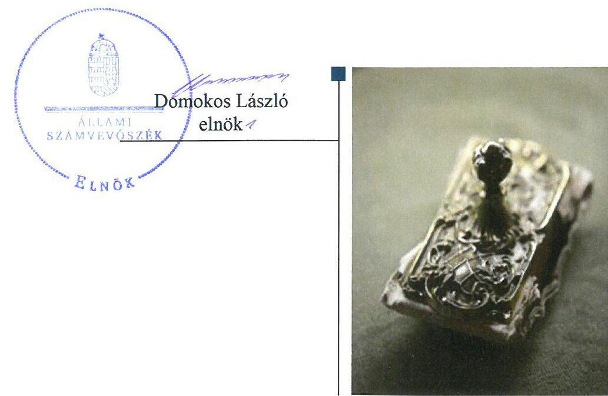
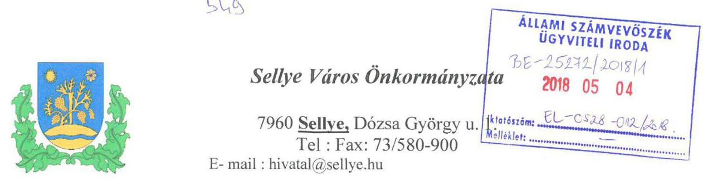
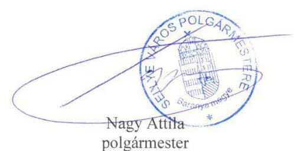

# Jelentés 

## Az önkormányzatok gazdasági társaságai

Az önkormányzatok többségi tulajdonában lévő gazdasági társaságok gazdálkodásának ellenőrzése - „AZ ORMÁNSÁG
EGÉSZSÉGÉÉRT" Nonprofit Kft.
2018. 06. hó 07. nap

---

|  AZ ELLENŐRZÉST FELÜGYELTE: |  |  |  |  |   |
| --- | --- | --- | --- | --- | --- |
|   |  |  |  |  | DR. NAGY IMRE felügyeleti vezető  |
|   |  |  |  |  | AZ ELLENŐRZÉST VEZETTE ÉS A VÉGREHAJTÁSÁÉRT FELELŐS:  |
|   |  |  |  |  | BAJNAI ZSUZSANNA ellenőrzésvezető  |
|   |  |  |  |  | A PROGRAM ÖSSZEÁLLÍTÁSÁÉRT FELELŐS:  |
|   |  |  |  |  | TÓTPÁL SZABOLCS osztályvezető  |
|   |  |  |  |  | A TÉMÁHOZ KAPCSOLÓDÓ KORÁBBI SZÁMVEVŐSZÉKI JELENTÉSEK:  |
|   |  |  |  |  | - címe: Az önkormányzatok pénzügyi és vagyongazdálkodása megfelelőségének ellenőrzése – Sellye  |
|   |  |  |  |  | - sorszáma: 16048  |
|  Jelentéseink az Országgyűlés számítógépes hálózatán és az Interneten a www.asz.hu címen is olvashatóak. |  |  |  |  | IKTATÓSZÁM: EL-0135-084/2018.  |
|   |  |  |  |  | TÉMASZÁM: 2447  |
|   |  |  |  |  | ELLENŐRZÉS-AZONOSÍTÓ SZÁM: V079325  |

---

# TARTALOMJEGYZÉK 

- ÖSSZEGZÉS ..... 5
- AZ ELLENŐRZÉS CÉLJA ..... 6
- AZ ELLENŐRZÉS TERÜLETE ..... 7
- AZ ELLENŐRZÉS HÁTTERE, INDOKOLTSÁGA ..... 8
- A JELENTÉS LÉNYEGES KÉRDÉSKÖREI ..... 9
- AZ ELLENŐRZÉS HATÓKÖRE ÉS MÓDSZEREI ..... 10
- MEGÁLLAPÍTÁSOK ..... 12
- JAVASLATOK ..... 16
- MELLÉKLETEK ..... 17
I. sz. melléklet: Értelmező szótár ..... 17
- FÜGGELÉK: ÉSZREVÉTELEK ..... 19
- RÖVIDÍTÉSEK JEGYZÉKE ..... 21

---

.

---

# ÖSSZEGZÉS 

Sellye Város Önkormányzata tulajdonosi jogait ,,AZ ORMÁNSÁG EGÉSZSÉGÉÉRT" Nonprofit Kft. felett nem szabályszerűen alakította ki és gyakorolta. ,,AZ ORMÁNSÁG EGÉSZSÉGÉÉRT" Nonprofit Kft. szabályozottsága nem felelt meg a jogszabályi előírásoknak. A bevételek és ráfordítások elszámolása nem volt szabályszerű. A vagyongazdálkodása nem felelt meg a törvény által előírt követelményeknek. A közérdekű és a közérdekből nyilvános adataira vonatkozó közzétételi kötelezettségét nem teljesítette, ezáltal gazdálkodása nem volt átlátható.

## Az ellenőrzés társadalmi indokoltsága

Magyarországon az intézmény-centrikus közfeladat-ellátás jellemző, de egyre jelentősebb a költségvetésen kívüli feladatellátás térnyerése. Helyi szinten ennek legfontosabb szereplői az önkormányzati tulajdonban lévő gazdasági társaságok, amelyeknek ellenőrzése kiemelten fontos a közfeladat ellátása és a közvagyon megőrzése, megóvása érdekében. Ezért alapvető követelmény, hogy a társaságok gazdálkodása, működése szabályszerű és átlátható legyen. Az ellenőrzés rendet, a rend értéket teremt.
„AZ ORMÁNSÁG EGÉSZSÉGÉÉRT" Nonprofit Kft. ellenőrzésére tevékenységének jellegére és kormányzati szektorba való besorolására tekintettel került sor, összhangban az Állami Számvevőszék Stratégiájában megfogalmazott célokkal.

## Főbb megállapítások, következtetések

Sellye Város Önkormányzata a tulajdonosi joggyakorlás feltételeit nem a jogszabályi előírások szerint alakította ki, a felügyelő bizottságot csak az ellenőrzött időszak végén hozta létre „AZ ORMÁNSÁG EGÉSZSÉGÉÉRT" Nonprofit Kft.-nél. Tulajdonosi jogait nem szabályszerűen gyakorolta a Társaság felett.
„AZ ORMÁNSÁG EGÉSZSÉGÉÉRT" Nonprofit Kft. szabályzatai nem feleltek meg a törvényi előírásoknak. A bevételek, a ráfordítások, az értékcsökkenés elszámolása, a vagyon nyilvántartása nem volt szabályszerű.

A jogszabályi előírás ellenére a számviteli beszámolók mérleg-tételeit leltárral nem támasztották alá, a törvényi előírás ellenére mennyiségi felvétellel nem leltároztak. A hiányosságok miatt nem érvényesült a valódiság számviteli alapelve.

A Társaság adatszolgáltatási kötelezettségét teljesítette, azonban a jogszabályi előírás ellenére a közérdekű adatait, a közérdekből nyilvános adataiban bekövetkezett változást nem tette közzé.

---

# AZ ELLENŐRZÉS CÉLJA 

Az ellenőrzés célja annak értékelése volt, hogy az önkormányzat vagyongazdálkodási tevékenysége során szabályszerűen gyakorolta-e tulajdonosi jogait; a gazdasági társaság szabályozottsága, gazdálkodása, vagyongazdálkodási tevékenysége megfelelt-e a jogszabályi és tulajdonosi előírásoknak. Az ellenőrzés célja továbbá annak megítélése volt, hogy az önkormányzat többségi tulajdonában lévő gazdasági társaság gazdálkodásának a kormányzati szektor hiányára és az államadósságra befolyással bíró elemei a jogszabályi előírásoknak megfeleltek-e.

---

# AZ ELLENŐRZÉS TERÜLETE

## Sellye Város Önkormányzat, "AZ ORMÁNSÁG EGÉSZSÉGÉÉRT" Nonprofit Kft.

SELLYE VÁROS ÖNKORMÁNYZATA és további 36 kistérségi önkormányzat alapította "AZ ORMÁNSÁG EGÉSZSÉGÉÉRT" Nonprofit Kft.-t a 2008. évben, nyereség és vagyonszerzési cél nélkül, a település és a kistérség közigazgatási területén élők egészségügyi alap- és szakorvosi ellátásának biztosítása érdekében. Az Önkormányzat 75,8%-os minősített többségi befolyást biztosító tulajdonrésze, a Társaság tulajdonosi szerkezete az ellenőrzött időszakban nem változott. Az Önkormányzat nevében a Társaság felett a tulajdonosi jogokat a képviselő-testület gyakorolta.

A polgármester személye nem változott az ellenőrzött időszakban, a jegyző 2015. február 2-ától tölti be tisztségét.

### "AZ ORMÁNSÁG EGÉSZSÉGÉÉRT" NONPROFIT KFT.

Tevékenysége az általános-, szakorvosi- és fogorvosi járóbeteg ellátásra, valamint egyéb humán egészségügyi szolgáltatások biztosítására terjedt ki, melynek kereteit az Önkormányzattal kötött Egészségügyi ellátási szerződés határozta meg. Kiegészítő jelleggel vállalkozási tevékenységet is folytatott, ingatlant adott bérbe. A Társaság által végzett tevékenységek közül az egészségügyi alapellátás minősült közfeladatnak.

A Társaság feladatát az alapításkor rendelkezésére bocsájtott vagyonnal látta el. Vagyonkezelt vagyonnal, kapcsolt vállalkozásban lévő részesedéssel nem rendelkezett. A Társaság kormányzati szektorba sorolt egyéb szervezetnek 2015. december 30-ától minősült.

A Társaság jegyzett tőkéje 1,5 M Ft volt, amely nem módosult a 2013-2016. közötti években.

Az Önkormányzattól 59,1 M Ft működési célú támogatást kapott az ellenőrzött időszakban.

Az átlagos statisztikai állományi létszáma a 2013. évben 26 fő, a 2016. évben 24 fő volt.

A jelenlegi ügyvezető 2015. július 13-ától látja el feladatát.

---

# AZ ELLENŐRZÉS HÁTTERE, INDOKOLTSÁGA 

Az önkormányzatok többségi tulajdonában álló gazdasági társaságok ellenőrzése kiemelten fontos a vagyon megőrzése, megóvása érdekében. Alapvető követelmény, hogy gazdálkodásuk, működésük szabályszerű, és az általuk szolgáltatott adatok megbízhatóak legyenek. A feladatellátás költségeinek, ráfordításainak alakulása a lakosság széles rétegét érinti.

Az ÁSZ ellenőrzései feltárhatják, hogy az önkormányzat a feladatellátásához rendelt vagyon működtetését a tulajdonostól elvárható gondossággal végezte-e, a feladatot ellátó gazdasági társasággal a létesítő okiratban, szolgáltatási szerződésben foglaltakat betartatta-e, a társaság betartotta-e.

Az ellenőrzés eredményeképp meghatározhatóvá válnak a költségvetési hiányt befolyásoló szervezetek kockázatai, lehetővé válik ezen kockázatok csökkentése. Az ellenőrzés rávilágíthat arra, hogy a gazdasági társaság a vagyon használatával biztosította-e a szolgáltatás folytatásának feltételeit, az önkormányzat tulajdonosi felügyelete hozzájárult-e a szabályszerű gazdálkodáshoz és feladatellátáshoz. A megállapítások alapján megfogalmazott számvevőszéki javaslatok hasznosítása elősegítheti a meglévő hibák megszüntetését. A jó gyakorlatok bemutatásával az ÁSZ hozzájárulhat a követendő megoldások megismertetéséhez, terjesztéséhez.

---

# A JELENTÉS LÉNYEGES KÉRDÉSKÖREI 

1. Az önkormányzat tulajdonosi joggyakorlása szabályszerű volt-e?
2. A gazdasági társaság szabályozottsága, gazdálkodása és vagyongazdálkodási tevékenysége szabályszerű volt-e?

---

# AZ ELLENŐRZÉS HATÓKÖRE ÉS MÓDSZEREI 

## Az ellenőrzés típusa

Megfelelőségi ellenőrzés.

## Az ellenőrzött időszak

Az ellenőrzött időszak 2013. január 1-jétől 2016. december 31-ig tart.

## Az ellenőrzés tárgya

Az önkormányzatok többségi tulajdonában lévő gazdasági társaságok feletti tulajdonosi joggyakorlása, valamint a gazdasági társaságok gazdálkodásának szabályozottsága és szabályszerűsége volt az ellenőrzés tárgya.

Az ellenőrzés kiterjedt minden olyan körülményre és adatra, amely az ÁSZ  jogszabályban meghatározott feladatainak teljesítéséhez, valamint a program végrehajtása folyamán felmerült újabb összefüggések feltárásához szükséges.

## Az ellenőrzött szervezet

Sellye Város Önkormányzat,
„AZ ORMÁNSÁG EGÉSZSÉGÉÉRT" Nonprofit Kft.

## Az ellenőrzés jogalapja

Az ellenőrzés jogszabályi alapját az ÁSZ tv.  1. § (3) bekezdése és 5. § (3)(4)-(5) bekezdései képezték.

## Az ellenőrzés módszerei

Az ellenőrzést a nemzetközi standardokat irányadónak tekintve az ellenőrzési program ellenőrzési kérdései, az ellenőrzött időszakban hatályos jogszabályok, az ellenőrzés szakmai szabályok és módszertanok figyelembe vételével végeztük.

Az ellenőrzés ideje alatt az ellenőrzött szervezettel történő kapcsolattartást az ÁSZ Szervezeti és Működési Szabályzatának vonatkozó előírásai alapján biztosítottuk.

Az ellenőrzési kérdések megválaszolásához szükséges bizonyítékok megszerzése a következő ellenőrzési eljárások alkalmazásával történt:

---

megfigyelés, kérdésfeltevés (információkérés), összehasonlítás, valamint elemzés. Az ellenőrzési bizonyítékként felhasználható adatforrások közé tartoztak egyrészt az ellenőrzési programban felsorolt adatforrások, másrészt adatforrás minden - az ellenőrzés során - feltárt, az ellenőrzés szempontjából információkat tartalmazó dokumentum.

Az ellenőrzést a kérdésekre adott válaszok kiértékelésével, valamint a megjelölt adatforrások, a csatolt tanúsítványok felhasználásával, továbbá az adott időszakban hatályos jogszabályok figyelembe vételével folytattuk le.

A bevételek és a ráfordítások elszámolása terén a szabályszerű működést véletlen mintavétellel és irányított kiválasztással ellenőriztük. A jogszabályoknak és a belső előírásoknak megfelelőnek, azaz szabályszerűnek tekintettük az adott területet, amennyiben a minta ellenőrzésének eredménye alapján 95%-os bizonyossággal a teljes sokaságban a hibaarány kisebb volt, mint 10%, nem megfelelőnek értékeltük, ha a hibaarány a 10%-ot meghaladta.

---

# 1. Az önkormányzat tulajdonosi joggyakorlása szabályszerű volt-e? 

Összegző megállapítás

Az Önkormányzat nem a jogszabályi előírásoknak megfelelően alakította ki a tulajdonosi joggyakorlás kereteit, a Társaság felett nem szabályszerűen gyakorolta a tulajdonosi jogait.

GAZDASÁGI PROGRAM -ját, a közép- és hosszú távú vagyongazdálkodási tervét  az Önkormányzat a Mötv.  illetve az Nvtv.  előírásai szerint elkészítette, azok tartalmazták a kistérségi járóbeteg ellátásra vonatkozó fejlesztési elképzeléseket.

A TULAJDONOSI JOGGYAKORLÁSHOZ kapcsolódó feladatokat az Önkormányzat a Gt.  és a Ptk.  előírásainak megfelelően határozta meg az önkormányzati SZMSZ -ben és a Vagyonrendelet -ben.

A TÁRSASÁGI SZERZŐDÉSBEN  rögzítették a Gt. és a Ptk. előírásainak megfelelően a társaság tevékenységi körét, a nyereség felosztásának tilalmát, a taggyűlés kizárólagos hatáskörébe tartozó döntések körét. A képviselő-testület döntött a vagyoni hozzájárulás mértékéről, a rendelkezésre bocsájtás módjáról, összhangban a Gt. és a Ptk. előírásaival.

A Taktv.  4. § (1) bekezdésében foglaltak ellenére nem hoztak létre FB-t 2015. december 23-áig, a képviselő testület által jelölt tagok személyéről a taggyűlés 19/2015. (XII. 23.) számú határozatában döntött. Az FB a Ptk. 3:122. § (3) bekezdése ellenére 2016. szeptember 27-éig nem rendelkezett taggyűlés által jóváhagyott ügyrenddel.

JAVADALMAZÁSI SZABÁLYZATOT a taggyűlés nem alkotott a Taktv. 5. § (3) bekezdésében foglalt előírás ellenére 2016. szeptember 29-éig. A 2016. szeptember 29-étől hatályos Javadalmazási szabályzat  megfelelt a törvényi előírásoknak.

A BESZÁMOLÓK  elfogadása a 2015. évi beszámoló kivételével megfelelt a törvényi előírásoknak. A 2015. évi beszámoló elfogadásakor a képviselő-testület és a taggyűlés a Ptk. 3:120. § (2) bekezdésének előírása ellenére nem volt az FB írásbeli jelentésének birtokában.

Az Önkormányzat az Egészségügyi ellátási szerződés IV/2. pontja ellenére a szerződésben rögzített, az OEP  finanszírozással és saját bevételekkel nem fedezett költségeit meghaladó mértékű működési célú támogatást nyújtott a Társaságnak.

---

KÉSZFIZETŐ KEZESSÉGET vállalt az Önkormányzat a Társaság folyószámla hiteléhez, amely a Ptk.,
 az Áht. ${ }^{20}$ és a Gst. ${ }^{21}$ előírásainak megfelel.

A KÖZVETLEN TULAJDONOSI ELLENŐRZÉS jogával az Önkormányzat egy alkalommal élt, a 2014. évre vonatkozóan végzett szabályszerűségi ellenőrzést a Társaság működésének szabályozottságával, a pénzügyi egyensúly fennállásával kapcsolatban. A gazdálkodási folyamatokkal összefüggésben feltárt hiányosságok kiküszöbölése érdekében megfogalmazott javaslatokra intézkedési terv készült, melyet a Társaság végrehajtott.

# 2. A gazdasági társaság szabályozottsága, gazdálkodása és vagyongazdálkodási tevékenysége szabályszerű volt-e? 

Összegző megállapítás

A Társaság szabályozottsága, gazdálkodása, vagyongazdálkodási tevékenysége nem volt szabályszerű. A közérdekű és közérdekből nyilvános adatokra vonatkozó közzétételi kötelezettségének nem tett eleget.
2.1. számú megállapítás

A Társaság számviteli törvény szerinti szabályzatai nem feleltek meg a jogszabályi követelményeknek. A bevételek, a ráfordítások, az értékcsökkenés elszámolása, a vagyon nyilvántartása nem volt szabályszerű. Vagyongazdálkodási tevékenysége nem felelt meg a törvényi előírásoknak.

ALAPVETŐ SZÁMVITELI SZABÁLYZATOKKAL nem rendelkezett a Társaság, mert nem készítették el a Számv. tv. ${ }^{22}$ 14. § (5) bekezdés a)-b) pontjaiban előírt eszközök és források leltárkészítési-, leltározási és értékelési szabályzatát 2016. március 1-éig.

A Számviteli politika ${ }_{1,2}{ }^{23}$ az Értékelési- ${ }^{24}$ és a Leltározási- ${ }^{25}$ szabályzat nem felelt meg a Számv. tv. előírásainak. A Társaság a Számv. tv. 14. § (3) bekezdésében foglaltak ellenére nem az egészségügyi vállalkozások adottságainak, körülményeinek leginkább megfelelő, a törvény végrehajtásának szervezet specifikus módszereit, eszközeit meghatározó számviteli politikát alakított ki. Nem, illetve nem megfelelően rögzítette a Számv. tv. 14. § (4) bekezdése ellenére azokat az értékelési elveket, módszereket, amelyekkel eszközeinek és forrásainak mérlegértékét megállapította, továbbá azokat az értékelési szabályokat, amelyek alkalmazása a Számv. tv. előírása alapján a Társaság döntésén alapult. Ezek részeként nem határozta meg az amortizációs politikát, az értékcsökkenés elszámolásának a Társaság sajátosságaihoz igazodó szabályait, azt, hogy a Számv. tv. 52. § (1) bekezdése szerinti értékcsökkenés elszámolására milyen hasznos élettartam figyelembe vételével kerül sor. A Leltározási szabályzat a tárgyi eszközök esetében a Számv. tv. 69. § (3) bekezdésében meghatározott háromévente történő mennyiségi felvétel helyett egyeztetést írt elő.

---

A Pénzkezelési szabályzat ${ }_{1,2}{ }^{26}$ a Számv. tv. 14. § (8) bekezdése ellenére nem rendelkezett a szabályzat által lehetővé tett, nem a Társaság tulajdonát képező - a Pénzkezelési szabályzat ${ }_{1,2}$ által „idegen pénzek"-nek nevezett - vagyonelemek kezelésének eljárásrendjéről, felelősségi szabályairól.

A Számlarend ${ }_{1,2}{ }^{27}$ nem felelt meg az előírásoknak, mivel a Számv. tv. 161/A § (1) bekezdésében foglaltak ellenére a könyvvezetésre vonatkozó részletes belső szabályait nem úgy alakította ki, hogy az a kiegészítő melléklet - a Számv. tv. 88. § (1) bekezdése szerinti sajátos - az alap- és a vállalkozási tevékenységére vonatkozó - adatainak közvetlen alátámasztására is alkalmas legyen, továbbá a Számv. tv. 161/A § (2) bekezdésben foglaltak ellenére a könyvvezetési rendszert nem részletezte tovább oly módon, hogy a külön jogszabályban meghatározott adatok - az Ebtv. ${ }^{28}$ szerinti finanszírozás keretében kapott összegek - rendelkezésre álljanak.

A TÉRÍTÉSI DÍJAK szolgáltató hatáskörében történő megállapításának, nyilvánosságra hozatalának és befizetésének rendjét meghatározó, jóváhagyott szabályzattal a Társaság nem rendelkezett a 284/1997. (XII. 23.) Korm. rendelet ${ }^{29}$ 1. § (6) bekezdésének előírása ellenére.

A BEVÉTELEK, RÁFORDÍTÁSOK, az értékcsökkenés elszámolása, valamint a vagyon nyilvántartása nem volt szabályszerű, mivel a Számv. tv. 165. § (1)-(2) bekezdésében foglaltak ellenére bizonylatok hiányában rögzítettek adatot.

A VAGYONNAL való felelős gazdálkodás nem valósult meg, mivel a számviteli beszámolók mérlegtételeit a Számv. tv. 69. § (1) bekezdésében foglaltak ellenére nem támasztották alá tételes, ellenőrizhető, mennyiségi adatokat is tartalmazó leltárral, továbbá a Számv. tv. 69. § (3) bekezdésében foglaltak ellenére az üzleti év mérlegfordulónapjára vonatkozó leltározást mennyiségi felvétellel nem végezték el az ellenőrzött időszak egyik évében sem.

A szabályozási hiányosságok és hibák, valamint a leltározás elmaradása miatt a könyvvezetés és a beszámolás során nem érvényesült a Számv. tv. 15. § (3) bekezdésében előírt valódiság elve.

A KORMÁNYZATI SZEKTOR HIÁNYÁRA és az államadósságra befolyással bíró gazdasági eseménye a Társaságnak nem volt.

BELSŐ ELLENŐRZÉSI RENDSZERÉT a szervezet tevékenységének, a célok megvalósításának nyomon követését biztosító rendszer keretében a Társaság nem alakította ki a Bkr. ${ }^{30}$ 10. §-a ellenére kormányzati szektorba sorolását követően a 2016. január 1. és 2016. szeptember 30. közötti időszakban.

# 2.2. számú megállapítás 

A Társaság a közérdekű adatokat és a közérdekből nyilvános adatokban bekövetkezett változást nem tette közzé.

A BESZÁMOLÓK letétbe helyezéséről és közzétételéről határidőben gondoskodtak a Számv. tv.-ben foglaltaknak megfelelően.

---

A KÖZÉRDEKŰ ADATOKAT - az Infotv. ${ }^{31}$ 1. melléklete szerint - a Társaság az Infotv. 37. § (1) bekezdése ellenére nem tette közzé honlapján.

A KÖZÉRDEKBŐL NYILVÁNOS ADATOKBAN a 2015., 2016. években történt változásokat nem tette közzé a Társaság a Taktv. 2. § (1) bekezdésében foglaltak ellenére.

AZ ADATVÉDELMI SZABÁLYZAT ${ }^{32}$ megfelelt a jogszabályi előírásoknak.

---

# JAVASLATOK 

Az ÁSZ tv. 33. § (1) bekezdésében foglaltak értelmében az ellenőrzött szervezet vezetője köteles a jelentésben foglalt megállapításokhoz kapcsolódó intézkedési tervet összeállítani és azt a jelentés kézhezvételétől számított 30 napon belül az ÁSZ részére megküldeni. Amennyiben az ellenőrzött szervezet vezetője nem küldi meg határidőben az intézkedési tervet, vagy továbbra sem elfogadható intézkedési tervet küld, az Állami Számvevőszék elnöke az ÁSZ tv. 33. § (3) bekezdése a) és b) pontjaiban foglaltakat érvényesítheti.

## „AZ ORMÁNSÁG EGÉSZSÉGÉÉRT" Nonprofit Kft. ügyvezetőjének

1. Intézkedjen a Számviteli politika, a Leltározási szabályzat, az Értékelési szabályzat, a Pénzkezelési szabályzat és a Számlarend jogszabályi rendelkezéseknek való megfeleléséről.
(2.1. számú megállapítás 2.-4. bekezdései alapján)
2. Intézkedjen a Térítési szabályzat jogszabályi rendelkezések szerinti elkészítéséről és kezdeményezze a fenntartónál a szabályzat jóváhagyását.
(2.1. számú megállapítás 5. bekezdése alapján)
3. Intézkedjen a bevételek, a ráfordítások és az értékcsökkenés elszámolásának, valamint a vagyonnyilvántartásnak bizonylattal történő alátámasztásáról a jogszabályban előírtaknak megfelelően.
(2.1. számú megállapítás 6. bekezdése alapján)
4. Intézkedjen a számviteli beszámoló mérlegtételeit alátámasztó leltár elkészítéséről és a leltározás végrehajtásáról a jogszabályi előírásnak megfelelően.
(2.1. számú megállapítás 7. bekezdése alapján)
5. Gondoskodjon a közérdekű adatok közzétételének jogszabályi előírásnak megfelelő teljesítéséről.
(2.2. számú megállapítás 2. bekezdése alapján)
6. Intézkedjen a jogszabályban foglaltak alapján a közérdekből nyilvános adatok közzétételéről.
(2.2. számú megállapítás 3. bekezdése alapján)

---

# MELLÉKLETEK 

- I. SZ. MELLÉKLET: ÉRTELMEZŐ SZÓTÁR
gazdasági társaság
kezesség
minősített többséget biztosító részesedés
nonprofit gazdasági társaság

Ptk 3:88. § (1) bekezdése szerint „a gazdasági társaságok üzletszerű közös gazdasági tevékenység folytatására, a tagok vagyoni hozzájárulásával létrehozott, jogi személyiséggel rendelkező vállalkozások, amelyekben a tagok a nyereségből közösen részesednek, és a veszteséget közösen viselik".
A kezességre vonatkozó előírásokat a Ptk. 6:416-430. §-ai tartalmazzák. Kezességi szerződéssel a kezes kötelezettséget vállal a jogosulttal szemben, hogyha a kötelezett nem teljesít, maga fog helyette a jogosultnak teljesíteni. Kezesség egy vagy több, fennálló vagy jövőbeli, feltétlen vagy feltételes, meghatározott vagy meghatározható összegű pénzkövetelés vagy pénzben kifejezhető értékkel rendelkező egyéb kötelezettség biztosítására vállalható.
A Ptk. szerint kezességet csak írásban lehet vállalni. A kezes kötelezettsége ahhoz a kötelezettséghez igazodik, amelyért kezességet vállalt. A kezes kötelezettsége nem válhat terhesebbé, mint amilyen elvállalásakor volt, kiterjed azonban a kötelezett szerződésszegésének jogkövetkezményeire és a kezesség elvállalása után esedékessé váló mellékkövetelésekre is.
A minősített befolyásszerző az ellenőrzött társaságban a szavazatok legalább hetvenöt százalékával rendelkezik. (Ptk. 3:324. §)
Civil tv. ${ }^{33}$ 9/F. § (2) bekezdése szerint „az a gazdasági társaság minősül nonprofit gazdasági társaságnak és cégnevében az a gazdasági társaság tüntetheti fel a nonprofit jelleget, amelynek létesítő okirata tartalmazza, hogy a gazdasági társaság tevékenységéből származó nyereség a tagok között nem osztható fel, hanem az a gazdasági társaság vagyonát gyarapítja." (hatályos 2014. március 15-től)

---

.

---

# FÜGGELÉK: ÉSZREVÉTELEK 

A jelentéstervezetet a Számvevőszék 15 napos észrevételezésre megküldte az ellenőrzött szervezetek vezetőinek az ÁSZ tv. 29. §* (1) bekezdése előírásának megfelelően.

Az ÁSZ a jelentéstervezetet észrevételezésre megküldte Sellye Város Önkormányzat polgármesterének és ,,AZ ORMÁNSÁG EGÉSZSÉGÉÉRT" Nonprofit Kft. ügyvezetőjének.
Sellye Város Önkormányzat polgármestere a jelentéstervezetre nemleges észrevételt tett. ,,AZ ORMÁNSÁG EGÉSZSÉGÉÉRT" Nonprofit Kft. ügyvezetője nem élt az ÁSZ tv. 29. § (2) bekezdésében foglalt észrevételezési jogával, a törvényes határidőn belül észrevételt nem tett.

[^0]
[^0]:    * 29. § (1) Az Állami Számvevőszék az ellenőrzési megállapításait megküldi az ellenőrzött szervezet vezetőjének vagy az általa megbízott személynek, és annak, akinek személyes felelősségét állapította meg.
    (2) Az ellenőrzött szervezet vezetője és a felelősként megjelölt személy az ellenőrzés megállapításaira tizenöt napon belül írásban észrevételt tehet.
    (3) Az Állami Számvevőszék az észrevételre a beérkezésétől számított harminc napon belül írásban válaszol. A figyelembe nem vett észrevételeket köteles a jelentésben feltüntetni, és megindokolni, hogy azokat miért nem fogadta el.

---

ügyiratszám: SE/996-2/2018.
Tárgy: Észrevétel számvevőszéki jelentéstervezetre
Hiv.szám: EL-0528-010/2018.

# Állami Számvevőszék 

1364. Budapest 4. Pf. 54.

## Tisztelt Elnök Úr !

Az önkormányzatok gazdasági társaságai - Az önkormányzatok többségi tulajdonában lévő gazdasági társaságok gazdálkodásának ellenőrzése- „Az ORMÁNSÁG EGÉSZSÉGÉÉRT Nonprofit Kft" címmel elkészült, és hivatkozott számon megküldött jelentéstervezetet Sellye Város Önkormányzata megismerte.

Az ÁSZ tv. 29.§.(2) bekezdésében foglaltak szerint észrevételt a tervezettel kapcsolatosan nem kívánunk tenni.

A feltárt hiányosságok maradéktalan kijavításával Sellye Város Önkormányzata feltétlen elköteleződését kívánja kifejezni azon cél érdekében, hogy a halmozottan hátrányos ormánsági kistelepülések lakói számára az eddig erőn felül, és kizárólag az ellátási érdekre való tekintettel fenntartott járóbeteg ellátás jelenleg kialakított feltételeit és színvonalát - a működtetést meghatározó részben szolgáló OEP finanszírozás segítségével - az önkormányzati többlet finanszírozást egyedüliként vállaló Sellye Önkormányzata továbbra is biztosítsa.

Sellye, 2018. április 26.

Tisztelettel:

---

# RÖVIDÍTÉSEK JEGYZÉKE 

${ }^{1}$ Önkormányzat
${ }^{2}$ Társaság
${ }^{3}$ Egészségügyi ellátási szerződés
${ }^{4}$ ÁSZ
${ }^{5}$ ÁSZ tv.
${ }^{6}$ Gazdasági program: Gazdasági program: ${ }^{7}$ Vagyongazdálkodási terv:

Vagyongazdálkodási terv ${ }^{8}$
${ }^{8}$ Mötv.
${ }^{9}$ Nvtv.
${ }^{10}$ Gt.
${ }^{11}$ Ptk.
${ }^{12}$ SZMSZ:

SZMSZ:

${ }^{13}$ Vagyonrendelet:

Vagyonrendelet:

${ }^{14}$ Társasági szerződés
${ }^{15}$ Taktv.
${ }^{16}$ FB
${ }^{17}$ Javadalmazási szabályzat
${ }^{18}$ beszámoló
${ }^{19}$ OEP
${ }^{20}$ Áht.
${ }^{21}$ Gst.
${ }^{22}$ Számv. tv.
${ }^{23}$ Számviteli politika:
Számviteli politika;
${ }^{24}$ Értékelési szabályzat

Sellye Város Önkormányzat
„AZ ORMÁNSÁG EGÉSZSÉGÉÉRT" Nonprofit Korlátolt Felelősségű Társaság
Feladatellátási szerződés, amely Sellye Város Önkormányzata és „AZ ORMÁNSÁG EGÉSZSÉGÉÉRT" Nonprofit Kft. között jött létre (hatályos 2011. június 1-től)
Állami Számvevőszék
2011. évi LXVI. törvény az Állami Számvevőszékről

Sellye Város Önkormányzatának Gazdasági programja 2010-2014.,
Sellye Város Önkormányzatának Gazdasági programja 2015-2019.
Sellye Város Önkormányzat 89/2013. (V. 29.) Kt. határozattal elfogadott közép- és hosszú távú vagyongazdálkodási terv
Sellye Város Önkormányzat 273/2016. (X. 27.) Kt. határozattal elfogadott közép- és hosszú távú vagyongazdálkodási terv
2011. évi CLXXXIX. törvény Magyarország helyi önkormányzatairól
2011. évi CXCVI. törvény a nemzeti vagyonról
2006. évi IV. törvény a gazdasági társaságokról (hatálytalan 2014. március 15-étől)
2013. évi V. törvény a Polgári Törvénykönyvről (hatályos 2014. március 15-től)

Sellye Város Önkormányzat Képviselő-testületének 10/1995. (VI. 09.) rendelete a Szervezeti és Működési szabályzatról és annak módosításai (hatálytalan
 2015. május 1-től)
Sellye Város Önkormányzat Képviselő-testületének 9/2015. (IV. 30.) rendelete a Szervezeti és Működési szabályzatról és annak módosításai (hatályos 2015. május 1-től)
Sellye Város Önkormányzata Képviselő-testületének 27/2012. (XI. 30.) rendelete Az önkormányzat vagyonáról és vagyongazdálkodásáról (hatályos 2012. december 1-től)

Sellye Város Önkormányzat Képviselő-testületének 10/2013. (VII. 10.) rendelete Sellye Város Önkormányzatának vagyonáról, és a vagyontárgyak feletti tulajdonosi joggyakorlásról (hatályos 2016. július 1-től)
„Az Ormánság Egészségéért" Nonprofit Kft. Társasági szerződése és annak módosításai (hatályos 2012. július 26-tól)
2009. évi CXXII. törvény a köztulajdonban álló gazdasági társaságok takarékosabb működéséről
felügyelőbizottság
„Az Ormánság Egészségéért" Nonprofit Kft. javadalmazási szabályzata (hatályos 2016. szeptember 29-től)
a Társaság Számv. tv. szerinti egyszerűsített éves beszámolói
Országos Egészségbiztosítási Pénztár
2011. évi CXCV. törvény az államháztartásról
2011. évi CXCIV. törvény Magyarország gazdasági stabilitásáról
2000. évi C. törvény a számvitelről

Számviteli szabályzat (hatályos 2009. május 11-től 2016. február 28-ig)
Számviteli politika (hatályos 2016. március 1-től)
Értékelési szabályzat (hatályos 2016. március 1-től)

---

${ }^{25}$ Leltározási szabályzat
${ }^{26}$ Pénzkezelési szabályzat ${ }_{1}$
Pénzkezelési szabályzat ${ }_{2}$
${ }^{27}$ Számlarend ${ }_{1}$
Számlarend ${ }_{2}$
${ }^{28}$ Ebtv.
${ }^{29}$ 284/1997. (XII. 23.) Korm. rendelet
${ }^{30}$ Bkr.
${ }^{31}$ Infotv.
${ }^{32}$ Adatvédelmi szabályzat
${ }^{33}$ Civil tv.

Leltározási szabályzat (hatályos 2016. március 1-től)
Pénzkezelési szabályzat (hatályos 2010. január 1-től 2016. február 28-ig)
Pénzkezelési szabályzat (hatályos 2016. március 1-től)
Számviteli szabályzat (hatályos 2009. május 11-től 2016. február 28-ig)
Számlarend (hatályos 2016. március 1-től)
1997. évi LXXXIII. törvény a kötelező egészségbiztosítás ellátásairól

284/1997. (XII. 23.) Korm. rendelet térítési díj ellenében igénybe vehető egyes egészségügyi szolgáltatások térítési díjáról
370/2011. (XII. 31.) Korm. rendelet a költségvetési szervek belső
kontrollrendszeréről és belső ellenőrzéséről
2011. CXII. törvény az információs önrendelkezési jogról és az információszabadságról
Adatvédelmi és adatkezelési szabályzat (hatályos 2011. április 15-től)
2011. évi CLXXV. törvény az egyesülési jogról, a közhasznú jogállásról, valamint a civil szervezetek működéséről és támogatásáról

---

ÁLLAMI SZÁMVEVŐSZÉK
1052 Budapest, Apáczai Csere János utca 10.
Levélcím: 1364 Budapest 4. Pf. 54
Telefon: +36 14849100 Telefax: +36 14849200
www.asz.hu
