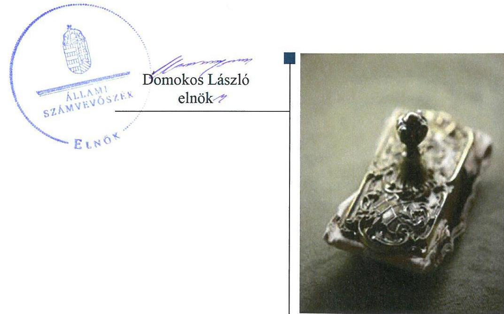
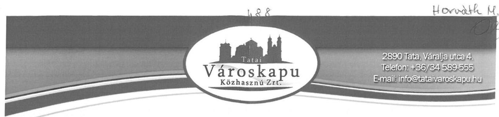
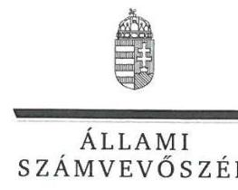
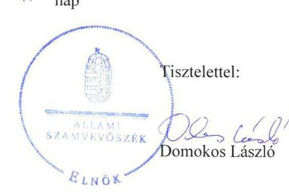

# Jelentés 

## Az önkormányzatok gazdasági társaságai

Az önkormányzatok többségi tulajdonában lévő gazdasági társaságok gazdálkodásának ellenőrzése - Tatai Városkapu Közművelődési, Turisztikai, Pályázatkoordináló és Kommunikációs Közhasznú Nonprofit Zrt.
2018.

---

# Jelentés 

## Az önkormányzatok gazdasági társaságai

Az önkormányzatok többségi tulajdonában lévő gazdasági társaságok gazdálkodásának ellenőrzése - Tatai Városkapu Közművelődési, Turisztikai, Pályázatkoordináló és Kommunikációs Közhasznú Nonprofit Zrt.
2018. 2019. 2020. 2021. 2022. nap

---

# AZ ELLENŐRZÉST FELÜGYELTE:

DR. HORVÁTH MARGIT felügyeleti vezető

## AZ ELLENŐRZÉST VEZETTE ÉS A VÉGREHAJTÁSÁÉRT FELELŐS:

RÁCZKEVI KATALIN ellenőrzésvezető

## A PROGRAM ÖSSZEÁLLÍTÁSÁÉRT FELELŐS:

TÓTPÁL SZABOLCS osztályvezető

IKTATÓSZÁM: EL-0145-071/2018.

TÉMASZÁM: 2447

ELLENŐRZÉS-AZONOSÍTÓ SZÁM: V079335

Jelentéseink az Országgyűlés számítógépes hálózatán és az Interneten a www.asz.hu címen is olvashatóak.

---

# TARTALOMJEGYZÉK 

■ ÖSSZEGZÉS ..... 5
■ AZ ELLENŐRZÉS CÉLJA ..... 6
■ AZ ELLENŐRZÉS TERÜLETE ..... 7
■ AZ ELLENŐRZÉS HÁTTERE, INDOKOLTSÁGA ..... 9
■ A JELENTÉS LÉNYEGES KÉRDÉSKÖREI ..... 10
■ AZ ELLENŐRZÉS HATÓKÖRE ÉS MÓDSZEREI ..... 11
■ MEGÁLLAPÍTÁSOK ..... 13
■ JAVASLATOK ..... 21
■ MELLÉKLETEK ..... 25
I. sz. melléklet: Értelmező szótár ..... 25
II. sz. melléklet: A Társaság 2013-2016. évi beszámolóinak főbb adatai (M Ft-ban) ..... 26
■ FÜGGELÉK: ÉSZREVÉTELEK ..... 27
■ RÖVIDÍTÉSEK JEGYZÉKE ..... 33

---

.

---

# ÖSSZEGZÉS 

Tata Város Önkormányzatának tulajdonosi joggyakorlása szabályszerű volt. A Társaság szabályozottsága és vagyongazdálkodása nem volt szabályszerű. A bevételek és ráfordítások elszámolása nem felelt meg az előírásoknak. 2013. és 2014. évi beszámolója nem mutatott valós képet a Társaság gazdálkodásáról. Közzétételi kötelezettségének nem tett eleget, ezáltal az átláthatóságot nem biztosította.

## Az ellenőrzés társadalmi indokoltsága

Az önkormányzatok többségi tulajdonában álló gazdasági társaságok ellenőrzése kiemelten fontos a vagyon megőrzése, megóvása érdekében, amelyekkel szemben alapvető követelmény, hogy gazdálkodásuk, működésük szabályszerű legyen. A feladatellátás költségeinek, ráfordításainak alakulása a lakosság széles rétegét érinti. Az Állami Számvevőszék stratégiájában célul tűzte ki az államháztartáson kívül működő szervezetek ellenőrzését, mely hozzájárul a közpénzek szabályos, átlátható, elszámoltatható és eredményes felhasználásához.

A Tatai Városkapu Közművelődési, Turisztikai, Pályázatkoordináló és Kommunikációs Közhasznú Nonprofit Zrt. az ellenőrzött időszak alatt Tata Város Önkormányzatával kötött feladat-ellátási szerződés alapján az Önkormányzat feladatkörébe tartozó egyes alapellátásokat végezte, illetve közreműködött annak biztosításában. Az Állami Számvevőszék az ellenőrzése során arra kereste a választ, hogy szabályszerű volt-e a Társaság közfeladat-ellátással összefüggő gazdálkodása, felelősen bánt-e az Önkormányzat által átadott vagyonnal, és az Önkormányzat ehhez kapcsolódó tulajdonosi joggyakorlása szabályszerű volt-e.

## Főbb megállapítások, következtetések, javaslatok

Az Önkormányzat a Társaság feletti tulajdonosi joggyakorlása kereteit a vagyongazdálkodási terv kivételével a jogszabályoknak és a belső előírásoknak megfelelően kialakította. A Társasággal közfeladatainak ellátására közművelődési megállapodást kötött, a tulajdonosi jogokat szabályszerűen gyakorolta. A Társaságot működéséről, valamint vagyoni és pénzügyi helyzetéről rendszeres beszámoltatta, belső ellenőrzése keretében 2016. év kivételével ellenőrizte.

A Társaság működésének szabályozottsága nem felelt meg az előírásoknak, nem rendelkezett szervezeti és működési szabályzattal, 2013. évben nem rendelkezett számlarenddel, az előírt számviteli szabályzatai nem feleltek meg az előírásoknak. A közhasznú és a vállalkozási tevékenység bevételei és ráfordításai elkülönített nyilvántartását nem alakította ki.

A vagyongazdálkodása 2013. évben nem volt szabályszerű, mert az önkormányzati tulajdonban lévő vagyonkezelt vagyont saját könyveiben szerepeltette a vagyonkezelési szerződés megszűnését követően is. A 2013. és 2014. évi mérlegbeszámolóit nem támasztotta alá szabályszerű leltárral. Az értékcsökkenés elszámolása nem felelt meg a jogszabályi és a belső előírásoknak.

A bevételek és a ráfordítások elszámolása nem volt szabályszerű. A Társaság árképzése megfelelt az előírásoknak.
A Társaság kormányzati szektorba sorolt társaságként a jogszabályi előírások ellenére nem alakított ki a célok megvalósítását, a tevékenység nyomon követését biztosító rendszert. A közérdekű adatait 2015-2016. évekre vonatkozóan, valamint a jogszabályban előírt vezető munkavállalókra vonatkozó adatokat az ellenőrzött időszakban nem tette közzé.

---

# AZ ELLENŐRZÉS CÉLJA 

AZ ELLENŐRZÉS CÉLJA annak értékelése volt, hogy az Önkormányzat a vagyongazdálkodási tevékenysége során szabályszerűen gyakorolta-e tulajdonosi jogait. A Társaság szabályozottsága, gazdálkodása és vagyongazdálkodási tevékenysége, bevételeinek és ráfordításainak elszámolása megfelelt-e a jogszabályi és tulajdonosi előírásoknak. A Társaság kötelezettségállománya jelentett-e kockázatot a működésre. Az ellenőrzés célja továbbá annak megítélése, hogy a kormányzati szektorba sorolt önkormányzati tulajdonban lévő gazdálkodó szervezet gazdálkodásának a kormányzati szektor hiányára és az államadósságra befolyással bíró elemei a jogszabályi előírásoknak megfeleltek-e.

---

# AZ ELLENŐRZÉS TERÜLETE 

## Tata Város Önkormányzata és a Tatai Városkapu Közművelődési, Turisztikai, Pályázatkoordináló és Kommunikációs Közhasznú Nonprofit Zrt.

Tata Város Önkormányzata ${ }^{1}$ 2007. évben alapította a 100%-os tulajdonában lévő Tatai Városkapu Közművelődési, Turisztikai, Pályázatkoordináló és Kommunikációs Kiemelten Közhasznú Nonprofit Zrt.-t. A Társaság ${ }^{2}$ jegyzett tőkéje 2013. évben 20,0 M Ft volt, az Önkormányzat 2014. évben nem pénzbeli apporttal a jegyzett tőkét 20,0 M Ft-ról 48,1 M Ft-ra emelte, amely az ellenőrzött időszak alatt nem változott. A Társaság elnevezése 2016-ban - a kiemelten közhasznúból közhasznúvá válással összefüggésben - változott a jelenlegire.

A Társaság közfeladatokat látott el, közhasznú jogállású szervezet volt az ellenőrzött időszakban. Közfeladatként közművelődési feladatokat látott el, így különösen kulturális rendezvények, helytörténeti rendezvények, programok, kiállítások, zenei rendezvények szervezését és lebonyolítását, valamint az egészséges életmód közösségi feltételeinek elősegítését látta el.

A közhasznú tevékenységei körében turisztikai, pályázatkoordinációs, kommunikációs feladatok szerepeltek, ellátta az Eötvös József Gimnázium és Kollégium fenntartását és a feladatbővülésre való tekintettel a városi fürdő üzemeltetését. Vállalkozási tevékenységet is végzett, ezek jellemzően helyiségek bérbeadása, vendéglátás voltak.

Az Önkormányzat döntése alapján a Társaságba 2016. június 3-án beleolvadt a 100%-ban önkormányzati tulajdonban lévő Fényes Fürdő Kft.

A Társaság közfeladatainak ellátásához a saját eszközei mellett az Önkormányzat tulajdonában álló vagyonelemeket a 2013. év első negyedévéig vagyonkezelésbe vette, majd az ellenőrzött időszak további részében a használatába kapta. A használatba kapott eszközök kulturális célokat szolgáló ingatlanok voltak.

A Társaság éves nettó árbevétele az ellenőrzött időszakban folyamatosan nőtt, 2013. évben 25,5 M Ft volt, majd 2016. évben 144,6 M Ft volt, egyéb bevételeit elsősorban az Önkormányzattól kapott pénzeszközök és elnyert pályázati források biztosították.

A Társaság főbb gazdálkodási adatait az 1. táblázat mutatja be.

---

1. táblázat

# A TÁRSASÁG FŐBB GAZDÁLKODÁSI ADATAI 2013-2016. ÉVEKBEN (M FT) 

| Megnevezés | 2013. év. | 2014. év | 2015. év | 2016. év |
| :-- | :--: | :--: | :--: | :--: |
| Éves nettó árbevétel | 25,5 | 46,0 | 83,2 | 144,6 |
| Egyéb bevétel | 80,2 | 95,5 | 152,9 | 191,3 |
| Mérlegfőösszeg | 525,3 | 175,7 | 259,9 | 506,3 |
| Mérleg szerinti /Adózott eredmény 2016. | $-8,9$ | 2,7 | 2,6 | $-31,1$ |
| Saját tőke | 19,4 | 50,2 | 52,9 | 241,7 |
| Jegyzett tőke | 20,0 | 48,1 | 48,1 | 48,1 |
| Követelések | 4,3 | 12,4 | 6,3 | 8,9 |
| Kötelezettségek | 504,4 | 123,5 | 211,9 | 100,6 |

A saját tőke az ellenőrzött időszakban a 2013. év kivételével nem csökkent a jegyzett tőke szintje alá, 2016. évben a Fényes Fürdő Kft. beolvadása következtében az átvett vagyonelemek miatt 241,7 M Ft-ra emelkedett.

A kötelezettségek állománya az alapítóval szembeni hosszúlejáratú kötelezettségek 471,6 M Ft összege miatt a 2013. évben 504,4 M Ft volt. A mérlegszerinti eredmény a 2013. évben -8,9 M Ft, a 2016. évben -31,1 M Ft (veszteség) volt.

A Társaság a Fényes Fürdő Kft. 2016. évi beolvadásával az Önkormányzat felé fennálló 64,0 M Ft összegű tagi kölcsönt is átvétett, amely az ellenőrzött időszak végéig fennállt, ezen összeget a 2016. évi beszámolóban a rövid lejáratú kötelezettségek között mutatta ki.

A polgármester és a jegyző személye az ellenőrzött időszakban nem változott, a Társaság vezérigazgatója 2013. június 1-jétől tölti be a tisztségét. A Társaság könyvvizsgálója 2016. évben változott az ellenőrzött időszak alatt.

A Társaság által foglalkoztatottak száma a feladatellátás bővülésével összhangban a 2013. évben 17 fő, míg 2016. évben 40 fő volt.

A Társaság az ellenőrzött időszakban kormányzati szektorba sorolt gazdasági társaság volt. Az ellenőrzött években a Társaság nem volt kötelezett önköltségszámítás készítésére.

---

# AZ ELLENŐRZÉS HÁTTERE, INDOKOLTSÁGA 

## AZ ÖNKORMÁNYZATI TULAJDONÚ GAZDASÁGI

TÁRSASÁGOK teljes körű ellenőrzésének lehetőségét az Állami Számvevőszékről szóló 1989. évi XXXVIII. törvény 2011. január 1-jétől hatályos módosítása teremtette meg és az Állami Számvevőszékről szóló 2011. évi LXVI. törvény is tartalmazza. A gazdasági társaságok gazdálkodási tevékenysége szabályszerűségének ellenőrzését 2011. évtől végezzük. Az önkormányzatok többségi tulajdonában álló gazdasági társaságok ellenőrzése kiemelten fontos a vagyon megőrzése, megóvása érdekében.

A feladatellátás költségeinek, ráfordításainak alakulása a lakosság széles rétegét érinti. Az ellenőrzés várható hasznosulásaként ellenőrzéseink feltárhatják, hogy az önkormányzat a feladatellátásához rendelt vagyon működtetését a tulajdonostól elvárható gondossággal végezte-e, a feladatot ellátó gazdasági társaság a létesítő okiratban, szolgáltatási szerződésben foglaltak betartásával biztosította-e a feladat ellátását. Az ellenőrzés rávilágíthat arra, hogy a gazdasági társaság a vagyon használatával biztosította-e a szolgáltatás folytatásának feltételeit, az önkormányzat tulajdonosi felügyelete hozzájárult-e a szabályszerű gazdálkodáshoz és feladatellátáshoz. Az önkormányzatok többségi tulajdonában álló gazdasági társaságok ellenőrzése kiemelt jelentőségű, mivel működésük hatással van a tulajdonos önkormányzat gazdálkodására, gazdálkodásának egyes elemei befolyásolják az önkormányzati alszektor hiányát és az államadósságot.

A megállapítások alapján megfogalmazott számvevőszéki javaslatok hasznosítása elősegítheti a meglévő hibák megszüntetését. A jó gyakorlatok bemutatásával az Állami Számvevőszék hozzájárul a követendő megoldások megismertetéséhez, terjesztéséhez.

---

# A JELENTÉS LÉNYEGES KÉRDÉSKÖREI 

1.- Az Önkormányzat Társaság feletti tulajdonosi joggyakorlása szabályszerű volt-e?
2.- A Társaság szabályozottsága, gazdálkodása és vagyongazdálkodási tevékenysége szabályszerű volt-e?
3.- A Társaság bevételeinek és ráfordításainak elszámolása, valamint az árképzés szabályszerű volt-e?

---

# AZ ELLENŐRZÉS HATÓKÖRE ÉS MÓDSZEREI 

## Az ellenőrzés típusa

Megfelelőségi ellenőrzés.

## Az ellenőrzött időszak

2013. január 1-jétől 2016. december 31-ig tartó időszak.

## Az ellenőrzés tárgya

Tata Város Önkormányzata tulajdonosi joggyakorlása, valamint a Tatai Városkapu Közművelődési, Turisztikai, Pályázatkoordináló és Kommunikációs Közhasznú Nonprofit Zrt. gazdálkodásának szabályozottsága és szabályszerűsége.

Az ellenőrzés kiterjedt minden olyan körülményre és adatra, amely az ÁSZ ${ }^{3}$ jogszabályban meghatározott feladatainak teljesítéséhez, valamint a program végrehajtása folyamán felmerült újabb összefüggések feltárásához szükséges.

## Az ellenőrzött szervezet

Tatai Városkapu Közművelődési, Turisztikai, Pályázatkoordináló és Kommunikációs Közhasznú Nonprofit Zrt. és a tulajdonosi jogokat gyakorló Tata Város Önkormányzata.

## Az ellenőrzés jogalapja

Az ellenőrzés jogszabályi alapját az ÁSZ tv. 1. § (3) bekezdése és 5. § (3)-(5) bekezdései képezték.

## Az ellenőrzés módszerei

Az ellenőrzést a nemzetközi standardokat irányadónak tekintve az ellenőrzési program ellenőrzési kérdései, az ellenőrzött időszakban hatályos jogszabályok, az ellenőrzés szakmai szabályok és módszertanok figyelembe vételével végeztük.

Az ellenőrzés ideje alatt az ellenőrzött szervezettel történő kapcsolattartást az ÁSZ Szervezeti és Működési Szabályzatának vonatkozó előírásai alapján biztosítottuk.

---

Az ellenőrzés a tulajdonosi jogokat gyakorló önkormányzatra, és az ellenőrzött gazdasági társaságra terjedt ki.

Az ellenőrzési kérdések megválaszolásához szükséges bizonyítékok megszerzése a következő ellenőrzési eljárások alkalmazásával történt: megfigyelés, kérdésfeltevés (információkérés), összehasonlítás, valamint elemző eljárás. Az ellenőrzési bizonyítékként felhasználható adatforrások közé tartoztak egyrészt az ellenőrzési programban felsorolt adatforrások, másrészt adatforrás lehet még minden - az
 ellenőrzés folyamán feltárt, az ellenőrzés szempontjából információkat tartalmazó dokumentum.

Az ellenőrzést a kérdésekre adott válaszok kiértékelésével, valamint a megjelölt adatforrások, a csatolt tanúsítványok felhasználásával, továbbá az adott időszakban hatályos jogszabályok figyelembe vételével folytattuk le.

A bevételek és a vagyonnyilvántartás terén a szabályszerű működést véletlen mintavétellel ellenőriztük. A ráfordítások elszámolására az ellenőrzött gazdasági társaság adatokat nem szolgáltatott. A mintavétellel ellenőrzött területek esetében minden egyes tétel vonatkozásában a szabályszerűségre vonatkozó kérdéseket tettünk fel, amelyek eredménye összesítésre került. Megfelelőnek értékeltünk egy ellenőrzött területet, amennyiben 95%-os bizonyossággal a teljes sokaságban az átlagos hibaarány legfeljebb 10%, nem megfelelőnek, amennyiben 10%-nál magasabb arányt képviselt. Abban az esetben, ha a teljes sokaság tekintetében a 10%-os hibaarányhoz való viszony megítélésének megbízhatósága nem érte el a 95%-ot, annak elérése érdekében értékelésünket további szempontokkal egészítettük ki, és figyelembe vettük a feltárt hibák típusát és súlyát. A vagyonnyilvántartásra vonatkozó véletlen mintavételt kockázati alapú kiválasztással egészítettük ki, amelynek során évente a három legnagyobb összegű tételt értékeltük.

---

# 1. Az Önkormányzat Társaság feletti tulajdonosi joggyakorlása szabályszerű volt-e? 

Összegző megállapítás

### 1.1. számú megállapítás

Az Önkormányzat tulajdonosi joggyakorlása szabályszerű volt.
Az Önkormányzat a tulajdonosi joggyakorlás kereteit szabályszerűen alakította ki.

Az Önkormányzat az ellenőrzött időszakban rendelkezett Gazdasági programmal, mely a Társaság által ellátott feladatokra vonatkozó célkitűzéseket tartalmazta. Az önkormányzati vagyonnal való gazdálkodás szabályait - az Ötv., Nvtv. és a Mötv. előírásainak megfelelően - az ellenőrzött időszakra vonatkozó Vagyonrendeletben határozták meg. A Vagyonrendelet az Mötv. 109. § (4) bekezdésében előírtaknak megfelelően tartalmazta a vagyonkezelői jog ellenértékét, a vagyonkezelés ellenőrzésének részletes szabályait.

Az Önkormányzat vagyongazdálkodási tervvel az ellenőrzött időszakban nem rendelkezett, ezzel megsértette a Nvtv. 9. § (1) bekezdésében foglaltakat, mely alapján a vagyongazdálkodásának, valamint a Nvtv. 7. § (2) bekezdésében meghatározott rendeltetése biztosítása miatt közép- és hosszútávú vagyongazdálkodási tervet volt köteles készíteni.

## A TÁRSASÁG FELETTI TULAJDONOSI JOGGYAKORLÁS KERETEIT az Önkormányzat a Gt., a Ptk. előírásaival összhangban az Alapító okiratban, az Önkormányzati SZMSZ-ben, és a Vagyonrendeletben alakította ki.

Az Önkormányzat a Társaság Alapító okiratában, a Ptk. és a Taktv. előírásai szerint döntött az FB létrehozásáról. Az egyszemélyes társaságnál a legfőbb szerv hatáskörét az Alapító okirat előírásainak megfelelően a Képviselő-testület gyakorolta, az FB tagjait a Képviselő-testület választotta ki.

A Társaság Alapító okiratának rendelkezése értelmében, a Ptk. előírásaival összhangban, az igazgatóság jogait vezető tisztségviselőként a vezérigazgató gyakorolta. A tulajdonosi joggyakorló az Alapító okiratban előírta az FB tagjai, a vezérigazgató és a képviseleti joggal rendelkező személyek képviselettel összefüggő feladatait, beszámolási kötelezettségét.

A Társaságnál az ellenőrzött időszakban az Alapító okiratban foglaltaknak megfelelően könyvvizsgáló működött, melynek kijelöléséről a Képviselő-testület határozott, megbízatása öt évre szólt.

A tulajdonosi joggyakorló Képviselő-testület az Alapító okiratban, a Vagyonrendeletben, 2013. március 31-ig Vagyonkezelési szerződésben, 2013. április 1-től Használati szerződésben, a Közművelődési megállapodásban meghatározta a Társaság feladatellátásához kapcsolódó köve-

---

telményeket. A vagyonkezelési szerződésben az átadott vagyon tekintetében a Társaság részére adatszolgáltatási és egyeztetési kötelezettséget írtak elő. A szerződések a Gt., Ptk., Nvtv. előírásainak megfeleltek.

Az Önkormányzat monitoring tevékenysége keretében az Alapító okiratban előírta a Társaság vezetője részére az üzleti terv, az éves pénzügyi beszámoló készítési kötelezettséget, a támogatási szerződésekben a felhasznált támogatásokról elszámoltatta.

Az ellenőrzött időszakban a Taktv. 5.§ (3) bekezdése szerinti Javadalmazási szabályzatot elkészítették, melyet a Képviselő-testület jóváhagyott.

# 1.2. számú megállapítás 

Az Önkormányzat a tulajdonosi jogok gyakorlása során szabályszerűen járt el.

Az ellenőrzött időszakban a Társaságot érintő vagyonváltozást eredményező döntéseket, a költségvetési bevételek alakulását, a vagyon növekedését és csökkenését, az Önkormányzat Képviselő-testülete az Mötv.-ben foglaltaknak megfelelően megtárgyalta és elfogadta.

A Társaság éves beszámolóit az FB írásos jelentése és a könyvvizsgáló jelentése ismeretében a Képviselő-testület valamennyi ellenőrzött évben elfogadta, valamint a Ptk. előírásainak megfelelően döntött a 2014. és 2015. évben a nyereség eredménytartalékba helyezéséről.

Az ellenőrzött időszakban a Társaság részére az Alapító okiratban előírt, és elkészült éves üzleti terveket és fejlesztési tervet a Képviselő-testület megtárgyalta és jóváhagyta.

Az Önkormányzat az ellenőrzött időszakban az Áht.-ben biztosított belső ellenőrzés lehetőségével élve a Társaság gazdálkodásának egyes elemeit háromszor ellenőrizte. Ellenőrzései a házipénztár vezetésére, a leltárra irányultak.

Az Önkormányzat a 2013-2016. években a Társaság részére nem vállalt garanciát és kezességet, a Társaság részére 2016. évben tagi kölcsönt nyújtott.

---

# 2. A Társaság szabályozottsága, gazdálkodása és vagyongazdálkodási tevékenysége szabályszerű volt-e? 

Összegző megállapítás

2.1. számú megállapítás

A Társaság működésének szabályozottsága nem felelt meg az előírásoknak. Vagyongazdálkodási tevékenysége a vagyonkezelt eszközök nyilvántartása tekintetében nem volt szabályszerű, 2013-2014. évi beszámolóit nem támasztotta alá szabályszerű leltárral.

A Társaság működésének szabályozottsága nem volt megfelelő, mert nem rendelkezett minden ellenőrzött évre vonatkozóan a gazdálkodásához szükséges szabályzatokkal. Az elkészült szabályzatok nem feleltek meg a jogszabályi előírásoknak.

A TÁRSASÁG MŰKÖDÉSI KERETEIT meghatározó szervezeti és működési szabályzatot az ellenőrzött időszakban az Alapító okirat 11.3. pontjában foglaltak ellenére nem készített.

SZÁMVITELI SZABÁLYZATOK körében az ellenőrzött időszakban rendelkezett Számviteli Politikával, a Számv. tv. 14. § (3) bekezdésének megfelelően. A Társaság a Számv. tv. 14. § (5) bekezdés b) pontjában foglaltak ellenére az eszközök és a források értékelési szabályzatát 2013-2015. évekre vonatkozóan nem készítette el, a Számviteli politikában az eszközök és források értékelésének szabályait a jogszabálynak megfelelően rögzítette.

A Társaság 2013. évben nem rendelkezett Számlarenddel, mellyel nem tett eleget a Számv. tv. 161. (1) bekezdésben foglaltaknak. A 2014-2016. között hatályos Számlarendben előírt, a minden alkalmazásra kijelölt számla számjelét és megnevezését tartalmazó számlatükör melléklet nem készült el, ezzel nem tettek eleget a Számv. tv. 161. §. (2) bekezdés a) pontjában foglaltaknak.

A Társaság rendelkezett az ellenőrzött időszakban a Számv. tv.-nek megfelelő Bizonylati renddel. A Társaság Pénzkezelési szabályzattal rendelkezett, azonban a Pénzkezelési szabályzat nem felelt meg a Számv. tv 14. § (8) bekezdésében foglaltaknak, mert nem tartalmazott előírást a pénzforgalom (készpénzben, ill. bankszámlán) történő lebonyolításának rendje, a pénzkezelés személyi és tárgyi feltételei tekintetében.

A Társaság a Számv. tv. előírásainak megfelelő Leltározási és Selejtezési Szabályzattal rendelkezett az ellenőrzött időszakban, amelyben előírta a saját tulajdonú tárgyi eszközök, a készletek és a készpénz évente mennyiségi felvétellel történő leltározását, a csak értékben kimutatott eszközök és kötelezettségek egyeztetéssel történő leltározási kötelezettségét, valamint a források leltározására vonatkozóan a szállítói tartozások, egyéb kötelezettségek és passzív időbeli elhatárolások leltározásának módját.

## A KÖZHASZNÚSÁGI TEVÉKENYSÉGHEZ KAPCSOLÓDÓAN a Társaság az ellenőrzött időszakban számviteli szabályzatban nem biztosította a Civil.tv. 46. § (1) bekezdésében előírt közhasznúsági

---

melléklet összeállításához a közhasznú és vállalkozási bevételek és ráfordítások elkülönített nyilvántartását, amely nem felelt meg a Számv. tv. 161/A. §. (2) bekezdésben előírtaknak. Ezzel a közpénzek felhasználásának és a köztulajdon használatának nyilvánossága és ellenőrizhetősége érdekében a megfelelően alátámasztott adatok nem álltak rendelkezésre.

Az ellenőrzött időszakban a Társaság rendelkezett az Info tv. előírásainak megfelelő Adatvédelmi szabályzattal, valamint a közérdekű adatok megismerésére irányuló kérelmek rendjét szabályozta, mert elkészítette a Közérdekű adatszolgáltatás rendjét rögzítő Szabályzatot.

# 2.2. számú megállapítás 

A Társaság vagyongazdálkodása a vagyonnyilvántartás 2013. évi hiányossága, valamint a leltározási tevékenység hiányossága következtében nem volt szabályszerű.

A Társaság a feladatait saját eszközei mellett az Önkormányzattól vagyonkezelésbe kapott ingatlanokkal látta el a vagyonkezelési szerződés keretében 2013. március 31-ig. A vagyonkezelési szerződés megszűnésével az Önkormányzat a korábban vagyonkezelésbe adott eszközöket 2013. április 1-től használati megállapodás keretén belül a Társaságnak ingyenes használatba adta.

A VAGYONKEZELÉSI SZERZŐDÉS lejártát követően a Társaság a vagyonkezelt eszközöket késedelmesen, csak 2014. április 7-én vezette ki az analitikus és főkönyvi nyilvántartásaiból, addig azokat az alapítóval szembeni hosszú lejáratú kötelezettségek között 471,6 M Ft összegben mutatta ki a számviteli nyilvántartásaiban és a mérlegében. Ennek hatásaként a Társaság 2013. évi vagyonnyilvántartása nem mutatott valós képet, ezzel megsértette a Számv. tv. 15. § (3) bekezdés valódiság elvét. A Társaság a 2013. évi leltáraiban és a 2013. évi beszámolójában saját eszközei között vagyonkezelt eszközként szerepeltette a már használati szerződés keretében kapott eszközöket, ezzel megsértette a Számv. tv. 18. §-át, mivel a 2013. évi éves beszámoló a Társaság vagyonáról nem mutatott megbízható valós képet.

## A VAGYONNYILVÁNTARTÁSA A SAJÁT VAGYON

TEKINTETÉBEN az ellenőrzött időszakban nem volt szabályszerű, mert a tárgyi eszközök beszerzésekor az üzembe helyezést a Számv. tv. 52. § (2) bekezdésben foglaltakkal ellentétben nem dokumentálták.

A Társaság a Számv. tv. 69. § (1) bekezdésében foglaltak ellenére a 2013-2014. évi számviteli beszámolóban szereplő eszközök és források értékét nem támasztotta alá olyan leltárral, amely tételesen, ellenőrizhető módon tartalmazta volna a mérleg fordulónapján meglévő eszközöket és forrásokat mennyiségben és értékben. 2013. évben a passzív időbeli elhatárolás 1506 e Ft, az aktív időbeli elhatárolás 28741 e Ft, valamint 2014-ben a passzív időbeli elhatárolás 1974 e Ft mérlegsorokat alátámasztó, valamint egyik pénztár leltára nem készült el.

A könyvvizsgáló az érintett években korlátozás nélküli hitelesítő záradékot adott ki; a mérlegadatok alátámasztásához szükséges leltárak hiányát nem kifogásolta, azonban figyelemfelhívó levelet készített. A 2013., 2014. és 2015. évi figyelemfelhívó levélben a könyvvizsgáló a Társaság gazdálkodási és a számviteli területeinek jogszerű szabályozására, továbbá 2015. évben a közhasznú és a vállalkozási tevékenység során felmerült bevételek

---

és költségek könyvviteli nyilvántartásának elkülönítésének szabályozásának hiányára hívja fel a figyelmet.

A 2015-2016. évekre a szabályszerű leltárakkal alátámasztott mérlegbeszámolókat a Számv. tv. előírásainak megfelelően elkészítették.

Az értékcsökkenés elszámolása nem felelt meg az előírásoknak, mert a Számv. tv. 167. § (1) bekezdésének h) pontjában előírtak ellenére nem történt hivatkozás a könyvviteli bizonylatokon a könyvelés módjára, az érintett könyvviteli számlákra. A 100 e Ft bekerülési értékű tárgyi eszközök egyösszegű értékcsökkenési leírása helyett 20%-os, illetve 33%-os leírási kulcsot alkalmaztak, amely ellentétes volt a Számviteli politikában foglaltakkal.

A Társaság az ellenőrzött időszakban elkészítette éves beszámolóit és a kiegészítő mellékleteit, azonban a Számv. tv. 93. § (3) bekezdése ellenére az éves beszámolók kiegészítő mellékletei nem tartalmazták egyik évben sem a végleges jelleggel kapott támogatásokat, azok elszámolásait, a támogatások jogcímenkénti felhasználását, a rendelkezésre álló összeg megbontásban.

A közhasznúsági mellékletet valamennyi ellenőrzött évben elkészítették, azonban 2013. évben nem tették közzé, ezzel nem tettek eleget a Civil. tv. 31. § (1) bekezdésében foglaltaknak. A közhasznúsági mellékletekben a közhasznú és a
 vállalkozási tevékenység elkülönített bemutatása megtörtént, azonban annak megfelelősége nem volt ellenőrizhető, mert a számviteli szabályzataiban nem biztosította a Civil tv. 46. § (1) bekezdésében előírt közhasznúsági melléklet összeállításához a közhasznú és vállalkozási bevételek és ráfordítások elkülönített nyilvántartását, a Számv. tv. 161/A. §. (2) bekezdésben előírtak ellenére.

A Vagyonkezelési szerződés 10.2 és 10.3 pontjában előírtak ellenére a Társaság a vagyonkezelt vagyon felújításáról, pótlólagos beruházásáról, a vagyonkezelt vagyon értékcsökkenésének megfelelő mértékű eszközpótlásról 2013. I. negyedév vonatkozásában nem gondoskodott. Az elmaradt eszközpótlásból adódóan az Önkormányzatnak 28,1 M Ft összegű tulajdonosi követelése keletkezett a Társasággal szemben.

Az ellenőrzött időszakban vagyon elidegenítésére, megterhelésére nem került sor.

# 2.3. számú megállapítás 

## A Társaság kötelezettségállománya az ellenőrzött időszakban csökkent.

A Társaság 2013. március 31-ig a vagyonkezelt vagyon értékét hosszú lejáratú kötelezettségként szabályszerűen mutatta ki a könyveiben, azonban a 2013. évi beszámolóban már nem szerepeltethette volna, ez nem felelt meg a Számv. tv. 18. §-ában foglaltaknak, mivel a 2013. évi éves beszámoló a Társaság vagyonáról nem mutatott megbízható valós képet. Az ellenőrzött időszakban további hosszú lejáratú kötelezettsége nem volt.

A Társaság kötelezettségeinek alakulását a 2. táblázat mutatja be.

---

2. táblázat

| A TÁRSASÁG KÖTELEZETTSÉGÁLLOMÁNYA (M FT) |  |  |  |  |
| :--: | :--: | :--: | :--: | :--: |
| Megnevezés | 2013. év | 2014. év | 2015. év | 2016. év |
| Kötelezettségek | 504,4 | 123,5 | 11,9 | 100,6 |
| Hátrasorolt kötelezettségek | 28,1 |  |  |  |
| Hosszú lejáratú kötelezettségek | 471,6 |  |  |  |
| - ebből a vagyonkezelt ingatlan miatti kötelezettség | 471,6 |  |  |  |
| Rövid lejáratú kötelezettségek ebből tagi kölcsön | 0 | 0 | 0 | 64,0 |
| Rövid lejáratú kötelezettségek ebből szállítók | 1,7 | 26,8 | 0,7 | 7,6 |
| - ebből lejárt szállítók | 1,1 | 24,2 | 1,7 | 2,4 |
| Egyéb rövid lejáratú kötelezettségek | 3,0 | 96,7 | 11,2 | 29,0 |

A Társaságnak rövid lejáratú kötelezettsége az Önkormányzattal szemben 2016. évben keletkezett, a tagi kölcsön összegével.

Szállítói tartozásállománya 2013. évi 1,7 M Ft-ról 7,6 M Ft-ra nőtt, lejárt szállítói állománya nem veszélyeztette a likviditását.
2016. évben az egyéb rövid lejáratú kötelezettségeinek jelentősebb részét az Önkormányzattal szemben fennálló tagi kölcsön kamata tette ki.
2.4. számú megállapítás

A Társaság tervezési, adatszolgáltatási kötelezettségeinek eleget tett. A közérdekű adatok közzétételi kötelezettségének nem tett eleget, mert a 2015. és 2016. évi beszámolóit és a vezető tisztségviselők adatait nem tette közzé.

A Társaság az ellenőrzött időszakban az Alapító okirat ${ }_{1-8}$-ban előírtaknak megfelelően elkészítette üzleti terveit.

Az Alapító okirat ${ }_{1-8}$ előírásainak megfelelően a vezérigazgató gondoskodott a Számv. tv. szerinti beszámoló és a nyereség felosztására vonatkozó javaslat elkészítése és az alapító elé terjesztése érdekében. Az Alapító okirat ${ }_{1-8}$ előírásai alapján évente legalább egy alkalommal jelentés készült az Önkormányzat részére az ügyvezetésről, a társaság vagyoni helyzetéről, üzletpolitikájáról, valamint háromhavonta az FB beszámolt az általa végzett munkáról.

A Társaság a Civil tv. 46. § (1) bekezdésében előírtakat megsértette, mivel honlapján nem tette közzé a 2015. és 2016. évek elfogadott éves beszámolóit és közhasznúsági mellékleteit. A Társaság a Taktv. 2. § (1) bekezdés előírásai ellenére az ellenőrzött időszakban nem tette közzé a vezető tisztségviselők, felügyelőbizottsági tagok, vezető állású munkavállalók, valamint az önállóan cégjegyzésre vagy a bankszámla feletti rendelkezésre jogosult munkavállalók adatait, megbízási díjait.

A Társaság az Info tv. 26. § (2) bekezdésében meghatározott közérdekből nyilvános adatok közül az Önkormányzat honlapján tette közzé a feladat- és hatáskörében eljáró személy nevét, a feladat- és hatáskörében eljáró személy feladatkörét, munkakörét, a közfeladat ellátásával összefüggő egyéb személyes adatot.

---

A Társaság, mint kormányzati szektorba sorolt egyéb gazdálkodó szervezet a Bkr. 10. §-ában és a Bkr. 54/A. §-ban foglaltak ellenére a 2013. január 1. és 2016. szeptember 30. közötti időszakban a belső ellenőrzést, 2016. október 1-től a szervezet tevékenységének, a célok megvalósításának nyomon követését biztosító rendszert nem alakította ki.

A Társaságnak az ellenőrzött időszakban lefolytatott külső ellenőrzések miatt intézkedni kötelezettsége nem volt.

# 3. A Társaság bevételeinek és ráfordításainak elszámolása, valamint az árképzés szabályszerű volt-e? 

Összegző megállapítás

## 3.1. számú megállapítás

3. táblázat

KÖVETELÉSEK ÁLLOMÁNYA 2013. ÉS 2016. ÉVBEN (M FT)

| Megnevezés | 2013. év | 2016. év |
| :-- | :--: | :--: |
| Követelések | 4,3 | 8,9 |
| - vevő követelések | 2,9 | 4,3 |
| - lejárt vevő   követelések | 2,3 | 3,7 |

A Társaság bevételeinek és ráfordításainak elszámolása nem volt szabályszerű.

A BEVÉTELEK ELSZÁMOLÁSA során az értékesítés nettó árbevétele, a kormányzati hiányt befolyásoló, illetve nem befolyásoló egyéb, rendkívüli bevételek és pénzügyi műveletek bevételek elszámolása nem volt szabályszerű, mert a Számv. tv. 167. § (1) bekezdésének h) pontjában előírtak ellenére nem történt hivatkozás a könyvviteli bizonylatokon a könyvelés módjára, az érintett könyvviteli számlákra.

A személyi jellegű ráfordítások elszámolása nem volt szabályszerű, mert a Számv. tv. 165. § (2) bekezdés ellenére a számviteli nyilvántartásba nem szabályszerűen kiállított bizonylat alapján jegyeztek be adatokat, továbbá a Számv. tv. 167. § (1) bekezdés h), és i) pontjaiban foglalt előírások ellenére a könyvviteli bizonylatokon nem történt hivatkozás a könyvelés módjára, az érintett könyvviteli számlákra, és a könyvviteli nyilvántartásokban való rögzítés időpontjára.

A RÁFORDÍTÁSOK ELSZÁMOLÁSA az ellenőrzött időszakban nem volt szabályszerű, mert a Társaság az elszámolásokat nem támasztotta alá bizonylatokkal, megsértve ezzel a Számv. tv. 165. § (1) bekezdésében, valamint a 169.§ (2) bekezdésében foglaltakat.

A KÖVETELÉSEINEK ÁLLOMÁNYA a 2013. évi 4,3 M Ftról 2016. év végére 8,9 M Ft-ra nőtt. A vevői követelések állománya és ezen belül a határidőn túli követelések állománya is növekedett az ellenőrzött időszak alatt. A Társaság részére az Önkormányzat a hátralékos követelések behajtása tekintetében szabályozást nem írt elő, a Társaság a vevőkövetelések behajtása érdekében nem intézkedett. A követelések alakulását a 3. táblázat mutatja be.

A Társaságnak az ellenőrzött időszakban kormányzati adósságot keletkeztető ügylete nem volt.

---

# 3.2. számú megállapítás 

A Társaság árképzése megfelelt az előírásoknak.
A Társaság működésére, tevékenységére vonatkozó rendeletalkotási kötelezettségét az önkormányzat teljesítette, mert rendeletet alkotott Tata Város közművelődési feladatairól, az önkormányzat vagyonáról, a vagyongazdálkodás szabályairól és ezzel összefüggő tulajdonosi jogok gyakorlásáról. A Társaság a szolgáltatásai árait - a közművelődési megállapodásban foglaltak alapján ingyenesen nyújtott szolgáltatások kivételével - önállóan állapította meg.

---

# JAVASLATOK 

Az ÁSZ tv. 33. § (1) bekezdésében foglaltak értelmében az ellenőrzött szervezet vezetője köteles a jelentésben foglalt megállapításokhoz kapcsolódó intézkedési tervet összeállítani és azt a jelentés kézhezvételétől számított 30 napon belül az ÁSZ részére megküldeni. Amennyiben az ellenőrzött szervezet vezetője nem küldi meg határidőben az intézkedési tervet, vagy továbbra sem elfogadható intézkedési tervet küld, az Állami Számvevőszék elnöke az ÁSZ tv. 33. § (3) bekezdése a) és b) pontjaiban foglaltakat érvényesítheti.

Javaslataink célja a Tatai Városkapu Közművelődési, Turisztikai, Pályázatkoordináló és Kommunikációs Közhasznú Nonprofit Zrt. gazdálkodása szabályszerűségének és gyakorlatának javítása annak érdekében, hogy a szabályozási környezet és az alkalmazott gyakorlat megfelelően tudja támogatni az átlátható működést.

## Tatai Városkapu Közművelődési, Turisztikai, Pályázatkoordináló és Kommunikációs Közhasznú Nonprofit Zrt. vezérigazgatójának

1. Intézkedjen a szervezeti és működési szabályzat elkészítéséről az Alapító okirat előírásainak megfelelően.
(2.1. sz. megállapítás 1. bekezdése alapján)
2. Intézkedjen a számviteli szabályzatok módosításáról a hatályos Számv. tv.-ben előírtaknak megfelelően.
(2. 1. sz. megállapítás 3. bekezdés 2. mondata, 4. bekezdés 2. mondata alapján)
3. Intézkedjen annak érdekében, hogy a számviteli szabályzatok biztosítsák a közhasznú és a vállalkozási bevételek és ráfordítások elkülönített nyilvántartását a Számv. tv. előírásainak megfelelően.
(2. 1. sz. megállapítás 6. bekezdése alapján)
4. Intézkedjen az eszközök üzembe helyezése Számv. tv.-ben előírtaknak megfelelő dokumentálásáról.
(2.2. sz. megállapítás 3. bekezdése alapján)

---

5. Intézkedjen a mérleg valamennyi tételére vonatkozóan a leltár összeállításáról a Számv. tv.-ben előírtaknak megfelelően.
(2.2. sz. megállapítás 4. bekezdése alapján)
6. Intézkedjen a kisértékű tárgyi eszközök értékcsökkenésének elszámolásáról a Számviteli politikában meghatározottaknak megfelelően.
(2.2. sz. megállapítás 7. bekezdés 2. mondata alapján)
7. Intézkedjen annak érdekében, hogy az éves beszámoló kiegészítő melléklete tartalmazza a végleges jelleggel kapott támogatásokat a Számv. tv.-ben előírtaknak megfelelően.
(2.2. sz. megállapítás 8. bekezdése alapján)
8. Intézkedjen az éves beszámolók, továbbá a közhasznúsági melléklet közzétételéről a Civil tv. előírásainak megfelelően.
(2.4. számú megállapítás 3. bekezdés 1. mondata alapján)
9. Intézkedjen a Taktv. szerinti közzétételi kötelezettség teljesítéséről.
(2.4. számú megállapítás 3. bekezdés 2. mondata alapján)
10. Intézkedjen a Bkr. előírásainak megfelelően a szervezet tevékenységének, a célok megvalósításának nyomon követését biztosító rendszer kialakításáról.
(2.4. sz. megállapítás 5. bekezdése alapján)
11. Intézkedjen a bevételek Számv. tv.-ben előírtaknak megfelelő elszámolásáról.
(3.1. sz. megállapítás 1. bekezdése alapján)
12. Intézkedjen a ráfordítások elszámolásának megfelelő alátámasztásáról a Számv. tv.-ben előírtaknak megfelelően.
(3.1. sz. megállapítás 2-3. bekezdései alapján)

---

# Javaslataink célja az Önkormányzat szabályszerű működésének elősegítése, továbbá az önkormányzati tulajdonosi joggyakorlás kontrolljainak erősítése. 

## Tata Város Önkormányzata polgármesterének

1. Intézkedjen az Önkormányzat közép- és hosszú távú vagyongazdálkodási tervének elkészítéséről a jogszabályi előírásoknak megfelelően.
(1.1. sz. megállapítás 2. bekezdése alapján)
2. Intézkedjen a szervezeti és működési szabályzat, a számviteli szabályzatok, a közhasznú és vállalkozási tevékenység elkülönítése, az üzembe helyezés dokumentálása, a leltár, az értékcsökkenés elszámolása, a végleges jelleggel kapott támogatások kiegészítő mellékletben történő bemutatásának, a beszámolók és a kiegészítő mellékletek közzétételének hiányossága, a közérdekű adatok közzétételi kötelezettsége teljesítésének elmaradása, a szervezet tevékenységének, a célok megvalósításának nyomon követését biztosító rendszer kialakításának hiánya, valamint a bevételek és ráfordítások elszámolásának hiányosságai miatti felelősség tisztázása érdekében és szükség szerint intézkedjen a felelősség érvényesítéséről.
(2.1. sz. megállapítás 1. bekezdése, 3. bekezdés 2. mondata, 4. bekezdés 2. mondata, 6. bekezdése, 2.2. sz. megállapítás 3. 4. 7. 8. bekezdései, 2.4. számú megállapítás 3., 5. bekezdései, 3. 1. sz. megállapítás 1-3. bekezdései alapján)

---

.

---

# MELLÉKLETEK 

- I. SZ. MELLÉKLET: ÉRTELMEZŐ SZÓTÁR
gazdasági társaság
kezesség
kormányzati szektorba sorolt egyéb szervezet
közszolgáltatás

Ptk. 3:88. § (1) bekezdése szerint „a gazdasági társaságok üzletszerű közös gazdasági tevékenység folytatására, a tagok vagyoni hozzájárulásával létrehozott, jogi személyiséggel rendelkező vállalkozások, amelyekben a tagok a nyereségből közösen részesednek, és a veszteséget közösen viselik"
A kezességre vonatkozó előírásokat a Ptk. 6:416-430. §-ai tartalmazzák. Kezességi szerződéssel a kezes kötelezettséget vállal a jogosulttal szemben, hogyha a kötelezett nem teljesít, maga fog helyette a jogosultnak teljesíteni. Kezesség egy vagy több, fennálló vagy jövőbeli, feltétlen vagy feltételes, meghatározott vagy meghatározható összegű pénzkövetelés vagy pénzben kifejezhető értékkel rendelkező egyéb kötelezettség biztosítására vállalható.
A Ptk. szerint kezességet csak írásban lehet vállalni. A kezes kötelezettsége ahhoz a kötelezettséghez igazodik, amelyért kezességet vállalt. A kezes kötelezettsége nem válhat terhesebbé, mint amilyen
 elvállalása kor volt, kiterjed azonban a kötelezett szerződésszegésének jogkövetkezményeire és a kezesség elvállalása után esedékessé váló mellékkövetelésekre is.
az Áht. 3. § (2) és (3) bekezdésében foglaltakon kívül az Európai Közösséget létrehozó szerződéshez csatolt, a túlzott hiány esetén követendő eljárásról szóló jegyzőkönyv alkalmazásáról szóló 2009. május 25-i 479/2009/EK rendelet (a továbbiakban: 479/2009/EK rendelet) szerint a kormányzati szektorba sorolt szervezet (Áht. 1. § (12))
Az Ebktv. 3. § d) pontja a következőképpen határozza meg a közszolgáltatást: „szerződéskötési kötelezettség alapján a lakosság alapvető szükségleteinek ellátására irányuló szolgáltatás, így különösen a villamos energia-, gáz-, hő-, víz-, szennyvíz- és hulladékkezelési, köztisztasági, postai és távközlési szolgáltatás, továbbá a menetrend alapján közlekedő járművekkel végzett közforgalmú személyszállítás".

---

II. SZ. MELLÉKLET: A TÁRSASÁG 2013-2016. ÉVI BESZÁMOLÓINAK FŐBB ADATAI (M FT-BAN)

|  Megnevezés | 2013. év | 2014. év | 2015. év | 2016. év  |
| --- | --- | --- | --- | --- |
|  Mérlegfőösszeg | 525,3 | 175,7 | 259,9 | 506,3  |
|  Befektetett eszközök | 480,7 | 143,3 | 214,1 | 459,2  |
|  - ebből tárgyi eszközök | 480,0 | 142,7 | 210,4 | 456,1  |
|  Forgóeszközök | 15,7 | 32,4 | 45,1 | 46,6  |
|  - ebből készletek | 6,2 | 4,1 | 11,9 | 10,1  |
|  - ebből követelések | 4,3 | 12,4 | 6,3 | 8,9  |
|  Aktív időbeli elhatárolás | 28,7 | 0 | 0,8 | 0,5  |
|  Saját tőke összege | 19,4 | 50,2 | 52,9 | 241,7  |
|  Jegyzett tőke | 20,0 | 48,1 | 48,1 | 48,1  |
|  Eredménytartalék | 8,3 | -0,4 | 2,1 | 4,8  |
|  Lekötött tartalék | 0 | 0 | 0 | 34,9  |
|  Mérleg szerinti eredmény/Adózott eredmény 2016-ban | -8,9 | 2,7 | 2,6 | -31,1  |
|  Céltartalék | 0 | 0 | 0 | 0  |
|  Kötelezettségek | 504,4 | 123,5 | 211,9 | 100,6  |
|  Passzív időbeli elhatárolás | 1,5 | 1,9 | 195,2 | 164,0  |

Fonrás: 2013-2016. évi beszámolók

---

# FÜGGELÉK: ÉSZREVÉTELEK 

A jelentéstervezetet a Számvevőszék 15 napos észrevételezésre megküldte az ellenőrzött szervezet vezetőjének az ÁSZ tv. 29. § (1) bekezdése előírásának megfelelően.

A jelentés tartalmazza az ellenőrzött Tatai Városkapu Közművelődési, Turisztikai, Pályázatkoordináló és Kommunikációs Közhasznú Nonprofit Zrt. vezérigazgatójától érkezett észrevételeket. Tata Város Önkormányzatának polgármestere - az ÁSZ tv. 29. § (2) bekezdésében foglaltak szerinti - észrevételezési jogával nem élt, az ellenőrzés megállapításaira nem tett észrevételt.

[^0]
[^0]:    * 29. § (1) Az Állami Számvevőszék az ellenőrzési megállapításait megküldi az ellenőrzött szervezet vezetőjének vagy az általa megbízott személynek, és annak, akinek személyes felelősségét állapította meg.
    (2) Az ellenőrzött szervezet vezetője és a felelősként megjelölt személy az ellenőrzés megállapításaira tizenöt napon belül írásban észrevételt tehet.
    (3) Az Állami Számvevőszék az észrevételre a beérkezésétől számított harminc napon belül írásban válaszol. A figyelembe nem vett észrevételeket köteles a jelentésben feltüntetni, és megindokolni, hogy azokat miért nem fogadta el.

---

Állami Számvevőszék
1052 Budapest
Apáczai Csere János u. 10.

Domokos László Elnök Úr részére

Tisztelt Elnök Úr!

A Tatai Városkapu Közhasznú Zrt. ellenőrzésével kapcsolatos jelentéstervezetet 2018. 03. 29-én átvettük. Az abban foglalt megállapításokat tudomásul vesszük és kiegészítésként a következő észrevételeket tesszük:

2.1. számú megállapítás 1. bekezdésébe foglaltakkal ellentétben a Társaság rendelkezik Szervezeti és Működési Szabályzattal, mely azonban a működést érintő változások következtében megsokszorozódott feladatok miatt nem lett aktualizálva.

2.1 számú megállapítás 3. bekezdésében hiányolt Számlatükörrel a számlarend mellékleteként a társaság rendelkezik.

3.1. számú megállapítás 1. bekezdésében a bevételek elszámolása során hiányolt kontírszámok és könyvelési sorszámok a számlákon és bizonylatokon megtalálhatóak.

3.1. számú megállapítás 2. bekezdéséhez a következő észrevételt tennénk: a bérfeladás minden hónapban bérlista alapján történik, mely bérlistán a kontírozás is szerepel.

Az Állami Számvevőszék jelentéstervezetében megállapított hiányosságok a Tatai Városkapu Közhasznú Zrt. vezetése szerint abból erednek, hogy a társaság feladatmennyiségének növekedésével nem tudott szervezeti szinten megfelelő ütemben lépést tartani. Ennek oka a nem megfelelő létszámú humánerő és technikai háttér szükségszerű fejlesztésének nehézségeiben rejlik.

A Tatai Városkapu Közhasznú Zrt. vezetése haladéktalanul intézkedik a feltárt hibák és hiányosságok megszüntetése érdekében.

Tata, 2018. 04. 11.

Tisztelettel

Tatai Városkapu
Közhasznú Zrt.
2300 Tata, Várja u. 4.
Adószám: 13993928-2-11

Berczelly Attila
Vezérigazgató

---

ELNÖK

Ikt.szám EL-0526-015/2018.

# Berczelly Attila úr 

vezérigazgató

Tatai Városkapu Közművelődési, Turisztikai, Pályázatkoordináló és Kommunikációs Közhasznú Nonprofit Zrt.

## Tata

## Tisztelt Vezérigazgató Úr!

Köszönettel vettem a „Az önkormányzatok gazdasági társaságai - Az önkormányzatok többségi tulajdonában lévő gazdasági társaságok gazdálkodásának ellenőrzése - Tatai Városkapu Közművelődési, Turisztikai, Pályázatkoordináló és Kommunikációs Közhasznú Nonprofit Zrt." című ellenőrzéséről készített számvevőszéki jelentéstervezetre megküldött észrevételeit.
Az Állami Számvevőszék észrevételekre vonatkozó álláspontját a felügyeleti vezető által készített részletes tájékoztatás tartalmazza, amelyet levelemhez mellékeltem.
Tájékoztatom Vezérigazgató urat, hogy az Állami Számvevőszék a figyelembe nem vett észrevételeket az Állami Számvevőszékről szóló 2011. évi LXVI. törvény 29. § (3) bekezdésében előírtak szerint köteles a jelentésében feltüntetni és megindokolni, hogy azokat miért nem fogadta el.

Budapest, 2018. 14. 11. 14.

Melléklet: Tájékoztatás az észrevételek kezeléséről

---

# Tájékoztatás az észrevételek kezeléséről 

Megköszönöm Vezérigazgató úrnak a „Az önkormányzatok gazdasági társaságai - Az önkormányzatok többségi tulajdonában lévő gazdasági társaságok gazdálkodásának ellenőrzése Tatai Városkapu Közművelődési, Turisztikai, Pályázatkoordináló és Kommunikációs Közhasznú Nonprofit Zrt. " címmel készített jelentéstervezetre tett észrevételeit. Az észrevételek kezeléséről az alábbi tájékoztatást adom.

## 1. számú észrevétel

Az észrevétel a jelentéstervezet 2.1. sz. megállapítás 1. bekezdését és az 1. sz. javaslatot érintette:
„2.1. számú megállapítás 1. bekezdésébe foglaltakkal ellentétben a Társaság rendelkezik Szervezeti és Működési Szabályzattal, mely azonban a működést érintő változások következtében megsokszorozódott feladatok miatt nem lett aktualizálva."

## A fenti észrevételre az alábbi választ adom:

Észrevételét tudomásul veszem, azonban a leírtak alapján a jelentéstervezet 2.1. számú megállapítás 1. bekezdésében rögzítetteket, valamint Vezérigazgató úrnak címzett 1. számú javaslatot nem módosítom az alábbiak miatt:

A rendelkezésre álló dokumentumokat ismételten áttekintettük, és megállapítottuk, hogy a Társaság egy olyan „Tatai Városkapu Közhasznú Zrt. szervezeti és működési szabályzata" elnevezésű dokumentumot adott át az ellenőrzés számára, amely az Állami Számvevőszék által a Társaság részére megküldött, EL-0145-005/2017. iktatószámú adatbekérő levél 2. számú mellékletében meghatározott követelményeket - az ellenőrzött időszakra vonatkozó, aláírt és hiteles dokumentum - nem teljesítette. Miután a dokumentum nem volt kiadmányozott, nem volt megállapítható annak eredeti volta és hatálya, így az ellenőrzési bizonyítékként sem volt felhasználható.

## 2. számú észrevétel:

Az észrevétel a jelentéstervezet 2.1. sz. megállapítás 3. bekezdését és a 2. sz. javaslatot érintette:
„2.1 számú megállapítás 3. bekezdésében hiányolt Számlatükörrel a számlarend mellékleteként a társaság rendelkezik."

## A fenti észrevételre az alábbi választ adom:

Észrevételét tudomásul veszem, azonban a leírtak alapján a jelentéstervezet 2.1. számú megállapítás 3. bekezdésében rögzítetteket, valamint Vezérigazgató úrnak címzett 2. számú javaslatot nem módosítom az alábbiak miatt:

A rendelkezésre álló dokumentumokat ismételten áttekintettük, és megállapítottuk, hogy a Társaság az ellenőrzött időszak első évére, a 2013. évre vonatkozóan hatályos számlarendet nem adott át, melyet a 2017. 10. 2-án kelt, Vezérigazgató úr által aláírt Teljességi és hitelességi nyilatkozat 2.a. számú melléklet 5. pontjában szereplő információ is megerősít. Az ellenőrzés számára átadott 2014-2016-ban hatályos számlarendek a számlatükör mellékletet nem tartalmazzák annak ellenére, hogy az előzőekben hivatkozott teljességi és hitelességi nyilatkozat 2.a. számú melléklet 5. pontjában a számlarendek (2014. évi számlarend, 2015. évi számlarend, 2016. évi számlarend), mint hiánytalan szabályzatok feltüntettek.

# 3. sz. észrevétel: 

Az észrevétel a jelentéstervezet 3.1. sz. megállapítás 1. bekezdését és a 11. sz. javaslatot érintette:
„3.1.számú megállapítás 1. bekezdésében a bevételek elszámolása során hiányolt kontírszámok és könyvelési sorszámok a számlákon és bizonylatokon megtalálhatóak."

## A fenti észrevételre az alábbi választ adom:

Észrevételét tudomásul veszem, azonban a leírtak alapján a jelentéstervezet 3.1. számú megállapítás 1. bekezdésében rögzítetteket, valamint Vezérigazgató úrnak címzett 11. számú javaslatot nem módosítom az alábbiak miatt:

Vezérigazgató úr észrevételével ellentétben a jelentés 3.1. sz. megállapítás 1. bekezdése kontírszámok és könyvelési sorszámok hiányosságát nem állapította meg. A bevételek és a vagyonnyilvántartás terén a szabályszerű működést véletlen mintavétellel ellenőriztük. A mintavétellel ellenőrzött területek esetében minden egyes tétel vonatkozásában a szabályszerűségre vonatkozó kérdéseket tettünk fel, amelyek eredménye összesítésre került. Megfelelőnek értékeltünk egy ellenőrzött területet, amennyiben 95%-os bizonyossággal a teljes sokaságban az átlagos hibaarány legfeljebb 10%, nem megfelelőnek, amennyiben 10%-nál magasabb arányt képviselt. A Társaság által az ellenőrzés számára rendelkezésre bocsátott mintatételek esetében a fenti eljárás alapján olyan nagyságrendű hiányos dokumentálást találtunk, amely alapján a 3.1. sz. megállapítás 1. bekezdésében rögzítetteknek megfelelően a bevételek összességében nem minősültek szabályszerűnek.

## 4. sz. észrevétel:

Az észrevétel a jelentéstervezet 3.1. sz. megállapítás 2. bekezdését és a 12. sz. javaslatot érintette:
„3.1.számú megállapítás 2. bekezdéséhez a következő észrevételt tennénk: a bérfeladás minden hónapban bérlista alapján történik, mely bérlistán a kontírozás is szerepel."

## A fenti észrevételre az alábbi választ adom:

Észrevételét tudomásul veszem, azonban a leírtak alapján a jelentéstervezet 3.1. számú megállapítás 2. bekezdésében rögzítetteket, valamint Vezérigazgató úrnak címzett 12. számú javaslatot nem módosítom az alábbiak miatt:

A személyi jellegű kiadások terén a szabályszerű működést véletlen mintavétellel ellenőriztük. A mintavétellel ellenőrzött területek esetében minden egyes tétel vonatkozásában a szabályszerűségre vonatkozó kérdéseket tettünk fel, amelyek eredménye összesítésre került. Megfelelőnek értékeltük az ellenőrzött területet, amennyiben 95%-os bizonyossággal a teljes sokaságban az átlagos hibaarány legfeljebb 10%, nem megfelelőnek, amennyiben 10%-nál magasabb arányt képviselt. A Társaság által az ellenőrzés számára rendelkezésre bocsátott mintatételek esetében a fenti eljárás alapján olyan nagyságrendű hiányos dokumentálást találtunk, amely alapján a jelentéstervezet 3.1. sz. megállapítás 2. bekezdésében rögzítetteknek megfelelően a személyi jellegű kiadások összességében nem minősültek szabályszerűnek.

Az észrevétel 6. bekezdésében a hiányosságok okaként a feladatnövekedéssel ellenéres humánerőforrás fejlesztéssel kapcsolatos tájékoztatását tudomásul veszem. E tájékoztatás a jelentéstervezet megállapításait nem befolyásolja.

Az észrevétel 7. bekezdésében a hiányosságok megszüntetésének kezdeményezésével összefüggő tájékoztatást tudomásul veszem. E tájékoztatás a jelentéstervezet megállapításait nem befolyásolja.
Budapest, 2018. hó  nap

Dr. Horváth Margit felügyeleti vezető

---

# RÖVIDÍTÉSEK JEGYZÉKE 

${ }^{1}$ Önkormányzat
${ }^{2}$ Társaság
${ }^{3}$ ÁSZ
${ }^{4}$ Gazdasági program ${ }_{1}$
${ }^{5}$ Gazdasági program ${ }_{2}$
${ }^{6}$ Ötv.
${ }^{7}$ Nvtv.
${ }^{8}$ Mótv.
${ }^{9}$ Vagyonrendelet
${ }^{10}$ Alapító okirat ${ }_{1-8}$
${ }^{11} \mathrm{SZMSZ}_{1-5}$
${ }^{12}$ Ptk.
${ }^{13}$ Taktv.
${ }^{14} \mathrm{FB}$
${ }^{15}$ Képviselő-testület
${ }^{16}$ Vagyonkezelői szerződés

Tata Városi Önkormányzat
Tatai Városkapu Közművelődési, Turisztikai, Pályázatkoordináló és Kommunikációs Közhasznú Nonprofit Zrt.
Állami Számvevőszék
a Képviselő-testület 100/2011.(III. 30.) számú határozatával elfogadott, a 2011-2014. évekre szóló Gazdasági programja
a Képviselő-testület 271/2014.(VII. 10.) számú
 határozatával elfogadott, a 2015–2019. évekre szóló Gazdasági programja
a helyi önkormányzatokról szóló 1990. évi LXV. törvény (hatálytalan a 2014. évi általános önkormányzati választások napjával)
a nemzeti vagyonról szóló 2011. évi CXCVI. törvény (hatályos 2012. január 1-jétől)
Magyarország helyi önkormányzatairól alkotott 2011. évi CLXXXIX. törvény
a Tata Városi Önkormányzat vagyonrendelete a 6/2013. (II. 28.) számú önkormányzati rendelettel módosított 31/2012. (XI. 29.) számú önkormányzati rendelet
A Társaság alapító okiratai
Alapító okirat${ }_{1}$ (hatályos 2012.06.28-tól 2013. 05.28-ig)
Alapító okirat${ }_{2}$ (hatályos 2013. 05.29-től 2014.01.29-ig)
Alapító okirat${ }_{3}$ (hatályos 2014.01.30-tól 2014.05.28-ig)
Alapító okirat${ }_{4}$ (hatályos 2014.05.29-től 2014.07.08-ig)
Alapító okirat${ }_{5}$ (hatályos 2014.07.09-től 2015.09.30-ig)
Alapító okirat${ }_{6}$ (hatályos 2015.10.01-től 2016.03.30-ig)
Alapító okirat${ }_{7}$ (hatályos 2016.03.31-től 2016.06.28-ig)
Alapító okirat${ }_{8}$ (hatályos 2016.06.29-től)
SZMSZ1: a Tata Városi Önkormányzat 28/1999. (VII. 10.) számú önkormányzati rendelettel jóváhagyott SZMSZ-e (hatályos 2014. január 1-ig)
SZMSZ2: a Tata Városi Önkormányzat 35/2013. (XII. 19.) számú önkormányzati rendelettel jóváhagyott SZMSZ-e (hatályos 2014. január 1-től)
SZMSZ3: a Tata Városi Önkormányzat 25/2014. (XII. 18.) számú önkormányzati rendelettel jóváhagyott SZMSZ-e (hatályos 2015. január 1-től)
SZMSZ4: a Tata Városi Önkormányzat 25/2015. (X. 2.) számú önkormányzati rendelettel jóváhagyott SZMSZ-e (hatályos volt 2016. január 1-től)
SZMSZ5: a Tata Városi Önkormányzat 5/2016. (II.25.) számú önkormányzati rendelettel jóváhagyott SZMSZ-e (hatályos volt 2016. március 1-től)
a Polgári Törvénykönyvről szóló 1959. évi IV. törvény
a köztulajdonban álló gazdasági társaságok takarékosabb működéséről szóló 2009. évi CXXII. törvény
a Társaság felügyelőbizottsága
Tata Város Önkormányzata Képviselő-testülete
Tata Város Önkormányzata és a Társaság között létrejött 2008. március 31-én kelt Vagyonkezelési szerződés és annak 2010. évben kelt (hónap, nap nincs kiírva) módosítása

---

${ }^{17}$ Használati szerződés 1-2
${ }^{18}$ Közművelődési megállapodás
${ }^{19}$ Javadalmazási szabályzat
${ }^{20}$ Számviteli politika
${ }^{21}$ Számv. tv.
${ }^{22}$ Számlarend 1, 2, 3
${ }^{23}$ Bizonylati rend 1, 2, 3
${ }^{24}$ Pénzkezelési szabályzat 1-4
${ }^{25}$ Leltározási szabályzat
${ }^{26}$ Civil. tv.
${ }^{27}$ Info tv.
${ }^{28}$ Adatvédelmi szabályzat
${ }^{29}$ Közérdekű adatszolgáltatás rendjét rögzítő
Szabályzat

Tata Város Önkormányzata és Társaság között létrejött 2013. április 17-én kelt Használati szerződés és annak 2014. június 11-én kelt módosítása
Tata Város Önkormányzata és a Társaság között 2012. június 28-án létrejött Közművelődési megállapodás
a Társaság Javadalmazási szabályzata (hatályos 2010. január 27.)
a Társaság Számviteli politikái
Számviteli Politika 1: (hatályos 2012.06.01-től)
Számviteli Politika 2: (hatályos 2014.01.01-től)
Számviteli Politika 3: (hatályos 2015.01.01-től)
Számviteli Politika 4: (hatályos 2016. 01.01-től)
a számvitelről szóló 2000. évi C. törvény
a Társaság Számlarendje (1: hatályos 2014. január 1-től 2014. december 31-ig; 2: hatályos 2015. január 1-től 2015. december 31-ig; 3: hatályos 2016. április 30-tól)
a Társaság Bizonylati rendjei (1: hatályos 2014. január 1-től 2014. december 31-ig; 2: hatályos 2015. január 01-től 2015. december 31-ig; 3: hatályos 2016. július 01-től)
a Társaság Pénzkezelési szabályzata 1: Hatályos 2012. 06. 27-től; Pénzkezelési Szabályzat 2: Hatályos 2014.02.01-től; Pénzkezelési Szabályzat 3: Hatályos 2015.07.01-től; Pénzkezelési Szabályzat 4: hatályos 2016.01.01-től
a Társaság Leltározási szabályzata (hatályos 2012.06.01-től)
az egyesülési jogról, a közhasznú jogállásról, valamint a civil szervezetek működéséről és támogatásáról szóló 2011. évi CLXXV. törvény
az információs önrendelkezési jogról és az információszabadságról szóló 2011. évi CXII. törvény
a Társaság Adatvédelmi-Adatbiztonsági szabályzata (hatályos 2012. decemberétől)
a Társaság Közérdekű adatszolgáltatás rendjét rögzítő Szabályzata (hatályos 2013. január 01-től)

---

# ÁLLAMI SZÁMVEVŐSZÉK 

1052 Budapest, Apáczai Csere János utca 10.
Levélcím: 1364 Budapest 4. Pf. 54
Telefon: +36 14849100 Telefax: +36 14849200
www.asz.hu
