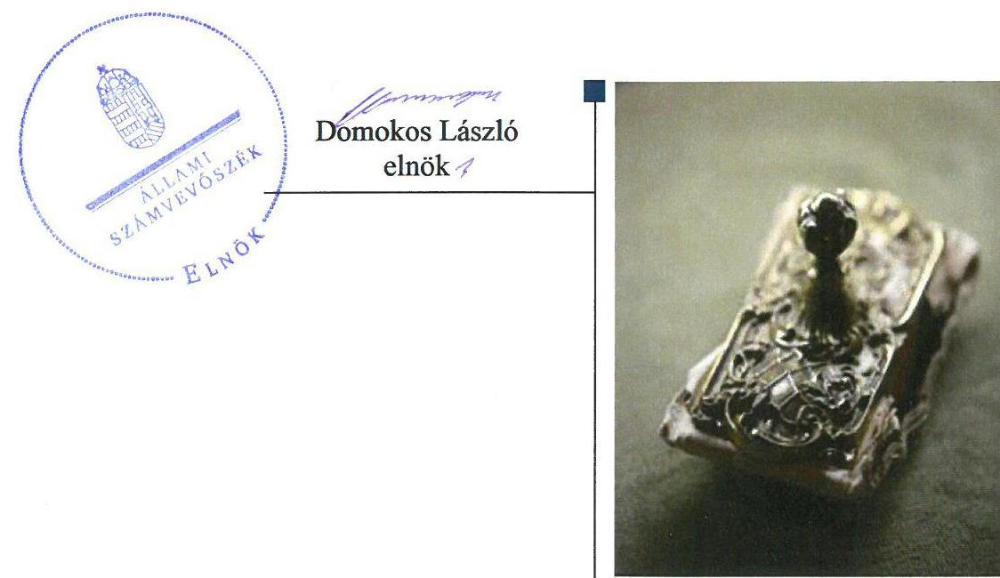
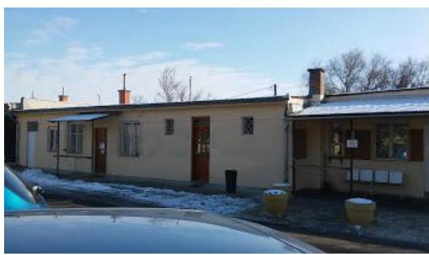
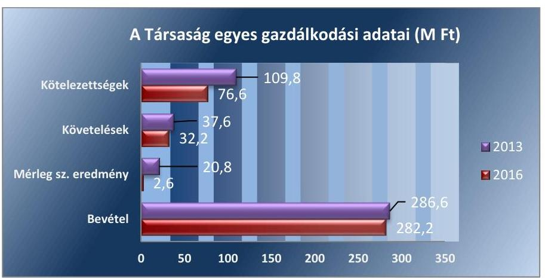
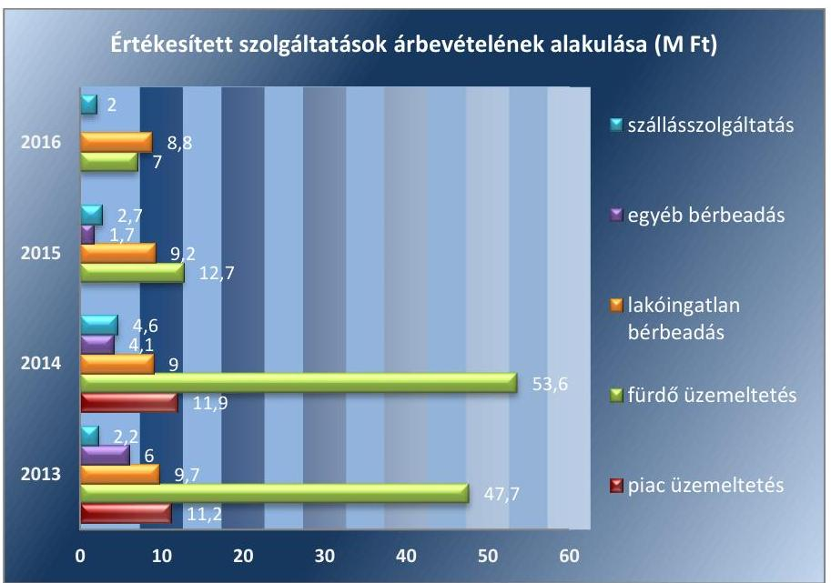
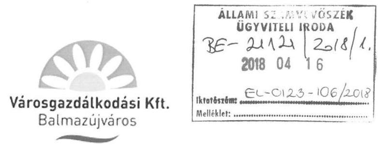
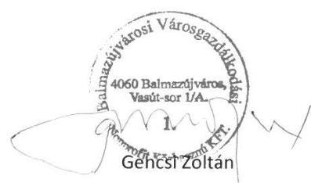
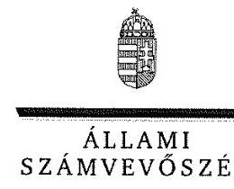
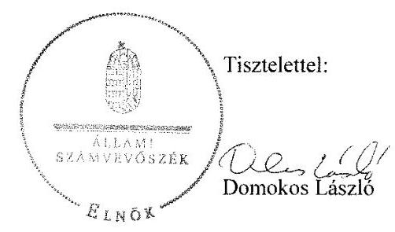

# Jelentés 

## Az önkormányzatok gazdasági társaságai

Az önkormányzatok többségi tulajdonában lévő gazdasági társaságok gazdálkodásának ellenőrzése - Balmazújvárosi Városgazdálkodási Nonprofit Közhasznú Kft. 2018. 05. hó 29. nap

---

# AZ ELLENŐRZÉST FELÜGYELTE:

DR. HORVÁTH MARGIT felügyeleti vezető

## AZ ELLENŐRZÉST VEZETTE ÉS A VÉGREHAJTÁSÁÉRT FELELŐS:

SIPOSNÉ DÓCZI KLÁRA ellenőrzésvezető

## A PROGRAM ÖSSZEÁLLÍTÁSÁÉRT FELELŐS:

TÓTPÁL SZABOLCS osztályvezető

IKTATÓSZÁM: EL-0123-112/2018

TÉMASZÁM: 2447

ELLENŐRZÉS-AZONOSÍTÓ SZÁM: V079313

Jelentéseink az Országgyűlés számítógépes hálózatán és az Interneten a www.asz.hu címen is olvashatóak.

---

# TARTALOMJEGYZÉK 

■ ÖSSZEGZÉS ..... 5
■ AZ ELLENŐRZÉS CÉLJA ..... 6
■ AZ ELLENŐRZÉS TERÜLETE ..... 7
■ AZ ELLENŐRZÉS HÁTTERE, INDOKOLTSÁGA ..... 10
■ A JELENTÉS LÉNYEGES KÉRDÉSKÖREI ..... 11
■ AZ ELLENŐRZÉS HATÓKÖRE ÉS MÓDSZEREI ..... 12
■ MEGÁLLAPÍTÁSOK ..... 14
■ JAVASLATOK ..... 18
■ MELLÉKLETEK ..... 21
I. sz. melléklet: Értelmező szótár ..... 21
II. sz. melléklet: Pénzügyi adatok ..... 23
■ FÜGGELÉK: ÉSZREVÉTELEK ..... 25
■ RÖVIDÍTÉSEK JEGYZÉKE ..... 33

---

.

---

# ÖSSZEGZÉS 

Balmazújváros Város Önkormányzatának tulajdonosi joggyakorlása nem volt szabályszerű. A Balmazújvárosi Városgazdálkodási Nonprofit Közhasznú Kft. gazdálkodásának szabályozottsága 2013 júliusától megfelelt a jogszabályi előírásoknak. Vagyongazdálkodása szabályszerű volt. A Társaság a közhasznú tevékenységével összefüggő adatszolgáltatását nem teljesítette, ezáltal gazdálkodásának az átláthatóságát nem biztosította.

## Az ellenőrzés társadalmi indokoltsága

Magyarországon az intézmény-centrikus közfeladat-ellátás jellemző, de az önkormányzatok kötelező és önként vállalt feladataik ellátása során egyre szélesebb körben alkalmazzák a költségvetési szerveken kívüli feladatellátást. Helyi szinten ennek meghatározó szereplői az önkormányzati tulajdonban lévő gazdasági társaságok, amelyek ezáltal kiemelt fontosságú szerephez jutnak a lakossági szolgáltatások biztosításában. Az önkormányzatok többségi tulajdonában álló gazdasági társaságok ellenőrzése kiemelt jelentőségű, mivel működésük hatással van a tulajdonos önkormányzat gazdálkodására, gazdálkodásának egyes elemei befolyásolják az önkormányzati alszektor hiányát és az államadósságot. Ezért alapvető követelmény, hogy gazdálkodásuk, működésük szabályszerű és átlátható legyen.

Az Állami Számvevőszék által a település üzemeltetési közfeladatot ellátó Társaságnál végzett ellenőrzést további társadalmi elvárás indokolja sajátos tevékenységéből adódóan, mivel szolgáltatásain keresztül a város lakosságának széles köre kerül kapcsolatba a Társasággal.

## Főbb megállapítások, következtetések, javaslatok

Balmazújváros Város Önkormányzata a tulajdonosi joggyakorlás kereteit az előírásoknak megfelelően alakította ki. Ugyanakkor az Önkormányzat tulajdonosi joggyakorlása nem volt szabályszerű, mert az éves beszámolók elfogadásakor nem állt rendelkezésre a Felügyelőbizottság írásbeli jelentése az ellenőrzött időszak egyik évében sem.

A Balmazújvárosi Városgazdálkodási Nonprofit Közhasznú Kft. 2013. június 30-ig nem rendelkezett a jogszabályi előírásoknak megfelelő számviteli politikával és az ahhoz kapcsolódó kötelezően elkészítendő további szabályzatokkal. A működés szabályozási hiányosságait a szabályzatok elkészítésével 2013. július 1-el pótolta, azonban Leltározási szabályzata nem a törvényi szabályozásnak megfelelően rögzítette a mennyiségi felvételezéssel történő leltározás gyakoriságát.

A Balmazújvárosi Városgazdálkodási Nonprofit Közhasznú Kft. vagyongazdálkodási tevékenysége, számviteli elszámolásai megfeleltek a jogszabályi előírásoknak. A Társaság fizetőképessége biztosított volt, az általa alkalmazott díjtételek megfeleltek az Önkormányzat előírásainak. Az éves pénzügyi beszámolók közzétételére vonatkozó előírásoknak az előírt határidőre és adattartalommal tett eleget a Társaság. A Társaság nem gondoskodott a nonprofit tevékenységével összefüggő adatszolgáltatási kötelezettségének a teljesítéséről. Kormányzati szektorba sorolt gazdálkodó szervezetként 2016-ban a szervezet tevékenységének, a célok megvalósításának nyomon követését biztosító rendszert nem működtetett, ugyanakkor a kormányzati szektor hiányát befolyásoló bevételek és ráfordítások elszámolása megfelelő volt, adósságot keletkeztető ügylettel nem rendelkezett.

---

# AZ ELLENŐRZÉS CÉLJA 

Az ellenőrzés célja annak értékelése volt, hogy az önkormányzat vagyongazdálkodási tevékenysége során szabályszerűen gyakorolta-e tulajdonosi jogait; a gazdasági társaság szabályozottsága, gazdálkodása és vagyongazdálkodási tevékenysége, bevételeinek és ráfordításainak elszámolása megfelelt-e a jogszabályi és tulajdonosi előírásoknak; a gazdasági társaság kötelezettségállománya jelentett-e kockázatot a működésre.

Az ellenőrzés célja továbbá annak megítélése volt, hogy a kormányzati szektorba sorolt önkormányzati tulajdonban lévő gazdálkodó szervezet gazdálkodásának a kormányzati szektor hiányára és az államadósságra befolyással bíró elemei a jogszabályi előírásoknak megfeleltek-e.

---

# AZ ELLENŐRZÉS TERÜLETE

## Balmazújváros Város Önkormányzata és a kizárólagos tulajdonában álló Balmazújvárosi Városgazdálkodási Nonprofit Közhasznú Kft.

### BALMAZÚJVÁROS VÁROS ÖNKORMÁNYZATA

2004. február 1-én alapította a kizárólagos tulajdonában álló Társaságot1. A Társaság az ellenőrzött időszakban közhasznú jogállású szervezet volt, jegyzett tőkéje az ellenőrzött időszak minden évében 11,2 millió Ft volt.

### A BALMAZÚJVÁROSI VÁROSGAZDÁLKODÁSI NONPROFIT KFT.

közhasznú tevékenysége keretében az önkormányzati vagyonelemeket üzemeltette. A Társaság tevékenységeit saját eszközeivel, valamint az alább felsorolt önkormányzati vagyonelemek üzemeltetési szerződés keretében történő működtetésével végezte. Közhasznú tevékenysége keretében meghatározó feladata a szennyvíz gyűjtése és kezelése volt, melynek keretében belterületi csapadékvíz elvezetéséhez 150 km csapadékvíz csatornát, árkot tartott karban. Továbbá a szennyeződés mentesítési és egyéb hulladékkezelési tevékenység, mely a település szennyvízhálózatának megóvására, a település környezetének, járdáinak, 71 km úthálózatának, 10 km hosszú kerékpárútjának tisztán tartására, a környező erdők szemétmentesítésére és a nem veszélyes hulladékok gyűjtésére irányult. Tevékenysége kiterjedt 6300 m2 park és 3500 m2 zöldterület gondozására, intézmények takarítására és karbantartására. Sportlétesítményeket tartott karban, stadiont és sportpályát működtetett. Az Önkormányzat megbízásából a közhasznú feladatok ellátását szolgáló ingatlanokon kívüli ingatlanokat – 71 bérlakást továbbá diákszállókat – üzemeltetett és adott bérbe. 2015-ig a piac és a Kamilla Termál- és Strandfürdő üzemeltetését is a Társaság végezte. Az Önkormányzat döntése nyomán 2015-ben a Balmaz-Kamilla Kft. vette át a fürdő üzemeltetését. A Társaság Fürdő-üzemeltetési szerződés2 keretében adta át üzemeltetésre a fürdőhöz kapcsolódó ingatlant és eszközöket, összesen 1 747,7 millió Ft értékben. A Társaság mezőgazdasági tevékenységet is végzett az ellenőrzött időszakban.

A Társaság gazdálkodásának 2013. és 2016. évi egyes adatait az 1. ábra, valamint részletezettebb bemutatásban a II. sz. melléklet szemlélteti.

---

1. ábra

Forrás: A Társaság 2013. és 2016. évi beszámolói

A Társaság az ellenőrzött időszakban eredményesen gazdálkodott, minden üzleti évben pozitív mérleg szerinti eredményt realizált. Az Alapító okirat és a Civil tv. ${ }^{3}$ előírásainak megfelelően a beszámoló elfogadásakor az eredményt eredménytartalékba helyezték. Bevételei a szolgáltatások, termékek értékesítéséből és támogatásokból származtak. Az Önkormányzat a Társaság által végzett közhasznú feladatok megvalósításához az ellenőrzött időszakban összesen 720,2 millió Ft támogatást nyújtott. Pályázatokhoz kötődően a Társaság az ellenőrzött időszakban 110,3 millió Ft rendkívüli bevételt számolt el.

A Társaság kötelezettségei a 2013. évi 109,8 millió Ft-ról a 2016. évi 76,6 millió Ft-ra, 33,2 millió Ft-tal csökkentek annak ellenére, hogy az ellenőrzött időszakon belül kétszer kapott összesen 18,0 millió Ft összegben tulajdonosi kölcsönt az Önkormányzattól.

A Társaságnál a közhasznú feladatokon kívüli tevékenységek finanszírozásának forrását a termékek és szolgáltatások értékesítésből származó bevételek nyújtották. A 2. ábra mutatja az önkormányzati megbízás alapján értékesített szolgáltatások nettó árbevételének alakulását.
2. ábra

Forrás: A Társaság 2013-2016 időszaki főkönyvi kivonatai

---

Az értékesítési bevételekben éreztette hatását az Önkormányzatnak a tevékenységek átszervezésére irányuló döntése. A fürdőt 2015-től nem a Társaság üzemeltette, hanem az üzemeltetőtől használati díjat kapott, ezért az ebből származó bevétele a 2013. évi 47,7 millió Ft-ról 2016-ra 7,0 millió Ft-ra csökkent. A piac üzemeltetését 2015-től az Önkormányzat látta el.

A Társaság átlagos statisztikai állományi létszáma a tevékenység szűkülése következtében a 2013. évi 72 főről 2016. év végére 44 főre csökkent.

A Társaság önköltség-számítási szabályzat készítésére nem volt kötelezett.

A Társaság 2016. évben kormányzati szektorba sorolt társaságnak ${ }^{4}$ minősült. A Társaságnak az ellenőrzött időszakban nem volt olyan adósságot keletkeztető ügylete, amely az államadósságra hatással lett volna, továbbá a kormányzati szektor hiányát osztalékfizetés nem befolyásolta.

A Társaság ügyvezetőjének személye az ellenőrzött időszakban egyszer, 2013. július 1-én, könyvvizsgálója 2013. augusztus 1-én, három tagú felügyelőbizottságának összetétele 2015. január 28-án változott.

Balmazújváros Város Önkormányzatánál a polgármester személye egyszer, a jegyző személye négyszer változott az ellenőrzött időszakon belül.

---

# AZ ELLENŐRZÉS HÁTTERE, INDOKOLTSÁGA 

AZ ÖNKORMÁNYZAT TULAJDONÁBAN ÁLLÓ gazdasági társaság ellenőrzése kiemelten fontos a vagyon megőrzése, megóvása érdekében, valamint a kormányzati szektor elszámolásaiban megjelenő önkormányzati tulajdonú gazdálkodó szervezet esetében, amellyel szemben alapvető követelmény, hogy gazdálkodása, működése szabályszerű, az általa szolgáltatott adatok minél megbízhatóbbak legyenek. A feladatellátás költségeinek, ráfordításainak alakulása a lakosság széles rétegét érinti.

Ellenőrzéseink feltárhatják, hogy az önkormányzat a feladatellátásához rendelt vagyon működtetését a tulajdonostól elvárható gondossággal végezte-e, a feladatot ellátó gazdasági társaság a létesítő okiratban, szolgáltatási szerződésben foglaltak betartásával biztosította-e a feladat ellátását. Az ellenőrzés eredményeképp meghatározhatóvá válnak a költségvetési hiányt befolyásoló szervezet kockázatai, lehetővé válik ezen kockázatok csökkentése. Az ellenőrzés rávilágíthat arra, hogy a gazdasági társaság a vagyon használatával biztosította-e a szolgáltatás folytatásának feltételeit, az önkormányzat tulajdonosi felügyelete hozzájárult-e a szabályszerű gazdálkodáshoz és feladatellátáshoz.

A megállapítások alapján megfogalmazott számvevőszéki javaslatok hasznosítása elősegítheti a meglévő hibák megszüntetését. A jó gyakorlatok bemutatásával az ÁSZ hozzájárul a követendő megoldások megismertetéséhez, terjesztéséhez.

---

# A JELENTÉS LÉNYEGES KÉRDÉSKÖREI 

1. Az önkormányzat tulajdonosi joggyakorlása szabályszerű volt-e?
2. A gazdasági társaság szabályozottsága, gazdálkodása és vagyongazdálkodási tevékenysége szabályszerű volt-e?
3. A gazdasági társaság bevételeinek és ráfordításainak elszámolása, valamint az árképzés szabályszerű volt-e?
4. A kormányzati szektorba sorolt önkormányzati tulajdonban (résztulajdonban) lévő gazdálkodó szervezet gazdálkodásának a kormányzati szektor hiányára és az államadósságra befolyással bíró elemei megfeleltek-e a jogszabályi előírásoknak?

---

# AZ ELLENŐRZÉS HATÓKÖRE ÉS MÓDSZEREI 

## Az ellenőrzés típusa

Megfelelőségi ellenőrzés

## Az ellenőrzött időszak

2013. január 1-jétől 2016. december 31-ig tart

## Az ellenőrzés tárgya

Balmazújváros Város Önkormányzata tulajdonosi joggyakorlása, valamint a Balmazújvárosi Városgazdálkodási Nonprofit Közhasznú Kft. gazdálkodásának szabályozottsága és szabályszerűsége, továbbá gazdálkodásának a kormányzati szektor hiányára és az államadósságra befolyással bíró elemei.

Az ellenőrzés kiterjedt minden olyan körülményre és adatra, amely az ÁSZ jogszabályban meghatározott feladatainak teljesítéséhez, valamint a program végrehajtása folyamán felmerült újabb összefüggések feltárásához szükséges.

## Az ellenőrzött szervezet

- Balmazújváros Város Önkormányzata,
- Balmazújvárosi Városgazdálkodási Nonprofit Közhasznú Kft.

## Az ellenőrzés jogalapja

Az ellenőrzés jogszabályi alapját az ÁSZ tv. ${ }^{5} 1. §$ (3) bekezdése és 5. § (3)-(4)-(5) bekezdései képezik.

## Az ellenőrzés módszerei

Az ellenőrzést a nemzetközi standardokat irányadónak tekintve az ellenőrzési program ellenőrzési kérdései, az ellenőrzött időszakban hatályos jogszabályok, az ellenőrzés szakmai szabályok és módszertanok figyelembe vételével végeztük.

Az ellenőrzés ideje alatt az ellenőrzött szervezettel történő kapcsolattartást az ÁSZ Szervezeti és Működési Szabályzatának vonatkozó előírásai alapján biztosítottuk.

---

Az ellenőrzés a tulajdonosi jogokat gyakorló önkormányzatra valamint az általa kizárólagosan tulajdonolt gazdasági társaságra terjedt ki.

Az ellenőrzési kérdések megválaszolásához szükséges bizonyítékok megszerzése a következő ellenőrzési eljárások alkalmazásával történt: megfigyelés, kérdésfeltevés (információkérés), összehasonlítás, valamint elemző eljárás. Az ellenőrzési bizonyítékként felhasználható adatforrások közé tartoztak egyrészt a szakmai programban felsorolt adatforrások, másrészt minden, az ellenőrzés folyamán feltárt, az ellenőrzés szempontjából információkat tartalmazó dokumentum.

A bevételek és ráfordítások elszámolása, valamint a vagyonnyilvántartás terén a szabályszerű működést véletlen mintavétellel és irányított kiválasztással ellenőriztük. A mintatételek értékelése alapján egyrészt a sokaságban előforduló hiba arányát becsültük, másrészt az irányítottan kiválasztott tételeket értékeltük. A jogszabályoknak és a belső eljárásoknak megfelelőnek, azaz szabályszerűnek tekintettük az adott területet, amennyiben a minta ellenőrzésének eredménye alapján 95%-os bizonyossággal a teljes sokaságban a hibaarány kisebb volt, mint 10%. Nem megfelelőnek értékeltük, ha a
 hibaarány a 10%-ot meghaladta. A ráfordítások elszámolására és a vagyonnyilvántartásra vonatkozó véletlen mintavételt kockázati alapú kiválasztással egészítettük ki, amelynek során évente a három legnagyobb összegű tételt választottuk ki. Az ellenőrzést a nemzetközi standardokat irányadónak tekintve az ellenőrzési program ellenőrzési kérdései, az ellenőrzött időszakban hatályos jogszabályok, az ellenőrzés szakmai szabályok és módszertanok figyelembe vételével végeztük.

Az ellenőrzést a kérdésekre adott válaszok kiértékelésével, valamint a megjelölt adatforrások, a csatolt tanúsítványok felhasználásával, továbbá az adott időszakban hatályos jogszabályok figyelembe vételével folytattuk le.

---

# 1. Az önkormányzat tulajdonosi joggyakorlása szabályszerű volt-e? 

Összegző megállapítás

Az Önkormányzat a tulajdonosi joggyakorlás kereteit szabályszerűen alakította ki, ugyanakkor tulajdonosi joggyakorlása nem volt szabályszerű.

A TULAJDONOSI JOGGYAKORLÁS KERETEIT az Önkormányzat Képviselő-testülete az előírásoknak megfelelően alakította ki, az alapvető szabályokat az Alapító okirat ${ }_{1-6}{ }^{6}$-ban és a Vagyonrendelet ${ }^{7}$-ben rögzítette. A Gt. ${ }^{8}$ és a Ptk. ${ }^{9}$ előírásai szerint az Alapító ${ }^{10}$ kijelölte a Felügyelőbizottság tagjait, megválasztotta az Ügyvezetőt, meghatározta feladataikat. Az Alapító okirat ${ }_{1-6}$ előírása szerint a Társaságnál független könyvvizsgáló működött. Az Önkormányzat az Alapító okirat ${ }_{1-6}$-ban, az Üzemeltetési Szerződés ${ }^{11}$-ben és az évenként megkötött Megállapodás ${ }_{1-4}{ }^{12}$-ban határozta meg a feladatellátás követelményeit, úgymint az elvégzendő feladatokat, az üzleti tervezési kötelezettséget, a feladatteljesítés pénzügyi kereteit és eszközeit, a rendelkezésre bocsátott eszközök használatának díját, fejlesztésének feltételeit, a félévenkénti tájékoztatási, adatszolgáltatási kötelezettséget. 2015-ben elfogadták a Társaság Szervezeti és Működési Szabályzatát ${ }^{13}$, melyben a Társaság vezetésének és gazdálkodásának, valamint a Társaság jellegének megfelelő szabályokat határozták meg.

A TULAJDONOSI JOGGYAKORLÁS során az ellenőrzött időszakban a Társaság legfőbb szerve ${ }^{14}$ az Alapító okirat ${ }_{1-6}$, valamint a Megállapodás ${ }_{1-4}$ előírásainak megfelelően döntött az éves üzleti tervekről és félévente beszámoltatatta az Ügyvezetőt.

Az Önkormányzat Képviselő-testülete - a Társaság legfőbb szerveként a Gt. 35. § (3) bekezdésének majd a Ptk. hatálybalépését követően a Ptk. 3:120. § (2) bekezdésének előírása ellenére, az ellenőrzött időszak minden évében a Felügyelőbizottság írásbeli jelentésének hiányában döntött a beszámoló elfogadásáról.

A FELÜGYELŐBIZOTTSÁG a Gt. 34. § (4) bekezdése, majd a Ptk. hatálybalépését követően a Ptk. 3:122. § (3) bekezdésének előírása ellenére nem határozta meg ügyrendjét. Továbbá a Felügyelőbizottság tevékenysége az ellenőrzött időszakban nem volt szabályszerű, mert nem felelt meg a Ptk. 3:27. § (1) bekezdésében foglaltaknak, miszerint a döntéshozó szerv elé kerülő előterjesztéseket köteles megvizsgálni, és ezekkel kapcsolatos álláspontját a döntéshozó szerv ülésén ismertetni.

A TULAJDONOSI JOGGYAKORLÓ KÉTSZER ELLENŐRIZTE A TÁRSASÁGOT az Áht. ${ }^{15}$-ban foglaltak alapján az ellenőrzött időszakban. A 2013. és 2015. évi ellenőrzések a gazdálkodás

---

szabályszerűségét érintő, a szabályszerű működéssel kapcsolatos megállapításokat tettek, és javaslatokat fogalmaztak meg a jogszerű állapot helyreállítására. A 2013. évben zárult ellenőrzés megállapításai következtében módosult az Ügyvezető és a könyvvizsgáló személye.

A tulajdonosi joggyakorló megalkotta a Társaság Taktv. ${ }^{16}$-ban előírásainak megfelelő javadalmazási szabályzatát.

# 2. A gazdasági társaság szabályozottsága, gazdálkodása és vagyongazdálkodási tevékenysége szabályszerű volt-e? 

Összegző megállapítás

Számviteli szabályzatokkal a Társaság 2013. július 1-től rendelkezett. A Társaság gazdálkodása és vagyongazdálkodása szabályszerű volt.

### 2.1. számú megállapítás

A Társaság szabályszerű működéséhez a kötelező számviteli szabályzatok 2013. július 1-től álltak rendelkezésre. A Társaság gazdálkodása és vagyongazdálkodása megfelelő volt.

SZÁMVITELI SZABÁLYZATOKKAL a Társaság a Számv. tv. ${ }^{17}$ 14. § (11) bekezdése előírásainak ellenére 2013. június 30-ig nem rendelkezett. Az Önkormányzat ellenőrzési megállapításaira tett intézkedések keretében a Társaság 2013. július 1-től rendelkezett a Számv. tv. előírásainak megfelelő Számviteli politikával ${ }_{1-4}{ }^{18}$, Számlarenddel ${ }^{19}$, Eszközök és források értékelési szabályzatával ${ }^{20}$, Pénzkezelési szabályzattal ${ }^{21}$ és az Önköltség-számítási szabályzattal ${ }^{22}$.

A Leltározási szabályzat ${ }^{23}$ nem felelt meg a Számv. tv. 69. § (3) bekezdésében foglaltnak, mert a Számv. tv. előírásaival szemben nem határozta meg a mennyiségi leltárfelvétel gyakoriságát.

A Társaság 2013. szeptemberétől rendelkezett az Info tv. ${ }^{24}$ előírásainak megfelelő, a közérdekű adatok megismerésére irányuló kérelmek intézésének és a kötelezően közzéteendő adatok nyilvánosságra hozatalának szabályzatával ${ }^{25}$. A Társaság 2013. júliusától a Behajtási szabályzatban ${ }^{26}$ határozta meg a kintlévőségek kezelésével és behajtásával kapcsolatos eljárásrendet.

A TÁRSASÁG VAGYONGAZDÁLKODÁSA, a vagyon elidegenítése, nyilvántartása valamint a vagyont érintő fejlesztések megfeleltek az előírásoknak. Az ellenőrzött időszakban értékesített vagyonból származó bevétel meghaladta az értékesített eszközök nyilvántartási értékét. A megvalósult fejlesztésekhez az Alapító okirat ${ }_{1-6}$ előírásai szerint az Önkormányzat Képviselő-testülete hozzájárult.

## AZ ÉVES BESZÁMOLÓKAT ${ }^{27}$ ALÁTÁMASZTÓ LEL-

TÁRAK a követelések és a kötelezettségek kivételével megfelelően tartalmaztak minden vagyonelemet. A Számv. tv. 69. § (1) és (3) bekezdéseiben és a Leltározási szabályzat 5.2. pontjában foglalt követelményeknek a Társaság nem tett eleget, mert nem történt meg az egyeztetéssel elvégzett leltárazás az üzleti év mérleg fordulónapjára vonatkozóan a csak értékben

---

kimutatott, a mérlegfőösszeg átlag két százalékát kitevő követeléseknél és kötelezettségeknél a teljes ellenőrzött időszak vonatkozásában.

# A RÖVID LEJÁRATÚ KÖTELEZETTSÉGEK TELJESÍTÉSE javult az ellenőrzött időszakban. A Társaság év végi rövid lejáratú kötelezettség állománya 31,6 M Ft-tal csökkent a 2013. december 31-i 108,2 millió forintról 2016. év végi 76,6 millió forintra. Az Önkormányzat felé fennálló kötelezettsége a Társaságnak az Üzemeltetési Szerződés szerinti díjfizetési kötelezettségből valamint az Önkormányzattól kapott tulajdonosi kölcsönök összegéből állt, melynek összege 2013. év végi 28,6 millió forintról 2016. december 31-re 46,8 millió forintra nőtt. A Társaság követelés állománya 5,3 millió Ft-tal csökkent az ellenőrzött időszak végére. A 2013. december 31-én fennálló 37,6 millió forint 2016. december 31-ére 32,3 millió forintra csökkent.

A Társaság a 2015. december 30-tól hatályos kormányzati szektorba sorolását követően, nem alakította ki a Bkr. ${ }^{28}$ 54/A. § és a Bkr. 10. § előírásainak megfelelően a szervezet tevékenységének, a célok megvalósításának nyomon követését biztosító rendszert.

### 2.2. számú megállapítás

A Társaság tervezési kötelezettségét valamint az éves beszámolási és közzétételi kötelezettségét teljesítette. A közhasznúsági melléklet készítési és közzétételi kötelezettségének nem tett eleget.

## ÜZLETI TERVEZÉSI KÖTELEZETTSÉGÉNEK a Társaság

az Alapító okirat ${ }_{1-6}$-ban foglaltaknak megfelelően, az ellenőrzött időszakban eleget tett. A Társaság teljesítette a Megállapodás ${ }_{1-4}$-ban meghatározott félévenkénti tájékoztatási, adatszolgáltatási kötelezettségét is.

## AZ ÉVES BESZÁMOLÁSI ÉS KÖZZÉTÉTELI KÖTELEZETTSÉGÉT a Társaság a Számv. tv. előírásai szerint teljesítette.

Ugyanakkor a Társaság az ellenőrzött időszak egyik évében sem készítette el, így nem helyezte letétbe és nem tette közzé a Közhasznúsági mellékletet, amivel megsértették a Civil tv. 46. § (1) bekezdésének előírásait.

Annak ellenére, hogy az éves beszámolókat nem támasztották alá teljes körű leltárral és a közhasznúsági mellékletek sem álltak rendelkezésre, a könyvvizsgáló az ellenőrzött időszak minden évében korlátozás nélküli, hitelesítő záradékkal látta el a beszámolókhoz kapcsolódó jelentéseit.

A TÁRSASÁG KÖZÉRDEKŰ ADATAIT a vezető tisztségviselőkre és a felügyelőbizottsági tagokra vonatkozóan a Taktv.-ben előírt tartalommal az Alapító okirat ${ }_{1-6}$-ban kijelölt tájékoztatási felületen, az Önkormányzat honlapján közzétette, ezzel egyúttal eleget tett az Info tv. 1. sz. melléklet III. Gazdálkodási adatok 2. sorában előírtaknak. Nem kerültek azonban közzétételre a Közérdekű adatok szabályzat ${ }^{29}$ 4. pontjában és az Info tv. 37. § (1) bekezdésében előírtak ellenére az Info tv. 1. melléklet I. szervezeti, személyzeti adatok részben, a II. Tevékenységre, működésre vonatkozó adatok részben, valamint a III. Gazdálkodási adatok részben a további, a közfeladatot ellátó Társaságra meghatározott szervezeti-, tevékenységi-, működési- és gazdálkodási adatok, amivel megsértették az Info tv. 33. § (1) és (3) bekezdéseinek előírásait.

---

# 3. A gazdasági társaság bevételeinek és ráfordításainak elszámolása, valamint az árképzés szabályszerű volt-e? 

Összegző megállapítás

A Társaság bevételeinek és ráfordításainak elszámolása, valamint a megbízás alapján végzett szolgáltatások díjainak megállapítása szabályszerű volt.

A BEVÉTELEK ELSZÁMOLÁSA megfelelt a jogszabályi és a belső szabályozásba foglalt előírásoknak. A bevételek kiszámlázása, főkönyvi számlákon történő elszámolása megfelelt a Számv. tv-ben és a belső szabályozásokban előírtaknak.

A RÁFORDÍTÁSOK ELSZÁMOLÁSA megfelelt a jogszabályi és a belső szabályozásba foglalt előírásoknak. Az elszámolást megalapozó dokumentumok rendelkezésre álltak, az elszámolások számviteli bizonylatok alapján, dokumentált teljesítéssel, a megfelelő főkönyvi számlán történtek. A Számlarendben foglaltaknak megfelelően tevékenységenként elkülönítetten rögzítették a bevételeket és a ráfordításokat.

A DÍJMEGÁLLAPÍTÁS SZABÁLYAIT, annak keretében az önkormányzati lakások bérleti díjait, a megbízás alapján végzett szolgáltatások igénybevételi díjait - úgymint a fürdő belépőjegyek árát, a helyiség bérleti díjakat, a szállásdíjakat valamint a diákszálló térítési díjait - Képviselő-testületi határozatokban valamint rendeletben állapították meg. A díjak meghatározása a Társaság által nyújtott szolgáltatások esetében összhangban volt a Képviselő-testület határozataival illetve rendeleteivel.

## 4. A kormányzati szektorba sorolt önkormányzati tulajdonban (résztulajdonban) lévő gazdálkodó szervezet gazdálkodásának a kormányzati szektor hiányára és az államadósságra befolyással bíró elemei megfeleltek-e a jogszabályi előírásoknak?

Összegző megállapítás

A Társaság gazdálkodásának a kormányzati szektor hiányára befolyással bíró elemei megfeleltek a jogszabályi előírásoknak.

A Társaság gazdálkodásának az államadósságra hatással bíró elemei nem voltak, a gazdálkodás kormányzati szektor hiányára befolyással bíró elemei megfeleltek a Számv. tv. előírásainak.

---

# JAVASLATOK 

Az ÁSZ tv. 33. § (1) bekezdésében foglaltak értelmében az ellenőrzött szervezet vezetője köteles a jelentésben foglalt megállapításokhoz kapcsolódó intézkedési tervet összeállítani és azt a jelentés kézhezvételétől számított 30 napon belül az ÁSZ részére megküldeni. Amennyiben az ellenőrzött szervezet vezetője nem küldi meg határidőben az intézkedési tervet, vagy továbbra sem elfogadható intézkedési tervet küld, az Állami Számvevőszék elnöke az ÁSZ tv. 33. § (3) bekezdése a) és b) pontjaiban foglaltakat érvényesítheti.

Javaslataink célja a Balmazújvárosi Városgazdálkodási Nonprofit Közhasznú Kft. gazdálkodása szabályszerűségének és gyakorlatának javítása annak érdekében, hogy a szabályozási környezet és az alkalmazott gyakorlat megfelelően tudja támogatni az átlátható működést.

## Balmazújvárosi Városgazdálkodási Nonprofit Közhasznú Kft. ügyvezetőjének

1. Intézkedjen a Leltározási szabályzat módosításáról a mennyiségi leltárfelvétel gyakoriságának Számv. tv.-ben előírtaknak megfelelő meghatározásával.
(2.1. sz. megállapítás 2. bekezdése alapján)
2. Intézkedjen az egyeztetéssel leltárazandó eszközök és kötelezettségek leltárazásának végrehajtásáról a Számv. tv. előírásainak megfelelően.
(2.1. sz. megállapítás 5. bekezdése alapján)
3. Intézkedjen a Társaság tevékenységének, a célok megvalósításának nyomon követését biztosító rendszer Bkr. előírásainak megfelelő kialakításáról.
(2.1. sz. megállapítás 7. bekezdése alapján)
4. Intézkedjen a közhasznúsági melléklet elkészítéséről és közzétételéről a Civil tv.-ben előírtaknak megfelelően.
(2.2. sz. megállapítás 3. bekezdése alapján)
5. Intézkedjen a - közérdekű és közérdekből nyilvános adatokra vonatkozó - közzétételi kötelezettség teljesítéséről az Info tv.-ben előírtaknak megfelelően.
(2.2. sz. megállapítás 5. bekezdés 2. mondata alapján)

---

# Javaslataink célja az Önkormányzat szabályszerű működésének elősegítése, továbbá az önkormányzati tulajdonosi joggyakorlás kontrolljainak erősítése. 

## Balmazújváros Város Önkormányzata polgármesterének

1. Kezdeményezze a Felügyelőbizottságnál, hogy a Társaság éves beszámolójáról készítsen írásbeli jelentést a Ptk.-ban előírtaknak megfelelően.
(1. sz. megállapítás 3. bekezdése alapján)
2. Intézkedjen arról, hogy a legfőbb szerv (Képviselő-testület) a Társaság éves beszámolójáról, a Felügyelőbizottság írásbeli jelentésének birtokában döntsön a Ptk.-ban előírtaknak megfelelően.
(1. sz. megállapítás 3.
 bekezdése alapján)
3. Intézkedjen a Leltározási szabályzat, a leltározás hiányossága, továbbá a Társaság tevékenységének, a célok megvalósításának nyomon követését biztosító rendszer kialakításának elmaradása, valamint a közhasznúsági melléklet elkészítésének és közzétételének hiánya, végül a közérdekű és közérdekből nyilvános adatokra vonatkozó közzétételi kötelezettség hiányossága miatti felelősség tisztázása érdekében és szükség szerint intézkedjen a felelősség érvényesítéséről.
(2.1. sz. megállapítás 2., 5. és 7. bekezdései, a 2.2. sz. megállapítás 3. bekezdése, 2.2. sz. megállapítás 5. bekezdés 2. mondata alapján)

---

.

---

# MELLÉKLETEK 

- I. SZ. MELLÉKLET: ÉRTELMEZŐ SZÓTÁR
gazdasági társaság
gazdálkodó szervezet
kormányzati szektorba sorolt egyéb szervezet
közszolgáltatás
meghatározó befolyás
minősített többséget biztosító részesedés
nemzeti vagyon
nonprofit gazdasági társaság

Ptk 3.88. § (1) bekezdése szerint „a gazdasági társaságok üzletszerű közös gazdasági tevékenység folytatására, a tagok vagyoni hozzájárulásával létrehozott, jogi személyiséggel rendelkező vállalkozások, amelyekben a tagok a nyereségből közösen részesednek, és a veszteséget közösen viselik".
A Ptk. 685. § c) pontja szerint gazdálkodó szervezet: „az állami vállalat, az egyéb állami gazdálkodó szerv, a szövetkezet, a lakásszövetkezet, az európai szövetkezet, a gazdasági társaság, az európai részvénytársaság, az egyesülés, az európai gazdasági egyesülés, az európai területi együttműködési csoportosulás, az egyes jogi személyek vállalata, a leányvállalat, a vízgazdálkodási társulat, az erdő birtokossági társulat, a végrehajtói iroda, az egyéni cég, továbbá az egyéni vállalkozó." (2014. 03. 15-ig hatályos)
az Áht. 3. § (2) és (3) bekezdésében foglaltakon kívül az Európai Közösséget létrehozó szerződéshez csatolt, a túlzott hiány esetén követendő eljárásról szóló jegyzőkönyv alkalmazásáról szóló 2009. május 25-i 479/2009/EK rendelet (a továbbiakban: 479/2009/EK rendelet) szerint a kormányzati szektorba sorolt szervezet (Áht. 1. § (12))
Az Ebktv. ${ }^{30}$ 3. § d) pontja a következőképpen határozza meg a közszolgáltatást: „szerződéskötési kötelezettség alapján a lakosság alapvető szükségleteinek ellátására irányuló szolgáltatás, így különösen a villamos energia-, gáz-, hő-, víz-, szennyvíz- és hulladékkezelési, köztisztasági, postai és távközlési szolgáltatás, továbbá a menetrend alapján közlekedő járművekkel végzett közforgalmú személyszállítás". A Ptk. 8:2. § (2) bekezdése szerint „A befolyással rendelkező akkor rendelkezik egy jogi személyben meghatározó befolyással, ha annak tagja vagy részvényese, és
a) jogosult e jogi személy vezető tisztségviselői vagy felügyelőbizottsága tagjai többségének megválasztására, illetve visszahívására; vagy
b) a jogi személy más tagjai, illetve részvényesei a befolyással rendelkezővel kötött megállapodás alapján a befolyással rendelkezővel azonos tartalommal szavaznak, vagy a befolyással rendelkezőn keresztül gyakorolják szavazati jogukat, feltéve, hogy együtt a szavazatok több mint felével rendelkeznek."
A minősített befolyásszerző az ellenőrzött társaságban a szavazatok legalább hetvenöt százalékával rendelkezik. (Ptk. 3:324. §)
Nvtv. 1. § (2) bekezdése szerint többek között:
„az állam vagy a helyi önkormányzat kizárólagos tulajdonában álló dolgok, az a) pont hatálya alá nem tartozó, állam vagy a helyi önkormányzat tulajdonában lévő dolog,
az állam vagy a helyi önkormányzat tulajdonában lévő pénzügyi eszközök, továbbá az államot vagy a helyi önkormányzatot megillető társasági részesedések, az államot vagy a helyi önkormányzatot megillető bármely vagyoni értékkel rendelkező jogosultság, amelyet jogszabály vagyoni értékű jogként nevesít."
Civil tv. 9/F. § (2) bekezdése szerint „az a gazdasági társaság minősül nonprofit gazdasági társaságnak és cégnevében az a gazdasági társaság tüntetheti fel a nonprofit jelleget, amelynek létesítő okirata tartalmazza, hogy a gazdasági társaság tevékenységéből származó nyereség a tagok között nem osztható fel, hanem az a gazdasági társaság vagyonát gyarapítja." (hatályos 2014. március 15-től)

---

többségi befolyást biztosító részesedés
vagyonkezelő

A Ptk. 8:2. § (1) bekezdése szerint „többségi befolyás az olyan kapcsolat, amelynek révén természetes személy vagy jogi személy (befolyással rendelkező) egy jogi személyben a szavazatok több mint felével vagy meghatározó befolyással rendelkezik."
vagyonkezelő:
a) az állam tulajdonában álló nemzeti vagyon tekintetében:
aa) költségvetési szerv,
ab) helyi önkormányzat, önkormányzati társulás,
ac) önkormányzati intézmény,
ad) köztestület,
ae) az állam, az aa)-ac) alpontban meghatározott személyek együtt vagy külön-külön 100%-os tulajdonában álló gazdálkodó szervezet,
af) az ae) alpont szerinti gazdálkodó szervezet 100%-os tulajdonában álló gazdálkodó szervezet,
ag) a törvény által kijelölt egyedileg meghatározott jogi személy.
b) a helyi önkormányzat tulajdonában álló nemzeti vagyon tekintetében:
ba) önkormányzati társulás,
bb) költségvetési szerv vagy önkormányzati intézmény,
bc) köztestület,
bd) az állam, a helyi önkormányzat, a ba)-bb) alpontban meghatározott személyek együtt vagy külön-külön 100%-os tulajdonában álló gazdálkodó szervezet,
be) a bd) alpont szerinti gazdálkodó szervezet 100%-os tulajdonában álló gazdálkodó szervezet.
c) az egyházi jogi személy a tevékenysége ellátásához szükséges nemzeti vagyon tekintetében. (Forrás: Nvtv. 3. § (1) bekezdés 19. pontja)

---

# II. SZ. MELLÉKLET: PÉNZÜGYI ADATOK

A Balmazújvárosi Városgazdálkodási Nonprofit Közhasznú Kft. egyszerűsített éves beszámolóinak adatai

|  EGYSZERÜSÍTETT ÉVES BESZÁMOLÓK ADATAI (MILLIÓ FORINT) |  |  |  |  |   |
| --- | --- | --- | --- | --- | --- |
|  Megnevezés | 2013.01.01. | 2013.12.31. | 2014.12.31. | 2015.12.31. | 2016.12.31.  |
|  Befektetett eszközök | 1439,0 | 1476,1 | 1461,5 | 1405,4 | 1377,7  |
|  Immateriális javak | 0 | 0 | 0 | 0 | 0  |
|  Tárgyi eszközök | 1438,9 | 1476,0 | 1461,4 | 1405,3 | 1377,6  |
|  Befektetett pénzügyi eszközök | 0,1 | 0,1 | 0,1 | 0,1 | 0,1  |
|  Forgóeszközök | 71,6 | 45,2 | 35,0 | 19,7 | 33,1  |
|  Készletek | 1,7 | 2,2 | 2,2 | 2,1 | 0  |
|  Követelések | 41,5 | 37,6 | 30,2 | 15,4 | 32,3  |
|  Értékpapírok | 0 | 0 | 0 | 0 | 0  |
|  Pénzeszközök | 28,4 | 5,4 | 2,5 | 2,2 | 0,8  |
|  Aktív időbeli elhatárolások | 19,5 | 0 | 0 | 0,1 | 0,4  |
|  Saját tőke | 28,1 | 48,9 | 65,4 | 71,3 | 73,9  |
|  Jegyzett tőke | 11,2 | 11,2 | 11,2 | 11,2 | 11,2  |
|  Töketartalék | 0 | 0 | 0 | 0 | 0  |
|  Eredménytartalék | $-4,1$ | $-4,1$ | 16,7 | 33,1 | 39,1  |
|  Lekötött tartalék | 21,1 | 21,1 | 21,1 | 21,1 | 21,1  |
|  Értékelési tartalék | 0 | 0 | 0 | 0 | 0  |
|  MSZE ${ }^{31 /}$ adózott eredmény | - | 20,8 | 16,4 | 5,9 | 2,6  |
|  Céltartalék | 0 | 0 | 0 | 13,0 | 30,0  |
|  Kötelezettségek | 146,8 | 109,8 | 110,6 | 65,1 | 76,6  |
|  Hosszú lejáratú kötelezettségek | 1,7 | 1,6 | 1,1 | 0 | 0  |
|  Rövid lejáratú kötelezettségek | 145,1 | 108,2 | 109,5 | 65,1 | 76,6  |
|  Passzív időbeli elhatárolás | 1355,2 | 1362,5 | 1320,5 | 1275,7 | 1230,7  |
|  MÉRLEG FŐÖSSZEG | 1530,2 | 1521,3 | 1496,5 | 1425,2 | 1411,2  |
|   |  | 2013. | 2014. | 2015. | 2016.  |
|  Értékesítés nettó árbevétele | - | 97,7 | 119,7 | 56,9 | 46,9  |
|  Egyéb bevételek | - | 188,9 | 188,4 | 173,7 | 235,3  |
|  Anyagjellegű ráfordítások | - | 119,0 | 141,8 | 90,8 | 102,6  |
|  Személyi jellegű ráfordítások | - | 135,7 | 132,6 | 91,7 | 95,3  |
|  Értékcsökkenési leírás | - | 50,3 | 48,8 | 58,8 | 51,7  |
|  Egyéb ráfordítások | - | 17,2 | 21,9 | 27,3 | 29,9  |
|  Üzemi tevékenység eredménye | - | $-35,7$ | $-37,1$ | $-38,0$ | 2,7  |
|  Pénzügyi műveletek eredménye | - | $-0,2$ | 0 | $-0,1$ | $-0,1$  |
|  Rendkívüli eredmény | - | 56,8 | 53,5 | 44,1 | 0  |
|  MSZE/adózott eredmény* | - | 20,8 | 16,4 | 5,9 | 2,6  |
|   |  |  |  | Forrás: a Társaság éves beszámolói 2013-2016 |   |

---

.

---

# FÜGGELÉK: ÉSZREVÉTELEK 

A jelentéstervezetet a Számvevőszék 15 napos észrevételezésre megküldte az ellenőrzött szervezetek vezetőinek az ÁSZ tv. 29. § (1) bekezdése előírásának megfelelően.

A jelentés tartalmazza az ellenőrzött Balmazújvárosi Városgazdálkodási Nonprofit Közhasznú Kft. ügyvezetőjétől érkezett észrevételeket. Balmazújváros Város Önkormányzatának polgármestere – az ÁSZ tv. 29. § (2) bekezdésében foglaltak szerinti – észrevételezési jogával nem élt, az ellenőrzés megállapításaira nem tett észrevételt.

[^0]
[^0]:    * 29. § (1) Az Állami Számvevőszék az ellenőrzési megállapításait megküldi az ellenőrzött szervezet vezetőjének vagy az általa megbízott személynek, és annak, akinek személyes felelősségét állapította meg.
    (2) Az ellenőrzött szervezet vezetője és a felelősként megjelölt személy az ellenőrzés megállapításaira tizenöt napon belül írásban észrevételt tehet.
    (3) Az Állami Számvevőszék az észrevételre a beérkezésétől számított harminc napon belül írásban válaszol. A figyelembe nem vett észrevételeket köteles a jelentésben feltüntetni, és megindokolni, hogy azokat miért nem fogadta el.

---

Balmazújvárosi Városgazdálkodási Nonprofit Közhasznú Kft., E-mail: vgkfttit@balmazinter.hu
Telefon: +36 (70) 932-4500, Fax: +36 (52) 580-678, Honlap: www.balmazivarosgazda.hu

# Állami Számvevőszék 

## 1364 Budapest

Pf. 54.

Tárgy: Észrevétel az EL-0123-101/2018. iktatószámú jelentéstervezetre

### 2.1. sz. megállapítás 2. bekezdése

A leltározási szabályzat módosítása elkészült, mellékeljük. Bár a leltározási szabályzatban nem írtuk elő a gyakoriságát az egyeztetéssel történő leltározásnak, azt cégünk minden évben elvégezte.

### 2.1. sz. megállapítás 5. bekezdése

Évente készítünk egyeztetéssel elvégzett leltározást az év utolsó munkanapján a beszámoló alátámasztására; illetőleg mivel a tárgyi eszközeink nagy része az Állami Számvevőszék által vizsgált időszakban le nem zárt pályázathoz kapcsolódik, az ÉARFÜ ellenőrzések előtt minden alkalommal (nyilvántartási számra fel vannak címkézve a beazonosíthatóság miatt).

Az általunk készített leltárak, melyek az üzleti évek beszámolóit alátámasztják, tartalmazzák mind a mennyiségi, mind az értékbeni nyilvántartást. Jelen pillanatban a 2017. évi üzleti évet zárjuk, ahhoz 2017. 12. 29-én leltároztunk utoljára. Folyik a könyvvizsgálat, és a felügyelőbizottsági ellenőrzés.

### 2.1. sz. megállapítás 7. bekezdése

Szerződést kötöttünk 2018. 01. 01-én Nagy Csaba regisztrált belső ellenőrrel, amelyben vállalkozó szerződés keretében cégünknek (mint kormányzati szektorba sorolt cégnek) kialakítja a Bkr. előírásainak megfelelően a nyomon követést biztosító rendszert is. A szerződést mellékeljük.

---

# 2.2. sz. megállapítás 3. bekezdése 

Társaságunk évente elkészítette a Sztv. szerinti egyszerűsített éves beszámolóval egyidejűleg a közhasznúsági mellékletet, azt fel is töltötte annak mellékleteként a törvényben előírt határidőig a Nemzetgazdasági Minisztérium honlapjára.

Illetve saját honlapunkon (www.balmazivarosgazda.hu) is közzétettük (ld. 2.2. sz. megállapítás 5. bekezdés)
 2. mondata).

A könyvvizsgáló részére rendelkezésre állt a jelentés időpontjában; valószínűsíthetően az Állami Számvevőszék részére a rengeteg adatállomány feltöltésekor adminisztrációs hiba miatt lemaradt. Tévedésünkért elnézést kérünk.

### 2.2. sz. megállapítás 5. bekezdés 2. mondata alapján

Cégünk jelen levelünkkel egyidejűleg a saját honlapján közzétette mindazon adatokat, melyeket a Közérdekű adatok szabályzat illetve az Info tv. előír, ezzel visszaállítva a törvényes működést a közérdekű adatok közzétételére vonatkozóan.

Balmazújváros, 2018. április 12.

ügyvezető

---

ELNÖK

Ikt.szám: EL-0123-107/2018.

# Genesi Zoltán úr 

ügyvezető
Balmazújvárosi Városgazdálkodási Nonprofit Közhasznú Kft.

## Balmazújváros

## Tisztelt Ügyvezető Úr!

Köszönettel vettem „Az önkormányzatok gazdasági társaságai - Az önkormányzatok többségi tulajdonában lévő gazdasági társaságok gazdálkodásának ellenőrzése - Balmazújvárosi Városgazdálkodási Nonprofit Közhasznú Kft." című ellenőrzésről készített számvevőszéki jelentéstervezetre megküldött észrevételeit.
Az Állami Számvevőszék észrevételekre vonatkozó álláspontját a felügyeleti vezető által készített részletes tájékoztatás tartalmazza, amelyet levelemhez mellékeltem.
Tájékoztatom Ügyvezető urat, hogy az Állami Számvevőszék a figyelembe nem vett észrevételeket az Állami Számvevőszékről szóló 2011. évi LXVI. törvény 29. § (3) bekezdésében előírtak szerint köteles a jelentésében feltüntetni és megindokolni, hogy azokat miért nem fogadta el.

Budapest, 2018. 03. hó Cft nap

Melléklet: Tájékoztatás az észrevételek kezeléséről

---

# Tájékoztatás az észrevételek kezeléséről 

Megköszönöm Ügyvezető úrnak „Az önkormányzatok gazdasági társaságai - Az önkormányzatok többségi tulajdonában lévő gazdasági társaságok gazdálkodásának ellenőrzése - Balmazújvárosi Városgazdálkodási Nonprofit Közhasznú Kft. " címmel készített jelentés-tervezetre tett észrevételeit. Az észrevételek kezeléséről az alábbi tájékoztatást adom.

## 1. számú észrevétel:

Az 1. számú észrevétel a jelentéstervezet 2.1. számú megállapítás 2. bekezdését érinti:
„A Leltározási szabályzat nem felelt meg a Számv. tv 69. § (3) bekezdésében foglaltnak, mert a Számv. tv. előírásaival szemben nem határozta meg a mennyiségi leltárfelvétel gyakoriságát."

Ügyvezető úr a megállapításra a következő észrevételt tette:
„A leltározási szabályzat módosítása elkészült, mellékeljük. Bár a leltározási szabályzatban nem írtuk elő a gyakoriságát az egyeztetéssel történő leltározásnak, azt cégünk minden évben elvégezte. "

Ügyvezető úr észrevételében leírtak alapján a jelentéstervezet 2.1. számú megállapítás 2. bekezdésében rögzítetteket, valamint Ügyvezető úrnak címzett 1. számú javaslatot nem módosítom az alábbiak miatt:

Az észrevétel a Leltározási szabályzat hiányosságaival kapcsolatban a jelentéstervezet 2.1. számú megállapítás 2. bekezdésében leírtakat nem vitatja, azok helytállósága változatlanul fennáll. Ügyvezető úr Leltározási szabályzat ellenőrzött időszakot követő módosításával és az egyeztetéssel történő leltározással kapcsolatos tájékoztatását tudomásul veszem.

## 2. számú észrevétel

A 2. számú észrevétel a jelentéstervezet 2.1. számú megállapítás 5. bekezdését érinti:
„Az éves beszámolókat alátámasztó leltárak a követelések és a kötelezettségek kivételével megfelelően tartalmaztak minden vagyonelemet. A Számv. tv. 69. § (1) és (3) bekezdéseiben és a Leltározási szabályzat 5.2. pontjában foglalt követelményeknek a Társaság nem tett eleget, mert nem történt meg az egyeztetéssel elvégzett leltározás az üzleti év mérleg fordulónapjára vonatkozóan a csak értékben kimutatott, a mérlegfőösszeg átlag két százalékát kitevő követeléseknél és kötelezettségeknél a teljes ellenőrzött időszak vonatkozásában. "

Ügyvezető úr a megállapításra a következő észrevételt tette:

---

„Évente készítünk egyeztetéssel elvégzett leltározást az év utolsó munkanapján a beszámoló alátámasztására; illetőleg mivel a tárgyi eszközeink nagy része az Állami Számvevőszék által vizsgált időszakban le nem zárt pályázathoz kapcsolódik, az ÉARFÜ ellenőrzések előtt minden alkalommal (nyilvántartási számra fel vannak címkézve a beazonosíthatóság miatt).

Az általunk készített leltárak, melyek az üzleti évek beszámolóit alátámasztják, tartalmazzák mind a mennyiségi, mind az értékbeni nyilvántartást. Jelen pillanatban a 2017. évi üzleti évet zárjuk, ahhoz 2017.12. 29-én leltároztunk utoljára. Folyik a könyvvizsgálat, és a felügyelőbizottsági ellenőrzés."

Ügyvezető úr észrevételében leírtak alapján a jelentéstervezet 2.1. számú megállapítás 5. bekezdésében rögzítetteket, valamint Ügyvezető úrnak címzett 2. számú javaslatot nem módosítom az alábbiak miatt:

Az észrevétel csak általános jelleggel - nem az ellenőrzés által kifogásolt vagyonelemekre bontva, továbbá dokumentumokkal való alátámasztás nélkül - tájékoztat az egyeztetéses leltározás évenkénti elkészítéséről. Így megítélésünk szerint nem tartalmaz olyan új tényt a Társaság követelések és a kötelezettségek leltározása végrehajtásának hiányosságaival kapcsolatban a jelentéstervezet 2.1. számú megállapítás 5. bekezdésében leírtakkal összefüggésben, amely a megállapítás módosítását indokolná. Előbbiek alapján az ellenőrzés által - a rendelkezésére bocsátott dokumentumokon alapulóan - tett megállapításokat nem módosítom, azok megítélésünk szerint változatlanul helytállóak. Ügyvezető úr ellenőrzött időszakot követő leltározási beszámoló készítési tevékenységéről adott tájékoztatását tudomásul veszem.

# 3. számú észrevétel 

A 3. számú észrevétel a jelentéstervezet 2.1. számú megállapítás 7. bekezdését érinti:
„A Társaság a 2015. december 30-tól hatályos kormányzati szektorba sorolását követően, nem alakította ki a Bkr. 54/A. § és a Bkr. 10. § előírásainak megfelelően a szervezet tevékenységének, a célok megvalósításának nyomon követését biztosító rendszert."

Ügyvezető úr a megállapításra a következő észrevételt tette:
„Szerződést kötöttünk 2018. 01. 01-el Nagy Csaba regisztrált belső ellenőrrel, amelyben vállalkozó szerződés keretében cégünknek (mint kormányzati szektorba sorolt cégnek) kialakítja a Bkr. előírásainak megfelelően a nyomon követést biztosító rendszert is. A szerződést mellékeljük."

Ügyvezető úr észrevételében leírtak alapján a jelentéstervezet 2.1. számú megállapítás 7. bekezdésében rögzítetteket, valamint Ügyvezető úrnak címzett 3. számú javaslatot nem módosítom az alábbiak miatt:

---

Az észrevétel a Társaság tevékenységének, a célok megvalósításának nyomon követését biztosító rendszer hiányosságaival kapcsolatban a jelentéstervezet 2.1. számú megállapítás 7. bekezdésében leírtakat nem vitatja, azok helytállósága változatlanul fennáll. Ügyvezető úr ellenőrzött időszakot követő intézkedésekről adott tájékoztatását tudomásul veszem.

# 4. számú észrevétel 

A 4. számú észrevétel a jelentéstervezet 2.2. számú megállapítás 3. bekezdését érinti:
„Ugyanakkor a Társaság az ellenőrzött időszak egyik évében sem készítette el, így nem helyezte letétbe és nem tette közzé a Közhasznúsági mellékletet, amivel megsértették a Civil tv. 46. § (1) bekezdésének előírásait."

Ügyvezető úr a megállapításra a következő észrevételt tette:
„Társaságunk évente elkészítette a Sztv. szerinti egyszerűsített éves beszámolóval egyidejűleg a közhasznúsági mellékletet, azt fel is töltötte annak mellékleteként a törvényben előírt határidőig a Nemzetgazdasági Minisztérium honlapjára.

Illetve saját honlapunkon (www.balmazivarosgazda.hu) is közzétettük (Idő 2.2. sz. megállapítás 5. bekezdés 2. mondata).

A könyvvizsgáló részére rendelkezésre állt a jelentés időpontjában; valószínűsíthetően az Állami Számvevőszék részére a rengeteg adatállomány feltöltésekor adminisztrációs hiba miatt lemaradt. Tévedésünkért elnézést kérünk."

Ügyvezető úr észrevételében leírtak alapján a jelentéstervezet 2.2. számú megállapítás 3. bekezdésében rögzítetteket, valamint Ügyvezető úrnak címzett 4. számú javaslatot nem módosítom az alábbiak miatt:

Az ÁSZ megállapításait a rendelkezésére bocsátott hiteles dokumentumok alapján teszi meg, azt az észrevétel is rögzíti, hogy a Társaság Közhasznúsági mellékleteit nem bocsátották az ellenőrzés rendelkezésére. Az észrevételhez csatolt, a Társaság nevével - A számviteli törvény szerinti éves egyszerűsített éves beszámolót készítő szervezetek közhasznú eredménykimutatása megnevezésű, 2013-2016. évekre vonatkozóan - kiállított dokumentumokon, azok hitelességét igazoló kellék (aláírás, pecsét) nem szerepel, így azok, nem fogadhatók el az észrevételben foglaltakat alátámasztó dokumentumként. Előbbiek alapján az ellenőrzés vonatkozó megállapításait nem módosítom, azok megítélésünk szerint változatlanul helytállóak.

## 5. számú észrevétel

Az 5. számú észrevétel a jelentéstervezet 2.2. számú megállapítás 5. bekezdés 2. mondatát érinti:

---

„Nem kerültek azonban közzétételre a Közérdekű adatok szabályzat 4. pontjában és az Info tv. 37. § (1) bekezdésében előírtak ellenére az Info tv. 1. melléklet I. szervezeti, személyzeti adatok részben, a II. Tevékenységre, működésre vonatkozó adatok részben, valamint a III. Gazdálkodási adatok részben a további, a közfeladatot ellátó Társaságra meghatározott szervezeti-, tevékenységi-, működési- és gazdálkodási adatok, amivel megsértették az Info tv. 33. § (1) és (3) bekezdéseinek előírásait."

Ügyvezető úr a megállapításra a következő észrevételt tette:
„Cégünk jelen levelünkkel egyidejűleg a saját honlapján közzétette mindazon adatokat, melyeket a Közérdekű adatok szabályzat illetve az Info tv. előír, ezzel visszaállítva a törvényes működést a közérdekű adatok közzétételére vonatkozóan."

Ügyvezető úr észrevételében leírtak alapján a jelentéstervezet 2.2. számú megállapítás 5. bekezdés 2. mondatában rögzítetteket, valamint Ügyvezető úrnak címzett 5. számú javaslatot nem módosítom az alábbiak miatt:

Az észrevétel a közzétételi kötelezettség teljesítésének hiányosságaival kapcsolatban a jelentéstervezet 2.2. számú megállapítás 5. bekezdés 2. mondatában leírtakat nem vitatja, azok helytállósága változatlanul fennáll. Ügyvezető úr ellenőrzött időszakot követő intézkedésekről adott tájékoztatását tudomásul veszem.

Budapest, 2018. április 17.

Dr. Horváth Margit
felügyeleti vezető

---

# RÖVIDÍTÉSEK JEGYZÉKE 

${ }^{1}$ Társaság
${ }^{2}$ Fürdő-üzemeltetési szerződés
${ }^{3}$ Civil tv
${ }^{4}$ kormányzati szektorba sorolt társaság
${ }^{5}$ ÁSZ tv.
${ }^{6}$ Alapító okirat ${ }_{1-6}$
${ }^{7}$ Vagyonrendelet
${ }^{8} \mathrm{Gt}$.
${ }^{9}$ Ptk.
${ }^{10}$ Alapító
${ }^{11}$ Üzemeltetési Szerződés
${ }^{12}$ Megállapodás ${ }_{1-4}$
${ }^{13}$ Szervezeti és Működési Szabályzat
${ }^{14}$ legfőbb szerv
${ }^{15}$ Áht.
${ }^{16}$ Taktv.
${ }^{17}$ Számv. tv.
${ }^{18}$ Számviteli politika ${ }_{1-4}$
${ }^{19}$ Számlarend

Balmazújvárosi Városgazdálkodási Nonprofit Közhasznú Kft.
Üzemeltetési szerződés a Kamilla Gyógy,- Termál és Strandfürdő hasznosítására vonatkozó jogokra és kötelezettségekre, hatályos 2015. március 31-től
2011. évi CLXXV. törvény az egyesülési jogról, a közhasznú jogállásról, valamint a civil szervezetek működéséről és támogatásáról (hatályos 2011. december 22-től)
A nemzetgazdasági miniszter közleménye a kormányzati szektorba sorolt egyéb szervezetekről (Hivatalos értesítő 2015/66.) (hatályos 2015. december 30-tól) 2011. évi LXVI. törvény az Állami Számvevőszékről, hatályos 2011. július 1-jétől. A Balmazújvárosi Városgazdálkodási Nonprofit Közhasznú Kft. Alapító okirata és módosításai
Alapító okirata; bejegyezve: 2011. szeptember 8.
Alapító okirata; bejegyezve: 2013. augusztus 23.
Alapító okirata; bejegyezve: 2013. szeptember 4.
Alapító okirata; bejegyezve: 2014. június 6.
Alapító okirata; bejegyezve: 2015. február 18.
Alapító okirata; bejegyezve: 2016. március 4.
15/2007. (V. 24.) sz. önkormányzati rendelet és módosításai az önkormányzat vagyonáról és a vagyongazdálkodás szabályairól
a gazdasági társaságokról szóló 2006. évi IV. törvény
hatályon kívül helyezve: 2014.03.16-tól
A Polgári Törvénykönyvről szóló 2013. évi V. törvény (hatályos 2014. III. 15-től)
Balmazújvárosi Város Önkormányzatának Képviselő-testülete
Az Önkormányzat és a Társaság között 2004. április 29-én létrejött
Üzemeltetési Szerződés
Megállapodás: 2013. április 25.
Megállapodás: 2014. április 25.
Megállapodás: 2015. április 13.
Megállapodás: 2016. április 18.
Balmazújvárosi Városgazdálkodási Nonprofit Közhasznú Kft. Szervezeti és Működési Szabályzata, hatályos 2015. január 21-től.
Balmazújvárosi Város Önkormányzatának Képviselő-testülete
az államháztartásról szóló 2011. évi CXCV. törvény
a köztulajdonban álló gazdasági társaságok takarékosabb működéséről szóló 2009. évi CXXII. törvény
a számvitelről szóló 2000. évi C. törvény
Számviteli politika; Hatályos: 2013. július 1. - 2013. december 31.
Számviteli politika; Hatályos: 2014. január 1. - 2014. december 31.
Számviteli politika; Hatályos: 2015. január 1. - 2015. december 31.
Számviteli politika; Hatályos: 2016. január 1. - 2016. december 31.
Balmazújvárosi Városgazdálkodási Nonprofit Közhasznú Kft. Számlarendje, Hatályos 2013. július 1-től

---

${ }^{20}$ Eszközök és források értékelési szabályzata
${ }^{21}$ Pénzkezelési szabályzat
${ }^{22}$ Önköltség-számítási szabályzat
${ }^{23}$ Leltározási szabályzat
${ }^{24}$ Info tv.
${ }^{25}$ Közérdekű adatok szabályzat
${ }^{26}$ Behajtási szabályzat
${ }^{27}$ Éves beszámoló
${ }^{28} \mathrm{Bkr}$.
${ }^{29}$ Közérdekű adatok szabályzat
${ }^{30}$ Ebktv.
${ }^{31}$ MSZE

Balmazújvárosi Városgazdálkodási Nonprofit Közhasznú Kft. Eszközök és források értékelési szabályzata Hatályos 2013. július 1-től
Balmazújvárosi Városgazdálkodási Nonprofit Közhasznú Kft. Pénzkezelési szabályzat Hatályos 2013. július 1-től
Balmazújvárosi Városgazdálkodási Nonprofit Közhasznú Kft. Önköltségszámítási szabályzat Hatályos 2013. július 1-től
Balmazújvárosi Városgazdálkodási Nonprofit Közhasznú Kft. Leltározási szabályzat Hatályos 2013. július 1-től
2011. évi CXII. törvény az információs önrendelkezési jogról és az információszabadságról (hatályos 2011. július 27-től)
Balmazújvárosi Városgazdálkodási Nonprofit Közhasznú Kft. A közérdekű adatok megismerésére irányuló kérelmek intézésének és a kötelezően
 közzéteendő adatok nyilvánosságra hozatalának szabályzata Hatályos 2013. szeptember 1-től
Balmazújvárosi Városgazdálkodási Nonprofit Közhasznú Kft. Behajtási szabályzata (Hatályos 2013. július 1.)
Balmazújvárosi Városgazdálkodási Nonprofit Közhasznú Kft. 2013-2016 évekre készített egyszerűsített éves beszámolói
370/2011. (XII. 31.) Korm. rendelet a költségvetési szervek belső kontrollrendszeréről és belső ellenőrzéséről
Közérdekű adatok megismerésére irányuló kérelmek intézésének és a kötelezően közzéteendő adatok nyilvánosságra hozatalának szabályzata Hatályos 2013. július 1-től
2003. évi CXXV. törvény az egyenlő bánásmódról és az esélyegyenlőség előmozdításáról
mérleg szerinti eredmény

---

ÁLLAMI SZÁMVEVŐSZÉK
1052 Budapest, Apáczai Csere János utca 10.
Levélcím: 1364 Budapest, Pf. 54
Telefon: +36 1 4849100 Telefax: +36 1 4849200
www.asz.hu
