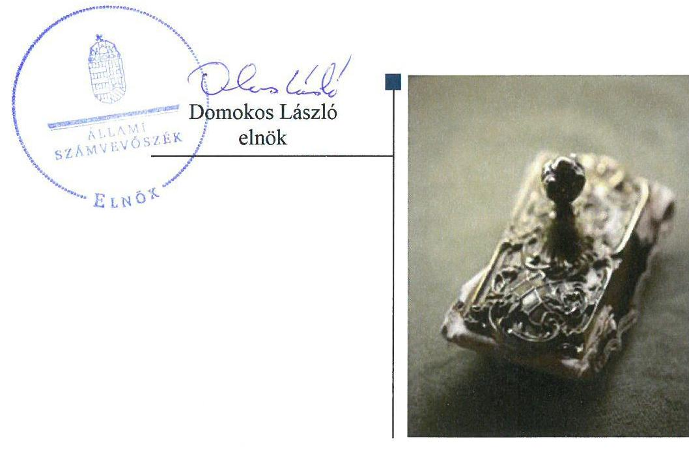
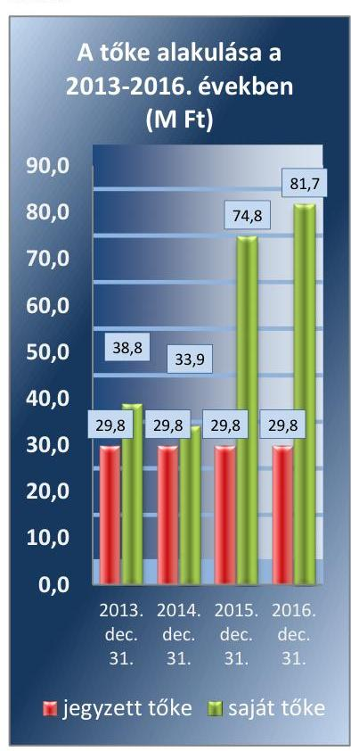
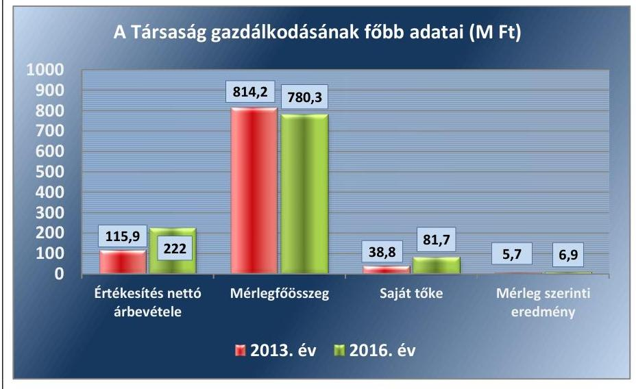
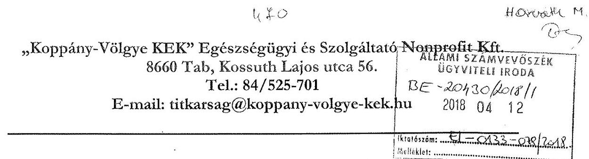
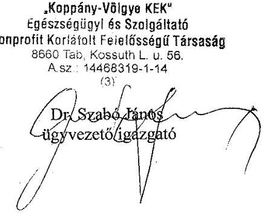
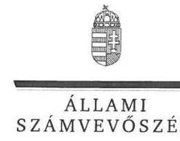
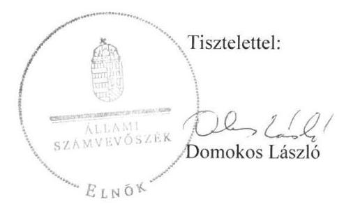
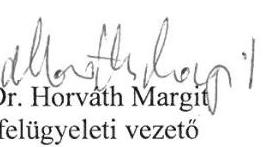

# Jelentés 

## Az önkormányzatok gazdasági társaságai

Az önkormányzatok többségi tulajdonában lévő gazdasági társaságok gazdálkodásának ellenőrzése - „Koppány-Völgye KEK" Egészségügyi és Szolgáltató Nonprofit Kft. 2018.

---

# Jelenetés 

## Az önkormányzatok gazdasági társaságai

Az önkormányzatok többségi tulajdonában lévő gazdasági társaságok gazdálkodásának ellenőrzése - „Koppány-Völgye KEK" Egészségügyi és Szolgáltató Nonprofit Kft. 2018. jdutue hó 7. nap

---

# AZ ELLENŐRZÉST FELÜGYELTE:

DR. HORVÁTH MARGIT felügyeleti vezető

## AZ ELLENŐRZÉST VEZETTE ÉS A VÉGREHAJTÁSÁÉRT FELELŐS:

- JOÓ ERIKA ellenőrzésvezető
- SZILÁGYI GÁBOR ellenőrzésvezető

## A PROGRAM ÖSSZEÁLLÍTÁSÁÉRT FELELŐS:

- TÓTPÁL SZABOLCS osztályvezető

|  IKTATÓSZÁM: EL-0133-081/2018 | |
| --- | --- |
|  TÉMASZÁM: 2067 | |
|  ELLENŐRZÉS-AZONOSÍTÓ SZÁM: V079323 | |

Jelentéseink az Országgyűlés számítógépes hálózatán és az Interneta a www.asz.hu címen is olvashatóak.

---

# TARTALOMJEGYZÉK 

■ ÖSSZEGZÉS ..... 5
■ AZ ELLENŐRZÉS CÉLJA ..... 6
■ AZ ELLENŐRZÉS TERÜLETE ..... 7
■ AZ ELLENŐRZÉS HÁTTERE, INDOKOLTSÁGA ..... 9
■ A JELENTÉS LÉNYEGES KÉRDÉSKÖREI ..... 10
■ ELLENŐRZÉS HATÓKÖRE ÉS MÓDSZEREI ..... 11
■ MEGÁLLAPÍTÁSOK ..... 13
■ JAVASLATOK ..... 18
■ MELLÉKLETEK ..... 21
I. sz. melléklet: Értelmező szótár ..... 21
II. sz. melléklet: A Társaság mérleg és eredménykimutatás adatai ( M Ft) ..... 22
■ FÜGGELÉK: ÉSZREVÉTELEK ..... 23
■ RÖVIDÍTÉSEK JEGYZÉKE ..... 37

---

.

---

# ÖSSZEGZÉS 

A „Koppány-Völgye KEK" Egészségügyi és Szolgáltató Nonprofit Kft. feletti tulajdonosi joggyakorlás kereteit Tab Város Önkormányzata megfelelően alakította ki és a tulajdonosi jogokat szabályszerűen gyakorolta. A Társaság gazdálkodásának szabályozottsága nem felelt meg az előírásoknak. A beszámolási és közzétételi kötelezettségeit a Társaság nem teljesítette, ezzel nem biztositotta az átláthatóságot. A vagyongazdálkodás nem volt szabályszerű.

## Az ellenőrzés társadalmi indokoltsága

Az Állami Számvevőszék kiemelt célja, hogy a helyi önkormányzatok gazdálkodásában rejlő pénzügyi kockázatok feltárásával, az államháztartáson kívülre nyújtott költségvetési támogatások és ingyenes vagyonjuttatások ellenőrzésével hozzájáruljon ahhoz, hogy a közpénzeket az államháztartáson kívül múködő szervezetek is átlátható, rendezett módon használják fel.

Magyarországon az önkormányzatok kötelező és önként vállalt feladataik vonatkozásában is egyre szélesebb körben alkalmazzák az államháztartáson kívüli feladatellátást, ezáltal - a nonprofit szervezetek mellett - az önkormányzati tulajdonú gazdasági társaságok is kiemelt fontosságú szerephez jutottak. Ezen belül kiemelt jelentőségú számos önkormányzati gazdasági társaság múködése abból a szempontból is, hogy gazdálkodásának egyes elemei befolyásolják az önkormányzati alszektor hiányát és az államadósságot.

Az önkormányzatok többségi tulajdonában álló gazdasági társaságok ellenőrzése kiemelten fontos a vagyon megőrzése, megóvása érdekében. A feladatellátás költségeinek, ráfordításainak alakulása a lakosság széles rétegét érinti.

## Főbb megállapítások, következtetések, javaslatok

A „Koppány-Völgye KEK" Egészségügyi és Szolgáltató Nonprofit Kft. felett a tulajdonosi joggyakorlás kereteit Tab Város Önkormányzata az előírásoknak megfelelően kialakította és a tulajdonosi jogokat az előírásoknak megfelelően gyakorolta. A Képviselő-testület rendeletalkotási kötelezettségének eleget tett.

A „Koppány-Völgye KEK" Egészségügyi és Szolgáltató Nonprofit Kft. számviteli szabályozottsága nem felelt meg az előírásoknak. A Társaság rendelkezett az elszámolások és nyilvántartások rendjét meghatározó számviteli politikával és az annak részeként kötelezően elkészítendő egyéb szabályzatokkal, de a számviteli politika, a pénzkezelési szabályzat, az értékelési szabályzat tartalmi szempontból nem feleltek meg teljes körűen a jogszabályi előírásoknak. A számlarend nem felelt meg a jogszabályi előírásoknak.

A bevételek és ráfordítások valamint az értékcsökkenés elszámolása a számviteli szabályozottság hiányosságai miatt nem felelt meg a jogszabályi előírásoknak. A Társaság díjalkalmazása nem felelt meg az előírásoknak, mert a térítési szabályzatában a jogszabályi rendelkezésektől eltérve állapította meg a térítési díjakat.

Az egyszerűsített éves beszámolók mérlegtételei nem voltak leltárral alátámasztva, valamint a közzétételre vonatkozó kötelezettségének a jogszabályi és belső előírások ellenére a Társaság nem tett eleget, ezért az átláthatóság és elszámoltathatóság követelménye nem érvényesült.

A „Koppány-Völgye KEK" Egészségügyi és Szolgáltató Nonprofit Kft. kizárólag saját vagyonnal rendelkezett. A vagyon nyilvántartása nem felelt meg az előírásoknak.

---

# AZ ELLENŐRZÉS CÉLJA 

AZ ELLENŐRZÉS CÉLJA annak értékelése volt, hogy az önkormányzat vagyongazdálkodási tevékenysége során szabályszerűen gyakorolta-e a tulajdonosi jogait. A gazdasági társaság szabályozottsága, gazdálkodása és vagyongazdálkodási tevékenysége, bevételeinek és ráfordításainak elszámolása megfelelt-e a jogszabályi és tulajdonosi előírásoknak. Értékeltük, hogy a gazdasági társaság kötelezettségállománya jelentett-e kockázatot a működésre, valamint a gazdálkodás átláthatósága és elszámoltathatósága érdekében biztosítva volt-e a szolgáltatás dijának megalapozottsága. Az ellenőrzés célja volt továbbá annak megítélése, hogy a kormányzati szektorba sorolt önkormányzati tulajdonban (résztulajdonban) lévő gazdálkodó szervezetek gazdálkodásának a kormányzati szektor hiányára és az államadósságra befolyással bíró elemei a jogszabályi előírásoknak megfeleltek-e.

---

# AZ ELLENŐRZÉS TERÜLETE 

## Tab Város Önkormányzata és a többségi tulajdonában álló „Koppány-Völgye KEK" Egészségügyi és Szolgáltató Nonprofit Kft.

1. ábra

Forrás: 2013-2016. évi beszámolók

A „Koppány-Völgye KEK" Egészségügyi és Szolgáltató Nonprofit Kft.-2008-ban 25 - Koppány Völgye kistérségbe ${ }^{1}$ tartozó - önkormányzat alapította 3,1 M Ft jegyzett tőkével. A Társaság ${ }^{2}$ alapítására egy, a „Kistérségi járóbeteg-szakellátó Központok kialakítása és fejlesztése" című sikeres TIOP pályázatot ${ }^{3}$ követően került sor. A beruházás bekerülési értéke meghaladta a 840 M Ft-ot. A létrehozott Egészségfejlesztő Központ ${ }^{4}$ működtetése 2011 szeptemberében kezdődött meg.

Tab Város Önkormányzata ${ }^{5}$ apportként 2011-ben a Társaság rendelkezésére bocsátotta a telket, amelyen a járóbetegszakellátási központ felépült. Az apporttal az Önkormányzat törzsbetéte 27,7 M Ft-ra, a Társaság jegyzett tőkéje 29,8 M Ft-ra növekedett. Az Önkormányzat tulajdoni hányada ezzel 92,95\%-ra változott, azonban az ellenőrzött időszakban hatályos Társasági Szerződés ${ }^{6}{ }_{1-4}$ szerint a Társaság taggyűlésében az alapításkori szavazati arányok ${ }^{7}$ nem változtak meg, Tab Város Önkormányzata szavazati aránya 32,3\% maradt. A Társasági szerződés ${ }_{1}$ 4 szerint a Társaság legfőbb szerve a Taggyűlés volt.

A Társaság közfeladatként végzett tevékenysége az egészségügyi alapellátás mellett a járóbeteg-ellátás volt, amellyel kapcsolatban a Társaság feladatait a feladat-ellátási szerződés ${ }_{1-5}$, a Társasági Szerződés ${ }_{1-4}$, a működési engedély ${ }^{8}$, illetve az OEP megállapodás ${ }^{9}$ rögzítette. Az Önkormányzat és a Társaság között létrejött feladat-ellátási szerződés ${ }_{1-5}$-ben meghatározták a kötelező önkormányzati feladatként ellátandó járóbeteg-ellátás, háziorvosi ügyelet és a védőnői szolgálat biztosítását. A közfeladathoz kapcsolódóan egészségmegőrzési, gyógyító és egészségügyi rehabilitációs tevékenységeket végzett a Társaság.

A Társaság az ellenőrzött időszakban kizárólag saját vagyonnal rendelkezett, vagyonkezelt eszköze nem volt.

A feladat-ellátási szerződés alapján a szerződött - tulajdonos - önkormányzatok kötelezettséget vállaltak az OEP-finanszírozás és a szolgáltatás működtetéséhez szükséges összeg különbözetének megtérítésére a Társaság feladat-ellátási terve alapján lakosságarányosan számítva.

A Társaság az ellenőrzött időszakban alaptevékenységének támogatása céljából vállalkozási tevékenységet is folytatott, helyiségeinek bérbeadásával. A bérbeadásból származó árbevétel az ellenőrzött időszakban nem érte el az összes árbevétel 5\%-át. A Társaság önköltségszámítási szabályzat összeállítására nem volt kötelezett.

A Társaság az ellenőrzött időszakban - 2014. év kivételével - nyereséges volt, saját tőkéje növekedett. A saját tőke alakulását az 1. ábra, a gaz-

---

dálkodás főbb adatait a 2. ábra szemlélteti, részletesen a II. számú melléklet mutatja be. Az ellenőrzött időszakban a saját tőke 110,6\%-kal, az értékesítés nettó árbevétele 91,5\%-kal növekedett.

A Társaság az ellenőrzött időszakban az NGM közlemény ${ }^{10}$ alapján kormányzati szektorba sorolt egyéb szervezet volt.

A jelenlegi ügyvezető 2012 óta tölti be tisztségét. A foglalkoztatottak átlagos állományi létszáma 31 fő volt az ellenőrzött időszakban.

A polgármester személye az ellenőrzött időszakban nem változott, a jegyző személye 2016 áprilisában változott.
2. ábra

Forrás a Társaság 2013. és 2016. évi beszámolói

---

# AZ ELLENŐRZÉS HÁTTERE, INDOKOLTSÁGA 

## AZ ÖNKORMÁNYZATI TULAJDONÚ GAZDASÁGI

TÁRSASÁGOK teljes körű ellenőrzésének lehetőségét az Állami Számvevőszékről szóló 1989. évi XXXVIII. törvény 2011. január 1-jétől hatályos módosítása teremtette meg és az Állami Számvevőszékről szóló 2011. évi LXVI törvény is tartalmazza. A gazdasági társaságok gazdálkodási tevékenysége szabályszerűségének ellenőrzését 2011. évtől végezzük. Az önkormányzatok többségi tulajdonában álló gazdasági társaságok ellenőrzése kiemelten fontos a vagyon megőrzése, megóvása érdekében. A feladatellátás költségeinek, ráfordításainak alakulása a lakosság széles rétegét érinti.

Ellenőrzéseink feltárhatják, hogy az önkormányzat a feladatellátásához rendelt vagyon működtetését a tulajdonostól elvárható gondossággal vé-gezte-e, a feladatot ellátó gazdasági társaság a létesítő okiratban, szolgáltatási szerződésben foglaltak betartásával biztosította-e a feladat ellátását. Az ellenőrzés eredményeképp meghatározhatóvá válnak a költségvetési hiányt befolyásoló szervezetek kockázatai, lehetővé válik ezen kockázatok csökkentése. Az ellenőrzés rávilágíthat arra, hogy a gazdasági társaság a vagyon használatával biztosította-e a szolgáltatás folytatásának feltételeit, az önkormányzat tulajdonosi felügyelete hozzájárult-e a szabályszerű gazdálkodáshoz és feladatellátáshoz. A megállapítások alapján megfogalmazott számvevőszéki javaslatok hasznosítása elősegítheti a meglévő hibák megszüntetését. A jó gyakorlatok bemutatásával az ÁSZ ${ }^{11}$ hozzájárulhat a követendő megoldások megismertetéséhez, terjesztéséhez.

---

# A JELENTÉS LÉNYEGES KÉRDÉSKÖREI 

1.- Az Önkormányzat tulajdonosi joggyakorlása szabályszerű volt-e?
2.- A Társaság szabályozottsága, gazdálkodása és vagyongazdálkodási tevékenysége szabályszerű volt-e?
3.- A Társaság bevételeinek és ráfordításainak elszámolása, valamint az árképzés szabályszerű volt-e?

---

# ELLENŐRZÉS HATÓKÖRE ÉS MÓDSZEREI 

## Az ellenőrzés típusa

Megfelelőségi ellenőrzés.

## Az ellenőrzött időszak

Az ellenőrzött időszak 2013. január 1-jétől 2016. december 31-ig tartott.

## Az ellenőrzés tárgya

Tab Város Önkormányzata többségi tulajdonában lévő „Koppány-Völgye KEK" Egészségügyi és Szolgáltató Nonprofit Kft. feletti tulajdonosi joggyakorlása, valamint a „Koppány-Völgye KEK" Egészségügyi és Szolgáltató Nonprofit Kft. gazdálkodásának szabályozottsága és szabályszerűsége.

Az ellenőrzés kiterjed minden olyan körülményre és adatra, amely az ÁSZ jogszabályban meghatározott feladatainak teljesítéséhez, valamint a program végrehajtása folyamán felmerült újabb összefüggések feltárásához szükséges.

## Az ellenőrzött szervezet

„Koppány-Völgye KEK" Egészségügyi és Szolgáltató Nonprofit Kft.; Tab Város Önkormányzata

## Az ellenőrzés jogalapja

Az ellenőrzés jogalapját az ÁSZ tv. ${ }^{12}$ 1. § (3) bekezdése és 5. § (3)-(5) bekezdése képezi.

## Az ellenőrzés módszerei

Az ellenőrzést a nemzetközi standardokat irányadónak tekintve az ellenőrzési program ellenőrzési kérdései, az ellenőrzött időszakban hatályos jogszabályok, az ellenőrzés szakmai szabályok és módszertanok figyelembevételével végeztük.

Az ellenőrzés ideje alatt az ellenőrzött szervezettel történő kapcsolattartást az ÁSZ Szervezeti és Múködési Szabályzatának vonatkozó előírásai alapján biztosítottuk.

---

Az ellenőrzési kérdések megválaszolásához szükséges bizonyítékok megszerzése a következő ellenőrzési eljárások alkalmazásával történt: megfigyelés, kérdésfeltevés (információkérés), összehasonlítás, valamint elemző eljárás. Az ellenőrzési bizonyítékként felhasználható adatforrások közé tartoznak egyrészt az ellenőrzési programban felsorolt adatforrások, másrészt adatforrás lehet még minden - az ellenőrzés folyamán - feltárt, az ellenőrzés szempontjából információkat tartalmazó dokumentum.

Az ellenőrzést a kérdésekre adott válaszok kiértékelésével, valamint a megjelölt adatforrások, a csatolt tanúsítványok felhasználásával, továbbá az adott időszakban hatályos jogszabályok figyelembe vételével folytattuk le.

A bevételek és ráfordítások elszámolásait mintavétellel ellenőriztük. A minták kiválasztása rétegzett mintavétel alkalmazásával történt. A vagyonnyilvántartás terén a szabályszerű működést ellenőriztük a társaság saját vagyona vonatkozásában. A mintavétellel ellenőrzött területek esetében minden egyes tétel vonatkozásában a szabályszerűségre vonatkozó kérdéseket tettünk fel, amelyek eredménye összesítésre került. Megfelelőnek értékeltünk egy ellenőrzött területet, amennyiben 95\%-os bizonyossággal a teljes sokaságban a hibaarány legfeljebb 10\%, nem megfelelőnek, amennyiben 10\%-nál magasabb arányt képviselt. Abban az esetben, ha a teljes sokaság tekintetében a 10\%-os hibaarányhoz való viszony megítélésnek megbízhatósága nem érte el a 95\%-ot, annak elérése érdekében értékelésünket további szempontokkal egészítettük ki, és figyelembe vettük a feltárt hibák típusát és súlyát. A ráfordítások elszámolására és a vagyonnyilvántartásra vonatkozó véletlen mintavételt kockázati alapú kiválasztással egészítettük ki, amelynek során évente a három legnagyobb összegű tételt választottuk ki.

---

# 1. Az Önkormányzat tulajdonosi joggyakorlása szabályszerű volt-e? 

Összegző megállapítás

Az Önkormányzat a tulajdonosi joggyakorlás kereteit szabályszerűen kialakította, a tulajdonosi jogokat szabályszerűen gyakorolta.

A TULAJDONOSI JOGGYAKORLÁS KERETEIT az Önkormányzat Vagyonrendeletében ${ }^{13}$ rögzítette, amelyben szabályozta a többségi tulajdonban lévő gazdasági társaságok legfőbb szervében tulajdonosi képviseleti joggal megbízott képviselő feladatait és beszámolási kötelezettségeit. A Társaság tulajdonosa 25 önkormányzat volt, a tulajdonosi jogokat a Taggyúlés gyakorolta. A Társasági szerződés ${ }_{1-4}$ a Gt. ${ }^{14}$, illetve a Ptk. ${ }^{15}$ előírásainak megfelelően tartalmazta a Taggyúlés feladatait. A Társaság vonatkozásában a tulajdonosi jogok átruházására nem került sor.

A Társasági szerződés ${ }_{1-4}$ a Gt., illetve a Ptk. és a Taktv. ${ }^{16}$ előírásainak megfelelően rendelkezett a felügyelőbizottság ${ }^{17}$ létrehozásáról.

A Gt. 34 § (4) bekezdése és a Ptk. 3:122§ (3) bekezdése előírásai ellenére a felügyelőbizottság nem rendelkezett ügyrenddel. A felügyelőbizottság feladatait és múködésének szabályait a Társasági szerződés ${ }_{1-4}$ tartalmazta. A felügyelőbizottság a Gt., illetve a Ptk. előírásainak megfelelően megtárgyalta és elfogadásra javasolta a Társaság egyszerűsített éves beszámolóit. A felügyelőbizottság az ülésekről jegyzőkönyvet ${ }_{1-4}{ }^{18}$ készített.

Gazdasági programmal ${ }_{1-2}{ }^{19}$ a Mötv. ${ }^{20}$ előírásainak megfelelően a 20112014., illetve a 2014-2019. évekre vonatkozóan rendelkezett az Önkormányzat. A gazdasági programban ${ }_{1-2}$ a Társaság által működtetett, a kistérség egészségügyi ellátását döntően meghatározó járóbeteg-ellátó központ nem szerepelt.

A feladat-ellátási szerződés ${ }_{1-5}$ tartalmazta az ellátandó feladatok körét, a Társaság egészségügyi előírások szerinti nyilvántartási kötelezettségét, valamint az egészségbiztosítási pénztár általi finanszírozással nem fedezett feladatellátás költségeinek megtérítési eljárásrendjét. A feladat-ellátási szerződések rögzítették, hogy a Társaság kizárólag az Önkormányzat előzetes egyetértésével végezhet olyan fejlesztést, amelyhez az Önkormányzattól anyagi hozzájárulást kér.

A Társaság legfőbb szerve a Taktv. 5. § (3) bekezdése előírásai ellenére nem készített a vezető tisztségviselők, felügyelőbizottsági tagok, valamint az Mt. 208. §-ának hatálya alá eső munkavállalók javadalmazásáról rendelkező szabályzatot.

A TULAJDONOSI JOGOKAT az Önkormányzat szabályszerűen gyakorolta, a Társaság legfőbb szervében az Önkormányzatot a polgármester képviselte, aki a Vagyonrendelet előírásainak megfelelően évente kétszer beszámolt a Társaság múködéséről a Képviselő-testület felé.

---

A Képviselő-testület a Társaság évközi és egyszerűsített éves beszámolóit tárgyalta, azokról elfogadó határozatokat hozott ${ }_{1-10}{ }^{21}$. A Képviselő-testület a Taggyűlés üléseit megelőzően hozott határozataiban felhatalmazta a polgármestert az éves beszámolók elfogadására. Az egyszerűsített éves beszámolókat a Taggyűlés megtárgyalta és az elfogadásról határozatot ${ }_{1-3}{ }^{22}$ hozott, valamint döntött az eredmény eredménytartalékba helyezéséről.

A Társaságnál lefolytatott külső ellenőrzések megállapításait rögzítő jegyzőkönyvek ${ }_{1-3}{ }^{23}$ alapján a feltárt hiányosságok megszüntetésre vonatkozóan a Társaság intézkedett.

Rendeletalkotási kötelezettségét teljesítette az Önkormányzat, mert az Eütv. ${ }^{24}$ előírásainak megfelelően kijelölte Tab város közigazgatási területén a háziorvosi, házi gyermekorvosi és fogorvosi körzeteket ${ }^{25 .}$ azon egészségügyi szolgáltatók vonatkozásában, akik Tab Város Önkormányzatával területi ellátási megállapodást kötöttek.

# 2. A Társaság szabályozottsága, gazdálkodása és vagyongazdálkodási tevékenysége szabályszerű volt-e? 

## Összegző megállapítás

2.1. számú megállapítás

A Társaság szabályozottsága, gazdálkodása és vagyongazdálkodása nem volt szabályszerű.

## A szabályzatok nem feleltek meg a jogszabályi előírásoknak.

A SZÁMVITELI POLITIKA ${ }_{1-4}{ }^{26}$ az ellenőrzött időszakban nem felelt meg a jogszabályi előírásoknak, mert a Számv. tv. ${ }^{27}$ 14. § (4) bekezdésben foglalt előírások ellenére nem tartalmazta
$\longrightarrow$ a függő és jövőbeni kötelezettségek, valamint egyéb jogszabály alapján megállapítandó céltartalék megállapításának módszerét, nyilvántartásának módját;
$\longrightarrow$ a számviteli politika ${ }_{1-3}$ nem tartalmazta a jelentős mértékre vonatkozó küszöbértéket és a tartós időtáv meghatározását az eszközök év végi értékelésének elvégzéséhez, az értékvesztés elszámolásához és visszaírásához;
$\longrightarrow$ a számviteli politika ${ }_{4}$ nem tartalmazta a mérlegkészítés időpontját.
A könyvvizsgáló a 2014. évi egyszerűsített éves beszámoló könyvvizsgálata során felhívta a Társaság vezetőinek figyelmét a számviteli politika ${ }_{1-3}$ aktualizálásának szükségességére.

A leltározási szabályzat ${ }_{1-3}{ }^{28}$ a 2013-2015. években a Számv. tv. 69. § (3) és (4) bekezdés előírásai ellenére olyan eszközök esetében is lehetővé tette a háromévenkénti mennyiségi felvétellel történő leltározást, melyekről a Társaság nem vezetett folyamatos mennyiségi nyilvántartást, így a gyógyszerek, szakmai anyagok, tisztítószerek, nyomtatványok értékét beszerzéskor elszámolta a Társaság költségként, folyamatos mennyiségi nyilvántartást ezekről az eszközökről nem vezetett. A leltározási szabályzat ${ }_{4}$ megfelelt a jogszabályi előírásoknak.

Az értékelési szabályzat ${ }_{1-4}{ }^{29}$ a Számv. tv. 52. § (1) és (2) bekezdés előírásai ellenére nem tartalmazta a hasznos élettartam és a maradványérték megállapításának módszereit, valamint a követelések után elszámolható

---

# 2.2. számú megállapítás 

2.2. számú megállapítás
értékvesztés megalapozására vonatkozó várható veszteség megállapításának módszerét sem.

A pénzkezelési szabályzat ${ }_{1-4}{ }^{30}$ nem felelt meg a jogszabályi előírásoknak, mert
— lehetősé tette „két pénztári nap közötti bevétel" pénztáron kívüli, más helyen történő őrzését, mellyel megsértette a Számv. tv. 165. § (3) bekezdés a) pontjában foglaltakat, továbbá nem tette lehetővé a pénztárossal szembeni felelősségi szabályok érvényesítését;
— a számviteli bizonylatokra vonatkozó Számv. tv. 167. § (1) bekezdés c) pontjában foglaltakkal ellenére lehetővé tette a pénztári bizonylat nélküli kifizetéseket.
A pénzkezelési szabályzat ${ }_{1-4}$ tartalmi hiányosságai a vagyonvédelem területén kiemelt kockázatot jelentettek, mert növelték a visszaélés és a vagyonvesztés lehetőségét.

A SZÁMLAREND nem felelt meg a Számv. tv. 161. § (2) bekezdésében foglalt előírásoknak, mert nem tartalmazta minden alkalmazásra kijelölt számla számjelét és megnevezését, a számla tartalmát, ha az a számla megnevezéséből egyértelműen nem következik, továbbá a számla értéke növekedésének, csökkenésének jogcímeit, a számlát érintő gazdasági eseményeket, azok más számlákkal való kapcsolatát, a főkönyvi számla és az analitikus nyilvántartás kapcsolatát, a számlarendben foglaltakat alátámasztó bizonylati rendet. A Számv. tv. 161/A. § (2) bekezdés előírásai ellenére a Társaság nyilvántartási (könyvvezetési) rendszerét nem részletezte olyan módon, hogy abból a vonatkozó külön jogszabályban (Ebtv. ${ }^{31}$ 35. § (1) bekezdés) meghatározott adatok rendelkezésre álljanak.

## A vagyon nyilvántartása nem volt szabályszerű, az egyszerűsített éves beszámolók mérlegtételeit leltárral nem támasztották alá.

A vagyonváltozás nyilvántartása nem felelt meg a jogszabályi előírásoknak, mert az eszközök állományba vételéről a Számv. tv. 165. § (2) bekezdés előírásai ellenére nem készült számviteli bizonylat az aktiválás időpontjában, ezért az eszközök üzembe helyezésének tényleges időpontját a Számv. tv. 52. § (2) bekezdésében foglalt előírás ellenére nem igazolták hitelt érdemlően. A Számv. tv. 69. § (2) bekezdés előírásai ellenére a főkönyvi könyvelés és az analitikus nyilvántartások adatai közötti egyeztetést az üzleti év mérleg fordulónapjára vonatkozóan nem végezték el.

A 2013-2016. évek vonatkozásában a Számv. tv. 46. § (3) bekezdés, valamint a Számv. tv. 69. § (1)-(3) bekezdés előírásai ellenére a mérlegben szereplő eszközök és források mérleg-fordulónapi leltározása, kiértékelése, az eltérések megállapítása nem történt meg.

A Számv. tv. 69. § (1) bekezdésében foglalt előírás ellenére az egyszerűsített éves beszámolók mérlegtételeit leltárral nem támasztották alá.

A könyvvizsgáló a mérleget alátámasztó leltár hiánya ellenére az ellenőrzött időszak minden évében hitelesítő záradékkal látta el a könyvvizsgálói jelentését.

A Társaság eszközeinek értéke az ellenőrzött időszakban 4,2\%-kal, a befektetett eszközök értéke 12,5\%-kal csökkent az ellenőrzött időszakban. A befektetett eszközök mérlegben szereplő adatait a 3. táblázat mutatja be.

---

A Társaság 2013-ban a hátrányos helyzetű kistérségek egészségre nevelő TÁMOP 6.1.2 pályázatán 125 M Ft, 2014-ben a struktúraváltást és foglalkoztatást támogató TÁMOP 6.2.4 pályázaton 50 M Ft vissza nem térítendő támogatást nyert el. Mindkét projekt elszámolható összköltségének 100\%-a támogatással finanszírozott volt. A főkönyvi kivonat alapján 2015. évben a két pályázathoz kapcsolódóan egyéb bevételként elszámolt összeg 102,8 M Ft, az elszámolt költségfelhasználás 54,2 M Ft volt.

A Számv. tv. 44. § (2) bekezdésében foglalt előírások ellenére a Társaság által 2015-ben egyéb bevételként elszámolt támogatási összeg 48,6 M Fttal magasabb volt, mint a költségfelhasználás. A Számv. tv. 44. § (2) bekezdésében foglalt előírás szerint passzív időbeli elhatárolásként kell kimutatni a költségek (a ráfordítások) ellentételezésére - visszafizetési kötelezettség nélkül - kapott, pénzügyileg rendezett, egyéb bevételként elszámolt támogatás összegéből az üzleti évben költséggel, ráfordítással nem ellentételezett összeget. A nem szabályszerű elszámolás a Társaság mérleg szerinti eredményét és saját tőkéjének alakulását is befolyásolta, de nem érte el a megbízható és valós képet lényegesen befolyásoló hiba nagyságát.

A Társaság a Bkr. 10. § és 54/A. § előírásai ellenére nem alakította ki a szervezet tevékenységének, a célok megvalósításának nyomon követését biztosító rendszert, az operatív tevékenységektől függetlenül múködő belső ellenőrzést.

# 2.3. számú megállapítás 

A Társaság az egyszerűsített éves beszámolói kivételével a közzétételi kötelezettségének nem tett eleget.

A Társaság az egyszerűsített éves beszámolóival kapcsolatos közzétételi kötelezettségének eleget tett.

A Társaság 2013. január 1-jével léptette hatályba Közérdekú adatok közzétételének teljesítéséről szóló szabályzatát. A Társaság az ellenőrzött időszakban az Info tv ${ }^{32}$. 37. § (1) bekezdésében, az Info tv. 1. melléklet szerinti általános közzétételi listában meghatározott adatokra vonatkozó és a Taktv. 2. § (1) bekezdésében foglalt előírások, valamint a 2013. január 1jével hatályba lépett Közérdekú adatok közzétételének teljesítéséről szóló szabályzatában foglalt előírások ellenére a közzétételi kötelezettségének nem tett eleget.

## 3. A Társaság bevételeinek és ráfordításainak elszámolása, valamint az árképzés szabályszerű volt-e?

Összegző megállapítás

A bevételek és ráfordítások elszámolása - a kormányzati hiányt befolyásoló bevételek kivételével - nem volt szabályszerű. A Társaság a nyújtott szolgáltatások díjait nem szabályszerűen alkalmazta.

Az Ebtv. 35. § (1) bekezdése előírja a finanszírozás keretében kapott összegek elkülönített vezetésének kötelezettségét. Az elkülönítési kötelezettségre vonatkozóan a számlarend nem tartalmazott előírásokat. A ráfordítások elszámolása az ellenőrzött időszakban nem volt szabályszerű, mert a számviteli szabályozás hiányosságai miatt az Ebtv. 35. § (1) bekezdésében

---

foglalt előírások ellenére a finanszírozás keretében folyósított pénzügyi eszközök felhasználásának elkülönítése nem történt meg.

A kormányzati hiányt nem befolyásoló - egészségpénztári finanszírozáson kívüli - bevételek elszámolása nem volt szabályszerű. A Társaság által az önkormányzatoktól kapott működési támogatás elszámolását megalapozó értesítő levelek a Számv. tv. 167. § (1) bekezdés d) és h) pontjaiban foglalt előírások ellenére nem rendelkeztek a könyvviteli elszámolást közvetlenül alátámasztó bizonylat általános alaki és tartalmi kellékeivel. Az értesítő levelek a Számv. tv. 167. § (1) bekezdés d) és h) pontjában foglalt előírások ellenére nem tartalmazták annak az időpontnak a megjelölését, amelyre a bizonylat adatait vonatkoztatni kell (a gazdasági múvelet teljesítésének időpontja), valamint a könyvelés módjára, az érintett könyvviteli számlákra történő hivatkozást, ezért a támogatások elszámolása a Számv. tv. 165. § (2) bekezdésében foglalt előírások ellenére nem szabályszerű bizonylat alapján történt.

A kormányzati hiányt befolyásoló - egészségpénztári finanszírozás - bevételek elszámolása a Számv. tv. előírásainak megfelelő volt.

A számviteli szabályozás hiányosságai miatt - a Számv. tv. 14. § (4) bekezdésében foglalt rendelkezések ellenére nem határozták meg az értékcsökkenési leírás elszámolásának választott módszerét - az értékcsökkenés elszámolása az ellenőrzött időszakban nem volt szabályszerű.

A Társaság által végzett szolgáltatások díjait, azok alkalmazási feltételeit az Egészségügyi térítési díjakról ${ }^{33}$ szóló kormányrendelet határozta meg. A Társaság a 2013. január 1-től hatályos Térítési szabályzatában ${ }^{34}$ közzétette az egészségbiztosítás, illetve a központi költségvetés által nem térített, valamint részleges, kiegészítő vagy teljes térítési díj fizetése mellett igénybe vehető egészségügyi szolgáltatások térítésének szabályait, a szolgáltatásokat igénybevevők által fizetendő díjtételeket.

A Társaság a térítési díj ellenében végzett szolgáltatásokhoz kapcsolódó díjak felszámításakor a Számv. tv. 167. § (1) bekezdés e) pont előírásával ellentétben a bizonylaton szereplő gazdasági múvelet tartalma és a szolgáltatás összege nem volt meghatározható, illetve egyes esetekben a megnevezett szolgáltatás különbözött a Társaság térítési díj ellenében végzett szolgáltatásainak körét rögzítő, Térítési szabályzatba foglalt szolgáltatások körétől.

A Társaság a Térítési szabályzatában szereplő foglalkozás-egészségügyi vizsgálatok díjait a foglalkozás-egészségügyi szolgálatról szóló 89/1995. (VII. 14.) Korm. rendeletben ${ }^{35}$ meghatározottaktól eltérve állapította meg.

---

# JAVASLATOK 

Az ÁSZ tv. 33. § (1) bekezdésében foglaltak értelmében az ellenőrzött szervezet vezetője köteles a jelentésben foglalt megállapításokhoz kapcsolódó intézkedési tervet összeállítani és azt a jelentés kézhezvételétől számított 30 napon belül az ÁSZ részére megküldeni. Amennyiben az ellenőrzött szervezet vezetője nem küldi meg határidőben az intézkedési tervet, vagy továbbra sem elfogadható intézkedési tervet küld, az Állami Számvevőszék elnöke az ÁSZ tv. 33. § (3) bekezdése a) és b) pontjaiban foglaltakat érvényesítheti.
Javaslataink célja a „Koppány-Völgye KEK" Egészségügyi és Szolgáltató Nonprofit Kft. gazdálkodása szabályszerűségének és gyakorlatának javítása annak érdekében, hogy a szabályozási környezet és az alkalmazott gyakorlat megfelelően tudja támogatni az átlátható müködést.

## „Koppány-Völgye KEK" Egészségügyi és Szolgáltató Nonprofit Kft. ügyvezetőjének

1. Intézkedjen a Számviteli politika, az Értékelési szabályzat, a Pénzkezelési szabályzat és a Számlarend módosításáról a hatályos Számv. tv. előírásainak megfelelően.
(2. 1. sz. megállapítás 1. bekezdés 1. és 3. francia bekezdései, 4., 5. bekezdései, 7. bekezdés 1. mondata alapján)
2. Intézkedjen a Számv. tv. előírásainak megfelelően a nyilvántartási (könyvvezetési) rendszer részletezéséről olyan módon, hogy abból a vonatkozó külön jogszabályban (Ebtv.) meghatározott adatok rendelkezésre álljanak.
(2. 1. sz. megállapítás 7. bekezdés 2. mondata és a 3. megállapítás 1. bekezdése alapján)
3. Intézkedjen a vagyonváltozás nyilvántartásának megfelelő vezetéséről, ennek érdekében az eszközök üzembe helyezése időpontjának bizonylattal történő, hitelt érdemlő igazolásáról a Számv. tv. előírásainak megfelelően.
(2.2. sz. megállapítás 1. bekezdés 1. mondata lapján)
4. Intézkedjen a fökönyvi könyvelés és az analitikus nyilvántartások adatai közötti egyeztetés végrehajtásáról az üzleti év mérleg fordulónapjára vonatkozóan a Számv. tv. előírásainak megfelelően.
(2.2. sz. megállapítás 1. bekezdés 2. mondata lapján)

---

5. Intézkedjen a mérlegben szereplő eszközök leltározásának végrehajtásáról a Számv. tv.-ben elöirtaknak megfelelően.
(2.2. sz. megállapítás 2. bekezdése alapján)
6. Intézkedjen az egyszerüsített éves beszámolók mérlegtételeinek leltárral való alátámasztásáról a Számv. tv.-ben elöirtaknak megfelelően.
(2.2. sz. megállapítás 3. bekezdése alapján)
7. Intézkedjen a 2015. évben elszámolt támogatás költséggel nem fedezett részének a Számv. tv.-ben elöirtaknak megfelelő elszámolásáról.
(2.2. sz. megállapítás 7. bekezdése alapján)
8. Intézkedjen a Társaság tevékenységének a célok megvalósitásának nyomon követését biztositó rendszer Bkr. elöirásainak megfelelő kialakításáról.
(2.2. sz. megállapítás 8. bekezdése alapján)
9. Intézkedjen a közérdekü és közérdekből nyilvános adatokra vonatkozó közzétételi kötelezettség teljesitéséről az Info tv. és a Taktv. elöirásainak megfelelően.
(2.3. sz. megállapítás 2. bekezdése 2. mondata alapján
10. Intézkedjen a bevételek szabályszerü elszámolásáról a Számv. tv.-ben elöirtaknak megfelelően.
(3. sz. megállapítás 2. bekezdése alapján)
11. Intézkedjen az értékcsökkenés Számv. tv.-ben elöirtaknak megfelelő elszámolásáról.
(3. sz. megállapítás 4. bekezdése alapján)
12. Intézkedjen a Számv. tv.-ben foglaltaknak megfelelően a térítési dij ellenében végzett szolgáltatásokhoz kapcsolódó dijak szabályszerü elszámolásáról.
(3. sz. megállapítás 6. bekezdése alapján)
13. Intézkedjen a foglalkozás-egészségügyi vizsgálatok dijainak a foglal-kozás-egészségügyi szolgálatról szóló 89/1995. (VII. 14.) Korm. rendeletben foglaltaknak megfelelő megállapításáról.
(3. sz. megállapítás 7. bekezdése alapján)

---

# Javaslataink célja az Önkormányzat szabályszerű működésének elősegítése, továbbá az önkormányzati tulajdonosi joggyakorlás kontrolljainak erősítése. 

## Tab Város Önkormányzata polgármesterének

1. Hívja fel a felügyelőbizottság elnökének figyelmét a felügyelőbizottság ügyrendjének elkészitésére, majd előterjesztésére a Taggyülés, mint legföbb szerv jóváhagyása érdekében a Ptk.-ban elirtaknak megfelelően.
(1. sz. megállapítás 3. bekezdés 1. mondata alapján)
2. Kezdeményezze a Társaság vezető tisztségviselői, a felügyelő bizottsági tagok, az Mt. 208. §-ának hatálya alá eső munkavállalók javadalmazása, valamint a jogviszony megszünése esetére biztosított juttatások módjának, mértékének elveire, annak rendszerére vonatkozó szabályzat megalkotását a Taktv.-ben elöirtaknak megfelelően.
(1. sz. megállapítás 10. bekezdése alapján)

---

# MELLÉKLETEK 

## I. SZ. MELLÉKLET: ÉRTELMEZŐ SZÓTÁR

belső ellenőrzés
gazdasági társaság
kormányzati szektorba sorolt egyéb szervezet
közhasznú tevékenység
tulajdonosi joggyakorló
vagyongazdálkodás

Független, tárgyilagos bizonyosságot adó és tanácsadó tevékenység, amelynek célja, hogy az ellenőrzött szervezet múködését fejlessze és eredményességét növelje, az ellenőrzött szervezet céljai elérése érdekében rendszerszemléletű megközelítéssel és módszeresen értékeli, illetve fejleszti az ellenőrzött szervezet irányítási és belső kontrollrendszerének hatékonyságát. (Forrás: Bkr. 2. § b) pontja)"
Ptk. 3:88. § (1) bekezdése szerint „a gazdasági társaságok üzletszerű közös gazdasági tevékenység folytatására, a tagok vagyoni hozzájárulásával létrehozott, jogi személyiséggel rendelkező vállalkozások, amelyekben a tagok a nyereségből közösen részesednek, és a veszteséget közösen viselik".
Az Áht. 1. § 12. pontja értelmében az a szervezet, amely az Áht. alapján nem része az államháztartásnak, azonban az Európai Közösséget létrehozó szerződéshez csatolt, a túlzott hiány esetén követendő eljárásról szóló jegyzőkönyv alkalmazásáról szóló 2009. május 25-i 479/2009/EK rendelet szerint a kormányzati szektorba tartozik és a szervezet megnevezését az államháztartásért felelős miniszter a Hivatalos Értesítöben és a Kormány honlapján közétette.
Minden olyan tevékenység, amely a létesítő okiratban megjelölt közfeladat teljesítését közvetlenül vagy közvetve szolgálja, ezzel hozzájárulva a társadalom és az egyén közös szükségleteinek kielégítéséhez; Civil. tv. 2. § 20. pont
Aki a nemzeti vagyon felett az államot vagy a helyi önkormányzatot megillető tulajdonosi jogok és kötelezettségek összességének gyakorlására jogosult. (Forrás: Nvtv. 3. § (1) bekezdés 17. pontja)
A nemzeti vagyongazdálkodás feladata a nemzeti vagyon rendeltetésének megfelelő, az állam, az önkormányzat mindenkori teherbíró képességéhez igazodó, elsődlegesen a közfeladatok ellátásához és a mindenkori társadalmi szükségletek kielégítéséhez szükséges, egységes elveken alapuló, átlátható, hatékony és költségtakarékos múködtetése, értékének megőrzése, állagának védelme, értéknövelő használata, hasznosítása, gyarapítása, továbbá az állam vagy a helyi önkormányzat feladatának ellátása szempontjából feleslegessé váló vagyontárgyak elidegenítése. (Forrás: Nvtv. 7. § (2) bekezdése).

---

II. SZ. MELLÉKLET: A TÁRSASÁG MÉRLEG ÉS EREDMÉNYKIMUTATÁS ADATAI ( M FT)

|  Megnevezés | 2013.12.31. | 2014.12.31. | 2015.12.31. | 2016.12.31.  |
| --- | --- | --- | --- | --- |
|  A. Befektetett eszközök | 732,2 | 728,9 | 712,7 | 640,4  |
|  II. TÁRGYI ESZKÖZÖK | 760,7 | 728,9 | 712,6 | 670,4  |
|  B. Forgóeszközök | 50,9 | 52,9 | 49,6 | 80,9  |
|  I. KÉSZLETEK | 0 | 0 | 0 | 0  |
|  II. KÖVETELÉSEK | 66,5 | 11,1 | 6,4 | 5,9  |
|  III. ÉRTÉKPAPÍROK | 0 | 0 | 0 | 0  |
|  IV. PÉNZESZKÖZÖK | 44,5 | 41,8 | 43,2 | 75,0  |
|  C. Aktív időbeli elhatárolások | 0 | 9,6 | 0 | 29,0  |
|  ESZKÖZÖK (AKTÍVÁK) ÖSSZESEN | 814,2 | 791,4 | 762,3 | 780,3  |
|  D. SAJÁT TÖKE | 38,8 | 33,9 | 74,8 | 81,7  |
|  I. JEGYZETT TÖKE | 29,8 | 29,8 | 29,8 | 29,8  |
|  F. Kötelezettségek | 51,6 | 62,9 | 22,6 | 28,2  |
|  III. RÖVID LEJÁRATÚ KÖTELEZETTSÉGEK | 50,5 | 62,2 | 22,6 | 28,2  |
|  G. Passzív időbeli elhatárolások | 723,8 | 694,6 | 664,8 | 640,3  |
|  FORRÁSOK (PASSZÍVÁK) ÖSSZESEN | 814,2 | 791,4 | 762,3 | 780,3  |

Forrás: 2013-2016. egyszerúsített éves beszámolók

|  Megnevezés | 2013.12.31. | 2014.12.31. | 2015.12.31. | 2016.12.31.  |
| --- | --- | --- | --- | --- |
|  Értékesítés nettó árbevétele | 115,9 | 143,0 | 187,2 | 222,0  |
|  Egyéb bevételek | 76,3 | 122,6 | 158,9 | 128,9  |
|  Anyagjellegú ráfordítások | 103,3 | 161,1 | 195,5 | 167,8  |
|  Személyi jellegú ráfordítások | 75,6 | 104,3 | 101,2 | 97,4  |
|  Értékcsökkenési leírás | 50,7 | 45,8 | 44,7 | 45,9  |
|  Egyéb ráfordítások | 2,2 | 0,1 | 3,2 | 32,8  |
|  A. Üzemi (üzleti) tevékenység eredménye | $-39,9$ | $-45,6$ | 1,5 | 7,0  |
|  Pénzügyi műveletek bevételei | 7,0 | 3,0 | 5,0 | 5,0  |
|  Pénzügyi műveletek ráfordításai | 0,3 | 0,2 | 0,1 | 0  |
|  B. Pénzügyi műveletek eredménye | $-0,3$ | $-0,2$ | $-0,1$ | 0  |
|  C. Szokásos vállalkozási eredmény | $-40,2$ | $-45,8$ | 1,4 | $x$  |
|  Rendkívüli bevételek | 45,9 | 40,9 | 39,5 | $x$  |
|  Rendkívüli ráfordítások | 0 | 0 | 0 | $x$  |
|  D. Rendkívüli eredmény | 45,9 | 40,9 | 39,5 | $x$  |
|  E. Adózás előtti eredmény | 5,7 | $-4,9$ | 40,9 | 7,0  |
|  F. Mérleg szerinti eredmény | 5,7 | $-4,9$ | 40,9 | 6,9  |

Forrás: 2013-2016. egyszerúsített éves beszámolók x - A számvitelről szóló 2000. évi C. törvény, valamint egyes pénzügyi tárgyú törvények módosításáról szóló 2015. évi Cl. törvény megszüntette a 2016. üzleti évtől kezdődően a rendkívüli (szokásos) kategóriát

---

# FÜGGELÉK: ÉSZREVÉTELEK 

A jelentéstervezetet a Számvevőszék 15 napos észrevételezésre megküldte az ellenőrzött szervezetek vezetőinek az ÁSZ tv. 29. §* (1) bekezdése előírásának megfelelően.

A jelentés tartalmazza az ellenőrzött "Koppány-Völgye KEK" Egészségügyi és Szolgáltató Nonprofit Kft. ügyvezető igazgatójától érkezett észrevételeket. Tab Város Önkormányzatának polgármestere - az ÁSZ tv. 29. § (2) bekezdésében foglaltak szerinti - észrevételezési jogával nem élt, az ellenőrzés megállapításaira nem tett észrevételt.

[^0]
[^0]:    * 29. § (1) Az Állami Számvevőszék az ellenőrzési megállapításait megküldi az ellenőrzött szervezet vezetőjének vagy az általa megbízott személynek, és annak, akinek személyes felelősségét állapította meg.
    (2) Az ellenőrzött szervezet vezetője és a felelősként megjelölt személy az ellenőrzés megállapításaira tizenöt napon belül írásban észrevételt tehet.
    (3) Az Állami Számvevőszék az észrevételre a beérkezésétől számított harminc napon belül írásban válaszol. A figyelembe nem vett észrevételeket köteles a jelentésben feltüntetni, és megindokolni, hogy azokat miért nem fogadta el.

---

Állami Számvevőszék
Domokos László elnök
Budapest 4.
1364
Pf. 54

Iktatószám: 87-1/2018
Tárgy: Számvevőszéki jelentéstervezetre tett észrevétel
Hivatkozási szám: EL-0133-072/2018.

# Tisztelt Domokos László Elnök Úr! 

A 2018. március 26-án kelt a „Koppány-Völgye KEK" Egészségügyi és Szolgáltató Nonprofit Kft. ellenőrzéséről készül számvevőszéki jelentéstervezetre vonatkozóan az alábbi észrevételeket tesszük:

1. Jelentés tervezet: 2.1. sz. megállapítás 1. bekezdés: " A SZÁMVITELI POLITIKA .... nem tartalmazta az amortizációs politikára vonatkozóan az értékcsökkenési leírás elszámolásának (eszközcsoportonként) választott módszerét, a maradványérték meghatározásának módszerét;"
Észrevétel: Az amortizációs politikára vonatkozóan az elszámolás választott módszerét eszköz csoportonként lineáris módszerben határoztuk meg, hasznos élettartam és maradvány érték megállapításának szabályait az értékelési szabályzat tartalmazza.
Értékelési szabályzat 4. pont
„A gazdálkodó szervezet az értékcsökkenési leirást a következő mérlegsorok esetében a
következő módszerekkel határozza meg:
vagyoni értékü jogok,
szellemi termékek üzleti vagy cégérték,
alapítás-átszervezés aktivált értéke,
kísérleti fejlesztés aktivált értéke,
ingatlanok,
ingatlanhoz kapcsolódó vagyoni értékü jogok,
müszaki gép, berendezés,
egyéb gép, berendezés,
jármü bruttó érték alapján lineáris"
2. Jelentés tervezet: 2.1. sz. megállapítás 2. bekezdés: „az értékvesztés elszámolásánál a követelések (vevő, adós, egyéb) minösitésére, a várható veszteség megállapítására vonatkozó módszereket."
Észrevétel: 2013-2015 évi Számviteli politika 21. oldal Értékvesztés elszámolása:
A vevő, az adós minősítése alapján az üzleti év mérleg fordulónapján fennálló és a mérlegkészítés időpontjáig pénzügyileg nem rendezett követelésnél (ideértve a hitelintézetekkel, pénzügyi vállalkozásokkal szembeni követeléseket, a kölcsönként, az előlegként adott összegeket, továbbá a bevételek aktív időbeli elhatárolása között lévő követelésjellegủ tételeket is) értékvesztést kell elszámolni - a mérlegkészítés időpontjában rendelkezésre álló információk alapján - a követeléskönyv szerinti értéke és a követelés várhatóan megtérülő összege közötti - veszteségjellegủ - különbözet összegében, ha ez a különbözet tartósnak mutatkozik és jelentős összegủ.

---

# „Koppány-Völgye KEK" Egészségügyi és Szolgáltató Nonprofit Kft. 8660 Tab, Kossuth Lajos utca 56.   Tel.: 84/525-701   E-mail: titkarsag@koppany-volgye-kek.hu 

Értékelési szabályzat 12 . oldal
3. Jelentés tervezet: 2.1. sz megállapitás 4. bekezdés: „a számviteli politika nem tartalmazta a jelentős mértékre vonatkozó küszöbértéket és a tartós időtáv meghatározását az eszközök év végi értékelésének elvégzéshez, az értékvesztés elszámolásához és viszszairásához;"
Észrevétel: A 2016. számviteli politika a jelentős mértéket és jelentős összeget tartalmazza.
4. Jelentés tervezet: 2.1. sz megállapitás 5. bekezdés: „a számviteli politika nem tartalmazta a mérlegkészités idöpontját."
Észrevétel: A 2013-2015. évi számviteli politikák tárgyévet követő április 30.-ban határozza meg a mérlegkészités időpontját. A 2016. évi számviteli politikából ez a szabályozási tétel kimaradt, az egyszerüsített éves beszámoló kiegészitő mellékletében bemutatottak szerint ez változatlan volt.
5. Jelentés tervezet: 2.1. sz megállapítás/Pénzkezelési szabályzat 2. bekezdés: „nem rögzítette a Számvt. tv. 14§ (8) bekezdés ellenére a pénzkészlet napi záró állományának maximális összegét;"
Észrevétel: Pénzkezelési szabályzat a pénzkészlet napi záró állományának összegét a következők szerint tartalmazza: „A napi készpénz záró állomány maximális mértékét annak figyelembevételével kell meghatározni, hogy a készpénz napi záró állományának naptári hónaponként számított napi átlaga - kivéve, ha külön jogszabály eltérően rendelkezik- nem haladhatja meg az előző üzleti év - éves szintre számított- összes bevételének $2 \%$-át, illetve ha az előző üzleti év összes bevételének $2 \%$-a nem éri el az 500 ezer forintot, akkor az 500 ezer forint. Az áltag számításánál az adott hónap naptári napjainak záró készpénz állományát kell figyelembe venni. Mindaddig, amíg az előző üzleti év összes bevétel adata nem áll rendelkezésre, addig az azt megelőző üzleti év összes bevételét kell alapul venni. A napi záró pénzkészletállomány a 2000. évi C. törvény a számvitelről előírásai alapján biztosított maximális értékủ lehet."
6. Jelentés tervezet: 2.1. sz megállapítás/Pénzkezelési szabályzat 3. bekezdés: „a számviteli bizonylatokra vonatkozó 167§ (1) bekezdés c) pontjában foglaltakkal ellenére lehetővé tette a pénztári bizonylat nélküli kifizetéseket"
Észrevétel: A pénzkezelési szabályzat szerint kifizetés pénztári kiadási bizonylat, vagy készpénzfizetési számla ellenében történhet. Pénzkezelési szabályzatból „A pénztárosnak pénztári bevételi és kiadási bizonylatot csak abban az esetben kell kiállítania, ha készpénz mozgását más bizonylat nem igazolja."
7. Jelentés tervezet: 2.1. sz megállapítás/Számlarend bekezdés: A Számv. tv. 161/A § (2) bekezdés elöirásai-ellenére a Társaság nyilvántartási (könyvvezetési) rendszerét nem részletezte olyan módon, hogy abból a vonatkozó külön jogszabályban-(Ebtv. 35§ (1) bekezdés) meghatározott adatok rendelkezésre álljanak."
Észrevétel: 217/1997. (XII. 1.) Korm. rendelet a kötelező egészségbiztosítás ellátásairól szóló 1997. évi LXXXIII. törvény végrehajtásáról 22/B§ (1) Az Ebtv. 35. § (1) bekezdésében előírt elkülönítési kötelezettségnek az egészségügyi szolgáltató a pénzügyileg teljesült bevételeinek és kiadásainak nyilvántartásában egyaránt köteles eleget

---

# „Koppány-Völgye KEK" Egészségügyi és Szolgáltató Nonprofit Kft. 8660 Tab, Kossuth Lajos utca 56.   Tel.: 84/525-701   E-mail: titkarsag@koppany-volgye-kek.hu 

tenni.
A NEAK finanszirozási összegek a bevételek (9-es számlaosztály) számláinak, valamint 7 -es számlaosztály költségek számláinak funkcionális megbontásával teljesítjük.
8. Jelentés tervezet 2.2. sz. megállapítás 1. bekezdés: „A Számv. tv. 69§ (2) bekezdés elöírásai ellenére a fókönyvi könyvelés és az analitikus nyilvántartások adati közötti egyeztetést az üzleti év mérleg fordulónapjára vonatkozóan nem végezték el."
Észrevétel: Vagyon leltár eszköz és forrás tételeinek fókönyvi könyvelési és analitikus nyilvántartásainak egyeztetése az üzleti év mérleg fordulónapjára megtörténtek:

- tárgyi eszközök esetében 2015. évben tényleges mennyiségi felvétellel, egyéb években Tárgyi eszköz analitikus modul adatainak és a fókönyvi értékek közötti egyeztetéssel,
- vevökövetelések analitika és főkönyv egyeztetésével, esetenként követelést visszaigazoló egyenlegközlővel
- pénztárnál pénzkészlet leltárral,
- bankszámla záró bankszámla kivonattal,
- jegyzett tőke társasági szerződéssel,
- szállítók analitika és főkönyv egyeztetésével, esetenként kötelezettséget visszaigazoló egyenlegközlövel,
- adók, járulékok NAV folyószámla adataival,
- munkavállalói elszámolások decemberi havi bérjegyzékekkel.

9. Jelentés tervezet 2.2. sz. megállapítás 6. bekezdés: A fókönyvi kivonat alapján 2015. évben a két pályázathoz kapcsolódóan egyéb bevételként elszámolt összeg 102,8 MFt, az elszámolt költségfelhasználás 54,2 MFt volt."
Észrevétel: A TÁMOP-6.1.2 és a TÁMOP-6.2.4.B pályázatok utófinanszírozottak voltak, 2015. évben mindkét pályázat lezárult, a költségek teljes mértékben felmerültek, a támogatási projekt terhére elszámolásra kerültek. Az egyéb bevételként elszámolt támogatás összegéből az üzleti évben/előző üzleti évben költséggel, ráfordítással nem ellentételezett összeg nem jelentkezett, így passzív időbeli elhatárolás szükségessége nem merült fel.
10. Jelentés tervezet/ 3. sz. megállapítás 1. bekezdés: „Az Ebtv § (1) bekezdése elöirja a finanszirozás keretében kapott összegek elkülönitett vezetésének kötelezettségét. Az elkülönitési kötelezettségre vonatkozóan a számlarend nem tartalmazott elöírásokat. A ráforditások elszámolása az ellenőrzött időszakban nem volt szabályszerü, mert a számviteli szabályozás hiányosságai miatt az Ebtv 35§ (1) bekezdésében foglalt elöírások ellenére a finanszirozás keretében folyósitott pénzügyi eszközök felhasználásának elkülönitése nem történt meg."
Észrevétel: Az Ebtv 35§ (1) bekezdésének előírtaknak megfelelteteket a finanszírozás keretében kiutalt összegek elkülönített vezetésével úgy biztosítjuk, hogy az árbevételi számlákat funkcionális jogcím szerint megbontjuk. Elkülönített bankszámla vezetésére nem vagyunk kötelezettek. A ráfordítások elszámolása során a költségszámlákat a bevételi számlák bontásával összhangban részletezzük.
11. Jelentés tervezet/ 3. sz. megállapítás 2. bekezdés: „Az értesitő levelek a Számv. tv 167§ (1) bekezdés d) és h) pontjában foglalt elöírások ellenére nem tartalmazták an-

---

# „Koppány-Völgye KEK" Egészségügyi és Szolgáltató Nonprofit Kft. 8660 Tab, Kossuth Lajos utca 56.   Tel.: 84/525-701   E-mail: titkarsag@koppany-volgye-kek.hu 

- nak az idópontnak vagy idöszaknak a megjelölését, amelyre a bizonylata adatait vonatkoztatni kell"
Észrevétel: Az önkormányzati müködési támogatás bekérésére szolgáló értesitő levelek véleményünk szerint tartalmazzák a számviteli törvény 167§ (1) bekezdésében foglalt elöírásokat, számviteli bizonylat elöírt adatait tartalmazza.

12. Jelentés tervezet/3. sz. megállapítás 6. bekezdés: „A Társaság a térítési dij ellenében végzett szolgáltatásokhoz kapcsolódó dijak felszámításakor a Számv. 167§ (1) bekezdés e) pont elöírásával ellentétben a bizonylaton szereplő gazdasági müvelet tartalma és a szolgáltatás összege nem volt meghatározható..."
Észrevétel: A térítési dij ellenében végzett szolgáltatásokról kibocsátott számláinkon a szolgáltatások megnevezése és a hozzátartozó térítési összegek szerepelnek.

Kérjük, hogy az elfogadott észrevételeinkkel összhangban az összegző megállapításaikat szíveskedjenek változtatni.

Tab, 2018. április 9.

Tisztelettel:

---

# Dr. Szabó János úr 

ügyvezető
„Koppány-Völgye KEK" Egészségügyi és Szolgáltató Nonprofit Kft.

## Tab

## Tisztelt Ügyvezető Úr!

Köszönettel vettem „Az önkormányzatok gazdasági társaságai - Az önkormányzatok többségi tulajdonában lévő gazdasági társaságok gazdálkodásának ellenörzése - „Koppány-Völgye KEK" Egészségügyi és Szolgáltató Nonprofit Kft. " címủ ellenőrzésről készített számvevőszéki jelentéstervezetre megküldött észrevételeit.
Az Állami Számvevőszék észrevételekre vonatkozó álláspontját a felügyeleti vezető által készített részletes tájékoztatás tartalmazza, amelyet levelemhez mellékeltem.
Tájékoztatom Ügyvezető igazgató urat, hogy az Állami Számvevőszék a figyelembe nem vett észrevételeket az Állami Számvevőszékről szóló 2011. évi LXVI. törvény 29. § (3) bekezdésében előírtak szerint köteles a jelentésében feltüntetni és megindokolni, hogy azokat miért nem fogadta el.

Budapest, 2018. 04. hó 15. nap

Melléklet: Tájékoztatás az észrevételek kezeléséről

---

# Tájékoztatás az észrevételek kezeléséről 

Megköszönöm Ügyvezető úrnak „Az önkormányzatok gazdasági társaságai - Az önkormányzatok többségi tulajdonában lévő gazdasági társaságok gazdálkodásának ellenőrzése - „Koppány-Völgye KEK" Egészségügyi és Szolgáltató Nonprofit Kft." címmel készített jelentés-tervezetre tett észrevételeit. Az észrevételek kezeléséről az alábbi tájékoztatást adom.

## 1. számú észrevétel:

A jelentéstervezet 2.1. számú megállapítás 1. bekezdés 1. francia bekezdését érinti:
„A számviteli politika1.4 az ellenőrzött időszakban nem felelt meg a jogszabályi előirásoknak, mert a Számv. tv. 14. § (4) bekezdésben foglalt elöírások ellenére nem tartalmazta az amortizációs politikára vonatkozóan az értékcsökkenési leírás elszámolásának (eszközcsoportonként) választott módszerét, a maradványérték meghatározásának módszerét."

Az Ügyvezető úr a megállapításra a következő észrevételt tette:
„, Az amortizációs politikára vonatkozóan az elszámolás választott módszerét eszköz csoportonként lineáris módszerben határoztuk meg, hasznos élettartam és maradvány érték megállapításának szabályait az értékelési szabályzat tartalmazza.

Értékelési szabályzat 4. pont"
A rendelkezésre álló dokumentumokat újra áttanulmányoztuk, és ennek alapján az észrevételét elfogadtuk, a jelentéstervezetet az észrevétel alapján módosítottuk: a jelentéstervezet 2.1. számú megállapítás 1. bekezdés 1. francia bekezdését törölttük.

A megállapítás módosítása kapcsán a jelentés-tervezetben tett 1. számú javaslat tartalmát nem kellett módosítani, azonban annak hivatkozását módosítottuk az alábbiak szerint:
„(2. 1. sz. megállapítás 1. bekezdés 1. és 3. francia bekezdései, 4., 5. bekezdései, 7. bekezdés 1. mondata alapján)"

## 2. számú észrevétel

A jelentéstervezet 2.1. sz. megállapítás 1. bekezdés 2. francia bekezdését érinti
„A számviteli politika1.4 az ellenőrzött időszakban nem felelt meg a jogszabályi előirásoknak, mert a Számv. tv. 14. § (4) bekezdésben foglalt elöírások ellenére nem tartalmazta az

---

értékvesztés elszámolásánál a követelések (vevő, adós, egyéb) minősitésére, a várható veszteség megállapítására vonatkozó módszereket. "

Az Ügyvezető úr a megállapításra a következő észrevételt tette:
2013-2015 évi Számviteli politika 21. oldala, Értékvesztés elszámolása rész: A vevő, az adós minősitése alapján az üzleti év mérleg fordulónapján fennálló és a mérlegkészités időpontjáig pénzügyileg nem rendezett követelésnél (ideértve a hitelintézetekkel, pénzügyi vállalkozásokkal szembeni követeléseket, a kölcsönként, az elölegként adott összegeket, továbbá a bevételek aktív időbeli elhatárolása között lévő követelésjellegü tételeket is) értékvesztést kell elszámolni a mérlegkészités időpontjában rendelkezésre álló információk alapján - a követeléskönyv szerinti értéke és a követelés várhatóan megtérülő összege közötti - veszteségjellegü különbözet összegében, ha ez a különbözet tartósnak mutatkozik és jelentős összegü.

A rendelkezésre álló dokumentumokat újra áttanulmányoztuk, és ennek alapján az észrevételét elfogadtuk, a jelentéstervezetet az észrevétel alapján módosítottuk: a jelentéstervezet 2.1. sz. megállapítás 1 . bekezdés 2 . francia bekezdését töröltük.

A megállapítás módosítása kapcsán a jelentés-tervezetben tett 1. számú javaslat tartalmát nem kellett módosítani, azonban annak hivatkozását módosítottuk az alábbiak szerint:
„(2. 1. sz. megállapítás 1. bekezdés 1. és 3. francia bekezdései, 4., 5. bekezdései, 7. bekezdés 1. mondata alapján)"

# 3. számú észrevétel 

A jelentéstervezet 2.1. sz. megállapítás 1. bekezdés 4. francia bekezdését érinti:
,,a Számv. tv. 14. § (4) bekezdésben foglalt elöírások ellenére a számviteli politika1-3 nem tartalmazta a jelentős mértékre vonatkozó küszöbértéket és a tartós időtáv meghatározását az eszközök év végi értékelésének elvégzéséhez, az értékvesztés elszámolásához és visszaírásához;

Az Ügyvezető úr a megállapításra a következő észrevételt tette:
A 2016. számviteli politika a jelentős mértéket és jelentős összeget tartalmazza.
A jelentés-tervezetben a megállapítás nem vonatkozott a 2016. évben hatályos számviteli politika1re, így az észrevétel összhangban volt a jelentéstervezet megállapításával. A jelentéstervezet nem került módosításra.

---

Az előbbiek alapján a jelentéstervezet 2.1. pontjának vonatkozó megállapításait nem módosítom, a jelentéstervezet megállapításhoz kapcsolódó ügyvezetőnek címzett 1. javaslatát továbbiakban is fenntartom, azt nem módosítom.

# 4. számú észrevétel 

A jelentéstervezet 2.1. sz. megállapítás 1. bekezdésésnek 5. francia bekezdését érinti:
„a számviteli politika, nem tartalmazta a mérlegkészités idöpontját"
Az Ügyvezető úr a megállapításra a következő észrevételt tette:
A 2013-2015. évi számviteli politikák tárgyévet követő április 30.-ban határozza meg a mérlegkészités időpontját. A 2016. évi számviteli politikából ez a szabályozási tétel kimaradt, az egyszerüsített éves beszámoló kiegészitő mellékletében bemutatottak szerint ez változatlan volt.

Az észrevétel a jelentés-tervezetben tett megállapítással összhangban van, mivel csak a 2016 évre vonatkozó számvitelpolitika ${ }_{4}$-re vonatkozóan tettünk megállapítást a mérlegkésztés időpontjának hiányára vonatkozóan. Ennek alapján a jelentéstervezet módosítása nem indokolt.

Az előbbiek alapján a jelentéstervezet 2.1. pontjának vonatkozó megállapításait nem módosítom, a jelentéstervezet megállapításhoz kapcsolódó ügyvezetőnek címzett 1. javaslatát továbbiakban is fenntartom, azt nem módosítom.

## 5. számú észrevétel

A jelentéstervezet pénzkezelési szabályzatra vonatkozó 2.1. számú 5. bekezdés 2. francia bekezdését érinti:
„nem rögzítette a Számv. tv. 14. § (8) bekezdés elöírásai ellenére pénzkészlet napi záró állományának maximális összegét"

Az Ügyvezető úr a megállapításra a következő észrevételt tette:
„Pénzkezelési szabályzat a pénzkészlet napi záró állományának összegét a következők szerint tartalmazza: „A napi készpénz záró állomány maximális mértékét annak figyelembevételével kell meghatározni, hogy a készpénz napi záró állományának naptári hónaponként számított napi átlaga - kivéve, ha külön jogszabály eltérően rendelkezik- nem haladhatja meg az előző üzleti év - éves szintre számított- összes bevételének 2\%-át, illetve ha az előző üzleti év összes bevételének 2\%-a nem éri el az 500 ezer forintot, akkor az 500 ezer forint. Az átlag számításánál az adott hónap naptári napjainak záró készpénz állományát kell figyelembe venni. Mindaddig, amíg az előző üzleti év összes bevétel adata nem áll rendelkezésre, addig

---

az azt megelőző üzleti év összes bevételét kell alapul venni. A napi záró pénzkészletállomány a 2000. évi C. törvény a számvitelről előírásai alapján biztositott maximális értékủ lehet."

A rendelkezésre álló dokumentumokat újra áttanulmányoztuk, és ennek alapján az észrevételét elfogadtuk, a jelentéstervezetet az észrevétel alapján módosítottuk: a jelentéstervezet pénzkezelési szabályzatra vonatkozó 2.1. számú 5. bekezdés 2. francia bekezdését törölttük.

A megállapítás módosítása kapcsán jelentés-tervezetben tett javaslatot nem kellett módosítani.

# 6. számú észrevétel 

A jelentéstervezet 2.1. sz. megállapítás - a pénzkezelési szabályzatra vonatkozó - 5. bekezdésének 3. francia bekezdését érinti:
,,a számviteli bizonylatokra vonatkozó Számv. tv.167. § (1) bekezdés c) pontjában foglaltakkal ellenére lehetővé tette a pénztári bizonylat nélküli kifizetéseket"

Az Ügyvezető úr a megállapításra a következő észrevételt tette:
,,A pénzkezelési szabályzat szerint kifizetés pénztári kiadási bizonylat, vagy készpénzfizetési számla ellenében történhet. Pénzkezelési szabályzatból ,,A pénztárosnak pénztári bevételi és kiadási bizonylatot csak abban az esetben kell kiállitania, ha készpénz mozgását más bizonylat nem igazolja."

Az észrevételt nem áll módunkban elfogadni, mivel a házipénztárban történő pénzmozgást minden esetben bizonylattal történik, a pénzmozgás más bizonylattal nem igazolható, a pénztárkönyvet a kiállított bevételi és kiadási pénztárbizonylatok alapján kell vezetni.

Az előbbiek alapján a jelentéstervezet 2.1. pontjának vonatkozó megállapításait nem módosítom, a jelentéstervezet megállapításhoz kapcsolódó ügyvezetőnek címzett 1. javaslatát továbbiakban is fenntartom, azt nem módosítom.

## 7. számú észrevétel.

A jelentéstervezet 2.1. számú megállapítás 7. bekezdés utolsó mondatát érinti: „A Számv. tv. 161/A § (2) bekezdés elöírásai ellenére a Társaság nyilvántartási (könyvvezetési) rendszerét nem részletezte olyan módon, hogy abból a vonatkozó külön jogszabályban (Ebtv. 35§ (1) bekezdés) meghatározott adatok rendelkezésre álljanak."

Az erre vonatkozó észrevétel a következőket rögzíti: ,217/1997. (XII. 1.) Korm. rendelet a kötelezö egészségbiztositás ellátásairól szóló 1997. évi LXXXIII. törvény végrehajtásáról 22/B. § (1) Az Ebtv. 35. § (1) bekezdésében elöirt elkülönitési kötelezettségnek az egészségügyi szolgáltató a pénzügyileg teljesült bevételeinek és kiadásainak nyilvántartásában egyaránt köteles eleget tenni.

---

A NEAK finanszirozási összegek a bevételek (9-es számlaosztály) számláinak, valamint 7-es számlaosztály költségek számláinak funkcionális megbontásával teljesítjük."

A Társaság ügyvezetőjének 7. számú észrevételét nem fogadom el, a jelentés-tervezetet nem módosítom, mivel Ebtv. 35. § (1) bekezdése előírása szerinti elkülönítési kötelezettségre vonatkozóan a számlarend nem tartalmazott előírásokat, így a Társaság által az észrevételben hivatkozott elkülönítés szabályozással nem volt megalapozva.

Az előbbiek alapján a jelentéstervezet 2.1. pontjának vonatkozó megállapításait nem módosítom, a jelentéstervezet megállapításhoz kapcsolódó ügyvezetőnek címzett 2. javaslatát továbbiakban is fenntartom, azt nem módosítom.

# 8. számú észrevétel. 

A jelentéstervezet 2.2. sz. megállapítás 1. bekezdés 2. mondatát érinti: „A Számv. tv. 69. § (2) bekezdés elöírásai ellenére a fökönyvi könyvelés és az analitikus nyilvántartások adati közötti egyeztetést az üzleti év mérleg fordulónapjára vonatkozóan nem végezték el."
Az erre vonatkozó észrevétel a következőket rögzíti: „Vagyon leltár eszköz és forrás tételeinek fökönyvi könyvelési és analitikus nyilvántartásainak egyeztetése az üzleti év mérleg fordulónapjára megtörténtek:

- tárgyi eszközök esetében 2015. évben tényleges mennyiségi felvétellel, egyéb években Tárgyi eszköz analitikus modul adatainak és a főkönyvi értékek közötti egyeztetéssel,
- vevőkövetelések analitika és főkönyv egyeztetésével, esetenként követelést visszaigazoló egyenlegközlővel
- pénztárnál pénzkészlet leltárral,
- bankszámla záró bankszámla kivonattal,
-jegyzett tőke társasági szerződéssel,
- szállítók analitika és főkönyv egyeztetésével, esetenként kötelezettséget visszaigazoló egyenlegközlővel,
- adók, járulékok NAV folyószámla adataival,
- munkavállalói elszámolások decemberi havi bérjegyzékekkel."

A Társaság ügyvezetőjének 8. számú észrevételét nem fogadom el, a jelentés-tervezetet nem módosítom a következők miatt. Az ÁSZ az ellenőrzéshez kapcsolódó dokumentumok bekérése tárgyában EL-0133-003/2017. iktatószámmal a Társaság részére kiküldött levelében az ellenőrzéshez - a gazdasági társaság ellenőrzött időszakban készített éves beszámolóíhoz kapcsolódóan - bekérte a leltárakat és a leltárt alátámasztó dokumentumokat.
A Társaság ügyvezetője a bekért adatokra vonatkozóan 2017. december 11-i keltezéssel tett Teljességi és hitelességi nyilatkozata szerint a nyilatkozatban részletezett dokumentumok, adatok megbízhatóak és a bekért adatokra, dokumentumokra vonatkozóan teljes körű információt tartalmaztak. A Teljességi és hitelességi nyilatkozatban foglaltak szerint az ellenőrzés részére átadásra kerültek a 2013-2016. évi mérleg leltárak, valamint a 2015. évi tárgyi eszközök körére kiterjedő mennyiségi felvételezéssel történt leltározás dokumentumai. A 2013-2016. évi leltárakat alátámasztó egyeztetések - a főkönyvi könyvelés és az analitikus nyilvántartások adatai közötti egyeztetés - dokumentumai azonban nem kerültek az ellenőrzés részére átadásra. Az ÁSZ

---

megállapításait a rendelkezésére bocsátott dokumentumok alapján teszi meg, az észrevételben leírtak szerinti egyeztetések alátámasztó dokumentumait nem csatolták, ezért az ellenőrzés vonatkozó megállapításait nem módosítom.
Az előbbiek alapján a jelentéstervezet 2.2. pontjának vonatkozó megállapításait nem módosítom, a jelentéstervezet megállapításhoz kapcsolódó ügyvezetőnek címzett 4. javaslatát továbbiakban is fenntartom, azt nem módosítom.

# 9. számú észrevétel. 

A jelentéstervezet 2.2. sz. megállapítás 6. bekezdés 3. mondatát érinti: „A fökönyvi kivonat alapján 2015. évben a két pályázathoz kapcsolódóan egyéb bevételként elszámolt összeg 102,8 MFt, az elszámolt költségfelhasználás 54,2 MFt volt."

Az erre vonatkozó észrevétel a következőket rögzíti: „A TÁMOP-6.1.2 és a TÁMOP-6.2.4.B pályázatok utófinanszírozottak voltak, 2015. évben mindkét pályázat lezárult, a költségek teljes mértékben felmerültek, a támogatási projekt terhére elszámolásra kerültek. Az egyéb bevételként elszámolt támogatás összegéből az üzleti évben/előző üzleti évben költséggel, ráfordítással nem ellentételezett összeg nem jelentkezett, így passzív időbeli elhatárolás szükségessége nem merült fel.

A Társaság ügyvezetőjének 9. számú észrevételét nem fogadom el, a jelentés-tervezetet nem módosítom, mivel az észrevételben foglaltak nem adnak magyarázatot a TÁMOP pályázatokkal összefüggésben egyéb bevételként és költség felhasználásként elszámolt összegek - ellenőrzés által a 2015. év vonatkozásában megállapított eltérésére. Így változatlanul fennállnak 2015-ben egyéb bevételként elszámolt támogatási összeg - költségfelhasználást meghaladó 48,6 M Ft-os összege tekintetében Számv. tv. 44. § (2) bekezdésben előírt passzív időbeli elhatárolás feltételei.

Az előbbiek alapján a jelentéstervezet 2.2. pontjának vonatkozó megállapításait nem módosítom, a jelentéstervezet megállapításhoz kapcsolódó ügyvezetőnek címzett 7. javaslatát továbbiakban is fenntartom, azt nem módosítom.

## 10. számú észrevétel.

A jelentéstervezet 3. sz. megállapítás 1. bekezdését érinti: „Az Ebtv 35. §. (1) bekezdése elöirja a finanszírozás keretében kapott összegek elkülönitett vezetésének kötelezettségét. Az elkülönitési kötelezettségre vonatkozóan a számlarend nem tartalmazott elöirásokat. A ráforditások elszámolása az ellenőrzött időszakban nem volt szabályszerű, mert a számviteli szabályozás hiányosságai miatt az Ebtv 35. § (1) bekezdésében foglalt elöirások ellenére a finanszírozás keretében folyósitott pénzügyi eszközök felhasználásának elkülönitése nem történt meg."

Az erre vonatkozó észrevétel a következőket rögzíti: „Az Ebtv. 35. § (1) bekezdésének előírtaknak megfelelteket a finanszírozás keretében kiutalt összegek elkülönített vezetésével úgy biztosítjuk, hogy az árbevételi számlákat funkcionális jogcím szerint megbontjuk. Elkülönített bankszámla vezetésére nem vagyunk kötelezettek. A ráfordítások elszámolása során a költségszámlákat a bevételi számlák bontásával összhangban részletezzük."

A Társaság ügyvezetőjének 10. számú észrevételét nem fogadom el, a jelentés-tervezetet nem módosítom, mivel Ebtv. 35. § (1) bekezdése előírása szerinti elkülönítési kötelezettségre

---

vonatkozóan a számlarend nem tartalmazott előírásokat, így a Társaság által az észrevételben hivatkozott elkülönítés szabályozással nem volt megalapozva.

Az előbbiek alapján a jelentéstervezet 3. pontjának vonatkozó megállapításait nem módosítom, a jelentéstervezet megállapításhoz kapcsolódó ügyvezetőnek címzett 2. javaslatát továbbiakban is fenntartom, azt nem módosítom.

# 11. számú észrevétel. 

A jelentéstervezet 3. sz. megállapítás 2. bekezdés 3. mondatát érinti: „Az értesitő levelek a Számv. tv. 167. § (1) bekezdés d) és h) pontjában foglalt elöírások ellenére nem tartalmazták annak az időpontnak vagy időszaknak a megjelölését, amelyre a bizonylat adatait vonatkoztatni kell..."

Az erre vonatkozó észrevétel a következőket rögzíti: „Az önkormányzati működési támogatás bekérésére szolgáló értesítő levelek véleményünk szerint tartalmazzák a számviteli törvény 167. § (1) bekezdésében foglalt előírásokat, számviteli bizonylat előírt adatait tartalmazza."

A Társaság ügyvezetőjének 11. számú észrevételét részben elfogadom, a jelentés-tervezetet ennek figyelembe vételével módosítom. Az ellenőrzés rendelkezésére bocsátott dokumentumokat újra áttekintve megállapítottam, hogy az értesítő levelek a Számv. tv. 167. § (1) bekezdés d) pontjában előírtakból, annak az időszaknak megjelölését tartalmazzák, amelyre a bizonylatok vonatkoznak, azonban a d) pontban előírtakból, annak az időpontnak a megjelölését, amelyre a bizonylat adatait vonatkoztatni kell - a havi hozzájárulási összegek megfizetésének időpontját - nem tartalmazzák. Az előbbiek figyelembe vételével a jelentéstervezet 3. sz. megállapítás 2. bekezdés 3. mondata a következőre módosul:
„Az értesitő levelek a Számv. tv. 167. § (1) bekezdés d) és h) pontjában foglalt elöírások ellenére nem tartalmazták annak az időpontnak a megjelölését, amelyre a bizonylat adatait vonatkoztatni kell (a gazdasági müvelet teljesitésének időpontja), valamint a könyvelés módjára, az érintett könyvviteli számlákra történő hivatkozást, ezért a támogatások elszámolása a Számv. tv. 165. § (2) bekezdésében foglalt elöírások ellenére nem szabályszerü bizonylat alapján történt."

Az előbbiek alapján a jelentéstervezet 3. pontjának vonatkozó megállapítását módosítom, a jelentéstervezet megállapításhoz kapcsolódó ügyvezetőnek címzett 10. javaslatát ugyanakkor továbbiakban is fenntartom, azt nem módosítom.

## 12. számú észrevétel.

A jelentéstervezet 3. sz. megállapítás 6. bekezdés 1. mondatát érinti: „A Társaság a térítési dij ellenében végzett szolgáltatásokhoz kapcsolódó dijak felszámításakor a Számv. 167. § (1) bekezdés e) pont elöírásával ellentétben a bizonylaton szereplő gazdasági müvelet tartalma és a szolgáltatás összege nem volt meghalározható..."

Az erre vonatkozó észrevétel a következőket rögzíti: „A térítési dij ellenében végzett szolgáltatásokról kibocsátott számláinkon a szolgáltatások megnevezése és a hozzátartozó térítési összegek szerepelnek."

---

A Társaság ügyvezetőjének 12. számú észrevételét nem fogadom el, a jelentés-tervezetet nem módosítom a következők miatt. A térítési díj ellenében végzett szolgáltatásokról kibocsátott számlákon a szolgáltatás megnevezés és térítési összeg valóban szerepelt, azonban - az észrevételben foglaltakkal ellentétben - a bizonylatokban/számlákban megnevezett szolgáltatás és a feltüntetett térítési díj nem volt beazonosítható a Társaság Térítési szabályzatában rögzített szolgáltatásokkal és térítési összegekkel. Térítési díj ellenében végzett szolgáltatások esetén a bizonylatok kiállításának Térítési szabályzatban foglaltakon kellene alapulnia, amennyiben viszont a bizonylatok kiállítására nem az abban foglaltak figyelembe vételével kerül sor, abban az esetben nem teljesülnek a Számv. 167. § (1) bekezdés e) pont előírásai sem, annak ellenére nem, hogy a bizonylatokon beazonosíthatatlan, nem a Térítési szabályzaton alapuló - szolgáltatás megjelölések és térítési összegek szerepelnek.

Az előbbiek alapján a jelentéstervezet 3. pontjának vonatkozó megállapításait nem módosítom, a jelentéstervezet megállapításhoz kapcsolódó ügyvezetőnek címzett 12. javaslatát továbbiakban is fenntartom, azt nem módosítom.

Budapest, 2018. 45 . hó 15 . nap

---

# RÖVIDÍTÉSEK JEGYZÉKE 

${ }^{1}$ Koppány Völgye Kistérség
${ }^{2}$ Társaság
${ }^{3}$ TIOP pályázat
${ }^{4}$ Egészségfejlesztő Központ
${ }^{5}$ Önkormányzat
${ }^{6}$ Társasági szerződés ${ }_{1}$,
Társasági szerződés2,
Társasági szerződés3,
Társasági szerződés4,
${ }^{7}$ Társasági Szerződés VIII. 2 pontja
${ }^{8}$ működési engedély
${ }^{9}$ OEP megállapodás
${ }^{10}$ NGM közlemény
${ }^{11}$ ÁSZ
${ }^{12}$ ÁSZ tv.
${ }^{13}$ Vagyonrendelet
${ }^{14}$ Gt.
${ }^{15}$ Ptk.
${ }^{16}$ Taktv.
${ }^{17}$ felügyelőbizottság
${ }^{18}$ FB jegyzőkönyvek az éves beszámolóról
${ }^{19}$ Gazdasági program ${ }_{1}$, Gazdasági program ${ }_{2}$,
${ }^{20}$ Mötv.
${ }^{21}$ beszámolók elfogadása

Tab Város Önkormányzata és 24 közeli önkormányzat által alakított társulás „Koppány-Völgye KEK" Egészségügyi és Szolgáltató Nonprofit Kft.
a TIOP 2.1.2 "Kistérségi járóbeteg-szakellátó központok kialakítása és fejlesztése" című, a HEP IH által 2007. október 31-én meghirdetett pályázata
"Koppány-Völgye KEK" Egészségfejlesztő Központ, Tab városában a TIOP 2.1.2 pályázat keretében elnyert támogatásból felépült szakrendelő
Tab Város Önkormányzata
a 29/2012. 08. 22. sz. taggyűlési határozattal módosított Társasági Szerződés, hatályos 2012. augusztus 22.-2014. március 14.
a 7/2014. 03. 14. sz. taggyűlési határozattal módosított Társasági Szerződés hatályos 2014. március 14.-2015. május 24.
az 5/2015. (V. 18.), 6/2015. (V. 18.) és a 7/2015. (V. 18.) sz. taggyűlési határozatokkal módosított Társasági Szerződés hatályos 2015. május 24.-2016. március 24.
a 10/2016. (III. 24.) sz. taggyűlési határozattal módosított Társasági Szerződés hatályos 2016. március 24-től.
„A társaság bejegyzését követően a tagok jogait és a társaság vagyonából őket megillető hányadot az üzletrész testesíti meg, azzal, hogy a tagok a szavazati joguk gyakorlása és a pótbefizetés összege és üteme tekintetében az alapításkori szabályoktól nem térnek el."
91/2011. Iktatószámú, 2011. augusztus 11. dátumú Müködési Engedély a „Koppány-Völgye KEK" Egészségügyi és Szolgáltató Nonprofit Kft részére 14M7960615 szerződésszámú Alapszerződés a Társaság OEP általi finanszírozásra Nemzetgazdasági Minisztérium Közleménye a kormányzati szektorba sorolt szervezetekről 2013. december 30. (Hivatalos Értesítő 2013/32.)
Állami Számvevőszék
2011. évi LXVI. törvény az Állami Számvevőszékről

Tab Város Önkormányzatának 1/2002. (1. 31.) rendelete az önkormányzat vagyonáról és a vagyonnal való gazdálkodás szabályairól
2006. évi IV. törvény a gazdasági társaságokról, hatályos 2014. március 14-éig 2013. évi V. törvény a Polgári Törvénykönyvről, hatályos 2014. március 15-től 2009. évi CXXII. törvény a köztulajdonban álló gazdasági társaságok takarékosabb müködéséről, hatályos 2009. december 4-től
„Koppány-Völgye KEK" Kft. felügyelőbizottsága
2013. május 23. Jegyzőkönyv a KEK 2012. évi beszámolójáról
2014. május 29. Jegyzőkönyv a KEK 2013. évi beszámolójáról
2015. május 18. Jegyzőkönyv a KEK 2014. évi beszámolójáról
2016. május 26. Jegyzőkönyv a KEK 2015. évi beszámolójáról.

Tab Város Önkormányzatának Gazdasági programja 2011-2014.
Tab Város Önkormányzatának Gazdasági programja 2014-2019.
2011. évi CLXXXIX. törvény Magyarország helyi önkormányzatairól, hatályos
2011. december 28-tól

Tab Város Önkormányzata Képviselő-testületének 84/2013. (IV. 25.) számú, 238/2013. (X. 31.) számú, 70/2014. (IV. 23.) számú, 230/2014. (XI. 27.) számú,

---

104/2015. (IV. 30.) számú, 233/2015. (IX. 22.) számú, 109/2016. (IV. 28.) számú, 203/2016. (X. 26.) számú, valamint 74/2017. (IV. 27.) számú határozata
${ }^{22}$ Taggyúlési határozatok eredmény megállapításáról
2013. május 23-i Taggyúlési jegyzőkönyv 7/2013-as határozata a 2012. évi eredményről
2014. május 29-i Taggyúlési jegyzőkönyv 14/2014-as határozata a 2013. évi eredményről
2015. május 18-i Taggyúlési jegyzőkönyv 4/2015-as határozata a 2014. évi eredményről
2016. május 26-i Taggyúlési jegyzőkönyv 14/2016-as határozata a 2015. évi eredményről
Katasztrófa védelem általi ellenőrzés, dátuma: 2015. 01. 20.
Államkincstár általi ellenőrzés, dátuma: 2019. 09. 16.
Országos Egészségbiztosítási Pénztár általi ellenőrzés, dátuma: 2016. 10. 18.
1997. évi CLIV törvény az egészségügyről

Tab Város Önkormányzatának 96/2003. (VII. 15) rendelete az egészségügyi alapellátások körzeteiről
2013. 01. 01. napjával jóváhagyott Számviteli politika
2014. 01. 01. napjával jóváhagyott Számviteli politika
2015. 01. 01. napjával jóváhagyott Számviteli politika
2016. 01. 01. napjával jóváhagyott Számviteli politika
2000. évi C. törvény a számvitelről (hatályos: 2001. január 1-jétől)
2013. 01. 02-án jóváhagyott Leltárkészítési és selejtezési szabályzat
2014. 01. 02-án jóváhagyott Leltárkészítési és selejtezési szabályzat
2015. 01. 05-én jóváhagyott Leltárkészítési és selejtezési szabályzat
2016. 01. 05-én jóváhagyott Leltárkészítési és selejtezési szabályzat
2013. 01. 02-án jóváhagyott Értékelési szabályzat
2014. 01. 02-án jóváhagyott Értékelési szabályzat
2015. 01. 05-én jóváhagyott Értékelési szabályzat
2016. 01. 05-én jóváhagyott Értékelési szabályzat
2013. 05. 21-től hatályba helyezett Pénzkezelési szabályzat
2013. 09. 15-től hatályba helyezett Pénzkezelési szabályzat
2014. 01. 09-től hatályba helyezett Pénzkezelési szabályzat
2016. 01. 19-től hatályba helyezett Pénzkezelési szabályzat
1997. évi LXXXIII. tv. a kötelező egészségbiztosítás ellátásairól
2011. évi CXII. törvény az információs önrendelkezési jogról és az információszabadságról (hatályos: 2012. január 1-jétől)
${ }^{33}$ Egészségügyi térítési díjakról szóló kormányrendelet
284/1997. (XII. 23.) Korm. rendelet a térítési díj ellenében igénybe vehető egyes egészségügyi szolgáltatások térítési díjáról
${ }^{34}$ Térítési szabályzat
${ }^{35}$ 89/1995. (VII. 14.) Korm. rendelet
Egészségügyi szolgáltatások térítési díj szabályzata, kiadva: 2013. január 1.
89/1995. (VII. 14.) Korm. rendelet a foglalkozás-egészségügyi szolgálatról (hatályos: 1995. július 22-től)

---

ÁLLAMI SZÁMVEVŐSZÉK
1052 Budapest, Apáczai Csere János utca 10.
Levélcím: 1364 Budapest 4. Pf. 54
Telefon: +36 14849100 Telefax: +36 14849200
www.asz.hu