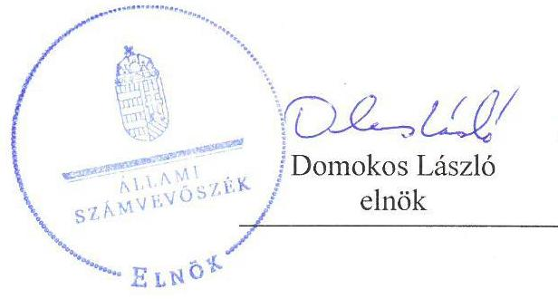
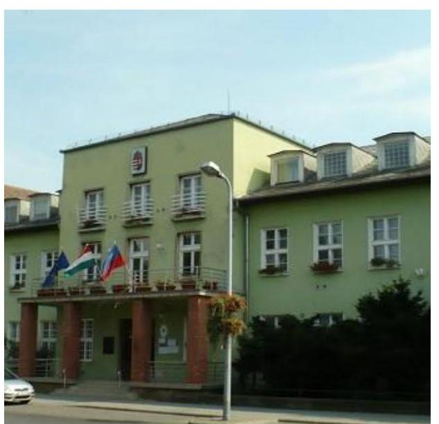
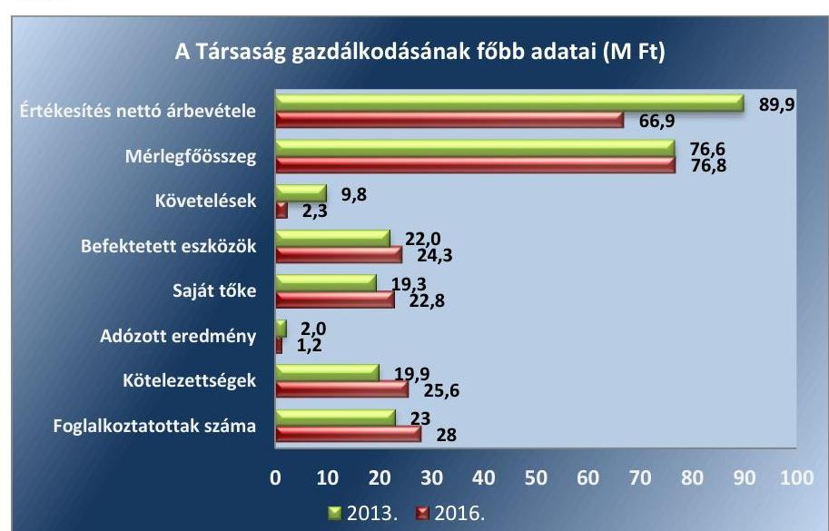
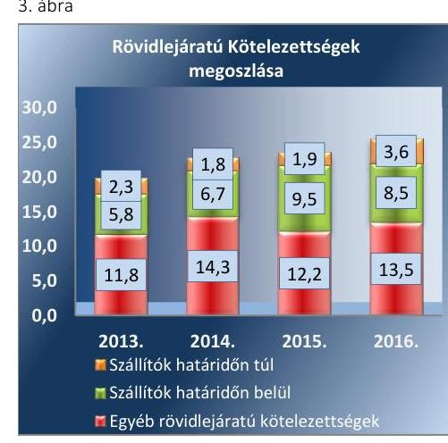

# Jelentés 

## Az önkormányzatok gazdasági társaságai

Az önkormányzatok többségi tulajdonában lévő gazdasági társaságok gazdálkodásának ellenőrzése - Csepeli Városkép Kft.
2018.

---

# Jelentés 

## Az önkormányzatok gazdasági társaságai

Az önkormányzatok többségi tulajdonában lévő gazdasági társaságok gazdálkodásának ellenőrzése - Csepeli Városkép Kft.
2018. február 19. nap

---

# AZ ELLENŐRZÉST FELÜGYELTE:

DR. HORVÁTH MARGIT felügyeleti vezető

## AZ ELLENŐRZÉST VEZETTE ÉS A VÉGREHAJTÁSÁÉRT FELELŐS:

DR. NAGY JUDIT ellenőrzésvezető

## A PROGRAM ÖSSZEÁLLÍTÁSÁÉRT FELELŐS:

TÓTPÁL SZABOLCS osztályvezető

IKTATÓSZÁM: V-1404-157/2016

TÉMASZÁM: 2447

ELLENŐRZÉS-AZONOSÍTÓ SZÁM: V079393

Jelentéseink az Országgyűlés számítógépes hálózatán és az Interneten a www.asz.hu címen is olvashatóak.

---

# TARTALOMJEGYZÉK 

■ ÖSSZEGZÉS ..... 5
■ AZ ELLENŐRZÉS CÉLJA ..... 6
■ AZ ELLENŐRZÉS TERÜLETE ..... 7
■ AZ ELLENŐRZÉS HÁTTERE, INDOKOLTSÁGA ..... 9
■ A JELENTÉS LÉNYEGES KÉRDÉSKÖREI ..... 10
■ AZ ELLENŐRZÉS HATÓKÖRE ÉS MÓDSZEREI ..... 11
■ MEGÁLLAPÍTÁSOK ..... 13
■ JAVASLATOK ..... 17
■ MELLÉKLETEK ..... 19
I. sz. melléklet: Értelmező szótár ..... 19
■ FÜGGELÉK: ÉSZREVÉTELEK ..... 21
■ RÖVIDÍTÉSEK JEGYZÉKE ..... 23

---

.

---

# ÖSSZEGZÉS 

Budapest XXI. kerület Csepel Önkormányzata a tulajdonosi joggyakorlás kereteit szabályszerűen alakította ki és jogait szabályszerűen gyakorolta a kizárólagos tulajdonában álló Csepeli Városkép Kft. feladatellátására vonatkozóan.
A Társaság a közvagyonnal felelősen és átláthatóan gazdálkodott, beszámolási kötelezettségét teljesítette, bevételeinek és ráfordításainak elszámolása szabályszerű volt.

## Az ellenőrzés társadalmi indokoltsága

Magyarországon az önkormányzatok kötelező és önként vállalt feladataik ellátása során egyre szélesebb körben alkalmazzák a költségvetési szerveken kívüli feladatellátást, ezáltal az önkormányzati tulajdonú gazdasági társaságok is kiemelt fontosságú szerephez jutnak a lakossági szolgáltatások biztosításában. Az Állami Számvevőszék kiemelt célja, hogy a helyi önkormányzatok gazdálkodásában rejlő pénzügyi kockázatok feltárásával, az államháztartáson kívülre nyújtott költségvetési támogatások és ingyenes vagyonjuttatások, valamint az államháztartáson kívül működő feladatellátó rendszerek ellenőrzéseivel hozzájáruljon ahhoz, hogy a közpénzeket az államháztartáson kívül működő szervezetek is átlátható, rendezett módon használják fel.

Az önkormányzatok többségi tulajdonában álló gazdasági társaságok ellenőrzése kiemelt jelentőségű, mivel működésük hatással van a tulajdonos önkormányzat gazdálkodására, gazdálkodásának egyes elemei befolyásolják az önkormányzati alszektor hiányát és az államadósságot.

Budapest XXI. kerületében 2013-2016 között a Csepeli Városkép Kft. közművelődési feladatokat látott el, Budapest XXI. kerület Csepel Önkormányzatával kötött megállapodások alapján. Az Állami Számvevőszék ellenőrzése azért is indokolt volt, mert tevékenysége keresztül a kerület lakosságának széles köre kerülhetett kapcsolatba a Társasággal, a nyújtott szolgáltatásokkal.

## Főbb megállapítások, következtetések, javaslatok

Budapest XXI. kerület Csepel Önkormányzata a tulajdonosi joggyakorlás kereteit szabályszerűen alakította ki és tulajdonosi jogait szabályszerűen gyakorolta.

A Csepeli Városkép Kft. működését megalapozó szabályozottsága megfelelő volt. Vagyonnal való felelős gazdálkodása biztosított volt, beszámolási, adatszolgáltatási, közzétételi kötelezettségének eleget tett.

A Csepeli Városkép Kft. az ellenőrzött időszakban az államadósságra befolyással bíró ügyletet nem kötött, Ugyanakkor a Bkr. ${ }^{1}$ előírásai ellenére nem alakította ki és nem működtette 2014. január 1-től 2016. szeptember 30-ig - a belső ellenőrzését, majd a célok megvalósítását, a tevékenységének nyomon követését biztosító rendszert,

---

# AZ ELLENŐRZÉS CÉLJA 

Az ellenőrzés célja annak értékelése, hogy az önkormányzat vagyongazdálkodási tevékenysége során szabályszerűen gyakorolta-e tulajdonosi jogait. A gazdasági társaság szabályozottsága, gazdálkodása és vagyongazdálkodási tevékenysége, bevételeinek és ráfordításainak elszámolása megfelelt-e a jogszabályi és tulajdonosi előírásoknak. A gazdasági társaság kötelezettségállománya jelentett-e kockázatot a működésre. Az ellenőrzés célja továbbá annak megítélése, hogy az önkormányzatok többségi tulajdonában lévő gazdasági társaságok gazdálkodásának a kormányzati szektor hiányára és az államadósságra befolya-
sással bíró elemei a jogszabályi előírásoknak megfelelnek-e.

---

# AZ ELLENŐRZÉS TERÜLETE

## Budapest XXI. kerület Csepel Önkormányzata és a Csepeli Városkép Kft.

A Csepp-TV Dél-Pesti Televízió Stúdió Kft-t 1994-ben kizárólagos tulajdonosként alapította a Budapest XXI. kerület Csepel Önkormányzata a Közműv. tv.2-ben megfogalmazott helyi közművelődési feladatai egy részének ellátására, 1 M Ft jegyzett tőkével. A jegyzett tőke 1999. november 17-én 3 MFt-ra emelésre került. A Társaság3 neve 2011. december 15-től Csepeli Városkép Kft-re változott.

A Társaság, Alapító Okirat1-64-ban meghatározott főtevékenysége folyóirat, időszaki kiadvány kiadása volt. Az Alapító5 a Közműv. tv. 76. § (1) bekezdésében és az Mötv.6 13. § (1) 7. pontjában megfogalmazott helyi közművelődési közfeladatok ellátásával bízta meg a Társaságot a Közművelődési Megállapodás1-27 keretében. A Társaság feladata volt a vizuális kultúra terjesztése, kiállítások szervezése, a művelődés, a tanulás, a szórakozás lehetőségének biztosítása, a közművelődési, kulturális célú önkormányzati pályázatok lebonyolítása, a kerületi televízió, a Királyerdei Művelődési Ház, a Radnóti Miklós Művelődési Ház, a Nyugdíjas Klub, a Csepeli Galéria üzemeltetése és a Csepeli Hírmondó kiadása.

A Nemzetgazdasági Miniszter a Társaságot 2012-ben a kormányzati szektorba sorolt8 egyéb szervezetek között nyilvántartásba vette. A Társaságnál a saját tőke/jegyzett tőke arány jogszabályban előírt szintje biztosított volt. A Társaságnak más társaságban részesedése nem volt.

A Társaság gazdálkodásával kapcsolatos főbb adatok alakulását az 1. ábra mutatja be:

1. ábra

*Forrás: A Társaság egyszerűsített éves beszámolói*

---

A Társaság értékesítésből származó nettó árbevétele és egyéb bevétele együtt 2013. évről 2016. évre 37,1 %-kal nőtt. Mérlegfőösszege és saját tőkéje nem változott jelentős mértékben.

A Társaságnál az Ügyvezető ${ }^{9}$ személye 1995. február 1. óta nem változott. A Polgármester ${ }_{1}{ }^{10}$ a 2014. évi önkormányzati választásokig, Polgármester ${ }_{2}$ a 2014. évi választások óta töltötte be hivatalát, a Jegyző ${ }^{11}$ 2000. április 1. óta látja el feladatát.

---

# AZ ELLENŐRZÉS HÁTTERE, INDOKOLTSÁGA 

AZ ÖNKORMÁNYZATI TULAJDONÚ GAZDASÁGI TÁRSASÁGOK gazdálkodási tevékenysége szabályszerűségének ellenőrzését 2011. évtől végezzük. Az önkormányzatok többségi tulajdonában álló gazdasági társaságok ellenőrzése kiemelten fontos a vagyon megőrzése, megóvása érdekében, valamint a kormányzati szektor elszámolásaiban megjelenő önkormányzati tulajdonú gazdálkodó szervezetek esetében, amelyekkel szemben alapvető követelmény, hogy gazdálkodásuk, működésük szabályszerű, az általuk szolgáltatott adatok minél megbízhatóbbak legyenek.

A feladat-ellátás költségeinek, ráfordításainak alakulása a lakosság széles rétegét érinti. Az ellenőrzés várható hasznosulásaként ellenőrzéseink feltárhatják, hogy az önkormányzat a feladatellátásához rendelt vagyon működtetését a tulajdonostól elvárható gondossággal végezte-e, a feladatot ellátó gazdasági társaság a létesítő okiratban, szolgáltatási szerződésben foglaltak betartásával biztosította-e a feladat ellátását. Az ellenőrzés rávilágíthat arra, hogy a gazdasági társaság a vagyon használatával biztosította-e a szolgáltatás folytatásának feltételeit, az önkormányzat által végzett tulajdonosi ellenőrzés hozzájárult-e a szabályszerű gazdálkodáshoz és feladatellátáshoz.

A megállapítások alapján megfogalmazott számvevőszéki javaslatok hasznosítása elősegítheti a meglévő hibák megszüntetését. A jó gyakorlatok bemutatásával az Állami Számvevőszék hozzájárul a követendő megoldások megismertetéséhez, terjesztéséhez.

---

# A JELENTÉS LÉNYEGES KÉRDÉSKÖREI 

1.- Az önkormányzati tulajdonosi joggyakorlás szabályszerű volt-e?
2.- A gazdasági társaság gazdálkodása, vagyongazdálkodása szabályszerű volt-e?

---

# AZ ELLENŐRZÉS HATÓKÖRE ÉS MÓDSZEREI 

## Az ellenőrzés típusa

Megfelelőségi ellenőrzés.

## Az ellenőrzött időszak

2013. január 1-jétől 2016. december 31-ig.

## Az ellenőrzés tárgya

Budapest XXI. kerület Csepel Önkormányzata tulajdonosi joggyakorlása, valamint a Csepeli Városkép Kft. gazdálkodásának szabályozottsága és szabályszerűsége.

Az ellenőrzés kiterjedt minden olyan körülményre és adatra, amely az ÁSZ ${ }^{12}$ jogszabályban meghatározott feladatainak teljesítéséhez, valamint a program végrehajtása folyamán felmerült újabb összefüggések feltárásához szükséges.

## Az ellenőrzött szervezet

Csepeli Városkép Kft. és a kizárólagos tulajdonos Budapest XXI. kerület Csepel Önkormányzata

## Az ellenőrzés jogalapja

Az ellenőrzés jogszabályi alapját az ÁSZ tv. 1.§ (3) bekezdése és 5. § (3)(5) bekezdései képezik.

## Az ellenőrzés módszerei

Az ellenőrzést a nemzetközi standardokat irányadónak tekintve az ellenőrzési program ellenőrzési kérdései, az ellenőrzött időszakban hatályos jogszabályok, az ellenőrzés szakmai szabályok és módszertanok figyelembe vételével végeztük.

Az ellenőrzés ideje alatt az ellenőrzött szervezettel történő kapcsolattartást az ÁSZ Szervezeti és Működési Szabályzatának vonatkozó előírásai alapján biztosítottuk.

Az ellenőrzési kérdések megválaszolásához szükséges bizonyítékok megszerzése a következő ellenőrzési eljárások alkalmazásával történt:

---

megfigyelés, kérdésfeltevés (információkérés), összehasonlítás, valamint elemző eljárás. Az ellenőrzési bizonyítékként felhasználható adatforrások közé tartoztak egyrészt az ellenőrzési programban felsorolt adatforrások, másrészt adatforrás lehet még minden - az ellenőrzés folyamán - feltárt, az ellenőrzés szempontjából információkat tartalmazó dokumentum.

Az ellenőrzést a kérdésekre adott válaszok kiértékelésével, valamint a megjelölt adatforrások, a csatolt tanúsítványok felhasználásával, továbbá az adott időszakban hatályos jogszabályok figyelembe vételével folytattuk le.

A bevételek és ráfordítások elszámolása, valamint a vagyonnyilvántartás terén a szabályszerű működést véletlen mintavétellel ellenőriztük.

A mintavétellel ellenőrzött területek esetében minden egyes tétel vonatkozásában a szabályszerűségre vonatkozó kérdéseket tettünk fel, amelyek eredménye összesítésre került. Az ellenőrzött minták alapján a sokaságban előforduló átlagos hibaarányt becsültük. „Szabályszerűnek" értékeltünk egy ellenőrzött területet, amennyiben 95\%-os bizonyossággal a teljes sokaságban az átlagos hibaarány legfeljebb 10\%, nem megfelelőnek, amennyiben 10\%-nál magasabb arányt képviselt. Abban az esetben, ha a teljes sokaság tekintetében a 10\%-os hibaarányhoz való viszony megítélésének megbízhatósága nem érte el a 95\%-ot, annak elérése érdekében értékelésünket további szempontokkal egészítettük ki, és figyelembe vettük a feltárt hibák típusát és súlyát. Az anyagjellegű, egyéb illetve pénzügyi ráfordítások elszámolására és a vagyonnyilvántartásra vonatkozó véletlen mintavételt kockázati alapú kiválasztással egészítettük ki, amelynek során a három legnagyobb összegű tételt választottuk ki.

---

# 1. Az önkormányzati tulajdonosi joggyakorlás szabályszerű volt-e? 

Összegző megállapítás

Az Alapító a tulajdonosi joggyakorlás kereteit szabályszerűen alakította ki és tulajdonosi jogait szabályszerűen gyakorolta.

Az Önkormányzat ${ }^{13}$ a Gazdasági program ${ }_{1-2}{ }^{14}$-ját az Mötv. 116. § (1)-(4) bekezdéseiben foglaltaknak megfelelően elkészítette, amely tartalmazta a Társaság által ellátott közfeladatokkal kapcsolatos fejlesztési elképzeléseket.

Az Önkormányzat - az Nvtv. ${ }^{15}$ 9. § (1) bekezdés előírása, valamint a Vagyongazdálkodási rendelet 42. § előírása ellenére - nem készített közép- és hosszú távú vagyongazdálkodási tervet.

A TULAJDONOSI JOGGYAKORLÁS KERETEIT az Alapító a Társaságra vonatkozóan önkormányzati SZMSZ ${ }_{1-3}{ }^{16}$-ben, a Vagyongazdálkodási Rendelet ${ }^{17}$-ben, az Alapító Okirat ${ }_{1-6}$-ban, a Közművelődési Megállapodás ${ }_{1-2}$-ban és a Közreműködési Megállapodásban ${ }^{18}$ rögzítette.

Az Alapító a feladatellátás szabályait Közművelődési Megállapodás ${ }_{1-2}$ ban határozta meg, amely tartalmában megfelelt a Közműv. tv. 77. §-ban foglalt előírásoknak.

## A TÁRSASÁGOT A FELADATELLÁTÁSÁHOZ TÁ-

MOGATÁS illette meg a Közművelődési Megállapodás ${ }_{1-2}$ VII. pontja alapján, amelynek összegéről a Képviselő-testület ${ }^{19}$ minden évben a költségvetési rendeletben ${ }^{20}$ döntött. A Társaság működési célú támogatást kapott a közművelődési, lapkiadási és rendezvényszervezési feladatainak ellátásához. Ezen felül az Önkormányzat támogatást biztosított a beruházási és felújítási feladatokhoz, a kisértékű tárgyi eszközök beszerzéséhez, valamint a közművelődési tevékenység dologi kiadásaira. Az Önkormányzat által nyújtott évenkénti támogatások összegét az 2. ábra mutatja be.

A Közművelődési Megállapodás ${ }_{1-2}$ III.1. pontja alapján az alapító szerződéses üzemeltetésre adott át ingatlanokat és a hozzájuk kapcsolódó tárgyi eszközöket.

KÖNYVVIZSGÁLATRA a Társaság a Számv. tv. 155. § (3) bekezdése alapján nem volt kötelezett, azonban már az alapítástól könyvvizsgáló ellenőrizte a Társaság egyszerűsített éves beszámolóját, a könyvvizsgáló személyét az Alapító Okirat ${ }_{1-6}$ 14. pontjában meghatározták. A Társaság egyszerűsített éves beszámolóit a könyvvizsgáló korlátozás nélküli hitelesítő záradékkal látta el.

A FELÜGYELŐBIZOTTSÁG ${ }^{21}$ tagjait az Önkormányzat az Alapító Okirat ${ }_{1-6}$ 15. pontjában kijelölte és meghatározta a Felügyelőbizottság

---

hatáskörét, ezzel eleget téve a Gt. ${ }^{22}$ 19. § (4) bekezdése és a Taktv. ${ }^{23}$ 4. § előírásainak. A Felügyelőbizottság ügyrendjét a Gt. 34. § (4) bekezdése és
 a Ptk. 3:122. § (3) bekezdése előírásai szerint a Képviselő-testület jóváhagyta ${ }^{24}$.

# AZ ALAPÍTÓ TULAJDONOSI JOGGYAKORLÁSA 

SZABÁLYSZERŰ VOLT, a Ptk. 3:109. § (2) bekezdése alapján döntött ${ }^{25}$ a Társaság egyszerűsített éves beszámolóinak elfogadásáról, határozatait a Felügyelőbizottság írásbeli jelentése birtokában a Ptk. 3:120. § (2) bekezdése előírásainak megfelelően hozta meg.

Az Alapító nem élt az Áht. 70. § (1) bekezdés d) pontjában biztosított jogával, nem végzett belső ellenőrzést a Társaság gazdálkodására vonatkozóan.

A vezető tisztségviselők, a felügyelőbizottsági tagok és az Mt. ${ }^{26}$ 208. § hatálya alá tartozó munkavállalók javadalmazására, valamint a jogviszony megszűnése esetére biztosított juttatások módjának, mértékének legfőbb elveiről, annak rendszeréről a Képviselő-testület a Taktv. 5.§ (3) bekezdése előírásai szerint Javadalmazási Szabályzatot ${ }^{27}$ alkotott, amelynek előírásait az ügyvezető igazgató prémiumfeladatainak meghatározása során, a teljesítés értékelése során a Képviselő-testület figyelembe vette.

## 2. A gazdasági társaság gazdálkodása, vagyongazdálkodása szabályszerű volt-e?

## Összegző megállapítás

2.1. számú megállapítás

A Társaság gazdálkodása és vagyongazdálkodása szabályszerű volt.

A Társaság gazdálkodásának és vagyongazdálkodásának szabályozottsága megfelelt a jogszabályi előírásoknak. Ugyanakkor nem alakította ki és nem működtette a Bkr. előírásai ellenére a 2014. január 1-től 2016. szeptember 30-ig előírt belső ellenőrzést, majd a célok megvalósítását, tevékenységének nyomon követését biztosító rendszerét.

A Társaság SZMSZ ${ }^{28}$-szal rendelkezett, amelynek 6.1. pontja előírta az üzleti terv készítési kötelezettséget.

A Társaság a Gazdálkodási Szabályzaton ${ }^{29}$ kívül, a Számv. tv. ${ }^{30}$ 14. § (3)(5) bekezdése előírásának megfelelően, elkészítette a Számviteli Politiká${ }^{31}$-t, az Eszközök és források értékelési szabályzatá${ }^{32}$-t a Pénzkezelési szabályzat${ }^{33}$-ot és a Leltározási szabályzat${ }^{34}$-ot.

A Társaság a Számv. tv. 161. § (1) bekezdésében előírtakkal összhangban, rendelkezett Számlarend${ }^{35}$-del, amely megfelelt a Számv. tv. 161. § (2) bekezdése követelményeinek.

A közérdekű adatok megismerésére irányuló igények teljesítésének rendjét meghatározó szabályzattal a Társaság nem rendelkezett, ezért a Társaság, mint közfeladatot ellátó, nem tett eleget az Info. tv. ${ }^{36}$ 30. § (6) bekezdésében foglaltaknak.

---

### 2.2. számú megállapítás

### 2.3. számú megállapítás

Az árképzésre vonatkozó szabályokat az Önkormányzat a Közművelődési Megállapodás ${ }_{1-2}$ V. pontjában fogalmazta meg, amelyre vonatkozó jogszabályi kötelezettség nem volt.

A Társaság az önköltség-számítási szabályzat készítése alól a Számv. tv. 14. § (6)-(7) bekezdése előírása alapján mentesült, ettől függetlenül 2013-tól ilyen szabályzattal ${ }^{37}$ rendelkezett.

A Bkr. 10. §, valamint 54./A §-ban foglaltak ellenére a Társaság nem alakította ki a szervezet tevékenységének, a célok megvalósításának nyomon követését biztosító rendszerét - ennek keretében 2014. január 1-től 2016. szeptember 30-ig fennálló kötelezettsége ellenére - belső ellenőrzést nem működtetett.

## A Társaság gazdálkodása és vagyongazdálkodása megfelelt a jogszabályi előírásoknak.

A Társaság a Közművelődési Megállapodás ${ }_{1-2}$ 1. sz. mellékletében rögzített feladatait éves munkaterv keretében látta el, amelyet a Képviselő-testület az éves üzleti tervvel együtt hagyott jóvá.

A Társaság közművelődési feladatai ellátásához kapott önkormányzati támogatás pénzügyi elszámolására és az adatszolgáltatásra vonatkozó részletszabályokat a Közművelődési Megállapodás ${ }_{1,2}$ 3. számú mellékletében rögzítették, a Társaság az egyes hónapokra vonatkozó, a közművelődési feladatai ellátása során felmerült bevételeiről és költségeiről elszámolt az Önkormányzat felé.

A Társaság az egyszerűsített éves beszámolókat a Számv.tv. 69. § (1) bekezdése szerinti leltárral alátámasztotta.

Az Ügyvezető az egyszerűsített éves beszámolókat a Képviselő-testület elé terjesztette, majd azok jóváhagyását követően teljesítette a Számv. tv. 153. § (1) bekezdésében foglalt letétbe helyezési és a 154. § (1) bekezdésében foglalt, közzétételi kötelezettségét.

A Társaság befektetett eszköz növekedéseinek, bevételeinek, anyag-és személyi jellegű ráfordításainak, valamint az értékcsökkenésnek elszámolása szabályszerű volt.

## A Társaság kötelezettségállományának alakulása a működését nem veszélyeztette. A Társaság a közzétételi kötelezettségének eleget tett.

Forrás: A Társaság egyszerűsített éves beszámolói

A Közművelődési Megállapodás ${ }_{1-2}$ V. a) pontja rögzítette, hogy a Társaság díjmentesen köteles biztosítani az épületek termeinek, felszerelésének, berendezéseinek használatát az Önkormányzat részére, valamint azon szervezetek részére, amelyekkel az Önkormányzat ilyen tartalmú megállapodást kötött. Az Önkormányzat intézményei és a Polgármesteri Hivatal részére a mindenkori rezsiköltséget, egyéb szervezetek számára pedig a piaci viszonyoknak megfelelő díjat volt köteles alkalmazni. Az alkalmazott díjak ezen előírásnak megfelelően, szabályszerűen kerültek megállapításra.

A Társaságnál a saját tőke/jegyzett tőke arány jogszabályban előírt szintje biztosított volt.

A Társaságnak az egyszerűsített éves beszámolói alapján hosszúlejáratú kötelezettsége nem keletkezett, a rövid lejáratú kötelezettségeit alapvetően a szállítók, illetve az esedékes adók és járulékok tették ki.

---

A határidőn túli rövidlejáratú kötelezettségek (szállítók) állománya évről évre csökkent. A rövidlejáratú kötelezettségek alakulását a 3. ábra mutatja be.

A Társaság a Stabilitási tv. ${ }^{38}$ szerinti adósságot keletkeztető ügyletet nem kötött.

A Társaság adatvédelmi és adatbiztonsági szabályzatát ${ }^{39}$ az Info tv. 2012. január 1-i hatályba lépése ellenére, késedelmesen 2015. január 30-án helyezte hatályba.

A Társaság közérdekű adatok közzétételi kötelezettségének az Önkormányzat honlapján tett eleget, az Info. tv. 33. § (3) bekezdése szerint.

A Társaság az Áht. ${ }^{40}$ 107.§ (1) bekezdése alapján - 2012. február 16-tól fennálló - az Ávr. ${ }^{41}$ 5. sz. melléklete 23. pontjai szerinti adatszolgáltatás teljesítésére volt kötelezett, amelynek eleget tett.

---

# JAVASLATOK 

Az ÁSZ tv. 33. § (1) bekezdésében foglaltak értelmében az ellenőrzött szervezet vezetője köteles a jelentésben foglalt megállapításokhoz kapcsolódó intézkedési tervet összeállítani és azt a jelentés kézhezvételétől számított 30 napon belül az ÁSZ részére megküldeni. Amennyiben az ellenőrzött szervezet vezetője nem küldi meg határidőben az intézkedési tervet, vagy továbbra sem elfogadható intézkedési tervet küld, az Állami Számvevőszék elnöke az ÁSZ tv. 33. § (3) bekezdése a) és b) pontjaiban foglaltakat érvényesítheti.
Javaslataink célja a Csepeli Városkép Kft. gazdálkodása szabályszerűségének és gyakorlatának javítása annak érdekében, hogy a szabályozási környezet és az alkalmazott gyakorlat megfelelően tudja támogatni az átlátható működést.

## Csepeli Városkép Kft. ügyvezetőjének

1. Intézkedjen a közérdekű adatok megismerésére irányuló igények teljesítésének rendjét meghatározó szabályzat készítéséről az Info tv. előírásainak megfelelően.
(2.1. sz. megállapítás 4. bekezdése alapján)
2. Intézkedjen a Bkr. előírásainak megfelelően a szervezet tevékenységének, a célok megvalósításának nyomon követését biztosító rendszer kialakításáról.
(2.1. sz. megállapítás 7. bekezdése alapján)

Javaslataink célja az Önkormányzat szabályszerű működésének elősegítése, továbbá az önkormányzati tulajdonosi joggyakorlás kontrolljainak erősítése.

## Budapest XXI. Kerület Csepel Önkormányzata polgármesterének

1. Intézkedjen az Önkormányzat közép- és hosszú távú vagyongazdálkodási tervének elkészítéséről az Nvtv. és a Vagyongazdálkodási rendelet előírásainak megfelelően.
(1. sz. megállapítás 2. bekezdése alapján)

---

.

---

# MELLÉKLETEK 

- I. SZ. MELLÉKLET: ÉRTELMEZŐ SZÓTÁR
gazdasági társaság
kormányzati szektorba sorolt egyéb szervezet
közszolgáltatás
nemzeti vagyon

Ptk. 3.88. § (1) bekezdése szerint „a gazdasági társaságok üzletszerű közös gazdasági tevékenység folytatására, a tagok vagyoni hozzájárulásával létrehozott, jogi személyiséggel rendelkező vállalkozások, amelyekben a tagok a nyereségből közösen részesednek, és a veszteséget közösen viselik".
az Áht. 3. § (2) és (3) bekezdésében foglaltakon kívül az Európai Közösséget létrehozó szerződéshez csatolt, a túlzott hiány esetén követendő eljárásról szóló jegyzőkönyv alkalmazásáról szóló 2009. május 25-i 479/2009/EK rendelet (a továbbiakban: 479/2009/EK rendelet) szerint a kormányzati szektorba sorolt szervezet (Áht. 1. § (12))
Az Ebktv. ${ }^{42}$ 3. § d) pontja a következőképpen határozza meg a közszolgáltatást: „szerződéskötési kötelezettség alapján a lakosság alapvető szükségleteinek ellátására irányuló szolgáltatás, így különösen a villamos energia-, gáz-, hő-, víz-, szenny-víz- és hulladékkezelési, köztisztasági, postai és távközlési szolgáltatás, továbbá a menetrend alapján közlekedő járművekkel végzett közforgalmú személyszállítás".
Nv. tv. 1. § (2) bekezdése szerint többek között:
„az állam vagy a helyi önkormányzat kizárólagos tulajdonában álló dolgok, az a) pont hatálya alá nem tartozó, állam vagy a helyi önkormányzat tulajdonában lévő dolog,
az állam vagy a helyi önkormányzat tulajdonában lévő pénzügyi eszközök, továbbá az államot vagy a helyi önkormányzatot megillető társasági részesedések, az államot vagy a helyi önkormányzatot megillető bármely vagyoni értékkel rendelkező jogosultság, amelyet jogszabály vagyoni értékű jogként nevesít."

---

.

---

# FÜGGELÉK: ÉSZREVÉTELEK 

A jelentéstervezetet a Számvevőszék 15 napos észrevételezésre megküldte az ellenőrzött szervezetek vezetőinek az ÁSZ tv. 29. § (1) bekezdése előírásának megfelelően.

Az ellenőrzési megállapításokkal kapcsolatban az ellenőrzött szervezetek vezetői nem tettek észrevételt.

[^0]
[^0]:    * 29. § (1) Az Állami Számvevőszék az ellenőrzési megállapításait megküldi az ellenőrzött szervezet vezetőjének vagy az általa megbízott személynek, és annak, akinek személyes felelősségét állapította meg.
    (2) Az ellenőrzött szervezet vezetője és a felelősként megjelölt személy az ellenőrzés megállapításaira tizenöt napon belül írásban észrevételt tehet.
    (3) Az Állami Számvevőszék az észrevételre a beérkezésétől számított harminc napon belül írásban válaszol. A figyelembe nem vett észrevételeket köteles a jelentésben feltüntetni, és megindokolni, hogy azokat miért nem fogadta el.

---

.

---

# RÖVIDÍTÉSEK JEGYZÉKE 

${ }^{1}$ Bkr.
${ }^{2}$ Közműv. tv.
${ }^{3}$ Társaság
${ }^{4}$ Alapító Okiratok:
Alapító okirat ${ }_{1}$
Alapító okirat ${ }_{2}$
Alapító okirat ${ }_{3}$
Alapító okirat ${ }_{4}$
Alapító okirat ${ }_{5}$
Alapító okirat ${ }_{6}$
${ }^{5}$ Alapító
${ }^{6}$ Mötv.
${ }^{7}$ Közművelődési Megállapodás ${ }_{1}$

Közművelődési Megállapodás ${ }_{2}$
${ }^{8}$ Kormányzati szektorba sorolás
${ }^{9}$ Ügyvezető
${ }^{10}$ Polgármester
${ }^{11}$ Jegyző
${ }^{12}$ ÁSZ
${ }^{13}$ Önkormányzat

370/2011. (XII.31.) Korm. rendelet a költségvetési szervek belső kontrollrendszeréről és belső ellenőrzéséről (hatályos: 2012. január 1.-től) 1997. évi CXL. sz. törvény a muzeális intézményekről, a nyilvános könyvtári ellátásról és a közművelődésről (hatályos: 1998. január 1-től)
Csepeli Városkép Kft.

Csepeli Városkép Kft. alapító okirata a 2011. december 15-én kelt módosításokkal egységes szerkezetbe foglalva
Csepeli Városkép Kft. alapító okirata a 2012. május 24-én kelt módosításokkal egységes szerkezetbe foglalva
Csepeli Városkép Kft. alapító okirata a 2012. július 10-én kelt módosításokkal egységes szerkezetbe foglalva
Csepeli Városkép Kft. alapító okirata a 2012. szeptember 27-én kelt módosításokkal egységes szerkezetbe foglalva
Csepeli Városkép Kft. alapító okirata a 2014. szeptember 26-án kelt módosításokkal egységes szerkezetbe foglalva
Csepeli Városkép Kft. alapító okirata a 2014. december 16-án kelt módosításokkal egységes szerkezetbe foglalva
Budapest XXI. kerület Csepel Önkormányzata
2011.évi CLXXXIX törvény Magyarország helyi önkormányzatairól (hatályos: 2012. január 1-től)

Közművelődési megállapodás, amely létrejött Budapest XXI. kerület Csepel Önkormányzata és a Csepeli Városkép Kft. között, létrejött 2012. május 23-án a Budapest XXI. kerület Csepel Önkormányzata 188/2012.(V.03.) Kt. számú határozatban kapott felhatalmazás alapján (hatályos: 2012. május 7-től 2015.január 31-ig)

Közművelődési megállapodás, amely létrejött Budapest XXI. kerület Csepel Önkormányzata és a Csepeli Városkép Kft. között, létrejött 2015. február 9-én a Budapest XXI. kerület Csepel Önkormányzata 36/2015.(I.29.) Kt. számú határozatban kapott felhatalmazás alapján (hatályos 2015.február 1-től 2019.május 31-ig)
A 2012. február 16-án megjelent Hivatalos Értesítő 2012/9. I. rész B. Helyi önkormányzatok alszektorba tartozó szervezetek 2. sz, 160. helyén
A 2013. június 28-án megjelent Hivatalos Értesítő 2013/32. I. rész B. Helyi önkormányzatok alszektorba tartozó szervezetek 2. sz, helyén
A 2013. december 16-án megjelent Hivatalos Értesítő 2013/60. I. rész B. Helyi önkormányzatok alszektorba tartozó szervezetek 2. sz, helyén
A 2015. december 30-án megjelent Hivatalos Értesítő 2015/66. sz. I. rész B. Helyi önkormányzatok alszektorba tartozó szervezetek 35.
 sz, helyén
Csepeli Városkép Kft. ügyvezetője
Budapest XXI. kerület Csepel Önkormányzata Polgármestere
Budapest XXI. kerület Csepel Önkormányzata jegyzője
Állami Számvevőszék
Budapest XXI. kerület Csepel Önkormányzata

---

${ }^{14}$ Gazdasági program: Jövőkép Budapest XXI. Kerület Csepel Önkormányzata gazdasági programja 2011-2014.

Gazdasági program: Csepel új utakon Budapest XXI. Kerület Csepel Önkormányzata gazdasági programja 2014-2019.
${ }^{15}$ Nvtv.
${ }^{16}$ Önkormányzati SZMSZ: 2011. évi CXCVI. törvény a nemzeti vagyonról (hatályos: 2012. január 1-től)
${ }^{16}$ Önkormányzati SZMSZ: Budapest XXI. Kerület Csepel Önkormányzata és szervei Szervezeti és Működési Szabályzata, a Budapest XXI. Kerület Csepel Önkormányzata Képviselő-testületének 10/2007.(III.26.) Kt sz. rendelet és módosításai
Önkormányzati SZMSZ: Budapest XXI. Kerület Csepel Önkormányzata és szervei Szervezeti és Működési Szabályzata, a Budapest XXI. Kerület Csepel Önkormányzata Képviselő-testületének 5/2013. (III.06.) ör. rendelet és módosításai
Önkormányzati SZMSZ: Budapest XXI. Kerület Csepel Önkormányzata és szervei Szervezeti és Működési Szabályzata, a Budapest XXI. Kerület Csepel Önkormányzata Képviselő-testületének 25/2014. (XI.28.) ör. rendelet és módosításai
${ }^{17}$ Vagyongazdálkodási Rendelet
${ }^{18}$ Közreműködési Megállapodás
${ }^{19}$ Képviselő-testület
${ }^{20}$ Költségvetési rendeletek
${ }^{21}$ Felügyelőbizottság
${ }^{22} \mathrm{Gt}$.
${ }^{23}$ Taktv.
${ }^{24}$ Felügyelő-bizottsági ügyrend jóváhagyása
${ }^{25}$ Az egyszerűsített éves beszámolókat elfogadó határozatok
${ }^{26} \mathrm{Mt}$.
Budapest XXI. kerület Csepel Önkormányzata Képviselő-testületének 11/2012.(V.03.) önkormányzati rendelete az Önkormányzat vagyonáról és a vagyon feletti tulajdonosi jogok gyakorlásáról és annak módosításai
Közreműködési megállapodás üzemeltetés céljából, amely létrejött Budapest XXI. kerület Csepel Önkormányzata Humán Szolgáltatások Igazgatósága és a Csepeli Városkép Kft. között 2014. október 1-én.
Budapest XXI. kerület Csepel Önkormányzata Képviselő-testülete
Budapest XXI. kerület Csepel Önkormányzata Képviselő-testületének 9/2013. (II.28.) önkormányzati rendelete a 2013. évi költségvetésről

Budapest XXI. kerület Csepel Önkormányzata Képviselő-testületének 5/2014.(III.04.) önkormányzati rendelet Budapest XXI. kerület Csepel Önkormányzata 2014. évi költségvetéséről
Budapest XXI. kerület Csepel Önkormányzata Képviselő-testületének 10/2015.(III.12.) önkormányzati rendelet az Önkormányzat 2015. évi költségvetéséről
Budapest XXI. kerület Csepel Önkormányzata Képviselő-testületének 34/2015.(XII.15.) önkormányzati rendelet az Önkormányzat 2016. évi költségvetéséről
Csepeli Városkép Kft. Felügyelőbizottsága
2006. évi IV. törvény - a gazdasági társaságokról (hatályos: 2006. július 1-től 2014. március 14-ig)
2009. évi CXXII. törvény - a köztulajdonban álló gazdasági társaságok takarékosabb működéséről (hatályos: 2009. december 4-től)
Budapest XXI. kerület Csepel Önkormányzata Képviselő-testülete 91/2013. (II.28.) Kt. határozata alapján

Budapest XXI. kerület Csepel Önkormányzata Képviselő-testülete (197/2014. (IV.24.) számú Kt. határozata

Budapest XXI. kerület Csepel Önkormányzata Képviselő-testülete 208/2015. (IV.30.) számú Kt. határozata

Budapest XXI. kerület Csepel Önkormányzata Képviselő-testülete 142/2016. (V.05.) számú Kt. határozata

Budapest XXI. kerület Csepel Önkormányzata Képviselő-testülete 157/2017. (IV.27.) számú Kt. határozata
2012. évi I. törvény a munka törvénykönyvéről (hatályos: 2012. július 1-től)

---

${ }^{27}$ Javadalmazási Szabályzat
${ }^{28}$ Társasági SZMSZ1

Társasági SZMSZ2

Társasági SZMSZ3
${ }^{29}$ Gazdálkodási Szabályzat
${ }^{30}$ Számv. tv.
${ }^{31}$ Számviteli Politika1

Számviteli Politika ${ }_{2}$
${ }^{32}$ Eszközök és források értékelési Szabályzata ${ }_{1}$

Eszközök és források értékelési Szabályzata ${ }_{2}$
${ }^{33}$ Pénzkezelési Szabályzat ${ }_{1}$

Pénzkezelési Szabályzat ${ }_{2}$
${ }^{34}$ Leltározási Szabályzat ${ }_{1}$

Leltározási Szabályzat ${ }_{2}$
${ }^{35}$ Számlarend ${ }_{1}$
Számlarend ${ }_{2}$
${ }^{36}$ Info tv.
${ }^{37}$ Önköltségszámítási szabályzat
${ }^{38}$ Stabilitási tv
${ }^{39}$ Adatvédelmi és adatbiztonsági Szabályzat
${ }^{40}$ Áht.
${ }^{41}$ Ávr
${ }^{42}$ Ebktv.

Csepeli Városkép Kft. javadalmazási szabályzata hatályos 2012. június 1-től, elfogadta az alapító 279/2012. (V.24.) sz. határozatával
Csepeli Városkép Kft. Szervezeti és Működési Szabályzata, készült 2012. január 31-én
Csepeli Városkép Kft. Szervezeti és Működési Szabályzata, készült 2015. január 30-án
Csepeli Városkép Kft. Szervezeti és Működési Szabályzata, készült 2016. december 31-én
Csepeli Városkép Kft. Gazdálkodási Szabályzata
2000. évi C törvény a számvitelről (hatályos: 2001. január 1-től)

Csepeli Városkép Kft. számviteli politikája: (hatályos 2013. január 1-jétől 2016. január 1-ig)
Csepeli Városkép Kft. számviteli politikája: (hatályos 2016. január 1-jétől)
Csepeli Városkép Kft. számviteli politika Eszközök és források értékelési szabályzata (hatályos 2012. január 1-jétől)
Csepeli Városkép Kft. számviteli politika Eszközök és források értékelési szabályzata (hatályos 2016. január 1-jétől)
Csepeli Városkép Kft. pénzkezelési szabályzata (hatályos 2013. január 1-jétől 2016. január 1-ig)

Csepeli Városkép Kft. pénzkezelési szabályzata: hatályos 2016. január 1-jétől
Csepeli Városkép Kft. leltárkészítési és leltározási szabályzata: hatályos 2012. január 1-jétől
Csepeli Városkép Kft. leltárkészítési és leltározási szabályzata: hatályos 2016. január 1-jétől
Csepeli Városkép Kft számlarendje: hatályos 2012. évtől 2016. január 1-ig)
Csepeli Városkép Kft számlarendje: hatályos 2016. január 1-jétől
2011. évi CXII. törvény az információs önrendelkezési jogról és az információszabadságról (hatályos: 2011. július 27-től)
Csepeli Városkép Kft. Számviteli politika, Az önköltségszámítás rendjére vonatkozó belső szabályzat (hatályos 2013. január 1-jétől)
2011. évi CXCIV. törvény Magyarország gazdasági stabilitásáról (hatályos: 2011. december 30-tól)

Csepeli Városkép Kft. adatvédelmi és adatbiztonsági szabályzata (hatályos 2015. január 30-tól)
2011. évi CXCV. törvény az államháztartásról (hatályos 2011. december 30-tól)
368/2011. (XII.31.) Korm. rendelet az államháztartásról szóló törvény végrehajtásáról
2003. évi CXXV. törvény az egyenlő bánásmódról és az esélyegyenlőség előmozdításáról (hatályos: 2004. január 27-től)

---

# ÁLLAMI SZÁMVEVŐSZÉK 

1052 Budapest, Apáczai Csere János utca 10.
Levélcím: 1364 Budapest 4. Pf. 54
Telefon: +36 14849100 Telefax: +36 14849200
www.asz.hu
