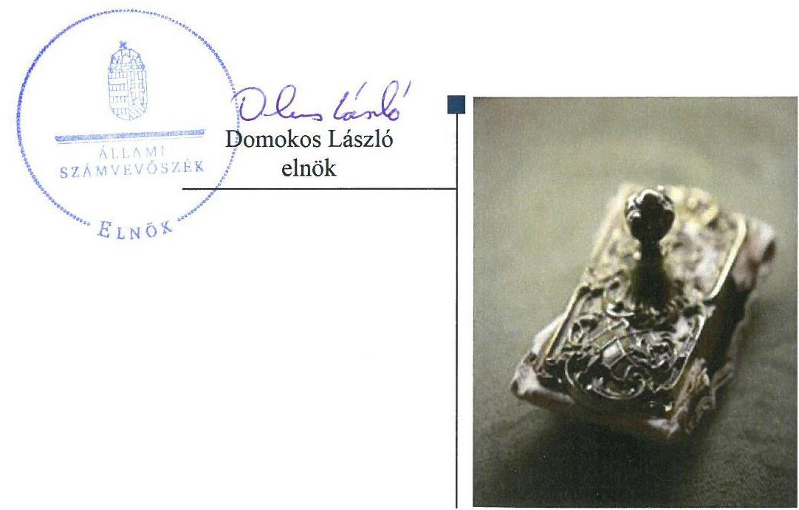
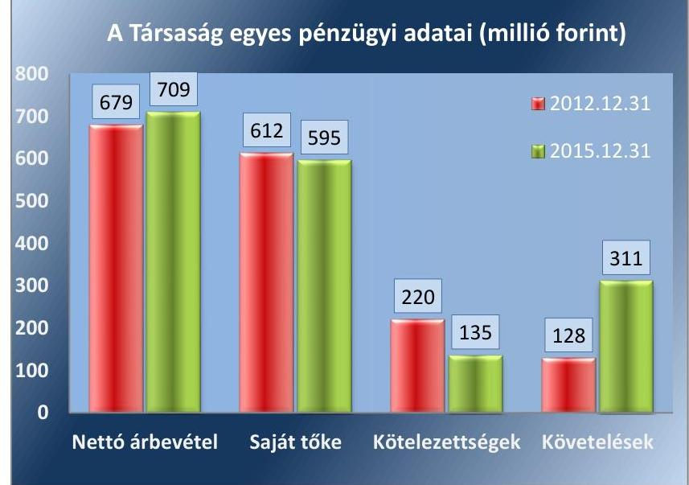

# Jelenetés 

## PRIV-DAT Dokumentum Archiváló és Tároló Kft.

Az állami tulajdonban (résztulajdonban) lévő gazdálkodó szervezetek vagyonmegőrzési és gazdálkodási tevékenységének ellenőrzése 2018.

18114
www.asz.hu

---

# Jelentés 

## PRIV-DAT Dokumentum Archiváló és Tároló Kft.

Az állami tulajdonban (résztulajdonban) lévő gazdálkodó szervezetek vagyonmegőrzési és gazdálkodási tevékenységének ellenőrzése
2018.  július hó A. nap

---

# AZ ELLENŐRZÉST FELÜGYELTE:

- **DR. HORVÁTH MARGIT** felügyeleti vezető
- **AZ ELLENŐRZÉST VEZETTE ÉS A VÉGREHAJTÁSÁÉRT FELELŐS:**
  - **SIPOSNÉ DÓCZI KLÁRA** ellenőrzésvezető
  - **A PROGRAM ÖSSZEÁLLÍTÁSÁÉRT FELELŐS:**
    - **JANIK JÓZSEF LÁSZLÓ ÉS TÓTPÁL SZABOLCS** osztályvezető

**IKTATÓSZÁM:** V-1384-201/2016

**TÉMASZÁM:** 2418

**ELLENŐRZÉS-AZONOSÍTÓ SZÁM:** V075954

Jelentéseink az Országgyűlés számítógépes hálózatán és az Interneten a www.asz.hu címen is olvashatóak.

---

# TARTALOMJEGYZÉK 

■ ÖSSZEGZÉS ..... 5
■ AZ ELLENŐRZÉS CÉLJA ..... 6
■ AZ ELLENŐRZÉS TERÜLETE ..... 7
■ AZ ELLENŐRZÉS HÁTTERE, INDOKOLTSÁGA ..... 9
■ A JELENTÉS LÉNYEGES KÉRDÉSKÖREI ..... 10
■ ELLENŐRZÉS HATÓKÖRE ÉS MÓDSZEREI ..... 11
■ MEGÁLLAPÍTÁSOK ..... 13
■ JAVASLATOK ..... 17
■ MELLÉKLETEK ..... 19
I. sz. melléklet: Értelmező szótár ..... 19
II. sz. melléklet: A PRIV-DAT Dokumentum Archiváló és Tároló Kft. éves beszámolóinak adatai ..... 22
■ FÜGGELÉK: ÉSZREVÉTELEK ..... 23
■ RÖVIDÍTÉSEK JEGYZÉKE ..... 25

---

.

---

# ÖSSZEGZÉS 

A Magyar Nemzeti Vagyonkezelő Zrt. tulajdonosi joggyakorlás kereteit szabályszerűen alakította ki, tulajdonosi joggyakorlása megfelelő volt. A PRIV-DAT Dokumentum Archiváló és Tároló Kft. működése, gazdálkodása és vagyongazdálkodása szabályszerű volt, beszámolási kötelezettségét az előírásoknak megfelelően teljesítette. A Társaság a gazdálkodás átláthatóságát a közérdekű adatok közzétételével biztosította.

## Az ellenőrzés társadalmi indokoltsága

Az Állami Számvevőszék kiemelt célja, hogy az államháztartáson kívülre nyújtott költségvetési támogatások és ingyenes vagyonjuttatások, valamint az államháztartáson kívül működő feladatellátó rendszerek ellenőrzéseivel hozzájáruljon ahhoz, hogy a közpénzeket az államháztartáson kívül működő szervezetek is átlátható, rendezett módon használják fel.

Az állami tulajdonú gazdálkodó szervezetek a nemzeti vagyon részét képezik. Az állami vagyonnal való gazdálkodást illetően a tulajdonosi joggyakorlás feladata az állami vagyon átlátható, rendeltetésszerű és felelős használatának biztosítása. Az állami tulajdonú gazdasági társaságok feladata az állami átlátható, hatékony, költségtakarékos működtetése, értékének megőrzése, állagának védelme, értéknövelő használata, hasznosítása.

Minden közpénzt, közvagyont használó szervezettel szemben társadalmi igény, hogy tevékenységükről elszámoljanak. Ezt figyelembe véve és az Állami Számvevőszék Stratégiájával összhangban került sor a PRIV-DAT Dokumentum Archiváló és Tároló Kft. ellenőrzésére a 2012-2015. évek vonatkozásában.

## Főbb megállapítások, következtetések, javaslatok

A Magyar Nemzeti Vagyonkezelő Zrt. a Társaság felett a tulajdonosi joggyakorlásra vonatkozó feladatokat, hatásköröket és jogosultságokat meghatározta, és azokat az előírásoknak megfelelően gyakorolta.

A PRIV-DAT Dokumentum Archiváló és Tároló Kft. rendelkezett a szabályszerű működés feltételeit megteremtő, a jogszabályi előírásoknak megfelelő belső szabályzatokkal. A bevételeket és a ráfordításokat, annak keretében a személyi jellegű egyéb ráfordításokat szabályszerűen számolták el. A Társaság az éves beszámolókat a jogszabályi előírásoknak megfelelően elkészítette, azokat az előírt tartalommal és formában közzétette. A gazdálkodás átláthatóságát a közérdekű adatok közzétételével is biztosították.

A Társaság a jogszabályi előírásoknak és a tulajdonosi joggyakorló által előírt követelményeknek megfelelően elkészítette a vagyonnal való gazdálkodásának a belső szabályozását, és abban kialakította a vagyongazdálkodás feltételeit. Az éves beszámolók leltárral alátámasztottak voltak. A Társaság meghatározta a kapcsolt társaság felé annak adatszolgáltatására vonatkozó követelményeit, a kapcsolt társaság az előírásokat betartotta.

---

# AZ ELLENŐRZÉS CÉLJA 

Az ellenőrzés célja annak értékelése volt, hogy a tulajdonosi jogok gyakorlása szabályszerű volt-e; a gazdálkodó szervezet szabályozottsága, gazdálkodása és vagyongazdálkodási tevékenysége megfelelt-e a jogszabályi és a tulajdonosi előírásoknak; a vagyonváltozást eredményező döntések esetében a tulajdonosi jogok gyakorlója és a gazdálkodó szervezet szabályszerűen jártak-e el.

---

# **AZ ELLENŐRZÉS TERÜLETE**

## **PRIV-DAT Dokumentum Archiváló és Tároló Kft., a Magyar Nemzeti Vagyonkezelő Zrt. és a Nemzeti Dokumentumkezelő Nonprofit Zrt.**

A PRIV-DAT Dokumentum Archiváló és Tároló Kft-t az ÁPV Rt.1 alapította 1998. április 15-én, a privatizációs folyamatok során keletkezett iratok őrzése, rendezése és rendszerezése, valamint archiválása céljából. Működését 1998. május 1. napján kezdte meg.

A Társaság2 felett a tulajdonosi jogokat az MNV Zrt.3 gyakorolta. A Társaság jegyzett tőkéje 163,55 millió forint volt, ami 2012-2015 között nem változott.

A Társaság megrendelői között az ellenőrzött időszakban az MNV Zrt. mellett állami hivatalok, valamint állami- és magántulajdonú vállalkozások is megtalálhatók voltak. 2012-2015 években szolgáltatásainak kínálata kiterjedt levéltári terv készítésére illetve levéltári átadás előkészítésére, ISO minősítéshez4 szükséges iratkezelési szabályzatok készítésére, továbbá iratok elektronikus archiválására, valamint iratok selejtezésére. A Társaság az ellenőrzött időszakban az MNV Zrt.-től bérelt ingatlanban működött, ezen túlmenően tevékenységét saját eszközeivel végezte.

A Társaság egyes pénzügyi adatait az 1. ábra szemlélteti, az éves beszámolóinak a bemutatását a II. sz. melléklet tartalmazza.

1. ábra

*Forrás: a Társaság 2012. és 2015. évi beszámolói*

A Társaság árbevételének meghatározó része az MNV Zrt.-vel kötött megbízási szerződések teljesítéséhez kapcsolódik. Árbevétele a 2012. évi 679 millió forintról 2015-re 709 millió forintra emelkedett.

---

A befektetett eszközeinek értéke a 2012. év végi 171 millió forintról 2015. december 31-re 291 millió forintra nőtt. Ennek hátterében részben a kapcsolt vállalkozás alapítása áll, mely részesedés értéke 2013-ban 260 millió forint volt.

A Társaság követelése a 2012. december 31-i 128 millió forintról 2015. év végére 311 millió forintra nőtt. A növekedést részben a bérelt ingatlanon végzett felújítás 107 millió forint költségének az ingatlan tulajdonosa felé megállapodás alapján történő továbbszámlázása okozta.

A Társaság kötelezettségei a 2012. év végi 220 millió forintról 2015. december 31-re 135 millió forintra csökkentek, aminek hátterében a 2012-ben kimutatott 100 millió forint vevői előleg kivezetése állt.

Az átlagos állományi létszám 2012-ben 138 fő volt, mely 2013-ban 150 főre emelkedett, 2015-ben azonban 100 főre csökkent a feladatellátás létszámigényéhez igazodóan.

A Társaság irányítását az ellenőrzött időszakban három ügyvezető végezte, ezen időszakban személyében az utolsó változás 2013. február 8-án volt. A könyvvizsgáló személye háromszor változott az ellenőrzött időszakban, az utolsó változás 2015. augusztus 10-én történt.

A Társaság 100%-os tulajdonosa a Nemzeti Dokumentumkezelő Nonprofit Zrt.-nek, amit 2013. szeptember 17-én 20 millió forint alaptőkével és 240 millió forint tőketartalékkal alapított. A Társaság a kapcsolt vállalkozás5 működésének finanszírozásához 2014-ben 60 millió forint kölcsönt nyújtott.

---

# AZ ELLENŐRZÉS HÁTTERE, INDOKOLTSÁGA 

Az ÁSZ6 középtávra szóló stratégiájában megfogalmazta, hogy az állami tulajdonú gazdálkodó szervezetek ellenőrzése kiemelten fontos a nemzeti vagyon megőrzése, megóvása érdekében. Gazdálkodásuk jellemzően a közérdeklődés és a média figyelmének középpontjában áll, amihez hozzájárul a gazdálkodásuk körébe tartozó - közvetlen vagy közvetett állami tulajdonú - vagyon nagysága, illetve az általuk ellátott szolgáltatások minősége és hatékonysága. Árbevételüknek biztosítania kell a működés fenntarthatóságát, eszközeinek pótlását is.

Az ellenőrzés rámutathat az állami tulajdonú gazdálkodó szervezetek gazdálkodási tevékenységével jó gyakorlatokra és szabálytalanságokra. Felhívhatja a figyelmet a jogszabályi követelmények teljesítéséhez szükséges feltételek hiányosságaira, hozzájárulhat az államháztartáson kívüli, de (közvetlenül vagy közvetve) állami vagyont használó gazdálkodó szervezetek tevékenységének átláthatóságához. Ellenőrzésünk eredményeképpen javaslatainkkal, megállapításainkkal hozzájárulhatunk a nemzeti vagyonnal való gazdálkodás átláthatóságának, elszámoltathatóságának javításához.

---

# A JELENTÉS LÉNYEGES KÉRDÉSKÖREI 

1.     - A tulajdonosi jogok gyakorlása szabályszerű volt-e?
2.     - A társaság működésének szabályozottsága megfelelt-e az előírásoknak? A társaságnál a pénzügyi-számviteli, adatszolgáltatási és ellenőrzési feladatok ellátása szabályszerű volt-e?
3.     - A társaság vagyongazdálkodása szabályszerű volt-e?

---

# ELLENŐRZÉS HATÓKÖRE ÉS MÓDSZEREI 

## Az ellenőrzés típusa

Megfelelőségi ellenőrzés.

## Az ellenőrzött időszak

2012. január 1-jétől 2015. december 31-ig tart.

## Az ellenőrzés tárgya

Állami tulajdonban lévő gazdasági társaság gazdálkodása, kiemelten vagyongazdálkodási tevékenysége, a tulajdonosi jogok gyakorlása.

## Az ellenőrzött szervezet

A PRIV-DAT Dokumentum Archiváló és Tároló Kft., annak kapcsolt vállalkozása a Nemzeti Dokumentumkezelő Nonprofit Zrt., valamint tulajdonosi joggyakorlója, a Magyar Nemzeti Vagyonkezelő Zrt.

## Az ellenőrzés jogalapja

Az Állami Számvevőszékről szóló 2011. évi LXVI. törvény 5. § (3)-(5) bekezdései.

## Az ellenőrzés módszerei

Az ellenőrzést a nemzetközi standardokat irányadónak tekintve az ellenőrzési program ellenőrzési kérdései, az ellenőrzött időszakban hatályos jogszabályok, az ellenőrzés szakmai szabályok és módszertanok figyelembe vételével végeztük.

Az ellenőrzés ideje alatt az ellenőrzött szervezettel történő kapcsolattartást az ÁSZ Szervezeti és Működési Szabályzatának vonatkozó előírásai alapján biztosítottuk.

Az ellenőrzésre a kiválasztott többségi állami tulajdonban álló gazdálkodó szervezetnél annak többségi tulajdonban lévő kapcsolt vállalkozásánál, valamint a tulajdonosi jogok gyakorlójánál került sor.

Az ellenőrzési kérdések megválaszolásához szükséges bizonyítékok megszerzése a következő ellenőrzési eljárások alkalmazásával történt: megfigyelés, kérdésfeltevés (információkérés), összehasonlítás, valamint

---

elemző eljárás. Az ellenőrzési bizonyítékként felhasználható adatforrások közé tartoztak egyrészt a szakmai programban felsorolt adatforrások, másrészt minden, az ellenőrzés folyamán feltárt, az ellenőrzés szempontjából információkat tartalmazó dokumentum.

A PRIV-DAT Dokumentum Archiváló és Tároló Kft.-nél a bevételek és ráfordítások elszámolása, valamint a vagyonnyilvántartás terén a szabályszerű működést véletlen mintavétellel és irányított kiválasztással ellenőriztük. A 2012. és 2015. évek vonatkozásában a személyi jellegű egyéb ráfordításokat tételesen ellenőriztük. A mintatételek értékelése alapján egyrészt a sokaságban előforduló hibás tételek arányát becsültük, másrészt az irányítottan kiválasztott tételeket értékeltük. A jogszabályoknak és a belső eljárásoknak megfelelőnek, azaz szabályszerűnek tekintettük az adott területet, amennyiben a minta ellenőrzésének eredménye alapján 95%-os bizonyossággal a teljes sokaságban a hibaarány kisebb volt, mint 10%. Nem megfelelőnek értékeltük, ha a hibaarány a 10%-ot meghaladta. A ráfordítások elszámolására és a vagyonnyilvántartásra vonatkozó véletlen mintavételt kockázati alapú kiválasztással egészítettük ki, amelynek során évente a három legnagyobb összegű tételt választottuk ki.

---

# 1. A tulajdonosi jogok gyakorlása szabályszerű volt-e? 

Összegző megállapítás

Az MNV Zrt. tulajdonosi joggyakorlás kereteit szabályszerűen alakította ki, a tulajdonosi jogok gyakorlása megfelelt az előírásoknak.

A TULAJDONOSI JOGGYAKORLÁS FELADATAIT az MNV Zrt. a Gt.7 és a Ptk.8 előírásaival összhangban lévő Alapító okirat9 1-10-ben és a belső szabályzatokban határozta meg az MNV Zrt. Szervezeti és Működési Szabályzata10 1-6 alapján.

A FELÜGYELŐ BIZOTTSÁGOT11 ÉS A KÖNYVVIZSGÁLÓT, a Gt. és a Ptk.8 előírásai szerint a tulajdonosi joggyakorló választotta meg. Az MNV Zrt. Igazgatósága minden évben áttekintette a Felügyelő Bizottság tevékenységét és azt szabályosnak fogadta el.

AZ ANYAGI ÉRDEKELTSÉGI RENDSZER elemeit az Alapító okirat9 1-10-ben meghatározottak szerint kiadott Javadalmazási szabályzat12 1-2-ben rögzítették, mely szabályzat megfelelt a Taktv.13 előírásainak.

AZ ÜZLETI TERVET a Társaság minden évben a tulajdonosi joggyakorló tervezési irányelveinek eleget téve készítette el, melyet a Felügyelő Bizottság véleményezését követően az MNV Zrt. Igazgatósága határozataiban jóváhagyott.

A MONITORING RENDSZERT az MNV Zrt. a Monitoring Szabályzat14, illetve a 2013. december 19-ig érvényben volt vezérigazgatói utasítások15 1-2 szerint működtette, melynek keretében negyedéves gyakorisággal folyamatosan nyomon követte a Társaság gazdálkodását.

Az ellenőrzött időszakban a tulajdonosi joggyakorló valamint a Felügyelő bizottság 2012-ben a munkaügyi területen illetve 2015-ben az irattározás területén végzett ellenőrzéseket, melyek során nem fogalmaztak meg intézkedést igénylő megállapítást.

A TÁRSASÁG SZÁMVITELI BESZÁMOLÓIT - a Felügyelő bizottság előzetes írásbeli jelentését követően - a tulajdonosi joggyakorló - a Gt-ben illetve a

 Ptk. ${ }_{2}$-ban előírtaknak megfelelően, a könyvvizsgálói jelentések birtokában alapítói határozattal fogadta el, melyben döntött az adózott eredmény felhasználásáról is.

---

# 2. A társaság működésének szabályozottsága megfelelt-e az előírásoknak? A társaságnál a pénzügyi-számviteli, adatszolgáltatási és ellenőrzési feladatok ellátása szabályszerű volt-e? 

Összegző megállapítás

A Társaság rendelkezett a jogszabályoknak megfelelő szabályzatokkal. A Társaságnál a pénzügyi-számviteli, adatszolgáltatási és ellenőrzési feladatok ellátása során a jogszabályi és a belső előírásokat betartották.
2.1. számú megállapítás

A Társaság rendelkezett a jogszabályokban előírt kötelező szabályzatokkal, melyek pénzkezelési szabályzat hiányossága mellett megfeleltek az előírásoknak.

A SZERVEZETI ÉS MŰKÖDÉSI SZABÁLYZAT ${ }_{1-3}{ }^{16}$ a Társaság Alapító okirat ${ }_{1-10}$-ban meghatározottaknak megfelelően szabályozta az ügyvezető felelősségét és feladatait, a társaság vezetésére és a gazdálkodására vonatkozó szabályokat, a Társaság szervezeti felépítését, működését, a területek tevékenységeit.

SZÁMVITELI POLITIKA ${ }_{1-2}{ }^{17}$-val és az annak keretében kötelezően elkészítendő szabályzatokkal, Leltározási szabályzattal ${ }^{18}$, Értékelési szabályzattal ${ }^{19}$, Pénzkezelési szabályzattal ${ }^{20}$ valamint Önköltség számítási szabályzattal ${ }^{21}$ rendelkezett a Társaság, mely szabályzatok megfeleltek a Számv. tv. előírásainak. A Leltározási szabályzat az eszközök mennyiségi felvételét évenkénti gyakorisággal írta elő. A szabályszerű működést segítette továbbá a Selejtezési szabályzat ${ }^{22}$, és a Befektetési szabályzat ${ }^{23}$.

PÉNZKEZELÉSI SZABÁLYZATA nem teljesítette a Számv. tv. 14. § (8) bekezdésében előírt, a pénzforgalom bankszámlán történő lebonyolításának rendjére vonatkozó kötelezettségét, mert nem került átvezetésre a 2013. február 8-án megválasztott ügyvezetőnek a bankszámla feletti rendelkezési jogosultsága, valamint nem teljesítette a készpénzállományt érintő pénzmozgások jogcímeire és eljárási rendjére vonatkozó előírásokat, mert nem került meghatározásra a 2013. február 8-án megválasztott ügyvezetőnek a pénztári utalványozással kapcsolatos feladata.

## 2.2. számú megállapítás

A bevételek és a ráfordítások elszámolása megfelelő volt.
A BEVÉTELEK ELSZÁMOLÁSA megfelelt a jogszabályi és a belső szabályozásban foglalt előírásoknak. Az értékesítés nettó árbevételének kiszámlázása, főkönyvi számlákon történő elszámolása megfelelt a Számv. tv-ben és a belső szabályozásokban előírtaknak.

A RÁFORDÍTÁSOK ELSZÁMOLÁSA, azon belül a személyi jellegű egyéb ráfordítások elszámolása megfelelt a Számv. tv-ben és a belső előírásokban foglaltaknak. Az elszámolást megalapozó dokumentumok rendelkezésre álltak. A ráfordítások elszámolása a számviteli bizonylatok alapján, a szerződés szerinti teljesítéssel, a megfelelő főkönyvi számlán történt.

---

A KÖVETELÉSÁLLOMÁNY KEZELÉSÉRE a Társaság rendelkezett Vevő fizetési késedelem szabályzattal ${ }^{24}$, ugyanakkor a Társaság a szabályzat „Kintlévőségek listázása" fejezet előírásai ellenére nem vizsgálta havi rendszerességgel a határidőn túli követeléseket és a szabályzat „Egyenlegközlők, felszólítások küldése" fejezet előírásai ellenére nem szólította fel fizetésre a késedelmes adóst. A működéssel összefüggő vevőállomány 2016 végén 1%-ban tartalmazott 90 napon túli követelést.
2.3. számú megállapítás

A Társaság az üzleti terv készítés, beszámolási és közzétételi kötelezettségének eleget tett.

ÜZLETI TERV KÉSZÍTÉSI valamint beszámolási kötelezettségének a Társaság az ellenőrzött időszakban a tulajdonosi joggyakorló által megfogalmazott követelményeknek megfelelően elkészített üzleti tervekkel, annak részeként beruházási tervek készítésével valamint a tulajdonosi joggyakorló által meghatározott adatszolgáltatási- és tájékoztatási kötelezettségek előírásszerű teljesítésével tett eleget.

AZ ÉVES BESZÁMOLÓIT az ellenőrzött időszakban a Társaság a Számv. tv.-ben meghatározott módon és tartalommal elkészítette. Az éves beszámolókat leltárral szabályszerűen alátámasztotta, a könyvvizsgáló által korlátozás nélkül hitelesített beszámolók letétbe helyezési és közzétételi kötelezettségét a jogszabályi előírások szerint teljesítette a Társaság.

A KÖZÉRDEKŰ ADATOK NYILVÁNOSSÁGRA HO-
ZATALA teljes körűen biztosított volt a Taktv. előírásainak megfelelően. Továbbá a Társaság rendelkezett a gazdálkodás átláthatóságát és az adatok védelmét biztosító közérdekű adatok közzétételére ${ }^{25}$ valamint az iratkezelésre vonatkozó szabályozással ${ }^{26}$ is.

# 3. A társaság vagyongazdálkodása szabályszerű volt-e? 

Összegző megállapítás

## A Társaság vagyongazdálkodása szabályszerű volt.

3.1. számú megállapítás

A Társaság kialakította és szabályozta a vagyongazdálkodás feltételeit, vagyonát az előírások szerint tartotta nyilván.

A VAGYONGAZDÁLKODÁS FELTÉTELEIT, a vagyonnal való gazdálkodás, ezen belül a kapcsolódó feladat- és hatáskörök, felelősségi viszonyok meghatározását a jogszabályi feltételeken túl a Társaság Alapító Okirata ${ }_{1-10}$ valamint a belső szabályzatok tartalmazták.

Az Alapító okirat ${ }_{1-10}$-ok rögzítették a kizárólagos alapítói hatáskörbe tartozó, a vagyongazdálkodással kapcsolatos döntések követelményeit, melyek teljesítéseként az MNV Zrt. döntései az Alapító okiratok ${ }_{1-10}$-ban meghatározottak szerint minden esetben rendelkezésre álltak.

A VAGYONNYILVÁNTARTÁS szabályszerű volt. Az analitikus és a főkönyvi nyilvántartás a Számv. tv-ben és a belső szabályzatokban rögzítettek szerint biztosította a Társaság vagyonának folyamatos nyilvántartási- és elszámolási kötelezettségének teljesítését.

---

AZ ESZKÖZÖK ÉS FORRÁSOK LELTÁROZÁSA az ellenőrzött években szabályszerű volt. A Számv. tv. 69. §-ban és a Leltározási szabályzatban foglaltak szerinti egyeztetéssel és mennyiségi felvétellel leltároztak, és támasztották alá az éves beszámolókat.

# 3.2. számú megállapítás 

A Társaság az előírásoknak megfelelően gondoskodott a saját vagyon értékének megőrzéséről.

VAGYONÁNAK ÉRTÉKÉT MEGŐRIZTE a Társaság. A mérleg főösszeg az ellenőrzött időszakban 20%-kal, 697 millió forintról 837 millió forintra emelkedett. A saját tőke értéke a 2012. január 1-i 526 millió forintról 2015. végére 595 millió forintra (13%-kal) nőtt. A befektetett eszközök az eszközök értékének 2012. január 1-én a 22%-át, 2015. végén a 35%-át alkották. A Társaságnak a saját vagyon változását eredményező döntései megfeleltek az előírásoknak, mert az Alapító okirat ${ }_{1-10}$-ban meghatározottak szerint minden esetben rendelkezésre álltak a tulajdonosi jogok gyakorlójának előzetes írásbeli döntései.

A BEFEKTETETT PÉNZÜGYI ESZKÖZÖK értékének meghatározását a Számviteli politikában meghatározottak szerint hajtotta végre a Társaság. A Nemzeti Dokumentumkezelő NZrt. veszteséges tevékenysége miatt a Társaság a részesedésre két alkalommal, 2014-re vonatkozóan 46 millió forint, 2015-ben 22 millió forint összegben számolt el értékvesztést. A kapcsolt vállalkozás veszteséges gazdálkodása miatt a Társaság 10%-ot meghaladónak és tartósnak minősítette az eszköz értékében bekövetkezett csökkenést, ezért a Számv. tv. 54. § (1) bekezdésének előírásai szerint értékvesztést számolt el.

## 3.3. számú megállapítás

A Társaság a kapcsolt vállalkozását, mint tulajdonos az előírás szerint beszámoltatta.

A VAGYONGAZDÁLKODÁS KÖVETELMÉNYEIT a Nemzeti Dokumentumkezelő NZrt. felé az MNV Zrt. Igazgatósági határozata ${ }^{27}$ alapján, a Társaság a kapcsolt vállalkozás Alapszabályában ${ }^{28}$ határozta meg, mely az éves beszámoló megküldésére terjedt ki. A Gt. és a Ptk. 2 rendelkezéseinek megfelelően valamint a tulajdonosi joggyakorló alapítói határozatában foglaltakat is végrehajtva a Társaság létrehozta a kapcsolt vállalkozás felügyelő bizottságát, megválasztotta tagjait, valamint a vezérigazgatót és a könyvvizsgálót.

A kapcsolt vállalkozás az éves beszámoló megküldési kötelezettségének az előírt határidőben és adattartalommal eleget tett, azokat a Társaság, az MNV Zrt. jóváhagyását követően alapítói határozattal elfogadta.

---

# JAVASLATOK 

Az ÁSZ tv. 33. § (1) bekezdésében foglaltak értelmében az ellenőrzött szervezet vezetője köteles a jelentésben foglalt megállapításokhoz kapcsolódó intézkedési tervet összeállítani és azt a jelentés kézhezvételétől számított 30 napon belül az ÁSZ részére megküldeni. Amennyiben az ellenőrzött szervezet vezetője nem küldi meg határidőben az intézkedési tervet, vagy továbbra sem elfogadható intézkedési tervet küld, az Állami Számvevőszék elnöke az ÁSZ tv. 33. § (3) bekezdése a) és b) pontjaiban foglaltakat érvényesítheti.

Javaslataink célja a PRIV-DAT Kft. gazdálkodása szabályozottságának erősítése annak érdekében, hogy a szabályozási környezet és a gazdálkodási gyakorlat megfelelően tudja támogatni az átlátható működést.

## A PRIV-DAT Kft. ügyvezetőjének

1. Intézkedjen a Pénzkezelési szabályzat módosításáról a hatályos Számv. tv. előírásainak megfelelően.
(2.1. sz. megállapítás 3. bekezdése alapján)
2. Gondoskodjon arról, hogy a Társaság a belső szabályzat előírásai szerint kezelje a határidőn túli követelések állományát.
(2.2. sz. megállapítás 3. bekezdése alapján)

---

.

---

# MELLÉKLETEK 

- I. SZ. MELLÉKLET: ÉRTELMEZŐ SZÓTÁR
gazdasági társaság
állami vagyon kezelője/vagyonkezelő
kapcsolt vállalkozás
meghatározó befolyás
minősített többséget biztosító részesedés
többségi befolyást biztosító részesedés
kormányzati szektorba sorolt egyéb szervezet

A Ptk.2. 3:88. § (1) bekezdése szerint „a gazdasági társaságok üzletszerű közös gazdasági tevékenység folytatására, a tagok vagyoni hozzájárulásával létrehozott, jogi személyiséggel rendelkező vállalkozások, amelyekben a tagok a nyereségből közösen részesednek, és a veszteséget közösen viselik".
2013. június 27-ig:

Az állami vagyont az MNV Zrt. maga kezeli, vagy szerződés - így különösen bérlet, haszonbérlet, megbízás - alapján központi költségvetési szervnek, természetes vagy jogi személynek, vagy jogi személyiséggel nem rendelkező gazdálkodó szervezetnek hasznosításra átengedi. Az állami vagyonra vonatkozóan az MNV Zrt. kizárólag az Nvtv ${ }^{29}$-ben meghatározott személyekkel köthet vagyonkezelési szerződést.
Forrás: Vtv. 23. § (1), 27. § (1)
2013. június 28-ától:

Az állami vagyonnal az MNV Zrt. maga gazdálkodik, vagy szerződés - így különösen bérlet, haszonbérlet, megbízás - alapján központi költségvetési szervnek, természetes vagy jogi személynek, vagy jogi személyiséggel nem rendelkező gazdálkodó szervezetnek hasznosításra átengedi, illetőleg vagyonkezelésbe, haszonélvezetbe adja. Az állami vagyonra vonatkozóan az MNV Zrt. kizárólag az Nvtv-ben meghatározott személyekkel köthet vagyonkezelési szerződést.
Forrás: Vtv. 23. § (1), 27. § (1)
Az anyavállalat és a leányvállalat és a közös vezetésű vállalkozások (fölérendelt anyavállalat esetében a minősítést a fölérendelt anyavállalat szempontjából kell elvégezni)
Forrás: Számv. tv. 3. § (2) 7. pont
A Ptk. 2 8:2. § (2) bekezdése szerint „A befolyással rendelkező akkor rendelkezik egy jogi személyben meghatározó befolyással, ha annak tagja vagy részvényese, és
a) jogosult e jogi személy vezető tisztségviselői vagy felügyelőbizottsága tagjai többségének megválasztására, illetve visszahívására; vagy
b) a jogi személy más tagjai, illetve részvényesei a befolyással rendelkezővel kötött megállapodás alapján a befolyással rendelkezővel azonos tartalommal szavaznak, vagy a befolyással rendelkezőn keresztül gyakorolják szavazati jogukat, feltéve, hogy együtt a szavazatok több mint felével rendelkeznek."
A minősített befolyásszerző az ellenőrzött társaságban a szavazatok legalább hetvenöt százalékával rendelkezik. (Ptk. 2 3:324. §)
A Ptk 2 8:2. § (1) bekezdése szerint „többségi befolyás az olyan kapcsolat, amelynek révén természetes személy vagy jogi személy (befolyással rendelkező) egy jogi személyben a szavazatok több mint felével vagy meghatározó befolyással rendelkezik."
Az a szervezet, amely az Áht. alapján nem része az államháztartásnak, azonban az Európai Közösséget létrehozó szerződéshez csatolt, a túlzott hiány esetén követendő eljárásról szóló jegyzőkönyv alkalmazásáról szóló 2009. május

---

25-i 479/2009/EK rendelet szerint a kormányzati szektorba tartozik. A nemzetgazdasági miniszter 2013. június 26-án megjelent Közleményben tette közé ezen szervezetek listáját
MNV Zrt.
nemzeti vagyon

## tulajdonosi jogok gyakorlója

Az állami vagyon felett, a Magyar Államot megillető tulajdonosi jogok és kötelezettségek összességét - a hatályos szabályozás szerint - az állami vagyon felügyeletéért felelős miniszter (jelenleg a nemzeti fejlesztési miniszter) gyakorolja. A miniszter feladatát nagy részben az MNV Zrt., mint tulajdonosi joggyakorló szervezet útján látja el.
a) az állam vagy a helyi önkormányzat kizárólagos tulajdonában álló dolgok,
b) az a) pont hatálya alá nem tartozó, állam vagy a helyi önkormányzat tulajdonában lévő dolog,
c) az állam vagy a helyi önkormányzat tulajdonában lévő pénzügyi eszközök, továbbá az államot vagy a helyi önkormányzatot megillető társasági részesedések,
d) az államot vagy a helyi önkormányzatot megillető bármely vagyoni értékkel rendelkező jogosultság, amelyet jogszabály vagyoni értékű jogként nevesít,
e) Magyarország határa által körbezárt terület feletti légtér,
f) az üvegházhatású gázok kibocsátási egységeinek kereskedelméről szóló törvény szerint kibocsátási egység és légiközlekedési kibocsátási egység, valamint az ENSZ Éghajlatváltozási Keretegyezménye és annak Kiotói Jegyzőkönyve végrehajtási keretrendszeréről szóló törvény szerinti kiotói egység,
g) állami vagy helyi
 önkormányzati fenntartású közgyűjtemény (muzeális intézmény, levéltár, közgyűjteményként működő kép- és hangarchívum, valamint könyvtár) saját gyűjteményében nyilvántartott kulturális javak körébe tartozó dolog, kivéve, ha az állami vagy önkormányzati tulajdon jogszerű létrejötte kétséget kizáró módon nem bizonyítható és a dologra nézve más a tulajdonjogát bizonyítja vagy a kulturális javakra vonatkozó jogszabályokban meghatározott eljárás keretében valószínűsíti (g. pont módosult 2013. december 7-től),
h) a régészeti lelet,
i) a nemzeti adatvagyon körébe tartozó állami nyilvántartások fokozottabb védelméről szóló törvény szerinti nemzeti adatvagyon.
Forrás: Nvtv. 1. § (2)
1.

## 2013. június 27-ig:

Az állami vagyon felett a Magyar Államot megillető tulajdonosi jogok és kötelezettségek összességét - ha törvény eltérően nem rendelkezik - az állami vagyon felügyeletéért felelős miniszter (a továbbiakban: miniszter) gyakorolja, aki e feladatát a Magyar Nemzeti Vagyonkezelő Zrt. (a továbbiakban: MNV Zrt.), a Magyar Fejlesztési Bank, illetve a tulajdonosi joggyakorló szervezet útján látja el. A miniszter miniszteri rendeletben, a törvényben meghatározott állami vagyoni kör tekintetében, meghatározott időtartamra, a joggyakorlás egyes szabályainak meghatározásával - az őt megillető tulajdonosi jogok és kötelezettségek összességének, illetve azok meghatározott részének gyakorlóját az Áht. szerinti központi költségvetési szervek, ezek intézménye, továbbá a 100%-ban állami tulajdonban álló gazdasági társaságok közül kijelölheti. Forrás: Vtv. 3. § (1) és (2)

---

# 2013. június 28-ától: 

A rábízott állami vagyon felett az államot megillető tulajdonosi jogok és kötelezettségek összességét tulajdonosi joggyakorlóként:
a) ha törvény vagy miniszteri rendelet eltérően nem rendelkezik, a Magyar Nemzeti Vagyonkezelő Zrt. (a továbbiakban: MNV Zrt.),
b) törvényben kijelölt személy vagy
c) az állami vagyon felügyeletéért felelős miniszter (a továbbiakban: miniszter) által rendeletben kijelölt személy gyakorolja.
[...] A miniszter e törvény felhatalmazása alapján - a meghatározott célok hatékonyabb elérése érdekében, miniszteri rendeletben, az ott meghatározott állami vagyoni kör tekintetében, meghatározott időtartamra - e törvény keretei között, a joggyakorlás egyes szabályainak meghatározásával - az államot megillető tulajdonosi jogok és kötelezettségek összességének, illetve azok meghatározott részének gyakorlóját az Áht. szerinti központi költségvetési szervek, ezek intézménye, továbbá a 100%-ban állami tulajdonban álló gazdasági társaságok közül kijelölheti.
Forrás: Vtv. 3. § (1) és (2)
2.

Aki a nemzeti vagyon felett az államot vagy a helyi önkormányzatot megillető tulajdonosi jogok és kötelezettségek összességének gyakorlására jogosult Forrás: Nvtv. 3. § (1) 17. pontja

---

II. SZ. MELLÉKLET: A PRIV-DAT DOKUMENTUM ARCHIVÁLÓ ÉS TÁROLÓ KFT. ÉVES BESZÁMOLÓINAK ADATAI

|  ÉVES BESZÁMOLÓK ADATAI (MILLIÓ FORINT)* |  |  |  |  |   |
| --- | --- | --- | --- | --- | --- |
|  Megnevezés | 2013.01.01. | 2013.12.31. | 2014.12.31. | 2015.12.31. | 2016.12.31.  |
|  Befektetett eszközök | 153 | 171 | 448 | 390 | 291  |
|  Immateriális javak | 2 | 19 | 26 | 29 | 38  |
|  Tárgyi eszközök | 151 | 152 | 462 | 147 | 49  |
|  Befektetett pénzügyi eszközök | 0 | 0 | 260 | 214 | 204  |
|  Forgóeszközök | 543 | 750 | 366 | 391 | 518  |
|  Készletek | 0 | 2 | 0 | 1 | 32  |
|  Követelések | 136 | 128 | 174 | 263 | 311  |
|  Értékpapírok | 0 | 361 | 0 | 0 | 0  |
|  Pénzeszközök | 408 | 259 | 191 | 128 | 174  |
|  Aktív időbeli elhatárolások | 1 | 1 | 74 | 3 | 28  |
|  Saját tőke | 526 | 612 | 631 | 592 | 595  |
|  Jegyzett tőke | 164 | 164 | 164 | 164 | 164  |
|  Töketartalék | 0 | 0 | 0 | 0 | 0  |
|  Eredménytartalék | 363 | 363 | 448 | 467 | 414  |
|  Lekötött tartalék | 0 | 0 | 0 | 0 | 14  |
|  Értékelési tartalék | 0 | 0 | 0 | 0 | 0  |
|  Mérleg szerinti eredmény | - | 85 | 19 | -39 | 3  |
|  Céltartalék | 0 | 0 | 48 | 12 | 0  |
|  Kötelezettségek | 87 | 220 | 110 | 82 | 135  |
|  Hosszú lejáratú kötelezettségek |  |  |  |  |   |
|  Rövid lejáratú kötelezettségek | 87 | 220 | 110 | 82 | 135  |
|  Passzív időbeli elhatárolás | 84 | 90 | 99 | 98 | 107  |
|  MÉRLEG FŐOSSZEG | 697 | 922 | 888 | 784 | 837  |
|   |  | 2013. | 2014. | 2015. | 2016.  |
|  Értékesítés nettó árbevétele | - | 679 | 648 | 612 | 709  |
|  Aktivált saját teljesítmény | - | 2 | -2 | 0 | 30  |
|  Egyéb bevételek | - | 0 | 176 | 128 | 13  |
|  Anyagjellegű ráfordítások | - | 100 | 158 | 121 | 275  |
|  Személyi jellegű ráfordítások | - | 478 | 549 | 568 | 427  |
|  Értékcsökkenési leírás | - | 22 | 42 | 35 | 35  |
|  Egyéb ráfordítások | - | 16 | 63 | 14 | 15  |
|  Üzemi tevékenység eredménye | - | 66 | 10 | 0,3 | 0,4  |
|  Pénzügyi műveletek eredménye | - | 29 | 16 | -42 | -18  |
|  Rendkívüli eredmény | - | 0 | 0 | 4 | 22  |
|  Mérleg szerinti eredmény | - | 95 | 19 | -39 | 3  |

*Az itt bemutatott 2014. évi adatok tartalmazzák a 2015. évben elvégzett önellenőrzés hatását.

---

# FÜGGELÉK: ÉSZREVÉTELEK 

A jelentéstervezetet a Számvevőszék 15 napos észrevételezésre megküldte az ellenőrzött szervezetek vezetőinek az ÁSZ tv. 29. § (1) bekezdése előírásának megfelelően.

Az ellenőrzés megállapításaival kapcsolatban az ellenőrzött szervezetek vezetői nem tettek észrevételt.

[^0]
[^0]:    * 29. § (1) Az Állami Számvevőszék az ellenőrzési megállapításait megküldi az ellenőrzött szervezet vezetőjének vagy az általa megbízott személynek, és annak, akinek személyes felelősségét állapította meg.
    (2) Az ellenőrzött szervezet vezetője és a felelősként megjelölt személy az ellenőrzés megállapításaira tizenöt napon belül írásban észrevételt tehet.
    (3) Az Állami Számvevőszék az észrevételre a beérkezésétől számított harminc napon belül írásban válaszol. A figyelembe nem vett észrevételeket köteles a jelentésben feltüntetni, és megindokolni, hogy azokat miért nem fogadta el.

---

.

---

# RÖVIDÍTÉSEK JEGYZÉKE 

${ }^{1}$ ÁPV Rt.
${ }^{2}$ Társaság
${ }^{3}$ MNV Zrt.
${ }^{4}$ ISO minősítés
${ }^{5}$ kapcsolt vállalkozás
${ }^{6}$ ÁSZ
${ }^{7}$ Gt.
${ }^{8}$ Ptk. ${ }_{2}$
${ }^{9}$ Alapító okirat ${ }_{1}$
Alapító okirat2
Alapító okirat3
Alapító okirat4
Alapító okirat5
Alapító okirat6
Alapító okirat7
Alapító okirat8
Alapító okirat9
Alapító okirat10
${ }^{10}$ MNV SZMSZ1-6
${ }^{11}$ Felügyelő bizottság
${ }^{12}$ Javadalmazási szabályzat
${ }^{13}$ Tak.tv.

Állami Privatizációs és Vagyonkezelő Részvénytársaság
PRIV-DAT Dokumentum Archiváló és Tároló Kft.
Magyar Nemzeti Vagyonkezelő Zrt.
International Organization for Standardization szervezet által kiadott standardoknak való megfelelés
Nemzeti Dokumentumkezelő Nonprofit Zárkörűen működő Részvénytársaság
Állami Számvevőszék
A gazdasági társaságokról szóló 2006. évi IV. törvény (Hatályban 2014.március 14-ig)
Polgári Törvénykönyv a 2013. évi V. törvény (hatályos 2014. március 15-től)
A PRIV-Dat Kft. Alapító Okirata, (hatályos: 2011. május 30-tól 2012. január 30-ig)
A PRIV-Dat Kft. Alapító Okirata, (hatályos:2012. január 31-től 2012. május 28-ig)
A PRIV-Dat Kft. Alapító Okirata, (hatályos:2012. május 29-től 2012. július 8-ig)
A PRIV-Dat Kft. Alapító Okirata, (hatályos:2012. július 9-től 2013. február 07-ig)
A PRIV-Dat Kft. Alapító Okirata, (hatályos:2013. február 08-tól 2013. április 21-ig)
A PRIV-Dat Kft. Alapító Okirata, (hatályos:2013. április 22-től 2013. szeptember 08-ig)
A PRIV-Dat Kft. Alapító Okirata, (hatályos:2013. szeptember 09-től 2013. november 17-ig)
A PRIV-Dat Kft. Alapító Okirata, (hatályos:2013. november 18-tól 2014. március 09-ig)
A PRIV-Dat Kft. Alapító Okirata, (hatályos:2014. március 10-től 2015. november 30-ig)
A PRIV-Dat Kft. Alapító Okirata, (hatályos:2015. december 1-től)

1. 301/2011. (V.30.) IG Hat, az MNV Zrt. Szervezeti és Működési Szabályzatáról, Érvényes: 2011. május 30-tól 2012. április 15-ig
2. 170/2012. (IV.16.) IG Hat, az MNV Zrt. Szervezeti és Működési Szabályzatáról, Érvényes: 2012. április 16-tól 2012. április 22-ig
3. 180/2012. (IV.23.) IG Hat, az MNV Zrt. Szervezeti és Működési Szabályzatáról, Érvényes: 2012. április 23-tól 2012. október 7-ig
4. 508/2012. (X.08.) IG Hat, az MNV Zrt. Szervezeti és Működési Szabályzatáról, Érvényes: 2012. október 8-tól 2013. június 16-ig
5. 430/2013. (VI.17.) IG Hat, az MNV Zrt. Szervezeti és Működési Szabályzatáról, Érvényes: 2013. június 17-től 2015. november 16-ig
6. 617/2015. (XI.17.) IG Hat, az MNV Zrt. Szervezeti és Működési Szabályzatáról, Érvényes: 2015. november 17-től, érvényes 2015. december 31-én is
PRIV-DAT Dokumentum Archiváló és Tároló Kft. Felügyelő Bizottsága
7. A PRIV-DAT Kft. javadalmazási szabályzata (hatályos:2011. május 30-tól 2012. május 31-ig)
8. A PRIV-DAT Kft. javadalmazási szabályzata (hatályos:2012. június 1-től 2013. április 21-ig)
9. A PRIV-DAT Kft. javadalmazási szabályzata (hatályos:2013. április 22-től)

A köztulajdonban álló gazdasági társaságok takarékosabb működéséről szóló 2009. évi CXXII. törvény (hatályos 2009. november 17-től)

---

${ }^{14}$ Monitoring Szabályzat
${ }^{15}$ Vezérigazgatói utasítás ${ }_{1}$

Vezérigazgatói utasítás ${ }_{2}$
${ }^{16}$ Szervezeti és működési szabályzat ${ }_{1}$

Szervezeti és működési szabályzat ${ }_{2}$
Szervezeti és működési szabályzat ${ }_{3}$
${ }^{17}$ Számviteli politika ${ }_{1}$

Számviteli politika ${ }_{2}$
${ }^{18}$ Leltárkészítési és leltározási szabályzat
${ }^{19}$ Értékelési szabályzat
${ }^{20}$ Pénzkezelési szabályzat
${ }^{21}$ Önköltség számítási szabályzat
${ }^{22}$ Selejtezési szabályzat
${ }^{23}$ Befektetési szabályzat
${ }^{24}$ Vevő fizetési késedelem szabályzat
${ }^{25}$ Közérdekű adatok szabályzat
${ }^{26}$ Iratkezelési szabályzat
${ }^{27}$ MNV Zrt. Igazgatósági határozata
${ }^{28}$ kapcsolt vállalkozás Alapszabálya
${ }^{29}$ Nvtv.
51/2013. számú vezérigazgatói utasítás az MNV Zrt. Monitoring Szabályzatáról 24/2011. számú VIG utasítás az MNV Zrt. tulajdonosi ellenőrzési szabályzatáról, hatályos 2011. októbertoól
37/2013. számú VIG utasítás az MNV Zrt. tulajdonosi ellenőrzési szabályzatáról, hatályos 2013. augusztustól
A PRIV-DAT Kft. Szervezeti és működési szabályzata (hatályos: 2011. június 1-től 2013. december 15-ig)

A PRIV-DAT Kft. Szervezeti és működési szabályzata (hatályos: 2013. december 16-tól 2015. május 14-ig)
A PRIV-DAT Kft. Szervezeti és működési szabályzata (hatályos: 2015. május 15-től)
A PRIV-DAT Kft. számviteli politikája (hatályos 2012. január 1-től 2014. december 31-ig)
A PRIV-DAT Kft. számviteli politikája (hatályos 2015. január 1-től)
A PRIV-DAT Kft. leltárkészítési és leltározási szabályzata (hatályos 2011. január 1-től)
A PRIV-DAT Kft. Eszközök és források értékelési szabályzata (hatályos 2011. január 1-től)
A PRIV-DAT

 Kft. pénzkezelési szabályzata (hatályos: 2011. január 1-től)
A PRIV-DAT Kft. önköltség számítási szabályzata (hatályos: 2011. január 1-től)
A PRIV-DAT Kft. Selejtezési szabályzata
A PRIV-DAT Kft. Befektetési szabályzata
A PRIV-DAT Kft. szabályzata a vevő fizetési késedelem, cégmegszűnés vagy felszámolás kezelésére, hatályos 2015. január 1-től
A PRIV-DAT Kft. közérdekű adatok közzétételének és igénylésének rendjéről szóló szabályzat; hatályos 2011. augusztus 1-től
A PRIV-DAT Kft. iratkezelési szabályzata és irattári terve, hatályos 2002. január 1-től
178/2015. (V.28) Alapítói határozat
Nemzeti Dokumentumkezelő Nonprofit Zárkörűen működő Részvénytársaság alapszabálya (hatályos 2013.09.17-től 2015. december 31-én is)
2011. évi CXCVI. törvény a nemzeti vagyonról

---

# ÁLLAMI SZÁMVEVŐSZÉK 

1052 Budapest, Apáczai Csere János utca 10.
Levélcím: 1364 Budapest 4. Pf. 54
Telefon: +36 1 4849100 Telefax: +36 1 4849200
www.asz.hu
