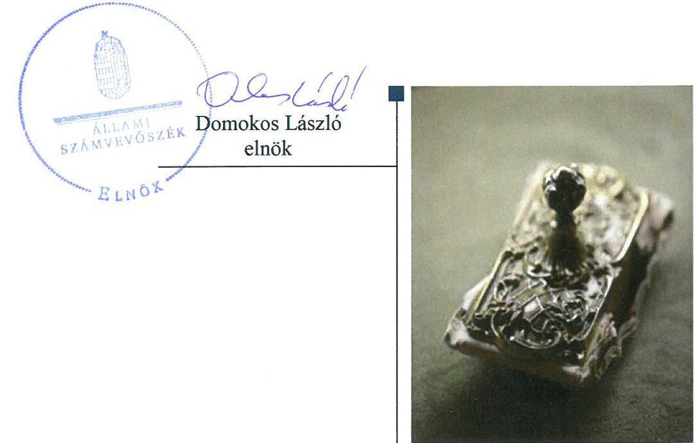
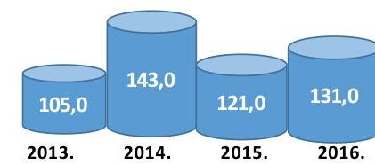

# Jelentés 

## Az önkormányzatok gazdasági társaságai

Az önkormányzatok többségi tulajdonában lévő gazdasági társaságok gazdálkodásának ellenőrzése - Tiszaújvárosi Városgazda Közhasznú Foglalkoztatási Nonprofit Kft. 2018.

---

# Jelentés 

## Az önkormányzatok gazdasági társaságai

Az önkormányzatok többségi tulajdonában lévő gazdasági társaságok gazdálkodásának ellenőrzése - Tiszaújvárosi Városgazda Közhasznú Foglalkoztatási Nonprofit Kft.
2018. 06. hó 26. nap

---

# AZ ELLENŐRZÉST FELÜGYELTE:

- **KLINGA LÁSZLÓ** felügyeleti vezető
- **AZ ELLENŐRZÉST VEZETTE ÉS A VÉGREHAJTÁSÁÉRT FELELŐS:**
  - **MODER BEATRIX** ellenőrzésvezető
  - **A PROGRAM ÖSSZEÁLLÍTÁSÁÉRT FELELŐS:**
    - **TÓTPÁL SZABOLCS** osztályvezető

**IKTATÓSZÁM:** EL-0570-014/2018

**TÉMASZÁM:** 2447

**ELLENŐRZÉS-AZONOSÍTÓ SZÁM:** V079343

Jelentéseink az Országgyűlés számítógépes hálózatán és az Interneten a www.asz.hu címen is olvashatóak.

---

# TARTALOMJEGYZÉK 

■ ÖSSZEGZÉS ..... 5
■ AZ ELLENŐRZÉS CÉLJA ..... 6
■ AZ ELLENŐRZÉS TERÜLETE ..... 7
■ AZ ELLENŐRZÉS HÁTTERE, INDOKOLTSÁGA ..... 8
■ A JELENTÉS LÉNYEGES KÉRDÉSKÖREI ..... 9
■ AZ ELLENŐRZÉS HATÓKÖRE ÉS MÓDSZEREI ..... 10
■ MEGÁLLAPÍTÁSOK ..... 12
■ JAVASLATOK ..... 15
■ MELLÉKLETEK ..... 17
I. sz. melléklet: Értelmező szótár ..... 17
II. sz. melléklet: A Társaság főbb mérlegadatai a 2013-2016. években (M Ft) ..... 18
■ FÜGGELÉK: ÉSZREVÉTELEK ..... 19
■ RÖVIDÍTÉSEK JEGYZÉKE ..... 21

---

.

---

# ÖSSZEGZÉS 

A Tiszaújvárosi Városgazda Közhasznú Foglalkoztatási Nonprofit Kft. feletti tulajdonosi joggyakorlás kereteinek kialakításával és szabályszerű gyakorlásával Tiszaújváros Város Önkormányzata megteremtette a Társaság szabályszerű, átlátható működésének feltételeit. A Társaság szabályozottsága, gazdálkodása és vagyongazdálkodási tevékenysége megfelelt a jogszabályi előírásoknak, ezzel biztosította az átláthatóságot és elszámoltathatóságot.

## Az ellenőrzés társadalmi indokoltsága

Magyarországon az intézmény-centrikus közfeladat-ellátás jellemző, de egyre jelentősebb a költségvetésen kívüli feladatellátás térnyerése. Helyi szinten ennek legfontosabb szereplői az önkormányzati tulajdonban lévő gazdasági társaságok, amelyeknek ellenőrzése kiemelten fontos a közfeladat ellátása és a közvagyon megőrzése, megóvása érdekében. Ezért alapvető követelmény, hogy a társaságok gazdálkodása, működése szabályszerű és átlátható legyen. Az ellenőrzés rendet, a rend értéket teremt.

A Tiszaújvárosi Városgazda Közhasznú Foglalkoztatási Nonprofit Kft. ellenőrzésére a lakosság széles rétegét érintő feladatellátására tekintettel került sor az Állami Számvevőszék Stratégiájában megfogalmazott célokkal összhangban.

## Főbb megállapítások, következtetések

Az Önkormányzat a Társaság feletti tulajdonosi joggyakorlásának kereteit a jogszabályoknak megfelelően alakította ki, tulajdonosi jogait szabályszerűen gyakorolta, a Társaság feladatellátásához kapcsolódó rendeletalkotási, illetve díjmegállapítási kötelezettségnek eleget tett.

A Társaság a gazdálkodással kapcsolatos számviteli szabályozását kialakította, megteremtve ezzel a szabályszerű könyvvezetés feltételeit, azonban a Számlarend nem tartalmazta a jogszabályban előírt valamennyi tartalmi elemet. A bevételek és a ráfordítások elszámolása, a tervezési, beszámolási kötelezettségek teljesítése a jogszabályi előírásokkal és a tulajdonosi elvárásokkal összhangban történt.

A Társaság a vagyonával felelősen gazdálkodott, a mérlegben kimutatott eszközöket és forrásokat szabályszerű leltárral támasztotta alá. A közérdekű adatok szabályszerű közzétételével biztosították a gazdálkodás nyilvánosságát és átláthatóságát, azonban a közzététel rendjét szabályzatban nem rögzítették.

---

# AZ ELLENŐRZÉS CÉLJA 

AZ ELLENŐRZÉS CÉLJA annak értékelése volt, hogy az Önkormányzat vagyongazdálkodási tevékenysége során szabályszerűen gyakorolta-e a tulajdonosi jogait. A Társaság szabályozottsága, gazdálkodása és vagyongazdálkodási tevékenysége, bevételeinek és ráfordításainak elszámolása megfelelt-e a jogszabályi és tulajdonosi előírásoknak. Értékeltük, hogy a Társaság gazdálkodásának a kormányzati szektor hiányára és az államadósságra befolyással bíró elemei a jogszabályi előírásoknak megfeleltek-e.

---

# AZ ELLENŐRZÉS TERÜLETE 

## Tiszaújváros Város Önkormányzata és a kizárólagos tulajdonában lévő Tiszaújvárosi Városgazda Közhasznú Foglalkoztatási Nonprofit Kft.

2. ábra

A foglalkoztatottak átlagos statisztikai létszáma (fő)

Forrás: A Társaság 2013-2016. évi kiegészítő melléklete

TISZAÚJVÁROS VÁROS ÖNKORMÁNY-
ZATA a kizárólagos tulajdonában lévő Tiszaújvárosi Városgazda Közhasznú Foglalkoztatási Nonprofit Korlátolt Felelősségű Társaságot 2008. november 27-én - a Tiszaújvárosi Városgazda Foglalkoztatási Közhasznú Társaság jogutódjaként - alapította.

A tulajdonosi szerkezet az alapítás óta nem változott, a jegyzett tőke összege - változatlanul - 3,0 M Ft volt.

A Társaság ${ }^{1}$ közhasznú jogállású szervezetként működött, főtevékenysége az ellenőrzött időszakban a közterületek ápolása és takarítása, valamint a munkaerőpiacon hátrányos helyzetű tiszaújvárosi lakosok foglalkoztatásának elősegítése volt. A főtevékenység mellett a Közszolgáltatási szerződés ${ }_{1-2}{ }^{2}$-ben előírtak alapján feladatai közé tartozott az Mótv. ${ }^{3}$-ben meghatározott közfeladatok közül az Önkormányzat ${ }^{4}$ által működtetett intézmények épületeinek karbantartása, a köztemetők kialakítása és fenntartása, valamint a piac üzemeltetése.
A Társaság főbb mérlegadatait a 2013-2016. években a II. számú melléklet tartalmazza.

A Társaság vagyonkezelésbe vett vagyonnal az ellenőrzött időszakban nem rendelkezett, saját vagyona mellett a feladat ellátásához szükséges eszközöket az Önkormányzat - használatba adási szerződések útján - üzemeltetésre ingyenesen bocsátotta rendelkezésére. A feladatok ellátására az Önkormányzat 2013-ban 413,4 M Ft, 2014-ben 513,2 M Ft, 2015-ben 607,4 M Ft, 2016-ban 585,5 M Ft támogatást nyújtott.

A Társaságnak az ellenőrzött években jelzáloggal, illetve egyéb joggal biztosított kötelezettsége, Gst. ${ }^{5}$ szerinti adósságot keletkeztető ügylete nem volt. Az ellenőrzött években 1,0 M Ft és 1,3 M Ft közötti pozitív eredményeket értek el, amelyeket eredménytartalékba helyeztek, így a saját tőke összege a 2013. évi 6,7 M Ft-ról a 2016. év végére 10,5 M Ft-ra emelkedett.

Az ellenőrzött időszakban a Társaság ügyvezetőjének ${ }^{6}$ és a polgármester ${ }^{7}$ személyében változás nem történt, a jegyző ${ }^{8}$ személye 2014. december 1-jétől változott. Az éves beszámolók adatai alapján a Társaság más gazdasági társaságban tulajdonosi részesedéssel nem rendelkezett, továbbá a Számv. tv. ${ }^{9}$ előírásai alapján az önköltség-számítási szabályzat elkészítésének kötelezettsége alól mentesült.

A Társaság az NGM közlemények ${ }^{10}$ alapján 2013. június 28-ától kormányzati szektorba sorolt szervezetnek minősült.

---

# AZ ELLENŐRZÉS HÁTTERE, INDOKOLTSÁGA 

AZ ÖNKORMÁNYZATOK TÖBBSÉGI TULAJDONÁBAN ÁLLÓ GAZDASÁGI TÁRSASÁGOK ellenőrzése kiemelten fontos a vagyon megőrzése, megóvása érdekében. Alapvető követelmény, hogy gazdálkodásuk, működésük szabályszerű, és az általuk szolgáltatott adatok megbízhatóak legyenek. A feladatellátás költségeinek, ráfordításainak alakulása a lakosság széles rétegét érinti.

Az ÁSZ ${ }^{11}$ ellenőrzései feltárhatják, hogy az önkormányzat a feladatellátásához rendelt vagyon működtetését a tulajdonostól elvárható gondossággal végezte-e, a feladatot ellátó gazdasági társasággal a létesítő okiratban, szolgáltatási szerződésben foglaltakat betartatta-e, a társaság betartotta-e.

Az ellenőrzés eredményeképp meghatározhatóvá válnak a költségvetési hiányt befolyásoló szervezetek kockázatai, lehetővé válik ezen kockázatok csökkentése. Az ellenőrzés rávilágíthat arra, hogy a gazdasági társaság a vagyon használatával biztosította-e a szolgáltatás folytatásának feltételeit, az önkormányzat tulajdonosi felügyelete hozzájárult-e a szabályszerű gazdálkodáshoz és feladatellátáshoz. A megállapítások alapján megfogalmazott számvevőszéki javaslatok hasznosítása elősegítheti a meglévő hibák megszüntetését. A jó gyakorlatok bemutatásával az ÁSZ hozzájárulhat a követendő megoldások megismertetéséhez, terjesztéséhez.

---

# A JELENTÉS LÉNYEGES KÉRDÉSKÖREI 

1. Az Önkormányzat tulajdonosi joggyakorlása szabályszerű volt-e?
2. A Társaság szabályozottsága, bevételeinek, ráfordításainak elszámolása és vagyongazdálkodási tevékenysége szabályszerű volt-e?

---

# AZ ELLENŐRZÉS HATÓKÖRE ÉS MÓDSZEREI 

## Az ellenőrzés típusa

Megfelelőségi ellenőrzés.

## Az ellenőrzött időszak

Az ellenőrzött időszak 2013. január 1-jétől 2016. december 31-ig tartott.

## Az ellenőrzés tárgya

Tiszaújváros Város Önkormányzata kizárólagos tulajdonában lévő Tiszaújvárosi Városgazda Közhasznú Foglalkoztatási Nonprofit Kft. feletti tulajdonosi joggyakorlása, valamint a Tiszaújvárosi Városgazda Közhasznú Foglalkoztatási Nonprofit Kft. gazdálkodásának szabályozottsága és szabályszerűsége.

Az ellenőrzés kiterjed minden olyan körülményre és adatra, amely az ÁSZ jogszabályban meghatározott feladatainak teljesítéséhez, valamint a program végrehajtása folyamán felmerült újabb összefüggések feltárásához szükséges.

## Az ellenőrzött szervezet

Tiszaújváros Város Önkormányzata
Tiszaújvárosi Városgazda Közhasznú Foglalkoztatási Nonprofit Kft.

## Az ellenőrzés jogalapja

Az ellenőrzés jogszabályi alapját az ÁSZ tv. ${ }^{12}$ 1. § (3) bekezdése és 5. § (3)-(4)-(5) bekezdései képezték.

## Az ellenőrzés módszerei

Az ellenőrzést a nemzetközi standardokat irányadónak tekintve az ellenőrzési program ellenőrzési kérdései, az ellenőrzött időszakban hatályos jogszabályok, az ellenőrzés szakmai szabályok és módszertanok figyelembe vételével végeztük.

Az ellenőrzés ideje alatt az ellenőrzött szervezettel történő kapcsolattartást az ÁSZ Szervezeti és Működési Szabályzatának vonatkozó előírásai alapján biztosítottuk.

---

Az ellenőrzési kérdések megválaszolásához szükséges bizonyítékok megszerzése a következő ellenőrzési eljárások alkalmazásával történt: megfigyelés, kérdésfeltevés (információkérés), összehasonlítás, valamint elemzés. Az ellenőrzési bizonyítékként felhasználható adatforrások közé tartoznak egyrészt az ellenőrzési programban felsorolt adatforrások, másrészt adatforrás minden - az ellenőrzés során - feltárt, az ellenőrzés szempontjából információkat tartalmazó dokumentum.

Az ellenőrzést a kérdésekre adott válaszok kiértékelésével, valamint a megjelölt adatforrások, a csatolt tanúsítványok felhasználásával, továbbá az adott időszakban hatályos jogszabályok figyelembe vételével folytattuk le.

A bevételek és ráfordítások elszámolása, valamint a vagyonnyilvántartás terén a szabályszerű működést véletlen mintavétellel és irányított kiválasztással ellenőriztük. A jogszabályoknak és a belső előírásoknak megfelelőnek, azaz szabályszerűnek tekintettük az adott területet, amennyiben a minta ellenőrzésének eredménye alapján 95%-os bizonyossággal a teljes sokaságban a hibaarány kisebb volt, mint 10%, nem megfelelőnek értékeltük, ha a hibaarány a 10%-ot meghaladta. A ráfordítások elszámolására és a vagyonnyilvántartásra vonatkozó véletlen mintavételt kockázati alapú kiválasztással egészítettük ki, amelynek során évente a három legnagyobb összegű tételt választottuk ki.

---

# 1. Az Önkormányzat tulajdonosi joggyakorlása szabályszerű volt-e? 

Összegző megállapítás

A tulajdonosi joggyakorlás kereteinek kialakítása és a Társaság feletti tulajdonosi jogok gyakorlása szabályszerű volt.

A TULAJDONOSI JOGGYAKORLÁS SZABÁLYAIT az Önkormányzat a Vagyonrendelet ${ }_{1-2}{ }^{13}$-ben határozta meg. Az Alapító okirat ${ }_{1-5}{ }^{14}$-ben rögzítették - a Gt. ${ }^{15}$ és a Ptk. ${ }^{16}$ előírásaival összhangban - az Alapító ${ }^{17}$ kizárólagos hatáskörébe tartozó feladatokat.

Az Alapító a Taktv. ${ }^{18}$ előírásának megfelelően három tagból álló FB${ }^{19}$ létrehozásáról rendelkezett. A Társaság az ellenőrzött években a Számv. tv.ben foglaltak alapján könyvvizsgálatra volt kötelezett, a könyvvizsgáló személyét, megbízatásának időtartamát, kötelezettségeit az Alapító okirat ${ }_{1-5}$ tartalmazta.

A Gazdasági program ${ }_{1-2}{ }^{20}$-ben az Mötv.-ben foglaltakkal összhangban meghatározták a Társaság feladatellátásához kapcsolódó középtávú fejlesztési elképzeléseket.

A Közszolgáltatási szerződés ${ }_{1-2}$-ben rögzítették a Társaság által ellátandó feladatokat, az ellátási területet, az adatszolgáltatási, tájékoztatási kötelezettségek módját és gyakoriságát, valamint a használatba adási szerződésekben az üzemeltetésre átadott vagyon működtetésével, fenntartásával, visszaszolgáltatásával kapcsolatos kötelezettségeket. A részletes előírások biztosították a számonkérhetőséget, erősítve a tulajdonosi kontrollt.

A Társaság által ellátott temetőüzemeltetési feladatokhoz kapcsolódó rendeletalkotási és díj megállapítási kötelezettségét az Önkormányzat teljesítette, továbbá a piac üzemeltetéssel kapcsolatos díjtételeket megállapította.

A Javadalmazási szabályzat ${ }_{1-2}$-t ${ }^{21}$ a Taktv.-ben előírtaknak megfelelően az Alapító megalkotta.

A TULAJDONOSI JOGOK GYAKORLÁSA során az Alapító a Gt. és a Ptk. előírásával összhangban kijelölte a könyvvizsgálót és az FB tagjait, valamint az FB és a könyvvizsgáló írásos jelentésének birtokában döntött a Társaság 2013-2016. éves egyszerűsített éves beszámolójának és közhasznúsági mellékletének elfogadásáról.

Az Önkormányzat belső ellenőrzése az Áht. ${ }^{22}$-ban foglalt lehetőséggel élve a 2013. és a 2016. évben ellenőrizte a Társaság gazdálkodását. A számviteli rend és a bizonylati fegyelem, valamint a köztemető fenntartásával kapcsolatos ellenőrzések során feltárt hiányosságok megszüntetését célzó javaslatokra az ügyvezető intézkedési terveket készített, az abban vállalt feladatok végrehajtásáról a tulajdonos felé beszámolt.

---

# 2. A Társaság szabályozottsága, bevételeinek, ráfordításainak elszámolása és vagyongazdálkodási tevékenysége szabályszerű volt-e? 

Összegző megállapítás

A Társaság szabályozottsága, bevételeinek és ráfordításainak elszámolása, valamint vagyongazdálkodási tevékenysége szabályszerű volt.
2.1. számú megállapítás

A Társaság gazdálkodásának szabályozottsága megfelelt a jogszabályi előírásoknak. A bevételek és ráfordítások elszámolása szabályszerű volt.

A GAZDÁLKODÁS SZABÁLYOZÁSA keretében a Társaság rendelkezett a Számv. tv. előírásainak megfelelő, aktualizált Számviteli politikával ${ }^{23}$, Leltározási és leltárkészítési szabályzattal ${ }^{24}$, Értékelési szabályzattal ${
 }^{25}$, valamint Pénzkezelési szabályzattal ${ }^{26}$.

A Társaság a Számviteli politika részeként elkészített Számlarendben ${ }^{27}$ rögzítette a közhasznú és vállalkozási tevékenységből származó bevételek és ráfordítások elkülönített nyilvántartására vonatkozó előírást.

A Számv. tv. 161. § (2) bekezdés b) pontjában előírtak közül a Számlarend azonban nem tartalmazta a számla értékének növekedés, csökkenés jogcímeit, a számlát érintő gazdasági eseményeket és azok más számlával való kapcsolatát.

A BEVÉTELEK ÉS RÁFORDÍTÁSOK elszámolása megfelelt a Számv. tv. előírásainak. Az elszámolást alátámasztó dokumentumok rendelkezésre álltak, a közhasznú és vállalkozási tevékenység bevételeit és ráfordításait elkülönítve, a megfelelő főkönyvi számlákra szabályosan számolták el. A Társaság a szolgáltatási díjak meghatározása során betartotta az önkormányzati rendeletben és határozatban foglaltakat.

A személyi jellegű ráfordítások elszámolását szabályos munkaszerződések alapozták meg, a cafeteria juttatás szabályszerű kifizetéséhez szükséges munkavállalói nyilatkozatok rendelkezésre álltak.

AZ ÉRTÉKCSÖKKENÉSI LEÍRÁS elszámolása szabályszerű volt. A terv szerinti értékcsökkenés elszámolására a Számv. tv. és a belső szabályozásnak megfelelően az üzembe helyezés napjától, lineáris leírással került sor.
2.2. számú megállapítás

A Társaság vagyongazdálkodása megfelelt a jogszabályi rendelkezéseknek.

A VAGYON NYILVÁNTARTÁSA megfelelt a jogszabályi előírásoknak. A Társaság a tárgyi eszközök aktiválását üzembe helyezési jegyzőkönyvvel, állományba vételi bizonylattal dokumentálta, az eszközök besorolása, bekerülési értékének meghatározása a Számv. tv.-ben foglaltak szerint szabályszerűen történt.

---

2.3. számú megállapítás

A leltározást a Számv. tv.-ben foglaltakkal összhangban szabályszerűen végrehajtották. Az éves beszámolók mérlegadatait tételesen, mennyiségben és értékben ellenőrizhető módon tartalmazó leltárral támasztották alá.

A vagyon értékének megőrzése, gyarapítása a Társaságnál biztosított volt, az ellenőrzött időszakban elszámolt 38,2 M Ft értékcsökkenéssel szemben 68,9 M Ft értékű beruházás történt.

A Társaság a tervezési, beszámolási és közzétételi kötelezettségét szabályszerűen teljesítette.

AZ ÉVES ÜZLETI TERVEKET a Társaság az SZMSZ1-3 ${ }^{28}$ előírásának megfelelően elkészítette, azokat az Alapító határozatával elfogadta.

AZ ALAPÍTÓ ÁLTAL JÓVÁHAGYOTT ÉVES
BESZÁMOLÓK, közhasznúsági mellékletek, könyvvizsgálói jelentések közzétételét és letétbe helyezését a Társaság a Számv. tv. előírásainak megfelelően, határidőben teljesítette. Az éves eredményeket a Civil tv. ${ }^{29}$ és az Alapító okirat ${ }_{1-5}$ előírásait betartva eredménytartalékba helyezték, osztalékfizetés nem történt.

A Társaság a Bkr. ${ }^{30}$ előírásának megfelelően a szervezet tevékenységének, a célok megvalósításának nyomon követését biztosító rendszert az operatív tevékenység folyamatos nyomon követésével - negyedéves kontrolling jelentések készítésével - kialakította.

A KÖTELEZŐEN KÖZZÉTEENDŐ KÖZÉRDEKŰ ADATOK közzétételének rendjét az Infotv. ${ }^{31}$ 35. § (3) bekezdésében foglalt előírások ellenére a Társaság nem szabályozta. A Taktv.-ben, valamint az Infotv.-ben előírt közzétételi kötelezettségét a Társaság teljesítette, a közérdekből nyilvános adatainak megismerhetőségét, hozzáférhetőségét internetes honlapján biztosította.

---

# JAVASLATOK 

Az ÁSZ tv. 33. § (1) bekezdésében foglaltak értelmében az ellenőrzött szervezet vezetője köteles a jelentésben foglalt megállapításokhoz kapcsolódó intézkedési tervet összeállítani és azt a jelentés kézhezvételétől számított 30 napon belül az ÁSZ részére megküldeni. Amennyiben az ellenőrzött szervezet vezetője nem küldi meg határidőben az intézkedési tervet, vagy továbbra sem elfogadható intézkedési tervet küld, az Állami Számvevőszék elnöke az ÁSZ tv. 33. § (3) bekezdése a) és b) pontjaiban foglaltakat érvényesítheti.

## Tiszaújvárosi Városgazda Közhasznú Foglalkoztatási Nonprofit Kft. ügyvezetőjének

1. Intézkedjen arról, hogy a számlarend a jogszabályi rendelkezéseknek megfelelően tartalmazza a számla értéke növekedésének, csökkenésének jogcímeit, a számlát érintő gazdasági eseményeket és azok más számlákkal való kapcsolatát.
(2.1. sz. megállapítás 3. bekezdése alapján)
2. Intézkedjen a jogszabályban foglaltak alapján, a kötelezően közzéteendő közérdekű adatok közzétételének rendjét rögzítő szabályzat elkészítéséről.
(2.3. sz. megállapítás 4. bekezdés 1. mondata alapján)

---

.

---

# MELLÉKLETEK 

- I. SZ. MELLÉKLET: ÉRTELMEZŐ SZÓTÁR
belső ellenőrzés
gazdasági társaság
kormányzati szektorba sorolt egyéb szervezet
tulajdonosi joggyakorló
vagyongazdálkodás

Független, tárgyilagos bizonyosságot adó és tanácsadó tevékenység, amelynek célja, hogy az ellenőrzött szervezet működését fejlessze és eredményességét növelje, az ellenőrzött szervezet céljai elérése érdekében rendszerszemléletű megközelítéssel és módszeresen értékeli, illetve fejleszti az ellenőrzött szervezet irányítási és belső kontrollrendszerének hatékonyságát. (Forrás: Bkr. 2. § b) pontja)" Ptk. 3:88. § (1) bekezdése szerint „a gazdasági társaságok üzletszerű közös gazdasági tevékenység folytatására, a tagok vagyoni hozzájárulásával létrehozott, jogi személyiséggel rendelkező vállalkozások, amelyekben a tagok a nyereségből közösen részesednek, és a veszteséget közösen viselik".
Az Áht. 1. § 12. pontja értelmében az a szervezet, amely az Áht. alapján nem része az államháztartásnak, azonban az Európai Közösséget létrehozó szerződéshez csatolt, a túlzott hiány esetén követendő eljárásról szóló jegyzőkönyv alkalmazásáról szóló 2009. május 25-i 479/2009/EK rendelet szerint a kormányzati szektorba tartozik és a szervezet megnevezését az államháztartásért felelős miniszter a Hivatalos Értesítőben és a Kormány honlapján közzétette.
Aki a nemzeti vagyon felett az államot vagy a helyi önkormányzatot megillető tulajdonosi jogok és kötelezettségek összességének gyakorlására jogosult. (Forrás: Nvtv. 32 3. § (1) bekezdés 17. pontja)
A nemzeti vagyongazdálkodás feladata a nemzeti vagyon rendeltetésének megfelelő, az állam, az önkormányzat mindenkori teherbíró képességéhez igazodó, elsődlegesen a közfeladatok ellátásához és a mindenkori társadalmi szükségletek kielégítéséhez szükséges, egységes elveken alapuló, átlátható, hatékony és költségtakarékos működtetése, értékének megőrzése, állagának védelme, értéknövelő használata, hasznosítása, gyarapítása, továbbá az állam vagy a helyi önkormányzat feladatának ellátása szempontjából feleslegessé váló vagyontárgyak elidegenítése. (Forrás: Nvtv. 7. § (2) bekezdése)

---

II. SZ. MELLÉKLET: A TÁRSASÁG FŐBB MÉRLEGADATAI A 2013-2016. ÉVEKBEN (M FT)

| Megnevezés | 2013. 12. 31. | 2014. 12. 31. | 2015. 12. 31. | 2016. 12. 31. |
| :--: | :--: | :--: | :--: | :--: |
| Befektetett eszközök | 42,7 | 40,6 | 87,8 | 77,5 |
| - ebből: Immateriális javak | - | - | - | - |
| - ebből: Tárgyi eszközök | 42,7 | 40,6 | 87,8 | 77,5 |
| Forgó eszközök | 87,5 | 117,3 | 74,1 | 75,2 |
| - ebből: Követelések | 10,6 | 2,0 | 1,0 | 1,4 |
| - ebből: Pénzeszközök | 62,3 | 93,1 | 47,0 | 52,6 |
| Aktív időbeli elhatárolások | 6,0 | 0,3 | 0,4 | 0,4 |
| ESZKÖZÖK ÖSSZESEN | 136,2 | 158,2 | 162,3 | 153,1 |
| Saját tőke | 6,7 | 8,0 | 9,2 | 10,5 |
| - ebből: Jegyzett tőke | 3,0 | 3,0 | 3,0 | 3,0 |
| - ebből: Adózott eredmény | 1,0 | 1,3 | 1,2 | 1,3 |
| Kötelezettségek | 51,9 | 21,6 | 39,8 | 38,7 |
| - ebből Hosszú lejáratú kötelezettségek | - | - | - | - |
| - ebből: Rövid lejáratú kötelezettségek | 51,9 | 21,6 | 39,8 | 38,7 |
| Passzív időbeli elhatárolások | 77,6 | 128,6 | 113,3 | 103,9 |
| FORRÁSOK ÖSSZESEN | 136,2 | 158,2 | 162,3 | 153,1 |

Forrás: Társaság 2013-2016. évi beszámolói

---

# FÜGGELÉK: ÉSZREVÉTELEK 

A jelentéstervezetet a Számvevőszék 15 napos észrevételezésre megküldte az ellenőrzött szervezetek vezetőinek az ÁSZ tv. 29. §* (1) bekezdése előírásának megfelelően.

Tiszaújváros Város Önkormányzat polgármestere és a Tiszaújvárosi Városgazda Közhasznú Foglalkoztatási Nonprofit Kft. ügyvezetője az ÁSZ tv. 29. § (2) bekezdésében foglalt észrevételezési jogával nem élt, írásban jelezte, hogy észrevételt nem tesz.

[^0]
[^0]:    * 29. § (1) Az Állami Számvevőszék az ellenőrzési megállapításait megküldi az ellenőrzött szervezet vezetőjének vagy az általa megbízott személynek, és annak, akinek személyes felelősségét állapította meg.
    (2) Az ellenőrzött szervezet vezetője és a felelősként megjelölt személy az ellenőrzés megállapításaira tizenöt napon belül írásban észrevételt tehet.
    (3) Az Állami Számvevőszék az észrevételre a beérkezésétől számított harminc napon belül írásban válaszol. A figyelembe nem vett észrevételeket köteles a jelentésben feltüntetni, és megindokolni, hogy azokat miért nem fogadta el.

---

.

---

# RÖVIDÍTÉSEK JEGYZÉKE 

${ }^{1}$ Társaság
${ }^{2}$ Közszolgáltatási szerződés ${ }_{1-2}$
${ }^{3}$ Mötv.
${ }^{4}$ Önkormányzat
${ }^{5}$ Gst.
${ }^{6}$ ügyvezető
${ }^{7}$ polgármester
${ }^{8}$ jegyző
${ }^{9}$ Számv. tv.
${ }^{10}$ NGM közlemények
${ }^{11}$ ÁSZ
${ }^{12}$ ÁSZ tv.
${ }^{13}$ Vagyonrendelet ${ }_{1-2}$
${ }^{14}$ Alapító okirat ${ }_{1-5}$
${ }^{15}$ Gt.
${ }^{16}$ Ptk.
${ }^{17}$ Alapító

Tiszaújvárosi Városgazda Közhasznú Foglalkoztatási Nonprofit Korlátolt Felelősségű Társaság
Közszolgáltatási szerződés1: A Képviselő-testület XI/429/2012.80/Ökth. 1./ pont mellékleteként elfogadott 2012. május 31-én kelt Támogatási keretszerződés (hatályos 2014. május 6-ig)
Közszolgáltatási szerződés2: A Képviselő-testület 67/2014. (IV. 24.) Ökt. határozat 2. mellékleteként elfogadott 2014. május 7-én kelt Közszolgáltatási szerződés (hatályos 2014. május 7-től)
2011. évi CLXXXIX. törvény Magyarország helyi önkormányzatairól (hatályos 2012. január 1-jétől) Tiszaújváros Város Önkormányzata
2011. évi CXCIV. törvény Magyarország gazdasági stabilitásáról (hatályos 2011. december 31-től) Tiszaújvárosi Városgazda Közhasznú Foglalkoztatási Nonprofit Kft. ügyvezetője
Tiszaújváros Város Önkormányzat polgármestere
Tiszaújvárosi Polgármesteri Hivatal jegyzője
2000. évi C. törvény a számvitelről (hatályos 2001. január 1-jétől)

Nemzetgazdasági Minisztérium közleményei a kormányzati szektorba sorolt egyéb szervezetekről (hivatalos értesítő 2013/32. hatályos 2013. június 28-ától; hivatalos értesítő 2013/60. hatályos 2013. december 16-ától, valamint hivatalos értesítő 2015/66. hatályos 2015. december 30-ától)
Állami Számvevőszék
2011. évi LXVI. törvény az Állami Számvevőszékről (hatályos 2011. július 1-jétől)

Vagyonrendelet1: Tiszaújváros Város Önkormányzata Képviselő-testületének 15/1998. (VI. 15.); 14/1999. (V. 17.); 8/2000. (II. 29); 33/2001. (X. 31.); 10/2003. (V. 01.); 11/2004. (V. 01.); 26/2004. (VII. 01.); 35/2005. (XII. 23.); 26/2006. (VII. 07.); 46/2006. (XII. 08.); 11/2007. (II. 23.); 17/2010. (IX. 10.); 22/2010. (XII. 03.); 4/2012. (III. 02); 12/2012. (V. 04.) rendeletekkel módosított 5/1998. (IV. 10.) sz. rendelete az Önkormányzat vagyonáról, a vagyonhasznosítás rendjéről és a vagyontárgyak feletti tulajdonosi jogok gyakorlásának szabályairól (hatályos 2014. január 31-ig)
Vagyonrendelet2: Tiszaújváros Város Önkormányzata Képviselő-testületének 41/2013. (XII.21.) önkormányzati rendelete Tiszaújváros Város Önkormányzatának vagyonáról, a vagyongazdálkodás szabályairól (hatályos 2014. február 1-jétől)
Alapító okirat3: Tiszaújvárosi Városgazda Közhasznú Foglalkoztatási Nonprofit Kft. 2012. október 25-én kelt alapító okirata módosításokkal egységes szerkezetben (hatályos 2014. április 23-ig)
Alapító okirat2: Tiszaújvárosi Városgazda Közhasznú Foglalkoztatási Nonprofit Kft. 2014. április 24-én kelt alapító okirata módosításokkal egységes szerkezetben (hatályos 2015. június 24-ig)
Alapító okiratı: Tiszaújvárosi Városgazda Közhasznú Foglalkoztatási Nonprofit Kft. 2015. június 25-én kelt alapító okirata módosításokkal egységes szerkezetben (hatályos 2016. február 24-ig)
Alapító okiratı: Tiszaújvárosi Városgazda Közhasznú Foglalkoztatási Nonprofit Kft. 2016. február 25-én kelt alapító okirata módosításokkal egységes szerkezetben (hatályos 2016. november 23-ig)
Alapító okiratı: Tiszaújvárosi Városgazda Közhasznú Foglalkoztatási Nonprofit Kft. 2016. november 24-én kelt alapító okirata módosításokkal egységes szerkezetben (hatályos 2016. november 24-től)
2006. évi IV. törvény a gazdasági társaságokról (hatályos 2014. március 14-ig)
2013. évi V. törvény a Polgári Törvénykönyvről (hatályos 2014. március 15-étől)

Tiszaújváros Város Önkormányzat Képviselő-testülete, mint a Tiszaújvárosi Városgazda
Közhasznú Foglalkoztatási Nonprofit Kft. legfőbb szerve

---

${ }^{18}$ Taktv.
${ }^{19}$ FB
${ }^{20}$ Gazdasági program ${ }_{1-2}$
${ }^{21}$ Javadalmazási szabályzat ${ }_{1-2}$
${ }^{22}$ Áht.
${ }^{23}$ Számviteli politika
${ }^{24}$ Leltározási és leltárkészítési szabályzat
${ }^{25}$ Értékelési szabályzat
${ }^{26}$ Pénzkezelési szabályzat ${ }_{1-3}$
${ }^{27}$ Számlarend
${ }^{28}$ SZMSZ ${ }_{1-3}$
${ }^{29}$ Civil tv.
${ }^{30}$ Bkr.
${ }^{31}$ Infotv.
${ }^{32}$ Nvtv.
2009. CXXII. törvény a köztulajdonban álló gazdasági társaságok takarékosabb működéséről (hatályos 2009. október 3-tól)
Tiszaújvárosi Városgazda Közhasznú Foglalkoztatási Nonprofit Kft. felügyelő-bizottsága
Gazdasági program1: Tiszaújváros Önkormányzat Képviselő-testületének I/100/2011.33/Ökth.

 határozatával elfogadott Tiszaújváros Önkormányzata Képviselőtestületének 2011-2014. évi Gazdasági programja
Gazdasági program2: Tiszaújváros Város Önkormányzata Képviselő-testületének 64/2015. (IV. 16.) számú határozatával elfogadott Tiszaújváros Város Önkormányzata Képviselőtestületének Gazdasági Programja 2014-2019.
Javadalmazási szabályzat ${ }_{1}$ : Tiszaújváros Város Önkormányzata Képviselő-testületének I/174/2011. 57/Ökth. határozatával jóváhagyott Javadalmazási szabályzat (hatályos 2013. március 27-ig)
Javadalmazási szabályzat2: Tiszaújváros Város Önkormányzata Képviselő-testületének IX/313/2013. 49/Ökt. határozatával jóváhagyott Javadalmazási szabályzat (hatályos 2013. március 28-tól)
2011. évi CXCV. törvény az államháztartásról (hatályos 2012. január 1-jétől)
Tiszaújvárosi Városgazda Közhasznú Foglalkoztatási Nonprofit Kft. Számviteli Politika (hatályos 2012. július 1-jétől, módosítva 2014. június 25-én, 2015. június 10-én, 2016. július 20-án és 2016. november 3-án)
Tiszaújvárosi Városgazda Közhasznú Foglalkoztatási Nonprofit Kft. Eszközök és források
leltárkészítése és leltározási szabályzat (hatályos 2009. február 1-jétől, módosítva 2010. december 1-jén, 2012. június 15-én, 2012. december 10-én és 2016. november 8-án)
Tiszaújvárosi Városgazda Közhasznú Foglalkoztatási Nonprofit Kft. Eszközök és források értékelési szabályzat (hatályos 2009. február 1-jétől, módosítva 2012. június 15-én és 2016. november 8-án)
Tiszaújvárosi Városgazda Közhasznú Foglalkoztatási Nonprofit Kft. Pénzkezelési szabályzat (hatályos 2011. február 7-étől, módosítva 2011. június 7-én, 2011. november 18-án, 2012. június 15-én, 2012. december 10-én, 2013. június 5-én, 2013. szeptember 30-án, 2014. június 25-én, 2015. június 10-én és 2016. november 8-án)
Tiszaújvárosi Városgazda Közhasznú Foglalkoztatási Nonprofit Kft. Számviteli Politika 2. számú melléklete (hatályos 2012. július 1-jétől, módosítva 2015. június 10-én, 2016. július 20-án és 2016. november 3-án)

SZMSZ1: Tiszaújváros Város Önkormányzata Képviselő-testületének XI/833-1/2012. 148/Ökt határozatával jóváhagyott Tiszaújvárosi Városgazda Közhasznú Foglalkoztatási Nonprofit Kft. Szervezeti és Működési Szabályzat (hatályos 2014. november 26-ig)
SZMSZ2: Tiszaújváros Város Önkormányzata Képviselő-testületének 157/2014. (XI. 27.) határozatával jóváhagyott Tiszaújvárosi Városgazda Közhasznú Foglalkoztatási Nonprofit Kft. Szervezeti és Működési Szabályzat (hatályos 2016. november 23-ig)
SZMSZ3: Tiszaújváros Város Önkormányzata Képviselő-testületének 181/2016. (XI. 24.) határozatával jóváhagyott Tiszaújvárosi Városgazda Közhasznú Foglalkoztatási Nonprofit Kft. Szervezeti és Működési Szabályzat (hatályos 2016. november 24-től)
2011. évi CLXXV. törvény az egyesülési jogról, a közhasznú jogállásról, valamint a civil szervezetek működéséről és támogatásáról (hatályos 2011. december 22-től)
370/2011. (XII. 31.) Korm. rendelet a költségvetési szervek belső kontrollrendszeréről és belső ellenőrzéséről (hatályos 2012. január 1-jétől)
2011. évi CXII. törvény az információs önrendelkezési jogról és az információszabadságról (hatályos 2011. július 27-től)
2011. évi CXCVI. törvény a nemzeti vagyonról (hatályos 2012. január 1-jétől)

---

# ÁLLAMI SZÁMVEVŐSZÉK 

1052 Budapest, Apáczai Csere János utca 10.
Levélcím: 1364 Budapest 4. Pf. 54
Telefon: +36 14849100 Telefax: +36 14849200
www.asz.hu
