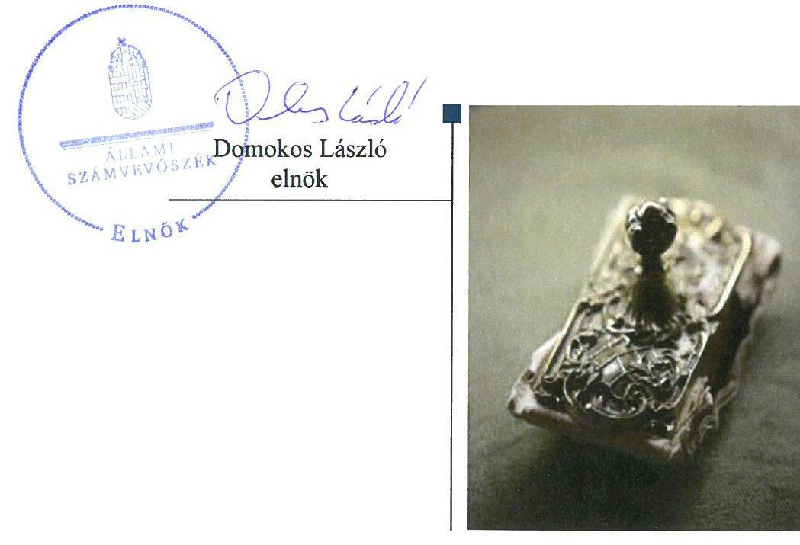
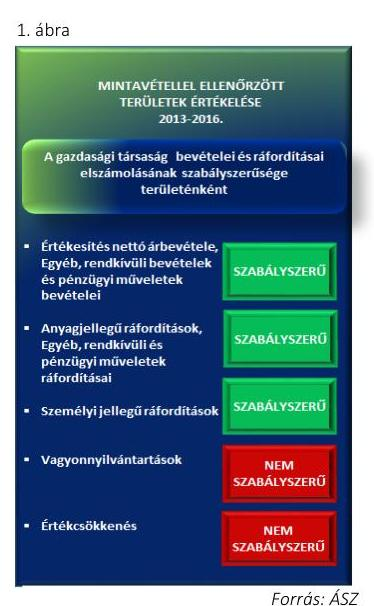
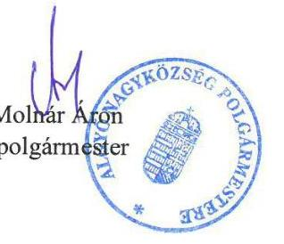
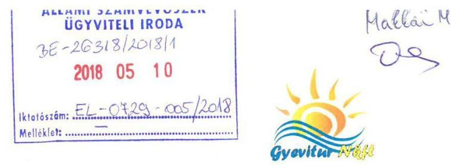
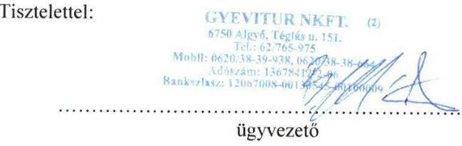
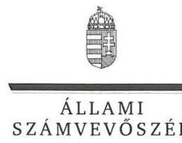
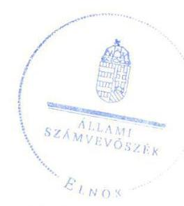

# Jelentés 

## Az önkormányzatok gazdasági társaságai

Az önkormányzatok többségi tulajdonában lévő gazdasági társaságok gazdálkodásának ellenőrzése - GYEVITUR Algyői Vendégház és Turisztikai Nonprofit Kft.
2018.

---

# Jelentés 

## Az önkormányzatok gazdasági társaságai

Az önkormányzatok többségi tulajdonában lévő gazdasági társaságok gazdálkodásának ellenőrzése - GYEVITUR Algyői Vendégház és Turisztikai Nonprofit Kft.
2018. Június hó 5. nap

---

# AZ ELLENŐRZÉST FELÜGYELTE:

## MAKKAI MÁRIA felügyeleti vezető

## AZ ELLENŐRZÉST VEZETTE ÉS A VÉGREHAJTÁSÁÉRT FELELŐS:

### SALI SÁNDORNÉ ellenőrzésvezető

## A PROGRAM ÖSSZEÁLLÍTÁSÁÉRT FELELŐS:

### TÓTPÁL SZABOLCS osztályvezető

IKTATÓSZÁM: EL-0161-065/2018.

TÉMASZÁM: 2447

ELLENŐRZÉS-AZONOSÍTÓ SZÁM: V079351

Jelentéseink az Országgyűlés számítógépes hálózatán és az Interneten a www.asz.hu címen is olvashatóak.

---

# TARTALOMJEGYZÉK 

■ ÖSSZEGZÉS ..... 5
■ AZ ELLENŐRZÉS CÉLJA ..... 6
■ AZ ELLENŐRZÉS TERÜLETE ..... 7
■ AZ ELLENŐRZÉS HÁTTERE, INDOKOLTSÁGA ..... 8
■ A JELENTÉS LÉNYEGES KÉRDÉSKÖREI ..... 9
■ AZ ELLENŐRZÉS HATÓKÖRE ÉS MÓDSZEREI ..... 10
■ MEGÁLLAPÍTÁSOK ..... 12
■ JAVASLATOK ..... 15
■ MELLÉKLETEK ..... 17
I. sz. melléklet: Értelmező szótár ..... 17
II. sz. melléklet: a Társaság mérleg szerinti kötelezettségeinek alakulása 2013-2016. években (M Ft) ..... 19
III. sz. melléklet: A Társaság bevételeinek, ráfordításainak, valamint adózott eredményének alakulása 2013-2016 között (adatok M Ft) ..... 20
■ FÜGGELÉK: ÉSZREVÉTELEK ..... 21
■ RÖVIDÍTÉSEK JEGYZÉKE ..... 29

---

.

---

# ÖSSZEGZÉS 

A GYEVITUR Algyői Vendégház és Turisztikai Nonprofit Kft. gazdálkodásának szabályozottsága, gazdálkodása, vagyongazdálkodási tevékenysége nem volt szabályszerű, így nem biztosította az elszámoltathatóságot és az átláthatóságot.

## Az ellenőrzés társadalmi indokoltsága

Az Állami Számvevőszék kiemelt célja, hogy a helyi önkormányzatok gazdálkodásában rejlő pénzügyi kockázatok feltárásával, az államháztartáson kívülre nyújtott költségvetési támogatások és ingyenes vagyonjuttatások, valamint az államháztartáson kívül működő feladatellátó rendszerek ellenőrzéseivel hozzájáruljon ahhoz, hogy a közpénzeket az államháztartáson kívül működő szervezetek is átlátható, rendezett módon használják fel.

Az Állami Számvevőszék céljaival és a társadalmi igénnyel összhangban, valamint a gazdasági társaságok kiemelt fontosságú szerepe miatt került sor a GYEVITUR Algyői Vendégház és Turisztikai Nonprofit Kft. ellenőrzésére.

## Főbb megállapítások, következtetések, javaslatok

Algyő Nagyközség Önkormányzat a tulajdonosi joggyakorlás kereteit szabályszerűen kialakította és szabályszerűen gyakorolta a GYEVITUR Algyői Vendégház és Turisztikai Nonprofit Kft. felett.

A GYEVITUR Algyői Vendégház és Turisztikai Nonprofit Kft. szabályozottsága nem felelt meg a jogszabályi előírásoknak, mert a Számviteli politikát a jogszabályi változás ellenére nem módosította. A Társaság közzétételi kötelezettségét nem szabályozta, közérdekű adatait nem tette közzé. A GYEVITUR Algyői Vendégház és Turisztikai Nonprofit Kft. egyszerűsített éves beszámoló mérlegeit leltárral nem támasztotta alá, így azok nem mutattak megbízható és valós képet a vagyoni és pénzügyi helyzetről. Az értékcsökkenési leírás elszámolása, valamint a vagyonnyilvántartás nem volt szabályszerű, mert a tárgyi eszközök üzembe helyezését a Társaság nem dokumentálta. A bevételek, az anyagjellegű ráfordítások, az egyéb, a rendkívüli és a pénzügyi műveletek ráfordításai, valamint a személyi jellegű ráfordítások elszámolása szabályszerű volt. Beszámolási kötelezettségét hiányossággal teljesítette, mert a 2014-2016. évek éves beszámolói kiegészítő mellékletében a vagyonkezelésbe vett eszközök értékét nem mutatta be legalább a mérlegtételek szerinti bontásban. A Társaság a vagyonkezelt eszközök értékben bekövetkezett változásáról nem szolgáltatott adatot a tárgyévet követő február 15-éig az Önkormányzat részére.

A megállapítások alapján az Állami Számvevőszék Algyő Nagyközség Önkormányzat polgármesterének egy javaslatot, a GYEVITUR Algyői Vendégház és Turisztikai Nonprofit Korlátolt Felelősségű Társaság ügyvezetőjének hat javaslatot fogalmazott meg.

---

# AZ ELLENŐRZÉS CÉLJA 

Az ellenőrzés célja annak értékelése volt, hogy az önkormányzat vagyongazdálkodási tevékenysége során szabályszerűen gyakorolta-e tulajdonosi jogait; a gazdasági társaság szabályozottsága, gazdálkodása és vagyongazdálkodási tevékenysége, bevételeinek és ráfordításainak elszámolása megfelelt-e a jogszabályi és tulajdonosi előírásoknak.

---

# AZ ELLENŐRZÉS TERÜLETE 

## Algyő Nagyközség Önkormányzat és a kizárólagos tulajdonában lévő GYEVITUR Algyői Vendégház és Turisztikai Nonprofit Korlátolt Felelősségű Társaság

Algyő Nagyközség Önkormányzat 2006. január 16-án alapította a kizárólagos tulajdonában lévő GYEVITUR Algyői Vendégház és Turisztikai Korlátolt Felelősségű Társaságot. A Társaság ${ }^{1}$ tulajdonosi szerkezete, jegyzett tőkéje az alapítás követően nem változott. A jegyzett tőke $3,0 \mathrm{M} \mathrm{Ft}^{2}$ készpénzből és 8,3 M Ft nem pénzbeli hozzájárulásból állt.

A Társaság az Önkormányzattal ${ }^{3}$ kötött közfeladat ellátásról szóló Megbízási szerződés ${ }^{4}$, valamint a Megállapodások ${ }_{1-6}{ }^{5}$ alapján az Mötv. ${ }^{6} 13 . \S$ (1) bekezdésében meghatározott közfeladatok közül az egészséges életmód segítését célzó szolgáltatásokat, továbbá a kulturális örökség védelme és közművelődési tevékenység támogatását végezte. Az Önkormányzat a Társaságot 2016. augusztus 1-jétől nonprofit gazdasági szervezetté alakította át. Az Önkormányzat az átalakítást követően - 2016. szeptember 29-étől 2016. december 31-éig terjedő határozott időszakra - Közszolgáltatási szerződést ${ }^{7}$ kötött a Társasággal a feladatok ellátására. A közfeladat ellátását szolgáló vagyont az Önkormányzat 2013. év végéig Üzemeltetési szerződéssel ${ }^{8}$, 2014. január 1-jétől Vagyonkezelési szerződéssel ${ }^{9}$ adta át a Társaságnak.

A Társaság a Számv. tv. ${ }^{10} 155. § (3) bekezdésben foglalt előírás alapján könyvvizsgálatra nem volt kötelezett, azonban az Alapító előírta számára. Az önköltségszámítási szabályzat készítése alól a Számv. tv. 14. § (6) bekezdése alapján mentesült a Társaság, más gazdasági társaságban tulajdoni részesedéssel nem rendelkezett, valamint nem minősült kormányzati szektorba sorolt egyéb szervezetnek.

A Társaságnál az ügyvezető ${ }^{11}$ személye az ellenőrzött időszak alatt egyszer, a 2016. évben változott. Az Önkormányzat esetében a polgármester ${ }^{12}$ és a jegyző ${ }^{13}$ személye egyszer változott.

---

# AZ ELLENŐRZÉS HÁTTERE, INDOKOLTSÁGA 

AZ ÖNKORMÁNYZATOK TÖBBSÉGI TULAJDONÁBAN ÁLLÓ GAZDASÁGI TÁRSASÁGOK ellenőrzése kiemelten fontos a vagyon megőrzése, megóvása érdekében alapvető követelmény, hogy gazdálkodásuk, működésük szabályszerű, az általuk szolgáltatott adatok minél megbízhatóbbak legyenek. A feladatellátás költségeinek, ráfordításainak alakulása a lakosság széles rétegét érinti.

ELLENŐRZÉSEINK FELTÁRHATJÁK, hogy az önkormányzat a feladatellátásához rendelt vagyon működtetését a tulajdonostól elvárható gondossággal végezte-e, a feladatot ellátó gazdasági társaság a létesítő okiratban, szolgáltatási szerződésben foglaltak betartásával biztosította-e a feladat ellátását. Az ellenőrzés rávilágíthat arra, hogy a gazdasági társaság a vagyon használatával biztosította-e a szolgáltatás folytatásának feltételeit, az önkormányzat tulajdonosi felügyelete hozzájárult-e a szabályszerű gazdálkodáshoz és feladatellátáshoz. A megállapítások alapján megfogalmazott számvevőszéki javaslatok hasznosítása elősegítheti a meglévő hibák megszüntetését. A jó gyakorlatok bemutatásával az ÁSZ ${ }^{14}$ hozzájárulhat a követendő megoldások megismertetéséhez, terjesztéséhez.

---

# A JELENTÉS LÉNYEGES KÉRDÉSKÖREI 

1. Az Önkormányzat tulajdonosi joggyakorlása szabályszerű volt-e?
2. A Társaság szabályozottsága, gazdálkodása, vagyongazdálkodása szabályszerű volt-e?

---

# AZ ELLENŐRZÉS HATÓKÖRE ÉS MÓDSZEREI 

## Az ellenőrzés típusa

Megfelelőségi ellenőrzés.

## Az ellenőrzött időszak

2013. január 1-jétől 2016. december 31-ig tartó időszak.

## Az ellenőrzés tárgya

Algyő Nagyközség Önkormányzatnak a GYEVITUR Algyői Vendégház és Turisztikai Nonprofit Kft. feletti tulajdonosi joggyakorlása, valamint a GYEVITUR Algyői Vendégház és Turisztikai Nonprofit Kft. gazdálkodásának szabályozottsága és szabályszerűsége.

Az ellenőrzés kiterjedt minden olyan körülményre és adatra, amely az ÁSZ jogszabályban meghatározott feladatainak teljesítéséhez, valamint a program végrehajtása folyamán felmerült újabb összefüggések feltárásához szükséges volt.

## Az ellenőrzött szervezet

Algyő Nagyközség Önkormányzat, valamint a GYEVITUR Algyői Vendégház és Turisztikai Nonprofit Korlátolt Felelősségű Társaság.

## Az ellenőrzés jogalapja

Az ellenőrzés jogszabályi alapját az az Állami Számvevőszékről szóló 2011. évi LXVI. törvény 1. § (3) bekezdése és 5. § (3)-(5) bekezdései képezik.

## Az ellenőrzés módszerei

Az ellenőrzést a nemzetközi standardokat irányadónak tekintve az ellenőrzési program ellenőrzési kérdései, az ellenőrzött időszakban hatályos jogszabályok, az ellenőrzés szakmai szabályok és módszertanok figyelembe vételével végezzük.

Az ellenőrzés ideje alatt az ellenőrzött szervezettel történő kapcsolattartást az ÁSZ Szervezeti és Működési Szabályzatának vonatkozó előírásai alapján biztosítottuk.

---

Az ellenőrzési kérdések megválaszolásához szükséges bizonyítékok megszerzése a következő ellenőrzési eljárások alkalmazásával történt: megfigyelés, kérdésfeltevés (információkérés), összehasonlítás, valamint elemző eljárás. Az ellenőrzési bizonyítékként felhasználható adatforrások közé tartoztak egyrészt az ellenőrzési programban felsorolt adatforrások, másrészt adatforrás volt még minden - az ellenőrzés folyamán - feltárt, az ellenőrzés szempontjából információkat tartalmazó dokumentum.

Az ellenőrzést a kérdésekre adott válaszok kiértékelésével, valamint a megjelölt adatforrások, a csatolt tanúsítványok felhasználásával, továbbá az adott időszakban hatályos jogszabályok figyelembevételével folytattuk le.

A gazdasági társaság bevételei és ráfordításai, ezeken belül az értékcsökkenés, valamint a vagyonnyilvántartás szabályszerűségének megítéléséhez a bevételeket és a ráfordításokat, a tárgyi eszközök állományváltozásait tartalmazó adott évi főkönyvi kivonat adatbázisát vettük alapul. A minta kiválasztása során véletlen mintavételt alkalmaztunk évenkénti, elemszámmal arányos rétegezéssel a teljes időszakra vonatkozóan. A minta alapján a sokaságban előforduló hibaarányt becsültük. „Szabályszerűnek" értékeltünk egy ellenőrzött területet, amennyiben 95\%-os bizonyossággal a teljes sokaságban a hibaarány legfeljebb 10\%, „Nem szabályszerűnek", amennyiben 10\%-nál magasabb arányt képviselt. A mintavételt megelőzően az anyagjellegű ráfordítások, valamint a tárgyi-eszköz növekedési tételei sokaságból évente sokaságonként kiemeltük a három legnagyobb összegű tételt annak biztosítására, hogy az ellenőrzés az egyszerű véletlen mintavétel mellett a legnagyobb értékű tételek ellenőrzésére biztosan kiterjedjen.

---

# 1. Az Önkormányzat tulajdonosi joggyakorlása szabályszerű volt-e? 

Összegző megállapítás

Az Önkormányzat a Társaság részesedése feletti tulajdonosi jogait szabályszerűen gyakorolta.

A tulajdonosi joggyakorlás kereteit az Önkormányzat az SZMSZ ${ }_{1,2}{ }^{15}$-ben és a Vagyonrendelet ${ }_{1,2}{ }^{16}$-ben a Gt. ${ }^{17}$ és a Ptk. ${ }^{18}$ előírásaival összhangban alakította ki. A Társaság feletti tulajdonosi jogokat az Alapító okirat ${ }_{1-9}$-ban foglaltaknak megfelelően az Alapító ${ }^{19}$ szabályszerűen gyakorolta.

Az Alapító - a jogszabályi előírásoknak megfelelően - három tagú felügyelőbizottság létrehozásáról döntött, valamint a könyvvizsgáló megbízásáról rendelkezett. Az egyszerűsített éves beszámolók elfogadásáról az Alapító a Gt.-ben, illetve a Ptk.-ban foglaltaknak megfelelően - a könyvvizsgálói záradék és az FB írásbeli véleményének ismeretében - az előterjesztések megtárgyalását követően határozattal döntött.

Az Alapító nem alkotta meg a Taktv. ${ }^{20} 5. § (3) bekezdésében előírtak ellenére a vezető tisztségviselők, felügyelőbizottsági tagok, valamint az Mt. 208. §-ának hatálya alá eső munkavállalók javadalmazása, valamint a jogviszony megszűnése esetére biztosított juttatások módjának, mértékének elveire, annak rendszerére vonatkozó szabályzatot.

A Társaság saját tőkéjének rendezéséről az Alapító a jogszabályi előírásoknak megfelelően az egyszerűsített éves beszámolókhoz kapcsolódóan 2013. évre 50,5 M Ft, 2015. évre 13,6 M Ft és 2016. évre 12,5 M Ft pótbefizetésről határozott, mivel a Gt. 51. § (1) bekezdésében, valamint a Ptk. 3:133. § (2) bekezdésében előírt összegű saját tőkével nem rendelkezett. A pótbefizetéseket az Alapító szabályszerűen, az előírt határidőben teljesítette.

Az Önkormányzat 2015. évben jogi átvilágítást végeztetett megbízási szerződés alapján a Társaságnál. Az ellenőrzés megállapításaira 2016. évben intézkedési terv készült.

---

# 2. A Társaság szabályozottsága, gazdálkodása, vagyongazdálkodása szabályszerű volt-e? 

Összegző megállapítás

2.1. számú megállapítás

A Társaság gazdálkodásának szabályozottsága, gazdálkodása, vagyongazdálkodási tevékenysége nem volt szabályszerű.

A Társaság szabályozottsága nem felelt meg a jogszabályi előírásoknak.

A Társaság rendelkezett a Számv. tv.-ben előírt Számviteli politikával ${ }^{21}$, valamint Leltározási szabályzattal ${ }^{22}$, Pénzkezelési szabályzattal ${ }^{23}$, az Eszközök és források értékelési szabályzatával ${ }^{24}$ és Számlarenddel ${ }^{25}$.

A Számviteli politika a jogszabályi előírásnak megfelelő módosításáról a Számv. tv. 14. § (11) bekezdésében foglalt előírás ellenére a Társaság nem gondoskodott. A Társaság a Számviteli politikán a Számv. tv. ${ }^{26} 14. § (11) bekezdése ellenére a Számv.
 tv. 3. § (3) bekezdés 3. pontja szerinti jelentős hiba összeghatárának 2013. január 1-jei változását (500,0 M Ft-ról 1,0 M Ft-ra csökkenése) nem vezette át. A Számviteli politika a 2015. július 4-én hatályba lépett törvény változásnak megfelelően nem módosult a Számv. tv. 70. § (2) bekezdésében, a 86. §-ában, a 88. § (4a) és (10) bekezdésében foglaltak szerint. A mérleg szerinti eredmény fogalmának megszűnése, a kivételes nagyságú vagy előfordulású bevételek, ráfordítások fogalmának bevezetése, valamint a rendkívüli tételek fogalmának megszűnésével összefüggő változások nem kerültek átvezetésre.

A Pénzkezelési szabályzat a Számv. tv. 14. § (8) bekezdésében foglaltak ellenére nem rendelkezett a készpénzben és a bankszámlán tartott pénzeszközök közötti forgalomról, a készpénzállományt érintő pénzmozgások jogcímeiről és eljárási rendjéről.

A közérdekű adatok megismerésére irányuló igények teljesítésének rendjére vonatkozó szabályzattal a Társaság nem rendelkezett az Info tv. ${ }^{27}$ 30. § (6) bekezdésében foglaltak ellenére. Nem biztosította továbbá az általános közzétételi listában szereplő szervezeti, személyzeti, tevékenységre, működésre, gazdálkodásra vonatkozó adatok közzétételét az Info tv. 37. § (1) bekezdése, valamint az 1. számú mellékletben előírtak ellenére.

## 2.2. számú megállapítás

A Társaság vagyongazdálkodási tevékenysége nem volt szabályszerű.

A 2013-2016. évek egyszerűsített éves beszámolók mérlegsorait - a készletek kivételével - leltárral nem támasztották alá a Számv. tv. 69. § (1) bekezdésében, valamint a Leltározási szabályzat 1. pontjában foglaltak ellenére.

A Társaság a tárgyi eszközök mennyiségi leltározását -a saját és vagyonkezelt ingatlanok kivételével - elvégezte, azonban a leltár nem tartalmazta a mérleg fordulónapján meglévő eszközök a Számv. tv. 69. § (1) bekezdésében előírtak szerinti értékét. A saját és a vagyonkezelt ingatlanokat nem leltározta a Számv. tv. 69. § (3) bekezdésében foglalt előírás ellenére mennyiségi felvétellel a Leltározási szabályzat 1. pontjában meghatározott évenkénti gyakorisággal.

---

### 2.3. számú megállapítás

### 2.4. számú megállapítás

## A Társaságnál az értékcsökkenési leírás, valamint a vagyonnyilvántartás nem volt szabályszerű.

A Társaság szervezeti egységenként, ezen belül tevékenységenként és munkaszámonként, illetve profit termelő és nonprofit jelleg szerinti megbontással gondoskodott a bevételek és ráfordítások elkülönítéséről. A bevételek, az anyagjellegű ráfordítások, az egyéb, a rendkívüli és a pénzügyi műveletek ráfordításai, valamint a személyi jellegű ráfordítások elszámolása szabályszerű volt.

Az értékcsökkenési leírás elszámolása, valamint a vagyonnyilvántartás nem volt szabályszerű, mert a tárgyi eszközök üzembe helyezését nem dokumentálták hitelt érdemlő módon a Számv. tv. 52. § (2) bekezdésében előírtaknak megfelelően. A mintavétellel ellenőrzött területek értékelését az 1. ábra mutatja.

A Társaság a Vagyonkezelési szerződés 1-3 VIII.4. pontjában előírt kötelezettségének eleget téve a vagyonkezelésbe vett eszközökkel kapcsolatban elszámolt értékcsökkenésnek megfelelő összeget a kezelt vagyon pótlására, bővítésére, valamint felújítására fordította.

## A beszámolási és az adatszolgáltatási kötelezettség nem az előírások szerint teljesült.

Az egyszerűsített éves beszámolókat a Társaság a Számv. tv. előírásának megfelelően határidőben elkészítette és közzétette.

A Társaság a 2014-2016. évek egyszerűsített éves beszámoló kiegészítő mellékleteiben a Számv. tv. 23. § (2) bekezdésében foglaltak ellenére a vagyonkezelésbe vett eszközök értékét nem mutatta be legalább mérlegtétel szerinti bontásban.

A Társaság a Vagyonkezelési szerződés 1,3 V. 4. pontjában, továbbá a Vagyonrendelet 2 24. § (3) bekezdésében előírt kötelezettségének nem tett eleget, mert a vagyonkezelt eszközök értékben bekövetkezett változásáról az Önkormányzatnak nem szolgáltatott adatot a tárgyévet követő február 15-éig.

---

# JAVASLATOK 

Az ÁSZ tv. 33. § (1) bekezdésében foglaltak értelmében az ellenőrzött szervezet vezetője köteles a jelentésben foglalt megállapításokhoz kapcsolódó intézkedési tervet összeállítani és azt a jelentés kézhezvételétől számított 30 napon belül az ÁSZ részére megküldeni. Amennyiben az ellenőrzött szervezet vezetője nem küldi meg határidőben az intézkedési tervet, vagy továbbra sem elfogadható intézkedési tervet küld, az Állami Számvevőszék elnöke az ÁSZ tv. 33. § (3) bekezdése a) és b) pontjaiban foglaltakat érvényesítheti.

## Algyő Nagyközség polgármesterének

1. Kezdeményezze a Társaság legfőbb szervénél a vezető tisztségviselők, felügyelőbizottsági tagok, valamint az Mt. 208. §-ának hatálya alá eső munkavállalók javadalmazása, valamint a jogviszony megszünése esetére biztosított juttatások módjának, mértékének elveire, annak rendszerére vonatkozó szabályzat megalkotását.
(1. számú megállapítás 3. bekezdése alapján)

## a GYEVITUR Algyői Vendégház és Turisztikai Nonprofit Kft. ügyvezetőjének

1. Intézkedjen a számviteli politika és a pénzkezelési szabályzat módosításáról, hogy azok feleljenek meg a hatályos Számv. tv. előírásainak.
(2.1. számú megállapítás 2-3. bekezdései alapján)
2. Intézkedjen az Info. tv. előírásának megfelelően a közérdekű adatok megismerésére irányuló igények teljesítésének rendjére vonatkozó szabályzat elkészítéséről.
(2.1. számú megállapítás 4. bekezdés első mondata alapján)
3. Intézkedjen az Info. tv. 1. mellékletében előírt adatok közzétételéről.
(2.1. számú megállapítás 4. bekezdés második mondata alapján)
4. Intézkedjen a Számv. tv. és a Leltározási szabályzat előírásainak megfelelő leltározás elvégzéséről és az egyszerűsített éves beszámolók mérlegtételeit alátámasztó leltár elkészítéséről.
(2.2. számú megállapítás 1-2. bekezdései alapján)

---

5. Intézkedjen az eszközök üzembe helyezésének Számv. tv. előírásainak megfelelő dokumentálásáról, valamint az értékcsökkenés jogszabályi előírásoknak megfelelő elszámolásáról.
(2.3. számú megállapítás 2. bekezdés első mondata alapján)
6. Intézkedjen az egyszerűsített éves beszámolók kiegészítő mellékleteinek Számv. tv. előírásainak megfelelő elkészítéséről.
(2.4. számú megállapítás 2. bekezdése alapján)

---

# MELLÉKLETEK 

- I. SZ. MELLÉKLET: ÉRTELMEZŐ SZÓTÁR
gazdasági társaság
gazdálkodó szervezet
közszolgáltatás
nemzeti vagyon
nonprofit gazdasági társaság
vagyonkezelő

Ptk. 3:88. § (1) bekezdése szerint „a gazdasági társaságok üzletszerű közös gazdasági tevékenység folytatására, a tagok vagyoni hozzájárulásával létrehozott, jogi személyiséggel rendelkező vállalkozások, amelyekben a tagok a nyereségből közösen részesednek, és a veszteséget közösen viselik".
A Ptk. 685. § c) pontja szerint gazdálkodó szervezet: „az állami vállalat, az egyéb állami gazdálkodó szerv, a szövetkezet, a lakásszövetkezet, az európai szövetkezet, a gazdasági társaság, az európai részvénytársaság, az egyesülés, az európai gazdasági egyesülés, az európai területi együttműködési csoportosulás, az egyes jogi személyek vállalata, a leányvállalat, a vízgazdálkodási társulat, az erdő birtokossági társulat, a végrehajtói iroda, az egyéni cég, továbbá az egyéni vállalkozó." (2014. 03.15-ig hatályos)
Az Ebktv. ${ }^{28}$ 3. § d) pontja a következőképpen határozza meg a közszolgáltatást: „szerződéskötési kötelezettség alapján a lakosság alapvető szükségleteinek ellátására irányuló szolgáltatás, így különösen a villamos energia-, gáz-, hő-, víz-, szenny-víz- és hulladékkezelési, köztisztasági, postai és távközlési szolgáltatás, továbbá a menetrend alapján közlekedő járművekkel végzett közforgalmú személyszállítás".
Nvtv. 1. § (2) bekezdése szerint többek között:
„az állam vagy a helyi önkormányzat kizárólagos tulajdonában álló dolgok, az a) pont hatálya alá nem tartozó, állam vagy a helyi önkormányzat tulajdonában lévő dolog,
az állam vagy a helyi önkormányzat tulajdonában lévő pénzügyi eszközök, továbbá az államot vagy a helyi önkormányzatot megillető társasági részesedések, az államot vagy a helyi önkormányzatot megillető bármely vagyoni értékkel rendelkező jogosultság, amelyet jogszabály vagyoni értékű jogként nevesít."
Ctv. ${ }^{29}$ 9/F. § (2) bekezdése szerint „az a gazdasági társaság minősül nonprofit gazdasági társaságnak és cégnevében az a gazdasági társaság tüntetheti fel a nonprofit jelleget, amelynek létesítő okirata tartalmazza, hogy a gazdasági társaság tevékenységéből származó nyereség a tagok között nem osztható fel, hanem az a gazdasági társaság vagyonát gyarapítja." (hatályos 2014. március 15-től)
vagyonkezelő:
a) az állam tulajdonában álló nemzeti vagyon tekintetében:
aa) költségvetési szerv,
ab) helyi önkormányzat, önkormányzati társulás,
ac) önkormányzati intézmény,
ad) köztestület,
ae) az állam, az aa)-ac) alpontban meghatározott személyek együtt vagy külön-külön 100%-os tulajdonában álló gazdálkodó szervezet,
af) az ae) alpont szerinti gazdálkodó szervezet 100%-os tulajdonában álló gazdálkodó szervezet,
ag) a törvény által kijelölt egyedileg meghatározott jogi személy.
b) a helyi önkormányzat tulajdonában álló nemzeti vagyon tekintetében:
ba) önkormányzati társulás,
bb) költségvetési szerv vagy önkormányzati intézmény,
bc) köztestület,

---

bd) az állam, a helyi önkormányzat, a ba)-bb) alpontban meghatározott személyek együtt vagy külön-külön 100%-os tulajdonában álló gazdálkodó szervezet,
be) a bd) alpont szerinti gazdálkodó szervezet 100%-os tulajdonában álló gazdálkodó szervezet.
c) az egyházi jogi személy a tevékenysége ellátásához szükséges nemzeti vagyon tekintetében. (Forrás: Nvtv. 3. § (1) bekezdés 19. pontja)

---

II. SZ. MELLÉKLET: A TÁRSASÁG MÉRLEG SZERINTI KÖTELEZETTSÉGEINEK ALAKULÁSA 2013-2016. ÉVEKBEN (M Ft)

| Megnevezés/És | 2013. | 2014. | 2015. | 2016. |
| :--: | :--: | :--: | :--: | :--: |
| Hosszú lejáratú kötelezettség össz. | 0 | 941,0 | 1147,9 | 1147,9 |
| Önk. vagy. kez.vét.kapcs.h.l.köt | 0 | 941,0 | 1147,9 | 1147,9 |
| Hosszú lej. köt.-ből lejárt köt. | 0 | 0 | 0 | 0 |
| Rövid lejáratú kötelezettségek össz. | 56,3 | 48,1 | 41,3 | 48,6 |
| ebből: Szállítók | 0,5 | 25,6 | 12,9 | 28,5 |
| Alapítótól kapott pénzeszköz | 52,0 | 16,4 | 8,5 | 0,6 |
| Bérkötelezettség | 1,9 | 2,2 | 5,4 | 5,8 |
| Adó és járulék kötelezettség | 1,9 | 3,2 | 12,6 | 9,9 |
| Egyéb rövid lej. kötelezettség | 0 | 0,7 | 0,5 | 1,6 |
| Vevőtől kapott előlegek | 0 | 0 | 1,4 | 2,2 |
| Rövid lej. köt.-ből lejárt köt. | 0 | 0 | 0,1 | 0 |
| Kötelezettségek összesen | 56,3 | 989,1 | 1189,2 | 1196,5 |

Forrás: a GYEVITUR NKft. 2013-2016. évi egyszerűsített éves beszámolói

---

III. SZ. MELLÉKLET: A TÁRSASÁG BEVÉTELEINEK, RÁFORDÍTÁSAINAK, VALAMINT ADÓZOTT EREDMÉNYÉNEK ALAKULÁSA 2013-2016 KÖZÖTT (ADATOK M Ft)

|  Megnevezés | 2013. év | 2014. év | 2015. év | 2016. év | 2016/2013 (veli. %)  |
| --- | --- | --- | --- | --- | --- |
|  Bevételek |  |  |  |  |   |
|  Értékesítés nettó árbevétele | 97,8 | 77,4 | 192,4 | 273,5 | 279,7  |
|  Aktivált saját teljesítmények értéke | 0,8 | 0,6 | 2,3 | 0,7 | 87,5  |
|  Egyéb és rendkívüli bevételek, pénzügyi műveletek bevételei | 10,1 | 27,2 | 50,6 | 68,4 | 677,2  |
|  Összes bevétel | 108,7 | 105,2 | 245,3 | 342,6 | 315,2  |
|  Ráfordítások |  |  |  |  |   |
|  Anyagjellegű ráfordítások | 67,2 | 70,9 | 140,9 | 189,0 | 281,3  |
|  Személyi jellegű ráfordítások | 57,3 | 53,7 | 102,1 | 130,8 | 228,3  |
|  Értékcsökkenési leírás | 5,0 | 5,5 | 37,2 | 36,3 | 726,0  |
|  Egyéb és rendkívüli ráfordítások, pénzügyi műveletek ráfordításai | 5,8 | 13,4 | 7,0 | 7,3 | 125,9  |
|  Összes ráfordítás | 135,3 | 143,5 | 287,2 | 363,4 | 268,6  |
|  Adózott eredmény |  |  |  |  |   |
|  Összes adózott eredmény | -26,6 | -38,3 | -41,9 | -20,8 | 78,2  |

---

# FÜGGELÉK: ÉSZREVÉTELEK 

A jelentéstervezetet a Számvevőszék 15 napos észrevételezésre megküldte az ellenőrzött szervezetek vezetőinek az ÁSZ tv. 29. § (1)
 bekezdése előírásának megfelelően.

Az ÁSZ a jelentéstervezetet észrevételezésre megküldte Algyő Nagyközség polgármesterének és a GYEVITUR Algyői Vendégház és Turisztikai Nonprofit Kft. ügyvezetőjének.
Algyő Nagyközség polgármesterének nemleges észrevételét és a GYEVITUR Algyői Vendégház és Turisztikai Nonprofit Kft. ügyvezetőjének észrevételét és az arra adott választ a függelék alább tartalmazza.

[^0]
[^0]:    * 29. § (1) Az Állami Számvevőszék az ellenőrzési megállapításait megküldi az ellenőrzött szervezet vezetőjének vagy az általa megbízott személynek, és annak, akinek személyes felelősségét állapította meg.
    (2) Az ellenőrzött szervezet vezetője és a felelősként megjelölt személy az ellenőrzés megállapításaira tizenöt napon belül írásban észrevételt tehet.
    (3) Az Állami Számvevőszék az észrevételre a beérkezésétől számított harminc napon belül írásban válaszol. A figyelembe nem vett észrevételeket köteles a jelentésben feltüntetni, és megindokolni, hogy azokat miért nem fogadta el.

---

# Algyő Nagyközség 

Polgármesterétől
6750 Algyő, Kastélykert u. 40.
Tel: 62/517-517
E-mail: pm@algyo.hu
Szám: ALP/2074/2018.

Tárgy: Gyevítur Nkft. ellenőrzéséről
Állami Számvevőszéki jelentéstervezet
Hiv. szám: EL-0729-002/2018.
Felügyeleti vezető: Makkai Mária

## ÁLLAMI SZÁMVEVŐSZÉK

1052 Budapest,
Apáczai Csere János utca 10.
(1364 Budapest 4. Pf. 54.)

## Domokos László   Állami Számvevőszék Elnöke

## Tisztelt Elnök Úr!

Algyő Nagyközség Önkormányzat (6750 Algyő, Kastélykert u. 40.) képviseletében, az Állami Számvevőszékről szóló 2011. évi LXVI. törvény 29. § (2) bekezdésében biztosított hatáskörömmel élve nyilatkozom, hogy „Az önkormányzatok többségi tulajdonában lévő gazdasági társaságok ellenőrzése - GYEVITUR Algyői Vendégház és Turisztikai Nonprofit Kft. " címmel készített számvevőszéki jelentéstervezettel kapcsolatban észrevételt nem kívánok tenni, a jelentéstervezetben foglalt, Önkormányzatra vonatkozó megállapításokat elfogadom.

Algyő, 2018. május 3.

---

# Gyevitur Nonprofit Kft. 

6750 Algyő, Téglás u. 151
Tel.: +36-62/765-975

Állami Számvevőszék
Budapest
1052
Apáczai Csere János utca 10.

Domokos László
Elnök

Tisztelt Elnök Úr!
A Gyevitur Algyői Vendégház és Turisztikai Nonprofit Kft. gazdálkodásának ellenőrzéséről készített számvevőszéki jelentéstervezet megállapításaihoz, javaslataihoz az alábbi észrevételeket kívánom tenni.

1) A 2.1. számú megállapítás második bekezdése tartalmazza, hogy a Számviteli politika a jogszabályi előírásoknak megfelelő módosításáról a Társaság nem gondoskodott.
A szabályzat módosítás hiánya nem befolyásolta a hatályos Számv.tv.-i előírások alkalmazását. A 2016. évi eredménykimutatás a jogszabályi előírásoknak megfelelően nem tartalmazta a mérleg szerinti eredmény fogalmát, rendkívüli tételek nem kerültek kimutatásra. Jelentős hiba megállapítására az ellenőrzött években nem került sor, így az értékhatár csökkentés szabályozási hiányossága a gyakorlatban hiba elkövetését nem vonta maga után.
Kérem a megállapítás keretében annak rögzítését, hogy a szabályozási hiányosság ellenére a könyvvezetés, beszámoló elkészítése megfelelt a jogszabályi előírásoknak.
Megjegyzem, hogy társaságunk módosított, egységes szerkezetben kiadott számviteli politikája 2016. március 16-ával elkészült, azonban az adat feltöltés során lemaradt. Erre vonatkozó általános észrevételeimet a 3. pontnál fejtem ki.
2) A 2.1. számú megállapítás harmadik bekezdése tartalmazza a pénzkezelési szabályzat hiányosságait.
Az adatbekérés során megküldött pénzkezelési szabályzatunk 8.1. pontja tartalmazza a jelentéstervezetben rögzített hiányosságot. Meg kívánom jegyezni, hogy szabályzatunk megfelel a NAV 2007. 06. 08-án közzétett szabályzat tartalmi előírásainak, hatályát nem vesztve, ugyanis az Önök által is hivatkozott törvényi hely 2007. 01. 01-től nem változott.
Kérem a megállapítás törlését.
3) A 2.2. számú megállapításban hiányosságként jelenik meg többek között, hogy a vagyonkezelt ingatlanokat nem leltározta társaságunk.
A leltározást, azon belül a vagyonkezelt ingatlanok leltározását végrehajtottuk a Számv. tv. és a Leltározási szabályzatunknak megfelelően, azonban az adat feltöltésnél ez lemaradt.
Szeretném megjegyezni, hogy sajnálattal tapasztaltuk, hogy az Állami Számvevőszék ellenőrzése során egyeztetésre, hiánypótlásra nincs lehetőség, amelynek során lehetőségünk lett volna a hiba kiküszöbölésére. A 2011. évi LXVI. törvény az Állami Számvevőszékről 25. § (3) bekezdésében biztosított helyszíni ellenőrzéssel nem éltek, amely során az ellenőrzési megállapítás alátámasztása biztosított lett volna. Továbbá a 32. § (5) bekezdésében foglalt egyeztetési lehetőséggel sem éltek felénk.

---

4) A 2.3. pont tartalmazza, hogy a tárgyi eszközök üzembe helyezését nem dokumentálta hitelt érdemlően a Társaság.
A hivatkozott jogszabályi hely konkrétan nem határozza meg, hogy mi tekintendő hitelt érdemlőnek. Az üzembe helyezésre kötelezően előírt dokumentum nincs. Mivel konkrétan nem jelölték meg a jelentéstervezetben, hogy melyik mintatételre vonatkozik a megállapítás, azt feltételezzük, hogy a három legnagyobb összegű tételre. Azokhoz azonban csatoltuk az általunk használt üzembe helyezési jegyzőkönyveket.
Kérem a megállapítás felülvizsgálatát.
5) A 2.4. pontba az a megfogalmazás van, hogy a Társaság nem tett eleget a Vagyonrendeltben foglalt határidőig a vagyonkezelt eszközök értékében bekövetkezett változásokról az Önkormányzatnak.
Az adatbekérés keretében megküldtük az Önkormányzat felé szolgáltatott kimutatásunkat, amely igaz nem a Vagyonrendeletben rögzített - nem életszerű - időpontban történt, hanem amikor azt kérték. Így 2015. június 29., 2016. július 21. és 2017. május 8.-i időpontokban.
Kérem a megállapítás módosítását, hogy ,....az Önkormányzatnak a tárgyévet követő február 15-e helyett 2015.-ben június 29.-én, 2016.-ban július 21.-én és 2017.-ben május 8.-án szolgáltatott adatot."

Észrevételeinek figyelembe vétele esetén kérem a „Főbb megállapítások, következtetések, javaslatok" részben a
Második bekezdés első mondatának pontosítását: A Gyevitur Algyői Vendégház és Turisztikai Nonprofit Kft. szabályozottsága a Számviteli politika kivételével megfelelt a jogszabályi előírásoknak.
Második bekezdés 3. mondatának törlését.
Második bekezdés utolsó mondatának pontosítását: A Társaság a vagyonkezelt eszközök értékben bekövetkezett változásáról a belső szabályozásban előírt határidőn túl szolgáltatott adatot az Önkormányzat részére.

# A Javaslatokra vonatkozó észrevételeim: 

1. Megítélésem szerint csak a számviteli politikát kell módosítani.
2. Törlését kérem.

A leírtakat figyelembe véve tisztelettel kérem Elnök urat, hogy vegye figyelembe észrevételeimet a jelentés véglegezése során.

Algyő, 2018. május 4.

---

ELNÖK

Ikt.szám: EL-0729-006/2018.

# Kovács Andor úr 

ügyvezető

GYEVITUR Algyői Vendégház és Turisztikai Nonprofit Kft.

## Algyő

## Tisztelt Ügyvezető Úr!

„Az önkormányzatok többségi tulajdonában lévő gazdasági társaságok gazdálkodásának ellenőrzése - GYEVITUR Algyői Vendégház és Turisztikai Nonprofit Kft." címmel készített számvevőszéki jelentéstervezetre tett észrevételét köszönettel megkaptam.

Az Állami Számvevőszék észrevételre vonatkozó álláspontjáról a felügyeleti vezető által készített részletes tájékoztatást mellékelten megküldöm.

Tájékoztatom Ügyvezető urat, hogy a számvevőszéki jelentésben - az Állami Számvevőszékről szóló 2011. évi LXVI. törvény 29. § (3) bekezdése alapján - a figyelembe nem vett észrevételeket szerepeltetjük, annak indoklásával, hogy azokat az Állami Számvevőszék miért nem fogadta el.

Budapest, 2018. 05. hó 21. nap

Tisztelettel:

Domokos László

Melléklet: Tájékoztatás az észrevétel kezeléséről

---

# Tájékoztatás   az észrevétel kezeléséről 

,,Az önkormányzatok többségi tulajdonában lévő gazdasági társaságok gazdálkodásának ellenőrzése - GYEVITUR Algyői Vendégház és Turisztikai Nonprofit Kft." címû jelentéstervezetre 2018. május 10-én érkezett észrevételt áttekintettük, annak kezelésével kapcsolatban a következő tájékoztatást adom.

## 1. A 2.1. számú megállapítás második bekezdésével kapcsolatban megfogalmazott észrevételre adott válasz

Az észrevétel szerint a számviteli politika módosításának elmaradása nem volt kihatással a könyvvezetési és beszámoló készítési tevékenységre. Az észrevétel a jelentéstervezetben annak rögzítését kéri, hogy ,, a szabályozási hiányosság ellenére a könyvvezetés, beszámoló elkészítése megfelelt a jogszabályi előírásoknak." Továbbá tartalmazza, hogy a módosított számviteli politika elkészült a 2016. évben, azonban az adatszolgáltatásban nem szerepelt.
Az észrevétel az ÁSZ megállapítását megerősíti, az érintett megállapítás a szabályozási oldalról tényszerűen rögzíti a hiányosságot, mi szerint ,, A Számviteli politika a jogszabályi előírásnak megfelelő módosításáról a Számv. tv. 14. § (11) bekezdésében foglalt előírás ellenére a Társaság nem gondoskodott.", ezért annak kiegészítése nem indokolt. Tájékoztatom továbbá, hogy az ÁSZ megállapításai minden esetben az ellenőrzés során, az arra nyitva álló határidőn belül rendelkezésre bocsátott dokumentumokon alapulnak. Mindezek alapján az észrevételt nem fogadjuk el, az ÁSZ megállapítása helytálló, a jelentéstervezet módosítása nem indokolt.

## 2. A 2.1. számú megállapítás harmadik bekezdésével kapcsolatban megfogalmazott észrevételre adott válasz

Az ÁSZ érintett megállapítása azt rögzíti, hogy a „Pénzkezelési szabályzat a Számv. tv. 14. § (8) bekezdésében foglaltak ellenére nem rendelkezett a készpénzben és a bankszámlán tartott pénzeszközök közötti forgalomról, a készpénzállományt érintő pénzmozgások jogcímeiről és eljárási rendjéről."
Az észrevétel szerint a pénzkezelési szabályzat tartalmazta a jelentéstervezetben rögzített hiányosságot és megfelel a NAV által közzétett tartalmi előírásoknak.
Tájékoztatom, hogy a NAV által közzétett tartalmi előírások nem tartoznak az ÁSZ ellenőrzésének szempontjai közé. Az ÁSZ megállapítása a jogszabályi előíráshoz, mint kritériumhoz viszonyított. Az észrevételben hivatkozott 8.1. pont a házipénztári keretről rendelkezik és a pénzkészlet biztonságos megőrzésére vonatkozó eljárást rögzíti. De nem tartalmazza a pénztár és a bankszámla közötti forgalomról való rendelkezést, valamint a készpénzállományt érintő pénzmozgások jogcímeit és eljárási rendjét. Mindezek alapján az észrevételt nem fogadjuk el, az ÁSZ megállapítása helytálló, a jelentéstervezet módosítása nem indokolt.

---

# 3. A 2.2. számú megállapításon belül a vagyonkezelt ingatlanok leltározására vonatkozó megállapítással kapcsolatban megfogalmazott észrevételre adott válasz 

Az észrevétel rögzíti, hogy a vagyonkezelt ingatlanok leltározását végrehajtotta a Társaság, azonban a dokumentumok rendelkezésre bocsátása az ellenőrzés során elmaradt.
Tájékoztatom, hogy az ÁSZ megállapításai minden esetben az ellenőrzött szervezet által az arra nyitva álló határidőn belül rendelkezésre bocsátott dokumentumokon alapulnak. Az adatszolgáltatással összefüggésben Ügyvezető úr „Teljességi és hitelesség nyilatkozat"-ot állított ki, amelyben rögzítette, hogy az adatszolgáltatás teljes körű és hiteles. Az észrevételt nem fogadjuk el, a jelentéstervezet módosítása nem indokolt.

## 4. A 2.3. számú megállapításon belül a tárgyi eszközök üzembe helyezésére vonatkozó megállapítással kapcsolatban megfogalmazott észrevételre adott válasz

Az ÁSZ érintett megállapítása szerint „a tárgyi eszközök üzembe helyezését nem dokumentálták hitelt érdemlő módon a Számv. tv. 52. § (2) bekezdésében előírtaknak megfelelően. ".
Az észrevétel szerint „az üzembe helyezésre kötelezően előírt dokumentum nincs", tartalmazza továbbá hogy a Társaság által használt üzembe helyezési jegyzőkönyvet a három legnagyobb tételre vonatkozóan csatolták.
Tájékoztatom, hogy az ÁSZ megállapításával érintett tételek statisztikai mintavétellel kerültek kiválasztásra, a megállapítás ebből adódóan nem az egyes tételekre, hanem a teljes sokaság vonatkozásában értelmezhető. A Számv. tv. konkrét formai előírást valóban nem tartalmaz az üzembe helyezés dokumentálására, azonban az üzembe helyezés dokumentuma számviteli bizonylatnak minősül, amelyre a törvény - az észrevétellel ellentétben - részletes előírásokat tartalmaz, amelynek érvényesülnie kell. A dokumentumok ismételt felülvizsgálata alapján tájékoztatom, hogy az ÁSZ megállapítása tényszerű, - statisztikailag a sokaságra kivetítve nem állt rendelkezésre hiteles dokumentum, amely az üzembe helyezést alátámasztja. Mindezek alapján az észrevételt nem fogadjuk el az ÁSZ megállapítása helytálló, annak módosítása nem indokolt.

## 5. A 2.4. számú megállapításon belül az adatszolgáltatás kötelezettségre vonatkozó megállapítással kapcsolatban megfogalmazott észrevételre adott válasz

Az észrevétel rögzíti, hogy a vagyonkezelt eszközökről szóló adatszolgáltatást a vagyonrendeletben előírt határidőt követően - amikor azt az Önkormányzat kérte - teljesítették.
Tájékoztatom, hogy az ellenőrzés során az ÁSZ értékelte a rendelkezésre bocsátott adatszolgáltatások dokumentumait, amely alapján megállapította, hogy „A Társaság a Vagyonkezelési szerződés 1,3 V. 4. pontjában, továbbá a Vagyonrendelet 2 24. § (3) bekezdésében előírt kötelezettségének nem tett eleget, mert a vagyonkezelt eszközök értékben bekövetkezett változásáról az Önkormányzatnak nem szolgáltatott adatot a tárgyévet követő február 15-éig." A megállapítás tényszerű, mivel a Társaság kötelezettsége az volt, hogy február 15-éig adatszolgáltatást teljesítsen, amelynek nem tett eleget. A megállapítás kiegészítése azon időpontokkal, amikor a tulajdonosi joggyakorló külön kérésére bizonyos adatokat megküldött a Társaság, nem indokolt. Az észrevételt
 nem fogadjuk el, az ÁSZ megállapítása helytálló.

---

Az észrevétel „főbb megállapítások, következtetések, javaslatok" résszel és a javaslatokkal összefüggésben megfogalmazott pontjai az előzőekben rögzített indoklás alapján nem relevánsak, azokat nem fogadjuk el.
Budapest, 2018. 05. hó 22. nap

Makkai Mária
felügyeleti vezető

---

# RÖVIDÍTÉSEK JEGYZÉKE 

${ }^{1}$ Társaság
${ }^{2} \mathrm{M} F \mathrm{~F}$
${ }^{3}$ Önkormányzat
${ }^{4}$ Közfeladat ellátásról szóló megbízási szerződés
${ }^{5}$ Megállapodás1-6
${ }^{6}$ Mötv.
${ }^{7}$ Közszolgáltatási szerződés
${ }^{8}$ Üzemeltetési szerződés
${ }^{9}$ Vagyonkezelési szerződés ${ }_{1-3}$
${ }^{10}$ Számv. tv.
${ }^{11}$ ügyvezető
${ }^{12}$ polgármester
${ }^{13}$ jegyző
${ }^{14}$ ÁSZ
${ }^{15}$ SZMSZ ${ }_{1,2}$
${ }^{16}$ Vagyonrendelet ${ }_{1,2}$
${ }^{17}$ Gt.
${ }^{18}$ Ptk.
${ }^{19}$ Alapító
${ }^{20}$ Taktv.
${ }^{21}$ Számviteli politika

GYEVITUR Algyői Vendégház és Turisztikai Nonprofit Kft.
millió forint
Algyő Nagyközség Önkormányzata
A Társaság és az Önkormányzat által 2013. évre vonatkozóan kötött közfeladat ellátásról szóló megbízási szerződés
Az Önkormányzat és a Társaság által kötött Megállapodások a Társaság által ellátott közfeladatok
Magyarország helyi önkormányzatairól szóló 2011. évi CLXXXIX. törvény (hatályos: 2012. 01. 01-jétől)

Az Önkormányzat és a Társaság által a 2016. 09. 29. és 2016. 12. 31. közötti, határozott időszakra kötött közszolgáltatási szerződés
Az Önkormányzat és a Társaság által kötött üzemeltetési szerződés az Algyői Tájház üzemeltetésére (hatályos: 2013. 05. 01-jétől)
Az Önkormányzat és a Társaság által 2014. 01. 01-jei hatállyal kötött
Vagyonkezelési szerződés és annak módosításai
Vagyonkezelési szerződés: hatályos: 2014. 01. 01-jétől
Vagyonkezelési szerződés: hatályos: 2014. 01. 01-jétől
(módosítás visszamenőleges hatállyal, kelt: 2014. 08. 01-jén)
Vagyonkezelési szerződés: hatályos: 2014. 01. 01-jétől
(módosítás visszamenőleges hatállyal, kelt: 2015. 12. 17-én)
a számvitelről szóló 2000. évi C. törvény (hatályos: 2001. 01. 01-jétől)
GYEVITUR Algyői Vendégház és Turisztikai Nonprofit Kft. ügyvezetője
Algyő nagyközség polgármestere
Algyő nagyközség jegyzője
Állami Számvevőszék
SZMSZ1: Algyő Nagyközség Önkormányzat Szervezeti és Működési Szabályzata (hatályos: 2014. 11. 05-éig)
SZMSZ2: Algyő Nagyközség Önkormányzat Szervezeti és Működési Szabályzata (hatályos: 2014. 11. 06-ától)
Vagyonrendelet: 20/2003. (XII. 04.) Kt. sz. rendelet a vagyon feletti rendelkezési jog gyakorlásának feltételeiről (hatályos: 2003. 12. 01-jétől 2013. 07. 08-áig) Vagyonrendelet: 11/2013. (VII. 08.) Önk. rendelet Algyő Nagyközség Önkormányzat vagyona feletti rendelkezési jog gyakorlásának feltételeiről (hatályos: 2013. 07. 09-étől)
a gazdasági társaságokról szóló 2006. évi IV. törvény (hatálytalan: 2014. 03. 15-étől)
a Polgári Törvénykönyvről szóló 2013. évi V. törvény (hatályos: 2014. 03. 15-étől)
Algyő Nagyközség Önkormányzata/Algyő Nagyközség Önkormányzatának Képviselőtestülete
A köztulajdonban álló gazdasági társaságok takarékosabb működéséről szóló 2009. évi CXXII. törvény (hatályos 2009. 12. 04-től)

Számviteli politika GYEVITUR Algyői Vendégház és Turisztikai Nonprofit Kft. (hatályos: 2012. 03. 01-jétől)

---

${ }^{22}$ Leltározási szabályzat
${ }^{23}$ Pénzkezelési szabályzat
${ }^{24}$ Eszközök és források értékelési szabályzata
${ }^{25}$ Számlarend
${ }^{26}$ Számv. tv.
${ }^{27}$ Info tv.
${ }^{28}$ Ebktv.
${ }^{29} \mathrm{Ctv}$.

Leltározási szabályzat GYEVITUR Algyői Vendégház és Turisztikai Nonprofit Kft. (hatályos: 2012. 03. 01-jétől), az az eszközök és források leltárkészítési és leltározási szabályait tartalmazza
A házipénztár pénzkezelési szabályzata GYEVITUR Algyői Vendégház és Turisztikai Nonprofit Kft. (hatályos: 2012. 03. 01-jétől)
Számlarend és értékelés szabályzata GYEVITUR Kft. (a Számviteli politika melléklete) (hatályos: 2012. 01. 01-jétől)
Számlarend és értékelés szabályzata GYEVITUR Kft. (a Számviteli politika melléklete) (hatályos: 2012. 01. 01-jétől)
a számvitelről szóló 2000. évi C. törvény (hatályos: 2001.01.01-jétől)
az információs önrendelkezési jogról és az információszabadságról szóló 2011. évi CXII. törvény (hatályos: 2011. 07. 27-étől)
az egyenlő bánásmódról és az esélyegyenlőség előmozdításáról szóló 2003. évi CXXV. törvény (hatályos: 2004. 01. 27-étől)
a cégnyilvánosságról, a bírósági cégeljárásról és a végelszámolásról szóló 2006. évi V. törvény (hatályos: 2006. 07. 01-jétől)

---

# ÁLLAMI SZÁMVEVŐSZÉK 

1052 Budapest, Apáczai Csere János utca 10.
Levélcím: 1364 Budapest 4. Pf. 54
Telefon: +36 14849100 Telefax: +36 14849200
www.asz.hu
