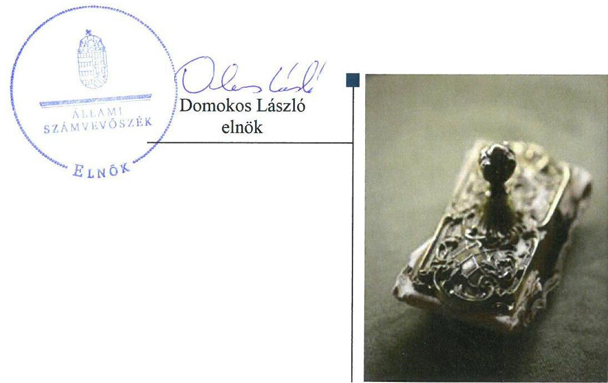
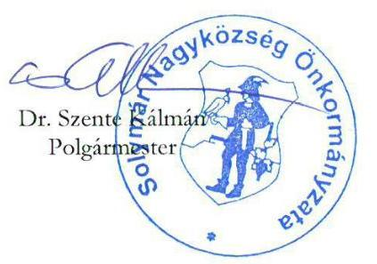
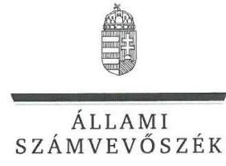
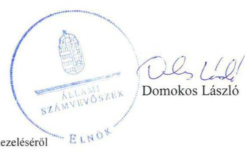
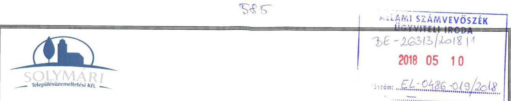
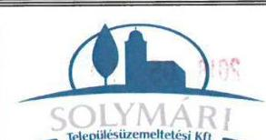
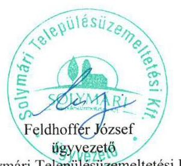
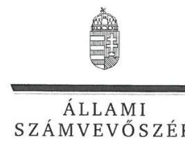
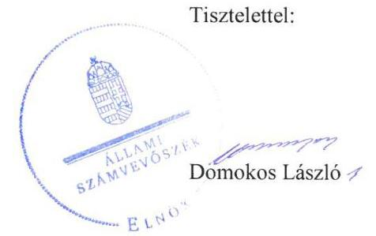

# Jelentés 

## Az önkormányzatok gazdasági társaságai

Az önkormányzatok többségi tulajdonában lévő gazdasági társaságok gazdálkodásának ellenőrzése -
Solymári Településüzemeltetési Kft.
2018.

---

# Jelentés 

## Az önkormányzatok gazdasági társaságai

Az önkormányzatok többségi tulajdonában lévő gazdasági társaságok gazdálkodásának ellenőrzése -
Solymári Településüzemeltetési Kft.
2018. június 5. nap

---

# AZ ELLENŐRZÉST FELÜGYELTE: 

MAKKAI MÁRIA felügyeleti vezető

## AZ ELLENŐRZÉST VEZETTE ÉS A VÉGREHAJTÁSÁÉRT FELELŐS:

KEREKES PÉTER ellenőrzésvezető

## A PROGRAM ÖSSZEÁLLÍTÁSÁÉRT FELELŐS:

TÓTPÁL SZABOLCS osztályvezető

IKTATÓSZÁM: EL-0193-040/2018.
TÉMASZÁM: 2447

## ELLENŐRZÉS-AZONOSÍTÓ SZÁM: V-079360

Jelentéseink az Országgyűlés számítógépes hálózatán és az Interneten a www.asz.hu címen is olvashatóak.

---

# TARTALOMJEGYZÉK 

■ ÖSSZEGZÉS ..... 5
■ AZ ELLENŐRZÉS CÉLJA ..... 6
■ AZ ELLENŐRZÉS TERÜLETE ..... 7
■ AZ ELLENŐRZÉS HÁTTERE, INDOKOLTSÁGA ..... 8
■ A JELENTÉS LÉNYEGES KÉRDÉSKÖREI ..... 9
■ AZ ELLENŐRZÉS HATÓKÖRE ÉS MÓDSZEREI ..... 10
■ MEGÁLLAPÍTÁSOK. ..... 12
■ JAVASLATOK. ..... 15
■ FÜGGELÉK: ÉSZREVÉTELEK ..... 17
■ RÖVIDÍTÉSEK JEGYZÉKE ..... 27

---

.

---

# ÖSSZEGZÉS 

Solymár Nagyközség Önkormányzata a tulajdonosi jogait nem szabályszerűen gyakorolta. A Solymári Településüzemeltetési Korlátolt Felelősségű Társaság szabályozottsága nem felelt meg a jogszabályi előírásoknak. A gazdálkodása és a vagyongazdálkodása során nem biztosította az elszámoltathatóságot és az átláthatóságot.

## Az ellenőrzés társadalmi indokoltsága

Magyarországon az intézmény-centrikus közfeladat-ellátás jellemző, de egyre jelentősebb a költségvetésen kívüli feladatellátás térnyerése. Helyi szinten ennek legfontosabb szereplői az önkormányzati tulajdonban lévő gazdasági társaságok, amelyeknek ellenőrzése kiemelten fontos a közfeladat ellátása, és a közvagyon megőrzése, megóvása érdekében. Ezért alapvető követelmény, hogy gazdálkodásuk, működésük szabályszerű és átlátható legyen.

A Solymári Településüzemeltetési Korlátolt Felelősségű Társaságot Solymár Nagyközség Önkormányzata alapította településüzemeltetési és személyszállítási feladatokra.

## Főbb megállapítások, következtetések, javaslatok

Solymár Nagyközség Önkormányzata a tulajdonosi joggyakorlás kereteit nem szabályszerűen alakította ki, és nem szabályszerűen gyakorolta. Nem gondoskodott arról, hogy a társaság saját tőkéje a törvényben előírtaknak megfelelő mértékű legyen.

A Solymári Településüzemeltetési Korlátolt Felelősségű Társaság szabályozottsága nem felelt meg a törvényi előírásoknak. Az egyszerűsített éves beszámolói mérlegsorai nem voltak leltárral alátámasztva, ezért a mérlegtételek valódisága nem volt biztosított. A könyvvezetés, valamint a vagyonnyilvántartás nem volt szabályszerű. A közérdekű adatok közzétételére vonatkozó kötelezettségét nem teljesítette.

A megállapítások alapján az Állami Számvevőszék Solymár Nagyközség Önkormányzata polgármesterének 5 javaslatot, a Solymári Településüzemeltetési Korlátolt Felelősségű Társaság ügyvezetőjének 7 javaslatot fogalmazott meg.

---

# AZ ELLENŐRZÉS CÉLJA 

Az ellenőrzés célja volt annak értékelése, hogy az Önkormányzat ${ }^{1}$ vagyongazdálkodási tevékenysége során szabályszerűen gyakorolta-e tulajdonosi jogait, a Társaság ${ }^{2}$ szabályozottsága, gazdálkodása és vagyongazdálkodási tevékenysége, bevételeinek és ráfordításainak elszámolása megfelelt-e a jogszabályi és tulajdonosi előírásoknak; a gazdasági társaság kötelezettségállománya jelent-e kockázatot a működésre, valamint a gazdálkodás átláthatósága és elszámoltathatósága érdekében biztosítva volt-e a szolgáltatás díjának megalapozottsága szabályszerű önköltségszámítással.

---

# AZ ELLENŐRZÉS TERÜLETE 

## Solymári Településüzemeltetési Kft. és Solymár Nagyközség Önkormányzata

A Solymári Településüzemeltetési Korlátolt Felelősségű Társaságot Solymár Nagyközség Önkormányzata alapította 100%-os tulajdonosként 2011-ben.

A Társaság az Önkormányzattal kötött Közszolgáltatási szerződés ${ }^{4}$ alapján menetrend szerinti helyi személyszállítási közszolgáltatási-, és Együttműködési megállapodás ${ }^{4}$ alapján közfeladatként településüzemeltetési tevékenységet végzett. Ezen felül Vállalkozási üzemeltetési szerződések ${ }^{5}$ keretében a solymári piac, a solymári vár, valamint az általános iskola üzemeltetését is ellátta.

A Számv. tv. ${ }^{6}$ 155. § (3) bekezdése alapján könyvvizsgálatra nem volt kötelezett a Társaság, és az Alapító okirat ${ }^{7}$ sem rendelkezett könyvvizsgáló igénybevételéről.

A Társaságnak a Számv. tv. 14. § (6) bekezdése alapján az önköltségszámítás belső rendjére vonatkozó belső szabályzat készítésére nem állt fenn kötelezettsége.

Az ellenőrzött időszakban a Társaságot átalakulás nem érintette, továbbá tulajdonosi részesedéssel más gazdasági társaságban nem rendelkezett, és nem minősült kormányzati szektorba sorolt egyéb szervezetnek. A Társaság nem rendelkezett vagyonkezelt eszközzel.

Az ellenőrzött időszakban a polgármester és a jegyző személye nem változott, az ügyvezető személye kétszer változott.

---

# AZ ELLENŐRZÉS HÁTTERE, INDOKOLTSÁGA 

Az önkormányzatok többségi tulajdonában álló gazdasági társaságok ellenőrzése kiemelten fontos a vagyon megőrzése, megóvása érdekében. A feladatellátás költségeinek, ráfordításainak alakulása a lakosság széles rétegét érinti.

Ellenőrzéseink feltárhatják, hogy az önkormányzat a feladatellátásához rendelt vagyon működtetését a tulajdonostól elvárható gondossággal végezte-e, a feladatot ellátó gazdasági társaság a létesítő okiratban, szolgáltatási szerződésben foglaltak betartásával biztosította-e a feladat ellátását. Az ellenőrzés rávilágíthat arra, hogy a gazdasági társaság a vagyon használatával biztosította-e a szolgáltatás folytatásának feltételeit, az önkormányzat tulajdonosi felügyelete hozzájárult-e a szabályszerű gazdálkodáshoz és feladatellátáshoz. A megállapítások alapján megfogalmazott számvevőszéki javaslatok hasznosítása elősegítheti a meglévő hibák megszüntetését. A jó gyakorlatok bemutatásával az ÁSZ ${ }^{8}$ hozzájárulhat a követendő megoldások megismertetéséhez, terjesztéséhez.

---

# A JELENTÉS LÉNYEGES KÉRDÉSKÖREI 

1. A tulajdonosi joggyakorlás szabályszerű volt-e?
2. A gazdasági társaság szabályozottsága, gazdálkodása és vagyongazdálkodása szabályszerű volt-e?

---

# AZ ELLENŐRZÉS HATÓKÖRE ÉS MÓDSZEREI 

## Az ellenőrzés típusa

Megfelelőségi ellenőrzés.

## Az ellenőrzött időszak

2013. január 1-től 2016. december 31-ig.

## Az ellenőrzés tárgya

Az Önkormányzat - 100%-os tulajdonában lévő gazdasági társaság feletti - tulajdonosi joggyakorlása, valamint a Társaság gazdálkodásának szabályozottsága és szabályszerűsége.

Az ellenőrzés kiterjed minden olyan körülményre és adatra, amely az ÁSZ jogszabályban meghatározott feladatainak teljesítéséhez, valamint a program végrehajtása folyamán felmerült újabb összefüggések feltárásához szükséges.

## Az ellenőrzött szervezet

Solymári Településüzemeltetési Kft. és Solymár Nagyközség Önkormányzata

## Az ellenőrzés jogalapja

Az ellenőrzés jogszabályi alapját az ÁSZ tv. ${ }^{9} 1$. § (3) bekezdése és 5. § (3)(4)-(5) bekezdései képezik.

## Az ellenőrzés módszerei

Az ellenőrzést a nemzetközi standardokat irányadónak tekintve az ellenőrzési program ellenőrzési kérdései, az ellenőrzött időszakban hatályos jogszabályok, az ellenőrzés szakmai szabályok és módszertanok figyelembe vételével végeztük.

Az ellenőrzés ideje alatt az ellenőrzött szervezettel történő kapcsolattartást az ÁSZ Szervezeti és Működési Szabályzatának vonatkozó előírásai alapján biztosítottuk.

Az ellenőrzési kérdések megválaszolásához szükséges bizonyítékok megszerzése a következő ellenőrzési eljárások alkalmazásával történt:

---

megfigyelés, kérdésfeltevés (információkérés), összehasonlítás, valamint elemző eljárás. Az ellenőrzési bizonyítékként felhasználható adatforrások közé tartoztak egyrészt az ellenőrzési programban felsorolt adatforrások, másrészt adatforrás lehet még minden - az ellenőrzés folyamán - feltárt, az ellenőrzés szempontjából információkat tartalmazó dokumentum.

Az ellenőrzést a kérdésekre adott válaszok kiértékelésével, valamint a megjelölt adatforrások, a csatolt tanúsítványok felhasználásával, továbbá az adott időszakban hatályos jogszabályok figyelembe vételével folytattuk le.

A bevételek elszámolása, valamint a vagyonnyilvántartás terén a szabályszerű működést véletlen mintavétellel ellenőriztük.

A mintavétellel ellenőrzött területek esetében minden egyes tétel vonatkozásában a szabályszerűségre vonatkozó kérdéseket tettünk fel, amelyek eredménye összesítésre került. Az ellenőrzött minták alapján a sokaságban előforduló átlagos hibaarányt becsültük. „Szabályszerűnek" értékeltünk egy ellenőrzött területet, amennyiben 95%-os bizonyossággal a teljes sokaságban az átlagos hibaarány legfeljebb 10%, nem megfelelőnek, amennyiben 10%-nál magasabb arányt képviselt. Abban az esetben, ha a teljes sokaság tekintetében a 10%-os hibaarányhoz való viszony megítélésének megbízhatósága nem érte el a 95%-ot, annak elérése érdekében értékelésünket további szempontokkal egészítettük ki, és figyelembe vettük a feltárt hibák típusát és súlyát. A ráfordítások elszámolására és a vagyonnyilvántartásra vonatkozó véletlen mintavételt kockázati alapú kiválasztással egészítettük ki, amelynek során a három legnagyobb összegű tételt választottuk ki.

---

# 1. A tulajdonosi joggyakorlás szabályszerű volt-e? 

## Összegző megállapítás

A tulajdonosi joggyakorlás kereteinek kialakítása és a tulajdonosi jogok gyakorlása nem volt szabályszerű.

A tulajdonosi joggyakorlás rendjét a Vagyonrendeletben ${ }^{10}$ határozták meg, és a tulajdonosi jogokat a Képviselő-testület ${ }^{11}$ gyakorolta.

Az Alapító ${ }^{12}$ felügyelő bizottságot ${ }^{13}$ hozott létre, amely a Gt. ${ }^{14}$ és a Ptk. ${ }^{15}$ előírásainak megfelelően rendelkezett ügyrenddel. A felügyelő bizottság a Ptk. 3:27 § (1) bekezdésében és az ügyrendje 1.2. pontjában előírtak ellenére a Társaságnak az Alapító elé kerülő egyszerűsített éves beszámolóit nem vizsgálta meg.

Az Alapító a Társaság 2013. évi egyszerűsített éves beszámolójának elfogadásáról a Gt. 35. § (3) bekezdés, valamint a 2014-2016. évi egyszerűsített éves beszámolók elfogadásáról a Ptk. 3:120. § (2) bekezdés előírását ellenére a felügyelő bizottság írásbeli jelentésének a hiányában döntött.

Az ellenőrzött időszakban a Társaság nem rendelkezett a társasági formájára kötelezően előírt jegyzett tőkének megfelelő összegű saját tőkével. Az Alapító a Ptk. 3:133. § (2) bekezdésében előírtak szerint 49/2015. (V.27.) számú határozatában döntött a Társaság törzstőkéjének emeléséről. Ennek végrehajtása az ellenőrzött időszak végéig nem valósult meg.

Az Alapító a Taktv. ${ }^{16}$ 5. § (3) bekezdésben előírtak ellenére nem alkotta meg a vezető tisztségviselők, felügyelőbizottsági tagok, valamint az Mt. 208. §-ának hatálya alá eső munkavállalók javadalmazása, valamint a jogviszony megszűnése esetére biztosított juttatások módjának, mértékének elveire, annak rendszerére vonatkozó szabályzatát.

## 2. A gazdasági társaság szabályozottsága, gazdálkodása és vagyongazdálkodása szabályszerű volt-e?

## Összegző megállapítás

2.1. számú megállapítás

A Társaság szabályozottsága, gazdálkodása és vagyongazdálkodása nem volt szabályszerű.

A Társaság szabályozottsága nem felelt meg a jogszabályi előírásoknak.

A Társaság nem rendelkezett a Számv. tv. 14. § (5) bekezdésének b) pontjában előírt értékelési szabályzattal és a Számv. tv. 161. § (1) bekezdésében előírt számlarenddel. Nem készítette el a Szem. tv. ${ }^{17}$ 19. § (4) bekezdésében előírt személyszállítási üzletszabályzatot. Az Info. tv. ${ }^{18} 35$. § (3) bekezdésében előírt, a közérdekű adatok közzétételének rendjét rögzítő szabályzattal nem rendelkezett.

---

A Társaság 2013. december 31-ig a Számv. tv. 14. § (3) bekezdésében meghatározott számviteli politikával és a Számv. tv. 14. § (5) bekezdésének a) pontjában előírt leltározási szabályzattal, valamint 2013. március 19-ig a Számv. tv. 14. § (5) bekezdésének d) pontjában előírt pénzkezelési szabályzattal nem rendelkezett.

A 2014. január 1-jétől hatályos Számviteli politikában nem rögzítették a személyszállítási közszolgáltatások bevételei, ráfordításai és e tevékenységhez felhasznált eszközök, források elkülönítésére vonatkozó eljárásrend kialakítását a Szem. tv. 30. § (7) bekezdés és a Számv. tv. 161/A. § (2) bekezdés előírásai ellenére. A Társaság 2016. december 31-éig a számviteli politikáján nem vezette keresztül a 2015. július 4-én hatályba lépett - a rendkívüli eredmény összetevőit illetve a mérleg szerinti eredmény fogalmát megszüntető - törvénymódosításokat, ezzel megsértette a Számv. tv. 14. § (11) bekezdésben meghatározottakat.

# 2.2. számú megállapítás 

## A Társaság vagyongazdálkodási tevékenysége nem volt szabályszerű.

A Társaság a Számv. tv. 69. § (1) bekezdésben előírtak ellenére az egyszerűsített éves beszámolók mérlegtételeit nem támasztotta alá az eszközeit és forrásait tételesen, ellenőrizhető módon tartalmazó leltárakkal.

A Társaság az ellenőrzött időszakban a Szem. tv. 30. § (7) bekezdés és a Számv. tv. 161/A. § (2) bekezdés előírásai ellenére a személyszállítási közszolgáltatási tevékenységhez használt eszközökről és forrásokról nem vezetett elkülönített nyilvántartást, ezért nem volt biztosított az elszámoltathatóság és az átláthatóság.

## A bevételek, a ráfordítások és az értékcsökkenési leírás elszámolása valamint a vagyonnyilvántartás nem volt szabályszerű.

A Társaságnál a ráfordítások elszámolása nem volt szabályszerű, mert a Számv. tv. 165. § (2) bekezdésében előírtaknak ellenére a számviteli nyilvántartásokba nem bizonylatok alapján jegyeztek be adatokat. Bizonylatok hiányában nem volt biztosított a Számv. tv. 15. § (3) előírásának megfelelő beszámoló készítését alátámasztó könyvvezetés.

A vagyonnyilvántartás és az értékcsökkenés elszámolása nem volt szabályszerű az alábbi hiányosságok miatt:
$\longrightarrow$ a Számv. tv. 52. § (2) bekezdésében előírtak ellenére az
 eszközök üzembe helyezését nem dokumentálták hitelt érdemlő módon,
$\longrightarrow$ az elszámolást alátámasztó bizonylatok a Számv. tv. 167. § (1) bekezdés h) pontjában előírtak ellenére nem tartalmazták a könyvelés módjára, az érintett könyvviteli számlákra történő hivatkozást.
A személyi jellegű ráfordítások elszámolása nem volt szabályszerű, mert a Számv. tv. 165. § (2) bekezdésében előírtakat megsértve nem bizonylatok alapján jegyeztek be adatokat a számviteli nyilvántartásokba.

Az értékesítés nettó árbevételének, az egyéb, a rendkívüli bevételeknek és a pénzügyi műveletek bevételeinek elszámolása nem volt szabályszerű, mivel a lekönyvelt bizonylatok a Számv. tv. 167. § (1) bekezdés h) pont előírását megsértve nem tartalmazták a könyvelés módjára, az érintett könyvviteli számlákra történő hivatkozást.

---

# 2.4. számú megállapítás 

A Társaság nem biztosította az átláthatóság érvényesülését.
A Társaság megsértette az Info. tv. 37. § (1) bekezdésben foglaltakat, mivel az Info. tv. 1. mellékletében számára előírt adatok közzétételéről nem gondoskodott.

---

# JAVASLATOK 

Az ÁSZ tv. 33. § (1) bekezdésében foglaltak értelmében az ellenőrzött szervezet vezetője köteles a jelentésben foglalt megállapításokhoz kapcsolódó intézkedési tervet összeállítani és azt a jelentés kézhezvételétől számított 30 napon belül az ÁSZ részére megküldeni. Amennyiben az ellenőrzött szervezet vezetője nem küldi meg határidőben az intézkedési tervet, vagy továbbra sem elfogadható intézkedési tervet küld, az Állami Számvevőszék elnöke az ÁSZ tv. 33. § (3) bekezdése a) és b) pontjaiban foglaltakat érvényesítheti.

## Solymár Nagyközség polgármesterének

1. Kezdeményezze a felügyelő bizottságnál, hogy a Társaság éves beszámolóit vizsgálja meg a Ptk.-ban előírtaknak megfelelően.
(1. sz. megállapítás 2. bekezdés második mondata alapján)
2. Intézkedjen arról, hogy a Társaság legfőbb szerve a Társaság éves beszámolójáról a felügyelőbizottság írásbeli jelentésének birtokában döntsön a Ptk.-ban előírtaknak megfelelően.
(1. sz. megállapítás 3. bekezdése alapján)
3. Intézkedjen a társasági formára kötelezően előírt jegyzett tőkének megfelelő saját tőke biztosításáról a jogszabály előírásnak megfelelően.
(1. sz. megállapítás 4. bekezdése alapján)
4. Intézkedjen, hogy a Társaság legfőbb szerve a vezető tisztségviselők, felügyelőbizottsági tagok, valamint az Mt. 208. §-ának hatálya alá eső munkavállalók javadalmazása, valamint a jogviszony megszünése esetére biztosított juttatások módjának, mértékének elveire, annak rendszerére vonatkozó szabályzatát megalkossa.
(1. sz. megállapítás. 5. bekezdése alapján)
5. Tegyen intézkedéseket:
a) a számlarend elkészítésének elmulasztása,
b) a további szabályozási hiányosságok,
c) a leltár hiánya,
d) a közszolgáltatási tevékenység elkülönített nyilvántartásának hiánya,
e) a közzétételi kötelezettség elmulasztása,
miatti felelősség tisztázása érdekében, és szükség szerint intézkedjen a felelősség érvényesítéséről.
(2.1. sz. megállapítás 1. bekezdése, 2.2. sz. megállapítás 1. bekezdése, 2.2. sz. megállapítás 2. bekezdése, 2.4. sz. megállapítás 1. bekezdése alapján)

---

# a Solymári Településüzemeltetési Kft. ügyvezetőjének 

1. Intézkedjen a Számv. tv. előírásainak megfelelően az értékelési szabályzat és számlarend, valamint a Szem. tv. előírásának megfelelően a személyszállítási üzletszabályzat elkészítéséről.
(2.1. sz. megállapítás 1. bekezdés első két mondata alapján)
2. Intézkedjen az Info. tv. előírásainak megfelelően a közérdekű adatok közzétételének rendjét rögzítő szabályzat elkészítéséről.
(2.1. sz. megállapítás 1. bekezdés utolsó mondata alapján)
3. Intézkedjen a számviteli politika módosításáról, hogy az megfeleljen a hatályos Számv. tv. előírásainak.
(2.1 sz. megállapítás 3. bekezdése alapján)
4. Intézkedjen a jogszabályi előírásoknak megfelelően a mérleg tételeinek leltárral való alátámasztásáról.
(2.2. sz. megállapítás 1. bekezdése alapján)
5. Intézkedjen a személyszállítási közszolgáltatási tevékenységhez használt eszközök és források elkülönített nyilvántartásának vezetéséről a jogszabályi előírásoknak megfelelően.
(2.2. sz. megállapítás 2. bekezdése alapján)
6. Intézkedjen a bevételek és ráfordítások, továbbá az értékcsökkenés jogszabályi előírásoknak megfelelő elszámolásáról.
(2.3. sz. megállapítás 1-4. bekezdései alapján)
7. Intézkedjen az Info. tv. 1. mellékletében előírt adatok közzétételéről.
(2.4. sz. megállapítás 1. bekezdése alapján)

---

# FÜGGELÉK: ÉSZREVÉTELEK 

A jelentéstervezetet a Számvevőszék 15 napos észrevételezésre megküldte az ellenőrzött szervezetek vezetőinek az ÁSZ tv. 29. §* (1) bekezdése előírásának megfelelően.

Az ÁSZ a jelentéstervezetet észrevételezésre megküldte Solymár Nagyközség polgármesterének és a Solymári Településüzemeltetési Kft. ügyvezetőjének.
Solymár Nagyközség polgármesterének és a Solymári Településüzemeltetési Kft. ügyvezetőjének észrevételeit és az azokra adott választ a függelék alább tartalmazza.

[^0]
[^0]:    * 29. § (1) Az Állami Számvevőszék az ellenőrzési megállapításait megküldi az ellenőrzött szervezet vezetőjének vagy az általa megbízott személynek, és annak, akinek személyes felelősségét állapította meg.
    (2) Az ellenőrzött szervezet vezetője és a felelősként megjelölt személy az ellenőrzés megállapításaira tizenöt napon belül írásban észrevételt tehet.
    (3) Az Állami Számvevőszék az észrevételre a beérkezésétől számított harminc napon belül írásban válaszol. A figyelembe nem vett észrevételeket köteles a jelentésben feltüntetni, és megindokolni, hogy azokat miért nem fogadta el.

---

# Solymár Nagyközség Önkormányzata 

2083 Solymár, József Attila utca 1. | Telefon: (26) 560-600 | Fax: (26) 560-606 | Web: www.solymachu E-mail: info@solymachu

Tárgy: észrevételek ,az önkormányzatok többségi tulajdonában lévő gazdasági társaságok gazdálkodásának ellenőrzése Solymári Településüzemeltetési Kft." ellenőrzése tárgyában

Állami Számvevőszék
Domokos László elnök úr részére!

Budapest 4.
Pf. 54
1364

ÁLLAMI SZÁMVEVŐSZÉK
26-26500/2017/17
Emezen: 2018 MÁJ 10.
Iktatószám: EL-0486-030/2018
Melléklet:

## Tisztelt Elnök Úr!

Hivatkozással az EL-0486-017/2018. számú, „az önkormányzatok többségi tulajdonában lévő gazdasági társaságok gazdálkodásának ellenőrzése - Solymári Településüzemeltetési Kft." tárgyában készült számvevőszéki jelentéstervezetre, előzetesen szeretném megköszönni az Állami Számvevőszék munkatársai által elvégzett munkát, mellyel hozzájárultak Önkormányzatunknál is a jó gyakorlat elsajátításához.

Az Állami Számvevőszékről szóló 2011. évi LXVI. törvény 29. § (2) bekezdése alapján a jelentéstervezettel összefüggésben az alábbi észrevételeket teszem:
(i) Nem értek egyet a jelentéstervezet 13. oldal 1. pont 2-3. bekezdésében leírt megállapítással, miszerint a felügyelőbizottság a Ptk. 3:27. § (1) bekezdés és az ügyrend 1.2. pontjában foglaltak szerint az alapító részére benyújtott éves beszámolóit nem vizsgálta meg.

A Solymári Településüzemeltetési Kft. felügyelő bizottsága az éves beszámolókat rendre megtárgyalta, a beszámolókat, valamint a beszámolók alapjául szolgáló számviteli bizonylatokat könyvvizsgálói jelentés is alátámasztja. A képviselő-testület a beszámolót a felügyelőbizottság véleményének ismeretében, valamint a könyvvizsgálói jelentés ismeretében fogadta jóvá.
(ii) A jelentéstervezet 13. oldal 1. pont 4. bekezdésében foglaltakhoz meg kívánom jegyezni, hogy az ellenőrzött időszakot követő évben az ellenőrzött társaság már rendelkezett a kötelezően előírt jegyzett tőkének megfelelő összegű saját tőkével.
(iii) Nem értek egyet a jelentéstervezet 13. oldal 1. pont 5. bekezdésében leírt megállapítással: a Társaság 2014. évtől rendelkezik a vezető tisztségviselők, felügyelőbizottsági

---

tagok, valamint az Mt. 208. §-ának hatálya alá eső munkavállalók javadalmazása, valamint a jogviszony megszűnése esetére biztosított juttatások módjának, mértékének elveire, annak rendszerére vonatkozó szabályzattal.
(iv) Nem értek egyet a jelentéstervezet azon megállapításával, miszerint a Társaság nem rendelkezett a Számv. tv. 14. § (5) bekezdésének b) pontjában előírt értékelési szabályzattal, valamint a Számv. tv. 161. § (1) bekezdésében előírt számlarenddel.
(v) Meg kívánom jegyezni továbbá, hogy a Társaság időközben pótolta a Szem. tv. 19. § (4) bekezdés szerinti személyszállítási üzletszabályzatot, valamint az Info. tv. 35. § (3) bekezdése szerinti közérdekű adatok közzétételének rendjét rögzítő szabályzatot. A Társaság 2014. évtől megfelelő számviteli politikával és 2013. március 20-tól pedig pénzkezelési szabályzattal rendelkezik.
(vi) Meg kívánom jegyezni továbbá, hogy a számviteli politika kiegészítésre került, elkülönítve kezeli a Társaság a személyszállítási közszolgáltatások bevételeit, ráfordításokat, e tevékenységhez felhasznált eszközöket, forrásokat.
(vii) Meg kívánom jegyezni, hogy az ellenőrzési jelentés tervezet 2.4. sz. megállapításában foglaltakra figyelemmel a Társaság kizárólag Solymár Nagyközség Önkormányzatával kötött olyan megállapodást az ellenőrzött időszakban, amely az Info. tv. 37. § (1) bekezdésben foglaltakat érinti.

# Tisztelt Elnök Úr! 

Kérem, hogy a fentiek figyelembe vételével a tárgybani ellenőrzési jelentéstervezet tekintetében a kifogásolt pontokat módosítani szíveskedjen.

Solymár, 2018. május 3.

Tisztelettel:

---

ELNÖK

Ikt.szám: EL-0486-021/2018.

Dr. Szente Kálmán úr
polgármester

Solymár Nagyközség Önkormányzat

# Solymár 

## Tisztelt Polgármester Úr!

„Az önkormányzatok többségi tulajdonában lévő gazdasági társaságok gazdálkodásának ellenőrzése - Solymári Településüzemeltetési Kft." címmel készített számvevőszéki jelentéstervezetre tett észrevételét köszönettel megkaptam.

Az Állami Számvevőszék észrevételre vonatkozó álláspontjáról a felügyeleti vezető által készített részletes tájékoztatást mellékelten megküldöm.

Tájékoztatom Polgármester urat, hogy a számvevőszéki jelentésben - az Állami Számvevőszékről szóló 2011. évi LXVI. törvény 29. § (3) bekezdése alapján - a figyelembe nem vett észrevételeket szerepeltetjük, annak indoklásával, hogy azokat az Állami Számvevőszék miért nem fogadta el.

Budapest, 2018. 05 hó 23 nap

Tisztelettel:

Melléklet: Tájékoztatás az észrevételek kezeléséről

---

# Tájékoztatás   az észrevételek kezeléséről 

„Az önkormányzatok többségi tulajdonában lévő gazdasági társaságok gazdálkodásának ellenőrzése - Solymári Településüzemeltetési Kft." című jelentéstervezetre 2018. május 10-én érkezett észrevételt áttekintettük, annak kezelésével kapcsolatban a következő tájékoztatást adom.

## 1. A tulajdonosi joggyakorlás szabályszerűsége résszel kapcsolatban tett észrevételre adott válasz

1.1. A jelentéstervezet 1. számú megállapítás 2-3. bekezdéséhez tett észrevétel a jelentéstervezetnek azon megállapításait kifogásolja, melyek szerint a felügyelő bizottság a Társaság egyszerűsített éves beszámolóit nem vizsgálta meg és az Alapító a felügyelő bizottság írásbeli jelentésének hiányában döntött az éves beszámolók elfogadásáról.
Tájékoztatom, hogy az Állami Számvevőszék ellenőrzési megállapításai az Állami Számvevőszékről szóló 2011. évi LXVI. törvénynek (ÁSZ tv.) megfelelően minden esetben az ellenőrzés során bekért és az arra nyitva álló határidőn belül rendelkezésre bocsátott dokumentumokon alapul.
A Társaság adatszolgáltatása nem tartalmazta a felügyelő bizottság éves beszámolókról készített írásbeli jelentését - az észrevételben hivatkozott dokumentumokat. Fentiek alapján az észrevételt nem fogadjuk el, az ÁSZ megállapítása helytálló, nem indokolt a jelentéstervezet módosítása.
1.2. A jelentéstervezet 1. számú megállapítás 4. bekezdéséhez tett észrevétel tájékoztatást ad, „az ellenőrzött időszakot követő évben a társaság már rendelkezett a kötelezően előírt jegyzett tőkének megfelelő összegű saját tőkével" mely az ÁSZ megállapítását megerősíti, hogy ,,Az ellenőrzött időszakban a Társaság nem rendelkezett a társasági formájára kötelezően előírt jegyzett tőkének megfelelő összegű saját tőkével. " Az ÁSZ megállapítása helytálló, annak módosítása nem indokolt.
1.3. Az 1. számú megállapítás 5. bekezdéséhez írt észrevétel szerint a Társaság 2014. évtől rendelkezik a vezető tisztségviselők, felügyelőbizottsági tagok, valamint az Mt. 208. §-ának hatálya alá eső munkavállalók javadalmazására, valamint a jogviszony megszűnése esetére biztosított juttatások módjának, mértékének elveire, annak rendszerére vonatkozó szabályzattal.
Az ÁSZ tv.-nek megfelelően az ellenőrzés során bekért és az adatszolgáltatásra nyitva álló határidőn belül rendelkezésre bocsátott dokumentumok között nem szerepel az észrevételben jelzett szabályzat, ezért az észrevételt nem fogadjuk el, az ÁSZ megállapítása helytálló, módosítása nem indokolt.

---

# 2. A Társaság szabályozottsága résszel kapcsolatban tett észrevételre adott válasz 

2.1. Az észrevétel kifogásolja a jelentéstervezet azon megállapítását, mely szerint a Társaság nem rendelkezett a jogszabályi előírásnak megfelelő értékelési szabályzattal és számlarenddel.
Tájékoztatom, hogy az Állami Számvevőszék ellenőrzési megállapításai az Állami Számvevőszékről szóló 2011. évi LXVI. törvénynek (ÁSZ tv.) megfelelően minden esetben az ellenőrzés során bekért és az arra nyitva álló határidőn belül rendelkezésre bocsátott dokumentumokon alapul.
A Társaság adatszolgáltatása nem tartalmazta az észrevételben hivatkozott értékelési szabályzatot és számlarendet, ezért az észrevételt nem fogadjuk el, az ÁSZ megállapítása helytálló, nem indokolt a jelentéstervezet módosítása.
2.2. Az észrevétel tájékoztat a Társaság időközben pótolta a személyszállítási üzletszabályzatot, valamint a közérdekű adatok közzétételének rendjét rögzítő szabályzatot, továbbá rögzíti, hogy a Társaság 2014. évtől rendelkezik megfelelő számviteli politikával és 2013. március 20-tól pénzkezelési szabályzattal. Az észrevétel nem
 cáfolja az ÁSZ ellenőrzött időszakra vonatkozó megállapítását, melynek módosítása a fentiek miatt nem indokolt.
2.3. A jelentéstervezet 2.1. számú megállapítás harmadik bekezdéséhez tett észrevétel tájékoztat a számviteli politika kiegészítéséről, továbbá arról, hogy a Társaság elkülönítve kezeli a személyszállítási közszolgáltatások bevételeit, ráfordításokat és e tevékenységhez felhasznált eszközöket, forrásokat. Köszönjük a tájékoztatást az időközben elvégzett pótlásokról, azok az ellenőrzött időszakra vonatkozó megállapításokat nem befolyásolják. A megállapítás módosítása nem indokolt.
2.4. A jelentéstervezet 2.4. számú megállapításához tett észrevétele nem cáfolja az ÁSZ megállapítását. A Társaság megsértette az Info. tv. 1. mellékletében előírt adatok közzétételére vonatkozó kötelezettségét, mely nem a Társaság által kötött megállapodások közzétételének kötelezettségét írja elő kizárólag, ezért a megállapítás módosítása nem indokolt.

Budapest, 2018. 05. hó 23. nap

Makkai Mária
felügyeleti vezető

---

# Solymári Településüzemeltetési Korlátolt Felelősségű Társaság 

2083 Solymár, Bajcsy Zs. u. 30.

## Állami Számvevőszék

## Domokos László elnök úr részére!

Budapest 4.
Pf. 54
1364

## Tisztelt Elnök Úr!

Köszönettel megkaptuk észrevételeiket és hivatkozva az EL-0486-017/2018. számú, ,,az önkormányzatok többségi tulajdonában lévő gazdasági társaságok gazdálkodásának ellenőrzése - Solymári Településüzemeltetési Kft. " tárgyban elkészült számvevőszéki jelentéstervezetben megjelölt hiányosságokra vonatkozóan az alábbi észrevételeket kívánom megtenni:

1. A Solymári Településüzemeltetési Kft. Értékelési Szabályzatának és a Számlarendjének szükséges kiegészítése, valamint a Személyszállítási Üzletszabályzata elkészült, így a társaság már rendelkezik elfogadott szabályzatokkal.
2. A közérdekű adatok közzétételének rendjének szabályzata, mely az Info. tv. 35.§ (3) bekezdésének megfelel időközben szintén elkészült.
3. A Számviteli Politika módosítása - a rendkívüli eredmény összetevőit és mérleg szerinti eredmény fogalmát megszüntető törvénymódosítások miatt - megtörtént társaságunknál.
4. A mérleg tételeinek leltárral való alátámasztása a mérlegkészítési folyamat részeként a könyvvizsgálatot ellátó szervezet által is megkövetelt, a törvényeknek megfelelő módon eddig is részét képezte az auditálásnak. A fentiek alapján tehát minden esetben leltárral alátámasztott mérleg készül.

Levelezési cím: 2083 Solymár, Bajcsy Zsilinszky E. u. 26.
Elektronikus elérhetőségek: solymarert@gmail.com
uzemeltetes@solymar.hu.

---

# Solymári Településüzemeltetési Korlátolt Felelősségű Társaság 2083 Solymár, Bajcsy Zs. u. 30. 

5. A személyszállítási közszolgáltatási tevékenység bevételeinek és ráfordításainak nyilvántartása a könyvelésben külön munkaszámon van nyilvántartva 2014-től kezdődően.
6. Az eszköznyilvántartás rendjében az aktiválási jegyzőkönyvek elkészítését, valamint bevételeket és ráfordításokat tartalmazó bizonylatok könyvviteli számlákra való hivatkozását folyó könyvelési évben a törvényi előírásoknak megfelelően végezzük.
7. A vizsgált időszakban társaságunk külső partnerrel nem kötött olyan megállapodást, mely a jelzett Info. tv. 37.§ (1) bekezdésében foglaltak szerinti kötelező közzétételi kötelezettséget jelentett volna.

Kérem, hogy a végső ellenőrzési jelentésükben a fentiekben közölteket szíveskedjenek figyelembe venni.

Solymár, 2018. május 6.

Tisztelettel:

Levelezési cím: 2083 Solymár, Bajcsy Zsilinszky E. u. 26.
Elektronikus elérhetőségek: solymarert@gmail.com
uzemeltetes@solymar.hu,

---

ELNÖK

Ikt.szám: EL-0486-022/2018.

# Feldhoffer József úr 

ügyvezető

Solymári Településüzemeltetési Kft.

## Solymár

## Tisztelt Ügyvezető Úr!

„Az önkormányzatok többségi tulajdonában lévő gazdasági társaságok gazdálkodásának ellenőrzése - Solymári Településüzemeltetési Kft." címmel készített számvevőszéki jelentéstervezetre tett észrevételét köszönettel megkaptam.

Az Állami Számvevőszék észrevételre vonatkozó álláspontjáról a felügyeleti vezető által készített részletes tájékoztatást mellékelten megküldöm.

Tájékoztatom Ügyvezető urat, hogy a számvevőszéki jelentésben - az Állami Számvevőszékről szóló 2011. évi LXVI. törvény 29. § (3) bekezdése alapján - a figyelembe nem vett észrevételeket szerepeltetjük, annak indoklásával, hogy azokat az Állami Számvevőszék miért nem fogadta el.

Budapest, 2018. 05. hó 23. nap

Melléklet: Tájékoztatás az észrevételek kezeléséről

---

# Tájékoztatás   az észrevételek kezeléséről 

„Az önkormányzatok többségi tulajdonában lévő gazdasági társaságok gazdálkodásának ellenőrzése - Solymári Településüzemeltetési Kft." címú jelentéstervezetre 2018. május 10-én érkezett észrevételt áttekintettük, annak kezelésével kapcsolatban a következő tájékoztatást adom.

1. Az Állami Számvevőszék „A Társaság a Számv. tv. 69. § (1) bekezdésben előírtak ellenére az egyszerűsített éves beszámolók mérlegtételeit nem támasztotta alá az eszközeit és forrásait tételesen, ellenőrizhető módon tartalmazó leltárakkal." megállapításához tett észrevételére tájékoztatom, hogy az ÁSZ megállapításai az Állami Számvevőszékről szóló 2011. évi LXVI. törvénynek (ÁSZ tv.) megfelelően minden esetben az ellenőrzés során bekért és az arra nyitva álló határidőn belül rendelkezésre bocsátott dokumentumokon alapul.
Fentiek alapján az észrevételt nem fogadjuk el, az ÁSZ megállapítása helytálló, nem indokolt a jelentéstervezet módosítása.
2. Észrevételében rögzítette a személyszállítási közszolgáltatási tevékenység bevételeinek és ráfordításainak 2014-től történő külön munkaszámon való nyilvántartását. Az ellenőrzés során bekért és a Társaság által rendelkezésre bocsátott dokumentumok nem támasztották alá, hogy a jogszabályban előírt személyszállítási közszolgáltatási tevékenységhez felhasznált eszközök és források, bevételek és ráfordítások elkülönített nyilvántartási kötelezettségének a Társaság eleget tett. Ezek alapján az ÁSZ megállapítása helytálló, módosítása nem indokolt.
3. A Társaság közzétételi kötelezettségével kapcsolatban írott észrevételére válaszolva tájékoztatom, hogy az ÁSZ megállapítása a Társaság számára az Info. tv. 1. mellékletében előírt, kötelezően közzéteendő adatokra vonatkozik, mely nem a Társaság által kötött megállapodások közzétételét írja elő kizárólag.
A jelentéstervezetben rögzített megállapításokkal és az azokhoz kapcsolódó javaslatokkal összefüggésben tett intézkedésekről szóló - az észrevétel 1-3. és 6. pontjaiban írt tájékoztatást köszönjük, a jelentéstervezet ellenőrzött időszakra vonatkozó megállapításait ezek nem befolyásolják.

Budapest, 2018. 05. hó 23. nap

Makkai Mária
felügyeleti vezető

---

# RÖVIDÍTÉSEK JEGYZÉKE 

${ }^{1}$ Önkormányzat ${ }^{2}$ Társaság ${ }^{3}$ Közszolgáltatási szerződés ${ }^{4}$ Együttműködési megállapodás ${ }^{5}$ Vállalkozási üzemeltetési szerződések

[^0]Solymár Nagyközség Önkormányzata
Solymári Településüzemeltetési Korlátolt Felelősségű Társaság
Solymár Nagyközség Önkormányzata és Solymári Településüzemeltetési Kft. által megkötött közszolgáltatási szerződés a menetrend szerinti helyi személyszállítás nyújtására (hatályos 2012. január 1-jétől)
Solymár Nagyközség Polgármesteri Hivatala és Solymári Településüzemeltetési Kft. által megkötött együttműködési megállapodás településüzemeltetési feladatok ellátására (hatályos 2011. november 1-jétől)
Solymár Nagyközség Önkormányzata és a Solymári Településüzemeltetési Kft. által megkötött vállalkozási szerződés a solymári általános iskola üzemeltetésére (hatályos 2013. január 1-jétől)
Solymár Nagyközség Önkormányzata és a Solymári Településüzemeltetési Kft. által megkötött vállalkozási szerződés a solymári vár üzemeltetésére (hatályos 2014. január 1-jétől)
Solymár Nagyközség Önkormányzata és a Solymári Településüzemeltetési Kft. által megkötött vállalkozási szerződés a solymári piac üzemeltetésére (hatályos 2014. március 1. és 2015. december 31. között)
Solymár Nagyközség Önkormányzata és Solymári Településüzemeltetési Kft. által megkötött vállalkozási szerződések általános az iskolai konyha üzemeltetésére (hatályos 2011. január 1-jétől)
2000. évi C. törvény a számvitelről (hatályos: 2001. január 1-jétől)

Solymári Településüzemeltetési Kft. 2013. március 5-én kelt alapító okirata
Állami Számvevőszék
2011. évi LXVI. törvény az Állami Számvevőszékről (hatályos 2011. július 1-jétől)

Solymár Nagyközség Önkormányzat Képviselő-testületének 22/2011. (VII.20.) önkormányzati rendelete az önkormányzat tulajdonáról, az önkormányzat vagyonáról és az önkormányzati vagyon feletti tulajdonosi jogok gyakorlásáról egységes szerkezetben a 9/2013. (IV.25.), valamint a 16/2014. (IX.25.) önkormányzati rendelettel
Solymár Nagyközség Önkormányzata képviselő-testülete
Solymár Nagyközség Önkormányzata
Solymári Településüzemeltetési Kft. felügyelő bizottsága
2006. évi IV. törvény a gazdasági társaságokról (hatályos: 2014. március 14-éig)
2013. évi V. törvény a Polgári Törvénykönyvről (hatályos: 2014. március 15-étől)
2009. évi CXXII. törvény a köztulajdonban álló gazdasági társaságok takarékosabb működéséről (hatályos 2009. december 4-étől)
2012. évi XLI. törvény a személyszállítási szolgáltatásokról (hatályos: 2012. július 1-jétől)
2011. évi CXII. törvény az információs önrendelkezési jogról és az információszabadságról (hatályos 2011. július 27-től)

[^0]:    ${ }^{1}$ Képviselő-testület
    ${ }^{12}$ Alapító
    ${ }^{13}$ felügyelő bizottság
    ${ }^{14}$ Gt.
    ${ }^{15}$ Ptk.
    ${ }^{16}$ Taktv.
    ${ }^{17}$ Szem. tv.
    ${ }^{18}$ Info. tv.

---

# ÁLLAMI SZÁMVEVŐSZÉK 

1052 Budapest, Apáczai Csere János utca 10.
Levélcím: 1364 Budapest 4. Pf. 54
Telefon: +36 14849100 Telefax: +36 14849200
www.asz.hu

