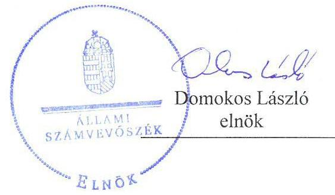
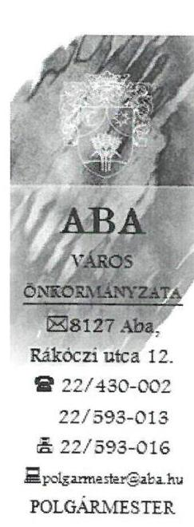
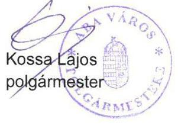
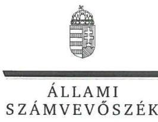
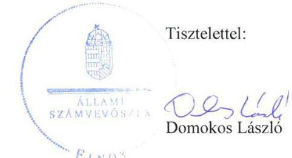

# Jelentés 

## Az önkormányzatok gazdasági társaságai

Az önkormányzatok többségi tulajdonában lévő gazdasági társaságok gazdálkodásának ellenőrzése - Sárvíz Kistérségi Járóbeteg Szakellátó és Egészségügyi Szolgáltató Közhasznú Nonprofit Kft.
2018.

---

# Jelentés 

## Az önkormányzatok gazdasági társaságai

Az önkormányzatok többségi tulajdonában lévő gazdasági társaságok gazdálkodásának ellenőrzése - Sárvíz Kistérségi Járóbeteg Szakellátó és Egészségügyi Szolgáltató Közhasznú Nonprofit Kft.
2018. mínus hó 4. nap

---

# AZ ELLENŐRZÉST FELÜGYELTE:

DR. NAGY IMRE felügyeleti vezető

# AZ ELLENŐRZÉST VEZETTE ÉS A VÉGREHAJTÁSÁÉRT FELELŐS:

GELENCSÉR ZSOLT ellenőrzésvezető

# A PROGRAM ÖSSZEÁLLÍTÁSÁÉRT FELELŐS:

TÓTPÁL SZABOLCS osztályvezető

IKTATÓSZÁM: EL-0128-055/2018.

TÉMASZÁM: 2447

# ELLENŐRZÉS-AZONOSÍTÓ SZÁM: V079318

Jelentéseink az Országgyűlés számítógépes hálózatán és az Interneta a www.asz.hu címen is olvashatóak.

---

# TARTALOMJEGYZÉK 

- ÖSSZEGZÉS ..... 5
- AZ ELLENŐRZÉS CÉLJA ..... 7
- AZ ELLENŐRZÉS TERÜLETE ..... 8
- AZ ELLENŐRZÉS HÁTTERE, INDOKOLTSÁGA ..... 9
- A JELENTÉS LÉNYEGES KÉRDÉSKÖREI ..... 10
- AZ ELLENŐRZÉS HATÓKÖRE ÉS MÓDSZEREI ..... 11
- MEGÁLLAPÍTÁSOK ..... 13
- JAVASLATOK ..... 17
- MELLÉKLETEK ..... 21
I. sz. melléklet: Értelmező szótár ..... 21
- FÜGGELÉK: ÉSZREVÉTELEK ..... 23
- RÖVIDÍTÉSEK JEGYZÉKE ..... 33

---

.

---

# ÖSSZEGZÉS 

Aba Város Önkormányzata a 2013-2016. években a többségi tulajdonában álló Sárvíz Kistérségi Járóbeteg Szakellátó és Egészségügyi Szolgáltató Közhasznú Nonprofit Kft. feletti tulajdonosi joggyakorlás kereteit nem alakította ki szabályszerűen, tulajdonosi jogait nem szabályszerűen gyakorolta. A Társaság gazdálkodásának szabályozottsága nem felelt meg a jogszabályi előírásoknak. Gazdálkodása nem volt átlátható és elszámoltatható, a vagyon megőrzését és védelmét nem biztosította. Nem tett eleget a jogszabályokban előírt közzétételi és adatszolgáltatási kötelezettségének, így müködésének átláthatósága nem volt biztosított.

## Az ellenőrzés társadalmi indokoltsága

Magyarországon az önkormányzatok kötelező és önként vállalt feladataik vonatkozásában is egyre szélesebb körben alkalmazzák a költségvetésen kívüli feladatellátást, ezáltal - a nonprofit szervezetek mellett - az önkormányzati tulajdonú gazdasági társaságok is kiemelt fontosságú szerephez jutottak. Ezen belül kiemelt jelentőségű számos önkormányzati gazdasági társaság működése abból a szempontból is, hogy gazdálkodásának egyes elemei befolyásolják az önkormányzati alszektor hiányát és az államadósságot.

Az Állami Számvevőszék Stratégiájában foglaltakkal összhangban az ÁSZ kiemelt célja, hogy a helyi önkormányzatok gazdálkodásában rejlő pénzügyi kockázatok feltárásával, az államháztartáson kívülre nyújtott költségvetési támogatások és ingyenes vagyonjuttatások, valamint az államháztartáson kívül működő feladat-ellátó rendszerek ellenőrzéseivel hozzájáruljon ahhoz, hogy a közpénzeket az államháztartáson kívül működő szervezetek is átlátható, rendezett módon használják fel. Ezen stratégiai célkitűzéssel összhangban került sor Aba Város Önkormányzata és a többségi tulajdonában álló Sárvíz Kistérségi Járóbeteg Szakellátó és Egészségügyi Szolgáltató Közhasznú Nonprofit Kft. szabályozottságának, gazdálkodása és vagyongazdálkodási tevékenysége szabályszerűségének, valamint az Önkormányzat tulajdonosi joggyakorlása 2013-2016. évi szabályszerűségének ellenőrzésére.

## Főbb megállapítások, következtetések, javaslatok

Aba Város Önkormányzata a 2013-2016. években a többségi tulajdonában álló Sárvíz Kistérségi Járóbeteg Szakellátó és Egészségügyi Szolgáltató Közhasznú Nonprofit Kft. tekintetében a tulajdonosi joggyakorlás kereteit nem szabályszerűen alakította ki. A tulajdonosi joggyakorlás nem volt szabályszerű. A felügyelőbizottság ügyrendjét nem készítette el. A taggyűlés, mint a Társaság legfőbb szerve a jogszabályi előírásokat megsértve a felügyelőbizottság írásbeli jelentésének hiányában döntött a 2013-2015. évi egyszerűsített éves beszámolók elfogadásáról, nem döntött a 2016. évi egyszerűsített éves beszámolóról. A javadalmazási szabályzatot nem alkotta meg.

A Sárvíz Kistérségi Járóbeteg Szakellátó és Egészségügyi Szolgáltató Közhasznú Nonprofit Kft. gazdálkodásának szabályozottsága nem felelt meg a jogszabályi előírásoknak, számviteli politikáját és számlarendjét nem a jogszabályi előírásoknak megfelelően alakította ki. A gazdálkodás és a vagyongazdálkodás szabályszerűségének ellenőrzéséhez nem rendelkezett dokumentumokkal, így gazdálkodása nem volt átlátható és elszámoltatható, a vagyon megőrzését és védelmét nem biztosította. Egyszerűsített éves beszámolóit bizonylatokkal és leltárral nem támasztotta alá. A Társaság a 2015. évi egyszerűsített éves beszámolót késedelmesen, a 2016. évi egyszerűsített éves beszámolót nem tette közzé. 2013- 2014. években a közhasznúsági mellékletet nem készítette el. Mint közfeladatot ellátó szerv és köztulajdonban álló társaság, a jogszabályban előírt közzétételi, adatszolgáltatási kötelezettségének nem tett eleget.
2016. évben a kormányzati szektorba sorolt Társaság nem alakította ki a tevékenység, a célok megvalósításának nyomon követését biztosító rendszert és nem tett eleget az államháztartásért felelős miniszter felé fennálló, jogszabályban előírt adatszolgáltatási kötelezettségének. A gazdálkodás kormányzati szektor hiányára és az államadósságra befolyással bíró elemei szabályszerűségének ellenőrzéséhez a Társaság nem szolgáltatott adatot.

---

Az ügyvezető személyében az ellenőrzött időszakot követően bekövetkezett változás a Társaság ellenőrzése során feltárt szabálytalanságok miatti felelősség felvetését meghiúsította.

Az Állami Számvevőszék a jelentésben foglalt megállapítások alapján a Sárvíz Kistérségi Járóbeteg Szakellátó és Egészségügyi Szolgáltató Közhasznú Nonprofit Kft. ügyvezetőjének a Társaság saját tőke előírt szintjének biztosításával kapcsolatos feladatával, a szabályozottsággal, a számviteli elszámolásokkal, a mérleg leltárral való alátámasztásával, a közzétételi kötelezettségek, valamint a kormányzati szektorba sorolt szervezeteknek előírt követelmények teljesítésével, a feltárt szabálytalanságok felelősségének tisztázásával kapcsolatban 11 javaslatot fogalmazott meg. Aba Város Önkormányzata polgármesterének hat javaslatot tett az Állami Számvevőszék a felügyelő bizottság múködésével, ügyrendjével, az egyszerűsített éves beszámoló taggyűlési megtárgyalásának kezdeményezésével és a javadalmazási szabályzattal összefüggésben. A javaslatokat megalapozó megállapításokra az érintetteknek 30 napon belül intézkedési tervet kell készíteniük.

---

# AZ ELLENŐRZÉS CÉLJA 

AZ ELLENŐRZÉS CÉLJA annak értékelése volt, hogy az önkormányzat vagyongazdálkodási tevékenysége során szabályszerűen gyakorolta-e tulajdonosi jogait; a gazdasági társaság szabályozottsága, gazdálkodása és vagyongazdálkodási tevékenysége, bevételeinek és ráfordításainak elszámolása megfelelt-e a jogszabályi és tulajdonosi előírásoknak; a gazdasági társaság kötelezettségállománya jelent-e kockázatot a múködésre, valamint a gazdálkodás átláthatósága és elszámoltathatósága érdekében biztosítva volt-e a szolgáltatás dijának megalapozottsága szabályszerű önköltségszámítással. Az ellenőrzés célja volt továbbá annak megítélése, hogy a kormányzati szektorba sorolt önkormányzati tulajdonban (résztulajdonban) lévő gazdálkodó szervezetek gazdálkodásának a kormányzati szektor hiányára és az államadósságra befolyással bíró elemei a jogszabályi előírásoknak megfeleltek-e.

---

# AZ ELLENŐRZÉS TERÜLETE 

## Aba Város Önkormányzata és a többségi tulajdonában álló Sárvíz Kistérségi Járóbeteg Szakellátó és Egészségügyi Szolgáltató Közhasznú Nonprofit Kft.

A Sárvíz Kistérségi Járóbeteg Szakellátó és Egészségügyi Szolgáltató Közhasznú Nonprofit Korlátolt Felelősségű Társaságot 2009. július 9-én alapította nyolc önkormányzat¹. A Társaság ${ }^{2}$ többségi tulajdonosa Aba Város Önkormányzata volt, 2010. évtől tulajdonosi részesedése a társasági szerződés ${ }^{3}$ alapján $98,0 \%$-ra növekedett.

Aba Város polgármestere személyében az ellenőrzött időszakban nem történt változás. A jegyző közszolgálati jogviszonya 2016. július 31-én szűnt meg. A jegyzői pozíció 2017-ben került újra betöltésre, az átmeneti időszakban az SZMSZ ${ }^{4}$-ben meghatározott helyettesítési rend szerint történt a jegyzői feladatok ellátása.

A Társaság közhasznú jogállású, fő tevékenysége szakorvosi járóbetegellátás volt. Alapítása 3,0 M Ft törzstőkével történt, amelyet a taggyűlés ${ }^{5}$ 2010. évben az Önkormányzat ${ }^{6}$ által rendelkezésre bocsátott 32,5 M Ft értékű ingatlan apporttal megemelt. Az ellenőrzött időszakban a Társaság saját tőkéjének összege a 2013. év végi 26,9 M Ft-ról 2016. év végére - 20,1 M Ft-ra csökkent. A jegyzett tőke nem változott, összege 35,5 M Ft volt. A Társaság mérlegfőösszege 2013. év végén 833,9 M Ft, 2016. év végén 826,2 M Ft, mérleg szerinti eredménye 2013. év végén -2,0 M Ft, adózott eredménye 2016. év végén -16,2 M Ft volt. Fő tevékenységét az ellenőrzött időszakban nem kezdte meg, árbevétele nem volt, osztalékot nem fizetett, a járóbeteg-szakellátó központ kialakítása és fejlesztésére elnyert európai uniós pályázat megvalósítását végezte.

Az ügyvezető személyében az ellenőrzött időszakban nem, az ellenőrzött időszak után 2017.05.22-én történt változás. A Társaság tulajdonosi részesedéssel más gazdasági társaságban nem rendelkezett.

A Társaság 2016. január 1-jétől kormányzati szektorba sorolt egyéb szervezet volt.

---

# AZ ELLENŐRZÉS HÁTTERE, INDOKOLTSÁGA 

## AZ ÖNKORMÁNYZATOK TÖBBSÉGI TULAJDONÁBAN ÁLLÓ GAZDASÁGI TÁRSASÁGOK ELLENŐR-

ZÉSE kiemelten fontos a vagyon megőrzése, megóvása érdekében, valamint a kormányzati szektor elszámolásaiban megjelenő önkormányzati tulajdonú gazdálkodó szervezetek esetében, amelyekkel szemben alapvető követelmény, hogy gazdálkodásuk, múködésük szabályszerű, az általuk szolgáltatott adatok minél megbízhatóbbak legyenek. A feladatellátás költségeinek, ráfordításainak alakulása a lakosság széles rétegét érinti.

Az Állami Számvevőszék ellenőrzései feltárhatják, hogy az önkormányzat a feladatellátásához rendelt vagyon múködtetését a tulajdonostól elvárható gondossággal végezte-e, a feladatot ellátó gazdasági társaság a létesítő okiratban, szolgáltatási szerződésben foglaltak betartásával biztosí-totta-e a feladat ellátását. Az ellenőrzés eredményeképp meghatározhatóvá válnak a költségvetési hiányt befolyásoló szervezetek kockázatai, lehetővé válik ezen kockázatok csökkentése. Az ellenőrzés rávilágíthat arra, hogy a gazdasági társaság a vagyon használatával biztosította-e a szolgáltatás folytatásának feltételeit, az önkormányzat tulajdonosi felügyelete hozzájárult-e a szabályszerű gazdálkodáshoz és feladatellátáshoz. A megállapítások alapján megfogalmazott számvevőszéki javaslatok hasznosítása elősegítheti a meglévő hibák megszüntetését. A jó gyakorlatok bemutatásával az ÁSZ ${ }^{7}$ hozzájárulhat a követendő megoldások megismertetéséhez, terjesztéséhez.

---

# A JELENTÉS LÉNYEGES KÉRDÉSKÖREI 

1- Az Önkormányzat tulajdonosi joggyakorlása szabályszerű volt-e?
2. A Társaság szabályozottsága, gazdálkodása és vagyongazdálkodási tevékenysége szabályszerű volt-e, fizetőképessége biztositott volt-e a gazdálkodás során? Bevételeinek és ráfordításainak elszámolása, valamint az önköltségszámítás és árképzés szabályszerű volt-e?

---

# AZ ELLENŐRZÉS HATÓKÖRE ÉS MÓDSZEREI 

## Az ellenőrzés típusa

Megfelelőségi ellenőrzés.

## Az ellenőrzött időszak

2013. január 1-jétől 2016. december 31-ig tartó időszak.

## Az ellenőrzés tárgya

Aba Város Önkormányzata többségi tulajdonában álló Sárvíz Kistérségi Járóbeteg Szakellátó és Egészségügyi Szolgáltató Közhasznú Nonprofit Korlátolt Felelősségű Társaság feletti tulajdonosi joggyakorlása, valamint a Társaság gazdálkodásának szabályozottsága és szabályszerűsége, továbbá a Társaság gazdálkodásának a kormányzati szektor hiányára és az államadósságra befolyással bíró elemei.

Az ellenőrzés kiterjedt minden olyan körülményre és adatra, amely az ÁSZ jogszabályban meghatározott feladatainak teljesítéséhez, valamint a program végrehajtása folyamán felmerült újabb összefüggések feltárásához szükséges volt.

## Az ellenőrzött szervezet

Aba Város Önkormányzata, valamint a Sárvíz Kistérségi Járóbeteg Szakellátó és Egészségügyi Szolgáltató Közhasznú Nonprofit Korlátolt Felelősségű Társaság.

## Az ellenőrzés jogalapja

Az ellenőrzés jogszabályi alapját az ÁSZ tv. 1. § (3) bekezdése és 5. § (3)-(4)-(5) bekezdései képezték.

## Az ellenőrzés módszerei

Az ellenőrzést a nemzetközi standardokat irányadónak tekintve az ellenőrzési program ellenőrzési kérdései, az ellenőrzött időszakban hatályos jogszabályok, az ellenőrzés szakmai szabályok és módszertanok figyelembe vételével végeztük.

---

Az ellenőrzés ideje alatt az ellenőrzött szervezettel történő kapcsolattartást az ÁSZ Szervezeti és Múködési Szabályzatának vonatkozó előírásai alapján biztosítottuk.

Az ellenőrzés a kiválasztott, többségi tulajdonosi jogokat gyakorló önkormányzatra, illetve az ellenőrzésre kijelölt gazdasági társaság felett tulajdonosi jogokat gyakorló szervezetre és az ellenőrzött gazdasági társaságra terjedt ki.

Az ellenőrzési kérdések megválaszolásához szükséges bizonyítékok megszerzése a következő ellenőrzési eljárások alkalmazásával történt: megfigyelés, kérdésfeltevés (információkérés), összehasonlítás, valamint elemző eljárás. Az ellenőrzési bizonyítékként felhasználható adatforrások közé tartoztak egyrészt az ellenőrzési programban felsorolt adatforrások, másrészt adatforrás lehetett még minden - az ellenőrzés folyamán - feltárt, az ellenőrzés szempontjából információkat tartalmazó dokumentum.

Az ellenőrzést a kérdésekre adott válaszok kiértékelésével, valamint a megjelölt adatforrások, a csatolt tanúsítványok felhasználásával, továbbá az adott időszakban hatályos jogszabályok figyelembe vételével folytattuk le.

---

# 1. Az Önkormányzat tulajdonosi joggyakorlása szabályszerű volt-e? 

Összegző megállapítás A tulajdonosi joggyakorlás nem volt szabályszerű.

A TULAJ DONOSI JOGOKAT az Önkormányzat Vagyonrendelete ${ }^{8}$ értelmében a képviselő-testület, a Társaságban a tulajdonosi jogosítványokat a képviselő-testület nevében a polgármester ${ }^{9}$ gyakorolta.

Az Önkormányzat a Társaságnál tulajdonosi ellenőrzést nem végzett és az Áht. ${ }^{10} 70$. § (1) bekezdés d) pontja szerinti belső ellenőrzés lehetőségével nem élt.

FELÜGYELŐBIZOTTSÁGOT a Társaságnál az ellenőrzött időszakot megelőzően három taggal létrehoztak. 2015-2016. években az alapító önkormányzatok a társasági szerződésben a Ptk. ${ }^{11}$ előírásaival összhangban előírták az $\mathrm{FB}^{12}$ feladatait, eljárásának szabályait. A 2015. és a 2016. években az FB tagjainak változásával összefüggésben a tagok határozatlan időre szóló megbízatása nem felelt meg a Ptk. 3:121. § (2) bekezdése előírásainak, mely szerint az FB tagok megbízatása öt évre szól.

Az FB ügyrendjét nem állapította meg, amellyel megsértették a Gt. ${ }^{13} 34$. § (4) bekezdése és a Ptk. 3:122. § (3) bekezdése előírásait.

Az FB a Társaság vonatkozásában nem tett eleget a Ptk. 3:27. § (1) bekezdésben előírt feladatainak, nem vizsgálta meg a tagok vagy az alapítók döntéshozó szerve elé kerülő előterjesztéseket.

A TAGGYŰLÉS, mint a Társaság legfőbb szerve a Ptk. 3:120 § (2) bekezdésben előírtakat megsértve az FB írásbeli jelentésének hiányában döntött a 2013-2015. évi egyszerűsített éves beszámolók elfogadásáról. A 2016. évi egyszerűsített éves beszámolót a taggyűlés, mint a Társaság legfőbb szerve nem tárgyalta meg, ezzel megsértették a Ptk. 3:109. § (2) bekezdése előírásait.

2015-ben a Társaság saját tőkéje veszteség folytán a jegyzett tőke felére csökkent, a választott könyvvizsgáló ehhez kapcsolódó figyelemfelhívással élt. 2016-ban a Társaság a Ptk. 3:161. § (4) bekezdésében előírt jegyzett tőkének megfelelő összegű saját tőkével nem rendelkezett. A saját tőke előírt szintjének biztosítása érdekében szükség lett volna tulajdonosi intézkedésre, azonban az ügyvezető ${ }^{14}$ nem hívta össze a taggyűlést, annak döntéshozatalát nem kezdeményezte, ezzel megsértette a Ptk. 3:189. § (1) bekezdés a)-b) pontjaiban előírtakat. Az FB a Ptk. 3:120. § (3) bekezdésében szabályozott jogával nem élt, nem jelezte, hogy az ügyvezetés tevékenysége jogszabályba vagy a létesítő okiratba ütközött, e kérdés megtárgyalása érdekében nem kezdeményezte a taggyűlés összehívását. A taggyűlés pótbefizetés előírásával, a törzstőke mértékét elérő saját tőke más

---

módon való biztosításával vagy a törzstőke leszállításával, a Társaság átalakulásával vagy jogutód nélküli megszüntetésével kapcsolatos határozatot nem hozott, ezzel megsértette a Ptk. 3:189. § (2) bekezdése és a társasági szerződés 9.1 pont előírásait.

Javadalmazási szabályzatot a taggyűlés, mint a Társaság legfőbb szerve a Taktv. ${ }^{15} 5$. § (3) bekezdésében foglaltak ellenére a vezető tisztségviselők, az FB tagok, valamint az Mt. ${ }^{16}$ 208. §-ának hatálya alá eső munkavállalók javadalmazása, valamint a jogviszony megszűnése esetére biztosított juttatások módjának, mértékének elveiről, annak rendszeréről nem alkotott.

# 2. A Társaság szabályozottsága, gazdálkodása és vagyongazdálkodási tevékenysége szabályszerű volt-e, fizetőképessége biztosított volt-e a gazdálkodás során? Bevételeinek és ráfordításainak elszámolása, valamint az önköltségszámítás és árképzés szabályszerű volt-e? 

Összegző megállapítás

A Társaság gazdálkodásának szabályozottsága nem felelt meg a jogszabályi előírásoknak. Gazdálkodása, vagyongazdálkodása, a gazdálkodás kormányzati szektor hiányára és az államadósságra befolyással bíró elemei nem voltak átláthatóak és elszámoltathatóak. Egyszerűsített éves beszámolóit bizonylatokkal és leltárral nem támasztotta alá. Önköltségszámításra nem volt kötelezett, árbevétele nem volt. Fizetőképessége nem volt biztosított a gazdálkodás során.

SZÁMVITELI POLITIKÁVAL ${ }^{17}$ a Társaság Számv. tv. ${ }^{18}$-ben előírtak szerint rendelkezett, azonban a számviteli politika nem felelt meg a Számv. tv. előírásainak, mivel azon nem vezették át a Számv. tv. 3. § (3) bekezdés 3. pont szerinti, a jelentős összegű hibához kapcsolódó, 2013. január 1-jétől hatályos módosítását, továbbá 2015. július 4-től nem tartalmazta a Számv. tv. rendkívüli eredményre vonatkozó 86. §-ának hatályon kívül helyezésével kapcsolatos változásokat. A Számv. tv. 52. § (2) bekezdése előírásai ellenére nem szabályozta az értékcsökkenés évenkénti abszolút összegét az egyedi eszközök várható használata, élettartama, fizikai elhasználódása és erkölcsi avulása figyelembe vételével.

A Számviteli politika keretében elkészítendő szabályzatok közül az eszközök és források leltárkészítési és leltározási szabályzatát ${ }^{19}$, értékelési szabályzatát ${ }^{20}$, és a pénzkezelési szabályzatot ${ }^{21}$ a Társaság a Számv. tv. 14. § (5) bekezdés a), b), d) pontjaiban előírtaknak megfelelően elkészítette.

SZÁMLARENDJÉT ${ }^{22}$ a Társaság a Számv. tv. 161. § alapján elkészítette, azonban az a Számv. tv. 161. § (2) bekezdés a)-c) pont előírásai ellenére nem tartalmazta minden alkalmazásra kijelölt számla számjelét és megnevezését, a számla tartalmát, ha az a számla megnevezéséből egyértelműen nem következik, továbbá a számla értéke növekedésének, csökkenésének jogcímeit, a számlát érintő gazdasági eseményeket, azok más számlákkal való kapcsolatát, valamint a főkönyvi számla és az analitikus

---

nyilvántartás kapcsolatát. A számlarend folyamatos karbantartását a Társaság ügyvezetője a Számv. tv. 161. § (4) bekezdése előírásai ellenére nem végezte el.

A Társaság a Számv. tv. 161./A § (2) bekezdése előírásai ellenére a belső szabályzataiban nem alakította ki a közhasznú tevékenység bevételeinek és ráfordításainak elkülönített könyvvezetési szabály-rendszerét, nem részletezte tovább oly módon, hogy abból a vonatkozó külön jogszabályban - Civil tv. és a 350/2011. (XII. 30.) Korm. rendelet - a civil szervezetek gazdálkodása, az adománygyűjtés és a közhasznúság egyes kérdéseiről meghatározott adatok rendelkezésre álljanak.

Az Önkormányzat által 2010. évben (apportként) rendelkezésre bocsátott gazdasági épület után nem számolt el értékcsökkenést, ezzel megsértette a Számv. tv. 15. § (8) és 52. § (7) bekezdéseiben előírtakat.

EGYSZERŰSÍTETT ÉVES BESZÁMOLÓIT a Társaság a Számv. tv 15. § (3)-(5) bekezdés, a 165. § (2) bekezdés, a 69. § (1)-(3) bekezdésben előírtak ellenére bizonylatokkal, leltárral és főkönyvi analitikával nem támasztotta alá, ennek ellenére a választott könyvvizsgáló 20132015. években korlátozás nélküli, hitelesítő könyvvizsgálói záradékot adott ki. Nem rendelkezett az immateriális javak, a tárgyi eszközök, a követelések, a pénzeszközök, a saját tőke, a kötelezettségek és a passzív időbeli elhatárolások mérlegsorait alátámasztó leltárral, amely tételesen, ellenőrizhető módon tartalmazta volna a mérleg fordulónapján meglévő eszközeit és forrásait mennyiségben és értékben, ezzel megsértette a Számv. tv. 69. § (1)-(3) bekezdése előírásait, valamint a leltárkészítési és leltározási szabályzatban előírtakat.

Közhasznúsági mellékletet a Társaság 2015. évben a Civil tv. ${ }^{23}$ 29. § (6)(7) bekezdése szerinti tartalommal készített. A 2013- 2014. években a Civil tv. 46. § (1) bekezdése előírásai ellenére a közhasznúsági mellékletet nem készítette el.

LETÉTBE HELYEZÉSI, KÖZZÉTÉTELI kötelezettségének a Társaság 2015. évi egyszerűsített éves beszámolója tekintetében a jogszabályban előírt határidőn túl (2017. január 11-én) tett eleget.

KÖZÉRDEKŰ ADATOK közzétételére vonatkozó és a közérdekű adatok megismerésére irányuló igények teljesítésének rendjét rögzítő szabályzattal a Társaság az Info. tv. ${ }^{24}$ 30. § (6) bekezdés előírásai ellenére nem rendelkezett. Az Info tv. 37. § (1) bekezdés előírásai ellenére a honlapján nem tette közzé az Info tv. 1. melléklet I.2., I.11., II.1., III.1., III.2., III.7. pontjai szerinti általános közzétételi listában meghatározott adatokat. Nem tette közzé a Társaság szervezeti felépítését, az egyes szervezeti egységek feladatait; a felettes, felügyeleti szerve, illetve a Társaság felett törvényességi ellenőrzést gyakorló szerv meghatározott adatait; az adatvédelmi és adatbiztonsági szabályzatot; a Számv. tv. szerinti beszámolót; a foglalkoztatottak létszámára és személyi juttatásaira vonatkozó összesített adatokat, összesítve a vezetők és vezető tisztségviselők illetményét, munkabérét, és rendszeres juttatásait, valamint költségtérítését, az egyéb alkalmazottaknak nyújtott juttatások fajtáját és mértékét; és az EU támogatásával megvalósuló fejlesztések leírását, az azokra vonatkozó szerződéseket.

---

A Társaság, mint köztulajdonban álló társaság, a Tak. tv. 2. § (1)-(2) bekezdéseiben előírt közzétételi kötelezettségét nem teljesítette.

A Társaság az Info. tv. 24. § (2) bekezdés d) pontjának előírása ellenére nem készítette el a belső adatvédelmi és adatbiztonsági szabályzatát.

# A KORMÁNYZATI SZEKTORBA SOROLT TÁRSASÁG a Bkr. 10. § előírásai ellenére 2016. évben nem alakította ki belső ellenőrzést, majd a tevékenység, a célok megvalósításának nyomon követését biztosító rendszert. 

Nem tett eleget az Ávr. ${ }^{25}$ 5. számú melléklet 23. pontjában előírt, a 2016. üzleti évet érintő, az államháztartásért felelős miniszter felé történő beszámolási, adatszolgáltatási kötelezettségének az éves beszámolója és az arról készített könyvvizsgálói jelentés, kiemelt mutatói, költségvetési kapcsolatai bemutatása kapcsán.

A TÁRSASÁGNAK hosszú lejáratú kötelezettsége nem volt. Rövid lejáratú kötelezettség-állománya a 2013. év végéhez képest 2016. év végére 48,2 M Ft-ról 138,5 M Ft-ra (90,3 M Ft-tal) növekedett, a támogató szervezet részére 2016. évben előírt 131,4 M Ft visszafizetési kötelezettség következtében. Lejárt szállítói kötelezettség-állománya 2016. év végére 1,8 M Ft-ra csökkent, azonban kötelezettségeinek teljesítéséhez pénzeszközei és követelés-állománya nem nyújtottak fedezetet.

---

# JAVASLATOK 

Az ÁSZ tv. 33. § (1) bekezdésében foglaltak értelmében az ellenőrzött szervezet vezetője köteles a jelentésben foglalt megállapításokhoz kapcsolódó intézkedési tervet összeállítani és azt a jelentés kézhezvételétől számított 30 napon belül az ÁSZ részére megküldeni. Amennyiben az ellenőrzött szervezet vezetője nem küldi meg határidőben az intézkedési tervet, vagy továbbra sem elfogadható intézkedési tervet küld, az Állami Számvevőszék elnöke az ÁSZ tv. 33. § (3) bekezdése a) és b) pontjaiban foglaltakat érvényesítheti.

## Sárvíz Kistérségi Járóbeteg Szakellátó és Egészségügyi Szolgáltató Közhasznú Nonprofit Kft. Ügyvezetőjének

1. Hívja össze a taggyülést a Társaság saját tőke elöirt szintjének biztositása érdekében.
(1. sz. megállapítás 7. bekezdés 3. mondata alapján)
2. Intézkedjen a számviteli politika jogszabályi elöírásnak való megfelelőségéről.
(2. sz. megállapítás 1. bekezdése alapján)
3. Intézkedjen a számlarend jogszabályi rendelkezés szerinti kiegészitéséről, karbantartásáról.
(2. sz. megállapítás 3. bekezdése alapján)
4. Intézkedjen, hogy a belső szabályzataiban kerüljön kialakításra a közhasznú tevékenység bevételeinek és ráfordításainak elkülönített könyvvezetési szabályrendszere.
(2. sz. megállapítás 4. bekezdése alapján)
5. Intézkedjen a számviteli beszámoló mérleg tételeit alátámasztó leltár elkészitéséről a jogszabályi és a belső elöírásnak megfelelően.
(2. sz. megállapítás 6. bekezdése alapján)
6. Intézkedjen a közérdekü adatok közzétételére vonatkozó és a közérdekü adatok megismerésére irányuló igények teljesitésének rendjét rögzitő szabályzat elkészitéséről.
(2. sz. megállapítás 9. bekezdése 1. mondata alapján)

---

7. Gondoskodjon a közzétételi kötelezettségek jogszabályi előirásnak megfelelő teljesitéséröl.
(2. sz. megállapítás 9. bekezdése 2.-3. mondatai és a 10. bekezdés alapján)
8. Intézkedjen a belső adatvédelmi és adatbiztonsági szabályzat elkészítéséről.
(2. sz. megállapítás 11. bekezdése alapján)
9. Intézkedjen a tevékenység, a célok megvalósitásának nyomon követését biztositó rendszer kialakításáról.
(2. sz. megállapítás 12. bekezdése alapján)
10. Intézkedjen az Ávr-ben elöirt, az államháztartásért felelős miniszter felé történő beszámolási, adatszolgáltatási kötelezettség teljesitéséről
(2. sz. megállapítás 13. bekezdése alapján)
11. Kezdeményezze a feltárt szabálytalanságok tekintetében a felelősség tisztázását és szükség szerint intézkedjen a felelősség érvényesitéséről.
(2. sz. megállapítás 1., a 3.-4., a 6.-7. bekezdései alapján)

# Aba Város Önkormányzata Polgármesterének 

1. Kezdeményezze, hogy a felügyelőbizottság tagjainak megbizatása a jogszabályban elöirtak szerint kerüljön megállapításra.
(1. sz. megállapítás 3. bekezdés 3. mondata alapján)
2. Kezdeményezze a felügyelőbizottságnál az ügyrend elkészitését, és annak a Társaság legfőbb szerve általi jóváhagyását.
(1. sz. megállapítás 4. bekezdése alapján)
3. Kezdeményezze, hogy a felügyelőbizottság ellássa a jogszabályban elöirt feladatait.
(1. sz. megállapítás 5. bekezdése alapján)
4. Kezdeményezze, hogy a taggyülés a Társaság éves egyszerüsített beszámolóit megtárgyalja.
(1. sz. megállapítás 6. bekezdése 2. mondata alapján)

---

5. Kezdeményezze a Társaság saját tőke előirt szintjének biztositása érdekében szükséges intézkedések megtételét.
(1. sz. megállapítás 7. bekezdés utolsó mondata alapján)
6. Kezdeményezze a jogszabályban elöirt, a vezető tisztségviselők, felügyelőbizottsági tagok, valamint az Mt. 208 8-ának hatálya alá eső munkavállalók javadalmazására, valamint a jogviszony megszünése esetére biztositott juttatások módjának, mértékének elveiről, annak rendszeréről szóló szabályzat megalkotását.
(1. sz. megállapítás 8. bekezdése alapján)

---

.

---

# MELLÉKLETEK 

- I. SZ. MELLÉKLET: ÉRTELMEZŐ SZÓTÁR
gazdasági társaság
kormányzati szektorba sorolt egyéb szervezet
nemzeti vagyon
nonprofit gazdasági társaság

Ptk 3:88. § (1) bekezdése szerint „a gazdasági társaságok üzletszerű közös gazdasági tevékenység folytatására, a tagok vagyoni hozzájárulásával létrehozott, jogi személyiséggel rendelkező vállalkozások, amelyekben a tagok a nyereségből közösen részesednek, és a veszteséget közösen viselik".
az Áht. 3. § (2) és (3) bekezdésében foglaltakon kívül az Európai Közösséget létrehozó szerződéshez csatolt, a túlzott hiány esetén követendő eljárásról szóló jegyzőkönyv alkalmazásáról szóló 2009. május 25-i 479/2009/EK rendelet (a továbbiakban: 479/2009/EK rendelet) szerint a kormányzati szektorba sorolt szervezet (Áht. 1. § (12))
Nvtv. 1. § (2) bekezdése szerint többek között:
„az állam vagy a helyi önkormányzat kizárólagos tulajdonában álló dolgok, az a) pont hatálya alá nem tartozó, állam vagy a helyi önkormányzat tulajdonában lévő dolog,
az állam vagy a helyi önkormányzat tulajdonában lévő pénzügyi eszközök, továbbá az államot vagy a helyi önkormányzatot megillető társasági részesedések, az államot vagy a helyi önkormányzatot megillető bármely vagyoni értékkel rendelkező jogosultság, amelyet jogszabály vagyoni értékű jogként nevesít."
Civil tv. 9/F. § (2) bekezdése szerint „az a gazdasági társaság minősül nonprofit gazdasági társaságnak és cégnevében az a gazdasági társaság tüntetheti fel a nonprofit jelleget, amelynek létesítő okirata tartalmazza, hogy a gazdasági társaság tevékenységéből származó nyereség a tagok között nem osztható fel, hanem az a gazdasági társaság vagyonát gyarapítja." (hatályos 2014. március 15-től)

---

.

---

# FÜGGELÉK: ÉSZREVÉTELEK 

A jelentéstervezetet a Számvevőszék 15 napos észrevételezésre megküldte az ellenőrzött szervezetek vezetőinek az ÁSZ tv. 29. §* (1) bekezdése előírásának megfelelően.

Az ÁSZ a jelentéstervezetet észrevételezésre megküldte Aba Város Önkormányzata polgármesterének és a Sárvíz Kistérségi Járóbeteg Szakellátó és Egészségügyi Szolgáltató Közhasznú Nonprofit Kft. ügyvezetőjének.
Aba Város polgármestere a jelentéstervezetre nemleges észrevételt tett. A függelék tartalmazza a Sárvíz Kistérségi Járóbeteg Szakellátó és Egészségügyi Szolgáltató Közhasznú Nonprofit Kft. ügyvezetőjének észrevételét, illetve az el nem fogadott észrevételek elutasításának indoklását.

[^0]
[^0]:    * 29. § (1) Az Állami Számvevőszék az ellenőrzési megállapításait megküldi az ellenőrzött szervezet vezetőjének vagy az általa megbízott személynek, és annak, akinek személyes felelősségét állapította meg.
    (2) Az ellenőrzött szervezet vezetője és a felelősként megjelölt személy az ellenőrzés megállapításaira tizenöt napon belül írásban észrevételt tehet.
    (3) Az Állami Számvevőszék az észrevételre a beérkezésétől számított harminc napon belül írásban válaszol. A figyelembe nem vett észrevételeket köteles a jelentésben feltüntetni, és megindokolni, hogy azokat miért nem fogadta el.

---

# Domokos László Úr 

## Elnök részére

Állami Számvevőszék
Budapest
Apáczai Csere János u. 10. 1052

## Tisztelt Elnök Úr!

Köszönettel vettem „Az önkormányzatok gazdasági társaságai - Az önkormányzatok többségi tulajdonában lévő gazdasági társaságok gazdálkodásának ellenőrzése Sárvíz Kistérségi Járóbeteg Szakellátó és Egészségügyi Szolgáltató Közhasznú Nonprofit Kft." címmel készült számvevőszéki jelentéstervezetüket.

A jelentésben foglalt megállapításokat mi is észleltük és egy részében már az intézkedések is megtörténtek. Az észlelt és még fennálló hiányosságokra az intézkedési tervet elkészítjük és a kijelölt határidőre megküldjük az Állami Számvevőszék részére.

A b a , 2018. május 02.

Tisztelettel:

---

# Állami Számvevőszék 

1364. Budapest 4.Pf. 54

## Domonkos László

elnök

Tárgy: számvevő jelentés tervezetre észrevétel.
Hivatkozási szám: EL-0550-010/2018

Tisztelt Elnök Úr!

A Sárvíz Kistérségi Járóbeteg Szakellátó és Egészségügyi Szolgáltató Közhasznú Nonprofit Kft ( 8127. Aba Dózsa utca 34/M, cégjegyzékszám: 0709016811 ) az önkormányzatok többségi tulajdonában lévő gazdasági társaságok gazdálkodásának ellenőrzéséről készült Állami Számvevőszéki jelentés tervezet megállapításaira észrevételt teszünk.
Észrevételünkben előadott indoklásunk alapján kérjük jelentés terveztük felülvizsgálatát és annak módosítását.

## Indoklás

Elöljáróban szeretnénk leszögezni, hogy a jelentés tervezet föbb megállapításaival egyetértünk. A megállapított hiányosságok megszüntetésére a társaság tulajdonosai a szükséges intézkedést megtették. Másrészt a társaság gazdálkodásának szabályozottságával összefüggő intézkedések folyamatban vannak.

---

A tények tisztázása érdekében szükségesnek tartjuk megjegyezni, hogy társaságunk 2009 évi alapításától 2017. február 1 napjáig bevételszerző gazdasági tevékenységet nem végzett, melybe bele tartozik a vizsgált időszak is.
A gazdasági tevékenység 2017 . február 1-i megkezdéséig a társaság mérlegeiben tárgyi eszközként pályázati forrásból megvalósuló befejezetlen beruházásokat. pénzeszközként támogatásból származó pénzbevételeket, szállítói tartozásokat, támogatásból származó visszafizetési kötelezettségeket, és fejlesztési célra kapott támogatások halasztott bevételei kerültek kimutatásra számlákkal, analitikákkal és egyéb dokumentumokkal alátámasztva.
A vizsgált időszakban a társaság számviteli politikája számlarendje megfelelt a végzett tevékenységnek és a jogszabályi előírásoknak, amit alátámasztanak a közhasznúsági jelentések melyből kiderül hogy a társaság nem végzett közhasznúsági tevékenységet.

Tulajdonosi jogok: A többségi tulajdonú önkormányzat a beruházások és azok elszámolásainak zártsága miatt a társaság gazdálkodását nem minősítette kockázatosnak. A vizsgált időszakban a belsőellenőrzési tervekben nem szerepelt ilyen irányú tervszerinti illetve rendkívüli belsőellenőrzés lefolytatása.

Felügyelőbizottság: A társaság korábbi felügyelőbizottságának lemondását követően a 2018. április 16- án megtartott taggyűlése új felügyelő bizottsági tagokat választott. A megválasztott felügyelőbizottság utólagosan megvizsgálja a 2013-2016 időszak mérleg beszámolót és a fenti tárgyban készült könyvvizsgáló jelentés figyelembe vételével terjeszti véleményét a taggyűlésnek.
A többségủ tulajdonos Önkormányzat 2017 évben a társaság ügyvezetésének hiányosságai valamint a felügyelőbizottság tevékenységének hiányában rendelte el a társaság gazdálkodási tevékenységének átvilágítását független könyvvizsgálóval.
A könyvvizsgáló megállapításai alapján a társaság 2010-2016 évek közötti gazdasági elszámolásai önrevízióval helyesbítésre kerültek. Az elvégzett önrevízió megállapításai a 2017 évi mérlegbeszámolóban kerülnek kimutatásra, mely alapján a társaság valós vagyonipénzügyi és jövedelmi helyzete megállapítható. A társaság saját tőkéjének rendezése ezt követően lehetséges.

---

Taggyűlés: A társaság 2017 december 22- i taggyűlése a saját tőke előírt szintjének biztosítása érdekében a 35.500 ezer Ft törzstőkét 3.000 ezer Ft-ra szállította le. A saját tőke elemeinek további rendezése a 2010-2016 évekre elvégzett önrevízió hatásainak figyelembe vételével történik meg.
A társaság számviteli politikája és belső szabályzatai a vizsgált időszakban a végzett tevékenység alapulvételével megfelelnek a jogszabályi előírásoknak.
Mivel a társaság a közhasznúsági tevékenységét 2017 február 1-én kezdte meg a belső szabályzatok ennek figyelembe vételével kerülnek átdolgozásra.
Az Önkormányzat által rendelkezésre bocsátott apport a pályázat során az Önkormányzat saját erejeként került elszámolásra úgy, hogy 24.820 ezer Ft telek értékként, 14.480 ezer Ft épületként került meghatározásra. Az apport épület az ingatlan beruházás részét képezi menynek aktiválása 2017 évben történt meg.

Egyszerűsített éves beszámoló: A társaság által közzétett beszámolók az ellenőrzés megállapítással ellentétben bizonylatokkal, analitikákkal részletesen alátámasztott. A mérlegekben kimutatott tárgyi eszközként kimutatott befejezetlen beruházok értékét szerződések számlák teljesítésigazolások, részletes beruházás analitika támasztja alá.
A követelések mérleg szerinti értéke a Fulltech Kft szembeni regisztrációs díj többlet miatti követelését tartalmazza. A pénzeszközök a házipénztár és bankszámlák záró egyenlegeit tartalmazzák az analitikus nyilvántartásokkal egyezően. A saját tőke az alapítok által rendelkezésre bocsátott törzstőkéből cégkivonattal egyezően és a működés során keletkezett veszteség eredménytartalékba helyezéséből tevődik össze. A kötelezettségek mérlegszerinti értékéből 131.151 ezer Ft a TIOP-2.1.2.-08/1-2009-0006 pályázati támogatás visszavonásának összegét tartalmazza a visszavonó határozattal egyezően. A kötelezettségek fennmaradó összege szállítói analitikával, adó folyószámlával, a január havi munkabér kifizetésekkel alátámasztott.
Passzív időbeli elhatárolásként a tárgyévet terhelő költségek, valamint a fejlesztési célra kapott támogatások halasztott bevételként elszámolt összege került kimutatásra, melynek feloldása az eszközök aktiválásának hiányában nem került feloldásra.

---

A vizsgált időszakban az eszközök hiánya, selejtezése miatt terven felüli értékcsökkenés, a követelések leírása a kötelezettségek elengedése miatt rendkívüli illetve egyéb ráfordítás -és bevétel nem került elszámolásra mely megállapításukat alátámasztaná.

A fentiekben előadott indoklásunk alapján kérjük jelentés tervezetük felülvizsgálatát és annak módosítását.

Aba 2018.május 02 .

Tisztelettel!

Dr. Juhos Enikő
ügyvezető
Sárvíz Kistérségi Járúhsteg Szakellátó
és Egészségügyi Szolgáltató
Közhasznú Nonprofit Kft.
9127 Kba. Dózsa utca 34/9.
Adószám: 14835630-2-07

---

ELNÖK

# Dr. Juhos Enikő úrhölgy 

ügyvezető

Sárvíz Kistérségi Járóbeteg Szakellátó és Egészségügyi Szolgáltató Közhasznú Nonprofit Kft.

## Aba

## Tisztelt Ügyvezető Úrhölgy!

„Az önkormányzatok gazdasági társaságai - Az önkormányzatok többségi tulajdonában lévő gazdasági társaságok gazdálkodásának ellenörzése - Sárvíz Kistérségi Járóbeteg Szakellátó és Egészségügyi Szolgáltató Közhasznú Nonprofit Kft. " címmel készített számvevőszéki jelentéstervezetre tett észrevételeit köszönettel megkaptam.
Az Állami Számvevőszék észrevételekre vonatkozó álláspontjáról a felügyeleti vezető által készített részletes tájékoztatást csatoltan megküldöm.
Tájékoztatom Ügyvezető úrhölgyet, hogy a számvevőszéki jelentésben - az Állami Számvevőszékről szóló 2011. évi LXVI. törvény 29. § (3) bekezdése alapján - a figyelembe nem vett észrevételeket szerepeltetjük annak megindoklásával, hogy azokat miért nem fogadtuk el.

Budapest, 2018. 05 . hó 23. nap

Melléklet: Tájékoztatás az észrevételek kezeléséről

---

# Tájékoztatás   az észrevételek kezeléséről 

„Az önkormányzatok gazdasági társaságai - Az önkormányzatok többségi tulajdonában lévő gazdasági társaságok gazdálkodásának ellenörzése - Sárvíz Kistérségi Járóbeteg Szakellátó és Egészségügyi Szolgáltató Közhasznú Nonprofit Kft." című jelentéstervezetre 2018. május 2-án tett (az Állami Számvevőszékhez 2018. május 4-én érkezett) észrevételeit áttekintettük, azok kezelésével kapcsolatban a következő tájékoztatást adom.
A levelében arról tájékoztatott, hogy a többségi önkormányzat a Társaság gazdálkodását nem minősítette kockázatosnak, a belső ellenőrzés tervekben nem szerepelt ilyen irányú ellenőrzés. Ezen túlmenően levelében a független könyvvizsgáló 2017. évi tevékenységéről, ennek következményeként az önrevízióról, illetve a 2017. évi beszámolóról is információkat adott. Tájékoztatom, hogy a hivatkozott közlések nem a jelentéstervezet megállapításaihoz kapcsolódnak, azok nem észrevételek.

## 1. A jelentéstervezet „Az ellenőrzés területe" fejezet 3. bekezdés utolsó mondatára és a 2. számú megállapítás 6 . bekezdés 1 . mondatára vonatkozó észrevétel:

Az észrevétel szerint a Társaság a 2009. évi alapítástól 2017. február 1-jéig bevételszerző tevékenységet nem végzett. A gazdasági tevékenység 2017. február 1-jei megkezdéséig a mérlegsorok számlákkal, analitikákkal és egyéb dokumentumokkal alátámasztottak.

A 2017. évig a bevételszerző tevékenységre vonatkozó észrevétel a megállapítást (Az ellenőrzés területe fejezet 3. bekezdés utolsó mondata) nem vitatja, azt megerősíti, ezért annak módosítása, törlése nem indokolt. A további észrevétel nem megalapozott, azt nem fogadom el. Az Állami Számvevőszék az EL-0128-006/2017. számú, 2017. szeptember 19-ei keltezésű levelében az ellenőrzés lefolytatásához szükséges további (pl. mintavételezési adatállományok) dokumentumokat kért. A Társaság részéről nem történt adatszolgáltatás, egyszerűsített éves beszámolóit bizonylatokkal, analitikákkal és leltárral nem támasztotta alá, a gazdálkodás és a vagyongazdálkodás szabályszerűségének ellenőrzéséhez nem rendelkezett dokumentumokkal.

## 2. A jelentéstervezet 2. számú megállapítás 1. és 3. bekezdéseire vonatkozó észrevétel:

Az észrevételben leírtak szerint a Társaság „...számviteli politikája és számlarendje megfelelt a végzett tevékenységnek és a jogszabályi elöírásoknak, amit alátámasztanak a közhasznúsági jelentések, melyböl kiderül, hogy a Társaság nem végzett közhasznúsági tevékenységet."

Az észrevétel nem megalapozott, azt nem fogadom el. A Társaság gazdálkodásának szabályozottsága nem felelt meg a jogszabályi előírásoknak, számviteli politikáját és számlarendjét nem a jogszabályi előírásoknak megfelelően alakította ki. A Társaság közhasznú jogállású, fő tevékenysége szakorvosi járóbeteg-ellátás. Az egyesülési jogról, a közhasznú jogállásról, valamint a civil szervezetek működéséről és támogatásáról 2011. évi CLXXV. törvény 46. § (1) bekezdése értelmében a közhasznú szervezet, valamint közhasznú szervezet jogi személyiséggel rendelkező szervezeti

---

egysége köteles a beszámoló jóváhagyásával egyidejűleg közhasznúsági mellékletet készíteni. A számvitelről szóló 2000 . évi C. törvény 161/A. § (2) bekezdése értelmében a közpénzek felhasználásának és a köztulajdon használatának nyilvánossága és ellenőrizhetősége érdekében a gazdálkodó nyilvántartási (könyvvezetési) rendszerét köteles oly módon továbbrészletezni, hogy abból a vonatkozó külön jogszabályban meghatározott adatok rendelkezésre álljanak. Tekintettel arra, hogy a közhasznúsági mellékletben fel kell tüntetni a közhasznú tevékenység ráfordításainak és a közszolgáltatási bevételnek az összegét, szükséges a könyvvezetésre, a bizonylatolásra vonatkozó részletes belső szabályokat úgy kialakítania, hogy az a közhasznúsági melléklet adatainak közvetlen alátámasztására is alkalmas legyen, függetlenül attól, hogy a szervezet az adott közhasznú tevékenységet ténylegesen ellátja vagy sem.

# 3. A jelentéstervezet 1. számú megállapítás 5. bekezdésére vonatkozó észrevétel: 

Az észrevételében az új felügyelőbizottság 2018. évi tevékenységéről tájékoztatott.
Az észrevétel nem megalapozott, azt nem fogadom el. Az észrevételben leírt intézkedések az ellenőrzött időszakot követően történtek, ezért az a jelentéstervezet megállapítását nem érinti, az intézkedést igénylő megállapítás és a javaslat módosítása, illetve törlése nem indokolt. Az ellenőrzött időszakot követően megtett intézkedést az intézkedési terv összeállítása során indokolt figyelembe venni.

## 4. A jelentéstervezet 1. számú megállapítás 7. bekezdése 5. mondatára vonatkozó észrevétel:

Az észrevétel szerint a taggyűlés 2017. december 22-én a törzstökét leszállította. A saját tőke további elemeinek rendezése az önrevízió hatásainak figyelembe vételével történik meg.

Az észrevétel nem megalapozott, azt nem fogadom el. Az észrevételben leírt intézkedések az ellenőrzött időszakot követően történtek, ezért az a jelentéstervezet megállapítását nem érinti, az intézkedést igénylő megállapítás és a javaslat módosítása, illetve törlése nem indokolt. Az ellenőrzött időszakot követően megtett intézkedést az intézkedési terv összeállítása során indokolt figyelembe venni.

## 5. A jelentéstervezet 2. számú megállapítás 1., 3. és 4. bekezdéseire vonatkozó észrevétel:

Az észrevételben leírtak szerint „A társaság számviteli politikája és belső szabályzatai a végzett tevékenység alapulvételével megfelelnek a jogszabályi elöírásoknak. Mivel a társaság a közhasznúsági tevékenységét 2017. február 1-jén kezdte meg, a belső szabályzatok ennek figyelembe vételével kerülnek átdolgozásra."

Az észrevétel nem megalapozott, azt nem fogadom el. A Társaság gazdálkodásának szabályozottsága nem felelt meg a jogszabályi előírásoknak, számviteli politikáját és belső szabályzatait nem a jogszabályi előírásoknak megfelelően alakította ki. A Társaság közhasznú jogállású, fő tevékenysége szakorvosi járóbeteg-ellátás. Az egyesülési jogról, a közhasznú jogállásról, valamint a civil szervezetek müködéséről és támogatásáról 2011. évi CLXXV. törvény 46. § (1) bekezdése értelmében a közhasznú szervezet, valamint közhasznú szervezet jogi személyiséggel rendelkező szervezeti egysége köteles a beszámoló jóváhagyásával egyidejűleg közhasznúsági mellékletet készíteni. A számvitelről szóló 2000 . évi C. törvény 161/A. § (2) bekezdése értelmében a közpénzek

---

felhasználásának és a köztulajdon használatának nyilvánossága és ellenőrizhetősége érdekében a gazdálkodó nyilvántartási (könyvvezetési) rendszerét köteles oly módon továbbrészletezni, hogy abból a vonatkozó külön jogszabályban meghatározott adatok rendelkezésre álljanak. Tekintettel arra, hogy a közhasznúsági mellékletben fel kell tüntetni a közhasznú tevékenység ráfordításainak és a közszolgáltatási bevételnek az összegét, szükséges a könyvvezetésre, a bizonylatolásra vonatkozó részletes belső szabályokat úgy kialakítania, hogy az a közhasznúsági melléklet adatainak közvetlen alátámasztására is alkalmas legyen, függetlenül attól, hogy a szervezet az adott közhasznú tevékenységet ténylegesen ellátja vagy sem.

# 6. A jelentéstervezet 2. számú megállapítás 5. bekezdésére vonatkozó észrevétel: 

Az észrevételben leírtak szerint az apportépület aktiválása a 2017. évben megtörtént.
Az észrevétel nem megalapozott, azt nem fogadom el. Az észrevételben leírt intézkedés az ellenőrzött időszakot követően történt, ezért az a jelentéstervezet megállapítását nem érinti, annak módosítása, illetve törlése nem indokolt.

## 7. A jelentéstervezet a 2. számú megállapítás 6. bekezdés 1.-2. mondataira vonatkozó észrevétel:

Az észrevétel szerint az egyszerüsített éves beszámolók számlákkal, bizonylatokkal, analitikákkal alátámasztottak.
Az észrevétel nem megalapozott, azt nem fogadom el. Az Állami Számvevőszék az EL-0128006/2017. számú, 2017. szeptember 19-ei keltezésű levelében az ellenőrzés lefolytatásához szükséges további (pl. mintavételezési adatállományok) dokumentumokat kért. A Társaság részéről nem történt adatszolgáltatás, egyszerüsített éves beszámolóit bizonylatokkal, analitikákkal és leltárral nem támasztotta alá, a gazdálkodás és a vagyongazdálkodás szabályszerűségének ellenőrzéséhez nem rendelkezett dokumentumokkal.

Budapest, 2018. 06 . hó 22. nap
Dr. Nagy Imre
felügyeleti vezető

---

# RÖVIDÍTÉSEK JEGYZÉKE 

${ }^{1}$ nyolc önkormányzat
${ }^{2}$ Társaság
${ }^{3}$ társasági szerződés
${ }^{4}$ SZMSZ
${ }^{5}$ taggyúlés
${ }^{6}$ Önkormányzat
${ }^{7}$ ÁSZ
${ }^{8}$ Vagyonrendelet
${ }^{9}$ polgármester
${ }^{10}$ Áht.
${ }^{11}$ Ptk.
${ }^{12}$ FB
${ }^{13} \mathrm{Gt}$.
${ }^{14}$ ügyvezető
${ }^{15}$ Taktv.
${ }^{16} \mathrm{Mt}$.
${ }^{17}$ számviteli politika
${ }^{18}$ Számv. tv.
${ }^{19}$ leltárkészítési és leltározási szabályzat
${ }^{20}$ értékelési szabályzat
${ }^{21}$ pénzkezelési szabályzat
${ }^{22}$ számlarend
${ }^{23}$ Civil. tv.

Aba Város, Csősz Község, Sárosd Nagyközség, Sárkeresztúr Község, Sárszentágota Község, Seregélyes Nagyközség, Soponya Nagyközség, Tác Község Önkormányzata
Sárvíz Kistérségi Járóbeteg Szakellátó és Egészségügyi Szolgáltató Közhasznú Nonprofit Korlátolt Felelősségű Társaság
Sárvíz Kistérségi Járóbeteg Szakellátó és Egészségügyi Szolgáltató Közhasznú Nonprofit Korlátolt Felelősségű Társaság Társasági Szerződése, hatályos: 2009.07.09.-2010.07.21., hatályos: 2012.08.27.-2015.08.12., hatályos: 2015.08.13.-2016.02.08., hatályos: 2016.02.09.

Aba Város Önkormányzat Képviselő-testületének Szervezeti és Működési Szabályzata
Sárvíz Kistérségi Járóbeteg Szakellátó és Egészségügyi Szolgáltató Közhasznú Nonprofit Kft. taggyűlése
Aba Város Önkormányzata
Állami Számvevőszék
Aba Nagyközség Önkormányzata Képviselő-testületének többször módosított, az önkormányzat vagyonáról és a vagyongazdálkodás szabályairól szóló 10/2004. (V. 1.) rendelete

Aba Város Polgármestere
az államháztartásról szóló 2011. évi CXCV. törvény
a Polgári Törvénykönyvről szóló 2013. évi V. törvény
felügyelőbizottság
a gazdasági társaságokról szóló 2006. évi IV. törvény
a Társaság ügyvezetője
a köztulajdonban álló gazdasági társaságok takarékosabb müködéséről szóló 2009. évi CXXII. törvény
a munka törvénykönyvéről szóló 2011. I. törvény
Sárvíz Kistérségi Járóbeteg Szakellátó és Egészségügyi Szolgáltató Közhasznú Nonprofit Korlátolt Felelősségű Társaság Számviteli Politikája, hatályba lépés napja 2009. augusztus 1.
a számvitelről szóló 2000. évi C. törvény
Sárvíz Kistérségi Járóbeteg Szakellátó és Egészségügyi Szolgáltató Közhasznú Nonprofit Korlátolt Felelősségű Társaság Leltározási és Selejtezési Szabályzata, hatályba lépés napja 2009. augusztus 1.
Sárvíz Kistérségi Járóbeteg Szakellátó és Egészségügyi Szolgáltató Közhasznú Nonprofit Korlátolt Felelősségű Társaság Eszközök és Források Értékelési Szabályzata, hatályba lépés napja 2009. augusztus 1.
Sárvíz Kistérségi Járóbeteg Szakellátó és Egészségügyi Szolgáltató Közhasznú Nonprofit Korlátolt Felelősségű Társaság Pénzkezelési Szabályzata, hatályba lépés napja 2009. augusztus 1.
Sárvíz Kistérségi Járóbeteg Szakellátó és Egészségügyi Szolgáltató Közhasznú Nonprofit Korlátolt Felelősségű Társaság Számlarendje, , hatályba lépés napja 2009. augusztus 1.
az egyesülési jogról, a közhasznú jogállásról, valamint a civil szervezetek müködéséről és támogatásáról szóló 2011. évi CLXXV. törvény

---

${ }^{24}$ Info. tv.
${ }^{25}$ Ávr.
az információs önrendelkezési jogról és az információszabadságról szóló 2011. évi CXII. törvény
az államháztartási törvény végrehajtásáról szóló 368/2011. (XII. 31.) Korm. rendelet

---

ÁLLAMI SZÁMVEVŐSZÉK
1052 Budapest, Apáczai Csere János utca 10.
Levélcím: 1364 Budapest 4. Pf. 54
Telefon: +36 14849100 Telefax: +36 14849200
www.asz.hu