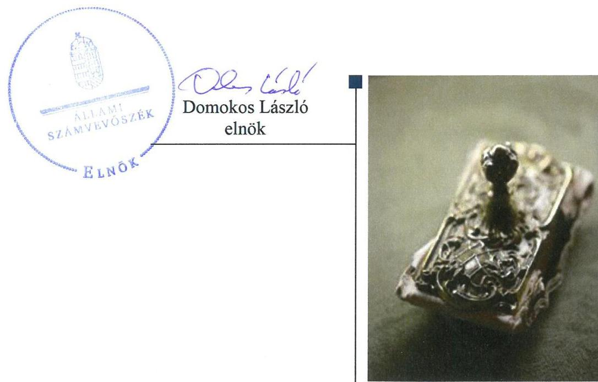
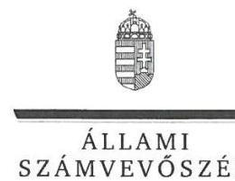
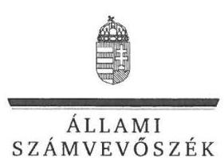

# Jelentés 

## Az önkormányzatok gazdasági társaságai

Az önkormányzatok többségi tulajdonában lévő gazdasági társaságok gazdálkodásának ellenőrzése - LŐRINC-MED Közhasznú Nonprofit Kft.
2018. 01. hó 03. nap

---

# AZ ELLENŐRZÉST FELÜGYELTE: 

DR. NAGY IMRE felügyeleti vezető

## AZ ELLENŐRZÉST VEZETTE ÉS A VÉGREHAJTÁSÁÉRT FELELŐS:

BAJNAI ZSUZSANNA ellenőrzésvezető

## A PROGRAM ÖSSZEÁLLÍTÁSÁÉRT FELELŐS:

TÓTPÁL SZABOLCS osztályvezető

## A TÉMÁHOZ KAPCSOLÓDÓ KORÁBBI SZÁMVEVŐSZÉKI JELENTÉSEK:

- címe: Az önkormányzatok többségi tulajdonában lévő gazdasági társaságok gazdálkodásának ellenőrzése - Szentlőrinci Közüzemi Nonprofit Kft.
- sorszáma: 16244

IKTATÓSZÁM: EL-0125-079/2018.
TÉMASZÁM: 2447
ELLENŐRZÉS-AZONOSÍTÓ SZÁM: V079315

---

# TARTALOMJEGYZÉK 

■ ÖSSZEGZÉS ..... 5
■ AZ ELLENŐRZÉS CÉLJA ..... 6
■ AZ ELLENŐRZÉS TERÜLETE ..... 7
■ AZ ELLENŐRZÉS HÁTTERE, INDOKOLTSÁGA ..... 8
■ A JELENTÉS LÉNYEGES KÉRDÉSKÖREI ..... 9
■ AZ ELLENŐRZÉS HATÓKÖRE ÉS MÓDSZEREI ..... 10
■ MEGÁLLAPÍTÁSOK ..... 12
■ JAVASLATOK ..... 16
■ MELLÉKLETEK ..... 19
I. sz. melléklet: Értelmező szótár ..... 19
■ FÜGGELÉK: ÉSZREVÉTELEK ..... 21
■ RÖVIDÍTÉSEK JEGYZÉKE ..... 37

---

.

---

# ÖSSZEGZÉS 

Szentlőrinc Város Önkormányzat tulajdonosi jogait nem szabályszerűen alakította ki és gyakorolta a LŐRINC-MED Közhasznú Nonprofit Kft. felett. A LŐRINC-MED Közhasznú Nonprofit Kft. szabályozottsága nem felelt meg az előírásoknak. A bevételek és ráfordítások elszámolása nem volt szabályszerű. Vagyongazdálkodása nem felelt meg a törvényi előírásoknak, a vagyon védelme nem volt biztosított. A közérdekű, és a közérdekből nyilvános adatait nem tette közzé, ezáltal gazdálkodása nem volt átlátható.

## Az ellenőrzés társadalmi indokoltsága

Magyarországon az intézménycentrikus közfeladat-ellátás jellemző, de egyre jelentősebb a költségvetésen kívüli feladatellátás térnyerése. Helyi szinten ennek legfontosabb szereplői az önkormányzati tulajdonban lévő gazdasági társaságok, amelyeknek ellenőrzése kiemelten fontos a közfeladat ellátása és a közvagyon megőrzése, megóvása érdekében. Ezért alapvető követelmény, hogy a társaságok gazdálkodása, működése szabályszerű és átlátható legyen. Az ellenőrzés rendet, a rend értéket teremt.

A LŐRINC-MED Közhasznú Nonprofit Kft. ellenőrzésére tevékenységének jellegére és kormányzati szektorba való besorolására tekintettel került sor, összhangban az Állami Számvevőszék Stratégiájában megfogalmazott célokkal.

## Főbb megállapítások, következtetések, javaslatok

Szentlőrinc Város Önkormányzat a tulajdonosi joggyakorlás kereteit nem a jogszabályoknak megfelelően alakította ki és a tulajdonosi jogokat nem szabályszerűen gyakorolta a LŐRINC-MED Közhasznú Nonprofit Kft. felett.

A LŐRINC-MED Közhasznú Nonprofit Kft. szabályzatai nem feleltek meg a törvényi előírásoknak. Ennek következtében a bevételek, ráfordítások, az értékcsökkenés elszámolása és a vagyon nyilvántartása nem volt szabályszerű.

A törvényben foglaltak ellenére mennyiségi felvétellel nem leltároztak, a jogszabályi előírás ellenére a számviteli beszámoló mérlegtételeit leltárral nem támasztották alá. A hiányosságok miatt nem érvényesült a valódiság számviteli alapelve.

A Társaság beszámolási és adatszolgáltatási kötelezettségét teljesítette, azonban a jogszabályi kötelezettség ellenére a közérdekű, a közérdekből nyilvános adatait nem tette közzé.

Az Állami Számvevőszék a jelentésben foglalt megállapítások alapján a LŐRINC-MED Közhasznú Nonprofit Kft. ügyvezetőjének a szabályozottsággal, a számviteli elszámolásokkal, a mérleg leltárral való alátámasztásával, a közzétételi kötelezettségekkel, valamint a kormányzati szektorba sorolt szervezeteknek előírt követelmények teljesítésével kapcsolatban kilenc javaslatot fogalmazott meg. Szentlőrinc Város Önkormányzat polgármesterének két javaslatot tett az Állami számvevőszék a felügyelő bizottság létszámával és ügyrendjével összefüggésben. A javaslatokat megalapozó megállapításokra az érintetteknek 30 napon belül intézkedési tervet kell készíteniük.

---

# AZ ELLENŐRZÉS CÉLJA 

Az ellenőrzés célja annak értékelése volt, hogy az önkormányzat vagyongazdálkodási tevékenysége során szabályszerűen gyakorolta-e tulajdonosi jogait; a gazdasági társaság szabályozottsága, gazdálkodása és vagyongazdálkodási tevékenysége, bevételeinek és ráfordításainak elszámolása megfelelt-e a jogszabályi és tulajdonosi előírásoknak. Az ellenőrzés célja továbbá annak megítélése volt, hogy az önkormányzat többségi tulajdonában lévő gazdasági társaság gazdálkodásának a kormányzati szektor hiányára és az államadósságra befolyással bíró elemei a jogszabályi előírásoknak megfeleltek-e.

---

# AZ ELLENŐRZÉS TERÜLETE 

## Szentlőrinc Város Önkormányzat, LŐRINC-MED Közhasznú Nonprofit Kft.

SZENTLŐRINC VÁROS ÖNKORMÁNYZAT és további 22 kistérségi önkormányzat alapította nyereség és vagyonszerzési cél nélkül a Társaságot ${ }^{1}$ a település és a kistérség közigazgatási területén élők egészségügyi alap- és szakorvosi ellátásának biztosítása érdekében a 2009. évben. Az Önkormányzat ${ }^{2}$ 96,0%-os minősített többségi befolyást biztosító tulajdonrésze, a Társaság tulajdonosi szerkezete az ellenőrzött időszakban nem változott. Az Önkormányzat nevében a Társaság felett a tulajdonosi jogokat a képviselő-testület gyakorolta.

Az Önkormányzat további kettő - televízió műsor készítéssel, távhőszolgáltatással foglalkozó - gazdasági társaság kizárólagos tulajdonosa volt.

A polgármester 2014. évi önkormányzati választások óta tölti be tisztségét, a jegyző személye egyszer változott az ellenőrzött időszakban.

A LŐRINC-MED KÖZHASZNÚ NONPROFIT KFT. tevékenysége az általános-, szakorvosi- és fogorvosi járóbeteg ellátás, valamint egyéb humán egészségügyi szolgáltatások biztosítására terjedt ki, melynek kereteit az Önkormányzattal kötött Egészségügyi ellátási szerződés ${ }^{3}$, valamint az OEP ${ }^{4}$-pel kötött Alapszerződés ${ }^{5}$ határozta meg. Kiegészítő jelleggel vállalkozási tevékenységet is folytatott, gyógyszerrel, gyógyászati termékekkel kereskedett, ingatlant adott bérbe. A Társaság által végzett tevékenységek közül az egészségügyi alapellátás minősült közfeladatnak.

A Társaság feladatát saját vagyonával látta el, kezelésében, használatában vagyonkezelt vagyon, kapcsolt vállalkozásban lévő részesedése nem volt.
2015. szeptember 8-tól közhasznú, 2015. december 30-tól kormányzati szektorba sorolással rendelkezett.

A Társaság jegyzett tőkéje 55,6 M Ft volt, amely nem módosult az ellenőrzött időszakban.

Átlagos statisztikai állományi létszáma a 2013. évben és a 2016. évben is 30 fő volt.

Az ügyvezető és a választott könyvvizsgáló személyében nem történt változás.

---

# AZ ELLENŐRZÉS HÁTTERE, INDOKOLTSÁGA 

Az önkormányzatok többségi tulajdonában álló gazdasági társaságok ellenőrzése kiemelten fontos a vagyon megőrzése, megóvása érdekében. Alapvető követelmény, hogy gazdálkodásuk, működésük szabályszerű, és az általuk szolgáltatott adatok megbízhatóak legyenek. A feladatellátás költségeinek, ráfordításainak alakulása a lakosság széles rétegét érinti.

Ellenőrzéseink feltárhatják, hogy az önkormányzat a feladatellátásához rendelt vagyon működtetését a tulajdonostól elvárható gondossággal végezte-e, a feladatot ellátó gazdasági társasággal a létesítő okiratban, szolgáltatási szerződésben foglaltakat betartatta-e, a társaság betartotta-e.

Az ellenőrzés eredményeképp meghatározhatóvá válnak a költségvetési hiányt befolyásoló szervezetek kockázatai, lehetővé válik ezen kockázatok csökkentése. Az ellenőrzés rávilágíthat arra, hogy a gazdasági társaság a vagyon használatával biztosította-e a szolgáltatás folytatásának feltételeit, az önkormányzat tulajdonosi felügyelete hozzájárult-e a szabályszerű gazdálkodáshoz és feladatellátáshoz. A megállapítások alapján megfogalmazott számvevőszéki javaslatok hasznosítása elősegítheti a meglévő hibák megszüntetését. A jó gyakorlatok bemutatásával az ÁSZ hozzájárulhat a követendő megoldások megismertetéséhez, terjesztéséhez.

---

# A JELENTÉS LÉNYEGES KÉRDÉSKÖREI 

1. Az önkormányzat tulajdonosi joggyakorlása szabályszerű volt-e?
2. A gazdasági társaság szabályozottsága, gazdálkodása és vagyongazdálkodási tevékenysége szabályszerű volt-e?

---

# AZ ELLENŐRZÉS HATÓKÖRE ÉS MÓDSZEREI 

## Az ellenőrzés típusa

Megfelelőségi ellenőrzés.

## Az ellenőrzött időszak

Az ellenőrzött időszak 2013. január 1-jétől 2016. december 31-ig tart.

## Az ellenőrzés tárgya

Az önkormányzatok többségi tulajdonában lévő gazdasági társaságok feletti tulajdonosi joggyakorlása, valamint a gazdasági társaságok gazdálkodásának szabályozottsága és szabályszerűsége volt az ellenőrzés tárgya.

Az ellenőrzés kiterjedt minden olyan körülményre és adatra, amely az ÁSZ ${ }^{6}$ jogszabályban meghatározott feladatainak teljesítéséhez, valamint a program végrehajtása folyamán felmerült újabb összefüggések feltárásához szükséges.

## Az ellenőrzött szervezet

Szentlőrinc Város Önkormányzat, LŐRINC-MED Közhasznú Nonprofit Kft.

## Az ellenőrzés jogalapja

Az ellenőrzés jogszabályi alapját az ÁSZ tv. ${ }^{7}$ 1. § (3) bekezdése és 5. § (3)(4)-(5) bekezdései képezték.

## Az ellenőrzés módszerei

Az ellenőrzést a nemzetközi standardokat irányadónak tekintve az ellenőrzési program ellenőrzési kérdései, az ellenőrzött időszakban hatályos jogszabályok, az ellenőrzés szakmai szabályok és módszertanok figyelembe vételével végeztük.

Az ellenőrzés ideje alatt az ellenőrzött szervezettel történő kapcsolattartást az ÁSZ Szervezeti és Működési Szabályzatának vonatkozó előírásai alapján biztosítottuk.

Az ellenőrzési kérdések megválaszolásához szükséges bizonyítékok megszerzése a következő ellenőrzési eljárások alkalmazásával történt:

---

megfigyelés, kérdésfeltevés (információkérés), összehasonlítás, valamint elemzés. Az ellenőrzési bizonyítékként felhasználható adatforrások közé tartoztak egyrészt az ellenőrzési programban felsorolt adatforrások, másrészt adatforrás minden - az ellenőrzés során - feltárt, az ellenőrzés szempontjából információkat tartalmazó dokumentum.

Az ellenőrzést a kérdésekre adott válaszok kiértékelésével, valamint a megjelölt adatforrások, a csatolt tanúsítványok felhasználásával, továbbá az adott időszakban hatályos jogszabályok figyelembe vételével folytattuk le.

A bevételek és a ráfordítások elszámolása terén a szabályszerű működést véletlen mintavétellel és irányított kiválasztással ellenőriztük. A jogszabályoknak és a belső előírásoknak megfelelőnek, azaz szabályszerűnek tekintettük az adott területet, amennyiben a minta ellenőrzésének eredménye alapján 95%-os bizonyossággal a teljes sokaságban a hibaarány kisebb volt, mint 10%, nem megfelelőnek értékeltük, ha a hibaarány a 10%-ot meghaladta. A vagyonnyilvántartás tételes ellenőrzésre került.

---

# 1. Az önkormányzat tulajdonosi joggyakorlása szabályszerű volt-e? 

Összegző megállapítás

Az Önkormányzat a tulajdonosi joggyakorlás kereteit nem szabályszerűen alakította ki, a Társaság felett nem szabályszerűen gyakorolta a tulajdonosi jogokat.

A TULAJDONOSI JOGGYAKORLÁSHOZ kapcsolódó feladatokat az Önkormányzat a Gt. ${ }^{8}$ és a Ptk. ${ }^{9}$ előírásainak megfelelően határozta meg az önkormányzati SZMSZ ${ }^{10}$-ben és a Vagyonrendelet ${ }^{11}$-ben.

A TÁRSASÁGI SZERZŐDÉSBEN ${ }^{12}$ rögzítették a Gt. és a Ptk. előírásainak megfelelően a taggyűlés kizárólagos hatáskörébe tartozó döntések körét. A Számv. tv. szerint a Társaság nem volt könyvvizsgálatra kötelezett, de a képviselő-testület döntése alapján a taggyűlés választott könyvvizsgálót. Rendelkeztek továbbá az Önkormányzat képviseletéről az FB ${ }^{13}$-ben, mely tagjainak számát a Taktv. ${ }^{14}$ 4. § (2) bekezdésében előírtak ellenére öt főben határozták meg három fő helyett. Az FB a Gt. 34. § (4) bekezdésében és a Ptk. 3:122. § (3) bekezdésében előírtak ellenére nem rendelkezett taggyűlés által jóváhagyott ügyrenddel.

A 2013-2014. ÉS A 2016. ÉVI BESZÁMOLÓK ${ }^{15}$ elfogadása megfelelt a törvényi előírásoknak. A 2015. évi Civil. tv. ${ }^{16}$ szerinti közhasznúsági mellékletről a Civil tv. 46. § (1) és a Ptk. 3:120. § (2) bekezdése ellenére az FB írásbeli jelentést nem készített, így annak elfogadása, közzététele nem felelt meg a törvényi előírásnak.

KÉSZFIZETŐ KEZESSÉGET vállalt az Önkormányzat a Társaság forgóeszköz finanszírozása érdekében kötött kölcsönszerződéshez, amely megfelelt a Ptk., Áht., és a Gst. ${ }^{17}$ előírásainak.

JAVADALMAZÁSI SZABÁLYZATOT a taggyűlés nem alkotott a Taktv. 5.§ (3) bekezdésében foglalt előírás ellenére 2016. április 28-ig. A 2016. május 1-től hatályos Javadalmazási szabályzat ${ }^{18}$ megfelelt a törvényi előírásoknak.

---

# 2. A gazdasági társaság szabályozottsága, gazdálkodása és vagyongazdálkodási tevékenysége szabályszerű volt-e? 

Összegző megállapítás

2.1. számú megállapítás

A Társaság szabályozottsága, bevételeinek és ráfordításainak elszámolása, vagyongazdálkodási tevékenysége nem volt szabályszerű. A közérdekű és közérdekből nyilvános adatokra vonatkozó közzétételi kötelezettségének nem tett eleget.

A Társaság számviteli törvény szerinti szabályzatai nem feleltek meg a jogszabályi követelményeknek, nem biztosítottak megfelelő keretet a bevételek és ráfordítások, valamint az értékcsökkenés szabályszerű elszámolásához, a vagyon nyilvántartásához. Vagyongazdálkodási tevékenysége nem felelt meg a törvényi előírásoknak.

A SZÁMVITELI POLITIKA ${ }^{19}$ keretében nem határozták meg a Számv. tv. ${ }^{20}$ 14. § (4) bekezdésében foglaltak ellenére, hogy mit tekintenek a számviteli elszámolás szempontjából lényegesnek, jelentősnek, nem lényegesnek, nem jelentősnek, kivételes nagyságú vagy előfordulású bevételnek, költségnek, ráfordításnak.

Az Értékelési szabályzatban ${ }^{21}$ a 2013-2015. évek között nem, a 2016. január 1-től hatályos Értékelési szabályzatban ${ }^{22}$ - az immateriális javak kivételével - nem rögzítették a Számv. tv. 14. §
 (3) bekezdése ellenére, hogy a Számv. tv. 52. § (1) bekezdése szerinti értékcsökkenés elszámolására milyen hasznos élettartam figyelembe vételével kerül sor. Az Értékelési szabályzat ${ }_{2}$ a számítástechnikai gépek, berendezések és a bútorok esetében az azonos eszközcsoportokhoz eltérő leírási kulcsot határozott meg. A 100 ezer Ft alatti egyedi bekerülési értékű eszközök értékének értékcsökkenésként történő elszámolását a Számviteli politikában két évben, míg az Értékelési szabályzat ${ }_{2}$-ban használatba vételkor egy összegben határozták meg.

A Leltározási szabályzat ${ }_{2}{ }^{23}$ megfelelt a Számv. tv. előírásainak. A 2016. január 1-től hatályos Leltározási szabályzat ${ }_{2}{ }^{24}$ a Számv. tv. 69. § (3) bekezdése ellenére a jogszabály által előírt legalább három évenkénti leltározás helyett 5-10 évben határozta meg a tárgyi eszközök mennyiségi felvétellel történő leltározásának gyakoriságát.

Pénzkezelési szabályzattal nem rendelkeztek 2015. augusztus 31-ig a Számv. tv. 14. § (5) d) pontjának előírása ellenére. A Pénzkezelési szabályzat ${ }_{1}{ }^{25}$ a Számv. tv. 14. § (8) bekezdése ellenére nem tartalmazta a napi készpénz záró állomány maximális mértékét. A 2016. január 1-től hatályos Pénzkezelési szabályzat ${ }_{2}{ }^{26}$ a Számv. tv.-nek megfelelt.

Számlarenddel a 2013-2015. években nem rendelkezett a Társaság a Számv. tv. 161. § (1) bekezdése ellenére. A 2016. január 1-től hatályos Számlarend ${ }^{27}$ nem felelt meg a Számv. tv. előírásának, mivel a Számv. tv. 161/A § (2) bekezdésben foglaltak ellenére könyvvezetési rendszerét nem részletezte tovább oly módon, hogy a Civil tv.-ben meghatározott közhasznúsági melléklet adatai - közhasznú és egyéb tevékenységek bevételei és ráfordításai - rendelkezésre álljanak, ezáltal nem volt biztosított a Civil tv. 46. § (1) bekezdése szerinti közhasznúsági melléklet elkészítéséhez szükséges adatok előállíthatósága.

---

A bevételek, ráfordítások, az értékcsökkenés számviteli elszámolása, a vagyon nyilvántartása nem volt szabályszerű. A bevételek elszámolása nem volt szabályszerű, mert a Számv. tv. 161/A § (2) bekezdése ellenére közhasznú tevékenységéhez kapcsolódó bevételeit nem elkülönítetten számolta el. Az anyagjellegű és a személyi jellegű ráfordítások esetében a számviteli nyilvántartásokba a Számv. tv. 165. § (2) bekezdésében foglaltak ellenére bizonylatok hiányában rögzítettek adatot. A vagyon nyilvántartása, az értékcsökkenés elszámolása nem felelt meg az előírásoknak, mert a Számv tv. 52. § (2) bekezdése ellenére nem dokumentálták hitelt érdemlő módon az üzembe helyezést.

A vagyonnal való felelős gazdálkodás nem valósult meg, mivel a Számv. tv. 69. § (1) bekezdésben foglaltak ellenére a számviteli beszámolók mérlegtételeit leltárral nem támasztották alá, a Számv. tv. 69. § (3) bekezdésében foglaltak ellenére az üzleti év mérleg-fordulónapjára vonatkozó leltározást mennyiségi felvétellel nem végezték el az ellenőrzött időszak egyik évében sem.

A szabályozási hiányosságok és hibák, valamint a leltározás elmaradása miatt a könyvvezetés és a beszámolás során nem érvényesült a Számv. tv. 15. § (3) bekezdésében előírt valódiság elve, amely szerint a könyvvitelben rögzített és a beszámolóban szereplő tételeknek a valóságban is megtalálhatóknak, bizonyíthatóknak, kívülállók által is megállapíthatóknak kell lenniük. A könyvvizsgáló ennek ellenére a Társaság 2013-2016. évi beszámolóit korlátozás nélküli hitelesítő záradékkal látta el.

A térítési díj szabályozásának, szolgáltató hatáskörében történő megállapításának, nyilvánosságra hozatalának és befizetésének rendjét meghatározó, jóváhagyott szabályzattal a Társaság nem rendelkezett a 284/1997. (XII. 23.) Korm. rendelet ${ }^{28} 1 . \S$ (6) bekezdésének előírása ellenére.

Belső ellenőrzési rendszerét a szervezet tevékenységének, a célok megvalósításának nyomon követését biztosító rendszer keretében Társaság nem alakította ki a Bkr. ${ }^{29}$ 10. §-a ellenére kormányzati szektorba sorolását követően a 2016. január 1. és 2016. szeptember 30. közötti időszakban.

A kormányzati szektor hiányára és az államadósságra befolyással bíró gazdasági eseménye a Társaságnak nem volt.

# 2.2. számú megállapítás 

A Társaság nem tette közzé a közérdekű és a közérdekből nyilvános adatait.

A beszámolók letétbe helyezéséről és közzétételéről határidőben gondoskodtak a Számv. tv.-ben foglaltaknak megfelelően.

A közérdekű adatokat - az Info tv. ${ }^{30}$ 1. melléklete szerint - a Társaság az Info tv. 37. § (1) bekezdése ellenére nem tette közzé honlapján.

A közérdekből nyilvános adatokat a vezető tisztségviselőkre, a felügyelőbizottsági tagokra, illetve a bankszámla feletti

---

rendelkezésre jogosult munkavállalókra vonatkozóan a Társaság a Taktv. 2. § (1) bekezdésében foglaltak ellenére nem tette közzé.

Adatvédelmi szabályzattal 2015. szeptember 1-től rendelkezett a Társaság, az megfelelt a jogszabályi előírásoknak.

---

# JAVASLATOK 

Az ÁSZ tv. 33. § (1) bekezdésében foglaltak értelmében az ellenőrzött szervezet vezetője köteles a jelentésben foglalt megállapításokhoz kapcsolódó intézkedési tervet összeállítani és azt a jelentés kézhezvételétől számított 30 napon belül az ÁSZ részére megküldeni. Amennyiben az ellenőrzött szervezet vezetője nem küldi meg határidőben az intézkedési tervet, vagy továbbra sem elfogadható intézkedési tervet küld, az Állami Számvevőszék elnöke az ÁSZ tv. 33. § (3) bekezdése a) és b) pontjaiban foglaltakat érvényesítheti.

## LŐRINC-MED Nonprofit Kft. Ügyvezetőjének

1. Intézkedjen a számviteli politika jogszabályi előírásnak megfelelő tartalommal történő elkészítéséről, módosításáról.
(2.1. sz. megállapítás 1. bekezdése alapján)
2. Intézkedjen az eszközök és források értékelési szabályzata jogszabályban foglalt követelmények szerinti módosításáról.
(2.1. sz. megállapítás 2. bekezdés 1. mondata alapján)
3. Intézkedjen a jogszabályi előírásnak megfelelő leltározási szabályzat elkészítéséről.
(2.1. sz. megállapítás 3. bekezdése alapján)
4. Gondoskodjon a jogszabályi előírásoknak megfelelő számlarend elkészítéséről.
(2.1. sz. megállapítás 5. bekezdése alapján)
5. Intézkedjen, hogy a bevételek, ráfordítások, az értékcsökkenés elszámolása a jogszabályi előírásoknak megfelelően történjen.
(2.1. sz. megállapítás 6. bekezdése alapján)
6. Biztosítsa, hogy a Társaság éves számviteli beszámolójának mérlege a jogszabályok előírásának megfelelő, szabályszerű leltározás alapján elkészített leltárral legyen alátámasztva.
(2.1. sz. megállapítás 7. bekezdése alapján)
7. Gondoskodjon a jogszabályban foglaltak szerint a Társaság térítési díj szabályzatának elkészítéséről és kezdeményezze annak jóváhagyását.
(2.1. sz. megállapítás 9. bekezdése alapján)

---

8. Gondoskodjon az Info tv. előírásai alapján a közzétételi kötelezettség teljesítéséről.
(2.2. sz. megállapítás 2. bekezdése alapján)
9. Intézkedjen a közérdekből nyilvános adatoknak a Társaság honlapján a Taktv.-ben előírtaknak megfelelő közzétételéről.
(2.2. sz. megállapítás 3. bekezdése alapján)

# Szentlőrinc Város Önkormányzat Polgármesterének 

1. Kezdeményezze, hogy a Társaság taggyülése intézkedjen a felügyelő bizottság létszámának a jogszabályi előírások szerinti kialakításáról.
(1. Összegző megállapítás 2. bekezdés 3. mondata alapján)
2. Kezdeményezze a Társaság felügyelő bizottságánál az ügyrend elkészítését és a Társaság legfőbb szerve általi jóváhagyását.
(1. Összegző megállapítás 2. bekezdés 4. mondata alapján)

---

.

---

# MELLÉKLETEK 

- I. SZ. MELLÉKLET: ÉRTELMEZŐ SZÓTÁR
gazdasági társaság
kezesség
minősített többséget biztosító részesedés
nemzeti vagyon
nonprofit gazdasági társaság

Ptk. 3:88. § (1) bekezdése szerint „a gazdasági társaságok üzletszerű közös gazdasági tevékenység folytatására, a tagok vagyoni hozzájárulásával létrehozott, jogi személyiséggel rendelkező vállalkozások, amelyekben a tagok a nyereségből közösen részesednek, és a veszteséget közösen viselik".
A kezességre vonatkozó előírásokat a Ptk. 6:416-430. §-ai tartalmazzák. Kezességi szerződéssel a kezes kötelezettséget vállal a jogosulttal szemben, hogyha a kötelezett nem teljesít, maga fog helyette a jogosultnak teljesíteni. Kezesség egy vagy több, fennálló vagy jövőbeli, feltétlen vagy feltételes, meghatározott vagy meghatározható összegű pénzkövetelés vagy pénzben kifejezhető értékkel rendelkező egyéb kötelezettség biztosítására vállalható.
A Ptk. szerint kezességet csak írásban lehet vállalni. A kezes kötelezettsége ahhoz a kötelezettséghez igazodik, amelyért kezességet vállalt. A kezes kötelezettsége nem válhat terhesebbé, mint amilyen elvállalásakor volt, kiterjed azonban a kötelezett szerződésszegésének jogkövetkezményeire és a kezesség elvállalása után esedékessé váló mellékkövetelésekre is.
A minősített befolyásszerző az ellenőrzött társaságban a szavazatok legalább hetvenöt százalékával rendelkezik. (Ptk. 3:324. §)
Nvtv. ${ }^{32}$ 1. § (2) bekezdése szerint többek között:
„az állam vagy a helyi önkormányzat kizárólagos tulajdonában álló dolgok,
az a) pont hatálya alá nem tartozó, állam vagy a helyi önkormányzat tulajdonában lévő dolog,
az állam vagy a helyi önkormányzat tulajdonában lévő pénzügyi eszközök, továbbá az államot vagy a helyi önkormányzatot megillető társasági részesedések,
az államot vagy a helyi önkormányzatot megillető bármely vagyoni értékkel rendelkező jogosultság, amelyet jogszabály vagyoni értékű jogként nevesít."
Civil tv. 9/F. § (2) bekezdése szerint „az a gazdasági társaság minősül nonprofit gazdasági társaságnak és cégnevében az a gazdasági társaság tüntetheti fel a nonprofit jelleget, amelynek létesítő okirata tartalmazza, hogy a gazdasági társaság tevékenységéből származó nyereség a tagok között nem osztható fel, hanem az a gazdasági társaság vagyonát gyarapítja." (hatályos 2014. március 15-től)

---

.

---

# FÜGGELÉK: ÉSZREVÉTELEK 

A jelentéstervezetet a Számvevőszék 15 napos észrevételezésre megküldte az ellenőrzött szervezetek vezetőinek az ÁSZ tv. 29. §* (1) bekezdése előírásának megfelelően.

Az ÁSZ a jelentéstervezetet észrevételezésre megküldte Szentlőrinc Város Önkormányzat polgármesterének és a LŐRINC-MED Közhasznú Nonprofit Kft. ügyvezetőjének.
Szentlőrinc Város Önkormányzat Polgármestere a jelentéstervezetre észrevételt nem tett. A függelék tartalmazza a LŐRINC-MED Közhasznú Nonprofit Kft. ügyvezetőjének észrevételét mellékletek nélkül, illetve az el nem fogadott észrevételek elutasításának indoklását.

[^0]
[^0]:    * 29. § (1) Az Állami Számvevőszék az ellenőrzési megállapításait megküldi az ellenőrzött szervezet vezetőjének vagy az általa megbízott személynek, és annak, akinek személyes felelősségét állapította meg.
    (2) Az ellenőrzött szervezet vezetője és a felelősként megjelölt személy az ellenőrzés megállapításaira tizenöt napon belül írásban észrevételt tehet.
    (3) Az Állami Számvevőszék az észrevételre a beérkezésétől számított harminc napon belül írásban válaszol. A figyelembe nem vett észrevételeket köteles a jelentésben feltüntetni, és megindokolni, hogy azokat miért nem fogadta el.

---

# ESZTERHÁZY EGÉSZSÉGKÖZPONT 

Állami Számvevőszék
Domokos László elnök úr részére
1052 Budapest, Apáczai Csere János u. 10.
Levélcím: 1364 Budapest, 4. Pf. 54
Ellenőrzés vezető Önöknél: Bajnai Zsuzsanna

Tisztelt Elnök Úr!

A 2018. április 18.-án érkezett (IKTATÓSZÁM: EL-0529-010/2018.; TÉMASZÁM: 2447; ELLENŐRZÉS-AZONOSÍTÓ SZÁM: V079315),Az önkormányzatok többségi tulajdonában lévő gazdasági társaságok gazdálkodásának ellenőrzése - LÖRINC-MED KÖZHASZNÚ NONPROFIT Kft." tárgyban írt jelentés tervezetet köszönettel megkaptam.

A fenti iktatószám alatt 2017-ben lefolytatott ÁSZ ellenőrzés során a Társaság számviteli szolgáltatását ellátó szervezet illetve a választott könyvvizsgáló nem volt jelen.

Az ellenőrzés részére megküldött iratanyag összeállításakor a Társaság egyéb adminisztratív feladatait ellátó kollégái segítettek, akik a jegyzőkönyv megállapításai szempontjából nem bírtak szakértelemmel. Sajnálatos módon tapasztaltam, hogy az ellenőrzésre feltöltött anyagok, illetve az ellenőrzés helyszíni lefolytatásakor rendelkezésére bocsájtott dokumentációk illetve iratanyagok nem voltak teljeskörűek a vizsgált évek vonatkozásában.

A jegyzőkönyv kézhezvétele után az abban foglalt tartalmára tekintettel azt megküldtem a könyvelést végző könyvelő irodának illetve a könyvvizsgálatot ellátó irodának. Az érintettek által megkapott visszajelzéssel összhangban az alábbiakban tesszük meg észrevételeinket. összhangban a jegyzőkönyv egyes észrevételeivel az ÁSZ tv. 29. § (2) bekezdésre hivatkozva.

---

# > A jegyzőkönyv 2-es pontjában a Számviteli politikára tett megállapítások: 

„A SZÁMVITELI POLITIKA ${ }^{19}$ keretében nem határozták meg a Számv. tv. 2014. § (4) bekezdésében foglaltak ellenére, hogy mit tekintenek a számviteli elszámolás szempontjából lényegesnek jelentősnek, nem lényegesnek, nem jelentősnek, kivételes nagyságú vagy előfordulású bevételnek, költségnek, ráfordításnak"

A Társaság működésének minden évére rendelkezett a számviteli törvényben meghatározottak szerinti számviteli politikával, illetve az ahhoz tartozó szabályzatokkal. A vizsgálatra feltöltött iratanyagunk-szakértelmünk hiányában nem volt teljes körű.

Az előző évi számviteli politikáit utoljára 2016.03.31.-i hatállyal módosítottuk, mely
 számviteli politika jelenleg is hatályban van. A 11. oldal 1. bekezdésében szerepeltettük a Számviteli tv. 14.§ 4. bek. foglaltak szerint a jelentős és nem jelentős bevétel, kiadások, ráfordítások számviteli elszámolását.
„Az Értékelési szabályzatban a 2013-2015. évek között nem, a 2016. január 1-től hatályos Értékelési szabályzatban nem rögzítették - az immateriális javak kivételével - a Számv. tv. 14. § (3) bekezdése ellenére, hogy a Számv. tv. 52. § (1) bekezdése szerinti értékcsökkenés elszámolására milyen hasznos élettartam figyelembe vételével kerül sor. Az Értékelési szabályzat a számítástechnikai gépek, berendezések és a bútorok esetében az azonos eszközcsoportokhoz eltérő leírási kulcsot határozott meg. A 100 ezer Ft alatti egyedi bekerülési értékű eszközök értékének értékcsökkenésként történő elszámolását a Számviteli politikában két évben, míg az Értékelési szabályzatban használatba vételkor egy összegben határozták meg."

Értékelési szabályzatunk tartalmazza az évenkénti elszámolásra kerülő értékcsökkenés megállapításakor figyelembe veendő körülményt az adott eszköz használatának hasznos élettartalmát, melyet a fizikai elhasználódás figyelembe vételével határozza meg Társaságunk.

---

# A 100e alatti tárgyi eszköz értékcsökkenésként történő elszámolását az Értékelési szabályzatban is kétféle módon határoztuk meg: 

1. alakuláshoz beszerzett kis értékű eszközök amortizációs kulcsát,
2. 2016.01.01.-től a 100e alatti tárgyi eszköz bekerülési értékét használatbavételkor egy összegben számoljuk el.
„A Leltározási szabályzat megfelelt a Számv. tv. előírásainak. A 2016. január 1-től hatályos Leltározási szabályzat a Számv. tv. 69. § (3) bekezdése ellenére a jogszabály által előírt legalább három évenkénti leltározás helyett 5-10 évben határozta meg a tárgyi eszközök mennyiségi felvétellel történő leltározásának gyakoriságát."

A leltározási szabályzatban foglaltakat áttekintjük az Önök iránymutatásai alapján, a törvényi rendelkezéseknek megfelelően korrigáljuk. Megjegyezni kívánjuk, hogy az 5-10 éves intervallum kizárólag a tárgyi eszközök vonatkozásában volt használatos. A készletek leltározása minden évben mennyiségi felvétellel történt, a befektetett eszközöket évenként az analitikus nyilvántartás egyeztetésével szúrópróbaszerűen egyeztettük. A nyilvántartásba vett eszközök valós meglétéért személyemben felelősséget vállalok.
„Pénzkezelési szabályzattal nem rendelkeztünk 2015. augusztus 31-ig a Számv. tv. 14. § (5) d) pontjának előírása ellenére. A Pénzkezelési szabályzat a Számv. tv. 14. § (8) bekezdése ellenére nem tartalmazta a napi készpénz záró állomány maximális mértékét. A 2016. január 1-től hatályos Pénzkezelési szabályzat a Számv. tv.-nek megfelelt."

A korábbi évek mindegyikére rendelkezünk pénzkezelési szabályzattal. Társaságunk készpénz forgalma elenyésző. A gazdasági események meghatározó részének pénzmozgása bankszámla forgalommal történik. A korábbi években a pénzkezelési szabályzatban a pénztárban tartható pénzkészlet maximális értékének meghatározása azért nem szerepelt, mert e tekintetben a számviteli törvény napi átlagos készpénz állomány maximumára történő előírásokat tekintettük relevánsnak.

---

„Számlarenddel a 2013-2015. években nem rendelkezett a Társaság a Számv. tv. 161. § (1) bekezdése ellenére. A 2016. január 1-től hatályos Számlarend nem felelt meg a Számv. tv. előírásának, mivel a Számv. tv. 161/A § (2) bekezdésben foglaltak ellenére könyvvezetési rendszerét nem részletezte tovább oly módon, hogy a Civil tv.-ben meghatározott közhasznúsági melléklet adatai - közhasznú és egyéb tevékenységek bevételei és ráfordításai - rendelkezésre álljanak, ezáltal nem volt biztosított a Civil tv. 46. § (1) bekezdése szerinti közhasznúsági melléklet elkészítéséhez szükséges adatok előállíthatósága."

Társaságunk alakulástól kezdődően rendelkezett számlarenddel. A közhasznúsági fokozatot 2015. szeptember 8-án szerezte meg, ezt megelőzően nem tartozott a civil törvény hatálya alá. Alakuláskor a könyvvezetést ellátó könyvelő iroda saját szoftverrel dolgozott, melyhez tartozó számlarend szerepelt a számviteli politikánk keretében kialakított számlarendben. 2015 évben könyvelőváltás után a könyvelést a Társaság tulajdonát képező ügyviteli rendszerben végezzük. A könyvvezetés során használt főkönyvi számlák az egyes tevékenységi körök bevételeit elkülönülten tartalmazzák, mely alapján a közhasznú tevékenységből származó bevételünk jól elkülöníthető. Iránymutatásuk alapján ezt is áttekintjük és a szükséges esetleges javításokat elvégezzük.

Az 1-es számú mellékletként csatoljuk a jelenleg hatályos számviteli politikánkat és a hozzá tartozó értékelési szabályzatot, melyeket újra áttekintünk és az ellenőrzés iránymutatása alapján szükséges korrekciókat elvégezzük.

A Társaságunknál működő felügyelő bizottság a Számviteli tv. előírásainak megfelelően készített beszámolókat ellenőrizte, értékelte.

Társaságunk minden gazdasági eseményt, az azt alátámasztó számviteli törvényben meghatározott bizonylati fegyelemre előírt rendelkezések szerint kiállított bizonylat alapján könyvel. A beruházásokat aktiváláskor üzembe helyezési okmányokkal látjuk el. Beruházásaink meghatározó része pályázati pénzeszközökből történt, melyek ellenőrzése, az évek folyamán minden eszközre megvalósult. Ezen ellenőrzések hiányosságokat a nyilvántartások tekintetében sem tártak fel. Az integrált ügyviteli rendszer nem teszi lehetővé a bizonylat nélküli könyvelést, a jegyzőkönyv bizonylat nélküli könyvelésre való utalását nem tekinthetjük általunk elfogadottnak.

---

„A vagyonnal való felelős gazdálkodás nem valósult meg, mivel a Számv. tv. 69. § (1) bekezdésben foglaltak ellenére a számviteli beszámolók mérlegtételeit leltárral nem támasztották alá, a Számv. tv. 69. § (3) bekezdésében foglaltak ellenére az üzleti év mérleg-fordulónapjára vonatkozó leltározást mennyiségi felvétellel nem végezték el az ellenőrzött időszak egyik évében sem.
A szabályozási hiányosságok és hibák, valamint a leltározás elmaradása miatt a könyvvezetés és a beszámolás során nem érvényesült a Számv. tv. 15. § (3) bekezdésében előírt valódiság elve, amely szerint a könyvvitelben rögzített és a beszámolóban szereplő tételeknek a valóságban is megtalálhatóknak, bizonyíthatóknak, kívülállók által is megállapíthatóknak kell lenniük. A könyvvizsgáló ennek ellenére a Társaság 2013-2016. évi beszámolóit korlátozás nélküli hitelesítő záradékkal látta el."

# A Társaság könyvvizsgálójának ezen megállapításra felém írt észrevétele a következő: 

„A részemre megküldött - 2018.04.16.-án kelt - EL-0529.006/2018 iktatószámú Állami Számvevőszék által készített jelentéstervezetben foglaltakra az alábbi észrevételt teszem:

A vizsgált időszak alatt társaságunk végezte a Lőrinc-Med Közhasznú Nonprofit Kft. egyszerűsített éves beszámolóinak könyvvizsgálatát.

A 2017 évben lefolytatott - 2013-2016 közötti éveket érintő ÁSZ vizsgálat megállapításai a jelentés-tervezet szerint:

- a Lőrinc-Med Közhasznú Nonprofit Kft. szabályzatai nem feleltek meg a törvényi előírásoknak, ennek következtében a bevételek-ráfordítások, az értékcsökkenés elszámolása és a vagyon nyilvántartása nem volt szabályszerű.
- a törvényben foglaltak ellenére mennyiségi felvétellel nem leltároztak, a jogszabályi előírás ellenére a számviteli beszámoló mérlegtételeit leltárral nem támasztották alá. A hiányosság miatt nem érvényesült a valódiság számviteli alapelve.

Megállapítást tesz a jegyzőkönyv arra vonatkozóan, hogy társaságunk korlátozás nélküli hitelesítő záradékot adott ki minden évben annak ellenére, hogy a mérlegtételek leltárral alátámasztottak lettek volna.

Társaságunk a könyvvizsgálatot minden évben a társaság székhelyén folytatta le.
A könyvvizsgálatot a magyar Nemzeti Könyvvizsgálati Standardok szerint végeztük el.
Ennek keretében minden év tekintetében a beszámolók mérlegsoraihoz leltárakat, egyeztető analitikus nyilvántartásokat kértünk, és kaptunk.
Könyvvizsgálati dokumentációnk ezeket tartalmazza.
Az eszközállomány legjelentősebb tétele, mintegy 90%-a a Befektetett eszközök állománya. Ehhez a társaság tételes, minden eszközt egyedileg rögzítő analitikus kimutatással rendelkezik, melyet minden évben az adótörvény, illetve a számviteli törvény szerinti értékcsökkenési leírás elszámolása, az új beszerzések állományba vétele után részünkre megküldött. A mérlegtétel valódiságának ellenőrzéséhez auditunk során a társaság székhelyén szemrevételezéssel, szúrópróbaszerűen

---

ellenőriztük az eszközállomány tényleges meglétét, azok valós létezését. Az új eszközök beszerzési számláit, és az aktiválási értékeket minden esetben egyeztettük.

- az anyagkészlet, illetve a bolti készlet alátámasztására minden évben leltárat kaptunk a társaságtól, melyet - annak volumenét tekintve - a főkönyvi kartonokon könyvelt tételek és a számlák összevetése alapján fogadtunk el. A leltárakat a társaság tényleges felvétellel állapította meg.
- az OEP-el szemben fennálló követelést a mérlegkészítés időpontjáig pénzügyileg rendezett tétel alapján igazoltuk, a vevőköveteléseket egyedi értékeléssel, tételes analitikus nyilvántartással, a pénzügyi rendezések áttekintésével, illetve a vevők visszaigazolása alapján fogadtuk el.
- A pénzeszközök értékének alátámasztására pénztári leltárat, illetve a banki kivonatokat használtunk.
- a kötelezettségeket a szállítók egyedi nyilvántartásával, pénzügyi rendezésekkel, esetleges egyenlegközlőkkel fogadtuk el alátámasztottnak. A költségvetési kapcsolatok ellenőrzéséhez minden évben adófolyószámlával rendelkezünk.
- az átmenő tételeket a következő évi bizonylatok alapján ellenőriztük.
- a bevételek-kiadások elszámolásához az eredmény kimutatás adatait a kiállított, illetve befogadott számlák szerint ellenőriztük.

Az ÁSZ által folytatott ellenőrzésen nem voltunk jelen, bár jeleztük, hogy amennyiben szükséges a beszámolókat érintő tárgyaláson részt tudunk venni.
Információnk szerint a helyszíni ellenőrzés végzésével született jegyzőkönyvben rögzítésre került, hogy a vizsgálat részére a helyszínen biztosítani nem tudott leltárak nálunk, valamint a könyvelést ellátó irodánál rendelkezésre állnak.

Kérem Tisztelt Igazgatónőt, hogy a jegyzőkönyv-tervezetre fennálló észrevételezési lehetőséggel élve jelezni szíveskedjék az Állami Számvevőszék felé, hogy az egyes évek korlátozás nélküli könyvvizsgálói jelentését megalapozottan, a mérlegben szereplő sorok tételes vizsgálata után adtuk ki.

A Számviteli Politikára tett megállapításokat a társaság könyvelőjével egyeztetjük, a szükséges korrekciókat felülvizsgáljuk, és természetesen Igazgatónő elé tárjuk, hogy a javítások az ÁSZ iránymutatása alapján a szabályzatban átvezetésre kerülhessenek.
Véleményünk szerint az ezzel kapcsolatban megállapított hiányosságok az elkészített beszámolók valódiságát nem kérdőjelezik meg."

Ahogy az a könyvvizsgálói levélből is kiderül Társaságunk minden évben minden mérlegsort alátámasztóan leltárt készített. Valószínűsíthetően az ellenőrzéshez rendelkezésre bocsájtott dokumentáció az azt összeállító kollégák szakértelmének hiánya miatt nem tartalmazta ezen leltárakat.

Társaságunknál 2017. szeptember 28-án megjelentek két kollégájuk, akiknek jeleztük, hogy a kért leltárakkal rendelkezünk, ezek a könyvelőnél és a könyvvizsgálónál megtalálhatóak. Könyvvizsgálónk a vizsgálat ideje alatt jelezte, hogy a beszámolókat alátámasztó leltárakat Pécsről Szentlőrincre hozza, de az ellenőrök ezt nem várták meg. Jegyzőkönyvbe rögzítettük azonban, hogy esetleges hiánypótlás keretében a leltárakat az ÁSZ részére pótoljuk. A jegyzőkönyvet 2-es számú mellékletként csatoljuk. Időközben ilyen

---

hiánypótlásra nem került sor, ezért jelen levelünk 3-as számú mellékleteként az egyes mérlegsorok tartalmának leltárát, a befektetett eszközök és készletek tételes leltárát csatoljuk. A mérlegsorokhoz tartozó további analitikus és egyeztető nyilvántartásokkal rendelkezünk, szükség esetén azokat is az Önök rendelkezésére bocsájtjuk.

# > 2.2. számú megállapításra történő észrevételeink az alábbiak. 

## A 2.2. számú megállapítás 2. bekezdésére az alábbiakat adjuk elő.

A közérdekű adatokat - az Infotv. 301. melléklete szerint - a Társaságunk az Infotv. 37. § (1) bekezdése alapján időközben 2018.03.16-án közzé tette honlapján (www.eszterhazy-eu.hu Közérdekű adatok 1., Közérdekű adatok 2., Közérdekű adatok 3. menüpontokban) a Nemzeti Adatvédelmi Hatóság NAIH/2018/1222/V/2. számú 2018. február 26. napján kelt és 2018. február 28. napján Szentlőrinc város jegyzőjének címzett felhívása alapján. Nevezett Hatóság a közzétételt leellenőrizte és arról tájékoztatott engem, hogy a közzétételünk megfelel az elvárásoknak.

## A 2.2. számú megállapítás 3. bekezdésére az alábbiakat adjuk elő.

A közérdekből nyilvános adatokat a Társaságunk a Taktv. 2. § (1) bekezdésében foglaltak megfelelően, a Nemzeti Adatvédelmi Hatóság fenti felhívásának eleget téve közzé tette honlapján (www.eszterhazy-eu.hu Közérdekű adatok 3. menüpontban).

Adatvédelmi szabályzattal valóban csak 2015. szeptember 1-től rendelkezett a Társaságunk, mivel sajnálatos módon akkor vettük észre, hogy ebbéli kötelezettségünknek nem tettünk eleget. Köszönjük észrevételüket, nevezetesen azt, hogy az viszont megfelelt a jogszabályi előírásoknak.

Végezetül, de nem utolsó sorban szeretném megköszönni Elnök úrnak és az ellenőrzésben részt vett munkatársainak a gondos és alapos, szakmailag felkészült munkát, amely nagyban hozzájárul, hogy Társaságunk a megállapítások alapján megfogalmazott számvevőszéki javaslatokat hasznosítsa.

---

Az Önök ellenőrzése elősegíti a meglévő hibák megszüntetését. A jó gyakorlatok bemutatásával az ÁSZ hozzájárult, hogy Társaságunk
 a követendő megoldásokat megismerje, és terjesztése általunk megvalósuljon.

Tisztelettel kérem, hogy a fenti észrevételeinket a végleges jelentésük elkészítése során vegyék figyelembe.

Szentlőrinc, 2018.04.28.

Tisztelettel és köszönettel,
Dr. Verasztó Hermin
ügyvezető-orvosigazgató
LŐRINC-MED Kft.
7940 Szentlőrinc, Eszterházy utca 1.
Eszterházy utca
Cg.: 02-09-074326 - Adószám: 14018325-2-02
Bsz: 11711135-20011538

---

ELNÖK

# Dr. Verasztó Hermin úrhölgy 

ügyvezető
LŐRINC-MED Közhasznú Nonprofit Kft.

## Szentlőrinc

## Tisztelt Ügyvezető Úrhölgy!

„Az önkormányzatok gazdasági társaságai - Az önkormányzatok többségi tulajdonában lévő gazdasági társaságok gazdálkodásának ellenőrzése - LŐRINC-MED Közhasznú Nonprofit Kft." címmel készített számvevőszéki jelentéstervezetre tett észrevételeit köszönettel megkaptam.
Az Állami Számvevőszék észrevételekre vonatkozó álláspontjáról a felügyeleti vezető által készített részletes tájékoztatást csatoltan megküldöm.
Tájékoztatom Ügyvezető úrhölgyet, hogy a számvevőszéki jelentésben - az Állami Számvevőszékről szóló 2011. évi LXVI. törvény 29. § (3) bekezdése alapján - a figyelembe nem vett észrevételeket szerepeltetjük az elutasítás indokának feltüntetésével.

Budapest, 2018. 28. hó 29. nap

Tisztelettel:

Melléklet: Tájékoztatás az észrevételek kezeléséről

---

FELÜGYELETI VEZETŐ

Melléklet
Ikt.szám: EL-0529-013/2018.

# Tájékoztatás   az észrevételek kezeléséről 

„Az önkormányzatok gazdasági társaságai - Az önkormányzatok többségi tulajdonában lévő gazdasági társaságok gazdálkodásának ellenőrzése - LŐRINC-MED Közhasznú Nonprofit Kft." című számvevőszéki az Állami Számvevőszékhez 2018. május 4-én érkezett észrevételeit áttekintettük, annak kezelésével kapcsolatban a következő tájékoztatást adom.

1. A jelentéstervezet 2.1. számú megállapítás 1. bekezdésére („A Számviteli politika ${ }^{10}$ keretében nem határozták meg a Számv. tv. 14. § (4) bekezdésében foglaltak ellenére, hogy mit tekintenek a számviteli elszámolás szempontjából lényegesnek, jelentősnek, nem lényegesnek, nem jelentősnek, kivételes nagyságú vagy előfordulású bevételnek, költségnek, ráfordításnak.") vonatkozó észrevételben jelezte, hogy a Társaság működésének minden évére rendelkezett a számviteli törvényben meghatározottak szerinti számviteli politikával, illetve az ahhoz tartozó szabályzatokkal, azonban a feltöltött iratanyag nem volt teljes körű. A 2016. március 1-ei hatállyal módosított számviteli politikában szerepel a jelentős, nem jelentős bevétel, kiadás, ráfordítás számviteli elszámolása.
Az Állami Számvevőszék (ÁSZ) az ellenőrzését a megküldött ellenőrzési programnak megfelelően, a rendelkezésére bocsátott adatok és dokumentumok alapján végezte. Az Állami Számvevőszékről szóló 2011. évi LXVI. törvény 28. § (1) bekezdése alapján a közreműködésre felhívott szervezet az ÁSZ részére - annak kérésére soron kívül, de legkésőbb öt munkanapon belül - az ellenőrzés lefolytatása érdekében szükséges adatokat és dokumentumokat rendelkezésre bocsátja. A Társaság az ÁSZ adatbekéréseihez megküldött teljességi és hitelességi nyilatkozataiban kijelentette, hogy az ÁSZ részére átadott dokumentumok, adatok a bekért adatokra, dokumentumokra vonatkozóan teljes körű információt tartalmaznak. Erre tekintettel az intézkedést igénylő megállapítás módosítása, illetve törlése nem indokolt.
2. A jelentéstervezet 2.1. számú megállapítás 2. bekezdés 1.-2. mondatára („Az Értékelési szabályzatban a 2013-2015. évek között nem, a 2016. január 1-től hatályos Értékelési szabályzatban nem rögzítették - az immateriális javak kivételével - a Számv. tv. 14. § (3) bekezdése ellenére, hogy a Számv. tv. 52. § (1) bekezdése szerinti értékcsökkenés elszámolására milyen hasznos élettartam figyelembe vételével kerül sor. Az Értékelési szabályzat, a számítástechnikai gépek, berendezések és a bútorok esetében az azonos eszközcsoportokhoz eltérő leírási kulcsot határozott meg.") vonatkozó észrevételében jelezte, hogy az értékelési szabályzat tartalmazza az évenkénti elszámolásra kerülő értékcsökkenés megállapításakor figyelembe veendő körülményt az adott eszköz használatának hasznos élettartamát, melyet a fizikai elhasználódás figyelembe vételével határozza meg a Társaság.

---

Az ÁSZ az ellenőrzés során a megállapítást a Társaság által átadott 2013. évtől hatályos Számviteli politika és az értékelési szabályzatok rendelkezéseinek értékelésére alapozta. A 2016. január 1-jétől hatályos Értékelési szabályzat 2.1.2. Az eszközök értékcsökkenése pontjának az ,,Alkalmazott leírási módszerek" címszó alatt rögzített szabályozása az immateriális javak kivételével a társasági adó törvényben meghatározott kulcsok alapján határozza meg az értékcsökkenés elszámolását. Az ellenőrzéshez átadott, 2013. évtől hatályos Számviteli politika 6. Amortizációs politika fejezete a használat várható idejét, illetve a hasznos élettartamot rögzíti a terv szerinti értékcsökkenés meghatározásához. A jelentéstervezetre adott észrevételét a fentiek miatt nem tudjuk figyelembe venni, az intézkedést igénylő megállapítás módosítása, illetve törlése nem indokolt.
3. A jelentéstervezet 2.1. számú megállapítás 2. bekezdés 3. mondatára (,,A 100 ezer Ft alatti egyedi bekerülési értékű eszközök értékének értékcsökkenésként történő elszámolását a Számviteli politikában két évben, míg az Értékelési szabályzatban használatba vételkor egy összegben határozták meg. ") vonatkozó észrevételében jelezte, hogy a 100 ezer Ft alatti tárgyi eszközök értékcsökkenéseként történő elszámolását az Értékelési szabályzatban is kétféle módon határozták meg, az alapításhoz beszerzett kisértékű eszközök értékét amortizációs kulcs alapján, a 2016. január 1-jétől beszerzett eszközök értékét használatba vételkor egy összegben számolják el értékcsökkenésként.
Az ÁSZ által tett megállapítás az ellenőrzött által az ellenőrzés időszakában átadott dokumentumok alapozták meg, amelyekben a 100 ezer Ft alatti egyedi bekerülési értékű eszközök értékét a 2013. évtől hatályos Számviteli politika két év alatt, az Értékelési szabályzat egy év alatt, illetve az alapításhoz beszerzett kisértékű eszközöket 10%-os amortizációs kulcs alapján számolja el költségként. Az Állami Számvevőszék a teljességi nyilatkozat átadását követően megküldött dokumentumokat nem értékeli. Erre való tekintettel a jelentéstervezet megállapításának módosítása nem indokolt.
4. A jelentéstervezet 2.1. számú megállapítás 3. bekezdésére (,,A Leltározási szabályzat megfelel a Számv. tv. 69. § (3) bekezdése ellenére a jogszabály által előírt legalább három évenkénti leltározás helyett 5-10 évben határozta meg a tárgyi eszközök mennyiségi felvétellel történő leltározásának gyakoriságát. ") vonatkozó észrevételében jelezte, hogy a Leltározási szabályzatban foglaltakat a törvényi rendelkezéseknek megfelelően korrigálják.
Az észrevétel megjegyzéseként jelzett, a tárgyi eszközök tekintetében a Leltározási szabályzatban előírt és alkalmazott 5-10 éves leltározási intervallum az ellenőrzött időszak éveiben nem felelt meg a számvitelről szóló 2000. évi C. törvény (Számv. tv.) 2012. január 1-jétől módosított 69. § (3) bekezdésében foglalt, legalább három évente mennyiségi felvétellel előírt leltározási kötelezettség előírásainak. A jelentéstervezetre adott észrevétele a megállapítást nem vitatja, ennek következtében az intézkedést igénylő megállapítás módosítása, illetve törlése nem indokolt, a jelentéstervezet módosítása nem szükséges.
5. A jelentéstervezet 2.1. számú megállapítás 3. bekezdésére (,,Pénzkezelési szabályzattal nem rendelkezett 2015. augusztus 31-ig a Számv. tv. 14. § (5) d) pontjának előírása ellenére. A Pénzkezelési szabályzat a Számv. tv. 14. § (8) bekezdése ellenére nem tartalmazta a napi készpénz záró állomány maximális mértékét. A 2016. január 1-től hatályos Pénzkezelési szabályzat a Számv. tv.-nek megfelel. ") vonatkozóan tett észrevétele szerint a Társaság készpénzforgalma elenyésző, s a korábbi évek pénzkezelési szabályzatában a pénztárban tartható pénzkészlet maximális értékének meghatározása azért nem szerepelt, mert a Számv. tv. napi átlagos készpénz állomány maximumára történő előírást tekintették relevánsnak.
A jelentéstervezetre a Pénzkezelési szabályzattal kapcsolatban adott észrevétele a megállapítást nem vitatja, azt megerősíti, ennek következtében az intézkedést igénylő megállapítás módosítása, illetve törlése nem indokolt, a jelentéstervezet módosítása nem szükséges.
6. A jelentéstervezet 2.1. számú megállapítás 5. bekezdésére (,Számlarenddel a 2013-2015. években nem rendelkezett a Társaság a Számv. tv. 161. § (1) bekezdése ellenére. A 2016. január 1-től hatályos Számlarend nem felelt meg a Számv. tv. előírásának, mivel a Számv. tv. 161/A § (2) bekezdésben foglaltak ellenére könyvvezetési rendszerét nem részletezte tovább oly módon, hogy a Civil tv.-ben meghatározott közhasznúsági melléklet adatai - közhasznú és egyéb tevékenységek bevételei és ráfordításai - rendelkezésre álljanak, ezáltal nem volt biztosított a Civil tv. 46. § (1) bekezdése szerinti közhasznúsági melléklet elkészítéséhez szükséges adatok előállíthatósága.) vonatkozóan tett észrevételében jelezte, hogy a Társaság alakulásától kezdődően rendelkezett számlarenddel, a közhasznú minősítés megszerzését követően a Társaság tulajdonát képező ügyviteli szoftverben végezték a könyvvezetést, a használt főkönyvi számlák az egyes tevékenységi körök bevételeit elkülönítetten tartalmazzák, az iránymutatás alapján ezt áttekintik és a szükséges javításokat elvégzik.
A jelentéstervezetre a számlarenddel kapcsolatban tett észrevételt az ellenőrzés időszakában átadott, 2016. évtől alkalmazandó számlarend dokumentum nem támasztja alá. Az észrevételben a számlarend szükséges javításának elvégzésére tett jelzése az intézkedést igénylő megállapítás helytállóságát igazolja.
7. A jelentéstervezet 2.1. számú megállapítás 6. bekezdésére (,A bevételek, ráfordítások, az értékcsökkenés számviteli elszámolása, a vagyon nyilvántartása nem volt szabályszerű. A bevételek elszámolása nem volt szabályszerű, mert a Számv. tv. 161/A § (2) bekezdése ellenére közhasznú tevékenységéhez kapcsolódó bevételeit nem elkülönítetten számolta el. Az anyagjellegű és a személyi jellegű ráfordítások esetében a számviteli nyilvántartásokba a Számv. tv. 165. § (2) bekezdésében foglaltak ellenére bizonylatok hiányában rögzítettek adatot. A vagyon nyilvántartása, az értékcsökkenés elszámolása nem felelt meg az előírásoknak, mert a Számv. tv. 52. § (2) bekezdése ellenére nem dokumentálták hitelt érdemlő módon az üzembe helyezést. ") vonatkozóan tett észrevétele tartalmazta, hogy a Társaság minden gazdasági eseményt az azt alátámasztó számviteli törvényben meghatározott bizonylati fegyelemre előírt rendelkezések szerint kiállított bizonylat alapján könyvel, a beruházásokat üzembe helyezési okmánnyal látják el. A pályázati pénzeszközökből történt minden beruházás ellenőrzése megvalósult, s ezek ellenőrzési hiányosságot a nyilvántartások tekintetében nem tártak fel, az integrált ügyviteli rendszer nem teszi lehetővé a bizonylat nélküli könyvelést.
Az intézkedést megalapozó megállapítást az ÁSZ a számviteli elszámolások ellenőrzött területeiről mintavételes eljárás alkalmazásával vett mintatételek ellenőrzésére alapozta. A jelentéstervezetre a számviteli elszámolások szabályszerűségével kapcsolatban tett észrevételt a Társaság olyan

---

bizonyítékokkal nem támasztotta alá, amely indokolná a jelentéstervezet megállapításának módosítását. A jelentéstervezet megállapításának módosítása, annak törlése az észrevétel alapján nem szükséges.
8. A jelentéstervezet 2.1. számú megállapítás 7. bekezdésére („A vagyonnal való felelős gazdálkodás nem valósult meg, mivel a Számv. tv. 69. § (1) bekezdésben foglaltak ellenére a számviteli beszámolók mérlegtételeit leltárral nem támasztották alá, a Számv. tv. 69. § (3) bekezdésében foglaltak ellenére az üzleti év mérleg-fordulónapjára vonatkozó leltározást mennyiségi felvétellel nem végezték el az ellenőrzött időszak egyik évében sem. A szabályozási hiányosságok és hibák, valamint a leltározás elmaradása miatt a könyvvezetés és a beszámolás során nem érvényesült a Számv. tv. 15. § (3) bekezdésében előírt valódiság elve, amely szerint a könyvvitelben rögzített és a beszámolóban szereplő tételeknek a valóságban is megtalálhatóknak, bizonyíthatóknak, külsőállók által is megállapíthatóknak kell lenniük. A könyvvizsgáló ennek ellenére a Társaság 2013-2016. évi beszámolóit korlátozás nélküli hitelesítő záradékkal látta el") vonatkozóan tett észrevétele tartalmazta, hogy a Társaság könyvvizsgálója milyen audit módszertan alapján végezte az ellenőrzését. Az észrevétel rögzíti, hogy az ÁSZ képviselői 2017. szeptember 28-án megtekintették 2013-2016. éveket érintően az immateriális javak, tárgyi eszközök, készletek leltározásáról készült leltárjegyzőkönyveket. A helyszíni adategyeztetési jegyzőkönyv alapján az ellenőrzött szervezet képviselője jelezte, hogy a 2013-2016. évek éves beszámolóinak egyes mérlegsorait alátámasztó tárgyi eszközök, készletek mennyiségi és értékadatait tartalmazó leltárak, valamint a mérlegtételeket összesítő leltár kimutatásai a könyvelőnél és a könyvvizsgálónál található, ezért az adatbetekintés során az nem volt megtekinthető.
Az észrevételben rögzített auditálási módszertan leírása nem értékelhető bizonyítéka az ellenőrzött időszak mérlegeit alátámasztó leltárak és a Számv. tv. 69. § (3) bekezdése alapján mennyiségi felvétellel elvégzendő leltározás végrehajtásának. Az
 ellenőrzéshez beküldött leltár jegyzőkönyvek nem tartalmazták a leltárakat, ezt a Társaság az észrevételében is megerősíti, így teljes körűen, tételesen, ellenőrizhető módon nem támasztotta alá a Számv. tv.) 69. § (1) bekezdésében foglalt követelményeknek megfelelően, a Társaság a mérleg fordulónapján meglévő eszközeit és forrásait mennyiségben és értékben. A Társaság ügyvezetője a Teljességi nyilatkozatban nyilatkozott arról, hogy az átadott dokumentumok megbízható, teljes körű információt tartalmaznak, az ellenőrzött tárgykörben kért és átadott dokumentumokon kívül más adatokkal, iratokkal nem rendelkeznek. A teljességi nyilatkozat megadását követően felmerült, beküldött információkat az Állami Számvevőszék nem értékeli. Erre való tekintettel az észrevétel alapján a jelentéstervezet intézkedést igénylő megállapításának törlése, illetve annak módosítása nem indokolt.
9. A jelentéstervezet 2.2. számú megállapítás 2. bekezdésére („A közérdekű adatokat - az Infotv. 1. melléklete szerint - a Társaság az Infotv. 37. § (1) bekezdése ellenére nem tette közzé honlapján."), valamint a 2.2. számú megállapítás 3. bekezdésére („A közérdekű adatokat - a vezető tisztségviselőkre, a felügyelőbizottsági tagokra, illetve a bankszámla feletti rendelkezésre jogosult munkavállalókra vonatkozóan a Társaság a Taktv. 2. § (1) bekezdésében foglaltak ellenére nem tette közzé.") vonatkozó észrevétel tartalmazza, hogy a Nemzeti Adatvédelmi Hatóság NAIK/2018/1222/V/2. számú, 2018. február 26-ai keltezésű, a Szentlőrinc Város Jegyzője részére címzett felhívás alapján a Társaság 2018. március 16-án tette

---

közzé honlapján az Infotv. 1. melléklete szerinti közérdekű adatait, valamint a Taktv. 2. § (1) bekezdése alapján a közérdekből nyilvános adatokat.
Az észrevétel a jelentéstervezet megállapítását nem cáfolja, azt alátámasztja, így a megállapítás módosítása, illetve törlése nem indokolt.

Budapest, 2018. 09. hó 24. nap

Dr. Nagy Imre felügyeleti vezető

---

.

---

# RÖVIDÍTÉSEK JEGYZÉKE 

${ }^{1}$ Társaság
${ }^{2}$ Önkormányzat
${ }^{3}$ Ellátási szerződés
${ }^{4}$ OEP
${ }^{5}$ Alapszerződés
${ }^{6}$ ÁSZ
${ }^{7}$ ÁSZ tv.
${ }^{8} \mathrm{Gt}$.
${ }^{9}$ Ptk.
${ }^{10}$ SZMSZ1

SZMSZ2
${ }^{11}$ Vagyonrendelet1
Vagyonrendelet2
${ }^{12}$ Társasági szerződés
${ }^{13} \mathrm{FB}$
${ }^{14}$ Taktv.
${ }^{15}$ beszámoló
${ }^{16}$ Civil tv.
${ }^{17}$ Gst.
${ }^{18}$ Javadalmazási szabályzat
${ }^{19}$ Számviteli politika
${ }^{20}$ Számv. tv.
${ }^{21}$ Értékelési szabályzat ${ }_{1}$
${ }^{22}$ Értékelési szabályzat ${ }_{2}$
${ }^{23}$ Leltározási szabályzat ${ }_{1}$
${ }^{24}$ Leltározási szabályzat ${ }_{2}$
${ }^{25}$ Pénzkezelési szabályzat ${ }_{1}$
${ }^{26}$ Pénzkezelési szabályzat ${ }_{2}$
${ }^{27}$ Számlarend

LŐRINC-MED Nonprofit Korlátolt Felelősségű Társaság, 2015. július 2-től LŐRINC-MED Közhasznú Nonprofit Korlátolt Felelősségű Társaság Szentlőrinc Város Önkormányzat
Egészségügyi ellátási szerződés, amely Szentlőrinc Város Önkormányzat és LŐRINC-MED Nonprofit Kft. között jött létre (hatályos 2012. november 27-től) Országos Egészségbiztosítási Pénztár 01N1590852 számú Alapszerződés az egészségbiztosítás egészségügyi szolgáltatásaira (hatályos 2012. január 1-től)
Állami Számvevőszék
2011. évi LXVI. törvény az Állami Számvevőszékről
2006. évi IV. törvény a gazdasági társaságokról (hatálytalan 2014. március 15-étől)
2013. évi V. törvény a Polgári Törvénykönyvről (hatályos 2014. március 15-től) Szentlőrinc Város Önkormányzat Képviselő-testülete és szervei Szervezeti és Működési szabályzatáról szóló 10/2007.(IV. 12.) számú önkormányzati rendelete és annak módosításai (hatályos 2007. április 12-től)
Szentlőrinc Város Önkormányzat Képviselő-testületének a Szervezeti és Működési Szabályzatról szóló 6/2015. (III. 27.) számú önkormányzati rendelete és annak módosításai (hatályos 2015. március 27-től)
Az Önkormányzat vagyonáról és a vagyongazdálkodás szabályairól szóló 6/2012. (III. 2.) számú rendelete és annak módosításai (hatályos 2012. március 2-től)

Az Önkormányzat vagyonáról és a vagyongazdálkodás szabályairól szóló 14/2016. (VII. 4.) számú rendelete (hatályos 2016. július 5-től)

LŐRINC-MED Nonprofit Kft. Társasági szerződése és annak módosításai (hatályos 2012. július 2-től)
felügyelőbizottság
2009. évi CXXII. törvény a köztulajdonban álló gazdasági társaságok takarékosabb működéséről
a Társaság Számv. tv. szerinti egyszerűsített éves beszámolói
2011. évi CLXXV. törvény az egyesülési jogról, a közhasznú jogállásról, valamint a civil szervezetek működéséről és támogatásáról
2011. évi CXCIV. törvény Magyarország gazdasági stabilitásáról

LŐRINC-MED Közhasznú Nonprofit Kft. javadalmazási szabályzata (hatályos 2016. május 1-től)
Számviteli politika és annak módosítása (hatályos 2013. január 2-től)
2000. évi C. törvény a számvitelről

Értékelési szabályzat (hatályos 2012. szeptember 1-től 2015. december 31-ig)
Értékelési szabályzat (hatályos 2016. január 1-től)
Leltározási szabályzat (hatályos 2012. január 2-től 2015. december 31-ig)
Leltározási szabályzat (hatályos 2016. január 1-től)
Pénzkezelési szabályzat (hatályos 2015. szeptember 1-től 2015. december 31-ig.)
Pénzkezelési szabályzat (hatályos 2016. január 1-től)
Számlarend (hatályos 2016. január 1-től)

---

${ }^{28}$ 284/1997. (XII. 23.) Korm. rendelet
${ }^{29}$ Bkr.
${ }^{30}$ Info tv.
${ }^{31}$ Adatvédelmi szabályzat
${ }^{32}$ Nvtv.

284/1997. (XII. 23.) Korm. rendelet térítési díj ellenében igénybe vehető egyes egészségügyi szolgáltatások térítési díjáról
370/2011. (XII. 31.) Korm. rendelet a költségvetési szervek belső kontrollrendszeréről és belső ellenőrzéséről
2011. CXII. törvény az információs önrendelkezési jogról és az információszabadságról
Adatvédelmi szabályzat (hatályos 2015. szeptember 1-től)
2011. évi CXCVI. törvény a nemzeti vagyonról

---

ÁLLAMI SZÁMVEVŐSZÉK
1052 Budapest, Apáczai Csere János utca 10.
Levélcím: 1364 Budapest 4. Pf. 54
Telefon: +36 14849100 Telefax: +36 14849200
www.asz.hu
