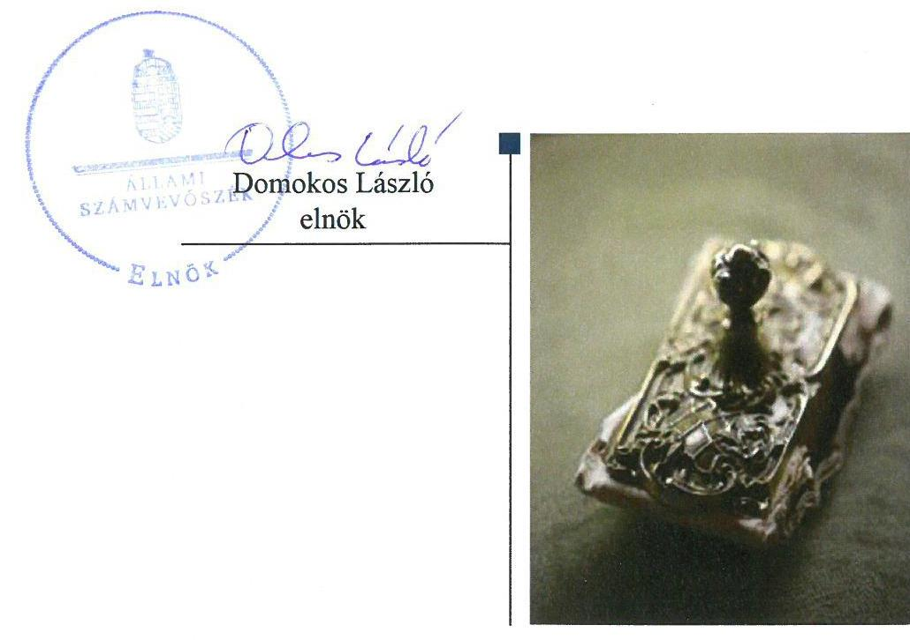
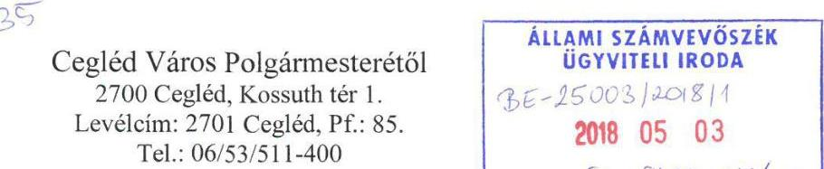
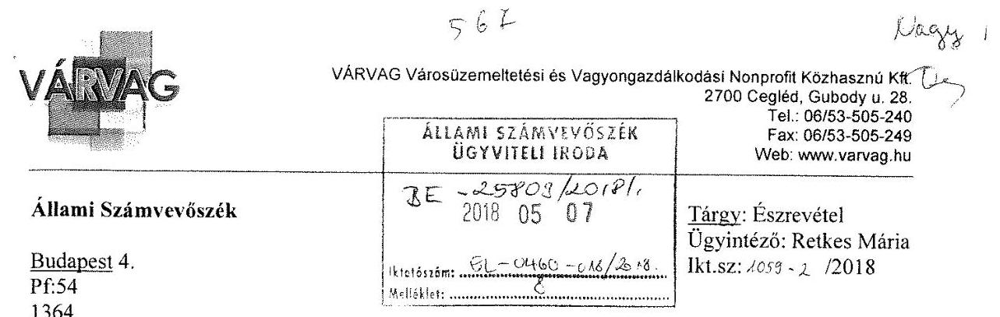
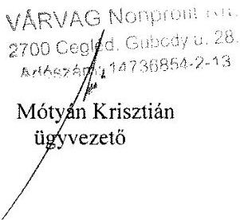
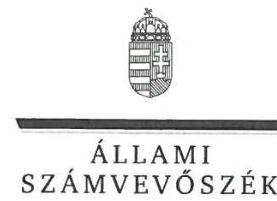
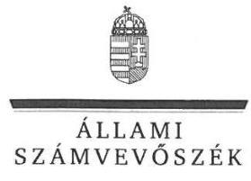

# Jelentés 

## Az önkormányzatok gazdasági társaságai

Az önkormányzatok többségi tulajdonában lévő gazdasági társaságok ellenőrzése - VÁRVAG Városfejlesztési és Vagyongazdálkodási Nonprofit Közhasznú Korlátolt Felelősségű Társaság 2018.

---

# Jelentés 

## Az önkormányzatok gazdasági társaságai

Az önkormányzatok többségi tulajdonában lévő gazdasági társaságok ellenőrzése - VÁRVAG Városfejlesztési és Vagyongazdálkodási Nonprofit Közhasznú Korlátolt Felelősségű Társaság
2018. 07. hó 3. nap

---

# AZ ELLENŐRZÉST FELÜGYELTE:

DR. NAGY IMRE felügyeleti vezető

# AZ ELLENŐRZÉST VEZETTE ÉS A VÉGREHAJTÁSÁÉRT FELELŐS:

KORSÓSNÉ VIGH ANDREA ellenőrzésvezető

# A PROGRAM ÖSSZEÁLLÍTÁSÁÉRT FELELŐS:

TÓTPÁL SZABOLCS osztályvezető

---

**IKTATÓSZÁM:** EL-0218-041/2018

**TÉMASZÁM:** 2447

**ELLENŐRZÉS-AZONOSÍTÓ SZÁM:** V079376

---

Jelentéseink az Országgyűlés számítógépes hálózatán és az Interneten a www.asz.hu címen is olvashatóak.

---

# TARTALOMJEGYZÉK 

■ ÖSSZEGZÉS ..... 5
■ AZ ELLENŐRZÉS CÉLJA ..... 6
■ AZ ELLENŐRZÉS TERÜLETE ..... 7
■ AZ ELLENŐRZÉS HÁTTERE, INDOKOLTSÁGA ..... 8
■ A JELENTÉS LÉNYEGES KÉRDÉSKÖREI ..... 9
■ AZ ELLENŐRZÉS HATÓKÖRE ÉS MÓDSZEREI ..... 10
■ MEGÁLLAPÍTÁSOK ..... 12
■ JAVASLATOK ..... 15
■ MELLÉKLETEK ..... 17
I. sz. melléklet: Értelmező szótár ..... 17
■ FÜGGELÉK: ÉSZREVÉTELEK ..... 19
■ RÖVIDÍTÉSEK JEGYZÉKE ..... 27

---

.

---

# ÖSSZEGZÉS 

A VÁRVAG Városfejlesztési és Vagyongazdálkodási Nonprofit Közhasznú Korlátolt Felelősségű Társaság felett Cegléd Város Önkormányzata szabályszerűen gyakorolta a tulajdonosi jogokat. A VÁRVAG Városfejlesztési és Vagyongazdálkodási Nonprofit Közhasznú Korlátolt Felelősségű Társaság gazdálkodása és vagyongazdálkodása szabályozott és szabályszerű volt. A bevételeket nem szabályszerűen számolták el, a ráfordítások elszámolása szabályszerű volt. Az átláthatósági követelményeknek eleget tettek.

## Az ellenőrzés társadalmi indokoltsága

Magyarországon az önkormányzatok kötelező és önként vállalt feladataik vonatkozásában is egyre szélesebb körben alkalmazzák a költségvetésen kívüli feladatellátást, ezáltal - a nonprofit szervezetek mellett - az önkormányzati tulajdonú gazdasági társaságok is kiemelt fontosságú szerephez jutottak.

Cegléden a 2013-2016. években a VÁRVAG Városfejlesztési és Vagyongazdálkodási Nonprofit Közhasznú Korlátolt Felelősségű Társaság feladatai közé tartozott többek között az önkormányzati lakások, illetve nem lakáscélú ingatlanok kezelése, hasznosítása, a fizetőparkoló rendszer működtetése, illetve a piac, a gyepmesteri telep és a köztemető üzemeltetése. Az Állami Számvevőszék az ellenőrzése során arra kereste a választ, hogy szabályszerű volt-e a közfeladatokat is ellátó Társaság gazdálkodása és az ehhez kapcsolódó tulajdonosi joggyakorlás.

## Főbb megállapítások, javaslatok

Cegléd Város Önkormányzata a VÁRVAG Városfejlesztési és Vagyongazdálkodási Nonprofit Közhasznú Korlátolt Felelősségű Társaság tekintetében a jogszabályi előírások szerint kialakította a tulajdonosi joggyakorlás kereteit és szabályszerűen gyakorolta a tulajdonosi jogokat. A Társaság által ellátott közszolgáltatások tekintetében jogszabályban előírt rendeletalkotási és díj megállapítási kötelezettségeinek eleget tett.

A VÁRVAG Városfejlesztési és Vagyongazdálkodási Nonprofit Közhasznú Korlátolt Felelősségű Társaság a jogszabályi előírásoknak megfelelően kialakította a pénzügyi-számviteli feladatellátás szabályait. A Társaság vagyongazdálkodása szabályszerű volt, mert a vagyon nyilvántartása, a mérleg leltári alátámasztása megfelelt a jogszabályi és belső előírásoknak. A beszámolási és adatszolgáltatási kötelezettségeknek Társaság a jogszabályi és tulajdonosi előírások szerint eleget tett.

A bevételek elszámolása nem volt szabályszerű, mert a Társaság által kiszámlázott külön szolgáltatási, közüzemi díjakat, a beszedett piaci helypénzeket és parkolási pótdíjakat nem támasztotta alá a kiszámlázott, illetve beszedett összeg helyességét alátámasztó bizonylat, a jogszabályi előírás ellenére. A díjmegállapítás során az önkormányzat rendeletében foglalt díjtételeket a Társaság érvényesítette. A ráfordítások elszámolása szabályszerű volt.

A VÁRVAG Városfejlesztési és Vagyongazdálkodási Nonprofit Közhasznú Korlátolt Felelősségű Társaság a beszámolókat, valamint a közérdekű adatokat az előírások szerint közzétette, azonban a közfeladatokat ellátó szervezetekre előírt közzétételi kötelezettségeket nem szabályozta.

Az Állami Számvevőszék a jelentésben foglalt megállapítások alapján a VÁRVAG Városüzemeltetési és Vagyongazdálkodási Nonprofit Közhasznú Korlátolt Felelősségű Társaság ügyvezetőjének a bevételek bizonylattal történő alátámasztásával és a szabályozottsággal kapcsolatban 2 javaslatot fogalmazott meg. A javaslatokat megalapozó megállapításokra az érintettnek 30 napon belül intézkedési tervet kell készítenie.

---

# AZ ELLENŐRZÉS CÉLJA 

AZ ELLENŐRZÉS CÉLJA annak értékelése volt, hogy az önkormányzat vagyongazdálkodási tevékenysége során szabályszerűen gyakorolta-e tulajdonosi jogait; a gazdasági társaság szabályozottsága, gazdálkodása és vagyongazdálkodási tevékenysége, bevételeinek és ráfordításainak elszámolása megfelelt-e a jogszabályi és tulajdonosi előírásoknak; a gazdasági társaság kötelezettségállománya jelentett-e kockázatot a működésre, valamint a gazdálkodás átláthatósága és elszámoltathatósága érdekében biztosított volt-e a szolgáltatás díjának megalapozottsága szabályszerű önköltségszámítással.

---

# AZ ELLENŐRZÉS TERÜLETE

## VÁRVAG Városfejlesztési és Vagyongazdálkodási Nonprofit Közhasznú Korlátolt Felelősségű Társaság és a tulajdonosi jogokat gyakorló Cegléd Város Önkormányzata

Cegléd Város Önkormányzata 2009. március 23-án alapította a VÁRVAG Városfejlesztési és Vagyongazdálkodási Nonprofit Közhasznú Korlátolt Felelősségű Társaságot. A Képviselő-testület¹ határozata alapján 2011. december 31-én a MOBILPARK Ceglédi Ipari Park Fejlesztő, Beruházó és Szolgáltató Közhasznú Nonprofit Kft. beolvadt a Társaságba². A Társaság kizárólagos tulajdonosa az alapítás óta az Önkormányzat³ volt. A Társaság törzstőkéje az ellenőrzött időszakban 130,5 M Ft volt, amely 0,5 M Ft pénzbetétből és 130 M Ft apportból állt.

A Társaság közhasznú tevékenység keretében látta el a településüzemeltetéssel, környezet egészségüggyel, lakás és helyiséggazdálkodással, a kistermelők, őstermelők számára értékesítési lehetőség biztosításával kapcsolatos feladatokat. A Társaság a tevékenységét az Önkormányzattal kötött Feladatellátási keretszerződés¹,² alapján saját tulajdonú eszközökkel látta el.

A Társaság gazdálkodásával kapcsolatos főbb adatok alakulását az 1. táblázat mutatja be.

1. táblázat

|   | 2013. | 2014. | 2015. | 2016.  |
| --- | --- | --- | --- | --- |
|  Értékesítés nettó árbevétele | 397,4 | 538,7 | 488,8 | 426,6  |
|  Mérlegfőösszeg | 490,0 | 509,5 | 566,3 | 568,0  |
|  Mérleg szerinti / adózott eredmény | 3,7 | 29,7 | 27,3 | 2,1  |
|  Saját tőke | 103,0 | 132,7 | 160,0 | 162,0  |
|  Követelések | 45,7 | 42,9 | 22,2 | 28,4  |
|  Kötelezettségek | 154,1 | 122,7 | 174,4 | 145,2  |

A TÁRSASÁG GAZDÁLKODÁSÁNAK FŐBB ADATAI (M FT)

|   | 2013. | 2014. | 2015. | 2016.  |
| --- | --- | --- | --- | --- |
|  Értékesítés nettó árbevétele | 397,4 | 538,7 | 488,8 | 426,6  |
|  Mérlegfőösszeg | 490,0 | 509,5 | 566,3 | 568,0  |
|  Mérleg szerinti / adózott eredmény | 3,7 | 29,7 | 27,3 | 2,1  |
|  Saját tőke | 103,0 | 132,7 | 160,0 | 162,0  |
|  Követelések | 45,7 | 42,9 | 22,2 | 28,4  |
|  Kötelezettségek | 154,1 | 122,7 | 174,4 | 145,2  |

Forrás: A Társaság egyszerűsített éves beszámolói

A foglalkoztatottak átlagos statisztikai állománya a 2013. évben 27 fő állandó és 119 fő közfoglalkoztatottból, a 2016. évben 39 fő állandó és 178 fő közfoglalkoztatottból állt.

A tulajdonosi joggyakorló Önkormányzat polgármestere⁵ a 2014. évi önkormányzati választások óta tölti be tisztségét, a jegyző⁶ személyében az ellenőrzött időszakban nem történt változás. A Társaság ügyvezetőjének személye az ellenőrzött időszak alatt egyszer változott.

---

# AZ ELLENŐRZÉS HÁTTERE, INDOKOLTSÁGA 

Az önkormányzatok többségi tulajdonában álló gazdasági társaságok ellenőrzése kiemelten fontos a vagyon megőrzése, megóvása érdekében. A feladatellátás költségeinek, ráfordításainak alakulása a lakosság széles rétegeit érinti.

Ellenőrzéseink feltárhatják, hogy az önkormányzat a feladatellátáshoz rendelt vagyon működtetését a tulajdonostól elvárható gondossággal végezte-e, a feladatot ellátó gazdasági társaság a létesítő okiratban, szolgáltatási szerződésben foglaltak betartásával biztosította-e a feladatok ellátását. Az ellenőrzés rávilágíthat arra, hogy a gazdasági társaság a vagyon használatával biztosította-e a szolgáltatás folytatásának feltételeit, az önkormányzat tulajdonosi felügyelete hozzájárult-e a szabályszerű gazdálkodáshoz és feladatellátáshoz. A megállapítások alapján megfogalmazott számvevőszéki javaslatok hasznosulása elősegítheti a meglévő hibák megszüntetését. A jó gyakorlatok bemutatásával az ÁSZ⁷ hozzájárulhat a követendő megoldások megismertetéséhez, terjesztéséhez.

---

# A JELENTÉS LÉNYEGES KÉRDÉSKÖREI 

1. Az önkormányzat tulajdonosi joggyakorlása szabályszerű volt-e?
2. A társaság pénzügyi-számviteli feladatellátása és vagyongazdálkodása szabályszerű volt-e a gazdálkodás során?

---

# AZ ELLENŐRZÉS HATÓKÖRE ÉS MÓDSZEREI 

## Az ellenőrzés típusa

Megfelelőségi ellenőrzés.

## Az ellenőrzött időszak

Az ellenőrzött időszak 2013. január 1-jétől 2016. december 31-éig tart.

## Az ellenőrzés tárgya

Cegléd Város Önkormányzata tulajdonosi joggyakorlása, valamint a VÁRVAG Városfejlesztési és Vagyongazdálkodási Nonprofit Közhasznú Korlátolt Felelősségű Társaság gazdálkodásának szabályozottsága és szabályszerűsége.

Az ellenőrzés kiterjedt minden olyan körülményre és adatra, amely az ÁSZ jogszabályban meghatározott feladatainak teljesítéséhez, valamint a program végrehajtása folyamán felmerült újabb összefüggések feltárásához szükséges.

## Az ellenőrzött szervezet

VÁRVAG Városfejlesztési és Vagyongazdálkodási Nonprofit Közhasznú Korlátolt Felelősségű Társaság, Cegléd Város Önkormányzata

## Az ellenőrzés jogalapja

Az ellenőrzés jogszabályi alapját az ÁSZ tv.⁸ 1. § (3) bekezdése és 5. § (3)(4)-(5) bekezdései képezték.

## Az ellenőrzés módszerei

Az ellenőrzést az ellenőrzési program ellenőrzési kérdései, az ellenőrzött időszakban hatályos szabályok, az ellenőrzés szakmai szabályok és módszertanok figyelembe vételével végeztük el.

Az ellenőrzött szervezetek az ellenőrzés lefolytatásához tanúsítványok kitöltésével, valamint az ÁSZ által kért dokumentumok megküldésével szolgáltattak adatokat.

---

A bevételek és ráfordítások elszámolását, továbbá a vagyonnyilvántartás területén a szabályszerű működést véletlenszerű mintavétellel ellenőriztük. A mintavétellel ellenőrzött területek esetében minden egyes tétel vonatkozásában szabályszerűségre vonatkozó kérdéseket tettünk fel, amelyek eredménye összesítésre került. A jogszabályoknak és a belső előírásoknak megfelelőnek tekintettük az adott területet, amennyiben a minta ellenőrzésének eredménye alapján 95%-os bizonyossággal a teljes sokaságban a hibaarány kisebb volt, mint 10%, nem megfelelőnek értékeltük, ha a hibaarány a 10%-ot meghaladta. A ráfordítások elszámolására és a vagyonnyilvántartásra vonatkozó véletlen mintavételt kockázati alapú kiválasztással egészítettük ki, amelynek során évente a három legnagyobb összegű tételt választottuk ki.

---

# 1. Az önkormányzat tulajdonosi joggyakorlása szabályszerű volt-e? 

Összegző megállapítás

Az Önkormányzat a jogszabályi előírásoknak megfelelően alakította ki a tulajdonosi joggyakorlás kereteit és gyakorolta a tulajdonosi jogokat

AZ EGYSZEMÉLYES GAZDASÁGI TÁRSASÁGNÁL a Gt.⁹ és a Ptk.¹⁰ előírásai szerint a legfőbb szerv hatáskörébe tartozó kérdésekben az alapító Önkormányzat döntött.

A TULAJDONOSI JOGGYAKORLÁS szabályait az Alapító¹¹ az SZMSZ₁₋₂¹² -ben, a Vagyongazdálkodási rendelet₁₋₂¹³-ben és az Alapító okirat₁₋₁₀¹⁴-ben a jogszabályoknak megfelelően rögzítette.

Az Önkormányzatnak a Társaság működésére, tevékenységére vonatkozóan az ellátott közfeladatokkal kapcsolatban a Lakás tv.¹⁵, a Kktv.¹⁶ és a temetőkről szóló törvény¹⁷ előírásai alapján rendeletalkotási és díj-meghatározási kötelezettsége volt, amelynek eleget tett. A feladat-ellátásra vonatkozó követelményeket önkormányzati rendeletekben¹⁸, a Feladat-ellátási keretszerződés₁₋₂-ben és kapcsolódó egyedi megállapodásokban rögzítették. Az Önkormányzat a Hasznosítási szerződésben¹⁹ a lakás és helyiséggazdálkodással, a Közszolgáltatási szerződésben²⁰ a parkolási közszolgáltatással kapcsolatban írt elő beszámolási, adatszolgáltatási kötelezettséget.

A Társaság legfőbb szerve a Javadalmazási szabályzat₁₋₂²¹-t a Taktv.²² előírásának megfelelően megalkotta.

Az FB²³ tagjait és a könyvvizsgálót a jogszabályok előírásával összhangban az Alapító jelölte ki. Az Alapító az egyszerűsített éves beszámolók és a közhasznúsági jelentések elfogadásáról az FB és a könyvvizsgáló írásos jelentésének birtokában szabályszerűen döntött. A Társaság tevékenységéből származó nyereség a Civil tv.²⁴ és az Alapító okirat₁₋₁₀-ben foglaltakkal összhangban nem került felosztásra.

A Társaság tevékenységének nyomon követését az Alapító által előírt
 negyedéves adatszolgáltatási kötelezettség biztosította. Az Önkormányzat belső ellenőrzése az Áht. ${ }^{25}$-ban foglalt lehetőséggel élve a Társaságnál két ellenőrzést végzett.

---

# 2. A társaság pénzügyi-számviteli feladatellátása és vagyongazdálkodása szabályszerű volt-e a gazdálkodás során? 

Összegző megállapítás

## 2.1. számú megállapítás

2.2. számú megállapítás

A Társaság vagyongazdálkodása szabályszerű volt, a bevételek elszámolása nem volt a jogszabályi előírásoknak megfelelő, a ráfordítások elszámolása szabályszerű volt.

A Társaság pénzügyi-számviteli feladatellátása szabályozott volt.
A Társaság a Számv. tv. ${ }^{26}$ előírásaival összhangban elkészítette a számviteli politika ${ }_{1-4}{ }^{27}$-et, a számviteli politika keretében előírt szabályzatokat, a számlarend ${ }_{1-4}{ }^{28}$-et és a bizonylati rend ${ }_{1-4}{ }^{29}$-et, és azokat aktualizálta.

Önköltség-számítási szabályzat készítése alól a Társaság a Számv. tv. 14. § (6) bekezdése alapján mentesült. Az NGM által indított Start Munkaprogram keretében folyósított támogatások elszámolása miatt a Társaság elkészítette és 2015. március 16-án hatályba léptette az önköltségszámítási szabályzatát ${ }^{30}$.

A Társaság a jogszabályi előírásnak eleget téve a számviteli politika ${ }_{1-4}{ }^{4}$ ben rögzítette a közhasznú és vállalkozási tevékenységből származó bevételek és ráfordítások elkülönített nyilvántartására vonatkozó előírást.

A Társaság vagyongazdálkodása megfelelt a jogszabályi és a belső szabályzatok előírásainak.

A Társaság saját vagyonát a Számv. tv. és a belső szabályozás szerint tartotta nyilván, a változások folyamatos nyomon követését az analitikus és a főkönyvi nyilvántartási rendszer biztosította.

Az éves beszámolók mérlegadatait a Társaság a jogszabályi előírás szerint leltárral alátámasztotta. A tárgyi eszközök és a készletek mennyiségi leltárfelvételét a jogszabályban és a belső szabályzatban foglaltak szerint elvégezte.

A Társaság a bevételeit nem szabályszerűen számolta el, a ráfordítások elszámolása szabályszerű volt.

A bevételek elszámolása nem volt szabályszerű, mivel a Társaság által alkalmazott külön szolgáltatási, közüzemi díjakat, a piaci helypénzeket és a parkolási pótdíjakat nem támasztották alá bizonylatok a Számv. tv. 165. § (2) bekezdésében foglaltak ellenére. A díjmegállapítás során a Társaság az önkormányzati rendeletekben foglaltakat betartotta.

A ráfordítások elszámolása szabályszerű volt. Az értékcsökkenési leírás elszámolása a jogszabályoknak és a belső szabályozásnak megfelelően történt. A bevételek és ráfordítások elszámolása során a közhasznú és vállalkozási tevékenység elkülönítése biztosított volt.

---

# 2.4. számú megállapítás 

A Társaság az előírt beszámolási, adatszolgáltatási és közzétételi kötelezettségeit teljesítette.

A Társaság az Alapító által előírt negyedéves adatszolgáltatási, valamint a Közszolgáltatási és Hasznosítási szerződésekben előírt beszámolási kötelezettségét teljesítette. Az egyszerűsített éves beszámolóit és a közhasznúsági mellékleteit a Társaság a jogszabályokban előírt formában és határidőben elkészítette, az alapítói jóváhagyást követően a jogszabályi előírásoknak megfelelően letétbe helyezte és közzé tette.

A közérdekű adatok nyilvánosságra hozatalával kapcsolatos kötelezettségének a Társaság a Taktv. előírásai szerint eleget tett.

A Társaság az ellenőrzött időszakban nem rendelkezett adatvédelmi és adatbiztonsági, valamint a közérdekű adatok közzétételére vonatkozó szabályzattal az Info. tv. ${ }^{31} 24$. § (3) bekezdésében, valamint az Info. tv. 35. § (3) bekezdésében foglaltak ellenére.

---

# JAVASLATOK 

Az ÁSZ tv. 33. § (1) bekezdésében foglaltak értelmében az ellenőrzött szervezet vezetője köteles a jelentésben foglalt megállapításokhoz kapcsolódó intézkedési tervet összeállítani és azt a jelentés kézhezvételétől számított 30 napon belül az ÁSZ részére megküldeni. Amennyiben az ellenőrzött szervezet vezetője nem küldi meg határidőben az intézkedési tervet, vagy továbbra sem elfogadható intézkedési tervet küld, az Állami Számvevőszék elnöke az ÁSZ tv. 33. § (3) bekezdése a) és b) pontjaiban foglaltakat érvényesítheti.

## VÁRVAG Városüzemeltetési és Vagyongazdálkodási Nonprofit Közhasznú Korlátolt Felelősségű Társaság Ügyvezetőjének

1. Intézkedjen a bevételek bizonylattal történő alátámasztásáról a jogszabályban előírtaknak megfelelően.
(2.3. számú megállapítás 1. bekezdése alapján)
2. Gondoskodjon a jogszabályi előírásoknak megfelelően az adatvédelmi és adatbiztonsági, valamint a közérdekű adatok közzétételére vonatkozó szabályzatok elkészítéséről.
(2.4. számú megállapítás 3. bekezdése alapján)

---

.

---

# MELLÉKLETEK 

- I. SZ. MELLÉKLET: ÉRTELMEZŐ SZÓTÁR
belső ellenőrzés
gazdasági társaság
közérdekű adatok
közszolgáltatás
nonprofit gazdasági társaság
tulajdonosi joggyakorló

Független, tárgyilagos bizonyosságot adó és tanácsadó tevékenység, amelynek célja, hogy az ellenőrzött szervezet működését fejlessze és eredményességét növelje, az ellenőrzött szervezet céljai elérése érdekében rendszerszemléletű megközelítéssel és módszeresen értékeli, illetve fejleszti az ellenőrzött szervezet irányítási és belső kontrollrendszerének hatékonyságát. (Bkr. 2. § b) pont)
Ptk. 3:88. § (1) bekezdése szerint „a gazdasági társaságok üzletszerű közös gazdasági tevékenység folytatására, a tagok vagyoni hozzájárulásával létrehozott, jogi személyiséggel rendelkező vállalkozások, amelyekben a tagok a nyereségből közösen részesednek, és a veszteséget közösen viselik".
Az állami vagy helyi önkormányzati feladatot, valamint jogszabályban meghatározott egyéb közfeladatot ellátó szerv vagy személy kezelésében lévő és tevékenységére vonatkozó vagy közfeladatának ellátásával összefüggésben keletkezett, a személyes adat fogalma alá nem eső, bármilyen módon vagy formában rögzített információ vagy ismeret, függetlenül kezelésének módjától, önálló vagy gyűjteményes jellegétől, így különösen a hatáskörre, illetékességre, szervezeti felépítésre, szakmai tevékenységre, annak eredményességére is kiterjedő értékelésére, a birtokolt adatfajtákra és a működést szabályozó jogszabályokra, valamint a gazdálkodásra, a megkötött szerződésekre vonatkozó adat. (Info tv. 3. § 5. pont)

Az Ebktv. ${ }^{32}$ 3. § d) pontja szerint a közszolgáltatás „szerződéskötési kötelezettség alapján a lakosság alapvető szükségleteinek ellátására irányuló szolgáltatás, így különösen a villamos energia-, gáz-, hő-, víz-, szennyvíz- és hulladékkezelési, köztisztasági, postai és távközlési szolgáltatás, továbbá a menetrend alapján közlekedő járművekkel végzett közforgalmú személyszállítás"
Civil tv. 9/F. § (2) bekezdése szerint „az a gazdasági társaság minősül nonprofit gazdasági társaságnak és cégnevében az a gazdasági társaság tüntetheti fel a nonprofit jelleget, amelynek létesítő okirata tartalmazza, hogy a gazdasági társaság tevékenységéből származó nyereség a tagok között nem osztható fel, hanem az a gazdasági társaság vagyonát gyarapítja." (hatályos 2014. március 15-től)
Aki a nemzeti vagyon felett az államot vagy a helyi önkormányzatot megillető tulajdonosi jogok és kötelezettségek összességének gyakorlására jogosult. (Nvtv. ${ }^{33}$ 3. § (1) bekezdés 17. pont)

---

.

---

# FÜGGELÉK: ÉSZREVÉTELEK 

A jelentéstervezetet a Számvevőszék 15 napos észrevételezésre megküldte az ellenőrzött szervezetek vezetőinek az ÁSZ tv. 29. § (1) bekezdése előírása szerint.

Az ÁSZ a jelentéstervezetet észrevételezésre megküldte Cegléd Város Önkormányzata polgármesterének és a VÁRVAG Városüzemeltetési és Vagyongazdálkodási Nonprofit Közhasznú Kft. ügyvezetőjének.
Cegléd Város Önkormányzata polgármestere a jelentéstervezetre nemleges észrevételt tett. A függelék tartalmazza a VÁRVAG Városüzemeltetési és Vagyongazdálkodási Nonprofit Közhasznú Korlátolt Felelősségű Társaság ügyvezetőjének észrevételét, illetve az el nem fogadott észrevételek elutasításának indoklását.

[^0]
[^0]:    * 29. § (1) Az Állami Számvevőszék az ellenőrzési megállapításait megküldi az ellenőrzött szervezet vezetőjének vagy az általa megbízott személynek, és annak, akinek személyes felelősségét állapította meg.
    (2) Az ellenőrzött szervezet vezetője és a felelősként megjelölt személy az ellenőrzés megállapításaira tizenöt napon belül írásban észrevételt tehet.
    (3) Az Állami Számvevőszék az észrevételre a beérkezésétől számított harminc napon belül írásban válaszol. A figyelembe nem vett észrevételeket köteles a jelentésben feltüntetni, és megindokolni, hogy azokat miért nem fogadta el.

---

Ügyiratszám: C/6976-2/2018.
Ügyintéző: Mótyánné dr. Szentpéteri Katalin

B35

Cegléd Város Polgármesterétől
2700 Cegléd, Kossuth tér 1.
Levélcím: 2701 Cegléd, Pf.: 85.
Tel.: 06/53/511-400

Ügyiratszám: C/6976-2/2018.
Ügyintéző: Mótyánné dr. Szentpéteri Katalin

Tárgy: VÁRVAG Kft. JOANNE HÍSZÉ

Hiv.szám: EL-0460-015/20178.

dr. Nagy Juhász

Domokos László Elnök Úr
részére

Állami Számvevőszék
1364 Budapest 4. Pf. 54.

Állami Számvevőszék
1364 Budapest 4. Pf. 54.

Tisztelt Elnök Úr!

Köszönettel vettem „Az önkormányzatok gazdasági társaságai – Az önkormányzatok többségi
tulajdonában lévő gazdasági társaságok gazdálkodásának ellenőrzése – VÁRVAG
Városüzemeltetési és Vagyongazdálkodási Nonprofit Közhasznú Korlátolt Felelősségű Társaság”
címmel készült számvevőszéki jelentéstervezetük előzetes megküldését.

A jelentéstervezetben foglaltakkal összefüggésben észrevételt nem teszek.

Ezúton megköszönöm az Állami Számvevőszék munkatársainak munkáját és szakmai
iránymutatásait.

Tisztelettel

Cegléd, 2018. április 26.

Takáts László
polgármester

20

---

Tisztelt Számvevőszék!

Az EL-0460-016/2018. sz., 2018.04.24-én kézhez vett jelentéstervezetre vonatkozóan határidőn belül az alábbi észrevételt teszem:

### 2.3. számú megállapítás:

A bevételek elszámolása nem volt szabályszerű, mivel a Társaság által alkalmazott külön szolgáltatási, közüzemi díjakat, a piaci helypénzeket és a parkolási pótdíjakat nem támasztották alá bizonylatok a Számviteli tv. 165. (2) bekezdésében foglaltak ellenére.

### Témánként csoportosítva az alábbi észrevételeket teszem:

#### I. Bérleti díjakhoz kapcsolódó kiszámlázott díjak

1. **Külön szolgáltatási díjak alátámasztása:** A bérleti díjakhoz tartozó különszolgáltatási díjak a bérleti szerződésben kerülnek rögzítésre. A bérleti díj számlázásának alapbizonylata a bérleti szerződés, amit becsatoltunk Önöknek a vizsgálati anyagban. (Pl.: b42_1 szerződése 4. oldal.) Ezeket a szerződéseket rögzítjük a számlázó programban és ez alapján történik a havi számlázás.

2. **Továbbszámlázott közüzemi díjak:** A közüzemi díjak továbbszámlázása általános esetben szerződés alapján történik, de vannak eltérő esetek. Az alábbiakban részletezzük ezeket:

   a. Vannak olyan tömbök, ahol nincs lakásonként felszerelt fogyasztásmérő. (B3 mintasorszámhoz kapcsolódó b3_1, szerződése 4. oldal). Ezen lakások esetében a szerződés 4. oldalán meghatározottak szerint történik a közüzemi díjak továbbszámlázása és elszámolása.

   A számlázás alapbizonylatai a szerződés, a beérkező havi rész- és az éves elszámoló közüzemi számla. A számlákat viszont gazdasági megfontolásból nem csatoljuk a kimenő számlák mellé. Évente, az elszámoló számla érkezésekor értesítést küldünk a bérlőnek arról, hogy az előző évi fogyasztás alapján hogyan alakul a tárgyévi havi átalánydíja.

   b. Vannak olyan lakások, amelyek rövidtávra kerülnek kiutalásra (,szociális"alapon). Ezen lakásoknál nincs értelme a bérlő nevére átíratni a közüzemi fogyasztásmérőket, mivel ennek átfutási ideje olyan hosszú, hogy amikorra átírásra kerülne, akkorra egy 3 hónapos szerződés véget ér. Ezen esetekben kerül sor a VÁRVAG Nonprofit Kft. nevén lévő

fogyasztásmérőkön mért fogyasztás továbbszámlázására. A bérlő bediktálja a havi fogyasztást. A közüzemi szolgáltató által a VÁRVAG Nonprofit Kft. részére kiszámlázott egységáron kiszámoljuk a fogyasztás értékét és erről számlát állítunk ki a bérlő részére. Ennek a számlának az alapbizonylatai a szerződés, a bediktált mérőállás és a közszolgáltató által kiállított számla.
c. Vannak továbbá olyan bérlőink is, akiknek azért kerül kiszámlázásra a közüzemi díj, mert a szerződésben szerepel ugyan, hogy át kell íratnia a közüzemi fogyasztókat a saját nevére, de ez késedelmesen történik meg és emiatt a bérlő fogyasztását a VÁRVAG Nonprofit Kft. részére számlázza ki a szolgáltató. Ilyen esetekben a számlázás alapbizonylata a beérkezett közüzemi számla. A fogyasztás tényleges elszámolása akkor történik meg, amikor a bérlő nevére kerül a fogyasztásmérő és a VÁRVAG Nonprofit Kft. megkapja a végszámlát.

Kérem, hogy a fentiek ismeretében szíveskedjenek pontosítani, mely bizonylatokat szükséges beküldeni Önök felé a szabályosság alátámasztására.
Továbbá segítségüket kérem abban, hogy amennyiben ez a szabályozás nem megfelelő, hogyan tudjuk a szabályosságot biztosítani?

# 3. Piaci helypénzek elszámolása: 

A piaci helypénzek elszámolását a Piac működési szabályzata határozza meg. Ez alapján kerülnek a bevételekről a bizonylatok kiállításra.
A Kft. nem köteles minden bevételről számlát kiállítani. Ez csak akkor szükséges, ha a vevő kéri. Egyéb esetben a bevétel alapbizonylata a helypénzről kiadott, szigorú számadású árujegy, illetve WC használati jegy.
Ezek a bizonylatok minden nap összesítésre kerülnek, és sorszám alapján kerülnek felvezetésre a napi pénztárjelentésre. Mivel ezek egyrészt nem névre szóló bizonylatok, másrészt nagyon kis összegről szólnak, harmadrészt pedig akkora plusz terhet jelentenének a könyvelésben, hogy nincs értelme a tételes rögzítésnek, ezért a könyvelés a
 pénztárjelentésben felsorolt sorszámok alapján történik. Ezek a bizonylatok zárt helyen tárolásra kerülnek és szükség esetén bármikor bemutathatók.
Sajnos az ellenőrzés során kapott rendkívül rövid határidő, valamint a bizonylatok mennyisége és mérete miatt ezek szkennelése nem volt megoldható. Példaként csatoljuk most Önöknek a B 34 mintasorszámhoz tartozó havi pénztárjelentés 2016.07.01. dátumához tartozó bizonylatok egy-egy darabjának fénymásolatát, amelyből következtetni lehet, mekkora mennyiségről van szó az ellenőrzött időszakra vonatkozóan. Az egy napi bevételhez tartozó bizonylatok száma a következő:

WC használati jegy ( $80 \mathrm{Ft} / \mathrm{db}$ ): 69 db
Árujegy ( $305 \mathrm{Ft} / \mathrm{db}$ ) helypénz: 59 db
Árujegy ( $150 \mathrm{Ft} / \mathrm{db}$ ) helypénz: 67 db
Árujegy ( $230 \mathrm{Ft} / \mathrm{db}$ ) helypénz: 4 db
Árujegy ( $80 \mathrm{Ft} / \mathrm{db}$ ) helypénz: 1 db
Napi bizonylat darabszám összesen: 200 db
Amennyiben szükségesnek látják, úgy az összes bizonylatot eredetiben az Önök rendelkezésére bocsájtjuk áttekintés céljából, de sem szkennelve, sem fénymásolva nem tudjuk ezt biztosítani.
4. Parkolási pótdíjak elszámolása:

A parkolási pótdíjak elszámolása a
Kft-től bérelt MINIPARK megnevezésű parkolási program alapján történik. Ennek menete a következő:

---

A parkolóőr a nála lévő PDA eszközön rögzíti a parkolójeggyel nem rendelkező gépkocsi adatait és elhelyezi a bírságra vonatkozó értesítést, ami egy azonosító számot kap. Ez az adat valamint az elkészült fotó bekerül a MINIPARK rendszerbe, ahol a rendszer generálja a parkolási pótdíjat a rendszámhoz kapcsolódóan. A rendszerben „eset"-ként kerül rögzítésre minden egyes pótdíj, amely „esetszám" és a rendszám alapján kerül nyilvántartásra. Ezekből az „esetekből" havonta egy összesítő jelentést készít a rendszer, ami ahhoz szükséges, hogy a beérkezett és kiszabott pótdíjakat a könyvelés adataival egyeztetni tudjuk, mivel a pótdíjak könyvelése a befizetés napján, a bankszámlakivonat illetve a postai összesítő alapján történik, amelyek a beazonosításhoz szükséges „esetszámot" tartalmazzák. A program elektronikusan tárolja az egyes „eseteket", amelyeket az egyeztetés, ellenőrzés szükségessége esetén „esetszámhoz" vagy rendszámhoz kapcsolódóan bármikor ki lehet nyomtatni.
Mellékeljük Önöknek a B 47. mintasorszámhoz tartozó, a programból kinyomtatható listát és eset jellemzőt, amennyiben ez szükséges az Önök részére, úgy nyomtatott változatban megküldjük minden tételhez kapcsolódóan.
A fentiek ismeretében segítségüket kérem abban, hogy amennyiben ez a szabályozás nem megfelelő, hogyan tudjuk a szabályosságot biztosítani?

# 2.4. számú megállapítás: 

A Társaság az ellenőrzött időszakban nem rendelkezett adatvédelmi és adatbiztonsági, valamint közérdekű adatok közzétételre vonatkozó szabályzattal az Info tv. 24.§.(3) bekezdésében, valamint az Info. tv. 35.§. (3) bekezdésben foglaltak ellenére.

## A megállapításhoz érdemi észrevételt nem teszünk. Tájékoztatásul közöljük az alábbiakat:

A GDPR 2018.05.25-i hatálybalépésére való tekintettel az adatvédelmi és adatbiztonsági, valamint a közérdekű adatok közzétételére vonatkozó szabályozás kidolgozása már 2018.03.14-én megkezdődött. Az erre vonatkozó szerződés másolatát csatoljuk Önöknek.

A végleges jelentés elkészítése során kérem a fentiek szíves figyelembe vételét.

Cegléd, 2018.04.27.

Tisztelettel:

Mellékletek:

- Adatvédelmi szolgáltatásra vonatkozó keretszerződés 1 db
- Adatvédelmi szolgáltatásra vonatkozó egyedi szerződés 1 db
- Parkolási pótdíj eset minta és táblázat 3 db
- Piac árbevételhez kapcsolódó bizonylat másolatok és kimutatás 3 db

---

# Mótyán Krisztián úr 

ügyvezető

VÁRVAG Városüzemeltetési és Vagyongazdálkodási Nonprofit Közhasznú Kft.

## Cegléd

## Tisztelt Ügyvezető Úr!

„Az önkormányzatok gazdasági társaságai - Az önkormányzatok többségi tulajdonában lévő gazdasági társaságok gazdálkodásának ellenőrzése - VÁRVAG Városfejlesztési és Vagyongazdálkodási Nonprofit Közhasznú Kft." címmel készített számvevőszéki jelentéstervezetre tett észrevételeit köszönettel megkaptam.
Az Állami Számvevőszék észrevételekre vonatkozó álláspontjáról a felügyeleti vezető által készített részletes tájékoztatást csatoltan megküldöm.
Tájékoztatom Ügyvezető urat, hogy a számvevőszéki jelentésben - az Állami Számvevőszékről szóló 2011. évi LXVI. törvény 29. § (3) bekezdése alapján - a figyelembe nem vett észrevételeket szerepeltetjük annak megindoklásával, hogy azokat miért nem fogadtuk el.

Budapest, 2018. 05. 29.

Tisztelettel:

Melléklet: Tájékoztatás az észrevételek kezeléséről

---

FELÜGYELETI VEZETŐ

Melléklet
Ikt.szám: EL-0460-020/2018.

# Tájékoztatás   az észrevételek kezeléséről 

„Az önkormányzatok gazdasági társaságai - Az önkormányzatok többségi tulajdonában lévő gazdasági társaságok gazdálkodásának ellenőrzése - VÁRVAG Városfejlesztési és Vagyongazdálkodási Nonprofit Közhasznú Kft. " című jelentéstervezetre az 1059-2/2018. iktatószámú, 2018. május 3-án tett (az Állami Számvevőszékhez 2018. május 7-én érkezett) észrevételeit áttekintettük, azok kezelésével kapcsolatban a következő tájékoztatást adom.

## 1. A jelentéstervezet 2.3. számú megállapítás 1. bekezdésében foglaltakra tett észrevételek:

Az észrevétel a Bérleti dijakhoz kapcsolódó dijak alátámasztása fejezetben a bérlők részére a bérleti díjak és a kapcsolódó külön szolgáltatási díjak a szerződés alapján, a közüzemi díjak továbbszámlázása - attól függően, hogy milyen bérlakások fogyasztásmérővel való felszereltsége - eltérő módszer alapján kerül a számlázásra. Az észrevétel 1. pontjában hivatkozott, az ellenőrzés részére az adatbekérés során átadott szerződések nem támasztják alá a kapcsolódó számlák szerinti külön szolgáltatási díjakat, azokon a külön szolgáltatások díja eltér a szerződésekben foglaltaktól. Az észrevétel 2. a) pontjában hivatkozott - B3 mintasorszámhoz kapcsolódó b3_1 - bizonylat nem került átadásra az ellenőrzés részére a mintatétel dokumentumaként, azt a teljességi nyilatkozat (Teljességi nyilatkozat_mintatételekhez.pdf) és kapcsolódó dokumentumai sem tartalmazzák. Az ellenőrzés időszakában átadott bizonylatok nem tartalmazták a közüzemi szolgáltatási díjak továbbszámlázott összegeinek szabályszerűen kiállított bizonylatokkal történt alátámasztását. A számvitelről szóló 2000. évi C. törvény (Számv. tv.) 165. § (2) bekezdésében foglalt előírások szerint a számviteli nyilvántartásokba csak szabályszerűen kiállított bizonylat alapján szabad adatokat bejegyezni, amely a gazdasági eseményre vonatkozóan a valóságnak megfelelően tartalmazza az előírt adatokat.

Az észrevétel 3. Piaci helypénzek elszámolása fejezetben a B34 mintasorszámhoz a havi pénztárjelentésben kimutatott, az „Ellenőrző szelvény, Árujegy" szigorú számadású bizonylatok, nyugták adatait tartalmazó összesítőket, napi pénztári bevételezési bizonylatokat - amelyek a készpénzes bevételek pénztári elszámolásának, a számviteli nyilvántartásokba bejegyzett bevételi adatoknak az alátámasztását szolgálták volna, - sem az ellenőrzés időszakában, sem a jelentéstervezet észrevételezése keretében nem mutattak be. A beküldött pénztárjelentés 2016. július havi piaci helypénz bevételeknek az egyedi bizonylatok adatait sorszám szerint tartalmazó összesítő bizonylata hiányában nem támasztják alá a bevételeknek a számviteli nyilvántartásokba való bejegyzés szabályszerűségét, pontosságát, a szigorú számadású bizonylatok szerinti elszámoltatást.

Az észrevétel 4. Parkolási pótdíjak elszámolása fejezetben a parkolási pótdíjak elszámolásához alkalmazott informatikai rendszer leírása, valamint a B47 mintasorszámhoz tartozó, ismételten beküldött dokumentum továbbra sem tartalmaz megfelelő bizonyítékot ahhoz, hogy a pótdíj megfizetés szabályszerűsége a Cegléd Város Önkormányzata által a fizető parkolók előírásáról szóló,

---

többször módosított 13/1999. (V.1.) Ök. rendeletének előírása alapján alátámasztott legyen. Az ellenőrzés részére megküldött dokumentumok nem felelnek meg a Számv. tv. 165. § (2) bekezdésben foglalt előírásnak, amely szerint a szabályszerű bizonylat az adott gazdasági eseményre vonatkozóan a könyvvitelben és más jogszabályban előírt adatokat a valóságnak megfelelően, hiánytalanul tartalmazza. A fizető parkolókról szóló önkormányzati rendelet IV. rész 5. § (3) bekezdésében előírt pótdíjak számviteli nyilvántartásokba való bejegyzése, bevételként történő elszámolása - a Számv. tv. 165. § (2) bekezdésében előírt, az adott gazdasági eseményre vonatkozó, a könyvvitelben rögzítendő adatokat a valóságnak megfelelően, hiánytalanul tartalmazó - szabályszerű bizonylatok alapján történhet. A pótdíj kiszabó nyomtatvány kihelyezésének keltezés dokumentáltságát a befizetett pótdíj összegének a jogszabályi előírások szerinti szabályszerűsége megállapítása érdekében szükséges biztosítani.

Az észrevételeket nem fogadom el, ezek alapján a jelentéstervezet javaslatot megalapozó megállapításának a módosítása nem indokolt.

# 2. A jelentéstervezet 2.4. számú megállapítás 3. bekezdésére vonatkozó észrevétel: 

Az észrevételben leírtak szerint a megállapításhoz érdemi észrevételt nem tesznek.

Budapest, 2018. 06. 02.
Dr. Nagy Imre
felügyeleti vezető

---

# RÖVIDÍTÉSEK JEGYZÉKE 

${ }^{1}$ Képviselő-testület
${ }^{2}$ Társaság
${ }^{3}$ Önkormányzat
${ }^{4}$ Feladat-ellátási keretszerződés1-2
${ }^{5}$ polgármester
${ }^{6}$ jegyző
${ }^{7}$ ÁSZ
${ }^{8}$ ÁSZ tv.
${ }^{9}$ Gt.
${ }^{10}$ Ptk.
${ }^{11}$ Alapító
${ }^{12}$ SZMSZ ${ }_{1-2}$
${ }^{13}$ Vagyongazdálkodási rendelet ${ }_{1-2}$
${ }^{14}$ Alapító okirat ${ }_{1-10}$

Cegléd Város Önkormányzata Képviselő-testülete
VÁRVAG Városfejlesztési és Vagyongazdálkodási Nonprofit Közhasznú Kft.
Cegléd Város Önkormányzata
Cegléd Város Önkormányzata és a VÁRVAG Városfejlesztési és Vagyongazdálkodási Nonprofit Közhasznú Kft. között 2009. október 21-én létrejött feladat-ellátási keretszerződés és annak 2015. június 25-i módosítása
Cegléd Város Önkormányzata és a VÁRVAG Városfejlesztési és Vagyongazdálkodási Nonprofit Közhasznú Kft. között 2016. február 29-én létrejött feladat-ellátási keretszerződés
Cegléd Város Önkormányzata polgármestere
Ceglédi Közös Önkormányzati Hivatal jegyzője
Állami Számvevőszék
2011. évi LXVI. törvény az Állami Számvevőszékről
2006. évi IV. törvény a gazdasági társaságokról, hatályos 2014. március 14-éig
2013. évi V. törvény a Polgári Törvénykönyvről, hatályos 2014. március 15-étől
Cegléd Város Önkormányzata Képviselő-testülete
Cegléd Város Önkormányzata Képviselő-testületének a Képviselő-testület és szervei szervezeti és működési szabályzatáról szóló 19/2011. (IV. 29.) önkormányzati rendelete, hatályos 2014. december 31-ig
Cegléd Város Önkormányzata 32/2014. (XII. 23.) önkormányzati rendelete a Képviselő-testület és szervei szervezeti és működési szabályzatáról, hatályos 2015. január 1-től

Cegléd Város Önkormányzata Képviselő-testületének az Önkormányzat vagyonáról és a vagyonnal való gazdálkodás szabályairól szóló 9/2001. (III. 29.) Ök. rendelete, hatályos 2013. május 2-ig
Cegléd Város Önkormányzata 15/2013. (V. 2.) önkormányzati rendelete a vagyongazdálkodásról, hatályos 2013. május 3-tól
VÁRVAG Városfejlesztési és Vagyongazdálkodási Nonprofit Közhasznú Kft alapító okirata (2012.10.18-2013.12.19.)
VÁRVAG Városfejlesztési és Vagyongazdálkodási Nonprofit Közhasznú Kft alapító okirata (2013.12.19-2014.05.13.)
VÁRVAG Városfejlesztési és Vagyongazdálkodási Nonprofit Közhasznú Kft alapító okirata (2014.05.13-2014.11.20.)
VÁRVAG Városfejlesztési és Vagyongazdálkodási Nonprofit Közhasznú Kft alapító okirata (2014.11.20-2015.01.22.)
VÁRVAG Városfejlesztési és Vagyongazdálkodási Nonprofit Közhasznú Kft alapító okirata (2015.01.22-2015.06.01.)
VÁRVAG Városfejlesztési és Vagyongazdálkodási Nonprofit Közhasznú Kft alapító okirata (2015.06.01-2015.06.18.)
VÁRVAG Városfejlesztési és Vagyongazdálkodási Nonprofit Közhasznú Kft alapító okirata (2015.06.18-2016.04.21.)
VÁRVAG Városfejlesztési és Vagyongazdálkodási Nonprofit Közhasznú Kft alapító okirata (2016.04.21-2016.05.19.)
VÁRVAG Városfejlesztési és Vagyongazdálkodási Nonprofit Közhasznú Kft alapító okirata (2016.05.19-2016.11.24.)

---

${ }^{15}$ Lakás tv.
${ }^{16}$ Kktv.
${ }^{17}$ temetőkről szóló törvény
${ }^{18}$ önkormányzati rendeletek
${ }^{19}$ Hasznosítási szerződés
${ }^{20}$ Közszolgáltatási szerződés
${ }^{21}$ Javadalmazási szabályzat ${ }_{1-2}$
${ }^{22}$ Taktv.
${ }^{23} \mathrm{FB}$
${ }^{24}$ Civil tv.
${ }^{25}$ Áht.
${ }^{26}$ Számv. tv.
${ }^{27}$ számviteli politika $_{1-4}$
${ }^{28}$ számlarend $_{1-4}$
${ }^{29}$ bizonylati rend $_{1-4}$

VÁRVAG Városfejlesztési és Vagyongazdálkodási Nonprofit Közhasznú Kft alapító okirata (2016.11.24-2016.12.31.)
1993. évi LXXVIII. törvény a lakások és helyiségek bérletére, valamint az elidegenítésükre vonatkozó egyes szabályokról
1988. évi I. törvény a közúti közlekedésről
1999. évi XLIII. törvény a temetőkről és a temetkezésről

Cegléd Város Önkormányzatának a lakások és helyiségek bérletéről szóló 23/2009. (V. 28.) KT rendelete, és módosításai
Cegléd Város Önkormányzata Képviselő-testületének 34/2010. (XII. 23.) önkormányzati rendelete a köztemetőkről
Cegléd Város Önkormányzata Képviselő-testületének a fizető parkolók előírásairól szóló 13/1999. (V. 1.) Ök. rendelete, és módosításai
Cegléd Város Önkormányzata és a VÁRVAG Városfejlesztési és Vagyongazdálkodási Nonprofit Közhasznú Kft. között 2012. szeptember 14-én létrejött hasznosítási szerződés
Cegléd Város Önkormányzata és a VÁRVAG Városfejlesztési és Vagyongazdálkodási Nonprofit Közhasznú Kft. között 2013. december 23-án létrejött közszolgáltatási szerződés és annak 2015. december 10-i módosítása
Cegléd Város Önkormányzata Képviselő-testületének 33/2010. (I. 28.) Ök. határozata a VÁRVAG Városfejlesztési és Vagyongazdálkodási Nonprofit Közhasznú Kft. javadalmazási szabályzatáról
Cegléd Város Önkormányzata Képviselő-testületének 96/2015. (IV. 23.) Ök. határozata az önkormányzati tulajdonban lévő gazdasági társaságok javadalmazási szabályzatáról
2009. évi CXXII. törvény a köztulajdonban álló gazdasági társaságok takarékosabb működéséről
VÁRVAG Városfejlesztési és Vagyongazdálkodási Nonprofit Közhasznú Kft. Felügyelő Bizottsága
2011. évi CLXXV. törvény az egyesülési jogról, a közhasznú jogállásról, valamint a civil szervezetek működéséről és támogatásáról
2011. évi CXCV.
 törvény az államháztartásról
2000. évi C. törvény a számvitelről

VÁRVAG Városfejlesztési és Vagyongazdálkodási Nonprofit Közhasznú Kft. számviteli politikája (2013.01.01-2013.12.31.)
VÁRVAG Városfejlesztési és Vagyongazdálkodási Nonprofit Közhasznú Kft. számviteli politikája (2014.01.01-2014.12.31.)
VÁRVAG Városfejlesztési és Vagyongazdálkodási Nonprofit Közhasznú Kft. számviteli politikája (2015.01.01-2015.12.31.)
VÁRVAG Városfejlesztési és Vagyongazdálkodási Nonprofit Közhasznú Kft. számviteli politikája (2016.01.01-2016.12.31.)
VÁRVAG Városfejlesztési és Vagyongazdálkodási Nonprofit Közhasznú Kft. számlarendje (2013.01.01-2013.12.31.)
VÁRVAG Városfejlesztési és Vagyongazdálkodási Nonprofit Közhasznú Kft. számlarendje (2014.01.01-2014.12.31.)
VÁRVAG Városfejlesztési és Vagyongazdálkodási Nonprofit Közhasznú Kft. számlarendje (2015.01.01-2015.12.31.)
VÁRVAG Városfejlesztési és Vagyongazdálkodási Nonprofit Közhasznú Kft. számlarendje (2016.01.01-2016.12.31.)
VÁRVAG Városfejlesztési és Vagyongazdálkodási Nonprofit Közhasznú Kft. bizonylati rendje (2013.01.01-2013.12.31.)

---

|  | VÁRVAG Városfejlesztési és Vagyongazdálkodási Nonprofit Közhasznú Kft. bizonylati rendje (2014.01.01-2014.12.31.) |
| :--: | :--: |
|  | VÁRVAG Városfejlesztési és Vagyongazdálkodási Nonprofit Közhasznú Kft. bizonylati rendje (2015.01.01-2015.12.31.) |
|  | VÁRVAG Városfejlesztési és Vagyongazdálkodási Nonprofit Közhasznú Kft. bizonylati rendje (2016.01.01-2016.12.31.) |
|  | VÁRVAG Városfejlesztési és Vagyongazdálkodási Nonprofit Közhasznú Kft. bizonylati rendje (2016.01.01-2016.12.31.) |
| ${ }^{30}$ önköltség-számítási szabályzat | VÁRVAG Városfejlesztési és Vagyongazdálkodási Nonprofit Közhasznú Kft. önköltség-számítási szabályzata (2015.03.16-2016.12.31.) |
| ${ }^{31}$ Info. tv. | 2011. évi CXII. törvény az információs önrendelkezési jogról és az információszabadságról |
| ${ }^{32}$ Ebktv. | 2003. évi CXXV. törvény az egyenlő bánásmódról és az esélyegyenlőség előmozdításáról |
| ${ }^{33}$ Nvtv. | 2011. évi CXCVI. törvény a nemzeti vagyonról |

---

# ÁLLAMI SZÁMVEVŐSZÉK 

1052 Budapest, Apáczai Csere János utca 10.
Levélcím: 1364 Budapest 4. Pf. 54
Telefon: +36 14849100 Telefax: +36 14849200
www.asz.hu
