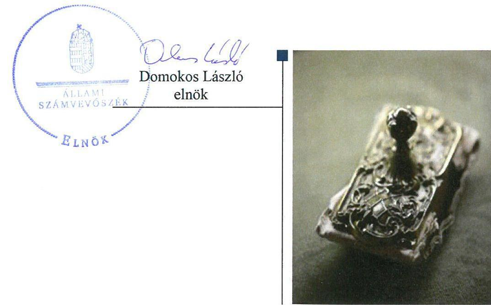
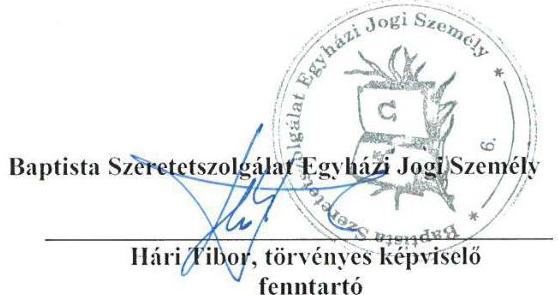
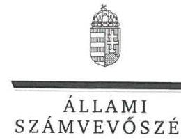
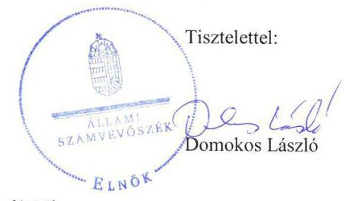

# Jelentés 

## Nem állami humánszolgáltatók ellenőrzése

A humánszolgáltatást nyújtó államháztartáson kívüli köznevelési és szociális intézmények, szolgáltatók fenntartói központi költségvetésből kapott támogatásai felhasználásának ellenőrzése - Baptista Szeretetszolgálat Egyházi Jogi Személy 2018. 06. 20.

---

# AZ ELLENŐRZÉST FELÜGYELTE:

DR. NAGY IMRE felügyeleti vezető

# AZ ELLENŐRZÉST VEZETTE ÉS A VÉGREHAJTÁSÁÉRT FELELŐS:

MOLNÁR ZSUZSANNA ellenőrzésvezető

# A PROGRAM ÖSSZEÁLLÍTÁSÁÉRT FELELŐS:

TÓTPÁL SZABOLCS osztályvezető

---

IKTATÓSZÁM: EL-0117-260/2018.

TÉMASZÁM: 2448

ELLENŐRZÉS-AZONOSÍTÓ SZÁM: V079404

---

Jelentéseink az Országgyűlés számítógépes hálózatán és az Interneten a www.asz.hu címen is olvashatóak.

---

# TARTALOMJEGYZÉK 

■ ÖSSZEGZÉS ..... 5
■ AZ ELLENŐRZÉS CÉLJA ..... 6
■ AZ ELLENŐRZÉS TERÜLETE ..... 7
■ AZ ELLENŐRZÉS HÁTTERE, INDOKOLTSÁGA ..... 8
■ A JELENTÉS LÉNYEGES KÉRDÉSKÖREI ..... 9
■ AZ ELLENŐRZÉS HATÓKÖRE ÉS MÓDSZEREI ..... 10
■ MEGÁLLAPÍTÁSOK ..... 12
■ JAVASLATOK ..... 16
■ MELLÉKLETEK ..... 17
I. sz. melléklet: Értelmező szótár ..... 17
■ FÜGGELÉK: ÉSZREVÉTELEK ..... 19
■ RÖVIDÍTÉSEK JEGYZÉKE ..... 35

---

.

---

# ÖSSZEGZÉS 

A Baptista Szeretetszolgálat Egyházi Jogi Személy - mint intézményfenntartó - megteremtette a köznevelési és szociális közfeladat ellátás alapvető feltételeit. A köznevelési feladathoz rendelt költségvetési támogatásokat szabályszerűen fordította a köznevelési intézményei működtetésére. A szociális intézmények pénzügyi feltételeinek biztosításával kapcsolatos fenntartói feladatellátás nem volt szabályszerű. A közérdekű adatok közzétételi kötelezettségének nem tett eleget, ezáltal közpénzekkel való gazdálkodásának átláthatóságát a nyilvánosság előtt nem biztosította.

## Az ellenőrzés társadalmi indokoltsága

Az Állami Számvevőszék stratégiájában hangsúlyos szerepet szán annak, hogy szilárd szakmai alapon álló, értékteremtő ellenőrzéseivel előmozdítsa a közpénzügyek átláthatóságát, rendezettségét és javaslataival a közpénzek és a közvagyon szabályos, gazdaságos, hatékony és eredményes felhasználását segítse. Az ÁSZ a stratégiájában célul tűzte ki, hogy az államháztartáson kívülre nyújtott költségvetési támogatások ellenőrzésével hozzájárul ahhoz, hogy a közpénzeket az államháztartáson kívüli szervezetek is átlátható módon használják fel a közfeladatok szerződésben vállalt ellátása érdekében. Tekintettel az elmúlt években mind a köznevelés, mind a szociális területet érintő finanszírozási változásokra, a társadalom fokozott érdeklődéssel figyeli a köznevelési és szociális feladatokra fordított források felhasználását. Fontos a közvéleményt biztosítani arról, hogy a közpénz államháztartáson kívüli felhasználása ezen a területen sem marad ellenőrizetlenül. Hozzájárul ezzel ahhoz is, hogy a nyilvánosság és a szolgáltatást igénybe vevők megfelelő tájékoztatást kapjanak az államháztartáson kívüli közfeladatot ellátók működéséről.

## Főbb megállapítások, következtetések, javaslatok

A Baptista Szeretetszolgálat Egyházi Jogi Személy, mint intézményfenntartó - az átvállalt közfeladat-ellátás jogszabályoknak megfelelő megszervezésével, belső szabályozottságának kialakításával - megteremtette a költségvetési támogatások átlátható, elszámoltatható igénybevételének és felhasználásának feltételeit. A költségvetési támogatásokkal kapcsolatos igénylési, módosítási, elszámolási kötelezettségnek a Kincstár felé - a 2014-re és 2015-re igénybe vett szociális közfeladat ellátáshoz rendelt támogatásokkal való két napos elszámolási késedelmet kivéve - a jogszabályi előírásoknak megfelelően eleget tett. A Fenntartó a köznevelési feladathoz rendelt költségvetési támogatásokat szabályszerűen fordította a köznevelési intézményei működtetésére, a szociális intézmények pénzügyi feltételeinek biztosításával kapcsolatos fenntartói feladatellátás nem volt szabályszerű.

A Fenntartó a humánszolgáltató intézmények közfeladat ellátásának működési kereteit kialakította. Az intézmények személyi és tárgyi feltételeinek megteremtéséről a Fenntartó gondoskodott. Nem a jogszabályban meghatározott határidőben utalta tovább 2014-ben két szociális intézménynek, 2015-ben minden szociális intézmény számára a Fenntartó a központi költségvetési támogatásokat. Egy szociális intézménynek nem került átadásra a támogatás teljes összege az ellenőrzött időszakban, a szociális célú támogatásokat nem fordította a Fenntartó az intézmény működtetésére.

A Fenntartó ellenőrzési, értékelési feladatait és a külső ellenőrzésekkel kapcsolatos intézkedési feladatait szabályszerűen ellátta. A közérdekű adatok közzétételi kötelezettségének nem tett eleget, ezáltal a humánszolgáltatási közfeladatot ellátó intézményei működtetéséhez felhasznált közpénzekre vonatkozó gazdálkodásának átláthatóságát a nyilvánosság előtt nem biztosította.

---

# AZ ELLENŐRZÉS CÉLJA 

AZ ELLENŐRZÉS CÉLJA annak értékelése volt, hogy a Baptista Szeretetszolgálat Egyházi Jogi Személy, mint köznevelési és szociális intézmények egyházi fenntartója központi költségvetésből kapott támogatásainak felhasználása szabályszerű volt-e, a támogatások igénylése, évközi módosítása és év végi elszámolása megfelelt-e a jogszabályi előírásoknak.

---

# **AZ ELLENŐRZÉS TERÜLETE**

## **Baptista Szeretetszolgálat Egyházi Jogi Személy, mint intézményfenntartó**

A Baptista Szeretetszolgálat Egyházi Jogi Személy a Magyarországi Baptista Egyház 2008. november 5-én nyilvántartásba vett szervezeti egysége, amely működését 2009-ben kezdte meg.

A Fenntartó1 a 2014-2016. években belső egyházi jogi személyként folytatta tevékenységét, vállalkozási tevékenységet nem folytatott.

A Fenntartó a Magyar Köztársaság Kormánya és az Egyház2 között 1998. december 12-én kötött – 1044/2001. (IV. 20.) Korm. határozatban közzétett – megállapodás alapján végzett köznevelési tevékenységet, valamint látott el szociális humánszolgáltatási közfeladatot.

A Fenntartó a köznevelési feladatok ellátását 2014-ben 35, 2015-2016. években 44 köznevelési intézmény működtetésével biztosította.

A Fenntartó szociális tevékenységek, gyermekjóléti, valamint gyermek- és ifjúságvédelmi feladatok ellátása céljából 2014. január 1-jén 29 intézményt tartott fenn, amelyek közül 13 intézmény szociális alapszolgáltatást, 4 intézmény a személyes gondoskodás keretébe tartozó szakosított ellátást és további 4 intézmény gyermekjóléti alapellátást nyújtott, míg a fennmaradó 8 intézményben egyidejűleg több ellátási forma működött. 2016. december 31-én a Fenntartó – az ellenőrzött időszakban végbement intézmény-átszervezések és jogutód nélküli megszűnések eredményeképpen – 13 szociális közfeladatot ellátó intézmény fenntartásáról gondoskodott.

A Fenntartó és intézményei törvényességi felügyeletét a területileg illetékes kormányhivatalok és az NRSZH3 gyakorolták, szakmai irányító szervi feladatait az EMMI4 látta el a köznevelési és a szociális, gyermekjóléti és gyermekvédelmi intézmények vonatkozásában egyaránt.

A Fenntartó költségvetési támogatásának az összes bevételéhez viszonyított aránya 2014-2015-ben meghaladta a 99%-ot, mely arány az ellenőrzött időszak végére 90,5%-ra mérséklődött.

---

# AZ ELLENŐRZÉS HÁTTERE, INDOKOLTSÁGA 

A köznevelési és szociális feladatokat ellátó nem állami intézményfenntartók részére közfeladataik ellátására évente jelentős összegű pénzügyi támogatást biztosítottak a mindenkori költségvetési törvények a bennük megfogalmazott feltételek mellett.

A felhasználható állami támogatások Kvtv. ${ }^{5}$ szerinti előirányzata 2014. - 2016. években együtt 753 Mrd Ft volt. A 2013. évben jelentős változások következtek be a normatív finanszírozás rendszerében. Az Országgyűlés elfogadta a nemzeti köznevelésről szóló 2011. évi CXC. törvényt, amely jelentősen átalakította a korábbi finanszírozási rendszert 2013 szeptemberétől. Módosították a szociális igazgatásról és szociális ellátásokról szóló 1993. évi III. törvényt is, amely - többek között - 2012. január 1-jei hatállyal megfogalmazta a finanszírozási rendszerbe történő befogadással összefüggő szabályokat. Mindkét területen új feladatfinanszírozási forma (átlagbéralapú támogatás) jelent meg, amely az államháztartáson kívüli intézményfenntartókra is vonatkozik. Az ellenőrzés a finanszírozási rendszerben 2011-2015 között bekövetkezett változásokra, azok közfeladat ellátásra gyakorolt hatására fókuszált a költségvetési támogatásokat felhasználó államháztartáson kívüli szervezetek körében. Az ellenőrzések indokoltságát az is alátámasztja, hogy az ÁSZ ${ }^{6}$ még nem ellenőrizte átfogóan e területet.

Az ÁSZ stratégiájában foglaltak alapján is indokolt volt az ellenőrzés, amely a társadalom számára jelzi, hogy a közpénz államháztartáson kívüli felhasználása sem maradhat ellenőrizetlenül. Az államháztartáson kívülre nyújtott költségvetési támogatások ellenőrzésével az ÁSZ hozzájárul ahhoz, hogy a közpénzeket a nem állami humán fenntartók átlátható módon használják fel a közfeladatok ellátására kötött szerződésekben vállalt kötelezettségek teljesítése érdekében. Az ellenőrzés javaslataival hozzájárulhat az említett rendszerek szabályszerű támogatás felhasználásához, javíthatja a társadalmi-gazdasági döntések megalapozottságát, amely a „jó kormányzás" feltétele.

---

# A JELENTÉS LÉNYEGES KÉRDÉSKÖREI 

1. A köznevelési, illetve szociális humánszolgáltatási közfeladatot ellátó Fenntartó szabályszerű működési - és gazdálkodási környezet kialakításával megteremtette-e a költségvetési támogatások átlátható, elszámoltatható igénybevételének, felhasználásának feltételeit?
2. Az államháztartáson kívüli Fenntartó az átvállalt köznevelési, illetve szociális közfeladathoz biztosított költségvetési támogatásokat szabályszerűen fordította-e a humánszolgáltató intézményei működtetésére?
3. Az államháztartáson kívüli Fenntartó a köznevelési, illetve szociális intézményei működtetéséhez felhasznált közpénzekre vonatkozó gazdálkodásával a nyilvánosság előtt elszámolt-e, ennek megalapozása érdekében ellenőrzési, értékelési és a külső ellenőrzésekkel kapcsolatos intézkedési feladatait szabályszerűen látta-e el?

---

# AZ ELLENŐRZÉS HATÓKÖRE ÉS MÓDSZEREI 

## Az ellenőrzés típusa

Megfelelőségi ellenőrzés.

## Az ellenőrzött időszak

A 2014. január 1-je és 2016. december 31-e közötti időszak.

## Az ellenőrzés tárgya

Az ellenőrzés a köznevelési és szociális humánszolgáltatási közfeladatokat ellátó államháztartáson kívüli Fenntartó humánszolgáltatási közfeladatai ellátásához a költségvetési törvényekben biztosított központi költségvetési támogatások igénylése, évközi módosítása és év végi elszámolása fenntartói feladatainak ellátása, illetve e központi költségvetésből kapott támogatásaik humánszolgáltatási közfeladatokra való fenntartó általi felhasználása szabályszerűségének értékelésére terjedt ki.

Az ellenőrzés kiterjedt minden olyan körülményre és adatra, amely az ÁSZ jogszabályban meghatározott feladatainak teljesítéséhez, valamint a program végrehajtása folyamán felmerült újabb összefüggések feltárásához szükséges volt.

## Az ellenőrzött szervezet

Baptista Szeretetszolgálat Egyházi Jogi Személy, mint intézményfenntartó

## Az ellenőrzés jogalapja

Az ellenőrzés jogszabályi alapját az ÁSZ tv. ${ }^{7}$ 1. § (3) bekezdése, 5. § (3) bekezdése, valamint az 5. § (11) bekezdés c) pontjában foglalt előírások adták.

## Az ellenőrzés módszerei

Az ellenőrzést az ellenőrzési program szempontjai, kérdései, az ellenőrzött időszakban hatályos jogszabályok, a nemzetközi standardokat irányadónak tekintve az ellenőrzés szakmai szabályok és módszertanok figyelembevételével végezte az ÁSZ.

---

A közpénzekkel való felelős gazdálkodás segítésére irányuló javaslatok kidolgozásakor a hatályos jogszabályok voltak az irányadóak.

Az ellenőrzés ideje alatt az ÁSZ a Fenntartóval történő kapcsolattartást az ÁSZ SZMSZ ${ }^{8}$-ének vonatkozó előírásai alapján biztosította.

Az ellenőrzési kérdések megválaszolásához szükséges bizonyítékok megszerzése az ellenőrzöttek által rendelkezésre bocsátott dokumentumokra, adatokra alapozva megfigyelés, szemle (szemrevételezés), kérdésfeltevés (információkérés), valamint elemző eljárással történt.

Az ellenőrzési bizonyítékként felhasznált adatforrások közé tartoztak egyrészt a szakmai program részletes szempontjainál felsorolt adatforrások, másrészt minden - az ellenőrzés folyamán feltárt, az ellenőrzés szempontjából információt tartalmazó - dokumentum.

Az ellenőrzés lefolytatásához a Fenntartó a kitöltött tanúsítványok, valamint az ÁSZ által kért dokumentumok elektronikus úton való megküldésével szolgáltatott adatokat, információkat. Az így rendelkezésre bocsátott adatok, információk és a tanúsítványok adatai valódiságának kontrollja az ellenőrzés keretében történt.

Az egyes fenntartott intézményeknél helyszíni szemle keretében győződött meg az ÁSZ a tényleges feladatellátásról.

A köznevelési, a szociális humánszolgáltatások központi költségvetési támogatásai igénylésével, módosításával, elszámolásával kapcsolatos, államháztartáson kívüli fenntartó jogszabályokban előírt feladatai betartását, továbbá a központi költségvetési támogatások szabályszerű kezelését, nyilvántartását ellenőrizte az ÁSZ a Fenntartónál határozatok, nyilvántartások, beszámolók és egyéb dokumentumok alapján. Az ellenőrzés nem terjedt ki a köznevelési, a szociális humánszolgáltatások központi költségvetési támogatásai igénylése, módosítása, elszámolása valódiságának, megalapozottságának, helyességének - sem a Fenntartónál, sem a székhely intézményeinél való - értékelésére. Továbbá nem terjedt ki az ellenőrzés e források intézmények általi szabályszerű felhasználásának értékelésére.

A szabályosság megítélésének alapját képezte, hogy a központi költségvetési támogatások Fenntartó általi igénylése és elszámolása a Kincstár ${ }^{9}$ felé megtörtént.

---

# MEGÁLLAPÍTÁSOK 

## 1. A köznevelési, illetve szociális humánszolgáltatási közfeladatot ellátó Fenntartó szabályszerű működési - és gazdálkodási környezet kialakításával megteremtette-e a költségvetési támogatások átlátható, elszámoltatható igénybevételének, felhasználásának feltételeit?

Összegző megállapítás

1.1. számú megállapítás

A Fenntartó megteremtette a költségvetési támogatások átlátható, elszámoltatható igénybevételének, felhasználásának feltételeit.

A Fenntartónál a közfeladat ellátásának megszervezése és a belső szabályozottság kialakítása a jogszabályi előírásoknak megfelelően történt.

A Fenntartó a szabályszerű működési- és gazdálkodási környezetet megteremtette a közfeladat ellátás jogszabályoknak
 megfelelő szervezeti és működési kereteinek kialakításával. Rendelkezett a szabályozásnak megfelelő SZMSZ${ }_{1,2}{ }^{10}$-szel, ami tartalmazta a Fenntartó szervezeti felépítését, működési rendjét, a tevékenységeket, illetve az ehhez kapcsolódó felelősségi- és hatásköröket, ezek gyakorlásának módját, illetve a helyettesítés rendjét.

A Fenntartó a Számv. tv. ${ }^{11}$-nek megfelelően rendelkezett számviteli politikával ${ }^{12}$, számlarenddel ${ }^{13}$, leltározási szabályzattal ${ }^{14}$, az eszközök és források értékelési szabályzatával ${ }^{15}$ és pénzkezelési szabályzattal ${ }^{16}$.

A Fenntartó a központi költségvetési támogatások igényléséről, a támogatásokkal való elszámolásról, azok intézményeknek történő átadásáról, felhasználásáról, valamint a költségvetési támogatások elkülönített nyilvántartásáról belső szabályzataiban rendelkezett.

A Fenntartó a köznevelési és szociális közfeladatok ellátására szolgáló költségvetési támogatás iránti igényeket, illetve azok évközi módosításait a jogszabályban meghatározott határidőnek megfelelően benyújtotta a Kincstár felé. A szociális közfeladat ellátásra 2014-re és 2015-re igénybe vett támogatásokkal késve számolt el, 2016-ra vonatkozóan elszámolását határidőben teljesítette.

A költségvetési támogatás iránti kérelmét, illetve a támogatások iránti kérelem módosítását a Fenntartó az ellenőrzött időszakban a jogszabályban előírt határidőben benyújtotta a Kincstárhoz. A Fenntartó a Kincstár - ellenőrzött időszakra vonatkozó - támogatásokat megállapító határozataival rendelkezett.

A támogatási igény évközi változását a Fenntartó a szociális közfeladat ellátás vonatkozásában évente több pótigény, illetve lemondás benyújtásával érvényesítette, amit az Atr. ${ }^{17}$-ben megadott határnapig és ütemezésben nyújtotta be a Kincstárnak. A költségvetési támogatási igény év közbeni módosításának kezdeményezése az új, vagy költségvetési támogatásban még nem részesült szociális intézmény esetében a jogszabályban előírtnak megfelelően történt meg.

A köznevelési feladatellátásra szolgáló költségvetési támogatásokkal a Fenntartó határidőben elszámolt. A szociális közfeladat ellátására 2014-re és 2015-re igénybe vett támogatásokkal - az Atr. 17. § (1) bekezdésében foglaltak ellenére - két napos késedelemmel, 2016-ra vonatkozóan határidőben számolt el a Fenntartó.

# 2. Az államháztartáson kívüli Fenntartó az átvállalt köznevelési, illetve szociális közfeladathoz biztosított költségvetési támogatásokat szabályszerűen fordította-e a humánszolgáltató intézményei működtetésére? 

Összegző megállapítás

A Fenntartó az átvállalt köznevelési feladathoz biztosított költségvetési támogatásokat a jogszabályi előírásoknak megfelelően fordította intézményei működtetésére. A szociális intézmények pénzügyi feltételeinek biztosításával kapcsolatos fenntartói feladatellátás nem volt szabályszerű, egy szociális intézmény esetében a Fenntartó a támogatásokat nem fordította az intézmény működtetésére.

A Fenntartó humánszolgáltatást végző intézményei alapfeladatait a jogszabályban foglaltak szerint meghatározta. Az intézmények közfeladat ellátásának működési kereteit kialakította.

A Fenntartó a működési engedélyezési eljárások során igazolta, hogy az ellenőrzési időszakban köznevelési és szociális intézményei közfeladat-ellátásához biztosította a szükséges személyi és tárgyi feltételeket.

A köznevelési közfeladatot ellátó intézmények számára a központi költségvetési támogatások teljes összegét átadta a Fenntartó a jogszabályban meghatározott határidőre. A köznevelési célú költségvetési támogatásokat - a Kvtv. ${ }_{1-3}$ előírásainak megfelelően - a közfeladatokat ellátó intézményei működtetésére fordította, felhasználását azonban - az Nkt.vhr. ${ }^{18}$ 37/G. § (1) bekezdésében foglaltak ellenére - nem feladatonként elkülönítve tartotta nyilván.

A szociális célú támogatások felhasználását a Fenntartó - az Atr. 16. § (1) bekezdésében foglaltak ellenére - nem kezelte feladatonkénti bontásban, elkülönítetten számviteli rendjében. A Fenntartó - a Kvtv. ${ }_{1}$ 34. § (3) és a Kvtv. ${ }_{2}$ 43. § (3) bekezdésben foglaltak ellenére - nem a jogszabályban meghatározott határidőben adta át a szociális közfeladat ellátását szolgáló költségvetési támogatásokat 2014-ben kettő, 2015-ben minden szociális intézménynek. Egy szociális intézménynek nem adta át a Fenntartó a törvényi előírások ellenére a támogatás teljes összegét, mert az intézmény tevékenységére az ellenőrzött időszakban kapott 1,242 mrd Ft-ból 67,855 millió Ft-ot nem adott át. Ezzel megsértették a Kvtv. ${ }_{1}$ 34. § (3), a Kvtv. ${ }_{2}$ 43. § (3) és a Kvtv. ${ }_{3}$ 41. § (3) bekezdésben foglaltakat.

A köznevelési és szociális intézmények beszámolási kötelezettségüknek eleget tettek a Fenntartó felé.

# 3. Az államháztartáson kívüli Fenntartó a köznevelési, illetve szociális intézményei működtetéséhez felhasznált közpénzekre vonatkozó gazdálkodásával a nyilvánosság előtt elszámolt-e, ennek megalapozása érdekében ellenőrzési, értékelési és a külső ellenőrzésekkel kapcsolatos intézkedési feladatait szabályszerűen látta-e el? 

Összegző megállapítás

A Fenntartó ellenőrzési, értékelési és a külső ellenőrzésekkel kapcsolatos intézkedési feladatait szabályszerűen látta el, azonban közzétételi kötelezettségének nem tett eleget, ezáltal az intézményei működtetéséhez felhasznált közpénzekre vonatkozó gazdálkodásával a nyilvánosság előtt nem számolt el a jogszabályi előírás ellenére.
3.1. számú megállapítás

A Fenntartó ellenőrzési, értékelési és a külső ellenőrzésekkel kapcsolatos intézkedési feladatait szabályszerűen ellátta.

A Fenntartó megteremtette a belső ellenőrzések szervezeti kereteit az SZMSZ${ }_{1,2}$-ben, melyben meghatározásra kerültek a belső gazdasági és szakmai ellenőrzési feladatok és az azokat végző szervezeti egységek.

A Fenntartó ellenőrizte a fenntartásában lévő köznevelési intézmények gazdálkodását, működésének törvényességét, hatékonyságát, normatíva ellenőrzés keretében a köznevelési feladatok ellátására megállapított állami támogatások felhasználását. Szociális és gyermekjóléti intézményei gazdálkodását és működésének törvényességét belső gazdasági, valamint szakmai ellenőrzések keretében ellenőrizte.

A Fenntartó a Számv.tv. előírásai alapján könyvvizsgálói szolgáltatás igénybevételére nem volt kötelezett, a számviteli politika${ }_{3}$-ja alapján azonban független szakértőt bízott meg 2016. évi egyszerűsített éves beszámolójának felülvizsgálatával. Számviteli politika${ }_{2}$-jében előírtak alapján a nem önállóan gazdálkodó szociális intézmények 2014-2015. évi normatíva felhasználásának felülvizsgálatát végeztette el szakértővel.

A Kormányhivatal ellenőrizte a Fenntartó köznevelési intézményeinél az Nkt. ${ }^{19}$-ban foglaltak alapján a fenntartói tevékenység törvényességét. Ellenőrizte a Kincstár a költségvetési támogatások 2014. évi elszámolását és 2015. évi igénylését a Fenntartó 33 szociális intézményénél.

A külső ellenőrzések eredményeként megállapított intézkedési, illetve visszafizetési kötelezettségeinek a Fenntartó eleget tett.

A Fenntartó negyvennégy intézményéből kilenc köznevelési intézménye esetében értékelte - az Nkt. 83. § (2) bekezdés h) pontja alapján - a pedagógiai programban meghatározott feladatok végrehajtását, illetve az elvégzett pedagógiai-szakmai munka eredményességét.

# 3.2. számú megállapítás 

A Fenntartó a köznevelési és szociális humánszolgáltató intézményei működtetéséhez felhasznált közpénzekre vonatkozó közzétételi kötelezettségének nem tett eleget.

A közérdekű adatok megismerésére irányuló igények teljesítésének és a kötelezően közzéteendő adatok nyilvánosságra hozatalának a rendjét a Fenntartó az Info tv. ${ }^{10}$ 30. § (6) bekezdésében és a 35. § (3) bekezdésben előírtak ellenére nem szabályozta.

Nem gondoskodott a Fenntartó - az Info tv. 37. § (1) bekezdésében foglaltak ellenére - az 1. melléklet általános közzétételi lista III/1. és III/2. részben felsorolt adatok közzétételéről, mert a közfeladat ellátásra vonatkozó éves költségvetését, a számviteli törvény szerint beszámolóját, a foglalkoztatottak létszámára és személyi juttatásaira vonatkozó összesített adatokat, illetve a vezetők és vezető tisztségviselők illetményére, munkabérére, rendszeres juttatásaira, valamint költségtérítésére vonatkozó összesített adatokat nem tette közzé.

Az adatok biztonságának, védelmének érvényre juttatásához szükséges eljárási szabályokat - az Info. tv. 7. § (2) bekezdésekben foglalt előírások ellenére - nem alakították ki.

# JAVASLATOK 

Az ÁSZ tv. 33. § (1) bekezdésében foglaltak értelmében az ellenőrzött szervezet vezetője köteles a jelentésben foglalt megállapításokhoz kapcsolódó intézkedési tervet összeállítani és azt a jelentés kézhezvételétől számított 30 napon belül az ÁSZ részére megküldeni. Amennyiben az ellenőrzött szervezet vezetője nem küldi meg határidőben az intézkedési tervet, vagy továbbra sem elfogadható intézkedési tervet küld, az Állami Számvevőszék elnöke az ÁSZ tv. 33. § (3) bekezdése a) és b) pontjaiban foglaltakat érvényesítheti.

## Baptista Szeretetszolgálat Egyházi Jogi Személy elnökének

1. Intézkedjen a költségvetési támogatások felhasználásának feladatonkénti elkülönített nyilvántartásáról.
(2. sz. megállapítás 3. bekezdése 2. mondata és 4. bekezdés 1. mondata alapján)
2. Intézkedjen, hogy a támogatási összegek határidőben, teljes összegben kerüljenek átadásra az intézmények számára.
(2. sz. megállapítás 4. bekezdés 2-4. mondatai alapján)
3. Intézkedjen a közérdekű adatok megismerésére irányuló igények teljesítésének és a kötelezően közzéteendő adatok nyilvánosságra hozatala rendjének szabályozásáról.
(3.2. sz. megállapítás 1. bekezdés alapján)
4. Intézkedjen, hogy a közzététel a jogszabályi előírások szerint történjen.
(3.2. sz. megállapítás 2. bekezdés alapján)
5. Intézkedjen az adatok biztonságának, védelmének érvényre juttatásához szükséges eljárási szabályok kialakításáról.
(3.2. sz. megállapítás 3. bekezdés alapján)

# MELLÉKLETEK 

- I. SZ. MELLÉKLET: ÉRTELMEZŐ SZÓTÁR
átlagbéralapú támogatás
egyházi fenntartó
humánszolgáltatás
költségvetési támogatás

Az átlagbér alapú támogatás alapja a pedagógus-munkakörben, valamint nevelő-, oktató munkát közvetlenül segítő munkakörben foglalkoztatottak után kifizetett személyi juttatás és járulék. (2013. évi CCXXX. törvény Magyarország 2014. évi központi költségvetéséről 33. § (4) bekezdés)
Az Ehtv. 33. §-a alapján az Ehtv. mellékletében felsorolt egyházak és az általuk meghatározott, az egyház belső egyházi szabálya szerint jogi személyiséggel rendelkező szervezetek - a nyilvántartásba vételük dátumától függetlenül - 2012. január 1-jétől minősülnek egyházi fenntartóknak. Az Ehtv. 14. §-ában meghatározott eljárás folyamán az Országgyűlés által egyháznak elismert szervezet a törvénynek az egyház bejegyzésére vonatkozó módosítása hatálybalépésének napjától minősül egyháznak (Ehtv. 15. §). A 2010. évi CXL. törvény* 5. Cikk Pénzügyi támogató intézkedések 1. pontja alapján 2011. január 1-jétől jogosult a Magyar Máltai Szeretetszolgálat Egyesület az egyházi kiegészítő támogatásra.
Külön törvényben meghatározott szociális, gyermekjóléti, gyermekvédelmi, közoktatási, felsőoktatási, kulturális közfeladatok (2014. évi Kvtv. 34. § (1), (4) bekezdés, 1. számú melléklet XX/20/2. alcím, 19. alcím, 2015. évi Kvtv. 43. § (1), (4) bekezdés, 1. számú melléklet XX/20/2/3. jogcím csoport, 19. alcím, 2016. évi Kvtv. 41. § (1), (4) bekezdés, 1. számú melléklet XX/20/2/3. jogcím csoport, 19. alcím).
a társadalombiztosítás pénzügyi alapjai kivételével az államháztartás központi alrendszeréből ellenérték nélkül, pénzben nyújtott támogatások (Áht. 1. § 14. pont)
A költségvetési törvényekben (2013. évi CCXXX. törvény 33-34. §, 2014. évi C. törvény 42-43. §, 2015. évi C. törvény 40-41. §) megállapított támogatás. Például a 2015. évi C. törvény 40-41. § szerint többek között: Az Országgyűlés a köznevelési feladat ellátására átlagbéralapú támogatást állapít meg. A nevelési-oktatási, valamint pedagógiai szakszolgálati intézményt fenntartó nemzetiségi önkormányzat, az egyházi és magán köznevelési intézmény fenntartója részére az általuk fenntartott nevelési-oktatási intézményben, továbbá pedagógiai szakszolgálati intézményben pedagógus és - a b) pont kivételével - nevelő-oktató munkát közvetlenül segítő munkakörben foglalkoztatottak után a 7. melléklet I. pontja, valamint az óvoda, egységes óvoda-bölcsőde esetében a 2. melléklet II. pont 1. alpontja szerint és az 5. alpontjában meghatározott jogosultak után, az őket ott megillető mértékek szerint. Működési támogatást állapít meg a nemzetiségi önkormányzat vagy az egyházi jogi személy által fenntartott nevelési-oktatási intézményekben ellátott, továbbá a pedagógiai szakszolgálati intézményekben gyógypedagógiai tanácsadásban, korai fejlesztésben, oktatásban és gondozásban, valamint a fejlesztő nevelésben részt vevő gyermekekre, tanulókra tekintettel a nemzetiségi önkormányzat és a bevett egyház részére a 7. melléklet II. pontja szerint.
Az Országgyűlés a szociális, gyermekjóléti, gyermekvédelmi közfeladatot ellátó intézményt, szolgáltatást fenntartó egyházi jogi személy, civil szervezet, közalapítvány, országos nemzetiségi önkormányzat, települési vagy területi nemzetiségi önkormányzat, gazdasági társaság, és a humánszolgáltatást alaptevékenységként végző, az Szja tv. hatálya alá tartozó egyéni vállalkozó (a továbbiakban együtt: nem állami szociális fenntartó) részére támogatást állapít meg a következők szerint: a támogatás a nem állami szociális fenntartót a települési önkormányzatok 2. melléklet III. pont 3. alpont c)-k) pontjában és

[^0]
[^0]:    * a Magyar Köztársaság Kormánya

 és a Szuverén Jeruzsálemi, Rodoszi és Máltai Szent János Katonai és Ispotályos Rend közötti Együttműködési Megállapodás kihirdetéséről szóló 2010. évi CXL. törvény

---

# Mellékletek 

III. pont 5. alpont a) pontjában meghatározott támogatásaival azonos jogcímeken, összegben és feltételek mellett illeti meg.
köznevelési közfeladat
köznevelési intézmény
A köznevelési intézmény alapító okiratában foglalt feladat: óvodai nevelés, nemzetiséghez tartozók óvodai nevelése, általános iskolai nevelés-oktatás, nemzetiséghez tartozók általános iskolai nevelése-oktatása, kollégiumi ellátás, nemzetiségi kollégiumi ellátás, gimnáziumi nevelés-oktatás, szakközépiskolai nevelés-oktatás, szakiskolai nevelés-oktatás, nemzetiségi gimnáziumi nevelés-oktatása, nemzetiségi szakközépiskolai nevelés-oktatása, nemzetiségi szakiskolai nevelés-oktatása, Köznevelési Hídprogramok keretében folyó nevelés-oktatás, felnőttoktatás, alapfokú művészetoktatás, fejlesztő nevelés, fejlesztő nevelés-oktatás, pedagógiai szakszolgálati feladat, a többi gyermekkel, tanulóval együtt nevelhető, oktatható sajátos nevelési igényű gyermekek, tanulók óvodai nevelése és iskolai nevelése-oktatása, azoknak a sajátos nevelési igényű gyermekeknek, tanulóknak az óvodai, iskolai, kollégiumi ellátása, akik a többi gyermekkel, tanulóval nem foglalkoztathatók együtt, a gyermekgyógyüdülőkben, egészségügyi intézményekben, rehabilitációs intézményekben tartós gyógykezelés alatt álló gyermekek tankötelezettségének teljesítéséhez szükséges oktatás, pedagógiai-szakmai szolgáltatás.
köznevelési intézmény
A nevelési-oktatási intézmény, pedagógiai szakszolgálati intézmény, pedagógiai-szakmai szolgáltatást nyújtó intézmény.

---

# FÜGGELÉK: ÉSZREVÉTELEK 

A jelentéstervezetet a Számvevőszék 15 napos észrevételezésre megküldte az ellenőrzött szervezet vezetőjének az ÁSZ tv. 29. § (1) bekezdése előírásának megfelelően.

Az ÁSZ a jelentéstervezetet észrevételezésre megküldte a Baptista Szeretetszolgálat Egyházi Jogi Személy elnökének.
A függelék tartalmazza az ellenőrzött észrevételeit, illetve az el nem fogadott észrevételek elutasításának indoklását.

[^0]
[^0]:    ${ }^{+} 29. \S$ (1) Az Állami Számvevőszék az ellenőrzési megállapításait megküldi az ellenőrzött szervezet vezetőjének vagy az általa megbízott személynek, és annak, akinek személyes felelősségét állapította meg.
    (2) Az ellenőrzött szervezet vezetője és a felelősként megjelölt személy az ellenőrzés megállapításaira tizenöt napon belül írásban észrevételt tehet.
    (3) Az Állami Számvevőszék az észrevételre a beérkezésétől számított harminc napon belül írásban válaszol. A figyelembe nem vett észrevételeket köteles a jelentésben feltüntetni, és megindokolni, hogy azokat miért nem fogadta el.

---

# 556 

## Állami Számvevőszék és annak Elnöke Domokos László Úr részére

1052 Budapest
Apáczai Csere János utca 10.

Tárgy: Észrevétel a „Nem állami humánszolgáltatók ellenőrzése - A humánszolgáltatást nyújtó államháztartáson kívüli köznevelési és szociális intézmények, szolgáltatók fenntartói központi költségvetésből kapott támogatásai felhasználásának ellenőrzése - Baptista Szeretetszolgálat Egyházi Jogi Személy" című számvevőszéki jelentéstervezetre
Hiv.szám: EL-0117-253/2018.

## Tisztelt Állami Számvevőszék! Tisztelt Elnök Úr!

A Baptista Szeretetszolgálat Egyházi Jogi Személy (székhely: 1111 Budapest Budafoki út 34/b.; képviseletében: Hári Tibor, törvényes képviselő) tárgyi ügyben az alábbiakban terjeszti elő a Baptista Szeretetszolgálat Egyházi Jogi Személynél lefolytatott számvevőszéki ellenőrzés kapcsán 2018. április 19. napján a Baptista Szeretetszolgálat Egyházi Jogi Személy Elnöke részére megküldött jelentéstervezetben (a továbbiakban: Tervezet vagy Jelentéstervezet) foglaltakra tett észrevételeit az Állami Számvevőszékről szóló 2011. évi LXVI. törvény (a továbbiakban: ÁSZ törvény) 29.§ (1)-(2) bekezdéseiben foglaltak alapján, az ÁSZ törvényben biztosított határidőn belül:

Észrevételeinket a Jelentéstervezet megállapításaira hivatkozással az alábbiak szerint terjesztjük elő:
1).,A szociális közfeladat ellátására 2014-re és 2015-re igénybe vett támogatásokkal - az Atr. 17. § (1) bekezdésében foglaltak ellenére - két napos késedelemmel, 2016-ra vonatkozóan határidőben számolt el a Fenntartó." Tervezet 13. old. 2. bek. 2. mondat.

## Észrevétel:

Észrevételezzük, hogy a fenntartó 2015-ben határidőben eleget tett a szociális közfeladat ellátására 2014-re igénybe vett támogatásokkal történő elszámolásnak, 2016-ban pedig nem két, hanem egy nap késedelemmel nyújtotta be a fentiek szerinti elszámolását.

Az egyházi és nem állami fenntartású szociális, gyermekjóléti és gyermekvédelmi szolgáltatók, intézmények és hálózatok állami támogatásáról szóló 489/2013. (XII. 18.) Korm. rendelet 17.§ (1) bekezdése szerint, a fenntartó az igénybe vett támogatásról a szolgáltató beszámolója és dokumentációja segítségével, a teljesített feladatmutatók alapján - a (2)-(4) bekezdésben foglalt kivételekkel - a tárgyévet követő év január 31-éig számol el.

A 2014. évre igénybe vett költségvetési támogatásokkal 2015. évben kellett elszámolni, az elszámolásra megadott határidő utolsó napja, azaz 2015. január 31. napja, szombati napra esett, mely munkaszüneti nap volt, ennek megfelelően ezen napon a munkavégzés szünetel az elszámolást befogadó szervnél, így a határidő a következő munkanapon, azaz hétfőn járt le, amely 2015. február 2. napja volt, figyelemmel a közigazgatási hatósági eljárás és szolgáltatás általános szabályairól szóló 2004. évi CXL. törvény (a továbbiakban: Ket.) 65. § (3) bekezdésében foglaltakra - 65.§ (3) Ha a határidő utolsó napja olyan nap, amelyen a hatóságnál a munka szünetel, a határidő a legközelebbi munkanapon jár le.

A 2014. év vonatkozásában a Magyar Államkincstár részére határidőben való elszámolásra vonatkozó dokumentumok, azaz a 2015. február 2-i benyújtású elszámolás, és a Magyar Államkincstár elszámolást

---

# Függelék: Észrevételek

elfogadó határozata az Állami Számvevőszék részére rendelkezésére bocsátásra került az ellenőrzés során, *Adatlap az egyházi, a nem állami és a nemzetiségi önkormányzat szociális, gyermekjóléti és gyermekvédelmi intézményfenntartók 2014. évi támogatásának elszámolásához* elnevezésű dokumentumként (feltöltött dokumentum elnevezése: SZOC_ELSZ_2014).

A 2015. évre igénybe vett költségvetési támogatásokkal 2016. évben kellett elszámolni, az elszámolásra megadott határidő utolsó napja, azaz 2016. január 31. napja vasárnapi napra esett, amely napon a munkavégzés szünetel az elszámolást befogadó szervnél, így a határidő a következő munkanapon, azaz hétfőn járt le, amely 2016. február 1. napja volt. Ebben az évben a fenntartó az előző, 2015. évben igénybe vett támogatás elszámolására vonatkozó dokumentumokat *egy nappal* később, 2016. február 2. napján nyújtotta be a Magyar Államkincstárhoz.

Tekintettel arra, hogy a 2014. év tekintetében az elszámolásra vonatkozó eljárásjogi szabályok – Ket. hivatkozott 65.§ (3) bekezdése – alapján a fenntartó határidőben eleget tett elszámolási kötelezettségének, ezért kérjük a végleges jelentésben a mulasztásra vonatkozó megállapítást a 2014-es év elszámolását illetően mellőzni szíveskedjék, továbbá a 2015-ös év vonatkozásában akként kérjük módosítani, hogy fenntartó a 2015-ös év vonatkozásában egynapos késedelemmel tett eleget a szociális közfeladat ellátására vonatkozó elszámolás benyújtási kötelezettségének.

2) *A szociális közfeladat ellátásra 2014-re és 2015-re igénybe vett támogatásokkal* [ti. a fenntartó] *késve számolt el, 2016-ra vonatkozóan elszámolását határidőben teljesítette.* Tervezet 1.2 megállapítás utolsó mondat.

## Észrevétel:

A Tervezet 13. old. 2. bek. 2. mondatra tett észrevételünk alapján kérjük a 1.2 pont szerint idézett megállapítást akként módosítani, hogy a fenntartó a szociális közfeladat ellátására 2015-re igénybe vett támogatásokkal egynapos késedelemmel számolt el, 2014-re, és 2016-ra vonatkozóan elszámolását határidőben teljesítette. Álláspontunk szerint a megállapítás ily módon tényszerű.

3) *A költségvetési támogatásokkal kapcsolatos igénylési, módosítási, elszámolási kötelezettségnek a Kincstár felé-a 2014-re és 2015-re igénybe vett szociális közfeladat ellátáshoz rendelt támogatásokkal való két napos elszámolási késedelmet kivéve - a jogszabályi előírásoknak megfelelően eleget tett.* Tervezet Főbb megállapítások, következtetések, javaslatok, 4. oldal

Tervezet 13. old. 2. bek. 2. mondatra tett észrevételünk, valamint a Megállapítások a 1.2 pontra tett előbbi észrevétel alapján kérjük a *Tervezet Főbb megállapítások, következtetések, javaslatok, 4. oldal* idézett megállapítás módosítását, akként, hogy a költségvetési támogatásokkal kapcsolatos igénylési, módosítási, elszámolási kötelezettségnek a fenntartó a Kincstár felé-a 2015-re igénybe vett szociális közfeladat ellátáshoz rendelt támogatásokkal való egynapos elszámolási késedelmet kivéve - a jogszabályi előírásoknak megfelelően eleget tett.

Az egynapos késedelem okainak megszüntetése érdekében is a fenntartó a következő intézkedéseket hajtotta végre:

- belső vizsgálat a késedelem okainak feltárása céljából, illetve ez alapján a szükséges munkaügyi intézkedések végrehajtása;
- a postázás rendjének felülvizsgálata, továbbfejlesztése;
- munkáltatói utasítás kiadása "Vezetői jelentéstételi kötelezettség elrendelése" tárgyában, amely utasítás a kiemelt jelentőségű küldemények postázásával kapcsolatos felelősségeket, illetve jelentéstételi kötelezettséget ismerteti (2016. május 9-én).

4) A Jelentéstervezet 13. oldalán a 2. kérdésre adott összegző megállapítás alatti szöveg utolsó mondata szerint: *Egy szociális intézménynek nem adta át a Fenntartó a törvényi előírások ellenére a támogatás teljes összegét, mert az intézmény tevékenységére az ellenőrzött időszakban kapott 1.242 mrd Ft-ból 67.855 millió Ft-ot nem adott át. Ezzel megsértették a Kvtv.; 34. § (3), a Kvtv.; 43. § (5) és a Kvtv.; 41. § (3) bekezdésben foglaltakat.*

## Észrevétel:

---

A fenti megállapítást vitatjuk, mert a hivatkozott szociális intézmény esetében a Fenntartó az ellenőrzött időszakban kapott $1,242 \mathrm{mrd}$ Ft alapnormatívát teljes összegben az intézmény működésére fordította, sőt az ellenőrzött időszakban a Fenntartó az 1,242 mrd Ft alapnormatíva támogatáson felül 643 MFt egyházi kiegészítő támogatás átadásával egészítette ki az intézmény finanszírozását.

Indoklás:
a) Az Állami Számvevőszék az ellenőrzés során nem vette figyelembe az ellenőrzött időszakot megelőző, de pénzforgalmi szempontból fontos és a következő éveket jelentősen befolyásoló normatíva visszafizetési kötelezettséget, mint az intézménnyel szemben fennálló fenntartói követelést. A követelés a Magyar Államkincstár 2014.03.27-én kelt 15963/22/2014. iktatószámú, a 2013. évben igénybevett támogatások elszámolása tárgyában kiadott határozatán alapult, amely az igényelt és az intézményt a teljesített feladatmutatók alapján ténylegesen megillető támogatás közötti különbözet visszafizetését írta elő a Fenntartó számára. A Fenntartó az Államkincstárral elszámolt, majd ezt követően a jelentéstervezetben jelölt intézménnyel szemben 79 MFt összegű (47 MFt alapnormatíva támogatás és 32 MFt egyházi kiegészítő támogatás) követelést írt elő.
A fenntartói követelés és egyben intézményi kötelezettség összege a Fenntartó, illetve az intézmény könyveiben és beszámolójában bemutatásra került.
b) A Magyar Államkincstár 2015. évben a házi segítségnyújtást végző intézmények ellenőrzése során a 2015.08.06-án kelt végzésében (Üi.sz.: 15963/36/2015) a hivatkozott intézmény költségvetési támogatásának kifizetését felfüggesztette - mely végzést az azt helybenhagyó másodfokú végzéssel együtt a Fővárosi Közigazgatási és Munkaügyi Bíróság 2016. április 05-én kelt végzésével hatályon kívül helyezett. A jogszabálysértő felfüggesztés miatt 2015. évben a Fenntartó már nem kapta meg az intézmény működéséhez szükséges állami támogatásokat. A Fenntartó az intézmény működésének biztosítása érdekében ezért jelentős összegű normatív támogatást előlegezett meg, amelynek következtében 2015.12.31-én a Fenntartó az intézmény 112 MFt-os túlfinanszírozását követelésként tartotta nyilván könyveiben, ami a Fenntartó év végi beszámolójában is bemutatásra került.
c) A Magyar Államkincstár házi segítségnyújtás ellenőrzésének megállapításait tartalmazó 2016. évi határozata (feltöltött dokumentum elnevezése: SZNORMHAT160414) alapján a fenti megállapítással érintett intézménynek 2014. évre vonatkozóan 25 MFt (16 MFt alapnormatíva és 9 MFt egyházi kiegészítő támogatás) visszafizetési kötelezettsége keletkezett.

A Fenntartó az Államkincstárral elszámolt, majd az intézménnyel szemben a kötelezettség összegét követelésként előírta. A gazdasági esemény a Fenntartó és az intézmény könyveiben is kimutatásra került.

Az Államkincstár támogatást elszámoló, illetve támogatás ellenőrzése tárgyában hozott határozataiban megállapított visszafizetési kötelezettségek, valamint az intézmény működése érdekében biztosított fenntartói túlfinanszírozás, mint a könyvekben nyilvántartott fenntartói követelések a következő években elszámolásra (levonásra, beszámításra) kerültek az intézmény finanszírozása során.

Ennek tudható be, hogy például a Magyar Államkincstár 2015. évben igénybevett támogatások elszámolása tárgyában kiadott határozatában (feltöltött dokumentum elnevezése: SZNORMHAT16426) a normatívát előző évben felfüggesztő államkincstári határozat bírósági hatályon kívül helyezése miatt - a hivatkozott intézmény vonatkozásában 80 MFt alapnormatíva többlettámogatást állapított meg utólagosan a Fenntartó javára, ugyanakkor ez a támogatás a
 korábbi időszakban a Fenntartó által biztosított többlettámogatás (normatíva előleg) miatt nem került teljes egészében továbbításra az intézmény részére.

Véleményünk szerint az intézmény életében rendkívülinek minősülő, előzőekben részletezett események hatását az Állami Számvevőszék nem teljes körűen vette figyelembe az ellenőrzés során, ezáltal tett téves megállapítást. Az intézményi támogatások számviteli és pénzügyi elszámolási folyamatainak összetettsége, valamint a

---

számviteli és pénzügyi elszámolások időbeli eltérése miatt a támogatások elszámolásának megfelelősége csak a folyamatok és elszámolások részletes elemzése után vezethető le teljes körűen, pontosan.

Indokainkat a következő - Állami Számvevőszéknek feltöltött - dokumentumok is alátámasztják:

- a) Intézmény 2014. évi normatíva elszámoló táblája (feltöltött dokumentum elnevezése: BSZ_NORM_2014)
- b) Intézmény 2015. évi normatíva elszámoló táblája (feltöltött dokumentum elnevezése: BSZ_NORM_2015)
- c) Intézmény 2016. évi normatíva elszámoló táblája (feltöltött dokumentum elnevezése: BSZ_NORM_2016)
- d) Intézményi főkönyvi kivonat 2014. (2.28. feltöltött dokumentum elnevezése: BSZ_FK14_OSZSK, BSZ_FK14_DunHum)
- e) Intézményi főkönyvi kivonat 2015. (2.28. feltöltött dokumentum elnevezése: BSZ_FK15_OSZSK, feltöltött dokumentum elnevezése: BSZ_FK15_DtulHu)
- f) Intézményi főkönyvi kivonat 2016. (2.28. feltöltött dokumentum elnevezése: BSZ_FK16_OSZSK)
- g) Magyar Államkincstár határozata (feltöltött dokumentum elnevezése: SZNORMHAT160414)

5) A fentiek - 4) pontban foglaltak - alapján azonos indokokkal kérjük a fent hivatkozott, a Tervezet 2. kérdésre adott összegző megállapítás alatti szöveg utolsó mondatának is [„Egy szociális intézménynek nem adta át a Fenntartó a törvényi előírások ellenére a támogatás teljes összegét, mert az intézmény tevékenységére az ellenőrzött időszakban kapott 1.242 mrd Ft-ból 67.855 millió Ft-ot nem adott át. Ezzel megsértették a Kvtv. 1 34. § (3), a Kvtv. 2 43. § (3) és a Kvtv. 3 41. § (3) bekezdésben foglaltakat,"] törlését és mellőzését.
6) A Jelentéstervezet 5. oldalán a Főbb megállapítások, következtetések, javaslatok cím második bekezdés utolsó mondata szerint: „Egy szociális intézménynek nem került átadásra a támogatás teljes összege az ellenőrzött időszakban, a szociális célú támogatásokat nem fordította a Fenntartó az intézmény működtetésére."

# Észrevétel: 

Ezen megállapítást a fenntartó - az alábbiak alapján - vitatja.
A megállapítás első tagmondatára „Egy szociális intézménynek nem került átadásra a támogatás teljes összege az ellenőrzött időszakban," vonatkozóan az előbbi, a Tervezetben megfogalmazott 2. kérdésre adott összegző megállapítás alatti szöveg utolsó mondatára tett észrevételünket - a jelen levél 4) - 5) pontjai - annak ehelyütt történő megismétlése helyett, arra való hivatkozással fenntartjuk, és a kifogásolt megállapítást kérjük törölni és mellőzni a jelentésben.

Az itt vitatott Főbb megállapítás a Tervezetben a 2. kérdésre adott összegző megállapítás alatti szöveg utolsó mondatán alapul, és mivel a fent előadottak alapján azt a fenntartó nem tartja megalapozottnak, így arra ez okból összegző, szabálytalanságot megállapító megállapítás sem tehető.

A vitatott megállapítás második tagmondata szerinti: „a szociális célú támogatásokat nem fordította a Fenntartó az intézmény működtetésére.", megállapítás a fenntartó álláspontja szerint több okból sem tényszerű, illetve okszerű megállapítás, emellett továbbá félreértésre alapot adó megállapítás.

A „szociális célú támogatások" összefoglaló megfogalmazása - nyelvtani értelmezés szerint a fenntartó által az érintett intézményre vonatkozó valamennyi szociális célú támogatást jelentené, melynek összességének át nem adását a t. Állami Számvevőszék sem állapította meg - vö: „mert az intézmény tevékenységére az ellenőrzött időszakban kapott 1.242 mrd Ft-ból 67.855 millió Ft-ot nem adott át" - Tervezet 2. kérdésre adott összegző megállapítás alatti szöveg utolsó mondat.

Figyelemmel arra, hogy a t. Állami Számvevőszék álláspontja szerint is a szociális célú támogatások 94%-a az intézmény vonatkozásában átadásra került, az ezzel ellentétes, 6%-os át nem adásra alapított kiterjesztő következtetés álláspontunk szerint nem tényszerű, ezért kérjük ennek törlését és a jelentésben mellőzését. Más ténybeli alap pedig a Jelentéstervezetben sem kerül kifejtésre.

---

Továbbá a fenntartó - ahogy Tervezetben a 2. kérdésre adott összegző megállapítás alatti szöveg utolsó mondatára tett fenti észrevételben azt részletesen kifejtette - az intézmény után megállapított 1,242 mrd Ft támogatáson felül további 643 MFt-tal finanszírozta felül az intézményt, ezért ez okból is kérjük ezen megállapítást a maga egészében törölni és mellőzni a jelentésben.

7) Ugyanezen indokok alapján kérjük törölni és mellőzni a Jelentéstervezet 12. oldal 2. pont alatti összegző megállapítás azon részét is, mely szerint "A szociális intézmények pénzügyi feltételeinek biztosításával kapcsolatos fenntartói feladatellátás nem volt szabályszerű, egy szociális intézmény esetében a Fenntartó a támogatásokat nem fordította az intézmény működtetésére", különös tekintettel a az „egy szociális intézmény esetében a Fenntartó a támogatásokat nem fordította az intézmény működtetésére" megállapításra is.
8) A Jelentéstervezet 13. oldalán a 2. kérdésre adott összegző megállapítás alatti szöveg utolsó bekezdése szerint:
„A Fenntartó - a Kvtv., 34. § (3) és a Kvtv., 43. § (3) bekezdésben foglaltak ellenére - nem a jogszabályban meghatározott határidőben adta át a szociális közfeladat ellátását szolgáló költségvetési támogatásokat 2014-ben kettő. 2015-ben minden szociális intézménynek."

# Észrevétel: 

2014. évben két szociális intézmény esetében téves banki adatrögzítés miatt valóban a jogszabályban előírt 15 napon túl került sor a havi alapnormatíva átadására.
2015. évben ténylegesen előfordult, hogy a szociális ágazati bérpótlék támogatást - feltehetőleg adminisztrációs tévedésből - csak a jogszabályban előírt 15 napot meghaladóan sikerült a szociális intézmények számára továbbítani. Megjegyezzük, hogy a szociális ágazati bérpótlék támogatás csupán az összes költségvetési támogatás 1%-át teszi ki, továbbá minden szociális intézmény tekintetében az alapnormatívát a fenntartó havonta jelentős mértékű egyházi kiegészítő támogatással egészíti ki, tehát a szociális intézmények működéséhez szükséges pénzügyi feltételek a Fenntartó által biztosítottak voltak.
9) A Jelentéstervezet 5. oldalán a Főbb megállapítások, következtetések, javaslatok cím második bekezdésében leírtak vonatkozásában - melyek szerint „Nem a jogszabályban meghatározott határidőben utalta tovább 2014-ben két szociális intézménynek, 2015-ben minden szociális intézmény számára a Fenntartó a központi költségvetési támogatásokat." a fentiekben leírt észrevételt tesszük.
10) Tekintettel a fentebb leírtakra is, a Jelentéstervezet 13. oldalán a 2. kérdésre adott összegző megállapítás második mondatára: „A szociális intézmények pénzügyi feltételeinek biztosításával kapcsolatos fenntartói feladatellátás nem volt szabályszerű, egy szociális intézmény esetében a Fenntartó a támogatásokat nem fordította az intézmény működtetésére "az alábbi észrevételt tesszük.

## Észrevétel:

A Jelentéstervezetre a 4)-7) pontokban tett észrevételeink alapján vitatjuk a fent idézett összegző megállapítást is, amely a 4) pontban tett észrevételeink alapján kifogásolt megállapításokon alapulnak, egyező indokolással.

Ezen túlmenően észrevételezzük, hogy a most vitatott összegző megállapításban a t. Állami Számvevőszék nem differenciál - az észrevételeink alapján nagyobb részben egyebekben szabályosnak elfogadni kért -, a fenntartót terhelő egyes megállapítások és az összegző megállapítás tárgyi súlya között a szociális intézmények vonatkozásában, amellett, hogy a t. Állami Számvevőszék egyebekben ezt a Jelentéstervezet egyéb megállapításainál megteszi.

Mindezek alapján 2. kérdésre adott összegző megállapítás módosítását kérjük akként, hogy a szociális intézmények pénzügyi feltételeinek biztosításával kapcsolatos fenntartói feladatellátás túlnyomó többségében szabályszerű volt, a fenntartó egyes esetekben nem adta át határidőben a szociális közfeladat ellátását szolgáló költségvetési támogatások egy részét.

Ugyanakkor a fent már hivatkozottak alapján az összegző megállapításból és a főbb megállapításokból is kérjük törölni, a jelentésben mellőzni azon megállapítást, mely szerint a fenntartó a szociális célú támogatásokat nem fordította az intézmény működtetésére.

---

11) Jelentéstervezet 13. oldalán a 2. kérdésre adott összegző megállapítás alatti szöveg utolsó bekezdésének első mondata szerint: „A szociális célú támogatások felhasználását a Fenntartó - az Atr. 16. § (1) bekezdésében foglaltak ellenére nem kezelte feladatonkénti bontásban, elkülönítve számviteli rendjében."továbbá A Jelentéstervezet 13. oldalán a 2. kérdésre adott összegző megállapítás alatti szöveg harmadik bekezdésének második mondata szerint: „A köznevelési célú költségvetési támogatásokat - a Kvtv. előírásainak megfelelően - a közfeladatokat ellátó intézményei működtetésére fordította, felhasználását azonban - az Nkt.vhr. 18 37/G. § (1) bekezdésében foglaltak ellenére - nem feladatonként elkülönítve tartotta nyilván."

# Észrevétel: 

A Fenntartó a főkönyvi könyvelésben a részben önálló szociális intézmények vonatkozásában, valamint a pályázatok tekintetében részleg- és munkaszámra való könyveléssel feladatonként elkülönítette a támogatások felhasználását, az önálló intézmények esetében azonban - a fenntartott intézmények nagy számára tekintettel - a főkönyvi könyvelésében intézményenkénti megbontást alkalmazott. Ennek megfelelően kérjük a megállapítás módosítását a Tervezet 13. oldalán a 2. kérdésre adott összegző megállapítás alatti szöveg utolsó bekezdésében.
12) A Jelentéstervezet 14. oldalán a 3. kérdésre tett összegző megállapítás 3.1. számú megállapítás utolsó mondata szerint a Fenntartó negyvennégy intézményéből kilenc köznevelési intézménye esetében értékelte - az Nkt. 83.§ (2) bekezdés h) pontja alapján - a pedagógiai programban meghatározott feladatok végrehajtását, illetve az elvégzett pedagógiai-szakmai munka eredményességét.

A fenti megállapítást kérjük módosítani az alábbiakra tekintettel:
A nemzeti köznevelésről szóló 2011. évi CXC. törvény (a továbbiakban: Nkt.) 83.§ (2) bekezdés h) pontja szerint, a fenntartó értékeli a nevelési-oktatási intézmény pedagógiai programjában meghatározott feladatok végrehajtását, a pedagógiai-szakmai munka eredményességét. A fenntartó ellenőrzési tevékenységét folyamatosan végezte és végzi, így a vizsgált időszakban is, azaz a 2014. január 1-je és 2016. december 31-e között az általa fenntartott köznevelési intézmények közül mintegy 27 intézmény értékelését végezte el az Nkt. 83.§ (2) bekezdés h) pontja alapján, amely értékelések elérhetőek a www.baptistaoktatas.hu/intezmenvek oldalon az egyes intézményeknél közzétett dokumentumok között.

Az alábbi táblázat részletesen jelöli, hogy az értékelések mely intézményre vonatkozóan, milyen időpontban készültek el és azok mely linken érhetők el jelenleg is.

| Ssz. | Intézmény | Dátum | Link |
| :--: | :--: | :--: | :--: |
| 1. | Baptista Alapfokú   Művészeti Iskola | 2014. 02. 27 | http://www.baptistaoktatas.hu/intezmeny/baptista-alapfoku-muveszetoktatasu-intezmeny_baptista_egvhazi_iskola |
| 2. | Baptista Szeretetszolgálat   Kisújszállási Óvodája | 2014. 01. 27 | http://www.baptistaoktatas.hu/intezmeny/baptista-szeretetszolgalat-kisulszallasi-ovodaja_baptista_egvhazi_iskola |
| 3. | BKF Szakközépiskola | 2014. 05. 28 | http://www.baptistaoktatas.hu/intezmeny/budapesti-innovativ-gimnazium-es-szakgimnazium |
| 4. | Baptista Szeretetszolgálat   EJSZ Kölcsey Ferenc   Általános Iskolája | 2015. 04. 20 | http://www.baptistaoktatas.hu/intezmeny/baptista-szeretetszolgalat-ejsz-kolcsey-ferenc-altalanos-iskolaja_baptista_egvhazi_iskola |
| 5. | Baptista Szeretetszolgálat   EJSZ Széchenyi István   Gimnáziuma,   Szakközépiskolája,   Általános Iskolája és | 2015. 07. 28 | http://www.baptistaoktatas.hu/intezmeny/baptista-szeretetszolgalat-ejsz-szechenyi-istvan-gimnaziuma-szakkozepiskolaja-altalanos-iskolajis-es-spontiskolaja_baptista_egvhazi_iskola |

---

|  | Sportiskolája |  |  |
| :--: | :--: | :--: | :--: |
| 6. | Európai Üzleti Szakközép-   és Szakiskola | 2015. 07. 25 | http://www.baptistaoktatas.hu/intezmeny/europai-uzletiszakkozeppzo-iskola-es-gimnazium |
| 7. | Illéssy Sándor Baptista   Gimnázium,   Szakközépiskola és   Szakiskola | 2015. 07. 22 | http://www.baptistaoktatas.hu/intezmeny/illessy-sandor-baptista-gimnazium-szakkozeppiskola-es-szakiskola |
| 8. | Aranybika Vendéglátóipari   Baptista Szakképző Iskola | 2016. 02. 18 | http://www.baptistaoktatas.hu/intezmeny/aranybika-vendeglatoipari-baptista-szakkepzoskola_baptista_egyhazi_iskola |
| 9. | Baptista Szeretetszolgálat   Csicsergő Óvodája | 2016. 05. 20 | http://www.baptistaoktatas.hu/intezmeny/baptistaszeretetszolgalat-esicsergovodaja_baptista_egyhazi_iskola |
| 10. | Baptista Szeretetszolgálat   EJSZ Móra Ferenc   Felnőttoktatási   Középiskolája | 2016. 04. 29 | http://www.baptistaoktatas.hu/intezmeny/baptistaszeretetszolgalat-ejsz-mora-ferenc-felnottoktatasikozepiskolaja |
| 11. | Baptista Szeretetszolgálat   Napraforgó Művészeti   Modell Óvodája | 2016. 04. 12 | http://www.baptistaoktatas.hu/intezmeny/baptistaszeretetszolgalat-napraforgo-muyeszeti-modellovodaja_baptista_egyhazi_iskola |
| 12. | Csuha Antal Baptista   Általános Iskola | 2016. 01. 10 | http://www.baptistaoktatas.hu/intezmeny/csuha-antal-baptista-altalanos-iskola_baptista_egyhazi_iskola |
| 13. | EURO Baptista Két   Tanítási Nyelvű   Gimnázium,   Szakgimnázium és

   Szakközépiskola | 2016.11.18 | http://www.baptistaoktatas.hu/intezmeny/euro-baptista-szakiskola-es-szakkozepiskola-ket-tanitasi-nyelvugimn_baptista_egyhazi_iskola |
| 14. | Európa Baptista   Gimnázium,   Szakgimnázium és   Szakközépiskola | 2016.11.10 | http://www.baptistaoktatas.hu/intezmeny/europaszakkepzo-iskola_baptista_egyhazi_iskola |
| 15. | Farkas Gyula Baptista   Általános Iskola | 2016.04.10 | http://www.baptistaoktatas.hu/intezmeny/farkas-gyula-baptista-altalanos-iskola_baptista_egyhazi_iskola |
| 16. | Hétszínvirág Baptista   Óvoda | 2016.04.20 | http://www.baptistaoktatas.hu/intezmeny/hetszinyirag-baptista-ovoda_baptista_egyhazi_iskola |
| 17. | II. Rákóczi Ferenc Magyar-   Angol Két Tanítási Nyelvű   Baptista Általános Iskola és   Alapfokú Művészeti Iskola | 2016.01.05 | http://www.baptistaoktatas.hu/intezmeny/il-rakoczi-ferenc-baptista-alt-es-alapfoku-muyeszetoktatsai-intezmeny_baptista_egyhazi_iskola |
| 18. | István Király Baptista   Általános Iskola | 2016.04.22 | http://www.baptistaoktatas.hu/intezmeny/istyan-kiraly-baptista-altalanos-iskola_baptista_egyhazi_iskola |

---

|  19. | Kazinczy Ferenc Baptista Óvoda, Általános Iskola és Alapfokú Művészeti Iskola | 2016.05.21 | http://www.baptistaoktatas.hu/intezmeny/kazinczy-ferencbaptista-ovoda-altalanos-iskola-es-alapfoku-muveszettiskola  |
| --- | --- | --- | --- |
|  20. | Kovács Pál Baptista Gimnázium | 2016.12.05 | http://www.baptistaoktatas.hu/intezmeny/kovacs-palbaptista-gimnazium  |
|  21. | Lónyay Menyhért Baptista Szakgimnázium és Szakközépiskola | 2016.12.10 | http://www.baptistaoktatas.hu/intezmeny/lonyay-menyhert-baptista-szakkozepiskola-es-szakiskola_baptista_egyhazi_iskola  |
|  22. | Majd Megnövök Baptista Óvoda | 2016.10.30 | http://www.baptistaoktatas.hu/intezmeny/majd-megnovokbaptista-ovoda_baptista_egyhazi_iskola  |
|  23. | Petőfi Sándor Baptista Általános Iskola | 2016.06.10 | http://www.baptistaoktatas.hu/intezmeny/kisz1-kozos-igazgatasa-baptista-ovoda-es-altalanos-iskola-perofisandor-altalanos-iskolaja_baptista_egyhazi_iskola  |
|  24. | Baptista Szeretetszolgálat EJSZ Széchenyi István Szakképző Iskolája | 2016.03.25 | http://www.baptistaoktatas.hu/intezmeny/baptista-szeretetszolgalan-ejsz-szechenyi-istvan-szakkepotoiskolaja_baptista_egyhazi_iskola  |
|  25. | Tiszaroffi Baptista Általános Iskola és Óvoda | 2016.10.04 | http://www.baptistaoktatas.hu/intezmeny/tiszaroffibaptista-altalanos-iskola-esovoda_baptista_egyhazi_iskola  |
|  26. | Vendéglátó, Idegenforgalmi és Kereskedelmi Baptista Középiskola és Szakiskola | 2016.03.28 | http://www.baptistaoktatas.hu/intezmeny/vendeglato-idegenforgalmi-es-kereskedelmi-baptista-kozepiskola-es-szakiskola_baptista_egyhazi_iskola  |
|  27. | Baptista Szeretetszolgálat Zöldliget Magyar-Angol Két Tanítási Nyelvű Baptista Általános Iskola | 2016.11.10 | http://www.baptistaoktatas.hu/intezmeny/zoldliget-magyar-angol-ket-tanitasi-nyelvu-baptista-altalanosiskola_baptista_egyhazi_iskola  |

Kérjük Tisztelt Elnök Urat, hogy fenti észrevételünket figyelembe venni és a végleges jelentésben az Nkt. 83.§ (2) bekezdés h) pontja szerinti fenntartói értékelések számára vonatkozó adatot módosítani szíveskedjenek akként, hogy a fenntartó a vizsgálat időszakában a fenntartó 27 köznevelési intézmény értékelését végezte el.

1. A Jelentéstervezet 15. oldalán a 3. kérdésre tett összegző megállapítás 3.2. számú megállapítást, amely szerint a *Fenntartó a köznevelési és humánszolgáltató intézményei működtetéséhez felhasznált közpénzekre vonatkozó közzétételi kötelezettségének nem tett eleget*, valamint ezzel összefüggésben a Jelentéstervezet 16. oldalán megfogalmazott 4. számú *"Intézkedjen, hogy a közzététel a jogszabályi előírások szerint történjen."* javaslat helytállóságát vitatjuk az alábbi indokokra tekintettel:

Az általunk kifogásolt 3.2. megállapítás szerint a közpénzekre vonatkozó közzétételi kötelezettségét mulasztotta el a fenntartó, amely korrekcióra szorul álláspontunk szerint az alábbiakra tekintettel. A nemzeti köznevelésről szóló törvény végrehajtására kiadott 229/2012. (VIII. 28.) Korm. rendelet (a továbbiakban: Nvhr.) szabályozza – többek között – a köznevelés információs rendszerének létrehozására és működtetésére vonatkozó szabályokat. Az *Nvhr. 1.§ (1) bekezdése szerint a köznevelés információs rendszere (a továbbiakban: KIR) hatósági és szakmai tevékenységeket kiszolgáló, az Oktatási Hivatal (a továbbiakban:*

---

Hivatal) által működtetett elektronikus alkalmazások, adatállományok, dokumentációk adatbázisa, valamint országos statisztikai és jogosultság alapú adatszolgáltatási rendszer. A KIR szakmai rendszerekből, azokat kiszolgáló, támogató segédprogramokból és alrendszerekből, továbbá az oktatásért felelős miniszter (a továbbiakban: miniszter) által használt alkalmazásokból épül fel.

A Nvhr. 1.§ (2) bekezdése meghatározza, melyek azok az adatok, amelyeket a Hivatal a KIR részeként rendszerként működteti
„1. a köznevelési intézmény és a köznevelési feladatot ellátó köznevelési intézmény (a továbbiakban együtt: köznevelési intézmény), továbbá azok fenntartóinak közérdekű adatait és közérdekből nyilvános adatait (a továbbiakban: intézménytörzs),
3. a köznevelési intézmény fenntartásával kapcsolatos pénzügyi és gazdálkodási adatokat

Az Nvhr. 7. alcíme határozza meg, hogy a köznevelési intézmények fenntartásával kapcsolatos pénzügyi és gazdasági adatok nyilvántartására vonatkozó szabályokat. A 19-20.§-ok részletesen szabályozzák, az adatszolgáltatás határidejét, módját, továbbá a szolgáltatandó adatok körét, amelybe beletartoznak a foglalkoztatottak létszámára és a személyi juttatásokra vonatkozó összesített adatok, valamint az állami támogatás, költségvetési hozzájárulás összege, állami támogatási típusok szerint, emellett a gyermek, tanuló által igénybe vett szolgáltatások után befizetett összegek is.

Az Nvhr. 20.§ (6) bekezdése szerint a nyilvántartást úgy kell felépíteni, hogy az alkalmas legyen a korábban gyűjtött adatok tárolására, összehasonlító elemzések készítésére, valamint a fenntartó által megadott adatok alapján megállapítható legyen az egy gyermekre, tanulóra jutó állami támogatás összege, továbbá az, hogy az egyes köznevelési intézmények feladatainak ellátásához igénybe vett állami támogatás intézményegységenként a teljes intézményi költségvetés hány százalékát fedezte.
A fenntartó tehát közöl adatot tevékenységére, működésére, továbbá gazdálkodására vonatkozóan a jogszabályban előírt módon.

Az információs önrendelkezési jogról és az információszabadságról szóló 2011. évi CXII. törvény (a továbbiakban: Infotv.) 33.§ (3)-(4) bekezdései szerint, ha a közoktatási intézmény nem lát el országos vagy térségi feladatot, e törvény szerinti elektronikus közzétételi kötelezettségének az ágazati jogszabályokban meghatározott információs rendszerhez történő adatszolgáltatás teljesítésével eleget tesz.
Figyelemmel a fentiekre megállapítható, hogy a Baptista Szeretetszolgálat Egyházi Jogi Személy az általa ellátott köznevelési közfeladatok tekintetében is az Infotv. szerinti közérdekű adatok közzétételére vonatkozó kötelezettségének eleget tett - az adatok egy részét illetően a KIR-en, más adatok tekintetében a www.baptistaoktatas.hu oldalon.

Erre tekintettel, álláspontunk szerint, a Baptista Szeretetszolgálat Egyházi Jogi Személy eleget tett a közérdekű adatok közzétételére és a nyilvánosság biztosítására vonatkozó előírásoknak, ezért kérjük hogy a Jelentéstervezet 15. oldalán tett megállapítást fentieknek megfelelően módosítani szíveskedjenek.

E körben észrevételezzük, hogy az egyházi intézményfenntartók jellemzően nem látnak el közvetlenül közfeladatokat, a közfeladat ellátása alapvetően az önállóan gazdálkodó, jellemzően önálló adószámmal és jogi önállósággal rendelkező intézményekben és azok útján történik. Mindezekre tekintettel azonban az információs önrendelkezési jogról és információszabadságról szóló 2011. évi CXII. törvény (továbbiakban: „Info. törvény") 26. § (1) bekezdése a közfeladatot ellátó szerv számára írja elő a közérdekű és a közérdekből nyilvános adatok megismerhetőségét, a közfeladatot ellátó szerv fenntartója vonatkozásában a hivatkozott jogszabály nem ír elő közzétételi kötelezettséget. Mindezek alapján a hivatkozott rendelkezés jogi értelmezése szükséges, mely alapján kérjük a nyilvánosság biztosításával és a közzététellel kapcsolatos megállapítások akként módosítását, hogy ezen kötelezettségeinek a fenntartó eleget tett.

Mindezek mellett a közzétenni hiányolt beszámolók a fenntartó központi ügyintézési helyén elérhetők és megtekinthetők.

Az adatok biztonságának, védelmének érvényre juttatásához szükséges eljárási szabályok kialakítása (3.2. számú megállapítás)

---

A Baptista Szeretetszolgálat rendelkezik az Info. törvény 7. § (2) bekezdésének megfelelő szabályzattal (,Informatikai Felhasználói Szabályzat", hatálybalépés dátuma: 2017.10.09.), amelyet a vizsgálat során rendelkezésre bocsátottunk. A gyakorlati működés tapasztalatai és a jogszabályi változásokra való felkészülés keretében jelenleg is folyamatban van a szabályzat aktualizálása, további kiterjesztése.

Mindezekre tekintettel kérjük a vonatkozó megállapítás módosítását.
14. A Jelentéstervezet 7. oldalán, amely *Az* ellenőrzés területét mutatja be, így a Baptista Szeretetszolgálat Egyházi Jogi személy létrejöttére, működésére, az általa fenntartott intézményekre vonatkozó adatokat tartalmaz, a leírás második francia bekezdésében, az szerepel, hogy a Fenntartó a 2014-2016. években önállóan működő és gazdálkodó szervezetként végezte tevékenységét, vállalkozási tevékenységet nem folytatott.

# Észrevétel és indokolás: 

A Baptista Szeretetszolgálat Egyházi Jogi Személy a vizsgált időszakban is a Magyarországi Baptista Egyház belső egyházi jogi személyeként működött.

Figyelemmel a fentiekre, kérjük a végleges jelentésben az ellenőrzött Baptista Szeretetszolgálat Egyházi Jogi Személy jogállására vonatkozó, a Jelentéstervezet 7. oldalán kifogásolt leírást módosítani szíveskedjék akként, hogy a Baptista Szeretetszolgálat Egyházi Jogi Személy, mint Fenntartó a 2014-2016. években belső egyházi jogi személyként folytatta tevékenységét.

Kérjük a Tisztelt Állami Számvevőszéket és Elnök Urat, hogy észrevételeinket és azok indokait elfogadni és a végleges jelentés elkészítésekor figyelembe venni szíveskedjenek.

Budapest, 2018. május 4.
Tisztelettel:

---

ELNÖK

Ikt.szám: EL-0117-256/2018.

# Szenczy Sándor úr 

elnök

Baptista Szeretetszolgálat Egyházi Jogi Személy

## Budapest

## Tisztelt Elnök Úr!

A ,,Nem állami humánszolgáltatók ellenőrzése - A humánszolgáltatást nyújtó államháztartáson kivüli köznevelési és szociális intézmények, szolgáltatók fenntartói központi költségvetésből kapott támogatásai felhasználásának ellenőrzése - Baptista Szeretetszolgálat Egyházi Jogi Személy" címmel készített számvevőszéki jelentéstervezetre Hári Tibor törvényes képviselő úr által küldött észrevételeit köszönettel megkaptam.
Az Állami Számvevőszék észrevételekre vonatkozó álláspontjáról a felügyeleti vezető által készített részletes tájékoztatást csatoltan megküldöm.
Tájékoztatom Elnök urat, hogy a számvevőszéki jelentésben - az Állami Számvevőszékről szóló 2011. évi LXVI. törvény 29. § (3) bekezdése alapján - a figyelembe nem vett észrevételeket szerepeltetjük annak megindoklásával, hogy azokat miért nem fogadtuk el.

Budapest, 2018. 05. 05.

Melléklet: Tájékoztatás az észrevételek kezeléséről

---

# Tájékoztatás   az észrevételek kezeléséről 

A „Nem állami humánszolgáltatók ellenőrzése - A humánszolgáltatást nyújtó államháztartáson kivüli köznevelési és szociális intézmények, szolgáltatók fenntartói központi költségvetésből kapott támogatásai felhasználásának ellenőrzése - Baptista Szeretetszolgálat Egyházi Jogi Személy" című jelentéstervezetre 2018. május 4-én tett (az Állami Számvevőszékhez 2018. május 4-én érkezett) észrevételét áttekintettük, annak kezelésével kapcsolatban a következő tájékoztatást adom.

1. A jelentéstervezet Főbb megállapítások 1. bekezdés 2. mondata, az 1.2. számú összegző megállapítás 2. mondata és az 1.2. számú megállapítás 3. bekezdésének 2. mondatára vonatkozó észrevételek:

Az észrevétel 1-3. pontjaiban leírtak szerint a Baptista Szeretetszolgálat Egyházi Jogi Személy (Fenntartó) 2015. évben határidőben, 2016. évben egy napos késéssel számolt el a szociális közfeladat ellátására igénybevett támogatásokkal. Az egyházi és nem állami fenntartású szociális, gyermekjóléti és gyermekvédelmi szolgáltatók, intézmények és hálózatok állami támogatásáról szóló 489/2013. (XII. 18.) Korm. rendelet (Atr.) 17. § (1) bekezdése értelmében a fenntartónak a tárgyévet követő év január 31-éig kell elszámolnia az igénybevett támogatásokkal. Mivel 2015. január 31-e szombati napra, 2016. január 31-e vasárnapi napra esett, az észrevétel szerint a 2004. évi CXL. törvény (Ket.) 65.§ (3) bekezdése értelmében az elszámolás határideje a következő munkanapra, azaz 2015. február 2-ára, illetve 2016. február 1-jére esett.

Az észrevételt nem fogadjuk el. Az 1.2. számú megállapítás 3. bekezdésének 2. mondata egyértelműen hivatkozik az Atr. 17. § (1) bekezdésének előírására (, A fenntartó az igénybe vett támogatásról a szolgáltató beszámolója és dokumentációja segítségével, a teljesített feladatmutatók alapján ... a tárgyévet követő év január 31-éig számol el... "), melynek a Fenntartó sem 2015-ben, sem 2016-ban nem tett eleget, mivel - az észrevételben elismertek, illetőleg a Magyar Államkincstár (Kincstár) 15963/14/2015., illetve BPM-ÁHI/12-57/2016. határozata alapján is - mindkét évben február 2-án kerültek benyújtásra a Kincstár felé az elszámolások. Az észrevétel alapján a jelentéstervezet módosítása nem indokolt.

## 2. A jelentéstervezet 2. számú összegző megállapítására és a 2. számú megállapítás 4. bekezdésére, valamint a kapcsolódó 2. számú javaslatra vonatkozó észrevételek:

Az észrevétel 4-10. pontjaiban leírtak szerint a Fenntartó az állami támogatásként kapott alapnormatíva teljes összegét, és azon felül egyházi kiegészítő támogatást adott át szociális intézményeinek finanszírozási céllal. A Kincstár a támogatást elszámoló, ellenőrző határozataiban megállapított visszafizetési kötelezettségek, valamint az intézmény működése érdekében biztosított fenntartói túlfinanszírozás, mint nyilvántartott fenntartói követelés, a következő években került levonásra, beszámításra az intézmények finanszírozása során. Így a Kincstár által utólag megállapított alapnormatíva többlettámogatás a Fenntartó által biztosított többlettámogatás (normatíva előleg) miatt nem került teljes egészében továbbításra az intézmény részére.
 Az észrevétel szerint

---

a szociális célú támogatások 94%-át a Fenntartó átadta az intézmény részére, ezért a 6%-ot kitevő át nem adott támogatás és a támogatás összegét meghaladó túlfinanszírozás miatt a támogatás átadására és a támogatásnak nem az intézmény működtetésére fordításával, a nem szabályszerű fenntartói feladatellátással kapcsolatban tett megállapítások törlését kérték.

Az észrevételt nem fogadjuk el. A Magyarország 2014. évi központi költségvetéséről szóló 2013. évi CCXXX. törvény (Kvtv.1) 34. § (3) bekezdése, a Magyarország 2015. évi központi költségvetéséről szóló 2014. évi C. törvény (Kvtv.2) 43. § (3) bekezdése és a Magyarország 2016. évi központi költségvetéséről szóló 2015. évi C. törvény (Kvtv.3) 41. § (3) bekezdése előírják a nem állami szociális fenntartó számára, hogy a Kvtv. 1 34. § (1) bekezdés, a Kvtv. 2 43. § (1) bekezdés és a Kvtv. 3 41. § (1) bekezdések alapján megállapított támogatás teljes összegét a folyósítást követő 15 napon belül köteles annak az intézménynek átadni, amelyre tekintettel a támogatás megállapítására sor került. A Kvtv. 1 nem teszi lehetővé az intézményfinanszírozás során azt, hogy a Fenntartó a korábbi többletfinanszírozás összegével csökkentetten adja tovább a Kincstár által folyósított támogatásokat.
A fenntartói feladatellátás szabályszerűségére tett megállapítás módosítása nem indokolt, mivel a központi költségvetési támogatás teljes összegének átadása a fenti jogszabályi előírásokban foglaltak ellenére nem történt meg az intézmény részére, tehát azt nem fordíthatta a Fenntartó az intézmény működtetésére.
Az észrevétel 8. pontjában leírtak megerősítik a jelentéstervezetben a támogatások intézmény részére jogszabályi határidőn túl történt átadásával kapcsolatban tett megállapítást.

Fentiek miatt az észrevételek alapján a jelentéstervezet módosítása nem indokolt.

# 3. A jelentéstervezet 2. számú megállapítás 4. bekezdés 1. mondatára vonatkozó észrevétel: 

Az észrevétel 11. pontja szerint a Fenntartó a főkönyvi könyvelésben a részben önálló szociális intézmények, valamint a pályázatok tekintetében részleg- és munkaszámra való könyveléssel feladatonként elkülönítette a támogatások felhasználását, az önálló intézmények esetén azok nagy száma miatt intézményenkénti bontást alkalmazott.

Az észrevételt nem fogadjuk el. A Fenntartó észrevételében leírtak a megállapítást nem vitatják. Az ellenőrzés rendelkezésére bocsátott Számviteli Politika 1,2 II. 2. pontja, a Számviteli Politika 3 VII. 1. pontja, valamint a Számlarend 1-3-ben foglaltak alapján a költségek, ráfordítások és bevételek elkülönítése érdekében a Fenntartó a könyvvezetés során az intézményi szintű elkülönítésre részlegszámokat, az ellátott feladatok és pályázatok szerinti elkülönítésére munkaszámokat alkalmazott. A munkaszámok nem az alapfeladatok szerinti bontást tartalmazták, így a Fenntartónál az egyházi és nem állami fenntartású szociális, gyermekjóléti és gyermekvédelmi szolgáltatók, intézmények és hálózatok állami támogatásáról szóló 489/2013. (XII. 18.) Korm. rendelet 16. § (1) bekezdésében foglaltakkal ellentétben a támogatások alapfeladatonkénti elkülönített nyilvántartása nem volt biztosított az ellenőrzött időszakban, arról a főkönyvi könyvelésen kívül vezetett - elkülönített - nyilvántartást a bekért adatok között a 2017. október 10-ei keltu teljességi és hitelességi

---

nyilatkozathoz csatolt dokumentumjegyzék szerint az ellenőrzéshez nem adtak át. Az észrevétel alapján a jelentéstervezet módosítása nem indokolt.

# 4. A jelentéstervezet 3.1. számú megállapítás 6. bekezdésére vonatkozó észrevétel: 

Az észrevétel 12. pontja szerint a Fenntartó a megállapítás módosítását kérte, mivel folyamatosan végzett a köznevelési intézményeiben fenntartói ellenőrzést, értékelést, az ellenőrzés alá vont időszakban összesen 27 intézményre vonatkozóan.

Az észrevételt nem fogadjuk el. Az ellenőrzés során az EL-0117-020/2017. iktatószámú adatbekérő levélhez kapcsolódó, 2017. október 10-ei keltu teljességi és hitelességi nyilatkozatban az adatkérésre vonatkozó adatszolgáltatás teljeskörűségéről nyilatkoztak. A nyilatkozat mellékletei az észrevételben jelzett, a fenntartói ellenőrzések értékelésének elérési útvonalait nem tartalmazták. Fentiek miatt az észrevételt nem fogadjuk el, a jelentéstervezet módosítása nem indokolt.

## 5. A jelentéstervezet 3.2. számú megállapítás 2. és 3. bekezdéseire, valamint a 4. és 5. számú javaslatokra vonatkozó észrevétel:

Az észrevétel 13. pontja szerint a Fenntartó a köznevelési és humánszolgáltató intézményei működtetéséhez felhasznált közpénzekre vonatkozó közzétételi kötelezettségének a nemzeti köznevelési törvény végrehajtásáról szóló 229/2012. (VIII. 28.) Korm. rendelet I. fejezetében (A köznevelés információs rendszere - KIR) meghatározott szabályok szerint tett eleget. A Fenntartó szerint az információs önrendelkezési jogról és információszabadságról szóló 2011. évi CXII. törvény (Info tv.) 33. § (3)-(4) bekezdései szerint a nem országos vagy térségi feladatot ellátó közoktatási intézmény elektronikus közzétételi kötelezettségének az ágazati jogszabályokban meghatározott információs rendszerhez történő adatszolgáltatás teljesítésével eleget tesz. Az észrevétel szerint az egyházi intézményfenntartók nem látnak el közvetlenül közfeladatot, mert a közfeladat-ellátás az önállóan gazdálkodó, önálló adószámmal és jogi önállósággal rendelkező intézményekben és azok útján történik. Az Info tv. 26. § (1) bekezdése a közérdekű és a közérdekből nyilvános adatok megismerhetőségére nem a közfeladatot ellátó szerv fenntartója vonatkozásában ír elő közzétételi kötelezettséget. A Fenntartó az általa ellátott köznevelési feladatok tekintetében az adatok egy részét illetően a KIR-en, más adatok tekintetében honlapján tett eleget közérdekű adatai közzétételi kötelezettségének. A Fenntartó központi ügyintézési helyén a közzétenni hiányolt beszámolók elérhetők és megtekinthetők. Az észrevételben a Fenntartó jelezte, hogy az Info tv. 7. § (2) bekezdésében előírt, az adatok biztonságának, védelmének eljárási szabályait („Informatikai Felhasználói Szabályzat”) 2017. október 9-ei hatályba lépési dátummal elkészítette, annak aktualizálása jelenleg is folyamatban van.
Az észrevételt nem fogadjuk el. A Fenntartó a „Nyilatkozat az egyházi jogi személy szervezet nyilvántartásba vételéről” című dokumentumban és szervezeti működési szabályzataiban meghatározott közhasznú tevékenységeket látta el, amelyek köznevelési, valamint szociális humánszolgáltatási közfeladatoknak minősültek, az szmsz-ek 1. h) pontjai szerint országos működési területtel. A közfeladatok ellátására a Fenntartó kötötte meg a megállapodásokat, ő minősül közfeladatot ellátó szervnek. Az észrevételben hivatkozott KIR adatszolgáltatás teljesítése nem tekinthető azonosnak az Info tv. 33. § (1) bekezdésében előírt, kötelezően közzéteendő közérdekű adatok közzétételi kötelezettségének teljesítésével, mivel az kizárólag a köznevelési tevékenységgel kapcsolatos adatokra tartalmaz információkat, továbbá a Fenntartó nem értékelhető az észrevételben hivatkozott Info tv. 33. § (4) bekezdésében foglalt intézménynek, ezért az ágazati jogszabály (229/2012. (VIII. 28.) Korm. rendelet) szerinti adatszolgáltatás teljesítésére hivatkozást nem fogadjuk el. A Fenntartó által ellátott egyéb közfeladataihoz, a szociális humánszolgáltató intézményei működtetéséhez felhasznált közpénzekre vonatkozó, közérdekű és közérdekből nyilvános adatok közzétételére tett megállapítást az észrevétel nem vitatja.
Az észrevételben jelzett, az adatok biztonságának, védelmének eljárási szabályaira vonatkozó szabályzat az ellenőrzés időszaka után készült el, a jelentéstervezet megállapítását nem befolyásolja, azt az észrevétel nem vitatja.
A jelentéstervezet módosítása az észrevételek alapján nem indokolt.

# 6. A jelentéstervezet Ellenőrzés területe rész 2. bekezdésére vonatkozó észrevétel: 

Az észrevétel 14. pontja szerint a Baptista Szeretetszolgálat Egyházi Jogi Személy az ellenőrzött időszakban belső egyházi jogi személyként működött, ezért a jelentéstervezet hivatkozott részének módosítását kérték.
Az észrevételt elfogadjuk, a jelentéstervezet pontosítása a következők szerint megtörtént: „A Fenntartó a 2014-2016. években belső egyházi jogi személyként folytatta tevékenységét, .... ".

Budapest, 2018. 05. hó 30. nap

Dr. Nagy Imre felügyeleti vezető

---

# RÖVIDÍTÉSEK JEGYZÉKE 

${ }^{1}$ Fenntartó
${ }^{2}$ Egyház
${ }^{3}$ NRSZH
${ }^{4}$ EMMI
${ }^{5}$ Kvtv.

${ }^{6}$ ÁSZ
${ }^{7}$ ÁSZ tv.
${ }^{8}$ ÁSZ SZMSZ
${ }^{9}$ Kincstár
${ }^{10}$ SZMSZ
${ }^{11}$ Számv. tv.
${ }^{12}$ számviteli politika
${ }^{13}$ számlarend
${ }^{14}$ leltározási szabályzat
${ }^{15}$ értékelési szabályzat

Baptista Szeretetszolgálat Egyházi Jogi Személy
Magyarországi Baptista Egyház
Nemzeti Rehabilitációs és Szociális Hivatal
Emberi Erőforrások Minisztériuma
1: 2013. évi CCXXX. törvény Magyarország 2014. évi központi költségvetéséről (hatályos: 2014. január 1-jétől)
2: 2014. évi C. törvény Magyarország 2015. évi központi költségvetéséről (hatályos: 2015. január 1-jétől)
3: 2015. évi C. törvény Magyarország 2016. évi központi költségvetéséről (hatályos: 2016. január 1-jétől)
Állami Számvevőszék
2011. évi LXVI. törvény az Állami Számvevőszékről (hatályos: 2011. július 1-jétől) az Állami Számvevőszék Szervezeti és Működési Szabályzata
Magyar Államkincstár
1: Baptista Szeretetszolgálat Egyházi Jogi Személy Szervezeti Működési Szabályzat (hatályos: 2013. december 19-től)
2: Baptista Szeretetszolgálat Egyházi Jogi Személy Szervezeti Működési Szabályzat (hatályos: 2016. április 26-tól)
2000. évi C. törvény a számvitelről (hatályos: 2001. január 1-jétől)
1: Baptista Szeretetszolgálat Egyházi Jogi Személy Számviteli politika (hatályos: 2014. január 1-jétől);
2: Baptista Szeretetszolgálat Egyházi Jogi Személy Számviteli politika (hatályos: 2015. január 1-jétől);
3: Baptista Szeretetszolgálat Egyházi Jogi Személy Számviteli politika (hatályos: 2016. január 1-jétől)
1: Baptista Szeretetszolgálat Egyházi Jogi Személy Számlarendje (hatályos: 2014. január 1-jétől);
2: Baptista Szeretetszolgálat Egyházi Jogi Személy Számlarendje (hatályos: 2015. január 1-jétől),
3: Baptista Szeretetszolgálat Egyházi Jogi Személy Számlarendje (hatályos: 2016. január 1-jétől)
1: Baptista Szeretetszolgálat Egyházi Jogi Személy Eszközök és Források Leltározási és Selejtezési Szabályzata (hatályos: 2014. január 1-jétől);
2: Baptista Szeretetszolgálat Egyházi Jogi Személy Eszközök és Források Leltározási és Selejtezési Szabályzata (hatályos: 2015. január 1-től)
3: Baptista Szeretetszolgálat Egyházi Jogi Személy Eszközök és Források Leltározási és Selejtezési Szabályzata (hatályos: 2016. január 1-jétől)
1: Baptista Szeretetszolgálat Egyházi Jogi Személy Eszközeinek és Forrásainak Értékelési Szabályzata (hatályos: 2014. január 1-jétől)
2: Baptista Szeretetszolgálat Egyházi Jogi Személy Eszközeinek és Forrásainak Értékelési Szabályzata (hatályos 2015. január 1-jétől)
3: Baptista Szeretetszolgálat Egyházi Jogi Személy Eszközeinek és Forrásainak Értékelési Szabályzata (hatályos: 2016. január 1-jétől)

---

${ }^{16}$ pénzkezelési szabályzat

17 Atr.
${ }^{18}$ Nkt. vhr.
${ }^{19}$ Nkt.
${ }^{20}$ Info. tv.

1: Baptista Szeretetszolgálat Egyházi Jogi Személy Eszközeinek és Forrásainak Értékelési Szabályzata (hatályos: 2014. január 1-jétől)
2: Baptista Szeretetszolgálat Egyházi Jogi Személy Eszközeinek és Forrásainak Értékelési Szabályzata (hatályos: 2015. január 1-jétől)
3: Baptista Szeretetszolgálat Egyházi Jogi Személy Eszközeinek és Forrásainak Értékelési Szabályzata (hatályos: 2016. január 1-jétől)
489/2013. (XII. 18.) Korm. rendelet az egyházi és nem állami fenntartású szociális, gyermekjóléti és gyermekvédelmi szolgáltatók, intézmények és hálózatok állami támogatásáról (hatályos: 2014. január 1-jétől)
229/2012. (VIII. 28.) Korm. rendelet a nemzeti köznevelésről szóló törvény végrehajtásáról (hatályos: 2012. szeptember 1-jétől)
2011. évi CXC. törvény a nemzeti köznevelésről (hatályos: 2012. szeptember 1-jétől)
2011. évi CXII. törvény az információs önrendelkezési jogról és az információszabadságról (hatályos: 2011. július 27-től)

---

ÁLLAMI SZÁMVEVŐSZÉK
1052 Budapest, Apáczai Csere János utca 10.
Levélcím: 1364 Budapest 4. Pf. 54
Telefon: +36 14849100 Telefax: +36 14849200
www.asz.hu
