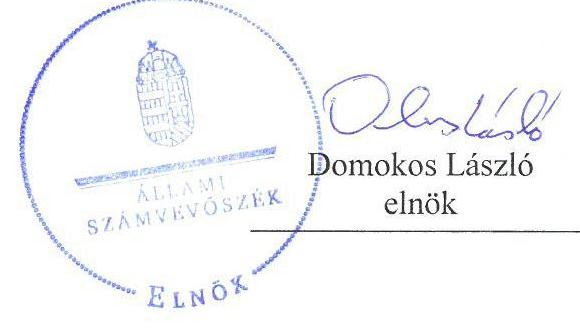
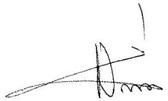
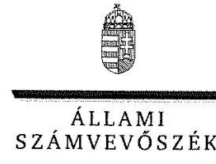
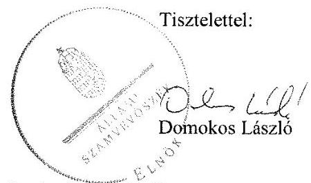

# Jelentés 

## Az önkormányzatok gazdasági társaságai

Az önkormányzatok többségi tulajdonában lévő gazdasági társaságok gazdálkodásának ellenőrzése - Mezőcsáti Kistérségi Egészségfejlesztő Központ Egészségügyi Szolgáltató Kiemelkedően Közhasznú Nonprofit Kft.

2018

---

# Jelentés 

## Az önkormányzatok gazdasági társaságai

Az önkormányzatok többségi tulajdonában lévő gazdasági társaságok gazdálkodásának ellenőrzése - Mezőcsáti Kistérségi Egészségfejlesztő Központ Egészségügyi Szolgáltató Kiemelkedően Közhasznú Nonprofit Kft.
2018. 06. hó 07. nap

---

# AZ ELLENŐRZÉST FELÜGYELTE:

- **PETŐ KRISZTINA** felügyeleti vezető
- **AZ ELLENŐRZÉST VEZETTE ÉS A VÉGREHAJTÁSÁÉRT FELELŐS:**
  - **SALAMIN VIKTOR** ellenőrzésvezető
  - **A PROGRAM ÖSSZEÁLLÍTÁSÁÉRT FELELŐS:**
    - **TÓTPÁL SZABOLCS** osztályvezető

**IKTATÓSZÁM:** EL-0127-057/2018.

**TÉMASZÁM:** 2447

**ELLENŐRZÉS-AZONOSÍTÓ SZÁM:** V079317

Jelentéseink az Országgyűlés számítógépes hálózatán és az Interneta a www.asz.hu címen is olvashatóak.

---

# TARTALOMJEGYZÉK 

■ ÖSSZEGZÉS ..... 5
■ AZ ELLENŐRZÉS CÉLJA ..... 6
■ AZ ELLENŐRZÉS TERÜLETE ..... 7
■ AZ ELLENŐRZÉS HÁTTERE, INDOKOLTSÁGA ..... 8
■ A JELENTÉS LÉNYEGES KÉRDÉSKÖREI ..... 9
■ AZ ELLENŐRZÉS HATÓKÖRE ÉS MÓDSZEREI ..... 10
■ MEGÁLLAPÍTÁSOK ..... 12
■ JAVASLATOK ..... 15
■ MELLÉKLETEK ..... 17
I. sz. melléklet: Értelmező szótár ..... 17
■ FÜGGELÉK: ÉSZREVÉTELEK ..... 19
■ RÖVIDÍTÉSEK JEGYZÉKE ..... 31

---

.

---

# ÖSSZEGZÉS 

A Mezőcsáti Kistérségi Egészségfejlesztő Központ Egészségügyi Szolgáltató Kiemelkedően Közhasznú Nonprofit Kft. gazdálkodása és vagyongazdálkodása nem volt szabályszerű, a mérleg tartalmának valódisága nem volt biztosított, ami veszélyeztette a vagyon megőrzését és az elszámoltathatóságot. A Társaság müködése nem volt átlátható.

## Az ellenőrzés társadalmi indokoltsága

Magyarországon az intézmény-centrikus közfeladat-ellátás jellemző, de egyre jelentősebb a költségvetésen kívüli feladatellátás térnyerése. Helyi szinten ennek legfontosabb szereplői az önkormányzati tulajdonban lévő gazdasági társaságok, amelyeknek ellenőrzése kiemelten fontos a közfeladat ellátása és a közvagyon megőrzése, megóvása érdekében. Ezért alapvető követelmény, hogy gazdálkodásuk, működésük szabályszerű és átlátható legyen.

Az Állami Számvevőszék az ellenőrzése során arra kereste a választ, hogy 2013-2016. között szabályszerű volt-e a Társaság gazdálkodása és az Önkormányzat ehhez kapcsolódó tulajdonosi joggyakorlása. Az ellenőrzés rendet, a rend értéket teremt. Ezért bízunk abban, hogy a jelentésben foglalt megállapítások és az ezek alapján megfogalmazott számvevőszéki javaslatok hasznosítása elősegíti a feltárt hiányosságok orvoslását.

## Főbb megállapítások, következtetések, javaslatok

A Társaság gazdálkodása és vagyongazdálkodása nem volt szabályszerű. A Társaság által kialakított szabályozás nem felelt meg a jogszabályi követelményeknek, az éves beszámolók mérlegtételeinek leltárral történő alátámasztása nem volt biztosított. A Társaságnál a bevételek és ráfordítások elszámolása nem volt szabályszerű.

A Társaság teljesítette beszámolási kötelezettségét, a jogszabályban előírt közérdekű adatok és közérdekből nyilvános adatok megismerését azonban nem biztosította, ezért múködése nem volt átlátható.

Mezőcsát Város Önkormányzata a tulajdonosi jogait szabályszerűen gyakorolta. A Mezőcsáti Kistérségi Egészségfejlesztő Központ Egészségügyi Szolgáltató Kiemelkedően Közhasznú Nonprofit Kft. múködését nem ellenőrizte, így nem járult hozzá annak szabályos múködéséhez.

A megállapítások alapján az ÁSZ Mezőcsát Város Önkormányzata polgármesterének kettő javaslatot, a Mezőcsáti Kistérségi Egészségfejlesztő Központ Egészségügyi Szolgáltató Kiemelkedően Közhasznú Nonprofit Kft. ügyvezetőjének hét javaslatot fogalmazott meg, amelyre 30 napon belül intézkedési tervet kell készíteniük.

---

# AZ ELLENŐRZÉS CÉLJA 

AZ ELLENŐRZÉS CÉLJA annak értékelése volt, hogy az Önkormányzat ${ }^{1}$ vagyongazdálkodási tevékenysége során szabályszerűen gyakorolta-e tulajdonosi jogait; a Társaság ${ }^{2}$ szabályozottsága, gazdálkodása és vagyongazdálkodási tevékenysége, bevételeinek és ráfordításainak elszámolása megfelelt-e a jogszabályi és tulajdonosi előírásoknak, a gazdálkodás átláthatósága és elszámoltathatósága érdekében biztosítva volt-e a szolgáltatás díjának megalapozottsága szabályszerű önköltségszámítással. Az ellenőrzés célja továbbá annak megítélése volt, hogy a kormányzati szektorba sorolt önkormányzati tulajdonban (résztulajdonban) lévő gazdálkodó szervezetek gazdálkodásának a kormányzati szektor hiányára és az államadósságra befolyással bíró elemei a jogszabályi előírásoknak megfeleltek-e.

---

# AZ ELLENŐRZÉS TERÜLETE 

## Mezőcsát Város Önkormányzata és a többségi tulajdonában lévő Mezőcsáti Kistérségi Egészségfejlesztő Központ Egészségügyi Szolgáltató Kiemelkedően Közhasznú Nonprofit Kft.

MEZŐCSÁT VÁROS ÖNKORMÁNYZATA és nyolc község önkormányzatából álló tulajdonosi közösség 2008. szeptember 8-án alapította meg a Mezőcsáti Kistérségi Egészségfejlesztő Központ Egészségügyi Szolgáltató Kiemelkedően Közhasznú Nonprofit Kft.-t a területi ellátási kötelezettsége alá eső település lakosainak általános-, valamint szakorvosi járóbeteg-ellátása biztosítása érdekében. Az Önkormányzat a Társasággal az átadott közfeladatok ellátására vonatkozóan Egészségügyi feladatellátási megállapodást ${ }^{3}$ kötött. A Társaság törzstőkéje az ellenőrzött időszakban 57,2 M Ft volt, az Önkormányzat társasági részesedése 95,58\% volt. Az Önkormányzat az ellenőrzött időszakban a Termálfürdő-Mezőcsát Kereskedelmi és Szolgáltató Kft.-nek kizárólagos tulajdonosa volt.

A 2013-2016. években Mezőcsát Város Önkormányzatánál a jegyző személye két alkalommal, a polgármester személye egy alkalommal változott.

## A MEZŐCSÁTI KISTÉRSÉGI EGÉSZSÉGFEJLESZTŐ KÖZPONT EGÉSZSÉGÜGYI SZOLGÁLTATÓ KIEMELKEDŐEN KÖZHASZNÚ NONPROFIT

KFT. feladatait saját vagyonával, illetve az Önkormányzattól üzemeltetésbe kapott vagyonnal látta el. Az Önkormányzat a kötelezően ellátandó önkormányzati feladat ellátása céljából ingyenesen a Társaság üzemeltetésébe adta a feladatellátást közvetlenül szolgáló ingatlant (egészségügyi szolgáltatást nyújtó intézmény) és az egészségügyi intézmény múködtetéséhez szükséges eszközöket. Az üzemeltetéshez kapcsolódó rendszeres adatszolgáltatási, beszámolási kötelezettsége a Társaságnak nem volt. A Társaság vagyonkezelésében vagyon nem volt, kapcsolt vállalkozásban lévő részesedéssel nem rendelkezett. A Társaság kiemelkedően közhasznú jogállású nonprofit gazdasági társaság. 2015. december 30-tól kormányzati szektorba sorolt egyéb szervezeteknek minősült. A Társaság az önköltség rendjére vonatkozó szabályzat készítésének kötelezettsége alól a Számv. tv. ${ }^{4}$ előírásai alapján mentesült. A Társaságnak 2013-2016. években adósságot keletkeztető ügylete nem volt.

---

# AZ ELLENŐRZÉS HÁTTERE, INDOKOLTSÁGA 

AZ ÖNKORMÁNYZATOK TÖBBSÉGI TULAJDONÁBAN ÁLLÓ GAZDASÁGI TÁRSASÁGOK ellenőrzése kiemelten fontos a vagyon megőrzése, megóvása érdekében, valamint a kormányzati szektor elszámolásaiban megjelenő önkormányzati tulajdonú gazdálkodó szervezetek esetében, amelyekkel szemben alapvető követelmény, hogy gazdálkodásuk, működésük szabályszerű, az általuk szolgáltatott adatok minél megbízhatóbbak legyenek. A feladatellátás költségeinek, ráfordításainak alakulása a lakosság széles rétegét érinti.

Ellenőrzéseink feltárhatják, hogy az önkormányzat a feladatellátásához rendelt vagyon működtetését a tulajdonostól elvárható gondossággal vé-gezte-e, a feladatot ellátó gazdasági társaság a létesítő okiratban, szolgáltatási szerződésben foglaltak betartásával biztosította-e a feladat ellátását. Az ellenőrzés eredményeképp meghatározhatóvá válnak a költségvetési hiányt befolyásoló szervezetek kockázatai, lehetővé válik ezen kockázatok csökkentése. Az ellenőrzés rávilágíthat arra, hogy a gazdasági társaság a vagyon használatával biztosította-e a szolgáltatás folytatásának feltételeit, az önkormányzat tulajdonosi felügyelete hozzájárult-e a szabályszerű gazdálkodáshoz és feladatellátáshoz. A megállapítások alapján megfogalmazott számvevőszéki javaslatok hasznosítása elősegítheti a meglévő hibák megszüntetését. A jó gyakorlatok bemutatásával az ÁSZ ${ }^{5}$ hozzájárulhat a követendő megoldások megismertetéséhez, terjesztéséhez.

---

# A JELENTÉS LÉNYEGES KÉRDÉSKÖREI 

1. Az önkormányzat tulajdonosi joggyakorlása szabályszerű volt-e?
2. A gazdasági társaság szabályozottsága, gazdálkodása és vagyongazdálkodási tevékenysége szabályszerű volt-e?
3. A gazdasági társaság beszámolási, adatszolgáltatási és közzétételi kötelezettségét teljesítette-e?

---

# AZ ELLENŐRZÉS HATÓKÖRE ÉS MÓDSZEREI 

## Az ellenőrzés típusa

Megfelelőségi ellenőrzés.

## Az ellenőrzött időszak

Az ellenőrzött időszak 2013. január 1-jétől 2016. december 31-ig tartott.

## Az ellenőrzés tárgya

Mezőcsát Város Önkormányzata többségi tulajdonában lévő Mezőcsáti Kistérségi Egészségfejlesztő Központ Egészségügyi Szolgáltató Kiemelkedően Közhasznú Nonprofit Kft. feletti tulajdonosi joggyakorlása, valamint a Mezőcsáti Kistérségi Egészségfejlesztő Központ Egészségügyi Szolgáltató Kiemelkedően Közhasznú Nonprofit Kft. gazdálkodásának szabályozottsága és szabályszerűsége.

Az ellenőrzés kiterjedt minden olyan körülményre és adatra, amely az ÁSZ jogszabályban meghatározott feladatainak teljesítéséhez, valamint a program végrehajtása folyamán felmerült újabb összefüggések feltárásához szükséges.

## Az ellenőrzött szervezet

Mezőcsát Város Önkormányzata, valamint a Mezőcsáti Kistérségi Egészségfejlesztő Központ Egészségügyi Szolgáltató Kiemelkedően Közhasznú Nonprofit Kft.

## Az ellenőrzés jogalapja

Az ellenőrzés jogszabályi alapját az ÁSZ tv. ${ }^{6}$ 1. § (3) bekezdése és 5. § (3)(4)-(5) bekezdései képezték.

## Az ellenőrzés módszerei

Az ellenőrzést az ellenőrzési program ellenőrzési kérdései, az ellenőrzött időszakban hatályos jogszabályok, az ellenőrzés szakmai szabályok és módszertanok figyelembevételével végeztük.

---

Az ellenőrzés ideje alatt az ellenőrzött szervezettel történő kapcsolattartást az ÁSZ Szervezeti és Működési Szabályzatának vonatkozó előírásai alapján biztosítottuk.

Az ellenőrzési kérdések megválaszolásához szükséges bizonyítékok megszerzése a következő ellenőrzési eljárások alkalmazásával történt: megfigyelés, kérdésfeltevés (információkérés), összehasonlítás, valamint elemző eljárás. Az ellenőrzési bizonyítékként felhasználható adatforrások közé tartoztak egyrészt az ellenőrzési programban felsorolt adatforrások, másrészt adatforrás lehet még minden - az ellenőrzés folyamán - feltárt, az ellenőrzés szempontjából információkat tartalmazó dokumentum.

Az ellenőrzést a kérdésekre adott válaszok kiértékelésével, valamint a megjelölt adatforrások, a csatolt tanúsítványok felhasználásával, továbbá az adott időszakban hatályos jogszabályok figyelembevételével folytattuk le.

A bevételek és ráfordítások elszámolásait, valamint a vagyonnyilvántartás terén a szabályszerű múködést mintavétellel ellenőriztük. A minták kiválasztása rétegzett mintavétel alkalmazásával történt. A mintavétellel ellenőrzött területek esetében minden egyes tétel vonatkozásában a szabályszerűségre vonatkozó kérdéseket tettünk fel. Megfelelőnek értékeltünk egy ellenőrzött területet, amennyiben 95\%-os bizonyossággal a teljes sokaságban a hibaarány legfeljebb 10\%, nem megfelelőnek, amennyiben 10\%-nál magasabb arányt képviselt. Abban az esetben, ha a teljes sokaság tekintetében a 10\%-os hibaarányhoz való viszony megítélésnek megbízhatósága nem érte el a 95\%-ot, annak elérése érdekében értékelésünket további szem-pontokkal egészítettük ki, és figyelembe vettük a feltárt hibák típusát és súlyát. A ráfordítások elszámolására és a vagyonnyilvántartásra vonatkozó véletlen mintavételt kockázati alapú kiválasztással egészítettük ki, amelynek során évente a három legnagyobb összegű tételt választottuk ki.

---

# 1. Az önkormányzat tulajdonosi joggyakorlása szabályszerű volt-e? 

Összegző megállapítás A tulajdonosi jogok gyakorlása szabályszerű volt.
A TULAJDONOSI JOGOK GYAKORLÁSÁNAK KE-
RETEIT az Önkormányzat Vagyongazdálkodási rendeletben ${ }^{7}$, az Önkormányzati SZMSZ ${ }_{1,2}{ }^{8}$-ben, az Egészségügyi feladatellátási megállapodásban, valamint az ingatlan használatba adásáról szóló Megállapodás ${ }^{9}$-ban szabályozta.

A GAZDASÁGI PROGRAMOT ${ }^{10}$ a 2015-2019-as időszakra vonatkozóan a Képviselő-testület elfogadta, azonban azzal az Mötv. ${ }^{11}$ 116. § (1) bekezdésében foglaltakkal ellentétében 2015. április 27-ig az Önkormányzat nem rendelkezett. Az Önkormányzat az Nvtv. ${ }^{12}$ 9. § (1) bekezdésében előírtakkal ellentétben közép- és hosszú távú vagyongazdálkodási tervvel nem rendelkezett.

## 2. A gazdasági társaság szabályozottsága, gazdálkodása és vagyongazdálkodási tevékenysége szabályszerű volt-e?

## Összegző megállapítás

2.1. számú megállapítás

A Társaság szabályozottsága, gazdálkodása és vagyongazdálkodása nem volt szabályszerű.

A Társaság által kialakított szabályozás nem felelt meg a jogszabályi követelményeknek.

A Társaság az ellenőrzött időszakban rendelkezett hatályos SZMSZ ${ }^{13}$-szel, valamint Számviteli politikával ${ }^{14}$, amely tartalmazta a Társaság Számlarendjét is.

ÉRTÉKELÉSI SZABÁLYZATTAL ${ }^{15}$ a Társaság 2016. március 30 -ig a Számv. tv. 14. § (5) bekezdésében foglaltak ellenére nem rendelkezett. Leltározási és leltárkészítési szabályzatát ${ }^{16}$ a Társaság 2015. december 31 -ig a Számv. tv. 14. § (5) bekezdésében foglaltak ellenére nem készítette el. Pénzkezelési Szabályzattal ${ }^{17}$ a Társaság 2013. november 3 -ig a Számv. tv. 14. § (5) bekezdésében foglaltak ellenére nem rendelkezett.

A KÖZÉRDEKŰ ADATOK KÖZZÉTÉTELÉRE ${ }^{18}$ vonatkozó szabályzatot a Társaság 2016. október 31-től léptette hatályba. Ezt megelőzően a Társaság az Info. tv. ${ }^{19} 35$. § (3) bekezdése előírása ellenére közérdekú adatok közzétételére vonatkozó szabályzatot nem készített. A

---

Társaság az Info. tv. 30. § (6) bekezdésének előírása ellenére nem szabályozta a közérdekű adatok megismerésére irányuló igények teljesítésének rendjét.

A vezető tisztségviselők, felügyelőbizottsági tagok, valamint az Mt. 208. §-ának hatálya alá eső munkavállalók javadalmazása, valamint a jogviszony megszűnése esetére biztosított juttatások módjának, mértékének elveiről, annak rendszeréről szóló szabályzatot Taggyűlés a Taktv. ${ }^{20}$ 5. § (3) bekezdésében foglaltak ellenére nem alkotott.

A TÉRÍTÉSI DÍJ AK megállapításának, nyilvánosságra hozatalának és befizetésének rendjét, valamint a szolgáltató által megállapított térítési díj mérséklésére, illetve elengedésére vonatkozó szabályzattal az Eütd. ${ }^{21}$ 1. § (6) bekezdésében foglaltak ellenére 2013. július 12-ig nem rendelkezett.

ADATVÉDELMI szabályzattal a Társaság 2016. június 30-ig a 1997. évi XLVII. ${ }^{22}$ törvény 32. § (2) bekezdés h) pontjában foglaltak ellenére nem rendelkezett.
2.2. számú megállapítás

# A 2013-2016. évi beszámolók megalapozottsága nem volt biztosított. 

A Társaság a 2013-2016. években a Számv. tv. 69. § (1) bekezdésében előírtakkal ellentétben leltárkészítési kötelezettségének nem tett eleget, a beszámolók mérlegtételeit értékben nem támasztotta alá, ezáltal a beszámolók nem biztosították a Számv. tv. 4. § (2) bekezdésében előírt megbízható és valós képet.

A Társaság megsértette a Bkr. ${ }^{23}$ 10. §-ban foglaltakat, mivel 2016. január 1. és 2016. szeptember 30. közötti időszakban a szervezet tevékenységének, a célok megvalósításának nyomon követését biztosító rendszer keretében belső ellenőrzést nem alakított ki.
2.3. számú megállapítás

A Társaság bevételeinek, anyagjellegú ráfordításainak és személyi jellegú ráfordításainak elszámolása nem volt szabályszerű.

A BEVÉTELEK ÉS RÁFORDÍTÁSOK elszámolása nem volt szabályszerű. A Társaság a könyvviteli elszámolást közvetlenül és közvetetten alátámasztó számviteli bizonylatokat, ideértve a részletező nyilvántartásokat is, a Számv. tv. 169. § (2) bekezdésében előírtak ellenére legalább 8 évig nem őrizte meg.

## A SZEMÉLYI JELLEGŰ RÁFORDÍTÁSOK ELSZÁ-

MOLÁSA nem volt szabályszerű. Jellemző hiányosság volt, hogy a Számv. tv. 169. § (2) bekezdésében előírt bizonylat megőrzési kötelezettségnek nem tettek eleget. További hiányosság volt, hogy a számfejtett alapbér összege magasabb volt a munkaszerződésekben rögzített alapbér összegénél, ezzel megsértették a Számv. tv. 165. § (2) bekezdését.

A tárgyi eszközök nyilvántartásba vétele és az értékcsökkenés összegének elszámolása nem volt szabályszerű. A Számv. tv. 52. § (2) bekezdésében előírtakkal ellentétben a tárgyi eszközök nyilvántartásba vétele során

---

az üzembe helyezést nem dokumentálták hitelt érdemlően, ezért az értékcsökkenés számításának kezdő időpontja nem volt megállapítható, és a bekerülési érték nem volt alátámasztott.

# 3. A gazdasági társaság beszámolási, adatszolgáltatási és közzétételi kötelezettségét teljesítette-e? 

## Összegző megállapítás

A Társaság teljesítette beszámolási kötelezettségét, közzétételi kötelezettségének azonban nem tett eleget.

AZ ÉVES BESZÁMOLÓIT a Társaság elkészítette, a 2013-2016. évi beszámolókat a taggyűlés a Gt. ${ }^{24}$ és Ptk. ${ }^{25}$ előírásainak megfelelően jóváhagyta.

A Társaság taggyűlése a 2013-2016. évi beszámolók elfogadásáról a Társasági szerződés ${ }^{26}{ }_{2,3,4,5} 44 . \mathrm{b}$ ) pontjának megfelelően az $\mathrm{FB}^{27}$ írásbeli jelentése ismeretében döntött. FB-t a Társaság a Gt. ,Ptk. és a Taktv. és a Társasági szerződés $2,3,4,5$-nek megfelelően működtetett.

KÖZZÉTÉTELI KÖTELEZETTSÉGÉNEK a Társaság az Info. tv. 37. § (1) bekezdésében előírtak ellenére nem tett eleget, mivel nem tette közzé az Info. tv. 1. mellékletében meghatározott adatokat a beszámolók és közhasznúsági mellékletek kivételével.

A Társaság a 2015. december 30-át követően nem teljesítette az Áht. ${ }^{28}$ 107. § (1) bekezdésében és az Ávr. ${ }^{29}$ 167/M. § (1) bekezdésében előírtak ellenére a 2015. január 1-jétől hatályos Ávr. 5. melléklet 23. pontja szerinti adatszolgáltatási kötelezettségét, annak ellenére, hogy az adott évben kormányzati szektorba sorolt társaság volt.

---

# JAVASLATOK 

Az ÁSZ tv. 33. § (1) bekezdésében foglaltak értelmében az ellenőrzött szervezet vezetője köteles a jelentésben foglalt megállapításokhoz kapcsolódó intézkedési tervet összeállítani és azt a jelentés kézhezvételétől számított 30 napon belül az ÁSZ részére megküldeni. Amennyiben az ellenőrzött szervezet vezetője nem küldi meg határidőben az intézkedési tervet, vagy továbbra sem elfogadható intézkedési tervet küld, az Állami Számvevőszék elnöke az ÁSZ tv. 33. § (3) bekezdése a) és b) pontjaiban foglaltakat érvényesítheti.

## Mezőcsát Város Önkormányzata polgármesterének

1. Intézkedjen az Önkormányzat közép- és hosszú távú vagyongazdálkodási tervének elkészitéséről és Képviselő-testület elé terjesztéséről a jogszabályi előirásnak megfelelően.
(1. összegző megállapítás 2. bekezdésének 2. mondata alapján)
2. Kezdeményezze a Taggyülésnél a jogszabályban elöirt, a vezető tisztségviselők, felügyelőbizottsági tagok, valamint az Mt. 208. §-ának hatálya alá eső munkavállalók javadalmazása, valamint a jogviszony megszünése esetére biztosított juttatások módjának, mértékének elveiről, annak rendszeréről szóló szabályzat megalkotását, különös tekintettel a Taktv.-ben elöirtakra.
(2.1. számú megállapítás 4. bekezdése alapján)

## A Mezőcsáti Kistérségi Egészségfejlesztő Központ Egészségügyi Szolgáltató Kiemelkedően Közhasznú Nonprofit Kft. ügyvezetőjének

1. Intézkedjen a közérdekü adatok megismerésére irányuló igények teljesitésének rendjével kapcsolatos szabályozási kötelezettségének jogszabályi előirásnak megfelelő teljesitése iránt.
(2.1. számú megállapítás 3. bekezdésének 3. mondata alapján)
2. Intézkedjen a jogszabályi előirásoknak megfelelően a beszámoló elkészitéséhez a mérleg tételeinek leltárral való alátámasztásáról és a leltározás elvégzéséről.
(2.2. számú megállapítás 1. bekezdése alapján)

---

3. Intézkedjen a bizonylat megőrzési kötelezettség jogszabályi előírásoknak megfelelő teljesitése iránt.
(2.3. számú megállapítás 1. bekezdésének 2. mondata és 2. bekezdésének 1. tagmondata alapján)
4. Intézkedjen a számfejtett alapbérek és a munkaszerzödésben rögzített alapbérek összegének egyezősége iránt.
(2.3. számú megállapítás 2. bekezdésének 2. tagmondata alapján)
5. Intézkedjen a jogszabályi elöírásnak megfelelő értékcsökkenés elszámolása érdekében az eszközök üzembe helyezésének hitelt érdemlő dokumentálása iránt a jogszabályi előírásnak megfelelően.
(2.3. számú megállapítás 3. bekezdésének 2. mondata alapján)
6. Intézkedjen a közérdekü adatok közzétételével kapcsolatos kötelezettségének a jogszabályi elöírásoknak megfelelő teljesitése iránt.
(3. összegző megállapítás 3. bekezdése alapján)
7. Intézkedjen a jogszabályban elöírt adatszolgáltatási kötelezettségének teljesitése iránt.
(3. összegző megállapítás 4. bekezdése alapján)

---

# MELLÉKLETEK 

- I. SZ. MELLÉKLET: ÉRTELMEZŐ SZÓTÁR
gazdasági társaság
gazdálkodó szervezet
nonprofit gazdasági társaság
vagyonkezelő

Ptk 3.88. § (1) bekezdése szerint „a gazdasági társaságok üzletszerű közös gazdasági tevékenység folytatására, a tagok vagyoni hozzájárulásával létrehozott, jogi személyiséggel rendelkező vállalkozások, amelyekben a tagok a nyereségből közösen részesednek, és a veszteséget közösen viselik".
A Ptk. 685. § c) pontja szerint gazdálkodó szervezet: „az állami vállalat, az egyéb állami gazdálkodó szerv, a szövetkezet, a lakásszövetkezet, az európai szövetkezet, a gazdasági társaság, az európai részvénytársaság, az egyesülés, az európai gazdasági egyesülés, az európai területi együttmúködési csoportosulás, az egyes jogi személyek vállalata, a leányvállalat, a vízgazdálkodási társulat, az erdő birtokossági társulat, a végrehajtói iroda, az egyéni cég, továbbá az egyéni vállalkozó." (2014. 03.15-ig hatályos)
Civil tv. 9/F. § (2) bekezdése szerint „az a gazdasági társaság minősül nonprofit gazdasági társaságnak és cégnevében az a gazdasági társaság tüntetheti fel a nonprofit jelleget, amelynek létesítő okirata tartalmazza, hogy a gazdasági társaság tevékenységéből származó nyereség a tagok között nem osztható fel, hanem az a gazdasági társaság vagyonát gyarapítja." (hatályos 2014. március 15-től)
vagyonkezelő:
a) az állam tulajdonában álló nemzeti vagyon tekintetében:
aa) költségvetési szerv,
ab) helyi önkormányzat, önkormányzati társulás,
ac) önkormányzati intézmény,
ad) köztestület,
ae) az állam, az aa)-ac) alpontban meghatározott személyek együtt vagy külön-külön 100\%-os tulajdonában álló gazdálkodó szervezet,
af) az ae) alpont szerinti gazdálkodó szervezet 100\%-os tulajdonában álló gazdálkodó szervezet,
ag) a törvény által kijelölt egyedileg meghatározott jogi személy.
b) a helyi önkormányzat tulajdonában álló nemzeti vagyon tekintetében:
ba) önkormányzati társulás,
bb) költségvetési szerv vagy önkormányzati intézmény,
bc) köztestület,
bd) az állam, a helyi önkormányzat, a ba)-bb) alpontban meghatározott személyek együtt vagy külön-külön 100\%-os tulajdonában álló gazdálkodó szervezet,
be) a bd) alpont szerinti gazdálkodó szervezet 100\%-os tulajdonában álló gazdálkodó szervezet.
c) * az egyházi jogi személy a tevékenysége ellátásához szükséges nemzeti vagyon tekintetében. (Forrás: Nvtv. 3. § (1) bekezdés 19. pontja)

---

.

---

# FÜGGELÉK: ÉSZREVÉTELEK 

A jelentéstervezetet a Számvevőszék 15 napos észrevételezésre megküldte az ellenőrzött szervezetek vezetőinek az ÁSZ tv. 29. §* (1) bekezdése előírásának megfelelően.
Mezőcsát Város Önkormányzatának polgármestere nem élt észrevételezési jogával.
A Mezőcsáti Kistérségi Egészségfejlesztő Központ Egészségügyi Szolgáltató Kiemelkedően Közhasznú Nonprofit Kft. ügyvezetője a jelentéstervezet megállapításaira észrevételt tett. A függelék tartalmazza az ügyvezető észrevételeit, illetve az el nem fogadott észrevételek elutasításának indoklását.

[^0]
[^0]:    * 29. § (1) Az Állami Számvevőszék az ellenőrzési megállapításait megküldi az ellenőrzött szervezet vezetőjének vagy az általa megbízott személynek, és annak, akinek személyes felelősségét állapította meg.
    (2) Az ellenőrzött szervezet vezetője és a felelősként megjelölt személy az ellenőrzés megállapításaira tizenöt napon belül írásban észrevételt tehet.
    (3) Az Állami Számvevőszék az észrevételre a beérkezésétől számított harminc napon belül írásban válaszol. A figyelembe nem vett észrevételeket köteles a jelentésben feltüntetni, és megindokolni, hogy azokat miért nem fogadta el.

---

MEZŐCSÁTI KISTÉRSÉGI EGÉSZSÉGFEJLESZTŐ KÖZPONT
EGÉSZSÉGÜGYI SZOLGÁLTATÓ KIEMELKEDŐEN KÖZHASZNÚ NONPROFIT KFT
3450 MIZIÓCSÁT, HÖSÖK TIRE 33.
TEL: 49/553-010 FAX: 49/553-025 E-MAIL: egfejlko2p@mezocsat.hu

# ÁLLAMI SZÁMVEVŐSZÉK 

Domokos László
Elnök
1052 Budapest
Apáczai Csere János utca 10.
Tárgy: Észrevétel a 2018.04.13. napon kelt Számvevőszéki jelentéstervezethez

## ÁLLAMI SZÁMVEVÖSZÉK

BE-24387/2017
Édezet: 2018 MAJ 03. it
Matéróm: EL-0558 - OJUJUg
Mórálet: $\qquad$
Pekó $K$
$\qquad$

## Tisztelt Domokos László Elnör Úr!

Az EL-0558-009/2018. iktatószámú levelével a Mezőcsáti KEK Nonprofit Kft részére 2018. április 17.én megküldte a Számvevőszéki jelentéstervezetét a 2017. június 28.-tól megkezdett ellenőrzés megállapításairól és javaslatairól.

A jelentéstervezetet áttekintettük, és az alábbiakban részletezett észrevételt tesszük:

1. észrevétel a 2.1 pontban tett megállapításokhoz

- Értékelési szabályzattal a társaság megalakulása óta rendelkezett. Az ÁSZ adatbekérés felsorolta ugyan a bekért szabályzatokat, azonban számunkra nem volt egyértelmú, hogy valamennyi ellenőrzött évre hatályos szabályzatot fel kellett volna töltenünk, és erre az ellenőrök sem hívták fel a figyelmünket a telefonos egyeztetés során. Ezért csak a hatályos szabályzatok kerültek feltöltésre az elektronikus felületre. Mellékelve valamennyi évre hatályos értékelési szabályzatunkat megküldjük Önöknek. (Nyilatkozat 1. sorszám)
- Leltározási és leltárkészítési szabályzattal a társaság megalakulása óra rendelkezett. Az ÁSZ adatbekérés felsorolta ugyan a bekért szabályzatokat, azonban számunkra nem volt egyértelmú, hogy valamennyi ellenőrzött évre hatályos szabályzatot fel kellett volna töltenünk, és erre az ellenőrök sem hívták fel a figyelmünket a telefonos egyeztetés során. Ezért csak a hatályos szabályzatok kerültek feltöltésre az elektronikus felületre. Mellékelve valamennyi évre hatályos pénzkezelési szabályzatunkat megküldjük Önöknek. (Nyilatkozat 2. sorszám)
- Pénzkezelési szabályzattal a társaság megalakulása óra rendelkezett. Az ÁSZ adatbekérés felsorolta ugyan a bekért szabályzatokat, azonban számunkra nem volt egyértelmú, hogy valamennyi ellenőrzött évre hatályos szabályzatot fel kellett volna töltenünk, és erre az ellenőrök sem hívták fel a figyelmünket a telefonos egyeztetés során. Ezért csak a hatályos szabályzatok kerültek feltöltésre az elektronikus felületre. Mellékelve valamennyi évre hatályos pénzkezelési szabályzatunkat megküldjük Önöknek. (Nyilatkozat 3. sorszám)
- Közérdekű adatok elektronikus közzétételére vonatkozó szabályzattal rendelkeztünk 2016. október 31.-től, azonban nem kerültek teljes körűen közzétételre a jogszabályban felsorolt dokumentumok. Ezzel kapcsolatban az ÁSZ megkeresése alapján a szervezetet a

---

MEZŐCSÁTI KISTÉRSÉGI EGÉSZSÉGFEJLESZTŐ KÖZFONT
EGÉSZSÉGÜGYI SZOLGÁLTATÓ KIEMELKEDŐEN KÖZHASZNÚ NONPROFIT KFT
3450 Miezőcsár, Hősök TERE 33.
TEL: 49/553-010 FAX: 49/553-025 E-MAIL: egfejlkozp@mezocsat.hu

Nemzeti Adatvédelmi és Információszabadság Hatóság megkereste. A Hatóság felszólította a Nonprofit Kft-t a közzététel megtételére. Az elektronikus közzétételi kötelezettséget az Infotv-ben, a Kgtv-ben és a Kormány rendeletben foglaltaknak megfelelően 2018. április 11.-én teljesítettük.

- A vezető tisztségviselők, felügyelőbizottsági tagok, valamint az Mt. 208. §-ának hatálya alá eső munkavállalók javadalmazásával kapcsolatos szabályzattal nem rendelkezünk, mivel erről a Taggyűlés korábban nem határozott. A 2018. május 07.-én esedékes Taggyűlés során erről a Taggyűlést tájékoztatjuk, és kérjük az intézkedés megtételére.
- Térítési díj szabályzattal rendelkezünk, azonban valóban 2013. július 12-ig nem volt ilyen szabályzatunk, tekintve, hogy az általunk végzett tevékenység során korábban térítési díj fizetési kötelezettség sem merült fel.
- Az adatvédelemmel, kapcsolatos szabályzattal a társaság rendelkezik, 2011. október 11től, és a 2016. július 01-től hatályos szabályzat fel is lett töltve az ellenőrzés részére 2017. szeptember 29.-én. A dokumentum megtalálható az iratkezelési szabályzattal együtt a megküldött dokumentumok listájának 14. pontjában. A 2011.október 01-től és a 2014 augusztus 01-től hatályos szabályzatokat, mellékelve küldjük Önöknek. (Nyilatkozat 4. és 5 . sorszám)

2. észrevétel a 2.2 pontban tett megállapításokhoz

- leltárkészítési kötelezettségünknek minden évben a szabályzatokban foglaltaknak megfelelően eleget tettünk. Az erről készült leltározási jegyzőkönyveket, és részletező listákat az ellenőrzés részére feltöltöttük. Az erről szóló 2.a mellékletben az I/2017 (I.23) elnöki körlevélhez kinyomtatott és Önöknek 2017. július 05.-én megküldött listán szerepelnek ezek. (25,26,27,31,32,33,38,39,40,46,47,48 sorok). A beszámoló mérlegtételeit alátámasztó főkönyvi leltárokat a 49,50,51,52 sorok tartalmazzák, az előbb említett és Önöknek megküldött listában.
- Belső ellenőrzést korábban nem alakítottunk ki, melynek pótlása folyamatban van.

3. észrevétel a 2.3 pontban tett megállapításokhoz

- a bevételek és ráfordítások elszámolása során a főkönyvi számlák tételes forgalmát megküldtük. Mintatételeket_sem a bevételekhez, sem a ráfordításokhoz nem kért az ellenőrzés, ezért nem küldtünk ezzel kapcsolatosan semmilyen bizonylatot. Természetesen valamennyi bizonylattal, szerződéssel, dokumentummal rendelkezünk, az iratmegőrzési kötelezettségünknek maradéktalanul eleget teszünk.
- személyi jellegű ráfordítások elszámolása során minden dolgozóval kapcsolatosan az eredetileg kötött szerződést küldtük meg az ellenőrzés részére, a jogszabályváltozások miatti bérnövekedések átsorolásáról szóló külön dokumentumokat nem, mivel az EL-0127-034/2017 iktatószámú levelük első oldalának utolsó bekezdésében a „költségelszámolást megalapozó dokumentumokat (munkaszerződések, megállapodások)" kérték, mely azt jelentette számunkra, hogy az átsorolási dokumentumok megküldésére nincs szükség. Az összes érintett személy munkaszerződés módosításával rendelkezünk, melyek elsősorban a minimálbér emelkedése kapcsán készültek (Nyilatkozat 6. sorszám alatt felsorolva)
- a személyi jellegű ráfordításokkal kapcsolatban a számfejtett bér összegének és a munkaszerződés szerinti bér összegének különbsége az ügyeleti munka után járó

---

# MEZŐCSÁTI KISTÉRSÉGI EGÉSZSÉGFEJLESZTŐ KÖZPONT   EGÉSZSÉGÜGYI SZOLGÁLTATÓ KIEMELKEDŐEN KÖZHASZNÚ NONPROFIT KFT 3450 MIZÓCSÁT, HÓSÓK TÍRE 33.   TEL:49/553-010 FAX: 49/553-025 E-MAIL: egfejlkozp@mezocsat.hu 

bérpótlékok, éjszakai pótlék és túlórapótlék miatt is adódhat, például a 401_055_személyi jellegű ráfordítások_001 sornál, valamint a 409_055_személyi jellegű ráfordítások sornál, és a 417_055_személyi jellegű ráfordítások sornál. (2017. december 08.-án megküldött listák alapján)

- A tárgyi eszközök nyilvántartása teljeskörű, és hitelt érdemlően dokumentált. A tárgyi eszközöket az INFOMÁTRIX integrált könyvelési rendszerben tartjuk nyilván. A rendszer az üzembe helyezés dátumát valamennyi tárgyi eszköz kartonon külön feltünteti, így azzal az állításával a jegyzőkönyvnek, hogy „az értékcsökkenés számításának kezdő időpontja nem volt megállapítható" nem értünk egyet.
- A 2000. évi C. törvény (számviteli törvény) 52 \$(2) pontjának előirása értelmében az üzembe helyezést hitelt érdemlő módon kell dokumentálni. A hitelt érdemlő kifejezés fogalmi meghatározása nem szerepel a számvitellel és az adózással kapcsolatos törvényekben. A bírói gyakorlat alapján hitelt érdemlőnek az olyan adat minősül, amely ellenőrizhető, egyértelműen azonosítható, valóságtartalma kellően alátámasztott. Tartalmánál, jellegénél fogva vagy más adatokkal is egybevetve alkalmas a vele igazolni kívánt tény alátámasztására. A hitelt érdemlő adat a valóságban is ellenőrizhető adatokkal alátámasztható. A tárgyi eszközök üzembe helyezése ezért a Nonprofit Kft-nél hitelt érdemlően dokumentált, mivel teljesítési igazolással, számlával, szerződéssel, átadás-átvételi dokumentummal, üzembe helyezési okmánnyal vagy ezek valamelyikével rendelkezünk.
- A mintatételben szereplő eszközök pályázati forrásból kerültek beszerzésre, mely eszközökkel kapcsolatosan valamennyi dokumentációval rendelkezünk, és azokat a pályázati ellenőrzések rendben találtak.

Összegző megállapításokhoz

- Az elektronikus közzétételi kötelezettséget az Infotv-ben, a Kgtv-ben és a Kormány rendeletben foglaltaknak megfelelően 2018. április 11.-én teljesítettük.
- Az Ávr 5. sz. mellékletének 23. pontjában szereplő adatszolgáltatási kötelezettségünket az államháztartásért felelős miniszter részére pótlólag megküldjük.

Mezőcsát, 2018.04.24.

Tisztelettel:

Dr. Német Tamás Gergely
ügyvezető

Melléklet: Nyilatkozatban felsorolt dokumentumok

---

ELNÖK

Ikt.szám: EL-0558-011/2018.

# Dr. Német Tamás Gergely úr 

ügyvezető
Mezőcsáti Kistérségi Egészségfejlesztő Központ
Egészségügyi Szolgáltató Kiemelkedően Közhasznú Nonprofit Kft.

## Mezőcsát

## Tisztelt Ügyvezető Úr!

„Az önkormányzatok gazdasági társaságai - Az önkormányzatok többségi tulajdonában lévő gazdasági társaságok gazdálkodásának ellenőrzése - Mezőcsáti Kistérségi Egészségfejlesztő Központ Egészségügyi Szolgáltató Kiemelkedően Közhasznú Nonprofit Kft." címmel készített számvevőszéki jelentéstervezetre tett észrevételeit megkaptam.
Az Állami Számvevőszék észrevételekre vonatkozó álláspontjáról a felügyeleti vezető által készített részletes tájékoztatást csatoltan megküldöm.
Tájékoztatom Ügyvezető urat, hogy a számvevőszéki jelentésben - az Állami Számvevőszékről szóló 2011. évi LXVI. törvény 29. § (3) bekezdése alapján - a figyelembe nem vett észrevételeket szerepeltetjük az elutasítás indokának feltüntetésével.

Budapest, 2018. mchgies hó 48 nap

Melléklet: Tájékoztatás az elfogadott és el nem fogadott észrevételekről

---

# Tájékoztatás az elfogadott és el nem fogadott észrevételekról 

,,Az önkormányzatok gazdasági társaságai - Az önkormányzatok többségi tulajdonában lévő gazdasági társaságok gazdálkodásának ellenörzése - Mezőcsáti Kistérségi Egészségfejlesztő Központ Egészségügyi Szolgáltató Kiemelkedően Közhasznú Nonprofit Kft. " című jelentéstervezetre a 48./2018. iktatószámú levélben megküldött észrevételeit áttekintettem. Az észrevételek kezeléséről az alábbi tájékoztatást adom.

## 1.) A jelentéstervezet 2.1. számú megállapításához füzött észrevételei kapcsán

Észrevételében jelezte, hogy Értékelési szabályzattal, Leltározási és leltárkészítési szabályzattal és Pénzkezelési szabályzattal a Mezőcsáti Kistérségi Egészségfejlesztő Központ Egészségügyi Szolgáltató Kiemelkedően Közhasznú Nonprofit Kft. (továbbiakban: Társaság) a megalakulása óta rendelkezett, de csak a hatályos szabályzatok kerültek feltöltésre az Állam Számvevőszék (továbbiakban: ÁSZ) elektronikus felületre. Az előző évekre vonatkozó szabályzatok az adatszolgáltatás során nem kerültek megküldésre az ÁSZ részére, és arra a telefonos egyeztetés során sem hívták fel figyelmüket. Ezen dokumentumokat Ügyvezető úr leveléhez mellékelten küldte meg (Nyilatkozat 1-3. sorszám).
Az ÁSZ az ellenőrzését a megküldött ellenőrzési programnak megfelelően, a rendelkezésre bocsátott adatok és dokumentumok (bizonyitékok) alapján végezte. Az Állami Számvevőszékről szóló 2011. évi LXVI. törvény (továbbiakban: ÁSZ tv.) 28. § (1) bekezdése alapján a közremüködésre felhívott szervezet az ÁSZ részére - annak kérésére soron kívül, de legkésőbb öt munkanapon belül - az ellenőrzés lefolytatása érdekében szükséges adatokat és dokumentumokat rendelkezésre bocsátja. Az EL-0127-001/2017. számú adatbekérő levél 2. számú melléklet 2. oldalán az ÁSZ a Társaságtól bekérendő dokumentumokat - többek között a szabályzatokat is egyértelműen a 2013-2016. év vonatkozásában határozta meg. Ügyvezető úr a 2017. szeptember 29-én kelt nyilatkozatában (teljességi, hitelességi nyilatkozat) kijelentette, hogy az ÁSZ részére átadott dokumentumok, adatok megbízhatóak, és a bekért adatokra, dokumentumokra vonatkozóan teljes körű információt tartalmaznak. Ügyvezető úr továbbá a teljességi, hitelességi nyilatkozatokban az átadott dokumentumok, adatok hitelességéért, valódiságáért és hiánytalanságáért teljes felelősséget vállalt. Az előzőekben leírtakra tekintettel az ÁSZ azon dokumentumokat, amelyeket az adatszolgáltatási időszakot követően bocsátottak rendelkezésére, bizonyítékként nem veszi figyelembe. Ön sem vitatta, hogy a 2016. március 30. előtt hatályos Értékelési szabályzat, a 2015. december 31. előtt hatályos Leltározási és leltárkészítési szabályzat, valamint a 2013. november 3. előtt hatályos Pénzkezelési szabályzat nem került megküldésre az ÁSZ részére az adatszolgáltatás időszakában. A pótlólagosan megküldött dokumentumokat nem áll módunkban figyelembe venni. Fentiekre tekintettel észrevételeit nem fogadjuk el, a jelentéstervezet módosítása nem indokolt.

---

Észrevételében Ügyvezető úr jelezte, hogy 2016. október 31-étől rendelkeztek Közérdekü adatok elektronikus közzétételére vonatkozó szabályzattal, azonban nem kerültek teljes körüen közzétételre a jogszabályban felsorolt dokumentumok. Ezzel kapcsolatban a Nemzeti Adatvédelmi és Információszabadság Hatóság felszólította a Társaságot a közzététel megtételére, amelyet 2018. április 11-én teljesítettek. Észrevételében kitért arra, hogy a vezető tisztségviselők, felügyelőbizottsági tagok, valamint a munka törvénykönyvéről szóló 2012. évi I. törvény (továbbiakban: Mt.) 208. §-ának hatálya alá eső munkavállalók javadalmazásával kapcsolatos szabályzattal nem rendelkeztek, de a 2018. május 7 -én erről a Taggyülést tájékoztatják és kérik az intézkedés megtételére.
Köszönettel vettem a közérdekủ adatok közzétételére és a javadalmazással kapcsolatos szabályzatokkal összefüggő tájékoztatását. Ügyvezető úr a jelentéstervezet 2.1. számú megállapítás 3. és 4. bekezdéseiben foglaltakat nem vitatta, azokat megerősítette, ezért a jelentéstervezet módosítása nem indokolt.
Észrevételében jelezte, hogy valóban nem volt a Társaságnak 2013. július 12-éig Téritési díj szabályzata, de a végzett tevékenység során korábban térítési díj fizetési kötelezettség sem merült fel.
A dokumentumok ismételt áttekintése során megállapítottam, hogy 2013. július 12 -éig Téritési díj szabályzattal a Társaság nem rendelkezett. A térítési dí ellenében igénybe vehető egyes egészségügyi szolgáltatások térítési dijáról szóló 284/1997. (XII. 23.) Korm. rendelet (továbbiakban: 284/1997. (XII. 23.) Korm. rendelet) 1. § (6) bekezdésében foglaltak szerint „Az egészségügyi szolgáltató hatáskörében megállapitható térítési dijak megállapitásának, nyilvánosságra hozatalának és befizetésének rendjét, valamint a szolgáltató által megállapitott térítési dij mérséklésére, illetve elengedésére vonatkozó rendelkezéseket a szolgáltató - a fenntartó által jóváhagyott - szabályzatban állapitja meg". A 284/1997. (XII. 23.) Korm. rendelet 3. § (1)-(2) bekezdései alapján annak rendelkezéseit az 1998. január 1-jét követően megkezdett ellátások tekintetében kell alkalmazni, függetlenül attól, hogy - észrevétele szerint - a Társaság által végzett tevékenység során 2013. július 12. előtt térítési dí fizetési kötelezettség nem merült fel. Fentiekre tekintettel észrevételét nem fogadjuk el, a jelentéstervezet módosítása nem indokolt.
Ügyvezető úr jelezte továbbá, hogy adatvédelemmel kapcsolatos szabályzattal a Társaság rendelkezik, a 2011. október 11-től és 2016. július 1-jétől hatályos szabályzatokat 2017. szeptember 29-én megküldték az ÁSZ részére. A 2011. október 1-jétől és a 2014. augusztus 1-jétől hatályos szabályzatokat Ügyvezető úr leveléhez mellékelten küldte meg (Nyilatkozat 4-5. sorszám).
A dokumentumok ismételt áttekintése során elfogadtam Ügyvezető úr azon észrevételét, hogy 2016. július 1-jétől a Társaság hatályos Adatvédelmi szabályzattal rendelkezett. A dokumentumok felülvizsgálata során azonban megállapítottam, hogy a 2011. október 1-jétől és 2014. augusztus 1-jétől hatályos szabályzatokat a Társaság az adatszolgáltatásra rendelkezésre álló időszakban nem bocsátotta az ÁSZ rendelkezésére. Ügyvezető úr továbbá a teljességi, hitelességi nyilatkozatában az átadott dokumentumok, adatok hitelességéért, valódiságáért és hiánytalanságáért teljes felelősséget vállalt. Az előzőekben leírtakra tekintettel az ÁSZ azon dokumentumokat, amelyeket az adatszolgáltatási időszakot követően bocsátottak rendelkezésére, bizonyítékként nem tudja figyelembe venni. Mindezekre tekintettel megalapozott az a megállapítás, hogy

---

2016. június 30 -ig a Társaság nem rendelkezett adatvédelmi szabályzattal a jogszabályi előírás ellenére.

# 2.) A jelentéstervezet 2.2. számú megállapításához füzött észrevételei kapcsán 

Észrevételében jelezte, hogy a Társaság leltárkészítési kötelezettségének minden évben a szabályzatokban foglaltaknak megfelelően eleget tett, az erről készült leltározási jegyzőkönyveket és részletező listákat az ellenőrzés részére feltöltötték.
A beküldött dokumentumok ismételt áttekintése alapján megállapítottam, hogy a 2017. július 5én megküldött teljességi és hitelességi nyilatkozat 49-52. soraiban szereplő dokumentumok a tárgyi eszközök listáját tartalmazzák az ellenőrzött években. Ugyanazon nyilatkozat 26-27., 3233., 39-40., és 47-48. soraiban megküldött dokumentumok a mennyiségi felvétellel leltározott tárgyi eszközök mennyiségben kimutatott nyilvántartását tartalmazzák, a leltározás értékben nem történt meg. A nyilatkozat $25 ., 31 ., 38$., 46. soraiban megküldött dokumentumok az ellenőrzött évek leltározási ütemtervét, megbízólevelet, leltározási záró jegyzőkönyvet, selejtezési jegyzőkönyvet, illetve a selejtezett tárgyi eszközök jegyzékét tartalmazzák. A számvitelről szóló 2000. évi C. törvény (továbbiakban: Számv. tv.) 69. § (1) bekezdése szerint „a könyvek üzleti év végi zárásához, a beszámoló elkészitéséhez, a mérleg tételeinek alátámasztásához olyan leltárt kell összeállítani és e törvény elöírásai szerint megőrizni, amely tételesen, ellenőrizhető módon tartalmazza - az (5) bekezdés figyelembevételével - a vállalkozónak a mérleg fordulónapján meglévő eszközeit és forrásait mennyiségben és értékben". A Leltározási és selejtezési szabályzat alapján: „Az üzleti év mérlegfordulónapjára vonatkozó leltározást mennyiségi felvétellel, illetve a csak értékben kimutatott eszközöknél és kötelezettségeknél, valamint az idegen helyen tárolt - letétbe helyezett, portfolió-kezelésben, vagyonkezelésben lévő értékpapírokat és egyéb, a pénzeszközök közé nem tartozó - eszközöknél, továbbá a dematerizált értékpapíroknál egyeztetéssel kell elvégeznie." A beküldött dokumentumok alapján megállapítható, hogy a Társaság egyéb eszközeinek és forrásainak - egyeztetéssel történő - leltározása évente, a mérlegkészítést megelőzően nem történt meg, a tárgyi eszközök leltárának kimutatása csak mennyiségben történt meg. A Társaság a 2013-2016. években a Számv. tv. 69. § (1) bekezdésében előírtakkal ellentétben leltárkészítési kötelezettségének nem tett eleget, a beszámolók mérlegtételeit értékben nem támasztotta alá, ezáltal a beszámolók nem biztosították a Számv. tv. 4. § (2) bekezdésében előírt megbízható és valós képet. Fentiekre tekintettel észrevételét nem fogadjuk el, a jelentéstervezet módosítása nem indokolt.
Ügyvezető úr jelezte, hogy belső ellenőrzést korábban nem alakítottak ki, amelynek pótlása folyamatban van.
Köszönettel vettem tájékoztatását, hogy a belső ellenőrzés kialakítása folyamatban van. Ügyvezető úr a 2.2. megállapítás 2. bekezdésében foglalt, az ellenőrzött időszakra vonatkozó megállapítást nem vitatta, ezért a jelentéstervezet módosítása nem indokolt.

---

# 3.) A jelentéstervezet 2.3. számú megállapításához füzött észrevételei kapcsán 

Észrevételében jelezte, hogy a bevételek és ráfordítások elszámolása során a fökönyvi számlák tételes forgalmát megküldték az adatszolgáltatás során. Mintatételeket sem a bevételekhez, sem a ráfordításokhoz nem kért az ellenőrzés, de valamennyi bizonylattal, szerződéssel, dokumentummal rendelkeznek, iratmegőrzési kötelezettségüknek eleget tesznek.
Az ellenőrzés részére átadott dokumentumok ismételt felülvizsgálatát követően megállapítottam, hogy az EL-0127-009/2017. számú adatbekérő levél 2. számú mellékletének 3. oldalán, az adatállományok mintavételezéséhez felsorolt dokumentumok közül a Társaság az alábbiakat nem bocsátotta az ÁSZ rendelkezésére:

- éves bontásban a fökönyvi adatbázisból az Anyagjellegủ ráfordítások számlacsoportba tartozó ráfordítások, kivéve az ELÁBÉ és az eladott közvetített szolgáltatások értéke - nem került megküldésre a fökönyvi kivonat szerinti 52 számlacsoportban (igénybe vett szolgáltatások) könyvelt tételek adatállománya a 2014. évre;
- a fökönyvi adatbázisból évente 2013-2016. évekre vonatkozóan az egyéb bevételek és ráfordítások; a pénzügyi műveletek bevételei és ráfordításai és a rendkívüli bevételek és ráfordítások tételes forgalma nem került megküldésre:
- a fökönyvi kivonat szerinti 91-92 számlacsoportban (belföldi értékesítés árbevétele, továbbszámlázott és egyéb bevételek) könyvelt tételek 2014-2016. évi adatállományai;
- a fökönyvi kivonat szerinti 96 számlacsoportban (egyéb bevételek) könyvelt tételek 2014-2016. évi adatállományai;
- a fökönyvi kivonat szerinti 97 számlacsoportban (pénzügyi műveletek bevételei) könyvelt tételek 2014-2016. évi adatállományai;
- a fökönyvi kivonat szerinti 87 számlacsoportban (pénzügyi műveletek ráfordításai) könyvelt tételek 2013-2016. évi adatállományai;
- a hiányt nem befolyásoló pénzügyi műveletek bevételei és ráfordításai adatállományok tekintettel arra, hogy a Társaság 2016. évben kormányzati szektorba sorolt volt.
A fent leírtakra tekintettel a bevételek és ráfordítások adatállományának hiánya a mintavételt meghiúsította, így megalapozott az ÁSZ azon megállapítása, hogy a Társaság a bevételek és ráfordítások esetében könyvviteli elszámolást közvetlenül és közvetetten alátámasztó számviteli bizonylatokkal (ideértve a fökönyvi számlákat, illetve a részletező nyilvántartásokat is) nem rendelkezett, ezért a jelentéstervezet módosítása nem indokolt.

Ügyvezető úr észrevételében jelezte, hogy a személyi jellegű ráfordítások elszámolása során a dolgozókkal eredetileg megkötött szerződést küldték meg az ÁSZ részére, az átsorolásról szóló dokumentumokat nem, mert az EL-0127-034/2017. számú adatbekérő levél a költségelszámolást megalapozó dokumentumok (munkaszerződések, megállapodások) kérését tartalmazta és értelmezésük szerint az átsorolási dokumentumok ebbe nem tartoztak bele. Az érintett személyek munkaszerződés módosításával rendelkeznek (Nyilatkozat 6. sorszám alatt felsorolva). Észrevételében kitért arra, hogy a személyi jellegű ráfordításokkal kapcsolatban a számfejtett bér össze-

---

gének és a munkaszerződés szerinti bér összegének különbsége az ügyeleti munka után járó bérpótlékok, éjszakai pótlék és túlórapótlék miatt is adódhat 3 mintatétel esetében. Továbbá jelezte, hogy a tárgyi eszközök nyilvántartása teljes körủ és hitelt érdemlően dokumentált, amelyet az integrált könyvelési rendszerükben tartanak nyilván. Nem értenek egyet azon megállapítással, hogy az ,,értékcsökkenés számításának kezdő időpontja nem volt megállapítható", mert a rendszer az üzembe helyezés dátumát valamennyi tárgyi eszköz kartonon feltünteti. Észrevételében a ,,hitelt érdemlő" kifejezés bírói fogalmi meghatározása alapján jelezte, hogy a tárgyi eszközök üzembe helyezése a Társaságnál hitelt érdemlően dokumentált, mivel teljesítés igazolással, számlával, szerződéssel, átadás-átvételi dokumentummal, üzembe helyezési okmánnyal rendelkeznek. Továbbá említi, hogy a mintatételben szereplő eszközök pályázati forrásból kerültek beszerzésre és azokat a pályázati ellenőrzések rendben találták.

Ügyvezető úr is megerősítette, az EL-0127-034/2017. számú adatbekérő levél a személyi jellegủ ráfordítások esetében többek között a költségelszámolást megalapozó dokumentumokat kérte megküldeni a kiválasztott tételek ellenőrzéséhez. A munkaszerződés mellett a kötelező legkisebb munkabér (minimálbér) és a garantált bérminimum változásáról szóló jogszabályok alapján történt átsorolás (munkaszerződés módosítás) alapozza meg a költségek elszámolását, amely az adatszolgáltatás során nem került megküldésre. Erre tekintettel fenntartom azt a megállapítást, hogy a számfejtett alapbér összegének és a munkaszerződésekben rögzített alapbér összegének eltérésével megsértették a Számv. tv. 165. § (2) bekezdését. Továbbá a személyi jellegủ ráfordítások esetében a kiválasztott több tétel esetében a Társaság nem teljesítette adatszolgáltatási kötelezettségét, ezért fenntartom azt a megállapítást, hogy a Számv. tv. 169. § (2) bekezdésében előírt bizonylat megőrzési kötelezettségnek nem tettek eleget. Ügyvezető úr a teljességi, hitelességi nyilatkozatában az átadott dokumentumok, adatok hitelességéért, valódiságáért és hiánytalanságáért teljes felelősséget vállalt. Az előzőekben leírtakra tekintettel az ÁSZ azon dokumentumokat, amelyeket az adatszolgáltatási időszakot követően bocsátottak rendelkezésére, bizonyítékként nem tudja figyelembe venni. Fentiekre tekintettel észrevételeit nem fogadjuk el, a jelentéstervezet módosítása nem indokolt.

A Számv. tv. 52. § (2) bekezdése szerint ,,az üzembe helyezést hitelt érdemlő módon dokumentálni kell". A Társaság Számviteli politikája többek között meghatározza, hogy az eszközökről egyedi nyilvántartást kell vezetni, amelynek Ügyvezető úr tájékoztatása szerint az integrált könyvelési rendszerükben tesznek eleget. Ügyvezető úr észrevételében azt is jelezte, hogy a tárgyi eszközök üzembe helyezésével kapcsolatosan teljesítés igazolással, számlával, szerződéssel, át-adás-átvételi dokumentummal, üzembe helyezési okmánnyal, vagy ezek valamelyikével rendelkeznek. A Számviteli politika egyértelműen meghatározza, hogy ,,minden tárgyi eszköz üzembe helyezéséröl jegyzőkönyvet kell kiállítani", nem nyújt vagylagos lehetőséget. A tárgyi eszközök mintatételeinek adatszolgáltatása során üzembe helyezési jegyzőkönyvek nem kerültek megküldésre, azt nem dokumentálták hitelt érdemlően, így az értékcsökkenés számításának kezdő időpontja nem volt megállapítható. Az ÁSZ az ellenőrzését a megküldött ellenőrzési programnak megfelelően, a rendelkezésre bocsátott adatok és dokumentumok (bizonyítékok) alapján végezte, a pályázati ellenőrzésektől függetlenül. Fentiekre tekintettel észrevételeit nem fogadjuk el, a jelentéstervezet módosítása nem indokolt.

---

# 4.) A jelentéstervezet 3. összegző megállapításához füzött észrevételei kapcsán 

Észrevételében tájékoztatott, hogy az elektronikus közzétételi kötelezettséget a jogszabályokban foglaltaknak megfelelően 2018. április 11-én teljesítették, továbbá jelezte, hogy az államháztartásról szóló törvény végrehajtásáról szóló 368/2011. (XII. 31.) Korm. rendelet 5. sz. mellékletének 23. pontjában szereplő adatszolgáltatási kötelezettségüket az államháztartásért felelős miniszter részére pótlólag megküldik.
Köszönettel vettem tájékoztatását, hogy az ellenőrzött időszakot követően közzétételi kötelezettségének eleget tett. Úgyvezető úr a 3. összegző megállapításban foglalt, az ellenőrzött időszakban fennálló szabálytalanságot nem vitatta, ezért a jelentéstervezet módosítása nem indokolt.

Budapest, 2018. 14. 14. hó 18 nap

Pető Krisztina
felügyeleti vezető 1

---

.

---

# RÖVIDÍTÉSEK JEGYZÉKE 

${ }^{1}$ Önkormányzat
${ }^{2}$ Társaság
${ }^{3}$ Egészségügyi feladatellátási megállapodás
${ }^{4}$ Számv. tv.
${ }^{5}$ ÁSZ
${ }^{6}$ ÁSZ tv.
${ }^{7}$ Vagyongazdálkodási rendelet
${ }^{8}$ Önkormányzati SZMSZ ${ }_{1}$

Önkormányzati SZMSZ ${ }_{2}$

9 Megállapodás
${ }^{10}$ Gazdasági program
${ }^{11}$ Mötv.
${ }^{12}$ Nvtv.
${ }^{13}$ SZMSZ
${ }^{14}$ Számviteli politika
${ }^{15}$ Értékelési szabályzat
${ }^{16}$ Leltározási és selejtezési szabályzat
${ }^{17}$ Pénzkezelési szabályzat
${ }^{18}$ Közérdekú adatok közzétételére vonatkozó szabályzat
${ }^{19}$ Info. tv.

Mezőcsát Város Önkormányzata
Mezőcsáti Kistérségi Egészségfejlesztő Központ Egészségügyi Szolgáltató Kiemelkedően Közhasznú Nonprofit Korlátolt felelősségű Társaság
Egészségügyi feladatellátási megállapodás Mezőcsát Város Önkormányzata valamint Mezőcsáti Kistérségi Egészségfejlesztő Központ Egészségügyi Szolgáltató Kiemelkedően Közhasznú Nonprofit Kft. között, 2011. július 6. 2000. évi C. törvény a számvitelről (Hatályos: 2001. január 1-jétől)

Állami Számvevőszék
2011. évi LXVI. törvény az Állami Számvevőszékről (Hatályos: 2011. július 1-jétől)

Mezőcsát Város Önkormányzata Képviselő-testületének 9/2013. (V.28.) számú önkormányzati rendelete az önkormányzat vagyonáról és vagyongazdálkodásáról
Mezőcsát Város Önkormányzat Képviselő-testületének 5/2011. (III. 28.) önkormányzati rendelete Mezőcsát Város Önkormányzat Képviselő-testületének Szervezeti és Müködési Szabályzatáról
Mezőcsát Város Önkormányzat Képviselő-testületének 16/2014. (XI. 25.) önkormányzati rendelete Mezőcsát Város Önkormányzat Képviselő-testületének Szervezeti és Müködési Szabályzatáról
Megállapodás Mezőcsát Város Önkormányzata és a Mezőcsáti Kistérségi Egészségfejlesztő Központ Egészségügyi Szolgáltató Kiemelkedően Közhasznú Nonprofit Kft. között a 3450 Mezőcsát, Hősök tere 33. szám alatti ingatlan, valamint ingóságok használatba adásáról, 2011. június 30.
Mezőcsát Város Önkormányzatának gazdasági programja a 2015-2019. évekre vonatkozóan
a 2011. évi CLXXXIX. törvény Magyarország helyi önkormányzatairól (Hatályos: 2012. január 1-jétől)
a 2011. évi CXCVI. törvény a nemzeti vagyonról (Hatályos: 2011. december 31-étől)
Mezőcsát Kistérségi Egészségfejlesztő Központ Szervezeti és Müködési Szabályzata (Hatályos: 2011. október 1-jétől)
Mezőcsáti Kistérségi Egészségfejlesztő Központ Egészségügyi Szolgáltató Kiemelkedően Közhasznú Nonprofit Kft. Számviteli politikája (Hatályos: 2011. október 1-jétől)
Mezőcsáti Kistérségi Egészségfejlesztő Központ Egészségügyi Szolgáltató Kiemelkedően Közhasznú Nonprofit Kft. Eszközök és Források értékelési rendjére vonatkozó szabályzata (Hatályos: 2016. március 31-től)
Mezőcsáti Kistérségi Egészségfejlesztő Központ Egészségügyi Szolgáltató Kiemelkedően Közhasznú Nonprofit Kft. Leltározási és selejtezési szabályzata (Hatályos: 2016. január 1-jétől)
Mezőcsáti Kistérségi Egészségfejlesztő Központ Egészségügyi Szolgáltató Kiemelkedően Közhasznú Nonprofit Kft. Pénzkezelési szabályzata (Hatályos: 2013. november 4-től)

Mezőcsáti Kistérségi Egészségfejlesztő Központ Egészségügyi Szolgáltató Kiemelkedően Közhasznú Nonprofit Kft. Szabályzata a közérdekú adatok megismerésének és közzétételének rendjéről (Hatályos: 2016. október 31-től) a 2011. CXII. törvény az információs önrendelkezési jogról és az információszabadságról

---

${ }^{20}$ Taktv.
${ }^{21}$ Eütd.
${ }^{22}$ 1997. évi XLVII. törvény
${ }^{23}$ Bkr.
${ }^{24} \mathrm{Gt}$
${ }^{25}$ Ptk.
${ }^{26}$ Társasági szerződés

Társasági szerződés

Társasági szerződés ${ }_{3}$

Társasági szerződés4

Társasági szerződés5
${ }^{27} \mathrm{FB}$
${ }^{28}$ Áht.
${ }^{29}$ Ávr.
2009. évi CXXII. törvény a köztulajdonban álló gazdasági társaságok takarékosabb múködéséről (Hatályos: 2009. december 4-től)
a 284/1997. (XII. 23.) Korm. rendelet a térítési díj ellenében igénybe vehető egyes egészségügyi szolgáltatások térítési dijáról (Hatályos: 1998. január 1-jétől)
a 1997. évi XLVII. törvény az egészségügyi és a hozzájuk kapcsolódó személyes adatok kezeléséről és védelméről (Hatályos: 1998. január 1-jétől)
a 370/2011. (XII.31.) Korm. rendelet a költségvetési szervek belső kontrollrendszeréről és belső ellenőrzéséről (Hatályos: 2012. január 1-jétől) a 2006. évi IV. törvény a gazdasági társaságokról (Hatályos: 2014. március 14-ig) 2013. évi V. törvény a Polgári Törvénykönyvről (Hatályos: 2014. március 15-től) Mezőcsáti Kistérségi Egészségfejlesztő Központ Egészségügyi Szolgáltató Kiemelkedően Közhasznú Nonprofit Kft. Társasági szerződése (Hatályos: 2008. szeptember 17-től)
Mezőcsáti Kistérségi Egészségfejlesztő Központ Egészségügyi Szolgáltató Kiemelkedően Közhasznú Nonprofit Kft. Társasági szerződése (Hatályos: 2011. április 7-től)
Mezőcsáti Kistérségi Egészségfejlesztő Központ Egészségügyi Szolgáltató Kiemelkedően Közhasznú Nonprofit Kft. Társasági szerződése (Hatályos: 2013. október 21-től)
Mezőcsáti Kistérségi Egészségfejlesztő Központ Egészségügyi Szolgáltató Kiemelkedően Közhasznú Nonprofit Kft. Társasági szerződése (Hatályos: 2014. május 27-től)
Mezőcsáti Kistérségi Egészségfejlesztő Központ Egészségügyi Szolgáltató Kiemelkedően Közhasznú Nonprofit Kft. Társasági szerződése (Hatályos: 2016. június 1-jétől)
Felügyelő Bizottság
a 2011. évi CXCV. törvény az államháztartásról (Hatályos: 2012. január 1-jétől)
a 368/2011. (XII. 31.) Korm. rendelet az államháztartásról szóló törvény végrehajtásáról (Hatályos: 2012. január 1-jétől)

---

ÁLLAMI SZÁMVEVŐSZÉK
1052 Budapest, Apáczai Csere János utca 10.
Levélcím: 1364 Budapest 4. Pf. 54
Telefon: +36 14849100 Telefax: +36 14849200
www.asz.hu