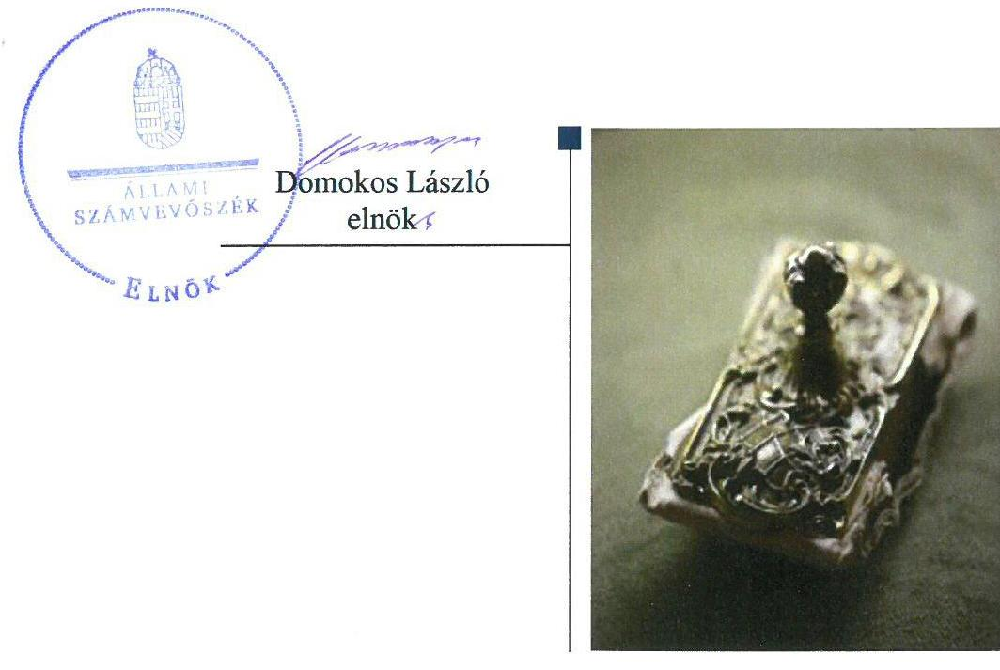
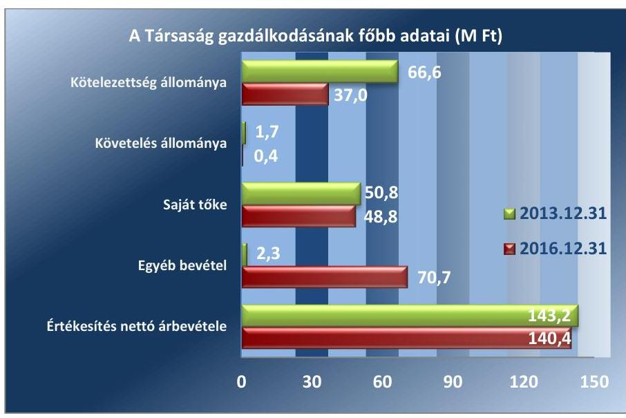
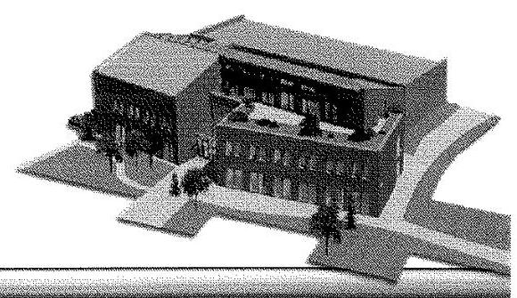
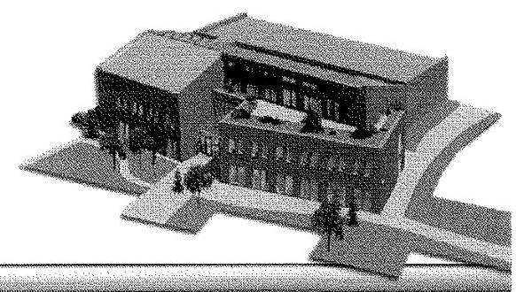
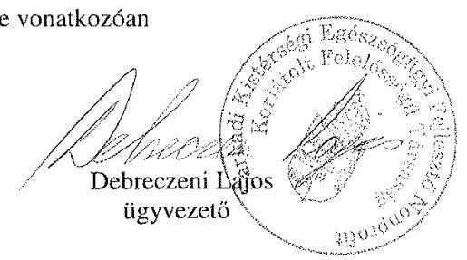
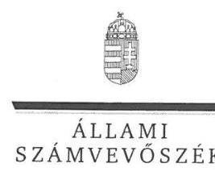
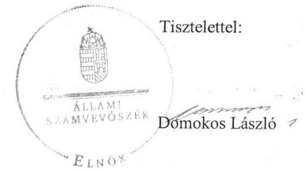

# Jelentés 

## Az önkormányzatok gazdasági társaságai

Az önkormányzatok többségi tulajdonában lévő gazdasági társaságok gazdálkodásának ellenőrzése - Sarkadi Kistérségi Egészségügyi Fejlesztő Nonprofit Kft.
2018.

---

# Jelentés 

## Az önkormányzatok gazdasági társaságai

Az önkormányzatok többségi tulajdonában lévő gazdasági társaságok gazdálkodásának ellenőrzése - Sarkadi Kistérségi Egészségügyi Fejlesztő Nonprofit Kft.
2018. június hó 4. nap

---

# AZ ELLENŐRZÉST FELÜGYELTE:

DR. HORVÁTH MARGIT felügyeleti vezető

# AZ ELLENŐRZÉST VEZETTE ÉS A VÉGREHAJTÁSÁÉRT FELELŐS:

VALASTYÁNNÉ DR. VÍZHÁNYÓ JÚLIA ellenőrzésvezető

# A PROGRAM ÖSSZEÁLLÍTÁSÁÉRT FELELŐS:

TÓTPÁL SZABOLCS osztályvezető

---

IKTATÓSZÁM: EL-0131-099/2018.

TÉMASZÁM: 2447

---

ELLENŐRZÉS-AZONOSÍTÓ SZÁM: V079321

---

Jelentéseink az Országgyűlés számítógépes hálózatán és az Interneta a www.asz.hu címen is olvashatóak.

---

# TARTALOMJEGYZÉK 

■ ÖSSZEGZÉS ..... 5
■ AZ ELLENŐRZÉS CÉLJA ..... 6
■ AZ ELLENŐRZÉS TERÜLETE ..... 7
■ AZ ELLENŐRZÉS HÁTTERE, INDOKOLTSÁGA ..... 9
■ A JELENTÉS LÉNYEGES KÉRDÉSKÖREI ..... 10
■ AZ ELLENŐRZÉS HATÓKÖRE ÉS MÓDSZEREI ..... 11
■ MEGÁLLAPÍTÁSOK ..... 13
■ JAVASLATOK ..... 19
■ MELLÉKLETEK ..... 23
I. sz. melléklet: Értelmező szótár ..... 23
II. sz. melléklet: A Társaság főbb mérlegadatai ..... 25
■ FÜGGELÉK: ÉSZREVÉTELEK ..... 27
■ RÖVIDÍTÉSEK JEGYZÉKE ..... 37

---

.

---

# ÖSSZEGZÉS 

Sarkad Város Önkormányzata a tulajdonosi joggyakorlás kereteit szabályszerűen alakította ki, a tulajdonosi jogait megfelelően gyakorolta. A Sarkadi Kistérségi Egészségügyi Fejlesztő Nonprofit Kft. gazdálkodásának szabályozottsága és vagyongazdálkodási tevékenysége nem volt megfelelő. A Társaság az előirt beszámolási kötelezettségét teljesítette. A Társaság közzétételi kötelezettségét nem teljesítette, ezzel átláthatóságát nem biztosította.

## Az ellenőrzés társadalmi indokoltsága

Az Állami Számvevőszék kiemelt célja, hogy a helyi önkormányzatok gazdálkodásában rejlő pénzügyi kockázatok feltárásával, az államháztartáson kívülre nyújtott költségvetési támogatások és ingyenes vagyonjuttatások, valamint az államháztartáson kívül múködő feladatellátó rendszerek ellenőrzéseivel hozzájáruljon ahhoz, hogy a közpénzeket az államháztartáson kívül múködő szervezetek is átlátható, rendezett módon használják fel.

Az Állami Számvevőszék céljaival és a társadalmi igénnyel összhangban, valamint a gazdasági társaságok kiemelt fontosságú szerepe miatt került sor a Sarkadi Kistérségi Egészségügyi Fejlesztő Nonprofit Kft. ellenőrzésére.

Sarkad Városban 2013-2016. között a Sarkadi Kistérségi Egészségügyi Fejlesztő Nonprofit Kft. szakorvosi járóbeteg-ellátási, fekvőbeteg-ellátási, általános járóbeteg-ellátási és egyéb humán-egészségügyi ellátási feladatokat látott el. Az Állami Számvevőszék az ellenőrzése során arra kereste a választ, hogy 2013-2016. között szabályszerű volt-e a Társaság gazdálkodása és az Önkormányzat ehhez kapcsolódó tulajdonosi joggyakorlása.

## Főbb megállapítások, következtetések, javaslatok

Sarkad Város Önkormányzatnál a tulajdonosi joggyakorlás kereteinek kialakítása és a tulajdonosi jogok gyakorlása szabályszerű volt. Javadalmazási szabályzatot a Társaság legfőbb szerve nem alkotott.

A Sarkadi Kistérségi Egészségügyi Fejlesztő Nonprofit Kft. gazdálkodásának szabályozottsága nem volt megfelelő. A Társaság rendelkezett a Számv. tv.-ben előírt szabályzatokkal, azonban azokban a jogszabályváltozást nem vezette át. Számlarendje nem felelt meg hiánytalanul a Számv. tv.-ben foglaltaknak, mert az a bizonylati rendet nem tartalmazta.

A Társaság vagyongazdálkodási tevékenysége a leltár hiányosságai miatt nem volt szabályszerű. A Társaság az előírt beszámolási kötelezettségét teljesítette, azonban a Taktv. szerinti közzétételi kötelezettségének nem tett eleget. A Társaság rendelkezett adatvédelmi szabályzattal, azonban adatvédelmi felelős kijelölésére, illetve megbízására nem került sor. A Társaság a 2016. évben kormányzati szektorba sorolt egyéb szervezetnek minősült. A 2016. évben az ügyvezető nem alakította ki a célok megvalósítását a tevékenység nyomonkövetését biztosító rendszert, így nem járult hozzá az integritás erősítéséhez.

A Társaság bevételeinek és ráfordításainak elszámolása - a személyi jellegű ráfordítások kivételével - szabályszerű volt. A Társaság a térítési díjköteles egészségügyi szolgáltatások díjtételeit a Korm. rendeletnek megfelelően határozta meg.

---

# AZ ELLENŐRZÉS CÉLJA 

Az ellenőrzés célja annak értékelése volt, hogy az önkormányzat vagyongazdálkodási tevékenysége során szabályszerűen gyakorolta-e tulajdonosi jogait; a gazdasági társaság szabályozottsága, gazdálkodása és vagyongazdálkodási tevékenysége, bevételeinek és ráfordításainak elszámolása megfelelt-e a jogszabályi és tulajdonosi előírásoknak; a gazdasági társaság kötelezettségállománya jelent-e kockázatot a múködésre, valamint a gazdálkodás átláthatósága és elszámoltathatósága érdekében biztosítva volt-e a szolgáltatás dijának megalapozottsága szabályszerű önköltségszámítással. Az ellenőrzés célja továbbá annak megítélése volt, hogy a kormányzati szektorba sorolt önkormányzati tulajdonban (résztulajdonban) lévő gazdálkodó szervezetek gazdálkodásának a kormányzati szektor hiányára és az államadósságra befolyással bíró elemei a jogszabályi előírásoknak megfeleltek-e.

---

# AZ ELLENŐRZÉS TERÜLETE 

## Sarkad Város Önkormányzata és a többségi tulajdonában lévő Sarkadi Kistérségi Egészségügyi Fejlesztő Nonprofit Kft.

A Társaságot ${ }^{1}$ kilenc önkormányzat² 2008. szeptember 3-án hozta létre 52,7 M Ft³ törzstőkével.

Az Önkormányzat ${ }^{4}$ a Társaságban többségi tulajdonnal rendelkezett, az üzletrészek és a szavazatok 74,0\%-át birtokolta. A Társaság tulajdonosi szerkezete és törzstőkéjének összege a 2013-2016. években nem változott.

A Társaságot azzal a céllal alapították, hogy - mint a TIOP ${ }^{5}$ pályázat kedvezményezettje - Sarkadon a járóbeteg-szakellátó egészügyi központot felépítse és azt a múködési engedély kiadásától számítva a fejlesztési megállapodásban vállalt kötelezettségekkel legalább öt évig ebben a formában üzemeltesse. A Társaság meghatározó saját eszköze a TIOP támogatással létrehozott felépítmény volt, mintegy 559,0 M Ft bekerülési értéken.

A Társaság közhasznú tevekénysége: szakorvosi járóbetegellátás, fekvőbeteg-ellátás, általános járóbeteg-ellátás és egyéb humán-egészségügyi ellátás volt. Egyéb, nem közhasznú, vállalkozási tevékenysége: saját tulajdonú ingatlan bérbeadása, üzemeltetése volt. A Társaság vállalkozási tevékenységből származó bevétele a szolgáltatások árbevételből 0,8\%-ot képviselt a 2016. évben.

Az Önkormányzat a Társasággal feladat-ellátási és vagyonkezelési szerződést nem kötött - arra nem is volt köteles - és Társaság számára az Önkormányzat részéről vagyonelemek átadására sem került sor. A Társaság egészségügyi alapellátási feladatokat nem látott el. Az Önkormányzat a fel-adat-ellátásról az ellenőrzött időszakot megelőzően döntött, a Társaság feladat-ellátásával kapcsolatban követelményeket nem határozott meg.

A Társaság éves szakmai beszámolói szerint a szakellátáson megjelent személyek száma az ellenőrzött időszakban évente 11-12 ezer fő között, az esetek száma 70-81 ezer db között változott.

A Társaság más gazdasági társaságban tulajdonosi részesedéssel nem rendelkezett. A Társaság a 2016. évben kormányzati szektorba sorolt egyéb szervezetnek minősült. A Társaságnak a 2016. évben nem volt az államadósságra befolyással bíró eleme. A Társaság önköltségszámítás rendjére vonatkozó szabályzat készítésére nem volt kötelezett.

Az ügyvezető személye az ellenőrzött időszakban egyszer, 2013. április 8-ától változott. A Társaságnál az évente foglalkoztatottak átlagos létszáma a 2013. évi 26 főről, a 2016. évre 33 főre nőtt.

A Társaságnál - alapításától kezdve - három tagú $\mathrm{FB}^{6}$ múködött.

---

A Társaság gazdálkodásának főbb adatait az 1. ábra mutatja be:
1. ábra

Forrás: a Társaság éves beszámolói
Az egyéb bevételek növekedésében a 2016. évben visszafizetési kötelezettség nélkül kapott 68,2 M Ft összegű támogatás volt meghatározó. A kötelezettségek állományának csökkenését a rövid lejáratú kötelezettségek 29,7 M Ft összegű csökkenése eredményezte. Az Önkormányzat részéről a Társaság által felvett hitelhez, kibocsátott kötvényhez, egyéb kötelezettségvállaláshoz kapcsolódó garancia és kezesség vállalására az ellenőrzött időszakban nem került sor.

Az ellenőrzött időszakban az Önkormányzatnál a polgármester és a jegyző személyében is egyszer történt változás. A jelenlegi Polgármester ${ }^{7}$ 2014. október 12-étől töltötte be tisztségét, a jelenlegi Jegyző ${ }^{8}$ 2013. július 1-jétől látta el feladatát.

---

# AZ ELLENŐRZÉS HÁTTERE, INDOKOLTSÁGA 

AZ ÖNKORMÁNYZATOK TÖBBSÉGI TULAJDONÁBAN ÁLLÓ GAZDASÁGI TÁRSASÁGOK ellenőrzése kiemelten fontos a vagyon megőrzése, megóvása érdekében, valamint a kormányzati szektor elszámolásaiban megjelenő önkormányzati tulajdonú gazdálkodó szervezetek esetében, amelyekkel szemben alapvető követelmény, hogy gazdálkodásuk, működésük szabályszerű, az általuk szolgáltatott adatok minél megbízhatóbbak legyenek. A feladatellátás költségeinek, ráfordításainak alakulása a lakosság széles rétegét érinti.

ELLENŐRZÉSEINK FELTÁRHATJÁK, hogy az önkormányzat a feladatellátásához rendelt vagyon működtetését a tulajdonostól elvárható gondossággal végezte-e, a feladatot ellátó gazdasági társaság a létesítő okiratban, szolgáltatási szerződésben foglaltak betartásával biztosí-totta-e a feladat ellátását. Az ellenőrzés eredményeképp meghatározhatóvá válnak a költségvetési hiányt befolyásoló szervezetek kockázatai, lehetővé válik ezen kockázatok csökkentése. Az ellenőrzés rávilágíthat arra, hogy a gazdasági társaság a vagyon használatával biztosította-e a szolgáltatás folytatásának feltételeit, az önkormányzat tulajdonosi felügyelete hozzájárult-e a szabályszerű gazdálkodáshoz és feladatellátáshoz. A megállapítások alapján megfogalmazott számvevőszéki javaslatok hasznosítása elősegítheti a meglévő hibák megszüntetését. A jó gyakorlatok bemutatásával az ÁSZ ${ }^{9}$ hozzájárulhat a követendő megoldások megismertetéséhez, terjesztéséhez.

---

# A JELENTÉS LÉNYEGES KÉRDÉSKÖREI 

1.- Az Önkormányzat tulajdonosi joggyakorlása szabályszerű volt-e?
2.- A gazdasági társaság szabályozottsága, gazdálkodása, bevételeinek és ráfordításainak elszámolása, gazdálkodásának a kormányzati szektor hiányára bíró elemei és árképzése szabályszerű volt-e?
3.- A gazdasági társaság vagyongazdálkodási tevékenysége szabályszerű volt-e?

---

# AZ ELLENŐRZÉS HATÓKÖRE ÉS MÓDSZEREI 

## Az ellenőrzés típusa

Megfelelőségi ellenőrzés

## Az ellenőrzött időszak

2013. január 1-jétől 2016. december 31-ig tartó időszak.

## Az ellenőrzés tárgya

Sarkad Város Önkormányzatának a Sarkadi Kistérségi Egészségügyi Fejlesztő Nonprofit Kft. feletti tulajdonosi joggyakorlása, valamint a Sarkadi Kistérségi Egészségügyi Fejlesztő Nonprofit Kft. gazdálkodásának szabályozottsága és szabályszerűsége.

Az ellenőrzés kiterjedt minden olyan körülményre és adatra, amely az ÁSZ jogszabályban meghatározott feladatainak teljesítéséhez, valamint a program végrehajtása folyamán felmerült újabb összefüggések feltárásához szükséges volt.

## Az ellenőrzött szervezet

Sarkad Város Önkormányzata, valamint a Sarkadi Kistérségi Egészségügyi Fejlesztő Nonprofit Kft.

## Az ellenőrzés jogalapja

Az ellenőrzés jogszabályi alapját az Állami Számvevőszékről szóló 2011. évi LXVI. törvény 1. § (3) bekezdése és 5. § (3)-(5) bekezdései képezték.

## Az ellenőrzés módszerei

Az ellenőrzést a nemzetközi standardokat irányadónak tekintve az ellenőrzési program ellenőrzési kérdései, az ellenőrzött időszakban hatályos jogszabályok, az ellenőrzés szakmai szabályok és módszertanok figyelembe vételével végeztük.

Az ellenőrzés ideje alatt az ellenőrzött szervezettel történő kapcsolattartást az ÁSZ Szervezeti és Múködési Szabályzatának vonatkozó előírásai alapján biztosítottuk.

---

Az ellenőrzési kérdések megválaszolásához szükséges bizonyítékok megszerzése a következő ellenőrzési eljárások alkalmazásával történt: megfigyelés, kérdésfeltevés (információkérés), összehasonlítás, valamint elemző eljárás. Az ellenőrzési bizonyítékként felhasználható adatforrások közé tartoztak egyrészt az ellenőrzési programban felsorolt adatforrások, másrészt adatforrás volt még minden - az ellenőrzés folyamán - feltárt, az ellenőrzés szempontjából információkat tartalmazó dokumentum.

Az ellenőrzést a kérdésekre adott válaszok kiértékelésével, valamint a megjelölt adatforrások, a csatolt tanúsítványok felhasználásával, továbbá az adott időszakban hatályos jogszabályok figyelembevételével folytattuk le.

A gazdasági társaság bevételei és ráfordításai, ezeken belül az értékcsökkenés, valamint a vagyonnyilvántartás szabályszerűségének megítéléséhez a bevételeket és a ráfordításokat, a tárgyi eszközök állományváltozásait tartalmazó adott évi főkönyvi adatbázisát vettük alapul. A minta kiválasztása során véletlen mintavételt alkalmaztunk évenkénti, elemszámmal arányos rétegezéssel a teljes időszakra vonatkozóan. A minta alapján a sokaságban előforduló hibaarányt becsültük. „Megfelelőnek" értékeltünk egy ellenőrzött területet, amennyiben 95\%-os bizonyossággal a teljes sokaságban a hibaarány legfeljebb 10\%, „nem megfelelőnek", amennyiben 10\%-nál magasabb arányt képviselt. A mintavételt megelőzően az anyagjellegú ráfordítások, valamint a tárgyi eszköz növekedési tételei sokaságból évente sokaságonként kiemeltük a 3-3 legnagyobb összegű tételt annak biztosítására, hogy az ellenőrzés az egyszerű véletlen mintavétel mellett a legnagyobb értékű tételek ellenőrzésére biztosan kiterjedjen.

---

# 1. Az Önkormányzat tulajdonosi joggyakorlása szabályszerű volt-e? 

Összegző megállapítás

Az Önkormányzatnál a tulajdonosi joggyakorlás kereteinek kialakítása és a tulajdonosi jogok gyakorlása szabályszerű volt.
1.1. számú megállapítás

Az Önkormányzatnál a tulajdonosi joggyakorlás kereteinek kialakítása szabályszerű volt. Javadalmazási szabályzatot a Társaság legfőbb szerve nem alkotott.

Az Önkormányzat az Mötv. ${ }^{10}$ 116. § (1)-(2) bekezdés előírásainak megfelelően, rendelkezett írásba foglalt, a Képviselő-testület ${ }^{11}$ megbízatásának időtartamára, illetve az azt meghaladó időszakra szóló gazdasági programmal. A gazdasági program ${ }_{1,2}$-ban ${ }^{12}$ „Egészségügyi intézmények" címszó alatt szerepeltek a Társaság által ellátott feladatra vonatkozó elképzelések.

Az Önkormányzat közép- és hosszú távú vagyongazdálkodási tervét a Képviselő-testület - az Nvtv. ${ }^{13}$ 2012. január 1-jétől hatályos 9. § (1) bekezdés és a 20. § (2) bekezdés előírásait figyelmen kívül hagyva - késve, 2012. január 1. helyett csak 2013. szeptember 26-án fogadta el.

Az Önkormányzat a tulajdonosi jogok gyakorlásának kereteit az SZMSZ ${ }^{14}$-ben és a Vagyongazdálkodási rendeletben ${ }^{15}$ írta elő.

A Társaság alapítói tagjai a háromtagú FB tagjait a jogszabályi előírásnak megfelelően a Társasági szerződésben ${ }^{16}$ jelölték ki, ezt követően az FB tagjait a Taggyűlés ${ }^{17}$ választotta meg. Az FB - a Társaság SZMSZ-ében ${ }^{18}$ foglaltak szerint - rendelkezett a Taggyűlés által elfogadott ügyrenddel.

A Társaság a Számv. tv. ${ }^{19}$ 155. § (3) bekezdés előírásait figyelembe véve könyvvizsgáló foglalkoztatására nem volt kötelezett, azonban az alapító tagok a Társasági szerződésben könyvvizsgáló foglalkoztatásáról döntöttek. A könyvvizsgálót a Taggyűlés választotta meg és az ellenőrzött időszak egészében foglalkoztatták.

Az Önkormányzat tulajdonosi joggyakorlása keretében az FB ülések jegyzőkönyveinek megismerése, a Társaság szakmai beszámoltatása, valamint a Taggyűlésén történt - a Vagyongazdálkodási rendeletben meghatározott - képviselet révén alakította ki a monitoring tevékenységet. Az Önkormányzat üzleti terv készítési kötelezettséget nem írt elő a Társaság részére, ennek ellenére a Társaság a 2013-2014. évekre készített üzleti tervet.

A Taggyűlés a Taktv. ${ }^{20}$ 5. § (3) bekezdés előírásai ellenére nem alkotott szabályzatot a Társaság vezető tisztségviselői, az FB tagjainak és az Mt. ${ }^{21}$ 208. §-ának hatálya alá eső munkavállalók javadalmazása, valamint a jogviszony megszűnése esetére biztosított juttatások módjának, mértékének elveiről, annak rendszeréről.

---

# 1.2. számú megállapítás 

Az Önkormányzatnál a tulajdonosi joggyakorlás az FB és a Társaság vezetése tevékenységéhez kapcsolódóan szabályszerű volt. A Társasági szerződés értelmében a Társaság törvényes müködésének és gazdálkodásának ellenőrzése az FB hatáskörébe tartozott. Az FB a Ptk. ${ }^{22} 3: 27$ § (1) bekezdésében előírt feladatait - amelyek szerint köteles megvizsgálni a Taggyűlés elé kerülő előterjesztéseket és az azokkal kapcsolatos álláspontját a Taggyűlésen ismertetni - teljesítette. A tulajdonosi jog gyakorlója - a Vagyongazdálkodási rendelet alapján az Önkormányzat képviseletére jogosult polgármester Taggyűlésen való részvétele által - minden évben megismerte a független könyvvizsgálói jelentésben foglaltakat. A Társaság tevékenységével kapcsolatos valamennyi döntés esetében az arra feljogosított személyek gyakorolták jogaikat. A Társaság ügyvezetése - a Gt. ${ }^{23}$, illetve a Ptk. előírásának megfelelően - az ügyvezetésről, a Társaság vagyoni helyzetéről és üzletpolitikájáról évente jelentést készített és az FB, valamint a Taggyűlés elé terjesztette.

A Taggyűlés a beszámoló elfogadásáról szabályszerűen döntött. A Taggyűlés megtárgyalta a Társaság éves beszámolóit és azokat a Gt., illetve a Ptk. előírásának megfelelően határozatokkal jóváhagyta.

A tulajdonosok az előírásoknak megfelelően döntöttek a Társaság által az ellenőrzött időszak minden évében realizált veszteség rendezésének módjáról.

A Taggyűlés a képződött veszteségek fedezetére az ellenőrzött időszak minden évében pótbefizetési kötelezettséget írt elő a tagok számára. Az Önkormányzat az előírt kötelezettségeinek eleget tett, a 2013-2014. években 9,5-9,5 M Ft, a 2015. évben 16,4 M Ft, a 2016. évben 18,0 M Ft pótbefizetést teljesített.

Az Önkormányzat a 2013-2016. években a Társaság esetében nem élt az Áht. ${ }^{24}$-ben biztosított belső ellenőrzés lehetőségével.

---

# 2. A gazdasági társaság szabályozottsága, gazdálkodása, bevételeinek és ráfordításainak elszámolása, gazdálkodásának a kormányzati szektor hiányára bíró elemei és árképzése szabályszerű volt-e? 

Összegző megállapítás

A Társaság szabályozottsága, gazdálkodása, bevételeinek és ráfordításainak elszámolása a személyi jellegú ráfordítások kivételével szabályszerű volt. A Társaság árképzése szabályszerű volt. A Társaság az előírt beszámolási kötelezettségét teljesítette.
2.1. számú megállapítás

A Társaság rendelkezett a Számv. tv.-ben előírt szabályzatokkal, azonban azokban a jogszabályváltozást nem vezette át. A Számlarend nem felelt meg hiánytalanul a jogszabályi előírásnak, mert az a bizonylati rendet nem tartalmazta.

A Társaság rendelkezett a Számv. tv.-ben előírt Számviteli politikával ${ }_{1,2}{ }^{25}$, valamint Leltározási szabályzattal ${ }^{26}$, Eszközök és források értékelési szabályzatával ${ }^{27}$, Pénzkezelési szabályzattal ${ }_{1,2}{ }^{28}$ és Számlarenddel ${ }_{1,2}{ }^{29}$.

A Számv. tv. 14. § (5) bekezdés c) pontjában meghatározott, önköltségszámítás rendjére vonatkozó szabályzat készítési kötelezettség alól a Társaság a Számv. tv. 14. § (6) bekezdése alapján mentesült.

A Társaság a Számv. tv. 14. § (11) bekezdésében előírtak ellenére a Számviteli politika ${ }_{2}$-t nem aktualizálta. A Társaság elmulasztotta a Számviteli politikát ${ }_{2}$ a 2015. július 4-én hatályba lépett törvénymódosítás megváltozott rendelkezéseinek megfelelően módosítani, annak hatálybalépését követő 90 napon belül és azon túl. Azaz a Számv. tv. 70. § (2) bekezdésében, 86. §-ában, 88. § (4a) és (10) bekezdésében foglalt, mérleg szerinti eredmény fogalmának megszűnésével, a kivételes nagyságú vagy előfordulású bevételek, ráfordítások fogalmának bevezetésével, valamint a rendkívüli tételek fogalmának megszűnésével összefüggő változásokat.

A Társaság Leltározási szabályzatában - a Számv. tv 69. § (3) bekezdés előírásai ellenére - az ingatlanok esetében öt évenkénti gyakorisággal írta elő a mennyiségi felvétellel történő leltározási kötelezettséget.

Az Eszközök és források értékelési szabályzatában a Társaság a Számv. tv. 47-59. §-aiban foglaltaknak megfelelően meghatározta az eszközök és források bekerülési értékének, az eszközök értékcsökkenésének és értékvesztésének, valamint a mérlegben szereplő eszközök és források értékelésének szabályait.

A Pénzkezelési szabályzat ${ }_{1,2}$ megfelelt a Számv. tv. 14. § (8) bekezdésében előírt tartalmi követelményeknek.

A Számlarend - a Számv. tv. 161. § (2) bekezdés d) pontjának előírása ellenére - nem tartalmazott a számlarendben foglaltakat alátámasztó bizonylati rendet.

A Társaság belső szabályozásában a közhasznú és vállalkozási tevékenységéből származó bevételei és ráfordításai elkülönített könyvelésének sza-

---

bályrendszerét nem részletezte tovább a Számv. tv. 161/A. § (2) bekezdésében foglalt módon, hogy az alkalmas legyen az éves beszámoló kiegészítő melléklete adatainak közvetlen alátámasztására.

Az ügyvezető a 2016. évben a Bkr. ${ }^{30} 10 . \S$ és 54/A. §-ának előírása ellenére nem alakította ki a Társaság tevékenységének, a célok megvalósításának nyomon követését biztosító rendszert.

# 2.2. számú megállapítás 

A Társaság rövid lejáratú kötelezettségeinek teljesítése biztosított volt.

A Társaság lejárt kötelezettségeinek állománya folyamatosan - a 2013. évi 2,4 M Ft-ról, 2016. évre 0,2 M Ft-ra - csökkent.

A hosszú lejáratú kötelezettségek esedékes törlesztő részleteinek, valamint a szerződésen és jogszabályon alapuló rövid lejáratú kötelezettségek határidőben történő teljesítése biztosított volt. A Társaság hosszú lejáratú kötelezettségeit (23,7 M Ft) tagi kölcsönök alkották.

## 2.3. számú megállapítás

A Társaság bevételeinek és ráfordításainak elszámolása - a személyi jellegú ráfordítások kivételével - szabályszerű volt. A Társaság gazdálkodásának a kormányzati szektor hiányára befolyással bíró elemei 2016. évben megfeleltek a jogszabályi előírásoknak.

A Társaságnál az értékesítés nettó árbevétele, az egyéb és rendkívüli bevételek, a pénzügyi műveletek bevételei, az anyagjellegú ráfordítások, egyéb és rendkívüli ráfordítások, a pénzügyi műveletek ráfordításai elszámolása a Számv. tv. előírásainak megfelelően, szabályszerűen történt.

A Társaság gazdálkodásának a kormányzati szektor hiányára befolyással bíró elemei a 2016. évben megfeleltek a jogszabályi előírásoknak.

A személyi jellegú ráfordítások elszámolása nem volt szabályszerű, mert - a Számv. tv. 165. § (1) - (2) bekezdés előírásai ellenére - a kifizetések megalapozásához több esetben nem álltak rendelkezésre a dolgozók munkaszerződései, az éves bérnyilvántartó kartonok és a bér kifizetését igazoló számviteli bizonylatok.

Az értékcsökkenési leírás elszámolása szabályszerű volt, a jogszabályi és a belső szabályozás előírásainak megfelelt.

A Társaság az ellenőrzött időszakban összesen képződött értékcsökkenés 6,8\%-át fordította az eszközök pótlására, felújítására. A Társaság tulajdonában lévő ingatlanok használhatósági foka 90,5\%, a gépek, berendezések használhatósági foka 41,5\% volt 2016. december 31-én.

A Társaság vevőkkel szembeni követeléseinek éves állománya az ellenőrzött időszak éveiben nem volt jelentős (a 2013. évben 1,7 M Ft-ot, a 2014-2016. években 0,1-0,1 M Ft-ot tettek ki).

### 2.4. számú megállapítás

A Társaság önköltségszámítás rendjére vonatkozó szabályzat készítésére nem volt kötelezett. A Társaság árképzése szabályszerű volt.

Az önköltségszámítás rendjére vonatkozó szabályzat készítési kötelezettség alól a Társaság a Számv. tv. alapján mentesült.

A Társaság főtevékenységét - a járó-beteg ellátási szolgáltatást - az OEP ${ }^{31}$ finanszírozta. A szolgáltatások díjtételeit a 9/2012. (II. 28.) NEFMI

---

# 2.5. számú megállapítás 

rendelet ${ }^{32}$ alapján állapították meg. A Társaság a térítési díjköteles egészségügyi szolgáltatások díjtételeit a 284/1997. (XII. 23.) Korm. rendeletnek ${ }^{33}$ megfelelően határozta meg.

A Társaság az előírt beszámolási kötelezettségét teljesítette. A Társaság a Taktv. szerinti közzétételi kötelezettségének nem tett eleget.

A Taggyűlés megtárgyalta a Társaság egyszerűsített éves beszámolóit és azokat a jogszabályi előírásoknak megfelelően határozatokkal jóváhagyta. Az éves beszámolók jóváhagyásakor az FB írásos jelentései és a könyvvizsgálói jelentések a Taggyűlés rendelkezésére álltak.

A Taggyűlés által jóváhagyott beszámolókat a Számv tv. 153. § (1) bekezdés előírásának megfelelően letétbe helyezték és a 154. § (1) bekezdés előírásának megfelelően közzétették.

A Társaság a Taktv. 2. § (1) bekezdésében foglaltak ellenére közzétételi kötelezettségét nem teljesítette. A Társaság rendelkezett Adatvédelmi szabályzattal ${ }^{34}$.

A Társaság a 2016. üzleti évet érintően az Ávr. ${ }^{35}$ 5. számú melléklet 23. pontja szerinti adatszolgáltatás teljesítésére volt kötelezett, amelynek nem tett eleget.

## 3. A gazdasági társaság vagyongazdálkodási tevékenysége szabályzzerű volt-e?

## Összegző megállapítás

### 3.1. számú megállapítás

A Társaság önköltségszámítás rendjére vonatkozó szabályzat készítésére nem volt kötelezett.

A Társaság vagyongazdálkodási tevékenysége nem volt szabályszerű, mivel a mérlegtételek leltárral való alátámasztása nem felelt meg a Számv. tv. előírásainak.

A Társaság a Számv. tv. 9. § (2) bekezdésében foglalt lehetőséggel élve egyszerűsített éves beszámolót készített. A 2013-2016. évi egyszerűsített éves beszámolókban szereplő - csak értékben kimutatott - bankszámlákon lévő pénzeszközök, aktív időbeli elhatárolások, saját tőke, egyéb rövid lejáratú kötelezettségek és passzív időbeli elhatárolások mérleg tételeit - a Számv. tv. 69 § (1) bekezdés előírása ellenére - a Társaság leltárral nem támasztotta alá. Az ellenőrzött időszak egyszerűsített éves beszámolóinak további eszköz és forrás adatait a Számv. tv. előírásai szerinti leltárakkal alátámasztotta. A leltárral alá nem támasztott tételek vonatkozásában a Társaság egyszerűsített éves beszámolói a Számv. tv. 18. §-ában foglaltakkal ellentétben a Társaság vagyoni, pénzügyi és jövedelmi helyzetéről, valamint azok változásáról nem mutattak jogszabályi előírásoknak megfelelő képet. A könyvvizsgáló a független könyvvizsgálói jelentéseiben a Társaság beszámolóit hitelesítő záradékkal látta el.

A Társaság - annak ellenére, hogy a Leltározási szabályzatban nem a jogszabályi előírásoknak megfelelő gyakorisággal szabályozta a tárgyi eszközök leltározását, azok leltározása a gyakoriságot és a tartalmat tekintve megfelelt a Számv. tv. előírásainak. A Társaság a 2014. és a 2016. évben a

---

tárgyi eszközök vonatkozásában tételes, mennyiségi felvétellel történt leltározást hajtott végre, amely megfelelt a Számv. tv. előírásainak.

A Társaság a Civil tv. ${ }^{36}$ 46. § (1) bekezdés előírásainak megfelelően elkészített közhasznúsági mellékletekben bemutatta a közhasznú tevékenysége bevételeit és ráfordításait.

---

# JAVASLATOK 

Az ÁSZ tv. 33. § (1) bekezdésében foglaltak értelmében az ellenőrzött szervezet vezetője köteles a jelentésben foglalt megállapításokhoz kapcsolódó intézkedési tervet összeállítani és azt a jelentés kézhezvételétől számított 30 napon belül az ÁSZ részére megküldeni. Amennyiben az ellenőrzött szervezet vezetője nem küldi meg határidőben az intézkedési tervet, vagy továbbra sem elfogadható intézkedési tervet küld, az Állami Számvevőszék elnöke az ÁSZ tv. 33. § (3) bekezdése a) és b) pontjaiban foglaltakat érvényesítheti.

Javaslataink célja a Sarkadi Kistérségi Egészségügyi Fejlesztő Nonprofit Kft. gazdálkodása szabályszerűségének és gyakorlatának javítása annak érdekében, hogy a szabályozási környezet és az alkalmazott gyakorlat megfelelően tudja támogatni az átlátható múködést.

## Sarkadi Kistérségi Egészségügyi Fejlesztő Nonprofit Kft. ügyvezetőjének

1. Intézkedjen a Számviteli politika, a Leltározási szabályzat és a Számlarend módosításáról a hatályos Számv. tv.-ben elöirtaknak megfelelően.
(2. 1. sz. megállapítás 3-4. és 7. bekezdési alapján)
2. Intézkedjen a könyvvezetésre, a bizonylatolásra vonatkozó részletes belső szabályozás kialakításáról, továbbá a nyilvántartási (könyvvezetési) rendszerének a Számv. tv. előírásának megfelelő további részletezéséről annak érdekében, hogy biztosított legyen a Társaság bevételeinek és ráfordításainak közhasznú, valamint vállalkozási tevékenység szerinti megosztása, elkülönítése, az éves beszámoló kiegészítő melléklete adatainak közvetlen alátámasztása.
(2.1. sz. megállapítás 8. bekezdés alapján)
3. Intézkedjen az egyszerüsített éves beszámoló mérlegének valamennyi tételére vonatkozó leltár összeállításáról a Számv. tv. előírásainak megfelelően.
(3.1. sz. megállapítás 1. bekezdés 2. mondata alapján)
4. Intézkedjen a Bkr. előírásainak megfelelően a célok megvalósítását, a tevékenység nyomon követését biztosító rendszer kialakításáról.
(2.1. sz. megállapítás 9. bekezdése alapján)

---

5. 

Intézkedjen a Taktv. szerinti közzétételi kötelezettség teljesítéséről.
(2.5. sz. megállapítás 3. bekezdés 1. mondata alapján)
6. Intézkedjen az Ávr. előírásai szerinti adatszolgáltatási kötelezettség teljesítéséről.
(2.5. sz. megállapítás 4. bekezdése alapján)
7. Intézkedjen a személyi jellegű ráfordítások elszámolásának Számv. tv. előírásainak megfelelő bizonylatokkal történő alátámasztásáról.
(2.3. sz. megállapítás 3. bekezdése alapján)

---

# Javaslataink célja az Önkormányzat szabályszerű működésének elősegítése, továbbá az önkormányzati tulajdonosi joggyakorlás kontrolljainak erősítése. 

## Sarkad Város Önkormányzata polgármesterének

1. Kezdeményezze a legfőbb szervnél (Taggyűlés) a Társaság vezető tisztségviselői, a felügyelő bizottsági tagok, az Mt. 208. §-ának hatálya alá eső munkavállalók javadalmazása, valamint a jogviszony megszünése esetére biztosított juttatások módjának, mértékének elveire, annak rendszerére vonatkozó szabályzat megalkotását a Taktv.-ben elöirtaknak megfelelően.
(1.1. sz. megállapítás 7. bekezdése alapján)
2. Intézkedjen, hogy az Áht.-ban kapott felhatalmazás alapján annak érdekében, hogy az Önkormányzat belső ellenőrzése végezzen ellenőrzést a Társaságnál.
(1.2. sz. megállapítás 5. bekezdése alapján)

---

.

---

# MELLÉKLETEK 

- I. SZ. MELLÉKLET: ÉRTELMEZŐ SZÓTÁR
garanciaszerződés
gazdasági társaság
gazdálkodó szervezet
kezesség
kormányzati szektorba sorolt egyéb szervezet
közszolgáltatás
meghatározó befolyás
minősített többséget biztosító részesedés

A garanciaszerződés, illetve a garanciavállaló nyilatkozat a garantőr olyan kötelezettségvállalása, amely alapján a nyilatkozatban meghatározott feltételek esetén köteles a jogosultnak fizetést teljesíteni. (Ptk. 6:431. § (1) bekezdése)
Ptk. 3:88. § (1) bekezdése szerint „a gazdasági társaságok üzletszerű közös gazdasági tevékenység folytatására, a tagok vagyoni hozzájárulásával létrehozott, jogi személyiséggel rendelkező vállalkozások, amelyekben a tagok a nyereségből közösen részesednek, és a veszteséget közösen viselik".
A Ptk. 685. § c) pontja szerint gazdálkodó szervezet: „az állami vállalat, az egyéb állami gazdálkodó szerv, a szövetkezet, a lakásszövetkezet, az európai szövetkezet, a gazdasági társaság, az európai részvénytársaság, az egyesülés, az európai gazdasági egyesülés, az európai területi együttmúködési csoportosulás, az egyes jogi személyek vállalata, a leányvállalat, a vízgazdálkodási társulat, az erdő birtokossági társulat, a végrehajtói iroda, az egyéni cég, továbbá az egyéni vállalkozó." (2014. 03.15-ig hatályos)
A kezességre vonatkozó előírásokat a Ptk. 6:416-430. §-ai tartalmazzák. Kezességi szerződéssel a kezes kötelezettséget vállal a jogosulttal szemben, hogyha a kötelezett nem teljesít, maga fog helyette a jogosultnak teljesíteni. Kezesség egy vagy több, fennálló vagy jövőbeli, feltétlen vagy feltételes, meghatározott vagy meghatározható összegű pénzkövetelés vagy pénzben kifejezhető értékkel rendelkező egyéb kötelezettség biztosítására vállalható.
A Ptk. szerint kezességet csak írásban lehet vállalni. A kezes kötelezettsége ahhoz a kötelezettséghez igazodik, amelyért kezességet vállalt. A kezes kötelezettsége nem válhat terhesebbé, mint amilyen elvállalásakor volt, kiterjed azonban a kötelezett szerződésszegésének jogkövetkezményeire és a kezesség elvállalása után esedékessé váló mellékkövetelésekre is.
az Áht. 3. § (2) és (3) bekezdésében foglaltakon kívül az Európai Közösséget létrehozó szerződéshez csatolt, a túlzott hiány esetén követendő eljárásról szóló jegyzőkönyv alkalmazásáról szóló 2009. május 25-i 479/2009/EK rendelet (a továbbiakban: 479/2009/EK rendelet) szerint a kormányzati szektorba sorolt szervezet (Áht. 1. § (12))
Az Ebktv. ${ }^{37}$ 3. § d) pontja a következőképpen határozza meg a közszolgáltatást: „szerződéskötési kötelezettség alapján a lakosság alapvető szükségleteinek ellátására irányuló szolgáltatás, így különösen a villamos energia-, gáz-, hő-, víz-, szenny-víz- és hulladékkezelési, köztisztasági, postai és távközlési szolgáltatás, továbbá a menetrend alapján közlekedő járművekkel végzett közforgalmú személyszállítás".
A Ptk. 8:2. § (2) bekezdése szerint „A befolyással rendelkező akkor rendelkezik egy jogi személyben meghatározó befolyással, ha annak tagja vagy részvényese, és
a) jogosult e jogi személy vezető tisztségviselői vagy felügyelőbizottsága tagjai többségének megválasztására, illetve visszahívására; vagy
b) a jogi személy más tagjai, illetve részvényesei a befolyással rendelkezővel kötött megállapodás alapján a befolyással rendelkezővel azonos tartalommal szavaznak, vagy a befolyással rendelkezőn keresztül gyakorolják szavazati jogukat, feltéve, hogy együtt a szavazatok több mint felével rendelkeznek."
A minősített befolyásszerző az ellenőrzött társaságban a szavazatok legalább hetvenöt százalékával rendelkezik. (Ptk. 3:324. §)

---

nemzeti vagyon

## nonprofit gazdasági társaság

többségi befolyást biztosító részesedés
vagyonkezelő

Nvtv. 1. § (2) bekezdése szerint többek között:
„az állam vagy a helyi önkormányzat kizárólagos tulajdonában álló dolgok, az a) pont hatálya alá nem tartozó, állam vagy a helyi önkormányzat tulajdonában lévő dolog,
az állam vagy a helyi önkormányzat tulajdonában lévő pénzügyi eszközök, továbbá az államot vagy a helyi önkormányzatot megillető társasági részesedések, az államot vagy a helyi önkormányzatot megillető bármely vagyoni értékkel rendelkező jogosultság, amelyet jogszabály vagyoni értékű jogként nevesít."
Civil tv. 9/F. § (2) bekezdése szerint „az a gazdasági társaság minősül nonprofit gazdasági társaságnak és cégnevében az a gazdasági társaság tüntetheti fel a nonprofit jelleget, amelynek létesítő okirata tartalmazza, hogy a gazdasági társaság tevékenységéből származó nyereség a tagok között nem osztható fel, hanem az a gazdasági társaság vagyonát gyarapítja." (hatályos 2014. március 15-től)
A Ptk. 8:2. § (1) bekezdése szerint „többségi befolyás az olyan kapcsolat, amelynek révén természetes személy vagy jogi személy (befolyással rendelkező) egy jogi személyben a szavazatok több mint felével vagy meghatározó befolyással rendelkezik."
vagyonkezelő:
a) az állam tulajdonában álló nemzeti vagyon tekintetében:
aa) költségvetési szerv,
ab) helyi önkormányzat, önkormányzati társulás,
ac) önkormányzati intézmény,
ad) köztestület,
ae) az állam, az aa)-ac) alpontban meghatározott személyek együtt vagy külön-külön 100\%-os tulajdonában álló gazdálkodó szervezet,
af) az ae) alpont szerinti gazdálkodó szervezet 100\%-os tulajdonában álló gazdálkodó szervezet,
ag) a törvény által kijelölt egyedileg meghatározott jogi személy.
b) a helyi önkormányzat tulajdonában álló nemzeti vagyon tekintetében:
ba) önkormányzati társulás,
bb) költségvetési szerv vagy önkormányzati intézmény,
bc) köztestület,
bd) az állam, a helyi önkormányzat, a ba)-bb) alpontban meghatározott személyek együtt vagy külön-külön 100\%-os tulajdonában álló gazdálkodó szervezet,
be) a bd) alpont szerinti gazdálkodó szervezet 100\%-os tulajdonában álló gazdálkodó szervezet.
c) az egyházi jogi személy a tevékenysége ellátásához szükséges nemzeti vagyon tekintetében. (Forrás: Nvtv. 3. § (1) bekezdés 19. pontja)

---

# A SARKADI KISTÉRSÉGI EGÉSZSÉGÜGYI FEJLESZTŐ NONPROFIT KFT. MÉRLEGEINEK KIEMELT ADATAI (M Ft) 

| Megnevezés / időszak | 2013-12-31. | 2014-12-31. | 2015-12-31. | 2016-12-31. |
| :--: | :--: | :--: | :--: | :--: |
| I. Befektetett eszközök | 834,8 | 794,3 | 754,4 | 716,8 |
| ebből: tárgyi eszközök | 822,5 | 784,3 | 746,8 | 711,1 |
| II. Forgóeszközök | 28,9 | 23,4 | 10,9 | 7,2 |
| ebből: készletek | 4,4 | 3,4 | 4,0 | 2,0 |
| ebből: pénzeszközök | 22,8 | 19,9 | 6,7 | 4,8 |
| III. Aktív időbeli elhatárolások | 23,6 | 38,2 | 16,9 | 18,5 |
| ESZKÖZÖK ÖSSZESEN | 887,3 | 855,9 | 782,2 | 742,5 |
| IV. Saját tőke | 50,8 | 53,0 | 52,2 | 48,8 |
| ebből: jegyzett tőke | 52,7 | 52,7 | 52,7 | 52,7 |
| ebből: mérleg szerinti eredmény | $-20,9$ | $-5,9$ | $-19,0$ | $-20,8$ |
| V. Céltartalékok | 0,0 | 0,0 | 0,0 | 0,0 |
| VI. Kötelezettségek | 66,6 | 66,9 | 36,0 | 36,9 |
| VII. Passzív időbeli elhatárolások | 769,9 | 736,0 | 694,0 | 656,8 |
| FORRÁSOK ÖSSZESEN | 887,3 | 855,9 | 782,2 | 742,5 |

---

.

---

# FÜGGELÉK: ÉSZREVÉTELEK 

A jelentéstervezetet a Számvevőszék 15 napos észrevételezésre megküldte az ellenőrzött szervezetek vezetőinek az ÁSZ tv. 29. §* (1) bekezdése előírásának megfelelően.

A jelentés tartalmazza az ellenőrzött Sarkadi Kistérségi Egészségügyi Fejlesztő Nonprofit Kft. ügyvezetőjétől érkezett észrevételeket. Sarkad Város Önkormányzatának polgármestere - az ÁSZ tv. 29. § (2) bekezdésében foglaltak szerinti - észrevételezési jogával nem élt, az ellenőrzés megállapításaira nem tett észrevételt.

[^0]
[^0]:    * 29. § (1) Az Állami Számvevőszék az ellenőrzési megállapításait megküldi az ellenőrzött szervezet vezetőjének vagy az általa megbízott személynek, és annak, akinek személyes felelősségét állapította meg.
    (2) Az ellenőrzött szervezet vezetője és a felelősként megjelölt személy az ellenőrzés megállapításaira tizenöt napon belül írásban észrevételt tehet.
    (3) Az Állami Számvevőszék az észrevételre a beérkezésétől számított harminc napon belül írásban válaszol. A figyelembe nem vett észrevételeket köteles a jelentésben feltüntetni, és megindokolni, hogy azokat miért nem fogadta el.

---

# Sarkadi Kistérségi Egészségügyi Fejlesztő Nonprofit Kft. 

Székhely: Sarkad, Béke sétány 6.
Tel.: 06-66/585-800 vagy 06-66/270-670 Fax: 06-66/585-802
E-mail: titkarsag@szakrendelo-sarkad.hu
www.szakrendelo-sarkad.hu

Állami Számvevőszék
Domokos László részére
Budapest
Pf. 54.
1364

Tárgy: Írásbeli észrevétel
Ügyintéző: Bagi Kata
Ikt.szám: 30-3/2018

## Tisztelt Domokos László!

Az EL-0131-089/2018. iktatószámú levelükre hivatkozva ezúton szeretnénk írásbeli észrevételt tenni az önkormányzatok többségi tulajdonában lévő gazdasági társaságok gazdálkodásának ellenőrzéséről készült számvevőszéki jelentéstervezetre vonatkozóan.

- A 2017. október 5-én történt helyszíni adategyeztetés során a jegyzőkönyvben dokumentálásra került, hogy az egyeztetéses mérlegleltár a 2013-2016-os évi készleten, pénztáron, vevői követeléseken, szállítói kötelezettségeken, valamint a 2014-es és 2016os évi tárgyi eszközök leltáron kívüli mérlegsorokra nem állt rendelkezésre a helyszínen. Az ellenőrzött szervezet képviselőjének nyilatkozata szerint ezek a könyvelőirodában rendelkezésre állnak. A fenti dokumentumokat az észrevétel mellékleteként csatoljuk. Az egyeztető leltározás eltérést nem tárt fel, a tételek megegyeznek a főkönyvi kivonatban és a mérlegben szereplő adatokkal. Ennek következtében úgy gondoljuk, hogy a társaság vagyongazdálkodási tevékenysége szabályszerű volt.
- A 2/1. számú megállapítás utolsó bekezdése szerint az ügyvezető 2016. évben Bkr. $10 \S$ és 54/A §-ának előírásai ellenére nem alakította ki a társaság tevékenységének a célok megvalósításának nyomon követését biztosító rendszert. Az ügyvezető minőségbiztosítási rendszert müködtet, melynek keretén belül évente belső audit vizsgálat lefolytatására kerül sor, külső szakértő bevonásával, melyekről készült jegyzőkönyveket ismételten megküldjük.
Ez alapján az integritás erősítése biztosított volt.

---

# Sarkadi Kistérségi Egészségügyi Fejlesztő Nonprofit Kft. 

Székhely: Sarkad, Béke sétány 6.
Tel.: 06-66/585-800 vagy 06-66/270-670 Fax: 06-66/585-802
E-mail: titkarsag@szakrendelo-sarkad.hu
www.szakrendelo-sarkad.hu

- A társaság bevételeinek és ráfordításainak elszámolása a személyi jellegủ ráfordítások esetében is szabályszerű volt. A vizsgálat kezdetén megküldött információk alapján azt a következtetést vontuk le, hogy a kijelölt dolgozóknak csak a munkaszerződéseit illetve megállapodásait, és bérszámfejtési dokumentumait kell beküldenünk. A dolgozók kiválasztásakor egy táblázat tartalmazta (1. melléklet) az évet az általunk megküldött dolgozói névlistának a sorszámát, a réteget, valamint az ellenőrzött hónapot. Ebből mi azt szűrtük ki, hogy csak a megjelölt hónap bérszámfejtését, jelenléti ívét, és munkaszerződését kell küldenünk. Természetesen a dolgozóknak vannak bérkartonjai, minden esetben munkaszerződései, illetve kifizetést igazoló dokumentumok (bankkivonatok), mert a kifizetés minden esetben bankszámlán keresztül történt. A kiválasztott dolgozói listából voltak olyanok, akik a megjelölt időszakban már nem dolgoztak, vagy az adott időszakban egyszerűsített foglalkoztatásban nem voltak, melyről a beküldött teljességi és hitelességi nyilatkozatban (3.b melléklet) tájékoztatást adtunk. A jelentéstervezet ezen megállapításához is mellékelten küldjük a szükséges dokumentumokat.
- A 2.5 számú megállapításban arra hívják fel figyelmünket, hogy a társaság 2016. üzleti évet érintően az Avr. 5. számú melléklet 23. pontja szerinti adatszolgáltatás teljesítésére volt kötelezett, amelynek nem tett eleget. Megkerestük a hivatkozott jogszabályhelyet, és azt találtuk, hogy a számviteli jogszabályok szerinti beszámolóját és az arról készített könyvvizsgálói jelentés kiemelt mutatóit, költségvetési kapcsolatait kell a társaságnak bemutatni. A címzett az állambáztartásért felelős miniszter kell hogy legyen. Kerestük a felületet, de nem találtuk, hogy hol és milyen nyomtatványon kellene eleget tenni a kötelezettségnek.
- A 2.1 számú megállapítás 15. oldal utolsó bekezdése szerint a társaság közhasznú és vállalkozási tevékenységből származó bevételei és ráfordításai elkülönített könyvelésének szabályrendszerét nem részletezte tovább a Szám. tv. 161/A. § (2) bekezdésében foglalt módon, hogy az alkalmas legyen az éves beszámoló kiegészítő melléklete adatainak közvetlen alátámasztására.

---

# Sarkadi Kistérségi Egészségügyi Fejlesztő Nonprofit Kft. 

Székhely: Sarkad, Béke sétány 6.
Tel.: 06-66/585-800 vagy 06-66/270-670 Fax: 06-66/585-802
E-mail: titkarsag@szakrendelo-sarkad.hu
www.szakrendelo-sarkad.hu

A Kft. vállalkozási tevékenységének aránya olyan csekély mértékủ, és olyan jellegủ vállalkozói bevételeket ér el, melyre számszerủ tényeken alapuló költségmegosztás nem lehetséges. Az összes éves bevétel kb. kevesebb, mint $1 \%$-a körül van a vállalkozói bevétel. A bevételek a fökönyvi könyvelésben elkülönítésre kerülnek. Ezekkel a bevételekkel összefüggésben kizárólag rezsi jellegủ kiadások merülnek fel. A bevételek a közhasznú egészségügyi szolgáltatás színvonalának javítását is szolgálják, hiszen gyógyászati segédeszközöket forgalmazó üzlet, optikus vállalkozó és audiológiai vizsgálatot végző vállalkozás működtetésével kapcsolatos rezsi költségekkel kell számolnunk. A költségeket maximum árbevétel arányában vagy négyzetméter arányában lehetne megállapítani elkülönített mérőberendezések hiánya miatt. A későbbiekben valamilyen arányszám képzéssel a rezsi költség vállalkozói bevételre jutó részét megképezzük.

Észrevételeinket kérjük szíveskedjenek figyelembe venni a végső jelentést ez alapján elkészíteni. A jelentésben továbbra is meglévő hiányosságokra a megjelölt határidőben intézkedési tervet fogunk készíteni.

A gördülékenyebb ügyintézés hozzásegítése érdekében a mellékleteket nemcsak papíralapon, hanem adathordozón is megküldjük további szíves felhasználásra.

Melléklet: - bérkartonok 2013.-2016. évre vonatkozóan

- munkaszerződések 2013.-2016. évre vonatkozóan
- bankszámlakivonatok 2013.-2016. évre vonatkozóan
- mérleg sor egyeztető leltárak 2013.-2016. évre vonatkozóan
- Adatvédelmi szabályzat 2016. évre vonatkozóan
- Ellenőrzések anyagai 2013.-2016. évre vonatkozóan

Sarkad, 2018. április 24.
Tisztelettel:

---

ELNÖK

Ikt.szám: EL-0131-095/2018.

# Debreczeni Lajos úr 

ügyvezető
Sarkadi Kistérségi Egészségügyi Fejlesztő Nonprofit Kft.

## Sarkad

## Tisztelt Ügyvezető Úr!

Köszönettel vettem „Az önkormányzatok gazdasági társaságai - Az önkormányzatok többségi tulajdonában lévő gazdasági társaságok gazdálkodásának ellenőrzése - Sarkadi Kistérségi Egészségügyi Fejlesztő Nonprofit Kft." című ellenőrzésről készített számvevőszéki jelentéstervezetre megküldött észrevételeit.
Az Állami Számvevőszék észrevételekre vonatkozó álláspontját a felügyeleti vezető által készített részletes tájékoztatás tartalmazza, amelyet levelemhez mellékeltem.
Tájékoztatom Ügyvezető urat, hogy az Állami Számvevőszék a figyelembe nem vett észrevételeket az Állami Számvevőszékről szóló 2011. évi LXVI. törvény 29. § (3) bekezdésében előírtak szerint köteles a jelentésében feltüntetni és megindokolni, hogy azokat miért nem fogadta el.

Budapest, 2018. 05 hó 24 nap

Melléklet: Tájékoztatás az észrevételek kezeléséről

---

# Tájékoztatás az észrevételek kezeléséről 

Megköszönöm Ügyvezető úrnak „Az önkormányzatok gazdasági társaságai - Az önkormányzatok többségi tulajdonában lévő gazdasági társaságok gazdálkodásának ellenörzése - Sarkadi Kistérségi Egészségügyi Fejlesztő Nonprofit Kft." címmel készített jelentés-tervezetre tett észrevételeit. Az észrevételek kezeléséről az alábbi tájékoztatást adom.

## 1. számú észrevétel:

Az 1. számú észrevétel a jelentéstervezet 3.1. számú összegző megállapítását és a 3.1. számú megállapítás 1 . bekezdését, valamint a 3 . számú javaslatot érinti:
„A Társaság vagyongazdálkodási tevékenysége nem volt szabályszerű, mivel a mérlegtételek leltárral való alátámasztása nem felelt meg a Számv. tv. elöirásainak."
„A 2013-2016. évi egyszerüsitett éves beszámolókban szereplő - csak értékben kimutatott bankszámlákon lévő pénzeszközök, aktív időbeli elhatárolások, saját tőke, egyéb rövid lejáratú kötelezettségek és passzív időbeli elhatárolások mérleg tételeit - a Számv. tv. 69 § (1) bekezdés elöirása ellenére - a Társaság leltárral nem támasztotta alá." „A leltárral alá nem támasztott tételek vonatkozásában a Társaság egyszerüsitett éves beszámolói a Számv. tv. 18. §-ában foglaltakkal ellentétben a Társaság vagyoni, pénzügyi és jövedelmi helyzetéről, valamint azok változásáról nem mutattak jogszabályi elöírásoknak megfelelő képet."

Ügyvezető úr a megállapításra a következő észrevételt tette:
„A 2017. október 5-én történt helyszíni adategyeztetés során a jegyzőkönyvben dokumentálásra került, hogy az egyeztetéses mérlegleltár a 2013-2016-os évi készleten, pénztáron, vevői követeléseken, szállitói kötelezettségeken, valamint a 2014-es és 2016-os évi tárgyi eszközök leltáron kivüli mérlegsorokra nem állt rendelkezésre a helyszínen. Az ellenőrzött szervezet képviselöjének nyilatkozata szerint ezek a könyvelöirodában rendelkezésre állnak." (A fenti dokumentumokat az észrevétel mellékleteként csatolták.) „Az egyeztető leltározás eltérést nem tàrt fel, a tételek megegyeznek a fökönyvi kivonatban és a mérlegben szereplő adatokkal. Ennek következtében úgy gondoljuk, hogy a társaság vagyongazdálkodási tevékenysége szabályszerű volt, ".

Ügyvezető úr észrevételében leírtak alapján a jelentéstervezet 3.1. számú összegző megállapítását, valamint a 3.1. számú megállapítás 1. bekezdésében rögzítetteket, és az Ügyvezető úrnak címzett 3. számú javaslatot nem módosítom az alábbiak miatt:

Az észrevétel a jelentéstervezet 3.1. számú megállapítás 1. bekezdésében leírtakat vitatja, azonban azok helytállósága.-az ellenőrzés részére megküldött dokumentumok és a helyszínen tett nyilatkozat alapján is - változatlanul fennáll.

---

Az ÁSZ az ellenőrzést az EL-0047-001/2017. iktatószámú ellenőrzési program, az ellenőrzött időszakban hatályos jogszabályok, az ellenőrzés szakmai szabályok és módszertanok figyelembe vételével végezte. A Társaság az EL-0131-017/2017. iktatószámú kiértesítő levélben kapott tájékoztatást arról, hogy az ellenőrzés a mellékelt ellenőrzési program alapján kerül lefolytatásra. Az ÁSZ a megállapításait a Társaság által az előírt adatszolgáltatási határidőre az ellenőrzés rendelkezésére bocsátott dokumentumok, adatok, információk alapján tette meg, az ellenőrzést végzők az utólagosan megküldött dokumentumok valódiságáról nem tudtak meggyőződni, ezért azok ellenőrzési dokumentumként nem vehetők figyelembe.

# 2. számú észrevétel 

A 2. számú észrevétel a jelentéstervezet 2.1. számú megállapítás utolsó bekezdését, valamint a 4. számú javaslatot érinti:
„Az ügyvezető a 2016. évben a Bkr. 10. § és 54/A. §-ának elöirása ellenére nem alakította ki a Társaság tevékenységének, a célok megvalósitásának nyomon követését biztositó rendszert."

Ügyvezető úr a megállapításra a következő észrevételt tette:
„Az ügyvezető minőségbiztositási rendszert müködtet, melynek keretén belül évente belső audit vizsgálat lefolytatására kerül sor, külső szakértő bevonásával, melyekről készült jegyzőkönyveket ismételten megküldjük."

Ügyvezető úr észrevételében leírtak alapján a jelentéstervezet 2.1. számú megállapítás utolsó bekezdésében rögzítetteket, valamint Ügyvezető úrnak címzett 4. számú javaslatot nem módosítom az alábbiak miatt:

A Bkr. 54/A. §-a szerint a kormányzati szektorba sorolt egyéb szervezetre az 1-10. §-t kell alkalmazni. A Bkr. 10. §-a szerint a költségvetési szerv vezetője köteles kialakítani a szervezet tevékenységének, a célok megvalósításának nyomon követését biztosító rendszert. A Bkr. 5. §-a szerint költségvetési szervek belső kontroltrendszerét - így az annak részét képező nyomon követési (monitoring) rendszert - az államháztartásért felelős miniszter által közzétett módszertani útmutatók megfelelő alkalmazásával kell kialakítani és működtetni.

A Társaság által 2017. október 2-i teljességi és hitelességi nyilatkozat 32-43. soraiban feltüntetett, a 2013-2016. évekre vonatkozó minőségirányítási rendszer működéséről szóló dokumentumokat ismételten áttekintettük. Megállapítást nyert, hogy az MSZ EN ISO 9001:2009 szabványok szerint működtetett minőségirányítási rendszer a Bkr. 5. §-ában előírtaknak nem felel meg, mert annak kialakítása és müködtetése nem az államháztartásért felelős miniszter által közzétett módszertani útmutatókban - a nyomon követési (monitoring) rendszerre vonatkozóan előírtak - megfelelő alkalmazásával történt. Előbbiekből következően a Társaság minőségirányítási rendszere nem felel meg a Bkr. 10. és 54/A. §-aiban elöírtaknak sem.

---

# 3. számú észrevétel 

A 3. számú észrevétel a jelentéstervezet 2.3. számú megállapítás 3. bekezdését és a 7. számú javaslatot érinti:
„A személyi jellegü ráfordítások elszámolása nem volt szabályszerű, mert - a Számv. tv. 165. § (1) (2) bekezdés elöirásai ellenére - a kifizetések megalapozásához több esetben nem álltak rendelkezésre a dolgozók munkaszerzödései, az éves bérnyilvántartó kartonok és a bér kifizetését igazoló számviteli bizonylatok. "

Ügyvezető úr a megállapításra a következő észrevételt tette:
„A társaság ráfordításainak elszámolása a személyi jellegü ráfordítások esetében is szabályszerü volt." ..... „Természetesen a dolgozóknak vannak bérkartonjai, minden esetben munkaszerzödései, illetve a kifizetést igazoló dokumentumok (bankkivonatok), mert a kifizetés minden esetben bankszámlán keresztül történt." ...... „A jelentéstervezet ezen megállapításához is mellékelten küldjük a szükséges dokumentumokat."

Ügyvezető úr észrevételében leírtak alapján a jelentéstervezet 2.3. számú megállapítás 3. bekezdésében rögzítetteket, valamint Úgyvezető úrnak címzett 7. számú javaslatot nem módosítom az alábbiak miatt:

Az EL-0131-039/2017. iktatószámú adatbekérő levél 2. számú melléklete részletesen tartalmazta a mintatételek ellenőrzéséhez kért dokumentumokat (munkaszerződéseket, megállapodásokat, teljesítés megtörténtét alátámasztó dokumentumokat, kifizetési bizonylatokat, bérszámfejtési bizonylatokat). Az ÁSZ a megállapításait a Társaság által az előírt adatszolgáltatási határidőre az ellenőrzés rendelkezésére bocsátott dokumentumok, adatok, információk alapján tette meg, az ellenőrzést végzők az utólagosan megküldött dokumentumok valódiságáról nem tudtak meggyőződni, ezért azok ellenőrzési dokumentumként nem vehetők figyelembe.

A személyi jellegű ráfordítások terén a szabályszerű működést véletlen mintavétellel ellenőriztük. A mintavétellel ellenőrzött területek esetében minden egyes tétel vonatkozásában a szabályszerűségre vonatkozó kérdéseket tettünk fel, amelyek eredménye összesítésre került. Megfelelőnek értékeltünk egy ellenőrzött területet, amennyiben $95 \%$-os bizonyossággal a teljes sokaságban az átlagos hibaarány legfeljebb $10 \%$, nem megfelelőnek, amennyiben $10 \%$-nál magasabb arányt képviselt. A Társaság által az ellenőrzés számára rendelkezésre bocsátott mintatételek esetében a fenti eljárás alapján olyan nagyságrendủ hiányos dokumentálást találtunk, amely alapján a 2.3. számú megállapítás 3. bekezdésében rögzítetteknek megfelelően a személyi jellegű ráfordítások elszámolása összességében nem minősült szabályszerűnek.

---

# 4. számú észrevétel 

A 4. számú észrevétel a jelentéstervezet 2.5 . számú megállapítás 4 . bekezdését érinti:
„A Társaság a 2016. üzleti évet érintően az Ávr. 5. számú melléklet 23. pontja szerinti adatszolgáltatás teljesitésére volt kötelezett, amelynek nem tett eleget."

Ügyvezető úr a megállapításra a következő észrevételt tette:
„Megkerestük, a hivatkozott jogszabályi helyet, és azt találtuk, hogy a számviteli jogszabályok szerinti beszámolóját és az arról készitett könyvvizsgálói jelentést, kiemelt mutatóit, költségvetési kapcsolatait kell a társaságnak bemutatnia. A cimzett az államháztartásért felelős miniszter kell, hogy legyen. Kerestük a felületet, de nem találtuk, hogy hol és milyen nyomtatványon kellene eleget tenni a kötelezettségnek."

Ügyvezető úr észrevételében leírtak alapján a jelentéstervezet 2.5 . számú megállapítás 4 . bekezdésében rögzítetteket, valamint Úgyvezető úrnak címzett 6. számú javaslatot nem módosítom az alábbiak miatt:

Az észrevétel a megállapításban leírtakat nem vitatja, ezért a jelentéstervezet 2.5 . számú megállapítás 4. bekezdésében rögzítettek, valamint Ügyvezető úrnak címzett 6. számú javaslat nem változik. Javaslom, hogy az adatszolgáltatás megfelelő teljesítése érdekében kérdésükkel forduljanak a jogszabályban meghatározott államháztartásért felelős miniszterhez.

## 5. számú észrevétel

Az 5. számú észrevétel a jelentéstervezet 2.1. számú megállapítás 8. bekezdését érinti:
„A Társaság belső szabályozásában a közhasznú és vállalkozási tevékenységéből származó bevételei és ráforditásai elkülönitett könyvelésének szabályrendszerét nem részletezte tovább a Számv. tv. 161/A. § (2) bekezdésében foglalt módon, hogy az alkalmas legyen az éves beszámoló kiegészitő melléklete adatainak közvetlen alátámasztására"

Ügyvezető úr a megállapításra a következő észrevételt tette:
„A Kft. vállalkozási tevékenységének aránya olyan csekély mértékü, és olyan jellegü vállalkozói bevételeket ér el, amelyre számszerü tényeken alapuló költségmegosztás nem lehetséges. Az összes éves bevétel kb. kevesebb, mint $1 \%$-a körül van a vállalkozói bevétel. A bevételek a fókönyvi könyvelésben elkülönitésre kerülnek. Ezekkel a bevételekkel összefüggésben kizárólag rezsi jellegü kiadások merülnek fel." .... „A költségeket maximum árbovétel arányában vagy négyzetméter arányában lehetne megállapítani elkülönített mérőberendezések hiánya miatt. A későbbiekben valamilyen arányszám képzéssel a rezsi költség vállalkozói bevételre jutó részét megképezzük."

---

Észrevételét tudomásul veszem, az Ügyvezető úr észrevételében leírtak alapján a jelentéstervezet 2.1. számú megállapítás 8. bekezdésében rögzítetteket, valamint Úgyvezető úrnak címzett 2. számú javaslatot nem módosítom. A hiányosságok megszüntetésének kezdeményezésével összefüggő tájékoztatást tudomásul veszem. E tájékoztatás a jelentéstervezet megállapításait nem befolyásolja.

Budapest, 2018. május hó 24. nap

Dr. Horváth Margit
felügyeleti vezető

---

# RÖVIDÍTÉSEK JEGYZÉKE 

${ }^{1}$ Társaság
${ }^{2}$ kilenc önkormányzat
${ }^{3} \mathrm{M} \mathrm{Ft}$
${ }^{4}$ Önkormányzat
${ }^{5}$ TIOP
${ }^{6} \mathrm{FB}$
${ }^{7}$ Polgármester
${ }^{8}$ Jegyző
${ }^{9}$ ÁSZ
${ }^{10}$ Mötv.
${ }^{11}$ Képviselő-testület
${ }^{12}$ Gazdasági program ${ }_{1,2}$
${ }^{13}$ Nvtv.
${ }^{14}$ SZMSZ
${ }^{15}$ Vagyongazdálkodási rendelet
${ }^{16}$ Társasági szerződés
${ }^{17}$ Taggyúlés
${ }^{18}$ Társaság SZMSZ-e
${ }^{19}$ Számv. tv.
${ }^{20}$ Taktv.
${ }^{21} \mathrm{Mt}$.
${ }^{22}$ Ptk.
${ }^{23} \mathrm{Gt}$.
${ }^{24}$ Áht.
${ }^{25}$ Számviteli politika ${ }_{1,2}$
${ }^{26}$ Leltározási szabályzat
${ }^{27}$ Eszközök és források értékelési szabályzata Értékelési szabályzat (hatályos: 2013. január 1-jétől)
${ }^{28}$ Pénzkezelési szabályzat ${ }_{1,2}$

Sarkadi Kistérségi Egészségügyi Fejlesztő Nonprofit Kft.
Sarkad Város, Biharugra Község, Körösnagyharsány Község, Kötegyán Község, Méhkerék Község, Okány Község, Sarkadkeresztúr Község, Újszalonta Község, Zsadány Község Önkormányzatai
millió forint
Sarkad Város Önkormányzata
Társadalmi Infrastruktúra Operatív Program
Felügyelő Bizottság
Sarkad Város Polgármestere
Sarkad Város Jegyzője
Állami Számvevőszék
2011. évi CLXXXIX. törvény Magyarország helyi önkormányzatairól (hatályos: 2012. január 1-jétől)

Sarkad Város Önkormányzat Képviselő-testülete
gazdasági program ${ }_{1}$ : a Képviselő-testület 46/2011. (III. 31.) számú határozatával elfogadott gazdasági program
gazdasági program ${ }_{2}$ : a Képviselő-testület 29/2015. (III. 26.) számú határozatával elfogadott gazdasági program
2011. évi CXCVI. törvény a Nemzeti vagyonról (hatályos 2011. december 31-től)

Sarkad Város Önkormányzat Képviselő-testületének 19/2014. (X. 30.) önkormányzati rendelete Sarkad Város Önkormányzat Képviselő-testülete és szerveinek Szervezeti és Müködési Szabályzatáról
Sarkad Város Önkormányzatának 30/2006. (XII. 22.) számú rendelet az önkormányzati vagyonhasznosításáról, használatának és forgalmának rendjéről (hatályos: 2006. december 22-től)
a 2011. május 24-én módosításokkal egységes szerkezetbe foglalt társasági szerződés
a Sarkadi Kistérségi Egészségügyi Fejlesztő Nonprofit Kft. Taggyűlése
a Sarkadi Kistérségi Egészségügyi Fejlesztő Nonprofit Kft. Szervezeti és Müködési Szabályzata (hatályos: 2009. május 18-ától)
2000. évi C. törvény a számvitelről (hatályos: 2001. január 1-jétől)
2009. évi CXXII. törvény a köztulajdonban álló gazdasági társaságok takarékosabb müködéséről (hatályos: 2009. december 4-től)
2012. évi I. törvény a Munka Törvénykönyvéről (hatályos: 2012. július 1-jétől)
2013. évi V. törvény a Polgári Törvénykönyvről (hatályos: 2014. március 15-étől)
2006. évi IV. törvény a gazdasági társaságokról (hatályos 2014. március 14-éig)
2011. évi CXCV. törvény az államháztartásról (hatályos 2011. december 31-től)

Számviteli politika ${ }_{1}$ (hatályos: 2013. január 1-jétől)
Számviteli politika ${ }_{2}$ (hatályos: 2014. június 30-ától)
Eszközök és források leltárkészítési és leltározási szabályzata (hatályos: 2013. január 1-jétől)
Értékelési szabályzat (hatályos: 2013. január 1-jétől)
Pénzkezelési szabályzat ${ }_{1}$ (hatályos: 2014. február 1-jétől)

---

${ }^{29}$ Számlarend $2,2$
${ }^{30}$ Bkr.
${ }^{31}$ OEP
${ }^{32}$ 9/2012. (II.28.) NEFMI rendelet
${ }^{33}$ 284/1997. (XII. 23. ) Korm. rendelet
${ }^{34}$ Adatvédelmi szabályzat
${ }^{35}$ Ávr.
${ }^{36}$ Civil tv.
${ }^{37}$ Ebktv.

Pénzkezelési szabályzat ${ }_{2}$ (hatályos: 2016. április 27-étől)
Számlarend $_{1}$ (hatályos: 2013. január 1-jétől)
Számlarend $_{2}$ (hatályos: 2016. január 1-jétől)
370/2011. (XII. 31.) Korm. rendelet a költségvetési szervek belső kontrollrendszeréről és belső ellenőrzéséről (hatályos: 2012. január 1-jétől)
Országos Egészségbiztosítási Pénztár
a 9/2012. (II. 28.) NEFMI rendelet az Egészségbiztosítási Alap terhére finanszírozható járóbeteg-szakellátási tevékenységek meghatározásáról, az igénybevétel során alkalmazandó elszámolhatósági feltételekről és szabályokról, valamint a teljesítmények elszámolásáról
a 284/1997. (XII. 23.) Korm. rendelet a térítési dí ellenében igénybe vehető egyes egészségügyi szolgáltatási térítési díjairól
Adatvédelmi szabályzat (hatályos: 2014. február 1-jétől)
368/2011. (XII. 31.) Korm. rendelet az államháztartásról szóló törvény végrehajtásáról (hatályos: 2012. január 1-jétől)
2011. évi CLXXV. törvény az egyesülési jogról, a közhasznú jogállásról, valamint a civil szervezetek múködéséről és támogatásáról (hatályos: 2011. december 22-től)
2003. évi CXXV. törvény az egyenlő bánásmódról és az esélyegyenlőség előmozdításáról (hatályos: 2004. január 27-étől)

---

# ÁLLAMI SZÁMVEVŐSZÉK 

1052 Budapest, Apáczai Csere János utca 10.
Levélcím: 1364 Budapest 4. Pf. 54
Telefon: +36 14849100 Telefax: +36 14849200
www.asz.hu