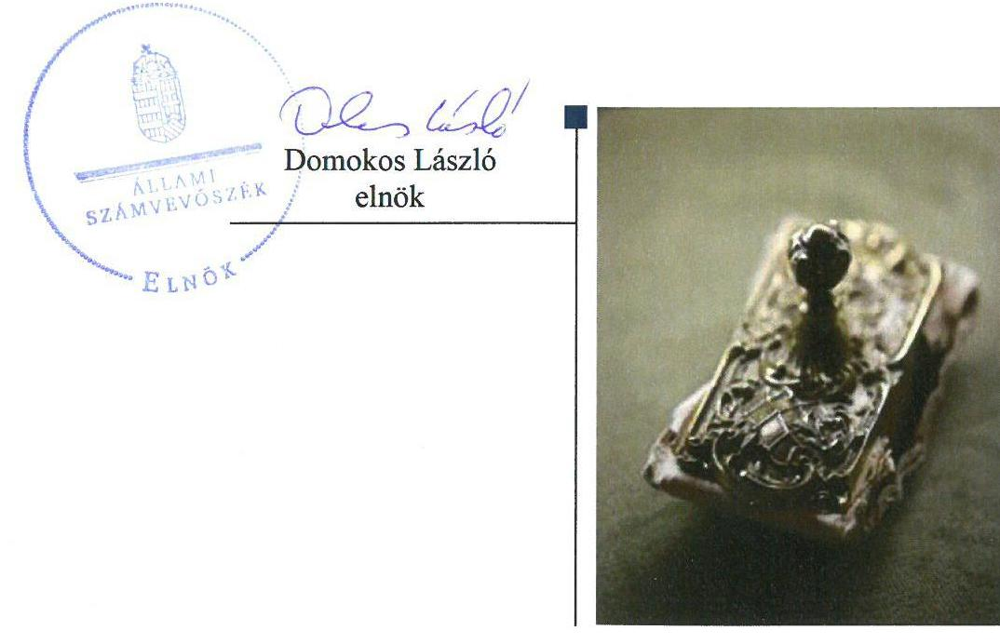
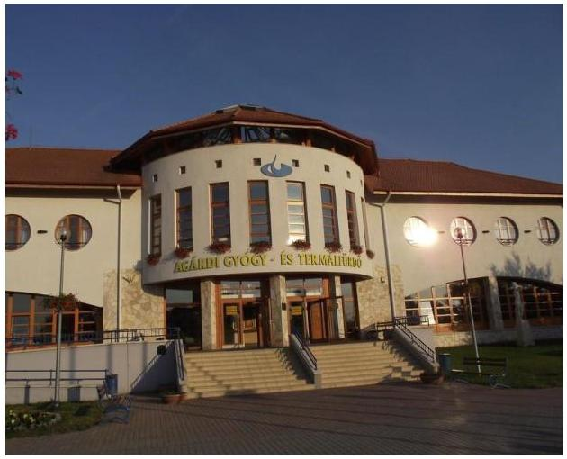
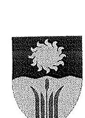
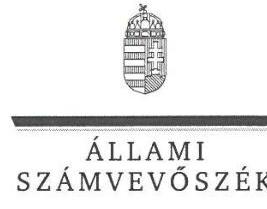
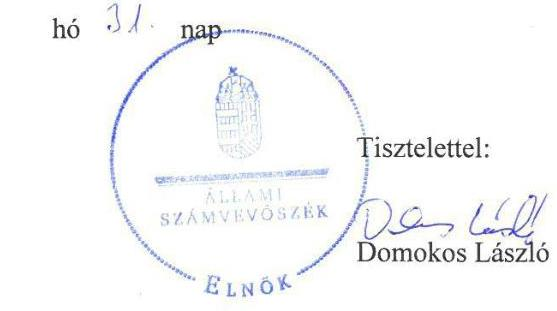
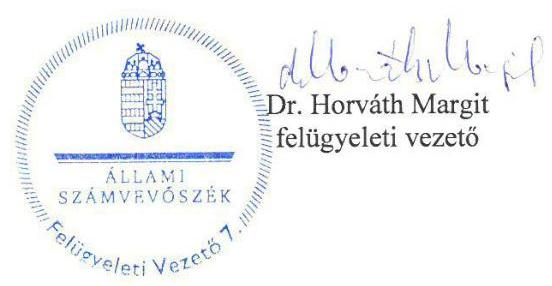

# Jelentés 

## Az önkormányzatok gazdasági társaságai

Az önkormányzatok többségi tulajdonában lévő gazdasági társaságok gazdálkodásának ellenőrzése - Agárdi Gyógy- és Termálfürdő Üzemeltető és Szolgáltató Zrt.
2018.

---

# Jelentés 

## Az önkormányzatok gazdasági társaságai

Az önkormányzatok többségi tulajdonában lévő gazdasági társaságok gazdálkodásának ellenőrzése - Agárdi Gyógy- és Termálfürdő Üzemeltető és Szolgáltató Zrt.
2018. Niuis hó 12. nap

---

# AZ ELLENŐRZÉST FELÜGYELTE:

DR. HORVÁTH MARGIT felügyeleti vezető

## AZ ELLENŐRZÉST VEZETTE ÉS A VÉGREHAJTÁSÁÉRT FELELŐS:

DORMÁN ISTVÁN ellenőrzésvezető

A PROGRAM ÖSSZEÁLLÍTÁSÁÉRT FELELŐS:

TÓTPÁL SZABOLCS osztályvezető

IKTATÓSZÁM: EL-0219-051/2018.

TÉMASZÁM: 2447

ELLENŐRZÉS-AZONOSÍTÓ SZÁM: V079377

Jelentéseink az Országgyűlés számítógépes hálózatán és az Interneta a www.asz.hu címen is olvashatóak.

---

# TARTALOMJEGYZÉK 

■ ÖSSZEGZÉS ..... 5
■ AZ ELLENŐRZÉS CÉLJA ..... 6
■ AZ ELLENŐRZÉS TERÜLETE ..... 7
■ AZ ELLENŐRZÉS HÁTTERE, INDOKOLTSÁGA ..... 8
■ A JELENTÉS LÉNYEGES KÉRDÉSKÖREI ..... 9
■ AZ ELLENŐRZÉS HATÓKÖRE ÉS MÓDSZEREI ..... 10
■ MEGÁLLAPÍTÁSOK ..... 12
■ JAVASLATOK ..... 15
■ MELLÉKLETEK ..... 17
I. sz. melléklet: Értelmező szótár ..... 17
II. sz. melléklet: Pénzügyi adatok ..... 18
■ FÜGGELÉK: ÉSZREVÉTELEK ..... 19
■ RÖVIDÍTÉSEK JEGYZÉKE ..... 25

---

.

---

# ÖSSZEGZÉS 

Gárdony Város Önkormányzat a kizárólagos tulajdonában álló Agárdi Gyógy- és Termálfürdő Üzemeltető és Szolgáltató Zrt. tekintetében a tulajdonosi joggyakorlás kereteit szabályszerűen alakította ki, tulajdonosi jogait szabályszerűen gyakorolta. A Társaság müködésének szabályozottsága, gazdálkodása, vagyongazdálkodása szabályszerű volt, a Társaság teljesítette a jogszabályokban előírt közzétételi kötelezettségét.

## Az ellenőrzés társadalmi indokoltsága

Magyarországon az önkormányzatok kötelező és önként vállalt feladataik vonatkozásában is egyre szélesebb körben alkalmazzák a költségvetésen kívüli feladatellátást, ezáltal - a nonprofit szervezetek mellett - az önkormányzati tulajdonú gazdasági társaságok is kiemelt fontosságú szerephez jutnak. Ezen belül kiemelt jelentőségú számos önkormányzati gazdasági társaság müködése abból a szempontból is, hogy gazdálkodásának egyes elemei befolyásolják az önkormányzati alszektor hiányát és az államadósságot.

Az Állami Számvevőszék Stratégiájában foglaltakkal összhangban az ÁSZ kiemelt célja, hogy a helyi önkormányzatok gazdálkodásában rejlő pénzügyi kockázatok feltárásával, az államháztartáson kívülre nyújtott költségvetési támogatások és ingyenes vagyonjuttatások, valamint az államháztartáson kívül múködő feladat-ellátó rendszerek ellenőrzéseivel hozzájáruljon ahhoz, hogy a közpénzeket az államháztartáson kívül múködő szervezetek is átlátható, rendezett módon használják fel. Ezen stratégiai célkitűzéssel összhangban került sor Gárdony Város Önkormányzat többségi tulajdonában álló Agárdi Gyógy- és Termálfürdő Üzemeltető és Szolgáltató Zrt. szabályozottságának, gazdálkodása és vagyongazdálkodási tevékenysége szabályszerűségének, valamint az Önkormányzat tulajdonosi joggyakorlása 2013-2016. évi szabályszerűségének ellenőrzésére.

## Főbb megállapítások, következtetések, javaslatok

Gárdony Város Önkormányzat a 2013-2016. években a kizárólagos tulajdonában álló Agárdi Gyógy- és Termálfürdő Üzemeltető és Szolgáltató Zrt. tekintetében a tulajdonosi joggyakorlás kereteit szabályszerűen alakította ki, és a tulajdonosi jogait szabályszerűen gyakorolta. A Társaság éves beszámolóinak elfogadásáról a felügyelőbizottság és a könyvvizsgáló írásbeli jelentései alapján az Alapító döntött, azonban a felügyelőbizottság ügyrendjét nem hagyta jóvá és a javadalmazási szabályzatot nem alkotta meg.

A Társaság gazdálkodásának szabályozottsága megfelelt a jogszabályi előírásoknak. A számviteli politika keretében elkészítendő szabályzatokat a törvényi előírásoknak megfelelően elkészítette. A müködés átláthatósága biztosított volt, közzétételi kötelezettségét teljesítette.

A Társaság gazdálkodása és a vagyongazdálkodása szabályszerű volt. A bevételek és ráfordítások, az értékcsökkenés elszámolása, az önköltség számítása a számvitelről szóló törvényben előírtaknak és a belső előírásoknak megfelelően történt. A számviteli nyilvántartásokat a Társaság a jogszabályi előírásoknak megfelelően vezette, az éves beszámolóit a számvitelről szóló törvényben előírtaknak megfelelő leltárakkal támasztotta alá. A fizikai közérzetet javító szolgáltatások díjának megállapítása szabályszerű volt, a fizetőképesség az ellenőrzött időszak végére javult.

---

# AZ ELLENŐRZÉS CÉLJA 

AZ ELLENŐRZÉS CÉLJA annak értékelése volt, hogy az önkormányzat vagyongazdálkodási tevékenysége során szabályszerűen gyakorolta-e tulajdonosi jogait; a gazdasági társaság szabályozottsága, gazdálkodása és vagyongazdálkodási tevékenysége, bevételeinek és ráfordításainak elszámolása megfelel-e a jogszabályi és tulajdonosi előírásoknak; a gazdasági társaság kötelezettségállománya jelent-e kockázatot a müködésre, valamint a gazdálkodás átláthatósága és elszámoltathatósága érdekében biztosítva volt-e a szolgáltatás dijának megalapozottsága szabályszerű önköltségszámítással. Az ellenőrzés célja volt továbbá annak megítélése, hogy a kormányzati szektorba sorolt önkormányzati tulajdonban (résztulajdonban) lévő gazdálkodó szervezetek gazdálkodásának a kormányzati szektor hiányára és az államadósságra befolyással bíró elemei a jogszabályi előírásoknak megfeleltek-e.

---

# **AZ ELLENŐRZÉS TERÜLETE**

## **Gárdony Város Önkormányzat és a kizárólagos tulajdonában álló Agárdi Gyógy- és Termálfürdő Üzemeltető és Szolgáltató Zrt.**

Gárdony, Fejér megye Gárdonyi járás üdülővárosa, a Velenceitavi üdülőkörzet egyik közigazgatási, idegenforgalmi központja. Gárdony lakónépessége 2016. december 31-én 10 855 fő volt. Gárdony Város Önkormányzat 12 tagú Képviselő-testületének^{1} munkáját négy állandó bizottság^{2} segítette.

Az Önkormányzat^{3} három gazdasági társaságban, köztük az Agárdi Gyógy- és Termálfürdő Üzemeltető és Szolgáltató Zrt.-ben rendelkezett 100%-os tulajdoni hányaddal. A Társaság^{4} 2000. december 12-én alakult, fő tevékenysége a fizikai közérzetet javító szolgáltatás volt. A Társaság tulajdonosi szerkezetében, a polgármester és a jegyző személyében az ellenőrzött időszakban változás nem történt.

A Társaság jegyzett tőkéje 101,6 M Ft volt, az ellenőrzött időszakban nem változott. A Társaság főbb gazdálkodási adatait a 2013-2016. években az 1. táblázat szemlélteti, vagyoni helyzetét bemutató főbb mérlegadatokat a II. számú melléklet részletezi.

1. táblázat

### **A TÁRSASÁG FŐBB GAZDÁLKODÁSI ADATAI 2013-2016. ÉVEKBEN**

|  Összeg (M Ft) | 2013. | 2014. | 2015. | 2016.  |
| --- | --- | --- | --- | --- |
|  Saját tőke | 197,3 | 218,7 | 269,7 | 341,3  |
|  Jegyzett tőke | 101,6 | 101,6 | 101,6 | 101,6  |
|  Mérlegfőösszeg | 662,7 | 650,5 | 561,1 | 575,2  |
|  Követelések | 316,4 | 267,8 | 212,4 | 163,9  |
|  Nettó árbevétel | 494,7 | 573,9 | 595,6 | 649,1  |
|  Mérleg szerinti eredmény | 18,9 | 21,4 | 51,1 | 71,5*  |
|  Fő | 2013. | 2014. | 2015. | 2016.  |
|  Foglalkoztatottak átlagos statisztikai lét-száma | 100 | 94 | 88 | 82  |

- Adózott eredmény

### **FÜRDŐBELÉPŐK SZÁMÁNAK ALAKULÁSA (DB)**

|  év | db  |
| --- | --- |
|  2013. | 233 443  |
|  2014. | 250 399  |
|  2015. | 251 562  |
|  2016. | 263 161  |

*Forrás: A Társaság éves üzleti jelentései*

A Társaság vezérigazgatójának személye és a könyvvizsgáló személye az ellenőrzött időszakban nem változott.

A Társaság közfeladatot nem látott el, vagyonkezelésbe vett vagyona nem volt, tevékenységét a saját vagyonával látta el. A Társaság 2013-2014. években 14%-os, 2015-2016. években 24%-os részesedéssel rendelkezett a Velencei-tavi Hulladékgazdálkodási Kft.-ben. A Társaság nem minősült kormányzati szektorba sorolt egyéb szervezetnek.

---

# AZ ELLENŐRZÉS HÁTTERE, INDOKOLTSÁGA 

## AZ ÖNKORMÁNYZATOK TÖBBSÉGI TULAJDONÁBAN ÁLLÓ GAZDASÁGI TÁRSASÁGOK ELLENŐR-

ZÉSE kiemelten fontos a vagyon megőrzése, megóvása érdekében, valamint a kormányzati szektor elszámolásaiban megjelenő önkormányzati tulajdonú gazdálkodó szervezetek esetében, amelyekkel szemben alapvető követelmény, hogy gazdálkodásuk, múködésük szabályszerű, az általuk szolgáltatott adatok minél megbízhatóbbak legyenek. A feladatellátás költségeinek, ráfordításainak alakulása a lakosság széles rétegét érinti.

Az Állami Számvevőszék ellenőrzései feltárhatják, hogy az önkormányzat a feladatellátásához rendelt vagyon múködtetését a tulajdonostól elvárható gondossággal végezte-e, a feladatot ellátó gazdasági társaság a létesítő okiratban, szolgáltatási szerződésben foglaltak betartásával biztosí-totta-e a feladat ellátását. Az ellenőrzés eredményeképp meghatározhatóvá válnak a költségvetési hiányt befolyásoló szervezetek kockázatai, lehetővé válik ezen kockázatok csökkentése. Az ellenőrzés rávilágíthat arra, hogy a gazdasági társaság a vagyon használatával biztosította-e a szolgáltatás folytatásának feltételeit, az önkormányzat tulajdonosi felügyelete hozzájárult-e a szabályszerű gazdálkodáshoz és feladatellátáshoz. A megállapítások alapján megfogalmazott számvevőszéki javaslatok hasznosítása elősegítheti a meglévő hibák megszüntetését. A jó gyakorlatok bemutatásával az ÁSZ ${ }^{5}$ hozzájárulhat a követendő megoldások megismertetéséhez, terjesztéséhez.

---

# A JELENTÉS LÉNYEGES KÉRDÉSKÖREI 

1. Az Önkormányzat tulajdonosi joggyakorlása szabályszerű volt-e?
2. A Társaság szabályozottsága, gazdálkodási tevékenysége, bevételeinek és ráfordításainak elszámolása, az önköltségszámítás és árképzés szabályszerű volt-e? A Társaság fizetőképessége biztositott volt-e a gazdálkodás során?
3. A Társaság vagyongazdálkodási tevékenysége szabályszerű volt-e?

---

# AZ ELLENŐRZÉS HATÓKÖRE ÉS MÓDSZEREI 

## Az ellenőrzés típusa

Megfelelőségi ellenőrzés.

## Az ellenőrzött időszak

2013. január 1-jétől 2016. december 31-ig tartó időszak.

## Az ellenőrzés tárgya

Gárdony Város Önkormányzat 100\%-os tulajdonában álló Agárdi Gyógy- és Termálfürdő Üzemeltető és Szolgáltató Zrt. feletti tulajdonosi joggyakorlása, valamint a Társaság gazdálkodásának szabályozottsága és szabályszerűsége.

Az ellenőrzés kiterjedt minden olyan körülményre és adatra, amely az ÁSZ jogszabályban meghatározott feladatainak teljesítéséhez, valamint a program végrehajtása folyamán felmerült újabb összefüggések feltárásához szükséges volt.

## Az ellenőrzött szervezet

- Gárdony Város Önkormányzat
- Agárdi Gyógy- és Termálfürdő Üzemeltető és Szolgáltató Zrt.

## Az ellenőrzés jogalapja

Az ellenőrzés jogszabályi alapját az ÁSZ tv. ${ }^{6}$ 1. § (3) bekezdése és 5. § (3)-(4)-(5) bekezdései képezték.

## Az ellenőrzés módszerei

Az ellenőrzést a nemzetközi standardokat irányadónak tekintve az ellenőrzési program ellenőrzési kérdései, az ellenőrzött időszakban hatályos jogszabályok, az ellenőrzés szakmai szabályok és módszertanok figyelembe vételével végeztük.

Az ellenőrzés ideje alatt az ellenőrzött szervezettel történő kapcsolattartást az ÁSZ Szervezeti és Müködési Szabályzatának vonatkozó előírásai alapján biztosítottuk.

---

Az ellenőrzési kérdések megválaszolásához szükséges bizonyítékok megszerzése a következő ellenőrzési eljárások alkalmazásával történt: megfigyelés, kérdésfeltevés (információkérés), összehasonlítás, valamint elemző eljárás. Az ellenőrzési bizonyítékként felhasználható adatforrások közé tartoztak egyrészt az ellenőrzési programban felsorolt adatforrások, másrészt adatforrás lehetett még minden - az ellenőrzés folyamán - feltárt, az ellenőrzés szempontjából információkat tartalmazó dokumentum. Az ellenőrzést a kérdésekre adott válaszok kiértékelésével, valamint a megjelölt adatforrások, a csatolt tanúsítványok felhasználásával, továbbá az adott időszakban hatályos jogszabályok figyelembe vételével kellett lefolytatni.

A bevételek és ráfordítások elszámolását, és a vagyonnyilvántartás terén a szabályszerű működést véletlen mintavétellel ellenőriztük. A mintavétellel ellenőrzött területek esetében minden egyes tétel vonatkozásában szabályszerűségre vonatkozó kérdéseket tettünk fel, amelyek a számviteli törvény, illetve a tulajdonosi követelményeknek és az ellenőrzött szervezet belső szabályozásai előírásainak betartására vonatkoztak. A jogszabályoknak és a belső előírásoknak megfelelőnek tekintettük az adott területet, amennyiben a minta ellenőrzésének eredménye alapján 95\%-os bizonyossággal a teljes sokaságban a hibaarány kisebb volt, mint 10\%, nem megfelelőnek értékeltük, ha a hibaarány a 10\%-ot meghaladta. Az anyagjellegú ráfordítások, az egyéb ráfordítások, a pénzügyi műveletek ráfordításait és a rendkívüli ráfordítások elszámolására és a vagyonnyilvántartásra vonatkozó véletlen mintavételt kockázati alapú kiválasztással egészítettük ki, amelynek során évente a három legnagyobb összegű tételt választottuk ki.

---

# 1. Az Önkormányzat tulajdonosi joggyakorlása szabályszerű volt-e? 

Összegző megállapítás Az Önkormányzat tulajdonosi joggyakorlása szabályszerű volt.

AZ ÖNKORMÁNYZAT rendelkezett a fejlesztési elképzeléseit rögzítő, a Képviselő-testület által jóváhagyott, az Mötv. ${ }^{7}$ szerinti gazdasági programmal ${ }^{8}$, és az Nvtv. ${ }^{9}$ szerinti közép- és hosszú távú vagyongazdálkodási tervvel ${ }^{10}$. A Társaságra vonatkozó tervek a gazdasági programban, a vagyongazdálkodási tervben szerepeltek.

Az Önkormányzat az Mötv.-nek megfelelően a működésének szabályait az önkormányzati SZMSZ-ben ${ }^{11}$ határozta meg. Az Önkormányzat a vagyonnal való gazdálkodás, a Társaság feletti tulajdonosi joggyakorlás szabályait a vagyonrendeletben ${ }^{12}$ és a Társaság Alapszabályában ${ }^{13}$ rögzítette.

A TULAJ DONOSI JOGGYAKORLÓ a Társaság Alapszabályában a Gt. ${ }^{14}$-ben és a Ptk. ${ }^{15}$-ban foglaltakkal összhangban előírta az $\mathrm{FB}^{16}$ megválasztását, feladatait, eljárásának szabályait, beszámolási kötelezettségét, valamint a javadalmazásával kapcsolatos főbb előírásokat. Az FB tagokat a Gt. és a Ptk. előírásainak megfelelően az Alapító választotta.

Az FB a Gt. 34.§ (4) bekezdésében és a Ptk. 3:122. § (3) bekezdésében előírtak ellenére nem rendelkezett az Alapító által jóváhagyott ügyrenddel. Az FB a Gt. és a Ptk. előírásainak megfelelően az előterjesztésekkel kapcsolatos álláspontját a Képviselő-testület ülésein ismertette. A Társaság éves beszámolóit az Alapító, mint a Társaság legfőbb szerve a Gt. és a Ptk. előírásainak megfelelően az FB és a könyvvizsgáló írásbeli jelentésének birtokában hagyta jóvá. Az Alapító a beszámoló elfogadásával egy időben az eredmény felosztásáról a Gt. és a Ptk. előírásainak megfelelően szabályszerűen döntött.

A Társaság vezető tisztségviselőinek, FB tagjainak, az Mt. ${ }^{17}$ 208. § hatálya alá tartozó munkavállalóinak javadalmazási, juttatási rendszerről szóló szabályzatot az Alapító a Taktv. ${ }^{18}$ 5. § (3) bekezdése előírásai ellenére nem alkotta meg. A személyi jellegú kifizetéseknél a Társaság vezető tisztségviselője díjazásának megállapításakor megsértették a Taktv. 6. § (1) bekezdése előírásait, mert annak összege meghaladta a mindenkori kötelező legkisebb munkabér hétszeresét.

Az Áht. ${ }^{19}$-ben biztosított belső ellenőrzés lehetőségével az Önkormányzat nem élt. A Társaság belső ellenőrt a szervezetét és múködését szabályozó SZMSZ ${ }^{20}$ szerint nem foglalkoztatott. A külső ellenőrző szervezetek ${ }^{21}$ ellenőrzései alapján a Társaságnak intézkedési kötelezettsége nem keletkezett.

---

# 2. A Társaság szabályozottsága, gazdálkodási tevékenysége, bevételeinek és ráfordításainak elszámolása, az önköltségszámítás és árképzés szabályszerű volt-e? A Társaság fizetőképessége biztosított volt-e a gazdálkodás során? 

Összegző megállapítás

A Társaság szabályozottsága, gazdálkodása megfelelt a jogszabályi előírásoknak. A Társaság bevételeinek és ráfordításainak elszámolása, valamint az önköltségszámítás és árképzés szabályszerű volt. Fizetőképessége az ellenőrzött időszak végére javult.

SZÁMVITELI POLITIKÁVAL a Társaság a Számv. tv. ${ }^{22}$-ben előírtak szerint rendelkezett, a Számviteli politika ${ }^{23}$ megfelelt a Számv. tv. előírásainak.

A Számviteli politika keretében elkészítendő szabályzatokkal - a Leltározási szabályzattal ${ }^{24}$, az Értékelési szabályzattal ${ }^{25}$, a Pénzkezelési szabályzattal ${ }^{26}$ - a Számv. tv. előírásainak megfelelően a Társaság rendelkezett. Az önköltségszámítás rendjére vonatkozó belső szabályzat elkészítése alól a Társaság a 2013-2014. években a Számv. tv. alapján mentesült, 2015-ben az Önköltség-számítási szabályzatot ${ }^{27}$ a Számv. tv. előírásainak megfelelően elkészítette. A Számlarendet ${ }^{28}$ és a Bizonylati rendet ${ }^{29}$ a Társaság a Számv. tv. előírásai szerint elkészítette.

BESZÁMOLÁSI KÖTELEZETTSÉGÉNEK a Társaság a Számv. tv. szerinti éves beszámolók elkészítésével, letétbe helyezésével és közzétételével. A tulajdonosi joggyakorló által előírt adatszolgáltatási és beszámolási kötelezettségének az üzleti tervek készítésével eleget tett. A választott könyvvizsgáló a Társaság éves beszámolóira minden évben korlátozás nélküli hitelesítő záradékot adott.

A KÖZÉRDEKŰ ADATOK megismerésére irányuló igények teljesítésének rendjét rögzítő szabályzatát ${ }^{30}$ a Társaság az Info tv. 30. § (6) bekezdése előírásai szerint elkészítette. A honlapján a közérdekű adatok és a közérdekből nyilvános adatok megismerhetőségét biztosította. A Társaság a tevékenységéhez kapcsolódóan a Taktv.-ben előírt közzétételi kötelezettségét teljesítette.

## A FIZIKAI KÖZÉRZETET JAVÍTÓ SZOLGÁLTATÁ-

SOK DIJAINAK megállapítására a jóváhagyott éves üzleti tervekben meghatározott árak alkalmazásával szabályszerűen került sor. A Társaság a szolgáltatások díjait 2015. évtől a Számv. tv. előírásainak megfelelően Ön-költség-számítási szabályzat alapján határozta meg.

A BEVÉTELEK ÉS A RÁFORDÍTÁSOK elszámolása szabályszerű volt. A könyvviteli elszámolást közvetlenül alátámasztó bizonylatok a Számv. tv. előírásainak megfelelően tartalmazták a könyvelés módjára, az érintett könyvviteli számlákra történő hivatkozást. A számviteli bizonylatokat a gazdasági esemény megtörténtének időpontjában, illetve időszakában állították ki.

---

A TÁRSASÁG kötelezettségállománya a 2013. évről a 2016. évre 235,0 M Ft-tal csökkent, ezen belül a rövid lejáratú kötelezettségei 79,2 M Ft-tal, a hosszú lejáratú kötelezettségei 155,8 M Ft-tal csökkentek. A Társaságnál 2016. évre a kötelezettségek határidőben, vagy 30 napon belül történő teljesítése biztosított volt. A követelésállomány csökkentésére a Társaság intézkedett, a követelések állománya a 2013. évi 316,4 M Ft-ról a 2016. évre 152,5 M Ft-tal csökkent.

# 3. A Társaság vagyongazdálkodási tevékenysége szabályszerű volt-e? 

## Összegző megállapítás

A Társaság vagyongazdálkodása megfelelt a jogszabályi előírásoknak.

A SAJÁT VAGYON nyilvántartása szabályszerű volt. A Társaság az éves beszámolókban és a számviteli nyilvántartásokban szereplő vagyonelemek állományát szabályszerűen, a Számv. tv.-ben előírtaknak megfelelő, - a Leltározási szabályzatban foglaltak alapján - elkészített leltárral támasztotta alá.

AZ ÉRTÉKCSÖKKENÉS elszámolása szabályszerű volt. A Számv. tv. előírásainak megfelelően az eszközök üzembe helyezését az értékcsökkenés elszámolását hitelt érdemlő módon dokumentálták. Az eszközök a tárgyévi leltárban megtalálhatóak voltak.

---

# JAVASLATOK 

Az ÁSZ tv. 33. § (1) bekezdésében foglaltak értelmében az ellenőrzött szervezet vezetője köteles a jelentésben foglalt megállapításokhoz kapcsolódó intézkedési tervet összeállítani és azt a jelentés kézhezvételétől számított 30 napon belül az ÁSZ részére megküldeni. Amennyiben az ellenőrzött szervezet vezetője nem küldi meg határidőben az intézkedési tervet, vagy továbbra sem elfogadható intézkedési tervet küld, az Állami Számvevőszék elnöke az ÁSZ tv. 33. § (3) bekezdése a) és b) pontjaiban foglaltakat érvényesítheti.

## Javaslataink célja a tulajdonosi joggyakorló Gárdony Város Önkormányzat tulajdonosi joggyakorlása kontrolljainak erősítése.

## Gárdony Város Önkormányzat polgármesterének

1. Intézkedjen, hogy a Társaság felügyelő bizottsága ügyrendjét a Ptk. előirásainak megfelelően az Alapitó jóváhagyja.
(1. sz. megállapítás 4. bekezdése 1. mondata alapján)
2. Intézkedjen annak érdekében, hogy az Alapitó a Társaság vezető tisztségviselői, a felügyelő bizottsági tagok, valamint az Mt. 208. §-ának hatálya alá eső munkavállalók javadalmazása, valamint a jogviszony megszünése esetére biztosított juttatások módjának, mértékének elveire, annak rendszerére vonatkozó javadalmazási szabályzatot megalkossa.
(1. sz. megállapítás 5. bekezdése 1. mondata alapján)
3. Intézkedjen, hogy az Alapitó a Társaság vezető tisztségviselőjének e jogviszonyára tekintettel megállapított dijazását a Taktv. előirásainak megfelelően határozza meg.
(1. sz. megállapítás 5. bekezdése 2. mondata alapján)

---

.

---

# MELLÉKLETEK 

- I. SZ. MELLÉKLET: ÉRTELMEZŐ SZÓTÁR
fizikai közérzetet javító szolgáltatások
gazdasági társaság
kormányzati szektorba sorolt egyéb szervezet
meghatározó befolyás
minősített többséget biztosító részesedés
a Központi Statisztikai Hivatal gazdasági tevékenységek egységes ágazati osztályozási rendszere (TEÁOR'08) alapján a 9604 fizikai közérzetet javító szolgáltatás körébe tartoznak a gyógyfürdő, termálfürdő, szauna, szolárium szolgáltatások, tevékenységek
Ptk. 3.88. § (1) bekezdése szerint „a gazdasági társaságok üzletszerű közös gazdasági tevékenység folytatására, a tagok vagyoni hozzájárulásával létrehozott, jogi személyiséggel rendelkező vállalkozások, amelyekben a tagok a nyereségből közösen részesednek, és a veszteséget közösen viselik".
az Áht. 3. § (2) és (3) bekezdésében foglaltakon kívül az Európai Közösséget létrehozó szerződéshez csatolt, a túlzott hiány esetén követendő eljárásról szóló jegyzőkönyv alkalmazásáról szóló 2009. május 25-i 479/2009/EK rendelet (a továbbiakban: 479/2009/EK rendelet) szerint a kormányzati szektorba sorolt szervezet (Áht. 1. § (12))
A Ptk. 8:2. § (2) bekezdése szerint „A befolyással rendelkező akkor rendelkezik egy jogi személyben meghatározó befolyással, ha annak tagja vagy részvényese, és
a) jogosult e jogi személy vezető tisztségviselői vagy felügyelő bizottsága tagjai többségének megválasztására, illetve visszahívására; vagy
b) a jogi személy más tagjai, illetve részvényesei a befolyással rendelkezővel kötött megállapodás alapján a befolyással rendelkezővel azonos tartalommal szavaznak, vagy a befolyással rendelkezőn keresztül gyakorolják szavazati jogukat, feltéve, hogy együtt a szavazatok több mint felével rendelkeznek."
A minősített befolyásszerző az ellenőrzött társaságban a szavazatok legalább hetvenöt százalékával rendelkezik. (Ptk. 3:324. §)
Nvtv. 1. § (2) bekezdése szerint többek között:
„az állam vagy a helyi önkormányzat kizárólagos tulajdonában álló dolgok, az a) pont hatálya alá nem tartozó, állam vagy a helyi önkormányzat tulajdonában lévő dolog,
az állam vagy a helyi önkormányzat tulajdonában lévő pénzügyi eszközök, továbbá az államot vagy a helyi önkormányzatot megillető társasági részesedések, az államot vagy a helyi önkormányzatot megillető bármely vagyoni értékkel rendelkező jogosultság, amelyet jogszabály vagyoni értékű jogként nevesít."
többségi befolyást biztosító részesedés
A Ptk. 8:2. § (1) bekezdése szerint „többségi befolyás az olyan kapcsolat, amelynek révén természetes személy vagy jogi személy (befolyással rendelkező) egy jogi személyben a szavazatok több mint felével vagy meghatározó befolyással rendelkezik."

---

# II. SZ. MELLÉKLET: PÉNZÜGYI ADATOK

Az Agárdi Gyógy- és Termálfürdő Üzemeltető és Szolgáltató Zrt. éves beszámolóinak adatai

|  EGYSZERÜSÍTETT ÉVES BESZÁMOLÓK ADATAI (MILLIÓ FORINT) |  |  |  |  |   |
| --- | --- | --- | --- | --- | --- |
|  Megnevezés | 2013.01.01. | 2013.12.31. | 2014.12.31. | 2015.12.31. | 2016.12.31.  |
|  Befektetett eszközök | 345,6 | 330,1 | 329,1 | 311,9 | 361,4  |
|  Immateriális javak | 0 | 0 | 0,7 | 0,5 | 0,2  |
|  Tárgyi eszközök | 344,1 | 328,6 | 326,8 | 296,2 | 345,9  |
|  Befektetett pénzügyi eszközök | 1,5 | 1,5 | 1,5 | 15,3 | 15,3  |
|  Forgóeszközök | 373,4 | 328,9 | 277,0 | 223,2 | 201,3  |
|  Készletek | 5,1 | 8,0 | 7,8 | 7,9 | 9,7  |
|  Követelések | 359,7 | 316,4 | 267,8 | 212,4 | 163,9  |
|  Értékpapírok | 0 | 0 | 0 | 0 | 0  |
|  Pénzeszközök | 8,6 | 4,6 | 1,5 | 3,0 | 27,7  |
|  Aktív időbeli elhatárolások | 0,9 | 3,7 | 44,4 | 26,0 | 12,5  |
|  Saját tőke | 178,4 | 197,3 | 218,7 | 269,8 | 341,3  |
|  Jegyzett tőke | 101,6 | 101,6 | 101,6 | 101,6 | 101,6  |
|  Töketartalék | 27,4 | 27,4 | 27,4 | 27,4 | 27,4  |
|  Eredménytartalék | 33,1 | 49,4 | 60,4 | 68,9 | 105,8  |
|  Lekötött tartalék | 0 | 0 | 8,0 | 20,8 | 35,0  |
|  Értékelési tartalék | 0 | 0 | 0 | 0 | 0  |
|  MSZE ${ }^{51}$ /adózott eredmény | 16,4 | 18,9 | 21,4 | 51,1 | 71,5  |
|  Céltartalék | 0 | 0 | 1,7 | 13,6 | 12,9  |
|  Kötelezettségek | 493,6 | 430,4 | 402,4 | 247,7 | 195,4  |
|  Hosszú lejáratú kötelezettségek | 212,5 | 257,2 | 202,6 | 148,0 | 101,4  |
|  Rövid lejáratú kötelezettségek | 281,1 | 173,2 | 199,8 | 99,7 | 94,0  |
|  Passzív időbeli elhatárolás | 47,9 | 35,0 | 27,7 | 30,0 | 25,6  |
|  MÉRLEG FŐÓSSZEG | 719,9 | 662,7 | 650,5 | 561,1 | 575,2  |
|   |  | 2015. | 2014. | 2015. | 2016.  |
|  Értékesítés nettó árbevétele | 471,1 | 494,7 | 573,9 | 595,6 | 649,1  |
|  Egyéb bevételek | 3,9 | 2,2 | 4,8 | 5,0 | 6,1  |
|  Anyagjellegú ráfordítások | 250,1 | 231,5 | 260,9 | 244,5 | 273,8  |
|  Személyi jellegú ráfordítások | 138,0 | 170,5 | 206,7 | 215,7 | 229,4  |
|  Értékcsökkenési leírás | 33,3 | 37,6 | 40,6 | 40,2 | 41,6  |
|  Egyéb ráfordítások | 30,5 | 24,8 | 37,6 | 36,0 | 30,1  |
|  Üzemi tevékenység eredménye | 23,1 | 32,5 | 32,9 | 64,2** | 80,3  |
|  Pénzügyi műveletek eredménye | $-9,1$ | $-16,6$ | $-14,0$ | $-10,9$ | $-6,7$  |
|  Rendkívüli eredmény | 3,3 | 3,3 | 3,3 | $0^{ }$ | 0  |
|  MSZE/adózott eredmény* | 16,4 | 18,9 | 21,4 | 51,1 | 71,5  |

[^0] [^0]: **2016. évi korrigált adat Forrás: a Társaság éves beszámolói 2013-2016

---

# FÜGGELÉK: ÉSZREVÉTELEK 

A jelentéstervezetet a Számvevőszék 15 napos észrevételezésre megküldte az ellenőrzött szervezetek vezetőinek az ÁSZ tv. 29. §* (1) bekezdése előírásának megfelelően.

Az Agárdi Gyógy- és Termálfürdő Üzemeltető és Szolgáltató Zrt. vezérigazgatója a jelentéstervezettel kapcsolatban nem tett észrevételt. Gárdony Város Önkormányzata polgármesterétől érkezett észrevételeket és azok kezeléséről szóló válaszlevelet a jelentéstervezet függeléke tartalmazza.

[^0]
[^0]:    * 29. § (1) Az Állami Számvevőszék az ellenőrzési megállapításait megküldi az ellenőrzött szervezet vezetőjének vagy az általa megbízott személynek, és annak, akinek személyes felelősségét állapította meg.
    (2) Az ellenőrzött szervezet vezetője és a felelősként megjelölt személy az ellenőrzés megállapításaira tizenöt napon belül írásban észrevételt tehet.
    (3) Az Állami Számvevőszék az észrevételre a beérkezésétől számított harminc napon belül írásban válaszol. A figyelembe nem vett észrevételeket köteles a jelentésben feltüntetni, és megindokolni, hogy azokat miért nem fogadta el.

---

# GÁRDONY VÁROS POLGÁRMESTERE

2483 Gárdony, Szabadság 02120-22, Fax: 22/355-122, Fax: 22/355-375

Szám: A2018/2931-2/2018.

Üi: Vargáné dr. Kállai Marianna
Tel: 06-22-570-100/236
E-mail: kallaimariann@gardony.hu

Állami Számvevőszék
Domokos László Elnök
1364 Budapest 4.
Pf. 54.

Tisztelt Elnök Úr!

Köszönettel megkaptuk EL-0489-011/2018. iktatószámú, az Agárdi Gyógy- és Termálfürdő Üzemeltető és Szolgáltató Zrt. ellenőrzéséről készült számvevőszéki jelentéstervezetüket.

Az ellenőrzés megállapításaival kapcsolatban az alábbi észrevételem van: az Agárdi Gyógy- és Termálfürdő Üzemeltető és Szolgáltató Zrt. Felügyelő Bizottsága a Gt. 34. § (4) bekezdésében és a Ptk. 3:122. § (3) bekezdésében előírtaknak megfelelően a vizsgált időszakban is rendelkezett az Alapító által jóváhagyott ügyrenddel.

Az ügyrend a vizsgált időszakon kívül, 2007-ben került elfogadásra, és „A tulajdonos joggyakorlótól bekérendő dokumentumok (2013-2016)” című felhívásuk alapján úgy ítéltük, hogy a becsatolt nyilatkozatok elegendőek.

Mellékelten küldöm elfogadását bizonyító jegyzőkönyv hitelesített kivonatát, az alapító elfogadásra vonatkozó határozatának kivonatát, és a hitelesített ügyrendet.

Kérem, hogy észrevételemet elfogadni szíveskedjen!

Gárdony, 2018. április 25.

Tóth István
Polgármester

---

ELNÖK

Ikt.szám: EL-0489-016/2018.

# Tóth István úr 

polgármester

Gárdony Város Önkormányzat

## Gárdony

## Tisztelt Polgármester Úr!

Köszönettel vettem „Az önkormányzatok gazdasági társaságai - Az önkormányzatok többségi tulajdonában lévő gazdasági társaságok gazdálkodásának ellenörzése - Agárdi Gyógy- és Termálfürdő Üzemeltető és Szolgáltató Zrt." címmel készített számvevőszéki jelentéstervezetre megküldött észrevételét.
Az Állami Számvevőszék észrevételre vonatkozó álláspontját a felügyeleti vezető által készített részletes tájékoztatás tartalmazza, amelyet levelemhez mellékeltem.
Tájékoztatom Polgármester urat, hogy az Állami Számvevőszék a figyelembe nem vett észrevételeket az Állami Számvevőszékről szóló 2011. évi LXVI. törvény 29. § (3) bekezdésében előírtak szerint köteles a jelentésében feltüntetni és megindokolni, hogy azokat miért nem fogadta el.

Budapest, 2018.

Melléklet: Tájékoztatás az észrevételek kezeléséről

---

# Tájékoztatás az észrevételek kezeléséről 

Megköszönöm Polgármester úrnak „Az önkormányzatok gazdasági társaságai - Az önkormányzatok többségi tulajdonában lévő gazdasági társaságok gazdálkodásának ellenörzése - Agárdi Gyógy- és Termálfürdő Üzemeltető és Szolgáltató Zrt." címmel készített jelentéstervezetre tett észrevételét. Az észrevétel kezeléséről az alábbi tájékoztatást adom.

Az észrevétel a jelentéstervezet „Főbb megállapítások, következtetések, javaslatok" cím alatti első bekezdés második mondatát, az 1. számú megállapítás 4. bekezdésének első mondatát, valamint az 1. számú javaslatot érinti:
„Az FB a Gt. 34. § (4) bekezdésében és a Ptk. 3:122. § (3) bekezdésében elöirtak ellenére nem rendelkezett az Alapitó által jóváhagyott ügyrenddel."

Polgármester úr a megállapításra a következő észrevételt tette:
„Az Agárdi Gyógy- és Termálfürdő Üzemeltető és Szolgáltató Zrt. Felügyelő Bizottsága a Gt. 34. § (4) bekezdésében és a Ptk. 3:122. § (3) bekezdésében elöirtaknak megfelelően a vizsgált időszakban is rendelkezett az Alapító által jóváhagyott ügyrenddel.
Az ügyrend a vizsgált időszakon kivül, 2007-ben került elfogadásra, és „A tulajdonosi joggyakorlótól bekérendő dokumentumok (2013-2016), cimü felhívásuk alapján úgy itéltük meg, hogy a becsatolt nyilatkozatok elegendőek."

Polgármester úr az észrevétele mellé megküldte a Képviselő-testület 2007. december 18-i ülésének hitelesített jegyzőkönyvi kivonatát, a 409/2007. (XII. 18.) számú határozatát az Agárdi Gyógy- és Termálfürdő Üzemeltető és Szolgáltató Zrt. Felügyelő Bizottsági ügyrendjének elfogadásáról, valamint a Felügyelő Bizottság Ügyrendjét.

Polgármester úr észrevételében leírtak alapján a jelentéstervezet „Főbb megállapítások, következtetések, javaslatok" cím alatti első bekezdés második mondatát, az 1. számú megállapítás 4. bekezdésének első mondatát, valamint az 1. számú javaslatot nem módosítom az alábbiak miatt:

Az észrevétel helytállósága az ellenőrzés részére megküldött dokumentumok, a teljességi és hitelességi nyilatkozat alapján nem áll fenn.

Az ÁSZ az ellenőrzést az EL-0047-001/2017. iktatószámú ellenőrzési program, az ellenőrzött időszakban hatályos jogszabályok, az ellenőrzés szakmai szabályok és módszertanok figyelembe vételével végezte. Az Önkormányzat az EL-0219-014/2017. iktatószámú kiértesítő levélben kapott tájékoztatást arról, hogy az ellenőrzés a mellékelt ellenőrzési program alapján kerül lefolytatásra. Az ÁSZ az EL-0219-019/2017. iktatószámú, 2017. november 10-én kelt adatkérő levele 2. számú mellékletének 11. pontjában kérte a tulajdonosi joggyakorlás rendjére vonatkozó szabályzatokat, ügyrendeket. Polgármester úr a 2017. november 20-án kelt nyilatkozatában kijelentette, hogy ,, a

---

tulajdonosi joggyakorlás rendjére vonatkozó szabályzatok, ügyrendek címü dokumentum Gárdony Város Önkormányzata esetében nem releváns". Az ÁSZ a megállapításait az Önkormányzat által az előírt adatszolgáltatási határidőre az ellenőrzés rendelkezésére bocsátott dokumentumok, adatok, információk alapján tette meg, a megtett nyilatkozattal ellentétben, utólagosan megküldött dokumentumok valódiságáról az ellenőrzést végzők nem tudtak meggyőződni, ezért azok ellenőrzési dokumentumként nem vehetők figyelembe.

Budapest, 2018. 05. hó 31, nap

---

.

---

# RÖVIDÍTÉSEK JEGYZÉKE 

${ }^{1}$ Képviselő-testület
${ }^{2}$ négy állandó bizottság
${ }^{3}$ Önkormányzat, Alapító, tulajdonosi joggyakorló
${ }^{4}$ Társaság
${ }^{5}$ ÁSZ
${ }^{6}$ ÁSZ tv.
${ }^{7}$ Mótv.
${ }^{8}$ gazdasági program
${ }^{9}$ Nvtv.
${ }^{10}$ vagyongazdálkodási terv
${ }^{11}$ önkormányzati SZMSZ
${ }^{12}$ vagyonrendelet
${ }^{13}$ Alapszabály
${ }^{14} \mathrm{Gt}$.
${ }^{15}$ Ptk.
${ }^{16} \mathrm{FB}$
${ }^{17} \mathrm{Mt}$.
${ }^{18}$ Taktv.
${ }^{19}$ Áht.
${ }^{20}$ Agárdi Zrt. SZMSZ
${ }^{21}$ Külső ellenőrző szervezetek

Gárdony Város Önkormányzat Képviselő-testülete
Pénzügyi és Városfejlesztési, Ügyrendi, Egészségügyi és Szociális Bizottság, illetve az Idegenforgalmi, Oktatási és Kulturális Bizottság.

Gárdony Város Önkormányzat
Agárdi Gyógy- és Termálfürdő Üzemeltető és Szolgáltató Zrt. (Agárdi Zrt.)
Állami Számvevőszék
2011. évi LXVI. törvény az Állami Számvevőszékről, hatályos 2011. július 1-jétől
2011. évi CLXXXIX. törvény - Magyarország helyi önkormányzatairól

Gárdony Város Önkormányzata gazdasági programja, Gárdony Város Önkormányzat Képviselő-testülete 79/2011. (IV.13.) számú határozatával elfogadott 2010-2014. éves önkormányzati gazdasági program, Gárdony Város Önkormányzat Képviselő-testülete 111/2015. (IV.15.) számú határozatával elfogadott a 2015-2019. évi önkormányzati gazdasági program
2011. évi CXCVI. törvény a nemzeti vagyonról

Az Önkormányzat Gárdony Város Önkormányzat középtávú vagyongazdálkodási tervét 2013-2017. évre vonatkozóan, a hosszú távú vagyongazdálkodási tervét 2013-2022. évre vonatkozóan a 18/2013. (II.13.) számú határozatában fogadta el.
Gárdony Város Önkormányzat Képviselő-testületének rendelete a szervezeti és működési szabályzatról, Gárdony Város Önkormányzat Képviselő-testületének (GVÖK) 13/2007. (IV.25.) számú rendelete a Szervezeti és Müködési szabályzatról, kihirdetve 2007. április 25én. Módosította a GVÖK 19/2008. (VII.3.), az 1/2009. (I.21.), a 34/2008. (XI.25.), a 15/2010. (X.13.), a 16/2010. (XI.4.), a 7/2011. (III.31.) a 16/2011. (VII.28.), az 1/2012. (I.26.) és az 5/2012. (II.23.) számú önkormányzati rendelet; Gárdony Város Önkormányzat 2/2014. (III.13.) önkormányzati rendelete Gárdony Város Önkormányzat Szervezeti és Müködési Szabályzatáról, kihirdetve 2014. március 14-én. Módosította a 14/2014. (XII.11.), a 10/2016. (V.6.), a 19/2016. (IX.30.) számú önkormányzati rendelet és az 52/2016. (II.24.) a 81/2016. (II. 30.), a 406/2016. (XI.30.) számú képviselő-testületi határozat

Gárdony Város Önkormányzat Képviselő-testületének 24/2004. (V.26.) számú rendelete a város vagyonáról, a vagyontárgyak feletti tulajdonosi jogok gyakorlásáról
Agárdi Zrt. Alapszabálya, 2012. április 25.; 2013. január 15.; 2013. június 5.; 2013. július 1.; 2014. december 18.; 2016. március 25.
2006. évi IV. törvény a gazdasági társaságokról (hatályos 2014. március 14-ig)
a Polgári Törvénykönyvről szóló 2013. évi V. törvény
Felügyelő Bizottság
2012. évi I. törvény a munka törvénykönyvéről, hatályos 2012. július 1-jétől
2009. évi CXXII. törvény a köztulajdonban álló gazdasági társaságok takarékosabb müködéséről
2011. évi CXCV. törvény az államháztartásról

Agárdi Gyógy- és Termálfürdő Zrt. szervezeti és működési szabályzata, hatályos: 2013. január 1-jétől-május 31-ig; hatályos: 2013. június 1-jétől október 31-ig; hatályos: 2013. november 1-jétől 2015. május 31-ig; hatályos: 2015. június 1-jétől szeptember 30-ig; hatályos: 2015. október 1-jétől
Nemzeti Adó- és Vámhivatal, Országos Egészségbiztosítási Pénztár Közép-dunántúli Területi Hivatala

---

${ }^{22}$ Számv. tv.
${ }^{23}$ Számviteli politika
${ }^{24}$ Leltározási szabályzat
${ }^{25}$ Értékelési szabályzat
${ }^{26}$ Pénzkezelési szabályzat
${ }^{27}$ Önköltség számítási szabályzat
${ }^{28}$ Számlarend
${ }^{31}$ MSZE
2000. évi C. törvény a számvitelről

Agárdi Zrt. Számviteli politikája, hatályos: 2013. január 1-től 2013. december 31-ig; hatályos: 2014. január 1-től 2014. december 31-ig; hatályos: 2015. január 1-től 2015. december 31-ig; hatályos: 2016. január 1-től
Agárdi Zrt. Leltározási szabályzata, hatályos: 2012. január 1-től
Agárdi Zrt. Értékelési szabályzata, hatályos: 2012.január 1-től
Agárdi Zrt. pénzkezelési szabályzata, hatályos: 2012. január 1-től 2013. március 28-ig; hatályos: 2013. március 29-től
Agárdi Zrt. Önköltség számítási szabályzata, hatályos: 2015. február 20-tól
Agárdi Zrt. Számlarendje, hatályos: 2013. január 1-től 2013. december 31-ig; hatályos: 2014. január 1-től 2014. december 31-ig; hatályos: 2015. január 1-től 2015. december 31ig; hatályos: 2016. január 1-től
Agárdi Zrt. Bizonylati rendje, hatályos 2009. január 1-től
irányuló igények teljesítésének rendjét rögzítő szabályzat Szabályzat a közérdekú adatok közzétételi kötelezettségének teljesítéséről, hatályos: 2009. október 1-jétől 2013. május 31-ig; hatályos: 2013. június 1-jétől
mérleg szerinti eredmény

---

ÁLLAMI SZÁMVEVŐSZÉK
1052 Budapest, Apáczai Csere János utca 10.
Levélcím: 1364 Budapest 4. Pf. 54
Telefon: +36 14849100 Telefax: +36 14849200
www.asz.hu