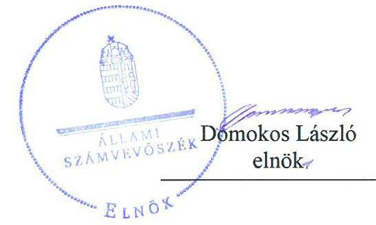
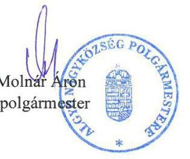
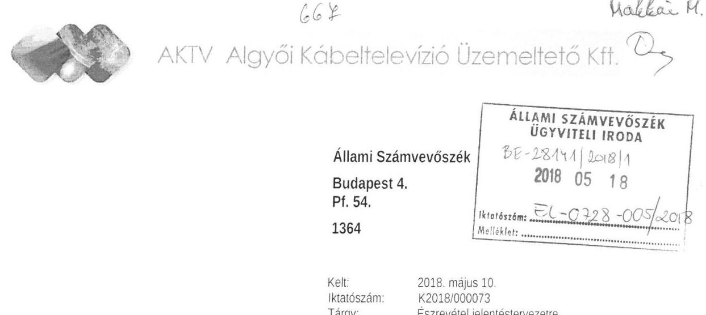
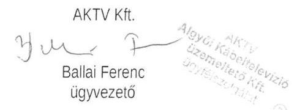
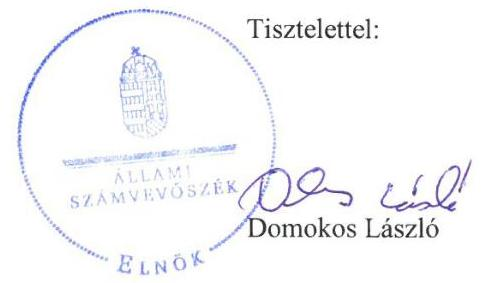

# Jelentés 

## Az önkormányzatok gazdasági társaságai

Az önkormányzatok többségi tulajdonában lévő gazdasági társaságok gazdálkodásának ellenőrzése - AKTV Algyői Kábeltelevízió Üzemeltető Kft.

2018.

---

# Jelentés 

## Az önkormányzatok gazdasági társaságai

Az önkormányzatok többségi tulajdonában lévő gazdasági társaságok gazdálkodásának ellenőrzése - AKTV Algyői Kábeltelevízió Üzemeltető Kft.
2018. 

---

# AZ ELLENŐRZÉST FELÜGYELTE:

## MAKKAI MÁRIA felügyeleti vezető

## AZ ELLENŐRZÉST VEZETTE ÉS A VÉGREHAJTÁSÁÉRT FELELŐS:

### SALI SÁNDORNÉ ellenőrzésvezető

## A PROGRAM ÖSSZEÁLLÍTÁSÁÉRT FELELŐS:

### TÓTPÁL SZABOLCS osztályvezető

---

**IKTATÓSZÁM:** EL-0163-068/2018.

**TÉMASZÁM:** 2447

**ELLENŐRZÉS-AZONOSÍTÓ SZÁM:** V079353

---

Jelentéseink az Országgyűlés számítógépes hálózatán és az Interneten a www.asz.hu címen is olvashatóak.

---

# TARTALOMJEGYZÉK 

■ ÖSSZEGZÉS ..... 5
■ AZ ELLENŐRZÉS CÉLJA ..... 6
■ AZ ELLENŐRZÉS TERÜLETE ..... 7
■ AZ ELLENŐRZÉS HÁTTERE, INDOKOLTSÁGA ..... 8
■ A JELENTÉS LÉNYEGES KÉRDÉSKÖREI ..... 9
■ AZ ELLENŐRZÉS HATÓKÖRE ÉS MÓDSZEREI ..... 10
■ MEGÁLLAPÍTÁSOK ..... 12
■ JAVASLATOK ..... 14
■ MELLÉKLETEK ..... 15
I. sz. melléklet: A Társaság főbb mérlegadatai ..... 15
■ FÜGGELÉK: ÉSZREVÉTELEK ..... 17
■ RÖVIDÍTÉSEK JEGYZÉKE ..... 25

---

.

---

# ÖSSZEGZÉS 

Az AKTV Algyői Kábeltelevízió Üzemeltető Kft. szabályozott volt, azonban a gazdálkodása, vagyongazdálkodása nem volt szabályszerű, így az elszámoltathatóság nem volt biztosított.

## Az ellenőrzés társadalmi indokoltsága

Az Állami Számvevőszék kiemelt célja, hogy a helyi önkormányzatok gazdálkodásában rejlő pénzügyi kockázatok feltárásával, az államháztartáson kívülre nyújtott költségvetési támogatások és ingyenes vagyonjuttatások, valamint az államháztartáson kívül működő feladatellátó rendszerek ellenőrzéseivel hozzájáruljon ahhoz, hogy a közpénzeket az államháztartáson kívül működő szervezetek is átlátható, rendezett módon használják fel.

Az Állami Számvevőszék céljaival és a társadalmi igénnyel összhangban, valamint a gazdasági társaságok kiemelt fontosságú szerepe miatt került sor az AKTV Algyői Kábeltelevízió Üzemeltető Korlátolt Felelősségű Társaság ellenőrzésére.

## Főbb megállapítások, következtetések, javaslatok

Algyő Nagyközség Önkormányzat a tulajdonosi jogokat az AKTV Algyői Kábeltelevízió Üzemeltető Kft. felett szabályszerűen gyakorolta. Az Alapító a felügyelő bizottság és a könyvvizsgálói jelentések birtokában határozatban fogadta el a Társaság egyszerűsített éves beszámolóit, valamint szabályszerűen döntött az eredmény felosztásáról.

Az AKTV Algyői Kábeltelevízió Üzemeltető Kft. szabályozott volt. A Társaság a jogszabályban előírt számviteli szabályzatokkal rendelkezett, azonban a Számviteli politikát a jogszabályi változás ellenére nem módosította. A gazdálkodása, vagyongazdálkodási tevékenysége nem volt szabályszerű. Az AKTV Algyői Kábeltelevízió Üzemeltető Kft. egyszerűsített éves beszámoló mérlegeit leltárral nem támasztotta alá, így azok nem mutattak megbízható és valós képet a vagyoni és pénzügyi helyzetről. A Társaságnál az értékcsökkenési leírás, valamint a vagyonnyilvántartás nem volt szabályszerű, mert a törvényi előírás ellenére az eszközök üzembe helyezését nem dokumentálták hitelt érdemlő módon. A személyi jellegű ráfordítások elszámolása nem volt szabályszerű, mert az elszámolást nem támasztotta alá számviteli bizonylat. A bevételek, az anyagjellegű ráfordítások, valamint az egyéb, a rendkívüli és a pénzügyi műveletek ráfordításainak elszámolása szabályszerű volt.

A megállapítások alapján az Állami Számvevőszék Algyő Nagyközség Önkormányzat polgármesterének egy javaslatot, az AKTV Algyői Kábeltelevízió Üzemeltető Korlátolt Felelősségű Társaság ügyvezetőjének három javaslatot fogalmazott meg.

---

# AZ ELLENŐRZÉS CÉLJA 

Az ellenőrzés célja annak értékelése volt, hogy az önkormányzat vagyongazdálkodási tevékenysége során szabályszerűen gyakorolta-e tulajdonosi jogait; a gazdasági társaság szabályozottsága, gazdálkodása és vagyongazdálkodási tevékenysége, bevételeinek és ráfordításainak elszámolása megfelelt-e a jogszabályi és tulajdonosi előírásoknak.

---

# AZ ELLENŐRZÉS TERÜLETE 

## Algyő Nagyközség Önkormányzat és a kizárólagos tulajdonában lévő AKTV Algyői Kábeltelevízió Üzemeltető Kft.

Az AKTV Algyő Kábeltelevízió Üzemeltető Korlátolt Felelősségű Társaságot az ellenőrzött időszakot megelőzően, kizárólagos tulajdonosként alapította Algyő Nagyközség Önkormányzat. A Társaság ${ }^{1} 3,0 \mathrm{M} \mathrm{Ft}^{2}$ jegyzett tőkével alakult, mely az alapítás óta nem változott.

A Társaság közfeladatot nem látott el, feladata volt a helyi kábeltelevíziós hálózat üzemeltetése, valamint internet és telefonszolgáltatás nyújtása.

A Társaság saját tulajdonú vagyontárgyaival gazdálkodott, működését saját forrásból biztosította.

A Társaság a Számv. tv. ${ }^{3}$ 155. § (3) bekezdésben foglalt előírás alapján könyvvizsgálatra nem volt kötelezett, azonban az Alapító előírta számára. Az önköltségszámítási szabályzat készítése alól a Számv. tv. 14. § (6) bekezdése alapján mentesült a Társaság, más gazdasági társaságban tulajdoni részesedéssel nem rendelkezett, valamint nem minősült kormányzati szektorba sorolt egyéb szervezetnek.

Az Önkormányzat ${ }^{4}$ esetében a polgármester ${ }^{5}$ és a jegyző ${ }^{6}$ személye egyszer változott.

A Társaság ügyvezetőjének személye az ellenőrzött időszakban nem változott. A foglalkoztatottak átlagos statisztikai létszáma a 2013. és a 2016. évben is 2 fő volt.

---

# AZ ELLENŐRZÉS HÁTTERE, INDOKOLTSÁGA 

AZ ÖNKORMÁNYZATOK TÖBBSÉGI TULAJDONÁBAN ÁLLÓ GAZDASÁGI TÁRSASÁGOK ellenőrzése kiemelten fontos a vagyon megőrzése, megóvása érdekében alapvető követelmény, hogy gazdálkodásuk, működésük szabályszerű, az általuk szolgáltatott adatok minél megbízhatóbbak legyenek. A feladatellátás költségeinek, ráfordításainak alakulása a lakosság széles rétegét érinti.

ELLENŐRZÉSEINK FELTÁRHATJÁK, hogy az önkormányzat a feladatellátásához rendelt vagyon működtetését a tulajdonostól elvárható gondossággal végezte-e, a feladatot ellátó gazdasági társaság a létesítő okiratban, szolgáltatási szerződésben foglaltak betartásával biztosította-e a feladat ellátását. Az ellenőrzés rávilágíthat arra, hogy a gazdasági társaság a vagyon használatával biztosította-e a szolgáltatás folytatásának feltételeit, az önkormányzat tulajdonosi felügyelete hozzájárult-e a szabályszerű gazdálkodáshoz és feladatellátáshoz. A megállapítások alapján megfogalmazott számvevőszéki javaslatok hasznosítása elősegítheti a meglévő hibák megszüntetését. A jó gyakorlatok bemutatásával az ÁSZ ${ }^{7}$ hozzájárulhat a követendő megoldások megismertetéséhez, terjesztéséhez.

---

# A JELENTÉS LÉNYEGES KÉRDÉSKÖREI 

1. Az Önkormányzat tulajdonosi joggyakorlása szabályszerű volt-e?
2. A Társaság szabályozottsága, gazdálkodása, vagyongazdálkodása szabályszerű volt-e?

---

# AZ ELLENŐRZÉS HATÓKÖRE ÉS MÓDSZEREI 

## Az ellenőrzés típusa

Megfelelőségi ellenőrzés.

## Az ellenőrzött időszak

2013. január 1-jétől 2016. december 31-ig tartó időszak.

## Az ellenőrzés tárgya

Algyő Nagyközség Önkormányzatnak az AKTV Algyői Kábeltelevízió Üzemeltető Korlátolt Felelősségű Társaság feletti tulajdonosi joggyakorlása, valamint az AKTV Algyői Kábeltelevízió Üzemeltető Korlátolt Felelősségű Társaság gazdálkodásának szabályozottsága és szabályszerűsége.

Az ellenőrzés kiterjedt minden olyan körülményre és adatra, amely az ÁSZ jogszabályban meghatározott feladatainak teljesítéséhez, valamint a program végrehajtása folyamán felmerült újabb összefüggések feltárásához szükséges volt.

## Az ellenőrzött szervezet

Algyő Nagyközség Önkormányzat, valamint az AKTV Algyői Kábeltelevízió Üzemeltető Korlátolt Felelősségű Társaság.

## Az ellenőrzés jogalapja

Az ellenőrzés jogszabályi alapját az az Állami Számvevőszékről szóló 2011. évi LXVI. törvény 1. § (3) bekezdése és 5. § (3)-(5) bekezdései képezték.

## Az ellenőrzés módszerei

Az ellenőrzést a nemzetközi standardokat irányadónak tekintve az ellenőrzési program ellenőrzési kérdései, az ellenőrzött időszakban hatályos jogszabályok, az ellenőrzés szakmai szabályok és módszertanok figyelembevételével végeztük.

Az ellenőrzés ideje alatt az ellenőrzött szervezettel történő kapcsolattartást az ÁSZ Szervezeti és Működési Szabályzatának vonatkozó előírásai alapján biztosítottuk.

---

Az ellenőrzési kérdések megválaszolásához szükséges bizonyítékok megszerzése a következő ellenőrzési eljárások alkalmazásával történt: megfigyelés, kérdésfeltevés (információkérés), összehasonlítás, valamint elemző eljárás. Az ellenőrzési bizonyítékként felhasználható adatforrások közé tartoztak egyrészt az ellenőrzési programban felsorolt adatforrások, másrészt adatforrás volt még minden - az ellenőrzés folyamán - feltárt, az ellenőrzés szempontjából információkat tartalmazó dokumentum.

Az ellenőrzést a kérdésekre adott válaszok kiértékelésével, valamint a megjelölt adatforrások, a csatolt tanúsítványok felhasználásával, továbbá az adott időszakban hatályos jogszabályok figyelembevételével folytattuk le.

A gazdasági társaság bevételei és ráfordításai, ezeken belül az értékcsökkenés, valamint a vagyonnyilvántartás szabályszerűségének megítéléséhez a bevételeket és a ráfordításokat, a tárgyi eszközök állományváltozásait tartalmazó adott évi főkönyvi kivonat adatbázisát vettük alapul. A minta kiválasztása során véletlen mintavételt alkalmaztunk évenkénti, elemszámmal arányos rétegezéssel a teljes időszakra vonatkozóan. A minta alapján a sokaságban előforduló hibaarányt becsültük. „Szabályszerűnek" értékeltünk egy ellenőrzött területet, amennyiben 95\%-os bizonyossággal a teljes sokaságban a hibaarány legfeljebb 10\%, „Nem szabályszerűnek", amennyiben 10\%-nál magasabb arányt képviselt. A mintavételt megelőzően az anyagjellegű ráfordítások, valamint a tárgyi-eszköz növekedési tételei sokaságból évente sokaságonként kiemeltük a három legnagyobb összegű tételt annak biztosítására, hogy az ellenőrzés az egyszerű véletlen mintavétel mellett a legnagyobb értékű tételek ellenőrzésére biztosan kiterjedjen.

---

# 1. Az Önkormányzat tulajdonosi joggyakorlása szabályszerű volt-e? 

## Összegző megállapítás

A tulajdonosi joggyakorlás szabályszerű volt.
A tulajdonosi joggyakorlás szabályait az Önkormányzat ${ }^{8}$ a Gt. ${ }^{9}$ és a Ptk. ${ }^{10}$ előírásaival összhangban lévő Alapító okiratban ${ }^{11}$, valamint SZMSZ ${ }_{1,2}{ }^{12}$-ben határozta meg. A Társaság feletti tulajdonosi jogokat az Alapító okiratban foglaltaknak megfelelően az Alapító ${ }^{13}$ szabályszerűen gyakorolta.

Az Alapító a Gt., a Ptk. és a Taktv. ${ }^{14}$ előírásainak megfelelően háromtagú $\mathrm{FB}^{15}$ létrehozásáról döntött. Az FB rendelkezett jóváhagyott ügyrenddel ${ }^{16}$. Az FB a Társaság éves beszámolóira vonatkozó írásbeli jelentéseit a Gt.-ben és a Ptk.-ban foglaltakkal összhangban készítette el. Az Alapító az FB írásbeli jelentésének, valamint a könyvvizsgálói jelentések birtokában, határozatban fogadta el a Társaság egyszerűsített éves beszámolóit, valamint szabályszerűen döntött az eredmény felosztásáról.

Az Alapító nem alkotta meg a Taktv. 5. § (3) bekezdésében előírtak ellenére a vezető tisztségviselők, felügyelőbizottsági tagok, valamint az Mt. 208. §-ának hatálya alá eső munkavállalók javadalmazása, valamint a jogviszony megszűnése esetére biztosított juttatások módjának, mértékének elveire, annak rendszerére vonatkozó szabályzatot.

Az Önkormányzat a 2015. évben jogi átvilágítást végeztetett megbízási szerződés alapján a Társaságnál. Az ellenőrzés megállapításaira 2016. évben intézkedési terv készült.

## 2. A Társaság szabályozottsága, gazdálkodása, vagyongazdálkodása szabályszerű volt-e?

## Összegző megállapítás

2.1. számú megállapítás

A Társaság szabályozottsága megfelelt a jogszabályi előírásoknak.
A Számv. tv. előírásainak megfelelően a Társaság rendelkezett Számviteli politikával ${ }^{17}$ és ennek keretében elkészített Pénzkezelési ${ }_{1,2}{ }^{18}$, Leltározási ${ }^{19}$, Értékelési szabályzattal ${ }^{20}$, valamint Számlarenddel ${ }^{21}$ és annak részét képező számlatükörrel.

A Társaság a Számviteli politikán a Számv. tv. 14. § (11) bekezdése ellenére a Számv. tv. 3. § (3) bekezdés 3. pontja szerinti jelentős hiba összeghatárának 2013. január 1-jei változását (500,0 M Ft-ról 1,0 M Ft-ra csökkenése) nem vezette át. A Számviteli politika a 2015. július 4-én hatályba lépett törvény változásnak megfelelően nem módosult, azaz nem vezette át a szabályozáson a Számv. tv. 70. § (2) bekezdésében, a 86. §-ában, a

---

# 2.2. számú megállapítás 

### 2.3. számú megállapítás

2.3. számú megállapítás
88. § (4a) és (10) bekezdésében foglalt, mérleg szerinti eredmény fogalmának megszűnésével, a kivételes nagyságú vagy előfordulású bevételek, ráfordítások fogalmának bevezetésével, valamint a rendkívüli tételek fogalmának megszűnésével összefüggő változásokat.

A Társaság ügyvezetője az Info tv. ${ }^{22}$ előírását betartva belső adatvédelmi felelőst nevezett ki és elkészítette a belső adatvédelmi és adatbiztonsági szabályzatot.

## A Társaság vagyongazdálkodási tevékenysége nem volt szabályszerű.

A Társaság az egyszerűsített éves beszámolók mérlegtételeit, az eszközeit és forrásait leltárakkal nem támasztotta alá a Számv. tv. 69. § (1) bekezdésében előírtak ellenére. A Társaság a mennyiségben nyilvántartott eszközök esetében a mennyiségi felvétellel történő leltározást elvégezte, azonban - a készletek kivételével - a leltár nem tartalmazta a mérleg fordulónapján meglévő eszközeinek a Számv. tv. 69. § (1) bekezdésében előírtak szerinti értékét.

## A Társaságnál az értékcsökkenési leírás, valamint a vagyonnyilvántartás és a személyi jellegű ráfordítások elszámolása nem volt szabályszerű.

Az értékcsökkenési leírás elszámolása, valamint a vagyonnyilvántartás nem volt szabályszerű, mert a Számv. tv. 52. § (2) bekezdésében előírtak ellenére az eszközök üzembe helyezését nem dokumentálták hitelt érdemlő módon.

A személyi jellegű ráfordítások elszámolása
 nem volt szabályszerű, mert a Számv. tv. 165. § (2) bekezdésében előírtakat megsértve bizonylatok nélkül jegyeztek be adatokat a számviteli nyilvántartásokba. Az ügyvezető esetében a 2013. január 1. és 2015. február 28. közötti időszakban nem volt munkaszerződés, továbbá az alkalmazott esetében a kifizetést alátámasztó bizonylat hiányzott a 2013. január 1. – 2014. január 1-ig terjedő időszakra.

A bevételek, valamint az anyagjellegű ráfordítások, az egyéb, a rendkívüli és a pénzügyi műveletek ráfordításainak elszámolása szabályszerű volt, a Számv. tv.-ben és a belső szabályozásban előírtaknak megfelelt. A mintavétellel ellenőrzött területek értékelését az 1. ábra mutatja.

---

# JAVASLATOK 

Az ÁSZ tv. 33. § (1) bekezdésében foglaltak értelmében az ellenőrzött szervezet vezetője köteles a jelentésben foglalt megállapításokhoz kapcsolódó intézkedési tervet összeállítani és azt a jelentés kézhezvételétől számított 30 napon belül az ÁSZ részére megküldeni. Amennyiben az ellenőrzött szervezet vezetője nem küldi meg határidőben az intézkedési tervet, vagy továbbra sem elfogadható intézkedési tervet küld, az Állami Számvevőszék elnöke az ÁSZ tv. 33. § (3) bekezdése a) és b) pontjaiban foglaltakat érvényesítheti.

## Algyő Nagyközség polgármesterének

1. Kezdeményezze a vezető tisztségviselők, felügyelőbizottsági tagok, valamint az Mt. 208. §-ának hatálya alá eső munkavállalók javadalmazása, valamint a jogviszony megszünése esetére biztosított juttatások módjának, mértékének elveire, annak rendszerére vonatkozó szabályzat megalkotását.
(1. számú megállapítás 3. bekezdése alapján)

## az AKTV Algyői Kábeltelevízió Üzemeltető Kft. ügyvezetőjének

1. Intézkedjen a számviteli politika módosításáról, hogy az feleljen meg a hatályos Számv. tv. előírásainak.
(2.1. számú megállapítás 2. bekezdése alapján)
2. Intézkedjen a Számv. tv. előírásainak megfelelően az egyszerűsített éves beszámolók mérlegtételeit alátámasztó leltár elkészítéséről.
(2.2. számú megállapítás 1. bekezdése alapján)
3. Intézkedjen az eszközök üzembe helyezésének Számv. tv. előírásainak megfelelő dokumentálásáról, valamint az értékcsökkenés és a személyi jellegű ráfordítások jogszabályi előírásoknak megfelelő elszámolásáról.
(2.3. számú megállapítás 1-2. bekezdései alapján)

---

# MELLÉKLETEK

I. SZ. MELLÉKLET: A TÁRSASÁG FŐBB MÉRLEGADATAI

|  AZ AKTV ALGYŐI KÁBELTELEVÍZIÓ ÜZEMELTETŐ KORLÁTOLT FELELŐSSÉGŰ TÁRSASÁG FŐBB ADATAI (M Ft) |  |  |  |   |
| --- | --- | --- | --- | --- |
|  Megnevezés / időszak | 2013.12.31. | 2014.12.31. | 2015.12.31. | 2016.12.31.  |
|  Értékesítés nettó árbevétele | 59,4 | 59,9 | 63,8 | 58,9  |
|  Mérlegfőösszeg | 129,9 | 126,3 | 124,1 | 119,4  |
|  Mérleg szerinti eredmény | 2,6 | 7,2 | 3,4 | 1,2  |
|  Saját tőke összege | 84,2 | 91,5 | 94,9 | 96,2  |
|  Követelések | 2,4 | 1,6 | 3,1 | 6,3  |
|  Kötelezettségek | 43,2 | 34,7 | 29,1 | 23,1  |
|  ebből: hosszú lejáratú kötelezettség | 23,6 | 16,4 | 7,6 | 0  |
|  Foglalkoztatottak átlagos állományi létszáma (fő) | 2 | 2 | 2 | 2  |

---

.

---

# FÜGGELÉK: ÉSZREVÉTELEK 

A jelentéstervezetet a Számvevőszék 15 napos észrevételezésre megküldte az ellenőrzött szervezetek vezetőinek az ÁSZ tv. 29. § (1) bekezdése előírásának megfelelően.

Az ÁSZ a jelentéstervezetet észrevételezésre megküldte Algyő Nagyközség polgármesterének és az AKTV Algyői Kábeltelevízió Üzemeltető Kft. ügyvezetőjének.
Algyő Nagyközség polgármesterének nemleges észrevételét és az AKTV Algyői Kábeltelevízió Üzemeltető Kft. ügyvezetőjének észrevételét és az arra adott választ a függelék alább tartalmazza.

[^0]
[^0]:    * 29. § (1) Az Állami Számvevőszék az ellenőrzési megállapításait megküldi az ellenőrzött szervezet vezetőjének vagy az általa megbízott személynek, és annak, akinek személyes felelősségét állapította meg.
    (2) Az ellenőrzött szervezet vezetője és a felelősként megjelölt személy az ellenőrzés megállapításaira tizenöt napon belül írásban észrevételt tehet.
    (3) Az Állami Számvevőszék az észrevételre a beérkezésétől számított harminc napon belül írásban válaszol. A figyelembe nem vett észrevételeket köteles a jelentésben feltüntetni, és megindokolni, hogy azokat miért nem fogadta el.

---

# Algyő Nagyközség 

Polgármesterétől
6750 Algyő, Kastélykert u. 40.
Tel: 62/517-517
E-mail: pm@algyo.hu
Szám: ALP/2100/2018.

Tárgy: AKTV Kft. ellenőrzéséről Állami Számvevőszéki jelentéstervezet

Hiv. szám: EL-0728-002/2018.
Felügyeleti vezető: Makkai Mária

## ÁLLAMI SZÁMVEVŐSZÉK

1052 Budapest,
Apáczai Csere János utca 10.
(1364 Budapest 4. Pf. 54.)

## Domokos László   Állami Számvevőszék Elnöke

## Tisztelt Elnök Úr!

Algyő Nagyközség Önkormányzat (6750 Algyő, Kastélykert u. 40.) képviseletében, az Állami Számvevőszékről szóló 2011. évi LXVI. törvény 29. § (2) bekezdésében biztosított hatáskörömmel élve nyilatkozom, hogy „Az önkormányzatok többségi tulajdonában lévő gazdasági társaságok ellenőrzése - AKTV Algyői Kábeltelevízió Üzemeltető Kft." címmel készített számvevőszéki jelentéstervezettel kapcsolatban észrevételt nem kívánok tenni, a jelentéstervezetben foglalt, Önkormányzatra vonatkozó megállapításokat elfogadom.

Algyő, 2018. május 3.

---

# Domokos László részére 

## Tisztelt Domokos László!

Az AKTV Algyői Kábeltelevízió Üzemeltető Kft. gazdálkodásának ellenőrzéséről készített számvevőszéki jelentéstervezet megállapításaihoz, javaslataihoz az alábbi észrevételeket kívánom tenni.

1) A 2.1. számú megállapítás második bekezdésében felsorolják azokat a hiányosságokat, amelyeket a Számviteli politikán nem vezetett át a Társaság a Számv. tv. 2013. január 1-jei és a 2015. július 4-ei módosulását követően.

Az adatbekérés keretében a Számviteli politikával együtt megküldtük Önöknek az „AKTV KFT Változások a Számviteli politikában 2016. január 1-től 6750 Algyő Kastélykert utca 49. 11908342-2-06" dokumentumot, amelyben az alábbi módosítások szerepelnek:
„Mérleg és eredménykimutatás formájának változása [Szt. 27.§ (3a) (3b); 30.§ (2a); 70.§ (1),(2); 2,4,5 mellékletek]
Az osztalékfizetés szabályainak változása miatt megszűnik a mérleg szerinti eredmény, így az eredménykimutatás az adózott eredmény kategóriánál ér véget. Ebből az következik, hogy a nyereségfelosztás rendszere is megváltozik, és az adózott eredmény kerül a saját tőkébe.
A kiegészítő melléklet változása [Szt. 14.§ (4); 82.§ (3) c ; 88.§ (10); 90.§ (4) ; 91.§ (a); 177.§ (45)]
2016. január 1-jétől a kiegészítő mellékletben szereplő, a mérleghez és eredménykimutatáshoz kapcsolódó adatokat, magyarázatokat abban a sorrendben kell bemutatni, ahogy azok a tételek a mérlegben és eredménykimutatásban szerepelnek.
A társaság számviteli politikájában, meg kell határozni, hogy mit tekint a társaság kivételes nagyságrendűnek, és a kiegészítő mellékletben a kivételes nagyságú, vagy előfordulású bevételeket és ráfordításokat be kell mutatni."
A jelentéstervezetben rögzített, fentieken kívüli szabályozási hiányosság nem befolyásolta a hatályos Számv. tv.-i előírások alkalmazását. A 2016. évi eredménykimutatás a jogszabályi előírásoknak megfelelően nem 

---

tartalmazott rendkívüli tételeket. Jelentős hiba megállapítására az ellenőrzött években nem került sor, így az értékhatár csökkentés szabályozási hiányossága a gyakorlatban hiba elkövetését nem vonta maga után. Kérem a rész megállapítás keretében azon jogszabályi helyekre történő hivatkozások javítását, amelyek a Számviteli politika módosításunkban átvezetésre került, azaz törölni a 70. § (2), valamint a 88. § (10) bekezdésekre való hivatkozásokat.
2) A 2.2. pont megállapítás utolsó mondatának felülvizsgálatát kérem.

A külső olvasó számára azon megállapítás, hogy a Számv. tv. 69. § (1) bekezdésében előírtak szerinti értéket a leltár nem tartalmazta nem érthető, továbbá az ebből levont következtetést ez a megállapítás nem támasztja alá. Pontosabban a hivatkozott jogszabályi hely, értéket nem ír elő, továbbá a megállapítás nem alapozza meg azon következtetést, hogy a gazdálkodás, vagyongazdálkodási tevékenysége nem volt szabályszerű. A leltározásra vonatkozó megállapítás másik következtetése, hogy a mérlegek leltárral nem voltak alátámasztva ugyancsak nem megalapozott, ennek pontosítását a lentiekben kérem.
3) A 2.3. pont első bekezdése tartalmazza, hogy az eszközök üzembe helyezését nem dokumentálta a Társaság hitelt érdemlően.

A hivatkozott jogszabályi hely konkrétan nem határozza meg, hogy mi tekintendő hitelt érdemlőnek. Az üzembe helyezésre kötelezően előírt dokumentum nincs. Mivel konkrétan nem jelölték meg a jelentéstervezetben, hogy melyik mintatételre vonatkozik a megállapítás, azt feltételezzük, hogy a három legnagyobb összegű tételre. Azokhoz azonban csatoltuk az általunk használt üzembe helyezési jegyzőkönyveket.
Kérem a megállapítás felülvizsgálatát.
4) A 2.3. pont második bekezdésében az a megfogalmazás van, hogy bizonylatok nélkül jegyeztünk be adatokat a számviteli nyilvántartásba.

Konkrétan nem rögzítették a jelentéstervezetben, hogy ez milyen adatra vonatkozik. A 233 db mintatétel teljes körű dokumentálására kettő nap állt rendelkezésünkre, ezért a személyi jellegű ráfordítások esetében a vegyes bizonylatok feltöltése lemaradt, amelynek pótlására nem volt lehetőségünk.
Szeretném megjegyezni, hogy sajnálattal tapasztaltuk, hogy az Állami Számvevőszék ellenőrzése során egyeztetésre, hiánypótlásra, hiba kiküszöbölésére nem volt lehetőség. A 2011. évi LXVI. törvény az Állami Számvevőszékről 25. § (3) bekezdésében biztosított helyszíni ellenőrzéssel nem éltek, amely során az ellenőrzési megállapítás alátámasztása biztosított lett volna. Továbbá a 32. § (5) bekezdésében foglalt egyeztetési lehetőséggel sem éltek felénk.

Észrevételeim figyelembe vétele esetén kérem a „Főbb megállapítások, következtetések, javaslatok részben

1. a második bekezdés második mondatának pontosítását: A Társaság a jogszabályban előírt számviteli szabályzatokkal rendelkezett. A második mondatrész elhagyását;
2. „A gazdálkodása, vagyongazdálkodási tevékenysége nem volt szabályszerű." mondatot megalapozott részmegállapítás nem támasztja alá. Felülvizsgálatát kérem.
3. Az éves beszámoló mérlegeit leltárral nem támasztotta alá megállapítás pontosítását kérem, hogy a rendelkezésre bocsátott dokumentumok alapján. Az adatszolgáltatással kapcsolatos véleményemet fentebb kifejtettem.
4. az 5. mondat törlését kérem az észrevételem alapján.

A Javaslatokra vonatkozó észrevételem:
A 3. javaslat pontosítását kérem:

---

# Függelék: Észrevételek 

## AKTV Algyői Kábeltelevízió Üzemeltető Kft.

Intézkedjen a személyi jellegű ráfordítások jogszabályi előírásoknak megfelelő elszámolásáról.
A leírtakat figyelembe véve tisztelettel kérem Elnök urat, hogy vegye figyelembe észrevételeimet a jelentés véglegezése során.

Tisztelettel:

---

# Ballai Ferenc úr 

ügyvezető

AKTV Algyői Kábeltelevízió Üzemeltető Kft.

## Algyő

## Tisztelt Ügyvezető Úr!

„Az önkormányzatok többségi tulajdonában lévő gazdasági társaságok gazdálkodásának ellenőrzése - AKTV Algyői Kábeltelevízió Üzemeltető Kft." címmel készített számvevőszéki jelentéstervezetre tett észrevételét köszönettel megkaptam.

Az Állami Számvevőszék észrevételre vonatkozó álláspontjáról a felügyeleti vezető által készített részletes tájékoztatást mellékelten megküldöm.

Tájékoztatom Ügyvezető urat, hogy a számvevőszéki jelentésben - az Állami Számvevőszékről szóló 2011. évi LXVI. törvény 29. § (3) bekezdése alapján - a figyelembe nem vett észrevételeket szerepeltetjük, annak indoklásával, hogy azokat az Állami Számvevőszék miért nem fogadta el.

Budapest, 2018. 05. hó 29. nap

Melléklet: Tájékoztatás az észrevétel kezeléséről

---

# Tájékoztatás   az észrevétel kezeléséről 

„Az önkormányzatok többségi tulajdonában lévő gazdasági társaságok gazdálkodásának ellenőrzése - AKTV Algyői Kábeltelevízió Üzemeltető Kft." című jelentéstervezetre 2018. május 18-án érkezett észrevételt áttekintettük, annak kezelésével kapcsolatban a következő tájékoztatást adom.

## 1. A 2.1. számú megállapítás második bekezdésével kapcsolatban megfogalmazott észrevételre adott válasz

Az észrevétel szerint az adatbekérés keretében megküldésre került az „AKTV KFT Változások a Számviteli politikában 2016. január 1-től" című dokumentum, amely a Számviteli politikát érintő módosításokat tartalmazza. Az észrevétel tartalmazza, hogy a további, ÁSZ által megállapított szabályozási hiányosság nem befolyásolta a gyakorlatot.
A dokumentumok ismételt felülvizsgálata alapján tájékoztatom, hogy az ÁSZ az észrevételben hivatkozott, beküldött dokumentumot az ellenőrzés során értékelte, a dokumentum egy tájékoztatás a Számv. tv. változásairól, de nem tekinthető a Számviteli politika módosításának.
Az észrevétel további része - mely szerint a szabályozási hiányosságok nem befolyásolták a gyakorlatot - az ÁSZ megállapítását megerősíti, az érintett megállapítás a szabályozási oldalról tényszerűen rögzíti a hiányosságokat. Mindezek alapján az észrevételt nem fogadjuk el,
 az ÁSZ megállapítása helytálló, a jelentéstervezet módosítása nem indokolt.

## 2. A 2.2. számú megállapítás utolsó mondatával kapcsolatban megfogalmazott észrevételre adott válasz

Az észrevétel kifejti, hogy nem érthető az ÁSZ megállapítása, amely szerint „a leltár nem tartalmazta a mérleg fordulónapján meglévő eszközeinek a Számv. tv. 69. § (1) bekezdésében előírtak szerinti értékét". Továbbá vitatja az ÁSZ gazdálkodásra, vagyongazdálkodásra és a mérleg leltárral való alátámasztottságára vonatkozó következtetéseit.
Tájékoztatom Ügyvezető urat, hogy a Számv. tv. előírásának, fogalomrendszerének az ÁSZ megállapítása teljes mértékben megfelel és egyértelműen rögzíti a hiányosságot. A Számv tv. 69. § (1) bekezdése szerint a leltár ,,tételesen, ellenőrizhető módon tartalmazza a vállalkozónak a mérleg fordulónapján meglévő eszközeit és forrásait mennyiségben és értékben".
A jelentéstervezet következtetéseivel kapcsolatban tájékoztatom, hogy az ÁSZ következtetései helytállóak. Tájékoztatom Ügyvezető urat, hogy a Számv. tv. a valódiság alapelvét a következőképpen rögzíti „a beszámolóban szereplő tételeknek a valóságban is megtalálhatóknak, bizonyíthatóknak, külvilág által is megállapíthatóknak kell lenniük". E követelmény érvényesülésének elengedhetetlen feltétele, hogy a mérleg tételeit alátámasztó leltár rendelkezésre álljon. Amennyiben egy gazdálkodó szervezet - gazdálkodásáról, vagyongazdálkodásáról szóló - számviteli beszámolója tekintetében a valódiság elve maradéktalanul nem teljesül, akkor a gazdálkodó szervezet gazdálkodása, vagyongazdálkodása nem lehet szabályszerű.

---

# 3. A 2.3. számú megállapítás első bekezdésével kapcsolatban megfogalmazott észrevételre adott válasz 

Az ÁSZ érintett megállapítása szerint „a Számv. tv. 52. § (2) bekezdésében előírtak ellenére az eszközök üzembe helyezését nem dokumentálták hitelt érdemlő módon".
Az észrevétel szerint „a jogszabály konkrétan nem határozza meg, hogy mi tekintendő hitelt érdemlőnek", tartalmazza továbbá hogy a Társaság által használt üzembe helyezési jegyzőkönyvet a három legnagyobb tételre vonatkozóan csatolták.
Tájékoztatom, hogy az ÁSZ megállapításával érintett tételek statisztikai mintavétellel kerültek kiválasztásra, a megállapítás ebből adódóan nem az egyes tételekre, hanem a teljes sokaság vonatkozásában értelmezhető. A Számv. tv. konkrét formai előírást valóban nem tartalmaz az üzembe helyezés dokumentálására, azonban az üzembe helyezés dokumentuma számviteli bizonylatnak minősül, amelyre a törvény - az észrevétellel ellentétben - részletes előírásokat tartalmaz, amelynek érvényesülnie kell. A dokumentumok ismételt felülvizsgálata alapján tájékoztatom, hogy az ÁSZ megállapítása tényszerű, - statisztikailag a sokaságra kivetítve - nem állt rendelkezésre hiteles dokumentum, amely az üzembe helyezést alátámasztja. Mindezek alapján az észrevételt nem fogadjuk el az ÁSZ megállapítása helytálló, annak módosítása nem indokolt.

## 4. A 2.3. számú megállapítás második bekezdésével kapcsolatban megfogalmazott észrevételre adott válasz

Az észrevétel megerősíti az ÁSZ megállapítását és rögzíti, hogy a személyi jellegű ráfordítások esetében nem bocsátották az ÁSZ rendelkezésére az azokat alátámasztó bizonylatok egy részét.
Tájékoztatom, hogy az ÁSZ megállapításai minden esetben az ellenőrzött szervezet által az arra nyitva álló határidőn belül rendelkezésre bocsátott dokumentumokon alapulnak. Az adatszolgáltatással összefüggésben Ügyvezető úr „Teljességi és hitelesség nyilatkozat"-ot állított ki, amelyben rögzítette, hogy az adatszolgáltatás teljes körű és hiteles. Az észrevételt nem fogadjuk el, a jelentéstervezet módosítása nem indokolt.

## 5. A jelentéstervezet főbb megállapításaival és az ügyvezetőnek címzett 3. számú javaslattal kapcsolatban megfogalmazott észrevételre adott válasz

Tájékoztatom, hogy az előzőekben részletezett tájékoztatások miatt az észrevételt a főbb megállapítások és a javaslat vonatkozásában nem fogadjuk el, a jelentéstervezet módosítása nem indokolt.

Budapest, 2018. 05. hó ${ }^{23}$ nap

Makkai Mária
felügyeleti vezető

---

# RÖVIDÍTÉSEK JEGYZÉKE 

${ }^{1}$ Társaság
${ }^{2} \mathrm{M} F \mathrm{~Ft}$
${ }^{3}$ Számv. tv.
${ }^{4}$ Önkormányzat
${ }^{5}$ polgármester
${ }^{6}$ jegyző
${ }^{7}$ ÁSZ
${ }^{8}$ Önkormányzat
${ }^{9}$ Gt.
${ }^{10}$ Ptk.
${ }^{11}$ Alapító okirat
${ }^{12} \mathrm{SZMSZ}_{1,2}$
${ }^{13}$ Alapító
${ }^{14}$ Taktv.
${ }^{15} \mathrm{FB}$
${ }^{16}$ Ügyrend
${ }^{17}$ Számviteli politika
${ }^{18}$ Pénzkezelési szabályzat ${ }_{1}$
Pénzkezelési szabályzat ${ }_{2}$
${ }^{19}$ Leltározási szabályzat
${ }^{20}$ Értékelési szabályzat
${ }^{21}$ Számlarend
${ }^{22}$ Info tv.

AKTV Algyői Kábeltelevízió Üzemeltető Kft.
millió forint
A számvitelről szóló 2000. évi C. törvény (hatályos: 2001. január 1-jétől)
Algyő Nagyközség Önkormányzat
Algyő nagyközség Polgármestere
Algyő nagyközség Jegyzője
Állami Számvevőszék
Algyő Nagyközség Önkormányzat
A gazdasági társaságokról szóló 2006. évi IV. törvény (hatályos: 2014. március 14-éig)
A Polgári Törvénykönyvről szóló 2013. évi V. törvény (hatályos: 2014. március 15-től)
az AKTV Kft. 2010. október 27-én kelt módosítástól az AKTV Algyő Kábeltelevízió Üzemeltető Kft. Alapító okirata és annak módosításai
SZMSZ1: Algyő Nagyközség Önkormányzat Szervezeti és Működési Szabályzata (hatályos: 2003. január 27-étől 2014. november 5-éig)
SZMSZ2: Algyő Nagyközség Önkormányzat Szervezeti és Működési Szabályzata (hatályos: 2014. november 6-ától)
Algyő Nagyközség Önkormányzat/Algyő Nagyközség Önkormányzatnak Képviselőtestülete
A köztulajdonban álló gazdasági társaságok takarékosabb működéséről szóló 2009. évi CXXII. törvény (hatályos: 2009. december 4-étől)
A Társaság Felügyelő Bizottsága
92/2015. (II. 04.) Kt. határozattal jóváhagyott Ügyrend
A Társaság számviteli politikája (hatályos: 2003. március 31-étől)
A Társaság házipénztár kezelési szabályzata (hatályos: 2003. március 31-étől)
A Társaság pénzkezelési szabályzata (hatályos: 2015. szeptember 11-étől)
A Társaság leltározási szabályzat (hatályos: 2012. január 1-jétől)
A Társaság értékelési szabályzata (hatályos: 2003. március 31-étől)
AKTV Algyői Kábeltelevízió Üzemeltető Kft. Számlarendje (hatályos: 2012. január 1-jétől)
Az információs önrendelkezési jogról és az információszabadságról szóló 2011. évi CXII. törvény (hatályos: 2011. július 27-étől)

---

ÁLLAMI SZÁMVEVŐSZÉK
1052 Budapest, Apáczai Csere János utca 10.
Levélcím: 1364 Budapest 4. Pf. 54
Telefon: +36 14849100 Telefax: +36 14849200
www.asz.hu
